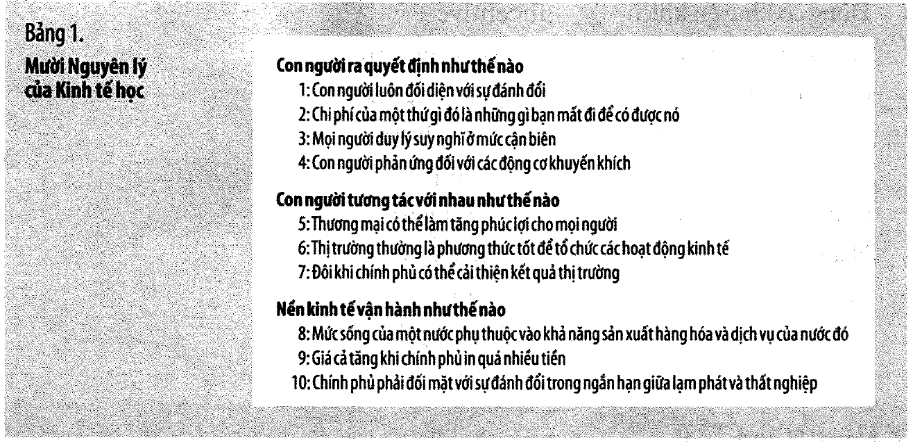
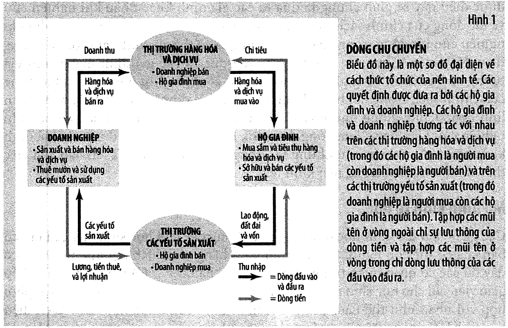
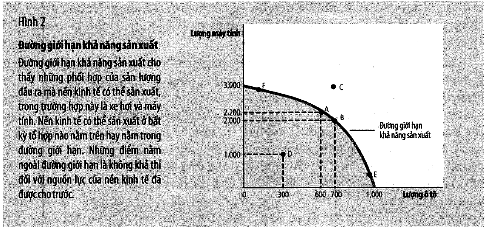
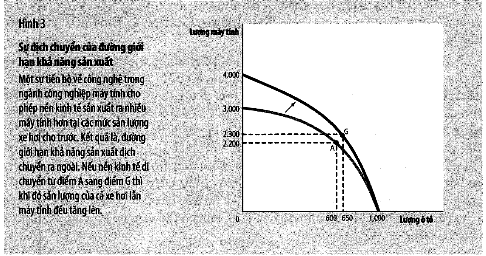
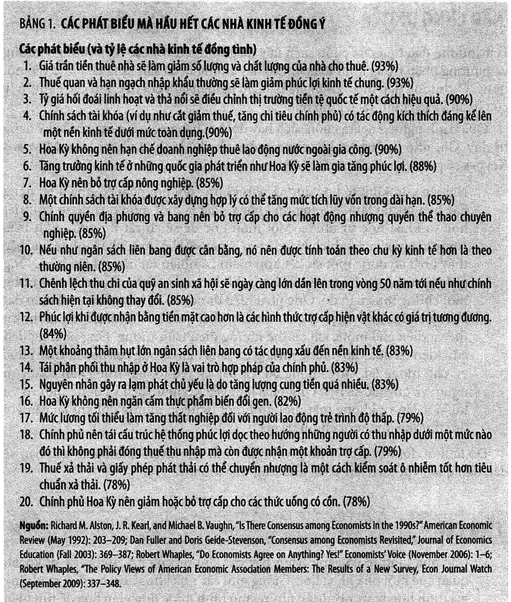

# Bài 1 — Mười nguyên lý và tư duy của nhà kinh tế

> Bài học dựng từ **Chương 1** (tr. 3–25) và **Chương 2** (tr. 26–56, gồm phụ lục về đồ thị tr. 47–55)
> của *N. Gregory Mankiw — **Kinh tế học vi mô***, bản dịch của Khoa Kinh tế, **ĐH Kinh tế TP.HCM** (Cengage Learning Asia).
> 🎯 **Vòng 1** — bài bắt buộc, học kỹ. Mọi chương sau đều quay lại mười nguyên lý này.
> 💼 **Góc QTKD** — ví dụ thêm cho ngành quản trị kinh doanh, **không có trong sách**.
> 📚 **Mở rộng** — thứ sách nói lướt hoặc để trong bài tập mà không giảng.
> ⚠️ — chỗ dễ hiểu sai, hoặc chỗ sách in sai.
> 📌 **Cần đọc trước:** không có. Đây là bài đầu tiên.

---

## Mục lục

<!-- MUC-LUC -->

- [1. Khan hiếm — câu hỏi gốc của cả môn học](#1-khan-hiếm--câu-hỏi-gốc-của-cả-môn-học)
- [2. Nguyên lý 1 — Con người đối mặt với sự đánh đổi](#2-nguyên-lý-1--con-người-đối-mặt-với-sự-đánh-đổi)
- [3. Nguyên lý 2 — Chi phí của một thứ là cái mà bạn từ bỏ để có được nó](#3-nguyên-lý-2--chi-phí-của-một-thứ-là-cái-mà-bạn-từ-bỏ-để-có-được-nó)
- [4. Nguyên lý 3 — Con người duy lý suy nghĩ tại điểm cận biên](#4-nguyên-lý-3--con-người-duy-lý-suy-nghĩ-tại-điểm-cận-biên)
- [5. 📚 Chi phí chìm — hệ quả quan trọng nhất mà sách để trong bài tập](#5--chi-phí-chìm--hệ-quả-quan-trọng-nhất-mà-sách-để-trong-bài-tập)
- [6. Nguyên lý 4 — Con người phản ứng với các động cơ khuyến khích](#6-nguyên-lý-4--con-người-phản-ứng-với-các-động-cơ-khuyến-khích)
- [7. Nguyên lý 5, 6, 7 — Con người tương tác với nhau](#7-nguyên-lý-5-6-7--con-người-tương-tác-với-nhau)
- [8. Nguyên lý 8, 9, 10 — Nền kinh tế vận hành như thế nào](#8-nguyên-lý-8-9-10--nền-kinh-tế-vận-hành-như-thế-nào)
- [9. Nhà kinh tế là nhà khoa học — giả định và mô hình](#9-nhà-kinh-tế-là-nhà-khoa-học--giả-định-và-mô-hình)
- [10. Mô hình thứ nhất — Sơ đồ chu chuyển](#10-mô-hình-thứ-nhất--sơ-đồ-chu-chuyển)
- [11. Mô hình thứ hai — Đường giới hạn khả năng sản xuất](#11-mô-hình-thứ-hai--đường-giới-hạn-khả-năng-sản-xuất)
- [12. Kinh tế học vi mô và kinh tế học vĩ mô](#12-kinh-tế-học-vi-mô-và-kinh-tế-học-vĩ-mô)
- [13. Phát biểu thực chứng và phát biểu chuẩn tắc](#13-phát-biểu-thực-chứng-và-phát-biểu-chuẩn-tắc)
- [14. 📚 Vì sao các nhà kinh tế bất đồng ý kiến](#14--vì-sao-các-nhà-kinh-tế-bất-đồng-ý-kiến)
- [15. 📚 Đọc đồ thị: độ dốc, bỏ sót biến, nhân quả ngược](#15--đọc-đồ-thị-độ-dốc-bỏ-sót-biến-nhân-quả-ngược)
- [16. Code minh hoạ](#16-code-minh-hoạ)
- [17. Tự thử](#17-tự-thử)
- [18. Từ điển thuật ngữ](#18-từ-điển-thuật-ngữ)
- [19. Câu hỏi tự kiểm tra](#19-câu-hỏi-tự-kiểm-tra)
- [Tóm tắt một trang](#tóm-tắt-một-trang)
- [Nguồn](#nguồn)

<!-- /MUC-LUC -->

---

## 1. Khan hiếm — câu hỏi gốc của cả môn học

Mankiw mở đầu bằng từ nguyên: **nền kinh tế** (*economy*) đến từ tiếng Hy Lạp *oikonomos*, nghĩa là
**"người quản gia"** (tr. 3). Ẩn dụ không phải để làm duyên. Một hộ gia đình phải quyết định ai nấu
bữa tối, ai giặt quần áo, ai được thêm món tráng miệng. Một xã hội cũng phải quyết định ai trồng lúa,
ai may quần áo, ai viết phần mềm — và rồi ai được ăn trứng cá, ai ăn khoai tây, ai đi Ferrari, ai đi
xe buýt (tr. 3).

Lý do phải quyết định là **khan hiếm**:

> **Khan hiếm** (*scarcity*): bản chất nguồn lực xã hội có giới hạn. — chú thích tr. 3

Và từ đó:

> **Kinh tế học** (*economics*): nghiên cứu cách thức xã hội quản lý nguồn lực khan hiếm. — chú thích tr. 3

⚠️ **Đọc kỹ định nghĩa này, vì nó không nói về tiền.** Kinh tế học không phải môn học về tiền, về
chứng khoán, hay về cách làm giàu. Nó là môn học về **cách phân bổ thứ không đủ dùng**. Tiền chỉ là
một công cụ đếm. Thời gian của bạn khan hiếm, sự chú ý của khách hàng khan hiếm, công suất nhà máy
khan hiếm — mọi thứ đó đều là bài toán kinh tế dù không có đồng bạc nào đổi tay.

Sách nói rõ ở hầu hết xã hội, nguồn lực **không** được phân bổ bởi một nhà độc tài có toàn quyền, mà
qua tương tác của hàng triệu hộ gia đình và doanh nghiệp (tr. 3). Đó là lý do phần lớn cuốn sách là
về **thị trường**.

Mười nguyên lý được chia làm ba nhóm, và sách tóm lại ở **Bảng 1, tr. 21**:



```
┌──────────────────────────────────────────────────────────────────────┐
│  CON NGƯỜI RA QUYẾT ĐỊNH NHƯ THẾ NÀO          (nguyên lý 1–4)        │
│     1. đối mặt với sự đánh đổi                                       │
│     2. chi phí = cái phải từ bỏ                                      │
│     3. người duy lý suy nghĩ ở điểm cận biên                         │
│     4. con người phản ứng với động cơ khuyến khích                   │
├──────────────────────────────────────────────────────────────────────┤
│  CON NGƯỜI TƯƠNG TÁC VỚI NHAU NHƯ THẾ NÀO     (nguyên lý 5–7)        │
│     5. thương mại làm mọi người cùng lợi                             │
│     6. thị trường thường là cách tốt để tổ chức hoạt động kinh tế    │
│     7. đôi khi chính phủ cải thiện được kết cục thị trường           │
├──────────────────────────────────────────────────────────────────────┤
│  NỀN KINH TẾ VẬN HÀNH NHƯ THẾ NÀO             (nguyên lý 8–10)       │
│     8. mức sống phụ thuộc năng lực sản xuất                          │
│     9. giá cả tăng khi chính phủ in quá nhiều tiền                   │
│    10. đánh đổi ngắn hạn giữa lạm phát và thất nghiệp                │
└──────────────────────────────────────────────────────────────────────┘
```

**Với ngành QTKD, nhóm 1 (nguyên lý 1–4) là phần đáng đầu tư nhất.** Ba nguyên lý cuối thuộc về kinh
tế vĩ mô, sẽ gặp lại ở môn *Kinh tế học vĩ mô*; ở đây chỉ cần hiểu ý.

---

## 2. Nguyên lý 1 — Con người đối mặt với sự đánh đổi

Câu ngạn ngữ sách dẫn: **"Chẳng có gì là cho không cả"** (tr. 4). Để có một thứ, phải từ bỏ một thứ khác.

Ba tầng ví dụ của sách, từ nhỏ tới lớn:

| Cấp độ      | Đánh đổi                                                                                                                                                                                                        | tr. |
| ----------- | --------------------------------------------------------------------------------------------------------------------------------------------------------------------------------------------------------------- | --- |
| Cá nhân     | sinh viên chia thời gian giữa kinh tế học và tâm lý học — thêm một giờ học môn này là bớt một giờ ngủ trưa, đạp xe, xem TV hoặc đi làm thêm                                                                     | 4   |
| Hộ gia đình | thu nhập chia giữa thực phẩm, quần áo, du lịch, tiết kiệm cho tuổi già, học phí cho con                                                                                                                         | 4   |
| Xã hội      | **"súng và bơ"** — chi quốc phòng nhiều thì chi tiêu dùng ít                                                                                                                                                    | 4   |
| Xã hội      | **môi trường trong sạch ↔ thu nhập** — luật cắt giảm chất thải đẩy chi phí sản xuất lên, cuối cùng ai đó phải chịu: chủ doanh nghiệp lãi ít hơn, công nhân lương thấp hơn, hoặc người tiêu dùng trả giá cao hơn | 5   |

### Hiệu quả và bình đẳng — cặp đánh đổi quan trọng nhất

Sách định nghĩa (chú thích tr. 5):

> **Hiệu quả** (*efficiency*): tình trạng mà ở đó xã hội đạt được nhiều nhất từ nguồn lực khan hiếm.
> **Bình đẳng** (*equality*): tình trạng phân phối sự thịnh vượng kinh tế một cách bằng nhau giữa các thành viên.

Ẩn dụ mà sách dùng và cả cuốn sách sẽ còn dùng lại nhiều lần:

> **Hiệu quả** đề cập đến **quy mô** của chiếc bánh kinh tế, còn **bình đẳng** nói lên chiếc bánh đó
> được **phân chia** như thế nào. (tr. 5)

Và điểm mấu chốt: hai mục tiêu này **thường xung đột**. Sách lấy thuế thu nhập luỹ tiến làm ví dụ —
nó bình đẳng hơn, nhưng "làm giảm phần thưởng trả cho sự làm việc chăm chỉ và kết quả là mọi người
làm việc ít hơn và sản xuất ra ít hàng hoá và dịch vụ hơn". Kết luận của sách rất gọn:

> Khi chính phủ cố gắng cắt chiếc bánh kinh tế thành những phần đều nhau hơn, thì **chiếc bánh nhỏ lại**. (tr. 5)

⚠️ **Nhận thức được sự đánh đổi không tự nói cho ta biết phải chọn gì.** Sách nhấn mạnh riêng đoạn
này (tr. 5): một sinh viên *không nên* bỏ tâm lý học chỉ để học thêm kinh tế; xã hội *không nên*
ngừng bảo vệ môi trường; *không nên* bỏ rơi người nghèo. Nhận thức được đánh đổi chỉ có ý nghĩa ở
chỗ: **người ta ra quyết định tốt hơn khi nhìn rõ các phương án mình đang có.**

### 💼 Góc QTKD — mọi quyết định quản trị đều là một cặp đánh đổi

Đây là chỗ nguyên lý 1 hữu dụng nhất trong nghề: khi ai đó trình bày một phương án mà **không nêu cái
phải từ bỏ**, phương án đó chưa được phân tích xong.

| Quyết định                             | Được                            | Đánh đổi thứ gì                                            |
| -------------------------------------- | ------------------------------- | ---------------------------------------------------------- |
| Giảm giá 20% để chiếm thị phần         | doanh số, thị phần              | biên lợi nhuận, định vị thương hiệu, kỳ vọng giá của khách |
| Tăng tồn kho để không bao giờ hết hàng | tỷ lệ đáp ứng đơn               | vốn lưu động bị chôn, rủi ro hàng lỗi mốt                  |
| Siết quy trình duyệt chi               | kiểm soát rủi ro                | tốc độ ra quyết định, tinh thần nhân viên                  |
| Thuê ngoài phần sản xuất               | linh hoạt, giảm chi phí cố định | mất bí quyết, phụ thuộc đối tác                            |

Cặp **hiệu quả ↔ bình đẳng** cũng xuất hiện *bên trong* doanh nghiệp: trả lương theo hiệu suất
(hiệu quả) hay trả đồng đều theo thâm niên (bình đẳng, giữ hoà khí)? Mankiw sẽ quay lại chính xác
câu hỏi này ở **chương 19** (tr. 445).

---

## 3. Nguyên lý 2 — Chi phí của một thứ là cái mà bạn từ bỏ để có được nó

> **Chi phí cơ hội** (*opportunity cost*): tất cả những cái phải mất đi để có được một thứ gì đó.
> — chú thích tr. 6

Ví dụ trung tâm của sách: **chi phí của một năm học đại học** (tr. 6). Sách chỉ ra hai lỗi mà cách
tính ngây thơ mắc phải:

**Lỗi 1 — tính thừa.** Cộng cả tiền ăn ở vào chi phí học đại học là sai, vì *"ngay cả khi không học
đại học, bạn vẫn cần một chỗ để ngủ và thực phẩm để ăn"*. Chỉ **phần chênh lệch** mới là chi phí:
tiền ăn ở tại trường đắt hơn ở nhà bao nhiêu thì tính bấy nhiêu. Sách còn nói thêm: nếu ăn ở tại
trường *rẻ hơn*, khoản tiết kiệm đó là **lợi ích** của việc đi học.

**Lỗi 2 — bỏ sót khoản lớn nhất.** Đó là **thời gian của bạn**:

> Đối với hầu hết sinh viên, **thu nhập mà họ phải từ bỏ** để theo đuổi việc học đại học là khoản
> chi phí lớn nhất cho việc học đại học của họ. (tr. 6)

Và hệ quả sách rút ra: các vận động viên trẻ có thể kiếm bạc triệu nếu bỏ học chơi thể thao nhà nghề
— **chi phí cơ hội của việc ngồi trên giảng đường với họ là rất cao**, nên không lạ khi họ thấy học
đại học "không xứng với chi phí bỏ ra" (tr. 6).

Mục 16 tính lại con số này bằng dữ liệu Việt Nam. Kết quả: bỏ sót tiền lương từ bỏ khiến bạn báo
thiếu **hai phần ba** chi phí thật.

### 💼 Góc QTKD — ba chi phí cơ hội mà báo cáo tài chính không bao giờ ghi

Kế toán ghi chi phí **đã chi bằng tiền**. Kinh tế học tính chi phí **cơ hội**. Ba khoản chênh nhau
mà một nhà quản trị phải tự cộng vào:

1. **Vốn chủ sở hữu.** Bạn bỏ 2 tỷ vào cửa hàng, lãi 100 triệu/năm. Kế toán ghi *lãi*. Nhưng gửi
   ngân hàng 6%/năm được 120 triệu — chi phí cơ hội của vốn là 120 triệu, nên thật ra bạn **lỗ 20
   triệu** so với phương án dễ nhất. Mankiw gọi đây là chênh lệch giữa **lợi nhuận kế toán** và
   **lợi nhuận kinh tế**, và sẽ giảng kỹ ở **chương 13** (tr. 286).
2. **Mặt bằng tự có.** "Cửa hàng nhà mình nên không tốn tiền thuê" là câu sai kinh điển. Nếu cho
   thuê được 30 triệu/tháng thì đó là chi phí thật, dù không có hoá đơn nào.
3. **Thời gian của người sáng lập.** Bạn tự làm giám đốc và không trả lương cho mình. Mức lương bạn
   *đáng lẽ nhận được* ở nơi khác là chi phí.

---

## 4. Nguyên lý 3 — Con người duy lý suy nghĩ tại điểm cận biên

Hai định nghĩa từ chú thích tr. 6–7:

> **Người duy lý** (*rational people*): người hành động một cách tốt nhất những gì họ có thể để đạt được mục tiêu.
> **Sự thay đổi cận biên** (*marginal change*): sự điều chỉnh nhỏ đối với kế hoạch hành động.

Mankiw nhắc một mẹo nhớ: *"cận biên" có nghĩa là "lân cận"*, nên **thay đổi cận biên là những điều
chỉnh ở vùng lân cận của cái bạn đang làm** (tr. 7). Không phải "làm hay không làm", mà là "**làm
thêm một chút nữa hay dừng lại**".

### Ví dụ hãng hàng không (tr. 7) — thuộc lòng ví dụ này

| Đại lượng                           | Giá trị                              |
| ----------------------------------- | ------------------------------------ |
| Chỗ ngồi                            | 200                                  |
| Chi phí cả chuyến bay               | 100.000 đô la                        |
| **Chi phí bình quân** mỗi chỗ       | 100.000 / 200 = **500 đô la**        |
| **Chi phí biên** của một khách thêm | ≈ giá gói đậu phộng + hộp nước sô đa |
| Khách dự phòng sẵn sàng trả         | 300 đô la                            |

Nhìn vào chi phí **bình quân** 500 đô: 300 < 500, có vẻ lỗ, từ chối. Nhìn vào chi phí **biên**: máy
bay dù sao cũng cất cánh, 10 ghế vẫn trống, thêm một người gần như không tốn gì. Kết luận của sách:

> Chừng nào mà người hành khách dự phòng này còn trả cao hơn chi phí biên, thì việc bán vé cho anh ta
> vẫn còn có lợi. (tr. 7)

### Nghịch lý nước và kim cương (tr. 7)

Con người cần nước để tồn tại, kim cương thì không cần thiết — vậy tại sao kim cương đắt hơn?

Vì mức sẵn lòng trả **dựa trên lợi ích biên**, và lợi ích biên **phụ thuộc vào việc bạn đã có bao
nhiêu đơn vị**. Nước dồi dào → cốc nước thứ n có lợi ích biên nhỏ. Kim cương hiếm → viên thứ nhất có
lợi ích biên rất lớn.

Quy tắc tổng quát của cả nguyên lý:

> Một người quyết định hợp lý thực hiện một hành động **khi và chỉ khi lợi ích biên của hành động
> vượt quá chi phí biên**. (tr. 7)

⚠️ **Đây là chỗ sai nhiều nhất trong thực tế quản trị.** Chi phí bình quân là con số dễ lấy — nó nằm
ngay trên báo cáo. Chi phí biên phải tự tính. Nên người ta dùng nhầm con số dễ lấy và **từ chối những
đơn hàng đáng lẽ có lãi**. Mục 16 chạy đúng phép so sánh này bằng số liệu một xưởng may.

### 💼 Góc QTKD — "giá sàn" thật của bạn là chi phí biên, không phải chi phí bình quân

Một xưởng may: chi phí cố định 400 triệu/tháng, biến phí 120 nghìn/áo, đang làm 10.000 áo →
chi phí bình quân **160 nghìn/áo**. Khách hỏi mua thêm 500 áo với giá **150 nghìn**.

- So với 160 → "dưới giá thành", từ chối.
- So với biến phí 120 → mỗi áo đóng góp **30 nghìn**, đơn hàng lãi **15 triệu**.

Nhận đơn. Nhưng có **hai điều kiện** mà nguyên lý biên không tự nói:

1. Xưởng phải **còn công suất trống**. Nếu phải tăng ca, chi phí biên không còn là 120 nghìn nữa.
2. Khách cũ **không được biết**, nếu không họ sẽ đòi mức 150. Đây chính là bài toán **phân biệt giá**
   ở **chương 15** (tr. 351).

---

## 5. 📚 Chi phí chìm — hệ quả quan trọng nhất mà sách để trong bài tập

Chương 1 **không** dùng thuật ngữ *chi phí chìm* trong phần giảng; nó xuất hiện ở **bài tập 5,
tr. 23** và mãi tới **chương 14, tr. 316** ("Bình sữa bị đổ và các chi phí chìm") mới được đặt tên.
Nhưng đây là hệ quả trực tiếp của nguyên lý 2 và 3, nên đưa lên đây.

**Bài tập 5, tr. 23 (nguyên văn tình huống):** công ty đã đầu tư **5 triệu đô la** phát triển một sản
phẩm mới, dự án chưa xong. Đối thủ vừa ra sản phẩm cạnh tranh, làm doanh thu dự kiến giảm còn **4
triệu**. Chi phí để hoàn tất và sản xuất là **3 triệu**. Có nên tiếp tục không? Mức chi cao nhất nên
trả để hoàn tất là bao nhiêu?

| Cách tính | Phép tính                                | Kết luận                  |
| --------- | ---------------------------------------- | ------------------------- |
| ❌ Sai     | 5 + 3 = 8 > 4                            | "đã lỗ rồi, bỏ đi"        |
| ✅ Đúng    | so 3 (còn phải chi) với 4 (còn thu được) | **tiếp tục**, lãi 1 triệu |

Mức chi cao nhất còn đáng bỏ ra: **4 triệu**. Năm triệu đã chi **không xuất hiện trong bất kỳ phép
tính nào** — đó là định nghĩa của chi phí chìm.

⚠️ **Chi phí chìm gây sai lầm theo cả hai chiều.** Chiều quen thuộc là *"đã đổ nhiều tiền rồi, phải
theo tới cùng"* (sai lầm chi phí chìm cổ điển). Chiều ít ai nói là chiều ngược lại, chính là bài tập
này: *"tổng cộng lỗ rồi, dừng luôn"* — cũng sai, và cũng vì cùng một lý do.

### 💼 Góc QTKD — nhận diện chi phí chìm

Ba câu nói trong phòng họp là dấu hiệu:

- *"Mình đã bỏ hai năm vào dự án này rồi..."* → hai năm đó đã mất, không lấy lại được bằng cách bỏ thêm năm thứ ba.
- *"Đã trả tiền license cả năm nên phải dùng cho hết."* → tiền license đã chi; chỉ nên hỏi phần mềm này còn hữu ích hơn phương án khác không.
- *"Giá vốn lô hàng này là 200 nghìn, không thể bán dưới giá đó."* → giá vốn đã chi; nếu hàng lỗi mốt, bán 120 nghìn vẫn tốt hơn để mốc trong kho.

---

## 6. Nguyên lý 4 — Con người phản ứng với các động cơ khuyến khích

> **Động cơ khuyến khích** (*incentive*): một yếu tố thôi thúc con người hành động. — chú thích tr. 8

Sách dẫn lời một nhà kinh tế tóm tắt cả ngành trong một câu:

> "Con người phản ứng với các khuyến khích. Mọi thứ khác chỉ là giải thích thêm." (tr. 8)

Ví dụ trực tiếp: giá táo tăng → người mua ăn ít táo hơn, người trồng thuê thêm công nhân và thu hoạch
nhiều hơn. Mankiw dùng luôn nhận xét này để bắc cầu sang cả phần cung–cầu: **giá cả chính là hệ thống
khuyến khích của thị trường** (tr. 8).

### Nghiên cứu Peltzman về luật dây an toàn (tr. 8–9) — ví dụ hay nhất chương

Đây là ví dụ đáng nhớ vì nó cho thấy **tác động gián tiếp có thể ngược chiều với tác động trực tiếp**.

```
   Luật buộc thắt dây an toàn
        │
        ├── tác động TRỰC TIẾP:  tai nạn ít tốn kém hơn cho người lái
        │                        (giảm khả năng bị thương hoặc tử vong)
        │
        └── tác động GIÁN TIẾP:  lái xe cẩn thận trở nên "ít đáng giá" hơn
                                 → lái nhanh hơn, ít thận trọng hơn
                                 → SỐ VỤ tai nạn TĂNG
```

Kết quả nghiên cứu **Sam Peltzman, 1975** như sách thuật lại (tr. 9): đạo luật *vừa làm giảm số
trường hợp tử vong trong mỗi vụ tai nạn, vừa làm tăng số vụ tai nạn*. Cuối cùng **số lái xe thiệt
mạng thay đổi không nhiều, nhưng số khách bộ hành thiệt mạng tăng lên** — vì người đi bộ không được
hưởng lợi gì từ dây an toàn mà lại phải đối mặt với xe chạy nhanh hơn.

Sách còn dẫn một liên hệ trực giác để bạn tin: người ta lái chậm và cẩn thận khi đường đóng băng, vì
khi đó **lợi ích biên của sự cẩn trọng cao** (tr. 9).

### Nghiên cứu tình huống: giá xăng 2005–2008 (tr. 9–10)

Giá xăng ở Hoa Kỳ tăng từ khoảng **2 đô la lên khoảng 4 đô la một gallon**. Các tiêu đề báo mà sách
liệt kê cho thấy phản ứng lan rất xa khỏi thị trường xăng:

- người mua đổ xô vào **xe nhỏ**; doanh số **xe đạp** tăng
- **giao thông công cộng** đông lên
- nông dân bang Rajasthan (Ấn Độ) **quay lại dùng lạc đà** vì máy kéo chạy dầu quá đắt
- đơn đặt hàng **Boeing và Airbus tăng** — A320 và 737 phiên bản mới có chi phí vận hành thấp hơn tới **40%** so với máy bay cũ
- một sinh viên (Christy Labadie, phải lái 30 phút tới trường) **chuyển sang học trực tuyến**
- xu hướng **mua nhà gần trạm xe điện**

Sách kết bằng một câu tỉnh táo: nhiều câu chuyện trong số đó *"chỉ là nhất thời"* — suy thoái 2008–2009
làm giá xăng giảm lại (tr. 10).

### 💼 Góc QTKD — bạn đo cái gì thì bạn sẽ nhận được cái đó

Hộp **Theo dòng thời sự, tr. 11** ("Nơi nào xe buýt chạy đúng giờ", **Austan Goolsbee**, *Slate.com*,
16/3/2006) là một case QTKD hoàn hảo về thiết kế lương thưởng:

Công ty xe buýt ở **Chile** trả lương tài xế theo **một trong hai cách**: theo **giờ**, hoặc theo
**số lượng hành khách**. Kết quả: nhóm trả theo số hành khách **giảm đáng kể sự chậm trễ** — tài xế
tự tìm lối đi tắt khi tắc đường, dành ít thời gian hơn cho bữa ăn, chủ động đón khách nhanh nhất có
thể. Năng suất tăng. **Hơn 95% các tuyến ở Santiago dùng lương khuyến khích.**

Nhưng bài báo cũng ghi mặt trái, và đây mới là phần đáng học: tài xế đi nhanh hơn thì **gặp tai nạn
nhiều hơn**, và một số hành khách **phàn nàn buồn nôn** vì tài xế nhấn ga ngay khi khách cuối vừa
bước lên. Dù vậy, khi được chọn, **đa số hành khách vẫn chọn công ty trả lương khuyến khích**.

Bài học chuyển thẳng sang quản trị: **mọi KPI đều tạo ra hành vi, kể cả hành vi bạn không muốn.**

| KPI bạn đặt                       | Hành vi bạn thật sự mua                   |
| --------------------------------- | ----------------------------------------- |
| Số cuộc gọi mỗi giờ của tổng đài  | cúp máy sớm, không giải quyết dứt điểm    |
| Doanh số của nhân viên bán hàng   | hứa quá lời, đẩy hàng cho khách không cần |
| Số lỗi mà QA tìm được             | báo cáo lỗi vụn vặt, bỏ qua lỗi khó       |
| Tỷ lệ giải quyết ticket trong 24h | đóng ticket rồi mở ticket mới             |

⚠️ Nguyên lý 4 không nói *"đừng dùng KPI"*. Nó nói: **trước khi ban hành một chỉ tiêu, hãy hỏi người
bị đo sẽ thay đổi hành vi thế nào** — kể cả theo hướng bạn không lường trước, đúng như Peltzman.

---

## 7. Nguyên lý 5, 6, 7 — Con người tương tác với nhau

### Nguyên lý 5: Thương mại có thể làm cho mọi người đều được lợi (tr. 10–12)

Sai lầm phổ biến mà sách chỉ ra: coi cạnh tranh giữa các nước như một cuộc thi đấu thể thao "luôn có
kẻ thắng, người thua". Sách bác bỏ thẳng:

> Sự thật thì điều ngược lại mới đúng: thương mại giữa hai nước có thể làm **cả hai bên cùng được lợi**. (tr. 12)

Lập luận bắc cầu qua gia đình: gia đình bạn cạnh tranh với các gia đình khác (khi đi xin việc, khi đi
mua hàng), nhưng **tự cô lập** thì không lợi hơn — sẽ phải tự trồng trọt, chăn nuôi, may quần áo, xây
nhà. Thương mại cho phép **chuyên môn hoá** vào việc mình làm tốt nhất (tr. 12).

📌 Cơ chế đầy đủ (lợi thế tuyệt đối, lợi thế so sánh) nằm ở **chương 3, tr. 57** → bài 14 của khoá học này.

### Nguyên lý 6: Thị trường thường là phương thức tốt để tổ chức hoạt động kinh tế (tr. 12–14)

> **Nền kinh tế thị trường** (*market economy*): nền kinh tế phân bổ các nguồn lực thông qua các quyết
> định phi tập trung của doanh nghiệp và hộ gia đình trong quá trình tương tác trên các thị trường
> hàng hoá và dịch vụ. — chú thích tr. 12

Mankiw đặt vấn đề đúng chỗ khó: trong nền kinh tế thị trường **không ai phụng sự cho phúc lợi của
toàn xã hội**, ai cũng chỉ quan tâm lợi ích riêng — vậy sao nó lại vận hành tốt?

Câu trả lời là **Adam Smith**, *Bàn về bản chất và nguồn gốc của cải của các dân tộc* (**1776**) và
ẩn dụ **"bàn tay vô hình"** (tr. 13). Hộp **Bạn có biết, tr. 14** dẫn nguyên văn Smith, trong đó có
câu nổi tiếng nhất:

> "Không phải nhờ lòng nhân từ của những người bán thịt, chủ cửa hàng rượu hay người bán bánh mì mà
> chúng ta có được bữa tối, mà chính là do họ quan tâm đến lợi ích riêng của họ..." (dẫn ở tr. 14)

Điều quan trọng hơn ẩn dụ là **cơ chế**: bàn tay vô hình vận hành **thông qua giá cả**.

> Giá cả phản ánh cả **giá trị** của một hàng hoá đối với xã hội và **chi phí** mà xã hội bỏ ra để sản
> xuất ra hàng hoá đó. (tr. 13)

Và hệ quả mà sách rút ra ngay, rất đáng nhớ:

> Khi ngăn không cho giá cả điều chỉnh một cách tự nhiên theo cung và cầu, chính phủ cũng đồng thời
> **cản trở khả năng của bàn tay vô hình**. (tr. 13)

Đó là lý do sách nói thuế "làm bóp méo giá cả", và là lý do các nhà làm kế hoạch tập trung ở Liên Xô
thất bại: họ *"vận hành nền kinh tế với một bàn tay bị trói sau lưng"* (tr. 13).

### Nguyên lý 7: Đôi khi chính phủ có thể cải thiện được kết cục thị trường (tr. 14–16)

Ba khái niệm mới, từ chú thích tr. 15:

> **Quyền sở hữu tài sản** (*property rights*): khả năng của một cá nhân sở hữu và thực hiện các quyền kiểm soát nguồn lực khan hiếm.
> **Thất bại thị trường** (*market failure*): tình huống mà thị trường tự nó thất bại trong việc phân bổ nguồn lực một cách hiệu quả.
> **Ngoại tác** (*externality*): ảnh hưởng do hành động của một người tạo ra đối với phúc lợi của người ngoài cuộc.
> **Quyền lực thị trường** (*market power*): khả năng của một chủ thể kinh tế (hay một nhóm nhỏ) có ảnh hưởng đáng kể lên giá cả thị trường.

Chính phủ cần thiết vì **hai lý do khác nhau**, và sách tách rất rõ:

```
Vì sao cần chính phủ?
│
├── ① BẢO VỆ LUẬT CHƠI  — bàn tay vô hình chỉ chạy được khi có quyền sở hữu
│      nông dân không trồng lúa nếu sợ mất mùa màng
│      nhà hàng không phục vụ nếu không chắc được trả tiền
│      công ty giải trí không sản xuất DVD nếu ai cũng sao chép lậu
│
└── ② SỬA KẾT CỤC — vì hai mục tiêu KHÁC NHAU, đừng lẫn lộn
       ├── HIỆU QUẢ  (làm chiếc bánh to lên)
       │     khắc phục THẤT BẠI THỊ TRƯỜNG:
       │       • ngoại tác     — ô nhiễm là ví dụ kinh điển
       │       • quyền lực thị trường — cả thị trấn chỉ có một cái giếng
       └── BÌNH ĐẲNG (chia lại chiếc bánh)
             thuế thu nhập, hệ thống phúc lợi xã hội
```

⚠️ **Sách cẩn thận cảnh báo ngay sau đó**, và đây là câu dễ bị bỏ qua nhất chương:

> Việc nói rằng trong một số trường hợp, chính phủ có thể cải thiện kết quả thị trường **không có
> nghĩa là nó sẽ luôn luôn làm được như vậy**. Các chính sách công không phải do thần thánh tạo ra,
> mà là kết quả của một quá trình chính trị không hoàn hảo. (tr. 16)

Nghĩa là "thị trường thất bại" **không** tự động suy ra "chính phủ nên can thiệp". Phải so sánh thất
bại thị trường với **thất bại của chính phủ**.

### 💼 Góc QTKD — nguyên lý 7 chính là "môi trường pháp lý" trong phân tích PESTEL

Ba nguyên lý này thường bị coi là phần "chính trị" nhàm chán của môn học. Với người làm quản trị,
chúng là bản đồ rủi ro:

| Nguyên lý                | Câu hỏi kinh doanh                                                                                         |
| ------------------------ | ---------------------------------------------------------------------------------------------------------- |
| 5 — thương mại           | thuê ngoài khâu nào? nhập nguyên liệu từ đâu?                                                              |
| 6 — giá cả là tín hiệu   | khi giá đầu vào tăng, đó là tín hiệu khan hiếm — không phải chuyện để "than", mà để đổi công thức sản phẩm |
| 7 — quyền sở hữu         | hợp đồng, sở hữu trí tuệ, nhượng quyền: nếu không thực thi được thì mô hình kinh doanh sụp                 |
| 7 — quyền lực thị trường | bạn có đang bị nhà cung cấp độc quyền ép giá không?                                                        |

---

## 8. Nguyên lý 8, 9, 10 — Nền kinh tế vận hành như thế nào

Ba nguyên lý này thuộc **kinh tế học vĩ mô**. Với QTKD, mức yêu cầu là **hiểu ý và nhớ con số**, chưa
cần đào sâu — sẽ học đủ ở môn *Kinh tế học vĩ mô*.

### Nguyên lý 8: Mức sống phụ thuộc vào năng lực sản xuất (tr. 16–17)

> **Năng suất** (*productivity*): số lượng hàng hoá và dịch vụ được sản xuất ra từ một đơn vị lao động.
> — chú thích tr. 17

Số liệu sách dùng (năm **2008**, thu nhập bình quân đầu người):

| Nước    | Thu nhập bình quân |
| ------- | ------------------ |
| Hoa Kỳ  | 47.000 đô la       |
| Mexico  | 10.000 đô la       |
| Nigeria | 1.400 đô la        |

Và tốc độ: thu nhập Hoa Kỳ tăng khoảng **2% một năm** (đã loại trừ giá sinh hoạt) → **cứ 35 năm gấp
đôi**; trong thế kỷ qua đã tăng **gấp tám lần** (tr. 16).

Điều sách nhấn mạnh là **hàm ý phủ định**: nếu năng suất là nhân tố chủ yếu, thì *"những thứ khác
phải đóng vai trò thứ yếu"* (tr. 17) — nghiệp đoàn hay luật lương tối thiểu **không phải** nguyên nhân
chính làm mức sống công nhân Hoa Kỳ tăng trong thế kỷ qua; và tăng trưởng thu nhập chậm của Hoa Kỳ
thập niên 1970–1980 **không phải** do cạnh tranh từ Nhật, mà do **năng suất trong nước tăng chậm**.

### Nguyên lý 9: Giá cả tăng khi chính phủ in quá nhiều tiền (tr. 17–18)

> **Lạm phát** (*inflation*): sự gia tăng của mức giá chung trong nền kinh tế. — chú thích tr. 17

Ví dụ siêu lạm phát Đức mà sách dùng, con số cần nhớ:

| Thời điểm         | Giá một tờ nhật báo ở Đức |
| ----------------- | ------------------------- |
| **Tháng 1/1921**  | 0,3 mark                  |
| **Tháng 11/1922** | 70.000.000 mark           |

Đầu những năm 1920, giá cả ở Đức **tăng gấp 3 lần mỗi tháng**, và **lượng tiền cũng tăng gấp 3 lần mỗi
tháng** (tr. 18). Đối chiếu Hoa Kỳ: thập niên 1970 mức giá tăng hơn hai lần, Tổng thống Gerald Ford
gọi lạm phát là **"kẻ thù số một của công chúng"**; thập niên 1990 lạm phát chỉ khoảng **3%/năm**,
với tỷ lệ đó giá cả phải mất **hơn hai mươi năm** mới tăng gấp đôi (tr. 17).

### Nguyên lý 10: Đánh đổi ngắn hạn giữa lạm phát và thất nghiệp (tr. 18–19)

Chuỗi lập luận sách trình bày:

```
tăng lượng tiền
   → kích thích tổng chi tiêu → cầu hàng hoá, dịch vụ tăng
   → cầu cao buộc doanh nghiệp TĂNG GIÁ  (lạm phát)
   → nhưng cầu cao cũng khiến họ THUÊ THÊM LAO ĐỘNG
   → thất nghiệp GIẢM
```

> **Chu kỳ kinh tế** (*business cycle*): sự biến động của hoạt động kinh tế, chẳng hạn như việc làm và
> sản xuất. — chú thích tr. 18

Sách ghi thời điểm viết rất rõ: trong **2008 và 2009**, kinh tế Mỹ trải qua suy thoái sâu; sáng kiến
lớn đầu tiên của Tổng thống **Barack Obama** là gói kích thích gồm **cắt giảm thuế và tăng chi tiêu
chính phủ**, đồng thời **Cục Dự trữ Liên bang tăng cung tiền** — mục tiêu là giảm thất nghiệp, nhưng
nhiều người lo ngại lạm phát quá mức về sau (tr. 19).

⚠️ **Sách in năm 2008–2009 tính theo bản gốc.** Khi đọc các con số vĩ mô ở nguyên lý 8–10, hãy nhớ
đây là ảnh chụp nền kinh tế Mỹ **gần hai thập kỷ trước**. Cơ chế thì vẫn đúng; con số thì đã cũ.

### 💼 Góc QTKD — vì sao người làm quản trị vẫn phải để mắt tới ba nguyên lý vĩ mô

| Nguyên lý     | Ảnh hưởng trực tiếp tới doanh nghiệp                                                                                       |
| ------------- | -------------------------------------------------------------------------------------------------------------------------- |
| 8 — năng suất | tăng lương bền vững chỉ đến từ tăng năng suất; tăng lương mà năng suất đứng yên thì hoặc giá bán tăng, hoặc lợi nhuận giảm |
| 9 — lạm phát  | hợp đồng dài hạn giá cố định là canh bạc; ngân sách năm sau phải tính theo giá danh nghĩa                                  |
| 10 — chu kỳ   | tuyển ồ ạt lúc đỉnh chu kỳ là sai lầm cổ điển; cấu trúc chi phí cố định cao rất nguy hiểm khi cầu sụt                      |
---

## 9. Nhà kinh tế là nhà khoa học — giả định và mô hình

Chương 2 mở bằng một nhận xét về **ngôn ngữ**: mỗi ngành có ngôn ngữ riêng, và ngôn ngữ của nhà kinh
tế gồm *cung, cầu, độ co giãn, lợi thế so sánh, thặng dư tiêu dùng, tổn thất vô ích* (tr. 26). Toàn
bộ danh sách đó là mục lục của khoá học này.

Điều làm kinh tế học thành một môn khoa học **không phải đối tượng nghiên cứu mà là phương pháp**:
quan sát → dựng lý thuyết → quan sát thêm để kiểm định (tr. 27). Sách dẫn Einstein: *"Khoa học chẳng
có gì khác hơn là sự chắt lọc lại những suy nghĩ thường ngày"*, và lấy Newton với quả táo làm ví dụ
mẫu.

Nhưng có **một trở ngại lớn** mà sách nêu thẳng:

> Trong kinh tế học, thực hiện một thí nghiệm thường là khó khăn và đôi khi là bất khả thi. (tr. 28)

Nhà vật lý thả vật thể trong phòng thí nghiệm bao nhiêu lần cũng được. Nhà kinh tế **không thể điều
khiển chính sách tiền tệ của một quốc gia chỉ để tạo ra dữ liệu**. Nên họ phải dùng **thí nghiệm tự
nhiên do lịch sử tạo ra** — chiến tranh ở Trung Đông cắt nguồn cung dầu thô là một ví dụ sách nêu (tr. 28).

⚠️ **Hệ quả cho toàn bộ cách bạn đọc số liệu kinh tế:** vì hầu hết dữ liệu là **quan sát** chứ không
phải **thí nghiệm**, mọi kết luận nhân quả trong kinh tế học đều mong manh hơn trong vật lý. Mục 15
sẽ cho thấy chính xác hai cách nó hỏng.

### Vai trò của các giả định (tr. 28–29)

Ví dụ so sánh của sách rất đắt. Hỏi nhà vật lý *"viên đá rơi từ toà nhà mười tầng mất bao lâu?"* —
họ giả định **chân không**. Giả định đó **sai** (có không khí, có ma sát), nhưng ma sát lên viên đá
nhỏ nên **không ảnh hưởng đáng kể**.

Bây giờ thả một **quả bóng to cùng trọng lượng**: giả định không ma sát **không còn dùng được**, vì
quả bóng lớn hơn nhiều.

> Nghệ thuật trong tư duy khoa học — cho dù là trong vật lý, sinh học hay kinh tế học — chính là ở
> chỗ **quyết định xem cần phải giả định cái gì**. (tr. 28)

Áp dụng vào kinh tế: khi nghiên cứu tác động **ngắn hạn** của chính sách, giả định **giá cả không
thay đổi**; khi nghiên cứu **dài hạn**, giả định **giá cả hoàn toàn linh hoạt** (tr. 29). Cùng một
hiện tượng, hai giả định khác nhau, tuỳ câu hỏi.

### Mô hình (tr. 29)

Ẩn dụ của sách: mô hình cơ thể người bằng nhựa trong lớp sinh học. Nó **thiếu tính thực tế** — không
có đủ cơ và mao mạch — nhưng *"thật ra, cũng bởi vì thiếu đi tính thực tế"* mà nó dạy được cấu tạo cơ
thể. Mô hình kinh tế cũng vậy, chỉ khác là chúng làm bằng **biểu đồ và phương trình**.

⚠️ **Câu hỏi ôn tập số 3 của sách (tr. 45) là bẫy:** *"Một mô hình kinh tế có nên mô tả thực tiễn một
cách chính xác hay không?"* Trả lời: **không**. Một mô hình chính xác tuyệt đối sẽ phức tạp đúng bằng
thực tế và do đó vô dụng. Mô hình tốt là mô hình **bỏ đi đúng những thứ không liên quan tới câu hỏi
đang hỏi**.

---

## 10. Mô hình thứ nhất — Sơ đồ chu chuyển

> **Sơ đồ chu chuyển** (*circular-flow diagram*): biểu đồ biểu thị dòng tiền luân chuyển thông qua các
> thị trường, giữa các hộ gia đình và doanh nghiệp. — chú thích tr. 30

Mô hình đơn giản hoá nền kinh tế xuống còn **hai nhóm ra quyết định** và **hai thị trường** (Hình 1, tr. 30):



```
                    ┌──────────────────────────────────┐
          doanh thu │   THỊ TRƯỜNG HÀNG HOÁ, DỊCH VỤ   │ chi tiêu
        ┌───────────┤   doanh nghiệp BÁN               ├───────────┐
        │           │   hộ gia đình MUA                │           │
        │           └──────────────────────────────────┘           │
        │              ▲                        │                  │
        │      hàng hoá│                        │hàng hoá          ▼
   ┌────┴─────────┐    │bán ra                  │mua vào   ┌───────────────┐
   │ DOANH NGHIỆP │────┘                        └─────────►│  HỘ GIA ĐÌNH  │
   │ sản xuất, bán│                                        │ mua, tiêu dùng│
   │ thuê yếu tố  │◄───┐                        ┌─────────►│ SỞ HỮU yếu tố │
   └────┬─────────┘    │các yếu tố              │lao động, └───────┬───────┘
        │              │sản xuất                │đất, vốn          │
        │           ┌──┴───────────────────────────────┐           │
        │           │   THỊ TRƯỜNG YẾU TỐ SẢN XUẤT     │           │
        └───────────┤   hộ gia đình BÁN                ├───────────┘
    lương, tiền thuê│   doanh nghiệp MUA               │ thu nhập
    và lợi nhuận    └──────────────────────────────────┘

   Vòng TRONG  = dòng hàng hoá và yếu tố sản xuất  (đầu vào / đầu ra)
   Vòng NGOÀI  = dòng TIỀN, chạy ngược chiều
```

Điểm mà sinh viên hay lẫn: **hộ gia đình vừa mua vừa bán, doanh nghiệp cũng vậy** — chỉ là ở hai thị
trường khác nhau.

|              | Thị trường hàng hoá, dịch vụ | Thị trường yếu tố sản xuất       |
| ------------ | ---------------------------- | -------------------------------- |
| Hộ gia đình  | **mua**                      | **bán** (sức lao động, đất, vốn) |
| Doanh nghiệp | **bán**                      | **mua**                          |

Câu chuyện Starbucks mà sách kể để bạn nhớ chiều của dòng tiền (tr. 31): tiền từ túi bạn → quầy thu
tiền Starbucks (thành doanh thu) → Starbucks trả tiền thuê mặt bằng và lương nhân viên → **trở thành
thu nhập của một hộ gia đình nào đó** → lại vào túi ai đó. Và vòng lặp bắt đầu lại.

Sách tự thừa nhận mô hình này bỏ qua nhiều thứ: **chính phủ** và **thương mại quốc tế** đều không có
trong hình (tr. 31). Đó là chủ ý — xem lại mục 9 về vai trò của giả định.

---

## 11. Mô hình thứ hai — Đường giới hạn khả năng sản xuất

> **Đường giới hạn khả năng sản xuất** (*production possibility frontier*, PPF): đồ thị biểu thị những
> phối hợp khác nhau của sản lượng đầu ra mà nền kinh tế có thể sản xuất, khi sử dụng các yếu tố và
> công nghệ sản xuất sẵn có. (tr. 31)

Nền kinh tế giả định chỉ có **hai hàng hoá: ô tô và máy tính**. Số liệu **Hình 2, tr. 32**:



| Điểm  |    Ô tô |  Máy tính | Ý nghĩa                                               |
| ----- | ------: | --------: | ----------------------------------------------------- |
| F     |       0 |     3.000 | dồn hết nguồn lực cho máy tính                        |
| **A** | **600** | **2.200** | nằm **trên** đường giới hạn — hiệu quả                |
| **B** | **700** | **2.000** | nằm **trên** đường giới hạn — hiệu quả                |
| C     |       — |         — | nằm **ngoài** — **bất khả thi** với nguồn lực hiện có |
| **D** | **300** | **1.000** | nằm **trong** — **không hiệu quả**                    |
| E     |   1.000 |         0 | dồn hết nguồn lực cho ô tô                            |

Bốn ý tưởng mà một hình vẽ này gói gọn:

**① Khan hiếm** — mọi điểm ngoài đường đều bất khả thi. Điểm C là ví dụ.

**② Hiệu quả** — điểm nằm **trên** đường là hiệu quả: không thể sản xuất thêm hàng này mà không bớt
hàng kia. Điểm **D không hiệu quả**; sách gợi ý nguyên nhân có thể là **thất nghiệp lan rộng**. Từ D
đi tới A, ô tô tăng 300 **và** máy tính tăng 1.200 — **tăng cả hai**, nên đây *không phải* đánh đổi.

**③ Đánh đổi và chi phí cơ hội** — khi đã đứng trên đường rồi, đi từ A sang B:

$$\text{ô tô } 600 \to 700 \ (+100) \qquad \text{máy tính } 2200 \to 2000 \ (-200)$$

Chi phí cơ hội của 100 ô tô là 200 máy tính, tức **2 máy tính mỗi ô tô**. Và sách chỉ ra điều then chốt:

> Chi phí cơ hội của một chiếc xe hơi chính là **độ dốc** của đường giới hạn khả năng sản xuất. (tr. 33)

**④ Vì sao đường cong ra ngoài chứ không phải đường thẳng** — vì chi phí cơ hội **không cố định**.
Lập luận của sách (tr. 33):

- Ở điểm **F** (làm gần như toàn máy tính): những công nhân giỏi làm ô tô đang phải đi lắp máy tính.
  Chuyển họ về đúng nghề thì **hy sinh rất ít máy tính** → chi phí cơ hội thấp → đường **thoải**.
- Ở điểm **E** (làm gần như toàn ô tô): muốn thêm một ô tô nữa phải kéo **kỹ sư máy tính giỏi nhất**
  sang làm thợ lắp xe → **mất rất nhiều máy tính** → chi phí cơ hội cao → đường **dốc**.

Nói gọn: **nguồn lực không hoán đổi hoàn hảo giữa hai ngành.** Đó là toàn bộ lý do đường cong lồi.

### Tăng trưởng kinh tế — đường dịch ra ngoài (Hình 3, tr. 34)



Tiến bộ công nghệ trong ngành máy tính đẩy đường giới hạn **ra ngoài**: trục máy tính từ 3.000 lên
**4.000**, còn điểm cực đại ô tô **giữ nguyên 1.000** (vì tiến bộ chỉ xảy ra ở ngành máy tính). Xã hội
có thể chuyển từ **A (600 ô tô, 2.200 máy tính)** sang **G (650 ô tô, 2.300 máy tính)** — **nhiều hơn
ở cả hai mặt hàng**.

⚠️ **Đính chính — sách in sai một con số, tr. 34.**

Nguyên văn dòng thứ 8 của tr. 34:

> "...xã hội di chuyển từ điểm A sang điểm G với nhiều máy tính hơn (2.300 thay vì **2.000**) và nhiều
> xe hơi hơn (650 thay vì 600)."

Con số **2.000** là **sai**, phải là **2.200**:

- **Hình 2, tr. 32** ghi rõ điểm A = (600 ô tô; **2.200** máy tính).
- **Chính Hình 3 ở ngay trên đoạn văn đó** vẽ hai đường gạch ngang tại **2.300** (điểm G) và
  **2.200** (điểm A) — đã đối chiếu bản quét gốc ở độ phân giải 300 dpi.
- 2.000 là toạ độ của **điểm B**, không phải A.

Không đổi kết luận (G vẫn tốt hơn A ở cả hai mặt hàng), nhưng nếu bạn dùng con số 2.000 để làm bài
tập thì sẽ ra sai. Ghi nhớ: **A = (600; 2.200)**.

### 💼 Góc QTKD — PPF của một nhà máy, một phòng ban, một con người

PPF không chỉ dùng cho "nền kinh tế". Nó dùng được cho **bất kỳ đơn vị nào có nguồn lực cố định phải
chia cho hai việc**:

| Đơn vị         | Trục X        | Trục Y          | "Điểm nằm trong đường" nghĩa là gì            |
| -------------- | ------------- | --------------- | --------------------------------------------- |
| Nhà máy        | bàn           | ghế             | máy hỏng, công nhân chờ việc, đổi mẫu quá lâu |
| Đội bán hàng   | khách mới     | chăm khách cũ   | quy trình rối, CRM tệ, họp quá nhiều          |
| Đội phát triển | tính năng mới | trả nợ kỹ thuật | môi trường build chậm, thiếu tự động hoá      |
| Bản thân bạn   | học           | làm thêm        | mất tập trung, ngủ không đủ                   |

Và đây là điều đáng giá nhất: **rất nhiều tổ chức tưởng mình đang phải đánh đổi, trong khi thật ra
đang ở điểm D.** Khi bạn còn ở bên trong đường giới hạn, câu hỏi đúng **không phải** "ưu tiên cái
nào" mà là "**cái gì đang khiến chúng ta không hiệu quả**". Chỉ khi đã ở trên đường thì mới thật sự
phải chọn.

Mục 16 dựng một PPF cụ thể cho nhà máy bàn–ghế, tính chi phí cơ hội từng bước và vẽ đường cong bằng
ký tự, để bạn thấy tận mắt việc nó dốc dần lên.

---

## 12. Kinh tế học vi mô và kinh tế học vĩ mô

Chú thích tr. 35:

> **Kinh tế học vi mô** (*microeconomics*): môn học nghiên cứu quá trình ra quyết định của các hộ gia
> đình và doanh nghiệp, và tương tác của họ trên các thị trường.
> **Kinh tế học vĩ mô** (*macroeconomics*): môn học nghiên cứu những hiện tượng tổng quát của nền kinh
> tế, bao gồm lạm phát, thất nghiệp và tăng trưởng kinh tế.

Ví dụ đối chiếu của sách (tr. 35):

| Vi mô nghiên cứu                                               | Vĩ mô nghiên cứu                                      |
| -------------------------------------------------------------- | ----------------------------------------------------- |
| tác động của kiểm soát tiền thuê nhà ở New York                | tác động của việc vay mượn của chính phủ liên bang    |
| tác động của cạnh tranh nước ngoài lên công nghiệp ô tô Hoa Kỳ | thay đổi qua thời gian của tỷ lệ thất nghiệp          |
| tác động của giáo dục bắt buộc lên tiền lương công nhân        | các chính sách nâng cao chất lượng cuộc sống quốc gia |

Sách nói rõ hai nhánh **đan xen mật thiết** nhưng vẫn là hai lĩnh vực riêng biệt vì "đặt ra những câu
hỏi khác nhau, mỗi lĩnh vực có các khung mô hình riêng" (tr. 35).

💼 **Với QTKD, vi mô là môn gần nghề hơn hẳn.** Vi mô trả lời *"định giá bao nhiêu, sản xuất bao
nhiêu, đối thủ sẽ làm gì"*. Vĩ mô trả lời *"năm sau nền kinh tế thế nào"* — quan trọng cho lập kế
hoạch, nhưng bạn không điều khiển được nó.

---

## 13. Phát biểu thực chứng và phát biểu chuẩn tắc

Hai câu ví dụ của sách (tr. 36) — đáng thuộc lòng vì đề thi rất hay hỏi:

> **POLLY:** "Quy định mức lương tối thiểu gây ra thất nghiệp."
> **NORM:** "Chính phủ nên tăng mức lương tối thiểu."

Chú thích tr. 37:

> **Phát biểu thực chứng** (*positive statement*): phát biểu mô tả thế giới.
> **Phát biểu chuẩn tắc** (*normative statement*): những phát biểu chỉ ra sự việc nên diễn ra như thế nào.

Khác biệt quan trọng nằm ở **cách kiểm chứng**:

|                   | Thực chứng                    | Chuẩn tắc                                          |
| ----------------- | ----------------------------- | -------------------------------------------------- |
| Trả lời câu hỏi   | thế giới **vận hành thế nào** | thế giới **nên thế nào**                           |
| Vai trò người nói | nhà khoa học                  | nhà tư vấn chính sách                              |
| Kiểm chứng bằng   | **bằng chứng, số liệu**       | không thể chỉ bằng số liệu                         |
| Phụ thuộc         | dữ liệu                       | quan điểm về dân tộc, tôn giáo, triết lý chính trị |
| Mẹo nhận diện     | mô tả                         | có chữ **"nên"**                                   |

Sách chỉ ra một mối liên hệ tinh tế mà nhiều người bỏ qua: hai loại phát biểu **đan xen** — nếu phát
biểu thực chứng của Polly là **đúng**, thì nó *"có thể phản bác kết luận chuẩn tắc của Norm"*. Nhưng
chiều ngược lại không có: kết luận chuẩn tắc **không chỉ** xuất phát từ phân tích thực chứng, mà còn
từ **đánh giá giá trị** (tr. 37).

Giai thoại **Harry Truman** (tr. 37): ông muốn tìm một nhà kinh tế **"một tay"** (*one-armed*), vì mỗi
lần hỏi ý kiến thì luôn nhận được *"Một mặt thì..., mặt khác thì..."* — nguyên văn tiếng Anh chơi chữ
*"On the one hand..., on the other hand..."*, chữ *hand* nghĩa đen là "tay" (chú thích của người dịch,
tr. 37).

### 💼 Góc QTKD — tách hai loại phát biểu trong chính cuộc họp của bạn

Đây là kỹ năng dùng được ngay, không cần đợi tới lúc bàn chính sách công:

| Câu trong phòng họp                                | Loại           | Cách xử lý                                                        |
| -------------------------------------------------- | -------------- | ----------------------------------------------------------------- |
| "Giảm giá 10% sẽ làm doanh số tăng 25%."           | **thực chứng** | đòi bằng chứng — dữ liệu cũ, A/B test, ước lượng độ co giãn       |
| "Chúng ta nên giảm giá."                           | **chuẩn tắc**  | đòi làm rõ **mục tiêu**: tối đa lợi nhuận? thị phần? dòng tiền?   |
| "Khách hàng trẻ nhạy giá hơn khách hàng lớn tuổi." | **thực chứng** | phân khúc dữ liệu ra mà kiểm                                      |
| "Thương hiệu chúng ta không nên giảm giá bao giờ." | **chuẩn tắc**  | đây là một **giá trị**, tranh luận bằng số liệu sẽ đi vào ngõ cụt |

Phần lớn tranh cãi bế tắc trong doanh nghiệp là do **hai bên tưởng đang cãi về sự thật, thật ra đang
cãi về mục tiêu**. Tách hai loại phát biểu ra là cách nhanh nhất để thoát.

---

## 14. 📚 Vì sao các nhà kinh tế bất đồng ý kiến

Sách dành hẳn một mục cho câu hỏi này (tr. 41–43), mở bằng câu châm biếm của **George Bernard Shaw**:
*"Nếu gom tất cả các nhà kinh tế ngồi lại với nhau, họ sẽ không thể thống nhất về một điểm nào cả"*,
và câu đùa của **Ronald Reagan**: nếu trò chơi đố vui dành riêng cho các nhà kinh tế thì **cứ mỗi 100
câu hỏi phải có 3.000 câu trả lời** (tr. 41).

Hai lý do sách đưa ra:

**① Khác nhau về đánh giá khoa học** (tr. 41). Kinh tế học là *"môn khoa học còn non trẻ"*. Ví dụ:
nên đánh thuế thu nhập hay thuế tiêu dùng? Nhóm ủng hộ chuyển sang thuế tiêu dùng tin rằng làm vậy
sẽ khuyến khích tiết kiệm → tích luỹ vốn → tăng năng suất. Nhóm kia tin tiết kiệm **không biến động
nhiều** theo chính sách thuế. Hai bên có **quan điểm chuẩn tắc khác nhau vì có quan điểm thực chứng
khác nhau**.

**② Khác nhau về giá trị** (tr. 41–42). Ví dụ Peter và Paula dùng chung một giếng nước của thị trấn:

| Người |      Thu nhập |         Thuế | Tỷ lệ |
| ----- | ------------: | -----------: | ----: |
| Peter | 100.000 đô la | 20.000 đô la |   20% |
| Paula |  20.000 đô la |  4.000 đô la |   20% |

Chính sách này có công bằng không? Sách đặt tiếp những câu không có lời giải khoa học: *Paula thu nhập
thấp do bị khuyết tật hay do chọn theo đuổi nghề diễn xuất? Peter thu nhập cao do thừa hưởng gia tài
hay do sẵn lòng làm thêm giờ?* Và kết luận:

> Ngay cả khi khoa học kinh tế trở nên hoàn hảo, nó cũng không thể cho chúng ta biết rằng Peter hay
> Paula có đang phải trả quá nhiều hay không. (tr. 42)

### Nhưng họ đồng ý nhiều hơn ta tưởng

Sách cảnh báo **không nên cường điệu số lượng các bất đồng** và đưa ra **Bảng 1, tr. 43** — 20 phát
biểu cùng **tỷ lệ nhà kinh tế đồng tình** trong các khảo sát chuyên gia. Vài dòng đáng chú ý:



|    # | Phát biểu                                                                                                     | Đồng tình |
| ---: | ------------------------------------------------------------------------------------------------------------- | --------: |
|    1 | Giá trần tiền thuê nhà sẽ làm giảm số lượng và chất lượng của nhà cho thuê                                    |   **93%** |
|    2 | Thuế quan và hạn ngạch nhập khẩu thường sẽ làm giảm phúc lợi kinh tế chung                                    |   **93%** |
|    3 | Tỷ giá hối đoái linh hoạt và thả nổi sẽ điều chỉnh thị trường tiền tệ quốc tế một cách hiệu quả               |       90% |
|    6 | Tăng trưởng kinh tế ở những quốc gia phát triển như Hoa Kỳ sẽ làm gia tăng phúc lợi                           |       88% |
|   15 | Nguyên nhân gây ra lạm phát chủ yếu là do tăng lượng cung tiền quá nhiều                                      |       83% |
|   17 | Mức lương tối thiểu làm tăng thất nghiệp đối với người lao động trẻ trình độ thấp                             |       79% |
|   19 | Thuế xả thải và giấy phép phát thải có thể chuyển nhượng là cách kiểm soát ô nhiễm tốt hơn tiêu chuẩn xả thải |       78% |

Nguồn Bảng 1 mà sách ghi: Alston, Kearl & Vaughn (*American Economic Review*, 5/1992); Fuller &
Geide-Stevenson (*Journal of Economic Education*, Fall 2003); Whaples (*Economists' Voice*, 11/2006;
*Econ Journal Watch*, 9/2009).

Và câu hỏi hay nhất mà sách tự đặt (tr. 43): nếu chuyên gia đồng thuận cao đến vậy, **tại sao các
chính sách như kiểm soát tiền thuê nhà và rào cản thương mại vẫn tồn tại?** Sách gợi hai khả năng:
rào cản trong tiến trình chính trị, hoặc các nhà kinh tế **chưa thuyết phục được công chúng**.

📌 Con số **93%** ở dòng 1 sẽ được giải thích cặn kẽ ở **chương 6** (tr. 128) → **bài 13** của khoá học này.

---

## 15. 📚 Đọc đồ thị: độ dốc, bỏ sót biến, nhân quả ngược

Phần này lấy từ **phụ lục chương 2, tr. 47–55**. Sách xếp nó vào phụ lục, nhưng với QTKD đây là mục
**hữu dụng bậc nhất của cả chương** — vì công việc thật sự của bạn phần lớn là **đọc đồ thị người khác
đưa và quyết định có tin hay không**.

### Độ dốc (tr. 52)

$$\text{Độ dốc} = \frac{\Delta y}{\Delta x}$$

Ký tự $\Delta$ (delta) là "sự thay đổi của". Độ dốc = **thay đổi độ cao chia cho thay đổi chiều ngang**.

| Đường                         | Độ dốc       |
| ----------------------------- | ------------ |
| dốc lên, tương đối bằng phẳng | số dương nhỏ |
| dốc lên, rất dốc              | số dương lớn |
| dốc xuống                     | số **âm**    |
| nằm ngang                     | **bằng 0**   |

Câu hỏi mà độ dốc trả lời, theo cách sách diễn đạt (tr. 52): *"biến này thay đổi ít hay nhiều khi biến
khác thay đổi"*. Đường cầu rất dốc → dù giá cao hay thấp, lượng mua gần như không đổi. Đường phẳng
hơn → lượng mua **rất nhạy** với giá.

📌 Chính ý này, đo bằng **phần trăm** thay vì bằng đơn vị, sẽ trở thành **độ co giãn** ở **chương 5**
(tr. 103) → bài 3 của khoá học. Đó là chương quan trọng nhất với người làm quản trị.

### Di chuyển dọc đường ↔ dịch chuyển cả đường (Hình A-4, tr. 52)

Ví dụ của sách: đường cầu tiểu thuyết của Emma, phụ thuộc thu nhập của cô:

| Thu nhập/năm | Đường cầu             |
| ------------ | --------------------- |
| 20.000 đô la | $D_3$ — **trái nhất** |
| 30.000 đô la | $D_1$ — ban đầu       |
| 40.000 đô la | $D_2$ — **phải nhất** |

Quy tắc mà sách phát biểu (tr. 52), cần nhớ vì bài 2 sẽ dùng liên tục:

> Khi có một biến **trên một trục nào đó** của đồ thị thay đổi → **di chuyển dọc theo** đường.
> Khi một biến **không nằm trên trục nào** thay đổi (thu nhập, thư viện đóng cửa, giá vé xem phim
> giảm) → **cả đường dịch chuyển**.

### ⚠️ Hai cái bẫy nhân quả (tr. 54–55)

Đây là phần đáng giá nhất của phụ lục.

**Bẫy 1 — Bỏ sót biến** (Hình A-6, tr. 54). Câu chuyện sách kể: một cơ quan thống kê tìm thấy **tương
quan chặt chẽ** giữa **số hộp quẹt trong nhà** và **xác suất mắc ung thư**. Họ đề nghị đánh thuế hộp
quẹt và bắt in cảnh báo *"Hộp quẹt rất nguy hiểm đến sức khoẻ của bạn"*.

Sai ở đâu? **Biến bị bỏ sót là việc hút thuốc.** Người có nhiều hộp quẹt thường là người hút thuốc, và
**thuốc lá** — chứ không phải hộp quẹt — mới gây ung thư. Câu kiểm tra mà sách đưa ra:

> Ngoại trừ biến đang tìm hiểu, [nghiên cứu này] có giữ được các biến khác có liên quan sao cho không
> đổi hay không? Nếu câu trả lời là không, kết quả này rất đáng ngờ. (tr. 55)

**Bẫy 2 — Quan hệ nhân quả ngược** (Hình A-7, tr. 55). Số liệu cho thấy thành phố nào có **nhiều cảnh
sát** hơn thì có **nhiều vụ phạm tội bạo lực** hơn. Một nhóm chủ trương vô chính phủ kết luận: cảnh
sát gây ra tội phạm, nên giải tán lực lượng thực thi pháp luật.

Sai ở đâu? **Chiều nhân quả ngược lại**: thành phố nguy hiểm hơn thì **tuyển nhiều cảnh sát hơn**.
Và sách nêu đúng cách khắc phục:

> Nếu như chúng ta thực hiện một **thí nghiệm có kiểm soát**... phân bổ số lượng cảnh sát ở các thành
> phố khác nhau một cách **ngẫu nhiên** và sau đó kiểm tra tương quan... (tr. 55)

⚠️ **Nối với môn Xác suất Thống kê.** Đây chính xác là cảnh báo ở **bài 14** của môn đó: *tương quan
không phải nhân quả*. Ở đó bạn học **cách tính** hệ số tương quan $r$; ở đây bạn học **khi nào không
được tin nó**. Hai mảnh ghép của cùng một kỹ năng.

Mục 16 dựng lại đúng câu chuyện hộp quẹt bằng số liệu mô phỏng: hệ số tương quan trên toàn mẫu là
$r = +0{,}23$, nhưng **tách riêng theo việc hút thuốc thì $r$ về gần 0**. Bạn sẽ thấy tương quan giả
biến mất ngay trước mắt.

### 💼 Góc QTKD — bốn câu hỏi trước khi tin một đồ thị

1. **Trục tung có bắt đầu từ 0 không?** Cắt trục làm mọi thay đổi trông kịch tính gấp mấy lần.
2. **Có biến nào bị bỏ sót không?** "Khách dùng app của ta chi tiêu nhiều hơn 40%" — hay là **khách
   chi nhiều vốn dĩ hay cài app**?
3. **Chiều nhân quả có chắc không?** "Chi quảng cáo nhiều thì doanh thu cao" — hay **doanh thu cao
   nên mới có ngân sách quảng cáo**?
4. **Đây là dữ liệu quan sát hay thí nghiệm?** Chỉ **thí nghiệm có đối chứng** (A/B test phân nhóm
   ngẫu nhiên) mới cho phép kết luận nhân quả.
---

## 16. Code minh hoạ

> ⚙️ **Chạy:** cần **Python 3.10+** (máy nào cũng có sẵn trên macOS/Linux). Lưu file rồi gõ
> `python3 bai-01-nguyen-ly-va-tu-duy.py`. **Không cần cài gói nào** — chỉ dùng thư viện chuẩn.
> File cũng có sẵn tại [thuc_hanh/bai-01-nguyen-ly-va-tu-duy.py](../thuc_hanh/bai-01-nguyen-ly-va-tu-duy.py).

Năm phép tính, đúng năm chỗ mà lý thuyết ở trên dễ bị hiểu nhầm nhất: chi phí cơ hội, chi phí biên,
chi phí chìm, đường giới hạn khả năng sản xuất, và tương quan giả.

```python
"""Bai 1 — Muoi nguyen ly cua kinh te hoc va tu duy cua nha kinh te.
Chay: python3 bai-01-nguyen-ly-va-tu-duy.py   (Python 3.10+, khong can cai goi nao)
Tien dung so nguyen, don vi trieu dong. Moi ket qua deu tat dinh."""

import random
from statistics import fmean

# ══ 1. CHI PHI CO HOI ═══════════════════════════════════════════════════════
# Nguyen ly 2 (tr. 5): chi phi cua mot thu la cai ma ban tu bo de co duoc no.
# Sach lay vi du hoc dai hoc o Hoa Ky. Day la ban QTKD Viet Nam, don vi trieu dong/nam.

hoc_phi = 30
sach_vo = 3
an_o_tai_truong = 60          # tong tien an + o khi hoc
an_o_neu_o_nha = 45           # van phai an o du KHONG di hoc
luong_neu_di_lam = 96         # 8 trieu/thang x 12

chi_bang_tien = hoc_phi + sach_vo + (an_o_tai_truong - an_o_neu_o_nha)
chi_phi_co_hoi = chi_bang_tien + luong_neu_di_lam

print("1. CHI PHI CO HOI CUA MOT NAM HOC DAI HOC  (don vi: trieu dong)")
print(f"   hoc phi                                {hoc_phi:>5}")
print(f"   sach vo                                {sach_vo:>5}")
print(f"   an o (chi tinh PHAN CHENH {an_o_tai_truong} - {an_o_neu_o_nha})  {an_o_tai_truong - an_o_neu_o_nha:>5}")
print( "   ---------------------------------------------")
print(f"   chi bang tien                          {chi_bang_tien:>5}")
print(f"   + luong tu bo (khoan LON NHAT)         {luong_neu_di_lam:>5}")
print(f"   = CHI PHI CO HOI THAT SU               {chi_phi_co_hoi:>5}")
print(f"   Bo qua luong tu bo => bao thieu {luong_neu_di_lam / chi_phi_co_hoi:.0%} chi phi.")
print()

# ══ 2. TU DUY BIEN — vi du hang hang khong cua sach (tr. 7) ═════════════════
so_ghe = 200
chi_phi_chuyen_bay = 100_000   # do la, da co dinh khi may bay sap cat canh
chi_phi_binh_quan = chi_phi_chuyen_bay / so_ghe
chi_phi_bien = 15              # dau phong + nuoc ngot cho mot khach them
gia_khach_du_phong = 300

print("2. TU DUY BIEN — HANG HANG KHONG  (Nguyen ly 3, tr. 7; don vi: do la)")
print(f"   chi phi ca chuyen bay {chi_phi_chuyen_bay:,}, {so_ghe} ghe")
print(f"   chi phi BINH QUAN moi ghe = {chi_phi_binh_quan:,.0f}")
print(f"   chi phi BIEN cua mot khach them = {chi_phi_bien}")
print(f"   khach du phong tra {gia_khach_du_phong}")
print(f"   -> so voi binh quan {chi_phi_binh_quan:,.0f}: {gia_khach_du_phong} < {chi_phi_binh_quan:,.0f}  => tuong nhu LO, tu choi")
print(f"   -> so voi BIEN {chi_phi_bien}: {gia_khach_du_phong} > {chi_phi_bien}  => LAI {gia_khach_du_phong - chi_phi_bien} do la, PHAI BAN")
print("   ⚠ Quyet dinh dung la so voi chi phi BIEN, khong phai chi phi BINH QUAN.")
print()

# 💼 Ban QTKD: xuong may nhan them don hang le
print("   💼 GOC QTKD — xuong may nhan don hang le")
CHI_PHI_CO_DINH = 400_000              # nghin dong / thang: thue xuong, luong quan ly, khau hao
BIEN_PHI = 120                         # nghin dong / ao: vai, chi, dien, cong may
san_luong_hien_tai = 10_000            # ao / thang
gia_don_le = 150                       # nghin dong / ao — khach tra thap hon gia niem yet
so_ao_don_le = 500

tong_chi_hien_tai = CHI_PHI_CO_DINH + BIEN_PHI * san_luong_hien_tai
chi_binh_quan = tong_chi_hien_tai / san_luong_hien_tai
lai_don_le = (gia_don_le - BIEN_PHI) * so_ao_don_le

print(f"      chi phi co dinh {CHI_PHI_CO_DINH:,} nghin/thang, bien phi {BIEN_PHI} nghin/ao, dang lam {san_luong_hien_tai:,} ao")
print(f"      chi phi BINH QUAN = {chi_binh_quan:.0f} nghin/ao")
print(f"      khach de nghi {so_ao_don_le} ao voi gia {gia_don_le} nghin — THAP HON binh quan {chi_binh_quan:.0f}")
print(f"      nhung {gia_don_le} > bien phi {BIEN_PHI}  =>  don hang nay LAI {lai_don_le:,} nghin dong")
print("      Dieu kien: xuong con cong suat trong VA khach cu khong biet de doi gia theo.")
print()

# ══ 3. CHI PHI CHIM — bai tap 5, tr. 23 ═════════════════════════════════════
da_dau_tu = 5            # trieu do la — DA CHI, khong lay lai duoc
doanh_thu_du_kien = 4
chi_phi_hoan_tat = 3

print("3. CHI PHI CHIM — bai tap 5 (tr. 23; don vi: trieu do la)")
print(f"   da do vao du an {da_dau_tu}, doanh thu du kien con {doanh_thu_du_kien}, can them {chi_phi_hoan_tat} de hoan tat")
print(f"   cach tinh SAI  : {da_dau_tu} + {chi_phi_hoan_tat} = {da_dau_tu + chi_phi_hoan_tat} > {doanh_thu_du_kien}  ->  'bo di'")
print(f"   cach tinh DUNG : chi so {chi_phi_hoan_tat} voi {doanh_thu_du_kien}  ->  lai {doanh_thu_du_kien - chi_phi_hoan_tat}  ->  TIEP TUC")
print(f"   Muc chi cao nhat con dang bo ra de hoan tat = {doanh_thu_du_kien} trieu do la.")
print(f"   {da_dau_tu} trieu da chi la CHI PHI CHIM: no khong xuat hien trong bat ky phep tinh nao.")
print()

# ══ 4. DUONG GIOI HAN KHA NANG SAN XUAT — so lieu Hinh 2, tr. 32 ════════════
# Sach chi cho vai diem roi rac tren duong cong; ta chi dung DUNG nhung diem do.
diem = {"A": (600, 2200), "B": (700, 2000), "D": (300, 1000),
        "E": (1000, 0), "F": (0, 3000), "G": (650, 2300)}

print("4. DUONG GIOI HAN KHA NANG SAN XUAT — Hinh 2, tr. 32")
print("   (o to, may tinh):", ", ".join(f"{k}{v}" for k, v in diem.items() if k != "G"))
ax, ay = diem["A"]; bx, by = diem["B"]
print(f"   A -> B: o to {ax} -> {bx} (+{bx - ax}), may tinh {ay} -> {by} ({by - ay})")
print(f"   => chi phi co hoi cua {bx - ax} o to la {ay - by} may tinh, tuc {(ay - by) // (bx - ax)} may tinh MOI o to")
dx, dy = diem["D"]
print(f"   Diem D{diem['D']} nam TRONG duong gioi han -> KHONG HIEU QUA")
print(f"      tu D di toi A: o to +{ax - dx}, may tinh +{ay - dy}  — tang CA HAI, khong phai danh doi")
print(f"   Diem G{diem['G']} nam NGOAI duong cu -> chi dat duoc khi cong nghe tien bo (Hinh 3, tr. 34)")
print()

# 💼 PPF cua mot nha may hai dong san pham — chi phi co hoi TANG DAN
print("   💼 GOC QTKD — nha may lam BAN va GHE, moi thang")
ppf = [(0, 300), (20, 290), (40, 270), (60, 240), (80, 190), (100, 120), (120, 0)]
print("      ban   ghe   chi phi co hoi cua 20 ban tiep theo (so ghe)")
for i in range(1, len(ppf)):
    b0, g0 = ppf[i - 1]; b1, g1 = ppf[i]
    print(f"      {b1:>3}   {g1:>3}   {g0 - g1:>3}")
print("      => chi phi co hoi TANG DAN: cong nhan gioi lam ghe bi dieu sang lam ban.")
print("      Do la ly do duong gioi han CONG RA NGOAI chu khong phai duong thang.")
print()

# Ve duong gioi han bang ky tu
CAO, RONG = 16, 48
luoi = [[" "] * RONG for _ in range(CAO)]
max_b, max_g = 120, 300
for b, g in ppf:
    c = round(b / max_b * (RONG - 1))
    r = CAO - 1 - round(g / max_g * (CAO - 1))
    luoi[r][c] = "●"
# noi cac diem bang duong thang tung doan
for i in range(1, len(ppf)):
    b0, g0 = ppf[i - 1]; b1, g1 = ppf[i]
    for t in range(1, 20):
        b = b0 + (b1 - b0) * t / 20
        g = g0 + (g1 - g0) * t / 20
        c = round(b / max_b * (RONG - 1))
        r = CAO - 1 - round(g / max_g * (CAO - 1))
        if luoi[r][c] == " ":
            luoi[r][c] = "·"
# hai diem minh hoa: khong hieu qua va bat kha thi
for (b, g, ky) in [(40, 150, "D"), (100, 250, "C")]:
    c = round(b / max_b * (RONG - 1))
    r = CAO - 1 - round(g / max_g * (CAO - 1))
    luoi[r][c] = ky

print("      ghe")
for i, hang in enumerate(luoi):
    nhan = f"{max_g - round(i * max_g / (CAO - 1)):>4}" if i % 3 == 0 else "    "
    print(f"      {nhan} │{''.join(hang)}".rstrip())
print("           └" + "─" * RONG)
print("            0" + " " * (RONG - 6) + f"{max_b:>4}  ban")
print("      ● = to hop sach cho   · = duong gioi han")
print("      D = khong hieu qua (nam trong)   C = bat kha thi (nam ngoai)")
print()

# ══ 5. BO SOT BIEN VA NHAN QUA NGUOC — phu luc chuong 2, tr. 54 ════════════
# Sach ke: so hop quet trong nha tuong quan voi nguy co ung thu.
# Ta dung lai cau chuyen do bang so lieu mo phong, hat giong co dinh.

def tuong_quan(xs, ys):
    """He so tuong quan mau r — cong thuc o bai 14 mon Xac suat Thong ke."""
    mx, my = fmean(xs), fmean(ys)
    tu = sum((x - mx) * (y - my) for x, y in zip(xs, ys))
    mau = (sum((x - mx) ** 2 for x in xs) * sum((y - my) ** 2 for y in ys)) ** 0.5
    return tu / mau

rng = random.Random(2026)
N = 6000
hut_thuoc, hop_quet, ung_thu = [], [], []
for _ in range(N):
    hut = 1 if rng.random() < 0.25 else 0
    # hop quet: nguoi hut thuoc giu nhieu hop quet hon
    hq = rng.randint(0, 2) + (rng.randint(2, 6) if hut else 0)
    # nguy co ung thu CHI phu thuoc viec hut thuoc, KHONG phu thuoc hop quet
    ut = 1 if rng.random() < (0.20 if hut else 0.04) else 0
    hut_thuoc.append(hut); hop_quet.append(hq); ung_thu.append(ut)

r_tho = tuong_quan(hop_quet, ung_thu)
print("5. BO SOT BIEN — phu luc chuong 2, tr. 54  (mo phong 6.000 ho, hat giong 2026)")
print(f"   r(so hop quet, ung thu) tren TOAN BO mau        = {r_tho:+.4f}   <- tuong quan RO RANG")
for nhan, loc in [("KHONG hut thuoc", 0), ("CO hut thuoc", 1)]:
    hq = [h for h, t in zip(hop_quet, hut_thuoc) if t == loc]
    ut = [u for u, t in zip(ung_thu, hut_thuoc) if t == loc]
    print(f"   r trong nhom {nhan:<16} (n = {len(hq):>4})  = {tuong_quan(hq, ut):+.4f}")
print("   => Tach rieng theo viec HUT THUOC thi tuong quan bien mat.")
print("      Hop quet khong gay ung thu; no chi la DAU HIEU cua viec hut thuoc.")
print("      Bien bi bo sot (hut thuoc) tao ra ca hai hien tuong  ->  tuong quan gia.")
print()
print("   ⚠ Cung mot canh bao o bai 14 mon Xac suat Thong ke: tuong quan KHONG phai nhan qua.")
print("      Muon ket luan nhan qua phai co THI NGHIEM CO DOI CHUNG, khong phai du lieu quan sat.")
```

**Kết quả chạy thật:**

```
1. CHI PHI CO HOI CUA MOT NAM HOC DAI HOC  (don vi: trieu dong)
   hoc phi                                   30
   sach vo                                    3
   an o (chi tinh PHAN CHENH 60 - 45)     15
   ---------------------------------------------
   chi bang tien                             48
   + luong tu bo (khoan LON NHAT)            96
   = CHI PHI CO HOI THAT SU                 144
   Bo qua luong tu bo => bao thieu 67% chi phi.

2. TU DUY BIEN — HANG HANG KHONG  (Nguyen ly 3, tr. 7; don vi: do la)
   chi phi ca chuyen bay 100,000, 200 ghe
   chi phi BINH QUAN moi ghe = 500
   chi phi BIEN cua mot khach them = 15
   khach du phong tra 300
   -> so voi binh quan 500: 300 < 500  => tuong nhu LO, tu choi
   -> so voi BIEN 15: 300 > 15  => LAI 285 do la, PHAI BAN
   ⚠ Quyet dinh dung la so voi chi phi BIEN, khong phai chi phi BINH QUAN.

   💼 GOC QTKD — xuong may nhan don hang le
      chi phi co dinh 400,000 nghin/thang, bien phi 120 nghin/ao, dang lam 10,000 ao
      chi phi BINH QUAN = 160 nghin/ao
      khach de nghi 500 ao voi gia 150 nghin — THAP HON binh quan 160
      nhung 150 > bien phi 120  =>  don hang nay LAI 15,000 nghin dong
      Dieu kien: xuong con cong suat trong VA khach cu khong biet de doi gia theo.

3. CHI PHI CHIM — bai tap 5 (tr. 23; don vi: trieu do la)
   da do vao du an 5, doanh thu du kien con 4, can them 3 de hoan tat
   cach tinh SAI  : 5 + 3 = 8 > 4  ->  'bo di'
   cach tinh DUNG : chi so 3 voi 4  ->  lai 1  ->  TIEP TUC
   Muc chi cao nhat con dang bo ra de hoan tat = 4 trieu do la.
   5 trieu da chi la CHI PHI CHIM: no khong xuat hien trong bat ky phep tinh nao.

4. DUONG GIOI HAN KHA NANG SAN XUAT — Hinh 2, tr. 32
   (o to, may tinh): A(600, 2200), B(700, 2000), D(300, 1000), E(1000, 0), F(0, 3000)
   A -> B: o to 600 -> 700 (+100), may tinh 2200 -> 2000 (-200)
   => chi phi co hoi cua 100 o to la 200 may tinh, tuc 2 may tinh MOI o to
   Diem D(300, 1000) nam TRONG duong gioi han -> KHONG HIEU QUA
      tu D di toi A: o to +300, may tinh +1200  — tang CA HAI, khong phai danh doi
   Diem G(650, 2300) nam NGOAI duong cu -> chi dat duoc khi cong nghe tien bo (Hinh 3, tr. 34)

   💼 GOC QTKD — nha may lam BAN va GHE, moi thang
      ban   ghe   chi phi co hoi cua 20 ban tiep theo (so ghe)
       20   290    10
       40   270    20
       60   240    30
       80   190    50
      100   120    70
      120     0   120
      => chi phi co hoi TANG DAN: cong nhan gioi lam ghe bi dieu sang lam ban.
      Do la ly do duong gioi han CONG RA NGOAI chu khong phai duong thang.

      ghe
       300 │●·······
           │        ●·······●
           │                ······
       240 │                     ···●·             C
           │                         ····
           │                            ···●
       180 │                                ··
           │                D                 ···
           │                                    ···
       120 │                                      ·●·
           │                                        ··
           │                                         ··
        60 │                                           ·
           │                                            ··
           │                                             ··
         0 │                                               ●
           └────────────────────────────────────────────────
            0                                           120  ban
      ● = to hop sach cho   · = duong gioi han
      D = khong hieu qua (nam trong)   C = bat kha thi (nam ngoai)

5. BO SOT BIEN — phu luc chuong 2, tr. 54  (mo phong 6.000 ho, hat giong 2026)
   r(so hop quet, ung thu) tren TOAN BO mau        = +0.2286   <- tuong quan RO RANG
   r trong nhom KHONG hut thuoc  (n = 4450)  = +0.0000
   r trong nhom CO hut thuoc     (n = 1550)  = +0.0041
   => Tach rieng theo viec HUT THUOC thi tuong quan bien mat.
      Hop quet khong gay ung thu; no chi la DAU HIEU cua viec hut thuoc.
      Bien bi bo sot (hut thuoc) tao ra ca hai hien tuong  ->  tuong quan gia.

   ⚠ Cung mot canh bao o bai 14 mon Xac suat Thong ke: tuong quan KHONG phai nhan qua.
      Muon ket luan nhan qua phai co THI NGHIEM CO DOI CHUNG, khong phai du lieu quan sat.
```

### Đọc kết quả

**① Chi phí cơ hội (mục 1).** Chi phí "nhìn thấy" là 48 triệu; chi phí thật là **144 triệu**. Khoản
lương từ bỏ chiếm **67%** — bỏ sót nó là báo thiếu hai phần ba. Chú ý dòng tiền ăn ở: chỉ tính
**phần chênh** 60 − 45 = 15, đúng như sách dặn ở tr. 6.

**② Chi phí biên (mục 2).** Cùng một khách trả 300 đô la: so với chi phí **bình quân** 500 thì "lỗ",
so với chi phí **biên** 15 thì lãi 285. Bản QTKD cho thấy chuyện y hệt xảy ra ở một xưởng may Việt
Nam: giá 150 nghìn *thấp hơn giá thành bình quân 160 nghìn* nhưng vẫn đem về 15 triệu.

**③ Chi phí chìm (mục 3).** Hai phép tính, hai kết luận trái ngược, khác nhau **chỉ ở chỗ có cộng
5 triệu đã chi vào hay không**. Đây là lý do phải gọi tên nó ra.

**④ Đường giới hạn (mục 4).** Bảng chi phí cơ hội của nhà máy bàn–ghế đi từ **10 ghế** lên **120 ghế**
cho mỗi 20 chiếc bàn tiếp theo. Đó là "đường cong ra ngoài" của sách, viết dưới dạng số. Trên đồ thị
ký tự: `D` nằm **trong** đường (không hiệu quả), `C` nằm **ngoài** (bất khả thi).

**⑤ Tương quan giả (mục 5).** $r = +0{,}2286$ trên toàn mẫu 6.000 hộ — nhìn qua thì "hộp quẹt gây ung
thư". Tách theo việc hút thuốc: $r = +0{,}0000$ ở nhóm không hút và $+0{,}0041$ ở nhóm có hút. Tương
quan **biến mất hoàn toàn**. Trong mô phỏng ta *biết chắc* hộp quẹt không gây ung thư vì chính ta viết
ra quy luật sinh dữ liệu — ngoài đời không có được sự chắc chắn đó, và đó mới là vấn đề.

---

## 17. Tự thử

Sửa tham số rồi chạy lại, quan sát điều gì đổi. Không có lời giải kèm theo — tự đối chiếu với lý thuyết.

1. Trong mục 1, đổi `luong_neu_di_lam` thành `240` (một người đang làm lương 20 triệu/tháng đi học
   thạc sĩ). Tỷ lệ "báo thiếu" nhảy lên bao nhiêu? Rút ra điều gì về việc **ai** nên đi học tiếp?
2. Trong mục 2, tăng `chi_phi_bien` của xưởng may (`BIEN_PHI`) từ `120` lên `155`. Đơn hàng lẻ giá 150
   nghìn còn nên nhận không? Ngưỡng hoà vốn của giá đơn lẻ nằm ở đâu?
3. Trong mục 3, đổi `chi_phi_hoan_tat` từ `3` thành `5`. Kết luận đảo chiều ở đâu? Con số 5 triệu đã
   đầu tư có tham gia vào phép so sánh đó không?
4. Trong mục 4, đổi danh sách `ppf` thành đường **thẳng** — ví dụ `[(0,300),(20,250),(40,200),(60,150),(80,100),(100,50),(120,0)]`.
   Cột chi phí cơ hội trở thành gì? Hình vẽ đổi thế nào? Giả định ngầm nào về nguồn lực đang được đặt ra?
5. Trong mục 5, đổi dòng sinh nguy cơ ung thư thành `ut = 1 if rng.random() < (0.04 + 0.02 * hq) else 0`
   — tức bây giờ **hộp quẹt thật sự gây ung thư**. Chạy lại: $r$ trong từng nhóm hút thuốc còn bằng 0 không?
   Bạn vừa dựng được phép kiểm để phân biệt "tương quan giả" với "nhân quả thật".

---

## 18. Từ điển thuật ngữ

Cột tiếng Anh lấy nguyên từ mục **Khái niệm then chốt** của sách (tr. 21–22 và tr. 45).

| Tiếng Việt                       | Tiếng Anh                       | Ghi chú                                                  |
| -------------------------------- | ------------------------------- | -------------------------------------------------------- |
| Sự khan hiếm                     | Scarcity                        | tr. 3 — điểm khởi đầu của cả môn                         |
| Kinh tế học                      | Economics                       | tr. 3                                                    |
| Hiệu quả                         | Efficiency                      | tr. 5 — **quy mô** chiếc bánh                            |
| Bình đẳng                        | Equality                        | tr. 5 — **cách chia** chiếc bánh                         |
| Chi phí cơ hội                   | Opportunity cost                | tr. 6 — nguyên lý 2                                      |
| Chi phí chìm                     | Sunk cost                       | tr. 316 (ch. 14); ở ch. 1 chỉ có trong bài tập 5, tr. 23 |
| Con người duy lý                 | Rational people                 | tr. 6                                                    |
| Sự thay đổi biên                 | Marginal change                 | tr. 7 — "biên" = "lân cận"                               |
| Lợi ích biên, chi phí biên       | Marginal benefit, marginal cost | tr. 7 — quy tắc quyết định                               |
| Động cơ khuyến khích             | Incentive                       | tr. 8 — nguyên lý 4                                      |
| Nền kinh tế thị trường           | Market economy                  | tr. 12                                                   |
| Bàn tay vô hình                  | Invisible hand                  | tr. 13 — Adam Smith, 1776                                |
| Quyền sở hữu tài sản             | Property rights                 | tr. 15                                                   |
| Thất bại thị trường              | Market failure                  | tr. 15                                                   |
| Ngoại tác                        | Externality                     | tr. 15 → chương 10                                       |
| Quyền lực thị trường             | Market power                    | tr. 15 → chương 15                                       |
| Năng suất                        | Productivity                    | tr. 17 — nguyên lý 8                                     |
| Lạm phát                         | Inflation                       | tr. 17 — nguyên lý 9                                     |
| Chu kỳ kinh tế                   | Business cycle                  | tr. 18 — nguyên lý 10                                    |
| Sơ đồ chu chuyển                 | Circular-flow diagram           | tr. 30 — mô hình 1                                       |
| Đường giới hạn khả năng sản xuất | Production possibility frontier | tr. 31 — mô hình 2                                       |
| Kinh tế học vi mô                | Microeconomics                  | tr. 35                                                   |
| Kinh tế học vĩ mô                | Macroeconomics                  | tr. 35                                                   |
| Phát biểu thực chứng             | Positive statement              | tr. 37 — mô tả                                           |
| Phát biểu chuẩn tắc              | Normative statement             | tr. 37 — có chữ "nên"                                    |
| Độ dốc                           | Slope                           | tr. 52 — $\Delta y / \Delta x$                           |
| Bỏ sót biến                      | Omitted variable                | tr. 54                                                   |
| Quan hệ nhân quả ngược           | Reverse causality               | tr. 55                                                   |

---

## 19. Câu hỏi tự kiểm tra

1. Định nghĩa kinh tế học **không** nhắc tới tiền. Vậy nó nói về cái gì? Cho một ví dụ bài toán kinh
   tế trong đó không có đồng nào đổi tay.
2. Chi phí cơ hội của một năm học đại học gồm những khoản nào? Vì sao **không** cộng toàn bộ tiền ăn ở
   vào đó?
3. Chi phí bình quân của một chỗ ngồi máy bay là 500 đô la. Vì sao bán vé 300 đô la vẫn có lợi? Trong
   trường hợp nào thì **không** còn lợi nữa?
4. Bạn đã chi 800 nghìn mua vé xem một vở kịch. Đến giờ đi thì trời mưa rất to và bạn không còn hứng
   thú. Vé không bán lại được. Nên đi hay ở nhà? Con số 800 nghìn có tham gia vào quyết định không?
5. Luật buộc thắt dây an toàn làm số **vụ tai nạn** tăng hay giảm? Số **người chết trong mỗi vụ** tăng
   hay giảm? Vì sao nhóm chịu thiệt lại là khách bộ hành?
6. Nêu **hai** lý do khác nhau khiến chính phủ cần can thiệp vào thị trường. Vì sao "thị trường thất
   bại" chưa đủ để kết luận "chính phủ nên can thiệp"?
7. Điểm D trong Hình 2 (tr. 32) nằm trong đường giới hạn. Từ D có thể tăng sản lượng ô tô mà **không**
   giảm máy tính không? Điều đó có mâu thuẫn với nguyên lý 1 không?
8. Vì sao đường giới hạn khả năng sản xuất **cong ra ngoài** chứ không phải đường thẳng? Trong trường
   hợp nào nó **sẽ** là đường thẳng?
9. Xếp loại từng câu là thực chứng hay chuẩn tắc:
   a. "Tăng thuế xăng làm giảm lượng xăng tiêu thụ."
   b. "Chính phủ nên tăng thuế xăng."
   c. "Thuế xăng đánh vào người nghèo nặng hơn người giàu tính theo tỷ lệ thu nhập."
   d. "Thuế xăng là không công bằng."
10. Một báo cáo cho thấy nhân viên tham gia khoá đào tạo nội bộ có năng suất cao hơn 15%. Nêu **một**
    biến bị bỏ sót và **một** khả năng nhân quả ngược có thể giải thích con số này mà không cần khoá
    đào tạo có tác dụng gì.

---

## Tóm tắt một trang

```
╔══════════════════════════════════════════════════════════════════════════╗
║  BÀI 1 — MƯỜI NGUYÊN LÝ VÀ TƯ DUY KINH TẾ      (Ch. 1–2, tr. 3–56)       ║
╠══════════════════════════════════════════════════════════════════════════╣
║  KHAN HIẾM  nguồn lực có hạn  →  phải phân bổ  →  đó là kinh tế học      ║
║      ⚠ định nghĩa KHÔNG nhắc tới tiền                                    ║
║                                                                          ║
║  ── RA QUYẾT ĐỊNH ──────────────────────────────────────────────────     ║
║  ① ĐÁNH ĐỔI      "chẳng có gì cho không"                                 ║
║      hiệu quả = QUY MÔ bánh   |   bình đẳng = CÁCH CHIA bánh             ║
║  ② CHI PHÍ CƠ HỘI  = cái phải TỪ BỎ, không phải cái đã CHI               ║
║      học đại học: học phí + sách + PHẦN CHÊNH ăn ở + LƯƠNG TỪ BỎ         ║
║      ⚠ lương từ bỏ thường là khoản LỚN NHẤT                              ║
║  ③ TƯ DUY BIÊN   làm khi  lợi ích biên > chi phí biên                    ║
║      máy bay 200 ghế, bình quân 500$, khách trả 300$  →  VẪN BÁN         ║
║      ⚠ so với chi phí BIÊN, không phải chi phí BÌNH QUÂN                 ║
║      📚 CHI PHÍ CHÌM: đã chi thì KHÔNG vào bất kỳ phép tính nào          ║
║  ④ KHUYẾN KHÍCH   con người phản ứng với động cơ                         ║
║      dây an toàn (Peltzman 1975): ít chết mỗi vụ, NHIỀU VỤ hơn           ║
║      💼 bạn ĐO cái gì thì bạn NHẬN cái đó — mọi KPI đều tạo hành vi      ║
║                                                                          ║
║  ── TƯƠNG TÁC ──────────────────────────────────────────────────────     ║
║  ⑤ THƯƠNG MẠI làm CẢ HAI bên cùng lợi (không phải thắng–thua)            ║
║  ⑥ THỊ TRƯỜNG  bàn tay vô hình vận hành QUA GIÁ CẢ  (Smith, 1776)        ║
║  ⑦ CHÍNH PHỦ   ① bảo vệ quyền sở hữu  ② sửa thất bại thị trường          ║
║      thất bại = NGOẠI TÁC hoặc QUYỀN LỰC THỊ TRƯỜNG                      ║
║      ⚠ "thị trường thất bại" ⇏ "chính phủ nên can thiệp"                 ║
║                                                                          ║
║  ── TỔNG THỂ ───────────────────────────────────────────────────────     ║
║  ⑧ NĂNG SUẤT quyết định mức sống    ⑨ IN TIỀN → LẠM PHÁT                 ║
║  ⑩ NGẮN HẠN: đánh đổi lạm phát ↔ thất nghiệp                             ║
║                                                                          ║
║  ── TƯ DUY CỦA NHÀ KINH TẾ ─────────────────────────────────────────     ║
║  GIẢ ĐỊNH   chọn cái gì để bỏ qua = nghệ thuật của mô hình               ║
║      ⚠ mô hình tốt KHÔNG mô tả thực tế chính xác                         ║
║  CHU CHUYỂN  hộ gia đình ↔ doanh nghiệp, hai thị trường, tiền chạy ngược ║
║  ĐƯỜNG GIỚI HẠN KHẢ NĂNG SẢN XUẤT                                        ║
║      TRÊN đường = hiệu quả | TRONG = lãng phí | NGOÀI = bất khả thi      ║
║      ĐỘ DỐC = CHI PHÍ CƠ HỘI ;  cong ra ngoài vì nguồn lực không         ║
║      hoán đổi hoàn hảo giữa hai ngành                                    ║
║      ⚠ ĐÍNH CHÍNH tr. 34: A = (600; 2.200), sách in nhầm 2.000           ║
║  VI MÔ hộ gia đình + doanh nghiệp | VĨ MÔ tổng thể nền kinh tế           ║
║  THỰC CHỨNG mô tả (kiểm bằng số liệu) | CHUẨN TẮC có chữ "NÊN"           ║
║                                                                          ║
║  📚 ĐỌC ĐỒ THỊ   độ dốc = Δy/Δx                                          ║
║      biến TRÊN TRỤC đổi  → DI CHUYỂN DỌC đường                           ║
║      biến NGOÀI TRỤC đổi → CẢ ĐƯỜNG DỊCH CHUYỂN                          ║
║      ⚠ BỎ SÓT BIẾN     hộp quẹt ~ ung thư, thủ phạm là THUỐC LÁ          ║
║      ⚠ NHÂN QUẢ NGƯỢC  cảnh sát ~ tội phạm, chiều ngược lại              ║
║      ⟹ chỉ THÍ NGHIỆM CÓ ĐỐI CHỨNG mới kết luận được nhân quả            ║
║                                                                          ║
║  💼 QTKD  chi phí biên = giá sàn thật khi còn công suất trống            ║
║          chi phí chìm = câu "đã đổ nhiều tiền rồi" trong phòng họp       ║
║          nhiều tổ chức tưởng phải đánh đổi, thật ra đang ở ĐIỂM D        ║
╚══════════════════════════════════════════════════════════════════════════╝
```

---

## Nguồn

- **N. Gregory Mankiw, *Kinh tế học vi mô*** — bản dịch của Khoa Kinh tế, Trường ĐH Kinh tế TP.HCM,
  Cengage Learning Asia. Bản PDF trong kho: `tai_lieu/Kinh te hoc vi mo (MicroEconomics)_Mankiw.pdf` — **trang sách N = trang PDF N + 33**.
  - **Chương 1 — Mười nguyên lý của kinh tế học**, tr. 3–25
    - Bảng 1 (tóm tắt mười nguyên lý), tr. 21
    - Nghiên cứu tình huống *Những tác động khuyến khích của giá xăng*, tr. 9–10
    - Theo dòng thời sự *Trả lương khuyến khích* — Austan Goolsbee, *Slate.com*, 16/3/2006, tr. 11
    - Bạn có biết *Adam Smith và bàn tay vô hình*, tr. 14
    - Bài tập 5 (chi phí chìm), tr. 23
  - **Chương 2 — Suy nghĩ như một nhà kinh tế học**, tr. 26–46
    - Hình 1 *Dòng chu chuyển*, tr. 30
    - Hình 2 *Đường giới hạn khả năng sản xuất*, tr. 32
    - Hình 3 *Sự dịch chuyển của đường giới hạn khả năng sản xuất*, tr. 34
    - Bảng 1 *Các phát biểu mà hầu hết các nhà kinh tế đồng ý*, tr. 43
  - **Phụ lục chương 2 — Phương pháp vẽ đồ thị**, tr. 47–55
    - Hình A-4 *Dịch chuyển đường cầu*, tr. 52
    - Hình A-6 *Đồ thị trong trường hợp bỏ sót biến*, tr. 54
    - Hình A-7 *Đồ thị cho thấy quan hệ nhân quả ngược*, tr. 55
- **Đính chính đã ghi trong bài:** tr. 34 in "2.000", đúng phải là **2.200** — đối chiếu với Hình 2
  (tr. 32) và với chính Hình 3 trên cùng trang, bản quét 300 dpi.
- **Nghiên cứu được sách dẫn:** Sam Peltzman (1975) về tác động của luật an toàn ô tô, tr. 9.
- **Liên hệ chéo:** [Bài 14 — Tương quan và hồi quy](../../%5BEG11%5D.xacxuatthongke/ly_thuyet/bai_14_tuong_quan_va_hoi_quy.md)
  của môn *Xác suất Thống kê* — cùng cảnh báo về tương quan và nhân quả, ở đó có công thức tính $r$.

<!-- BAN-DO -->

**Bản đồ khoá học**

| # | Bài | Chương sách | Ưu tiên |
| ---: | --- | --- | :---: |
| **1** | **Mười nguyên lý và tư duy kinh tế** ← *bạn đang ở đây* | ch. 1–2 | 🎯 |
| 2 | [Cung và cầu](bai_02_cung_va_cau.md) | ch. 4 | 🎯 |
| 3 | [Độ co giãn và định giá](bai_03_do_co_gian_va_dinh_gia.md) | ch. 5 | 🎯⭐ |
| 4 | [Thặng dư và chi phí của thuế](bai_04_thang_du_va_chi_phi_cua_thue.md) | ch. 7–8 | 🔸 |
| 5 | [Chi phí sản xuất](bai_05_chi_phi_san_xuat.md) | ch. 13 | 🎯 |
| 6 | [Doanh nghiệp trên thị trường cạnh tranh](bai_06_thi_truong_canh_tranh.md) | ch. 14 | 🎯 |
| 7 | [Độc quyền và phân biệt giá](bai_07_doc_quyen_va_phan_biet_gia.md) | ch. 15 | 🎯 |
| 8 | [Cạnh tranh độc quyền và thương hiệu](bai_08_canh_tranh_doc_quyen.md) | ch. 16 | 🎯 |
| 9 | [Độc quyền nhóm và lý thuyết trò chơi](bai_09_doc_quyen_nhom_va_ly_thuyet_tro_choi.md) | ch. 17 | 🎯 |
| 10 | [Lựa chọn của người tiêu dùng](bai_10_lua_chon_cua_nguoi_tieu_dung.md) | ch. 21 | 🎯 |
| 11 | [Thông tin bất cân xứng và hành vi](bai_11_thong_tin_bat_can_xung.md) | ch. 22 | 🎯 |
| 12 | [Lao động, tiền lương, bất bình đẳng](bai_12_thi_truong_lao_dong.md) | ch. 18–20 | 🔸 |
| 13 | [Chính phủ can thiệp thị trường](bai_13_chinh_phu_can_thiep_thi_truong.md) | ch. 6, 12 | 🔸 |
| 14 | [Thương mại, ngoại tác, hàng hoá công](bai_14_thuong_mai_ngoai_tac_hang_hoa_cong.md) | ch. 3, 9–11 | 🔸 |

🎯 vòng 1 — học kỹ · 🔸 vòng 2 — đọc hiểu · ⭐ chương quan trọng nhất với QTKD

Chỉ mục môn học: [README.md](../README.md)

<!-- /BAN-DO -->
