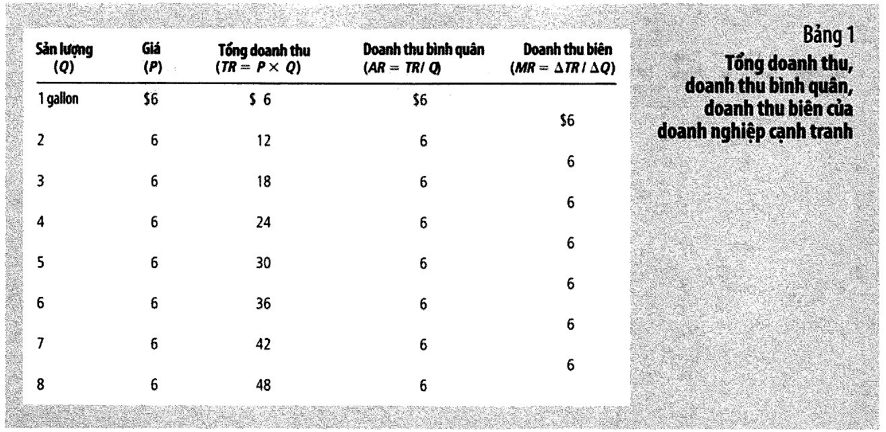
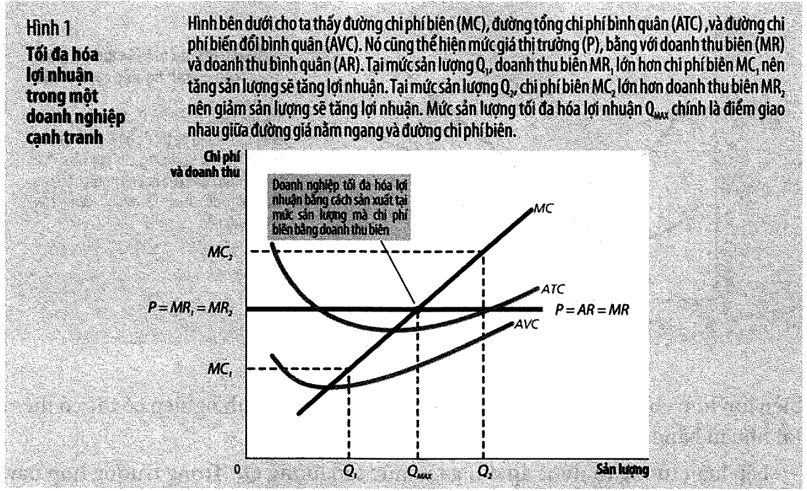
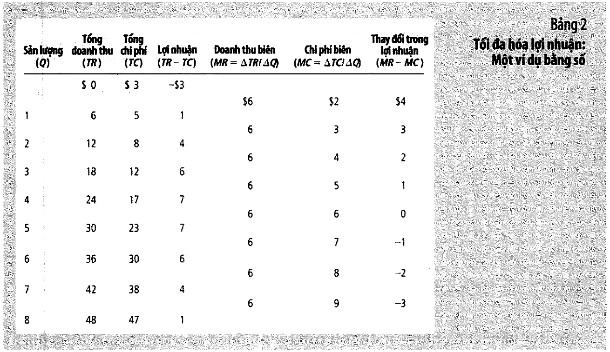
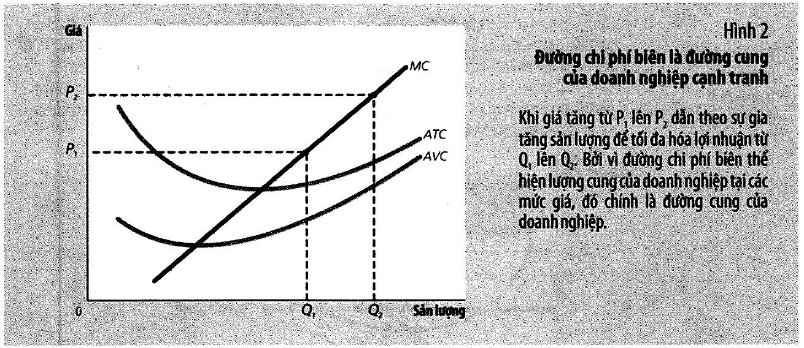
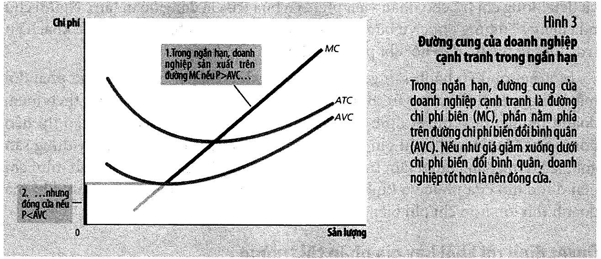
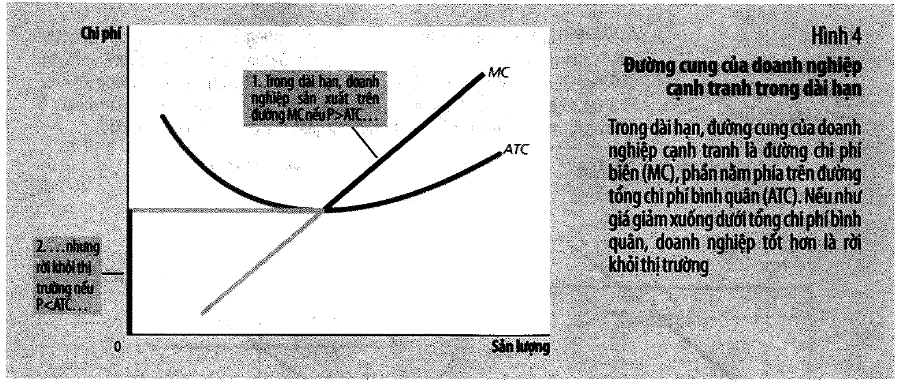
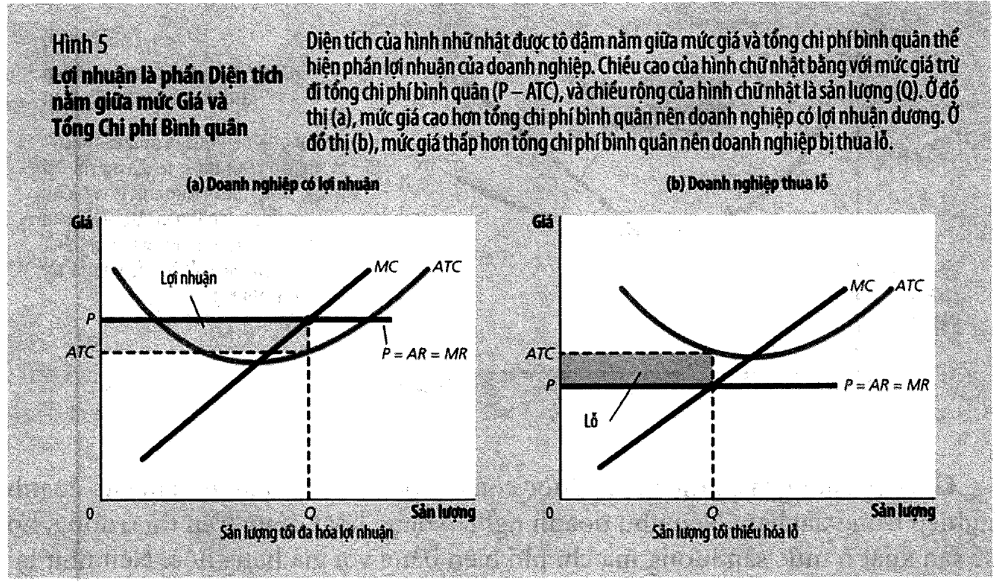
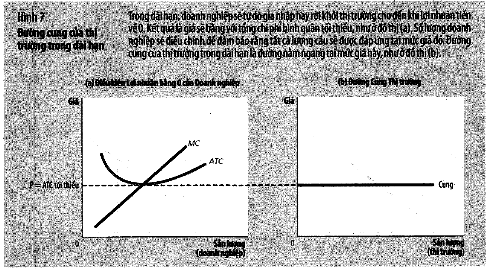
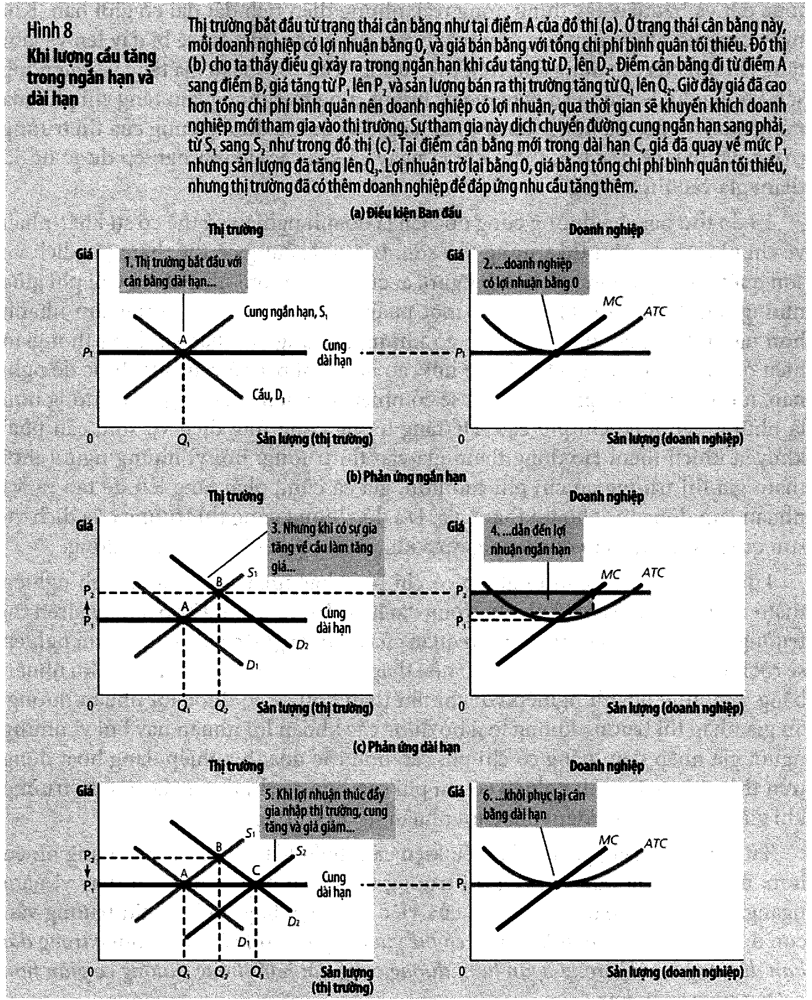

# Bài 6 — Doanh nghiệp trên thị trường cạnh tranh

> Bài học dựng từ **Chương 14 — Doanh nghiệp trên thị trường cạnh tranh** (tr. 308–333)
> của *N. Gregory Mankiw — **Kinh tế học vi mô***, bản dịch của Khoa Kinh tế, **ĐH Kinh tế TP.HCM** (Cengage Learning Asia).
> 🎯 **Vòng 1.** Đây là bài **trả lời hai câu hỏi quản trị cụ thể nhất cả môn**: *sản xuất bao nhiêu*
> và *khi nào nên dừng*. Nó cũng cho thấy đường cung ở [bài 2](bai_02_cung_va_cau.md) từ đâu mà ra.
> 💼 **Góc QTKD** — ví dụ thêm cho ngành quản trị kinh doanh, **không có trong sách**.
> 📚 **Mở rộng** — thứ sách nói lướt hoặc để trong hộp phụ.
> ⚠️ — chỗ dễ hiểu sai, hoặc chỗ sách in sai.
> 📌 **Cần đọc trước:** [Bài 5 — Chi phí sản xuất](bai_05_chi_phi_san_xuat.md). Bài này dùng lại
> **ATC, AVC, MC, quy mô hiệu quả** ở mọi mục — không nắm bài 5 thì không đọc được bài này.

---

## Mục lục

<!-- MUC-LUC -->

- [1. Thị trường cạnh tranh — ba điều kiện](#1-thị-trường-cạnh-tranh--ba-điều-kiện)
- [2. Doanh thu của doanh nghiệp cạnh tranh — AR = MR = P](#2-doanh-thu-của-doanh-nghiệp-cạnh-tranh--ar--mr--p)
- [3. Tối đa hoá lợi nhuận — hai cách nhìn, một đáp án](#3-tối-đa-hoá-lợi-nhuận--hai-cách-nhìn-một-đáp-án)
- [4. Vì sao đường MC CHÍNH LÀ đường cung của doanh nghiệp](#4-vì-sao-đường-mc-chính-là-đường-cung-của-doanh-nghiệp)
- [5. Quyết định ĐÓNG CỬA trong ngắn hạn: P < AVC](#5-quyết-định-đóng-cửa-trong-ngắn-hạn-p--avc)
- [6. 📚 Bình sữa bị đổ — và ba ví dụ về chi phí chìm](#6--bình-sữa-bị-đổ--và-ba-ví-dụ-về-chi-phí-chìm)
- [7. Quyết định RỜI BỎ và GIA NHẬP trong dài hạn: P < ATC](#7-quyết-định-rời-bỏ-và-gia-nhập-trong-dài-hạn-p--atc)
- [8. Lợi nhuận là một hình chữ nhật trên đồ thị](#8-lợi-nhuận-là-một-hình-chữ-nhật-trên-đồ-thị)
- [9. Cân bằng dài hạn — vì sao lợi nhuận bị ép về 0](#9-cân-bằng-dài-hạn--vì-sao-lợi-nhuận-bị-ép-về-0)
- [10. ⚠️ "Lợi nhuận bằng 0" nghĩa là gì — mục dễ hiểu sai nhất chương](#10--lợi-nhuận-bằng-0-nghĩa-là-gì--mục-dễ-hiểu-sai-nhất-chương)
- [11. Cầu tăng: ngắn hạn giá lên, dài hạn số doanh nghiệp lên](#11-cầu-tăng-ngắn-hạn-giá-lên-dài-hạn-số-doanh-nghiệp-lên)
- [12. Code minh hoạ](#12-code-minh-hoạ)
- [13. Tự thử](#13-tự-thử)
- [14. Từ điển thuật ngữ](#14-từ-điển-thuật-ngữ)
- [15. Câu hỏi tự kiểm tra](#15-câu-hỏi-tự-kiểm-tra)
- [Tóm tắt một trang](#tóm-tắt-một-trang)
- [Nguồn](#nguồn)

<!-- /MUC-LUC -->

---

## 1. Thị trường cạnh tranh — ba điều kiện

Sách nhắc lại định nghĩa từ [bài 2](bai_02_cung_va_cau.md#2-cạnh-tranh-là-gì) và **thêm một điều kiện
thứ ba** (tr. 309):

> **Thị trường cạnh tranh** (*competitive market*): thị trường với rất nhiều người mua và người bán một
> loại hàng hoá đồng nhất, trong đó mỗi người mua và bán đều là những **người chấp nhận giá**. — chú thích tr. 309

```
   ① Có rất nhiều người mua và người bán trên thị trường
   ② Hàng hoá được nhiều nhà cung cấp khác nhau bán ra phần lớn là NHƯ NHAU
        ⟹ mọi người là NGƯỜI CHẤP NHẬN GIÁ
   ③ Doanh nghiệp có thể TỰ DO GIA NHẬP hay RỜI KHỎI thị trường
```

⚠️ **Điều kiện ③ có vai trò khác hai điều kiện đầu**, và sách nói rất rõ (tr. 309):

> *"Hầu hết các phân tích về doanh nghiệp cạnh tranh **không cần giả định về gia nhập hay rời khỏi thị
> trường**, bởi vì điều kiện này là không cần thiết để doanh nghiệp trở thành những người chấp nhận giá.
> Nhưng chúng ta sẽ thấy ở phần sau của chương này, nếu như có sự tự do gia nhập hay rời khỏi thị trường
> cạnh tranh, đó là **một nguồn lực mạnh mẽ** tác động lên việc hình thành sự cân bằng trong dài hạn."*

Nói cách khác: ①② quyết định **hành vi ngắn hạn**, ③ quyết định **kết cục dài hạn**. Mục 9–10 là nơi ③
phát huy tác dụng.

Cơ chế mà sách mô tả cho thị trường sữa (tr. 309): *"bởi vì mỗi người bán có thể bán hết những gì anh
ta muốn ở mức giá thị trường hiện tại, anh ta có rất ít lý do để bán rẻ hơn, và nếu như bán với giá cao
hơn, người ta sẽ đi mua chỗ khác."*

---

## 2. Doanh thu của doanh nghiệp cạnh tranh — AR = MR = P

Nhân vật: **Nông trại Bò sữa của Gia đình Vaca**, bán sữa với giá thị trường **6 đô la một gallon**.

Vì nông trại quá nhỏ so với thị trường sữa thế giới, *"giá sữa không phụ thuộc vào số lượng gallon sữa
mà Nông trại nhà Vaca làm ra và bán"* (tr. 310). Hệ quả: **tổng doanh thu tăng theo tỷ lệ với sản lượng**.

Hai định nghĩa (chú thích tr. 310–311):

> **Doanh thu bình quân** (*average revenue*): tổng doanh thu chia cho tổng sản lượng được bán.
> **Doanh thu biên** (*marginal revenue*): thay đổi trong doanh thu do tăng một đơn vị sản lượng bán ra.

**Bảng 1, tr. 311** cho thấy cả hai đều bằng **6 đô la** ở mọi mức sản lượng. Sách rút ra hai kết luận
với **phạm vi áp dụng khác nhau** — chỗ này rất dễ nhầm:



| Kết luận                                         | Áp dụng cho                             |
| ------------------------------------------------ | --------------------------------------- |
| $AR = \dfrac{TR}{Q} = \dfrac{P \times Q}{Q} = P$ | ⭐ **MỌI doanh nghiệp**, kể cả độc quyền |
| $MR = P$                                         | ⭐ **CHỈ doanh nghiệp cạnh tranh**       |

Lý do khác biệt, theo sách (tr. 311): *"Tổng doanh thu bằng $P \times Q$, và $P$ là **không đổi** đối
với một doanh nghiệp cạnh tranh. Do đó, khi $Q$ tăng thêm một đơn vị, tổng doanh thu tăng thêm $P$ đô la."*

📌 Với doanh nghiệp **độc quyền**, bán thêm một đơn vị buộc phải **hạ giá cho mọi đơn vị**, nên
$MR < P$. Đó là toàn bộ khác biệt giữa bài này và **bài 7**.

---

## 3. Tối đa hoá lợi nhuận — hai cách nhìn, một đáp án



**Bảng 2, tr. 312** — chi phí cố định 3 đô la:



|     Q |   TR |   TC | **Lợi nhuận** | *MR* | *MC* | *ΔLợi nhuận* |
| ----: | ---: | ---: | ------------: | ---: | ---: | -----------: |
|     0 |   $0 |   $3 |       **−$3** |      |      |              |
|       |      |      |               | *$6* | *$2* |        *+$4* |
|     1 |    6 |    5 |         **1** |      |      |              |
|       |      |      |               |  *6* |  *3* |         *+3* |
|     2 |   12 |    8 |         **4** |      |      |              |
|       |      |      |               |  *6* |  *4* |         *+2* |
|     3 |   18 |   12 |         **6** |      |      |              |
|       |      |      |               |  *6* |  *5* |         *+1* |
| **4** |   24 |   17 |      **$7** ⭐ |      |      |              |
|       |      |      |               |  *6* |  *6* |          *0* |
| **5** |   30 |   23 |      **$7** ⭐ |      |      |              |
|       |      |      |               |  *6* |  *7* |         *−1* |
|     6 |   36 |   30 |         **6** |      |      |              |
|       |      |      |               |  *6* |  *8* |         *−2* |
|     7 |   42 |   38 |         **4** |      |      |              |
|       |      |      |               |  *6* |  *9* |         *−3* |
|     8 |   48 |   47 |         **1** |      |      |              |

📚 Như ở bài 5, bảng này cũng có công thức đóng: chi phí biên tăng đúng 1 đô la mỗi bước, tức
$MC(q) = q + 1$, nên

$$TC(Q) = 3 + \frac{Q(Q+3)}{2}$$

Mục 11 sinh lại toàn bộ cột TC từ công thức và đối chiếu — **khớp 9/9 dòng**.

### Hai cách tìm sản lượng tối ưu

**Cách 1 — nhìn cột lợi nhuận.** Lớn nhất là **7 đô la**, tại $Q = 4$ hoặc $Q = 5$.

**Cách 2 — so MR với MC.** Đây mới là cách dùng được khi không có bảng:

```
   MR > MC  →  bán thêm một đơn vị THU nhiều hơn CHI   →  SẢN XUẤT THÊM
   MR < MC  →  bán thêm một đơn vị CHI nhiều hơn THU   →  GIẢM sản lượng
   MR = MC  →  DỪNG LẠI. Đây là sản lượng tối đa hoá lợi nhuận.
```

Sách theo dõi từng gallon (tr. 312): gallon đầu tiên có MR = 6, MC = 2 → tăng lợi nhuận 4 đô la (từ −3
lên 1). Gallon thứ hai: MR 6, MC 3 → tăng 3 đô la. *"Miễn là doanh thu biên còn lớn hơn chi phí biên,
gia tăng sản lượng sẽ làm tăng lợi nhuận."* Đến gallon **thứ sáu**: MR 6 nhưng MC **7** → giảm lợi
nhuận 1 đô la. Nên nhà Vaca *"sẽ không sản xuất quá 5 gallon sữa"*.

⭐ **Quy tắc tổng quát:**

$$\boxed{\text{Sản xuất tại } MR = MC}$$

Và vì doanh nghiệp cạnh tranh có $MR = P$:

$$\boxed{\text{Doanh nghiệp cạnh tranh sản xuất tại } P = MC}$$

⚠️ **Đây không phải "bán càng nhiều càng tốt".** Sản lượng tối ưu là một **điểm dừng cụ thể**, và vượt
qua nó thì lợi nhuận **giảm**. Đây là ứng dụng trực tiếp của **nguyên lý 3** ở
[bài 1](bai_01_muoi_nguyen_ly_va_tu_duy_kinh_te.md#4-nguyên-lý-3--con-người-duy-lý-suy-nghĩ-tại-điểm-cận-biên).

---

## 4. Vì sao đường MC CHÍNH LÀ đường cung của doanh nghiệp

**Hình 2, tr. 314**: giá thị trường tăng từ $P_1$ lên $P_2$. Doanh nghiệp đang ở $Q_1$ (nơi $MC = P_1$)
nhận thấy giờ $MR > MC$, nên **tăng sản lượng** tới $Q_2$ (nơi $MC = P_2$).



Sách phát biểu kết luận bằng câu in nghiêng (tr. 315):

> *"Về bản chất, bởi vì **đường chi phí biên xác định mức sản lượng của hàng hoá mà doanh nghiệp sẵn
> sàng cung ứng ra thị trường ở các mức giá khác nhau, đường chi phí biên cũng là đường cung của doanh
> nghiệp cạnh tranh.**"*

⭐ **Đây là câu trả lời cho câu hỏi bỏ ngỏ từ [bài 2](bai_02_cung_va_cau.md#8-cung--lượng-cung-quy-luật-cung-biểu-cung-đường-cung):
"đường cung từ đâu ra?"** Nó là đường chi phí biên. Quy luật cung dốc lên chính là quy luật **chi phí
biên tăng dần** ở [bài 5](bai_05_chi_phi_san_xuat.md#7-ba-đặc-điểm-của-mọi-đường-chi-phí).

Nhưng sách cẩn thận thêm ngay: *"Tuy nhiên, cũng có vài điểm không ủng hộ hoàn toàn kết luận đó khi
chúng ta nghiên cứu trong phần tiếp theo"* (tr. 315) — đó là các ngưỡng ở mục 5 và 6.

---

## 5. Quyết định ĐÓNG CỬA trong ngắn hạn: P < AVC

Sách phân biệt rất kỹ hai từ, và **đề thi rất hay hỏi đúng chỗ này** (tr. 315):

|                               | **Đóng cửa** (*shut down*)                                                     | **Rời bỏ** (*exit*)                    |
| ----------------------------- | ------------------------------------------------------------------------------ | -------------------------------------- |
| Khoảng thời gian              | **ngắn hạn**                                                                   | **dài hạn**                            |
| Nghĩa là                      | không sản xuất gì trong một khoảng thời gian, do điều kiện thị trường hiện tại | rời khỏi thị trường                    |
| Còn phải trả chi phí cố định? | ✅ **CÓ** — vẫn phải trả                                                        | ❌ **KHÔNG** — không phải trả khoản nào |

Ví dụ đất đai của người nông dân (tr. 315): nếu **không trồng gì một vụ mùa**, đất bỏ hoang và tiền đất
**không thu hồi được** → là **chi phí chìm**. Nhưng nếu **rời bỏ hoàn toàn**, anh ta **bán được miếng
đất** → tiền đất **không còn là chi phí chìm** nữa.

### Suy ra điều kiện đóng cửa

Doanh nghiệp đóng cửa nếu doanh thu **nhỏ hơn chi phí biến đổi** (chi phí cố định phải trả trong cả hai
trường hợp nên **không tham gia so sánh**):

$$\text{Đóng cửa nếu } TR < VC$$

Chia cả hai vế cho $Q$:

$$\text{Đóng cửa nếu } \frac{TR}{Q} < \frac{VC}{Q} \qquad\Longleftrightarrow\qquad \boxed{\text{Đóng cửa nếu } P < AVC}$$

Diễn giải trực quan của sách (tr. 316): doanh nghiệp so *"giá bán mà họ nhận được trên mỗi đơn vị sản
phẩm với chi phí biến đổi bình quân phát sinh khi làm ra một đơn vị sản phẩm thông thường"*.

⚠️ **Doanh nghiệp đóng cửa vẫn LỖ** — lỗ đúng bằng chi phí cố định. *"nhưng dù sao cũng đỡ hơn là tiếp
tục sản xuất mà lỗ nặng hơn"* (tr. 316).

### ⟹ Đường cung ngắn hạn

> ⭐ *"**Đường cung ngắn hạn của doanh nghiệp cạnh tranh là một phần của đường chi phí biên, phần nằm
> trên đường chi phí biến đổi bình quân.**"* (tr. 316, Hình 3 tr. 317)



---

## 6. 📚 Bình sữa bị đổ — và ba ví dụ về chi phí chìm

> **Chi phí chìm** (*sunk cost*): những khoản chi phí đã bỏ ra và không thể thu hồi. — chú thích tr. 316

Sách mở bằng hai câu ngạn ngữ: *"Không nên khóc vì đã làm đổ sữa"* và *"Chuyện gì đã qua rồi thì cứ cho
qua đi"*, rồi rút ra: *"Bởi vì không thể thay đổi gì được với khoản chi phí chìm, bạn có thể **phớt lờ
nó** khi ra các quyết định"* (tr. 316).

**Ví dụ vé xem phim (tr. 317)** — đáng nhớ vì nó rất đời thường:

|                                      |        |
| ------------------------------------ | ------ |
| Giá trị bộ phim với bạn              | $15    |
| Bạn đã mua vé                        | $10    |
| Bạn **làm mất vé** trước khi vào rạp |        |
| **Có nên mua vé khác không?**        | **CÓ** |

Lập luận: lợi ích của việc xem phim (**15 đô la**) vẫn cao hơn chi phí cơ hội (**10 đô la** cho chiếc
vé thứ hai). Mười đô la đã trả cho chiếc vé bị mất là **chi phí chìm**. *"Cũng giống như bình sữa đã đổ
ra rồi, khóc than cũng chẳng có ích gì."*

### Nghiên cứu tình huống — nhà hàng ế ẩm và sân golf mini trái mùa (tr. 317–318)

Câu hỏi mở đầu: *"Bạn đã bao giờ bước vào một nhà hàng để ăn trưa và nhận thấy nó vắng tanh chưa? Ắt
hẳn là bạn sẽ tự hỏi, tại sao cửa hàng này vẫn tiếp tục mở cửa?"*

Câu trả lời là quy tắc $P < AVC$:

| Khoản                                                          | Loại         | Có tính vào quyết định mở bữa trưa không?                                  |
| -------------------------------------------------------------- | ------------ | -------------------------------------------------------------------------- |
| Tiền thuê mặt bằng, dụng cụ nhà bếp, bàn ghế, chén dĩa, đồ bạc | **cố định**  | ❌ *"đóng cửa nhà hàng vào buổi trưa không làm giảm các khoản chi phí này"* |
| Giá thức ăn chuẩn bị thêm, lương nhân viên phục vụ bữa trưa    | **biến đổi** | ✅ **chỉ có khoản này**                                                     |

> *"Người chủ nhà hàng sẽ ngừng phục vụ bữa trưa nếu như doanh thu từ vài ba người khách ăn trưa không
> thể bù đắp nổi chi phí biến đổi của nhà hàng."*

**Sân golf mini** ở khu du lịch mùa hè cũng vậy: tiền mua đất và xây dựng sân *"là không đáng quan tâm
trong quá trình ra quyết định này. Sân golf mini chỉ nên được mở cửa phục vụ kinh doanh vào những thời
điểm trong năm khi mà doanh thu lớn hơn chi phí biến đổi."*

💼 Mục 11 dựng lại đúng bài toán này bằng số cho một quán ăn Việt Nam.

---

## 7. Quyết định RỜI BỎ và GIA NHẬP trong dài hạn: P < ATC

Cùng một lối suy luận, nhưng lần này **chi phí cố định cũng tiết kiệm được** nên nó **có** tham gia so
sánh (tr. 318):

$$\text{Rời khỏi nếu } TR < TC \quad\Longrightarrow\quad \frac{TR}{Q} < \frac{TC}{Q} \quad\Longrightarrow\quad \boxed{\text{Rời khỏi nếu } P < ATC}$$

Và tiêu chí gia nhập là **ngược lại hoàn toàn**:

$$\boxed{\text{Gia nhập nếu } P > ATC}$$

### ⟹ Đường cung dài hạn

> ⭐ *"**Đường cung của doanh nghiệp cạnh tranh trong dài hạn là một phần của đường chi phí biên, phần
> nằm trên đường tổng chi phí bình quân.**"* (tr. 319, Hình 4)



### Ba ngưỡng, tóm lại

```
   P < AVC          →  ĐÓNG CỬA ngay (ngắn hạn). Sản xuất chỉ làm lỗ nặng thêm.
   AVC ≤ P < ATC    →  vẫn SẢN XUẤT trong ngắn hạn dù LỖ
                        (doanh thu bù được một phần chi phí cố định đã chìm)
                        nhưng DÀI HẠN phải RỜI BỎ
   P = min ATC      →  lợi nhuận bằng 0 → CÂN BẰNG DÀI HẠN
   P > ATC          →  có LÃI → hút doanh nghiệp MỚI gia nhập
```

⚠️ **Vùng ở giữa là vùng gây nhầm lẫn nhất.** Doanh nghiệp **đang lỗ** mà vẫn **nên tiếp tục sản xuất** —
không phải vì lạc quan, mà vì chi phí cố định đã chìm và doanh thu còn bù được một phần. Mục 11 in ra
bảng đầy đủ ba vùng bằng số.

---

## 8. Lợi nhuận là một hình chữ nhật trên đồ thị

Biến đổi đơn giản nhưng rất hữu dụng (tr. 319):

$$\text{Lợi nhuận} = TR - TC = \left(\frac{TR}{Q} - \frac{TC}{Q}\right) \times Q = \boxed{(P - ATC) \times Q}$$

**Hình 5, tr. 320:**



```
   chiều cao  =  P − ATC     (chênh lệch giữa giá và chi phí bình quân)
   chiều rộng =  Q           (sản lượng)
   diện tích  =  LỢI NHUẬN
```

| Hình 5 | Tình huống | Hình chữ nhật                                                          |
| ------ | ---------- | ---------------------------------------------------------------------- |
| (a)    | $P > ATC$  | nằm **trên** đường ATC → **lợi nhuận dương**                           |
| (b)    | $P < ATC$  | nằm **dưới** đường ATC → **thua lỗ**, diện tích $= (ATC - P) \times Q$ |

⚠️ **Trong cả hai trường hợp, doanh nghiệp vẫn sản xuất tại $P = MC$.** Sách nói rõ ở trường hợp lỗ
(tr. 320): *"tối đa hoá lợi nhuận hàm ý là **tối thiểu hoá khoản lỗ** bằng cách sản xuất ở mức sản lượng
mà giá bán bằng với chi phí biên"*.

💡 **Đây là điểm hay bị hiểu sai trong thực tế:** đang lỗ **không** có nghĩa là phải cắt giảm sản lượng.
Nếu $P > AVC$, cắt sản lượng chỉ làm **lỗ nặng hơn**.
---

## 9. Cân bằng dài hạn — vì sao lợi nhuận bị ép về 0

Đây là kết quả trung tâm của chương, và nó đến **hoàn toàn từ điều kiện ③** ở mục 1.

```
   lợi nhuận DƯƠNG  →  doanh nghiệp MỚI thấy hấp dẫn  →  GIA NHẬP
                    →  cung thị trường TĂNG  →  giá GIẢM  →  lợi nhuận giảm
                                    │
   lợi nhuận ÂM     →  doanh nghiệp cũ  →  RỜI BỎ
                    →  cung thị trường GIẢM  →  giá TĂNG  →  lợi nhuận tăng
                                    │
                                    ▼
                  DỪNG khi lợi nhuận kinh tế = 0
```

Sách phát biểu bằng câu in nghiêng (tr. 322):



> *"**Kết thúc quá trình gia nhập hay rời khỏi thị trường này, những doanh nghiệp vẫn còn ở trên thị
> trường sẽ có mức lợi nhuận kinh tế bằng 0.**"*

### Và từ đó suy ra một kết quả bất ngờ

Dùng $\text{Lợi nhuận} = (P - ATC) \times Q$: lợi nhuận bằng 0 ⟺ $P = ATC$.

Nhưng doanh nghiệp cũng luôn sản xuất tại $P = MC$. Vậy trong cân bằng dài hạn:

$$P = MC = ATC$$

Và ở [bài 5](bai_05_chi_phi_san_xuat.md#7-ba-đặc-điểm-của-mọi-đường-chi-phí) ta đã biết
**$MC = ATC$ chỉ xảy ra tại điểm ATC thấp nhất** — tức **quy mô hiệu quả**. Sách kết luận (tr. 323):

> ⭐ *"**ở trạng thái cân bằng trong dài hạn của một thị trường cạnh tranh được tự do gia nhập hay rời
> khỏi thị trường, các doanh nghiệp phải hoạt động ở mức quy mô hiệu quả của mình.**"*

📌 Nghĩa là: **cạnh tranh tự do buộc mọi doanh nghiệp phải chạy ở mức hiệu quả nhất của chính nó.**
Không phải vì họ tử tế, mà vì ai không làm vậy thì bị đẩy khỏi thị trường.

### ⟹ Đường cung dài hạn của thị trường nằm ngang

Chỉ có **duy nhất một mức giá** cho lợi nhuận bằng 0 — đó là **ATC tối thiểu**. Nên đường cung dài hạn
của thị trường là đường **nằm ngang** tại mức giá đó (**Hình 7b, tr. 322**), tức **co giãn hoàn toàn**.

- Giá **cao hơn** mức này → có lãi → doanh nghiệp gia nhập → cung tăng → giá bị kéo xuống.
- Giá **thấp hơn** → lỗ → doanh nghiệp rời bỏ → cung giảm → giá bị đẩy lên.

Mục 11 mô phỏng đúng quá trình này bằng số: bắt đầu với 150 doanh nghiệp, giá 5,50 đô la và lợi nhuận
4,88 đô la mỗi doanh nghiệp; quá trình gia nhập đẩy hệ thống về **300 doanh nghiệp, giá 4 đô la, lợi
nhuận 0**.

---

## 10. ⚠️ "Lợi nhuận bằng 0" nghĩa là gì — mục dễ hiểu sai nhất chương

Sách tự đặt câu hỏi này thành một mục riêng (tr. 322–323), vì nó **nghe rất vô lý**:

> *"Bất cứ ai làm kinh doanh cũng đều muốn có lợi nhuận. Nếu như tham gia vào thị trường để rồi cuối
> cùng lợi nhuận cũng quay về 0 thì hầu như chẳng có lý do gì để họ ở lại làm kinh doanh."*

Câu trả lời nằm ở chỗ **tổng chi phí trong kinh tế học bao gồm cả chi phí cơ hội** — đúng như
[bài 5, mục 2–4](bai_05_chi_phi_san_xuat.md#4-lợi-nhuận-kinh-tế-và-lợi-nhuận-kế-toán).

**Ví dụ nông trại của sách (tr. 323):**

| Khoản                       |              Giá trị |
| --------------------------- | -------------------: |
| Vốn đầu tư xây nông trại    |      1.000.000 đô la |
| Nếu gửi ngân hàng thì được  | **50.000 đô la/năm** |
| Công việc khác phải hy sinh | **30.000 đô la/năm** |
| **Tổng chi phí cơ hội**     | **80.000 đô la/năm** |

> *"Thậm chí nếu như lợi nhuận của anh ta tiến về 0, doanh thu từ nông trại có thể bù đắp những khoản
> chi phí cơ hội này."*

⭐ **Dịch sang tiếng Việt đời thường:** *"lợi nhuận kinh tế bằng 0"* nghĩa là **bạn đang kiếm đúng bằng
phương án tốt nhất kế tiếp của mình** — không hơn, không kém. Kế toán vẫn ghi đó là **lãi**. Bạn
**không** làm không công.

Đây cũng là lý do doanh nghiệp **ở lại ngành**: rời đi cũng chỉ được đúng chừng ấy.

---

## 11. Cầu tăng: ngắn hạn giá lên, dài hạn số doanh nghiệp lên

**Hình 8, tr. 325** kể một câu chuyện ba hồi. Đây là **mẫu phân tích** dùng lại được cho mọi cú sốc cầu:



| Giai đoạn                        | Chuyện gì xảy ra                                                                            | Giá              | Lợi nhuận |
| -------------------------------- | ------------------------------------------------------------------------------------------- | ---------------- | --------- |
| **A** — cân bằng dài hạn ban đầu | mọi doanh nghiệp ở quy mô hiệu quả                                                          | $P_1 = \min ATC$ | **0**     |
| **B** — ngắn hạn                 | cầu tăng, **số doanh nghiệp chưa kịp đổi** → chỉ có thể tăng sản lượng trên nhà máy hiện có | $P_2 > P_1$      | **dương** |
| **C** — dài hạn                  | lợi nhuận dương hút doanh nghiệp mới → cung dịch phải → giá bị kéo xuống                    | $P_1$ trở lại    | **0**     |

⭐ **Kết luận đắt nhất:**

> Trong dài hạn, cầu tăng làm tăng **SỐ DOANH NGHIỆP** và **SẢN LƯỢNG THỊ TRƯỜNG**, chứ **không** làm
> tăng **GIÁ**.

Mục 12 chạy đúng ba giai đoạn này bằng số: giá $4{,}00 \to 4{,}67 \to 4{,}00$; sản lượng thị trường
$900 \to 1.100 \to 1.200$; số doanh nghiệp $300 \to 300 \to 400$.

### 📚 Nhưng vì sao đường cung dài hạn thực tế vẫn dốc lên?

Sách đưa **hai lý do** (tr. 325–326), và cả hai đều rất thực tế:

**① Nguồn lực có giới hạn.** Ví dụ nông sản: *"bất cứ ai cũng có thể mua đất và bắt đầu xây dựng nông
trại, nhưng diện tích đất đai có giới hạn. Khi ngày càng có nhiều người muốn trở thành nông dân, giá
đất sẽ bị đẩy lên và làm tăng chi phí của các nông dân trên thị trường."*

**② Doanh nghiệp có chi phí khác nhau.** Ví dụ thợ sơn: ai cũng tham gia được, *"nhưng không phải mọi
người ai cũng có chi phí như nhau"* — người làm nhanh hơn, người có phương án dùng thời gian hiệu quả
hơn nên **chi phí cơ hội cao hơn**. Ở bất cứ mức giá nào, **người chi phí thấp gia nhập trước**. Muốn
có thêm cung phải **tăng giá** để kéo người chi phí cao vào.

⭐ **Hệ quả rất đáng chú ý ở lý do ②** (tr. 326) — nó phá vỡ kết luận "lợi nhuận bằng 0":

> *"do các doanh nghiệp có chi phí khác nhau, **một vài doanh nghiệp thậm chí vẫn có thể có lợi nhuận
> trong dài hạn**. Trong trường hợp này, giá trên thị trường phản ánh tổng chi phí bình quân của
> **doanh nghiệp biên** — là doanh nghiệp sẽ rời khỏi thị trường nếu giá cả trở nên thấp hơn. Doanh
> nghiệp này có lợi nhuận bằng 0, nhưng doanh nghiệp với chi phí thấp hơn sẽ được lợi nhuận dương."*

💼 **Đây là nền tảng kinh tế học của khái niệm "lợi thế cạnh tranh".** Bạn kiếm được lợi nhuận bền vững
trong một ngành cạnh tranh **khi và chỉ khi chi phí của bạn thấp hơn doanh nghiệp biên**. Không phải
nhờ bán đắt hơn — trong thị trường cạnh tranh bạn không bán đắt hơn được.

Và câu kết của sách (tr. 326):

> *"Bởi vì các doanh nghiệp có thể gia nhập hay rời khỏi thị trường trong dài hạn dễ dàng hơn là trong
> ngắn hạn, **đường cung dài hạn thông thường co giãn hơn đường cung ngắn hạn**."*

📌 Khớp đúng với [bài 3, mục 10](bai_03_do_co_gian_va_dinh_gia.md#10-độ-co-giãn-của-cung) — nhưng bây
giờ ta biết **cơ chế** đằng sau: đó là gia nhập và rời bỏ.

---

## 12. Code minh hoạ

> ⚙️ **Chạy:** cần **Python 3.10+**. Lưu file rồi gõ `python3 bai-06-thi-truong-canh-tranh.py`.
> **Không cần cài gói nào.** File có sẵn tại [thuc_hanh/bai-06-thi-truong-canh-tranh.py](../thuc_hanh/bai-06-thi-truong-canh-tranh.py).

Tám mục. Dùng `Fraction` cho mọi phép chia nên kết quả **chính xác tuyệt đối**, không có sai số dấu
phẩy động.

Hai mục đáng chạy nhất:

- **Mục 3** quét bảy mức giá và cho ra **ba vùng quyết định** — đóng cửa, lỗ-nhưng-tiếp-tục, có lãi —
  cùng với hai ngưỡng \$2 và \$4 tính ra từ chính hàm chi phí.
- **Mục 6** mô phỏng **gia nhập và rời bỏ**: bắt đầu 150 doanh nghiệp, giá \$5,50, lợi nhuận \$4,88;
  quá trình gia nhập ép hệ thống về **300 doanh nghiệp, giá \$4, lợi nhuận 0** — và \$4 chính là
  **ATC tối thiểu** tính ở mục 3.

Hàm chi phí lấy ngược từ Bảng 2 của sách: $TC(Q) = 3 + Q(Q+3)/2$, nên $MC(Q) = Q+1$ và
$ATC_{\min} = \$4$ tại $Q = 2$ hoặc $3$.

```python
"""Bai 6 — Doanh nghiep tren thi truong canh tranh (Mankiw, chuong 14).
Chay: python3 bai-06-thi-truong-canh-tranh.py   (Python 3.10+, khong can cai goi nao)

Dung Fraction cho moi phep chia de ket qua CHINH XAC, khong sai so dau phay dong.
Ket qua tat dinh.
"""

from fractions import Fraction as F

def d(x, n=2):
    """In mot Fraction duoi dang so thap phan n chu so."""
    return f"{float(x):.{n}f}"

# ══ 1. DOANH THU CUA DOANH NGHIEP CANH TRANH — Bang 1, tr. 311 ══════════════
GIA = 6      # do la moi gallon — nong trai nha Vaca la NGUOI CHAP NHAN GIA

print("1. DOANH THU CUA DOANH NGHIEP CANH TRANH — Bang 1, tr. 311")
print("   Nong trai Bo sua nha Vaca, gia thi truong $6/gallon")
print("     Q     gia     tong doanh thu   doanh thu bq   |  doanh thu bien")
for Q in range(1, 9):
    tr = GIA * Q
    ar = tr // Q
    mr = tr - GIA * (Q - 1)
    print(f"   {Q:>3}     ${GIA}       {'$' + str(tr):>10}       {'$' + str(ar):>8}   |  {'$' + str(mr):>8}")
print("   ⭐ AR = MR = P = $6 o MOI muc san luong.")
print("      AR = TR/Q = (P x Q)/Q = P  ->  dung cho MOI doanh nghiep")
print("      MR = P    ->  chi dung cho doanh nghiep CANH TRANH (P khong doi theo Q)")
print()

# ══ 2. TOI DA HOA LOI NHUAN — Bang 2, tr. 312 ═══════════════════════════════
# Doc nguoc tu bang cua sach: chi phi bien MC(q) = q + 1
#   =>  TC(Q) = 3 + Q(Q+3)/2   (chi phi co dinh $3)
FC = 3
def TC(Q):  return FC + Q * (Q + 3) // 2
def MC(Q):  return Q + 1                       # = TC(Q) - TC(Q-1)
def TR(Q):  return GIA * Q

print("2. TOI DA HOA LOI NHUAN — Bang 2, tr. 312")
sach_tc = {0: 3, 1: 5, 2: 8, 3: 12, 4: 17, 5: 23, 6: 30, 7: 38, 8: 47}
lech = sum(1 for Q in sach_tc if TC(Q) != sach_tc[Q])
print(f"   Cong thuc suy ra: TC(Q) = 3 + Q(Q+3)/2   ->  khop ban in tr. 312: "
      f"{len(sach_tc) - lech}/{len(sach_tc)} dong")
print()
print("     Q    TR    TC    loi nhuan  |   MR    MC   thay doi loi nhuan")
for Q in range(0, 9):
    ln = TR(Q) - TC(Q)
    if Q == 0:
        print(f"   {Q:>3}   {'$' + str(TR(0)):>4}  {'$' + str(TC(0)):>4}   {'-$' + str(-ln):>9}  |")
        continue
    dln = ln - (TR(Q - 1) - TC(Q - 1))
    print(f"   {Q:>3}   {'$' + str(TR(Q)):>4}  {'$' + str(TC(Q)):>4}   {'$' + str(ln):>9}  |"
          f"  {'$' + str(GIA):>4}  {'$' + str(MC(Q)):>4}   {dln:>+16}")
loi_nhuan = {Q: TR(Q) - TC(Q) for Q in range(9)}
cao_nhat = max(loi_nhuan.values())
q_tot = [Q for Q, v in loi_nhuan.items() if v == cao_nhat]
print(f"   ⭐ Loi nhuan cao nhat ${cao_nhat} tai Q = {q_tot}   (sach tr. 312: 'hoac 4 hoac 5 gallon')")
print(f"   ⭐ MR = MC tai Q = {[Q for Q in range(1, 9) if MC(Q) == GIA]}  ->  cung ket qua")
print("      Q < 5: MR $6 > MC  ->  san xuat them lam TANG loi nhuan")
print("      Q > 5: MR $6 < MC  ->  san xuat them lam GIAM loi nhuan")
print()

# ══ 3. BA NGUONG GIA — SAN XUAT, DONG CUA, ROI BO ═══════════════════════════
# Doanh nghiep chon Q sao cho MC(Q) = P  =>  Q = P - 1
def q_toi_uu(P):    return max(F(0), P - 1)
def VC(Q):          return Q * (Q + 3) / 2
def AVC(Q):         return F(Q + 3, 2) if Q > 0 else None
def ATC(Q):         return F(FC, 1) / Q + F(Q + 3, 2) if Q > 0 else None

# AVC tai san luong toi uu = (P-1+3)/2 = (P+2)/2.  Dong cua khi P < AVC:
#   P < (P+2)/2  <=>  P < 2
GIA_DONG_CUA = 2
# ATC nho nhat: 3/Q + (Q+3)/2 dat min tai Q = 2 va Q = 3, bang $4
atc_moi_q = {Q: ATC(Q) for Q in range(1, 9)}
ATC_MIN = min(atc_moi_q.values())
QUY_MO_HIEU_QUA = [Q for Q, v in atc_moi_q.items() if v == ATC_MIN]

print("3. BA NGUONG GIA CUA DOANH NGHIEP")
print(f"   quy mo hieu qua: Q = {QUY_MO_HIEU_QUA}, ATC nho nhat = ${d(ATC_MIN)}")
print()
print("      gia    Q toi uu      AVC      ATC   loi nhuan   QUYET DINH")
for P in (F(1), F(2), F(3), F(4), F(5), F(6), F(8)):
    q = q_toi_uu(P)
    if q == 0 or P < AVC(q):
        print(f"   {'$' + d(P):>7}   {'0':>8}   {'—':>6}   {'—':>6}   {'-$' + str(FC):>9}   "
              f"DONG CUA (P < AVC) — van chiu chi phi co dinh")
        continue
    ln = P * q - (F(FC) + q * (q + 3) / 2)
    if P < ATC(q):
        qd = "san xuat tiep NHUNG LO -> DAI HAN ROI BO (P < ATC)"
    elif P == ATC(q):
        qd = "loi nhuan = 0 -> CAN BANG DAI HAN"
    else:
        qd = "co LAI -> hut doanh nghiep MOI gia nhap"
    print(f"   {'$' + d(P):>7}   {d(q):>8}   {'$' + d(AVC(q)):>6}   {'$' + d(ATC(q)):>6}   "
          f"{('$' if ln >= 0 else '-$') + d(abs(ln)):>9}   {qd}")
print()
print("   ⭐ HAI QUY TAC, HAI KHOANG THOI GIAN KHAC NHAU:")
print(f"      DONG CUA (ngan han): P < AVC   ->  o day la P < ${GIA_DONG_CUA}")
print(f"      ROI BO   (dai han) : P < ATC   ->  o day la P < ${d(ATC_MIN)}")
print("      ⚠ Vung giua hai nguong: LO nhung van nen SAN XUAT trong ngan han,")
print("        vi doanh thu con bu duoc mot phan chi phi co dinh (chi phi CHIM).")
print(f"      ⚠ Dung tai P = ${GIA_DONG_CUA} hai phuong an BANG NHAU: san xuat hay dong cua")
print(f"        deu lo dung ${FC} (= chi phi co dinh). Doanh nghiep BANG QUAN.")
print()
print("   ⟹ DUONG CUNG cua doanh nghiep canh tranh:")
print("      NGAN HAN: phan duong MC nam TREN duong AVC   (P >= $2)")
print("      DAI HAN : phan duong MC nam TREN duong ATC   (P >= $4)")
print()

# ══ 4. VE DUONG CHI PHI VA BA NGUONG ════════════════════════════════════════
print("4. DO THI CHI PHI VA BA NGUONG GIA")
CAO, RONG = 16, 46
tran = 10
luoi = [[" "] * RONG for _ in range(CAO)]
def ve(ham, ky, q_min=1):
    for i in range(RONG):
        q = q_min + (8 - q_min) * i / (RONG - 1)
        v = ham(q)
        if v is None or not (0 <= v <= tran):
            continue
        r = CAO - 1 - round(v / tran * (CAO - 1))
        if luoi[r][i] == " ":
            luoi[r][i] = ky
ve(lambda q: 3 / q + (q + 3) / 2, "A")     # ATC
ve(lambda q: (q + 3) / 2, "v")             # AVC
ve(lambda q: q + 1, "M")                   # MC
for muc, ky in ((4, "="), (2, "-")):       # hai nguong gia
    r = CAO - 1 - round(muc / tran * (CAO - 1))
    for i in range(RONG):
        if luoi[r][i] == " ":
            luoi[r][i] = ky
print("      gia, chi phi")
for i, hang in enumerate(luoi):
    v = tran - i * tran / (CAO - 1)
    nhan = f"{'$' + str(round(v)):>5}" if abs(v - round(v)) < 1e-9 and round(v) % 2 == 0 else "     "
    print(f"      {nhan} │{''.join(hang)}".rstrip())
print("            └" + "─" * RONG)
print("             1" + " " * (RONG - 3) + "8  san luong")
print("      M = MC   A = ATC   v = AVC")
print("      = duong $4 = ATC toi thieu -> NGUONG ROI BO (dai han)")
print("      - duong $2 = AVC toi thieu -> NGUONG DONG CUA (ngan han)")
print()

# ══ 5. LOI NHUAN LA MOT HINH CHU NHAT — Hinh 5, tr. 320 ═════════════════════
print("5. LOI NHUAN = (P - ATC) x Q  — Hinh 5, tr. 320")
for P in (F(6), F(3)):
    q = q_toi_uu(P)
    atc = ATC(q)
    ln = (P - atc) * q
    ten = "CO LAI" if ln > 0 else "THUA LO"
    print(f"   P = ${d(P)}:  Q* = {d(q)},  ATC = ${d(atc)}")
    print(f"      chieu cao = P - ATC = ${d(P)} - ${d(atc)} = ${d(P - atc)}")
    print(f"      chieu rong = Q = {d(q)}")
    print(f"      dien tich = {'$' + d(ln) if ln >= 0 else '-$' + d(-ln)}  ->  {ten}")
print("   ⚠ Ca hai truong hop doanh nghiep deu san xuat tai MC = P.")
print("      Khi lo, 'toi da hoa loi nhuan' co nghia la TOI THIEU HOA KHOAN LO.")
print()

# ══ 6. CAN BANG DAI HAN — MO PHONG GIA NHAP VA ROI BO ═══════════════════════
# Cau thi truong: Qd = 1500 - 150P.  Moi doanh nghiep cung q = P - 1.
# Can bang ngan han voi N doanh nghiep: 1500 - 150P = N(P - 1)
def can_bang(N):
    P = F(1500 + N, 150 + N)
    q = P - 1
    Q = N * q
    ln = (P - ATC(q)) * q if q > 0 else F(-FC)
    return P, q, Q, ln

print("6. CAN BANG DAI HAN — GIA NHAP VA ROI BO EP LOI NHUAN VE 0")
print("   cau thi truong: Qd = 1500 - 150P    moi doanh nghiep cung q = P - 1")
print()
print("   (a) QUET SO DOANH NGHIEP — loi nhuan doi dau o dau?")
print("       so DN     gia   q moi DN   Q thi truong   loi nhuan/DN   ap luc")
for N in (150, 200, 250, 300, 350, 400, 450):
    P, q, Q, ln = can_bang(N)
    ap = "LAI -> them DN GIA NHAP" if ln > 0 else ("LO -> DN ROI BO" if ln < 0 else "CAN BANG — dung lai")
    print(f"   {N:>9}   {'$' + d(P):>6}   {d(q):>8}   {d(Q, 0):>12}   "
          f"{('$' if ln >= 0 else '-$') + d(abs(ln)):>12}   {ap}")
print("   ⭐ Loi nhuan doi dau DUNG tai N = 300. Giai truc tiep:")
print("      loi nhuan = 0  <=>  P = ATC toi thieu = $4")
print("      (1500 + N)/(150 + N) = 4  <=>  1500 + N = 600 + 4N  <=>  N = 300")
print()
print("   (b) MO PHONG QUA TRINH DIEU CHINH (moi vong doi mot phan so DN)")
print("       vong   so DN     gia   loi nhuan/DN   dieu gi xay ra")
N = 150
for vong in range(9):
    P, q, Q, ln = can_bang(N)
    if abs(ln) < F(1, 100):
        print(f"   {vong:>9}   {N:>5}   {'$' + d(P):>6}   {'$' + d(ln):>12}   "
              f"loi nhuan ~ 0 -> DUNG LAI")
        break
    viec = "co LAI -> DN moi GIA NHAP" if ln > 0 else "LO -> DN cu ROI BO"
    print(f"   {vong:>9}   {N:>5}   {'$' + d(P):>6}   "
          f"{('$' if ln >= 0 else '-$') + d(abs(ln)):>12}   {viec}")
    N += round(N * float(ln) / 25)      # buoc dieu chinh CO GIAM CHAN
print(f"   ⭐ Dang tien ve N = 300 (con {300 - N} doanh nghiep nua). Diem dung:")
print(f"      gia = ${d(can_bang(300)[0])} = ATC TOI THIEU, loi nhuan = 0,")
print(f"      moi doanh nghiep san xuat {d(can_bang(300)[1])} = QUY MO HIEU QUA.")
print("   ⟹ Trong dai han, canh tranh ep gia xuong DUNG BANG day chu U cua ATC.")
print("      Do la ly do duong cung DAI HAN cua thi truong NAM NGANG (Hinh 7b, tr. 322).")
print()

# ══ 7. CAU TANG: NGAN HAN vs DAI HAN — Hinh 8, tr. 325 ══════════════════════
def can_bang_voi_cau(N, chan):
    """Cau Qd = chan - 150P."""
    P = F(chan + N, 150 + N)
    q = P - 1
    return P, q, N * q, (P - ATC(q)) * q

print("7. CAU TANG — PHAN UNG NGAN HAN VA DAI HAN  (Hinh 8, tr. 325)")
print("   cau dich phai: Qd = 1500 - 150P  ->  Qd = 1800 - 150P")
print()
giai_doan = [
    ("A. can bang dai han BAN DAU", 300, 1500),
    ("B. NGAN HAN (so DN chua kip doi)", 300, 1800),
    ("C. can bang DAI HAN moi", 400, 1800),
]
print("      giai doan                             so DN     gia   q/DN   Q thi truong   loi nhuan/DN")
for ten, N_, chan in giai_doan:
    P, q, Q, ln = can_bang_voi_cau(N_, chan)
    print(f"   {ten:<38}  {N_:>5}   {'$' + d(P):>5}   {d(q):>4}   {d(Q, 0):>12}   "
          f"{('$' if ln >= 0 else '-$') + d(abs(ln)):>12}")
print("   ⭐ NGAN HAN: gia TANG ($4 -> $4,67), doanh nghiep CO LAI")
print("      DAI HAN : lai hut DN moi vao (300 -> 400), gia VE LAI $4, loi nhuan VE 0")
print("      nhung SAN LUONG THI TRUONG tang han: 900 -> 1.200")
print("   ⟹ Trong dai han, cau tang lam tang SO DOANH NGHIEP, khong lam tang GIA.")
print()

# ══ 8. 💼 GOC QTKD ══════════════════════════════════════════════════════════
print("8. 💼 GOC QTKD — BA CAU HOI CUA MOT QUAN AN")
CP_CO_DINH_THANG = 90_000     # nghin dong: thue mat bang, luong quan ly, khau hao
print(f"   Quan an: chi phi co dinh {CP_CO_DINH_THANG:,}k/thang. Xet BUA TRUA rieng.")
print("   Bua trua: bien phi 45k/suat (nguyen lieu + luong phuc vu ca trua)")
BIEN_PHI_TRUA = 45
print()
print("     gia ban   suat/thang   doanh thu   bien phi   dong gop   NEN MO BUA TRUA?")
for gia, suat in ((40, 300), (50, 300), (60, 500), (70, 700)):
    dt = gia * suat
    bp = BIEN_PHI_TRUA * suat
    dg = dt - bp
    kl = "KHONG — doanh thu khong bu noi bien phi" if dg <= 0 else \
         f"CO — dong gop {dg:,}k vao chi phi co dinh"
    print(f"   {gia:>8}k   {suat:>10,}   {dt:>9,}k   {bp:>8,}k   {dg:>+8,}k   {kl}")
print("   ⭐ Chi phi co dinh 90.000k KHONG xuat hien trong bang tren.")
print("      Dong hay mo bua trua deu phai tra tien thue mat bang -> CHI PHI CHIM.")
print("      (Nghien cuu tinh huong 'Nhung nha hang e am va san golf mini luc trai mua',")
print("       tr. 317-318)")
print()
print("   ⚠ NHUNG DAI HAN THI KHAC — khi het han hop dong thue mat bang:")
dong_gop_trua = (60 - BIEN_PHI_TRUA) * 500
print(f"      bua trua dong gop        {dong_gop_trua:>8,}k/thang")
print(f"      chi phi co dinh ca quan  {CP_CO_DINH_THANG:>8,}k/thang")
print(f"      -> phan con lai          {CP_CO_DINH_THANG - dong_gop_trua:>8,}k/thang phai do")
print("         bua sang va bua toi ganh.")
print("      Neu TONG dong gop cua ca ba bua < chi phi co dinh thi khi het hop dong")
print("      thue, quan NEN ROI BO (P < ATC). Ngan han: dong cua bua nao khong bu noi")
print("      bien phi. Dai han: bo ca quan neu khong bu noi TOAN BO chi phi.")
print()

print("   💼 'LOI NHUAN BANG 0' NGHIA LA GI — vi du nong trai cua sach (tr. 323)")
von = 1_000_000
lai_ngan_hang = 50_000
luong_bo_qua = 30_000
print(f"      dau tu {von:,} do la vao nong trai")
print(f"      neu gui ngan hang               -> {lai_ngan_hang:,} do la/nam")
print(f"      cong viec khac phai hy sinh     -> {luong_bo_qua:,} do la/nam")
print(f"      ⟹ CHI PHI CO HOI                 = {lai_ngan_hang + luong_bo_qua:,} do la/nam")
print(f"      'Loi nhuan KINH TE = 0' nghia la nong trai van dem ve dung "
      f"{lai_ngan_hang + luong_bo_qua:,} do la/nam.")
print("      Ke toan se ghi day la LAI. Chu nong trai KHONG lam khong cong.")
print("      ⚠ Do la ly do doanh nghiep van o lai nganh du 'loi nhuan bang 0'.")
print()

print("   ⭐ BANG QUYET DINH — dan tu ba nguong o muc 3:")
print("      gia < bien phi binh quan (AVC)   ->  NGUNG BAN NGAY. Ban cang nhieu lo cang nang.")
print("      AVC <= gia < ATC                 ->  van ban trong NGAN HAN (bu duoc mot phan")
print("                                           chi phi co dinh), nhung DAI HAN phai thoat")
print("                                           hoac ha chi phi / tang gia")
print("      gia >= ATC                       ->  co lai. Neu lai LON, chuan bi doi thu MOI")
print("                                           gia nhap va gia se bi ep xuong (muc 6)")
print("   ⚠ Nganh de gia nhap = lai cao KHONG BEN. Muon giu lai lau dai phai co RAO CAN:")
print("      thuong hieu, chi phi chuyen doi, quy mo, bang sang che — bai 7, bai 8.")
```

**Kết quả chạy thật:**

```
1. DOANH THU CUA DOANH NGHIEP CANH TRANH — Bang 1, tr. 311
   Nong trai Bo sua nha Vaca, gia thi truong $6/gallon
     Q     gia     tong doanh thu   doanh thu bq   |  doanh thu bien
     1     $6               $6             $6   |        $6
     2     $6              $12             $6   |        $6
     3     $6              $18             $6   |        $6
     4     $6              $24             $6   |        $6
     5     $6              $30             $6   |        $6
     6     $6              $36             $6   |        $6
     7     $6              $42             $6   |        $6
     8     $6              $48             $6   |        $6
   ⭐ AR = MR = P = $6 o MOI muc san luong.
      AR = TR/Q = (P x Q)/Q = P  ->  dung cho MOI doanh nghiep
      MR = P    ->  chi dung cho doanh nghiep CANH TRANH (P khong doi theo Q)

2. TOI DA HOA LOI NHUAN — Bang 2, tr. 312
   Cong thuc suy ra: TC(Q) = 3 + Q(Q+3)/2   ->  khop ban in tr. 312: 9/9 dong

     Q    TR    TC    loi nhuan  |   MR    MC   thay doi loi nhuan
     0     $0    $3         -$3  |
     1     $6    $5          $1  |    $6    $2                 +4
     2    $12    $8          $4  |    $6    $3                 +3
     3    $18   $12          $6  |    $6    $4                 +2
     4    $24   $17          $7  |    $6    $5                 +1
     5    $30   $23          $7  |    $6    $6                 +0
     6    $36   $30          $6  |    $6    $7                 -1
     7    $42   $38          $4  |    $6    $8                 -2
     8    $48   $47          $1  |    $6    $9                 -3
   ⭐ Loi nhuan cao nhat $7 tai Q = [4, 5]   (sach tr. 312: 'hoac 4 hoac 5 gallon')
   ⭐ MR = MC tai Q = [5]  ->  cung ket qua
      Q < 5: MR $6 > MC  ->  san xuat them lam TANG loi nhuan
      Q > 5: MR $6 < MC  ->  san xuat them lam GIAM loi nhuan

3. BA NGUONG GIA CUA DOANH NGHIEP
   quy mo hieu qua: Q = [2, 3], ATC nho nhat = $4.00

      gia    Q toi uu      AVC      ATC   loi nhuan   QUYET DINH
     $1.00          0        —        —         -$3   DONG CUA (P < AVC) — van chiu chi phi co dinh
     $2.00       1.00    $2.00    $5.00      -$3.00   san xuat tiep NHUNG LO -> DAI HAN ROI BO (P < ATC)
     $3.00       2.00    $2.50    $4.00      -$2.00   san xuat tiep NHUNG LO -> DAI HAN ROI BO (P < ATC)
     $4.00       3.00    $3.00    $4.00       $0.00   loi nhuan = 0 -> CAN BANG DAI HAN
     $5.00       4.00    $3.50    $4.25       $3.00   co LAI -> hut doanh nghiep MOI gia nhap
     $6.00       5.00    $4.00    $4.60       $7.00   co LAI -> hut doanh nghiep MOI gia nhap
     $8.00       7.00    $5.00    $5.43      $18.00   co LAI -> hut doanh nghiep MOI gia nhap

   ⭐ HAI QUY TAC, HAI KHOANG THOI GIAN KHAC NHAU:
      DONG CUA (ngan han): P < AVC   ->  o day la P < $2
      ROI BO   (dai han) : P < ATC   ->  o day la P < $4.00
      ⚠ Vung giua hai nguong: LO nhung van nen SAN XUAT trong ngan han,
        vi doanh thu con bu duoc mot phan chi phi co dinh (chi phi CHIM).
      ⚠ Dung tai P = $2 hai phuong an BANG NHAU: san xuat hay dong cua
        deu lo dung $3 (= chi phi co dinh). Doanh nghiep BANG QUAN.

   ⟹ DUONG CUNG cua doanh nghiep canh tranh:
      NGAN HAN: phan duong MC nam TREN duong AVC   (P >= $2)
      DAI HAN : phan duong MC nam TREN duong ATC   (P >= $4)

4. DO THI CHI PHI VA BA NGUONG GIA
      gia, chi phi
        $10 │
            │                                             M
            │                                         MMMM
         $8 │                                     MMMM
            │                                 MMMM
            │                            MMMMM
         $6 │                        MMMM               AAA
            │A                   MMMM         AAAAAAAAAAvvv
            │ AA            MMMMM AAAAAAAAAAAAvvvvvv
         $4 │===AAAAAAAAAAAAAAAAAA=vvvvvvvv================
            │       MMMM  vvvvvvvvv
            │   MMvvvvvvvv
         $2 │vvvvv-----------------------------------------
            │
            │
         $0 │
            └──────────────────────────────────────────────
             1                                           8  san luong
      M = MC   A = ATC   v = AVC
      = duong $4 = ATC toi thieu -> NGUONG ROI BO (dai han)
      - duong $2 = AVC toi thieu -> NGUONG DONG CUA (ngan han)

5. LOI NHUAN = (P - ATC) x Q  — Hinh 5, tr. 320
   P = $6.00:  Q* = 5.00,  ATC = $4.60
      chieu cao = P - ATC = $6.00 - $4.60 = $1.40
      chieu rong = Q = 5.00
      dien tich = $7.00  ->  CO LAI
   P = $3.00:  Q* = 2.00,  ATC = $4.00
      chieu cao = P - ATC = $3.00 - $4.00 = $-1.00
      chieu rong = Q = 2.00
      dien tich = -$2.00  ->  THUA LO
   ⚠ Ca hai truong hop doanh nghiep deu san xuat tai MC = P.
      Khi lo, 'toi da hoa loi nhuan' co nghia la TOI THIEU HOA KHOAN LO.

6. CAN BANG DAI HAN — GIA NHAP VA ROI BO EP LOI NHUAN VE 0
   cau thi truong: Qd = 1500 - 150P    moi doanh nghiep cung q = P - 1

   (a) QUET SO DOANH NGHIEP — loi nhuan doi dau o dau?
       so DN     gia   q moi DN   Q thi truong   loi nhuan/DN   ap luc
         150    $5.50       4.50            675          $4.88   LAI -> them DN GIA NHAP
         200    $4.86       3.86            771          $2.51   LAI -> them DN GIA NHAP
         250    $4.38       3.38            844          $1.01   LAI -> them DN GIA NHAP
         300    $4.00       3.00            900          $0.00   CAN BANG — dung lai
         350    $3.70       2.70            945         -$0.70   LO -> DN ROI BO
         400    $3.45       2.45            982         -$1.21   LO -> DN ROI BO
         450    $3.25       2.25           1012         -$1.59   LO -> DN ROI BO
   ⭐ Loi nhuan doi dau DUNG tai N = 300. Giai truc tiep:
      loi nhuan = 0  <=>  P = ATC toi thieu = $4
      (1500 + N)/(150 + N) = 4  <=>  1500 + N = 600 + 4N  <=>  N = 300

   (b) MO PHONG QUA TRINH DIEU CHINH (moi vong doi mot phan so DN)
       vong   so DN     gia   loi nhuan/DN   dieu gi xay ra
           0     150    $5.50          $4.88   co LAI -> DN moi GIA NHAP
           1     179    $5.10          $3.37   co LAI -> DN moi GIA NHAP
           2     203    $4.82          $2.40   co LAI -> DN moi GIA NHAP
           3     222    $4.63          $1.77   co LAI -> DN moi GIA NHAP
           4     238    $4.48          $1.31   co LAI -> DN moi GIA NHAP
           5     251    $4.37          $0.98   co LAI -> DN moi GIA NHAP
           6     261    $4.28          $0.75   co LAI -> DN moi GIA NHAP
           7     269    $4.22          $0.58   co LAI -> DN moi GIA NHAP
           8     275    $4.18          $0.46   co LAI -> DN moi GIA NHAP
   ⭐ Dang tien ve N = 300 (con 20 doanh nghiep nua). Diem dung:
      gia = $4.00 = ATC TOI THIEU, loi nhuan = 0,
      moi doanh nghiep san xuat 3.00 = QUY MO HIEU QUA.
   ⟹ Trong dai han, canh tranh ep gia xuong DUNG BANG day chu U cua ATC.
      Do la ly do duong cung DAI HAN cua thi truong NAM NGANG (Hinh 7b, tr. 322).

7. CAU TANG — PHAN UNG NGAN HAN VA DAI HAN  (Hinh 8, tr. 325)
   cau dich phai: Qd = 1500 - 150P  ->  Qd = 1800 - 150P

      giai doan                             so DN     gia   q/DN   Q thi truong   loi nhuan/DN
   A. can bang dai han BAN DAU               300   $4.00   3.00            900          $0.00
   B. NGAN HAN (so DN chua kip doi)          300   $4.67   3.67           1100          $1.89
   C. can bang DAI HAN moi                   400   $4.00   3.00           1200          $0.00
   ⭐ NGAN HAN: gia TANG ($4 -> $4,67), doanh nghiep CO LAI
      DAI HAN : lai hut DN moi vao (300 -> 400), gia VE LAI $4, loi nhuan VE 0
      nhung SAN LUONG THI TRUONG tang han: 900 -> 1.200
   ⟹ Trong dai han, cau tang lam tang SO DOANH NGHIEP, khong lam tang GIA.

8. 💼 GOC QTKD — BA CAU HOI CUA MOT QUAN AN
   Quan an: chi phi co dinh 90,000k/thang. Xet BUA TRUA rieng.
   Bua trua: bien phi 45k/suat (nguyen lieu + luong phuc vu ca trua)

     gia ban   suat/thang   doanh thu   bien phi   dong gop   NEN MO BUA TRUA?
         40k          300      12,000k     13,500k     -1,500k   KHONG — doanh thu khong bu noi bien phi
         50k          300      15,000k     13,500k     +1,500k   CO — dong gop 1,500k vao chi phi co dinh
         60k          500      30,000k     22,500k     +7,500k   CO — dong gop 7,500k vao chi phi co dinh
         70k          700      49,000k     31,500k    +17,500k   CO — dong gop 17,500k vao chi phi co dinh
   ⭐ Chi phi co dinh 90.000k KHONG xuat hien trong bang tren.
      Dong hay mo bua trua deu phai tra tien thue mat bang -> CHI PHI CHIM.
      (Nghien cuu tinh huong 'Nhung nha hang e am va san golf mini luc trai mua',
       tr. 317-318)

   ⚠ NHUNG DAI HAN THI KHAC — khi het han hop dong thue mat bang:
      bua trua dong gop           7,500k/thang
      chi phi co dinh ca quan    90,000k/thang
      -> phan con lai            82,500k/thang phai do
         bua sang va bua toi ganh.
      Neu TONG dong gop cua ca ba bua < chi phi co dinh thi khi het hop dong
      thue, quan NEN ROI BO (P < ATC). Ngan han: dong cua bua nao khong bu noi
      bien phi. Dai han: bo ca quan neu khong bu noi TOAN BO chi phi.

   💼 'LOI NHUAN BANG 0' NGHIA LA GI — vi du nong trai cua sach (tr. 323)
      dau tu 1,000,000 do la vao nong trai
      neu gui ngan hang               -> 50,000 do la/nam
      cong viec khac phai hy sinh     -> 30,000 do la/nam
      ⟹ CHI PHI CO HOI                 = 80,000 do la/nam
      'Loi nhuan KINH TE = 0' nghia la nong trai van dem ve dung 80,000 do la/nam.
      Ke toan se ghi day la LAI. Chu nong trai KHONG lam khong cong.
      ⚠ Do la ly do doanh nghiep van o lai nganh du 'loi nhuan bang 0'.

   ⭐ BANG QUYET DINH — dan tu ba nguong o muc 3:
      gia < bien phi binh quan (AVC)   ->  NGUNG BAN NGAY. Ban cang nhieu lo cang nang.
      AVC <= gia < ATC                 ->  van ban trong NGAN HAN (bu duoc mot phan
                                           chi phi co dinh), nhung DAI HAN phai thoat
                                           hoac ha chi phi / tang gia
      gia >= ATC                       ->  co lai. Neu lai LON, chuan bi doi thu MOI
                                           gia nhap va gia se bi ep xuong (muc 6)
   ⚠ Nganh de gia nhap = lai cao KHONG BEN. Muon giu lai lau dai phai co RAO CAN:
      thuong hieu, chi phi chuyen doi, quy mo, bang sang che — bai 7, bai 8.
```

### Đọc kết quả

**① AR = MR = P (mục 1).** Cả hai cột đều \$6 ở mọi sản lượng. Chính vì $MR$ **không đổi** mà quy tắc
$MR = MC$ rút gọn thành $P = MC$ cho doanh nghiệp cạnh tranh.

**② Bảng 2 (mục 2).** `khop ban in tr. 312: 9/9 dong` — toàn bộ cột tổng chi phí sinh lại từ công thức.
Cột "thay đổi lợi nhuận" đi `+4 → +3 → +2 → +1 → 0 → −1 → −2 → −3`: nó **giảm đều** và **đổi dấu đúng
tại $Q = 5$**, nơi $MC = MR = 6$.

**③ Ba ngưỡng (mục 3).** Bảng này là phần dùng được nhất cả bài:

|  Giá | $Q^*$ |    AVC |    ATC | Lợi nhuận | Quyết định                |
| ---: | ----: | -----: | -----: | --------: | ------------------------- |
|  \$1 |     0 |      — |      — |      −\$3 | **đóng cửa**              |
|  \$2 |     1 | \$2,00 | \$5,00 |      −\$3 | ngưỡng — **bàng quan**    |
|  \$3 |     2 | \$2,50 | \$4,00 |      −\$2 | lỗ nhưng **vẫn sản xuất** |
|  \$4 |     3 | \$3,00 | \$4,00 |       \$0 | **cân bằng dài hạn**      |
|  \$6 |     5 | \$4,00 | \$4,60 |       \$7 | có lãi                    |

Chú ý dòng \$2: sản xuất hay đóng cửa **đều lỗ đúng \$3** = chi phí cố định. Đó chính là định nghĩa của
ngưỡng đóng cửa.

**④ Đồ thị (mục 4).** Đường `=` ở \$4 là ATC tối thiểu, đường `-` ở \$2 là AVC tối thiểu. Nhìn thấy
ngay: `M` (đường MC) cắt `A` (ATC) đúng ở mức \$4, và cắt `v` (AVC) đúng ở mức \$2.

**⑤ Hình chữ nhật lợi nhuận (mục 5).** Ở \$6: $(6 - 4{,}60) \times 5 = \$7$ — **khớp đúng ô lợi nhuận
cao nhất của Bảng 2**. Ở \$3: $(3 - 4) \times 2 = -\$2$, và doanh nghiệp **vẫn sản xuất 2 gallon** vì
đó là mức lỗ nhỏ nhất.

**⑥ Cân bằng dài hạn (mục 6).** Bảng (a) quét số doanh nghiệp: lợi nhuận đổi dấu **đúng tại $N = 300$**,
và phép giải trực tiếp xác nhận. Bảng (b) mô phỏng từng vòng gia nhập — giá tụt dần \$5,50 → \$5,10 →
\$4,82 → … và lợi nhuận co lại \$4,88 → \$3,37 → … tiến về 0.

**⑦ Cầu tăng (mục 7).** Ba hàng A, B, C tái tạo đúng Hình 8: giá \$4,00 → \$4,67 → \$4,00; sản lượng
900 → 1.100 → **1.200**; số doanh nghiệp 300 → 300 → **400**. Giá quay về chỗ cũ, nhưng thị trường
**lớn hơn 33%**.

**⑧ Góc QTKD (mục 8).** Ở giá 40k, bữa trưa **không bù nổi biến phí** → đóng cửa bữa trưa. Từ 50k trở
lên thì mở, dù chi phí cố định 90.000k/tháng **không hề xuất hiện trong bảng** — nó đã chìm.

---

## 13. Tự thử

Sửa tham số rồi chạy lại. Không có lời giải kèm theo.

1. Trong mục 2, đổi `GIA = 6` thành `GIA = 4`. Sản lượng tối ưu là bao nhiêu? Lợi nhuận bằng bao nhiêu?
   Đối chiếu với dòng \$4 ở bảng mục 3 — hai chỗ có khớp không?
2. Trong mục 3, đổi `FC = 3` thành `FC = 12`. Ngưỡng **đóng cửa** có đổi không? Ngưỡng **rời bỏ** có đổi
   không? Vì sao hai ngưỡng phản ứng khác nhau với chi phí cố định?
3. Trong mục 6, đổi cầu thị trường thành `F(2000 + N, 150 + N)` (cầu lớn hơn). Số doanh nghiệp cân bằng
   là bao nhiêu? Giá cân bằng có đổi không? Bạn vừa kiểm lại kết luận ở mục 11.
4. Trong mục 7, thêm giai đoạn `("D. cau giam ve muc cu", 400, 1500)` vào `giai_doan`. Lợi nhuận mỗi
   doanh nghiệp bằng bao nhiêu? Điều gì sẽ xảy ra tiếp theo với số doanh nghiệp?
5. Trong mục 8, đổi `BIEN_PHI_TRUA = 45` thành `55`. Ở những mức giá nào thì còn nên mở bữa trưa? So với
   trước — **biến phí tăng 22% làm mất bao nhiêu phương án**?

---

## 14. Từ điển thuật ngữ

Cột tiếng Anh lấy từ mục **Khái niệm then chốt** của sách (tr. 328).

| Tiếng Việt            | Tiếng Anh          | Ghi chú                                                |
| --------------------- | ------------------ | ------------------------------------------------------ |
| Thị trường cạnh tranh | Competitive market | tr. 309 — ba điều kiện                                 |
| Người chấp nhận giá   | Price taker        | tr. 309                                                |
| Doanh thu bình quân   | Average revenue    | tr. 310 — $AR = P$ cho **mọi** doanh nghiệp            |
| Doanh thu biên        | Marginal revenue   | tr. 311 — $MR = P$ **chỉ** cho doanh nghiệp cạnh tranh |
| Đóng cửa              | Shut down          | tr. 315 — **ngắn hạn**, vẫn trả chi phí cố định        |
| Rời bỏ                | Exit               | tr. 315 — **dài hạn**, không trả khoản nào             |
| Chi phí chìm          | Sunk cost          | tr. 316 — phớt lờ khi ra quyết định                    |
| Gia nhập              | Entry              | tr. 318 — khi $P > ATC$                                |
| Doanh nghiệp biên     | Marginal firm      | tr. 326 — doanh nghiệp sẽ rời đi nếu giá thấp hơn      |

### Ba công thức phải thuộc

$$P = MC \qquad \text{(sản xuất bao nhiêu)}$$
$$\text{Đóng cửa nếu } P < AVC \qquad \text{(ngắn hạn)}$$
$$\text{Rời bỏ nếu } P < ATC \qquad \text{(dài hạn)}$$

---

## 15. Câu hỏi tự kiểm tra

1. Nêu ba điều kiện của thị trường cạnh tranh. Điều kiện nào **không cần** để doanh nghiệp là người
   chấp nhận giá, và nó quyết định điều gì?
2. Vì sao $AR = P$ đúng với **mọi** doanh nghiệp, nhưng $MR = P$ **chỉ** đúng với doanh nghiệp cạnh
   tranh? Với doanh nghiệp độc quyền, $MR$ lớn hơn hay nhỏ hơn $P$?
3. Một doanh nghiệp cạnh tranh đang sản xuất ở mức $MC = \$4$ trong khi giá thị trường là \$7. Nên tăng
   hay giảm sản lượng? Giải thích bằng lợi nhuận biên.
4. Phân biệt **đóng cửa** và **rời bỏ**. Vì sao chi phí cố định tham gia vào quyết định này mà không
   tham gia vào quyết định kia?
5. Bạn mua vé xem phim 200 nghìn rồi làm mất. Vé còn bán, giá vẫn 200 nghìn. Bộ phim đáng giá 350 nghìn
   với bạn. Có nên mua vé khác không? Con số 200 nghìn đã mất có tham gia vào phép tính không?
6. Một nhà hàng vắng khách buổi trưa nhưng vẫn mở cửa. Điều kiện nào đang được thoả mãn? Khi nào thì
   họ nên ngừng phục vụ bữa trưa? Khi nào thì nên đóng cửa cả nhà hàng?
7. Chứng minh rằng trong cân bằng dài hạn của thị trường cạnh tranh, doanh nghiệp phải hoạt động **tại
   quy mô hiệu quả**. (Gợi ý: kết hợp $P = MC$ với $P = ATC$.)
8. "Lợi nhuận kinh tế bằng 0 nên chẳng ai muốn ở lại ngành." Câu này sai ở đâu?
9. Cầu về sản phẩm tăng mạnh. Mô tả điều xảy ra với **giá**, **sản lượng mỗi doanh nghiệp**, **số doanh
   nghiệp** và **sản lượng thị trường**, trong ngắn hạn và trong dài hạn.
10. Trong một ngành cạnh tranh, có doanh nghiệp nào kiếm được lợi nhuận dương **lâu dài** không? Nếu có
    thì nhờ đâu? (Xem lại mục 11, lý do ②.)

---

## Tóm tắt một trang

```
╔══════════════════════════════════════════════════════════════════════════╗
║  BÀI 6 — DOANH NGHIỆP TRÊN THỊ TRƯỜNG CẠNH TRANH  (Ch. 14, tr. 308–333)  ║
╠══════════════════════════════════════════════════════════════════════════╣
║  BA ĐIỀU KIỆN  ① nhiều người mua/bán  ② hàng hoá NHƯ NHAU                ║
║                ③ TỰ DO gia nhập / rời bỏ                                 ║
║      ①② quyết định hành vi NGẮN HẠN | ③ quyết định kết cục DÀI HẠN       ║
║                                                                          ║
║  ── DOANH THU ──────────────────────────────────────────────────────     ║
║      AR = TR/Q = P    ⟹ đúng với MỌI doanh nghiệp                        ║
║      MR = P           ⟹ CHỈ đúng với doanh nghiệp CẠNH TRANH             ║
║      (độc quyền: bán thêm phải hạ giá cho MỌI đơn vị ⟹ MR < P, bài 7)    ║
║                                                                          ║
║  ⭐⭐ SẢN XUẤT BAO NHIÊU?  →  tại MR = MC                                ║
║      doanh nghiệp cạnh tranh có MR = P  ⟹  sản xuất tại  P = MC          ║
║      MR > MC → làm thêm | MR < MC → làm ít lại | MR = MC → DỪNG          ║
║      ⚠ KHÔNG phải "bán càng nhiều càng tốt"                              ║
║                                                                          ║
║  ⭐ ĐƯỜNG MC CHÍNH LÀ ĐƯỜNG CUNG của doanh nghiệp                        ║
║      ⟹ trả lời câu hỏi bỏ ngỏ từ bài 2: đường cung từ đâu ra             ║
║      quy luật cung dốc lên = quy luật CHI PHÍ BIÊN TĂNG DẦN (bài 5)      ║
║                                                                          ║
║  ── BA NGƯỠNG GIÁ ──────────────────────────────────────────────────     ║
║      P < AVC        → ĐÓNG CỬA ngay (ngắn hạn), vẫn chịu chi phí cố định ║
║      AVC ≤ P < ATC  → LỖ nhưng VẪN SẢN XUẤT trong ngắn hạn               ║
║                        (chi phí cố định đã CHÌM), dài hạn RỜI BỎ         ║
║      P = min ATC    → lợi nhuận = 0, CÂN BẰNG DÀI HẠN                    ║
║      P > ATC        → có LÃI, hút doanh nghiệp MỚI gia nhập              ║
║      ĐÓNG CỬA = ngắn hạn, VẪN trả chi phí cố định                        ║
║      RỜI BỎ   = dài hạn, KHÔNG trả khoản nào                             ║
║                                                                          ║
║  ĐƯỜNG CUNG NGẮN HẠN = phần MC nằm TRÊN AVC                              ║
║  ĐƯỜNG CUNG DÀI HẠN  = phần MC nằm TRÊN ATC                              ║
║                                                                          ║
║  📚 CHI PHÍ CHÌM  vé xem phim làm mất $10, phim đáng $15, vé mới $10     ║
║      → VẪN NÊN MUA. "Bình sữa đã đổ, khóc than chẳng ích gì"             ║
║      nhà hàng ế trưa vẫn mở nếu doanh thu > BIẾN PHÍ (tiền thuê đã chìm) ║
║                                                                          ║
║  ⭐ LỢI NHUẬN = (P − ATC) × Q  ⟹ một HÌNH CHỮ NHẬT trên đồ thị           ║
║      đang LỖ vẫn sản xuất tại P = MC ⟹ "tối đa hoá lợi nhuận"            ║
║      lúc này nghĩa là TỐI THIỂU HOÁ KHOẢN LỖ                             ║
║                                                                          ║
║  ⭐⭐ CÂN BẰNG DÀI HẠN                                                   ║
║      lãi → GIA NHẬP → cung tăng → giá giảm                               ║
║      lỗ → RỜI BỎ    → cung giảm → giá tăng                               ║
║      ⟹ dừng khi lợi nhuận kinh tế = 0, tức  P = MC = ATC                 ║
║      mà MC = ATC chỉ tại ĐÁY chữ U  ⟹  QUY MÔ HIỆU QUẢ                   ║
║      ⟹ đường cung DÀI HẠN của thị trường NẰM NGANG tại min ATC           ║
║                                                                          ║
║  ⚠ "LỢI NHUẬN = 0" KHÔNG phải làm không công                             ║
║      nông trại $1 triệu: lãi ngân hàng $50k + lương bỏ qua $30k          ║
║      = chi phí cơ hội $80k/năm. Lợi nhuận kinh tế 0 ⟹ vẫn kiếm $80k      ║
║                                                                          ║
║  CẦU TĂNG:  ngắn hạn GIÁ LÊN, có lãi                                     ║
║             dài hạn  SỐ DOANH NGHIỆP lên, giá VỀ CHỖ CŨ                  ║
║             ($4,00 → $4,67 → $4,00; Q 900 → 1.100 → 1.200)               ║
║                                                                          ║
║  📚 VÌ SAO CUNG DÀI HẠN VẪN DỐC LÊN                                      ║
║      ① nguồn lực có giới hạn (đất đai) → chi phí tăng khi ngành lớn lên  ║
║      ② doanh nghiệp có CHI PHÍ KHÁC NHAU → cần giá cao hơn để kéo        ║
║         người chi phí cao vào                                            ║
║      ⭐ giá phản ánh ATC của DOANH NGHIỆP BIÊN                           ║
║         ⟹ doanh nghiệp CHI PHÍ THẤP HƠN vẫn LÃI DƯƠNG dài hạn            ║
║         ⟹ đây là nền kinh tế học của "LỢI THẾ CẠNH TRANH"                ║
║                                                                          ║
║  💼 QTKD  bảng quyết định ba vùng:                                       ║
║      giá < AVC  → ngừng bán NGAY, bán nhiều lỗ nặng thêm                 ║
║      AVC ≤ giá < ATC → bán tiếp ngắn hạn, dài hạn phải thoát             ║
║      giá ≥ ATC  → có lãi; lãi LỚN ⟹ chuẩn bị đối thủ gia nhập            ║
║      ⚠ ngành DỄ GIA NHẬP thì lãi cao KHÔNG BỀN — cần RÀO CẢN             ║
║        (thương hiệu, chi phí chuyển đổi, quy mô) → bài 7, bài 8          ║
╚══════════════════════════════════════════════════════════════════════════╝
```

---

## Nguồn

- **N. Gregory Mankiw, *Kinh tế học vi mô*** — bản dịch của Khoa Kinh tế, Trường ĐH Kinh tế TP.HCM,
  Cengage Learning Asia. Tệp trong kho: `tai_lieu/Kinh te hoc vi mo (MicroEconomics)_Mankiw.pdf`
  — **trang sách N = trang PDF N + 33**.
  - **Chương 14 — Doanh nghiệp trên thị trường cạnh tranh**, tr. 308–333
    - *Ý nghĩa của cạnh tranh*, tr. 309
    - Bảng 1 *Tổng doanh thu, doanh thu bình quân, doanh thu biên của doanh nghiệp cạnh tranh*, tr. 311
    - Bảng 2 *Tối đa hoá lợi nhuận: Một ví dụ bằng số*, tr. 312
    - Hình 1 *Tối đa hoá lợi nhuận trong một doanh nghiệp cạnh tranh*, tr. 313
    - Hình 2 *Chi phí biên là đường cung của doanh nghiệp*, tr. 314
    - *Quyết định đóng cửa của doanh nghiệp trong ngắn hạn*, tr. 315–316
    - Hình 3 *Đường cung của doanh nghiệp cạnh tranh trong ngắn hạn*, tr. 317
    - *Bình sữa bị đổ và các chi phí chìm khác*, tr. 316–317
    - Nghiên cứu tình huống *Những nhà hàng ế ẩm và sân golf mini lúc trái mùa*, tr. 317–318
    - Hình 4 *Đường cung của doanh nghiệp cạnh tranh trong dài hạn*, tr. 319
    - Hình 5 *Lợi nhuận là phần diện tích nằm giữa mức Giá và Tổng Chi phí Bình quân*, tr. 320
    - Hình 7 *Đường cung của thị trường trong dài hạn*, tr. 322
    - *Tại sao doanh nghiệp vẫn tiếp tục kinh doanh khi mà lợi nhuận bằng không?*, tr. 322–323
    - Hình 8 *Khi lượng cầu tăng trong ngắn hạn và dài hạn*, tr. 325
    - *Vì sao đường cung dài hạn có thể dốc lên*, tr. 325–326
- **Liên hệ chéo:**
  - [Bài 5 — Chi phí sản xuất](bai_05_chi_phi_san_xuat.md) — ATC, AVC, MC, quy mô hiệu quả.
  - [Bài 2 — Cung và cầu](bai_02_cung_va_cau.md) — bài này giải thích đường cung từ đâu ra.
  - [Bài 3 — Độ co giãn](bai_03_do_co_gian_va_dinh_gia.md) — vì sao cung dài hạn co giãn hơn ngắn hạn.
  - **Bài 7** (chương 15) — điều gì xảy ra khi $MR \ne P$, tức khi doanh nghiệp có **quyền lực thị trường**.

<!-- BAN-DO -->

**Bản đồ khoá học**

| # | Bài | Chương sách | Ưu tiên |
| ---: | --- | --- | :---: |
| 1 | [Mười nguyên lý và tư duy kinh tế](bai_01_muoi_nguyen_ly_va_tu_duy_kinh_te.md) | ch. 1–2 | 🎯 |
| 2 | [Cung và cầu](bai_02_cung_va_cau.md) | ch. 4 | 🎯 |
| 3 | [Độ co giãn và định giá](bai_03_do_co_gian_va_dinh_gia.md) | ch. 5 | 🎯⭐ |
| 4 | [Thặng dư và chi phí của thuế](bai_04_thang_du_va_chi_phi_cua_thue.md) | ch. 7–8 | 🔸 |
| 5 | [Chi phí sản xuất](bai_05_chi_phi_san_xuat.md) | ch. 13 | 🎯 |
| **6** | **Doanh nghiệp trên thị trường cạnh tranh** ← *bạn đang ở đây* | ch. 14 | 🎯 |
| 7 | [Độc quyền và phân biệt giá](bai_07_doc_quyen_va_phan_biet_gia.md) | ch. 15 | 🎯 |
| 8 | [Cạnh tranh độc quyền và thương hiệu](bai_08_canh_tranh_doc_quyen.md) | ch. 16 | 🎯 |
| 9 | [Độc quyền nhóm và lý thuyết trò chơi](bai_09_doc_quyen_nhom_va_ly_thuyet_tro_choi.md) | ch. 17 | 🎯 |
| 10 | [Lựa chọn của người tiêu dùng](bai_10_lua_chon_cua_nguoi_tieu_dung.md) | ch. 21 | 🎯 |
| 11 | [Thông tin bất cân xứng và hành vi](bai_11_thong_tin_bat_can_xung.md) | ch. 22 | 🎯 |
| 12 | [Lao động, tiền lương, bất bình đẳng](bai_12_thi_truong_lao_dong.md) | ch. 18–20 | 🔸 |
| 13 | [Chính phủ can thiệp thị trường](bai_13_chinh_phu_can_thiep_thi_truong.md) | ch. 6, 12 | 🔸 |
| 14 | [Thương mại, ngoại tác, hàng hoá công](bai_14_thuong_mai_ngoai_tac_hang_hoa_cong.md) | ch. 3, 9–11 | 🔸 |

🎯 vòng 1 — học kỹ · 🔸 vòng 2 — đọc hiểu · ⭐ chương quan trọng nhất với QTKD

Chỉ mục môn học: [README.md](../README.md)

<!-- /BAN-DO -->
