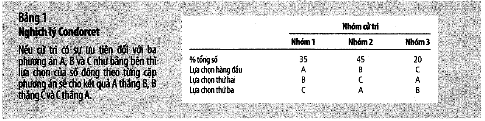
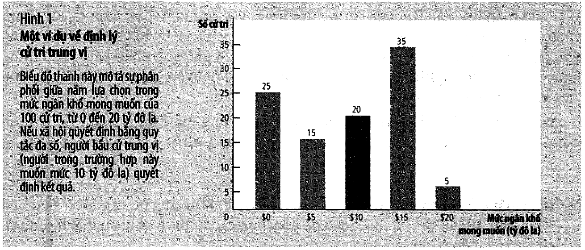

# Bài 11 — Thông tin bất cân xứng, kinh tế chính trị và kinh tế học hành vi

> Bài học dựng từ **Chương 22 — Những hướng nghiên cứu mới trong kinh tế học vi mô** (tr. 525–545)
> của *N. Gregory Mankiw — **Kinh tế học vi mô***, bản dịch của Khoa Kinh tế, **ĐH Kinh tế TP.HCM** (Cengage Learning Asia).
> 🎯 **Vòng 1.** Đây là chương **cuối** của sách, và nó làm một việc mà không chương nào khác làm:
> quay lại **tháo dỡ ba giả định** mà mười bài trước đã dựa vào — rằng thông tin là đầy đủ,
> rằng chính phủ là một người sửa lỗi khách quan, và rằng con người là lý trí.
> ⚠️ **Tên bài trong bản đồ khoá học viết gọn là "Thông tin bất cân xứng và hành vi"**, nhưng
> chương có **ba** phần chứ không phải hai — phần **kinh tế chính trị** ở giữa cũng được dạy đủ tại đây.
> 💼 **Góc QTKD** — ví dụ thêm cho ngành quản trị kinh doanh, **không có trong sách**.
> 📚 **Mở rộng** — thứ sách mô tả bằng lời mà không cho con số nào.
> 📌 **Cần đọc trước:** [Bài 9](bai_09_doc_quyen_nhom_va_ly_thuyet_tro_choi.md) (cân bằng Nash,
> dùng ở mục 15) và [Bài 10](bai_10_lua_chon_cua_nguoi_tieu_dung.md) (mục 17 của bài đó thừa nhận
> mô hình người tiêu dùng chỉ là *"một phép ẩn dụ"* — bài này hỏi phép ẩn dụ ấy hỏng ở đâu).

---

## Mục lục

<!-- MUC-LUC -->

- [1. Ba hướng nghiên cứu và vì sao chương này khác mọi chương trước](#1-ba-hướng-nghiên-cứu-và-vì-sao-chương-này-khác-mọi-chương-trước)
- [2. Hành vi được che đậy — rủi ro đạo đức](#2-hành-vi-được-che-đậy--rủi-ro-đạo-đức)
- [3. 📚 Vấn đề chủ thể – tác nhân trong công ty cổ phần](#3--vấn-đề-chủ-thể--tác-nhân-trong-công-ty-cổ-phần)
- [4. Tính chất bị che giấu — lựa chọn ngược](#4-tính-chất-bị-che-giấu--lựa-chọn-ngược)
- [5. 📚 Thị trường xe cũ tự bào mòn — dựng lại mô hình Akerlof bằng số](#5--thị-trường-xe-cũ-tự-bào-mòn--dựng-lại-mô-hình-akerlof-bằng-số)
- [6. Cung cấp thông tin — vì sao tín hiệu phải đắt mới có tác dụng](#6-cung-cấp-thông-tin--vì-sao-tín-hiệu-phải-đắt-mới-có-tác-dụng)
- [7. Nghiên cứu tình huống — tín hiệu của quà tặng](#7-nghiên-cứu-tình-huống--tín-hiệu-của-quà-tặng)
- [8. Thẩm tra — khi bên thiếu thông tin ra tay](#8-thẩm-tra--khi-bên-thiếu-thông-tin-ra-tay)
- [9. Thông tin bất cân xứng và chính sách công](#9-thông-tin-bất-cân-xứng-và-chính-sách-công)
- [10. Nghịch lý Condorcet — dân chủ có thể không có câu trả lời](#10-nghịch-lý-condorcet--dân-chủ-có-thể-không-có-câu-trả-lời)
- [11. Định luật bất khả thi Arrow](#11-định-luật-bất-khả-thi-arrow)
- [12. Định lý cử tri trung vị — ba cách tính trung bình, ba con số](#12-định-lý-cử-tri-trung-vị--ba-cách-tính-trung-bình-ba-con-số)
- [13. Những nhà chính trị cũng là những con người](#13-những-nhà-chính-trị-cũng-là-những-con-người)
- [14. Con người không phải lúc nào cũng lý trí](#14-con-người-không-phải-lúc-nào-cũng-lý-trí)
- [15. Con người quan tâm đến sự công bằng — trò chơi tối hậu](#15-con-người-quan-tâm-đến-sự-công-bằng--trò-chơi-tối-hậu)
- [16. Con người không nhất quán theo thời gian](#16-con-người-không-nhất-quán-theo-thời-gian)
- [17. Kết luận — cuộc sống này rất lộn xộn](#17-kết-luận--cuộc-sống-này-rất-lộn-xộn)
- [18. 💼 Lương cứng hay hoa hồng — bài toán rủi ro đạo đức bằng số](#18--lương-cứng-hay-hoa-hồng--bài-toán-rủi-ro-đạo-đức-bằng-số)
- [19. Code minh hoạ](#19-code-minh-hoạ)
- [20. Tự thử](#20-tự-thử)
- [21. Từ điển thuật ngữ](#21-từ-điển-thuật-ngữ)
- [22. Câu hỏi tự kiểm tra](#22-câu-hỏi-tự-kiểm-tra)
- [Tóm tắt một trang](#tóm-tắt-một-trang)
- [Nguồn](#nguồn)

<!-- /MUC-LUC -->

---

## 1. Ba hướng nghiên cứu và vì sao chương này khác mọi chương trước

Sách mở chương bằng một lời cảnh báo về chính nó (tr. 525):

> *"sẽ là sai lầm cho những ai nghĩ rằng những khía cạnh chúng ta đã xem xét có thể tạo nên một môn
> khoa học đầy đủ, hoàn hảo và bất biến."*

Ba hướng, và mỗi hướng tháo một cái đinh khác nhau:

| Phần                       | Giả định bị tháo                    | Hệ quả                                                                                            |
| -------------------------- | ----------------------------------- | ------------------------------------------------------------------------------------------------- |
| **Thông tin bất cân xứng** | *mọi người biết như nhau*           | thị trường có thể **thất bại** ngay cả khi cạnh tranh hoàn hảo                                    |
| **Kinh tế chính trị**      | *chính phủ sửa được lỗi thị trường* | **bản thân chính phủ** cũng là một định chế không hoàn hảo                                        |
| **Kinh tế học hành vi**    | *con người lý trí*                  | mô hình người tiêu dùng của [bài 10](bai_10_lua_chon_cua_nguoi_tieu_dung.md) **hỏng có quy luật** |

Sách chốt cả chương bằng một câu ở phần kết luận (tr. 543), và nó đáng chép lại nguyên văn:

> *"Nếu có một đề tài thống nhất cho những vấn đề trên thì đó sẽ là: **cuộc sống này rất lộn xộn**.
> Thông tin thì không hoàn hảo, chính phủ và con người cũng vậy."*

⚠️ Đừng đọc chương này như một lời phủ nhận mười bài trước. Sách nói rõ mục đích của nó ở tr. 543:
nghiên cứu thông tin bất cân xứng khiến bạn *"cẩn trọng hơn với những kết quả từ cơ chế thị trường"*,
nghiên cứu kinh tế chính trị khiến bạn *"cẩn trọng hơn với những giải pháp của chính phủ"*. Đây là
chương dạy **biết chỗ hỏng nằm ở đâu**, không phải chương dạy bỏ công cụ.

---

**PHẦN A — THÔNG TIN BẤT CÂN XỨNG** *(tr. 526–533)*

---

## 2. Hành vi được che đậy — rủi ro đạo đức

Sách mở bằng câu đùa của trẻ con (tr. 526): *"Tôi biết cái mà bạn không biết."*

> **Bất cân xứng thông tin** *(information asymmetry)*: sự khác biệt trong khả năng tiếp cận thông tin
> liên quan.

Và chia ngay làm hai loại, khác nhau ở **thời điểm** thông tin bị giấu:

|                | **Hành vi được che đậy**                      | **Tính chất bị che giấu**                        |
| -------------- | --------------------------------------------- | ------------------------------------------------ |
| Giấu cái gì    | việc tôi **sẽ làm** sau khi ký                | việc tôi **đang là** trước khi ký                |
| Tên gọi        | **rủi ro đạo đức** *(moral hazard)*           | **lựa chọn ngược** *(adverse selection)*         |
| Ví dụ của sách | công nhân biết rõ nỗ lực của mình hơn ông chủ | người bán xe biết rõ hiện trạng xe hơn người mua |
| Cách chữa      | giám sát, cấu trúc lương                      | cung cấp thông tin, thẩm tra                     |

📌 Giải Nobel kinh tế **2001** được trao cho **George Akerlof, Michael Spence và Joseph Stiglitz** vì
công trình tiên phong về vấn đề này (tr. 526). Ba mục tiếp theo lần lượt dựng lại đóng góp của
Akerlof (mục 5) và Spence (mục 6).

Định nghĩa ở chân trang 526:

> **Rủi ro đạo đức** *(moral hazard)*: xu hướng của một người khi **không được giám sát** sẽ thực hiện
> những hành vi không trung thực hoặc không đáng mong muốn.
> **Tác nhân** *(agent)*: người thực hiện một công việc cho người khác.
> **Chủ thể** *(principal)*: người mà tác nhân làm việc cho anh ta.

Sách nêu **ba cách** chủ thể ứng phó (tr. 527), và cả ba đều đáng nhớ vì chúng là ba loại giải pháp
khác hẳn nhau:

| Cách                    | Cơ chế                                   | Ví dụ của sách                             |
| ----------------------- | ---------------------------------------- | ------------------------------------------ |
| **Giám sát tốt hơn**    | nhìn thấy hành vi thì không cần suy đoán | cha mẹ lắp camera theo dõi bảo mẫu         |
| **Tăng lương**          | mất việc trở nên đắt hơn → tự giác hơn   | lý thuyết tiền lương hiệu quả (ch. 19)     |
| **Trì hoãn tiền lương** | đặt cược dài hạn thay vì từng vụ         | thưởng cuối năm, tăng lương theo thâm niên |

[Mục 18](#18--lương-cứng-hay-hoa-hồng--bài-toán-rủi-ro-đạo-đức-bằng-số) định giá cả ba bằng số.

### Rủi ro đạo đức ở ngoài công ty

Sách mở rộng ra rất xa (tr. 527), và đây là chỗ khái niệm trở nên sắc:

- **Bảo hiểm cháy nổ.** *"Người sở hữu một căn nhà với hợp đồng bảo hiểm cháy nổ thường mua sắm rất ít
  dụng cụ chữa cháy vì chính ông ta phải gánh chịu khoản chi phí này trong khi công ty bảo hiểm được
  hưởng lợi lớn."*
- **Nhà ven sông.** *"Một gia đình có quyết định sống gần một con sông với nguy cơ ngập lụt cao vì họ
  ưa thích một phong cảnh đẹp trong khi chính quyền gánh chịu chi phí cứu trợ thiên tai sau mỗi cơn lũ."*

⚠️ Chú ý là **không ai gian dối** trong hai ví dụ này. Ai cũng làm điều hợp lý với chi phí và lợi ích
mà *họ* nhìn thấy. Cụm "rủi ro đạo đức" gợi ý một vấn đề đạo đức, nhưng cơ chế thì hoàn toàn là
**cấu trúc động cơ** — và đó là lý do nó không chữa được bằng cách kêu gọi người ta tử tế hơn.

Sách kết luận thẳng: *"Kết quả là vấn đề rủi ro đạo đức tồn tại dai dẳng."*

---

## 3. 📚 Vấn đề chủ thể – tác nhân trong công ty cổ phần

Hộp *"Bạn có biết"* ở tr. 528 áp bộ khái niệm vừa học vào một chỗ rất cụ thể, và đây là mục có giá trị
QTKD cao nhất của cả phần A.

> *"Từ góc nhìn kinh tế, đặc điểm quan trọng nhất của loại hình công ty hợp vốn là **sự tách biệt giữa
> sự sở hữu và sự điều hành**."*

Chuỗi chủ thể – tác nhân **hai tầng**, và đây là chỗ dễ bỏ sót:

```
    CỔ ĐÔNG          (chủ thể)
       │  thuê, giám sát
       ▼
 HỘI ĐỒNG QUẢN TRỊ   (vừa là TÁC NHÂN của cổ đông,
       │              vừa là CHỦ THỂ của ban điều hành)
       │  tuyển, sa thải, thiết kế lương thưởng
       ▼
  BAN ĐIỀU HÀNH      (tác nhân)
```

Sách nêu đúng chỗ hỏng của tầng giữa (tr. 528):

> *"dù sao, hội đồng quản trị cũng là những tác nhân của cổ đông. Việc tồn tại một hội đồng quản trị
> với vai trò quản lý công tác điều hành càng làm trầm trọng hơn vấn đề chủ thể và tác nhân… **Nếu hội
> đồng quản trị quá thân thiết với những nhà điều hành, họ có thể sẽ không có đủ sự giám sát cần thiết.**"*

Và đưa bằng chứng lịch sử (tr. 528): quanh năm **2005**, các nhà điều hành của **Enron, Tyco và
WorldCom** bị phát hiện dính líu vào những hoạt động tư lợi mà người chịu thiệt hại là cổ đông. Một số
cổ đông kiện **chính các thành viên hội đồng quản trị** vì đã không giám sát đủ.

Câu quan trọng nhất của hộp lại là câu cuối, và nó không nói về tội phạm (tr. 528):

> *"May mắn là các hành vi tội phạm thực hiện bởi các nhà điều hành công ty khá hiếm. Nhưng trong nhiều
> trường hợp, đó chỉ là phần nổi của tảng băng. **Chừng nào mà sự sở hữu và sự điều hành còn tách biệt
> như trong trường hợp của hầu hết các công ty lớn, sẽ có những xung đột không thể tránh khỏi** giữa
> lợi ích của cổ đông và lợi ích của người điều hành."*

Đọc chậm câu đó: xung đột này **không phải một sự cố cần điều tra**, nó là **thuộc tính cấu trúc** của
mọi công ty có sở hữu tách khỏi điều hành. Không ai chữa khỏi nó; người ta chỉ quản lý nó.

> ⚙️ **Chú thích của người dịch (tr. 528)** — đáng đọc vì nó ảnh hưởng tới cách hiểu cả hộp: bản gốc
> Mankiw dùng *"Corporate"*, tức công ty mà người sở hữu tách biệt với người điều hành. Ở Việt Nam
> loại này mang tên **công ty trách nhiệm hữu hạn** và **công ty cổ phần**.

---

## 4. Tính chất bị che giấu — lựa chọn ngược

Định nghĩa ở chân trang 527:

> **Lựa chọn ngược** *(adverse selection)*: xu hướng mà một tập hợp các thuộc tính **không quan sát
> được** trở nên không đáng mong muốn trên quan điểm của một chủ thể không có đầy đủ thông tin.

Sách đưa **ba** thị trường, và cấu trúc của cả ba là một (tr. 529):

| Thị trường            | Ai biết nhiều hơn               | Hậu quả                                                    |
| --------------------- | ------------------------------- | ---------------------------------------------------------- |
| **Xe hơi cũ**         | người bán biết rõ nhược điểm    | người mua sợ mua phải xe dở → chủ xe tốt **không bán nữa** |
| **Lao động**          | công nhân biết rõ năng lực mình | công ty giảm lương → **người giỏi nghỉ trước**             |
| **Bảo hiểm sức khoẻ** | người mua biết rõ bệnh của mình | phí phản ánh người ốm yếu → **người khoẻ không mua**       |

Ba dòng, một khuôn: **bên bị thiệt tự rút lui, để lại thị trường toàn phía xấu.**

Sách nhấn mạnh rằng đây **không** phải chuyện có ai gian lận (tr. 529):

> *"Khi thị trường bị ảnh hưởng bởi lựa chọn ngược, **bàn tay vô hình không còn phát huy tác dụng một
> cách đầy đủ**."*

Và trong thị trường lao động, hệ quả là một câu rất mạnh: *"những mức lương sẽ bị kẹt lại ở trên mức
cân bằng cung cầu, hậu quả là **sự gia tăng thất nghiệp**."* Tức là thất nghiệp ở đây không đến từ
lương tối thiểu hay công đoàn, mà đến từ **thông tin**.

---

## 5. 📚 Thị trường xe cũ tự bào mòn — dựng lại mô hình Akerlof bằng số

Sách mô tả cơ chế bằng lời nhưng không cho một con số nào. Mô hình gốc là của **George Akerlof** —
người đầu tiên trong ba cái tên Nobel 2001 — và nó dựng lại được bằng số nguyên.

Đặt bài toán sao cho **mọi giao dịch đều đáng xảy ra**:

- 10 chiếc xe, chủ xe định giá chiếc của mình $1.000, $2.000, …, $10.000
- Người mua đánh giá **mọi** chiếc cao hơn chủ nó **1,5 lần** → cả 10 giao dịch đều có lợi cho hai bên
- Nhưng người mua **không nhìn thấy** chất lượng, chỉ trả theo **kỳ vọng của những chiếc đang rao bán**

Cho chạy:

| Vòng | Số xe còn rao bán | Giá người mua trả | Ai rút lui      |
| ---: | ----------------: | ----------------: | --------------- |
|    1 |                10 |             8.250 | 9.000 và 10.000 |
|    2 |                 8 |             6.750 | 7.000 và 8.000  |
|    3 |                 6 |             5.250 | 6.000           |
|    4 |                 5 |             4.500 | 5.000           |
|    5 |                 4 |             3.750 | 4.000           |
|    6 |                 3 |             3.000 | **không ai**    |

**Chỉ 3 trong 10 chiếc được bán.** Bảy giao dịch có lợi cho cả hai bên đã không xảy ra, thặng dư mất
**$24.500**.

⚠️ Chỗ quan trọng nhất: **không ai làm gì sai cả.** Người mua trả đúng kỳ vọng hợp lý. Chủ xe tốt từ
chối bán dưới giá. Mỗi bước đều là quyết định đúng, và tổng của những quyết định đúng là một thị trường
bị cắt cụt hai phần ba. Sách viết (tr. 529):

> *"Trong thị trường xe cũ, chủ thể của những chiếc xe tốt thường quyết định giữ chúng hơn là bán với
> mức giá thấp mà những người mua đa nghi sẵn lòng trả."*

### Ngưỡng sống sót

Cho tỷ lệ đánh giá của người mua chạy:

| Người mua trả gấp | Số xe còn giao dịch | % thặng dư bị mất |
| ----------------: | ------------------: | ----------------: |
|           1,1 lần |              1 / 10 |         **98,2%** |
|           1,2 lần |              1 / 10 |             98,2% |
|           1,5 lần |              3 / 10 |             89,1% |
|           1,8 lần |              9 / 10 |             18,2% |
|           1,9 lần |             10 / 10 |          **0,0%** |

**Thị trường chỉ sống sót trọn vẹn khi người mua đánh giá cao hơn gần gấp đôi.** Dưới ngưỡng đó, phần
trên của thị trường bị cắt — và càng gần 1 thì cắt càng sâu.

Kết quả này giải thích một hiện tượng mà sách nêu ở tr. 529 nhưng không giải thích hết: *"một chiếc xe
vừa chỉ dùng được vài tuần đã mất giá vài ngàn đô la so với một chiếc mới toanh cùng loại"*. Chiếc xe
không hỏng đi trong hai tuần. **Cái mất đi là bằng chứng rằng nó không hỏng.**

> 💼 Cùng cơ chế đó vận hành ở: nhân sự nghỉ việc sớm ("sao lại nghỉ nhanh thế?"), hàng thanh lý,
> căn hộ rao bán gấp, startup gọi vốn vòng xuống. Trong mọi trường hợp, **chính việc bạn muốn bán là
> một tín hiệu xấu** — và cách chữa duy nhất là mục 6 và mục 8.

---

## 6. Cung cấp thông tin — vì sao tín hiệu phải đắt mới có tác dụng

Định nghĩa ở chân trang 530:

> **Cung cấp thông tin** *(signaling)*: hành vi của bên có đầy đủ thông tin cung cấp thông tin cá nhân
> cho bên thiếu thông tin.

Sách nối về hai chương đã học (tr. 530): quảng cáo ở [ch. 16](bai_08_canh_tranh_doc_quyen.md) và bằng
đại học ở ch. 20. Và nhận xét rằng hai thứ tưởng rất khác nhau ấy *"về bản chất, chúng rất giống nhau"*.

Điều kiện để một tín hiệu chạy được, chép nguyên (tr. 530):

> *"Cần những gì để một hành động cung cấp thông tin trở nên hiệu quả? Hiển nhiên, nó phải chịu chi phí
> cao. Nếu một sự cung cấp thông tin là miễn phí, mọi người đều sẽ sử dụng nó và như thế nó không truyền
> tải được thông tin nào cả. Cũng lý do đó, có một đòi hỏi khác: thông tin truyền đi phải **ít tốn kém
> hơn, hoặc mang lại lợi ích cao hơn đối với người có sản phẩm chất lượng tốt hơn**."*

### Đặt con số vào điều kiện đó

Mô hình của **Michael Spence** — người thứ hai trong ba cái tên Nobel 2001:

- Người **giỏi** tạo ra 100 mỗi năm; học một năm tốn họ **4**
- Người **thường** tạo ra 60 mỗi năm; học một năm tốn họ **10**
- Nhà tuyển dụng tuyên bố: có bằng thì trả 100, không thì trả 60 → cả hai đều **được lợi 40** nếu có bằng

| Số năm học yêu cầu | Người giỏi học? | Người thường học? | Kết quả                                |
| -----------------: | :-------------: | :---------------: | -------------------------------------- |
|                0–3 |       có        |      **có**       | cả hai đều học — tín hiệu **vô nghĩa** |
|            **4–9** |     **có**      |     **không**     | **tách được hai loại**                 |
|                10+ |      không      |       không       | cả hai đều bỏ — không ai học           |

Tín hiệu chỉ chạy trong một **cửa sổ hẹp**: đủ đắt để người thường bỏ cuộc, nhưng chưa đắt tới mức
người giỏi cũng bỏ. Quá rẻ thì vô nghĩa, quá đắt thì sập.

### Cái giá của tín hiệu

Ở mô hình này, trường học **không dạy thêm kỹ năng nào** — nó chỉ lọc. Với mỗi người giỏi, xã hội đốt
mất `4 năm × 4 = 16`, tức **16% giá trị một năm làm việc**, để đổi lấy một thông tin.

Sách nêu rõ hai lý thuyết đối lập ở tr. 530:

|                             | Học để làm gì                                 | Mở rộng giáo dục đại trà thì sao                  |
| --------------------------- | --------------------------------------------- | ------------------------------------------------- |
| **Lý thuyết tín hiệu**      | chỉ để **phát tin**, không tạo thêm năng suất | không ai giàu lên, chỉ **đẩy ngưỡng lên cao hơn** |
| **Lý thuyết vốn con người** | **làm tăng** năng suất thật                   | xã hội giàu lên thật                              |

⚠️ Cả hai đều dự đoán *"người học nhiều thì lương cao hơn"*, nên **số liệu lương không tách được chúng**.
Nhưng hàm ý chính sách thì ngược hoàn toàn. Đây là một ví dụ mẫu mực cho chuyện **hai lý thuyết khớp
cùng một dữ liệu mà đòi hai hành động khác nhau** — và vì sao "dữ liệu đã chứng minh" thường chưa đủ.

📚 Ví dụ hay nhất của sách về tín hiệu lại rất nhỏ (tr. 530): mẩu quảng cáo trên tạp chí ghi
*"như đã chiếu trên TV"*. Nội dung không nói gì về sản phẩm — nó chỉ nói rằng **công ty này đủ tiền
mua quảng cáo TV**. Chính khoản tiền đó là thông điệp. (Đây đúng là cơ chế Post–Kellogg ở
[bài 8](bai_08_canh_tranh_doc_quyen.md).)

---

## 7. Nghiên cứu tình huống — tín hiệu của quà tặng

Sách mở bằng một câu chuyện tình cảm và kết thúc bằng một mô hình (tr. 531). Một người đàn ông định
tặng bạn gái **tiền mặt** vào ngày sinh nhật, lý luận rất kinh tế học:

> *"Tôi không biết rõ ý thích của cô ấy bằng chính cô ấy, và với tiền, cô ấy có thể mua bất cứ thứ gì
> cô ấy muốn."*

Cô kết thúc mối quan hệ.

Lời giải của sách nằm đúng trong bộ khái niệm vừa học:

> *"Anh chàng trong câu chuyện của chúng ta có thông tin riêng mà bạn gái anh ta cần biết: **liệu anh có
> yêu cô ta thật lòng không?** Chọn một món quà tốt dành cho cô gái là một tín hiệu tình yêu của anh ta…
> Nó tốn kém (thời gian), và mức độ tốn kém phụ thuộc vào thông tin riêng."*

Kiểm lại bằng điều kiện của [mục 6](#6-cung-cấp-thông-tin--vì-sao-tín-hiệu-phải-đắt-mới-có-tác-dụng):
tín hiệu phải **rẻ hơn với bên có chất lượng tốt**. Ở đây đúng vậy — *"Nếu anh ta thực sự yêu cô gái,
chọn một món quà sẽ dễ dàng vì anh ta vốn luôn nghĩ về cô gái. Nếu anh không yêu cô ấy, tìm ra món quà
phù hợp sẽ khó hơn."*

Và sách kiểm chứng mô hình bằng một dự đoán **có thể sai** — dấu hiệu của một lý thuyết tốt (tr. 531):

> *"người ta quan tâm nhiều nhất đến cách thức khi sự yêu thương ở trong tình trạng thử thách nhất. Thế
> nên, đưa tiền cho bạn trai hay bạn gái thường sẽ là một bước đi tồi. Nhưng khi những sinh viên đại
> học nhận được một tờ séc từ cha mẹ, họ thường ít cảm thấy tự ái hơn. **Tình yêu của cha mẹ ít khi bị
> nghi ngờ**, thế nên người nhận hẳn nhiên không hiểu món quà bằng tiền ấy như là dấu hiệu của sự thiếu
> yêu thương."*

Mô hình nói: tín hiệu chỉ cần thiết **ở nơi có nghi ngờ**. Bỏ nghi ngờ đi thì tiền mặt lại thành món
quà hợp lý. Và đó đúng là điều quan sát được.

> 💼 Áp thẳng vào kinh doanh: khách hàng **quen thuộc** không cần bạn chứng minh gì (bỏ được tín hiệu →
> tiết kiệm chi phí); khách hàng **lần đầu** thì mọi thứ đều là tín hiệu — mặt bằng, bao bì, thời gian
> phản hồi, bảo hành. Ngân sách xây dựng niềm tin nên đổ vào nhóm thứ hai, không phải nhóm thứ nhất.

---

## 8. Thẩm tra — khi bên thiếu thông tin ra tay

Định nghĩa ở chân trang 531:

> **Thẩm tra** *(screening)*: hành vi của **bên thiếu thông tin** buộc bên có đầy đủ thông tin phải
> cung cấp thông tin.

Đây là mặt đối xứng của mục 6: cung cấp thông tin do **bên biết** chủ động; thẩm tra do **bên không
biết** chủ động.

Ví dụ đơn giản của sách (tr. 532): người mua xe cũ yêu cầu đưa xe đi thợ kiểm tra trước khi mua.
*"Một người bán khi chọn từ chối yêu cầu trên sẽ tự hé lộ thông tin riêng của anh ta rằng chiếc xe đó
không còn nhiều giá trị."* **Chính lời từ chối là thông tin.**

### Ví dụ phức tạp hơn: khoản khấu trừ bảo hiểm

Sách đưa hai hợp đồng (tr. 532):

- **Hợp đồng A** — phí cao, chi trả **mọi** tai nạn
- **Hợp đồng B** — phí thấp hơn, nhưng có **khoản khấu trừ $1.000** (tài xế tự chịu $1.000 đầu tiên)

> *"với khoản khấu trừ **đủ lớn**, hợp đồng bảo hiểm chi phí thấp kèm khấu trừ sẽ thu hút những người
> lái xe an toàn trong khi những hợp đồng bảo hiểm chi phí cao không đi kèm khoản khấu trừ sẽ thu hút
> những người lái xe không an toàn."*

**"Đủ lớn" là bao nhiêu?** Sách không nói. Đo thử — tổn thất $4.000, tài xế an toàn gặp tai nạn 10%,
liều lĩnh 30%, mỗi hợp đồng định giá hoà vốn cho đúng nhóm nó nhắm tới:

Nếu tài xế **trung lập với rủi ro** (chỉ tính kỳ vọng tiền bạc):

| Tài xế    | Hợp đồng A tốn | Hợp đồng B tốn | Chọn  |
| --------- | -------------: | -------------: | ----- |
| an toàn   |         $1.200 |           $400 | B     |
| liều lĩnh |         $1.200 |           $600 | **B** |

**Cả hai cùng chọn B. Không tách được gì cả.** Thiếu một thứ mà sách không nói ra: **ngại rủi ro**.
Gọi $a$ là mức ngại rủi ro — một đồng phải tự móc túi trả khi tai nạn "đau" bằng $(1+a)$ đồng tiền phí:

|   $a$ | An toàn chọn | Liều lĩnh chọn |   Tách được?    |
| ----: | ------------ | -------------- | :-------------: |
|     0 | B ($400)     | B ($600)       |        ✗        |
|     1 | B ($500)     | B ($900)       |        ✗        |
| **2** | B ($600)     | **A ($1.200)** | ✓ (đúng ngưỡng) |
|     3 | B ($700)     | A ($1.200)     |        ✓        |

Hỏi ngược — với mức ngại rủi ro cho trước, khấu trừ phải lớn tới đâu:

|   $a$ | Khấu trừ tối thiểu |                               |
| ----: | -----------------: | ----------------------------- |
|     0 |             $4.000 | không thể — vượt cả tổn thất  |
|     1 |             $1.600 |                               |
| **2** |         **$1.000** | **đúng bằng con số của sách** |
|     3 |               $727 |                               |

Hai kết luận, và cả hai đều là thứ sách không viết ra:

1. **Với người trung lập rủi ro, thẩm tra bằng khấu trừ là bất khả thi** — khấu trừ phải lớn hơn cả
   tổn thất. Cơ chế này **sống bằng sự ngại rủi ro**, không phải bằng toán.
2. **Con số $1.000 mà sách chọn ứng với $a = 2$** — khách hàng phải coi một đồng tự trả nặng gấp ba
   một đồng tiền phí. "Đủ lớn" không phải một tính từ; nó là một con số phải **đo** ở từng thị trường.

---

## 9. Thông tin bất cân xứng và chính sách công

Sách đặt câu hỏi hiển nhiên: nếu thị trường thất bại vì thông tin, chính phủ có nên vào không? Và trả
lời bằng **ba lý do phải dè dặt** (tr. 533):

| #   | Lý do                                                                                                               | Nói gọn                                         |
| --- | ------------------------------------------------------------------------------------------------------------------- | ----------------------------------------------- |
| 1   | *"thị trường tư nhân đôi lúc vẫn có thể tự đối phó… bằng cách kết hợp sử dụng việc cung cấp thông tin và thẩm tra"* | **thị trường đã tự chữa một phần** (mục 6 và 8) |
| 2   | *"ngay cả chính phủ cũng ít khi có được nhiều thông tin hơn phía tư nhân"*                                          | **chính phủ cũng không biết**                   |
| 3   | *"bản thân chính phủ vốn cũng là một định chế không hoàn hảo"*                                                      | → đó chính là **phần B**                        |

Lý do 2 đáng dừng lại vì nó tinh tế: sách viết *"khi hiện diện bất cân xứng thông tin, nhà chính sách
cũng có thể gặp khó khăn trong việc cải thiện những kết quả hiển nhiên là không hoàn hảo của thị trường"*.
Biết rằng có vấn đề **không** đồng nghĩa với biết cách sửa. Đây là cùng một logic với
[bài 9, mục 16](bai_09_doc_quyen_nhom_va_ly_thuyet_tro_choi.md#16-ba-hành-vi-gây-tranh-cãi), nơi sách
cảnh báo phải cẩn thận khi dùng luật chống độc quyền.

Và lý do 3 là bản lề chuyển sang phần tiếp theo.

---

**PHẦN B — KINH TẾ CHÍNH TRỊ** *(tr. 533–538)*

---

## 10. Nghịch lý Condorcet — dân chủ có thể không có câu trả lời

> **Kinh tế chính trị** *(political economy)*: áp dụng những phương pháp kinh tế học để nghiên cứu cách
> mà chính phủ hoạt động.

Sách nói rõ vì sao phần này tồn tại (tr. 533):

> *"Trước khi trông chờ vào một chính phủ để thực hiện các nhiệm vụ xã hội, chúng ta cần cân nhắc thêm
> một sự thật rằng: **chính phủ cũng là một định chế không hoàn hảo**."*

**Bảng 1, tr. 534** — ba nhóm cử tri, ba phương án, ba thứ tự ưu tiên khác nhau:



|               | Nhóm 1 | Nhóm 2 | Nhóm 3 |
| ------------- | -----: | -----: | -----: |
| **% tổng số** |     35 |     45 |     20 |
| Hạng đầu      |      A |      B |      C |
| Thứ hai       |      B |      C |      A |
| Thứ ba        |      C |      A |      B |

Bỏ phiếu từng cặp:

| Cặp    | Kết quả         | Ai thắng |
| ------ | --------------- | :------: |
| A vs B | A: 55% — B: 45% |  **A**   |
| B vs C | B: 80% — C: 20% |  **B**   |
| A vs C | A: 35% — C: 65% |  **C**   |

**A thắng B, B thắng C, C thắng A.** Một vòng tròn. Không phương án nào thắng tất cả.

> **Nghịch lý Condorcet** *(Condorcet paradox)*: thất bại của quy tắc đa số trong việc xây dựng sở
> thích có tính **bắc cầu** của toàn xã hội.

### Hệ quả: ai đặt lịch trình thì người đó chọn kết quả

Sách gọi đây là *"bài học nhỏ"*. Nhưng đo bằng số thì nó không nhỏ chút nào:

| Vòng 1 | Thắng vòng 1 | Vòng 2 | **Người thắng cuối** |
| ------ | :----------: | ------ | :------------------: |
| A vs B |      A       | A vs C |        **C**         |
| A vs C |      C       | C vs B |        **B**         |
| B vs C |      B       | B vs A |        **A**         |

**Ba lịch trình, ba người thắng khác nhau — không ai đổi một lá phiếu nào.** Sách viết (tr. 534):

> *"thứ tự mà các phương án được đưa ra bầu cử có thể ảnh hưởng đến kết quả… việc chọn lựa kịch bản bầu
> cử có thể có ảnh hưởng sâu sắc đến kết quả của một cuộc bầu cử dân chủ."*

> 💼 Trong họp hội đồng, quyền **soạn chương trình nghị sự** là một quyền lực thật, và bảng trên là
> bằng chứng định lượng. Nếu bạn từng thấy một cuộc họp mà "ai cũng bỏ phiếu trung thực" nhưng kết quả
> vẫn khiến tất cả ngạc nhiên, thứ tự đưa ra biểu quyết là chỗ nên xem lại đầu tiên.

Còn *"bài học lớn hơn"*, theo sách, thì nặng hơn nhiều: *"bản thân bầu cử số đông đôi khi không giúp
chúng ta biết được ý muốn thực sự của cả cộng đồng."* Không phải "chúng ta chưa hỏi đúng cách" — mà
là **ý muốn tập thể có thể không tồn tại** dưới dạng một thứ tự.

---

## 11. Định luật bất khả thi Arrow

Nếu quy tắc đa số hỏng, đổi luật chơi được không? Sách thử **phép tính Borda** (tr. 535) — mỗi cử tri
xếp hạng, phương án hạng ba được 1 điểm, hạng hai 2 điểm, hạng nhất 3 điểm:

| Phương án | Điểm Borda |
| :-------: | ---------: |
|     A     |        190 |
|   **B**   |    **225** |
|     C     |        185 |

**B thắng.** Bây giờ **bỏ phương án C** đi — không ai đổi ý thích gì cả, chỉ bớt một lựa chọn:

| Phương án | Điểm Borda |
| :-------: | ---------: |
|   **A**   |    **155** |
|     B     |        145 |

**A thắng.** C là phương án **thua cuộc** — bỏ nó đi đáng lẽ không đổi được gì. Thế mà người thắng đổi
từ B sang A.

Đó là vi phạm một trong bốn tính chất mà **Kenneth Arrow** đòi hỏi ở một hệ thống bầu cử hoàn hảo,
trong cuốn *Lựa chọn Xã hội và Giá trị cá nhân* (**1951**), tr. 535:

| #   | Tính chất                              | Nghĩa là                                                 |
| --- | -------------------------------------- | -------------------------------------------------------- |
| 1   | **Sự nhất trí**                        | mọi người thích A hơn B thì A thắng B                    |
| 2   | **Sự bắc cầu**                         | A thắng B và B thắng C thì A thắng C                     |
| 3   | **Độc lập với các lựa chọn bên ngoài** | xếp hạng A với B không phụ thuộc vào việc có C hay không |
| 4   | **Không ai có quyền tuyệt đối**        | không ai luôn được ý mình bất chấp người khác            |

> **Định luật bất khả thi Arrow** *(Arrow's impossibility theorem)*: **không hệ thống bầu cử nào thoả
> hết bốn tính chất trên.**

Và hai mục vừa rồi là hai nửa của lời chứng minh sơ lược:

| Hệ thống        | Gãy ở đâu                                                                                 |
| --------------- | ----------------------------------------------------------------------------------------- |
| Quy tắc đa số   | tính **bắc cầu** ([mục 10](#10-nghịch-lý-condorcet--dân-chủ-có-thể-không-có-câu-trả-lời)) |
| Phép tính Borda | tính **độc lập** (mục này)                                                                |

⚠️ Sách cẩn thận ở tr. 536, và đây là chỗ dễ đọc sai nhất cả chương:

> *"Nó **không khẳng định rằng chúng ta nên từ bỏ chế độ dân chủ** với tư cách là một hình thức tổ chức
> nhà nước. Nhưng nó khẳng định rằng, bất kể xã hội này sử dụng hệ thống bầu cử nào để thống nhất ý
> muốn của từng cá nhân, theo một cách nào đó, phương thức lựa chọn mang tính xã hội đó **luôn có những
> lỗ hổng**."*

Biết lỗ hổng nằm ở đâu thì tốt hơn tin rằng không có lỗ hổng nào.

---

## 12. Định lý cử tri trung vị — ba cách tính trung bình, ba con số

**Hình 1, tr. 536** — 100 cử tri, mỗi người muốn một mức ngân sách:



```
   $0 tỷ   25 người   #########################
   $5 tỷ   15 người   ###############
  $10 tỷ   20 người   ####################
  $15 tỷ   35 người   ###################################
  $20 tỷ    5 người   #####
```

Ba cách "đo ý dân", ba con số khác nhau:

| Cách đo                            |    Kết quả | Sách viết                                                  |
| ---------------------------------- | ---------: | ---------------------------------------------------------- |
| **Cử tri trung vị** (người thứ 50) | **$10 tỷ** | *"cử tri trung vị ủng hộ ngân sách này ở mức 10 tỷ đô la"* |
| Trung bình cộng                    |      $9 tỷ | *"mức trung bình… là 9 tỷ đô la"*                          |
| Mức phổ biến nhất                  |     $15 tỷ | *"kết quả được nhiều người chọn nhất là 15 tỷ đô la"*      |

Chỉ **một** trong ba thắng được một cuộc bỏ phiếu. Cho cử tri trung vị đấu tay đôi với mọi đối thủ:

| Đối đầu    | Kết quả |
| ---------- | ------- |
| $10 vs $0  | 60 – 25 |
| $10 vs $5  | 60 – 40 |
| $10 vs $8  | 60 – 40 |
| $10 vs $12 | 60 – 40 |
| $10 vs $15 | 60 – 40 |
| $10 vs $20 | 60 – 5  |

**Thắng tất cả.**

> **Định lý cử tri trung vị** *(median voter theorem)*: nếu các cử tri phải chọn một điểm trên một
> đường thẳng và mỗi cử tri đều muốn điểm gần với điểm mong muốn của mình nhất, thì quy tắc đa số sẽ
> dẫn đến việc lựa chọn điểm ưa thích của **người bỏ phiếu trung vị**.

📌 Và định lý này **dập tắt nghịch lý Condorcet** — sách nói rõ ở tr. 537: *"Khi những cử tri chọn lấy
một vị trí trong hàng và mỗi người đều có một ý kiến riêng thì nghịch lý Condorcet không phát huy tác
dụng."* Vòng tròn ở mục 10 cần sở thích **không xếp được lên một trục**; ép mọi lựa chọn lên một trục
thì vòng tròn biến mất.

### Hai hệ quả

**Một — hai đảng sẽ giống nhau.** Sách đưa ví dụ ở tr. 537: Dân chủ đề nghị $15 tỷ (mức được **nhiều
người chọn nhất**), Cộng hoà đề nghị $10 tỷ. Kết quả: **Cộng hoà thắng 60 – 40.**

> *"Nếu phe Dân chủ muốn thắng, họ sẽ chuyển hướng ý kiến của mình theo cử tri trung vị. Nhờ vậy, lý
> thuyết này có thể giải thích lý do các đảng trong một hệ thống hai đảng thường tương đồng với nhau."*

**Hai — thiểu số không được xem trọng.** Sách nói thẳng và không làm dịu (tr. 537):

> *"Tưởng tượng rằng 40% tổng số muốn tiêu thật nhiều tiền vào các công viên quốc gia và 60% còn lại
> không muốn chi một đồng nào. Trong trường hợp này, ý muốn của cử tri trung vị là không chi, bất chấp
> ý kiến của nhóm thiểu số. **Đó là logic của sự dân chủ.** Thay vì cố gắng đạt tới một thỏa hiệp tính
> tới ý muốn của mọi cá nhân, quy tắc số đông chỉ nhìn vào người ở ngay vị trí trung tâm của phân phối."*

Cường độ mong muốn **không được đếm**. Người tha thiết và người thờ ơ có đúng một phiếu như nhau.

---

## 13. Những nhà chính trị cũng là những con người

Mục ngắn nhất của chương, và có lẽ là mục sắc nhất. Sách chỉ ra một sự **bất đối xứng trong giả định**
mà kinh tế học vẫn mắc phải (tr. 538):

> *"Khi những nhà kinh tế nghiên cứu hành vi người tiêu dùng, họ giả định rằng người tiêu dùng mua rổ
> hàng hóa và dịch vụ khiến họ thỏa mãn nhất. Khi các nhà kinh tế nghiên cứu hành vi của các doanh
> nghiệp, họ giả định rằng các doanh nghiệp sản xuất lượng sản phẩm và dịch vụ mang lại lợi nhuận cao
> nhất. **Thế họ sẽ giả định gì khi nghiên cứu những người tham gia vào chính trị?**"*

Câu hỏi này là một cái bẫy logic rất chặt. Nếu bạn giả định người tiêu dùng và doanh nghiệp theo đuổi
lợi ích riêng, thì giả định nhà chính trị theo đuổi phúc lợi xã hội là **không nhất quán** — và sách
nói thẳng đó là *"tốt, nhưng có lẽ là không thực tế"*.

> *"Một vài nhà chính trị, bị thúc giục bởi ham muốn tái đắc cử, sẵn sàng hy sinh quyền lợi quốc gia để
> củng cố cơ sở bầu cử của riêng họ. Những người khác bị cám dỗ bởi lòng tham đơn thuần."*

Và câu kết luận, đáng thuộc (tr. 538):

> *"khi suy ngẫm về các chính sách kinh tế, hãy nên nhớ chính sách đó được tạo ra **không phải bởi một
> vị vua nhân từ** mà là từ những con người thực với những ham muốn cũng rất con người… Chúng ta không
> nên ngạc nhiên khi các chính sách kinh tế thất bại trong việc thực hiện những lý tưởng được đưa ra
> trong các giáo trình kinh tế."*

⚠️ Chú ý sách **không** nói chính trị gia xấu hơn người thường. Nó nói họ **cũng là người thường** — và
mọi mô hình giả định ngược lại đều đang cho chính phủ một đặc quyền lý thuyết mà nó không có.

---

**PHẦN C — KINH TẾ HỌC HÀNH VI** *(tr. 538–543)*

---

## 14. Con người không phải lúc nào cũng lý trí

> **Kinh tế học hành vi** *(behavioral economics)*: một nhánh của kinh tế học kết hợp những kiến thức
> về tâm lý học.

Sách đặt tên cho sinh vật mà mười một chương trước đã giả định (tr. 539):

> *"Lý thuyết kinh tế được tạo nên trên cơ sở một giống loài đặc biệt, thường được gọi với cái tên
> **'con người kinh tế'** (Homo economicus)… Tuy vậy trong thực tế con người lại là **'con người tự
> nhiên'** (Homo sapiens)… **Họ có thể hay quên, bốc đồng, khó hiểu, đầy cảm xúc và thiển cận.**"*

**Herbert Simon** đề xuất một cách nhìn khác (tr. 539):

|                                              | Nghĩa là                                                  |
| -------------------------------------------- | --------------------------------------------------------- |
| *maximizers* — **kẻ tối đa hoá bằng lý trí** | luôn chọn hành vi **tốt nhất**                            |
| *satisficers* — **kẻ có định mức**           | hành động cho tới khi tiêu chuẩn **vừa đủ tốt** được thoả |

Cụm từ của các nhà kinh tế khác: con người chỉ *"cận lý trí"*, hay thể hiện *"sự lý trí có giới hạn"*.

Ba sai lầm cố hữu mà sách liệt kê (tr. 539–540):

| Sai lầm                                                   | Bằng chứng của sách                                                                                                                                                                                                    |
| --------------------------------------------------------- | ---------------------------------------------------------------------------------------------------------------------------------------------------------------------------------------------------------------------- |
| **Quá tự tin**                                            | yêu cầu người ta đưa khoảng tin cậy 90% cho một con số họ không biết → *"hầu hết mọi người đưa ra một khoảng quá nhỏ: số lần kết quả thực sự nằm trong khoảng họ ước lượng thấp hơn 90% rất nhiều"*                    |
| **Đánh giá quá cao một lượng nhỏ những quan sát nổi bật** | báo cáo khảo sát 1.000 chủ xe, cộng thêm một cô bạn chê xe → mẫu của bạn chỉ tăng từ **1.000 lên 1.001**, nhưng *"vì câu chuyện của cô quá nổi trội, bạn bị nó ảnh hưởng nhiều hơn"*                                   |
| **Ngại thay đổi suy nghĩ**                                | cho cả hai phe đọc **cùng một** báo cáo về án tử hình → *"những người vốn thích việc tử hình khẳng định họ cảm thấy chắc chắn hơn về quan điểm của mình, và những người vốn phản đối… cũng nói rằng họ kiên định hơn"* |

### Bằng chứng rằng chuyện này quan trọng thật

Nghiên cứu về **kế hoạch hưu trí 401(k)** (tr. 540) là ví dụ mạnh nhất, vì nó đo được:

- Công ty **A**: muốn tham gia thì **điền vào một mẫu đơn nhỏ**
- Công ty **B**: **tự động** được đưa vào, muốn ra thì điền một mẫu đơn

> *"Kết quả là lượng công nhân tham gia trong trường hợp thứ hai lớn hơn trường hợp thứ nhất rất nhiều.
> Nếu những người công nhân kia hoàn toàn lý trí, họ sẽ chọn cách mang lại khoản hưu trí tối ưu và
> **bất kể cách công ty đề nghị họ như thế nào**."*

Cùng một lựa chọn, cùng một khoản tiền, cùng một hệ quả tài chính — chỉ khác **lựa chọn mặc định**.
Và kết quả khác hẳn nhau. Đó là bằng chứng trực tiếp rằng con người không tối ưu hoá.

📚 Đoạn tự phê hay nhất của cả cuốn sách nằm ngay sau đó (tr. 540). Sách hỏi vì sao kinh tế học vẫn giữ
giả định lý trí, và đưa ra hai lý do — lý do thứ hai thì thẳng thắn tới mức bất ngờ:

> *"Một lý do khác khiến các nhà kinh tế thường đưa ra giả định về sự lý trí có thể là do **chính họ
> cũng không phải những kẻ có hành vi tối đa hóa một cách lý trí**. Cũng như người khác, họ cũng quá tự
> tin, và họ cũng ngại thay đổi đầu óc của mình… những nhà kinh tế cũng cảm thấy hài lòng với một lý
> thuyết đủ tốt chứ không cần hoàn hảo."*

Tức là: các nhà kinh tế học cũng là *satisficers*. Chương này áp lý thuyết của nó lên chính người viết
ra nó.

---

## 15. Con người quan tâm đến sự công bằng — trò chơi tối hậu

Luật chơi (tr. 540–541): hai người lạ, **$100**. Người A đề nghị cách chia; người B chấp nhận thì chia
đúng như đề nghị, B từ chối thì **cả hai về trắng tay**. Chơi **đúng một lần**.

**Dự đoán của lý thuyết truyền thống**, dùng đúng bộ máy của
[bài 9](bai_09_doc_quyen_nhom_va_ly_thuyet_tro_choi.md):

> *"Người chơi A nên đề nghị anh ta sẽ được 99 đô la và nhường cho người chơi B 1 đô la, và người chơi B
> sẽ chấp nhận đề nghị này… Theo cách nói của lý thuyết trò chơi, cách chia 99-1 này là **một cân bằng
> Nash**."*

**Kết quả thực nghiệm** (tr. 541):

> *"Người ở vị trí B thường **từ chối** các đề nghị sẽ chia cho họ 1 đô la hoặc những khoản ít như vậy…
> phổ biến hơn là người chơi A sẽ đề nghị đưa cho người chơi B mức **30 hoặc 40 đô la**, giữ lại phần
> nhiều hơn cho mình. Trong trường hợp này thường thì B sẽ chấp nhận."*

### Đo "ý thức công bằng" bằng một con số

Sách gọi đó là *"một ý thức bẩm sinh về sự công bằng"*. Đặt một tham số $f$ — mức khó chịu khi bị chia
thiệt — vào hàm lợi ích của B:

$$\text{lợi ích của B} = \text{phần của B} - f \times (\text{phần của A} - \text{phần của B})$$

|   $f$ | B chấp nhận từ | A nên đề nghị cho B | A giữ lại |
| ----: | -------------: | ------------------: | --------: |
| **0** |             $0 |                  $0 |  **$100** |
|   1/4 |         $16,67 |                 $17 |       $83 |
|   1/2 |         $25,00 |                 $25 |       $75 |
| **1** |     **$33,33** |             **$34** |   **$66** |
|     2 |         $40,00 |                 $40 |       $60 |

- $f = 0$ là **"con người kinh tế"** — chấp nhận tất cả, bị chia $1.
- $f = 1$ cho A giữ lại **$66** — rơi đúng vào khoảng *"30 hoặc 40 đô la"* mà sách mô tả.

Nghĩa là: hành vi quan sát được trong phòng thí nghiệm tương ứng với $f \approx 1$ — **người ta ghét bị
chia thiệt gần bằng với mức ưa tiền**. Đó là một con số, không phải một cảm giác, và nó **đo được**.

### Vì sao chuyện này quan trọng với quản trị

Sách nối thẳng sang thị trường lao động (tr. 541):

> *"khi một công ty có một năm đặc biệt phát đạt, những công nhân (tương tự như người chơi B) có thể kỳ
> vọng được trả thêm một phần tương xứng của thành công đó, **ngay cả khi mức lương cân bằng thị trường
> không chỉ ra việc này**. Công ty (tương tự như người chơi A) cũng có thể quyết định trả thêm… vì lo
> lắng những công nhân sẽ trút giận lên công ty bằng cách ít cố gắng hơn, hoặc đình công hay thậm chí
> đập phá."*

> 💼 Trò chơi tối hậu là mô hình gọn nhất cho **mọi cuộc đàm phán một lần** — chia lợi nhuận liên doanh,
> thưởng cuối năm, chia cổ phần sáng lập. Bài học định lượng: đối tác **sẵn sàng đốt tiền của chính họ**
> để không phải nhận một tỷ lệ mà họ thấy là sỉ nhục. Một đề nghị "về lý thì họ vẫn có lợi" hoàn toàn
> có thể bị từ chối, và bảng trên cho biết ngưỡng nằm ở đâu.

---

## 16. Con người không nhất quán theo thời gian

Hai câu hỏi của sách (tr. 542):

> 1. Bạn thích **(A)** dành 50 phút để làm việc đó **ngay bây giờ** hay **(B)** để mai làm và phải dành
>    ra tới 60 phút?
> 2. Bạn thích **(A)** dành ra 50 phút để làm nó **sau 90 ngày** hay **(B)** 60 phút để làm nó sau 91 ngày?

> *"Khi bị hỏi những câu kiểu này, rất nhiều người chọn **B cho Câu 1 và A cho Câu 2**."*

Cùng một đánh đổi — 10 phút để hoãn một ngày — và người ta trả lời **ngược nhau** tuỳ vào việc nó xảy
ra hôm nay hay ba tháng nữa.

### Chứng minh rằng người nhất quán KHÔNG THỂ trả lời như vậy

Mô hình chiết khấu chuẩn: chi phí ở $t$ ngày nữa được cảm thấy hôm nay là $\delta^t \times c$.

- Câu 1 chọn B đòi hỏi $60\delta < 50$, tức $\delta < 5/6$
- Câu 2 chọn A đòi hỏi $50\delta^{90} < 60\delta^{91}$, tức $\delta > 5/6$

**Hai điều kiện mâu thuẫn.** Không giá trị $\delta$ nào tạo ra được cặp (B, A). Kiểm bằng code:

| $\beta$ | $\delta$ | Câu 1 | Câu 2 | Giống người thật?       |
| ------: | -------: | :---: | :---: | ----------------------- |
|       1 |        1 |   A   |   A   | không                   |
|       1 |     0,99 |   A   |   A   | không                   |
|       1 |      4/5 |   B   |   B   | không — hoãn cả hai lần |
| **3/4** |        1 | **B** | **A** | **có**                  |
|     1/2 |        1 |   B   |   A   | có                      |

Chỉ cần thêm **một** tham số $\beta < 5/6$ — hệ số phạt riêng cho *"mọi thứ không phải hôm nay"* — là
hành vi ấy xuất hiện ngay. $\beta$ chính là cái mà sách gọi là *"ham muốn những thoả mãn tức khắc"*.

### Chỗ đau nhất

Với $\beta = 3/4$, thí nghiệm bằng code:

| Thời điểm                    | Làm sớm (50 phút) | Hoãn (60 phút) | Chọn                     |
| ---------------------------- | ----------------: | -------------: | ------------------------ |
| Hôm nay, nhìn về 90 ngày nữa |             37,50 |          45,00 | **làm sớm**              |
| Ngày thứ 90 đã đến           |             50,00 |          45,00 | **đổi ý, hoãn sang mai** |

**Không có thông tin mới nào xuất hiện. Không có giá nào thay đổi. Chỉ có thời gian trôi qua.** Sách
hỏi đúng câu đó ở tr. 542: *"tại sao thời gian trôi qua làm thay đổi quyết định của anh ta?"*

Sách đưa hai ví dụ đời thường (tr. 542): người hút thuốc tự hứa bỏ nhưng *"chỉ vài tiếng sau khi hút
điếu cuối cùng, anh ta lại thèm một điếu"*; người giảm cân hứa bỏ tráng miệng nhưng *"khi phục vụ bàn
đẩy xe đồ ăn tráng miệng đi ngang, lời hứa đó bị phá vỡ"*.

Và một con số: **76% người Mỹ nói rằng họ đã không tiết kiệm đủ cho tuổi già của mình.**

### Giải pháp đọc thẳng ra từ mô hình

Nếu bạn biết mình **sẽ đổi ý**, hãy **tự trói tay mình trước**. Sách liệt kê (tr. 542):

| Cam kết                                  | Trói cái gì                                                                                                      |
| ---------------------------------------- | ---------------------------------------------------------------------------------------------------------------- |
| Người bỏ thuốc **vứt mấy điếu thuốc đi** | bỏ lựa chọn khỏi tầm tay                                                                                         |
| Người ăn kiêng **khoá tủ lạnh**          | thêm chi phí vào lựa chọn xấu                                                                                    |
| **Tài khoản 401(k)**                     | *"một công nhân có thể chấp nhận bị trích một khoản ra khỏi lương của anh ta **trước cả khi anh ta nhận được**"* |

> *"Có lẽ đó là lý do tại sao các tài khoản hưu trí như vậy lại rất phổ biến. **Chúng bảo vệ mọi người
> khỏi ham muốn của chính họ** đối với những sự thoả mãn tức thời."*

⚠️ Chú ý sự đảo ngược: ở [bài 10](bai_10_lua_chon_cua_nguoi_tieu_dung.md), có **thêm** lựa chọn luôn tốt
hơn hoặc bằng. Ở đây, **bớt** lựa chọn lại làm người ta khá lên. Điều đó chỉ có nghĩa khi người ta không
nhất quán — và đó là toàn bộ khoảng cách giữa hai bài.

---

## 17. Kết luận — cuộc sống này rất lộn xộn

Sách khép cả cuốn bằng cách nối về **Mười Nguyên lý** ở
[bài 1](bai_01_muoi_nguyen_ly_va_tu_duy_kinh_te.md) (tr. 543):

| Nguyên lý                                                                 | Chương này làm gì với nó                                        |
| ------------------------------------------------------------------------- | --------------------------------------------------------------- |
| *thị trường thường là một cách tốt để tổ chức hoạt động kinh tế*          | **phần A** — cẩn trọng hơn với kết quả thị trường               |
| *chính phủ đôi lúc có thể cải thiện kết quả sinh ra từ cơ chế thị trường* | **phần B** — cẩn trọng hơn với giải pháp chính phủ              |
| *(cả hai đều dựa vào hành vi cá nhân)*                                    | **phần C** — cảnh giác với mọi định chế dựa vào hành vi cá nhân |

Ba phần **không** bác bỏ ba nguyên lý. Chúng dán một cái nhãn "còn tuỳ" lên từng cái, và nói rõ "tuỳ"
vào cái gì.

> *"Nếu có một đề tài thống nhất cho những vấn đề trên thì đó sẽ là: cuộc sống này rất lộn xộn. Thông
> tin thì không hoàn hảo, chính phủ và con người cũng vậy. Tất nhiên, bạn biết điều này từ rất lâu trước
> khi bạn nghiên cứu kinh tế học, nhưng **nhà kinh tế cần hiểu những sự không hoàn hảo này càng rõ càng
> tốt** nếu muốn giải thích và thậm chí là cải thiện thế giới quanh họ."*

Câu cuối là câu đáng giữ. Ai cũng biết đời không hoàn hảo; công việc ở đây là **biết nó không hoàn hảo
ở chỗ nào và bao nhiêu** — đó là khác biệt giữa một nhận xét và một mô hình.

---

## 18. 💼 Lương cứng hay hoa hồng — bài toán rủi ro đạo đức bằng số

Sách nêu ba cách chống rủi ro đạo đức ở [mục 2](#2-hành-vi-được-che-đậy--rủi-ro-đạo-đức) nhưng không
định giá cái nào. Đây là bài toán mà mọi người làm quản trị đều gặp: **trả lương cứng hay trả hoa hồng?**

Một nhân viên kinh doanh chọn mức nỗ lực; công ty **không giám sát được**. Doanh thu còn phụ thuộc một
phần may rủi, nên nhìn doanh thu cũng không suy ngược ra nỗ lực được. Đơn vị: nghìn đồng.

| Mức nỗ lực | Doanh thu | Chi phí với nhân viên |
| ---------- | --------: | --------------------: |
| thấp       |     2.000 |                     0 |
| vừa        |     3.500 |                   200 |
| cao        |     5.000 |                   600 |

Công ty trả **lương cứng $b$ + hoa hồng $k$** phần doanh thu. Nhân viên chọn mức nỗ lực có lợi cho
**chính mình** nhất, không phải cho công ty:

|     Hoa hồng $k$ | Nhân viên chọn |
| ---------------: | -------------- |
|         0 → 1/10 | thấp           |
|   **2/15** → 1/5 | vừa            |
| **4/15** trở lên | cao            |

Vậy cứ trả hoa hồng thật cao là xong? **Không.** Hoa hồng cao đẩy **may rủi** sang nhân viên, và họ đòi
được bù cho phần rủi ro đó — nếu không họ nghỉ việc. Gọi $a$ là mức ngại rủi ro của nhân viên:

|    $a$ |   $k = 0$ | $k = 2/15$ | $k = 4/15$ | Công ty nên chọn |
| -----: | --------: | ---------: | ---------: | ---------------- |
|      0 |     1.000 |      2.300 |  **3.400** | nỗ lực **cao**   |
|      5 |     1.000 |      2.100 |  **2.600** | nỗ lực cao       |
|      9 |     1.000 |      1.940 |  **1.960** | nỗ lực cao       |
| **10** |     1.000 |  **1.900** |      1.800 | nỗ lực **vừa**   |
|     20 |     1.000 |  **1.500** |        200 | nỗ lực vừa       |
| **40** | **1.000** |        700 |     −3.000 | nỗ lực **thấp**  |

Bảng này chứa kết luận quan trọng nhất của mục, và nó **ngược với trực giác**:

> **CÔNG VIỆC CÀNG NHIỀU MAY RỦI, CÀNG KHÔNG NÊN ÉP NỖ LỰC LÊN CAO.**

Lý do là một chuỗi ba bước: muốn nỗ lực cao thì phải trả hoa hồng cao → hoa hồng cao thì nhân viên gánh
phần may rủi → mà công ty **rốt cuộc vẫn phải trả** cho phần rủi ro đó. Khi may rủi đủ lớn, khoản bù
rủi ro nuốt hết phần doanh thu tăng thêm.

Đối chiếu với thực tế thì thấy ngay mô hình này đang mô tả đúng thị trường lao động thật:

| Nghề                         | May rủi trong kết quả                  | Cấu trúc lương thực tế      |
| ---------------------------- | -------------------------------------- | --------------------------- |
| Bán hàng, môi giới, bảo hiểm | thấp — bán được là bán được            | hoa hồng cao, 60–100%       |
| Kỹ sư, kế toán, nhân sự      | cao — kết quả phụ thuộc cả hệ thống    | gần như 100% lương cứng     |
| Nghiên cứu phát triển        | rất cao — có thể nhiều năm không ra gì | lương cứng + thưởng dài hạn |

Và ba cách chống rủi ro đạo đức mà sách liệt kê ở tr. 526–527 hiện ra đúng là **ba cách giảm nhu cầu
phải dùng hoa hồng cao**:

| Cách của sách           | Trong mô hình này nghĩa là                                         |
| ----------------------- | ------------------------------------------------------------------ |
| **Giám sát tốt hơn**    | nhìn thấy nỗ lực thì không cần suy từ doanh thu nữa → hết bài toán |
| **Tăng lương**          | mất việc đắt hơn → không cần hoa hồng cũng đủ động cơ              |
| **Trì hoãn tiền lương** | đặt cược dài hạn, nơi may rủi triệt tiêu bớt qua nhiều kỳ          |

⚠️ Giới hạn của mô hình, nói rõ để khỏi dùng sai: các con số nỗ lực – doanh thu ở trên được **cho sẵn**.
Ngoài đời phải **đo** chúng, và đo được mức "may rủi" $a$ của một vị trí là phần khó nhất. Cùng một vấn
đề mà sách gặp với "khấu trừ đủ lớn" ở [mục 8](#8-thẩm-tra--khi-bên-thiếu-thông-tin-ra-tay): lý thuyết
cho bạn **dạng** của câu trả lời, dữ liệu mới cho bạn **con số**.

---

## 19. Code minh hoạ

> ⚙️ **Chạy:** cần **Python 3.10+**. Lưu file rồi gõ `python3 bai-11-thong-tin-bat-can-xung.py`.
> **Không cần cài gói nào.** File có sẵn tại [thuc_hanh/bai-11-thong-tin-bat-can-xung.py](../thuc_hanh/bai-11-thong-tin-bat-can-xung.py).

Mọi thứ dùng `Fraction` — không có số thực nào, nên chạy bao nhiêu lần cũng ra đúng một kết quả.
Hàm `tien()` **ném lỗi** nếu bị truyền số lẻ, để không có chỗ nào âm thầm làm tròn.

⚠️ Code có **9 mục đánh số riêng của nó**, không trùng với 22 mục của bài học. Bảng đối chiếu:

| Mục trong code | Mục trong bài                                                          |
| -------------- | ---------------------------------------------------------------------- |
| 1              | [5](#5--thị-trường-xe-cũ-tự-bào-mòn--dựng-lại-mô-hình-akerlof-bằng-số) |
| 2              | [6](#6-cung-cấp-thông-tin--vì-sao-tín-hiệu-phải-đắt-mới-có-tác-dụng)   |
| 3              | [8](#8-thẩm-tra--khi-bên-thiếu-thông-tin-ra-tay)                       |
| 4              | [10](#10-nghịch-lý-condorcet--dân-chủ-có-thể-không-có-câu-trả-lời)     |
| 5              | [11](#11-định-luật-bất-khả-thi-arrow)                                  |
| 6              | [12](#12-định-lý-cử-tri-trung-vị--ba-cách-tính-trung-bình-ba-con-số)   |
| 7              | [15](#15-con-người-quan-tâm-đến-sự-công-bằng--trò-chơi-tối-hậu)        |
| 8              | [16](#16-con-người-không-nhất-quán-theo-thời-gian)                     |
| 9              | [18](#18--lương-cứng-hay-hoa-hồng--bài-toán-rủi-ro-đạo-đức-bằng-số)    |

```python
"""Bai 11 - Thong tin bat can xung, kinh te chinh tri, kinh te hoc hanh vi
(Mankiw, chuong 22, tr. 525-545).

Chay: python3 bai-11-thong-tin-bat-can-xung.py
Khong can cai goi nao ngoai thu vien chuan.
"""

from fractions import Fraction as F

DONG = "-" * 74


def tieu_de(so_muc, ten):
    print()
    print("=" * 74)
    print(f"MUC {so_muc}. {ten}")
    print("=" * 74)


def tien(x):
    """So NGUYEN co dau cham ngan cach nghin. Nem loi neu bi truyen so le."""
    x = F(x)
    assert x.denominator == 1, f"tien() chi nhan so nguyen, nhan duoc {x}"
    return f"{x.numerator:,}".replace(",", ".")


def thap_phan(x, le=2):
    """Lam tron ra so thap phan kieu Viet Nam: dau phay la phan le."""
    x = F(x)
    am = x < 0
    x = abs(x)
    nguyen = x.numerator // x.denominator
    du = round((x - nguyen) * 10 ** le)
    if du == 10 ** le:
        nguyen, du = nguyen + 1, 0
    s = f"{nguyen:,}".replace(",", ".") + "," + str(du).rjust(le, "0")
    return "-" + s if am else s


def so(x):
    """Nguyen thi in nguyen, khong thi giu dang phan so."""
    x = F(x)
    return tien(x) if x.denominator == 1 else f"{x.numerator}/{x.denominator}"


# ---------------------------------------------------------------------------
# MUC 1. Thi truong xe hoi cu - lua chon nguoc lam thi truong tu bao mon
# ---------------------------------------------------------------------------
tieu_de(1, "Thi truong xe hoi cu - lua chon nguoc an mon thi truong")

# Sach mo ta co che bang loi o tr. 529 nhung khong cho con so nao. Dung lai
# mo hinh cua George Akerlof (mot trong ba nguoi doat Nobel 2001 ma tr. 526
# nhac ten) bang so nguyen.
#
#   10 chiec xe, chat luong khac nhau. Chu xe dinh gia chiec cua minh
#   1.000, 2.000, ..., 10.000 (do la). Nguoi mua danh gia MOI chiec cao hon
#   chu no dung TY_LE lan -> moi giao dich deu co loi cho ca hai ben.
#   Nhung nguoi mua KHONG NHIN THAY chat luong, chi biet gia tri trung binh
#   cua nhung chiec DANG DUOC RAO BAN.

GIA_TRI_CHU = [1000 * i for i in range(1, 11)]
TY_LE = F(3, 2)          # nguoi mua danh gia moi chiec cao hon chu no 1,5 lan


def gia_nguoi_mua_tra(dang_rao):
    """Nguoi mua tra dung ky vong gia tri cua nhung chiec dang rao ban."""
    if not dang_rao:
        return F(0)
    return TY_LE * F(sum(dang_rao), len(dang_rao))


print(f"10 chiec xe, chu xe dinh gia {tien(1000)} den {tien(10000)} do la.")
print(f"Nguoi mua danh gia MOI chiec cao hon chu no {so(TY_LE)} lan"
      f" -> moi giao dich deu co loi.")
print("Nhung nguoi mua khong nhin thay chat luong, chi tra theo KY VONG.")
print()
print(f"{'Vong':>5} {'So xe con rao ban':>18} {'Gia nguoi mua tra':>19} {'Ai rut lui':>18}")
print(DONG)
dang_rao = list(GIA_TRI_CHU)
vong = 0
while True:
    vong += 1
    gia = gia_nguoi_mua_tra(dang_rao)
    con_lai = [v for v in dang_rao if v <= gia]
    rut = [v for v in dang_rao if v > gia]
    nhan = (", ".join(tien(v) for v in rut) if rut else "khong ai") if rut else "khong ai"
    if len(nhan) > 18:
        nhan = f"{len(rut)} chiec dat nhat"
    print(f"{vong:>5} {len(dang_rao):>18} {thap_phan(gia):>19} {nhan:>18}")
    if not rut:
        break
    dang_rao = con_lai
print(DONG)
print(f"Can bang: chi con {len(dang_rao)} chiec re nhat duoc ban,"
      f" o gia {thap_phan(gia_nguoi_mua_tra(dang_rao))}.")
print()

khong_ban = [v for v in GIA_TRI_CHU if v not in dang_rao]
mat = sum((TY_LE - 1) * v for v in khong_ban)
print(f"{len(khong_ban)} trong 10 giao dich CO LOI CHO CA HAI BEN da khong xay ra.")
print(f"Thang du bi mat: {tien(mat)} do la.")
print()
print("Va day la cho quan trong: khong ai lam gi sai ca. Nguoi mua tra dung ky")
print("vong hop ly. Chu xe tot tu choi ban duoi gia. Ban tay vo hinh van chay -")
print("no chi khong dan toi ket cuc hieu qua nua. Sach viet o tr. 529:")
print("  'Trong thi truong xe cu, chu the cua nhung chiec xe tot thuong quyet dinh")
print("   giu chung hon la ban voi muc gia thap ma nhung nguoi mua da nghi san")
print("   long tra.'")
print()

# Nguong: ty le nao thi thi truong song sot hoan toan?
# Chiec dat nhat trong nhom k dau con chiu ban khi  1000k <= r * 1000(k+1)/2
#   <=>  2k <= r(k+1)  <=>  k <= r / (2 - r)
print("Ty le danh gia cua nguoi mua quyet dinh bao nhieu phan thi truong song sot:")
print()
print(f"{'Nguoi mua tra gap':>18} {'So xe con giao dich':>21}"
      f" {'% thang du bi mat':>19}")
print(DONG)
for r in (F(11, 10), F(6, 5), F(3, 2), F(9, 5), F(19, 10), F(2)):
    con = list(GIA_TRI_CHU)
    while True:
        g = r * F(sum(con), len(con)) if con else F(0)
        moi = [v for v in con if v <= g]
        if moi == con:
            break
        con = moi
        if not con:
            break
    # Tinh theo TY LE thang du bi mat, vi so tuyet doi khong so sanh duoc
    # giua cac dong (ty le r cang cao thi moi giao dich cang lai nhieu).
    tiem_nang = sum((r - 1) * v for v in GIA_TRI_CHU)
    mat_r = sum((r - 1) * v for v in GIA_TRI_CHU if v not in con)
    print(f"{so(r) + ' lan':>18} {str(len(con)) + ' / 10':>21}"
          f" {thap_phan(F(100) * mat_r / tiem_nang, 1) + '%':>19}")
print(DONG)
print("Thi truong chi song sot TRON VEN khi nguoi mua danh gia gap DUNG 2 lan tro len.")
print("Duoi nguong do, phan tren cua thi truong bi cat cut - va cang gan 1 thi")
print("cat cang sau. Do la ly do 'mot chiec xe vua chi dung duoc vai tuan da mat")
print("gia vai ngan do la so voi mot chiec moi toanh cung loai' (tr. 529).")


# ---------------------------------------------------------------------------
# MUC 2. Cung cap thong tin - mo hinh tin hieu cua Spence
# ---------------------------------------------------------------------------
tieu_de(2, "Cung cap thong tin - vi sao bang cap dat tien lai co tac dung")

# Michael Spence, nguoi thu hai trong ba nguoi doat Nobel 2001 (tr. 526).
# Sach mo ta o tr. 530 rang tin hieu chi hieu qua khi no TON KEM, va ton kem
# HON doi voi ben co san pham te hon. Dat con so vao dieu kien do.

NANG_SUAT = {"gioi": 100, "thuong": 60}     # gia tri tao ra moi nam
CHI_PHI_HOC = {"gioi": 4, "thuong": 10}     # chi phi mot nam hoc, theo tung loai

chenh = NANG_SUAT["gioi"] - NANG_SUAT["thuong"]
print("Hai loai ung vien, nha tuyen dung khong phan biet duoc:")
for loai in NANG_SUAT:
    print(f"  Nguoi {loai:<7}: tao ra {NANG_SUAT[loai]} moi nam,"
          f" hoc mot nam ton {CHI_PHI_HOC[loai]}")
print()
print("Gia su nha tuyen dung tuyen bo: hoc du Y nam thi tra 100, khong thi tra 60.")
print(f"Ca hai loai deu duoc loi {chenh} neu co bang. Nhung CHI PHI thi khac nhau.")
print()
print(f"{'So nam hoc':>11} {'Nguoi gioi hoc?':>16} {'Nguoi thuong hoc?':>18}   Ket qua")
print(DONG)
for nam in range(0, 12):
    gioi = CHI_PHI_HOC["gioi"] * nam < chenh
    thuong = CHI_PHI_HOC["thuong"] * nam < chenh
    if gioi and thuong:
        kq = "ca hai deu hoc - VO NGHIA"
    elif gioi and not thuong:
        kq = "TACH DUOC hai loai"
    elif not gioi:
        kq = "ca hai deu bo - khong ai hoc"
    print(f"{nam:>11} {str(gioi):>16} {str(thuong):>18}   {kq}")
print(DONG)
tach = [n for n in range(12)
        if CHI_PHI_HOC["gioi"] * n < chenh <= CHI_PHI_HOC["thuong"] * n]
print(f"Tin hieu chi chay duoc khi yeu cau {tach[0]} den {tach[-1]} nam.")
print()
print("Doc dieu kien do bang loi cua sach (tr. 530):")
print("  'thong tin truyen di phai IT TON KEM HON, hoac mang lai loi ich cao hon")
print("   doi voi nguoi co san pham chat luong tot hon. Neu khong, moi nguoi deu")
print("   co cung dong co de truyen di nhung thong tin va nhu the thong tin")
print("   truyen di se khong goi mo duoc gi.'")
print()

# Cai gia xa hoi cua tin hieu
nam_toi_thieu = tach[0]
chi_phi_tin_hieu = CHI_PHI_HOC["gioi"] * nam_toi_thieu
print("Nhung tin hieu KHONG MIEN PHI. O day truong hoc khong day them ky nang nao -")
print("no chi loc. Voi moi nguoi gioi, xa hoi dot mat:")
print(f"  {nam_toi_thieu} nam x {CHI_PHI_HOC['gioi']} = {chi_phi_tin_hieu}"
      f" - bang {thap_phan(F(chi_phi_tin_hieu * 100, NANG_SUAT['gioi']), 1)}%"
      f" gia tri mot nam lam viec")
print()
print("Sach neu ro hai ly thuyet doi lap nhau o tr. 530:")
print("  - LY THUYET TIN HIEU: hoc chi de PHAT TIN, khong tao them nang suat")
print("  - LY THUYET VON CON NGUOI: hoc LAM TANG nang suat that su")
print("Ca hai deu du doan 'nguoi hoc nhieu luong cao hon', nen so lieu luong khong")
print("tach duoc chung. Nhung ham y CHINH SACH thi nguoc hoan toan: neu la tin hieu")
print("thi mo rong giao duc dai tra khong lam ai giau len, chi day nguong len cao hon.")


# ---------------------------------------------------------------------------
# MUC 3. Tham tra - khoan khau tru 1.000 do la cua sach
# ---------------------------------------------------------------------------
tieu_de(3, "Tham tra - vi sao khoan khau tru loc duoc tai xe")

# Sach tr. 532: hop dong phi cao khong khau tru vs hop dong phi thap co khau
# tru 1.000 do la. Cau ket luan la "voi khoan khau tru DU LON". Do xem "du
# lon" nghia la bao nhieu.

TON_THAT = 4000                 # thiet hai neu co tai nan
XAC_SUAT = {"an toan": F(1, 10), "lieu linh": F(3, 10)}
KHAU_TRU = 1000                 # dung con so cua sach

# Hai hop dong, moi cai dinh gia hoa von cho dung nhom ma no nham toi:
phi_day_du = XAC_SUAT["lieu linh"] * TON_THAT           # nhom lieu linh mua
phi_khau_tru = XAC_SUAT["an toan"] * (TON_THAT - KHAU_TRU)   # nhom an toan mua

print(f"Ton that neu co tai nan: {tien(TON_THAT)} do la.")
print(f"Tai xe an toan gap tai nan {so(XAC_SUAT['an toan'] * 100)}% moi nam;"
      f" lieu linh {so(XAC_SUAT['lieu linh'] * 100)}%.")
print()
print(f"  Hop dong A - bao hiem toan bo, phi {tien(phi_day_du)}"
      f" (hoa von neu chi nhom lieu linh mua)")
print(f"  Hop dong B - khau tru {tien(KHAU_TRU)}, phi {tien(phi_khau_tru)}"
      f" (hoa von neu chi nhom an toan mua)")
print()
print("Neu tai xe TRUNG LAP voi rui ro (chi tinh ky vong tien bac):")
for loai, p in XAC_SUAT.items():
    a = phi_day_du
    b = phi_khau_tru + p * KHAU_TRU
    print(f"  {loai:<10}: A ton {tien(a)}, B ton {thap_phan(b)}"
          f" -> chon {'B' if b < a else 'A'}")
print("  -> CA HAI cung chon B. Khong tach duoc gi ca.")
print()
print("Thieu mot thu ma sach khong noi ra: NGAI RUI RO. Goi a la muc ngai rui ro -")
print("mot dong phai tu mua tra khi tai nan 'dau' bang (1 + a) dong tien phi.")
print()
print(f"{'a':>4} {'An toan chon':>28} {'Lieu linh chon':>28}   Tach duoc?")
print(DONG)
for a in (0, 1, 2, 3, 5):
    dong = []
    for loai, p in XAC_SUAT.items():
        chi_a = F(phi_day_du)
        chi_b = phi_khau_tru + p * KHAU_TRU * (1 + a)
        dong.append(("B", chi_b) if chi_b < chi_a else ("A", chi_a))
    tach_duoc = dong[0][0] == "B" and dong[1][0] == "A"
    mo_ta = [f"{c} (ton {thap_phan(v)})" for c, v in dong]
    print(f"{a:>4} {mo_ta[0]:>28} {mo_ta[1]:>28}   {tach_duoc}")
print(DONG)
print("Voi a = 2, tai xe lieu linh ton DUNG BANG NHAU o ca hai hop dong - day la")
print("nguong. Tu a > 2 tro len thi hop dong khau tru loc duoc that su.")
print()

# Nguoc lai: voi mot muc ngai rui ro cho truoc, khau tru phai lon bao nhieu?
print("Hoi nguoc: voi muc ngai rui ro a cho truoc, khau tru phai lon toi dau?")
print("Dieu kien de tai xe lieu linh KHONG chon hop dong khau tru:")
print("  0,1 x (4000 - D) + 0,3 x D x (1 + a)  >  1200")
print()
print(f"{'a':>4} {'Khau tru toi thieu':>21}   Doc la")
print(DONG)
for a in (0, 1, 2, 3, 5):
    # 400 - D/10 + 3D(1+a)/10 > 1200  <=>  D(3(1+a) - 1)/10 > 800
    mau = 3 * (1 + a) - 1
    if mau <= 0:
        continue
    d_min = F(8000, mau)
    ghi = ("khong the - vuot ca ton that" if d_min > TON_THAT else
           "dung bang con so cua sach" if d_min == KHAU_TRU else "")
    print(f"{a:>4} {thap_phan(d_min):>21}   {ghi}")
print(DONG)
print("Voi tai xe trung lap rui ro (a = 0) thi khau tru phai lon hon ca ton that -")
print("tuc la KHONG the tach duoc. Con so 1.000 do la ma sach chon ung voi a = 2.")
print("Sach viet 'voi khoan khau tru DU LON'; 'du lon' bao nhieu thi tuy vao muc")
print("ngai rui ro cua khach, va do la mot con so phai DO chu khong doan duoc.")


# ---------------------------------------------------------------------------
# MUC 4. Nghich ly Condorcet - Bang 1, tr. 534
# ---------------------------------------------------------------------------
tieu_de(4, "Nghich ly Condorcet - Bang 1, tr. 534")

# Bang 1: ba nhom cu tri, ba phuong an, ba thu tu uu tien khac nhau.
NHOM = [
    ("Nhom 1", 35, ["A", "B", "C"]),
    ("Nhom 2", 45, ["B", "C", "A"]),
    ("Nhom 3", 20, ["C", "A", "B"]),
]
PHUONG_AN = ["A", "B", "C"]

print(f"{'':<10}" + "".join(f"{ten:>10}" for ten, _, _ in NHOM))
print(DONG)
print(f"{'% tong so':<10}" + "".join(f"{pct:>10}" for _, pct, _ in NHOM))
for i, nhan in enumerate(["Hang dau", "Thu hai", "Thu ba"]):
    print(f"{nhan:<10}" + "".join(f"{xh[i]:>10}" for _, _, xh in NHOM))
print(DONG)
print(f"Tong: {sum(p for _, p, _ in NHOM)}%")
print()


def doi_dau(x, y):
    """Bo phieu tay doi giua hai phuong an: tra ve (% cho x, % cho y)."""
    px = sum(pct for _, pct, xh in NHOM if xh.index(x) < xh.index(y))
    return px, 100 - px


print("Bo phieu tung cap:")
print()
print(f"{'Cap':>10} {'Ket qua':>28}   Ai thang")
print(DONG)
thang = {}
for i, x in enumerate(PHUONG_AN):
    for y in PHUONG_AN[i + 1:]:
        px, py = doi_dau(x, y)
        t = x if px > py else y
        thang[(x, y)] = t
        thang[(y, x)] = t
        print(f"{x + ' vs ' + y:>10} {f'{x}: {px}%   {y}: {py}%':>28}   {t}")
print(DONG)
print("A thang B, B thang C, C thang A. MOT VONG TRON - khong co phuong an nao")
print("thang tat ca. Do la nghich ly Condorcet (tr. 533-534).")
print()

# He qua: nguoi dat lich trinh bo phieu chon duoc nguoi thang
print("He qua thuc te: AI DAT LICH TRINH BO PHIEU THI NGUOI DO CHON KET QUA.")
print()
print(f"{'Vong 1':>12} {'Thang vong 1':>14} {'Vong 2':>14} {'NGUOI THANG CUOI':>18}")
print(DONG)
for i, x in enumerate(PHUONG_AN):
    for y in PHUONG_AN[i + 1:]:
        con_lai = [p for p in PHUONG_AN if p not in (x, y)][0]
        t1 = thang[(x, y)]
        t2 = thang[(t1, con_lai)]
        print(f"{x + ' vs ' + y:>12} {t1:>14} {t1 + ' vs ' + con_lai:>14} {t2:>18}")
print(DONG)
print("Ba lich trinh, ba nguoi thang khac nhau. Khong doi mot la phieu nao.")
print("Sach goi day la 'bai hoc nho'; that ra no la mot cong cu quyen luc rat that.")


# ---------------------------------------------------------------------------
# MUC 5. Phep tinh Borda va tinh doc lap voi lua chon ben ngoai
# ---------------------------------------------------------------------------
tieu_de(5, "Phep tinh Borda - va cho no gay")

# tr. 535: cho 1 diem cho phuong an cuoi, 2 cho giua, 3 cho dau.


def borda(cac_phuong_an):
    """Diem Borda khi chi con lai mot tap con cac phuong an."""
    n = len(cac_phuong_an)
    diem = {p: 0 for p in cac_phuong_an}
    for _, pct, xh in NHOM:
        con = [p for p in xh if p in cac_phuong_an]
        for vi_tri, p in enumerate(con):
            diem[p] += pct * (n - vi_tri)
    return diem


d3 = borda(PHUONG_AN)
print(f"Du ca ba phuong an (3 diem cho hang dau, 2 cho thu hai, 1 cho thu ba):")
for p in PHUONG_AN:
    print(f"  {p}: {tien(d3[p])} diem")
thang3 = max(d3, key=d3.get)
print(f"  -> {thang3} thang. Sach viet 'phuong an B se duoc chon' (tr. 535). Khop.")
print()

d2 = borda(["A", "B"])
print("Bay gio BO phuong an C di - khong ai doi y thich gi ca, chi bot mot lua chon:")
for p in ("A", "B"):
    print(f"  {p}: {tien(d2[p])} diem")
thang2 = max(d2, key=d2.get)
print(f"  -> {thang2} thang. Sach viet 'A se thang' (tr. 536). Khop.")
print()
print(f"C la phuong an THUA cuoc - bo no di dang le khong doi duoc gi. The ma")
print(f"nguoi thang lai doi tu {thang3} sang {thang2}. Do la vi pham tinh chat")
print("'DOC LAP VOI CAC LUA CHON BEN NGOAI' trong danh sach cua Arrow (tr. 535).")
print()
print("Bon tinh chat ma Arrow doi hoi o mot he thong bau cu hoan hao:")
for i, (ten, mo_ta) in enumerate([
        ("Su nhat tri", "moi nguoi thich A hon B thi A thang B"),
        ("Su bac cau", "A thang B va B thang C thi A thang C"),
        ("Doc lap voi lua chon ben ngoai", "xep hang A voi B khong phu thuoc vao C"),
        ("Khong ai co quyen tuyet doi", "khong ai luon duoc y minh bat ke ai")], 1):
    print(f"  {i}. {ten:<32} {mo_ta}")
print()
print("Va DINH LUAT BAT KHA THI ARROW (1951): khong he thong nao thoa het bon.")
print("  Quy tac da so    -> gay tinh BAC CAU        (muc 4)")
print("  Phep tinh Borda  -> gay tinh DOC LAP        (muc nay)")
print()
print("Sach can than o tr. 536: dinh luat nay 'khong khang dinh rang chung ta nen")
print("tu bo che do dan chu'. No khang dinh rang MOI cach gop y muon ca nhan thanh")
print("y muon tap the deu co lo hong o dau do - va biet lo hong nam o dau thi tot")
print("hon la tin rang khong co lo hong nao.")


# ---------------------------------------------------------------------------
# MUC 6. Dinh ly cu tri trung vi - Hinh 1, tr. 536
# ---------------------------------------------------------------------------
tieu_de(6, "Dinh ly cu tri trung vi - Hinh 1, tr. 536")

# Hinh 1: 100 cu tri, moi nguoi muon mot muc ngan sach tu 0 den 20 ty.
PHIEU = [(0, 25), (5, 15), (10, 20), (15, 35), (20, 5)]

print(f"{'Muc ngan sach':>15} {'So cu tri':>11} {'Cong don':>10}   Do thi")
print(DONG)
cong_don = 0
for muc, n in PHIEU:
    cong_don += n
    print(f"{'$' + str(muc) + ' ty':>15} {n:>11} {cong_don:>10}   {'#' * n}")
print(DONG)
tong_cu_tri = sum(n for _, n in PHIEU)

# Ba cach "trung binh" cho ba con so khac nhau
tat_ca = [muc for muc, n in PHIEU for _ in range(n)]
trung_vi = tat_ca[tong_cu_tri // 2 - 1]
trung_binh = F(sum(tat_ca), tong_cu_tri)
pho_bien = max(PHIEU, key=lambda t: t[1])[0]

print(f"{'Cach do':<28} {'Ket qua':>10}   Sach viet")
print(DONG)
print(f"{'Cu tri TRUNG VI (thu 50)':<28} {'$' + str(trung_vi) + ' ty':>10}"
      f"   'cu tri trung vi ung ho muc 10 ty'")
print(f"{'TRUNG BINH cong':<28} {'$' + so(trung_binh) + ' ty':>10}"
      f"   'muc trung binh... la 9 ty do la'")
print(f"{'Muc PHO BIEN nhat':<28} {'$' + str(pho_bien) + ' ty':>10}"
      f"   'duoc nhieu nguoi chon nhat la 15 ty'")
print(DONG)
print("Ba cach do, ba con so. Chi MOT trong ba thang duoc mot cuoc bo phieu.")
print()


def dau_ngan_sach(x, y):
    """Bo phieu giua hai muc ngan sach: ai gan y muon cua minh hon thi thang."""
    px = sum(n for muc, n in PHIEU if abs(muc - x) < abs(muc - y))
    py = sum(n for muc, n in PHIEU if abs(muc - y) < abs(muc - x))
    return px, py


print("Cho cu tri trung vi dau tay doi voi moi doi thu:")
print()
print(f"{'Doi dau':>16} {'Ket qua':>22}   Ai thang")
print(DONG)
for doi_thu in (0, 5, 8, 12, 15, 20):
    if doi_thu == trung_vi:
        continue
    px, py = dau_ngan_sach(trung_vi, doi_thu)
    print(f"{f'${trung_vi} vs ${doi_thu}':>16} {f'{px} phieu - {py} phieu':>22}"
          f"   {'$' + str(trung_vi) if px > py else '$' + str(doi_thu)}")
print(DONG)
print("Cu tri trung vi thang TAT CA. Do la dinh ly cu tri trung vi (tr. 537).")
print()

# Vi du hai dang cua sach
dan_chu, cong_hoa = 15, 10
px, py = dau_ngan_sach(dan_chu, cong_hoa)
print(f"Vi du hai dang o tr. 537: Dan chu de nghi ${dan_chu} ty, Cong hoa de nghi ${cong_hoa} ty.")
print(f"  Dan chu duoc {px} phieu, Cong hoa duoc {py} phieu -> Cong hoa THANG.")
print(f"  Du ${dan_chu} ty la muc duoc NHIEU NGUOI CHON NHAT ({pho_bien == dan_chu}).")
print()
print("Sach rut ra hai he qua o tr. 537:")
print("  1. Hai dang trong he thong luong dang deu bi keo ve phia cu tri trung vi")
print("     -> do la ly do cuong linh cua ho thuong 'giong nhau den kho chiu'.")
print("  2. Y kien cua so it KHONG duoc xem trong. 40% muon chi that nhieu ma 60%")
print("     khong muon chi dong nao thi ket qua la KHONG CHI - bat ke 40% kia tha")
print("     thiet den dau. 'Do la logic cua su dan chu.'")


# ---------------------------------------------------------------------------
# MUC 7. Tro choi toi hau - do luong y thuc cong bang
# ---------------------------------------------------------------------------
tieu_de(7, "Tro choi toi hau - do y thuc cong bang bang so")

TONG = 100

print("Luat choi (tr. 540-541): A de nghi chia 100 do la. B chap nhan thi chia dung")
print("nhu de nghi; B tu choi thi CA HAI ve trang tay. Choi dung mot lan.")
print()
print("Du doan cua ly thuyet truyen thong: B chap nhan bat cu gi hon 0, nen A de")
print("nghi 99-1 va B nhan. Sach goi day la mot can bang Nash (nhac lai chuong 17).")
print()
print("Thuc nghiem cho ket qua khac han. Dat mot tham so f - muc kho chiu khi bi")
print("chia thiet - vao ham loi ich cua B:")
print()
print("    loi ich cua B  =  phan cua B  -  f x (phan cua A - phan cua B)")
print()
print(f"{'f':>7} {'B chap nhan tu':>16} {'A nen de nghi cho B':>21} {'A giu lai':>11}")
print(DONG)
for f_hs in (F(0), F(1, 4), F(1, 2), F(1), F(2), F(4)):
    # B nhan x khi  x - f(100 - 2x) >= 0  <=>  x >= 100f / (1 + 2f)
    nguong = F(TONG * f_hs, 1 + 2 * f_hs)
    # A de nghi so nguyen nho nhat >= nguong
    de_nghi = -((-nguong.numerator) // nguong.denominator)
    print(f"{so(f_hs):>7} {thap_phan(nguong):>16} {tien(de_nghi):>21}"
          f" {tien(TONG - de_nghi):>11}")
print(DONG)
print("f = 0 la 'con nguoi kinh te' cua sach (tr. 539): chap nhan tat ca, bi chia 1.")
print("f = 1 cho A giu lai 66-67 - dung khoang ma sach mo ta:")
print("  'pho bien hon la nguoi choi A se de nghi dua cho nguoi choi B muc 30 hoac")
print("   40 do la, giu lai phan nhieu hon cho minh. Trong truong hop nay thuong")
print("   thi B se chap nhan.' (tr. 541)")
print()
print("Nghia la: hanh vi quan sat duoc trong phong thi nghiem tuong ung voi f gan 1 -")
print("nguoi ta ghet bi chia thiet gan BANG voi mua tien. Do la mot con so, khong")
print("phai mot cam giac, va no do duoc.")
print()
print("Sach noi thang ham y cho quan tri o tr. 541:")
print("  'khi mot cong ty co mot nam dac biet phat dat, nhung cong nhan (tuong tu")
print("   nhu nguoi choi B) co the ky vong duoc tra them mot phan tuong xung cua")
print("   thanh cong do, ngay ca khi muc luong can bang thi truong khong chi ra")
print("   viec nay.'")


# ---------------------------------------------------------------------------
# MUC 8. Khong nhat quan theo thoi gian
# ---------------------------------------------------------------------------
tieu_de(8, "Khong nhat quan theo thoi gian - hai cau hoi cua sach")

# tr. 542: cau 1 -> hau het chon B (hoan lai); cau 2 -> hau het chon A (lam som).
NGAN, DAI = 50, 60          # so phut


def gia_tri(phut, ngay, beta, delta):
    """Chi phi cam thay hom nay cua viec ton 'phut' phut sau 'ngay' ngay.

    Mo hinh beta-delta: moi thu KHONG PHAI hom nay bi nhan them he so beta.
    beta = 1 la chiet khau mu thong thuong (nguoi hoan toan nhat quan).
    """
    he_so = F(1) if ngay == 0 else beta * delta ** ngay
    return he_so * phut


print("Cau 1 (tr. 542): (A) 50 phut NGAY BAY GIO hay (B) 60 phut NGAY MAI?")
print("Cau 2 (tr. 542): (A) 50 phut sau 90 ngay hay (B) 60 phut sau 91 ngay?")
print("Sach: 'rat nhieu nguoi chon B cho Cau 1 va A cho Cau 2.'")
print()
print(f"{'beta':>7} {'delta':>7} {'Cau 1 chon':>12} {'Cau 2 chon':>12}   Co giong nguoi that khong?")
print(DONG)
for beta, delta in [(F(1), F(1)), (F(1), F(99, 100)), (F(1), F(4, 5)),
                    (F(3, 4), F(1)), (F(1, 2), F(1))]:
    c1 = "A" if gia_tri(NGAN, 0, beta, delta) < gia_tri(DAI, 1, beta, delta) else "B"
    c2 = "A" if gia_tri(NGAN, 90, beta, delta) < gia_tri(DAI, 91, beta, delta) else "B"
    giong = ("CO - dung nhu sach mo ta" if (c1, c2) == ("B", "A")
             else "khong - hoan ca hai lan" if (c1, c2) == ("B", "B")
             else "khong")
    print(f"{so(beta):>7} {so(delta):>7} {c1:>12} {c2:>12}   {giong}")
print(DONG)
print()
print("Doc bang tren cho ky, vi no chua mot ket qua khong the vong tranh:")
print()
print("  beta = 1 la nguoi chiet khau MU - kieu nguoi ma moi mo hinh kinh te truoc")
print("  chuong nay gia dinh. Voi beta = 1, KHONG delta nao tao ra duoc cap (B, A).")
print("  Chung minh: cau 1 chon B doi hoi 60.delta < 50, tuc delta < 5/6.")
print("              cau 2 chon A doi hoi 50.delta^90 < 60.delta^91, tuc delta > 5/6.")
print("  Hai dieu kien mau thuan. Nguoi nhat quan KHONG THE tra loi nhu sach mo ta.")
print()
print("  Chi can beta < 5/6 (va delta gan 1) la hanh vi do xuat hien ngay. beta la")
print("  'hom nay dac biet hon moi ngay khac' - dung cai ma sach goi la 'ham muon")
print("  nhung thoa man tuc khac' (tr. 542).")
print()

# Su dao nguoc so thich khi ngay 90 den
print("Va day la cho dau don nhat, thi nghiem bang code:")
beta, delta = F(3, 4), F(1)
print(f"  Voi beta = {so(beta)}, hom nay nguoi nay chon lam viec do sau 90 ngay"
      f" (ton {NGAN} phut).")
print(f"  Chi phi cam thay hom nay : {thap_phan(gia_tri(NGAN, 90, beta, delta))}"
      f" so voi {thap_phan(gia_tri(DAI, 91, beta, delta))} -> chon lam som.")
print("  Ngay thu 90 den. Bay gio 'sau 90 ngay' chinh la 'ngay bay gio':")
print(f"  Chi phi cam thay        : {thap_phan(gia_tri(NGAN, 0, beta, delta))}"
      f" so voi {thap_phan(gia_tri(DAI, 1, beta, delta))} -> DOI Y, hoan sang mai.")
print()
print("Khong co thong tin moi nao xuat hien. Khong co gia nao thay doi. Chi co")
print("THOI GIAN TROI QUA. Sach hoi dung cau do o tr. 542: 'tai sao thoi gian troi")
print("qua lam thay doi quyet dinh cua anh ta?'")
print()
print("Va giai phap thi doc thang tu mo hinh: neu ban biet minh se doi y, hay TU")
print("TROI TAY MINH TRUOC. Sach liet ke o tr. 542: vut thuoc la di, khoa tu lanh,")
print("va tai khoan huu tri 401(k) - 'mot cong nhan co the chap nhan bi trich mot")
print("khoan ra khoi luong cua anh ta TRUOC CA KHI anh ta nhan duoc'.")


# ---------------------------------------------------------------------------
# MUC 9. [QTKD] Thiet ke luong thuong khi khong giam sat duoc
# ---------------------------------------------------------------------------
tieu_de(9, "[QTKD] Luong cung hay hoa hong - bai toan rui ro dao duc")

# Sach neu ba cach chong rui ro dao duc o tr. 526-527 (giam sat, tang luong,
# tri hoan tien luong) nhung khong dinh gia cai nao. Dat con so vao.

NO_LUC = {0: (2000, 0), 1: (3500, 200), 2: (5000, 600)}   # muc -> (doanh thu, chi phi)
TEN_NO_LUC = {0: "thap", 1: "vua", 2: "cao"}
LUONG_TOI_THIEU = 1000        # muc nhan vien bo viec neu duoi
RUI_RO = 2250                 # do lon cua phan ngau nhien trong doanh thu

print("Mot nhan vien kinh doanh chon muc no luc, cong ty KHONG GIAM SAT duoc.")
print("Doanh thu con phu thuoc mot phan may rui, nen nhin doanh thu cung khong")
print("suy nguoc ra no luc duoc. Don vi: nghin dong.")
print()
print(f"{'Muc no luc':>11} {'Doanh thu':>11} {'Chi phi voi nhan vien':>23}")
print(DONG)
for e, (dt, cp) in NO_LUC.items():
    print(f"{TEN_NO_LUC[e]:>11} {tien(dt):>11} {tien(cp):>23}")
print(DONG)
print()
print("Cong ty tra: LUONG CUNG b + HOA HONG k phan doanh thu.")
print("Nhan vien chon muc no luc lam loi cho CHINH MINH lon nhat, khong phai cho")
print("cong ty. Vay k phai lon toi dau moi keo duoc no luc len?")
print()
print(f"{'Hoa hong k':>11} " + "".join(f"{'no luc ' + TEN_NO_LUC[e]:>16}" for e in NO_LUC)
      + "   Nhan vien chon")
print(DONG)
for k in (F(0), F(1, 10), F(2, 15), F(1, 5), F(4, 15), F(1, 2), F(1)):
    loi = {e: k * dt - cp for e, (dt, cp) in NO_LUC.items()}
    chon = max(loi, key=lambda e: (loi[e], e))
    print(f"{so(k):>11} " + "".join(f"{thap_phan(loi[e]):>16}" for e in NO_LUC)
          + f"   {TEN_NO_LUC[chon]}")
print(DONG)
k_toi_thieu = {}
for e in NO_LUC:
    ks = [k for k in (F(i, 60) for i in range(0, 61))
          if max(NO_LUC, key=lambda j: (k * NO_LUC[j][0] - NO_LUC[j][1], j)) == e]
    if ks:
        k_toi_thieu[e] = min(ks)
for e, k in sorted(k_toi_thieu.items()):
    print(f"  Muon no luc {TEN_NO_LUC[e]:<5} thi hoa hong phai tu {so(k)} tro len.")
print("  (Cho hoa hong dung bang nguong thi nhan vien hoa - quy uoc o day la ho")
print("   chon muc CAO hon, dung quy uoc chuan cua ly thuyet chu the - tac nhan.)")
print()

# Nhung hoa hong cao thi nhan vien ganh rui ro - va ho doi tra tien cho no
print("Nhung hoa hong cao co cai gia cua no: nhan vien phai GANH RUI RO. Goi a la")
print("muc ngai rui ro cua ho; chi phi rui ro ma cong ty phai bu = a x k^2 x rui ro.")
print("LN cong ty = doanh thu - chi phi no luc - chi phi rui ro - luong toi thieu")
print()
print(f"{'a':>4} " + "".join(f"{'k = ' + so(k_toi_thieu[e]):>14}" for e in sorted(k_toi_thieu))
      + f"{'Nen chon':>16}")
print(DONG)
for a in (0, 2, 5, 9, 10, 20, 32, 40):
    ln = {}
    for e in sorted(k_toi_thieu):
        k = k_toi_thieu[e]
        dt, cp = NO_LUC[e]
        ln[e] = dt - cp - a * k * k * RUI_RO - LUONG_TOI_THIEU
    tot = max(ln, key=lambda e: (ln[e], -e))
    print(f"{a:>4} " + "".join(f"{thap_phan(ln[e]):>14}" for e in sorted(ln))
          + f"{'no luc ' + TEN_NO_LUC[tot]:>16}")
print(DONG)
print()
print("Bang nay chua ket luan quan trong nhat cua ca muc, va no nguoc voi truc giac:")
print()
print("  CONG VIEC CANG NHIEU MAY RUI, CANG KHONG NEN EP NO LUC LEN CAO.")
print()
print("Ly do: muon no luc cao thi phai tra hoa hong cao; hoa hong cao thi nhan vien")
print("ganh phan may rui; ma cong ty rot cuoc VAN PHAI TRA cho phan rui ro do (neu")
print("khong ho bo viec). Khi may rui du lon, khoan bu rui ro nuot het phan doanh")
print("thu tang them.")
print()
print("Doi chieu voi thuc te thi thay ngay:")
print(f"  - Ban hang, moi gioi, bao hiem   -> may rui thap, hoa hong cao (60-100%)")
print(f"  - Ky su, ke toan, nhan su        -> may rui cao, gan nhu 100% luong cung")
print(f"  - Nghien cuu phat trien          -> may rui rat cao, luong cung + thuong dai han"[:79])
print()
print("Ba cach chong rui ro dao duc ma sach liet ke o tr. 526-527 chinh la ba cach")
print("giam nhu cau phai dung hoa hong cao:")
print("  1. GIAM SAT TOT HON   - nhin thay no luc thi khong can suy tu doanh thu nua")
print("  2. TANG LUONG         - ly thuyet tien luong hieu qua: mat viec dat hon")
print("                          thi khong can hoa hong cung du dong co")
print("  3. TRI HOAN TIEN LUONG - thuong cuoi nam, tang luong theo tham nien: dat")
print("                          cuoc dai han thay vi tung thuong vu")
```

**Kết quả chạy thật:**

```

==========================================================================
MUC 1. Thi truong xe hoi cu - lua chon nguoc an mon thi truong
==========================================================================
10 chiec xe, chu xe dinh gia 1.000 den 10.000 do la.
Nguoi mua danh gia MOI chiec cao hon chu no 3/2 lan -> moi giao dich deu co loi.
Nhung nguoi mua khong nhin thay chat luong, chi tra theo KY VONG.

 Vong  So xe con rao ban   Gia nguoi mua tra         Ai rut lui
--------------------------------------------------------------------------
    1                 10            8.250,00      9.000, 10.000
    2                  8            6.750,00       7.000, 8.000
    3                  6            5.250,00              6.000
    4                  5            4.500,00              5.000
    5                  4            3.750,00              4.000
    6                  3            3.000,00           khong ai
--------------------------------------------------------------------------
Can bang: chi con 3 chiec re nhat duoc ban, o gia 3.000,00.

7 trong 10 giao dich CO LOI CHO CA HAI BEN da khong xay ra.
Thang du bi mat: 24.500 do la.

Va day la cho quan trong: khong ai lam gi sai ca. Nguoi mua tra dung ky
vong hop ly. Chu xe tot tu choi ban duoi gia. Ban tay vo hinh van chay -
no chi khong dan toi ket cuc hieu qua nua. Sach viet o tr. 529:
  'Trong thi truong xe cu, chu the cua nhung chiec xe tot thuong quyet dinh
   giu chung hon la ban voi muc gia thap ma nhung nguoi mua da nghi san
   long tra.'

Ty le danh gia cua nguoi mua quyet dinh bao nhieu phan thi truong song sot:

 Nguoi mua tra gap   So xe con giao dich   % thang du bi mat
--------------------------------------------------------------------------
         11/10 lan                1 / 10               98,2%
           6/5 lan                1 / 10               98,2%
           3/2 lan                3 / 10               89,1%
           9/5 lan                9 / 10               18,2%
         19/10 lan               10 / 10                0,0%
             2 lan               10 / 10                0,0%
--------------------------------------------------------------------------
Thi truong chi song sot TRON VEN khi nguoi mua danh gia gap DUNG 2 lan tro len.
Duoi nguong do, phan tren cua thi truong bi cat cut - va cang gan 1 thi
cat cang sau. Do la ly do 'mot chiec xe vua chi dung duoc vai tuan da mat
gia vai ngan do la so voi mot chiec moi toanh cung loai' (tr. 529).

==========================================================================
MUC 2. Cung cap thong tin - vi sao bang cap dat tien lai co tac dung
==========================================================================
Hai loai ung vien, nha tuyen dung khong phan biet duoc:
  Nguoi gioi   : tao ra 100 moi nam, hoc mot nam ton 4
  Nguoi thuong : tao ra 60 moi nam, hoc mot nam ton 10

Gia su nha tuyen dung tuyen bo: hoc du Y nam thi tra 100, khong thi tra 60.
Ca hai loai deu duoc loi 40 neu co bang. Nhung CHI PHI thi khac nhau.

 So nam hoc  Nguoi gioi hoc?  Nguoi thuong hoc?   Ket qua
--------------------------------------------------------------------------
          0             True               True   ca hai deu hoc - VO NGHIA
          1             True               True   ca hai deu hoc - VO NGHIA
          2             True               True   ca hai deu hoc - VO NGHIA
          3             True               True   ca hai deu hoc - VO NGHIA
          4             True              False   TACH DUOC hai loai
          5             True              False   TACH DUOC hai loai
          6             True              False   TACH DUOC hai loai
          7             True              False   TACH DUOC hai loai
          8             True              False   TACH DUOC hai loai
          9             True              False   TACH DUOC hai loai
         10            False              False   ca hai deu bo - khong ai hoc
         11            False              False   ca hai deu bo - khong ai hoc
--------------------------------------------------------------------------
Tin hieu chi chay duoc khi yeu cau 4 den 9 nam.

Doc dieu kien do bang loi cua sach (tr. 530):
  'thong tin truyen di phai IT TON KEM HON, hoac mang lai loi ich cao hon
   doi voi nguoi co san pham chat luong tot hon. Neu khong, moi nguoi deu
   co cung dong co de truyen di nhung thong tin va nhu the thong tin
   truyen di se khong goi mo duoc gi.'

Nhung tin hieu KHONG MIEN PHI. O day truong hoc khong day them ky nang nao -
no chi loc. Voi moi nguoi gioi, xa hoi dot mat:
  4 nam x 4 = 16 - bang 16,0% gia tri mot nam lam viec

Sach neu ro hai ly thuyet doi lap nhau o tr. 530:
  - LY THUYET TIN HIEU: hoc chi de PHAT TIN, khong tao them nang suat
  - LY THUYET VON CON NGUOI: hoc LAM TANG nang suat that su
Ca hai deu du doan 'nguoi hoc nhieu luong cao hon', nen so lieu luong khong
tach duoc chung. Nhung ham y CHINH SACH thi nguoc hoan toan: neu la tin hieu
thi mo rong giao duc dai tra khong lam ai giau len, chi day nguong len cao hon.

==========================================================================
MUC 3. Tham tra - vi sao khoan khau tru loc duoc tai xe
==========================================================================
Ton that neu co tai nan: 4.000 do la.
Tai xe an toan gap tai nan 10% moi nam; lieu linh 30%.

  Hop dong A - bao hiem toan bo, phi 1.200 (hoa von neu chi nhom lieu linh mua)
  Hop dong B - khau tru 1.000, phi 300 (hoa von neu chi nhom an toan mua)

Neu tai xe TRUNG LAP voi rui ro (chi tinh ky vong tien bac):
  an toan   : A ton 1.200, B ton 400,00 -> chon B
  lieu linh : A ton 1.200, B ton 600,00 -> chon B
  -> CA HAI cung chon B. Khong tach duoc gi ca.

Thieu mot thu ma sach khong noi ra: NGAI RUI RO. Goi a la muc ngai rui ro -
mot dong phai tu mua tra khi tai nan 'dau' bang (1 + a) dong tien phi.

   a                 An toan chon               Lieu linh chon   Tach duoc?
--------------------------------------------------------------------------
   0               B (ton 400,00)               B (ton 600,00)   False
   1               B (ton 500,00)               B (ton 900,00)   False
   2               B (ton 600,00)             A (ton 1.200,00)   True
   3               B (ton 700,00)             A (ton 1.200,00)   True
   5               B (ton 900,00)             A (ton 1.200,00)   True
--------------------------------------------------------------------------
Voi a = 2, tai xe lieu linh ton DUNG BANG NHAU o ca hai hop dong - day la
nguong. Tu a > 2 tro len thi hop dong khau tru loc duoc that su.

Hoi nguoc: voi muc ngai rui ro a cho truoc, khau tru phai lon toi dau?
Dieu kien de tai xe lieu linh KHONG chon hop dong khau tru:
  0,1 x (4000 - D) + 0,3 x D x (1 + a)  >  1200

   a    Khau tru toi thieu   Doc la
--------------------------------------------------------------------------
   0              4.000,00   
   1              1.600,00   
   2              1.000,00   dung bang con so cua sach
   3                727,27   
   5                470,59   
--------------------------------------------------------------------------
Voi tai xe trung lap rui ro (a = 0) thi khau tru phai lon hon ca ton that -
tuc la KHONG the tach duoc. Con so 1.000 do la ma sach chon ung voi a = 2.
Sach viet 'voi khoan khau tru DU LON'; 'du lon' bao nhieu thi tuy vao muc
ngai rui ro cua khach, va do la mot con so phai DO chu khong doan duoc.

==========================================================================
MUC 4. Nghich ly Condorcet - Bang 1, tr. 534
==========================================================================
              Nhom 1    Nhom 2    Nhom 3
--------------------------------------------------------------------------
% tong so         35        45        20
Hang dau           A         B         C
Thu hai            B         C         A
Thu ba             C         A         B
--------------------------------------------------------------------------
Tong: 100%

Bo phieu tung cap:

       Cap                      Ket qua   Ai thang
--------------------------------------------------------------------------
    A vs B              A: 55%   B: 45%   A
    A vs C              A: 35%   C: 65%   C
    B vs C              B: 80%   C: 20%   B
--------------------------------------------------------------------------
A thang B, B thang C, C thang A. MOT VONG TRON - khong co phuong an nao
thang tat ca. Do la nghich ly Condorcet (tr. 533-534).

He qua thuc te: AI DAT LICH TRINH BO PHIEU THI NGUOI DO CHON KET QUA.

      Vong 1   Thang vong 1         Vong 2   NGUOI THANG CUOI
--------------------------------------------------------------------------
      A vs B              A         A vs C                  C
      A vs C              C         C vs B                  B
      B vs C              B         B vs A                  A
--------------------------------------------------------------------------
Ba lich trinh, ba nguoi thang khac nhau. Khong doi mot la phieu nao.
Sach goi day la 'bai hoc nho'; that ra no la mot cong cu quyen luc rat that.

==========================================================================
MUC 5. Phep tinh Borda - va cho no gay
==========================================================================
Du ca ba phuong an (3 diem cho hang dau, 2 cho thu hai, 1 cho thu ba):
  A: 190 diem
  B: 225 diem
  C: 185 diem
  -> B thang. Sach viet 'phuong an B se duoc chon' (tr. 535). Khop.

Bay gio BO phuong an C di - khong ai doi y thich gi ca, chi bot mot lua chon:
  A: 155 diem
  B: 145 diem
  -> A thang. Sach viet 'A se thang' (tr. 536). Khop.

C la phuong an THUA cuoc - bo no di dang le khong doi duoc gi. The ma
nguoi thang lai doi tu B sang A. Do la vi pham tinh chat
'DOC LAP VOI CAC LUA CHON BEN NGOAI' trong danh sach cua Arrow (tr. 535).

Bon tinh chat ma Arrow doi hoi o mot he thong bau cu hoan hao:
  1. Su nhat tri                      moi nguoi thich A hon B thi A thang B
  2. Su bac cau                       A thang B va B thang C thi A thang C
  3. Doc lap voi lua chon ben ngoai   xep hang A voi B khong phu thuoc vao C
  4. Khong ai co quyen tuyet doi      khong ai luon duoc y minh bat ke ai

Va DINH LUAT BAT KHA THI ARROW (1951): khong he thong nao thoa het bon.
  Quy tac da so    -> gay tinh BAC CAU        (muc 4)
  Phep tinh Borda  -> gay tinh DOC LAP        (muc nay)

Sach can than o tr. 536: dinh luat nay 'khong khang dinh rang chung ta nen
tu bo che do dan chu'. No khang dinh rang MOI cach gop y muon ca nhan thanh
y muon tap the deu co lo hong o dau do - va biet lo hong nam o dau thi tot
hon la tin rang khong co lo hong nao.

==========================================================================
MUC 6. Dinh ly cu tri trung vi - Hinh 1, tr. 536
==========================================================================
  Muc ngan sach   So cu tri   Cong don   Do thi
--------------------------------------------------------------------------
          $0 ty          25         25   #########################
          $5 ty          15         40   ###############
         $10 ty          20         60   ####################
         $15 ty          35         95   ###################################
         $20 ty           5        100   #####
--------------------------------------------------------------------------
Cach do                         Ket qua   Sach viet
--------------------------------------------------------------------------
Cu tri TRUNG VI (thu 50)         $10 ty   'cu tri trung vi ung ho muc 10 ty'
TRUNG BINH cong                   $9 ty   'muc trung binh... la 9 ty do la'
Muc PHO BIEN nhat                $15 ty   'duoc nhieu nguoi chon nhat la 15 ty'
--------------------------------------------------------------------------
Ba cach do, ba con so. Chi MOT trong ba thang duoc mot cuoc bo phieu.

Cho cu tri trung vi dau tay doi voi moi doi thu:

         Doi dau                Ket qua   Ai thang
--------------------------------------------------------------------------
       $10 vs $0    60 phieu - 25 phieu   $10
       $10 vs $5    60 phieu - 40 phieu   $10
       $10 vs $8    60 phieu - 40 phieu   $10
      $10 vs $12    60 phieu - 40 phieu   $10
      $10 vs $15    60 phieu - 40 phieu   $10
      $10 vs $20     60 phieu - 5 phieu   $10
--------------------------------------------------------------------------
Cu tri trung vi thang TAT CA. Do la dinh ly cu tri trung vi (tr. 537).

Vi du hai dang o tr. 537: Dan chu de nghi $15 ty, Cong hoa de nghi $10 ty.
  Dan chu duoc 40 phieu, Cong hoa duoc 60 phieu -> Cong hoa THANG.
  Du $15 ty la muc duoc NHIEU NGUOI CHON NHAT (True).

Sach rut ra hai he qua o tr. 537:
  1. Hai dang trong he thong luong dang deu bi keo ve phia cu tri trung vi
     -> do la ly do cuong linh cua ho thuong 'giong nhau den kho chiu'.
  2. Y kien cua so it KHONG duoc xem trong. 40% muon chi that nhieu ma 60%
     khong muon chi dong nao thi ket qua la KHONG CHI - bat ke 40% kia tha
     thiet den dau. 'Do la logic cua su dan chu.'

==========================================================================
MUC 7. Tro choi toi hau - do y thuc cong bang bang so
==========================================================================
Luat choi (tr. 540-541): A de nghi chia 100 do la. B chap nhan thi chia dung
nhu de nghi; B tu choi thi CA HAI ve trang tay. Choi dung mot lan.

Du doan cua ly thuyet truyen thong: B chap nhan bat cu gi hon 0, nen A de
nghi 99-1 va B nhan. Sach goi day la mot can bang Nash (nhac lai chuong 17).

Thuc nghiem cho ket qua khac han. Dat mot tham so f - muc kho chiu khi bi
chia thiet - vao ham loi ich cua B:

    loi ich cua B  =  phan cua B  -  f x (phan cua A - phan cua B)

      f   B chap nhan tu   A nen de nghi cho B   A giu lai
--------------------------------------------------------------------------
      0             0,00                     0         100
    1/4            16,67                    17          83
    1/2            25,00                    25          75
      1            33,33                    34          66
      2            40,00                    40          60
      4            44,44                    45          55
--------------------------------------------------------------------------
f = 0 la 'con nguoi kinh te' cua sach (tr. 539): chap nhan tat ca, bi chia 1.
f = 1 cho A giu lai 66-67 - dung khoang ma sach mo ta:
  'pho bien hon la nguoi choi A se de nghi dua cho nguoi choi B muc 30 hoac
   40 do la, giu lai phan nhieu hon cho minh. Trong truong hop nay thuong
   thi B se chap nhan.' (tr. 541)

Nghia la: hanh vi quan sat duoc trong phong thi nghiem tuong ung voi f gan 1 -
nguoi ta ghet bi chia thiet gan BANG voi mua tien. Do la mot con so, khong
phai mot cam giac, va no do duoc.

Sach noi thang ham y cho quan tri o tr. 541:
  'khi mot cong ty co mot nam dac biet phat dat, nhung cong nhan (tuong tu
   nhu nguoi choi B) co the ky vong duoc tra them mot phan tuong xung cua
   thanh cong do, ngay ca khi muc luong can bang thi truong khong chi ra
   viec nay.'

==========================================================================
MUC 8. Khong nhat quan theo thoi gian - hai cau hoi cua sach
==========================================================================
Cau 1 (tr. 542): (A) 50 phut NGAY BAY GIO hay (B) 60 phut NGAY MAI?
Cau 2 (tr. 542): (A) 50 phut sau 90 ngay hay (B) 60 phut sau 91 ngay?
Sach: 'rat nhieu nguoi chon B cho Cau 1 va A cho Cau 2.'

   beta   delta   Cau 1 chon   Cau 2 chon   Co giong nguoi that khong?
--------------------------------------------------------------------------
      1       1            A            A   khong
      1  99/100            A            A   khong
      1     4/5            B            B   khong - hoan ca hai lan
    3/4       1            B            A   CO - dung nhu sach mo ta
    1/2       1            B            A   CO - dung nhu sach mo ta
--------------------------------------------------------------------------

Doc bang tren cho ky, vi no chua mot ket qua khong the vong tranh:

  beta = 1 la nguoi chiet khau MU - kieu nguoi ma moi mo hinh kinh te truoc
  chuong nay gia dinh. Voi beta = 1, KHONG delta nao tao ra duoc cap (B, A).
  Chung minh: cau 1 chon B doi hoi 60.delta < 50, tuc delta < 5/6.
              cau 2 chon A doi hoi 50.delta^90 < 60.delta^91, tuc delta > 5/6.
  Hai dieu kien mau thuan. Nguoi nhat quan KHONG THE tra loi nhu sach mo ta.

  Chi can beta < 5/6 (va delta gan 1) la hanh vi do xuat hien ngay. beta la
  'hom nay dac biet hon moi ngay khac' - dung cai ma sach goi la 'ham muon
  nhung thoa man tuc khac' (tr. 542).

Va day la cho dau don nhat, thi nghiem bang code:
  Voi beta = 3/4, hom nay nguoi nay chon lam viec do sau 90 ngay (ton 50 phut).
  Chi phi cam thay hom nay : 37,50 so voi 45,00 -> chon lam som.
  Ngay thu 90 den. Bay gio 'sau 90 ngay' chinh la 'ngay bay gio':
  Chi phi cam thay        : 50,00 so voi 45,00 -> DOI Y, hoan sang mai.

Khong co thong tin moi nao xuat hien. Khong co gia nao thay doi. Chi co
THOI GIAN TROI QUA. Sach hoi dung cau do o tr. 542: 'tai sao thoi gian troi
qua lam thay doi quyet dinh cua anh ta?'

Va giai phap thi doc thang tu mo hinh: neu ban biet minh se doi y, hay TU
TROI TAY MINH TRUOC. Sach liet ke o tr. 542: vut thuoc la di, khoa tu lanh,
va tai khoan huu tri 401(k) - 'mot cong nhan co the chap nhan bi trich mot
khoan ra khoi luong cua anh ta TRUOC CA KHI anh ta nhan duoc'.

==========================================================================
MUC 9. [QTKD] Luong cung hay hoa hong - bai toan rui ro dao duc
==========================================================================
Mot nhan vien kinh doanh chon muc no luc, cong ty KHONG GIAM SAT duoc.
Doanh thu con phu thuoc mot phan may rui, nen nhin doanh thu cung khong
suy nguoc ra no luc duoc. Don vi: nghin dong.

 Muc no luc   Doanh thu   Chi phi voi nhan vien
--------------------------------------------------------------------------
       thap       2.000                       0
        vua       3.500                     200
        cao       5.000                     600
--------------------------------------------------------------------------

Cong ty tra: LUONG CUNG b + HOA HONG k phan doanh thu.
Nhan vien chon muc no luc lam loi cho CHINH MINH lon nhat, khong phai cho
cong ty. Vay k phai lon toi dau moi keo duoc no luc len?

 Hoa hong k      no luc thap      no luc vua      no luc cao   Nhan vien chon
--------------------------------------------------------------------------
          0             0,00         -200,00         -600,00   thap
       1/10           200,00          150,00         -100,00   thap
       2/15           266,67          266,67           66,67   vua
        1/5           400,00          500,00          400,00   vua
       4/15           533,33          733,33          733,33   cao
        1/2         1.000,00        1.550,00        1.900,00   cao
          1         2.000,00        3.300,00        4.400,00   cao
--------------------------------------------------------------------------
  Muon no luc thap  thi hoa hong phai tu 0 tro len.
  Muon no luc vua   thi hoa hong phai tu 2/15 tro len.
  Muon no luc cao   thi hoa hong phai tu 4/15 tro len.
  (Cho hoa hong dung bang nguong thi nhan vien hoa - quy uoc o day la ho
   chon muc CAO hon, dung quy uoc chuan cua ly thuyet chu the - tac nhan.)

Nhung hoa hong cao co cai gia cua no: nhan vien phai GANH RUI RO. Goi a la
muc ngai rui ro cua ho; chi phi rui ro ma cong ty phai bu = a x k^2 x rui ro.
LN cong ty = doanh thu - chi phi no luc - chi phi rui ro - luong toi thieu

   a          k = 0      k = 2/15      k = 4/15        Nen chon
--------------------------------------------------------------------------
   0       1.000,00      2.300,00      3.400,00      no luc cao
   2       1.000,00      2.220,00      3.080,00      no luc cao
   5       1.000,00      2.100,00      2.600,00      no luc cao
   9       1.000,00      1.940,00      1.960,00      no luc cao
  10       1.000,00      1.900,00      1.800,00      no luc vua
  20       1.000,00      1.500,00        200,00      no luc vua
  32       1.000,00      1.020,00     -1.720,00      no luc vua
  40       1.000,00        700,00     -3.000,00     no luc thap
--------------------------------------------------------------------------

Bang nay chua ket luan quan trong nhat cua ca muc, va no nguoc voi truc giac:

  CONG VIEC CANG NHIEU MAY RUI, CANG KHONG NEN EP NO LUC LEN CAO.

Ly do: muon no luc cao thi phai tra hoa hong cao; hoa hong cao thi nhan vien
ganh phan may rui; ma cong ty rot cuoc VAN PHAI TRA cho phan rui ro do (neu
khong ho bo viec). Khi may rui du lon, khoan bu rui ro nuot het phan doanh
thu tang them.

Doi chieu voi thuc te thi thay ngay:
  - Ban hang, moi gioi, bao hiem   -> may rui thap, hoa hong cao (60-100%)
  - Ky su, ke toan, nhan su        -> may rui cao, gan nhu 100% luong cung
  - Nghien cuu phat trien          -> may rui rat cao, luong cung + thuong dai 

Ba cach chong rui ro dao duc ma sach liet ke o tr. 526-527 chinh la ba cach
giam nhu cau phai dung hoa hong cao:
  1. GIAM SAT TOT HON   - nhin thay no luc thi khong can suy tu doanh thu nua
  2. TANG LUONG         - ly thuyet tien luong hieu qua: mat viec dat hon
                          thi khong can hoa hong cung du dong co
  3. TRI HOAN TIEN LUONG - thuong cuoi nam, tang luong theo tham nien: dat
                          cuoc dai han thay vi tung thuong vu
```

---

## 20. Tự thử

Mở [thuc_hanh/bai-11-thong-tin-bat-can-xung.py](../thuc_hanh/bai-11-thong-tin-bat-can-xung.py), sửa
rồi chạy lại. Không có lời giải kèm — chỗ học nằm ở việc đoán trước rồi xem mình đoán sai ở đâu.

1. **Phá thị trường xe cũ theo cách khác.** Ở mục 1 của code, giữ nguyên `TY_LE = 3/2` nhưng đổi
   `GIA_TRI_CHU` thành 10 chiếc gần nhau: `[5000 + 100*i for i in range(10)]`. Thị trường còn bị bào
   mòn không? Kết quả này nói gì về việc **bán hàng đồng nhất** so với **bán hàng chênh lệch chất lượng lớn**?

2. **Bảo hành như một cách chữa.** Vẫn mục 1, giả sử người bán có thể mua bảo hành khiến người mua nhìn
   thấy đúng chất lượng, với chi phí cố định C. Với `TY_LE = 3/2`, chủ xe nào sẽ chịu mua bảo hành nếu
   `C = 500`? Nếu `C = 2000`? Vẽ ranh giới đó ra.

3. **Nới cửa sổ tín hiệu.** Ở mục 2 của code, đổi `CHI_PHI_HOC` của người thường từ 10 xuống **5**. Cửa
   sổ số năm học tách được hai loại rộng ra hay hẹp lại? Đến mức nào thì tín hiệu không còn chạy được nữa?

4. **Chi phí xã hội của tín hiệu.** Vẫn mục 2, tính tổng chi phí tín hiệu nếu 30% ứng viên là người giỏi
   và 70% là người thường. Rồi so với trường hợp nhà tuyển dụng cứ trả **mức trung bình** cho tất cả và
   không đòi bằng cấp. Ai được, ai mất?

5. **Khấu trừ trong bảo hiểm y tế.** Ở mục 3 của code, đổi `TON_THAT` thành 40.000 và `XAC_SUAT` thành
   `1/100` và `5/100`. Khấu trừ tối thiểu ở `a = 2` là bao nhiêu? So với tỷ lệ tổn thất, nó lớn hơn hay
   nhỏ hơn trường hợp xe hơi — và vì sao?

6. **Condorcet với bốn phương án.** Ở mục 4 của code, thêm phương án D vào cuối bảng xếp hạng của cả ba
   nhóm. Vòng tròn còn không? Rồi đặt D ở vị trí **thứ hai** của nhóm 2 — bây giờ ai thắng theo từng
   lịch trình?

7. **Cử tri trung vị hai đỉnh.** Ở mục 6 của code, đổi `PHIEU` thành `[(0, 45), (10, 10), (20, 45)]` —
   một xã hội **phân cực**. Cử tri trung vị muốn gì? Kết quả đó có làm ai hài lòng không? Đây là chỗ
   định lý cử tri trung vị vẫn đúng về toán nhưng nói lên rất ít về chính trị.

8. **Đo f từ dữ liệu thật.** Ở mục 7 của code, nếu bạn quan sát thấy người chơi A thường giữ lại 60 và
   B chấp nhận, thì `f` bằng bao nhiêu? Nếu A giữ 80 mà B vẫn chấp nhận thì sao?

9. **Ngưỡng beta chính xác.** Ở mục 8 của code, tìm giá trị `beta` lớn nhất (dạng phân số) vẫn tạo ra
   cặp (B, A) khi `delta = 1`. Kiểm lại bằng đại số.

10. **💼 Khi nào thì nên giám sát.** Ở mục 9 của code, giả sử công ty có thể lắp hệ thống giám sát tốn
    `G` mỗi kỳ, và khi đó trả được lương cứng mà vẫn ép được nỗ lực cao. Với `a = 20`, `G` phải nhỏ hơn
    bao nhiêu thì đáng lắp? Con số đó đổi thế nào khi `a` tăng?

---

## 21. Từ điển thuật ngữ

| Tiếng Việt                     | Tiếng Anh                       | Nghĩa                                                                                      |
| ------------------------------ | ------------------------------- | ------------------------------------------------------------------------------------------ |
| Bất cân xứng thông tin         | *information asymmetry*         | một bên biết nhiều hơn bên kia về điều liên quan tới giao dịch                             |
| Rủi ro đạo đức                 | *moral hazard*                  | **hành vi bị che đậy** — người không bị giám sát có xu hướng làm điều không đáng mong muốn |
| Tác nhân                       | *agent*                         | người thực hiện một công việc cho người khác                                               |
| Chủ thể                        | *principal*                     | người mà tác nhân làm việc cho                                                             |
| Lựa chọn ngược                 | *adverse selection*             | **tính chất bị che giấu** — bên xấu ở lại, bên tốt rút lui khỏi thị trường                 |
| Cung cấp thông tin             | *signaling*                     | **bên biết** chủ động tốn kém để chứng minh mình thuộc loại tốt                            |
| Thẩm tra                       | *screening*                     | **bên không biết** thiết kế lựa chọn để bên kia tự lộ ra mình là loại nào                  |
| Kinh tế chính trị              | *political economy*             | dùng công cụ kinh tế học để nghiên cứu cách chính phủ hoạt động                            |
| Nghịch lý Condorcet            | *Condorcet paradox*             | quy tắc đa số có thể cho A>B>C>A — không có người thắng                                    |
| Định luật bất khả thi Arrow    | *Arrow's impossibility theorem* | không hệ thống bầu cử nào thoả cả bốn tính chất hợp lý                                     |
| Định lý cử tri trung vị        | *median voter theorem*          | trên một trục, quy tắc đa số cho ra ý muốn của người **trung vị**                          |
| Kinh tế học hành vi            | *behavioral economics*          | nhánh kinh tế học kết hợp kiến thức tâm lý học                                             |
| Trò chơi tối hậu               | *ultimatum game*                | thí nghiệm chia tiền một lần, đo được ý thức công bằng                                     |
| Sự lý trí có giới hạn          | *bounded rationality*           | con người là *satisficer* (vừa đủ tốt) chứ không phải *maximizer*                          |
| Không nhất quán theo thời gian | *time inconsistency*            | hôm nay lập kế hoạch, mai lại phá — dù không có thông tin mới                              |

---

## 22. Câu hỏi tự kiểm tra

Trả lời rồi mới quay lại đối chiếu. Số trong ngoặc là mục chứa câu trả lời.

1. Chương này tháo dỡ ba giả định nào của mười bài trước? *(mục 1)*
2. Rủi ro đạo đức khác lựa chọn ngược ở chỗ nào? Phân biệt bằng **thời điểm** thông tin bị giấu. *(mục 2, 4)*
3. Nêu ba cách chủ thể ứng phó với rủi ro đạo đức. Cách nào không cần biết nỗ lực thật của tác nhân?
   *(mục 2, 18)*
4. Vì sao "rủi ro đạo đức" là một cái tên dễ gây hiểu nhầm? *(mục 2)*
5. Trong công ty cổ phần, ai là chủ thể và ai là tác nhân? Vì sao hội đồng quản trị nằm ở **cả hai** vị
   trí? *(mục 3)*
6. Vì sao xung đột lợi ích giữa cổ đông và ban điều hành là "không thể tránh khỏi" chứ không phải một sự
   cố? *(mục 3)*
7. Mô tả cơ chế bào mòn thị trường xe cũ. Trong quá trình đó, ai làm sai? *(mục 5)*
8. Người mua phải đánh giá xe cao gấp bao nhiêu thì thị trường sống sót trọn vẹn? Vì sao lại là con số
   đó? *(mục 5)*
9. Một tín hiệu cần hai điều kiện để chạy được. Nêu cả hai, và cho biết chuyện gì xảy ra nếu thiếu từng
   cái. *(mục 6)*
10. Lý thuyết tín hiệu và lý thuyết vốn con người dự đoán giống nhau về lương. Vậy chúng khác nhau ở đâu,
    và vì sao khác biệt đó quan trọng? *(mục 6)*
11. Vì sao tặng tiền cho người yêu là "một bước đi tồi" nhưng nhận séc từ cha mẹ thì không? *(mục 7)*
12. Vì sao thẩm tra bằng khoản khấu trừ **không hoạt động** với người trung lập rủi ro? *(mục 8)*
13. Nêu ba lý do phải dè dặt khi muốn chính phủ chữa vấn đề thông tin bất cân xứng. *(mục 9)*
14. Dựng lại nghịch lý Condorcet từ Bảng 1. Rồi cho biết: nếu bạn được chọn lịch trình bỏ phiếu và muốn
    C thắng, bạn sắp thế nào? *(mục 10)*
15. Nêu bốn tính chất của Arrow. Quy tắc đa số gãy ở tính chất nào, phép tính Borda gãy ở tính chất nào?
    *(mục 11)*
16. Định luật Arrow **có** khẳng định điều gì và **không** khẳng định điều gì? *(mục 11)*
17. Ba cách "đo ý dân" cho ba con số khác nhau trong Hình 1. Vì sao chỉ một trong ba thắng được bỏ phiếu?
    *(mục 12)*
18. Vì sao định lý cử tri trung vị làm nghịch lý Condorcet biến mất? *(mục 12)*
19. Vì sao giả định "chính trị gia nhắm tới phúc lợi xã hội" là **không nhất quán** với phần còn lại của
    kinh tế học? *(mục 13)*
20. Nghiên cứu 401(k) chứng minh điều gì mà lý thuyết lý trí không giải thích được? *(mục 14)*
21. Trò chơi tối hậu: lý thuyết dự đoán gì, thực tế cho gì, và khoảng cách đó đo bằng con số nào?
    *(mục 15)*
22. Chứng minh rằng một người chiết khấu mũ **không thể** trả lời hai câu hỏi ở mục 16 theo kiểu (B, A).
    *(mục 16)*
23. Vì sao **bớt** lựa chọn lại có thể làm người ta khá lên, trong khi [bài 10](bai_10_lua_chon_cua_nguoi_tieu_dung.md)
    nói ngược lại? *(mục 16)*
24. 💼 Vì sao công việc càng nhiều may rủi thì càng **không** nên đẩy hoa hồng lên cao? Nêu chuỗi ba
    bước. *(mục 18)*

---

## Tóm tắt một trang

```
╔══════════════════════════════════════════════════════════════════════════╗
║  BÀI 11 — THÔNG TIN, CHÍNH TRỊ, HÀNH VI    (Mankiw ch.22, tr. 525-545)   ║
╠══════════════════════════════════════════════════════════════════════════╣
║                                                                          ║
║  CHƯƠNG CUỐI CỦA SÁCH, và nó quay lại THÁO DỠ BA GIẢ ĐỊNH mà mười bài    ║
║  trước đã dựa vào. Không phải để bỏ công cụ — để biết chỗ hỏng ở đâu.    ║
║                                                                          ║
║  ── PHẦN A: THÔNG TIN BẤT CÂN XỨNG ────────────────────────────────      ║
║                                                                          ║
║     HÀNH VI BỊ CHE ĐẬY (sau khi ký)  -> RỦI RO ĐẠO ĐỨC                   ║
║        chữa: giám sát · tăng lương · trì hoãn tiền lương                 ║
║     TÍNH CHẤT BỊ CHE GIẤU (trước khi ký) -> LỰA CHỌN NGƯỢC               ║
║        chữa: CUNG CẤP THÔNG TIN (bên biết) · THẨM TRA (bên không biết)   ║
║                                                                          ║
║     Thị trường xe cũ (Akerlof): 10 xe, MỌI giao dịch đều có lợi,         ║
║     nhưng chỉ 3 xe được bán. Mất $24.500 thặng dư — KHÔNG AI LÀM SAI.    ║
║        người mua trả gấp 1,5 lần -> mất 89% thặng dư                     ║
║        người mua trả gấp 1,9 lần -> mất  0% (thị trường sống trọn vẹn)   ║
║                                                                          ║
║     Tín hiệu (Spence) chỉ chạy trong CỬA SỔ HẸP:                         ║
║        quá rẻ  -> ai cũng phát được -> VÔ NGHĨA                          ║
║        quá đắt -> người tốt cũng bỏ -> SẬP                               ║
║        ở đây: 4 đến 9 năm học. Ngoài khoảng đó là hỏng.                  ║
║                                                                          ║
║     Thẩm tra: sách viết "khấu trừ ĐỦ LỚN". Đo ra thì:                    ║
║        người TRUNG LẬP rủi ro -> KHÔNG cách nào tách được                ║
║        con số $1.000 của sách ứng với mức ngại rủi ro a = 2              ║
║                                                                          ║
║  ── PHẦN B: KINH TẾ CHÍNH TRỊ ─────────────────────────────────────      ║
║                                                                          ║
║     NGHỊCH LÝ CONDORCET   A thắng B, B thắng C, C thắng A                ║
║        => AI ĐẶT LỊCH TRÌNH BỎ PHIẾU THÌ NGƯỜI ĐÓ CHỌN KẾT QUẢ.          ║
║           Ba lịch trình, ba người thắng, không đổi một lá phiếu nào.     ║
║                                                                          ║
║     ĐỊNH LUẬT ARROW (1951)  không hệ thống bầu cử nào thoả cả bốn:       ║
║        nhất trí · bắc cầu · độc lập với lựa chọn ngoài · không độc tài   ║
║        quy tắc đa số -> gãy BẮC CẦU   ·   Borda -> gãy ĐỘC LẬP           ║
║        KHÔNG nói "hãy bỏ dân chủ". Nói "mọi cách đều có lỗ hổng".        ║
║                                                                          ║
║     ĐỊNH LÝ CỬ TRI TRUNG VỊ   trung vị $10  ·  trung bình $9             ║
║                               ·  phổ biến nhất $15                       ║
║        Chỉ TRUNG VỊ thắng được bỏ phiếu — thắng TẤT CẢ đối thủ.          ║
║        => hai đảng bị kéo về giữa · CƯỜNG ĐỘ mong muốn không được đếm    ║
║                                                                          ║
║     "Chính sách được tạo ra KHÔNG PHẢI bởi một vị vua nhân từ."          ║
║                                                                          ║
║  ── PHẦN C: KINH TẾ HỌC HÀNH VI ───────────────────────────────────      ║
║                                                                          ║
║     Homo economicus (lý trí) vs Homo sapiens (hay quên, bốc đồng)        ║
║     Ba lỗi: quá tự tin · nặng về chuyện nổi bật · ngại đổi ý             ║
║     Bằng chứng 401(k): chỉ đổi LỰA CHỌN MẶC ĐỊNH -> kết quả khác hẳn     ║
║                                                                          ║
║     TRÒ CHƠI TỐI HẬU   lý thuyết: 99-1.  Thực tế: 60-40 hoặc 70-30.      ║
║        Đo bằng f (ghét bị chia thiệt): f = 1 cho đúng khoảng của sách.   ║
║        => đối tác SẴN SÀNG ĐỐT TIỀN CỦA CHÍNH HỌ để từ chối bất công.    ║
║                                                                          ║
║     KHÔNG NHẤT QUÁN THEO THỜI GIAN                                       ║
║        Người chiết khấu mũ KHÔNG THỂ chọn (hoãn hôm nay, làm sớm sau     ║
║        90 ngày) — hai điều kiện mâu thuẫn. Cần thêm beta < 5/6.          ║
║        Cùng một lựa chọn, chỉ THỜI GIAN TRÔI QUA mà đổi ý.               ║
║        => giải pháp: TỰ TRÓI TAY MÌNH TRƯỚC (401k, khoá tủ lạnh).        ║
║                                                                          ║
║  ── 💼 GÓC QTKD: LƯƠNG CỨNG HAY HOA HỒNG ──────────────────────────      ║
║                                                                          ║
║     Hoa hồng cao kéo được nỗ lực lên — nhưng đẩy MAY RỦI sang nhân       ║
║     viên, và công ty RỐT CUỘC VẪN PHẢI TRẢ cho phần rủi ro đó.           ║
║                                                                          ║
║        may rủi thấp  -> hoa hồng cao, ép nỗ lực cao   (bán hàng)         ║
║        may rủi vừa   -> hoa hồng vừa                                     ║
║        may rủi cao   -> LƯƠNG CỨNG, chấp nhận nỗ lực thấp hơn (kỹ sư)    ║
║                                                                          ║
║     CÔNG VIỆC CÀNG NHIỀU MAY RỦI, CÀNG KHÔNG NÊN ÉP NỖ LỰC LÊN CAO.      ║
║                                                                          ║
║  ── VÀ CÂU KHÉP LẠI CẢ CUỐN SÁCH ──────────────────────────────────      ║
║                                                                          ║
║     "Cuộc sống này rất lộn xộn. Thông tin thì không hoàn hảo, chính      ║
║      phủ và con người cũng vậy... nhà kinh tế cần hiểu những sự không    ║
║      hoàn hảo này càng rõ càng tốt."            (tr. 543)                ║
║                                                                          ║
╚══════════════════════════════════════════════════════════════════════════╝
```

---

## Nguồn

- **Sách gốc:** N. Gregory Mankiw, *Kinh tế học vi mô* (*Principles of Microeconomics*), bản dịch của
  Khoa Kinh tế, **ĐH Kinh tế TP.HCM**, Cengage Learning Asia.
  File: `tai_lieu/Kinh te hoc vi mo (MicroEconomics)_Mankiw.pdf`
  *(số trang sách = số trang PDF − 33)*
- **Chương 22 — Những hướng nghiên cứu mới trong kinh tế học vi mô**, tr. 525–545 (PDF 558–578).
  Các mục được dùng:
  - Mở chương — ba hướng nghiên cứu, tr. 525–526
  - *Thông tin bất cân xứng* — Nobel 2001 cho Akerlof, Spence, Stiglitz, tr. 526
  - *Hành vi được che đậy: chủ thể, tác nhân và rủi ro đạo đức* — ba cách ứng phó, bảo hiểm cháy nổ,
    nhà ven sông, tr. 526–527
  - Bạn có biết *Quản lý công ty hợp vốn* — Enron, Tyco, WorldCom, tr. 528
  - *Tính chất bị che đậy: "lựa chọn ngược" và "vấn đề về thị trường xe hơi cũ"* — ba thị trường,
    tr. 527–529
  - *Cung cấp thông tin để truyền đi thông tin riêng* — điều kiện của tín hiệu, tín hiệu và vốn con
    người, "như đã chiếu trên TV", tr. 529–530
  - Nghiên cứu tình huống *Tín hiệu của quà tặng*, tr. 531
  - *Thẩm tra để biết thông tin riêng* — kiểm tra xe trước khi mua, khoản khấu trừ $1.000, tr. 531–532
  - *Bất cân xứng thông tin và các chính sách công* — ba lý do phải dè dặt, tr. 532–533
  - *Kinh tế chính trị* — *Nghịch lý Condorcet trong bầu cử* và **Bảng 1**, tr. 533–534
  - *Định luật bất khả thi Arrow* — phép tính Borda, bốn tính chất, tr. 535–536
  - *Người bầu cử ở trung vị giữ quyền quyết định* và **Hình 1**, tr. 536–537
  - *Những nhà chính trị cũng là những con người*, tr. 538
  - *Kinh tế học hành vi* — *Con người không phải lúc nào cũng lý trí*: Herbert Simon, ba sai lầm cố
    hữu, nghiên cứu 401(k), tr. 538–540
  - *Con người quan tâm đến sự công bằng* — trò chơi tối hậu, tr. 540–541
  - *Con người không nhất quán* — hai câu hỏi, 76% người Mỹ, cam kết tự trói, tr. 542
  - *Kết luận*, tr. 543
- **Ngoài sách:**
  - Mô hình bào mòn thị trường xe cũ ở [mục 5](#5--thị-trường-xe-cũ-tự-bào-mòn--dựng-lại-mô-hình-akerlof-bằng-số)
    — George A. Akerlof, *"The Market for 'Lemons': Quality Uncertainty and the Market Mechanism"*,
    *Quarterly Journal of Economics*, 1970. Sách nhắc tên Akerlof nhưng không trình bày mô hình.
  - Mô hình tín hiệu ở [mục 6](#6-cung-cấp-thông-tin--vì-sao-tín-hiệu-phải-đắt-mới-có-tác-dụng) —
    A. Michael Spence, *"Job Market Signaling"*, *Quarterly Journal of Economics*, 1973.
  - Tham số ngại rủi ro ở [mục 8](#8-thẩm-tra--khi-bên-thiếu-thông-tin-ra-tay) — dựng riêng cho bài này
    để đo xem "khấu trừ đủ lớn" của sách là bao nhiêu.
  - Tham số công bằng $f$ ở [mục 15](#15-con-người-quan-tâm-đến-sự-công-bằng--trò-chơi-tối-hậu) — dạng
    rút gọn của mô hình bất bình đẳng ác cảm (Fehr–Schmidt, 1999); sách chỉ mô tả bằng lời.
  - Mô hình beta–delta ở [mục 16](#16-con-người-không-nhất-quán-theo-thời-gian) — chiết khấu tựa
    hyperbol, dạng chuẩn của kinh tế học hành vi; sách chỉ đưa hai câu hỏi mà không đưa mô hình.
  - Bài toán lương cứng – hoa hồng ở [mục 18](#18--lương-cứng-hay-hoa-hồng--bài-toán-rủi-ro-đạo-đức-bằng-số)
    — dựng riêng cho bài này.
- **Liên hệ chéo:**
  - [Bài 1](bai_01_muoi_nguyen_ly_va_tu_duy_kinh_te.md) — ba nguyên lý mà chương này dán nhãn "còn tuỳ".
  - [Bài 8](bai_08_canh_tranh_doc_quyen.md) — quảng cáo như tín hiệu chất lượng, cùng cơ chế với mục 6.
  - [Bài 9](bai_09_doc_quyen_nhom_va_ly_thuyet_tro_choi.md) — cân bằng Nash, dùng ở mục 15; và cảnh báo
    về chính sách chống độc quyền, cùng logic với mục 9.
  - [Bài 10](bai_10_lua_chon_cua_nguoi_tieu_dung.md) — mục 17 của bài đó thừa nhận mô hình lý trí chỉ là
    "một phép ẩn dụ"; phần C của bài này đo xem phép ẩn dụ hỏng ở đâu.
  - **Bài 12** (chương 18–20) — thị trường lao động: lý thuyết tiền lương hiệu quả được nhắc ở mục 2 và
    mục 4 của bài này sẽ được dạy đầy đủ ở đó.


<!-- BAN-DO -->

**Bản đồ khoá học**

| # | Bài | Chương sách | Ưu tiên |
| ---: | --- | --- | :---: |
| 1 | [Mười nguyên lý và tư duy kinh tế](bai_01_muoi_nguyen_ly_va_tu_duy_kinh_te.md) | ch. 1–2 | 🎯 |
| 2 | [Cung và cầu](bai_02_cung_va_cau.md) | ch. 4 | 🎯 |
| 3 | [Độ co giãn và định giá](bai_03_do_co_gian_va_dinh_gia.md) | ch. 5 | 🎯⭐ |
| 4 | [Thặng dư và chi phí của thuế](bai_04_thang_du_va_chi_phi_cua_thue.md) | ch. 7–8 | 🔸 |
| 5 | [Chi phí sản xuất](bai_05_chi_phi_san_xuat.md) | ch. 13 | 🎯 |
| 6 | [Doanh nghiệp trên thị trường cạnh tranh](bai_06_thi_truong_canh_tranh.md) | ch. 14 | 🎯 |
| 7 | [Độc quyền và phân biệt giá](bai_07_doc_quyen_va_phan_biet_gia.md) | ch. 15 | 🎯 |
| 8 | [Cạnh tranh độc quyền và thương hiệu](bai_08_canh_tranh_doc_quyen.md) | ch. 16 | 🎯 |
| 9 | [Độc quyền nhóm và lý thuyết trò chơi](bai_09_doc_quyen_nhom_va_ly_thuyet_tro_choi.md) | ch. 17 | 🎯 |
| 10 | [Lựa chọn của người tiêu dùng](bai_10_lua_chon_cua_nguoi_tieu_dung.md) | ch. 21 | 🎯 |
| **11** | **Thông tin bất cân xứng và hành vi** ← *bạn đang ở đây* | ch. 22 | 🎯 |
| 12 | [Lao động, tiền lương, bất bình đẳng](bai_12_thi_truong_lao_dong.md) | ch. 18–20 | 🔸 |
| 13 | [Chính phủ can thiệp thị trường](bai_13_chinh_phu_can_thiep_thi_truong.md) | ch. 6, 12 | 🔸 |
| 14 | [Thương mại, ngoại tác, hàng hoá công](bai_14_thuong_mai_ngoai_tac_hang_hoa_cong.md) | ch. 3, 9–11 | 🔸 |

🎯 vòng 1 — học kỹ · 🔸 vòng 2 — đọc hiểu · ⭐ chương quan trọng nhất với QTKD

Chỉ mục môn học: [README.md](../README.md)

<!-- /BAN-DO -->
