# Bài 12 — Thị trường lao động, tiền lương và bất bình đẳng

> Bài học dựng từ **ba chương** của *N. Gregory Mankiw — **Kinh tế học vi mô***,
> bản dịch của Khoa Kinh tế, **ĐH Kinh tế TP.HCM** (Cengage Learning Asia):
> **Chương 18 — Thị trường các yếu tố sản xuất** (tr. 421–443),
> **Chương 19 — Tiền lương và phân biệt đối xử** (tr. 444–465),
> **Chương 20 — Bất bình đẳng thu nhập và nghèo** (tr. 466–494).
> 🔸 **Vòng 2 — đọc hiểu.** Ba chương này là **một mạch duy nhất**: chương 18 hỏi *lương từ đâu ra*,
> chương 19 hỏi *vì sao lương chênh nhau*, chương 20 hỏi *chênh lệch đó dồn lại thành gì*.
> 💼 **Góc QTKD** — ví dụ thêm cho ngành quản trị kinh doanh, **không có trong sách**.
> 📚 **Mở rộng** — thứ sách mô tả bằng lời hoặc in bảng mà không tính.
> ⚠️ — chỗ dễ hiểu sai, hoặc chỗ sách in sai. **Bài này tìm được một lỗi in ở tr. 448.**
> 📌 **Cần đọc trước:** [Bài 6](bai_06_thi_truong_canh_tranh.md) (`P = MC`, dùng ở mục 3) và
> [Bài 10](bai_10_lua_chon_cua_nguoi_tieu_dung.md) (đánh đổi việc làm – nhàn rỗi, dùng ở mục 4).

---

## Mục lục

<!-- MUC-LUC -->

- [1. Ba chương, một mạch](#1-ba-chương-một-mạch)
- [2. Giá trị sản lượng biên quyết định tuyển bao nhiêu](#2-giá-trị-sản-lượng-biên-quyết-định-tuyển-bao-nhiêu)
- [3. 📚 Hai mặt của đồng xu — cầu đầu vào và cung đầu ra là một](#3--hai-mặt-của-đồng-xu--cầu-đầu-vào-và-cung-đầu-ra-là-một)
- [4. Cung lao động, cân bằng, và ba cú sốc](#4-cung-lao-động-cân-bằng-và-ba-cú-sốc)
- [5. Năng suất quyết định tiền lương — bằng chứng lịch sử](#5-năng-suất-quyết-định-tiền-lương--bằng-chứng-lịch-sử)
- [6. Đất và vốn — cùng một quy tắc, không có ngoại lệ](#6-đất-và-vốn--cùng-một-quy-tắc-không-có-ngoại-lệ)
- [7. Chênh lệch lương bù đắp](#7-chênh-lệch-lương-bù-đắp)
- [8. Vốn con người và giá trị tăng thêm của kỹ năng](#8-vốn-con-người-và-giá-trị-tăng-thêm-của-kỹ-năng)
- [9. ⚠️ Một chỗ sách in sai — tr. 448](#9--một-chỗ-sách-in-sai--tr-448)
- [10. Khả năng, nỗ lực, cơ hội, và hiện tượng siêu sao](#10-khả-năng-nỗ-lực-cơ-hội-và-hiện-tượng-siêu-sao)
- [11. Mức lương trên mức cân bằng — ba lý do](#11-mức-lương-trên-mức-cân-bằng--ba-lý-do)
- [12. Đo phân biệt đối xử — vì sao khoảng cách lương không chứng minh được gì](#12-đo-phân-biệt-đối-xử--vì-sao-khoảng-cách-lương-không-chứng-minh-được-gì)
- [13. 📚 Động cơ lợi nhuận ăn mòn phân biệt đối xử — dựng bằng số](#13--động-cơ-lợi-nhuận-ăn-mòn-phân-biệt-đối-xử--dựng-bằng-số)
- [14. Khi thị trường không tự chữa được](#14-khi-thị-trường-không-tự-chữa-được)
- [15. Đo bất bình đẳng — bảng ngũ phân vị](#15-đo-bất-bình-đẳng--bảng-ngũ-phân-vị)
- [16. 📚 Hệ số Gini — nén một bảng thành một con số](#16--hệ-số-gini--nén-một-bảng-thành-một-con-số)
- [17. Tỷ lệ nghèo và ai là người nghèo](#17-tỷ-lệ-nghèo-và-ai-là-người-nghèo)
- [18. Ba lý do dữ liệu thu nhập vẽ sai bức tranh](#18-ba-lý-do-dữ-liệu-thu-nhập-vẽ-sai-bức-tranh)
- [19. Ba triết lý tái phân phối](#19-ba-triết-lý-tái-phân-phối)
- [20. 📚 Thùng nước rò rỉ — chủ nghĩa thoả dụng dừng lại ở đâu](#20--thùng-nước-rò-rỉ--chủ-nghĩa-thoả-dụng-dừng-lại-ở-đâu)
- [21. Chính sách giảm nghèo và bẫy thuế suất biên 100%](#21-chính-sách-giảm-nghèo-và-bẫy-thuế-suất-biên-100)
- [22. 💼 Trả lương cao hơn thị trường có lời không](#22--trả-lương-cao-hơn-thị-trường-có-lời-không)
- [23. Code minh hoạ](#23-code-minh-hoạ)
- [24. Tự thử](#24-tự-thử)
- [25. Từ điển thuật ngữ](#25-từ-điển-thuật-ngữ)
- [26. Câu hỏi tự kiểm tra](#26-câu-hỏi-tự-kiểm-tra)
- [Tóm tắt một trang](#tóm-tắt-một-trang)
- [Nguồn](#nguồn)

<!-- /MUC-LUC -->

---

## 1. Ba chương, một mạch

Bài này gộp ba chương vì chúng là ba đoạn của **một câu hỏi duy nhất**, và đọc rời ra thì mất mạch:

| Chương | Hỏi gì                          | Trả lời gọn                                                     |
| ------ | ------------------------------- | --------------------------------------------------------------- |
| **18** | Lương từ đâu ra?                | lương = **giá trị sản lượng biên** của lao động                 |
| **19** | Vì sao lương chênh nhau?        | bù đắp · vốn con người · khả năng · siêu sao · phân biệt đối xử |
| **20** | Chênh lệch đó dồn lại thành gì? | phân phối thu nhập, nghèo, và các chính sách chữa nó            |

Chương 18 mở bằng một câu đặt đúng vị trí của cả phần (tr. 421):

> *"Trong các quốc gia phát triển, hầu hết mọi người kiếm sống bằng cách làm việc để nhận lương…
> Nói cách khác, thu nhập của một quốc gia được phân chia giữa những người dân của quốc gia đó theo
> **những phương thức mà đầu ra được sản xuất**."*

Và định nghĩa cái mà cả ba chương xoay quanh (tr. 422):

> **Các yếu tố sản xuất** *(factors of production)*: những đầu vào được sử dụng để sản xuất ra hàng
> hoá và dịch vụ. Lao động, đất và vốn là ba yếu tố quan trọng nhất.

⚠️ **Điểm khó nhất của chương 18, và nên nắm ngay từ đầu:** cầu về lao động là một **cầu dẫn xuất**
*(derived demand)*. Doanh nghiệp không muốn công nhân — họ muốn táo. Cầu về công nhân hái táo hoàn
toàn **bắt nguồn** từ cầu về táo. Sách viết ở tr. 423: *"Cầu của một doanh nghiệp đối với các yếu tố
sản xuất bắt nguồn từ quyết định cung ứng hàng hoá của doanh nghiệp đó ra thị trường."*

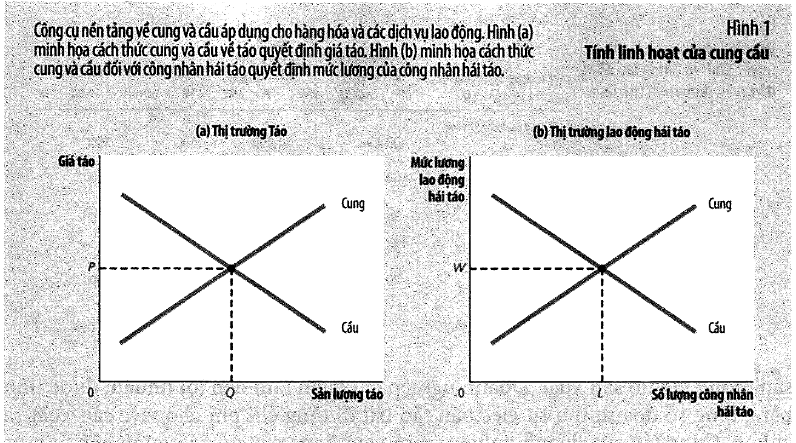

---

**PHẦN A — LƯƠNG TỪ ĐÂU RA** *(chương 18, tr. 421–443)*

---

## 2. Giá trị sản lượng biên quyết định tuyển bao nhiêu

Sách dựng một ví dụ nhỏ nhất có thể: **một vườn táo**, một loại đầu vào duy nhất thay đổi được là
công nhân hái táo (tr. 423).

Ba định nghĩa nối tiếp nhau (tr. 425–426):

> **Hàm sản xuất** *(production function)*: mối quan hệ giữa lượng đầu vào và lượng đầu ra.
> **Sản lượng biên của lao động** *(marginal product of labor)*: sự gia tăng trong tổng sản lượng
> khi tăng thêm một đơn vị lao động.
> **Giá trị sản lượng biên** *(value of the marginal product)*: sản lượng biên của một đầu vào **nhân
> với giá thị trường của đầu ra**.

**Bảng 1, tr. 424** in năm dòng số. Nhìn cột sản lượng là thấy ngay hàm sản xuất đứng sau nó:

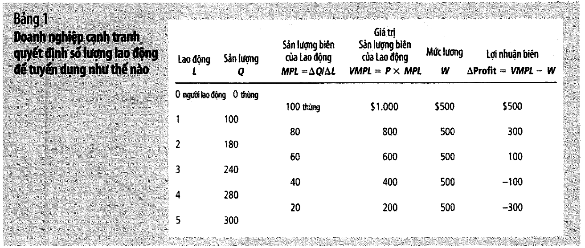

$$Q(L) = 110L - 10L^2 \qquad\Longrightarrow\qquad MPL = 120 - 20L$$

Giá táo $10/thùng, lương $500/tuần:

| Công nhân | Sản lượng | SL biên | Giá trị SL biên | LN tăng thêm |
| --------: | --------: | ------: | --------------: | -----------: |
|         1 |       100 |     100 |          $1.000 |     **+500** |
|         2 |       180 |      80 |            $800 |     **+300** |
|         3 |       240 |      60 |            $600 |     **+100** |
|         4 |       280 |      40 |            $400 |     **−100** |
|         5 |       300 |      20 |            $200 |     **−300** |

Code ở [mục 23](#23-code-minh-hoạ) kiểm **6/6 dòng sản lượng khớp** và cả bốn con số trong đoạn lập
luận ở tr. 426.

**Tuyển 3 người** — đúng như sách kết luận. Quy tắc, in nghiêng ở tr. 426:

> *"một doanh nghiệp cạnh tranh, tối đa hoá lợi nhuận sẽ tuyển dụng lao động tại điểm **giá trị sản
> lượng biên của lao động bằng với mức lương**."*

📌 Và đó là lý do **đường cầu lao động dốc xuống**: sản lượng biên giảm dần (mỗi người thêm vào chia
nhau cùng số thang, cùng số cây), nên giá trị sản lượng biên cũng giảm dần. **Đường giá trị sản lượng
biên CHÍNH LÀ đường cầu lao động.**

---

## 3. 📚 Hai mặt của đồng xu — cầu đầu vào và cung đầu ra là một

Hộp *"Bạn có biết"* ở tr. 428 làm một việc mà rất ít giáo trình làm: chứng minh rằng quyết định
**thuê bao nhiêu người** và quyết định **sản xuất bao nhiêu** không phải hai bài toán, mà là **một bài
toán viết hai kiểu**.

Chuỗi ba bước:

$$P \times MPL = W \;\Longrightarrow\; P = \frac{W}{MPL} \;\Longrightarrow\; P = MC$$

Bước cuối là chỗ hay: **$W/MPL$ chính là chi phí biên.** Sách giải thích bằng số ở tr. 428 — trả $500
cho một công nhân và được thêm 50 thùng táo thì chi phí biên một thùng là $500/50 = $10.

Kiểm bằng chính hàm sản xuất ở mục 2:

|     L |  MPL | VMPL so với W   | MC = W/MPL | MC so với P    |
| ----: | ---: | --------------- | ---------: | -------------- |
|     1 |  100 | 1.000 **>** 500 |       5,00 | 5,00 **<** 10  |
|     2 |   80 | 800 **>** 500   |       6,25 | 6,25 **<** 10  |
|     3 |   60 | 600 **>** 500   |       8,33 | 8,33 **<** 10  |
| **4** |   40 | 400 **<** 500   |      12,50 | 12,50 **>** 10 |
|     5 |   20 | 200 **<** 500   |      25,00 | 25,00 **>** 10 |

⚠️ Hai cột "so sánh" **đổi dấu ở cùng một chỗ** — cả hai đều lật giữa L = 3 và L = 4. Không dòng nào
cho dấu bằng chằn vì lưới chỉ đi từng người một. Giải liên tục thì thấy hai cách cho **đúng một nghiệm**:

$$\underbrace{10(120-20L) = 500}_{VMPL\,=\,W} \Rightarrow L = 3{,}5 \qquad
\underbrace{MPL = \tfrac{500}{10} = 50 \Rightarrow 120-20L = 50}_{P\,=\,MC} \Rightarrow L = 3{,}5$$

Sách viết (tr. 428):

> *"khi một doanh nghiệp cạnh tranh tuyển dụng lao động đến mức mà tại đó giá trị sản lượng biên bằng
> với mức lương, nó cũng sẽ sản xuất đến một mức sản lượng mà tại đó giá bán đầu ra bằng với chi phí biên."*

📌 Đây là cây cầu về [bài 6](bai_06_thi_truong_canh_tranh.md). Ở đó bạn học `P = MC` từ phía sản phẩm;
ở đây bạn nhìn **cùng một điều kiện** từ phía đầu vào. Nếu hai bài đó từng có vẻ rời nhau thì mục này
là chỗ chúng khớp lại.

---

## 4. Cung lao động, cân bằng, và ba cú sốc

Chương 18 nói ngắn về cung lao động vì nó đã được dựng đầy đủ ở
[bài 10, mục 14](bai_10_lua_chon_cua_nguoi_tieu_dung.md#14-lương-tăng-thì-làm-việc-nhiều-hơn-hay-ít-hơn).
Điểm cốt lõi, tr. 429–430:

> *"Sự đánh đổi giữa lao động và nhàn rỗi là cơ sở của đường cung lao động… **Vì vậy, đường cung lao
> động phản ánh cách mà những người lao động thay đổi lượng thời gian nhàn rỗi để phản ứng với sự thay
> đổi trong chi phí cơ hội.**"*

Ở cân bằng, mức lương làm **hai việc cùng lúc** — và sách thừa nhận ban đầu điều này nghe khó tin
(tr. 431):

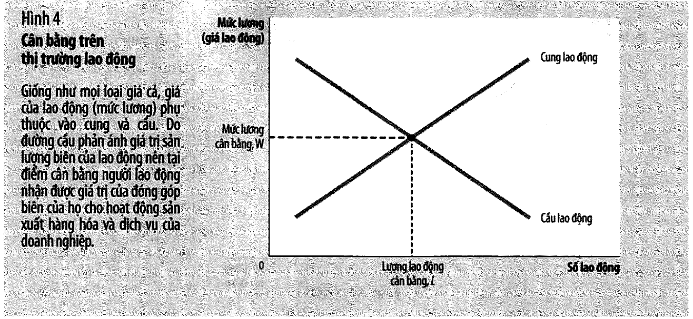

> - Mức lương thay đổi để cân bằng giữa cung và cầu lao động.
> - Mức lương bằng với giá trị sản lượng biên của lao động.
>
> *"Đầu tiên, chúng ta sẽ thấy bất ngờ khi biết mức lương có thể đồng thời thực hiện được cả hai chức
> năng này. Trên thực tế, không hề có bất kỳ trở ngại nào ở đây cả."*

Lý do đơn giản: đường cầu lao động **là** đường giá trị sản lượng biên. Nên chỗ cung gặp cầu tất nhiên
cũng là chỗ lương bằng giá trị sản lượng biên. Từ đó ra bài học in nghiêng ở tr. 431:

> *"Bất kỳ yếu tố nào làm thay đổi cung và cầu lao động phải làm thay đổi mức lương cân bằng **và giá
> trị sản lượng biên với một mức tương ứng** bởi vì những sự thay đổi này luôn luôn bằng nhau."*

Ba cú sốc và hướng dịch chuyển của cầu lao động:

| Cú sốc                              |    MPL    |  Giá táo  | Cầu lao động |
| ----------------------------------- | :-------: | :-------: | :----------: |
| Giá táo tăng (dân ăn nhiều táo hơn) | không đổi |   tăng    |   **TĂNG**   |
| Công nghệ tốt hơn (thang mới)       |   tăng    | không đổi |   **TĂNG**   |
| Thiếu thang — cung vốn giảm         |   giảm    | không đổi |   **GIẢM**   |

📚 **Hộp "Cuộc nổi loạn của những người bảo thủ" (tr. 429)** đáng đọc vì nó là câu trả lời lịch sử cho
nỗi lo "máy móc cướp việc". Đầu thế kỷ 19 ở Anh, thợ dệt lành nghề đập phá máy dệt; họ được gọi là
**Luddite**, theo tên tướng Ned Ludd. Quốc hội ra luật xem phá máy là tội hình sự; sau phiên toà ở
**York năm 1813**, **mười bảy người bị treo cổ**, nhiều người khác bị lưu đày sang Australia.

Sách đối chiếu bằng số ở tr. 428: nửa cuối thế kỷ 20, lương thực tế ở Hoa Kỳ tăng khoảng **150%** mà
số lao động được tuyển dụng vẫn tăng khoảng **87%**. Công nghệ làm tăng MPL → tăng cầu lao động →
tăng lương. Nhưng ⚠️ điều đó **đúng ở tổng thể**, không đúng với từng người thợ dệt cụ thể ở
Nottingham năm 1813. Đó là khoảng cách giữa một mệnh đề kinh tế đúng và một chính sách đủ.

---

## 5. Năng suất quyết định tiền lương — bằng chứng lịch sử

Đây là mục quan trọng nhất của chương 18 với người muốn hiểu vì sao mình được trả bao nhiêu.

**Bảng 2, tr. 434:**

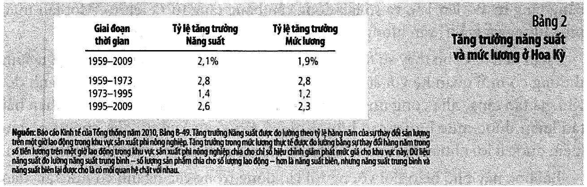

| Giai đoạn     | Tăng năng suất | Tăng lương thực | Chênh lệch |
| ------------- | -------------: | --------------: | ---------: |
| 1959–2009     |           2,1% |            1,9% |        0,2 |
| **1959–1973** |       **2,8%** |        **2,8%** |    **0,0** |
| **1973–1995** |       **1,4%** |        **1,2%** |        0,2 |
| **1995–2009** |       **2,6%** |        **2,3%** |        0,3 |

Chênh lệch giữa hai cột **không bao giờ vượt quá 0,3 điểm phần trăm**. Ba giai đoạn giữa đọc như một
câu chuyện:

1. **1959–1973** — năng suất 2,8, lương 2,8 → đi y hệt nhau
2. **1973–1995** — năng suất **tụt** xuống 1,4 → lương **tụt theo**, còn 1,2
3. **1995–2009** — năng suất **hồi** lên 2,6 → lương **hồi theo**, lên 2,3

Sách kết luận in nghiêng (tr. 434): *"Cả lý thuyết và lịch sử đều khẳng định mối quan hệ chặt chẽ
giữa năng suất và mức lương thực tế."*

### Con số 1,4% đáng dừng lại

Dùng **quy tắc 70** (số năm để gấp đôi ≈ 70 chia cho tốc độ tăng %/năm):

|       Tốc độ | Gấp đôi sau |
| -----------: | ----------: |
|     2,8%/năm |      25 năm |
|     2,0%/năm |      35 năm |
| **1,4%/năm** |  **50 năm** |
|     1,2%/năm |      58 năm |

Sách viết *"Với tỷ lệ tăng trưởng 2 phần trăm một năm… sẽ tăng gấp đôi trong khoảng thời gian 35 năm"*
— khớp. Nhưng đọc dòng 1,4% cho kỹ: ở tốc độ đó phải mất **50 năm** thay vì 35. **Một thế hệ mất gần
một nửa mức cải thiện — chỉ vì một điều duy nhất là năng suất chậm lại.** Đó là chi phí thật của
"suy giảm năng suất 1973–1995", và nó không bao giờ được cảm nhận như một tin tức vì nó không xảy ra
trong một ngày nào cả.

---

## 6. Đất và vốn — cùng một quy tắc, không có ngoại lệ

Sách phân biệt hai loại giá cho cùng một yếu tố (tr. 435):

> **Giá mua** *(purchase price)*: giá mà một người trả để sở hữu vĩnh viễn một yếu tố sản xuất.
> **Giá thuê** *(rental price)*: giá mà một người trả để sử dụng yếu tố đó trong một thời gian nhất định.

Và áp thẳng quy tắc của mục 2 sang đất và vốn (tr. 436): *"đối với cả đất và vốn, doanh nghiệp tăng số
lượng thuê mướn cho đến khi giá trị sản lượng biên của một yếu tố bằng với giá của yếu tố đó."*

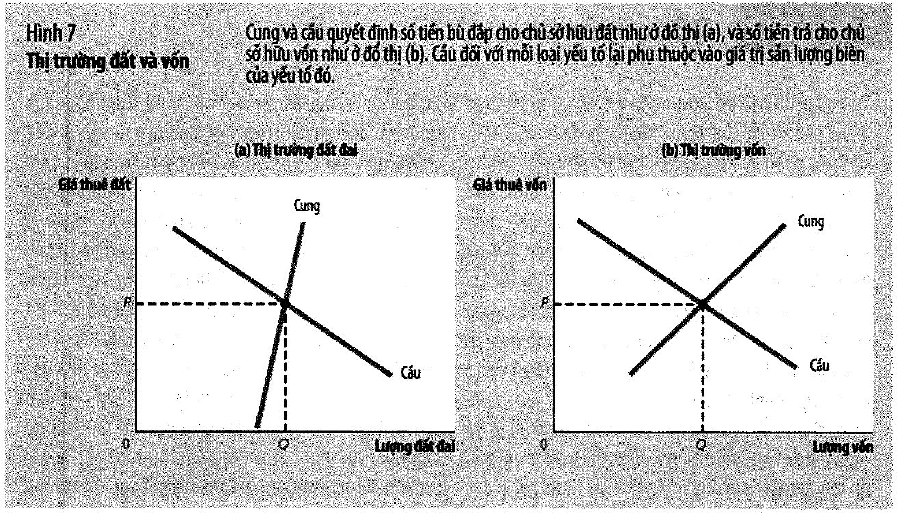

Câu in nghiêng ở tr. 436 là kết luận của cả chương 18:

> *"**Mỗi yếu tố lao động, đất, và vốn tạo ra giá trị đóng góp biên cho quá trình sản xuất.**"*

⚠️ Và một điểm rất dễ bỏ qua nhưng có hệ quả lớn: **các yếu tố sản xuất bổ sung cho nhau**. Sách viết
ở tr. 437–438 rằng khi lượng vốn tăng, sản lượng biên của **lao động** cũng tăng — nên lương tăng.
Ngược lại, một trận bão phá huỷ máy móc thì *"sản lượng biên của lao động giảm và mức lương cân bằng
giảm"*.

> 💼 Đọc theo kiểu quản trị: **đầu tư thiết bị và trả lương cao không phải hai lựa chọn thay thế nhau.**
> Thiết bị tốt hơn làm nhân viên tạo ra nhiều giá trị hơn, tức là làm cho việc trả lương cao trở nên
> *chi trả được*. Ai đó nói "năm nay hoãn mua máy để có tiền tăng lương" đang bỏ qua đúng chỗ này.

---

**PHẦN B — VÌ SAO LƯƠNG CHÊNH NHAU** *(chương 19, tr. 444–465)*

---

## 7. Chênh lệch lương bù đắp

Chương 19 mở bằng ba con số (tr. 445): kỹ sư trung bình **$200.000/năm**, cảnh sát **$50.000**, nông
dân **$20.000**. Và nói rõ chương 18 chỉ là *"phần mở đầu của câu chuyện"*.

Lý do đầu tiên, định nghĩa ở chân trang 446:

> **Chênh lệch lương** *(compensating differential)*: phần chênh lệch về lương nhằm bù đắp cho những
> thuộc tính phi tiền tệ của các công việc khác nhau.

Cơ chế nằm ở phía **cung**: *"cung lao động đối với những công việc dễ dàng, vui vẻ, và an toàn bao
giờ cũng lớn hơn cung lao động cho những công việc nặng nhọc, chán ngắt, và nguy hiểm."*

Bốn ví dụ của sách (tr. 446–447):

| Công việc                         | Lương so với người cùng trình độ | Vì sao                                                       |
| --------------------------------- | -------------------------------- | ------------------------------------------------------------ |
| Công nhân khai khoáng             | **cao hơn**                      | độc hại, nguy hiểm, vấn đề sức khoẻ dài hạn                  |
| Công nhân ca đêm                  | **cao hơn**                      | thói quen cuộc sống đảo ngược                                |
| Giáo sư đại học                   | **thấp hơn** luật sư, bác sĩ     | *"sự thoả mãn cá nhân và trí tuệ mà công việc này mang lại"* |
| Nhân viên bãi biển vs thu gom rác | **thấp hơn**                     | công việc dễ chịu hơn thì nhiều người muốn làm hơn           |

Sách còn tự trêu ở tr. 447: *"(Thực ra thì giảng dạy kinh tế học vui đến mức thật đáng ngạc nhiên là
người ta vẫn còn phải trả lương cho các giáo sư kinh tế học!)"*

> 💼 Ý nghĩa quản trị rất trực tiếp: **một phần tiền lương của bạn đang mua thứ không phải là lao động
> — nó mua sự khó chịu.** Cải thiện điều kiện làm việc (ca kíp, an toàn, môi trường, chỗ ngồi) là một
> cách **giảm chi phí lương** hoàn toàn hợp pháp, và thường rẻ hơn tăng lương cùng một mức hấp dẫn.

---

## 8. Vốn con người và giá trị tăng thêm của kỹ năng

> **Vốn con người** *(human capital)*: tích luỹ những đầu tư cho con người như giáo dục, đào tạo thông
> qua công việc.

**Bảng 1, tr. 448** — thu nhập bình quân theo trình độ, quy về đô la 2008:

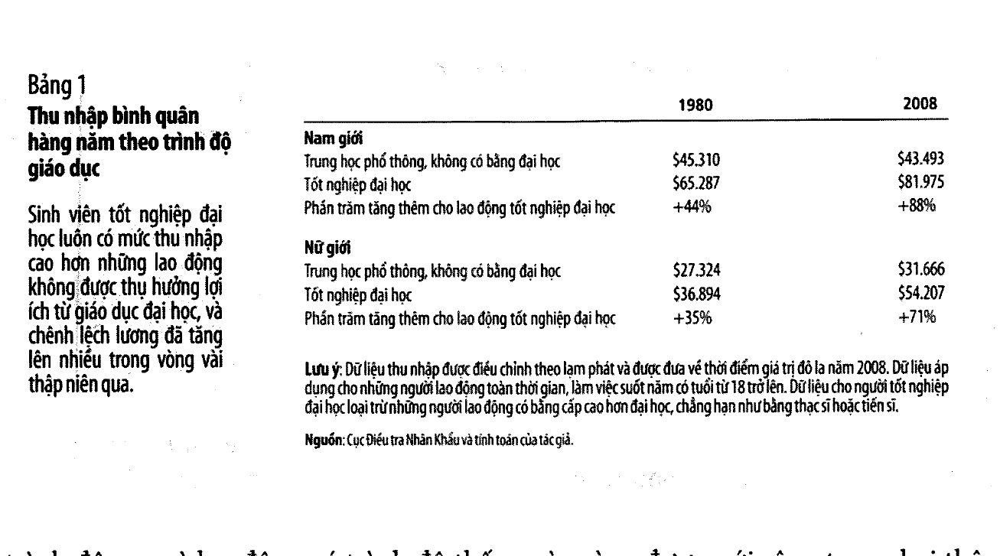

| Nhóm     |  Năm | Hết phổ thông | Tốt nghiệp ĐH |    Chênh |
| -------- | ---: | ------------: | ------------: | -------: |
| Nam giới | 1980 |       $45.310 |       $65.287 | **+44%** |
| Nam giới | 2008 |       $43.493 |       $81.975 | **+88%** |
| Nữ giới  | 1980 |       $27.324 |       $36.894 | **+35%** |
| Nữ giới  | 2008 |       $31.666 |       $54.207 | **+71%** |

Phần bù bằng đại học **gấp đôi** trong 28 năm với nam, và hơn gấp đôi với nữ.

### Hai điều bảng này nói mà sách không bình luận

**Một — thu nhập của nam giới chỉ hết phổ thông đã GIẢM.** Không phải tăng chậm hơn: từ $45.310 xuống
$43.493, tức **giảm 4,0%** sau khi đã hiệu chỉnh lạm phát, trong 28 năm.

**Hai — khoảng cách mở rộng chủ yếu từ phía dưới tụt lại.** Người tốt nghiệp đại học tăng +25,6% (nam)
và +46,9% (nữ). Nếu chỉ nhìn con số "phần bù tăng từ 44% lên 88%" thì dễ tưởng phía trên bứt lên; thực
tế phía dưới đứng yên hoặc đi lùi cũng đóng góp lớn.

Hai giả thuyết của sách cho việc khoảng cách nới rộng (tr. 448–449):

1. **Thương mại quốc tế.** Nhập khẩu tăng từ 5% (1970) lên 14% GDP (2009), xuất khẩu 6% → 11%. Hoa Kỳ
   nhập hàng do lao động trình độ thấp làm, xuất hàng do lao động trình độ cao làm → cầu nội địa dịch
   về phía lao động trình độ cao.
2. **Thay đổi công nghệ.** Máy tính và công nghệ thông tin làm tăng cầu lao động có kỹ năng và giảm cầu
   lao động không kỹ năng.

---

## 9. ⚠️ Một chỗ sách in sai — tr. 448

Đoạn văn ngay dưới Bảng 1, **cùng trang 448**, viết:

> *"Đối với nữ giới, lợi ích từ việc học đại học là giúp làm tăng từ 35 phần trăm đến **75 phần trăm**
> trong mức gia tăng thu nhập."*

Tính lại từ chính số liệu của bảng: $54.207 / $31.666 − 1 = **71,2%**, làm tròn là **71%**. Và dòng
cuối của **chính Bảng 1 cũng in "+71%"**.

**Đoạn văn in sai số 75; bảng mới đúng.** Đã đối chiếu bằng cách phóng to trang 448 ở độ phân giải
300 dpi để loại trừ khả năng đọc nhầm.

Ba con số còn lại (44%, 88%, 35%) đều khớp chính xác với bảng — code kiểm **4/4 dòng**.

> 📌 Cách dùng: khi trích lại số của giáo trình này, hãy **trích từ bảng, đừng trích từ đoạn văn**.
> [Mục 17](#17-tỷ-lệ-nghèo-và-ai-là-người-nghèo) sẽ gặp lại đúng vấn đề đó ở dạng nhẹ hơn — đoạn văn
> làm tròn lên trong khi bảng cho số chính xác.

---

## 10. Khả năng, nỗ lực, cơ hội, và hiện tượng siêu sao

Ba yếu tố mà sách gộp lại vì chúng đều **khó đo** (tr. 449–450): khả năng bẩm sinh, nỗ lực, và cơ hội.
Và một thừa nhận rất thẳng ở tr. 450:

> *"Khi các nhà kinh tế học lao động nghiên cứu về lương, họ gắn mức lương với các biến số có thể đo
> lường như số năm đi học, số năm kinh nghiệm, tuổi, và các đặc điểm công việc… nhưng họ **chỉ giải
> thích được chưa tới một nửa** những dao động trong mức lương thực tế."*

Hơn một nửa biến thiên tiền lương **chưa giải thích được**. Đó là một con số nên nhớ khi ai đó nói
chắc nịch về nguyên nhân của một khoảng cách lương nào đó.

### Nghiên cứu tình huống — lợi ích của sắc đẹp

**Daniel Hamermesh và Jeff Biddle**, *American Economic Review*, **tháng 12/1994** (tr. 450):

| Nhóm ngoại hình | Thu nhập so với nhóm kề dưới             |
| --------------- | ---------------------------------------- |
| Trên trung bình | cao hơn **5%** so với trung bình         |
| Trung bình      | cao hơn **5–10%** so với dưới trung bình |

Kết quả tương tự cho cả nam và nữ. Ba cách giải thích mà sách nêu (tr. 450–451): sắc đẹp là một dạng
**khả năng bẩm sinh** làm tăng năng suất trong nghề giao tiếp; là một dạng **tín hiệu** gián tiếp; hoặc
là **phân biệt đối xử** thuần tuý.

### Hiện tượng siêu sao

Vì sao thợ mộc giỏi nhất không kiếm được hàng triệu đô la còn Johnny Depp thì có? Sách chỉ ra siêu sao
chỉ xuất hiện ở thị trường có **hai đặc tính** (tr. 452):

1. Mọi người tiêu dùng đều muốn thụ hưởng hàng hoá do **nhà sản xuất tốt nhất** cung cấp.
2. Hàng hoá được sản xuất bằng công nghệ giúp nhà sản xuất tốt nhất cung ứng đến **mọi người** với chi
   phí thấp.

> *"xem hai lần một bộ phim của một diễn viên chỉ giỏi bằng một nửa Johnny Depp không phải là một sự
> thay thế tốt."*

Thợ mộc thiếu đặc tính thứ hai: *"một thợ mộc… chỉ có thể cung cấp dịch vụ của mình đến một số lượng
có hạn người tiêu dùng."*

> 💼 Hai đặc tính đó chính là câu hỏi để đánh giá **một mô hình kinh doanh có nhân bản được không**.
> Phần mềm, nội dung số, thương hiệu — có cả hai. Nhà hàng, phòng khám, tiệm sửa xe — chỉ có cái thứ
> nhất. Đó là lý do một đầu bếp giỏi mở chuỗi thì mới thành siêu sao, còn giỏi một mình thì không.

---

## 11. Mức lương trên mức cân bằng — ba lý do

Cho đến đây mọi phân tích đều giả định lương **cân bằng** cung cầu. Sách nêu ba trường hợp giả định
đó sai (tr. 453):

| Lý do                    | Cơ chế                                                          | Ai chịu                                                                      |
| ------------------------ | --------------------------------------------------------------- | ---------------------------------------------------------------------------- |
| **Luật lương tối thiểu** | đẩy lương lên trên cân bằng cho lao động kỹ năng thấp           | hầu hết lao động **không** bị ảnh hưởng vì lương cân bằng của họ đã cao hơn  |
| **Công đoàn**            | đàm phán tập thể, có thể **đình công**                          | thành viên công đoàn thu nhập cao hơn **10–20%** so với người không tham gia |
| **Mức lương hiệu quả**   | doanh nghiệp **tự nguyện** trả cao hơn vì nó làm tăng năng suất | —                                                                            |

Ba định nghĩa ở chân trang 453:

> **Công đoàn** *(union)*: hiệp hội người lao động có vai trò đàm phán với chủ doanh nghiệp về mức
> lương và điều kiện làm việc.
> **Đình công** *(strike)*: hoạt động rời bỏ công việc tại doanh nghiệp, do công đoàn tổ chức.
> **Mức lương hiệu quả** *(efficiency wages)*: mức lương trên mức cân bằng được doanh nghiệp trả để
> thúc đẩy năng suất lao động.

⚠️ Cả ba đều có **cùng một hệ quả** (tr. 453–454): đẩy lương lên trên cân bằng → tăng lượng cung lao
động, giảm lượng cầu → **lao động dư thừa, tức thất nghiệp**. Ba nguyên nhân khác hẳn nhau nhưng đường
đi giống hệt nhau.

📌 Lý do thứ ba là lý do **duy nhất** trong đó doanh nghiệp trả cao hơn **vì chính lợi ích của họ**, chứ
không phải bị ép. [Mục 22](#22--trả-lương-cao-hơn-thị-trường-có-lời-không) định giá nó bằng số — và
cũng trả nợ cho một câu bỏ ngỏ ở [bài 11](bai_11_thong_tin_bat_can_xung.md).

---

## 12. Đo phân biệt đối xử — vì sao khoảng cách lương không chứng minh được gì

> **Phân biệt đối xử** *(discrimination)*: việc cung cấp những cơ hội khác nhau cho những cá nhân giống
> nhau, chỉ khác nhau về chủng tộc, giới tính, tuổi tác, hoặc những thuộc tính cá nhân khác.

**Bảng 2, tr. 454** — thu nhập trung vị hàng năm, 2008:

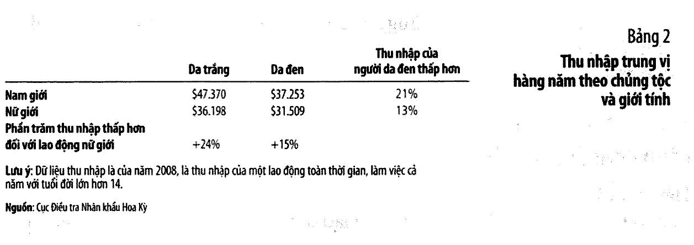

|          | Da trắng |  Da đen | Da đen thấp hơn |
| -------- | -------: | ------: | --------------: |
| Nam giới |  $47.370 | $37.253 |       **21,4%** |
| Nữ giới  |  $36.198 | $31.509 |       **13,0%** |

Và theo giới tính: nữ da trắng thấp hơn nam da trắng **23,6%**; nữ da đen thấp hơn nam da đen **15,4%**.
(Sách in làm tròn 21%, 13%, 24%, 15% — tất cả đều khớp.)

⚠️ **Đây là câu cảnh báo quan trọng nhất của cả chương 19** (tr. 455):

> *"Quan sát một cách đơn giản về sự khác biệt mức lương giữa các nhóm rộng lớn – da trắng và da đen,
> nam giới và nữ giới – **không chứng minh được rằng chủ doanh nghiệp phân biệt đối xử.**"*

Sách liệt kê ba thứ phải loại trừ trước (tr. 455):

| Cần loại trừ                   | Bằng chứng của sách                                                                                                                                                |
| ------------------------------ | ------------------------------------------------------------------------------------------------------------------------------------------------------------------ |
| **Vốn con người — số lượng**   | lao động nam da trắng có tỷ lệ bằng đại học cao hơn da đen **75%**; nam có tỷ lệ bằng sau đại học cao hơn nữ **11%**                                               |
| **Vốn con người — chất lượng** | trường công ở khu vực đa số da đen có chi tiêu, quy mô lớp học kém hơn; *"trong nhiều năm các trường đã hướng các nữ sinh tránh xa các khoá học khoa học và toán"* |
| **Kinh nghiệm làm việc**       | tỷ lệ tham gia lực lượng lao động của nữ tăng gần đây → lao động nữ trung bình **trẻ hơn**; và nữ có khả năng tạm gác sự nghiệp để sinh con                        |

⚠️ Nhưng sách **cũng không** kết luận ngược lại. Nó nêu ngay hai điểm ngược chiều (tr. 455–456):
chất lượng giáo dục kém hơn **bản thân nó có thể là hậu quả của phân biệt đối xử**; và việc "hướng nữ
sinh tránh xa toán" cũng vậy. Một biến kiểm soát có thể chính là kênh truyền của thứ ta đang muốn đo.

Và nghiên cứu ở tr. 456–457 thì rất khó bác: gửi hồ sơ xin việc **giống hệt nhau**, chỉ khác cái tên.
Hồ sơ mang tên người da trắng nhận phản hồi cao hơn **50%** so với tên người Mỹ gốc Phi — kể cả ở
những nơi quảng cáo cam kết *"Cơ hội Công bằng"*.

---

## 13. 📚 Động cơ lợi nhuận ăn mòn phân biệt đối xử — dựng bằng số

Sách kể một câu chuyện giả tưởng ở tr. 457: một nền kinh tế mà người lao động bị đánh giá bởi **màu
tóc**. Tóc vàng và tóc đen có cùng kỹ năng, kinh nghiệm, đạo đức làm việc — nhưng chủ doanh nghiệp
không thích thuê người tóc vàng.

Sách lập luận bằng lời rằng chênh lệch này **không thể tồn tại lâu**. Đặt con số vào:

- 100 lao động tóc vàng, 100 tóc đen, **năng suất y hệt nhau** (mỗi người tạo ra 100)
- 20 hãng, mỗi hãng 10 chỗ làm. Hãng **phân biệt** chỉ thuê tóc đen; hãng **không phân biệt** thuê ai rẻ hơn
- Cung lao động tóc vàng: ở mức lương $w$ thì có $w$ người sẵn lòng làm

| Số hãng không phân biệt | Chỗ làm | Lương tóc vàng | Lương tóc đen |  Chênh |
| ----------------------: | ------: | -------------: | ------------: | -----: |
|                       2 |      20 |             20 |           100 | **80** |
|                       4 |      40 |             40 |           100 |     60 |
|                       6 |      60 |             60 |           100 |     40 |
|                       8 |      80 |             80 |           100 |     20 |
|                  **10** |     100 |            100 |           100 |  **0** |

Chênh lệch $= 100 - 10n$: nó **co lại** khi số hãng không phân biệt tăng, và bằng 0 đúng lúc họ đủ chỗ
để nhận hết lao động tóc vàng.

Vì sao số hãng không phân biệt lại tăng? **Vì họ lãi hơn:**

| Số hãng không phân biệt | LN hãng không phân biệt | LN hãng phân biệt |
| ----------------------: | ----------------------: | ----------------: |
|                       2 |                 **800** |                 0 |
|                       4 |                     600 |                 0 |
|                       6 |                     400 |                 0 |
|                       8 |                     200 |                 0 |
|                      10 |                       0 |                 0 |

Hãng phân biệt luôn lãi 0 vì họ phải trả đủ 100 — bằng đúng giá trị người lao động tạo ra. Hãng không
phân biệt lãi dương chừng nào còn chênh lệch. Họ mở rộng, hãng phân biệt thua lỗ rời ngành — và **chính
quá trình đó xoá đi chênh lệch đã sinh ra nó**.

Sách viết (tr. 458):

> *"các thị trường cạnh tranh đã có phương thuốc tự nhiên cho căn bệnh phân biệt đối xử của chủ doanh nghiệp."*

⚠️ Chú ý ba chữ cuối: **của chủ doanh nghiệp**. Mục sau là chỗ thuốc không có tác dụng.

---

## 14. Khi thị trường không tự chữa được

Sách nêu **hai** trường hợp mô hình ở mục 13 sập, và cả hai đều rất thật.

### (a) Khách hàng phân biệt đối xử

Nghiên cứu trên *Journal of Labor Economics*, **1988** (tr. 460): cầu thủ bóng rổ da đen kiếm thu nhập
ít hơn **20%** so với cầu thủ da trắng **có năng lực tương tự**. Và tần suất tham gia các trận cao hơn
ở các câu lạc bộ có tỷ lệ cầu thủ da trắng cao hơn.

Cơ chế: nếu **khán giả** phân biệt, thì cầu thủ da đen thật sự **ít sinh lời hơn** cho câu lạc bộ. Lúc
đó phân biệt lại **có lợi** cho hãng, nên cạnh tranh không xoá được — nó **giữ nguyên**.

Nghiên cứu trên *Quarterly Journal of Economics*, **1990** đo bằng cách khác: giá thị trường của **ảnh
cầu thủ**. Ảnh cầu thủ đánh bóng da đen bán thấp hơn **10%**, ảnh cầu thủ ném bóng da đen thấp hơn
**13%** so với cầu thủ da trắng tương tự.

📌 Sách ghi thêm một điều quan trọng: *"các nghiên cứu về lương trong môn bóng chày gần đây lại không
tìm thấy bằng chứng gì về sự khác biệt mức lương do phân biệt đối xử."* Sở thích của khán giả đổi thì
chênh lệch cũng đổi theo.

### (b) Chính phủ áp đặt

Nghiên cứu tình huống ở tr. 458–459, có lẽ là ví dụ sắc nhất của cả chương. Nhà sử học kinh tế
**Jennifer Roback**, *Journal of Economic History*, **1986**: xe buýt ở miền Nam Hoa Kỳ đầu thế kỷ 20
bị phân biệt chỗ ngồi theo chủng tộc.

Phát hiện ngược với trực giác: **chính các hãng xe buýt phản đối** những đạo luật đó, vì phân biệt chỗ
ngồi **tốn chi phí**. Một quản lý công ty đường sắt phàn nàn với hội đồng thành phố rằng khi có luật
phân biệt, *"công ty của chúng tôi phải gánh chịu cả đống không gian trống trên xe."*

Roback mô tả:

> *"Công ty đường sắt không sáng tạo ra chính sách phân biệt đối xử và hoàn toàn không ủng hộ những đạo
> luật này… Các bằng chứng cho thấy động cơ hàng đầu của các doanh nghiệp là kinh tế; phân biệt đối xử
> chỉ làm tốn chi phí của doanh nghiệp thôi… Các quan chức công ty có thể thích hoặc không thích người
> da đen, nhưng họ **không muốn từ bỏ lợi nhuận chỉ để duy trì một định kiến** như vậy."*

Sách rút ra bài học ở tr. 460, và đây là câu nên nhớ:

> *"Chủ doanh nghiệp thường quan tâm đến việc tạo ra lợi nhuận hơn là phân biệt đối xử chống lại một
> nhóm nào đó. Khi các doanh nghiệp có hành vi phân biệt đối xử trên thực tế, nguyên nhân then chốt cho
> phân biệt đối xử thường **không do chính doanh nghiệp gây ra mà ở nguyên nhân khác** — chỉ khi khách
> hàng sẵn lòng trả để duy trì thực trạng phân biệt đối xử **hay khi chính phủ áp đặt** luật phân biệt."*

---

**PHẦN C — CHÊNH LỆCH DỒN LẠI THÀNH GÌ** *(chương 20, tr. 466–494)*

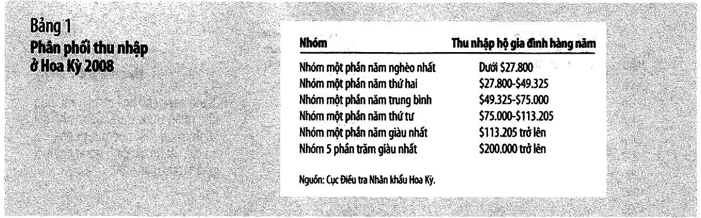

---

## 15. Đo bất bình đẳng — bảng ngũ phân vị

Chương 20 mở bằng câu của Mary Colum nói với Ernest Hemingway (tr. 466): *"Sự khác biệt duy nhất giữa
người giàu và những người khác là người giàu có nhiều tiền hơn."*

Cách đo chuẩn: xếp mọi hộ gia đình theo thu nhập rồi chia thành **năm nhóm bằng nhau** (ngũ phân vị),
và xem mỗi nhóm nhận bao nhiêu phần trăm tổng thu nhập.

**Bảng 2, tr. 468** — tỷ trọng thu nhập, Hoa Kỳ:

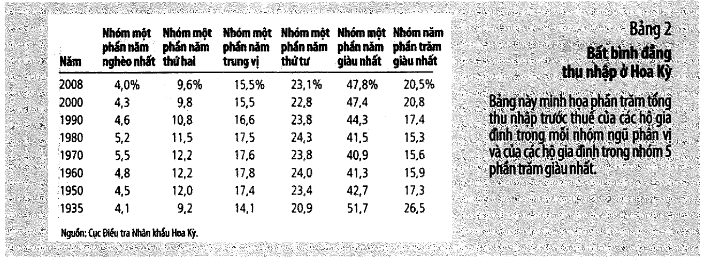

|      Năm | Nghèo nhất | Thứ hai | Trung bình | Thứ tư | Giàu nhất | 5% giàu nhất |
| -------: | ---------: | ------: | ---------: | -----: | --------: | -----------: |
|     2008 |       4,0% |    9,6% |      15,5% |  23,1% | **47,8%** |        20,5% |
|     2000 |        4,3 |     9,8 |       15,5 |   22,8 |      47,4 |         20,8 |
|     1990 |        4,6 |    10,8 |       16,6 |   23,8 |      44,3 |         17,4 |
|     1980 |        5,2 |    11,5 |       17,5 |   24,3 |      41,5 |         15,3 |
| **1970** |    **5,5** |    12,2 |       17,6 |   23,8 |  **40,9** |         15,6 |
|     1960 |        4,8 |    12,2 |       17,8 |   24,0 |      41,3 |         15,9 |
|     1950 |        4,5 |    12,0 |       17,4 |   23,4 |      42,7 |         17,3 |
|     1935 |        4,1 |     9,2 |       14,1 |   20,9 |  **51,7** |         26,5 |

Hai quan sát của sách (tr. 468):

- Năm 2008, nhóm giàu nhất có thu nhập **gấp mười hai lần** nhóm nghèo nhất.
- Nhóm **5%** giàu nhất nhận 20,5% — **nhiều hơn tổng thu nhập của 40% nghèo nhất** (4,0 + 9,6 = 13,6%).

Và mô tả xu thế bằng hai đoạn văn: *"Từ năm 1935 đến 1970, phân phối này trở nên công bằng hơn một cách
đều đặn… Càng về sau, xu thế này lại tự đảo chiều."*

---

## 16. 📚 Hệ số Gini — nén một bảng thành một con số

Sách in bảng nhưng **không tính hệ số Gini** — nó chỉ mô tả xu thế bằng lời. Gini biến tám dòng số
thành tám con số so sánh được: **0 là hoàn toàn bình đẳng, 1 là một người ôm hết**.

Công thức diện tích cho năm nhóm bằng nhau, với $y_i$ là tỷ trọng **cộng dồn** đến nhóm thứ $i$:

$$G = 1 - \frac{1}{5}\sum_{i=1}^{5}\left(y_i + y_{i-1}\right), \qquad y_0 = 0$$

|      Năm | Nghèo nhất | Giàu nhất | Giàu/nghèo |         **GINI** |
| -------: | ---------: | --------: | ---------: | ---------------: |
|     2008 |       4,0% |     47,8% |   12,0 lần |        **0,404** |
|     2000 |       4,3% |     47,4% |   11,0 lần |            0,398 |
|     1990 |       4,6% |     44,3% |    9,6 lần |            0,369 |
|     1980 |       5,2% |     41,5% |    8,0 lần |            0,342 |
| **1970** |       5,5% |     40,9% |    7,4 lần |  **0,330** ← đáy |
|     1960 |       4,8% |     41,3% |    8,6 lần |            0,339 |
|     1950 |       4,5% |     42,7% |    9,5 lần |            0,351 |
| **1935** |       4,1% |     51,7% |   12,6 lần | **0,428** ← đỉnh |

**Đường Gini có hình chữ U:** 0,428 (1935) → đáy **0,330** (1970) → 0,404 (2008).

Gini 2008 vẫn thấp hơn 1935, nhưng đã **cao hơn mọi năm từ 1950 đến 2000**. Gần sáu thập niên cải
thiện đã bị xoá gần hết — dù chưa hết hẳn. Đó là hai đoạn văn của sách, nén thành một cột số.

### ⚠️ Ba cảnh báo khi dùng con số này

1. **Gini tính từ ngũ phân vị luôn THẤP HƠN Gini tính từ từng hộ**, vì nó coi mọi người trong cùng một
   nhóm là giống nhau. Con số thật của Hoa Kỳ 2008 vào khoảng **0,47** chứ không phải 0,40.
2. Đây là thu nhập **trước thuế và trước chuyển nhượng** — chú thích của chính Bảng 2 ghi rõ.
   [Mục 18](#18-ba-lý-do-dữ-liệu-thu-nhập-vẽ-sai-bức-tranh) cho thấy điều đó quan trọng tới mức nào.
3. Vài dòng không cộng đủ 100% do làm tròn trong sách — 1990 cộng lại **100,1%**.

📌 So sánh quốc tế mà sách đưa ở tr. 468–469 dùng một thước khác (tỷ trọng của 10% giàu nhất): Hoa Kỳ
**29,9%** — bất bình đẳng hơn Nhật (21,7%), Đức (22,1%), Anh (28,5%), nhưng bình đẳng hơn Trung Quốc
(34,9%), Mexico (38,9%), Brazil (43,0%), Nam Phi (44,7%).

---

## 17. Tỷ lệ nghèo và ai là người nghèo

Hai định nghĩa ở chân trang 470:

> **Tỷ lệ nghèo** *(poverty rate)*: phần trăm dân số có thu nhập gia đình dưới ngưỡng nghèo.
> **Ngưỡng nghèo** *(poverty line)*: mức thu nhập tuyệt đối do chính quyền liên bang xác định, dưới mức
> đó hộ gia đình được xem là nghèo.

Ngưỡng nghèo được đặt ở khoảng **ba lần chi phí cung cấp một bữa ăn tối thiểu**. Năm 2008: thu nhập
trung bình hộ **$61.521**, ngưỡng nghèo cho hộ bốn người **$22.025**, tỷ lệ nghèo **13,2%**.

**Hình 2, tr. 470** cho một mốc đáng nhớ: tỷ lệ nghèo giảm từ **22,4% (1959)** xuống **11,1% (1973)** —
vì thu nhập trung bình tăng hơn 50% trong giai đoạn đó. Sách dẫn Kennedy: *"một làn sóng dâng cao đẩy
mọi con tàu cùng lên cao."* Nhưng từ 1970 tới nay tỷ lệ nghèo **không giảm thêm** dù thu nhập bình quân
vẫn tăng — *"làn sóng nhô cao của nền kinh tế đã để lại một số con tàu phía sau."*

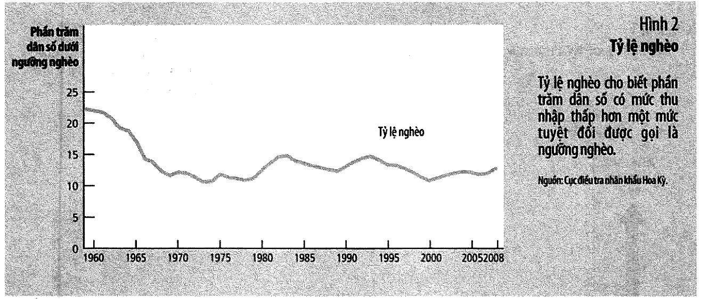

**Bảng 3, tr. 471** — nghèo không rơi đều:

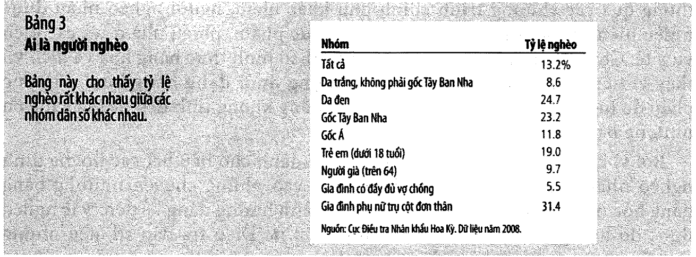

| Nhóm                             | Tỷ lệ nghèo |
| -------------------------------- | ----------: |
| Tất cả                           |       13,2% |
| Da trắng, không gốc Tây Ban Nha  |    **8,6%** |
| Da đen                           |       24,7% |
| Gốc Tây Ban Nha                  |       23,2% |
| Gốc Á                            |       11,8% |
| Trẻ em (dưới 18)                 |       19,0% |
| Người già (trên 64)              |        9,7% |
| Gia đình có đầy đủ vợ chồng      |    **5,5%** |
| Gia đình phụ nữ trụ cột đơn thân |   **31,4%** |

⚠️ **Ba đặc điểm của sách, kiểm lại bằng số** — và cả ba đều được sách làm tròn **lên**:

| Sách viết                                                   |                 Tính lại |
| ----------------------------------------------------------- | -----------------------: |
| da đen/gốc TBN nghèo *"cao hơn gấp ba lần"* da trắng        | **2,87** và **2,70** lần |
| hộ phụ nữ đơn thân nghèo *"cao hơn sáu lần"* hộ đủ vợ chồng |             **5,71** lần |

Không sai về hướng, nhưng lại là một lý do nữa để **trích số từ bảng chứ đừng trích từ đoạn văn** —
đúng như bài học ở [mục 9](#9--một-chỗ-sách-in-sai--tr-448).

Và câu nặng nhất của mục, tr. 471:

> *"Trong số trẻ em da đen và gốc Tây Ban Nha trong những hộ gia đình có chủ hộ là nữ giới đơn thân,
> **có một nửa là nghèo**."*

---

## 18. Ba lý do dữ liệu thu nhập vẽ sai bức tranh

Sách dành hẳn một mục để tự phản biện dữ liệu vừa trình bày (tr. 471–474). Ba lý do:

| #   | Vấn đề                                                                                                      | Hệ quả                                                                   |
| --- | ----------------------------------------------------------------------------------------------------------- | ------------------------------------------------------------------------ |
| 1   | **Chuyển nhượng dưới dạng hàng hoá** — tem thực phẩm, phiếu nhà ở, dịch vụ y tế không được tính là thu nhập | nếu tính theo giá thị trường, số hộ nghèo **giảm 10%**                   |
| 2   | **Vòng đời kinh tế** — thu nhập thấp lúc trẻ, đỉnh khoảng tuổi 50, sụt khi nghỉ hưu ở 65                    | bất bình đẳng thu nhập **hằng năm** phóng đại bất bình đẳng **suốt đời** |
| 3   | **Thu nhập tạm thời** — sương mù hại cam Florida thì người trồng cam California thu nhập tăng tạm thời      | cùng lý do trên                                                          |

Định nghĩa ở chân trang 472:

> **Vòng đời** *(life cycle)*: xu hướng dao động thông thường về thu nhập trong suốt cuộc đời một con người.

### Ba thước đo, ba con số — nghiên cứu Cox và Alm

Sách dẫn ở tr. 473–474, và ba con số này đáng nhớ hơn cả mục:

| Thước đo                          | Giàu/nghèo (ngũ phân vị trên/dưới) |
| --------------------------------- | ---------------------------------: |
| **THU NHẬP** hằng năm             |                       **12,0 lần** |
| **TIÊU DÙNG** của hộ              |                        **3,9 lần** |
| **TIÊU DÙNG bình quân đầu người** |                        **2,1 lần** |

Bước thứ hai đến từ quy mô hộ: hộ giàu nhất trung bình **3,1 người**, hộ nghèo nhất **1,7 người**.
Kiểm phép tính: $3{,}9 \times 1{,}7 / 3{,}1 = 2{,}14$ → khớp với 2,1 của sách.

> *"bất bình đẳng về mức sống vật chất nhỏ hơn nhiều so với bất bình đẳng theo thu nhập hằng năm."*

⚠️ Đọc con số này cho cẩn thận theo **cả hai chiều**. Nó đúng là một hiệu chỉnh cần thiết — nhưng
"tiêu dùng bình quân đầu người chỉ chênh 2,1 lần" cũng có nghĩa là hộ nghèo đang **vay hoặc tiêu vào
tiết kiệm** để duy trì mức đó. Bất bình đẳng về **tài sản** thì lớn hơn hẳn bất bình đẳng về thu nhập,
và sách không đo nó ở đâu cả.

### Biến động liên thế hệ

Sách đưa một con số ở tr. 474: bố kiếm cao hơn trung bình **20%** thì con trai có nhiều khả năng kiếm
cao hơn trung bình thế hệ nó **8%**. Đó là một **hệ số truyền đời = 8/20 = 0,4**:

| Thế hệ   | Cao hơn trung bình |
| -------- | -----------------: |
| Ông bố   |            +20,00% |
| Con trai |             +8,00% |
| Cháu     |             +3,20% |
| Chắt     |             +1,28% |
| Chít     |             +0,51% |

Lợi thế tan gần hết sau ba thế hệ — đó là ý của câu *"chỉ có một sự tương quan nhỏ giữa thu nhập của
ông bà với thu nhập của cháu"*.

📌 Và một hệ quả ít ai nói: hệ số 0,4 cũng có nghĩa là **bất lợi cũng tan hết nhanh như thế**. Nghèo
truyền đời không phải một định mệnh — nhưng ba thế hệ là một khoảng thời gian rất dài với một đời người.

---

## 19. Ba triết lý tái phân phối

Đây là chỗ sách rời kinh tế học và bước sang triết học chính trị — và nó nói rõ là mình đang làm vậy.

| Triết lý                                                                             | Mục tiêu                                            | Kết luận về tái phân phối                                 |
| ------------------------------------------------------------------------------------ | --------------------------------------------------- | --------------------------------------------------------- |
| **Chủ nghĩa thoả dụng** *(utilitarianism)* — Jeremy Bentham, John Stuart Mill        | tối đa hoá **tổng** thoả dụng của mọi người         | tái phân phối **có**, nhưng không tới bình đẳng tuyệt đối |
| **Chủ nghĩa tự do** *(liberalism)* — John Rawls, *Lý thuyết về Công bằng* (**1971**) | tối đa hoá thoả dụng của **người kém may mắn nhất** | tái phân phối **nhiều hơn** chủ nghĩa thoả dụng           |
| **Chủ nghĩa tự do cá nhân** *(libertarianism)* — Robert Nozick                       | quan tâm **quá trình**, không phải kết quả          | **không** tái phân phối                                   |

**Rawls** dùng một thí nghiệm tư duy: trước khi sinh ra, ta ở **"vị trí ban đầu"** sau **"bức màn vô
minh"** — không biết mình sẽ là ai. Từ đó ra **tiêu chí tối đa hoá phúc lợi nhóm người nghèo**
*(maximin criterion)*.

📚 Cách đọc lại Rawls mà sách đưa ra ở tr. 478 rất đáng giá: tái phân phối như một dạng **bảo hiểm xã
hội**. *"Khi chọn các chính sách đánh thuế vào người giàu để bổ sung thu nhập cho người nghèo, chúng ta
đang bảo hiểm cho chính mình để đối phó với khả năng trở thành những người nghèo trong xã hội."*

⚠️ Và sách nêu ngay phản biện: nếu người sau bức màn vô minh **không** đặc biệt ngại rủi ro, họ sẽ tối
đa hoá **thoả dụng trung bình** thay vì thoả dụng thấp nhất — và khi đó Rawls thu về đúng chủ nghĩa
thoả dụng. Toàn bộ khác biệt nằm ở một giả định tâm lý.

**Nozick** phản đối cả hai bằng một hình ảnh (tr. 479): giả sử bạn tìm thấy dữ liệu điểm số của một lớp
và thấy phân phối "bất công". Bạn có quyền chấm lại không? Câu trả lời phụ thuộc **kỳ thi có công bằng
không**, chứ không phụ thuộc phân phối điểm trông thế nào. *"Chính phủ nên thực thi quyền cá nhân để
bảo đảm mọi người có cơ hội như nhau sử dụng tài năng của họ để đạt thành công… **Chính phủ không nên
tái phân phối thu nhập** để đạt được sự phân phối cào bằng."*

---

## 20. 📚 Thùng nước rò rỉ — chủ nghĩa thoả dụng dừng lại ở đâu

Sách đưa Peter kiếm **$80.000** và Paul kiếm **$20.000** (tr. 476), rồi lập luận rằng vì độ thoả dụng
biên giảm dần, chuyển tiền từ Peter sang Paul làm **tăng tổng thoả dụng**.

Rồi kể một ngụ ngôn: chính phủ chỉ có **một cái thùng nước bị rò rỉ**. Chuyển bao nhiêu thì hao hụt
bấy nhiêu. Và sách **dừng ở đó** — không cho một con số nào.

Đặt số vào. Gọi $k$ là tỷ lệ đến được tay Paul ($k = 1$ là thùng không rò). Với độ thoả dụng biên tỷ lệ
nghịch với thu nhập, điều kiện tối ưu cho:

$$t^* = 40.000 - \frac{10.000}{k}$$

| Thùng giữ được | Chuyển đi | Peter còn | Paul có | Tỷ lệ giàu/nghèo |
| -------------: | --------: | --------: | ------: | ---------------: |
|       **100%** |    30.000 |    50.000 |  50.000 |     **1,00 lần** |
|            90% |    28.889 |    51.111 |  46.000 |         1,11 lần |
|            80% |    27.500 |    52.500 |  42.000 |         1,25 lần |
|            50% |    20.000 |    60.000 |  30.000 |         2,00 lần |
|            30% |     6.667 |    73.333 |  22.000 |         3,33 lần |
|        **25%** |     **0** |    80.000 |  20.000 |         4,00 lần |

Ba điều đọc thẳng từ bảng:

1. **Thùng không rò → bình đẳng tuyệt đối.** Chuyển 30.000, cả hai đều còn 50.000. Đó đúng là câu
   *"chính phủ nên tiếp tục tái phân phối cho đến khi mỗi cá nhân có mức thu nhập hoàn toàn bằng nhau"*.
2. **Chỉ cần rò một chút là mục tiêu ấy bị bỏ ngay.** Rò 10% thôi thì người theo chủ nghĩa thoả dụng
   đã chấp nhận để Peter giàu hơn Paul.
3. **Rò quá 75% thì không chuyển một đồng nào.** Ngưỡng này giải được chính xác: $t^* = 0$ khi $k = 1/4$.

📌 Kết luận đáng nhớ: **người theo chủ nghĩa thoả dụng không phải người theo chủ nghĩa bình quân.** Họ
bình quân chỉ trong một thế giới không có chi phí. Sách viết: *"Những người theo chủ nghĩa thoả dụng
bác bỏ công bằng hoá thu nhập tuyệt đối bởi vì họ chấp nhận một trong Mười Nguyên lý: **Con người phản
ứng với các động cơ**."*

---

## 21. Chính sách giảm nghèo và bẫy thuế suất biên 100%

Sách điểm bốn nhóm chính sách (tr. 480–486), và đặc điểm chung là **không cái nào hoàn hảo**:

| Chính sách                 | Ưu                                                 | Nhược                                                                                     |
| -------------------------- | -------------------------------------------------- | ----------------------------------------------------------------------------------------- |
| **Lương tối thiểu**        | không tốn tiền chính phủ                           | gây thất nghiệp cho chính nhóm định giúp; tranh cãi nằm ở **độ co giãn của cầu lao động** |
| **Phúc lợi** *(welfare)*   | nhắm đúng nhóm cần                                 | có thể khuyến khích sinh con không kết hôn, đổ vỡ gia đình                                |
| **Thuế thu nhập âm**       | không cần chứng minh nhu cầu, giữ động cơ làm việc | trợ cấp cả cho người *"đơn giản là lười biếng"*                                           |
| **Chuyển nhượng hiện vật** | bảo đảm đúng nhu cầu thiết yếu                     | người nghèo mất quyền tự chọn; sách nêu tranh luận về người vô gia cư nghiện ngập         |

### Thuế thu nhập âm — công thức của sách

$$\text{Số tiền thuế nợ} = \tfrac13 \times \text{thu nhập} - 10.000$$

|    Thu nhập |         Thuế phải nộp | Còn lại |
| ----------: | --------------------: | ------: |
|     $90.000 |                20.000 |  70.000 |
|     $60.000 |                10.000 |  50.000 |
| **$30.000** |                 **0** |  30.000 |
|     $15.000 | **−5.000** (nhận séc) |  20.000 |
|          $0 |               −10.000 |  10.000 |

Chương trình thực tế hoạt động như thuế thu nhập âm là **EITC** *(Earned Income Tax Credit)* — và vì
nó chỉ áp dụng cho **người nghèo đang làm việc**, nó không làm giảm động cơ làm việc.

### ⚠️ Bẫy thuế suất biên 100%

Sách mô tả ở tr. 484–485 một chương trình trợ cấp $20.000 nhưng **mỗi đô la kiếm được bị trừ đúng một
đô la trợ cấp**. So sánh:

| Kiếm thêm       | Thuế âm: **giữ được** | Phúc lợi thu hồi 100%: **giữ được** |
| --------------- | --------------------: | ----------------------------------: |
| 0 → 5.000       |                 3.333 |                               **0** |
| 5.000 → 10.000  |                 3.333 |                               **0** |
| 10.000 → 15.000 |                 3.333 |                               **0** |
| 15.000 → 20.000 |                 3.333 |                               **0** |
| 20.000 → 25.000 |                 3.333 |                               5.000 |

**Kiếm thêm 5.000 mà giữ được 0 đồng.** Thuế suất biên hiệu quả bằng đúng **100%**. Sách viết:

> *"Bất kỳ ai có mức lương dưới 20.000 đô la có rất ít động cơ để tìm kiếm và duy trì công việc… Một
> thuế suất biên 100 phần trăm chắc chắn là một chính sách gây ra tổn thất vô ích lớn."*

Và tác động không dừng ở đó (tr. 485): người bị nản chí *"sẽ bị mất đi cơ hội được đào tạo thông qua
công việc"*, và con cái họ *"mất đi những bài học có được qua việc quan sát cha hoặc mẹ có công việc
toàn thời gian"*.

📌 Nhưng sách không để lời giải trở nên dễ dàng (tr. 486): **xoá trợ cấp càng chậm thì càng nhiều gia
đình đủ điều kiện nhận, và chương trình càng đắt.** Đó là một đánh đổi thật, không có phương án nào
thắng cả hai mặt.

Hai cách khác mà sách nêu: **workfare** (yêu cầu người nhận phúc lợi chấp nhận một công việc do chính
phủ chỉ định), và **giới hạn thời gian** — đạo luật cải tổ phúc lợi **1996** giới hạn mỗi người nhận
trợ cấp tối đa **năm năm** trong cả đời. Clinton giải thích khi ký: *"Phúc lợi chỉ nên là cứu cánh,
không phải là mục tiêu."*

Và câu khép chương 20, tr. 486: **Plato** cho rằng trong một xã hội lý tưởng, thu nhập của người giàu
nhất không nên quá **bốn lần** thu nhập người nghèo nhất. Đối chiếu với
[mục 16](#16--hệ-số-gini--nén-một-bảng-thành-một-con-số): Hoa Kỳ 2008 là **12,0 lần** — gấp ba lần
giới hạn của Plato.

---

## 22. 💼 Trả lương cao hơn thị trường có lời không

Sách nêu lý thuyết **tiền lương hiệu quả** ở tr. 453 bằng đúng ba câu, không có con số nào: trả lương
cao có thể có lợi vì nó *"làm giảm khả năng thay thế lao động, tăng nỗ lực của người lao động, và tăng
chất lượng của những lao động muốn tìm công việc ở doanh nghiệp"*.

Đặt con số vào. Lương cân bằng thị trường **10.000** nghìn đồng/tháng; thay một người (tuyển + đào tạo)
tốn **30.000**:

|  Lương trả | Doanh thu/người | Nghỉ việc | CP thay người | **LN mỗi người** |
| ---------: | --------------: | --------: | ------------: | ---------------: |
|     10.000 |          20.000 |     10,0% |         3.000 |            7.000 |
|     12.000 |          22.400 |      6,0% |         1.800 |            8.600 |
| **14.000** |          24.000 |      4,0% |         1.200 |        **8.800** |
|     16.000 |          25.000 |      3,0% |           900 |            8.100 |
|     18.000 |          25.600 |      2,5% |           750 |            6.850 |
|     20.000 |          26.000 |      2,0% |           600 |            5.400 |

**Tối ưu: trả 14.000 — tức 40% TRÊN mức thị trường.** Lợi nhuận 8.800 so với 7.000 nếu trả đúng giá thị
trường → hơn **1.800, tức 26%**.

### Lợi ích đến từ hai kênh — tách ra bằng cách tắt từng cái

| Kịch bản                                | Lương tối ưu | LN mỗi người |
| --------------------------------------- | -----------: | -----------: |
| Cả hai kênh                             |       14.000 |        8.800 |
| Chỉ **năng suất** (thay người miễn phí) |       12.000 |       10.400 |
| Chỉ **giữ chân** (năng suất không đổi)  |   **10.000** |        7.000 |
| Không kênh nào                          |       10.000 |       10.000 |

Ba kết luận:

1. **Chỉ riêng việc giữ chân người KHÔNG đủ để trả trên giá thị trường.** Tiết kiệm được chi phí tuyển
   dụng, nhưng không bù nổi phần lương tăng. Dòng thứ ba rơi thẳng về 10.000.
2. **Chỉ riêng năng suất thì đã đủ** — tối ưu nhảy lên 12.000 ngay.
3. **Hai kênh cộng lại mới đẩy tối ưu lên 14.000.** Chi phí thay người không tự nó biện minh cho lương
   cao, nhưng nó **làm mạnh thêm** lý do đã có.

> 💼 Hàm ý: câu hỏi đúng không phải *"trả cao có giữ được người không"* mà là *"trả cao có làm họ **làm
> tốt hơn** không"*. Nếu công việc mà nỗ lực không ảnh hưởng mấy đến kết quả — việc lặp đi lặp lại, có
> quy trình chặt — thì trả trên thị trường chỉ là một khoản chi không thu lại được.

📌 Và đây cũng là câu trả lời cho một chỗ còn bỏ ngỏ ở
[bài 11, mục 2](bai_11_thong_tin_bat_can_xung.md#2-hành-vi-được-che-đậy--rủi-ro-đạo-đức): vì sao "tăng
lương" lại là một cách chống rủi ro đạo đức. Nó **chỉ chống được khi công việc có chỗ để nỗ lực phát huy
tác dụng** — cùng đúng một điều kiện mà bảng trên vừa đo.

---

## 23. Code minh hoạ

> ⚙️ **Chạy:** cần **Python 3.10+**. Lưu file rồi gõ `python3 bai-12-thi-truong-lao-dong.py`.
> **Không cần cài gói nào.** File có sẵn tại [thuc_hanh/bai-12-thi-truong-lao-dong.py](../thuc_hanh/bai-12-thi-truong-lao-dong.py).

Mọi thứ dùng `Fraction` — không có số thực nào, nên chạy bao nhiêu lần cũng ra đúng một kết quả.
Hàm `tien()` **ném lỗi** nếu bị truyền số lẻ, để không có chỗ nào âm thầm làm tròn.

⚠️ Code có **11 mục đánh số riêng của nó**, không trùng với 26 mục của bài học. Bảng đối chiếu:

| Mục trong code | Mục trong bài                                                                                                                                                                    |
| -------------- | -------------------------------------------------------------------------------------------------------------------------------------------------------------------------------- |
| 1              | [2](#2-giá-trị-sản-lượng-biên-quyết-định-tuyển-bao-nhiêu)                                                                                                                        |
| 2              | [3](#3--hai-mặt-của-đồng-xu--cầu-đầu-vào-và-cung-đầu-ra-là-một) + [4](#4-cung-lao-động-cân-bằng-và-ba-cú-sốc)                                                                    |
| 3              | [5](#5-năng-suất-quyết-định-tiền-lương--bằng-chứng-lịch-sử)                                                                                                                      |
| 4              | [8](#8-vốn-con-người-và-giá-trị-tăng-thêm-của-kỹ-năng) + [9](#9--một-chỗ-sách-in-sai--tr-448) + [12](#12-đo-phân-biệt-đối-xử--vì-sao-khoảng-cách-lương-không-chứng-minh-được-gì) |
| 5              | [13](#13--động-cơ-lợi-nhuận-ăn-mòn-phân-biệt-đối-xử--dựng-bằng-số) + [14](#14-khi-thị-trường-không-tự-chữa-được)                                                                 |
| 6              | [16](#16--hệ-số-gini--nén-một-bảng-thành-một-con-số)                                                                                                                             |
| 7              | [17](#17-tỷ-lệ-nghèo-và-ai-là-người-nghèo)                                                                                                                                       |
| 8              | [18](#18-ba-lý-do-dữ-liệu-thu-nhập-vẽ-sai-bức-tranh)                                                                                                                             |
| 9              | [20](#20--thùng-nước-rò-rỉ--chủ-nghĩa-thoả-dụng-dừng-lại-ở-đâu)                                                                                                                  |
| 10             | [21](#21-chính-sách-giảm-nghèo-và-bẫy-thuế-suất-biên-100)                                                                                                                        |
| 11             | [22](#22--trả-lương-cao-hơn-thị-trường-có-lời-không)                                                                                                                             |

```python
"""Bai 12 - Thi truong lao dong, tien luong va bat binh dang
(Mankiw, chuong 18-19-20, tr. 421-494).

Chay: python3 bai-12-thi-truong-lao-dong.py
Khong can cai goi nao ngoai thu vien chuan.
"""

from fractions import Fraction as F

DONG = "-" * 74


def tieu_de(so_muc, ten):
    print()
    print("=" * 74)
    print(f"MUC {so_muc}. {ten}")
    print("=" * 74)


def tien(x):
    """So NGUYEN co dau cham ngan cach nghin. Nem loi neu bi truyen so le."""
    x = F(x)
    assert x.denominator == 1, f"tien() chi nhan so nguyen, nhan duoc {x}"
    return f"{x.numerator:,}".replace(",", ".")


def thap_phan(x, le=2):
    """Lam tron ra so thap phan kieu Viet Nam: dau phay la phan le."""
    x = F(x)
    am = x < 0
    x = abs(x)
    nguyen = x.numerator // x.denominator
    du = round((x - nguyen) * 10 ** le)
    if du == 10 ** le:
        nguyen, du = nguyen + 1, 0
    s = f"{nguyen:,}".replace(",", ".") + ("," + str(du).rjust(le, "0") if le else "")
    return "-" + s if am else s


def so(x):
    """Nguyen thi in nguyen, khong thi giu dang phan so."""
    x = F(x)
    return tien(x) if x.denominator == 1 else f"{x.numerator}/{x.denominator}"


# ---------------------------------------------------------------------------
# MUC 1. Bang 1 tr. 424 - vuon tao va quyet dinh tuyen dung
# ---------------------------------------------------------------------------
tieu_de(1, "Bang 1 tr. 424 - gia tri san luong bien quyet dinh tuyen bao nhieu")

GIA_TAO = 10        # do la mot thung
LUONG = 500         # do la mot tuan

# Sach in bang so. Nhin cot san luong la thay ngay ham san xuat dang sau:
#   Q(L) = 110L - 10L^2   ->   MPL = Q(L) - Q(L-1) = 120 - 20L
BANG_SACH = [(0, 0), (1, 100), (2, 180), (3, 240), (4, 280), (5, 300)]


def san_luong(L):
    return 110 * L - 10 * L * L


def san_luong_bien(L):
    """San luong tang them khi tuyen nguoi thu L."""
    return san_luong(L) - san_luong(L - 1)


print(f"Gia tao {GIA_TAO} do la/thung, luong {tien(LUONG)} do la/tuan.")
print("Ham san xuat dung sau bang cua sach:  Q(L) = 110L - 10L^2")
print()
print(f"{'So cong nhan':>13} {'San luong':>11} {'Sach in':>9} {'SL bien':>9}"
      f" {'Gia tri SL bien':>16} {'LN tang them':>13}")
print(DONG)
khop = 0
for L, q_sach in BANG_SACH:
    q = san_luong(L)
    khop += q == q_sach
    if L == 0:
        print(f"{L:>13} {q:>11} {q_sach:>9} {'-':>9} {'-':>16} {'-':>13}")
        continue
    mpl = san_luong_bien(L)
    vmpl = GIA_TAO * mpl
    print(f"{L:>13} {q:>11} {q_sach:>9} {mpl:>9} {tien(vmpl):>16}"
          f" {thap_phan(vmpl - LUONG, 0):>13}")
print(DONG)
print(f"Khop {khop}/{len(BANG_SACH)} dong san luong.")
print()

thue = max(L for L, _ in BANG_SACH if L == 0 or GIA_TAO * san_luong_bien(L) >= LUONG)
print(f"Tuyen den khi gia tri san luong bien con >= luong -> tuyen {thue} nguoi.")
print("Sach viet o tr. 426: 'doanh nghiep chi tuyen dung 3 cong nhan'. Khop.")
print()
print("Va bon con so lap luan cua sach cung khop tung cai:")
for L, ghi in [(1, "1.000 doanh thu, hay 500 loi nhuan"),
               (2, "800 doanh thu gia tang, hay 300"),
               (3, "600 doanh thu gia tang, hay 100"),
               (4, "400 ... lam loi nhuan giam di 100")]:
    vmpl = GIA_TAO * san_luong_bien(L)
    print(f"  Nguoi thu {L}: VMPL {tien(vmpl):>5}, LN them"
          f" {thap_phan(vmpl - LUONG, 0):>6}   sach: '{ghi}'"[:79])


# ---------------------------------------------------------------------------
# MUC 2. Hai mat cua dong xu - hop "Ban co biet" tr. 428
# ---------------------------------------------------------------------------
tieu_de(2, "Hai mat cua dong xu - cau dau vao va cung dau ra la MOT")

print("Hop tr. 428 chung minh rang quyet dinh THUE BAO NHIEU NGUOI va quyet dinh")
print("SAN XUAT BAO NHIEU khong phai hai bai toan, ma la mot bai toan viet hai kieu:")
print()
print("    P x MPL = W        (quy tac tuyen dung, chuong 18)")
print("    <=>  P = W / MPL")
print("    ma  W / MPL = MC   (chi phi bien: tra W duoc them MPL don vi)")
print("    <=>  P = MC        (quy tac san xuat, chuong 14 - bai 6)")
print()
print("Kiem tung dong bang so, dung ham san xuat o muc 1:")
print()
print(f"{'L':>3} {'MPL':>6} {'VMPL vs W':>16} {'MC = W/MPL':>12} {'MC vs P':>12}")
print(DONG)
for L in range(1, 6):
    mpl = san_luong_bien(L)
    mc = F(LUONG, mpl)
    vmpl = GIA_TAO * mpl
    print(f"{L:>3} {mpl:>6} {tien(vmpl) + (' > ' if vmpl > LUONG else ' < ') + tien(LUONG):>16}"
          f" {thap_phan(mc):>12}"
          f" {thap_phan(mc) + (' < ' if mc < GIA_TAO else ' > ') + str(GIA_TAO):>12}")
print(DONG)
print("Hai cot cuoi DOI DAU CUNG MOT CHO: ca hai deu lat dau giua L = 3 va L = 4.")
print("Khong dong nao cho dau bang chan vi luoi chi di tung nguoi mot. Giai lien tuc")
print("thi thay hai cach cho DUNG MOT nghiem:")
print()
# VMPL = W:  10(120 - 20L) = 500      ->  L = 3,5
# P = MC:    10 = 500/MPL -> MPL = 50 ->  120 - 20L = 50  ->  L = 3,5
l_vmpl = F(GIA_TAO * 120 - LUONG, GIA_TAO * 20)
mpl_can = F(LUONG, GIA_TAO)
l_mc = F(120 - mpl_can, 20)
print(f"    VMPL = W  ->  10(120 - 20L) = 500        ->  L = {thap_phan(l_vmpl, 1)}")
print(f"    P = MC    ->  MPL = W/P = {thap_phan(mpl_can, 0)}"
      f"  ->  120 - 20L = {thap_phan(mpl_can, 0)}  ->  L = {thap_phan(l_mc, 1)}")
print(f"    Bang nhau? {l_vmpl == l_mc}")
print("Sach viet: 'khi mot doanh nghiep canh tranh tuyen dung lao dong den muc ma")
print("tai do gia tri san luong bien bang voi muc luong, no cung se san xuat den")
print("mot muc san luong ma tai do gia ban dau ra bang voi chi phi bien.'")
print()

# Ba cu soc, ba huong dich chuyen
print("Ba yeu to lam duong cau lao dong dich chuyen (tr. 427-428):")
print()
print(f"{'Cu soc':<36} {'MPL':>10} {'Gia tao':>10} {'Cau lao dong':>14}")
print(DONG)
for ten, dmpl, dgia in [("Gia tao tang (dan an nhieu tao hon)", "khong doi", "tang"),
                        ("Cong nghe tot hon (thang moi)", "tang", "khong doi"),
                        ("Thieu thang - cung von giam", "giam", "khong doi")]:
    huong = "TANG" if (dmpl == "tang" or dgia == "tang") else "GIAM"
    print(f"{ten:<36} {dmpl:>10} {dgia:>10} {huong:>14}")
print(DONG)


# ---------------------------------------------------------------------------
# MUC 3. Bang 2 tr. 434 - nang suat va tien luong thuc di song song
# ---------------------------------------------------------------------------
tieu_de(3, "Bang 2 tr. 434 - nang suat va tien luong thuc di song song")

BANG_2 = [("1959-2009", F(21, 10), F(19, 10)),
          ("1959-1973", F(28, 10), F(28, 10)),
          ("1973-1995", F(14, 10), F(12, 10)),
          ("1995-2009", F(26, 10), F(23, 10))]

print(f"{'Giai doan':>12} {'Tang nang suat':>16} {'Tang luong thuc':>17}"
      f" {'Chenh lech':>12}")
print(DONG)
for ten, ns, luong in BANG_2:
    print(f"{ten:>12} {thap_phan(ns, 1) + '%':>16} {thap_phan(luong, 1) + '%':>17}"
          f" {thap_phan(ns - luong, 1):>12}")
print(DONG)
print("Chenh lech giua hai cot khong bao gio vuot qua 0,3 diem phan tram.")
print()
print("Doc ba giai doan sau nhu mot cau chuyen, dung nhu sach ke o tr. 434:")
print("  1959-1973  nang suat 2,8 - luong 2,8   -> di y het nhau")
print("  1973-1995  nang suat TUT xuong 1,4     -> luong TUT theo, con 1,2")
print("  1995-2009  nang suat HOI len 2,6       -> luong HOI theo, len 2,3")
print()
print("Sach ket luan in nghieng: 'Ca ly thuyet va lich su deu khang dinh moi quan")
print("he chat che giua nang suat va muc luong thuc te.'")
print()

# Quy tac 70: bao lau thi gap doi?
print("Voi toc do 2% mot nam thi bao lau luong thuc gap doi? Quy tac 70:")
for toc_do in (F(19, 10), F(2), F(28, 10), F(14, 10), F(12, 10)):
    nam = F(70) / toc_do
    print(f"  {thap_phan(toc_do, 1)}%/nam -> gap doi sau {thap_phan(nam, 0)} nam")
print("Sach viet: 'Voi ty le tang truong 2 phan tram mot nam, nang suat va muc")
print("luong thuc se tang gap doi trong khoang thoi gian 35 nam.' Khop.")
print()
print("Doc con so 1,4% cua giai doan 1973-1995 cho ky: o toc do do phai mat 50 nam")
print("moi gap doi thay vi 35. Mot the he mat gan mot nua muc cai thien - chi vi")
print("mot dieu duy nhat la NANG SUAT cham lai.")


# ---------------------------------------------------------------------------
# MUC 4. Khoang cach tien luong - bang cap, chung toc, gioi tinh
# ---------------------------------------------------------------------------
tieu_de(4, "Khoang cach tien luong - va mot cho sach in sai")

# Bang 1 tr. 448
BANG_HOC_VAN = [("Nam gioi", 1980, 45310, 65287), ("Nam gioi", 2008, 43493, 81975),
                ("Nu gioi", 1980, 27324, 36894), ("Nu gioi", 2008, 31666, 54207)]
SACH_IN = {("Nam gioi", 1980): 44, ("Nam gioi", 2008): 88,
           ("Nu gioi", 1980): 35, ("Nu gioi", 2008): 71}

print("Bang 1 tr. 448 - thu nhap binh quan theo trinh do (do la nam 2008):")
print()
print(f"{'Nhom':>10} {'Nam':>6} {'Het pho thong':>15} {'Tot nghiep DH':>15}"
      f" {'Chenh':>8} {'Sach in':>9}")
print(DONG)
khop_hv = 0
for nhom, nam, pt, dh in BANG_HOC_VAN:
    chenh = F(100) * (F(dh, pt) - 1)
    in_sach = SACH_IN[(nhom, nam)]
    ok = round(chenh) == in_sach
    khop_hv += ok
    print(f"{nhom:>10} {nam:>6} {tien(pt):>15} {tien(dh):>15}"
          f" {'+' + thap_phan(chenh, 0) + '%':>8} {'+' + str(in_sach) + '%':>9}")
print(DONG)
print(f"Khop {khop_hv}/4 dong. Bang cua sach tinh dung.")
print()
print("NHUNG doan van ngay duoi bang, cung trang 448, lai viet:")
print("  'Doi voi nu gioi, loi ich tu viec hoc dai hoc la giup lam tang tu 35 phan")
print("   tram den 75 PHAN TRAM trong muc gia tang thu nhap.'")
nu_2008 = F(100) * (F(54207, 31666) - 1)
print(f"Tinh lai tu chinh so lieu cua bang: {thap_phan(nu_2008, 1)}% -> lam tron la"
      f" {thap_phan(nu_2008, 0)}%,")
print("va o dong cuoi cua bang chinh sach cung in '+71%'. Doan van in SAI so 75.")
print()

# Hai su that khac trong cung bang, sach khong nhac
print("Hai dieu nua ma bang nay noi ra nhung sach khong binh luan:")
nam_pt = F(43493 - 45310, 45310) * 100
print(f"  1. Nam gioi chi het pho thong: thu nhap thuc GIAM"
      f" {thap_phan(abs(nam_pt), 1)}% tu 1980 den 2008.")
print(f"     Khong phai tang cham hon - la GIAM. Tu {tien(45310)} xuong {tien(43493)}.")
nu_dh = F(54207 - 36894, 36894) * 100
nam_dh = F(81975 - 65287, 65287) * 100
print(f"  2. Nguoi tot nghiep DH: nam +{thap_phan(nam_dh, 1)}%,"
      f" nu +{thap_phan(nu_dh, 1)}%.")
print("     Ca hai deu tang manh. Toan bo khoang cach mo rong den tu PHIA DUOI")
print("     tut lai, khong phai chi vi phia tren keo len.")
print()

# Bang 2 tr. 454
BANG_CHUNG_TOC = {("Nam gioi", "da trang"): 47370, ("Nam gioi", "da den"): 37253,
                  ("Nu gioi", "da trang"): 36198, ("Nu gioi", "da den"): 31509}
print("Bang 2 tr. 454 - thu nhap trung vi theo chung toc va gioi tinh (2008):")
print()
print(f"{'':>10} {'Da trang':>10} {'Da den':>10} {'Da den thap hon':>17} {'Sach in':>9}")
print(DONG)
for nhom, in_sach in [("Nam gioi", 21), ("Nu gioi", 13)]:
    tr = BANG_CHUNG_TOC[(nhom, "da trang")]
    de = BANG_CHUNG_TOC[(nhom, "da den")]
    chenh = F(100) * (1 - F(de, tr))
    print(f"{nhom:>10} {tien(tr):>10} {tien(de):>10}"
          f" {thap_phan(chenh, 1) + '%':>17} {str(in_sach) + '%':>9}")
print(DONG)
for mau, in_sach in [("da trang", 24), ("da den", 15)]:
    nam = BANG_CHUNG_TOC[("Nam gioi", mau)]
    nu = BANG_CHUNG_TOC[("Nu gioi", mau)]
    chenh = F(100) * (1 - F(nu, nam))
    print(f"  Nu {mau:<9} thap hon nam {mau:<9}: {thap_phan(chenh, 1)}%"
          f"   (sach in {in_sach}%)")
print()
print("Va day la cau canh bao quan trong nhat cua ca chuong 19, tr. 455:")
print("  'Quan sat mot cach don gian ve su khac biet muc luong giua cac nhom rong")
print("   lon - da trang va da den, nam gioi va nu gioi - KHONG CHUNG MINH DUOC")
print("   rang chu doanh nghiep phan biet doi xu.'")
print("Sach liet ke ba thu phai loai tru truoc: von con nguoi (ty le co bang DH,")
print("chat luong truong hoc), kinh nghiem lam viec, va tinh chat cong viec.")


# ---------------------------------------------------------------------------
# MUC 5. Dong co loi nhuan an mon phan biet doi xu - mo hinh "toc vang"
# ---------------------------------------------------------------------------
tieu_de(5, "Dong co loi nhuan an mon phan biet doi xu - mo hinh toc vang")

# Sach ke cau chuyen o tr. 457 bang loi. Dat con so vao.
TOC_VANG = 100          # so lao dong toc vang
TOC_DEN = 100           # so lao dong toc den
CHO_MOI_HANG = 10       # moi hang co 10 cho lam
GIA_TRI = 100           # moi lao dong tao ra 100, bat ke mau toc

print("Mo hinh (khong co trong sach, dung de dung lai lap luan tr. 457):")
print(f"  {TOC_VANG} lao dong toc vang va {TOC_DEN} toc den, NANG SUAT Y HET NHAU")
print(f"  (moi nguoi tao ra {GIA_TRI}). Tong cong {(TOC_VANG + TOC_DEN) // CHO_MOI_HANG}"
      f" hang, moi hang {CHO_MOI_HANG} cho lam.")
print("  Hang PHAN BIET chi thue toc den. Hang KHONG phan biet thue ai re hon.")
print("  Cung lao dong toc vang: o muc luong w thi co w nguoi san long lam.")
print()
print(f"{'Hang khong phan biet':>21} {'Cho lam':>9} {'Luong toc vang':>16}"
      f" {'Luong toc den':>15} {'Chenh':>7}")
print(DONG)
for n in (2, 4, 6, 8, 10, 12):
    cho = min(n * CHO_MOI_HANG, TOC_VANG)
    w_vang = min(cho, GIA_TRI)               # cung: L_s(w) = w
    w_den = GIA_TRI                          # cho lam nhieu hon so lao dong -> tra du
    print(f"{n:>21} {cho:>9} {tien(w_vang):>16} {tien(w_den):>15}"
          f" {tien(w_den - w_vang):>7}")
print(DONG)
print("Chenh lech = 100 - 10n: no CO LAI khi so hang khong phan biet TANG len,")
print("va bang 0 dung luc ho du cho de nhan het lao dong toc vang.")
print()
print("Vi sao so hang khong phan biet lai tang? Vi ho LAI HON:")
print()
print(f"{'Hang khong phan biet':>21} {'LN hang khong phan biet':>25}"
      f" {'LN hang phan biet':>19}")
print(DONG)
for n in (2, 4, 6, 8, 10):
    cho = min(n * CHO_MOI_HANG, TOC_VANG)
    w_vang = min(cho, GIA_TRI)
    ln_khong = CHO_MOI_HANG * (GIA_TRI - w_vang)
    ln_co = CHO_MOI_HANG * (GIA_TRI - GIA_TRI)
    print(f"{n:>21} {tien(ln_khong):>25} {tien(ln_co):>19}")
print(DONG)
print("Hang phan biet luon lai 0. Hang khong phan biet lai duong chung nao con")
print("chenh lech. Ho mo rong, hang phan biet thu lo roi bo nganh - va chinh qua")
print("trinh do XOA di chenh lech da sinh ra no.")
print()
print("Sach viet o tr. 458: 'nhung chu doanh nghiep chi quan tam den viec kiem tien")
print("se co loi the canh tranh hon nhung chu doanh nghiep chi quan tam den phan")
print("biet doi xu... cac thi truong canh tranh da co phuong thuoc tu nhien cho")
print("can benh phan biet doi xu cua chu doanh nghiep.'")
print()
print("NHUNG mo hinh nay chi chay khi chenh lech den TU CHU DOANH NGHIEP. Sach neu")
print("hai truong hop no KHONG tu chua duoc (tr. 458-461):")
print("  - KHACH HANG phan biet: nghien cuu bong ro 1988 tren Journal of Labor")
print("    Economics - cau thu da den kiem it hon 20% voi nang luc tuong tu, va")
print("    khan gia den xem it hon o cac doi co nhieu cau thu da den. Luc do PHAN")
print("    BIET LAI CO LOI cho hang, nen canh tranh khong xoa duoc.")
print("  - CHINH PHU ap dat: xe buyt mien Nam Hoa Ky dau the ky 20. Jennifer Roback")
print("    (1986) tim ra rang chinh cac hang xe buyt PHAN DOI luat phan biet, vi no")
print("    ton chi phi. 'Cong ty cua chung toi phai ganh chiu ca dong khong gian")
print("    trong tren xe.'")


# ---------------------------------------------------------------------------
# MUC 6. He so Gini tu Bang 2 tr. 468 - thu sach khong tinh
# ---------------------------------------------------------------------------
tieu_de(6, "He so Gini tu Bang 2 tr. 468 - do bat binh dang bang MOT con so")

# Bang 2: ty trong thu nhap cua tung nhom ngu phan vi, don vi 1/10 phan tram.
BANG_NGU_PHAN = [
    (2008, [40, 96, 155, 231, 478], 205),
    (2000, [43, 98, 155, 228, 474], 208),
    (1990, [46, 108, 166, 238, 443], 174),
    (1980, [52, 115, 175, 243, 415], 153),
    (1970, [55, 122, 176, 238, 409], 156),
    (1960, [48, 122, 178, 240, 413], 159),
    (1950, [45, 120, 174, 234, 427], 173),
    (1935, [41, 92, 141, 209, 517], 265),
]


def gini(ty_trong):
    """He so Gini tinh tu nam nhom ngu phan vi bang nhau.

    Cong thuc dien tich: G = 1 - (1/5) * tong cua (y_i + y_{i-1}),
    voi y_i la ty trong CONG DON tinh den nhom thu i.
    """
    tong = sum(ty_trong)
    cong_don, truoc, s = [], F(0), F(0)
    for t in ty_trong:
        truoc = truoc + F(t, tong)
        cong_don.append(truoc)
    truoc = F(0)
    for y in cong_don:
        s += y + truoc
        truoc = y
    return 1 - F(1, 5) * s


print("Sach in Bang 2 nhung KHONG tinh he so Gini - chi mo ta xu the bang loi qua")
print("hai doan van. Gini nen mot bang thanh mot con so: 0 la hoan toan binh dang,")
print("1 la mot nguoi om het.")
print()
print(f"{'Nam':>6} {'Ngheo nhat':>11} {'Giau nhat':>10} {'Giau/ngheo':>11}"
      f" {'GINI':>7}   Do thi")
print(DONG)
ket_qua = []
for nam, tt, _ in BANG_NGU_PHAN:
    g = gini(tt)
    ty_le = F(tt[4], tt[0])
    ket_qua.append((nam, g))
    cot = round(float(g) * 100)
    print(f"{nam:>6} {thap_phan(F(tt[0], 10), 1) + '%':>11}"
          f" {thap_phan(F(tt[4], 10), 1) + '%':>10} {thap_phan(ty_le, 1) + ' lan':>11}"
          f" {thap_phan(g, 3):>7}   {'#' * (cot - 30)}")
print(DONG)
print("(Do thi cat bo 30 don vi dau cho de nhin chenh lech.)")
print()
g_min = min(ket_qua, key=lambda t: t[1])
g_1935 = dict(ket_qua)[1935]
g_2008 = dict(ket_qua)[2008]
print(f"Duong Gini co hinh chu U:  {thap_phan(g_1935, 3)} (1935)"
      f"  ->  DAY {thap_phan(g_min[1], 3)} ({g_min[0]})"
      f"  ->  {thap_phan(g_2008, 3)} (2008)")
print()
print("Do dung la hai doan van cua sach o tr. 468, nen thanh mot cot so:")
print("  'Tu nam 1935 den 1970, phan phoi nay tro nen cong bang hon mot cach deu")
print("   dan... Cang ve sau, xu the nay lai tu dao chieu.'")
print()
cao_hon = [n for n, g in ket_qua if g < g_2008 and n != 2008]
print(f"Gini 2008 ({thap_phan(g_2008, 3)}) van thap hon 1935"
      f" ({thap_phan(g_1935, 3)}), nhung da CAO HON")
print(f"moi nam trong khoang {min(cao_hon)}-{max(cao_hon)}: {cao_hon}.")
print("Tuc la gan sau thap nien cai thien da bi xoa gan het, du chua het han.")
print()
print("BA CANH BAO khi doc con so nay - khong duoc bo qua:")
print("  1. Gini tinh tu NGU PHAN VI luon THAP HON Gini tinh tu tung ho gia dinh,")
print("     vi no coi moi nguoi trong cung mot nhom la giong nhau. Con so that cua")
print("     Hoa Ky 2008 vao khoang 0,47 chu khong phai 0,40.")
print("  2. Day la thu nhap TRUOC THUE va truoc chuyen nhuong - sach ghi ro o chu")
print("     thich Bang 2.")
print("  3. Vai dong khong cong du 100% do lam tron trong sach: 1990 cong lai"
      f" {thap_phan(F(sum(BANG_NGU_PHAN[2][1]), 10), 1)}%.")


# ---------------------------------------------------------------------------
# MUC 7. Bang 3 tr. 471 - ai la nguoi ngheo
# ---------------------------------------------------------------------------
tieu_de(7, "Bang 3 tr. 471 - ngheo khong roi deu")

BANG_NGHEO = [("Tat ca", F(132, 10)), ("Da trang, khong goc Tay Ban Nha", F(86, 10)),
              ("Da den", F(247, 10)), ("Goc Tay Ban Nha", F(232, 10)),
              ("Goc A", F(118, 10)), ("Tre em (duoi 18 tuoi)", F(190, 10)),
              ("Nguoi gia (tren 64)", F(97, 10)),
              ("Gia dinh co day du vo chong", F(55, 10)),
              ("Gia dinh phu nu tru cot don than", F(314, 10))]

print(f"{'Nhom':<34} {'Ty le ngheo':>12}   Do thi (bo 5 diem dau)")
print(DONG)
for ten, ty_le in BANG_NGHEO:
    print(f"{ten:<34} {thap_phan(ty_le, 1) + '%':>12}   {'#' * (round(float(ty_le)) - 5)}")
print(DONG)
print()
print("Sach rut ra ba dac diem (tr. 471). Kiem tung cai bang so:")
tra = dict(BANG_NGHEO)["Da trang, khong goc Tay Ban Nha"]
den = dict(BANG_NGHEO)["Da den"]
tbn = dict(BANG_NGHEO)["Goc Tay Ban Nha"]
vc = dict(BANG_NGHEO)["Gia dinh co day du vo chong"]
dt = dict(BANG_NGHEO)["Gia dinh phu nu tru cot don than"]
print()
print(f"  1. Chung toc : da den / da trang = {thap_phan(den / tra, 2)} lan;"
      f" goc TBN / da trang = {thap_phan(tbn / tra, 2)} lan")
print(f"     Sach viet 'cao hon GAP BA LAN'. Thuc te la"
      f" {thap_phan(den / tra, 1)} va {thap_phan(tbn / tra, 1)} - sach lam tron LEN.")
print(f"  2. Tuoi tac : tre em {thap_phan(dict(BANG_NGHEO)['Tre em (duoi 18 tuoi)'], 1)}%"
      f" so voi nguoi gia {thap_phan(dict(BANG_NGHEO)['Nguoi gia (tren 64)'], 1)}%")
print(f"  3. Cau truc ho: don than / day du vo chong = {thap_phan(dt / vc, 2)} lan")
print(f"     Sach viet 'cao hon SAU LAN'. Thuc te {thap_phan(dt / vc, 1)} - lai lam tron LEN.")
print()
print("Ba lam tron nay khong sai ve huong, nhung neu ban trich lai con so thi hay")
print("trich con so cua BANG chu dung trich cua doan van.")
print()
print("Va cau nang nhat cua ca muc, tr. 471:")
print("  'Trong so tre em da den va goc Tay Ban Nha trong nhung ho gia dinh co chu")
print("   ho la nu gioi don than, CO MOT NUA la ngheo.'")


# ---------------------------------------------------------------------------
# MUC 8. Ba thuoc do, ba con so - khoang cach hep dan the nao
# ---------------------------------------------------------------------------
tieu_de(8, "Ba thuoc do, ba con so - bat binh dang nho lai bao nhieu")

# Cox va Alm, dan o tr. 473-474
TY_LE_THU_NHAP = F(478, 40)      # 47,8% / 4,0% tu Bang 2 nam 2008
TY_LE_TIEU_DUNG = F(39, 10)      # sach dan: 3,9 lan
HO_GIAU, HO_NGHEO = F(31, 10), F(17, 10)   # so nguoi trung binh moi ho

print("Nghien cuu cua Cox va Alm ma sach dan o tr. 473-474 do ba thu khac nhau:")
print()
print(f"{'Thuoc do':<38} {'Giau / ngheo':>14}   Sach in")
print(DONG)
print(f"{'THU NHAP hang nam':<38} {thap_phan(TY_LE_THU_NHAP, 1) + ' lan':>14}"
      f"   'gap muoi hai lan'")
print(f"{'TIEU DUNG cua ho':<38} {thap_phan(TY_LE_TIEU_DUNG, 1) + ' lan':>14}   '3,9 lan'")
tinh_lai = TY_LE_TIEU_DUNG * HO_NGHEO / HO_GIAU
print(f"{'TIEU DUNG binh quan DAU NGUOI':<38} {thap_phan(tinh_lai, 1) + ' lan':>14}"
      f"   '2,1 lan'")
print(DONG)
print(f"Kiem phep tinh cuoi: {thap_phan(TY_LE_TIEU_DUNG, 1)} x"
      f" {thap_phan(HO_NGHEO, 1)} / {thap_phan(HO_GIAU, 1)}"
      f" = {thap_phan(tinh_lai, 2)}  -> khop voi 2,1 cua sach.")
print()
print(f"Khoang cach tut tu {thap_phan(TY_LE_THU_NHAP, 1)} lan xuong"
      f" {thap_phan(tinh_lai, 1)} lan qua hai buoc:")
print(f"  - Doi tu THU NHAP sang TIEU DUNG : {thap_phan(TY_LE_THU_NHAP, 1)}"
      f" -> {thap_phan(TY_LE_TIEU_DUNG, 1)} lan  (vong doi, thu nhap tam)")
print(f"  - Chia cho SO NGUOI trong ho     : {thap_phan(TY_LE_TIEU_DUNG, 1)}"
      f" -> {thap_phan(tinh_lai, 1)} lan  (ho ngheo it nguoi hon)")
print()
print("Sach ket: 'bat binh dang ve muc song vat chat NHO HON NHIEU so voi")
print("bat binh dang theo thu nhap hang nam.'")
print()

# Bien dong lien the he
print("Bien dong lien the he (tr. 474): 'Neu mot ong bo kiem duoc 20 phan tram cao")
print("hon muc thu nhap trung binh, con trai cua ong ay se co nhieu kha nang kiem")
print("duoc 8 phan tram cao hon so voi muc trung binh cua the he no.'")
print()
he_so = F(8, 20)
print(f"Do la mot he so truyen doi = 8/20 = {thap_phan(he_so, 1)} moi the he.")
print()
print(f"{'The he':>8} {'Cao hon trung binh':>20}")
print(DONG)
loi_the = F(20)
for i, ten in enumerate(["Ong bo", "Con trai", "Chau", "Chat", "Chit"]):
    print(f"{ten:>8} {'+' + thap_phan(loi_the, 2) + '%':>20}")
    loi_the *= he_so
print(DONG)
print("Loi the tan gan het sau ba the he. Do la y cua cau 'chi co mot su tuong quan")
print("nho giua thu nhap cua ong ba voi thu nhap cua chau'.")
print()
print("Va mot he qua it ai noi: he so 0,4 cung co nghia la BAT LOI cung tan het")
print("nhanh nhu the. Ngheo truyen doi khong phai mot dinh menh - nhung ba the he")
print("la mot khoang thoi gian rat dai voi mot doi nguoi.")


# ---------------------------------------------------------------------------
# MUC 9. Thung nuoc ro ri - chu nghia thoa dung gap gioi han
# ---------------------------------------------------------------------------
tieu_de(9, "Thung nuoc ro ri - chu nghia thoa dung dung lai o dau")

PETER, PAUL = 80000, 20000

print(f"Peter kiem {tien(PETER)}, Paul kiem {tien(PAUL)} (tr. 476).")
print("Nguoi theo chu nghia thoa dung muon TOI DA HOA TONG thoa dung. Vi do thoa")
print("dung bien GIAM DAN, chuyen tien tu Peter sang Paul lam tong thoa dung tang.")
print()
print("Sach ke tiep mot ngu ngon: chinh phu chi co MOT CAI THUNG NUOC BI RO RI.")
print("Chuyen bao nhieu thi hao hut bay nhieu. Sach dung lai o do, khong cho so.")
print()
print("Dat so vao. Goi k la ty le den duoc tay Paul (k = 1 la thung khong ro).")
print("Voi do thoa dung bien ty le nghich voi thu nhap, dieu kien toi uu cho:")
print()
print("        t* = 40.000 - 10.000 / k")
print()
print(f"{'Thung giu duoc':>15} {'Chuyen di':>11} {'Peter con':>11} {'Paul co':>10}"
      f" {'Ty le giau/ngheo':>17}")
print(DONG)
for k in (F(1), F(9, 10), F(4, 5), F(1, 2), F(3, 10), F(1, 4), F(1, 5)):
    t = F(40000) - F(10000) / k
    t = max(t, F(0))
    con_peter = PETER - t
    co_paul = PAUL + k * t
    ty_le = con_peter / co_paul
    print(f"{thap_phan(k * 100, 0) + '%':>15} {thap_phan(t, 0):>11}"
          f" {thap_phan(con_peter, 0):>11} {thap_phan(co_paul, 0):>10}"
          f" {thap_phan(ty_le, 2) + ' lan':>17}")
print(DONG)
print("Doc ba dieu tu bang nay:")
print()
print("  1. THUNG KHONG RO (k = 100%) -> chuyen 30.000, ca hai deu con 50.000.")
print("     Binh dang tuyet doi. Do dung la cau 'chinh phu nen tiep tuc tai phan")
print("     phoi cho den khi moi ca nhan co muc thu nhap hoan toan bang nhau'.")
print()
print("  2. CHI CAN RO MOT CHUT la muc tieu ay bi bo ngay. Ro 10% thoi thi nguoi")
print("     theo chu nghia thoa dung da chap nhan de Peter giau hon Paul.")
print()
nguong = F(1, 4)
print(f"  3. RO QUA {thap_phan((1 - nguong) * 100, 0)}% (k < {so(nguong)}) thi khong chuyen mot dong nao ca.")
print("     Nguong nay giai duoc chinh xac: t* = 0 khi k = 1/4.")
print()
print("Nghia la: nguoi theo chu nghia thoa dung KHONG phai nguoi theo chu nghia")
print("binh quan. Ho binh quan chi trong mot the gioi khong co chi phi. Sach viet:")
print("  'Nhung nguoi theo chu nghia thoa dung bac bo cong bang hoa thu nhap tuyet")
print("   doi boi vi ho chap nhan mot trong Muoi Nguyen ly: Con nguoi phan ung voi")
print("   cac dong co.'")


# ---------------------------------------------------------------------------
# MUC 10. Thue thu nhap am va bay ngheo doi
# ---------------------------------------------------------------------------
tieu_de(10, "Thue thu nhap am va bay ngheo doi - thue suat bien 100%")

print("Cong thuc thue thu nhap am ma sach dua ra o tr. 482:")
print()
print("        So tien thue no = (1/3 so thu nhap) - 10.000 do la")
print()


def thue_am(thu_nhap):
    return F(thu_nhap, 3) - 10000


print(f"{'Thu nhap':>10} {'Thue phai nop':>15} {'Con lai':>11}   Sach viet gi")
print(DONG)
for tn, ghi in [(90000, "phai tra 20.000 do la tien thue"),
                (60000, "phai tra 10.000 do la tien thue"),
                (30000, "khong phai tra dong tien thue nao ca"),
                (15000, "'no' -5.000 do la - nhan sec 5.000"),
                (0, "")]:
    t = thue_am(tn)
    print(f"{tien(tn):>10} {thap_phan(t, 0):>15} {thap_phan(tn - t, 0):>11}   {ghi}")
print(DONG)
hoa_von = 30000
print(f"Diem hoa von: thu nhap {tien(hoa_von)} - duoi thi nhan, tren thi nop.")
print()

# So sanh voi phuc loi thu hoi hoan toan
print("Bay gio so voi mot chuong trinh phuc loi 'thu hoi 100%' ma sach mo ta o")
print("tr. 484-485: tro cap 20.000, nhung MOI do la kiem duoc bi tru di dung mot")
print("do la tro cap.")
print()
TRO_CAP = 20000
print(f"{'Kiem duoc':>10} {'Thue am: con lai':>18} {'Phuc loi 100%: con lai':>24}")
print(DONG)
for kiem in (0, 5000, 10000, 15000, 20000, 25000):
    con_thue_am = kiem - thue_am(kiem)
    con_phuc_loi = kiem + max(TRO_CAP - kiem, 0)
    print(f"{tien(kiem):>10} {thap_phan(con_thue_am, 0):>18}"
          f" {thap_phan(con_phuc_loi, 0):>24}")
print(DONG)
print()
print(f"{'Kiem them':>19} {'Thue am: giu duoc':>19} {'Phuc loi 100%: giu duoc':>25}")
print(DONG)
for a, b in [(0, 5000), (5000, 10000), (10000, 15000), (15000, 20000), (20000, 25000)]:
    giu_thue_am = (b - thue_am(b)) - (a - thue_am(a))
    giu_phuc_loi = (b + max(TRO_CAP - b, 0)) - (a + max(TRO_CAP - a, 0))
    print(f"{tien(a) + ' -> ' + tien(b):>19} {thap_phan(giu_thue_am, 0):>19}"
          f" {thap_phan(giu_phuc_loi, 0):>25}")
print(DONG)
print("Cot cuoi la con so gay soc: kiem them 5.000 ma GIU DUOC 0 DONG. Thue suat")
print("bien hieu qua bang DUNG 100%. Sach viet o tr. 485:")
print("  'Bat ky ai co muc luong duoi 20.000 do la co rat it dong co de tim kiem va")
print("   duy tri cong viec... Mot thue suat bien 100 phan tram chac chan la mot")
print("   chinh sach gay ra ton that vo ich lon.'")
print()
print("Thue am giu duoc 2/3 moi dong kiem them - dong co van con nguyen. Do la ly")
print("do nhieu nha kinh te ung ho no. Cai gia phai tra, sach neu o tr. 486: xoa")
print("tro cap cang cham thi cang nhieu gia dinh du dieu kien nhan, va chuong trinh")
print("cang DAT. Do la danh doi that su, khong co phuong an nao thang ca hai mat.")


# ---------------------------------------------------------------------------
# MUC 11. [QTKD] Tra luong cao hon thi truong co loi khong
# ---------------------------------------------------------------------------
tieu_de(11, "[QTKD] Tra luong cao hon thi truong co loi khong")

# Sach neu ly thuyet tien luong hieu qua o tr. 453 bang ba cau, khong co so nao.
LUONG_THI_TRUONG = 10000        # nghin dong moi thang
CHI_PHI_THAY_NGUOI = 30000      # tuyen + dao tao mot nguoi moi

# Doanh thu moi nhan vien tao ra, va ty le nghi viec, theo tung muc luong.
BANG_LUONG = [
    (10000, 20000, F(10, 100)),
    (12000, 22400, F(6, 100)),
    (14000, 24000, F(4, 100)),
    (16000, 25000, F(3, 100)),
    (18000, 25600, F(25, 1000)),
    (20000, 26000, F(2, 100)),
]

print("Sach neu ly thuyet TIEN LUONG HIEU QUA o tr. 453 bang dung ba cau, khong co")
print("con so nao: tra luong cao hon co the co loi vi no 'lam giam kha nang thay the")
print("lao dong, tang no luc cua nguoi lao dong, va tang chat luong cua nhung lao")
print("dong muon tim cong viec o doanh nghiep'. Dat con so vao.")
print()
print(f"Luong can bang thi truong: {tien(LUONG_THI_TRUONG)} nghin dong/thang.")
print(f"Thay mot nguoi (tuyen + dao tao) ton {tien(CHI_PHI_THAY_NGUOI)} nghin dong.")
print()
print(f"{'Luong tra':>10} {'Doanh thu':>11} {'Nghi viec':>10} {'CP thay nguoi':>14}"
      f" {'LN moi nguoi':>13}")
print(DONG)
ket = []
for w, dt, nghi in BANG_LUONG:
    cp = nghi * CHI_PHI_THAY_NGUOI
    ln = dt - w - cp
    ket.append((w, ln))
    print(f"{tien(w):>10} {tien(dt):>11} {thap_phan(nghi * 100, 1) + '%':>10}"
          f" {thap_phan(cp, 0):>14} {thap_phan(ln, 0):>13}")
print(DONG)
tot_nhat = max(ket, key=lambda t: t[1])
goc = dict(ket)[LUONG_THI_TRUONG]
print(f"Toi uu: tra {tien(tot_nhat[0])} - tuc"
      f" {thap_phan(F(100) * (F(tot_nhat[0], LUONG_THI_TRUONG) - 1), 0)}%"
      f" TREN muc thi truong.")
print(f"Loi nhuan moi nguoi {thap_phan(tot_nhat[1], 0)} so voi {thap_phan(goc, 0)}"
      f" neu tra dung gia thi truong")
print(f"  -> hon {thap_phan(tot_nhat[1] - goc, 0)}, tuc"
      f" {thap_phan(F(100) * (tot_nhat[1] - goc) / goc, 0)}%.")
print()

# Tach hai kenh: nang suat va giu chan
print("Loi ich do den tu HAI kenh. Tach chung ra bang cach tat tung cai:")
print()
print(f"{'Kich ban':<38} {'Luong toi uu':>13} {'LN moi nguoi':>13}")
print(DONG)
for nhan, co_nang_suat, co_thay_nguoi in [
        ("Ca hai kenh (bang tren)", True, True),
        ("Chi nang suat (thay nguoi mien phi)", True, False),
        ("Chi giu chan (nang suat khong doi)", False, True),
        ("Khong kenh nao", False, False)]:
    ds = []
    for w, dt, nghi in BANG_LUONG:
        doanh_thu = dt if co_nang_suat else BANG_LUONG[0][1]
        cp = nghi * CHI_PHI_THAY_NGUOI if co_thay_nguoi else F(0)
        ds.append((w, doanh_thu - w - cp))
    t = max(ds, key=lambda x: x[1])
    print(f"{nhan:<38} {tien(t[0]):>13} {thap_phan(t[1], 0):>13}")
print(DONG)
print()
print("Ba ket luan doc thang tu bang:")
print()
print("  1. Chi rieng viec GIU CHAN nguoi KHONG du de tra tren gia thi truong.")
print("     Tiet kiem duoc chi phi tuyen dung, nhung khong bu noi phan luong tang.")
print()
print("  2. Chi rieng NANG SUAT thi da du - toi uu nhay len 12.000 ngay.")
print()
print("  3. Hai kenh CONG LAI moi day toi uu len 14.000. Chi phi thay nguoi khong")
print("     tu no bien minh cho luong cao, nhung no LAM MANH THEM ly do da co.")
print()
print("Ham y quan tri: cau hoi dung khong phai 'tra cao co giu duoc nguoi khong'")
print("ma la 'tra cao co lam ho LAM TOT HON khong'. Neu cong viec ma no luc khong")
print("anh huong may den ket qua - viec lap di lap lai, co quy trinh chat - thi")
print("tra tren thi truong chi la mot khoan chi khong thu lai duoc.")
print()
print("Va day cung la cau tra loi cho mot cau hoi con bo ngo o bai 11: vi sao")
print("'tang luong' lai la mot cach chong rui ro dao duc. No chi chong duoc khi")
print("cong viec co cho de no luc phat huy tac dung.")
```

**Kết quả chạy thật:**

```

==========================================================================
MUC 1. Bang 1 tr. 424 - gia tri san luong bien quyet dinh tuyen bao nhieu
==========================================================================
Gia tao 10 do la/thung, luong 500 do la/tuan.
Ham san xuat dung sau bang cua sach:  Q(L) = 110L - 10L^2

 So cong nhan   San luong   Sach in   SL bien  Gia tri SL bien  LN tang them
--------------------------------------------------------------------------
            0           0         0         -                -             -
            1         100       100       100            1.000           500
            2         180       180        80              800           300
            3         240       240        60              600           100
            4         280       280        40              400          -100
            5         300       300        20              200          -300
--------------------------------------------------------------------------
Khop 6/6 dong san luong.

Tuyen den khi gia tri san luong bien con >= luong -> tuyen 3 nguoi.
Sach viet o tr. 426: 'doanh nghiep chi tuyen dung 3 cong nhan'. Khop.

Va bon con so lap luan cua sach cung khop tung cai:
  Nguoi thu 1: VMPL 1.000, LN them    500   sach: '1.000 doanh thu, hay 500 loi
  Nguoi thu 2: VMPL   800, LN them    300   sach: '800 doanh thu gia tang, hay 
  Nguoi thu 3: VMPL   600, LN them    100   sach: '600 doanh thu gia tang, hay 
  Nguoi thu 4: VMPL   400, LN them   -100   sach: '400 ... lam loi nhuan giam d

==========================================================================
MUC 2. Hai mat cua dong xu - cau dau vao va cung dau ra la MOT
==========================================================================
Hop tr. 428 chung minh rang quyet dinh THUE BAO NHIEU NGUOI va quyet dinh
SAN XUAT BAO NHIEU khong phai hai bai toan, ma la mot bai toan viet hai kieu:

    P x MPL = W        (quy tac tuyen dung, chuong 18)
    <=>  P = W / MPL
    ma  W / MPL = MC   (chi phi bien: tra W duoc them MPL don vi)
    <=>  P = MC        (quy tac san xuat, chuong 14 - bai 6)

Kiem tung dong bang so, dung ham san xuat o muc 1:

  L    MPL        VMPL vs W   MC = W/MPL      MC vs P
--------------------------------------------------------------------------
  1    100      1.000 > 500         5,00    5,00 < 10
  2     80        800 > 500         6,25    6,25 < 10
  3     60        600 > 500         8,33    8,33 < 10
  4     40        400 < 500        12,50   12,50 > 10
  5     20        200 < 500        25,00   25,00 > 10
--------------------------------------------------------------------------
Hai cot cuoi DOI DAU CUNG MOT CHO: ca hai deu lat dau giua L = 3 va L = 4.
Khong dong nao cho dau bang chan vi luoi chi di tung nguoi mot. Giai lien tuc
thi thay hai cach cho DUNG MOT nghiem:

    VMPL = W  ->  10(120 - 20L) = 500        ->  L = 3,5
    P = MC    ->  MPL = W/P = 50  ->  120 - 20L = 50  ->  L = 3,5
    Bang nhau? True
Sach viet: 'khi mot doanh nghiep canh tranh tuyen dung lao dong den muc ma
tai do gia tri san luong bien bang voi muc luong, no cung se san xuat den
mot muc san luong ma tai do gia ban dau ra bang voi chi phi bien.'

Ba yeu to lam duong cau lao dong dich chuyen (tr. 427-428):

Cu soc                                      MPL    Gia tao   Cau lao dong
--------------------------------------------------------------------------
Gia tao tang (dan an nhieu tao hon)   khong doi       tang           TANG
Cong nghe tot hon (thang moi)              tang  khong doi           TANG
Thieu thang - cung von giam                giam  khong doi           GIAM
--------------------------------------------------------------------------

==========================================================================
MUC 3. Bang 2 tr. 434 - nang suat va tien luong thuc di song song
==========================================================================
   Giai doan   Tang nang suat   Tang luong thuc   Chenh lech
--------------------------------------------------------------------------
   1959-2009             2,1%              1,9%          0,2
   1959-1973             2,8%              2,8%          0,0
   1973-1995             1,4%              1,2%          0,2
   1995-2009             2,6%              2,3%          0,3
--------------------------------------------------------------------------
Chenh lech giua hai cot khong bao gio vuot qua 0,3 diem phan tram.

Doc ba giai doan sau nhu mot cau chuyen, dung nhu sach ke o tr. 434:
  1959-1973  nang suat 2,8 - luong 2,8   -> di y het nhau
  1973-1995  nang suat TUT xuong 1,4     -> luong TUT theo, con 1,2
  1995-2009  nang suat HOI len 2,6       -> luong HOI theo, len 2,3

Sach ket luan in nghieng: 'Ca ly thuyet va lich su deu khang dinh moi quan
he chat che giua nang suat va muc luong thuc te.'

Voi toc do 2% mot nam thi bao lau luong thuc gap doi? Quy tac 70:
  1,9%/nam -> gap doi sau 37 nam
  2,0%/nam -> gap doi sau 35 nam
  2,8%/nam -> gap doi sau 25 nam
  1,4%/nam -> gap doi sau 50 nam
  1,2%/nam -> gap doi sau 58 nam
Sach viet: 'Voi ty le tang truong 2 phan tram mot nam, nang suat va muc
luong thuc se tang gap doi trong khoang thoi gian 35 nam.' Khop.

Doc con so 1,4% cua giai doan 1973-1995 cho ky: o toc do do phai mat 50 nam
moi gap doi thay vi 35. Mot the he mat gan mot nua muc cai thien - chi vi
mot dieu duy nhat la NANG SUAT cham lai.

==========================================================================
MUC 4. Khoang cach tien luong - va mot cho sach in sai
==========================================================================
Bang 1 tr. 448 - thu nhap binh quan theo trinh do (do la nam 2008):

      Nhom    Nam   Het pho thong   Tot nghiep DH    Chenh   Sach in
--------------------------------------------------------------------------
  Nam gioi   1980          45.310          65.287     +44%      +44%
  Nam gioi   2008          43.493          81.975     +88%      +88%
   Nu gioi   1980          27.324          36.894     +35%      +35%
   Nu gioi   2008          31.666          54.207     +71%      +71%
--------------------------------------------------------------------------
Khop 4/4 dong. Bang cua sach tinh dung.

NHUNG doan van ngay duoi bang, cung trang 448, lai viet:
  'Doi voi nu gioi, loi ich tu viec hoc dai hoc la giup lam tang tu 35 phan
   tram den 75 PHAN TRAM trong muc gia tang thu nhap.'
Tinh lai tu chinh so lieu cua bang: 71,2% -> lam tron la 71%,
va o dong cuoi cua bang chinh sach cung in '+71%'. Doan van in SAI so 75.

Hai dieu nua ma bang nay noi ra nhung sach khong binh luan:
  1. Nam gioi chi het pho thong: thu nhap thuc GIAM 4,0% tu 1980 den 2008.
     Khong phai tang cham hon - la GIAM. Tu 45.310 xuong 43.493.
  2. Nguoi tot nghiep DH: nam +25,6%, nu +46,9%.
     Ca hai deu tang manh. Toan bo khoang cach mo rong den tu PHIA DUOI
     tut lai, khong phai chi vi phia tren keo len.

Bang 2 tr. 454 - thu nhap trung vi theo chung toc va gioi tinh (2008):

             Da trang     Da den   Da den thap hon   Sach in
--------------------------------------------------------------------------
  Nam gioi     47.370     37.253             21,4%       21%
   Nu gioi     36.198     31.509             13,0%       13%
--------------------------------------------------------------------------
  Nu da trang  thap hon nam da trang : 23,6%   (sach in 24%)
  Nu da den    thap hon nam da den   : 15,4%   (sach in 15%)

Va day la cau canh bao quan trong nhat cua ca chuong 19, tr. 455:
  'Quan sat mot cach don gian ve su khac biet muc luong giua cac nhom rong
   lon - da trang va da den, nam gioi va nu gioi - KHONG CHUNG MINH DUOC
   rang chu doanh nghiep phan biet doi xu.'
Sach liet ke ba thu phai loai tru truoc: von con nguoi (ty le co bang DH,
chat luong truong hoc), kinh nghiem lam viec, va tinh chat cong viec.

==========================================================================
MUC 5. Dong co loi nhuan an mon phan biet doi xu - mo hinh toc vang
==========================================================================
Mo hinh (khong co trong sach, dung de dung lai lap luan tr. 457):
  100 lao dong toc vang va 100 toc den, NANG SUAT Y HET NHAU
  (moi nguoi tao ra 100). Tong cong 20 hang, moi hang 10 cho lam.
  Hang PHAN BIET chi thue toc den. Hang KHONG phan biet thue ai re hon.
  Cung lao dong toc vang: o muc luong w thi co w nguoi san long lam.

 Hang khong phan biet   Cho lam   Luong toc vang   Luong toc den   Chenh
--------------------------------------------------------------------------
                    2        20               20             100      80
                    4        40               40             100      60
                    6        60               60             100      40
                    8        80               80             100      20
                   10       100              100             100       0
                   12       100              100             100       0
--------------------------------------------------------------------------
Chenh lech = 100 - 10n: no CO LAI khi so hang khong phan biet TANG len,
va bang 0 dung luc ho du cho de nhan het lao dong toc vang.

Vi sao so hang khong phan biet lai tang? Vi ho LAI HON:

 Hang khong phan biet   LN hang khong phan biet   LN hang phan biet
--------------------------------------------------------------------------
                    2                       800                   0
                    4                       600                   0
                    6                       400                   0
                    8                       200                   0
                   10                         0                   0
--------------------------------------------------------------------------
Hang phan biet luon lai 0. Hang khong phan biet lai duong chung nao con
chenh lech. Ho mo rong, hang phan biet thu lo roi bo nganh - va chinh qua
trinh do XOA di chenh lech da sinh ra no.

Sach viet o tr. 458: 'nhung chu doanh nghiep chi quan tam den viec kiem tien
se co loi the canh tranh hon nhung chu doanh nghiep chi quan tam den phan
biet doi xu... cac thi truong canh tranh da co phuong thuoc tu nhien cho
can benh phan biet doi xu cua chu doanh nghiep.'

NHUNG mo hinh nay chi chay khi chenh lech den TU CHU DOANH NGHIEP. Sach neu
hai truong hop no KHONG tu chua duoc (tr. 458-461):
  - KHACH HANG phan biet: nghien cuu bong ro 1988 tren Journal of Labor
    Economics - cau thu da den kiem it hon 20% voi nang luc tuong tu, va
    khan gia den xem it hon o cac doi co nhieu cau thu da den. Luc do PHAN
    BIET LAI CO LOI cho hang, nen canh tranh khong xoa duoc.
  - CHINH PHU ap dat: xe buyt mien Nam Hoa Ky dau the ky 20. Jennifer Roback
    (1986) tim ra rang chinh cac hang xe buyt PHAN DOI luat phan biet, vi no
    ton chi phi. 'Cong ty cua chung toi phai ganh chiu ca dong khong gian
    trong tren xe.'

==========================================================================
MUC 6. He so Gini tu Bang 2 tr. 468 - do bat binh dang bang MOT con so
==========================================================================
Sach in Bang 2 nhung KHONG tinh he so Gini - chi mo ta xu the bang loi qua
hai doan van. Gini nen mot bang thanh mot con so: 0 la hoan toan binh dang,
1 la mot nguoi om het.

   Nam  Ngheo nhat  Giau nhat  Giau/ngheo    GINI   Do thi
--------------------------------------------------------------------------
  2008        4,0%      47,8%    12,0 lan   0,404   ##########
  2000        4,3%      47,4%    11,0 lan   0,398   ##########
  1990        4,6%      44,3%     9,6 lan   0,369   #######
  1980        5,2%      41,5%     8,0 lan   0,342   ####
  1970        5,5%      40,9%     7,4 lan   0,330   ###
  1960        4,8%      41,3%     8,6 lan   0,339   ####
  1950        4,5%      42,7%     9,5 lan   0,351   #####
  1935        4,1%      51,7%    12,6 lan   0,428   #############
--------------------------------------------------------------------------
(Do thi cat bo 30 don vi dau cho de nhin chenh lech.)

Duong Gini co hinh chu U:  0,428 (1935)  ->  DAY 0,330 (1970)  ->  0,404 (2008)

Do dung la hai doan van cua sach o tr. 468, nen thanh mot cot so:
  'Tu nam 1935 den 1970, phan phoi nay tro nen cong bang hon mot cach deu
   dan... Cang ve sau, xu the nay lai tu dao chieu.'

Gini 2008 (0,404) van thap hon 1935 (0,428), nhung da CAO HON
moi nam trong khoang 1950-2000: [2000, 1990, 1980, 1970, 1960, 1950].
Tuc la gan sau thap nien cai thien da bi xoa gan het, du chua het han.

BA CANH BAO khi doc con so nay - khong duoc bo qua:
  1. Gini tinh tu NGU PHAN VI luon THAP HON Gini tinh tu tung ho gia dinh,
     vi no coi moi nguoi trong cung mot nhom la giong nhau. Con so that cua
     Hoa Ky 2008 vao khoang 0,47 chu khong phai 0,40.
  2. Day la thu nhap TRUOC THUE va truoc chuyen nhuong - sach ghi ro o chu
     thich Bang 2.
  3. Vai dong khong cong du 100% do lam tron trong sach: 1990 cong lai 100,1%.

==========================================================================
MUC 7. Bang 3 tr. 471 - ngheo khong roi deu
==========================================================================
Nhom                                Ty le ngheo   Do thi (bo 5 diem dau)
--------------------------------------------------------------------------
Tat ca                                    13,2%   ########
Da trang, khong goc Tay Ban Nha            8,6%   ####
Da den                                    24,7%   ####################
Goc Tay Ban Nha                           23,2%   ##################
Goc A                                     11,8%   #######
Tre em (duoi 18 tuoi)                     19,0%   ##############
Nguoi gia (tren 64)                        9,7%   #####
Gia dinh co day du vo chong                5,5%   #
Gia dinh phu nu tru cot don than          31,4%   ##########################
--------------------------------------------------------------------------

Sach rut ra ba dac diem (tr. 471). Kiem tung cai bang so:

  1. Chung toc : da den / da trang = 2,87 lan; goc TBN / da trang = 2,70 lan
     Sach viet 'cao hon GAP BA LAN'. Thuc te la 2,9 va 2,7 - sach lam tron LEN.
  2. Tuoi tac : tre em 19,0% so voi nguoi gia 9,7%
  3. Cau truc ho: don than / day du vo chong = 5,71 lan
     Sach viet 'cao hon SAU LAN'. Thuc te 5,7 - lai lam tron LEN.

Ba lam tron nay khong sai ve huong, nhung neu ban trich lai con so thi hay
trich con so cua BANG chu dung trich cua doan van.

Va cau nang nhat cua ca muc, tr. 471:
  'Trong so tre em da den va goc Tay Ban Nha trong nhung ho gia dinh co chu
   ho la nu gioi don than, CO MOT NUA la ngheo.'

==========================================================================
MUC 8. Ba thuoc do, ba con so - bat binh dang nho lai bao nhieu
==========================================================================
Nghien cuu cua Cox va Alm ma sach dan o tr. 473-474 do ba thu khac nhau:

Thuoc do                                 Giau / ngheo   Sach in
--------------------------------------------------------------------------
THU NHAP hang nam                            12,0 lan   'gap muoi hai lan'
TIEU DUNG cua ho                              3,9 lan   '3,9 lan'
TIEU DUNG binh quan DAU NGUOI                 2,1 lan   '2,1 lan'
--------------------------------------------------------------------------
Kiem phep tinh cuoi: 3,9 x 1,7 / 3,1 = 2,14  -> khop voi 2,1 cua sach.

Khoang cach tut tu 12,0 lan xuong 2,1 lan qua hai buoc:
  - Doi tu THU NHAP sang TIEU DUNG : 12,0 -> 3,9 lan  (vong doi, thu nhap tam)
  - Chia cho SO NGUOI trong ho     : 3,9 -> 2,1 lan  (ho ngheo it nguoi hon)

Sach ket: 'bat binh dang ve muc song vat chat NHO HON NHIEU so voi
bat binh dang theo thu nhap hang nam.'

Bien dong lien the he (tr. 474): 'Neu mot ong bo kiem duoc 20 phan tram cao
hon muc thu nhap trung binh, con trai cua ong ay se co nhieu kha nang kiem
duoc 8 phan tram cao hon so voi muc trung binh cua the he no.'

Do la mot he so truyen doi = 8/20 = 0,4 moi the he.

  The he   Cao hon trung binh
--------------------------------------------------------------------------
  Ong bo              +20,00%
Con trai               +8,00%
    Chau               +3,20%
    Chat               +1,28%
    Chit               +0,51%
--------------------------------------------------------------------------
Loi the tan gan het sau ba the he. Do la y cua cau 'chi co mot su tuong quan
nho giua thu nhap cua ong ba voi thu nhap cua chau'.

Va mot he qua it ai noi: he so 0,4 cung co nghia la BAT LOI cung tan het
nhanh nhu the. Ngheo truyen doi khong phai mot dinh menh - nhung ba the he
la mot khoang thoi gian rat dai voi mot doi nguoi.

==========================================================================
MUC 9. Thung nuoc ro ri - chu nghia thoa dung dung lai o dau
==========================================================================
Peter kiem 80.000, Paul kiem 20.000 (tr. 476).
Nguoi theo chu nghia thoa dung muon TOI DA HOA TONG thoa dung. Vi do thoa
dung bien GIAM DAN, chuyen tien tu Peter sang Paul lam tong thoa dung tang.

Sach ke tiep mot ngu ngon: chinh phu chi co MOT CAI THUNG NUOC BI RO RI.
Chuyen bao nhieu thi hao hut bay nhieu. Sach dung lai o do, khong cho so.

Dat so vao. Goi k la ty le den duoc tay Paul (k = 1 la thung khong ro).
Voi do thoa dung bien ty le nghich voi thu nhap, dieu kien toi uu cho:

        t* = 40.000 - 10.000 / k

 Thung giu duoc   Chuyen di   Peter con    Paul co  Ty le giau/ngheo
--------------------------------------------------------------------------
           100%      30.000      50.000     50.000          1,00 lan
            90%      28.889      51.111     46.000          1,11 lan
            80%      27.500      52.500     42.000          1,25 lan
            50%      20.000      60.000     30.000          2,00 lan
            30%       6.667      73.333     22.000          3,33 lan
            25%           0      80.000     20.000          4,00 lan
            20%           0      80.000     20.000          4,00 lan
--------------------------------------------------------------------------
Doc ba dieu tu bang nay:

  1. THUNG KHONG RO (k = 100%) -> chuyen 30.000, ca hai deu con 50.000.
     Binh dang tuyet doi. Do dung la cau 'chinh phu nen tiep tuc tai phan
     phoi cho den khi moi ca nhan co muc thu nhap hoan toan bang nhau'.

  2. CHI CAN RO MOT CHUT la muc tieu ay bi bo ngay. Ro 10% thoi thi nguoi
     theo chu nghia thoa dung da chap nhan de Peter giau hon Paul.

  3. RO QUA 75% (k < 1/4) thi khong chuyen mot dong nao ca.
     Nguong nay giai duoc chinh xac: t* = 0 khi k = 1/4.

Nghia la: nguoi theo chu nghia thoa dung KHONG phai nguoi theo chu nghia
binh quan. Ho binh quan chi trong mot the gioi khong co chi phi. Sach viet:
  'Nhung nguoi theo chu nghia thoa dung bac bo cong bang hoa thu nhap tuyet
   doi boi vi ho chap nhan mot trong Muoi Nguyen ly: Con nguoi phan ung voi
   cac dong co.'

==========================================================================
MUC 10. Thue thu nhap am va bay ngheo doi - thue suat bien 100%
==========================================================================
Cong thuc thue thu nhap am ma sach dua ra o tr. 482:

        So tien thue no = (1/3 so thu nhap) - 10.000 do la

  Thu nhap   Thue phai nop     Con lai   Sach viet gi
--------------------------------------------------------------------------
    90.000          20.000      70.000   phai tra 20.000 do la tien thue
    60.000          10.000      50.000   phai tra 10.000 do la tien thue
    30.000               0      30.000   khong phai tra dong tien thue nao ca
    15.000          -5.000      20.000   'no' -5.000 do la - nhan sec 5.000
         0         -10.000      10.000   
--------------------------------------------------------------------------
Diem hoa von: thu nhap 30.000 - duoi thi nhan, tren thi nop.

Bay gio so voi mot chuong trinh phuc loi 'thu hoi 100%' ma sach mo ta o
tr. 484-485: tro cap 20.000, nhung MOI do la kiem duoc bi tru di dung mot
do la tro cap.

 Kiem duoc   Thue am: con lai   Phuc loi 100%: con lai
--------------------------------------------------------------------------
         0             10.000                   20.000
     5.000             13.333                   20.000
    10.000             16.667                   20.000
    15.000             20.000                   20.000
    20.000             23.333                   20.000
    25.000             26.667                   25.000
--------------------------------------------------------------------------

          Kiem them   Thue am: giu duoc   Phuc loi 100%: giu duoc
--------------------------------------------------------------------------
         0 -> 5.000               3.333                         0
    5.000 -> 10.000               3.333                         0
   10.000 -> 15.000               3.333                         0
   15.000 -> 20.000               3.333                         0
   20.000 -> 25.000               3.333                     5.000
--------------------------------------------------------------------------
Cot cuoi la con so gay soc: kiem them 5.000 ma GIU DUOC 0 DONG. Thue suat
bien hieu qua bang DUNG 100%. Sach viet o tr. 485:
  'Bat ky ai co muc luong duoi 20.000 do la co rat it dong co de tim kiem va
   duy tri cong viec... Mot thue suat bien 100 phan tram chac chan la mot
   chinh sach gay ra ton that vo ich lon.'

Thue am giu duoc 2/3 moi dong kiem them - dong co van con nguyen. Do la ly
do nhieu nha kinh te ung ho no. Cai gia phai tra, sach neu o tr. 486: xoa
tro cap cang cham thi cang nhieu gia dinh du dieu kien nhan, va chuong trinh
cang DAT. Do la danh doi that su, khong co phuong an nao thang ca hai mat.

==========================================================================
MUC 11. [QTKD] Tra luong cao hon thi truong co loi khong
==========================================================================
Sach neu ly thuyet TIEN LUONG HIEU QUA o tr. 453 bang dung ba cau, khong co
con so nao: tra luong cao hon co the co loi vi no 'lam giam kha nang thay the
lao dong, tang no luc cua nguoi lao dong, va tang chat luong cua nhung lao
dong muon tim cong viec o doanh nghiep'. Dat con so vao.

Luong can bang thi truong: 10.000 nghin dong/thang.
Thay mot nguoi (tuyen + dao tao) ton 30.000 nghin dong.

 Luong tra   Doanh thu  Nghi viec  CP thay nguoi  LN moi nguoi
--------------------------------------------------------------------------
    10.000      20.000      10,0%          3.000         7.000
    12.000      22.400       6,0%          1.800         8.600
    14.000      24.000       4,0%          1.200         8.800
    16.000      25.000       3,0%            900         8.100
    18.000      25.600       2,5%            750         6.850
    20.000      26.000       2,0%            600         5.400
--------------------------------------------------------------------------
Toi uu: tra 14.000 - tuc 40% TREN muc thi truong.
Loi nhuan moi nguoi 8.800 so voi 7.000 neu tra dung gia thi truong
  -> hon 1.800, tuc 26%.

Loi ich do den tu HAI kenh. Tach chung ra bang cach tat tung cai:

Kich ban                                Luong toi uu  LN moi nguoi
--------------------------------------------------------------------------
Ca hai kenh (bang tren)                       14.000         8.800
Chi nang suat (thay nguoi mien phi)           12.000        10.400
Chi giu chan (nang suat khong doi)            10.000         7.000
Khong kenh nao                                10.000        10.000
--------------------------------------------------------------------------

Ba ket luan doc thang tu bang:

  1. Chi rieng viec GIU CHAN nguoi KHONG du de tra tren gia thi truong.
     Tiet kiem duoc chi phi tuyen dung, nhung khong bu noi phan luong tang.

  2. Chi rieng NANG SUAT thi da du - toi uu nhay len 12.000 ngay.

  3. Hai kenh CONG LAI moi day toi uu len 14.000. Chi phi thay nguoi khong
     tu no bien minh cho luong cao, nhung no LAM MANH THEM ly do da co.

Ham y quan tri: cau hoi dung khong phai 'tra cao co giu duoc nguoi khong'
ma la 'tra cao co lam ho LAM TOT HON khong'. Neu cong viec ma no luc khong
anh huong may den ket qua - viec lap di lap lai, co quy trinh chat - thi
tra tren thi truong chi la mot khoan chi khong thu lai duoc.

Va day cung la cau tra loi cho mot cau hoi con bo ngo o bai 11: vi sao
'tang luong' lai la mot cach chong rui ro dao duc. No chi chong duoc khi
cong viec co cho de no luc phat huy tac dung.
```

---

## 24. Tự thử

Mở [thuc_hanh/bai-12-thi-truong-lao-dong.py](../thuc_hanh/bai-12-thi-truong-lao-dong.py), sửa rồi chạy
lại. Không có lời giải kèm — chỗ học nằm ở việc đoán trước rồi xem mình đoán sai ở đâu.

1. **Đổi giá đầu ra.** Ở mục 1 của code, đổi `GIA_TAO` từ 10 xuống **7**. Tuyển mấy người? Rồi lên
   **15**. Vẽ ra quan hệ giữa giá táo và số công nhân — đó chính là điều "cầu lao động là cầu dẫn xuất"
   nói.

2. **Bài tập 3 của sách (tr. 441).** Công ty sữa Smiling Cow bán sữa $4/gallon, thuê robot $100/ngày,
   sản lượng theo số robot là 0, 50, 85, 115, 140, 150, 155. Viết lại `san_luong()` cho dữ liệu này và
   tính xem nên thuê mấy con robot. *(Gợi ý: dùng lại đúng hàm ở mục 1, chỉ đổi bảng.)*

3. **Kiểm nhận dạng bằng hàm khác.** Đổi hàm sản xuất thành `Q(L) = 90L - 5L^2`. Giải lại cả hai vế
   `VMPL = W` và `P = MC` — có còn cho cùng một nghiệm không? Thử thêm một hàm bạn tự nghĩ ra.

4. **Quy tắc 70 cho Việt Nam.** Ở mục 3 của code, thay bảng bằng tốc độ tăng năng suất mà bạn tra được
   cho Việt Nam. Bao lâu thì lương thực gấp đôi? So với con số 35 năm của Hoa Kỳ.

5. **Phá mô hình tóc vàng.** Ở mục 5 của code, cho lao động tóc vàng năng suất **90** thay vì 100 (tức
   là có chênh lệch thật về năng suất). Chênh lệch lương ở cân bằng còn bao nhiêu? Điều này nói gì về
   việc "quan sát chênh lệch lương không chứng minh được phân biệt đối xử"?

6. **Khách hàng phân biệt.** Vẫn mục 5, giả sử khách hàng chịu trả ít hơn 10 cho sản phẩm do người tóc
   vàng làm. Bây giờ hãng không phân biệt còn lãi hơn không? Cơ chế tự chữa còn chạy không?

7. **Gini của một phân phối hoàn hảo.** Ở mục 6 của code, thêm hai dòng giả định: `[200,200,200,200,200]`
   (hoàn toàn bình đẳng) và `[0,0,0,0,1000]` (một nhóm ôm hết). Gini bằng bao nhiêu? Con số thứ hai có
   bằng 1 không — nếu không thì vì sao?

8. **Gini nhạy tới đâu.** Vẫn mục 6, lấy dòng 2008 và chuyển **1 điểm phần trăm** từ nhóm giàu nhất
   sang nhóm nghèo nhất. Gini đổi bao nhiêu? So sánh với việc chuyển 1 điểm từ nhóm giàu nhất sang
   nhóm giữa.

9. **Hệ số truyền đời khác.** Ở mục 8 của code, đổi hệ số 0,4 thành **0,6** (một số nghiên cứu gần đây
   cho con số cao hơn). Sau mấy thế hệ thì lợi thế tan? Con số này đổi cách bạn nhìn cụm từ "cơ hội
   bình đẳng" như thế nào?

10. **Thùng rò và mức bất bình đẳng ban đầu.** Ở mục 9 của code, đổi Peter/Paul thành 95.000 / 5.000.
    Ngưỡng rò rỉ mà người theo chủ nghĩa thoả dụng bỏ cuộc là bao nhiêu? Nó cao hơn hay thấp hơn 75%,
    và vì sao điều đó hợp lý?

11. **Thiết kế một chương trình trợ cấp.** Ở mục 10 của code, thiết kế một chương trình thu hồi trợ cấp
    **50%** thay vì 100%. Thuế suất biên hiệu quả là bao nhiêu? Chi phí chương trình đổi thế nào so với
    thu hồi 100%? Đây chính là đánh đổi mà sách nêu ở tr. 486.

12. **💼 Khi nào lương hiệu quả không đáng.** Ở mục 11 của code, làm phẳng cột doanh thu (mọi mức lương
    đều cho 20.000). Lương tối ưu là bao nhiêu? Rồi giữ doanh thu như cũ nhưng nâng `CHI_PHI_THAY_NGUOI`
    lên **100.000**. Tối ưu dịch đi đâu, và con số đó nói gì về các ngành mà đào tạo một người mới rất
    tốn kém?

---

## 25. Từ điển thuật ngữ

| Tiếng Việt                              | Tiếng Anh                       | Nghĩa                                                                                          |
| --------------------------------------- | ------------------------------- | ---------------------------------------------------------------------------------------------- |
| Các yếu tố sản xuất                     | *factors of production*         | đầu vào để sản xuất: lao động, đất, vốn                                                        |
| Cầu dẫn xuất                            | *derived demand*                | cầu về đầu vào **bắt nguồn** từ cầu về đầu ra                                                  |
| Hàm sản xuất                            | *production function*           | quan hệ giữa lượng đầu vào và lượng đầu ra                                                     |
| Sản lượng biên của lao động             | *marginal product of labor*     | sản lượng tăng thêm khi có thêm một lao động; **giảm dần**                                     |
| Giá trị sản lượng biên                  | *value of the marginal product* | sản lượng biên **nhân giá đầu ra**; chính là **đường cầu lao động**                            |
| Vốn                                     | *capital*                       | trang thiết bị và cơ sở hạ tầng dùng để sản xuất                                               |
| Giá mua / Giá thuê                      | *purchase price / rental price* | sở hữu vĩnh viễn / sử dụng trong một thời gian                                                 |
| Chênh lệch lương bù đắp                 | *compensating differential*     | chênh lệch lương bù cho thuộc tính **phi tiền tệ** của công việc                               |
| Vốn con người                           | *human capital*                 | tích luỹ đầu tư vào con người: giáo dục, đào tạo                                               |
| Hiện tượng siêu sao                     | *superstar phenomenon*          | xuất hiện khi ai cũng muốn người giỏi nhất **và** người đó phục vụ được tất cả                 |
| Công đoàn                               | *union*                         | hiệp hội người lao động đàm phán tập thể về lương và điều kiện làm việc                        |
| Đình công                               | *strike*                        | rời bỏ công việc có tổ chức, do công đoàn phát động                                            |
| Mức lương hiệu quả                      | *efficiency wages*              | lương **trên** mức cân bằng do doanh nghiệp **tự nguyện** trả để tăng năng suất                |
| Phân biệt đối xử                        | *discrimination*                | cơ hội khác nhau cho những cá nhân giống nhau                                                  |
| Ngũ phân vị                             | *quintile*                      | chia dân số thành **năm** nhóm bằng nhau theo thu nhập                                         |
| Hệ số Gini                              | *Gini coefficient*              | nén phân phối thành một số: 0 hoàn toàn bình đẳng, 1 một người ôm hết. **Không có trong sách** |
| Tỷ lệ nghèo                             | *poverty rate*                  | phần trăm dân số có thu nhập dưới ngưỡng nghèo                                                 |
| Ngưỡng nghèo                            | *poverty line*                  | mức thu nhập tuyệt đối do chính quyền xác định                                                 |
| Chuyển nhượng dưới dạng hàng hoá        | *in-kind transfers*             | trợ giúp bằng hàng hoá, dịch vụ thay vì tiền                                                   |
| Vòng đời                                | *life cycle*                    | dao động thu nhập theo tuổi: thấp lúc trẻ, đỉnh khoảng 50, sụt khi nghỉ hưu                    |
| Chủ nghĩa thoả dụng                     | *utilitarianism*                | tối đa hoá **tổng** thoả dụng (Bentham, Mill)                                                  |
| Chủ nghĩa tự do                         | *liberalism*                    | tối đa hoá thoả dụng của người **kém may mắn nhất** (Rawls)                                    |
| Tiêu chí tối đa hoá phúc lợi nhóm nghèo | *maximin criterion*             | nâng người thấp nhất lên cao nhất có thể                                                       |
| Chủ nghĩa tự do cá nhân                 | *libertarianism*                | quan tâm **quá trình** chứ không phải kết quả (Nozick)                                         |
| Thuế thu nhập âm                        | *negative income tax*           | thu thuế từ hộ thu nhập cao, **trả tiền** cho hộ thu nhập thấp                                 |

---

## 26. Câu hỏi tự kiểm tra

Trả lời rồi mới quay lại đối chiếu. Số trong ngoặc là mục chứa câu trả lời.

1. "Cầu lao động là cầu dẫn xuất" nghĩa là gì? Cho một ví dụ. *(mục 1)*
2. Một doanh nghiệp cạnh tranh tuyển đến mức nào thì dừng? Vì sao đường cầu lao động dốc xuống?
   *(mục 2)*
3. Chứng minh rằng `P × MPL = W` và `P = MC` là **cùng một** điều kiện. *(mục 3)*
4. Vì sao mức lương có thể **đồng thời** cân bằng cung cầu **và** bằng giá trị sản lượng biên? *(mục 4)*
5. Nhập cư làm tăng cung lao động hái táo. Lương, MPL và giá trị sản lượng biên đổi thế nào? *(mục 4)*
6. Trong 50 năm, năng suất tăng 2,1%/năm và lương thực tăng 1,9%/năm. Điều này ủng hộ hay bác bỏ lý
   thuyết ở mục 2? *(mục 5)*
7. Ở tốc độ 1,4%/năm thì lương thực gấp đôi sau bao lâu? So với 2,8%/năm. *(mục 5)*
8. Vì sao đầu tư thiết bị lại làm **tăng** lương chứ không cạnh tranh với lương? *(mục 6)*
9. Nêu ba ví dụ chênh lệch lương bù đắp. Trong đó cái nào làm lương **giảm**? *(mục 7)*
10. Phần bù bằng đại học ở Hoa Kỳ tăng từ 44% lên 88% (nam). Nêu hai giả thuyết giải thích. *(mục 8)*
11. Khoảng cách bằng cấp mở rộng chủ yếu vì phía trên bứt lên hay phía dưới tụt lại? Dẫn số. *(mục 8)*
12. Sách in sai con số nào ở tr. 448, và làm sao biết? *(mục 9)*
13. Các biến đo lường được (số năm học, kinh nghiệm, tuổi) giải thích được bao nhiêu phần biến thiên
    tiền lương? *(mục 10)*
14. Hai đặc tính nào phải có thì thị trường mới sinh ra siêu sao? Vì sao thợ mộc giỏi nhất không thành
    siêu sao? *(mục 10)*
15. Nêu ba lý do lương nằm trên mức cân bằng. Cả ba có chung hệ quả gì? Lý do nào là **tự nguyện** từ
    phía doanh nghiệp? *(mục 11)*
16. Vì sao "nữ giới kiếm ít hơn nam giới 24%" **không** chứng minh chủ doanh nghiệp phân biệt đối xử?
    Nêu ba thứ phải loại trừ trước. *(mục 12)*
17. Nhưng vì sao việc loại trừ những thứ đó lại cũng có vấn đề? *(mục 12)*
18. Giải thích cơ chế mà động cơ lợi nhuận xoá chênh lệch lương do phân biệt đối xử. Chênh lệch biến
    mất khi nào? *(mục 13)*
19. Nêu **hai** trường hợp cơ chế đó không chạy. Ở mỗi trường hợp, ai là người thực sự phân biệt?
    *(mục 14)*
20. Nghiên cứu của Roback về xe buýt miền Nam phát hiện điều gì ngược với trực giác? *(mục 14)*
21. Hệ số Gini là gì? Đường Gini của Hoa Kỳ 1935–2008 có hình dạng gì, và đáy ở năm nào? *(mục 16)*
22. Nêu ba lý do phải cẩn thận khi đọc con số Gini tính từ ngũ phân vị. *(mục 16)*
23. Ba đặc điểm của nghèo mà Bảng 3 bộc lộ là gì? Con số nào của sách bị làm tròn lên? *(mục 17)*
24. Khoảng cách giàu/nghèo tụt từ 12,0 lần xuống 2,1 lần qua hai bước nào? Kết quả đó có nghĩa là bất
    bình đẳng không đáng lo không? *(mục 18)*
25. Hệ số truyền đời 0,4 nghĩa là gì? Sau mấy thế hệ thì lợi thế của ông bố tan gần hết? *(mục 18)*
26. Ba triết lý tái phân phối khác nhau ở **mục tiêu** nào? Xếp chúng theo mức độ tái phân phối.
    *(mục 19)*
27. "Bức màn vô minh" của Rawls là gì? Nêu một phản biện với nó. *(mục 19)*
28. Vì sao người theo chủ nghĩa thoả dụng **không** đòi bình đẳng tuyệt đối? Ngưỡng rò rỉ mà họ bỏ cuộc
    là bao nhiêu? *(mục 20)*
29. Chương trình phúc lợi thu hồi 100% tạo ra thuế suất biên bao nhiêu? Vì sao đó là vấn đề? *(mục 21)*
30. Xoá trợ cấp chậm hơn thì giải quyết được vấn đề trên — nhưng đánh đổi là gì? *(mục 21)*
31. 💼 Trả lương cao hơn thị trường có lời không? Lợi ích đến từ hai kênh nào, và chỉ **một** kênh thì
    đã đủ chưa? *(mục 22)*

---

## Tóm tắt một trang

```
╔══════════════════════════════════════════════════════════════════════════╗
║  BÀI 12 — LAO ĐỘNG, TIỀN LƯƠNG, BẤT BÌNH ĐẲNG   (Mankiw ch.18-19-20)     ║
╠══════════════════════════════════════════════════════════════════════════╣
║                                                                          ║
║  BA CHƯƠNG LÀ MỘT MẠCH:                                                  ║
║     ch.18  lương TỪ ĐÂU RA?          -> giá trị sản lượng biên           ║
║     ch.19  vì sao lương CHÊNH NHAU?  -> bù đắp, vốn người, siêu sao...   ║
║     ch.20  chênh lệch DỒN LẠI THÀNH GÌ? -> phân phối, nghèo, chính sách  ║
║                                                                          ║
║  ── PHẦN A: LƯƠNG TỪ ĐÂU RA ──────────────────────────────────────       ║
║                                                                          ║
║     Cầu lao động là CẦU DẪN XUẤT: không ai muốn công nhân, họ muốn táo.  ║
║     Tuyển đến khi  GIÁ TRỊ SẢN LƯỢNG BIÊN = LƯƠNG.                       ║
║     Đường VMPL CHÍNH LÀ đường cầu lao động -> dốc xuống vì MPL giảm dần. ║
║                                                                          ║
║     HAI MẶT CỦA ĐỒNG XU:                                                 ║
║        P x MPL = W   <=>   P = W/MPL   <=>   P = MC                      ║
║        Thuê bao nhiêu người và sản xuất bao nhiêu LÀ MỘT BÀI TOÁN.       ║
║        Cả hai giải ra L = 3,5 — cùng một nghiệm, hai lối đi.             ║
║                                                                          ║
║     NĂNG SUẤT QUYẾT ĐỊNH LƯƠNG — bằng chứng 50 năm:                      ║
║        1959-1973  năng suất 2,8  lương 2,8   đi y hệt                    ║
║        1973-1995  năng suất 1,4  lương 1,2   tụt cùng nhau               ║
║        1995-2009  năng suất 2,6  lương 2,3   hồi cùng nhau               ║
║        Ở 1,4%/năm thì phải 50 NĂM mới gấp đôi, thay vì 35 năm.           ║
║                                                                          ║
║  ── PHẦN B: VÌ SAO LƯƠNG CHÊNH NHAU ──────────────────────────────       ║
║                                                                          ║
║     Bù đắp · vốn con người · khả năng-nỗ lực-cơ hội · siêu sao ·         ║
║     lương trên cân bằng (lương tối thiểu, công đoàn, lương hiệu quả)     ║
║                                                                          ║
║     ⚠ CÁC BIẾN ĐO ĐƯỢC GIẢI THÍCH CHƯA TỚI MỘT NỬA biến thiên lương.     ║
║                                                                          ║
║     ⚠ SÁCH IN SAI tr. 448: đoạn văn ghi "75 phần trăm", bảng ghi +71%.   ║
║       Tính lại từ số liệu: 71,2%. TRÍCH TỪ BẢNG, ĐỪNG TRÍCH ĐOẠN VĂN.    ║
║                                                                          ║
║     KHOẢNG CÁCH LƯƠNG KHÔNG CHỨNG MINH ĐƯỢC PHÂN BIỆT ĐỐI XỬ.            ║
║        Phải loại trừ: vốn người (số lượng + chất lượng), kinh nghiệm.    ║
║        Nhưng chính những thứ đó CÓ THỂ LÀ HẬU QUẢ của phân biệt.         ║
║                                                                          ║
║     ĐỘNG CƠ LỢI NHUẬN ĂN MÒN PHÂN BIỆT (mô hình tóc vàng):               ║
║        chênh lệch = 100 - 10n, co lại khi hãng không phân biệt tăng.     ║
║        Hãng phân biệt lãi 0; hãng không phân biệt lãi 800 -> mở rộng.    ║
║        NHƯNG chỉ chữa được phân biệt CỦA CHỦ DOANH NGHIỆP.               ║
║        Khách hàng phân biệt (bóng rổ, -20%) hoặc chính phủ áp đặt        ║
║        (xe buýt miền Nam) thì cạnh tranh KHÔNG xoá được.                 ║
║                                                                          ║
║  ── PHẦN C: CHÊNH LỆCH DỒN LẠI THÀNH GÌ ──────────────────────────       ║
║                                                                          ║
║     📚 HỆ SỐ GINI (sách in bảng nhưng KHÔNG tính):                       ║
║        1935  0,428  ->  1970  0,330 (đáy)  ->  2008  0,404               ║
║        Hình chữ U. 2008 đã cao hơn MỌI năm từ 1950 đến 2000.             ║
║        ⚠ Gini từ ngũ phân vị THẤP HƠN thực tế (thật ~0,47).              ║
║                                                                          ║
║     BA THƯỚC ĐO, BA CON SỐ (Cox & Alm):                                  ║
║        thu nhập 12,0 lần -> tiêu dùng 3,9 lần -> bình quân đầu người 2,1 ║
║                                                                          ║
║     HỆ SỐ TRUYỀN ĐỜI 0,4:  bố +20% -> con +8% -> cháu +3,2% -> tan       ║
║                                                                          ║
║     📚 THÙNG NƯỚC RÒ RỈ — chủ nghĩa thoả dụng dừng ở đâu:                ║
║        thùng không rò -> chuyển 30.000, cả hai còn 50.000 (bình đẳng)    ║
║        rò 10%         -> đã chấp nhận Peter giàu hơn Paul                ║
║        rò quá 75%     -> KHÔNG chuyển một đồng nào                       ║
║        => người thoả dụng KHÔNG PHẢI người bình quân.                    ║
║                                                                          ║
║     BẪY THUẾ SUẤT BIÊN 100%: phúc lợi thu hồi hết -> kiếm thêm 5.000     ║
║        mà GIỮ ĐƯỢC 0 ĐỒNG. Thuế âm giữ 2/3 mỗi đồng -> động cơ còn.      ║
║        Đánh đổi: xoá trợ cấp càng chậm thì chương trình càng ĐẮT.        ║
║                                                                          ║
║  ── 💼 GÓC QTKD: TRẢ LƯƠNG CAO CÓ LỜI KHÔNG ───────────────────────      ║
║                                                                          ║
║        Tối ưu: trả 14.000 = 40% TRÊN thị trường, lãi hơn 26%.            ║
║        Chỉ GIỮ CHÂN thôi -> tối ưu rơi về 10.000 (KHÔNG đủ).             ║
║        Chỉ NĂNG SUẤT thôi -> tối ưu lên 12.000 (đã đủ).                  ║
║                                                                          ║
║        Câu hỏi đúng KHÔNG phải "trả cao có giữ được người không"         ║
║        mà là "trả cao có làm họ LÀM TỐT HƠN không".                      ║
║                                                                          ║
╚══════════════════════════════════════════════════════════════════════════╝
```

---

## Nguồn

- **Sách gốc:** N. Gregory Mankiw, *Kinh tế học vi mô* (*Principles of Microeconomics*), bản dịch của
  Khoa Kinh tế, **ĐH Kinh tế TP.HCM**, Cengage Learning Asia.
  File: `tai_lieu/Kinh te hoc vi mo (MicroEconomics)_Mankiw.pdf`
  *(số trang sách = số trang PDF − 33)*
- **Chương 18 — Thị trường các yếu tố sản xuất**, tr. 421–443 (PDF 454–476):
  - *Cầu lao động* — vườn táo, hàm sản xuất, **Bảng 1** tr. 424, **Hình 1–3**, tr. 422–427
  - *Điều gì làm dịch chuyển đường cầu lao động*, tr. 427–428
  - Bạn có biết *Cầu đầu vào và cung đầu ra: hai mặt của đồng xu*, tr. 428
  - Bạn có biết *Cuộc nổi loạn của những người bảo thủ* — Luddite, York 1813, tr. 429
  - *Cung lao động* — đánh đổi việc làm/nhàn rỗi, tr. 429–430
  - *Cân bằng trên thị trường lao động* và **Hình 4–6**, tr. 431–433
  - Nghiên cứu tình huống *Năng suất và tiền lương* và **Bảng 2** tr. 434, tr. 433–435
  - *Các yếu tố sản xuất khác: đất và vốn* và **Hình 7**, tr. 435–438
  - **Bài tập 3** (Smiling Cow), tr. 441
- **Chương 19 — Tiền lương và phân biệt đối xử**, tr. 444–465 (PDF 477–498):
  - *Chênh lệch lương*, tr. 446–447
  - *Vốn con người* và Nghiên cứu tình huống *Giá trị tăng thêm của các kỹ năng*, **Bảng 1** tr. 448,
    tr. 447–449
  - *Khả năng, nỗ lực, và cơ hội*; Nghiên cứu tình huống *Lợi ích của sắc đẹp* — Hamermesh và Biddle,
    *American Economic Review*, 12/1994, tr. 449–451
  - *Cách nhìn khác về giáo dục: Cung cấp thông tin*, tr. 451–452
  - *Hiện tượng siêu sao*, tr. 452–453
  - *Mức lương trên mức cân bằng: Luật mức lương tối thiểu, công đoàn, và mức lương hiệu quả*, tr. 453–454
  - *Kinh tế học về phân biệt đối xử* và **Bảng 2** tr. 454, tr. 454–456
  - Nghiên cứu tình huống về hồ sơ xin việc theo tên, tr. 456–457
  - *Phân biệt đối xử của chủ doanh nghiệp* — mô hình màu tóc, tr. 457–458
  - Nghiên cứu tình huống *Xe điện phân biệt đối xử và động cơ lợi nhuận* — Jennifer Roback,
    *Journal of Economic History*, 1986, tr. 458–459
  - Nghiên cứu tình huống *Phân biệt đối xử trong thể thao* — *Journal of Labor Economics* 1988,
    *Quarterly Journal of Economics* 1990, tr. 460–461
- **Chương 20 — Bất bình đẳng thu nhập và nghèo**, tr. 466–494 (PDF 499–527):
  - *Đo lường bất bình đẳng* — **Bảng 1** tr. 467, **Bảng 2** tr. 468, tr. 466–469
  - *Bất bình đẳng trên thế giới*, tr. 468–469
  - *Tỷ lệ nghèo* và **Hình 2** tr. 470, **Bảng 3** tr. 471, tr. 469–471
  - *Các vấn đề trong đo lường bất bình đẳng* — chuyển nhượng hàng hoá, vòng đời, thu nhập tạm thời;
    nghiên cứu Cox và Alm, tr. 471–474
  - *Biến động kinh tế*, tr. 474–475
  - *Triết lý chính trị của tái phân phối thu nhập* — chủ nghĩa thoả dụng, chủ nghĩa tự do (Rawls,
    *Lý thuyết về Công bằng*, 1971), chủ nghĩa tự do cá nhân (Nozick), tr. 475–480
  - *Chính sách giảm nghèo* — lương tối thiểu, phúc lợi, thuế thu nhập âm, chuyển nhượng hiện vật,
    workfare, đạo luật cải tổ phúc lợi 1996, tr. 480–486
  - Theo dòng thời sự *Căn nguyên của khủng hoảng tài chính* — Raghuram Rajan, *Project Syndicate*,
    9/7/2010, tr. 484
  - *Kết luận* — Plato và giới hạn bốn lần, tr. 486
- **Ngoài sách:**
  - **Hệ số Gini** ở [mục 16](#16--hệ-số-gini--nén-một-bảng-thành-một-con-số) — sách in Bảng 2 nhưng
    không tính Gini; công thức diện tích cho ngũ phân vị là kết quả chuẩn của thống kê phân phối.
  - Mô hình **tóc vàng** ở [mục 13](#13--động-cơ-lợi-nhuận-ăn-mòn-phân-biệt-đối-xử--dựng-bằng-số) —
    sách kể bằng lời ở tr. 457, con số là dựng riêng cho bài này.
  - Mô hình **thùng nước rò rỉ** ở [mục 20](#20--thùng-nước-rò-rỉ--chủ-nghĩa-thoả-dụng-dừng-lại-ở-đâu)
    — sách kể ngụ ngôn ở tr. 476 mà không cho con số nào.
  - **Quy tắc 70** ở [mục 5](#5-năng-suất-quyết-định-tiền-lương--bằng-chứng-lịch-sử) — kết quả xấp xỉ
    chuẩn của tăng trưởng gộp.
  - Mô hình **tiền lương hiệu quả** ở [mục 22](#22--trả-lương-cao-hơn-thị-trường-có-lời-không) — sách
    nêu lý thuyết ở tr. 453 bằng ba câu, không có con số nào.
- **Liên hệ chéo:**
  - [Bài 6](bai_06_thi_truong_canh_tranh.md) — `P = MC`; [mục 3](#3--hai-mặt-của-đồng-xu--cầu-đầu-vào-và-cung-đầu-ra-là-một)
    cho thấy nó và quy tắc tuyển dụng là **một** điều kiện.
  - [Bài 8](bai_08_canh_tranh_doc_quyen.md) — quảng cáo như tín hiệu, cùng logic với "giáo dục như tín hiệu".
  - [Bài 10](bai_10_lua_chon_cua_nguoi_tieu_dung.md) — đánh đổi việc làm/nhàn rỗi, nền của cung lao động.
  - [Bài 11](bai_11_thong_tin_bat_can_xung.md) — rủi ro đạo đức và ba cách chống nó;
    [mục 22](#22--trả-lương-cao-hơn-thị-trường-có-lời-không) định giá cách thứ hai.
  - **Bài 13** (chương 6, 12) — chính phủ can thiệp thị trường: giá trần, giá sàn, và hệ thống thuế.
    Lương tối thiểu ở [mục 11](#11-mức-lương-trên-mức-cân-bằng--ba-lý-do) sẽ được phân tích đầy đủ ở đó.


<!-- BAN-DO -->

**Bản đồ khoá học**

| # | Bài | Chương sách | Ưu tiên |
| ---: | --- | --- | :---: |
| 1 | [Mười nguyên lý và tư duy kinh tế](bai_01_muoi_nguyen_ly_va_tu_duy_kinh_te.md) | ch. 1–2 | 🎯 |
| 2 | [Cung và cầu](bai_02_cung_va_cau.md) | ch. 4 | 🎯 |
| 3 | [Độ co giãn và định giá](bai_03_do_co_gian_va_dinh_gia.md) | ch. 5 | 🎯⭐ |
| 4 | [Thặng dư và chi phí của thuế](bai_04_thang_du_va_chi_phi_cua_thue.md) | ch. 7–8 | 🔸 |
| 5 | [Chi phí sản xuất](bai_05_chi_phi_san_xuat.md) | ch. 13 | 🎯 |
| 6 | [Doanh nghiệp trên thị trường cạnh tranh](bai_06_thi_truong_canh_tranh.md) | ch. 14 | 🎯 |
| 7 | [Độc quyền và phân biệt giá](bai_07_doc_quyen_va_phan_biet_gia.md) | ch. 15 | 🎯 |
| 8 | [Cạnh tranh độc quyền và thương hiệu](bai_08_canh_tranh_doc_quyen.md) | ch. 16 | 🎯 |
| 9 | [Độc quyền nhóm và lý thuyết trò chơi](bai_09_doc_quyen_nhom_va_ly_thuyet_tro_choi.md) | ch. 17 | 🎯 |
| 10 | [Lựa chọn của người tiêu dùng](bai_10_lua_chon_cua_nguoi_tieu_dung.md) | ch. 21 | 🎯 |
| 11 | [Thông tin bất cân xứng và hành vi](bai_11_thong_tin_bat_can_xung.md) | ch. 22 | 🎯 |
| **12** | **Lao động, tiền lương, bất bình đẳng** ← *bạn đang ở đây* | ch. 18–20 | 🔸 |
| 13 | [Chính phủ can thiệp thị trường](bai_13_chinh_phu_can_thiep_thi_truong.md) | ch. 6, 12 | 🔸 |
| 14 | [Thương mại, ngoại tác, hàng hoá công](bai_14_thuong_mai_ngoai_tac_hang_hoa_cong.md) | ch. 3, 9–11 | 🔸 |

🎯 vòng 1 — học kỹ · 🔸 vòng 2 — đọc hiểu · ⭐ chương quan trọng nhất với QTKD

Chỉ mục môn học: [README.md](../README.md)

<!-- /BAN-DO -->
