# Bài 13 — Chính phủ can thiệp thị trường: kiểm soát giá và thuế

> Bài học dựng từ **hai chương** của *N. Gregory Mankiw — **Kinh tế học vi mô***,
> bản dịch của Khoa Kinh tế, **ĐH Kinh tế TP.HCM** (Cengage Learning Asia):
> **Chương 6 — Cung, cầu và chính sách chính phủ** (tr. 127–152) và
> **Chương 12 — Thiết kế hệ thống thuế** (tr. 255–282).
> 🔸 **Vòng 2 — đọc hiểu.** Hai chương này trả lời cùng một câu hỏi ở hai độ sâu:
> chương 6 hỏi *"một chính sách cụ thể tác động thế nào"*, chương 12 hỏi
> *"cả hệ thống nên được thiết kế ra sao"*.
> 💼 **Góc QTKD** — ví dụ thêm cho ngành quản trị kinh doanh, **không có trong sách**.
> 📚 **Mở rộng** — thứ sách phát biểu bằng lời mà không cho công thức.
> ⚠️ — chỗ dễ hiểu sai. **Bài này không tìm thấy lỗi in nào**, nhưng có một điểm về
> **cách đọc các hình minh hoạ** cần nói rõ ở [mục 5](#5--cách-đọc-các-hình-minh-hoạ-của-chương-6).
> 📌 **Cần đọc trước:** [Bài 2](bai_02_cung_va_cau.md) (cung cầu),
> [Bài 3](bai_03_do_co_gian_va_dinh_gia.md) (độ co giãn — **dùng liên tục ở bài này**) và
> [Bài 4](bai_04_thang_du_va_chi_phi_cua_thue.md) (tổn thất vô ích của thuế).

---

## Mục lục

<!-- MUC-LUC -->

- [1. Hai chương, một câu hỏi](#1-hai-chương-một-câu-hỏi)
- [2. Giá trần — thiếu hụt và cơ chế phân phối](#2-giá-trần--thiếu-hụt-và-cơ-chế-phân-phối)
- [3. Nghiên cứu tình huống — rồng rắn xếp hàng và kiểm soát tiền thuê nhà](#3-nghiên-cứu-tình-huống--rồng-rắn-xếp-hàng-và-kiểm-soát-tiền-thuê-nhà)
- [4. Giá sàn và lương tối thiểu](#4-giá-sàn-và-lương-tối-thiểu)
- [5. ⚠️ Cách đọc các hình minh hoạ của chương 6](#5--cách-đọc-các-hình-minh-hoạ-của-chương-6)
- [6. Thuế đánh vào ai cũng cho kết quả y hệt](#6-thuế-đánh-vào-ai-cũng-cho-kết-quả-y-hệt)
- [7. 📚 Công thức chia gánh nặng thuế](#7--công-thức-chia-gánh-nặng-thuế)
- [8. Hai ứng dụng — thuế tiền lương và thuế hàng hoá xa xỉ](#8-hai-ứng-dụng--thuế-tiền-lương-và-thuế-hàng-hoá-xa-xỉ)
- [9. Chính phủ Hoa Kỳ thu và chi những gì](#9-chính-phủ-hoa-kỳ-thu-và-chi-những-gì)
- [10. Tổn thất vô ích của thuế](#10-tổn-thất-vô-ích-của-thuế)
- [11. 📚 Thuế đánh vào lãi tiết kiệm — sức mạnh của lãi kép](#11--thuế-đánh-vào-lãi-tiết-kiệm--sức-mạnh-của-lãi-kép)
- [12. Gánh nặng hành chính](#12-gánh-nặng-hành-chính)
- [13. Thuế suất trung bình, thuế suất biên, và thuế đồng nhất](#13-thuế-suất-trung-bình-thuế-suất-biên-và-thuế-đồng-nhất)
- [14. Công bằng — hai nguyên lý](#14-công-bằng--hai-nguyên-lý)
- [15. Ba hệ thống thuế và hệ thống thực tế của Hoa Kỳ](#15-ba-hệ-thống-thuế-và-hệ-thống-thực-tế-của-hoa-kỳ)
- [16. Phạm vi ảnh hưởng và "lý thuyết giấy diệt ruồi"](#16-phạm-vi-ảnh-hưởng-và-lý-thuyết-giấy-diệt-ruồi)
- [17. Đánh đổi hiệu quả – công bằng](#17-đánh-đổi-hiệu-quả--công-bằng)
- [18. 💼 Chi phí tăng thì đẩy được bao nhiêu sang giá bán](#18--chi-phí-tăng-thì-đẩy-được-bao-nhiêu-sang-giá-bán)
- [19. Code minh hoạ](#19-code-minh-hoạ)
- [20. Tự thử](#20-tự-thử)
- [21. Từ điển thuật ngữ](#21-từ-điển-thuật-ngữ)
- [22. Câu hỏi tự kiểm tra](#22-câu-hỏi-tự-kiểm-tra)
- [Tóm tắt một trang](#tóm-tắt-một-trang)
- [Nguồn](#nguồn)

<!-- /MUC-LUC -->

---

## 1. Hai chương, một câu hỏi

Chương 6 mở bằng một câu định vị rất rõ vai trò của nhà kinh tế (tr. 127):

> *"Các nhà kinh tế học có hai vai trò. Là nhà khoa học, họ phát triển và kiểm định các lý thuyết để
> giải thích thế giới xung quanh. Là nhà tư vấn chính sách, họ sử dụng lý thuyết để giúp thay đổi thế
> giới theo hướng tốt hơn. Trọng tâm của hai chương trước đặt vào khía cạnh khoa học."*

Và cảnh báo ngay điều mà cả bài này sẽ chứng minh nhiều lần:

> *"Chính sách thường tạo ra các tác động mà **ngay cả những người tạo ra chính sách cũng không có ý
> định hoặc dự tính được**."*

Hai chương, hai độ sâu của cùng một câu hỏi:

| Chương | Hỏi gì                                      | Công cụ                                   |
| ------ | ------------------------------------------- | ----------------------------------------- |
| **6**  | Một chính sách **cụ thể** tác động thế nào? | cung – cầu và độ co giãn                  |
| **12** | Cả **hệ thống thuế** nên thiết kế ra sao?   | hiệu quả, gánh nặng hành chính, công bằng |

📌 Sợi chỉ nối hai chương lại là **độ co giãn** — thứ đã học ở [bài 3](bai_03_do_co_gian_va_dinh_gia.md).
Nó quyết định ai chịu gánh nặng thuế ([mục 7](#7--công-thức-chia-gánh-nặng-thuế)), quyết định kiểm soát
giá gây thiệt hại lớn tới đâu ([mục 3](#3-nghiên-cứu-tình-huống--rồng-rắn-xếp-hàng-và-kiểm-soát-tiền-thuê-nhà)),
và quyết định doanh nghiệp đẩy được bao nhiêu chi phí sang khách hàng
([mục 18](#18--chi-phí-tăng-thì-đẩy-được-bao-nhiêu-sang-giá-bán)).

---

**PHẦN A — KIỂM SOÁT GIÁ VÀ THUẾ** *(chương 6, tr. 127–152)*

---

## 2. Giá trần — thiếu hụt và cơ chế phân phối

> **Giá trần** *(price ceiling)*: mức giá **tối đa** theo luật định mà một hàng hoá có thể được bán.

**Hình 1, tr. 129** — thị trường kem, cân bằng ở **$3 và 100 que**. Suy ngược từ chính các con số
trong hình: $Q_d = 175 - 25P$ và $Q_s = 25 + 25P$.

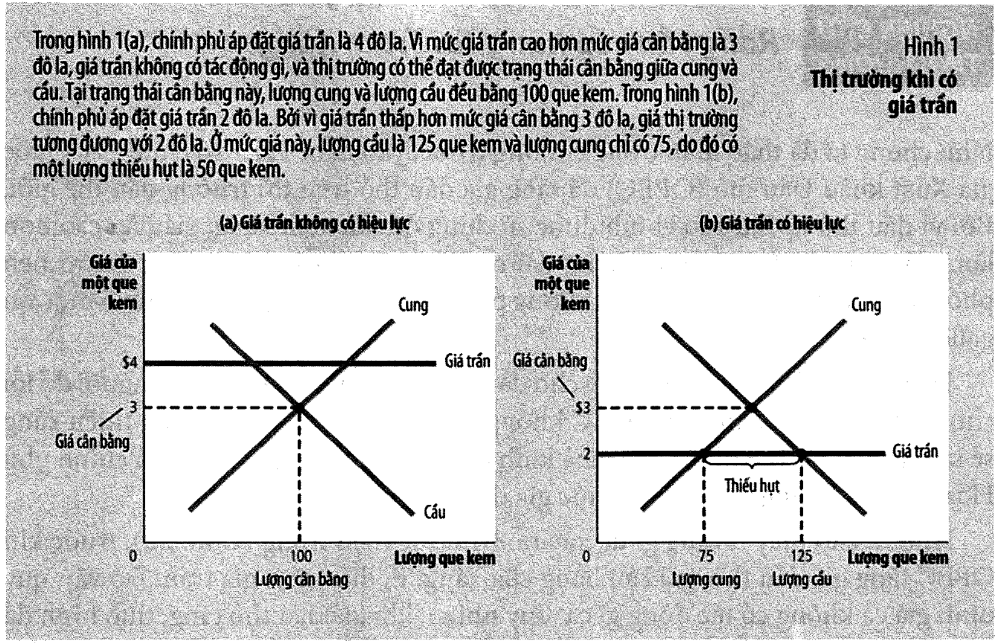

| Giá trần | Lượng cầu | Lượng cung | Giá thực tế | Thiếu hụt |                       |
| -------: | --------: | ---------: | ----------: | --------: | --------------------- |
|       $4 |       100 |        100 |          $3 |         0 | **không có hiệu lực** |
|       $2 |       125 |         75 |          $2 |    **50** | **có hiệu lực**       |

Giá trần **cao hơn** giá cân bằng thì không đổi gì cả — thị trường đơn giản bỏ qua nó. Chỉ giá trần
**thấp hơn** cân bằng mới ràng buộc, và khi đó nó tạo ra **thiếu hụt**.

### Chỗ dễ hiểu sai nhất về giá trần

⚠️ Giá trần **không** làm 125 người được mua rẻ. Nó làm **75 người được mua rẻ và 50 người không mua
được gì** — rồi để một cơ chế nào đó quyết định ai thuộc nhóm nào. Sách nói thẳng ở tr. 129:

> *"Chú ý rằng mặc dù giá trần được thúc đẩy bởi mong muốn giúp người mua kem, nhưng **không phải tất
> cả người mua đều được hưởng lợi** từ chính sách này. Một số người mua mua được kem với giá thấp, mặc
> dù họ có thể đã phải xếp hàng để làm như vậy, những người mua khác **không thể mua được bất kỳ que
> kem nào**."*

Hai cơ chế phân phối mà sách nêu, và cả hai đều tệ (tr. 129):

| Cơ chế                       | Vì sao kém hiệu quả                                                                                             |
| ---------------------------- | --------------------------------------------------------------------------------------------------------------- |
| **Hàng chờ dài**             | *"thời gian của người mua bị lãng phí"* — người mua trả bằng thời gian, mà **không ai nhận được** khoản đó      |
| **Thiên lệch của người bán** | *"hàng hoá không nhất thiết được phân phối cho người mua đánh giá nó cao nhất"*, và có khả năng không công bằng |

Đối lập với cơ chế của thị trường tự do (tr. 129): *"cơ chế phân phối trong thị trường tự do, cạnh
tranh thì đạt hiệu quả và **khách quan**. Khi thị trường kem đạt đến trạng thái cân bằng của nó, bất
cứ ai chấp nhận trả theo giá thị trường đều có thể mua được kem."*

---

## 3. Nghiên cứu tình huống — rồng rắn xếp hàng và kiểm soát tiền thuê nhà

### Rồng rắn xếp hàng tại trạm xăng (tr. 130–131)

Năm **1973**, OPEC tăng giá dầu thô (đúng sự kiện ở
[bài 9, mục 9](bai_09_doc_quyen_nhom_va_ly_thuyet_tro_choi.md#9-nghiên-cứu-tình-huống--opec)). Hàng
dài người chờ mua xăng xuất hiện khắp Hoa Kỳ.

⚠️ Và đây là chỗ sách lật ngược trực giác:

> *"Hầu hết mọi người đổ lỗi cho OPEC… Tuy nhiên, các nhà kinh tế đổ lỗi cho **các quy định mà chính
> phủ Hoa Kỳ đã áp dụng để hạn chế mức giá dầu các công ty bán ra**."*

Cơ chế, theo **Hình 2, tr. 130**: trước cú sốc, giá trần nằm **trên** giá cân bằng → vô hại. Cú sốc
đẩy đường cung sang trái → giá cân bằng lẽ ra tăng. Nhưng giá trần **chặn** nó lại → thiếu hụt xuất
hiện.

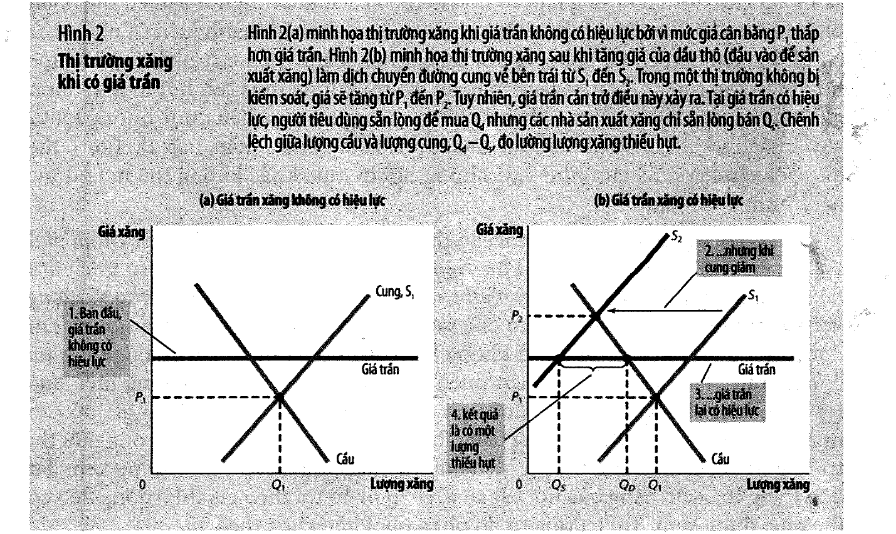

📌 Bài học phương pháp rất đáng nhớ: **một chính sách vô hại trong nhiều năm có thể trở nên tai hại
mà không ai sửa gì cả** — chỉ vì điều kiện thị trường đổi. Giá trần không thay đổi; cái thay đổi là
giá cân bằng đã vượt qua nó.

Kết cục (tr. 131): *"luật quy định giá xăng đã được bãi bỏ. Các nhà lập pháp đã hiểu rằng họ có một
phần trách nhiệm cho nhiều giờ đồng hồ mà người dân Hoa Kỳ đã lãng phí do việc xếp hàng chờ đợi mua
xăng."*

### Kiểm soát tiền thuê nhà — ngắn hạn và dài hạn (tr. 131–132)

Sách trích một câu của một nhà kinh tế mà không nêu tên: kiểm soát tiền thuê là *"cách tốt nhất để phá
huỷ một thành phố mà không cần phải đánh bom"*.

**Hình 3** cho thấy sự khác biệt hoàn toàn nằm ở **độ co giãn theo thời gian**:

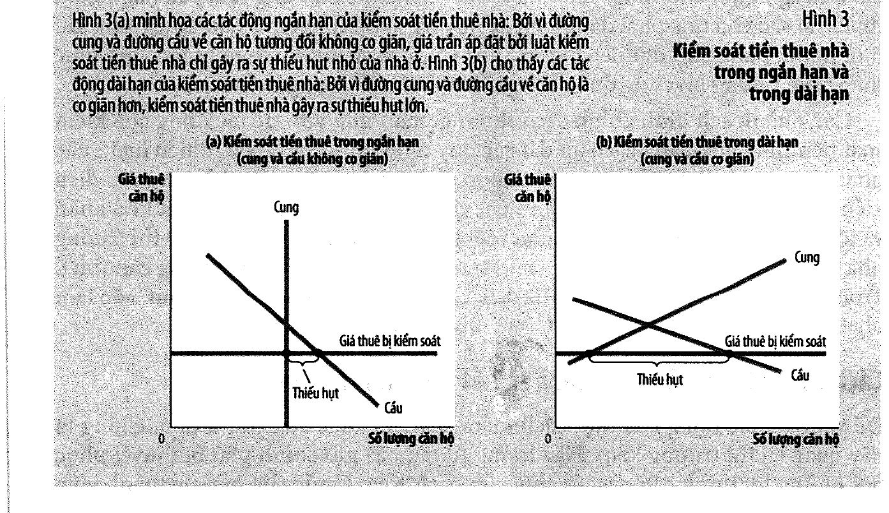

|           | Ngắn hạn                                              | Dài hạn                                                                                    |
| --------- | ----------------------------------------------------- | ------------------------------------------------------------------------------------------ |
| Cung      | **không co giãn** — số căn hộ cố định                 | **co giãn** — chủ nhà không xây mới, không duy trì căn cũ                                  |
| Cầu       | **không co giãn** — người ta mất thời gian để dọn nhà | **co giãn** — giá rẻ khuyến khích ở riêng thay vì ở với cha mẹ, và kéo người vào thành phố |
| Thiếu hụt | **nhỏ**                                               | **lớn**                                                                                    |

Và cái giá không dừng ở thiếu hụt. Sách liệt kê các cơ chế sàng lọc thay thế (tr. 132): danh sách chờ
dài, ưu tiên người không có con, phân biệt trên cơ sở chủng tộc, và *"những khoản tiền phi pháp để được
ưu tiên"* — sách nhận xét rằng những khoản hối lộ ấy *"làm cho mức giá cuối cùng của một căn hộ (bao
gồm cả tiền hối lộ) tiến gần hơn đến mức giá cân bằng"*.

Rồi chất lượng nhà ở tụt theo, và lý do là **Nguyên lý thứ tư** ở
[bài 1](bai_01_muoi_nguyen_ly_va_tu_duy_kinh_te.md) (tr. 132):

> *"Tại sao chủ nhà phải dành tiền để duy trì và cải thiện nhà cho thuê trong khi mọi người đang chờ
> đợi để có được nó? Cuối cùng, người thuê nhà có giá thuê thấp hơn, nhưng họ cũng được cung cấp nhà ở
> **chất lượng thấp hơn**."*

---

## 4. Giá sàn và lương tối thiểu

> **Giá sàn** *(price floor)*: mức giá **tối thiểu** theo luật định mà một hàng hoá có thể được bán.

**Hình 4, tr. 133** — giá sàn $2 (dưới cân bằng $3) không có hiệu lực; giá sàn $4 tạo **dư thừa 40 que**
(cung 120, cầu 80).

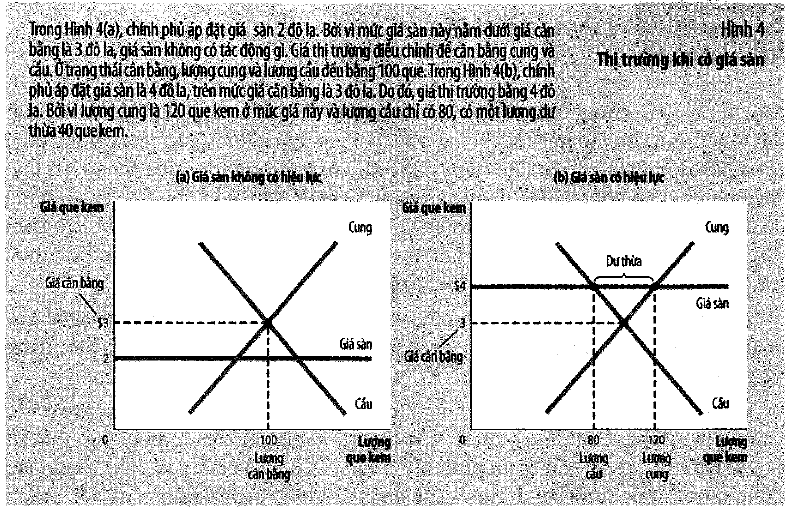

Đối xứng hoàn toàn với giá trần: giá sàn có hiệu lực gây **dư thừa**, và người bán phải cạnh tranh bằng
cơ chế phi giá — với hệ quả sàng lọc tương tự.

### Lương tối thiểu

Đây là ví dụ giá sàn quan trọng nhất, và nó nối thẳng về
[bài 12, mục 11](bai_12_thi_truong_lao_dong.md#11-mức-lương-trên-mức-cân-bằng--ba-lý-do).

Bối cảnh của sách (tr. 134): Hoa Kỳ thông qua lương tối thiểu năm **1938** theo Đạo luật Tiêu chuẩn
Lao động Công bằng; năm **2009** mức liên bang là **$7,25/giờ**.

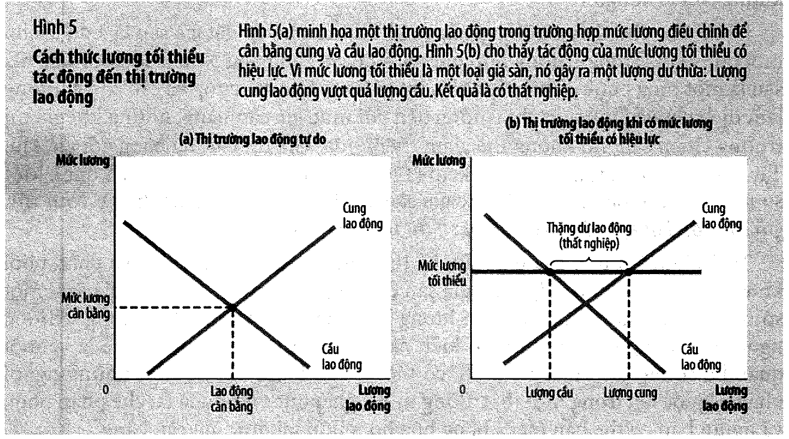

⚠️ **Điểm mấu chốt mà sách nhấn mạnh: nền kinh tế không có một thị trường lao động duy nhất** (tr. 135).

| Nhóm lao động                   | Lương cân bằng                              | Lương tối thiểu có ràng buộc không |
| ------------------------------- | ------------------------------------------- | ---------------------------------- |
| Tay nghề cao, nhiều kinh nghiệm | **cao hơn** mức tối thiểu                   | **không** — hoàn toàn vô hiệu      |
| Thanh thiếu niên                | **thấp** — kỹ năng và kinh nghiệm thấp nhất | **có** — ràng buộc mạnh nhất       |

Kết quả nghiên cứu điển hình (tr. 135): *"một sự gia tăng 10 phần trăm trong mức lương tối thiểu gây
mất việc làm cho lao động thanh thiếu niên **từ 1 đến 3 phần trăm**."*

Đọc lại bằng ngôn ngữ của [bài 3](bai_03_do_co_gian_va_dinh_gia.md): **độ co giãn của việc làm thanh
thiếu niên theo lương tối thiểu nằm trong khoảng 0,1 đến 0,3.** Với một triệu lao động thanh thiếu
niên đang có việc:

| Tăng lương tối thiểu | $e$ = 0,1 | $e$ = 0,2 | $e$ = 0,3 |
| -------------------: | --------: | --------: | --------: |
|                  10% |    10.000 |    20.000 |    30.000 |
|                  20% |    20.000 |    40.000 |    60.000 |
|                  40% |    40.000 |    80.000 |   120.000 |

📌 Và sách thêm một lưu ý rất dễ bị bỏ qua (tr. 135): tăng 10% lương tối thiểu **không** làm lương
trung bình của thanh thiếu niên tăng 10%, vì nhiều người trong số họ vốn đã được trả trên mức tối thiểu.
Nên "1 đến 3 phần trăm" là *"đáng kể"* chứ không nhỏ.

Và một tác động ngược chiều ở phía cung mà ít ai nói tới (tr. 135):

> *"một số học sinh đang học phổ thông trung học chọn bỏ học để có việc làm. Những học sinh mới này
> giành việc làm và thay thế nhóm thanh thiếu niên vốn đã bỏ học trước đây và giờ đây trở nên thất nghiệp."*

Khảo sát các nhà kinh tế năm **2006** (tr. 135) cho thấy đây thật sự là vấn đề chưa ngã ngũ:

| Quan điểm                          |   Tỷ lệ |
| ---------------------------------- | ------: |
| Ủng hộ **loại bỏ** lương tối thiểu | **47%** |
| Muốn **giữ** nguyên mức hiện tại   |     14% |
| Yêu cầu **tăng** lương tối thiểu   |     38% |

---

## 5. ⚠️ Cách đọc các hình minh hoạ của chương 6

Trước khi sang phần thuế, cần nói rõ một điểm về cách chương 6 vẽ hình — nếu không, người đọc kỹ sẽ
tưởng sách mâu thuẫn.

Suy ngược độ dốc từ chính các con số in trong từng hình:

| Hình              | Độ dốc cầu | Độ dốc cung | Suy ra từ                               |
| ----------------- | ---------: | ----------: | --------------------------------------- |
| Hình 1 (giá trần) |         25 |          25 | giá trần $2 → cầu 125, cung 75          |
| Hình 4 (giá sàn)  |         20 |          20 | giá sàn $4 → cầu 80, cung 120           |
| Hình 6/7 (thuế)   |      100/3 |          50 | thuế $0,50 → giá 3,30 và 2,80, lượng 90 |

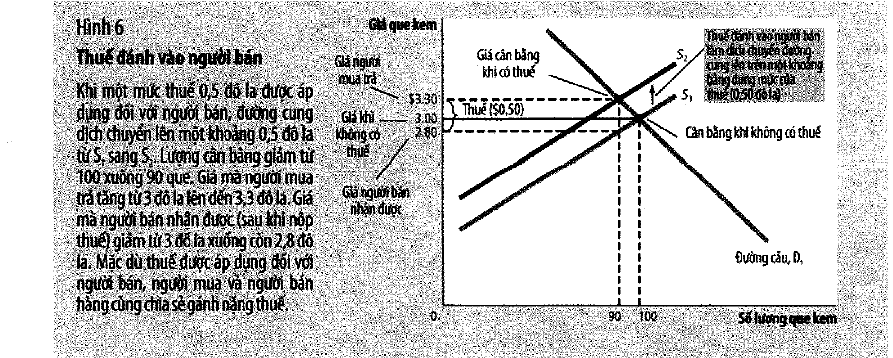

**Ba hình, ba cặp độ dốc khác nhau.** Đây **không phải lỗi in** — chúng là ba hình minh hoạ độc lập,
mỗi hình vẽ cho một ý riêng, và không hình nào tuyên bố mình dùng cùng số liệu với hình kia.

Nhưng cần biết điều đó, vì: **lấy số của hình này áp vào hình kia sẽ ra kết quả sai.** Ví dụ, nếu bạn
dùng độ dốc của Hình 1 (25/25) để tính thuế $0,50 thì ra giá $3,25 và $2,75 — không phải $3,30 và
$2,80 như Hình 7 in.

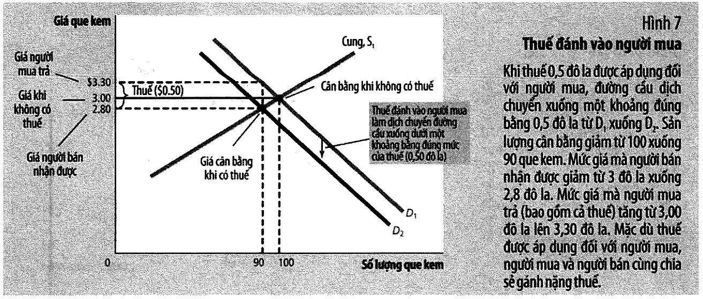

📌 Và [mục 7](#7--công-thức-chia-gánh-nặng-thuế) sẽ cho thấy độ dốc của Hình 6/7 **không hề tuỳ tiện**:
nó chính là thứ tạo ra tỷ lệ 0,30/0,20 in trong hình. Hình minh hoạ của sách tự nó nhất quán.

---

## 6. Thuế đánh vào ai cũng cho kết quả y hệt

Sách dựng một tình huống rất khéo (tr. 138): thành phố đánh thuế **$0,50** lên mỗi que kem để trả cho
lễ hội kem hằng năm. Hai nhóm vận động hành lang lập tức ra tay — hiệp hội người tiêu dùng đòi **người
bán** nộp, tổ chức nhà sản xuất đòi **người mua** nộp, và thị trưởng đề nghị **chia đôi**.

> **Phạm vi ảnh hưởng của thuế** *(tax incidence)*: cách thức mà gánh nặng thuế được chia sẻ giữa các
> bên tham gia thị trường.

Cho chạy cả ba phương án:

| Trường hợp                    | Người mua trả | Người bán nhận |  Lượng |
| ----------------------------- | ------------: | -------------: | -----: |
| Không có thuế                 |         $3,00 |          $3,00 |    100 |
| Thuế đánh vào **người bán**   |     **$3,30** |      **$2,80** | **90** |
| Thuế đánh vào **người mua**   |     **$3,30** |      **$2,80** | **90** |
| Chia đôi, mỗi bên nộp một nửa |     **$3,30** |      **$2,80** | **90** |

**Ba dòng cuối giống hệt nhau.** Sách viết in nghiêng ở tr. 141: *"thuế đánh vào người mua và thuế đánh
vào người bán là như nhau."*

⚠️ Đây là kết quả phản trực giác nhất của chương 6, và nó có một hệ quả chính trị rất lớn: **cuộc tranh
cãi giữa hai nhóm vận động hành lang là vô nghĩa.** Cả hai đang đấu tranh cho một thứ không tồn tại.
Đề nghị "chia đôi" của thị trưởng nghe công bằng nhất nhưng cũng cho **đúng cùng một kết quả**.

Lý do: thuế tạo ra một **cái nêm** giữa giá người mua trả và giá người bán nhận. Kích thước cái nêm là
$0,50 bất kể ai nộp, nên vị trí cân bằng mới cũng như nhau.

Hai bài học mà sách rút ra (tr. 140):

- **Thuế hạn chế hoạt động thị trường.** Lượng bán ra giảm từ 100 xuống 90.
- **Người mua và người bán cùng chia sẻ gánh nặng.** Người mua trả thêm $0,30; người bán nhận ít đi
  $0,20. Cộng lại đúng $0,50 — **nhưng không chia đôi.**

Vì sao không chia đôi? Mục sau.

---

## 7. 📚 Công thức chia gánh nặng thuế

Sách phát biểu quy tắc in nghiêng ở tr. 144:

> *"**Gánh nặng thuế rơi nhiều hơn vào bên tham gia thị trường có độ co giãn kém hơn.**"*

nhưng không cho công thức. Với hai đường tuyến tính thì nó rất gọn:

$$\text{phần người mua chịu} = \frac{\text{độ dốc cung}}{\text{độ dốc cầu} + \text{độ dốc cung}}$$

Áp vào chính Hình 6/7 của sách (độ dốc cầu 100/3, cung 50):

$$\frac{50}{100/3 + 50} = 60\% \times \$0{,}50 = \$0{,}30 \quad\text{và}\quad 40\% \times \$0{,}50 = \$0{,}20$$

**Khớp chính xác với con số in trong hình.** Nghĩa là độ dốc mà hoạ sĩ vẽ ở Hình 6/7 không tuỳ tiện —
nó chính là thứ tạo ra tỷ lệ 0,30/0,20.

Cho độ co giãn chạy để thấy quy tắc hoạt động thế nào:

| Cầu             | Cung            | Người mua chịu | Người bán chịu |
| --------------- | --------------- | -------------: | -------------: |
| rất kém co giãn | rất co giãn     |      **95,2%** |           4,8% |
| kém co giãn     | co giãn         |          75,0% |          25,0% |
| bằng nhau       | bằng nhau       |          50,0% |          50,0% |
| co giãn         | kém co giãn     |          25,0% |          75,0% |
| rất co giãn     | rất kém co giãn |           4,8% |      **95,2%** |

Sách giải thích cơ chế ở tr. 144, và cách diễn đạt này đáng nhớ:

> *"độ co giãn đo lường sự sẵn lòng của người mua hoặc người bán trong việc **rời bỏ thị trường** khi
> điều kiện trở nên không thuận lợi… bên tham gia thị trường nào có **ít lựa chọn thay thế** sẽ ít sẵn
> lòng rời bỏ thị trường và do đó buộc phải chịu nhiều gánh nặng thuế."*

---

## 8. Hai ứng dụng — thuế tiền lương và thuế hàng hoá xa xỉ

### Thuế tiền lương (tr. 142–144)

Thuế **FICA** ở Hoa Kỳ chiếm **15,3%** tiền lương của người lao động điển hình năm **2010**. Quốc hội
cố tình áp đặt sự chia đôi: một nửa doanh nghiệp trả, một nửa khấu trừ vào lương.

Nhưng theo quy tắc ở mục 7 (tr. 144):

> *"Hầu hết các nhà kinh tế học lao động tin rằng **cung lao động co giãn ít hơn so với cầu**. Điều này
> có nghĩa là **người lao động, chứ không phải là các doanh nghiệp**, sẽ chịu phần lớn gánh nặng thuế
> tiền lương."*

⚠️ Con số 50–50 trên phiếu lương của bạn là một con số **kế toán**, không phải con số **kinh tế**. Sách
viết thẳng ở tr. 143: *"Các nhà lập pháp có thể quyết định một mức thuế xuất phát từ túi của người mua
hoặc người bán, nhưng **họ không thể áp đặt gánh nặng thực sự của thuế**."*

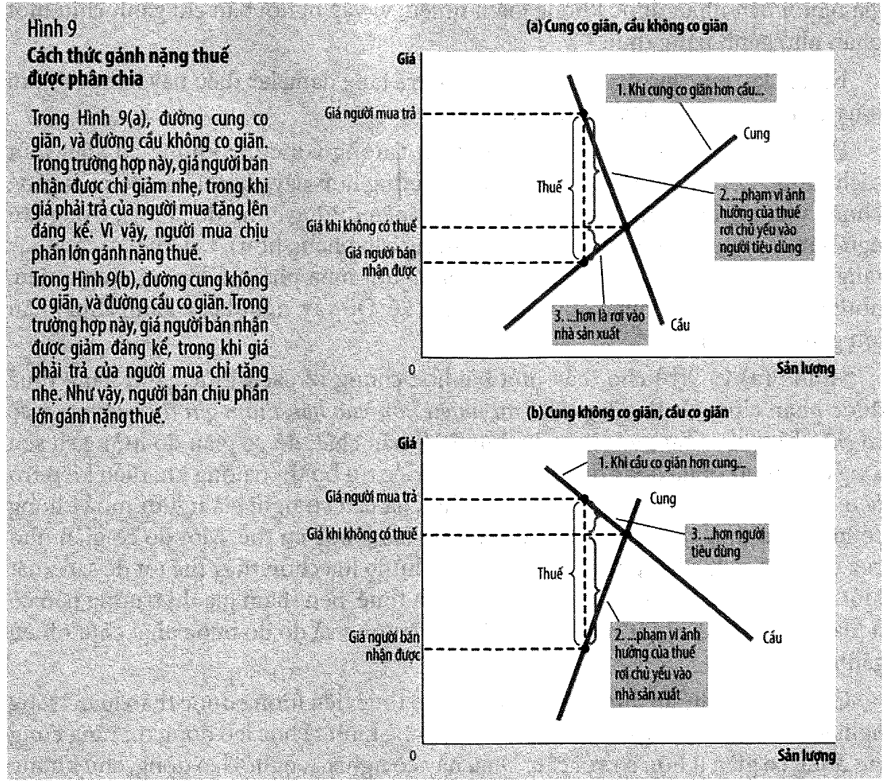

### Thuế hàng hoá xa xỉ 1990 (tr. 144–145)

Đây là ví dụ hay nhất của cả chương, vì nó là một chính sách **thất bại đúng theo dự đoán của lý thuyết**.

Năm **1990**, Quốc hội Hoa Kỳ đánh thuế hàng hoá xa xỉ lên du thuyền, máy bay tư nhân, lông thú, đồ
trang sức, ô tô đắt tiền. Mục tiêu: đánh vào người giàu.

| Bên                | Độ co giãn        | Vì sao                                                                                                                                                                            |
| ------------------ | ----------------- | --------------------------------------------------------------------------------------------------------------------------------------------------------------------------------- |
| **Cầu** du thuyền  | **rất co giãn**   | *"Một triệu phú có thể dễ dàng không mua một chiếc du thuyền, cô có thể sử dụng tiền đó để mua một căn nhà lớn hơn, có một kỳ nghỉ châu Âu, hoặc để lại tài sản thừa kế lớn hơn"* |
| **Cung** du thuyền | **không co giãn** | *"Nhà máy du thuyền không dễ dàng chuyển đổi mục đích sử dụng thay thế, và người lao động đóng du thuyền không mong muốn thay đổi nghề nghiệp"*                                   |

Kết quả, theo quy tắc mục 7 (tr. 145):

> *"gánh nặng thuế rơi chủ yếu vào các nhà cung cấp… **người lao động không phải là những người giàu
> có**. Như vậy, gánh nặng thuế hàng hoá xa xỉ rơi nhiều vào tầng lớp trung lưu hơn là những người giàu có."*

Quốc hội bãi bỏ hầu hết các thuế hàng hoá xa xỉ năm **1993** — ba năm sau.

> 💼 Bài học chung, dùng được xa ngoài chính sách thuế: **bạn không chọn được ai chịu chi phí của một
> quyết định.** Bạn chỉ chọn được nơi đặt hoá đơn. Ai thực sự chịu là do cấu trúc thị trường quyết định.

---

**PHẦN B — THIẾT KẾ HỆ THỐNG THUẾ** *(chương 12, tr. 255–282)*

---

## 9. Chính phủ Hoa Kỳ thu và chi những gì

Chương 12 mở bằng Al Capone — kẻ *"không bao giờ bị kết án vì những tội ác hung bạo của hắn"* nhưng
cuối cùng vào tù vì **trốn thuế** (tr. 255) — và Ben Franklin: *"trên đời này không có thứ gì là chắc
chắn, ngoại trừ cái chết và thuế."*

Một con số về xu hướng (tr. 255): khi Franklin nói câu đó năm **1789**, một người Mỹ trung bình đóng
thuế **dưới 5%** thu nhập. Ngày nay, tổng cộng tất cả các loại thuế chiếm **khoảng một phần ba** thu
nhập của một người Mỹ.

**Bảng 1, tr. 257** — tổng doanh thu thuế theo % GDP: Thuỵ Điển 49%, Pháp 44, Anh 37, Đức 36, Canada 33,
Nga 32, Brazil 30, **Hoa Kỳ 28**, Nhật 28, Mexico 21, Chile 20, Trung Quốc 15, Ấn Độ 14.

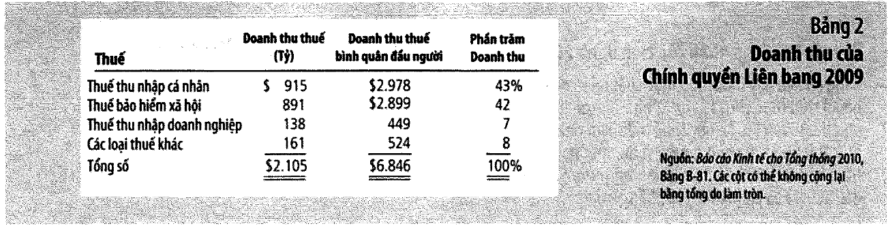

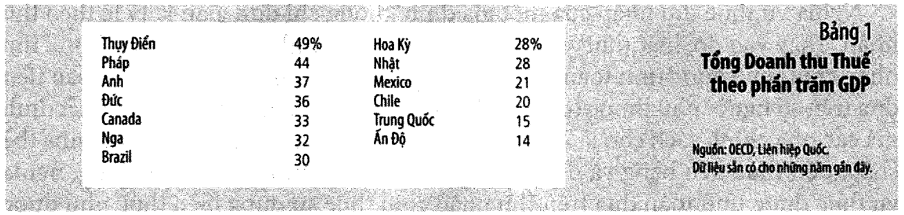

### Ngân sách liên bang 2009

| DOANH THU                  |  Tỷ đô la |     % |
| -------------------------- | --------: | ----: |
| Thuế thu nhập cá nhân      |       915 | 43,5% |
| Thuế bảo hiểm xã hội       |       891 | 42,3% |
| Thuế thu nhập doanh nghiệp |       138 |  6,6% |
| Các loại thuế khác         |       161 |  7,6% |
| **Tổng**                   | **2.105** |       |

| CHI TIÊU         |  Tỷ đô la |     % |
| ---------------- | --------: | ----: |
| An sinh Xã hội   |       683 | 19,4% |
| Quốc phòng       |       661 | 18,8% |
| Bảo trợ thu nhập |       533 | 15,2% |
| Medicare         |       430 | 12,2% |
| Sức khoẻ         |       334 |  9,5% |
| Lãi ròng         |       187 |  5,3% |
| Khác             |       690 | 19,6% |
| **Tổng**         | **3.518** |       |

📚 Sách in cả hai bảng nhưng **không đặt chúng cạnh nhau**. Đặt cạnh nhau thì thấy ngay:

$$\text{THÂM HỤT} = 3.518 - 2.105 = \mathbf{1.413 \text{ tỷ đô la}}$$

Chi tiêu vượt doanh thu **67,1%** — cứ 100 đô la chi ra thì **40 đô la là đi vay**. (Năm 2009 là năm
suy thoái sâu, nên đây là một con số bất thường; nhưng sách không nói rõ điều đó.)

Và một cách đọc bảng chi tiêu mà sách không nêu: **An sinh Xã hội + Medicare + Sức khoẻ + Bảo trợ thu
nhập = 1.980 tỷ = 56% tổng chi tiêu**, trong khi quốc phòng chỉ 19%. Ngân sách liên bang Hoa Kỳ chủ yếu
là một **công ty bảo hiểm có quân đội đi kèm**.

📌 Ba loại chi lớn nhất đều là **chi chuyển nhượng** *(transfer payment)* — định nghĩa ở tr. 259:
*"các khoản chi trả của chính phủ mà không đòi hỏi trao đổi hàng hoá và dịch vụ."*

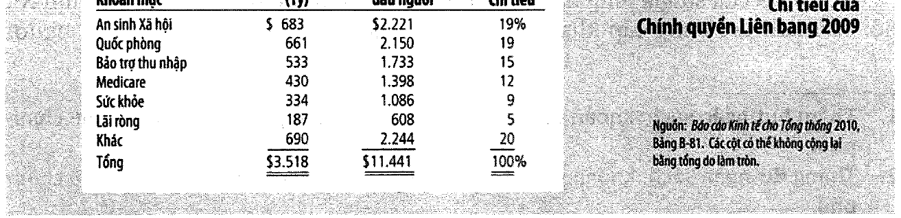

Chính quyền bang và địa phương thì khác hẳn (Bảng 5 và 6, tr. 263): thu chủ yếu từ **thuế doanh thu**
(439 tỷ) và **thuế tài sản** (383 tỷ) — hơn một phần ba tổng thu; chi chủ yếu cho **giáo dục** (777 tỷ,
34% chi tiêu).

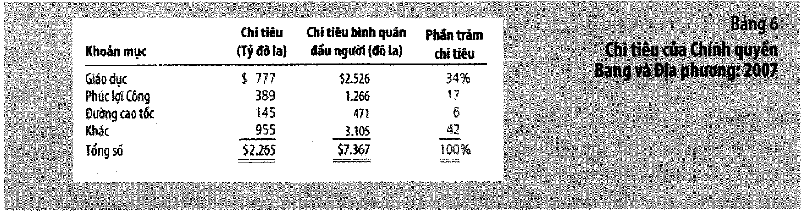

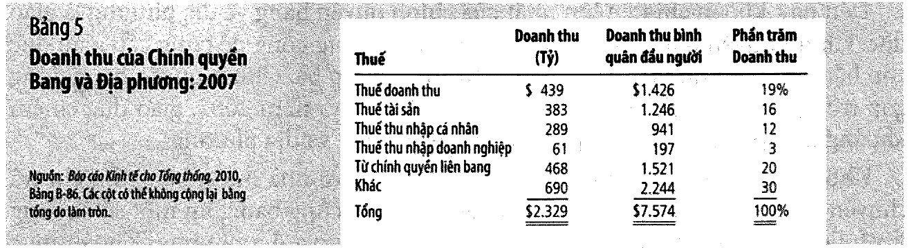

---

## 10. Tổn thất vô ích của thuế

Chương 12 đo một hệ thống thuế bằng **hai** tiêu chí (tr. 264): **hiệu quả** và **công bằng**. Hiệu quả
lại gồm hai loại chi phí ngoài số tiền nộp:

> **Tổn thất vô ích** *(deadweight loss)*: sự sụt giảm phúc lợi kinh tế của người nộp thuế **vượt quá**
> số tiền doanh thu mà chính phủ thu được.
> **Gánh nặng hành chính** *(administrative burden)*: chi phí tuân thủ luật thuế.

Tổn thất vô ích đã được dựng đầy đủ ở
[bài 4](bai_04_thang_du_va_chi_phi_cua_thue.md) — chương 12 chỉ nhắc lại nguyên nhân (tr. 264):

> *"thuế bóp méo động cơ và làm cho con người phân bổ nguồn lực dựa trên **những động cơ về thuế** thay
> vì những lợi ích và chi phí thực sự của hàng hoá và dịch vụ mà họ mua và bán."*

Rồi đưa một ví dụ rất sắc: một người có thể nhận được lợi ích **$8** từ một chiếc pizza giá **$6**,
nhưng nếu thuế đẩy giá lên **$9** thì họ không mua nữa. *"Chính phủ không thu được doanh thu từ người
này… tổn thất vô ích là sự sụt giảm phúc lợi kinh tế xuất phát từ chính những quyết định như thế."*

⚠️ Điểm quan trọng: **tổn thất vô ích đến từ giao dịch KHÔNG xảy ra**, nên nó vô hình. Không ai đếm
được số pizza đã không được mua.

---

## 11. 📚 Thuế đánh vào lãi tiết kiệm — sức mạnh của lãi kép

Sách đưa một ví dụ ở tr. 265–266 mà con số của nó đáng đưa lên đầu chương: gửi **$1.000** ở tuổi 25,
rút ra ở tuổi 65, lãi suất **8%/năm**.

| Trường hợp                     | Lãi suất | Sau 40 năm | Sách in |
| ------------------------------ | -------: | ---------: | ------: |
| Không đánh thuế lãi            |       8% |    $21.725 |  21.720 |
| Đánh thuế **25%** vào tiền lãi |       6% |    $10.286 |  10.290 |

**Thuế suất 25% mà mất 52,7% số tiền cuối cùng.**

Lý do là **lãi kép**: thuế không lấy 25% một lần, nó lấy 25% **mỗi năm**, và mỗi đồng bị lấy đi không
còn sinh lãi cho các năm sau. Phần bị mất **tăng dần theo thời gian**:

| Số năm gửi | Không thuế | Có thuế |  % bị mất |
| ---------: | ---------: | ------: | --------: |
|          5 |      1.469 |   1.338 |  **8,9%** |
|         10 |      2.159 |   1.791 |     17,0% |
|         20 |      4.661 |   3.207 |     31,2% |
|         30 |     10.063 |   5.743 |     42,9% |
|         40 |     21.725 |  10.286 | **52,7%** |
|         50 |     46.902 |  18.420 | **60,7%** |

📌 Đây là lập luận kinh tế đứng sau đề xuất chuyển sang **thuế tiêu dùng** (tr. 266): *"tất cả thu nhập
được tiết kiệm sẽ không bị đánh thuế cho tới khi khoản tiết kiệm được đem ra tiêu dùng."*

Tài khoản hưu trí **401(k)** và **IRA** chính là một phần của hệ thống thuế hiện hành đã đi theo hướng
đó — và nó nối lại với
[bài 11, mục 16](bai_11_thong_tin_bat_can_xung.md#16-con-người-không-nhất-quán-theo-thời-gian): cùng
một công cụ vừa là **ưu đãi thuế** vừa là **cam kết tự buộc**.

Các nước châu Âu dựa vào thuế tiêu dùng nhiều hơn Hoa Kỳ, chủ yếu qua **VAT** *(thuế giá trị gia tăng)*
— thu ở từng giai đoạn sản xuất thay vì chỉ ở khâu bán lẻ (tr. 266).

Và **Alan Greenspan**, Chủ tịch Quỹ dự trữ Liên bang, nói với uỷ ban tổng thống về cải tổ luật thuế
năm **2005** (tr. 266):

> *"Như các bạn biết, nhiều nhà kinh tế tin rằng thuế tiêu dùng sẽ là tốt nhất trên quan điểm thúc đẩy
> tăng trưởng kinh tế – đặc biệt là khi chúng ta thiết kế hệ thống thuế từ ban đầu – bởi vì thuế tiêu
> dùng có khả năng khuyến khích tiết kiệm và tạo lập vốn. Tuy nhiên, **có cả một tổ hợp các vấn đề
> thách thức trong giai đoạn chuyển đổi** từ hệ thống thuế hiện tại đến thuế tiêu dùng."*

---

## 12. Gánh nặng hành chính

Loại chi phí thứ hai, và sách mô tả nó rất đời (tr. 266–267): không chỉ thời gian điền báo cáo thuế mà
cả *"nguồn lực mà chính phủ phải sử dụng để thực thi luật thuế"*.

Điểm sắc nhất nằm ở chỗ nó **không** chỉ là giấy tờ:

> *"Nhiều người nộp thuế – đặc biệt là những người trong nhóm thuế suất cao – thuê các luật sư và kế
> toán thuế để giúp họ thực hiện các khoản thuế. Những chuyên gia này giúp khách hàng của họ **sắp xếp
> các vấn đề để giảm số tiền thuế phải nộp**… Những nguồn lực dành cho quá trình lách thuế hợp pháp
> này là một **dạng tổn thất vô ích**."*

⚠️ Chú ý logic: những luật sư thuế giỏi nhất đang làm một công việc **không tạo ra gì cả** cho xã hội.
Họ chỉ chuyển tiền từ kho bạc sang khách hàng. Toàn bộ thời gian, tài năng và tiền lương của họ là
tổn thất thuần — và nó **tỷ lệ thuận với độ phức tạp của luật thuế**.

Sách nêu cách chữa và cả lý do nó không xảy ra (tr. 267):

> *"Gánh nặng hành chính của bất kỳ hệ thống thuế nào có thể được giảm nhẹ bằng cách **đơn giản hoá
> luật thuế**. Tuy nhiên, sự đơn giản hoá này thường rất khó khăn về mặt chính trị… **hầu hết mọi người
> sẵn sàng đơn giản hoá luật thuế bằng cách xoá bỏ những khoản khấu trừ mà người khác được hưởng**."*

---

## 13. Thuế suất trung bình, thuế suất biên, và thuế đồng nhất

> **Thuế suất trung bình** *(average tax rate)*: tổng số thuế phải nộp chia cho tổng thu nhập.
> **Thuế suất biên** *(marginal tax rate)*: số thuế tăng thêm khi thu nhập tăng thêm một đô la.

Ví dụ của sách (tr. 268): 20% cho $50.000 đầu tiên, 50% cho phần trên đó.

|    Thu nhập | Thuế phải nộp | Suất trung bình | Suất biên |
| ----------: | ------------: | --------------: | --------: |
|     $20.000 |         4.000 |           20,0% |   **20%** |
|     $50.000 |        10.000 |           20,0% |       50% |
| **$60.000** |    **15.000** |       **25,0%** |   **50%** |
|    $100.000 |        35.000 |           35,0% |       50% |
|    $200.000 |        85.000 |           42,5% |       50% |

⚠️ **Hai con số này trả lời hai câu hỏi khác nhau, và lẫn chúng là lỗi rất phổ biến** (tr. 268):

|                     | Trả lời câu hỏi                                 | Dùng khi               |
| ------------------- | ----------------------------------------------- | ---------------------- |
| Suất **trung bình** | *"người này đóng góp bao nhiêu phần thu nhập?"* | đánh giá **công bằng** |
| Suất **biên**       | *"hệ thống thuế bóp méo động cơ đến mức nào?"*  | đánh giá **hiệu quả**  |

> *"thuế suất biên **quyết định tổn thất vô ích** của thuế thu nhập."*

Lý do nằm ở **Nguyên lý thứ ba** của [bài 1](bai_01_muoi_nguyen_ly_va_tu_duy_kinh_te.md): *"con người
duy lý cân nhắc giá trị biên."* Khi bạn quyết định có làm thêm giờ hay không, cái bạn nhìn là suất
**biên**, không phải suất trung bình.

### Thuế đồng nhất — hiệu quả nhất và không ai dùng

> **Thuế đồng nhất** *(lump-sum tax)*: thuế thu một mức như nhau đối với tất cả mọi người.

| Thu nhập |  Thuế | Suất trung bình | Suất biên |
| -------: | ----: | --------------: | --------: |
|  $20.000 | 4.000 |           20,0% |    **0%** |
|  $40.000 | 4.000 |           10,0% |    **0%** |
| $100.000 | 4.000 |            4,0% |    **0%** |

Suất biên bằng **không** ở mọi mức thu nhập → không bóp méo động cơ gì cả → **không có tổn thất vô ích**,
và gần như không có gánh nặng hành chính (không ai cần thuê luật sư thuế để tính $4.000).

Vậy sao không dùng? Sách trả lời thẳng (tr. 268):

> *"thuế đồng nhất sẽ thu một lượng như nhau đối với người nghèo lẫn người giàu, một chính sách mà hầu
> hết mọi người đều cho rằng là **không công bằng**."*

📌 Đây là **đánh đổi trung tâm của cả chương 12**: thuế đồng nhất hiệu quả nhất và công bằng kém nhất.
Mọi hệ thống thuế thật đều là một điểm nằm giữa hai cực đó.

---

## 14. Công bằng — hai nguyên lý

Sách đưa hai nguyên lý, và chúng dẫn tới những kết luận khác nhau (tr. 268–271).

### Nguyên lý lợi ích

> **Nguyên lý lợi ích** *(benefits principle)*: người ta nên nộp thuế dựa trên **lợi ích họ nhận được**
> từ các dịch vụ của chính phủ.

Ví dụ rõ nhất: **thuế xăng dầu**. Người lái xe nhiều thì dùng đường nhiều và cũng nộp thuế xăng nhiều.

Áp dụng tinh tế hơn: cảnh sát chống trộm. *"Công dân có nhiều tài sản cần được bảo vệ hưởng lợi nhiều
hơn từ lực lượng cảnh sát… Vì thế, theo nguyên lý lợi ích, người giàu nên đóng góp nhiều hơn người
nghèo."*

📚 Và sách còn dùng nguyên lý lợi ích để biện hộ cho **chương trình chống nghèo** (tr. 270): nếu người
ta thích sống trong một xã hội không có người nghèo thì **chống nghèo là một hàng hoá công**. Người
giàu định giá hàng hoá công đó cao hơn — nên theo chính nguyên lý lợi ích, họ nên đóng nhiều hơn.

### Nguyên lý khả năng chi trả

> **Nguyên lý khả năng chi trả** *(ability-to-pay principle)*: thuế nên phân bổ dựa trên **khả năng
> đóng góp** của mỗi người.

Lập luận: mọi công dân nên *"hy sinh như nhau"*. Nhưng độ lớn của sự hy sinh không chỉ phụ thuộc vào
số tiền: *"Một khoản đóng thuế 1.000 đô la bởi một người nghèo có thể đòi hỏi một sự hy sinh lớn hơn
một khoản đóng thuế 10.000 đô la bởi một người giàu."*

Từ đó ra hai khái niệm:

> **Công bằng dọc** *(vertical equity)*: người có khả năng đóng thuế cao hơn nên đóng nhiều hơn.
> **Công bằng ngang** *(horizontal equity)*: người có khả năng đóng thuế như nhau nên đóng như nhau.

⚠️ Cả hai đều được chấp nhận rộng rãi nhưng **rất khó áp dụng**. Sách đưa hai câu hỏi ở tr. 272–273 mà
không câu nào có lời giải rõ ràng: hai gia đình cùng thu nhập $50.000, một gia đình có chi phí y tế
lớn, một gia đình có hai con đi học — **có công bằng không nếu miễn thuế cho họ?**

---

## 15. Ba hệ thống thuế và hệ thống thực tế của Hoa Kỳ

**Bảng 7, tr. 270** — ba cách để "người giàu đóng nhiều hơn":

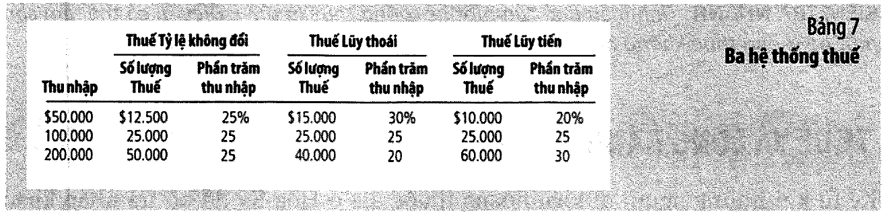

| Thu nhập | Tỷ lệ không đổi |        Luỹ thoái |         Luỹ tiến |
| -------: | --------------: | ---------------: | ---------------: |
|  $50.000 |    12.500 (25%) | 15.000 (**30%**) | 10.000 (**20%**) |
| $100.000 |    25.000 (25%) |     25.000 (25%) |     25.000 (25%) |
| $200.000 |    50.000 (25%) | 40.000 (**20%**) | 60.000 (**30%**) |

Ba định nghĩa ở chân trang 270:

> **Thuế tính theo tỷ lệ không đổi** *(proportional tax)*: mọi người nộp cùng một tỷ lệ thu nhập.
> **Thuế luỹ thoái** *(regressive tax)*: người thu nhập cao nộp **tỷ lệ thấp hơn**.
> **Thuế luỹ tiến** *(progressive tax)*: người thu nhập cao nộp **tỷ lệ cao hơn**.

⚠️ **Cả ba hệ thống đều bắt người giàu nộp NHIỀU TIỀN HƠN.** Khác biệt nằm ở **tỷ lệ**, không phải ở
số tiền. Đây là chỗ lẫn thường xuyên trong tranh luận công chúng.

Và sách thừa nhận rất thẳng (tr. 270):

> *"Hệ thống thuế nào là công bằng nhất? Không có câu trả lời dứt khoát cho câu hỏi này, và **lý thuyết
> kinh tế không giúp ích gì** trong việc tìm ra một câu trả lời như thế. Công bằng, cũng giống như sắc
> đẹp, phụ thuộc vào quan điểm của mỗi người."*

### Hệ thống liên bang Hoa Kỳ thực tế thuộc loại nào

**Bảng 8, tr. 271** — dữ liệu năm 2006:

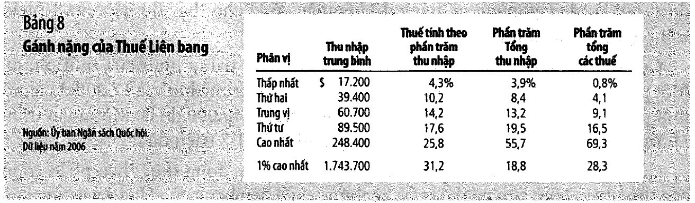

| Phân vị     | Thu nhập TB | Thuế/thu nhập | % tổng thu nhập | % tổng thuế |
| ----------- | ----------: | ------------: | --------------: | ----------: |
| Thấp nhất   |     $17.200 |      **4,3%** |            3,9% |    **0,8%** |
| Thứ hai     |     $39.400 |         10,2% |            8,4% |        4,1% |
| Trung vị    |     $60.700 |         14,2% |           13,2% |        9,1% |
| Thứ tư      |     $89.500 |         17,6% |           19,5% |       16,5% |
| Cao nhất    |    $248.400 |     **25,8%** |           55,7% |   **69,3%** |
| 1% cao nhất |  $1.743.700 |     **31,2%** |           18,8% |       28,3% |

Cột "Thuế/thu nhập" tăng đều từ 4,3% lên 25,8% → hệ thống liên bang là **luỹ tiến rõ ràng**.

📚 **Kiểm tính nhất quán nội bộ** — sách không làm việc này. Thuế suất trung bình toàn hệ thống tính
được từ chính bảng là **20,70%**, và từ đó suy ngược ra cột "% tổng thuế":

| Phân vị   | Tính lại | Sách in | Lệch |
| --------- | -------: | ------: | ---: |
| Thấp nhất |     0,8% |    0,8% |  0,0 |
| Thứ hai   |     4,1% |    4,1% |  0,0 |
| Trung vị  |     9,1% |    9,1% |  0,0 |
| Thứ tư    |    16,6% |   16,5% |  0,1 |
| Cao nhất  |    69,4% |   69,3% |  0,1 |

Lệch dưới 0,2 điểm phần trăm ở mọi dòng — **bảng của sách tự nhất quán**.

Hai con số đáng nhớ: nhóm cao nhất kiếm **55,7%** thu nhập nhưng nộp **69,3%** thuế (tỷ lệ 1,24); nhóm
thấp nhất kiếm 3,9% nhưng nộp 0,8% (tỷ lệ 0,21).

⚠️ **Nhưng bảng này chỉ tính thuế LIÊN BANG.** Thuế doanh thu và thuế tài sản của chính quyền bang và
địa phương (439 + 383 = **822 tỷ đô la**, hơn một phần ba tổng doanh thu của bang) thì **luỹ thoái hơn
nhiều**, vì người nghèo tiêu gần hết thu nhập. Nhìn cả hai tầng mới ra bức tranh đầy đủ.

---

## 16. Phạm vi ảnh hưởng và "lý thuyết giấy diệt ruồi"

Đây là chỗ chương 12 nối lại với chương 6, và có lẽ là mục quan trọng nhất của cả bài (tr. 273).

Sách đặt tên cho một sai lầm rất phổ biến:

> *"Rất nhiều thảo luận về tính công bằng của thuế bỏ sót những tác động gián tiếp của thuế và dựa vào
> lý thuyết về phạm vi ảnh hưởng của thuế mà các nhà kinh tế gọi một cách chế giễu là **lý thuyết giấy
> diệt ruồi**. Theo lý thuyết này, gánh nặng của thuế cũng giống như con ruồi dính trên giấy diệt ruồi
> và sẽ dính vào bất cứ nơi nào nó chạm đến đầu tiên. **Tuy nhiên, giả định này rất hiếm khi có hiệu lực.**"*

Ví dụ của sách: thuế đánh vào áo khoác lông thú đắt tiền trông như công bằng theo chiều dọc, vì người
mua chúng giàu có. Nhưng nếu người mua dễ dàng chuyển sang hàng xa xỉ khác thì thuế chỉ làm giảm doanh
số bán áo. *"Cuối cùng, gánh nặng của thuế sẽ rơi vào những người sản xuất và buôn bán lông thú hơn là
những người sẽ mua chúng. Bởi vì hầu hết những người sản xuất lông thú là không giàu có, tính công bằng
của luật thuế lông thú có thể sẽ rất khác biệt so với những gì mà lý thuyết giấy diệt ruồi tiên đoán."*

📌 Đây chính xác là câu chuyện thuế hàng hoá xa xỉ 1990 ở
[mục 8](#8-hai-ứng-dụng--thuế-tiền-lương-và-thuế-hàng-hoá-xa-xỉ) — nhưng chương 12 rút nó thành một
**nguyên tắc chung** thay vì một giai thoại.

### Nghiên cứu tình huống — ai đóng thuế thu nhập doanh nghiệp

Sách chọn ví dụ này vì nó là chỗ "lý thuyết giấy diệt ruồi" sai một cách rõ ràng nhất (tr. 273–274):

> *"Thuế doanh nghiệp rất phổ biến đối với các cử tri. Suy cho cùng, doanh nghiệp không phải là con
> người. Các cử tri luôn thích giảm phần đóng thuế của họ và để cho vài doanh nghiệp bâng quơ nào đó
> điền vào chỗ trống này."*

Nhưng: **"Con người đóng tất cả các loại thuế."** Doanh nghiệp chỉ là một cái tên cho một tập hợp con
người. Ba nhóm có thể chịu:

| Ai có thể chịu     | Cơ chế                                                    |
| ------------------ | --------------------------------------------------------- |
| **Chủ sở hữu**     | lợi nhuận sau thuế giảm                                   |
| **Người lao động** | vốn rút khỏi ngành → năng suất lao động giảm → lương giảm |
| **Khách hàng**     | giá bán tăng                                              |

Sách nói rõ đây là câu hỏi *"khó mà các nhà kinh tế bất đồng với nhau"*, nhưng điểm chắc chắn là:
**không thể giả định gánh nặng dừng lại ở nơi đặt hoá đơn.**

---

## 17. Đánh đổi hiệu quả – công bằng

Cả chương 12 quy về một câu (tr. 264): một hệ thống thuế tốt phải vừa **hiệu quả** vừa **công bằng**,
và hai mục tiêu đó thường xung đột.

| Cực                  | Ví dụ              | Điểm mạnh                                                        | Điểm yếu                            |
| -------------------- | ------------------ | ---------------------------------------------------------------- | ----------------------------------- |
| **Hiệu quả tối đa**  | thuế đồng nhất     | suất biên = 0, không tổn thất vô ích, không gánh nặng hành chính | ai cũng thấy bất công               |
| **Công bằng tối đa** | thuế luỹ tiến mạnh | người có khả năng đóng nhiều hơn                                 | suất biên cao → tổn thất vô ích lớn |

Sách kết luận rất trung thực ở tr. 275:

> *"Nhiều tranh luận về chính sách thuế phát sinh bởi vì mọi người đặt các trọng số khác nhau lên hai
> mục tiêu này… Kinh tế học tự bản thân nó không thể quyết định cách tốt nhất để cân bằng giữa mục
> tiêu hiệu quả và công bằng. Vấn đề này gắn với **triết học chính trị** cũng như với kinh tế học."*

⚠️ Đọc kỹ câu đó: kinh tế học nói cho bạn **cái giá** của mỗi lựa chọn, không nói cho bạn **nên chọn
cái nào**. Bất kỳ ai dùng kinh tế học để tuyên bố một mức thuế là "đúng" đều đang vượt quá thứ mà công
cụ này làm được. Cùng một tinh thần với
[bài 11, mục 11](bai_11_thong_tin_bat_can_xung.md#11-định-luật-bất-khả-thi-arrow) — biết chỗ công cụ
dừng lại cũng là một phần của việc dùng nó đúng.

---

## 18. 💼 Chi phí tăng thì đẩy được bao nhiêu sang giá bán

Quy tắc ở [mục 7](#7--công-thức-chia-gánh-nặng-thuế) không chỉ dùng cho thuế. Nó dùng cho **mọi cú sốc
chi phí**: giá nguyên liệu tăng, thuế VAT tăng, phí vận chuyển tăng — đều là cùng một bài toán.

Doanh nghiệp đang bán **100.000 đồng/đơn vị**, chi phí biên **60.000**, sản lượng **1.000 đơn vị**.
Chi phí đầu vào vừa tăng **10.000 đồng/đơn vị**. Độ co giãn cung của chính ta: **2**.

| Cầu của ta                 | $\lvert e \rvert$ | Đẩy sang giá | Giá mới | Sản lượng |   LN gộp | Mất so với trước |
| -------------------------- | ----------------: | -----------: | ------: | --------: | -------: | ---------------: |
| thiết yếu, không thay được |               0,4 |      **83%** | 108.333 |       967 | 37,06 tr |        **−7,4%** |
| có lựa chọn khác           |                 1 |          67% | 106.667 |       933 | 34,22 tr |           −14,4% |
| dễ so sánh                 |                 2 |          50% | 105.000 |       900 | 31,50 tr |           −21,2% |
| hàng hoá thuần tuý         |                 4 |          33% | 103.333 |       867 | 28,89 tr |           −27,8% |
| đấu giá trên sàn TMĐT      |                10 |      **17%** | 101.667 |       833 | 26,39 tr |       **−34,0%** |

*(Trước cú sốc: giá 100.000, sản lượng 1.000, lợi nhuận gộp 40 triệu.)*

Ba điều dùng được ngay:

**1. Cùng một cú sốc chi phí, thiệt hại chênh nhau gần năm lần** tuỳ vào độ co giãn của cầu. Không phải
tuỳ vào việc bạn đàm phán giỏi đến đâu với nhà cung cấp — tuỳ vào việc **khách hàng có dễ đi hay không**.

**2. Câu hỏi "tôi tăng giá được bao nhiêu" có câu trả lời bằng số, và nó KHÔNG phải một quyết định của
bạn.** Nó là một tỷ số độ co giãn. Bạn có thể *tuyên bố* tăng giá 10%; thị trường quyết định bạn *giữ
lại* được bao nhiêu.

**3. Đòn bẩy duy nhất nằm ở cột bên trái: làm cầu bớt co giãn.** Bốn yếu tố ở
[bài 3](bai_03_do_co_gian_va_dinh_gia.md#2-bốn-yếu-tố-quyết-định-độ-co-giãn-của-cầu-theo-giá) và khác
biệt hoá ở [bài 8](bai_08_canh_tranh_doc_quyen.md) — đó là cách đi từ dòng dưới lên dòng trên của bảng
này. **Công việc đó phải làm TRƯỚC khi cú sốc xảy ra**, vì lúc cú sốc đến thì độ co giãn đã cố định rồi.

⚠️ **Giới hạn của mô hình**, nói rõ để khỏi dùng sai: nó giả định đối thủ **không** bị cú sốc. Nếu cả
ngành cùng bị tăng chi phí thì cả đường cung ngành dịch chuyển, và phần đẩy sang giá lớn hơn nhiều. Đó
là lý do giá xăng tăng thì mọi cây xăng đều tăng được, còn riêng một cây tăng thì mất khách ngay.

---

## 19. Code minh hoạ

> ⚙️ **Chạy:** cần **Python 3.10+**. Lưu file rồi gõ `python3 bai-13-chinh-phu-can-thiep.py`.
> **Không cần cài gói nào.** File có sẵn tại [thuc_hanh/bai-13-chinh-phu-can-thiep.py](../thuc_hanh/bai-13-chinh-phu-can-thiep.py).

Mọi thứ dùng `Fraction` — không có số thực nào, nên chạy bao nhiêu lần cũng ra đúng một kết quả.
Hàm `tien()` **ném lỗi** nếu bị truyền số lẻ, để không có chỗ nào âm thầm làm tròn.

⚠️ Code có **10 mục đánh số riêng của nó**, không trùng với 22 mục của bài học. Bảng đối chiếu:

| Mục trong code | Mục trong bài                                                                                         |
| -------------- | ----------------------------------------------------------------------------------------------------- |
| 1              | [2](#2-giá-trần--thiếu-hụt-và-cơ-chế-phân-phối)                                                       |
| 2              | [4](#4-giá-sàn-và-lương-tối-thiểu) + [5](#5--cách-đọc-các-hình-minh-hoạ-của-chương-6)                 |
| 3              | [4](#4-giá-sàn-và-lương-tối-thiểu)                                                                    |
| 4              | [6](#6-thuế-đánh-vào-ai-cũng-cho-kết-quả-y-hệt)                                                       |
| 5              | [7](#7--công-thức-chia-gánh-nặng-thuế) + [8](#8-hai-ứng-dụng--thuế-tiền-lương-và-thuế-hàng-hoá-xa-xỉ) |
| 6              | [9](#9-chính-phủ-hoa-kỳ-thu-và-chi-những-gì)                                                          |
| 7              | [13](#13-thuế-suất-trung-bình-thuế-suất-biên-và-thuế-đồng-nhất)                                       |
| 8              | [11](#11--thuế-đánh-vào-lãi-tiết-kiệm--sức-mạnh-của-lãi-kép)                                          |
| 9              | [15](#15-ba-hệ-thống-thuế-và-hệ-thống-thực-tế-của-hoa-kỳ)                                             |
| 10             | [18](#18--chi-phí-tăng-thì-đẩy-được-bao-nhiêu-sang-giá-bán)                                           |

```python
"""Bai 13 - Chinh phu can thiep thi truong: kiem soat gia, thue, thiet ke he thong thue
(Mankiw, chuong 6 tr. 127-152 va chuong 12 tr. 255-282).

Chay: python3 bai-13-chinh-phu-can-thiep.py
Khong can cai goi nao ngoai thu vien chuan.
"""

from fractions import Fraction as F

DONG = "-" * 74


def tieu_de(so_muc, ten):
    print()
    print("=" * 74)
    print(f"MUC {so_muc}. {ten}")
    print("=" * 74)


def tien(x):
    """So NGUYEN co dau cham ngan cach nghin. Nem loi neu bi truyen so le."""
    x = F(x)
    assert x.denominator == 1, f"tien() chi nhan so nguyen, nhan duoc {x}"
    return f"{x.numerator:,}".replace(",", ".")


def thap_phan(x, le=2):
    """Lam tron ra so thap phan kieu Viet Nam: dau phay la phan le."""
    x = F(x)
    am = x < 0
    x = abs(x)
    nguyen = x.numerator // x.denominator
    du = round((x - nguyen) * 10 ** le)
    if du == 10 ** le:
        nguyen, du = nguyen + 1, 0
    s = f"{nguyen:,}".replace(",", ".") + ("," + str(du).rjust(le, "0") if le else "")
    return "-" + s if am else s


def so(x):
    """Nguyen thi in nguyen, khong thi giu dang phan so."""
    x = F(x)
    return tien(x) if x.denominator == 1 else f"{x.numerator}/{x.denominator}"


# ---------------------------------------------------------------------------
# MUC 1. Gia tran tren thi truong kem - Hinh 1, tr. 129
# ---------------------------------------------------------------------------
tieu_de(1, "Gia tran tren thi truong kem - Hinh 1, tr. 129")

# Sach ve hinh chu khong cho phuong trinh. Suy nguoc tu chinh cac con so
# trong hinh: can bang (3, 100); o gia 2 thi cau 125 va cung 75.
P_CAN_BANG, Q_CAN_BANG = 3, 100
DOC_CAU_H1, DOC_CUNG_H1 = 25, 25      # que kem tren moi do la


def cau(p, doc=DOC_CAU_H1):
    return Q_CAN_BANG - doc * (F(p) - P_CAN_BANG)


def cung(p, doc=DOC_CUNG_H1):
    return Q_CAN_BANG + doc * (F(p) - P_CAN_BANG)


print(f"Can bang: gia ${P_CAN_BANG}, luong {Q_CAN_BANG} que kem.")
print(f"Duong suy nguoc tu hinh:  Qd = {Q_CAN_BANG + DOC_CAU_H1 * P_CAN_BANG}"
      f" - {DOC_CAU_H1}P     Qs = {Q_CAN_BANG - DOC_CUNG_H1 * P_CAN_BANG} + {DOC_CUNG_H1}P")
print()
print(f"{'Gia tran':>9} {'Luong cau':>10} {'Luong cung':>11} {'Gia thuc te':>12}"
      f" {'Thieu hut':>10}")
print(DONG)
for tran, nhan in [(4, "khong co hieu luc"), (2, "co hieu luc")]:
    if tran >= P_CAN_BANG:
        p_that = P_CAN_BANG
    else:
        p_that = F(tran)
    qd, qs = cau(p_that), cung(p_that)
    thieu = max(qd - qs, F(0))
    print(f"{'$' + str(tran):>9} {so(qd):>10} {so(qs):>11} {'$' + so(p_that):>12}"
          f" {so(thieu):>10}   {nhan}")
print(DONG)
print("Khop voi Hinh 1: gia tran $4 khong doi gi (thi truong van o $3, 100 que);")
print("gia tran $2 tao ra thieu hut dung 50 que - '125 que kem so voi 75 que'.")
print()
print("Va day la diem sach nhan manh o tr. 129, thuong bi bo qua:")
print("  'khong phai tat ca nguoi mua deu duoc huong loi tu chinh sach nay. Mot so")
print("   nguoi mua mua duoc kem voi gia thap, mac du ho co the da phai xep hang de")
print("   lam nhu vay, nhung nguoi mua khac KHONG THE MUA DUOC bat ky que kem nao.'")
print()
print("Gia tran khong lam 125 nguoi duoc mua re. No lam 75 nguoi duoc mua re va")
print("50 nguoi KHONG MUA DUOC GI - roi de co che nao do quyet dinh ai thuoc nhom nao.")


# ---------------------------------------------------------------------------
# MUC 2. Gia san - Hinh 4, tr. 133 - va mot luu y ve cac hinh minh hoa
# ---------------------------------------------------------------------------
tieu_de(2, "Gia san - Hinh 4, tr. 133")

# Hinh 4 in: o gia san $4 thi cung 120 va cau 80. Do doc suy ra la 20, KHAC
# voi do doc 25 cua Hinh 1. Hai hinh la hai hinh minh hoa doc lap, khong phai
# cung mot bo so lieu - nen kiem tung hinh bang chinh do doc cua no.
DOC_H4 = 20

print(f"Duong suy nguoc tu Hinh 4:  Qd = {Q_CAN_BANG + DOC_H4 * P_CAN_BANG} - {DOC_H4}P"
      f"     Qs = {Q_CAN_BANG - DOC_H4 * P_CAN_BANG} + {DOC_H4}P")
print()
print(f"{'Gia san':>9} {'Luong cau':>11} {'Luong cung':>12} {'Gia thuc te':>13}"
      f" {'Du thua':>9}")
print(DONG)
for san, nhan in [(2, "khong co hieu luc"), (4, "co hieu luc")]:
    p_that = F(san) if san > P_CAN_BANG else F(P_CAN_BANG)
    qd, qs = cau(p_that, DOC_H4), cung(p_that, DOC_H4)
    du = max(qs - qd, F(0))
    print(f"{'$' + str(san):>9} {so(qd):>11} {so(qs):>12} {'$' + so(p_that):>13}"
          f" {so(du):>9}   {nhan}")
print(DONG)
print("Khop voi Hinh 4: gia san $4 tao du thua dung 40 que - '120 que so voi 80 que'.")
print()
print("LUU Y ve cach doc cac hinh cua chuong 6 - can noi ro de khoi hieu nham:")
print()
print(f"{'Hinh':>10} {'Do doc cau':>12} {'Do doc cung':>13}   Suy ra tu")
print(DONG)
print(f"{'Hinh 1':>10} {DOC_CAU_H1:>12} {DOC_CUNG_H1:>13}   gia tran $2 -> cau 125, cung 75")
print(f"{'Hinh 4':>10} {DOC_H4:>12} {DOC_H4:>13}   gia san $4 -> cau 80, cung 120")
print(f"{'Hinh 6/7':>10} {'100/3':>12} {'50':>13}   thue 0,50 -> gia 3,30 va 2,80, luong 90")
print(DONG)
print("Ba hinh, ba cap do doc khac nhau. Chung KHONG PHAI mot bo so lieu ma la ba")
print("hinh minh hoa doc lap, moi hinh ve cho mot y rieng. Do khong phai loi in -")
print("nhung neu ban lay so cua hinh nay ap vao hinh kia thi se ra ket qua sai.")
print("Muc 5 se cho thay do doc cua Hinh 6/7 la KHONG tuy tien chut nao.")


# ---------------------------------------------------------------------------
# MUC 3. Luong toi thieu - do co gian bien thanh so viec lam mat di
# ---------------------------------------------------------------------------
tieu_de(3, "Luong toi thieu - do co gian bien thanh so viec lam mat di")

print("Sach dan ket qua nghien cuu dien hinh o tr. 135:")
print("  'mot su gia tang 10 phan tram trong muc luong toi thieu gay mat viec lam")
print("   cho lao dong thanh thieu nien tu 1 den 3 phan tram.'")
print()
print("Doc lai bang ngon ngu do co gian: do co gian cua viec lam thanh thieu nien")
print("theo luong toi thieu nam trong khoang 0,1 den 0,3 (bai 3).")
print()
LAO_DONG_TRE = 1000000        # gia dinh 1 trieu lao dong thanh thieu nien co viec
print(f"Gia su co {tien(LAO_DONG_TRE)} lao dong thanh thieu nien dang co viec.")
print()
print(f"{'Tang luong TT':>14} {'e = 0,1':>12} {'e = 0,2':>12} {'e = 0,3':>12}")
print(DONG)
for tang in (F(10, 100), F(20, 100), F(40, 100)):
    dong = []
    for e in (F(1, 10), F(2, 10), F(3, 10)):
        mat = LAO_DONG_TRE * e * tang
        dong.append(thap_phan(mat, 0))
    print(f"{thap_phan(tang * 100, 0) + '%':>14} " + " ".join(f"{d:>12}" for d in dong))
print(DONG)
print("Tang 10% lam mat tu 10.000 den 30.000 viec lam trong mot trieu.")
print()
print("Sach can than them mot y ma nguoi doc de bo qua (tr. 135): mot su gia tang")
print("10% cua luong toi thieu KHONG lam tang luong trung binh cua lao dong thanh")
print("thieu nien len 10%, vi nhieu nguoi trong so ho VON DA duoc tra tren muc toi")
print("thieu. Nen '1 den 3 phan tram' la mot con so DANG KE chu khong nho.")
print()
print("Va hai tac dong nguoc chieu ma sach neu o cung trang:")
print("  - Phia CAU giam: doanh nghiep tuyen it hon.")
print("  - Phia CUNG tang: luong cao hon keo them thanh thieu nien di tim viec -")
print("    'mot so hoc sinh dang hoc pho thong trung hoc chon bo hoc de co viec lam.")
print("     Nhung hoc sinh moi nay gianh viec lam va thay the nhom thanh thieu nien")
print("     von da bo hoc truoc day va gio day tro nen that nghiep.'")
print()
print("Khao sat cac nha kinh te nam 2006 (tr. 135):")
for ten, pct in [("ung ho LOAI BO luong toi thieu", 47),
                 ("muon GIU nguyen muc hien tai", 14),
                 ("yeu cau TANG luong toi thieu", 38)]:
    print(f"  {pct:>3}%  {ten}")
print("  (Cong lai 99% - phan con lai la lam tron trong sach.)")


# ---------------------------------------------------------------------------
# MUC 4. Thue danh vao nguoi ban hay nguoi mua - ket qua Y HET NHAU
# ---------------------------------------------------------------------------
tieu_de(4, "Thue danh vao nguoi ban hay nguoi mua - ket qua Y HET NHAU")

# Do doc suy tu chinh Hinh 6 va Hinh 7: thue 0,50 cho ra gia 3,30 / 2,80 va
# luong 90. Giai nguoc ra do doc cau = 100/3, do doc cung = 50.
DOC_CAU, DOC_CUNG = F(100, 3), F(50)
THUE = F(1, 2)


def can_bang_co_thue(thue, doc_cau=DOC_CAU, doc_cung=DOC_CUNG):
    """Tra ve (gia nguoi mua tra, gia nguoi ban nhan, luong).

    Ket qua KHONG phu thuoc vao viec thue danh len ai - do la ca diem cua muc nay.
    """
    # Qd(Pb) = Qs(Ps) voi Pb - Ps = thue
    #   Q0 - dc*(Pb - P0) = Q0 + dg*(Ps - P0),  Pb = Ps + thue
    ps = P_CAN_BANG - doc_cau * thue / (doc_cau + doc_cung)
    pb = ps + thue
    q = Q_CAN_BANG + doc_cung * (ps - P_CAN_BANG)
    return pb, ps, q


pb, ps, q = can_bang_co_thue(THUE)
print(f"Thue {thap_phan(THUE)} do la mot que kem, thi truong kem cua thanh pho.")
print()
print(f"{'Truong hop':<32} {'Nguoi mua tra':>15} {'Nguoi ban nhan':>16} {'Luong':>7}")
print(DONG)
print(f"{'Khong co thue':<32} {'$' + so(P_CAN_BANG):>15} {'$' + so(P_CAN_BANG):>16}"
      f" {so(Q_CAN_BANG):>7}")
for nhan in ("Thue danh vao NGUOI BAN", "Thue danh vao NGUOI MUA",
             "Chia doi: moi ben nop mot nua"):
    print(f"{nhan:<32} {'$' + thap_phan(pb):>15} {'$' + thap_phan(ps):>16} {so(q):>7}")
print(DONG)
print("BA DONG CUOI GIONG HET NHAU. Luat quy dinh ai nop thue KHONG anh huong gi")
print("den ket cuc thi truong. Sach viet o tr. 141:")
print("  'thue danh vao nguoi mua va thue danh vao nguoi ban la nhu nhau.'")
print()
print(f"Kiem lai con so cua sach: gia nguoi mua tra {thap_phan(pb)}"
      f" (sach: 3,30), gia nguoi ban")
print(f"nhan {thap_phan(ps)} (sach: 2,80), luong {so(q)} (sach: 90). Khop ca ba.")
print()
ganh_mua = pb - P_CAN_BANG
ganh_ban = P_CAN_BANG - ps
print(f"Ganh nang chia the nao: nguoi mua chiu {thap_phan(ganh_mua)},"
      f" nguoi ban chiu {thap_phan(ganh_ban)}.")
print(f"Cong lai {thap_phan(ganh_mua + ganh_ban)} - dung bang muc thue."
      f" Nhung KHONG chia doi.")
print("Vi sao khong chia doi? Muc 5.")


# ---------------------------------------------------------------------------
# MUC 5. Ganh nang thue roi vao ben KEM CO GIAN hon
# ---------------------------------------------------------------------------
tieu_de(5, "Ganh nang thue roi vao ben kem co gian hon - va cong thuc cua no")

# Voi hai duong tuyen tinh, phan ganh nang cua nguoi mua = doc_cung / (doc_cau + doc_cung).
print("Sach phat bieu quy tac in nghieng o tr. 144:")
print("  'Ganh nang thue roi nhieu hon vao ben tham gia thi truong co do co gian")
print("   KEM HON.'")
print("nhung khong cho cong thuc. Voi hai duong tuyen tinh, cong thuc rat gon:")
print()
print("        phan nguoi mua chiu  =  do doc cung / (do doc cau + do doc cung)")
print("        phan nguoi ban chiu  =  do doc cau  / (do doc cau + do doc cung)")
print()
phan_mua = DOC_CUNG / (DOC_CAU + DOC_CUNG)
print(f"Ap vao chinh Hinh 6/7 cua sach (do doc cau {so(DOC_CAU)}, cung {so(DOC_CUNG)}):")
print(f"  Nguoi mua chiu {so(DOC_CUNG)} / ({so(DOC_CAU)} + {so(DOC_CUNG)})"
      f" = {thap_phan(phan_mua * 100, 0)}%"
      f" cua {thap_phan(THUE)} = {thap_phan(phan_mua * THUE)}")
print(f"  Nguoi ban chiu {thap_phan((1 - phan_mua) * 100, 0)}%"
      f" cua {thap_phan(THUE)} = {thap_phan((1 - phan_mua) * THUE)}")
print(f"  Khop voi hinh? {phan_mua * THUE == ganh_mua}")
print()
print("Nghia la do doc ma hoa si ve o Hinh 6/7 KHONG tuy tien: no chinh la thu tao")
print("ra ty le 0,30 / 0,20 in trong hinh. Hinh minh hoa cua sach tu no nhat quan.")
print()
print("Bay gio cho do co gian chay de thay quy tac hoat dong the nao:")
print()
print(f"{'Cau':>16} {'Cung':>16} {'Nguoi mua chiu':>16} {'Nguoi ban chiu':>16}")
print(DONG)
for dc, dg, nhan_c, nhan_g in [
        (5, 100, "rat kem co gian", "rat co gian"),
        (25, 75, "kem co gian", "co gian"),
        (50, 50, "bang nhau", "bang nhau"),
        (75, 25, "co gian", "kem co gian"),
        (100, 5, "rat co gian", "rat kem co gian")]:
    pm = F(dg, dc + dg)
    print(f"{nhan_c:>16} {nhan_g:>16} {thap_phan(pm * 100, 1) + '%':>16}"
          f" {thap_phan((1 - pm) * 100, 1) + '%':>16}")
print(DONG)
print("Ben nao IT LUA CHON THAY THE hon thi ben do chiu nhieu hon. Sach giai thich")
print("o tr. 144: 'do co gian do luong su san long cua nguoi mua hoac nguoi ban trong")
print("viec ROI BO thi truong khi dieu kien tro nen khong thuan loi.'")
print()

# Hai ung dung cua sach
print("Hai ung dung ma sach rut ra tu quy tac nay:")
print()
print("1. THUE TIEN LUONG (FICA, 15,3% tien luong nam 2010, tr. 142-144).")
print("   Luat quy dinh doanh nghiep tra mot nua, nguoi lao dong tra mot nua. Nhung:")
print("   'Hau het cac nha kinh te hoc lao dong tin rang cung lao dong co gian IT hon")
print("    so voi cau. Dieu nay co nghia la NGUOI LAO DONG, chu khong phai la cac")
print("    doanh nghiep, se chiu phan lon ganh nang thue tien luong.'")
print("   -> Con so 50-50 tren phieu luong cua ban la mot con so KE TOAN, khong phai")
print("      con so kinh te.")
print()
print("2. THUE HANG HOA XA XI 1990 (tr. 144-145). Quoc hoi danh thue du thuyen, may")
print("   bay tu nhan, long thu, do trang suc - nham vao nguoi giau.")
print("   Nhung cau du thuyen RAT CO GIAN (trieu phu doi sang mua nha lon hon, nghi")
print("   chau Au) con cung thi KHONG CO GIAN (nha may khong doi muc dich, tho dong")
print("   thuyen khong doi nghe duoc).")
print("   -> Ganh nang roi vao CONG NHAN DONG THUYEN, khong phai trieu phu.")
print("   -> Quoc hoi bai bo hau het thue hang hoa xa xi nam 1993.")


# ---------------------------------------------------------------------------
# MUC 6. Ngan sach lien bang Hoa Ky 2009 - Bang 2 va Bang 4
# ---------------------------------------------------------------------------
tieu_de(6, "Ngan sach lien bang Hoa Ky 2009 - Bang 2 tr. 257 va Bang 4 tr. 259")

DOANH_THU = [("Thue thu nhap ca nhan", 915), ("Thue bao hiem xa hoi", 891),
             ("Thue thu nhap doanh nghiep", 138), ("Cac loai thue khac", 161)]
CHI_TIEU = [("An sinh Xa hoi", 683), ("Quoc phong", 661), ("Bao tro thu nhap", 533),
            ("Medicare", 430), ("Suc khoe", 334), ("Lai rong", 187), ("Khac", 690)]
DAN_SO = 307      # trieu nguoi, nam 2009

tong_thu = sum(v for _, v in DOANH_THU)
tong_chi = sum(v for _, v in CHI_TIEU)

print(f"{'DOANH THU':<28} {'Ty do la':>10} {'% doanh thu':>13} {'Sach in':>9}")
print(DONG)
for ten, v in DOANH_THU:
    print(f"{ten:<28} {tien(v):>10} {thap_phan(F(100 * v, tong_thu), 1) + '%':>13}"
          f" {['43%', '42%', '7%', '8%'][[t for t, _ in DOANH_THU].index(ten)]:>9}")
print(DONG)
print(f"{'Tong':<28} {tien(tong_thu):>10}")
print()
print(f"{'CHI TIEU':<28} {'Ty do la':>10} {'% chi tieu':>13} {'Sach in':>9}")
print(DONG)
SACH_CHI = ["19%", "19%", "15%", "12%", "9%", "5%", "20%"]
for (ten, v), s_in in zip(CHI_TIEU, SACH_CHI):
    print(f"{ten:<28} {tien(v):>10} {thap_phan(F(100 * v, tong_chi), 1) + '%':>13}"
          f" {s_in:>9}")
print(DONG)
print(f"{'Tong':<28} {tien(tong_chi):>10}")
print()
thieu_hut = tong_chi - tong_thu
print(f"Thu {tien(tong_thu)} ty, chi {tien(tong_chi)} ty"
      f"  ->  THAM HUT {tien(thieu_hut)} ty do la.")
print(f"Tuc la chi tieu vuot doanh thu"
      f" {thap_phan(F(100 * thieu_hut, tong_thu), 1)}%:"
      f" cu 100 do la chi ra thi {thap_phan(F(100 * thieu_hut, tong_chi), 0)} do la")
print("la di vay. Sach in ca hai bang nhung khong dat chung canh nhau.")
print()
print(f"Chia cho {DAN_SO} trieu dan:")
print(f"  Moi nguoi dong  {thap_phan(F(tong_thu * 1000, DAN_SO), 0)} do la"
      f"   (sach in 6.846)")
print(f"  Moi nguoi nhan  {thap_phan(F(tong_chi * 1000, DAN_SO), 0)} do la"
      f"   (sach in 11.441)")
print("  (Lech vai do la vi sach dung dan so chi tiet hon 307 trieu tron.)")
print()
print("Doc bang chi tieu cho ky: An sinh Xa hoi + Medicare + Suc khoe + Bao tro")
lao_hoa = 683 + 430 + 334 + 533
print(f"thu nhap = {tien(lao_hoa)} ty = {thap_phan(F(100 * lao_hoa, tong_chi), 0)}%"
      f" tong chi tieu. Quoc phong chi {thap_phan(F(100 * 661, tong_chi), 0)}%.")
print("Ngan sach lien bang Hoa Ky chu yeu la mot CONG TY BAO HIEM co quan doi di kem.")


# ---------------------------------------------------------------------------
# MUC 7. Thue suat trung binh, thue suat bien, va thue dong nhat
# ---------------------------------------------------------------------------
tieu_de(7, "Thue suat trung binh va thue suat bien - hai con so, hai cau hoi")

BAC_1, THUE_1 = 50000, F(20, 100)     # 20% cho 50.000 dau tien
THUE_2 = F(50, 100)                    # 50% cho phan tren 50.000


def thue_luy_tien(thu_nhap):
    if thu_nhap <= BAC_1:
        return F(thu_nhap) * THUE_1
    return BAC_1 * THUE_1 + (F(thu_nhap) - BAC_1) * THUE_2


def suat_bien(thu_nhap):
    return THUE_1 if thu_nhap < BAC_1 else THUE_2


print(f"He thong cua sach o tr. 268: {thap_phan(THUE_1 * 100, 0)}% cho"
      f" {tien(BAC_1)} do la dau tien,")
print(f"{thap_phan(THUE_2 * 100, 0)}% cho tat ca thu nhap tren muc do.")
print()
print(f"{'Thu nhap':>10} {'Thue phai nop':>15} {'Suat trung binh':>17} {'Suat bien':>11}")
print(DONG)
for tn in (20000, 50000, 60000, 100000, 200000):
    t = thue_luy_tien(tn)
    print(f"{tien(tn):>10} {thap_phan(t, 0):>15}"
          f" {thap_phan(F(100) * t / tn, 1) + '%':>17}"
          f" {thap_phan(suat_bien(tn) * 100, 0) + '%':>11}")
print(DONG)
print(f"Kiem vi du cua sach: thu nhap {tien(60000)} -> thue {thap_phan(thue_luy_tien(60000), 0)},")
print(f"suat trung binh {thap_phan(F(100) * thue_luy_tien(60000) / 60000, 0)}%,"
      f" suat bien {thap_phan(THUE_2 * 100, 0)}%. Sach viet 15.000, 25%, 50%. Khop.")
print()
print("HAI CON SO NAY TRA LOI HAI CAU HOI KHAC NHAU (tr. 268):")
print("  Suat TRUNG BINH -> 'nguoi nay dong gop bao nhieu phan thu nhap?'")
print("  Suat BIEN       -> 'he thong thue bop meo dong co den muc nao?'")
print("  'thue suat bien quyet dinh ton that vo ich cua thue thu nhap.'")
print()

# Thue dong nhat
DONG_NHAT = 4000
print(f"THUE DONG NHAT: moi nguoi nop dung {tien(DONG_NHAT)} do la, bat ke thu nhap.")
print()
print(f"{'Thu nhap':>10} {'Thue':>10} {'Suat trung binh':>17} {'Suat bien':>11}")
print(DONG)
for tn in (20000, 40000, 100000):
    print(f"{tien(tn):>10} {tien(DONG_NHAT):>10}"
          f" {thap_phan(F(100 * DONG_NHAT, tn), 1) + '%':>17} {'0%':>11}")
print(DONG)
print("Suat bien bang KHONG o moi muc thu nhap -> khong bop meo dong co gi ca ->")
print("KHONG co ton that vo ich, va gan nhu khong co ganh nang hanh chinh.")
print()
print("Vay sao khong dung? Sach tra loi thang o tr. 268: 'thue dong nhat se thu mot")
print("luong nhu nhau doi voi nguoi ngheo lan nguoi giau, mot chinh sach ma hau het")
print("moi nguoi deu cho rang la khong cong bang.'")
print()
print("Do la danh doi trung tam cua ca chuong 12: HIEU QUA doi lai CONG BANG.")
print("Thue dong nhat hieu qua nhat va cong bang kem nhat. Moi he thong thue that")
print("deu la mot diem nam giua hai cuc do.")


# ---------------------------------------------------------------------------
# MUC 8. Thue danh vao lai tiet kiem - suc manh cua lai kep
# ---------------------------------------------------------------------------
tieu_de(8, "Thue danh vao lai tiet kiem - vi sao no dat hon ve ngoai")

GOC = 1000
NAM = 40
LAI_TRUOC_THUE = F(8, 100)
THUE_SUAT_LAI = F(25, 100)
LAI_SAU_THUE = LAI_TRUOC_THUE * (1 - THUE_SUAT_LAI)

khong_thue = GOC * (1 + LAI_TRUOC_THUE) ** NAM
co_thue = GOC * (1 + LAI_SAU_THUE) ** NAM

print(f"Vi du cua sach o tr. 266: gui {tien(GOC)} do la o tuoi 25, rut ra o tuoi 65.")
print()
print(f"{'Truong hop':<34} {'Lai suat':>10} {'Sau ' + str(NAM) + ' nam':>14} {'Sach in':>10}")
print(DONG)
print(f"{'Khong danh thue lai':<34} {thap_phan(LAI_TRUOC_THUE * 100, 0) + '%':>10}"
      f" {thap_phan(khong_thue, 0):>14} {'21.720':>10}")
print(f"{'Danh thue 25% vao tien lai':<34} {thap_phan(LAI_SAU_THUE * 100, 0) + '%':>10}"
      f" {thap_phan(co_thue, 0):>14} {'10.290':>10}")
print(DONG)
mat = khong_thue - co_thue
print(f"Mat {thap_phan(mat, 0)} do la, tuc"
      f" {thap_phan(F(100) * mat / khong_thue, 1)}% so tien cuoi cung.")
print()
print("Doc con so nay cho ky, vi no la diem quan trong nhat cua ca muc:")
print()
print(f"  Thue suat danh vao TIEN LAI    : {thap_phan(THUE_SUAT_LAI * 100, 0)}%")
print(f"  Phan tien cuoi cung BI MAT DI  : {thap_phan(F(100) * mat / khong_thue, 1)}%")
print()
print("Thue 25% ma mat hon mot nua. Ly do la LAI KEP: thue khong lay 25% mot lan,")
print("no lay 25% moi nam, va moi dong bi lay di khong con sinh lai cho cac nam sau.")
print()
print(f"{'So nam gui':>11} {'Khong thue':>13} {'Co thue':>12} {'% bi mat':>11}")
print(DONG)
for n in (5, 10, 20, 30, 40, 50):
    a = GOC * (1 + LAI_TRUOC_THUE) ** n
    b = GOC * (1 + LAI_SAU_THUE) ** n
    print(f"{n:>11} {thap_phan(a, 0):>13} {thap_phan(b, 0):>12}"
          f" {thap_phan(F(100) * (a - b) / a, 1) + '%':>11}")
print(DONG)
print("Phan bi mat TANG DAN theo thoi gian - gui cang lau thi thue cang dat.")
print("Do chinh la ly do sach neu de xuat chuyen sang THUE TIEU DUNG (tr. 266):")
print("  'tat ca thu nhap duoc tiet kiem se khong bi danh thue cho toi khi khoan")
print("   tiet kiem duoc dem ra tieu dung.'")
print("Tai khoan huu tri 401(k) va IRA chinh la mot phan cua he thong thue hien hanh")
print("da di theo huong do - va no noi lai voi bai 11, muc 16: mot cam ket tu buoc.")


# ---------------------------------------------------------------------------
# MUC 9. Ba he thong thue va ganh nang thue lien bang thuc te
# ---------------------------------------------------------------------------
tieu_de(9, "Ba he thong thue - Bang 7 tr. 270 va Bang 8 tr. 271")

THU_NHAP_MAU = [50000, 100000, 200000]
HE_THONG = {
    "Ty le khong doi": [12500, 25000, 50000],
    "Luy thoai": [15000, 25000, 40000],
    "Luy tien": [10000, 25000, 60000],
}

print(f"{'Thu nhap':>10}" + "".join(f"{ten:>22}" for ten in HE_THONG))
print(DONG)
for i, tn in enumerate(THU_NHAP_MAU):
    o = []
    for ten, ds in HE_THONG.items():
        t = ds[i]
        o.append(f"{tien(t)} ({thap_phan(F(100 * t, tn), 0)}%)")
    print(f"{tien(tn):>10}" + "".join(f"{x:>22}" for x in o))
print(DONG)
for ten, ds in HE_THONG.items():
    suat = [F(100 * t, tn) for t, tn in zip(ds, THU_NHAP_MAU)]
    huong = ("khong doi" if suat[0] == suat[2] else
             "GIAM khi thu nhap tang" if suat[0] > suat[2] else
             "TANG khi thu nhap tang")
    print(f"  {ten:<18} suat trung binh {huong}")
print()
print("Ca ba he thong deu bat nguoi giau nop NHIEU TIEN HON. Khac biet nam o TY LE.")
print("Sach thua nhan thang o tr. 270: 'He thong thue nao la cong bang nhat? Khong")
print("co cau tra loi dut khoat cho cau hoi nay, va LY THUYET KINH TE KHONG GIUP ICH")
print("GI trong viec tim ra mot cau tra loi nhu the.'")
print()

# Bang 8 - ganh nang thuc te
BANG_8 = [("Thap nhat", 17200, F(43, 10), F(39, 10), F(8, 10)),
          ("Thu hai", 39400, F(102, 10), F(84, 10), F(41, 10)),
          ("Trung vi", 60700, F(142, 10), F(132, 10), F(91, 10)),
          ("Thu tu", 89500, F(176, 10), F(195, 10), F(165, 10)),
          ("Cao nhat", 248400, F(258, 10), F(557, 10), F(693, 10)),
          ("1% cao nhat", 1743700, F(312, 10), F(188, 10), F(283, 10))]

print("He thong thue lien bang Hoa Ky THUC TE thuoc loai nao? Bang 8 tr. 271:")
print()
print(f"{'Phan vi':>12} {'Thu nhap TB':>12} {'Thue/thu nhap':>14} {'% thu nhap':>11}"
      f" {'% tong thue':>12}")
print(DONG)
for ten, tn, suat, ptn, pthue in BANG_8:
    print(f"{ten:>12} {tien(tn):>12} {thap_phan(suat, 1) + '%':>14}"
          f" {thap_phan(ptn, 1) + '%':>11} {thap_phan(pthue, 1) + '%':>12}")
print(DONG)
print("Cot 'Thue/thu nhap' tang deu tu 4,3% len 25,8% -> he thong LUY TIEN ro rang.")
print()

# Kiem tinh nhat quan noi bo cua bang
ngu = BANG_8[:5]
suat_tb = sum(ptn / 100 * suat / 100 for _, _, suat, ptn, _ in ngu)
print(f"Kiem tinh nhat quan noi bo cua bang - sach khong lam viec nay:")
print(f"  Thue suat trung binh toan he thong = tong cua (ty phan thu nhap x thue suat)")
print(f"                                     = {thap_phan(suat_tb * 100, 2)}%")
print()
print(f"{'Phan vi':>12} {'% tong thue tinh lai':>22} {'Sach in':>10} {'Lech':>8}")
print(DONG)
for ten, _, suat, ptn, pthue in ngu:
    tinh = ptn / 100 * suat / 100 / suat_tb * 100
    lech = tinh - pthue
    nhan_lech = "0,0" if abs(lech) < F(1, 20) else thap_phan(lech, 1)
    print(f"{ten:>12} {thap_phan(tinh, 1) + '%':>22} {thap_phan(pthue, 1) + '%':>10}"
          f" {nhan_lech:>8}")
print(DONG)
print("Lech duoi 0,2 diem phan tram o moi dong - bang cua sach tu nhat quan.")
print()
ty_le_cao = BANG_8[4][4] / BANG_8[4][3]
ty_le_thap = BANG_8[0][4] / BANG_8[0][3]
print(f"Hai con so dang nho:")
print(f"  Nhom CAO NHAT  kiem {thap_phan(BANG_8[4][3], 1)}% thu nhap,"
      f" nop {thap_phan(BANG_8[4][4], 1)}% thue  -> ty le {thap_phan(ty_le_cao, 2)}")
print(f"  Nhom THAP NHAT kiem {thap_phan(BANG_8[0][3], 1)}% thu nhap,"
      f" nop {thap_phan(BANG_8[0][4], 1)}% thue  -> ty le {thap_phan(ty_le_thap, 2)}")
print()
print("⚠ Nhung bang nay chi tinh thue LIEN BANG. Thue doanh thu va thue tai san cua")
print("chinh quyen bang va dia phuong (Bang 5 tr. 263: 439 + 383 = 822 ty do la,")
print("hon mot phan ba tong doanh thu cua bang) thi LUY THOAI hon nhieu, vi nguoi")
print("ngheo tieu gan het thu nhap. Nhin ca hai tang moi ra buc tranh day du.")


# ---------------------------------------------------------------------------
# MUC 10. [QTKD] Chi phi tang thi day duoc bao nhieu sang gia ban
# ---------------------------------------------------------------------------
tieu_de(10, "[QTKD] Chi phi tang - day duoc bao nhieu sang gia ban")

GIA_GOC = 100000        # dong moi don vi
CHI_PHI_GOC = 60000
SAN_LUONG_GOC = 1000
CU_SOC = 10000          # chi phi dau vao tang 10.000 moi don vi
CO_GIAN_CUNG = F(2)     # do co gian cua chinh ta

print("Quy tac o muc 5 khong chi dung cho thue. No dung cho MOI cu soc chi phi:")
print("gia nguyen lieu tang, thue VAT tang, phi van chuyen - deu mot bai toan.")
print()
print(f"Doanh nghiep dang ban {tien(GIA_GOC)} dong/don vi, chi phi bien"
      f" {tien(CHI_PHI_GOC)},")
print(f"san luong {tien(SAN_LUONG_GOC)} don vi. Chi phi dau vao vua tang"
      f" {tien(CU_SOC)} dong/don vi.")
print(f"Do co gian cung cua chinh ta: {so(CO_GIAN_CUNG)}.")
print()
print(f"{'Cau cua ta':<26} {'|e|':>4} {'Day gia':>8} {'Gia moi':>9}"
      f" {'San luong':>10} {'LN gop':>11}")
print(DONG)
ln_goc = SAN_LUONG_GOC * (GIA_GOC - CHI_PHI_GOC)
ket = []
for e, nhan in [(F(4, 10), "thiet yeu, khong thay duoc"),
                (F(1), "co lua chon khac"),
                (F(2), "de so sanh"),
                (F(4), "hang hoa thuan tuy"),
                (F(10), "dau gia tren san TMDT")]:
    day = CO_GIAN_CUNG / (CO_GIAN_CUNG + e)
    gia_moi = GIA_GOC + day * CU_SOC
    q_moi = SAN_LUONG_GOC * (1 - e * (gia_moi - GIA_GOC) / GIA_GOC)
    ln = q_moi * (gia_moi - CHI_PHI_GOC - CU_SOC)
    ket.append((e, ln))
    print(f"{nhan:<26} {so(e):>4} {thap_phan(day * 100, 0) + '%':>8}"
          f" {thap_phan(gia_moi, 0):>9} {thap_phan(q_moi, 0):>10}"
          f" {thap_phan(ln / 1000000, 2) + ' tr':>11}")
print(DONG)
print(f"(Truoc cu soc: gia {tien(GIA_GOC)}, san luong {tien(SAN_LUONG_GOC)},"
      f" loi nhuan gop {thap_phan(F(ln_goc, 1000000), 0)} trieu.)")
print()
print(f"{'|e|':>5} {'LN gop sau cu soc':>20} {'Mat so voi truoc':>19}")
print(DONG)
for e, ln in ket:
    mat = F(ln_goc) - ln
    print(f"{so(e):>5} {thap_phan(ln / 1000000, 2) + ' trieu':>20}"
          f" {'-' + thap_phan(F(100) * mat / ln_goc, 1) + '%':>19}")
print(DONG)
print()
print("Bang nay chua ba dieu dung duoc ngay:")
print()
print("  1. CUNG MOT CU SOC CHI PHI, thiet hai chenh nhau gan NAM LAN tuy vao do co")
print("     gian cua cau. Khong phai tuy vao ban dam phan gioi den dau voi nha cung")
print("     cap - tuy vao viec KHACH HANG CO DE DI HAY KHONG.")
print()
print("  2. Cau hoi 'toi tang gia duoc bao nhieu' co cau tra loi bang so, va no")
print("     KHONG phai la mot quyet dinh cua ban. No la ty so do co gian.")
print()
print("  3. Don bay duy nhat nam o phia trai bang: LAM CAU BOT CO GIAN. Bon yeu to")
print("     o bai 3 va khac biet hoa o bai 8 - do la cach di tu dong duoi len dong")
print("     tren cua bang nay. Cong viec do phai lam TRUOC khi cu soc xay ra.")
print()
print("⚠ Gioi han cua mo hinh: no gia dinh doi thu KHONG bi cu soc. Neu ca nganh")
print("cung bi tang chi phi thi ca duong cung nganh dich chuyen, va phan day sang")
print("gia lon hon nhieu. Do la ly do gia xang tang thi moi cay xang deu tang duoc,")
print("con rieng mot cay tang thi mat khach ngay.")
```

**Kết quả chạy thật:**

```

==========================================================================
MUC 1. Gia tran tren thi truong kem - Hinh 1, tr. 129
==========================================================================
Can bang: gia $3, luong 100 que kem.
Duong suy nguoc tu hinh:  Qd = 175 - 25P     Qs = 25 + 25P

 Gia tran  Luong cau  Luong cung  Gia thuc te  Thieu hut
--------------------------------------------------------------------------
       $4        100         100           $3          0   khong co hieu luc
       $2        125          75           $2         50   co hieu luc
--------------------------------------------------------------------------
Khop voi Hinh 1: gia tran $4 khong doi gi (thi truong van o $3, 100 que);
gia tran $2 tao ra thieu hut dung 50 que - '125 que kem so voi 75 que'.

Va day la diem sach nhan manh o tr. 129, thuong bi bo qua:
  'khong phai tat ca nguoi mua deu duoc huong loi tu chinh sach nay. Mot so
   nguoi mua mua duoc kem voi gia thap, mac du ho co the da phai xep hang de
   lam nhu vay, nhung nguoi mua khac KHONG THE MUA DUOC bat ky que kem nao.'

Gia tran khong lam 125 nguoi duoc mua re. No lam 75 nguoi duoc mua re va
50 nguoi KHONG MUA DUOC GI - roi de co che nao do quyet dinh ai thuoc nhom nao.

==========================================================================
MUC 2. Gia san - Hinh 4, tr. 133
==========================================================================
Duong suy nguoc tu Hinh 4:  Qd = 160 - 20P     Qs = 40 + 20P

  Gia san   Luong cau   Luong cung   Gia thuc te   Du thua
--------------------------------------------------------------------------
       $2         100          100            $3         0   khong co hieu luc
       $4          80          120            $4        40   co hieu luc
--------------------------------------------------------------------------
Khop voi Hinh 4: gia san $4 tao du thua dung 40 que - '120 que so voi 80 que'.

LUU Y ve cach doc cac hinh cua chuong 6 - can noi ro de khoi hieu nham:

      Hinh   Do doc cau   Do doc cung   Suy ra tu
--------------------------------------------------------------------------
    Hinh 1           25            25   gia tran $2 -> cau 125, cung 75
    Hinh 4           20            20   gia san $4 -> cau 80, cung 120
  Hinh 6/7        100/3            50   thue 0,50 -> gia 3,30 va 2,80, luong 90
--------------------------------------------------------------------------
Ba hinh, ba cap do doc khac nhau. Chung KHONG PHAI mot bo so lieu ma la ba
hinh minh hoa doc lap, moi hinh ve cho mot y rieng. Do khong phai loi in -
nhung neu ban lay so cua hinh nay ap vao hinh kia thi se ra ket qua sai.
Muc 5 se cho thay do doc cua Hinh 6/7 la KHONG tuy tien chut nao.

==========================================================================
MUC 3. Luong toi thieu - do co gian bien thanh so viec lam mat di
==========================================================================
Sach dan ket qua nghien cuu dien hinh o tr. 135:
  'mot su gia tang 10 phan tram trong muc luong toi thieu gay mat viec lam
   cho lao dong thanh thieu nien tu 1 den 3 phan tram.'

Doc lai bang ngon ngu do co gian: do co gian cua viec lam thanh thieu nien
theo luong toi thieu nam trong khoang 0,1 den 0,3 (bai 3).

Gia su co 1.000.000 lao dong thanh thieu nien dang co viec.

 Tang luong TT      e = 0,1      e = 0,2      e = 0,3
--------------------------------------------------------------------------
           10%       10.000       20.000       30.000
           20%       20.000       40.000       60.000
           40%       40.000       80.000      120.000
--------------------------------------------------------------------------
Tang 10% lam mat tu 10.000 den 30.000 viec lam trong mot trieu.

Sach can than them mot y ma nguoi doc de bo qua (tr. 135): mot su gia tang
10% cua luong toi thieu KHONG lam tang luong trung binh cua lao dong thanh
thieu nien len 10%, vi nhieu nguoi trong so ho VON DA duoc tra tren muc toi
thieu. Nen '1 den 3 phan tram' la mot con so DANG KE chu khong nho.

Va hai tac dong nguoc chieu ma sach neu o cung trang:
  - Phia CAU giam: doanh nghiep tuyen it hon.
  - Phia CUNG tang: luong cao hon keo them thanh thieu nien di tim viec -
    'mot so hoc sinh dang hoc pho thong trung hoc chon bo hoc de co viec lam.
     Nhung hoc sinh moi nay gianh viec lam va thay the nhom thanh thieu nien
     von da bo hoc truoc day va gio day tro nen that nghiep.'

Khao sat cac nha kinh te nam 2006 (tr. 135):
   47%  ung ho LOAI BO luong toi thieu
   14%  muon GIU nguyen muc hien tai
   38%  yeu cau TANG luong toi thieu
  (Cong lai 99% - phan con lai la lam tron trong sach.)

==========================================================================
MUC 4. Thue danh vao nguoi ban hay nguoi mua - ket qua Y HET NHAU
==========================================================================
Thue 0,50 do la mot que kem, thi truong kem cua thanh pho.

Truong hop                         Nguoi mua tra   Nguoi ban nhan   Luong
--------------------------------------------------------------------------
Khong co thue                                 $3               $3     100
Thue danh vao NGUOI BAN                    $3,30            $2,80      90
Thue danh vao NGUOI MUA                    $3,30            $2,80      90
Chia doi: moi ben nop mot nua              $3,30            $2,80      90
--------------------------------------------------------------------------
BA DONG CUOI GIONG HET NHAU. Luat quy dinh ai nop thue KHONG anh huong gi
den ket cuc thi truong. Sach viet o tr. 141:
  'thue danh vao nguoi mua va thue danh vao nguoi ban la nhu nhau.'

Kiem lai con so cua sach: gia nguoi mua tra 3,30 (sach: 3,30), gia nguoi ban
nhan 2,80 (sach: 2,80), luong 90 (sach: 90). Khop ca ba.

Ganh nang chia the nao: nguoi mua chiu 0,30, nguoi ban chiu 0,20.
Cong lai 0,50 - dung bang muc thue. Nhung KHONG chia doi.
Vi sao khong chia doi? Muc 5.

==========================================================================
MUC 5. Ganh nang thue roi vao ben kem co gian hon - va cong thuc cua no
==========================================================================
Sach phat bieu quy tac in nghieng o tr. 144:
  'Ganh nang thue roi nhieu hon vao ben tham gia thi truong co do co gian
   KEM HON.'
nhung khong cho cong thuc. Voi hai duong tuyen tinh, cong thuc rat gon:

        phan nguoi mua chiu  =  do doc cung / (do doc cau + do doc cung)
        phan nguoi ban chiu  =  do doc cau  / (do doc cau + do doc cung)

Ap vao chinh Hinh 6/7 cua sach (do doc cau 100/3, cung 50):
  Nguoi mua chiu 50 / (100/3 + 50) = 60% cua 0,50 = 0,30
  Nguoi ban chiu 40% cua 0,50 = 0,20
  Khop voi hinh? True

Nghia la do doc ma hoa si ve o Hinh 6/7 KHONG tuy tien: no chinh la thu tao
ra ty le 0,30 / 0,20 in trong hinh. Hinh minh hoa cua sach tu no nhat quan.

Bay gio cho do co gian chay de thay quy tac hoat dong the nao:

             Cau             Cung   Nguoi mua chiu   Nguoi ban chiu
--------------------------------------------------------------------------
 rat kem co gian      rat co gian            95,2%             4,8%
     kem co gian          co gian            75,0%            25,0%
       bang nhau        bang nhau            50,0%            50,0%
         co gian      kem co gian            25,0%            75,0%
     rat co gian  rat kem co gian             4,8%            95,2%
--------------------------------------------------------------------------
Ben nao IT LUA CHON THAY THE hon thi ben do chiu nhieu hon. Sach giai thich
o tr. 144: 'do co gian do luong su san long cua nguoi mua hoac nguoi ban trong
viec ROI BO thi truong khi dieu kien tro nen khong thuan loi.'

Hai ung dung ma sach rut ra tu quy tac nay:

1. THUE TIEN LUONG (FICA, 15,3% tien luong nam 2010, tr. 142-144).
   Luat quy dinh doanh nghiep tra mot nua, nguoi lao dong tra mot nua. Nhung:
   'Hau het cac nha kinh te hoc lao dong tin rang cung lao dong co gian IT hon
    so voi cau. Dieu nay co nghia la NGUOI LAO DONG, chu khong phai la cac
    doanh nghiep, se chiu phan lon ganh nang thue tien luong.'
   -> Con so 50-50 tren phieu luong cua ban la mot con so KE TOAN, khong phai
      con so kinh te.

2. THUE HANG HOA XA XI 1990 (tr. 144-145). Quoc hoi danh thue du thuyen, may
   bay tu nhan, long thu, do trang suc - nham vao nguoi giau.
   Nhung cau du thuyen RAT CO GIAN (trieu phu doi sang mua nha lon hon, nghi
   chau Au) con cung thi KHONG CO GIAN (nha may khong doi muc dich, tho dong
   thuyen khong doi nghe duoc).
   -> Ganh nang roi vao CONG NHAN DONG THUYEN, khong phai trieu phu.
   -> Quoc hoi bai bo hau het thue hang hoa xa xi nam 1993.

==========================================================================
MUC 6. Ngan sach lien bang Hoa Ky 2009 - Bang 2 tr. 257 va Bang 4 tr. 259
==========================================================================
DOANH THU                      Ty do la   % doanh thu   Sach in
--------------------------------------------------------------------------
Thue thu nhap ca nhan               915         43,5%       43%
Thue bao hiem xa hoi                891         42,3%       42%
Thue thu nhap doanh nghiep          138          6,6%        7%
Cac loai thue khac                  161          7,6%        8%
--------------------------------------------------------------------------
Tong                              2.105

CHI TIEU                       Ty do la    % chi tieu   Sach in
--------------------------------------------------------------------------
An sinh Xa hoi                      683         19,4%       19%
Quoc phong                          661         18,8%       19%
Bao tro thu nhap                    533         15,2%       15%
Medicare                            430         12,2%       12%
Suc khoe                            334          9,5%        9%
Lai rong                            187          5,3%        5%
Khac                                690         19,6%       20%
--------------------------------------------------------------------------
Tong                              3.518

Thu 2.105 ty, chi 3.518 ty  ->  THAM HUT 1.413 ty do la.
Tuc la chi tieu vuot doanh thu 67,1%: cu 100 do la chi ra thi 40 do la
la di vay. Sach in ca hai bang nhung khong dat chung canh nhau.

Chia cho 307 trieu dan:
  Moi nguoi dong  6.857 do la   (sach in 6.846)
  Moi nguoi nhan  11.459 do la   (sach in 11.441)
  (Lech vai do la vi sach dung dan so chi tiet hon 307 trieu tron.)

Doc bang chi tieu cho ky: An sinh Xa hoi + Medicare + Suc khoe + Bao tro
thu nhap = 1.980 ty = 56% tong chi tieu. Quoc phong chi 19%.
Ngan sach lien bang Hoa Ky chu yeu la mot CONG TY BAO HIEM co quan doi di kem.

==========================================================================
MUC 7. Thue suat trung binh va thue suat bien - hai con so, hai cau hoi
==========================================================================
He thong cua sach o tr. 268: 20% cho 50.000 do la dau tien,
50% cho tat ca thu nhap tren muc do.

  Thu nhap   Thue phai nop   Suat trung binh   Suat bien
--------------------------------------------------------------------------
    20.000           4.000             20,0%         20%
    50.000          10.000             20,0%         50%
    60.000          15.000             25,0%         50%
   100.000          35.000             35,0%         50%
   200.000          85.000             42,5%         50%
--------------------------------------------------------------------------
Kiem vi du cua sach: thu nhap 60.000 -> thue 15.000,
suat trung binh 25%, suat bien 50%. Sach viet 15.000, 25%, 50%. Khop.

HAI CON SO NAY TRA LOI HAI CAU HOI KHAC NHAU (tr. 268):
  Suat TRUNG BINH -> 'nguoi nay dong gop bao nhieu phan thu nhap?'
  Suat BIEN       -> 'he thong thue bop meo dong co den muc nao?'
  'thue suat bien quyet dinh ton that vo ich cua thue thu nhap.'

THUE DONG NHAT: moi nguoi nop dung 4.000 do la, bat ke thu nhap.

  Thu nhap       Thue   Suat trung binh   Suat bien
--------------------------------------------------------------------------
    20.000      4.000             20,0%          0%
    40.000      4.000             10,0%          0%
   100.000      4.000              4,0%          0%
--------------------------------------------------------------------------
Suat bien bang KHONG o moi muc thu nhap -> khong bop meo dong co gi ca ->
KHONG co ton that vo ich, va gan nhu khong co ganh nang hanh chinh.

Vay sao khong dung? Sach tra loi thang o tr. 268: 'thue dong nhat se thu mot
luong nhu nhau doi voi nguoi ngheo lan nguoi giau, mot chinh sach ma hau het
moi nguoi deu cho rang la khong cong bang.'

Do la danh doi trung tam cua ca chuong 12: HIEU QUA doi lai CONG BANG.
Thue dong nhat hieu qua nhat va cong bang kem nhat. Moi he thong thue that
deu la mot diem nam giua hai cuc do.

==========================================================================
MUC 8. Thue danh vao lai tiet kiem - vi sao no dat hon ve ngoai
==========================================================================
Vi du cua sach o tr. 266: gui 1.000 do la o tuoi 25, rut ra o tuoi 65.

Truong hop                           Lai suat     Sau 40 nam    Sach in
--------------------------------------------------------------------------
Khong danh thue lai                        8%         21.725     21.720
Danh thue 25% vao tien lai                 6%         10.286     10.290
--------------------------------------------------------------------------
Mat 11.439 do la, tuc 52,7% so tien cuoi cung.

Doc con so nay cho ky, vi no la diem quan trong nhat cua ca muc:

  Thue suat danh vao TIEN LAI    : 25%
  Phan tien cuoi cung BI MAT DI  : 52,7%

Thue 25% ma mat hon mot nua. Ly do la LAI KEP: thue khong lay 25% mot lan,
no lay 25% moi nam, va moi dong bi lay di khong con sinh lai cho cac nam sau.

 So nam gui    Khong thue      Co thue    % bi mat
--------------------------------------------------------------------------
          5         1.469        1.338        8,9%
         10         2.159        1.791       17,0%
         20         4.661        3.207       31,2%
         30        10.063        5.743       42,9%
         40        21.725       10.286       52,7%
         50        46.902       18.420       60,7%
--------------------------------------------------------------------------
Phan bi mat TANG DAN theo thoi gian - gui cang lau thi thue cang dat.
Do chinh la ly do sach neu de xuat chuyen sang THUE TIEU DUNG (tr. 266):
  'tat ca thu nhap duoc tiet kiem se khong bi danh thue cho toi khi khoan
   tiet kiem duoc dem ra tieu dung.'
Tai khoan huu tri 401(k) va IRA chinh la mot phan cua he thong thue hien hanh
da di theo huong do - va no noi lai voi bai 11, muc 16: mot cam ket tu buoc.

==========================================================================
MUC 9. Ba he thong thue - Bang 7 tr. 270 va Bang 8 tr. 271
==========================================================================
  Thu nhap       Ty le khong doi             Luy thoai              Luy tien
--------------------------------------------------------------------------
    50.000          12.500 (25%)          15.000 (30%)          10.000 (20%)
   100.000          25.000 (25%)          25.000 (25%)          25.000 (25%)
   200.000          50.000 (25%)          40.000 (20%)          60.000 (30%)
--------------------------------------------------------------------------
  Ty le khong doi    suat trung binh khong doi
  Luy thoai          suat trung binh GIAM khi thu nhap tang
  Luy tien           suat trung binh TANG khi thu nhap tang

Ca ba he thong deu bat nguoi giau nop NHIEU TIEN HON. Khac biet nam o TY LE.
Sach thua nhan thang o tr. 270: 'He thong thue nao la cong bang nhat? Khong
co cau tra loi dut khoat cho cau hoi nay, va LY THUYET KINH TE KHONG GIUP ICH
GI trong viec tim ra mot cau tra loi nhu the.'

He thong thue lien bang Hoa Ky THUC TE thuoc loai nao? Bang 8 tr. 271:

     Phan vi  Thu nhap TB  Thue/thu nhap  % thu nhap  % tong thue
--------------------------------------------------------------------------
   Thap nhat       17.200           4,3%        3,9%         0,8%
     Thu hai       39.400          10,2%        8,4%         4,1%
    Trung vi       60.700          14,2%       13,2%         9,1%
      Thu tu       89.500          17,6%       19,5%        16,5%
    Cao nhat      248.400          25,8%       55,7%        69,3%
 1% cao nhat    1.743.700          31,2%       18,8%        28,3%
--------------------------------------------------------------------------
Cot 'Thue/thu nhap' tang deu tu 4,3% len 25,8% -> he thong LUY TIEN ro rang.

Kiem tinh nhat quan noi bo cua bang - sach khong lam viec nay:
  Thue suat trung binh toan he thong = tong cua (ty phan thu nhap x thue suat)
                                     = 20,70%

     Phan vi   % tong thue tinh lai    Sach in     Lech
--------------------------------------------------------------------------
   Thap nhat                   0,8%       0,8%      0,0
     Thu hai                   4,1%       4,1%      0,0
    Trung vi                   9,1%       9,1%      0,0
      Thu tu                  16,6%      16,5%      0,1
    Cao nhat                  69,4%      69,3%      0,1
--------------------------------------------------------------------------
Lech duoi 0,2 diem phan tram o moi dong - bang cua sach tu nhat quan.

Hai con so dang nho:
  Nhom CAO NHAT  kiem 55,7% thu nhap, nop 69,3% thue  -> ty le 1,24
  Nhom THAP NHAT kiem 3,9% thu nhap, nop 0,8% thue  -> ty le 0,21

⚠ Nhung bang nay chi tinh thue LIEN BANG. Thue doanh thu va thue tai san cua
chinh quyen bang va dia phuong (Bang 5 tr. 263: 439 + 383 = 822 ty do la,
hon mot phan ba tong doanh thu cua bang) thi LUY THOAI hon nhieu, vi nguoi
ngheo tieu gan het thu nhap. Nhin ca hai tang moi ra buc tranh day du.

==========================================================================
MUC 10. [QTKD] Chi phi tang - day duoc bao nhieu sang gia ban
==========================================================================
Quy tac o muc 5 khong chi dung cho thue. No dung cho MOI cu soc chi phi:
gia nguyen lieu tang, thue VAT tang, phi van chuyen - deu mot bai toan.

Doanh nghiep dang ban 100.000 dong/don vi, chi phi bien 60.000,
san luong 1.000 don vi. Chi phi dau vao vua tang 10.000 dong/don vi.
Do co gian cung cua chinh ta: 2.

Cau cua ta                  |e|  Day gia   Gia moi  San luong      LN gop
--------------------------------------------------------------------------
thiet yeu, khong thay duoc  2/5      83%   108.333        967    37,06 tr
co lua chon khac              1      67%   106.667        933    34,22 tr
de so sanh                    2      50%   105.000        900    31,50 tr
hang hoa thuan tuy            4      33%   103.333        867    28,89 tr
dau gia tren san TMDT        10      17%   101.667        833    26,39 tr
--------------------------------------------------------------------------
(Truoc cu soc: gia 100.000, san luong 1.000, loi nhuan gop 40 trieu.)

  |e|    LN gop sau cu soc    Mat so voi truoc
--------------------------------------------------------------------------
  2/5          37,06 trieu               -7,4%
    1          34,22 trieu              -14,4%
    2          31,50 trieu              -21,2%
    4          28,89 trieu              -27,8%
   10          26,39 trieu              -34,0%
--------------------------------------------------------------------------

Bang nay chua ba dieu dung duoc ngay:

  1. CUNG MOT CU SOC CHI PHI, thiet hai chenh nhau gan NAM LAN tuy vao do co
     gian cua cau. Khong phai tuy vao ban dam phan gioi den dau voi nha cung
     cap - tuy vao viec KHACH HANG CO DE DI HAY KHONG.

  2. Cau hoi 'toi tang gia duoc bao nhieu' co cau tra loi bang so, va no
     KHONG phai la mot quyet dinh cua ban. No la ty so do co gian.

  3. Don bay duy nhat nam o phia trai bang: LAM CAU BOT CO GIAN. Bon yeu to
     o bai 3 va khac biet hoa o bai 8 - do la cach di tu dong duoi len dong
     tren cua bang nay. Cong viec do phai lam TRUOC khi cu soc xay ra.

⚠ Gioi han cua mo hinh: no gia dinh doi thu KHONG bi cu soc. Neu ca nganh
cung bi tang chi phi thi ca duong cung nganh dich chuyen, va phan day sang
gia lon hon nhieu. Do la ly do gia xang tang thi moi cay xang deu tang duoc,
con rieng mot cay tang thi mat khach ngay.
```

---

## 20. Tự thử

Mở [thuc_hanh/bai-13-chinh-phu-can-thiep.py](../thuc_hanh/bai-13-chinh-phu-can-thiep.py), sửa rồi chạy
lại. Không có lời giải kèm — chỗ học nằm ở việc đoán trước rồi xem mình đoán sai ở đâu.

1. **Giá trần trong hai thị trường có độ co giãn khác nhau.** Ở mục 1 của code, giữ giá trần $2 nhưng
   đổi `DOC_CAU_H1` và `DOC_CUNG_H1` thành 5 (rất kém co giãn), rồi thành 100 (rất co giãn). Thiếu hụt
   đổi bao nhiêu? Kết quả này giải thích gì về Hình 3 (kiểm soát tiền thuê nhà ngắn hạn vs dài hạn)?

2. **Cú sốc cung dưới giá trần.** Dựng lại Hình 2 (trạm xăng): đặt giá trần $3,50 — ban đầu vô hiệu vì
   cân bằng là $3. Bây giờ dịch đường cung sang trái 40 đơn vị. Giá trần có còn vô hiệu không? Thiếu hụt
   bao nhiêu?

3. **Lương tối thiểu ở Việt Nam.** Ở mục 3 của code, tra mức tăng lương tối thiểu vùng gần nhất và ước
   lượng số việc làm bị ảnh hưởng nếu độ co giãn là 0,2. Rồi thử với 0,05 — con số nào hợp lý hơn cho
   một nền kinh tế có tỷ lệ lao động phi chính thức cao, và vì sao?

4. **Thuế trong thị trường có độ co giãn cực đoan.** Ở mục 4 của code, đặt `DOC_CAU = 0` (cầu hoàn toàn
   không co giãn). Ai chịu toàn bộ thuế? Rồi `DOC_CUNG = 0`. Hai trường hợp này ứng với những hàng hoá
   nào ngoài đời?

5. **Tìm độ dốc từ một kết quả cho trước.** Nếu bạn quan sát thấy một loại thuế $1 làm giá người mua trả
   tăng $0,80, thì tỷ số độ dốc cung trên cầu là bao nhiêu? Viết một hàm giải ngược từ tỷ lệ gánh nặng
   ra tỷ số độ dốc.

6. **Thâm hụt qua các năm.** Ở mục 6 của code, thay số 2009 bằng số của một năm khác mà bạn tra được.
   Tỷ lệ thâm hụt trên doanh thu đổi thế nào? Năm 2009 có phải năm bất thường không?

7. **Bậc thuế và tổn thất vô ích.** Ở mục 7 của code, đổi hệ thống thành ba bậc: 10% cho $30.000 đầu,
   30% cho $30.000 tiếp theo, 60% cho phần còn lại. Vẽ suất trung bình và suất biên theo thu nhập. Ở
   mức thu nhập nào thì hai đường xa nhau nhất?

8. **Lãi kép và thuế.** Ở mục 8 của code, tìm thuế suất trên tiền lãi mà tại đó số tiền sau 40 năm chỉ
   còn **một nửa** trường hợp không thuế. Rồi trả lời: với lãi suất 5% thay vì 8%, thuế 25% làm mất bao
   nhiêu phần trăm? Lãi suất cao hay thấp thì thuế đau hơn?

9. **Hệ thống nào là luỹ tiến.** Ở mục 9 của code, thêm một hệ thống thứ tư: miễn thuế cho $40.000 đầu
   tiên rồi 40% cho phần trên đó. Nó luỹ tiến hay luỹ thoái? Tính suất trung bình ở ba mức thu nhập của
   Bảng 7.

10. **Thuế doanh thu là luỹ thoái tới đâu.** Giả sử hộ nghèo tiêu 95% thu nhập, hộ giàu tiêu 60%, và
    thuế doanh thu là 10% trên mọi khoản chi. Thuế doanh thu chiếm bao nhiêu phần trăm **thu nhập** của
    mỗi hộ? So với cột "Thuế/thu nhập" của Bảng 8.

11. **💼 Cú sốc toàn ngành.** Ở mục 10 của code, mô hình giả định chỉ mình ta bị cú sốc. Sửa lại cho
    trường hợp **cả ngành** cùng bị: khi đó đường cung ngành dịch chuyển và phần đẩy sang giá được tính
    bằng công thức ở mục 5. Với `|e| = 4`, phần đẩy sang giá đổi từ bao nhiêu lên bao nhiêu?

12. **💼 Tìm điểm hoà vốn của một cú sốc.** Vẫn mục 10, với `|e| = 2`, cú sốc chi phí lớn tới đâu thì
    lợi nhuận gộp về 0? Con số đó có ý nghĩa gì với việc quyết định mức dự phòng trong hợp đồng dài hạn?

---

## 21. Từ điển thuật ngữ

| Tiếng Việt                     | Tiếng Anh                  | Nghĩa                                                                                    |
| ------------------------------ | -------------------------- | ---------------------------------------------------------------------------------------- |
| Giá trần                       | *price ceiling*            | mức giá **tối đa** theo luật định; có hiệu lực khi **thấp hơn** cân bằng → **thiếu hụt** |
| Giá sàn                        | *price floor*              | mức giá **tối thiểu** theo luật định; có hiệu lực khi **cao hơn** cân bằng → **dư thừa** |
| Phạm vi ảnh hưởng của thuế     | *tax incidence*            | ai **thực sự** chịu gánh nặng thuế, khác với ai nộp                                      |
| Cái nêm thuế                   | *tax wedge*                | khoảng cách giữa giá người mua trả và giá người bán nhận                                 |
| Tổn thất vô ích                | *deadweight loss*          | phúc lợi mất đi **vượt quá** số tiền chính phủ thu được                                  |
| Gánh nặng hành chính           | *administrative burden*    | chi phí tuân thủ và thực thi luật thuế; gồm cả chi phí thuê luật sư thuế                 |
| Chi chuyển nhượng              | *transfer payment*         | khoản chi của chính phủ **không đòi hỏi** trao đổi hàng hoá, dịch vụ                     |
| Thuế suất trung bình           | *average tax rate*         | tổng thuế chia tổng thu nhập → đo **công bằng**                                          |
| Thuế suất biên                 | *marginal tax rate*        | thuế tăng thêm trên một đô la thu nhập tăng thêm → đo **hiệu quả**                       |
| Thuế đồng nhất                 | *lump-sum tax*             | mọi người nộp một mức như nhau; suất biên = 0 nên **hiệu quả nhất**                      |
| Nguyên lý lợi ích              | *benefits principle*       | nộp thuế theo **lợi ích nhận được** từ dịch vụ công                                      |
| Nguyên lý khả năng chi trả     | *ability-to-pay principle* | nộp thuế theo **khả năng đóng góp**                                                      |
| Công bằng dọc                  | *vertical equity*          | khả năng cao hơn thì đóng nhiều hơn                                                      |
| Công bằng ngang                | *horizontal equity*        | khả năng như nhau thì đóng như nhau                                                      |
| Thuế tính theo tỷ lệ không đổi | *proportional tax*         | mọi mức thu nhập nộp **cùng tỷ lệ**                                                      |
| Thuế luỹ thoái                 | *regressive tax*           | thu nhập cao nộp **tỷ lệ thấp hơn**                                                      |
| Thuế luỹ tiến                  | *progressive tax*          | thu nhập cao nộp **tỷ lệ cao hơn**                                                       |
| Thuế tiêu dùng                 | *consumption tax*          | đánh vào phần **tiêu dùng** thay vì phần kiếm được; không bóp méo tiết kiệm              |
| Thuế giá trị gia tăng          | *value-added tax, VAT*     | thu ở **từng giai đoạn** sản xuất thay vì chỉ khâu bán lẻ                                |
| Lý thuyết giấy diệt ruồi       | *flypaper theory*          | giả định sai rằng gánh nặng thuế dừng ở nơi đặt hoá đơn                                  |

---

## 22. Câu hỏi tự kiểm tra

Trả lời rồi mới quay lại đối chiếu. Số trong ngoặc là mục chứa câu trả lời.

1. Giá trần khi nào có hiệu lực, khi nào không? Vẽ cả hai trường hợp. *(mục 2)*
2. Giá trần $2 trên thị trường kem tạo thiếu hụt 50 que. Nói chính xác điều đó có nghĩa gì với 125 người
   muốn mua. *(mục 2)*
3. Nêu hai cơ chế phân phối nảy sinh khi có thiếu hụt, và giải thích vì sao cả hai đều kém hiệu quả.
   *(mục 2)*
4. Vì sao các nhà kinh tế đổ lỗi hàng dài ở trạm xăng năm 1973 cho **chính phủ Hoa Kỳ** chứ không phải
   OPEC? *(mục 3)*
5. Vì sao tác động của kiểm soát tiền thuê nhà trong dài hạn lớn hơn nhiều so với ngắn hạn? Yếu tố nào
   thay đổi? *(mục 3)*
6. Vì sao lương tối thiểu ảnh hưởng mạnh nhất tới lao động thanh thiếu niên chứ không phải toàn bộ lực
   lượng lao động? *(mục 4)*
7. "Tăng 10% lương tối thiểu làm mất 1–3% việc làm thanh thiếu niên" — dịch câu này sang ngôn ngữ độ
   co giãn. *(mục 4)*
8. Vì sao "tăng 10% lương tối thiểu" **không** làm lương trung bình của thanh thiếu niên tăng 10%?
   *(mục 4)*
9. Ba hình minh hoạ của chương 6 dùng ba cặp độ dốc khác nhau. Đó có phải lỗi in không? Hệ quả thực tế
   là gì? *(mục 5)*
10. Thuế $0,50 đánh vào người bán và thuế $0,50 đánh vào người mua khác nhau thế nào? *(mục 6)*
11. Nếu kết quả giống hệt nhau thì hai nhóm vận động hành lang trong ví dụ của sách đang tranh cãi về
    cái gì? *(mục 6)*
12. Viết công thức chia gánh nặng thuế cho hai đường tuyến tính. Kiểm nó với con số 0,30/0,20 của Hình 7.
    *(mục 7)*
13. Vì sao "bên kém co giãn hơn chịu nhiều hơn"? Giải thích bằng khái niệm "rời bỏ thị trường". *(mục 7)*
14. Luật quy định doanh nghiệp và người lao động chia đôi thuế FICA. Thực tế ai chịu nhiều hơn, và vì
    sao? *(mục 8)*
15. Thuế hàng hoá xa xỉ 1990 nhắm vào người giàu nhưng cuối cùng rơi vào ai? Nêu độ co giãn của hai phía.
    *(mục 8)*
16. Ngân sách liên bang Hoa Kỳ 2009 thu bao nhiêu, chi bao nhiêu, thâm hụt bao nhiêu? Bốn khoản chi lớn
    nhất chiếm bao nhiêu phần trăm? *(mục 9)*
17. Tổn thất vô ích của thuế đến từ đâu? Vì sao nó khó nhìn thấy? *(mục 10)*
18. Thuế 25% vào tiền lãi làm mất bao nhiêu phần trăm số tiền sau 40 năm? Vì sao con số đó lớn hơn 25%
    nhiều? *(mục 11)*
19. Vì sao thời gian của luật sư thuế là một dạng tổn thất vô ích? *(mục 12)*
20. Phân biệt thuế suất trung bình và thuế suất biên. Con số nào quyết định tổn thất vô ích, và vì sao?
    *(mục 13)*
21. Thuế đồng nhất hiệu quả nhất có thể. Vì sao gần như không nước nào dùng? *(mục 13)*
22. Nêu hai nguyên lý công bằng. Chúng dẫn tới kết luận khác nhau ở đâu? *(mục 14)*
23. Ba hệ thống thuế ở Bảng 7 khác nhau ở chỗ nào? Cả ba có bắt người giàu nộp nhiều tiền hơn không?
    *(mục 15)*
24. Hệ thống thuế liên bang Hoa Kỳ luỹ tiến hay luỹ thoái? Dẫn số. Và vì sao kết luận đó chưa đầy đủ?
    *(mục 15)*
25. "Lý thuyết giấy diệt ruồi" là gì, và vì sao các nhà kinh tế gọi nó một cách chế giễu? *(mục 16)*
26. Ai đóng thuế thu nhập doanh nghiệp? Nêu ba nhóm có thể chịu. *(mục 16)*
27. Kinh tế học **có thể** và **không thể** nói gì về việc chọn một mức thuế? *(mục 17)*
28. 💼 Chi phí đầu vào tăng. Điều gì quyết định bạn đẩy được bao nhiêu sang giá bán? Đó có phải một quyết
    định của bạn không? *(mục 18)*
29. 💼 Vì sao giá xăng tăng thì mọi cây xăng đều tăng được, còn riêng một cây tăng thì mất khách? *(mục 18)*

---

## Tóm tắt một trang

```
╔══════════════════════════════════════════════════════════════════════════╗
║  BÀI 13 — CHÍNH PHỦ CAN THIỆP THỊ TRƯỜNG      (Mankiw ch.6 và ch.12)     ║
╠══════════════════════════════════════════════════════════════════════════╣
║                                                                          ║
║  ch.6   một chính sách CỤ THỂ tác động thế nào?                          ║
║  ch.12  cả HỆ THỐNG THUẾ nên thiết kế ra sao?                            ║
║  Sợi chỉ nối hai chương: ĐỘ CO GIÃN (bài 3).                             ║
║                                                                          ║
║  ── KIỂM SOÁT GIÁ ─────────────────────────────────────────────────      ║
║                                                                          ║
║     GIÁ TRẦN  (tối đa)  có hiệu lực khi THẤP hơn cân bằng -> THIẾU HỤT   ║
║     GIÁ SÀN   (tối thiểu) có hiệu lực khi CAO hơn cân bằng -> DƯ THỪA    ║
║                                                                          ║
║     ⚠ Giá trần KHÔNG làm 125 người được mua rẻ. Nó làm 75 người mua rẻ   ║
║       và 50 NGƯỜI KHÔNG MUA ĐƯỢC GÌ — rồi để hàng chờ hoặc thiên lệch    ║
║       của người bán quyết định ai thuộc nhóm nào.                        ║
║                                                                          ║
║     Xăng 1973: giá trần vốn VÔ HẠI bỗng tai hại — không ai sửa gì cả,    ║
║     chỉ có giá cân bằng vượt qua nó.                                     ║
║     Kiểm soát tiền thuê: ngắn hạn thiếu hụt NHỎ, dài hạn thiếu hụt LỚN   ║
║     (cung và cầu đều co giãn hơn theo thời gian) + chất lượng nhà tụt.   ║
║                                                                          ║
║     Lương tối thiểu: e = 0,1 đến 0,3 -> tăng 10% mất 1-3% việc làm       ║
║        thanh thiếu niên. Khảo sát 2006: 47% bỏ · 14% giữ · 38% tăng.     ║
║                                                                          ║
║  ── THUẾ: AI THỰC SỰ CHỊU ─────────────────────────────────────────      ║
║                                                                          ║
║     THUẾ ĐÁNH VÀO NGƯỜI BÁN = THUẾ ĐÁNH VÀO NGƯỜI MUA = CHIA ĐÔI         ║
║        cả ba: người mua trả $3,30 · người bán nhận $2,80 · lượng 90      ║
║        Luật chỉ chọn được NƠI ĐẶT HOÁ ĐƠN, không chọn được ai chịu.      ║
║                                                                          ║
║     📚 CÔNG THỨC (sách không cho):                                       ║
║                                        độ dốc cung                       ║
║        phần người mua chịu  =  ───────────────────────────               ║
║                                 độ dốc cầu + độ dốc cung                 ║
║                                                                          ║
║        GÁNH NẶNG RƠI VÀO BÊN KÉM CO GIÃN HƠN — bên ít lựa chọn thay      ║
║        thế thì ít sẵn lòng rời thị trường, nên phải chịu nhiều hơn.      ║
║                                                                          ║
║     FICA 15,3%: luật chia đôi, nhưng cung lao động kém co giãn hơn ->    ║
║        NGƯỜI LAO ĐỘNG chịu phần lớn. 50-50 là con số KẾ TOÁN.            ║
║     Thuế xa xỉ 1990: nhắm người giàu, rơi vào CÔNG NHÂN ĐÓNG THUYỀN.     ║
║        Bãi bỏ năm 1993.                                                  ║
║                                                                          ║
║  ── THIẾT KẾ HỆ THỐNG THUẾ ────────────────────────────────────────      ║
║                                                                          ║
║     Ngân sách liên bang 2009: thu 2.105 tỷ · chi 3.518 tỷ                ║
║        -> THÂM HỤT 1.413 tỷ. Cứ 100 đô la chi ra thì 40 là đi vay.       ║
║        An sinh + Medicare + Sức khoẻ + Bảo trợ = 56% chi tiêu.           ║
║                                                                          ║
║     HAI CHI PHÍ NGOÀI TIỀN NỘP:                                          ║
║        TỔN THẤT VÔ ÍCH — đến từ giao dịch KHÔNG xảy ra, nên vô hình      ║
║        GÁNH NẶNG HÀNH CHÍNH — kể cả thời gian của luật sư thuế           ║
║                                                                          ║
║     📚 THUẾ 25% VÀO TIỀN LÃI -> MẤT 52,7% SỐ TIỀN SAU 40 NĂM             ║
║        vì lãi kép: mỗi đồng bị lấy đi không còn sinh lãi các năm sau.    ║
║        5 năm mất 8,9% · 20 năm 31,2% · 50 năm 60,7%.                     ║
║        => lập luận cho THUẾ TIÊU DÙNG, và cho 401(k)/IRA.                ║
║                                                                          ║
║     SUẤT TRUNG BÌNH -> đo CÔNG BẰNG   ·  SUẤT BIÊN -> đo HIỆU QUẢ        ║
║     THUẾ ĐỒNG NHẤT: suất biên = 0, hiệu quả nhất, và không ai dùng.      ║
║                                                                          ║
║     Ba hệ thống: tỷ lệ không đổi · luỹ thoái · luỹ tiến                  ║
║        ⚠ CẢ BA đều bắt người giàu nộp NHIỀU TIỀN HƠN. Khác ở TỶ LỆ.      ║
║        Hoa Kỳ liên bang: 4,3% -> 25,8% -> LUỸ TIẾN rõ ràng.              ║
║        Nhưng thuế bang/địa phương (doanh thu, tài sản) thì luỹ thoái.    ║
║                                                                          ║
║     "LÝ THUYẾT GIẤY DIỆT RUỒI": tưởng gánh nặng dừng ở nơi chạm đầu      ║
║        tiên. Rất hiếm khi đúng. Con người đóng TẤT CẢ các loại thuế.     ║
║                                                                          ║
║     Kinh tế học nói CÁI GIÁ của mỗi lựa chọn, KHÔNG nói nên chọn gì.     ║
║                                                                          ║
║  ── 💼 GÓC QTKD: ĐẨY ĐƯỢC BAO NHIÊU SANG GIÁ BÁN ──────────────────      ║
║                                                                          ║
║        |e| = 0,4  -> đẩy 83%, lợi nhuận mất  7,4%                        ║
║        |e| = 2    -> đẩy 50%, lợi nhuận mất 21,2%                        ║
║        |e| = 10   -> đẩy 17%, lợi nhuận mất 34,0%                        ║
║                                                                          ║
║     Cùng một cú sốc, thiệt hại chênh gần NĂM LẦN. Không tuỳ vào bạn      ║
║     đàm phán giỏi đến đâu — tuỳ vào KHÁCH CÓ DỄ ĐI HAY KHÔNG.            ║
║     Đòn bẩy duy nhất: làm cầu BỚT CO GIÃN, và phải làm TRƯỚC cú sốc.     ║
║                                                                          ║
╚══════════════════════════════════════════════════════════════════════════╝
```

---

## Nguồn

- **Sách gốc:** N. Gregory Mankiw, *Kinh tế học vi mô* (*Principles of Microeconomics*), bản dịch của
  Khoa Kinh tế, **ĐH Kinh tế TP.HCM**, Cengage Learning Asia.
  File: `tai_lieu/Kinh te hoc vi mo (MicroEconomics)_Mankiw.pdf`
  *(số trang sách = số trang PDF − 33)*
- **Chương 6 — Cung, cầu và chính sách chính phủ**, tr. 127–152 (PDF 160–185):
  - *Kiểm soát giá cả* — giá trần và **Hình 1** tr. 129, tr. 128–130
  - Nghiên cứu tình huống *Rồng rắn xếp hàng tại trạm xăng* và **Hình 2** tr. 130, tr. 130–131
  - Nghiên cứu tình huống *Kiểm soát tiền thuê nhà trong ngắn hạn và trong dài hạn* và **Hình 3** tr. 131,
    tr. 131–132
  - *Cách thức giá sàn ảnh hưởng đến kết quả của thị trường* và **Hình 4** tr. 133, tr. 132–134
  - Nghiên cứu tình huống *Lương tối thiểu* và **Hình 5** tr. 134, tr. 134–136
  - *Thuế* — phạm vi ảnh hưởng, thuế đánh vào người bán (**Hình 6** tr. 139) và thuế đánh vào người mua
    (**Hình 7** tr. 140), tr. 138–141
  - Nghiên cứu tình huống *Quốc hội có thể phân bổ gánh nặng của thuế tiền lương không?* và **Hình 8**
    tr. 142, tr. 142–144
  - *Độ co giãn và phạm vi ảnh hưởng của thuế* và **Hình 9** tr. 143, tr. 143–144
  - Nghiên cứu tình huống *Ai trả thuế hàng hoá xa xỉ?*, tr. 144–145
- **Chương 12 — Thiết kế hệ thống thuế**, tr. 255–282 (PDF 288–315):
  - Mở chương — Al Capone, Ben Franklin, và xu hướng gánh nặng thuế, tr. 255–256
  - *Tổng quan về tài chính của chính phủ Hoa Kỳ* — **Bảng 1** tr. 257, **Bảng 2** tr. 257 (doanh thu
    liên bang 2009), **Bảng 4** tr. 259 (chi tiêu liên bang 2009), **Bảng 5** và **Bảng 6** tr. 263
    (chính quyền bang và địa phương), tr. 256–264
  - *Thuế và hiệu quả* — tổn thất vô ích, ví dụ pizza, tr. 264–265
  - *Thuế ảnh hưởng thế nào đến tiết kiệm* — ví dụ $1.000 trong 40 năm; thuế tiêu dùng, VAT, phát biểu
    của Alan Greenspan 2005, tr. 265–266
  - *Gánh nặng hành chính*, tr. 266–267
  - *Thuế suất biên so với thuế suất trung bình* và *Thuế đồng nhất*, tr. 267–269
  - *Thuế và công bằng* — nguyên lý lợi ích, nguyên lý khả năng chi trả, công bằng dọc và ngang,
    **Bảng 7** tr. 270 (ba hệ thống thuế), tr. 269–272
  - Nghiên cứu tình huống *Gánh nặng thuế được phân bổ như thế nào?* và **Bảng 8** tr. 271, tr. 271–272
  - *Phạm vi ảnh hưởng và tính công bằng của thuế* — "lý thuyết giấy diệt ruồi", tr. 273
  - Nghiên cứu tình huống *Ai đóng thuế thu nhập doanh nghiệp?*, tr. 273–274
  - *Kết luận: sự đánh đổi giữa công bằng và hiệu quả*, tr. 274–275
- **Ngoài sách:**
  - Phương trình cung cầu ở [mục 2](#2-giá-trần--thiếu-hụt-và-cơ-chế-phân-phối) và
    [mục 4](#4-giá-sàn-và-lương-tối-thiểu) — suy ngược từ chính các con số in trong Hình 1 và Hình 4;
    sách chỉ vẽ hình.
  - **Công thức chia gánh nặng thuế** ở [mục 7](#7--công-thức-chia-gánh-nặng-thuế) — sách phát biểu quy
    tắc bằng lời ở tr. 144 nhưng không cho công thức. Đây là kết quả chuẩn cho hai đường tuyến tính.
  - Phép **kiểm tính nhất quán nội bộ** của Bảng 8 ở [mục 15](#15-ba-hệ-thống-thuế-và-hệ-thống-thực-tế-của-hoa-kỳ)
    — sách in bảng nhưng không kiểm.
  - Bảng thiệt hại theo độ co giãn ở [mục 18](#18--chi-phí-tăng-thì-đẩy-được-bao-nhiêu-sang-giá-bán) —
    dựng riêng cho bài này.
- **Liên hệ chéo:**
  - [Bài 2](bai_02_cung_va_cau.md) — cung cầu và cân bằng, nền của cả chương 6.
  - [Bài 3](bai_03_do_co_gian_va_dinh_gia.md) — độ co giãn; **sợi chỉ xuyên suốt cả bài này**.
  - [Bài 4](bai_04_thang_du_va_chi_phi_cua_thue.md) — tổn thất vô ích của thuế, dựng đầy đủ ở đó.
  - [Bài 8](bai_08_canh_tranh_doc_quyen.md) — khác biệt hoá, đòn bẩy duy nhất ở mục 18.
  - [Bài 9](bai_09_doc_quyen_nhom_va_ly_thuyet_tro_choi.md) — OPEC 1973, cú sốc đứng sau hàng dài ở trạm xăng.
  - [Bài 11](bai_11_thong_tin_bat_can_xung.md) — cam kết tự buộc (401k) và giới hạn của công cụ kinh tế.
  - [Bài 12](bai_12_thi_truong_lao_dong.md) — lương tối thiểu và công đoàn; mục 4 ở đây là phần phân tích
    cung cầu mà bài 12 đã hẹn.
  - **Bài 14** (chương 3, 9–11) — thương mại quốc tế, ngoại tác và hàng hoá công: những trường hợp mà
    chính phủ can thiệp có cơ sở kinh tế rõ ràng hơn là kiểm soát giá.


<!-- BAN-DO -->

**Bản đồ khoá học**

| # | Bài | Chương sách | Ưu tiên |
| ---: | --- | --- | :---: |
| 1 | [Mười nguyên lý và tư duy kinh tế](bai_01_muoi_nguyen_ly_va_tu_duy_kinh_te.md) | ch. 1–2 | 🎯 |
| 2 | [Cung và cầu](bai_02_cung_va_cau.md) | ch. 4 | 🎯 |
| 3 | [Độ co giãn và định giá](bai_03_do_co_gian_va_dinh_gia.md) | ch. 5 | 🎯⭐ |
| 4 | [Thặng dư và chi phí của thuế](bai_04_thang_du_va_chi_phi_cua_thue.md) | ch. 7–8 | 🔸 |
| 5 | [Chi phí sản xuất](bai_05_chi_phi_san_xuat.md) | ch. 13 | 🎯 |
| 6 | [Doanh nghiệp trên thị trường cạnh tranh](bai_06_thi_truong_canh_tranh.md) | ch. 14 | 🎯 |
| 7 | [Độc quyền và phân biệt giá](bai_07_doc_quyen_va_phan_biet_gia.md) | ch. 15 | 🎯 |
| 8 | [Cạnh tranh độc quyền và thương hiệu](bai_08_canh_tranh_doc_quyen.md) | ch. 16 | 🎯 |
| 9 | [Độc quyền nhóm và lý thuyết trò chơi](bai_09_doc_quyen_nhom_va_ly_thuyet_tro_choi.md) | ch. 17 | 🎯 |
| 10 | [Lựa chọn của người tiêu dùng](bai_10_lua_chon_cua_nguoi_tieu_dung.md) | ch. 21 | 🎯 |
| 11 | [Thông tin bất cân xứng và hành vi](bai_11_thong_tin_bat_can_xung.md) | ch. 22 | 🎯 |
| 12 | [Lao động, tiền lương, bất bình đẳng](bai_12_thi_truong_lao_dong.md) | ch. 18–20 | 🔸 |
| **13** | **Chính phủ can thiệp thị trường** ← *bạn đang ở đây* | ch. 6, 12 | 🔸 |
| 14 | [Thương mại, ngoại tác, hàng hoá công](bai_14_thuong_mai_ngoai_tac_hang_hoa_cong.md) | ch. 3, 9–11 | 🔸 |

🎯 vòng 1 — học kỹ · 🔸 vòng 2 — đọc hiểu · ⭐ chương quan trọng nhất với QTKD

Chỉ mục môn học: [README.md](../README.md)

<!-- /BAN-DO -->
