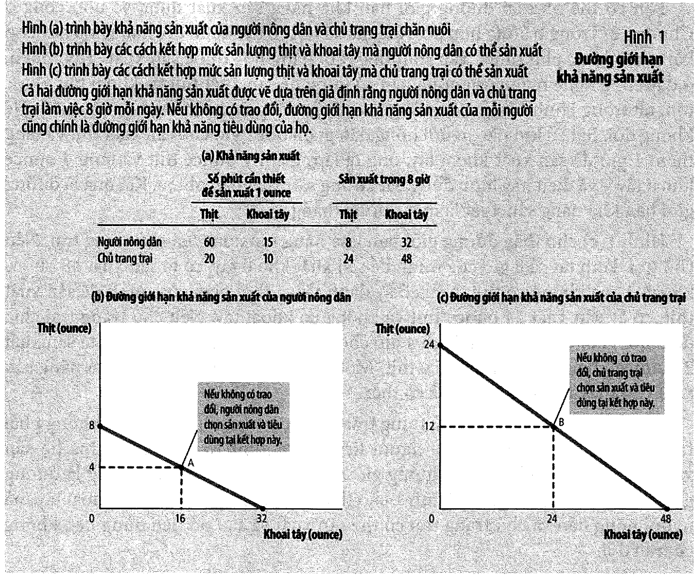
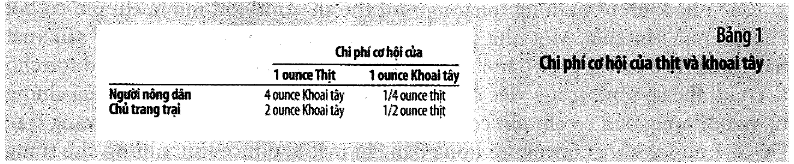
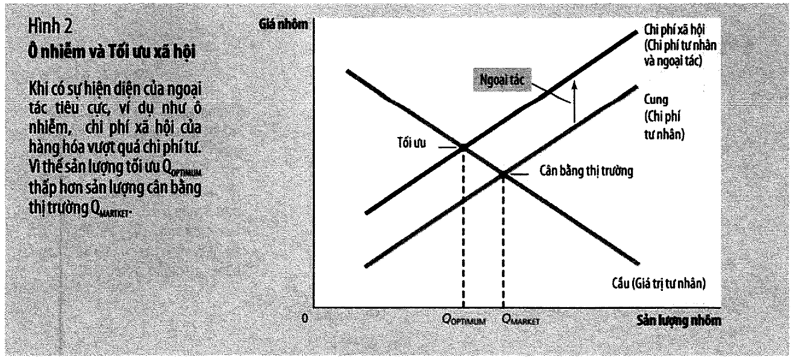
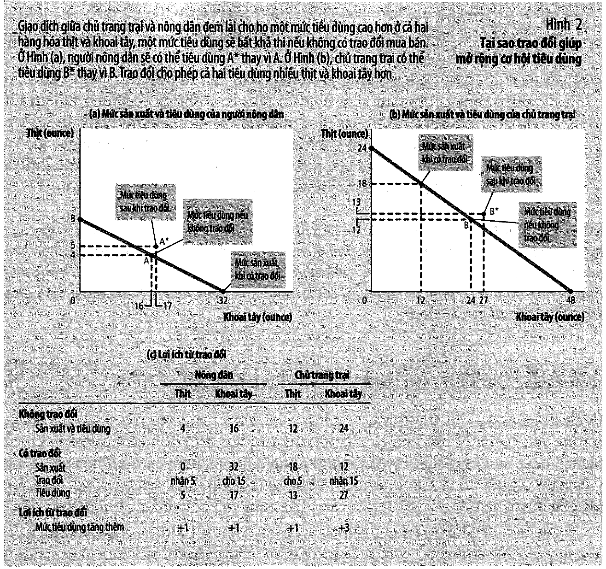
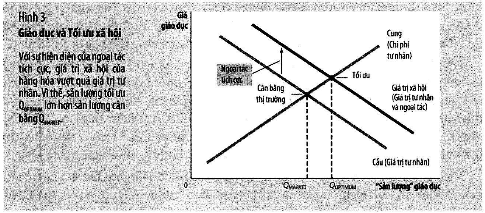
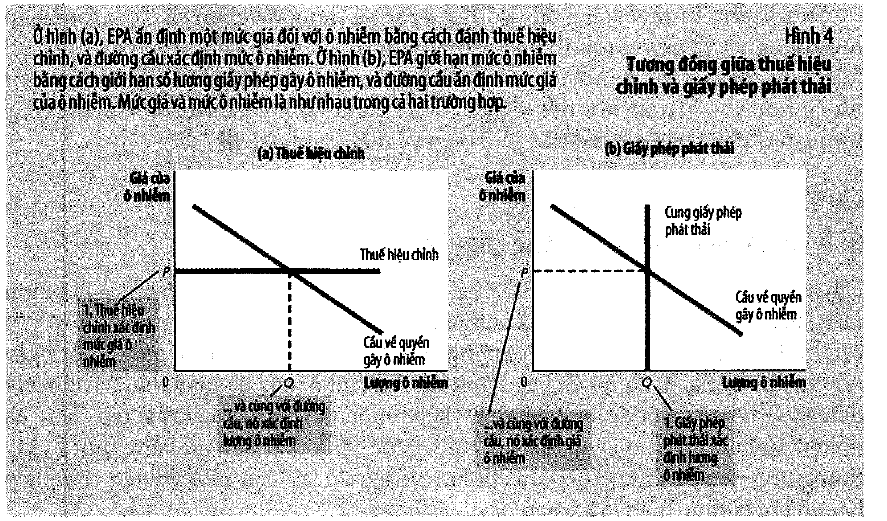
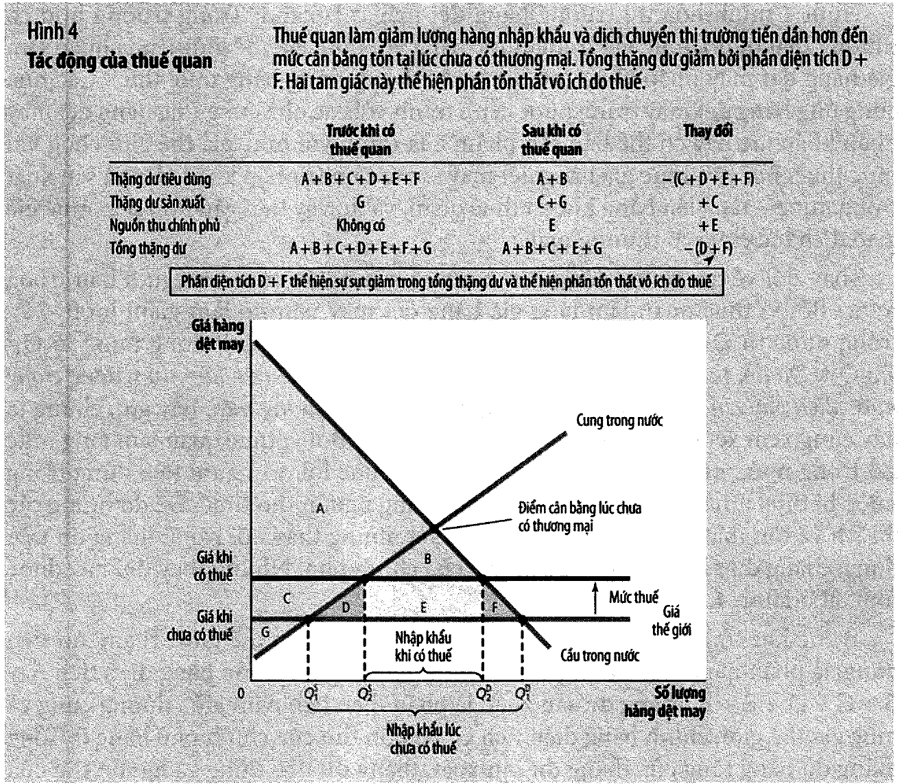
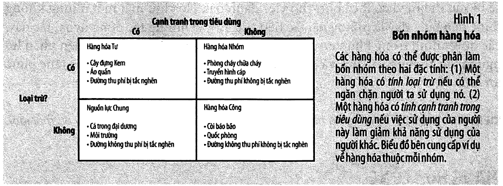

# Bài 14 — Thương mại, ngoại tác, hàng hoá công: thị trường làm tốt ở đâu và hỏng ở đâu

> Bài học dựng từ **bốn chương** của *N. Gregory Mankiw — **Kinh tế học vi mô***,
> bản dịch của Khoa Kinh tế, **ĐH Kinh tế TP.HCM** (Cengage Learning Asia):
> **Chương 3 — Sự phụ thuộc lẫn nhau và lợi ích từ thương mại** (tr. 57–76),
> **Chương 9 — Ứng dụng: thương mại quốc tế** (tr. 190–213),
> **Chương 10 — Ngoại tác** (tr. 214–236) và
> **Chương 11 — Hàng hoá công và nguồn lực chung** (tr. 237–254).
> 🔸 **Vòng 2 — đọc hiểu.** Bốn chương này là **một cặp đối xứng**: hai chương đầu
> cho thấy thị trường làm tốt đến mức nào và chính phủ nên đứng ngoài; hai chương
> sau cho thấy nó hỏng ở đâu và vì sao chính phủ phải vào.
> 💼 **Góc QTKD** — ví dụ thêm cho ngành quản trị kinh doanh, **không có trong sách**.
> 📚 **Mở rộng** — thứ sách phát biểu bằng lời mà không cho công thức.
> ⚠️ — chỗ dễ hiểu sai, và **một lỗi in ở tr. 64** ghi ở [mục 3](#3--lỗi-in-tr-64--chi-phí-cơ-hội-của-19-ounce-thịt).
> 📌 **Cần đọc trước:** [Bài 2](bai_02_cung_va_cau.md) (cung cầu),
> [Bài 4](bai_04_thang_du_va_chi_phi_cua_thue.md) (thặng dư tiêu dùng và sản xuất —
> **dùng liên tục ở bài này**) và [Bài 13](bai_13_chinh_phu_can_thiep_thi_truong.md)
> (thuế và tổn thất vô ích).
> 🏁 **Đây là bài cuối của khoá.**

---

## Mục lục

<!-- MUC-LUC -->

- [1. Bốn chương, một câu hỏi tách làm đôi](#1-bốn-chương-một-câu-hỏi-tách-làm-đôi)
- [2. Lợi thế tuyệt đối và lợi thế so sánh](#2-lợi-thế-tuyệt-đối-và-lợi-thế-so-sánh)
- [3. ⚠️ Lỗi in tr. 64 — "chi phí cơ hội của 19 ounce thịt"](#3--lỗi-in-tr-64--chi-phí-cơ-hội-của-19-ounce-thịt)
- [4. 📚 Đường giới hạn khả năng sản xuất chung — tám ounce bị bỏ phí](#4--đường-giới-hạn-khả-năng-sản-xuất-chung--tám-ounce-bị-bỏ-phí)
- [5. 📚 Khoảng giá nào thì cả hai cùng có lợi](#5--khoảng-giá-nào-thì-cả-hai-cùng-có-lợi)
- [6. Lợi thế tuyệt đối không quyết định — Tom Brady và hai quốc gia](#6-lợi-thế-tuyệt-đối-không-quyết-định--tom-brady-và-hai-quốc-gia)
- [7. Isoland — nước nhỏ trước giá thế giới](#7-isoland--nước-nhỏ-trước-giá-thế-giới)
- [8. Thuế quan — ai được, ai mất, mất bao nhiêu](#8-thuế-quan--ai-được-ai-mất-mất-bao-nhiêu)
- [9. 📚 Hạn ngạch — cùng một mức giá, khác một khoản tiền](#9--hạn-ngạch--cùng-một-mức-giá-khác-một-khoản-tiền)
- [10. Tám lập luận đòi hạn chế thương mại](#10-tám-lập-luận-đòi-hạn-chế-thương-mại)
- [11. Đơn phương, đa phương, và ba mươi hai năm giảm thuế quan](#11-đơn-phương-đa-phương-và-ba-mươi-hai-năm-giảm-thuế-quan)
- [12. Ngoại tác — chỗ bàn tay vô hình không nhìn thấy](#12-ngoại-tác--chỗ-bàn-tay-vô-hình-không-nhìn-thấy)
- [13. Ngoại tác tiêu cực và thuế Pigou](#13-ngoại-tác-tiêu-cực-và-thuế-pigou)
- [14. Ngoại tác tích cực và trợ cấp](#14-ngoại-tác-tích-cực-và-trợ-cấp)
- [15. Mệnh lệnh–kiểm soát so với công cụ thị trường](#15-mệnh-lệnhkiểm-soát-so-với-công-cụ-thị-trường)
- [16. Giấy phép chuyển nhượng — ba nhà máy Thung lũng Hạnh phúc](#16-giấy-phép-chuyển-nhượng--ba-nhà-máy-thung-lũng-hạnh-phúc)
- [17. 📚 Vì sao thuế hiệu chỉnh không chạm tới được mục tiêu 120 đơn vị](#17--vì-sao-thuế-hiệu-chỉnh-không-chạm-tới-được-mục-tiêu-120-đơn-vị)
- [18. Định lý Coase và bốn ô của nó](#18-định-lý-coase-và-bốn-ô-của-nó)
- [19. Giải pháp tư và giới hạn của chúng](#19-giải-pháp-tư-và-giới-hạn-của-chúng)
- [20. Bốn nhóm hàng hoá](#20-bốn-nhóm-hàng-hoá)
- [21. Hàng hoá công, kẻ thụ hưởng miễn phí, và pháo hoa](#21-hàng-hoá-công-kẻ-thụ-hưởng-miễn-phí-và-pháo-hoa)
- [22. 📚 Bốn bạn cùng phòng — vì sao chia đều lại làm một người thiệt](#22--bốn-bạn-cùng-phòng--vì-sao-chia-đều-lại-làm-một-người-thiệt)
- [23. Phân tích chi phí–lợi ích và giá của một mạng người](#23-phân-tích-chi-phílợi-ích-và-giá-của-một-mạng-người)
- [24. Bi kịch nguồn lực chung — Wiknam](#24-bi-kịch-nguồn-lực-chung--wiknam)
- [25. 💼 Góc QTKD — thuế quan lên đầu vào và tỷ lệ bảo hộ hiệu dụng](#25--góc-qtkd--thuế-quan-lên-đầu-vào-và-tỷ-lệ-bảo-hộ-hiệu-dụng)
- [26. Code minh hoạ](#26-code-minh-hoạ)
- [27. Tự thử](#27-tự-thử)
- [28. Từ điển thuật ngữ](#28-từ-điển-thuật-ngữ)
- [29. Câu hỏi tự kiểm tra](#29-câu-hỏi-tự-kiểm-tra)
- [Tóm tắt một trang](#tóm-tắt-một-trang)
- [Nguồn](#nguồn)

<!-- /MUC-LUC -->

---

## 1. Bốn chương, một câu hỏi tách làm đôi

[Bài 13](bai_13_chinh_phu_can_thiep_thi_truong.md) kết thúc ở một chỗ khó chịu: gần
như mọi chính sách xem xét ở đó — giá trần, giá sàn, thuế — đều **làm giảm** tổng
thặng dư. Nếu can thiệp luôn tốn kém như vậy, có bao giờ nó đáng không?

Bốn chương của bài này trả lời, và chúng chia đôi rất sạch:

|           | Chương   | Nói gì                                             | Kết luận về vai trò chính phủ |
| --------- | -------- | -------------------------------------------------- | ----------------------------- |
| **Nửa A** | 3 và 9   | thương mại tự do làm **tăng** tổng thặng dư        | **đứng ngoài**                |
| **Nửa B** | 10 và 11 | ngoại tác và hàng hoá công làm thị trường **hỏng** | **phải vào**                  |

Nửa A là chỗ mạnh nhất của thị trường: hai người *cùng thắng* dù một người kém hơn
ở mọi việc. Nửa B là chỗ yếu nhất: bàn tay vô hình không nhìn thấy người thứ ba.

Chương 10 mở đầu bằng đúng câu hỏi ấy (tr. 215):

> *"Thị trường là một cách thức tốt để tổ chức hoạt động kinh tế. Nếu vậy, chúng ta
> có nên kết luận bàn tay vô hình sẽ ngăn ngừa các công ty trong thị trường giấy
> không xả thải quá nhiều điôxin? Các thị trường thực hiện nhiều điều tốt, nhưng
> nó không thực hiện tốt tất cả mọi điều."*

Sợi chỉ nối cả bốn chương là **thặng dư** — công cụ dựng ở [bài 4](bai_04_thang_du_va_chi_phi_cua_thue.md).
Cả bốn chương đều làm một việc: vẽ hai đường, tính hai tam giác, so sánh.

---

## 2. Lợi thế tuyệt đối và lợi thế so sánh

Chương 3 dựng một thế giới hai người hai hàng hoá. Hình 1 tr. 59 cho số phút cần
để làm ra một ounce:



|                | phút/ounce thịt | phút/ounce khoai tây | tối đa thịt (8 giờ) | tối đa khoai tây |
| -------------- | --------------: | -------------------: | ------------------: | ---------------: |
| Nông dân       |              60 |                   15 |                   8 |               32 |
| Chủ trang trại |              20 |                   10 |                  24 |               48 |

Chủ trang trại nhanh hơn ở **cả hai** món — đó là **lợi thế tuyệt đối**. Trực giác
nói: không có gì để trao đổi cả, người kia chỉ làm vướng chân.

Trực giác sai. Cái quyết định không phải "mất bao nhiêu giờ" mà **"phải bỏ cái gì"**.
Bảng 1 tr. 62:

|                |  1 ounce thịt tốn | 1 ounce khoai tây tốn |
| -------------- | ----------------: | --------------------: |
| Nông dân       | 4 ounce khoai tây |          ¼ ounce thịt |
| Chủ trang trại | 2 ounce khoai tây |          ½ ounce thịt |



Nông dân bỏ **ít khoai tây hơn** để làm ra một ounce khoai tây — nói cách khác, một
ounce khoai tây của anh ta chỉ tốn ¼ ounce thịt, trong khi của chủ trang trại tốn ½.
Đó là **lợi thế so sánh**.

Và điều then chốt: **không ai có thể có lợi thế so sánh ở cả hai món.** Nếu chi phí
cơ hội của thịt tính bằng khoai tây của bạn thấp hơn, thì chi phí cơ hội của khoai
tây tính bằng thịt của bạn nhất thiết phải cao hơn — hai con số là nghịch đảo của
nhau. Đây là lý do vì sao **luôn luôn có** chỗ để trao đổi.

Kế hoạch ở tr. 63: nông dân bỏ hẳn nghề nuôi bò, dồn cả 8 giờ vào khoai tây (32 ounce);
chủ trang trại dành 6 giờ cho thịt (18 ounce) và 2 giờ cho khoai tây (12 ounce).
Nông dân đưa 15 ounce khoai tây, nhận về 5 ounce thịt. Bảng 2 tr. 63:

|                |                  |   Thịt | Khoai tây |
| -------------- | ---------------- | -----: | --------: |
| Nông dân       | không thương mại |      4 |        16 |
|                | có thương mại    |      5 |        17 |
|                | **chênh lệch**   | **+1** |    **+1** |
| Chủ trang trại | không thương mại |     12 |        24 |
|                | có thương mại    |     13 |        27 |
|                | **chênh lệch**   | **+1** |    **+3** |

Cả hai đều có nhiều hơn **ở cả hai món**. Không ai bị lấy bớt gì cả — không phải một
người thắng và một người thua. Đây là điểm mà cả chương 3 lẫn chương 9 dựa vào, và
là điều mà tranh luận công chúng về thương mại thường bỏ qua.

---

## 3. ⚠️ Lỗi in tr. 64 — "chi phí cơ hội của 19 ounce thịt"

Đoạn giải thích vì sao nông dân chấp nhận giao dịch, ở tr. 64:

> *"Giá thịt này thấp hơn so với chi phí cơ hội của **19 ounce thịt** là 4 ounce
> khoai tây của người nông dân."*

Con số **19** sai. Phải là **1 ounce thịt**.

Bằng chứng nằm ngay trong cùng chương: **Bảng 1 tr. 62** in rõ *"Nông dân: 1 ounce
Thịt = 4 ounce Khoai tây"*. Câu văn đang nhắc lại chính dòng đó. Và về mặt số học,
"chi phí cơ hội của 19 ounce thịt" phải là 76 ounce khoai tây, một con số không
xuất hiện ở đâu và cũng vượt quá năng lực cả ngày của nông dân (32 ounce).

Đã phóng to trang 64 ở 300 dpi để xác nhận đây là chữ in trên giấy chứ không phải
lỗi kết xuất.

Đọc đúng thì lập luận rất gọn: giao dịch cho nông dân giá **3 ounce khoai tây một
ounce thịt** (15 đổi lấy 5). Tự làm lấy thì mất **4**. Rẻ hơn → nhận.

---

## 4. 📚 Đường giới hạn khả năng sản xuất chung — tám ounce bị bỏ phí

Sách so sánh hai phương án và cho thấy phương án có thương mại tốt hơn. Nhưng nó
không hỏi câu tiếp theo: **tốt nhất có thể là bao nhiêu?**

Dựng đường giới hạn khả năng sản xuất của *cả hai người gộp lại*. Muốn có thịt với
giá rẻ nhất thì dùng người có chi phí cơ hội thấp nhất trước — chủ trang trại (2 ounce
khoai tây mỗi ounce thịt), hết công suất rồi mới đến nông dân (4 ounce):

|             Tổng thịt | Khoai tây **tối đa** có thể | Khoai tây **thực tế** | Bỏ phí |
| --------------------: | --------------------------: | --------------------: | -----: |
| 16 (không thương mại) |                          48 |                    40 |  **8** |
|    18 (có thương mại) |                          44 |                    44 |  **0** |

Kết quả đáng chú ý: phương án **không thương mại nằm hẳn bên trong** đường giới hạn.
Nó không chỉ "kém hơn một chút" — nó **lãng phí 8 ounce khoai tây**, tương đương
1/6 tổng năng lực khoai tây khi chỉ làm 16 ounce thịt.

Lãng phí ở đâu ra? Ở chỗ nông dân đang làm 4 ounce thịt với giá 4 khoai tây mỗi
ounce, trong khi chủ trang trại còn thừa công suất làm thịt với giá chỉ 2. Chuyển
4 ounce thịt đó sang cho chủ trang trại tiết kiệm 4 × (4 − 2) = **8 ounce khoai tây**.
Đúng bằng con số bỏ phí.

Còn phương án có thương mại thì nằm **đúng trên** đường giới hạn — nó hiệu quả về
mặt sản xuất, không thể cải thiện thêm mà không giảm món kia.

---

## 5. 📚 Khoảng giá nào thì cả hai cùng có lợi

Sách nói (tr. 65–66) giá thịt tính bằng khoai tây phải nằm **giữa 2 và 4**, vì dưới
2 thì chủ trang trại tự làm rẻ hơn, trên 4 thì nông dân tự làm rẻ hơn.

Đúng — nhưng đó là khoảng cho *sự tồn tại* của một giao dịch có lợi, khi cả hai
chuyên môn hoá hoàn toàn. Ở kế hoạch cụ thể tr. 63, chủ trang trại **vẫn làm cả
khoai tây**, và lượng thịt trao đổi được chốt ở 5 ounce. Với ràng buộc đó, khoảng
giá hẹp lại:

| p (khoai tây mỗi ounce thịt) |    Nông dân được thêm | Chủ trang trại được thêm |                     |
| ---------------------------: | --------------------: | -----------------------: | ------------------- |
|                          2,0 |     +1 thịt, +6 khoai |    +1 thịt, **−2** khoai | có bên bị thiệt     |
|                          2,2 |     +1 thịt, +5 khoai |    +1 thịt, **−1** khoai | có bên bị thiệt     |
|                      **2,4** |     +1 thịt, +4 khoai |     +1 thịt, **0** khoai | vừa đủ hoà vốn      |
|                      **3,0** |     +1 thịt, +1 khoai |        +1 thịt, +3 khoai | **cả hai cùng lợi** |
|                      **3,2** |  +1 thịt, **0** khoai |        +1 thịt, +4 khoai | vừa đủ hoà vốn      |
|                          3,4 | +1 thịt, **−1** khoai |        +1 thịt, +5 khoai | có bên bị thiệt     |
|                          4,0 | +1 thịt, **−4** khoai |        +1 thịt, +8 khoai | có bên bị thiệt     |

Khoảng thật là **[2,4 ; 3,2]**, không phải [2 ; 4]. Giá sách chọn — 15 chia 5 = **3** —
nằm gần chính giữa khoảng đó.

Bài học: khoảng giá "về nguyên tắc" và khoảng giá "cho một thoả thuận cụ thể" là
hai thứ khác nhau. Chi tiết của thoả thuận (ai chuyên môn hoá đến đâu, khối lượng
bao nhiêu) thu hẹp khoảng thương lượng lại đáng kể.

---

## 6. Lợi thế tuyệt đối không quyết định — Tom Brady và hai quốc gia

Sách cho hai minh hoạ để chống lại trực giác "giỏi hơn thì nên tự làm".

**Tom Brady** (tr. 67–68). Anh cắt cỏ hết 2 giờ; Forrest Gump hết 4 giờ. Brady nhanh
gấp đôi. Nhưng 2 giờ của Brady quay quảng cáo được 20.000 đô la, còn 4 giờ của Gump
ở McDonald's được 40 đô la (2 giờ ≈ 20 đô la). Brady vẫn nên thuê Gump — với bất kỳ
mức giá nào giữa 20 và 20.000 đô la, cả hai cùng lợi.

**Hoa Kỳ và Nhật Bản** (tr. 68–69). Mỗi công nhân mỗi tháng làm ra 1 chiếc ô tô ở
cả hai nước; nhưng lương thực thì Hoa Kỳ được 2 tấn, Nhật Bản 1 tấn.

|          |       1 ô tô tốn | 1 tấn lương thực tốn |
| -------- | ---------------: | -------------------: |
| Hoa Kỳ   | 2 tấn lương thực |               ½ ô tô |
| Nhật Bản | 1 tấn lương thực |               1 ô tô |

Không ai có lợi thế tuyệt đối về ô tô — cả hai đều 1 chiếc. Nhưng Nhật Bản có lợi
thế **so sánh** về ô tô (bỏ 1 tấn thay vì 2), và Hoa Kỳ có lợi thế so sánh về lương
thực (bỏ nửa ô tô thay vì một). Thương mại vẫn có chỗ.

Đây cũng là câu trả lời cho lập luận *"nước nghèo lương thấp thì cạnh tranh không
công bằng"*: lương thấp phản ánh năng suất thấp, và lợi thế so sánh không quan tâm
tới mức tuyệt đối — chỉ quan tâm tới tỷ số.

---

## 7. Isoland — nước nhỏ trước giá thế giới

Chương 9 dựng Isoland: một nước tưởng tượng đang cân nhắc mở cửa thị trường hàng
dệt may. Giả định then chốt là **nước nhỏ**: Isoland mua bán bao nhiêu cũng không
làm nhúc nhích giá thế giới.

Sách chỉ vẽ hình, đánh dấu các vùng bằng chữ cái A, B, C, D chứ không cho phương
trình. Để tính được, bài này dựng một mô hình tuyến tính gọn dùng cho cả chương:

```
Qd = 100 − 2P        Qs = 2P − 20
```

Cân bằng khi đóng cửa: P = 30, Q = 40.

| Tình huống       |  Giá |  Cầu | Cung | NK/XK |   CS |   PS |      Tổng |      Đổi |
| ---------------- | ---: | ---: | ---: | ----: | ---: | ---: | --------: | -------: |
| Đóng cửa         |  $30 |   40 |   40 |     — |  400 |  400 |       800 |        — |
| Giá thế giới $20 |  $20 |   60 |   20 | NK 40 |  900 |  100 | **1.000** | **+200** |
| Giá thế giới $40 |  $40 |   20 |   60 | XK 40 |  100 |  900 | **1.000** | **+200** |

Ba điều đọc ra:

1. **Chiều nào cũng tăng.** Nhập khẩu hay xuất khẩu đều làm tổng thặng dư tăng 200.
   Không có "chiều tốt" và "chiều xấu" — chỉ có ai được và ai mất *bên trong* nước.
2. **Luôn có kẻ thua.** Nhập khẩu: người sản xuất mất 300. Xuất khẩu: người tiêu dùng
   mất 300. Phần được luôn lớn hơn phần mất, nhưng **phần bù trừ không tự động xảy ra**.
   Đây là gốc rễ chính trị của mọi tranh cãi về thương mại.
3. **Lợi ích bằng nửa tích của lượng giao dịch với độ lệch giá:** ½ × 40 × 10 = 200.
   Công thức này nói ngay: nước càng khác biệt với thế giới về giá, mở cửa càng lợi.

Sách còn liệt kê những lợi ích **không** nằm trong đồ thị (tr. 195–196): nhiều chủng
loại hàng hoá hơn, chi phí thấp hơn nhờ quy mô, cạnh tranh gay gắt hơn với các nhà
độc quyền trong nước, và dòng chảy ý tưởng — điều mà sách gọi là *"chuyển giao tiến
bộ công nghệ"*.

---

## 8. Thuế quan — ai được, ai mất, mất bao nhiêu

Giả sử Isoland mở cửa (giá thế giới $20, nhập khẩu 40) rồi áp thuế quan $t$ mỗi
đơn vị nhập khẩu. Giá trong nước lên $20 + t$:

| Thuế quan |  Giá |  Cầu | Cung | Nhập |   CS |   PS |  Thu |  Tổng |     Mất |  2t² |
| --------: | ---: | ---: | ---: | ---: | ---: | ---: | ---: | ----: | ------: | ---: |
|        $0 |  $20 |   60 |   20 |   40 |  900 |  100 |    0 | 1.000 |       0 |    0 |
|        $2 |  $22 |   56 |   24 |   32 |  784 |  144 |   64 |   992 |   **8** |    8 |
|        $5 |  $25 |   50 |   30 |   20 |  625 |  225 |  100 |   950 |  **50** |   50 |
|        $8 |  $28 |   44 |   36 |    8 |  484 |  324 |   64 |   872 | **128** |  128 |
|       $10 |  $30 |   40 |   40 |    0 |  400 |  400 |    0 |   800 | **200** |  200 |
|       $12 |  $30 |   40 |   40 |    0 |  400 |  400 |    0 |   800 | **200** |    — |

Ba kết quả:

**Tổn thất vô ích tăng theo bình phương.** Cột cuối cho thấy nó đúng bằng $2t^2$.
Gấp đôi thuế quan thì tổn thất gấp **bốn**. Đây chính là quy tắc đã gặp ở
[bài 4](bai_04_thang_du_va_chi_phi_cua_thue.md) và [bài 13](bai_13_chinh_phu_can_thiep_thi_truong.md)
— thuế nhỏ ít hại một cách không tương xứng, thuế lớn hại một cách không tương xứng.

**Thuế quan tự vô hiệu hoá.** Ở $t = 10$ nhập khẩu về 0, nên **thu ngân sách cũng về 0**.
Chính phủ đánh thuế cao nhất thì thu được ít nhất. Từ đó trở lên tăng thuế không
đổi được gì nữa: $12 và $10 cho kết quả y hệt. Đây là **thuế quan cấm vận** — và
con số 800 chính là điểm đóng cửa ở [mục 7](#7-isoland--nước-nhỏ-trước-giá-thế-giới),
một phép kiểm tra nhất quán tự động của mô hình.

**Hai tam giác, không phải một.** Sách gọi hai vùng mất trắng là D và F (tr. 197–199).
D là do sản xuất trong nước bị kéo lên quá mức đáng có (những đơn vị mà chi phí trong
nước vượt giá thế giới); F là do tiêu dùng bị kéo xuống dưới mức đáng có. Mỗi tam
giác đúng bằng $t^2$.

---

## 9. 📚 Hạn ngạch — cùng một mức giá, khác một khoản tiền

Sách nhắc hạn ngạch nhập khẩu nhưng chỉ nói qua. Đặt nó cạnh thuế quan thì ra một
kết quả sắc:

Hạn ngạch 20 đơn vị đẩy giá trong nước lên đúng $25 — **y hệt** thuế quan $5.

| Chính sách                           |   CS |   PS | Ngân sách | Ai giữ khoản chênh           | Tổng |
| ------------------------------------ | ---: | ---: | --------: | ---------------------------- | ---: |
| Thuế quan $5                         |  625 |  225 |       100 | ngân sách                    |  950 |
| Hạn ngạch 20, **cấp quota miễn phí** |  625 |  225 |         0 | **người xin được giấy phép** |  950 |
| Hạn ngạch 20, **đấu giá quota**      |  625 |  225 |       100 | ngân sách                    |  950 |

Giá giống nhau, lượng giống nhau, thặng dư người mua và người bán giống nhau. Khác
duy nhất ở chỗ **ai nhận 100 đô la**.

Và đây là chỗ đáng nhớ: cấp quota miễn phí thì 100 đô la đó rơi vào túi người xin
được giấy phép. Đó là một khoản tiền có thật, không do sản xuất mà ra, chỉ do một
chữ ký. Nó tạo ra động cơ vận động hành lang và tham nhũng đúng bằng quy mô của
chính nó — trong khi thuế quan, dù cùng gây tổn thất vô ích 50, ít nhất chuyển
khoản tiền ấy vào ngân sách.

Đây cũng là lời giải thích vì sao các nhà kinh tế, khi buộc phải chọn giữa hai công
cụ bảo hộ, gần như luôn chọn thuế quan.

---

## 10. Tám lập luận đòi hạn chế thương mại

Sách (tr. 200–205) liệt kê và phản biện. Tóm lại:

| Lập luận                       | Nội dung                                  | Phản biện của sách                                                                                                                             |
| ------------------------------ | ----------------------------------------- | ---------------------------------------------------------------------------------------------------------------------------------------------- |
| **Việc làm**                   | thương mại tự do phá việc làm trong nước  | thương mại **dịch chuyển** việc làm sang ngành có lợi thế so sánh, không xoá việc làm; và mọi nước đều có lợi thế so sánh ở đâu đó             |
| **An ninh quốc gia**           | ngành thiết yếu phải tự chủ               | có cơ sở, nhưng bị lạm dụng: ngành nào cũng tự nhận là thiết yếu                                                                               |
| **Ngành non trẻ**              | bảo hộ tạm để ngành lớn lên               | khó chọn đúng ngành; "tạm thời" hiếm khi tạm thời; và nếu ngành thật sự có tương lai thì chủ doanh nghiệp tự chịu lỗ ban đầu, không cần bảo hộ |
| **Cạnh tranh không công bằng** | nước khác trợ cấp cho doanh nghiệp của họ | nếu Neighborland trợ cấp thì người tiêu dùng Isoland đang được họ tặng quà; thiệt hại của người sản xuất nhỏ hơn lợi ích của người mua         |
| **Con bài đàm phán**           | doạ áp thuế để buộc nước kia mở cửa       | nếu doạ mà họ không nhượng bộ thì hoặc mất uy tín, hoặc phải tự làm hại mình                                                                   |

Ba lập luận còn lại (lương thấp, môi trường, tiêu chuẩn lao động) sách gộp vào nhóm
"cạnh tranh không công bằng".

Nhận xét đáng giữ nhất nằm ở lập luận ngành non trẻ (tr. 203): *"việc lựa chọn những
ngành chiến thắng là việc làm cực kỳ khó. Điều này thậm chí còn khó thực hiện hơn do
các quy trình chính trị thường dành sự bảo hộ cho các ngành công nghiệp có sức mạnh
về chính trị."* Đây là một luận điểm về **năng lực thể chế**, không phải về kinh tế
học — và nó áp dụng được cho hầu hết mọi chính sách công nghiệp.

---

## 11. Đơn phương, đa phương, và ba mươi hai năm giảm thuế quan

Một nước muốn tiến tới thương mại tự do có hai đường (tr. 205):

- **Đơn phương** — tự bỏ rào cản, không chờ ai. Ví dụ sách nêu: Anh thế kỷ 19, Chile
  và Hàn Quốc gần đây.
- **Đa phương** — thương lượng để cùng giảm. NAFTA 1993, GATT, WTO.

Con số sách cho (tr. 205): GATT đã kéo thuế suất giữa các nước từ **khoảng 40 phần
trăm** sau Thế chiến II xuống **khoảng 5 phần trăm**. WTO thành lập 1995, trụ sở
Geneva; đến 2009 có 153 thành viên, chiếm hơn **97 phần trăm** thương mại toàn cầu.

Ưu điểm của đa phương không nằm ở kinh tế mà ở **chính trị**: nhà sản xuất ít người
và tổ chức tốt, người tiêu dùng đông và tản mát, nên giảm thuế đơn phương luôn thua
về vận động hành lang. Nhưng nếu Neighborland cũng giảm thuế lúa mì cùng lúc, thì
nông dân trồng lúa mì Isoland — vốn cũng có sức mạnh chính trị — sẽ đứng về phía
hiệp định. Đa phương *tạo ra một nhóm vận động ủng hộ*, thứ mà đơn phương không có.

Sách khép chương bằng một con số đáng suy nghĩ (tr. 205–206): khảo sát của *Los
Angeles Times* năm 2008 hỏi công chúng Hoa Kỳ thương mại quốc tế tự do có ích hay
gây hại. Chỉ **26 phần trăm** trả lời có ích; **50 phần trăm** cho là gây hại. Trong
khi hầu như toàn bộ giới kinh tế học ủng hộ.

Và ngụ ngôn khép lại chương 9 (tr. 206) đáng đọc kỹ: một nhà phát minh Isoland tuyên
bố tìm ra cách làm hàng dệt may từ lúa mì, không cần lao động. Cả nước tôn vinh anh
ta là thiên tài; công nhân dệt may mất việc nhưng tìm được việc khác; mức sống tăng.
Rồi một phóng viên phát hiện anh ta chỉ đang buôn lậu lúa mì ra nước ngoài đổi lấy
hàng dệt may. Chính phủ lập tức cấm, giá hàng dệt may tăng, mức sống quay lại như cũ.

Câu hỏi mà ngụ ngôn đặt ra: nếu tiến bộ công nghệ và thương mại quốc tế **giống hệt
nhau về mặt kinh tế** — cùng cho ta nhiều hàng hơn với ít nguồn lực hơn, cùng làm
một số người mất việc — thì tại sao ta hoan nghênh cái này và cấm cái kia?

---

## 12. Ngoại tác — chỗ bàn tay vô hình không nhìn thấy

Nửa B bắt đầu. **Ngoại tác** là *"tác động không được bù đắp của hành vi một người
đối với phúc lợi của một người ngoài cuộc"* (định nghĩa tr. 215).

Hai chữ then chốt là **không được bù đắp**. Không phải mọi tác động lên người khác
đều là ngoại tác: khi bạn mua nhiều cà phê hơn và đẩy giá cà phê lên, người mua khác
bị thiệt — nhưng đó là tác động *qua giá cả*, thị trường đã tính rồi. Ngoại tác là
tác động **đi vòng qua** hệ thống giá.

Sách cho bốn ví dụ (tr. 216) và mỗi ví dụ đi kèm một chính sách:

| Ngoại tác                     |   Loại   | Chính sách sách nêu                          |
| ----------------------------- | :------: | -------------------------------------------- |
| Khí thải xe hơi               | tiêu cực | tiêu chuẩn phát thải, thuế xăng dầu          |
| Toà nhà lịch sử được phục hồi | tích cực | quản lý việc dỡ bỏ, miễn thuế cho chủ sở hữu |
| Tiếng chó sủa                 | tiêu cực | luật "cấm làm ồn" của chính quyền cơ sở      |
| Nghiên cứu công nghệ mới      | tích cực | hệ thống bằng sáng chế                       |

Điểm chung: người ra quyết định **không tính đến** phần tác động rơi vào người khác.
Vì vậy anh ta làm quá nhiều thứ có ngoại tác tiêu cực và quá ít thứ có ngoại tác tích cực.

---

## 13. Ngoại tác tiêu cực và thuế Pigou

Sách vẽ Hình 2 tr. 218 không kèm số. Bài này dựng một mô hình số cho thị trường nhôm:





```
Cầu:              P = 120 − 2Q
Chi phí tư nhân:  P = 20 + 2Q
Chi phí ngoại tác: 20 đô la mỗi đơn vị
```

Chi phí xã hội = chi phí tư nhân + 20, tức $P = 40 + 2Q$.

| Tình huống       |    Q | Giá người mua trả |   CS |   PS | Thu ngân sách | Chi phí ô nhiễm | **Tổng** |
| ---------------- | ---: | ----------------: | ---: | ---: | ------------: | --------------: | -------: |
| Thị trường tự do |   25 |               $70 |  625 |  625 |             0 |             500 |  **750** |
| Thuế Pigou $20   |   20 |               $80 |  400 |  400 |           400 |             400 |  **800** |

Phúc lợi tăng **50**, đúng bằng tam giác ½ × 20 × 5.

Chỗ này rất dễ hiểu sai, nên cần nói thẳng: **thuế Pigou không phải để thu tiền.**
Cột "thu ngân sách" là 400 và cột "chi phí ô nhiễm" cũng là 400 — chúng triệt tiêu
nhau trong phép tính phúc lợi. Cái thu được là **50 đô la** đến từ việc ngừng sản
xuất 5 đơn vị mà chi phí xã hội của chúng vượt quá giá trị đối với người mua.

Đây là điểm phân biệt thuế hiệu chỉnh với mọi loại thuế khác đã học ở
[bài 13](bai_13_chinh_phu_can_thiep_thi_truong.md). Thuế thông thường *tạo ra* tổn
thất vô ích vì nó bóp méo một thị trường vốn đã hiệu quả. Thuế hiệu chỉnh *xoá* tổn
thất vô ích vì nó sửa một thị trường vốn đã méo. Sách nói rất gọn (tr. 224):
*"ngoài việc đem lại doanh thu cho chính phủ, thuế hiệu chỉnh còn làm gia tăng hiệu
quả kinh tế."*

**Nghiên cứu tình huống — thuế xăng dầu** (tr. 224–225). Sách xem thuế xăng dầu là
thuế hiệu chỉnh cho **ba** ngoại tác cùng lúc: kẹt xe, tai nạn (một người lái xe
bình thường có xác suất tử vong cao **gấp năm lần** nếu bị tông bởi xe thể thao thay
vì xe hơi khác), và ô nhiễm. Một nghiên cứu 2007 trên *Journal of Economic Literature*
kết luận mức thuế hiệu chỉnh tối ưu cho xăng dầu là **2,10 đô la mỗi gallon**, so
với mức thực tế ở Hoa Kỳ khi đó chỉ **40 cent**.

---

## 14. Ngoại tác tích cực và trợ cấp

Đảo dấu ngoại tác thì mọi thứ lật ngược đối xứng. Với giáo dục, giá trị xã hội nằm
**trên** đường cầu — sách nêu ba ngoại tác tích cực (tr. 219): cử tri được thông tin
tốt hơn, tỷ lệ tội phạm thấp hơn, và tiến bộ công nghệ lan toả nhanh hơn.

|                                   | Q thị trường | Q tối ưu | Chênh lệch |
| --------------------------------- | -----------: | -------: | ---------: |
| Ngoại tác **tiêu cực** (nhôm)     |           25 |       20 |     **−5** |
| Ngoại tác **tích cực** (giáo dục) |           25 |       30 |     **+5** |

Đối xứng hoàn hảo: một bên sản xuất thừa 5, bên kia thiếu 5. Chữa thừa thì đánh
thuế 20; chữa thiếu thì trợ cấp 20. Phúc lợi thu được trong cả hai trường hợp đều
là 50 đô la.

Sách tóm lại bằng một câu đáng thuộc (tr. 220):



> *"Ngoại tác tiêu cực khiến cho thị trường sản xuất một sản lượng cao hơn sản lượng
> mức mong muốn của xã hội. Ngoại tác tích cực khiến cho thị trường sản xuất một sản
> lượng thấp hơn sản lượng đáng mong muốn về mặt xã hội."*

**Nghiên cứu tình huống — chính sách công nghiệp** (tr. 220–221). Nếu tác động lan
toả công nghệ là ngoại tác tích cực, chính phủ nên trợ cấp ngành nào lan toả nhiều
nhất. Sách nêu ví dụ nổi tiếng: sản xuất chip máy tính có lan toả lớn hơn sản xuất
khoai tây chiên hay không?

Phản biện của sách rất giống phản biện ở lập luận ngành non trẻ: *"nếu không có những
thước đo chính xác, hệ thống chính trị có thể đi đến trợ cấp các ngành công nghiệp
có ảnh hưởng chính trị mạnh nhất hơn là những ngành công nghiệp có ngoại tác tích cực
lớn nhất."* Cùng một lỗ hổng thể chế xuất hiện ở cả hai nửa của bài này.

---

## 15. Mệnh lệnh–kiểm soát so với công cụ thị trường

Chính phủ có hai kiểu công cụ (tr. 222):

- **Mệnh lệnh và kiểm soát** — cấm, hoặc bắt buộc. EPA ấn định mức ô nhiễm tối đa,
  hoặc bắt dùng một công nghệ cụ thể.
- **Dựa vào thị trường** — thuế hiệu chỉnh, hoặc giấy phép phát thải có thể chuyển
  nhượng. Tạo động cơ rồi để từng bên tự quyết.

Ví dụ sách dùng (tr. 223): hai nhà máy giấy và thép, mỗi bên thải 500 tấn tạp chất
mỗi năm. EPA có hai lựa chọn — bắt mỗi bên giảm còn 300 tấn, hoặc đánh thuế 50.000
đô la mỗi tấn.

Hầu hết nhà kinh tế chọn thuế, vì hai lý do:

1. **Rẻ hơn với cùng một mức giảm.** Luật bắt hai bên giảm bằng nhau, nhưng nếu nhà
   máy giấy giảm rẻ hơn thì để nó giảm nhiều hơn sẽ tiết kiệm hơn. Thuế tự động làm
   việc phân bổ đó.
2. **Không có trần.** Dưới luật, đạt 300 tấn rồi thì không còn lý do gì giảm thêm.
   Dưới thuế, mỗi tấn giảm được đều tiết kiệm 50.000 đô la, nên có động cơ **phát
   triển công nghệ xanh hơn** — thứ mà luật điều chỉnh không tạo ra.

Sách gói lại bằng một câu (tr. 223): *"thuế hiệu chỉnh đặt ra một mức giá cho quyền
gây ô nhiễm."*

---

## 16. Giấy phép chuyển nhượng — ba nhà máy Thung lũng Hạnh phúc

Bài tập 11 tr. 236 cho đủ số để tính. Ba nhà máy, tổng phát thải 200 đơn vị, mục tiêu
120, mỗi nhà máy được cấp 40 giấy phép:

| Nhà máy | Phát thải ban đầu | Chi phí giảm 1 đơn vị |
| :-----: | ----------------: | --------------------: |
|    A    |                70 |                   $20 |
|    B    |                80 |                   $25 |
|    C    |                50 |                   $10 |

**Không chuyển nhượng được** — mỗi bên phải tự về 40:

| Nhà máy  | Phải giảm | Đơn giá |    Chi phí |
| :------: | --------: | ------: | ---------: |
|    A     |        30 |     $20 |       $600 |
|    B     |        40 |     $25 |     $1.000 |
|    C     |        10 |     $10 |       $100 |
| **Tổng** |    **80** |         | **$1.700** |

**Có chuyển nhượng** — ai rẻ nhất cắt trước:

| Nhà máy  | Đơn giá |    Cắt |    Chi phí | Còn thải | Giấy phép | Mua/bán    |
| :------: | ------: | -----: | ---------: | -------: | --------: | ---------- |
|    C     |     $10 |     50 |       $500 |        0 |        40 | **bán 40** |
|    A     |     $20 |     30 |       $600 |       40 |        40 | —          |
|    B     |     $25 |      0 |         $0 |       80 |        40 | **mua 40** |
| **Tổng** |         | **80** | **$1.100** |  **120** |       120 |            |

Cùng 80 đơn vị giảm, cùng 120 đơn vị ô nhiễm còn lại, nhưng rẻ hơn **$600 — tức 35,3%**.

Giá giấy phép sẽ nằm giữa **$20 và $25**: trên $20 thì A còn muốn cắt thêm để bán,
dưới $25 thì B vẫn thích mua hơn tự cắt.

Kết quả then chốt của mục này, và cũng là lý do hệ thống giấy phép hoạt động được
trong thực tế: **phân bổ ban đầu không quan trọng đối với hiệu quả.** Dù cấp cho ai
bao nhiêu, giấy phép cuối cùng cũng chảy về nơi có chi phí giảm cao nhất. Phân bổ
ban đầu chỉ quyết định **ai giàu lên** — giống hệt kết luận ở [mục 9](#9--hạn-ngạch--cùng-một-mức-giá-khác-một-khoản-tiền)
về hạn ngạch, và sẽ gặp lại ở [mục 18](#18-định-lý-coase-và-bốn-ô-của-nó) với định
lý Coase.

**Nghiên cứu tình huống — SO₂** (tr. 227). Đạo luật Không khí Sạch sửa đổi năm 1990
buộc các nhà máy năng lượng Hoa Kỳ giảm mạnh phát thải SO₂ (nguyên nhân chính gây
mưa axit), đồng thời cho phép họ **mua bán giấy phép** với nhau. Cả ngành năng lượng
lẫn các nhà môi trường ban đầu đều hoài nghi. Hệ thống đã giảm ô nhiễm "một cách
không quá khó khăn" và nay được công nhận rộng rãi.

---

## 17. 📚 Vì sao thuế hiệu chỉnh không chạm tới được mục tiêu 120 đơn vị

Sách nêu một hạn chế của thuế bằng lời (tr. 226):

> *"bởi vì EPA không biết đường cầu đối với ô nhiễm, họ không chắc chắn về mức thuế
> cần thiết để đạt được mục tiêu đó. Trong trường hợp này, họ có thể chỉ đơn giản
> đấu giá 600 giấy phép phát thải."*

Với dữ liệu ba nhà máy ở mục trên, có thể chỉ ra điều đó bằng con số. Vì chi phí
giảm của mỗi nhà máy là **không đổi theo đơn vị**, mỗi nhà máy là một quyết định
được-ăn-cả: thuế cao hơn đơn giá thì cắt hết, thấp hơn thì không cắt gì.

| Thuế $/đơn vị | A cắt | B cắt | C cắt | Còn phát thải |
| ------------: | ----: | ----: | ----: | ------------: |
|            $5 |     0 |     0 |     0 |           200 |
|           $10 |     0 |     0 |     0 |           200 |
|           $15 |     0 |     0 |    50 |           150 |
|           $20 |     0 |     0 |    50 |           150 |
|           $22 |    70 |     0 |    50 |        **80** |
|           $25 |    70 |     0 |    50 |        **80** |
|           $30 |    70 |    80 |    50 |             0 |

Các mức phát thải đạt được chắc chắn chỉ là **{200, 150, 80, 0}**. Mục tiêu **120
không nằm trong đó**. Thuế nhảy từ 150 thẳng xuống 80 — vượt qua 120 mà không bao
giờ dừng ở đó.

Cần công bằng với thuế ở một điểm: ở **đúng** mức $20, A bàng quan giữa cắt và nộp,
nên về mặt lý thuyết A có thể cắt bất kỳ lượng nào — kể cả đúng 30 đơn vị để tổng
về 120. Nhưng đó là sự bàng quan, không phải động cơ. Cơ quan quản lý không thể xây
chính sách trên một điểm mà doanh nghiệp không có lý do gì để chọn theo ý mình.

Đấu giá 120 giấy phép thì lượng ô nhiễm là 120 **theo định nghĩa**, không cần biết
chi phí giảm của ai là bao nhiêu.

Đây là sự phân công rõ ràng giữa hai công cụ, và Hình 4 tr. 226 vẽ đúng ý đó: thuế
ấn định **giá** rồi để đường cầu quyết định lượng; giấy phép ấn định **lượng** rồi
để đường cầu quyết định giá. Không chắc về đường cầu mà cần chắc về lượng → dùng
giấy phép.





---

## 18. Định lý Coase và bốn ô của nó

**Định lý Coase** (tr. 229): *"nếu các chủ thể tư có thể thương lượng mà không tốn
kém chi phí về sự phân bổ các nguồn lực, thì thị trường tư sẽ luôn giải quyết được
vấn đề ngoại tác và phân bổ nguồn lực một cách hiệu quả."*

Ví dụ của sách: chó Spot của Dick sủa làm phiền hàng xóm Jane. Với hai cấu trúc lợi
ích và hai cách phân bổ quyền, ra bốn ô:

| Dick lợi | Jane thiệt | Quyền thuộc về  | Ai trả ai               | **Kết cục** |
| -------: | ---------: | --------------- | ----------------------- | ----------- |
|     $500 |       $800 | Dick (nuôi chó) | Jane trả Dick 500–800   | **bỏ chó**  |
|     $500 |       $800 | Jane (yên tĩnh) | —                       | **bỏ chó**  |
|   $1.000 |       $800 | Dick (nuôi chó) | —                       | **giữ chó** |
|   $1.000 |       $800 | Jane (yên tĩnh) | Dick trả Jane 800–1.000 | **giữ chó** |

Đọc theo cột cuối: hai dòng đầu cùng "bỏ chó", hai dòng sau cùng "giữ chó". **Phân
bổ quyền ban đầu đổi ai trả ai, không đổi kết cục.**

Nhưng sách nói rõ (tr. 230) rằng phân bổ quyền *không phải là không liên quan*: nó
quyết định **phân phối phúc lợi**. Dick giữ chó rồi được Jane trả tiền, hay Dick phải
trả tiền Jane để giữ chó — hai chuyện rất khác nhau với ví tiền của họ. Chỉ có kết
cục vật lý là như nhau.

Đây là lần thứ ba trong bài gặp cùng một cấu trúc: [hạn ngạch](#9--hạn-ngạch--cùng-một-mức-giá-khác-một-khoản-tiền),
[giấy phép phát thải](#16-giấy-phép-chuyển-nhượng--ba-nhà-máy-thung-lũng-hạnh-phúc),
và giờ là quyền tài sản. Mỗi lần, **hiệu quả không phụ thuộc vào phân bổ ban đầu,
nhưng phân phối thì có**. Đó có lẽ là ý tưởng đáng mang đi nhất của cả bài.

---

## 19. Giải pháp tư và giới hạn của chúng

Sách liệt kê bốn nhóm giải pháp tư (tr. 228–229): chuẩn mực đạo đức và trừng phạt
xã hội (không xả rác); tổ chức từ thiện (Câu lạc bộ Sierra, quỹ hiến tặng đại học);
**tích hợp** hai loại hình kinh doanh với nhau (người trồng táo mua lại tổ ong, hoặc
ngược lại); và **hợp đồng**.

Ví dụ táo–ong đáng nhớ vì nó cho thấy nội hoá ngoại tác **là một lý do doanh nghiệp
đa ngành tồn tại**: khi hai hoạt động tạo ngoại tác tích cực cho nhau, gộp chúng vào
một chủ sở hữu sẽ khiến chủ đó tự chọn mức tối ưu.

Nhưng giải pháp tư thường thất bại, vì hai lý do sách nêu (tr. 230–231):

**Chi phí giao dịch.** Với Dick lợi $500 và Jane thiệt $800, thặng dư chia được chỉ
là $300:

| Thặng dư chia được | Chi phí giao dịch | Thoả thuận |
| -----------------: | ----------------: | ---------- |
|               $300 |              $100 | **thành**  |
|               $300 |              $400 | **đổ vỡ**  |

Chi phí giao dịch $400 đủ để giết một thoả thuận mà **cả hai bên đều muốn**. Không
ai sai, không ai tham — chỉ là phí luật sư nuốt mất phần được.

**Quá đông người.** Sách lấy ví dụ nhà máy gây ô nhiễm hồ và hàng trăm ngư dân xung
quanh. Về lý thuyết Coase, các ngư dân sẽ góp tiền trả nhà máy để ngừng thải. Trên
thực tế, việc phối hợp hàng trăm người là bất khả thi. Và đây chính là chỗ chính phủ
có vai trò riêng: nó là *"một thể chế được thiết kế cho các hành động tập thể"* —
nó **đại diện** cho các ngư dân khi họ không thể tự tổ chức.

Sách cũng ghi lại một phản đối đáng suy nghĩ (tr. 227), của Thượng nghị sĩ Edmund
Muskie: *"Chúng ta không thể ban cho bất cứ ai quyền được gây ô nhiễm chỉ với một
mức phí."* Trả lời của các nhà kinh tế nằm ở nguyên lý đầu tiên của
[bài 1](bai_01_muoi_nguyen_ly_va_tu_duy_kinh_te.md): con người đối mặt với đánh đổi.
Loại trừ **tất cả** ô nhiễm sẽ đảo ngược phần lớn tiến bộ công nghệ, và rất ít người
sẵn lòng chấp nhận nghèo dinh dưỡng để đổi lấy môi trường sạch nhất có thể.

---

## 20. Bốn nhóm hàng hoá

Chương 11 phân loại hàng hoá theo hai câu hỏi (Hình 1 tr. 239):



- **Tính loại trừ** — có thể ngăn người ta sử dụng không?
- **Tính cạnh tranh trong tiêu dùng** — người này dùng có làm giảm phần người khác không?

|                     | **Cạnh tranh: CÓ**                                                                | **Cạnh tranh: KHÔNG**                                                                     |
| ------------------- | --------------------------------------------------------------------------------- | ----------------------------------------------------------------------------------------- |
| **Loại trừ: CÓ**    | **Hàng hoá tư**<br>kem, áo quần, đường thu phí bị tắc nghẽn                       | **Hàng hoá nhóm**<br>phòng cháy chữa cháy, truyền hình cáp, đường thu phí không tắc nghẽn |
| **Loại trừ: KHÔNG** | **Nguồn lực chung**<br>cá đại dương, môi trường, đường không thu phí bị tắc nghẽn | **Hàng hoá công**<br>còi báo bão, quốc phòng, đường không thu phí không tắc nghẽn         |

Bảng này gọn hơn nó có vẻ. Chú ý cột "đường" xuất hiện ở **cả bốn ô** — chỉ đổi hai
tham số (có thu phí không, có tắc nghẽn không). Cùng một con đường vật lý có thể là
bốn loại hàng hoá khác nhau tuỳ hoàn cảnh.

Sách cũng cảnh báo ranh giới mờ (tr. 239): cá đại dương *"có thể không có tính loại
trừ bởi vì rất khó để kiểm soát đánh bắt cá, nhưng một số lượng cảnh sát biển đủ lớn
có thể khiến cho cá có tính loại trừ, ít nhất là một phần nào đó."* Tính loại trừ và
tính cạnh tranh là **vấn đề mang tính cấp độ**, không phải nhị phân.

Chương 11 chỉ quan tâm hai ô dưới — những hàng hoá **không loại trừ được**. Đó là
chỗ hệ thống giá vắng mặt, và cùng với nó là mọi cơ chế tự điều chỉnh của thị trường.

---

## 21. Hàng hoá công, kẻ thụ hưởng miễn phí, và pháo hoa

Thị trấn Bé Nhỏ có 500 dân, mỗi người định giá buổi pháo hoa 10 đô la. Chi phí tổ
chức 1.000 đô la. Tổng lợi ích 5.000 > chi phí 1.000, vậy tổ chức là **hiệu quả**.

Nhưng Ellen, một doanh nhân, không thể bán vé — ai cũng xem được mà không cần vé.
Đó là **kẻ thụ hưởng miễn phí**: người thu được lợi ích từ một hàng hoá nhưng không
chi trả cho nó.

| Cách cung cấp                    | Có diễn ra | Dân được | Ellen được |      Tổng |
| -------------------------------- | :--------: | -------: | ---------: | --------: |
| Thị trường tự do (bán vé)        | **không**  |        0 |          0 |     **0** |
| Thị trấn thu thuế $2/người       |     có     |    4.000 |          0 | **4.000** |
| Công viên tư có loại trừ, vé $10 |     có     |        0 |      4.000 | **4.000** |

Dòng 2 là giải pháp của sách: thu thuế 2 đô la mỗi người, đặt hàng Ellen, mỗi người
lãi 8 đô la. Ellen *có thể* giúp thị trấn đạt kết quả hiệu quả **với tư cách quan
chức chính phủ** dù cô ấy không làm được với tư cách doanh nhân.

Dòng 3 là "Thế giới Walt Disney" ở tr. 243 — nếu bắn pháo hoa trong công viên có
cổng thu vé thì công nghệ **loại trừ** đã tồn tại, và thị trường tư thu về đủ 4.000
đô la thặng dư. Nhưng nó dồn **toàn bộ** phần đó cho người tổ chức, không cho dân.

Tổng bằng nhau, phân chia khác hẳn. Đó là thứ mà nhãn "hàng hoá công" che đi: câu
hỏi *"ai được"* độc lập với câu hỏi *"có hiệu quả không"*.

**Nghiên cứu tình huống — ngọn hải đăng** (tr. 243) là ví dụ đẹp nhất của điểm này.
Hải đăng thường được coi là hàng hoá công kinh điển. Nhưng dọc bờ biển Anh thế kỷ 19,
một số hải đăng do tư nhân sở hữu — họ không thu phí thuyền trưởng mà thu phí **chủ
cảng biển bên cạnh**. Chủ cảng không trả tiền thì tắt đèn, tàu tránh vào cảng đó.
Bằng cách đổi đối tượng thu phí, họ biến một hàng hoá công thành hàng hoá tư.

Bài học sách rút ra: *"để biết một hàng hoá có phải là hàng hoá công hay không, chúng
ta phải xác định ai là người thụ hưởng."*

Ba hàng hoá công quan trọng nhất theo sách (tr. 241–242): **quốc phòng** (2009: Hoa
Kỳ chi 661 tỷ đô la, hơn 2.150 đô la mỗi người), **nghiên cứu cơ bản** (tri thức tổng
quát không cấp bằng sáng chế được — một nhà toán học không thể đăng ký bản quyền một
định lý), và **chống nghèo**.

---

## 22. 📚 Bốn bạn cùng phòng — vì sao chia đều lại làm một người thiệt

Bài tập 5 tr. 252 nhỏ nhưng gói trọn khó khăn của việc cung cấp hàng hoá công. Bốn
bạn cùng phòng thuê phim xem chung — trong phạm vi phòng ký túc, phim là hàng hoá
công (không cạnh tranh, không loại trừ được). Mức sẵn lòng trả:

| Bộ phim     | Judd | Joel |  Gus |  Tim |   Tổng | Thuê? ($10) |
| ----------- | ---: | ---: | ---: | ---: | -----: | :---------: |
| Bộ thứ nhất |    7 |    5 |    3 |    2 | **17** |     có      |
| Bộ thứ hai  |    6 |    4 |    2 |    1 | **13** |     có      |
| Bộ thứ ba   |    5 |    3 |    1 |    0 |      9 |    không    |
| Bộ thứ tư   |    4 |    2 |    0 |    0 |      6 |    không    |
| Bộ thứ năm  |    3 |    1 |    0 |    0 |      4 |    không    |

Số bộ tối ưu là **2** — bộ thứ ba chỉ đáng 9 đô la mà tốn 10. Tổng chi phí 20 đô la,
chia đều 5 đô la mỗi người:

|          | Giá trị nhận được | Chia đều: trả | Thặng dư | Giá Lindahl | Thặng dư |
| -------- | ----------------: | ------------: | -------: | ----------: | -------: |
| Judd     |                13 |             5 |   **+8** |        8,67 |    +4,33 |
| Joel     |                 9 |             5 |   **+4** |        6,00 |    +3,00 |
| Gus      |                 5 |             5 |    **0** |        3,33 |    +1,67 |
| Tim      |                 3 |             5 |   **−2** |        2,00 |    +1,00 |
| **Tổng** |            **30** |        **20** |  **+10** |       20,00 |   +10,00 |

Cả nhóm lãi 10 đô la, nhưng **Tim mất 2 đô la**. Một quyết định đúng về mặt hiệu quả
vẫn để lại một người thua — y hệt cấu trúc đã gặp ở [thương mại](#7-isoland--nước-nhỏ-trước-giá-thế-giới).

Cột "giá Lindahl" là cách chữa: chia chi phí **theo tỷ lệ giá trị nhận được** thay vì
chia đều. Ai cũng lãi, và lãi tỷ lệ thuận với mức hưởng thụ.

Nhưng để tính được cột đó, cần biết mức sẵn lòng trả **thật** của từng người. Và Judd
— người phải trả nhiều nhất — có động cơ khai thấp xuống. Đây chính xác là khó khăn
mà sách nêu về phân tích chi phí–lợi ích ở tr. 244: *"Rất khó để lượng hoá lợi ích
với thông tin từ bảng phỏng vấn, và người trả lời có rất ít động cơ để nói thật."*

Bài tập nhỏ này chứng minh luận điểm của chương bằng số, ở quy mô bốn người. Với một
đường cao tốc và vài triệu người, vấn đề y hệt nhưng không có cách nào giải.

---

## 23. Phân tích chi phí–lợi ích và giá của một mạng người

Sách đặt câu hỏi khó nhất của kinh tế học công (tr. 244–245): thành phố có nên chi
10.000 đô la lắp đèn giao thông ở một giao điểm không?

|                                        |                    |
| -------------------------------------- | -----------------: |
| Rủi ro tử vong trước                   |               1,6% |
| Rủi ro tử vong sau                     |               1,1% |
| Mức giảm                               | 0,5 điểm phần trăm |
| Giá trị một mạng người                 |        $10.000.000 |
| **Lợi ích kỳ vọng** = 0,005 × 10 triệu |        **$50.000** |
| **Chi phí lắp đặt**                    |        **$10.000** |
| Tỷ lệ lợi ích / chi phí                |          **5 lần** |

Nên làm.

Chỗ đáng đọc kỹ là **con số 10 triệu đến từ đâu**. Sách bác bỏ hai câu trả lời dễ:

- *"Mạng sống là vô giá"* — nghe đúng về đạo đức nhưng dẫn tới kết luận vô nghĩa:
  phải lắp đèn ở **mọi** giao điểm, và ai cũng phải lái xe lớn nhất với đủ mọi công
  nghệ an toàn. Thực tế không ai làm vậy — *"chúng ta đôi khi sẵn lòng rủi ro mạng
  sống của chính mình để tiết kiệm tiền."*
- *"Tổng thu nhập người đó có thể kiếm được"* — cách toà án hay dùng, nhưng nó có
  một hàm ý kỳ quặc: mạng sống của người nghỉ hưu hoặc khuyết tật bằng không.

Cách sách chấp nhận: nhìn vào **rủi ro mà người ta tự nguyện đón nhận và khoản tiền
phải trả cho họ để làm điều đó**. So sánh lương giữa nghề nguy hiểm và nghề an toàn,
sau khi kiểm soát học vấn và kinh nghiệm, cho ra khoảng **10 triệu đô la**.

📚 Một phép kiểm mà sách không làm: **ngưỡng hoà vốn** là 10.000 ÷ 0,005 = **2 triệu
đô la**. Nghĩa là dự án vẫn đáng làm với bất kỳ giá trị mạng sống nào trên 2 triệu.
Ước lượng 10 triệu cao gấp 5 lần ngưỡng đó, nên **kết luận không nhạy cảm với con số
gây tranh cãi nhất trong cả phép tính**. Đây là thao tác nên làm với mọi phân tích
chi phí–lợi ích: đừng bảo vệ con số, hãy chỉ ra rằng kết luận không phụ thuộc vào nó.

---

## 24. Bi kịch nguồn lực chung — Wiknam

Nguồn lực chung: **cạnh tranh** trong tiêu dùng nhưng **không loại trừ** được. Ngụ
ngôn của sách (tr. 246–247): thị trấn trung cổ có bãi cỏ chung, ai cũng thả cừu, dân
số tăng, đàn cừu tăng, bãi cỏ bị gặm trụi và ngành dệt vải của thị trấn biến mất.

Bài tập 8 tr. 253 cho một phiên bản có số. Wiknam có 5 cư dân. Nuôi cá cho **2 con
mỗi ngày**, cố định. Đánh bắt ở hồ cho **X = 6 − N** con mỗi người, với N là số ngư dân.

|    N | Cá mỗi ngư dân | Từ hồ | Từ trại | **TỔNG** | Người thứ N+1 vào được | Cân bằng? |
| ---: | -------------: | ----: | ------: | -------: | ---------------------: | :-------: |
|    0 |              6 |     0 |      10 |       10 |                  5 con |           |
|    1 |              5 |     5 |       8 |       13 |                  4 con |           |
|    2 |              4 |     8 |       6 |   **14** |                  3 con |           |
|    3 |              3 |     9 |       4 |       13 |                  2 con |  **CB**   |
|    4 |              2 |     8 |       2 |       10 |                  1 con |  **CB**   |
|    5 |              1 |     5 |       0 |        5 |                      — |           |

Tối ưu xã hội là **N = 2** với 14 con cá. Cảnh cửa tự do dừng ở **N = 3 hoặc N = 4** —
hai giá trị, không phải một, vì ở cả hai mức người tiếp theo đều chỉ được đúng 2 con,
bằng y nuôi cá, nên bàng quan.

Cơ chế của bi kịch nhìn rõ ở cột "người thứ N+1 vào được": người thứ 3 xuống hồ tự
được 3 con, nhưng kéo hai người kia từ 4 xuống 3 — làng được 3, mất 2. Người thứ 4
tự được 2, nhưng kéo ba người kia từ 3 xuống 2 — làng được 2, **mất 3**. Anh ta là
người làm hỏng mọi thứ, và anh ta không hề biết.

**Thuế T con cá mỗi ngư dân**, thu được chia đều lại cho cả 5 người:

|       T | N cân bằng |    Tổng cá | Duy nhất? |
| ------: | ---------: | ---------: | :-------: |
|       0 |   3 hoặc 4 | 13 hoặc 10 |   không   |
|       1 |   2 hoặc 3 | 14 hoặc 13 |   không   |
| **5/4** |      **2** |     **14** |  **có**   |
| **3/2** |      **2** |     **14** |  **có**   |
| **7/4** |      **2** |     **14** |  **có**   |
|       2 |   1 hoặc 2 | 13 hoặc 14 |   không   |
|       3 |   0 hoặc 1 | 10 hoặc 13 |   không   |

Mọi T nằm **hẳn trong khoảng (1, 2)** đều ghim N = 2 thành cân bằng **duy nhất**.
Đứng ở hai đầu khoảng thì lọt một cân bằng thứ hai kém hơn.

Với T = 3/2 và N = 2, thu được 3 con, hoàn lại 0,60 con mỗi người:

|                  | Trước thuế, N=3 | Trước thuế, N=4 | Sau thuế, N=2 |
| ---------------- | --------------: | --------------: | ------------: |
| Ngư dân          |            3,00 |            2,00 |      **3,10** |
| Người nuôi cá    |            2,00 |            2,00 |      **2,60** |
| **TỔNG cả làng** |          **13** |          **10** |        **14** |

⚠️ Cần đọc bảng này cẩn thận, vì nó dễ bị nói quá:

- Nếu cảnh cửa tự do là **N = 4** (ai cũng được đúng 2 con) thì thuế làm **mọi người
  khá hơn** — một cải thiện Pareto thật sự. Thuế không lấy bớt của ai.
- Nếu cảnh cửa tự do là **N = 3** thì **không**: một người phải rời hồ về trại, tụt
  từ 3,00 xuống 2,60 — thiệt 0,40 con. Cả làng vẫn được thêm 1 con, thừa sức đền bù
  cho anh ta, **nhưng phải đền bù thật** chứ không tự động xảy ra.

Điểm cuối này là cùng một bài học đã gặp ở [mục 7](#7-isoland--nước-nhỏ-trước-giá-thế-giới)
với thương mại và ở [mục 22](#22--bốn-bạn-cùng-phòng--vì-sao-chia-đều-lại-làm-một-người-thiệt)
với bốn bạn cùng phòng: **hiệu quả tăng không có nghĩa là không ai thiệt.**

Sách khép chương bằng nghiên cứu tình huống *Tại sao cừu không bị tuyệt chủng* (tr. 249).
Khi người châu Âu đến Bắc Mỹ có hơn **60 triệu** con trâu; đến năm 1900 còn khoảng
**400**. Voi châu Phi đang đi cùng đường. Nhưng bò thì không ai lo tuyệt chủng — vì
bò là **hàng hoá tư** còn voi là **nguồn lực chung**. Kenya, Tanzania và Uganda cấm
giết voi và thất bại vì không thực thi nổi; Botswana, Malawi, Namibia và Zimbabwe cho
phép chủ đất giết voi trên đất của mình, biến voi thành tài sản tư — và đàn voi bắt
đầu tăng lên. Đúng câu Aristotle nói cách đây hơn hai nghìn năm: *"Những thứ của chung
của tất cả mọi người thường ít được quan tâm nhất."*

---

## 25. 💼 Góc QTKD — thuế quan lên đầu vào và tỷ lệ bảo hộ hiệu dụng

Chương 9 chỉ xét thuế quan lên **một** hàng hoá. Nhưng doanh nghiệp Việt Nam hầu như
luôn ở giữa một chuỗi: nhập nguyên liệu, gia công, bán thành phẩm. Với họ, thuế quan
là **hai** con số, và điều quan trọng là **hiệu** của chúng.

Một chiếc áo sơ mi bán 100 đô la, dùng 60 đô la vải nhập khẩu. Giá trị gia tăng trong
nước: **40 đô la**. Đó mới là thứ doanh nghiệp thật sự kiếm được — và là thứ mà bảo
hộ có nghĩa hay không nghĩa với nó.

| Thuế áo | Thuế vải | Giá áo | Giá vải | GTGT mới | **Bảo hộ hiệu dụng** |
| ------: | -------: | -----: | ------: | -------: | -------------------: |
|      0% |       0% |    100 |      60 |       40 |                +0,0% |
| **10%** |   **0%** |    110 |      60 |       50 |           **+25,0%** |
|     10% |      10% |    110 |      66 |       44 |               +10,0% |
| **10%** |  **20%** |    110 |      72 |       38 |            **−5,0%** |
|      0% |      20% |    100 |      72 |       28 |               −30,0% |

Công thức (kiểm chứng khớp trong code):

```
bảo hộ hiệu dụng = (t_thành_phẩm − a × t_nguyên_liệu) / (1 − a)
```

với `a` là tỷ trọng đầu vào nhập khẩu — ở đây 0,60.

Ba điều đọc ra:

1. **Đòn bẩy.** Thuế quan 10% ghi trong biểu thuế bảo hộ giá trị gia tăng tới **25%**
   — gấp 2,5 lần. Đầu vào nhập khẩu chiếm càng nhiều, đòn bẩy càng lớn. Với ngành có
   `a = 0,8` thì 10% thành 50%.
2. **Đánh thuế đầu vào ăn mất ưu đãi.** Thuế 10% lên cả áo lẫn vải chỉ còn bảo hộ 10%.
3. **Bảo hộ có thể âm.** Thuế 10% lên áo nhưng 20% lên vải cho bảo hộ **−5%**: chính
   sách mang tên bảo hộ lại làm ngành trong nước tệ hơn là không có thuế quan nào.

**Vì sao dân quản trị cần biết:** khi doanh nghiệp đi vận động chính sách thuế, con
số đang thương lượng **không phải** thuế suất đầu ra mà là hiệu của nó với thuế suất
đầu vào. Xin được 10% cho thành phẩm mà để hiệp hội nguyên liệu xin được 20% cho vải
thì bạn vừa tự bắn vào chân mình — và trên giấy tờ, bạn vẫn "được bảo hộ".

Điều này cũng giải thích một hiện tượng hay gặp: các hiệp định thương mại tự do
thường bị doanh nghiệp gia công **ủng hộ** chứ không phản đối, vì chúng cắt thuế
nguyên liệu, và với `a` lớn thì phần lợi đó lớn hơn phần mất do cắt thuế thành phẩm.

---

## 26. Code minh hoạ

> ⚙️ **Chạy:** cần **Python 3.10+** (chỉ dùng thư viện chuẩn). Lưu file rồi gõ
> `python3 bai-14-thuong-mai-ngoai-tac-hang-hoa-cong.py`. Không cần cài gói nào.
> File có sẵn tại
> [`thuc_hanh/bai-14-thuong-mai-ngoai-tac-hang-hoa-cong.py`](../thuc_hanh/bai-14-thuong-mai-ngoai-tac-hang-hoa-cong.py).

Toàn bộ số học dùng `fractions.Fraction` nên không có sai số làm tròn; mọi bảng ở
trên đều sinh ra từ đoạn mã này, và các câu lệnh `assert` đối chiếu ngược với chính
những con số in trong sách.

```python
"""Bai 14 - Thuong mai, ngoai tac, hang hoa cong
(Mankiw, chuong 3 tr. 57-76, chuong 9 tr. 190-213, chuong 10 tr. 214-236,
chuong 11 tr. 237-254).

Chay: python3 bai-14-thuong-mai-ngoai-tac-hang-hoa-cong.py
Khong can cai goi nao ngoai thu vien chuan.
"""

from fractions import Fraction as F

DONG = "-" * 74


def tieu_de(so_muc, ten):
    print()
    print("=" * 74)
    print(f"MUC {so_muc}. {ten}")
    print("=" * 74)


def tien(x):
    """So NGUYEN co dau cham ngan cach nghin. Nem loi neu bi truyen so le."""
    x = F(x)
    assert x.denominator == 1, f"tien() chi nhan so nguyen, nhan duoc {x}"
    return f"{x.numerator:,}".replace(",", ".")


def thap_phan(x, le=2):
    """Lam tron ra so thap phan kieu Viet Nam: dau phay la phan le."""
    x = F(x)
    am = x < 0
    x = abs(x)
    nguyen = x.numerator // x.denominator
    du = round((x - nguyen) * 10 ** le)
    if du == 10 ** le:
        nguyen, du = nguyen + 1, 0
    s = f"{nguyen:,}".replace(",", ".") + ("," + str(du).rjust(le, "0") if le else "")
    return "-" + s if am else s


def so(x):
    """Nguyen thi in nguyen, khong thi giu dang phan so."""
    x = F(x)
    return tien(x) if x.denominator == 1 else f"{x.numerator}/{x.denominator}"


def dau(s):
    """Them dau + cho chuoi da dinh dang neu no khong am."""
    return s if s.startswith("-") else "+" + s


# ===========================================================================
# PHAN A - THUONG MAI (chuong 3 va chuong 9)
# ===========================================================================

# ---------------------------------------------------------------------------
# MUC 1. Loi the so sanh - Hinh 1 va Bang 1, tr. 59-62
# ---------------------------------------------------------------------------
tieu_de(1, "Kha nang san xuat va chi phi co hoi - Hinh 1 va Bang 1, tr. 59-62")

PHUT_MOI_NGAY = 8 * 60          # 8 gio lam viec

# So phut can de lam ra 1 ounce, doc thang tu Hinh 1 tr. 59.
PHUT = {
    "Nong dan":   {"Thit": 60, "Khoai tay": 15},
    "Trang trai": {"Thit": 20, "Khoai tay": 10},
}
NGUOI = list(PHUT)
HANG = ["Thit", "Khoai tay"]


def toi_da(ai, mon):
    """San luong neu danh toan bo 8 gio cho mot mon."""
    return F(PHUT_MOI_NGAY, PHUT[ai][mon])


print(f"{'':<12} {'phut/ounce thit':>16} {'phut/ounce khoai':>17}"
      f" {'toi da thit':>12} {'toi da khoai':>13}")
print(DONG)
for ai in NGUOI:
    print(f"{ai:<12} {PHUT[ai]['Thit']:>16} {PHUT[ai]['Khoai tay']:>17}"
          f" {so(toi_da(ai, 'Thit')):>12} {so(toi_da(ai, 'Khoai tay')):>13}")

print()
print("Kiem voi Hinh 1 tr. 59: nong dan 8 thit / 32 khoai;")
print("  trang trai 24 thit / 48 khoai.")
assert (toi_da("Nong dan", "Thit"), toi_da("Nong dan", "Khoai tay")) == (8, 32)
assert (toi_da("Trang trai", "Thit"), toi_da("Trang trai", "Khoai tay")) == (24, 48)
print("  -> khop.")

# Chi phi co hoi: bo bao nhieu ounce mon kia de lam ra 1 ounce mon nay.
print()
print("Bang 1 tr. 62 - chi phi co hoi (do dai thoi gian tuong doi):")
print(f"{'':<12} {'1 ounce thit =':>22} {'1 ounce khoai tay =':>26}")
print(DONG)
for ai in NGUOI:
    gia_thit = F(PHUT[ai]["Thit"], PHUT[ai]["Khoai tay"])
    gia_khoai = 1 / gia_thit
    print(f"{ai:<12} {so(gia_thit) + ' ounce khoai':>22}"
          f" {so(gia_khoai) + ' ounce thit':>26}")

CHI_PHI_THIT = {ai: F(PHUT[ai]["Thit"], PHUT[ai]["Khoai tay"]) for ai in NGUOI}
assert CHI_PHI_THIT == {"Nong dan": F(4), "Trang trai": F(2)}
print()
print("Trang trai co LOI THE TUYET DOI ca hai mon (nhanh hon o ca hai),")
print("nhung nong dan co LOI THE SO SANH ve khoai tay (1/4 < 1/2 ounce thit).")

# ---------------------------------------------------------------------------
# MUC 2. Loi ich cua thuong mai - Bang 2, tr. 63
# ---------------------------------------------------------------------------
tieu_de(2, "Loi ich cua thuong mai - Bang 2, tr. 63")

# Khong thuong mai: moi nguoi danh 4 gio cho moi mon (diem A va B, Hinh 1).
NUA_NGAY = F(PHUT_MOI_NGAY, 2)


def tu_cung_tu_cap(ai):
    return {mon: NUA_NGAY / PHUT[ai][mon] for mon in HANG}


# Co thuong mai (tr. 63): nong dan chuyen 100% khoai tay;
# trang trai danh 6 gio cho thit, 2 gio cho khoai tay.
SAN_XUAT_CO_TM = {
    "Nong dan":   {"Thit": F(0), "Khoai tay": toi_da("Nong dan", "Khoai tay")},
    "Trang trai": {"Thit": F(6 * 60, 20), "Khoai tay": F(2 * 60, 10)},
}
# Nong dan dua 15 ounce khoai tay, nhan ve 5 ounce thit.
DOI_KHOAI, DOI_THIT = F(15), F(5)


def sau_trao_doi(ai):
    sx = SAN_XUAT_CO_TM[ai]
    huong = 1 if ai == "Nong dan" else -1
    return {"Thit": sx["Thit"] + huong * DOI_THIT,
            "Khoai tay": sx["Khoai tay"] - huong * DOI_KHOAI}


print(f"{'':<12} {'':<14} {'Thit':>8} {'Khoai tay':>11}")
print(DONG)
tong_khong, tong_co = {m: F(0) for m in HANG}, {m: F(0) for m in HANG}
for ai in NGUOI:
    a, b = tu_cung_tu_cap(ai), sau_trao_doi(ai)
    for mon in HANG:
        tong_khong[mon] += a[mon]
        tong_co[mon] += b[mon]
    print(f"{ai:<12} {'khong TM':<14} {so(a['Thit']):>8} {so(a['Khoai tay']):>11}")
    print(f"{'':<12} {'co TM':<14} {so(b['Thit']):>8} {so(b['Khoai tay']):>11}")
    print(f"{'':<12} {'chenh lech':<14} {dau(so(b['Thit'] - a['Thit'])):>8}"
          f" {dau(so(b['Khoai tay'] - a['Khoai tay'])):>11}")
print(DONG)
print(f"{'TONG':<12} {'khong TM':<14} {so(tong_khong['Thit']):>8}"
      f" {so(tong_khong['Khoai tay']):>11}")
print(f"{'':<12} {'co TM':<14} {so(tong_co['Thit']):>8} {so(tong_co['Khoai tay']):>11}")

print()
print("Kiem voi Bang 2 tr. 63: nong dan 4->5 thit va 16->17 khoai;")
print("  trang trai 12->13 thit va 24->27 khoai; tong 16->18 thit, 40->44 khoai.")
assert tong_khong == {"Thit": F(16), "Khoai tay": F(40)}
assert tong_co == {"Thit": F(18), "Khoai tay": F(44)}
assert sau_trao_doi("Nong dan") == {"Thit": F(5), "Khoai tay": F(17)}
assert sau_trao_doi("Trang trai") == {"Thit": F(13), "Khoai tay": F(27)}
print("  -> khop ca 8 con so.")

# ---------------------------------------------------------------------------
# MUC 3. Duong gioi han kha nang san xuat CHUNG (ngoai sach)
# ---------------------------------------------------------------------------
tieu_de(3, "Duong gioi han kha nang san xuat chung - ngoai sach")

# De lam ra thit voi chi phi thap nhat, dung nguoi co chi phi co hoi thap
# nhat truoc: trang trai (2 khoai/thit) roi moi den nong dan (4 khoai/thit).
THU_TU = sorted(NGUOI, key=lambda ai: CHI_PHI_THIT[ai])
KHOAI_TOI_DA = sum(toi_da(ai, "Khoai tay") for ai in NGUOI)


def khoai_toi_da_khi(thit_muon):
    """Luong khoai tay nhieu nhat con lai neu ca hai cung lam ra `thit_muon`."""
    con_lai, khoai = F(thit_muon), KHOAI_TOI_DA
    for ai in THU_TU:
        lam = min(con_lai, toi_da(ai, "Thit"))
        khoai -= lam * CHI_PHI_THIT[ai]
        con_lai -= lam
    assert con_lai == 0, "vuot qua nang luc san xuat thit cua ca hai"
    return khoai


print(f"Tong nang luc khoai tay khi khong lam thit: {so(KHOAI_TOI_DA)} ounce.")
print()
print(f"{'Thit':>6} {'Khoai toi da':>14} {'Khoai thuc te':>15} {'Bo phi':>9}  Ghi chu")
print(DONG)
for thit, khoai_that, ghi in [
    (tong_khong["Thit"], tong_khong["Khoai tay"], "khong TM (diem A + B)"),
    (tong_co["Thit"], tong_co["Khoai tay"], "co TM (diem A* + B*)"),
]:
    tran = khoai_toi_da_khi(thit)
    print(f"{so(thit):>6} {so(tran):>14} {so(khoai_that):>15}"
          f" {so(tran - khoai_that):>9}  {ghi}")

print()
print("Khong thuong mai, ca hai nam BEN TRONG duong gioi han: mat 8 ounce khoai.")
print("Ly do: nong dan lam thit voi gia 4 khoai/ounce trong khi trang trai")
print("van con du suc lam them thit voi gia chi 2 khoai/ounce.")
assert khoai_toi_da_khi(tong_co["Thit"]) == tong_co["Khoai tay"]
assert khoai_toi_da_khi(tong_khong["Thit"]) - tong_khong["Khoai tay"] == 8

# ---------------------------------------------------------------------------
# MUC 4. Khoang gia nao thi ca hai cung co loi (ngoai sach)
# ---------------------------------------------------------------------------
tieu_de(4, "Khoang gia thit tinh bang khoai tay - tr. 65-66")

# Nong dan chuyen 100% khoai (32 ounce), trang trai san xuat 18 thit + 12 khoai.
# Hai ben doi t ounce thit lay p*t ounce khoai tay.
GOC = {ai: tu_cung_tu_cap(ai) for ai in NGUOI}


def loi_ich(p, t):
    """Chenh lech so voi diem tu cung tu cap, voi gia p khoai/thit va luong t."""
    nd = SAN_XUAT_CO_TM["Nong dan"]
    tt = SAN_XUAT_CO_TM["Trang trai"]
    return {
        "Nong dan": {"Thit": nd["Thit"] + t - GOC["Nong dan"]["Thit"],
                     "Khoai tay": nd["Khoai tay"] - p * t - GOC["Nong dan"]["Khoai tay"]},
        "Trang trai": {"Thit": tt["Thit"] - t - GOC["Trang trai"]["Thit"],
                       "Khoai tay": tt["Khoai tay"] + p * t - GOC["Trang trai"]["Khoai tay"]},
    }


print(f"Luong thit trao doi giu co dinh o {so(DOI_THIT)} ounce; chi doi gia p.")
print()
print(f"{'p':>6} {'ND thit':>9} {'ND khoai':>10} {'TT thit':>9} {'TT khoai':>10}  Ket luan")
print(DONG)
for p in [F(2), F(11, 5), F(12, 5), F(3), F(16, 5), F(17, 5), F(4)]:
    d = loi_ich(p, DOI_THIT)
    thap_nhat = min(d[ai][mon] for ai in NGUOI for mon in HANG)
    ket = ("ca hai cung loi" if thap_nhat > 0
           else "vua du hoa von" if thap_nhat == 0 else "co ben bi thiet")
    print(f"{thap_phan(p, 1):>6} {dau(so(d['Nong dan']['Thit'])):>9}"
          f" {dau(so(d['Nong dan']['Khoai tay'])):>10}"
          f" {dau(so(d['Trang trai']['Thit'])):>9}"
          f" {dau(so(d['Trang trai']['Khoai tay'])):>10}  {ket}")

print()
print("Sach noi (tr. 65-66) gia phai nam giua 2 va 4 - dung khi CA HAI chuyen")
print("mon hoa hoan toan. O ke hoach tr. 63 trang trai van lam ca khoai tay,")
print(f"nen voi luong trao doi co dinh {so(DOI_THIT)} ounce thit, khoang gia")
print("hep lai con [2,4 ; 3,2]. Gia sach chon la 15/5 = 3 - nam giua khoang do.")
assert DOI_KHOAI / DOI_THIT == 3

# ---------------------------------------------------------------------------
# MUC 5. Loi the tuyet doi khong quyet dinh - Hoa Ky va Nhat Ban, tr. 68-69
# ---------------------------------------------------------------------------
tieu_de(5, "Hoa Ky va Nhat Ban - tr. 68-69")

# Moi cong nhan moi thang: 1 o to; luong thuc thi khac nhau.
LUONG_THUC = {"Hoa Ky": F(2), "Nhat Ban": F(1)}
O_TO = {"Hoa Ky": F(1), "Nhat Ban": F(1)}

print(f"{'':<10} {'o to/thang':>11} {'tan luong thuc/thang':>21}"
      f" {'1 o to =':>10} {'1 tan LT =':>12}")
print(DONG)
for q in LUONG_THUC:
    gia_oto = LUONG_THUC[q] / O_TO[q]
    print(f"{q:<10} {so(O_TO[q]):>11} {so(LUONG_THUC[q]):>21}"
          f" {so(gia_oto) + ' tan':>10} {so(1 / gia_oto) + ' o to':>12}")

print()
print("Khong ai co loi the tuyet doi ve o to (deu 1 chiec).")
print("Nhat Ban co loi the SO SANH ve o to (bo 1 tan thay vi 2),")
print("Hoa Ky co loi the so sanh ve luong thuc (bo 1/2 o to thay vi 1).")

# Tom Brady tr. 67-68: cat co 2 gio, quang cao 20.000 do la; Gump 4 gio,
# McDonald 40 do la (2 gio => 20 do la).
print()
print("Tom Brady tr. 67-68: cat co het 2 gio; 2 gio quay quang cao duoc")
print(" ", tien(20000), "do la.")
print("  Gump cat co het 4 gio; 4 gio o McDonald duoc", tien(40), "do la.")
print(f"  Chi phi co hoi cua Brady: {tien(20000)} do la;"
      f" cua Gump: {tien(20)} do la (2 gio).")
print("  Brady nhanh gap doi nhung van nen thue Gump - loi the tuyet doi thua.")

# ---------------------------------------------------------------------------
# MUC 6. Isoland mo cua thi truong det may - tr. 191-196
# ---------------------------------------------------------------------------
tieu_de(6, "Isoland mo cua thi truong det may - tr. 191-196")

# Sach chi ve hinh khong cho phuong trinh. Dung mot mo hinh tuyen tinh
# gon cho ca chuong: Qd = 100 - 2P, Qs = 2P - 20.
GIA_CHAN_CAU = F(50)      # cau bang 0
GIA_CHAN_CUNG = F(10)     # cung bang 0
DOC = F(2)                # do doc chung cho ca hai duong


def cau_iso(p):
    return max(F(0), DOC * (GIA_CHAN_CAU - F(p)))


def cung_iso(p):
    return max(F(0), DOC * (F(p) - GIA_CHAN_CUNG))


def cs_iso(p):
    q = cau_iso(p)
    return (GIA_CHAN_CAU - F(p)) * q / 2


def ps_iso(p):
    q = cung_iso(p)
    return (F(p) - GIA_CHAN_CUNG) * q / 2


P_TU_CAN = F(30)          # nghiem cua cau_iso(p) == cung_iso(p)
assert cau_iso(P_TU_CAN) == cung_iso(P_TU_CAN) == 40

print("Qd = 100 - 2P     Qs = 2P - 20")
print(f"Can bang khi dong cua: gia ${so(P_TU_CAN)}, luong {so(cau_iso(P_TU_CAN))}.")
print()
print(f"{'Tinh huong':<20} {'Gia':>5} {'Cau':>5} {'Cung':>5} {'NK/XK':>7}"
      f" {'CS':>6} {'PS':>6} {'Tong':>6} {'Doi':>6}")
print(DONG)
goc_tong = cs_iso(P_TU_CAN) + ps_iso(P_TU_CAN)
for ten, p in [("Dong cua", P_TU_CAN), ("Gia the gioi $20", F(20)),
               ("Gia the gioi $40", F(40))]:
    qd, qs = cau_iso(p), cung_iso(p)
    cs, ps = cs_iso(p), ps_iso(p)
    rong = qd - qs                     # duong = nhap khau, am = xuat khau
    nhan = "-" if rong == 0 else (f"NK {so(rong)}" if rong > 0 else f"XK {so(-rong)}")
    print(f"{ten:<20} {'$' + so(p):>5} {so(qd):>5} {so(qs):>5} {nhan:>7}"
          f" {so(cs):>6} {so(ps):>6} {so(cs + ps):>6}"
          f" {dau(so(cs + ps - goc_tong)):>6}")

print()
print("Nhap khau: nguoi mua duoc, nguoi ban mat, TONG TANG 200.")
print("Xuat khau: nguoi ban duoc, nguoi mua mat, TONG cung TANG 200.")
print("Chieu nao cung tang - va tang dung bang nua tich cua luong giao dich")
print("voi do lech gia: 1/2 x 40 x 10 = 200.")
assert cs_iso(F(20)) + ps_iso(F(20)) - goc_tong == 200
assert cs_iso(F(40)) + ps_iso(F(40)) - goc_tong == 200

# ---------------------------------------------------------------------------
# MUC 7. Thue quan - Hinh 4, tr. 197-199
# ---------------------------------------------------------------------------
tieu_de(7, "Thue quan - tr. 197-199")

P_THE_GIOI = F(20)


def voi_thue_quan(t):
    """Tra ve (gia trong nuoc, CS, PS, thu ngan sach, tong)."""
    p = min(P_THE_GIOI + F(t), P_TU_CAN)      # tren muc nay thi het nhap khau
    nhap = cau_iso(p) - cung_iso(p)
    thu = F(t) * nhap
    cs, ps = cs_iso(p), ps_iso(p)
    return p, cs, ps, thu, cs + ps + thu


print(f"{'Thue quan':>9} {'Gia':>5} {'Cau':>5} {'Cung':>5} {'Nhap':>6}"
      f" {'CS':>5} {'PS':>5} {'Thu':>5} {'Tong':>6} {'Mat':>5} {'2t^2':>5}")
print(DONG)
for t in [0, 2, 5, 8, 10, 12]:
    p, cs, ps, thu, tong = voi_thue_quan(t)
    mat = F(1000) - tong
    print(f"{'$' + str(t):>9} {'$' + so(p):>5} {so(cau_iso(p)):>5}"
          f" {so(cung_iso(p)):>5} {so(cau_iso(p) - cung_iso(p)):>6}"
          f" {so(cs):>5} {so(ps):>5} {so(thu):>5} {so(tong):>6}"
          f" {so(mat):>5} {so(2 * min(F(t), F(10)) ** 2):>5}")

print()
print("Ton that vo ich dung bang 2t^2 cho toi khi thue quan cham nguong $10.")
print("Tu $10 tro len nhap khau ve 0: thue quan CAM VAN, thu ngan sach cung ve 0,")
print("va nen kinh te quay ve dung diem dong cua (tong 800).")
for t in [0, 2, 5, 8]:
    assert F(1000) - voi_thue_quan(t)[4] == 2 * F(t) ** 2
assert voi_thue_quan(10)[4] == voi_thue_quan(12)[4] == goc_tong

# ---------------------------------------------------------------------------
# MUC 8. Han ngach - cung mot muc gia, khac mot khoan tien (ngoai sach)
# ---------------------------------------------------------------------------
tieu_de(8, "Han ngach so voi thue quan - ngoai sach")

HAN_NGACH = F(20)
# Tim gia trong nuoc sao cho cau - cung = han ngach:  (100-2P) - (2P-20) = 20
P_HAN_NGACH = F(25)
assert cau_iso(P_HAN_NGACH) - cung_iso(P_HAN_NGACH) == HAN_NGACH
t_tuong_duong = P_HAN_NGACH - P_THE_GIOI

print(f"Han ngach {so(HAN_NGACH)} don vi day gia trong nuoc len"
      f" ${so(P_HAN_NGACH)} - y het thue quan ${so(t_tuong_duong)}.")
print()
print(f"{'Chinh sach':<26} {'CS':>5} {'PS':>5} {'Ngan sach':>10}"
      f" {'Ai giu chenh lech':>17} {'Tong':>6}")
print(DONG)
p, cs, ps, thu, tong = voi_thue_quan(t_tuong_duong)
print(f"{'Thue quan $5':<26} {so(cs):>5} {so(ps):>5} {so(thu):>10}"
      f" {'ngan sach':>17} {so(tong):>6}")
tien_thue = t_tuong_duong * HAN_NGACH
print(f"{'Han ngach 20 (cap quota)':<26} {so(cs):>5} {so(ps):>5} {so(0):>10}"
      f" {'nguoi co quota':>17} {so(cs + ps + tien_thue):>6}")
print(f"{'Han ngach 20 (dau gia)':<26} {so(cs):>5} {so(ps):>5} {so(tien_thue):>10}"
      f" {'ngan sach':>17} {so(tong):>6}")
print()
print(f"Ba dong cho cung gia, cung luong. Khac o cho AI NHAN"
      f" {so(tien_thue)} do la.")
print("Cap quota mien phi thi khoan do roi vao tui nguoi xin duoc giay phep -")
print("day chinh la thu de dan den van dong hanh lang va tham nhung.")

# ===========================================================================
# PHAN B - NGOAI TAC (chuong 10)
# ===========================================================================

# ---------------------------------------------------------------------------
# MUC 9. Ngoai tac tieu cuc - thi truong nhom, tr. 218-219
# ---------------------------------------------------------------------------
tieu_de(9, "Ngoai tac tieu cuc - thi truong nhom, tr. 218-219")

# Sach ve hinh khong so. Dung mo hinh: cau P = 120 - 2Q, chi phi tu nhan
# P = 20 + 2Q, chi phi ngoai tac 20 do la moi don vi.
NGOAI_TAC = F(20)


def gia_cau(q):
    return F(120) - 2 * F(q)


def chi_phi_tu(q):
    return F(20) + 2 * F(q)


def chi_phi_xa_hoi(q):
    return chi_phi_tu(q) + NGOAI_TAC


Q_THI_TRUONG = F(25)      # gia_cau(q) == chi_phi_tu(q)
Q_TOI_UU = F(20)          # gia_cau(q) == chi_phi_xa_hoi(q)
assert gia_cau(Q_THI_TRUONG) == chi_phi_tu(Q_THI_TRUONG) == 70
assert gia_cau(Q_TOI_UU) == chi_phi_xa_hoi(Q_TOI_UU) == 80


def phuc_loi(q, thue=F(0)):
    """Thang du nguoi mua + nguoi ban + ngan sach - chi phi ngoai tac."""
    q = F(q)
    gia_mua = gia_cau(q)
    gia_ban = gia_mua - F(thue)
    cs = (gia_cau(0) - gia_mua) * q / 2
    ps = (gia_ban - chi_phi_tu(0)) * q / 2
    return cs, ps, F(thue) * q, NGOAI_TAC * q, cs + ps + F(thue) * q - NGOAI_TAC * q


print(f"Cau: P = 120 - 2Q   Chi phi tu nhan: P = 20 + 2Q"
      f"   Ngoai tac: {tien(NGOAI_TAC)} $/don vi")
print()
print(f"{'Tinh huong':<24} {'Q':>4} {'Gia mua':>8} {'CS':>5} {'PS':>5}"
      f" {'Thu':>5} {'O nhiem':>8} {'Tong':>6}")
print(DONG)
for ten, q, thue in [("Thi truong tu do", Q_THI_TRUONG, F(0)),
                     ("Thue Pigou $20", Q_TOI_UU, NGOAI_TAC)]:
    cs, ps, thu, on, tong = phuc_loi(q, thue)
    print(f"{ten:<24} {so(q):>4} {'$' + so(gia_cau(q)):>8} {so(cs):>5} {so(ps):>5}"
          f" {so(thu):>5} {so(on):>8} {so(tong):>6}")

lai = phuc_loi(Q_TOI_UU, NGOAI_TAC)[4] - phuc_loi(Q_THI_TRUONG)[4]
tam_giac = NGOAI_TAC * (Q_THI_TRUONG - Q_TOI_UU) / 2
print()
print(f"Phuc loi tang {so(lai)} - dung bang tam giac 1/2 x {tien(NGOAI_TAC)}"
      f" x {so(Q_THI_TRUONG - Q_TOI_UU)} = {so(tam_giac)}.")
assert lai == tam_giac == 50
print("Thue KHONG phai de thu tien: no thu 400 roi tra lai 400 chi phi o nhiem.")
print("Cai thu duoc la 50 do la tu viec ngung san xuat 5 don vi ma chi phi")
print("xa hoi cua chung vuot qua gia tri doi voi nguoi mua.")

# ---------------------------------------------------------------------------
# MUC 10. Ngoai tac tich cuc - giao duc, tr. 219-220
# ---------------------------------------------------------------------------
tieu_de(10, "Ngoai tac tich cuc - giao duc, tr. 219-220")

LOI_ICH_NGOAI = F(20)
Q_TT_GIAO_DUC = F(25)     # gia tri tu nhan = chi phi
Q_TU_GIAO_DUC = F(30)     # gia tri xa hoi = chi phi
assert gia_cau(Q_TT_GIAO_DUC) == chi_phi_tu(Q_TT_GIAO_DUC)
assert gia_cau(Q_TU_GIAO_DUC) + LOI_ICH_NGOAI == chi_phi_tu(Q_TU_GIAO_DUC)

print("Cung mot bo so, doi dau ngoai tac: gia tri xa hoi = gia tri tu + 20.")
print()
print(f"{'':<28} {'Q thi truong':>13} {'Q toi uu':>10} {'Chenh lech':>11}")
print(DONG)
print(f"{'Ngoai tac TIEU CUC (nhom)':<28} {so(Q_THI_TRUONG):>13}"
      f" {so(Q_TOI_UU):>10} {dau(so(Q_TOI_UU - Q_THI_TRUONG)):>11}")
print(f"{'Ngoai tac TICH CUC (giao duc)':<28} {so(Q_TT_GIAO_DUC):>13}"
      f" {so(Q_TU_GIAO_DUC):>10} {dau(so(Q_TU_GIAO_DUC - Q_TT_GIAO_DUC)):>11}")
print()
print("Doi xung hoan hao: mot ben san xuat thua 5, ben kia thieu 5.")
print("Chua thua thi danh thue 20; chua thieu thi tro cap 20.")
print(f"Phuc loi thu duoc trong ca hai truong hop deu la"
      f" {so(LOI_ICH_NGOAI * 5 / 2)} do la.")

# ---------------------------------------------------------------------------
# MUC 11. Giay phep chuyen nhuong - ba nha may, tr. 236 bai tap 11
# ---------------------------------------------------------------------------
tieu_de(11, "Giay phep gay o nhiem co the chuyen nhuong - tr. 236 bt 11")

NHA_MAY = [("A", 70, 20), ("B", 80, 25), ("C", 50, 10)]   # ten, phat thai, $/don vi
MUC_TIEU = 120
GIAY_PHEP_MOI_BEN = 40

tong_phat_thai = sum(pt for _, pt, _ in NHA_MAY)
can_giam = tong_phat_thai - MUC_TIEU
print(f"Tong phat thai {tong_phat_thai} don vi, muc tieu {MUC_TIEU}"
      f" -> phai giam {can_giam} don vi.")
print(f"Moi nha may duoc cap {GIAY_PHEP_MOI_BEN} giay phep.")
print()

# (a) Khong chuyen nhuong: moi nha may tu giam ve dung 40.
print("KHONG chuyen nhuong duoc - moi nha may tu giam ve 40:")
print(f"{'Nha may':<9} {'Phat thai':>10} {'Phai giam':>10} {'Don gia':>8} {'Chi phi':>9}")
print(DONG)
chi_phi_cung = 0
for ten, pt, gia in NHA_MAY:
    giam = pt - GIAY_PHEP_MOI_BEN
    chi_phi_cung += giam * gia
    print(f"{ten:<9} {pt:>10} {giam:>10} {'$' + str(gia):>8} {'$' + tien(giam * gia):>9}")
print(f"{'TONG':<9} {'':>10} {can_giam:>10} {'':>8} {'$' + tien(chi_phi_cung):>9}")

# (b) Co chuyen nhuong: ai re nhat cat truoc.
print()
print("CO chuyen nhuong - cat theo thu tu don gia tu re den dat:")
print(f"{'Nha may':<9} {'Don gia':>8} {'Cat':>5} {'Chi phi':>9} {'Con thai':>9}"
      f" {'Giay phep':>10} {'Mua/ban':>9}")
print(DONG)
con_giam, chi_phi_re = can_giam, 0
ket_qua = []
for ten, pt, gia in sorted(NHA_MAY, key=lambda r: r[2]):
    cat = min(con_giam, pt)
    con_giam -= cat
    chi_phi_re += cat * gia
    con_thai = pt - cat
    giao_dich = GIAY_PHEP_MOI_BEN - con_thai     # duong = ban, am = mua
    ket_qua.append((ten, gia, cat, cat * gia, con_thai, giao_dich))
assert con_giam == 0
for ten, gia, cat, cp, con_thai, gd in ket_qua:
    nhan = "-" if gd == 0 else (f"ban {gd}" if gd > 0 else f"mua {-gd}")
    print(f"{ten:<9} {'$' + str(gia):>8} {cat:>5} {'$' + tien(cp):>9} {con_thai:>9}"
          f" {GIAY_PHEP_MOI_BEN:>10} {nhan:>9}")
print(f"{'TONG':<9} {'':>8} {can_giam:>5} {'$' + tien(chi_phi_re):>9}"
      f" {MUC_TIEU:>9} {3 * GIAY_PHEP_MOI_BEN:>10}")

print()
print(f"Cung {can_giam} don vi giam, cung {MUC_TIEU} don vi con lai,"
      f" nhung re hon {'$' + tien(chi_phi_cung - chi_phi_re)}"
      f" ({thap_phan(F(chi_phi_cung - chi_phi_re) * 100 / chi_phi_cung, 1)}%).")
assert (chi_phi_cung, chi_phi_re) == (1700, 1100)
print("Gia giay phep se nam trong khoang $20 den $25: tren $20 thi A con muon")
print("cat them de ban, duoi $25 thi B van thich mua hon la tu cat.")

# ---------------------------------------------------------------------------
# MUC 12. Vi sao thue hieu chinh khong cham toi 120 don vi (ngoai sach)
# ---------------------------------------------------------------------------
tieu_de(12, "Thue hieu chinh khong cham toi muc tieu 120 - ngoai sach")

print("Voi chi phi giam KHONG DOI theo don vi, moi nha may la mot quyet dinh")
print("duoc-an-ca: thue > don gia thi cat het, thue < don gia thi khong cat gi.")
print()
print(f"{'Thue $/don vi':>14} {'A cat':>7} {'B cat':>7} {'C cat':>7}"
      f" {'Con phat thai':>14}")
print(DONG)
dat_duoc = set()
for thue in [5, 10, 15, 20, 22, 25, 30]:
    cat = {ten: (pt if thue > gia else 0) for ten, pt, gia in NHA_MAY}
    con = tong_phat_thai - sum(cat.values())
    dat_duoc.add(con)
    print(f"{'$' + str(thue):>14} {cat['A']:>7} {cat['B']:>7} {cat['C']:>7}"
          f" {con:>14}")

print()
print(f"Cac muc phat thai dat duoc chac chan: {sorted(dat_duoc, reverse=True)}.")
print(f"Muc tieu {MUC_TIEU} KHONG nam trong danh sach do.")
print("Chi o dung thue $20, khi A bang quan giua cat va nop, thue moi cham toi")
print("120 duoc - nhung do la su bang quan, EPA khong the trong vao no.")
print("Dau gia 120 giay phep thi luong o nhiem la 120 theo dinh nghia.")
print("Day chinh la dieu sach noi bang loi o tr. 226.")
assert MUC_TIEU not in dat_duoc

# ---------------------------------------------------------------------------
# MUC 13. Dinh ly Coase - Dick va Jane, tr. 229-231
# ---------------------------------------------------------------------------
tieu_de(13, "Dinh ly Coase - Dick va Jane, tr. 229-231")

print(f"{'Dick loi':>9} {'Jane thiet':>11} {'Quyen thuoc ve':>16}"
      f" {'Ai tra ai':>24} {'Ket cuc':>8}")
print(DONG)
for ich, phi in [(F(500), F(800)), (F(1000), F(800))]:
    nen_giu = ich > phi
    for chu in ["Dick (nuoi cho)", "Jane (yen tinh)"]:
        if nen_giu:
            giao = "-" if chu.startswith("Dick") else f"Dick tra Jane {so(phi)}-{so(ich)}"
        else:
            giao = f"Jane tra Dick {so(ich)}-{so(phi)}" if chu.startswith("Dick") else "-"
        print(f"{'$' + so(ich):>9} {'$' + so(phi):>11} {chu:>16} {giao:>24}"
              f" {'giu cho' if nen_giu else 'bo cho':>8}")

print()
print("Hai dong dau cung 'bo cho', hai dong sau cung 'giu cho'.")
print("Phan bo quyen ban dau doi AI TRA AI, khong doi KET CUC - dinh ly Coase.")

print()
print("Nhung neu thuong luong ton chi phi (thue phien dich, luat su):")
print(f"{'Loi ich Dick':>13} {'Chi phi Jane':>13} {'Thang du':>9}"
      f" {'Chi phi giao dich':>18} {'Thoa thuan':>12}")
print(DONG)
for ich, phi, gd in [(F(500), F(800), F(100)), (F(500), F(800), F(400))]:
    thang_du = abs(phi - ich)
    print(f"{'$' + so(ich):>13} {'$' + so(phi):>13} {'$' + so(thang_du):>9}"
          f" {'$' + so(gd):>18} {'thanh' if thang_du > gd else 'do vo':>12}")
print()
print("Thang du chia duoc chi la $300. Chi phi giao dich $400 la du de giet")
print("mot thoa thuan MA CA HAI BEN DEU MUON. Do la gioi han cua dinh ly Coase.")

# ===========================================================================
# PHAN C - HANG HOA CONG VA NGUON LUC CHUNG (chuong 11)
# ===========================================================================

# ---------------------------------------------------------------------------
# MUC 14. Phao hoa va ke thu huong mien phi, tr. 240-241
# ---------------------------------------------------------------------------
tieu_de(14, "Phao hoa thi tran Be Nho - tr. 240-241")

DAN_SO = 500
GIA_TRI_MOI_NGUOI = F(10)
CHI_PHI_PHAO_HOA = F(1000)
TONG_GIA_TRI = DAN_SO * GIA_TRI_MOI_NGUOI

print(f"{DAN_SO} dan, moi nguoi dinh gia {tien(GIA_TRI_MOI_NGUOI)} do la"
      f" -> tong loi ich {tien(TONG_GIA_TRI)} do la.")
print(f"Chi phi to chuc: {tien(CHI_PHI_PHAO_HOA)} do la."
      f" Thang du tiem nang: {tien(TONG_GIA_TRI - CHI_PHI_PHAO_HOA)} do la.")
print()
print(f"{'Cach cung cap':<31} {'Co dien ra':>11} {'Dan duoc':>10}"
      f" {'Ellen duoc':>11} {'Tong':>7}")
print(DONG)


def dong_phao_hoa(ten, dien_ra, dan, ellen):
    print(f"{ten:<31} {('co' if dien_ra else 'khong'):>11} {tien(dan):>10}"
          f" {tien(ellen):>11} {tien(dan + ellen):>7}")


dong_phao_hoa("Thi truong tu do (ban ve)", False, F(0), F(0))
thue_dau_nguoi = CHI_PHI_PHAO_HOA / DAN_SO
dong_phao_hoa(f"Thi tran thu thue ${so(thue_dau_nguoi)}/nguoi", True,
              TONG_GIA_TRI - CHI_PHI_PHAO_HOA, F(0))
dong_phao_hoa("Cong vien tu co loai tru", True,
              F(0), TONG_GIA_TRI - CHI_PHI_PHAO_HOA)

print()
print(f"Thue {so(thue_dau_nguoi)} do la dau nguoi, moi nguoi lai"
      f" {so(GIA_TRI_MOI_NGUOI - thue_dau_nguoi)} do la - sach tr. 241.")
print("Dong 3 la 'The gioi Walt Disney' o tr. 243: cong nghe loai tru thu ve")
print("DU 4.000 do la thang du, nhung don toan bo ve cho nguoi to chuc.")
print("Tong bang nhau, phan chia khac han. Do la thu 'hang hoa cong' che di.")

# ---------------------------------------------------------------------------
# MUC 15. Bon ban cung phong - tr. 252 bai tap 5
# ---------------------------------------------------------------------------
tieu_de(15, "Bon ban cung phong thue phim - tr. 252 bt 5")

BAN = ["Judd", "Joel", "Gus", "Tim"]
SAN_LONG_TRA = [           # bo phim thu 1..5
    [7, 5, 3, 2],
    [6, 4, 2, 1],
    [5, 3, 1, 0],
    [4, 2, 0, 0],
    [3, 1, 0, 0],
]
GIA_THUE = F(10)

print(f"{'Bo phim':<9} " + " ".join(f"{b:>5}" for b in BAN)
      + f" {'Tong':>6} {'Thue?':>7}")
print(DONG)
so_bo_toi_uu = 0
for i, hang in enumerate(SAN_LONG_TRA, 1):
    tong = sum(hang)
    nen = tong >= GIA_THUE
    if nen and so_bo_toi_uu == i - 1:
        so_bo_toi_uu = i
    print(f"{'Bo thu ' + str(i):<9} " + " ".join(f"{v:>5}" for v in hang)
          + f" {tong:>6} {('co' if nen else 'khong'):>7}")

print()
print(f"So bo toi uu: {so_bo_toi_uu} (bo thu 3 chi dang"
      f" {sum(SAN_LONG_TRA[2])} do la ma ton {so(GIA_THUE)}).")
tong_chi = so_bo_toi_uu * GIA_THUE
chia_deu = tong_chi / len(BAN)
print(f"Tong chi phi {so(tong_chi)} do la, chia deu"
      f" {so(chia_deu)} do la moi nguoi.")
print()
print(f"{'':<7} {'Gia tri nhan duoc':>18} {'Phai tra':>9} {'Thang du':>9}"
      f" {'Gia Lindahl':>12} {'Thang du':>9}")
print(DONG)
gia_tri = {b: sum(SAN_LONG_TRA[i][j] for i in range(so_bo_toi_uu))
           for j, b in enumerate(BAN)}
tong_gia_tri = sum(gia_tri.values())
for b in BAN:
    lindahl = tong_chi * F(gia_tri[b], tong_gia_tri)
    print(f"{b:<7} {so(gia_tri[b]):>18} {so(chia_deu):>9}"
          f" {dau(so(gia_tri[b] - chia_deu)):>9} {thap_phan(lindahl):>12}"
          f" {dau(thap_phan(gia_tri[b] - lindahl)):>9}")
print(DONG)
print(f"{'TONG':<7} {so(tong_gia_tri):>18} {so(tong_chi):>9}"
      f" {dau(so(tong_gia_tri - tong_chi)):>9} {thap_phan(tong_chi):>12}"
      f" {dau(thap_phan(tong_gia_tri - tong_chi)):>9}")

print()
print("Chia deu thi Tim MAT 2 do la du ca nhom lai 10 do la.")
print("Chia theo ty le gia tri (gia Lindahl) thi ai cung lai.")
print("Nhung de tinh duoc cot do can biet muc san long tra THAT cua tung nguoi,")
print("ma Judd co dong co khai thap xuong de tra it di. Do dung la kho khan")
print("cua phan tich chi phi - loi ich ma sach neu o tr. 244.")
assert so_bo_toi_uu == 2 and gia_tri["Tim"] - chia_deu == -2

# ---------------------------------------------------------------------------
# MUC 16. Den giao thong va gia cua mot mang nguoi, tr. 244-245
# ---------------------------------------------------------------------------
tieu_de(16, "Phan tich chi phi - loi ich: den giao thong, tr. 244-245")

CHI_PHI_DEN = F(10000)
RUI_RO_TRUOC, RUI_RO_SAU = F(16, 1000), F(11, 1000)
GIA_MANG_SONG = F(10_000_000)

giam_rui_ro = RUI_RO_TRUOC - RUI_RO_SAU
loi_ich = giam_rui_ro * GIA_MANG_SONG
print(f"{'Rui ro tu vong truoc':<32} {thap_phan(RUI_RO_TRUOC * 100, 1) + '%':>14}")
print(f"{'Rui ro tu vong sau':<32} {thap_phan(RUI_RO_SAU * 100, 1) + '%':>14}")
print(f"{'Muc giam':<32} {thap_phan(giam_rui_ro * 100, 1) + ' diem %':>14}")
print(f"{'Gia tri mot mang nguoi':<32} {'$' + tien(GIA_MANG_SONG):>14}")
print(DONG)
print(f"{'Loi ich ky vong = 0,005 x 10tr':<32} {'$' + tien(loi_ich):>14}")
print(f"{'Chi phi lap dat':<32} {'$' + tien(CHI_PHI_DEN):>14}")
print(f"{'Ty le loi ich / chi phi':<32} {so(loi_ich / CHI_PHI_DEN) + ' lan':>14}")
print()
print("Gia tri mot mang nguoi khong lay tu toa an ma tu chenh lech luong giua")
print("cac nghe co rui ro khac nhau - xem tr. 245.")

nguong = CHI_PHI_DEN / giam_rui_ro
print()
print(f"Nguong hoa von: du an van dang lam voi bat ky gia tri mang song nao")
print(f"tren {tien(nguong)} do la. Uoc luong {tien(GIA_MANG_SONG)} cao gap"
      f" {so(GIA_MANG_SONG // nguong)} lan nguong do,")
print("nen ket luan khong nhay cam voi con so uoc luong - dieu dang noi vi")
print("chinh sach do la con so gay tranh cai nhat trong ca phep tinh.")
assert loi_ich == 50000 and nguong == 2_000_000

# ---------------------------------------------------------------------------
# MUC 17. Bi kich nguon luc chung - Wiknam, tr. 253 bai tap 8
# ---------------------------------------------------------------------------
tieu_de(17, "Bi kich nguon luc chung - Wiknam, tr. 253 bt 8")

CU_DAN = 5
CA_TRAI = F(2)            # nuoi ca: 2 con/ngay, khong doi


def ca_ho(n):
    """Nang suat moi ngu dan khi co n nguoi cung danh bat."""
    return F(6) - F(n)


def tong_ca(n):
    return n * ca_ho(n) + (CU_DAN - n) * CA_TRAI


def can_bang(t=F(0)):
    """Cac N ma khong ai MUON doi ben (so sanh chat, hoa thi dung yen)."""
    ket = []
    for n in range(CU_DAN + 1):
        khong_ai_vao = n == CU_DAN or ca_ho(n + 1) - t <= CA_TRAI
        khong_ai_ra = n == 0 or ca_ho(n) - t >= CA_TRAI
        if khong_ai_vao and khong_ai_ra:
            ket.append(n)
    return ket


print(f"{'N':>3} {'Ca/ngu dan':>11} {'Tu ho':>7} {'Tu trai':>8} {'TONG':>6}"
      f" {'Nguoi thu N+1 vao duoc':>23} {'CB?':>4}")
print(DONG)
cb_tu_do = can_bang()
for n in range(CU_DAN + 1):
    vao = "-" if n == CU_DAN else so(ca_ho(n + 1)) + " con"
    print(f"{n:>3} {so(ca_ho(n)):>11} {so(n * ca_ho(n)):>7}"
          f" {so((CU_DAN - n) * CA_TRAI):>8} {so(tong_ca(n)):>6}"
          f" {vao:>23} {('CB' if n in cb_tu_do else ''):>4}")

n_toi_uu = max(range(CU_DAN + 1), key=tong_ca)
print()
print(f"Nuoi ca luon cho {so(CA_TRAI)} con, nen nguoi ta xuong ho chung nao")
print(f"ho con tra hon {so(CA_TRAI)}. Diem dung: N = {cb_tu_do} - HAI gia tri,")
print("vi o ca N = 3 lan N = 4 nguoi tiep theo deu chi duoc dung 2 con,")
print("bang y nuoi ca. Ai bang quan thi lam gi cung duoc.")
print(f"Toi uu xa hoi: N = {n_toi_uu}, tong {so(tong_ca(n_toi_uu))} con ca.")
print(f"Bi kich: mat {so(tong_ca(n_toi_uu) - tong_ca(3))} den"
      f" {so(tong_ca(n_toi_uu) - tong_ca(4))} con ca moi ngay.")
print("Nguoi thu 3 xuong ho tu duoc 3 con, nhung keo hai nguoi kia tu 4 xuong 3")
print("- lang duoc 3, mat 2. Nguoi thu 4 tu duoc 2, keo ba nguoi kia tu 3 xuong 2")
print("- lang duoc 2, mat 3. Chinh anh ta la nguoi lam hong moi thu.")
assert cb_tu_do == [3, 4] and n_toi_uu == 2 and tong_ca(2) == 14

print()
print("Thue T con ca moi ngu dan, thu duoc chia deu lai cho ca 5 nguoi:")
print(f"{'T':>5} {'N can bang':>12} {'Tong ca':>9} {'Duy nhat?':>10}")
print(DONG)
for t in [F(0), F(1), F(5, 4), F(3, 2), F(7, 4), F(2), F(3)]:
    ds = can_bang(t)
    tongs = ", ".join(so(tong_ca(n)) for n in ds)
    print(f"{so(t):>5} {str(ds):>12} {tongs:>9}"
          f" {('co' if len(ds) == 1 else 'khong'):>10}")

T_TOT = F(3, 2)
assert can_bang(T_TOT) == [n_toi_uu]
print()
print(f"Moi T nam HAN trong khoang (1, 2) deu pin N = {n_toi_uu} thanh can bang")
print("duy nhat. Dung o hai dau khoang thi lot mot can bang thu hai kem hon.")
print()
n = n_toi_uu
hoan = T_TOT * n / CU_DAN
print(f"Voi T = {so(T_TOT)} va N = {n}: thu duoc {so(T_TOT * n)} con,"
      f" hoan lai {thap_phan(hoan)} con moi nguoi.")
print(f"{'':<14} {'Truoc thue N=3':>15} {'Truoc thue N=4':>15} {'Sau thue N=2':>14}")
print(DONG)
print(f"{'Ngu dan':<14} {thap_phan(ca_ho(3)):>15} {thap_phan(ca_ho(4)):>15}"
      f" {thap_phan(ca_ho(n) - T_TOT + hoan):>14}")
print(f"{'Nguoi nuoi ca':<14} {thap_phan(CA_TRAI):>15} {thap_phan(CA_TRAI):>15}"
      f" {thap_phan(CA_TRAI + hoan):>14}")
print(f"{'TONG ca lang':<14} {so(tong_ca(3)):>15} {so(tong_ca(4)):>15}"
      f" {so(tong_ca(n)):>14}")
ngu_dan_sau = ca_ho(n) - T_TOT + hoan
nuoi_sau = CA_TRAI + hoan
assert 2 * ngu_dan_sau + 3 * nuoi_sau == tong_ca(n)
print()
print("Neu canh cua tu do la N = 4 (ai cung duoc dung 2 con) thi thue lam MOI")
print("NGUOI KHA HON - cai thien Pareto that su.")
print("Nhung neu canh cua tu do la N = 3 thi khong: mot nguoi phai roi ho ve")
print(f"trai, tut tu {thap_phan(ca_ho(3))} xuong {thap_phan(nuoi_sau)}"
      f" - thiet {thap_phan(ca_ho(3) - nuoi_sau)} con.")
print(f"Ca lang van duoc them {so(tong_ca(n) - tong_ca(3))} con - du de den bu")
print("cho anh ta, nhung phai den bu that chu khong tu dong xay ra.")
assert nuoi_sau < ca_ho(3) < ngu_dan_sau       # co ke thiet o cach doc N = 3
assert ca_ho(4) < nuoi_sau                     # nhung khong ai thiet o N = 4

# ---------------------------------------------------------------------------
# MUC 18. Goc QTKD - thue quan len dau vao va ty le bao ho hieu dung
# ---------------------------------------------------------------------------
tieu_de(18, "Goc QTKD - ty le bao ho hieu dung (ngoai sach)")

GIA_AO = F(100)           # gia ao so mi xuat xuong khi khong co thue quan
GIA_VAI = F(60)           # vai nhap khau de lam ra mot chiec ao
GIA_TRI_GIA_TANG = GIA_AO - GIA_VAI

print(f"Mot chiec ao so mi ban {tien(GIA_AO)} do la, dung"
      f" {tien(GIA_VAI)} do la vai nhap khau.")
print(f"Gia tri gia tang trong nuoc: {tien(GIA_TRI_GIA_TANG)} do la.")
print()
print(f"{'Thue ao':>8} {'Thue vai':>9} {'Gia ao':>8} {'Gia vai':>8}"
      f" {'GTGT moi':>9} {'Bao ho hieu dung':>17}")
print(DONG)
for t_ao, t_vai in [(F(0), F(0)), (F(1, 10), F(0)), (F(1, 10), F(1, 10)),
                    (F(1, 10), F(1, 5)), (F(0), F(1, 5))]:
    ao = GIA_AO * (1 + t_ao)
    vai = GIA_VAI * (1 + t_vai)
    gtgt = ao - vai
    erp = (gtgt - GIA_TRI_GIA_TANG) / GIA_TRI_GIA_TANG
    print(f"{thap_phan(t_ao * 100, 0) + '%':>8} {thap_phan(t_vai * 100, 0) + '%':>9}"
          f" {tien(ao):>8} {tien(vai):>8} {tien(gtgt):>9}"
          f" {dau(thap_phan(erp * 100, 1)) + '%':>17}")

print()
print("Cong thuc: bao ho hieu dung = (t_ao - a x t_vai) / (1 - a),")
print(f"voi a = ty trong dau vao nhap khau = {thap_phan(GIA_VAI / GIA_AO)}.")
a = GIA_VAI / GIA_AO
for t_ao, t_vai in [(F(1, 10), F(0)), (F(1, 10), F(1, 5))]:
    ct = (t_ao - a * t_vai) / (1 - a)
    ao, vai = GIA_AO * (1 + t_ao), GIA_VAI * (1 + t_vai)
    truc_tiep = (ao - vai - GIA_TRI_GIA_TANG) / GIA_TRI_GIA_TANG
    assert ct == truc_tiep
    print(f"  t_ao={thap_phan(t_ao * 100, 0)}% t_vai={thap_phan(t_vai * 100, 0)}%"
          f" -> cong thuc {dau(thap_phan(ct * 100, 1))}%,"
          f" tinh truc tiep {dau(thap_phan(truc_tiep * 100, 1))}% - khop.")

print()
print("Ba dieu doc ra tu bang:")
print("  1. Thue quan 10% len ao bao ho gia tri gia tang toi 25% - gap 2,5 lan")
print("     con so trong bieu thue. Dau vao chiem cang nhieu, don bay cang lon.")
print("  2. Thue quan 10% len ca ao lan vai chi con bao ho 10%. Danh thue dau vao")
print("     an mat phan lon uu dai.")
print("  3. Thue 10% len ao nhung 20% len vai cho bao ho AM 5%: chinh sach mang")
print("     ten bao ho lai lam nganh trong nuoc te hon la khong co thue quan nao.")
print()
print("Vi sao dan QTKD can biet: khi doanh nghiep di van dong thue quan, con so")
print("dang thuong luong khong phai thue suat dau ra ma la HIEU cua no voi thue")
print("suat dau vao. Xin 10% cho thanh pham ma de doi thu xin 20% cho nguyen lieu")
print("thi ban vua tu ban vao chan minh.")

print()
print("=" * 74)
print("Xong. 18 muc.")
print("=" * 74)
```

**Kết quả chạy thật:**

```
==========================================================================
MUC 1. Kha nang san xuat va chi phi co hoi - Hinh 1 va Bang 1, tr. 59-62
==========================================================================
              phut/ounce thit  phut/ounce khoai  toi da thit  toi da khoai
--------------------------------------------------------------------------
Nong dan                   60                15            8            32
Trang trai                 20                10           24            48

Kiem voi Hinh 1 tr. 59: nong dan 8 thit / 32 khoai;
  trang trai 24 thit / 48 khoai.
  -> khop.

Bang 1 tr. 62 - chi phi co hoi (do dai thoi gian tuong doi):
                     1 ounce thit =        1 ounce khoai tay =
--------------------------------------------------------------------------
Nong dan              4 ounce khoai             1/4 ounce thit
Trang trai            2 ounce khoai             1/2 ounce thit

Trang trai co LOI THE TUYET DOI ca hai mon (nhanh hon o ca hai),
nhung nong dan co LOI THE SO SANH ve khoai tay (1/4 < 1/2 ounce thit).

==========================================================================
MUC 2. Loi ich cua thuong mai - Bang 2, tr. 63
==========================================================================
                                Thit   Khoai tay
--------------------------------------------------------------------------
Nong dan     khong TM              4          16
             co TM                 5          17
             chenh lech           +1          +1
Trang trai   khong TM             12          24
             co TM                13          27
             chenh lech           +1          +3
--------------------------------------------------------------------------
TONG         khong TM             16          40
             co TM                18          44

Kiem voi Bang 2 tr. 63: nong dan 4->5 thit va 16->17 khoai;
  trang trai 12->13 thit va 24->27 khoai; tong 16->18 thit, 40->44 khoai.
  -> khop ca 8 con so.

==========================================================================
MUC 3. Duong gioi han kha nang san xuat chung - ngoai sach
==========================================================================
Tong nang luc khoai tay khi khong lam thit: 80 ounce.

  Thit   Khoai toi da   Khoai thuc te    Bo phi  Ghi chu
--------------------------------------------------------------------------
    16             48              40         8  khong TM (diem A + B)
    18             44              44         0  co TM (diem A* + B*)

Khong thuong mai, ca hai nam BEN TRONG duong gioi han: mat 8 ounce khoai.
Ly do: nong dan lam thit voi gia 4 khoai/ounce trong khi trang trai
van con du suc lam them thit voi gia chi 2 khoai/ounce.

==========================================================================
MUC 4. Khoang gia thit tinh bang khoai tay - tr. 65-66
==========================================================================
Luong thit trao doi giu co dinh o 5 ounce; chi doi gia p.

     p   ND thit   ND khoai   TT thit   TT khoai  Ket luan
--------------------------------------------------------------------------
   2,0        +1         +6        +1         -2  co ben bi thiet
   2,2        +1         +5        +1         -1  co ben bi thiet
   2,4        +1         +4        +1         +0  vua du hoa von
   3,0        +1         +1        +1         +3  ca hai cung loi
   3,2        +1         +0        +1         +4  vua du hoa von
   3,4        +1         -1        +1         +5  co ben bi thiet
   4,0        +1         -4        +1         +8  co ben bi thiet

Sach noi (tr. 65-66) gia phai nam giua 2 va 4 - dung khi CA HAI chuyen
mon hoa hoan toan. O ke hoach tr. 63 trang trai van lam ca khoai tay,
nen voi luong trao doi co dinh 5 ounce thit, khoang gia
hep lai con [2,4 ; 3,2]. Gia sach chon la 15/5 = 3 - nam giua khoang do.

==========================================================================
MUC 5. Hoa Ky va Nhat Ban - tr. 68-69
==========================================================================
            o to/thang  tan luong thuc/thang   1 o to =   1 tan LT =
--------------------------------------------------------------------------
Hoa Ky               1                     2      2 tan     1/2 o to
Nhat Ban             1                     1      1 tan       1 o to

Khong ai co loi the tuyet doi ve o to (deu 1 chiec).
Nhat Ban co loi the SO SANH ve o to (bo 1 tan thay vi 2),
Hoa Ky co loi the so sanh ve luong thuc (bo 1/2 o to thay vi 1).

Tom Brady tr. 67-68: cat co het 2 gio; 2 gio quay quang cao duoc
  20.000 do la.
  Gump cat co het 4 gio; 4 gio o McDonald duoc 40 do la.
  Chi phi co hoi cua Brady: 20.000 do la; cua Gump: 20 do la (2 gio).
  Brady nhanh gap doi nhung van nen thue Gump - loi the tuyet doi thua.

==========================================================================
MUC 6. Isoland mo cua thi truong det may - tr. 191-196
==========================================================================
Qd = 100 - 2P     Qs = 2P - 20
Can bang khi dong cua: gia $30, luong 40.

Tinh huong             Gia   Cau  Cung   NK/XK     CS     PS   Tong    Doi
--------------------------------------------------------------------------
Dong cua               $30    40    40       -    400    400    800     +0
Gia the gioi $20       $20    60    20   NK 40    900    100  1.000   +200
Gia the gioi $40       $40    20    60   XK 40    100    900  1.000   +200

Nhap khau: nguoi mua duoc, nguoi ban mat, TONG TANG 200.
Xuat khau: nguoi ban duoc, nguoi mua mat, TONG cung TANG 200.
Chieu nao cung tang - va tang dung bang nua tich cua luong giao dich
voi do lech gia: 1/2 x 40 x 10 = 200.

==========================================================================
MUC 7. Thue quan - tr. 197-199
==========================================================================
Thue quan   Gia   Cau  Cung   Nhap    CS    PS   Thu   Tong   Mat  2t^2
--------------------------------------------------------------------------
       $0   $20    60    20     40   900   100     0  1.000     0     0
       $2   $22    56    24     32   784   144    64    992     8     8
       $5   $25    50    30     20   625   225   100    950    50    50
       $8   $28    44    36      8   484   324    64    872   128   128
      $10   $30    40    40      0   400   400     0    800   200   200
      $12   $30    40    40      0   400   400     0    800   200   200

Ton that vo ich dung bang 2t^2 cho toi khi thue quan cham nguong $10.
Tu $10 tro len nhap khau ve 0: thue quan CAM VAN, thu ngan sach cung ve 0,
va nen kinh te quay ve dung diem dong cua (tong 800).

==========================================================================
MUC 8. Han ngach so voi thue quan - ngoai sach
==========================================================================
Han ngach 20 don vi day gia trong nuoc len $25 - y het thue quan $5.

Chinh sach                    CS    PS  Ngan sach Ai giu chenh lech   Tong
--------------------------------------------------------------------------
Thue quan $5                 625   225        100         ngan sach    950
Han ngach 20 (cap quota)     625   225          0    nguoi co quota    950
Han ngach 20 (dau gia)       625   225        100         ngan sach    950

Ba dong cho cung gia, cung luong. Khac o cho AI NHAN 100 do la.
Cap quota mien phi thi khoan do roi vao tui nguoi xin duoc giay phep -
day chinh la thu de dan den van dong hanh lang va tham nhung.

==========================================================================
MUC 9. Ngoai tac tieu cuc - thi truong nhom, tr. 218-219
==========================================================================
Cau: P = 120 - 2Q   Chi phi tu nhan: P = 20 + 2Q   Ngoai tac: 20 $/don vi

Tinh huong                  Q  Gia mua    CS    PS   Thu  O nhiem   Tong
--------------------------------------------------------------------------
Thi truong tu do           25      $70   625   625     0      500    750
Thue Pigou $20             20      $80   400   400   400      400    800

Phuc loi tang 50 - dung bang tam giac 1/2 x 20 x 5 = 50.
Thue KHONG phai de thu tien: no thu 400 roi tra lai 400 chi phi o nhiem.
Cai thu duoc la 50 do la tu viec ngung san xuat 5 don vi ma chi phi
xa hoi cua chung vuot qua gia tri doi voi nguoi mua.

==========================================================================
MUC 10. Ngoai tac tich cuc - giao duc, tr. 219-220
==========================================================================
Cung mot bo so, doi dau ngoai tac: gia tri xa hoi = gia tri tu + 20.

                              Q thi truong   Q toi uu  Chenh lech
--------------------------------------------------------------------------
Ngoai tac TIEU CUC (nhom)               25         20          -5
Ngoai tac TICH CUC (giao duc)            25         30          +5

Doi xung hoan hao: mot ben san xuat thua 5, ben kia thieu 5.
Chua thua thi danh thue 20; chua thieu thi tro cap 20.
Phuc loi thu duoc trong ca hai truong hop deu la 50 do la.

==========================================================================
MUC 11. Giay phep gay o nhiem co the chuyen nhuong - tr. 236 bt 11
==========================================================================
Tong phat thai 200 don vi, muc tieu 120 -> phai giam 80 don vi.
Moi nha may duoc cap 40 giay phep.

KHONG chuyen nhuong duoc - moi nha may tu giam ve 40:
Nha may    Phat thai  Phai giam  Don gia   Chi phi
--------------------------------------------------------------------------
A                 70         30      $20      $600
B                 80         40      $25    $1.000
C                 50         10      $10      $100
TONG                         80             $1.700

CO chuyen nhuong - cat theo thu tu don gia tu re den dat:
Nha may    Don gia   Cat   Chi phi  Con thai  Giay phep   Mua/ban
--------------------------------------------------------------------------
C              $10    50      $500         0         40    ban 40
A              $20    30      $600        40         40         -
B              $25     0        $0        80         40    mua 40
TONG                  80    $1.100       120        120

Cung 80 don vi giam, cung 120 don vi con lai, nhung re hon $600 (35,3%).
Gia giay phep se nam trong khoang $20 den $25: tren $20 thi A con muon
cat them de ban, duoi $25 thi B van thich mua hon la tu cat.

==========================================================================
MUC 12. Thue hieu chinh khong cham toi muc tieu 120 - ngoai sach
==========================================================================
Voi chi phi giam KHONG DOI theo don vi, moi nha may la mot quyet dinh
duoc-an-ca: thue > don gia thi cat het, thue < don gia thi khong cat gi.

 Thue $/don vi   A cat   B cat   C cat  Con phat thai
--------------------------------------------------------------------------
            $5       0       0       0            200
           $10       0       0       0            200
           $15       0       0      50            150
           $20       0       0      50            150
           $22      70       0      50             80
           $25      70       0      50             80
           $30      70      80      50              0

Cac muc phat thai dat duoc chac chan: [200, 150, 80, 0].
Muc tieu 120 KHONG nam trong danh sach do.
Chi o dung thue $20, khi A bang quan giua cat va nop, thue moi cham toi
120 duoc - nhung do la su bang quan, EPA khong the trong vao no.
Dau gia 120 giay phep thi luong o nhiem la 120 theo dinh nghia.
Day chinh la dieu sach noi bang loi o tr. 226.

==========================================================================
MUC 13. Dinh ly Coase - Dick va Jane, tr. 229-231
==========================================================================
 Dick loi  Jane thiet   Quyen thuoc ve                Ai tra ai  Ket cuc
--------------------------------------------------------------------------
     $500        $800  Dick (nuoi cho)    Jane tra Dick 500-800   bo cho
     $500        $800  Jane (yen tinh)                        -   bo cho
   $1.000        $800  Dick (nuoi cho)                        -  giu cho
   $1.000        $800  Jane (yen tinh)  Dick tra Jane 800-1.000  giu cho

Hai dong dau cung 'bo cho', hai dong sau cung 'giu cho'.
Phan bo quyen ban dau doi AI TRA AI, khong doi KET CUC - dinh ly Coase.

Nhung neu thuong luong ton chi phi (thue phien dich, luat su):
 Loi ich Dick  Chi phi Jane  Thang du  Chi phi giao dich   Thoa thuan
--------------------------------------------------------------------------
         $500          $800      $300               $100        thanh
         $500          $800      $300               $400        do vo

Thang du chia duoc chi la $300. Chi phi giao dich $400 la du de giet
mot thoa thuan MA CA HAI BEN DEU MUON. Do la gioi han cua dinh ly Coase.

==========================================================================
MUC 14. Phao hoa thi tran Be Nho - tr. 240-241
==========================================================================
500 dan, moi nguoi dinh gia 10 do la -> tong loi ich 5.000 do la.
Chi phi to chuc: 1.000 do la. Thang du tiem nang: 4.000 do la.

Cach cung cap                    Co dien ra   Dan duoc  Ellen duoc    Tong
--------------------------------------------------------------------------
Thi truong tu do (ban ve)             khong          0           0       0
Thi tran thu thue $2/nguoi               co      4.000           0   4.000
Cong vien tu co loai tru                 co          0       4.000   4.000

Thue 2 do la dau nguoi, moi nguoi lai 8 do la - sach tr. 241.
Dong 3 la 'The gioi Walt Disney' o tr. 243: cong nghe loai tru thu ve
DU 4.000 do la thang du, nhung don toan bo ve cho nguoi to chuc.
Tong bang nhau, phan chia khac han. Do la thu 'hang hoa cong' che di.

==========================================================================
MUC 15. Bon ban cung phong thue phim - tr. 252 bt 5
==========================================================================
Bo phim    Judd  Joel   Gus   Tim   Tong   Thue?
--------------------------------------------------------------------------
Bo thu 1      7     5     3     2     17      co
Bo thu 2      6     4     2     1     13      co
Bo thu 3      5     3     1     0      9   khong
Bo thu 4      4     2     0     0      6   khong
Bo thu 5      3     1     0     0      4   khong

So bo toi uu: 2 (bo thu 3 chi dang 9 do la ma ton 10).
Tong chi phi 20 do la, chia deu 5 do la moi nguoi.

         Gia tri nhan duoc  Phai tra  Thang du  Gia Lindahl  Thang du
--------------------------------------------------------------------------
Judd                    13         5        +8         8,67     +4,33
Joel                     9         5        +4         6,00     +3,00
Gus                      5         5        +0         3,33     +1,67
Tim                      3         5        -2         2,00     +1,00
--------------------------------------------------------------------------
TONG                    30        20       +10        20,00    +10,00

Chia deu thi Tim MAT 2 do la du ca nhom lai 10 do la.
Chia theo ty le gia tri (gia Lindahl) thi ai cung lai.
Nhung de tinh duoc cot do can biet muc san long tra THAT cua tung nguoi,
ma Judd co dong co khai thap xuong de tra it di. Do dung la kho khan
cua phan tich chi phi - loi ich ma sach neu o tr. 244.

==========================================================================
MUC 16. Phan tich chi phi - loi ich: den giao thong, tr. 244-245
==========================================================================
Rui ro tu vong truoc                       1,6%
Rui ro tu vong sau                         1,1%
Muc giam                             0,5 diem %
Gia tri mot mang nguoi              $10.000.000
--------------------------------------------------------------------------
Loi ich ky vong = 0,005 x 10tr          $50.000
Chi phi lap dat                         $10.000
Ty le loi ich / chi phi                   5 lan

Gia tri mot mang nguoi khong lay tu toa an ma tu chenh lech luong giua
cac nghe co rui ro khac nhau - xem tr. 245.

Nguong hoa von: du an van dang lam voi bat ky gia tri mang song nao
tren 2.000.000 do la. Uoc luong 10.000.000 cao gap 5 lan nguong do,
nen ket luan khong nhay cam voi con so uoc luong - dieu dang noi vi
chinh sach do la con so gay tranh cai nhat trong ca phep tinh.

==========================================================================
MUC 17. Bi kich nguon luc chung - Wiknam, tr. 253 bt 8
==========================================================================
  N  Ca/ngu dan   Tu ho  Tu trai   TONG  Nguoi thu N+1 vao duoc  CB?
--------------------------------------------------------------------------
  0           6       0       10     10                   5 con     
  1           5       5        8     13                   4 con     
  2           4       8        6     14                   3 con     
  3           3       9        4     13                   2 con   CB
  4           2       8        2     10                   1 con   CB
  5           1       5        0      5                       -     

Nuoi ca luon cho 2 con, nen nguoi ta xuong ho chung nao
ho con tra hon 2. Diem dung: N = [3, 4] - HAI gia tri,
vi o ca N = 3 lan N = 4 nguoi tiep theo deu chi duoc dung 2 con,
bang y nuoi ca. Ai bang quan thi lam gi cung duoc.
Toi uu xa hoi: N = 2, tong 14 con ca.
Bi kich: mat 1 den 4 con ca moi ngay.
Nguoi thu 3 xuong ho tu duoc 3 con, nhung keo hai nguoi kia tu 4 xuong 3
- lang duoc 3, mat 2. Nguoi thu 4 tu duoc 2, keo ba nguoi kia tu 3 xuong 2
- lang duoc 2, mat 3. Chinh anh ta la nguoi lam hong moi thu.

Thue T con ca moi ngu dan, thu duoc chia deu lai cho ca 5 nguoi:
    T   N can bang   Tong ca  Duy nhat?
--------------------------------------------------------------------------
    0       [3, 4]    13, 10      khong
    1       [2, 3]    14, 13      khong
  5/4          [2]        14         co
  3/2          [2]        14         co
  7/4          [2]        14         co
    2       [1, 2]    13, 14      khong
    3       [0, 1]    10, 13      khong

Moi T nam HAN trong khoang (1, 2) deu pin N = 2 thanh can bang
duy nhat. Dung o hai dau khoang thi lot mot can bang thu hai kem hon.

Voi T = 3/2 va N = 2: thu duoc 3 con, hoan lai 0,60 con moi nguoi.
                Truoc thue N=3  Truoc thue N=4   Sau thue N=2
--------------------------------------------------------------------------
Ngu dan                   3,00            2,00           3,10
Nguoi nuoi ca             2,00            2,00           2,60
TONG ca lang                13              10             14

Neu canh cua tu do la N = 4 (ai cung duoc dung 2 con) thi thue lam MOI
NGUOI KHA HON - cai thien Pareto that su.
Nhung neu canh cua tu do la N = 3 thi khong: mot nguoi phai roi ho ve
trai, tut tu 3,00 xuong 2,60 - thiet 0,40 con.
Ca lang van duoc them 1 con - du de den bu
cho anh ta, nhung phai den bu that chu khong tu dong xay ra.

==========================================================================
MUC 18. Goc QTKD - ty le bao ho hieu dung (ngoai sach)
==========================================================================
Mot chiec ao so mi ban 100 do la, dung 60 do la vai nhap khau.
Gia tri gia tang trong nuoc: 40 do la.

 Thue ao  Thue vai   Gia ao  Gia vai  GTGT moi  Bao ho hieu dung
--------------------------------------------------------------------------
      0%        0%      100       60        40             +0,0%
     10%        0%      110       60        50            +25,0%
     10%       10%      110       66        44            +10,0%
     10%       20%      110       72        38             -5,0%
      0%       20%      100       72        28            -30,0%

Cong thuc: bao ho hieu dung = (t_ao - a x t_vai) / (1 - a),
voi a = ty trong dau vao nhap khau = 0,60.
  t_ao=10% t_vai=0% -> cong thuc +25,0%, tinh truc tiep +25,0% - khop.
  t_ao=10% t_vai=20% -> cong thuc -5,0%, tinh truc tiep -5,0% - khop.

Ba dieu doc ra tu bang:
  1. Thue quan 10% len ao bao ho gia tri gia tang toi 25% - gap 2,5 lan
     con so trong bieu thue. Dau vao chiem cang nhieu, don bay cang lon.
  2. Thue quan 10% len ca ao lan vai chi con bao ho 10%. Danh thue dau vao
     an mat phan lon uu dai.
  3. Thue 10% len ao nhung 20% len vai cho bao ho AM 5%: chinh sach mang
     ten bao ho lai lam nganh trong nuoc te hon la khong co thue quan nao.

Vi sao dan QTKD can biet: khi doanh nghiep di van dong thue quan, con so
dang thuong luong khong phai thue suat dau ra ma la HIEU cua no voi thue
suat dau vao. Xin 10% cho thanh pham ma de doi thu xin 20% cho nguyen lieu
thi ban vua tu ban vao chan minh.

==========================================================================
Xong. 18 muc.
==========================================================================
```

---

## 27. Tự thử

Mở [`thuc_hanh/bai-14-thuong-mai-ngoai-tac-hang-hoa-cong.py`](../thuc_hanh/bai-14-thuong-mai-ngoai-tac-hang-hoa-cong.py),
sửa rồi chạy lại. Không có lời giải kèm theo — mục đích là quan sát chiều biến động.

1. **Đảo lợi thế so sánh.** Ở mục 1, đổi `PHUT["Nong dan"]["Khoai tay"]` từ `15` thành
   `5`. Bây giờ nông dân có lợi thế so sánh ở món nào? Kế hoạch trao đổi tr. 63 còn
   làm cả hai cùng lợi nữa không? (Gợi ý: mục 4 sẽ báo "có bên bị thiệt" ở mọi mức giá
   — hãy hiểu vì sao.)

2. **Nước lớn.** Mục 6 giả định Isoland là nước nhỏ. Thử đặt giá thế giới thành `29`
   rồi `21`. Lợi ích từ thương mại thay đổi thế nào khi giá thế giới tiến gần giá tự
   cân bằng $30? Vẽ quan hệ đó ra giấy — nó có dạng gì?

3. **Thuế quan tối ưu cho ngân sách.** Ở mục 7, thêm các mức thuế `1, 3, 4, 6, 7` vào
   danh sách rồi tìm mức thuế cho **thu ngân sách lớn nhất**. Nó có trùng với mức thuế
   gây tổn thất vô ích nhỏ nhất không? Vì sao chính phủ có thể chọn sai?

4. **Ngoại tác lớn hơn thặng dư.** Ở mục 9, đổi `NGOAI_TAC` từ `20` lên `120`. Sản
   lượng tối ưu bằng bao nhiêu? Thuế Pigou lúc này có ý nghĩa gì? (Chú ý: hàm sẽ báo
   lỗi nếu bạn để sản lượng âm — hãy nghĩ xem điều đó nói lên gì về thị trường này.)

5. **Đảo thứ hạng chi phí giảm.** Ở mục 11, đổi đơn giá của C từ `10` lên `30`. Ai bán
   giấy phép cho ai? Khoản tiết kiệm nhờ chuyển nhượng tăng hay giảm? Khi nào thì
   chuyển nhượng **không** tiết kiệm được gì?

6. **Ngưỡng chi phí giao dịch.** Ở mục 13, tìm mức chi phí giao dịch lớn nhất mà thoả
   thuận vẫn thành trong trường hợp Dick lợi $500 / Jane thiệt $800. Rồi làm lại với
   Dick lợi $700. Chi phí giao dịch nguy hiểm nhất khi hai giá trị **gần nhau** hay
   **xa nhau**?

7. **Bốn bạn cùng phòng, giá thuê rẻ đi.** Ở mục 15, đổi `GIA_THUE` từ `10` xuống `8`.
   Số bộ tối ưu là bao nhiêu? Tim còn bị thiệt khi chia đều không? Còn với giá `6`?

8. **Wiknam đông dân hơn.** Ở mục 17, đổi `CU_DAN` thành `8` và hàm `ca_ho` thành
   `F(9) - F(n)`. Cân bằng tự do và tối ưu xã hội là bao nhiêu? Khoảng thuế T ghim
   được tối ưu rộng hay hẹp hơn trước?

9. **Bảo hộ hiệu dụng cho ngành thâm dụng đầu vào.** Ở mục 18, đổi `GIA_VAI` từ `60`
   lên `80` (giá trị gia tăng chỉ còn 20). Thuế 10% lên áo giờ bảo hộ bao nhiêu phần
   trăm? Ngành nào ở Việt Nam có `a` cao như vậy?

---

## 28. Từ điển thuật ngữ

| Tiếng Việt                      | Tiếng Anh                     | Nghĩa gọn                                                                          |
| ------------------------------- | ----------------------------- | ---------------------------------------------------------------------------------- |
| Lợi thế tuyệt đối               | absolute advantage            | làm ra một hàng hoá với **ít đầu vào hơn**                                         |
| Lợi thế so sánh                 | comparative advantage         | làm ra một hàng hoá với **chi phí cơ hội thấp hơn**                                |
| Chi phí cơ hội                  | opportunity cost              | thứ phải bỏ để có được thứ khác                                                    |
| Nhập khẩu / Xuất khẩu           | imports / exports             | hàng mua từ nước ngoài / bán ra nước ngoài                                         |
| Giá thế giới                    | world price                   | giá thịnh hành trên thị trường thế giới                                            |
| Thuế quan                       | tariff                        | thuế đánh vào hàng nhập khẩu                                                       |
| Hạn ngạch nhập khẩu             | import quota                  | giới hạn số lượng hàng được nhập                                                   |
| Ngoại tác                       | externality                   | tác động **không được bù đắp** của hành vi một người lên phúc lợi người ngoài cuộc |
| Nội hoá ngoại tác               | internalizing the externality | làm thay đổi động cơ để cá nhân tính đến tác động ngoại tác                        |
| Thuế hiệu chỉnh (thuế Pigou)    | corrective tax                | thuế thiết kế để buộc người ra quyết định tư nhân tính đến chi phí xã hội          |
| Giấy phép phát thải             | pollution permit              | quyền thải một lượng nhất định, mua bán được                                       |
| Định lý Coase                   | Coase theorem                 | nếu thương lượng không tốn kém, các bên tư luôn tự đạt được kết quả hiệu quả       |
| Chi phí giao dịch               | transaction costs             | chi phí đàm phán và thực thi một thoả thuận                                        |
| Tính loại trừ                   | excludability                 | có thể ngăn người ta sử dụng hàng hoá                                              |
| Tính cạnh tranh trong tiêu dùng | rivalry in consumption        | người này dùng làm giảm phần người khác                                            |
| Hàng hoá tư                     | private good                  | có cả loại trừ lẫn cạnh tranh                                                      |
| Hàng hoá công                   | public good                   | không loại trừ, không cạnh tranh                                                   |
| Nguồn lực chung                 | common resource               | cạnh tranh nhưng không loại trừ                                                    |
| Hàng hoá nhóm                   | club good                     | loại trừ được nhưng không cạnh tranh                                               |
| Kẻ thụ hưởng miễn phí           | free rider                    | người hưởng lợi ích mà không trả tiền                                              |
| Phân tích chi phí–lợi ích       | cost–benefit analysis         | so sánh chi phí và lợi ích xã hội của một hàng hoá công                            |
| Bi kịch nguồn lực chung         | Tragedy of the Commons        | tài nguyên công cộng bị dùng nhiều hơn mức xã hội mong muốn                        |
| Bảo hộ hiệu dụng                | effective rate of protection  | mức bảo hộ tính trên **giá trị gia tăng**, không phải trên giá bán                 |

---

## 29. Câu hỏi tự kiểm tra

1. Chủ trang trại nhanh hơn nông dân ở **cả hai** món. Vì sao trao đổi vẫn làm cả hai
   cùng lợi? Trả lời không được dùng chữ "nhanh".
2. Vì sao **không ai** có thể có lợi thế so sánh ở cả hai hàng hoá?
3. Ở tr. 64 sách viết *"chi phí cơ hội của 19 ounce thịt là 4 ounce khoai tây"*. Con
   số nào sai, và bảng nào trong chính chương đó chứng minh điều đó?
4. Phương án không thương mại lãng phí 8 ounce khoai tây. Số 8 đó đến từ đâu? (Gợi ý:
   4 đơn vị nào đó nhân với một chênh lệch nào đó.)
5. Isoland mở cửa và trở thành nước nhập khẩu. Ai được, ai mất, và tổng thay đổi thế
   nào? Nếu Isoland trở thành nước **xuất khẩu** thì tổng thay đổi ra sao?
6. Thuế quan tăng gấp đôi thì tổn thất vô ích tăng bao nhiêu lần? Vì sao?
7. Ở mức thuế quan nào thì chính phủ thu được **ít nhất**, và tại sao có tới hai mức
   như vậy?
8. Một hạn ngạch và một thuế quan cho cùng giá, cùng lượng, cùng thặng dư người mua
   và người bán. Vậy nhà kinh tế học phân biệt chúng ở điểm gì?
9. Lập luận "ngành công nghiệp non trẻ" nghe rất hợp lý. Sách đưa ra **hai** loại phản
   biện — một về thực thi, một về nguyên lý. Nêu cả hai.
10. Thuế Pigou thu 400 đô la và ô nhiễm gây thiệt hại 400 đô la. Vậy phúc lợi tăng
    được 50 đô la từ đâu ra?
11. Vì sao thuế hiệu chỉnh **làm tăng** hiệu quả kinh tế trong khi hầu hết các loại
    thuế khác làm giảm?
12. Ba nhà máy Thung lũng Hạnh phúc: nếu chính phủ cấp 60 giấy phép cho A, 60 cho B
    và 0 cho C thay vì 40 mỗi bên, tổng chi phí giảm ô nhiễm thay đổi thế nào? Cái gì
    thay đổi?
13. Vì sao thuế hiệu chỉnh không thể chắc chắn đưa phát thải về đúng 120 đơn vị, trong
    khi đấu giá 120 giấy phép thì chắc chắn được?
14. Định lý Coase nói phân bổ quyền ban đầu **không** ảnh hưởng tới điều gì, và **có**
    ảnh hưởng tới điều gì?
15. Dick lợi $500 từ chú chó, Jane thiệt $800. Chi phí giao dịch phải nhỏ hơn bao
    nhiêu thì thoả thuận mới thành?
16. Một con đường có thể thuộc **cả bốn** ô của Hình 1 tr. 239. Hai tham số nào quyết
    định nó rơi vào ô nào?
17. Ellen không bán được vé pháo hoa nhưng lại tổ chức được với tư cách quan chức
    thị trấn. Cái gì đã thay đổi?
18. Ngọn hải đăng ở Anh thế kỷ 19 do tư nhân vận hành được. Họ đã làm gì để biến một
    hàng hoá công thành hàng hoá tư?
19. Số bộ phim tối ưu là 2 và cả nhóm lãi 10 đô la, nhưng Tim mất 2 đô la. Chia chi
    phí cách nào để không ai thiệt, và vì sao cách đó khó thực hiện?
20. Dự án đèn giao thông vẫn đáng làm với bất kỳ giá trị mạng sống nào trên 2 triệu
    đô la. Vì sao con số ngưỡng đó quan trọng hơn con số 10 triệu?
21. Ở Wiknam, người thứ tư xuống hồ tự được 2 con — đúng bằng đi nuôi cá. Vậy vì sao
    quyết định của anh ta lại làm cả làng nghèo đi?
22. Thuế T = 3/2 ở Wiknam làm mọi người khá hơn — nhưng **chỉ dưới một cách đọc** cảnh
    cửa tự do. Cách đọc nào, và ai bị thiệt dưới cách đọc kia?
23. Vì sao bò không bị đe doạ tuyệt chủng còn voi thì có, dù cả hai đều có giá trị
    thương mại?
24. Doanh nghiệp của bạn xin được thuế quan 10% cho thành phẩm. Hiệp hội nguyên liệu
    xin được 20% cho đầu vào. Bạn được bảo hộ bao nhiêu phần trăm?
25. Nếu tiến bộ công nghệ và thương mại quốc tế giống hệt nhau về mặt kinh tế, vì sao
    xã hội hoan nghênh cái này và hạn chế cái kia?

---

## Tóm tắt một trang

```
╔════════════════════════════════════════════════════════════════════════╗
║  BÀI 14 — THƯƠNG MẠI, NGOẠI TÁC, HÀNG HOÁ CÔNG                         ║
║  Mankiw ch. 3 (tr. 57–76), ch. 9 (190–213), ch. 10 (214–236),          ║
║  ch. 11 (237–254)                                                      ║
╠════════════════════════════════════════════════════════════════════════╣
║  NỬA A — THỊ TRƯỜNG LÀM TỐT, CHÍNH PHỦ NÊN ĐỨNG NGOÀI                  ║
║                                                                        ║
║  Lợi thế so sánh: quyết định là CHI PHÍ CƠ HỘI, không phải năng suất   ║
║    Nông dân 1 thịt = 4 khoai · Trang trại 1 thịt = 2 khoai             ║
║    → trang trại làm thịt, nông dân làm khoai, CẢ HAI được thêm         ║
║    Không thương mại lãng phí 8 ounce — nằm TRONG đường giới hạn        ║
║                                                                        ║
║  Isoland (Qd = 100 − 2P, Qs = 2P − 20, tự cân bằng $30):               ║
║    nhập khẩu $20 → tổng 800 → 1.000   (+200)                           ║
║    xuất khẩu $40 → tổng 800 → 1.000   (+200)                           ║
║    CHIỀU NÀO CŨNG TĂNG · nhưng LUÔN có kẻ thua trong nước              ║
║                                                                        ║
║  Thuế quan t: tổn thất vô ích = 2t²  (gấp đôi thuế → gấp BỐN tổn thất) ║
║    t = 10 → nhập khẩu 0 → THU NGÂN SÁCH CŨNG 0 (thuế quan cấm vận)     ║
║  Hạn ngạch = thuế quan về giá và lượng; khác ở AI NHẬN khoản chênh     ║
╠════════════════════════════════════════════════════════════════════════╣
║  NỬA B — THỊ TRƯỜNG HỎNG, CHÍNH PHỦ CÓ CƠ SỞ ĐỂ VÀO                    ║
║                                                                        ║
║  Ngoại tác = tác động KHÔNG ĐƯỢC BÙ ĐẮP lên người ngoài cuộc           ║
║    tiêu cực → sản xuất THỪA → đánh thuế Pigou                          ║
║    tích cực → sản xuất THIẾU → trợ cấp                                 ║
║    Thuế Pigou không phải để thu tiền: 400 thu − 400 ô nhiễm = 0,       ║
║    cái được là tam giác 50 từ 5 đơn vị không đáng sản xuất             ║
║                                                                        ║
║  Giấy phép chuyển nhượng (A/B/C: $20/$25/$10, giảm 80 đơn vị):         ║
║    không chuyển nhượng $1.700 → có chuyển nhượng $1.100  (−35,3%)      ║
║    Phân bổ ban đầu KHÔNG đổi hiệu quả, CHỈ đổi ai giàu lên             ║
║    Thuế ấn định GIÁ · giấy phép ấn định LƯỢNG → chọn theo cái cần chắc ║
║                                                                        ║
║  Coase: quyền ban đầu đổi AI TRA AI, không đổi KẾT CỤC                 ║
║    Hỏng khi: chi phí giao dịch > thặng dư, hoặc quá đông người         ║
║                                                                        ║
║  Bốn nhóm hàng hoá     │ cạnh tranh CÓ    │ cạnh tranh KHÔNG           ║
║    loại trừ CÓ         │ hàng hoá tư      │ hàng hoá nhóm              ║
║    loại trừ KHÔNG      │ nguồn lực chung  │ hàng hoá công              ║
║                                                                        ║
║  Hàng hoá công → kẻ thụ hưởng miễn phí → thị trường tư KHÔNG cung cấp  ║
║    Pháo hoa: 500 × $10 = $5.000 > $1.000 chi phí, vẫn không ai làm     ║
║  Nguồn lực chung → dùng QUÁ MỨC (Wiknam: tối ưu N=2, tự do N=3 hay 4)  ║
╠════════════════════════════════════════════════════════════════════════╣
║  BA LẦN CÙNG MỘT BÀI HỌC                                               ║
║    hạn ngạch · giấy phép phát thải · quyền tài sản (Coase)             ║
║    → HIỆU QUẢ không phụ thuộc phân bổ ban đầu, PHÂN PHỐI thì có        ║
║    → và hiệu quả tăng KHÔNG có nghĩa là không ai thiệt                 ║
╠════════════════════════════════════════════════════════════════════════╣
║  💼 QTKD — BẢO HỘ HIỆU DỤNG                                            ║
║    (t_thành_phẩm − a × t_nguyên_liệu) / (1 − a),  a = tỷ trọng đầu vào ║
║    áo $100 dùng vải $60 (a = 0,6):                                     ║
║      thuế 10% áo, 0% vải  → bảo hộ +25%   (đòn bẩy 2,5 lần)            ║
║      thuế 10% áo, 20% vải → bảo hộ −5%    (BẢO HỘ ÂM)                  ║
║    Con số đáng thương lượng là HIỆU, không phải thuế suất đầu ra       ║
╠════════════════════════════════════════════════════════════════════════╣
║  ⚠️ LỖI IN tr. 64: "chi phí cơ hội của 19 ounce thịt" → phải là 1      ║
║     Bảng 1 tr. 62 trong chính chương đó in "1 ounce Thịt = 4 khoai"    ║
╚════════════════════════════════════════════════════════════════════════╝
```

---

## Nguồn

- **Sách:** N. Gregory Mankiw, *Kinh tế học vi mô*, bản dịch của Khoa Kinh tế, ĐH Kinh
  tế TP.HCM, Cengage Learning Asia.
  - **Chương 3 — Sự phụ thuộc lẫn nhau và lợi ích từ thương mại**, tr. 57–76
    - *Chuyện ngụ ngôn về nền kinh tế hiện đại* — **Hình 1** tr. 59 (khả năng sản xuất),
      **Bảng 2** tr. 63 (lợi ích từ thương mại), tr. 58–64
    - *Nguyên lý của lợi thế so sánh* — lợi thế tuyệt đối, chi phí cơ hội, **Bảng 1**
      tr. 62, giá của giao dịch, tr. 61–66
    - *Ứng dụng của lợi thế so sánh* — Tom Brady tr. 67–68, Hoa Kỳ và Nhật Bản tr. 68–69
  - **Chương 9 — Ứng dụng: thương mại quốc tế**, tr. 190–213
    - *Các yếu tố quyết định thương mại* — Isoland, giá thế giới, tr. 191–193
    - *Người thắng và kẻ thua từ thương mại* — **Hình 2** (nước xuất khẩu), **Hình 3**
      (nước nhập khẩu), **Hình 4** (thuế quan), tr. 193–199
    - *Những lợi ích khác của thương mại quốc tế*, tr. 195–196
    - *Lập luận về việc hạn chế thương mại* — việc làm, an ninh quốc gia, ngành non trẻ,
      cạnh tranh không công bằng, con bài đàm phán, tr. 200–205
    - *Phương thức đơn phương và đa phương* — GATT, WTO, NAFTA, tr. 205
    - *Kết luận* — khảo sát *Los Angeles Times* 2008 và ngụ ngôn nhà phát minh, tr. 205–206
  - **Chương 10 — Ngoại tác**, tr. 214–236
    - *Ngoại tác và sự không hiệu quả của thị trường* — **Hình 1** (thị trường nhôm),
      **Hình 2** (ô nhiễm), **Hình 3** (giáo dục), tr. 216–220
    - Nghiên cứu tình huống *Tác động lan toả của công nghệ, chính sách công nghiệp,
      và bảo vệ bản quyền*, tr. 220–221
    - *Chính sách công đối với ngoại tác* — mệnh lệnh và kiểm soát, thuế hiệu chỉnh,
      ví dụ nhà máy giấy và thép, tr. 221–224
    - Nghiên cứu tình huống *Tại sao xăng dầu bị đánh thuế rất nặng?* — $2,10/gallon
      so với 40 cent, tr. 224–225
    - *Giấy phép gây ô nhiễm có thể chuyển nhượng* — **Hình 4**, SO₂ và Luật Không khí
      Sạch 1990, tr. 225–227
    - *Những bất bình đối với phân tích kinh tế về ô nhiễm* — Edmund Muskie, tr. 227
    - *Giải pháp tư đối với ngoại tác* — táo và ong, **định lý Coase**, chi phí giao dịch,
      tr. 228–231
    - Bài tập 11 tr. 236 (ba nhà máy Thung lũng Hạnh phúc)
  - **Chương 11 — Hàng hoá công và nguồn lực chung**, tr. 237–254
    - *Các loại hàng hoá* — **Hình 1** tr. 239 (bốn nhóm), tr. 237–240
    - *Hàng hoá công* — pháo hoa thị trấn Bé Nhỏ, kẻ thụ hưởng miễn phí, quốc phòng
      (661 tỷ đô la năm 2009), nghiên cứu cơ bản, chống nghèo, tr. 240–243
    - Nghiên cứu tình huống *Ngọn hải đăng có phải là hàng hoá công?*, tr. 243
    - *Nhiệm vụ khó khăn của phân tích chi phí–lợi ích* và nghiên cứu tình huống
      *Mạng sống đáng giá bao nhiêu?*, tr. 244–245
    - *Nguồn lực chung* — Bi kịch Nguồn lực Chung, đường tắc nghẽn, cá và cá voi,
      tr. 246–248
    - Nghiên cứu tình huống *Tại sao cừu không bị tuyệt chủng* — 60 triệu trâu còn 400
      con năm 1900; voi ở Kenya so với Botswana, tr. 249
    - *Kết luận: tầm quan trọng của quyền sở hữu*, tr. 249–250
    - Bài tập 5 tr. 252 (bốn bạn cùng phòng) và bài tập 8 tr. 253 (Wiknam)
- **Lỗi in đã xác minh:**
  - tr. 64 — *"chi phí cơ hội của **19** ounce thịt là 4 ounce khoai tây"*; phải là
    **1 ounce**. Đối chiếu với **Bảng 1 tr. 62** trong cùng chương. Đã phóng to 300 dpi.
- **Ngoài sách:**
  - Đường giới hạn khả năng sản xuất **chung** ở [mục 4](#4--đường-giới-hạn-khả-năng-sản-xuất-chung--tám-ounce-bị-bỏ-phí)
    — sách so sánh hai phương án nhưng không hỏi phương án tốt nhất là gì.
  - Khoảng giá thu hẹp ở [mục 5](#5--khoảng-giá-nào-thì-cả-hai-cùng-có-lợi) — sách cho
    khoảng [2 ; 4] cho trường hợp chuyên môn hoá hoàn toàn; với kế hoạch cụ thể tr. 63
    khoảng thật là [2,4 ; 3,2].
  - Phương trình cung cầu Isoland ở [mục 7](#7-isoland--nước-nhỏ-trước-giá-thế-giới) và
    thị trường nhôm ở [mục 13](#13-ngoại-tác-tiêu-cực-và-thuế-pigou) — sách chỉ vẽ hình
    và đánh dấu vùng bằng chữ cái; mô hình tuyến tính ở đây dựng riêng cho bài này.
  - Công thức **tổn thất vô ích = 2t²** ở [mục 8](#8-thuế-quan--ai-được-ai-mất-mất-bao-nhiêu)
    — hệ quả của mô hình trên, sách chỉ vẽ hai tam giác D và F.
  - So sánh **hạn ngạch với thuế quan** ở [mục 9](#9--hạn-ngạch--cùng-một-mức-giá-khác-một-khoản-tiền).
  - Chứng minh bằng số rằng **thuế không chạm tới 120 đơn vị** ở
    [mục 17](#17--vì-sao-thuế-hiệu-chỉnh-không-chạm-tới-được-mục-tiêu-120-đơn-vị) —
    sách phát biểu điều này bằng lời ở tr. 226.
  - **Giá Lindahl** ở [mục 22](#22--bốn-bạn-cùng-phòng--vì-sao-chia-đều-lại-làm-một-người-thiệt)
    — sách chỉ hỏi "có cách nào chia chi phí để mọi người đều có lợi?" mà không tính.
  - **Ngưỡng hoà vốn 2 triệu đô la** ở [mục 23](#23-phân-tích-chi-phílợi-ích-và-giá-của-một-mạng-người).
  - Phân tích **cân bằng bội** và khoảng thuế (1, 2) ở [mục 24](#24-bi-kịch-nguồn-lực-chung--wiknam)
    — bài tập chỉ hỏi "tính giá trị của T", không nói tới việc có tới hai cân bằng.
  - **Tỷ lệ bảo hộ hiệu dụng** ở [mục 25](#25--góc-qtkd--thuế-quan-lên-đầu-vào-và-tỷ-lệ-bảo-hộ-hiệu-dụng)
    — khái niệm chuẩn của kinh tế học thương mại, không có trong sách.
- **Liên hệ chéo:**
  - [Bài 1](bai_01_muoi_nguyen_ly_va_tu_duy_kinh_te.md) — nguyên lý "thương mại làm mọi
    người cùng có lợi" và "thị trường thường là cách tốt"; bài này là chỗ chứng minh cả hai.
  - [Bài 2](bai_02_cung_va_cau.md) — cung cầu, nền của mọi mô hình ở đây.
  - [Bài 4](bai_04_thang_du_va_chi_phi_cua_thue.md) — thặng dư tiêu dùng và sản xuất,
    công cụ đo lường dùng suốt bài.
  - [Bài 7](bai_07_doc_quyen_va_phan_biet_gia.md) — độc quyền trong nước; thương mại tự
    do là một cách phá độc quyền mà sách nêu ở tr. 196.
  - [Bài 11](bai_11_thong_tin_bat_can_xung.md) — thất bại thị trường do thông tin; bài
    này là thất bại thị trường do ngoại tác và quyền sở hữu.
  - [Bài 13](bai_13_chinh_phu_can_thiep_thi_truong.md) — thuế và tổn thất vô ích. Thuế
    Pigou ở [mục 13](#13-ngoại-tác-tiêu-cực-và-thuế-pigou) là **ngoại lệ duy nhất** của
    quy tắc "thuế làm giảm phúc lợi" đã dựng ở đó.

<!-- BAN-DO -->

**Bản đồ khoá học**

| # | Bài | Chương sách | Ưu tiên |
| ---: | --- | --- | :---: |
| 1 | [Mười nguyên lý và tư duy kinh tế](bai_01_muoi_nguyen_ly_va_tu_duy_kinh_te.md) | ch. 1–2 | 🎯 |
| 2 | [Cung và cầu](bai_02_cung_va_cau.md) | ch. 4 | 🎯 |
| 3 | [Độ co giãn và định giá](bai_03_do_co_gian_va_dinh_gia.md) | ch. 5 | 🎯⭐ |
| 4 | [Thặng dư và chi phí của thuế](bai_04_thang_du_va_chi_phi_cua_thue.md) | ch. 7–8 | 🔸 |
| 5 | [Chi phí sản xuất](bai_05_chi_phi_san_xuat.md) | ch. 13 | 🎯 |
| 6 | [Doanh nghiệp trên thị trường cạnh tranh](bai_06_thi_truong_canh_tranh.md) | ch. 14 | 🎯 |
| 7 | [Độc quyền và phân biệt giá](bai_07_doc_quyen_va_phan_biet_gia.md) | ch. 15 | 🎯 |
| 8 | [Cạnh tranh độc quyền và thương hiệu](bai_08_canh_tranh_doc_quyen.md) | ch. 16 | 🎯 |
| 9 | [Độc quyền nhóm và lý thuyết trò chơi](bai_09_doc_quyen_nhom_va_ly_thuyet_tro_choi.md) | ch. 17 | 🎯 |
| 10 | [Lựa chọn của người tiêu dùng](bai_10_lua_chon_cua_nguoi_tieu_dung.md) | ch. 21 | 🎯 |
| 11 | [Thông tin bất cân xứng và hành vi](bai_11_thong_tin_bat_can_xung.md) | ch. 22 | 🎯 |
| 12 | [Lao động, tiền lương, bất bình đẳng](bai_12_thi_truong_lao_dong.md) | ch. 18–20 | 🔸 |
| 13 | [Chính phủ can thiệp thị trường](bai_13_chinh_phu_can_thiep_thi_truong.md) | ch. 6, 12 | 🔸 |
| **14** | **Thương mại, ngoại tác, hàng hoá công** ← *bạn đang ở đây* | ch. 3, 9–11 | 🔸 |

🎯 vòng 1 — học kỹ · 🔸 vòng 2 — đọc hiểu · ⭐ chương quan trọng nhất với QTKD

Chỉ mục môn học: [README.md](../README.md)

<!-- /BAN-DO -->
