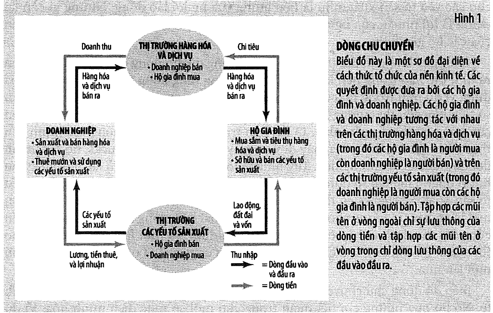
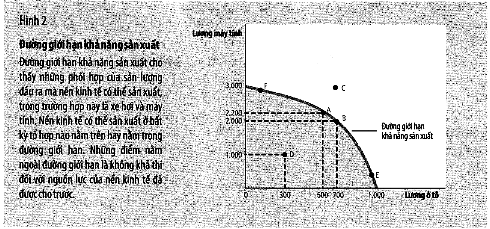
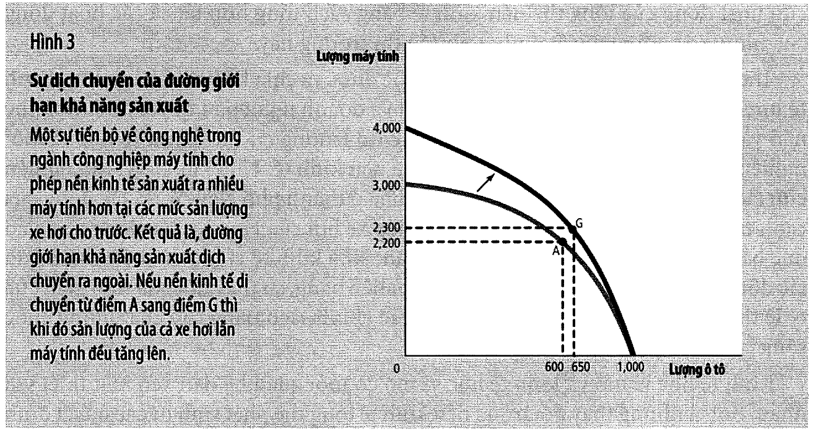

# Bài 0 — Từ vi mô sang vĩ mô

> Bài cầu nối, dựng từ **Chương 1 — Mười nguyên lý của kinh tế học** (tr. 3–26) và
> **Chương 2 — Suy nghĩ như một nhà kinh tế học** (tr. 27–57)
> của *N. Gregory Mankiw — **Kinh tế học vĩ mô***, bản dịch của Khoa Kinh tế, **ĐH Kinh tế TP.HCM** (Cengage Learning Asia).
> 🔸 **Vòng 2 — đọc hiểu, không cần học thuộc.** Chín chương đầu của sách vĩ mô **trùng nội dung**
> với sách vi mô mà bạn đã học ở môn [EG13](../../%5BEG13%5D.kinhtevimo-micro/README.md). Bài này
> **không dạy lại** chúng — nó chỉ lấy ra đúng những mảnh sẽ dùng tiếp, và chỉ chỗ tra lại phần còn lại.
> 💼 **Góc QTKD** — ví dụ thêm cho ngành quản trị kinh doanh, **không có trong sách**.
> ⚠️ — chỗ dễ hiểu sai, hoặc chỗ sách in sai.
> 📌 **Đọc bài này trong 30 phút, rồi sang [bài 1](bai_01_do_luong_thu_nhap_quoc_gia.md).**

---

## Mục lục

<!-- MUC-LUC -->

- [1. Vì sao có bài số 0](#1-vì-sao-có-bài-số-0)
- [2. Chương 1–9 đã học ở đâu](#2-chương-19-đã-học-ở-đâu)
- [3. ⚠️ Hai chỗ dễ gây nhầm ngay từ đầu](#3--hai-chỗ-dễ-gây-nhầm-ngay-từ-đầu)
- [4. Sơ đồ chu chuyển — nền móng của GDP](#4-sơ-đồ-chu-chuyển--nền-móng-của-gdp)
- [5. Đường giới hạn khả năng sản xuất — nền móng của "ngắn hạn / dài hạn"](#5-đường-giới-hạn-khả-năng-sản-xuất--nền-móng-của-ngắn-hạn--dài-hạn)
- [6. Tăng trưởng kinh tế = đường dịch ra ngoài — Hình 3, tr. 35](#6-tăng-trưởng-kinh-tế--đường-dịch-ra-ngoài--hình-3-tr-35)
- [7. Vi mô và vĩ mô khác nhau ở đâu](#7-vi-mô-và-vĩ-mô-khác-nhau-ở-đâu)
- [8. Nguyên lý 8 — mức sống phụ thuộc năng suất](#8-nguyên-lý-8--mức-sống-phụ-thuộc-năng-suất)
- [9. Nguyên lý 9 — giá cả tăng khi chính phủ in quá nhiều tiền](#9-nguyên-lý-9--giá-cả-tăng-khi-chính-phủ-in-quá-nhiều-tiền)
- [10. Nguyên lý 10 — đánh đổi ngắn hạn giữa lạm phát và thất nghiệp](#10-nguyên-lý-10--đánh-đổi-ngắn-hạn-giữa-lạm-phát-và-thất-nghiệp)
- [11. 📚 Vai trò của giả định — vì sao vĩ mô có **hai** bộ mô hình](#11--vai-trò-của-giả-định--vì-sao-vĩ-mô-có-hai-bộ-mô-hình)
- [12. 💼 Góc QTKD — đường giới hạn khả năng sản xuất của một doanh nghiệp](#12--góc-qtkd--đường-giới-hạn-khả-năng-sản-xuất-của-một-doanh-nghiệp)
- [13. Bản đồ toàn môn học](#13-bản-đồ-toàn-môn-học)
- [14. Code minh hoạ](#14-code-minh-hoạ)
- [15. Tự thử](#15-tự-thử)
- [16. Từ điển thuật ngữ](#16-từ-điển-thuật-ngữ)
- [17. Câu hỏi tự kiểm tra](#17-câu-hỏi-tự-kiểm-tra)
- [Tóm tắt một trang](#tóm-tắt-một-trang)
- [Nguồn](#nguồn)

<!-- /MUC-LUC -->

---

## 1. Vì sao có bài số 0

Bạn cầm một cuốn sách 23 chương. Nhưng **chín chương đầu bạn đã học rồi** — chúng là chín chương đầu
của cuốn *Kinh tế học vi mô* trong môn EG13, gần như từng chữ.

Vậy bài này làm ba việc, và chỉ ba việc:

```
   ① CHỈ CHỖ:  chương 1–9 tương ứng bài nào của EG13, để bạn tra khi cần
   ② LẤY RA:   ba mảnh của chương 1–2 mà phần vĩ mô dùng lại LIÊN TỤC
                 — sơ đồ chu chuyển, đường giới hạn khả năng sản xuất, nguyên lý 8–9–10
   ③ ĐẶT BẢN ĐỒ: vì sao môn này chia làm hai khối "dài hạn" và "ngắn hạn"
```

Nếu bạn còn nhớ rõ EG13, đọc mục 2 rồi nhảy thẳng xuống mục 8. Nếu đã quên, đọc hết — vẫn nhanh hơn
đọc lại chín chương.

---

## 2. Chương 1–9 đã học ở đâu

|  Ch. | Tên chương (sách vĩ mô)                        |  tr. | Đã học ở EG13                                                                                      | Vĩ mô dùng lại ở đâu                     |
| ---: | ---------------------------------------------- | ---: | -------------------------------------------------------------------------------------------------- | ---------------------------------------- |
|    1 | Mười nguyên lý của kinh tế học                 |    3 | [bài 1](../../%5BEG13%5D.kinhtevimo-micro/ly_thuyet/bai_01_muoi_nguyen_ly_va_tu_duy_kinh_te.md)    | **nguyên lý 8–9–10 là vĩ mô** → mục 8–10 |
|    2 | Suy nghĩ như một nhà kinh tế học               |   27 | [bài 1](../../%5BEG13%5D.kinhtevimo-micro/ly_thuyet/bai_01_muoi_nguyen_ly_va_tu_duy_kinh_te.md)    | sơ đồ chu chuyển + PPF → mục 4–6         |
|    3 | Sự phụ thuộc lẫn nhau và lợi ích từ thương mại |   58 | [bài 14](../../%5BEG13%5D.kinhtevimo-micro/ly_thuyet/bai_14_thuong_mai_ngoai_tac_hang_hoa_cong.md) | nền của bài 9–10 (kinh tế mở)            |
|    4 | Các lực lượng cung và cầu trên thị trường      |   77 | [bài 2](../../%5BEG13%5D.kinhtevimo-micro/ly_thuyet/bai_02_cung_va_cau.md)                         | **mọi** thị trường vĩ mô                 |
|    5 | Độ co giãn và ứng dụng                         |  102 | [bài 3](../../%5BEG13%5D.kinhtevimo-micro/ly_thuyet/bai_03_do_co_gian_va_dinh_gia.md)              | ít dùng lại ở phần vĩ mô                 |
|    6 | Cung, cầu và chính sách chính phủ              |  126 | [bài 13](../../%5BEG13%5D.kinhtevimo-micro/ly_thuyet/bai_13_chinh_phu_can_thiep_thi_truong.md)     | giá sàn → tiền lương tối thiểu, bài 6    |
|    7 | Người tiêu dùng, nhà sản xuất và hiệu quả      |  150 | [bài 4](../../%5BEG13%5D.kinhtevimo-micro/ly_thuyet/bai_04_thang_du_va_chi_phi_cua_thue.md)        | thặng dư → bài 4 (thị trường vốn vay)    |
|    8 | Ứng dụng: chi phí của thuế                     |  174 | [bài 4](../../%5BEG13%5D.kinhtevimo-micro/ly_thuyet/bai_04_thang_du_va_chi_phi_cua_thue.md)        | tổn thất vô ích                          |
|    9 | Ứng dụng: thương mại quốc tế                   |  190 | [bài 14](../../%5BEG13%5D.kinhtevimo-micro/ly_thuyet/bai_14_thuong_mai_ngoai_tac_hang_hoa_cong.md) | nền của bài 9–10                         |

### ⚠️ Số trang hai cuốn **lệch nhau** — đừng tra nhầm

| Chương         | Sách vi mô (EG13) | Sách vĩ mô (EG14) |
| -------------- | ----------------- | ----------------- |
| 5 — Độ co giãn | tr. **103**–126   | tr. **102**–125   |
| 6 — Chính sách | tr. **127**       | tr. **126**       |
| 7 — Thặng dư   | tr. **153**       | tr. **150**       |

📌 **Mọi trích dẫn trang trong môn này đều theo sách vĩ mô** (`tai_lieu/Kinh te hoc Vi mo (MacroEconomics)_Mankiw.pdf`,
với quy đổi **trang sách N = trang PDF N + 35**).

---

## 3. ⚠️ Hai chỗ dễ gây nhầm ngay từ đầu

### ① Tên tệp trong kho ghi sai

```
   tai_lieu/Kinh te hoc Vi mo (MacroEconomics)_Mankiw.pdf
                        ^^^^^  ^^^^^^^^^^^^^^
                        "Vi mô"  nhưng ngoặc ghi "MacroEconomics"
```

Nội dung là **MacroEconomics — Kinh tế học *vĩ* mô**. Bìa sách và phần đầu tiên (Phần IV, tr. 215)
xác nhận điều đó. Tên tệp giữ nguyên để khỏi làm hỏng các liên kết đã có.

### ② Sách in nhầm ở tr. 36 — ngay chỗ định nghĩa hai môn

Trang 36 có hai chú thích chân trang đánh số 1 và 2. Đây là những gì sách **in ra**:

> 1. **Kinh tế học vi mô** — môn học nghiên cứu quá trình ra quyết định của các hộ gia đình và doanh
>    nghiệp, và tương tác của họ trên các thị trường.
> 2. **Kinh tế học vi mô** — môn học nghiên cứu những hiện tượng tổng quát của nền kinh tế, bao gồm
>    lạm phát, thất nghiệp và tăng trưởng kinh tế.

⚠️ **Chú thích 2 phải là "Kinh tế học *vĩ* mô".** Cả hai chú thích cùng in "vi mô".

Không cần đoán — **chính đoạn văn trên cùng trang đó** viết đúng:

> *"**Kinh tế học vi mô** nghiên cứu các hộ gia đình và doanh nghiệp ra quyết định như thế nào và tương
> tác với nhau ra sao trên các thị trường cụ thể. **Kinh tế học vĩ mô** nghiên cứu các hiện tượng
> trong tổng thể nền kinh tế."* — tr. 36

📌 Lỗi này chỉ là lỗi in, nhưng nó nằm đúng ở định nghĩa của môn bạn đang học, nên đáng ghi lại. Trong
cả môn này, khi cần định nghĩa hai môn, hãy dùng đoạn văn tr. 36 chứ đừng dùng chú thích.

---

## 4. Sơ đồ chu chuyển — nền móng của GDP

Sách gọi đây là **"mô hình đầu tiên"** (tr. 30). Nó rút cả nền kinh tế xuống **hai nhóm ra quyết định**
và **hai thị trường**.

```
      ┌──────────────────────────────────────────────────┐
      │        THỊ TRƯỜNG HÀNG HOÁ VÀ DỊCH VỤ            │
      │        doanh nghiệp BÁN · hộ gia đình MUA        │
      └──────────────────────────────────────────────────┘
        doanh thu ↗                          ↖ chi tiêu
      ┌──────────────┐                     ┌─────────────┐
      │ DOANH NGHIỆP │                     │ HỘ GIA ĐÌNH │
      └──────────────┘                     └─────────────┘
   lương, tiền thuê, ↘                     ↙ thu nhập
        lợi nhuận
      ┌──────────────────────────────────────────────────┐
      │        THỊ TRƯỜNG CÁC YẾU TỐ SẢN XUẤT            │
      │        hộ gia đình BÁN · doanh nghiệp MUA        │
      └──────────────────────────────────────────────────┘
```

> **Sơ đồ chu chuyển** (*circular-flow diagram*): biểu đồ biểu thị dòng tiền luân chuyển thông qua các
> thị trường, giữa các hộ gia đình và doanh nghiệp. — chú thích tr. 31



Chú ý **hai vòng chạy ngược chiều nhau** (tr. 31):

| Vòng           | Chảy cái gì                            | Chiều           |
| -------------- | -------------------------------------- | --------------- |
| vòng **trong** | đầu vào và đầu ra (hàng hoá, lao động) | một chiều       |
| vòng **ngoài** | **tiền**                               | chiều ngược lại |

### Ví dụ Starbucks — tr. 32

Sách theo một đồng tiền đi hết một vòng: từ túi bạn → quầy thu tiền Starbucks (thành **doanh thu**) →
Starbucks trả tiền thuê mặt bằng và lương nhân viên (thành **thu nhập** của một hộ gia đình khác) →
lại vào túi ai đó → bắt đầu lại.

> *"Trong bất kỳ trường hợp nào thì dòng tiền cũng trở thành thu nhập của một vài hộ gia đình, và một
> lần nữa, nó lại đi vào túi của ai đó."*

### ⭐ Hai điều mang thẳng sang phần vĩ mô

**① Cắt vòng tròn ở đâu cũng ra cùng một số.**

Đây chính là lý do [bài 1](bai_01_do_luong_thu_nhap_quoc_gia.md) có thể nói *"GDP đo đồng thời tổng
thu nhập và tổng chi tiêu"*. Nó không phải một phát hiện sâu sắc — nó là **hình học của sơ đồ này**.

**② Sơ đồ này cố tình bỏ sót hai thứ.**

Sách nói thẳng (tr. 32): mô hình *"bỏ qua… vai trò của chính phủ và thương mại quốc tế"*, và giải thích
tại sao bỏ được: *"những chi tiết này không quan trọng khi tìm hiểu một cách cơ bản xem một nền kinh tế
được tổ chức như thế nào."*

📌 Bài 1 sẽ **thêm cả hai vào**, và kết quả là $Y = C + I + G + NX$.

---

## 5. Đường giới hạn khả năng sản xuất — nền móng của "ngắn hạn / dài hạn"

**Mô hình thứ hai** của sách (tr. 32). Nền kinh tế đồ chơi chỉ sản xuất **ô tô** và **máy tính**.

> **Đường giới hạn khả năng sản xuất** (*production possibilities frontier*): một đồ thị biểu thị những
> phối hợp khác nhau của sản lượng đầu ra mà nền kinh tế có thể sản xuất — trong trường hợp này là ô tô
> và máy tính — khi sử dụng các yếu tố và công nghệ sản xuất sẵn có.

Hai trường hợp cực đoan (tr. 32):

```
   dồn hết nguồn lực vào ô tô     →  1.000 ô tô,       0 máy tính
   dồn hết nguồn lực vào máy tính →      0 ô tô,   3.000 máy tính
```

### Năm điểm trên Hình 2, tr. 33



| Điểm  |  Ô tô | Máy tính | Vị trí          | Ý nghĩa                               |
| :---: | ----: | -------: | --------------- | ------------------------------------- |
|   A   |   600 |    2.200 | **trên** đường  | hiệu quả                              |
|   B   |   700 |    2.000 | **trên** đường  | hiệu quả                              |
|   C   |   700 |    2.800 | **ngoài** đường | **bất khả thi** với công nghệ hiện có |
|   D   |   300 |    1.000 | **trong** đường | **không hiệu quả**                    |
|   E   | 1.000 |        0 | **trên** đường  | hiệu quả, cực đoan                    |

### Chi phí cơ hội chính là độ dốc

Đi từ **A** sang **B**: được thêm **100 ô tô**, mất **200 máy tính**.

$$\text{Chi phí cơ hội của 1 ô tô} = \frac{200 \text{ máy tính}}{100 \text{ ô tô}} = 2 \text{ máy tính}$$

Sách in đúng con số này (tr. 34): *"tại điểm A, chi phí cơ hội của 100 chiếc xe hơi là 200 chiếc máy
tính. Nói cách khác, chi phí cơ hội của mỗi chiếc xe hơi là hai chiếc máy tính."* Và:

> *"Để ý một chút chúng ta thấy chi phí cơ hội của một chiếc xe hơi **chính là độ dốc của đường giới hạn
> khả năng sản xuất**."*

### ⚠️ Vì sao đường **cong ra ngoài**

Vì chi phí cơ hội **không cố định**. Lý do là **nguồn lực không đồng nhất** (tr. 34):

```
   gần điểm E (nhiều ô tô, ít máy tính): đường RẤT DỐC     → ô tô ĐẮT
   gần điểm F (ít ô tô, nhiều máy tính): đường BẰNG PHẲNG  → ô tô RẺ
```

Lập luận của sách rất cụ thể: ở điểm F, những nguồn lực *"lẽ ra được sử dụng tốt nhất ở ngành công nghiệp
xe hơi, ví dụ như công nhân sản xuất xe hơi lành nghề, lại phải đi làm việc ở ngành công nghiệp máy tính.
Bởi vì những người công nhân này không giỏi chế tạo máy tính, nền kinh tế sẽ không phải hy sinh nhiều máy
tính để sản xuất thêm một chiếc xe hơi."*

### ⭐⭐ Điểm D là cầu nối quan trọng nhất sang phần vĩ mô

Sách giải thích vì sao D không hiệu quả (tr. 33):

> *"Điểm D biểu thị một kết quả **không hiệu quả**. Có lẽ vì một vài lý do nào đó, ví dụ như **tình trạng
> thất nghiệp lan rộng**, nền kinh tế sản xuất ít hơn khả năng mà nó có thể đạt được."*

Đọc kỹ câu đó, vì nó chứa toàn bộ cấu trúc của môn học còn lại:

```
   ┌──────────────────────────────────────────────────────────────────────┐
   │  SUY THOÁI       =  nền kinh tế bị đẩy vào BÊN TRONG đường           │
   │                     (điểm D — nguồn lực bỏ không, người thất nghiệp) │
   │                     → bài 6, 11, 12, 13                              │
   │                                                                      │
   │  TĂNG TRƯỞNG     =  cả ĐƯỜNG dịch RA NGOÀI                           │
   │  DÀI HẠN            (mục 6 dưới đây)                                 │
   │                     → bài 3, 4, 5                                    │
   └──────────────────────────────────────────────────────────────────────┘
```

📌 Hai chuyện đó **khác nhau về bản chất**, cần **hai bộ mô hình khác nhau** — và đó chính xác là điều
sách nói ở [bài 1 mục 11](bai_01_do_luong_thu_nhap_quoc_gia.md#11-gdp-thực-hoa-kỳ-và-suy-thoái--hình-2-tr-229).

---

## 6. Tăng trưởng kinh tế = đường dịch ra ngoài — Hình 3, tr. 35



Tiến bộ công nghệ trong ngành **máy tính**: đầu mút máy tính đi từ **3.000 lên 4.000**. Đầu mút ô tô
**giữ nguyên 1.000** — vì nếu không sản xuất máy tính nào thì tiến bộ ngành máy tính chẳng giúp gì.

| Điểm     |    Ô tô | Máy tính | Trên đường nào |
| -------- | ------: | -------: | -------------- |
| A        |     600 |    2.200 | đường cũ       |
| G        |     650 |    2.300 | đường mới      |
| Thay đổi | **+50** | **+100** |                |

⭐ **Cả hai cùng tăng.** Đây là định nghĩa trực quan của tăng trưởng kinh tế: không phải "sản xuất nhiều
thứ này và ít thứ kia", mà là **nhiều hơn ở cả hai**.

> *"Hình này minh họa một sự **tăng trưởng kinh tế**. Xã hội có thể chuyển đổi sản xuất từ một điểm trên
> đường giới hạn khả năng sản xuất cũ sang một đường mới. Điểm nào được chọn phụ thuộc vào sự ưa thích
> tùy theo hai loại hàng hóa."* — tr. 35

📌 [Bài 3](bai_03_san_xuat_va_tang_truong.md) sẽ hỏi: **cái gì làm đường này dịch ra ngoài?** Câu trả lời
là **năng suất**, và bốn yếu tố quyết định nó.

Sách tổng kết vai trò của mô hình PPF rất gọn (tr. 35): nó *"đưa ra những ý tưởng tuy cơ bản nhưng rất
quan trọng: sự khan hiếm, tính hiệu quả, sự đánh đổi, chi phí cơ hội và tăng trưởng kinh tế."*

---

## 7. Vi mô và vĩ mô khác nhau ở đâu

Sách dùng một ẩn dụ sinh học (tr. 35): nhà sinh vật học **phân tử** nghiên cứu thành phần hoá học, nhà
sinh vật học **tế bào** nghiên cứu tế bào, nhà sinh vật học **tiến hoá** nghiên cứu các loài. Cùng một
đối tượng, ba cấp độ.

|                         | **Kinh tế học vi mô**                                                                                                  | **Kinh tế học vĩ mô**                                                                                                                   |
| ----------------------- | ---------------------------------------------------------------------------------------------------------------------- | --------------------------------------------------------------------------------------------------------------------------------------- |
| Nghiên cứu              | hộ gia đình và doanh nghiệp ra quyết định, tương tác trên **thị trường cụ thể**                                        | các hiện tượng trong **tổng thể** nền kinh tế                                                                                           |
| Ví dụ của sách (tr. 36) | kiểm soát giá thuê nhà ở New York · cạnh tranh nước ngoài lên công nghiệp xe hơi Mỹ · giáo dục bắt buộc lên tiền lương | vay mượn của chính phủ liên bang · thay đổi của tỷ lệ thất nghiệp qua thời gian · chính sách nâng cao chất lượng cuộc sống một quốc gia |

### ⭐ Nhưng hai môn **không tách rời**

Sách nói rất rõ (tr. 36):

> *"Bởi vì những thay đổi trong nền kinh tế tổng thể **phát sinh từ các quyết định của hàng triệu cá
> nhân**, chúng ta không thể nắm bắt được quá trình phát triển kinh tế vĩ mô mà không quan tâm gì đến
> những quyết định kinh tế vi mô có liên quan."*

Ví dụ của sách: nhà kinh tế vĩ mô muốn biết tác động của cắt giảm thuế thu nhập liên bang lên sản xuất
hàng hoá và dịch vụ. *"Nhưng để phân tích vấn đề này, họ phải nghiên cứu xem cắt giảm thuế ảnh hưởng như
thế nào đến việc chi tiêu cho các hàng hóa và dịch vụ của các hộ gia đình."*

⚠️ Vậy nên đừng nghĩ bạn đang bắt đầu một môn mới từ số không. **Bạn đang dùng cùng bộ công cụ trên một
đối tượng lớn hơn.**

---

## 8. Nguyên lý 8 — mức sống phụ thuộc năng suất

> *"Mức sống của một nước phụ thuộc vào năng lực sản xuất hàng hóa và dịch vụ của nước đó."* — tr. 16

Số liệu năm **2008** mà sách đưa (tr. 16):

| Nước    | Thu nhập bình quân | So với Nigeria |
| ------- | -----------------: | -------------: |
| Hoa Kỳ  |         47.000 USD | **gấp 34 lần** |
| Mexico  |         10.000 USD |      gấp 7 lần |
| Nigeria |          1.400 USD |             1× |

> **Năng suất** (*productivity*): số lượng hàng hóa và dịch vụ được sản xuất ra từ một đơn vị lao động.
> — chú thích tr. 17

### ⚠️ Hai "thủ phạm" bị sách loại trừ thẳng thừng — tr. 17

Đây là phần đáng đọc nhất của nguyên lý 8, vì nó bác bỏ hai lời giải thích rất phổ biến:

**① Không phải nghiệp đoàn hay luật tiền lương tối thiểu.**

> *"Chẳng hạn, người ta có thể cho rằng nghiệp đoàn hoặc luật về tiền lương tối thiểu có đóng góp làm
> tăng mức sống của công nhân Hoa Kỳ trong thế kỷ qua. Song **người anh hùng thật sự của công nhân Hoa
> Kỳ là năng suất lao động ngày càng tăng lên của họ**."*

**② Không phải cạnh tranh từ Nhật Bản trong thập niên 1970–80.**

> *"…một số nhà bình luận cho rằng nguyên nhân dẫn tới mức tăng trưởng chậm trong thu nhập của Hoa Kỳ
> trong thập niên 1970 và 1980 là sự cạnh tranh tăng lên từ Nhật và các nước khác. Nhưng **thủ phạm thực
> sự không phải là sự cạnh tranh từ nước ngoài, mà chính là sự tăng trưởng chậm của năng suất ở Hoa Kỳ**."*

📌 💼 Cùng lối tư duy áp cho doanh nghiệp: khi biên lợi nhuận co lại, câu trả lời quen thuộc là *"đối thủ
phá giá"*. Có thể đúng. Nhưng câu hỏi cần hỏi trước là **năng suất của chính bạn có tăng không** — vì đó
là biến bạn kiểm soát được.

### Hệ quả chính sách

> *"Khi suy nghĩ xem một chính sách sẽ tác động như thế nào đến mức sống, vấn đề then chốt là ở chỗ nó
> sẽ tác động tới **năng lực sản xuất hàng hóa và dịch vụ** như thế nào."* — tr. 17

📌 Cả [bài 3](bai_03_san_xuat_va_tang_truong.md) là phần khai triển đầy đủ của một nguyên lý này.

---

## 9. Nguyên lý 9 — giá cả tăng khi chính phủ in quá nhiều tiền

> **Lạm phát** (*inflation*): sự gia tăng của mức giá chung trong nền kinh tế. — chú thích tr. 17

Ví dụ kinh điển của sách — **Đức, đầu thập niên 1920** (tr. 17):

```
   tháng  1/1921:  một tờ nhật báo giá        0,3 mark
   tháng 11/1922:  cũng tờ báo ấy giá  70.000.000 mark
```

Mục 5 của [code minh hoạ](#14-code-minh-hoạ) tính ra: **22 tháng, giá tăng 233.333.333 lần**, tức trung
bình **giá nhân 2,40 lần mỗi tháng**.

Sách viết ở tr. 18: *"Vào đầu những năm 1920, khi giá cả ở Đức tăng **gấp 3 lần mỗi tháng**, lượng tiền
cũng tăng gấp 3 lần mỗi tháng."*

⚠️ **2,40 thấp hơn 3 — có mâu thuẫn không?** Không. Siêu lạm phát **không đều**: tháng đầu còn nhẹ, tháng
cuối kinh khủng. Code kiểm điều đó theo chiều ngược lại: nếu 10 tháng cuối đúng là gấp 3 lần/tháng, thì
12 tháng đầu phải chạy ở **1,99 lần/tháng**. Cả hai đều hợp lý cho một đợt siêu lạm phát đang tăng tốc,
và chúng **nhất quán** với hai đầu mút giá mà sách in ra.

### Thủ phạm

> *"Nguyên nhân gây ra lạm phát là gì? Trong hầu hết các trường hợp lạm phát trầm trọng hoặc kéo dài,
> **dường như đều có chung một thủ phạm: sự gia tăng của lượng tiền**."* — tr. 18

Và bằng chứng đối chiếu ngay trong lịch sử Hoa Kỳ (tr. 18):

| Thời kỳ        | Lạm phát | Lượng tiền               |
| -------------- | -------- | ------------------------ |
| những năm 1970 | cao      | gia tăng **nhanh chóng** |
| những năm 1990 | thấp     | gia tăng **chậm**        |

📌 [Bài 8](bai_08_tang_truong_tien_va_lam_phat.md) sẽ đưa ra **cơ chế** (lý thuyết số lượng tiền). Ở đây
chỉ cần nhớ một dòng: **lạm phát cao kéo dài luôn đi kèm cung tiền tăng nhanh — không có ngoại lệ lớn.**

---

## 10. Nguyên lý 10 — đánh đổi ngắn hạn giữa lạm phát và thất nghiệp

> *"Xã hội đối mặt với sự đánh đổi **ngắn hạn** giữa lạm phát và thất nghiệp."* — tr. 18

### ⭐ Chuỗi suy luận ba bước — học thuộc chuỗi này

Sách trình bày đúng ba bước (tr. 18):

```
   ①  Tăng số lượng tiền  →  kích thích TỔNG CHI TIÊU
                          →  kích thích CẦU hàng hoá và dịch vụ
   ②  Cầu cao hơn         →  công ty TĂNG GIÁ,
                             nhưng cùng lúc THUÊ THÊM lao động
   ③  Thuê thêm lao động  →  TỶ LỆ THẤT NGHIỆP THẤP HƠN
   ─────────────────────────────────────────────────────────
   ⟹  lạm phát CAO hơn đi kèm thất nghiệp THẤP hơn — TRONG NGẮN HẠN
```

Bài 11, 12, 13 dùng lại nguyên chuỗi này, chỉ thêm đồ thị.

### ⚠️ Ba chữ "trong ngắn hạn" là tất cả

Nguyên lý 9 nói về **dài hạn** và nói ngược lại: in tiền chỉ làm tăng giá, không tạo thêm việc làm.
Nguyên lý 10 nói về **ngắn hạn**. Chúng **không mâu thuẫn** — chúng nói về hai khung thời gian khác nhau.

Sách nói thẳng ngay ở câu mở đầu (tr. 18): *"Mặc dù trong dài hạn, mức giá cao hơn chủ yếu là do sự gia
tăng lượng cung tiền, **mối quan hệ này trong ngắn hạn phức tạp và nhiều tranh cãi hơn**."*

📌 Đây chính là lý do môn học chia làm hai khối:

```
   bài  3–10   DÀI HẠN   giá cả linh hoạt, tiền chỉ ảnh hưởng mức giá
   bài 11–13   NGẮN HẠN  giá cả cứng nhắc, tiền ảnh hưởng cả sản lượng
```

### Công cụ chính sách

> *"Bằng cách thay đổi **số tiền chính phủ chi tiêu**, **số tiền chính phủ thu thuế**, và **lượng tiền
> in ra**, các nhà hoạch định chính sách có thể tác động đến tổng cầu hàng hóa và dịch vụ."* — tr. 18

| Công cụ                   | Tên gọi                 | Học ở     |
| ------------------------- | ----------------------- | --------- |
| chi tiêu chính phủ + thuế | **chính sách tài khoá** | bài 12    |
| lượng tiền                | **chính sách tiền tệ**  | bài 7, 12 |

### 📚 Ví dụ thời sự của sách — khủng hoảng 2008–2009, tr. 20

Sách kể lại phản ứng chính sách của Hoa Kỳ: gói kích thích của Tổng thống Obama (**cắt giảm thuế và tăng
chi tiêu chính phủ** — tài khoá), đồng thời Cục Dự trữ Liên bang **tăng cung tiền** (tiền tệ). Rồi ghi
lại mối lo đi kèm:

> *"Tuy nhiên, nhiều người lo ngại rằng những chính sách này theo thời gian có thể dẫn đến một mức độ
> **lạm phát quá mức**."*

⭐ Đó chính là sự đánh đổi ở nguyên lý 10, xảy ra ngoài đời thật, trong khoảng thời gian sách được viết.

---

## 11. 📚 Vai trò của giả định — vì sao vĩ mô có **hai** bộ mô hình

Mục này (tr. 29–30) trả lời một câu hỏi mà sinh viên hay thấy khó chịu: *"sao chỗ này bảo giá cứng, chỗ
kia bảo giá linh hoạt?"*

Sách mở bằng vật lý: hỏi một nhà vật lý viên đá cẩm thạch rơi từ toà nhà mười tầng mất bao lâu, cô ấy sẽ
giả định **rơi trong chân không**. Giả định đó **không chính xác** — có không khí, có ma sát — nhưng ma
sát lên viên đá nhỏ nên **ảnh hưởng không đáng kể**.

⚠️ Nhưng đổi vật thể thì phải đổi giả định:

> *"Nhà vật lý sẽ nhận ra ngay rằng giả định không có ma sát không còn chính xác trong trường hợp này:
> lực ma sát tác động lên quả bóng sẽ lớn hơn so với viên đá bởi vì quả bóng lớn hơn nhiều. **Giả định
> về lực hấp dẫn trong trường hợp thả viên đá là hợp lý nhưng không thể áp dụng trong nghiên cứu với
> quả bóng.**"* — tr. 29

### ⭐ Áp thẳng vào môn học này — tr. 30

> *"Ví dụ như khi nghiên cứu tác động trong **ngắn hạn**, chúng ta có thể giả định rằng **giá cả không
> thay đổi nhiều**. Chúng ta thậm chí có thể đưa ra các giả định mang tính giả tưởng và cực đoan rằng
> giá cả là hoàn toàn cố định. Khi nghiên cứu tác động của chính sách trong **dài hạn**, chúng ta có thể
> giả định rằng giá cả là **hoàn toàn linh hoạt**."*

```
   viên đá  → bỏ qua ma sát        ‖  dài hạn  → giá cả LINH HOẠT
   quả bóng → phải tính ma sát     ‖  ngắn hạn → giá cả CỨNG NHẮC
```

📌 Vậy nên khi bài 8 nói *"in tiền chỉ làm tăng giá"* và bài 12 nói *"in tiền làm tăng sản lượng"*, không
bài nào sai. Chúng đang thả **hai vật thể khác nhau**.

💼 Điều này cũng đúng với mô hình kinh doanh của bạn: một mô hình dự báo doanh thu tuần tới và một mô hình
dự báo doanh thu năm năm tới **phải** có giả định khác nhau. Dùng nhầm mô hình là lỗi phổ biến hơn nhiều
so với xây mô hình sai.

---

## 12. 💼 Góc QTKD — đường giới hạn khả năng sản xuất của một doanh nghiệp

PPF không chỉ dành cho quốc gia. Mục 8 của [code minh hoạ](#14-code-minh-hoạ) dựng một xưởng có **2.000
giờ máy/tháng**, sản phẩm A tốn 2 giờ, sản phẩm B tốn 5 giờ.

### ⚠️ Đường giới hạn của doanh nghiệp là một đường **thẳng**

```
   quốc gia:      nguồn lực KHÔNG đồng nhất  →  chi phí cơ hội THAY ĐỔI  →  đường CONG
   xưởng một máy: cùng một nguồn lực (giờ máy) →  chi phí cơ hội CỐ ĐỊNH  →  đường THẲNG
```

Với chi phí cơ hội cố định (0,4 sản phẩm B cho mỗi A), tối ưu **luôn nằm ở một đầu mút**. Con số cần nhìn
không phải lợi nhuận trên mỗi sản phẩm, mà **lợi nhuận trên mỗi giờ máy**:

| Sản phẩm | Lợi nhuận gộp | Giờ máy | **Lợi nhuận / giờ máy** |
| -------- | ------------: | ------: | ----------------------: |
| A        |      90.000 đ |       2 |            **45.000 đ** |
| B        |     260.000 đ |       5 |            **52.000 đ** |

⭐ **B thắng, dù lợi nhuận gộp mỗi đơn vị nhìn có vẻ "nặng" hơn hẳn.** Quyết định đúng là dồn hết giờ máy
vào B.

### ⚠️ Nhưng đừng dừng ở đó

Kết luận "dồn hết vào sản phẩm có biên lợi nhuận cao nhất trên nguồn lực ràng buộc" chỉ đúng khi **nguồn
lực thay thế được hoàn toàn** — hiếm khi đúng trong thực tế. Doanh nghiệp càng lớn, càng nhiều loại nguồn
lực (máy khác nhau, kỹ năng khác nhau, kênh bán khác nhau) thì đường giới hạn càng **cong**, và tối ưu
càng dịch vào **giữa** thay vì nằm ở đầu mút.

📌 Đây đúng là lập luận của sách ở tr. 34, chỉ đổi "quốc gia" thành "doanh nghiệp".

---

## 13. Bản đồ toàn môn học

Sau bài này, mười bốn bài còn lại xếp thành ba khối:

```
   ┌── ĐO LƯỜNG ─────────────────────────────────────────────────────┐
   │  bài 1  GDP           đo SẢN LƯỢNG                              │
   │  bài 2  CPI           đo GIÁ CẢ                                 │
   └─────────────────────────────────────────────────────────────────┘
                                 ↓
   ┌── DÀI HẠN — đường giới hạn DỊCH RA NGOÀI ───────────────────────┐
   │  bài 3  tăng trưởng và năng suất                                │
   │  bài 4  tiết kiệm, đầu tư, thị trường vốn vay                   │
   │  bài 5  công cụ tài chính (giá trị hiện tại, rủi ro)            │
   │  bài 6  thất nghiệp                                             │
   │  bài 7  hệ thống tiền tệ                                        │
   │  bài 8  tăng trưởng tiền và lạm phát   ← nguyên lý 9            │
   │  bài 9  kinh tế mở: khái niệm (tỷ giá)                          │
   │  bài 10 kinh tế mở: lý thuyết                                   │
   └─────────────────────────────────────────────────────────────────┘
                                 ↓
   ┌── NGẮN HẠN — nền kinh tế bị đẩy VÀO TRONG đường (điểm D) ───────┐
   │  bài 11 tổng cầu và tổng cung                                   │
   │  bài 12 chính sách tiền tệ và tài khoá  ← nguyên lý 10          │
   │  bài 13 đường Phillips                                          │
   └─────────────────────────────────────────────────────────────────┘
                                 ↓
   ┌── TRANH LUẬN ───────────────────────────────────────────────────┐
   │  bài 14 sáu tranh luận về chính sách vĩ mô                      │
   └─────────────────────────────────────────────────────────────────┘
```

---

## 14. Code minh hoạ

> ⚙️ **Chạy:** cần **Python 3.10+**. Lưu file rồi gõ `python3 bai-00-tu-vi-mo-sang-vi-mo.py`.
> Không cần cài gói nào — chỉ dùng thư viện chuẩn. Kết quả **tất định**.
> Bản đầy đủ nằm ở [`thuc_hanh/bai-00-tu-vi-mo-sang-vi-mo.py`](../thuc_hanh/bai-00-tu-vi-mo-sang-vi-mo.py).

```python
"""Bai 0 — Tu vi mo sang vi mo (Mankiw, Kinh te hoc vi mo, chuong 1-2).
Chay: python3 bai-00-tu-vi-mo-sang-vi-mo.py   (Python 3.10+, khong can cai goi nao)

Bai cau noi: chuong 1-9 cua sach vi mo trung noi dung voi sach vi mo (mon EG13).
File nay chi lam lai NHUNG PHAN se dung tiep o phan vi mo. Ket qua tat dinh.
"""

import math

# ══ 1. SO DO CHU CHUYEN — Hinh 1, tr. 31 ════════════════════════════════════
# Hai nhom ra quyet dinh, hai thi truong, hai vong lap nguoc chieu nhau.
print("1. SO DO CHU CHUYEN — Hinh 1, tr. 31")
print("   Nen kinh te rut gon con HAI nhom ra quyet dinh va HAI thi truong.")
print()
print("""      ┌──────────────────────────────────────────────────┐
      │        THỊ TRƯỜNG HÀNG HOÁ VÀ DỊCH VỤ            │
      │        doanh nghiệp BÁN · hộ gia đình MUA        │
      └──────────────────────────────────────────────────┘
        doanh thu ↗                            ↖ chi tiêu
      ┌──────────────┐                   ┌──────────────┐
      │ DOANH NGHIỆP │                   │  HỘ GIA ĐÌNH │
      └──────────────┘                   └──────────────┘
   lương, tiền thuê, ↘                   ↙ thu nhập
        lợi nhuận
      ┌──────────────────────────────────────────────────┐
      │        THỊ TRƯỜNG CÁC YẾU TỐ SẢN XUẤT            │
      │        hộ gia đình BÁN · doanh nghiệp MUA        │
      └──────────────────────────────────────────────────┘""")
print()
# Vi du cua sach tr. 32: dong tien di tu tui ban -> Starbucks -> luong nhan vien -> ...
CHU_KY = [
    ("Ban",             "Starbucks",      "mua mot tach ca phe",        "thi truong hang hoa"),
    ("Starbucks",       "Nhan vien quan", "tra luong",                  "thi truong yeu to"),
    ("Nhan vien quan",  "Cua hang sach",  "mua mot quyen sach",         "thi truong hang hoa"),
    ("Cua hang sach",   "Chu mat bang",   "tra tien thue",              "thi truong yeu to"),
]
TIEN = 100_000   # dong — theo dung mot khoan tien di het mot vong
print(f"   Theo mot khoan {TIEN:,} dong di het mot vong (vi du cua sach, tr. 32):")
for tu, den, viec, thi_truong in CHU_KY:
    print(f"      {tu:<16} -> {den:<16} {viec:<24} [{thi_truong}]")
print(f"      ... roi lai vao tui mot ai do va bat dau lai.")
print()
print("   ⭐ HAI DIEU MANG SANG PHAN VI MO — ca hai deu la nen cua bai 1:")
print("      ① CAT VONG TRON O DAU CUNG RA CUNG MOT SO. Do la ly do GDP do duoc")
print("         DONG THOI tong thu nhap va tong chi tieu.")
print("      ② Sach noi ro (tr. 32) so do nay BO QUA chinh phu va thuong mai quoc te.")
print("         Bai 1 se them ca hai vao: Y = C + I + G + NX.")
print()

# ══ 2. DUONG GIOI HAN KHA NANG SAN XUAT — Hinh 2, tr. 33 ═══════════════════
# Cac diem sach in ra (tr. 32-34). Khong noi suy — chi dung dung nhung diem nay.
DIEM = {
    "hai dau mut": [(0, 3000), (1000, 0)],
    "A": (600, 2200),
    "B": (700, 2000),
    "C": (700, 2800),    # nam NGOAI duong -> bat kha thi
    "D": (300, 1000),    # nam TRONG duong -> khong hieu qua
    "E": (1000, 0),
    "F": (100, 2900),
}
print("2. DUONG GIOI HAN KHA NANG SAN XUAT — Hinh 2, tr. 33")
print("   Nen kinh te do choi chi san xuat HAI thu: o to va may tinh.")
print()
print("   Hai truong hop cuc doan (tr. 32):")
print("      dat het nguon luc vao o to    ->  1.000 o to,       0 may tinh")
print("      dat het nguon luc vao may tinh->      0 o to,   3.000 may tinh")
print()
print("   diem   o to   may tinh   vi tri              y nghia")
NHAN = [
    ("A", 600, 2200, "TREN duong",   "hieu qua"),
    ("B", 700, 2000, "TREN duong",   "hieu qua"),
    ("C", 700, 2800, "NGOAI duong",  "BAT KHA THI voi cong nghe hien co"),
    ("D", 300, 1000, "TRONG duong",  "KHONG hieu qua — vd that nghiep lan rong"),
    ("E", 1000, 0,   "TREN duong",   "hieu qua, cuc doan"),
]
for ten, xe, mt, vi_tri, y in NHAN:
    print(f"     {ten}    {xe:>4}     {mt:>6}   {vi_tri:<14}      {y}")
print()

# --- Chi phi co hoi doc theo duong -------------------------------------------
print("   CHI PHI CO HOI khi di tu A sang B (tr. 34):")
xe_A, mt_A = DIEM["A"]
xe_B, mt_B = DIEM["B"]
d_xe, d_mt = xe_B - xe_A, mt_B - mt_A
print(f"      o to    {xe_A} -> {xe_B}   ({d_xe:+d})")
print(f"      may tinh {mt_A} -> {mt_B}   ({d_mt:+d})")
print(f"      => chi phi co hoi cua {d_xe} o to la {abs(d_mt)} may tinh")
print(f"      => chi phi co hoi cua MOT o to la {abs(d_mt) / d_xe:.0f} may tinh")
assert abs(d_mt) / d_xe == 2
print("      Sach in dung con so nay: 'chi phi co hoi cua moi chiec xe hoi la hai chiec")
print("      may tinh' (tr. 34).  ✓")
print()
print("   ⭐ Chi phi co hoi CHINH LA DO DOC cua duong gioi han (tr. 34).")
print("      Va vi duong CONG RA NGOAI, do doc — tuc chi phi co hoi — THAY DOI:")
print("         gan diem E (nhieu o to, it may tinh): duong RAT DOC  -> o to DAT")
print("         gan diem F (it o to, nhieu may tinh): duong BANG PHANG -> o to RE")
print("      Ly do (tr. 34): cong nhan gioi lam o to ma bi day sang lam may tinh thi")
print("      hy sinh it may tinh — nen o to 're'. Va nguoc lai.")
print()

# --- Ve duong gioi han bang ky tu -------------------------------------------
# Duong cong ra ngoai, khop hai dau mut cua sach va gan diem A.
XE_MAX, MT_MAX = 1000, 3000

def may_tinh(xe):
    """Duong cong ra ngoai qua (0, 3000) va (1000, 0). Dang minh hoa, khong
    phai cong thuc cua sach — sach chi ve dinh tinh."""
    return MT_MAX * (1 - (xe / XE_MAX) ** 2) ** 0.7

print("   Ve minh hoa (dang cong ra ngoai; sach chi ve dinh tinh):")
print()
CAO, RONG = 15, 52
luoi = [[" "] * RONG for _ in range(CAO)]
for i in range(RONG):
    xe = XE_MAX * i / (RONG - 1)
    r = CAO - 1 - round(may_tinh(xe) / MT_MAX * (CAO - 1))
    luoi[max(0, min(CAO - 1, r))][i] = "●"
# Danh dau cac diem cua sach
for ten, xe, mt, _, _ in NHAN:
    c = round(xe / XE_MAX * (RONG - 1))
    r = CAO - 1 - round(mt / MT_MAX * (CAO - 1))
    if 0 <= r < CAO and 0 <= c < RONG:
        luoi[r][c] = ten
print("   máy tính")
for i, hang in enumerate(luoi):
    v = MT_MAX * (CAO - 1 - i) / (CAO - 1)
    print(f"   {v:>5.0f} │{''.join(hang)}")
print("         └" + "─" * RONG)
print(f"          0{' ' * (RONG - 10)}ô tô {XE_MAX}")
print()
print("   ⚠ DIEM D LA CAU NOI QUAN TRONG NHAT SANG PHAN VI MO.")
print("      Sach viet (tr. 33): D khong hieu qua 'co le vi mot vai ly do nao do, vi du")
print("      nhu TINH TRANG THAT NGHIEP LAN RONG, nen kinh te san xuat it hon kha nang")
print("      ma no co the dat duoc'.")
print("      => Suy thoai = nen kinh te bi DAY VAO BEN TRONG duong gioi han.")
print("      => Tang truong dai han = duong gioi han DICH RA NGOAI  (muc 3).")
print("      Do la toan bo su phan chia 'ngan han / dai han' cua ca mon vi mo.")
print()

# ══ 3. TANG TRUONG = DUONG GIOI HAN DICH RA NGOAI — Hinh 3, tr. 35 ═════════
print("3. TANG TRUONG KINH TE — Hinh 3, tr. 35")
print("   Tien bo cong nghe trong nganh MAY TINH: dau mut may tinh 3.000 -> 4.000,")
print("   dau mut o to giu nguyen 1.000 (khong san xuat may tinh nao thi van chi 1.000 xe).")
print()
CU, MOI = DIEM["A"], (650, 2300)   # diem G cua sach
print("            o to   may tinh")
print(f"   diem A   {CU[0]:>4}     {CU[1]:>6}    (duong cu)")
print(f"   diem G   {MOI[0]:>4}     {MOI[1]:>6}    (duong moi)")
print(f"   thay doi {MOI[0] - CU[0]:>+4}     {MOI[1] - CU[1]:>+6}")
print()
print("   ⭐ CA HAI cung tang. Day chinh la dinh nghia truc quan cua TANG TRUONG KINH TE:")
print("      khong phai 'san xuat nhieu thu nay va it thu kia', ma la 'nhieu HON O CA HAI'.")
print("   📌 Bai 3 se hoi: cai gi lam duong nay dich ra ngoai? Cau tra loi la NANG SUAT,")
print("      va bon yeu to quyet dinh no.")
print()

# ══ 4. NGUYEN LY 8 — MUC SONG PHU THUOC NANG SUAT (tr. 16-17) ══════════════
THU_NHAP_2008 = [("Hoa Ky", 47_000), ("Mexico", 10_000), ("Nigeria", 1_400)]
print("4. NGUYEN LY 8 — 'Muc song cua mot nuoc phu thuoc vao nang luc san xuat")
print("   hang hoa va dich vu cua nuoc do' (tr. 16)")
print()
print("   Thu nhap binh quan nam 2008 (so lieu sach in o tr. 16):")
cao_nhat = max(t for _, t in THU_NHAP_2008)
for ten, tn in THU_NHAP_2008:
    print(f"      {ten:<10} {tn:>7,} USD   {'█' * round(tn / cao_nhat * 47)}")
print(f"      => Hoa Ky gap {THU_NHAP_2008[0][1] / THU_NHAP_2008[2][1]:.0f} lan Nigeria.")
print()
print("   Sach dan nguyen mot cau dinh nghia (chu thich tr. 17):")
print("      'NANG SUAT: so luong hang hoa va dich vu duoc san xuat ra tu MOT DON VI lao dong.'")
print()
print("   ⚠ HAI THU PHAM BI SACH LOAI TRU THANG (tr. 17) — de bi noi sai:")
print("      • KHONG phai nghiep doan hay luat tien luong toi thieu:")
print("        'nguoi anh hung that su cua cong nhan Hoa Ky la NANG SUAT LAO DONG")
print("         ngay cang tang len cua ho'.")
print("      • KHONG phai canh tranh tu Nhat Ban trong thap nien 1970-80:")
print("        'Thu pham thuc su khong phai la su canh tranh tu nuoc ngoai, ma chinh la")
print("         SU TANG TRUONG CHAM CUA NANG SUAT o Hoa Ky'.")
print()
TOC_DO, THE_KY = 0.02, 100
print(f"   Sach cung noi (tr. 16): thu nhap Hoa Ky tang khoang {TOC_DO:.0%}/nam,")
print(f"      'cu 35 nam thu nhap binh quan lai tang gap doi'.")
print(f"      Kiem: 70 / {TOC_DO * 100:.0f} = {70 / (TOC_DO * 100):.0f} nam  ✓")
print(f"      va 'trong the ky qua, thu nhap binh quan da tang gap tam lan'")
print(f"      Kiem: 1,02^{THE_KY} = {(1 + TOC_DO) ** THE_KY:.1f} lan"
      f"  —  can {math.log(8) / math.log(1 + TOC_DO):.0f} nam moi dung 8 lan.")
print("      'Gap tam lan' la cach noi tron; bai 3 se lam ky lai bang Bang 1 tr. 261.")
print()

# ══ 5. NGUYEN LY 9 — GIA CA TANG KHI CHINH PHU IN QUA NHIEU TIEN (tr. 17) ══
# Duc: thang 1/1921 mot to bao gia 0,3 mark; thang 11/1922 gia 70.000.000 mark.
GIA_DAU, GIA_CUOI = 0.3, 70_000_000
SO_THANG = (1922 - 1921) * 12 + (11 - 1)
print("5. NGUYEN LY 9 — 'Gia ca tang khi chinh phu in qua nhieu tien' (tr. 17)")
print()
print(f"   Duc: mot to nhat bao gia {GIA_DAU} mark (1/1921) -> {GIA_CUOI:,} mark (11/1922)")
lan = GIA_CUOI / GIA_DAU
thang = (lan ** (1 / SO_THANG) - 1) * 100
print(f"      {SO_THANG} thang, gia tang {lan:,.0f} LAN")
print(f"      => trung binh {thang:,.0f}%/thang, tuc gia nhan {lan ** (1 / SO_THANG):.2f}"
      f" lan MOI THANG")
print()
print("   Sach viet o tr. 18: 'Vao dau nhung nam 1920, khi gia ca o Duc tang GAP 3 LAN moi")
print("   thang, luong tien cung tang gap 3 lan moi thang.'")
print(f"   ⚠ Con so trung binh ca giai doan ({lan ** (1 / SO_THANG):.2f} lan/thang) THAP HON"
      f" 'gap 3 lan'.")
print("      Khong mau thuan: sieu lam phat KHONG deu — thang dau con nhe, thang cuoi kinh")
print("      khung. Cau cua sach mo ta DINH DIEM, khong phai trung binh.")
print()
print("   Kiem dieu do theo chieu nguoc lai: GIA SU 10 thang CUOI dung la 'gap 3 lan/thang'")
print("   nhu sach mo ta. Vay 12 thang DAU phai chay o toc do nao?")
CUOI, DINH = 10, 3.0
dong_gop_cuoi = DINH ** CUOI
con_lai = lan / dong_gop_cuoi
dau_thang = con_lai ** (1 / (SO_THANG - CUOI))
print(f"      {CUOI} thang cuoi x{DINH:.0f},0  ->  gia tang {dong_gop_cuoi:,.0f} lan")
print(f"      {SO_THANG - CUOI} thang dau phai bu {con_lai:,.0f} lan"
      f"  ->  {dau_thang:.2f} lan/thang  ({(dau_thang - 1) * 100:,.0f}%/thang)")
print(f"      ⭐ {dau_thang:.2f} lan/thang o giai doan dau va {DINH:.0f},0 lan/thang o giai doan")
print("      cuoi — CA HAI deu hop ly cho mot dot sieu lam phat dang tang toc. Cau cua sach")
print("      mo ta DINH DIEM va no NHAT QUAN voi hai dau mut gia ma sach in ra.")
print()
print("   📌 Bai 8 se dua ra CO CHE: ly thuyet so luong tien. O day chi can nho MOT dong:")
print("      LAM PHAT CAO LAU DAI LUON DI KEM TANG CUNG TIEN NHANH — khong co ngoai le lon.")
print()

# ══ 6. NGUYEN LY 10 — DANH DOI NGAN HAN (tr. 18) ═══════════════════════════
print("6. NGUYEN LY 10 — 'Xa hoi doi mat voi su danh doi NGAN HAN giua lam phat va")
print("   that nghiep' (tr. 18)")
print()
print("   Chuoi suy luan ba buoc cua sach — hoc thuoc chuoi nay, bai 12-13 dung lai het:")
BUOC = [
    "Tang so luong tien  ->  kich thich TONG CHI TIEU  ->  kich thich CAU hang hoa",
    "Cau cao hon         ->  cong ty TANG GIA, dong thoi THUE THEM lao dong",
    "Thue them lao dong  ->  TY LE THAT NGHIEP THAP HON",
]
for i, b in enumerate(BUOC, 1):
    print(f"      {i}. {b}")
print("      =>  lam phat CAO hon di kem that nghiep THAP hon — TRONG NGAN HAN")
print()
print("   ⚠ BA CHU 'TRONG NGAN HAN' LA TAT CA. Nguyen ly 9 noi ve DAI HAN va noi nguoc lai:")
print("      dai han, in tien chi lam TANG GIA, khong tao them viec lam.")
print("      Hai nguyen ly nay KHONG mau thuan — chung noi ve hai khung thoi gian khac nhau.")
print("      Do cung la ly do sach chia lam hai khoi: bai 3-10 (dai han), bai 11-13 (ngan han).")
print()
print("   Sach neu ro cong cu (tr. 18): 'Bang cach thay doi SO TIEN CHINH PHU CHI TIEU,")
print("   so tien chinh phu THU THUE, va LUONG TIEN IN RA, cac nha hoach dinh chinh sach")
print("   co the tac dong den tong cau hang hoa va dich vu.'")
print("      -> hai cai dau la CHINH SACH TAI KHOA · cai cuoi la CHINH SACH TIEN TE")
print("      -> ca hai deu o bai 12.")
print()

# ══ 7. CHUONG 1-9 DA HOC O DAU — BANG ANH XA SANG EG13 ═════════════════════
ANH_XA = [
    (1, "Muoi nguyen ly cua kinh te hoc",                 3, "bai 1", "nguyen ly 8-9-10 la VI MO"),
    (2, "Suy nghi nhu mot nha kinh te hoc",              27, "bai 1", "so do chu chuyen + PPF"),
    (3, "Su phu thuoc lan nhau va loi ich tu thuong mai", 58, "bai 14", "nen cua bai 9-10"),
    (4, "Cac luc luong cung va cau tren thi truong",     77, "bai 2", "dung lai o MOI thi truong vi mo"),
    (5, "Do co gian va ung dung",                       102, "bai 3", "it dung lai o phan macro"),
    (6, "Cung, cau va chinh sach chinh phu",            126, "bai 13", "gia san -> tien luong toi thieu, bai 6"),
    (7, "Nguoi tieu dung, nha san xuat va hieu qua",    150, "bai 4", "thang du — dung o bai 4 vi mo"),
    (8, "Ung dung: chi phi cua thue",                   174, "bai 4", "ton that vo ich"),
    (9, "Ung dung: thuong mai quoc te",                 190, "bai 14", "nen cua bai 9-10"),
]
print("7. CHUONG 1-9 SACH MACRO — DA HOC O MON KINH TE VI MO (EG13)")
print("   Chin chuong dau cua sach MACRO trung noi dung voi sach MICRO. Bang doi chieu:")
print()
print("   ch.  ten chuong                                        tr.   bai EG13   dung lai o dau")
for so, ten, tr, bai, ghi_chu in ANH_XA:
    print(f"   {so:>2}.  {ten:<48} {tr:>4}   {bai:<9}  {ghi_chu}")
print()
print("   ⚠ SO TRANG HAI SACH LECH NHAU. Vi du chuong 5 (Do co gian):")
print("      sach MICRO (EG13)  tr. 103-126")
print("      sach MACRO (EG14)  tr. 102-125   <- lech 1 trang")
print("      => Trich dan trang trong mon nay LUON theo sach MACRO. Dung tra nham sach.")
print()

# ══ 8. 💼 DUONG GIOI HAN KHA NANG SAN XUAT CUA MOT DOANH NGHIEP ════════════
print("8. 💼 GOC QTKD — PPF KHONG CHI DANH CHO QUOC GIA")
print()
print("   Mot xuong co 2.000 gio may/thang. San pham A ton 2 gio, san pham B ton 5 gio.")
GIO = 2000
GIO_A, GIO_B = 2, 5
LOI_A, LOI_B = 90_000, 260_000   # dong loi nhuan gop moi san pham
print(f"   Loi nhuan gop: A = {LOI_A:,} d/sp,  B = {LOI_B:,} d/sp")
print()
print("   san pham A   san pham B   chi phi co hoi 1 A   tong loi nhuan gop")
tot = None
for a in range(0, GIO // GIO_A + 1, 100):
    b = (GIO - a * GIO_A) / GIO_B
    loi = a * LOI_A + b * LOI_B
    if tot is None or loi > tot[2]:
        tot = (a, b, loi)
    print(f"   {a:>10}   {b:>10.0f}   {GIO_A / GIO_B:>18.1f} B   {loi:>18,.0f}")
print()
print(f"   ⭐ Duong gioi han cua doanh nghiep la MOT DUONG THANG, khong cong ra ngoai —")
print(f"      vi cung mot nguon luc (gio may) chuyen doi voi TY LE CO DINH"
      f" {GIO_A}/{GIO_B} = {GIO_A / GIO_B:.1f} B mot A.")
print(f"      Chi phi co hoi KHONG DOI => toi uu nam o MOT DAU MUT:"
      f" {tot[0]} A va {tot[1]:.0f} B.")
print()
print("   So sanh gia tri tao ra tren MOT GIO MAY — day moi la con so nen dung:")
for ten, gio, loi in (("A", GIO_A, LOI_A), ("B", GIO_B, LOI_B)):
    print(f"      san pham {ten}:  {loi:>8,} d / {gio} gio = {loi / gio:>8,.0f} d/gio may")
print("      => B tao ra nhieu hon tren moi gio, nen dan het nguon luc vao B.")
print()
print("   ⚠ Nhung duong gioi han cua QUOC GIA thi CONG RA NGOAI, vi nguon luc KHONG dong")
print("      nhat (cong nhan gioi lam o to khac cong nhan gioi lam may tinh — tr. 34).")
print("      Doanh nghiep cang lon, cang nhieu loai nguon luc thi duong cang cong.")
print("      💼 Do cung la ly do 'don het nguon luc vao san pham co bien loi nhuan cao nhat'")
print("         chi dung khi nguon luc THAY THE DUOC HOAN TOAN — hiem khi dung trong thuc te.")
```

Kết quả chạy thật:

```
1. SO DO CHU CHUYEN — Hinh 1, tr. 31
   Nen kinh te rut gon con HAI nhom ra quyet dinh va HAI thi truong.

      ┌──────────────────────────────────────────────────┐
      │        THỊ TRƯỜNG HÀNG HOÁ VÀ DỊCH VỤ            │
      │        doanh nghiệp BÁN · hộ gia đình MUA        │
      └──────────────────────────────────────────────────┘
        doanh thu ↗                            ↖ chi tiêu
      ┌──────────────┐                   ┌──────────────┐
      │ DOANH NGHIỆP │                   │  HỘ GIA ĐÌNH │
      └──────────────┘                   └──────────────┘
   lương, tiền thuê, ↘                   ↙ thu nhập
        lợi nhuận
      ┌──────────────────────────────────────────────────┐
      │        THỊ TRƯỜNG CÁC YẾU TỐ SẢN XUẤT            │
      │        hộ gia đình BÁN · doanh nghiệp MUA        │
      └──────────────────────────────────────────────────┘

   Theo mot khoan 100,000 dong di het mot vong (vi du cua sach, tr. 32):
      Ban              -> Starbucks        mua mot tach ca phe      [thi truong hang hoa]
      Starbucks        -> Nhan vien quan   tra luong                [thi truong yeu to]
      Nhan vien quan   -> Cua hang sach    mua mot quyen sach       [thi truong hang hoa]
      Cua hang sach    -> Chu mat bang     tra tien thue            [thi truong yeu to]
      ... roi lai vao tui mot ai do va bat dau lai.

   ⭐ HAI DIEU MANG SANG PHAN VI MO — ca hai deu la nen cua bai 1:
      ① CAT VONG TRON O DAU CUNG RA CUNG MOT SO. Do la ly do GDP do duoc
         DONG THOI tong thu nhap va tong chi tieu.
      ② Sach noi ro (tr. 32) so do nay BO QUA chinh phu va thuong mai quoc te.
         Bai 1 se them ca hai vao: Y = C + I + G + NX.

2. DUONG GIOI HAN KHA NANG SAN XUAT — Hinh 2, tr. 33
   Nen kinh te do choi chi san xuat HAI thu: o to va may tinh.

   Hai truong hop cuc doan (tr. 32):
      dat het nguon luc vao o to    ->  1.000 o to,       0 may tinh
      dat het nguon luc vao may tinh->      0 o to,   3.000 may tinh

   diem   o to   may tinh   vi tri              y nghia
     A     600       2200   TREN duong          hieu qua
     B     700       2000   TREN duong          hieu qua
     C     700       2800   NGOAI duong         BAT KHA THI voi cong nghe hien co
     D     300       1000   TRONG duong         KHONG hieu qua — vd that nghiep lan rong
     E    1000          0   TREN duong          hieu qua, cuc doan

   CHI PHI CO HOI khi di tu A sang B (tr. 34):
      o to    600 -> 700   (+100)
      may tinh 2200 -> 2000   (-200)
      => chi phi co hoi cua 100 o to la 200 may tinh
      => chi phi co hoi cua MOT o to la 2 may tinh
      Sach in dung con so nay: 'chi phi co hoi cua moi chiec xe hoi la hai chiec
      may tinh' (tr. 34).  ✓

   ⭐ Chi phi co hoi CHINH LA DO DOC cua duong gioi han (tr. 34).
      Va vi duong CONG RA NGOAI, do doc — tuc chi phi co hoi — THAY DOI:
         gan diem E (nhieu o to, it may tinh): duong RAT DOC  -> o to DAT
         gan diem F (it o to, nhieu may tinh): duong BANG PHANG -> o to RE
      Ly do (tr. 34): cong nhan gioi lam o to ma bi day sang lam may tinh thi
      hy sinh it may tinh — nen o to 're'. Va nguoc lai.

   Ve minh hoa (dang cong ra ngoai; sach chi ve dinh tinh):

   máy tính
    3000 │●●●●●●●●●●●●                                        
    2786 │            ●●●●●●●●                C               
    2571 │                    ●●●●●●                          
    2357 │                          ●●●●                      
    2143 │                              ●A●●                  
    1929 │                                  ●●B               
    1714 │                                     ●●●            
    1500 │                                        ●●          
    1286 │                                          ●●        
    1071 │               D                            ●●      
     857 │                                              ●●    
     643 │                                                ●   
     429 │                                                 ●  
     214 │                                                  ● 
       0 │                                                   E
         └────────────────────────────────────────────────────
          0                                          ô tô 1000

   ⚠ DIEM D LA CAU NOI QUAN TRONG NHAT SANG PHAN VI MO.
      Sach viet (tr. 33): D khong hieu qua 'co le vi mot vai ly do nao do, vi du
      nhu TINH TRANG THAT NGHIEP LAN RONG, nen kinh te san xuat it hon kha nang
      ma no co the dat duoc'.
      => Suy thoai = nen kinh te bi DAY VAO BEN TRONG duong gioi han.
      => Tang truong dai han = duong gioi han DICH RA NGOAI  (muc 3).
      Do la toan bo su phan chia 'ngan han / dai han' cua ca mon vi mo.

3. TANG TRUONG KINH TE — Hinh 3, tr. 35
   Tien bo cong nghe trong nganh MAY TINH: dau mut may tinh 3.000 -> 4.000,
   dau mut o to giu nguyen 1.000 (khong san xuat may tinh nao thi van chi 1.000 xe).

            o to   may tinh
   diem A    600       2200    (duong cu)
   diem G    650       2300    (duong moi)
   thay doi  +50       +100

   ⭐ CA HAI cung tang. Day chinh la dinh nghia truc quan cua TANG TRUONG KINH TE:
      khong phai 'san xuat nhieu thu nay va it thu kia', ma la 'nhieu HON O CA HAI'.
   📌 Bai 3 se hoi: cai gi lam duong nay dich ra ngoai? Cau tra loi la NANG SUAT,
      va bon yeu to quyet dinh no.

4. NGUYEN LY 8 — 'Muc song cua mot nuoc phu thuoc vao nang luc san xuat
   hang hoa va dich vu cua nuoc do' (tr. 16)

   Thu nhap binh quan nam 2008 (so lieu sach in o tr. 16):
      Hoa Ky      47,000 USD   ███████████████████████████████████████████████
      Mexico      10,000 USD   ██████████
      Nigeria      1,400 USD   █
      => Hoa Ky gap 34 lan Nigeria.

   Sach dan nguyen mot cau dinh nghia (chu thich tr. 17):
      'NANG SUAT: so luong hang hoa va dich vu duoc san xuat ra tu MOT DON VI lao dong.'

   ⚠ HAI THU PHAM BI SACH LOAI TRU THANG (tr. 17) — de bi noi sai:
      • KHONG phai nghiep doan hay luat tien luong toi thieu:
        'nguoi anh hung that su cua cong nhan Hoa Ky la NANG SUAT LAO DONG
         ngay cang tang len cua ho'.
      • KHONG phai canh tranh tu Nhat Ban trong thap nien 1970-80:
        'Thu pham thuc su khong phai la su canh tranh tu nuoc ngoai, ma chinh la
         SU TANG TRUONG CHAM CUA NANG SUAT o Hoa Ky'.

   Sach cung noi (tr. 16): thu nhap Hoa Ky tang khoang 2%/nam,
      'cu 35 nam thu nhap binh quan lai tang gap doi'.
      Kiem: 70 / 2 = 35 nam  ✓
      va 'trong the ky qua, thu nhap binh quan da tang gap tam lan'
      Kiem: 1,02^100 = 7.2 lan  —  can 105 nam moi dung 8 lan.
      'Gap tam lan' la cach noi tron; bai 3 se lam ky lai bang Bang 1 tr. 261.

5. NGUYEN LY 9 — 'Gia ca tang khi chinh phu in qua nhieu tien' (tr. 17)

   Duc: mot to nhat bao gia 0.3 mark (1/1921) -> 70,000,000 mark (11/1922)
      22 thang, gia tang 233,333,333 LAN
      => trung binh 140%/thang, tuc gia nhan 2.40 lan MOI THANG

   Sach viet o tr. 18: 'Vao dau nhung nam 1920, khi gia ca o Duc tang GAP 3 LAN moi
   thang, luong tien cung tang gap 3 lan moi thang.'
   ⚠ Con so trung binh ca giai doan (2.40 lan/thang) THAP HON 'gap 3 lan'.
      Khong mau thuan: sieu lam phat KHONG deu — thang dau con nhe, thang cuoi kinh
      khung. Cau cua sach mo ta DINH DIEM, khong phai trung binh.

   Kiem dieu do theo chieu nguoc lai: GIA SU 10 thang CUOI dung la 'gap 3 lan/thang'
   nhu sach mo ta. Vay 12 thang DAU phai chay o toc do nao?
      10 thang cuoi x3,0  ->  gia tang 59,049 lan
      12 thang dau phai bu 3,952 lan  ->  1.99 lan/thang  (99%/thang)
      ⭐ 1.99 lan/thang o giai doan dau va 3,0 lan/thang o giai doan
      cuoi — CA HAI deu hop ly cho mot dot sieu lam phat dang tang toc. Cau cua sach
      mo ta DINH DIEM va no NHAT QUAN voi hai dau mut gia ma sach in ra.

   📌 Bai 8 se dua ra CO CHE: ly thuyet so luong tien. O day chi can nho MOT dong:
      LAM PHAT CAO LAU DAI LUON DI KEM TANG CUNG TIEN NHANH — khong co ngoai le lon.

6. NGUYEN LY 10 — 'Xa hoi doi mat voi su danh doi NGAN HAN giua lam phat va
   that nghiep' (tr. 18)

   Chuoi suy luan ba buoc cua sach — hoc thuoc chuoi nay, bai 12-13 dung lai het:
      1. Tang so luong tien  ->  kich thich TONG CHI TIEU  ->  kich thich CAU hang hoa
      2. Cau cao hon         ->  cong ty TANG GIA, dong thoi THUE THEM lao dong
      3. Thue them lao dong  ->  TY LE THAT NGHIEP THAP HON
      =>  lam phat CAO hon di kem that nghiep THAP hon — TRONG NGAN HAN

   ⚠ BA CHU 'TRONG NGAN HAN' LA TAT CA. Nguyen ly 9 noi ve DAI HAN va noi nguoc lai:
      dai han, in tien chi lam TANG GIA, khong tao them viec lam.
      Hai nguyen ly nay KHONG mau thuan — chung noi ve hai khung thoi gian khac nhau.
      Do cung la ly do sach chia lam hai khoi: bai 3-10 (dai han), bai 11-13 (ngan han).

   Sach neu ro cong cu (tr. 18): 'Bang cach thay doi SO TIEN CHINH PHU CHI TIEU,
   so tien chinh phu THU THUE, va LUONG TIEN IN RA, cac nha hoach dinh chinh sach
   co the tac dong den tong cau hang hoa va dich vu.'
      -> hai cai dau la CHINH SACH TAI KHOA · cai cuoi la CHINH SACH TIEN TE
      -> ca hai deu o bai 12.

7. CHUONG 1-9 SACH MACRO — DA HOC O MON KINH TE VI MO (EG13)
   Chin chuong dau cua sach MACRO trung noi dung voi sach MICRO. Bang doi chieu:

   ch.  ten chuong                                        tr.   bai EG13   dung lai o dau
    1.  Muoi nguyen ly cua kinh te hoc                      3   bai 1      nguyen ly 8-9-10 la VI MO
    2.  Suy nghi nhu mot nha kinh te hoc                   27   bai 1      so do chu chuyen + PPF
    3.  Su phu thuoc lan nhau va loi ich tu thuong mai     58   bai 14     nen cua bai 9-10
    4.  Cac luc luong cung va cau tren thi truong          77   bai 2      dung lai o MOI thi truong vi mo
    5.  Do co gian va ung dung                            102   bai 3      it dung lai o phan macro
    6.  Cung, cau va chinh sach chinh phu                 126   bai 13     gia san -> tien luong toi thieu, bai 6
    7.  Nguoi tieu dung, nha san xuat va hieu qua         150   bai 4      thang du — dung o bai 4 vi mo
    8.  Ung dung: chi phi cua thue                        174   bai 4      ton that vo ich
    9.  Ung dung: thuong mai quoc te                      190   bai 14     nen cua bai 9-10

   ⚠ SO TRANG HAI SACH LECH NHAU. Vi du chuong 5 (Do co gian):
      sach MICRO (EG13)  tr. 103-126
      sach MACRO (EG14)  tr. 102-125   <- lech 1 trang
      => Trich dan trang trong mon nay LUON theo sach MACRO. Dung tra nham sach.

8. 💼 GOC QTKD — PPF KHONG CHI DANH CHO QUOC GIA

   Mot xuong co 2.000 gio may/thang. San pham A ton 2 gio, san pham B ton 5 gio.
   Loi nhuan gop: A = 90,000 d/sp,  B = 260,000 d/sp

   san pham A   san pham B   chi phi co hoi 1 A   tong loi nhuan gop
            0          400                  0.4 B          104,000,000
          100          360                  0.4 B          102,600,000
          200          320                  0.4 B          101,200,000
          300          280                  0.4 B           99,800,000
          400          240                  0.4 B           98,400,000
          500          200                  0.4 B           97,000,000
          600          160                  0.4 B           95,600,000
          700          120                  0.4 B           94,200,000
          800           80                  0.4 B           92,800,000
          900           40                  0.4 B           91,400,000
         1000            0                  0.4 B           90,000,000

   ⭐ Duong gioi han cua doanh nghiep la MOT DUONG THANG, khong cong ra ngoai —
      vi cung mot nguon luc (gio may) chuyen doi voi TY LE CO DINH 2/5 = 0.4 B mot A.
      Chi phi co hoi KHONG DOI => toi uu nam o MOT DAU MUT: 0 A va 400 B.

   So sanh gia tri tao ra tren MOT GIO MAY — day moi la con so nen dung:
      san pham A:    90,000 d / 2 gio =   45,000 d/gio may
      san pham B:   260,000 d / 5 gio =   52,000 d/gio may
      => B tao ra nhieu hon tren moi gio, nen dan het nguon luc vao B.

   ⚠ Nhung duong gioi han cua QUOC GIA thi CONG RA NGOAI, vi nguon luc KHONG dong
      nhat (cong nhan gioi lam o to khac cong nhan gioi lam may tinh — tr. 34).
      Doanh nghiep cang lon, cang nhieu loai nguon luc thi duong cang cong.
      💼 Do cung la ly do 'don het nguon luc vao san pham co bien loi nhuan cao nhat'
         chi dung khi nguon luc THAY THE DUOC HOAN TOAN — hiem khi dung trong thuc te.
```

---

## 15. Tự thử

1. **Đường giới hạn thẳng so với cong.** Ở mục 2 của code, đổi hàm `may_tinh` thành đường **thẳng**
   `MT_MAX * (1 - xe / XE_MAX)`. Chi phí cơ hội của một ô tô giờ là bao nhiêu ở mọi điểm? Điều gì trong
   thế giới thật đã bị bỏ mất khi làm vậy?

2. **Điểm D di chuyển.** Ở mục 2, thêm một điểm D' = (500, 1800) vào danh sách `NHAN`. Nó nằm trong hay
   ngoài đường? Nếu nền kinh tế đi từ D lên D', GDP thực tăng — nhưng đó có phải "tăng trưởng kinh tế"
   theo nghĩa mục 3 không?

3. **Siêu lạm phát chia pha.** Ở mục 5, thử các cách chia khác: 15 tháng đầu / 7 tháng cuối, hoặc đỉnh
   điểm 5 lần/tháng thay vì 3. Có cách chia nào khiến hai đầu mút giá của sách trở nên **bất khả thi**
   không?

4. **Ba nguyên lý cuối, đọc ngược.** Nguyên lý 9 nói in tiền → giá tăng. Nguyên lý 10 nói in tiền → thất
   nghiệp giảm. Viết ra bằng lời của bạn tại sao cả hai cùng đúng, chỉ dùng đoạn trích ở mục 11 (viên đá
   và quả bóng).

5. **PPF của chính bạn.** Ở mục 8, thay `GIO_A`, `GIO_B`, `LOI_A`, `LOI_B` bằng số của một công việc bạn
   biết. Sản phẩm nào thắng theo lợi nhuận **mỗi giờ**? Có khác với sản phẩm thắng theo lợi nhuận **mỗi
   đơn vị** không?

---

## 16. Từ điển thuật ngữ

| Tiếng Việt                       | Tiếng Anh                         | Nghĩa ngắn                                                                 |
| -------------------------------- | --------------------------------- | -------------------------------------------------------------------------- |
| Kinh tế học vi mô                | microeconomics                    | hộ gia đình, doanh nghiệp, **thị trường cụ thể**                           |
| Kinh tế học vĩ mô                | macroeconomics                    | **tổng thể** nền kinh tế: lạm phát, thất nghiệp, tăng trưởng               |
| Sơ đồ chu chuyển                 | circular-flow diagram             | dòng tiền luân chuyển giữa hộ gia đình và doanh nghiệp                     |
| Yếu tố sản xuất                  | factors of production             | lao động, đất đai, vốn — đầu vào của sản xuất                              |
| Đường giới hạn khả năng sản xuất | production possibilities frontier | mọi phối hợp sản lượng nền kinh tế **có thể** đạt được                     |
| Hiệu quả                         | efficient                         | nằm **trên** đường giới hạn — không thể tăng cái này mà không giảm cái kia |
| Chi phí cơ hội                   | opportunity cost                  | thứ phải hy sinh để có được một thứ — **chính là độ dốc** của PPF          |
| Năng suất                        | productivity                      | hàng hoá và dịch vụ trên **một đơn vị lao động**                           |
| Lạm phát                         | inflation                         | sự gia tăng của **mức giá chung**                                          |
| Chu kỳ kinh tế                   | business cycle                    | sự biến động bất thường của hoạt động kinh tế (việc làm, sản xuất)         |
| Chính sách tài khoá              | fiscal policy                     | chi tiêu chính phủ và thuế                                                 |
| Chính sách tiền tệ               | monetary policy                   | lượng tiền trong nền kinh tế                                               |

---

## 17. Câu hỏi tự kiểm tra

1. Vì sao "cắt vòng chu chuyển ở đâu cũng ra cùng một số"? Điều này cho phép GDP làm được gì? (mục 4)
2. Sơ đồ chu chuyển của sách bỏ sót hai thứ. Là gì, và bài nào thêm chúng vào? (mục 4)
3. Đi từ A(600, 2200) sang B(700, 2000): chi phí cơ hội của **một** ô tô là bao nhiêu? (mục 5)
4. Vì sao đường giới hạn **cong ra ngoài** thay vì thẳng? Lý do nằm ở tính chất nào của nguồn lực? (mục 5)
5. Một điểm **bên trong** đường giới hạn nghĩa là gì? Sách nêu nguyên nhân điển hình nào? (mục 5)
6. Phân biệt: nền kinh tế đi từ D lên A, so với cả đường dịch ra ngoài. Cái nào là "tăng trưởng kinh
   tế"? (mục 5–6)
7. Sách nêu **hai** thứ **không** phải nguyên nhân làm tăng mức sống công nhân Mỹ. Là gì? (mục 8)
8. Giá tờ báo Đức đi từ 0,3 lên 70 triệu mark trong 22 tháng. Trung bình mỗi tháng giá nhân bao nhiêu
   lần? Vì sao con số đó thấp hơn "gấp 3 lần" mà sách nói? (mục 9)
9. Viết lại chuỗi ba bước của nguyên lý 10, không nhìn bài. (mục 10)
10. Nguyên lý 9 và nguyên lý 10 có mâu thuẫn không? Giải thích bằng ẩn dụ viên đá và quả bóng. (mục 10–11)
11. Ba công cụ chính sách mà sách nêu ở tr. 18 là gì? Cái nào là tài khoá, cái nào là tiền tệ? (mục 10)
12. Vì sao đường giới hạn của một xưởng một loại máy là **thẳng**, còn của một quốc gia thì **cong**? (mục 12)
13. Sản phẩm A lãi 90.000 đ, sản phẩm B lãi 260.000 đ. Nên làm cái nào? Cần thêm thông tin gì? (mục 12)

---

## Tóm tắt một trang

```
╔══════════════════════════════════════════════════════════════════════════╗
║  BÀI 0 — TỪ VI MÔ SANG VĨ MÔ                 (Ch. 1–2, tr. 3–57)         ║
╠══════════════════════════════════════════════════════════════════════════╣
║  CHƯƠNG 1–9 CỦA SÁCH VĨ MÔ = CHƯƠNG 1–9 SÁCH VI MÔ (đã học ở EG13)       ║
║      ⚠ số trang HAI CUỐN LỆCH NHAU — ch.5 micro tr.103, macro tr.102     ║
║      ⚠ tr. 36 in SAI: hai chú thích cùng ghi "Kinh tế học vi mô";        ║
║        chú thích 2 phải là "vĩ mô" (đoạn văn cùng trang viết đúng)       ║
║                                                                          ║
║  ── BA MẢNH MANG SANG PHẦN VĨ MÔ ───────────────────────────────────     ║
║                                                                          ║
║  ① SƠ ĐỒ CHU CHUYỂN (Hình 1, tr. 31)                                     ║
║     hộ gia đình ↔ doanh nghiệp qua HAI thị trường                        ║
║     vòng trong = hàng hoá và yếu tố · vòng ngoài = TIỀN, ngược chiều     ║
║     ⭐ cắt vòng ở ĐÂU CŨNG RA CÙNG MỘT SỐ                                ║
║        ⟹ đó là lý do GDP đo được ĐỒNG THỜI thu nhập và chi tiêu          ║
║     bỏ sót chính phủ + thương mại quốc tế → bài 1 thêm vào: Y=C+I+G+NX   ║
║                                                                          ║
║  ② ĐƯỜNG GIỚI HẠN KHẢ NĂNG SẢN XUẤT (Hình 2, tr. 33)                     ║
║     1.000 ô tô  hoặc  3.000 máy tính  hoặc phối hợp giữa                 ║
║     A(600,2200) → B(700,2000):  +100 xe, −200 máy tính                   ║
║        ⟹ chi phí cơ hội 1 ô tô = 2 máy tính = ĐỘ DỐC của đường           ║
║     đường CONG RA NGOÀI vì nguồn lực KHÔNG ĐỒNG NHẤT                     ║
║        gần E (nhiều ô tô): dốc → ô tô ĐẮT                                ║
║        gần F (ít ô tô):    phẳng → ô tô RẺ                               ║
║     ⭐⭐ ĐIỂM D (bên TRONG đường) = "thất nghiệp lan rộng"               ║
║        ⟹ SUY THOÁI = bị đẩy VÀO TRONG đường     → bài 11–13              ║
║        ⟹ TĂNG TRƯỞNG = cả ĐƯỜNG DỊCH RA NGOÀI   → bài 3–5                ║
║        Đây là toàn bộ cấu trúc "ngắn hạn / dài hạn" của môn học          ║
║     Hình 3 tr. 35: A(600,2200) → G(650,2300) — CẢ HAI CÙNG TĂNG          ║
║                                                                          ║
║  ③ NGUYÊN LÝ 8–9–10 — ba nguyên lý VĨ MÔ trong Mười Nguyên lý            ║
║                                                                          ║
║     ⑧ MỨC SỐNG PHỤ THUỘC NĂNG SUẤT (tr. 16)                              ║
║        Mỹ 47.000 · Mexico 10.000 · Nigeria 1.400 USD (2008)              ║
║        ⚠ KHÔNG phải nghiệp đoàn / lương tối thiểu                        ║
║        ⚠ KHÔNG phải cạnh tranh từ Nhật Bản thập niên 70–80               ║
║        "người anh hùng thật sự là NĂNG SUẤT LAO ĐỘNG"       → bài 3      ║
║                                                                          ║
║     ⑨ GIÁ TĂNG KHI IN QUÁ NHIỀU TIỀN (tr. 17) — DÀI HẠN                  ║
║        Đức: tờ báo 0,3 mark (1/1921) → 70.000.000 mark (11/1922)         ║
║        = 233 triệu lần trong 22 tháng = 2,40 lần/tháng bình quân         ║
║        (sách nói "gấp 3 lần/tháng" — đó là ĐỈNH ĐIỂM, khớp)              ║
║        Mỹ: 1970s tiền tăng NHANH → lạm phát CAO                          ║
║            1990s tiền tăng CHẬM  → lạm phát THẤP            → bài 8      ║
║                                                                          ║
║     ⑩ ĐÁNH ĐỔI NGẮN HẠN LẠM PHÁT ↔ THẤT NGHIỆP (tr. 18)                  ║
║        ① tiền ↑ → tổng chi tiêu ↑ → CẦU ↑                                ║
║        ② cầu ↑ → công ty TĂNG GIÁ **và** THUÊ THÊM người                 ║
║        ③ thuê thêm → THẤT NGHIỆP ↓                          → bài 12–13  ║
║        ⚠ BA CHỮ "TRONG NGẮN HẠN" LÀ TẤT CẢ — nguyên lý 9 nói dài hạn     ║
║        công cụ: chi tiêu + thuế = TÀI KHOÁ · lượng tiền = TIỀN TỆ        ║
║                                                                          ║
║  ── VÌ SAO VĨ MÔ CÓ HAI BỘ MÔ HÌNH (tr. 29–30) ─────────────────────     ║
║  viên đá rơi  → bỏ qua ma sát   ‖  DÀI HẠN  → giá LINH HOẠT              ║
║  quả bóng rơi → phải tính ma sát ‖  NGẮN HẠN → giá CỨNG NHẮC             ║
║  ⟹ bài 8 và bài 12 nói ngược nhau mà KHÔNG bài nào sai —                 ║
║     chúng đang thả hai vật thể khác nhau                                 ║
║                                                                          ║
║  💼 QTKD  PPF của XƯỞNG là đường THẲNG (một loại nguồn lực ⟹ chi phí     ║
║          cơ hội cố định) ⟹ tối ưu ở MỘT ĐẦU MÚT                          ║
║          so lợi nhuận trên GIỜ MÁY, không phải trên SẢN PHẨM:            ║
║          A 90.000đ/2h = 45.000 · B 260.000đ/5h = 52.000 → chọn B         ║
║          ⚠ chỉ đúng khi nguồn lực THAY THẾ ĐƯỢC HOÀN TOÀN                ║
║          "đối thủ phá giá" là câu trả lời quen — hỏi NĂNG SUẤT trước     ║
╚══════════════════════════════════════════════════════════════════════════╝
```

---

## Nguồn

- **N. Gregory Mankiw, *Kinh tế học vĩ mô*** (*Principles of Macroeconomics*, 6th ed.) — bản dịch của
  Khoa Kinh tế, Trường ĐH Kinh tế TP.HCM, Cengage Learning Asia, 2014. Tệp trong kho:
  `tai_lieu/Kinh te hoc Vi mo (MacroEconomics)_Mankiw.pdf` — **trang sách N = trang PDF N + 35**.
  - **Chương 1 — Mười nguyên lý của kinh tế học**, tr. 3–26
    - Nguyên lý 8 *Mức sống của một nước phụ thuộc vào năng lực sản xuất hàng hóa và dịch vụ của nước đó*, tr. 16–17
    - Nguyên lý 9 *Giá cả tăng khi chính phủ in quá nhiều tiền*, tr. 17–18
    - Nguyên lý 10 *Xã hội đối mặt với sự đánh đổi ngắn hạn giữa lạm phát và thất nghiệp*, tr. 18–20
    - Theo dòng thời sự *Tại Sao Nên Học Kinh Tế Học* — Robert D. McTeer, Jr., "Khoa học buồn thảm?
      Không phải vậy!", *The Wall Street Journal*, tháng 5/2003, tr. 19
    - Kết luận, tr. 20
  - **Chương 2 — Suy nghĩ như một nhà kinh tế học**, tr. 27–57
    - Mục *Vai trò của các giả định* — ẩn dụ viên đá và quả bóng, tr. 29–30
    - Mục *Mô hình kinh tế học*, tr. 30
    - Hình 1 *Dòng chu chuyển* + mục *Mô hình đầu tiên: Sơ đồ chu chuyển*, tr. 30–32
    - Hình 2 *Đường giới hạn khả năng sản xuất* + mục *Mô hình thứ 2*, tr. 32–34
    - Hình 3 *Sự dịch chuyển của đường giới hạn khả năng sản xuất*, tr. 35
    - Mục *Kinh tế học vi mô và kinh tế học vĩ mô*, tr. 35–36
  - **Mục lục chi tiết**, tr. xxii–xxxiii — dùng để lập bảng ánh xạ ở [mục 2](#2-chương-19-đã-học-ở-đâu)
- **Đính chính đã ghi trong bài:**
  - **tr. 36** — hai chú thích chân trang **cùng in "Kinh tế học vi mô"**. Chú thích 2 (định nghĩa
    "nghiên cứu những hiện tượng tổng quát của nền kinh tế, bao gồm lạm phát, thất nghiệp và tăng trưởng
    kinh tế") phải là **"Kinh tế học *vĩ* mô"**. Đối chiếu: chính đoạn văn trên cùng trang viết đúng cả
    hai tên. Ghi ở [mục 3②](#3--hai-chỗ-dễ-gây-nhầm-ngay-từ-đầu).
  - **Tên tệp PDF** trong kho ghi *"Kinh te hoc Vi mo (MacroEconomics)"* — nội dung là **vĩ mô**. Giữ
    nguyên tên tệp để không làm hỏng liên kết. Ghi ở [mục 3①](#3--hai-chỗ-dễ-gây-nhầm-ngay-từ-đầu).
  - **tr. 16** — sách viết thu nhập bình quân Hoa Kỳ tăng ~2%/năm và *"trong thế kỷ qua… đã tăng gấp tám
    lần"*. Kiểm lại: $1{,}02^{100} = 7{,}2$ lần; cần **105 năm** mới đúng 8 lần. "Gấp tám lần" là cách nói
    tròn, không phải lỗi. Đã kiểm bằng code (mục 4 của file thực hành).
- **Chỗ đã bổ sung ngoài sách:**
  - Bảng ánh xạ chương 1–9 sang bài EG13 ở [mục 2](#2-chương-19-đã-học-ở-đâu) — do bài này lập, không có
    trong sách.
  - Bảng đối chiếu số trang lệch giữa hai cuốn — do bài này đối chiếu mục lục hai sách.
  - Phần **PPF cho doanh nghiệp** ở [mục 12](#12--góc-qtkd--đường-giới-hạn-khả-năng-sản-xuất-của-một-doanh-nghiệp)
    — mở rộng cho ngành QTKD, sách chỉ bàn ở cấp quốc gia.
- **Liên hệ chéo:**
  - Toàn bộ chương 1–9: xem môn [Kinh tế vi mô — EG13](../../%5BEG13%5D.kinhtevimo-micro/README.md).
  - [Bài 1 — Đo lường thu nhập quốc gia](bai_01_do_luong_thu_nhap_quoc_gia.md) — sơ đồ chu chuyển thành $Y = C + I + G + NX$.
  - [Bài 3 — Sản xuất và tăng trưởng](bai_03_san_xuat_va_tang_truong.md) — cái gì làm đường giới hạn dịch ra ngoài.
  - [Bài 8 — Tăng trưởng tiền và lạm phát](bai_08_tang_truong_tien_va_lam_phat.md) — cơ chế của nguyên lý 9.
  - [Bài 12 — Chính sách tiền tệ và tài khoá](bai_12_chinh_sach_tien_te_va_tai_khoa.md) — cơ chế của nguyên lý 10.

<!-- BAN-DO -->

**Bản đồ khoá học**

|     # | Bài                                                                                      | Chương sách | Ưu tiên |
| ----: | ---------------------------------------------------------------------------------------- | ----------- | :-----: |
| **0** | **Từ vi mô sang vĩ mô** ← *bạn đang ở đây*                                               | ch. 1–9     |    🔸    |
|     1 | [Đo lường thu nhập quốc gia](bai_01_do_luong_thu_nhap_quoc_gia.md)                       | ch. 10      |    🎯    |
|     2 | [Đo lường chi phí sinh hoạt](bai_02_do_luong_chi_phi_sinh_hoat.md)                       | ch. 11      |    🎯    |
|     3 | [Sản xuất và tăng trưởng](bai_03_san_xuat_va_tang_truong.md)                             | ch. 12      |    🎯    |
|     4 | [Tiết kiệm, đầu tư và hệ thống tài chính](bai_04_tiet_kiem_dau_tu_he_thong_tai_chinh.md) | ch. 13      |    🎯    |
|     5 | [Các công cụ cơ bản của tài chính](bai_05_cong_cu_co_ban_cua_tai_chinh.md)               | ch. 14      |   🎯⭐    |
|     6 | [Thất nghiệp](bai_06_that_nghiep.md)                                                     | ch. 15      |    🎯    |
|     7 | [Hệ thống tiền tệ](bai_07_he_thong_tien_te.md)                                           | ch. 16      |    🎯    |
|     8 | [Tăng trưởng tiền và lạm phát](bai_08_tang_truong_tien_va_lam_phat.md)                   | ch. 17      |    🎯    |
|     9 | [Kinh tế mở: các khái niệm cơ bản](bai_09_kinh_te_mo_khai_niem_co_ban.md)                | ch. 18      |    🎯    |
|    10 | [Lý thuyết kinh tế vĩ mô của nền kinh tế mở](bai_10_ly_thuyet_kinh_te_mo.md)             | ch. 19      |    🔸    |
|    11 | [Tổng cầu và tổng cung](bai_11_tong_cau_va_tong_cung.md)                                 | ch. 20      |    🎯    |
|    12 | [Chính sách tiền tệ và tài khóa lên tổng cầu](bai_12_chinh_sach_tien_te_va_tai_khoa.md)  | ch. 21      |    🎯    |
|    13 | [Đánh đổi ngắn hạn giữa lạm phát và thất nghiệp](bai_13_lam_phat_va_that_nghiep.md)      | ch. 22      |    🎯    |
|    14 | [Sáu tranh luận về chính sách vĩ mô](bai_14_sau_tranh_luan_chinh_sach.md)                | ch. 23      |    🔸    |

🎯 vòng 1 — học kỹ · 🔸 vòng 2 — đọc hiểu · ⭐ chương sinh lời nhất với QTKD

Chỉ mục môn học: [README.md](../README.md)

<!-- /BAN-DO -->
