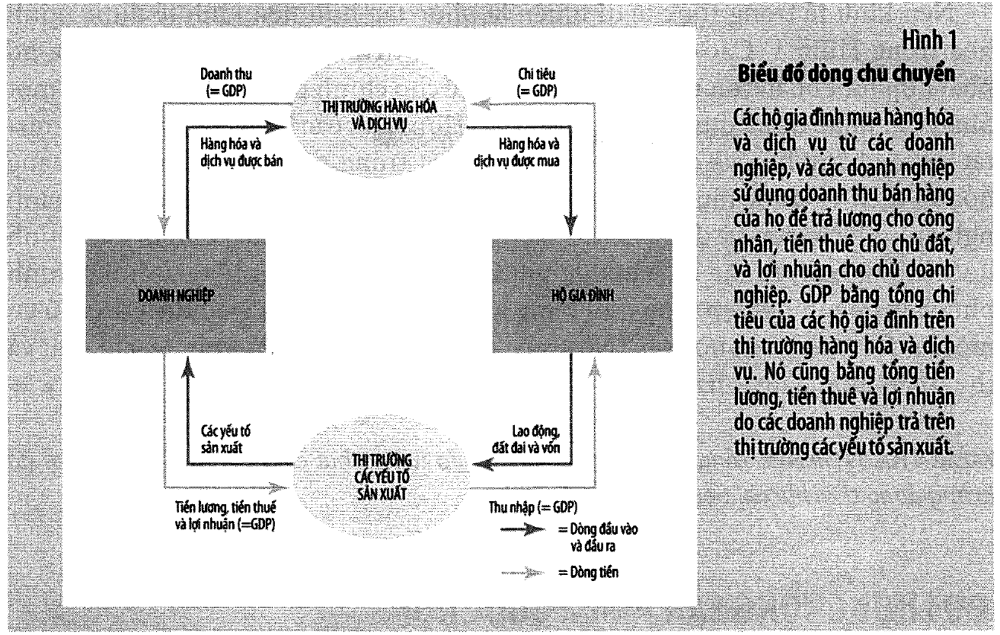
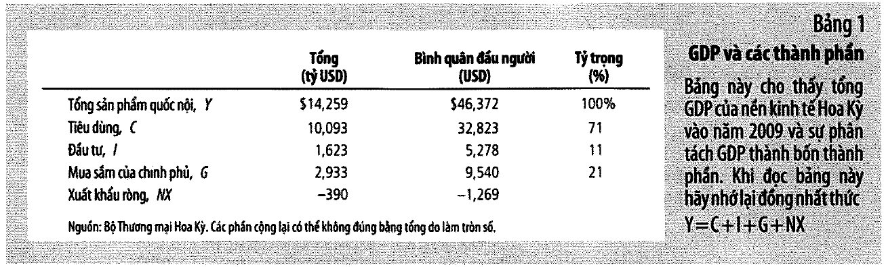
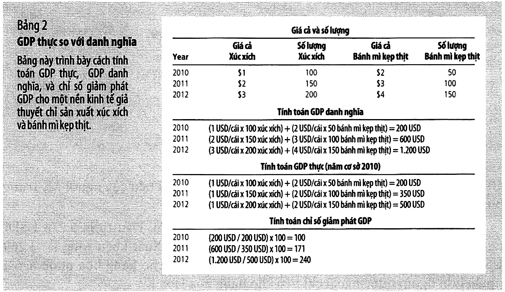
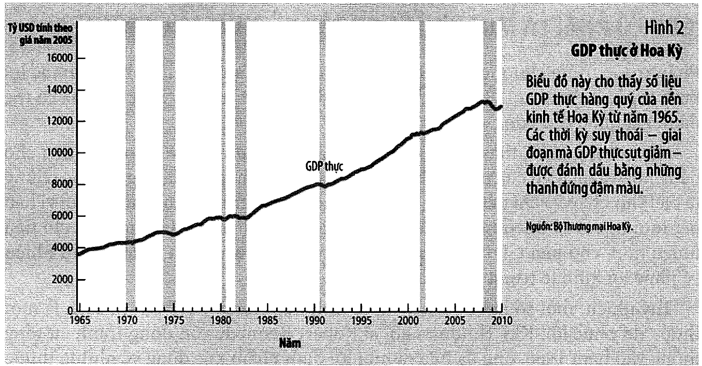
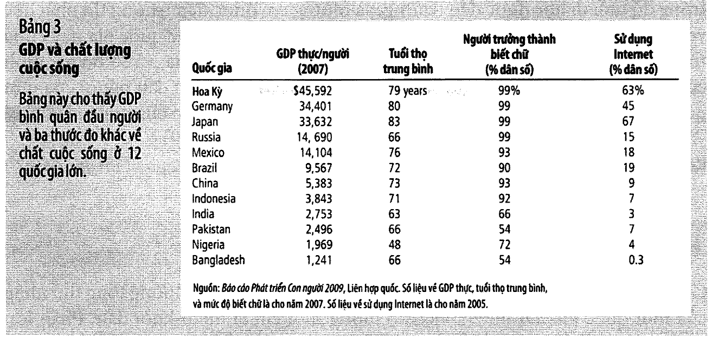

# Bài 1 — Đo lường thu nhập quốc gia

> Bài học dựng từ **Chương 10 — Đo lường thu nhập quốc gia** (tr. 215–238)
> của *N. Gregory Mankiw — **Kinh tế học vĩ mô***, bản dịch của Khoa Kinh tế, **ĐH Kinh tế TP.HCM** (Cengage Learning Asia).
> 🎯 **Vòng 1.** Đây là bài đầu tiên của phần vĩ mô thật sự. Mọi chương sau đều đứng trên GDP:
> tăng trưởng đo bằng GDP thực, lạm phát đo bằng chỉ số giảm phát GDP, suy thoái định nghĩa bằng GDP thực.
> 💼 **Góc QTKD** — ví dụ thêm cho ngành quản trị kinh doanh, **không có trong sách**.
> 📚 **Mở rộng** — thứ sách nói lướt hoặc để trong hộp phụ.
> ⚠️ — chỗ dễ hiểu sai, hoặc chỗ sách in sai.
> 📌 **Cần đọc trước:** [Bài 0 — Từ vi mô sang vĩ mô](bai_00_tu_vi_mo_sang_vi_mo.md), mục sơ đồ chu chuyển.
> Mục 13 dùng lại hệ số tương quan ở [bài 14 môn Xác suất Thống kê](../../%5BEG11%5D.xacxuatthongke/ly_thuyet/bai_14_tuong_quan_va_hoi_quy.md).

---

## Mục lục

<!-- MUC-LUC -->

- [1. Vì sao vĩ mô mở đầu bằng đúng một con số](#1-vì-sao-vĩ-mô-mở-đầu-bằng-đúng-một-con-số)
- [2. Thu nhập luôn bằng chi tiêu — đồng nhất thức đầu tiên](#2-thu-nhập-luôn-bằng-chi-tiêu--đồng-nhất-thức-đầu-tiên)
- [3. Định nghĩa GDP — mổ xẻ từng cụm từ](#3-định-nghĩa-gdp--mổ-xẻ-từng-cụm-từ)
- [4. 📚 Ba thứ định nghĩa cố tình bỏ ra — và hệ quả](#4--ba-thứ-định-nghĩa-cố-tình-bỏ-ra--và-hệ-quả)
- [5. Bốn thành phần — Y = C + I + G + NX](#5-bốn-thành-phần--y--c--i--g--nx)
- [6. ⚠️ Ba cái bẫy trong bốn thành phần](#6--ba-cái-bẫy-trong-bốn-thành-phần)
- [7. Bảng 1 — GDP Hoa Kỳ năm 2009 nhìn từ bốn thành phần](#7-bảng-1--gdp-hoa-kỳ-năm-2009-nhìn-từ-bốn-thành-phần)
- [8. 📚 Năm thước đo thu nhập khác — hộp "Theo dòng thời sự", tr. 222](#8--năm-thước-đo-thu-nhập-khác--hộp-theo-dòng-thời-sự-tr-222)
- [9. GDP thực và GDP danh nghĩa](#9-gdp-thực-và-gdp-danh-nghĩa)
- [10. Chỉ số giảm phát GDP](#10-chỉ-số-giảm-phát-gdp)
- [11. GDP thực Hoa Kỳ và suy thoái — Hình 2, tr. 229](#11-gdp-thực-hoa-kỳ-và-suy-thoái--hình-2-tr-229)
- [12. GDP có phải một thước đo tốt về phúc lợi kinh tế?](#12-gdp-có-phải-một-thước-đo-tốt-về-phúc-lợi-kinh-tế)
- [13. GDP và chất lượng cuộc sống — Bảng 3, tr. 233](#13-gdp-và-chất-lượng-cuộc-sống--bảng-3-tr-233)
- [14. 📚 Nền kinh tế ngầm — hộp "Theo dòng thời sự", tr. 232–233](#14--nền-kinh-tế-ngầm--hộp-theo-dòng-thời-sự-tr-232233)
- [15. 💼 Góc QTKD — dùng GDP thế nào trong công việc thật](#15--góc-qtkd--dùng-gdp-thế-nào-trong-công-việc-thật)
- [16. 📚 Đối chiếu Việt Nam — cách đọc số liệu GDP trong nước](#16--đối-chiếu-việt-nam--cách-đọc-số-liệu-gdp-trong-nước)
- [17. Code minh hoạ](#17-code-minh-hoạ)
- [18. Tự thử](#18-tự-thử)
- [19. Từ điển thuật ngữ](#19-từ-điển-thuật-ngữ)
- [20. Câu hỏi tự kiểm tra](#20-câu-hỏi-tự-kiểm-tra)
- [Tóm tắt một trang](#tóm-tắt-một-trang)
- [Nguồn](#nguồn)

<!-- /MUC-LUC -->

---

## 1. Vì sao vĩ mô mở đầu bằng đúng một con số

Sách mở chương bằng một tình huống rất gần với sinh viên sắp ra trường (tr. 215):

> *"Khi bạn hoàn thành việc học hành và bắt đầu tìm kiếm một công việc toàn thời gian, ở phạm vi
> tổng quát thì kinh nghiệm tìm việc của bạn sẽ được định hình bởi những điều kiện kinh tế hiện hành."*

Cùng một tấm bằng, cùng một năng lực, nhưng ra trường vào năm nền kinh tế mở rộng thì khác hẳn năm
nền kinh tế thu hẹp. Sách nói thẳng: *"bất kỳ sinh viên nào mới tốt nghiệp đại học cũng sẽ dễ gia
nhập lực lượng lao động vào năm mà nền kinh tế mở rộng hơn là vào năm mà nền kinh tế thu hẹp"* (tr. 215).

Đó là lý do phải có những con số mô tả **toàn bộ** nền kinh tế chứ không phải một thị trường. Sách
liệt kê bốn con số hay gặp trên báo (tr. 215):

| Con số                   | Đo cái gì                                            | Học ở bài nào |
| ------------------------ | ---------------------------------------------------- | ------------- |
| **GDP**                  | tổng thu nhập của tất cả mọi người trong nền kinh tế | **bài này**   |
| **lạm phát / giảm phát** | mức giá trung bình đang tăng hay giảm                | bài 2, bài 8  |
| **thất nghiệp**          | phần trăm lực lượng lao động không có việc làm       | bài 6         |
| **thâm hụt thương mại**  | mất cân bằng thương mại với phần còn lại thế giới    | bài 9, bài 10 |

### Ranh giới vi mô — vĩ mô, nói lại cho rõ

Sách nhắc lại hai định nghĩa ngay ở chú thích trang 215:

> **Kinh tế vi mô** (*microeconomics*): nghiên cứu cách thức ra quyết định của các hộ gia đình và các
> doanh nghiệp và cách thức tương tác giữa họ trên các thị trường.
>
> **Kinh tế vĩ mô** (*macroeconomics*): nghiên cứu các hiện tượng trên bình diện nền kinh tế, bao gồm
> lạm phát, thất nghiệp và tăng trưởng kinh tế.

Điểm quan trọng nhất mà sinh viên hay bỏ qua nằm ở tr. 216. Vĩ mô **không phải** một môn học mới với
bộ công cụ mới:

> *"…các công cụ cơ bản về cung và cầu là trung tâm cho phân tích kinh tế vĩ mô giống như vai trò
> trung tâm của chúng trong phân tích kinh tế vi mô."*

Bạn không vứt bỏ gì cả từ môn vi mô. Bạn chỉ đổi **đối tượng**: thay vì một thị trường kem, giờ là
thị trường vốn vay, thị trường ngoại hối, thị trường "toàn bộ hàng hoá". Bài 0 đã liệt kê chính xác
những gì mang theo được.

⚠️ Nhưng sách cũng cảnh báo ngay: *"việc nghiên cứu nền kinh tế trên bình diện tổng thể đặt ra một số
thách thức mới và hấp dẫn"* (tr. 216). Thách thức lớn nhất là **cái đúng với một doanh nghiệp có thể
sai với cả nền kinh tế** — bài 11 sẽ gặp lại chuyện này dưới tên *nghịch lý tiết kiệm*.

---

## 2. Thu nhập luôn bằng chi tiêu — đồng nhất thức đầu tiên

Đây là mệnh đề nền móng của cả môn học, và nó **không phải một giả định**. Nó đúng vì cách các biến
được định nghĩa.

> *"GDP đo lường đồng thời hai chỉ tiêu: tổng thu nhập của tất cả mọi người trong nền kinh tế và tổng
> chi tiêu cho sản lượng hàng hóa và dịch vụ của nền kinh tế. GDP có thể đóng vai trò đo lường cả tổng
> thu nhập và tổng chi tiêu bởi vì hai chỉ tiêu này thực sự là như nhau."* — tr. 216

Lý do chỉ có một câu, và nó ngắn đến mức dễ bị lướt qua (tr. 216–217):

> *"thu nhập của nền kinh tế thì cũng bằng chi tiêu của nền kinh tế đó bởi vì **mỗi giao dịch đều có
> hai bên: người bán và người mua**."*

Ví dụ của sách (tr. 217): Karen trả **100 USD** để Doug cắt cỏ cho cô ấy.

```
        Karen  ──── 100 USD ────>  Doug
        (người mua)               (người bán)

   nhìn từ phía CHI TIÊU:  nền kinh tế chi thêm 100 USD
   nhìn từ phía THU NHẬP:  nền kinh tế thu thêm 100 USD
   ⟹ MỘT giao dịch, đóng góp 100 USD vào GDP — dù đếm theo cách nào
```

### Sơ đồ dòng chu chuyển — Hình 1, tr. 217



Sách vẽ lại biểu đồ đã gặp ở chương 2 (bạn đã học ở bài 0), nhưng lần này để **định vị GDP** trên đó:

```
                    ┌───────────────────────────────────┐
                    │  THỊ TRƯỜNG HÀNG HOÁ VÀ DỊCH VỤ   │
                    └───────────────────────────────────┘
            doanh thu ↗                          ↖ chi tiêu
              (= GDP)                              (= GDP)
        ┌──────────────┐                    ┌──────────────┐
        │ DOANH NGHIỆP │                    │  HỘ GIA ĐÌNH │
        └──────────────┘                    └──────────────┘
      tiền lương, tiền thuê ↘              ↙ thu nhập
        và lợi nhuận (= GDP)                  (= GDP)
                    ┌───────────────────────────────────┐
                    │ THỊ TRƯỜNG CÁC YẾU TỐ SẢN XUẤT    │
                    └───────────────────────────────────┘
```

⭐ **Bốn chỗ trên vòng tròn đều được ghi `= GDP`.** Đó là toàn bộ thông điệp của Hình 1: cắt vòng tròn
ở bất kỳ đâu, dòng tiền chảy qua vết cắt đều bằng nhau, và bằng GDP.

Sách nói rõ hệ quả (tr. 217):

> *"Chúng ta có thể tính toán GDP cho nền kinh tế này theo một trong hai cách: bằng việc cộng tổng chi
> tiêu của các hộ gia đình hoặc bằng việc cộng tổng thu nhập (tiền lương, tiền thuê và lợi nhuận) được
> trả bởi các doanh nghiệp."*

Mục 1 của [code minh hoạ](#17-code-minh-hoạ) dựng một nền kinh tế đồ chơi bốn giao dịch và kiểm bằng
`assert` rằng hai cách đếm ra đúng một con số.

### ⚠️ Sơ đồ này đơn giản hoá cái gì

Sách tự thừa nhận ngay (tr. 218): nền kinh tế thật phức tạp hơn — hộ gia đình **nộp thuế** và **tiết
kiệm**, chính phủ và doanh nghiệp cũng **mua** hàng hoá. Nhưng:

> *"…nguyên tắc cơ bản vẫn giữ nguyên: Bất kể một hộ gia đình, chính phủ, hay doanh nghiệp mua một
> hàng hóa hay dịch vụ, thì giao dịch đó đều có một người mua và người bán. Như vậy, đối với tổng thể
> nền kinh tế, chi tiêu và thu nhập luôn bằng nhau."*

📌 Ghi nhớ dòng này. Bài 4 sẽ dùng chính nó để dẫn ra đồng nhất thức **tiết kiệm = đầu tư**, và bài 9
dùng nó để dẫn ra **xuất khẩu ròng = dòng vốn ra ròng**. Cả hai kết quả nghe "sâu sắc" nhưng thực ra
chỉ là cùng một câu ở tr. 218 viết lại.

---

## 3. Định nghĩa GDP — mổ xẻ từng cụm từ

> **Tổng sản phẩm quốc nội (GDP)** (*gross domestic product*): **giá trị thị trường** của **tất cả**
> các hàng hóa và dịch vụ **cuối cùng** **được sản xuất** trong **một quốc gia** trong **một khoảng
> thời gian nhất định**. — chú thích tr. 218

Sách cảnh báo: *"Định nghĩa này có lẽ khá đơn giản. Nhưng trong thực tế, có nhiều vấn đề tinh tế phát
sinh khi tính toán GDP"* (tr. 218), rồi đi từng cụm từ một. Đây là phần đáng đọc kỹ nhất của chương,
vì gần như mọi tranh cãi về GDP đều nằm ở một trong sáu cụm từ này.

### ① *"…là giá trị thị trường…"* (tr. 218)

Sách mở đầu bằng câu châm ngôn *"Bạn không thể so sánh những quả táo với những quả cam"* rồi nói:
**GDP làm đúng như vậy.** Nó cộng táo với cam được, nhờ dùng **giá thị trường** làm quy đổi.

> *"Bởi vì giá cả thị trường đo lường số tiền mà người ta sẵn lòng trả cho những hàng hóa khác nhau,
> cho nên chúng phản ánh giá trị của những hàng hoá đó. Nếu giá của một quả táo gấp đôi giá của một
> quả cam, thì một quả táo đóng góp nhiều gấp đôi vào GDP."* — tr. 218

💼 Đây chính là khái niệm **giá sẵn lòng trả** của [bài 4 môn vi mô](../../%5BEG13%5D.kinhtevimo-micro/ly_thuyet/bai_04_thang_du_va_chi_phi_cua_thue.md).
Vĩ mô không phát minh ra gì mới — nó chỉ lấy giá thị trường làm **tỷ giá quy đổi giữa các loại hàng
hoá**, để cộng được mọi thứ vào một con số.

⚠️ Và đây cũng là **lỗ hổng lớn nhất**: cái gì không có giá thị trường thì không vào được GDP. Mục 4
và mục 12 quay lại chuyện này.

### ② *"…của tất cả…"* (tr. 219)

GDP cố bao hàm mọi thứ được sản xuất và **bán hợp pháp trên các thị trường**.

Một chi tiết hay: **nhà ở tự sở hữu**. Nhà cho thuê thì dễ — tiền thuê vừa là chi tiêu của người thuê
vừa là thu nhập của chủ nhà. Nhưng người tự ở nhà mình thì không trả tiền thuê cho ai. Sách kể cách
xử lý (tr. 219):

> *"Chính phủ tính dịch vụ nhà ở mà chủ sở hữu đang cư trú vào GDP bằng cách **ước tính giá trị cho
> thuê** của nó. Trong thực tế, GDP được dựa trên giả định rằng chủ sở hữu đang cho chính mình thuê nhà."*

Hai thứ **không** vào GDP:

| Loại                              | Ví dụ của sách                    |
| --------------------------------- | --------------------------------- |
| sản xuất và bán **ngầm**          | các loại thuốc phiện bất hợp pháp |
| sản xuất và tiêu dùng **tại nhà** | rau bạn trồng trong vườn nhà      |

Và câu nổi tiếng nhất của cả chương (tr. 219):

> *"…khi Karen trả tiền để Doug cắt cỏ cho cô ấy, giao dịch đó là một phần của GDP. Nếu Karen đã kết
> hôn với Doug, thì tình huống sẽ thay đổi. Mặc dù Doug có thể tiếp tục cắt cỏ cho Karen, nhưng giá
> trị của việc cắt cỏ bây giờ bị loại khỏi GDP bởi vì dịch vụ của Doug không còn được bán trên thị
> trường nữa. **Vì vậy, khi Karen và Doug kết hôn, GDP giảm xuống.**"*

⭐ Không có công việc nào biến mất, không có ai nghèo đi. **GDP đo hoạt động thị trường, không đo sản
xuất.** Giữ câu này trong đầu suốt cả môn học.

### ③ *"…cuối cùng…"* (tr. 219–220)

Ví dụ của sách: International Paper sản xuất giấy → Hallmark dùng làm thiệp chúc mừng.

```
   giấy   = hàng hoá TRUNG GIAN   ──┐
                                    ├──> chỉ tính THIỆP
   thiệp  = hàng hoá CUỐI CÙNG    ──┘
```

Lý do: *"giá trị của những hàng hóa trung gian đã được tính vào giá cả của các hàng hóa cuối cùng"*.
Cộng cả hai là **tính trùng** — GDP sẽ tính giá trị của tờ giấy **hai lần**.

⚠️ **Một ngoại lệ quan trọng** (tr. 220): nếu hàng trung gian được đưa vào **hàng tồn kho** thay vì
dùng ngay, thì tại thời điểm đó nó **được coi là "cuối cùng"**, và tính vào GDP như một khoản đầu tư.
Khi hàng tồn kho được bán ra sau đó, lượng tồn kho giảm đi **được trừ ra khỏi GDP**.

Nếu bạn thấy quy tắc này rắc rối, hãy nhớ mục đích của nó: **GDP muốn đo giá trị được sản xuất trong
kỳ**. Cái xe Ford lắp xong tháng 12 năm nay thì thuộc GDP năm nay, dù bán được vào tháng 3 năm sau.

### ④ *"…hàng hóa và dịch vụ…"* (tr. 220)

Cả hai. Hữu hình (thực phẩm, quần áo, xe hơi) và vô hình (cắt tóc, lau dọn nhà cửa, khám sức khỏe).
Sách lấy ví dụ cùng một ban nhạc: mua **đĩa CD** là hàng hoá, mua **vé buổi hoà nhạc** là dịch vụ,
cả hai đều vào GDP.

### ⑤ *"…được sản xuất…"* (tr. 220)

Chỉ tính thứ **hiện đang được sản xuất**, không tính giao dịch hàng cũ.

| Giao dịch                       | Vào GDP? |
| ------------------------------- | :------: |
| Ford sản xuất và bán một xe mới |    ✅     |
| bán lại một chiếc xe đã sử dụng |    ❌     |

⚠️ Câu hỏi ôn tập số 6 (tr. 236) của sách kiểm đúng chỗ này: *"Nhiều năm trước đây, Peggy đã trả 500
USD để thu âm đĩa hát. Hôm nay, cô ấy bán các album của mình với giá 100 USD. Việc này ảnh hưởng như
thế nào đến GDP hiện tại?"* — Câu trả lời: **không ảnh hưởng** đến phần "sản xuất". Đĩa hát đã tính
vào GDP của năm thu âm. Chỉ có **dịch vụ môi giới** (nếu có) mới là sản xuất mới của năm nay.

### ⑥ *"…trong phạm vi một quốc gia…"* (tr. 220)

**Lãnh thổ**, không phải quốc tịch.

| Tình huống                                   | Vào GDP nước nào |
| -------------------------------------------- | ---------------- |
| công dân Canada làm việc tạm thời tại Hoa Kỳ | **Hoa Kỳ**       |
| công dân Mỹ sở hữu nhà máy ở Haiti           | **Haiti**        |

Đây chính là chỗ **GDP khác GNP** — mục 8 nói kỹ.

💼 Với Việt Nam, chữ "trong phạm vi một quốc gia" đặc biệt quan trọng: phần lớn kim ngạch xuất khẩu
điện tử là của doanh nghiệp FDI. Sản lượng đó **vào GDP Việt Nam** (sản xuất trên lãnh thổ Việt Nam)
nhưng phần lợi nhuận chuyển về công ty mẹ **không vào GNP Việt Nam**. Vì thế GNI của Việt Nam thấp
hơn GDP một cách có hệ thống — điều không đúng với hầu hết các nước phát triển.

### ⑦ *"…trong một khoảng thời gian nhất định…"* (tr. 220–221)

Thường là **một năm** hoặc **một quý**. Hai quy ước kỹ thuật hay gây hiểu nhầm khi đọc tin:

| Quy ước                      | Nghĩa                                                              |
| ---------------------------- | ------------------------------------------------------------------ |
| **"theo tỷ lệ hàng năm"**    | số quý **nhân với 4**, để so được với số cả năm                    |
| **điều chỉnh yếu tố mùa vụ** | bóc phần dao động lặp lại hằng năm (ví dụ mua sắm dịp lễ tháng 12) |

Sách nói rõ: *"Số liệu GDP được báo cáo trong các bản tin luôn được điều chỉnh theo mùa"* (tr. 221).

⚠️ 💼 Suy ra một điều rất thực dụng: **đừng so quý này với quý trước bằng số liệu thô của chính công
ty bạn.** Doanh thu quý IV cao hơn quý III chưa chắc là bạn đang tăng trưởng — có thể chỉ là Tết. So
**cùng kỳ năm trước**, hoặc tự điều chỉnh mùa vụ.

---

## 4. 📚 Ba thứ định nghĩa cố tình bỏ ra — và hệ quả

Gộp lại từ tr. 219 và tr. 230–231, GDP bỏ ra ba nhóm, và mỗi nhóm gây một loại sai lệch khác nhau:

| Nhóm bị bỏ                                     | Vì sao bỏ                           | Sai lệch gây ra                                                       |
| ---------------------------------------------- | ----------------------------------- | --------------------------------------------------------------------- |
| **hoạt động phi thị trường**                   | không có giá thị trường             | GDP tăng khi xã hội "thị trường hoá" việc nhà, dù sản lượng không đổi |
| **hoạt động bất hợp pháp / ngầm**              | không ai khai báo                   | GDP nước nghèo bị đánh thấp **nhiều hơn** nước giàu → mục 14          |
| **thời gian nghỉ ngơi, môi trường, phân phối** | không phải "hàng hoá được sản xuất" | GDP tăng có thể đi kèm phúc lợi giảm → mục 12                         |

Mục 6 của [code minh hoạ](#17-code-minh-hoạ) liệt kê tám hoạt động và cho thấy bốn cặp giống hệt nhau
về mặt sản xuất nhưng chỉ có một nửa vào được GDP.

---

## 5. Bốn thành phần — Y = C + I + G + NX

$$Y = C + I + G + NX$$

Sách nhấn mạnh đây là một **đồng nhất thức**, không phải một lý thuyết (tr. 221):

> *"Phương trình này là một đồng nhất thức – một phương trình phải đúng vì cách thức xác định các biến
> trong phương trình."*

Nói cách khác: nó đúng vì mỗi đô la chi tiêu **buộc phải** rơi vào đúng một trong bốn ô. Không có ô
thứ năm, và không đô la nào nằm ngoài.

### Tiêu dùng — C

> **Tiêu dùng** (*consumption*): chi tiêu của các hộ gia đình cho các hàng hóa và dịch vụ, **ngoại trừ
> việc mua nhà ở mới**. — chú thích tr. 222

| Loại               | Ví dụ                  |
| ------------------ | ---------------------- |
| hàng lâu bền       | xe hơi, trang thiết bị |
| hàng không lâu bền | thực phẩm, quần áo     |
| dịch vụ            | cắt tóc, chăm sóc y tế |

Sách có một ghi chú thú vị (tr. 222–223): **chi tiêu cho giáo dục được tính vào tiêu dùng dịch vụ**,
*"mặc dù người ta có thể cho rằng nó nằm trong thành phần tiếp theo thì phù hợp hơn"* — tức là đầu tư.
Đây là một tranh luận thật trong thống kê quốc gia: học phí về bản chất là đầu tư vào vốn con người,
nhưng hệ thống tài khoản quốc gia xếp nó vào C.

### Đầu tư — I

> **Đầu tư** (*investment*): chi tiêu cho **thiết bị sản xuất, hàng tồn kho và các công trình xây
> dựng**, bao gồm cả mua nhà ở mới của các hộ gia đình. — chú thích tr. 223

⚠️ **Đây là cái bẫy ngôn ngữ lớn nhất của chương.** Sách viết hẳn một đoạn cảnh báo (tr. 223):

> *"Lưu ý rằng việc hoạch toán GDP sử dụng từ đầu tư khác với cách mà bạn có thể nghe về thuật ngữ này
> trong trò chuyện hàng ngày. Khi bạn nghe từ **đầu tư**, bạn có thể nghĩ đến các khoản đầu tư tài
> chính, chẳng hạn như là cổ phiếu, trái phiếu và các quỹ hỗ tương… Trái lại, bởi vì GDP đo lường chi
> tiêu cho các hàng hóa và dịch vụ, ở đây từ đầu tư có nghĩa là **việc mua hàng hóa** … được sử dụng
> để sản xuất những hàng hóa khác."*

```
   BẠN MUA 100 TRIỆU CỔ PHIẾU VNM        →  I trong GDP KHÔNG đổi (chỉ đổi chủ tài sản)
   VINAMILK MUA DÂY CHUYỀN 100 TRIỆU     →  I trong GDP TĂNG 100 triệu
```

📌 Bài 4 sẽ dùng đúng phân biệt này: "tiết kiệm = đầu tư" nói về **I của GDP**, không phải về việc bạn
mua cổ phiếu.

### Mua sắm của chính phủ — G

> **Mua sắm của chính phủ** (*government purchases*): chi tiêu cho hàng hóa và dịch vụ bởi chính quyền
> địa phương, tiểu bang và liên bang. — chú thích tr. 223

⚠️ **Chi chuyển nhượng không phải G.** Sách phân biệt rất rõ (tr. 224):

| Khoản chi của chính phủ                   | Có phải G? | Vì sao                                                                      |
| ----------------------------------------- | :--------: | --------------------------------------------------------------------------- |
| trả lương cho một vị tướng, một giáo viên |     ✅      | đổi lấy **dịch vụ** đang được cung cấp                                      |
| trợ cấp an sinh xã hội cho người cao tuổi |     ❌      | *"không được chi đổi lấy một hàng hóa hay dịch vụ được sản xuất hiện thời"* |
| bảo hiểm thất nghiệp                      |     ❌      | như trên                                                                    |

Sách gọi tên rất gọn: *"Từ quan điểm kinh tế vĩ mô, chi chuyển nhượng giống như là một loại **thuế
âm**"* (tr. 224).

💼 Hệ quả trực tiếp: khi đọc tin "chính phủ chi X nghìn tỷ cho gói hỗ trợ", phải hỏi ngay **gói đó là
mua sắm hay chuyển nhượng**. Gói xây đường tác động vào GDP theo cách khác hẳn gói phát tiền mặt —
bài 12 sẽ tính rõ chênh lệch này qua **số nhân chi tiêu**.

### Xuất khẩu ròng — NX

> **Xuất khẩu ròng** (*net exports*): chi tiêu của người nước ngoài cho hàng hóa được sản xuất trong
> nước (xuất khẩu) **trừ đi** chi tiêu của cư dân trong nước cho hàng hóa nước ngoài (nhập khẩu).
> — chú thích tr. 224

$$NX = \text{xuất khẩu} - \text{nhập khẩu}$$

---

## 6. ⚠️ Ba cái bẫy trong bốn thành phần

### Bẫy 1 — "nhập khẩu làm giảm GDP"

Đây là hiểu nhầm phổ biến nhất về GDP, và sách bác bỏ nó bằng một ví dụ số (tr. 224). Hộ gia đình Mỹ
mua xe Volvo **30.000 USD** sản xuất tại Thuỵ Điển:

```
   C   +30.000     (mua sắm xe hơi là một phần chi tiêu tiêu dùng)
   NX  −30.000     (chiếc xe là một phần hàng hoá nhập khẩu)
   ────────────
   GDP      0      KHÔNG ĐỔI
```

Sách kết luận thẳng: *"khi một hộ gia đình, một doanh nghiệp, hoặc chính phủ trong nước mua một hàng
hóa hay dịch vụ từ nước ngoài, thì việc mua sắm làm giảm xuất khẩu ròng, nhưng bởi vì nó cũng làm tăng
tiêu dùng, đầu tư hoặc mua sắm của chính phủ, cho nên **nó không ảnh hưởng đến GDP**"* (tr. 224).

⭐ **Dấu trừ trước nhập khẩu không phải để "phạt" nhập khẩu.** Nó chỉ để **huỷ bỏ** phần đã bị đếm vào
C, I hoặc G — vì ba thành phần đó được đo là *tổng chi tiêu*, đã bao gồm cả hàng ngoại.

Mục 5 của [code minh hoạ](#17-code-minh-hoạ) chứng minh bằng `assert`.

💼 Điều này **không** có nghĩa là "dùng hàng nội không giúp gì". Nó giúp — nhưng qua một cơ chế khác:
chuyển cầu từ hàng ngoại sang hàng nội làm **tăng sản xuất trong nước**, và khi đó C-nội-địa tăng
trong khi nhập khẩu giảm. Cái sai là lý lẽ *"vì nhập khẩu bị trừ khỏi công thức"*.

### Bẫy 2 — bán hàng tồn kho không tạo ra GDP

Bài tập 2c của sách (tr. 236): *"Ford bán một chiếc Mustang từ hàng tồn kho."*

```
   C  tăng đúng bằng giá xe        (hộ gia đình chi tiêu)
   I  GIẢM đúng bằng giá xe        (hàng tồn kho giảm)
   ───────────────────────────
   GDP KHÔNG ĐỔI
```

Chiếc xe đã được tính vào GDP của **kỳ sản xuất ra nó**, dưới dạng đầu tư vào hàng tồn kho.

### Bẫy 3 — mua nhà mới là I, không phải C

Bài tập 2b (tr. 236): *"Aunt Jane mua một ngôi nhà mới."* Sách nói rõ ở tr. 223: *"Theo quy ước, việc
mua một ngôi nhà mới là một hình thức của chi tiêu hộ gia đình và được phân loại là **đầu tư** thay vì
tiêu dùng."*

⚠️ Và nhớ chữ **mới**. Mua lại nhà cũ không vào GDP (cụm từ ⑤ ở mục 3) — chỉ có phí môi giới mới vào.

---

## 7. Bảng 1 — GDP Hoa Kỳ năm 2009 nhìn từ bốn thành phần



Nguồn: Bộ Thương mại Hoa Kỳ, tái tạo theo **Bảng 1, tr. 225**.

| Thành phần             | Ký hiệu | Tổng (tỷ USD) | Bình quân đầu người (USD) | Tỷ trọng |
| ---------------------- | :-----: | ------------: | ------------------------: | -------: |
| Tổng sản phẩm quốc nội |    Y    |    **14.259** |                **46.372** | **100%** |
| Tiêu dùng              |    C    |        10.093 |                    32.823 |      71% |
| Đầu tư                 |    I    |         1.623 |                     5.278 |      11% |
| Mua sắm của chính phủ  |    G    |         2.933 |                     9.540 |      21% |
| Xuất khẩu ròng         |   NX    |          −390 |                    −1.269 |      −3% |

Ba điều đáng rút ra:

1. **C chiếm 71%.** Cầu của cả nền kinh tế chủ yếu là hộ gia đình. Mọi chính sách kích cầu rốt cuộc
   đều phải đi qua túi tiền hộ gia đình mới có tác dụng lớn.
2. **NX âm.** Sách giải thích: *"Con số này âm bởi vì người Mỹ chi tiêu cho hàng hóa nước ngoài nhiều
   hơn người nước ngoài chi tiêu cho hàng hóa Hoa Kỳ"* (tr. 225). Đây là **thâm hụt thương mại** —
   bài 9 sẽ cho thấy nó gắn chặt với dòng vốn vào Hoa Kỳ.
3. **Bốn thành phần cộng lại đúng bằng Y.** 10.093 + 1.623 + 2.933 − 390 = 14.259. ✓

⚠️ **Một chi tiết số học đáng để ý.** Sách viết dân số Hoa Kỳ 2009 là *"307 triệu người"* (tr. 224).
Nhưng 14.259 tỷ ÷ 307 triệu = **46.446 USD**, còn Bảng 1 in **46.372 USD**. Chênh 74 USD.

Đây **không phải sách in sai**: con số 46.372 ứng với dân số **307,5 triệu**, tức sách đã làm tròn dân
số xuống "307 triệu" khi viết trong đoạn văn. Mục 3 của code kiểm lại điều này.

📌 Bài học nhỏ nhưng dùng suốt đời: **mọi tỷ số vĩ mô đều mang sai số của cả tử số lẫn mẫu số.** GDP
đầu người, năng suất lao động, nợ công/GDP — con số nào cũng có hai nguồn sai lệch, không phải một.

---

## 8. 📚 Năm thước đo thu nhập khác — hộp "Theo dòng thời sự", tr. 222

Sách xếp năm thước đo theo thứ tự **từ lớn nhất đến nhỏ nhất**:

| #   | Thước đo                         | Khác GDP ở chỗ                                              |
| --- | -------------------------------- | ----------------------------------------------------------- |
| 1   | **GNP** — tổng sản phẩm quốc dân | tính theo **công dân**, không theo lãnh thổ                 |
| 2   | **NNP** — sản phẩm quốc dân ròng | GNP **trừ khấu hao**                                        |
| 3   | **Thu nhập quốc dân**            | *"gần như giống hệt với sản phẩm quốc dân ròng"*            |
| 4   | **Thu nhập cá nhân**             | bỏ thu nhập giữ lại của công ty; **cộng** chi chuyển nhượng |
| 5   | **Thu nhập cá nhân khả dụng**    | thu nhập cá nhân **trừ thuế thu nhập cá nhân**              |

### GDP và GNP khác nhau thế nào

Ví dụ của sách (tr. 222): công dân Canada làm việc tạm thời tại Hoa Kỳ.

```
   sản phẩm người đó làm ra   →  vào GDP Hoa Kỳ      (sản xuất trên đất Mỹ)
                              →  vào GNP Canada      (do công dân Canada làm)
                              →  KHÔNG vào GNP Hoa Kỳ
```

Sách nói với hầu hết các nước hai con số *"khá giống nhau"* vì công dân trong nước làm ra hầu hết sản
lượng nội địa.

💼 ⚠️ **Nhưng với Việt Nam thì không.** Khu vực FDI đóng góp phần rất lớn vào sản lượng công nghiệp và
xuất khẩu; lợi nhuận chuyển về công ty mẹ ở nước ngoài nằm trong GDP Việt Nam nhưng không nằm trong
GNI Việt Nam. Vì thế **GNI Việt Nam thấp hơn GDP một cách có hệ thống** — điều ngược lại với Nhật Bản
hay Đức, nơi thu nhập từ đầu tư ra nước ngoài làm GNI **cao hơn** GDP.

Khi so sánh "người dân giàu tới đâu", **GNI bình quân đầu người là thước đo sát hơn GDP đầu người.**
Ngân hàng Thế giới xếp hạng nhóm thu nhập của các nước cũng dùng GNI, không dùng GDP.

### 📚 Khấu hao và chữ "gross"

Chữ **G** trong GDP là *gross* — **tổng**, nghĩa là **chưa trừ khấu hao**.

> **Khấu hao** *"là sự hao mòn trữ lượng các nhà xưởng và thiết bị của nền kinh tế, như là xe tải bị
> gỉ sét và máy tính bị lỗi thời."* — tr. 222

Sách ghi chú một tên gọi rất gợi: trong tài khoản quốc gia của Hoa Kỳ, khấu hao được gọi là **"tiêu
dùng vốn cố định"** (tr. 222). Cách gọi ấy nói đúng bản chất: mỗi năm nền kinh tế "ăn" mất một phần
kho vốn của chính nó.

💼 Với doanh nghiệp, đây đúng là chênh lệch giữa **EBITDA** và **EBIT**. Một nền kinh tế có GDP tăng
nhưng khấu hao tăng nhanh hơn thì thực chất đang **nghèo đi**, giống hệt một công ty tăng doanh thu
nhờ vắt kiệt máy móc không bảo dưỡng.

---

## 9. GDP thực và GDP danh nghĩa

Câu hỏi mở đầu mục này rất rõ ràng (tr. 225): nếu tổng chi tiêu năm nay cao hơn năm ngoái, thì ít nhất
một trong hai điều sau phải đúng:

```
   (1) nền kinh tế đang sản xuất SẢN LƯỢNG LỚN HƠN       ← ta quan tâm cái này
   (2) hàng hoá đang được bán với GIÁ CAO HƠN            ← ta muốn loại bỏ cái này
```

Toàn bộ mục này chỉ để tách hai thứ đó ra.

> **GDP thực** (*real GDP*): sản lượng hàng hóa và dịch vụ được định giá theo **mức giá cố định**.
> — chú thích tr. 226

**GDP danh nghĩa** thì dùng **giá hiện hành**.

Sách mô tả GDP thực bằng một câu rất hay (tr. 225–226): nó *"trả lời một câu hỏi giả thuyết: Giá trị
của các hàng hóa và dịch vụ được sản xuất trong năm nay sẽ là bao nhiêu **nếu chúng ta tính toán giá
trị của những hàng hóa và dịch vụ này theo mức giá hiện hữu ở một năm cụ thể nào đó trong quá khứ?**"*

### Ví dụ bằng số — Bảng 2, tr. 226



Nền kinh tế chỉ sản xuất hai hàng hoá: **xúc xích** và **bánh mì kẹp thịt**. Năm cơ sở là **2010**.

| Năm  | Giá xúc xích | Lượng xúc xích | Giá bánh mì | Lượng bánh mì |
| ---- | -----------: | -------------: | ----------: | ------------: |
| 2010 |           $1 |            100 |          $2 |            50 |
| 2011 |           $2 |            150 |          $3 |           100 |
| 2012 |           $3 |            200 |          $4 |           150 |

**GDP danh nghĩa** — dùng giá của **chính năm đó**:

```
   2010:  (1 × 100) + (2 ×  50)  =    200 USD
   2011:  (2 × 150) + (3 × 100)  =    600 USD
   2012:  (3 × 200) + (4 × 150)  =  1.200 USD
```

**GDP thực** — dùng giá của **năm 2010** cho cả ba năm:

```
   2010:  (1 × 100) + (2 ×  50)  =  200 USD     ← năm cơ sở: hai GDP luôn bằng nhau
   2011:  (1 × 150) + (2 × 100)  =  350 USD
   2012:  (1 × 200) + (2 × 150)  =  500 USD
```

⭐ **Đọc hai dãy số cạnh nhau là thấy toàn bộ vấn đề:**

```
   danh nghĩa   200  →   600  →  1.200      "nền kinh tế lớn gấp 6 lần sau 2 năm!"
   thực         200  →   350  →    500      thật ra sản lượng chỉ tăng 2,5 lần
                                            phần còn lại là GIÁ CẢ
```

Sách tóm lại (tr. 227):

> *"Bởi vì GDP thực không bị ảnh hưởng bởi những thay đổi của giá cả, cho nên sự thay đổi của GDP thực
> chỉ phản ánh sự thay đổi của số lượng hàng hóa và dịch vụ được sản xuất. **Vì vậy, GDP thực là thước
> đo sản lượng hàng hóa và dịch vụ của nền kinh tế.**"*

Và hệ quả cho cách đọc tin (tr. 227):

> *"Khi các nhà kinh tế nói về GDP của nền kinh tế, họ thường đề cập đến GDP thực chứ không phải GDP
> danh nghĩa. Và khi họ nói về sự tăng trưởng của nền kinh tế, họ đo lường sự tăng trưởng đó bằng sự
> thay đổi phần trăm của GDP thực."*

📌 **Quy tắc đọc báo:** thấy chữ *"tăng trưởng GDP"* mà không kèm chữ *"thực"* thì phải kiểm lại. Ở
Việt Nam, số liệu công bố *"GDP theo giá so sánh"* chính là GDP thực; *"GDP theo giá hiện hành"* là
GDP danh nghĩa.

---

## 10. Chỉ số giảm phát GDP

Có hai số rồi thì tự nhiên có số thứ ba:

> **Chỉ số giảm phát GDP** (*GDP deflator*): thước đo mức giá được tính toán bằng tỷ số của GDP danh
> nghĩa so với GDP thực nhân với 100. — chú thích tr. 227

$$\text{Chỉ số giảm phát GDP} = \frac{\text{GDP danh nghĩa}}{\text{GDP thực}} \times 100$$

Áp vào Bảng 2:

| Năm  | Danh nghĩa | Thực | Chỉ số giảm phát            |
| ---- | ---------: | ---: | --------------------------- |
| 2010 |        200 |  200 | (200/200) × 100 = **100**   |
| 2011 |        600 |  350 | (600/350) × 100 = **171**   |
| 2012 |      1.200 |  500 | (1.200/500) × 100 = **240** |

⚠️ **Chỉ số của năm cơ sở luôn bằng 100** — vì hai GDP bằng nhau ở năm đó (tr. 228).

### Vì sao nó đo được giá cả

Sách chứng minh bằng hai thí nghiệm tưởng tượng (tr. 228):

| Kịch bản                          | Danh nghĩa | Thực      | Chỉ số giảm phát |
| --------------------------------- | ---------- | --------- | ---------------- |
| **sản lượng tăng, giá không đổi** | tăng       | tăng      | **không đổi**    |
| **giá tăng, sản lượng không đổi** | tăng       | không đổi | **tăng**         |

> *"Lưu ý rằng, trong cả hai trường hợp, chỉ số giảm phát GDP phản ánh những gì đang xảy ra với **giá
> cả**, chứ không phải với **sản lượng**."* — tr. 228

### Từ chỉ số giảm phát ra tỷ lệ lạm phát

> **Tỷ lệ lạm phát** là phần trăm thay đổi trong thước đo mức giá từ giai đoạn này sang giai đoạn kế tiếp.

$$\text{Tỷ lệ lạm phát năm 2} = \frac{\text{Chỉ số giảm phát năm 2} - \text{Chỉ số giảm phát năm 1}}{\text{Chỉ số giảm phát năm 1}} \times 100$$

Áp vào ví dụ (tr. 228):

```
   2011:  (171 − 100) / 100 × 100  =  71%
   2012:  (240 − 171) / 171 × 100  =  40%
```

### ⚠️ Tách tăng trưởng: nhân, không phải cộng

Đồng nhất thức đúng là **phép nhân**:

$$(1 + g_{\text{danh nghĩa}}) = (1 + g_{\text{sản lượng}}) \times (1 + g_{\text{giá}})$$

Kiểm với 2010 → 2011: sản lượng +75%, giá +71%.

```
   1,75 × 1,71 = 2,9925 ≈ 3,00   →  +200%   ✓  khớp với GDP danh nghĩa 200 → 600
   nhưng     75 + 71 = 146       →  +146%   ✗  SAI 54 điểm phần trăm
```

⭐ Mẹo *"tăng trưởng danh nghĩa = tăng trưởng thực + lạm phát"* mà báo chí hay dùng chỉ là **xấp xỉ**,
và nó **chỉ đúng khi cả hai tỷ lệ đều nhỏ**. Với lạm phát 3–5% thì sai số không đáng kể. Với siêu lạm
phát ở bài 8 thì mẹo đó vô dụng hoàn toàn.

Sách chỉ trình bày công thức phần trăm đơn giản, không cảnh báo chỗ này — nên hãy nhớ giúp sách.

---

## 11. GDP thực Hoa Kỳ và suy thoái — Hình 2, tr. 229



Hình 2 vẽ GDP thực Hoa Kỳ hằng quý từ **1965**, đánh dấu các thời kỳ suy thoái bằng **thanh đứng đậm màu**.

Sách rút ra hai đặc điểm:

**① GDP thực tăng theo thời gian.**

> *"GDP thực của nền kinh tế Hoa Kỳ vào năm 2009 là gần gấp bốn lần so với năm 1965. Nói cách khác,
> sản lượng hàng hóa và dịch vụ được sản xuất tại Hoa Kỳ đã tăng trung bình khoảng **3%/năm**."* — tr. 229

⭐ 3% một năm nghe rất nhỏ. Nhưng 44 năm liên tục thì thành **gấp bốn lần**. Đây là toàn bộ lý do bài 3
(Tăng trưởng) quan trọng hơn mọi bài về suy thoái cộng lại.

**② Tăng trưởng không ổn định.**

> **Suy thoái** (*recession*): thời kỳ mà GDP thực sụt giảm.

⚠️ Định nghĩa "hai quý liên tiếp" — sách nói rõ đó **không phải luật**:

> *"(Không hề có quy tắc cứng nhắc để khi nào thì ủy ban xác định chu kỳ kinh tế chính thức sẽ tuyên
> bố rằng một thời kỳ suy thoái diễn ra, nhưng **một thông lệ chung** là khi GDP thực sụt giảm trong
> hai quý liên tiếp thì được xem là suy thoái.)"* — tr. 229

Ở Hoa Kỳ, cơ quan tuyên bố chính thức là ủy ban chu kỳ kinh tế của **NBER**, và họ nhìn nhiều chỉ báo
hơn chỉ GDP.

Suy thoái không chỉ là thu nhập thấp hơn. Sách liệt kê những thứ đi kèm (tr. 229): *"thất nghiệp gia
tăng, lợi nhuận sụt giảm, số vụ phá sản tăng lên"*.

### Cấu trúc phần còn lại của môn học nằm ở đây

Đoạn cuối tr. 229 là **bản đồ đường đi** cho toàn bộ những bài sau:

> *"Phần lớn nội dung của kinh tế vĩ mô luôn nhằm vào mục đích giải thích sự tăng trưởng trong dài hạn
> và sự dao động của GDP thực trong ngắn hạn. Như chúng ta sẽ thấy trong các chương tiếp theo, chúng ta
> cần những mô hình khác nhau cho hai mục đích này."*

```
   ┌────────────────────────────────────────────────────────────────────┐
   │  XU HƯỚNG DÀI HẠN            │  DAO ĐỘNG NGẮN HẠN QUANH XU HƯỚNG   │
   │  bài 3–10                    │  bài 11–13                          │
   │  năng suất, vốn, tiết kiệm   │  tổng cầu, tổng cung, chính sách    │
   │  tiền và lạm phát dài hạn    │  đường Phillips                     │
   └────────────────────────────────────────────────────────────────────┘
```

Mục 8 của [code minh hoạ](#17-code-minh-hoạ) cài quy tắc hai quý thành hàm và vẽ lại kiểu đồ thị có
thanh đứng của Hình 2.

---

## 12. GDP có phải một thước đo tốt về phúc lợi kinh tế?

Sách dành hẳn một mục cho câu hỏi này, và mở đầu bằng lời phê bình nổi tiếng của **Thượng nghị sĩ
Robert Kennedy** trong chiến dịch tranh cử tổng thống **năm 1968** (tr. 230):

> *"[Tổng sản phẩm quốc nội] không tính đến sức khỏe của con cái chúng ta, chất lượng giáo dục mà
> chúng nhận được, hay niềm vui của chúng khi vui chơi. Nó không bao gồm vẻ đẹp của thơ ca hay sự bền
> vững của các cuộc hôn nhân, sự thông minh trong những cuộc tranh luận công khai hay sự liêm chính
> của các quan chức. Nó không đo lường lòng can đảm và sự hiểu biết của chúng ta, mà cũng không đo
> lường sự cống hiến của chúng ta cho đất nước. Nói một cách ngắn gọn, **nó đo lường tất cả mọi thứ,
> ngoại trừ những thứ làm cho cuộc sống đáng giá hơn**…"*

Câu trả lời của Mankiw không phải là phản bác. Ông nói thẳng: *"Phần lớn những gì Robert Kennedy nói
là chính xác"* (tr. 230). Rồi ông đưa ra một lập luận khác hẳn — **lập luận gián tiếp** (tr. 230):

| GDP **không** đo    | Nhưng nước có GDP cao hơn thì…      |
| ------------------- | ----------------------------------- |
| sức khỏe con cái    | có chăm sóc sức khỏe tốt hơn        |
| chất lượng giáo dục | cung cấp hệ thống giáo dục tốt hơn  |
| vẻ đẹp của thơ ca   | dạy cho nhiều công dân hơn cách đọc |

> *"GDP không trực tiếp đo lường những điều làm cho cuộc sống có giá trị, nhưng nó đo lường **khả năng
> của chúng ta để có được nhiều đầu vào phục vụ cho một cuộc sống tốt đẹp**."* — tr. 231

### Bốn thứ GDP bỏ sót, theo sách

| #   | Bỏ sót                         | Ví dụ của sách (tr. 230–231)                                                        |
| --- | ------------------------------ | ----------------------------------------------------------------------------------- |
| 1   | **thời gian nghỉ ngơi**        | mọi người làm việc cả 7 ngày/tuần → GDP tăng, nhưng phúc lợi chưa chắc tăng         |
| 2   | **hoạt động ngoài thị trường** | đầu bếp nấu ở nhà hàng vào GDP; nấu cho gia đình mình thì không                     |
| 3   | **chất lượng môi trường**      | bỏ hết quy định môi trường → GDP tăng, *"nhưng phúc lợi gần như chắc chắn sẽ giảm"* |
| 4   | **phân phối thu nhập**         | ví dụ ở dưới                                                                        |

**Ví dụ phân phối** (tr. 231) rất đáng nhớ. Hai xã hội, **cùng một GDP đầu người 50.000 USD**:

```
   Xã hội A:   100 người × 50.000 USD/năm   →  GDP 5 triệu, đầu người 50.000
   Xã hội B:    10 người × 500.000 USD/năm
               +90 người ×       0 USD/năm  →  GDP 5 triệu, đầu người 50.000
```

> *"Rất ít người sẽ xem hai tình huống đó là tương đương nhau. GDP bình quân đầu người cho chúng ta
> biết điều gì xảy ra với người trung bình, nhưng đằng sau một người trung bình lại là những hoàn cảnh
> cá nhân rất khác nhau."* — tr. 231

Kết luận cân bằng của sách (tr. 231):

> *"GDP là một thước đo tốt về phúc lợi kinh tế cho hầu hết – chứ không phải là tất cả – các mục đích.
> Điều quan trọng cần ghi nhớ là **GDP bao gồm những gì và những gì mà nó loại trừ ra**."*

---

## 13. GDP và chất lượng cuộc sống — Bảng 3, tr. 233



Cách kiểm nghiệm lập luận "gián tiếp" ở mục 12: nhìn số liệu thực. Bảng 3 xếp **12 quốc gia đông dân
nhất thế giới** theo GDP thực bình quân đầu người, kèm ba thước đo chất lượng sống khác.

| Quốc gia   | GDP thực/người (2007) | Tuổi thọ TB | Biết chữ (%) | Dùng Internet (%) |
| ---------- | --------------------: | ----------: | -----------: | ----------------: |
| Hoa Kỳ     |                45.592 |          79 |           99 |              63,0 |
| Germany    |                34.401 |          80 |           99 |              45,0 |
| Japan      |                33.632 |          83 |           99 |              67,0 |
| Russia     |                14.690 |          66 |           99 |              15,0 |
| Mexico     |                14.104 |          76 |           93 |              18,0 |
| Brazil     |                 9.567 |          72 |           90 |              19,0 |
| China      |                 5.383 |          73 |           93 |               9,0 |
| Indonesia  |                 3.843 |          71 |           92 |               7,0 |
| India      |                 2.753 |          63 |           66 |               3,0 |
| Pakistan   |                 2.496 |          66 |           54 |               7,0 |
| Nigeria    |                 1.969 |          48 |           72 |               4,0 |
| Bangladesh |                 1.241 |          66 |           54 |               0,3 |

Nguồn: *Báo cáo Phát triển Con người 2009*, Liên hợp quốc.

Sách mô tả mẫu hình (tr. 233): ở nước giàu người dân sống đến khoảng 80 tuổi, hầu như toàn bộ biết chữ,
một nửa đến hai phần ba dùng Internet. Ở nước nghèo, người dân *"chết sớm hơn khoảng từ 10 đến 20 năm,
một phần lớn dân số không biết chữ, và việc sử dụng Internet là hiếm hoi"*.

Mục 11 của [code minh hoạ](#17-code-minh-hoạ) tính hệ số tương quan Pearson cho ba cột — công cụ của
[bài 14 môn Xác suất Thống kê](../../%5BEG11%5D.xacxuatthongke/ly_thuyet/bai_14_tuong_quan_va_hoi_quy.md).
Cả ba đều dương và mạnh, đúng như kết luận của sách (tr. 234):

> *"Số liệu quốc tế xác nhận rằng GDP bình quân đầu người của một quốc gia có mối tương quan chặt chẽ
> với mức sống người dân của quốc gia đó."*

⚠️ **Nhưng tương quan không phải nhân quả.** Sách không nói "GDP cao *gây ra* tuổi thọ cao", và bạn
cũng đừng nói thế. Có ít nhất ba cách giải thích cùng một bảng số:

```
   GDP cao  →  tuổi thọ cao      (giàu nên mua được y tế)
   tuổi thọ cao  →  GDP cao      (khoẻ nên làm việc năng suất — chính là bài 3, tr. 274)
   thể chế tốt  →  cả hai        (biến thứ ba gây ra cả hai)
```

Sách sẽ quay lại chính xác chỗ này ở chương 12 (bài 3 của môn học), khi bàn **sức khoẻ và dinh dưỡng
như một nguyên nhân của tăng trưởng**.

---

## 14. 📚 Nền kinh tế ngầm — hộp "Theo dòng thời sự", tr. 232–233

Bài báo của **Doug Campbell**, *"Truy tìm nền kinh tế ẩn"*, mở đầu bằng một cảnh rất đời: một người
đàn ông gõ cửa nhà tác giả giữa mùa đông, hỏi *"Ông có muốn dọn tuyết ở lối đi không? Chỉ 5 USD."*

> *"Thật ra, đây là một giao dịch không chính thức ngoài sổ sách, không phải trả thuế hay phải tuân
> thủ quy định an toàn lao động."*

Ước tính của bài báo:

> *"…người ta thống nhất là nó khá lớn, nằm trong khoảng từ **6% đến 20% GDP**. Tính theo tỷ lệ ở giữa,
> nó tương đương với **1,5 ngàn tỷ USD một năm**."*

Bảng số liệu của **Friedrich Schneider** (số liệu năm 2002), tr. 232:

| Quốc gia  | Nền kinh tế ngầm (% GDP) |
| --------- | -----------------------: |
| Bolivia   |                      68% |
| Zimbabwe  |                      63% |
| Peru      |                      61% |
| Thái Lan  |                      54% |
| Mexico    |                      33% |
| Argentina |                      29% |
| Thuỵ Điển |                      18% |
| Úc        |                      13% |
| Anh       |                      12% |
| Nhật Bản  |                      11% |
| Thuỵ Sĩ   |                       9% |
| Hoa Kỳ    |                       8% |

⭐ **Đây là lý do quan trọng nhất khiến so sánh GDP giữa nước giàu và nước nghèo luôn phóng đại khoảng
cách thật.** GDP của Bolivia bỏ sót gần **hai phần ba** hoạt động kinh tế; GDP của Hoa Kỳ chỉ bỏ sót 8%.

Bài báo cũng nhắc một điểm tinh tế: cái tên "ngầm" nghe nặng nề hơn thực tế. Phần lớn nó là *"trông
giữ trẻ, sửa chữa nhà cho nhau…, từ hợp đồng biểu diễn ngoài giờ"* — hợp pháp về bản chất, chỉ là
không khai báo.

Và Schneider cho biết ở các nước hậu Xô-viết con số còn cao hơn: **Georgia 68%**, trung bình khối
**40,1% GDP**, so với **16,7%** ở các nước phương Tây (tr. 233).

---

## 15. 💼 Góc QTKD — dùng GDP thế nào trong công việc thật

Sách viết cho người học kinh tế nói chung. Mục này là phần thêm cho người làm quản trị.

### ① Tách doanh thu công ty y hệt cách tách GDP

Kỹ thuật GDP thực/danh nghĩa ở mục 9 áp thẳng được cho báo cáo doanh thu của bạn:

$$\text{Doanh thu thực} = \frac{\text{Doanh thu danh nghĩa}}{\text{Chỉ số giá bán bình quân của chính bạn}} \times 100$$

Mục 9 của [code minh hoạ](#17-code-minh-hoạ) chạy trên một công ty 5 năm và cho ra kết quả điển hình:
doanh thu danh nghĩa **+52%** trong 4 năm, nhưng sản lượng thực chỉ **+14%**. Năm nguy hiểm nhất là
năm doanh thu danh nghĩa **+8,7%** trong khi sản lượng thực **−0,6%** — bạn bán **ít hàng hơn** năm
trước mà báo cáo vẫn xanh.

⚠️ **Dùng chỉ số giá của chính bạn, không dùng CPI của cả nước.** Nếu bạn bán thép mà lấy CPI (rổ hàng
tiêu dùng) để giảm phát, con số ra sẽ vô nghĩa. Bài 2 nói kỹ về chuyện chọn chỉ số.

### ② Bốn thành phần cho biết cầu của bạn đến từ đâu

| Nếu khách hàng của bạn là | Bạn phải theo dõi                              |
| ------------------------- | ---------------------------------------------- |
| người tiêu dùng cuối      | **C** — và thu nhập khả dụng (mục 8)           |
| doanh nghiệp khác (B2B)   | **I** — biến động mạnh nhất trong bốn          |
| khu vực công              | **G** — và phân biệt mua sắm với chuyển nhượng |
| khách nước ngoài          | **NX** — và tỷ giá (bài 9)                     |

⭐ **I là thành phần dao động dữ dội nhất** dù chỉ chiếm 11% GDP. Doanh nghiệp B2B, đặc biệt bán thiết
bị và xây dựng, chịu chu kỳ nặng hơn doanh nghiệp bán hàng tiêu dùng rất nhiều. Nếu bạn ở ngành đó,
đừng lên kế hoạch dựa trên tăng trưởng GDP tổng — hãy nhìn riêng cấu phần I.

### ③ Ba câu hỏi trước khi tin một con số GDP trên báo

1. **Thực hay danh nghĩa?** (mục 9) — nếu không ghi rõ, mặc định là bạn chưa biết gì.
2. **Đã điều chỉnh mùa vụ chưa? So với kỳ nào?** (mục 3⑦) — so cùng kỳ năm trước hay so quý liền trước
   ra hai câu chuyện khác nhau.
3. **Bình quân hay phân phối?** (mục 12) — GDP đầu người tăng không có nghĩa khách hàng mục tiêu của
   bạn giàu lên.

### ④ ⚠️ Sai lầm hay gặp nhất: dùng GDP để chọn thị trường

GDP cả nước tăng 6% **không** có nghĩa thị trường của bạn tăng 6%. GDP là **tổng của mọi ngành**; một
số ngành tăng 20%, số khác co lại. Việc bạn cần không phải là dự báo GDP, mà là biết **ngành của bạn
liên hệ với GDP theo hệ số bao nhiêu** — và đó là một bài toán hồi quy, không phải một bài toán đọc tin.

---

## 16. 📚 Đối chiếu Việt Nam — cách đọc số liệu GDP trong nước

Sách in **năm 2014**, số liệu Hoa Kỳ đến 2009. Mục này bắc cầu sang bối cảnh Việt Nam.

⚠️ **Cảnh báo:** các con số dưới đây thay đổi hằng quý và tôi ghi theo trí nhớ có giới hạn. **Hãy tra
lại tại nguồn chính thức trước khi dùng vào báo cáo.** Cái đáng học ở mục này là **cách đọc**, không
phải con số.

### Thuật ngữ tiếng Việt so với sách

| Sách Mankiw          | Cơ quan thống kê Việt Nam công bố             |
| -------------------- | --------------------------------------------- |
| GDP danh nghĩa       | **GDP theo giá hiện hành**                    |
| GDP thực             | **GDP theo giá so sánh** (kèm năm gốc)        |
| chỉ số giảm phát GDP | **chỉ số giảm phát GDP**                      |
| tăng trưởng GDP      | **tốc độ tăng GDP** (mặc định là giá so sánh) |

📌 Khi báo Việt Nam viết *"GDP quý III tăng 6,8%"*, đó gần như luôn là **GDP theo giá so sánh** so với
**cùng kỳ năm trước** — tức là GDP thực, so cùng kỳ. Khác với Hoa Kỳ, nơi con số mặc định là **so quý
liền trước, quy đổi theo tỷ lệ hàng năm**. Hai cách này **không so sánh trực tiếp được với nhau**.

### Việc đánh giá lại quy mô GDP năm 2019 — một minh hoạ sống cho mục 14

Cuối năm 2019, cơ quan thống kê Việt Nam công bố kết quả **đánh giá lại quy mô GDP giai đoạn
2010–2017**. Quy mô GDP sau đánh giá lại **cao hơn khoảng một phần tư** so với số đã công bố trước đó.

Nguyên nhân chính không phải là "tính sai", mà là **bỏ sót** — chủ yếu ở khu vực doanh nghiệp ngoài
nhà nước chưa được thống kê đầy đủ. Đây đúng là hiện tượng ở mục 14: một phần hoạt động kinh tế nằm
ngoài tầm với của hệ thống thống kê.

⭐ Bài học rút ra rất thực dụng: **mọi tỷ số có GDP ở mẫu số đều nhảy khi GDP được đánh giá lại.** Tỷ
lệ nợ công/GDP, thu ngân sách/GDP, FDI/GDP — tất cả cùng lúc "cải thiện" mà chẳng có gì thay đổi
trong nền kinh tế thật. Khi đọc một chuỗi tỷ lệ nhiều năm, luôn hỏi: **mẫu số có bị định nghĩa lại
giữa chừng không?**

### GNI so với GDP — đã nói ở mục 8, nhắc lại vì quan trọng

Với Việt Nam, **GDP > GNI** một cách có hệ thống, do khu vực FDI. Nghĩa là:

- **GDP đầu người** trả lời: *"trên đất Việt Nam, trung bình mỗi người tạo ra bao nhiêu giá trị?"*
- **GNI đầu người** trả lời: *"trung bình mỗi người Việt Nam thực sự nhận được bao nhiêu?"*

Với người làm kinh doanh muốn ước lượng **sức mua**, GNI đầu người là con số sát hơn.

---

## 17. Code minh hoạ

> ⚙️ **Chạy:** cần **Python 3.10+**. Lưu file rồi gõ `python3 bai-01-do-luong-thu-nhap-quoc-gia.py`.
> Không cần cài gói nào — chỉ dùng thư viện chuẩn. Kết quả **tất định**: chạy hai lần ra giống hệt nhau,
> nên bạn đối chiếu được từng chữ số với khối *"Kết quả chạy thật"* bên dưới.
> Bản đầy đủ nằm ở [`thuc_hanh/bai-01-do-luong-thu-nhap-quoc-gia.py`](../thuc_hanh/bai-01-do-luong-thu-nhap-quoc-gia.py).

```python
"""Bai 1 — Do luong thu nhap quoc gia (Mankiw, Kinh te hoc vi mo, chuong 10).
Chay: python3 bai-01-do-luong-thu-nhap-quoc-gia.py   (Python 3.10+, khong can cai goi nao)

Tien dung SO NGUYEN (don vi USD hoac trieu USD) o moi cho co the. Ket qua tat dinh.
"""

from statistics import fmean

# ══ 1. THU NHAP = CHI TIEU — so do dong chu chuyen, Hinh 1 tr. 217 ══════════
# Nen kinh te do choi: 3 ho gia dinh, 2 doanh nghiep. Moi giao dich co HAI ben.
# Ta ghi so KEP: ben chi tieu va ben thu nhap. Tong hai cot phai bang nhau.

GIAO_DICH = [
    # (nguoi mua, nguoi ban, so tien USD, mo ta)
    ("Ho gia dinh A", "Tiem banh",  120, "mua banh mi"),
    ("Ho gia dinh B", "Tiem banh",   80, "mua banh mi"),
    ("Ho gia dinh C", "Xuong may",  300, "mua ao"),
    ("Ho gia dinh A", "Xuong may",  200, "mua ao"),
]
# Doanh nghiep tra het doanh thu ra cho ho gia dinh duoi dang luong/thue dat/loi nhuan.
TRA_YEU_TO = [
    ("Tiem banh",  "Ho gia dinh A", 130, "tien luong"),
    ("Tiem banh",  "Ho gia dinh B",  70, "loi nhuan chu tiem"),
    ("Xuong may",  "Ho gia dinh C", 350, "tien luong"),
    ("Xuong may",  "Ho gia dinh A", 150, "tien thue nha xuong"),
]

print("1. THU NHAP = CHI TIEU — so do dong chu chuyen (Hinh 1, tr. 217)")
print()
print("   THI TRUONG HANG HOA VA DICH VU — ho gia dinh CHI TIEU:")
for mua, ban, tien, mo_ta in GIAO_DICH:
    print(f"      {mua:<15} -> {ban:<12} {tien:>5} USD   ({mo_ta})")
tong_chi_tieu = sum(t for _, _, t, _ in GIAO_DICH)
print(f"      {'TONG CHI TIEU':<32}{tong_chi_tieu:>5} USD")
print()
print("   THI TRUONG CAC YEU TO SAN XUAT — ho gia dinh nhan THU NHAP:")
for tra, nhan, tien, mo_ta in TRA_YEU_TO:
    print(f"      {tra:<15} -> {nhan:<12} {tien:>5} USD   ({mo_ta})")
tong_thu_nhap = sum(t for _, _, t, _ in TRA_YEU_TO)
print(f"      {'TONG THU NHAP':<32}{tong_thu_nhap:>5} USD")
print()
assert tong_chi_tieu == tong_thu_nhap
print(f"   ⭐ GDP = {tong_chi_tieu} USD — dem theo CHI TIEU hay theo THU NHAP deu ra mot so.")
print("      Ly do (tr. 216): 'moi giao dich deu co hai ben: nguoi ban va nguoi mua'.")
print("      Mot do la chi tieu cua nguoi mua LA mot do la thu nhap cua nguoi ban.")
print()

# ══ 2. GDP DANH NGHIA, GDP THUC, CHI SO GIAM PHAT — Bang 2, tr. 226 ═════════
# Nen kinh te chi san xuat hai hang hoa: xuc xich va banh mi kep thit.
NAM_CO_SO = 2010
SO_LIEU = {
    # nam: (gia xuc xich, luong xuc xich, gia banh mi, luong banh mi)
    2010: (1, 100, 2,  50),
    2011: (2, 150, 3, 100),
    2012: (3, 200, 4, 150),
}

def gdp(nam_luong, nam_gia):
    """Gia tri san luong cua nam `nam_luong` tinh theo gia cua nam `nam_gia`."""
    _, q_xx, _, q_bm = SO_LIEU[nam_luong]
    p_xx, _, p_bm, _ = SO_LIEU[nam_gia]
    return p_xx * q_xx + p_bm * q_bm

print("2. GDP DANH NGHIA SO VOI GDP THUC — Bang 2, tr. 226")
print(f"   (nam co so = {NAM_CO_SO})")
print()
print("   nam    gia&luong xuc xich    gia&luong banh mi    DANH NGHIA   THUC   GIAM PHAT")
bang = {}
for nam in sorted(SO_LIEU):
    p_xx, q_xx, p_bm, q_bm = SO_LIEU[nam]
    dn = gdp(nam, nam)            # gia hien hanh
    tc = gdp(nam, NAM_CO_SO)      # gia nam co so
    gp = dn / tc * 100            # chi so giam phat GDP
    bang[nam] = (dn, tc, gp)
    print(f"   {nam}   ${p_xx}/cai x {q_xx:>3} cai      ${p_bm}/cai x {q_bm:>3} cai"
          f"       {dn:>6,} USD  {tc:>4} USD   {gp:>7.0f}")
print()
print("   Sach in: danh nghia 200 / 600 / 1.200 · thuc 200 / 350 / 500 · giam phat 100 / 171 / 240")
assert [bang[n][0] for n in (2010, 2011, 2012)] == [200, 600, 1200]
assert [bang[n][1] for n in (2010, 2011, 2012)] == [200, 350, 500]
assert [round(bang[n][2]) for n in (2010, 2011, 2012)] == [100, 171, 240]
print("   ✓ khop tung con so.")
print()
print("   ⚠ Chi so giam phat cua NAM CO SO LUON bang 100 — vi hai GDP bang nhau (tr. 228).")
print()

print("   TACH TANG TRUONG THANH HAI PHAN — day moi la muc dich cua ca bang tren:")
print("   Dong nhat thuc DUNG la phep NHAN:  1+g(danh nghia) = [1+g(san luong)] x [1+g(gia)]")
nam_ds = sorted(SO_LIEU)
for truoc, sau in zip(nam_ds, nam_ds[1:]):
    dn_t, tc_t, gp_t = bang[truoc]
    dn_s, tc_s, gp_s = bang[sau]
    g_dn = (dn_s - dn_t) / dn_t * 100
    g_tc = (tc_s - tc_t) / tc_t * 100
    g_gp = (gp_s - gp_t) / gp_t * 100
    kiem = ((1 + g_tc / 100) * (1 + g_gp / 100) - 1) * 100
    print(f"      {truoc} -> {sau}:  danh nghia {g_dn:+6.0f}%  =  san luong {g_tc:+6.0f}%"
          f"  ×  gia ca {g_gp:+6.0f}%   (kiem: {kiem:+.0f}% ✓)")
    assert abs(kiem - g_dn) < 1e-9
print("   ⚠ Meo 'cong hai ty le' ma bao chi hay dung CHI dung khi ca hai ty le NHO.")
print("      O day 75 + 71 = 146 ≠ 200. Cang lam phat cao thi cong cang sai.")
print("   ⭐ 'Danh nghia tang 200%' KHONG cho biet gi. Tach ra moi thay: 2010->2011 san luong")
print("      chi tang 75%, con lai la GIA CA. Doanh thu cong ty ban cung phai tach nhu vay.")
print()

# ══ 3. BON THANH PHAN CUA GDP — Bang 1, tr. 225 (Hoa Ky, 2009) ══════════════
DAN_SO_2009 = 307_000_000
THANH_PHAN = [
    ("Tieu dung",              "C", 10_093),
    ("Dau tu",                 "I",  1_623),
    ("Mua sam cua chinh phu",  "G",  2_933),
    ("Xuat khau rong",         "NX",  -390),
]
GDP_2009 = 14_259   # ty USD, sach in

print("3. BON THANH PHAN CUA GDP — Bang 1, tr. 225 (Hoa Ky, nam 2009)")
print("   Y = C + I + G + NX   — mot DONG NHAT THUC, dung theo dinh nghia (tr. 221)")
print()
print("   thanh phan                 ky hieu   ty USD   USD/nguoi   ty trong")
for ten, ky_hieu, ty_usd in THANH_PHAN:
    dau_nguoi = ty_usd * 1_000_000_000 / DAN_SO_2009
    ty_trong = ty_usd / GDP_2009 * 100
    print(f"   {ten:<26} {ky_hieu:<8} {ty_usd:>7,}   {dau_nguoi:>9,.0f}   {ty_trong:>6.0f}%")
tong = sum(t for _, _, t in THANH_PHAN)
print(f"   {'TONG (= GDP)':<26} {'Y':<8} {tong:>7,}   "
      f"{tong * 1_000_000_000 / DAN_SO_2009:>9,.0f}   {tong / GDP_2009 * 100:>6.0f}%")
assert tong == GDP_2009
print(f"   ✓ C + I + G + NX = {tong:,} = dung con so GDP sach in. Dong nhat thuc khop.")
print()
print(f"   GDP binh quan dau nguoi = {GDP_2009 * 1_000_000_000 / DAN_SO_2009:,.0f} USD"
      f"   (sach in 46.372 USD)")
dan_so_ngam = GDP_2009 * 1_000_000_000 / 46_372
print(f"   ⚠ Lech {GDP_2009 * 1_000_000_000 / DAN_SO_2009 - 46_372:,.0f} USD. Khong phai sach sai:")
print(f"      sach lam tron dan so thanh '307 trieu', con so that de ra 46.372 la"
      f" {dan_so_ngam / 1_000_000:.1f} trieu.")
print("      Bai hoc: moi ty so vi mo deu keo theo sai so cua CA TU SO LAN MAU SO.")
print("   ⭐ Tieu dung chiem 71% — o HAU HET cac nen kinh te, C la thanh phan lon nhat.")
print("      Nguoi lam kinh doanh nen nho: cau cua ca nen kinh te chu yeu la HO GIA DINH.")
print()

# ══ 4. PHAN LOAI GIAO DICH VAO C / I / G / NX — bai tap 2, tr. 236 ══════════
print("4. GIAO DICH NAY VAO THANH PHAN NAO? — bai tap 2, tr. 236")
print()
PHAN_LOAI = [
    ("Mot gia dinh mua tu lanh moi",          "C",  "hang lau ben cua ho gia dinh"),
    ("Aunt Jane mua mot ngoi nha MOI",        "I",  "⚠ nha o MOI la DAU TU, khong phai C"),
    ("Ford ban mot Mustang tu HANG TON KHO",  "C, I", "C tang; I giam dung bang => GDP KHONG doi"),
    ("Ban mua mot cai banh pizza",            "C",  "dich vu/hang khong lau ben"),
    ("California bac cay cau Highway 101",    "G",  "mua sam cua chinh quyen tieu bang"),
    ("Cha me ban mua mot chai vang PHAP",     "C, NX", "C tang, NX giam dung bang => GDP KHONG doi"),
    ("Honda mo rong nha may tai Ohio",        "I",  "san xuat TRONG lanh tho My => vao GDP My"),
]
for giao_dich, thanh_phan, ghi_chu in PHAN_LOAI:
    print(f"   {giao_dich:<40} {thanh_phan:<7} {ghi_chu}")
print()

# ══ 5. BAY LON NHAT: NHAP KHAU KHONG LAM GIAM GDP — tr. 224 ════════════════
print("5. ⚠ BAY: 'nhap khau lam giam GDP' — SAI. Chung minh bang so (tr. 224).")
print()
XE_VOLVO = 30_000   # USD, xe Thuy Dien
print(f"   Mot ho gia dinh My mua xe Volvo {XE_VOLVO:,} USD (san xuat o Thuy Dien).")
truoc = {"C": 0, "I": 0, "G": 0, "NX": 0}
sau = dict(truoc)
sau["C"] += XE_VOLVO      # mua sam xe hoi la mot phan chi tieu tieu dung
sau["NX"] -= XE_VOLVO     # ... va la mot phan hang hoa nhap khau
for ten in ("C", "I", "G", "NX"):
    print(f"      {ten:<4} {truoc[ten]:>9,}  ->  {sau[ten]:>9,}   thay doi {sau[ten] - truoc[ten]:>+9,}")
print(f"      {'GDP':<4} {sum(truoc.values()):>9,}  ->  {sum(sau.values()):>9,}"
      f"   thay doi {sum(sau.values()) - sum(truoc.values()):>+9,}")
assert sum(sau.values()) == sum(truoc.values())
print("   ⭐ GDP KHONG DOI. Dau tru trong NX chi de HUY BO phan da bi tinh vao C.")
print("      Sach (tr. 224): nhap khau 'khong anh huong den GDP'.")
print("      => Khau hieu 'nguoi Viet dung hang Viet de tang GDP' dung vi ly do KHAC")
print("         (chuyen cau sang hang trong nuoc, tuc lam tang C-noi-dia va giam nhap khau),")
print("         khong phai vi 'nhap khau bi tru khoi GDP'.")
print()

# ══ 6. NHUNG GI GDP BO SOT — tr. 219, 230-231 ══════════════════════════════
print("6. NHUNG GI GDP BO SOT — va vi sao cung mot viec lai lam GDP DOI (tr. 219, 231)")
print()
BO_SOT = [
    ("Thue nguoi cat co 100 USD",              100, "co giao dich thi truong"),
    ("Cuoi nguoi cat co, ho van cat co",         0, "⚠ GDP GIAM — sach tr. 219"),
    ("Dau bep nau an tai nha hang",             80, "duoc tinh"),
    ("Chinh dau bep do nau cho gia dinh minh",   0, "khong duoc tinh — tr. 231"),
    ("Gui tre o trung tam giu tre",             60, "duoc tinh"),
    ("Cha me tu trong con o nha",                0, "khong duoc tinh — tr. 231"),
    ("Rau mua o cua hang tap hoa",              25, "duoc tinh"),
    ("Rau trong o vuon nha",                     0, "khong duoc tinh — tr. 219"),
]
print("   hoat dong                                    vao GDP    ghi chu")
for hoat_dong, tien, ghi_chu in BO_SOT:
    print(f"   {hoat_dong:<42} {tien:>5} USD   {ghi_chu}")
print()
print("   ⭐ Bai hoc: GDP do luong HOAT DONG THI TRUONG, khong do luong SAN XUAT.")
print("      Mot nuoc chuyen tu 'tu lam o nha' sang 'thue dich vu' se thay GDP tang vot")
print("      ma san luong thuc te khong doi bao nhieu — day la mot phan cua tang truong")
print("      o cac nuoc dang phat trien.")
print()

# ══ 7. NEN KINH TE NGAM — 'Theo dong thoi su', tr. 232-233 ═════════════════
NGAM = [("Bolivia", 68), ("Zimbabwe", 63), ("Peru", 61), ("Thai Lan", 54),
        ("Mexico", 33), ("Argentina", 29), ("Thuy Dien", 18), ("Uc", 13),
        ("Anh", 12), ("Nhat Ban", 11), ("Thuy Si", 9), ("Hoa Ky", 8)]
print("7. NEN KINH TE NGAM (% GDP) — Friedrich Schneider, so lieu 2002, tr. 232")
for ten, pct in NGAM:
    print(f"   {ten:<12} {pct:>3}%  {'█' * pct}")
print()
print("   ⭐ GDP cua Bolivia bo sot gan 2/3 hoat dong. So sanh GDP giua mot nuoc giau va")
print("      mot nuoc ngheo vi the LUON phong dai khoang cach that.")
print()

# ══ 8. GDP THUC VA SUY THOAI — Hinh 2, tr. 229 ═════════════════════════════
# Chuoi GDP thuc gia dinh (chi so, quy). Quy tac thong le cua sach (tr. 229):
# GDP thuc sut giam HAI QUY LIEN TIEP thi duoc xem la suy thoai.
CHUOI = [100, 102, 103, 105, 104, 102, 101, 103, 106, 108, 110, 111,
         113, 112, 110, 111, 114, 116, 118, 119]

def danh_dau_suy_thoai(chuoi):
    """Tra ve tap chi so quy nam trong mot dot suy thoai (>= 2 quy giam lien tiep)."""
    giam = [i for i in range(1, len(chuoi)) if chuoi[i] < chuoi[i - 1]]
    trong_dot = set()
    for i in giam:
        if i - 1 in giam or i + 1 in giam:
            trong_dot |= {i - 1, i}
    return trong_dot

st = danh_dau_suy_thoai(CHUOI)
print("8. NHAN DANG SUY THOAI TU CHUOI GDP THUC — quy tac 2 quy, tr. 229")
print()
CAO = 12
tran, san = max(CHUOI), min(CHUOI) - 2
for hang in range(CAO):
    muc = tran - (tran - san) * hang / (CAO - 1)
    dong = ""
    for i, v in enumerate(CHUOI):
        if v >= muc:
            dong += "▓" if i in st else "█"
        else:
            dong += "░" if i in st else " "
    print(f"   {muc:>6.1f} │{dong}")
print("          └" + "─" * len(CHUOI))
print("           " + "".join(str(i % 10) for i in range(len(CHUOI))) + "  (quy)")
print()
print("   ▓ / ░ = cot danh dau dot suy thoai — dung kieu 'thanh dung dam mau' cua Hinh 2, tr. 229")
print("   Dot tinh tu QUY DINH (quy cao nhat truoc khi giam) den quy DAY.")
dot = sorted(st)
print(f"   Cac quy suy thoai: {dot}")
print("   ⭐ Sach nhac ro (tr. 229): KHONG co quy tac cung nhac; day chi la 'thong le chung'.")
print("      O My, uy ban cua NBER moi la noi tuyen bo chinh thuc.")
print()

# ══ 9. 💼 GOC QTKD — DOANH THU CONG TY TANG THAT HAY CHI TANG THEO GIA? ═════
print("9. 💼 GOC QTKD — TACH DOANH THU CONG TY THANH SAN LUONG VA GIA CA")
print("   Dung dung ky thuat cua muc 2, nhung ap cho MOT DOANH NGHIEP.")
print()
# Doanh thu danh nghia (trieu dong) va chi so gia ban binh quan cua chinh cong ty
CONG_TY = [
    # (nam, doanh thu danh nghia trieu dong, chi so gia ban, nam goc = 2020 -> 100)
    (2020, 12_000, 100),
    (2021, 13_800, 106),
    (2022, 16_100, 118),
    (2023, 17_500, 129),
    (2024, 18_200, 133),
]
print("   nam   doanh thu   chi so gia   doanh thu THUC   tang danh nghia   tang THUC")
truoc_dt_thuc = None
for nam, dt, chi_so in CONG_TY:
    dt_thuc = dt / chi_so * 100
    if truoc_dt_thuc is None:
        print(f"   {nam}  {dt:>9,}   {chi_so:>10}   {dt_thuc:>14,.0f}   {'—':>15}   {'—':>9}")
    else:
        g_dn = (dt - truoc_dt) / truoc_dt * 100
        g_thuc = (dt_thuc - truoc_dt_thuc) / truoc_dt_thuc * 100
        print(f"   {nam}  {dt:>9,}   {chi_so:>10}   {dt_thuc:>14,.0f}   {g_dn:>14.1f}%"
              f"   {g_thuc:>8.1f}%")
    truoc_dt, truoc_dt_thuc = dt, dt_thuc
print()
tong_dn = (CONG_TY[-1][1] - CONG_TY[0][1]) / CONG_TY[0][1] * 100
dt_thuc_dau = CONG_TY[0][1] / CONG_TY[0][2] * 100
dt_thuc_cuoi = CONG_TY[-1][1] / CONG_TY[-1][2] * 100
tong_thuc = (dt_thuc_cuoi - dt_thuc_dau) / dt_thuc_dau * 100
print(f"   CA GIAI DOAN 2020-2024:  danh nghia {tong_dn:+.0f}%   THUC {tong_thuc:+.0f}%")
print(f"   ⭐ Bao cao 'doanh thu tang {tong_dn:.0f}% sau 4 nam' nghe rat kheu goi.")
print(f"      Nhung san luong thuc chi tang {tong_thuc:.0f}% — phan con lai la GIA BAN tang.")
print("      Doi thu cung tang gia thi thi phan cua ban KHONG he cai thien.")
print("   ⚠ Nam 2023 la nam dang so nhat: danh nghia +8,7% nhung THUC -0,6%.")
print("      Ban ban IT hang hon nam truoc ma bao cao van xanh. Neu chi nhin doanh thu")
print("      danh nghia thi ban se an mung dung luc nen khach hang dang roi bo.")
print()

# ══ 10. TOC DO TANG TRUONG BINH QUAN NAM — bai tap 7, tr. 237 ══════════════
print("10. TOC DO TANG TRUONG BINH QUAN NAM — bai tap 7, tr. 237 (so lieu Hoa Ky)")
print("    Goi y cua sach: tang truong qua N nam = 100 x [ (X_cuoi / X_dau)^(1/N) - 1 ]")
print()
MY = {1999: (9_353, 86.8), 2009: (14_256, 109.8)}   # (GDP danh nghia ty USD, chi so giam phat)
N = 2009 - 1999
dn_99, gp_99 = MY[1999]
dn_09, gp_09 = MY[2009]
thuc_99 = dn_99 / gp_99 * 100
thuc_09 = dn_09 / gp_09 * 100

def tang_truong_nam(dau, cuoi, so_nam):
    return ((cuoi / dau) ** (1 / so_nam) - 1) * 100

print(f"    a. GDP danh nghia:  {dn_99:,} -> {dn_09:,} ty USD"
      f"   =>  {tang_truong_nam(dn_99, dn_09, N):.2f}%/nam")
print(f"    b. Chi so giam phat: {gp_99} -> {gp_09}"
      f"        =>  {tang_truong_nam(gp_99, gp_09, N):.2f}%/nam  (= lam phat)")
print(f"    c. GDP thuc 1999 theo gia 2005 = {dn_99:,} / {gp_99} x 100 = {thuc_99:,.0f} ty USD")
print(f"    d. GDP thuc 2009 theo gia 2005 = {dn_09:,} / {gp_09} x 100 = {thuc_09:,.0f} ty USD")
print(f"    e. GDP thuc:        {thuc_99:,.0f} -> {thuc_09:,.0f} ty USD"
      f"   =>  {tang_truong_nam(thuc_99, thuc_09, N):.2f}%/nam")
print(f"    f. danh nghia ({tang_truong_nam(dn_99, dn_09, N):.2f}%) > thuc "
      f"({tang_truong_nam(thuc_99, thuc_09, N):.2f}%) vi gia ca cung tang.")
print(f"       Kiem: {tang_truong_nam(thuc_99, thuc_09, N):.2f} + "
      f"{tang_truong_nam(gp_99, gp_09, N):.2f} = "
      f"{tang_truong_nam(thuc_99, thuc_09, N) + tang_truong_nam(gp_99, gp_09, N):.2f}"
      f"  ≈  {tang_truong_nam(dn_99, dn_09, N):.2f}  (cong gan dung khi cac ty le nho)")
print()
print(f"    ⚠ {tang_truong_nam(thuc_99, thuc_09, N):.2f}%/nam nghe nho, nhung {N} nam lien tuc"
      f" thi san luong thuc van tang {(thuc_09 / thuc_99 - 1) * 100:.0f}%.")
print("      (Giai doan nay bao gom khung hoang 2008-2009 nen thap hon muc ~3%/nam ma")
print("       sach neu cho ca thoi ky 1965-2009 o tr. 229.)")
print("      Do la ly do chuong 12 (Tang truong) quan trong hon moi chuong ve suy thoai.")
print()

# ══ 11. GDP DAU NGUOI VA CHAT LUONG CUOC SONG — Bang 3, tr. 233 ════════════
BANG3 = [
    ("Hoa Ky",      45_592, 79, 99, 63.0),
    ("Germany",     34_401, 80, 99, 45.0),
    ("Japan",       33_632, 83, 99, 67.0),
    ("Russia",      14_690, 66, 99, 15.0),
    ("Mexico",      14_104, 76, 93, 18.0),
    ("Brazil",       9_567, 72, 90, 19.0),
    ("China",        5_383, 73, 93,  9.0),
    ("Indonesia",    3_843, 71, 92,  7.0),
    ("India",        2_753, 63, 66,  3.0),
    ("Pakistan",     2_496, 66, 54,  7.0),
    ("Nigeria",      1_969, 48, 72,  4.0),
    ("Bangladesh",   1_241, 66, 54,  0.3),
]
print("11. GDP DAU NGUOI VA CHAT LUONG CUOC SONG — Bang 3, tr. 233 (12 nuoc dong dan nhat)")
print()
print("    quoc gia       GDP thuc/nguoi   tuoi tho   biet chu   Internet")
for ten, gdp_ng, tuoi, chu, net in BANG3:
    print(f"    {ten:<14} {gdp_ng:>13,}   {tuoi:>8}   {chu:>7}%   {net:>7.1f}%")
print()
xs = [g for _, g, _, _, _ in BANG3]
mx = fmean(xs)
for nhan, cot in (("tuoi tho", 2), ("biet chu", 3), ("Internet", 4)):
    ys = [row[cot] for row in BANG3]
    my = fmean(ys)
    Sxy = sum((row[1] - mx) * (row[cot] - my) for row in BANG3)
    Sxx = sum((x - mx) ** 2 for x in xs)
    Syy = sum((y - my) ** 2 for y in ys)
    r = Sxy / (Sxx * Syy) ** 0.5
    print(f"    tuong quan GDP/nguoi voi {nhan:<10} r = {r:+.3f}")
print()
print("    ⭐ Ca ba deu tuong quan DUONG va manh — dung nhu ket luan cua sach (tr. 234):")
print("       'GDP binh quan dau nguoi cua mot quoc gia co moi tuong quan chat che voi")
print("        muc song nguoi dan cua quoc gia do'.")
print("    ⚠ TUONG QUAN KHONG PHAI NHAN QUA. Ban cung khong the ket luan GDP cao GAY RA")
print("      tuoi tho cao — xem lai bai 14 mon Xac suat Thong ke.")
```

Kết quả chạy thật:

```
1. THU NHAP = CHI TIEU — so do dong chu chuyen (Hinh 1, tr. 217)

   THI TRUONG HANG HOA VA DICH VU — ho gia dinh CHI TIEU:
      Ho gia dinh A   -> Tiem banh      120 USD   (mua banh mi)
      Ho gia dinh B   -> Tiem banh       80 USD   (mua banh mi)
      Ho gia dinh C   -> Xuong may      300 USD   (mua ao)
      Ho gia dinh A   -> Xuong may      200 USD   (mua ao)
      TONG CHI TIEU                     700 USD

   THI TRUONG CAC YEU TO SAN XUAT — ho gia dinh nhan THU NHAP:
      Tiem banh       -> Ho gia dinh A   130 USD   (tien luong)
      Tiem banh       -> Ho gia dinh B    70 USD   (loi nhuan chu tiem)
      Xuong may       -> Ho gia dinh C   350 USD   (tien luong)
      Xuong may       -> Ho gia dinh A   150 USD   (tien thue nha xuong)
      TONG THU NHAP                     700 USD

   ⭐ GDP = 700 USD — dem theo CHI TIEU hay theo THU NHAP deu ra mot so.
      Ly do (tr. 216): 'moi giao dich deu co hai ben: nguoi ban va nguoi mua'.
      Mot do la chi tieu cua nguoi mua LA mot do la thu nhap cua nguoi ban.

2. GDP DANH NGHIA SO VOI GDP THUC — Bang 2, tr. 226
   (nam co so = 2010)

   nam    gia&luong xuc xich    gia&luong banh mi    DANH NGHIA   THUC   GIAM PHAT
   2010   $1/cai x 100 cai      $2/cai x  50 cai          200 USD   200 USD       100
   2011   $2/cai x 150 cai      $3/cai x 100 cai          600 USD   350 USD       171
   2012   $3/cai x 200 cai      $4/cai x 150 cai        1,200 USD   500 USD       240

   Sach in: danh nghia 200 / 600 / 1.200 · thuc 200 / 350 / 500 · giam phat 100 / 171 / 240
   ✓ khop tung con so.

   ⚠ Chi so giam phat cua NAM CO SO LUON bang 100 — vi hai GDP bang nhau (tr. 228).

   TACH TANG TRUONG THANH HAI PHAN — day moi la muc dich cua ca bang tren:
   Dong nhat thuc DUNG la phep NHAN:  1+g(danh nghia) = [1+g(san luong)] x [1+g(gia)]
      2010 -> 2011:  danh nghia   +200%  =  san luong    +75%  ×  gia ca    +71%   (kiem: +200% ✓)
      2011 -> 2012:  danh nghia   +100%  =  san luong    +43%  ×  gia ca    +40%   (kiem: +100% ✓)
   ⚠ Meo 'cong hai ty le' ma bao chi hay dung CHI dung khi ca hai ty le NHO.
      O day 75 + 71 = 146 ≠ 200. Cang lam phat cao thi cong cang sai.
   ⭐ 'Danh nghia tang 200%' KHONG cho biet gi. Tach ra moi thay: 2010->2011 san luong
      chi tang 75%, con lai la GIA CA. Doanh thu cong ty ban cung phai tach nhu vay.

3. BON THANH PHAN CUA GDP — Bang 1, tr. 225 (Hoa Ky, nam 2009)
   Y = C + I + G + NX   — mot DONG NHAT THUC, dung theo dinh nghia (tr. 221)

   thanh phan                 ky hieu   ty USD   USD/nguoi   ty trong
   Tieu dung                  C         10,093      32,876       71%
   Dau tu                     I          1,623       5,287       11%
   Mua sam cua chinh phu      G          2,933       9,554       21%
   Xuat khau rong             NX          -390      -1,270       -3%
   TONG (= GDP)               Y         14,259      46,446      100%
   ✓ C + I + G + NX = 14,259 = dung con so GDP sach in. Dong nhat thuc khop.

   GDP binh quan dau nguoi = 46,446 USD   (sach in 46.372 USD)
   ⚠ Lech 74 USD. Khong phai sach sai:
      sach lam tron dan so thanh '307 trieu', con so that de ra 46.372 la 307.5 trieu.
      Bai hoc: moi ty so vi mo deu keo theo sai so cua CA TU SO LAN MAU SO.
   ⭐ Tieu dung chiem 71% — o HAU HET cac nen kinh te, C la thanh phan lon nhat.
      Nguoi lam kinh doanh nen nho: cau cua ca nen kinh te chu yeu la HO GIA DINH.

4. GIAO DICH NAY VAO THANH PHAN NAO? — bai tap 2, tr. 236

   Mot gia dinh mua tu lanh moi             C       hang lau ben cua ho gia dinh
   Aunt Jane mua mot ngoi nha MOI           I       ⚠ nha o MOI la DAU TU, khong phai C
   Ford ban mot Mustang tu HANG TON KHO     C, I    C tang; I giam dung bang => GDP KHONG doi
   Ban mua mot cai banh pizza               C       dich vu/hang khong lau ben
   California bac cay cau Highway 101       G       mua sam cua chinh quyen tieu bang
   Cha me ban mua mot chai vang PHAP        C, NX   C tang, NX giam dung bang => GDP KHONG doi
   Honda mo rong nha may tai Ohio           I       san xuat TRONG lanh tho My => vao GDP My

5. ⚠ BAY: 'nhap khau lam giam GDP' — SAI. Chung minh bang so (tr. 224).

   Mot ho gia dinh My mua xe Volvo 30,000 USD (san xuat o Thuy Dien).
      C            0  ->     30,000   thay doi   +30,000
      I            0  ->          0   thay doi        +0
      G            0  ->          0   thay doi        +0
      NX           0  ->    -30,000   thay doi   -30,000
      GDP          0  ->          0   thay doi        +0
   ⭐ GDP KHONG DOI. Dau tru trong NX chi de HUY BO phan da bi tinh vao C.
      Sach (tr. 224): nhap khau 'khong anh huong den GDP'.
      => Khau hieu 'nguoi Viet dung hang Viet de tang GDP' dung vi ly do KHAC
         (chuyen cau sang hang trong nuoc, tuc lam tang C-noi-dia va giam nhap khau),
         khong phai vi 'nhap khau bi tru khoi GDP'.

6. NHUNG GI GDP BO SOT — va vi sao cung mot viec lai lam GDP DOI (tr. 219, 231)

   hoat dong                                    vao GDP    ghi chu
   Thue nguoi cat co 100 USD                    100 USD   co giao dich thi truong
   Cuoi nguoi cat co, ho van cat co               0 USD   ⚠ GDP GIAM — sach tr. 219
   Dau bep nau an tai nha hang                   80 USD   duoc tinh
   Chinh dau bep do nau cho gia dinh minh         0 USD   khong duoc tinh — tr. 231
   Gui tre o trung tam giu tre                   60 USD   duoc tinh
   Cha me tu trong con o nha                      0 USD   khong duoc tinh — tr. 231
   Rau mua o cua hang tap hoa                    25 USD   duoc tinh
   Rau trong o vuon nha                           0 USD   khong duoc tinh — tr. 219

   ⭐ Bai hoc: GDP do luong HOAT DONG THI TRUONG, khong do luong SAN XUAT.
      Mot nuoc chuyen tu 'tu lam o nha' sang 'thue dich vu' se thay GDP tang vot
      ma san luong thuc te khong doi bao nhieu — day la mot phan cua tang truong
      o cac nuoc dang phat trien.

7. NEN KINH TE NGAM (% GDP) — Friedrich Schneider, so lieu 2002, tr. 232
   Bolivia       68%  ████████████████████████████████████████████████████████████████████
   Zimbabwe      63%  ███████████████████████████████████████████████████████████████
   Peru          61%  █████████████████████████████████████████████████████████████
   Thai Lan      54%  ██████████████████████████████████████████████████████
   Mexico        33%  █████████████████████████████████
   Argentina     29%  █████████████████████████████
   Thuy Dien     18%  ██████████████████
   Uc            13%  █████████████
   Anh           12%  ████████████
   Nhat Ban      11%  ███████████
   Thuy Si        9%  █████████
   Hoa Ky         8%  ████████

   ⭐ GDP cua Bolivia bo sot gan 2/3 hoat dong. So sanh GDP giua mot nuoc giau va
      mot nuoc ngheo vi the LUON phong dai khoang cach that.

8. NHAN DANG SUY THOAI TU CHUOI GDP THUC — quy tac 2 quy, tr. 229

    119.0 │   ░░░░     ░░░    █
    117.1 │   ░░░░     ░░░   ██
    115.2 │   ░░░░     ░░░  ███
    113.3 │   ░░░░     ░░░ ████
    111.4 │   ░░░░     ▓▓░ ████
    109.5 │   ░░░░   ██▓▓▓█████
    107.5 │   ░░░░  ███▓▓▓█████
    105.6 │   ░░░░ ████▓▓▓█████
    103.7 │   ▓▓░░ ████▓▓▓█████
    101.8 │ ██▓▓▓░█████▓▓▓█████
     99.9 │███▓▓▓▓█████▓▓▓█████
     98.0 │███▓▓▓▓█████▓▓▓█████
          └────────────────────
           01234567890123456789  (quy)

   ▓ / ░ = cot danh dau dot suy thoai — dung kieu 'thanh dung dam mau' cua Hinh 2, tr. 229
   Dot tinh tu QUY DINH (quy cao nhat truoc khi giam) den quy DAY.
   Cac quy suy thoai: [3, 4, 5, 6, 12, 13, 14]
   ⭐ Sach nhac ro (tr. 229): KHONG co quy tac cung nhac; day chi la 'thong le chung'.
      O My, uy ban cua NBER moi la noi tuyen bo chinh thuc.

9. 💼 GOC QTKD — TACH DOANH THU CONG TY THANH SAN LUONG VA GIA CA
   Dung dung ky thuat cua muc 2, nhung ap cho MOT DOANH NGHIEP.

   nam   doanh thu   chi so gia   doanh thu THUC   tang danh nghia   tang THUC
   2020     12,000          100           12,000                 —           —
   2021     13,800          106           13,019             15.0%        8.5%
   2022     16,100          118           13,644             16.7%        4.8%
   2023     17,500          129           13,566              8.7%       -0.6%
   2024     18,200          133           13,684              4.0%        0.9%

   CA GIAI DOAN 2020-2024:  danh nghia +52%   THUC +14%
   ⭐ Bao cao 'doanh thu tang 52% sau 4 nam' nghe rat kheu goi.
      Nhung san luong thuc chi tang 14% — phan con lai la GIA BAN tang.
      Doi thu cung tang gia thi thi phan cua ban KHONG he cai thien.
   ⚠ Nam 2023 la nam dang so nhat: danh nghia +8,7% nhung THUC -0,6%.
      Ban ban IT hang hon nam truoc ma bao cao van xanh. Neu chi nhin doanh thu
      danh nghia thi ban se an mung dung luc nen khach hang dang roi bo.

10. TOC DO TANG TRUONG BINH QUAN NAM — bai tap 7, tr. 237 (so lieu Hoa Ky)
    Goi y cua sach: tang truong qua N nam = 100 x [ (X_cuoi / X_dau)^(1/N) - 1 ]

    a. GDP danh nghia:  9,353 -> 14,256 ty USD   =>  4.30%/nam
    b. Chi so giam phat: 86.8 -> 109.8        =>  2.38%/nam  (= lam phat)
    c. GDP thuc 1999 theo gia 2005 = 9,353 / 86.8 x 100 = 10,775 ty USD
    d. GDP thuc 2009 theo gia 2005 = 14,256 / 109.8 x 100 = 12,984 ty USD
    e. GDP thuc:        10,775 -> 12,984 ty USD   =>  1.88%/nam
    f. danh nghia (4.30%) > thuc (1.88%) vi gia ca cung tang.
       Kiem: 1.88 + 2.38 = 4.26  ≈  4.30  (cong gan dung khi cac ty le nho)

    ⚠ 1.88%/nam nghe nho, nhung 10 nam lien tuc thi san luong thuc van tang 20%.
      (Giai doan nay bao gom khung hoang 2008-2009 nen thap hon muc ~3%/nam ma
       sach neu cho ca thoi ky 1965-2009 o tr. 229.)
      Do la ly do chuong 12 (Tang truong) quan trong hon moi chuong ve suy thoai.

11. GDP DAU NGUOI VA CHAT LUONG CUOC SONG — Bang 3, tr. 233 (12 nuoc dong dan nhat)

    quoc gia       GDP thuc/nguoi   tuoi tho   biet chu   Internet
    Hoa Ky                45,592         79        99%      63.0%
    Germany               34,401         80        99%      45.0%
    Japan                 33,632         83        99%      67.0%
    Russia                14,690         66        99%      15.0%
    Mexico                14,104         76        93%      18.0%
    Brazil                 9,567         72        90%      19.0%
    China                  5,383         73        93%       9.0%
    Indonesia              3,843         71        92%       7.0%
    India                  2,753         63        66%       3.0%
    Pakistan               2,496         66        54%       7.0%
    Nigeria                1,969         48        72%       4.0%
    Bangladesh             1,241         66        54%       0.3%

    tuong quan GDP/nguoi voi tuoi tho   r = +0.717
    tuong quan GDP/nguoi voi biet chu   r = +0.666
    tuong quan GDP/nguoi voi Internet   r = +0.963

    ⭐ Ca ba deu tuong quan DUONG va manh — dung nhu ket luan cua sach (tr. 234):
       'GDP binh quan dau nguoi cua mot quoc gia co moi tuong quan chat che voi
        muc song nguoi dan cua quoc gia do'.
    ⚠ TUONG QUAN KHONG PHAI NHAN QUA. Ban cung khong the ket luan GDP cao GAY RA
      tuoi tho cao — xem lai bai 14 mon Xac suat Thong ke.
```

---

## 18. Tự thử

Sửa tham số trong file rồi chạy lại, quan sát cái gì đổi. **Không có lời giải** — mục đích là bạn tự
thấy cơ chế.

1. **Đổi năm cơ sở.** Trong mục 2, đặt `NAM_CO_SO = 2012` thay vì 2010. GDP thực của ba năm đổi thế
   nào? **Tốc độ tăng trưởng** của GDP thực có đổi không? Chỉ số giảm phát năm nào giờ bằng 100?
   Rút ra: việc chọn năm cơ sở ảnh hưởng đến **mức** hay đến **tốc độ tăng**?

2. **Làm hỏng đồng nhất thức.** Trong mục 1, đổi một khoản ở `TRA_YEU_TO` từ 130 thành 140. Chương
   trình dừng ở đâu, với lỗi gì? Vì sao đây **phải** là lỗi chứ không phải một tình huống có thể xảy
   ra trong nền kinh tế thật?

3. **Nhập khẩu quy mô lớn.** Trong mục 5, thay vì một chiếc xe, cho cả nước nhập 1 triệu chiếc
   (`XE_VOLVO = 30_000 * 1_000_000`). GDP đổi bao nhiêu? Nếu bạn thấy kết quả "vô lý", hãy nghĩ xem
   **cái gì trong thế giới thật** đã bị mô hình này bỏ qua. (Gợi ý: người tiêu dùng lấy tiền ở đâu ra
   để mua, và nếu họ mua xe nội thay vì xe ngoại thì điều gì khác đi?)

4. **Nới quy tắc suy thoái.** Ở mục 8, sửa `danh_dau_suy_thoai` để chỉ cần **một** quý giảm là đủ tính
   suy thoái. Số đợt suy thoái tăng lên bao nhiêu? Bây giờ đọc lại lời cảnh báo của sách ở tr. 229 về
   việc không có quy tắc cứng nhắc — bạn có đồng ý hơn không?

5. **Chỉ số giá riêng của bạn.** Ở mục 9, đổi chuỗi `chi_so_gia` sao cho công ty **giảm giá bán** đều
   đặn (129 → 120 → 110). Doanh thu thực đổi thế nào so với doanh thu danh nghĩa? Đây là tình huống
   của ngành nào trong thực tế?

---

## 19. Từ điển thuật ngữ

| Tiếng Việt                      | Tiếng Anh                    | Nghĩa ngắn                                                                                                     |
| ------------------------------- | ---------------------------- | -------------------------------------------------------------------------------------------------------------- |
| Kinh tế vi mô                   | microeconomics               | nghiên cứu hộ gia đình, doanh nghiệp, từng thị trường                                                          |
| Kinh tế vĩ mô                   | macroeconomics               | nghiên cứu nền kinh tế tổng thể                                                                                |
| Tổng sản phẩm quốc nội          | gross domestic product (GDP) | giá trị thị trường của mọi hàng hoá và dịch vụ **cuối cùng** được sản xuất **trong một quốc gia** trong một kỳ |
| Tiêu dùng                       | consumption                  | chi tiêu hộ gia đình, **trừ** mua nhà ở mới                                                                    |
| Đầu tư                          | investment                   | thiết bị, hàng tồn kho, công trình xây dựng, **kể cả nhà ở mới**                                               |
| Mua sắm của chính phủ           | government purchases         | chi cho hàng hoá và dịch vụ; **không** gồm chi chuyển nhượng                                                   |
| Xuất khẩu ròng                  | net exports                  | xuất khẩu − nhập khẩu                                                                                          |
| GDP danh nghĩa                  | nominal GDP                  | sản lượng định giá theo **giá hiện hành**                                                                      |
| GDP thực                        | real GDP                     | sản lượng định giá theo **giá cố định của năm cơ sở**                                                          |
| Chỉ số giảm phát GDP            | GDP deflator                 | (danh nghĩa / thực) × 100 — thước đo mức giá                                                                   |
| Đồng nhất thức                  | identity                     | phương trình đúng vì cách định nghĩa các biến, không cần chứng minh                                            |
| Hàng hoá trung gian / cuối cùng | intermediate / final goods   | đầu vào cho sản xuất khác / bán cho người dùng cuối                                                            |
| Chi chuyển nhượng               | transfer payment             | chi của chính phủ không đổi lấy hàng hoá dịch vụ                                                               |
| Tổng sản phẩm quốc dân          | gross national product (GNP) | tính theo **công dân** thay vì theo lãnh thổ                                                                   |
| Khấu hao                        | depreciation                 | hao mòn nhà xưởng, thiết bị — "tiêu dùng vốn cố định"                                                          |
| Thu nhập cá nhân khả dụng       | disposable personal income   | thu nhập cá nhân sau thuế — cái người ta thật sự tiêu được                                                     |
| Suy thoái                       | recession                    | thời kỳ GDP thực sụt giảm                                                                                      |
| Điều chỉnh yếu tố mùa vụ        | seasonal adjustment          | bóc phần dao động lặp lại hằng năm khỏi số liệu                                                                |

---

## 20. Câu hỏi tự kiểm tra

Trả lời **không nhìn bài**, rồi mới dò lại theo mục ghi trong ngoặc.

1. Vì sao GDP đo được **đồng thời** tổng thu nhập và tổng chi tiêu? Câu trả lời chỉ dài một dòng. (mục 2)
2. Kể ra sáu cụm từ trong định nghĩa GDP và nói mỗi cụm loại bỏ điều gì. (mục 3)
3. Karen thuê Doug cắt cỏ 100 USD mỗi tháng. Họ kết hôn, Doug vẫn cắt cỏ. GDP đổi thế nào? Sản lượng
   thật đổi thế nào? (mục 3②)
4. Bạn mua 500 triệu đồng cổ phiếu. Thành phần **I** của GDP tăng bao nhiêu? (mục 5)
5. Chính phủ chi 1.000 tỷ trả lương giáo viên, và 1.000 tỷ trợ cấp thất nghiệp. Mỗi khoản vào thành
   phần nào? (mục 5)
6. Một hộ gia đình Việt Nam mua iPhone nhập khẩu 30 triệu đồng. C, NX và GDP đổi thế nào? (mục 6)
7. Nền kinh tế chỉ có một hàng hoá. Năm 1: 100 đơn vị, giá 2 USD. Năm 2: 110 đơn vị, giá 3 USD. Năm 1
   là năm cơ sở. Tính GDP danh nghĩa, GDP thực và chỉ số giảm phát cho cả hai năm. (mục 9–10)
8. Vẫn số liệu câu 7 — tăng trưởng danh nghĩa là bao nhiêu? Tăng trưởng thực? Lạm phát? Kiểm xem
   "cộng hai tỷ lệ" sai bao nhiêu điểm phần trăm. (mục 10)
9. Vì sao chỉ số giảm phát của năm cơ sở **luôn** bằng 100? (mục 10)
10. "GDP thực giảm hai quý liên tiếp" có phải định nghĩa chính thức của suy thoái không? Sách nói sao? (mục 11)
11. Kể bốn thứ GDP bỏ sót theo sách, và với mỗi thứ cho một ví dụ **của riêng bạn**. (mục 12)
12. Hai xã hội cùng GDP đầu người 50.000 USD nhưng bạn không muốn sống ở một trong hai. Vì sao? (mục 12)
13. Vì sao so sánh GDP giữa Bolivia và Hoa Kỳ **phóng đại** khoảng cách thật? (mục 14)
14. Vì sao GNI của Việt Nam thấp hơn GDP, trong khi của Nhật Bản thì cao hơn? (mục 8, 16)
15. Công ty bạn báo doanh thu tăng 12%, lạm phát ngành 13%. Bạn đang tăng trưởng hay suy giảm? (mục 15①)
16. Vì sao "GDP cả nước tăng 6%" không cho phép bạn kết luận thị trường của bạn tăng 6%? (mục 15④)

---

## Tóm tắt một trang

```
╔══════════════════════════════════════════════════════════════════════════╗
║  BÀI 1 — ĐO LƯỜNG THU NHẬP QUỐC GIA          (Ch. 10, tr. 215–238)       ║
╠══════════════════════════════════════════════════════════════════════════╣
║  ── NỀN MÓNG ───────────────────────────────────────────────────────     ║
║  THU NHẬP = CHI TIÊU   vì "mỗi giao dịch đều có HAI BÊN"  (tr. 216)      ║
║      ⟹ cắt vòng chu chuyển ở đâu cũng ra cùng một số = GDP               ║
║      ⟹ bài 4 (S = I) và bài 9 (NX = NCO) chỉ là câu này viết lại         ║
║                                                                          ║
║  ── ĐỊNH NGHĨA — SÁU CỤM TỪ, MỖI CỤM LOẠI BỎ MỘT THỨ ───────────────     ║
║  GDP = GIÁ TRỊ THỊ TRƯỜNG   của TẤT CẢ   hàng hoá CUỐI CÙNG              ║
║        ĐƯỢC SẢN XUẤT   trong MỘT QUỐC GIA   trong MỘT KỲ                 ║
║      giá thị trường  → cái không có giá thì không vào được               ║
║      tất cả          → trừ hàng ngầm và hàng tự làm ở nhà                ║
║      cuối cùng       → tránh tính TRÙNG hàng trung gian                  ║
║                        ⚠ trừ khi vào TỒN KHO → tính là ĐẦU TƯ            ║
║      được sản xuất   → không tính bán lại hàng cũ                        ║
║      một quốc gia    → LÃNH THỔ, không phải quốc tịch  (GDP ≠ GNP)       ║
║      một kỳ          → "theo tỷ lệ hàng năm" = ×4 · đã bỏ mùa vụ         ║
║  ⭐ Karen cưới Doug → GDP GIẢM. GDP đo THỊ TRƯỜNG, không đo SẢN XUẤT     ║
║                                                                          ║
║  ── BỐN THÀNH PHẦN ─────────────────────────────────────────────────     ║
║  Y = C + I + G + NX     ĐỒNG NHẤT THỨC — đúng theo định nghĩa            ║
║      Hoa Kỳ 2009 (Bảng 1, tr. 225):  C 71% · G 21% · I 11% · NX −3%      ║
║  ⚠⚠ BA CÁI BẪY:                                                          ║
║      ① nhập khẩu KHÔNG làm giảm GDP — dấu trừ chỉ HUỶ phần đã vào C      ║
║      ② bán hàng tồn kho: C tăng, I giảm bằng → GDP KHÔNG đổi             ║
║      ③ nhà ở MỚI là I, không phải C · nhà CŨ không vào GDP               ║
║  ⚠ "Đầu tư" của GDP = mua máy móc/tồn kho/công trình,                    ║
║      KHÔNG phải mua cổ phiếu (tr. 223)                                   ║
║  ⚠ Chi CHUYỂN NHƯỢNG (an sinh, trợ cấp) KHÔNG vào G — là "thuế âm"       ║
║                                                                          ║
║  ── THỰC SO VỚI DANH NGHĨA (Bảng 2, tr. 226) ───────────────────────     ║
║  danh nghĩa  giá HIỆN HÀNH   200 → 600 → 1.200   "gấp 6 lần!"            ║
║  thực        giá NĂM CƠ SỞ   200 → 350 →   500   thật ra 2,5 lần         ║
║  giảm phát = danh nghĩa/thực × 100   → 100 · 171 · 240                   ║
║      năm cơ sở LUÔN = 100                                                ║
║  ⭐ 1+g(danh nghĩa) = [1+g(sản lượng)] × [1+g(giá)]  — NHÂN, không CỘNG  ║
║      75 + 71 = 146 ≠ 200. Mẹo cộng chỉ đúng khi hai tỷ lệ NHỎ            ║
║  📌 "tăng trưởng GDP" trên báo = GDP THỰC. VN gọi "giá so sánh"          ║
║                                                                          ║
║  ── DÀI HẠN SO VỚI NGẮN HẠN (tr. 229) ──────────────────────────────     ║
║  Mỹ 1965–2009: GDP thực gấp 4 lần ≈ 3%/năm  ⟹ dài hạn ĂN ĐỨT ngắn hạn    ║
║  SUY THOÁI = GDP thực sụt giảm.  "2 quý liên tiếp" chỉ là THÔNG LỆ,      ║
║      sách nói rõ KHÔNG có quy tắc cứng nhắc — ở Mỹ NBER mới tuyên bố     ║
║                                                                          ║
║  ── GDP CÓ ĐO ĐƯỢC PHÚC LỢI? ───────────────────────────────────────     ║
║  Kennedy 1968: "đo tất cả, TRỪ những thứ làm cuộc sống đáng giá"         ║
║  Mankiw không cãi — ông lập luận GIÁN TIẾP: GDP đo KHẢ NĂNG có được      ║
║      đầu vào cho cuộc sống tốt. Bảng 3 tr. 233 xác nhận (r > 0,6)        ║
║  BỐN THỨ BỎ SÓT: nghỉ ngơi · ngoài thị trường · môi trường · PHÂN PHỐI   ║
║      100 người × 50k  và  10 người × 500k  → CÙNG GDP đầu người 50k      ║
║  ⚠ TƯƠNG QUAN ≠ NHÂN QUẢ (bài 14 môn XSTK)                               ║
║  KINH TẾ NGẦM: Bolivia 68% GDP · Hoa Kỳ 8%                               ║
║      ⟹ so GDP nước giàu với nước nghèo LUÔN phóng đại khoảng cách        ║
║                                                                          ║
║  💼 QTKD  tách doanh thu y hệt cách tách GDP — dùng CHỈ SỐ GIÁ CỦA BẠN,  ║
║          không dùng CPI cả nước                                          ║
║          danh nghĩa +8,7% mà THỰC −0,6% = bạn bán ÍT hàng hơn năm trước  ║
║          I chỉ 11% GDP nhưng DAO ĐỘNG MẠNH NHẤT → B2B chịu chu kỳ nặng   ║
║          GDP cả nước +6% KHÔNG có nghĩa thị trường của bạn +6%           ║
║          VN: GDP > GNI do FDI → đo SỨC MUA thì dùng GNI đầu người        ║
╚══════════════════════════════════════════════════════════════════════════╝
```

---

## Nguồn

- **N. Gregory Mankiw, *Kinh tế học vĩ mô*** (*Principles of Macroeconomics*, 6th ed.) — bản dịch của
  Khoa Kinh tế, Trường ĐH Kinh tế TP.HCM, Cengage Learning Asia, 2014. Tệp trong kho:
  `tai_lieu/Kinh te hoc Vi mo (MacroEconomics)_Mankiw.pdf` — **trang sách N = trang PDF N + 35**
  (đã kiểm: PDF 250 = tr. 215, trang mở đầu chương 10).
  - **Chương 10 — Đo lường thu nhập quốc gia**, tr. 215–238. Dịch: Nguyễn Xuân Lâm. Hiệu đính: Châu Văn Thành.
    - Hình 1 *Biểu đồ dòng chu chuyển*, tr. 217
    - Bảng 1 *GDP và các thành phần* (Hoa Kỳ, 2009), tr. 225
    - Bảng 2 *GDP thực so với danh nghĩa* (xúc xích và bánh mì kẹp thịt), tr. 226
    - Hình 2 *GDP thực ở Hoa Kỳ* (theo quý, từ 1965), tr. 229
    - Bảng 3 *GDP và chất lượng cuộc sống* (12 quốc gia đông dân nhất), tr. 233
    - Theo dòng thời sự *Những Thước Đo Thu Nhập* — năm thước đo GNP, NNP, thu nhập quốc dân, thu nhập
      cá nhân, thu nhập khả dụng, tr. 222
    - Nghiên cứu tình huống *Các Thành Phần Trong GDP Của Hoa Kỳ*, tr. 224–225
    - Nghiên cứu tình huống *GDP Thực Trong Lịch Sử Gần Đây*, tr. 228–229
    - Nghiên cứu tình huống *Sự Khác Biệt Quốc Tế Về GDP Và Chất Lượng Cuộc Sống*, tr. 231–234
    - Theo dòng thời sự *Nền Kinh Tế Ngầm* — Doug Campbell, "Truy tìm nền kinh tế ẩn", tr. 232–233
    - Trích lời Robert Kennedy (chiến dịch tranh cử tổng thống 1968), tr. 230
    - Tóm tắt và Khái niệm then chốt, tr. 234–235
    - Câu hỏi ôn tập tr. 235–236; Bài tập và ứng dụng tr. 236–237
- **Chỗ đã đối chiếu và giải thích trong bài:**
  - tr. 224–225 — đoạn văn ghi dân số Hoa Kỳ 2009 là "307 triệu" nhưng Bảng 1 in GDP đầu người
    **46.372 USD**, ứng với dân số **307,5 triệu**. Không phải lỗi in; là làm tròn trong đoạn văn.
    Đã kiểm lại bằng code (mục 3 của file thực hành). Ghi ở [mục 7](#7-bảng-1--gdp-hoa-kỳ-năm-2009-nhìn-từ-bốn-thành-phần).
  - tr. 228 — sách chỉ đưa công thức phần trăm để tách tăng trưởng, **không** cảnh báo rằng
    "tăng trưởng danh nghĩa = tăng trưởng thực + lạm phát" chỉ là xấp xỉ cho tỷ lệ nhỏ.
    Đã bổ sung ở [mục 10](#10-chỉ-số-giảm-phát-gdp) và kiểm bằng `assert` trong code.
- **Liên hệ chéo:**
  - [Bài 0 — Từ vi mô sang vĩ mô](bai_00_tu_vi_mo_sang_vi_mo.md) — sơ đồ chu chuyển và những gì mang theo được từ EG13.
  - [Bài 2 — Đo lường chi phí sinh hoạt](bai_02_do_luong_chi_phi_sinh_hoat.md) — CPI, và vì sao nó khác chỉ số giảm phát GDP.
  - [Bài 3 — Sản xuất và tăng trưởng](bai_03_san_xuat_va_tang_truong.md) — cái gì làm GDP thực tăng trong dài hạn.
  - [Bài 4 — Tiết kiệm, đầu tư và hệ thống tài chính](bai_04_tiet_kiem_dau_tu_he_thong_tai_chinh.md) — đồng nhất thức S = I dựng trên chính Y = C + I + G + NX.
  - Giá sẵn lòng trả: [bài 4 môn Kinh tế vi mô](../../%5BEG13%5D.kinhtevimo-micro/ly_thuyet/bai_04_thang_du_va_chi_phi_cua_thue.md).
  - Hệ số tương quan ở mục 13: [bài 14 môn Xác suất Thống kê](../../%5BEG11%5D.xacxuatthongke/ly_thuyet/bai_14_tuong_quan_va_hoi_quy.md).

<!-- BAN-DO -->

**Bản đồ khoá học**

|     # | Bài                                                                                      | Chương sách | Ưu tiên |
| ----: | ---------------------------------------------------------------------------------------- | ----------- | :-----: |
|     0 | [Từ vi mô sang vĩ mô](bai_00_tu_vi_mo_sang_vi_mo.md)                                     | ch. 1–9     |    🔸    |
| **1** | **Đo lường thu nhập quốc gia** ← *bạn đang ở đây*                                        | ch. 10      |    🎯    |
|     2 | [Đo lường chi phí sinh hoạt](bai_02_do_luong_chi_phi_sinh_hoat.md)                       | ch. 11      |    🎯    |
|     3 | [Sản xuất và tăng trưởng](bai_03_san_xuat_va_tang_truong.md)                             | ch. 12      |    🎯    |
|     4 | [Tiết kiệm, đầu tư và hệ thống tài chính](bai_04_tiet_kiem_dau_tu_he_thong_tai_chinh.md) | ch. 13      |    🎯    |
|     5 | [Các công cụ cơ bản của tài chính](bai_05_cong_cu_co_ban_cua_tai_chinh.md)               | ch. 14      |   🎯⭐    |
|     6 | [Thất nghiệp](bai_06_that_nghiep.md)                                                     | ch. 15      |    🎯    |
|     7 | [Hệ thống tiền tệ](bai_07_he_thong_tien_te.md)                                           | ch. 16      |    🎯    |
|     8 | [Tăng trưởng tiền và lạm phát](bai_08_tang_truong_tien_va_lam_phat.md)                   | ch. 17      |    🎯    |
|     9 | [Kinh tế mở: các khái niệm cơ bản](bai_09_kinh_te_mo_khai_niem_co_ban.md)                | ch. 18      |    🎯    |
|    10 | [Lý thuyết kinh tế vĩ mô của nền kinh tế mở](bai_10_ly_thuyet_kinh_te_mo.md)             | ch. 19      |    🔸    |
|    11 | [Tổng cầu và tổng cung](bai_11_tong_cau_va_tong_cung.md)                                 | ch. 20      |    🎯    |
|    12 | [Chính sách tiền tệ và tài khóa lên tổng cầu](bai_12_chinh_sach_tien_te_va_tai_khoa.md)  | ch. 21      |    🎯    |
|    13 | [Đánh đổi ngắn hạn giữa lạm phát và thất nghiệp](bai_13_lam_phat_va_that_nghiep.md)      | ch. 22      |    🎯    |
|    14 | [Sáu tranh luận về chính sách vĩ mô](bai_14_sau_tranh_luan_chinh_sach.md)                | ch. 23      |    🔸    |

🎯 vòng 1 — học kỹ · 🔸 vòng 2 — đọc hiểu · ⭐ chương sinh lời nhất với QTKD

Chỉ mục môn học: [README.md](../README.md)

<!-- /BAN-DO -->
