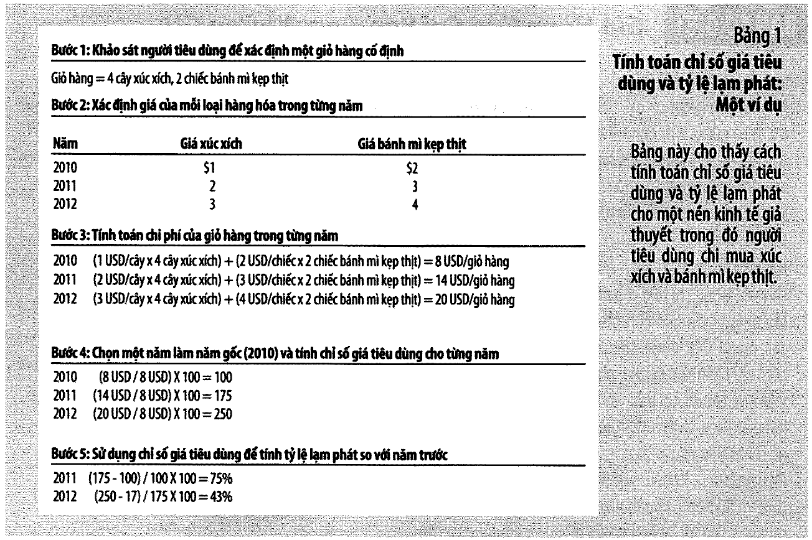
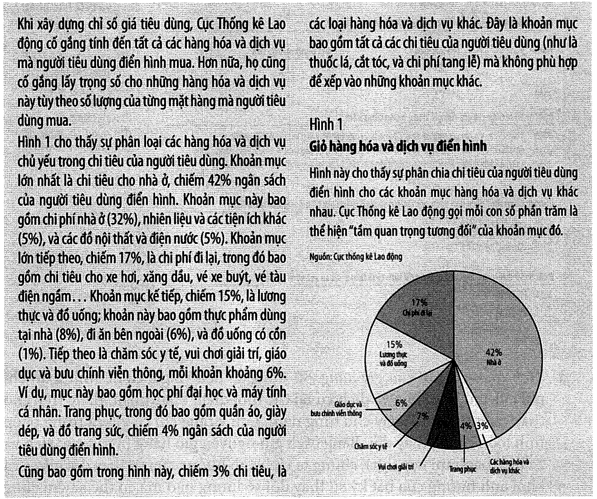
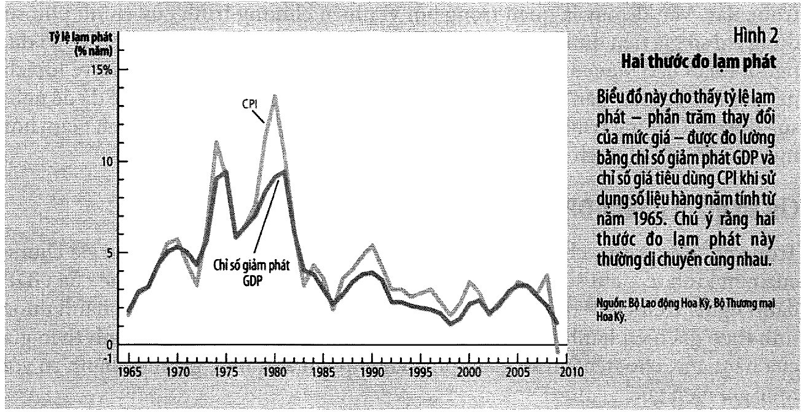
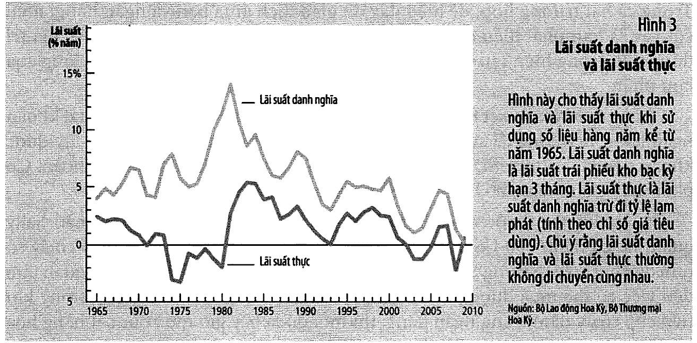

# Bài 2 — Đo lường chi phí sinh hoạt

> Bài học dựng từ **Chương 11 — Đo lường chi phí sinh hoạt** (tr. 239–258)
> của *N. Gregory Mankiw — **Kinh tế học vĩ mô***, bản dịch của Khoa Kinh tế, **ĐH Kinh tế TP.HCM** (Cengage Learning Asia).
> 🎯 **Vòng 1.** Bài 1 dạy đo **sản lượng**; bài này dạy đo **giá cả**. Có hai thước đo đó rồi thì
> mọi con số kinh tế trong quá khứ mới so được với hiện tại — mà đó là việc bạn làm hằng tuần trong nghề.
> 💼 **Góc QTKD** — ví dụ thêm cho ngành quản trị kinh doanh, **không có trong sách**.
> 📚 **Mở rộng** — thứ sách nói lướt hoặc để trong hộp phụ.
> ⚠️ — chỗ dễ hiểu sai, hoặc chỗ sách in sai.
> 📌 **Cần đọc trước:** [Bài 1 — Đo lường thu nhập quốc gia](bai_01_do_luong_thu_nhap_quoc_gia.md), mục 9–10 (GDP thực và chỉ số giảm phát GDP).

---

## Mục lục

<!-- MUC-LUC -->

- [1. Babe Ruth kiếm được nhiều hay ít hơn cầu thủ hôm nay?](#1-babe-ruth-kiếm-được-nhiều-hay-ít-hơn-cầu-thủ-hôm-nay)
- [2. Chỉ số giá tiêu dùng là gì](#2-chỉ-số-giá-tiêu-dùng-là-gì)
- [3. Năm bước tính CPI — Bảng 1, tr. 241](#3-năm-bước-tính-cpi--bảng-1-tr-241)
- [4. Giỏ hàng CPI gồm những gì — Hình 1, tr. 242](#4-giỏ-hàng-cpi-gồm-những-gì--hình-1-tr-242)
- [5. 📚 Chỉ số giá sản xuất — PPI](#5--chỉ-số-giá-sản-xuất--ppi)
- [6. Ba vấn đề khiến CPI không hoàn hảo](#6-ba-vấn-đề-khiến-cpi-không-hoàn-hảo)
- [7. ⚠️ CPI phóng đại bao nhiêu — và vì sao con số đó quan trọng](#7--cpi-phóng-đại-bao-nhiêu--và-vì-sao-con-số-đó-quan-trọng)
- [8. CPI so với chỉ số giảm phát GDP](#8-cpi-so-với-chỉ-số-giảm-phát-gdp)
- [9. Chuyển đổi số đô la giữa các thời điểm](#9-chuyển-đổi-số-đô-la-giữa-các-thời-điểm)
- [10. Chỉ số hoá và COLA](#10-chỉ-số-hoá-và-cola)
- [11. 📚 "Ngài Chỉ Số đến Hollywood" — hộp "Bạn có biết", tr. 248](#11--ngài-chỉ-số-đến-hollywood--hộp-bạn-có-biết-tr-248)
- [12. Lãi suất danh nghĩa và lãi suất thực](#12-lãi-suất-danh-nghĩa-và-lãi-suất-thực)
- [13. Lãi suất thực trong nền kinh tế Hoa Kỳ — Hình 3, tr. 250](#13-lãi-suất-thực-trong-nền-kinh-tế-hoa-kỳ--hình-3-tr-250)
- [14. 💼 Góc QTKD — nơi bài này chạm vào công việc](#14--góc-qtkd--nơi-bài-này-chạm-vào-công-việc)
- [15. 📚 Đối chiếu Việt Nam — đọc CPI trong nước](#15--đối-chiếu-việt-nam--đọc-cpi-trong-nước)
- [16. Code minh hoạ](#16-code-minh-hoạ)
- [17. Tự thử](#17-tự-thử)
- [18. Từ điển thuật ngữ](#18-từ-điển-thuật-ngữ)
- [19. Câu hỏi tự kiểm tra](#19-câu-hỏi-tự-kiểm-tra)
- [Tóm tắt một trang](#tóm-tắt-một-trang)
- [Nguồn](#nguồn)

<!-- /MUC-LUC -->

---

## 1. Babe Ruth kiếm được nhiều hay ít hơn cầu thủ hôm nay?

Sách mở chương bằng một giai thoại thật (tr. 239). Năm **1931**, giữa Đại Khủng hoảng, đội New York
Yankees trả cho **Babe Ruth** khoản lương **80.000 USD**. Một phóng viên hỏi liệu như thế có hợp lý
không, khi anh kiếm nhiều hơn Tổng thống **Herbert Hoover** — người chỉ có **75.000 USD**. Ruth trả lời:

> *"Tôi đã có một năm làm việc tốt hơn."*

Đối chiếu với năm **2010**: lương trung bình một cầu thủ Yankees là **5,5 triệu USD**, và **Alex
Rodriguez** nhận tới **33 triệu USD**.

Câu hỏi tự nhiên: bóng chày đã trở nên sinh lợi hơn nhiều so với 8 thập niên trước? Sách chặn ngay
(tr. 239):

> *"Nhưng như mọi người đều biết, giá cả hàng hóa và dịch vụ cũng đã tăng lên. Năm 1931, một đồng 5 xu
> mua được một que kem, và 25 xu mua được một vé xem phim ở rạp địa phương. Bởi vì giá cả vào thời
> của Babe Ruth thì thấp hơn rất nhiều so với ngày nay, cho nên **chúng ta không biết được là Ruth đã thụ
> hưởng mức sống cao hơn hay hay thấp hơn** so với các cầu thủ ngày nay."*

⭐ **Đây là toàn bộ vấn đề của chương.** Bất kỳ khi nào bạn so hai con số tiền ở hai thời điểm khác
nhau — lương, giá vốn, doanh thu, giá cổ phiếu — bạn **buộc phải** quy đổi trước. Mục 9 cho công thức,
và câu trả lời cho Babe Ruth.

### Vị trí của bài này trong môn học

```
   bài 1 (ch. 10)   đo SẢN LƯỢNG  →  GDP thực
   bài 2 (ch. 11)   đo GIÁ CẢ     →  CPI          ← bạn đang ở đây
   ─────────────────────────────────────────────────────────────
   có đủ hai thước đo  ⟹  bài 3 trở đi mới đi tìm NGUYÊN NHÂN
```

Sách nói rõ ranh giới đó ở phần kết luận (tr. 251):

> *"Sự thảo luận về các chỉ số giá trong chương này, cùng với sự thảo luận về GDP trong chương trước,
> chỉ là bước đầu tiên trong quá trình nghiên cứu kinh tế vĩ mô. **Chúng ta vẫn chưa xem xét những nhân
> tố nào quyết định GDP của một quốc gia hoặc những nguyên nhân và tác động của lạm phát.**"*

---

## 2. Chỉ số giá tiêu dùng là gì

> **Chỉ số giá tiêu dùng (CPI)** (*consumer price index*): thước đo chi phí tổng quát của các hàng hoá
> và dịch vụ được mua bởi **một người tiêu dùng điển hình**. — chú thích tr. 240

Ai tính nó ở Hoa Kỳ: **Cục Thống kê Lao động (BLS)**, một cơ quan trực thuộc **Bộ Lao động**, công bố
**hằng tháng** (tr. 240).

### ⚠️ Vì sao có CPI khi đã có chỉ số giảm phát GDP?

Bài 1 đã cho một thước đo mức giá rồi. Sách trả lời thẳng ở tr. 240:

> *"…tỷ lệ lạm phát mà bạn nghe thấy trong những bản tin mỗi tối thì **không được tính toán từ số liệu
> thống kê này**. Bởi vì chỉ số giá tiêu dùng phản ánh tốt hơn những hàng hóa và dịch vụ mà **người tiêu
> dùng mua**, cho nên nó là thước đo phổ biến hơn về lạm phát."*

Mục 8 mổ xẻ chính xác hai chỉ số khác nhau ở đâu. Trước hết phải biết CPI được dựng thế nào.

---

## 3. Năm bước tính CPI — Bảng 1, tr. 241



Sách dựng một nền kinh tế đồ chơi: người tiêu dùng chỉ mua **xúc xích** và **bánh mì kẹp thịt**.

### Bước 1 — Cố định giỏ hàng hoá

Xác định hàng nào quan trọng nhất với người tiêu dùng điển hình, và **quan trọng đến mức nào**.

> *"BLS xác định các trọng số này bằng cách **khảo sát người tiêu dùng** để tìm ra giỏ hàng hóa và dịch
> vụ được mua bởi người tiêu dùng điển hình."* — tr. 240

Giỏ hàng trong ví dụ: **4 cây xúc xích và 2 chiếc bánh mì kẹp thịt**.

### Bước 2 — Xác định giá cả

Giá của từng món trong giỏ, tại từng thời điểm.

| Năm  | Giá xúc xích | Giá bánh mì kẹp thịt |
| ---- | -----------: | -------------------: |
| 2010 |          $1  |                  $2  |
| 2011 |          $2  |                  $3  |
| 2012 |          $3  |                  $4  |

### Bước 3 — Tính chi phí của giỏ hàng

```
   2010:  ($1/cây × 4) + ($2/chiếc × 2)  =   8 USD/giỏ hàng
   2011:  ($2/cây × 4) + ($3/chiếc × 2)  =  14 USD/giỏ hàng
   2012:  ($3/cây × 4) + ($4/chiếc × 2)  =  20 USD/giỏ hàng
```

⭐ **Chỉ có giá cả thay đổi trong phép tính này.** Sách nhấn mạnh lý do (tr. 241):

> *"Bằng cách giữ nguyên giỏ hàng (4 cây xúc xích và 2 chiếc bánh mì kẹp thịt), chúng ta **tách ảnh
> hưởng của sự thay đổi giá cả ra khỏi ảnh hưởng của bất kỳ sự thay đổi số lượng nào** mà có thể xảy ra
> cùng lúc."*

📌 Ghi nhớ chỗ này. Nó vừa là **điểm mạnh** của CPI (tách được giá khỏi lượng) vừa là **nguồn gốc của
sai lệch lớn nhất** của nó (mục 6①).

### Bước 4 — Chọn năm gốc và tính chỉ số

$$\text{Chỉ số giá tiêu dùng} = \frac{\text{Giá của giỏ hàng hoá và dịch vụ trong năm hiện tại}}{\text{Giá của giỏ hàng hoá và dịch vụ tại năm gốc}} \times 100$$

Sách nói rõ việc chọn năm gốc là **tuỳ ý** *"bởi vì chỉ số này được sử dụng để đo lường những thay đổi
của chi phí sinh hoạt"* (tr. 241). Lấy 2010 làm năm gốc:

```
   2010:  ( 8 USD / 8 USD) × 100  =  100      ← năm gốc LUÔN bằng 100
   2011:  (14 USD / 8 USD) × 100  =  175
   2012:  (20 USD / 8 USD) × 100  =  250
```

Cách đọc con số 175: *"giá của giỏ hàng vào năm 2011 bằng **175%** giá của giỏ hàng đó trong năm gốc.
Nói cách khác, một giỏ hàng hóa có giá 100 USD ở năm gốc thì sẽ có giá **175 USD** vào năm 2011"* (tr. 242).

### Bước 5 — Tính tỷ lệ lạm phát

> **Tỷ lệ lạm phát** (*inflation rate*): phần trăm thay đổi của chỉ số giá so với kỳ trước. — chú thích tr. 242

$$\text{Tỷ lệ lạm phát năm 2} = \frac{\text{CPI năm 2} - \text{CPI năm 1}}{\text{CPI năm 1}} \times 100$$

```
   2011:  (175 − 100) / 100 × 100  =  75%
   2012:  (250 − 175) / 175 × 100  =  43%
```

⚠️ **Chú ý mẫu số.** Năm 2012 chỉ số tăng đúng **75 điểm** như năm 2011 (100→175 và 175→250), nhưng tỷ
lệ lạm phát chỉ còn **43%** vì mẫu số đã lớn hơn. Nhầm "tăng bao nhiêu **điểm**" với "tăng bao nhiêu
**phần trăm**" là lỗi số học phổ biến nhất khi đọc số liệu chỉ số.

Mục 1 của [code minh hoạ](#16-code-minh-hoạ) chạy đủ năm bước và kiểm bằng `assert` rằng ra đúng
100/175/250 và 75%/43% như sách in.

### 📚 CPI ngoài đời phức tạp hơn bao nhiêu

Ví dụ trên có 2 mặt hàng. Thực tế: *"BLS thu thập và xử lý số liệu về giá cả của **hàng ngàn** hàng hóa
và dịch vụ hàng tháng"* (tr. 242–243). BLS còn công bố:

- chỉ số cho **từng khu vực** (Boston, New York, Los Angeles);
- chỉ số cho **từng nhóm hàng** (thực phẩm, quần áo, năng lượng).

---

## 4. Giỏ hàng CPI gồm những gì — Hình 1, tr. 242



Hộp *"Bạn có biết"* của sách chia chi tiêu của người tiêu dùng điển hình Hoa Kỳ:

| Khoản mục                         | Tỷ trọng | Gồm những gì (theo sách)                                             |
| --------------------------------- | -------: | -------------------------------------------------------------------- |
| **Nhà ở**                         |  **42%** | chi phí nhà ở 32%, nhiên liệu và tiện ích khác 5%, đồ nội thất và thiết bị 5% |
| **Chi phí đi lại**                |      17% | xe hơi, xăng dầu, vé xe buýt, vé tàu điện ngầm                       |
| **Lương thực và đồ uống**         |      15% | thực phẩm tại nhà 8%, đi ăn bên ngoài 6%, đồ uống có cồn 1%          |
| **Chăm sóc y tế**                 |       7% |                                                                      |
| **Vui chơi giải trí**             |       6% |                                                                      |
| **Giáo dục và bưu chính viễn thông** | 6%    | *"bao gồm học phí đại học và máy tính cá nhân"*                      |
| **Trang phục**                    |       4% | quần áo, giày dép, đồ trang sức                                      |
| **Hàng hoá và dịch vụ khác**      |       3% | thuốc lá, cắt tóc, chi phí tang lễ                                   |
| **Tổng**                          | **100%** |                                                                      |

Sách giải thích cách gán trọng số (tr. 242):

> *"…họ cũng cố gắng lấy trọng số cho những hàng hóa và dịch vụ này tùy theo **số lượng của từng mặt
> hàng mà người tiêu dùng mua**."*

⚠️ **"Trọng số lớn" không có nghĩa là "quan trọng".** Nhà ở chiếm 42% vì người ta **tiêu nhiều tiền
nhất** cho nó, không phải vì nó đáng quý nhất. Thuốc men chỉ 7% nhưng bỏ nó đi thì bạn chết.

### ⭐ Hệ quả trực tiếp: lạm phát của bạn không phải lạm phát công bố

CPI mô tả **một người tiêu dùng điển hình**. Không ai là người điển hình cả.

Mục 2 của [code minh hoạ](#16-code-minh-hoạ) lấy cùng một bảng thay đổi giá và áp cho ba cơ cấu chi
tiêu khác nhau. Kết quả: **5,49% · 5,79% · 8,44%** — cùng một năm, cùng một bảng giá. Người tài xế chịu
lạm phát gần gấp rưỡi người điển hình, chỉ vì xăng chiếm 45% ngân sách của anh ta.

💼 Đây là lý do cuộc thương lượng lương luôn bế tắc ở chỗ này. Nhân viên nói *"lương không theo kịp
lạm phát"* — họ đang nói về **giỏ hàng của họ**, còn bạn đang đọc **CPI của cả nước**. Cả hai đều có
số liệu đúng.

---

## 5. 📚 Chỉ số giá sản xuất — PPI

> **Chỉ số giá sản xuất (PPI)** (*producer price index*): thước đo chi phí của một giỏ hàng hóa và dịch
> vụ được mua bởi **các doanh nghiệp** chứ không phải người tiêu dùng. — chú thích tr. 243

Vì sao PPI đáng theo dõi (tr. 243):

> *"Vì các doanh nghiệp rốt cuộc sẽ chuyển các chi phí cho người tiêu dùng dưới dạng giá tiêu dùng cao
> hơn, cho nên những thay đổi của chỉ số giá sản xuất thường được xem là **hữu ích trong việc dự đoán**
> sự thay đổi của chỉ số giá tiêu dùng."*

💼 Với người làm quản trị, **PPI thường quan trọng hơn CPI**: nó nằm gần chi phí đầu vào của bạn hơn,
và nó **đi trước** CPI. Nếu PPI ngành bạn đang tăng nhanh mà giá bán chưa tăng, biên lợi nhuận sắp bị
bóp — bạn có một khoảng thời gian để chuẩn bị.

---

## 6. Ba vấn đề khiến CPI không hoàn hảo

Sách vào mục này bằng một câu định nghĩa lại mục đích của CPI (tr. 243):

> *"…chỉ số giá tiêu dùng cố gắng xác định **mức thu nhập cần phải tăng lên bao nhiêu để duy trì cùng
> một mức sống**."*

Rồi thừa nhận có **ba vấn đề** *"được thừa nhận rộng rãi nhưng lại khó giải quyết"*.

### ① Thiên vị thay thế (tr. 243)

Giá các mặt hàng không tăng cùng tỷ lệ. Người tiêu dùng phản ứng bằng cách **mua ít món tăng giá
nhiều, mua nhiều món tăng giá ít**. Nhưng CPI dùng **giỏ cố định** — nó giả định người ta vẫn mua đúng
số lượng cũ.

Ví dụ của sách: năm gốc **táo rẻ hơn lê** nên người ta mua nhiều táo. Năm sau táo tăng giá nhiều hơn.
Người tiêu dùng thật sẽ **chuyển sang lê**, nhưng BLS vẫn tính giỏ cũ nhiều táo:

> *"…chỉ số giá tiêu dùng sử dụng giỏ hàng cố định mà về bản chất là giả định rằng người tiêu dùng tiếp
> tục mua những quả táo đắt đỏ bây giờ với số lượng giống như trước. Vì lý do này, chỉ số sẽ đo lường
> **sự gia tăng lớn hơn nhiều** trong chi phí sinh hoạt so với sự gia tăng mà người tiêu dùng thực tế
> trải qua."* — tr. 243

**Đo được bao nhiêu?** Mục 3 của [code minh hoạ](#16-code-minh-hoạ) dựng đúng ví dụ táo/lê bằng số:

```
   năm 1 (gốc):  táo $1,00 × 100 quả  +  lê $2,00 ×  50 quả
   năm 2      :  táo $2,00 ×  50 quả  +  lê $2,20 × 100 quả   ← người ta THAY THẾ

   chỉ số dùng giỏ NĂM GỐC     (kiểu CPI)  =  155,0   →  lạm phát  55,0%
   chỉ số dùng giỏ HIỆN TẠI                =  128,0   →  lạm phát  28,0%
   trung bình nhân của hai                 =  140,9   →  lạm phát  40,9%
```

⭐ **CPI báo 55% trong khi chi phí sống thật chỉ tăng khoảng 41%. Phóng đại 14,1 điểm phần trăm.**

📚 Hai chỉ số này có tên riêng trong thống kê: giỏ cố định năm gốc là **chỉ số Laspeyres** (chính là
cách CPI làm), giỏ năm hiện tại là **chỉ số Paasche** (chính là cách chỉ số giảm phát GDP làm — mục 8),
và trung bình nhân của hai là **chỉ số Fisher**. Sách không dùng những tên này, nhưng biết chúng thì
đọc tài liệu thống kê dễ hơn rất nhiều.

### ② Sự giới thiệu hàng hoá mới (tr. 243–244)

Lập luận của sách rất đẹp. Hình dung bạn được chọn giữa hai phiếu quà tặng **cùng 100 USD**:

```
   phiếu A:  cửa hàng LỚN, nhiều loại hàng hoá
   phiếu B:  cửa hàng NHỎ, cùng mức giá, ít loại hàng hơn
```

> *"Hầu hết mọi người sẽ chọn cửa hàng có hàng hóa đa dạng hơn. Về bản chất, sự gia tăng trong tập hợp
> các lựa chọn **làm cho mỗi đô la có giá trị hơn**."* — tr. 244

Ví dụ lịch sử của sách: **đầu thu video-cassette (VCR)** xuất hiện cuối những năm 1970. Không phải thay
thế hoàn hảo cho việc ra rạp, nhưng xem phim cũ trong phòng khách là **một lựa chọn mới**. Vấn đề:

> *"Cuối cùng thì BLS đã sửa lại giỏ hàng hóa để bao gồm VCR, và sau đó chỉ số này đã phản ánh những
> thay đổi của giá cả VCR. Nhưng **sự giảm xuống của chi phí sinh hoạt gắn liền với sự xuất hiện ban đầu
> của VCR thì đã không bao giờ được thể hiện trong chỉ số này**."* — tr. 244

### ③ Thay đổi về mặt chất lượng mà không đo lường được (tr. 244)

```
   chất lượng GIẢM, giá GIỮ NGUYÊN   →  thực chất giá đã TĂNG
   chất lượng TĂNG, giá GIỮ NGUYÊN   →  thực chất giá đã GIẢM
```

BLS **có** cố gắng điều chỉnh — ví dụ khi một mẫu xe hơi có mã lực cao hơn hoặc tiết kiệm nhiên liệu
hơn. *"Về bản chất, họ đang cố gắng tính toán giá của một giỏ hàng hóa có chất lượng không đổi"*
(tr. 244). Nhưng:

> *"Bất kể những nỗ lực này, sự thay đổi chất lượng vẫn là một vấn đề bởi vì **rất khó để đo lường chất
> lượng**."*

---

## 7. ⚠️ CPI phóng đại bao nhiêu — và vì sao con số đó quan trọng

Cả ba vấn đề đều đẩy CPI **về một phía**: phóng đại lạm phát. Sách đưa con số cụ thể (tr. 244):

> *"Một số nghiên cứu được viết trong những năm 1990 đã kết luận rằng chỉ số giá tiêu dùng phóng đại
> lạm phát khoảng **1 điểm % mỗi năm**. Đáp lại sự chỉ trích này, BLS đã thực hiện một số thay đổi có
> tính kỹ thuật để cải thiện tính chính xác của chỉ số CPI, và nhiều nhà kinh tế tin rằng sự chênh lệch
> hiện nay chỉ còn **khoảng một nửa** so với trước đây."*

Và vì sao 0,5 điểm phần trăm lại đáng quan tâm (tr. 245):

> *"Vấn đề này là quan trọng bởi vì **nhiều chương trình của chính phủ sử dụng chỉ số giá tiêu dùng để
> điều chỉnh những thay đổi của mức giá chung**. Ví dụ, người nhận bảo hiểm an sinh xã hội được hưởng sự
> gia tăng hàng năm về lợi ích nếu như lợi ích này gắn liền với chỉ số giá tiêu dùng."*

Mục 4 của [code minh hoạ](#16-code-minh-hoạ) tính mức tích luỹ của sai lệch 0,5 điểm %/năm:

| Sau N năm | Phóng đại tích luỹ |
| --------: | -----------------: |
|         1 |               0,5% |
|         5 |               2,5% |
|        10 |               5,1% |
|        20 |              10,5% |
|        30 |              16,1% |
|        40 |              22,1% |

⭐ Một sai số nhỏ đến mức không ai để ý trong một năm, tích luỹ 30 năm thành **16%** — đủ để làm lệch
toàn bộ ngân sách an sinh xã hội của một quốc gia. Đây là **lãi kép áp lên sai số**, cùng cơ chế sẽ
gặp lại ở bài 5 dưới dạng có ích (quy tắc 70).

---

## 8. CPI so với chỉ số giảm phát GDP

Hai thước đo, hai câu trả lời khác nhau cho cùng câu hỏi "giá cả tăng bao nhiêu". Sách nói: *"Thông
thường, hai chỉ số thống kê này kể cùng một câu chuyện. Tuy nhiên, có **hai khác biệt quan trọng**
khiến cho chúng khác nhau"* (tr. 245).

### Khác biệt 1 — rổ hàng nào được tính

```
   chỉ số giảm phát GDP  =  hàng hoá và dịch vụ ĐƯỢC SẢN XUẤT TRONG NƯỚC
   CPI                   =  hàng hoá và dịch vụ ĐƯỢC NGƯỜI TIÊU DÙNG MUA
```

Hai ví dụ của sách (tr. 245):

| Sự kiện                                                    | CPI  | Chỉ số giảm phát GDP | Vì sao                                        |
| ---------------------------------------------------------- | :--: | :------------------: | --------------------------------------------- |
| Boeing tăng giá máy bay bán cho Không quân Hoa Kỳ          |  —   |       **tăng**       | sản xuất trong nước, nhưng không ai tiêu dùng |
| Volvo (Thuỵ Điển) tăng giá xe bán tại Hoa Kỳ               | **tăng** |         —        | người Mỹ có mua, nhưng không sản xuất ở Mỹ    |

⭐ **Trường hợp quan trọng nhất là giá dầu** (tr. 245):

> *"Mặc dù Hoa Kỳ cũng sản xuất dầu, nhưng phần lớn lượng dầu mà chúng ta sử dụng thì được nhập khẩu.
> Kết quả là, dầu và các sản phẩm từ dầu như xăng và dầu sưởi ấm chiếm một phần lớn hơn nhiều trong chi
> tiêu của người tiêu dùng so với phần trong GDP. **Khi giá dầu tăng, chỉ số giá tiêu dùng tăng nhiều
> hơn so với chỉ số giảm phát GDP.**"*

### Khác biệt 2 — cách lấy trọng số

```
   CPI                   giỏ CỐ ĐỊNH, "thỉnh thoảng" BLS mới đổi  →  Laspeyres
   chỉ số giảm phát GDP  giỏ TỰ ĐỘNG đổi theo thành phần GDP      →  Paasche
```

Sách viết (tr. 245–246): với chỉ số giảm phát, *"nhóm hàng hóa và dịch vụ được sử dụng để tính toán…
**tự động thay đổi theo thời gian**"*, và nói rõ khi nào điều đó mới quan trọng:

> *"Sự khác biệt này thì không quan trọng khi tất cả các giá cả đang thay đổi tương ứng. Nhưng nếu giá
> cả của các hàng hóa và dịch vụ khác nhau thay đổi theo những mức khác nhau, thì cách mà chúng ta gán
> trọng số cho các giá cả khác nhau sẽ tác động đến tỷ lệ lạm phát tổng thể."*

📚 Nối lại với mục 6①: đây chính là cặp Laspeyres/Paasche. Trên cùng một bảng giá táo–lê, hai cách cho
**155** và **128**.

### Hai chỉ số trên thực tế — Hình 2, tr. 246



Hình 2 vẽ cả hai tỷ lệ lạm phát cho Hoa Kỳ từ **1965**. Kết luận của sách rất cân bằng (tr. 246):

> *"Ví dụ, vào năm 1979 và năm 1980, lạm phát tính theo CPI tăng vọt hơn lạm phát tính theo chỉ số giảm
> phát GDP chủ yếu là do **giá dầu tăng hơn gấp đôi** trong hai năm này. Tuy nhiên, **sự khác nhau giữa
> hai thước đo này là ngoại lệ hơn là quy tắc**."*

📌 Vậy dùng cái nào? Với công việc thường ngày, dùng **CPI** — nó là con số công bố, và nó gần với chi
phí sinh hoạt hơn. Chỉ khi bạn phân tích **giá đầu vào sản xuất trong nước** thì chỉ số giảm phát GDP
mới sát hơn.

---

## 9. Chuyển đổi số đô la giữa các thời điểm

Đây là công thức được dùng nhiều nhất của cả chương.

$$\text{Số đô la ngày hôm nay} = \text{Số đô la trong năm T} \times \frac{\text{Mức giá ngày hôm nay}}{\text{Mức giá trong năm T}}$$

### Trả lời câu hỏi mở chương

Số liệu: **CPI 1931 = 15,2** và **CPI 2009 = 214,5**. Mức giá chung đã tăng **14,1 lần**.

$$\text{Lương Ruth theo đô la 2009} = 80.000 \times \frac{214{,}5}{15{,}2} = 1.128.947 \text{ USD}$$

Và Tổng thống Hoover: $75.000 \times \frac{214{,}5}{15{,}2} = 1.058.388$ USD.

| Đối chiếu với năm 2010                         |     Số tiền |  Người 1931 bằng |
| ---------------------------------------------- | ----------: | ---------------: |
| lương trung bình một cầu thủ Yankees            |  5.500.000  |  Ruth = **20,5%** |
| lương Alex Rodriguez                            | 33.000.000  |   Ruth = **3,4%** |
| lương Tổng thống Barack Obama                   |    400.000  | Hoover = **265%** |

**Kết luận cho Babe Ruth** (tr. 247): mức lương ấy tương đương *"hơn 1 triệu USD hiện nay"* — một mức
thu nhập tốt, *"nhưng nó ít hơn một phần tư mức lương trung bình của Yankee ngày hôm nay và chỉ bằng
3% mức lương mà Yankees trả cho A-Rod"*.

⚠️ **Và đây là chỗ tinh tế nhất của mục này.** Sự khác biệt **không** phải chỉ do lạm phát. Sách nêu
nguyên nhân thật (tr. 247): *"Nhiều yếu tố khác nhau, bao gồm tăng trưởng kinh tế và thu nhập cổ phiếu
tăng lên mà các siêu sao kiếm được, đã làm tăng đáng kể mức sống của những vận động viên nổi tiếng nhất."*

Nói cách khác: sau khi đã khử lạm phát, **vẫn còn** một sự thay đổi thật cần giải thích. Khử lạm phát
không trả lời câu hỏi, nó chỉ **cho phép câu hỏi được đặt ra đúng**.

**Kết luận cho Hoover** (tr. 247): 1.058.388 USD, cao hơn hẳn mức 400.000 USD của Tổng thống Obama.
Sách kết bằng một câu khô khốc: *"Xem ra Tổng thống Hoover rốt cuộc đã có một năm khá tốt."* — giữa
Đại Khủng hoảng.

### Cùng công thức, dùng cho việc khác: giá tương đối

Câu hỏi ôn tập 3 của sách (tr. 253): giá một thanh kẹo tăng từ **0,1 USD** lên **0,6 USD**; cùng thời
gian đó CPI tăng từ **150** lên **300**.

```
   danh nghĩa:  0,10 → 0,60 USD        tăng 500%   (gấp 6 lần)
   mức giá chung:  150 → 300           tăng 100%   (gấp 2 lần)
   ─────────────────────────────────────────────────────────────
   quy giá cũ về đô la năm sau:  0,10 × 300/150 = 0,20 USD
   THỰC:  0,20 → 0,60 USD              tăng 200%   (gấp 3 lần)
```

⭐ Kẹo đắt lên **gấp 6 lần tính theo tiền**, nhưng chỉ đắt lên **gấp 3 lần so với mọi thứ khác**. Một
nửa mức tăng chỉ là lạm phát chung.

💼 Đây chính xác là cách phải đọc bảng giá của đối thủ qua nhiều năm, hoặc bảng giá vốn của chính bạn.
So giá 2019 với giá 2025 bằng số tuyệt đối là vô nghĩa.

---

## 10. Chỉ số hoá và COLA

> **Chỉ số hoá** (*indexation*): sự điều chỉnh **tự động** theo luật pháp hay hợp đồng cho một số tiền
> trước tác động của lạm phát. — chú thích tr. 248

Ba nơi gặp nó (tr. 248):

| Nơi                     | Tên gọi / cơ chế                                                     |
| ----------------------- | -------------------------------------------------------------------- |
| hợp đồng lao động       | **COLA** (*cost of living allowance*) — trợ cấp chi phí sinh hoạt    |
| an sinh xã hội          | lợi ích điều chỉnh hằng năm bù cho người cao tuổi khi giá cả tăng    |
| khung thuế thu nhập     | mức thu nhập mà tại đó thuế suất thay đổi cũng được chỉ số hoá       |

> *"Một COLA tự động tăng lương khi chỉ số giá tiêu dùng tăng lên."* — tr. 248

⚠️ **Nhưng không phải mọi thứ đều được chỉ số hoá.** Sách nói thẳng (tr. 248):

> *"Tuy nhiên, có nhiều trường hợp mà hệ thống thuế **không** được chỉ số hóa theo lạm phát, **ngay cả
> khi đó là việc nên làm**."*

Mục 9 của [code minh hoạ](#16-code-minh-hoạ) chạy hai người qua 5 năm lạm phát. Người **không** có COLA
mất **18,2% sức mua** — dù lương ghi trên hợp đồng không hề giảm một đồng nào.

💼 **Điều khoản chỉ số hoá quyết định AI chịu rủi ro lạm phát.** Trong hợp đồng thuê mặt bằng, hợp đồng
gia công dài hạn, hợp đồng lao động: không có điều khoản đó **không** có nghĩa là không ai chịu — chỉ
có nghĩa là **một bên chịu hết**. Và bên đó thường là bên không nghĩ tới nó khi ký.

---

## 11. 📚 "Ngài Chỉ Số đến Hollywood" — hộp "Bạn có biết", tr. 248

Một minh hoạ vui nhưng đắt giá. Câu hỏi: **bộ phim nào được yêu thích nhất mọi thời đại?**

Xếp hạng theo **doanh thu bán vé danh nghĩa** (tại thị trường Hoa Kỳ):

| # | Phim              | Doanh thu (triệu USD) |
| - | ----------------- | --------------------: |
| 1 | *Avatar*          |                   749 |
| 2 | *Titanic*         |                   601 |
| 3 | *The Dark Knight* |                   533 |

Nhưng cách xếp này *"bỏ qua một điều hiển nhiên nhưng không kém quan trọng là: **giá cả, bao gồm cả giá
vé xem phim, đã tăng lên theo thời gian**"*.

Xếp hạng sau khi **điều chỉnh lạm phát**:

| # | Phim                  | Doanh thu điều chỉnh (triệu USD) |
| - | --------------------- | -------------------------------: |
| 1 | *Gone with the Wind*  |                        **1.606** |
| 2 | *Star Wars*           |                            1.416 |
| 3 | *The Sound of Music*  |                            1.132 |
| … | *Avatar*              |            rơi xuống **vị trí 14** |

Chi tiết đắt nhất: *Gone with the Wind* công chiếu năm **1939**, trước khi tivi xuất hiện trong các gia
đình. *"Vào những năm 1930, khoảng **90 triệu người Mỹ** đến rạp chiếu phim mỗi tuần, so với **25 triệu**
ngày nay."*

> *"Và quả thực, trong bảng xếp hạng dựa vào doanh thu bán vé danh nghĩa, Gone with the Wind thậm chí
> không lọt vào danh sách 50 bộ phim hàng đầu."*

⭐ **Không điều chỉnh lạm phát thì bảng xếp hạng của bạn đo lạm phát chứ không đo cái bạn tưởng.** Áp
thẳng cho công việc: bảng "10 khách hàng lớn nhất mọi thời đại", "quý bán chạy nhất lịch sử công ty",
"năm kỷ lục doanh thu" — nếu chưa khử lạm phát thì gần như chắc chắn nó chỉ đang nói *"năm gần đây nhất"*.

---

## 12. Lãi suất danh nghĩa và lãi suất thực

Sách nói việc điều chỉnh lạm phát *"là đặc biệt quan trọng, và có phần nào đó rắc rối"* khi xem số liệu
lãi suất (tr. 248). Lý do rất căn bản:

> *"Khái niệm về mỗi mức lãi suất nhất thiết phải bao gồm cả việc **so sánh số tiền tại những thời điểm
> khác nhau**."* — tr. 249

### Ví dụ Sally — tr. 249

Sally gửi **1.000 USD**, lãi suất **10%/năm**. Một năm sau có **1.100 USD**. Cô ấy giàu hơn 100 USD chứ?

Sách chuyển câu hỏi sang thứ đo được: **cô ấy mua được bao nhiêu đĩa DVD?** Lúc gửi, đĩa DVD giá
**10 USD** → 1.000 USD = **100 đĩa**.

| Lạm phát | Giá DVD mới | Số đĩa mua được | Sức mua đổi |
| -------: | ----------: | --------------: | ----------: |
|       0% |    10,00 USD |           110,0 |   **+10%**  |
|       6% |    10,60 USD |           103,8 |    **+4%**  |
|      10% |    11,00 USD |           100,0 |     **0%**  |
|      12% |    11,20 USD |            98,2 |    **−2%**  |
|  **−2%** *(giảm phát)* | 9,80 USD | 112,2 | **+12%** |

Kết luận của sách (tr. 249):

> *"Những ví dụ này cho thấy rằng **tỉ lệ lạm phát càng cao, thì sức mua của Sally tăng càng ít**. Nếu
> tỉ lệ lạm phát cao hơn lãi suất, thì sức mua của cô ấy thực tế đã giảm xuống. Và nếu giảm phát xảy ra…
> thì sức mua của cô ấy sẽ tăng nhiều hơn lãi suất."*

### Hai định nghĩa

> **Lãi suất danh nghĩa** (*nominal interest rate*): lãi suất thường được công bố mà không có sự điều
> chỉnh tác động của lạm phát. — chú thích tr. 250
>
> **Lãi suất thực** (*real interest rate*): lãi suất đã điều chỉnh tác động của lạm phát. — chú thích tr. 250

$$\text{Lãi suất thực} = \text{Lãi suất danh nghĩa} - \text{Lạm phát}$$

Cách phân biệt gọn nhất của sách (tr. 250):

> *"**Lãi suất danh nghĩa** cho biết số tiền trong tài khoản của bạn tăng nhanh như thế nào qua thời
> gian, trong khi **lãi suất thực** cho biết **sức mua** từ tài khoản ngân hàng của bạn tăng nhanh như
> thế nào qua thời gian."*

### ⚠️ Công thức của sách là công thức xấp xỉ

Công thức chính xác — thường gọi là **phương trình Fisher**:

$$1 + r = \frac{1 + i}{1 + \pi} \qquad \text{thay vì} \qquad r \approx i - \pi$$

Mục 7 của [code minh hoạ](#16-code-minh-hoạ) đo sai lệch:

| Danh nghĩa | Lạm phát | Xấp xỉ | Chính xác | Sai lệch |
| ---------: | -------: | -----: | --------: | -------: |
|        10% |       6% |  +4,0% |    +3,8%  |  0,2 điểm |
|        20% |      15% |  +5,0% |    +4,3%  |  0,7 điểm |
|        60% |      50% | +10,0% |    +6,7%  |  3,3 điểm |
|       300% |     250% | +50,0% |   +14,3%  | **35,7 điểm** |

⭐ Với lạm phát một chữ số, dùng công thức trừ thoải mái. Với **siêu lạm phát** ở bài 8 thì nó sai hoàn
toàn — và sai theo hướng khiến bạn tưởng mình đang lãi to.

---

## 13. Lãi suất thực trong nền kinh tế Hoa Kỳ — Hình 3, tr. 250



Hình 3 vẽ lãi suất danh nghĩa (trái phiếu kho bạc kỳ hạn 3 tháng) và lãi suất thực từ **1965**.

**Đặc trưng 1** — lãi suất danh nghĩa hầu như **luôn cao hơn** lãi suất thực, *"phản ánh rằng nền kinh
tế Hoa Kỳ đã trải qua thời kỳ giá cả tiêu dùng gia tăng trong hầu hết các năm thuộc thời kỳ này"*
(tr. 250).

⚠️ Nhưng sách nói ngay điều ngược lại cũng có thật (tr. 251):

> *"Ngược lại, nếu bạn xem xét số liệu của nền kinh tế Hoa Kỳ vào cuối thế kỷ 19 hoặc của nền kinh tế
> Nhật Bản trong một số năm gần đây, bạn sẽ thấy những thời kỳ **giảm phát**. Trong thời kỳ giảm phát,
> **lãi suất thực cao hơn lãi suất danh nghĩa**."*

**Đặc trưng 2** — hai lãi suất **không luôn đi cùng nhau** (tr. 251):

| Thời kỳ            | Danh nghĩa | Lạm phát   | Thực                                              |
| ------------------ | ---------- | ---------- | ------------------------------------------------- |
| cuối những năm 1970 | **cao**    | **rất cao** | **thấp — hầu hết là ÂM**                          |
| cuối những năm 1990 | thấp hơn hai thập kỷ trước | thấp hơn nhiều | **cao hơn**              |

Câu đắt nhất của cả mục (tr. 251):

> *"Quả thực, trong hầu hết những năm 1970, lãi suất thực là **âm**, do lạm phát làm **xói mòn các khoản
> tiết kiệm** của người dân nhanh hơn các khoản tiền lãi danh nghĩa mang lại."*

⭐ **Người gửi tiết kiệm suốt thập niên 1970 ở Mỹ đã nghèo đi**, dù mỗi năm ngân hàng vẫn trả lãi và
sổ tiết kiệm vẫn ghi số ngày càng lớn.

📌 Bài 4 và bài 7 sẽ giải thích **cái gì quyết định** hai lãi suất này. Ở đây chỉ cần biết chúng khác
nhau và biết đổi qua lại.

---

## 14. 💼 Góc QTKD — nơi bài này chạm vào công việc

### ① Mọi so sánh nhiều năm đều phải khử lạm phát trước

Danh sách những thứ hay bị so sai:

| Bạn đang so                    | Phải chia cho                                     |
| ------------------------------ | ------------------------------------------------- |
| doanh thu qua các năm          | chỉ số giá bán của **chính bạn** (bài 1, mục 15)  |
| giá vốn nguyên liệu qua các năm | **PPI** ngành, không phải CPI                     |
| lương nhân viên qua các năm    | **CPI**                                           |
| giá bán của đối thủ qua các năm | CPI hoặc chỉ số giá ngành                        |

⚠️ **Dùng nhầm chỉ số cũng sai như không dùng.** Khử lạm phát chi phí thép bằng CPI (rổ 42% nhà ở) cho
ra con số vô nghĩa.

### ② Điều khoản chỉ số hoá trong hợp đồng — ai chịu rủi ro

Ba tình huống thường gặp và bên chịu thiệt nếu không có điều khoản:

```
   hợp đồng gia công 3 năm, GIÁ CỐ ĐỊNH   →  BÊN GIA CÔNG chịu toàn bộ rủi ro chi phí
   hợp đồng thuê mặt bằng 5 năm, giá cố định →  CHỦ NHÀ chịu (giá thực giảm dần)
   hợp đồng lao động không COLA           →  NGƯỜI LAO ĐỘNG chịu
```

📌 Khi bên kia đề nghị "giá cố định cho ba năm", câu hỏi đầu tiên không phải "giá bao nhiêu" mà là
**"ai đang được lợi từ việc cố định nó?"**

### ③ Đọc con số lạm phát công bố cho đúng

1. **Lạm phát tổng thể hay lạm phát cơ bản?** — lạm phát cơ bản loại bỏ nhóm biến động mạnh (lương thực,
   năng lượng) để nhìn xu hướng nền.
2. **So cùng kỳ hay so tháng trước?** — hai con số rất khác nhau.
3. **Giỏ hàng của khách hàng bạn có giống giỏ hàng CPI không?** (mục 4) — nếu bạn bán hàng cho người thu
   nhập thấp, họ chịu lạm phát lương thực nặng hơn CPI công bố rất nhiều.

### ④ ⚠️ Cái bẫy tâm lý: ảo giác tiền tệ

Nhân viên phản đối **giảm lương danh nghĩa 2%** dữ dội hơn nhiều so với **tăng lương 1% khi lạm phát 3%**
— dù về sức mua, trường hợp thứ hai còn tệ hơn.

Hiện tượng này có tên: **ảo giác tiền tệ** (*money illusion*). Nó không hợp lý, nhưng nó có thật, và
bài 13 sẽ cho thấy nó là một trong những lý do khiến nền kinh tế **không** điều chỉnh trơn tru trong
ngắn hạn.

---

## 15. 📚 Đối chiếu Việt Nam — đọc CPI trong nước

⚠️ **Cảnh báo:** số liệu dưới đây thay đổi thường xuyên và tôi ghi theo trí nhớ có giới hạn. **Hãy tra
lại tại nguồn chính thức trước khi dùng vào báo cáo.** Cái đáng học ở mục này là **cách đọc**.

### Rổ CPI Việt Nam khác rổ Hoa Kỳ ở chỗ nào

Điểm khác lớn nhất và dễ kiểm chứng: ở Hoa Kỳ khoản mục lớn nhất là **nhà ở (42%)** còn lương thực chỉ
**15%**. Ở Việt Nam, nhóm **hàng ăn và dịch vụ ăn uống** chiếm khoảng **một phần ba** rổ — lớn hơn hẳn.

⭐ Hệ quả trực tiếp và rất thực dụng:

```
   giá thịt lợn tăng mạnh  →  CPI Việt Nam nhảy rõ rệt
   giá thịt lợn tăng mạnh  →  CPI Hoa Kỳ gần như không nhúc nhích
```

Đây không phải chuyện lý thuyết: những đợt giá thực phẩm tăng mạnh đã nhiều lần một mình đẩy CPI Việt
Nam vượt mục tiêu. Nếu bạn kinh doanh trong ngành thực phẩm, **lạm phát của ngành bạn gần như quyết
định luôn con số công bố**.

📌 Quy luật tổng quát: **nước càng nghèo thì trọng số lương thực trong rổ CPI càng lớn**, nên CPI càng
nhạy với giá nông sản và càng biến động.

### Thuật ngữ

| Sách Mankiw            | Việt Nam công bố                                             |
| ---------------------- | ------------------------------------------------------------ |
| CPI                    | **chỉ số giá tiêu dùng (CPI)**                               |
| tỷ lệ lạm phát         | **CPI bình quân** (so cùng kỳ) hoặc **CPI tháng** (so tháng trước) |
| —                      | **lạm phát cơ bản** — loại nhóm biến động mạnh và nhóm nhà nước quản lý giá |
| PPI                    | **chỉ số giá sản xuất**                                      |
| chỉ số hoá             | **điều chỉnh theo trượt giá** (trong hợp đồng xây dựng)      |

⚠️ **Chú ý "so cùng kỳ" và "so tháng trước".** Bản tin Việt Nam thường đưa cả hai trong một đoạn, và
chúng có thể ngược dấu nhau. *"CPI tháng 9 giảm 0,1% so với tháng trước nhưng tăng 3,2% so với cùng kỳ"*
là một câu hoàn toàn nhất quán.

### Lãi suất thực ở Việt Nam

Áp mục 12 vào bối cảnh trong nước: khi lãi suất tiền gửi kỳ hạn 12 tháng thấp hơn CPI, **người gửi tiết
kiệm đang mất sức mua** — đúng tình huống Hoa Kỳ thập niên 1970 ở mục 13. Đó là một trong những lý do
dòng tiền dịch chuyển sang vàng và bất động sản trong những giai đoạn như vậy.

💼 Với doanh nghiệp thì ngược lại: **lãi suất thực âm là điều kiện vay tốt**. Bạn trả nợ bằng đồng tiền
mất giá. Bài 8 sẽ gọi tên hiện tượng này: lạm phát ngoài dự kiến **tái phân phối của cải từ chủ nợ sang
con nợ**.

---

## 16. Code minh hoạ

> ⚙️ **Chạy:** cần **Python 3.10+**. Lưu file rồi gõ `python3 bai-02-do-luong-chi-phi-sinh-hoat.py`.
> Không cần cài gói nào — chỉ dùng thư viện chuẩn. Kết quả **tất định**.
> Bản đầy đủ nằm ở [`thuc_hanh/bai-02-do-luong-chi-phi-sinh-hoat.py`](../thuc_hanh/bai-02-do-luong-chi-phi-sinh-hoat.py).

```python
"""Bai 2 — Do luong chi phi sinh hoat (Mankiw, Kinh te hoc vi mo, chuong 11).
Chay: python3 bai-02-do-luong-chi-phi-sinh-hoat.py   (Python 3.10+, khong can cai goi nao)

Tien dung SO NGUYEN (don vi XU) o moi cho co the — vi 0,1 USD cong don 6 lan
KHONG ra 0,6 USD trong so thuc. Ket qua tat dinh.
"""

# ══ 1. NAM BUOC TINH CPI — Bang 1, tr. 241 ══════════════════════════════════
# Nen kinh te do choi: nguoi tieu dung dien hinh chi mua hai hang hoa.
GIO_HANG = {"xuc xich": 4, "banh mi kep thit": 2}   # buoc 1: CO DINH gio hang
NAM_GOC = 2010
GIA = {   # buoc 2: xac dinh gia (don vi XU de tranh so thuc)
    2010: {"xuc xich": 100, "banh mi kep thit": 200},
    2011: {"xuc xich": 200, "banh mi kep thit": 300},
    2012: {"xuc xich": 300, "banh mi kep thit": 400},
}

def chi_phi_gio(nam, gio=None):
    """Buoc 3: chi phi cua gio hang co dinh theo gia cua `nam`, tinh bang XU."""
    gio = gio or GIO_HANG
    return sum(GIA[nam][mon] * sl for mon, sl in gio.items())

print("1. NAM BUOC TINH CHI SO GIA TIEU DUNG — Bang 1, tr. 241")
print()
print("   BUOC 1 — CO DINH gio hang:", ", ".join(f"{sl} {mon}" for mon, sl in GIO_HANG.items()))
print()
print("   BUOC 2 — xac dinh gia tung nam:")
print("      nam    gia xuc xich   gia banh mi kep thit")
for nam in sorted(GIA):
    print(f"      {nam}   {'$' + format(GIA[nam]['xuc xich'] / 100, '.0f'):>12}"
          f"   {'$' + format(GIA[nam]['banh mi kep thit'] / 100, '.0f'):>20}")
print()
print("   BUOC 3 — chi phi cua gio hang tung nam:")
for nam in sorted(GIA):
    g = GIA[nam]
    print(f"      {nam}   (${g['xuc xich'] / 100:.0f}/cay x 4) + (${g['banh mi kep thit'] / 100:.0f}/chiec x 2)"
          f"  =  {chi_phi_gio(nam) / 100:>2.0f} USD/gio hang")
print()
print(f"   BUOC 4 — chon nam goc ({NAM_GOC}) va tinh chi so:")
cpi = {}
for nam in sorted(GIA):
    cpi[nam] = chi_phi_gio(nam) / chi_phi_gio(NAM_GOC) * 100
    print(f"      {nam}   ({chi_phi_gio(nam) / 100:>2.0f} USD / {chi_phi_gio(NAM_GOC) / 100:.0f} USD) x 100"
          f"  =  CPI {cpi[nam]:>5.0f}")
print()
print("   BUOC 5 — tu CPI ra ty le lam phat:")
nam_ds = sorted(GIA)
lam_phat = {}
for truoc, sau in zip(nam_ds, nam_ds[1:]):
    lam_phat[sau] = (cpi[sau] - cpi[truoc]) / cpi[truoc] * 100
    print(f"      {sau}   ({cpi[sau]:.0f} - {cpi[truoc]:.0f}) / {cpi[truoc]:.0f} x 100"
          f"  =  {lam_phat[sau]:>5.0f}%")
print()
assert [round(cpi[n]) for n in nam_ds] == [100, 175, 250]
assert [round(lam_phat[n]) for n in (2011, 2012)] == [75, 43]
print("   Sach in: CPI 100 / 175 / 250 · lam phat 75% va 43%.  ✓ khop tung con so.")
print()
print("   ⭐ CHU Y BUOC 1 VA BUOC 3: gio hang GIU NGUYEN (4 cay + 2 chiec) o ca ba nam.")
print("      Sach noi ro ly do (tr. 241): 'chung ta tach anh huong cua su thay doi gia ca")
print("      ra khoi anh huong cua bat ky su thay doi so luong nao'.")
print("      ⚠ Chinh su co dinh nay sinh ra THIEN VI THAY THE — muc 3.")
print()

# ══ 2. GIO HANG CPI THAT SU CHUA GI — Hinh 1, tr. 242 ══════════════════════
GIO_CPI = [
    ("Nha o",                          42),
    ("Chi phi di lai",                 17),
    ("Luong thuc va do uong",          15),
    ("Cham soc y te",                   7),
    ("Vui choi giai tri",               6),
    ("Giao duc va buu chinh vien thong", 6),
    ("Trang phuc",                      4),
    ("Hang hoa va dich vu khac",        3),
]
print("2. GIO HANG CPI DIEN HINH — Hinh 1, tr. 242 (Cuc Thong ke Lao dong Hoa Ky)")
print()
for ten, pct in GIO_CPI:
    print(f"   {ten:<34} {pct:>3}%  {'█' * pct}")
tong_pct = sum(p for _, p in GIO_CPI)
assert tong_pct == 100
print(f"   {'TONG':<34} {tong_pct:>3}%  ✓")
print()
print("   ⚠ 'TRONG SO' KHONG PHAI 'QUAN TRONG'. Nha o chiem 42% vi nguoi ta TIEU nhieu")
print("      tien nhat cho no, khong phai vi no dang quy nhat.")
print()

# --- Lam phat cua RIENG BAN khac lam phat CONG BO the nao -------------------
print("   LAM PHAT CUA RIENG BAN — khi gio hang cua ban khac gio hang dien hinh:")
print()
# Gia moi nhom tang khac nhau trong mot nam gia dinh (% nam)
TANG_GIA = {"Nha o": 3, "Chi phi di lai": 12, "Luong thuc va do uong": 8,
            "Cham soc y te": 5, "Vui choi giai tri": 2,
            "Giao duc va buu chinh vien thong": 6, "Trang phuc": 1,
            "Hang hoa va dich vu khac": 4}
# Ba nguoi voi ba co cau chi tieu rat khac nhau (% ngan sach)
NGUOI = {
    "nguoi tieu dung dien hinh (= CPI)": dict(GIO_CPI),
    "sinh vien thue tro, di xe may   ": {"Nha o": 35, "Chi phi di lai": 8,
                                         "Luong thuc va do uong": 35, "Cham soc y te": 2,
                                         "Vui choi giai tri": 5,
                                         "Giao duc va buu chinh vien thong": 12,
                                         "Trang phuc": 2, "Hang hoa va dich vu khac": 1},
    "tai xe cong nghe, o nha rieng   ": {"Nha o": 15, "Chi phi di lai": 45,
                                         "Luong thuc va do uong": 25, "Cham soc y te": 5,
                                         "Vui choi giai tri": 3,
                                         "Giao duc va buu chinh vien thong": 3,
                                         "Trang phuc": 2, "Hang hoa va dich vu khac": 2},
}
for ten, trong_so in NGUOI.items():
    assert sum(trong_so.values()) == 100
    lp = sum(trong_so[k] * TANG_GIA[k] for k in trong_so) / 100
    print(f"   {ten}  lam phat cam nhan = {lp:>5.2f}%")
print()
print("   ⭐ Cung mot nam, cung mot bang gia — ba con so khac nhau. Tai xe chiu lam phat")
print("      gan gap ruoi nguoi dien hinh, chi vi xang chiem 45% ngan sach cua anh ta.")
print("   💼 Khi nhan vien noi 'luong khong theo kip lam phat', ho khong sai ma cung khong")
print("      dung — ho dang noi ve GIO HANG CUA HO, con ban dang doc CPI cua ca nuoc.")
print()

# ══ 3. VAN DE 1: THIEN VI THAY THE — tr. 243 ═══════════════════════════════
# Vi du cua sach: nam goc tao RE hon le nen nguoi ta mua nhieu tao.
# Nam sau tao tang gia nhieu hon le => nguoi ta CHUYEN sang le.
GIA_TAO   = {1: 100, 2: 200}   # xu/qua — tang 100%
GIA_LE    = {1: 200, 2: 220}   # xu/qua — tang  10%
LUONG_TAO = {1: 100, 2:  50}   # nguoi tieu dung THAY THE
LUONG_LE  = {1:  50, 2: 100}

def gio(nam_gia, nam_luong):
    return GIA_TAO[nam_gia] * LUONG_TAO[nam_luong] + GIA_LE[nam_gia] * LUONG_LE[nam_luong]

print("3. VAN DE 1 — THIEN VI THAY THE (tr. 243)")
print()
print("   nam 1 (goc):  tao $1,00 x 100 qua  +  le $2,00 x  50 qua")
print("   nam 2      :  tao $2,00 x  50 qua  +  le $2,20 x 100 qua   <- NGUOI TIEU DUNG THAY THE")
print(f"                 gia tao +100%, gia le chi +10%")
print()
laspeyres = gio(2, 1) / gio(1, 1) * 100      # gio nam GOC, dinh gia hai nam — chinh la CPI
paasche   = gio(2, 2) / gio(1, 2) * 100      # gio nam HIEN TAI, dinh gia hai nam
fisher    = (laspeyres * paasche) ** 0.5     # trung binh nhan cua hai
print(f"   gio nam GOC      dinh gia nam 1 = {gio(1, 1) / 100:>6.2f} USD   nam 2 = {gio(2, 1) / 100:>6.2f} USD")
print(f"   gio nam HIEN TAI dinh gia nam 1 = {gio(1, 2) / 100:>6.2f} USD   nam 2 = {gio(2, 2) / 100:>6.2f} USD")
print()
print(f"   CPI kieu gio CO DINH (Laspeyres — dung nhu BLS lam) = {laspeyres:>6.1f}"
      f"   => lam phat {laspeyres - 100:>5.1f}%")
print(f"   Chi so gio HIEN TAI (Paasche)                       = {paasche:>6.1f}"
      f"   => lam phat {paasche - 100:>5.1f}%")
print(f"   Trung binh nhan hai chi so (Fisher)                 = {fisher:>6.1f}"
      f"   => lam phat {fisher - 100:>5.1f}%")
print()
print(f"   ⭐ CPI bao lam phat {laspeyres - 100:.1f}% trong khi chi phi song THAT su chi tang"
      f" khoang {fisher - 100:.1f}%.")
print(f"      CPI PHONG DAI {laspeyres - fisher:.1f} diem phan tram, chi vi no gia dinh nguoi ta")
print("      'tiep tuc mua nhung qua tao dat do bay gio voi so luong giong nhu truoc' (tr. 243).")
print()

# ══ 4. BA VAN DE CUA CPI — tr. 243-245 ═════════════════════════════════════
print("4. BA VAN DE CUA CPI — tom tat tr. 243-245, ca ba deu lam CPI PHONG DAI lam phat")
print()
VAN_DE = [
    ("① Thien vi thay the",
     "gio CO DINH bo qua viec nguoi ta chuyen sang hang re hon",
     "muc 3 do duoc: phong dai 14,1 diem %"),
    ("② Gioi thieu hang hoa moi",
     "hang moi lam moi do la CO GIA TRI HON, chi so khong ghi nhan",
     "vi du VCR cuoi thap nien 1970, tr. 244"),
    ("③ Thay doi chat luong khong do duoc",
     "xe manh hon / tiet kiem xang hon voi cung gia = GIAM gia thuc",
     "BLS co dieu chinh nhung 'rat kho do luong chat luong'"),
]
for ten, co_che, vi_du in VAN_DE:
    print(f"   {ten}")
    print(f"      co che: {co_che}")
    print(f"      {vi_du}")
print()
print("   ⚠ Do lon cua sai lech (tr. 244): mot nghien cuu nam 1996 ket luan CPI phong dai")
print("      lam phat KHOANG 1 DIEM PHAN TRAM MOI NAM. BLS da sua ky thuat; nhieu nha kinh")
print("      te tin sai lech hien nay 'chi con khoang mot nua so voi truoc day'.")
print()
LECH = 0.005   # 0,5 diem % moi nam — muc sau khi BLS da sua
print(f"   Neu sai lech con {LECH * 100:.1f} diem %/nam thi sau N nam, muc dieu chinh tich luy:")
for n in (1, 5, 10, 20, 30, 40):
    print(f"      {n:>2} nam  ->  phong dai {((1 + LECH) ** n - 1) * 100:>5.1f}%")
print("   💼 Day khong phai chuyen hoc thuat: an sinh xa hoi, khung thue va nhieu hop dong")
print("      lao dong deu chi so hoa theo CPI. Sai 0,5%/nam thi sau 30 nam lech 16%.")
print()

# ══ 5. CHUYEN DOI SO DO LA GIUA CAC THOI DIEM — tr. 247 ════════════════════
# So do la hom nay = So do la nam T x (Muc gia hom nay / Muc gia nam T)
CPI_LICH_SU = {1914: 10.0, 1931: 15.2, 2009: 214.5, 2010: 218.0}

def quy_doi(so_tien, nam_tu, nam_den):
    return so_tien * CPI_LICH_SU[nam_den] / CPI_LICH_SU[nam_tu]

print("5. CHUYEN DOI SO DO LA GIUA CAC THOI DIEM — tr. 247")
print("   Cong thuc: So do la hom nay = So do la nam T x (Muc gia hom nay / Muc gia nam T)")
print()
print(f"   CPI 1931 = {CPI_LICH_SU[1931]}   CPI 2009 = {CPI_LICH_SU[2009]}"
      f"   =>  muc gia tang {CPI_LICH_SU[2009] / CPI_LICH_SU[1931]:.1f} lan")
print()
NHAN_VAT = [
    ("Babe Ruth (cau thu Yankees), 1931", 80_000, 1931, 2009),
    ("Tong thong Herbert Hoover, 1931",   75_000, 1931, 2009),
]
for ten, tien, tu, den in NHAN_VAT:
    print(f"   {ten:<36} {tien:>7,} USD ({tu})  ->  {quy_doi(tien, tu, den):>11,.0f} USD ({den})")
assert round(quy_doi(80_000, 1931, 2009)) == 1_128_947
assert round(quy_doi(75_000, 1931, 2009)) == 1_058_388
print("   Sach in 1.128.947 USD va 1.058.388 USD.  ✓ khop.")
print()
ruth = quy_doi(80_000, 1931, 2009)
hoover = quy_doi(75_000, 1931, 2009)
print("   Doi chieu voi cac muc luong nam 2010:")
for ten, tien, moc, ten_moc in [
        ("luong trung binh mot cau thu Yankees", 5_500_000, ruth, "Ruth"),
        ("luong Alex Rodriguez (A-Rod)",        33_000_000, ruth, "Ruth"),
        ("luong Tong thong Barack Obama",          400_000, hoover, "Hoover")]:
    print(f"      {ten:<38} {tien:>10,} USD   -> {ten_moc} bang {moc / tien * 100:>5.1f}% con so nay")
print()
print(f"   ⭐ Hoover 1931 tuong duong {hoover:,.0f} USD — CAO HON HAN muc 400.000 USD cua Obama.")
print("      Sach dua mot cau kho (tr. 247): 'Xem ra Tong thong Hoover rot cuoc da co mot")
print("      nam kha tot.' — giua Dai Khung hoang.")
print()
print("   ⭐ Ruth kiem 'hon 1 trieu USD hom nay' — mot muc thu nhap TOT, nhung chua toi")
print("      MOT PHAN TU luong trung binh cua Yankees ngay nay, va chi bang 3% luong A-Rod.")
print("      Sach giai thich (tr. 247): tang truong kinh te + thu nhap co phieu tang len")
print("      lam sieu sao kiem duoc nhieu hon HAN, chu khong chi la lam phat.")
print()
print("   KIEM TRA NHANH cua sach (tr. 251): Henry Ford tra 5 USD/ngay nam 1914,")
print(f"      CPI 1914 = {CPI_LICH_SU[1914]}, CPI 2010 = {CPI_LICH_SU[2010]}")
print(f"      =>  5 USD x {CPI_LICH_SU[2010]}/{CPI_LICH_SU[1914]} = {quy_doi(5, 1914, 2010):.0f} USD/ngay")
print("      Bai 6 se quay lai muc luong nay duoi ten 'ly thuyet tien luong hieu qua'.")
print()

# ══ 6. GIA DANH NGHIA VA GIA TUONG DOI — cau hoi on tap 3, tr. 253 ═════════
print("6. GIA DANH NGHIA VA GIA TUONG DOI — cau hoi on tap 3, tr. 253")
print()
KEO_TRUOC, KEO_SAU = 10, 60        # xu
CPI_TRUOC, CPI_SAU = 150, 300
print(f"   Gia mot thanh keo: {KEO_TRUOC / 100:.2f} USD  ->  {KEO_SAU / 100:.2f} USD"
      f"      => DANH NGHIA tang {(KEO_SAU / KEO_TRUOC - 1) * 100:.0f}%")
print(f"   CPI:               {CPI_TRUOC}     ->  {CPI_SAU}"
      f"          => muc gia chung tang {(CPI_SAU / CPI_TRUOC - 1) * 100:.0f}%")
# Quy ve "gia keo theo do la cua nam SAU" cho de doc, thay vi de so le
keo_truoc_quy_doi = KEO_TRUOC * CPI_SAU / CPI_TRUOC
print(f"   Quy gia cu ve do la nam sau: {KEO_TRUOC / 100:.2f} x {CPI_SAU}/{CPI_TRUOC}"
      f" = {keo_truoc_quy_doi / 100:.2f} USD")
print(f"   Gia THUC:          {keo_truoc_quy_doi / 100:.2f} USD  ->  {KEO_SAU / 100:.2f} USD"
      f"      => THUC tang {(KEO_SAU / keo_truoc_quy_doi - 1) * 100:.0f}%")
print()
print("   ⭐ Keo dat len GAP 6 LAN tinh theo tien, nhung chi dat len GAP 3 LAN so voi")
print("      moi thu khac. Mot nua muc tang chi la lam phat chung.")
print("   💼 Day chinh la cach doc bang gia doi thu qua nhieu nam: dung so sanh gia 2019")
print("      voi gia 2025 bang so tuyet doi, phai chia cho chi so gia truoc.")
print()

# ══ 7. LAI SUAT DANH NGHIA VA LAI SUAT THUC — Sally, tr. 249 ═══════════════
GUI = 100_000     # xu = 1.000 USD
LAI_DANH_NGHIA = 10   # %/nam
GIA_DVD_DAU = 1_000   # xu = 10 USD

print("7. LAI SUAT THUC — vi du Sally, tr. 249")
print(f"   Sally gui {GUI / 100:,.0f} USD, lai suat danh nghia {LAI_DANH_NGHIA}%/nam.")
print(f"   Mot nam sau co ay co {GUI * (100 + LAI_DANH_NGHIA) / 100 / 100:,.0f} USD."
      f"  Gia mot dia DVD luc gui: {GIA_DVD_DAU / 100:.0f} USD.")
print()
sau_mot_nam = GUI * (100 + LAI_DANH_NGHIA) // 100
dvd_dau = GUI // GIA_DVD_DAU
print(f"   Luc gui, {GUI / 100:,.0f} USD mua duoc {dvd_dau} dia DVD.")
print()
print("   lam phat   gia DVD moi   so dia mua duoc   suc mua doi   lai suat thuc")
KICH_BAN = [0, 6, 10, 12, -2]
for pi in KICH_BAN:
    gia_moi = GIA_DVD_DAU * (100 + pi) / 100
    dvd_sau = sau_mot_nam / gia_moi
    doi = (dvd_sau / dvd_dau - 1) * 100
    thuc_chinh_xac = ((1 + LAI_DANH_NGHIA / 100) / (1 + pi / 100) - 1) * 100
    nhan = "GIAM PHAT" if pi < 0 else ""
    print(f"   {pi:>6}%   ${gia_moi / 100:>10.2f}   {dvd_sau:>15.1f}   {doi:>+10.1f}%"
          f"   {thuc_chinh_xac:>+12.1f}%  {nhan}")
print()
print("   ⭐ Cot 'suc mua doi' va cot 'lai suat thuc' la MOT — do la dinh nghia cua lai")
print("      suat thuc: 'suc mua tu tai khoan ngan hang cua ban tang nhanh nhu the nao'.")
print("   ⭐ Lam phat = lai suat danh nghia (10%) => suc mua KHONG DOI, du so tien tang 10%.")
print("   ⚠ Lam phat 12% > lai suat 10% => Sally NGHEO DI du so du tai khoan tang len.")
print("      Sach (tr. 249): 'neu ti le lam phat cao hon lai suat thi suc mua cua co ay")
print("      thuc te da giam xuong'.")
print()

# --- Cong thuc xap xi so voi cong thuc chinh xac ----------------------------
print("   ⚠ HAI CONG THUC — sach chi day cong thuc XAP XI (tr. 250):")
print("        lai suat thuc = lai suat danh nghia - lam phat        (xap xi)")
print("        1 + thuc = (1 + danh nghia) / (1 + lam phat)          (chinh xac, 'Fisher')")
print()
print("   danh nghia   lam phat   XAP XI   CHINH XAC   sai lech")
for i, pi in [(10, 0), (10, 6), (10, 10), (10, 12), (10, -2),
              (20, 15), (60, 50), (300, 250)]:
    xap_xi = i - pi
    chinh_xac = ((1 + i / 100) / (1 + pi / 100) - 1) * 100
    print(f"   {i:>10}%  {pi:>8}%  {xap_xi:>+6.1f}%  {chinh_xac:>+10.1f}%  {xap_xi - chinh_xac:>+8.1f} diem")
print()
print("   ⭐ Voi lam phat mot chu so, hai cong thuc gan nhu trung nhau — dung xap xi thoai mai.")
print("      Voi lam phat ba chu so (bai 8: sieu lam phat) thi xap xi SAI HOAN TOAN.")
print()

# ══ 8. CPI SO VOI CHI SO GIAM PHAT GDP — tr. 245 ═══════════════════════════
print("8. CPI SO VOI CHI SO GIAM PHAT GDP — hai khac biet, tr. 245")
print()
print("   KHAC BIET 1 — RO HANG NAO DUOC TINH:")
print("      CPI       = hang hoa NGUOI TIEU DUNG MUA   (ke ca hang NHAP KHAU)")
print("      giam phat = hang hoa SAN XUAT TRONG NUOC   (ke ca hang khong ai tieu dung)")
print()
VI_DU = [
    ("Boeing tang gia may bay ban cho Khong quan Hoa Ky",
     False, True,  "san xuat trong nuoc nhung khong nam trong gio tieu dung"),
    ("Volvo (Thuy Dien) tang gia xe ban tai Hoa Ky",
     True,  False, "nguoi My co mua, nhung KHONG san xuat tai Hoa Ky"),
    ("Gia dau tho nhap khau tang manh",
     True,  False, "xang chiem phan lon chi tieu tieu dung hon la trong GDP"),
    ("Gia thep san xuat trong nuoc ban cho nha may",
     False, True,  "hang trung gian, khong nam trong gio tieu dung"),
]
print("   su kien                                              CPI     giam phat GDP")
for su_kien, vao_cpi, vao_gp, _ in VI_DU:
    print(f"   {su_kien:<50} {'TANG' if vao_cpi else '—':^6}   {'TANG' if vao_gp else '—':^12}")
print()
for su_kien, _, _, ly_do in VI_DU:
    print(f"      • {su_kien}: {ly_do}")
print()
print("   ⭐ He qua quan trong nhat (tr. 245): 'Khi gia dau tang, chi so gia tieu dung tang")
print("      NHIEU HON so voi chi so giam phat GDP'. Nam 1979-1980 CPI vot len hon han")
print("      giam phat GDP chinh vi gia dau tang hon gap doi (tr. 246).")
print()
print("   KHAC BIET 2 — CACH LAY TRONG SO:")
print("      CPI       gio CO DINH, 'thinh thoang' BLS moi doi   -> Laspeyres")
print("      giam phat gio TU DONG doi theo thanh phan GDP        -> Paasche")
print("      => o muc 3, hai cach cho 155 va 128 tren cung mot bang gia.")
print()

# ══ 9. CHI SO HOA VA COLA — tr. 247-248 ════════════════════════════════════
print("9. CHI SO HOA — tr. 247-248")
print("   'Chi so hoa': su dieu chinh TU DONG theo luat phap hay hop dong cho mot so tien")
print("   truoc tac dong cua lam phat. Trong hop dong lao dong goi la COLA.")
print()
LUONG_KHOI_DIEM = 20_000_000   # dong/thang
LAM_PHAT_NAM = [4.5, 3.2, 6.8, 3.9, 2.1]
print(f"   Luong khoi diem {LUONG_KHOI_DIEM:,} dong/thang. Nam kich ban lam phat khac nhau.")
print()
print("   nam   lam phat   CO COLA (luong danh nghia)   KHONG COLA (suc mua thuc)")
luong_cola = LUONG_KHOI_DIEM
muc_gia = 1.0
print(f"     0        —     {luong_cola:>15,.0f} dong     {LUONG_KHOI_DIEM:>15,.0f} dong")
for i, pi in enumerate(LAM_PHAT_NAM, 1):
    muc_gia *= 1 + pi / 100
    luong_cola *= 1 + pi / 100
    thuc_khong_cola = LUONG_KHOI_DIEM / muc_gia
    print(f"   {i:>3}   {pi:>7.1f}%     {luong_cola:>15,.0f} dong     {thuc_khong_cola:>15,.0f} dong")
mat = (1 - LUONG_KHOI_DIEM / muc_gia / LUONG_KHOI_DIEM) * 100
print()
print(f"   ⭐ Sau 5 nam, nguoi KHONG co COLA mat {mat:.1f}% suc mua — du luong tren hop dong")
print("      khong he giam mot dong nao. Day la 'thue lam phat' ma bai 8 se goi ten.")
print()
print("   ⚠ Sach luu y (tr. 248): 'co nhieu truong hop ma he thong thue KHONG duoc chi so")
print("      hoa theo lam phat, ngay ca khi do la viec nen lam'.")
print("   💼 Trong hop dong thue mat bang, hop dong gia cong dai han, hop dong lao dong:")
print("      dieu khoan chi so hoa quyet dinh AI chiu rui ro lam phat. Khong co dieu khoan")
print("      do khong co nghia la khong ai chiu — chi co nghia la MOT BEN chiu het.")
print()

# ══ 10. 💼 GOC QTKD — BAI TAP 2 tr. 253 GIAI BANG CODE ═════════════════════
print("10. 💼 TU BANG GIA RA CHI SO GIA CUA RIENG NGANH — bai tap 2, tr. 253")
print()
GIO_TT = {"Bong tennis": 100, "Bong golf": 100, "Chai Gatorade": 200}
GIA_TT = {2011: {"Bong tennis": 200, "Bong golf": 400, "Chai Gatorade": 100},
          2012: {"Bong tennis": 200, "Bong golf": 600, "Chai Gatorade": 200}}   # xu
print("   a. Phan tram thay doi gia tung mat hang:")
for mon in GIO_TT:
    p1, p2 = GIA_TT[2011][mon], GIA_TT[2012][mon]
    print(f"      {mon:<16} ${p1 / 100:.0f}  ->  ${p2 / 100:.0f}   {(p2 / p1 - 1) * 100:>+6.0f}%")
cp = {n: sum(GIA_TT[n][m] * q for m, q in GIO_TT.items()) for n in GIA_TT}
print()
print("   b. Chi so gia chung (dung dung phuong phap CPI, nam goc 2011):")
for n in sorted(cp):
    print(f"      {n}   chi phi gio hang = ${cp[n] / 100:>7,.0f}"
          f"   chi so = {cp[n] / cp[2011] * 100:>5.0f}")
print(f"      => lam phat = {(cp[2012] / cp[2011] - 1) * 100:.0f}%")
print()
print("   ⭐ Ba mat hang tang 0%, 50%, 100% — chi so chung ra 50%, KHONG phai trung binh")
print("      cong (0+50+100)/3 = 50 mot cach tinh co. Doi so luong Gatorade tu 200 xuong")
print("      50 la hai con so tach nhau ngay: TRONG SO moi la thu quyet dinh.")
print()
# Chung minh: doi trong so thi chi so doi
GIO_KHAC = {"Bong tennis": 100, "Bong golf": 100, "Chai Gatorade": 50}
cp2 = {n: sum(GIA_TT[n][m] * q for m, q in GIO_KHAC.items()) for n in GIA_TT}
print(f"   Kiem: neu gio hang chi co 50 chai Gatorade thay vi 200:")
print(f"      chi so 2012 = {cp2[2012] / cp2[2011] * 100:.1f}"
      f"   => lam phat {(cp2[2012] / cp2[2011] - 1) * 100:.1f}%  (thay vi 50%)")
print("   💼 Vi the khi ban lap 'chi so gia dau vao' cho cong ty minh, viec chon TY TRONG")
print("      quan trong hon viec thu thap gia. Ty trong sai thi thu thap gia cang ky cang lech.")
```

Kết quả chạy thật:

```
1. NAM BUOC TINH CHI SO GIA TIEU DUNG — Bang 1, tr. 241

   BUOC 1 — CO DINH gio hang: 4 xuc xich, 2 banh mi kep thit

   BUOC 2 — xac dinh gia tung nam:
      nam    gia xuc xich   gia banh mi kep thit
      2010             $1                     $2
      2011             $2                     $3
      2012             $3                     $4

   BUOC 3 — chi phi cua gio hang tung nam:
      2010   ($1/cay x 4) + ($2/chiec x 2)  =   8 USD/gio hang
      2011   ($2/cay x 4) + ($3/chiec x 2)  =  14 USD/gio hang
      2012   ($3/cay x 4) + ($4/chiec x 2)  =  20 USD/gio hang

   BUOC 4 — chon nam goc (2010) va tinh chi so:
      2010   ( 8 USD / 8 USD) x 100  =  CPI   100
      2011   (14 USD / 8 USD) x 100  =  CPI   175
      2012   (20 USD / 8 USD) x 100  =  CPI   250

   BUOC 5 — tu CPI ra ty le lam phat:
      2011   (175 - 100) / 100 x 100  =     75%
      2012   (250 - 175) / 175 x 100  =     43%

   Sach in: CPI 100 / 175 / 250 · lam phat 75% va 43%.  ✓ khop tung con so.

   ⭐ CHU Y BUOC 1 VA BUOC 3: gio hang GIU NGUYEN (4 cay + 2 chiec) o ca ba nam.
      Sach noi ro ly do (tr. 241): 'chung ta tach anh huong cua su thay doi gia ca
      ra khoi anh huong cua bat ky su thay doi so luong nao'.
      ⚠ Chinh su co dinh nay sinh ra THIEN VI THAY THE — muc 3.

2. GIO HANG CPI DIEN HINH — Hinh 1, tr. 242 (Cuc Thong ke Lao dong Hoa Ky)

   Nha o                               42%  ██████████████████████████████████████████
   Chi phi di lai                      17%  █████████████████
   Luong thuc va do uong               15%  ███████████████
   Cham soc y te                        7%  ███████
   Vui choi giai tri                    6%  ██████
   Giao duc va buu chinh vien thong     6%  ██████
   Trang phuc                           4%  ████
   Hang hoa va dich vu khac             3%  ███
   TONG                               100%  ✓

   ⚠ 'TRONG SO' KHONG PHAI 'QUAN TRONG'. Nha o chiem 42% vi nguoi ta TIEU nhieu
      tien nhat cho no, khong phai vi no dang quy nhat.

   LAM PHAT CUA RIENG BAN — khi gio hang cua ban khac gio hang dien hinh:

   nguoi tieu dung dien hinh (= CPI)  lam phat cam nhan =  5.49%
   sinh vien thue tro, di xe may     lam phat cam nhan =  5.79%
   tai xe cong nghe, o nha rieng     lam phat cam nhan =  8.44%

   ⭐ Cung mot nam, cung mot bang gia — ba con so khac nhau. Tai xe chiu lam phat
      gan gap ruoi nguoi dien hinh, chi vi xang chiem 45% ngan sach cua anh ta.
   💼 Khi nhan vien noi 'luong khong theo kip lam phat', ho khong sai ma cung khong
      dung — ho dang noi ve GIO HANG CUA HO, con ban dang doc CPI cua ca nuoc.

3. VAN DE 1 — THIEN VI THAY THE (tr. 243)

   nam 1 (goc):  tao $1,00 x 100 qua  +  le $2,00 x  50 qua
   nam 2      :  tao $2,00 x  50 qua  +  le $2,20 x 100 qua   <- NGUOI TIEU DUNG THAY THE
                 gia tao +100%, gia le chi +10%

   gio nam GOC      dinh gia nam 1 = 200.00 USD   nam 2 = 310.00 USD
   gio nam HIEN TAI dinh gia nam 1 = 250.00 USD   nam 2 = 320.00 USD

   CPI kieu gio CO DINH (Laspeyres — dung nhu BLS lam) =  155.0   => lam phat  55.0%
   Chi so gio HIEN TAI (Paasche)                       =  128.0   => lam phat  28.0%
   Trung binh nhan hai chi so (Fisher)                 =  140.9   => lam phat  40.9%

   ⭐ CPI bao lam phat 55.0% trong khi chi phi song THAT su chi tang khoang 40.9%.
      CPI PHONG DAI 14.1 diem phan tram, chi vi no gia dinh nguoi ta
      'tiep tuc mua nhung qua tao dat do bay gio voi so luong giong nhu truoc' (tr. 243).

4. BA VAN DE CUA CPI — tom tat tr. 243-245, ca ba deu lam CPI PHONG DAI lam phat

   ① Thien vi thay the
      co che: gio CO DINH bo qua viec nguoi ta chuyen sang hang re hon
      muc 3 do duoc: phong dai 14,1 diem %
   ② Gioi thieu hang hoa moi
      co che: hang moi lam moi do la CO GIA TRI HON, chi so khong ghi nhan
      vi du VCR cuoi thap nien 1970, tr. 244
   ③ Thay doi chat luong khong do duoc
      co che: xe manh hon / tiet kiem xang hon voi cung gia = GIAM gia thuc
      BLS co dieu chinh nhung 'rat kho do luong chat luong'

   ⚠ Do lon cua sai lech (tr. 244): mot nghien cuu nam 1996 ket luan CPI phong dai
      lam phat KHOANG 1 DIEM PHAN TRAM MOI NAM. BLS da sua ky thuat; nhieu nha kinh
      te tin sai lech hien nay 'chi con khoang mot nua so voi truoc day'.

   Neu sai lech con 0.5 diem %/nam thi sau N nam, muc dieu chinh tich luy:
       1 nam  ->  phong dai   0.5%
       5 nam  ->  phong dai   2.5%
      10 nam  ->  phong dai   5.1%
      20 nam  ->  phong dai  10.5%
      30 nam  ->  phong dai  16.1%
      40 nam  ->  phong dai  22.1%
   💼 Day khong phai chuyen hoc thuat: an sinh xa hoi, khung thue va nhieu hop dong
      lao dong deu chi so hoa theo CPI. Sai 0,5%/nam thi sau 30 nam lech 16%.

5. CHUYEN DOI SO DO LA GIUA CAC THOI DIEM — tr. 247
   Cong thuc: So do la hom nay = So do la nam T x (Muc gia hom nay / Muc gia nam T)

   CPI 1931 = 15.2   CPI 2009 = 214.5   =>  muc gia tang 14.1 lan

   Babe Ruth (cau thu Yankees), 1931     80,000 USD (1931)  ->    1,128,947 USD (2009)
   Tong thong Herbert Hoover, 1931       75,000 USD (1931)  ->    1,058,388 USD (2009)
   Sach in 1.128.947 USD va 1.058.388 USD.  ✓ khop.

   Doi chieu voi cac muc luong nam 2010:
      luong trung binh mot cau thu Yankees    5,500,000 USD   -> Ruth bang  20.5% con so nay
      luong Alex Rodriguez (A-Rod)           33,000,000 USD   -> Ruth bang   3.4% con so nay
      luong Tong thong Barack Obama             400,000 USD   -> Hoover bang 264.6% con so nay

   ⭐ Hoover 1931 tuong duong 1,058,388 USD — CAO HON HAN muc 400.000 USD cua Obama.
      Sach dua mot cau kho (tr. 247): 'Xem ra Tong thong Hoover rot cuoc da co mot
      nam kha tot.' — giua Dai Khung hoang.

   ⭐ Ruth kiem 'hon 1 trieu USD hom nay' — mot muc thu nhap TOT, nhung chua toi
      MOT PHAN TU luong trung binh cua Yankees ngay nay, va chi bang 3% luong A-Rod.
      Sach giai thich (tr. 247): tang truong kinh te + thu nhap co phieu tang len
      lam sieu sao kiem duoc nhieu hon HAN, chu khong chi la lam phat.

   KIEM TRA NHANH cua sach (tr. 251): Henry Ford tra 5 USD/ngay nam 1914,
      CPI 1914 = 10.0, CPI 2010 = 218.0
      =>  5 USD x 218.0/10.0 = 109 USD/ngay
      Bai 6 se quay lai muc luong nay duoi ten 'ly thuyet tien luong hieu qua'.

6. GIA DANH NGHIA VA GIA TUONG DOI — cau hoi on tap 3, tr. 253

   Gia mot thanh keo: 0.10 USD  ->  0.60 USD      => DANH NGHIA tang 500%
   CPI:               150     ->  300          => muc gia chung tang 100%
   Quy gia cu ve do la nam sau: 0.10 x 300/150 = 0.20 USD
   Gia THUC:          0.20 USD  ->  0.60 USD      => THUC tang 200%

   ⭐ Keo dat len GAP 6 LAN tinh theo tien, nhung chi dat len GAP 3 LAN so voi
      moi thu khac. Mot nua muc tang chi la lam phat chung.
   💼 Day chinh la cach doc bang gia doi thu qua nhieu nam: dung so sanh gia 2019
      voi gia 2025 bang so tuyet doi, phai chia cho chi so gia truoc.

7. LAI SUAT THUC — vi du Sally, tr. 249
   Sally gui 1,000 USD, lai suat danh nghia 10%/nam.
   Mot nam sau co ay co 1,100 USD.  Gia mot dia DVD luc gui: 10 USD.

   Luc gui, 1,000 USD mua duoc 100 dia DVD.

   lam phat   gia DVD moi   so dia mua duoc   suc mua doi   lai suat thuc
        0%   $     10.00             110.0        +10.0%          +10.0%  
        6%   $     10.60             103.8         +3.8%           +3.8%  
       10%   $     11.00             100.0         +0.0%           +0.0%  
       12%   $     11.20              98.2         -1.8%           -1.8%  
       -2%   $      9.80             112.2        +12.2%          +12.2%  GIAM PHAT

   ⭐ Cot 'suc mua doi' va cot 'lai suat thuc' la MOT — do la dinh nghia cua lai
      suat thuc: 'suc mua tu tai khoan ngan hang cua ban tang nhanh nhu the nao'.
   ⭐ Lam phat = lai suat danh nghia (10%) => suc mua KHONG DOI, du so tien tang 10%.
   ⚠ Lam phat 12% > lai suat 10% => Sally NGHEO DI du so du tai khoan tang len.
      Sach (tr. 249): 'neu ti le lam phat cao hon lai suat thi suc mua cua co ay
      thuc te da giam xuong'.

   ⚠ HAI CONG THUC — sach chi day cong thuc XAP XI (tr. 250):
        lai suat thuc = lai suat danh nghia - lam phat        (xap xi)
        1 + thuc = (1 + danh nghia) / (1 + lam phat)          (chinh xac, 'Fisher')

   danh nghia   lam phat   XAP XI   CHINH XAC   sai lech
           10%         0%   +10.0%       +10.0%      -0.0 diem
           10%         6%    +4.0%        +3.8%      +0.2 diem
           10%        10%    +0.0%        +0.0%      +0.0 diem
           10%        12%    -2.0%        -1.8%      -0.2 diem
           10%        -2%   +12.0%       +12.2%      -0.2 diem
           20%        15%    +5.0%        +4.3%      +0.7 diem
           60%        50%   +10.0%        +6.7%      +3.3 diem
          300%       250%   +50.0%       +14.3%     +35.7 diem

   ⭐ Voi lam phat mot chu so, hai cong thuc gan nhu trung nhau — dung xap xi thoai mai.
      Voi lam phat ba chu so (bai 8: sieu lam phat) thi xap xi SAI HOAN TOAN.

8. CPI SO VOI CHI SO GIAM PHAT GDP — hai khac biet, tr. 245

   KHAC BIET 1 — RO HANG NAO DUOC TINH:
      CPI       = hang hoa NGUOI TIEU DUNG MUA   (ke ca hang NHAP KHAU)
      giam phat = hang hoa SAN XUAT TRONG NUOC   (ke ca hang khong ai tieu dung)

   su kien                                              CPI     giam phat GDP
   Boeing tang gia may bay ban cho Khong quan Hoa Ky    —          TANG    
   Volvo (Thuy Dien) tang gia xe ban tai Hoa Ky        TANG         —      
   Gia dau tho nhap khau tang manh                     TANG         —      
   Gia thep san xuat trong nuoc ban cho nha may         —          TANG    

      • Boeing tang gia may bay ban cho Khong quan Hoa Ky: san xuat trong nuoc nhung khong nam trong gio tieu dung
      • Volvo (Thuy Dien) tang gia xe ban tai Hoa Ky: nguoi My co mua, nhung KHONG san xuat tai Hoa Ky
      • Gia dau tho nhap khau tang manh: xang chiem phan lon chi tieu tieu dung hon la trong GDP
      • Gia thep san xuat trong nuoc ban cho nha may: hang trung gian, khong nam trong gio tieu dung

   ⭐ He qua quan trong nhat (tr. 245): 'Khi gia dau tang, chi so gia tieu dung tang
      NHIEU HON so voi chi so giam phat GDP'. Nam 1979-1980 CPI vot len hon han
      giam phat GDP chinh vi gia dau tang hon gap doi (tr. 246).

   KHAC BIET 2 — CACH LAY TRONG SO:
      CPI       gio CO DINH, 'thinh thoang' BLS moi doi   -> Laspeyres
      giam phat gio TU DONG doi theo thanh phan GDP        -> Paasche
      => o muc 3, hai cach cho 155 va 128 tren cung mot bang gia.

9. CHI SO HOA — tr. 247-248
   'Chi so hoa': su dieu chinh TU DONG theo luat phap hay hop dong cho mot so tien
   truoc tac dong cua lam phat. Trong hop dong lao dong goi la COLA.

   Luong khoi diem 20,000,000 dong/thang. Nam kich ban lam phat khac nhau.

   nam   lam phat   CO COLA (luong danh nghia)   KHONG COLA (suc mua thuc)
     0        —          20,000,000 dong          20,000,000 dong
     1       4.5%          20,900,000 dong          19,138,756 dong
     2       3.2%          21,568,800 dong          18,545,306 dong
     3       6.8%          23,035,478 dong          17,364,519 dong
     4       3.9%          23,933,862 dong          16,712,723 dong
     5       2.1%          24,436,473 dong          16,368,974 dong

   ⭐ Sau 5 nam, nguoi KHONG co COLA mat 18.2% suc mua — du luong tren hop dong
      khong he giam mot dong nao. Day la 'thue lam phat' ma bai 8 se goi ten.

   ⚠ Sach luu y (tr. 248): 'co nhieu truong hop ma he thong thue KHONG duoc chi so
      hoa theo lam phat, ngay ca khi do la viec nen lam'.
   💼 Trong hop dong thue mat bang, hop dong gia cong dai han, hop dong lao dong:
      dieu khoan chi so hoa quyet dinh AI chiu rui ro lam phat. Khong co dieu khoan
      do khong co nghia la khong ai chiu — chi co nghia la MOT BEN chiu het.

10. 💼 TU BANG GIA RA CHI SO GIA CUA RIENG NGANH — bai tap 2, tr. 253

   a. Phan tram thay doi gia tung mat hang:
      Bong tennis      $2  ->  $2       +0%
      Bong golf        $4  ->  $6      +50%
      Chai Gatorade    $1  ->  $2     +100%

   b. Chi so gia chung (dung dung phuong phap CPI, nam goc 2011):
      2011   chi phi gio hang = $    800   chi so =   100
      2012   chi phi gio hang = $  1,200   chi so =   150
      => lam phat = 50%

   ⭐ Ba mat hang tang 0%, 50%, 100% — chi so chung ra 50%, KHONG phai trung binh
      cong (0+50+100)/3 = 50 mot cach tinh co. Doi so luong Gatorade tu 200 xuong
      50 la hai con so tach nhau ngay: TRONG SO moi la thu quyet dinh.

   Kiem: neu gio hang chi co 50 chai Gatorade thay vi 200:
      chi so 2012 = 138.5   => lam phat 38.5%  (thay vi 50%)
   💼 Vi the khi ban lap 'chi so gia dau vao' cho cong ty minh, viec chon TY TRONG
      quan trong hon viec thu thap gia. Ty trong sai thi thu thap gia cang ky cang lech.
```

---

## 17. Tự thử

1. **Đổi năm gốc CPI.** Ở mục 1, đặt `NAM_GOC = 2012`. Ba chỉ số đổi thế nào? **Tỷ lệ lạm phát** của
   2011 và 2012 có đổi không? Vì sao sách nói việc chọn năm gốc là "tuỳ ý"?

2. **Giỏ hàng của chính bạn.** Ở mục 2, thêm một dòng vào `NGUOI` mô tả cơ cấu chi tiêu **thật** của
   bạn tháng vừa rồi (tổng phải bằng 100). Lạm phát cảm nhận của bạn cao hơn hay thấp hơn CPI?

3. **Đảo chiều thiên vị thay thế.** Ở mục 3, cho **lê** tăng giá mạnh thay vì táo (`GIA_LE = {1: 200,
   2: 400}`, `GIA_TAO = {1: 100, 2: 110}`) và cho người tiêu dùng chuyển ngược lại. Chỉ số Laspeyres
   vẫn **cao hơn** Paasche chứ? Thử giải thích vì sao điều này luôn đúng, bất kể món nào tăng giá.

4. **Sai lệch CPI có thể lớn đến đâu.** Ở mục 4, đổi `LECH` từ 0,005 lên 0,01 (tức 1 điểm %/năm, mức
   trước khi BLS sửa). Sau 40 năm phóng đại bao nhiêu? So với con số 22,1% hiện tại.

5. **Siêu lạm phát.** Ở mục 7, thêm một dòng lạm phát **1.000%** vào bảng so sánh hai công thức. Công
   thức xấp xỉ cho ra bao nhiêu? Chính xác cho ra bao nhiêu? Bạn sẽ ký hợp đồng nào dựa trên con số nào?

6. **Trọng số quyết định mọi thứ.** Ở mục 10, thử các giỏ hàng khác nhau cho ba mặt hàng thể thao sao
   cho lạm phát ra **đúng 0%**, rồi **đúng 100%**. Điều này nói gì về việc "chọn rổ hàng" của một cơ quan
   thống kê?

---

## 18. Từ điển thuật ngữ

| Tiếng Việt                | Tiếng Anh                    | Nghĩa ngắn                                                     |
| ------------------------- | ---------------------------- | -------------------------------------------------------------- |
| Chỉ số giá tiêu dùng      | consumer price index (CPI)   | chi phí giỏ hàng của người tiêu dùng **điển hình**, năm gốc = 100 |
| Tỷ lệ lạm phát            | inflation rate               | phần trăm thay đổi của chỉ số giá so với kỳ trước              |
| Chỉ số giá sản xuất       | producer price index (PPI)   | chi phí giỏ hàng mà **doanh nghiệp** mua — đi trước CPI        |
| Năm gốc                   | base year                    | năm được gán chỉ số 100; việc chọn là **tuỳ ý**                |
| Thiên vị thay thế         | substitution bias            | giỏ cố định bỏ qua việc người ta chuyển sang hàng rẻ hơn       |
| Chỉ số hoá                | indexation                   | điều chỉnh **tự động** một số tiền theo lạm phát               |
| COLA                      | cost of living allowance     | điều khoản chỉ số hoá tiền lương trong hợp đồng lao động       |
| Lãi suất danh nghĩa       | nominal interest rate        | lãi suất công bố, chưa khử lạm phát                            |
| Lãi suất thực             | real interest rate           | lãi suất danh nghĩa − lạm phát; đo **sức mua** tăng bao nhiêu  |
| Giảm phát                 | deflation                    | mức giá chung **giảm** — lạm phát âm                           |
| 📚 Chỉ số Laspeyres        | Laspeyres index              | giỏ **năm gốc** cố định — cách CPI làm; xu hướng phóng đại     |
| 📚 Chỉ số Paasche          | Paasche index                | giỏ **năm hiện tại** — cách chỉ số giảm phát GDP làm           |
| 📚 Chỉ số Fisher           | Fisher index                 | trung bình nhân của hai chỉ số trên                            |
| 📚 Ảo giác tiền tệ         | money illusion               | nhầm số tiền danh nghĩa với sức mua thật                       |

---

## 19. Câu hỏi tự kiểm tra

1. Kể năm bước BLS dùng để tính CPI. Bước nào là nguồn gốc của thiên vị thay thế? (mục 3, 6①)
2. Vì sao chỉ số của năm gốc **luôn** bằng 100? Chọn năm gốc khác thì tỷ lệ lạm phát có đổi không? (mục 3)
3. CPI đi từ 100 lên 175 rồi lên 250. Lạm phát hai năm đó là bao nhiêu? Vì sao **không** bằng nhau dù
   chỉ số tăng cùng 75 điểm? (mục 3)
4. Kể ba vấn đề khiến CPI không hoàn hảo. Cả ba đẩy CPI về **cùng một phía** hay ngược nhau? (mục 6)
5. Sách ước tính CPI phóng đại lạm phát bao nhiêu điểm %/năm sau khi BLS đã sửa? Sau 30 năm là bao
   nhiêu? (mục 7)
6. Giá tàu ngầm hải quân tăng — CPI hay chỉ số giảm phát GDP bị ảnh hưởng nhiều hơn? (mục 8)
7. Giá dầu nhập khẩu tăng mạnh — chỉ số nào tăng nhiều hơn, và vì sao? (mục 8)
8. Lương bạn năm 2015 là 15 triệu/tháng, CPI 2015 = 120, CPI 2025 = 180. Lương 2025 phải là bao nhiêu
   để **sức mua không đổi**? (mục 9)
9. Giá một món hàng tăng gấp 4 lần trong khi CPI tăng gấp 2 lần. Giá **thực** của nó tăng bao nhiêu
   phần trăm? (mục 9)
10. *Avatar* doanh thu cao hơn *Gone with the Wind*. Vì sao xếp hạng đó sai? Kể một bảng xếp hạng trong
    công việc của bạn mắc đúng lỗi này. (mục 11)
11. Bạn gửi tiết kiệm lãi suất 6%, lạm phát 8%. Sức mua của bạn tăng hay giảm bao nhiêu? (mục 12)
12. Lãi suất danh nghĩa **âm** có thể xảy ra không? Lãi suất **thực** âm thì sao? Kể một giai đoạn lịch
    sử thực tế. (mục 12, 13)
13. Khi nào thì công thức "lãi suất thực = danh nghĩa − lạm phát" không dùng được nữa? (mục 12)
14. Hợp đồng gia công 3 năm giá cố định, lạm phát bất ngờ tăng vọt. Bên nào thiệt? (mục 10, 14②)
15. Vì sao giỏ CPI Việt Nam nhạy với giá thịt lợn hơn giỏ CPI Hoa Kỳ? (mục 15)
16. Nhân viên chấp nhận tăng lương 1% khi lạm phát 3%, nhưng phản đối giảm lương 2%. Trường hợp nào họ
    thiệt hơn? Hiện tượng này tên gì? (mục 14④)

---

## Tóm tắt một trang

```
╔══════════════════════════════════════════════════════════════════════════╗
║  BÀI 2 — ĐO LƯỜNG CHI PHÍ SINH HOẠT          (Ch. 11, tr. 239–258)       ║
╠══════════════════════════════════════════════════════════════════════════╣
║  VẤN ĐỀ  Babe Ruth 80.000 USD (1931) nhiều hay ít? Không so được nếu     ║
║          chưa quy đổi. Bài 1 đo SẢN LƯỢNG, bài này đo GIÁ CẢ             ║
║                                                                          ║
║  ── NĂM BƯỚC TÍNH CPI (Bảng 1, tr. 241) ────────────────────────────     ║
║  ① CỐ ĐỊNH giỏ hàng  ② lấy giá  ③ tính chi phí giỏ                       ║
║  ④ chọn năm gốc → chỉ số = (giỏ năm nay / giỏ năm gốc) × 100             ║
║  ⑤ lạm phát = % thay đổi của chỉ số                                      ║
║      8 → 14 → 20 USD/giỏ  ⟹  CPI 100 · 175 · 250  ⟹  75% và 43%          ║
║  ⚠ cùng +75 ĐIỂM mà lạm phát khác nhau — MẪU SỐ đã đổi                   ║
║                                                                          ║
║  ── GIỎ HÀNG CPI MỸ (Hình 1, tr. 242) ──────────────────────────────     ║
║  nhà ở 42% · đi lại 17% · lương thực 15% · y tế 7% · giải trí 6%         ║
║  giáo dục+viễn thông 6% · trang phục 4% · khác 3%                        ║
║  ⚠ "trọng số lớn" ≠ "quan trọng" — chỉ nghĩa là TIÊU nhiều tiền nhất     ║
║  ⭐ cùng bảng giá, ba người ra 5,49% · 5,79% · 8,44%                     ║
║      ⟹ LẠM PHÁT CỦA BẠN KHÔNG PHẢI LẠM PHÁT CÔNG BỐ                      ║
║                                                                          ║
║  ── BA VẤN ĐỀ — CẢ BA ĐỀU LÀM CPI PHÓNG ĐẠI ────────────────────────     ║
║  ① THIÊN VỊ THAY THẾ  giỏ cố định ⟹ bỏ qua việc chuyển sang hàng rẻ      ║
║       táo/lê: 155 (kiểu CPI) so với 141 (thật) → phóng đại 14,1 điểm     ║
║       📚 giỏ năm gốc = Laspeyres · giỏ hiện tại = Paasche                ║
║  ② HÀNG HOÁ MỚI       nhiều lựa chọn ⟹ mỗi đô la GIÁ TRỊ HƠN (VCR)       ║
║  ③ CHẤT LƯỢNG ĐỔI     khó đo, BLS có chỉnh nhưng không hết               ║
║  ⭐ tổng cộng ~0,5 điểm %/năm ⟹ SAU 30 NĂM LỆCH 16%                      ║
║      an sinh xã hội, khung thuế, COLA đều bám vào con số này             ║
║                                                                          ║
║  ── CPI SO VỚI CHỈ SỐ GIẢM PHÁT GDP (tr. 245) ──────────────────────     ║
║  CPI = hàng NGƯỜI TIÊU DÙNG MUA (kể cả NHẬP KHẨU), giỏ CỐ ĐỊNH           ║
║  giảm phát = hàng SẢN XUẤT TRONG NƯỚC, giỏ TỰ ĐỔI                        ║
║      máy bay Boeing → chỉ giảm phát  ·  xe Volvo → chỉ CPI               ║
║  ⭐ GIÁ DẦU TĂNG ⟹ CPI tăng NHIỀU HƠN (1979–80 là ví dụ kinh điển)       ║
║  ⚠ nhưng sách nói rõ: khác nhau là NGOẠI LỆ hơn là quy tắc               ║
║                                                                          ║
║  ── QUY ĐỔI TIỀN QUA THỜI GIAN (tr. 247) ───────────────────────────     ║
║  đô la hôm nay = đô la năm T × (mức giá hôm nay / mức giá năm T)         ║
║      Ruth 80.000 (1931) × 214,5/15,2 = 1.128.947 USD (2009)              ║
║      = chỉ 3% lương A-Rod ⟹ khử lạm phát rồi VẪN CÒN chênh thật          ║
║      Hoover 1.058.388 > Obama 400.000 — "một năm khá tốt"                ║
║  🎬 Gone with the Wind mới là phim số 1, Avatar rơi xuống hạng 14        ║
║      ⟹ bảng xếp hạng chưa khử lạm phát chỉ đang đo... lạm phát           ║
║                                                                          ║
║  ── LÃI SUẤT THỰC (tr. 248–251) ────────────────────────────────────     ║
║  danh nghĩa  = số TIỀN trong tài khoản tăng nhanh thế nào                ║
║  THỰC        = SỨC MUA tăng nhanh thế nào  = danh nghĩa − lạm phát       ║
║      Sally 10% lãi:  lạm phát 0% → +10% · 10% → 0% · 12% → −2%           ║
║  ⚠ công thức trừ chỉ là XẤP XỈ. Chính xác: 1+r = (1+i)/(1+π)             ║
║      i=300%, π=250%: xấp xỉ nói +50%, thật chỉ +14,3% — lệch 35,7 điểm   ║
║  ⭐ Mỹ thập niên 1970: lãi suất thực ÂM — người gửi tiết kiệm NGHÈO ĐI   ║
║      giảm phát ⟹ lãi suất thực CAO HƠN danh nghĩa (Nhật Bản)             ║
║                                                                          ║
║  💼 QTKD  khử lạm phát TRƯỚC mọi so sánh nhiều năm — và dùng ĐÚNG chỉ số ║
║          doanh thu → chỉ số giá của BẠN · nguyên liệu → PPI · lương → CPI║
║          PPI đi TRƯỚC CPI ⟹ cảnh báo sớm biên lợi nhuận bị bóp           ║
║          điều khoản chỉ số hoá quyết định AI CHỊU rủi ro lạm phát        ║
║          không có điều khoản ≠ không ai chịu — nghĩa là MỘT BÊN chịu hết ║
║          VN: rổ CPI nặng lương thực (~1/3) ⟹ nhạy giá thực phẩm hơn Mỹ   ║
╚══════════════════════════════════════════════════════════════════════════╝
```

---

## Nguồn

- **N. Gregory Mankiw, *Kinh tế học vĩ mô*** (*Principles of Macroeconomics*, 6th ed.) — bản dịch của
  Khoa Kinh tế, Trường ĐH Kinh tế TP.HCM, Cengage Learning Asia, 2014. Tệp trong kho:
  `tai_lieu/Kinh te hoc Vi mo (MacroEconomics)_Mankiw.pdf` — **trang sách N = trang PDF N + 35**.
  - **Chương 11 — Đo lường chi phí sinh hoạt**, tr. 239–258. Dịch: Nguyễn Xuân Lâm. Hiệu đính: Châu Văn Thành.
    - Giai thoại Babe Ruth và Tổng thống Hoover, tr. 239 và tr. 247
    - Bảng 1 *Tính toán chỉ số giá tiêu dùng và tỷ lệ lạm phát: Một ví dụ* (năm bước), tr. 241
    - Bạn có biết *Giỏ Hàng Của CPI Bao Gồm Những Gì?* + Hình 1 *Giỏ hàng hóa và dịch vụ điển hình*, tr. 242
    - Mục *Các vấn đề trong đo lường chi phí sinh hoạt* — ba vấn đề, tr. 243–245
    - Mục *Chỉ số giảm phát GDP so với chỉ số giá tiêu dùng (CPI)*, tr. 245–246
    - Hình 2 *Hai thước đo lạm phát* (từ 1965), tr. 246
    - Mục *Chuyển đổi số đô la từ những thời điểm khác nhau*, tr. 247
    - Bạn có biết *Ngài Chỉ Số Đến Hollywood*, tr. 248
    - Mục *Chỉ số hóa*, tr. 247–248
    - Mục *Lãi suất danh nghĩa và lãi suất thực* — ví dụ Sally, tr. 248–250
    - Hình 3 *Lãi suất danh nghĩa và lãi suất thực* (từ 1965), tr. 250
    - Nghiên cứu tình huống *Lãi Suất Trong Nền Kinh Tế Hoa Kỳ*, tr. 250–251
    - Tóm tắt và Khái niệm then chốt, tr. 252–253
    - Câu hỏi ôn tập tr. 253; Bài tập và ứng dụng tr. 253+
- **Chỗ đã bổ sung ngoài sách (ghi rõ để không nhoè ranh giới):**
  - Tên gọi **Laspeyres / Paasche / Fisher** cho các chỉ số ở [mục 6①](#6-ba-vấn-đề-khiến-cpi-không-hoàn-hảo)
    và [mục 8](#8-cpi-so-với-chỉ-số-giảm-phát-gdp). Sách mô tả đúng cơ chế nhưng **không** đặt tên cho chúng.
  - **Phương trình Fisher** dạng chính xác ở [mục 12](#12-lãi-suất-danh-nghĩa-và-lãi-suất-thực). Sách chỉ
    đưa công thức xấp xỉ `r = i − π` (tr. 250) mà không nói đó là xấp xỉ. Sai lệch đã đo bằng code.
  - Thuật ngữ **ảo giác tiền tệ** ở [mục 14④](#14--góc-qtkd--nơi-bài-này-chạm-vào-công-việc) — sách nhắc
    đến hiện tượng ở chương 17 nhưng không dùng tên này ở chương 11.
- **Liên hệ chéo:**
  - [Bài 1 — Đo lường thu nhập quốc gia](bai_01_do_luong_thu_nhap_quoc_gia.md), mục 10 — chỉ số giảm phát GDP.
  - [Bài 5 — Các công cụ cơ bản của tài chính](bai_05_cong_cu_co_ban_cua_tai_chinh.md) — giá trị hiện tại, lãi kép, quy tắc 70.
  - [Bài 8 — Tăng trưởng tiền và lạm phát](bai_08_tang_truong_tien_va_lam_phat.md) — nguyên nhân của lạm phát, thuế lạm phát, siêu lạm phát.
  - [Bài 13 — Đánh đổi ngắn hạn giữa lạm phát và thất nghiệp](bai_13_lam_phat_va_that_nghiep.md) — vì sao giá và lương không điều chỉnh trơn tru.

<!-- BAN-DO -->

**Bản đồ khoá học**

| # | Bài | Chương sách | Ưu tiên |
| ---: | --- | --- | :---: |
| 0 | [Từ vi mô sang vĩ mô](bai_00_tu_vi_mo_sang_vi_mo.md) | ch. 1–9 | 🔸 |
| 1 | [Đo lường thu nhập quốc gia](bai_01_do_luong_thu_nhap_quoc_gia.md) | ch. 10 | 🎯 |
| **2** | **Đo lường chi phí sinh hoạt** ← *bạn đang ở đây* | ch. 11 | 🎯 |
| 3 | [Sản xuất và tăng trưởng](bai_03_san_xuat_va_tang_truong.md) | ch. 12 | 🎯 |
| 4 | [Tiết kiệm, đầu tư và hệ thống tài chính](bai_04_tiet_kiem_dau_tu_he_thong_tai_chinh.md) | ch. 13 | 🎯 |
| 5 | [Các công cụ cơ bản của tài chính](bai_05_cong_cu_co_ban_cua_tai_chinh.md) | ch. 14 | 🎯⭐ |
| 6 | [Thất nghiệp](bai_06_that_nghiep.md) | ch. 15 | 🎯 |
| 7 | [Hệ thống tiền tệ](bai_07_he_thong_tien_te.md) | ch. 16 | 🎯 |
| 8 | [Tăng trưởng tiền và lạm phát](bai_08_tang_truong_tien_va_lam_phat.md) | ch. 17 | 🎯 |
| 9 | [Kinh tế mở: các khái niệm cơ bản](bai_09_kinh_te_mo_khai_niem_co_ban.md) | ch. 18 | 🎯 |
| 10 | [Lý thuyết kinh tế vĩ mô của nền kinh tế mở](bai_10_ly_thuyet_kinh_te_mo.md) | ch. 19 | 🔸 |
| 11 | [Tổng cầu và tổng cung](bai_11_tong_cau_va_tong_cung.md) | ch. 20 | 🎯 |
| 12 | [Chính sách tiền tệ và tài khóa lên tổng cầu](bai_12_chinh_sach_tien_te_va_tai_khoa.md) | ch. 21 | 🎯 |
| 13 | [Đánh đổi ngắn hạn giữa lạm phát và thất nghiệp](bai_13_lam_phat_va_that_nghiep.md) | ch. 22 | 🎯 |
| 14 | [Sáu tranh luận về chính sách vĩ mô](bai_14_sau_tranh_luan_chinh_sach.md) | ch. 23 | 🔸 |

🎯 vòng 1 — học kỹ · 🔸 vòng 2 — đọc hiểu · ⭐ chương sinh lời nhất với QTKD

Chỉ mục môn học: [README.md](../README.md)

<!-- /BAN-DO -->
