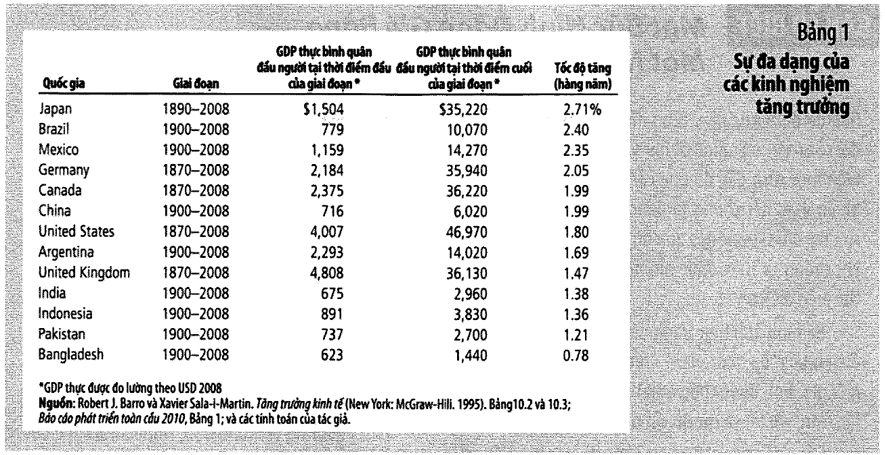
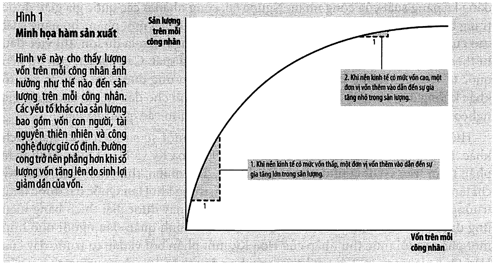

# Bài 3 — Sản xuất và tăng trưởng

> Bài học dựng từ **Chương 12 — Sản xuất và tăng trưởng** (tr. 259–287)
> của *N. Gregory Mankiw — **Kinh tế học vĩ mô***, bản dịch của Khoa Kinh tế, **ĐH Kinh tế TP.HCM** (Cengage Learning Asia).
> 🎯 **Vòng 1.** Bài 1–2 dạy **đo**; từ bài này trở đi mới đi tìm **nguyên nhân**. Và đây là
> nguyên nhân quan trọng nhất: cái gì quyết định một nước giàu hay nghèo.
> 💼 **Góc QTKD** — ví dụ thêm cho ngành quản trị kinh doanh, **không có trong sách**.
> 📚 **Mở rộng** — thứ sách nói lướt hoặc để trong hộp phụ.
> ⚠️ — chỗ dễ hiểu sai, hoặc chỗ sách in sai.
> 📌 **Cần đọc trước:** [Bài 1 — Đo lường thu nhập quốc gia](bai_01_do_luong_thu_nhap_quoc_gia.md), mục 9 (GDP thực) và mục 8 (GDP so với GNP).

---

## Mục lục

<!-- MUC-LUC -->

- [1. Câu hỏi lớn nhất của kinh tế vĩ mô](#1-câu-hỏi-lớn-nhất-của-kinh-tế-vĩ-mô)
- [2. Bảng 1 — thứ hạng các quốc gia không cố định](#2-bảng-1--thứ-hạng-các-quốc-gia-không-cố-định)
- [3. 📚 Quy tắc 70 — vì sao 2%/năm không hề nhỏ](#3--quy-tắc-70--vì-sao-2năm-không-hề-nhỏ)
- [4. 📚 Bạn có giàu hơn người Mỹ giàu nhất? — hộp "Bạn có biết", tr. 264](#4--bạn-có-giàu-hơn-người-mỹ-giàu-nhất--hộp-bạn-có-biết-tr-264)
- [5. Năng suất — lời giải trong một từ](#5-năng-suất--lời-giải-trong-một-từ)
- [6. Bốn yếu tố quyết định năng suất](#6-bốn-yếu-tố-quyết-định-năng-suất)
- [7. 📚 Hàm sản xuất — sinh lợi không đổi theo quy mô](#7--hàm-sản-xuất--sinh-lợi-không-đổi-theo-quy-mô)
- [8. Tài nguyên thiên nhiên có giới hạn tăng trưởng không?](#8-tài-nguyên-thiên-nhiên-có-giới-hạn-tăng-trưởng-không)
- [9. Tiết kiệm, đầu tư và sinh lợi giảm dần](#9-tiết-kiệm-đầu-tư-và-sinh-lợi-giảm-dần)
- [10. Hiệu ứng đuổi kịp](#10-hiệu-ứng-đuổi-kịp)
- [11. ⚠️ Tiết kiệm cao hơn cho mức cao hơn, không phải tăng trưởng mãi mãi](#11--tiết-kiệm-cao-hơn-cho-mức-cao-hơn-không-phải-tăng-trưởng-mãi-mãi)
- [12. Đầu tư từ nước ngoài — và vì sao GDP tăng nhiều hơn GNP](#12-đầu-tư-từ-nước-ngoài--và-vì-sao-gdp-tăng-nhiều-hơn-gnp)
- [13. Giáo dục, sức khoẻ và vốn nhân lực](#13-giáo-dục-sức-khoẻ-và-vốn-nhân-lực)
- [14. Quyền sở hữu, ổn định chính trị và thương mại tự do](#14-quyền-sở-hữu-ổn-định-chính-trị-và-thương-mại-tự-do)
- [15. Nghiên cứu và phát triển](#15-nghiên-cứu-và-phát-triển)
- [16. Tăng trưởng dân số — ba tác động trái chiều](#16-tăng-trưởng-dân-số--ba-tác-động-trái-chiều)
- [17. 📚 Điều gì làm một quốc gia giàu có? — Acemoglu, tr. 280–281](#17--điều-gì-làm-một-quốc-gia-giàu-có--acemoglu-tr-280281)
- [18. 💼 Góc QTKD — sinh lợi giảm dần trên bảng cân đối của bạn](#18--góc-qtkd--sinh-lợi-giảm-dần-trên-bảng-cân-đối-của-bạn)
- [19. 📚 Đối chiếu Việt Nam](#19--đối-chiếu-việt-nam)
- [20. Code minh hoạ](#20-code-minh-hoạ)
- [21. Tự thử](#21-tự-thử)
- [22. Từ điển thuật ngữ](#22-từ-điển-thuật-ngữ)
- [23. Câu hỏi tự kiểm tra](#23-câu-hỏi-tự-kiểm-tra)
- [Tóm tắt một trang](#tóm-tắt-một-trang)
- [Nguồn](#nguồn)

<!-- /MUC-LUC -->

---

## 1. Câu hỏi lớn nhất của kinh tế vĩ mô

Sách mở chương bằng một quan sát trần trụi (tr. 259):

> *"Thu nhập bình quân ở nước giàu, như ở Hoa Kỳ, Nhật Bản hoặc Đức, gấp hơn **10 lần** thu nhập bình
> quân ở nước nghèo, như ở Ấn Độ, Indonesia hoặc Nigeria."*

Và chênh lệch ấy **không chỉ là tiền**: *"Người dân sống ở đất nước giàu hơn có được dinh dưỡng tốt hơn,
nhà cửa an toàn hơn, chăm sóc sức khỏe tốt hơn và có tuổi thọ bình quân cao hơn cũng như họ có ô tô,
điện thoại và truyền hình nhiều hơn."*

### Ba con số cần nhớ ngay từ đầu

| Nơi                            | Tốc độ tăng GDP thực/người | Hệ quả                          |
| ------------------------------ | -------------------------- | ------------------------------- |
| Hoa Kỳ, một thế kỷ qua         | **~2%/năm**                | gấp đôi mỗi **35 năm**          |
| Singapore, Hàn Quốc, Đài Loan  | **~7%/năm**                | gấp đôi mỗi **10 năm**          |
| Trung Quốc, 2 thập kỷ trước 2010 | **~12%/năm** (một số ước tính) | —                          |
| Chad, Gabon, Senegal           | **trì trệ**                | *"thu nhập bình quân đã bị trì trệ trong nhiều năm"* |

⚠️ **2% nghe rất nhỏ.** Sách cảnh báo ngay: *"Mặc dù 2 phần trăm dường như là rất nhỏ, nhưng tỷ lệ tăng
trưởng đó ngụ ý là thu nhập bình quân tăng lên gấp đôi sau mỗi 35 năm. Nhờ sự tăng trưởng này, thu nhập
bình quân ngày nay gấp khoảng **8 lần** so với thu nhập bình quân cách đây một thế kỷ"* (tr. 259).

Mục 3 sẽ cho bạn công cụ để tự làm phép tính đó trong đầu.

### Vì sao chương này quan trọng hơn nó có vẻ

Sách trích nhà kinh tế đoạt giải Nobel **Robert Lucas** (tr. 259–260):

> *"Tầm quan trọng về phúc lợi con người trong các câu hỏi như thế này đang gây ra sự bất ngờ thú vị:
> **Một khi người ta bắt đầu suy nghĩ về chúng, thì thật khó để suy nghĩ về bất cứ điều gì khác nữa.**"*

### Bản đồ đường đi của chương

Sách nói rõ ba bước (tr. 260):

```
   ①  nhìn DỮ LIỆU quốc tế về GDP thực bình quân đầu người          → mục 2
   ②  xem vai trò của NĂNG SUẤT và các yếu tố quyết định nó         → mục 5–8
   ③  xem quan hệ giữa năng suất và các CHÍNH SÁCH kinh tế          → mục 9–17
```

Và một dòng định vị bài này trong cả môn học (tr. 260):

> *"Trong chương này, chúng ta sẽ tập trung vào các nhân tố dài hạn ảnh hưởng đến GDP và sự tăng trưởng
> của GDP thực. Phần sau của quyển sách, chúng ta sẽ nghiên cứu về những **dao động trong ngắn hạn** của
> GDP thực xung quanh xu hướng tăng trưởng dài hạn của chúng."*

---

## 2. Bảng 1 — thứ hạng các quốc gia không cố định



Bảng 1 (tr. 261) đưa **13 quốc gia**, mỗi nước một giai đoạn hơn một thế kỷ.

| Quốc gia       | Giai đoạn | GDP thực/người đầu | GDP thực/người cuối | Tốc độ tăng/năm |
| -------------- | --------- | -----------------: | ------------------: | --------------: |
| Japan          | 1890–2008 |             $1.504 |            $35.220  |       **2,71%** |
| Brazil         | 1900–2008 |                779 |             10.070  |           2,40% |
| Mexico         | 1900–2008 |              1.159 |             14.270  |           2,35% |
| Germany        | 1870–2008 |              2.184 |             35.940  |           2,05% |
| Canada         | 1870–2008 |              2.375 |             36.220  |           1,99% |
| China          | 1900–2008 |                716 |              6.020  |           1,99% |
| United States  | 1870–2008 |              4.007 |             46.970  |           1,80% |
| Argentina      | 1900–2008 |              2.293 |             14.020  |           1,69% |
| United Kingdom | 1870–2008 |              4.808 |             36.130  |           1,47% |
| India          | 1900–2008 |                675 |              2.960  |           1,38% |
| Indonesia      | 1900–2008 |                891 |              3.830  |           1,36% |
| Pakistan       | 1900–2008 |                737 |              2.700  |           1,21% |
| Bangladesh     | 1900–2008 |                623 |              1.440  |       **0,78%** |

Nguồn của sách: Robert J. Barro & Xavier Sala-i-Martin, *Tăng trưởng kinh tế*; *Báo cáo phát triển toàn cầu 2010*.

✅ **Đã kiểm lại toàn bộ.** Mục 1 của [code minh hoạ](#20-code-minh-hoạ) tính lại tốc độ tăng trưởng từ
chính hai đầu mút của mỗi dòng bằng công thức lãi kép, và **cả 13 dòng đều khớp đến hai chữ số thập phân**.
Bảng này đáng tin.

### Ba điều đọc ra từ bảng

**① Nhật Bản là câu chuyện đáng kinh ngạc nhất** (tr. 261):

> *"Một trăm năm trước Nhật Bản không phải là một quốc gia giàu có. Thu nhập bình quân của Nhật Bản chỉ
> cao hơn đôi chút so với thu nhập bình quân của Mexico, và đứng sau thu nhập bình quân của Argentina.
> **Chất lượng cuộc sống của Nhật Bản vào năm 1890 là thấp hơn một nửa so với chất lượng cuộc sống của
> Ấn Độ ngày nay.**"*

Nay Nhật có thu nhập bình quân **gấp hơn hai lần** Mexico và Argentina.

**② Nước Anh đã tụt hạng** (tr. 261–263):

```
   1870:  Anh là nước GIÀU NHẤT thế giới
          — cao hơn ~20% so với Hoa Kỳ
          — cao hơn GẤP ĐÔI so với Canada
   ngày nay:  Anh THẤP HƠN ~20% so với Hoa Kỳ và Canada
```

**③ Không ai được bảo đảm gì cả** (tr. 263):

> *"Những dữ liệu này cho thấy các quốc gia giàu nhất trên thế giới **không có sự đảm bảo** là quốc gia
> này sẽ tiếp tục là nước giàu nhất, và các quốc gia nghèo nhất trên thế giới **không cam chịu** cảnh sẽ
> mãi là quốc gia nghèo đói."*

⭐ **Đây là câu quan trọng nhất của cả mục.** Vị trí kinh tế của một quốc gia là **kết quả của chính sách
và tích luỹ**, không phải định mệnh. Toàn bộ phần sau của chương là danh sách những thứ tạo ra kết quả đó.

### 📚 Một bức hình đáng giá bằng một nghìn con số thống kê — tr. 262

Hộp phụ của sách chụp ảnh ba gia đình điển hình bên ngoài ngôi nhà của họ, cùng toàn bộ đồ vật họ sở hữu:

| Nước    | GDP/người 2008 | Trẻ đi học cấp 3 | Sống dưới 2 USD/ngày | Xác suất sống đến 65 tuổi (nam/nữ) |
| ------- | -------------: | ---------------: | -------------------: | ---------------------------------: |
| Anh     |        36.130  |              91% |    "không đáng kể"   |                           85% / 91% |
| Mexico  |        14.270  |              71% |     ~5% dân số       |                           78% / 86% |
| Mali    |         1.090  |              29% |  **hơn 3/4 dân số**  |                           38% / 42% |

Sách mở bằng câu của **George Bernard Shaw**: *"Tín hiệu về sự thay đổi của một con người có học thực sự
thì được thể hiện một cách đầy đủ qua các dữ liệu thống kê"*, rồi thừa nhận: *"hầu hết chúng ta đang không
thể thấy được sự thay đổi sâu sắc này qua dữ liệu của GDP — cho đến khi chúng ta thấy được những con số
thống kê này thể hiện điều gì."*

---

## 3. 📚 Quy tắc 70 — vì sao 2%/năm không hề nhỏ

Sách **dùng** quy tắc này ba lần mà **không gọi tên** nó:

| Nơi     | Sách viết                                    | Ngầm dùng    |
| ------- | -------------------------------------------- | ------------ |
| tr. 259 | 2%/năm → *"gấp đôi sau mỗi 35 năm"*          | 70 ÷ 2 = 35  |
| tr. 259 | 7%/năm → *"gấp đôi mỗi 10 năm"*              | 70 ÷ 7 = 10  |
| tr. 282 | dân số 3%/năm → *"gấp đôi sau mỗi 23 năm"*   | 70 ÷ 3 ≈ 23  |

$$\text{Số năm để gấp đôi} \approx \frac{70}{\text{tốc độ tăng trưởng tính bằng \%}}$$

Mục 2 của [code minh hoạ](#20-code-minh-hoạ) so quy tắc này với công thức chính xác $\ln 2 / \ln(1+g)$
và cho thấy sai lệch dưới **0,3 năm** với mọi tốc độ từ 1% đến 12%.

### Bảng đáng dán lên tường

| Tốc độ | Gấp đôi sau | Sau 100 năm gấp |
| -----: | ----------: | --------------: |
|     1% |    70 năm   |         3 lần   |
|     2% |    35 năm   |         7 lần   |
|     3% |    23 năm   |        19 lần   |
|     5% |    14 năm   |       132 lần   |
|     7% |    10 năm   |   **868 lần**   |
|    10% |     7 năm   |    13.781 lần   |

⭐ **2% so với 7% nghe như "chênh 5 điểm". Sau 100 năm là chênh 7 lần so với 868 lần.**

Đây là toàn bộ lý do bài này quan trọng hơn mọi bài về suy thoái cộng lại: một cuộc suy thoái lấy đi
vài phần trăm GDP trong vài năm rồi trả lại. **Một điểm phần trăm tăng trưởng dài hạn thì lấy đi hoặc
cho thêm cả một trật tự độ lớn.**

💼 Cùng số học đó áp cho công ty: một đối thủ tăng trưởng 25%/năm trong khi bạn tăng 15% thì sau 10 năm
họ lớn gấp **2,4 lần** bạn — dù hôm nay hai bên bằng nhau.

---

## 4. 📚 Bạn có giàu hơn người Mỹ giàu nhất? — hộp "Bạn có biết", tr. 264

Tạp chí *American Heritage* xếp **John D. Rockefeller** (1839–1937) là người giàu nhất lịch sử nước Mỹ:
tài sản của ông *"ngày nay tương đương **200 tỷ đô la**, gấp bốn lần tài sản của Bill Gates"*.

Nhưng sách liệt kê những gì Rockefeller **không** có:

```
   không tivi, không trò chơi điện tử, không lướt web, không thư điện tử
   không máy điều hoà — suốt cái nóng của mùa hè
   hầu như suốt cuộc đời KHÔNG di chuyển bằng xe hơi hay máy bay
   không điện thoại để gọi bạn bè hay gia đình
   nếu bệnh — KHÔNG có thuốc kháng sinh
```

> *"Bây giờ hãy thử xem xét: Bạn cần bao nhiêu tiền để chấp nhận từ bỏ phần còn lại của cuộc sống hiện
> tại của bạn với tất cả tiện nghi hiện đại mà Rockefeller đã sống mà không có nó? Bạn sẽ làm điều đó
> với **200 tỷ đô la**? Có lẽ là không."*

⭐ Và đây là chỗ hộp phụ này nối vào bài 2:

> *"Chương trước đã thảo luận về các chỉ số giá tiêu chuẩn… Chỉ số này chưa tính đến sự xuất hiện của các
> hàng hóa mới trong nền kinh tế. Kết quả là, tỷ lệ lạm phát bị **ước tính quá mức**. Phía ngược lại của
> quan sát này là **tốc độ tăng trưởng thực của nền kinh tế bị được đánh giá dưới mức**."*

📌 Nói cách khác: [vấn đề ② của CPI ở bài 2](bai_02_do_luong_chi_phi_sinh_hoat.md#6-ba-vấn-đề-khiến-cpi-không-hoàn-hảo)
— hàng hoá mới không được ghi nhận — có nghĩa là **tăng trưởng thật còn cao hơn con số công bố**. Bảng 1
ở mục 2 có lẽ đang **đánh giá thấp** thành tựu của thế kỷ 20.

---

## 5. Năng suất — lời giải trong một từ

Sách dựng mô hình bằng **Robinson Crusoe** của Daniel Defoe: một thuỷ thủ mắc kẹt trên hoang đảo, tự bắt
cá, tự trồng rau, tự may quần áo (tr. 264–265).

> *"Điều gì quyết định mức sống của Crusoe? Trong một từ, **năng suất**."*

> **Năng suất** (*productivity*): số lượng hàng hóa và dịch vụ được sản xuất ra từ **mỗi đơn vị nhập lượng
> lao động**. — chú thích tr. 265

Vì sao ví dụ Crusoe lại hợp lệ cho cả một quốc gia? Vì đồng nhất thức của [bài 1 mục 2](bai_01_do_luong_thu_nhap_quoc_gia.md#2-thu-nhập-luôn-bằng-chi-tiêu--đồng-nhất-thức-đầu-tiên):

> *"Một cách đơn giản, **thu nhập của cả nền kinh tế chính là sản lượng của nền kinh tế đó**."* — tr. 265

```
   Crusoe chỉ tiêu dùng những gì anh ta sản xuất
        ⟹ mức sống của anh ta = năng suất của anh ta
   một quốc gia cũng chỉ tiêu dùng những gì nó sản xuất (thu nhập = sản lượng)
        ⟹ mức sống của quốc gia = năng suất của quốc gia
```

Và điều này nối thẳng về **Nguyên lý 8** trong Mười Nguyên lý (chương 1, bạn đã học ở
[EG13 bài 1](../../%5BEG13%5D.kinhtevimo-micro/ly_thuyet/bai_01_muoi_nguyen_ly_va_tu_duy_kinh_te.md)):
*mức sống của một quốc gia phụ thuộc vào khả năng sản xuất hàng hóa và dịch vụ của quốc gia đó.*

⚠️ **Đừng nhầm "năng suất" với "làm việc chăm chỉ".** Năng suất là **sản lượng trên mỗi giờ lao động**,
không phải số giờ. Một nước làm việc 60 giờ/tuần với công cụ thô sơ vẫn nghèo hơn nước làm 35 giờ/tuần
với máy móc và tri thức tốt.

---

## 6. Bốn yếu tố quyết định năng suất

Sách quay lại Crusoe: anh sẽ đánh bắt nhiều cá hơn nếu **có nhiều cần câu hơn**, hoặc **được đào tạo kỹ
thuật tốt hơn**, hoặc **hòn đảo có nguồn cá dồi dào**, hoặc **anh phát minh ra dụng cụ mới**. Bốn thứ đó
có phiên bản tương ứng cho cả nền kinh tế (tr. 266–268).

### ① Vốn vật chất trên mỗi công nhân — $K/L$

> **Vốn vật chất** (*physical capital*): trữ lượng máy móc thiết bị và cấu trúc cơ sở hạ tầng được sử dụng
> để sản xuất hàng hóa và dịch vụ. — chú thích tr. 266

Ví dụ của sách: thợ mộc có cưa, tiện, khoan làm ra nhiều đồ nội thất hơn thợ chỉ có công cụ bằng tay.

⭐ **Đặc điểm quan trọng nhất của vốn** (tr. 266):

> *"…vốn là **một yếu tố sản xuất được tạo ra từ quá trình sản xuất**… Người thợ mộc sử dụng máy tiện để
> làm ra chân của cái bàn. Trước đó, bản thân của cái máy tiện là sản phẩm đầu ra của công ty sản xuất ra
> những chiếc máy tiện."*

📌 Đây là lý do vốn có thể **tích luỹ**, và là lý do chính sách có thể tác động lên nó (mục 9).

### ② Vốn nhân lực trên mỗi công nhân — $H/L$

> **Vốn nhân lực** (*human capital*): kiến thức và các kỹ năng mà người công nhân có được thông qua giáo
> dục, đào tạo và kinh nghiệm. — chú thích tr. 266

Sách có một câu rất đáng nhớ (tr. 267): *"sinh viên có thể được xem như là **"công nhân"** – những người
có công việc quan trọng là sản xuất ra vốn nhân lực mà sẽ được sử dụng cho sản xuất tương lai."*

### ③ Tài nguyên thiên nhiên trên mỗi công nhân — $N/L$

> **Tài nguyên thiên nhiên** (*natural resources*): các yếu tố đầu vào của sản xuất được cung cấp bởi tự
> nhiên như đất đai, sông ngòi và mỏ khoáng sản. — chú thích tr. 267

| Dạng                 | Ví dụ | Đặc điểm                                            |
| -------------------- | ----- | --------------------------------------------------- |
| **tái tạo được**     | rừng  | chặt một cây, trồng cây khác vào vị trí đó          |
| **không tái tạo được** | dầu mỏ | *"được tạo ra bởi tự nhiên qua hàng triệu năm"* |

⚠️ **Tài nguyên KHÔNG phải điều kiện cần.** Sách nói thẳng (tr. 267):

> *"Nhật Bản chẳng hạn, là một trong những nước giàu nhất thế giới, **mặc dù là một nước rất ít tài nguyên
> thiên nhiên**. Thương mại toàn cầu làm nên sự thành công của Nhật Bản."*

📌 Câu này là mầm của cả [bài 9](bai_09_kinh_te_mo_khai_niem_co_ban.md) và [bài 10](bai_10_ly_thuyet_kinh_te_mo.md) về kinh tế mở.

### ④ Kiến thức công nghệ — $A$

> **Kiến thức công nghệ** (*technological knowledge*): sự hiểu biết của xã hội về phương cách tốt nhất để
> sản xuất hàng hóa và dịch vụ. — chú thích tr. 267

Hai dạng (tr. 267):

| Dạng          | Ví dụ của sách                                    |
| ------------- | -------------------------------------------------- |
| **phổ biến**  | dây chuyền lắp ráp của Henry Ford — đối thủ bắt chước ngay |
| **độc quyền** | công thức bí mật của Coca-Cola; bằng sáng chế thuốc (tạm thời) |

### ⚠️ Phân biệt ② và ④ — chỗ hay bị hỏi thi

Sách dùng một ẩn dụ rất gọn (tr. 268):

> *"Kiến thức công nghệ đề cập đến sự hiểu biết của **xã hội** đối với sự vận động của thế giới. Vốn nhân
> lực đề cập đến **nguồn lực được sử dụng để truyền đạt** sự hiểu biết đến người lao động. Có một ẩn dụ
> hữu ích ở đây, kiến thức là **chất lượng những quyển sách giáo khoa** của xã hội, trong khi vốn nhân lực
> là **lượng thời gian mà nhân loại dùng để đọc nó**."*

```
   xã hội có sách giáo khoa hay  ⟹  A cao
   nhưng không ai đọc            ⟹  H thấp
   ⟹ năng suất VẪN thấp — cần CẢ HAI
```

---

## 7. 📚 Hàm sản xuất — sinh lợi không đổi theo quy mô

Hộp *"Bạn có biết"* tr. 268 viết bốn yếu tố trên thành một phương trình.

$$Y = A \cdot F(L, K, H, N)$$

| Ký hiệu | Nghĩa                                                    |
| ------- | -------------------------------------------------------- |
| $Y$     | sản lượng đầu ra                                          |
| $L$     | lượng lao động                                            |
| $K$     | lượng vốn vật chất                                        |
| $H$     | lượng vốn nhân lực                                        |
| $N$     | lượng tài nguyên thiên nhiên                              |
| $F()$   | hàm biểu thị **cách thức** kết hợp các đầu vào            |
| $A$     | **biến phản ánh tình trạng có công nghệ sản xuất**        |

> *"Khi công nghệ cải thiện, A tăng, do đó nền kinh tế sản xuất nhiều sản lượng đầu ra từ bất kỳ kết hợp
> đầu vào sẵn có."*

### Sinh lợi không đổi theo quy mô

> **Sinh lợi không đổi theo quy mô**: tăng gấp đôi **tất cả** đầu vào dẫn đến sản lượng đầu ra cũng tăng gấp đôi.

Viết bằng toán, với **mọi** số dương $x$:

$$xY = A \cdot F(xL,\ xK,\ xH,\ xN)$$

### Mẹo hay: đặt $x = 1/L$

Đây là chỗ hộp phụ trở nên thực sự hữu ích:

$$\frac{Y}{L} = A \cdot F\left(1,\ \frac{K}{L},\ \frac{H}{L},\ \frac{N}{L}\right)$$

⭐ Vế trái $Y/L$ chính là **năng suất**. Vế phải nói năng suất phụ thuộc vào:

```
   K/L   vốn vật chất trên mỗi công nhân
   H/L   vốn nhân lực trên mỗi công nhân
   N/L   tài nguyên thiên nhiên trên mỗi công nhân
   A     tình trạng công nghệ
```

> *"…phương trình này cung cấp **bản tóm tắt toán học** của bốn yếu tố quyết định năng suất mà chúng ta
> vừa thảo luận."* — tr. 268

Mục 7 của [code minh hoạ](#20-code-minh-hoạ) kiểm tính chất này bằng số: gấp đôi **cả ba** yếu tố vật chất
cho **+100%** sản lượng, đúng như định nghĩa. Nhưng gấp đôi **riêng $A$** cũng cho **+100%** — mà không tốn
thêm một đồng vốn nào. Đó là lý do mục 15 (nghiên cứu và phát triển) tồn tại.

---

## 8. Tài nguyên thiên nhiên có giới hạn tăng trưởng không?

Nghiên cứu tình huống tr. 268–269. Lập luận bi quan nghe rất thuyết phục:

> *"Nếu như thế giới chỉ có nguồn cung cấp cố định về tài nguyên không thể tái sinh, làm thế nào dân số,
> sản xuất và mức sống có thể tiếp tục tăng trưởng theo thời gian?"*

Nhưng sách nói *"hầu hết các nhà kinh tế ít quan tâm về giới hạn của sự tăng trưởng hơn là người ta dự
đoán"* (tr. 269), với hai loại bằng chứng:

### ① Công nghệ liên tục tạo ra cách né giới hạn

| Trước đây                          | Ngày nay                                   |
| ---------------------------------- | ------------------------------------------ |
| thiếc để làm hộp đựng thực phẩm    | **nhựa** đã thay thế                       |
| đồng để làm dây điện thoại         | **cáp quang làm từ cát**                   |
| ô tô, nhà ở tốn nhiều năng lượng   | tiết kiệm nhiên liệu hơn, cách nhiệt tốt hơn |
| tài nguyên không tái sinh dùng một lần | **tái chế**, nhiên liệu thay thế như ethanol |

Câu đắt nhất (tr. 269): *"Sự tiến bộ công nghệ làm cho các loại tài nguyên thiết yếu trước đây trở nên
**ít cần thiết hơn**."*

### ② Bằng chứng từ giá thị trường

Đây là lập luận tinh tế nhất của cả mục, và nó là **một ứng dụng trực tiếp của cung–cầu** bạn đã học ở
[EG13 bài 2](../../%5BEG13%5D.kinhtevimo-micro/ly_thuyet/bai_02_cung_va_cau.md):

```
   NẾU thế giới sắp cạn kiệt một tài nguyên
        ⟹ khan hiếm phản ánh vào GIÁ
        ⟹ giá tài nguyên đó phải TĂNG theo thời gian
```

Thực tế quan sát được (tr. 269):

> *"…trong thời gian dài, giá của hầu hết tài nguyên thiên nhiên (đã được điều chỉnh theo lạm phát) là
> **ổn định hoặc giảm xuống**. Điều đó nghĩa là khả năng bảo vệ nguồn tài nguyên của chúng ta tăng lên
> nhanh chóng hơn là nguồn cung của chúng đang giảm xuống. **Giá thị trường không cho thấy lý do để tin
> rằng tài nguyên thiên nhiên làm hạn chế tăng trưởng kinh tế.**"*

⚠️ Chú ý cụm **"đã được điều chỉnh theo lạm phát"** — đúng kỹ thuật của [bài 2 mục 9](bai_02_do_luong_chi_phi_sinh_hoat.md#9-chuyển-đổi-số-đô-la-giữa-các-thời-điểm).
Nếu không khử lạm phát thì mọi giá đều "tăng", và bạn sẽ kết luận ngược.

---

## 9. Tiết kiệm, đầu tư và sinh lợi giảm dần

Từ đây sách chuyển sang câu hỏi chính sách: **chính phủ có thể làm gì?** (tr. 270)

### Đánh đổi cốt lõi

Vì vốn là yếu tố **được sản xuất ra**, xã hội có thể tự chọn có bao nhiêu vốn. Nhưng (tr. 270):

> *"Bởi vì nguồn lực là khan hiếm, đem nhiều nguồn lực để tạo ra vốn yêu cầu phải giảm bớt nguồn lực để
> sản xuất hàng hóa và dịch vụ cho tiêu dùng hiện tại… **Sự tăng trưởng bắt nguồn từ việc tích lũy vốn
> không phải là điều dễ dàng: nó đòi hỏi xã hội đó phải hy sinh tiêu dùng hàng hóa và dịch vụ trong hiện
> tại để có thể thụ hưởng tiêu dùng cao hơn trong tương lai.**"*

📌 Đây chính là **Nguyên lý 1** (con người đối diện với sự đánh đổi) áp cho cả một quốc gia.

### Sinh lợi giảm dần — Hình 1, tr. 271



> **Sinh lợi giảm dần** (*diminishing returns*): đặc tính theo đó lợi ích từ một đơn vị tăng thêm của một
> nhập lượng sản xuất giảm xuống khi số lượng nhập lượng đó gia tăng. — chú thích tr. 271

Hình 1 vẽ **sản lượng trên mỗi công nhân** theo **vốn trên mỗi công nhân**, giữ ba yếu tố kia cố định.
Đường cong **đi lên nhưng phẳng dần**.

Mục 3 của [code minh hoạ](#20-code-minh-hoạ) vẽ lại hình này bằng ký tự và đo mức tăng thêm:

```
   thêm 20 vốn, từ  20 lên  40  →  sản lượng +3,0338
   thêm 20 vốn, từ  60 lên  80  →  sản lượng +1,6942
   thêm 20 vốn, từ 100 lên 120  →  sản lượng +1,2506
   thêm 20 vốn, từ 160 lên 180  →  sản lượng +0,9347
```

⚠️ **Đọc cho đúng.** Sinh lợi giảm dần **không** có nghĩa là "đầu tư thêm thì lỗ". Đường cong vẫn **đi lên**
— thêm vốn thì sản lượng vẫn tăng. Chỉ là **mỗi đơn vị vốn thêm vào đóng góp ít hơn đơn vị trước đó**.

---

## 10. Hiệu ứng đuổi kịp

> **Hiệu ứng đuổi kịp** (*catch-up effect*): đặc tính mà theo đó các quốc gia khởi đầu còn nghèo có xu
> hướng tăng trưởng nhanh hơn các quốc gia khởi đầu giàu có hơn. — chú thích tr. 271

Cơ chế chỉ là **sinh lợi giảm dần đọc ngược lại** (tr. 271–272):

```
   nước NGHÈO:  công nhân "thiếu những công cụ thô sơ nhất"
                ⟹ chỉ một khoản vốn NHỎ cũng làm năng suất tăng ĐÁNG KỂ
   nước GIÀU:   công nhân đã được trang bị lượng vốn lớn
                ⟹ đầu tư thêm chỉ có tác động TƯƠNG ĐỐI NHỎ
```

Điều kiện then chốt (tr. 272): *"giữ các yếu tố khác không đổi, **cùng tỷ lệ phần trăm của GDP dành cho
đầu tư**, thì các quốc gia nghèo có xu hướng tăng trưởng với tốc độ nhanh hơn các quốc gia giàu."*

### Bằng chứng: Hoa Kỳ và Hàn Quốc, 1960–1990

| Nước      | Tỷ lệ GDP dành cho đầu tư | Tốc độ tăng trưởng |
| --------- | ------------------------- | ------------------ |
| Hoa Kỳ    | **như nhau**              | trung bình ~2%/năm |
| Hàn Quốc  | **như nhau**              | **hơn 6%/năm**     |

Lý do: năm 1960 GDP bình quân đầu người Hàn Quốc **chưa bằng 1/10** Hoa Kỳ. *"Với trữ lượng vốn ban đầu
thấp, lợi ích từ việc tích lũy vốn ở Hàn Quốc là rất lớn."*

Mục 4 của [code minh hoạ](#20-code-minh-hoạ) mô phỏng hai nền kinh tế **giống hệt nhau về tiết kiệm và
công nghệ**, chỉ khác vốn ban đầu gấp 10 lần:

```
   năm  1:  nước nghèo tăng 5,73%/năm   ·   nước giàu tăng 0,00%/năm
   năm 60:  khoảng cách sản lượng đã thu từ 46% lên 95%
```

### ⭐ Ẩn dụ "Tiến bộ Nhất" của sách — tr. 272

> *"Khi nhà trường trao phần thưởng cuối năm cho học sinh **"Tiến bộ Nhất"**, đây thường sẽ là học sinh có
> học lực **tương đối kém** vào đầu năm học. Những học sinh không học hành khi bắt đầu năm học dễ dàng đạt
> được sự tiến bộ hơn những học sinh luôn học hành chăm chỉ."*

Và câu kết rất tỉnh táo:

> *"Lưu ý rằng điều đó là tốt để trở thành "Tiến bộ Nhất", với một điểm xuất phát cho trước, tuy nhiên
> thậm chí sẽ là **tốt hơn khi trở thành "Học sinh Giỏi Nhất"**. Tương tự như vậy, tăng trưởng kinh tế
> trong nhiều thập kỷ trước đã nhanh hơn rất nhiều ở Hàn Quốc, **nhưng GDP đầu người ở Hoa Kỳ vẫn cao hơn**."*

📌 💼 Áp cho doanh nghiệp: một startup tăng trưởng 200%/năm không "giỏi hơn" một doanh nghiệp lớn tăng 8%.
Nó chỉ đang xuất phát từ nền thấp. Câu hỏi đúng không phải *"ai tăng nhanh hơn"* mà *"tăng trưởng còn duy
trì được bao lâu nữa trước khi sinh lợi giảm dần kéo nó xuống?"*

---

## 11. ⚠️ Tiết kiệm cao hơn cho mức cao hơn, không phải tăng trưởng mãi mãi

Đây là kết luận tinh tế nhất của cả chương, và câu hỏi ôn tập 6 (tr. 285) hỏi thẳng nó.

Sách trả lời bằng một câu **in nghiêng** ở tr. 271:

> *"**Trong dài hạn, tỷ lệ tiết kiệm cao hơn dẫn đến mức năng suất và thu nhập cao hơn nhưng không cao hơn
> tăng trưởng của các biến này.**"*

Lý do là sinh lợi giảm dần (tr. 271):

> *"Khi tỷ lệ tiết kiệm cao hơn cho phép nhiều vốn hơn được tích lũy, thì các lợi ích từ vốn tăng thêm sẽ
> trở nên **nhỏ hơn theo thời gian**, và do đó tăng trưởng giảm xuống."*

Mục 5 của [code minh hoạ](#20-code-minh-hoạ) chạy hai nền kinh tế giống hệt nhau, chỉ khác tỷ lệ tiết kiệm
15% và 30%:

| Năm |  s = 15% |  tăng | s = 30% |  tăng | Chênh sản lượng |
| --: | -------: | ----: | ------: | ----: | --------------: |
|   0 |    9,264 |     — |   9,264 |     — |        1,00 lần |
|   1 |    9,531 | 2,88% |   9,920 | 7,08% |        1,04 lần |
|  10 |   11,373 | 1,48% |  14,011 | 2,53% |        1,23 lần |
|  25 |   13,141 | 0,66% |  17,537 | 0,96% |        1,33 lần |
| 100 |   15,275 | 0,04% |  21,533 | 0,05% |        1,41 lần |
| 200 |   15,438 | 0,00% |  21,831 | 0,00% |    **1,41 lần** |

```
   cột "tăng"      →  CẢ HAI đều tiến về 0
   cột "chênh"     →  chênh lệch MỨC là 1,41 lần và VĨNH VIỄN
```

⚠️ **Nhưng "dài hạn" ở đây rất dài.** Sách nhắc (tr. 271): *"tiếp cận trong dài hạn có thể mất nhiều thời
gian… sự gia tăng tỷ lệ tiết kiệm có thể dẫn đến tăng trưởng cao hơn đáng kể trong khoảng thời gian **vài
thập kỷ**."* Code xác nhận: **năm thứ 25** nước tiết kiệm 30% vẫn còn tăng 0,96%/năm so với 0,66%.

### ⭐ Vậy cái gì tạo ra tăng trưởng bền vững?

Mục 5 của code chạy thêm một thí nghiệm mà sách **không** làm: thay vì tăng tiết kiệm, cho $A$ tăng đều
2%/năm.

```
   năm   1:  tăng 4,94%
   năm  25:  tăng 3,59%
   năm  50:  tăng 3,20%
   năm 100:  tăng 3,04%      ← KHÔNG hội tụ về 0
```

⚠️ Chú ý con số giới hạn là **3%**, không phải 2%. Công thức đúng là:

$$g_y = \frac{g_A}{1 - \alpha} = \frac{2\%}{1 - 1/3} = 3\%$$

Công nghệ tốt hơn vừa **trực tiếp** nâng sản lượng, vừa **gián tiếp** kéo theo tích luỹ thêm vốn — hai
vòng này cộng dồn.

📌 **Kết luận trung tâm của lý thuyết tăng trưởng:**

```
   VỐN     giải thích một nước GIÀU hay NGHÈO   (mức)
   CÔNG NGHỆ giải thích một nước TĂNG TRƯỞNG hay không  (tốc độ, dài hạn)
```

💼 Áp cho doanh nghiệp: tăng tỷ lệ tái đầu tư từ 15% lên 30% lợi nhuận **không** đưa công ty vào quỹ đạo
tăng trưởng cao vĩnh viễn. Nó đưa bạn lên một **quy mô** lớn hơn rồi tăng trưởng chậm về mức cũ. Muốn tăng
trưởng cao bền vững thì phải đổi **cách làm**, không phải đổ thêm vốn.

---

## 12. Đầu tư từ nước ngoài — và vì sao GDP tăng nhiều hơn GNP

Tiết kiệm trong nước không phải cách duy nhất để có vốn mới (tr. 272).

| Hình thức                       | Định nghĩa của sách                                              | Ví dụ                              |
| ------------------------------- | ---------------------------------------------------------------- | ---------------------------------- |
| **Đầu tư trực tiếp nước ngoài** | vốn đầu tư được **sở hữu và điều hành** bởi tổ chức nước ngoài   | Ford xây nhà máy xe hơi ở Mexico   |
| **Đầu tư gián tiếp**            | vốn được tài trợ bởi tiền nước ngoài nhưng **do người trong nước điều hành** | người Mỹ mua cổ phiếu công ty Mexico |

### ⚠️ Điểm mấu chốt: GDP tăng nhiều hơn GNP

Đây là chỗ khái niệm ở [bài 1 mục 8](bai_01_do_luong_thu_nhap_quoc_gia.md#8--năm-thước-đo-thu-nhập-khác--hộp-theo-dòng-thời-sự-tr-222)
trở nên có ích thật sự (tr. 273):

> *"Khi Ford mở nhà máy sản xuất xe hơi ở Mexico, một phần thu nhập của nhà máy tạo nên khoản tích lũy cho
> những người không sống ở Mexico. Kết quả là, đầu tư trực tiếp nước ngoài ở Mexico gia tăng **thu nhập
> của người Mexico (đo lường bằng GNP) ít hơn** là nó gia tăng **sản xuất ở Mexico (đo lường bằng GDP)**."*

📌 Đây chính xác là tình hình Việt Nam. Con số GDP đẹp hơn con số GNI, và chênh lệch đó chảy về công ty mẹ.

### Nhưng sách vẫn ủng hộ — vì hai lý do

1. **Tăng trữ lượng vốn** → năng suất và tiền lương trong nước cao hơn.
2. ⭐ *"Đầu tư từ nước ngoài là một cách để các quốc gia nghèo **học hỏi các công nghệ** đã được phát triển
   và đang được sử dụng ở các quốc gia giàu hơn."* (tr. 273)

Lý do thứ hai quan trọng hơn lý do thứ nhất — vì mục 11 đã chứng minh chỉ công nghệ mới tạo tăng trưởng
bền vững.

💼 Với người làm quản trị Việt Nam, đây là lập luận thực dụng nhất cho việc **làm nhà cung cấp cấp 1 cho
FDI** thay vì chỉ cho thuê đất và bán lao động: chuyển giao công nghệ chỉ xảy ra khi có **tiếp xúc kỹ
thuật thật sự**, không phải khi ký hợp đồng thuê xưởng.

### 📚 Ngân hàng Thế giới và IMF

Sách kể nguồn gốc (tr. 273): cả hai được thành lập sau Chiến tranh Thế giới thứ II, với một động cơ chính
trị rõ ràng:

> *"Một bài học từ chiến tranh là **sự kiệt quệ của nền kinh tế thường dẫn đến bất ổn chính trị, căng thẳng
> quốc tế và xung đột quân sự**. Do đó, mỗi một quốc gia phải có sự quan tâm đến việc thúc đẩy sự thịnh
> vượng kinh tế trên toàn thế giới."*

---

## 13. Giáo dục, sức khoẻ và vốn nhân lực

### Giáo dục — tr. 273–274

Con số của sách: ở Hoa Kỳ, *"mỗi năm học ở trường làm tăng lương trung bình của mỗi người khoảng **10 phần
trăm**"*. Và ở nước kém phát triển, nơi vốn nhân lực khan hiếm, *"khoảng cách giữa tiền lương của công nhân
có học thức và công nhân không có học thức thậm chí còn lớn hơn"*.

⚠️ **Giáo dục có chi phí cơ hội** (tr. 274): *"Khi những sinh viên ở trường học, họ **từ bỏ tiền lương** mà
họ có thể kiếm được khi họ tham gia lực lượng lao động."* Đó là lý do trẻ em ở nước nghèo bỏ học sớm —
không phải vì lợi ích thấp, mà vì *"sức lao động của những trẻ em này là cần thiết để giúp đỡ gia đình"*.

### ⭐ Vốn nhân lực tạo ngoại tác tích cực

> **Ngoại tác** là ảnh hưởng của hành động của một người lên lợi ích của người xung quanh. — tr. 274

Cơ chế: *"Một người có học thức… có thể tạo ra các sáng kiến mới về cách thức tốt nhất để sản xuất ra sản
phẩm và dịch vụ. Nếu những sáng kiến này được đưa vào trong **kiến thức chung của xã hội**… khi đó các ý
tưởng này là lợi ích ngoại tác của giáo dục."*

📌 Đây là cầu nối giữa yếu tố ② (vốn nhân lực) và yếu tố ④ (công nghệ) ở mục 6: **giáo dục là cách xã hội
sản xuất ra $A$**. Và vì đó là ngoại tác, thị trường tự do sẽ đầu tư **dưới mức tối ưu** — đây là lập luận
kinh tế học chuẩn mực cho **trợ cấp giáo dục công**. (Ngoại tác bạn đã học ở
[EG13 bài 14](../../%5BEG13%5D.kinhtevimo-micro/ly_thuyet/bai_14_thuong_mai_ngoai_tac_hang_hoa_cong.md).)

### ⚠️ Chảy máu chất xám — thế tiến thoái lưỡng nan

> **Chảy máu chất xám**: sự di cư của những người lao động có trình độ học vấn cao nhất đến với các quốc
> gia giàu, nơi mà những người lao động này có thể tận hưởng mức sống cao hơn. — tr. 274

Sách trình bày cả hai mặt rất công bằng:

```
   MẶT TÍCH CỰC:  nước giàu có hệ thống đại học tốt
                  "tự nhiên khi các nước nghèo gửi những sinh viên tốt nhất
                   của họ ra nước ngoài để tìm kiếm bằng cấp cao hơn"
   MẶT TIÊU CỰC:  nếu vốn nhân lực có ngoại tác tích cực, thì người giỏi ra đi
                  "làm cho những người này rời bỏ và đất nước càng trở nên khổ hơn"
```

### Sức khoẻ và dinh dưỡng — tr. 274–275

Sách trình bày công trình của **Robert Fogel** (Nobel kinh tế **1993**):

| Bằng chứng                                  | Con số                                                          |
| ------------------------------------------- | --------------------------------------------------------------- |
| Anh năm **1780**                            | mỗi năm người thì có **một người** quá suy dinh dưỡng đến mức không thể lao động chân tay |
| Anh, **1775–1975**                          | calo hấp thụ bình quân **+26%**, chiều cao đàn ông **+3,6 inch** |
| Hàn Quốc, **1962–1995**                     | calo tiêu thụ **+44%**, chiều cao nam **+2 inch**               |
| Kết luận của Fogel khi nhận giải            | *"việc cải thiện dinh dưỡng đã đóng góp **30 phần trăm** vào tăng trưởng thu nhập đầu người ở Anh vào giữa năm 1790 và 1980"* |

Vì sao chiều cao lại là chỉ số hợp lệ: *"bởi vì biến đổi gen của dân số là chậm thay đổi, việc gia tăng
chiều cao trung bình có thể hầu như là do sự thay đổi của môi trường – và dinh dưỡng là sự giải thích rõ
ràng"* (tr. 275).

⭐ **Vòng lẩn quẩn và vòng phát triển** (tr. 275):

```
   VÒNG LẨN QUẨN:     nghèo → không được chăm sóc y tế và dinh dưỡng đầy đủ
                      → không khỏe mạnh → năng suất thấp → nghèo

   VÒNG PHÁT TRIỂN:   "các chính sách giúp tăng trưởng kinh tế nhanh hơn tất yếu
                      sẽ cải thiện sức khỏe, đến lượt nó sẽ thúc đẩy tăng trưởng"
```

📌 Đây là lời giải cho câu hỏi *"tương quan hay nhân quả"* mà [bài 1 mục 13](bai_01_do_luong_thu_nhap_quoc_gia.md#13-gdp-và-chất-lượng-cuộc-sống--bảng-3-tr-233)
để ngỏ: **nhân quả chạy theo cả hai chiều**.

---

## 14. Quyền sở hữu, ổn định chính trị và thương mại tự do

### Quyền sở hữu — tr. 275–276

> **Quyền sở hữu** đề cập đến khả năng của người dân thực hiện các quyền đối với các nguồn lực mà họ sở hữu.

Cơ chế rất cụ thể (tr. 276):

> *"Một công ty khai thác mỏ sẽ **không nỗ lực khai thác** quặng mỏ nếu như công ty đó kỳ vọng là số quặng
> khai thác sẽ bị tước đoạt."*

Vai trò của toà án: *"thông qua hệ thống tư pháp hình sự, các tòa án ngăn cản hành vi trộm cắp trực tiếp.
Ngoài ra, thông qua hệ thống tư pháp dân sự, các tòa án bảo đảm người mua và người bán thực hiện những hợp
đồng của họ."*

⚠️ Và câu thẳng thắn nhất (tr. 276): *"Để kinh doanh ở một số quốc gia này, các công ty bị buộc phải **hối
lộ** các quan chức chính phủ. Tham nhũng như vậy cản trở sức mạnh phối hợp của thị trường. Nó cũng không
khuyến khích tiết kiệm trong nước và đầu tư nước ngoài."*

### Bất ổn chính trị — tr. 276

```
   nguy cơ cách mạng / đảo chính / tịch thu tài sản
        ⟹ người trong nước ít động cơ tiết kiệm, đầu tư, khởi nghiệp
        ⟹ người nước ngoài ít động cơ đầu tư
   ⭐ "NGAY CẢ MỘT MỐI ĐE DỌA cách mạng cũng có thể làm giảm mức sống"
```

⭐ Chú ý chữ **"mối đe doạ"**: không cần cách mạng xảy ra thật, chỉ cần **kỳ vọng** rằng nó có thể xảy ra
là đủ để giảm đầu tư hôm nay. Kinh tế học gọi đây là **rủi ro thể chế**, và nó được định giá vào mọi khoản
đầu tư dài hạn.

### Thương mại tự do — tr. 277

Sách đối lập hai chiến lược phát triển:

| Chiến lược          | Nội dung                                                    | Kết quả thực tế             |
| ------------------- | ----------------------------------------------------------- | --------------------------- |
| **hướng nội**       | thuế quan, hàng rào ngoại thương, "công nghiệp non trẻ"     | **Argentina** suốt thế kỷ 20 |
| **hướng ngoại**     | hội nhập vào nền kinh tế toàn cầu                            | **Hàn Quốc, Singapore, Đài Loan** — tăng trưởng cao |

⭐ **Ẩn dụ Philadelphia** (tr. 277) — hay nhất chương:

> *"Tổng GDP của Argentina… xấp xỉ GDP của Philadelphia. Tưởng tượng điều gì sẽ xảy ra nếu Hội đồng Thành
> phố Philadelphia cấm các cư dân của thành phố giao dịch với người dân sống bên ngoài thành phố. Không có
> lợi thế từ việc giao thương, Philadelphia sẽ cần phải sản xuất tất cả hàng hóa mà nó tiêu dùng… **Mức
> sống ở Philadelphia sẽ đi xuống ngay lập tức.** Đó chính xác là những gì đã xảy ra đối với Argentina."*

Và một câu định nghĩa lại thương mại (tr. 277):

> *"Thương mại, trong một số phương cách, là **một dạng của công nghệ**. Khi một quốc gia xuất khẩu lúa mì
> và nhập khẩu hàng may mặc, lợi ích của quốc gia tương tự như là việc quốc gia đó **phát minh ra công nghệ
> chuyển lúa mì thành hàng may mặc**."*

### 📚 Địa lý cũng quyết định — tr. 277

| Yếu tố địa lý                                    | Hệ quả                                    |
| ------------------------------------------------ | ----------------------------------------- |
| có cảng biển tự nhiên                            | ngoại thương dễ → New York, San Francisco, Hồng Kông |
| **>80% dân số sống trong 100 km từ đường thuỷ**  | GDP đầu người cao **gấp bốn lần** so với nước có <20% |
| nằm sâu trong đất liền                           | thu nhập thấp hơn — *"giúp giải thích tại sao lục địa châu Phi… là nghèo đói"* |

💼 Việt Nam có 3.260 km bờ biển và gần như toàn bộ dân số nằm trong bán kính đó. Theo tiêu chí này, địa lý
là một **lợi thế đã có sẵn** — điều còn lại phụ thuộc vào các yếu tố ở mục 14 và 15.

---

## 15. Nghiên cứu và phát triển

> *"Lý do chính mà mức sống ngày nay cao hơn so với cách đây một thế kỷ là do **kiến thức công nghệ đã tiến
> bộ**."* — tr. 278

### ⭐ Kiến thức là hàng hoá công

> *"Ở phạm vi rộng hơn, kiến thức là **hàng hóa công**: nghĩa là, một khi một người khám phá ra một ý tưởng,
> ý tưởng đó được đưa vào kiến thức chung của nhân loại và những người khác được sử dụng **miễn phí**."* — tr. 278

Đây là lập luận cho vai trò của chính phủ, y hệt lập luận về quốc phòng (bạn đã học hàng hoá công ở
[EG13 bài 14](../../%5BEG13%5D.kinhtevimo-micro/ly_thuyet/bai_14_thuong_mai_ngoai_tac_hang_hoa_cong.md)).
Ba công cụ mà sách kể (tr. 278):

| Công cụ                            | Ví dụ của sách                                                    |
| ---------------------------------- | ----------------------------------------------------------------- |
| **tài trợ nghiên cứu trực tiếp**   | Quỹ Khoa học Quốc gia, Học viện Sức khỏe Quốc gia; NASA và không quân → *"Hoa Kỳ là nhà sản xuất hàng đầu tên lửa và máy bay"* |
| **cắt giảm thuế** cho R&D          | công ty tham gia nghiên cứu được ưu đãi thuế                      |
| **hệ thống bằng phát minh**        | trao quyền khai thác trong thời gian nhất định                     |

⭐ Cách sách mô tả bằng sáng chế là chính xác nhất mà tôi từng đọc (tr. 278):

> *"Về bản chất, bằng sáng chế trao cho người phát minh quyền sở hữu đối với phát minh của mình, **chuyển
> những ý tưởng của anh ta từ hàng hóa công sang hàng hóa tư**."*

💼 Đây là toàn bộ logic của chiến lược sở hữu trí tuệ trong doanh nghiệp: bạn không đăng ký bằng sáng chế
để "được công nhận", bạn đăng ký để **biến một thứ ai cũng dùng được thành một thứ chỉ bạn dùng được** —
tạm thời, và đủ lâu để thu hồi chi phí R&D.

---

## 16. Tăng trưởng dân số — ba tác động trái chiều

Sách trình bày ba tác động, và chúng **không cùng dấu** (tr. 278–283).

### ① Dàn trải tài nguyên thiên nhiên — lập luận Malthus

**Thomas Robert Malthus** (1766–1834), *Khảo luận về Nguyên lý Dân số*. Lập luận:

```
   dân số tăng theo cấp số NHÂN
   khả năng sản xuất lương thực tăng theo cấp số CỘNG
   ⟹ "nhân loại chịu cảnh sống trong đói nghèo mãi mãi"
```

Malthus kết luận rằng cứu trợ người nghèo **không có tác dụng** vì *"họ chỉ đơn thuần cho phép người nghèo
có thêm nhiều con, đặt áp lực lớn hơn lên khả năng sản xuất của xã hội"* (tr. 279).

⭐ **Malthus sai ở đâu?** (tr. 279)

> *"…tăng trưởng trong sự khéo léo của con người đã bù đắp tác động của dân số đông hơn. Thuốc trừ sâu,
> phân bón, thiết bị nông nghiệp được cơ giới hóa, sự đa dạng của giống mới và các tiến bộ công nghệ khác
> **mà Malthus không bao giờ hình dung ra** đã cho phép một người nông dân nuôi sống được rất nhiều người khác."*

Mục 8 của [code minh hoạ](#20-code-minh-hoạ) chạy hai mô phỏng cạnh nhau: một theo giả định Malthus (lương
thực tăng tuyến tính) và một có tiến bộ công nghệ 1,5%/năm. Kết quả đảo chiều hoàn toàn.

📌 **Sai lầm của Malthus không phải sai số học — ông sai vì giả định công nghệ đứng yên.** Đây là sai lầm
phổ biến nhất trong mọi dự báo dài hạn, kể cả dự báo kinh doanh.

Thực tế đã xảy ra (tr. 279): dân số thế giới tăng *"khoảng gấp sáu lần so với hai thế kỷ trước đó"*, nhưng
mức sống *"cao trên mức trung bình rất nhiều"*. Nạn đói ngày nay *"thường là kết quả của **bất bình đẳng
trong phân phối thu nhập hoặc là bất ổn chính trị** hơn là việc sản xuất lương thực không đủ"*.

### ② Dàn mỏng trữ lượng vốn — lập luận hiện đại

```
   dân số tăng nhanh  ⟹  lực lượng lao động tăng nhanh
                      ⟹  vốn phải chia cho nhiều người hơn  (K/L giảm)
                      ⟹  năng suất thấp hơn, GDP đầu người thấp hơn
```

Rõ nhất ở **vốn nhân lực** (tr. 282): dân số tăng nhanh → nhiều trẻ trong độ tuổi đi học → *"gánh nặng lên
hệ thống giáo dục"* → trình độ học vấn thấp.

Số liệu đối chiếu (tr. 282):

| Nơi                     | Tăng trưởng dân số | Gấp đôi sau |
| ----------------------- | ------------------ | ----------- |
| Hoa Kỳ và châu Âu       | ~**1%**/năm        | 70 năm      |
| Các nước nghèo châu Phi | ~**3%**/năm        | **23 năm**  |

Các chính sách sách kể: hạn chế trực tiếp (Trung Quốc — một con), nâng nhận thức về kiểm soát sinh sản, và
⭐ một cách **dùng động cơ khuyến khích thay vì mệnh lệnh** (tr. 282):

> *"Nuôi dạy đứa trẻ, giống như bất kỳ quyết định nào, cũng có chi phí cơ hội. Khi chi phí cơ hội tăng lên,
> con người sẽ lựa chọn có gia đình nhỏ hơn. Cụ thể, phụ nữ có cơ hội tiếp cận giáo dục tốt và công việc
> mong đợi có khuynh hướng muốn ít con hơn… Do đó, **các chính sách thúc đẩy đối xử bình đẳng giới có thể
> là một cách để các quốc gia kém phát triển giảm tỷ lệ tăng dân số**."*

### ③ Thúc đẩy tiến bộ công nghệ — lập luận ngược lại

**Michael Kremer**, *"Tăng trưởng Dân số và sự Thay đổi Công nghệ: Một triệu năm trước công nguyên đến năm
1990"* (1993). Cơ chế: *"Nếu như có nhiều người hơn, khi đó có nhiều nhà khoa học, nhiều nhà phát minh, và
nhiều kỹ sư cống hiến cho tiến bộ công nghệ, đem lại lợi ích cho tất cả mọi người"* (tr. 282).

**Bằng chứng 1 — theo thời gian:** tốc độ tăng trưởng thế giới gia tăng **cùng với** quy mô dân số. Tăng
trưởng nhanh hơn khi dân số là 1 tỷ (khoảng năm 1800) so với khi chỉ 100 triệu (khoảng 500 trước CN).

**Bằng chứng 2 — theo không gian** (tr. 283). Đây là một thí nghiệm tự nhiên rất đẹp: sự tan chảy các tảng
băng cuối Kỷ băng hà (~10.000 năm trước CN) chia thế giới thành các vùng **không thể liên lạc với nhau**
trong hàng nghìn năm. Xếp hạng trình độ công nghệ năm **1500** (khi Columbus tái lập liên lạc):

| Hạng | Vùng                                  | Quy mô        |
| ---: | ------------------------------------- | ------------- |
|    1 | "Thế giới cũ" — Á–Âu–châu Phi rộng lớn | lớn nhất     |
|    2 | Aztec và Maya ở châu Mỹ               |               |
|    3 | săn bắn hái lượm ở Úc                 |               |
|    4 | người nguyên thuỷ Tasmania            | *"không có dụng cụ đánh lửa và công cụ bằng đá và xương"* |
|    — | **đảo Flinder** (giữa Tasmania và Úc) | nhỏ nhất — **xã hội loài người đã diệt vong hoàn toàn** khoảng 3000 năm trước CN |

> *"Kremer kết luận, **một dân số lớn là điều kiện tiên quyết cho sự tiến bộ công nghệ**."*

⭐ Ba tác động trên **không mâu thuẫn** — chúng cùng tồn tại và cạnh tranh nhau. Đó là lý do câu hỏi *"dân
số đông là tốt hay xấu"* không có câu trả lời một chiều, và đó cũng là điều sách muốn bạn nhận ra.

---

## 17. 📚 Điều gì làm một quốc gia giàu có? — Acemoglu, tr. 280–281

Bài của **Daron Acemoglu** (MIT), đăng trên *Esquire*, 18/11/2009. Nó xứng đáng đọc kỹ vì đây là câu trả
lời hiện đại nhất trong cả chương.

Acemoglu mở bằng độ lớn của vấn đề: người trung bình Hoa Kỳ giàu gấp **10 lần** người Guatemala, **20 lần**
người Triều Tiên, **40 lần** người Mali, Ethiopia, Congo hay Sierra Leone.

### Ông bác bỏ các giải thích quen thuộc

| Giả thuyết                                    | Vấn đề                                        |
| --------------------------------------------- | --------------------------------------------- |
| **Montesquieu** — xứ nóng làm người lười biếng | *"Các giải thích không kém phần sâu sắc khác tiếp theo sau"* — tức là bị bác bỏ |
| **Max Weber** — đạo đức làm việc Tin Lành      | *"phù hợp một cách hình thức bên ngoài đối với một số trường hợp cụ thể, các lý thuyết khác hoàn toàn bác bỏ chúng"* |
| **Jeffrey Sachs** — địa lý và khí hậu          | nếu đúng thì giải pháp là kỹ thuật nông nghiệp và thuốc chống sốt rét — hoặc *"di cư nghiệp này và từ bỏ hoàn toàn vùng đất khác nghiệt của họ"* |
| **Jared Diamond** — nguồn gốc từ sự thuần hoá động thực vật | giải pháp là công nghệ: *"trang bị thế giới đang phát triển với Internet và điện thoại di động"* |

### Câu trả lời của ông: **thể chế**

> *"Họ bỏ qua các động cơ khuyến khích. Con người cần các động cơ khuyến khích để đầu tư và phát triển; họ
> cần phải biết rằng nếu họ làm việc chăm chỉ, họ sẽ kiếm được tiền và thực sự giữ được tiền đó. **Và chìa
> khóa để theo đuổi những động cơ khuyến khích này là các tổ chức có uy tín** – quy định của luật và an
> ninh và hệ thống chính phủ nơi cung cấp các cơ hội để đạt được và đổi mới."*

### ⭐ Nogales — thí nghiệm tự nhiên hoàn hảo, tr. 281

Một thành phố bị **hàng rào biên giới Mexico–Hoa Kỳ** chia làm đôi:

```
   GIỐNG NHAU:   địa lý · khí hậu · gió mùa · đất · loại bệnh phổ biến
                 chủng tộc · văn hoá · ngôn ngữ của cư dân
   ⟹ "Theo lô-gíc, cả hai bên của thành phố là đồng nhất về tính kinh tế."
```

Nhưng thực tế:

| Bên **Bắc** (hạt Santa Cruz, bang Arizona) | Bên **Nam** (Mexico)                            |
| ------------------------------------------- | ----------------------------------------------- |
| thu nhập hộ trung bình **30.000 USD**       | thu nhập **10.000 USD**                          |
| hầu hết thiếu niên học trường trung học công | *"rất ít cư dân hoàn thành việc học trung học"*  |
| người trên 65 tuổi có chăm sóc sức khoẻ chính phủ | không có                                    |
| đường giao thông hiệu quả, điện, điện thoại, nước thải tốt | *"đường giao thông thật tệ, tỷ lệ chết của trẻ sơ sinh cao, điện và dịch vụ điện thoại đắt đỏ và không ổn định"* |
| sống theo **luật lệ và trật tự**            | *"các thể chế dung túng cho tội phạm, tham nhũng và không an ninh"* |

Acemoglu kể thêm các ví dụ cùng chiều: **Singapore** (nghèo khó → giàu nhất châu Á, nhờ quyền sở hữu và
khuyến khích ngoại thương), **Trung Quốc** (đảo ngược sau khi Đặng Tiểu Bình đưa quyền tư nhân vào nông
nghiệp rồi công nghiệp), **Botswana** (thể chế bộ lạc vững mạnh và tầm nhìn của các nhà lãnh đạo ban đầu),
và các thất bại: **Sierra Leone** (kim cương thúc đẩy nội chiến), **Bắc Triều Tiên**, **Ai Cập** (thuộc địa
hoá bởi Ottomans rồi châu Âu, độc lập nhưng *"ngăn cấm này ngăn chặn các hoạt động kinh tế thị trường"*).

⭐ **Kết luận thực dụng nhất của bài:**

> *"Một cách đơn giản: **Sửa đổi các động cơ khuyến khích và bạn sẽ chữa được đói nghèo. Và nếu bạn muốn
> sửa đổi các động cơ khuyến khích, bạn cần sửa đổi chính phủ.**"*

⚠️ Nhưng Acemoglu cũng thừa nhận giới hạn: *"Khả năng của chúng ta để áp đặt các thể chế từ bên ngoài là
bị hạn chế, như kinh nghiệm của Hoa Kỳ gần đây ở Afghanistan và Iraq minh chứng."*

📌 So mục 17 với mục 14: sách nói *"quyền sở hữu và ổn định chính trị"* như một chính sách **trong danh
sách tám thứ**. Acemoglu nói nó là **thứ duy nhất thật sự quan trọng**, còn bảy thứ kia là hệ quả. Hai
quan điểm không mâu thuẫn về sự kiện, chỉ khác nhau về **thứ tự nhân quả**.

---

## 18. 💼 Góc QTKD — sinh lợi giảm dần trên bảng cân đối của bạn

### ① Biết khi nào nên ngừng mua thiết bị

Mục 9 của [code minh hoạ](#20-code-minh-hoạ) mô hình một xưởng may 20 công nhân, mỗi máy 600 triệu khấu hao
60 tháng, giá bán 150.000 đ/sản phẩm:

| Số máy | Sản lượng | SP/công nhân | SP tăng thêm | Lợi nhuận (đ/tháng) |
| -----: | --------: | -----------: | -----------: | ------------------: |
|      8 |     2.528 |        126,4 |          417 |         119.200.000 |
|     12 |     3.107 |        155,3 |          253 |         166.050.000 |
| **16** | **3.459** |    **172,9** |      **154** | **178.850.000** ← đỉnh |
|     20 |     3.672 |        183,6 |           94 |         170.800.000 |
|     28 |     3.879 |        193,9 |           34 |         121.850.000 |

⚠️ **Đọc cột "SP/công nhân": nó tăng đều suốt cả bảng.** Năng suất lao động cải thiện ở **mọi** dòng. Nhưng
lợi nhuận đạt đỉnh ở 16 máy rồi giảm.

⭐ **"Năng suất lao động tăng" không đồng nghĩa "nên mua thêm máy."** Từ một điểm trở đi, mỗi máy mới không
trả nổi chi phí khấu hao của chính nó. Cột "SP tăng thêm" chính là **sinh lợi giảm dần** của mục 9, đo bằng
tiền thật.

### ② Ba cách tăng năng suất, xếp theo độ khó và theo trần

| Cách                       | Yếu tố (mục 6) | Độ khó   | Trần                                    |
| -------------------------- | -------------- | -------- | --------------------------------------- |
| mua máy móc                | $K/L$          | dễ nhất  | **có trần rõ ràng** — sinh lợi giảm dần |
| đào tạo nhân sự            | $H/L$          | chậm hơn | không có trần rõ ràng                   |
| đổi cách làm / quy trình   | $A$            | khó nhất | **không có trần** — mục 11 đã chứng minh |

📌 Thứ tự này giải thích một hiện tượng quen thuộc: công ty nào cũng bắt đầu bằng "đầu tư thiết bị" vì đó
là thứ duy nhất mua được bằng tiền. Nhưng chỉ thay đổi **cách vận hành** mới cho tăng trưởng không đụng trần.

### ③ Hiệu ứng đuổi kịp đọc ngược cho doanh nghiệp

```
   công ty NHỎ, quy trình còn thô sơ  →  một cải tiến nhỏ cho mức tăng LỚN
   công ty LỚN, đã tối ưu nhiều năm   →  cùng cải tiến đó cho mức tăng NHỎ
```

Hệ quả cho việc đặt mục tiêu: **đừng dùng tốc độ tăng trưởng của một công ty nhỏ làm chuẩn (benchmark) cho
công ty lớn, và ngược lại.** Chúng đang ở hai điểm khác nhau trên cùng một đường cong.

### ④ ⚠️ Sai lầm hay gặp: nhầm "mức" với "tốc độ"

Mục 11 là bài học chuyển giao trực tiếp nhất của cả chương:

| Thay đổi                            | Ảnh hưởng đến **mức** | Ảnh hưởng đến **tốc độ tăng trưởng dài hạn** |
| ----------------------------------- | :-------------------: | :------------------------------------------: |
| tăng tỷ lệ tái đầu tư               |          ✅ có        |     ❌ chỉ tạm thời (nhưng "tạm thời" = vài thập kỷ) |
| tuyển thêm nhân sự cùng tay nghề    |          ✅ có        |                     ❌                        |
| đổi công nghệ / mô hình kinh doanh  |          ✅ có        |                    ✅ có                      |

---

## 19. 📚 Đối chiếu Việt Nam

⚠️ **Cảnh báo:** số liệu dưới đây tôi ghi theo trí nhớ có giới hạn. **Hãy tra lại nguồn chính thức trước
khi dùng vào báo cáo.** Cái đáng học ở mục này là **cách áp khung phân tích**.

### Việt Nam là một ca hiệu ứng đuổi kịp điển hình

Từ **Đổi Mới (1986)** đến nay, Việt Nam duy trì tốc độ tăng GDP thực khoảng **6–7%/năm** trong phần lớn các
giai đoạn. Áp quy tắc 70 ở mục 3:

$$\frac{70}{7} = 10 \text{ năm để gấp đôi}$$

Đó chính là biên độ của Hàn Quốc, Singapore, Đài Loan trong bảng ở mục 1 — và chính là hiệu ứng đuổi kịp:
**xuất phát điểm rất thấp nên mỗi đơn vị vốn thêm vào sinh lợi rất cao.**

⚠️ Nhưng nhớ ẩn dụ "Tiến bộ Nhất" của mục 10: tăng nhanh vì xuất phát thấp **không** giống với đã đuổi kịp.
GDP đầu người Việt Nam vẫn còn cách rất xa nhóm nước thu nhập cao.

### Bốn yếu tố của mục 6, áp cho Việt Nam

| Yếu tố                  | Tình hình                                                                   |
| ----------------------- | --------------------------------------------------------------------------- |
| **Vốn vật chất** $K/L$  | tăng nhanh nhờ FDI và đầu tư công — nhưng đây là kênh **có trần** (mục 11)   |
| **Vốn nhân lực** $H/L$  | tỷ lệ đi học cao so với mức thu nhập; nhưng **năng suất lao động** vẫn thấp so với khu vực |
| **Tài nguyên** $N/L$    | không phải điểm mạnh, và mục 6③ đã nói tài nguyên không phải điều kiện cần   |
| **Công nghệ** $A$       | **nút thắt thật sự** — phần lớn giá trị công nghệ thuộc về khu vực FDI, chuyển giao còn hạn chế |

### ⭐ "Bẫy thu nhập trung bình" đọc bằng ngôn ngữ của chương này

Cụm từ này không có trong sách Mankiw, nhưng mục 11 giải thích nó chính xác:

```
   giai đoạn đầu:  tích luỹ VỐN từ nền rất thấp  →  tăng trưởng cao, dễ đạt
   khi K/L đã cao: sinh lợi giảm dần cắn vào     →  tăng trưởng chậm lại
   ⟹ muốn tăng tiếp thì phải chuyển sang nguồn A — CÔNG NGHỆ và THỂ CHẾ
      mà đó lại đúng là thứ khó nhất (mục 18②)
```

📌 **Bẫy thu nhập trung bình không phải một hiện tượng bí ẩn. Nó là sinh lợi giảm dần của vốn, xảy ra đúng
lúc quốc gia chưa xây được nguồn tăng trưởng thứ hai.**

Và mục 17 (Acemoglu) cho biết nguồn thứ hai đó phụ thuộc vào cái gì: **thể chế và động cơ khuyến khích**,
không phải vào việc xây thêm bao nhiêu km đường.

### Chảy máu chất xám

Thế tiến thoái lưỡng nan ở mục 13 áp trực tiếp: du học sinh Việt Nam học ở hệ thống đại học tốt hơn (mặt
tích cực), nhưng nếu phần lớn ở lại thì ngoại tác tích cực của vốn nhân lực rơi vào nước khác (mặt tiêu cực).

💼 Với doanh nghiệp, điều này biến thành một câu hỏi rất cụ thể: **giữ người giỏi bằng lương hay bằng cơ hội
làm việc thú vị?** Chương này gợi ý rằng cái quyết định dòng chảy chất xám giữa các quốc gia là **mức sống
và cơ hội**, không chỉ tiền — và giữa các công ty cũng vậy.

---

## 20. Code minh hoạ

> ⚙️ **Chạy:** cần **Python 3.10+**. Lưu file rồi gõ `python3 bai-03-san-xuat-va-tang-truong.py`.
> Không cần cài gói nào — chỉ dùng thư viện chuẩn. Kết quả **tất định**.
> Bản đầy đủ nằm ở [`thuc_hanh/bai-03-san-xuat-va-tang-truong.py`](../thuc_hanh/bai-03-san-xuat-va-tang-truong.py).

```python
"""Bai 3 — San xuat va tang truong (Mankiw, Kinh te hoc vi mo, chuong 12).
Chay: python3 bai-03-san-xuat-va-tang-truong.py   (Python 3.10+, khong can cai goi nao)

Ket qua tat dinh. Muc 1 kiem lai tung dong cua Bang 1 tr. 261 — ca 13 dong deu khop,
day la mot cach tu kiem tra rang minh hieu dung cong thuc tang truong kep.
"""

import math

# ══ 1. KIEM LAI BANG 1 — Su da dang cua cac kinh nghiem tang truong, tr. 261 ══
# (quoc gia, nam dau, nam cuoi, GDP thuc/nguoi dau, GDP thuc/nguoi cuoi, toc do sach in)
BANG1 = [
    ("Japan",          1890, 2008,  1_504, 35_220, 2.71),
    ("Brazil",         1900, 2008,    779, 10_070, 2.40),
    ("Mexico",         1900, 2008,  1_159, 14_270, 2.35),
    ("Germany",        1870, 2008,  2_184, 35_940, 2.05),
    ("Canada",         1870, 2008,  2_375, 36_220, 1.99),
    ("China",          1900, 2008,    716,  6_020, 1.99),
    ("United States",  1870, 2008,  4_007, 46_970, 1.80),
    ("Argentina",      1900, 2008,  2_293, 14_020, 1.69),
    ("United Kingdom", 1870, 2008,  4_808, 36_130, 1.47),
    ("India",          1900, 2008,    675,  2_960, 1.38),
    ("Indonesia",      1900, 2008,    891,  3_830, 1.36),
    ("Pakistan",       1900, 2008,    737,  2_700, 1.21),
    ("Bangladesh",     1900, 2008,    623,  1_440, 0.78),
]

def toc_do(dau, cuoi, so_nam):
    """Toc do tang truong binh quan nam, cong thuc goi y cua sach (tr. 237, bai 1)."""
    return ((cuoi / dau) ** (1 / so_nam) - 1) * 100

print("1. KIEM LAI BANG 1 — tr. 261")
print("   Tinh lai toc do tu chinh hai dau muc, so voi con so sach in.")
print()
print("   quoc gia          giai doan    dau       cuoi      sach in   tinh lai   lech")
lech_lon = []
for ten, nd, nc, dau, cuoi, sach in BANG1:
    n = nc - nd
    tinh = toc_do(dau, cuoi, n)
    d = tinh - sach
    co = "  ✓" if abs(d) < 0.005 else "  ⚠ LECH"
    if abs(d) >= 0.005:
        lech_lon.append((ten, nd, nc, dau, cuoi, sach, tinh))
    print(f"   {ten:<16} {nd}-{nc}  {dau:>6,}  {cuoi:>7,}   {sach:>6.2f}%   {tinh:>7.2f}%{co}")
print()
print(f"   {len(BANG1) - len(lech_lon)}/{len(BANG1)} dong khop chinh xac den hai chu so thap phan.")
print()
for ten, nd, nc, dau, cuoi, sach, tinh in lech_lon:
    print(f"   ⚠ RIENG DONG {ten.upper()} KHONG TU NHAT QUAN:")
    print(f"      {dau:,} USD -> {cuoi:,} USD trong {nc - nd} nam  =>  {tinh:.2f}%/nam,"
          f" khong phai {sach:.2f}%")
    # So nam nao se cho ra dung con so sach in?
    n_khop = math.log(cuoi / dau) / math.log(1 + sach / 100)
    print(f"      Muon ra {sach:.2f}% thi giai doan phai la {n_khop:.0f} nam,"
          f" khong phai {nc - nd} nam.")
    # Gia tri dau nao se cho ra dung con so sach in, voi so nam nhu in?
    dau_khop = cuoi / (1 + sach / 100) ** (nc - nd)
    print(f"      Hoac gia tri dau phai la {dau_khop:,.0f} USD, khong phai {dau:,} USD.")
    print("      Ba con so in ra khong the dung dong thoi. Muoi hai dong con lai deu khop,")
    print("      nen day gan nhu chac chan la loi cua RIENG dong nay, khong phai loi phuong phap.")
print()
print("   ⭐ Bai hoc phuong phap: gap mot bang so trong sach, hay TU TINH LAI mot dong.")
print("      Neu khop thi ban hieu dung cong thuc; neu lech thi ban vua tim ra mot loi in.")
print()

# ══ 2. QUY TAC 70 — vi sao 2%/nam khong he nho ══════════════════════════════
print("2. QUY TAC 70 — thoi gian de mot dai luong TANG GAP DOI")
print("   Sach dung quy tac nay o ba cho ma khong goi ten no:")
print("      tr. 259  thu nhap My tang ~2%/nam  ->  'gap doi sau moi 35 nam'")
print("      tr. 259  Dong A tang ~7%/nam       ->  'gap doi moi 10 nam'")
print("      tr. 282  dan so chau Phi ~3%/nam   ->  'gap doi sau moi 23 nam'")
print()
print("   ty le   quy tac 70   chinh xac ln2/ln(1+g)   sai lech   sau 100 nam gap")
for g in (1, 2, 3, 5, 7, 10, 12):
    xap_xi = 70 / g
    chinh_xac = math.log(2) / math.log(1 + g / 100)
    print(f"   {g:>4}%   {xap_xi:>9.1f}   {chinh_xac:>20.1f}   {xap_xi - chinh_xac:>+8.1f}"
          f"   {(1 + g / 100) ** 100:>13,.0f} lan")
print()
print("   ⭐ 2% so voi 7% nghe 'chenh 5 diem'. Nhung sau 100 nam: gap 7 lan so voi gap 868 lan.")
print("      Day la ly do sach noi tang truong dai han quan trong hon moi cuoc suy thoai.")
print()
print("   Kiem lai con so cua sach o tr. 259: 'thu nhap binh quan ngay nay gap khoang 8 lan")
print(f"      so voi mot the ky truoc'  ->  1,02^100 = {1.02 ** 100:.1f} lan.")
print(f"      (con 1,02^105 = {1.02 ** 105:.1f} lan — 'khoang 8 lan' la cach noi hop ly.)")
print()

# ══ 3. HAM SAN XUAT VA SINH LOI GIAM DAN — Hinh 1, tr. 271 ═════════════════
# Ham san xuat Cobb-Douglas, sinh loi khong doi theo quy mo (hop 'Ban co biet' tr. 268):
#     Y = A * K^alpha * L^(1-alpha)     =>   y = Y/L = A * k^alpha   voi k = K/L
ALPHA = 1 / 3        # ty trong von — muc thuong dung
# A duoc chon sao cho trang thai dung cua nuoc giau (muc 4) roi dung vao k = 100:
#     k* = (s·A/delta)^(1/(1-alpha)) = (0,25·4,3/0,05)^1,5 ≈ 100
# Chon buoc nay khong phai lam dep so: neu A qua nho so voi delta thi MOI nen kinh te
# trong mo phong deu co lai, va ca cau chuyen duoi kip se sai dau.
A = 4.3

def san_luong_moi_cong_nhan(k, a=A, alpha=ALPHA):
    return a * k ** alpha

print("3. HAM SAN XUAT VA SINH LOI GIAM DAN — Hinh 1, tr. 271")
print("   Ham san xuat co sinh loi KHONG DOI theo quy mo (hop 'Ban co biet', tr. 268):")
print("      Y = A · F(L, K, H, N)      va      xY = A · F(xL, xK, xH, xN)")
print("   Dat x = 1/L thi duoc dang dung duoc:")
print("      Y/L = A · F(1, K/L, H/L, N/L)   ->  NANG SUAT phu thuoc VON TREN MOI CONG NHAN")
print()
print(f"   O day dung dang cu the y = A·k^(1/3) voi A = {A}.")
print()
print("   von/cong nhan   san luong/cong nhan   san luong TANG THEM khi +20 von")
for k in range(20, 201, 20):
    y = san_luong_moi_cong_nhan(k)
    them = y - san_luong_moi_cong_nhan(k - 20) if k > 20 else None
    o = f"{them:+.4f}" if them is not None else "—"
    print(f"   {k:>13}   {y:>19.3f}   {o:>30}")
print()
print("   ⭐ Moi lan them DUNG 20 don vi von, san luong tang THEM IT DAN:")
for k in (20, 60, 100, 160):
    them = san_luong_moi_cong_nhan(k + 20) - san_luong_moi_cong_nhan(k)
    print(f"      tu {k:>3} len {k + 20:>3}:  +{them:.4f}")
print("      Day chinh la SINH LOI GIAM DAN (tr. 271): 'khi tru luong von tang len,")
print("      san luong tang them (do tang them mot don vi von) se giam dan'.")
print()

# --- Ve lai Hinh 1 bang ky tu -----------------------------------------------
print("   HINH 1 ve lai bang ky tu — duong cong TRO NEN PHANG HON khi von tang:")
print()
CAO, RONG = 16, 60
K_MAX = 400
y_max = san_luong_moi_cong_nhan(K_MAX)
y_min = san_luong_moi_cong_nhan(K_MAX / RONG)
luoi = [[" "] * RONG for _ in range(CAO)]
for i in range(RONG):
    k = K_MAX * (i + 1) / RONG
    y = san_luong_moi_cong_nhan(k)
    r = CAO - 1 - round((y - y_min) / (y_max - y_min) * (CAO - 1))
    luoi[r][i] = "●"
print("   sản lượng")
print("   /công nhân")
for i, hang in enumerate(luoi):
    v = y_min + (y_max - y_min) * (CAO - 1 - i) / (CAO - 1)
    print(f"   {v:>6.2f} │{''.join(hang)}")
print("          └" + "─" * RONG)
print(f"           0{' ' * (RONG - 12)}vốn/công nhân {K_MAX}")
print()
print("   ⚠ Doc cho dung: duong cong DI LEN (them von thi san luong VAN tang) nhung")
print("     PHANG DAN (moi don vi von them vao dong gop it hon don vi truoc).")
print("     Sinh loi giam dan KHONG co nghia la 'dau tu them thi lo'.")
print()

# ══ 4. HIEU UNG DUOI KIP — Hoa Ky va Han Quoc, tr. 271-272 ═════════════════
# Mo hinh tich luy von don gian:  k(t+1) = k(t) + s·y(t) - delta·k(t)
S = 0.25       # ty le tiet kiem — GIONG NHAU cho ca hai nuoc (dung nhu sach gia dinh)
DELTA = 0.05   # ty le khau hao

def mo_phong(k0, so_nam, s=S, delta=DELTA, a=A):
    """Tra ve chuoi (nam, k, y, tang truong % cua y)."""
    ket_qua, k = [], k0
    for t in range(so_nam + 1):
        y = san_luong_moi_cong_nhan(k, a)
        g = None if t == 0 else (y / ket_qua[-1][2] - 1) * 100
        ket_qua.append((t, k, y, g))
        k = k + s * y - delta * k
    return ket_qua

print("4. HIEU UNG DUOI KIP — tr. 271-272")
print("   Sach: 'giu cac yeu to khac khong doi, CUNG ty le phan tram cua GDP danh cho dau tu,")
print("   thi cac quoc gia NGHEO co xu huong tang truong voi toc do NHANH HON cac quoc gia giau'.")
print()
print(f"   Hai nen kinh te, CUNG ty le tiet kiem {S:.0%}, CUNG cong nghe, chi khac VON BAN DAU:")
GIAU = (S * A / DELTA) ** (1 / (1 - ALPHA))   # nuoc giau da o TRANG THAI DUNG
NGHEO = GIAU / 10
print(f"      nuoc GIAU:  von/cong nhan ban dau = {GIAU:>5.1f}  (da o trang thai dung)")
print(f"      nuoc NGHEO: von/cong nhan ban dau = {NGHEO:>5.1f}  (mot phan muoi)")
print()
mp_giau = mo_phong(GIAU, 60)
mp_ngheo = mo_phong(NGHEO, 60)
print("   nam   ── NUOC GIAU ──────────   ── NUOC NGHEO ─────────   ty le ngheo/giau")
print("         von      SL     tang       von      SL     tang     ve san luong")
for t in (0, 5, 10, 20, 30, 40, 50, 60):
    _, kg, yg, gg = mp_giau[t]
    _, kn, yn, gn = mp_ngheo[t]
    sg = f"{gg:>5.2f}%" if gg is not None else "   — "
    sn = f"{gn:>5.2f}%" if gn is not None else "   — "
    print(f"   {t:>3}   {kg:>6.1f}  {yg:>6.2f}  {sg}     {kn:>6.1f}  {yn:>6.2f}  {sn}"
          f"       {yn / yg:>10.1%}")
print()
print(f"   ⭐ Nam thu 1: nuoc ngheo tang {mp_ngheo[1][3]:.2f}%/nam,"
      f" nuoc giau tang {mp_giau[1][3]:.2f}%/nam.")
print("      Cung ty le tiet kiem, cung cong nghe, cung ham san xuat. Khac MOI von ban dau.")
print("      Ly do duy nhat: von ban dau THAP nen moi don vi von them vao sinh loi RAT CAO.")
print("      Do la sinh loi giam dan cua muc 3, doc nguoc lai.")
print(f"   ⭐ Nam thu 60: khoang cach san luong da thu tu"
      f" {mp_ngheo[0][2] / mp_giau[0][2]:.0%} len {mp_ngheo[60][2] / mp_giau[60][2]:.0%}.")
print("      Nhung toc do tang truong cua ca hai deu dang HOI TU ve 0 — day la diem then chot")
print("      cua muc 5.")
print()
print("   💼 Vi du that cua sach (tr. 272): tu 1960 den 1990, Hoa Ky va Han Quoc danh")
print("      TY LE PHAN TRAM TREN GDP NHU NHAU cho dau tu. Ket qua: Hoa Ky ~2%/nam,")
print("      Han Quoc HON 6%/nam. Nam 1960 GDP dau nguoi Han Quoc chua bang 1/10 Hoa Ky.")
print("   ⚠ Nhung sach cung ket rat tinh (tr. 272): 'tang truong kinh te trong nhieu thap ky")
print("      truoc da nhanh hon rat nhieu o Han Quoc, NHUNG GDP dau nguoi o Hoa Ky VAN CAO HON'.")
print("      Duoi kip nhanh khong co nghia la da duoi kip.")
print()

# ══ 5. TIET KIEM CAO HON: MUC CAO HON, KHONG PHAI TANG TRUONG MAI MAI ══════
print("5. TIET KIEM CAO HON CHO TANG TRUONG CAO HON — TAM THOI HAY MAI MAI?")
print("   Cau hoi on tap 6 cua sach (tr. 285). Sach tra loi o tr. 271, in nghieng:")
print("      'Trong dai han, ty le tiet kiem cao hon dan den muc nang suat va thu nhap cao hon")
print("       NHUNG KHONG CAO HON TANG TRUONG cua cac bien nay.'")
print()
print("   Hai nen kinh te GIONG HET nhau, chi khac ty le tiet kiem:")
K0 = 10.0
for s in (0.15, 0.30):
    k_sao = (s * A / DELTA) ** (1 / (1 - ALPHA))
    print(f"      s = {s:.0%}  ->  von/cong nhan o trang thai dung = {k_sao:>6.1f},"
          f"  san luong = {san_luong_moi_cong_nhan(k_sao):>5.2f}")
print()
a_mp = mo_phong(K0, 200, s=0.15)
b_mp = mo_phong(K0, 200, s=0.30)
print("   nam    s=15%: SL   tang     s=30%: SL   tang     chenh SL")
for t in (0, 1, 5, 10, 25, 50, 100, 200):
    ya, ga = a_mp[t][2], a_mp[t][3]
    yb, gb = b_mp[t][2], b_mp[t][3]
    sa = f"{ga:>5.2f}%" if ga is not None else "   — "
    sb = f"{gb:>5.2f}%" if gb is not None else "   — "
    print(f"   {t:>4}   {ya:>10.3f}  {sa}     {yb:>10.3f}  {sb}     {yb / ya:>8.2f} lan")
print()
print("   ⭐ Doc cot 'tang' theo chieu doc: CA HAI deu tien ve 0. Nen kinh te tiet kiem")
print("      30% khong tang truong nhanh hon MAI MAI — no chi dung o MUC CAO HON.")
print(f"   ⭐ Doc cot cuoi: chenh lech MUC on dinh o khoang"
      f" {b_mp[200][2] / a_mp[200][2]:.2f} lan — dang ke va vinh vien.")
print("   ⚠ Nhung sach luu y thoi gian (tr. 271): 'tiep can trong dai han co the mat nhieu")
print("      thoi gian… su gia tang ty le tiet kiem co the dan den tang truong cao hon")
print("      dang ke trong khoang thoi gian VAI THAP KY'.")
print(f"      Kiem: nam thu 25 nuoc tiet kiem 30% van dang tang {b_mp[25][3]:.2f}%/nam.")
print()
print("   💼 Ap cho doanh nghiep: tang ty le tai dau tu tu 15% len 30% loi nhuan KHONG dua")
print("      cong ty ban vao mot quy dao tang truong cao vinh vien. No dua ban len mot QUY MO")
print("      lon hon, roi tang truong lai cham ve muc cu. Muon tang truong cao BEN VUNG thi")
print("      phai doi bien A — tuc CONG NGHE / cach lam — chu khong phai do them von.")
print()

# --- Chung minh: doi A moi la thu tao ra tang truong ben vung ---------------
print("   CHUNG MINH: cho A tang deu 2%/nam thay vi tang ty le tiet kiem")
print()
k, a = K0, A
print("   nam      A      von     san luong   tang truong")
truoc_y = None
for t in range(0, 101):
    y = san_luong_moi_cong_nhan(k, a)
    if t in (0, 1, 5, 10, 25, 50, 100):
        g = "   — " if truoc_y is None else f"{(y / truoc_y_moc) ** (1 / (t - t_moc)) * 100 - 100:>5.2f}%"
        print(f"   {t:>4}  {a:>6.2f}  {k:>7.2f}   {y:>9.3f}   {g}")
        truoc_y_moc, t_moc = y, t
    truoc_y = y
    k = k + 0.15 * y - DELTA * k
    a *= 1.02
print()
G_A = 0.02
gioi_han = G_A / (1 - ALPHA) * 100
print(f"   ⭐ Tang truong KHONG con hoi tu ve 0 — no on dinh quanh {gioi_han:.0f}%/nam.")
print(f"      ⚠ Chu y: {gioi_han:.0f}% chu KHONG phai 2%. Gioi han dung la  g(A) / (1 - alpha)")
print(f"      = {G_A * 100:.0f}% / (1 - 1/3) = {gioi_han:.0f}%/nam. Cong nghe tot hon vua truc tiep")
print("      nang san luong, vua keo theo tich luy them von — hai vong nay cong dan.")
print("      Do la ket luan trung tam cua ly thuyet tang truong:")
print("      VON giai thich MUC GIAU NGHEO, CONG NGHE giai thich TANG TRUONG DAI HAN.")
print()

# ══ 6. BON YEU TO QUYET DINH NANG SUAT — tr. 266-268 ═══════════════════════
YEU_TO = [
    ("Von vat chat / cong nhan", "K/L",
     "tru luong may moc thiet bi va co so ha tang",
     "tho moc co may tien lam duoc nhieu chan ban hon"),
    ("Von nhan luc / cong nhan", "H/L",
     "kien thuc va ky nang co duoc qua giao duc, dao tao, kinh nghiem",
     "moi nam hoc o truong lam tang luong TB ~10% (My, tr. 273)"),
    ("Tai nguyen thien nhien / cong nhan", "N/L",
     "dat dai, song ngoi, mo khoang san — tai tao va khong tai tao duoc",
     "Kuwait, A Rap Saudi giau vi tru luong dau"),
    ("Kien thuc cong nghe", "A",
     "su hieu biet cua XA HOI ve phuong cach tot nhat de san xuat",
     "day chuyen lap rap cua Henry Ford"),
]
print("6. BON YEU TO QUYET DINH NANG SUAT — tr. 266-268")
print()
for ten, ky_hieu, dinh_nghia, vi_du in YEU_TO:
    print(f"   {ten}  [{ky_hieu}]")
    print(f"      {dinh_nghia}")
    print(f"      vi du: {vi_du}")
print()
print("   ⚠ PHAN BIET VON NHAN LUC VA KIEN THUC CONG NGHE (tr. 268) — cau hoi thi hay ra:")
print("      kien thuc cong nghe = su hieu biet cua XA HOI ve su van dong cua the gioi")
print("      von nhan luc       = nguon luc de TRUYEN DAT su hieu biet do den nguoi lao dong")
print("      An du cua sach: 'kien thuc la chat luong nhung quyen sach giao khoa cua xa hoi,")
print("      trong khi von nhan luc la luong THOI GIAN ma nhan loai dung de DOC no'.")
print()
print("   ⚠ TAI NGUYEN KHONG PHAI DIEU KIEN CAN (tr. 267): Nhat Ban la mot trong nhung nuoc")
print("      giau nhat the gioi 'mac du la mot nuoc RAT IT tai nguyen thien nhien'.")
print()

# ══ 7. VON CO PHAI LA THU DUY NHAT? — thu nghiem tach tung yeu to ══════════
print("7. TACH RIENG TUNG YEU TO — cai nao tao ra bao nhieu?")
print("   Ham day du: y = A · k^(1/3) · h^(1/3) · n^(1/3)")
print("   Xuat phat tu A=1, k=h=n=1 (san luong = 1). Tang GAP DOI tung yeu to mot:")
print()
def y_day_du(a, k, h, n):
    return a * k ** (1 / 3) * h ** (1 / 3) * n ** (1 / 3)

goc = y_day_du(1, 1, 1, 1)
THU = [("chi von vat chat  x2", 1, 2, 1, 1),
       ("chi von nhan luc  x2", 1, 1, 2, 1),
       ("chi tai nguyen    x2", 1, 1, 1, 2),
       ("CA BA yeu to      x2", 1, 2, 2, 2),
       ("chi CONG NGHE     x2", 2, 1, 1, 1)]
for ten, a, k, h, n in THU:
    y = y_day_du(a, k, h, n)
    print(f"   {ten}  ->  san luong {y:>5.3f}   ({(y / goc - 1) * 100:>+6.1f}%)")
print()
print("   ⭐ Gap doi CA BA yeu to vat chat cho +100% — dung tinh chat SINH LOI KHONG DOI")
print("      THEO QUY MO (tr. 268). Nhung gap doi RIENG cong nghe cung cho +100%,")
print("      MA KHONG TON THEM MOT DONG VON NAO.")
print("   ⭐ Do la ly do sach danh han mot muc cho NGHIEN CUU VA PHAT TRIEN (tr. 278) va goi")
print("      kien thuc la HANG HOA CONG: 'mot khi mot nguoi kham pha ra mot y tuong, y tuong do")
print("      duoc dua vao kien thuc chung cua nhan loai va nhung nguoi khac duoc su dung MIEN PHI'.")
print()

# ══ 8. MALTHUS DA SAI NHU THE NAO — tr. 279 ════════════════════════════════
print("8. MALTHUS SO VOI THUC TE — tr. 279")
print()
print("   Du bao cua Malthus (1798): dan so tang theo cap so NHAN, luong thuc theo cap so CONG")
print("   =>  nhan loai 'chiu canh song trong doi ngheo mai mai'.")
print()
# Mo hinh Malthus: luong thuc/nguoi = san luong luong thuc / dan so
print("   Neu Malthus dung — san luong luong thuc tang TUYEN TINH, dan so tang 1%/nam:")
print()
print("   nam   dan so   luong thuc   luong thuc/nguoi")
dan_so, luong_thuc = 100.0, 100.0
for t in range(0, 201, 40):
    if t:
        dan_so *= 1.01 ** 40
        luong_thuc += 40 * 1.0        # cap so cong: +1 don vi moi nam
    print(f"   {t:>4}  {dan_so:>7.0f}   {luong_thuc:>10.0f}   {luong_thuc / dan_so:>16.2f}")
print("   => dung nhu Malthus du bao: luong thuc dau nguoi GIAM khong ngung.")
print()
print("   Thuc te da xay ra (tr. 279): dan so the gioi tang 'khoang gap sau lan so voi hai")
print("   the ky truoc do', NHUNG muc song tang cao hon rat nhieu.")
print()
print("   MALTHUS SAI O DAU (tr. 279): ong bo qua BIEN A.")
print("      'Thuoc tru sau, phan bon, thiet bi nong nghiep duoc co gioi hoa, su da dang cua")
print("       giong moi va cac tien bo cong nghe khac ma Malthus khong bao gio hinh dung ra'")
print("   Mo phong lai VOI tien bo cong nghe 1,5%/nam trong nong nghiep:")
print()
print("   nam   dan so   luong thuc   luong thuc/nguoi")
dan_so, luong_thuc = 100.0, 100.0
for t in range(0, 201, 40):
    if t:
        dan_so *= 1.01 ** 40
        luong_thuc *= 1.015 ** 40
    print(f"   {t:>4}  {dan_so:>7.0f}   {luong_thuc:>10.0f}   {luong_thuc / dan_so:>16.2f}")
print("   => luong thuc dau nguoi TANG deu. Chenh lech 0,5 diem % giua hai toc do tang")
print("      lam thay doi hoan toan ket luan.")
print()
print("   ⭐ Sai lam cua Malthus khong phai sai so hoc — ONG SAI VI GIA DINH CONG NGHE DUNG YEN.")
print("      Day la sai lam pho bien nhat trong moi du bao dai han, ke ca du bao kinh doanh.")
print()

# ══ 9. 💼 GOC QTKD — NANG SUAT CUA CHINH CONG TY BAN ═══════════════════════
print("9. 💼 GOC QTKD — DO NANG SUAT VA BIET KHI NAO NEN NGUNG MUA THIET BI")
print()
# Mot xuong may: san luong (san pham/thang) theo so may khau, giu nguyen so cong nhan
CONG_NHAN = 20
GIA_MAY = 600_000_000       # dong/may (thiet bi cong nghiep)
GIA_BAN = 150_000           # dong/san pham
LUONG = 9_000_000           # dong/cong nhan/thang
DOI_MAY = 60                # thang khau hao

SL_TOI_DA = 4000            # tran vat ly: 20 cong nhan khong the van hanh vo han may

def san_luong_xuong(so_may):
    """Sinh loi giam dan theo so may, giu nguyen so cong nhan.

    Dang bao hoa: moi may them vao dong gop it hon may truoc, va san luong khong bao
    gio vuot SL_TOI_DA — vi con nguoi moi la thu van hanh may."""
    return round(SL_TOI_DA * (1 - math.exp(-so_may / 8)), 0)

print(f"   Xuong may {CONG_NHAN} cong nhan. Moi may {GIA_MAY:,} dong, khau hao {DOI_MAY} thang.")
print(f"   Gia ban {GIA_BAN:,} dong/san pham. Luong {LUONG:,} dong/nguoi/thang.")
print()
print("   may   san luong   SP/cong nhan   SP TANG THEM   doanh thu     chi phi   loi nhuan")
truoc_sl = 0
tot_nhat = None
for so_may in range(2, 30, 2):
    sl = san_luong_xuong(so_may)
    them = sl - truoc_sl
    doanh_thu = sl * GIA_BAN
    chi_phi = CONG_NHAN * LUONG + so_may * GIA_MAY / DOI_MAY
    loi = doanh_thu - chi_phi
    if tot_nhat is None or loi > tot_nhat[1]:
        tot_nhat = (so_may, loi)
    print(f"   {so_may:>3}   {sl:>9,.0f}   {sl / CONG_NHAN:>12.1f}   {them:>12,.0f}"
          f"   {doanh_thu:>11,.0f}  {chi_phi:>10,.0f}  {loi:>11,.0f}")
    truoc_sl = sl
print()
print(f"   ⭐ Loi nhuan cao nhat o {tot_nhat[0]} may ({tot_nhat[1]:,.0f} dong/thang), roi GIAM.")
print("      Cot 'SP tang them' chinh la SINH LOI GIAM DAN cua muc 3, do bang tien that.")
print("   ⚠ 'Nang suat lao dong tang' KHONG dong nghia 'nen mua them may'. San pham tren moi")
print("      cong nhan van tang deu ca bang, nhung tu mot diem tro di moi may moi khong tra")
print("      noi chi phi khau hao cua chinh no.")
print()
print("   💼 BA CACH TANG NANG SUAT — dung dung bon yeu to cua muc 6, xep theo do kho:")
print("      ① von vat chat  mua may   — de nhat, nhung SINH LOI GIAM DAN, co tran")
print("      ② von nhan luc  dao tao   — cham hon, nhung khong co tran ro rang")
print("      ③ cong nghe A   doi cach lam — kho nhat, nhung la thu DUY NHAT khong co tran")
print("         (muc 5 da chung minh: chi co A moi tao tang truong ben vung)")
```

Kết quả chạy thật:

```
1. KIEM LAI BANG 1 — tr. 261
   Tinh lai toc do tu chinh hai dau muc, so voi con so sach in.

   quoc gia          giai doan    dau       cuoi      sach in   tinh lai   lech
   Japan            1890-2008   1,504   35,220     2.71%      2.71%  ✓
   Brazil           1900-2008     779   10,070     2.40%      2.40%  ✓
   Mexico           1900-2008   1,159   14,270     2.35%      2.35%  ✓
   Germany          1870-2008   2,184   35,940     2.05%      2.05%  ✓
   Canada           1870-2008   2,375   36,220     1.99%      1.99%  ✓
   China            1900-2008     716    6,020     1.99%      1.99%  ✓
   United States    1870-2008   4,007   46,970     1.80%      1.80%  ✓
   Argentina        1900-2008   2,293   14,020     1.69%      1.69%  ✓
   United Kingdom   1870-2008   4,808   36,130     1.47%      1.47%  ✓
   India            1900-2008     675    2,960     1.38%      1.38%  ✓
   Indonesia        1900-2008     891    3,830     1.36%      1.36%  ✓
   Pakistan         1900-2008     737    2,700     1.21%      1.21%  ✓
   Bangladesh       1900-2008     623    1,440     0.78%      0.78%  ✓

   13/13 dong khop chinh xac den hai chu so thap phan.


   ⭐ Bai hoc phuong phap: gap mot bang so trong sach, hay TU TINH LAI mot dong.
      Neu khop thi ban hieu dung cong thuc; neu lech thi ban vua tim ra mot loi in.

2. QUY TAC 70 — thoi gian de mot dai luong TANG GAP DOI
   Sach dung quy tac nay o ba cho ma khong goi ten no:
      tr. 259  thu nhap My tang ~2%/nam  ->  'gap doi sau moi 35 nam'
      tr. 259  Dong A tang ~7%/nam       ->  'gap doi moi 10 nam'
      tr. 282  dan so chau Phi ~3%/nam   ->  'gap doi sau moi 23 nam'

   ty le   quy tac 70   chinh xac ln2/ln(1+g)   sai lech   sau 100 nam gap
      1%        70.0                   69.7       +0.3               3 lan
      2%        35.0                   35.0       -0.0               7 lan
      3%        23.3                   23.4       -0.1              19 lan
      5%        14.0                   14.2       -0.2             132 lan
      7%        10.0                   10.2       -0.2             868 lan
     10%         7.0                    7.3       -0.3          13,781 lan
     12%         5.8                    6.1       -0.3          83,522 lan

   ⭐ 2% so voi 7% nghe 'chenh 5 diem'. Nhung sau 100 nam: gap 7 lan so voi gap 868 lan.
      Day la ly do sach noi tang truong dai han quan trong hon moi cuoc suy thoai.

   Kiem lai con so cua sach o tr. 259: 'thu nhap binh quan ngay nay gap khoang 8 lan
      so voi mot the ky truoc'  ->  1,02^100 = 7.2 lan.
      (con 1,02^105 = 8.0 lan — 'khoang 8 lan' la cach noi hop ly.)

3. HAM SAN XUAT VA SINH LOI GIAM DAN — Hinh 1, tr. 271
   Ham san xuat co sinh loi KHONG DOI theo quy mo (hop 'Ban co biet', tr. 268):
      Y = A · F(L, K, H, N)      va      xY = A · F(xL, xK, xH, xN)
   Dat x = 1/L thi duoc dang dung duoc:
      Y/L = A · F(1, K/L, H/L, N/L)   ->  NANG SUAT phu thuoc VON TREN MOI CONG NHAN

   O day dung dang cu the y = A·k^(1/3) voi A = 4.3.

   von/cong nhan   san luong/cong nhan   san luong TANG THEM khi +20 von
              20                11.672                                —
              40                14.706                          +3.0338
              60                16.834                          +2.1281
              80                18.528                          +1.6942
             100                19.959                          +1.4307
             120                21.209                          +1.2506
             140                22.328                          +1.1183
             160                23.344                          +1.0163
             180                24.279                          +0.9347
             200                25.147                          +0.8678

   ⭐ Moi lan them DUNG 20 don vi von, san luong tang THEM IT DAN:
      tu  20 len  40:  +3.0338
      tu  60 len  80:  +1.6942
      tu 100 len 120:  +1.2506
      tu 160 len 180:  +0.9347
      Day chinh la SINH LOI GIAM DAN (tr. 271): 'khi tru luong von tang len,
      san luong tang them (do tang them mot don vi von) se giam dan'.

   HINH 1 ve lai bang ky tu — duong cong TRO NEN PHANG HON khi von tang:

   sản lượng
   /công nhân
    31.68 │                                                       ●●●●●
    30.11 │                                               ●●●●●●●●     
    28.54 │                                        ●●●●●●●             
    26.96 │                                 ●●●●●●●                    
    25.39 │                            ●●●●●                           
    23.82 │                       ●●●●●                                
    22.25 │                  ●●●●●                                     
    20.67 │              ●●●●                                          
    19.10 │           ●●●                                              
    17.53 │        ●●●                                                 
    15.96 │      ●●                                                    
    14.38 │    ●●                                                      
    12.81 │   ●                                                        
    11.24 │  ●                                                         
     9.67 │ ●                                                          
     8.09 │●                                                           
          └────────────────────────────────────────────────────────────
           0                                                vốn/công nhân 400

   ⚠ Doc cho dung: duong cong DI LEN (them von thi san luong VAN tang) nhung
     PHANG DAN (moi don vi von them vao dong gop it hon don vi truoc).
     Sinh loi giam dan KHONG co nghia la 'dau tu them thi lo'.

4. HIEU UNG DUOI KIP — tr. 271-272
   Sach: 'giu cac yeu to khac khong doi, CUNG ty le phan tram cua GDP danh cho dau tu,
   thi cac quoc gia NGHEO co xu huong tang truong voi toc do NHANH HON cac quoc gia giau'.

   Hai nen kinh te, CUNG ty le tiet kiem 25%, CUNG cong nghe, chi khac VON BAN DAU:
      nuoc GIAU:  von/cong nhan ban dau =  99.7  (da o trang thai dung)
      nuoc NGHEO: von/cong nhan ban dau =  10.0  (mot phan muoi)

   nam   ── NUOC GIAU ──────────   ── NUOC NGHEO ─────────   ty le ngheo/giau
         von      SL     tang       von      SL     tang     ve san luong
     0     99.7   19.94     —        10.0    9.25     —             46.4%
     5     99.7   19.94   0.00%       19.3   11.54   3.54%            57.9%
    10     99.7   19.94   0.00%       28.9   13.19   2.26%            66.1%
    20     99.7   19.94   0.00%       46.1   15.42   1.17%            77.3%
    30     99.7   19.94   0.00%       60.1   16.84   0.70%            84.5%
    40     99.7   19.94   0.00%       70.7   17.78   0.45%            89.2%
    50     99.7   19.94   0.00%       78.7   18.43   0.30%            92.4%
    60     99.7   19.94   0.00%       84.6   18.87   0.20%            94.7%

   ⭐ Nam thu 1: nuoc ngheo tang 5.73%/nam, nuoc giau tang 0.00%/nam.
      Cung ty le tiet kiem, cung cong nghe, cung ham san xuat. Khac MOI von ban dau.
      Ly do duy nhat: von ban dau THAP nen moi don vi von them vao sinh loi RAT CAO.
      Do la sinh loi giam dan cua muc 3, doc nguoc lai.
   ⭐ Nam thu 60: khoang cach san luong da thu tu 46% len 95%.
      Nhung toc do tang truong cua ca hai deu dang HOI TU ve 0 — day la diem then chot
      cua muc 5.

   💼 Vi du that cua sach (tr. 272): tu 1960 den 1990, Hoa Ky va Han Quoc danh
      TY LE PHAN TRAM TREN GDP NHU NHAU cho dau tu. Ket qua: Hoa Ky ~2%/nam,
      Han Quoc HON 6%/nam. Nam 1960 GDP dau nguoi Han Quoc chua bang 1/10 Hoa Ky.
   ⚠ Nhung sach cung ket rat tinh (tr. 272): 'tang truong kinh te trong nhieu thap ky
      truoc da nhanh hon rat nhieu o Han Quoc, NHUNG GDP dau nguoi o Hoa Ky VAN CAO HON'.
      Duoi kip nhanh khong co nghia la da duoi kip.

5. TIET KIEM CAO HON CHO TANG TRUONG CAO HON — TAM THOI HAY MAI MAI?
   Cau hoi on tap 6 cua sach (tr. 285). Sach tra loi o tr. 271, in nghieng:
      'Trong dai han, ty le tiet kiem cao hon dan den muc nang suat va thu nhap cao hon
       NHUNG KHONG CAO HON TANG TRUONG cua cac bien nay.'

   Hai nen kinh te GIONG HET nhau, chi khac ty le tiet kiem:
      s = 15%  ->  von/cong nhan o trang thai dung =   46.3,  san luong = 15.44
      s = 30%  ->  von/cong nhan o trang thai dung =  131.0,  san luong = 21.84

   nam    s=15%: SL   tang     s=30%: SL   tang     chenh SL
      0        9.264     —           9.264     —          1.00 lan
      1        9.531   2.88%          9.920   7.08%         1.04 lan
      5       10.458   2.08%         12.054   4.09%         1.15 lan
     10       11.373   1.48%         14.011   2.53%         1.23 lan
     25       13.141   0.66%         17.537   0.96%         1.33 lan
     50       14.501   0.23%         20.106   0.31%         1.39 lan
    100       15.275   0.04%         21.533   0.05%         1.41 lan
    200       15.438   0.00%         21.831   0.00%         1.41 lan

   ⭐ Doc cot 'tang' theo chieu doc: CA HAI deu tien ve 0. Nen kinh te tiet kiem
      30% khong tang truong nhanh hon MAI MAI — no chi dung o MUC CAO HON.
   ⭐ Doc cot cuoi: chenh lech MUC on dinh o khoang 1.41 lan — dang ke va vinh vien.
   ⚠ Nhung sach luu y thoi gian (tr. 271): 'tiep can trong dai han co the mat nhieu
      thoi gian… su gia tang ty le tiet kiem co the dan den tang truong cao hon
      dang ke trong khoang thoi gian VAI THAP KY'.
      Kiem: nam thu 25 nuoc tiet kiem 30% van dang tang 0.96%/nam.

   💼 Ap cho doanh nghiep: tang ty le tai dau tu tu 15% len 30% loi nhuan KHONG dua
      cong ty ban vao mot quy dao tang truong cao vinh vien. No dua ban len mot QUY MO
      lon hon, roi tang truong lai cham ve muc cu. Muon tang truong cao BEN VUNG thi
      phai doi bien A — tuc CONG NGHE / cach lam — chu khong phai do them von.

   CHUNG MINH: cho A tang deu 2%/nam thay vi tang ty le tiet kiem

   nam      A      von     san luong   tang truong
      0    4.30    10.00       9.264      — 
      1    4.39    10.89       9.722    4.94%
      5    4.75    14.69      11.627    4.58%
     10    5.24    19.98      14.224    4.11%
     25    7.05    40.11      24.150    3.59%
     50   11.57    96.35      53.059    3.20%
    100   31.15   443.77     237.615    3.04%

   ⭐ Tang truong KHONG con hoi tu ve 0 — no on dinh quanh 3%/nam.
      ⚠ Chu y: 3% chu KHONG phai 2%. Gioi han dung la  g(A) / (1 - alpha)
      = 2% / (1 - 1/3) = 3%/nam. Cong nghe tot hon vua truc tiep
      nang san luong, vua keo theo tich luy them von — hai vong nay cong dan.
      Do la ket luan trung tam cua ly thuyet tang truong:
      VON giai thich MUC GIAU NGHEO, CONG NGHE giai thich TANG TRUONG DAI HAN.

6. BON YEU TO QUYET DINH NANG SUAT — tr. 266-268

   Von vat chat / cong nhan  [K/L]
      tru luong may moc thiet bi va co so ha tang
      vi du: tho moc co may tien lam duoc nhieu chan ban hon
   Von nhan luc / cong nhan  [H/L]
      kien thuc va ky nang co duoc qua giao duc, dao tao, kinh nghiem
      vi du: moi nam hoc o truong lam tang luong TB ~10% (My, tr. 273)
   Tai nguyen thien nhien / cong nhan  [N/L]
      dat dai, song ngoi, mo khoang san — tai tao va khong tai tao duoc
      vi du: Kuwait, A Rap Saudi giau vi tru luong dau
   Kien thuc cong nghe  [A]
      su hieu biet cua XA HOI ve phuong cach tot nhat de san xuat
      vi du: day chuyen lap rap cua Henry Ford

   ⚠ PHAN BIET VON NHAN LUC VA KIEN THUC CONG NGHE (tr. 268) — cau hoi thi hay ra:
      kien thuc cong nghe = su hieu biet cua XA HOI ve su van dong cua the gioi
      von nhan luc       = nguon luc de TRUYEN DAT su hieu biet do den nguoi lao dong
      An du cua sach: 'kien thuc la chat luong nhung quyen sach giao khoa cua xa hoi,
      trong khi von nhan luc la luong THOI GIAN ma nhan loai dung de DOC no'.

   ⚠ TAI NGUYEN KHONG PHAI DIEU KIEN CAN (tr. 267): Nhat Ban la mot trong nhung nuoc
      giau nhat the gioi 'mac du la mot nuoc RAT IT tai nguyen thien nhien'.

7. TACH RIENG TUNG YEU TO — cai nao tao ra bao nhieu?
   Ham day du: y = A · k^(1/3) · h^(1/3) · n^(1/3)
   Xuat phat tu A=1, k=h=n=1 (san luong = 1). Tang GAP DOI tung yeu to mot:

   chi von vat chat  x2  ->  san luong 1.260   ( +26.0%)
   chi von nhan luc  x2  ->  san luong 1.260   ( +26.0%)
   chi tai nguyen    x2  ->  san luong 1.260   ( +26.0%)
   CA BA yeu to      x2  ->  san luong 2.000   (+100.0%)
   chi CONG NGHE     x2  ->  san luong 2.000   (+100.0%)

   ⭐ Gap doi CA BA yeu to vat chat cho +100% — dung tinh chat SINH LOI KHONG DOI
      THEO QUY MO (tr. 268). Nhung gap doi RIENG cong nghe cung cho +100%,
      MA KHONG TON THEM MOT DONG VON NAO.
   ⭐ Do la ly do sach danh han mot muc cho NGHIEN CUU VA PHAT TRIEN (tr. 278) va goi
      kien thuc la HANG HOA CONG: 'mot khi mot nguoi kham pha ra mot y tuong, y tuong do
      duoc dua vao kien thuc chung cua nhan loai va nhung nguoi khac duoc su dung MIEN PHI'.

8. MALTHUS SO VOI THUC TE — tr. 279

   Du bao cua Malthus (1798): dan so tang theo cap so NHAN, luong thuc theo cap so CONG
   =>  nhan loai 'chiu canh song trong doi ngheo mai mai'.

   Neu Malthus dung — san luong luong thuc tang TUYEN TINH, dan so tang 1%/nam:

   nam   dan so   luong thuc   luong thuc/nguoi
      0      100          100               1.00
     40      149          140               0.94
     80      222          180               0.81
    120      330          220               0.67
    160      491          260               0.53
    200      732          300               0.41
   => dung nhu Malthus du bao: luong thuc dau nguoi GIAM khong ngung.

   Thuc te da xay ra (tr. 279): dan so the gioi tang 'khoang gap sau lan so voi hai
   the ky truoc do', NHUNG muc song tang cao hon rat nhieu.

   MALTHUS SAI O DAU (tr. 279): ong bo qua BIEN A.
      'Thuoc tru sau, phan bon, thiet bi nong nghiep duoc co gioi hoa, su da dang cua
       giong moi va cac tien bo cong nghe khac ma Malthus khong bao gio hinh dung ra'
   Mo phong lai VOI tien bo cong nghe 1,5%/nam trong nong nghiep:

   nam   dan so   luong thuc   luong thuc/nguoi
      0      100          100               1.00
     40      149          181               1.22
     80      222          329               1.48
    120      330          597               1.81
    160      491         1083               2.20
    200      732         1964               2.68
   => luong thuc dau nguoi TANG deu. Chenh lech 0,5 diem % giua hai toc do tang
      lam thay doi hoan toan ket luan.

   ⭐ Sai lam cua Malthus khong phai sai so hoc — ONG SAI VI GIA DINH CONG NGHE DUNG YEN.
      Day la sai lam pho bien nhat trong moi du bao dai han, ke ca du bao kinh doanh.

9. 💼 GOC QTKD — DO NANG SUAT VA BIET KHI NAO NEN NGUNG MUA THIET BI

   Xuong may 20 cong nhan. Moi may 600,000,000 dong, khau hao 60 thang.
   Gia ban 150,000 dong/san pham. Luong 9,000,000 dong/nguoi/thang.

   may   san luong   SP/cong nhan   SP TANG THEM   doanh thu     chi phi   loi nhuan
     2         885           44.2            885   132,750,000  200,000,000  -67,250,000
     4       1,574           78.7            689   236,100,000  220,000,000   16,100,000
     6       2,111          105.5            537   316,650,000  240,000,000   76,650,000
     8       2,528          126.4            417   379,200,000  260,000,000  119,200,000
    10       2,854          142.7            326   428,100,000  280,000,000  148,100,000
    12       3,107          155.3            253   466,050,000  300,000,000  166,050,000
    14       3,305          165.2            198   495,750,000  320,000,000  175,750,000
    16       3,459          172.9            154   518,850,000  340,000,000  178,850,000
    18       3,578          178.9            119   536,700,000  360,000,000  176,700,000
    20       3,672          183.6             94   550,800,000  380,000,000  170,800,000
    22       3,744          187.2             72   561,600,000  400,000,000  161,600,000
    24       3,801          190.1             57   570,150,000  420,000,000  150,150,000
    26       3,845          192.2             44   576,750,000  440,000,000  136,750,000
    28       3,879          193.9             34   581,850,000  460,000,000  121,850,000

   ⭐ Loi nhuan cao nhat o 16 may (178,850,000 dong/thang), roi GIAM.
      Cot 'SP tang them' chinh la SINH LOI GIAM DAN cua muc 3, do bang tien that.
   ⚠ 'Nang suat lao dong tang' KHONG dong nghia 'nen mua them may'. San pham tren moi
      cong nhan van tang deu ca bang, nhung tu mot diem tro di moi may moi khong tra
      noi chi phi khau hao cua chinh no.

   💼 BA CACH TANG NANG SUAT — dung dung bon yeu to cua muc 6, xep theo do kho:
      ① von vat chat  mua may   — de nhat, nhung SINH LOI GIAM DAN, co tran
      ② von nhan luc  dao tao   — cham hon, nhung khong co tran ro rang
      ③ cong nghe A   doi cach lam — kho nhat, nhung la thu DUY NHAT khong co tran
         (muc 5 da chung minh: chi co A moi tao tang truong ben vung)
```

---

## 21. Tự thử

1. **Đổi tỷ trọng vốn.** Ở mục 3, đặt `ALPHA = 0.5` thay vì 1/3. Đường cong ở Hình 1 phẳng nhanh hơn hay
   chậm hơn? Ở mục 5, tốc độ tăng trưởng giới hạn khi $A$ tăng 2%/năm giờ là bao nhiêu? (Kiểm bằng công
   thức $g_A/(1-\alpha)$.)

2. **Đuổi kịp mất bao lâu.** Ở mục 4, sửa `NGHEO = GIAU / 100` (nghèo hơn 100 lần thay vì 10 lần). Sau 60
   năm nước nghèo đã đuổi được bao nhiêu phần trăm? Tăng trưởng năm đầu là bao nhiêu?

3. **Khấu hao cao.** Ở mục 4–5, đổi `DELTA = 0.10`. Trạng thái dừng của nước giàu đổi thế nào? Rút ra: nước
   có hạ tầng xuống cấp nhanh (khí hậu khắc nghiệt, bảo trì kém) phải tiết kiệm nhiều hơn hay ít hơn để đạt
   cùng mức sống?

4. **Malthus có thể đúng không?** Ở mục 8, giảm tiến bộ công nghệ nông nghiệp từ 1,5%/năm xuống 0,8%/năm
   trong khi giữ dân số tăng 1%/năm. Lương thực đầu người tăng hay giảm? Điều kiện chính xác để Malthus
   **đúng** là gì?

5. **Điểm dừng mua máy.** Ở mục 9, giảm `GIA_MAY` một nửa. Số máy tối ưu tăng bao nhiêu? Rồi thay vào đó
   tăng `SL_TOI_DA` lên 6000 (tức đào tạo công nhân vận hành được nhiều máy hơn — tăng $H$). Cái nào cho
   lợi nhuận cao hơn với cùng mức chi?

6. **Tự kiểm chứng Bảng 1.** Ở mục 1, thêm Việt Nam vào `BANG1` với số liệu bạn tra được (ví dụ GDP thực
   đầu người 1990 và 2024). Việt Nam sẽ đứng ở đâu trong bảng xếp hạng 13 nước?

---

## 22. Từ điển thuật ngữ

| Tiếng Việt                 | Tiếng Anh              | Nghĩa ngắn                                                    |
| -------------------------- | ---------------------- | ------------------------------------------------------------- |
| Năng suất                  | productivity           | sản lượng trên mỗi **đơn vị nhập lượng lao động**              |
| Vốn vật chất               | physical capital       | máy móc, thiết bị, cơ sở hạ tầng — **được sản xuất ra**        |
| Vốn nhân lực               | human capital          | kiến thức, kỹ năng qua giáo dục, đào tạo, kinh nghiệm          |
| Tài nguyên thiên nhiên     | natural resources      | đất đai, sông ngòi, khoáng sản — tái tạo và không tái tạo được |
| Kiến thức công nghệ        | technological knowledge | sự hiểu biết của **xã hội** về cách sản xuất tốt nhất         |
| Sinh lợi giảm dần          | diminishing returns    | mỗi đơn vị đầu vào thêm vào đóng góp **ít hơn** đơn vị trước   |
| Hiệu ứng đuổi kịp          | catch-up effect        | nước khởi đầu nghèo tăng trưởng nhanh hơn, **cùng tỷ lệ đầu tư** |
| Sinh lợi không đổi theo quy mô | constant returns to scale | gấp đôi **mọi** đầu vào → gấp đôi sản lượng            |
| Đầu tư trực tiếp nước ngoài | foreign direct investment | vốn nước ngoài **sở hữu và điều hành**                    |
| Đầu tư gián tiếp           | foreign portfolio investment | tiền nước ngoài, người trong nước điều hành              |
| Chảy máu chất xám          | brain drain            | người có trình độ cao di cư sang nước giàu                     |
| Ngoại tác                  | externality            | ảnh hưởng của hành động một người lên lợi ích người xung quanh |
| Hàng hoá công              | public good            | dùng được miễn phí sau khi tồn tại — **kiến thức là một loại** |
| Quyền sở hữu               | property rights        | khả năng thực hiện các quyền đối với nguồn lực mình sở hữu     |
| Chính sách hướng nội / hướng ngoại | inward- / outward-oriented policies | tự cô lập / hội nhập toàn cầu           |
| 📚 Quy tắc 70               | rule of 70             | số năm gấp đôi ≈ 70 ÷ tốc độ tăng trưởng (%)                   |
| 📚 Trạng thái dừng          | steady state           | mức vốn mà tại đó đầu tư mới vừa bằng khấu hao                 |

---

## 23. Câu hỏi tự kiểm tra

1. Tăng trưởng 2%/năm thì thu nhập gấp đôi sau bao nhiêu năm? Còn 7%/năm? Nhẩm trong đầu. (mục 3)
2. Năm 1870 nước nào giàu nhất thế giới? Nay đứng ở đâu so với Hoa Kỳ? Điều này nói gì về "định mệnh"? (mục 2)
3. Định nghĩa năng suất. Vì sao mức sống của một quốc gia **bằng** năng suất của nó? (mục 5)
4. Kể bốn yếu tố quyết định năng suất kèm ký hiệu. (mục 6)
5. Phân biệt **vốn nhân lực** và **kiến thức công nghệ**. Dùng ẩn dụ sách giáo khoa của sách. (mục 6)
6. Nhật Bản giàu dù rất ít tài nguyên. Điều này bác bỏ giả thuyết nào? (mục 6③)
7. Sinh lợi không đổi theo quy mô nghĩa là gì? Đặt $x = 1/L$ thì thu được kết quả gì hữu ích? (mục 7)
8. Vì sao các nhà kinh tế nhìn **giá tài nguyên đã khử lạm phát** để trả lời câu hỏi về giới hạn tăng
   trưởng? Giá đó đang tăng hay giảm? (mục 8)
9. Sinh lợi giảm dần có nghĩa là "đầu tư thêm thì lỗ" không? Giải thích. (mục 9)
10. Hai nước cùng tỷ lệ đầu tư trên GDP, một nghèo một giàu. Ai tăng trưởng nhanh hơn và **vì sao**? (mục 10)
11. Ẩn dụ "Học sinh Tiến bộ Nhất" nói gì về Hàn Quốc so với Hoa Kỳ? (mục 10)
12. Tăng tỷ lệ tiết kiệm vĩnh viễn thì tốc độ tăng trưởng **dài hạn** có tăng vĩnh viễn không? Còn **mức**
    thu nhập? (mục 11)
13. Ford xây nhà máy ở Mexico. GDP Mexico và GNP Mexico, cái nào tăng nhiều hơn? (mục 12)
14. Vì sao vốn nhân lực có **ngoại tác tích cực**? Điều này biện hộ cho chính sách gì? (mục 13)
15. Fogel ước tính dinh dưỡng đóng góp bao nhiêu phần trăm vào tăng trưởng thu nhập ở Anh 1790–1980? (mục 13)
16. Vì sao **mối đe doạ** cách mạng — chứ không cần cách mạng thật — đã đủ làm giảm mức sống? (mục 14)
17. Giải thích ẩn dụ Philadelphia. Nó nói về Argentina điều gì? (mục 14)
18. Vì sao "thương mại là một dạng của công nghệ"? (mục 14)
19. Vì sao kiến thức là **hàng hoá công**, và bằng sáng chế làm gì với tính chất đó? (mục 15)
20. Malthus dự báo gì và **sai ở đâu**? Sai lầm của ông thuộc loại nào? (mục 16①)
21. Kể ba tác động của tăng trưởng dân số lên tăng trưởng kinh tế. Chúng cùng dấu không? (mục 16)
22. Đảo Flinder chứng minh điều gì trong lập luận của Kremer? (mục 16③)
23. Nogales là một thí nghiệm tự nhiên. Nó **giữ cố định** những gì và **thay đổi** cái gì? (mục 17)
24. Acemoglu và mục 14 của sách nói cùng một sự thật nhưng khác nhau ở điểm nào? (mục 17)
25. Năng suất lao động công ty bạn tăng đều nhưng lợi nhuận giảm. Chuyện gì đang xảy ra? (mục 18①)
26. Giải thích "bẫy thu nhập trung bình" chỉ bằng khái niệm của chương này. (mục 19)

---

## Tóm tắt một trang

```
╔══════════════════════════════════════════════════════════════════════════╗
║  BÀI 3 — SẢN XUẤT VÀ TĂNG TRƯỞNG             (Ch. 12, tr. 259–287)       ║
╠══════════════════════════════════════════════════════════════════════════╣
║  CÂU HỎI  vì sao nước giàu có thu nhập gấp HƠN 10 LẦN nước nghèo?        ║
║  Lucas: "một khi bắt đầu nghĩ về nó, khó mà nghĩ về bất cứ gì khác"      ║
║                                                                          ║
║  ── QUY TẮC 70 — số năm gấp đôi ≈ 70 ÷ g% ──────────────────────────     ║
║      2%/năm → 35 năm → sau 100 năm gấp   7 lần                           ║
║      7%/năm → 10 năm → sau 100 năm gấp 868 lần                           ║
║  ⭐ "chênh 5 điểm" hoá ra là chênh MỘT TRẬT TỰ ĐỘ LỚN                    ║
║  Bảng 1 tr. 261 (đã kiểm lại 13/13 dòng): Nhật 2,71% · Mỹ 1,80%          ║
║      Anh 1870 GIÀU NHẤT thế giới → nay thấp hơn Mỹ 20%                   ║
║      ⭐ KHÔNG AI ĐƯỢC BẢO ĐẢM GÌ — vị trí là kết quả, không phải số phận ║
║                                                                          ║
║  ── NĂNG SUẤT = LỜI GIẢI TRONG MỘT TỪ ──────────────────────────────     ║
║  Robinson Crusoe chỉ tiêu thứ mình sản xuất ⟹ mức sống = năng suất       ║
║  Quốc gia cũng vậy, vì THU NHẬP = SẢN LƯỢNG (bài 1)                      ║
║  ⚠ năng suất = sản lượng / GIỜ lao động, KHÔNG phải "làm việc chăm chỉ"  ║
║                                                                          ║
║  ── BỐN YẾU TỐ (tr. 266–268) ───────────────────────────────────────     ║
║  ① K/L vốn vật chất   máy móc, hạ tầng — chính nó cũng ĐƯỢC SẢN XUẤT RA  ║
║  ② H/L vốn nhân lực   giáo dục, đào tạo, kinh nghiệm                     ║
║  ③ N/L tài nguyên     ⚠ KHÔNG phải điều kiện cần — Nhật Bản chứng minh   ║
║  ④ A   công nghệ      hiểu biết của XÃ HỘI về cách sản xuất tốt nhất     ║
║  ⚠ ② vs ④: A = chất lượng SÁCH GIÁO KHOA của xã hội                      ║
║            H = thời gian nhân loại dùng để ĐỌC nó. Cần CẢ HAI            ║
║  Hàm SX: Y = A·F(L,K,H,N), sinh lợi KHÔNG ĐỔI theo quy mô                ║
║      đặt x = 1/L  ⟹  Y/L = A·F(1, K/L, H/L, N/L)  = đúng bốn yếu tố      ║
║                                                                          ║
║  ── SINH LỢI GIẢM DẦN — trục xoay của cả chương ────────────────────     ║
║  thêm 20 vốn: từ 20→40 cho +3,03 · từ 160→180 chỉ còn +0,93              ║
║  ⚠ đường cong vẫn ĐI LÊN — giảm dần ≠ "đầu tư thêm thì lỗ"               ║
║  ⟹ HIỆU ỨNG ĐUỔI KỊP: cùng tỷ lệ đầu tư, nước NGHÈO tăng NHANH HƠN       ║
║      Mỹ vs Hàn Quốc 1960–90: cùng %GDP đầu tư → 2%/năm vs HƠN 6%/năm     ║
║      ⭐ "Học sinh Tiến bộ Nhất" ≠ "Học sinh Giỏi Nhất"                   ║
║        — Hàn tăng nhanh hơn nhiều, GDP đầu người Mỹ VẪN cao hơn          ║
║                                                                          ║
║  ⭐⭐ TIẾT KIỆM CAO HƠN ⟹ MỨC cao hơn, KHÔNG PHẢI TỐC ĐỘ cao mãi mãi     ║
║      s 15% vs 30%: cả hai tăng trưởng → 0, nhưng mức chênh 1,41 lần      ║
║      ⚠ "dài hạn" ở đây = VÀI THẬP KỶ (năm 25 vẫn còn chênh rõ)           ║
║      CHỈ CÔNG NGHỆ mới cho tăng trưởng không hội tụ về 0                 ║
║      g(y) = g(A)/(1−α) = 2%/(2/3) = 3% — công nghệ còn KÉO THEO vốn      ║
║  ⟹ VỐN giải thích GIÀU/NGHÈO (mức) · CÔNG NGHỆ giải thích TĂNG TRƯỞNG    ║
║                                                                          ║
║  ── TÁM CHÍNH SÁCH CÔNG ───────────────────────────────────────────      ║
║  tiết kiệm–đầu tư · đầu tư nước ngoài · giáo dục · sức khoẻ              ║
║  quyền sở hữu · thương mại tự do · R&D · dân số                          ║
║  💡 FDI: GDP tăng NHIỀU HƠN GNP (lợi nhuận chảy về nước mẹ) — nhưng đáng ║
║     vì là kênh HỌC CÔNG NGHỆ                                             ║
║  💡 Fogel (Nobel 93): dinh dưỡng đóng góp 30% tăng trưởng Anh 1790–1980  ║
║  💡 quyền sở hữu: chỉ MỐI ĐE DOẠ cách mạng đã đủ hạ mức sống             ║
║  💡 Philadelphia bị cấm giao thương = Argentina thế kỷ 20                ║
║     "thương mại là MỘT DẠNG CỦA CÔNG NGHỆ"                               ║
║  💡 kiến thức là HÀNG HOÁ CÔNG; bằng sáng chế biến nó thành hàng hoá TƯ  ║
║  💡 dân số: ⊖ dàn trải tài nguyên (Malthus SAI vì giả định A đứng yên)   ║
║             ⊖ dàn mỏng vốn K/L   ⊕ nhiều người ⟹ nhiều nhà phát minh     ║
║             (Kremer: đảo Flinder quá nhỏ nên xã hội DIỆT VONG)           ║
║  💡 Acemoglu/Nogales: cùng khí hậu, đất, chủng tộc, ngôn ngữ — chỉ khác  ║
║     THỂ CHẾ ⟹ thu nhập 30.000 so với 10.000 USD                          ║
║     "Sửa động cơ khuyến khích thì chữa được đói nghèo"                   ║
║                                                                          ║
║  💼 QTKD  năng suất lao động TĂNG ĐỀU mà lợi nhuận GIẢM — vì máy thứ n   ║
║          không trả nổi khấu hao của chính nó (đỉnh ở 16 máy, rồi xuống)  ║
║          ba cách tăng năng suất: mua máy (có trần) → đào tạo → ĐỔI CÁCH  ║
║          LÀM (thứ duy nhất không có trần)                                ║
║          đừng benchmark tốc độ công ty nhỏ với công ty lớn — hai điểm    ║
║          khác nhau trên CÙNG một đường cong                              ║
║          VN: "bẫy thu nhập trung bình" = sinh lợi giảm dần của vốn ập    ║
║          đến trước khi kịp xây nguồn tăng trưởng thứ hai (A + thể chế)   ║
╚══════════════════════════════════════════════════════════════════════════╝
```

---

## Nguồn

- **N. Gregory Mankiw, *Kinh tế học vĩ mô*** (*Principles of Macroeconomics*, 6th ed.) — bản dịch của
  Khoa Kinh tế, Trường ĐH Kinh tế TP.HCM, Cengage Learning Asia, 2014. Tệp trong kho:
  `tai_lieu/Kinh te hoc Vi mo (MacroEconomics)_Mankiw.pdf` — **trang sách N = trang PDF N + 35**.
  - **Chương 12 — Sản xuất và tăng trưởng**, tr. 259–287. Mở đầu Phần V *Nền kinh tế thực trong dài hạn*.
    - Trích lời Robert Lucas, tr. 259–260
    - Bảng 1 *Sự đa dạng của các kinh nghiệm tăng trưởng* (13 quốc gia), tr. 261
      — nguồn: Barro & Sala-i-Martin, *Tăng trưởng kinh tế* (McGraw-Hill 1995), Bảng 10.2 và 10.3;
      *Báo cáo phát triển toàn cầu 2010*, Bảng 1
    - Bạn có biết *Một Bức Hình Đáng Giá Bằng Một Nghìn Con Số Thống Kê* — Anh, Mexico, Mali, tr. 262–263
    - Bạn có biết *Bạn Có Giàu Hơn Người Mỹ Giàu Nhất?* — John D. Rockefeller, tr. 264
    - Mô hình Robinson Crusoe, tr. 264–265
    - Bốn yếu tố quyết định năng suất, tr. 266–268
    - Bạn có biết *Hàm Sản Xuất*, tr. 268
    - Nghiên cứu tình huống *Có Phải Tài Nguyên Thiên Nhiên Là Giới Hạn Đối Với Tăng Trưởng?*, tr. 268–269
    - Hình 1 *Minh họa hàm sản xuất* — sinh lợi giảm dần, tr. 271
    - Mục *Sinh lợi giảm dần và hiệu ứng đuổi kịp* — Hoa Kỳ và Hàn Quốc 1960–1990, tr. 270–272
    - Mục *Đầu tư từ nước ngoài* — FDI, đầu tư gián tiếp, Ngân hàng Thế giới và IMF, tr. 272–273
    - Mục *Giáo dục* và *Sức khỏe và dinh dưỡng* — Robert Fogel (Nobel 1993), tr. 273–275
    - Mục *Quyền sở hữu và ổn định chính trị*, tr. 275–276
    - Mục *Thương mại tự do* — ẩn dụ Philadelphia, tr. 277
    - Mục *Nghiên cứu và phát triển*, tr. 278
    - Mục *Tăng trưởng dân số* — Malthus, dàn mỏng trữ lượng vốn, Michael Kremer (1993), tr. 278–283
    - Theo dòng sự kiện *Câu Trả Lời Của Một Nhà Kinh Tế* — Daron Acemoglu, "Điều gì làm một quốc gia giàu
      có?", *Esquire*, 18/11/2009, tr. 280–281
    - Tóm tắt và Khái niệm then chốt, tr. 284
    - Câu hỏi ôn tập tr. 284–285; Bài tập và ứng dụng tr. 285–287
- **Đã kiểm chứng bằng code (mục 1 của file thực hành):** tính lại tốc độ tăng trưởng của **cả 13 dòng**
  Bảng 1 từ hai đầu mút bằng công thức lãi kép — **13/13 khớp đến hai chữ số thập phân**. Bảng đáng tin.
- **Chỗ đã bổ sung ngoài sách (ghi rõ để không nhoè ranh giới):**
  - Tên gọi **quy tắc 70** ở [mục 3](#3--quy-tắc-70--vì-sao-2năm-không-hề-nhỏ). Sách **dùng** quy tắc này
    ba lần (tr. 259 hai lần, tr. 282 một lần) nhưng không đặt tên và không đưa công thức.
  - Dạng cụ thể **Cobb–Douglas** $y = A k^{\alpha}$ và khái niệm **trạng thái dừng** ở mục 9–11. Sách chỉ vẽ
    Hình 1 định tính. Mọi kết luận rút ra từ mô phỏng đều **trùng khớp** với các mệnh đề sách phát biểu bằng
    lời ở tr. 271–272.
  - Công thức tốc độ tăng trưởng giới hạn $g_y = g_A/(1-\alpha)$ ở [mục 11](#11--tiết-kiệm-cao-hơn-cho-mức-cao-hơn-không-phải-tăng-trưởng-mãi-mãi).
    Sách không đưa công thức này; nó được kiểm bằng mô phỏng trong code.
  - Cụm **"bẫy thu nhập trung bình"** ở [mục 19](#19--đối-chiếu-việt-nam) không có trong sách — nhưng nó được
    giải thích **hoàn toàn bằng khái niệm của chương** (sinh lợi giảm dần của vốn).
- **Liên hệ chéo:**
  - [Bài 1 — Đo lường thu nhập quốc gia](bai_01_do_luong_thu_nhap_quoc_gia.md), mục 8 — GDP so với GNP, dùng lại ở mục 12.
  - [Bài 2 — Đo lường chi phí sinh hoạt](bai_02_do_luong_chi_phi_sinh_hoat.md), mục 6 — vấn đề hàng hoá mới của CPI, nối vào mục 4.
  - [Bài 4 — Tiết kiệm, đầu tư và hệ thống tài chính](bai_04_tiet_kiem_dau_tu_he_thong_tai_chinh.md) — thị trường vốn vay biến tiết kiệm thành đầu tư như thế nào.
  - Mười nguyên lý (nguyên lý 1 và 8): [EG13 bài 1](../../%5BEG13%5D.kinhtevimo-micro/ly_thuyet/bai_01_muoi_nguyen_ly_va_tu_duy_kinh_te.md).
  - Ngoại tác và hàng hoá công: [EG13 bài 14](../../%5BEG13%5D.kinhtevimo-micro/ly_thuyet/bai_14_thuong_mai_ngoai_tac_hang_hoa_cong.md).
  - Cung–cầu (dùng ở mục 8 để đọc giá tài nguyên): [EG13 bài 2](../../%5BEG13%5D.kinhtevimo-micro/ly_thuyet/bai_02_cung_va_cau.md).

<!-- BAN-DO -->

**Bản đồ khoá học**

| # | Bài | Chương sách | Ưu tiên |
| ---: | --- | --- | :---: |
| 0 | [Từ vi mô sang vĩ mô](bai_00_tu_vi_mo_sang_vi_mo.md) | ch. 1–9 | 🔸 |
| 1 | [Đo lường thu nhập quốc gia](bai_01_do_luong_thu_nhap_quoc_gia.md) | ch. 10 | 🎯 |
| 2 | [Đo lường chi phí sinh hoạt](bai_02_do_luong_chi_phi_sinh_hoat.md) | ch. 11 | 🎯 |
| **3** | **Sản xuất và tăng trưởng** ← *bạn đang ở đây* | ch. 12 | 🎯 |
| 4 | [Tiết kiệm, đầu tư và hệ thống tài chính](bai_04_tiet_kiem_dau_tu_he_thong_tai_chinh.md) | ch. 13 | 🎯 |
| 5 | [Các công cụ cơ bản của tài chính](bai_05_cong_cu_co_ban_cua_tai_chinh.md) | ch. 14 | 🎯⭐ |
| 6 | [Thất nghiệp](bai_06_that_nghiep.md) | ch. 15 | 🎯 |
| 7 | [Hệ thống tiền tệ](bai_07_he_thong_tien_te.md) | ch. 16 | 🎯 |
| 8 | [Tăng trưởng tiền và lạm phát](bai_08_tang_truong_tien_va_lam_phat.md) | ch. 17 | 🎯 |
| 9 | [Kinh tế mở: các khái niệm cơ bản](bai_09_kinh_te_mo_khai_niem_co_ban.md) | ch. 18 | 🎯 |
| 10 | [Lý thuyết kinh tế vĩ mô của nền kinh tế mở](bai_10_ly_thuyet_kinh_te_mo.md) | ch. 19 | 🔸 |
| 11 | [Tổng cầu và tổng cung](bai_11_tong_cau_va_tong_cung.md) | ch. 20 | 🎯 |
| 12 | [Chính sách tiền tệ và tài khóa lên tổng cầu](bai_12_chinh_sach_tien_te_va_tai_khoa.md) | ch. 21 | 🎯 |
| 13 | [Đánh đổi ngắn hạn giữa lạm phát và thất nghiệp](bai_13_lam_phat_va_that_nghiep.md) | ch. 22 | 🎯 |
| 14 | [Sáu tranh luận về chính sách vĩ mô](bai_14_sau_tranh_luan_chinh_sach.md) | ch. 23 | 🔸 |

🎯 vòng 1 — học kỹ · 🔸 vòng 2 — đọc hiểu · ⭐ chương sinh lời nhất với QTKD

Chỉ mục môn học: [README.md](../README.md)

<!-- /BAN-DO -->
