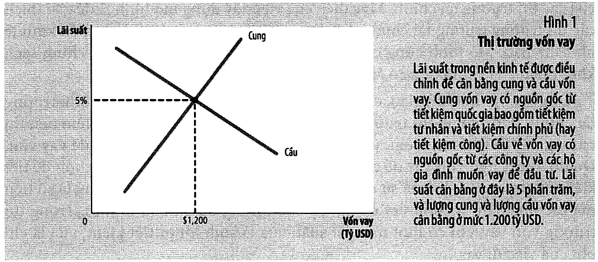
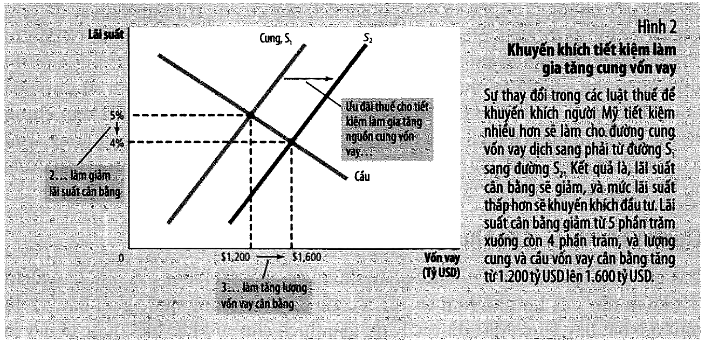
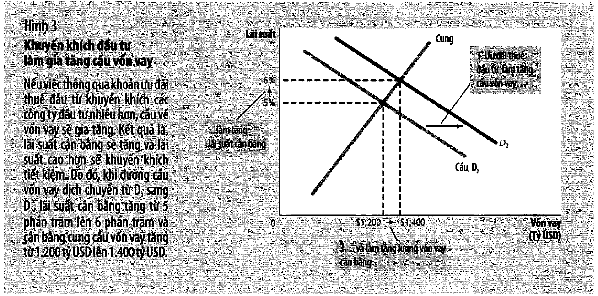
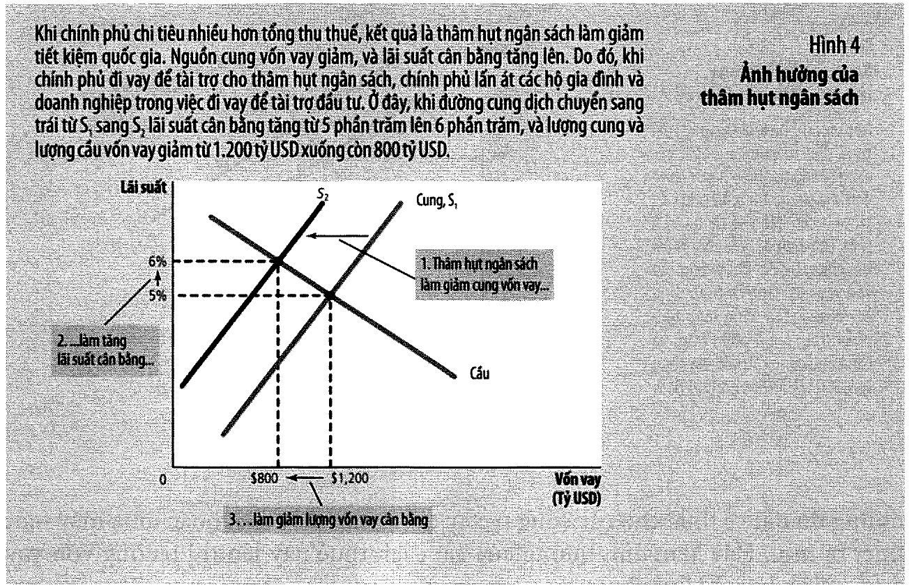
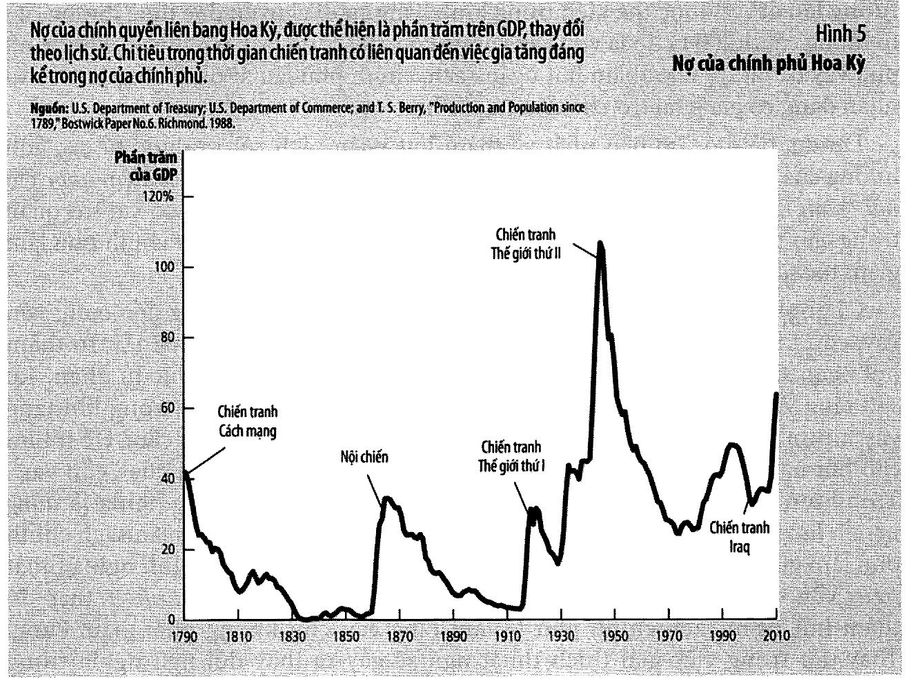

# Bài 4 — Tiết kiệm, đầu tư và hệ thống tài chính

> Bài học dựng từ **Chương 13 — Tiết kiệm, đầu tư và hệ thống tài chính** (tr. 288–312)
> của *N. Gregory Mankiw — **Kinh tế học vĩ mô***, bản dịch của Khoa Kinh tế, **ĐH Kinh tế TP.HCM** (Cengage Learning Asia).
> 🎯 **Vòng 1.** Bài 3 nói **vốn quyết định mức sống**. Bài này trả lời câu hỏi bài 3 bỏ ngỏ:
> **ai chuyển tiền tiết kiệm của người này thành vốn đầu tư của người kia, và cái gì điều tiết dòng đó?**
> 💼 **Góc QTKD** — ví dụ thêm cho ngành quản trị kinh doanh, **không có trong sách**.
> 📚 **Mở rộng** — thứ sách nói lướt hoặc để trong hộp phụ.
> ⚠️ — chỗ dễ hiểu sai, hoặc chỗ sách in sai.
> 📌 **Cần đọc trước:** [Bài 1](bai_01_do_luong_thu_nhap_quoc_gia.md) mục 5 ($Y = C+I+G+NX$),
> [Bài 2](bai_02_do_luong_chi_phi_sinh_hoat.md) mục 12 (lãi suất thực), [Bài 3](bai_03_san_xuat_va_tang_truong.md) mục 9–11 (sinh lợi giảm dần).
> Mô hình ở mục 10 dùng lại **ba bước phân tích cung–cầu** của [EG13 bài 2](../../%5BEG13%5D.kinhtevimo-micro/ly_thuyet/bai_02_cung_va_cau.md).

---

## Mục lục

<!-- MUC-LUC -->

- [1. Câu hỏi của chương](#1-câu-hỏi-của-chương)
- [2. Thị trường trái phiếu](#2-thị-trường-trái-phiếu)
- [3. Thị trường cổ phiếu](#3-thị-trường-cổ-phiếu)
- [4. 📚 Ba con số nhà phân tích cổ phiếu theo dõi — hộp "Bạn có biết", tr. 293](#4--ba-con-số-nhà-phân-tích-cổ-phiếu-theo-dõi--hộp-bạn-có-biết-tr-293)
- [5. Trung gian tài chính — ngân hàng và quỹ tương hỗ](#5-trung-gian-tài-chính--ngân-hàng-và-quỹ-tương-hỗ)
- [6. 📚 Khủng hoảng tài chính — sáu yếu tố, tr. 295](#6--khủng-hoảng-tài-chính--sáu-yếu-tố-tr-295)
- [7. Từ Y = C + I + G + NX đến S = I](#7-từ-y--c--i--g--nx-đến-s--i)
- [8. Tiết kiệm tư nhân, tiết kiệm chính phủ, thâm hụt và thặng dư](#8-tiết-kiệm-tư-nhân-tiết-kiệm-chính-phủ-thâm-hụt-và-thặng-dư)
- [9. ⚠️ "Tiết kiệm" không phải "đầu tư"](#9--tiết-kiệm-không-phải-đầu-tư)
- [10. Thị trường vốn vay — mô hình](#10-thị-trường-vốn-vay--mô-hình)
- [11. Chính sách 1 — khuyến khích tiết kiệm](#11-chính-sách-1--khuyến-khích-tiết-kiệm)
- [12. Chính sách 2 — khuyến khích đầu tư](#12-chính-sách-2--khuyến-khích-đầu-tư)
- [13. Chính sách 3 — thâm hụt, thặng dư và hiện tượng lấn át](#13-chính-sách-3--thâm-hụt-thặng-dư-và-hiện-tượng-lấn-át)
- [14. Lịch sử nợ chính phủ Hoa Kỳ — Hình 5, tr. 306](#14-lịch-sử-nợ-chính-phủ-hoa-kỳ--hình-5-tr-306)
- [15. 💼 Góc QTKD — nơi chương này chạm vào công việc](#15--góc-qtkd--nơi-chương-này-chạm-vào-công-việc)
- [16. 📚 Đối chiếu Việt Nam](#16--đối-chiếu-việt-nam)
- [17. Code minh hoạ](#17-code-minh-hoạ)
- [18. Tự thử](#18-tự-thử)
- [19. Từ điển thuật ngữ](#19-từ-điển-thuật-ngữ)
- [20. Câu hỏi tự kiểm tra](#20-câu-hỏi-tự-kiểm-tra)
- [Tóm tắt một trang](#tóm-tắt-một-trang)
- [Nguồn](#nguồn)

<!-- /MUC-LUC -->

---

## 1. Câu hỏi của chương

Sách mở bằng một tình huống nói thẳng với sinh viên sắp ra trường (tr. 288):

> *"Hãy tưởng tượng là bạn mới vừa tốt nghiệp đại học… và bạn quyết định bắt đầu công việc kinh doanh
> riêng của mình – thành lập một công ty dự báo về kinh tế. Trước khi bạn kiếm được tiền từ việc bán
> những sản phẩm dự báo của mình, bạn phải chịu các khoản chi phí đáng kể để thành lập doanh nghiệp."*

Bạn phải mua máy tính, bàn ghế, tủ hồ sơ. Tiền ở đâu ra? Hai cách:

```
   VAY  → hứa hoàn tiền lại vào kỳ hạn sau, CỘNG một khoản LÃI
   BÁN PHẦN SỞ HỮU → thuyết phục người khác góp tiền để đổi lấy một phần LỢI NHUẬN tương lai
```

Trong cả hai trường hợp, kết luận giống nhau (tr. 288): *"đầu tư của bạn vào máy tính và thiết bị văn
phòng đang được tài trợ bởi **tiết kiệm của những người khác**."*

> **Hệ thống tài chính** (*financial system*): một nhóm các định chế trong nền kinh tế giúp kết nối
> tiết kiệm của người này với đầu tư của người khác. — chú thích tr. 288

### Vì sao chương này nối thẳng vào bài 3

Bài 3 kết luận: tỷ lệ tiết kiệm cao → vốn nhiều hơn → năng suất và mức sống cao hơn. Nhưng sách thừa
nhận đã bỏ qua một mắt xích (tr. 289):

> *"Tuy nhiên, ở chương trước không giải thích làm thế nào mà nền kinh tế kết hợp tiết kiệm và đầu tư
> lại với nhau. Lúc nào cũng có một số người muốn tiết kiệm một phần từ thu nhập của họ cho tương lai,
> và những người khác muốn vay tiền để tài trợ cho các khoản đầu tư nhằm tạo lập và phát triển kinh
> doanh mới. **Điều gì mang hai nhóm người này lại với nhau? Có gì đảm bảo là nguồn cung ứng vốn từ
> những người muốn tiết kiệm cân bằng với nguồn cầu về vốn từ những người muốn đầu tư?**"*

Ba bước của chương (tr. 289):

```
   ①  các ĐỊNH CHẾ tạo nên thị trường tài chính            → mục 2–6
   ②  quan hệ giữa thị trường tài chính và TIẾT KIỆM/ĐẦU TƯ → mục 7–9
   ③  mô hình CUNG–CẦU về vốn, với LÃI SUẤT là giá          → mục 10–13
```

### Hai loại định chế

Sách chia toàn bộ hệ thống tài chính làm hai (tr. 289):

| Loại | Định nghĩa của sách | Gồm |
| ---- | ------------------- | --- |
| **Thị trường tài chính** | *"các định chế mà thông qua đó người tiết kiệm có thể cung cấp vốn **trực tiếp** đến người đi vay"* (tr. 289) | thị trường trái phiếu, thị trường cổ phiếu |
| **Trung gian tài chính** | *"các định chế tài chính mà thông qua đó những người tiết kiệm có thể **gián tiếp** cung cấp tiền cho những người đi vay"* (tr. 292) | ngân hàng, quỹ tương hỗ |

⭐ Chữ **trực tiếp** và **gián tiếp** là toàn bộ sự khác nhau. Mua trái phiếu Intel = bạn cho **chính
Intel** vay. Gửi tiết kiệm ngân hàng = bạn cho **ngân hàng** vay, rồi ngân hàng cho ai đó vay lại.

---

## 2. Thị trường trái phiếu

> **Trái phiếu** (*bond*): giấy chứng nhận nợ. — chú thích tr. 290

Sách mô tả rất đời (tr. 290): *"Một cách đơn giản, trái phiếu là tờ giấy ghi nợ (tôi nợ bạn – IOU)."*
Nó xác định:

| Thành phần | Nghĩa |
| ---------- | ----- |
| **ngày đáo hạn** | thời gian khoản nợ sẽ được hoàn trả |
| **lãi suất** | được thanh toán định kỳ cho đến khi đáo hạn |
| **vốn gốc** | khoản hoàn trả cuối cùng số tiền vay |

Ví dụ của sách: Intel muốn xây nhà máy mới, bán trái phiếu ra công chúng. Người mua *"đưa tiền của mình
cho Intel để đổi lấy lời hứa về tiền lãi và khoản hoàn trả cuối cùng số tiền vay."*

⭐ Người mua **không bị khoá đến ngày đáo hạn**: *"Người mua có thể nắm giữ trái phiếu đến kỳ đáo hạn
hoặc có thể bán trái phiếu sớm hơn cho người khác."*

### Ba đặc điểm phân biệt các trái phiếu với nhau — tr. 290–291

#### ① Kỳ hạn

> Kỳ hạn = *"độ dài thời gian của trái phiếu đến khi trái phiếu đáo hạn."*

Từ vài tháng đến ba mươi năm. 📚 Và một ngoại lệ thú vị: *"Chính phủ Anh đã từng phát hành loại trái
phiếu **không bao giờ đáo hạn**, được gọi là **trái phiếu vĩnh viễn**. Loại trái phiếu này trả lãi mãi
mãi, tuy nhiên vốn gốc không bao giờ được hoàn lại."*

**Quy tắc:** kỳ hạn dài → rủi ro cao hơn → **lãi suất cao hơn**. Lý do (tr. 290): người giữ trái phiếu
dài hạn cần tiền sớm thì *"anh ta có thể bán trái phiếu cho người khác với mức giá thấp hơn"*.

#### ② Rủi ro tín dụng

> Rủi ro tín dụng = *"khả năng mà người vay không thể hoàn trả lãi hoặc vốn gốc."* Thất bại trong việc
> trả nợ gọi là **vỡ nợ**.

```
   trái phiếu chính phủ Hoa Kỳ  →  "an toàn về rủi ro tín dụng"  →  lãi suất THẤP
   TRÁI PHIẾU RÁC (junk bond)   →  nguy cơ vỡ nợ CAO             →  lãi suất RẤT CAO
```

Sách nhắc tới tổ chức xếp hạng: người mua *"có thể đánh giá rủi ro tín dụng bằng cách kiểm tra với các
tổ chức tư nhân khác nhau như **Standard & Poor's**."*

#### ③ Xử lý thuế

> Xử lý thuế = *"cách mà các luật thuế áp dụng lên lãi suất kiếm được từ trái phiếu."*

Tiền lãi từ hầu hết trái phiếu **bị đánh thuế thu nhập**. Nhưng **trái phiếu đô thị** — do chính quyền
địa phương phát hành — thì *"người chủ của trái phiếu không bị bắt buộc phải trả thuế thu nhập liên
bang trên phần thu nhập lãi"*. Kết quả: chúng *"thường được trả lãi suất thấp hơn"*.

### ⚠️ Đừng bao giờ so hai trái phiếu bằng lãi suất danh nghĩa

Mục 3 của [code minh hoạ](#17-code-minh-hoạ) tính bằng số, dùng đúng thuế suất 33% mà sách dùng ở tr. 301:

```
   trái phiếu công ty, lãi 9%, chịu thuế 33%  →  thực nhận  6,03%
   trái phiếu đô thị, miễn thuế               →  chỉ cần trên 6,03% là LỢI HƠN
```

💼 Một trái phiếu đô thị trả **6,5%** đánh bại một trái phiếu công ty trả **9%** đối với người ở khung
thuế 33%. Con số danh nghĩa nhỏ hơn hẳn mà vẫn thắng.

---

## 3. Thị trường cổ phiếu

> **Cổ phiếu** (*stock*): một quyền hay sự xác nhận sở hữu một phần doanh nghiệp. — chú thích tr. 291

Nếu Intel bán tổng cộng 1.000.000 cổ phiếu thì *"từng cổ phiếu này đại diện quyền sở hữu 1/1.000.000
của doanh nghiệp."*

### Hai cách gọi tên

```
   bán CỔ PHIẾU   →  tài trợ bằng VỐN CHỦ SỞ HỮU   (equity finance)
   bán TRÁI PHIẾU →  tài trợ bằng VAY NỢ            (debt finance)
```

### ⭐ Bảng so sánh — chỗ đáng thuộc nhất mục này

Sách viết (tr. 291):

|                          | **Trái phiếu**                | **Cổ phiếu**                     |
| ------------------------ | ----------------------------- | -------------------------------- |
| Bạn là gì                | **chủ nợ** của công ty        | **chủ sở hữu** một phần công ty  |
| Khi công ty **lãi to**   | vẫn chỉ nhận lãi đã hứa       | *"các cổ đông sẽ có lợi từ những khoản lợi nhuận này"* |
| Khi công ty **phá sản**  | *"được thanh toán những gì họ được hưởng **trước** khi cổ đông nhận được bất cứ thứ gì"* | chỉ còn lại gì thì nhận |
| Rủi ro / lợi nhuận       | thấp / thấp                   | **cao / cao**                    |

Sách tóm một câu (tr. 291): *"So với trái phiếu, người nắm giữ cổ phiếu có **rủi ro cao hơn và lợi
nhuận tiềm năng cao hơn**."*

### ⚠️ Công ty không nhận tiền khi cổ phiếu đổi chủ

Chi tiết này rất hay bị hiểu nhầm (tr. 291):

> *"Sau khi một công ty phát hành cổ phiếu bằng cách bán các cổ phiếu ra công chúng, thì những cổ phiếu
> này được giao dịch giữa các cổ đông trên thị trường chứng khoán có tổ chức. Trong những giao dịch này,
> **bản thân các công ty không nhận được tiền** khi cổ phiếu của họ được chuyển nhượng."*

📌 Đây chính là lý do ở [mục 9](#9--tiết-kiệm-không-phải-đầu-tư), mua cổ phiếu được xếp là **tiết kiệm**
chứ không phải **đầu tư**.

### Giá cổ phiếu là gì

> *"Bởi vì cổ phiếu đại diện cho quyền sở hữu ở công ty, nguồn cầu về cổ phiếu (và do đó, mức giá của
> chúng) phản ánh nhận thức của mọi người về **lợi nhuận tương lai** của công ty."* — tr. 291

📚 **Chỉ số chứng khoán** = số bình quân giá của các loại chứng khoán. Hai chỉ số sách nêu (tr. 292):

| Chỉ số | Dựa trên | Từ năm |
| ------ | -------- | ------ |
| **Dow Jones Industrial Average** | 30 công ty hàng đầu Hoa Kỳ (GE, Microsoft, Coca-Cola, Walt Disney, AT&T, IBM) | **1896** |
| **Standard & Poor's 500** | 500 công ty hàng đầu | |

⭐ Và một nhận xét đáng nhớ (tr. 292): *"Bởi vì giá cổ phiếu phản ánh lợi nhuận kỳ vọng, các chỉ số
chứng khoán này được xem gần giống như là **các chỉ số về các điều kiện kinh tế tương lai**."*

---

## 4. 📚 Ba con số nhà phân tích cổ phiếu theo dõi — hộp "Bạn có biết", tr. 293

| Con số | Là gì |
| ------ | ----- |
| **Giá** | giá "cuối cùng" / "giá đóng cửa" = mức giá của lần giao dịch sau cùng được khớp lệnh trước khi sàn đóng cửa. Báo còn đưa giá cao/thấp của ngày, đôi khi của cả năm trước |
| **Cổ tức** | phần lợi nhuận công ty trả cho cổ đông. Phần **không** trả gọi là **lợi tức không chia**, thường dùng cho đầu tư tăng thêm. **Tỷ lệ cổ tức** = lợi nhuận được chia trên giá cổ phiếu |
| **Hệ số giá trên thu nhập (P/E)** | giá cổ phiếu chia cho **thu nhập trên mỗi cổ phần** (tổng thu nhập chia số cổ phần đang lưu hành) |

### Cách đọc P/E — theo đúng lời sách

> *"Trong lịch sử, hệ số P/E tiêu biểu là **15**. Tỷ số P/E cao hơn nghĩa là cổ phiếu của công ty đó là
> **đắt tương đối** so với thu nhập gần đây của nó; điều này có nghĩa là hoặc là mọi người kỳ vọng vào
> thu nhập tăng lên trong tương lai **hoặc** cổ phiếu đó bị đánh giá cao."*

⚠️ Chú ý chữ **"hoặc"**. P/E cao có **hai** cách giải thích trái ngược, và con số P/E một mình **không**
cho bạn biết là cách nào. Đây là điểm mà rất nhiều lời khuyên đầu tư trên mạng bỏ qua.

Sách cũng nêu hai kiểu người dùng số liệu này khác nhau hoàn toàn:

```
   người GIAO DỊCH   → dùng các con số này để quyết định mua/bán
   người MUA VÀ GIỮ  → "mua cổ phiếu của những công ty hoạt động tốt, nắm giữ nó lâu dài
                        và không phản ứng với những dao động hàng ngày"
```

---

## 5. Trung gian tài chính — ngân hàng và quỹ tương hỗ

### Ngân hàng — tr. 292

Vì sao một cửa hàng tạp hoá nhỏ không phát hành trái phiếu như Intel? Sách trả lời rất thực tế (tr. 292):

> *"Hầu hết những người mua cổ phiếu và trái phiếu thích mua chúng từ các công ty niêm yết là những công
> ty lớn, quen thuộc hơn. Do đó, một cửa hàng tạp hóa nhỏ thường tài trợ cho việc mở rộng sản xuất bằng
> việc **vay nợ từ ngân hàng địa phương**."*

Ngân hàng có **hai** chức năng, và chức năng thứ hai mới là thứ phân biệt nó:

| # | Chức năng | Mô tả |
| - | --------- | ----- |
| 1 | **trung gian tài chính** | nhận tiền gửi, cho vay; ăn chênh lệch lãi suất — *"bao gồm chi phí của ngân hàng và một phần lợi nhuận của chủ sở hữu ngân hàng"* |
| 2 | **tạo trung gian trao đổi** | cho phép viết ngân phiếu và dùng thẻ ghi nợ trên tài khoản tiền gửi |

⭐ Sách giải thích vì sao chức năng 2 quan trọng (tr. 292):

> *"Các cổ phiếu và trái phiếu, giống như các khoản tiền gửi ngân hàng, là **dự trữ giá trị** khả dĩ
> cho của cải mà mọi người tích lũy được từ tiết kiệm quá khứ, nhưng tiếp cận của cải này là **không dễ
> dàng, không rẻ và không nhanh chóng** như khi chỉ cần viết một ngân phiếu hoặc sử dụng thẻ ghi nợ."*

📌 [Bài 7](bai_07_he_thong_tien_te.md) sẽ quay lại chức năng thứ hai này dưới tên **cung tiền**.

### Quỹ tương hỗ — tr. 293–294

> **Quỹ tương hỗ** (*mutual fund*): định chế bán cổ phần ra công chúng và sử dụng số thu nhập này để mua
> danh mục các cổ phiếu và trái phiếu. — chú thích tr. 293

**Ưu điểm 1 — đa dạng hoá.** Sách dùng câu châm ngôn: *"Không đặt tất cả trứng vào trong cùng một rổ."*
Với **vài trăm đô la**, *"một người có thể mua cổ phần trong quỹ tương hỗ và một cách gián tiếp anh ta
trở thành chủ sở hữu một phần hoặc là chủ nợ của **hàng trăm công ty lớn**."* Phí: **0,5 đến 2%** trên
khối tài sản mỗi năm.

**Ưu điểm 2 — quản lý chuyên nghiệp.** …nhưng đây là chỗ sách nói ngược lại lẽ thường:

### ⭐ Sách hoài nghi chính ưu điểm thứ hai — tr. 294

> *"Tuy nhiên, các nhà kinh tế học tài chính thường **hoài nghi** về lập luận thứ hai này. Với hàng ngàn
> nhà quản lý chuyên nghiệp chú ý kỹ đến triển vọng của từng công ty, giá của cổ phiếu thường phản ánh
> tốt giá trị thực của công ty. Kết quả là, **rất khó để "đánh bại thị trường"** bằng cách mua cổ phiếu
> tốt và bán cổ phiếu xấu."*

Bằng chứng: **quỹ chỉ số** — quỹ mua *"tất cả cổ phiếu trong một chỉ số chứng khoán nhất định"* —
*"thực hiện tốt hơn một chút trên mức trung bình so với các quỹ tương hỗ tận dụng lợi thế về các nhà
quản lý chuyên nghiệp với các giao dịch chủ động."*

Lý do rất đơn giản: *"các quỹ này giữ các **chi phí thấp** bằng cách giảm thiểu mua bán và không thuê
mướn các nhà quản lý chuyên nghiệp."*

💼 Áp cho tiền của chính bạn: với phí 0,5%–2%/năm và **30 năm**, mục 5 của
[code minh hoạ](#17-code-minh-hoạ) cho thấy chênh lệch phí không phải "mất 1,5%" — nó lấy đi một phần
rất lớn số tiền cuối cùng. Cùng số học với ví dụ thuế ở tr. 301.

---

## 6. 📚 Khủng hoảng tài chính — sáu yếu tố, tr. 295

Hộp *"Bạn có biết"* liệt kê sáu yếu tố của khủng hoảng 2008–2009, và chúng tạo thành một **vòng tròn**:

| # | Yếu tố | Chi tiết của sách |
| - | ------ | ----------------- |
| ① | **giá tài sản sụt giảm** | giá nhà cửa, sau khi bùng nổ đầu thập niên, *"đã giảm giá khoảng **30 phần trăm** chỉ trong vòng vài năm"* — chưa từng xảy ra ở Hoa Kỳ **kể từ năm 1930** |
| ② | **vỡ nợ của các định chế tài chính** | ngân hàng đã *"đánh cược vào giá của bất động sản bằng cách giữ tài sản thế chấp bằng chính bất động sản đó"*. Giá nhà giảm → chủ nhà ngừng trả nợ → nhiều định chế tới phá sản |
| ③ | **sự tự tin của các định chế tài chính sụt giảm** | tiền gửi được bảo hiểm, các tài sản khác thì không → *"mỗi định chế tài chính trở thành ứng cử viên cho việc phá sản kế tiếp"* → rút tiền hàng loạt → **"bán tống bán tháo"** |
| ④ | **khủng hoảng tín dụng** | *"những người đi vay đối diện với khó khăn trong việc vay vốn, ngay cả khi họ có các dự án đầu tư sinh lời"* |
| ⑤ | **suy thoái kinh tế** | không vay được → cắt chi tiêu → thu nhập quốc gia giảm, thất nghiệp tăng |
| ⑥ | **vòng lẩn quẩn** | *"Suy giảm kinh tế làm giảm lợi nhuận của nhiều công ty và giá trị của nhiều tài sản. Do đó, chúng ta trở lại bước một."* |

⭐ Yếu tố ④ là chỗ khủng hoảng **tài chính** biến thành khủng hoảng **kinh tế**: hệ thống tài chính mất
đúng khả năng mà cả chương này mô tả — *"điều tiết nguồn lực của người tiết kiệm đến tay những người vay
có cơ hội đầu tư tốt nhất."*

Sách kết bằng một dòng cân bằng (tr. 295): khủng hoảng *"gây ra những hậu quả nghiêm trọng. Nhưng may
thay, nó đã kết thúc. Các định chế tài chính cuối cùng cũng đã điều chỉnh bảng cân đối của mình, có lẽ
với sự giúp đỡ từ chính sách của chính phủ."*

📌 [Bài 11–12](bai_11_tong_cau_va_tong_cung.md) sẽ mô hình hoá đúng chuỗi này bằng tổng cầu–tổng cung.

---

## 7. Từ Y = C + I + G + NX đến S = I

Đây là mục trung tâm của chương. Sách nói rõ ngay từ đầu (tr. 296): *"Điểm tập trung của chúng ta ở đây
**không phải là hành vi mà là kế toán**."*

### Bước 1 — giả định nền kinh tế đóng

$$Y = C + I + G + NX$$

Sách đơn giản hoá (tr. 296): giả định **nền kinh tế đóng** — *"nền kinh tế không có tương tác với các
nền kinh tế khác"*, không giao thương, không vay mượn quốc tế. Do đó $NX = 0$:

$$Y = C + I + G$$

⚠️ Sách rất thẳng thắn về việc giả định này **không đúng**: *"Các nền kinh tế trong thực tế là các nền
kinh tế mở."* Nhưng nó *"là sự đơn giản hóa hữu ích, theo đó chúng ta có thể học được một số bài học
nhằm áp dụng cho tất cả các nền kinh tế."* Và nó *"áp dụng hoàn hảo cho các nền kinh tế trên thế giới
(vì thương mại giữa các hành tinh là chưa phổ biến)."*

📌 [Bài 10](bai_10_ly_thuyet_kinh_te_mo.md) sẽ bỏ giả định này ra và làm lại toàn bộ mô hình.

### Bước 2 — trừ C và G ở cả hai vế

$$Y - C - G = I$$

> **Tiết kiệm quốc gia** (*national saving*), hay chỉ là **tiết kiệm**, ký hiệu $S$: phần còn lại của
> tổng thu nhập của nền kinh tế sau khi chi cho tiêu dùng và chi mua sắm của chính phủ. — chú thích tr. 297

$$\boxed{S = I}$$

Sách nhấn mạnh bằng chữ in nghiêng (tr. 298):

> *"**Vì nền kinh tế là một tổng thể, tiết kiệm phải bằng với đầu tư.**"*

⚠️ **Đây không phải một phát hiện, cũng không phải một giả thuyết cần kiểm chứng.** Nó đúng vì cách các
biến được định nghĩa — hệt như $Y = C+I+G+NX$ ở [bài 1](bai_01_do_luong_thu_nhap_quoc_gia.md#5-bốn-thành-phần--y--c--i--g--nx).
Mục 1 của [code minh hoạ](#17-code-minh-hoạ) kiểm bằng `assert`.

Nhưng sách hỏi ngay câu hỏi thật sự đáng giá (tr. 298):

> *"Các cơ chế nào nằm đằng sau đồng nhất thức này? Cái gì phối hợp những người quyết định tiết kiệm bao
> nhiêu với những người quyết định đầu tư bao nhiêu? **Câu trả lời là hệ thống tài chính.**"*

---

## 8. Tiết kiệm tư nhân, tiết kiệm chính phủ, thâm hụt và thặng dư

Đặt $T$ = số tiền chính phủ thu thuế **trừ đi** chi chuyển nhượng. Khi đó $S$ viết được hai cách:

$$S = Y - C - G \qquad \text{hoặc} \qquad S = \underbrace{(Y - T - C)}_{\text{tư nhân}} + \underbrace{(T - G)}_{\text{chính phủ}}$$

⭐ **Hai chữ $T$ triệt tiêu nhau, nên hai cách viết là một.** Nhưng cách thứ hai cho thấy điều cách thứ
nhất giấu: tiết kiệm quốc gia có **hai nguồn**, và chính phủ có thể làm một trong hai nguồn đó **âm**.

| Khái niệm | Định nghĩa (chú thích tr. 297) |
| --------- | ------------------------------- |
| **Tiết kiệm tư nhân** | phần thu nhập còn lại của hộ gia đình sau khi trả thuế và chi tiêu tiêu dùng |
| **Tiết kiệm chính phủ** | phần còn lại của tổng thu thuế sau khi trả cho các khoản mua sắm của chính phủ |
| **Thặng dư ngân sách** | phần **vượt** của tổng thu thuế so với chi mua sắm — $T > G$ |
| **Thâm hụt ngân sách** | phần **thiếu hụt** của tổng thu thuế so với chi mua sắm — $G > T$ |

Mục 1 của [code minh hoạ](#17-code-minh-hoạ) chạy ba trạng thái ngân sách trên cùng một nền kinh tế:

```
   T = 1.900  →  T − G = +300  (thặng dư)  →  S = 1.300 + 300 = 1.600
   T = 1.600  →  T − G =    0  (cân bằng)  →  S = 1.600 +   0 = 1.600
   T = 1.300  →  T − G = −300  (thâm hụt)  →  S = 1.900 − 300 = 1.600
```

⚠️ Nhìn dòng cuối: thâm hụt **kéo $S$ xuống** mặc dù tiết kiệm tư nhân **tăng** (từ 1.300 lên 1.900).
Vì sao? Vì thuế thấp hơn để lại nhiều thu nhập khả dụng hơn cho hộ gia đình. Nhưng phần tăng đó
**không bù đủ** phần chính phủ vay mất. Đó chính là cơ chế của [mục 13](#13-chính-sách-3--thâm-hụt-thặng-dư-và-hiện-tượng-lấn-át).

---

## 9. ⚠️ "Tiết kiệm" không phải "đầu tư"

Sách dành hẳn một mục cho việc này, và mở bằng lời cảnh báo (tr. 298):

> *"Thuật ngữ **tiết kiệm** và **đầu tư** đôi lúc có thể nhầm lẫn. Hầu hết mọi người sử dụng những thuật
> ngữ này tình cờ và đôi khi thay thế cho nhau. Ngược lại, những nhà kinh tế học vĩ mô… sử dụng các
> thuật ngữ này **cẩn thận và rõ ràng**."*

### Ba nhân vật của sách

| Ai | Làm gì | Vĩ mô gọi là |
| -- | ------ | ------------ |
| **Larry** | ký gửi thu nhập chưa tiêu vào ngân hàng | **tiết kiệm** |
| **Larry** | dùng nó **mua cổ phiếu hoặc trái phiếu** của các công ty | ⚠️ vẫn là **tiết kiệm** |
| **Moe** | vay ngân hàng để **tự xây nhà mới** | **đầu tư** |
| **Curly** | công ty bán cổ phiếu, dùng tiền **xây nhà xưởng mới** | **đầu tư** |

Sách nói thẳng về Larry (tr. 298): *"Larry có thể tự nghĩ rằng anh đang **"đầu tư"** tiền, nhưng các nhà
kinh tế vĩ mô gọi hành động của Larry là **tiết kiệm chứ không phải đầu tư**."*

### ⭐ Quy tắc một dòng

```
   ĐẦU TƯ = mua VỐN MỚI VỪA ĐƯỢC TẠO RA
            (máy móc, thiết bị, nhà xưởng, NHÀ Ở MỚI, hàng tồn kho)

   Mua cổ phiếu chỉ là ĐỔI CHỦ một tài sản đã có  →  TIẾT KIỆM, không phải đầu tư
```

Đây là lý do [mục 3](#3-thị-trường-cổ-phiếu) nhấn mạnh: khi cổ phiếu đổi chủ trên sàn, **công ty không
nhận được đồng nào** — nên không có vốn mới nào được tạo ra.

### ⚠️ $S = I$ đúng cho cả nền kinh tế, **sai** cho từng người

> *"Tiết kiệm của Larry có thể lớn hơn đầu tư của anh ta… Tiết kiệm của Moe có thể nhỏ hơn đầu tư của
> anh ta, và anh ta có thể vay ngân hàng cho khoản thiếu hụt."* — tr. 298

Ngân hàng và các định chế tài chính khác *"thu xếp các sự khác biệt cá nhân này"*. Đó chính là công việc
của hệ thống tài chính, phát biểu bằng ngôn ngữ kế toán.

---

## 10. Thị trường vốn vay — mô hình

Sách gộp **toàn bộ** hệ thống tài chính thành **một** thị trường duy nhất (tr. 299):

> **Thị trường vốn vay** (*market for loanable funds*): thị trường gồm những người tiết kiệm cung ứng
> nguồn vốn vay và những người vay có nhu cầu vay vốn. — chú thích tr. 299

Sách thừa nhận thẳng đây là đơn giản hoá: *"Giả định về một loại thị trường tài chính, dĩ nhiên là không
thực tế."* Nhưng nhắc lại bài học chương 2 (bạn đã đọc ở
[bài 0 mục 11](bai_00_tu_vi_mo_sang_vi_mo.md#11--vai-trò-của-giả-định--vì-sao-vĩ-mô-có-hai-bộ-mô-hình)):
*"nghệ thuật trong việc xây dựng mô hình kinh tế là đơn giản hóa thế giới để giải thích chúng."*

### Cung và cầu

```
   CUNG vốn vay  =  TIẾT KIỆM      (người muốn cho vay)
   CẦU  vốn vay  =  ĐẦU TƯ         (hộ gia đình vay thế chấp mua nhà, doanh nghiệp vay mua thiết bị)
   GIÁ            =  LÃI SUẤT
```

Vì sao hai đường dốc đúng chiều đó (tr. 299):

| Đường | Hướng | Lý do của sách |
| ----- | ----- | -------------- |
| **cầu** | dốc **xuống** | *"lãi suất cao làm cho khoản vay đắt đỏ hơn, lượng cầu vốn vay giảm khi lãi suất tăng"* |
| **cung** | dốc **lên** | *"lãi suất cao làm tiết kiệm trở nên hấp dẫn hơn, lượng cung vốn vay tăng lên khi lãi suất tăng"* |

### Hình 1, tr. 300 — cân bằng



```
   lãi suất cân bằng  =  5%
   lượng vốn vay      =  1.200 tỷ USD
```

Cơ chế điều chỉnh giống hệt mọi thị trường bạn đã học ở
[EG13 bài 2](../../%5BEG13%5D.kinhtevimo-micro/ly_thuyet/bai_02_cung_va_cau.md#11-thặng-dư-và-thiếu-hụt--cơ-chế-đưa-thị-trường-về-cân-bằng):

```
   lãi suất THẤP hơn cân bằng  →  THIẾU HỤT vốn vay  →  người cho vay NÂNG lãi suất
   lãi suất CAO  hơn cân bằng  →  THỪA vốn vay       →  người cho vay GIẢM lãi suất
```

### ⚠️ "Lãi suất" ở đây là lãi suất **thực**

Sách nói rõ (tr. 300):

> *"Do đó, cung và cầu vốn vay phụ thuộc vào **lãi suất thực** (hơn là lãi suất danh nghĩa), và cân bằng
> trong Hình 1 nên được hiểu là xác định lãi suất thực của nền kinh tế. Phần còn lại của chương này, khi
> chúng ta thấy thuật ngữ **lãi suất**, nên nhớ là chúng ta đang nói về **lãi suất thực**."*

📌 Khái niệm này là của [bài 2 mục 12](bai_02_do_luong_chi_phi_sinh_hoat.md#12-lãi-suất-danh-nghĩa-và-lãi-suất-thực).
Lý do: *"lạm phát làm xói mòn giá trị của tiền theo thời gian"*, nên lãi suất thực mới là *"tiền lãi thực
của tiết kiệm và chi phí thực của khoản vay"*.

### ✅ Bốn hình của sách nhất quán với nhau — đã kiểm

Mục 4 của [code minh hoạ](#17-code-minh-hoạ) tìm **một** cặp đường tuyến tính duy nhất tái tạo **cả bốn**
hình (Hình 1–4, tr. 300–304), với **cùng một** độ lớn dịch chuyển 600 tỷ:

$$Q_d = 3.200 - 400r \qquad\qquad Q_s = 200 + 200r$$

| Hình | Đường dịch | Kết quả tính lại | Sách in |
| ---- | ---------- | ---------------- | ------- |
| 1 — gốc | — | 5% / 1.200 | 5% / 1.200 ✓ |
| 2 — ưu đãi thuế cho **tiết kiệm** | cung → phải | 4% / 1.600 | 4% / 1.600 ✓ |
| 3 — ưu đãi thuế cho **đầu tư** | cầu → phải | 6% / 1.400 | 6% / 1.400 ✓ |
| 4 — **thâm hụt** ngân sách | cung → trái | 6% / 800 | 6% / 800 ✓ |

⭐ Bốn hình này **hoàn toàn nhất quán**. Đó là một chi tiết nhỏ nhưng cho biết sách vẽ chúng cẩn thận,
không phải vẽ mỗi hình một kiểu.

---

## 11. Chính sách 1 — khuyến khích tiết kiệm

Sách mở bằng một sự kiện (tr. 301): các gia đình Mỹ tiết kiệm **ít hơn** so với ở Nhật hay Đức. *"Mặc dù
các lý do giải thích cho sự khác biệt quốc tế này là không rõ ràng, nhiều nhà hoạch định chính sách ở
Hoa Kỳ xem mức tiết kiệm thấp ở Hoa Kỳ là vấn đề quan trọng."*

Lập luận đi qua **hai** nguyên lý trong Mười Nguyên lý:

```
   Nguyên lý 8  → mức sống phụ thuộc năng lực sản xuất
                  (và bài 3 đã chỉ ra tiết kiệm quyết định vốn, vốn quyết định năng suất)
   Nguyên lý 4  → mọi người phản ứng trước các động cơ khuyến khích
                  → luật thuế Hoa Kỳ đánh thuế thu nhập LÃI và CỔ TỨC
                  → làm giảm động cơ tiết kiệm
```

### Ví dụ số của sách — tr. 301

Một người **25 tuổi** tiết kiệm **1.000 USD**, mua trái phiếu kỳ hạn **30 năm**, lãi suất **9%**:

| Trường hợp | Lãi suất thực nhận | Đến năm 55 tuổi có |
| ---------- | -----------------: | -----------------: |
| không bị đánh thuế | 9% | **13.268 USD** |
| bị đánh thuế 33%   | 6% | **5.743 USD** |

Mục 5 của [code minh hoạ](#17-code-minh-hoạ) kiểm cả hai bằng `assert` — **khớp từng con số**.

⚠️ Một chi tiết số học: $9\% \times (1 - 33\%) = 6{,}03\%$, sách **làm tròn thành 6%**. Code dùng đúng
con số 6% của sách để hai kết quả đối chiếu được.

⭐ **Thuế suất 33% nhưng lấy đi 57% số tiền cuối kỳ.** Lý do là **lãi kép**: thuế không ăn một lần vào
gốc, nó ăn vào **tốc độ tăng**, mỗi năm một chút, trong ba mươi năm.

| Sau N năm | Không thuế | Có thuế | Thuế lấy đi |
| --------: | ---------: | ------: | ----------: |
|  5 |  1.539 | 1.338 | 13% |
| 10 |  2.367 | 1.791 | 24% |
| 20 |  5.604 | 3.207 | 43% |
| **30** | **13.268** | **5.743** | **57%** |
| 40 | 31.409 | 10.286 | 67% |

### Ba bước phân tích

| Bước | Trả lời |
| ---- | ------- |
| ① đường nào dịch? | **CUNG** — *"vì sự thay đổi thuế sẽ thay đổi động cơ các hộ gia đình tiết kiệm **tại bất kỳ mức lãi suất nào**"*. Cầu không đổi vì *"sự thay đổi thuế không ảnh hưởng trực tiếp lên số tiền những người vay muốn vay"* |
| ② hướng nào? | sang **PHẢI** — tiết kiệm bị đánh thuế nhẹ hơn nên hộ gia đình tiết kiệm nhiều hơn |
| ③ cân bằng mới? | lãi suất **5% → 4%**, vốn vay **1.200 → 1.600 tỷ** |

> *"…nếu cải cách các luật thuế khuyến khích tiết kiệm nhiều hơn, kết quả là mức **lãi suất thấp hơn và
> đầu tư cao hơn**."* — tr. 302



### ⚠️ Nhưng sách nói ngay rằng đây là vấn đề gây tranh cãi

Đây là chỗ sách trung thực nhất trong cả chương (tr. 302):

> *"Phân tích về ảnh hưởng của việc gia tăng tiết kiệm này được chấp nhận rộng rãi trong những nhà kinh
> tế, tuy nhiên vẫn có ít sự đồng thuận về loại thuế nào nên được thay đổi."*

Hai phản biện:

1. **Hiệu lực:** *"những nhà kinh tế khác hoài nghi về những thay đổi thuế này sẽ ảnh hưởng như thế nào,
   nhiều hay ít lên tiết kiệm quốc gia."*
2. **Công bằng:** *"trong nhiều trường hợp, lợi ích của việc thay đổi thuế sẽ tích lũy chủ yếu cho
   **người giàu**, những người ít cần giảm thuế nhất."*

📌 Ghi nhớ cấu trúc này: mô hình cho biết **hướng** của tác động, nó **không** trả lời được câu hỏi
*"độ lớn bao nhiêu"* và *"ai được lợi"*. Cả hai câu đó cần dữ liệu và cần một phán xét giá trị.

---

## 12. Chính sách 2 — khuyến khích đầu tư

Công cụ: **quy định hoàn thuế đầu tư** — *"những ưu đãi về thuế cho các công ty xây dựng nhà máy mới
hoặc mua máy móc thiết bị mới"* (tr. 302–303).

| Bước | Trả lời |
| ---- | ------- |
| ① đường nào dịch? | **CẦU** — quy định *"áp dụng cho các công ty vay và đầu tư vào vốn mới"*. Cung không đổi vì nó *"không ảnh hưởng đến lượng tiết kiệm của các hộ gia đình tại bất kỳ mức lãi suất nào"* |
| ② hướng nào? | sang **PHẢI** |
| ③ cân bằng mới? | lãi suất **5% → 6%**, vốn vay **1.200 → 1.400 tỷ** |

> *"…nếu cải cách của luật thuế khuyến khích đầu tư nhiều hơn, kết quả là **lãi suất sẽ tăng lên và
> lượng tiết kiệm sẽ nhiều hơn**."* — tr. 303



⚠️ Chú ý: các hộ gia đình tiết kiệm nhiều hơn **không phải** vì đường cung dịch, mà vì *"sự di chuyển
dọc theo đường cung"* do lãi suất cao hơn.

### ⚠️⚠️ Chỗ dễ nhầm nhất cả chương — phân biệt chính sách 1 và 2

```
   GIỐNG NHAU:  cả hai đều là "ưu đãi thuế"
                cả hai đều làm lượng vốn vay TĂNG

   KHÁC NHAU:   chính sách 1 làm lãi suất GIẢM  (5% → 4%)
                chính sách 2 làm lãi suất TĂNG  (5% → 6%)
```

⭐ **Mẹo nhớ — hỏi đúng một câu:** *"ưu đãi này dành cho **người tiết kiệm** hay **người đầu tư**?"*

| Ưu đãi dành cho | Dịch đường | Lãi suất |
| --------------- | ---------- | -------- |
| người **tiết kiệm** | CUNG | **giảm** |
| người **đầu tư**    | CẦU  | **tăng** |

Đây đúng là câu hỏi ①  trong ba bước phân tích của
[EG13 bài 2](../../%5BEG13%5D.kinhtevimo-micro/ly_thuyet/bai_02_cung_va_cau.md), chỉ áp cho thị trường mới.

---

## 13. Chính sách 3 — thâm hụt, thặng dư và hiện tượng lấn át

> **Thâm hụt ngân sách** = chi tiêu chính phủ vượt mức tổng thu thuế. Chính phủ tài trợ bằng cách **vay
> trên thị trường trái phiếu**, và tích luỹ các khoản vay quá khứ gọi là **nợ chính phủ**. — tr. 303

| Bước | Trả lời |
| ---- | ------- |
| ① đường nào dịch? | **CUNG** — tiết kiệm quốc gia = tư nhân + chính phủ; thâm hụt làm tiết kiệm chính phủ âm. Cầu không đổi vì thâm hụt *"không ảnh hưởng đến lượng vốn mà hộ gia đình và doanh nghiệp muốn vay để tài trợ cho đầu tư tại bất kỳ mức lãi suất cho trước nào"* |
| ② hướng nào? | sang **TRÁI** |
| ③ cân bằng mới? | lãi suất **5% → 6%**, vốn vay **1.200 → 800 tỷ** |



> **Hiện tượng lấn át** (*crowding out*): sự giảm sút của đầu tư do chính phủ đi vay. — chú thích tr. 305

> *"Khi chính phủ làm giảm tiết kiệm quốc gia bởi thâm hụt ngân sách, **lãi suất tăng và đầu tư giảm**.
> Vì đầu tư có vai trò quan trọng cho tăng trưởng kinh tế trong dài hạn, thâm hụt ngân sách chính phủ
> làm giảm tốc tăng trưởng của nền kinh tế."* — tr. 305

### ⭐ Lấn át **không bao giờ** là 100% — mục 6 của code tách rõ

```
   chính phủ vay thêm:            600 tỷ
   đầu tư tư nhân GIẢM:           400 tỷ   ← đây là phần bị LẤN ÁT
   200 tỷ còn lại từ đâu ra?
       lãi suất 5% → 6% khiến hộ gia đình TIẾT KIỆM NHIỀU HƠN: 1.200 → 1.400 (+200)
       đó là DI CHUYỂN DỌC theo đường cung, không phải dịch chuyển đường

   cân đối:  −600 (chính phủ) + 200 (tư nhân tiết kiệm thêm) = −400  ✓
```

📌 Phần bù đó **càng nhỏ khi đường cung càng dựng đứng** — tức khi người dân ít phản ứng với lãi suất.
Đây là một câu hỏi thực nghiệm, không phải câu hỏi lý thuyết.

### 📚 Vì sao thâm hụt dịch **cung** chứ không phải **cầu**? — tr. 305

Sách tự đặt câu hỏi này và trả lời rất sòng phẳng: rốt cuộc chính phủ vẫn phải **bán trái phiếu**, tức
là đi vay. Sao "chính phủ vay" thì dịch cung, còn "hộ gia đình vay mua nhà" thì dịch cầu?

Câu trả lời nằm ở **định nghĩa** của "vốn vay":

| Nếu "vốn vay" định nghĩa là… | Thì thâm hụt… |
| ---------------------------- | ------------- |
| *"dòng nguồn lực sẵn có để tài trợ cho đầu tư **tư nhân**"* (cách sách dùng) | làm **giảm CUNG** |
| *"dòng nguồn lực sẵn có từ tiết kiệm **tư nhân**"* | làm **tăng CẦU** |

> *"Thay đổi trong việc giải thích thuật ngữ sẽ gây ra thay đổi ngữ nghĩa trong cách chúng ta mô tả mô
> hình, tuy nhiên **những mấu chốt từ phân tích là giống nhau**: Trong cả hai trường hợp, thâm hụt ngân
> sách làm tăng lãi suất, do đó lấn át những người vay tư nhân."* — tr. 305

⭐ Một bài học phương pháp đáng giá: khi hai người cãi nhau về "đường nào dịch", rất có thể họ đang dùng
**hai định nghĩa khác nhau** cho cùng một trục — và kết luận thật thì giống hệt nhau.

### Thặng dư ngân sách — ngược lại hoàn toàn

> *"…thặng dư ngân sách làm tăng nguồn cung vốn vay, giảm lãi suất và khuyến khích đầu tư. Đầu tư cao
> hơn, nghĩa là tích lũy vốn nhiều hơn và tăng trưởng kinh tế nhanh hơn."* — tr. 305

---

## 14. Lịch sử nợ chính phủ Hoa Kỳ — Hình 5, tr. 306



Hình 5 vẽ nợ liên bang theo **phần trăm GDP** từ **1790**.

| Năm | Nợ/GDP | Bối cảnh |
| ---: | -----: | -------- |
| 1836 | **0%** | mức thấp nhất lịch sử |
| 1865 | ~30% | Nội chiến |
| 1919 | ~33% | Chiến tranh Thế giới I |
| **1945** | **107%** | Chiến tranh Thế giới II — cao nhất |
| 1980 | 26% | |
| 1993 | **50%** | sau thời kỳ Reagan |
| 2001 | ~33% | sau các năm thặng dư cuối thập niên 1990 |
| 2010 | ~62% | sau khủng hoảng tài chính |

### ⚠️ Vì sao dùng tỷ lệ nợ/GDP chứ không phải số tuyệt đối

> *"Bởi vì GDP là thước đo tương đối của cơ sở tính thuế của chính phủ, tỷ lệ nợ/GDP giảm chỉ ra rằng
> nợ chính phủ đang thu hẹp so với **khả năng tăng thu thuế** của chính phủ."* — tr. 306

```
   nợ 1.000 tỷ  với nền kinh tế 10.000 tỷ  →  10%   trả được
   nợ 1.000 tỷ  với nền kinh tế  2.000 tỷ  →  50%   khó hơn nhiều
```

📌 Và nhớ [bài 1 mục 16](bai_01_do_luong_thu_nhap_quoc_gia.md#16--đối-chiếu-việt-nam--cách-đọc-số-liệu-gdp-trong-nước):
**đánh giá lại GDP làm mọi tỷ lệ có GDP ở mẫu số nhảy**, mà chẳng có gì thay đổi trong nền kinh tế thật.

### Thủ phạm chính: chiến tranh

> *"Trong suốt lịch sử, nguyên nhân chính của các thay đổi trong nợ chính phủ là **chiến tranh**."* — tr. 306

📚 Và sách đưa **hai lý do ủng hộ** việc vay nợ để tài trợ chiến tranh (tr. 306), điều khá bất ngờ:

1. **Giữ thuế suất ổn định.** Không có tài trợ bằng nợ, *"thuế suất sẽ phải tăng lên nhanh chóng trong
   suốt chiến tranh, và do đó sẽ dẫn đến suy giảm đáng kể trong hiệu quả kinh tế."*
2. **Phân bổ gánh nặng công bằng giữa các thế hệ.** Nợ *"dịch chuyển một phần chi phí chiến tranh cho
   thế hệ sau"* — những người *"thụ hưởng lợi ích có được từ một thế hệ phải chiến đấu để chống lại kẻ
   xâm lược nước ngoài."*

### ⚠️ Hai lần tăng nợ **không** phải do chiến tranh

**① 1980–1993: từ 26% lên 50%.** Sách kể rất thẳng (tr. 307):

> *"Khi tổng thống Ronald Reagan nhậm chức năm 1981, ông đã cam kết một chính phủ tinh gọn và thuế thấp
> hơn. Tuy nhiên, ông nhận thấy rằng việc **cắt giảm chi tiêu chính phủ gặp nhiều khó khăn chính trị hơn
> so với việc cắt giảm thuế**."*

Sau đó nợ giảm lại: Clinton (1993) và Quốc hội do Cộng Hoà kiểm soát (1995) đều đặt giảm thâm hụt lên
hàng đầu, và ngân sách *"cuối cùng đã chuyển thành thặng dư"*.

**② Từ 2008: khủng hoảng tài chính.** Ba lý do sách nêu cho giai đoạn Bush đầu thập niên 2000 (cắt giảm
thuế 2001, suy thoái 2001, chi tiêu an ninh sau 11/9 và chiến tranh Iraq/Afghanistan), rồi:

> *"Vào năm 2009 và 2010, thâm hụt ngân sách của chính phủ liên bang là khoảng **10 phần trăm GDP**,
> mức thâm hụt lớn nhất kể từ Chiến tranh Thế giới thứ II."* — tr. 307

---

## 15. 💼 Góc QTKD — nơi chương này chạm vào công việc

### ① Đường cầu vốn vay là **danh sách dự án của chính bạn**

Mục 8 của [code minh hoạ](#17-code-minh-hoạ) dựng một công ty có sáu dự án, mỗi dự án một tỷ suất sinh lợi:

| Lãi suất vay | Số dự án còn đáng làm | Tổng vốn đầu tư |
| -----------: | --------------------: | --------------: |
|  4% | 6 | 25.900 triệu |
|  5% | 5 | 16.900 triệu |
|  6% | 4 | 13.700 triệu |
|  8% | 2 |  3.200 triệu |
| 12% | 0 |          0   |

⭐ **Đây chính là đường cầu vốn vay, vẽ từ bên trong một doanh nghiệp.** Nó dốc xuống không phải vì một
quy luật trừu tượng, mà vì mỗi dự án có một **ngưỡng sinh lợi** riêng, và lãi suất cao hơn cắt bỏ dần
từng dự án một.

⚠️ Và "hiện tượng lấn át" thôi trừu tượng ngay: khi thâm hụt ngân sách đẩy lãi suất từ 5% lên 6%, công
ty bạn chuyển từ 5 dự án xuống 4. Trên đồ thị đó là một đường dịch. Trong đời sống đó là **một cuộc họp
trong đó một dự án cụ thể bị gạch khỏi kế hoạch năm sau**.

### ② Vay nợ hay bán cổ phần — bảng ở mục 3, đọc từ phía doanh nghiệp

| | **Phát hành trái phiếu / vay ngân hàng** | **Bán cổ phần** |
| --- | --- | --- |
| Bạn phải trả | lãi **cố định**, dù lãi hay lỗ | chỉ chia khi **có** lợi nhuận |
| Bạn giữ được | **toàn bộ** quyền kiểm soát và phần lợi nhuận vượt trội | phải chia cả hai |
| Rủi ro cho bạn | **cao** — không trả nổi thì mất công ty | thấp hơn |
| Rủi ro cho họ | thấp — được trả trước khi phá sản | cao |

⭐ Đánh đổi cốt lõi: **vay nợ rẻ hơn nhưng cứng nhắc; vốn cổ phần đắt hơn nhưng co giãn được.** Doanh
nghiệp có dòng tiền **ổn định và dự báo được** thì vay nợ hợp lý. Doanh nghiệp có dòng tiền **biến động
mạnh** (theo mùa, theo chu kỳ) mà vay nặng là công thức của phá sản trong lần suy thoái tới.

### ③ Ba câu hỏi trước khi ký một khoản vay dài hạn

1. **Lãi suất này là danh nghĩa hay thực?** (mục 10) — nếu lạm phát 5% và bạn vay 8% danh nghĩa, chi phí
   thực chỉ 3%. Nhưng nếu lạm phát bất ngờ về 1%, chi phí thực nhảy lên 7%.
2. **Kỳ hạn có khớp với dòng tiền của tài sản không?** (mục 2①) — vay ngắn hạn để mua tài sản dài hạn là
   nguyên nhân của yếu tố ③ trong khủng hoảng tài chính ([mục 6](#6--khủng-hoảng-tài-chính--sáu-yếu-tố-tr-295)).
3. **Nếu lãi suất tăng 2 điểm, dự án còn dương không?** — nhìn lại bảng ở mục 15①.

### ④ ⚠️ Lãi kép cắt cả hai chiều

Mục 5 cho thấy **thuế 33% lấy đi 57% số tiền cuối kỳ sau 30 năm**. Cùng số học đó áp cho:

```
   phí quản lý quỹ đầu tư chênh 1,5%/năm  →  sau 30 năm mất hơn một phần ba
   biên lợi nhuận thấp hơn đối thủ 2 điểm →  sau 15 năm quy mô chênh gần gấp rưỡi
   trả nợ trễ, lãi phạt cộng dồn          →  cùng cơ chế, ngược dấu
```

📌 Đây là lý do chương 14 (bài 5) — về giá trị hiện tại và lãi kép — là chương **sinh lời nhất cả cuốn**
với người làm quản trị.

---

## 16. 📚 Đối chiếu Việt Nam

⚠️ **Cảnh báo:** số liệu dưới đây tôi ghi theo trí nhớ có giới hạn. **Hãy tra lại nguồn chính thức trước
khi dùng vào báo cáo.** Cái đáng học ở mục này là **cách áp khung phân tích**.

### Hệ thống tài chính Việt Nam nghiêng hẳn về **trung gian**, không phải **thị trường**

Sách trình bày hai loại định chế ngang nhau ([mục 1](#1-câu-hỏi-của-chương)). Ở Việt Nam thì không cân:

```
   TRUNG GIAN (ngân hàng)      →  áp đảo. Tín dụng ngân hàng/GDP thuộc nhóm cao trên thế giới
   THỊ TRƯỜNG (cổ phiếu, TP)   →  nhỏ hơn nhiều so với quy mô nền kinh tế
```

⭐ Hệ quả thực tế cho doanh nghiệp: **kênh vốn chủ đạo là vay ngân hàng**, tức là bạn đang ở đúng tình
huống "cửa hàng tạp hoá nhỏ" mà sách mô tả ở [mục 5](#5-trung-gian-tài-chính--ngân-hàng-và-quỹ-tương-hỗ),
chứ không phải tình huống Intel. Điều đó có ba hệ quả:

1. Điều kiện vay phụ thuộc **tài sản thế chấp** nhiều hơn phụ thuộc chất lượng dự án.
2. Khi ngân hàng siết tín dụng, bạn **không có kênh thay thế** — đúng yếu tố ④ của khủng hoảng tài chính.
3. Chi phí vốn của bạn bám sát lãi suất điều hành, chứ không bám sát thị trường trái phiếu.

### Thị trường trái phiếu doanh nghiệp — một bài học về "rủi ro tín dụng"

Giai đoạn cuối thập niên 2010 chứng kiến trái phiếu doanh nghiệp riêng lẻ ở Việt Nam bùng nổ, rồi
**khủng hoảng vào năm 2022** khi hàng loạt lô trái phiếu bất động sản mất khả năng thanh toán.

⭐ Đọc lại [mục 2②](#2-thị-trường-trái-phiếu) rồi nhìn lại chuyện này thì mọi thứ rất rõ:

| Sách nói | Đã xảy ra |
| -------- | --------- |
| rủi ro tín dụng cao → lãi suất cao | lãi suất trái phiếu doanh nghiệp cao hơn hẳn lãi tiết kiệm |
| người mua *"có thể đánh giá rủi ro tín dụng bằng cách kiểm tra với các tổ chức… như Standard & Poor's"* | ⚠️ hạ tầng xếp hạng tín nhiệm độc lập còn rất mỏng |
| trái phiếu rủi ro cao = **"trái phiếu rác"** | nhiều lô thực chất thuộc nhóm này nhưng **không được gọi tên như vậy** |

📌 **Lãi suất cao bất thường không phải quà tặng. Nó là giá thị trường đòi cho rủi ro.** Khi một trái
phiếu trả gấp đôi lãi tiết kiệm, câu hỏi đúng không phải *"lãi cao thế à?"* mà *"rủi ro gì khiến người
ta phải trả cao đến vậy?"*

### Nợ công và hiện tượng lấn át

Tỷ lệ nợ công/GDP của Việt Nam ở mức trung bình so với khu vực, thấp hơn nhiều mức 107% của Hoa Kỳ năm
1945. Nhưng cơ chế ở [mục 13](#13-chính-sách-3--thâm-hụt-thặng-dư-và-hiện-tượng-lấn-át) vẫn áp dụng:
khi ngân sách phát hành trái phiếu chính phủ khối lượng lớn, ngân hàng thương mại mua vào, và phần vốn
đó **không** còn để cho doanh nghiệp vay.

⚠️ Và nhắc lại bẫy ở [bài 1](bai_01_do_luong_thu_nhap_quoc_gia.md#16--đối-chiếu-việt-nam--cách-đọc-số-liệu-gdp-trong-nước):
việc **đánh giá lại quy mô GDP năm 2019** đã làm tỷ lệ nợ công/GDP giảm đáng kể **chỉ vì mẫu số lớn lên**.
Số nợ tuyệt đối không hề giảm một đồng nào.

---

## 17. Code minh hoạ

> ⚙️ **Chạy:** cần **Python 3.10+**. Lưu file rồi gõ `python3 bai-04-tiet-kiem-dau-tu-he-thong-tai-chinh.py`.
> Không cần cài gói nào — chỉ dùng thư viện chuẩn. Kết quả **tất định**.
> Bản đầy đủ nằm ở [`thuc_hanh/bai-04-tiet-kiem-dau-tu-he-thong-tai-chinh.py`](../thuc_hanh/bai-04-tiet-kiem-dau-tu-he-thong-tai-chinh.py).

```python
"""Bai 4 — Tiet kiem, dau tu va he thong tai chinh (Mankiw, chuong 13).
Chay: python3 bai-04-tiet-kiem-dau-tu-he-thong-tai-chinh.py   (Python 3.10+)

Muc 4 tim ra MOT cap duong cung-cau tuyen tinh tai tao dung CA BON hinh
(Hinh 1-4, tr. 300-304). Ket qua tat dinh.
"""

import textwrap

# ══ 1. TU Y = C + I + G + NX DEN S = I — tr. 296-297 ═══════════════════════
# Nen kinh te gia dinh, don vi ty USD.
Y = 10_000      # GDP = tong thu nhap = tong chi tieu
C = 6_800       # tieu dung
I = 1_600       # dau tu
G = 1_600       # mua sam cua chinh phu
NX = 0          # NEN KINH TE DONG — gia dinh cua ca chuong (tr. 296)
T = 1_900       # thue TRU di chi chuyen nhuong

print("1. TU DONG NHAT THUC GDP DEN 'TIET KIEM = DAU TU' — tr. 296-297")
print()
print(f"   Y = C + I + G + NX      {Y:,} = {C:,} + {I:,} + {G:,} + {NX}")
assert Y == C + I + G + NX
print("   ✓ dong nhat thuc khop (bai 1 muc 5)")
print()
print("   Sach gia dinh NEN KINH TE DONG (tr. 296): khong xuat, khong nhap => NX = 0")
print(f"   Y = C + I + G           {Y:,} = {C:,} + {I:,} + {G:,}")
print()
print("   Tru C va G o CA HAI VE:")
print(f"   Y - C - G = I           {Y:,} - {C:,} - {G:,} = {Y - C - G:,}")
S = Y - C - G
assert S == I
print(f"   ⭐ S = I                {S:,} = {I:,}")
print()
print("   Sach nhan manh (tr. 298, in nghieng): 'Vi nen kinh te la mot tong the,")
print("   TIET KIEM PHAI BANG VOI DAU TU.'")
print()
print("   ⚠ Day KHONG phai mot phat hien, cung khong phai mot gia thuyet can kiem chung.")
print("      No dung vi CACH DINH NGHIA cac bien — giong het Y = C + I + G + NX o bai 1.")
print()

# --- Tach tiet kiem quoc gia thanh hai phan --------------------------------
print("   TACH LAM HAI (tr. 297):   S = (Y - T - C) + (T - G)")
tk_tu_nhan = Y - T - C
tk_chinh_phu = T - G
print(f"      tiet kiem TU NHAN   Y - T - C = {Y:,} - {T:,} - {C:,} = {tk_tu_nhan:,}")
print(f"      tiet kiem CHINH PHU T - G     = {T:,} - {G:,} = {tk_chinh_phu:,}")
print(f"      tong                          = {tk_tu_nhan + tk_chinh_phu:,}  = S ✓")
assert tk_tu_nhan + tk_chinh_phu == S
print()
print("   ⭐ Hai chu T TRIET TIEU nhau — nen hai cach viet la MOT. Nhung cach thu hai")
print("      cho thay dieu cach thu nhat giau: tiet kiem quoc gia co HAI NGUON, va")
print("      chinh phu co the lam mot trong hai nguon do AM.")
print()
print("   Ba trang thai ngan sach chinh phu (tr. 297):")
for ten, thue in [("thang du ngan sach", 1_900), ("ngan sach can bang", 1_600),
                  ("tham hut ngan sach", 1_300)]:
    tk_cp = thue - G
    tk_tn = Y - thue - C
    dau = "+" if tk_cp >= 0 else "-"
    print(f"      T = {thue:>5,}  ->  T - G = {tk_cp:>+6,}  ({ten:<18})"
          f"  S = {tk_tn:,} {dau} {abs(tk_cp):,} = {tk_tn + tk_cp:,}")
print()
print("   ⚠ Nhin dong cuoi: khi chinh phu tham hut, S GIAM du tiet kiem tu nhan TANG.")
print("      Do la toan bo co che cua muc 6 (hien tuong lan at).")
print()

# ══ 2. TIET KIEM KHONG PHAI DAU TU — vi du Larry/Moe/Curly, tr. 298 ════════
print("2. ⚠ 'TIET KIEM' VA 'DAU TU' KHONG PHAI MOT — tr. 298")
print("   Sach noi thang: 'Hau het moi nguoi su dung nhung thuat ngu nay tinh co va")
print("   doi khi thay the cho nhau. Nguoc lai, cac nha kinh te hoc vi mo... su dung")
print("   cac thuat ngu nay can than va ro rang.'")
print()
NHAN_VAT = [
    ("Larry",  "gui thu nhap chua tieu vao ngan hang",       "TIET KIEM", ""),
    ("Larry",  "mua co phieu hoac trai phieu cua cong ty",   "TIET KIEM",
     "⚠ Larry tu nghi minh dang 'dau tu' — sach noi day la TIET KIEM"),
    ("Moe",    "vay ngan hang de TU XAY nha moi",            "DAU TU",
     "nha o MOI la dau tu, khong phai tieu dung (bai 1 muc 6)"),
    ("Curly",  "ban co phieu, dung tien XAY NHA XUONG moi",  "DAU TU", ""),
]
print("   nhan vat  hanh dong                                 vi mo goi la")
for ai, viec, loai, ghi in NHAN_VAT:
    print(f"   {ai:<9} {viec:<44} {loai}")
    if ghi:
        print(f"             {ghi}")
print()
print("   ⭐ QUY TAC MOT DONG: DAU TU = mua VON MOI VUA DUOC TAO RA")
print("      (may moc, thiet bi, nha xuong, nha o moi, hang ton kho).")
print("      Mua co phieu chi la DOI CHU mot tai san da co => TIET KIEM, khong phai dau tu.")
print()
print("   ⚠ S = I dung cho CA NEN KINH TE, KHONG dung cho tung nguoi (tr. 298):")
print("      'Tiet kiem cua Larry co the lon hon dau tu cua anh ta... Tiet kiem cua Moe")
print("       co the nho hon dau tu cua anh ta.' Ngan hang thu xep phan chenh lech do.")
print()

# ══ 3. TRAI PHIEU VA CO PHIEU — ba dac diem, tr. 290-291 ═══════════════════
print("3. TRAI PHIEU SO VOI CO PHIEU — tr. 290-291")
print()
print("                      TRAI PHIEU                   CO PHIEU")
SO_SANH = [
    ("ban la gi",          "CHU NO cua cong ty",         "CHU SO HUU mot phan cong ty"),
    ("tai tro bang",       "tai tro bang VAY NO",        "tai tro bang VON CHU SO HUU"),
    ("nhan duoc",          "lai co dinh + von goc",      "phan loi nhuan (co tuc + gia len)"),
    ("khi cong ty LAI to", "van chi nhan lai da hua",    "huong het phan tang them"),
    ("khi cong ty PHA SAN", "duoc tra TRUOC",            "chi con lai gi thi nhan"),
    ("rui ro / loi nhuan", "thap / thap",                "CAO / CAO"),
]
for muc, tp, cp in SO_SANH:
    print(f"   {muc:<20} {tp:<28} {cp}")
print()
print("   BA DAC DIEM PHAN BIET CAC TRAI PHIEU VOI NHAU (tr. 290-291):")
DAC_DIEM = [
    ("① KY HAN",        "do dai den khi dao han",
     "dai han rui ro hon => LAI SUAT CAO HON",
     "Anh tung phat hanh trai phieu VINH VIEN — tra lai mai, khong hoan von goc"),
    ("② RUI RO TIN DUNG", "kha nang nguoi vay khong tra duoc (vo no)",
     "rui ro cao hon => LAI SUAT CAO HON",
     "trai phieu chinh phu My: lai THAP · 'trai phieu rac': lai RAT CAO"),
    ("③ XU LY THUE",     "luat thue ap len tien lai the nao",
     "duoc mien thue => nguoi mua chap nhan LAI THAP HON",
     "'trai phieu do thi' khong chiu thue thu nhap lien bang => lai suat thap"),
]
for ten, la_gi, quy_tac, vi_du in DAC_DIEM:
    print(f"   {ten}  {la_gi}")
    print(f"      quy tac: {quy_tac}")
    print(f"      vi du:   {vi_du}")
print()

# --- Trai phieu mien thue so voi trai phieu chiu thue -----------------------
THUE_SUAT = 0.33     # muc sach dung o vi du tr. 301
LAI_CHIU_THUE = 0.09
print(f"   💼 SO SANH THUC TE — thue suat {THUE_SUAT:.0%} (muc sach dung o tr. 301):")
sau_thue = LAI_CHIU_THUE * (1 - THUE_SUAT)
print(f"      trai phieu cong ty  lai {LAI_CHIU_THUE:.0%}  ->  sau thue con {sau_thue:.2%}")
print(f"      trai phieu do thi   mien thue  ->  chi can lai {sau_thue:.2%} la NGANG BANG")
print(f"      => neu trai phieu do thi tra tren {sau_thue:.2%} thi no LOI HON,")
print(f"         du con so danh nghia ({sau_thue:.2%}) nho hon han {LAI_CHIU_THUE:.0%}.")
print("      ⚠ Day la ly do khong bao gio so hai trai phieu bang LAI SUAT DANH NGHIA.")
print()

# ══ 4. THI TRUONG VON VAY — tai tao CA BON hinh, tr. 300-304 ═══════════════
# Tim mot cap duong cung-cau TUYEN TINH tai tao dung bon hinh cua sach.
#   Cau (dau tu):        Qd = 3200 - 400·r
#   Cung (tiet kiem):    Qs =  200 + 200·r
# Kiem: r=5 -> Qd=1200, Qs=1200  (Hinh 1: can bang 5%, 1.200 ty USD)
CAU_A, CAU_B = 3200, 400     # Qd = CAU_A - CAU_B*r
CUNG_A, CUNG_B = 200, 200    # Qs = CUNG_A + CUNG_B*r

def cau(r, dich=0):
    return CAU_A + dich - CAU_B * r

def cung(r, dich=0):
    return CUNG_A + dich + CUNG_B * r

def can_bang(dich_cung=0, dich_cau=0):
    """Giai (CAU_A + dc) - CAU_B·r = (CUNG_A + ds) + CUNG_B·r."""
    r = (CAU_A + dich_cau - CUNG_A - dich_cung) / (CAU_B + CUNG_B)
    return r, cau(r, dich_cau)

print("4. THI TRUONG VON VAY — Hinh 1 den Hinh 4, tr. 300-304")
print()
print(f"   Cau von vay (= DAU TU):    Qd = {CAU_A:,} - {CAU_B}·r     doc XUONG")
print(f"   Cung von vay (= TIET KIEM): Qs = {CUNG_A:,} + {CUNG_B}·r     doc LEN")
print()
print("   lai suat   luong CAU   luong CUNG   trang thai")
for r in range(3, 9):
    d, s = cau(r), cung(r)
    tt = "CAN BANG" if d == s else ("thieu hut von vay" if d > s else "thua von vay")
    print(f"   {r:>7}%   {d:>9,}   {s:>10,}   {tt}")
print()
DICH = 600   # do lon cua moi cu dich chuyen chinh sach
KICH_BAN = [
    ("Hinh 1  goc",                        0,      0,    5, 1200),
    ("Hinh 2  uu dai thue cho TIET KIEM",  DICH,   0,    4, 1600),
    ("Hinh 3  uu dai thue cho DAU TU",     0,      DICH, 6, 1400),
    ("Hinh 4  THAM HUT ngan sach",        -DICH,   0,    6,  800),
]
print(f"   Bon hinh cua sach, moi cu dich chuyen deu bang {DICH} ty USD:")
print()
print("   hinh                              duong dich   lai suat   von vay   sach in")
for ten, ds, dc, r_sach, q_sach in KICH_BAN:
    r, q = can_bang(ds, dc)
    ai = "cung →phai" if ds > 0 else ("cung →trai" if ds < 0 else
                                      ("cau  →phai" if dc > 0 else "— (goc)"))
    khop = "✓" if (round(r), round(q)) == (r_sach, q_sach) else "✗ LECH"
    print(f"   {ten:<33} {ai:<11}  {r:>7.0f}%   {q:>7,.0f}   {r_sach}% / {q_sach:,}  {khop}")
    assert (round(r), round(q)) == (r_sach, q_sach)
print()
print("   ⭐ MOT cap duong tuyen tinh duy nhat tai tao dung CA BON hinh cua sach,")
print("      voi CUNG MOT do lon dich chuyen 600 ty. Bon hinh nay NHAT QUAN voi nhau.")
print()

# --- Ba buoc phan tich, dung nhu chuong 4 ----------------------------------
print("   BA BUOC PHAN TICH (sach nhac lai tu chuong 4, tr. 301):")
BA_BUOC = [
    ("Uu dai thue cho TIET KIEM (Hinh 2, tr. 302)",
     "CUNG — vi thue doi dong co TIET KIEM cua ho gia dinh",
     "sang PHAI",
     "lai suat GIAM 5%→4%, von vay TANG 1.200→1.600",
     "'neu cai cach cac luat thue khuyen khich tiet kiem nhieu hon, ket qua la muc"
     " lai suat thap hon va dau tu cao hon'"),
    ("Uu dai thue cho DAU TU (Hinh 3, tr. 303)",
     "CAU — vi quy dinh hoan thue ap cho CONG TY di vay va dau tu",
     "sang PHAI",
     "lai suat TANG 5%→6%, von vay TANG 1.200→1.400",
     "'neu cai cach cua luat thue khuyen khich dau tu nhieu hon, ket qua la lai suat"
     " se tang len va luong tiet kiem se nhieu hon'"),
    ("THAM HUT ngan sach (Hinh 4, tr. 304)",
     "CUNG — vi tiet kiem chinh phu (T-G) am lam giam tiet kiem QUOC GIA",
     "sang TRAI",
     "lai suat TANG 5%→6%, von vay GIAM 1.200→800",
     "'Khi chinh phu lam giam tiet kiem quoc gia boi tham hut ngan sach, lai suat tang"
     " va dau tu giam'"),
]
for i, (ten, duong, huong, ket_qua, trich) in enumerate(BA_BUOC, 1):
    print()
    print(f"   ── {ten}")
    print(f"      ① duong nao dich?  {duong}")
    print(f"      ② dich huong nao?  {huong}")
    print(f"      ③ can bang moi?    {ket_qua}")
    for j, dong in enumerate(textwrap.wrap(trich, 78)):
        print(f"      {'sach ket: ' if j == 0 else '          '}{dong}")
print()
print("   ⚠ PHAN BIET HINH 2 VA HINH 3 — day la cho de nham nhat ca chuong:")
print("      ca hai deu la 'uu dai thue' va ca hai deu lam von vay TANG,")
print("      nhung mot cai lam lai suat GIAM con cai kia lam lai suat TANG.")
print("      Meo: hoi 'uu dai nay danh cho NGUOI TIET KIEM hay NGUOI DAU TU?'")
print("        cho nguoi TIET KIEM -> dich CUNG -> lai suat GIAM")
print("        cho nguoi DAU TU    -> dich CAU  -> lai suat TANG")
print()

# ══ 5. THUE DANH VAO LAI LAM GIAM DONG CO TIET KIEM — tr. 301 ══════════════
GOC, SO_NAM = 1_000, 30
LAI_TRUOC_THUE = 0.09
THUE = 0.33
print("5. VI SAO THUE DANH VAO TIEN LAI LAM GIAM TIET KIEM — vi du tr. 301")
print()
print(f"   Mot nguoi 25 tuoi tiet kiem {GOC:,} USD, mua trai phieu ky han {SO_NAM} nam,")
print(f"   lai suat {LAI_TRUOC_THUE:.0%}. Den nam {25 + SO_NAM} tuoi anh ta co bao nhieu?")
print()
# Sach viet ro (tr. 301): thue 33% nen "lai suat sau thue chi con 6 phan tram".
# 9% x (1 - 33%) = 6,03% — sach LAM TRON thanh 6%. Ta dung dung con so cua sach
# de hai ket qua duoi day doi chieu duoc voi 13.268 va 5.743 ma sach in.
lai_sau_thue = 0.06
print(f"   ⚠ 9% x (1 - {THUE:.0%}) = {LAI_TRUOC_THUE * (1 - THUE):.2%}; sach lam tron thanh 6%.")
print()
for nhan, r in (("KHONG bi danh thue", LAI_TRUOC_THUE), (f"bi danh thue {THUE:.0%}", lai_sau_thue)):
    cuoi = GOC * (1 + r) ** SO_NAM
    print(f"      {nhan:<22} lai thuc nhan {r:>5.0%}  ->  {cuoi:>9,.0f} USD")
khong_thue = GOC * (1 + LAI_TRUOC_THUE) ** SO_NAM
co_thue = GOC * (1 + lai_sau_thue) ** SO_NAM
assert round(khong_thue) == 13_268 and round(co_thue) == 5_743
print("   Sach in 13.268 USD va 5.743 USD.  ✓ khop tung con so.")
print()
print(f"   ⭐ Thue lay di {khong_thue - co_thue:,.0f} USD — tuc"
      f" {(1 - co_thue / khong_thue) * 100:.0f}% so tien cuoi ky,")
print(f"      trong khi thue suat chi la {THUE:.0%}. Ly do: LAI KEP.")
print("      Thue khong an mot lan vao goc, no an vao TOC DO TANG, moi nam mot chut,")
print("      trong ba muoi nam.")
print()
print("   Do lon cua hieu ung nay theo so nam:")
print("   so nam   khong thue   co thue   thue lay di")
for n in (5, 10, 20, 30, 40):
    a = GOC * (1 + LAI_TRUOC_THUE) ** n
    b = GOC * (1 + lai_sau_thue) ** n
    print(f"   {n:>6}   {a:>10,.0f}   {b:>7,.0f}   {(1 - b / a) * 100:>10.0f}%")
print()
print("   💼 Cung so hoc do ap cho ban: chenh 3 diem % phi quan ly quy dau tu, trong 30")
print("      nam, KHONG phai 'mat 3%' — no la thu lay di hon mot nua so tien cuoi cung.")
print()

# ══ 6. HIEN TUONG LAN AT — tach thanh hai phan, tr. 304-305 ════════════════
print("6. HIEN TUONG LAN AT — tr. 305")
print("   Dinh nghia (chu thich tr. 305): 'su giam sut cua DAU TU do chinh phu di vay'.")
print()
r0, q0 = can_bang()
r1, q1 = can_bang(dich_cung=-DICH)
print(f"   Truoc tham hut:  lai suat {r0:.0f}%, dau tu {q0:,.0f} ty")
print(f"   Sau tham hut:    lai suat {r1:.0f}%, dau tu {q1:,.0f} ty")
print(f"   Chinh phu vay them:      {DICH:,} ty")
print(f"   Dau tu tu nhan GIAM:     {q0 - q1:,.0f} ty   <- day la LAN AT")
print()
tk_tu_nhan_moi = cung(r1)          # cung goc tai lai suat moi = tiet kiem tu nhan
print("   ⭐ CHU Y: chinh phu vay 600 nhung dau tu chi giam 400. 200 con lai tu dau ra?")
print(f"      Lai suat cao hon ({r0:.0f}% -> {r1:.0f}%) khien ho gia dinh TIET KIEM NHIEU HON:")
print(f"         tiet kiem tu nhan {cung(r0):,.0f} -> {tk_tu_nhan_moi:,.0f} ty"
      f"  (+{tk_tu_nhan_moi - cung(r0):,.0f})")
print(f"      Do la DI CHUYEN DOC theo duong cung, khong phai dich chuyen duong.")
print(f"      Can doi: -{DICH} (chinh phu) + {tk_tu_nhan_moi - cung(r0):.0f}"
      f" (tu nhan tiet kiem them) = {-DICH + tk_tu_nhan_moi - cung(r0):.0f} = thay doi dau tu ✓")
assert q1 - q0 == -DICH + (tk_tu_nhan_moi - cung(r0))
print()
print("   ⚠ Lan at KHONG bao gio la 100% — mot phan luon duoc bu bang tiet kiem tang them.")
print("      Nhung phan bu do la co han, va cang co han khi duong cung cang DUNG (nguoi")
print("      dan it phan ung voi lai suat).")
print()
print("   Thang du ngan sach thi NGUOC LAI hoan toan (tr. 305):")
r2, q2 = can_bang(dich_cung=+DICH)
print(f"      thang du {DICH:,} ty  ->  lai suat {r0:.0f}% -> {r2:.0f}%,"
      f" dau tu {q0:,.0f} -> {q2:,.0f} ty")
print("      'thang du ngan sach lam tang nguon cung von vay, giam lai suat va khuyen")
print("       khich dau tu. Dau tu cao hon, nghia la tich luy von nhieu hon va tang")
print("       truong kinh te nhanh hon.'")
print()

# ══ 7. NO CHINH PHU HOA KY — Hinh 5, tr. 306 ═══════════════════════════════
NO = [(1836, 0), (1865, 30), (1900, 10), (1919, 33), (1945, 107), (1974, 24),
      (1980, 26), (1993, 50), (2001, 33), (2010, 62)]
print("7. NO CHINH PHU HOA KY (% GDP) — Hinh 5, tr. 306")
print("   Cac moc sach neu ro trong doan van tr. 305-307; cac moc khac doc tu do thi.")
print()
for nam, pct in NO:
    print(f"   {nam}  {pct:>4}%  {'█' * round(pct / 2)}")
print()
print("   ⭐ Sach chi ra THU PHAM CHINH cua moi lan tang no: CHIEN TRANH (tr. 306).")
print("      1836 no = 0% — muc thap nhat lich su. 1945 no = 107% — cao nhat.")
print("   ⭐ Va HAI ngoai le KHONG phai chien tranh:")
print("      • 1980-1993: 26% -> 50%. Reagan cam ket chinh phu tinh gon va thue thap,")
print("        'nhung ong nhan thay viec cat giam chi tieu chinh phu gap nhieu kho khan")
print("        chinh tri hon so voi viec cat giam thue' (tr. 307).")
print("      • tu 2008: khung hoang tai chinh. Tham hut 2009-2010 khoang 10% GDP —")
print("        'muc tham hut lon nhat ke tu Chien tranh The gioi thu II' (tr. 307).")
print()
print("   ⚠ VI SAO DUNG TY LE NO/GDP CHU KHONG DUNG SO TUYET DOI (tr. 306):")
print("      'Boi vi GDP la thuoc do tuong doi cua co so tinh thue cua chinh phu, ty le")
print("       no/GDP giam chi ra rang no chinh phu dang thu hep so voi KHA NANG TANG THU")
print("       THUE cua chinh phu.'")
print("      => No 1.000 ty voi mot nen kinh te 10.000 ty khac han no 1.000 ty voi nen")
print("         kinh te 2.000 ty. Mau so moi la thu cho biet co tra noi hay khong.")
print("   ⚠ Va nho bai 1 muc 16: DANH GIA LAI GDP lam moi ty le co GDP o mau so nhay,")
print("      ma khong co gi thay doi trong nen kinh te that.")
print()

# ══ 8. 💼 GOC QTKD — LAI SUAT DOI THI DU AN NAO SONG SOT ═══════════════════
print("8. 💼 GOC QTKD — CAU VON VAY DOC XUONG NGHIA LA GI VOI CONG TY BAN")
print()
# Danh muc du an dau tu, moi du an co ty suat sinh loi noi bo rieng
DU_AN = [
    ("Nang cap phan mem quan ly kho",  800,  12.0),
    ("Mua 2 xe tai giao hang",       2_400,   9.5),
    ("Mo chi nhanh mien Trung",      6_000,   7.5),
    ("Day chuyen dong goi tu dong",  4_500,   6.2),
    ("Mo rong kho lanh",             3_200,   5.4),
    ("Mua dat du tru mo rong",       9_000,   4.1),
]
print("   Cong ty co sau du an, moi du an mot ty suat sinh loi (trieu dong, %/nam):")
print()
print("   du an                            von can   sinh loi")
for ten, von, r in DU_AN:
    print(f"   {ten:<32} {von:>8,}   {r:>6.1f}%")
print()
print("   Voi moi muc lai suat vay, du an nao con DANG LAM?")
print()
print("   lai suat   so du an   tong von dau tu")
for lai in (4, 5, 6, 7, 8, 9, 10, 12):
    chon = [(t, v, r) for t, v, r in DU_AN if r > lai]
    print(f"   {lai:>7}%   {len(chon):>8}   {sum(v for _, v, _ in chon):>14,} trieu")
print()
print("   ⭐ DAY CHINH LA DUONG CAU VON VAY, ve tu ben trong mot doanh nghiep.")
print("      No doc xuong khong phai vi mot quy luat truu tuong, ma vi moi du an co mot")
print("      NGUONG SINH LOI rieng, va lai suat cao hon thi cat bo dan tung du an mot.")
print()
print("   ⚠ Ap muc 6 vao day: khi chinh phu tham hut lam lai suat tu 5% len 6%,")
chon5 = [t for t, v, r in DU_AN if r > 5]
chon6 = [t for t, v, r in DU_AN if r > 6]
bi_cat = [t for t in chon5 if t not in chon6]
print(f"      cong ty ban chuyen tu {len(chon5)} du an xuong {len(chon6)} du an.")
for t in bi_cat:
    print(f"      du an bi cat: {t}")
print("      'Hien tuong lan at' nghe rat truu tuong tren do thi. O day no la mot cuoc")
print("      hop trong do mot du an cu the bi gach khoi ke hoach nam sau.")
```

Kết quả chạy thật:

```
1. TU DONG NHAT THUC GDP DEN 'TIET KIEM = DAU TU' — tr. 296-297

   Y = C + I + G + NX      10,000 = 6,800 + 1,600 + 1,600 + 0
   ✓ dong nhat thuc khop (bai 1 muc 5)

   Sach gia dinh NEN KINH TE DONG (tr. 296): khong xuat, khong nhap => NX = 0
   Y = C + I + G           10,000 = 6,800 + 1,600 + 1,600

   Tru C va G o CA HAI VE:
   Y - C - G = I           10,000 - 6,800 - 1,600 = 1,600
   ⭐ S = I                1,600 = 1,600

   Sach nhan manh (tr. 298, in nghieng): 'Vi nen kinh te la mot tong the,
   TIET KIEM PHAI BANG VOI DAU TU.'

   ⚠ Day KHONG phai mot phat hien, cung khong phai mot gia thuyet can kiem chung.
      No dung vi CACH DINH NGHIA cac bien — giong het Y = C + I + G + NX o bai 1.

   TACH LAM HAI (tr. 297):   S = (Y - T - C) + (T - G)
      tiet kiem TU NHAN   Y - T - C = 10,000 - 1,900 - 6,800 = 1,300
      tiet kiem CHINH PHU T - G     = 1,900 - 1,600 = 300
      tong                          = 1,600  = S ✓

   ⭐ Hai chu T TRIET TIEU nhau — nen hai cach viet la MOT. Nhung cach thu hai
      cho thay dieu cach thu nhat giau: tiet kiem quoc gia co HAI NGUON, va
      chinh phu co the lam mot trong hai nguon do AM.

   Ba trang thai ngan sach chinh phu (tr. 297):
      T = 1,900  ->  T - G =   +300  (thang du ngan sach)  S = 1,300 + 300 = 1,600
      T = 1,600  ->  T - G =     +0  (ngan sach can bang)  S = 1,600 + 0 = 1,600
      T = 1,300  ->  T - G =   -300  (tham hut ngan sach)  S = 1,900 - 300 = 1,600

   ⚠ Nhin dong cuoi: khi chinh phu tham hut, S GIAM du tiet kiem tu nhan TANG.
      Do la toan bo co che cua muc 6 (hien tuong lan at).

2. ⚠ 'TIET KIEM' VA 'DAU TU' KHONG PHAI MOT — tr. 298
   Sach noi thang: 'Hau het moi nguoi su dung nhung thuat ngu nay tinh co va
   doi khi thay the cho nhau. Nguoc lai, cac nha kinh te hoc vi mo... su dung
   cac thuat ngu nay can than va ro rang.'

   nhan vat  hanh dong                                 vi mo goi la
   Larry     gui thu nhap chua tieu vao ngan hang         TIET KIEM
   Larry     mua co phieu hoac trai phieu cua cong ty     TIET KIEM
             ⚠ Larry tu nghi minh dang 'dau tu' — sach noi day la TIET KIEM
   Moe       vay ngan hang de TU XAY nha moi              DAU TU
             nha o MOI la dau tu, khong phai tieu dung (bai 1 muc 6)
   Curly     ban co phieu, dung tien XAY NHA XUONG moi    DAU TU

   ⭐ QUY TAC MOT DONG: DAU TU = mua VON MOI VUA DUOC TAO RA
      (may moc, thiet bi, nha xuong, nha o moi, hang ton kho).
      Mua co phieu chi la DOI CHU mot tai san da co => TIET KIEM, khong phai dau tu.

   ⚠ S = I dung cho CA NEN KINH TE, KHONG dung cho tung nguoi (tr. 298):
      'Tiet kiem cua Larry co the lon hon dau tu cua anh ta... Tiet kiem cua Moe
       co the nho hon dau tu cua anh ta.' Ngan hang thu xep phan chenh lech do.

3. TRAI PHIEU SO VOI CO PHIEU — tr. 290-291

                      TRAI PHIEU                   CO PHIEU
   ban la gi            CHU NO cua cong ty           CHU SO HUU mot phan cong ty
   tai tro bang         tai tro bang VAY NO          tai tro bang VON CHU SO HUU
   nhan duoc            lai co dinh + von goc        phan loi nhuan (co tuc + gia len)
   khi cong ty LAI to   van chi nhan lai da hua      huong het phan tang them
   khi cong ty PHA SAN  duoc tra TRUOC               chi con lai gi thi nhan
   rui ro / loi nhuan   thap / thap                  CAO / CAO

   BA DAC DIEM PHAN BIET CAC TRAI PHIEU VOI NHAU (tr. 290-291):
   ① KY HAN  do dai den khi dao han
      quy tac: dai han rui ro hon => LAI SUAT CAO HON
      vi du:   Anh tung phat hanh trai phieu VINH VIEN — tra lai mai, khong hoan von goc
   ② RUI RO TIN DUNG  kha nang nguoi vay khong tra duoc (vo no)
      quy tac: rui ro cao hon => LAI SUAT CAO HON
      vi du:   trai phieu chinh phu My: lai THAP · 'trai phieu rac': lai RAT CAO
   ③ XU LY THUE  luat thue ap len tien lai the nao
      quy tac: duoc mien thue => nguoi mua chap nhan LAI THAP HON
      vi du:   'trai phieu do thi' khong chiu thue thu nhap lien bang => lai suat thap

   💼 SO SANH THUC TE — thue suat 33% (muc sach dung o tr. 301):
      trai phieu cong ty  lai 9%  ->  sau thue con 6.03%
      trai phieu do thi   mien thue  ->  chi can lai 6.03% la NGANG BANG
      => neu trai phieu do thi tra tren 6.03% thi no LOI HON,
         du con so danh nghia (6.03%) nho hon han 9%.
      ⚠ Day la ly do khong bao gio so hai trai phieu bang LAI SUAT DANH NGHIA.

4. THI TRUONG VON VAY — Hinh 1 den Hinh 4, tr. 300-304

   Cau von vay (= DAU TU):    Qd = 3,200 - 400·r     doc XUONG
   Cung von vay (= TIET KIEM): Qs = 200 + 200·r     doc LEN

   lai suat   luong CAU   luong CUNG   trang thai
         3%       2,000          800   thieu hut von vay
         4%       1,600        1,000   thieu hut von vay
         5%       1,200        1,200   CAN BANG
         6%         800        1,400   thua von vay
         7%         400        1,600   thua von vay
         8%           0        1,800   thua von vay

   Bon hinh cua sach, moi cu dich chuyen deu bang 600 ty USD:

   hinh                              duong dich   lai suat   von vay   sach in
   Hinh 1  goc                       — (goc)            5%     1,200   5% / 1,200  ✓
   Hinh 2  uu dai thue cho TIET KIEM cung →phai         4%     1,600   4% / 1,600  ✓
   Hinh 3  uu dai thue cho DAU TU    cau  →phai         6%     1,400   6% / 1,400  ✓
   Hinh 4  THAM HUT ngan sach        cung →trai         6%       800   6% / 800  ✓

   ⭐ MOT cap duong tuyen tinh duy nhat tai tao dung CA BON hinh cua sach,
      voi CUNG MOT do lon dich chuyen 600 ty. Bon hinh nay NHAT QUAN voi nhau.

   BA BUOC PHAN TICH (sach nhac lai tu chuong 4, tr. 301):

   ── Uu dai thue cho TIET KIEM (Hinh 2, tr. 302)
      ① duong nao dich?  CUNG — vi thue doi dong co TIET KIEM cua ho gia dinh
      ② dich huong nao?  sang PHAI
      ③ can bang moi?    lai suat GIAM 5%→4%, von vay TANG 1.200→1.600
      sach ket: 'neu cai cach cac luat thue khuyen khich tiet kiem nhieu hon, ket qua la muc
                lai suat thap hon va dau tu cao hon'

   ── Uu dai thue cho DAU TU (Hinh 3, tr. 303)
      ① duong nao dich?  CAU — vi quy dinh hoan thue ap cho CONG TY di vay va dau tu
      ② dich huong nao?  sang PHAI
      ③ can bang moi?    lai suat TANG 5%→6%, von vay TANG 1.200→1.400
      sach ket: 'neu cai cach cua luat thue khuyen khich dau tu nhieu hon, ket qua la lai suat
                se tang len va luong tiet kiem se nhieu hon'

   ── THAM HUT ngan sach (Hinh 4, tr. 304)
      ① duong nao dich?  CUNG — vi tiet kiem chinh phu (T-G) am lam giam tiet kiem QUOC GIA
      ② dich huong nao?  sang TRAI
      ③ can bang moi?    lai suat TANG 5%→6%, von vay GIAM 1.200→800
      sach ket: 'Khi chinh phu lam giam tiet kiem quoc gia boi tham hut ngan sach, lai suat
                tang va dau tu giam'

   ⚠ PHAN BIET HINH 2 VA HINH 3 — day la cho de nham nhat ca chuong:
      ca hai deu la 'uu dai thue' va ca hai deu lam von vay TANG,
      nhung mot cai lam lai suat GIAM con cai kia lam lai suat TANG.
      Meo: hoi 'uu dai nay danh cho NGUOI TIET KIEM hay NGUOI DAU TU?'
        cho nguoi TIET KIEM -> dich CUNG -> lai suat GIAM
        cho nguoi DAU TU    -> dich CAU  -> lai suat TANG

5. VI SAO THUE DANH VAO TIEN LAI LAM GIAM TIET KIEM — vi du tr. 301

   Mot nguoi 25 tuoi tiet kiem 1,000 USD, mua trai phieu ky han 30 nam,
   lai suat 9%. Den nam 55 tuoi anh ta co bao nhieu?

   ⚠ 9% x (1 - 33%) = 6.03%; sach lam tron thanh 6%.

      KHONG bi danh thue     lai thuc nhan    9%  ->     13,268 USD
      bi danh thue 33%       lai thuc nhan    6%  ->      5,743 USD
   Sach in 13.268 USD va 5.743 USD.  ✓ khop tung con so.

   ⭐ Thue lay di 7,524 USD — tuc 57% so tien cuoi ky,
      trong khi thue suat chi la 33%. Ly do: LAI KEP.
      Thue khong an mot lan vao goc, no an vao TOC DO TANG, moi nam mot chut,
      trong ba muoi nam.

   Do lon cua hieu ung nay theo so nam:
   so nam   khong thue   co thue   thue lay di
        5        1,539     1,338           13%
       10        2,367     1,791           24%
       20        5,604     3,207           43%
       30       13,268     5,743           57%
       40       31,409    10,286           67%

   💼 Cung so hoc do ap cho ban: chenh 3 diem % phi quan ly quy dau tu, trong 30
      nam, KHONG phai 'mat 3%' — no la thu lay di hon mot nua so tien cuoi cung.

6. HIEN TUONG LAN AT — tr. 305
   Dinh nghia (chu thich tr. 305): 'su giam sut cua DAU TU do chinh phu di vay'.

   Truoc tham hut:  lai suat 5%, dau tu 1,200 ty
   Sau tham hut:    lai suat 6%, dau tu 800 ty
   Chinh phu vay them:      600 ty
   Dau tu tu nhan GIAM:     400 ty   <- day la LAN AT

   ⭐ CHU Y: chinh phu vay 600 nhung dau tu chi giam 400. 200 con lai tu dau ra?
      Lai suat cao hon (5% -> 6%) khien ho gia dinh TIET KIEM NHIEU HON:
         tiet kiem tu nhan 1,200 -> 1,400 ty  (+200)
      Do la DI CHUYEN DOC theo duong cung, khong phai dich chuyen duong.
      Can doi: -600 (chinh phu) + 200 (tu nhan tiet kiem them) = -400 = thay doi dau tu ✓

   ⚠ Lan at KHONG bao gio la 100% — mot phan luon duoc bu bang tiet kiem tang them.
      Nhung phan bu do la co han, va cang co han khi duong cung cang DUNG (nguoi
      dan it phan ung voi lai suat).

   Thang du ngan sach thi NGUOC LAI hoan toan (tr. 305):
      thang du 600 ty  ->  lai suat 5% -> 4%, dau tu 1,200 -> 1,600 ty
      'thang du ngan sach lam tang nguon cung von vay, giam lai suat va khuyen
       khich dau tu. Dau tu cao hon, nghia la tich luy von nhieu hon va tang
       truong kinh te nhanh hon.'

7. NO CHINH PHU HOA KY (% GDP) — Hinh 5, tr. 306
   Cac moc sach neu ro trong doan van tr. 305-307; cac moc khac doc tu do thi.

   1836     0%  
   1865    30%  ███████████████
   1900    10%  █████
   1919    33%  ████████████████
   1945   107%  ██████████████████████████████████████████████████████
   1974    24%  ████████████
   1980    26%  █████████████
   1993    50%  █████████████████████████
   2001    33%  ████████████████
   2010    62%  ███████████████████████████████

   ⭐ Sach chi ra THU PHAM CHINH cua moi lan tang no: CHIEN TRANH (tr. 306).
      1836 no = 0% — muc thap nhat lich su. 1945 no = 107% — cao nhat.
   ⭐ Va HAI ngoai le KHONG phai chien tranh:
      • 1980-1993: 26% -> 50%. Reagan cam ket chinh phu tinh gon va thue thap,
        'nhung ong nhan thay viec cat giam chi tieu chinh phu gap nhieu kho khan
        chinh tri hon so voi viec cat giam thue' (tr. 307).
      • tu 2008: khung hoang tai chinh. Tham hut 2009-2010 khoang 10% GDP —
        'muc tham hut lon nhat ke tu Chien tranh The gioi thu II' (tr. 307).

   ⚠ VI SAO DUNG TY LE NO/GDP CHU KHONG DUNG SO TUYET DOI (tr. 306):
      'Boi vi GDP la thuoc do tuong doi cua co so tinh thue cua chinh phu, ty le
       no/GDP giam chi ra rang no chinh phu dang thu hep so voi KHA NANG TANG THU
       THUE cua chinh phu.'
      => No 1.000 ty voi mot nen kinh te 10.000 ty khac han no 1.000 ty voi nen
         kinh te 2.000 ty. Mau so moi la thu cho biet co tra noi hay khong.
   ⚠ Va nho bai 1 muc 16: DANH GIA LAI GDP lam moi ty le co GDP o mau so nhay,
      ma khong co gi thay doi trong nen kinh te that.

8. 💼 GOC QTKD — CAU VON VAY DOC XUONG NGHIA LA GI VOI CONG TY BAN

   Cong ty co sau du an, moi du an mot ty suat sinh loi (trieu dong, %/nam):

   du an                            von can   sinh loi
   Nang cap phan mem quan ly kho         800     12.0%
   Mua 2 xe tai giao hang              2,400      9.5%
   Mo chi nhanh mien Trung             6,000      7.5%
   Day chuyen dong goi tu dong         4,500      6.2%
   Mo rong kho lanh                    3,200      5.4%
   Mua dat du tru mo rong              9,000      4.1%

   Voi moi muc lai suat vay, du an nao con DANG LAM?

   lai suat   so du an   tong von dau tu
         4%          6           25,900 trieu
         5%          5           16,900 trieu
         6%          4           13,700 trieu
         7%          3            9,200 trieu
         8%          2            3,200 trieu
         9%          2            3,200 trieu
        10%          1              800 trieu
        12%          0                0 trieu

   ⭐ DAY CHINH LA DUONG CAU VON VAY, ve tu ben trong mot doanh nghiep.
      No doc xuong khong phai vi mot quy luat truu tuong, ma vi moi du an co mot
      NGUONG SINH LOI rieng, va lai suat cao hon thi cat bo dan tung du an mot.

   ⚠ Ap muc 6 vao day: khi chinh phu tham hut lam lai suat tu 5% len 6%,
      cong ty ban chuyen tu 5 du an xuong 4 du an.
      du an bi cat: Mo rong kho lanh
      'Hien tuong lan at' nghe rat truu tuong tren do thi. O day no la mot cuoc
      hop trong do mot du an cu the bi gach khoi ke hoach nam sau.
```

---

## 18. Tự thử

1. **Đồng nhất thức không thể phá.** Ở mục 1, đổi `C = 7_000` mà giữ nguyên mọi thứ khác. Chương trình
   dừng ở đâu? Vì sao đây **phải** là lỗi chứ không phải một nền kinh tế có thật?

2. **Đường cung dựng đứng.** Ở mục 4, đổi `CUNG_B = 50` (người dân gần như không phản ứng với lãi suất).
   Với cùng cú thâm hụt 600 tỷ, đầu tư giảm bao nhiêu? Lấn át giờ gần 100% hay xa 100% hơn?

3. **Ngược lại.** Vẫn ở mục 4, đổi `CUNG_B = 800` (người dân rất nhạy với lãi suất). Lấn át còn bao nhiêu?
   Rút ra: cái gì quyết định độ lớn của hiện tượng lấn át?

4. **Hai chính sách cùng lúc.** Gọi `can_bang(dich_cung=600, dich_cau=600)` — tức làm **cả** chính sách 1
   và 2. Lãi suất đổi thế nào? So với từng chính sách riêng lẻ, kết quả nào là **chắc chắn** và kết quả
   nào là **không rõ**? (Nhớ Bảng 4 của [EG13 bài 2](../../%5BEG13%5D.kinhtevimo-micro/ly_thuyet/bai_02_cung_va_cau.md).)

5. **Thuế và lãi kép.** Ở mục 5, đổi `SO_NAM = 45` (tiết kiệm từ 20 đến 65 tuổi). Thuế 33% giờ lấy đi bao
   nhiêu phần trăm số tiền cuối? Con số đó có làm bạn đổi ý về việc mở tài khoản hưu trí miễn thuế không?

6. **Danh sách dự án của bạn.** Ở mục 8, thay `DU_AN` bằng các dự án thật của một doanh nghiệp bạn biết.
   Ở mức lãi suất vay hiện tại, bao nhiêu dự án còn đáng làm? Lãi suất phải tăng bao nhiêu để cắt mất dự
   án tiếp theo?

---

## 19. Từ điển thuật ngữ

| Tiếng Việt | Tiếng Anh | Nghĩa ngắn |
| ---------- | --------- | ---------- |
| Hệ thống tài chính | financial system | các định chế nối **tiết kiệm** của người này với **đầu tư** của người kia |
| Thị trường tài chính | financial markets | người tiết kiệm cấp vốn **trực tiếp** — trái phiếu, cổ phiếu |
| Trung gian tài chính | financial intermediaries | cấp vốn **gián tiếp** — ngân hàng, quỹ tương hỗ |
| Trái phiếu | bond | **giấy chứng nhận nợ** — bạn là chủ nợ |
| Cổ phiếu | stock | xác nhận **sở hữu một phần** doanh nghiệp — bạn là chủ sở hữu |
| Tài trợ bằng vay nợ / vốn chủ sở hữu | debt / equity finance | bán trái phiếu / bán cổ phiếu |
| Rủi ro tín dụng | credit risk | khả năng người vay không trả được — dẫn tới **vỡ nợ** |
| Trái phiếu rác | junk bonds | trái phiếu rủi ro vỡ nợ cao, lãi suất rất cao |
| Quỹ tương hỗ | mutual fund | bán cổ phần, mua **danh mục** cổ phiếu và trái phiếu |
| 📚 Quỹ chỉ số | index fund | mua **toàn bộ** cổ phiếu trong một chỉ số; phí thấp, thường **thắng** quỹ chủ động |
| Tiết kiệm quốc gia | national saving | $S = Y - C - G$ |
| Tiết kiệm tư nhân | private saving | $Y - T - C$ |
| Tiết kiệm chính phủ | public saving | $T - G$ |
| Thặng dư / thâm hụt ngân sách | budget surplus / deficit | $T > G$ / $G > T$ |
| Nợ chính phủ | government debt | tích luỹ các khoản vay quá khứ |
| Thị trường vốn vay | market for loanable funds | mô hình gộp cả hệ thống tài chính thành **một** thị trường |
| Hiện tượng lấn át | crowding out | sự **giảm sút của đầu tư** do chính phủ đi vay |
| Nền kinh tế đóng | closed economy | không tương tác với nền kinh tế khác — giả định của cả chương |

---

## 20. Câu hỏi tự kiểm tra

1. Phân biệt **thị trường tài chính** và **trung gian tài chính**. Từ khoá phân biệt là chữ nào? (mục 1)
2. Kể ba đặc điểm phân biệt các trái phiếu. Mỗi đặc điểm ảnh hưởng đến lãi suất theo hướng nào? (mục 2)
3. Trái phiếu công ty lãi 9%, bạn ở khung thuế 33%. Trái phiếu đô thị miễn thuế phải trả bao nhiêu để
   ngang bằng? (mục 2)
4. Bạn mua cổ phiếu VNM trên sàn. Vinamilk nhận được bao nhiêu tiền? (mục 3)
5. P/E = 40. Nêu **hai** cách giải thích trái ngược nhau. Con số này một mình có cho biết là cách nào
   không? (mục 4)
6. Ngân hàng có hai chức năng. Chức năng nào phân biệt nó với quỹ tương hỗ? (mục 5)
7. Vì sao các nhà kinh tế tài chính **hoài nghi** về "quản lý chuyên nghiệp" của quỹ tương hỗ? Bằng chứng
   nào? (mục 5)
8. Kể sáu yếu tố của khủng hoảng tài chính. Yếu tố nào biến khủng hoảng **tài chính** thành khủng hoảng
   **kinh tế**? (mục 6)
9. Dẫn từ $Y = C+I+G+NX$ đến $S = I$ trong ba dòng. Giả định nào được dùng? (mục 7)
10. Viết $S$ theo hai cách. Vì sao hai cách là một, và cách thứ hai cho biết thêm điều gì? (mục 8)
11. Larry gửi 100 triệu vào ngân hàng rồi mua trái phiếu doanh nghiệp. Đó là tiết kiệm hay đầu tư? (mục 9)
12. $S = I$ có đúng cho **từng người** không? Ai thu xếp phần chênh lệch? (mục 9)
13. Trong mô hình vốn vay, ai là bên **cung**, ai là bên **cầu**, và giá là gì? (mục 10)
14. "Lãi suất" trong Hình 1 là danh nghĩa hay thực? Sách nói sao? (mục 10)
15. Ưu đãi thuế cho **tiết kiệm** và cho **đầu tư** — cái nào làm lãi suất tăng, cái nào làm giảm? Mẹo
    nhớ là gì? (mục 11–12)
16. Sách nêu **hai** phản biện với chính sách khuyến khích tiết kiệm. Là gì? (mục 11)
17. Định nghĩa **hiện tượng lấn át**. Chính phủ vay thêm 600, đầu tư giảm 400 — 200 còn lại từ đâu? (mục 13)
18. Vì sao thâm hụt ngân sách dịch đường **cung** chứ không phải cầu? Có cách hiểu nào khác không? (mục 13)
19. Nợ/GDP của Hoa Kỳ cao nhất và thấp nhất là năm nào, bao nhiêu? Thủ phạm chính trong lịch sử? (mục 14)
20. Sách nêu **hai lý do ủng hộ** vay nợ để tài trợ chiến tranh. Là gì? (mục 14)
21. Vì sao dùng tỷ lệ nợ/GDP chứ không phải số nợ tuyệt đối? Bẫy của mẫu số là gì? (mục 14, bài 1 mục 16)
22. Công ty bạn có 5 dự án đáng làm ở lãi suất 5%. Lãi suất lên 6% thì còn mấy? Đây là hiện tượng gì? (mục 15①)
23. Doanh nghiệp có dòng tiền biến động mạnh nên vay nợ hay bán cổ phần? Vì sao? (mục 15②)
24. Vì sao hệ thống tài chính Việt Nam khiến "khủng hoảng tín dụng" nguy hiểm hơn với doanh nghiệp nhỏ? (mục 16)

---

## Tóm tắt một trang

```
╔══════════════════════════════════════════════════════════════════════════╗
║  BÀI 4 — TIẾT KIỆM, ĐẦU TƯ VÀ HỆ THỐNG TÀI CHÍNH  (Ch.13, tr.288–312)    ║
╠══════════════════════════════════════════════════════════════════════════╣
║  CÂU HỎI BÀI 3 BỎ NGỎ: ai nối tiết kiệm của người này với đầu tư của     ║
║  người kia? ⟹ HỆ THỐNG TÀI CHÍNH                                         ║
║                                                                          ║
║  ── HAI LOẠI ĐỊNH CHẾ ──────────────────────────────────────────────     ║
║  THỊ TRƯỜNG tài chính  cấp vốn TRỰC TIẾP  → trái phiếu, cổ phiếu         ║
║  TRUNG GIAN tài chính  cấp vốn GIÁN TIẾP  → ngân hàng, quỹ tương hỗ      ║
║                                                                          ║
║  TRÁI PHIẾU = giấy nợ, bạn là CHỦ NỢ  ·  CỔ PHIẾU = bạn là CHỦ SỞ HỮU    ║
║      công ty lãi to → trái phiếu vẫn chỉ nhận lãi đã hứa                 ║
║      công ty phá sản → trái phiếu được trả TRƯỚC                         ║
║  BA ĐẶC ĐIỂM TRÁI PHIẾU: kỳ hạn · rủi ro tín dụng · xử lý thuế           ║
║      cả ba đều theo một quy tắc: rủi ro/bất lợi cao hơn ⟹ LÃI CAO HƠN    ║
║      ⚠ trái phiếu đô thị 6,5% miễn thuế THẮNG trái phiếu 9% chịu thuế 33%║
║        ⟹ ĐỪNG BAO GIỜ so hai trái phiếu bằng lãi suất DANH NGHĨA         ║
║  ⚠ cổ phiếu đổi chủ trên sàn: CÔNG TY KHÔNG NHẬN ĐỒNG NÀO                ║
║  P/E cao ⟹ HOẶC kỳ vọng thu nhập tăng, HOẶC bị định giá cao — con số     ║
║      một mình KHÔNG cho biết là cái nào                                  ║
║  ⭐ quỹ CHỈ SỐ thường THẮNG quỹ có quản lý chuyên nghiệp — vì PHÍ THẤP   ║
║                                                                          ║
║  ── S = I : ĐỒNG NHẤT THỨC THỨ HAI CỦA VĨ MÔ ───────────────────────     ║
║  Y = C + I + G + NX   →  giả định NỀN KINH TẾ ĐÓNG (NX = 0)              ║
║  Y = C + I + G        →  trừ C và G hai vế  →  Y − C − G = I             ║
║  ⭐ S = I   "Vì nền kinh tế là một tổng thể, tiết kiệm PHẢI bằng đầu tư" ║
║     ⚠ không phải phát hiện — đúng theo ĐỊNH NGHĨA, như Y=C+I+G+NX        ║
║  S = (Y − T − C) + (T − G)  =  tiết kiệm TƯ NHÂN + tiết kiệm CHÍNH PHỦ   ║
║     T triệt tiêu ⟹ hai cách viết là MỘT, nhưng cách 2 cho thấy chính     ║
║     phủ có thể làm một nguồn ÂM                                          ║
║                                                                          ║
║  ⚠⚠ TIẾT KIỆM ≠ ĐẦU TƯ                                                   ║
║     ĐẦU TƯ = mua VỐN MỚI VỪA TẠO RA (máy, nhà xưởng, nhà ở MỚI, tồn kho) ║
║     mua cổ phiếu = chỉ ĐỔI CHỦ tài sản đã có ⟹ TIẾT KIỆM                 ║
║     S = I đúng cho CẢ NỀN KINH TẾ, SAI cho từng người                    ║
║                                                                          ║
║  ── THỊ TRƯỜNG VỐN VAY (Hình 1–4, tr.300–304) ──────────────────────     ║
║  CUNG = tiết kiệm (dốc lên) · CẦU = đầu tư (dốc xuống) · GIÁ = LÃI SUẤT  ║
║  ⚠ luôn là LÃI SUẤT THỰC, không phải danh nghĩa (bài 2 mục 12)           ║
║  ✅ đã kiểm: MỘT cặp đường Qd=3200−400r, Qs=200+200r tái tạo ĐÚNG CẢ BỐN ║
║     hình, cùng độ lớn dịch chuyển 600 tỷ                                 ║
║                                                                          ║
║     Hình 1  gốc                     —          → 5% / 1.200 tỷ           ║
║     Hình 2  ưu đãi thuế TIẾT KIỆM   cung→phải  → 4% / 1.600  lãi GIẢM    ║
║     Hình 3  ưu đãi thuế ĐẦU TƯ      cầu →phải  → 6% / 1.400  lãi TĂNG    ║
║     Hình 4  THÂM HỤT ngân sách      cung→trái  → 6% /   800  lãi TĂNG    ║
║                                                                          ║
║  ⚠⚠ CHỖ NHẦM NHẤT: Hình 2 và 3 đều là "ưu đãi thuế", đều làm vốn vay     ║
║     TĂNG, nhưng lãi suất đi NGƯỢC nhau.                                  ║
║     MẸO: ưu đãi cho NGƯỜI TIẾT KIỆM → dịch CUNG → lãi GIẢM               ║
║           ưu đãi cho NGƯỜI ĐẦU TƯ   → dịch CẦU  → lãi TĂNG               ║
║                                                                          ║
║  ⭐ HIỆN TƯỢNG LẤN ÁT = đầu tư giảm do chính phủ đi vay                  ║
║     chính phủ vay 600 → đầu tư chỉ giảm 400. 200 còn lại: lãi cao khiến  ║
║     tư nhân TIẾT KIỆM THÊM (di chuyển DỌC đường cung, không dịch đường)  ║
║     ⟹ lấn át KHÔNG BAO GIỜ 100%; càng gần 100% khi cung càng DỰNG ĐỨNG   ║
║  📚 thâm hụt dịch CUNG hay CẦU tuỳ cách định nghĩa "vốn vay" — KẾT LUẬN  ║
║     GIỐNG HỆT nhau. Cãi về đường nào dịch thường là cãi về ĐỊNH NGHĨA    ║
║                                                                          ║
║  💰 LÃI KÉP: thuế 33% lấy đi 57% số tiền sau 30 năm (13.268 → 5.743 USD) ║
║     thuế không ăn vào GỐC, nó ăn vào TỐC ĐỘ TĂNG, mỗi năm một chút       ║
║  NỢ MỸ/GDP: 0% (1836) → 107% (1945, cao nhất) → 26% (1980) → 62% (2010)  ║
║     thủ phạm chính là CHIẾN TRANH; hai ngoại lệ: Reagan 1980s, KH 2008   ║
║     ⚠ dùng tỷ lệ nợ/GDP vì GDP đo KHẢ NĂNG THU THUẾ — nhưng nhớ bẫy      ║
║       mẫu số: đánh giá lại GDP làm tỷ lệ nhảy mà nợ không giảm đồng nào  ║
║                                                                          ║
║  💼 QTKD  đường cầu vốn vay CHÍNH LÀ danh sách dự án của bạn, xếp theo   ║
║          tỷ suất sinh lợi. Lãi 5%→6% = 5 dự án còn 4 = MỘT CUỘC HỌP      ║
║          gạch một dự án cụ thể khỏi kế hoạch năm sau                     ║
║          vay nợ RẺ nhưng CỨNG · vốn cổ phần ĐẮT nhưng CO GIÃN            ║
║          dòng tiền biến động mạnh mà vay nặng = phá sản ở suy thoái tới  ║
║          VN: kênh vốn chủ đạo là NGÂN HÀNG, không phải thị trường        ║
║          ⟹ siết tín dụng thì DN nhỏ không có kênh thay thế               ║
║          lãi suất cao bất thường KHÔNG phải quà tặng — là GIÁ CỦA RỦI RO ║
╚══════════════════════════════════════════════════════════════════════════╝
```

---

## Nguồn

- **N. Gregory Mankiw, *Kinh tế học vĩ mô*** (*Principles of Macroeconomics*, 6th ed.) — bản dịch của
  Khoa Kinh tế, Trường ĐH Kinh tế TP.HCM, Cengage Learning Asia, 2014. Tệp trong kho:
  `tai_lieu/Kinh te hoc Vi mo (MacroEconomics)_Mankiw.pdf` — **trang sách N = trang PDF N + 35**.
  - **Chương 13 — Tiết kiệm, đầu tư và hệ thống tài chính**, tr. 288–312.
    - Mục *Các định chế tài chính trong nền kinh tế Hoa Kỳ*, tr. 289
    - Mục *Thị trường trái phiếu* — ba đặc điểm (kỳ hạn, rủi ro tín dụng, xử lý thuế), tr. 290–291
    - Mục *Thị trường cổ phiếu* — chỉ số Dow Jones (từ 1896) và S&P 500, tr. 291–292
    - Bạn có biết *Những Con Số Quan Trọng Dành Cho Những Nhà Phân Tích Cổ Phiếu* — giá, cổ tức, P/E, tr. 293
    - Mục *Các trung gian tài chính* — ngân hàng và quỹ tương hỗ; hoài nghi về quản lý chủ động, tr. 292–294
    - Bạn có biết *Khủng Hoảng Tài Chính* — sáu yếu tố, tr. 295
    - Mục *Tiết kiệm và đầu tư trong các tài khoản thu nhập quốc gia* — dẫn $S = I$, tr. 296–297
    - Mục *Ý nghĩa của tiết kiệm và đầu tư* — Larry, Moe, Curly, tr. 298
    - Mục *Thị trường vốn vay* — cung, cầu, lãi suất thực, tr. 298–300
    - Hình 1 *Thị trường vốn vay* — cân bằng 5% và 1.200 tỷ USD, tr. 300
    - Hình 2 *Khuyến khích tiết kiệm làm gia tăng cung vốn vay* — 4% và 1.600 tỷ, tr. 302
    - Hình 3 *Khuyến khích đầu tư làm gia tăng cầu vốn vay* — 6% và 1.400 tỷ, tr. 303
    - Hình 4 *Ảnh hưởng của thâm hụt ngân sách* — 6% và 800 tỷ, tr. 304
    - Hình 5 *Nợ của chính phủ Hoa Kỳ* (% GDP, từ 1790), tr. 306
      — nguồn: U.S. Department of Treasury; U.S. Department of Commerce; T. S. Berry, *"Production and
      Population since 1789"*, Bostwick Paper No. 6, Richmond 1988
    - Nghiên cứu tình huống *Lịch Sử Nợ Của Chính Phủ Hoa Kỳ*, tr. 305–307
- **Đã kiểm chứng bằng code (file thực hành):**
  - Mục 1 — đồng nhất thức $Y = C+I+G+NX$ và $S = I$, kiểm bằng `assert`.
  - Mục 4 — **một** cặp đường cung–cầu tuyến tính ($Q_d = 3200-400r$, $Q_s = 200+200r$) tái tạo **đúng cả
    bốn** hình 1–4 với **cùng** độ lớn dịch chuyển 600 tỷ. Bốn hình của sách **nhất quán với nhau**.
  - Mục 5 — ví dụ tr. 301: 1.000 USD, 30 năm, 9% → **13.268 USD**; sau thuế 6% → **5.743 USD**. Khớp
    từng con số sách in.
- **Chỗ đã ghi rõ để không nhoè ranh giới:**
  - $9\% \times (1-33\%) = 6{,}03\%$ nhưng sách viết *"lãi suất sau thuế chỉ còn **6 phần trăm**"* (tr. 301).
    Code dùng đúng 6% của sách để đối chiếu được với 5.743 USD. Không phải lỗi in — là làm tròn.
  - Phương trình cung–cầu cụ thể ở mục 10 là **do bài này dựng**; sách chỉ vẽ bốn hình định tính. Mọi kết
    luận rút ra đều trùng khớp với các mệnh đề sách phát biểu bằng lời.
  - [Mục 16 — Đối chiếu Việt Nam](#16--đối-chiếu-việt-nam) hoàn toàn nằm ngoài sách.
- **Liên hệ chéo:**
  - [Bài 1](bai_01_do_luong_thu_nhap_quoc_gia.md) mục 5 — $Y = C+I+G+NX$, xuất phát điểm của mục 7.
  - [Bài 2](bai_02_do_luong_chi_phi_sinh_hoat.md) mục 12 — lãi suất thực, biến của mô hình ở mục 10.
  - [Bài 3](bai_03_san_xuat_va_tang_truong.md) mục 9–11 — vì sao đầu tư quyết định tăng trưởng dài hạn.
  - [Bài 5 — Các công cụ cơ bản của tài chính](bai_05_cong_cu_co_ban_cua_tai_chinh.md) — giá trị hiện tại, rủi ro, định giá tài sản.
  - [Bài 7 — Hệ thống tiền tệ](bai_07_he_thong_tien_te.md) — chức năng thứ hai của ngân hàng.
  - [Bài 10 — Lý thuyết kinh tế mở](bai_10_ly_thuyet_kinh_te_mo.md) — bỏ giả định nền kinh tế đóng.
  - Ba bước phân tích cung–cầu: [EG13 bài 2](../../%5BEG13%5D.kinhtevimo-micro/ly_thuyet/bai_02_cung_va_cau.md).

<!-- BAN-DO -->

**Bản đồ khoá học**

| # | Bài | Chương sách | Ưu tiên |
| ---: | --- | --- | :---: |
| 0 | [Từ vi mô sang vĩ mô](bai_00_tu_vi_mo_sang_vi_mo.md) | ch. 1–9 | 🔸 |
| 1 | [Đo lường thu nhập quốc gia](bai_01_do_luong_thu_nhap_quoc_gia.md) | ch. 10 | 🎯 |
| 2 | [Đo lường chi phí sinh hoạt](bai_02_do_luong_chi_phi_sinh_hoat.md) | ch. 11 | 🎯 |
| 3 | [Sản xuất và tăng trưởng](bai_03_san_xuat_va_tang_truong.md) | ch. 12 | 🎯 |
| **4** | **Tiết kiệm, đầu tư và hệ thống tài chính** ← *bạn đang ở đây* | ch. 13 | 🎯 |
| 5 | [Các công cụ cơ bản của tài chính](bai_05_cong_cu_co_ban_cua_tai_chinh.md) | ch. 14 | 🎯⭐ |
| 6 | [Thất nghiệp](bai_06_that_nghiep.md) | ch. 15 | 🎯 |
| 7 | [Hệ thống tiền tệ](bai_07_he_thong_tien_te.md) | ch. 16 | 🎯 |
| 8 | [Tăng trưởng tiền và lạm phát](bai_08_tang_truong_tien_va_lam_phat.md) | ch. 17 | 🎯 |
| 9 | [Kinh tế mở: các khái niệm cơ bản](bai_09_kinh_te_mo_khai_niem_co_ban.md) | ch. 18 | 🎯 |
| 10 | [Lý thuyết kinh tế vĩ mô của nền kinh tế mở](bai_10_ly_thuyet_kinh_te_mo.md) | ch. 19 | 🔸 |
| 11 | [Tổng cầu và tổng cung](bai_11_tong_cau_va_tong_cung.md) | ch. 20 | 🎯 |
| 12 | [Chính sách tiền tệ và tài khóa lên tổng cầu](bai_12_chinh_sach_tien_te_va_tai_khoa.md) | ch. 21 | 🎯 |
| 13 | [Đánh đổi ngắn hạn giữa lạm phát và thất nghiệp](bai_13_lam_phat_va_that_nghiep.md) | ch. 22 | 🎯 |
| 14 | [Sáu tranh luận về chính sách vĩ mô](bai_14_sau_tranh_luan_chinh_sach.md) | ch. 23 | 🔸 |

🎯 vòng 1 — học kỹ · 🔸 vòng 2 — đọc hiểu · ⭐ chương sinh lời nhất với QTKD

Chỉ mục môn học: [README.md](../README.md)

<!-- /BAN-DO -->
