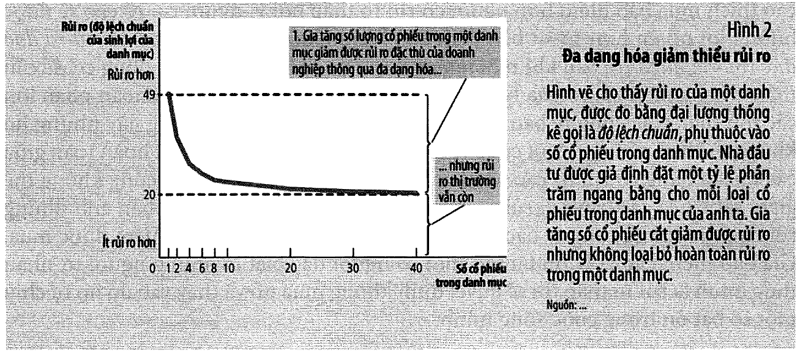
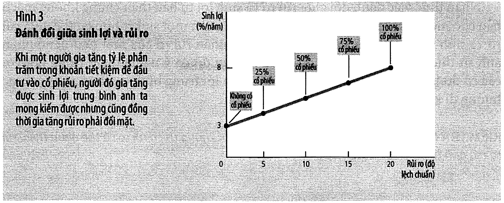

# Bài 5 — Các công cụ cơ bản của tài chính

> Bài học dựng từ **Chương 14 — Các công cụ cơ bản của tài chính** (tr. 313–330)
> của *N. Gregory Mankiw — **Kinh tế học vĩ mô***, bản dịch của Khoa Kinh tế, **ĐH Kinh tế TP.HCM** (Cengage Learning Asia).
> 🎯⭐ **Vòng 1, chương sinh lời nhất cả cuốn với người làm quản trị.** Đây là chương duy nhất
> mà mọi công cụ **dùng được ngay** — không cần chờ đến khi bạn làm chính sách vĩ mô. Giá trị hiện tại,
> lãi kép, đo lường rủi ro, định giá tài sản: bốn thứ bạn sẽ dùng trong mọi quyết định đầu tư còn lại của đời.
> 💼 **Góc QTKD** — ví dụ thêm cho ngành quản trị kinh doanh, **không có trong sách**.
> 📚 **Mở rộng** — thứ sách nói lướt hoặc để trong hộp phụ.
> ⚠️ — chỗ dễ hiểu sai, hoặc chỗ sách in sai.
> 📌 **Cần đọc trước:** [Bài 4](bai_04_tiet_kiem_dau_tu_he_thong_tai_chinh.md) — cổ phiếu, trái phiếu,
> thị trường vốn vay. Mục 5 dùng lại **độ lệch chuẩn** của
> [bài 6 môn Xác suất Thống kê](../../%5BEG11%5D.xacxuatthongke/ly_thuyet/bai_06_ky_vong_phuong_sai_va_cac_so_dac_trung.md).

---

## Mục lục

<!-- MUC-LUC -->

- [1. Hai yếu tố nằm sau mọi quyết định tài chính](#1-hai-yếu-tố-nằm-sau-mọi-quyết-định-tài-chính)
- [2. Giá trị hiện tại — đo giá trị của tiền tệ theo thời gian](#2-giá-trị-hiện-tại--đo-giá-trị-của-tiền-tệ-theo-thời-gian)
- [3. 📚 Ma thuật của lãi kép và quy tắc 70 — hộp "Bạn có biết", tr. 316](#3--ma-thuật-của-lãi-kép-và-quy-tắc-70--hộp-bạn-có-biết-tr-316)
- [4. Tính không thích rủi ro](#4-tính-không-thích-rủi-ro)
- [5. Thị trường bảo hiểm — và hai vấn đề của nó](#5-thị-trường-bảo-hiểm--và-hai-vấn-đề-của-nó)
- [6. Đa dạng hoá — Hình 2, tr. 320](#6-đa-dạng-hoá--hình-2-tr-320)
- [7. Đánh đổi giữa rủi ro và sinh lợi — Hình 3, tr. 321](#7-đánh-đổi-giữa-rủi-ro-và-sinh-lợi--hình-3-tr-321)
- [8. Định giá tài sản — phân tích cơ bản](#8-định-giá-tài-sản--phân-tích-cơ-bản)
- [9. Giả thuyết thị trường hiệu quả](#9-giả-thuyết-thị-trường-hiệu-quả)
- [10. 💼 Góc QTKD — bốn công cụ dùng được ngay](#10--góc-qtkd--bốn-công-cụ-dùng-được-ngay)
- [11. 📚 Đối chiếu Việt Nam](#11--đối-chiếu-việt-nam)
- [12. Code minh hoạ](#12-code-minh-hoạ)
- [13. Tự thử](#13-tự-thử)
- [14. Từ điển thuật ngữ](#14-từ-điển-thuật-ngữ)
- [15. Câu hỏi tự kiểm tra](#15-câu-hỏi-tự-kiểm-tra)
- [Tóm tắt một trang](#tóm-tắt-một-trang)
- [Nguồn](#nguồn)

<!-- /MUC-LUC -->

---

## 1. Hai yếu tố nằm sau mọi quyết định tài chính

Sách mở bằng một danh sách rất đời (tr. 313): bạn sẽ ký gửi tiết kiệm vào ngân hàng, thế chấp tài sản
mua nhà, quyết định đầu tư tài khoản hưu trí vào cổ phiếu hay trái phiếu, chọn giữa General Electric và
Google, và nghe tin thị trường chứng khoán tăng giảm *"cùng với sự giải thích không rõ ràng vì sao thị
trường diễn biến như vậy."*

Rồi nó rút gọn tất cả xuống **hai yếu tố** (tr. 313):

```
   THỜI GIAN  →  tiền hôm nay khác tiền ngày mai      →  mục 2–3
   RỦI RO     →  kết quả thực tế khác kỳ vọng          →  mục 4–7
   ─────────────────────────────────────────────────────────────
   ghép hai thứ trên  ⟹  ĐỊNH GIÁ TÀI SẢN            →  mục 8–10
```

> **Tài chính** (*finance*): lĩnh vực nghiên cứu cách thức đưa ra các quyết định liên quan đến việc phân
> bổ các nguồn lực **theo thời gian** và **xử lý rủi ro**. — chú thích tr. 313

Sách nói rõ lý do phải nắm hai thứ này (tr. 313):

> *"…hệ thống tài chính liên quan đến các quyết định và hành động mà chúng ta thực hiện ngày hôm nay và
> sẽ tác động đến cuộc sống của chúng ta trong tương lai. **Nhưng chúng ta không thể biết trước được
> tương lai**… các quyết định đó được dựa trên dự đoán về kết quả có khả năng xảy ra. Tuy nhiên, kết quả
> thực tế có thể sẽ khác xa so với những gì đã được kỳ vọng."*

⭐ Và câu đáng để ý nhất, ở tr. 314: các công cụ của chương này *"cũng có thể giúp bạn suy nghĩ thông qua
một số quyết định mà bạn sẽ thực hiện cho **chính cuộc sống của mình**."* Đây là chương duy nhất trong
sách nói thẳng như thế.

---

## 2. Giá trị hiện tại — đo giá trị của tiền tệ theo thời gian

### Câu hỏi dễ và câu hỏi khó

```
   DỄ:  100 USD hôm nay  hay  100 USD sau 10 năm?
        →  hôm nay. Vì gửi ngân hàng thì 10 năm sau vẫn có nó CỘNG lãi.
        →  "Một đồng ở hiện tại có giá trị hơn một đồng ở tương lai."

   KHÓ: 100 USD hôm nay  hay  200 USD sau 10 năm?
        →  cần một cách so tiền ở hai thời điểm. Đó là GIÁ TRỊ HIỆN TẠI.
```

| Khái niệm | Định nghĩa (chú thích tr. 314) |
| --------- | ------------------------------- |
| **Giá trị hiện tại** | tổng số tiền **hiện tại** được quy đổi, sử dụng lãi suất phổ biến, từ dòng tiền tương lai xác định trước |
| **Giá trị tương lai** | tổng số tiền **trong tương lai** mà khoản tiền hiện tại sẽ mang lại ứng với mức lãi suất phổ biến cho trước |
| **Ghi lãi kép** | sự tích luỹ của tổng số tiền khi số tiền lãi có được lại tiếp tục để lại trong tài khoản để nhận lãi thêm trong tương lai |

### Hai công thức, và chúng là nghịch đảo của nhau

$$\text{Giá trị tương lai} = (1+r)^N \times X \qquad\qquad \text{Giá trị hiện tại} = \frac{X}{(1+r)^N}$$

> Quá trình đi tìm giá trị hiện tại của một khoản tiền tương lai được gọi là **chiết khấu**. — tr. 315

Mục 1 của [code minh hoạ](#12-code-minh-hoạ) kiểm cả ba con số sách in:

| Sách viết | Tính lại |
| --------- | -------- |
| $(1{,}05)^{10} \times 100 = $ **163 USD** | 162,89 ✓ |
| $200/(1{,}05)^{10} = $ **123 USD** | 122,78 ✓ |
| $200/(1{,}08)^{10} = $ **93 USD** | 92,64 ✓ |

### ⭐ Câu trả lời **đổi chiều** khi lãi suất đổi

```
   lãi 5%:  200 USD sau 10 năm  →  hiện tại 123 USD  >  100  →  CHỜ
   lãi 8%:  200 USD sau 10 năm  →  hiện tại  93 USD  <  100  →  LẤY NGAY
```

Cùng một khoản tiền, cùng một kỳ hạn, **hai câu trả lời ngược nhau**. Thứ quyết định không phải số tiền
mà là **lãi suất**. Sách giải thích (tr. 315): *"lãi suất càng cao thì bạn càng có thể kiếm được nhiều
hơn bằng cách gửi tiền vào ngân hàng, do đó việc nhận được 100 USD ngay hôm nay thì có lợi hơn."*

📌 Ghi nhớ điều này: **không có câu hỏi tài chính nào trả lời được nếu chưa biết lãi suất chiết khấu.**

### Ứng dụng 1 — General Motors có nên xây nhà máy? tr. 315–316

Nhà máy giá **100 triệu USD** hôm nay, mang lại **200 triệu USD** sau 10 năm.

| Lãi suất | Giá trị hiện tại của 200 triệu | So với chi phí | Quyết định |
| -------: | -----------------------------: | -------------: | ---------- |
| 5% | 122,8 triệu | **+22,8** | LÀM |
| 8% |  92,6 triệu | **−7,4**  | BỎ  |

> *"Như vậy, khái niệm về giá trị hiện tại giúp giải thích lý do **đầu tư** và vì vậy **lượng cầu vốn vay
> sẽ giảm khi lãi suất tăng lên**."* — tr. 316

⭐ Đây chính là **đường cầu vốn vay** của [bài 4 mục 10](bai_04_tiet_kiem_dau_tu_he_thong_tai_chinh.md#10-thị-trường-vốn-vay--mô-hình),
giải thích từ bên trong. Bài 4 nói nó dốc xuống; bài này cho biết **vì sao**.

### Ứng dụng 2 — trúng số 1 triệu USD, nhận thế nào? tr. 316–317

| Lựa chọn | Nội dung | Giá trị hiện tại (lãi 7%) |
| -------- | -------- | ------------------------: |
| **A** | 20.000 USD/năm × 50 năm = **1.000.000 USD** | **276.000 USD** |
| **B** | nhận ngay | **400.000 USD** ← lớn hơn |

> *"Một triệu USD có vẻ như nhiều tiền hơn, nhưng dòng tiền tương lai một khi được chiết khấu về hiện tại
> lại có **giá trị thấp hơn nhiều**."* — tr. 317

⚠️ **Vì sao "1 triệu" lại chỉ đáng 276 nghìn?** Code cho thấy phần lớn chuỗi thanh toán gần như vô giá trị:

| Khoản 20.000 USD của năm | Đáng giá hôm nay | Còn lại bao nhiêu phần |
| ------------------------: | ---------------: | ---------------------: |
|  1 | 18.692 | 93,5% |
| 10 | 10.167 | 50,8% |
| 25 |  3.685 | 18,4% |
| 50 |    679 |  3,4% |

⭐ **Nửa cuối của chuỗi thanh toán gần như không đóng góp gì.** Đây là lý do mọi lời chào bán kiểu
*"tổng giá trị hợp đồng 5 tỷ trong 20 năm"* cần được chiết khấu trước khi bạn ấn tượng.

---

## 3. 📚 Ma thuật của lãi kép và quy tắc 70 — hộp "Bạn có biết", tr. 316

### Finn và Quinn

Hai sinh viên tốt nghiệp, cùng lương đầu **30.000 USD** lúc **22 tuổi**. Khác nhau duy nhất: nền kinh tế
họ sống tăng trưởng **1%** so với **3%** một năm.

| | Tốc độ | Lương lúc 62 tuổi |
| ---- | -----: | ----------------: |
| **Finn**  | 1% | **45.000 USD** |
| **Quinn** | 3% | **98.000 USD** |

Code kiểm cả hai bằng `assert` — khớp. Sách kết: *"Vì chênh lệch 2 điểm phần trăm của tốc độ tăng trưởng
đó mà mức lương của Quinn nhiều hơn **hai lần** mức lương của Finn."*

📌 Bạn đã gặp đúng số học này ở [bài 3 mục 3](bai_03_san_xuat_va_tang_truong.md#3--quy-tắc-70--vì-sao-2năm-không-hề-nhỏ).
Khác biệt là ở đó nó nói về **quốc gia**; ở đây nó nói về **lương của chính bạn**.

### Quy tắc 70 — lần này sách **gọi tên** nó

> *"…nếu một biến tăng trưởng với tỷ lệ **x** phần trăm mỗi năm thì biến đó sẽ tăng gấp đôi trong khoảng
> **70/x** năm."* — tr. 316

⚠️ Ở [bài 3](bai_03_san_xuat_va_tang_truong.md) tôi phải ghi chú rằng sách *dùng* quy tắc này mà không
gọi tên. Đến chương 14 thì sách **có** gọi tên và đưa công thức. Nếu bạn cần trích dẫn, hãy trích tr. 316.

### Ben Franklin — và một cảnh báo về chính quy tắc 70

Năm **1791** Franklin mất, để lại **5.000 USD** đầu tư trong **200 năm** để hỗ trợ sinh viên y khoa.

```
   7%/năm  →  gấp đôi mỗi 70/7 = 10 năm  →  20 lần gấp đôi trong 200 năm
   ⟹  2²⁰ × 5.000 = 5.242.880.000 USD  ≈  5 tỷ USD
```

Sách in *"tương đương với khoảng **5 tỷ USD**"*. ✓

⚠️ **Nhưng tính chính xác bằng lãi kép chỉ ra 3,76 tỷ USD.** Quy tắc 70 **phóng đại 1,39 lần**. Lý do:
$70/7 = 10$ năm chỉ là **xấp xỉ** (chính xác là 10,24 năm), và sai số đó bị **nhân lên qua 20 lần gấp đôi
liên tiếp**.

⭐ **Quy tắc 70 rất tốt để nhẩm trong đầu, nhưng đừng dùng nó cho 200 năm.**

### Và một cảnh báo lớn hơn: thực tế chỉ có 2 triệu

Sách ghi trong ngoặc (tr. 316) rằng quỹ thực tế chỉ đạt **2.000.000 USD**, vì *"một số tiền đã được chi
tiêu trong suốt thời gian đó"*.

Code suy ngược lại: 5.000 → 2.000.000 trong 200 năm ứng với **3,04%/năm**, không phải 7%.

```
   chênh 3,96 điểm phần trăm mỗi năm
        ⟹  kết quả lệch 1.882 LẦN sau 200 năm
```

⭐ Sách dẫn Einstein gọi lãi kép là *"phát hiện toán học vĩ đại nhất mọi thời đại"*. **Nhưng hãy nhớ cả
chiều ngược lại:** chênh một chút ở **tốc độ**, kéo dài đủ lâu, cho kết quả **lệch hàng bậc**. Đúng chuyện
đã xảy ra với chính quỹ Franklin.

---

## 4. Tính không thích rủi ro

> **Tính không thích rủi ro** (*risk aversion*): sự không ưa thích về tính không chắc chắn. — chú thích tr. 317

### Ví dụ tung đồng xu — tr. 317

```
   ngửa  →  bạn được 1.000 USD
   sấp   →  bạn mất  1.000 USD
```

Canh bạc **công bằng** — của cải kỳ vọng không đổi. Nhưng hầu hết mọi người **từ chối**. Vì sao?

> *"Đối với một người không thích rủi ro, **nỗi đau mất 1.000 USD là lớn hơn nhiều so với niềm vui từ
> việc chiến thắng 1.000 USD**."* — tr. 317

### Cơ chế: thoả dụng biên giảm dần — Hình 1, tr. 317

> ⚠️ **Hình 1 không có trong bản in này.** Văn bản tr. 317 dẫn *"như biểu đồ về hàm thỏa
> dụng ở Hình 1"*, nhưng chỗ lẽ ra in Hình 1 thì bản dịch **in lặp Hình 2** — cùng một hình
> *Đa dạng hoá giảm thiểu rủi ro* xuất hiện **hai lần**, ở tr. 318 và tr. 320. Vì vậy mục này
> không có ảnh kèm theo; hãy đọc mô tả bằng lời bên dưới.

Sách dùng **hàm thoả dụng** — *"thang đo lường sự chủ quan của một người về tính sẵn lòng hay độ thoả mãn"*.
Tính chất then chốt:

> *"**Của cải của một người càng nhiều thì độ thoả dụng của anh ta nhận được từ việc có thêm một USD sẽ
> ít đi.** Do vậy, hàm thoả dụng trong hình trở nên thoải hơn khi của cải tăng lên."*

Mục 3 của [code minh hoạ](#12-code-minh-hoạ) dùng dạng cụ thể $U = \sqrt{W}$ — chính là dạng sách cho ở
bài tập 9 tr. 329 — với của cải 10.000 USD:

| Tình huống | Của cải | Thoả dụng | Thay đổi |
| ---------- | ------: | --------: | -------: |
| không chơi | 10.000 | 100,0000 | — |
| chơi và **thắng** | 11.000 | 104,8809 | **+4,8809** |
| chơi và **thua** |  9.000 |  94,8683 | **−5,1317** |
| **thoả dụng kỳ vọng khi chơi** | | **99,8746** | |

```
   99,8746  <  100,0000   ⟹   KHÔNG CHƠI
```

⭐ **Nỗi đau mất (−5,13) lớn hơn niềm vui được (+4,88).** Đó là toàn bộ định nghĩa của "không thích rủi ro",
viết bằng số.

### Đo bằng tiền: bạn sẵn lòng trả bao nhiêu để tránh?

Code tính ngược: canh bạc này tương đương chắc chắn có **9.974,94 USD**. Nghĩa là bạn sẵn lòng trả tới
**25,06 USD** để **không** phải chơi.

⭐ **Đó chính là chỗ ngành bảo hiểm sống được:** bạn trả phí để đổi lấy sự chắc chắn, và mức phí tối đa
bạn chịu trả chính là con số vừa tính.

Sách nói tính không thích rủi ro là *"điểm khởi đầu để giải thích những điều khác nhau mà chúng ta quan
sát được trong nền kinh tế"* — và nêu ba thứ: **bảo hiểm**, **đa dạng hoá**, **đánh đổi rủi ro–sinh lợi**.
Ba mục tiếp theo.

---

## 5. Thị trường bảo hiểm — và hai vấn đề của nó

### Bảo hiểm làm gì

Sách nói thẳng bảo hiểm **không** làm giảm rủi ro (tr. 318):

> *"Theo quan điểm của nền kinh tế nói chung, vai trò của bảo hiểm **không phải là để loại bỏ** những rủi
> ro vốn có trong cuộc sống mà để **phân tán chúng** một cách hiệu quả hơn."*

Ví dụ bảo hiểm hoả hoạn: *"Việc sở hữu bảo hiểm hoả hoạn **không làm giảm được nguy cơ mất nhà** của bạn
trong một đám cháy. Nhưng nếu điều không may đó xảy ra thì các công ty bảo hiểm sẽ đền bù cho bạn."*

```
   1 người chịu TOÀN BỘ rủi ro cháy nhà mình
        vs
   10.000 người mỗi người chịu 1/10.000 rủi ro
   ⟹ vì mọi người KHÔNG THÍCH RỦI RO, cách thứ hai TỐT HƠN cho tất cả
```

⭐ Và một câu rất thẳng (tr. 318): *"theo một nghĩa nào đó, mỗi hợp đồng bảo hiểm là **một canh bạc**…
Trong hầu hết các năm, bạn sẽ phải trả phí bảo hiểm mà không nhận lại được gì ngoại trừ **sự an tâm**."*

### ⚠️ Hai vấn đề cản trở — tr. 318–319

| Vấn đề | Định nghĩa của sách | Xảy ra **khi nào** |
| ------ | ------------------- | ------------------ |
| **Lựa chọn ngược** (*adverse selection*) | *"Một người có rủi ro cao thích mua bảo hiểm hơn người có rủi ro thấp bởi vì người rủi ro cao sẽ được hưởng lợi nhiều hơn từ sự bảo đảm của bảo hiểm."* | **TRƯỚC** khi ký |
| **Rủi ro đạo đức** (*moral hazard*) | *"Sau khi mọi người mua bảo hiểm thì họ có ít động cơ để cẩn thận cho hành vi rủi ro của họ bởi vì các công ty bảo hiểm sẽ bồi hoàn phần lớn các tổn thất."* | **SAU** khi ký |

📌 Mẹo nhớ: **lựa chọn ngược = ai mua** · **rủi ro đạo đức = mua rồi thì làm gì**.

Sách nói công ty bảo hiểm **biết** cả hai vấn đề nhưng *"không thể làm gì được"* — họ không phân biệt hoàn
toàn được khách rủi ro cao/thấp, và không giám sát được hành vi.

⭐ Hệ quả rất cụ thể (tr. 319):

> *"Giá bảo hiểm cao là lý do tại sao một số người đặc biệt là những người **tự nhận thức mình là rủi ro
> thấp** thì sẽ quyết định không mua nó."*

Tức là: hai vấn đề trên đẩy giá lên, giá cao đẩy người ít rủi ro ra khỏi thị trường, và điều đó làm cơ cấu
khách còn lại **rủi ro hơn nữa**. (Bạn đã gặp vòng xoáy này ở
[EG13 bài 11](../../%5BEG13%5D.kinhtevimo-micro/ly_thuyet/bai_11_thong_tin_bat_can_xung.md) dưới tên
*thị trường chanh*.)

---

## 6. Đa dạng hoá — Hình 2, tr. 320



### ⚠️ Enron, 2002 — vì sao đây không phải chuyện lý thuyết

Sách mở mục này bằng một câu chuyện thật (tr. 319). Enron phá sản, ban giám đốc bị truy tố. Nhưng:

> *"…phần buồn nhất của câu chuyện lại liên quan đến hàng nghìn nhân viên cấp dưới. Họ **không chỉ bị mất
> việc làm mà còn bị mất số tiền tiết kiệm** của mình. Các nhân viên này đã có khoảng **hai phần ba** các
> quỹ hưu trí của họ là cổ phiếu Enron, thứ đã trở nên không còn giá trị."*

⭐ Họ vi phạm **hai lần cùng lúc**: vốn nhân lực (công việc) **và** vốn tài chính (tiết kiệm) đều đặt vào
**một** công ty. Khi công ty sập, cả hai mất cùng lúc.

> **Đa dạng hoá rủi ro** (*diversification*): việc giảm rủi ro đạt được bằng cách thay thế một rủi ro đơn
> lẻ bằng một số lượng lớn những rủi ro nhỏ hơn và không có liên quan với nhau. — chú thích tr. 319

### ⚠️⚠️ Hai loại rủi ro — chỗ quan trọng nhất mục này

| Loại | Định nghĩa (chú thích tr. 320) | Đa dạng hoá xử lý được? |
| ---- | ------------------------------- | :---------------------: |
| **Rủi ro doanh nghiệp có tính đặc thù** | loại rủi ro mà nó chỉ tác động đến **một** công ty riêng lẻ | ✅ **có** |
| **Rủi ro thị trường** | loại rủi ro tác động đến **tất cả** các công ty trên thị trường chứng khoán | ❌ **không bao giờ** |

> *"Ví dụ, khi nền kinh tế suy thoái thì hầu hết các công ty giảm bán hàng, lợi nhuận giảm và sinh lợi cổ
> phiếu thấp. Đa dạng hoá làm giảm rủi ro của việc sở hữu cổ phiếu nhưng **không loại bỏ hẳn rủi ro đó**."*

### Con số của Hình 2

Rủi ro đo bằng **độ lệch chuẩn** của sinh lợi danh mục (công cụ của
[bài 6 môn Xác suất Thống kê](../../%5BEG11%5D.xacxuatthongke/ly_thuyet/bai_06_ky_vong_phuong_sai_va_cac_so_dac_trung.md)):

| Sách viết (tr. 320) | |
| ------------------- | - |
| danh mục **1 cổ phiếu** | độ lệch chuẩn **49%** |
| đi từ 1 → 10 cổ phiếu | loại bỏ **khoảng một nửa** rủi ro |
| đi từ 10 → 20 cổ phiếu | cắt giảm rủi ro **thêm 13%** |
| tiếp tục tăng | *"rủi ro tiếp tục giảm mặc dù mức rủi ro giảm sau khi có 20 hoặc 30 cổ phiếu là nhỏ"* |

Mục 4 của [code minh hoạ](#12-code-minh-hoạ) dựng một mô hình minh hoạ
$\sigma(n) = \sqrt{20^2 + (49^2-20^2)/n}$ và so với ba con số trên:

```
   1 cổ phiếu   → 49,0%   ✓ khớp
   1 → 10       → 49,0% xuống 24,5%, tức giảm 50%   ✓ khớp "khoảng một nửa"
   10 → 20      → mô hình cho 9%, sách nói 13%      ⚠ KHÔNG khớp
```

⚠️ **Mô hình đơn giản này khớp hai mốc đầu nhưng không khớp mốc thứ ba.** Con số 13% của sách đọc từ một
**nghiên cứu thực nghiệm cụ thể** (Meir Statman, *"How Many Stocks Make a Diversified Portfolio?"*,
*Journal of Financial and Quantitative Analysis* 22, tháng 9/1987 — ghi ở nguồn của Hình 2), không phải
từ một công thức.

📌 **Dùng mô hình để hiểu HÌNH DẠNG đường cong; đừng dùng nó để tra số.** Và hình dạng mới là thứ đáng nhớ:
rủi ro giảm **rất nhanh** ở những cổ phiếu đầu, rồi gần như **phẳng**. Cổ phiếu thứ 40 gần như không giúp gì.

---

## 7. Đánh đổi giữa rủi ro và sinh lợi — Hình 3, tr. 321



Đây là **Nguyên lý 1** (con người đối mặt với sự đánh đổi) áp cho tài chính.

### Số liệu hai thế kỷ

> *"Trong hai thế kỷ qua, cổ phiếu được trả sinh lợi thực trung bình khoảng **8% mỗi năm** trong khi trái
> phiếu chính phủ ngắn hạn trả sinh lợi thực chỉ **3% mỗi năm**."* — tr. 321

| Tài sản | Sinh lợi TB | Độ lệch chuẩn |
| ------- | ----------: | ------------: |
| cổ phiếu đã đa dạng hoá | **8%** | **20%** |
| tài sản an toàn (tiết kiệm, trái phiếu chính phủ) | **3%** | **0%** |

### Hình 3 là một **đường thẳng**

| Tỷ lệ cổ phiếu | Sinh lợi | Độ lệch chuẩn |
| -------------: | -------: | ------------: |
|   0% | 3,00% |  0,0% |
|  25% | 4,25% |  5,0% |
|  50% | 5,50% | 10,0% |
|  75% | 6,75% | 15,0% |
| 100% | 8,00% | 20,0% |

⭐ Cả hai cột đều **tuyến tính** theo tỷ lệ cổ phiếu — đó là lý do Hình 3 là một đường thẳng từ $(0;3\%)$
đến $(20;8\%)$. **Không có bữa ăn miễn phí:** mỗi 1 điểm phần trăm độ lệch chuẩn thêm vào mua được đúng
**0,25 điểm phần trăm** sinh lợi.

### ⚠️⚠️ "8% trung bình" nghĩa là gì — chỗ hầu hết mọi người hiểu sai

Sách tính rõ ngay trong ngoặc (tr. 321):

> *"…một biến ngẫu nhiên bình thường chỉ nằm trong biên độ cộng trừ **hai độ lệch chuẩn** của nó trung
> bình khoảng **95%**."*

$$8\% \pm 2 \times 20\% \;\Longrightarrow\; \text{từ } -32\% \text{ đến } +48\%$$

Sách in đúng con số này: *"thay đổi từ mức sinh lợi đến **48%** hoặc **lỗ đến 32%**."*

⭐ **"Sinh lợi trung bình 8%" KHÔNG có nghĩa là "mỗi năm được khoảng 8%".** Nó có nghĩa là một năm bất kỳ
có thể từ **−32% đến +48%**, và **5% số năm còn nằm ngoài** khoảng đó.

### Sách từ chối đưa lời khuyên — và đó là điều đúng

> *"Nhận thức việc đánh đổi giữa rủi ro và sinh lợi tự bản thân chúng **không mách bảo cho một người nên
> làm thế nào**. Việc lựa chọn một sự kết hợp cụ thể giữa rủi ro và sinh lợi phụ thuộc vào khả năng chấp
> nhận rủi ro của một người, nó phản ánh **sở thích riêng** của người đó."* — tr. 322

📌 Bất kỳ ai bảo bạn *"nên để X% vào cổ phiếu"* mà không hỏi bạn chịu được rủi ro tới đâu thì đang bán hàng,
không phải tư vấn.

---

## 8. Định giá tài sản — phân tích cơ bản

Ghép mục 2 (thời gian) với mục 4–7 (rủi ro), ta trả lời được: **điều gì quyết định giá một cổ phiếu?**

### Ba trạng thái định giá — tr. 322

```
   giá bán  <  giá trị   →  ĐỊNH GIÁ THẤP   →  nên mua
   giá bán  >  giá trị   →  ĐỊNH GIÁ CAO    →  không mua
   giá bán  =  giá trị   →  ĐỊNH GIÁ THOẢ ĐÁNG
```

⚠️ Sách nói ngay chỗ khó: *"Điều này nói có vẻ dễ hơn làm. Nghiên cứu về giá thì dễ: Bạn có thể xem nó
trên báo chí. **Định giá giá trị của doanh nghiệp mới là phần khó.**"*

> **Phân tích cơ bản** (*fundamental analysis*): nghiên cứu các báo cáo kế toán của công ty và những triển
> vọng tương lai để xác định giá trị công ty đó. — chú thích tr. 322

### Giá trị của một cổ phiếu bằng gì — tr. 323

$$\text{Giá trị} = \text{giá trị hiện tại của dòng } \textbf{cổ tức} + \text{giá trị hiện tại của } \textbf{giá bán cuối cùng}$$

Mục 6 của [code minh hoạ](#12-code-minh-hoạ) giải bài tập 3 tr. 328 bằng đúng công thức này:

```
   Cổ phiếu XYZ chào bán 110 USD
   trả cổ tức 5 USD/năm trong 3 năm, bán lại 120 USD sau 3 năm
   lãi suất ngân hàng 8%
```

| Năm | Dòng tiền | Hệ số chiết khấu | Giá trị hiện tại |
| --: | --------: | ---------------: | ---------------: |
| 1 |   5,00 | 0,9259 |  4,63 |
| 2 |   5,00 | 0,8573 |  4,29 |
| 3 | 125,00 | 0,7938 | 99,23 |
| | | **TỔNG** | **108,15** |

```
   giá chào 110,00  >  giá trị 108,15   ⟹   KHÔNG NÊN MUA
```

⭐ **Nhưng ngưỡng hoà vốn là 7,36%.** Nếu lãi suất ngân hàng dưới mức đó thì mua cổ phiếu này **lại** lợi
hơn. Cùng một cổ phiếu, cùng một giá, hai kết luận ngược nhau tuỳ lãi suất — đúng bài học của
[mục 2](#2-giá-trị-hiện-tại--đo-giá-trị-của-tiền-tệ-theo-thời-gian).

### Ba cách làm phân tích cơ bản — tr. 323

```
   ① tự làm hết   — đọc các báo cáo thường niên của công ty
   ② nghe người khác — dựa vào lời khuyên của các nhà phân tích Phố Wall
   ③ mua quỹ uỷ thác — có người quản lý phân tích và quyết định giùm bạn
```

📌 Mục 9 sẽ cho biết vì sao cách ③ thường **thua** một cách ④ mà sách chưa nêu ở đây: **quỹ chỉ số**.

---

## 9. Giả thuyết thị trường hiệu quả

Sách đưa ra một đề xuất nghe điên rồ (tr. 323): thay vì phân tích, hãy chọn 20 cổ phiếu **ngẫu nhiên** —
*"đặt các trang chứng khoán lên bảng thông báo của mình và ném phi tiêu vào trang chứng khoán"*.

> **Giả thuyết thị trường hiệu quả** (*efficient markets hypothesis*): lý thuyết cho rằng giá cả tài sản
> phản ánh **tất cả các thông tin có sẵn công khai** về giá trị của tài sản đó. — chú thích tr. 323

### Hai trụ cột của lập luận — tr. 323

```
   ① mỗi công ty niêm yết được HÀNG NGÀN nhà quản lý quỹ theo dõi sát, mỗi ngày
      "Công việc của họ là mua một cổ phiếu khi giá của nó giảm xuống dưới giá trị
       cơ sở và bán nó khi giá của nó tăng lên trên giá trị cơ sở."
   ② tại giá thị trường, số người nghĩ cổ phiếu ĐẮT bằng đúng số người nghĩ RẺ
   ⟹ "chúng được định giá THOẢ ĐÁNG tại mọi thời điểm"
```

### Hệ quả: bước ngẫu nhiên

| Khái niệm | Định nghĩa (chú thích tr. 324) |
| --------- | ------------------------------- |
| **Tính hiệu quả thông tin** | việc mô tả giá tài sản phản ánh một cách hợp lý từ tất cả các thông tin hiện hữu |
| **Bước ngẫu nhiên** | đường đi của một biến số mà nó thay đổi **không thể dự đoán** được |

Lập luận chỉ dài một dòng và rất đẹp (tr. 324):

```
   chỉ TIN TỨC mới làm đổi giá
   mà tin tức, THEO ĐỊNH NGHĨA, không dự báo được
   ⟹ thay đổi giá cổ phiếu cũng không dự báo được
```

> *"Nếu giả thuyết thị trường hiệu quả là chính xác, **không có ý nghĩa gì cho việc tiêu tốn nhiều giờ
> nghiên cứu các trang kinh doanh** để quyết định hai mươi cổ phiếu nào bổ sung vào danh mục đầu tư của
> bạn… Điều tốt nhất bạn có thể làm là mua một **danh mục đầu tư đa dạng**."* — tr. 324

### Bằng chứng: quỹ chỉ số — nghiên cứu tình huống tr. 325

Trong **15 năm** kết thúc tháng 6/2010:

| | |
| --- | --- |
| **75%** các quỹ cổ phiếu | hoạt động **kém hơn** quỹ chỉ số |
| sinh lợi bình quân quỹ chủ động | thấp hơn quỹ chỉ số **1,25 điểm phần trăm/năm** |

Lý do sách nêu: *"họ thực hiện giao dịch mua bán thường xuyên hơn, chịu nhiều **chi phí thương mại** hơn
và bởi vì họ tính **phí cao** hơn."*

### ⭐ 1,25 điểm phần trăm/năm là bao nhiêu tiền?

Mục 8 của [code minh hoạ](#12-code-minh-hoạ) chạy 1 tỷ đồng qua hai kịch bản:

| Sau N năm | Quỹ chỉ số (8%/năm) | Quỹ chủ động (6,75%/năm) | Chênh |
| --------: | ------------------: | -----------------------: | ----: |
|  1 |  1.080.000.000 |  1.067.500.000 |  1,2% |
| 10 |  2.158.924.997 |  1.921.670.118 | 11,0% |
| 15 |  3.172.169.114 |  2.663.902.071 | 16,0% |
| **30** | **10.062.656.889** | **7.096.374.243** | **29,5%** |

⭐ Sau 30 năm, chênh 1,25 điểm %/năm lấy đi gần **một phần ba** số tiền cuối cùng. Đây là **cùng số học**
với ví dụ thuế ở [bài 4 mục 11](bai_04_tiet_kiem_dau_tu_he_thong_tai_chinh.md#11-chính-sách-1--khuyến-khích-tiết-kiệm)
— chỉ đổi tên biến.

### ⚠️ Còn 25% nhà quản lý **đánh bại** thị trường thì sao?

Phép thử của sách (tr. 325):

```
   5.000 người, mỗi người tung đồng xu 10 lần
   số người được CẢ 10 LẦN ngửa = 5.000 / 2¹⁰ ≈ 5 người
```

> *"…5 người đó có lẽ có một kỹ năng tung đồng xu ngoại lệ nhưng họ vẫn gặp khó khăn trong việc **lặp lại
> thành công đó**."*

Ví dụ thật (*Wall Street Journal*, 3/1/2008, dẫn ở tr. 325):

| | |
| --- | --- |
| trong 8 năm **1999–2006** | chỉ **31** quỹ tương hỗ đánh bại S&P 500 **mỗi năm** |
| năm **2007** | chỉ **14/31** quỹ đó làm tốt hơn — tức **45%**, gần đúng tỷ lệ ngẫu nhiên |

> *"Thành quả ngoại lệ trong quá khứ **không là lý do** của thành công tương lai."*

### ⚠️ Nhưng sách **không** tuyệt đối hoá — mục "Tính phi lý của thị trường", tr. 325–326

Sách dành hẳn một mục cho phía phản biện:

| Ai | Nói gì |
| -- | ------ |
| **John Maynard Keynes** (1930s) | thị trường tài sản được thúc đẩy bởi **"tâm lý bầy đàn"** — *"những làn sóng bất hợp lý về sự lạc quan và bi quan"* |
| **Alan Greenspan** (1990s, Chủ tịch Fed) | thị trường chứng khoán tăng vọt phản ánh *"**sự thịnh vượng một cách bất hợp lý**"* |

> **Bong bóng đầu cơ:** *"Bất cứ khi nào giá của một tài sản tăng lên trên những gì được xem là giá trị cơ
> bản của nó thì thị trường được cho là đang trải qua tình trạng **bong bóng đầu cơ**."*

Và một quan sát rất sắc (tr. 326) về vì sao bong bóng có thể tồn tại:

> *"…ngày hôm nay một người có thể sẵn sàng trả cao hơn giá trị của một cổ phiếu **nếu người đó mong đợi
> người khác trả cao hơn vào ngày mai**. Khi bạn định giá một cổ phiếu, bạn phải ước tính không chỉ giá
> trị của doanh nghiệp mà cả việc **người khác nghĩ doanh nghiệp có giá trị như thế nào** trong tương lai."*

⭐ **Kết luận cân bằng của sách** (tr. 325): *"Ngay cả nếu giả thuyết thị trường hiệu quả, trong điều kiện
tốt nhất, cũng không phải là một mô tả chính xác của thế giới, **nó vẫn chứa đựng vô vàn sự thật**."*

📌 Và một mệnh đề mà cả hai phía đều đồng ý (tr. 326): *"nếu thị trường là bất hợp lý, một người duy lý có
thể tận dụng lợi thế của thực tế này; tuy nhiên… **đánh bại thị trường là gần như không thể**."*

---

## 10. 💼 Góc QTKD — bốn công cụ dùng được ngay

### ① NPV và ngưỡng sinh lợi nội bộ (IRR)

Bài tập 1 tr. 328 làm nền: dự án chi **10 triệu** hôm nay, thu **15 triệu** sau 4 năm.

| Lãi suất | Giá trị hiện tại | NPV | Quyết định |
| -------: | ---------------: | --: | ---------- |
|  8% | 11,025 | +1,025 | LÀM |
| 10% | 10,245 | +0,245 | LÀM |
| 11% |  9,881 | −0,119 | BỎ  |

$$\text{Ngưỡng} = \left(\frac{15}{10}\right)^{1/4} - 1 = \mathbf{10{,}67\%}$$

⭐ Ngưỡng này có tên trong tài chính: **tỷ suất sinh lợi nội bộ (IRR)** — mức lãi suất làm NPV bằng đúng 0.
(Sách không dùng tên này, nhưng bạn sẽ gặp nó ở mọi cuộc họp đầu tư.)

Mục 9 của [code minh hoạ](#12-code-minh-hoạ) chạy một dự án 5 năm với dòng tiền thật hơn:

```
   năm        0      1      2      3      4      5
   dòng tiền  −4.000  900  1.200  1.400  1.500  1.300   (triệu đồng)
   ⟹ IRR = 16,12%
```

### ② ⚠️ Ba cảnh báo khi dùng NPV — sách không nói, nhưng bạn sẽ cần

1. **Dòng tiền dự báo là DỰ BÁO.** NPV chính xác đến ba chữ số thập phân từ một dự báo ±30% là **sự chính
   xác giả tạo**. Hãy chạy dải kịch bản, đừng chạy một con số.
2. **Lãi suất chiết khấu phải phản ánh RỦI RO của dự án** (mục 7), không phải lãi suất ngân hàng. Dự án
   rủi ro hơn phải chiết khấu cao hơn — nếu không bạn đang cho mọi dự án cùng điểm số.
3. **NPV bỏ qua giá trị của việc CHỜ ĐỢI.** Một dự án NPV âm hôm nay có thể đáng giá nếu bạn có **quyền**
   làm nó sau — nhưng đó là môn học khác (quyền chọn thực).

### ③ Rủi ro lãi suất khác hẳn rủi ro tín dụng

Bài tập 4 tr. 329, giải ở mục 7 của code:

| | Lãi 3,5% | Lãi 7% | Thay đổi |
| --- | ---: | ---: | ---: |
| Trái phiếu **A** (20 năm) | 4.021 | 2.067 | **−48,6%** |
| Trái phiếu **B** (40 năm) | 2.021 |   534 | **−73,6%** |

> *"Giá trị của một trái phiếu **giảm** khi lãi suất tăng, và trái phiếu với thời hạn **lâu hơn** là nhạy
> cảm **nhiều hơn** với những thay đổi lãi suất."* — đáp án câu c

⭐ Nếu bạn giữ trái phiếu dài hạn và lãi suất tăng, **bạn lỗ nặng dù không ai vỡ nợ**. Đó là **rủi ro lãi
suất**, khác hẳn **rủi ro tín dụng** của
[bài 4 mục 2](bai_04_tiet_kiem_dau_tu_he_thong_tai_chinh.md#2-thị-trường-trái-phiếu).

💼 Áp cho doanh nghiệp: một khoản vay **lãi suất cố định dài hạn** là bảo hiểm chống lãi suất tăng —
và là gánh nặng nếu lãi suất giảm. Bên nào chịu rủi ro là điều khoản đàm phán được.

### ④ Bốn thứ dùng được ngay

```
   ① số tiền ở hai thời điểm chỉ so được SAU KHI chiết khấu        (mục 2)
   ② chênh một chút ở TỐC ĐỘ, đủ lâu, cho kết quả lệch HÀNG BẬC    (mục 3)
   ③ rủi ro phải được TRẢ CÔNG — không có sinh lợi cao mà không rủi ro  (mục 7)
   ④ phí và thuế ăn vào TỐC ĐỘ, nên chúng đắt hơn bạn tưởng rất nhiều  (mục 9)
```

### ⑤ Đa dạng hoá không chỉ áp cho danh mục cổ phiếu

Bài học Enron ở [mục 6](#6-đa-dạng-hoá--hình-2-tr-320) đọc cho doanh nghiệp:

| Bạn đang tập trung vào | Rủi ro |
| ---------------------- | ------ |
| **một** khách hàng chiếm 60% doanh thu | họ mất bạn cũng mất |
| **một** nhà cung cấp duy nhất | họ dừng bạn cũng dừng |
| **một** thị trường địa lý | suy thoái vùng đó là suy thoái của bạn |
| lương **và** cổ phiếu thưởng cùng một công ty | đúng lỗi của nhân viên Enron |

⚠️ Nhưng nhớ **rủi ro thị trường không đa dạng hoá được**: có mười khách hàng cũng không cứu bạn khỏi một
cuộc suy thoái chung. Đó là thứ phải chuẩn bị bằng **thanh khoản**, không phải bằng đa dạng hoá.

---

## 11. 📚 Đối chiếu Việt Nam

⚠️ **Cảnh báo:** phần này nằm ngoài sách và tôi ghi theo trí nhớ có giới hạn. **Hãy tra lại nguồn chính
thức trước khi dùng vào báo cáo.**

### Lãi suất chiết khấu ở Việt Nam **cao hơn** ví dụ trong sách

Sách dùng 5–8%. Ở Việt Nam, chi phí vốn của doanh nghiệp thường **cao hơn đáng kể**. Hệ quả trực tiếp từ
[mục 2](#2-giá-trị-hiện-tại--đo-giá-trị-của-tiền-tệ-theo-thời-gian):

```
   lãi suất chiết khấu CAO  ⟹  dòng tiền xa mất giá RẤT NHANH
   ⟹ dự án hoàn vốn dài (hạ tầng, R&D, xây thương hiệu) khó qua được ngưỡng NPV
   ⟹ vốn dồn về dự án NGẮN HẠN
```

⭐ Đây là một cách giải thích bằng số học cho hiện tượng ai cũng thấy: **doanh nghiệp ở nước có lãi suất
cao thì thiển cận hơn**, không phải vì họ kém tầm nhìn mà vì toán học ép họ như vậy. Và nó nối thẳng vào
[bài 3 mục 19](bai_03_san_xuat_va_tang_truong.md#19--đối-chiếu-việt-nam) — vì sao khó chuyển sang tăng
trưởng dựa trên công nghệ.

### Quỹ chỉ số và giả thuyết thị trường hiệu quả ở thị trường mới nổi

Bằng chứng ở [mục 9](#9-giả-thuyết-thị-trường-hiệu-quả) đến từ thị trường Hoa Kỳ — nơi có hàng ngàn nhà
phân tích theo dõi mỗi công ty. Trụ cột ① của lập luận **yếu hơn** ở thị trường nhỏ:

| Điều kiện của lập luận | Hoa Kỳ | Thị trường mới nổi |
| ---------------------- | ------ | ------------------ |
| số nhà phân tích theo dõi mỗi mã | rất nhiều | ít, nhiều mã gần như không ai theo |
| chất lượng và tính kịp thời của công bố thông tin | cao | thấp hơn |
| thanh khoản | cao | tập trung ở một số mã lớn |

📌 Nghĩa là: ở thị trường kém hiệu quả hơn, **về lý thuyết** phân tích cơ bản có giá trị hơn. Nhưng
⚠️ **điều đó không có nghĩa là bạn sẽ thắng** — nó chỉ có nghĩa là ai đó có thể thắng. Bài học đồng xu ở
mục 9 vẫn nguyên giá trị: đừng nhầm may mắn với kỹ năng, kể cả của chính mình.

### Rủi ro đạo đức và lựa chọn ngược trong bảo hiểm

Hai vấn đề ở [mục 5](#5-thị-trường-bảo-hiểm--và-hai-vấn-đề-của-nó) là lý do bảo hiểm nhân thọ và bảo hiểm
sức khoẻ ở Việt Nam có **thời gian chờ**, **khai báo sức khoẻ**, và **loại trừ bệnh có sẵn**. Đó không
phải là "công ty bảo hiểm khó tính" — đó là công cụ chống lựa chọn ngược, và nếu bỏ chúng đi thì phí bảo
hiểm của **tất cả mọi người** sẽ tăng.

---

## 12. Code minh hoạ

> ⚙️ **Chạy:** cần **Python 3.10+**. Lưu file rồi gõ `python3 bai-05-cong-cu-co-ban-cua-tai-chinh.py`.
> Không cần cài gói nào — chỉ dùng thư viện chuẩn. Kết quả **tất định**.
> Bản đầy đủ nằm ở [`thuc_hanh/bai-05-cong-cu-co-ban-cua-tai-chinh.py`](../thuc_hanh/bai-05-cong-cu-co-ban-cua-tai-chinh.py).

```python
"""Bai 5 — Cac cong cu co ban cua tai chinh (Mankiw, chuong 14).
Chay: python3 bai-05-cong-cu-co-ban-cua-tai-chinh.py   (Python 3.10+)

Day la chuong SINH LOI NHAT ca cuon voi nguoi lam quan tri. Moi con so cua sach
deu duoc kiem lai bang assert. Ket qua tat dinh.
"""

import math

# ══ 1. GIA TRI TUONG LAI VA GIA TRI HIEN TAI — tr. 314-315 ═════════════════
def gia_tri_tuong_lai(x, r, n):
    """X do la hom nay se thanh bao nhieu sau n nam voi lai suat r."""
    return x * (1 + r) ** n

def gia_tri_hien_tai(x, r, n):
    """X do la nhan duoc sau n nam thi hom nay dang gia bao nhieu. Goi la CHIET KHAU."""
    return x / (1 + r) ** n

print("1. GIA TRI TUONG LAI VA GIA TRI HIEN TAI — tr. 314-315")
print()
print("   Cau hoi de (tr. 314): 100 USD hom nay hay 100 USD sau 10 nam?")
print("   -> Hom nay. 'Mot dong o hien tai co gia tri hon mot dong o tuong lai.'")
print()
print("   Cau hoi KHO (tr. 314): 100 USD hom nay hay 200 USD sau 10 nam?")
print("   -> Can mot cach so sanh tien o hai thoi diem. Do la GIA TRI HIEN TAI.")
print()
print("   GIA TRI TUONG LAI:  (1 + r)^N x X")
for n in (1, 2, 3, 10):
    print(f"      100 USD, lai 5%, sau {n:>2} nam  ->  (1,05)^{n} x 100 ="
          f" {gia_tri_tuong_lai(100, 0.05, n):>7.2f} USD")
assert round(gia_tri_tuong_lai(100, 0.05, 10)) == 163
print("   Sach in: '(1,05)^10 x 100$ bang 163 USD'.  ✓")
print()
print("   GIA TRI HIEN TAI:   X / (1 + r)^N       — goi la CHIET KHAU")
for r in (0.05, 0.08):
    pv = gia_tri_hien_tai(200, r, 10)
    quyet_dinh = "CHO 200 USD" if pv > 100 else "LAY 100 USD NGAY"
    print(f"      200 USD sau 10 nam, lai {r:.0%}  ->  200/(1,{int(r*100):02d})^10 ="
          f" {pv:>6.2f} USD   ->  {quyet_dinh}")
assert round(gia_tri_hien_tai(200, 0.05, 10)) == 123
assert round(gia_tri_hien_tai(200, 0.08, 10)) == 93
print("   Sach in 123 USD (lai 5%) va 93 USD (lai 8%).  ✓ khop ca hai.")
print()
print("   ⭐ CUNG MOT KHOAN TIEN, CUNG MOT KY HAN, HAI CAU TRA LOI NGUOC NHAU.")
print("      Thu quyet dinh khong phai so tien, ma la LAI SUAT.")
print("      Sach giai thich (tr. 315): 'lai suat cang cao thi ban cang co the kiem duoc")
print("      nhieu hon bang cach gui tien vao ngan hang, do do viec nhan duoc 100 USD")
print("      ngay hom nay thi co loi hon.'")
print()

# --- Ung dung 1: General Motors co nen xay nha may khong? (tr. 315-316) -----
CHI_PHI, THU_VE, KY_HAN = 100, 200, 10   # trieu USD
print("   ỨNG DỤNG 1 — GENERAL MOTORS CO NEN XAY NHA MAY? (tr. 315-316)")
print(f"      chi {CHI_PHI} trieu USD hom nay, thu ve {THU_VE} trieu USD sau {KY_HAN} nam")
print()
print("      lai suat   gia tri hien tai cua 200 trieu   so voi chi phi   quyet dinh")
for r in (0.05, 0.08):
    pv = gia_tri_hien_tai(THU_VE, r, KY_HAN)
    npv = pv - CHI_PHI
    qd = "LAM" if npv > 0 else "BO"
    print(f"      {r:>7.0%}   {pv:>29.1f}   {npv:>+14.1f}   {qd}")
print()
print("      Sach ket (tr. 316): 'khai niem ve gia tri hien tai giup giai thich ly do")
print("      DAU TU va vi vay LUONG CAU VON VAY se giam khi lai suat tang len.'")
print("      ⭐ Day chinh la duong cau von vay o bai 4, giai thich tu ben trong.")
print()

# --- Ung dung 2: trung so 1 trieu USD, nhan the nao? (tr. 316-317) ---------
MOI_NAM, SO_NAM_XS, NHAN_NGAY, R_XS = 20_000, 50, 400_000, 0.07
pv_xoso = sum(gia_tri_hien_tai(MOI_NAM, R_XS, n) for n in range(1, SO_NAM_XS + 1))
print("   ỨNG DỤNG 2 — TRUNG SO 1 TRIEU USD (tr. 316-317)")
print(f"      lua chon A: {MOI_NAM:,} USD moi nam trong {SO_NAM_XS} nam"
      f" (tong cong {MOI_NAM * SO_NAM_XS:,} USD)")
print(f"      lua chon B: nhan ngay {NHAN_NGAY:,} USD")
print(f"      lai suat {R_XS:.0%}")
print()
print(f"      Gia tri hien tai cua lua chon A = {pv_xoso:>10,.0f} USD")
print(f"      Lua chon B                      = {NHAN_NGAY:>10,} USD   <- LON HON")
assert round(pv_xoso, -3) == 276_000
print("      Sach in 276.000 USD.  ✓")
print()
print("      ⭐ 'Mot trieu USD co ve nhu nhieu tien hon, nhung dong tien tuong lai mot khi")
print("         duoc chiet khau ve hien tai lai co gia tri THAP HON NHIEU.' (tr. 317)")
print()
print("      Ty le nam sau con lai bao nhieu gia tri hom nay:")
for n in (1, 10, 25, 50):
    print(f"         nam {n:>2}: 20.000 USD  ->  hien tai chi con"
          f" {gia_tri_hien_tai(MOI_NAM, R_XS, n):>8,.0f} USD"
          f"  ({gia_tri_hien_tai(1, R_XS, n):>5.1%} gia tri)")
print("      => 20.000 USD cua nam thu 50 chi dang gia 679 USD hom nay. Nua cuoi cua")
print("         chuoi thanh toan gan nhu KHONG dong gop gi.")
print()

# ══ 2. MA THUAT CUA LAI KEP VA QUY TAC 70 — hop tr. 316 ════════════════════
print("2. MA THUAT CUA TINH LAI KEP VA QUY TAC 70 — hop 'Ban co biet', tr. 316")
print()
LUONG_DAU, TUOI_DAU, TUOI_CUOI = 30_000, 22, 62
SO_NAM_LV = TUOI_CUOI - TUOI_DAU
print(f"   Finn va Quinn cung tot nghiep, cung luong dau {LUONG_DAU:,} USD luc {TUOI_DAU} tuoi.")
print(f"   Khac nhau DUY NHAT: nen kinh te ho song tang truong 1% so voi 3% mot nam.")
print()
print("   nguoi   toc do   luong luc 62 tuoi   sach in")
for ten, g, sach in (("Finn ", 0.01, 45_000), ("Quinn", 0.03, 98_000)):
    cuoi = gia_tri_tuong_lai(LUONG_DAU, g, SO_NAM_LV)
    print(f"   {ten}   {g:>5.0%}   {cuoi:>17,.0f}   {sach:,}")
    assert round(cuoi, -3) == sach
print("   ✓ khop ca hai con so sach in.")
print()
print(f"   ⭐ Chenh HAI DIEM PHAN TRAM trong {SO_NAM_LV} nam"
      f" -> luong Quinn gap {gia_tri_tuong_lai(1, 0.03, SO_NAM_LV) / gia_tri_tuong_lai(1, 0.01, SO_NAM_LV):.2f} lan Finn.")
print("      Sach: 'Vi chenh lech 2 diem phan tram cua toc do tang truong do ma muc luong")
print("      cua Quinn nhieu hon hai lan muc luong cua Finn.'")
print()
print("   QUY TAC 70 (sach goi ten no o day, tr. 316):")
print("      'neu mot bien tang truong voi ty le x phan tram moi nam thi bien do se tang")
print("       gap doi trong khoang 70/x nam'")
for g in (1, 3, 7):
    print(f"      {g}%/nam  ->  gap doi sau {70 / g:>4.1f} nam"
          f"   (chinh xac {math.log(2) / math.log(1 + g / 100):>4.1f} nam)")
print()

# --- Ben Franklin: 5.000 USD trong 200 nam ---------------------------------
FRANKLIN, NAM_F, R_F = 5_000, 200, 0.07
print("   VI DU BEN FRANKLIN (tr. 316):")
print(f"      Nam 1791, Franklin mat va de lai {FRANKLIN:,} USD dau tu trong {NAM_F} nam.")
# round(), khong phai int(): 70/7 trong so thuc la 9,999...98 nen int() ra 9.
chu_ky = round(70 / (R_F * 100))
so_lan = NAM_F // chu_ky
uoc_luong = 2 ** so_lan * FRANKLIN
chinh_xac = gia_tri_tuong_lai(FRANKLIN, R_F, NAM_F)
print(f"      Voi {R_F:.0%}/nam thi gap doi moi {chu_ky} nam"
      f"  ->  {so_lan} lan gap doi trong {NAM_F} nam")
print(f"      => 2^{so_lan} x {FRANKLIN:,} = {uoc_luong:>15,} USD"
      f"  ≈ {uoc_luong / 1e9:.1f} ty USD")
assert round(uoc_luong / 1e9) == 5
print("      Sach in 'tuong duong voi khoang 5 ty USD'.  ✓")
print()
print(f"      ⚠ Tinh CHINH XAC bang lai kep: {chinh_xac:>15,.0f} USD"
      f"  ≈ {chinh_xac / 1e9:.1f} ty USD")
print(f"        Quy tac 70 PHONG DAI {uoc_luong / chinh_xac:.2f} lan. Ly do: 70/7 = 10 nam")
print(f"        chi la XAP XI (chinh xac {math.log(2) / math.log(1 + R_F):.2f} nam), va sai so")
print(f"        do bi NHAN LEN qua {so_lan} lan gap doi lien tiep.")
print("        ⭐ Quy tac 70 rat tot de nham trong dau, nhung dung dung no cho 200 nam.")
print()
THUC_TE = 2_000_000
print(f"   ⚠ NHUNG THUC TE CHI CO {THUC_TE:,} USD (sach ghi trong ngoac, tr. 316).")
print("      Ly do sach neu: 'mot so tien da duoc chi tieu trong suot thoi gian do'.")
r_thuc = (THUC_TE / FRANKLIN) ** (1 / NAM_F) - 1
print(f"      Suy nguoc lai: {FRANKLIN:,} -> {THUC_TE:,} trong {NAM_F} nam ung voi"
      f" {r_thuc:.2%}/nam,")
print(f"      chu khong phai {R_F:.0%}. ⭐ Chenh {R_F - r_thuc:.2%} moi nam lam ket qua")
print(f"      lech {gia_tri_tuong_lai(FRANKLIN, R_F, NAM_F) / THUC_TE:,.0f} LAN sau 200 nam.")
print()
print("   ⭐ Sach dan Einstein goi lai kep la 'phat hien toan hoc vi dai nhat moi thoi dai'.")
print("   ⚠ Nhung hay nho ca chieu nguoc lai: chenh mot chut o TOC DO, keo dai du lau,")
print("      cho ket qua LECH HANG BAC. Do dung la chuyen da xay ra voi quy Franklin.")
print()

# ══ 3. TINH KHONG THICH RUI RO — Hinh 1, tr. 317 ═══════════════════════════
# Sach dung ham thoa dung co THOA DUNG BIEN GIAM DAN. Bai tap 9 tr. 329 cho
# dang cu the: U = W^(1/2). Ta dung dung dang do.
def thoa_dung(cua_cai):
    return math.sqrt(cua_cai)

CUA_CAI, CUOC = 10_000, 1_000
print("3. TINH KHONG THICH RUI RO — Hinh 1, tr. 317")
print()
print("   Dinh nghia (chu thich tr. 317): 'su khong ua thich ve tinh khong chac chan'.")
print()
print(f"   Vi du cua sach: tung dong xu. Ngua -> ban duoc {CUOC:,} USD.")
print(f"                                  Sap -> ban MAT {CUOC:,} USD.")
print(f"   Ban dang co {CUA_CAI:,} USD. Co choi khong?")
print()
print(f"   Dung ham thoa dung U = √W (dang sach cho o bai tap 9, tr. 329):")
u_khong_choi = thoa_dung(CUA_CAI)
u_thang = thoa_dung(CUA_CAI + CUOC)
u_thua = thoa_dung(CUA_CAI - CUOC)
u_ky_vong = 0.5 * u_thang + 0.5 * u_thua
print(f"      KHONG choi:      W = {CUA_CAI:>7,}  ->  U = {u_khong_choi:>8.4f}")
print(f"      choi va THANG:   W = {CUA_CAI + CUOC:>7,}  ->  U = {u_thang:>8.4f}"
      f"   (tang {u_thang - u_khong_choi:+.4f})")
print(f"      choi va THUA:    W = {CUA_CAI - CUOC:>7,}  ->  U = {u_thua:>8.4f}"
      f"   (giam {u_thua - u_khong_choi:+.4f})")
print(f"      thoa dung KY VONG khi choi = 0,5 x {u_thang:.4f} + 0,5 x {u_thua:.4f}"
      f" = {u_ky_vong:.4f}")
print()
assert u_ky_vong < u_khong_choi
print(f"   ⭐ {u_ky_vong:.4f} < {u_khong_choi:.4f}  =>  KHONG CHOI, du canh bac CONG BANG")
print("      (cua cai ky vong khong doi: 0,5 x 11.000 + 0,5 x 9.000 = 10.000).")
print()
print("   Ly do nam o mot dong (tr. 317): THOA DUNG BIEN GIAM DAN.")
print(f"      duoc them  1.000 USD lam thoa dung tang {u_thang - u_khong_choi:+.4f}")
print(f"      mat    1.000 USD lam thoa dung giam {u_thua - u_khong_choi:+.4f}")
print("      => NOI DAU MAT lon hon NIEM VUI DUOC. Do la toan bo dinh nghia cua")
print("         'khong thich rui ro'.")
print()
tuong_duong = u_ky_vong ** 2
print(f"   Do bang tien: canh bac nay tuong duong chac chan co {tuong_duong:>10,.2f} USD.")
print(f"   => Ban san long tra toi {CUA_CAI - tuong_duong:.2f} USD de KHONG phai choi.")
print("      ⭐ Do chinh la CHO BAO HIEM SONG DUOC: ban tra phi de doi lay su chac chan.")
print()

# ══ 4. DA DANG HOA — Hinh 2, tr. 318/320 ═══════════════════════════════════
# Sach neu ba moc so: 1 co phieu -> do lech chuan 49%; san khoang 20% (rui ro
# thi truong). Mo hinh minh hoa: sigma(n)^2 = thi_truong^2 + dac_thu^2 / n.
SIGMA_1, SIGMA_SAN = 49.0, 20.0
DAC_THU_2 = SIGMA_1 ** 2 - SIGMA_SAN ** 2

def do_lech_chuan(n):
    """MO HINH MINH HOA — khong phai cong thuc cua sach. Khop hai moc 1 va vo cung."""
    return math.sqrt(SIGMA_SAN ** 2 + DAC_THU_2 / n)

print("4. DA DANG HOA LAM GIAM RUI RO — Hinh 2, tr. 320")
print()
print("   Sach phan rui ro lam HAI loai (chu thich tr. 320):")
print("      RUI RO DOANH NGHIEP CO TINH DAC THU  chi tac dong den MOT cong ty")
print("      RUI RO THI TRUONG                    tac dong den TAT CA cong ty")
print("   ⭐ Da dang hoa loai bo duoc loai MOT. KHONG BAO GIO loai bo duoc loai HAI.")
print()
print(f"   Mo hinh minh hoa (khop hai moc {SIGMA_1:.0f}% va san {SIGMA_SAN:.0f}% cua sach):")
print()
print("   so co phieu   do lech chuan   giam so voi buoc truoc")
truoc = None
for n in (1, 2, 4, 6, 8, 10, 20, 30, 40, 100):
    s = do_lech_chuan(n)
    g = f"{(s / truoc - 1) * 100:>6.1f}%" if truoc else "     — "
    print(f"   {n:>11}   {s:>13.1f}%   {g}")
    truoc = s
print()
print("   Ba con so sach neu ro (tr. 320):")
print(f"      • 'Doi voi danh muc dau tu chi voi mot co phieu duy nhat thi do lech chuan")
print(f"         la {SIGMA_1:.0f}%'  ->  mo hinh: {do_lech_chuan(1):.0f}%  ✓")
print(f"      • 'Di tu 1 den 10 co phieu loai bo khoang MOT NUA rui ro'")
print(f"         ->  mo hinh: {SIGMA_1:.0f}% -> {do_lech_chuan(10):.1f}%,"
      f" tuc giam {(1 - do_lech_chuan(10) / SIGMA_1) * 100:.0f}%  ✓")
print(f"      • 'Di tu 10 den 20 co phieu cat giam rui ro THEM 13%'")
print(f"         ->  mo hinh cho {(1 - do_lech_chuan(20) / do_lech_chuan(10)) * 100:.0f}%,"
      f" KHONG phai 13%  ⚠")
print("         ⚠ Mo hinh don gian nay khop hai moc dau nhung KHONG khop moc thu ba.")
print("           Con so 13% cua sach doc tu mot nghien cuu thuc nghiem cu the")
print("           (Meir Statman, 1987 — ghi o nguon cua Hinh 2), khong phai tu cong thuc.")
print("           Dung mo hinh de hieu HINH DANG duong cong, dung dung no de tra so.")
print()
print("   ⭐ HINH DANG moi la thu dang nho: rui ro giam RAT NHANH o nhung co phieu dau,")
print("      roi gan nhu PHANG. Them co phieu thu 40 gan nhu khong giup gi.")
print()
print("   ⚠ VI DU ENRON (tr. 319) — vi sao dieu nay khong phai chuyen ly thuyet:")
print("      Nam 2002 Enron pha san. Hang nghin nhan vien 'khong chi bi mat viec lam ma")
print("      con bi mat so tien tiet kiem cua minh' — khoang MOT NUA quy huu tri cua ho")
print("      la co phieu Enron.")
print("      => Ho vi pham dong thoi HAI lan: von nhan luc VA von tai chinh cung dat")
print("         vao MOT cong ty. Khi cong ty do sap, ca hai mat cung luc.")
print()

# ══ 5. DANH DOI GIUA RUI RO VA SINH LOI — Hinh 3, tr. 321 ══════════════════
CO_PHIEU_R, CO_PHIEU_SD = 8.0, 20.0    # sinh loi thuc TB va do lech chuan (%)
AN_TOAN_R, AN_TOAN_SD = 3.0, 0.0
print("5. DANH DOI GIUA RUI RO VA SINH LOI — Hinh 3, tr. 321")
print()
print("   Hai loai tai san (tr. 321):")
print(f"      co phieu da dang hoa   sinh loi TB {CO_PHIEU_R:.0f}%,"
      f" do lech chuan {CO_PHIEU_SD:.0f}%")
print(f"      tai san an toan        sinh loi    {AN_TOAN_R:.0f}%,"
      f" do lech chuan {AN_TOAN_SD:.0f}%")
print()
print("   Sach dan so lieu hai the ky (tr. 321): co phieu tra sinh loi THUC trung binh")
print("   khoang 8%/nam, trai phieu chinh phu ngan han chi 3%/nam.")
print()
print("   ty le co phieu   sinh loi   do lech chuan   (Hinh 3 danh dau cac diem nay)")
for pct in (0, 25, 50, 75, 100):
    x = pct / 100
    r = AN_TOAN_R + (CO_PHIEU_R - AN_TOAN_R) * x
    sd = CO_PHIEU_SD * x
    print(f"   {pct:>13}%   {r:>7.2f}%   {sd:>13.1f}%")
print()
print("   ⭐ Ca hai cot deu TUYEN TINH theo ty le co phieu — do la ly do Hinh 3 la mot")
print("      DUONG THANG di tu (0; 3%) den (20; 8%). Khong co bua an mien phi:")
print(f"      moi 1 diem % do lech chuan them vao mua duoc dung"
      f" {(CO_PHIEU_R - AN_TOAN_R) / CO_PHIEU_SD:.2f} diem % sinh loi.")
print()
print("   ⚠ '8% TRUNG BINH' NGHIA LA GI — sach tinh ro o tr. 321:")
print("      'mot bien ngau nhien binh thuong chi nam trong bien do cong tru HAI do lech")
print("       chuan cua no trung binh khoang 95%'")
bien_tren = CO_PHIEU_R + 2 * CO_PHIEU_SD
bien_duoi = CO_PHIEU_R - 2 * CO_PHIEU_SD
print(f"      => 8% ± 2 x 20%  =>  tu {bien_duoi:+.0f}% den {bien_tren:+.0f}%")
assert (bien_duoi, bien_tren) == (-32.0, 48.0)
print("      Sach in: 'thay doi tu muc sinh loi den 48% hoac LO den 32%'.  ✓")
print()
print("   ⭐ Doc lai dong tren cho ky. 'Sinh loi trung binh 8%' KHONG co nghia la")
print("      'moi nam duoc khoang 8%'. No co nghia la mot nam bat ky co the tu -32%")
print("      den +48%, va 5% so nam con nam NGOAI khoang do.")
print()
print("   Sach ket rat than trong (tr. 322): 'Nhan thuc viec danh doi giua rui ro va sinh")
print("   loi tu ban than chung KHONG mach bao cho mot nguoi nen lam the nao. Viec lua chon")
print("   ... phu thuoc vao kha nang chap nhan rui ro cua mot nguoi, no phan anh SO THICH")
print("   RIENG cua nguoi do.'")
print()

# ══ 6. DINH GIA CO PHIEU — bai tap 3, tr. 328 ══════════════════════════════
GIA_CHAO, CO_TUC, GIA_BAN, N_GIU, R_NH = 110.0, 5.0, 120.0, 3, 0.08
print("6. DINH GIA MOT CO PHIEU — bai tap 3, tr. 328")
print()
print(f"   Co phieu XYZ dang chao ban {GIA_CHAO:.0f} USD.")
print(f"   No se tra co tuc {CO_TUC:.0f} USD/nam trong {N_GIU} nam.")
print(f"   Ban ky vong ban lai voi gia {GIA_BAN:.0f} USD sau {N_GIU} nam.")
print(f"   Tai khoan ngan hang cua ban tra {R_NH:.0%}.  Co nen mua khong?")
print()
print("   Sach chi ra (tr. 323): gia tri mot co phieu = gia tri hien tai cua")
print("   DONG CO TUC duoc tra + GIA BAN cuoi cung.")
print()
print("   nam   dong tien   he so chiet khau   gia tri hien tai")
tong_pv = 0.0
for n in range(1, N_GIU + 1):
    dong_tien = CO_TUC + (GIA_BAN if n == N_GIU else 0)
    he_so = 1 / (1 + R_NH) ** n
    pv = dong_tien * he_so
    tong_pv += pv
    ghi = "  (co tuc + gia ban)" if n == N_GIU else "  (co tuc)"
    print(f"   {n:>3}   {dong_tien:>9.2f}   {he_so:>16.4f}   {pv:>16.2f}{ghi}")
print(f"   {'TONG GIA TRI HIEN TAI':>34}   {tong_pv:>16.2f}")
print()
print(f"   Gia chao ban {GIA_CHAO:.2f} USD  >  gia tri {tong_pv:.2f} USD"
      f"  =>  co phieu bi DINH GIA CAO")
print(f"   => KHONG NEN MUA. Chenh {GIA_CHAO - tong_pv:.2f} USD moi co phieu.")
print()
lai_suat_hoa_von = 0.0
for i in range(1, 200_001):
    r = i / 1_000_000
    v = sum((CO_TUC + (GIA_BAN if n == N_GIU else 0)) / (1 + r) ** n for n in range(1, N_GIU + 1))
    if v <= GIA_CHAO:
        lai_suat_hoa_von = r
        break
print(f"   ⭐ Nguong hoa von: neu lai suat ngan hang duoi {lai_suat_hoa_von:.2%} thi mua")
print(f"      co phieu nay LAI hon gui ngan hang. Tren muc do thi khong.")
print("      => 'Co phieu nay tot hay xau' KHONG tra loi duoc neu chua biet lai suat.")
print()

# ══ 7. GIA TRI TRAI PHIEU VA KY HAN — bai tap 4, tr. 329 ═══════════════════
MENH_GIA = 8_000
print("7. TRAI PHIEU DAI HAN NHAY VOI LAI SUAT HON — bai tap 4, tr. 329")
print()
print(f"   Trai phieu A tra {MENH_GIA:,} USD sau 20 nam.")
print(f"   Trai phieu B tra {MENH_GIA:,} USD sau 40 nam.  (khong tra lai dinh ky)")
print()
print("   lai suat   gia tri A (20 nam)   gia tri B (40 nam)")
gia = {}
for r in (0.035, 0.07):
    a = gia_tri_hien_tai(MENH_GIA, r, 20)
    b = gia_tri_hien_tai(MENH_GIA, r, 40)
    gia[r] = (a, b)
    print(f"   {r:>7.1%}   {a:>18,.0f}   {b:>18,.0f}")
print()
print("   Goi y cua sach: dung QUY TAC 70 thay vi may tinh —")
print("      lai 3,5%  ->  gap doi moi 70/3,5 = 20 nam  ->  A chia 2, B chia 4")
print(f"         A ≈ {MENH_GIA / 2:,.0f}   B ≈ {MENH_GIA / 4:,.0f}"
      f"    (chinh xac: {gia[0.035][0]:,.0f} va {gia[0.035][1]:,.0f})")
print("      lai 7%    ->  gap doi moi 70/7 = 10 nam    ->  A chia 4, B chia 16")
print(f"         A ≈ {MENH_GIA / 4:,.0f}   B ≈ {MENH_GIA / 16:,.0f}"
      f"    (chinh xac: {gia[0.07][0]:,.0f} va {gia[0.07][1]:,.0f})")
print()
for ten, i in (("A (20 nam)", 0), ("B (40 nam)", 1)):
    truoc, sau = gia[0.035][i], gia[0.07][i]
    print(f"   {ten}: {truoc:>7,.0f} -> {sau:>7,.0f}   thay doi {(sau / truoc - 1) * 100:>6.1f}%")
print()
print("   ⭐ Cau tra loi cho cau c cua sach:")
print("      'Gia tri cua mot trai phieu GIAM khi lai suat tang, va trai phieu voi thoi")
print("       han LAU HON la nhay NHIEU HON voi nhung thay doi lai suat.'")
print()
print("   💼 Vi sao dieu nay quan trong: neu ban giu trai phieu dai han va lai suat tang,")
print("      ban lo NANG du khong ai vo no. Do la rui ro LAI SUAT, khac han rui ro TIN DUNG")
print("      cua bai 4 muc 2.")
print()

# ══ 8. GIA THUYET THI TRUONG HIEU QUA — tr. 322-325 ════════════════════════
print("8. GIA THUYET THI TRUONG HIEU QUA — tr. 322-325")
print()
print("   Dinh nghia (chu thich tr. 323): 'ly thuyet cho rang gia ca tai san phan anh TAT CA")
print("   cac thong tin co san CONG KHAI ve gia tri cua tai san do'.")
print()
print("   Hai tru cot cua lap luan (tr. 323):")
print("      ① moi cong ty niem yet duoc HANG NGAN nha quan ly quy theo doi sat, moi ngay")
print("      ② tai gia thi truong, so nguoi nghi co phieu DAT bang dung so nguoi nghi RE")
print("   => 'chung duoc dinh gia THOA DANG tai moi thoi diem'")
print()
print("   He qua: BUOC NGAU NHIEN (tr. 324) — 'cac thay doi cua gia co phieu la KHONG THE")
print("   du doan duoc tu cac thong tin co san'. Ly do rat gon:")
print("      chi TIN TUC moi lam doi gia; ma tin tuc, theo dinh nghia, KHONG DU BAO DUOC.")
print()
# --- Bang chung: quy chi so, tr. 325 ---------------------------------------
TY_LE_KEM, CHENH_LECH, SO_NAM_QUY = 0.75, 1.25, 15
print(f"   BANG CHUNG (tr. 325): trong {SO_NAM_QUY} nam ket thuc thang 6/2010,")
print(f"      • {TY_LE_KEM:.0%} cac quy co phieu HOAT DONG KEM HON quy chi so")
print(f"      • sinh loi binh quan cua quy chu dong THAP HON quy chi so"
      f" {CHENH_LECH} diem phan tram/nam")
print()
print(f"   {CHENH_LECH} diem %/nam nghe nho. Tich luy {SO_NAM_QUY} nam thi thanh bao nhieu?")
print()
GOC_DT = 1_000_000_000   # 1 ty dong
print("   nam   quy chi so (8%/nam)   quy chu dong (6,75%/nam)   chenh lech")
for n in (1, 5, 10, 15, 30):
    a = gia_tri_tuong_lai(GOC_DT, 0.08, n)
    b = gia_tri_tuong_lai(GOC_DT, 0.08 - CHENH_LECH / 100, n)
    print(f"   {n:>3}   {a:>19,.0f}   {b:>24,.0f}   {(1 - b / a) * 100:>9.1f}%")
print()
print("   ⭐ Sau 30 nam, chenh 1,25 diem %/nam lay di gan MOT PHAN BA so tien cuoi cung.")
print("      Do la cung so hoc voi vi du THUE o bai 4 muc 5 — chi doi ten bien.")
print()
print("   Ly do sach neu cho su thua kem nay (tr. 325):")
print("      'ho thuc hien giao dich mua ban thuong xuyen hon, chiu nhieu CHI PHI THUONG MAI")
print("       hon va boi vi ho tinh PHI CAO hon'")
print()
# --- 25% con lai: ky nang hay may man? -------------------------------------
SO_NGUOI, SO_LAN = 5_000, 10
ky_vong = SO_NGUOI / 2 ** SO_LAN
print("   ⚠ CON 25% NHA QUAN LY DANH BAI THI TRUONG THI SAO? (tr. 325)")
print(f"      Phep thu cua sach: {SO_NGUOI:,} nguoi, moi nguoi tung dong xu {SO_LAN} lan.")
print(f"      So nguoi duoc CA {SO_LAN} LAN NGUA = {SO_NGUOI:,} / 2^{SO_LAN}"
      f" = {ky_vong:.1f} nguoi")
print("      Sach in 'trung binh khoang 5 nguoi'.  ✓")
print("      'nam nguoi do co le co mot ky nang tung dong xu ngoai le nhung ho van gap")
print("       kho khan trong viec lap lai thanh cong do.'")
print()
QUY_1999_2006, QUY_2007 = 31, 14
print(f"   Vi du that (Wall Street Journal, 3/1/2008, dan o tr. 325):")
print(f"      trong 8 nam 1999-2006, chi {QUY_1999_2006} quy tuong ho danh bai S&P 500")
print(f"      MOI NAM. Nam 2007, chi {QUY_2007}/{QUY_1999_2006} quy trong so do lam tot hon.")
print(f"      => {QUY_2007 / QUY_1999_2006:.0%} — gan dung ty le ma NGAU NHIEN se cho.")
print("      'Thanh qua ngoai le trong qua khu KHONG la ly do cua thanh cong tuong lai.'")
print()
print("   ⚠ VA SACH KHONG TUYET DOI HOA (tr. 325-326): muc 'Tinh phi ly cua thi truong'")
print("      dan Keynes ('tam ly bay dan'), Greenspan 1990s ('su thinh vuong mot cach")
print("      BAT HOP LY'), va khai niem BONG BONG DAU CO.")
print("      Ket luan can bang cua sach: 'Ngay ca neu gia thuyet thi truong hieu qua, trong")
print("      dieu kien tot nhat, cung khong phai la mot mo ta chinh xac cua the gioi, no")
print("      VAN CHUA DUNG VO VAN SU THAT.'")
print()

# ══ 9. 💼 GOC QTKD — NPV, IRR VA DO NHAY THEO LAI SUAT ═════════════════════
print("9. 💼 GOC QTKD — NPV VA NGUONG SINH LOI CUA MOT DU AN")
print()
# Bai tap 1 tr. 328 lam nen, roi mo rong thanh mot du an thuc te co dong tien nhieu nam.
BT_CHI, BT_THU, BT_NAM = 10.0, 15.0, 4     # trieu USD
nguong = (BT_THU / BT_CHI) ** (1 / BT_NAM) - 1
print(f"   Bai tap 1, tr. 328: chi {BT_CHI:.0f} trieu hom nay, thu {BT_THU:.0f} trieu"
      f" sau {BT_NAM} nam.")
print("      lai suat   gia tri hien tai cua 15 trieu   NPV     quyet dinh")
for r in (0.08, 0.09, 0.10, 0.11):
    pv = gia_tri_hien_tai(BT_THU, r, BT_NAM)
    print(f"      {r:>7.0%}   {pv:>29.3f}   {pv - BT_CHI:>+6.3f}"
          f"   {'LAM' if pv > BT_CHI else 'BO':>10}")
print(f"      ⭐ Nguong chinh xac: (15/10)^(1/4) - 1 = {nguong:.4%}")
print(f"         Duoi {nguong:.2%} thi lam, tren thi bo. Do la cau b cua bai tap.")
print("      ⭐ Nguong nay co ten trong tai chinh: TY SUAT SINH LOI NOI BO (IRR).")
print()
# --- Mot du an co dong tien nhieu nam --------------------------------------
DU_AN = [-4_000, 900, 1_200, 1_400, 1_500, 1_300]   # trieu dong, nam 0..5
print("   Mot du an that hon — dong tien khong chi mot lan (trieu dong):")
print("   nam       0       1       2       3       4       5")
print("   dong tien " + "".join(f"{c:>8,}" for c in DU_AN))
print()

def npv(dong_tien, r):
    return sum(c / (1 + r) ** n for n, c in enumerate(dong_tien))

print("   lai suat chiet khau   NPV (trieu dong)   quyet dinh")
for r_pct in range(4, 25, 2):
    r = r_pct / 100
    v = npv(DU_AN, r)
    print(f"   {r_pct:>18}%   {v:>17,.0f}   {'LAM' if v > 0 else 'BO':>10}")
print()
# Tim IRR bang chia doi
lo, hi = 0.0, 1.0
for _ in range(200):
    mid = (lo + hi) / 2
    if npv(DU_AN, mid) > 0:
        lo = mid
    else:
        hi = mid
irr = (lo + hi) / 2
print(f"   ⭐ IRR = {irr:.2%}  — muc lai suat lam NPV bang dung 0.")
print(f"      Chi phi von cua ban duoi {irr:.1%} thi du an dang lam; tren thi khong.")
print()
print("   ⚠ BA CANH BAO KHI DUNG NPV — sach khong noi, nhung ban se can:")
print("      1. Dong tien du bao la DU BAO. NPV chinh xac den ba chu so thap phan tu mot")
print("         du bao +/- 30% la su chinh xac gia tao.")
print("      2. Lai suat chiet khau phai phan anh RUI RO cua du an (muc 5), khong phai")
print("         lai suat ngan hang. Du an rui ro hon phai chiet khau cao hon.")
print("      3. NPV bo qua GIA TRI CUA VIEC CHO DOI. Mot du an NPV am hom nay co the")
print("         dang gia neu ban co quyen lam no sau — nhung do la mon hoc khac.")
print()
print("   💼 BON THU CHUONG NAY DUNG DUOC NGAY, khong can hoc them gi:")
print("      ① so tien o hai thoi diem chi so duoc SAU KHI chiet khau  (muc 1)")
print("      ② chenh mot chut o TOC DO, du lau, cho ket qua lech HANG BAC  (muc 2)")
print("      ③ rui ro phai duoc TRA CONG — khong co sinh loi cao ma khong rui ro  (muc 5)")
print("      ④ phi va thue an vao TOC DO, nen chung dat hon ban tuong rat nhieu  (muc 8)")
```

Kết quả chạy thật:

```
1. GIA TRI TUONG LAI VA GIA TRI HIEN TAI — tr. 314-315

   Cau hoi de (tr. 314): 100 USD hom nay hay 100 USD sau 10 nam?
   -> Hom nay. 'Mot dong o hien tai co gia tri hon mot dong o tuong lai.'

   Cau hoi KHO (tr. 314): 100 USD hom nay hay 200 USD sau 10 nam?
   -> Can mot cach so sanh tien o hai thoi diem. Do la GIA TRI HIEN TAI.

   GIA TRI TUONG LAI:  (1 + r)^N x X
      100 USD, lai 5%, sau  1 nam  ->  (1,05)^1 x 100 =  105.00 USD
      100 USD, lai 5%, sau  2 nam  ->  (1,05)^2 x 100 =  110.25 USD
      100 USD, lai 5%, sau  3 nam  ->  (1,05)^3 x 100 =  115.76 USD
      100 USD, lai 5%, sau 10 nam  ->  (1,05)^10 x 100 =  162.89 USD
   Sach in: '(1,05)^10 x 100$ bang 163 USD'.  ✓

   GIA TRI HIEN TAI:   X / (1 + r)^N       — goi la CHIET KHAU
      200 USD sau 10 nam, lai 5%  ->  200/(1,05)^10 = 122.78 USD   ->  CHO 200 USD
      200 USD sau 10 nam, lai 8%  ->  200/(1,08)^10 =  92.64 USD   ->  LAY 100 USD NGAY
   Sach in 123 USD (lai 5%) va 93 USD (lai 8%).  ✓ khop ca hai.

   ⭐ CUNG MOT KHOAN TIEN, CUNG MOT KY HAN, HAI CAU TRA LOI NGUOC NHAU.
      Thu quyet dinh khong phai so tien, ma la LAI SUAT.
      Sach giai thich (tr. 315): 'lai suat cang cao thi ban cang co the kiem duoc
      nhieu hon bang cach gui tien vao ngan hang, do do viec nhan duoc 100 USD
      ngay hom nay thi co loi hon.'

   ỨNG DỤNG 1 — GENERAL MOTORS CO NEN XAY NHA MAY? (tr. 315-316)
      chi 100 trieu USD hom nay, thu ve 200 trieu USD sau 10 nam

      lai suat   gia tri hien tai cua 200 trieu   so voi chi phi   quyet dinh
           5%                           122.8            +22.8   LAM
           8%                            92.6             -7.4   BO

      Sach ket (tr. 316): 'khai niem ve gia tri hien tai giup giai thich ly do
      DAU TU va vi vay LUONG CAU VON VAY se giam khi lai suat tang len.'
      ⭐ Day chinh la duong cau von vay o bai 4, giai thich tu ben trong.

   ỨNG DỤNG 2 — TRUNG SO 1 TRIEU USD (tr. 316-317)
      lua chon A: 20,000 USD moi nam trong 50 nam (tong cong 1,000,000 USD)
      lua chon B: nhan ngay 400,000 USD
      lai suat 7%

      Gia tri hien tai cua lua chon A =    276,015 USD
      Lua chon B                      =    400,000 USD   <- LON HON
      Sach in 276.000 USD.  ✓

      ⭐ 'Mot trieu USD co ve nhu nhieu tien hon, nhung dong tien tuong lai mot khi
         duoc chiet khau ve hien tai lai co gia tri THAP HON NHIEU.' (tr. 317)

      Ty le nam sau con lai bao nhieu gia tri hom nay:
         nam  1: 20.000 USD  ->  hien tai chi con   18,692 USD  (93.5% gia tri)
         nam 10: 20.000 USD  ->  hien tai chi con   10,167 USD  (50.8% gia tri)
         nam 25: 20.000 USD  ->  hien tai chi con    3,685 USD  (18.4% gia tri)
         nam 50: 20.000 USD  ->  hien tai chi con      679 USD  ( 3.4% gia tri)
      => 20.000 USD cua nam thu 50 chi dang gia 679 USD hom nay. Nua cuoi cua
         chuoi thanh toan gan nhu KHONG dong gop gi.

2. MA THUAT CUA TINH LAI KEP VA QUY TAC 70 — hop 'Ban co biet', tr. 316

   Finn va Quinn cung tot nghiep, cung luong dau 30,000 USD luc 22 tuoi.
   Khac nhau DUY NHAT: nen kinh te ho song tang truong 1% so voi 3% mot nam.

   nguoi   toc do   luong luc 62 tuoi   sach in
   Finn       1%              44,666   45,000
   Quinn      3%              97,861   98,000
   ✓ khop ca hai con so sach in.

   ⭐ Chenh HAI DIEM PHAN TRAM trong 40 nam -> luong Quinn gap 2.19 lan Finn.
      Sach: 'Vi chenh lech 2 diem phan tram cua toc do tang truong do ma muc luong
      cua Quinn nhieu hon hai lan muc luong cua Finn.'

   QUY TAC 70 (sach goi ten no o day, tr. 316):
      'neu mot bien tang truong voi ty le x phan tram moi nam thi bien do se tang
       gap doi trong khoang 70/x nam'
      1%/nam  ->  gap doi sau 70.0 nam   (chinh xac 69.7 nam)
      3%/nam  ->  gap doi sau 23.3 nam   (chinh xac 23.4 nam)
      7%/nam  ->  gap doi sau 10.0 nam   (chinh xac 10.2 nam)

   VI DU BEN FRANKLIN (tr. 316):
      Nam 1791, Franklin mat va de lai 5,000 USD dau tu trong 200 nam.
      Voi 7%/nam thi gap doi moi 10 nam  ->  20 lan gap doi trong 200 nam
      => 2^20 x 5,000 =   5,242,880,000 USD  ≈ 5.2 ty USD
      Sach in 'tuong duong voi khoang 5 ty USD'.  ✓

      ⚠ Tinh CHINH XAC bang lai kep:   3,764,658,108 USD  ≈ 3.8 ty USD
        Quy tac 70 PHONG DAI 1.39 lan. Ly do: 70/7 = 10 nam
        chi la XAP XI (chinh xac 10.24 nam), va sai so
        do bi NHAN LEN qua 20 lan gap doi lien tiep.
        ⭐ Quy tac 70 rat tot de nham trong dau, nhung dung dung no cho 200 nam.

   ⚠ NHUNG THUC TE CHI CO 2,000,000 USD (sach ghi trong ngoac, tr. 316).
      Ly do sach neu: 'mot so tien da duoc chi tieu trong suot thoi gian do'.
      Suy nguoc lai: 5,000 -> 2,000,000 trong 200 nam ung voi 3.04%/nam,
      chu khong phai 7%. ⭐ Chenh 3.96% moi nam lam ket qua
      lech 1,882 LAN sau 200 nam.

   ⭐ Sach dan Einstein goi lai kep la 'phat hien toan hoc vi dai nhat moi thoi dai'.
   ⚠ Nhung hay nho ca chieu nguoc lai: chenh mot chut o TOC DO, keo dai du lau,
      cho ket qua LECH HANG BAC. Do dung la chuyen da xay ra voi quy Franklin.

3. TINH KHONG THICH RUI RO — Hinh 1, tr. 317

   Dinh nghia (chu thich tr. 317): 'su khong ua thich ve tinh khong chac chan'.

   Vi du cua sach: tung dong xu. Ngua -> ban duoc 1,000 USD.
                                  Sap -> ban MAT 1,000 USD.
   Ban dang co 10,000 USD. Co choi khong?

   Dung ham thoa dung U = √W (dang sach cho o bai tap 9, tr. 329):
      KHONG choi:      W =  10,000  ->  U = 100.0000
      choi va THANG:   W =  11,000  ->  U = 104.8809   (tang +4.8809)
      choi va THUA:    W =   9,000  ->  U =  94.8683   (giam -5.1317)
      thoa dung KY VONG khi choi = 0,5 x 104.8809 + 0,5 x 94.8683 = 99.8746

   ⭐ 99.8746 < 100.0000  =>  KHONG CHOI, du canh bac CONG BANG
      (cua cai ky vong khong doi: 0,5 x 11.000 + 0,5 x 9.000 = 10.000).

   Ly do nam o mot dong (tr. 317): THOA DUNG BIEN GIAM DAN.
      duoc them  1.000 USD lam thoa dung tang +4.8809
      mat    1.000 USD lam thoa dung giam -5.1317
      => NOI DAU MAT lon hon NIEM VUI DUOC. Do la toan bo dinh nghia cua
         'khong thich rui ro'.

   Do bang tien: canh bac nay tuong duong chac chan co   9,974.94 USD.
   => Ban san long tra toi 25.06 USD de KHONG phai choi.
      ⭐ Do chinh la CHO BAO HIEM SONG DUOC: ban tra phi de doi lay su chac chan.

4. DA DANG HOA LAM GIAM RUI RO — Hinh 2, tr. 320

   Sach phan rui ro lam HAI loai (chu thich tr. 320):
      RUI RO DOANH NGHIEP CO TINH DAC THU  chi tac dong den MOT cong ty
      RUI RO THI TRUONG                    tac dong den TAT CA cong ty
   ⭐ Da dang hoa loai bo duoc loai MOT. KHONG BAO GIO loai bo duoc loai HAI.

   Mo hinh minh hoa (khop hai moc 49% va san 20% cua sach):

   so co phieu   do lech chuan   giam so voi buoc truoc
             1            49.0%        — 
             2            37.4%    -23.6%
             4            30.0%    -19.8%
             6            27.1%     -9.7%
             8            25.5%     -5.9%
            10            24.5%     -3.9%
            20            22.4%     -8.7%
            30            21.6%     -3.4%
            40            21.2%     -1.8%
           100            20.5%     -3.4%

   Ba con so sach neu ro (tr. 320):
      • 'Doi voi danh muc dau tu chi voi mot co phieu duy nhat thi do lech chuan
         la 49%'  ->  mo hinh: 49%  ✓
      • 'Di tu 1 den 10 co phieu loai bo khoang MOT NUA rui ro'
         ->  mo hinh: 49% -> 24.5%, tuc giam 50%  ✓
      • 'Di tu 10 den 20 co phieu cat giam rui ro THEM 13%'
         ->  mo hinh cho 9%, KHONG phai 13%  ⚠
         ⚠ Mo hinh don gian nay khop hai moc dau nhung KHONG khop moc thu ba.
           Con so 13% cua sach doc tu mot nghien cuu thuc nghiem cu the
           (Meir Statman, 1987 — ghi o nguon cua Hinh 2), khong phai tu cong thuc.
           Dung mo hinh de hieu HINH DANG duong cong, dung dung no de tra so.

   ⭐ HINH DANG moi la thu dang nho: rui ro giam RAT NHANH o nhung co phieu dau,
      roi gan nhu PHANG. Them co phieu thu 40 gan nhu khong giup gi.

   ⚠ VI DU ENRON (tr. 319) — vi sao dieu nay khong phai chuyen ly thuyet:
      Nam 2002 Enron pha san. Hang nghin nhan vien 'khong chi bi mat viec lam ma
      con bi mat so tien tiet kiem cua minh' — khoang MOT NUA quy huu tri cua ho
      la co phieu Enron.
      => Ho vi pham dong thoi HAI lan: von nhan luc VA von tai chinh cung dat
         vao MOT cong ty. Khi cong ty do sap, ca hai mat cung luc.

5. DANH DOI GIUA RUI RO VA SINH LOI — Hinh 3, tr. 321

   Hai loai tai san (tr. 321):
      co phieu da dang hoa   sinh loi TB 8%, do lech chuan 20%
      tai san an toan        sinh loi    3%, do lech chuan 0%

   Sach dan so lieu hai the ky (tr. 321): co phieu tra sinh loi THUC trung binh
   khoang 8%/nam, trai phieu chinh phu ngan han chi 3%/nam.

   ty le co phieu   sinh loi   do lech chuan   (Hinh 3 danh dau cac diem nay)
               0%      3.00%             0.0%
              25%      4.25%             5.0%
              50%      5.50%            10.0%
              75%      6.75%            15.0%
             100%      8.00%            20.0%

   ⭐ Ca hai cot deu TUYEN TINH theo ty le co phieu — do la ly do Hinh 3 la mot
      DUONG THANG di tu (0; 3%) den (20; 8%). Khong co bua an mien phi:
      moi 1 diem % do lech chuan them vao mua duoc dung 0.25 diem % sinh loi.

   ⚠ '8% TRUNG BINH' NGHIA LA GI — sach tinh ro o tr. 321:
      'mot bien ngau nhien binh thuong chi nam trong bien do cong tru HAI do lech
       chuan cua no trung binh khoang 95%'
      => 8% ± 2 x 20%  =>  tu -32% den +48%
      Sach in: 'thay doi tu muc sinh loi den 48% hoac LO den 32%'.  ✓

   ⭐ Doc lai dong tren cho ky. 'Sinh loi trung binh 8%' KHONG co nghia la
      'moi nam duoc khoang 8%'. No co nghia la mot nam bat ky co the tu -32%
      den +48%, va 5% so nam con nam NGOAI khoang do.

   Sach ket rat than trong (tr. 322): 'Nhan thuc viec danh doi giua rui ro va sinh
   loi tu ban than chung KHONG mach bao cho mot nguoi nen lam the nao. Viec lua chon
   ... phu thuoc vao kha nang chap nhan rui ro cua mot nguoi, no phan anh SO THICH
   RIENG cua nguoi do.'

6. DINH GIA MOT CO PHIEU — bai tap 3, tr. 328

   Co phieu XYZ dang chao ban 110 USD.
   No se tra co tuc 5 USD/nam trong 3 nam.
   Ban ky vong ban lai voi gia 120 USD sau 3 nam.
   Tai khoan ngan hang cua ban tra 8%.  Co nen mua khong?

   Sach chi ra (tr. 323): gia tri mot co phieu = gia tri hien tai cua
   DONG CO TUC duoc tra + GIA BAN cuoi cung.

   nam   dong tien   he so chiet khau   gia tri hien tai
     1        5.00             0.9259               4.63  (co tuc)
     2        5.00             0.8573               4.29  (co tuc)
     3      125.00             0.7938              99.23  (co tuc + gia ban)
                TONG GIA TRI HIEN TAI             108.15

   Gia chao ban 110.00 USD  >  gia tri 108.15 USD  =>  co phieu bi DINH GIA CAO
   => KHONG NEN MUA. Chenh 1.85 USD moi co phieu.

   ⭐ Nguong hoa von: neu lai suat ngan hang duoi 7.36% thi mua
      co phieu nay LAI hon gui ngan hang. Tren muc do thi khong.
      => 'Co phieu nay tot hay xau' KHONG tra loi duoc neu chua biet lai suat.

7. TRAI PHIEU DAI HAN NHAY VOI LAI SUAT HON — bai tap 4, tr. 329

   Trai phieu A tra 8,000 USD sau 20 nam.
   Trai phieu B tra 8,000 USD sau 40 nam.  (khong tra lai dinh ky)

   lai suat   gia tri A (20 nam)   gia tri B (40 nam)
      3.5%                4,021                2,021
      7.0%                2,067                  534

   Goi y cua sach: dung QUY TAC 70 thay vi may tinh —
      lai 3,5%  ->  gap doi moi 70/3,5 = 20 nam  ->  A chia 2, B chia 4
         A ≈ 4,000   B ≈ 2,000    (chinh xac: 4,021 va 2,021)
      lai 7%    ->  gap doi moi 70/7 = 10 nam    ->  A chia 4, B chia 16
         A ≈ 2,000   B ≈ 500    (chinh xac: 2,067 va 534)

   A (20 nam):   4,021 ->   2,067   thay doi  -48.6%
   B (40 nam):   2,021 ->     534   thay doi  -73.6%

   ⭐ Cau tra loi cho cau c cua sach:
      'Gia tri cua mot trai phieu GIAM khi lai suat tang, va trai phieu voi thoi
       han LAU HON la nhay NHIEU HON voi nhung thay doi lai suat.'

   💼 Vi sao dieu nay quan trong: neu ban giu trai phieu dai han va lai suat tang,
      ban lo NANG du khong ai vo no. Do la rui ro LAI SUAT, khac han rui ro TIN DUNG
      cua bai 4 muc 2.

8. GIA THUYET THI TRUONG HIEU QUA — tr. 322-325

   Dinh nghia (chu thich tr. 323): 'ly thuyet cho rang gia ca tai san phan anh TAT CA
   cac thong tin co san CONG KHAI ve gia tri cua tai san do'.

   Hai tru cot cua lap luan (tr. 323):
      ① moi cong ty niem yet duoc HANG NGAN nha quan ly quy theo doi sat, moi ngay
      ② tai gia thi truong, so nguoi nghi co phieu DAT bang dung so nguoi nghi RE
   => 'chung duoc dinh gia THOA DANG tai moi thoi diem'

   He qua: BUOC NGAU NHIEN (tr. 324) — 'cac thay doi cua gia co phieu la KHONG THE
   du doan duoc tu cac thong tin co san'. Ly do rat gon:
      chi TIN TUC moi lam doi gia; ma tin tuc, theo dinh nghia, KHONG DU BAO DUOC.

   BANG CHUNG (tr. 325): trong 15 nam ket thuc thang 6/2010,
      • 75% cac quy co phieu HOAT DONG KEM HON quy chi so
      • sinh loi binh quan cua quy chu dong THAP HON quy chi so 1.25 diem phan tram/nam

   1.25 diem %/nam nghe nho. Tich luy 15 nam thi thanh bao nhieu?

   nam   quy chi so (8%/nam)   quy chu dong (6,75%/nam)   chenh lech
     1         1,080,000,000              1,067,500,000         1.2%
     5         1,469,328,077              1,386,243,167         5.7%
    10         2,158,924,997              1,921,670,118        11.0%
    15         3,172,169,114              2,663,902,071        16.0%
    30        10,062,656,889              7,096,374,243        29.5%

   ⭐ Sau 30 nam, chenh 1,25 diem %/nam lay di gan MOT PHAN BA so tien cuoi cung.
      Do la cung so hoc voi vi du THUE o bai 4 muc 5 — chi doi ten bien.

   Ly do sach neu cho su thua kem nay (tr. 325):
      'ho thuc hien giao dich mua ban thuong xuyen hon, chiu nhieu CHI PHI THUONG MAI
       hon va boi vi ho tinh PHI CAO hon'

   ⚠ CON 25% NHA QUAN LY DANH BAI THI TRUONG THI SAO? (tr. 325)
      Phep thu cua sach: 5,000 nguoi, moi nguoi tung dong xu 10 lan.
      So nguoi duoc CA 10 LAN NGUA = 5,000 / 2^10 = 4.9 nguoi
      Sach in 'trung binh khoang 5 nguoi'.  ✓
      'nam nguoi do co le co mot ky nang tung dong xu ngoai le nhung ho van gap
       kho khan trong viec lap lai thanh cong do.'

   Vi du that (Wall Street Journal, 3/1/2008, dan o tr. 325):
      trong 8 nam 1999-2006, chi 31 quy tuong ho danh bai S&P 500
      MOI NAM. Nam 2007, chi 14/31 quy trong so do lam tot hon.
      => 45% — gan dung ty le ma NGAU NHIEN se cho.
      'Thanh qua ngoai le trong qua khu KHONG la ly do cua thanh cong tuong lai.'

   ⚠ VA SACH KHONG TUYET DOI HOA (tr. 325-326): muc 'Tinh phi ly cua thi truong'
      dan Keynes ('tam ly bay dan'), Greenspan 1990s ('su thinh vuong mot cach
      BAT HOP LY'), va khai niem BONG BONG DAU CO.
      Ket luan can bang cua sach: 'Ngay ca neu gia thuyet thi truong hieu qua, trong
      dieu kien tot nhat, cung khong phai la mot mo ta chinh xac cua the gioi, no
      VAN CHUA DUNG VO VAN SU THAT.'

9. 💼 GOC QTKD — NPV VA NGUONG SINH LOI CUA MOT DU AN

   Bai tap 1, tr. 328: chi 10 trieu hom nay, thu 15 trieu sau 4 nam.
      lai suat   gia tri hien tai cua 15 trieu   NPV     quyet dinh
           8%                          11.025   +1.025          LAM
           9%                          10.626   +0.626          LAM
          10%                          10.245   +0.245          LAM
          11%                           9.881   -0.119           BO
      ⭐ Nguong chinh xac: (15/10)^(1/4) - 1 = 10.6682%
         Duoi 10.67% thi lam, tren thi bo. Do la cau b cua bai tap.
      ⭐ Nguong nay co ten trong tai chinh: TY SUAT SINH LOI NOI BO (IRR).

   Mot du an that hon — dong tien khong chi mot lan (trieu dong):
   nam       0       1       2       3       4       5
   dong tien   -4,000     900   1,200   1,400   1,500   1,300

   lai suat chiet khau   NPV (trieu dong)   quyet dinh
                    4%               1,570          LAM
                    6%               1,252          LAM
                    8%                 961          LAM
                   10%                 693          LAM
                   12%                 448          LAM
                   14%                 221          LAM
                   16%                  12          LAM
                   18%                -181           BO
                   20%                -361           BO
                   22%                -527           BO
                   24%                -682           BO

   ⭐ IRR = 16.12%  — muc lai suat lam NPV bang dung 0.
      Chi phi von cua ban duoi 16.1% thi du an dang lam; tren thi khong.

   ⚠ BA CANH BAO KHI DUNG NPV — sach khong noi, nhung ban se can:
      1. Dong tien du bao la DU BAO. NPV chinh xac den ba chu so thap phan tu mot
         du bao +/- 30% la su chinh xac gia tao.
      2. Lai suat chiet khau phai phan anh RUI RO cua du an (muc 5), khong phai
         lai suat ngan hang. Du an rui ro hon phai chiet khau cao hon.
      3. NPV bo qua GIA TRI CUA VIEC CHO DOI. Mot du an NPV am hom nay co the
         dang gia neu ban co quyen lam no sau — nhung do la mon hoc khac.

   💼 BON THU CHUONG NAY DUNG DUOC NGAY, khong can hoc them gi:
      ① so tien o hai thoi diem chi so duoc SAU KHI chiet khau  (muc 1)
      ② chenh mot chut o TOC DO, du lau, cho ket qua lech HANG BAC  (muc 2)
      ③ rui ro phai duoc TRA CONG — khong co sinh loi cao ma khong rui ro  (muc 5)
      ④ phi va thue an vao TOC DO, nen chung dat hon ban tuong rat nhieu  (muc 8)
```

---

## 13. Tự thử

1. **Lãi suất đảo ngược quyết định.** Ở mục 1, tìm mức lãi suất mà tại đó "100 USD hôm nay" và "200 USD
   sau 10 năm" **bằng nhau**. (Gợi ý: đó là ngưỡng IRR của chính bài toán này.) Kiểm bằng quy tắc 70.

2. **Xổ số 20 năm thay vì 50.** Ở mục 1, đổi `SO_NAM_XS = 20` và `MOI_NAM = 50_000` (vẫn tổng 1 triệu).
   Bây giờ nên chọn A hay B? Điều gì đã thay đổi?

3. **Franklin nếu không tiêu đồng nào.** Ở mục 2, đổi `THUC_TE` thành `3_764_658_108` (đúng con số lãi kép
   7%). Suy ngược ra lãi suất bằng bao nhiêu? Rút ra: chênh 4 điểm % trong 200 năm nghĩa là gì?

4. **Người thích rủi ro.** Ở mục 3, đổi hàm `thoa_dung` thành `cua_cai ** 2` (thoả dụng biên **tăng** dần).
   Bây giờ người này có chơi không? Loại người này có tồn tại thật không, và họ tìm thấy ở đâu?

5. **Đa dạng hoá bao nhiêu là đủ.** Ở mục 4, tìm số cổ phiếu nhỏ nhất để độ lệch chuẩn xuống dưới 22%.
   Rồi dưới 21%. Rồi dưới 20,5%. Chi phí giao dịch có đáng cho những cổ phiếu cuối không?

6. **Danh mục của bạn.** Ở mục 5, đổi `CO_PHIEU_SD = 30` (thị trường biến động mạnh hơn). Với cùng sinh lợi
   8%, mỗi điểm % rủi ro giờ mua được bao nhiêu sinh lợi? Biên độ 95% giờ là bao nhiêu?

7. **Cổ phiếu XYZ ở lãi suất nào thì đáng mua.** Ở mục 6, thử `R_NH = 0.05`. Giá trị cổ phiếu giờ là bao
   nhiêu? So với giá chào 110 USD?

8. **Dự án của bạn.** Ở mục 9, thay `DU_AN` bằng dòng tiền của một dự án thật. IRR là bao nhiêu? So với
   chi phí vốn hiện tại của công ty bạn — còn bao nhiêu biên an toàn?

---

## 14. Từ điển thuật ngữ

| Tiếng Việt | Tiếng Anh | Nghĩa ngắn |
| ---------- | --------- | ---------- |
| Tài chính | finance | phân bổ nguồn lực **theo thời gian** và **xử lý rủi ro** |
| Giá trị hiện tại | present value | $X/(1+r)^N$ — quy tiền tương lai về hôm nay |
| Giá trị tương lai | future value | $(1+r)^N \times X$ — quy tiền hôm nay về tương lai |
| Tính lãi kép | compounding | lãi để lại trong tài khoản để tiếp tục sinh lãi |
| Chiết khấu | discounting | quá trình đi tìm giá trị hiện tại |
| 📚 Quy tắc 70 | rule of 70 | gấp đôi sau ≈ 70/x năm — sách **gọi tên** nó ở tr. 316 |
| Không thích rủi ro | risk aversion | sự không ưa thích về tính **không chắc chắn** |
| Thoả dụng biên giảm dần | diminishing marginal utility | càng giàu thì mỗi đô la thêm càng ít giá trị |
| Lựa chọn ngược | adverse selection | người **rủi ro cao** mua bảo hiểm nhiều hơn — **trước** khi ký |
| Rủi ro đạo đức | moral hazard | mua rồi thì **bớt cẩn thận** — **sau** khi ký |
| Đa dạng hoá rủi ro | diversification | thay một rủi ro lớn bằng nhiều rủi ro nhỏ **không liên quan** |
| Rủi ro doanh nghiệp đặc thù | firm-specific risk | chỉ tác động **một** công ty — đa dạng hoá xử lý được |
| Rủi ro thị trường | market risk | tác động **tất cả** công ty — **không** đa dạng hoá được |
| Phân tích cơ bản | fundamental analysis | đọc báo cáo kế toán và triển vọng để định giá công ty |
| Giả thuyết thị trường hiệu quả | efficient markets hypothesis | giá phản ánh **tất cả** thông tin công khai |
| Tính hiệu quả thông tin | informational efficiency | giá phản ánh hợp lý từ mọi thông tin hiện hữu |
| Bước ngẫu nhiên | random walk | đường đi **không dự đoán** được |
| 📚 Bong bóng đầu cơ | speculative bubble | giá vượt lên trên giá trị cơ bản |
| 📚 Quỹ chỉ số | index fund | mua toàn bộ cổ phiếu của một chỉ số; phí thấp |
| 💼 Tỷ suất sinh lợi nội bộ | internal rate of return (IRR) | lãi suất làm NPV bằng 0 — **không** có trong sách |

---

## 15. Câu hỏi tự kiểm tra

1. Hai yếu tố nằm sau mọi quyết định tài chính là gì? (mục 1)
2. Viết công thức giá trị hiện tại và giá trị tương lai. Chúng liên hệ với nhau thế nào? (mục 2)
3. 100 USD hôm nay hay 200 USD sau 10 năm? Trả lời cho lãi suất 5% và 8%. Vì sao khác nhau? (mục 2)
4. Vì sao "1 triệu USD trả trong 50 năm" chỉ đáng 276.000 USD? Phần nào của chuỗi gần như vô giá trị? (mục 2)
5. Vì sao đường cầu vốn vay ở bài 4 dốc xuống? Giải thích bằng giá trị hiện tại. (mục 2)
6. Nêu quy tắc 70. Sách **gọi tên** nó ở chương nào, trang nào? (mục 3)
7. Franklin để 5.000 USD trong 200 năm ở 7%. Quy tắc 70 cho bao nhiêu? Lãi kép chính xác cho bao nhiêu?
   Vì sao lệch? (mục 3)
8. Vì sao một người không thích rủi ro từ chối một canh bạc **công bằng**? Trả lời bằng "thoả dụng biên". (mục 4)
9. Với $U=\sqrt{W}$ và của cải 10.000 USD, bạn sẵn lòng trả bao nhiêu để tránh canh bạc ±1.000? (mục 4)
10. Bảo hiểm có làm **giảm** rủi ro không? Vai trò thật của nó là gì? (mục 5)
11. Phân biệt **lựa chọn ngược** và **rủi ro đạo đức**. Mẹo nhớ là gì? (mục 5)
12. Vì sao người **tự thấy mình ít rủi ro** lại thường không mua bảo hiểm? Hệ quả cho thị trường? (mục 5)
13. Nhân viên Enron mất gì? Họ vi phạm nguyên tắc đa dạng hoá **mấy** lần? (mục 6)
14. Phân biệt **rủi ro đặc thù** và **rủi ro thị trường**. Đa dạng hoá xử lý được loại nào? (mục 6)
15. Danh mục 1 cổ phiếu có độ lệch chuẩn 49%. Đi lên 10 cổ phiếu thì còn bao nhiêu? Cổ phiếu thứ 40 giúp
    được bao nhiêu? (mục 6)
16. "Cổ phiếu sinh lợi trung bình 8%, độ lệch chuẩn 20%." Một năm bất kỳ có thể từ bao nhiêu đến bao
    nhiêu? Bao nhiêu phần trăm số năm nằm ngoài? (mục 7)
17. Giá trị một cổ phiếu bằng giá trị hiện tại của **những gì**? (mục 8)
18. Cổ phiếu chào 110 USD, cổ tức 5 USD/năm ba năm, bán lại 120 USD, lãi ngân hàng 8%. Nên mua không?
    Còn nếu lãi 5%? (mục 8)
19. Nêu hai trụ cột của giả thuyết thị trường hiệu quả. (mục 9)
20. Vì sao giá cổ phiếu là **bước ngẫu nhiên**? Lập luận chỉ dài một dòng. (mục 9)
21. 75% quỹ chủ động thua quỹ chỉ số, thua 1,25 điểm %/năm. Sau 30 năm đó là bao nhiêu phần trăm số tiền
    cuối? Lý do sách nêu là gì? (mục 9)
22. 5.000 người tung đồng xu 10 lần thì bao nhiêu người được cả 10 lần ngửa? Phép thử này nói gì về "nhà
    quản lý quỹ giỏi"? (mục 9)
23. Keynes và Greenspan phản biện giả thuyết thị trường hiệu quả thế nào? Sách kết luận ra sao? (mục 9)
24. Vì sao bong bóng đầu cơ có thể tồn tại dù ai cũng biết giá đã vượt giá trị? (mục 9)
25. Dự án chi 10 triệu, thu 15 triệu sau 4 năm. Ngưỡng lãi suất là bao nhiêu? Ngưỡng đó tên gì? (mục 10①)
26. Kể ba cảnh báo khi dùng NPV. (mục 10②)
27. Trái phiếu 20 năm và 40 năm, lãi suất tăng từ 3,5% lên 7%. Cái nào mất giá nhiều hơn, bao nhiêu? Đây
    là rủi ro gì? (mục 10③)
28. Bạn có 10 khách hàng thay vì 1. Điều đó cứu bạn khỏi rủi ro gì, và **không** cứu bạn khỏi rủi ro gì? (mục 10⑤)

---

## Tóm tắt một trang

```
╔══════════════════════════════════════════════════════════════════════════╗
║  BÀI 5 ⭐ — CÁC CÔNG CỤ CƠ BẢN CỦA TÀI CHÍNH  (Ch.14, tr.313–330)        ║
╠══════════════════════════════════════════════════════════════════════════╣
║  MỌI QUYẾT ĐỊNH TÀI CHÍNH RÚT VỀ HAI THỨ:                                ║
║      THỜI GIAN → mục 2–3   ·   RỦI RO → mục 4–7   ⟹ ĐỊNH GIÁ → mục 8–10  ║
║                                                                          ║
║  ── ① THỜI GIAN: GIÁ TRỊ HIỆN TẠI ──────────────────────────────────     ║
║  tương lai = (1+r)^N × X        hiện tại = X / (1+r)^N   ← CHIẾT KHẤU    ║
║      100 USD hôm nay hay 200 USD sau 10 năm?                             ║
║      lãi 5% → PV 123 > 100 → CHỜ  ·  lãi 8% → PV 93 < 100 → LẤY NGAY     ║
║  ⭐ CÙNG số tiền, CÙNG kỳ hạn, HAI câu trả lời ngược nhau                ║
║     ⟹ KHÔNG câu hỏi tài chính nào trả lời được nếu chưa biết LÃI SUẤT    ║
║  GM: nhà máy 100tr thu 200tr sau 10 năm → lãi 5% LÀM, lãi 8% BỎ          ║
║     ⟹ đây CHÍNH LÀ đường cầu vốn vay bài 4, giải thích từ bên trong      ║
║  🎰 trúng số 1 TRIỆU trả 50 năm chỉ đáng 276.000 hôm nay                 ║
║     khoản của năm 50 chỉ còn 3,4% giá trị — nửa cuối gần như VÔ NGHĨA    ║
║                                                                          ║
║  ── ② LÃI KÉP VÀ QUY TẮC 70 (tr. 316) ──────────────────────────────     ║
║  gấp đôi sau ≈ 70/x năm  — chương này sách MỚI GỌI TÊN nó                ║
║  Finn 1%/năm → 45.000 · Quinn 3%/năm → 98.000 (cùng xuất phát 30.000)    ║
║     chênh HAI ĐIỂM % trong 40 năm ⟹ lương gấp HƠN HAI LẦN                ║
║  Franklin: 5.000 USD, 200 năm, 7% → quy tắc 70 cho 2^20 × 5.000 = 5 tỷ   ║
║     ⚠ lãi kép CHÍNH XÁC chỉ cho 3,76 tỷ — quy tắc 70 PHÓNG ĐẠI 1,39 lần  ║
║       (70/7 = 10 chỉ là xấp xỉ; sai số bị NHÂN qua 20 lần gấp đôi)       ║
║     ⚠ thực tế quỹ chỉ đạt 2 TRIỆU ⟹ chỉ 3,04%/năm, không phải 7%         ║
║       chênh 4 điểm %/năm ⟹ LỆCH 1.882 LẦN sau 200 năm                    ║
║  ⭐ Einstein: lãi kép là "phát hiện toán học vĩ đại nhất". Nhớ CẢ HAI    ║
║     CHIỀU — nó khuếch đại lợi thế VÀ khuếch đại sai lệch                 ║
║                                                                          ║
║  ── ③ RỦI RO: KHÔNG THÍCH RỦI RO ───────────────────────────────────     ║
║  U = √W, của cải 10.000, canh bạc CÔNG BẰNG ±1.000:                      ║
║      thắng +4,88 thoả dụng · thua −5,13 thoả dụng ⟹ EU 99,87 < 100       ║
║      ⟹ TỪ CHỐI. Vì THOẢ DỤNG BIÊN GIẢM DẦN: nỗi đau MẤT > niềm vui ĐƯỢC  ║
║      tương đương chắc chắn 9.974,94 ⟹ sẵn lòng trả 25 USD để KHỎI chơi   ║
║      ⭐ đó CHÍNH LÀ chỗ ngành bảo hiểm sống được                         ║
║                                                                          ║
║  BẢO HIỂM không GIẢM rủi ro — nó PHÂN TÁN rủi ro                         ║
║      ⚠ LỰA CHỌN NGƯỢC  = AI mua        (TRƯỚC khi ký)                    ║
║      ⚠ RỦI RO ĐẠO ĐỨC  = mua rồi LÀM GÌ (SAU khi ký)                     ║
║      cả hai đẩy phí lên ⟹ người ít rủi ro bỏ đi ⟹ phí lên nữa            ║
║                                                                          ║
║  ĐA DẠNG HOÁ: Enron 2002 — nhân viên mất VIỆC và TIẾT KIỆM cùng lúc      ║
║      (2/3 quỹ hưu trí là cổ phiếu chính công ty mình) — SAI HAI LẦN      ║
║  ⚠⚠ HAI LOẠI RỦI RO:                                                     ║
║      ĐẶC THÙ doanh nghiệp  chỉ MỘT công ty   → đa dạng hoá XOÁ ĐƯỢC      ║
║      THỊ TRƯỜNG            TẤT CẢ công ty    → KHÔNG BAO GIỜ xoá được    ║
║      1 mã σ = 49% → 10 mã còn ~24,5% (giảm nửa) → sàn ~20% là rủi ro     ║
║      thị trường. Mã thứ 40 gần như KHÔNG giúp gì                         ║
║                                                                          ║
║  ĐÁNH ĐỔI RỦI RO–SINH LỢI (Hình 3, đường THẲNG):                         ║
║      cổ phiếu 8% với σ 20%  ·  tài sản an toàn 3% với σ 0%               ║
║      mỗi 1 điểm % rủi ro mua được đúng 0,25 điểm % sinh lợi              ║
║  ⚠⚠ "TRUNG BÌNH 8%" ≠ "mỗi năm khoảng 8%".  8% ± 2×20%                   ║
║      ⟹ một năm bất kỳ: từ −32% đến +48%, và 5% số năm còn NGOÀI đó       ║
║  ⭐ sách TỪ CHỐI khuyên nên để bao nhiêu % — nó phụ thuộc SỞ THÍCH RIÊNG ║
║                                                                          ║
║  ── ④ ĐỊNH GIÁ TÀI SẢN ─────────────────────────────────────────────     ║
║  giá trị cổ phiếu = PV(dòng cổ tức) + PV(giá bán cuối)                   ║
║      XYZ chào 110, cổ tức 5×3 năm, bán 120, lãi 8% → giá trị 108,15      ║
║      ⟹ ĐỊNH GIÁ CAO, không mua. Nhưng dưới 7,36% thì NÊN mua             ║
║  GIẢ THUYẾT THỊ TRƯỜNG HIỆU QUẢ: giá phản ánh MỌI thông tin công khai    ║
║      ⟹ giá là BƯỚC NGẪU NHIÊN: chỉ TIN TỨC làm đổi giá, mà tin tức       ║
║        theo định nghĩa KHÔNG DỰ BÁO ĐƯỢC                                 ║
║  BẰNG CHỨNG: 15 năm đến 6/2010 — 75% quỹ chủ động THUA quỹ chỉ số,       ║
║      thua 1,25 điểm %/năm ⟹ sau 30 năm mất gần MỘT PHẦN BA số tiền       ║
║      lý do: giao dịch nhiều hơn, chi phí cao hơn, PHÍ cao hơn            ║
║  ⚠ 25% thắng thì sao? 5.000 người tung xu 10 lần → ~5 người được cả 10   ║
║      31 quỹ thắng S&P suốt 1999–2006; năm 2007 chỉ 14/31 = 45% ⟹ MAY RỦI ║
║  ⚠ sách KHÔNG tuyệt đối hoá: Keynes "tâm lý bầy đàn", Greenspan "thịnh   ║
║      vượng BẤT HỢP LÝ", BONG BÓNG ĐẦU CƠ. Kết: giả thuyết "vẫn chứa      ║
║      đựng vô vàn sự thật" — và đánh bại thị trường vẫn GẦN NHƯ KHÔNG THỂ ║
║                                                                          ║
║  💼 QTKD  NPV: dự án 10tr thu 15tr sau 4 năm → ngưỡng 10,67% = IRR       ║
║          ⚠ ba cảnh báo: ① dự báo là DỰ BÁO, đừng giả vờ chính xác        ║
║            ② chiết khấu phải theo RỦI RO dự án, không phải lãi ngân hàng ║
║            ③ NPV bỏ qua giá trị của việc CHỜ ĐỢI                         ║
║          TP 20 năm mất 49% khi lãi 3,5%→7%; TP 40 năm mất 74%            ║
║          ⟹ RỦI RO LÃI SUẤT ≠ rủi ro tín dụng: lỗ nặng dù KHÔNG AI VỠ NỢ  ║
║          đa dạng hoá cả KHÁCH HÀNG, NHÀ CUNG CẤP, THỊ TRƯỜNG —           ║
║          nhưng suy thoái chung là rủi ro THỊ TRƯỜNG: chống bằng THANH    ║
║          KHOẢN, không phải bằng đa dạng hoá                              ║
║          VN: lãi suất chiết khấu CAO ⟹ dòng tiền xa mất giá rất nhanh    ║
║          ⟹ dự án dài hạn khó qua NPV ⟹ vốn dồn về NGẮN HẠN (bài 3)       ║
╚══════════════════════════════════════════════════════════════════════════╝
```

---

## Nguồn

- **N. Gregory Mankiw, *Kinh tế học vĩ mô*** (*Principles of Macroeconomics*, 6th ed.) — bản dịch của
  Khoa Kinh tế, Trường ĐH Kinh tế TP.HCM, Cengage Learning Asia, 2014. Tệp trong kho:
  `tai_lieu/Kinh te hoc Vi mo (MacroEconomics)_Mankiw.pdf` — **trang sách N = trang PDF N + 35**.
  - **Chương 14 — Các công cụ cơ bản của tài chính**, tr. 313–330.
    - Mục *Giá trị hiện tại: đo lường giá trị của tiền tệ theo thời gian*, tr. 314–317
      — ứng dụng General Motors (tr. 315–316) và trúng số 1 triệu USD (tr. 316–317)
    - Bạn có biết *Ma Thuật Của Tính Lãi Kép Và Quy Tắc 70* — Finn và Quinn, Ben Franklin, tr. 316
    - Mục *Quản lý rủi ro* — tính không thích rủi ro, Hình 1 *Hàm thoả dụng*, tr. 317
    - Mục *Thị trường bảo hiểm* — lựa chọn ngược và rủi ro đạo đức, tr. 318–319
    - Mục *Đa dạng hoá rủi ro doanh nghiệp có tính đặc thù* — Enron 2002, tr. 319–320
    - Hình 2 *Đa dạng hoá giảm thiểu rủi ro*, tr. 320
      — nguồn: Meir Statman, *"How Many Stocks Make a Diversified Portfolio?"*,
      *Journal of Financial and Quantitative Analysis* 22 (tháng 9/1987): 353–364
    - Hình 3 *Đánh đổi giữa sinh lợi và rủi ro*, tr. 321
    - Mục *Định giá tài sản* — phân tích cơ bản, tr. 322–323
    - Mục *Giả thuyết thị trường hiệu quả* — bước ngẫu nhiên, tr. 323–324
    - Nghiên cứu tình huống *Bước Ngẫu Nhiên Và Các Quỹ Chỉ Số* — số liệu 15 năm đến 6/2010;
      *Wall Street Journal* 3/1/2008, tr. 324–325
    - Mục *Tính phi lý của thị trường* — Keynes, Greenspan, bong bóng đầu cơ, tr. 325–326
    - Tóm tắt và Khái niệm then chốt, tr. 327–328
    - Câu hỏi ôn tập tr. 328; Bài tập và ứng dụng tr. 328–329
- **Đã kiểm chứng bằng code — mọi con số sách in đều khớp:**
  - $(1{,}05)^{10}\times 100 = 163$ USD · $200/(1{,}05)^{10} = 123$ USD · $200/(1{,}08)^{10} = 93$ USD (tr. 315)
  - trúng số: giá trị hiện tại **276.000 USD** (tr. 317)
  - Finn **45.000** USD và Quinn **98.000** USD (tr. 316)
  - Franklin: quy tắc 70 cho $2^{20}\times 5.000 \approx$ **5 tỷ USD** (tr. 316)
  - cổ phiếu 8% ± 2×20% → **từ −32% đến +48%** (tr. 321)
  - 5.000 người tung xu 10 lần → **≈5 người** được cả 10 lần ngửa (tr. 325)
  - bài tập 3 tr. 328 (định giá XYZ) và bài tập 4 tr. 329 (trái phiếu 20/40 năm) giải đầy đủ
- **Chỗ đã ghi rõ để không nhoè ranh giới:**
  - ⚠️ **Quy tắc 70 phóng đại 1,39 lần** trong ví dụ Franklin: $2^{20}\times 5.000 = 5{,}24$ tỷ nhưng lãi
    kép chính xác chỉ cho **3,76 tỷ**. Sách in "khoảng 5 tỷ" — đúng theo quy tắc 70, nhưng đó **là** một
    xấp xỉ, và bài này nói rõ vì sao. Ghi ở [mục 3](#3--ma-thuật-của-lãi-kép-và-quy-tắc-70--hộp-bạn-có-biết-tr-316).
  - ⚠️ Mô hình đa dạng hoá ở [mục 6](#6-đa-dạng-hoá--hình-2-tr-320) là **do bài này dựng**. Nó khớp hai mốc
    đầu của sách (49% và "giảm một nửa") nhưng **không khớp** mốc "thêm 13%" — con số đó đọc từ nghiên cứu
    Statman 1987, không phải từ công thức. Đã nói rõ trong bài và trong code.
  - Dạng hàm thoả dụng $U=\sqrt{W}$ ở [mục 4](#4-tính-không-thích-rủi-ro) lấy từ **bài tập 9 tr. 329** của
    chính sách; Hình 1 chỉ vẽ định tính.
  - Thuật ngữ **IRR** ở [mục 10①](#10--góc-qtkd--bốn-công-cụ-dùng-được-ngay) **không có trong sách** —
    sách chỉ hỏi "ngưỡng chính xác cho lãi suất" ở bài tập 1b tr. 328.
  - [Mục 11 — Đối chiếu Việt Nam](#11--đối-chiếu-việt-nam) hoàn toàn nằm ngoài sách.
- **Liên hệ chéo:**
  - [Bài 4](bai_04_tiet_kiem_dau_tu_he_thong_tai_chinh.md) — cổ phiếu, trái phiếu, quỹ tương hỗ, thị trường vốn vay.
  - [Bài 3 mục 3](bai_03_san_xuat_va_tang_truong.md#3--quy-tắc-70--vì-sao-2năm-không-hề-nhỏ) — quy tắc 70 áp cho tăng trưởng quốc gia.
  - [Bài 2 mục 12](bai_02_do_luong_chi_phi_sinh_hoat.md#12-lãi-suất-danh-nghĩa-và-lãi-suất-thực) — lãi suất thực, biến dùng để chiết khấu.
  - Thông tin bất cân xứng (lựa chọn ngược, rủi ro đạo đức): [EG13 bài 11](../../%5BEG13%5D.kinhtevimo-micro/ly_thuyet/bai_11_thong_tin_bat_can_xung.md).
  - Độ lệch chuẩn: [bài 6 môn Xác suất Thống kê](../../%5BEG11%5D.xacxuatthongke/ly_thuyet/bai_06_ky_vong_phuong_sai_va_cac_so_dac_trung.md).
  - Phân phối chuẩn và quy tắc hai độ lệch chuẩn (dùng ở mục 7): [bài 7 môn Xác suất Thống kê](../../%5BEG11%5D.xacxuatthongke/ly_thuyet/bai_07_cac_phan_phoi_thong_dung.md).

<!-- BAN-DO -->

**Bản đồ khoá học**

| # | Bài | Chương sách | Ưu tiên |
| ---: | --- | --- | :---: |
| 0 | [Từ vi mô sang vĩ mô](bai_00_tu_vi_mo_sang_vi_mo.md) | ch. 1–9 | 🔸 |
| 1 | [Đo lường thu nhập quốc gia](bai_01_do_luong_thu_nhap_quoc_gia.md) | ch. 10 | 🎯 |
| 2 | [Đo lường chi phí sinh hoạt](bai_02_do_luong_chi_phi_sinh_hoat.md) | ch. 11 | 🎯 |
| 3 | [Sản xuất và tăng trưởng](bai_03_san_xuat_va_tang_truong.md) | ch. 12 | 🎯 |
| 4 | [Tiết kiệm, đầu tư và hệ thống tài chính](bai_04_tiet_kiem_dau_tu_he_thong_tai_chinh.md) | ch. 13 | 🎯 |
| **5** | **Các công cụ cơ bản của tài chính** ← *bạn đang ở đây* | ch. 14 | 🎯⭐ |
| 6 | [Thất nghiệp](bai_06_that_nghiep.md) | ch. 15 | 🎯 |
| 7 | [Hệ thống tiền tệ](bai_07_he_thong_tien_te.md) | ch. 16 | 🎯 |
| 8 | [Tăng trưởng tiền và lạm phát](bai_08_tang_truong_tien_va_lam_phat.md) | ch. 17 | 🎯 |
| 9 | [Kinh tế mở: các khái niệm cơ bản](bai_09_kinh_te_mo_khai_niem_co_ban.md) | ch. 18 | 🎯 |
| 10 | [Lý thuyết kinh tế vĩ mô của nền kinh tế mở](bai_10_ly_thuyet_kinh_te_mo.md) | ch. 19 | 🔸 |
| 11 | [Tổng cầu và tổng cung](bai_11_tong_cau_va_tong_cung.md) | ch. 20 | 🎯 |
| 12 | [Chính sách tiền tệ và tài khóa lên tổng cầu](bai_12_chinh_sach_tien_te_va_tai_khoa.md) | ch. 21 | 🎯 |
| 13 | [Đánh đổi ngắn hạn giữa lạm phát và thất nghiệp](bai_13_lam_phat_va_that_nghiep.md) | ch. 22 | 🎯 |
| 14 | [Sáu tranh luận về chính sách vĩ mô](bai_14_sau_tranh_luan_chinh_sach.md) | ch. 23 | 🔸 |

🎯 vòng 1 — học kỹ · 🔸 vòng 2 — đọc hiểu · ⭐ chương sinh lời nhất với QTKD

Chỉ mục môn học: [README.md](../README.md)

<!-- /BAN-DO -->
