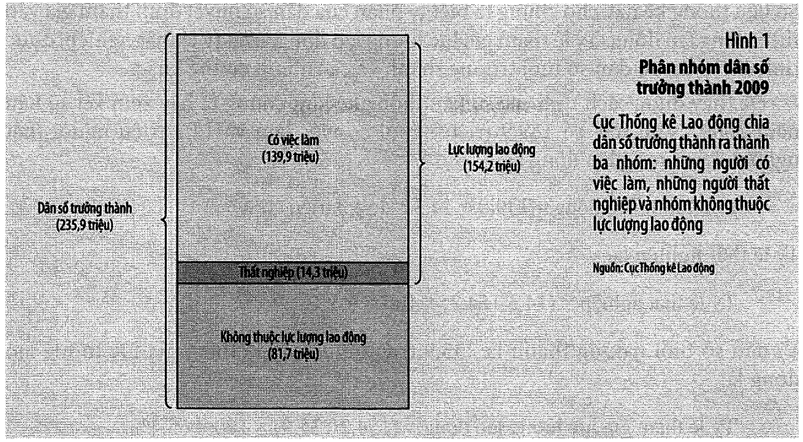
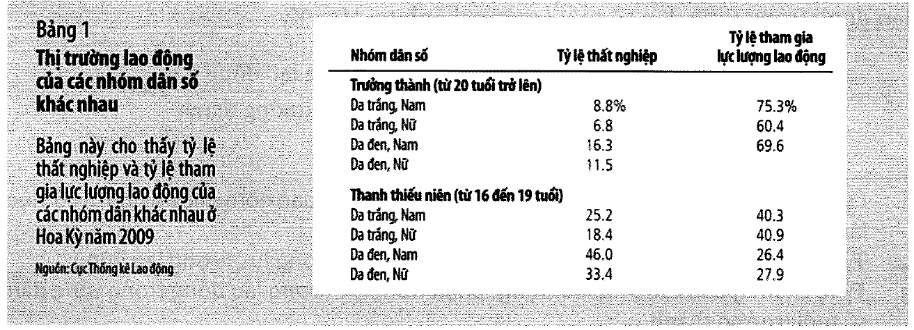
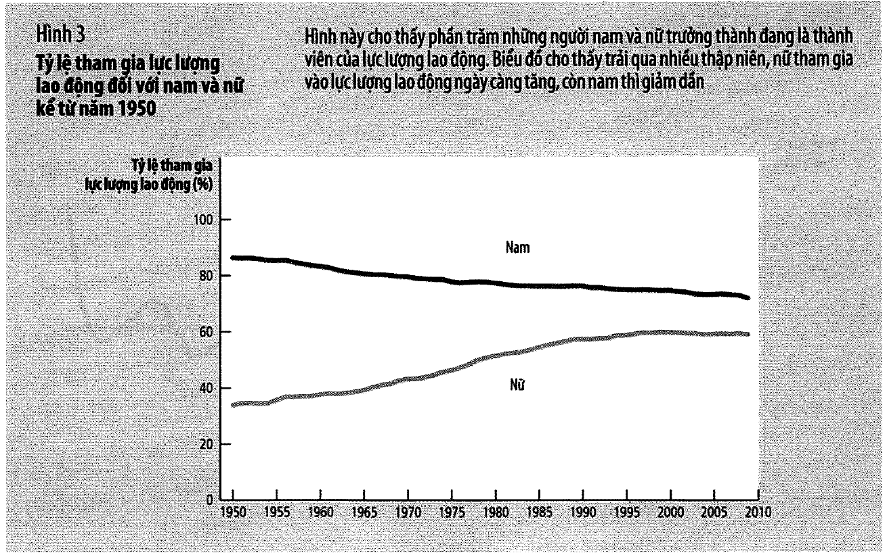
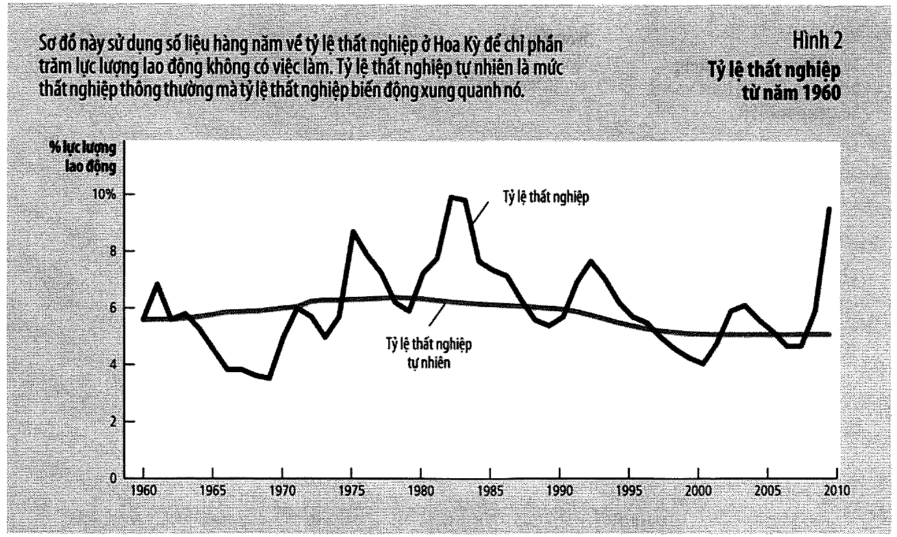
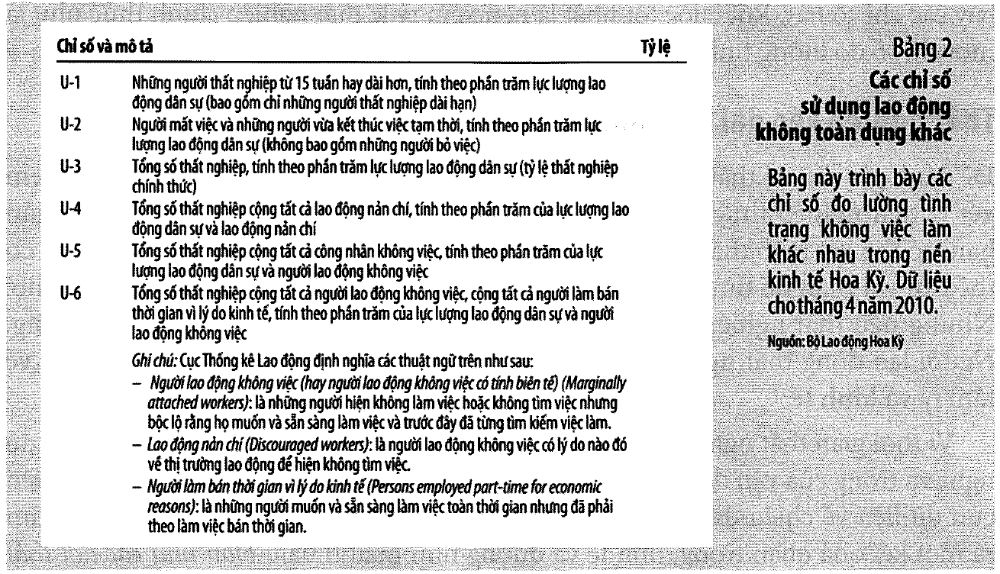
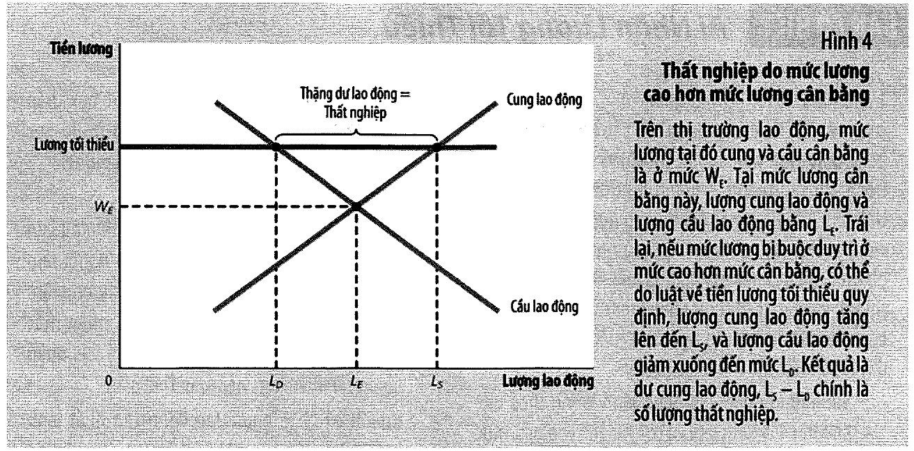

# Bài 6 — Thất nghiệp

> Bài học dựng từ **Chương 15 — Thất nghiệp** (tr. 331–358)
> của *N. Gregory Mankiw — **Kinh tế học vĩ mô***, bản dịch của Khoa Kinh tế, **ĐH Kinh tế TP.HCM** (Cengage Learning Asia).
> 🎯 **Vòng 1.** Bài 3 nói mức sống phụ thuộc **năng suất**. Bài này nói về yếu tố còn trực tiếp hơn:
> **có bao nhiêu người được làm việc.** Đây cũng là bài cuối của khối "nền kinh tế thực trong dài hạn".
> 💼 **Góc QTKD** — ví dụ thêm cho ngành quản trị kinh doanh, **không có trong sách**.
> 📚 **Mở rộng** — thứ sách nói lướt hoặc để trong hộp phụ.
> ⚠️ — chỗ dễ hiểu sai, hoặc chỗ sách in sai.
> 📌 **Cần đọc trước:** [Bài 0](bai_00_tu_vi_mo_sang_vi_mo.md) mục 5 (điểm D bên trong đường giới hạn),
> [Bài 3](bai_03_san_xuat_va_tang_truong.md) mục 5 (năng suất). Mục 7–9 dùng lại **giá sàn** của
> [EG13 bài 13](../../%5BEG13%5D.kinhtevimo-micro/ly_thuyet/bai_13_chinh_phu_can_thiep_thi_truong.md).

---

## Mục lục

<!-- MUC-LUC -->

- [1. Vì sao chương này quan trọng](#1-vì-sao-chương-này-quan-trọng)
- [2. Đo lường thất nghiệp — ba nhóm và ba công thức](#2-đo-lường-thất-nghiệp--ba-nhóm-và-ba-công-thức)
- [3. Bảng 1 — con số tổng thể che giấu những thế giới rất khác nhau](#3-bảng-1--con-số-tổng-thể-che-giấu-những-thế-giới-rất-khác-nhau)
- [4. ⚠️ Tỷ lệ thất nghiệp đếm thiếu và đếm thừa cái gì](#4--tỷ-lệ-thất-nghiệp-đếm-thiếu-và-đếm-thừa-cái-gì)
- [5. ⚠️⚠️ Nghịch lý thời gian thất nghiệp](#5--nghịch-lý-thời-gian-thất-nghiệp)
- [6. Bốn nguyên nhân của thất nghiệp dài hạn](#6-bốn-nguyên-nhân-của-thất-nghiệp-dài-hạn)
- [7. Nguyên nhân 1 — tìm việc, và bảo hiểm thất nghiệp](#7-nguyên-nhân-1--tìm-việc-và-bảo-hiểm-thất-nghiệp)
- [8. Nguyên nhân 2 — luật lương tối thiểu](#8-nguyên-nhân-2--luật-lương-tối-thiểu)
- [9. Nguyên nhân 3 — công đoàn và thương lượng tập thể](#9-nguyên-nhân-3--công-đoàn-và-thương-lượng-tập-thể)
- [10. Nguyên nhân 4 — lý thuyết tiền lương hiệu quả](#10-nguyên-nhân-4--lý-thuyết-tiền-lương-hiệu-quả)
- [11. 💼 Góc QTKD — bốn nguyên nhân, đọc ngược lại cho người tuyển dụng](#11--góc-qtkd--bốn-nguyên-nhân-đọc-ngược-lại-cho-người-tuyển-dụng)
- [12. 📚 Đối chiếu Việt Nam](#12--đối-chiếu-việt-nam)
- [13. Code minh hoạ](#13-code-minh-hoạ)
- [14. Tự thử](#14-tự-thử)
- [15. Từ điển thuật ngữ](#15-từ-điển-thuật-ngữ)
- [16. Câu hỏi tự kiểm tra](#16-câu-hỏi-tự-kiểm-tra)
- [Tóm tắt một trang](#tóm-tắt-một-trang)
- [Nguồn](#nguồn)

<!-- /MUC-LUC -->

---

## 1. Vì sao chương này quan trọng

Sách mở bằng một câu rất thẳng (tr. 331):

> *"Mất việc có thể là sự kiện kinh tế tồi tệ nhất trong cuộc đời một con người. Hầu như mọi người đều
> dựa vào thu nhập từ sức lao động của mình để trang trải cuộc sống và nhiều người cũng cảm thấy hài lòng
> về những thành quả cá nhân này. Mất việc dẫn đến **giảm mức sống ở hiện tại, lo lắng hơn về tương lai
> và giảm lòng tự trọng**."*

Và nối thẳng vào bài 3 (tr. 331):

> *"Yếu tố tác động rõ hơn đến mức sống của một quốc gia là **số lượng người thất nghiệp** của quốc gia đó.
> Người dân muốn làm việc nhưng không thể tìm được việc sẽ không đóng góp vào quá trình sản xuất ra hàng
> hóa và dịch vụ của nền kinh tế."*

📌 Nói bằng ngôn ngữ [bài 0 mục 5](bai_00_tu_vi_mo_sang_vi_mo.md#5-đường-giới-hạn-khả-năng-sản-xuất--nền-móng-của-ngắn-hạn--dài-hạn):
thất nghiệp là chuyện nền kinh tế nằm **bên trong** đường giới hạn khả năng sản xuất — chính là **điểm D**.

### Hai loại thất nghiệp, và bài này chỉ nói về một

Sách chia rất rõ ngay từ đầu (tr. 331):

| Loại | Định nghĩa | Học ở đâu |
| ---- | ---------- | --------- |
| **Tỷ lệ thất nghiệp tự nhiên** | *"lượng thất nghiệp mà nền kinh tế đó **thường trải qua**"* | **bài này** |
| **Thất nghiệp chu kỳ** | *"lượng thất nghiệp biến động hàng năm xung quanh tỷ lệ tự nhiên"* | bài 11–13 |

⚠️ **Chữ "tự nhiên" rất dễ gây hiểu sai.** Sách cảnh báo thẳng (tr. 331–332):

> *"…chữ **tự nhiên** sẽ không hàm ý tỷ lệ thất nghiệp là **đáng mong đợi**. Nó cũng không hàm ý rằng tỷ
> lệ thất nghiệp **cố định** theo thời gian hay **không liên quan gì đến chính sách** kinh tế. Nó chỉ có
> nghĩa rằng thất nghiệp này sẽ **không biến động nhiều ngay cả trong dài hạn**."*

### Kết luận sách báo trước — và nó không dễ chịu

> *"…thất nghiệp trong dài hạn **không xuất phát từ một vấn đề riêng lẻ với một giải pháp riêng lẻ**.
> Thay vào đó, thất nghiệp dài hạn phản ánh nhiều loại vấn đề liên hệ với nhau. Kết quả là sẽ **không có
> cách nào dễ dàng** để các nhà hoạch định chính sách vừa giảm tỷ lệ thất nghiệp tự nhiên của nền kinh tế
> và đồng thời giảm sự khó khăn của người thất nghiệp."*  — tr. 332

---

## 2. Đo lường thất nghiệp — ba nhóm và ba công thức

Cơ quan đo: **Cục Thống kê Lao động (BLS)** thuộc Bộ Lao động, khảo sát **hàng tháng** với **60.000 hộ
gia đình** (*Điều tra Dân số Hiện hành*) — tr. 332.

### Ba nhóm — mỗi người trưởng thành (từ 16 tuổi) thuộc **đúng một** nhóm

| Nhóm | Ai | Chi tiết đáng nhớ |
| ---- | -- | ------------------ |
| **Có việc làm** | được trả lương, tự kinh doanh, hoặc làm **không lương** trong doanh nghiệp gia đình | kể cả bán thời gian; kể cả đang nghỉ ốm/nghỉ mát/thời tiết xấu |
| **Thất nghiệp** | sẵn sàng làm việc, **đã tìm việc trong bốn tuần trước đó**, nhưng không có việc | kể cả người **đang chờ được gọi lại** làm việc sau khi bị cho nghỉ |
| **Không trong lực lượng lao động** | không thuộc hai nhóm trên | sinh viên toàn thời gian, người nội trợ, người nghỉ hưu |

⚠️ **Chú ý cụm "đã tìm việc trong bốn tuần trước đó".** Muốn làm việc mà **đã thôi tìm** thì **không** được
tính là thất nghiệp. Mục 4 quay lại chỗ này.

### Ba công thức — và ⚠️ hai mẫu số khác nhau

$$\text{Lực lượng lao động} = \text{Số người có việc làm} + \text{Số người thất nghiệp}$$

$$\text{Tỷ lệ thất nghiệp} = \frac{\text{Số người thất nghiệp}}{\textbf{Lực lượng lao động}} \times 100$$

$$\text{Tỷ lệ tham gia lực lượng lao động} = \frac{\text{Lực lượng lao động}}{\textbf{Dân số tuổi trưởng thành}} \times 100$$

Số liệu Hoa Kỳ **2009** — Hình 1, tr. 333:



```
   có việc làm                     139,9 triệu
   thất nghiệp                      14,3 triệu   ┐
   không trong lực lượng lao động   81,7 triệu   │ lực lượng lao động = 154,2
   ─────────────────────────────────────────────┘
   dân số trưởng thành             235,9 triệu

   tỷ lệ thất nghiệp     = (14,3 / 154,2) × 100 = 9,3%
   tỷ lệ tham gia LLLĐ   = (154,2 / 235,9) × 100 = 65,4%
```

Mục 1 của [code minh hoạ](#13-code-minh-hoạ) kiểm cả bốn con số bằng `assert` — khớp hết.

⭐ **Hai tỷ lệ dùng hai mẫu số khác nhau.** Nhầm mẫu số là lỗi phổ biến nhất khi làm bài tập chương này.

📚 Bài tập 2 tr. 353 (số liệu 4/2010) được giải trong code: dân số trưởng thành **237.329.000**, lực lượng
lao động **154.715.000**, tham gia **65,2%**, thất nghiệp **9,9%** — cao hơn cả năm 2009.

---

## 3. Bảng 1 — con số tổng thể che giấu những thế giới rất khác nhau



Bảng 1 tr. 334, số liệu Hoa Kỳ 2009:

| Nhóm dân số | Tỷ lệ thất nghiệp | Tham gia LLLĐ |
| ----------- | ----------------: | ------------: |
| **Trưởng thành (từ 20 tuổi)** | | |
| Da trắng, Nam |  8,8% | 75,3% |
| Da trắng, Nữ  |  6,8% | 60,4% |
| Da đen, Nam   | 16,3% | 69,6% |
| Da đen, Nữ    | 11,5% | — |
| **Thanh thiếu niên (16–19 tuổi)** | | |
| Da trắng, Nam | 25,2% | 40,3% |
| Da trắng, Nữ  | 18,4% | 40,9% |
| **Da đen, Nam** | **46,0%** | 26,4% |
| Da đen, Nữ    | 33,4% | 27,9% |

Ba so sánh sách chỉ ra (tr. 334):

```
   ①  NỮ tham gia LLLĐ ÍT hơn nam, nhưng MỘT KHI đã tham gia thì thất nghiệp
      THẤP hơn nam một chút
   ②  NGƯỜI DA ĐEN tham gia LLLĐ tương đương người da trắng, nhưng tỷ lệ
      thất nghiệp CAO HƠN NHIỀU
   ③  THANH THIẾU NIÊN tham gia LLLĐ thấp hơn và thất nghiệp cao hơn NHIỀU
```

⚠️ **Tỷ lệ chung năm 2009 là 9,3%. Nhưng trong cùng năm đó các nhóm trải từ 6,8% đến 46,0% — chênh 6,8 lần.**

💼 Hệ quả rất thực dụng: nếu bạn tuyển **lao động phổ thông trẻ**, thị trường lao động của bạn **không
phải** thị trường mà bạn đọc thấy trên báo. Con số 9,3% không mô tả tình hình tuyển dụng của bạn.

### 📚 Nam và nữ trong lực lượng lao động — Hình 3, tr. 336



| | 1950 | 2009 |
| --- | ---: | ---: |
| Nữ tham gia LLLĐ  | **33%** | **59%** |
| Nam tham gia LLLĐ | **87%** | **72%** |

Nguyên nhân **nữ tăng** (tr. 335–336): công nghệ mới (máy giặt, máy sấy, tủ lạnh, tủ đông, máy rửa chén)
giảm thời gian việc nhà; kiểm soát sinh sản cải tiến giảm số con; thay đổi thái độ chính trị và xã hội.



⚠️ Nhưng sách nói **nam giảm khó hiểu hơn**, và nêu ba lý do (tr. 336):

```
   ① nam thanh niên ngày nay HỌC lâu hơn cha ông họ
   ② nam lớn tuổi NGHỈ HƯU SỚM hơn và SỐNG LÂU hơn
   ③ nhiều phụ nữ đi làm hơn ⟹ nhiều NGƯỜI CHA Ở NHÀ chăm con
```

⭐ Cả ba nhóm — sinh viên toàn thời gian, người nghỉ hưu, người cha ở nhà — **đều được tính ngoài lực
lượng lao động**. Tức là "tham gia LLLĐ giảm" không đồng nghĩa "tình hình xấu đi".

---

## 4. ⚠️ Tỷ lệ thất nghiệp đếm thiếu và đếm thừa cái gì

Sách đặt câu hỏi thẳng ở tiêu đề mục (tr. 336): *"Có phải tỷ lệ thất nghiệp đo lường được khái niệm thất
nghiệp chúng ta muốn lượng hoá?"*

### Nguồn gốc của vấn đề: dòng người ra vào rất lớn

> *"Hơn **một phần ba** số người thất nghiệp là những người mới tham gia lực lượng lao động… Gần như
> **một nửa** tất cả các đợt thất nghiệp kết thúc khi người thất nghiệp **rời lực lượng lao động**."*
> — tr. 337

⭐ Đọc kỹ câu thứ hai: gần một nửa số đợt thất nghiệp kết thúc **không phải** vì tìm được việc, mà vì
người đó **bỏ cuộc**.

### Hai chiều sai lệch

| Chiều | Ai | Hệ quả |
| ----- | -- | ------ |
| **Đếm thừa** | người khai thất nghiệp nhưng không thật sự tìm việc (để nhận trợ cấp), hoặc đang làm việc **"dưới bàn"** để tránh thuế | tỷ lệ có vẻ **cao** hơn thực tế |
| **Đếm thiếu** | **lao động nản chí** | tỷ lệ có vẻ **thấp** hơn thực tế |

> **Lao động nản chí** (*discouraged workers*): những người mong muốn có một công việc nhưng **đã từ bỏ
> việc tìm kiếm việc làm**. — chú thích tr. 337

> *"Những người này… **không hiện diện trong thống kê thất nghiệp**, mặc dù họ thực sự là những người lao
> động không có việc."*

### 📚 Sáu chỉ số của BLS — Bảng 2, tr. 337



| Mã | Nội dung | |
| -- | -------- | - |
| **U-1** | thất nghiệp từ 15 tuần trở lên | hẹp nhất |
| **U-2** | mất việc + vừa kết thúc việc tạm thời | |
| **U-3** | tổng số thất nghiệp — **tỷ lệ thất nghiệp chính thức** | ← con số trên báo |
| **U-4** | U-3 + **lao động nản chí** | |
| **U-5** | U-3 + toàn bộ công nhân không việc (*marginally attached*) | |
| **U-6** | U-5 + người làm **bán thời gian vì lý do kinh tế** | rộng nhất |

Sách kết rất cân trọng (tr. 338):

> *"Rốt cuộc tốt nhất là nên xem tỷ lệ thất nghiệp chính thức như là một chỉ số đo lường tình trạng không
> việc làm **hữu ích nhưng không hoàn hảo**."*

### 💼 Cách đọc tin cho đúng

⚠️ *"Thất nghiệp giảm"* có **hai** cách xảy ra, ngược nhau hoàn toàn:

```
   người ta TÌM ĐƯỢC VIỆC        →  tin TỐT
   người ta BỎ CUỘC, rời LLLĐ    →  tin XẤU
   ⟹ cả hai đều làm con số U-3 GIẢM
```

📌 **Luôn nhìn kèm tỷ lệ tham gia lực lượng lao động.** Nếu tỷ lệ thất nghiệp **và** tỷ lệ tham gia cùng
giảm, đó là tin xấu chứ không phải tin tốt.

### 📚 Số việc làm — hai cuộc khảo sát khác nhau, hộp tr. 340

BLS công bố **hai** con số cùng lúc, từ **hai** khảo sát khác nhau:

| Khảo sát | Quy mô | Đo được | Không đo được |
| -------- | ------ | ------- | ------------- |
| **hộ gia đình** | 60.000 hộ | ai có việc, ai **đang tìm việc** | — |
| **doanh nghiệp** | 160.000 DN, ~40 triệu lao động | số việc làm; mẫu lớn hơn nên **đáng tin hơn** | ❌ số người **thất nghiệp** |

⚠️ Sách nêu hai lý do hai khảo sát cho kết quả khác nhau (tr. 340):

```
   • một người làm bán thời gian ở HAI công ty
     → khảo sát hộ gia đình đếm là MỘT NGƯỜI có việc
     → khảo sát doanh nghiệp đếm là HAI VIỆC LÀM
   • một người điều hành doanh nghiệp nhỏ CỦA CHÍNH MÌNH
     → khảo sát hộ gia đình: CÓ việc làm
     → khảo sát doanh nghiệp: KHÔNG xuất hiện (chỉ tính người trong bảng lương)
```

---

## 5. ⚠️⚠️ Nghịch lý thời gian thất nghiệp

Đây là kết quả tinh tế nhất của cả chương. Sách phát biểu nó bằng chữ in nghiêng (tr. 338):

> *"**Hầu như các đợt thất nghiệp đều ngắn, và hầu hết số lượng thất nghiệp quan sát tại bất kỳ thời điểm
> nào là dài hạn.**"*

Nghe như tự mâu thuẫn. Ví dụ của sách (tr. 338) giải thích nó bằng số:

```
   Bạn đến văn phòng thất nghiệp MỖI TUẦN trong 52 tuần.
   Mỗi tuần bạn gặp đúng 4 người thất nghiệp:
      3 người GIỮ NGUYÊN suốt cả năm
      1 người THAY ĐỔI mỗi tuần (mỗi người thất nghiệp đúng 1 tuần)
```

Mục 4 của [code minh hoạ](#13-code-minh-hoạ) đếm theo **hai** cách:

| Cách đếm | Phép tính | Kết quả |
| -------- | --------- | ------: |
| theo **người** — bao nhiêu người khác nhau trong cả năm | 3 + 1×52 = 55 người, trong đó 52 người chỉ 1 tuần | **95%** đợt thất nghiệp kết thúc trong 1 tuần |
| theo **thời điểm** — bất kỳ tuần nào bạn đến | 3 trong 4 người là dài hạn | **75%** lượng thất nghiệp quan sát được là dài hạn |

⭐ **Cả hai cùng đúng.** Sách in đúng hai con số này. Lý do: người dài hạn **ở lại** trong thống kê mọi
tuần, còn người ngắn hạn chỉ xuất hiện **một** tuần rồi biến mất.

Code kiểm thêm rằng đây **không** phải trường hợp đặc biệt — với mọi tổ hợp thông số, tỷ lệ đợt ngắn luôn
rất cao (84%–99%). **Nghịch lý này là đặc tính của cách đếm**, không phải của số liệu.

### ⚠️ Hệ quả chính sách — sách nói rất thẳng

> *"Đa số mọi người khi thất nghiệp sẽ sớm tìm được việc làm. Nhưng hầu hết vấn đề thất nghiệp của nền
> kinh tế xuất phát từ **một số tương đối ít** những người không có việc làm trong thời gian dài."* — tr. 338

📌 Chính sách nhắm vào *"người thất nghiệp nói chung"* sẽ tiêu phần lớn tiền vào đám đông sẽ **tự** tìm
được việc trong vài tuần. Vấn đề thật nằm ở một nhóm **nhỏ và dài hạn**.

---

## 6. Bốn nguyên nhân của thất nghiệp dài hạn

Sách chia thành **hai loại** (chú thích tr. 339):

| Loại | Định nghĩa | Nguyên nhân | Đợt |
| ---- | ---------- | ----------- | --- |
| **Thất nghiệp cọ xát** | *"xảy ra vì người lao động **tốn thời gian** để tìm kiếm công việc phù hợp với sở thích và khả năng của mình"* | ① tìm việc | **ngắn** |
| **Thất nghiệp cơ cấu** | *"xảy ra vì một số thị trường lao động **không cung cấp đủ việc làm** cho tất cả những người tìm việc"* | ② lương tối thiểu · ③ công đoàn · ④ tiền lương hiệu quả | **dài** |

### ⚠️ Phân biệt hai loại — sách nói rất gọn ở tr. 345

```
   CỌ XÁT:  công nhân TÌM công việc   — việc CÓ đủ, chỉ chưa khớp
   CƠ CẤU:  công nhân ĐỢI công việc   — lương trên cân bằng nên việc KHÔNG đủ
```

> *"Trái lại, khi tiền lương ở trên mức cân bằng, lượng cung lao động vượt quá lượng cầu lao động, và
> công nhân thất nghiệp vì họ phải **đợi** công việc đến."* — tr. 345

⭐ Ba nguyên nhân ②③④ **dùng chung một hình vẽ** (Hình 4) và **chung một cơ chế**: lương bị giữ **trên**
mức cân bằng. Khác nhau chỉ ở **ai** giữ nó ở đó.



---

## 7. Nguyên nhân 1 — tìm việc, và bảo hiểm thất nghiệp

> **Tìm việc** (*job search*): quá trình người lao động tìm công việc thích hợp với sở thích và khả năng
> của mình. — chú thích tr. 339

### Vì sao **không tránh khỏi**

Vì nền kinh tế **luôn thay đổi**. Ví dụ của sách (tr. 341):

| Một thế kỷ trước — bốn ngành nhiều việc làm nhất Hoa Kỳ | Ngày nay |
| ------------------------------------------------------- | -------- |
| hàng vải cotton · hàng vải len · quần áo đàn ông · vật liệu gỗ | xe hơi · máy bay · thông tin liên lạc · thiết bị điện |

Hai con số của sách (tr. 341):

```
   • ít nhất 10% việc làm trong các ngành CHẾ TẠO ở Hoa Kỳ mất đi HÀNG NĂM
   • hơn 3% người lao động BỎ VIỆC trong MỘT THÁNG
```

Code cho thấy với tốc độ 10%/năm, sau **20 năm** chỉ còn **12%** cơ cấu việc làm ban đầu. **Dịch chuyển
khu vực** (*sectoral shift*) là trạng thái **bình thường**, không phải sự cố.

Ví dụ giá dầu của sách (tr. 340) rất hay vì nó **hai chiều cùng lúc**:

```
   giá dầu thế giới GIẢM
      → công ty khai thác ở Alaska CẮT sản lượng và lao động
      → xăng rẻ hơn ⟹ bán xe hơi tăng ⟹ nhà máy ở Michigan TĂNG lao động
   ⟹ tổng số việc làm có thể không đổi, nhưng vẫn sinh ra thất nghiệp cọ xát
```

### ⚠️ Bảo hiểm thất nghiệp **làm tăng** thất nghiệp — và sách thừa nhận thẳng

> **Bảo hiểm thất nghiệp** (*unemployment insurance*): chương trình của chính phủ góp phần duy trì một
> phần thu nhập cho người lao động khi họ bị thất nghiệp. — chú thích tr. 342

Mức điển hình ở Hoa Kỳ: **50% lương trước đây, trong 26 tuần**. Không áp dụng cho người **tự bỏ việc**,
bị **sa thải có nguyên nhân**, hoặc **mới tham gia** lực lượng lao động.

Cơ chế — đây là **Nguyên lý 4** (con người phản ứng với động cơ khuyến khích):

> *"Vì khoản tiền nhận được khi thất nghiệp sẽ chấm dứt khi người lao động tìm được việc làm mới, người
> thất nghiệp sẽ **ít có nỗ lực kiếm việc hơn** và có xu hướng **không quan tâm đến các công việc kém hấp
> dẫn**."* — tr. 342

**Bằng chứng thực nghiệm** — thí nghiệm Illinois **1985** (tr. 342):

```
   người mất việc đăng ký nhận bảo hiểm thất nghiệp
   → chọn NGẪU NHIÊN một số người, thưởng 500 USD nếu tìm được việc trong 11 tuần
   → nhóm được thưởng thất nghiệp NGẮN HƠN 7% so với nhóm đối chứng
```

⭐ Đây là một **thí nghiệm có đối chứng ngẫu nhiên** thật, đúng phương pháp bạn đã học ở
[EG11 bài 12–13](../../%5BEG11%5D.xacxuatthongke/ly_thuyet/bai_12_kiem_dinh_gia_thuyet_mot_mau.md).
Nó cho thấy chính sách thay đổi **hành vi**, không chỉ thay đổi thu nhập.

Một bằng chứng khác (tr. 342): khi người thất nghiệp **hết tiêu chuẩn** nhận trợ cấp (sau 6 tháng hoặc
một năm), *"xác suất họ tìm được việc mới tăng lên rõ rệt"*.

### ⚠️ Nhưng sách **không** kết luận "nên bỏ"

> *"Hầu hết các nhà kinh tế đồng ý rằng xóa bỏ bảo hiểm thất nghiệp có thể làm **giảm** lượng thất nghiệp
> trong nền kinh tế. Nhưng các nhà kinh tế **không thống nhất** được việc thay đổi chính sách này sẽ làm
> tăng hay giảm **phúc lợi kinh tế** của quốc gia."* — tr. 343

Hai lý do bênh vực:

```
   ① mục tiêu căn bản là giảm TÍNH KHÔNG CHẮC CHẮN về thu nhập
   ② cho phép từ chối công việc không phù hợp để tìm việc KHỚP HƠN
      ⟹ "cải thiện khả năng nền kinh tế khớp nối người lao động với công việc phù hợp nhất"
```

📌 Ghi nhớ cấu trúc lập luận này: **"chính sách X làm tăng thất nghiệp" không tự động có nghĩa "nên bỏ X".**
Thất nghiệp không phải biến duy nhất cần tối ưu.

---

## 8. Nguyên nhân 2 — luật lương tối thiểu

Đây là **giá sàn** áp cho thị trường lao động — đúng công cụ của
[EG13 bài 13](../../%5BEG13%5D.kinhtevimo-micro/ly_thuyet/bai_13_chinh_phu_can_thiep_thi_truong.md).

### Hình 4, tr. 343

```
   lương tại mức cân bằng W_E  →  lượng cung = lượng cầu = L_E  →  KHÔNG ai thất nghiệp
   lương bị giữ TRÊN mức cân bằng:
      lượng CUNG lao động TĂNG lên L_S
      lượng CẦU lao động GIẢM xuống L_D
      ⟹ THẶNG DƯ lao động = L_S − L_D = SỐ NGƯỜI THẤT NGHIỆP
```

Mục 7 của [code minh hoạ](#13-code-minh-hoạ) dựng một thị trường tuyến tính cân bằng ở lương 100, việc
làm 1.000:

| Lương sàn | Cầu (L_D) | Cung (L_S) | Thất nghiệp | Tỷ lệ thất nghiệp |
| --------: | --------: | ---------: | ----------: | ----------------: |
| **100** *(cân bằng)* | 1.000 | 1.000 | **0** | 0,0% |
| 110 | 920 | 1.060 | 140 | 13,2% |
| **120** | **840** | **1.120** | **280** | **25,0%** |
| 150 | 600 | 1.300 | 700 | 53,8% |

### ⭐ Tách thất nghiệp làm **hai** phần — chỗ hay bị bỏ sót

Ở lương sàn 120:

```
   người MẤT VIỆC  (cầu giảm):      1.000 → 840   =  160 người
   người MỚI GIA NHẬP (cung tăng):  1.000 → 1.120 =  120 người
   ───────────────────────────────────────────────────────────
   TỔNG THẤT NGHIỆP                                =  280 người
```

⚠️ Một phần đáng kể người thất nghiệp **không phải** người bị đuổi việc, mà là người **trước đây không tìm
việc**, nay thấy lương hấp dẫn nên vào tìm. Hình 4 thể hiện đúng điều đó: $L_S$ nằm bên **phải** $L_E$.

### 📚 Ai thực sự nhận lương tối thiểu — hộp "Bạn có biết", tr. 344

Nghiên cứu của Bộ Lao động công bố năm 2010 (số liệu 2009; tháng 7 năm đó lương tối thiểu tăng từ
**6,55 USD** lên **7,25 USD/giờ**):

| | |
| --- | ---: |
| nam giới làm theo giờ nhận ≤ lương tối thiểu | ~4% |
| nữ giới làm theo giờ nhận ≤ lương tối thiểu | ~6% |
| người hưởng lương tối thiểu **dưới 25 tuổi** | ~**một nửa** |
| thanh niên (16–19) làm việc nhận ≤ mức tối thiểu | **19%** |
| người **từ 25 tuổi trở lên** nhận ≤ mức tối thiểu | **3%** |
| người làm **bán** thời gian nhận mức tối thiểu | 11% |
| người làm **toàn** thời gian nhận mức tối thiểu | 2% |
| ngành có tỷ lệ cao nhất: **công nghiệp giải trí** | **21%** |

⭐ Sách kết luận (tr. 344): luật lương tối thiểu *"chỉ tác động đến nhóm lao động **ít kỹ năng và ít kinh
nghiệm**… Lương cân bằng của họ có xu hướng thấp và do đó thường **dưới** mức lương tối thiểu."*

⚠️ Sách cũng ghi chú một điểm phương pháp (tr. 344): con số thực có thể bị lệch vì luật *"không được thực
thi tốt"* ở một số nơi, và vì *"một số công nhân làm tròn số xuống khi báo cáo mức lương của họ"*.

### ⭐⭐ Bài học tổng quát — sách in nghiêng ở tr. 344

> *"**Nếu mức lương được giữ trên mức cân bằng vì bất cứ lý do gì, kết quả sẽ là thất nghiệp.**"*

📌 Luật lương tối thiểu chỉ là **một** trong ba lý do. Hai lý do còn lại — công đoàn (mục 9) và tiền lương
hiệu quả (mục 10) — dùng **cùng một hình vẽ**.

---

## 9. Nguyên nhân 3 — công đoàn và thương lượng tập thể

| Khái niệm | Định nghĩa (chú thích tr. 345–346) |
| --------- | ----------------------------------- |
| **Công đoàn** | tổ chức của người lao động nhằm thương lượng với người sử dụng lao động về **tiền lương, phúc lợi và điều kiện làm việc** |
| **Thương lượng tập thể** | quá trình công đoàn và doanh nghiệp đồng ý những điều khoản về việc làm |
| **Đình công** | việc ngưng làm việc ở một doanh nghiệp được tổ chức bởi công đoàn |

### Quy mô — tr. 345

| Nơi | Tỷ lệ |
| --- | ----- |
| Hoa Kỳ **hiện nay** | **12%** lao động là đoàn viên |
| Hoa Kỳ thập niên **1940–1950** | khoảng **1/3** lực lượng lao động |
| Bỉ, Na Uy, Thuỵ Điển | **hơn một nửa** lực lượng lao động |
| Pháp, Đức | đa số hưởng lương theo **thương lượng tập thể** theo luật, dù ít đoàn viên |

### Cơ chế — giống hệt lương tối thiểu

> *"Công đoàn là một loại **liên minh phía người bán theo kiểu cartel**."* — tr. 345

Kết quả điển hình (tr. 346): đoàn viên nhận thu nhập cao hơn **10 đến 20%** so với người không tham gia
công đoàn. Và:

> *"Khi nâng mức lương trên mức cân bằng thị trường, công đoàn làm **tăng lượng cung** lao động và **giảm
> lượng cầu** lao động và do đó **tạo ra thất nghiệp**."*

### ⚠️ Ai được, ai mất — đoạn sắc nhất của mục này

> *"…công đoàn thường bị coi là nguyên nhân gây ra xung đột giữa những **nhóm người lao động khác nhau** –
> giữa những **người nội bộ** nhận được lương công đoàn cao và những **người bên ngoài** không có việc làm."*
> — tr. 346

Và cơ chế lan toả sang khu vực không có công đoàn:

```
   công đoàn đẩy lương lên ở MỘT bộ phận
      → những người bị đẩy ra chuyển sang khu vực KHÔNG có công đoàn
      → cung lao động TĂNG ở đó
      → lương ở ngành KHÔNG công đoàn GIẢM
   ⟹ "đoàn viên hưởng lợi từ thương lượng tập thể trong khi người lao động
      không trong công đoàn thì CHỊU CHI PHÍ"
```

### 📚 Vì sao công đoàn được **miễn** luật chống độc quyền — tr. 346

Một chi tiết thể chế đáng nhớ:

```
   doanh nghiệp bán hàng tương tự thoả thuận TĂNG GIÁ
      →  "âm mưu kìm hãm thương mại"  →  bị kiện dân sự VÀ hình sự
   công đoàn thoả thuận tập thể về LƯƠNG
      →  ĐƯỢC MIỄN TRỪ khỏi các luật này
```

Lý do các nhà làm luật đưa ra: *"người lao động cần quyền lực thị trường lớn hơn khi thương lượng với
người sử dụng lao động."* Công cụ pháp lý: **Đạo luật Wagner năm 1935** và **Uỷ ban Quan hệ Lao động Quốc
gia (NLRB)**.

### ⚠️ Sách trình bày **cả hai phía** — không kết luận một chiều

| Phê phán (tr. 347) | Ủng hộ (tr. 347) |
| ------------------ | ---------------- |
| công đoàn là **cartel** phía người bán | là **liều thuốc giải độc** cần thiết cho quyền lực thị trường của doanh nghiệp |
| **không hiệu quả**: việc làm giảm dưới mức cạnh tranh | trường hợp cực đoan: **"thị trấn công ty"** — một công ty thuê hầu hết lao động một vùng, công nhân *"chỉ có ít cơ hội ngoại trừ việc phải đi chỗ khác hoặc ngừng làm việc"* |
| **không công bằng**: *"lợi ích của công nhân này chính là chi phí của các công nhân khác"* | giúp doanh nghiệp **phản hồi hiệu quả** với nhu cầu công nhân: giờ làm, làm ngoài giờ, nghỉ phép, phúc lợi y tế, đảm bảo công việc |

Sách kết: *"công đoàn có thể **có ích trong một số trường hợp và có hại trong các trường hợp khác**."*

---

## 10. Nguyên nhân 4 — lý thuyết tiền lương hiệu quả

> **Tiền lương hiệu quả** (*efficiency wages*): mức lương **trên** mức cân bằng mà **doanh nghiệp trả**
> để tăng năng suất lao động. — chú thích tr. 348

### ⚠️ Khác biệt quan trọng với mục 8 và 9

```
   lương tối thiểu và công đoàn  →  NGĂN CẢN doanh nghiệp giảm lương
   tiền lương hiệu quả           →  doanh nghiệp TỰ NGUYỆN giữ lương cao
```

> *"Lý thuyết tiền lương hiệu quả tuyên bố rằng những ràng buộc như vậy đối với các doanh nghiệp là
> **không cần thiết** trong nhiều trường hợp vì doanh nghiệp có thể **có lợi nhiều hơn** nếu giữ mức lương
> trên mức cân bằng."* — tr. 348

### ⭐ Nghịch lý trung tâm

> *"Ý nghĩa sâu sắc của lý thuyết tiền lương hiệu quả là **trả lương cao có thể mang lại lợi nhuận** vì có
> thể làm tăng năng suất lao động của người lao động."* — tr. 348

### Bốn nhánh — tr. 348–350

| Nhánh | Cơ chế | Ghi chú của sách |
| ----- | ------ | ---------------- |
| **① Sức khoẻ người lao động** | lương cao → ăn đủ dinh dưỡng → khoẻ hơn → năng suất hơn | phù hợp ở **nước kém phát triển**; ít phù hợp ở nước giàu vì lương cân bằng đã trên mức đủ ăn |
| **② Người lao động bỏ việc** | lương cao → bỏ việc ít → khỏi tốn chi phí tuyển và huấn luyện | và người mới *"không làm việc năng suất bằng người lao động có kinh nghiệm"* |
| **③ Chất lượng người lao động** | lương cao → thu hút ứng viên tốt hơn | giảm lương thì *"những ứng viên tốt nhất – những người có nhiều lựa chọn hơn – có thể sẽ không nộp đơn"* |
| **④ Nỗ lực của người lao động** | lương cao → sợ mất việc → không trốn việc | vì giám sát *"tốn kém và không hoàn hảo"* |

### Nghiên cứu tình huống: Henry Ford, 5 đô la một ngày — tr. 350

Năm **1914**, Ford công bố lương **5 USD/ngày** — *"gấp đôi tiền lương hiện hành"* và *"cao hơn rất nhiều
so với mức lương cân bằng thị trường"*. Kết quả: *"có hàng dài người xin việc xếp hàng bên ngoài các nhà
máy Ford"*.

Kết quả thật mà sách ghi lại:

> *"Số bỏ việc giảm, vắng mặt giảm và năng suất tăng. Công nhân làm việc hiệu quả đến nỗi **chi phí sản
> xuất của Ford thấp hơn mặc dù lương cao hơn**."*

Ford tự gọi đây là *"một trong những biện pháp **giảm chi phí** tốt nhất chúng ta từng thực hiện"*.

Mục 9 của [code minh hoạ](#13-code-minh-hoạ) dựng một **mô hình minh hoạ** (số liệu do bài này đặt,
**không** phải của sách) cho thấy vì sao chuyện đó có thể xảy ra:

| Lương/ngày | Sản lượng/công nhân | Chi phí lao động trên mỗi 1.000 sản phẩm |
| ---------: | ------------------: | ---------------------------------------: |
| $2,50 | 100 | 25,00 |
| $3,50 | 146 | 23,97 |
| $4,50 | 198 | 22,73 |
| **$5,00** | **224** | **22,32** ← thấp nhất |
| $6,00 | 250 | 24,00 |
| $7,00 | 260 | 26,92 |

```
   để làm 10.000 sản phẩm/ngày:
      lương thị trường $2,50  →  cần 100,0 công nhân  →  250,00 USD/ngày
      lương Ford       $5,00  →  cần  44,6 công nhân  →  223,21 USD/ngày
   ⟹ trả lương GẤP 2 LẦN mà tổng chi phí lao động GIẢM 11%
```

### ⭐ Vì sao là Ford mà không phải công ty khác — tr. 350

> *"…quyết định của Ford liên quan chặt chẽ đến việc sử dụng **dây chuyền lắp ráp**. Công nhân làm việc
> trong một dây chuyền lắp ráp liên quan với nhau rất chặt chẽ. **Nếu một công nhân vắng mặt hay làm việc
> chậm, các công nhân khác khó có thể hoàn thành công việc của họ.**"*

⭐ **Tiền lương hiệu quả sinh lời nhiều hơn ở nơi công việc phụ thuộc lẫn nhau chặt chẽ.** Đó là một tiêu
chí bạn dùng được ngay hôm nay: dây chuyền, ca kíp, đội dự án gắn kết → trả trên thị trường có thể rẻ hơn.
Công việc độc lập, thay người dễ → ít có lý do.

---

## 11. 💼 Góc QTKD — bốn nguyên nhân, đọc ngược lại cho người tuyển dụng

### ① Trước khi tăng lương để giữ người, hãy tính con số này

Mục 10 của [code minh hoạ](#13-code-minh-hoạ) tính chi phí **thật** của một người nghỉ việc:

```
   vị trí lương 15 triệu/tháng
      chi phí tuyển dụng                              12.000.000 đ
      4 tháng người mới chỉ đạt 55% năng suất        27.000.000 đ
      ──────────────────────────────────────────────────────────
      TỔNG một lần thay người                         39.000.000 đ  = 2,6 tháng lương
```

Với 50 vị trí, thử tăng lương và xem tỷ lệ nghỉ việc giảm:

| Tăng lương | Nghỉ việc/năm | Chi phí lương tăng | Chi phí thay người | **Tổng** |
| ---------: | ------------: | -----------------: | -----------------: | -------: |
| **0%** | 40% | 0 | 780.000.000 | **780.000.000** ← thấp nhất |
| 10% | 25% |   900.000.000 | 487.500.000 | 1.387.500.000 |
| 25% | 15% | 2.250.000.000 | 292.500.000 | 2.542.500.000 |

⚠️ **Trong ví dụ này, tăng lương KHÔNG hoà vốn.** Chi phí lương tăng nhanh hơn phần tiết kiệm được.

⭐ Đó **không** phải kết luận "tiền lương hiệu quả là sai". Đó là kết luận rằng **nhánh ② một mình thường
không đủ**. Ford hưởng lợi từ **cả bốn nhánh** cùng lúc — đặc biệt nhánh ④ nhờ dây chuyền lắp ráp.

📌 **Bài học đúng: hãy tính con số này cho chính công ty bạn.** Nếu chi phí thay người của bạn là **6 tháng**
lương chứ không phải 2,6 tháng, kết luận sẽ đảo chiều.

### ② Bốn nguyên nhân, đọc cho người tuyển dụng

| Nguyên nhân | Đọc ngược lại |
| ----------- | ------------- |
| **tìm việc** | mô tả công việc **rõ ràng** rút ngắn thời gian khớp nối — cả cho bạn lẫn ứng viên |
| **lương tối thiểu** | ảnh hưởng nhóm ít kỹ năng; biết nó đặt **sàn** ở đâu trong cơ cấu lương của bạn |
| **công đoàn** | thương lượng **tập thể** khác hẳn thương lượng cá nhân — chuẩn bị khác nhau |
| **lương hiệu quả** | trả **trên** thị trường có thể **rẻ hơn**, nhất là khi công việc phụ thuộc lẫn nhau |

### ③ ⚠️ Đừng dùng tỷ lệ thất nghiệp quốc gia làm chuẩn tuyển dụng

Từ [mục 3](#3-bảng-1--con-số-tổng-thể-che-giấu-những-thế-giới-rất-khác-nhau): cùng năm 2009, tỷ lệ chung
9,3% nhưng các nhóm trải từ 6,8% đến 46,0%. Thị trường lao động của bạn được xác định bởi **kỹ năng, độ
tuổi và địa bàn** của vị trí bạn tuyển, không phải bởi con số quốc gia.

### ④ Chi phí cọ xát là chi phí bạn **giảm được**

Mục 7 cho biết thất nghiệp cọ xát đến từ việc **thông tin lan truyền chậm**. Đó cũng chính là chi phí bạn
đang trả khi một vị trí trống ba tháng. Những thứ giảm nó — mô tả công việc chính xác, quy trình phỏng vấn
gọn, phản hồi nhanh — là **cùng một cơ chế** với "internet giúp giảm thất nghiệp cọ xát" mà sách nói ở
tr. 341.

---

## 12. 📚 Đối chiếu Việt Nam

⚠️ **Cảnh báo:** phần này nằm ngoài sách và tôi ghi theo trí nhớ có giới hạn. **Hãy tra lại nguồn chính
thức trước khi dùng vào báo cáo.**

### ⚠️ Tỷ lệ thất nghiệp công bố của Việt Nam thường rất thấp — và điều đó **không** có nghĩa là mọi thứ tốt

Con số thất nghiệp công bố ở Việt Nam thường thấp hơn nhiều so với các nước phát triển. Lý do nằm gọn
trong [mục 4](#4--tỷ-lệ-thất-nghiệp-đếm-thiếu-và-đếm-thừa-cái-gì):

```
   định nghĩa "thất nghiệp" đòi hỏi ĐANG TÌM VIỆC và KHÔNG LÀM GÌ CẢ
   ở nước có khu vực phi chính thức lớn, người mất việc KHÔNG ở không —
   họ bán hàng rong, phụ việc nhà, về quê làm nông
   ⟹ họ được đếm là CÓ VIỆC LÀM, không phải thất nghiệp
```

⭐ Vì thế ở Việt Nam, chỉ tiêu đáng theo dõi hơn tỷ lệ thất nghiệp là **tỷ lệ thiếu việc làm** và **tỷ lệ
lao động phi chính thức** — chúng gần với chỉ số **U-6** của Bảng 2 hơn là U-3.

📌 Đây chính là lý do sách gọi tỷ lệ thất nghiệp chính thức là thước đo *"hữu ích nhưng không hoàn hảo"*.
Ở một nền kinh tế có khu vực phi chính thức lớn, chữ "không hoàn hảo" nặng hơn nhiều.

### Lương tối thiểu vùng

Việt Nam áp dụng **lương tối thiểu theo vùng**, điều chỉnh định kỳ. Áp khung của [mục 8](#8-nguyên-nhân-2--luật-lương-tối-thiểu):

```
   ở vùng lương cân bằng ĐÃ CAO HƠN mức tối thiểu  →  luật gần như KHÔNG tác động
   ở vùng lương cân bằng THẤP HƠN mức tối thiểu     →  tác động thật, và rơi vào
                                                        nhóm ÍT KỸ NĂNG nhất
```

⭐ Việc chia theo vùng chính là một cách xử lý vấn đề mà sách nêu ở tr. 344: lương tối thiểu **chung một
mức** cho cả nước sẽ vô hại ở nơi giàu và cắn rất mạnh ở nơi nghèo.

### Công đoàn

Cơ chế công đoàn ở Việt Nam khác mô hình Hoa Kỳ mà sách mô tả. ⚠️ Vì thế **đừng áp thẳng** kết luận ở
[mục 9](#9-nguyên-nhân-3--công-đoàn-và-thương-lượng-tập-thể) — cơ chế "cartel phía người bán" chỉ hoạt động
khi công đoàn thực sự có quyền **đàm phán lương** và **tổ chức đình công**. Cái đáng mang theo từ mục 9 là
khung phân tích **người nội bộ / người bên ngoài**, chứ không phải kết luận cụ thể.

### Bảo hiểm thất nghiệp

Việt Nam có bảo hiểm thất nghiệp với mức hưởng và thời gian hưởng quy định theo thời gian đóng. Cơ chế ở
[mục 7](#7-nguyên-nhân-1--tìm-việc-và-bảo-hiểm-thất-nghiệp) áp dụng nguyên vẹn: nó giảm tính không chắc chắn
**và** làm giảm nỗ lực tìm việc. Cả hai đều có thật; câu hỏi chính sách là cân bằng ở đâu, và đó là câu
hỏi mà sách nói rõ là **các nhà kinh tế chưa thống nhất**.

---

## 13. Code minh hoạ

> ⚙️ **Chạy:** cần **Python 3.10+**. Lưu file rồi gõ `python3 bai-06-that-nghiep.py`.
> Không cần cài gói nào — chỉ dùng thư viện chuẩn. Kết quả **tất định**.
> Bản đầy đủ nằm ở [`thuc_hanh/bai-06-that-nghiep.py`](../thuc_hanh/bai-06-that-nghiep.py).

```python
"""Bai 6 — That nghiep (Mankiw, chuong 15).
Chay: python3 bai-06-that-nghiep.py   (Python 3.10+)

Muc 4 giai nghich ly quan trong nhat cua chuong: "hau het cac dot that nghiep
deu NGAN, ma hau het luong that nghiep quan sat duoc lai la DAI HAN". Ket qua tat dinh.
"""

# ══ 1. BA NHOM VA BA CONG THUC — Hinh 1, tr. 333 ═══════════════════════════
# So lieu Hoa Ky nam 2009 (trieu nguoi), Cuc Thong ke Lao dong.
CO_VIEC = 139.9
THAT_NGHIEP = 14.3
NGOAI_LLLD = 81.7

luc_luong = CO_VIEC + THAT_NGHIEP
dan_so_tt = luc_luong + NGOAI_LLLD
ty_le_tn = THAT_NGHIEP / luc_luong * 100
ty_le_tg = luc_luong / dan_so_tt * 100

print("1. BA NHOM VA BA CONG THUC — Hinh 1, tr. 333 (Hoa Ky, 2009)")
print()
print("   BLS xep moi nguoi TRUONG THANH (tu 16 tuoi tro len) vao DUNG MOT nhom:")
NHOM = [
    ("CO VIEC LAM", CO_VIEC,
     "duoc tra luong, tu kinh doanh, hoac lam khong luong trong DN gia dinh",
     "ke ca ban thoi gian; ke ca dang nghi om / nghi mat / thoi tiet xau"),
    ("THAT NGHIEP", THAT_NGHIEP,
     "san sang lam viec, DA TIM VIEC trong bon tuan truoc do, nhung khong co viec",
     "ke ca nguoi dang cho duoc goi lai lam viec sau khi bi cho nghi"),
    ("KHONG TRONG LUC LUONG LAO DONG", NGOAI_LLLD,
     "khong thuoc hai nhom tren",
     "sinh vien toan thoi gian, nguoi noi tro, nguoi nghi huu"),
]
for ten, so, dinh_nghia, ghi_chu in NHOM:
    print(f"   {ten:<32} {so:>6.1f} trieu")
    print(f"      {dinh_nghia}")
    print(f"      {ghi_chu}")
print()
print("   ⚠ CHU Y DINH NGHIA 'THAT NGHIEP': phai DANG TIM VIEC.")
print("      Muon lam viec ma da thoi tim thi KHONG duoc tinh la that nghiep — muc 3.")
print()
print("   BA CONG THUC:")
print(f"      luc luong lao dong = co viec + that nghiep")
print(f"                         = {CO_VIEC} + {THAT_NGHIEP} = {luc_luong:.1f} trieu")
print(f"      ty le that nghiep  = that nghiep / luc luong x 100")
print(f"                         = ({THAT_NGHIEP}/{luc_luong:.1f}) x 100 = {ty_le_tn:.1f}%")
print(f"      ty le tham gia LLLD = luc luong / dan so truong thanh x 100")
print(f"                         = ({luc_luong:.1f}/{dan_so_tt:.1f}) x 100 = {ty_le_tg:.1f}%")
assert round(luc_luong, 1) == 154.2
assert round(ty_le_tn, 1) == 9.3
assert round(ty_le_tg, 1) == 65.4
assert round(dan_so_tt, 1) == 235.9
print()
print("   Sach in: LLLD 154,2 trieu · that nghiep 9,3% · tham gia 65,4%")
print(f"            dan so truong thanh {dan_so_tt:.1f} trieu.   ✓ khop het.")
print()
print("   ⭐ MAU SO KHAC NHAU — day la cho de nham:")
print("      ty le THAT NGHIEP   chia cho LUC LUONG LAO DONG (154,2)")
print("      ty le THAM GIA      chia cho DAN SO TRUONG THANH (235,9)")
print()

# --- Bai tap 2, tr. 353 -----------------------------------------------------
BT_CO_VIEC, BT_TN, BT_NGOAI = 139_455_000, 15_260_000, 82_614_000
bt_llld = BT_CO_VIEC + BT_TN
bt_dan_so = bt_llld + BT_NGOAI
print("   BAI TAP 2, tr. 353 — so lieu thang 4/2010:")
print(f"      a. dan so truong thanh    = {bt_dan_so:>13,}")
print(f"      b. luc luong lao dong     = {bt_llld:>13,}")
print(f"      c. ty le tham gia LLLD    = {bt_llld / bt_dan_so * 100:>13.1f}%")
print(f"      d. ty le that nghiep      = {BT_TN / bt_llld * 100:>13.1f}%")
print(f"      => So voi 2009 ({ty_le_tn:.1f}%), that nghiep 4/2010 con"
      f" {'CAO HON' if BT_TN / bt_llld * 100 > ty_le_tn else 'THAP HON'}.")
print()

# ══ 2. THI TRUONG LAO DONG KHONG DONG NHAT — Bang 1, tr. 334 ═══════════════
BANG1 = [
    ("Truong thanh (tu 20 tuoi tro len)", None, None),
    ("   Da trang, Nam",  8.8, 75.3),
    ("   Da trang, Nu",   6.8, 60.4),
    ("   Da den,  Nam",  16.3, 69.6),
    ("   Da den,  Nu",   11.5, None),
    ("Thanh thieu nien (tu 16 den 19 tuoi)", None, None),
    ("   Da trang, Nam", 25.2, 40.3),
    ("   Da trang, Nu",  18.4, 40.9),
    ("   Da den,  Nam",  46.0, 26.4),
    ("   Da den,  Nu",   33.4, 27.9),
]
print("2. THI TRUONG LAO DONG CUA CAC NHOM KHAC NHAU — Bang 1, tr. 334 (2009)")
print()
print("   nhom dan so                             ty le that nghiep   tham gia LLLD")
for ten, tn, tg in BANG1:
    if tn is None:
        print(f"   {ten}")
    else:
        t = f"{tn:>5.1f}%"
        g = f"{tg:>5.1f}%" if tg is not None else "    — "
        print(f"   {ten:<40} {t:>17}   {g:>13}")
print()
print("   BA SO SANH SACH CHI RA (tr. 334):")
print("      ① NU tham gia LLLD IT hon nam, nhung MOT KHI da tham gia thi that nghiep")
print("         THAP hon nam mot chut.")
print("      ② NGUOI DA DEN tham gia LLLD tuong duong nguoi da trang, nhung ty le")
print("         that nghiep CAO HON NHIEU.")
print("      ③ THANH THIEU NIEN tham gia LLLD thap hon va that nghiep cao hon NHIEU")
print("         so voi nguoi lon tuoi hon.")
print()
tn_cao = max(t for _, t, _ in BANG1 if t)
tn_thap = min(t for _, t, _ in BANG1 if t)
print(f"   ⚠ Ty le that nghiep chung nam 2009 la {ty_le_tn:.1f}%, nhung trong cung nam do")
print(f"      cac nhom trai tu {tn_thap}% den {tn_cao}% — chenh {tn_cao / tn_thap:.1f} LAN.")
print("      => Con so TONG THE che giau nhung the gioi rat khac nhau ben trong no.")
print("      💼 Neu ban tuyen lao dong pho thong tre, thi truong cua ban KHONG PHAI")
print("         thi truong ma ban doc thay tren bao.")
print()

# ══ 3. NHUNG NGUOI KHONG DUOC DEM — Bang 2 va lao dong nan chi, tr. 337 ════
print("3. TY LE THAT NGHIEP DEM THIEU VA DEM THUA CAI GI — tr. 336-338")
print()
print("   DEM THUA (ty le co ve CAO hon thuc te):")
print("      nguoi khai dang that nghiep nhung khong that su tim viec — de nhan tro cap,")
print("      hoac dang lam viec 'duoi ban' de tranh thue thu nhap")
print()
print("   DEM THIEU (ty le co ve THAP hon thuc te):")
print("      LAO DONG NAN CHI (discouraged workers) — chu thich tr. 337:")
print("      'nhung nguoi mong muon co mot cong viec nhung DA TU BO viec tim kiem viec lam'")
print("      => ho KHONG hien dien trong thong ke that nghiep, 'mac du ho thuc su la")
print("         nhung nguoi lao dong khong co viec'")
print()
BANG2 = [
    ("U-1", "that nghiep tu 15 tuan tro len", "hep nhat"),
    ("U-2", "mat viec + vua ket thuc viec tam thoi", ""),
    ("U-3", "tong so that nghiep — TY LE THAT NGHIEP CHINH THUC", "<- con so tren bao"),
    ("U-4", "U-3 + lao dong NAN CHI", ""),
    ("U-5", "U-3 + toan bo cong nhan KHONG VIEC (marginally attached)", ""),
    ("U-6", "U-5 + nguoi lam BAN THOI GIAN VI LY DO KINH TE", "RONG nhat"),
]
print("   SAU CHI SO CUA BLS — Bang 2, tr. 337 (xep tu HEP den RONG):")
for ma, mo_ta, ghi in BANG2:
    print(f"      {ma}  {mo_ta:<58} {ghi}")
print()
print("   ⭐ Sach ket rat can trong (tr. 338): 'Rot cuoc tot nhat la nen xem ty le that")
print("      nghiep chinh thuc nhu la mot chi so do luong tinh trang khong viec lam")
print("      HUU ICH NHUNG KHONG HOAN HAO.'")
print()
print("   💼 Khi doc tin: 'that nghiep giam' co the co nghia la nguoi ta TIM DUOC VIEC,")
print("      hoac co nghia la ho BO CUOC va roi khoi luc luong lao dong. Hai chuyen")
print("      nguoc nhau hoan toan ma cung lam con so U-3 giam.")
print("      => Luon nhin KEM ty le THAM GIA luc luong lao dong. Neu ca hai cung giam,")
print("         do la tin XAU chu khong phai tin tot.")
print()

# ══ 4. NGHICH LY THOI GIAN THAT NGHIEP — vi du tr. 338 ═════════════════════
# Van phong that nghiep: moi tuan ban gap DUNG 4 nguoi.
#   3 nguoi la nguoi CU — that nghiep ca nam (52 tuan).
#   1 nguoi la nguoi MOI moi tuan — that nghiep dung 1 tuan.
SO_TUAN = 52
DAI_HAN = 3        # so nguoi that nghiep ca nam
NGAN_HAN = 1       # so nguoi moi thay doi moi tuan

so_nguoi_khac_nhau = DAI_HAN + NGAN_HAN * SO_TUAN
dot_ngan = NGAN_HAN * SO_TUAN
ty_le_dot_ngan = dot_ngan / so_nguoi_khac_nhau * 100
quan_sat_dai_han = DAI_HAN / (DAI_HAN + NGAN_HAN) * 100

print("4. ⚠⚠ NGHICH LY THOI GIAN THAT NGHIEP — vi du tr. 338")
print()
print("   Sach dat van de bang mot cau in nghieng (tr. 338):")
print("      'Hau nhu cac dot that nghiep deu NGAN, va hau het so luong that nghiep")
print("       quan sat tai bat ky thoi diem nao la DAI HAN.'")
print("   Nghe nhu tu mau thuan. Hay dem thu.")
print()
print(f"   Ban den van phong that nghiep MOI TUAN trong {SO_TUAN} tuan.")
print(f"   Moi tuan ban gap dung {DAI_HAN + NGAN_HAN} nguoi that nghiep:")
print(f"      {DAI_HAN} nguoi GIU NGUYEN suot ca nam")
print(f"      {NGAN_HAN} nguoi THAY DOI moi tuan (moi nguoi that nghiep dung 1 tuan)")
print()
print(f"   Dem theo NGUOI (bao nhieu nguoi khac nhau trong ca nam):")
print(f"      {DAI_HAN} nguoi dai han + {NGAN_HAN} x {SO_TUAN} tuan"
      f" = {so_nguoi_khac_nhau} nguoi khac nhau")
print(f"      trong do {dot_ngan} nguoi that nghiep chi 1 tuan")
print(f"      => {dot_ngan}/{so_nguoi_khac_nhau} = {ty_le_dot_ngan:.0f}%"
      f" cac dot that nghiep KET THUC TRONG MOT TUAN")
print()
print(f"   Dem theo THOI DIEM (bat ky tuan nao ban den):")
print(f"      ban gap {DAI_HAN + NGAN_HAN} nguoi, trong do {DAI_HAN} nguoi la dai han")
print(f"      => {DAI_HAN}/{DAI_HAN + NGAN_HAN} = {quan_sat_dai_han:.0f}%"
      f" luong that nghiep QUAN SAT DUOC la DAI HAN")
assert round(ty_le_dot_ngan) == 95 and round(quan_sat_dai_han) == 75
print()
print(f"   ⭐ CA HAI CUNG DUNG: {ty_le_dot_ngan:.0f}% dot that nghiep la ngan,"
      f" ma {quan_sat_dai_han:.0f}% luong that")
print("      nghiep quan sat duoc la dai han. Sach in dung hai con so nay.  ✓")
print("      Ly do: nguoi dai han O LAI trong thong ke moi tuan, con nguoi ngan han")
print("      chi xuat hien MOT tuan roi bien mat.")
print()
print("   Kiem bang cach doi thong so — nghich ly nay co pho bien khong?")
print()
print("   dai han   ngan han/tuan   % dot NGAN   % quan sat DAI HAN")
for dh in (1, 2, 3, 5, 10):
    for nh in (1, 2):
        n_khac = dh + nh * SO_TUAN
        p_ngan = nh * SO_TUAN / n_khac * 100
        p_dai = dh / (dh + nh) * 100
        print(f"   {dh:>7}   {nh:>13}   {p_ngan:>10.0f}%   {p_dai:>18.0f}%")
print()
print("   ⭐ Voi MOI to hop, ty le dot ngan luon RAT CAO. Nghich ly nay khong phai")
print("      truong hop dac biet — no la dac tinh cua CACH DEM.")
print()
print("   ⚠ HE QUA CHINH SACH (tr. 338): 'Da so moi nguoi khi that nghiep se som tim")
print("      duoc viec lam. Nhung hau het van de that nghiep cua nen kinh te xuat phat")
print("      tu MOT SO TUONG DOI IT nhung nguoi khong co viec lam trong thoi gian dai.'")
print("      => Chinh sach nham vao 'nguoi that nghiep noi chung' se tieu tien vao dam")
print("         dong se tu tim duoc viec. Van de that nam o mot nhom NHO va DAI HAN.")
print()

# ══ 5. BON NGUYEN NHAN THAT NGHIEP DAI HAN — tr. 339 ═══════════════════════
NGUYEN_NHAN = [
    ("① TIM VIEC (that nghiep CO XAT)",
     "ton thoi gian de khop nguoi lao dong voi cong viec phu hop",
     "KHONG phai do thieu viec — do khong khop NGAY",
     "dot NGAN", "muc 6"),
    ("② LUAT LUONG TOI THIEU",
     "luong bi giu TREN muc can bang bang phap luat",
     "so viec lam KHONG DU cho tat ca nguoi tim viec",
     "dot DAI (co cau)", "muc 7"),
    ("③ CONG DOAN",
     "luong bi day len tren muc can bang bang thuong luong tap the",
     "cung co che voi ②",
     "dot DAI (co cau)", "muc 8"),
    ("④ TIEN LUONG HIEU QUA",
     "DOANH NGHIEP TU NGUYEN tra tren muc can bang vi co loi",
     "cung co che voi ② va ③",
     "dot DAI (co cau)", "muc 9"),
]
print("5. BON NGUYEN NHAN CUA THAT NGHIEP DAI HAN — tr. 339")
print()
for ten, co_che, dac_diem, loai, o_dau in NGUYEN_NHAN:
    print(f"   {ten}   [{loai}]  -> {o_dau}")
    print(f"      {co_che}")
    print(f"      {dac_diem}")
print()
print("   ⭐ CACH CHIA HAI LOAI (chu thich tr. 339):")
print("      THAT NGHIEP CO XAT   'xay ra vi nguoi lao dong TON THOI GIAN de tim kiem")
print("                            cong viec phu hop voi so thich va kha nang cua minh'")
print("      THAT NGHIEP CO CAU   'xay ra vi mot so thi truong lao dong KHONG CUNG CAP DU")
print("                            viec lam cho tat ca nhung nguoi tim viec'")
print()
print("   ⚠ PHAN BIET RAT QUAN TRONG (tr. 345):")
print("      co xat: cong nhan TIM cong viec — viec CO day, chi chua khop")
print("      co cau: cong nhan DOI cong viec — luong tren can bang nen viec KHONG DU")
print("      Sach: 'cong nhan that nghiep vi ho phai DOI cong viec den'")
print()

# ══ 6. THAT NGHIEP CO XAT VA BAO HIEM THAT NGHIEP — tr. 339-343 ════════════
print("6. THAT NGHIEP CO XAT — vi sao KHONG TRANH KHOI (tr. 340-341)")
print()
print("   Nguyen nhan: nen kinh te LUON THAY DOI. Vi du cua sach (tr. 341):")
print("      mot the ky truoc, bon nganh nhieu viec lam nhat o Hoa Ky:")
print("         hang vai cotton · hang vai len · quan ao dan ong · vat lieu go")
print("      ngay nay:")
print("         xe hoi · may bay · thong tin lien lac · thiet bi dien")
print()
print("   Hai con so sach neu (tr. 341):")
print("      • it nhat 10% viec lam trong cac nganh CHE TAO o Hoa Ky bi mat HANG NAM")
print("      • hon 3% nguoi lao dong bo viec trong MOT THANG")
print()
TY_LE_MAT_VIEC_NAM = 0.10
print(f"   Neu {TY_LE_MAT_VIEC_NAM:.0%} viec lam mat di moi nam, thi sau N nam bao nhieu")
print("   phan cua co cau viec lam ban dau con lai?")
con_lai = 1.0
for n in (1, 3, 5, 10, 20):
    con_lai = (1 - TY_LE_MAT_VIEC_NAM) ** n
    print(f"      sau {n:>2} nam:  {con_lai:>6.1%} con lai")
print("   ⭐ Sau 20 nam chi con 12%. Do la ly do 'dich chuyen khu vuc' (tr. 340) la")
print("      trang thai BINH THUONG, khong phai su co.")
print()
print("   ⚠ BAO HIEM THAT NGHIEP LAM TANG that nghiep — va sach thua nhan thang (tr. 342):")
print("      Dinh nghia (chu thich tr. 342): 'chuong trinh cua chinh phu gop phan duy tri")
print("      mot phan thu nhap cho nguoi lao dong khi ho bi that nghiep'.")
print("      Muc dien hinh o Hoa Ky: 50% luong truoc day, trong 26 tuan.")
print()
print("      Co che (Nguyen ly 4 — con nguoi phan ung voi dong co khuyen khich):")
print("         'Vi khoan tien nhan duoc khi that nghiep se cham dut khi nguoi lao dong")
print("          tim duoc viec lam moi, nguoi that nghiep se IT CO NO LUC kiem viec hon")
print("          va co xu huong khong quan tam den cac cong viec kem hap dan.'")
print()
THUONG, TUAN_THUONG, GIAM = 500, 11, 0.07
print(f"      THI NGHIEM ILLINOIS 1985 (tr. 342): thuong {THUONG} USD neu tim duoc viec")
print(f"      trong {TUAN_THUONG} tuan. Nhom duoc thuong that nghiep NGAN HON"
      f" {GIAM:.0%} so voi nhom doi chung.")
print(f"      => Chinh sach thay doi HANH VI, khong chi thay doi thu nhap.")
print()
print("   ⚠ NHUNG SACH KHONG KET LUAN 'NEN BO' (tr. 343):")
print("      'Hau het cac nha kinh te dong y rang xoa bo bao hiem that nghiep co the lam")
print("       GIAM luong that nghiep trong nen kinh te. Nhung cac nha kinh te KHONG THONG")
print("       NHAT duoc viec thay doi chinh sach nay se lam tang hay giam PHUC LOI kinh te.'")
print("      Ly do: bao hiem giam TINH KHONG CHAC CHAN, va cho phep nguoi lao dong tu choi")
print("      cong viec khong phu hop de tim viec KHOP HON — tuc cai thien chat luong khop noi.")
print()

# ══ 7. LUONG TOI THIEU — Hinh 4, tr. 343 ═══════════════════════════════════
# Duong cung va cau lao dong tuyen tinh, can bang tai W = 100, L = 1000.
CAU_A, CAU_B = 1800, 8      # Ld = 1800 - 8W
CUNG_A, CUNG_B = 400, 6     # Ls =  400 + 6W

def cau_ld(w):
    return CAU_A - CAU_B * w

def cung_ld(w):
    return CUNG_A + CUNG_B * w

W_CB = (CAU_A - CUNG_A) / (CAU_B + CUNG_B)
L_CB = cau_ld(W_CB)
print("7. LUAT LUONG TOI THIEU — Hinh 4, tr. 343")
print()
print(f"   Thi truong lao dong gia dinh:  cau Ld = {CAU_A} - {CAU_B}W"
      f"   ·   cung Ls = {CUNG_A} + {CUNG_B}W")
print(f"   Can bang: luong W_E = {W_CB:.0f}, viec lam L_E = {L_CB:.0f}"
      f"   (khong ai that nghiep)")
print()
print("   luong san   cau (L_D)   cung (L_S)   THAT NGHIEP   ty le that nghiep")
for w in (100, 105, 110, 120, 130, 150):
    d, s = cau_ld(w), cung_ld(w)
    tn = max(0, s - d)
    tl = tn / s * 100 if s else 0
    print(f"   {w:>9}   {d:>9.0f}   {s:>10.0f}   {tn:>11.0f}   {tl:>16.1f}%")
print()
W_TT = 120
d, s = cau_ld(W_TT), cung_ld(W_TT)
mat_viec = L_CB - d
gia_nhap = s - L_CB
print(f"   TACH THAT NGHIEP RA HAI PHAN — o muc luong toi thieu {W_TT}:")
print(f"      nguoi MAT VIEC (cau giam):        {L_CB:.0f} -> {d:.0f}"
      f"   = {mat_viec:.0f} nguoi")
print(f"      nguoi MOI GIA NHAP (cung tang):   {L_CB:.0f} -> {s:.0f}"
      f"   = {gia_nhap:.0f} nguoi")
print(f"      TONG THAT NGHIEP                                = {mat_viec + gia_nhap:.0f} nguoi")
assert mat_viec + gia_nhap == s - d
print()
print("   ⭐ Chu y phan thu HAI: mot phan that nghiep KHONG phai nguoi bi duoi viec,")
print("      ma la nguoi TRUOC DAY khong tim viec, nay thay luong hap dan nen vao tim.")
print("      Hinh 4 cua sach the hien dung dieu do: L_S dich sang PHAI cua L_E.")
print()
print("   ⚠ AI THUC SU CHIU TAC DONG — hop 'Ban co biet', tr. 344:")
AI_NHAN = [
    ("nam gioi lam theo gio nhan luong <= toi thieu", "khoang 4%"),
    ("nu gioi lam theo gio nhan luong <= toi thieu",  "khoang 6%"),
    ("nguoi huong luong toi thieu duoi 25 tuoi",      "khoang MOT NUA"),
    ("nguoi huong luong toi thieu tu 16-19 tuoi",     "khoang 1/4"),
    ("thanh nien lam viec nhan muc toi thieu tro xuong", "19%"),
    ("nguoi 25 tuoi tro len nhan muc toi thieu tro xuong", "3%"),
    ("nguoi lam BAN thoi gian nhan muc toi thieu",    "11%"),
    ("nguoi lam TOAN thoi gian nhan muc toi thieu",   "2%"),
    ("nganh co ty le cao nhat: cong nghiep giai tri", "21%"),
]
for ten, so in AI_NHAN:
    print(f"      {ten:<52} {so}")
print()
print("   ⭐ Sach ket (tr. 344): luong toi thieu 'chi tac dong den nhom lao dong IT KY NANG")
print("      va IT KINH NGHIEM... Luong can bang cua ho co xu huong thap va do do thuong")
print("      DUOI muc luong toi thieu.'")
print()
print("   ⭐⭐ BAI HOC TONG QUAT — sach in nghieng (tr. 344):")
print("      'NEU MUC LUONG DUOC GIU TREN MUC CAN BANG VI BAT CU LY DO GI,")
print("       KET QUA SE LA THAT NGHIEP.'")
print("      Luat luong toi thieu chi la MOT trong ba ly do. Hai ly do con lai:")
print("      cong doan (muc 8) va tien luong hieu qua (muc 9) — CUNG mot hinh ve.")
print()

# ══ 8. CONG DOAN — tr. 345-347 ═════════════════════════════════════════════
CD_MY_NAY, CD_MY_XUA = 12, 33
print("8. CONG DOAN VA THUONG LUONG TAP THE — tr. 345-347")
print()
print(f"   Ty le lao dong Hoa Ky la doan vien: hien nay {CD_MY_NAY}%,"
      f" nhung thap nien 1940-50 khoang {CD_MY_XUA}%.")
print("   O Bi, Na Uy, Thuy Dien: HON MOT NUA luc luong lao dong.")
print("   O Phap va Duc: da so huong luong theo THUONG LUONG TAP THE, du it doan vien.")
print()
CHENH_LECH = (10, 20)
print(f"   Ket qua dien hinh (tr. 346): doan vien nhan thu nhap cao hon"
      f" {CHENH_LECH[0]}-{CHENH_LECH[1]}%")
print("   so voi nguoi lao dong khong tham gia cong doan.")
print()
print("   ⭐ CO CHE GIONG HET LUONG TOI THIEU — dung Hinh 4:")
for w in (100, 110, 120):
    d, s = cau_ld(w), cung_ld(w)
    nhan = "  <- can bang" if w == 100 else ""
    print(f"      luong {w}: viec lam {d:>4.0f}, muon lam {s:>4.0f},"
          f" that nghiep {max(0, s - d):>3.0f}{nhan}")
print()
print("   ⚠ AI DUOC, AI MAT (tr. 346) — day la doan sac nhat cua muc nay:")
print("      'cong doan thuong bi coi la nguyen nhan gay ra xung dot giua nhung NHOM")
print("       NGUOI LAO DONG KHAC NHAU — giua nhung NGUOI NOI BO nhan duoc luong cong")
print("       doan cao va nhung NGUOI BEN NGOAI khong co viec lam.'")
print()
print("   Va co che lan toa sang khu vuc khong co cong doan:")
print("      cong doan day luong len o mot bo phan")
print("      -> cung lao dong TANG o bo phan khac")
print("      -> luong o nganh KHONG co cong doan GIAM")
print("      => 'doan vien huong loi tu thuong luong tap the trong khi nguoi lao dong")
print("          khong trong cong doan thi CHIU CHI PHI'")
print()
print("   ⚠ SACH TRINH BAY CA HAI PHIA (tr. 347) — khong ket luan mot chieu:")
print("      PHE PHAN:  cong doan la mot loai CARTEL phia nguoi ban. Khong hieu qua")
print("                 (viec lam giam duoi muc canh tranh) va khong cong bang")
print("                 (loi cua nhom nay la chi phi cua nhom khac).")
print("      UNG HO:    la LIEU THUOC GIAI DOC can thiet cho quyen luc thi truong cua")
print("                 doanh nghiep — dac biet o 'THI TRAN CONG TY', noi mot cong ty")
print("                 thue hau het lao dong mot vung. Va giup DN phan hoi hieu qua voi")
print("                 nhu cau cong nhan (gio lam, nghi phep, phuc loi, an toan).")
print("      Sach ket: 'cong doan co the co ich trong mot so truong hop va co hai trong")
print("                 cac truong hop khac.'")
print()

# ══ 9. LY THUYET TIEN LUONG HIEU QUA — tr. 348-350 ═════════════════════════
print("9. LY THUYET TIEN LUONG HIEU QUA — tr. 348-350")
print()
print("   Dinh nghia (chu thich tr. 348): 'muc luong TREN muc can bang ma DOANH NGHIEP")
print("   TRA de tang nang suat lao dong'.")
print()
print("   ⚠ KHAC BIET QUAN TRONG voi muc 7 va 8 (tr. 348):")
print("      luong toi thieu va cong doan NGAN CAN doanh nghiep giam luong")
print("      tien luong hieu qua: doanh nghiep TU NGUYEN giu luong cao — 'nhung rang buoc")
print("      nhu vay doi voi cac doanh nghiep la KHONG CAN THIET trong nhieu truong hop")
print("      vi doanh nghiep co the CO LOI NHIEU HON neu giu muc luong tren muc can bang'")
print()
BON_NHANH = [
    ("① Suc khoe nguoi lao dong",
     "luong cao -> an du dinh duong -> khoe hon -> nang suat hon",
     "phu hop o NUOC KEM PHAT TRIEN; it phu hop o nuoc giau"),
    ("② Nguoi lao dong bo viec",
     "luong cao -> bo viec it -> khoi ton chi phi tuyen va huan luyen",
     "va nguoi moi 'khong lam viec nang suat bang nguoi co kinh nghiem'"),
    ("③ Chat luong nguoi lao dong",
     "luong cao -> thu hut ung vien tot hon -> nang chat luong doi ngu",
     "giam luong thi 'nhung ung vien tot nhat co the se khong nop don'"),
    ("④ No luc cua nguoi lao dong",
     "luong cao -> so mat viec -> khong tron viec",
     "vi giam sat 'ton kem va khong hoan hao'"),
]
for ten, co_che, ghi in BON_NHANH:
    print(f"   {ten}")
    print(f"      {co_che}")
    print(f"      {ghi}")
print()
print("   ⭐ NGHICH LY TRUNG TAM (tr. 348): 'Y nghia sau sac cua ly thuyet tien luong hieu")
print("      qua la TRA LUONG CAO CO THE MANG LAI LOI NHUAN vi co the lam tang nang suat")
print("      lao dong cua nguoi lao dong.'")
print()

# --- Henry Ford 1914: 5 do la mot ngay -------------------------------------
# MO HINH MINH HOA (khong phai so lieu cua sach): nang suat tang theo luong,
# nhung tang CHAM DAN. Chi phi lao dong tren MOI SAN PHAM moi la thu can toi thieu.
FORD = [
    (2.50, 100), (3.00, 122), (3.50, 146), (4.00, 172), (4.50, 198),
    (5.00, 224), (5.50, 240), (6.00, 250), (6.50, 256), (7.00, 260),
]
print("   NGHIEN CUU TINH HUONG: HENRY FORD VA MUC LUONG 5 DO LA MOT NGAY (tr. 350)")
print()
print("   Nam 1914 Ford cong bo luong 5 USD/ngay — 'GAP DOI tien luong hien hanh' va")
print("   'cao hon rat nhieu so voi muc luong can bang thi truong'.")
print("   'Khi cong bo... co hang dai nguoi xin viec xep hang ben ngoai cac nha may Ford.'")
print()
print("   MO HINH MINH HOA (so lieu do bai nay dung, KHONG phai cua sach):")
print()
print("   luong/ngay   san luong/cong nhan   CHI PHI LAO DONG tren moi san pham")
tot_nhat = None
for w, q in FORD:
    cp = w / q * 1000
    if tot_nhat is None or cp < tot_nhat[1]:
        tot_nhat = (w, cp)
    print(f"   ${w:>9.2f}   {q:>19}   {cp:>33.2f}")
print()
print(f"   ⭐ Chi phi lao dong tren moi san pham THAP NHAT o muc luong ${tot_nhat[0]:.2f}")
print(f"      — chu KHONG PHAI o muc luong thap nhat ${FORD[0][0]:.2f}.")
print()
w0, q0 = FORD[0]
w1, q1 = tot_nhat[0], dict(FORD)[tot_nhat[0]]
print(f"   So sanh truc tiep: de lam ra 10.000 san pham/ngay")
for ten, w, q in (("luong thi truong", w0, q0), ("luong Ford", w1, q1)):
    so_cn = 10_000 / q
    chi_phi = so_cn * w
    print(f"      {ten:<18} ${w:.2f}/ngay: can {so_cn:>5.1f} cong nhan"
          f"  ->  {chi_phi:>8,.2f} USD/ngay")
print(f"      => Ford tra luong GAP {w1 / w0:.0f} LAN ma tong chi phi lao dong"
      f" GIAM {(1 - (10_000 / q1 * w1) / (10_000 / q0 * w0)) * 100:.0f}%.")
print()
print("   Sach ghi lai ket qua THAT (tr. 350): 'So bo viec giam, vang mat giam va nang")
print("   suat tang. Cong nhan lam viec hieu qua den noi CHI PHI SAN XUAT cua Ford THAP")
print("   HON mac du luong cao hon.'")
print("   Ford tu goi day la 'mot trong nhung bien phap GIAM CHI PHI tot nhat chung ta")
print("   tung thuc hien'.")
print()
print("   ⚠ VI SAO LA FORD MA KHONG PHAI CONG TY KHAC (tr. 350):")
print("      'quyet dinh cua Ford lien quan chat che den viec su dung DAY CHUYEN LAP RAP.")
print("       Cong nhan lam viec trong mot day chuyen lap rap lien quan voi nhau rat chat")
print("       che. Neu mot cong nhan vang mat hay lam viec cham, cac cong nhan khac kho")
print("       co the hoan thanh cong viec cua ho.'")
print("      ⭐ Tuc la: tien luong hieu qua sinh loi NHIEU HON o noi cong viec PHU THUOC")
print("         LAN NHAU chat che. Do la mot tieu chi ban dung duoc ngay hom nay.")
print()

# ══ 10. 💼 GOC QTKD — CHI PHI THAT SU CUA MOT NGUOI NGHI VIEC ══════════════
print("10. 💼 GOC QTKD — NHANH ② CUA TIEN LUONG HIEU QUA, TINH BANG TIEN")
print()
LUONG_THANG = 15_000_000       # dong
CHI_PHI_TUYEN = 12_000_000     # dang tin, phong van, thoi gian quan ly
THANG_LEN_NGHE = 4             # so thang nguoi moi chua dat nang suat day du
NANG_SUAT_MOI = 0.55           # nang suat trung binh trong thoi gian do
SO_VI_TRI = 50

chi_phi_mot_lan = CHI_PHI_TUYEN + THANG_LEN_NGHE * LUONG_THANG * (1 - NANG_SUAT_MOI)
print(f"   Mot vi tri luong {LUONG_THANG:,} dong/thang. Khi mot nguoi nghi viec:")
print(f"      chi phi tuyen dung                       {CHI_PHI_TUYEN:>12,} dong")
print(f"      {THANG_LEN_NGHE} thang nguoi moi chi dat"
      f" {NANG_SUAT_MOI:.0%} nang suat  {THANG_LEN_NGHE * LUONG_THANG * (1 - NANG_SUAT_MOI):>12,.0f} dong")
print(f"      TONG CHI PHI MOT LAN THAY NGUOI          {chi_phi_mot_lan:>12,.0f} dong")
print(f"      = {chi_phi_mot_lan / LUONG_THANG:.1f} thang luong")
print()
print(f"   Voi {SO_VI_TRI} vi tri, tang luong bao nhieu thi 'hoa von' qua ty le nghi viec?")
print()
print("   tang    nghi viec   chi phi luong tang   chi phi thay nguoi"
      "            TONG")
goc = None
for tang_pct, ty_le_nghi in ((0, 0.40), (5, 0.32), (10, 0.25), (15, 0.20),
                             (20, 0.17), (25, 0.15), (30, 0.14)):
    luong_moi = LUONG_THANG * (1 + tang_pct / 100)
    chi_luong_them = SO_VI_TRI * 12 * (luong_moi - LUONG_THANG)
    chi_thay = SO_VI_TRI * ty_le_nghi * chi_phi_mot_lan
    tong = chi_luong_them + chi_thay
    if goc is None:
        goc = tong
    print(f"   {tang_pct:>3}%   {ty_le_nghi:>8.0%}   {chi_luong_them:>18,.0f}"
          f"   {chi_thay:>18,.0f}   {tong:>15,.0f}")
print()
print("   ⚠ Trong vi du nay, tang luong KHONG hoa von: chi phi luong tang nhanh hon")
print("      phan tiet kiem duoc tu viec giam nghi viec.")
print("   ⭐ Do KHONG phai ket luan 'tien luong hieu qua la sai'. No la ket luan rang")
print("      NHANH ② MOT MINH thuong khong du. Sach neu BON nhanh, va Ford huong loi")
print("      tu ca bon cung luc — dac biet nhanh ④ (no luc) nho day chuyen lap rap.")
print("   💼 Bai hoc dung: TRUOC KHI tang luong de giu nguoi, hay tinh con so nay cho")
print("      chinh cong ty ban. Neu chi phi thay nguoi cua ban la 6 THANG luong chu khong")
print("      phai 2, ket luan se dao chieu.")
print()
print("   ⭐ BON YEU TO CUA CHUONG, DOC NGUOC LAI CHO NGUOI TUYEN DUNG:")
print("      tim viec        -> mo ta cong viec RO RANG rut ngan thoi gian khop noi")
print("      luong toi thieu -> anh huong nhom it ky nang; biet no dat SAN o dau")
print("      cong doan       -> thuong luong TAP THE khac han thuong luong ca nhan")
print("      luong hieu qua  -> tra tren thi truong CO THE re hon, nhat la khi cong viec")
print("                         phu thuoc lan nhau chat che (bai hoc Ford)")
```

Kết quả chạy thật:

```
1. BA NHOM VA BA CONG THUC — Hinh 1, tr. 333 (Hoa Ky, 2009)

   BLS xep moi nguoi TRUONG THANH (tu 16 tuoi tro len) vao DUNG MOT nhom:
   CO VIEC LAM                       139.9 trieu
      duoc tra luong, tu kinh doanh, hoac lam khong luong trong DN gia dinh
      ke ca ban thoi gian; ke ca dang nghi om / nghi mat / thoi tiet xau
   THAT NGHIEP                        14.3 trieu
      san sang lam viec, DA TIM VIEC trong bon tuan truoc do, nhung khong co viec
      ke ca nguoi dang cho duoc goi lai lam viec sau khi bi cho nghi
   KHONG TRONG LUC LUONG LAO DONG     81.7 trieu
      khong thuoc hai nhom tren
      sinh vien toan thoi gian, nguoi noi tro, nguoi nghi huu

   ⚠ CHU Y DINH NGHIA 'THAT NGHIEP': phai DANG TIM VIEC.
      Muon lam viec ma da thoi tim thi KHONG duoc tinh la that nghiep — muc 3.

   BA CONG THUC:
      luc luong lao dong = co viec + that nghiep
                         = 139.9 + 14.3 = 154.2 trieu
      ty le that nghiep  = that nghiep / luc luong x 100
                         = (14.3/154.2) x 100 = 9.3%
      ty le tham gia LLLD = luc luong / dan so truong thanh x 100
                         = (154.2/235.9) x 100 = 65.4%

   Sach in: LLLD 154,2 trieu · that nghiep 9,3% · tham gia 65,4%
            dan so truong thanh 235.9 trieu.   ✓ khop het.

   ⭐ MAU SO KHAC NHAU — day la cho de nham:
      ty le THAT NGHIEP   chia cho LUC LUONG LAO DONG (154,2)
      ty le THAM GIA      chia cho DAN SO TRUONG THANH (235,9)

   BAI TAP 2, tr. 353 — so lieu thang 4/2010:
      a. dan so truong thanh    =   237,329,000
      b. luc luong lao dong     =   154,715,000
      c. ty le tham gia LLLD    =          65.2%
      d. ty le that nghiep      =           9.9%
      => So voi 2009 (9.3%), that nghiep 4/2010 con CAO HON.

2. THI TRUONG LAO DONG CUA CAC NHOM KHAC NHAU — Bang 1, tr. 334 (2009)

   nhom dan so                             ty le that nghiep   tham gia LLLD
   Truong thanh (tu 20 tuoi tro len)
      Da trang, Nam                                      8.8%           75.3%
      Da trang, Nu                                       6.8%           60.4%
      Da den,  Nam                                      16.3%           69.6%
      Da den,  Nu                                       11.5%              — 
   Thanh thieu nien (tu 16 den 19 tuoi)
      Da trang, Nam                                     25.2%           40.3%
      Da trang, Nu                                      18.4%           40.9%
      Da den,  Nam                                      46.0%           26.4%
      Da den,  Nu                                       33.4%           27.9%

   BA SO SANH SACH CHI RA (tr. 334):
      ① NU tham gia LLLD IT hon nam, nhung MOT KHI da tham gia thi that nghiep
         THAP hon nam mot chut.
      ② NGUOI DA DEN tham gia LLLD tuong duong nguoi da trang, nhung ty le
         that nghiep CAO HON NHIEU.
      ③ THANH THIEU NIEN tham gia LLLD thap hon va that nghiep cao hon NHIEU
         so voi nguoi lon tuoi hon.

   ⚠ Ty le that nghiep chung nam 2009 la 9.3%, nhung trong cung nam do
      cac nhom trai tu 6.8% den 46.0% — chenh 6.8 LAN.
      => Con so TONG THE che giau nhung the gioi rat khac nhau ben trong no.
      💼 Neu ban tuyen lao dong pho thong tre, thi truong cua ban KHONG PHAI
         thi truong ma ban doc thay tren bao.

3. TY LE THAT NGHIEP DEM THIEU VA DEM THUA CAI GI — tr. 336-338

   DEM THUA (ty le co ve CAO hon thuc te):
      nguoi khai dang that nghiep nhung khong that su tim viec — de nhan tro cap,
      hoac dang lam viec 'duoi ban' de tranh thue thu nhap

   DEM THIEU (ty le co ve THAP hon thuc te):
      LAO DONG NAN CHI (discouraged workers) — chu thich tr. 337:
      'nhung nguoi mong muon co mot cong viec nhung DA TU BO viec tim kiem viec lam'
      => ho KHONG hien dien trong thong ke that nghiep, 'mac du ho thuc su la
         nhung nguoi lao dong khong co viec'

   SAU CHI SO CUA BLS — Bang 2, tr. 337 (xep tu HEP den RONG):
      U-1  that nghiep tu 15 tuan tro len                             hep nhat
      U-2  mat viec + vua ket thuc viec tam thoi                      
      U-3  tong so that nghiep — TY LE THAT NGHIEP CHINH THUC         <- con so tren bao
      U-4  U-3 + lao dong NAN CHI                                     
      U-5  U-3 + toan bo cong nhan KHONG VIEC (marginally attached)   
      U-6  U-5 + nguoi lam BAN THOI GIAN VI LY DO KINH TE             RONG nhat

   ⭐ Sach ket rat can trong (tr. 338): 'Rot cuoc tot nhat la nen xem ty le that
      nghiep chinh thuc nhu la mot chi so do luong tinh trang khong viec lam
      HUU ICH NHUNG KHONG HOAN HAO.'

   💼 Khi doc tin: 'that nghiep giam' co the co nghia la nguoi ta TIM DUOC VIEC,
      hoac co nghia la ho BO CUOC va roi khoi luc luong lao dong. Hai chuyen
      nguoc nhau hoan toan ma cung lam con so U-3 giam.
      => Luon nhin KEM ty le THAM GIA luc luong lao dong. Neu ca hai cung giam,
         do la tin XAU chu khong phai tin tot.

4. ⚠⚠ NGHICH LY THOI GIAN THAT NGHIEP — vi du tr. 338

   Sach dat van de bang mot cau in nghieng (tr. 338):
      'Hau nhu cac dot that nghiep deu NGAN, va hau het so luong that nghiep
       quan sat tai bat ky thoi diem nao la DAI HAN.'
   Nghe nhu tu mau thuan. Hay dem thu.

   Ban den van phong that nghiep MOI TUAN trong 52 tuan.
   Moi tuan ban gap dung 4 nguoi that nghiep:
      3 nguoi GIU NGUYEN suot ca nam
      1 nguoi THAY DOI moi tuan (moi nguoi that nghiep dung 1 tuan)

   Dem theo NGUOI (bao nhieu nguoi khac nhau trong ca nam):
      3 nguoi dai han + 1 x 52 tuan = 55 nguoi khac nhau
      trong do 52 nguoi that nghiep chi 1 tuan
      => 52/55 = 95% cac dot that nghiep KET THUC TRONG MOT TUAN

   Dem theo THOI DIEM (bat ky tuan nao ban den):
      ban gap 4 nguoi, trong do 3 nguoi la dai han
      => 3/4 = 75% luong that nghiep QUAN SAT DUOC la DAI HAN

   ⭐ CA HAI CUNG DUNG: 95% dot that nghiep la ngan, ma 75% luong that
      nghiep quan sat duoc la dai han. Sach in dung hai con so nay.  ✓
      Ly do: nguoi dai han O LAI trong thong ke moi tuan, con nguoi ngan han
      chi xuat hien MOT tuan roi bien mat.

   Kiem bang cach doi thong so — nghich ly nay co pho bien khong?

   dai han   ngan han/tuan   % dot NGAN   % quan sat DAI HAN
         1               1           98%                   50%
         1               2           99%                   33%
         2               1           96%                   67%
         2               2           98%                   50%
         3               1           95%                   75%
         3               2           97%                   60%
         5               1           91%                   83%
         5               2           95%                   71%
        10               1           84%                   91%
        10               2           91%                   83%

   ⭐ Voi MOI to hop, ty le dot ngan luon RAT CAO. Nghich ly nay khong phai
      truong hop dac biet — no la dac tinh cua CACH DEM.

   ⚠ HE QUA CHINH SACH (tr. 338): 'Da so moi nguoi khi that nghiep se som tim
      duoc viec lam. Nhung hau het van de that nghiep cua nen kinh te xuat phat
      tu MOT SO TUONG DOI IT nhung nguoi khong co viec lam trong thoi gian dai.'
      => Chinh sach nham vao 'nguoi that nghiep noi chung' se tieu tien vao dam
         dong se tu tim duoc viec. Van de that nam o mot nhom NHO va DAI HAN.

5. BON NGUYEN NHAN CUA THAT NGHIEP DAI HAN — tr. 339

   ① TIM VIEC (that nghiep CO XAT)   [dot NGAN]  -> muc 6
      ton thoi gian de khop nguoi lao dong voi cong viec phu hop
      KHONG phai do thieu viec — do khong khop NGAY
   ② LUAT LUONG TOI THIEU   [dot DAI (co cau)]  -> muc 7
      luong bi giu TREN muc can bang bang phap luat
      so viec lam KHONG DU cho tat ca nguoi tim viec
   ③ CONG DOAN   [dot DAI (co cau)]  -> muc 8
      luong bi day len tren muc can bang bang thuong luong tap the
      cung co che voi ②
   ④ TIEN LUONG HIEU QUA   [dot DAI (co cau)]  -> muc 9
      DOANH NGHIEP TU NGUYEN tra tren muc can bang vi co loi
      cung co che voi ② va ③

   ⭐ CACH CHIA HAI LOAI (chu thich tr. 339):
      THAT NGHIEP CO XAT   'xay ra vi nguoi lao dong TON THOI GIAN de tim kiem
                            cong viec phu hop voi so thich va kha nang cua minh'
      THAT NGHIEP CO CAU   'xay ra vi mot so thi truong lao dong KHONG CUNG CAP DU
                            viec lam cho tat ca nhung nguoi tim viec'

   ⚠ PHAN BIET RAT QUAN TRONG (tr. 345):
      co xat: cong nhan TIM cong viec — viec CO day, chi chua khop
      co cau: cong nhan DOI cong viec — luong tren can bang nen viec KHONG DU
      Sach: 'cong nhan that nghiep vi ho phai DOI cong viec den'

6. THAT NGHIEP CO XAT — vi sao KHONG TRANH KHOI (tr. 340-341)

   Nguyen nhan: nen kinh te LUON THAY DOI. Vi du cua sach (tr. 341):
      mot the ky truoc, bon nganh nhieu viec lam nhat o Hoa Ky:
         hang vai cotton · hang vai len · quan ao dan ong · vat lieu go
      ngay nay:
         xe hoi · may bay · thong tin lien lac · thiet bi dien

   Hai con so sach neu (tr. 341):
      • it nhat 10% viec lam trong cac nganh CHE TAO o Hoa Ky bi mat HANG NAM
      • hon 3% nguoi lao dong bo viec trong MOT THANG

   Neu 10% viec lam mat di moi nam, thi sau N nam bao nhieu
   phan cua co cau viec lam ban dau con lai?
      sau  1 nam:   90.0% con lai
      sau  3 nam:   72.9% con lai
      sau  5 nam:   59.0% con lai
      sau 10 nam:   34.9% con lai
      sau 20 nam:   12.2% con lai
   ⭐ Sau 20 nam chi con 12%. Do la ly do 'dich chuyen khu vuc' (tr. 340) la
      trang thai BINH THUONG, khong phai su co.

   ⚠ BAO HIEM THAT NGHIEP LAM TANG that nghiep — va sach thua nhan thang (tr. 342):
      Dinh nghia (chu thich tr. 342): 'chuong trinh cua chinh phu gop phan duy tri
      mot phan thu nhap cho nguoi lao dong khi ho bi that nghiep'.
      Muc dien hinh o Hoa Ky: 50% luong truoc day, trong 26 tuan.

      Co che (Nguyen ly 4 — con nguoi phan ung voi dong co khuyen khich):
         'Vi khoan tien nhan duoc khi that nghiep se cham dut khi nguoi lao dong
          tim duoc viec lam moi, nguoi that nghiep se IT CO NO LUC kiem viec hon
          va co xu huong khong quan tam den cac cong viec kem hap dan.'

      THI NGHIEM ILLINOIS 1985 (tr. 342): thuong 500 USD neu tim duoc viec
      trong 11 tuan. Nhom duoc thuong that nghiep NGAN HON 7% so voi nhom doi chung.
      => Chinh sach thay doi HANH VI, khong chi thay doi thu nhap.

   ⚠ NHUNG SACH KHONG KET LUAN 'NEN BO' (tr. 343):
      'Hau het cac nha kinh te dong y rang xoa bo bao hiem that nghiep co the lam
       GIAM luong that nghiep trong nen kinh te. Nhung cac nha kinh te KHONG THONG
       NHAT duoc viec thay doi chinh sach nay se lam tang hay giam PHUC LOI kinh te.'
      Ly do: bao hiem giam TINH KHONG CHAC CHAN, va cho phep nguoi lao dong tu choi
      cong viec khong phu hop de tim viec KHOP HON — tuc cai thien chat luong khop noi.

7. LUAT LUONG TOI THIEU — Hinh 4, tr. 343

   Thi truong lao dong gia dinh:  cau Ld = 1800 - 8W   ·   cung Ls = 400 + 6W
   Can bang: luong W_E = 100, viec lam L_E = 1000   (khong ai that nghiep)

   luong san   cau (L_D)   cung (L_S)   THAT NGHIEP   ty le that nghiep
         100        1000         1000             0                0.0%
         105         960         1030            70                6.8%
         110         920         1060           140               13.2%
         120         840         1120           280               25.0%
         130         760         1180           420               35.6%
         150         600         1300           700               53.8%

   TACH THAT NGHIEP RA HAI PHAN — o muc luong toi thieu 120:
      nguoi MAT VIEC (cau giam):        1000 -> 840   = 160 nguoi
      nguoi MOI GIA NHAP (cung tang):   1000 -> 1120   = 120 nguoi
      TONG THAT NGHIEP                                = 280 nguoi

   ⭐ Chu y phan thu HAI: mot phan that nghiep KHONG phai nguoi bi duoi viec,
      ma la nguoi TRUOC DAY khong tim viec, nay thay luong hap dan nen vao tim.
      Hinh 4 cua sach the hien dung dieu do: L_S dich sang PHAI cua L_E.

   ⚠ AI THUC SU CHIU TAC DONG — hop 'Ban co biet', tr. 344:
      nam gioi lam theo gio nhan luong <= toi thieu        khoang 4%
      nu gioi lam theo gio nhan luong <= toi thieu         khoang 6%
      nguoi huong luong toi thieu duoi 25 tuoi             khoang MOT NUA
      nguoi huong luong toi thieu tu 16-19 tuoi            khoang 1/4
      thanh nien lam viec nhan muc toi thieu tro xuong     19%
      nguoi 25 tuoi tro len nhan muc toi thieu tro xuong   3%
      nguoi lam BAN thoi gian nhan muc toi thieu           11%
      nguoi lam TOAN thoi gian nhan muc toi thieu          2%
      nganh co ty le cao nhat: cong nghiep giai tri        21%

   ⭐ Sach ket (tr. 344): luong toi thieu 'chi tac dong den nhom lao dong IT KY NANG
      va IT KINH NGHIEM... Luong can bang cua ho co xu huong thap va do do thuong
      DUOI muc luong toi thieu.'

   ⭐⭐ BAI HOC TONG QUAT — sach in nghieng (tr. 344):
      'NEU MUC LUONG DUOC GIU TREN MUC CAN BANG VI BAT CU LY DO GI,
       KET QUA SE LA THAT NGHIEP.'
      Luat luong toi thieu chi la MOT trong ba ly do. Hai ly do con lai:
      cong doan (muc 8) va tien luong hieu qua (muc 9) — CUNG mot hinh ve.

8. CONG DOAN VA THUONG LUONG TAP THE — tr. 345-347

   Ty le lao dong Hoa Ky la doan vien: hien nay 12%, nhung thap nien 1940-50 khoang 33%.
   O Bi, Na Uy, Thuy Dien: HON MOT NUA luc luong lao dong.
   O Phap va Duc: da so huong luong theo THUONG LUONG TAP THE, du it doan vien.

   Ket qua dien hinh (tr. 346): doan vien nhan thu nhap cao hon 10-20%
   so voi nguoi lao dong khong tham gia cong doan.

   ⭐ CO CHE GIONG HET LUONG TOI THIEU — dung Hinh 4:
      luong 100: viec lam 1000, muon lam 1000, that nghiep   0  <- can bang
      luong 110: viec lam  920, muon lam 1060, that nghiep 140
      luong 120: viec lam  840, muon lam 1120, that nghiep 280

   ⚠ AI DUOC, AI MAT (tr. 346) — day la doan sac nhat cua muc nay:
      'cong doan thuong bi coi la nguyen nhan gay ra xung dot giua nhung NHOM
       NGUOI LAO DONG KHAC NHAU — giua nhung NGUOI NOI BO nhan duoc luong cong
       doan cao va nhung NGUOI BEN NGOAI khong co viec lam.'

   Va co che lan toa sang khu vuc khong co cong doan:
      cong doan day luong len o mot bo phan
      -> cung lao dong TANG o bo phan khac
      -> luong o nganh KHONG co cong doan GIAM
      => 'doan vien huong loi tu thuong luong tap the trong khi nguoi lao dong
          khong trong cong doan thi CHIU CHI PHI'

   ⚠ SACH TRINH BAY CA HAI PHIA (tr. 347) — khong ket luan mot chieu:
      PHE PHAN:  cong doan la mot loai CARTEL phia nguoi ban. Khong hieu qua
                 (viec lam giam duoi muc canh tranh) va khong cong bang
                 (loi cua nhom nay la chi phi cua nhom khac).
      UNG HO:    la LIEU THUOC GIAI DOC can thiet cho quyen luc thi truong cua
                 doanh nghiep — dac biet o 'THI TRAN CONG TY', noi mot cong ty
                 thue hau het lao dong mot vung. Va giup DN phan hoi hieu qua voi
                 nhu cau cong nhan (gio lam, nghi phep, phuc loi, an toan).
      Sach ket: 'cong doan co the co ich trong mot so truong hop va co hai trong
                 cac truong hop khac.'

9. LY THUYET TIEN LUONG HIEU QUA — tr. 348-350

   Dinh nghia (chu thich tr. 348): 'muc luong TREN muc can bang ma DOANH NGHIEP
   TRA de tang nang suat lao dong'.

   ⚠ KHAC BIET QUAN TRONG voi muc 7 va 8 (tr. 348):
      luong toi thieu va cong doan NGAN CAN doanh nghiep giam luong
      tien luong hieu qua: doanh nghiep TU NGUYEN giu luong cao — 'nhung rang buoc
      nhu vay doi voi cac doanh nghiep la KHONG CAN THIET trong nhieu truong hop
      vi doanh nghiep co the CO LOI NHIEU HON neu giu muc luong tren muc can bang'

   ① Suc khoe nguoi lao dong
      luong cao -> an du dinh duong -> khoe hon -> nang suat hon
      phu hop o NUOC KEM PHAT TRIEN; it phu hop o nuoc giau
   ② Nguoi lao dong bo viec
      luong cao -> bo viec it -> khoi ton chi phi tuyen va huan luyen
      va nguoi moi 'khong lam viec nang suat bang nguoi co kinh nghiem'
   ③ Chat luong nguoi lao dong
      luong cao -> thu hut ung vien tot hon -> nang chat luong doi ngu
      giam luong thi 'nhung ung vien tot nhat co the se khong nop don'
   ④ No luc cua nguoi lao dong
      luong cao -> so mat viec -> khong tron viec
      vi giam sat 'ton kem va khong hoan hao'

   ⭐ NGHICH LY TRUNG TAM (tr. 348): 'Y nghia sau sac cua ly thuyet tien luong hieu
      qua la TRA LUONG CAO CO THE MANG LAI LOI NHUAN vi co the lam tang nang suat
      lao dong cua nguoi lao dong.'

   NGHIEN CUU TINH HUONG: HENRY FORD VA MUC LUONG 5 DO LA MOT NGAY (tr. 350)

   Nam 1914 Ford cong bo luong 5 USD/ngay — 'GAP DOI tien luong hien hanh' va
   'cao hon rat nhieu so voi muc luong can bang thi truong'.
   'Khi cong bo... co hang dai nguoi xin viec xep hang ben ngoai cac nha may Ford.'

   MO HINH MINH HOA (so lieu do bai nay dung, KHONG phai cua sach):

   luong/ngay   san luong/cong nhan   CHI PHI LAO DONG tren moi san pham
   $     2.50                   100                               25.00
   $     3.00                   122                               24.59
   $     3.50                   146                               23.97
   $     4.00                   172                               23.26
   $     4.50                   198                               22.73
   $     5.00                   224                               22.32
   $     5.50                   240                               22.92
   $     6.00                   250                               24.00
   $     6.50                   256                               25.39
   $     7.00                   260                               26.92

   ⭐ Chi phi lao dong tren moi san pham THAP NHAT o muc luong $5.00
      — chu KHONG PHAI o muc luong thap nhat $2.50.

   So sanh truc tiep: de lam ra 10.000 san pham/ngay
      luong thi truong   $2.50/ngay: can 100.0 cong nhan  ->    250.00 USD/ngay
      luong Ford         $5.00/ngay: can  44.6 cong nhan  ->    223.21 USD/ngay
      => Ford tra luong GAP 2 LAN ma tong chi phi lao dong GIAM 11%.

   Sach ghi lai ket qua THAT (tr. 350): 'So bo viec giam, vang mat giam va nang
   suat tang. Cong nhan lam viec hieu qua den noi CHI PHI SAN XUAT cua Ford THAP
   HON mac du luong cao hon.'
   Ford tu goi day la 'mot trong nhung bien phap GIAM CHI PHI tot nhat chung ta
   tung thuc hien'.

   ⚠ VI SAO LA FORD MA KHONG PHAI CONG TY KHAC (tr. 350):
      'quyet dinh cua Ford lien quan chat che den viec su dung DAY CHUYEN LAP RAP.
       Cong nhan lam viec trong mot day chuyen lap rap lien quan voi nhau rat chat
       che. Neu mot cong nhan vang mat hay lam viec cham, cac cong nhan khac kho
       co the hoan thanh cong viec cua ho.'
      ⭐ Tuc la: tien luong hieu qua sinh loi NHIEU HON o noi cong viec PHU THUOC
         LAN NHAU chat che. Do la mot tieu chi ban dung duoc ngay hom nay.

10. 💼 GOC QTKD — NHANH ② CUA TIEN LUONG HIEU QUA, TINH BANG TIEN

   Mot vi tri luong 15,000,000 dong/thang. Khi mot nguoi nghi viec:
      chi phi tuyen dung                         12,000,000 dong
      4 thang nguoi moi chi dat 55% nang suat    27,000,000 dong
      TONG CHI PHI MOT LAN THAY NGUOI            39,000,000 dong
      = 2.6 thang luong

   Voi 50 vi tri, tang luong bao nhieu thi 'hoa von' qua ty le nghi viec?

   tang    nghi viec   chi phi luong tang   chi phi thay nguoi            TONG
     0%        40%                    0          780,000,000       780,000,000
     5%        32%          450,000,000          624,000,000     1,074,000,000
    10%        25%          900,000,000          487,500,000     1,387,500,000
    15%        20%        1,350,000,000          390,000,000     1,740,000,000
    20%        17%        1,800,000,000          331,500,000     2,131,500,000
    25%        15%        2,250,000,000          292,500,000     2,542,500,000
    30%        14%        2,700,000,000          273,000,000     2,973,000,000

   ⚠ Trong vi du nay, tang luong KHONG hoa von: chi phi luong tang nhanh hon
      phan tiet kiem duoc tu viec giam nghi viec.
   ⭐ Do KHONG phai ket luan 'tien luong hieu qua la sai'. No la ket luan rang
      NHANH ② MOT MINH thuong khong du. Sach neu BON nhanh, va Ford huong loi
      tu ca bon cung luc — dac biet nhanh ④ (no luc) nho day chuyen lap rap.
   💼 Bai hoc dung: TRUOC KHI tang luong de giu nguoi, hay tinh con so nay cho
      chinh cong ty ban. Neu chi phi thay nguoi cua ban la 6 THANG luong chu khong
      phai 2, ket luan se dao chieu.

   ⭐ BON YEU TO CUA CHUONG, DOC NGUOC LAI CHO NGUOI TUYEN DUNG:
      tim viec        -> mo ta cong viec RO RANG rut ngan thoi gian khop noi
      luong toi thieu -> anh huong nhom it ky nang; biet no dat SAN o dau
      cong doan       -> thuong luong TAP THE khac han thuong luong ca nhan
      luong hieu qua  -> tra tren thi truong CO THE re hon, nhat la khi cong viec
                         phu thuoc lan nhau chat che (bai hoc Ford)
```

---

## 14. Tự thử

1. **Lao động nản chí đi đâu.** Ở mục 1, chuyển 5 triệu người từ `THAT_NGHIEP` sang `NGOAI_LLLD`. Tỷ lệ
   thất nghiệp đổi thế nào? Tỷ lệ tham gia? Nếu chỉ nhìn tỷ lệ thất nghiệp, bạn kết luận gì — và bạn có
   đúng không?

2. **Nghịch lý thất nghiệp mạnh đến đâu.** Ở mục 4, thử `DAI_HAN = 20, NGAN_HAN = 1`. Bây giờ bao nhiêu
   phần trăm đợt là ngắn? Bao nhiêu phần trăm lượng quan sát là dài hạn? Có tổ hợp nào làm **cả hai** con
   số cùng thấp không?

3. **Độ co giãn của cầu lao động.** Ở mục 7, đổi `CAU_B = 20` (cầu lao động nhạy hơn với lương). Với cùng
   mức lương sàn 120, thất nghiệp bây giờ là bao nhiêu? Rút ra: luật lương tối thiểu gây thất nghiệp nhiều
   nhất ở loại thị trường nào?

4. **Lương sàn dưới mức cân bằng.** Ở mục 7, thử lương sàn 90. Có thất nghiệp không? Vì sao? Điều này giải
   thích gì về câu ở tr. 344 rằng luật lương tối thiểu *"không tác động đến mọi người"*?

5. **Ford ở một ngành khác.** Ở mục 9, sửa bảng `FORD` sao cho năng suất **gần như không tăng** theo lương
   (ví dụ 100, 104, 108, 112…). Mức lương tối ưu bây giờ là bao nhiêu? Ngành nào trong thực tế giống mô
   hình này?

6. **Chi phí thay người của bạn.** Ở mục 10, đổi `THANG_LEN_NGHE = 9` và `CHI_PHI_TUYEN = 40_000_000`
   (một vị trí chuyên môn cao). Bây giờ tăng lương bao nhiêu phần trăm thì hoà vốn? So với kết quả cũ.

---

## 15. Từ điển thuật ngữ

| Tiếng Việt | Tiếng Anh | Nghĩa ngắn |
| ---------- | --------- | ---------- |
| Lực lượng lao động | labor force | người **có việc làm** + người **thất nghiệp** |
| Tỷ lệ thất nghiệp | unemployment rate | thất nghiệp / **lực lượng lao động** × 100 |
| Tỷ lệ tham gia LLLĐ | labor-force participation rate | lực lượng lao động / **dân số trưởng thành** × 100 |
| Tỷ lệ thất nghiệp tự nhiên | natural rate of unemployment | mức thất nghiệp **thông thường** mà tỷ lệ dao động quanh nó |
| Thất nghiệp chu kỳ | cyclical unemployment | khoảng dao động **quanh** tỷ lệ tự nhiên — học ở bài 11–13 |
| Lao động nản chí | discouraged workers | muốn có việc nhưng **đã từ bỏ tìm việc** — không được đếm |
| Thất nghiệp cọ xát | frictional unemployment | tốn **thời gian** để khớp người với việc — đợt **ngắn** |
| Thất nghiệp cơ cấu | structural unemployment | **không đủ việc** vì lương trên cân bằng — đợt **dài** |
| Tìm việc | job search | quá trình tìm công việc phù hợp sở thích và khả năng |
| Bảo hiểm thất nghiệp | unemployment insurance | duy trì **một phần** thu nhập khi mất việc |
| Công đoàn | union | tổ chức thương lượng về lương, phúc lợi, điều kiện làm việc |
| Thương lượng tập thể | collective bargaining | quá trình công đoàn và doanh nghiệp thoả thuận điều khoản |
| Đình công | strike | ngưng làm việc do công đoàn tổ chức |
| Lương hiệu quả | efficiency wages | lương **trên** cân bằng mà doanh nghiệp **tự nguyện** trả |
| 📚 Dịch chuyển khu vực | sectoral shift | thay đổi cơ cấu cầu giữa các ngành hoặc địa phương |
| 📚 Người nội bộ / bên ngoài | insiders / outsiders | đoàn viên có việc lương cao / người không có việc |

---

## 16. Câu hỏi tự kiểm tra

1. Phân biệt **tỷ lệ thất nghiệp tự nhiên** và **thất nghiệp chu kỳ**. Chữ "tự nhiên" **không** hàm ý gì? (mục 1)
2. Kể ba nhóm mà BLS phân loại người trưởng thành. Người đang chờ được gọi lại làm việc thuộc nhóm nào? (mục 2)
3. Viết ba công thức. Hai tỷ lệ dùng mẫu số nào? (mục 2)
4. Năm 2009: 139,9 triệu có việc, 14,3 triệu thất nghiệp, 81,7 triệu ngoài LLLĐ. Tính cả ba chỉ số. (mục 2)
5. Tỷ lệ thất nghiệp chung 2009 là 9,3%. Nhóm nào cao nhất, bao nhiêu? Chênh mấy lần? (mục 3)
6. Từ 1950 đến 2009, nam tham gia LLLĐ **giảm** từ 87% xuống 72%. Sách nêu ba lý do gì? (mục 3)
7. Định nghĩa **lao động nản chí**. Họ làm tỷ lệ thất nghiệp bị lệch theo chiều nào? (mục 4)
8. Chỉ số nào là "tỷ lệ thất nghiệp chính thức"? Chỉ số nào rộng nhất và gồm thêm gì? (mục 4)
9. Tin báo: "thất nghiệp giảm". Nêu **hai** cách điều đó xảy ra, ngược nhau hoàn toàn. Bạn phải nhìn thêm
   chỉ số nào? (mục 4)
10. Vì sao khảo sát hộ gia đình và khảo sát doanh nghiệp cho số việc làm khác nhau? Nêu hai lý do. (mục 4)
11. Giải thích nghịch lý: "hầu hết đợt thất nghiệp là ngắn, nhưng hầu hết thất nghiệp quan sát được là dài
    hạn." Dùng ví dụ 3 + 1 của sách. (mục 5)
12. Hệ quả chính sách của nghịch lý trên là gì? (mục 5)
13. Phân biệt thất nghiệp **cọ xát** và **cơ cấu** bằng hai động từ. (mục 6)
14. Vì sao thất nghiệp cọ xát **không tránh khỏi**? Nêu hai con số của sách. (mục 7)
15. Ví dụ giá dầu giảm ảnh hưởng Alaska và Michigan ngược nhau nói lên điều gì? (mục 7)
16. Bảo hiểm thất nghiệp làm tăng hay giảm thất nghiệp? Bằng chứng Illinois 1985 cho thấy gì? (mục 7)
17. Vậy có nên bỏ bảo hiểm thất nghiệp không? Sách nói sao? (mục 7)
18. Lương sàn 120 trong khi cân bằng là 100. Tách thất nghiệp thành hai phần — mỗi phần là ai? (mục 8)
19. Ai thực sự nhận lương tối thiểu ở Hoa Kỳ? Nêu ba con số. (mục 8)
20. Viết câu in nghiêng ở tr. 344 — bài học tổng quát của Hình 4. (mục 8)
21. Đoàn viên công đoàn nhận lương cao hơn bao nhiêu? Ai trả cái giá đó? (mục 9)
22. Vì sao công đoàn được **miễn** luật chống độc quyền trong khi doanh nghiệp thoả thuận giá thì bị kiện? (mục 9)
23. Nêu lập luận **ủng hộ** công đoàn. "Thị trấn công ty" là gì? (mục 9)
24. Tiền lương hiệu quả khác lương tối thiểu và công đoàn ở điểm căn bản nào? (mục 10)
25. Kể bốn nhánh của lý thuyết tiền lương hiệu quả. Nhánh nào phù hợp với nước kém phát triển? (mục 10)
26. Ford trả gấp đôi lương thị trường năm 1914. Chuyện gì xảy ra với chi phí sản xuất? Vì sao là Ford? (mục 10)
27. Chi phí thay một nhân viên bằng 2,6 tháng lương. Tăng lương 25% để giảm nghỉ việc từ 40% xuống 15% có
    hoà vốn không? Kết luận đúng là gì? (mục 11①)
28. Vì sao tỷ lệ thất nghiệp công bố của Việt Nam thường thấp? Chỉ tiêu nào đáng theo dõi hơn? (mục 12)

---

## Tóm tắt một trang

```
╔══════════════════════════════════════════════════════════════════════════╗
║  BÀI 6 — THẤT NGHIỆP                          (Ch.15, tr.331–358)        ║
╠══════════════════════════════════════════════════════════════════════════╣
║  "Mất việc có thể là sự kiện kinh tế tồi tệ nhất trong đời một con người"║
║  Nói bằng bài 0: thất nghiệp = nền kinh tế nằm TRONG đường giới hạn = D  ║
║                                                                          ║
║  HAI LOẠI — bài này chỉ nói về loại ĐẦU:                                 ║
║      TỶ LỆ TỰ NHIÊN   mức thất nghiệp THÔNG THƯỜNG   → bài này           ║
║      THẤT NGHIỆP CHU KỲ  dao động QUANH tỷ lệ đó     → bài 11–13         ║
║  ⚠ "tự nhiên" KHÔNG có nghĩa đáng mong đợi, cố định, hay ngoài chính sách║
║                                                                          ║
║  ── ĐO LƯỜNG (Hình 1, tr. 333) ─────────────────────────────────────     ║
║  BA NHÓM: có việc làm · thất nghiệp · KHÔNG trong lực lượng lao động     ║
║      ⚠ "thất nghiệp" đòi hỏi ĐÃ TÌM VIỆC trong 4 tuần trước              ║
║  LLLĐ = có việc + thất nghiệp                                            ║
║  tỷ lệ THẤT NGHIỆP = thất nghiệp / LỰC LƯỢNG LAO ĐỘNG                    ║
║  tỷ lệ THAM GIA    = LLLĐ / DÂN SỐ TRƯỞNG THÀNH   ⚠ MẪU SỐ KHÁC NHAU     ║
║      Mỹ 2009: 139,9 + 14,3 = 154,2 · 9,3% · 65,4% (dân số 235,9)         ║
║                                                                          ║
║  ⭐ CON SỐ TỔNG THỂ CHE GIẤU MỌI THỨ (Bảng 1, tr. 334)                   ║
║      chung 9,3%, nhưng các nhóm trải từ 6,8% đến 46,0% — chênh 6,8 LẦN   ║
║      💼 tuyển lao động phổ thông trẻ ⟹ thị trường của bạn KHÔNG PHẢI     ║
║         thị trường bạn đọc trên báo                                      ║
║  Nam tham gia LLLĐ GIẢM 87%→72% (1950–2009): học lâu hơn, nghỉ hưu sớm   ║
║      hơn, nhiều người cha ở nhà — CẢ BA đều tính ngoài LLLĐ              ║
║                                                                          ║
║  ⚠⚠ TỶ LỆ THẤT NGHIỆP ĐẾM SAI HAI CHIỀU                                  ║
║  đếm THỪA: khai thất nghiệp để nhận trợ cấp; làm việc "dưới bàn"         ║
║  đếm THIẾU: LAO ĐỘNG NẢN CHÍ — muốn việc nhưng ĐÃ TỪ BỎ tìm việc         ║
║      gần MỘT NỬA đợt thất nghiệp kết thúc vì RỜI LLLĐ, không phải        ║
║      vì tìm được việc                                                    ║
║  U-1..U-6 (Bảng 2): U-3 = con số trên báo · U-6 = rộng nhất              ║
║  💼 "thất nghiệp giảm" có HAI cách xảy ra ngược nhau:                    ║
║      TÌM ĐƯỢC VIỆC (tốt) hoặc BỎ CUỘC (xấu) — cả hai làm U-3 giảm        ║
║      ⟹ LUÔN nhìn kèm TỶ LỆ THAM GIA. Cả hai cùng giảm = TIN XẤU          ║
║                                                                          ║
║  ⭐⭐ NGHỊCH LÝ THỜI GIAN (tr. 338) — kết quả tinh tế nhất chương        ║
║  "hầu hết đợt thất nghiệp đều NGẮN, và hầu hết lượng thất nghiệp quan    ║
║   sát tại bất kỳ thời điểm nào là DÀI HẠN" — CẢ HAI CÙNG ĐÚNG            ║
║      mỗi tuần gặp 4 người: 3 dài hạn cả năm + 1 đổi mỗi tuần             ║
║      đếm theo NGƯỜI:    52/55 = 95% đợt kết thúc trong 1 tuần            ║
║      đếm theo THỜI ĐIỂM: 3/4 = 75% lượng quan sát là dài hạn             ║
║      lý do: người dài hạn Ở LẠI mọi tuần, người ngắn hạn hiện MỘT tuần   ║
║  ⟹ CHÍNH SÁCH: đám đông sẽ TỰ tìm được việc. Vấn đề thật nằm ở một       ║
║     nhóm NHỎ và DÀI HẠN                                                  ║
║                                                                          ║
║  ── BỐN NGUYÊN NHÂN THẤT NGHIỆP DÀI HẠN ────────────────────────────     ║
║  ① TÌM VIỆC = thất nghiệp CỌ XÁT (đợt NGẮN)                              ║
║     nền kinh tế LUÔN đổi: 10% việc chế tạo mất mỗi năm ⟹ sau 20 năm      ║
║     chỉ còn 12% cơ cấu ban đầu. Dịch chuyển khu vực là BÌNH THƯỜNG       ║
║     ⚠ BẢO HIỂM THẤT NGHIỆP LÀM TĂNG thất nghiệp (Nguyên lý 4)            ║
║        Illinois 1985: thưởng 500 USD ⟹ thất nghiệp NGẮN HƠN 7%           ║
║        ⚠ nhưng KHÔNG kết luận "nên bỏ" — nó giảm bất định VÀ cải thiện   ║
║          chất lượng khớp nối. Kinh tế gia CHƯA THỐNG NHẤT                ║
║                                                                          ║
║  ②③④ đều là thất nghiệp CƠ CẤU — CÙNG một Hình 4, CÙNG cơ chế:           ║
║      lương giữ TRÊN cân bằng ⟹ cung > cầu ⟹ THẶNG DƯ = THẤT NGHIỆP       ║
║      khác nhau chỉ ở AI giữ nó ở đó                                      ║
║  ② LƯƠNG TỐI THIỂU  — luật pháp giữ                                      ║
║     sàn 120 (cân bằng 100): mất việc 160 + MỚI GIA NHẬP 120 = 280        ║
║     ⚠ một phần người thất nghiệp KHÔNG bị đuổi — họ MỚI VÀO tìm việc     ║
║     chỉ cắn nhóm ÍT KỸ NĂNG: 19% thanh niên vs 3% người ≥25 tuổi         ║
║  ③ CÔNG ĐOÀN — thương lượng tập thể giữ. Đoàn viên +10–20% lương         ║
║     ⚠ NGƯỜI NỘI BỘ hưởng lợi, NGƯỜI BÊN NGOÀI chịu chi phí               ║
║     sách nêu CẢ HAI phía: cartel người bán vs liều thuốc giải độc cho    ║
║     "thị trấn công ty". Kết: "có ích ở trường hợp này, có hại ở kia"     ║
║  ④ TIỀN LƯƠNG HIỆU QUẢ — DOANH NGHIỆP TỰ NGUYỆN giữ                      ║
║     ⭐ nghịch lý: TRẢ LƯƠNG CAO CÓ THỂ MANG LẠI LỢI NHUẬN                ║
║     bốn nhánh: sức khoẻ · bỏ việc · chất lượng ứng viên · nỗ lực         ║
║     FORD 1914: $5/ngày = GẤP ĐÔI thị trường ⟹ bỏ việc giảm, vắng mặt     ║
║        giảm, năng suất tăng ⟹ CHI PHÍ SẢN XUẤT THẤP HƠN dù lương cao     ║
║     ⭐ vì sao là Ford: DÂY CHUYỀN LẮP RÁP — công việc phụ thuộc lẫn nhau ║
║        chặt chẽ. Đó là tiêu chí dùng được ngay hôm nay                   ║
║                                                                          ║
║  ⭐⭐ BÀI HỌC TỔNG QUÁT (tr. 344, in nghiêng):                           ║
║     "NẾU LƯƠNG ĐƯỢC GIỮ TRÊN MỨC CÂN BẰNG VÌ BẤT CỨ LÝ DO GÌ,            ║
║      KẾT QUẢ SẼ LÀ THẤT NGHIỆP."                                         ║
║                                                                          ║
║  💼 QTKD  TRƯỚC KHI tăng lương giữ người, hãy TÍNH: chi phí thay một     ║
║          người = tuyển + (số tháng lên nghề × lương × thiếu năng suất)   ║
║          ví dụ trong bài: 2,6 tháng lương ⟹ tăng lương KHÔNG hoà vốn     ║
║          ⭐ không phải "lương hiệu quả sai" — mà NHÁNH ② MỘT MÌNH không  ║
║             đủ. Ford hưởng CẢ BỐN nhánh cùng lúc                         ║
║          nếu chi phí thay người của bạn là 6 tháng, kết luận ĐẢO CHIỀU   ║
║          VN: tỷ lệ thất nghiệp công bố THẤP vì khu vực phi chính thức    ║
║          lớn — người mất việc không ở không, họ về quê / bán hàng        ║
║          ⟹ theo dõi THIẾU VIỆC LÀM và PHI CHÍNH THỨC (gần U-6 hơn U-3)   ║
╚══════════════════════════════════════════════════════════════════════════╝
```

---

## Nguồn

- **N. Gregory Mankiw, *Kinh tế học vĩ mô*** (*Principles of Macroeconomics*, 6th ed.) — bản dịch của
  Khoa Kinh tế, Trường ĐH Kinh tế TP.HCM, Cengage Learning Asia, 2014. Tệp trong kho:
  `tai_lieu/Kinh te hoc Vi mo (MacroEconomics)_Mankiw.pdf` — **trang sách N = trang PDF N + 35**.
  - **Chương 15 — Thất nghiệp**, tr. 331–358. Kết thúc Phần V *Nền kinh tế thực trong dài hạn*.
    - Mục *Nhận dạng thất nghiệp* — ba nhóm và ba công thức, tr. 332–334
    - Hình 1 *Phân nhóm dân số trưởng thành 2009*, tr. 333
    - Bảng 1 *Thị trường lao động của các nhóm dân số khác nhau*, tr. 334
    - Hình 2 *Tỷ lệ thất nghiệp từ năm 1960* — tỷ lệ tự nhiên 5,0% so với thực tế 9,3% năm 2009, tr. 335
    - Nghiên cứu tình huống *Tham Gia Thị Trường Lao Động Của Nam Và Nữ*, tr. 335–336
    - Hình 3 *Tỷ lệ tham gia lực lượng lao động đối với nam và nữ kể từ 1950*, tr. 336
    - Bảng 2 *Các chỉ số sử dụng lao động không toàn dụng khác* (U-1 đến U-6, số liệu 4/2010), tr. 337
    - Mục *Thất nghiệp kéo dài bao lâu?* — nghịch lý 95% / 75%, tr. 338
    - Bạn có biết *Số Việc Làm* — hai cuộc khảo sát, tr. 340
    - Mục *Tìm việc* và *Chính sách công và tìm việc*, tr. 339–342
    - Mục *Bảo hiểm thất nghiệp* — thí nghiệm Illinois 1985, tr. 342–343
    - Hình 4 *Thất nghiệp do mức lương cao hơn mức lương cân bằng*, tr. 343
    - Bạn có biết *Ai Nhận Lương Tối Thiểu* — nghiên cứu Bộ Lao động 2010, tr. 344
    - Mục *Công đoàn và thương lượng tập thể* — Đạo luật Wagner 1935, NLRB, tr. 345–347
    - Mục *Lý thuyết tiền lương hiệu quả* — bốn nhánh, tr. 348–350
    - Nghiên cứu tình huống *Henry Ford Và Mức Lương Rất Hào Phóng 5 Đô La Một Ngày*, tr. 350
    - Kết luận, tr. 351; Tóm tắt và Khái niệm then chốt, tr. 351–352
    - Câu hỏi ôn tập tr. 352–353; Bài tập và ứng dụng tr. 353+
- **Đã kiểm chứng bằng code — mọi con số sách in đều khớp:**
  - lực lượng lao động **154,2 triệu** · thất nghiệp **9,3%** · tham gia **65,4%** · dân số trưởng thành
    **235,9 triệu** (tr. 333–334), kiểm bằng `assert`
  - nghịch lý thời gian thất nghiệp: **95%** đợt kết thúc trong một tuần, **75%** lượng quan sát là dài hạn
    (tr. 338), kiểm bằng `assert`
  - bài tập 2 tr. 353 (số liệu 4/2010) giải đầy đủ
- **Chỗ đã ghi rõ để không nhoè ranh giới:**
  - Thị trường lao động tuyến tính ở [mục 8](#8-nguyên-nhân-2--luật-lương-tối-thiểu) là **do bài này dựng**;
    sách chỉ vẽ Hình 4 định tính. Việc **tách thất nghiệp thành người mất việc và người mới gia nhập** thì
    có trong Hình 4 của sách ($L_D$, $L_E$, $L_S$).
  - Bảng năng suất theo lương của Ford ở [mục 10](#10-nguyên-nhân-4--lý-thuyết-tiền-lương-hiệu-quả) là **số
    liệu do bài này đặt ra**, không phải của sách. Sách chỉ mô tả kết quả bằng lời (bỏ việc giảm, vắng mặt
    giảm, năng suất tăng, chi phí sản xuất thấp hơn).
  - Bài toán chi phí thay người ở [mục 11①](#11--góc-qtkd--bốn-nguyên-nhân-đọc-ngược-lại-cho-người-tuyển-dụng)
    hoàn toàn nằm ngoài sách, và **kết luận của nó là "không hoà vốn"** — được giữ nguyên chứ không chỉnh
    số cho ra kết quả đẹp.
  - [Mục 12 — Đối chiếu Việt Nam](#12--đối-chiếu-việt-nam) nằm ngoài sách.
- **Liên hệ chéo:**
  - [Bài 0 mục 5](bai_00_tu_vi_mo_sang_vi_mo.md#5-đường-giới-hạn-khả-năng-sản-xuất--nền-móng-của-ngắn-hạn--dài-hạn) — thất nghiệp là điểm D bên trong đường giới hạn.
  - [Bài 3 mục 5](bai_03_san_xuat_va_tang_truong.md#5-năng-suất--lời-giải-trong-một-từ) — năng suất, biến trung tâm của tiền lương hiệu quả.
  - [Bài 2 mục 12](bai_02_do_luong_chi_phi_sinh_hoat.md#12-lãi-suất-danh-nghĩa-và-lãi-suất-thực) — Henry Ford 5 USD/ngày quy đổi ra 109 USD giá 2010.
  - Giá sàn và tác động của nó: [EG13 bài 13](../../%5BEG13%5D.kinhtevimo-micro/ly_thuyet/bai_13_chinh_phu_can_thiep_thi_truong.md).
  - Thị trường lao động vi mô: [EG13 bài 12](../../%5BEG13%5D.kinhtevimo-micro/ly_thuyet/bai_12_thi_truong_lao_dong.md).
  - Thí nghiệm có đối chứng ngẫu nhiên (Illinois 1985): [EG11 bài 12](../../%5BEG11%5D.xacxuatthongke/ly_thuyet/bai_12_kiem_dinh_gia_thuyet_mot_mau.md).

<!-- BAN-DO -->

**Bản đồ khoá học**

| # | Bài | Chương sách | Ưu tiên |
| ---: | --- | --- | :---: |
| 0 | [Từ vi mô sang vĩ mô](bai_00_tu_vi_mo_sang_vi_mo.md) | ch. 1–9 | 🔸 |
| 1 | [Đo lường thu nhập quốc gia](bai_01_do_luong_thu_nhap_quoc_gia.md) | ch. 10 | 🎯 |
| 2 | [Đo lường chi phí sinh hoạt](bai_02_do_luong_chi_phi_sinh_hoat.md) | ch. 11 | 🎯 |
| 3 | [Sản xuất và tăng trưởng](bai_03_san_xuat_va_tang_truong.md) | ch. 12 | 🎯 |
| 4 | [Tiết kiệm, đầu tư và hệ thống tài chính](bai_04_tiet_kiem_dau_tu_he_thong_tai_chinh.md) | ch. 13 | 🎯 |
| 5 | [Các công cụ cơ bản của tài chính](bai_05_cong_cu_co_ban_cua_tai_chinh.md) | ch. 14 | 🎯⭐ |
| **6** | **Thất nghiệp** ← *bạn đang ở đây* | ch. 15 | 🎯 |
| 7 | [Hệ thống tiền tệ](bai_07_he_thong_tien_te.md) | ch. 16 | 🎯 |
| 8 | [Tăng trưởng tiền và lạm phát](bai_08_tang_truong_tien_va_lam_phat.md) | ch. 17 | 🎯 |
| 9 | [Kinh tế mở: các khái niệm cơ bản](bai_09_kinh_te_mo_khai_niem_co_ban.md) | ch. 18 | 🎯 |
| 10 | [Lý thuyết kinh tế vĩ mô của nền kinh tế mở](bai_10_ly_thuyet_kinh_te_mo.md) | ch. 19 | 🔸 |
| 11 | [Tổng cầu và tổng cung](bai_11_tong_cau_va_tong_cung.md) | ch. 20 | 🎯 |
| 12 | [Chính sách tiền tệ và tài khóa lên tổng cầu](bai_12_chinh_sach_tien_te_va_tai_khoa.md) | ch. 21 | 🎯 |
| 13 | [Đánh đổi ngắn hạn giữa lạm phát và thất nghiệp](bai_13_lam_phat_va_that_nghiep.md) | ch. 22 | 🎯 |
| 14 | [Sáu tranh luận về chính sách vĩ mô](bai_14_sau_tranh_luan_chinh_sach.md) | ch. 23 | 🔸 |

🎯 vòng 1 — học kỹ · 🔸 vòng 2 — đọc hiểu · ⭐ chương sinh lời nhất với QTKD

Chỉ mục môn học: [README.md](../README.md)

<!-- /BAN-DO -->
