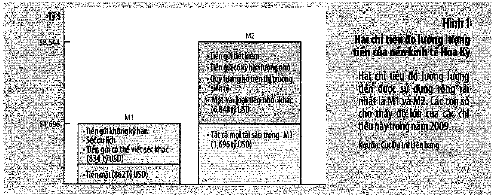

# Bài 7 — Hệ thống tiền tệ

> Bài học dựng từ **Chương 16 — Hệ thống tiền tệ** (tr. 359–386)
> của *N. Gregory Mankiw — **Kinh tế học vĩ mô***, bản dịch của Khoa Kinh tế, **ĐH Kinh tế TP.HCM** (Cengage Learning Asia).
> 🎯 **Vòng 1.** Bài 1–6 nói về **nền kinh tế thực** trong dài hạn: sản lượng, giá cả, tăng trưởng,
> tiết kiệm, thất nghiệp. Suốt sáu bài đó tiền chỉ là **cái thước** — nó có sẵn, ai đó phát hành, xong.
> Bài này lật cái thước lên xem mặt sau: **tiền ở đâu ra, ai in nó, và ai thực sự điều khiển được
> lượng của nó.** Đây là bài **mở màn** cho cả khối tiền tệ (bài 7–8) và là nền cho toàn bộ phần
> ngắn hạn (bài 11–13).
> 💼 **Góc QTKD** — ví dụ thêm cho ngành quản trị kinh doanh, **không có trong sách**.
> 📚 **Mở rộng** — thứ sách nói lướt hoặc để trong hộp phụ.
> ⚠️ — chỗ dễ hiểu sai, hoặc chỗ sách in sai.
> 📌 **Cần đọc trước:** [Bài 4](bai_04_tiet_kiem_dau_tu_he_thong_tai_chinh.md) mục 3–5 (ngân hàng là
> **trung gian tài chính**, bảng cân đối kế toán) và
> [Bài 5](bai_05_cong_cu_co_ban_cua_tai_chinh.md) mục 6 (**rủi ro đạo đức**) — bài này dùng lại cả hai
> gần như nguyên xi.

---

## Mục lục

<!-- MUC-LUC -->

- [1. Vì sao chương này quan trọng](#1-vì-sao-chương-này-quan-trọng)
- [2. Tiền là gì — ba chức năng](#2-tiền-là-gì--ba-chức-năng)
- [3. 📚 Tiền hàng hoá và tiền pháp định](#3--tiền-hàng-hoá-và-tiền-pháp-định)
- [4. Đo lượng tiền — M1 và M2](#4-đo-lượng-tiền--m1-và-m2)
- [5. Cục Dự trữ Liên bang](#5-cục-dự-trữ-liên-bang)
- [6. Ngân hàng dự trữ 100 phần trăm — không tạo ra tiền](#6-ngân-hàng-dự-trữ-100-phần-trăm--không-tạo-ra-tiền)
- [7. Dự trữ một phần — ngân hàng tạo ra tiền](#7-dự-trữ-một-phần--ngân-hàng-tạo-ra-tiền)
- [8. Số nhân tiền](#8-số-nhân-tiền)
- [9. 📚 Số nhân thật khi công chúng giữ tiền mặt](#9--số-nhân-thật-khi-công-chúng-giữ-tiền-mặt)
- [10. Vốn tự có và đòn bẩy](#10-vốn-tự-có-và-đòn-bẩy)
- [11. Bốn công cụ kiểm soát tiền tệ của Fed](#11-bốn-công-cụ-kiểm-soát-tiền-tệ-của-fed)
- [12. ⚠️ Vì sao Fed không kiểm soát nổi cung tiền](#12--vì-sao-fed-không-kiểm-soát-nổi-cung-tiền)
- [13. Đổ xô rút tiền và Đại Khủng hoảng](#13-đổ-xô-rút-tiền-và-đại-khủng-hoảng)
- [14. Lãi suất liên ngân hàng](#14-lãi-suất-liên-ngân-hàng)
- [15. 💼 Góc QTKD](#15--góc-qtkd)
- [16. 📚 Đối chiếu Việt Nam](#16--đối-chiếu-việt-nam)
- [17. Code minh hoạ](#17-code-minh-hoạ)
- [18. Tự thử](#18-tự-thử)
- [19. Từ điển thuật ngữ](#19-từ-điển-thuật-ngữ)
- [20. Câu hỏi tự kiểm tra](#20-câu-hỏi-tự-kiểm-tra)
- [Tóm tắt một trang](#tóm-tắt-một-trang)
- [Nguồn](#nguồn)

<!-- /MUC-LUC -->

---

## 1. Vì sao chương này quan trọng

Sách mở chương bằng một cảnh rất tầm thường (tr. 359):

> *"Khi bạn bước vào nhà hàng để dùng bữa, bạn sẽ nhận được thứ gì đó có giá trị – đó là no bụng. Để
> thanh toán cho bữa ăn này, bạn phải đưa cho nhà hàng một vài tờ giấy màu xanh cũ kỹ được trang trí
> bằng các ký hiệu lạ mắt, các toà nhà của chính phủ và chân dung của những người Mỹ nổi tiếng quá cố."*

Rồi hỏi câu hỏi thật: **tại sao chuyện đó lại chạy được?**

> *"Dù tiền giấy không có giá trị thực chất, nhà hàng vẫn tin chắc rằng sẽ có một người thứ ba nào đó
> chấp nhận nó để đổi lấy một thứ gì đó có giá trị cho nhà hàng trong tương lai. Và người thứ ba này
> cũng tin chắc rằng sẽ có người thứ tư nào đó chấp nhận tờ tiền này, với nhận thức rằng sẽ có người
> thứ năm chấp nhận tờ tiền… và cứ thế tiếp diễn."* (tr. 359)

### Trước khi có tiền: sự trùng hợp kép về nhu cầu

Sách dựng phản đề trước (tr. 359). Không có tiền thì phải **hàng đổi hàng (barter)**, và barter đòi hỏi
**sự trùng hợp kép về nhu cầu** — *"gần như không xảy ra trường hợp hai người mà mỗi người có hàng hoá
hoặc dịch vụ chính xác mà người kia cần"*.

Bạn muốn ăn tối. Chủ nhà hàng phải **đúng lúc đó** cần thứ bạn có. Sách nêu ví dụ rất thẳng: bạn có thể
đề nghị *"rửa chén bát, rửa xe hơi cho họ hoặc đưa cho họ công thức làm bánh mì thịt bí mật của gia đình
bạn"*.

📌 Ghi nhớ mối nối này: barter làm **chi phí giao dịch** cao đến mức giết chết chuyên môn hoá. Mà chuyên
môn hoá chính là nguồn gốc của năng suất ở [bài 3](bai_03_san_xuat_va_tang_truong.md). Tiền không phải
một thứ trang trí trên nền kinh tế thực — nó là **điều kiện để nền kinh tế thực đạt được năng suất đó**.
Sách viết (tr. 360): tiền *"giúp phát triển hoạt động sản xuất và thương mại, bằng cách cho phép con
người chuyên môn hoá cái mà họ làm tốt nhất và nâng cao mức sống cho mọi người."*

### Bài này đứng ở đâu trong khoá

| Khối | Bài | Câu hỏi trung tâm |
| ---- | --- | ----------------- |
| Nền kinh tế **thực** dài hạn | 1–6 | sản xuất bao nhiêu, ai có việc, mức sống từ đâu ra |
| **Tiền** trong dài hạn | **7–8** | tiền là gì, ai tạo ra nó, in nhiều thì sao |
| Kinh tế **mở** | 9–10 | tỷ giá, cán cân thương mại |
| **Ngắn hạn** | 11–14 | suy thoái, chính sách, đánh đổi |

Sách nói rõ vị trí của chương (tr. 360):

> *"Chương này sẽ đặt nền móng để thực hiện tất cả các phân tích đó."*

Nói cách khác: **bài 7 không có kết luận chính sách nào cả.** Nó chỉ định nghĩa và mô tả cơ chế. Toàn
bộ hệ quả nằm ở bài 8 (lạm phát), bài 12 (chính sách tiền tệ), bài 13 (đánh đổi ngắn hạn). Nếu bài này
đọc thấy "khô", đó là đúng chức năng của nó.

---

## 2. Tiền là gì — ba chức năng

Sách bắt đầu bằng cách gạt bỏ nghĩa thông thường của từ "tiền" (tr. 360):

> *"Khi bạn đọc tin thấy rằng tỷ phú Bill Gates có rất nhiều tiền, bạn biết điều đó có nghĩa là gì: Ông
> ấy quá giàu đến nỗi ông có thể gần như mua bất cứ thứ gì ông muốn. Theo nghĩa này, thuật ngữ **tiền**
> được dùng với hàm ý sự giàu có hay của cải."*

Rồi thay bằng định nghĩa hẹp (tr. 360):

> **Tiền** *là "một loại tài sản trong nền kinh tế mà con người thường dùng để mua hàng hoá và dịch vụ
> từ người khác."*

Và giải thích ngay tại sao Bill Gates không "có nhiều tiền" theo nghĩa này (tr. 360):

> *"nếu bạn tình cờ sở hữu phần lớn cổ phần của Công ty Microsoft như Bill Gates, bạn sẽ rất giàu có,
> nhưng số tài sản này không được xem là tiền. Bạn sẽ không thể ăn uống hoặc mua quần áo bằng tài sản
> này nếu trước hết không chuyển nó thành tiền."*

### Ba chức năng (tr. 360–361)

| Chức năng | Định nghĩa của sách | Ví dụ của sách |
| --------- | ------------------- | -------------- |
| **Trung gian trao đổi** | *"thứ người mua đưa cho người bán khi họ mua hàng hoá và dịch vụ"* | mua áo: bạn đưa tiền, cửa hàng đưa áo |
| **Đơn vị tính toán** | *"một thước đo con người sử dụng để niêm yết giá và ghi nhận nợ"* | áo sơ mi 30 USD, hamburger 3 USD |
| **Phương tiện lưu giữ giá trị** | *"thứ mà con người có thể dùng để chuyển sức mua từ hiện tại sang tương lai"* | giữ tiền hôm nay, mua hàng tháng sau |

⚠️ **Ranh giới quan trọng nhất của mục này nằm ở chức năng thứ ba** — và nó là chỗ dễ nhầm nhất.

Sách nói thẳng (tr. 361): *"Tiền không phải là vật lưu giữ giá trị duy nhất trong nền kinh tế: Một người
có thể chuyển sức mua từ hiện tại sang tương lai bằng cách nắm giữ các tài sản không phải là tiền như cổ
phiếu và trái phiếu."*

Nghĩa là **chức năng thứ ba không phân biệt được tiền với tài sản khác.** Cái phân biệt là chức năng
**thứ nhất**. Cổ phiếu, tranh Picasso, đồng peso Mexico — tất cả đều lưu giữ giá trị, không cái nào mua
được bữa ăn ngay tại quán ở Hà Nội.

📌 Sách đặt tên cho khoảng cách đó (tr. 361):

> **Tính thanh khoản** *là "sự dễ dàng chuyển đổi thành trung gian trao đổi của nền kinh tế mà một tài
> sản có thể thực hiện được."*

> *"Tiền là tài sản có tính thanh khoản cao nhất, nhưng nó lại không phải là một phương tiện dự trữ giá
> trị hoàn hảo. Khi giá cả tăng lên, giá trị của tiền giảm đi."*

Đó chính là **đánh đổi** trung tâm của việc nắm giữ tiền, và cũng chính là chỗ nối sang bài 8. Giữ tiền
= tối đa thanh khoản, nhưng chịu lỗ đúng bằng tỷ lệ lạm phát. Nối ngược lại
[bài 2 mục 12](bai_02_do_luong_chi_phi_sinh_hoat.md#12-lãi-suất-danh-nghĩa-và-lãi-suất-thực): tiền mặt
là tài sản có **lãi suất danh nghĩa bằng 0**, nên **lãi suất thực của nó luôn bằng âm tỷ lệ lạm phát**.

### ⚠️ Thẻ tín dụng không phải là tiền

Đây là hộp *Bạn có biết* của sách (tr. 363), và nó xứng đáng nằm ở phần chính.

> *"thẻ tín dụng thực ra không phải là phương tiện thanh toán, mà là phương tiện thanh toán trả chậm.
> Khi mua một bữa ăn bằng thẻ tín dụng, ngân hàng phát hành thẻ sẽ trả tiền cho nhà hàng khi đến hạn
> thanh toán."*

Cái mua bữa ăn là **khoản tín dụng của ngân hàng**, không phải cái thẻ. Cái trả nợ thẻ vào cuối tháng
mới là tiền.

Và sách phân biệt tiếp với **thẻ ghi nợ** (debit card): thẻ ghi nợ *"cho phép anh ta sử dụng trực tiếp
các khoản tiền gửi trong một tài khoản ở ngân hàng"* — nên nó **giống một tấm séc hơn là thẻ tín dụng**.
Số dư đứng sau nó **là** một bộ phận của cung tiền.

📌 Sách còn thêm một quan sát tinh (tr. 363): người có thẻ tín dụng nắm giữ **ít tiền mặt hơn**, nên
*"việc áp dụng và tính phổ biến ngày càng tăng của thẻ tín dụng có thể làm giảm lượng tiền mà mọi người
quyết định nắm giữ."* Ghi nhớ câu này — đến [mục 9](#9--số-nhân-thật-khi-công-chúng-giữ-tiền-mặt) nó
biến thành một tham số làm số nhân tiền nhảy.

---

## 3. 📚 Tiền hàng hoá và tiền pháp định

Sách chia hai loại (tr. 362):

| Loại | Định nghĩa của sách | Ví dụ của sách |
| ---- | ------------------- | -------------- |
| **Tiền hàng hoá** | *"tiền dưới dạng một hàng hoá có giá trị thực chất"* | vàng, thuốc lá |
| **Tiền pháp định** | *"tiền không có giá trị thực chất, được sử dụng như tiền là do quy định của chính phủ"* | tờ đô la, tờ VND |

*"Giá trị thực chất"* nghĩa là **có giá trị ngay cả khi không được dùng làm tiền**. Vàng có giá trị đó
vì *"nó được sử dụng trong công nghiệp và chế tác nữ trang"* (tr. 362). Nền kinh tế dùng vàng làm tiền —
hoặc dùng tiền giấy có thể đổi ra vàng khi cần — được gọi là **bản vị vàng**.

Hai ví dụ tiền hàng hoá của sách rất đáng nhớ, vì cả hai đều **không phải vàng** (tr. 362):

- **Thuốc lá trong trại tù binh Thế Chiến II** — tù nhân dùng thuốc lá làm cả ba chức năng.
- **Thuốc lá ở Moscow khi Liên Xô sụp đổ cuối thập niên 1980** — *"thuốc lá bắt đầu trở thành tiền tệ
  được ưa thích ở Moscow thay thế cho đồng rúp."*

⚠️ Chi tiết quan trọng nhất của cả mục này nằm ở đoạn tiếp theo, và rất dễ đọc lướt qua (tr. 362):

> *"Trong cả hai trường hợp trên, ngay cả những người không hút thuốc lá cũng vui vẻ nhận thuốc lá khi
> trao đổi vì biết rằng họ có thể sử dụng thuốc lá này để mua các hàng hoá và dịch vụ khác."*

Tức là: **chuyện "có giá trị thực chất" hoá ra không phải là lý do người ta nhận nó.** Người không hút
thuốc nhận thuốc lá vì tin **người khác sẽ nhận**. Đó chính xác là cùng một cơ chế với tờ tiền giấy vô
giá trị ở mục 1.

Và sách chốt luôn (tr. 362–363):

> *"Mặc dù chính phủ là cơ quan đóng vai trò trung tâm trong việc thiết lập và điều hành hệ thống tiền
> pháp định (ví dụ truy tố những kẻ làm tiền giả), nhưng để hệ thống tiền tệ hoạt động thành công, cũng
> cần có những nhân tố khác nữa. Nói rộng hơn, sự chấp nhận tiền pháp định cũng còn phụ thuộc vào những
> kỳ vọng và tập quán xã hội cũng như phụ thuộc vào pháp lệnh của chính phủ."*

Bằng chứng: *"Trong những năm 1980, chính phủ Liên Xô chưa bao giờ huỷ bỏ đồng rúp với tư cách là đồng
tiền chính thức. Nhưng người dân Moscow lại thích nhận thuốc lá (hoặc đô la Mỹ)"* (tr. 363).

📌 **Sắc lệnh của chính phủ là điều kiện cần, không phải điều kiện đủ.** Một đồng tiền pháp định sống
bằng niềm tin, và niềm tin có thể chết trong khi luật vẫn còn hiệu lực. Giữ ý này lại — bài 8 sẽ dùng
nó để giải thích siêu lạm phát.

---

## 4. Đo lượng tiền — M1 và M2

Câu hỏi của sách rất cụ thể (tr. 363): *"hãy tưởng tượng bạn được giao nhiệm vụ tính toán xem có bao
nhiêu tiền trong nền kinh tế Hoa Kỳ. Bạn sẽ đưa những tài sản nào vào tính toán của mình?"*

Bắt đầu từ cái rõ nhất: **tiền mặt** — *"tiền giấy hoặc tiền xu trong tay công chúng"* (tr. 363). Nhưng
chưa đủ, vì nhiều cửa hàng nhận séc, nên phải tính cả **tiền gửi không kỳ hạn** — *"số dư trong các tài
khoản ngân hàng mà người gửi có thể sử dụng theo nhu cầu, đơn giản bằng cách viết séc hoặc quẹt thẻ ghi
nợ tại cửa hàng"* (tr. 364).

Rồi đến chỗ mờ. Sách thừa nhận thẳng (tr. 364):

> *"Trong nền kinh tế phức hợp như của chúng ta hiện nay, khó có thể phân định rõ ràng tài sản nào được
> gọi là tiền và tài sản nào thì không. Tiền xu trong túi bạn rõ ràng là một phần của trữ lượng tiền và
> toà nhà Empire State Building rõ ràng không phải là tiền, nhưng có rất nhiều tài sản nằm giữa hai thái
> cực này mà chúng ta khó phân biệt một cách tách bạch."*

Kết quả: **có nhiều hơn một thước đo**, và không cái nào "đúng" hơn cái nào.

### Hình 1, tr. 364 (số liệu 2009)



| Thước đo | Gồm | Giá trị |
| -------- | --- | ------: |
| **M1** | tiền mặt (862 tỷ) + tiền gửi không kỳ hạn + séc du lịch + séc khác (834 tỷ) | **1.696 tỷ USD** |
| **M2** | M1 + tiền gửi tiết kiệm + tiền gửi có kỳ hạn lượng nhỏ + quỹ tương hỗ trên thị trường tiền tệ + một vài loại tiền nhỏ khác (6.848 tỷ) | **8.544 tỷ USD** |

✅ Hai phép cộng đã kiểm bằng `assert` trong [code](#17-code-minh-hoạ): 862 + 834 = 1.696 và
1.696 + 6.848 = 8.544. Khớp chính xác.

Vài tỷ lệ đáng để trong đầu:

- **M2 gấp 5,04 lần M1.**
- **Tiền mặt chỉ chiếm 10,1% của M2.** Chín phần mười cái ta gọi là "tiền" chưa bao giờ tồn tại dưới
  dạng giấy — nó là **bút toán trên sổ ngân hàng**. Mục 7 sẽ cho biết ai tạo ra chỗ đó.

Sách dặn đừng sa đà (tr. 364):

> *"Trong cuốn sách này, chúng ta không cần quá chú trọng đến sự khác biệt giữa các số đo về tiền. Sẽ
> không có thảo luận nào xoay quanh vấn đề sự khác biệt giữa M1 và M2."*

### Nghiên cứu tình huống: tất cả tiền mặt nằm ở đâu? (tr. 365)

Một phép chia đơn giản mà kết quả gây sốc:

$$\frac{862\ \text{tỷ USD}}{236\ \text{triệu người trưởng thành}} = 3.653\ \text{USD/người}$$

✅ Đã kiểm bằng `assert` — khớp đúng con số sách in.

Sách hỏi: *"Hầu hết mọi người đều bất ngờ khi biết rằng nền kinh tế của chúng ta có nhiều tiền mặt đến
như vậy, bởi vì số tiền họ để trong ví ít hơn rất nhiều."* Vậy ai giữ?

Sách đưa **hai** cách lý giải và **không chọn cái nào** (tr. 365):

1. *"phần lớn tiền mặt được nắm giữ ở nước ngoài. Ở các nước không có hệ thống tiền tệ ổn định, người
   dân thường thích nắm giữ đô la Mỹ hơn tài sản trong nước."*
2. *"một lượng lớn tiền mặt được những kẻ buôn ma tuý, trốn thuế và tội phạm khác nắm giữ… tài khoản tiền
   gửi ngân hàng cho phép cảnh sát dựa vào sổ sách để lần theo dấu vết của các hoạt động bất hợp pháp."*

📌 Cách lý giải thứ nhất là mục 3 đọc theo chiều ngược: khi tiền pháp định trong nước mất niềm tin, người
dân **nhập khẩu niềm tin** bằng cách giữ đô la. Hiện tượng này có tên riêng — *đô la hoá* — và sẽ quay
lại ở bài 8 và bài 9.

---

## 5. Cục Dự trữ Liên bang

Sách lập luận rất gọn (tr. 365): *"Bất cứ khi nào một nền kinh tế dựa vào hệ thống tiền pháp định như
nền kinh tế Hoa Kỳ, thì phải có một cơ quan nào đó chịu trách nhiệm điều hành hệ thống này."*

> **Ngân hàng trung ương**: *"một định chế được thành lập để giám sát hoạt động của hệ thống ngân hàng
> và điều tiết lượng tiền trong nền kinh tế"* (tr. 365).

Ở Hoa Kỳ đó là **Cục Dự trữ Liên bang (Fed)**. Sách liệt kê các ngân hàng trung ương lớn khác: **BOE**
(Anh), **BOJ** (Nhật), **ECB** (châu Âu) — tr. 366.

### Cấu trúc (tr. 366)

| Bộ phận | Chi tiết |
| ------- | -------- |
| Thành lập | **1913**, sau khi *"hàng loạt vụ đổ bể ngân hàng vào năm 1907"* |
| Hội đồng Thống đốc | **7 thành viên**, nhiệm kỳ **14 năm**, tổng thống bổ nhiệm + Thượng viện phê chuẩn |
| Chủ tịch | nhiệm kỳ **4 năm**; khi sách in là **Ben Bernanke** (Bush bổ nhiệm 2005, Obama tái bổ nhiệm 2009) |
| Cơ cấu vùng | Hội đồng ở Washington D.C + **12 Ngân hàng Dự trữ Liên bang khu vực** |
| FOMC | 7 thống đốc + **5** trong 12 chủ tịch khu vực; họp **sáu tuần một lần** |

⚠️ **Vì sao nhiệm kỳ 14 năm?** Sách trả lời thẳng và câu này quan trọng hơn vẻ ngoài của nó (tr. 366):

> *"Cũng giống như các thẩm phán liên bang được hưởng nhiệm kỳ suốt đời để tách họ ra khỏi chính trị,
> các thống đốc của Fed có nhiệm kỳ dài để tránh cho họ chịu các áp lực chính trị trong ngắn hạn khi họ
> hoạch định chính sách tiền tệ."*

Đây là lời phát biểu đầu tiên trong khoá về **tính độc lập của ngân hàng trung ương**. Nó sẽ trở thành
một trong sáu tranh luận của bài 14, và là nền cho toàn bộ bài 13.

📌 Một chi tiết cấu trúc đáng để ý: **chủ tịch Fed New York luôn có một phiếu** trong FOMC, không phải
luân phiên như 11 vị kia — *"bởi vì New York là trung tâm tài chính truyền thống của nền kinh tế Hoa Kỳ
và cũng bởi vì tất cả các giao dịch mua bán trái phiếu chính phủ của Fed đều được thực hiện tại quầy
giao dịch của Fed New York"* (tr. 367).

### Hai nhiệm vụ (tr. 366)

1. **Điều hành các ngân hàng và đảm bảo sự lành mạnh cho hệ thống ngân hàng** — giám sát, thanh toán bù
   trừ séc, và cho ngân hàng vay. Ở vai trò này Fed là *"người cho vay cuối cùng – tức là người cho vay
   đến những người không thể vay ở nơi khác"*.
2. **Kiểm soát lượng tiền trong nền kinh tế** — tức **cung tiền**. Các quyết định về cung tiền tạo thành
   **chính sách tiền tệ**.

Sách gọi nhiệm vụ thứ hai là *"nhiệm vụ quan trọng hơn"*, và mô tả nó bằng một hình ảnh cố tình ngây thơ
(tr. 367):

> *"bạn có thể tưởng tượng rằng Fed in ra những tờ đô la, sau đó dùng máy bay trực thăng thả chúng xuống
> khắp Hoa Kỳ. Tương tự như vậy, bạn cũng có thể hình dung ra việc Fed sử dụng một chiếc máy hút bụi
> khổng lồ để hút bớt các tờ đô la trong ví của mọi người."*

⚠️ Sách nói ngay đó là hình ảnh sai lệch: *"trên thực tế các phương pháp mà Fed sử dụng để làm thay đổi
cung tiền phức tạp và tinh tế hơn thế nhiều"*. Mục 7–11 chính là chỗ sách trả lại độ phức tạp đó. Nhưng
hãy giữ hình ảnh trực thăng lại — bài 8 sẽ dùng nó để giải thích tại sao "in tiền" dẫn tới lạm phát.

**Công cụ cơ bản** được nêu ngay ở đây (tr. 367): **nghiệp vụ thị trường mở** — mua và bán **trái phiếu
chính phủ Hoa Kỳ** (sách nhắc: *"trái phiếu chính phủ Hoa Kỳ là món chứng chỉ nợ của chính phủ liên
bang"*, nối thẳng về [bài 4 mục 4](bai_04_tiet_kiem_dau_tu_he_thong_tai_chinh.md#2-thị-trường-trái-phiếu)).

| Fed làm gì | Tiền đi đâu | Cung tiền |
| ---------- | ----------- | --------- |
| **MUA** trái phiếu từ công chúng | Fed đưa tiền ra, nhận giấy nợ về | **TĂNG** |
| **BÁN** trái phiếu cho công chúng | Fed thu tiền về, đưa giấy nợ ra | **GIẢM** |

📌 Mẹo nhớ, và nó đúng mãi mãi: **theo dõi tờ tiền, đừng theo dõi tờ trái phiếu.** Fed mua = tiền chảy
ra khỏi Fed vào tay công chúng = cung tiền tăng.

---

## 6. Ngân hàng dự trữ 100 phần trăm — không tạo ra tiền

Sách thừa nhận rằng phần trên **chưa đủ** (tr. 368):

> *"Mặc dù sự lý giải cung tiền này là đúng, nhưng chưa đầy đủ. Cụ thể, nó chưa đề cập đến vai trò trọng
> tâm của các ngân hàng thương mại trong hệ thống tiền tệ."*

Lý do rất đơn giản: **tiền gửi không kỳ hạn nằm ở ngân hàng thương mại.** Nếu tiền gửi được tính vào cung
tiền, thì hành vi của ngân hàng thương mại **là** một phần của cung tiền.

Để tách bạch, sách dựng một thế giới tưởng tượng và bước qua nó ba lần. Bước một: **không có ngân hàng
nào cả.**

- Tổng tiền mặt = **100 USD** → cung tiền = **100 USD**.

Bước hai: có một ngân hàng, nhưng nó **chỉ nhận gửi, không cho vay**. Toàn bộ tiền gửi nằm trong két.

> **Dự trữ**: *"khoản tiền gửi mà ngân hàng nhận được nhưng không cho vay ra ngoài"* (tr. 368).

Vì tất cả tiền gửi đều là dự trữ, đây là **ngân hàng dự trữ 100%**. Bảng cân đối (sách gọi là **tài khoản
chữ T**) — tr. 369:

```
Ngân Hàng Quốc Gia Thứ Nhất
Tài sản                 |  Nợ
------------------------+------------------------
Dự trữ         100,00$  |  Tiền gửi     100,00$
```

Cung tiền bây giờ:

| | Tiền mặt | Tiền gửi | Cung tiền |
| --- | ---: | ---: | ---: |
| Trước | 100 | 0 | **100** |
| Sau | 0 | 100 | **100** |

> *"Mỗi USD tiền gửi vào ngân hàng sẽ làm giảm một USD tiền mặt và làm tăng tiền gửi không kỳ hạn một
> lượng đúng như thế, cho nên cung tiền không thay đổi. Vì vậy, **nếu các ngân hàng giữ toàn bộ khoản
> tiền gửi dưới dạng dự trữ, thì họ sẽ không tác động tới cung tiền**."* (tr. 369)

📌 Mục này trông thừa nhưng nó là **nhóm đối chứng**. Không có nó, mục 7 chỉ là một phép tính; có nó,
mục 7 trở thành một **so sánh có kiểm soát**: đúng một thứ thay đổi — ngân hàng cho vay hay không — và
ta thấy đúng cái thứ đó gây ra hiệu ứng.

---

## 7. Dự trữ một phần — ngân hàng tạo ra tiền

Sách để chính các chủ ngân hàng nghĩ ra bước tiếp theo (tr. 369):

> *"Việc để cho toàn bộ tiền nằm nhàn rỗi trong két sắt là không cần thiết. Tại sao lại không sử dụng
> một phần số đó để cho vay và kiếm lời bằng cách tính lãi trên khoản vay?"*

Vì sao làm được? Vì *"nếu các khoản tiền gửi mới gần bằng số tiền rút ra, thì Ngân Hàng Quốc Gia Thứ Nhất
chỉ cần giữ một phần tiền gửi dưới dạng dự trữ."* Đó là **ngân hàng dự trữ một phần**.

> **Tỷ lệ dự trữ** = tỷ phần của tiền gửi mà ngân hàng giữ dưới dạng dự trữ.

Nó do hai thứ quyết định (tr. 369): **dự trữ bắt buộc** do Fed đặt ra (mức tối thiểu), cộng với **dự trữ
dư** mà ngân hàng tự nguyện giữ thêm *"để đảm bảo chắc chắn rằng họ không bị thiếu hụt tiền mặt"*.

### Vòng thứ nhất, $R = 10\%$ (tr. 370)

```
Ngân Hàng Quốc Gia Thứ Nhất
Tài sản                 |  Nợ
------------------------+------------------------
Dự trữ          10,00$  |  Tiền gửi     100,00$
Cho vay         90,00$  |
```

Nợ vẫn 100 USD — cho vay không xoá nghĩa vụ với người gửi. Nhưng tài sản giờ có **hai** loại. Và cung
tiền:

| | Tiền mặt | Tiền gửi | Cung tiền |
| --- | ---: | ---: | ---: |
| Trước khi cho vay | 0 | 100 | **100** |
| Sau khi cho vay | 90 *(trong tay người vay)* | 100 *(vẫn của người gửi)* | **190** |

> *"khi các ngân hàng thương mại chỉ giữ một phần tiền gửi dưới dạng dự trữ, họ đã tạo ra tiền."* (tr. 370)

### Vòng thứ hai và ba (tr. 371)

Người vay tiêu 90 USD, người nhận gửi vào **Ngân Hàng Quốc Gia Thứ Hai**:

```
Ngân Hàng Quốc Gia Thứ Hai        Ngân Hàng Quốc Gia Thứ Ba
Tài sản          |  Nợ            Tài sản          |  Nợ
-----------------+----------      -----------------+----------
Dự trữ    9,00$  |  Tiền gửi      Dự trữ    8,10$  |  Tiền gửi
Cho vay  81,00$  |    90,00$      Cho vay  72,90$  |    81,00$
```

✅ Cả ba bảng đã được [code](#17-code-minh-hoạ) dựng lại từ đầu bằng `Fraction` (số hữu tỷ, không phải số
thực) và `assert` đối chiếu với ba bảng in ở tr. 370–371: dự trữ `[10; 9; 8,1]`, cho vay `[90; 81; 72,9]`.
**Khớp từng dòng.**

### Cộng cả chuỗi (tr. 371)

| | |
| --- | ---: |
| Tiền gửi ban đầu | 100,00 $ |
| Cho vay của Ngân Hàng Quốc Gia Thứ Nhất | 90,00 $ = 0,9 × 100 |
| Cho vay của Ngân Hàng Quốc Gia Thứ Hai | 81,00 $ = 0,9 × 90 |
| Cho vay của Ngân Hàng Quốc Gia Thứ Ba | 72,90 $ = 0,9 × 81 |
| … | … |
| **Tổng cung tiền** | **1.000,00 $** |

Sách nhắc rằng nó không phải vô hạn (tr. 371): *"mặc dù quá trình tạo tiền có thể tiếp diễn mãi mãi,
nhưng nó không tạo ra lượng tiền vô hạn."* Chuỗi $100 \times (1 + 0{,}9 + 0{,}9^2 + \dots)$ hội tụ về
$100/0{,}1 = 1.000$.

### ⚠️⚠️ Chỗ hiểu sai nguy hiểm nhất của cả bài

Sách chặn nó ngay tại chỗ (tr. 370):

> *"Trước hết, quá trình tạo tiền này của hệ thống ngân hàng dự trữ một phần có vẻ quá tuyệt vời: Có vẻ
> như ngân hàng tạo ra tiền từ không khí. Để làm cho quá trình tạo tiền này bớt vẻ thần diệu đi, chúng
> ta hãy nhớ rằng khi Ngân Hàng Quốc Gia Thứ Nhất cho vay một phần dự trữ và tạo ra tiền, **nó không tạo
> ra thêm bất kỳ của cải nào**."*

Vì sao? Vì **mỗi tài sản mới đi kèm đúng một nghĩa vụ mới**:

> *"khi một ngân hàng tạo ra tài sản là tiền, nó cũng tạo ra nghĩa vụ trả nợ tương ứng cho người đi vay
> khoản tiền được tạo ra này. Vào cuối của quá trình tạo tiền này, nền kinh tế có khả năng thanh khoản
> cao hơn, hiểu theo nghĩa có nhiều phương tiện trao đổi hơn, nhưng **nền kinh tế không có nhiều của cải
> hơn trước kia**."* (tr. 370)

📌 Nối về [bài 4](bai_04_tiet_kiem_dau_tu_he_thong_tai_chinh.md): ở đó ta học rằng $S = I$ và rằng **mua
cổ phiếu không phải đầu tư, chỉ là đổi chủ tài sản đã có**. Đây là cùng một loại kỷ luật kế toán, áp lên
tiền. Ngân hàng tạo **thanh khoản**, không tạo **vốn**. Cái tạo ra vốn vẫn là tiết kiệm thực.

---

## 8. Số nhân tiền

> **Số nhân tiền**: *"số tiền mà hệ thống ngân hàng tạo ra được từ mỗi đô la dự trữ"* (tr. 372).

Sách cho công thức và cả **cách nhớ tại sao nó lại là nghịch đảo** (tr. 372):

$$\text{số nhân tiền} = \frac{1}{R}$$

> *"Công thức nghịch đảo để tính số nhân tiền này là có ý nghĩa. Nếu một ngân hàng có 1.000 USD tiền
> gửi, tỷ lệ dự trữ 1/10 (10%) hàm ý nó phải dự trữ 100 USD. Số nhân tiền chỉ đảo ngược ý tưởng này: nếu
> toàn bộ hệ thống ngân hàng nắm giữ tổng cộng 100 USD dự trữ, thì tổng lượng tiền gửi của hệ thống chỉ
> là 1.000 USD."*

| $R$ | Số nhân $1/R$ | Mỗi 1 USD dự trữ tạo ra |
| ---: | ---: | ---: |
| 100% | 1 | 1 USD |
| 25% | 4 | 4 USD |
| 10% | 10 | 10 USD |
| 5% | 20 | 20 USD |

> *"tỷ lệ dự trữ càng cao, lượng tiền mà các ngân hàng cho vay từ tiền gửi càng ít và số nhân tiền càng
> nhỏ."* (tr. 372)

Chú ý dòng đầu bảng: $R = 100\%$ cho số nhân **bằng 1** — đó chính là mục 6. Mô hình dự trữ 100% không
phải một mô hình khác; nó là **trường hợp riêng** của mô hình này ở biên.

---

## 9. 📚 Số nhân thật khi công chúng giữ tiền mặt

Công thức $1/R$ có một giả định ngầm mà chương 16 **không viết ra**: mọi đồng cho vay đều được **gửi lại
hết** vào ngân hàng. Không ai giữ đồng nào trong ví.

Sách nhận ra vấn đề này — nhưng phát biểu nó bằng lời, ở tận tr. 378, dưới dạng "vấn đề của Fed":

> *"Vấn đề thứ nhất là, Fed không kiểm soát được lượng tiền mà các hộ gia đình quyết định nắm giữ dưới
> dạng tiền gửi tại các ngân hàng."*

Mục này viết cái đó ra thành công thức. Gọi $c$ = tỷ lệ tiền mặt trên tiền gửi mà công chúng muốn giữ,
$r$ = tỷ lệ dự trữ, $B$ = cơ sở tiền (tiền mặt + dự trữ):

$$M = C + D, \qquad B = C + R, \qquad C = c \cdot D, \qquad R = r \cdot D$$

$$\Rightarrow \quad m = \frac{M}{B} = \frac{(1+c)\,D}{(c+r)\,D} = \boxed{\frac{1+c}{c+r}}$$

Kiểm tra biên: $c = 0$ cho $m = 1/r$ — đúng bằng công thức của sách. Công thức của sách là **trường hợp
riêng khi không ai giữ tiền mặt**.

Và đây là chỗ nó cắn:

| $c$ | Số nhân $m$ (với $r = 10\%$) |
| ---: | ---: |
| 0,00 | 10,00 |
| 0,05 | 7,00 |
| 0,15 | 4,60 |
| 0,30 | 3,25 |
| 0,50 | 2,50 |
| 1,00 | 1,82 |

⚠️ **Chỉ cần $c = 0{,}15$ — tức công chúng giữ 15 xu tiền mặt trên mỗi đồng tiền gửi — số nhân đã tụt từ
10 xuống 4,60. Mất 54% sức tạo tiền, mà Fed không làm gì cả.**

Con số đó không phải một tình huống giả tưởng xa vời. Nó là chìa khoá của
[mục 13](#13-đổ-xô-rút-tiền-và-đại-khủng-hoảng).

📌 Và nhớ lại quan sát của sách ở tr. 363 (thẻ tín dụng làm người ta giữ ít tiền mặt hơn): thẻ tín dụng
làm $c$ giảm → số nhân **tăng**. Một thay đổi công nghệ thanh toán, không phải quyết định chính sách nào
cả, cũng đủ làm dịch cung tiền. Đó là lý do Fed phải theo dõi số liệu tiền gửi **hàng tuần** (tr. 378).

### Bài tập 11 tr. 385–386 — và chỗ nó mơ hồ

Elmendyn có 2.000 tờ 1 USD. Cung tiền là bao nhiêu nếu:

| | Tình huống | Cung tiền |
| --- | ---------- | --------: |
| a | tất cả là tiền mặt | 2.000 $ |
| b | tất cả là tiền gửi, $R = 100\%$ | 2.000 $ |
| c | nửa tiền mặt nửa tiền gửi, $R = 100\%$ | 2.000 $ |
| d | tất cả là tiền gửi, $R = 10\%$ | 20.000 $ |
| e | **nửa tiền mặt nửa tiền gửi, $R = 10\%$** | **?** |

⚠️ Câu (e) mơ hồ, và hai cách đọc cho hai đáp số khác hẳn nhau:

| Cách đọc | Lập luận | Đáp số |
| -------- | -------- | -----: |
| **A** — "một nửa" chỉ áp cho vòng đầu | 1.000 $ tiền mặt + 1.000 $ gửi vào, nhân 10 → 10.000 $ tiền gửi | **11.000 $** |
| **B** — công chúng **luôn** giữ tiền mặt bằng tiền gửi, tức $c = 1$ | $2.000 \times \dfrac{1+1}{1+0{,}1}$ | **3.636,36 $** |

Chênh nhau **3 lần**. Cách A là đáp án mà bộ bài tập của chương này nhắm tới, vì chương chỉ dạy số nhân
$1/R$. Nhưng **cách B mới là cách tự nhất quán**: ở cách A, kết cục công chúng giữ 1.000 $ tiền mặt trên
tổng 11.000 $ — tức **9%**, không còn là "một nửa" nữa.

📌 Bài tập này đáng làm không phải vì đáp số, mà vì nó buộc bạn phát hiện ra giả định ngầm. Nếu bạn ra
được 11.000 mà không thấy có gì gợn, thì bạn chưa hiểu số nhân — bạn mới thuộc nó.

### Bài tập 3 tr. 384 — cái bẫy dấu trừ

*"Bạn lấy 100 USD mà bạn đã giấu dưới đệm ra và gửi vào tài khoản của bạn ở ngân hàng… nếu ngân hàng nắm
giữ dự trữ bằng 10% tiền gửi, tổng số tiền gửi trong hệ thống ngân hàng phải tăng lên thêm bao nhiêu?
Cung tiền sẽ tăng thêm lên bao nhiêu?"*

Hai câu hỏi, **hai đáp số khác nhau** — đó chính là chỗ ra đề:

- tổng tiền gửi tăng: $100 / 0{,}1 = $ **1.000 $**
- cung tiền tăng: **900 $**

Vì 100 USD dưới đệm **đã nằm trong cung tiền từ trước** (nó là tiền mặt trong tay công chúng). Gửi nó đi
làm tiền mặt giảm 100, tiền gửi tăng 1.000 → ròng +900.

---

## 10. Vốn tự có và đòn bẩy

Đây là phần sách thêm vào sau khủng hoảng 2008–2009, và nó là phần **hữu ích nhất cho người học QTKD**
trong cả chương.

Sách thú nhận rằng mô hình ở mục 7 đã đơn giản hoá quá tay (tr. 372):

> *"Trong thực tế, ngân hàng nhận các nguồn lực tài chính không chỉ là tiền gửi mà còn phát hành cổ phiếu
> và trái phiếu giống như các doanh nghiệp khác."*

> **Vốn tự có của ngân hàng**: *"các nguồn lực mà những người chủ sở hữu của một ngân hàng cùng góp vào
> định chế này"* (tr. 372).

### Bảng cân đối thật hơn (tr. 373)

```
Ngân Hàng Quốc Gia Thực Tế Hơn
Tài sản                     |  Nợ và vốn chủ sở hữu
----------------------------+---------------------------
Dự trữ            200$      |  Tiền gửi          800$
Cho vay           700$      |  Nợ                150$
Chứng khoán       100$      |  Vốn tự có          50$
----------------------------+---------------------------
Tổng            1.000$      |  Tổng            1.000$
```

Sách giải thích tại sao hai vế **luôn** bằng nhau, và câu này đáng nhớ (tr. 373):

> *"Chẳng có phép thuật nào trong sự cân bằng này. Nó cân bằng bởi vì giá trị của vốn chủ sở hữu, theo
> định nghĩa, bằng giá trị của tổng tài sản của ngân hàng trừ đi giá trị của tổng nợ."*

Tức **vốn tự có là số dư, không phải một con số độc lập**. Nó là cái còn lại. Giữ chặt ý đó — nó giải
thích toàn bộ phần còn lại của mục này.

### Đòn bẩy

> **Đòn bẩy**: *"sử dụng tiền vay để bổ sung cho các dòng tiền hiện hữu nhằm mục đích đầu tư"* (tr. 373).
> **Tỷ số đòn bẩy**: *"tỷ số tổng tài sản trên vốn tự có của ngân hàng"* (tr. 373).

$$\text{tỷ số đòn bẩy} = \frac{1.000}{50} = 20$$

> *"Tỷ số đòn bẩy bằng 20 có nghĩa là với mỗi đồng đô la chủ sở hữu ngân hàng góp vào, ngân hàng có 20
> USD tài sản. Trong số 20 USD tài sản đó, 19 USD được tài trợ từ tiền đi vay."* (tr. 373)

Bây giờ là chỗ có ý nghĩa. Tài sản dao động, **nợ thì không**. Nên toàn bộ dao động rơi vào vốn tự có:

| Tài sản đổi | Tài sản mới | Nợ | Vốn tự có | Vốn đổi | |
| ---: | ---: | ---: | ---: | ---: | --- |
| +10% | 1.100 | 950 | 150 | **+200%** | |
| **+5%** | **1.050** | **950** | **100** | **+100%** | ← ví dụ của sách |
| 0% | 1.000 | 950 | 50 | 0% | |
| **−5%** | **950** | **950** | **0** | **−100%** | ← ví dụ của sách |
| −7% | 930 | 950 | −20 | −140% | **MẤT KHẢ NĂNG THANH TOÁN** |
| −10% | 900 | 950 | −50 | −200% | **MẤT KHẢ NĂNG THANH TOÁN** |

> *"khi tỷ lệ đòn bẩy là 20, thì chỉ cần 5% gia tăng giá trị tài sản sẽ làm vốn chủ sở hữu tăng 100%."*
> (tr. 374)

Và chiều ngược, sách gọi là *"kết quả rất đáng buồn"*:

> *"Nếu giá trị tài sản giảm nhiều hơn 5%, tài sản của ngân hàng sẽ giảm xuống còn thấp hơn nợ của nó.
> Trong trường hợp này, ngân hàng sẽ rơi vào tình trạng **mất khả năng thanh toán** và nó không thể thanh
> toán đầy đủ cho chủ nợ và người gửi tiền."* (tr. 374)

### ⭐ Quy tắc một dòng

$$\text{tài sản giảm } x\% \text{ xoá sạch vốn khi } x \ge \frac{1}{\text{đòn bẩy}}$$

Bài tập 8 tr. 383 là chính quy tắc này, đóng gói thành câu hỏi:

| Ngân hàng | Đòn bẩy | Vốn / tài sản | Tài sản −7% → vốn còn | Kết cục |
| --------- | ------: | ------------: | --------------------: | ------- |
| **A** | 10 | 10% | +3,0% | vẫn có khả năng thanh toán |
| **B** | 20 | 5% | −2,0% | **mất khả năng thanh toán** |

**Cùng một khoản lỗ. Hai kết cục khác nhau.** Không phải vì A cho vay khôn hơn — đề nói rõ hai ngân hàng
lỗ giống hệt nhau — mà **chỉ vì A có nhiều đệm hơn**.

### Yêu cầu vốn tối thiểu và cuộc khủng hoảng 2008–2009

> **Yêu cầu vốn tối thiểu**: *"quy định của chính phủ chỉ định cụ thể về tổng số vốn tối thiểu của một
> ngân hàng"* (tr. 374).

Mục đích: *"đảm bảo rằng các ngân hàng có khả năng thanh toán cho người gửi tiền (mà không phải sử dụng
đến quỹ bảo hiểm tiền gửi do chính phủ cung cấp)"*. Và mức vốn yêu cầu **phụ thuộc vào loại tài sản** —
giữ trái phiếu chính phủ thì cần ít vốn hơn giữ nợ của người vay đáng ngờ.

Chuỗi nhân quả của 2008–2009, đúng theo lời sách (tr. 374):

```
lỗ từ các khoản vay cầm cố và chứng khoán bảo đảm bằng cầm cố
        ↓
ngân hàng phát hiện mình có QUÁ ÍT VỐN
        ↓
buộc phải GIẢM CHO VAY  ←  "thắt chặt tín dụng"
        ↓
hoạt động kinh tế SỤT GIẢM CÀNG TRẦM TRỌNG HƠN
        ↓
Bộ Tài chính + Fed bơm hàng tỷ USD vào để TĂNG VỐN TỰ CÓ
        ↓
"tạm thời những người đóng thuế ở Hoa Kỳ trở thành một trong số những
 người chủ sở hữu của nhiều ngân hàng"
```

📌 Chú ý điều mà chuỗi này **không** nói: cứu trợ không nhắm vào việc cứu chủ ngân hàng. Nó nhắm vào việc
**cắt vòng lặp ở bước 3**. Sách chốt: *"Mục đích của chính sách bất thường này là nhằm tái tạo vốn cho
hệ thống ngân hàng để hoạt động cho vay của ngân hàng có thể quay lại mức bình thường và chuyện này thực
sự đã đạt được vào cuối năm 2009."*

### Bài tập 6 tr. 384–385 — làm một lần cho quen tay

Ngân hàng Hạnh phúc: **200 $ vốn tự có**, nhận **800 $ tiền gửi**, giữ **12,5% (1/8)** tiền gửi làm dự
trữ, còn lại cho vay.

```
Tài sản                 |  Nợ và vốn chủ sở hữu
------------------------+------------------------
Dự trữ         100,00$  |  Tiền gửi     800,00$
Cho vay        900,00$  |  Vốn tự có    200,00$
```

Chú ý: dự trữ = 12,5% của **tiền gửi** (800), không phải của tổng tài sản. Cho vay = 1.000 − 100 = 900.
Tỷ số đòn bẩy = 1.000 / 200 = **5**.

Giờ 10% khoản vay mất trắng (−90 $):

```
Tài sản                 |  Nợ và vốn chủ sở hữu
------------------------+------------------------
Dự trữ         100,00$  |  Tiền gửi     800,00$
Cho vay        810,00$  |  Vốn tự có    110,00$
```

| | Giảm |
| --- | ---: |
| Tổng tài sản | **9%** |
| Vốn tự có | **45%** |
| Tỷ lệ giữa hai cái | **5** = đúng tỷ số đòn bẩy |

⭐ Đây là toàn bộ nội dung của đòn bẩy trong một dòng: **đòn bẩy là hệ số phóng đại từ % biến động tài
sản sang % biến động vốn chủ sở hữu.** Nhớ cái này, quên hết phần còn lại cũng được.

---

## 11. Bốn công cụ kiểm soát tiền tệ của Fed

Sách nói ngay rằng sự kiểm soát này là **gián tiếp** (tr. 375):

> *"Bởi vì các ngân hàng tạo ra tiền trong một hệ thống ngân hàng dự trữ một phần, nên sự kiểm soát cung
> tiền của Fed có tính chất gián tiếp. Khi quyết định thay đổi cung tiền, Fed phải xem xét hành động của
> mình sẽ vận hành như thế nào thông qua hệ thống ngân hàng."*

Và chia công cụ thành **hai nhóm theo đúng cấu trúc của công thức $M = B \times m$** (tr. 375):

| Nhóm | Công cụ | Để **TĂNG** cung tiền | Ghi chú của sách |
| ---- | ------- | --------------------- | ---------------- |
| Đổi **lượng dự trữ** ($B$) | **Nghiệp vụ thị trường mở** | Fed **MUA** trái phiếu chính phủ | *"công cụ… Fed sử dụng thường xuyên nhất"* |
| | **Cho ngân hàng thương mại vay** | **GIẢM lãi suất chiết khấu** | cửa sổ chiết khấu; còn để cứu hộ |
| Đổi **tỷ lệ dự trữ** ($m$) | **Yêu cầu dự trữ bắt buộc** | **GIẢM** tỷ lệ bắt buộc | *"rất ít khi thay đổi"* |
| | **Trả lãi cho dự trữ** | **GIẢM** lãi suất trả cho dự trữ | mới có **từ tháng 10/2008** |

Để **GIẢM** cung tiền thì làm ngược lại tất cả.

### Vì sao nghiệp vụ thị trường mở là công cụ chính (tr. 375–376)

> *"Nghiệp vụ thị trường mở rất dễ thực hiện. Trên thực tế, việc mua bán trái phiếu chính phủ của Fed
> trên thị trường trái phiếu quốc gia giống như các giao dịch mà bất kỳ cá nhân nào thực hiện cho danh
> mục đầu tư của mình… Ngoài ra, Fed có thể sử dụng nghiệp vụ thị trường mở để thay đổi cung tiền trên
> quy mô nhỏ hoặc lớn vào bất kỳ ngày nào mà không cần có những thay đổi lớn trong luật pháp hay các quy
> định về ngân hàng."*

Ba tính chất: **dễ, chia nhỏ được, không cần luật mới.** Ba công cụ kia thiếu ít nhất một trong ba.

⚠️ Chú ý cơ chế mà sách mô tả (tr. 375), vì nó dùng lại đúng số nhân của mục 8:

> *"Một phần trong số tiền mới này được giữ dưới dạng tiền mặt, phần còn lại được gửi vào các ngân hàng.
> Mỗi đô la mới được giữ dưới dạng tiền mặt làm tăng cung tiền đúng 1 đô la. **Mỗi đô la mới được gửi vào
> ngân hàng làm tăng cung tiền nhiều hơn 1 đô la** vì nó làm tăng dự trữ và nhờ đó tăng lượng tiền mà hệ
> thống ngân hàng có thể tạo ra."*

Đó chính là bài tập 5 tr. 384: Fed mua 10 triệu USD trái phiếu, $R = 10\%$.

| | Cung tiền tăng | Điều kiện |
| --- | ---: | --- |
| **Tối đa** | 100 triệu $ | mọi đồng đều được gửi lại hết |
| **Tối thiểu** | 10 triệu $ | người bán giữ hết bằng tiền mặt, **hoặc** ngân hàng giữ hết làm dự trữ dư |

**Khoảng cách 10 lần** giữa tối đa và tối thiểu — và Fed không quyết định được nó nằm ở đâu. Đó là nội
dung của [mục 12](#12--vì-sao-fed-không-kiểm-soát-nổi-cung-tiền).

### Lãi suất chiết khấu (tr. 376)

> **Lãi suất chiết khấu**: *"lãi suất của các khoản vay mà Fed cho ngân hàng thương mại vay"* (tr. 376).

Cơ chế: lãi suất chiết khấu **cao** → ngân hàng ngại vay Fed → dự trữ hệ thống giảm → cung tiền giảm.

📌 Nhưng sách nhấn rằng công cụ này có **hai** mục đích, và mục đích thứ hai không phải chính sách tiền
tệ (tr. 376): *"Fed sử dụng cơ chế cho vay như vậy không chỉ để kiểm soát cung tiền mà còn nhằm giúp các
định chế tài chính khi họ gặp rắc rối."*

Sách dẫn hai lần Fed ra tay:

- **19/10/1987** — thị trường cổ phiếu sụt **22%** trong một ngày. Sáng hôm sau, trước giờ mở cửa, chủ
  tịch Fed Alan Greenspan thông báo *"Fed sẵn sàng là một nguồn thanh khoản hỗ trợ hệ thống kinh tế và
  tài chính"*. Sách: *"Nhiều nhà kinh tế học tin rằng phản ứng của Greenspan trước sự sụt giảm cổ phiếu
  là lý do quan trọng mà nền kinh tế đã gặp phải một vài sự cố sau đó."*
- **2008–2009** — giá nhà sụt trên toàn Hoa Kỳ, chủ nhà mất khả năng trả nợ cầm cố, *"Fed đã bơm hàng tỷ
  đô la cho các định chế bị kiệt quệ vay."*

Sách cũng nêu công cụ mới: **Chương trình Đấu giá Khoản vay có Kỳ hạn (Term Auction Facility)** — khác
cửa sổ chiết khấu ở chỗ Fed *"xác định số tiền cho vay và các ngân hàng thương mại đấu thầu cạnh tranh
với nhau để xác định mức giá"* (tr. 376), thay vì Fed đặt giá và ngân hàng chọn lượng.

### Hai công cụ tác động vào tỷ lệ dự trữ (tr. 377)

**Yêu cầu dự trữ bắt buộc** — tăng thì ngân hàng phải giữ nhiều hơn, cho vay ít hơn, số nhân nhỏ hơn.
Nhưng sách nói Fed *"rất ít khi thay đổi yêu cầu dự trữ bởi vì sự thay đổi thường xuyên có thể làm gián
đoạn hoạt động kinh doanh của ngành ngân hàng"* — và thêm rằng công cụ này *"đã trở nên ít hiệu quả bởi
vì nhiều ngân hàng có dự trữ dư"* (một ngân hàng đang giữ thừa thì mức tối thiểu không ràng buộc nó).

**Trả lãi cho dự trữ** — công cụ mới nhất:

> *"Theo truyền thống, các ngân hàng không được hưởng lãi suất trên khoản dự trữ mà họ nắm giữ. Tuy
> nhiên, vào tháng 10/2008, Fed bắt đầu trả lãi cho dự trữ."* (tr. 377)

Lãi trả cho dự trữ **cao** → giữ dự trữ có lời hơn cho vay → $r$ tăng → số nhân giảm → cung tiền giảm.

⚠️ Sách kết thúc mục này bằng một câu thận trọng đáng khen, và đừng bỏ qua nó: *"Do Fed mới trả lãi cho
dự trữ được một thời gian khá ngắn thôi nên chưa rõ công cụ mới này có thực sự hiệu quả trong điều hành
chính sách tiền tệ không."* Sách in năm 2010 — nó đang mô tả một công cụ mới **hai năm tuổi** và nói
thẳng là chưa biết. Đó là cách trung thực để viết một cuốn giáo trình.

Bài tập 12 tr. 386 khép mục này lại rất gọn: $R = 20\%$, Fed muốn mở rộng cung tiền **40 triệu USD**. Số
nhân = 5, nên Fed phải **MUA** $40 / 5 = $ **8 triệu USD** trái phiếu.

---

## 12. ⚠️ Vì sao Fed không kiểm soát nổi cung tiền

Sách dành hẳn một mục cho chuyện này (tr. 378), và nó là mục quan trọng nhất của chương đối với người
đọc thời nay.

> *"Fed không kiểm soát cung tiền một cách chính xác. Fed phải vật lộn với hai vấn đề từng nảy sinh bởi
> vì phần lớn cung tiền là do hệ thống ngân hàng dự trữ một phần tạo ra."*

| # | Fed không kiểm soát được | Biến trong công thức mục 9 |
| - | ------------------------ | -------------------------- |
| 1 | **hộ gia đình gửi bao nhiêu vào ngân hàng** | $c$ |
| 2 | **ngân hàng cho vay bao nhiêu** (giữ dự trữ dư bao nhiêu) | $r$ |

Vấn đề 1, bằng lời của sách: *"giả sử rằng vào một ngày nào đó, mọi người bắt đầu mất niềm tin vào hoạt
động của hệ thống ngân hàng, vì vậy họ quyết định rút tiền ra khỏi ngân hàng và giữ dưới dạng tiền mặt
nhiều hơn. Khi điều này xảy ra, hệ thống ngân hàng mất một phần dự trữ và tạo ra ít tiền hơn. **Cung tiền
sẽ giảm, cho dù không có bất kỳ sự can thiệp nào của Fed.**"*

Vấn đề 2: *"giả sử vào một ngày nào đó các ngân hàng trở nên thận trọng hơn trong kinh doanh do tình hình
kinh tế không thuận lợi, vì vậy họ quyết định cho vay ra ít hơn và giữ nhiều tiền dưới dạng dự trữ hơn.
Trong tình huống này, hệ thống ngân hàng tạo ra ít tiền hơn."*

📌 **Cả hai vấn đề đều là biến số hành vi, và cả hai đều xấu đi cùng lúc trong khủng hoảng.** Đó không
phải trùng hợp — cùng một cú sốc niềm tin đẩy $c$ lên và $r$ lên đồng thời. Mục 13 là chuyện gì xảy ra
khi điều đó thực sự diễn ra.

Sách không kết luận bi quan. Nó nói Fed **theo dõi hàng tuần** (tr. 378): *"Hàng tuần Fed đều thu thập
số liệu về các khoản tiền gửi và dự trữ của các ngân hàng, chính vì vậy Fed có thể nhanh chóng nhận ra
bất kỳ sự thay đổi nào trong hành vi của người gửi tiền và các ngân hàng."*

⭐ Nhưng hãy đọc câu đó cho đúng: Fed **phản ứng**, chứ không **điều khiển**. Cung tiền không phải một
cần gạt Fed kéo; nó là **kết quả** của ba bên — Fed, ngân hàng, và hộ gia đình — trong đó Fed chỉ nắm
chắc một bên.

---

## 13. Đổ xô rút tiền và Đại Khủng hoảng

### Đổ xô rút tiền là gì (tr. 378–379)

Sách mở bằng một câu hơi hài (tr. 378): *"Mặc dù có lẽ bạn chưa từng chứng kiến hiện tượng đổ xô đến ngân
hàng rút tiền đời thực, nhưng có thể bạn đã nhìn thấy cảnh đó trong những bộ phim như Mary Poppins hay
It's a Wonderful Life."* Rồi lập tức đưa một ca thật: **Northern Rock, Anh, 2007** — *"kết quả là cuối
cùng thì nó được mua lại bởi chính phủ."*

⚠️⚠️ **Định nghĩa sắc nhất của cả chương nằm ở đây** (tr. 379), và nó là thứ đáng mang ra khỏi bài này
nhất:

> *"Ngay cả khi các ngân hàng thực sự có **khả năng thanh toán** (hiểu theo nghĩa họ có nhiều tài sản
> hơn nợ), thì họ cũng không có đủ tiền mặt để trả cho mọi người muốn rút tiền ra ngay lập tức."*

**Khả năng thanh toán ≠ thanh khoản.**

| | Câu hỏi | Hỏng thì gọi là |
| --- | ------- | --------------- |
| **Khả năng thanh toán** (solvency) | tài sản có **nhiều hơn** nợ không? | mất khả năng thanh toán |
| **Thanh khoản** (liquidity) | tài sản có **về kịp lúc** nợ đến hạn không? | vỡ thanh khoản |

Một ngân hàng hoàn toàn lành mạnh theo cột trên **vẫn có thể sụp** vì cột dưới. Vấn đề là **kỳ hạn**,
không phải giá trị. Ngân hàng tồn tại bằng cách *"vay ngắn cho vay dài"* — và đổ xô rút tiền chính là cái
giá của mô hình đó.

### Đại Khủng hoảng: giải ngược con số 28% (tr. 379)

Sách cho **một** con số, và nó là con số cần nhớ:

> *"Từ năm 1929 đến 1933, cung tiền giảm 28%, mặc dù Cục Dự trữ Liên bang **không thực hiện biện pháp
> thu hẹp tiền tệ nào**."*

📌 Đọc kỹ mệnh đề sau dấu phẩy. Fed **không** siết. Cơ sở tiền không giảm. Vậy 28% đó phải đến **hoàn
toàn từ số nhân** — tức từ **hành vi của dân và ngân hàng**, đúng hai biến ở mục 12.

[Code](#17-code-minh-hoạ) làm bài toán ngược: nếu $m$ phải giảm 28%, thì $c$ và $r$ phải dịch bao nhiêu?
Xuất phát từ $c = 0{,}15$, $r = 0{,}10$ → $m = 4{,}60$; đích là $m = 3{,}312$.

| Kịch bản | $c$ | $r$ | Số nhân |
| -------- | ---: | ---: | ---: |
| 1929 (xuất phát) | 0,150 | 0,100 | 4,600 |
| **chỉ** hộ gia đình rút tiền ra giữ tiền mặt | **0,289** | 0,100 | 3,312 |
| **chỉ** ngân hàng tăng dự trữ phòng thân | 0,150 | **0,197** | 3,312 |
| cả hai cùng xảy ra *(thực tế là vậy)* | 0,220 | 0,145 | 3,342 |

⚠️ **Hai con số xuất phát $c = 0{,}15$ và $r = 0{,}10$ là do bài này đặt ra, không có trong sách.** Sách
chỉ cho con số 28% và mô tả cơ chế bằng lời. Bảng trên trả lời câu hỏi "vậy thì hành vi phải đổi tới mức
nào" — độ lớn phụ thuộc điểm xuất phát, nhưng **kết luận định tính thì không**: mỗi biến một mình phải
dịch rất mạnh, còn hai biến cùng dịch thì mỗi cái chỉ cần nhích một chút.

Chuỗi nhân quả, đúng theo lời sách (tr. 379):

```
làn sóng đổ xô rút tiền và đóng cửa ngân hàng
        ↓
hộ gia đình rút tiền gửi và giữ tiền mặt          (c ↑)
        ↓                                    ┐
chủ ngân hàng tăng tỷ lệ dự trữ phòng thân     ├→ SỐ NHÂN SỤT
        ↓                                    ┘
cung tiền giảm 28%
        ↓
"nguyên nhân gây ra tình trạng thất nghiệp cao và giá cả giảm"
```

Câu cuối là của sách: *"Nhiều nhà kinh tế cho rằng sự giảm mạnh của cung tiền là nguyên nhân gây ra tình
trạng thất nghiệp cao và giá cả giảm trong thời kỳ này."* — và sách hoãn phần giải thích: *"Trong các
chương sau, chúng ta sẽ tìm hiểu cơ chế tác động của cung tiền tới thất nghiệp và giá cả."* Đó là bài 8
và bài 11–13.

### FDIC, và cái giá của nó

> *"Chính phủ liên bang hiện đã thực hiện chế độ bảo hiểm tiền gửi ở hầu hết các ngân hàng, chủ yếu thông
> qua Công ty Bảo hiểm Tiền gửi Liên bang (FDIC). Người gửi tiền không đổ xô đến ngân hàng bởi vì họ tin
> rằng ngay cả nếu ngân hàng của họ phá sản, FDIC sẽ trả cho họ số tiền tương ứng."* (tr. 379)

Bảo hiểm tiền gửi cắt vòng xoáy **ngay ở bước đầu**: nếu không có lý do để rút, thì $c$ không tăng, và
cả chuỗi không khởi động.

⚠️ Nhưng sách không quên ghi hoá đơn (tr. 379):

> *"Chính sách bảo hiểm tiền gửi của chính phủ cũng có giá của nó: các chủ ngân hàng có tiền gửi được bảo
> hiểm thường có quá ít động cơ để phòng tránh rủi ro khi cho vay."*

📌 Đó chính xác là **rủi ro đạo đức** của
[bài 5 mục 6](bai_05_cong_cu_co_ban_cua_tai_chinh.md#5-thị-trường-bảo-hiểm--và-hai-vấn-đề-của-nó) — hành
vi thay đổi **sau khi** hợp đồng bảo hiểm được ký. Ở đây "người mua bảo hiểm" là ngân hàng, "hành vi thay
đổi" là cho vay ẩu hơn.

⭐ Và nhìn theo cách này, **yêu cầu vốn tối thiểu ở mục 10 chính là liều thuốc giải cho rủi ro đạo đức mà
FDIC gây ra.** Bắt chủ ngân hàng phải để tiền của chính mình vào cuộc thì họ mới thấy đau khi mất. Ba mục
10, 12, 13 không phải ba chủ đề rời — chúng là một vòng khép kín: đòn bẩy sinh ra mong manh → bảo hiểm
chữa mong manh → bảo hiểm sinh ra rủi ro đạo đức → yêu cầu vốn chữa rủi ro đạo đức.

---

## 14. Lãi suất liên ngân hàng

Sách viết mục này dưới dạng hỏi–đáp (tr. 379–381), vì nó biết bạn đọc báo tài chính sẽ gặp con số này
mỗi ngày mà không hiểu.

> **Lãi suất liên ngân hàng**: *"lãi suất ngắn hạn mà các ngân hàng thương mại cho vay qua đêm lẫn nhau"*
> (tr. 380).

Cơ chế rất tầm thường: *"Nếu một ngân hàng thấy mình bị thiếu dự trữ trong khi ngân hàng khác lại thừa dự
trữ, ngân hàng thứ hai có thể cho ngân hàng thứ nhất vay một ít dự trữ."*

**So với lãi suất chiết khấu**: cùng là cách bù dự trữ thiếu, khác ở chỗ vay của Fed hay vay của nhau.
Sách: *"Ngân hàng bị thiếu hụt dự trữ sẽ chọn cách vay nào rẻ hơn. Trong thực tế, lãi suất chiết khấu và
lãi suất liên ngân hàng thường xấp xỉ nhau."*

### Vì sao một lãi suất "nội bộ ngành" lại đáng quan tâm

Đây là câu hỏi bạn nên hỏi, và sách trả lời thẳng (tr. 380):

> *"Hoàn toàn không. Mặc dù chỉ có các ngân hàng thương mại mới trực tiếp vay từ thị trường liên ngân
> hàng, nhưng tác động kinh tế của thị trường này lớn hơn rất nhiều. Do các bộ phận của hệ thống tài
> chính có quan hệ chặt chẽ với nhau, nên lãi suất của các khoản vay khác nhau tương quan chặt chẽ với
> nhau. Vì thế, **khi lãi suất liên ngân hàng tăng hay giảm, các lãi suất khác cũng thường biến động theo
> cùng hướng**."*

### ⭐ Hai mặt của một vấn đề

Đây là ý chốt của cả chương, và nó là chỗ nhiều người đọc báo hiểu sai (tr. 381):

> *"Các quyết định của FOMC thay đổi lãi suất mục tiêu đối với lãi suất liên ngân hàng cũng là những
> quyết định thay đổi cung tiền. Đây là hai mặt của một vấn đề. Nếu những thứ khác không đổi, **giảm lãi
> suất liên ngân hàng mục tiêu hàm ý một sự gia tăng cung tiền** và gia tăng lãi suất liên ngân hàng mục
> tiêu hàm ý thu hẹp cung tiền."*

⚠️ **Không tồn tại lựa chọn "hạ lãi suất mà không bơm tiền".** Fed đạt mức lãi suất mục tiêu **bằng cách**
mua trái phiếu — tức bằng cách bơm dự trữ. Cơ chế, theo lời sách (tr. 380):

```
Fed MUA trái phiếu trên thị trường mở
        ↓
bơm dự trữ vào hệ thống ngân hàng
        ↓
ít ngân hàng cần vay dự trữ hơn
        ↓
nhu cầu vay dự trữ giảm → GIÁ của khoản vay đó giảm
        ↓
LÃI SUẤT LIÊN NGÂN HÀNG GIẢM
```

Và ngược lại khi Fed bán.

📌 Nói cách khác: **"chính sách lãi suất" và "chính sách cung tiền" là hai cách gọi cùng một hành động.**
Báo chí thường nói về vế thứ nhất vì nó dễ hình dung; giáo trình nói về vế thứ hai vì nó là cơ chế. Bài
12 sẽ nối lại hai vế này một cách chính thức.

---

## 15. 💼 Góc QTKD

*Mục này không có trong sách.*

### (a) Đòn bẩy của ngân hàng chính là đòn bẩy của bạn

Công thức ở [mục 10](#10-vốn-tự-có-và-đòn-bẩy) không có gì đặc thù ngành ngân hàng. Nó là **kế toán**, và
kế toán thì áp cho mọi doanh nghiệp.

Cùng một dự án: tài sản **10.000 triệu VND**. Hai cách tài trợ:

- **không vay**: vốn chủ sở hữu 10.000
- **vay**: vốn chủ sở hữu 2.000 + vay 8.000 với lãi 12%/năm (= 960 triệu tiền lãi)

| Lợi nhuận trước lãi | ROE không vay | ROE có vay |
| ------------------: | ------------: | ---------: |
| 1.600 tr | 16,0% | **32,0%** |
| 1.200 tr | 12,0% | 12,0% |
| **960 tr** | 9,6% | **0,0%** ← hoà |
| 600 tr | 6,0% | **−18,0%** |
| 0 tr | 0,0% | **−48,0%** |

Đòn bẩy ở đây = 10.000 / 2.000 = **5**, và bạn thấy đúng hệ số 5 xuất hiện: mỗi điểm phần trăm lệch của
lợi nhuận trên tài sản thành **năm** điểm lệch của ROE.

⚠️ Chú ý dòng 1.200 tr: hai cột **bằng nhau**. Đó là điểm mà tỷ suất sinh lợi trên tài sản (12%) đúng
bằng lãi vay (12%). Trên mức đó, vay có lợi; dưới mức đó, vay có hại. Đây là cùng một logic với
[đường cầu vốn vay ở bài 4](bai_04_tiet_kiem_dau_tu_he_thong_tai_chinh.md#10-thị-trường-vốn-vay--mô-hình) và
[quy tắc NPV ở bài 5](bai_05_cong_cu_co_ban_cua_tai_chinh.md#10--góc-qtkd--bốn-công-cụ-dùng-được-ngay), nhìn từ phía bảng cân đối.

⭐ Câu hỏi đúng **không phải** "vay có tốt không". Nó là: **"dòng tiền của tôi dao động bao nhiêu quanh
ngưỡng 960?"** Nếu doanh thu của bạn đều như nước máy, đòn bẩy 5 là an toàn. Nếu nó là ngành theo mùa,
theo chu kỳ, hay phụ thuộc vài khách hàng lớn, thì đòn bẩy 5 là cách phá sản trong lần suy thoái tới.
Đó chính xác là bài học của ngân hàng B ở [mục 10](#10-vốn-tự-có-và-đòn-bẩy) — nó không cho vay ngu hơn
ngân hàng A, nó chỉ mỏng hơn.

### (b) Bảng cân đối đẹp không cứu được bạn

Định nghĩa ở [mục 13](#13-đổ-xô-rút-tiền-và-đại-khủng-hoảng) đáng chép ra dán lên tường:

> tài sản nhiều hơn nợ **vẫn có thể sụp**, nếu tiền không về kịp lúc phải trả.

Doanh nghiệp y hệt. Bạn có thể có 5 tỷ khoản phải thu và 3 tỷ khoản phải trả — trên giấy rất khoẻ — mà
vẫn chết nếu khoản phải thu về sau 90 ngày còn khoản phải trả đến hạn tuần này.

Và **"đổ xô rút tiền" có bản sao trong kinh doanh**: khi có tin xấu về công ty bạn, nhà cung cấp đồng
loạt rút hạn mức công nợ và đòi trả ngay. Ngân hàng đòi tất toán sớm. Khách hàng ngừng ứng trước. Đó là
đúng cùng một động lực: **mỗi bên rút sớm là hợp lý, chỉ vì họ sợ bên kia rút trước.**

Ba cách phòng, xếp theo thứ tự rẻ tiền:

| Cách | Tương ứng bên ngân hàng |
| ---- | ----------------------- |
| Giữ đệm tiền mặt / hạn mức tín dụng chưa dùng | dự trữ dư |
| Kéo dài kỳ hạn nợ, tránh dồn đáo hạn vào một quý | quản trị kỳ hạn |
| Giữ vốn chủ sở hữu dày hơn mức tối thiểu | yêu cầu vốn tối thiểu |

📌 Nối về [bài 5](bai_05_cong_cu_co_ban_cua_tai_chinh.md): đa dạng hoá **không** chống được cái này. Đa
dạng hoá xử lý rủi ro đặc thù. Một cú siết thanh khoản toàn thị trường là **rủi ro thị trường** — thứ duy
nhất chống được nó là **đệm**, không phải là chia trứng ra nhiều rổ.

### (c) Lãi suất liên ngân hàng là tín hiệu sớm nhất, và nó miễn phí

Bạn không cần dự báo vĩ mô. Bạn cần biết **chi phí vốn quý tới**, và [mục 14](#14-lãi-suất-liên-ngân-hàng)
cho biết chỗ nhìn:

- lãi suất liên ngân hàng **qua đêm** — nhiệt kế thanh khoản của hệ thống, cập nhật hằng ngày
- các mức **lãi suất điều hành** do ngân hàng trung ương công bố — tín hiệu về ý định

Vì các lãi suất *"tương quan chặt chẽ với nhau"* (tr. 380), nên khi con số này nhích lên, lãi vay của
bạn sẽ nhích theo — chỉ là chậm hơn vài tuần đến vài tháng. Vài tuần đó là thời gian bạn có để chốt lãi
suất, đảo kỳ hạn, hoặc hoãn một khoản đầu tư.

⚠️ Và nhớ [hai mặt của một vấn đề](#14-lãi-suất-liên-ngân-hàng): khi bạn nghe "ngân hàng trung ương hạ
lãi suất", điều đó **đồng nghĩa** với "cung tiền đang được nới". Bài 8 sẽ cho bạn biết hệ quả thứ hai
của vế sau — và nó không hoàn toàn dễ chịu.

---

## 16. 📚 Đối chiếu Việt Nam

⚠️ **Cảnh báo trước khi đọc.** Mục này **không có trong sách** và không dựa trên một nguồn số liệu nào
được kiểm chứng trong bài. Nó chỉ nêu **những chỗ khung của Mankiw cần chỉnh khi đem về Việt Nam**, và
**cách tra**, chứ không đưa con số. Mọi số liệu cụ thể hãy tra tại **Ngân hàng Nhà nước Việt Nam (NHNN)**
và **Tổng cục Thống kê**.

### Ai đóng vai Fed

**Ngân hàng Nhà nước Việt Nam.** Nhưng có một khác biệt cấu trúc đáng kể so với bức tranh ở
[mục 5](#5-cục-dự-trữ-liên-bang): NHNN là **cơ quan ngang bộ thuộc Chính phủ**, không phải một định chế
độc lập với nhiệm kỳ 14 năm kiểu Hội đồng Thống đốc Fed.

📌 Đừng đọc điều này như một lời chê. Hãy đọc nó như một **tham số**: lập luận của Mankiw ở tr. 366 về
"tránh áp lực chính trị ngắn hạn" nói rằng mức độ độc lập ảnh hưởng đến chính sách sẽ nghiêng về đâu khi
mục tiêu lạm phát và mục tiêu tăng trưởng xung đột. Bài 13 và bài 14 sẽ đưa cả hai phía của tranh luận
này.

### Thước đo nào được dùng

Ở Việt Nam thước đo được nhắc đến thường xuyên nhất trên truyền thông và trong điều hành là **tổng phương
tiện thanh toán (M2)**, không phải M1. Sách cũng nói M1/M2 không quan trọng lắm với lý thuyết (tr. 364) —
nhưng khi đọc số liệu thật thì phải biết mình đang đọc thước nào.

### Công cụ: một cái Mankiw không có

Bốn công cụ ở [mục 11](#11-bốn-công-cụ-kiểm-soát-tiền-tệ-của-fed) đều có mặt ở Việt Nam dưới dạng này hay
dạng khác: nghiệp vụ thị trường mở (OMO), tái cấp vốn/tái chiết khấu, dự trữ bắt buộc.

Nhưng Việt Nam còn dùng một công cụ mà chương 16 **không hề nhắc đến**: **hạn mức tăng trưởng tín dụng**
("room tín dụng") giao cho từng ngân hàng.

⚠️ Đây là khác biệt về **loại**, không phải về mức độ:

| | Công cụ của Fed | Room tín dụng |
| --- | --------------- | ------------- |
| Tác động qua | **giá** (lãi suất) hoặc **lượng dự trữ** | **trần hành chính** trên lượng cho vay |
| Ngân hàng phản ứng | theo động cơ kinh tế | theo hạn mức được giao |
| Nằm ở đâu trong $M = B \times m$ | $B$ hoặc $r$ | chặn thẳng vế trái |

📌 Hệ quả để nhớ: khi cung tiền bị chặn bằng trần hành chính, **cơ chế truyền dẫn qua lãi suất yếu đi**,
và một phần phân bổ vốn chuyển từ thị trường sang quyết định phân bổ. Muốn hiểu chuyện gì đang xảy ra với
tín dụng ở Việt Nam thì đọc tin về *room* thường hữu ích hơn đọc tin về lãi suất điều hành.

### Đổ xô rút tiền không phải chuyện phim

Sách viết (tr. 379) rằng ở Hoa Kỳ *"nhiều người trong chúng ta chỉ nhìn thấy cảnh đổ xô đến ngân hàng rút
tiền chỉ có trên phim ảnh mà thôi"*. Ở Việt Nam thì **không** — đã có sự kiện người gửi tiền xếp hàng rút
tiền tại một ngân hàng thương mại trong nước, và cách xử lý là đúng theo sách: **người cho vay cuối cùng**
bơm thanh khoản để chặn vòng xoáy ở bước đầu.

Việt Nam cũng có **Bảo hiểm tiền gửi Việt Nam**, đóng vai trò tương tự FDIC, với **hạn mức chi trả có
giới hạn**.

⚠️ Con số hạn mức đó thay đổi theo thời gian — **hãy tra trên trang của Bảo hiểm tiền gửi Việt Nam, đừng
tin trí nhớ của ai.** Và hiểu ý nghĩa của việc nó **có** giới hạn: phần tiền gửi vượt hạn mức **không**
được bảo hiểm, nên với khoản tiền lớn, câu hỏi "ngân hàng này khoẻ đến đâu" vẫn là câu hỏi của bạn, không
phải của cơ quan bảo hiểm.

### Đô la hoá và vàng

[Mục 4](#4-đo-lượng-tiền--m1-và-m2) nêu cách lý giải rằng người dân ở nơi có hệ thống tiền tệ kém ổn định
*"thường thích nắm giữ đô la Mỹ hơn tài sản trong nước"* (tr. 365). Việt Nam có lịch sử rõ rệt về việc
dân giữ **USD và vàng** như phương tiện lưu giữ giá trị.

📌 Đọc hiện tượng này bằng khung [mục 2](#2-tiền-là-gì--ba-chức-năng): đó là chuyện **một đồng tiền giữ
được chức năng 1 và 2 nhưng mất chức năng 3**. Khi đó người dân tách chức năng ra — dùng VND để giao dịch,
dùng vàng/USD để lưu giữ. Bài 8 sẽ giải thích cái gì phá chức năng 3.

---

## 17. Code minh hoạ

> ⚙️ **Chạy:** cần **Python 3.10+**. Lưu file rồi gõ `python3 bai-07-he-thong-tien-te.py`. Không cần cài
> gói nào — chỉ dùng thư viện chuẩn. Output tất định: chạy bao nhiêu lần cũng ra một thứ.

Bản gốc: [`thuc_hanh/bai-07-he-thong-tien-te.py`](../thuc_hanh/bai-07-he-thong-tien-te.py).

Mọi con số có ghi `(tr. NNN)` trong code là **số sách in**, và có `assert` đối chiếu. Con số **không** có
`(tr. NNN)` là do bài này đặt ra để minh hoạ cơ chế.

```python
"""Bai 7 — He thong tien te (Mankiw, Kinh te hoc vi mo, chuong 16, tr. 359-386).

Chay:  python3 bai-07-he-thong-tien-te.py
Chi dung thu vien chuan. Ket qua tat dinh: chay bao nhieu lan cung ra mot thu.

Moi con so co chu (tr. NNN) la so SACH IN. Cac assert doi chieu voi chung.
Con so KHONG co (tr. NNN) la do bai nay dat ra de minh hoa co che.
"""

from fractions import Fraction

# ===================================================================
# 1. BA CHUC NANG CUA TIEN (tr. 360-361)
# ===================================================================
# Sach: trung gian trao doi / don vi tinh toan / phuong tien luu giu gia tri.
# Bai tap 2 tr. 384 hoi: cai nao la TIEN trong nen kinh te Hoa Ky?
# Cot = (trung gian trao doi, don vi tinh toan, luu giu gia tri)

TAI_SAN = [
    # ten,                   trao doi, tinh toan, luu giu
    ("Dong xu Hoa Ky",          True,   True,   True),
    ("Dong peso Mexico",        False,  False,  True),
    ("Buc hoa cua Picasso",     False,  False,  True),
    ("The tin dung",            False,  False,  False),
    ("Tien gui khong ky han",   True,   True,   True),
    ("Co phieu Microsoft",      False,  False,  True),
]


def in_bang_chuc_nang():
    print("1. BA CHUC NANG CUA TIEN  (tr. 360-361, bai tap 2 tr. 384)")
    print()
    print(f"   {'tai san':<24}{'trao doi':>10}{'tinh toan':>11}{'luu giu':>9}"
          f"{'  la TIEN?':<10}")
    print("   " + "-" * 62)
    for ten, td, tt, lg in TAI_SAN:
        # Sach: tien phai lam duoc CA BA. Thieu chuc nang trao doi la du de loai.
        la_tien = td and tt and lg
        print(f"   {ten:<24}{'co' if td else 'khong':>10}"
              f"{'co' if tt else 'khong':>11}{'co' if lg else 'khong':>9}"
              f"   {'TIEN' if la_tien else '-'}")
    print()
    print("   Chu y hai cot ngoai cung: rat nhieu tai san LUU GIU duoc gia tri")
    print("   (peso, tranh Picasso, co phieu) nhung khong mua duoc bua an ngay.")
    print("   Do la ly do sach tach 'cua cai' (wealth) ra khoi 'tien' (money).")
    print()
    print("   The tin dung KHONG phai tien (Ban co biet, tr. 363): no la phuong")
    print("   tien THANH TOAN TRA CHAM, khong phai phuong tien thanh toan. Cai")
    print("   dung de tra no the vao cuoi thang moi la tien.")


# ===================================================================
# 2. DO LUONG LUONG TIEN: M1 VA M2 (Hinh 1, tr. 364; so lieu 2009)
# ===================================================================
M1_TIEN_MAT = 862          # ty USD (tr. 364)
M1_KHAC = 834              # tien gui khong ky han + sec du lich + sec khac
M1 = 1_696                 # tr. 364
M2_NGOAI_M1 = 6_848        # tiet kiem, ky han nho, quy tuong ho thi truong tien te
M2 = 8_544                 # tr. 364

NGUOI_TRUONG_THANH = 236   # trieu nguoi tu 16 tuoi tro len (tr. 365)
TIEN_MAT_MOI_NGUOI = 3_653  # USD/nguoi, sach in (tr. 365)


def do_luong_luong_tien():
    print("2. HAI THUOC DO LUONG TIEN  (Hinh 1, tr. 364, so lieu 2009)")
    print()
    assert M1_TIEN_MAT + M1_KHAC == M1
    assert M1 + M2_NGOAI_M1 == M2
    print(f"   M1 = tien mat {M1_TIEN_MAT:,} + tien gui viet sec {M1_KHAC:,}"
          f" = {M1:,} ty USD")
    print(f"   M2 = M1 {M1:,} + tiet kiem/ky han nho/quy tien te {M2_NGOAI_M1:,}"
          f" = {M2:,} ty USD")
    print()
    print(f"   M2 / M1 = {M2 / M1:.2f} lan")
    print(f"   tien mat chi chiem {M1_TIEN_MAT / M2 * 100:.1f}% cua M2")
    print()

    # Nghien cuu tinh huong "Tat ca tien mat nam o dau?" (tr. 365)
    tinh = M1_TIEN_MAT * 1e9 / (NGUOI_TRUONG_THANH * 1e6)
    print("   Nghien cuu tinh huong tr. 365 — 'Tat ca tien mat nam o dau?'")
    print(f"   {M1_TIEN_MAT} ty USD / {NGUOI_TRUONG_THANH} trieu nguoi truong thanh"
          f" = {tinh:,.0f} USD/nguoi")
    assert round(tinh) == TIEN_MAT_MOI_NGUOI, tinh
    print(f"   -> khop con so sach in: {TIEN_MAT_MOI_NGUOI:,} USD. Vi nay cua ban"
          f" co ngan ay khong?")
    print()
    print("   Sach dua HAI cach ly giai, khong chon cai nao:")
    print("     (1) phan lon tien mat USD nam O NUOC NGOAI, tai cac nen kinh te")
    print("         khong co he thong tien te on dinh")
    print("     (2) nguoi giu tien mat la ke buon ma tuy, tron thue, toi pham —")
    print("         tai khoan ngan hang de lai dau vet cho canh sat lan theo")


# ===================================================================
# 3. DU TRU 100%: NGAN HANG KHONG TAO RA TIEN (tr. 368-369)
# ===================================================================
def du_tru_100():
    print("3. NGAN HANG DU TRU 100%  (tr. 368-369)")
    print()
    tien_mat_ban_dau = 100
    print(f"   Truoc khi co ngan hang: cung tien = {tien_mat_ban_dau} USD tien mat")
    print()
    print("   Ngan Hang Quoc Gia Thu Nhat — tai khoan chu T:")
    in_chu_t([("Du tru", 100.00)], [("Tien gui", 100.00)])
    cung_tien = 0 + 100          # tien mat 0 (da vao ket sat) + tien gui 100
    print(f"   Sau khi co ngan hang: cung tien = tien mat 0 + tien gui 100"
          f" = {cung_tien} USD")
    assert cung_tien == tien_mat_ban_dau
    print()
    print("   -> KHONG DOI. Sach (tr. 369): 'neu cac ngan hang giu toan bo khoan")
    print("      tien gui duoi dang du tru, thi ho se khong tac dong toi cung tien'.")


def in_chu_t(tai_san, no, ten=None, rong=9):
    """In mot tai khoan chu T. tai_san/no la list (nhan, so tien)."""
    if ten:
        print(f"      {ten}")
    print(f"      {'Tai san':<26}|  {'No va von tu co'}")
    print(f"      {'-' * 26}+{'-' * 30}")
    for i in range(max(len(tai_san), len(no))):
        trai = f"{tai_san[i][0]:<14}{tai_san[i][1]:>{rong},.2f}$" if i < len(tai_san) else ""
        phai = f"{no[i][0]:<16}{no[i][1]:>{rong},.2f}$" if i < len(no) else ""
        print(f"      {trai:<26}|  {phai}".rstrip())
    print()


# ===================================================================
# 4. DU TRU MOT PHAN: QUA TRINH TAO TIEN (tr. 369-371)
# ===================================================================
TY_LE_DU_TRU = Fraction(1, 10)     # 10%, sach dung o tr. 370
TIEN_GUI_DAU = 100                 # USD


def tao_tien(so_vong=3):
    """Tra ve list (thu tu ngan hang, tien gui, du tru, cho vay) cho so_vong dau."""
    kq = []
    gui = Fraction(TIEN_GUI_DAU)
    for i in range(1, so_vong + 1):
        du_tru = gui * TY_LE_DU_TRU
        cho_vay = gui - du_tru
        kq.append((i, gui, du_tru, cho_vay))
        gui = cho_vay          # tien cho vay duoc gui vao ngan hang ke tiep
    return kq


def qua_trinh_tao_tien():
    print("4. DU TRU MOT PHAN — NGAN HANG TAO RA TIEN  (tr. 369-371)")
    print()
    print(f"   Ty le du tru R = {TY_LE_DU_TRU} = {float(TY_LE_DU_TRU) * 100:.0f}%")
    print()
    vong = tao_tien(3)
    ten = ["Thu Nhat", "Thu Hai", "Thu Ba"]
    for (i, gui, du_tru, cho_vay), t in zip(vong, ten):
        in_chu_t([("Du tru", float(du_tru)), ("Cho vay", float(cho_vay))],
                 [("Tien gui", float(gui))],
                 ten=f"Ngan Hang Quoc Gia {t}", rong=8)

    # Doi chieu voi cac con so sach in o tr. 370-371
    assert [float(v[2]) for v in vong] == [10.0, 9.0, 8.1]      # du tru
    assert [float(v[3]) for v in vong] == [90.0, 81.0, 72.9]    # cho vay
    print("   -> ba bang tren khop tung dong voi tr. 370 va tr. 371.")
    print()

    print("   Cong chuoi vo han (tr. 371):")
    print(f"      Tien gui ban dau                 = {TIEN_GUI_DAU:>8.2f}$")
    for (i, gui, du_tru, cho_vay), t in zip(vong, ten):
        nhan = f"Cho vay cua Ngan Hang {t}"
        print(f"      {nhan:<33}= {float(cho_vay):>8.2f}$"
              f"  [= 0,9 x {float(gui):.2f}$]")
    print("      ...                                   ...")
    tong = TIEN_GUI_DAU / float(TY_LE_DU_TRU)
    print(f"      {'Tong cung tien':<33}= {tong:>8,.2f}$")
    assert tong == 1000.0
    print()
    print("   Cung tien di tu 100 len 1.000 USD. NHUNG (tr. 370): 'khi mot ngan")
    print("   hang tao ra tai san la tien, no cung tao ra NGHIA VU TRA NO tuong")
    print("   ung'. Nen kinh te co nhieu THANH KHOAN hon, khong co nhieu CUA CAI hon.")


# ===================================================================
# 5. SO NHAN TIEN = 1/R  (tr. 372)
# ===================================================================
def so_nhan_don_gian():
    print("5. SO NHAN TIEN = 1/R  (tr. 372)")
    print()
    print(f"   {'ty le du tru R':<18}{'so nhan 1/R':>13}"
          f"{'1$ du tru tao ra':>19}")
    print("   " + "-" * 50)
    for r in [Fraction(1, 1), Fraction(1, 4), Fraction(1, 10), Fraction(1, 20)]:
        m = 1 / r
        print(f"   {str(r) + f' ({float(r) * 100:.0f}%)':<18}{float(m):>13.0f}"
              f"{float(m):>18,.0f}$")
    print()
    print("   Sach (tr. 372): 'ty le du tru cang cao, luong tien ma cac ngan hang")
    print("   cho vay tu tien gui cang it va so nhan tien cang nho'.")
    print()
    print("   Cach nho cong thuc nguoc: neu he thong giu tong cong 100$ du tru")
    print("   voi R = 1/10, thi tong TIEN GUI phai la 1.000$. Ty le tien gui tren")
    print("   du tru (= so nhan) dung bang nghich dao cua ty le du tru tren tien gui.")


# ===================================================================
# 6. SO NHAN DAY DU: KHI CONG CHUNG GIU TIEN MAT
# ===================================================================
# Cong thuc nay KHONG co trong chuong 16; sach chi neu VAN DE bang loi o tr. 378
# ("Fed khong kiem soat duoc luong tien ma cac ho gia dinh quyet dinh nam giu
# duoi dang tien gui"). Bai nay viet no ra thanh cong thuc.
#     M = C + D,  B = C + R,  C = c*D,  R = r*D
#     M/B = (1 + c) / (c + r)


def so_nhan_day_du(c, r):
    return (1 + c) / (c + r)


def ro_ri_tien_mat():
    print("6. KHI CONG CHUNG GIU BOT TIEN MAT — SO NHAN THUC TE  (co che tr. 378)")
    print()
    print("   c = ty le tien mat tren tien gui ma cong chung MUON giu")
    print("   m = (1 + c) / (c + r)      r = 10%")
    print()
    r = 0.10
    print(f"   {'c':>8}{'so nhan m':>13}{'1$ co so tao ra':>19}")
    print("   " + "-" * 40)
    for c in [0.00, 0.05, 0.15, 0.30, 0.50, 1.00]:
        m = so_nhan_day_du(c, r)
        print(f"   {c:>8.2f}{m:>13.2f}{m:>18.2f}$")
    assert abs(so_nhan_day_du(0.0, r) - 10.0) < 1e-12
    print()
    print("   c = 0 cho lai dung 1/R = 10 cua muc 5. Chi can cong chung giu them")
    print("   mot chut tien mat, so nhan da sut rat nhanh: c = 0,15 keo m tu 10")
    print(f"   xuong {so_nhan_day_du(0.15, r):.2f} — MAT {(1 - so_nhan_day_du(0.15, r) / 10) * 100:.0f}%"
          f" suc tao tien, ma Fed khong lam gi ca.")


def bai_tap_11_elmendyn():
    """Bai tap 11 tr. 385-386: nen kinh te Elmendyn co 2.000 to 1 USD."""
    print()
    print("   Bai tap 11 tr. 385-386 — Elmendyn co 2.000 to 1 USD:")
    print()
    B = 2000
    print(f"   a. tat ca la tien mat                      -> M = {B:,}$")
    print(f"   b. tat ca la tien gui, R = 100%            -> M = {B:,}$")
    print(f"   c. mot nua tien mat, mot nua gui, R = 100% -> M = {B:,}$")
    d = B / 0.10
    print(f"   d. tat ca la tien gui, R = 10%             -> M = {d:,.0f}$")
    assert d == 20000

    print()
    print("   e. mot nua tien mat, mot nua tien gui, R = 10% — CAU NAY MO HO,")
    print("      va hai cach doc cho hai dap so khac han nhau:")
    print()
    #  Cach A: "mot nua" chi ap cho VONG DAU. 1.000$ vao ngan hang, phan cho vay
    #  duoc gui lai HET.
    a_gui = (B / 2) / 0.10
    a_M = B / 2 + a_gui
    print(f"      cach A — 'mot nua' chi ap cho vong dau, tien cho vay sau do")
    print(f"               duoc gui lai het:")
    print(f"               tien mat {B / 2:,.0f}$ + tien gui {a_gui:,.0f}$"
          f" = {a_M:,.0f}$")
    #  Cach B: cong chung LUON giu tien mat bang tien gui, tuc c = 1.
    b_M = B * so_nhan_day_du(1.0, 0.10)
    print(f"      cach B — cong chung LUON giu tien mat bang tien gui (c = 1),")
    print(f"               ap dung cong thuc muc 6:")
    print(f"               M = {B:,} x (1+1)/(1+0,1) = {b_M:,.2f}$")
    print()
    print(f"      Chenh nhau {a_M / b_M:.1f} LAN. Cach A la dap an ma bo bai tap")
    print("      cua chuong nay nham toi (chuong chi day so nhan 1/R). Cach B moi")
    print("      la cach TU NHAT QUAN: o cach A, cuoi cung cong chung giu")
    print(f"      {B / 2:,.0f}$ tien mat tren tong {a_M:,.0f}$ — tuc"
          f" {B / 2 / a_M * 100:.0f}%, khong con la 'mot nua' nua.")
    assert round(b_M, 2) == 3636.36


def bai_tap_3_dem():
    """Bai tap 3 tr. 384: 100$ giau duoi dem, dem gui ngan hang, R = 10%."""
    print()
    print("   Bai tap 3 tr. 384 — 100$ giau duoi dem dem gui vao ngan hang:")
    tang_tien_gui = 100 / 0.10
    tang_cung_tien = tang_tien_gui - 100      # tien mat giam 100
    print(f"      tong tien gui trong he thong tang {tang_tien_gui:,.0f}$")
    print(f"      nhung tien mat luu thong GIAM {100}$")
    print(f"      -> cung tien chi tang {tang_cung_tien:,.0f}$, khong phai"
          f" {tang_tien_gui:,.0f}$")
    assert tang_cung_tien == 900
    print("      Cai bay: 100$ duoi dem VAN da nam trong cung tien tu truoc.")


# ===================================================================
# 7. VON TU CO, DON BAY, VA KHUNG HOANG 2008-2009 (tr. 372-374)
# ===================================================================
# Bang can doi "Ngan Hang Quoc Gia Thuc Te Hon", tr. 373
TS_GOC = {"Du tru": 200, "Cho vay": 700, "Chung khoan": 100}
NO_GOC = {"Tien gui": 800, "No": 150}
VON_GOC = 50


def don_bay():
    print("7. VON TU CO VA DON BAY  (tr. 372-374)")
    print()
    tong_ts = sum(TS_GOC.values())
    tong_no = sum(NO_GOC.values())
    assert tong_ts == tong_no + VON_GOC == 1000
    in_chu_t([(k, float(v)) for k, v in TS_GOC.items()],
             [(k, float(v)) for k, v in NO_GOC.items()] + [("Von tu co", float(VON_GOC))],
             ten="Ngan Hang Quoc Gia Thuc Te Hon (tr. 373)", rong=8)

    ty_so = tong_ts / VON_GOC
    print(f"   Ty so don bay = tong tai san / von tu co = {tong_ts:,} / {VON_GOC}"
          f" = {ty_so:.0f}")
    assert ty_so == 20
    print(f"   -> moi 1$ chu ngan hang gop vao, ngan hang nam {ty_so:.0f}$ tai san;"
          f" {ty_so - 1:.0f}$ trong so do la DI VAY.")
    print()

    print(f"   {'tai san doi':>13}{'tai san moi':>13}{'no':>8}"
          f"{'von tu co':>11}{'von doi':>10}")
    print("   " + "-" * 56)
    for pct in [0.10, 0.05, 0.00, -0.05, -0.07, -0.10]:
        ts = tong_ts * (1 + pct)
        von = ts - tong_no                      # no khong doi
        doi_von = (von - VON_GOC) / VON_GOC
        canh = ""
        if von <= 0:
            canh = "  <- MAT KHA NANG THANH TOAN"
        print(f"   {pct * 100:>+12.0f}%{ts:>13,.0f}{tong_no:>8,}"
              f"{von:>11,.0f}{doi_von * 100:>+9.0f}%{canh}")
    print()
    print("   Doc hai dong +5% va -5%: bien dong 5% cua TAI SAN thanh bien dong")
    print("   100% cua VON TU CO. Do chinh la ty so don bay 20, nhan len ca hai chieu.")
    print("   Sach (tr. 374): giam qua 5% thi 'tai san cua ngan hang se giam xuong")
    print("   con thap hon no cua no' — ngan hang mat kha nang thanh toan.")


def bai_tap_8_hai_ngan_hang():
    """Bai tap 8 tr. 383: ngan hang A don bay 10, B don bay 20, tai san -7%."""
    print()
    print("   Bai tap 8 tr. 383 — A co don bay 10, B co don bay 20, tai san giam 7%:")
    print()
    print(f"   {'ngan hang':<12}{'don bay':>9}{'von/tai san':>13}"
          f"{'von con lai':>13}{'ket cuc':>26}")
    print("   " + "-" * 73)
    for ten, L in [("A", 10), ("B", 20)]:
        von_tren_ts = 1 / L
        # tai san 100 -> 93; no = 100 - 100/L
        ts, no = 100 * (1 - 0.07), 100 - 100 / L
        von = ts - no
        ket = "van co kha nang thanh toan" if von > 0 else "MAT KHA NANG THANH TOAN"
        print(f"   {ten:<12}{L:>9}{von_tren_ts * 100:>12.0f}%"
              f"{von:>12.1f}%{ket:>26}")
    assert 100 * 0.93 - (100 - 10) == 3.0        # A con 3% von
    assert 100 * 0.93 - (100 - 5) == -2.0        # B am 2%
    print()
    print("   Quy tac mot dong: tai san giam x% xoa sach von khi x >= 1/don bay.")
    print("   A chiu duoc den 10%, B chi chiu duoc den 5%. CUNG mot khoan lo.")


def bai_tap_6_hanh_phuc():
    """Bai tap 6 tr. 384-385: Ngan hang Hanh phuc."""
    print()
    print("   Bai tap 6 tr. 384-385 — Ngan hang Hanh phuc:")
    print()
    von, tien_gui, ty_le = 200, 800, Fraction(1, 8)
    tong_ts = von + tien_gui
    du_tru = float(tien_gui * ty_le)
    cho_vay = tong_ts - du_tru
    in_chu_t([("Du tru", du_tru), ("Cho vay", cho_vay)],
             [("Tien gui", float(tien_gui)), ("Von tu co", float(von))], rong=8)
    L = tong_ts / von
    print(f"   b. ty so don bay = {tong_ts:,} / {von} = {L:.0f}")
    assert du_tru == 100 and cho_vay == 900 and L == 5

    mat = cho_vay * 0.10                 # 10% khoan vay thanh vo gia tri
    ts_moi = tong_ts - mat
    von_moi = ts_moi - tien_gui
    in_chu_t([("Du tru", du_tru), ("Cho vay", cho_vay - mat)],
             [("Tien gui", float(tien_gui)), ("Von tu co", von_moi)], rong=8)
    print(f"   c. mat {mat:,.0f}$ cho vay -> von tu co con {von_moi:,.0f}$")
    print(f"   d. tong tai san giam {mat / tong_ts * 100:.0f}%,"
          f" von tu co giam {(von - von_moi) / von * 100:.0f}%"
          f" — gap dung {((von - von_moi) / von) / (mat / tong_ts):.0f} lan = don bay")
    assert von_moi == 110
    assert round(((von - von_moi) / von) / (mat / tong_ts)) == 5


# ===================================================================
# 8. BA CONG CU CUA FED (tr. 375-377)
# ===================================================================
CONG_CU = [
    # ten, tac dong den, hanh dong lam TANG cung tien, ghi chu
    ("Nghiep vu thi truong mo", "luong du tru", "Fed MUA trai phieu chinh phu",
     "dung thuong xuyen nhat"),
    ("Cho ngan hang thuong mai vay", "luong du tru", "GIAM lai suat chiet khau",
     "cua so chiet khau; con de cuu ho"),
    ("Yeu cau du tru bat buoc", "ty le du tru", "GIAM ty le du tru bat buoc",
     "rat it khi dung — gay gian doan"),
    ("Tra lai cho du tru", "ty le du tru", "GIAM lai suat tra cho du tru",
     "moi co tu 10/2008"),
]


def cong_cu_cua_fed():
    print("8. CAC CONG CU KIEM SOAT TIEN TE CUA FED  (tr. 375-377)")
    print()
    print(f"   {'cong cu':<30}{'tac dong den':<15}de TANG cung tien")
    print("   " + "-" * 77)
    for ten, tac_dong, tang, _ in CONG_CU:
        print(f"   {ten:<30}{tac_dong:<15}{tang}")
    print()
    for ten, _, _, ghi in CONG_CU:
        print(f"   {ten:<30}{ghi}")
    print()
    print("   Hai nhom, dung theo cach sach chia (tr. 375): hai cong cu dau doi")
    print("   LUONG DU TRU (co so tien); hai cong cu sau doi TY LE DU TRU, tuc doi")
    print("   SO NHAN. De GIAM cung tien thi lam nguoc lai tat ca.")


def bai_tap_5_va_12():
    print()
    print("   Bai tap 5 tr. 384 — Fed mua 10 trieu$ trai phieu, R = 10%:")
    mua = 10_000_000
    toi_da = mua / 0.10
    print(f"      toi da: {mua:,}$ x 1/0,1 = {toi_da:,.0f}$"
          f"  (moi dong duoc gui lai het)")
    print(f"      toi thieu: {mua:,}$  (nguoi ban giu het duoi dang tien mat,")
    print("                 hoac ngan hang giu het lam du tru du -> khong tao them)")
    assert toi_da == 100_000_000

    print()
    print("   Bai tap 12 tr. 386 — R = 20%, Fed muon MO RONG cung tien 40 trieu$:")
    muc_tieu, r = 40_000_000, 0.20
    can_mua = muc_tieu * r
    print(f"      so nhan = 1/{r:.0%} = {1 / r:.0f}")
    print(f"      Fed phai MUA trai phieu: {muc_tieu:,}$ x {r} = {can_mua:,.0f}$")
    assert can_mua == 8_000_000

    print()
    print("   Bai tap 9 tr. 385 — he thong co 100 ty$ du tru, R = 10%,")
    print("   khong du tru du, cong chung khong giu tien mat:")
    du_tru = 100
    for r in [0.10, 0.20]:
        m = 1 / r
        print(f"      R = {r * 100:>3.0f}%  ->  so nhan {m:>4.0f},"
              f"  cung tien {du_tru * m:>6,.0f} ty$")
    print(f"      -> Fed nang R tu 10% len 20%: du tru KHONG DOI (van 100 ty$),")
    print(f"         nhung cung tien tut tu 1.000 xuong 500 ty$ — mat mot NUA.")


# ===================================================================
# 9. DAI KHUNG HOANG 1929-1933: GIAI NGUOC (tr. 379)
# ===================================================================
# Sach chi cho MOT con so: cung tien giam 28% tu 1929 den 1933, va noi ro
# 'mac du Cuc Du tru Lien bang KHONG thuc hien bien phap thu hep tien te nao'.
# Hai con so xuat phat c = 0,15 va r = 0,10 la DO BAI NAY DAT RA.
GIAM_CUNG_TIEN = 0.28      # tr. 379 — con so cua SACH
C_1929, R_1929 = 0.15, 0.10   # do bai nay dat ra


def dai_khung_hoang():
    print("9. DAI KHUNG HOANG 1929-1933 — GIAI NGUOC  (tr. 379)")
    print()
    m0 = so_nhan_day_du(C_1929, R_1929)
    m1 = m0 * (1 - GIAM_CUNG_TIEN)
    print(f"   Sach cho biet: cung tien giam {GIAM_CUNG_TIEN * 100:.0f}%, ma Fed KHONG")
    print("   thu hep tien te. Vay co so tien khong doi, va toan bo muc giam")
    print("   phai den tu SO NHAN. Cau hoi nguoc: hanh vi phai doi bao nhieu?")
    print()
    print(f"   Gia dinh xuat phat (bai nay dat):  c = {C_1929:.2f}, r = {R_1929:.2f}")
    print(f"   -> so nhan 1929 = {m0:.3f}")
    print(f"   -> so nhan 1933 phai la {m0:.3f} x {1 - GIAM_CUNG_TIEN}"
          f" = {m1:.3f}")
    print()

    # Neu chi c doi:  (1+c)/(c+r) = m1  ->  c = (1 - m1*r) / (m1 - 1)
    c_can = (1 - m1 * R_1929) / (m1 - 1)
    # Neu chi r doi:  r = (1+c)/m1 - c
    r_can = (1 + C_1929) / m1 - C_1929
    print(f"   {'kich ban':<44}{'c':>7}{'r':>7}{'so nhan':>10}")
    print("   " + "-" * 68)
    print(f"   {'1929 (xuat phat)':<44}{C_1929:>7.3f}{R_1929:>7.3f}{m0:>10.3f}")
    print(f"   {'chi ho gia dinh rut tien ra giu tien mat':<44}"
          f"{c_can:>7.3f}{R_1929:>7.3f}{so_nhan_day_du(c_can, R_1929):>10.3f}")
    print(f"   {'chi ngan hang tang du tru phong than':<44}"
          f"{C_1929:>7.3f}{r_can:>7.3f}{so_nhan_day_du(C_1929, r_can):>10.3f}")
    ca_hai_c, ca_hai_r = 0.22, 0.145
    print(f"   {'ca hai cung xay ra (thuc te la vay)':<44}"
          f"{ca_hai_c:>7.3f}{ca_hai_r:>7.3f}"
          f"{so_nhan_day_du(ca_hai_c, ca_hai_r):>10.3f}")
    assert abs(so_nhan_day_du(c_can, R_1929) - m1) < 1e-9
    assert abs(so_nhan_day_du(C_1929, r_can) - m1) < 1e-9
    print()
    print("   Doc bang tren: rieng mot minh, ho gia dinh phai nang ty le tien mat")
    print(f"   tu {C_1929:.0%} len {c_can:.1%}, HOAC rieng ngan hang phai nang du tru")
    print(f"   tu {R_1929:.0%} len {r_can:.1%}. Ca hai cung dich mot chut la du.")
    print()
    print("   Sach (tr. 379) mo ta dung hai chuyen do, va theo dung thu tu nhan qua:")
    print("     do xo rut tien -> ho gia dinh giu tien mat (c tang) VA ngan hang")
    print("     giu du tru cao hon phong than (r tang) -> so nhan sut -> cung tien")
    print("     giam 28% -> that nghiep cao va gia ca giam.")
    print()
    print("   Va do la ly do co FDIC: bao hiem tien gui cat dut vong xoay ngay o")
    print("   buoc dau. Sach cung noi cai gia phai tra (tr. 379): 'cac chu ngan")
    print("   hang co tien gui duoc bao hiem thuong co qua it dong co de phong")
    print("   tranh rui ro khi cho vay' — chinh la RUI RO DAO DUC cua bai 5.")


# ===================================================================
# 10. GOC QTKD — DON BAY DOC NGUOC LAI CHO DOANH NGHIEP
# ===================================================================
# Muc nay KHONG co trong sach.
def goc_qtkd():
    print("10. GOC QTKD — ba thu mang thang tu chuong nay ve ban lam viec")
    print()
    print("   (a) DON BAY: cong thuc cua ngan hang la cong thuc cua BAN")
    print()
    von_cs = 2_000          # trieu VND von chu so huu
    print(f"   Hai cach tai tro cung mot du an 10.000 trieu VND tai san,")
    print(f"   von chu so huu {von_cs:,} trieu VND:")
    print()
    print(f"   {'loi nhuan truoc lai':>21}{'khong vay':>12}{'vay 8.000 @12%':>17}")
    print("   " + "-" * 50)
    for ln in [1_600, 1_200, 960, 600, 0]:
        # khong vay: von chu so huu phai la ca 10.000
        roe_khong_vay = ln / 10_000
        lai_vay = 8_000 * 0.12
        roe_co_vay = (ln - lai_vay) / von_cs
        print(f"   {ln:>16,} tr{roe_khong_vay:>11.1%}{roe_co_vay:>16.1%}")
    print()
    print("   Don bay 5 lan (10.000/2.000) nhan CA HAI chieu, y het ngan hang o")
    print("   muc 7. Dong 960: lai vua du tra lai, ROE ve 0. Duoi do la am nhanh.")
    print("   Cau hoi khong phai 'vay co tot khong' ma 'dong tien cua minh dao dong")
    print("   bao nhieu quanh nguong 960'.")
    print()

    print("   (b) THANH KHOAN KHAC KHA NANG THANH TOAN")
    print()
    print("   Sach dinh nghia rat sac o tr. 379: mot ngan hang co the hoan toan")
    print("   'co kha nang thanh toan (nhieu tai san hon no)' ma VAN sup, vi no")
    print("   'khong co du tien mat de tra cho moi nguoi muon rut ra ngay lap tuc'.")
    print()
    print("   Doanh nghiep cung y het. Bang can doi dep khong cuu duoc ban neu")
    print("   khoan phai thu ve cham hon khoan phai tra. Do la ly do 'do xo rut")
    print("   tien' co ban sao trong kinh doanh: nha cung cap dong loat doi tra")
    print("   ngay khi nghe tin xau. Ca hai deu la van de KY HAN, khong phai")
    print("   van de gia tri.")
    print()

    print("   (c) LAI SUAT LIEN NGAN HANG LA THU BAN NEN THEO DOI  (tr. 379-381)")
    print()
    print("   No la lai suat cac ngan hang cho nhau vay QUA DEM — nghe nhu chuyen")
    print("   noi bo. Nhung sach noi thang (tr. 380): 'khi lai suat lien ngan hang")
    print("   tang hay giam, cac lai suat khac cung thuong bien dong theo cung huong'.")
    print("   FOMC hop sau tuan mot lan va cong bo MUC MUC TIEU cho lai suat nay.")
    print("   Do la tin hieu som nhat, cong khai, mien phi ve chi phi von cua ban")
    print("   trong quy toi. O Viet Nam, thu tuong duong la lai suat lien ngan hang")
    print("   qua dem va cac muc lai suat dieu hanh do NHNN cong bo.")
    print()
    print("   Va nho hai mat cua mot van de (tr. 381): ha lai suat muc tieu = TANG")
    print("   cung tien. Khong co lua chon 'ha lai suat ma khong bom tien'.")


# ===================================================================
def main():
    print("=" * 78)
    print("BAI 7 — HE THONG TIEN TE   (Mankiw, chuong 16, tr. 359-386)")
    print("=" * 78)
    print()
    for f in [in_bang_chuc_nang, do_luong_luong_tien, du_tru_100,
              qua_trinh_tao_tien, so_nhan_don_gian]:
        f()
        print()
    ro_ri_tien_mat()
    bai_tap_11_elmendyn()
    bai_tap_3_dem()
    print()
    don_bay()
    bai_tap_8_hai_ngan_hang()
    bai_tap_6_hanh_phuc()
    print()
    cong_cu_cua_fed()
    bai_tap_5_va_12()
    print()
    dai_khung_hoang()
    print()
    goc_qtkd()
    print()
    print("=" * 78)
    print("Tat ca assert deu qua — moi con so co (tr. NNN) deu khop sach.")
    print("=" * 78)


if __name__ == "__main__":
    main()
```

Kết quả chạy thật:

```
==============================================================================
BAI 7 — HE THONG TIEN TE   (Mankiw, chuong 16, tr. 359-386)
==============================================================================

1. BA CHUC NANG CUA TIEN  (tr. 360-361, bai tap 2 tr. 384)

   tai san                   trao doi  tinh toan  luu giu  la TIEN?
   --------------------------------------------------------------
   Dong xu Hoa Ky                  co         co       co   TIEN
   Dong peso Mexico             khong      khong       co   -
   Buc hoa cua Picasso          khong      khong       co   -
   The tin dung                 khong      khong    khong   -
   Tien gui khong ky han           co         co       co   TIEN
   Co phieu Microsoft           khong      khong       co   -

   Chu y hai cot ngoai cung: rat nhieu tai san LUU GIU duoc gia tri
   (peso, tranh Picasso, co phieu) nhung khong mua duoc bua an ngay.
   Do la ly do sach tach 'cua cai' (wealth) ra khoi 'tien' (money).

   The tin dung KHONG phai tien (Ban co biet, tr. 363): no la phuong
   tien THANH TOAN TRA CHAM, khong phai phuong tien thanh toan. Cai
   dung de tra no the vao cuoi thang moi la tien.

2. HAI THUOC DO LUONG TIEN  (Hinh 1, tr. 364, so lieu 2009)

   M1 = tien mat 862 + tien gui viet sec 834 = 1,696 ty USD
   M2 = M1 1,696 + tiet kiem/ky han nho/quy tien te 6,848 = 8,544 ty USD

   M2 / M1 = 5.04 lan
   tien mat chi chiem 10.1% cua M2

   Nghien cuu tinh huong tr. 365 — 'Tat ca tien mat nam o dau?'
   862 ty USD / 236 trieu nguoi truong thanh = 3,653 USD/nguoi
   -> khop con so sach in: 3,653 USD. Vi nay cua ban co ngan ay khong?

   Sach dua HAI cach ly giai, khong chon cai nao:
     (1) phan lon tien mat USD nam O NUOC NGOAI, tai cac nen kinh te
         khong co he thong tien te on dinh
     (2) nguoi giu tien mat la ke buon ma tuy, tron thue, toi pham —
         tai khoan ngan hang de lai dau vet cho canh sat lan theo

3. NGAN HANG DU TRU 100%  (tr. 368-369)

   Truoc khi co ngan hang: cung tien = 100 USD tien mat

   Ngan Hang Quoc Gia Thu Nhat — tai khoan chu T:
      Tai san                   |  No va von tu co
      --------------------------+------------------------------
      Du tru           100.00$  |  Tien gui           100.00$

   Sau khi co ngan hang: cung tien = tien mat 0 + tien gui 100 = 100 USD

   -> KHONG DOI. Sach (tr. 369): 'neu cac ngan hang giu toan bo khoan
      tien gui duoi dang du tru, thi ho se khong tac dong toi cung tien'.

4. DU TRU MOT PHAN — NGAN HANG TAO RA TIEN  (tr. 369-371)

   Ty le du tru R = 1/10 = 10%

      Ngan Hang Quoc Gia Thu Nhat
      Tai san                   |  No va von tu co
      --------------------------+------------------------------
      Du tru           10.00$   |  Tien gui          100.00$
      Cho vay          90.00$   |

      Ngan Hang Quoc Gia Thu Hai
      Tai san                   |  No va von tu co
      --------------------------+------------------------------
      Du tru            9.00$   |  Tien gui           90.00$
      Cho vay          81.00$   |

      Ngan Hang Quoc Gia Thu Ba
      Tai san                   |  No va von tu co
      --------------------------+------------------------------
      Du tru            8.10$   |  Tien gui           81.00$
      Cho vay          72.90$   |

   -> ba bang tren khop tung dong voi tr. 370 va tr. 371.

   Cong chuoi vo han (tr. 371):
      Tien gui ban dau                 =   100.00$
      Cho vay cua Ngan Hang Thu Nhat   =    90.00$  [= 0,9 x 100.00$]
      Cho vay cua Ngan Hang Thu Hai    =    81.00$  [= 0,9 x 90.00$]
      Cho vay cua Ngan Hang Thu Ba     =    72.90$  [= 0,9 x 81.00$]
      ...                                   ...
      Tong cung tien                   = 1,000.00$

   Cung tien di tu 100 len 1.000 USD. NHUNG (tr. 370): 'khi mot ngan
   hang tao ra tai san la tien, no cung tao ra NGHIA VU TRA NO tuong
   ung'. Nen kinh te co nhieu THANH KHOAN hon, khong co nhieu CUA CAI hon.

5. SO NHAN TIEN = 1/R  (tr. 372)

   ty le du tru R      so nhan 1/R   1$ du tru tao ra
   --------------------------------------------------
   1 (100%)                      1                 1$
   1/4 (25%)                     4                 4$
   1/10 (10%)                   10                10$
   1/20 (5%)                    20                20$

   Sach (tr. 372): 'ty le du tru cang cao, luong tien ma cac ngan hang
   cho vay tu tien gui cang it va so nhan tien cang nho'.

   Cach nho cong thuc nguoc: neu he thong giu tong cong 100$ du tru
   voi R = 1/10, thi tong TIEN GUI phai la 1.000$. Ty le tien gui tren
   du tru (= so nhan) dung bang nghich dao cua ty le du tru tren tien gui.

6. KHI CONG CHUNG GIU BOT TIEN MAT — SO NHAN THUC TE  (co che tr. 378)

   c = ty le tien mat tren tien gui ma cong chung MUON giu
   m = (1 + c) / (c + r)      r = 10%

          c    so nhan m    1$ co so tao ra
   ----------------------------------------
       0.00        10.00             10.00$
       0.05         7.00              7.00$
       0.15         4.60              4.60$
       0.30         3.25              3.25$
       0.50         2.50              2.50$
       1.00         1.82              1.82$

   c = 0 cho lai dung 1/R = 10 cua muc 5. Chi can cong chung giu them
   mot chut tien mat, so nhan da sut rat nhanh: c = 0,15 keo m tu 10
   xuong 4.60 — MAT 54% suc tao tien, ma Fed khong lam gi ca.

   Bai tap 11 tr. 385-386 — Elmendyn co 2.000 to 1 USD:

   a. tat ca la tien mat                      -> M = 2,000$
   b. tat ca la tien gui, R = 100%            -> M = 2,000$
   c. mot nua tien mat, mot nua gui, R = 100% -> M = 2,000$
   d. tat ca la tien gui, R = 10%             -> M = 20,000$

   e. mot nua tien mat, mot nua tien gui, R = 10% — CAU NAY MO HO,
      va hai cach doc cho hai dap so khac han nhau:

      cach A — 'mot nua' chi ap cho vong dau, tien cho vay sau do
               duoc gui lai het:
               tien mat 1,000$ + tien gui 10,000$ = 11,000$
      cach B — cong chung LUON giu tien mat bang tien gui (c = 1),
               ap dung cong thuc muc 6:
               M = 2,000 x (1+1)/(1+0,1) = 3,636.36$

      Chenh nhau 3.0 LAN. Cach A la dap an ma bo bai tap
      cua chuong nay nham toi (chuong chi day so nhan 1/R). Cach B moi
      la cach TU NHAT QUAN: o cach A, cuoi cung cong chung giu
      1,000$ tien mat tren tong 11,000$ — tuc 9%, khong con la 'mot nua' nua.

   Bai tap 3 tr. 384 — 100$ giau duoi dem dem gui vao ngan hang:
      tong tien gui trong he thong tang 1,000$
      nhung tien mat luu thong GIAM 100$
      -> cung tien chi tang 900$, khong phai 1,000$
      Cai bay: 100$ duoi dem VAN da nam trong cung tien tu truoc.

7. VON TU CO VA DON BAY  (tr. 372-374)

      Ngan Hang Quoc Gia Thuc Te Hon (tr. 373)
      Tai san                   |  No va von tu co
      --------------------------+------------------------------
      Du tru          200.00$   |  Tien gui          800.00$
      Cho vay         700.00$   |  No                150.00$
      Chung khoan     100.00$   |  Von tu co          50.00$

   Ty so don bay = tong tai san / von tu co = 1,000 / 50 = 20
   -> moi 1$ chu ngan hang gop vao, ngan hang nam 20$ tai san; 19$ trong so do la DI VAY.

     tai san doi  tai san moi      no  von tu co   von doi
   --------------------------------------------------------
            +10%        1,100     950        150     +200%
             +5%        1,050     950        100     +100%
             +0%        1,000     950         50       +0%
             -5%          950     950          0     -100%  <- MAT KHA NANG THANH TOAN
             -7%          930     950        -20     -140%  <- MAT KHA NANG THANH TOAN
            -10%          900     950        -50     -200%  <- MAT KHA NANG THANH TOAN

   Doc hai dong +5% va -5%: bien dong 5% cua TAI SAN thanh bien dong
   100% cua VON TU CO. Do chinh la ty so don bay 20, nhan len ca hai chieu.
   Sach (tr. 374): giam qua 5% thi 'tai san cua ngan hang se giam xuong
   con thap hon no cua no' — ngan hang mat kha nang thanh toan.

   Bai tap 8 tr. 383 — A co don bay 10, B co don bay 20, tai san giam 7%:

   ngan hang     don bay  von/tai san  von con lai                   ket cuc
   -------------------------------------------------------------------------
   A                  10          10%         3.0%van co kha nang thanh toan
   B                  20           5%        -2.0%   MAT KHA NANG THANH TOAN

   Quy tac mot dong: tai san giam x% xoa sach von khi x >= 1/don bay.
   A chiu duoc den 10%, B chi chiu duoc den 5%. CUNG mot khoan lo.

   Bai tap 6 tr. 384-385 — Ngan hang Hanh phuc:

      Tai san                   |  No va von tu co
      --------------------------+------------------------------
      Du tru          100.00$   |  Tien gui          800.00$
      Cho vay         900.00$   |  Von tu co         200.00$

   b. ty so don bay = 1,000 / 200 = 5
      Tai san                   |  No va von tu co
      --------------------------+------------------------------
      Du tru          100.00$   |  Tien gui          800.00$
      Cho vay         810.00$   |  Von tu co         110.00$

   c. mat 90$ cho vay -> von tu co con 110$
   d. tong tai san giam 9%, von tu co giam 45% — gap dung 5 lan = don bay

8. CAC CONG CU KIEM SOAT TIEN TE CUA FED  (tr. 375-377)

   cong cu                       tac dong den   de TANG cung tien
   -----------------------------------------------------------------------------
   Nghiep vu thi truong mo       luong du tru   Fed MUA trai phieu chinh phu
   Cho ngan hang thuong mai vay  luong du tru   GIAM lai suat chiet khau
   Yeu cau du tru bat buoc       ty le du tru   GIAM ty le du tru bat buoc
   Tra lai cho du tru            ty le du tru   GIAM lai suat tra cho du tru

   Nghiep vu thi truong mo       dung thuong xuyen nhat
   Cho ngan hang thuong mai vay  cua so chiet khau; con de cuu ho
   Yeu cau du tru bat buoc       rat it khi dung — gay gian doan
   Tra lai cho du tru            moi co tu 10/2008

   Hai nhom, dung theo cach sach chia (tr. 375): hai cong cu dau doi
   LUONG DU TRU (co so tien); hai cong cu sau doi TY LE DU TRU, tuc doi
   SO NHAN. De GIAM cung tien thi lam nguoc lai tat ca.

   Bai tap 5 tr. 384 — Fed mua 10 trieu$ trai phieu, R = 10%:
      toi da: 10,000,000$ x 1/0,1 = 100,000,000$  (moi dong duoc gui lai het)
      toi thieu: 10,000,000$  (nguoi ban giu het duoi dang tien mat,
                 hoac ngan hang giu het lam du tru du -> khong tao them)

   Bai tap 12 tr. 386 — R = 20%, Fed muon MO RONG cung tien 40 trieu$:
      so nhan = 1/20% = 5
      Fed phai MUA trai phieu: 40,000,000$ x 0.2 = 8,000,000$

   Bai tap 9 tr. 385 — he thong co 100 ty$ du tru, R = 10%,
   khong du tru du, cong chung khong giu tien mat:
      R =  10%  ->  so nhan   10,  cung tien  1,000 ty$
      R =  20%  ->  so nhan    5,  cung tien    500 ty$
      -> Fed nang R tu 10% len 20%: du tru KHONG DOI (van 100 ty$),
         nhung cung tien tut tu 1.000 xuong 500 ty$ — mat mot NUA.

9. DAI KHUNG HOANG 1929-1933 — GIAI NGUOC  (tr. 379)

   Sach cho biet: cung tien giam 28%, ma Fed KHONG
   thu hep tien te. Vay co so tien khong doi, va toan bo muc giam
   phai den tu SO NHAN. Cau hoi nguoc: hanh vi phai doi bao nhieu?

   Gia dinh xuat phat (bai nay dat):  c = 0.15, r = 0.10
   -> so nhan 1929 = 4.600
   -> so nhan 1933 phai la 4.600 x 0.72 = 3.312

   kich ban                                          c      r   so nhan
   --------------------------------------------------------------------
   1929 (xuat phat)                              0.150  0.100     4.600
   chi ho gia dinh rut tien ra giu tien mat      0.289  0.100     3.312
   chi ngan hang tang du tru phong than          0.150  0.197     3.312
   ca hai cung xay ra (thuc te la vay)           0.220  0.145     3.342

   Doc bang tren: rieng mot minh, ho gia dinh phai nang ty le tien mat
   tu 15% len 28.9%, HOAC rieng ngan hang phai nang du tru
   tu 10% len 19.7%. Ca hai cung dich mot chut la du.

   Sach (tr. 379) mo ta dung hai chuyen do, va theo dung thu tu nhan qua:
     do xo rut tien -> ho gia dinh giu tien mat (c tang) VA ngan hang
     giu du tru cao hon phong than (r tang) -> so nhan sut -> cung tien
     giam 28% -> that nghiep cao va gia ca giam.

   Va do la ly do co FDIC: bao hiem tien gui cat dut vong xoay ngay o
   buoc dau. Sach cung noi cai gia phai tra (tr. 379): 'cac chu ngan
   hang co tien gui duoc bao hiem thuong co qua it dong co de phong
   tranh rui ro khi cho vay' — chinh la RUI RO DAO DUC cua bai 5.

10. GOC QTKD — ba thu mang thang tu chuong nay ve ban lam viec

   (a) DON BAY: cong thuc cua ngan hang la cong thuc cua BAN

   Hai cach tai tro cung mot du an 10.000 trieu VND tai san,
   von chu so huu 2,000 trieu VND:

     loi nhuan truoc lai   khong vay   vay 8.000 @12%
   --------------------------------------------------
              1,600 tr      16.0%           32.0%
              1,200 tr      12.0%           12.0%
                960 tr       9.6%            0.0%
                600 tr       6.0%          -18.0%
                  0 tr       0.0%          -48.0%

   Don bay 5 lan (10.000/2.000) nhan CA HAI chieu, y het ngan hang o
   muc 7. Dong 960: lai vua du tra lai, ROE ve 0. Duoi do la am nhanh.
   Cau hoi khong phai 'vay co tot khong' ma 'dong tien cua minh dao dong
   bao nhieu quanh nguong 960'.

   (b) THANH KHOAN KHAC KHA NANG THANH TOAN

   Sach dinh nghia rat sac o tr. 379: mot ngan hang co the hoan toan
   'co kha nang thanh toan (nhieu tai san hon no)' ma VAN sup, vi no
   'khong co du tien mat de tra cho moi nguoi muon rut ra ngay lap tuc'.

   Doanh nghiep cung y het. Bang can doi dep khong cuu duoc ban neu
   khoan phai thu ve cham hon khoan phai tra. Do la ly do 'do xo rut
   tien' co ban sao trong kinh doanh: nha cung cap dong loat doi tra
   ngay khi nghe tin xau. Ca hai deu la van de KY HAN, khong phai
   van de gia tri.

   (c) LAI SUAT LIEN NGAN HANG LA THU BAN NEN THEO DOI  (tr. 379-381)

   No la lai suat cac ngan hang cho nhau vay QUA DEM — nghe nhu chuyen
   noi bo. Nhung sach noi thang (tr. 380): 'khi lai suat lien ngan hang
   tang hay giam, cac lai suat khac cung thuong bien dong theo cung huong'.
   FOMC hop sau tuan mot lan va cong bo MUC MUC TIEU cho lai suat nay.
   Do la tin hieu som nhat, cong khai, mien phi ve chi phi von cua ban
   trong quy toi. O Viet Nam, thu tuong duong la lai suat lien ngan hang
   qua dem va cac muc lai suat dieu hanh do NHNN cong bo.

   Va nho hai mat cua mot van de (tr. 381): ha lai suat muc tieu = TANG
   cung tien. Khong co lua chon 'ha lai suat ma khong bom tien'.

==============================================================================
Tat ca assert deu qua — moi con so co (tr. NNN) deu khop sach.
==============================================================================
```

---

## 18. Tự thử

Sửa tham số trong file `.py` rồi chạy lại, quan sát cái gì đổi. Không có lời giải ở đây.

1. **Đổi `TY_LE_DU_TRU` thành `Fraction(1, 5)`** (20%). Ba bảng chữ T ở mục 4 sẽ đổi thành gì? Tổng cung
   tiền còn bao nhiêu? Các `assert` sẽ đỏ — đó là điều **đúng**, vì chúng đang canh gác các con số của
   sách. Hãy đọc thông báo lỗi và hiểu tại sao nó dừng đúng ở dòng đó, rồi khôi phục lại.

2. **Trong `ro_ri_tien_mat()`, đổi `r = 0.10` thành `r = 0.03`.** Đường cong số nhân theo $c$ dốc lên hay
   thoải đi? Ở tỷ lệ dự trữ thấp, một thay đổi nhỏ của $c$ có nguy hiểm hơn hay ít nguy hiểm hơn? Trả lời
   trước khi chạy, rồi kiểm.

3. **Trong `don_bay()`, đổi `VON_GOC = 50` thành `VON_GOC = 100`** (và bù lại giảm `"No"` từ 150 xuống
   100 để hai vế vẫn cân). Tỷ số đòn bẩy còn bao nhiêu? Bây giờ tài sản phải giảm bao nhiêu phần trăm thì
   ngân hàng mới mất khả năng thanh toán? Đối chiếu với quy tắc $x \ge 1/\text{đòn bẩy}$.

4. **Trong `dai_khung_hoang()`, đổi `C_1929, R_1929 = 0.15, 0.10` thành `0.05, 0.05`.** Số nhân xuất phát
   nhảy lên bao nhiêu? Bây giờ để giảm 28%, $c$ và $r$ phải dịch **nhiều hơn hay ít hơn** so với trước?
   Câu hỏi thật: một hệ thống ngân hàng có đòn bẩy cao hơn thì **mong manh hơn hay bền hơn** trước cùng
   một cú sốc niềm tin?

5. **Thêm một hàng vào bảng ROE ở `goc_qtkd()`** với lợi nhuận trước lãi = 2.400 triệu. ROE có vay là bao
   nhiêu? So với dòng 0 tr (−48%), hãy nói **một câu** mô tả hình dạng của quan hệ giữa ROE và lợi nhuận
   trước lãi khi có đòn bẩy.

---

## 19. Từ điển thuật ngữ

| Tiếng Việt | Tiếng Anh | Nghĩa gọn |
| ---------- | --------- | --------- |
| Tiền | money | tài sản người ta thường dùng để mua hàng hoá, dịch vụ |
| Phương tiện trao đổi | medium of exchange | thứ người mua đưa cho người bán |
| Đơn vị tính toán | unit of account | thước đo dùng để niêm yết giá và ghi nhận nợ |
| Dự trữ giá trị | store of value | thứ chuyển sức mua từ hiện tại sang tương lai |
| Tính thanh khoản | liquidity | mức dễ chuyển thành phương tiện trao đổi |
| Tiền hàng hoá | commodity money | tiền có giá trị thực chất (vàng, thuốc lá) |
| Tiền pháp định | fiat money | tiền không có giá trị thực chất, chạy bằng sắc lệnh + kỳ vọng |
| Tiền mặt | currency | tiền giấy và tiền xu trong tay công chúng |
| Tiền gửi không kỳ hạn | demand deposit | số dư rút được theo nhu cầu bằng séc / thẻ ghi nợ |
| Cục Dự trữ Liên bang | Federal Reserve (Fed) | ngân hàng trung ương của Hoa Kỳ |
| Ngân hàng trung ương | central bank | định chế giám sát ngân hàng và điều tiết lượng tiền |
| Cung tiền | money supply | lượng tiền trong nền kinh tế |
| Chính sách tiền tệ | monetary policy | việc xác định cung tiền bởi nhà hoạch định chính sách |
| Dự trữ | reserves | tiền gửi ngân hàng nhận nhưng không cho vay ra |
| Ngân hàng dự trữ một phần | fractional-reserve banking | hệ thống chỉ giữ một tỷ phần nhỏ tiền gửi làm dự trữ |
| Tỷ lệ dự trữ | reserve ratio | tỷ phần tiền gửi được giữ làm dự trữ |
| Dự trữ bắt buộc | reserve requirements | mức dự trữ tối thiểu do quy định |
| Dự trữ dư | excess reserves | phần dự trữ giữ thêm ngoài mức bắt buộc |
| Số nhân tiền | money multiplier | số tiền hệ thống ngân hàng tạo ra từ mỗi đô la dự trữ |
| Vốn tự có của ngân hàng | bank capital | nguồn lực chủ sở hữu góp vào ngân hàng |
| Đòn bẩy | leverage | dùng tiền vay bổ sung vào vốn hiện có để đầu tư |
| Tỷ số đòn bẩy | leverage ratio | tổng tài sản chia cho vốn tự có |
| Yêu cầu vốn tối thiểu | capital requirement | mức vốn tối thiểu chính phủ buộc ngân hàng phải có |
| Nghiệp vụ thị trường mở | open market operations | Fed mua/bán trái phiếu chính phủ |
| Lãi suất chiết khấu | discount rate | lãi suất Fed cho ngân hàng thương mại vay |
| Lãi suất liên ngân hàng | federal funds rate | lãi suất các ngân hàng cho nhau vay qua đêm |
| Mất khả năng thanh toán | insolvency | tài sản ít hơn nợ |
| Đổ xô rút tiền | bank run | người gửi đồng loạt rút vì sợ ngân hàng phá sản |
| Thắt chặt tín dụng | credit crunch | ngân hàng giảm cho vay do thiếu vốn |
| Người cho vay cuối cùng | lender of last resort | người cho vay đến những ai không vay được ở đâu khác |

---

## 20. Câu hỏi tự kiểm tra

Trả lời rồi mới kéo xuống đối chiếu với bài. Câu có ⭐ là câu đáng dừng lâu.

1. Ba chức năng của tiền là gì? Trong ba cái đó, cái nào **phân biệt** được tiền với cổ phiếu và trái
   phiếu, và cái nào **không**?

2. Vì sao thẻ tín dụng không được tính vào cung tiền, trong khi thẻ ghi nợ thì có? *(gợi ý: cái nào là
   phương tiện thanh toán, cái nào là phương tiện thanh toán trả chậm)*

3. Tù nhân trong trại tù binh Thế Chiến II dùng thuốc lá làm tiền, và cả những người **không hút thuốc**
   cũng nhận. Điều đó nói gì về vai trò thật của "giá trị thực chất"?

4. ⭐ Ngân hàng nhận 100 $ tiền gửi, giữ 10 $ dự trữ, cho vay 90 $. Cung tiền tăng 90 $. Vậy **của cải**
   của nền kinh tế tăng bao nhiêu? Giải thích.

5. Tỷ lệ dự trữ 12,5% thì số nhân tiền bằng bao nhiêu? Nếu hệ thống ngân hàng nắm tổng cộng 400 tỷ dự
   trữ, tổng tiền gửi là bao nhiêu?

6. ⭐ Bạn lấy 500 $ giấu trong nhà đem gửi ngân hàng, $R = 20\%$. Tổng **tiền gửi** trong hệ thống tăng
   bao nhiêu? **Cung tiền** tăng bao nhiêu? Vì sao hai con số khác nhau?

7. Ngân hàng có tài sản 500, nợ 460. Tỷ số đòn bẩy bằng bao nhiêu? Tài sản phải giảm bao nhiêu phần trăm
   thì ngân hàng mất khả năng thanh toán?

8. ⭐ Hai ngân hàng lỗ **giống hệt nhau**. Một cái sống, một cái sụp. Nêu **một** con số duy nhất giải
   thích được sự khác biệt đó.

9. Fed muốn **giảm** cung tiền. Nêu cả bốn công cụ và hướng phải điều chỉnh mỗi cái.

10. ⭐ Fed mua 5 triệu $ trái phiếu, $R = 10\%$. Cung tiền tăng tối đa bao nhiêu, tối thiểu bao nhiêu?
    Điều gì quyết định nó rơi vào đâu trong khoảng đó — và Fed có kiểm soát được điều đó không?

11. Trong Đại Khủng hoảng, cung tiền giảm 28% **mà Fed không siết tiền tệ**. Nếu cơ sở tiền không đổi,
    thì cái gì đã giảm? Hai hành vi nào của hai nhóm người nào đã làm nó giảm?

12. ⭐ Bảo hiểm tiền gửi chặn được đổ xô rút tiền. Cái giá của nó là gì, và thuật ngữ ở
    [bài 5](bai_05_cong_cu_co_ban_cua_tai_chinh.md) gọi cái giá đó là gì? Công cụ nào ở
    [mục 10](#10-vốn-tự-có-và-đòn-bẩy) được dựng lên để chữa nó?

13. Một ngân hàng có tài sản nhiều hơn nợ vẫn có thể sụp. Vì sao? Gọi tên hai khái niệm bị lẫn lộn ở đây.

14. ⭐ "Ngân hàng trung ương hạ lãi suất điều hành nhưng không tăng cung tiền." Câu này đúng hay sai?
    Giải thích bằng cơ chế nghiệp vụ thị trường mở.

15. 💼 Doanh nghiệp của bạn có tài sản 10.000, vốn chủ sở hữu 2.000, vay 8.000 lãi 12%. Lợi nhuận trước
    lãi phải đạt bao nhiêu để ROE bằng 0? Nếu ngành của bạn có doanh thu dao động ±40% giữa các năm, đòn
    bẩy này có chấp nhận được không? Lập luận bằng con số, đừng bằng cảm giác.

---

## Tóm tắt một trang

```
╔══════════════════════════════════════════════════════════════════════════╗
║  BÀI 7 — HỆ THỐNG TIỀN TỆ  (Ch.16, tr.359–386)                           ║
╠══════════════════════════════════════════════════════════════════════════╣
║  BÀI 4–5 GIẢ ĐỊNH TIỀN CÓ SẴN. BÀI NÀY HỎI: TIỀN Ở ĐÂU RA?               ║
║      → và ai điều khiển được lượng của nó (câu trả lời: KHÔNG AI hẳn)    ║
║                                                                          ║
║  ── ① TIỀN LÀ GÌ — BA CHỨC NĂNG (tr.360–361) ───────────────────────     ║
║  TRUNG GIAN TRAO ĐỔI · ĐƠN VỊ TÍNH TOÁN · PHƯƠNG TIỆN LƯU GIỮ GIÁ TRỊ    ║
║  ⚠ rất nhiều thứ LƯU GIỮ được giá trị (vàng, cổ phiếu, tranh) nhưng      ║
║    không mua được bữa ăn ⟹ CỦA CẢI ≠ TIỀN                                ║
║  ⚠ THẺ TÍN DỤNG KHÔNG PHẢI TIỀN — nó là phương tiện THANH TOÁN TRẢ       ║
║    CHẬM. Cái trả nợ thẻ cuối tháng mới là tiền (tr. 363)                 ║
║  tiền HÀNG HOÁ có giá trị thực chất (vàng, thuốc lá trại tù) ·           ║
║  tiền PHÁP ĐỊNH thì không — nó chạy bằng KỲ VỌNG + sắc lệnh              ║
║  M1 = 1.696 tỷ (tiền mặt 862 + séc 834) · M2 = 8.544 tỷ (2009)           ║
║  🎰 862 tỷ / 236 triệu người lớn = 3.653 USD/người. Ví bạn có không?     ║
║     sách nêu hai cách giải: tiền ở NƯỚC NGOÀI, và ở tay TỘI PHẠM         ║
║                                                                          ║
║  ── ② NGÂN HÀNG TẠO RA TIỀN (tr.368–372) ───────────────────────────     ║
║  dự trữ 100%  → gửi 100, giữ 100 → cung tiền KHÔNG ĐỔI                   ║
║  dự trữ 10%   → 100 → 190 → ... → 1.000.  SỐ NHÂN TIỀN = 1/R             ║
║      ✅ đã kiểm: 10/90 · 9/81 · 8,1/72,9 khớp từng dòng tr.370–371       ║
║  ⚠⚠ tạo TIỀN, KHÔNG tạo CỦA CẢI. Mỗi đồng tài sản mới đi kèm đúng một    ║
║     nghĩa vụ trả nợ mới. Kinh tế nhiều THANH KHOẢN hơn, không giàu hơn   ║
║  📚 công thức đầy đủ khi công chúng giữ tiền mặt:  m = (1+c)/(c+r)       ║
║     c = 0 cho lại 1/R. Chỉ c = 0,15 đã kéo m từ 10 xuống 4,6 — MẤT 54%   ║
║     sức tạo tiền mà Fed không làm gì cả  ⟹ đây là lý do mục ⑤ tồn tại    ║
║                                                                          ║
║  ── ③ VỐN TỰ CÓ VÀ ĐÒN BẨY (tr.372–374) ────────────────────────────     ║
║  tài sản 1.000 = nợ 950 + vốn tự có 50   ⟹ TỶ SỐ ĐÒN BẨY = 20            ║
║  ⭐ tài sản ±5%  ⟹  vốn tự có ±100%.  Đòn bẩy nhân CẢ HAI CHIỀU          ║
║     tài sản −5% nữa ⟹ tài sản < nợ ⟹ MẤT KHẢ NĂNG THANH TOÁN             ║
║  quy tắc một dòng: tài sản giảm x% xoá sạch vốn khi x ≥ 1/đòn bẩy        ║
║      đòn bẩy 10 chịu được 10% · đòn bẩy 20 chỉ chịu được 5%              ║
║  2008–09: ngân hàng lỗ cầm cố ⟹ thiếu vốn ⟹ THẮT CHẶT TÍN DỤNG ⟹ kinh    ║
║      tế sụt sâu hơn ⟹ Bộ Tài chính bơm vốn, người đóng thuế thành chủ    ║
║                                                                          ║
║  ── ④ FED VÀ BỐN CÔNG CỤ (tr.375–377) ──────────────────────────────     ║
║  đổi LƯỢNG DỰ TRỮ: nghiệp vụ thị trường mở (MUA để tăng) — dùng nhiều    ║
║                    cho ngân hàng vay      (GIẢM lãi suất chiết khấu)     ║
║  đổi TỶ LỆ DỰ TRỮ: dự trữ bắt buộc (GIẢM để tăng) — rất ít khi dùng      ║
║                    trả lãi cho dự trữ (GIẢM để tăng) — mới từ 10/2008    ║
║  ⚠ Fed KHÔNG kiểm soát chính xác được cung tiền: không kiểm soát được    ║
║    hộ gia đình gửi bao nhiêu, cũng không kiểm soát ngân hàng cho vay     ║
║    bao nhiêu ⟹ hai chỗ rò rỉ nằm ngoài tay Fed (tr.378)                  ║
║  📌 lãi suất liên ngân hàng: hạ lãi suất mục tiêu = TĂNG cung tiền.      ║
║     HAI MẶT CỦA MỘT VẤN ĐỀ — không có "hạ lãi mà không bơm tiền"         ║
║                                                                          ║
║  ── ⑤ ĐỔ XÔ RÚT TIỀN VÀ ĐẠI KHỦNG HOẢNG (tr.378–379) ───────────────     ║
║  ⚠⚠ KHẢ NĂNG THANH TOÁN ≠ THANH KHOẢN. Ngân hàng có nhiều tài sản hơn    ║
║     nợ VẪN sụp nếu không đủ tiền mặt trả ngay. Vấn đề KỲ HẠN             ║
║  1929–33: cung tiền giảm 28% mà Fed KHÔNG thu hẹp tiền tệ                ║
║     ⟹ toàn bộ mức giảm đến từ SỐ NHÂN, tức từ HÀNH VI                    ║
║     giải ngược từ m = (1+c)/(c+r), xuất phát c=0,15 r=0,10 (m=4,60):     ║
║        riêng hộ gia đình: c phải lên 28,9%                               ║
║        riêng ngân hàng:   r phải lên 19,7%                               ║
║        thực tế cả hai cùng dịch một chút là đủ                           ║
║  FDIC cắt vòng xoáy ngay ở bước đầu — giá phải trả là RỦI RO ĐẠO ĐỨC     ║
║     (chủ ngân hàng được bảo hiểm thì ít động cơ tránh rủi ro) → bài 5    ║
║                                                                          ║
║  💼 QTKD  đòn bẩy của ngân hàng CHÍNH LÀ đòn bẩy của bạn: vốn 2.000,     ║
║          tài sản 10.000, vay 8.000 @12% ⟹ hoà vốn ở LN trước lãi 960.    ║
║          Trên đó ROE bay lên, dưới đó rơi rất nhanh. Câu hỏi đúng không  ║
║          phải "vay có tốt không" mà "dòng tiền dao động quanh 960 bao    ║
║          nhiêu"                                                          ║
║          bảng cân đối đẹp KHÔNG cứu được bạn nếu khoản phải thu về       ║
║          chậm hơn khoản phải trả — "đổ xô rút tiền" có bản sao trong     ║
║          kinh doanh: nhà cung cấp đồng loạt đòi trả ngay khi có tin xấu  ║
║          lãi suất liên ngân hàng = tín hiệu SỚM NHẤT, công khai, miễn    ║
║          phí về chi phí vốn quý tới. VN: lãi liên ngân hàng qua đêm +    ║
║          các mức lãi suất điều hành NHNN công bố                         ║
╚══════════════════════════════════════════════════════════════════════════╝
```

---

## Nguồn

- **Sách gốc:** N. Gregory Mankiw, *Kinh tế học vĩ mô*, **Chương 16 — Hệ thống tiền tệ**, tr. 359–386.
  Bản dịch của Khoa Kinh tế, ĐH Kinh tế TP.HCM, Cengage Learning Asia.
  File: `tai_lieu/Kinh te hoc Vi mo (MacroEconomics)_Mankiw.pdf`, trang PDF **394–421**
  — **trang sách N = trang PDF N − 35**.

- **Các phần của chương đã được dùng:**
  - Mở đầu — nhà hàng, barter, sự trùng hợp kép về nhu cầu, tr. 359–360
  - Mục *Ý nghĩa của tiền* — ba chức năng, tính thanh khoản, tr. 360–361
  - Mục *Các loại tiền tệ* — tiền hàng hoá, bản vị vàng, tiền pháp định, tr. 362–363
  - Bạn có biết *Tại Sao Thẻ Tín Dụng Không Phải Là Tiền*, tr. 363
  - Mục *Tiền trong nền kinh tế Hoa Kỳ* + Hình 1 *Hai chỉ tiêu đo lường lượng tiền*, tr. 363–364
  - Nghiên cứu tình huống *Tất Cả Tiền Mặt Nằm Ở Đâu?*, tr. 365
  - Mục *Hệ thống Dự trữ Liên bang* — tổ chức Fed, FOMC, tr. 365–368
  - Mục *Hệ thống ngân hàng và cung tiền* — dự trữ 100%, dự trữ một phần, tr. 368–371
  - Mục *Số nhân tiền*, tr. 371–372
  - Mục *Vốn tự có của ngân hàng, đòn bẩy và cuộc khủng hoảng tài chính 2008–2009*, tr. 372–374
  - Mục *Các công cụ kiểm soát tiền tệ của Fed* — bốn công cụ, tr. 375–377
  - Mục *Những vấn đề nảy sinh khi kiểm soát cung tiền*, tr. 378
  - Nghiên cứu tình huống *Tình Trạng Đổ Xô Đến Ngân Hàng Rút Tiền Và Cung Tiền*, tr. 378–379
  - Mục *Lãi suất liên ngân hàng* (dạng hỏi–đáp), tr. 379–381
  - Kết luận, Tóm tắt, Khái niệm then chốt, tr. 381–383
  - Câu hỏi ôn tập tr. 383–384; Bài tập và ứng dụng tr. 384–386

- **Đã kiểm chứng bằng code — mọi con số sách in đều khớp:**
  - Hình 1 tr. 364: 862 + 834 = **1.696** và 1.696 + 6.848 = **8.544** tỷ USD, kiểm bằng `assert`
  - Nghiên cứu tình huống tr. 365: 862 tỷ ÷ 236 triệu = **3.653 USD/người**, kiểm bằng `assert`
  - Ba tài khoản chữ T tr. 370–371: dự trữ **10 / 9 / 8,1**, cho vay **90 / 81 / 72,9**, tổng cung tiền
    **1.000 $** — dựng lại bằng `Fraction` và kiểm từng dòng
  - Bảng cân đối tr. 373: tổng hai vế **1.000 $**, tỷ số đòn bẩy **20**; tài sản ±5% → vốn tự có ±100%
  - Bài tập 3, 5, 6, 8, 9, 11, 12 (tr. 384–386) giải đầy đủ trong code
  - Bài tập 6: đòn bẩy **5**, vốn tự có rơi từ 200 xuống **110** khi tài sản giảm **9%** — tức vốn giảm
    **45%**, đúng bằng 9% × 5

- **⚠️ Lỗi in trong chương (đều là lỗi chữ, không phải lỗi nội dung):**
  - tr. 373 và tr. 385 — tiêu đề cột bảng cân đối in là *"Nợ và Vốn chủ sở hữu **hơn**"*. Thừa chữ "hơn";
    bản gốc là *Liabilities and Owner's Equity*.
  - tr. 377 — *"Sự gia tăng yêu cầu **dữ trữ**"* → phải là *dự trữ*.
  - tr. 383 — mục Khái niệm then chốt liệt kê **hai** dòng cùng dịch từ *reserve requirements*: *"Dự trữ
    bắt buộc"* và *"Yêu cầu dự trữ bắt buộc"*.

- **Chỗ đã ghi rõ để không nhoè ranh giới video/sách với phần bài này viết thêm:**
  - Công thức số nhân đầy đủ $m = (1+c)/(c+r)$ ở [mục 9](#9--số-nhân-thật-khi-công-chúng-giữ-tiền-mặt)
    **không có trong chương 16**. Sách chỉ nêu vấn đề bằng lời ở tr. 378. Bài này viết nó ra thành công
    thức và kiểm rằng $c = 0$ cho lại đúng $1/R$ của sách.
  - Hai giá trị xuất phát $c = 0{,}15$, $r = 0{,}10$ ở [mục 13](#13-đổ-xô-rút-tiền-và-đại-khủng-hoảng)
    là **do bài này đặt ra**. Sách chỉ cho con số **−28%**. Bảng giải ngược trả lời câu hỏi "hành vi phải
    đổi bao nhiêu", và độ lớn của đáp số phụ thuộc điểm xuất phát — chỉ kết luận định tính là không đổi.
  - Hai cách đọc bài tập 11(e) tr. 386 và kết luận rằng đề mơ hồ là **nhận định của bài này**, không phải
    của sách.
  - Bảng ROE ở [mục 15](#15--góc-qtkd) và toàn bộ mục đó nằm ngoài sách.
  - [Mục 16 — Đối chiếu Việt Nam](#16--đối-chiếu-việt-nam) nằm ngoài sách và **không dựa trên nguồn số
    liệu nào được kiểm chứng trong bài**; nó chỉ nêu khung và chỗ tra.

- **Liên hệ chéo:**
  - [Bài 4 mục 3](bai_04_tiet_kiem_dau_tu_he_thong_tai_chinh.md#5-trung-gian-tài-chính--ngân-hàng-và-quỹ-tương-hỗ) — ngân hàng
    là trung gian tài chính; bài 7 mở nắp cái trung gian đó ra.
  - [Bài 5 mục 6](bai_05_cong_cu_co_ban_cua_tai_chinh.md#5-thị-trường-bảo-hiểm--và-hai-vấn-đề-của-nó) —
    rủi ro đạo đức, cái giá của bảo hiểm tiền gửi.
  - [Bài 2 mục 12](bai_02_do_luong_chi_phi_sinh_hoat.md#12-lãi-suất-danh-nghĩa-và-lãi-suất-thực) — vì sao
    giữ tiền mặt là chịu lãi suất thực âm.
  - [Bài 3](bai_03_san_xuat_va_tang_truong.md) — chuyên môn hoá và năng suất, thứ mà barter giết chết.
  - **Bài 8** sẽ hỏi: nếu Fed tăng cung tiền, chuyện gì xảy ra với giá cả? Đó là nửa còn lại của khối
    tiền tệ.

<!-- BAN-DO -->

**Bản đồ khoá học**

| # | Bài | Chương sách | Ưu tiên |
| ---: | --- | --- | :---: |
| 0 | [Từ vi mô sang vĩ mô](bai_00_tu_vi_mo_sang_vi_mo.md) | ch. 1–9 | 🔸 |
| 1 | [Đo lường thu nhập quốc gia](bai_01_do_luong_thu_nhap_quoc_gia.md) | ch. 10 | 🎯 |
| 2 | [Đo lường chi phí sinh hoạt](bai_02_do_luong_chi_phi_sinh_hoat.md) | ch. 11 | 🎯 |
| 3 | [Sản xuất và tăng trưởng](bai_03_san_xuat_va_tang_truong.md) | ch. 12 | 🎯 |
| 4 | [Tiết kiệm, đầu tư và hệ thống tài chính](bai_04_tiet_kiem_dau_tu_he_thong_tai_chinh.md) | ch. 13 | 🎯 |
| 5 | [Các công cụ cơ bản của tài chính](bai_05_cong_cu_co_ban_cua_tai_chinh.md) | ch. 14 | 🎯⭐ |
| 6 | [Thất nghiệp](bai_06_that_nghiep.md) | ch. 15 | 🎯 |
| **7** | **Hệ thống tiền tệ** ← *bạn đang ở đây* | ch. 16 | 🎯 |
| 8 | [Tăng trưởng tiền và lạm phát](bai_08_tang_truong_tien_va_lam_phat.md) | ch. 17 | 🎯 |
| 9 | [Kinh tế mở: các khái niệm cơ bản](bai_09_kinh_te_mo_khai_niem_co_ban.md) | ch. 18 | 🎯 |
| 10 | [Lý thuyết kinh tế vĩ mô của nền kinh tế mở](bai_10_ly_thuyet_kinh_te_mo.md) | ch. 19 | 🔸 |
| 11 | [Tổng cầu và tổng cung](bai_11_tong_cau_va_tong_cung.md) | ch. 20 | 🎯 |
| 12 | [Chính sách tiền tệ và tài khóa lên tổng cầu](bai_12_chinh_sach_tien_te_va_tai_khoa.md) | ch. 21 | 🎯 |
| 13 | [Đánh đổi ngắn hạn giữa lạm phát và thất nghiệp](bai_13_lam_phat_va_that_nghiep.md) | ch. 22 | 🎯 |
| 14 | [Sáu tranh luận về chính sách vĩ mô](bai_14_sau_tranh_luan_chinh_sach.md) | ch. 23 | 🔸 |

🎯 vòng 1 — học kỹ · 🔸 vòng 2 — đọc hiểu · ⭐ chương sinh lời nhất với QTKD

Chỉ mục môn học: [README.md](../README.md)

<!-- /BAN-DO -->
