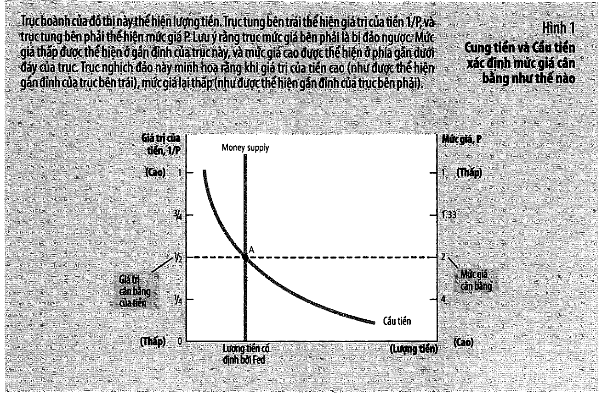
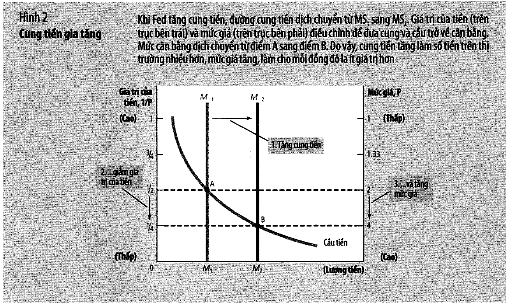
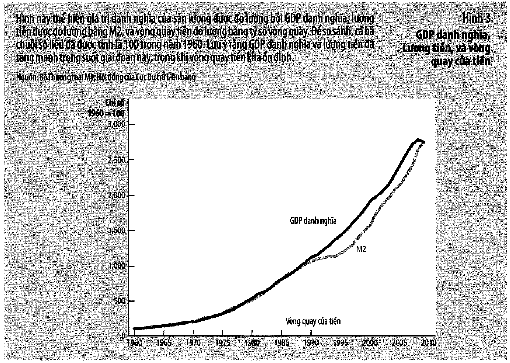
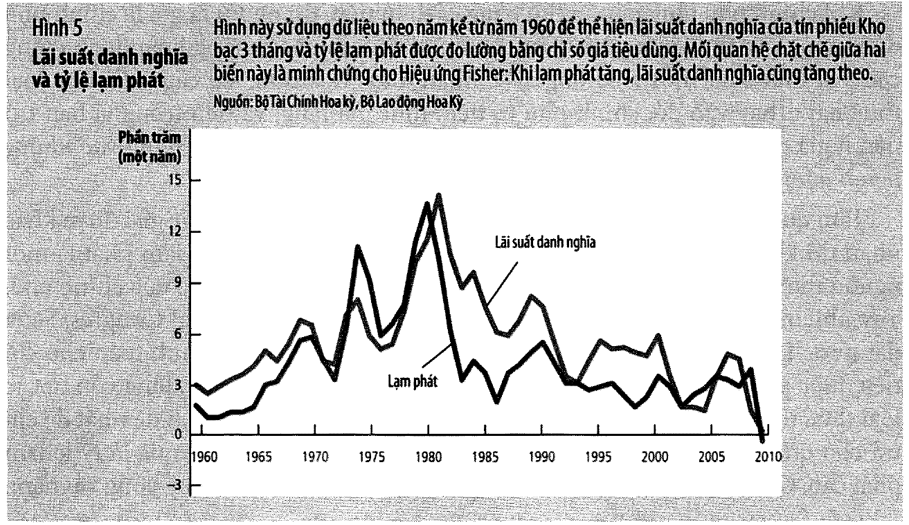
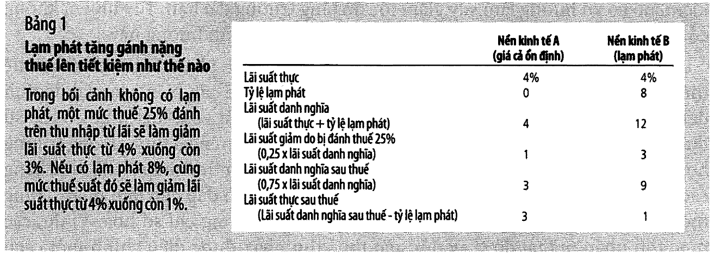

# Bài 8 — Tăng trưởng tiền và lạm phát

> Bài học dựng từ **Chương 17 — Tăng trưởng tiền và lạm phát** (tr. 387–414)
> của *N. Gregory Mankiw — **Kinh tế học vĩ mô***, bản dịch của Khoa Kinh tế, **ĐH Kinh tế TP.HCM** (Cengage Learning Asia).
> 🎯 **Vòng 1.** [Bài 7](bai_07_he_thong_tien_te.md) hỏi *tiền ở đâu ra*. Bài này hỏi câu tiếp theo và
> là câu quan trọng hơn: **in nhiều thì sao?** Chương chia làm hai nửa rất rõ — nửa đầu là **nguyên
> nhân** của lạm phát (thuyết số lượng tiền), nửa sau là **chi phí** của nó, và nửa sau khó hơn nhiều so
> với vẻ ngoài. Đây là bài **khép lại** khối "tiền trong dài hạn".
> 💼 **Góc QTKD** — ví dụ thêm cho ngành quản trị kinh doanh, **không có trong sách**.
> 📚 **Mở rộng** — thứ sách nói lướt hoặc để trong hộp phụ.
> ⚠️ — chỗ dễ hiểu sai, hoặc chỗ sách in sai.
> 📌 **Cần đọc trước:** [Bài 2](bai_02_do_luong_chi_phi_sinh_hoat.md) (CPI, lãi suất thực),
> [Bài 5 mục 3](bai_05_cong_cu_co_ban_cua_tai_chinh.md#3--ma-thuật-của-lãi-kép-và-quy-tắc-70--hộp-bạn-có-biết-tr-316)
> (quy tắc 70 — bài này dùng lại ba lần), và [Bài 7](bai_07_he_thong_tien_te.md) (Fed đổi cung tiền bằng
> cách nào).

---

## Mục lục

<!-- MUC-LUC -->

- [1. Vì sao chương này quan trọng](#1-vì-sao-chương-này-quan-trọng)
- [2. Lật ngược góc nhìn — giá trị của tiền là 1/P](#2-lật-ngược-góc-nhìn--giá-trị-của-tiền-là-1p)
- [3. Phương trình số lượng](#3-phương-trình-số-lượng)
- [4. 📚 Viết năm bước ấy thành một dòng](#4--viết-năm-bước-ấy-thành-một-dòng)
- [5. Phân đôi cổ điển và tính trung lập của tiền](#5-phân-đôi-cổ-điển-và-tính-trung-lập-của-tiền)
- [6. Siêu lạm phát](#6-siêu-lạm-phát)
- [7. Thuế lạm phát](#7-thuế-lạm-phát)
- [8. Hiệu ứng Fisher](#8-hiệu-ứng-fisher)
- [9. Bảng 1 tr. 405 — lạm phát đánh thuế lên tiết kiệm](#9-bảng-1-tr-405--lạm-phát-đánh-thuế-lên-tiết-kiệm)
- [10. Chi phí thứ nhất và thứ hai — mòn giày, thực đơn](#10-chi-phí-thứ-nhất-và-thứ-hai--mòn-giày-thực-đơn)
- [11. Chi phí thứ ba — biến động giá tương đối](#11-chi-phí-thứ-ba--biến-động-giá-tương-đối)
- [12. Lạm phát ngoài dự kiến tái phân phối của cải](#12-lạm-phát-ngoài-dự-kiến-tái-phân-phối-của-cải)
- [13. 📚 Bài tập 5 tr. 412–413 — Bob, Rita, và điều thật sự quan trọng](#13--bài-tập-5-tr-412413--bob-rita-và-điều-thật-sự-quan-trọng)
- [14. Giảm phát và Phù thuỷ xứ Oz](#14-giảm-phát-và-phù-thuỷ-xứ-oz)
- [15. Sáu chi phí của lạm phát](#15-sáu-chi-phí-của-lạm-phát)
- [16. 💼 Góc QTKD](#16--góc-qtkd)
- [17. 📚 Đối chiếu Việt Nam](#17--đối-chiếu-việt-nam)
- [18. Code minh hoạ](#18-code-minh-hoạ)
- [19. Tự thử](#19-tự-thử)
- [20. Từ điển thuật ngữ](#20-từ-điển-thuật-ngữ)
- [21. Câu hỏi tự kiểm tra](#21-câu-hỏi-tự-kiểm-tra)
- [Tóm tắt một trang](#tóm-tắt-một-trang)
- [Nguồn](#nguồn)

<!-- /MUC-LUC -->

---

## 1. Vì sao chương này quan trọng

Sách mở bằng một cửa hàng kẹo (tr. 387):

> *"Vào những năm 1930, bà tôi có một cửa hàng bánh kẹo ở Trenton, New Jersey, nơi bà bán kem cây có 2
> cỡ. Cây kem cỡ nhỏ có giá 3 xu. Khách hàng muốn mua cây kem lớn giá 5 xu."*

Hôm nay *"bạn cần ít nhất vài đô la"*. Câu chuyện quen đến mức không ai thấy có gì để hỏi — và đó chính
là vấn đề.

### Ba con số để định cỡ

Sách đưa ba con số ngay ở hai trang đầu, và cả ba đều đáng để trong đầu:

| Con số | Nguồn |
| ------ | ----- |
| 70 năm qua giá tăng trung bình **≈ 4%/năm**, dồn lại thành **16 lần** | tr. 387 |
| Thập niên **1970**: **7%/năm** → *"cứ sau một thập niên thì giá tăng gấp đôi"* | tr. 387 |
| Thập niên **1990**: chỉ **≈ 2%/năm** | tr. 387 |

✅ Cả hai phép dồn đã kiểm bằng `assert` trong [code](#18-code-minh-hoạ):
$1{,}04^{70} = 15{,}57 \to 16$ lần, và $1{,}07^{10} = 1{,}967 \approx 2$.

📌 Chú ý con số thứ hai: **70 chia 7 bằng 10.** Đó đúng là
[quy tắc 70 của bài 5](bai_05_cong_cu_co_ban_cua_tai_chinh.md#3--ma-thuật-của-lãi-kép-và-quy-tắc-70--hộp-bạn-có-biết-tr-316),
chỉ khác chiều: ở bài 5 lãi kép làm bạn giàu lên, ở đây nó ăn mòn đồng tiền trong ví bạn. **Cùng một
phép toán, hai dấu ngược nhau.** Bài này sẽ dùng lại quy tắc 70 ba lần.

### Lạm phát không phải hằng số vũ trụ

⚠️ Sách chặn ngay một định kiến (tr. 387):

> *"Lạm phát dường như có tính tự nhiên và không thể né tránh đối với một người lớn lên ở Hoa Kỳ trong
> những thập niên vừa qua, nhưng trong thực tế, điều này không hoàn toàn không thể né tránh."*

Bằng chứng: *"Mức giá trung bình của nền kinh tế Hoa Kỳ năm 1896 **thấp hơn** năm 1880 là 23%"* — tức
**giảm phát**, và nó là *"chủ đề chính trong cuộc bầu cử tổng thống năm 1896"*. Chuyện này quay lại đầy
đủ ở [mục 14](#14-giảm-phát-và-phù-thuỷ-xứ-oz).

### Biên độ toàn cầu, 2009

| Nước | Lạm phát |
| ---- | -------: |
| Nhật Bản | **−1,7%** |
| Hoa Kỳ | 2% |
| Nga | 9% |
| Venezuela | 25% |
| **Zimbabwe** (2/2008) | **24.000%** |

Sách nói thêm về con số cuối (tr. 388): *"một vài tổ chức độc lập còn ước tính con số cao hơn."* Giữ
câu này lại — [mục 6](#6-siêu-lạm-phát) sẽ cho thấy nó là một lời nói giảm đáng kể.

### Chương này trả lời hai câu, không phải một

| Nửa | Câu hỏi | Mục |
| --- | ------- | --- |
| **Nguyên nhân** | cái gì tạo ra lạm phát? | 2–8 |
| **Chi phí** | lạm phát gây hại thế nào? | 9–15 |

⚠️ Sách báo trước rằng nửa sau **khó hơn** (tr. 388):

> *"Nhưng cái giá thực sự mà lạm phát gây ra cho xã hội là gì? Câu trả lời có thể làm bạn ngạc nhiên.
> Nhận diện các chi phí của lạm phát không phải dễ dàng như ban đầu chúng ta tưởng. Kết quả là, mặc dù
> tất cả các nhà kinh tế học đều chỉ trích siêu lạm phát, nhưng **một số nhà kinh tế học tranh luận rằng
> chi phí của lạm phát vừa phải không lớn như những gì công chúng nghĩ**."*

📌 Đó là một lời hứa khó chịu, và sách giữ lời. Nếu bạn vào chương này với niềm tin "lạm phát xấu vì nó
cướp sức mua của tôi", [mục 15](#15-sáu-chi-phí-của-lạm-phát) sẽ tháo niềm tin đó ra.

---

## 2. Lật ngược góc nhìn — giá trị của tiền là 1/P

Đây là câu quan trọng nhất trong toàn bộ nửa đầu chương (tr. 389):

> *"Thật ra, **cái nhìn đầu tiên về lạm phát là lạm phát liên quan đến giá trị của tiền hơn là giá trị
> của hàng hoá**."*

Sách phê phán cách báo chí nói về lạm phát (tr. 389):

> *"các nhà bình luận thường bị lôi cuốn sẽ chú ý vào nhiều loại giá riêng lẻ tạo nên các chỉ số giá này:
> 'CPI đã tăng 3% trong tháng vừa qua, do giá cà phê tăng 20% và giá dầu tăng 30%'. Mặc dù phương pháp
> này hàm chứa các thông tin thú vị về những gì đang diễn ra trong nền kinh tế, **nó cũng bỏ qua một điểm
> quan trọng**: Trước tiên và quan trọng nhất, lạm phát là một hiện tượng của cả nền kinh tế liên quan
> đến giá trị của phương tiện trao đổi của nền kinh tế."*

### Hai cách nhìn cùng một hiện tượng

| Ký hiệu | Là gì | Đơn vị |
| ------- | ----- | ------ |
| $P$ | mức giá — số tiền cần để mua một rổ hàng hoá | tiền / hàng |
| $1/P$ | **giá trị của tiền** — lượng hàng mua được bằng 1 USD | hàng / tiền |

Ví dụ của sách, cố tình đơn giản đến mức không thể hiểu sai (tr. 389):

> *"Khi giá một cây kem ($P$) là 2 USD, thì giá trị của 1 đô la ($1/P$) là nửa cây kem. Khi giá ($P$)
> tăng lên 3 USD, giá trị của 1 đô la ($1/P$) giảm xuống chỉ còn 1/3 cây kem."*

| $P$ | $1/P$ | 1 USD mua được |
| --: | ----: | -------------- |
| 1 | 1,0000 | 1 cây kem |
| 2 | 0,5000 | nửa cây kem |
| 3 | 0,3333 | một phần ba cây kem |
| 4 | 0,2500 | một phần tư cây kem |

⭐ **Vì sao cách nhìn này quan trọng đến thế?** Vì nó biến lạm phát từ một danh sách tin tức về cà phê và
xăng dầu thành **một câu hỏi có một biến duy nhất**: cái gì quyết định giá trị của tiền? Và câu trả lời
là cái đã dùng suốt EG13: **cung và cầu**.

### Cung tiền, cầu tiền, và Hình 1–2 (tr. 390–392)



**Cung tiền** — sách nói thẳng rằng ở chương này ta cố tình đơn giản hoá (tr. 390): *"chúng ta bỏ qua sự
phức tạp mà hệ thống ngân hàng thương mại tạo ra và đơn giản tính lượng cung tiền như là một biến số
chính sách do Fed kiểm soát."* Đường cung tiền vì thế **dốc đứng**.

📌 Nhớ [bài 7 mục 12](bai_07_he_thong_tien_te.md#12--vì-sao-fed-không-kiểm-soát-nổi-cung-tiền): đó là
một giả định **biết là sai và cố ý chấp nhận**. Bài 7 vừa dành cả một mục chứng minh Fed *không* kiểm
soát chính xác cung tiền. Ở đây ta tạm bỏ qua, vì trọng tâm là chỗ khác.

**Cầu tiền** — *"cầu tiền phản ánh giá trị của cải mà mọi người muốn nắm giữ dưới dạng thanh khoản là bao
nhiêu"* (tr. 390). Nhiều thứ tác động đến nó (thẻ tín dụng, máy ATM, lãi suất), nhưng biến quan trọng
nhất là **mức giá**:

> *"Mức giá càng cao, họ càng cần nhiều tiền để thực hiện giao dịch… Có nghĩa là, mức giá cao hơn (giá
> trị của tiền thấp hơn) sẽ làm tăng lượng cầu tiền."* (tr. 390)

**Cân bằng** — và đây là điều làm cả mô hình chạy (tr. 390):

> *"**Trong dài hạn, mức giá chung sẽ điều chỉnh về mức mà tại đó lượng cầu tiền bằng cung tiền.**"*

### Bơm tiền: từ Hình 1 sang Hình 2 (tr. 391–392)



Sách cho Fed *"tăng gấp đôi cung tiền bằng cách in thêm tiền và dùng trực thăng thả xuống khắp đất nước"*
(tr. 391).

| | Hình 1 (điểm A) | Hình 2 (điểm B) |
| --- | ---: | ---: |
| Cung tiền | $M_1$ | $M_2 = 2 M_1$ |
| Giá trị của tiền $1/P$ | 1/2 | **1/4** |
| Mức giá $P$ | 2 | **4** |

Đối xứng hoàn hảo: tiền ×2 → mức giá ×2 → giá trị tiền ×½.

> **Thuyết số lượng tiền** (tr. 391): *"lượng tiền có trong nền kinh tế sẽ xác định giá trị của tiền, và
> sự tăng trưởng của lượng tiền là nguyên nhân chính gây nên lạm phát."*

Và câu của Milton Friedman mà sách trích (tr. 391): *"Lạm phát luôn là một hiện tượng tiền tệ có mặt ở
mọi nơi"*.

### 📚 Quá trình điều chỉnh — chỗ sách đi rất nhanh

Sách dành một mục nhỏ cho câu hỏi "làm sao nền kinh tế đi từ A sang B" (tr. 392), rồi hoãn phần khó lại
cho bài 11–13. Nhưng chuỗi nó mô tả đáng đọc chậm:

```
trực thăng thả tiền
     ↓
trong ví mọi người có NHIỀU TIỀN HƠN SỐ HỌ CẦN      ← dư cung tiền
     ↓
họ tìm cách thoát: mua hàng hoá, hoặc cho vay / gửi tiết kiệm
     ↓                    (khoản vay đó giúp NGƯỜI KHÁC mua hàng)
CẦU hàng hoá và dịch vụ TĂNG
     ↓
nhưng KHẢ NĂNG CUNG ỨNG không đổi — "sản lượng được xác định
bởi lao động, vốn vật chất, vốn nhân lực, tài nguyên và công nghệ"
     ↓
GIÁ TĂNG
     ↓
giá cao hơn ⟹ mỗi giao dịch cần nhiều tiền hơn ⟹ CẦU TIỀN TĂNG
     ↓
cân bằng mới: lượng cầu tiền lại bằng lượng cung tiền
```

⭐ Chú ý câu chốt của sách ở giữa chuỗi (tr. 392): *"**Việc bơm tiền không thể thay thế được cho bất cứ
thứ nào trong những thứ này.**"* Đó là toàn bộ nội dung của [bài 3](bai_03_san_xuat_va_tang_truong.md)
được gọi lại làm nhân chứng. Cung tiền tăng, cầu hàng tăng, nhưng **số hàng thì không**. Cái duy nhất
còn lại để điều chỉnh là giá.

---

## 3. Phương trình số lượng

Sách tiếp cận cùng một ý từ một góc khác (tr. 395): *"một tờ tiền đô la điển hình được dùng để mua hàng
hoá và dịch vụ mới được sản xuất là bao nhiêu lần một năm?"*

> **Vòng quay của tiền** (tr. 395): *"số lần tiền được thanh toán chuyển từ người này sang người khác."*

$$V = \frac{P \times Y}{M}$$

### Nền kinh tế pizza (tr. 395)

| | |
| --- | ---: |
| Sản lượng $Y$ | 100 pizza/năm |
| Giá $P$ | 10 USD/chiếc |
| Cung tiền $M$ | 50 USD |
| **Vòng quay $V$** | $(10 \times 100)/50 = $ **20** |

✅ Kiểm bằng `assert`.

Đọc lại bằng lời cho quen (tr. 395): *"người ta chi tiêu tổng cộng 1.000 USD một năm để mua pizza. Thực
ra giá trị 1.000 USD này được tạo ra chỉ bởi số tiền là 50 USD, mỗi tờ đô la phải chuyển từ tay người
này sang tay người khác trung bình 20 lần một năm."*

Viết lại:

$$\boxed{M \times V = P \times Y}$$

> **Phương trình số lượng** (tr. 395): *"phương trình $M \times V = P \times Y$, liên quan đến lượng
> tiền, vòng quay tiền và giá trị bằng tiền của sản lượng hàng hoá và dịch vụ của nền kinh tế."*

### ⚠️ Nó là đồng nhất thức, chưa phải lý thuyết

Đây là chỗ dễ nhầm nhất của mục này, và đáng dừng lại.

$V$ được **định nghĩa** là $(P \times Y)/M$. Nên $M \times V = P \times Y$ **luôn đúng**, với mọi số
liệu, mọi nền kinh tế, mọi thời kỳ. Nó không thể sai, vì nó không nói gì cả.

📌 Bạn đã gặp đúng loại này hai lần rồi:

| Đồng nhất thức | Ở đâu | Đúng vì |
| -------------- | ----- | ------- |
| $Y = C + I + G + NX$ | [bài 1](bai_01_do_luong_thu_nhap_quoc_gia.md) | định nghĩa của bốn thành phần |
| $S = I$ | [bài 4](bai_04_tiet_kiem_dau_tu_he_thong_tai_chinh.md#7-từ-y--c--i--g--nx-đến-s--i) | định nghĩa của $S$ |
| $M \times V = P \times Y$ | bài này | định nghĩa của $V$ |

Cái biến nó thành **lý thuyết** là một **giả định thực nghiệm** được thêm vào: **$V$ ổn định**. Sách dẫn
Hình 3 tr. 396 để biện hộ cho giả định đó: từ 1960, GDP danh nghĩa và M2 *"đều tăng hơn 20 lần"*, trong
khi vòng quay *"mặc dù không hoàn toàn không đổi, nhưng đã không thay đổi nhiều"*.



⚠️ Và sách rất cẩn thận trong cách phát biểu (tr. 396): *"do một số mục đích nghiên cứu nhất định nào đó,
việc giả định vòng quay tiền cố định **có thể là một giả định hữu ích**."* — "có thể", "một số mục đích",
"hữu ích". Không phải "đúng".

### Năm bước của thuyết số lượng (tr. 396)

Sách phát biểu thành năm bước, và đây là bộ khung của cả nửa đầu chương:

1. **$V$ khá ổn định theo thời gian.**
2. Vì $V$ ổn định, khi ngân hàng trung ương đổi $M$, nó tạo ra thay đổi **cùng tỷ lệ** trong $P \times Y$.
3. **$Y$ do cung yếu tố sản xuất và công nghệ quyết định** — *"Đặc biệt bởi vì tiền có tính trung lập,
   tiền không tác động đến sản lượng."*
4. Do $Y$ đã bị chốt, thay đổi của $M \times V$ **phải rơi hết vào $P$**.
5. Do vậy, **tăng $M$ nhanh → lạm phát cao**.

---

## 4. 📚 Viết năm bước ấy thành một dòng

Sách phát biểu năm bước bằng lời. Mục này viết chúng thành công thức — **không có trong sách**, nhưng suy
ra trực tiếp từ $M \times V = P \times Y$.

Lấy tỷ lệ tăng trưởng hai vế:

$$(1+g_M)(1+g_V) = (1+g_P)(1+g_Y)$$

Với các tỷ lệ nhỏ, tích của hai số nhỏ là rất nhỏ, nên:

$$g_M + g_V \approx g_P + g_Y$$

Và với giả định $g_V = 0$ (bước 1):

$$\boxed{\text{lạm phát} \approx \text{tăng trưởng tiền} - \text{tăng trưởng sản lượng}}$$

| $g_M$ | $g_Y$ | Lạm phát (xấp xỉ) | Lạm phát (chính xác) |
| ----: | ----: | ----------------: | -------------------: |
| 0% | 3% | −3,0% | −2,91% |
| **3%** | **3%** | **0,0%** | **0,00%** |
| 5% | 3% | 2,0% | 1,94% |
| 10% | 3% | 7,0% | 6,80% |
| 50% | 3% | 47,0% | **45,63%** |

⚠️ **Đọc dòng cuối trước.** Xấp xỉ bắt đầu lệch rõ khi tỷ lệ lớn (47% so với 45,63%). Với siêu lạm phát ở
[mục 6](#6-siêu-lạm-phát) thì **bắt buộc** phải dùng công thức chính xác — sai số của phép cộng lúc đó
không còn là làm tròn nữa.

### ⚠️⚠️ Bây giờ đọc dòng thứ hai. Nó là chỗ hiểu sai lớn nhất của cả chương.

**Tăng trưởng tiền 3%, tăng trưởng sản lượng 3% → lạm phát bằng 0.**

Đó chính là lời giải cho bài tập 4 tr. 412 — *"mục tiêu lạm phát bằng 0 này có yêu cầu tỷ lệ tăng trưởng
tiền bằng 0 không?"* Câu trả lời: **không**. Nó yêu cầu tăng trưởng tiền **bằng tăng trưởng sản lượng**.
Nền kinh tế sản xuất thêm 3% số hàng thì cần thêm 3% lượng tiền để mua chúng ở mức giá cũ.

⭐ Nói ngược lại cho thấy độ nghiêm trọng: **"không in thêm tiền" không phải là chính sách giá ổn định.
Đó là chính sách giảm phát.** Và [mục 14](#14-giảm-phát-và-phù-thuỷ-xứ-oz) sẽ cho biết giảm phát tệ đến
mức nào.

### Bài tập 2 tr. 412 — làm cho quen tay

Cung tiền 500 tỷ, GDP danh nghĩa 10.000 tỷ, GDP thực 5.000 tỷ.

| Câu | Hỏi | Đáp |
| --- | --- | --- |
| a | $P$ và $V$? | $P = 10.000/5.000 = $ **2**; $V = 10.000/500 = $ **20** |
| b | $Y$ tăng 5%, $M$ và $V$ không đổi | $P \times Y$ vẫn 10.000; $Y = 5.250$ → $P = $ **1,9048**, tức mức giá **giảm 4,76%** |
| c | muốn $P$ giữ nguyên | $M = 2 \times 5.250/20 = $ **525 tỷ** (tăng **5%**) |
| d | muốn lạm phát 10% | $M = 2{,}2 \times 5.250/20 = $ **577,5 tỷ** (tăng **15,5%**) |

✅ Cả bốn câu kiểm bằng `assert`.

📌 So câu (b) với câu (c). Giữ nguyên cung tiền cho ra **giảm phát 4,76%**. Muốn giá ổn định phải **tăng
cung tiền 5%**. Đúng như dòng thứ hai của bảng trên.

---

## 5. Phân đôi cổ điển và tính trung lập của tiền

Đây là nền triết học của cả nửa đầu chương, và nó có tuổi: David Hume, thế kỷ 18 (tr. 393).

| Nhóm | Định nghĩa của sách | Ví dụ |
| ---- | ------------------- | ----- |
| **Biến danh nghĩa** | *"các biến được đo lường bằng đơn vị tiền tệ"* | GDP danh nghĩa, mức giá, tiền lương bằng tiền, lãi suất danh nghĩa |
| **Biến thực** | *"các biến được đo lường bằng các đơn vị vật chất"* | GDP thực, tiền lương thực, lãi suất thực, việc làm |

> **Phân đôi cổ điển** (tr. 393): *"sự phân chia theo lý thuyết thành biến danh nghĩa và biến thực."*

### ⚠️ Giá tương đối là biến THỰC — đây là chỗ dễ sai

Sách gọi nó là *"nan giải"* và giải thích rất kỹ (tr. 393):

> *"Khi chúng ta nói rằng giá một giạ bắp là 2 USD hoặc giá một giạ lúa mì là 1 USD, cả hai mức giá này
> đều là biến danh nghĩa. Nhưng còn mức giá **tương đối** thì sao? … chúng ta có thể nói rằng giá một
> giạ bắp bằng hai giạ lúa mì. Mức giá tương đối này không được đo lường dưới dạng tiền tệ. **Khi so sánh
> giá của bất kỳ hai loại hàng hoá nào, ký hiệu tiền tệ bị triệt tiêu** và con số đo lường bây giờ là đơn
> vị vật chất."*

Cùng logic đó áp cho hai biến bạn đã biết:

- **Tiền lương thực** = tiền lương / mức giá = *"mức tiền lương tại đó người ta trao đổi hàng hoá và dịch
  vụ để lấy 1 đơn vị lao động"* → **biến thực**.
- **Lãi suất thực** = lãi suất danh nghĩa − lạm phát = *"mức lãi suất tại đó người ta trao đổi hàng hoá
  và dịch vụ hôm nay để lấy hàng hoá và dịch vụ trong tương lai"* → **biến thực**.

### Tính trung lập của tiền

> **Tính trung lập của tiền** (tr. 394): *"tuyên bố cho rằng việc thay đổi cung tiền không tác động đến
> các biến số thực."*

| Biến số | Loại | NHTW tăng tiền ×2 |
| ------- | ---- | ----------------- |
| GDP danh nghĩa | danh nghĩa | gấp đôi theo |
| Mức giá $P$ | danh nghĩa | gấp đôi theo |
| Tiền lương bằng tiền | danh nghĩa | gấp đôi theo |
| Lãi suất danh nghĩa | danh nghĩa | gấp đôi theo |
| **GDP thực** | thực | **không đổi** |
| **Tiền lương thực** | thực | **không đổi** |
| **Lãi suất thực** | thực | **không đổi** |
| **Việc làm** | thực | **không đổi** |
| **Giá tương đối** | thực | **không đổi** |

### ⭐ Ví dụ hay nhất của cả chương

Sách dùng một phép so sánh mà một khi hiểu rồi thì không quên được (tr. 394):

> *"Thay đổi tương tự cũng xảy ra nếu chính phủ giảm độ dài của cây thước từ 36 inch xuống còn 18 inch:
> Với đơn vị đo lường mới, tất cả khoảng cách **được đo** (các biến danh nghĩa) sẽ gấp đôi, nhưng khoảng
> cách **thực sự** (các biến thực) sẽ vẫn như cũ. **Đô la cũng giống như cái thước, đơn thuần chỉ là đơn
> vị đo lường**, vì thế thay đổi giá trị của nó sẽ không có các tác động thực."*

Một con đường dài 100 đơn vị cũ thành 200 đơn vị mới. Nó không dài thêm một mét nào.

### ⚠️ Sách không tuyệt đối hoá — và đây là chỗ nối sang nửa sau của khoá

Câu tiếp theo quan trọng không kém (tr. 394):

> *"Tính trung lập của tiền có hiện thực không? **Không hoàn toàn.** Thay đổi độ dài của cái thước từ 36
> inch xuống 18 inch sẽ không quan trọng trong dài hạn nhưng lại là vấn đề lớn trong ngắn hạn, nó sẽ gây
> ra sự lúng túng và sai lầm."*

Và:

> *"ngày nay hầu hết các nhà kinh tế học tin rằng trong một thời kỳ ngắn – trong vòng 1 hay 2 năm – thay
> đổi tiền tệ ảnh hưởng đến các biến thực. **Bản thân Hume cũng nghi ngờ tính trung lập của tiền được áp
> dụng trong ngắn hạn.**"*

📌 Ghi nhớ điều này: **toàn bộ bài 11–13 tồn tại là vì mệnh đề "tiền trung lập" sai trong ngắn hạn.**
Nếu nó đúng ở mọi khung thời gian thì chính sách tiền tệ không làm được gì và không có gì để bàn. Nhưng
sách cũng nhắc rằng trong dài hạn thì nó *"đưa ra một mô tả rõ ràng về cách thức thế giới này vận hành"*.

---

## 6. Siêu lạm phát

Sách mở bằng một phép so sánh đắt (tr. 397):

> *"Mặc dù các cơn động đất có thể tàn phá xã hội, nhưng chúng cũng mang lại sản phẩm phụ có lợi là cung
> cấp nhiều dữ liệu hữu ích cho các nhà nghiên cứu địa chấn… Tương tự, những lần xảy ra siêu lạm phát
> mang lại cho các nhà kinh tế học tiền tệ những **thực nghiệm tự nhiên**."*

> **Định nghĩa** (tr. 397): *"siêu lạm phát thường được định nghĩa là mức lạm phát vượt quá **50 phần
> trăm một tháng**. Điều này nghĩa là mức giá tăng hơn 100 lần trong một năm."*

✅ Kiểm: $1{,}5^{12} = 129{,}7$ — quả thật hơn 100 lần.

### Hình 4 tr. 397 — bốn ca thập niên 1920


Áo, Hungary, Đức, Ba Lan. Trong cả bốn, đường **cung tiền** và đường **mức giá** đi gần như song song.

⚠️ Chú ý một chi tiết kỹ thuật mà sách nói rõ trong chú thích hình: đồ thị dùng **trục logarit**, và
*"khoảng cách đều nhau trên trục tung trong đồ thị thể hiện thay đổi phần trăm đều nhau của biến"*. Đó
là lựa chọn bắt buộc: mức giá của Đức lên tới $10^{14}$ lần. Trên trục thường, toàn bộ ba năm đầu sẽ bị
ép bẹt vào trục hoành thành một đường thẳng.

Sách đọc hình rất gọn (tr. 398): *"ban đầu tăng trưởng lượng tiền ở mức vừa phải và lạm phát cũng vậy.
Nhưng sau đó, lượng tiền trong nền kinh tế tăng trưởng ngày càng nhanh và lạm phát cũng bắt đầu tăng gần
như đồng thời. Sau đó, khi lượng tiền ổn định lại, mức giá cũng ổn định theo."*

### 📚 Zimbabwe — suy ngược từ mệnh giá tờ tiền

Hộp *Bạn có biết* tr. 398 kể chuyện Zimbabwe nhưng **không cho tỷ lệ lạm phát của năm đó**. Nó cho bốn
con số khác, và ta có thể suy ngược:

| Thời điểm | Mệnh giá tờ tiền lớn nhất | Giá trị |
| --------- | ------------------------: | ------: |
| 1/2008 | 10 **triệu** đô la Zimbabwe | ≈ 4 USD |
| 1/2009 | 10 **ngàn tỷ** đô la Zimbabwe | ≈ 3 USD |

Giá trị của **một** đô la Zimbabwe tính bằng USD:

$$\frac{4}{10^7} = 4{,}0\times10^{-7} \quad\longrightarrow\quad \frac{3}{10^{13}} = 3{,}0\times10^{-13}$$

$$\text{mất giá } \approx 1{,}333{,}333 \text{ lần trong MỘT năm}$$

⚠️ So với con số chính thức tháng 2/2008 mà sách dẫn — **24.000%/năm**, tức mất giá 241 lần — con số suy
ra trên đây lớn hơn khoảng **5.500 lần**. Không mâu thuẫn: một cái là tháng 2/2008, cái kia là cả năm
2008, và tình hình xấu đi rất nhanh trong năm. Sách cũng đã nói trước (tr. 398): *"một vài tổ chức độc
lập còn ước tính con số cao hơn."*

📌 Bài học phương pháp: **siêu lạm phát phá huỷ chính cái thước dùng để đo nó.** Số liệu chính thức mất
ý nghĩa; mệnh giá tờ tiền lại trở thành một thước đo đáng tin hơn.

### Và chi tiết đắt nhất của cả hộp

Sách in ảnh một biển báo trong nhà vệ sinh công cộng ở Zimbabwe (tr. 398):

```
TOILET PAPER ONLY
TO BE USED IN THIS TOILET
NO CARDBOARD
NO CLOTH
NO ZIM DOLLARS
NO NEWSPAPER
```

⭐ Đọc nó bằng khung của [bài 7 mục 2](bai_07_he_thong_tien_te.md#2-tiền-là-gì--ba-chức-năng): tờ tiền
bị cấm **cùng danh sách với bìa carton và giấy báo**, vì **lý do vệ sinh** chứ không phải lý do pháp lý.
Đó là chức năng "trung gian trao đổi" đã chết hẳn, và tờ tiền quay về đúng giá trị vật chất của nó — một
mảnh giấy. Sách đã nói ở bài 7 rằng tiền pháp định sống bằng kỳ vọng; đây là ảnh chụp lúc kỳ vọng đó
bằng không.

---

## 7. Thuế lạm phát

Sách đặt câu hỏi rất đúng chỗ (tr. 398):

> *"Nếu hiện tượng lạm phát được lý giải quá dễ dàng thì tại sao các quốc gia lại bị siêu lạm phát? Có
> nghĩa là tại sao ngân hàng trung ương của những nước này chọn in quá nhiều tiền đến nỗi giá trị của
> tiền sụt giảm nhanh chóng theo thời gian?"*

Câu trả lời không nằm ở ngân hàng trung ương. Nó nằm ở **ngân sách**.

Chính phủ muốn xây đường, trả lương quân đội, trợ cấp người nghèo. Có ba cách huy động:

| # | Cách | Ghi chú |
| - | ---- | ------- |
| 1 | **Đánh thuế** | thuế thu nhập, thuế bán hàng |
| 2 | **Đi vay** | bán trái phiếu chính phủ — [bài 4](bai_04_tiet_kiem_dau_tu_he_thong_tai_chinh.md#2-thị-trường-trái-phiếu) |
| 3 | **In tiền** | *"chính phủ cũng có thể thanh toán cho các khoản chi tiêu đơn giản bằng cách in thêm số tiền mà mình cần"* (tr. 398) |

> **Thuế lạm phát** (tr. 399): *"nguồn thu chính phủ có được từ việc tạo ra tiền."*

Và định nghĩa thứ hai của sách, sắc hơn (tr. 399):

> *"thuế lạm phát không hoàn toàn giống các loại thuế khác bởi vì **không ai sẽ nhận được hoá đơn yêu cầu
> phải nộp loại thuế này**. Thay vào đó, chính phủ in tiền, mức giá tăng, và tiền trong ví bạn trở nên ít
> giá trị hơn. Do vậy, **thuế lạm phát giống như một loại thuế đánh vào những người nắm giữ tiền**."*

### ⭐ Đây không phải một phép ẩn dụ

Đó là chỗ nhiều người đọc lướt qua. Thuế lạm phát có **cơ sở thuế** thật, và cơ sở thuế đó là **chính số
tiền bạn đang giữ**.

| Bạn giữ | Lạm phát trong năm | Bạn đã nộp |
| ------: | -----------------: | ---------: |
| 10 triệu VND | 20% | **2 triệu VND** |
| 5 tỷ VND (vốn lưu động) | 8% | **400 triệu VND** |

Không có tờ biên lai nào, nhưng số tiền thì đã chuyển chủ.

### Nó lớn đến đâu?

| Nơi và thời | Tỷ trọng trong nguồn thu chính phủ |
| ----------- | ---------------------------------- |
| Hoa Kỳ, những năm gần đây | *"không đáng kể: nó chỉ chiếm không đến 3%"* (tr. 399) |
| **Quốc hội Lục Địa Hoa Kỳ, thập niên 1770** | **nguồn thu chủ yếu** |

Kết quả của ca thứ hai (tr. 399): *"Giá được đo bằng đô la lục địa tăng hơn 100 lần chỉ trong vòng vài
năm."*

### Khuôn mẫu chung của mọi siêu lạm phát

Sách rút ra một mô tả duy nhất cho tất cả (tr. 399):

```
chính phủ chi tiêu quá nhiều
        ↓
nguồn thu thuế không đủ            ("chính phủ có chi tiêu cao,
        ↓                            nguồn thu thuế không đủ")
khả năng đi vay bị hạn chế
        ↓
BUỘC phải in tiền
        ↓
lạm phát cao
```

Và lối ra (tr. 399): *"Lạm phát chỉ chấm dứt khi chính phủ thực hiện cuộc cải cách chi tiêu ngân sách –
như cắt giảm chi tiêu chính phủ – nhờ đó chấm dứt nhu cầu thuế lạm phát."*

📌 **Siêu lạm phát là một vấn đề tài khoá đội lốt vấn đề tiền tệ.** Đó là lý do bài tập 6 tr. 413 hỏi:
vì sao siêu lạm phát *"cực kỳ hiếm ở những nước mà ngân hàng trung ương **độc lập** với phần còn lại của
chính phủ"*? Vì khi ấy khoản chi của ngân sách không thể tự biến thành lệnh in tiền. Nối thẳng về
[bài 7 mục 5](bai_07_he_thong_tien_te.md#5-cục-dự-trữ-liên-bang) và nhiệm kỳ 14 năm của Hội đồng Thống
đốc — cái nhiệm kỳ dài ấy hoá ra không phải chuyện thủ tục hành chính.

---

## 8. Hiệu ứng Fisher

> **Hiệu ứng Fisher** (tr. 400): *"sự điều chỉnh theo tỷ lệ 1:1 của lãi suất danh nghĩa theo tỷ lệ lạm
> phát."*

Bạn đã có phương trình từ
[bài 2 mục 12](bai_02_do_luong_chi_phi_sinh_hoat.md#12-lãi-suất-danh-nghĩa-và-lãi-suất-thực):

$$\text{lãi suất thực} = \text{lãi suất danh nghĩa} - \text{tỷ lệ lạm phát}$$

Sách viết lại nó theo chiều có ích hơn (tr. 400):

$$\text{lãi suất danh nghĩa} = \text{lãi suất thực} + \text{tỷ lệ lạm phát}$$

> *"Cách viết này xem xét lãi suất danh nghĩa hữu ích hơn bởi vì các lực lượng kinh tế khác nhau xác định
> từng thành phần của vế phải trong phương trình này."* (tr. 400)

| Thành phần | Do cái gì quyết định | Học ở đâu |
| ---------- | -------------------- | --------- |
| Lãi suất **thực** | cung và cầu **vốn vay** | [bài 4 mục 10](bai_04_tiet_kiem_dau_tu_he_thong_tai_chinh.md#10-thị-trường-vốn-vay--mô-hình) |
| Tỷ lệ **lạm phát** | tăng trưởng **cung tiền** | mục 2–4 bài này |

### Vì sao đúng tỷ lệ 1:1

Lập luận rất ngắn, và nó là toàn bộ mục 5 áp vào một trường hợp (tr. 400):

> *"Tiền có tính trung lập trong dài hạn nên một sự thay đổi trong tăng trưởng tiền sẽ không tác động đến
> lãi suất thực. Hơn hết, **lãi suất thực là một biến số thực**. Vì lãi suất thực không bị ảnh hưởng, nên
> lãi suất danh nghĩa phải điều chỉnh theo tỷ lệ một – một với thay đổi của tỷ lệ lạm phát."*

Hình 5 tr. 400 vẽ lãi suất danh nghĩa (tín phiếu Kho bạc 3 tháng) và lạm phát ở Hoa Kỳ từ 1960. Hai
đường bám nhau rõ rệt: cùng lên đến đỉnh quanh 1980, cùng xuống suốt 1980–1990.



### ⚠️ Hai giới hạn mà sách nói rất rõ

1. **Dài hạn, không phải ngắn hạn** (tr. 400): *"Hiệu ứng Fisher không nhất thiết phải đúng trong ngắn
   hạn bởi vì lạm phát có thể là không biết trước. Lãi suất danh nghĩa là lãi suất chi trả cho một khoản
   nợ vay, và thường được xác định ngay khi khoản cho vay này được thực hiện."*
2. **Lạm phát KỲ VỌNG, không phải lạm phát thực tế** (tr. 401): *"để chính xác, hiệu ứng Fisher phát
   biểu rằng lãi suất danh nghĩa điều chỉnh theo tỷ lệ lạm phát **kỳ vọng**."*

📌 Chính khoảng cách giữa "kỳ vọng" và "thực tế" là chỗ sinh ra chi phí lớn nhất của lạm phát — xem
[mục 12](#12-lạm-phát-ngoài-dự-kiến-tái-phân-phối-của-cải).

---

## 9. Bảng 1 tr. 405 — lạm phát đánh thuế lên tiết kiệm



Đây là bảng số quan trọng nhất trong nửa sau của chương, và nó cũng là ứng dụng đầu tiên của hiệu ứng
Fisher.

Ý tưởng: **luật thuế đánh vào lãi suất DANH NGHĨA**, nhưng cái thật sự làm bạn giàu lên là lãi suất
**THỰC SAU THUẾ**.

|  | Nền kinh tế A *(giá cả ổn định)* | Nền kinh tế B *(lạm phát)* |
| --- | ---: | ---: |
| Lãi suất thực | 4% | 4% |
| Tỷ lệ lạm phát | 0 | 8 |
| Lãi suất danh nghĩa *(= thực + lạm phát)* | 4 | **12** |
| Lãi suất giảm do bị đánh thuế 25% *(= 0,25 × danh nghĩa)* | 1 | 3 |
| Lãi suất danh nghĩa sau thuế *(= 0,75 × danh nghĩa)* | 3 | 9 |
| **Lãi suất thực sau thuế** *(= danh nghĩa sau thuế − lạm phát)* | **3** | **1** |

✅ Cả 12 ô đã dựng lại từ đầu bằng một hàm duy nhất và `assert` đối chiếu với Bảng 1 tr. 405. **Khớp
toàn bộ.**

### ⭐ Đọc dòng đầu và dòng cuối cùng lúc

**Dòng đầu**: lãi suất thực **trước thuế** giống hệt nhau — 4% ở cả hai nền kinh tế.
**Dòng cuối**: lãi suất thực **sau thuế** là 3% và 1%.

Lạm phát 8% đã lấy đi **2 điểm phần trăm** — tức **67% động cơ tiết kiệm** — mà không hề đụng đến lãi
suất thực trước thuế một chút nào.

Cơ chế, bằng lời của sách (tr. 405):

> *"Loại thuế thu nhập này xem tiền lãi **danh nghĩa** kiếm được từ tiền gửi tiết kiệm là thu nhập, ngay
> cả khi một phần của lãi suất danh nghĩa đơn thuần là bù đắp cho lạm phát."*

📌 Và hệ quả dài hạn mà sách chỉ ra (tr. 405–406):

```
lạm phát → lãi suất thực sau thuế thấp hơn → tiết kiệm ít hấp dẫn hơn
        → tiết kiệm giảm  → cung vốn vay dịch sang TRÁI  (bài 4 mục 10)
        → đầu tư giảm     → tích luỹ vốn chậm hơn        (bài 3)
        → tăng trưởng dài hạn chậm lại
```

Sách viết: *"khi lạm phát làm gia tăng gánh nặng thuế lên tiết kiệm, nó có xu hướng làm suy giảm tốc độ
tăng trưởng dài hạn."* Nhưng cũng thêm ngay: *"không có sự đồng thuận giữa các nhà kinh tế về quy mô của
ảnh hưởng này."*

### Bài tập 8 tr. 413 — và một kết quả gây bất ngờ

Thuế suất 40%. Tính lãi suất thực **trước** và **sau** thuế:

| | Danh nghĩa | Lạm phát | Thực **trước** thuế | Thực **sau** thuế |
| --- | ---: | ---: | ---: | ---: |
| a | 10% | 5% | **5%** | **1,0%** |
| b | 6% | 2% | 4% | **1,6%** |
| c | 4% | 1% | 3% | 1,4% |

⚠️ **Đọc theo cột, đừng đọc theo dòng.**

- Cột "thực **trước** thuế" xếp hạng: **a > b > c** (5 > 4 > 3)
- Cột "thực **sau** thuế" xếp hạng: **b > c > a** (1,6 > 1,4 > 1,0)

**Thứ tự bị đảo.** Trường hợp (a) — có lãi suất thực trước thuế **cao nhất** — lại cho người tiết kiệm
**kết quả tệ nhất**. Vì lạm phát 5% kéo lãi suất danh nghĩa lên 10%, và thuế 40% ăn vào cả phần chỉ để
bù lạm phát.

⭐ Bài học dùng được ngay: **khi so hai kênh gửi tiết kiệm ở hai thời điểm có lạm phát khác nhau, so lãi
suất danh nghĩa là vô nghĩa, và so cả lãi suất thực trước thuế cũng chưa đủ.** Cái duy nhất so được là
lãi suất thực **sau** thuế.

---

## 10. Chi phí thứ nhất và thứ hai — mòn giày, thực đơn

### Chi phí mòn giày (tr. 402–403)

> **Chi phí mòn giày** (tr. 402): *"nguồn lực bị lãng phí khi lạm phát khuyến khích người ta giảm việc
> nắm giữ tiền của họ."*

Xuất phát điểm là mục 7: lạm phát là thuế đánh vào người giữ tiền, nên cách né thuế là **giữ ít tiền
hơn**. Ví dụ bằng số của sách (tr. 402): *"thay vì cứ mỗi bốn tuần bạn rút 200 USD, bây giờ bạn phải rút
50 USD mỗi tuần một lần."*

| Cách rút | Số lần/năm | Số dư tiền mặt bình quân |
| -------- | ---------: | -----------------------: |
| 200 USD mỗi 4 tuần | 13 | **100 $** |
| 50 USD mỗi tuần | 52 | **25 $** |

Tổng số tiền rút cả năm **không đổi** (2.600 USD cả hai cách). Cái đổi là **số lần đi** và **lượng tiền
nằm chết trong ví**.

⚠️ Sách nói rõ tên gọi là ẩn dụ (tr. 402–403): *"chi phí thực sự của việc giảm nắm giữ tiền mặt không
phải là sự mòn và rách giày của bạn mà là **thời gian và sự thuận tiện** bạn phải hy sinh."*

Và tự đánh giá rất thật (tr. 403): *"Chi phí mòn giày của lạm phát dường như không quan trọng. Và thực ra
điều này đúng ở nền kinh tế Hoa Kỳ."*

### 📚 Bolivia 1985 — khi nó thôi không nhỏ nữa

Sách trích *The Wall Street Journal* ngày 13/8/1985 về ông giáo **Edgar Miranda** ở Bolivia (tr. 403):

| | |
| --- | ---: |
| Lương tháng | 25.000.000 peso |
| Ngày nhận lương: 1 USD = 500.000 peso | → **50 USD** |
| Vài ngày sau: 1 USD = 900.000 peso | → **28 USD** |

**Mất 44% giá trị trong vài ngày.**

⚠️ Sách in *"tiền lương của ông chỉ còn lại 27 USD"* (tr. 403). Phép chia đúng cho **27,78 USD**, làm
tròn lên là 28. Chênh 1 USD, có lẽ do sách làm tròn xuống. Không ảnh hưởng đến lập luận.

Bối cảnh sách cho (tr. 403): *"chỉ trong vòng sáu tháng, giá tăng vọt lên với tỷ lệ 38.000% một năm. Tuy
nhiên, theo ghi nhận chính thức, tỷ lệ lạm phát năm qua lên đến 2.000%, và năm nay kỳ vọng sẽ lên đến
8.000%"* — và so sánh: *"tỷ lệ lạm phát của Bolivia làm cho con số 370% của Israel và 1.100% của
Argentina… trở nên nhỏ bé."*

Hành vi của ông Miranda, sách gọi là *"Quy tắc Sống Còn Đầu tiên"* (tr. 403): đổi hết peso sang đô la
**ngay trong ngày nhận lương**, trong khi vợ ông chạy vội ra chợ mua gạo và mì cho cả tháng.

⭐ Và câu kết của sách là định nghĩa sắc nhất của chi phí mòn giày (tr. 403):

> *"**Thời gian và nỗ lực mà Ông Miranda dùng để giảm việc nắm giữ tiền chính là sự lãng phí nguồn lực.**
> Nếu các cơ quan tiền tệ theo đuổi một chính sách lạm phát thấp, Ông Miranda sẽ rất vui vẻ nắm giữ peso,
> và ông có thể sử dụng thời gian và công sức của mình hiệu quả hơn."*

Một người thông minh dành cả ngày để **không làm gì có ích cho ai**. Đó là chi phí.

### Chi phí thực đơn (tr. 403–404)

> **Chi phí thực đơn** (tr. 404): *"chi phí do thay đổi giá cả."*

Sách liệt kê đầy đủ hơn cái tên gợi ý: *"chi phí quyết định giá mới, chi phí in danh sách và catalog giá
mới, chi phí gửi danh sách giá và catalog mới này cho khách hàng và các nhà buôn, chi phí thông báo giá
mới, và thậm chí cả **chi phí thương thảo với các khách hàng rắc rối về việc thay đổi giá**"* (tr. 404).

Và một con số tần suất (tr. 403): *"doanh nghiệp Hoa Kỳ thường thay đổi giá mỗi năm một lần."*

📌 Vế cuối trong danh sách trên không phải một khái niệm học thuật. Nó là **cuộc họp**. Xem
[mục 16(a)](#16--góc-qtkd).

---

## 11. Chi phí thứ ba — biến động giá tương đối

Đây là chi phí tinh vi nhất trong sáu chi phí, và cũng là chi phí có sức tàn phá kín đáo nhất.

Ví dụ của sách: nhà hàng **Eatabit Eatery** in thực đơn mới vào mỗi tháng Giêng, giữ nguyên giá cả năm.
Lạm phát 12%/năm (tr. 404).

| Tháng | Giá danh nghĩa | Mức giá chung | **Giá tương đối** |
| ----: | -------------: | ------------: | ----------------: |
| 1 | không đổi | 1,0000 | **100,0%** |
| 4 | không đổi | 1,0300 | 97,1% |
| 7 | không đổi | 1,0600 | 94,3% |
| 10 | không đổi | 1,0900 | 91,7% |
| 12 | không đổi | 1,1100 | **90,1%** |

Đúng như sách mô tả (tr. 404): *"giá tương đối của Etabit sẽ tự động giảm 1% mỗi tháng. Giá tương đối
của nhà hàng sẽ cao trong những tháng đầu của năm ngay sau khi thực đơn mới được in, và thấp trong những
tháng cuối."*

**Không ai ở nhà hàng quyết định điều này.** Giá của họ đứng yên; mọi thứ khác trượt đi bên dưới.

### ⭐ Vì sao điều này quan trọng

Sách trả lời bằng một đoạn nên đọc chậm (tr. 404):

> *"Lý do là các nền kinh tế thị trường dựa trên **giá tương đối** để phân bổ nguồn lực khan hiếm. Người
> tiêu dùng quyết định mua cái gì bằng cách so sánh chất lượng và giá cả của các hàng hoá và dịch vụ khác
> nhau. Thông qua những quyết định này, họ xác định cách thức phân bổ các nhân tố sản xuất khan hiếm giữa
> các ngành và các doanh nghiệp. **Khi lạm phát bóp méo giá tương đối, các quyết định của người tiêu dùng
> cũng bị bóp méo, và thị trường ít có khả năng phân bổ nguồn lực để sử dụng hiệu quả nhất.**"*

📌 Nối về EG13: toàn bộ cơ chế "giá là tín hiệu" của kinh tế vi mô dựa trên **giá tương đối**, không phải
giá tuyệt đối. Lạm phát không làm giá **sai** — nó làm giá **nhiễu**. Và nhiễu thì không phân biệt được
với tín hiệu.

Và chú ý mối nối với [mục 5](#5-phân-đôi-cổ-điển-và-tính-trung-lập-của-tiền): giá tương đối là **biến
thực**. Theo lý thuyết cổ điển, tiền lẽ ra không được động đến nó. Chi phí này tồn tại chính vì **giá
không điều chỉnh liên tục** — một sự lệch khỏi mô hình lý tưởng, và là mầm của toàn bộ bài 11–13.

---

## 12. Lạm phát ngoài dự kiến tái phân phối của cải

### Sinh viên Sam và Bigbank (tr. 407)

Sam vay **20.000 USD** lãi **7%** từ Bigbank, trả sau **10 năm**.

| | |
| --- | ---: |
| Lãi kép chính xác: $20.000 \times 1{,}07^{10}$ | **39.343 USD** |
| Sách in | **40.000 USD** |

⚠️ Chênh **1,7%**. Sách dùng lại **quy tắc 70** của
[bài 5](bai_05_cong_cu_co_ban_cua_tai_chinh.md#3--ma-thuật-của-lãi-kép-và-quy-tắc-70--hộp-bạn-có-biết-tr-316):
$70/7 = 10$ năm gấp đôi → $2 \times 20.000 = 40.000$. Làm tròn chấp nhận được cho lập luận, nhưng nhớ nó
là xấp xỉ. **Đây là lần thứ ba trong bài này quy tắc 70 xuất hiện.**

Bây giờ câu hỏi thật: **40.000 USD đó đáng giá bao nhiêu khi đến hạn?**

| Kịch bản | Mức giá × | Giá trị thực khoản nợ | Ai lợi |
| -------- | --------: | --------------------: | ------ |
| siêu lạm phát | 10,0 | **4.000 USD** | Sam |
| lạm phát cao | 2,0 | 20.000 USD | Sam |
| đúng như dự kiến | 1,0 | 40.000 USD | hoà |
| **giảm phát trầm trọng** | 0,7 | **57.143 USD** | **Bigbank** |

> *"Ví dụ này cho thấy rằng mức giá thay đổi **ngoài dự kiến** sẽ tái phân phối của cải giữa chủ nợ và
> người đi vay."* (tr. 407)

### ⚠️ Chữ chính là NGOÀI DỰ KIẾN

Sách nói rõ (tr. 407): *"Nếu lạm phát có thể dự báo được, thì Bigbank và Sam có thể tính đến lạm phát khi
xác định lãi suất danh nghĩa. (Hãy nhớ lại hiệu ứng Fisher.)"*

**Cái gây hại không phải lạm phát CAO, mà lạm phát KHÔNG ĐOÁN ĐƯỢC.**

### Và hai thứ này đi với nhau

Đây là chỗ chi phí thứ sáu trở nên nghiêm trọng hơn vẻ ngoài (tr. 407):

> *"Lạm phát đặc biệt dễ biến động và không chắc chắn khi tỷ lệ lạm phát trung bình ở mức cao… Các nước
> có tỷ lệ lạm phát trung bình thấp, như Đức ở cuối thế kỷ 20, có xu hướng lạm phát ổn định. Các nước có
> tỷ lệ lạm phát trung bình cao, như nhiều nước châu Mỹ La tinh, có xu hướng lạm phát không ổn định.
> **Không có ví dụ về các nền kinh tế được biết đến với lạm phát cao và ổn định.**"*

⭐ Câu cuối là câu đáng nhớ nhất của mục này. Nó nói rằng bạn **không thể chọn** "lạm phát cao nhưng dự
báo được". Chọn lạm phát cao là tự động chọn thêm bất ổn — và do đó tự động chọn thêm chi phí tái phân
phối. Sách chốt: *"Nếu một quốc gia theo đuổi một chính sách tiền tệ lạm phát cao, nó sẽ phải chịu không
chỉ chi phí của lạm phát kỳ vọng cao mà còn chi phí tự phân bổ lại tài sản do lạm phát ngoài dự kiến gây
ra."*

---

## 13. 📚 Bài tập 5 tr. 412–413 — Bob, Rita, và điều thật sự quan trọng

Bài tập này xứng đáng có một mục riêng, vì nó đóng gói bài học trung tâm của cả nửa sau chương vào một
bảng bốn dòng.

Nền kinh tế chỉ có hai người: **Bob** trồng đậu, **Rita** trồng lúa. Cả hai luôn tiêu dùng một lượng đậu
và lúa **bằng nhau** — nên rổ hàng là 1 đậu + 1 lúa. Năm 2010: đậu 1 USD, lúa 3 USD → rổ = 4 USD.

| | Đậu | Lúa | Rổ | Lạm phát | Lúa/Đậu | Bob | Rita |
| --- | ---: | ---: | ---: | ---: | ---: | --- | --- |
| a | 2,00 | 6,00 | 8,00 | **100,0%** | **3,00** | không đổi | không đổi |
| b | 2,00 | 4,00 | 6,00 | 50,0% | 2,00 | giàu lên | nghèo đi |
| c | 2,00 | 1,50 | 3,50 | **−12,5%** | **0,75** | giàu lên | nghèo đi |

✅ Ba tỷ lệ lạm phát kiểm bằng `assert`.

### ⭐ Đọc dòng a và dòng c cạnh nhau

**Dòng a**: lạm phát **100%** — con số lớn nhất bảng — nhưng giá tương đối **không đổi** (vẫn 3,00) và
**cả hai người đều không bị ảnh hưởng gì**.

**Dòng c**: lạm phát **âm 12,5%** — nghe như chuyện nhỏ — nhưng giá tương đối sụp từ 3,00 xuống 0,75 và
**Rita mất gần hết**.

Đó là câu trả lời cho câu (d) của đề: *"Bob hay Rita bị tỷ lệ lạm phát chung hay mức giá tương đối của
lúa và đậu ảnh hưởng nhiều hơn?"*

📌 **Cái làm bạn giàu lên hay nghèo đi là GIÁ TƯƠNG ĐỐI, không phải tỷ lệ lạm phát chung.** Lạm phát
chung chỉ gây hại **gián tiếp**, qua sáu cái cửa ở mục 10–12 và 15. Nếu bạn nhớ đúng một thứ từ nửa sau
chương này, hãy nhớ bảng trên.

---

## 14. Giảm phát và Phù thuỷ xứ Oz

Sách đặt tên mục rất thẳng: **"Lạm phát là xấu nhưng giảm phát còn xấu hơn"** (tr. 407).

### Lập luận ủng hộ một chút giảm phát — quy tắc Friedman

Milton Friedman lập luận (tr. 408):

```
giảm phát → lãi suất danh nghĩa giảm         (hiệu ứng Fisher, mục 8)
          → chi phí nắm giữ tiền giảm
          → chi phí mòn giày giảm            (mục 10)
          → tối ưu khi lãi suất danh nghĩa ≈ 0
          → tức khi giảm phát = lãi suất thực
```

Sách gọi đó là **quy tắc Friedman**.

### Ba lập luận phản bác của sách (tr. 408)

1. Giảm phát cũng có **chi phí thực đơn** và **biến động giá tương đối** — y hệt lạm phát.
2. *"giảm phát hiếm khi không đổi và có thể dự báo như Friedman đề nghị. Hơn nữa, nó thường xuất hiện bất
   ngờ, tạo ra sự phân phối lại của cải theo hướng **có lợi cho chủ nợ và lấy bớt tài sản của con nợ**."*
3. **Giảm phát thường là triệu chứng của trục trặc lớn hơn**: *"giá giảm, trong trường hợp nào đó, như
   thu hẹp chính sách tiền tệ, sẽ làm giảm nhu cầu hàng hoá và dịch vụ nói chung của nền kinh tế. Sự sụt
   giảm tổng cầu này có thể dẫn đến giảm thu nhập và tăng thất nghiệp."*

⚠️ Và câu nặng nhất của cả chương (tr. 408):

> *"Bởi vì **người đi vay thường là người nghèo hơn**, nên sự phân phối lại của cải này đặc biệt độc ác."*

📌 Đó là một câu có nội dung phân phối, không chỉ hiệu quả — và nó giải thích tại sao mục tiếp theo lại
là một cuộc bầu cử tổng thống.

### Nghiên cứu tình huống: Phù thuỷ xứ Oz (tr. 408–410)

Bối cảnh: **1880–1896, mức giá Hoa Kỳ giảm 23%.**

$$\text{giá trị thực của một khoản nợ danh nghĩa} \times \frac{1}{1 - 0{,}23} \;\Rightarrow\; \textbf{nặng thêm 30\%}$$

✅ Kiểm bằng `assert`. **Không ai vay thêm một đồng nào, mà gánh nợ nặng thêm gần một phần ba.**

Ai vay và ai cho vay? Sách nói rõ (tr. 408): *"Hầu hết nông dân ở phía tây của cả nước là con nợ. Chủ nợ
của họ là các ngân hàng ở phía đông."*

Giải pháp của **Đảng Nhân dân**: đúc **đồng tiền bạc tự do**. Vì Hoa Kỳ đang theo bản vị vàng, *"lượng
vàng xác định cung tiền và qua đó xác định mức giá"* — thêm bạc vào thì cung tiền tăng, giá tăng, gánh
nợ nhẹ đi.

⭐ Đây là **thuyết số lượng tiền được dùng làm cương lĩnh tranh cử**, năm 1896. Slogan của Đảng Nhân dân
(tr. 409): *"Chúng tôi bị thế chấp. Tất cả mọi thứ trừ Phiếu bầu của Chúng tôi."* Và bài diễn văn nổi
tiếng của **William Jennings Bryan**: *"Các bạn không nên ấn cái vương miện đầy gai này lên trán của
người lao động. Các bạn không nên đóng đinh nhân loại trên thập tự giá của vàng."*

Cách đọc của sử gia kinh tế **Hugh Rockoff**, *Tạp chí Kinh tế Chính trị*, 1990 (tr. 409):

| Trong truyện | Là ai / là gì |
| ------------ | ------------- |
| Dorothy | các giá trị truyền thống của Hoa Kỳ |
| Scarecrow | **nông dân** |
| Tin Woodsman | **công nhân** |
| Cowardly Lion | **William Jennings Bryan** |
| Mụ phù thuỷ độc ác phía Đông / phía Tây | Grover Cleverland / William McKinley |
| Oz | viết tắt của một **ao-xơ vàng** |
| Con đường lát gạch màu vàng | **bản vị vàng** |
| **Đôi dép BẠC của Dorothy** | **giải pháp: đồng bạc tự do** |

⚠️ Và chi tiết mà sách kể rất có ý (tr. 409):

> *"Khi quyển sách được chuyển thành phim vào năm 1939, các đôi dép của Dorothy được đổi từ bạc thành cao
> su. Các nhà làm phim Hollywood thích gây ấn tượng bằng công nghệ mới làm phim màu hơn là kể một câu
> chuyện về chính sách tiền tệ thế kỷ 19."*

Biểu tượng trung tâm của cả câu chuyện bị xoá vì **lý do kỹ thuật quay phim**.

### Kết cục — và nó không phải kết cục của một bài học chính sách

Bryan **thua** McKinley, và Hoa Kỳ giữ bản vị vàng. Nhưng (tr. 409–410):

> *"Vào năm 1898, những nhà thăm dò đã tìm ra vàng ở gần Sông Klondike ở Yukon, Canada. Sự gia tăng cung
> vàng cũng đến từ các mỏ vàng ở Nam Phi. Kết quả là cung tiền và mức giá đã bắt đầu tăng ở Hoa Kỳ…
> **Trong vòng 15 năm, giá cả ở Hoa Kỳ đã trở lại mức giá phổ biến của thập niên 1880**, và nông dân xử
> lý nợ của mình một cách dễ dàng hơn nhiều."*

📌 Nông dân được điều họ muốn — **không phải nhờ chính sách, mà nhờ địa chất.** Dưới bản vị hàng hoá,
cung tiền phụ thuộc vào việc ai đào được gì ở đâu. Đó là lý do gần như không nước nào còn dùng nó, và là
một lập luận thầm lặng cho tiền pháp định ở
[bài 7 mục 3](bai_07_he_thong_tien_te.md#3--tiền-hàng-hoá-và-tiền-pháp-định).

---

## 15. Sáu chi phí của lạm phát

### ⚠️⚠️ Trước hết, gạt bỏ nhận thức sai phổ biến nhất

Sách dành hẳn một mục cho việc này, và nó là mục dễ gây khó chịu nhất của chương (tr. 401–402):

> *"Nếu bạn hỏi một người bình thường tại sao lạm phát lại xấu, anh ta sẽ nói cho bạn rằng câu trả lời
> rất hiển nhiên: lạm phát cướp mất của anh ấy sức mua của những đô la mà anh khó nhọc mới kiếm được."*

Và bác bỏ (tr. 401–402):

> *"Khi giá tăng, người mua hàng hoá và dịch vụ phải trả nhiều tiền hơn để mua những thứ họ cần. Nhưng
> **đồng thời người bán hàng hoá và dịch vụ nhận được nhiều tiền hơn cho những gì họ bán**. Bởi vì hầu
> hết mọi người tạo thu nhập bằng cách bán dịch vụ của mình, như sức lao động của họ, sự gia tăng thu
> nhập chuyển từ tay này sang tay khác khi giá tăng. Do vậy, **lạm phát tự bản thân nó không làm giảm sức
> mua thực của con người.**"*

Ví dụ bằng số của sách (tr. 402): lương tăng **10%**, lạm phát **6%**.

| | |
| --- | ---: |
| Sách tính | 10 − 6 = **4%** thực |
| Tính chính xác: $1{,}10/1{,}06 - 1$ | **3,77%** thực |

⚠️ Chênh nhỏ, do sách dùng phép trừ thay vì phép chia. Không ảnh hưởng đến lập luận, nhưng đáng biết —
đây là cùng loại xấp xỉ với [mục 4](#4--viết-năm-bước-ấy-thành-một-dòng).

Và cú đánh chốt (tr. 402):

> *"Nếu Fed hạ thấp tỷ lệ lạm phát từ 6% xuống 0, khoản tăng lương cho công nhân sẽ giảm từ 10% xuống còn
> 4%. Cô ấy có thể sẽ cảm thấy ít bị cướp đi bởi lạm phát, nhưng **thu nhập thực của cô sẽ không tăng
> nhanh hơn**."*

📌 **Lạm phát di chuyển cả hai vế của mọi giao dịch, không riêng vế bạn trả.** Nếu chi phí thật của lạm
phát là chuyện sức mua, thì đã không cần cả chương này. Nó không phải chuyện đó — nên phải đi tìm chỗ
khác.

### Sáu chi phí thật (tr. 410–411)

| # | Chi phí | Cơ chế | Mục |
| - | ------- | ------ | --- |
| 1 | **Mòn giày** | giảm nắm giữ tiền → tốn thời gian, công sức | [10](#10-chi-phí-thứ-nhất-và-thứ-hai--mòn-giày-thực-đơn) |
| 2 | **Thực đơn** | phải đổi giá thường xuyên hơn | [10](#10-chi-phí-thứ-nhất-và-thứ-hai--mòn-giày-thực-đơn) |
| 3 | **Biến động giá tương đối** | phân bổ nguồn lực sai | [11](#11-chi-phí-thứ-ba--biến-động-giá-tương-đối) |
| 4 | **Bóp méo thuế** | đánh thuế trên lãi **danh nghĩa** | [9](#9-bảng-1-tr-405--lạm-phát-đánh-thuế-lên-tiết-kiệm), và dưới đây |
| 5 | **Nhầm lẫn và bất tiện** | đơn vị tính toán không ổn định | dưới đây |
| 6 | **Tái phân phối tuỳ ý** | lạm phát **ngoài dự kiến** đổi chủ nợ / con nợ | [12](#12-lạm-phát-ngoài-dự-kiến-tái-phân-phối-của-cải) |

### Chi phí 4, ví dụ thứ hai: lợi vốn danh nghĩa (tr. 405)

Ngoài Bảng 1 ở mục 9, sách còn một ví dụ nữa cho cùng chi phí: mua cổ phiếu Microsoft năm **1980** giá
**10 USD**, bán năm **2010** giá **50 USD**. Mức giá chung **tăng gấp đôi** trong 30 năm đó.

| | |
| --- | ---: |
| Giá mua 1980 | 10 USD |
| Giá mua quy về sức mua 2010 (×2) | 20 USD |
| Giá bán 2010 | 50 USD |
| **Lợi vốn DANH NGHĨA** *(bị đánh thuế)* | **40 USD** |
| **Lợi vốn THỰC** *(thật sự giàu thêm)* | **30 USD** |

**Cơ sở tính thuế bị thổi phồng 33,3%.** Bạn nộp thuế trên 10 USD mà bạn không hề giàu thêm.

Sách nêu lời giải và cũng nêu lý do nó không xảy ra (tr. 406): **chỉ số hoá bộ luật thuế**. Một số mục đã
làm (các mức thu nhập chuyển bậc thuế), nhưng *"đánh thuế lợi vốn và thu nhập từ lãi – chưa được chỉ số
hoá"*. Lý do rất người: *"nó sẽ làm cho bộ luật thuế trở nên phức tạp hơn trong khi nhiều người hiện nay
cho rằng nó đã quá phức tạp rồi."*

### Chi phí 5: nhầm lẫn và bất tiện (tr. 406)

Sách mở bằng một câu hỏi giả tưởng: *"Năm nay, một thước Anh là 36 inches. Bạn nghĩ năm sau nó sẽ là bao
nhiêu?"* Ai cũng biết câu trả lời là 36. *"Bất cứ điều gì khác cũng chỉ làm phức tạp cuộc sống không cần
thiết."*

Rồi áp vào tiền (tr. 406):

> *"Công việc của Cục Dự trữ Liên bang hơi giống công việc của Cục Tiêu chuẩn (Bureau of Standards) –
> đảm bảo độ tin cậy của đơn vị đo lường thường được sử dụng. Khi Fed tăng cung tiền và gây ra lạm phát,
> nó làm sói mòn giá trị thực của đơn vị tính toán."*

Hệ quả cụ thể mà sách chỉ ra (tr. 406) — và nó đi thẳng vào công việc kế toán:

> *"các chuyên gia kế toán đo lường không chính xác lợi nhuận của doanh nghiệp khi giá cả gia tăng theo
> thời gian… việc tính toán lợi nhuận của doanh nghiệp – sự chênh lệch giữa doanh thu và chi phí – trở
> nên phức tạp hơn trong một nền kinh tế có lạm phát. Do đó, ở một mức độ nào đó, **lạm phát làm cho các
> nhà đầu tư ít phân loại được doanh nghiệp thành công với doanh nghiệp không thành công**, từ đó có thể
> gây trở ngại cho thị trường tài chính."*

### ⚠️ Và sách kết luận một cách cố ý không dứt khoát

> *"Tổng các chi phí này là cao hay thấp? Tất cả các nhà kinh tế đồng ý rằng các chi phí này trở nên rất
> lớn trong thời kỳ siêu lạm phát. Nhưng độ lớn của chúng khi lạm phát ở mức trung bình – khi mà giá tăng
> ít hơn 10% một năm – **vẫn còn nhiều tranh cãi**."* (tr. 410)

📌 Đó là một kết luận **trung thực**, không phải một kết luận yếu. Sách đã hứa ở tr. 388 rằng câu trả lời
"có thể làm bạn ngạc nhiên", và nó giữ lời: sau mười trang liệt kê chi phí, nó vẫn không tuyên bố rằng
lạm phát vừa phải là thảm hoạ.

---

## 16. 💼 Góc QTKD

*Mục này không có trong sách.*

### (a) Hợp đồng dài hạn: bạn đang định giá bằng gì?

Bạn ký hợp đồng cung ứng 3 năm, **giá cố định**. Lạm phát kỳ vọng 4%/năm. Chi phí đầu vào của bạn tăng
theo lạm phát. Biên lợi nhuận hôm nay 15%.

| Năm | Giá bán (cố định) | Chi phí | Biên lợi nhuận |
| ---: | ---: | ---: | ---: |
| 0 | 100,00 | 85,00 | **15,0%** |
| 1 | 100,00 | 88,40 | 11,6% |
| 2 | 100,00 | 91,94 | 8,1% |
| 3 | 100,00 | 95,61 | **4,4%** |

**Biên lợi nhuận rơi từ 15,0% xuống 4,4% mà không ai làm gì sai.** Bạn không bán được ít hơn, không mua
đắt hơn tương đối. Chỉ là bạn đã ký một con số danh nghĩa vào một thế giới danh nghĩa đang trôi.

Ba cách xử lý, xếp theo độ ưa thích:

| # | Cách | Ghi chú |
| - | ---- | ------- |
| 1 | **Điều khoản trượt giá** gắn vào CPI hoặc giá đầu vào chính | tốt nhất; chuyển rủi ro lạm phát về đúng chỗ |
| 2 | Rút ngắn kỳ hạn hợp đồng, đàm phán lại hằng năm | trả giá bằng chi phí đàm phán |
| 3 | Cộng sẵn lạm phát vào giá | chỉ làm được nếu đối thủ cũng làm |

📌 Chú ý cách 2 và 3 **chính là chi phí thực đơn** của [mục 10](#10-chi-phí-thứ-nhất-và-thứ-hai--mòn-giày-thực-đơn),
nhìn từ ghế của bạn. *"Chi phí thương thảo với các khách hàng rắc rối về việc thay đổi giá"* (tr. 404)
không phải một khái niệm học thuật — nó là cuộc họp bạn phải ngồi.

### (b) Đừng đọc báo cáo nhiều năm mà không giảm phát

Đây là chi phí thứ 5 áp thẳng vào công việc của bạn.

| Năm | Doanh thu danh nghĩa | Tăng danh nghĩa | Tăng **THỰC** (lạm phát 8%) |
| ---: | ---: | ---: | ---: |
| 0 | 100 | — | — |
| 1 | 108 | 8,0% | **0,0%** |
| 2 | 117 | 8,3% | 0,3% |
| 3 | 126 | 7,7% | −0,3% |
| 4 | 136 | 7,9% | −0,1% |

Bảng báo cáo nói *"tăng trưởng 8%/năm bốn năm liền"*. Sự thật: **đứng yên**.

⭐ Quy tắc: **mọi dãy số liệu nhiều năm phải quy về một năm gốc trước khi so sánh.** Đó đúng là cách dựng
GDP thực ở [bài 1 mục 9](bai_01_do_luong_thu_nhap_quoc_gia.md#9-gdp-thực-và-gdp-danh-nghĩa) — cùng kỹ
thuật, quy mô nhỏ hơn.

### (c) Tiền mặt trong két là một vị thế, không phải sự an toàn

[Mục 7](#7-thuế-lạm-phát) đã gọi tên nó: giữ tiền mặt qua một năm lạm phát 8% là nộp 8% thuế.

| Vốn lưu động giữ bằng tiền | Lạm phát | Mất sức mua/năm |
| ---: | ---: | ---: |
| 5.000 triệu | 3% | 150 triệu |
| 5.000 triệu | 8% | **400 triệu** |
| 5.000 triệu | 15% | 750 triệu |

Với doanh nghiệp giữ vốn lưu động lớn, đây là **khoản lỗ im lặng lớn nhất trong báo cáo** — vì nó không
xuất hiện ở dòng nào cả.

⚠️ **Nhưng đừng đọc ngược thành "vậy hãy giữ thật ít tiền mặt".**
[Bài 7 mục 13](bai_07_he_thong_tien_te.md#13-đổ-xô-rút-tiền-và-đại-khủng-hoảng) đã chỉ ra doanh nghiệp
chết vì **thanh khoản** chứ không vì lợi nhuận. Đệm tiền mặt là **bảo hiểm**, và lạm phát là **phí bảo
hiểm**. Câu hỏi đúng là *phí đó có đáng không*, không phải *làm sao khỏi trả phí*.

### (d) Lạm phát kỳ vọng quan trọng hơn lạm phát thực tế

[Mục 12](#12-lạm-phát-ngoài-dự-kiến-tái-phân-phối-của-cải) nói cái gây hại là lạm phát **ngoài dự kiến**.
Áp vào bảng cân đối của bạn:

| Vị thế | Lạm phát cao hơn dự kiến thì… |
| ------ | ----------------------------- |
| Vay lãi suất **cố định** | **có lợi cho bạn** — bạn trả nợ bằng tiền rẻ hơn |
| Vay lãi suất **thả nổi** | bạn gánh toàn bộ rủi ro lạm phát |
| Cho khách nợ dài ngày | lạm phát ăn vào khoản phải thu của bạn |
| Giữ nhiều tiền mặt | bạn nộp nhiều thuế lạm phát hơn |

⭐ **Không có lựa chọn nào "an toàn".** Mọi cấu trúc bảng cân đối đều là một **cược** vào lạm phát. Bạn
không chọn được việc có cược hay không; bạn chỉ chọn được cược vào đâu. Và biết mình đang cược vào đâu
đã là một nửa phần quản trị rủi ro.

---

## 17. 📚 Đối chiếu Việt Nam

⚠️ **Cảnh báo trước khi đọc.** Mục này **không có trong sách** và **không dựa trên nguồn số liệu nào được
kiểm chứng trong bài**. Nó chỉ nêu chỗ khung của Mankiw cần chỉnh khi đem về Việt Nam và **cách tra**.
Số liệu cụ thể hãy tra tại **Tổng cục Thống kê** và **Ngân hàng Nhà nước Việt Nam**.

### Thước đo: CPI, không phải chỉ số giảm phát GDP

Chỉ tiêu lạm phát được Quốc hội giao và được công bố hằng tháng ở Việt Nam là **CPI**. Điều đó có nghĩa
mọi cảnh báo ở [bài 2](bai_02_do_luong_chi_phi_sinh_hoat.md) về **ba nguồn sai lệch của CPI** (thay thế,
hàng mới, chất lượng) áp dụng trực tiếp cho con số bạn đọc trên báo.

📌 Và nhớ một điều nữa từ bài 2: **rổ hàng của CPI là rổ trung bình, không phải rổ của bạn.** Với hộ gia
đình trẻ ở đô thị, tỷ trọng nhà ở và giáo dục trong chi tiêu thực tế thường cao hơn nhiều so với quyền
số của rổ chung — nên "lạm phát cảm nhận" cao hơn "lạm phát công bố" là chuyện **có thể giải thích được
bằng số học**, không nhất thiết là chuyện số liệu sai.

### Cơ chế truyền dẫn: khác chỗ nào

| | Mô hình của chương 17 | Việt Nam cần chỉnh |
| --- | --------------------- | ------------------ |
| Cung tiền | Fed kiểm soát qua thị trường mở | NHNN dùng OMO **và** trần tăng trưởng tín dụng — xem [bài 7 mục 16](bai_07_he_thong_tien_te.md#16--đối-chiếu-việt-nam) |
| Nguồn cú sốc giá | chủ yếu tiền tệ (dài hạn) | thêm **giá lương thực và năng lượng nhập khẩu** — nền kinh tế mở, quy mô nhỏ |
| Tỷ giá | không có trong chương này | kênh truyền dẫn quan trọng — đó là **bài 9–10** |

⚠️ Điểm thứ hai đáng nhấn. Chương 17 là chương **dài hạn** và **nền kinh tế đóng**. Trong khung đó, lạm
phát là hiện tượng thuần tiền tệ. Nhưng lạm phát mà bạn đọc trên báo trong một quý cụ thể có thể chủ yếu
đến từ giá xăng dầu hoặc giá thịt lợn — những cú sốc **cung**, ngắn hạn, không phải tiền tệ. **Đừng dùng
mô hình dài hạn để giải thích một tháng.** Sách sẽ đưa công cụ đúng cho việc đó ở bài 11.

### Thuế lạm phát và thói quen giữ tài sản

[Mục 7](#7-thuế-lạm-phát) giải thích vì sao ở nơi có lịch sử lạm phát cao, người dân **không giữ tiền
mặt nội tệ như phương tiện lưu giữ giá trị** — họ chuyển sang vàng, ngoại tệ, hoặc bất động sản.

📌 Đọc thói quen này bằng khung [bài 7 mục 2](bai_07_he_thong_tien_te.md#2-tiền-là-gì--ba-chức-năng): đó
là **một đồng tiền giữ được chức năng 1 và 2 nhưng mất một phần chức năng 3**. Người dân phản ứng bằng
cách **tách các chức năng ra**, dùng VND để giao dịch và dùng thứ khác để cất giữ. Đó cũng chính là chi
phí mòn giày của [mục 10](#10-chi-phí-thứ-nhất-và-thứ-hai--mòn-giày-thực-đơn), ở quy mô cả nền kinh tế —
và nó là chi phí **thật**, dù không ai lập hoá đơn cho nó.

### Điều đáng theo dõi

- **Lạm phát cơ bản (core inflation)** — CPI loại bỏ lương thực, thực phẩm và năng lượng. Nó gần với
  "lạm phát tiền tệ" mà chương này nói đến hơn là CPI chung.
- **Khoảng cách giữa lạm phát chung và lạm phát cơ bản** — nếu chung cao hơn hẳn, cú sốc chủ yếu là cú
  sốc **cung**, và [mục 4](#4--viết-năm-bước-ấy-thành-một-dòng) không phải công cụ đúng để đọc nó.
- **Tăng trưởng tín dụng và M2** so với **tăng trưởng GDP thực** — đó chính là hai vế của công thức ở mục
  4. Nếu vế trái vượt vế phải bền bỉ trong nhiều năm, thuyết số lượng tiền nói phần chênh lệch phải hiện
  ra ở đâu đó, dưới dạng giá hàng hoá hoặc giá tài sản.

---

## 18. Code minh hoạ

> ⚙️ **Chạy:** cần **Python 3.10+**. Lưu file rồi gõ `python3 bai-08-tang-truong-tien-va-lam-phat.py`.
> Không cần cài gói nào — chỉ dùng thư viện chuẩn. Output tất định.

Bản gốc: [`thuc_hanh/bai-08-tang-truong-tien-va-lam-phat.py`](../thuc_hanh/bai-08-tang-truong-tien-va-lam-phat.py).

Mọi con số có ghi `(tr. NNN)` trong code là **số sách in**, và có `assert` đối chiếu. Con số **không** có
`(tr. NNN)` là do bài này đặt ra để minh hoạ cơ chế.

```python
"""Bai 8 — Tang truong tien va lam phat (Mankiw, chuong 17, tr. 387-414).

Chay:  python3 bai-08-tang-truong-tien-va-lam-phat.py
Chi dung thu vien chuan. Ket qua tat dinh.

Moi con so co chu (tr. NNN) la so SACH IN. Cac assert doi chieu voi chung.
Con so KHONG co (tr. NNN) la do bai nay dat ra de minh hoa co che.
"""

# ===================================================================
# 1. LAM PHAT LA GI — MAY CON SO MO DAU (tr. 387-388)
# ===================================================================
def mo_dau():
    print("1. LAM PHAT QUA VAI CON SO  (tr. 387-388)")
    print()

    # Kem o Trenton, New Jersey, nhung nam 1930 (tr. 387)
    print("   Cua hang keo o Trenton, New Jersey, nhung nam 1930 (tr. 387):")
    print("      kem co nho 3 xu  ·  kem co lon 5 xu")
    print("      hom nay: 'can it nhat vai do la'")
    print()

    # 70 nam lam phat 4%/nam -> gia tang 16 lan (tr. 387)
    r, nam = 0.04, 70
    lan = (1 + r) ** nam
    print(f"   Sach (tr. 387): trong 70 nam qua gia tang trung binh khoang 4%/nam,")
    print(f"   'tinh don cho nhieu nam thi ty le lam phat 4% mot nam se dan den")
    print(f"   muc gia tang len 16 lan'.")
    print(f"      1,04^70 = {lan:.2f}  ->  lam tron {round(lan)} lan")
    assert round(lan) == 16, lan
    print("      -> KHOP. Va day chinh la LAI KEP cua bai 5, doi dau: no khong")
    print("         lam giau cho ban, no an mon dong tien trong vi ban.")
    print()

    # Thap nien 1970: 7%/nam -> mot thap nien gia gap doi (tr. 387)
    print("   Sach (tr. 387): thap nien 1970 gia tang 7%/nam, 'co nghia la cu sau")
    print("   mot thap nien thi gia tang gap doi'.")
    gap = 1.07 ** 10
    print(f"      1,07^10 = {gap:.3f}  ->  gan dung gap doi")
    print(f"      quy tac 70 cua bai 5: 70/7 = {70 // 7} nam. Cung mot con so.")
    assert round(gap, 1) == 2.0
    print()

    print("   Lam phat 2009 tren the gioi (tr. 388) — bien do rat rong:")
    for ten, ty_le in [("Nhat Ban", -1.7), ("Hoa Ky", 2.0), ("Nga", 9.0),
                       ("Venezuela", 25.0), ("Zimbabwe (2/2008)", 24_000.0)]:
        print(f"      {ten:<20}{ty_le:>12,.1f}%")
    print()
    print("   Va chieu nguoc lai co that: tr. 387 — 'muc gia trung binh cua nen")
    print("   kinh te Hoa Ky nam 1896 THAP HON nam 1880 la 23%'. Do la GIAM PHAT,")
    print("   va no la chu de chinh cua cuoc bau cu tong thong 1896 (xem muc 15).")


# ===================================================================
# 2. GIA TRI CUA TIEN = 1/P  (tr. 389-392, Hinh 1 va Hinh 2)
# ===================================================================
def gia_tri_cua_tien():
    print("2. GIA TRI CUA TIEN LA 1/P  (tr. 389, Hinh 1-2 tr. 391-392)")
    print()
    print("   Sach lat nguoc goc nhin (tr. 389): 'cai nhin dau tien ve lam phat la")
    print("   lam phat lien quan den GIA TRI CUA TIEN hon la gia tri cua hang hoa'.")
    print()
    print("   P  = muc gia = so tien can de mua mot ro hang hoa")
    print("   1/P = luong hang hoa mua duoc bang 1 USD = GIA TRI CUA TIEN")
    print()
    print(f"   {'muc gia P':>12}{'gia tri 1/P':>14}{'1 USD mua duoc':>22}")
    print("   " + "-" * 48)
    for P, mo_ta in [(1, "1 cay kem"), (2, "nua cay kem"), (3, "mot phan ba cay kem"),
                     (4, "mot phan tu cay kem")]:
        print(f"   {P:>12}{1 / P:>14.4f}{mo_ta:>22}")
    print()
    print("   Vi du cua sach (tr. 389): nen kinh te chi san xuat mot thu la kem.")
    print("   'Khi gia mot cay kem (P) la 2 USD, thi gia tri cua 1 do la (1/P) la")
    print("   nua cay kem. Khi gia (P) tang len 3 USD, gia tri cua 1 do la (1/P)")
    print("   giam xuong chi con 1/3 cay kem.'")
    print()

    # Hinh 1 -> Hinh 2: Fed tang gap doi cung tien (tr. 391-392)
    print("   Hinh 1 -> Hinh 2: Fed TANG GAP DOI cung tien (tr. 391-392)")
    print()
    print(f"   {'':<22}{'Hinh 1 (diem A)':>18}{'Hinh 2 (diem B)':>18}")
    print("   " + "-" * 58)
    print(f"   {'cung tien':<22}{'M1':>18}{'M2 = 2 x M1':>18}")
    print(f"   {'gia tri cua tien 1/P':<22}{'1/2':>18}{'1/4':>18}")
    print(f"   {'muc gia can bang P':<22}{'2':>18}{'4':>18}")
    print()
    P1, P2 = 2, 4
    assert 1 / P1 == 0.5 and 1 / P2 == 0.25
    print(f"   Cung tien x2  ->  muc gia x{P2 / P1:.0f}  ->  gia tri tien x{(1/P2)/(1/P1):.2f}")
    print("   Doi xung hoan hao. Do la THUYET SO LUONG TIEN o dang don gian nhat.")
    print()
    print("   Milton Friedman (tr. 391): 'Lam phat luon la mot hien tuong tien te")
    print("   co mat o moi noi'.")


# ===================================================================
# 3. VONG QUAY CUA TIEN VA PHUONG TRINH SO LUONG (tr. 395)
# ===================================================================
def phuong_trinh_so_luong():
    print("3. VONG QUAY CUA TIEN VA PHUONG TRINH SO LUONG  (tr. 395)")
    print()
    print("   V = (P x Y) / M          <=>          M x V = P x Y")
    print()
    print("   Nen kinh te pizza cua sach (tr. 395):")
    Y, P, M = 100, 10, 50           # 100 pizza/nam, 10 USD/pizza, cung tien 50 USD
    V = (P * Y) / M
    print(f"      san luong Y      = {Y} pizza mot nam")
    print(f"      gia      P      = {P} USD mot chiec")
    print(f"      cung tien M      = {M} USD")
    print(f"      -> V = ({P} x {Y}) / {M} = {V:.0f}")
    assert V == 20
    print()
    print(f"   Doc lai bang loi: nguoi ta chi tong cong {P * Y:,} USD mot nam de mua")
    print(f"   pizza, ma trong nen kinh te chi co {M} USD. Vay moi to do la phai")
    print(f"   chuyen tay trung binh {V:.0f} lan mot nam. Do la 'vong quay'.")
    print()
    print("   Phuong trinh nay la mot DONG NHAT THUC, giong Y = C + I + G + NX cua")
    print("   bai 1 va S = I cua bai 4: no dung theo dinh nghia cua V. No chi tro")
    print("   thanh LY THUYET khi ta them mot gia dinh — V on dinh (Hinh 3 tr. 396).")


# ===================================================================
# 4. DANG TANG TRUONG CUA PHUONG TRINH SO LUONG
# ===================================================================
# Sach viet phuong trinh o dang MUC (M x V = P x Y) va dien giai nam buoc bang
# loi o tr. 396. Dang TANG TRUONG duoi day la do bai nay viet ra tu chinh no.
def dang_tang_truong():
    print("4. NAM BUOC CUA THUYET SO LUONG, VIET THANH CONG THUC  (tr. 396)")
    print()
    print("   Nam buoc cua sach (tr. 396), rut gon:")
    buoc = [
        "V kha on dinh theo thoi gian",
        "V on dinh => doi M lam doi P x Y cung ty le",
        "Y do cac yeu to san xuat va cong nghe quyet dinh, KHONG do tien",
        "vay doi M x V phai roi het vao P",
        "=> tang M nhanh => lam phat cao",
    ]
    for i, b in enumerate(buoc, 1):
        print(f"      {i}. {b}")
    print()
    print("   Viet thanh cong thuc (khong co trong sach, suy ra tu M x V = P x Y):")
    print("      (1+gM)(1+gV) = (1+gP)(1+gY)      chinh xac")
    print("       gM + gV     =  gP + gY          xap xi khi cac ty le nho")
    print("   voi gV = 0:     LAM PHAT = TANG TRUONG TIEN - TANG TRUONG SAN LUONG")
    print()

    print(f"   {'gM':>7}{'gY':>7}{'lam phat xap xi':>18}{'lam phat chinh xac':>21}")
    print("   " + "-" * 53)
    for gM, gY in [(0.00, 0.03), (0.03, 0.03), (0.05, 0.03),
                   (0.10, 0.03), (0.50, 0.03)]:
        xap_xi = gM - gY
        chinh_xac = (1 + gM) / (1 + gY) - 1
        print(f"   {gM:>6.0%}{gY:>7.0%}{xap_xi:>17.1%}{chinh_xac:>20.2%}")
    print()
    print("   Doc dong 2: tang tien DUNG BANG tang san luong -> lam phat 0.")
    print("   Do la loi giai cho bai tap 4 tr. 412: muc tieu lam phat 0 KHONG doi")
    print("   hoi tang truong tien bang 0. No doi hoi tang truong tien bang tang")
    print("   truong san luong. In them tien vua du cho so hang hoa vua nhieu them.")
    print()
    print("   Doc dong cuoi: xap xi bat dau lech nhieu khi ty le lon (46% so voi")
    print("   45,63%). Voi sieu lam phat thi PHAI dung cong thuc chinh xac.")


def bai_tap_2():
    """Bai tap 2 tr. 412."""
    print()
    print("   Bai tap 2 tr. 412 — M = 500 ty$, GDP danh nghia 10.000 ty$,")
    print("   GDP thuc 5.000 ty$:")
    M, gdp_dn, Y = 500, 10_000, 5_000
    P = gdp_dn / Y
    V = gdp_dn / M
    print(f"      a. P = {gdp_dn:,}/{Y:,} = {P:.0f}      V = {gdp_dn:,}/{M} = {V:.0f}")
    assert P == 2 and V == 20

    Y2 = Y * 1.05                       # san luong tang 5%
    gdp_dn2 = M * V                     # V va M khong doi -> P x Y khong doi
    P2 = gdp_dn2 / Y2
    print(f"      b. Y tang 5% -> {Y2:,.0f}; M, V khong doi -> P x Y van {gdp_dn2:,.0f}")
    print(f"         P = {gdp_dn2:,.0f}/{Y2:,.0f} = {P2:.4f}"
          f"  -> muc gia GIAM {(1 - P2 / P) * 100:.2f}%")
    assert round(P2, 4) == 1.9048

    M_on_dinh = P * Y2 / V
    print(f"      c. muon P giu nguyen {P:.0f}: M = {P:.0f} x {Y2:,.0f} / {V:.0f}"
          f" = {M_on_dinh:,.0f} ty$"
          f"  (tang {(M_on_dinh / M - 1) * 100:.0f}%)")
    assert M_on_dinh == 525

    P3 = P * 1.10
    M_lam_phat = P3 * Y2 / V
    print(f"      d. muon lam phat 10% (P = {P3:.1f}): M = {M_lam_phat:,.1f} ty$"
          f"  (tang {(M_lam_phat / M - 1) * 100:.1f}%)")
    assert round(M_lam_phat, 6) == 577.5
    print()
    print("      Chu y cau c va d: de giu gia ON DINH van phai TANG cung tien 5%.")
    print("      'Khong in them tien' KHONG PHAI la chinh sach gia on dinh — no la")
    print("      chinh sach GIAM PHAT.")


# ===================================================================
# 5. PHAN DOI CO DIEN VA TINH TRUNG LAP (tr. 393-394)
# ===================================================================
BIEN = [
    # ten bien, danh nghia hay thuc, tien co tac dong trong dai han?
    ("GDP danh nghia",        "danh nghia", True),
    ("GDP thuc",              "thuc",       False),
    ("Muc gia P",             "danh nghia", True),
    ("Tien luong bang tien",  "danh nghia", True),
    ("Tien luong thuc",       "thuc",       False),
    ("Lai suat danh nghia",   "danh nghia", True),
    ("Lai suat thuc",         "thuc",       False),
    ("Viec lam",              "thuc",       False),
    ("Gia tuong doi",         "thuc",       False),
]


def phan_doi_co_dien():
    print("5. PHAN DOI CO DIEN VA TINH TRUNG LAP CUA TIEN  (tr. 393-394)")
    print()
    print("   Hume chia bien so kinh te thanh HAI nhom (tr. 393):")
    print("      bien DANH NGHIA — do bang don vi TIEN TE")
    print("      bien THUC       — do bang don vi VAT CHAT")
    print()
    print(f"   {'bien so':<24}{'loai':<14}ngan hang trung uong tang tien x2")
    print("   " + "-" * 71)
    for ten, loai, doi in BIEN:
        print(f"   {ten:<24}{loai:<14}"
              f"{'GAP DOI theo' if doi else 'KHONG DOI'}")
    print()
    print("   Do la TINH TRUNG LAP CUA TIEN (tr. 394): 'tuyen bo cho rang viec thay")
    print("   doi cung tien khong tac dong den cac bien so thuc'.")
    print()
    print("   Vi du cua sach, va no la vi du hay nhat cua ca chuong (tr. 394):")
    print("      chinh phu doi do dai cay thuoc tu 36 inch xuong 18 inch")
    print("      -> moi khoang cach DUOC DO gap doi (bien danh nghia)")
    print("      -> moi khoang cach THUC SU van nhu cu (bien thuc)")
    goc, moi = 36, 18
    print(f"      mot con duong dai 100 don vi cu = {100 * goc / moi:.0f} don vi moi")
    print("      -> con duong khong dai them mot met nao")
    print()
    print("   ⚠ Sach KHONG tuyet doi hoa (tr. 394): 'Tinh trung lap cua tien co hien")
    print("   thuc khong? Khong hoan toan.' Trong 1-2 nam, thay doi tien te CO tac")
    print("   dong den bien thuc — 'Ban than Hume cung nghi ngo tinh trung lap cua")
    print("   tien duoc ap dung trong ngan han'. Do la toan bo noi dung bai 11-13.")


# ===================================================================
# 6. SIEU LAM PHAT (tr. 397-398)
# ===================================================================
def sieu_lam_phat():
    print("6. SIEU LAM PHAT  (tr. 397-398)")
    print()
    print("   Dinh nghia cua sach (tr. 397): 'muc lam phat vuot qua 50 phan tram")
    print("   MOT THANG. Dieu nay nghia la muc gia tang hon 100 lan trong mot nam.'")
    thang = 0.50
    nam = (1 + thang) ** 12
    print(f"      1,5^12 = {nam:.1f} lan mot nam")
    assert nam > 100
    print(f"      -> KHOP: hon 100 lan.")
    print()

    print("   Hinh 4 tr. 397 ve bon truong hop sieu lam phat thap nien 1920:")
    print("   Ao, Hungary, Duc, Ba Lan. Trong ca bon, duong CUNG TIEN va duong")
    print("   MUC GIA di gan nhu song song tren truc logarit.")
    print()
    print("   ⚠ Chu y trong Hinh 4 dung truc LOGARIT (tr. 397). Do la lua chon bat")
    print("   buoc: muc gia cua Duc tang len den 10^14 lan. Tren truc thuong thi")
    print("   toan bo phan dau se bi ep bet vao truc hoanh.")
    print()

    # Zimbabwe: suy ra tu MENH GIA to tien (Ban co biet, tr. 398)
    print("   Ban co biet tr. 398 — Zimbabwe. Sach cho bon con so, KHONG cho ty le")
    print("   lam phat cua nam do. Ta suy nguoc tu chinh bon con so ay:")
    print()
    print("      1/2008:  to 10 TRIEU do Zimbabwe    ~ 4 USD")
    print("      1/2009:  to 10 NGAN TY do Zimbabwe  ~ 3 USD")
    print()
    menh_gia_1, usd_1 = 10_000_000, 4
    menh_gia_2, usd_2 = 10_000_000_000_000, 3
    # gia tri cua 1 do Zimbabwe tinh bang USD
    gt_1 = usd_1 / menh_gia_1
    gt_2 = usd_2 / menh_gia_2
    mat_gia = gt_1 / gt_2
    print(f"      gia tri 1 do Zim 1/2008 = {usd_1}/{menh_gia_1:,} ="
          f" {gt_1:.3e} USD")
    print(f"      gia tri 1 do Zim 1/2009 = {usd_2}/{menh_gia_2:,} ="
          f" {gt_2:.3e} USD")
    print(f"      -> mat gia {mat_gia:,.0f} lan trong MOT NAM")
    print(f"      -> muc gia tinh bang do Zim tang {mat_gia:,.0f} lan"
          f" = {(mat_gia - 1) * 100:,.0f}% mot nam")
    assert 1.3e6 < mat_gia < 1.4e6
    print()
    print("   So voi con so chinh thuc thang 2/2008 ma sach dan — 24.000%/nam —")
    print(f"   con so suy ra tren day lon hon {(mat_gia - 1) * 100 / 24_000:,.0f} lan.")
    print("   Sach cung noi truoc dieu do (tr. 398): 'mot vai to chuc doc lap con")
    print("   uoc tinh con so cao hon'. Sieu lam phat pha huy chinh cai thuoc do no.")
    print()
    print("   Va chi tiet dat nhat cua ca hop (tr. 398) — bien bao trong nha ve sinh")
    print("   cong cong: 'TOILET PAPER ONLY — NO CARDBOARD, NO CLOTH, NO ZIM")
    print("   DOLLARS, NO NEWSPAPER'. To tien bi cam vi ly do VE SINH, khong phai")
    print("   vi ly do phap ly. Do la chuc nang thu nhat cua tien (bai 7) chet han.")


# ===================================================================
# 7. THUE LAM PHAT (tr. 398-399)
# ===================================================================
def thue_lam_phat():
    print("7. THUE LAM PHAT  (tr. 398-399)")
    print()
    print("   Sach dat cau hoi rat dung cho (tr. 398): neu lam phat de tranh nhu")
    print("   vay, 'tai sao ngan hang trung uong cua nhung nuoc nay chon in qua")
    print("   nhieu tien den noi gia tri cua tien sut giam nhanh chong theo thoi gian?'")
    print()
    print("   Cau tra loi (tr. 398-399): chinh phu can tien de chi tieu, va co BA")
    print("   cach huy dong:")
    for i, (cach, ghi) in enumerate([
            ("danh thue", "thue thu nhap, thue ban hang"),
            ("di vay", "ban trai phieu chinh phu cho cong chung — bai 4"),
            ("IN TIEN", "khong ai nhan duoc hoa don, nhung ai cung tra")], 1):
        print(f"      {i}. {cach:<12}{ghi}")
    print()
    print("   > THUE LAM PHAT (tr. 399): 'nguon thu chinh phu co duoc tu viec tao")
    print("   > ra tien'. 'Thue lam phat giong nhu mot loai thue danh vao nhung")
    print("   > nguoi nam giu tien.'")
    print()
    print("   ⭐ Diem quan trong nhat cua muc nay: thue lam phat KHONG PHAI mot phep")
    print("   an du. No la mot khoan thu THAT, va no co CO SO THUE that — chinh la")
    print("   luong tien ban dang giu. Giu 10 trieu tien mat qua mot nam lam phat")
    print("   20% la ban da nop 2 trieu, khong khac gi mot to bien lai.")
    print()
    print("   Tam quan trong khac nhau theo noi va theo thoi (tr. 399):")
    print(f"      {'Hoa Ky nhung nam gan day':<38}{'< 3% nguon thu chinh phu'}")
    print(f"      {'Quoc hoi Luc Dia Hoa Ky, thap nien 1770':<38}"
          f"{'nguon thu CHU YEU'}")
    print("      -> ket qua: 'gia duoc do bang do la luc dia tang hon 100 lan chi")
    print("         trong vong vai nam' (tr. 399)")
    print()
    print("   Va sach neu cai KHUON MAU chung cua moi sieu lam phat (tr. 399):")
    print("      chinh phu chi tieu qua nhieu  ->  nguon thu thue khong du  ->")
    print("      kha nang di vay bi han che    ->  BUOC phai in tien  ->  lam phat")
    print("      -> 'Lam phat chi cham dut khi chinh phu thuc hien cuoc cai cach")
    print("         chi tieu ngan sach'")
    print()
    print("   📌 Do la ly do bai tap 6 tr. 413 hoi: vi sao sieu lam phat 'cuc ky")
    print("   hiem o nhung nuoc ma ngan hang trung uong DOC LAP voi phan con lai")
    print("   cua chinh phu'? Vi khi ay khoan chi cua ngan sach khong the tu bien")
    print("   thanh lenh in tien. Noi thang ve bai 7 muc 5 (nhiem ky 14 nam).")


# ===================================================================
# 8. HIEU UNG FISHER VA BANG 1 tr. 405
# ===================================================================
# Bang 1 tr. 405: lam phat lam tang ganh nang thue len tiet kiem nhu the nao.
LAI_THUC = 4          # % — giong nhau o ca hai nen kinh te (tr. 405)
THUE_SUAT = 25        # % (tr. 405)
LAM_PHAT_A, LAM_PHAT_B = 0, 8    # % (tr. 405)


def bang_thue_tiet_kiem(lam_phat, thue=THUE_SUAT, thuc=LAI_THUC):
    danh_nghia = thuc + lam_phat                      # hieu ung Fisher
    thue_phai_nop = thue / 100 * danh_nghia
    sau_thue = danh_nghia - thue_phai_nop
    thuc_sau_thue = sau_thue - lam_phat
    return danh_nghia, thue_phai_nop, sau_thue, thuc_sau_thue


def hieu_ung_fisher():
    print("8. HIEU UNG FISHER VA BANG 1 tr. 405")
    print()
    print("   Hieu ung Fisher (tr. 400): 'khi Fed tang ty le tang truong tien thi")
    print("   ca ty le lam phat va lai suat danh nghia cung tang trong dai han'.")
    print()
    print("      lai suat danh nghia = lai suat thuc + ty le lam phat")
    print()
    print("   Vi sao 1:1? Vi lai suat THUC la mot bien THUC (muc 5), do cung va cau")
    print("   von vay quyet dinh (bai 4). Tien khong dong den no. Nen toan bo thay")
    print("   doi cua lam phat phai roi vao lai suat DANH NGHIA.")
    print()
    print("   ⚠ Sach ghi ro gioi han (tr. 400-401): hieu ung Fisher ap dung trong")
    print("   DAI HAN va voi lam phat KY VONG. 'Hieu ung Fisher khong nhat thiet")
    print("   phai dung trong ngan han boi vi lam phat co the la khong biet truoc.'")
    print()

    print("   Bang 1 tr. 405 — lam phat lam tang ganh nang thue len tiet kiem:")
    print()
    ten = ["Lai suat thuc", "Ty le lam phat", "Lai suat danh nghia",
           "Lai suat giam do bi danh thue 25%", "Lai suat danh nghia sau thue",
           "Lai suat thuc sau thue"]
    A = bang_thue_tiet_kiem(LAM_PHAT_A)
    B = bang_thue_tiet_kiem(LAM_PHAT_B)
    hang = [
        (ten[0], LAI_THUC, LAI_THUC),
        (ten[1], LAM_PHAT_A, LAM_PHAT_B),
        (ten[2], A[0], B[0]),
        (ten[3], A[1], B[1]),
        (ten[4], A[2], B[2]),
        (ten[5], A[3], B[3]),
    ]
    print(f"   {'':<36}{'Nen A':>10}{'Nen B':>10}")
    print(f"   {'':<36}{'(gia on dinh)':>10}{'(lam phat)':>10}"
          .replace("(gia on dinh)", "gia on dinh").replace("(lam phat)", " lam phat"))
    print("   " + "-" * 56)
    for t, a, b in hang:
        print(f"   {t:<36}{a:>10.0f}{b:>10.0f}")
    print()
    # Doi chieu voi cac con so IN TRONG SACH tr. 405
    assert (A[0], A[1], A[2], A[3]) == (4, 1, 3, 3), A
    assert (B[0], B[1], B[2], B[3]) == (12, 3, 9, 1), B
    print("   -> ca 12 o deu khop voi Bang 1 tr. 405, kiem bang assert.")
    print()
    print("   ⭐ Doc dong cuoi. Lai suat THUC TRUOC THUE giong het nhau: 4% ca hai.")
    print("   Lai suat THUC SAU THUE thi mot ben 3%, mot ben 1%. Chi vi lam phat.")
    print(f"   Lam phat 8% da lay di {A[3] - B[3]} DIEM PHAN TRAM"
          f" — tuc {(A[3] - B[3]) / A[3] * 100:.0f}% dong co tiet kiem.")
    print()
    print("   Co che: luat thue danh vao lai suat DANH NGHIA, ma lam phat lam lai")
    print("   suat danh nghia phong len. Nguoi tiet kiem bi danh thue tren mot")
    print("   khoan 'thu nhap' ma phan lon chi la BU DAP cho lam phat.")
    print()
    print("   Noi ve bai 4: tiet kiem giam -> cung von vay dich sang TRAI -> lai")
    print("   suat thuc tang, dau tu giam -> tang truong dai han cham lai (bai 3).")
    print("   Day la duong day tu lam phat sang muc song, va no khong hien nhien.")


def bai_tap_8_thue_40():
    """Bai tap 8 tr. 413 — thue suat 40%."""
    print()
    print("   Bai tap 8 tr. 413 — thue suat 40%:")
    print()
    print(f"   {'':<6}{'danh nghia':>12}{'lam phat':>11}"
          f"{'thuc TRUOC thue':>18}{'thuc SAU thue':>16}")
    print("   " + "-" * 63)
    kq = []
    for nhan, i, pi in [("a.", 10, 5), ("b.", 6, 2), ("c.", 4, 1)]:
        truoc = i - pi
        sau = i * 0.60 - pi
        kq.append(round(sau, 1))
        print(f"   {nhan:<6}{i:>11}%{pi:>10}%{truoc:>17}%{sau:>15.1f}%")
    assert kq == [1.0, 1.6, 1.4]
    print()
    print("   ⚠ Doc theo cot, dung doc theo dong. Cot 'thuc TRUOC thue' xep hang")
    print("   a > b > c (5 > 4 > 3). Cot 'thuc SAU thue' xep hang b > c > a")
    print("   (1,6 > 1,4 > 1,0). THU TU BI DAO.")
    print("   Truong hop a co lai suat thuc truoc thue CAO NHAT lai cho nguoi tiet")
    print("   kiem KET QUA TE NHAT — vi lam phat 5% keo lai suat danh nghia len 10%")
    print("   va thue 40% an vao ca phan bu lam phat.")


# ===================================================================
# 9. CHI PHI MON GIAY (tr. 402-403)
# ===================================================================
def chi_phi_mon_giay():
    print("9. CHI PHI MON GIAY  (tr. 402-403)")
    print()
    print("   > Chi phi mon giay (tr. 402): 'nguon luc bi lang phi khi lam phat")
    print("   > khuyen khich nguoi ta giam viec nam giu tien cua ho'.")
    print()
    print("   Vi du bang so cua sach (tr. 402): thay vi 'cu moi bon tuan ban rut")
    print("   200 USD, bay gio ban phai rut 50 USD moi tuan mot lan'.")
    print()
    print(f"   {'cach rut':<26}{'so lan/nam':>12}{'so du binh quan':>18}")
    print("   " + "-" * 56)
    for mo_ta, so_tien, moi_tuan in [("200 USD moi 4 tuan", 200, 4),
                                     ("50 USD moi tuan", 50, 1)]:
        so_lan = 52 // moi_tuan
        # tieu deu -> so du di tu so_tien ve 0 -> binh quan = so_tien/2
        binh_quan = so_tien / 2
        print(f"   {mo_ta:<26}{so_lan:>12}{binh_quan:>17.0f}$")
    print()
    print("   -> so lan den ngan hang tang 4 lan, so du tien mat binh quan giam 75%.")
    print("   Tong so tien rut trong nam khong doi (2.600 USD ca hai cach). Cai doi")
    print("   la SO LAN DI va LUONG TIEN NAM CHET trong vi.")
    assert 200 * 13 == 50 * 52 == 2600
    print()
    print("   ⚠ Sach noi ro ten goi la an du (tr. 402-403): 'chi phi thuc su cua")
    print("   viec giam nam giu tien mat khong phai la su mon va rach giay cua ban")
    print("   ma la THOI GIAN va SU THUAN TIEN ban phai hy sinh'.")
    print()
    print("   Va tu danh gia rat that (tr. 403): 'Chi phi mon giay cua lam phat")
    print("   duong nhu khong quan trong. Va thuc ra dieu nay dung o nen kinh te")
    print("   Hoa Ky.' Nhung o nuoc sieu lam phat thi khac han.")
    print()

    # Bolivia 1985 — The Wall Street Journal 13/8/1985 (tr. 403)
    print("   Bolivia 1985, ong giao Edgar Miranda (tr. 403):")
    luong_peso = 25_000_000
    tg_ngay_nhan, tg_vai_ngay_sau = 500_000, 900_000
    a = luong_peso / tg_ngay_nhan
    b = luong_peso / tg_vai_ngay_sau
    print(f"      luong thang: {luong_peso:,} peso")
    print(f"      ngay nhan luong  1 USD = {tg_ngay_nhan:,} peso"
          f"  ->  luong = {a:>5.0f} USD")
    print(f"      vai ngay sau     1 USD = {tg_vai_ngay_sau:,} peso"
          f"  ->  luong = {b:>5.0f} USD")
    print(f"      -> mat {(1 - b / a) * 100:.0f}% gia tri trong VAI NGAY")
    assert round(a) == 50 and round(b) == 28   # sach in "chi con 27 USD"
    print()
    print("   ⚠ Sach in 'tien luong cua ong chi con lai 27 USD' (tr. 403), con")
    print(f"   phep chia dung cho {b:.2f} USD, lam tron la 28. Chenh 1 USD — co le")
    print("   sach lam tron xuong. Khong anh huong den lap luan.")
    print()
    print("   Sach goi hanh vi cua ong la 'Quy tac Song Con Dau tien giua tinh")
    print("   trang lam phat khong the kiem soat nhat the gioi ngay nay' (tr. 403):")
    print("   doi het peso sang do la ngay trong ngay nhan luong. Va sach ket:")
    print("   'Thoi gian va no luc ma Ong Miranda dung de giam viec nam giu tien")
    print("   chinh la su LANG PHI NGUON LUC.'")
    print()
    print("   📌 Do la dinh nghia sac nhat cua chi phi mon giay: mot nguoi thong")
    print("   minh danh ca ngay de KHONG lam gi co ich cho ai.")


# ===================================================================
# 10. CHI PHI THUC DON VA BIEN DONG GIA TUONG DOI (tr. 403-404)
# ===================================================================
def chi_phi_thuc_don():
    print("10. CHI PHI THUC DON VA BIEN DONG GIA TUONG DOI  (tr. 403-404)")
    print()
    print("   > Chi phi thuc don (tr. 404): 'chi phi do thay doi gia ca'.")
    print("   Gom: chi phi quyet dinh gia moi, in danh sach va catalog moi, gui cho")
    print("   khach hang va nha buon, thong bao gia moi, 'va tham chi ca chi phi")
    print("   thuong thao voi cac khach hang rac roi ve viec thay doi gia' (tr. 404).")
    print()
    print("   Sach cho mot con so tan so (tr. 403): 'doanh nghiep Hoa Ky thuong thay")
    print("   doi gia moi nam mot lan'.")
    print()

    print("   Nha hang Eatabit Eatery (tr. 404): in thuc don moi vao thang Gieng,")
    print("   giu nguyen gia ca nam. Lam phat 12%/nam:")
    print()
    lam_phat_nam = 0.12
    moi_thang = lam_phat_nam / 12
    print(f"   {'thang':>7}{'gia danh nghia':>17}{'muc gia chung':>16}"
          f"{'gia TUONG DOI':>16}")
    print("   " + "-" * 56)
    for th in [1, 4, 7, 10, 12]:
        muc_gia = 1 + moi_thang * (th - 1)
        tuong_doi = 1 / muc_gia
        print(f"   {th:>7}{'khong doi':>17}{muc_gia:>16.4f}"
              f"{tuong_doi:>15.1%}")
    cuoi = 1 / (1 + moi_thang * 11)
    print()
    print(f"   -> gia tuong doi tu dong TRUOT tu 100% xuong {cuoi:.1%}"
          f" trong nam, khong")
    print("      ai o nha hang quyet dinh gi ca. Dung nhu sach mo ta: 'gia tuong doi")
    print("      cua Etabit se tu dong giam 1% moi thang' (tr. 404).")
    assert abs(moi_thang - 0.01) < 1e-12
    print()
    print("   ⭐ Vi sao dieu nay quan trong (tr. 404): 'cac nen kinh te thi truong")
    print("   dua tren GIA TUONG DOI de phan bo nguon luc khan hiem... Khi lam phat")
    print("   bop meo gia tuong doi, cac quyet dinh cua nguoi tieu dung cung bi bop")
    print("   meo, va thi truong it co kha nang phan bo nguon luc de su dung hieu")
    print("   qua nhat.'")
    print()
    print("   📌 Noi ve EG13: toan bo co che 'gia la tin hieu' cua kinh te vi mo dua")
    print("   tren gia TUONG DOI. Lam phat khong lam gia sai — no lam gia NHIEU, va")
    print("   nhieu thi khong phan biet duoc voi tin hieu.")


# ===================================================================
# 11. CAC BOP MEO THUE: LOI VON DANH NGHIA (tr. 405)
# ===================================================================
def loi_von_danh_nghia():
    print("11. LOI VON DANH NGHIA BI DANH THUE  (tr. 405)")
    print()
    print("   Vi du cua sach (tr. 405): mua co phieu Microsoft nam 1980 gia 10 USD,")
    print("   ban nam 2010 gia 50 USD. Muc gia chung TANG GAP DOI trong 30 nam do.")
    print()
    mua, ban, he_so = 10, 50, 2
    loi_danh_nghia = ban - mua
    gia_von_thuc = mua * he_so          # 10 USD nam 1980 = 20 USD nam 2010
    loi_thuc = ban - gia_von_thuc
    print(f"      gia mua 1980                      {mua:>6} USD")
    print(f"      gia mua quy ve suc mua 2010       {gia_von_thuc:>6} USD"
          f"   (x{he_so} vi muc gia gap doi)")
    print(f"      gia ban 2010                      {ban:>6} USD")
    print("      " + "-" * 40)
    print(f"      loi von DANH NGHIA (bi danh thue) {loi_danh_nghia:>6} USD")
    print(f"      loi von THUC (thuc su giau them)  {loi_thuc:>6} USD")
    assert loi_danh_nghia == 40 and loi_thuc == 30
    print()
    print(f"   -> co so tinh thue bi thoi phong"
          f" {(loi_danh_nghia / loi_thuc - 1) * 100:.1f}%."
          f" Ban nop thue tren {loi_danh_nghia - loi_thuc} USD")
    print("      ma ban khong he giau them.")
    print()
    print("   Sach de xuat loi giai va cung noi vi sao no khong xay ra (tr. 406):")
    print("      CHI SO HOA bo luat thue — dieu chinh gia mua theo chi so gia va")
    print("      chi danh thue tren lai THUC. Mot so muc da lam (cac muc thu nhap")
    print("      chuyen bac thue). Nhung 'danh thue loi von va thu nhap tu lai —")
    print("      chua duoc chi so hoa'.")
    print("      Ly do: 'no se lam cho bo luat thue tro nen phuc tap hon trong khi")
    print("      nhieu nguoi hien nay cho rang no da qua phuc tap roi'.")


# ===================================================================
# 12. LAM PHAT NGOAI DU KIEN: TAI PHAN PHOI CUA CAI (tr. 407)
# ===================================================================
def tai_phan_phoi():
    print("12. LAM PHAT NGOAI DU KIEN TAI PHAN PHOI CUA CAI  (tr. 407)")
    print()
    print("   Sinh vien Sam vay 20.000 USD lai 7% tu Bigbank, tra sau 10 nam (tr. 407).")
    print()
    goc, lai, nam = 20_000, 0.07, 10
    chinh_xac = goc * (1 + lai) ** nam
    print(f"      lai kep chinh xac: {goc:,} x 1,07^{nam} = {chinh_xac:,.0f} USD")
    print(f"      sach in:           'Sam se no Bigbank 40.000 USD'")
    print(f"      -> chenh {(40_000 / chinh_xac - 1) * 100:.1f}%. Sach dung QUY TAC 70 cua bai 5:")
    print(f"         70/7 = 10 nam gap doi -> 2 x 20.000 = 40.000.")
    print("         Lam tron chap nhan duoc cho lap luan; nhung nho rang no la")
    print("         xap xi, dung cua bai 5 muc 3.")
    print()
    print("   Bay gio hoi: 40.000 USD do DANG GIA BAO NHIEU khi den han?")
    print()
    print(f"   {'kich ban':<24}{'muc gia x':>12}{'gia tri thuc cua khoan no':>28}")
    print("   " + "-" * 64)
    for ten, he_so in [("sieu lam phat", 10.0), ("lam phat cao", 2.0),
                       ("nhu du kien", 1.0), ("giam phat tram trong", 0.7)]:
        thuc = 40_000 / he_so
        ai = "Sam LAI" if he_so > 1 else ("hoa" if he_so == 1 else "Bigbank LAI")
        print(f"   {ten:<24}{he_so:>12.1f}{thuc:>19,.0f} USD   {ai}")
    print()
    print("   ⭐ Sach ket rat gon (tr. 407): 'muc gia thay doi NGOAI DU KIEN se tai")
    print("   phan phoi cua cai giua chu no va nguoi di vay'.")
    print()
    print("   ⚠ Chu chinh la NGOAI DU KIEN. 'Neu lam phat co the du bao duoc, thi")
    print("   Bigbank va Sam co the tinh den lam phat khi xac dinh lai suat danh")
    print("   nghia' (tr. 407) — do chinh la hieu ung Fisher o muc 8. Cai gay hai")
    print("   khong phai lam phat CAO, ma lam phat KHONG DOAN DUOC.")
    print()
    print("   Va sach chi ra vi sao hai thu nay di voi nhau (tr. 407): 'Lam phat")
    print("   dac biet de bien dong va khong chac chan khi ty le lam phat trung binh")
    print("   o muc cao... Khong co vi du ve cac nen kinh te duoc biet den voi lam")
    print("   phat cao va ON DINH.' Chon lam phat cao la tu dong chon them bat on.")


# ===================================================================
# 13. BAI TAP 5 tr. 412-413 — BOB, RITA VA GIA TUONG DOI
# ===================================================================
def bob_va_rita():
    """Bai tap 5 tr. 412-413. Bob trong dau, Rita trong lua.
    Ca hai luon tieu dung mot luong dau va lua BANG NHAU -> ro hang = 1 dau + 1 lua."""
    print("13. BAI TAP 5 tr. 412-413 — BOB, RITA VA GIA TUONG DOI")
    print()
    dau_0, lua_0 = 1.0, 3.0        # nam 2010 (tr. 413)
    ro_0 = dau_0 + lua_0
    print(f"   Nam 2010: dau {dau_0:.2f} USD, lua {lua_0:.2f} USD")
    print(f"   Ro hang (tieu luong bang nhau) = {ro_0:.2f} USD")
    print(f"   Gia tuong doi lua/dau = {lua_0 / dau_0:.2f}")
    print()
    print(f"   {'':<5}{'dau':>7}{'lua':>7}{'ro':>7}{'lam phat':>11}"
          f"{'lua/dau':>10}{'Bob':>12}{'Rita':>12}")
    print("   " + "-" * 71)
    kq = []
    for nhan, dau, lua in [("a.", 2.0, 6.0), ("b.", 2.0, 4.0), ("c.", 2.0, 1.5)]:
        ro = dau + lua
        lam_phat = (ro / ro_0 - 1) * 100
        tuong_doi = lua / dau
        # thu nhap thuc cua Bob = gia dau / muc gia chung, so voi 2010
        bob = (dau / dau_0) / (ro / ro_0)
        rita = (lua / lua_0) / (ro / ro_0)
        def mo_ta(x):
            return "giau len" if x > 1.001 else ("ngheo di" if x < 0.999 else "khong doi")
        kq.append(round(lam_phat, 1))
        print(f"   {nhan:<5}{dau:>7.2f}{lua:>7.2f}{ro:>7.2f}{lam_phat:>9.1f}%"
              f"{tuong_doi:>10.2f}{mo_ta(bob):>12}{mo_ta(rita):>12}")
    assert kq == [100.0, 50.0, -12.5]
    print()
    print("   d. Cau hoi cua de: 'Bob hay Rita bi ty le lam phat chung hay muc gia")
    print("      tuong doi cua lua va dau anh huong nhieu hon?'")
    print()
    print("   Doc dong a: lam phat 100% — con so lon nhat bang — nhung gia tuong doi")
    print("   KHONG DOI (van 3,00) va CA HAI deu khong bi anh huong.")
    print("   Doc dong c: lam phat AM 12,5% — nghe nhu chuyen nho — nhung gia tuong")
    print("   doi sup tu 3,00 xuong 0,75 va Rita mat gan het.")
    print()
    print("   ⭐ Do la toan bo bai hoc cua chuong nay dong lai trong mot bang: cai")
    print("   lam ban giau len hay ngheo di la GIA TUONG DOI, khong phai ty le lam")
    print("   phat chung. Lam phat chung chi gay hai qua sau cai cua o muc 9-12.")


# ===================================================================
# 14. GIAM PHAT — PHU THUY XU OZ (tr. 407-410)
# ===================================================================
def giam_phat():
    print("14. GIAM PHAT: 'LAM PHAT LA XAU NHUNG GIAM PHAT CON XAU HON'  (tr. 407-410)")
    print()
    print("   Sach danh han mot muc cho chieu nguoc lai, va tieu de cua muc do la")
    print("   mot cau khang dinh: 'Lam phat la xau nhung giam phat con xau hon'.")
    print()
    print("   Lap luan ung ho mot chut giam phat — QUY TAC FRIEDMAN (tr. 408):")
    print("      giam phat -> lai suat danh nghia giam (hieu ung Fisher)")
    print("      -> chi phi nam giu tien giam -> chi phi mon giay giam")
    print("      -> toi uu khi lai suat danh nghia ve 0, tuc giam phat = lai suat thuc")
    print()
    print("   Ba lap luan phan bac cua sach (tr. 408):")
    for i, l in enumerate([
        "giam phat cung co chi phi thuc don va bien dong gia tuong doi",
        "'giam phat hiem khi khong doi va co the du bao nhu Friedman de nghi'\n"
        "         -> tai phan phoi cua cai theo huong CO LOI CHO CHU NO",
        "giam phat thuong la TRIEU CHUNG cua truc trac lon hon: tong cau sut"], 1):
        print(f"      {i}. {l}")
    print()
    print("   Va cau nang nhat (tr. 408): 'Boi vi nguoi di vay thuong la nguoi ngheo")
    print("   hon, nen su phan phoi lai cua cai nay dac biet DOC AC.'")
    print()

    # Phu thuy xu Oz (tr. 408-410)
    print("   Nghien cuu tinh huong — Phu thuy xu Oz (tr. 408-410):")
    print("      1880-1896: muc gia Hoa Ky GIAM 23%")
    giam = 0.23
    he_so = 1 / (1 - giam)
    print(f"      -> 1/(1 - 0,23): gia tri thuc cua mot khoan no danh nghia")
    print(f"         NANG THEM {(he_so - 1) * 100:.0f}% ma khong ai vay them dong nao")
    assert round((he_so - 1) * 100) == 30
    print()
    print("      Nong dan mien tay la CON NO. Ngan hang mien dong la CHU NO.")
    print("      Giai phap cua Dang Nhan dan: duc dong tien BAC tu do -> tang cung")
    print("      tien -> day gia len -> giam ganh nang no. Do la thuyet so luong")
    print("      tien duoc dung lam CUONG LINH TRANH CU, nam 1896.")
    print()
    print("      Cach doc cua su gia kinh te Hugh Rockoff (tr. 409):")
    for a, b in [("Scarecrow", "nong dan"), ("Tin Woodsman", "cong nhan"),
                 ("Cowardly Lion", "William Jennings Bryan"),
                 ("Oz", "viet tat cua mot ao-xo vang"),
                 ("duong lat gach mau vang", "ban vi vang"),
                 ("doi dep BAC cua Dorothy", "giai phap: dong bac tu do")]:
        print(f"         {a:<26}{b}")
    print()
    print("      ⚠ Chi tiet ma sach ke rat co y (tr. 409): khi len phim nam 1939,")
    print("      doi dep BAC cua Dorothy bi doi thanh CAO SU — 'Cac nha lam phim")
    print("      Hollywood thich gay an tuong bang cong nghe moi lam phim mau hon")
    print("      la ke mot cau chuyen ve chinh sach tien te the ky 19'. Bieu tuong")
    print("      trung tam cua ca cau chuyen bi xoa vi ly do ky thuat quay phim.")
    print()
    print("      Ket cuc that (tr. 409-410): Bryan THUA cu; nhung nam 1898 tim ra")
    print("      vang o Klondike va Nam Phi -> cung vang tang -> cung tien tang ->")
    print("      'Trong vong 15 nam, gia ca o Hoa Ky da tro lai muc gia pho bien")
    print("      cua thap nien 1880'. Nong dan duoc dieu ho muon — khong phai nho")
    print("      chinh sach, ma nho DIA CHAT.")


# ===================================================================
# 15. SAU CHI PHI CUA LAM PHAT — BANG TONG KET (tr. 410-411)
# ===================================================================
SAU_CHI_PHI = [
    ("Mon giay", "giam nam giu tien -> ton thoi gian, cong suc", "tr. 402"),
    ("Thuc don", "phai doi gia thuong xuyen hon", "tr. 403"),
    ("Bien dong gia tuong doi", "phan bo nguon luc sai", "tr. 404"),
    ("Bop meo thue", "danh thue tren lai DANH NGHIA", "tr. 404"),
    ("Nham lan va bat tien", "don vi tinh toan khong on dinh", "tr. 406"),
    ("Tai phan phoi tuy y", "lam phat NGOAI DU KIEN doi chu no/con no", "tr. 407"),
]


def sau_chi_phi():
    print("15. SAU CHI PHI CUA LAM PHAT  (tr. 410-411)")
    print()
    print("   ⚠ Truoc khi liet ke, sach gat bo mot nhan thuc sai rat pho bien")
    print("   (tr. 401-402): 'lam phat cuop mat cua anh ay suc mua'. Sach tra loi:")
    print("   'Khi gia tang, nguoi mua hang hoa va dich vu phai tra nhieu tien hon")
    print("   de mua nhung thu ho can. Nhung dong thoi nguoi ban hang hoa va dich")
    print("   vu nhan duoc nhieu tien hon cho nhung gi ho ban.'")
    print("   -> 'lam phat TU BAN THAN NO khong lam giam suc mua thuc cua con nguoi'")
    print()
    print("   Vi du cua sach (tr. 402): luong tang 10%, lam phat 6% -> tang thuc 4%.")
    print("   Neu Fed ha lam phat ve 0, luong chi tang 4%. 'Co ay co the se cam thay")
    print("   it bi cuop di boi lam phat, nhung thu nhap thuc cua co SE KHONG TANG")
    print("   NHANH HON.'")
    l_dn, pi = 0.10, 0.06
    print(f"      1,10/1,06 - 1 = {(1 + l_dn) / (1 + pi) - 1:.2%} thuc")
    print()
    print("   Vay sau chi phi THAT su la (tr. 410-411):")
    print()
    print(f"   {'#':>3}  {'chi phi':<26}{'co che':<44}{'nguon':>8}")
    print("   " + "-" * 82)
    for i, (ten, co_che, tr) in enumerate(SAU_CHI_PHI, 1):
        print(f"   {i:>3}  {ten:<26}{co_che:<44}{tr:>8}")
    print()
    print("   ⚠ Va sach ket luan mot cach KHONG dut khoat, co chu y (tr. 410):")
    print("   'Tat ca cac nha kinh te dong y rang cac chi phi nay tro nen rat lon")
    print("   trong thoi ky sieu lam phat. Nhung do lon cua chung khi lam phat o")
    print("   muc trung binh — khi ma gia tang it hon 10% mot nam — VAN CON NHIEU")
    print("   TRANH CAI.'")
    print("   Do la mot ket luan trung thuc, khong phai mot ket luan yeu.")


# ===================================================================
# 16. GOC QTKD
# ===================================================================
# Muc nay KHONG co trong sach.
def goc_qtkd():
    print("16. GOC QTKD — chuong nay cham vao cong viec o dau")
    print()
    print("   (a) HOP DONG DAI HAN: dinh gia bang gi?")
    print()
    print("   Ban ky hop dong cung ung 3 nam, gia co dinh. Lam phat ky vong 4%/nam.")
    print("   Chi phi dau vao cua ban tang theo lam phat. Bien loi nhuan hom nay 15%.")
    print()
    gia, chi_phi, lam_phat_kv = 100.0, 85.0, 0.04
    print(f"   {'nam':>5}{'gia ban (co dinh)':>20}{'chi phi':>10}{'bien loi nhuan':>17}")
    print("   " + "-" * 52)
    for n in range(4):
        cp = chi_phi * (1 + lam_phat_kv) ** n
        bien = (gia - cp) / gia
        print(f"   {n:>5}{gia:>20.2f}{cp:>10.2f}{bien:>16.1%}")
    cuoi = (gia - chi_phi * 1.04 ** 3) / gia
    print()
    print(f"   -> bien loi nhuan tu 15,0% xuong {cuoi:.1%} chi vi lam phat 4%,")
    print("      khong phai vi ban ban duoc it hon hay mua dat hon.")
    print()
    print("   Ba cach xu ly, xep theo do ua thich:")
    print("      1. dieu khoan TRUOT GIA gan vao CPI hoac gia dau vao chinh")
    print("      2. rut ngan ky han hop dong (dam phan lai hang nam)")
    print("      3. cong san lam phat vao gia — chi lam duoc neu doi thu cung lam")
    print()
    print("   📌 Day chinh la CHI PHI THUC DON cua muc 10, nhin tu ghe cua ban.")
    print("   'Chi phi thuong thao voi cac khach hang rac roi ve viec thay doi gia'")
    print("   (tr. 404) khong phai mot khai niem hoc thuat — no la cuoc hop.")
    print()

    print("   (b) DUNG DOC BAO CAO TAI CHINH NHIEU NAM MA KHONG GIAM PHAT")
    print()
    print("   Sach canh bao thang (tr. 406): 'cac chuyen gia ke toan do luong khong")
    print("   chinh xac loi nhuan cua doanh nghiep khi gia ca gia tang theo thoi")
    print("   gian'. Va he qua: 'lam phat lam cho cac nha dau tu it phan loai duoc")
    print("   doanh nghiep thanh cong voi doanh nghiep khong thanh cong'.")
    print()
    dt = [100, 108, 117, 126, 136]
    print(f"   {'nam':>5}{'doanh thu danh nghia':>23}{'tang danh nghia':>17}"
          f"{'tang THUC (lp 8%)':>19}")
    print("   " + "-" * 64)
    for i, d in enumerate(dt):
        if i == 0:
            print(f"   {i:>5}{d:>23}{'-':>17}{'-':>19}")
            continue
        dn = d / dt[i - 1] - 1
        thuc = (1 + dn) / 1.08 - 1
        print(f"   {i:>5}{d:>23}{dn:>16.1%}{thuc:>18.1%}")
    print()
    print("   Bang bao cao noi 'tang truong 8%/nam bon nam lien'. Su that: DUNG YEN.")
    print("   Quy tac: moi so lieu nhieu nam phai quy ve MOT nam goc truoc khi so")
    print("   sanh — dung dung chinh cach lam GDP thuc cua bai 1 muc 6.")
    print()

    print("   (c) TIEN MAT TRONG KET LA MOT VI THE, KHONG PHAI SU AN TOAN")
    print()
    print("   Muc 7 goi ten no: giu tien mat qua mot nam lam phat 8% la nop 8% thue.")
    print("   Voi doanh nghiep giu von luu dong lon, day la khoan lo im lang lon nhat")
    print("   trong bao cao — vi no khong xuat hien o dong nao ca.")
    von = 5_000
    for pi in [0.03, 0.08, 0.15]:
        print(f"      giu {von:,} trieu tien mat, lam phat {pi:>4.0%}"
              f"  ->  mat {von * pi:>5,.0f} trieu suc mua mot nam")
    print()
    print("   ⚠ Nhung dung doc nguoc thanh 'vay hay giu that it tien mat'. Bai 7")
    print("   muc 13 da chi ra doanh nghiep chet vi THANH KHOAN chu khong vi loi")
    print("   nhuan. Dem tien mat la BAO HIEM, va lam phat la PHI BAO HIEM. Cau hoi")
    print("   dung la phi do co dang khong, khong phai lam sao khoi tra phi.")
    print()

    print("   (d) LAM PHAT KY VONG QUAN TRONG HON LAM PHAT THUC TE")
    print()
    print("   Muc 12: cai gay hai la lam phat NGOAI DU KIEN. Ap vao doanh nghiep:")
    print("      vay lai suat CO DINH  -> lam phat cao hon du kien lam LOI cho ban")
    print("      vay lai suat THA NOI  -> ban ganh toan bo rui ro lam phat")
    print("      cho khach no dai ngay -> lam phat an vao khoan phai thu cua ban")
    print("   Khong co lua chon nao 'an toan'. Chi co lua chon ve VIEC DAT CUOC VAO")
    print("   DAU. Biet minh dang dat cuoc vao dau da la nua phan quan tri rui ro.")


# ===================================================================
def main():
    print("=" * 78)
    print("BAI 8 — TANG TRUONG TIEN VA LAM PHAT   (Mankiw, chuong 17, tr. 387-414)")
    print("=" * 78)
    print()
    for f in [mo_dau, gia_tri_cua_tien, phuong_trinh_so_luong]:
        f()
        print()
    dang_tang_truong()
    bai_tap_2()
    print()
    phan_doi_co_dien()
    print()
    sieu_lam_phat()
    print()
    thue_lam_phat()
    print()
    hieu_ung_fisher()
    bai_tap_8_thue_40()
    print()
    for f in [chi_phi_mon_giay, chi_phi_thuc_don, loi_von_danh_nghia,
              tai_phan_phoi, bob_va_rita, giam_phat, sau_chi_phi, goc_qtkd]:
        f()
        print()
    print("=" * 78)
    print("Tat ca assert deu qua — moi con so co (tr. NNN) deu khop sach.")
    print("=" * 78)


if __name__ == "__main__":
    main()
```

Kết quả chạy thật:

```
==============================================================================
BAI 8 — TANG TRUONG TIEN VA LAM PHAT   (Mankiw, chuong 17, tr. 387-414)
==============================================================================

1. LAM PHAT QUA VAI CON SO  (tr. 387-388)

   Cua hang keo o Trenton, New Jersey, nhung nam 1930 (tr. 387):
      kem co nho 3 xu  ·  kem co lon 5 xu
      hom nay: 'can it nhat vai do la'

   Sach (tr. 387): trong 70 nam qua gia tang trung binh khoang 4%/nam,
   'tinh don cho nhieu nam thi ty le lam phat 4% mot nam se dan den
   muc gia tang len 16 lan'.
      1,04^70 = 15.57  ->  lam tron 16 lan
      -> KHOP. Va day chinh la LAI KEP cua bai 5, doi dau: no khong
         lam giau cho ban, no an mon dong tien trong vi ban.

   Sach (tr. 387): thap nien 1970 gia tang 7%/nam, 'co nghia la cu sau
   mot thap nien thi gia tang gap doi'.
      1,07^10 = 1.967  ->  gan dung gap doi
      quy tac 70 cua bai 5: 70/7 = 10 nam. Cung mot con so.

   Lam phat 2009 tren the gioi (tr. 388) — bien do rat rong:
      Nhat Ban                    -1.7%
      Hoa Ky                       2.0%
      Nga                          9.0%
      Venezuela                   25.0%
      Zimbabwe (2/2008)       24,000.0%

   Va chieu nguoc lai co that: tr. 387 — 'muc gia trung binh cua nen
   kinh te Hoa Ky nam 1896 THAP HON nam 1880 la 23%'. Do la GIAM PHAT,
   va no la chu de chinh cua cuoc bau cu tong thong 1896 (xem muc 15).

2. GIA TRI CUA TIEN LA 1/P  (tr. 389, Hinh 1-2 tr. 391-392)

   Sach lat nguoc goc nhin (tr. 389): 'cai nhin dau tien ve lam phat la
   lam phat lien quan den GIA TRI CUA TIEN hon la gia tri cua hang hoa'.

   P  = muc gia = so tien can de mua mot ro hang hoa
   1/P = luong hang hoa mua duoc bang 1 USD = GIA TRI CUA TIEN

      muc gia P   gia tri 1/P        1 USD mua duoc
   ------------------------------------------------
              1        1.0000             1 cay kem
              2        0.5000           nua cay kem
              3        0.3333   mot phan ba cay kem
              4        0.2500   mot phan tu cay kem

   Vi du cua sach (tr. 389): nen kinh te chi san xuat mot thu la kem.
   'Khi gia mot cay kem (P) la 2 USD, thi gia tri cua 1 do la (1/P) la
   nua cay kem. Khi gia (P) tang len 3 USD, gia tri cua 1 do la (1/P)
   giam xuong chi con 1/3 cay kem.'

   Hinh 1 -> Hinh 2: Fed TANG GAP DOI cung tien (tr. 391-392)

                            Hinh 1 (diem A)   Hinh 2 (diem B)
   ----------------------------------------------------------
   cung tien                             M1       M2 = 2 x M1
   gia tri cua tien 1/P                 1/2               1/4
   muc gia can bang P                     2                 4

   Cung tien x2  ->  muc gia x2  ->  gia tri tien x0.50
   Doi xung hoan hao. Do la THUYET SO LUONG TIEN o dang don gian nhat.

   Milton Friedman (tr. 391): 'Lam phat luon la mot hien tuong tien te
   co mat o moi noi'.

3. VONG QUAY CUA TIEN VA PHUONG TRINH SO LUONG  (tr. 395)

   V = (P x Y) / M          <=>          M x V = P x Y

   Nen kinh te pizza cua sach (tr. 395):
      san luong Y      = 100 pizza mot nam
      gia      P      = 10 USD mot chiec
      cung tien M      = 50 USD
      -> V = (10 x 100) / 50 = 20

   Doc lai bang loi: nguoi ta chi tong cong 1,000 USD mot nam de mua
   pizza, ma trong nen kinh te chi co 50 USD. Vay moi to do la phai
   chuyen tay trung binh 20 lan mot nam. Do la 'vong quay'.

   Phuong trinh nay la mot DONG NHAT THUC, giong Y = C + I + G + NX cua
   bai 1 va S = I cua bai 4: no dung theo dinh nghia cua V. No chi tro
   thanh LY THUYET khi ta them mot gia dinh — V on dinh (Hinh 3 tr. 396).

4. NAM BUOC CUA THUYET SO LUONG, VIET THANH CONG THUC  (tr. 396)

   Nam buoc cua sach (tr. 396), rut gon:
      1. V kha on dinh theo thoi gian
      2. V on dinh => doi M lam doi P x Y cung ty le
      3. Y do cac yeu to san xuat va cong nghe quyet dinh, KHONG do tien
      4. vay doi M x V phai roi het vao P
      5. => tang M nhanh => lam phat cao

   Viet thanh cong thuc (khong co trong sach, suy ra tu M x V = P x Y):
      (1+gM)(1+gV) = (1+gP)(1+gY)      chinh xac
       gM + gV     =  gP + gY          xap xi khi cac ty le nho
   voi gV = 0:     LAM PHAT = TANG TRUONG TIEN - TANG TRUONG SAN LUONG

        gM     gY   lam phat xap xi   lam phat chinh xac
   -----------------------------------------------------
       0%     3%            -3.0%              -2.91%
       3%     3%             0.0%               0.00%
       5%     3%             2.0%               1.94%
      10%     3%             7.0%               6.80%
      50%     3%            47.0%              45.63%

   Doc dong 2: tang tien DUNG BANG tang san luong -> lam phat 0.
   Do la loi giai cho bai tap 4 tr. 412: muc tieu lam phat 0 KHONG doi
   hoi tang truong tien bang 0. No doi hoi tang truong tien bang tang
   truong san luong. In them tien vua du cho so hang hoa vua nhieu them.

   Doc dong cuoi: xap xi bat dau lech nhieu khi ty le lon (46% so voi
   45,63%). Voi sieu lam phat thi PHAI dung cong thuc chinh xac.

   Bai tap 2 tr. 412 — M = 500 ty$, GDP danh nghia 10.000 ty$,
   GDP thuc 5.000 ty$:
      a. P = 10,000/5,000 = 2      V = 10,000/500 = 20
      b. Y tang 5% -> 5,250; M, V khong doi -> P x Y van 10,000
         P = 10,000/5,250 = 1.9048  -> muc gia GIAM 4.76%
      c. muon P giu nguyen 2: M = 2 x 5,250 / 20 = 525 ty$  (tang 5%)
      d. muon lam phat 10% (P = 2.2): M = 577.5 ty$  (tang 15.5%)

      Chu y cau c va d: de giu gia ON DINH van phai TANG cung tien 5%.
      'Khong in them tien' KHONG PHAI la chinh sach gia on dinh — no la
      chinh sach GIAM PHAT.

5. PHAN DOI CO DIEN VA TINH TRUNG LAP CUA TIEN  (tr. 393-394)

   Hume chia bien so kinh te thanh HAI nhom (tr. 393):
      bien DANH NGHIA — do bang don vi TIEN TE
      bien THUC       — do bang don vi VAT CHAT

   bien so                 loai          ngan hang trung uong tang tien x2
   -----------------------------------------------------------------------
   GDP danh nghia          danh nghia    GAP DOI theo
   GDP thuc                thuc          KHONG DOI
   Muc gia P               danh nghia    GAP DOI theo
   Tien luong bang tien    danh nghia    GAP DOI theo
   Tien luong thuc         thuc          KHONG DOI
   Lai suat danh nghia     danh nghia    GAP DOI theo
   Lai suat thuc           thuc          KHONG DOI
   Viec lam                thuc          KHONG DOI
   Gia tuong doi           thuc          KHONG DOI

   Do la TINH TRUNG LAP CUA TIEN (tr. 394): 'tuyen bo cho rang viec thay
   doi cung tien khong tac dong den cac bien so thuc'.

   Vi du cua sach, va no la vi du hay nhat cua ca chuong (tr. 394):
      chinh phu doi do dai cay thuoc tu 36 inch xuong 18 inch
      -> moi khoang cach DUOC DO gap doi (bien danh nghia)
      -> moi khoang cach THUC SU van nhu cu (bien thuc)
      mot con duong dai 100 don vi cu = 200 don vi moi
      -> con duong khong dai them mot met nao

   ⚠ Sach KHONG tuyet doi hoa (tr. 394): 'Tinh trung lap cua tien co hien
   thuc khong? Khong hoan toan.' Trong 1-2 nam, thay doi tien te CO tac
   dong den bien thuc — 'Ban than Hume cung nghi ngo tinh trung lap cua
   tien duoc ap dung trong ngan han'. Do la toan bo noi dung bai 11-13.

6. SIEU LAM PHAT  (tr. 397-398)

   Dinh nghia cua sach (tr. 397): 'muc lam phat vuot qua 50 phan tram
   MOT THANG. Dieu nay nghia la muc gia tang hon 100 lan trong mot nam.'
      1,5^12 = 129.7 lan mot nam
      -> KHOP: hon 100 lan.

   Hinh 4 tr. 397 ve bon truong hop sieu lam phat thap nien 1920:
   Ao, Hungary, Duc, Ba Lan. Trong ca bon, duong CUNG TIEN va duong
   MUC GIA di gan nhu song song tren truc logarit.

   ⚠ Chu y trong Hinh 4 dung truc LOGARIT (tr. 397). Do la lua chon bat
   buoc: muc gia cua Duc tang len den 10^14 lan. Tren truc thuong thi
   toan bo phan dau se bi ep bet vao truc hoanh.

   Ban co biet tr. 398 — Zimbabwe. Sach cho bon con so, KHONG cho ty le
   lam phat cua nam do. Ta suy nguoc tu chinh bon con so ay:

      1/2008:  to 10 TRIEU do Zimbabwe    ~ 4 USD
      1/2009:  to 10 NGAN TY do Zimbabwe  ~ 3 USD

      gia tri 1 do Zim 1/2008 = 4/10,000,000 = 4.000e-07 USD
      gia tri 1 do Zim 1/2009 = 3/10,000,000,000,000 = 3.000e-13 USD
      -> mat gia 1,333,333 lan trong MOT NAM
      -> muc gia tinh bang do Zim tang 1,333,333 lan = 133,333,233% mot nam

   So voi con so chinh thuc thang 2/2008 ma sach dan — 24.000%/nam —
   con so suy ra tren day lon hon 5,556 lan.
   Sach cung noi truoc dieu do (tr. 398): 'mot vai to chuc doc lap con
   uoc tinh con so cao hon'. Sieu lam phat pha huy chinh cai thuoc do no.

   Va chi tiet dat nhat cua ca hop (tr. 398) — bien bao trong nha ve sinh
   cong cong: 'TOILET PAPER ONLY — NO CARDBOARD, NO CLOTH, NO ZIM
   DOLLARS, NO NEWSPAPER'. To tien bi cam vi ly do VE SINH, khong phai
   vi ly do phap ly. Do la chuc nang thu nhat cua tien (bai 7) chet han.

7. THUE LAM PHAT  (tr. 398-399)

   Sach dat cau hoi rat dung cho (tr. 398): neu lam phat de tranh nhu
   vay, 'tai sao ngan hang trung uong cua nhung nuoc nay chon in qua
   nhieu tien den noi gia tri cua tien sut giam nhanh chong theo thoi gian?'

   Cau tra loi (tr. 398-399): chinh phu can tien de chi tieu, va co BA
   cach huy dong:
      1. danh thue   thue thu nhap, thue ban hang
      2. di vay      ban trai phieu chinh phu cho cong chung — bai 4
      3. IN TIEN     khong ai nhan duoc hoa don, nhung ai cung tra

   > THUE LAM PHAT (tr. 399): 'nguon thu chinh phu co duoc tu viec tao
   > ra tien'. 'Thue lam phat giong nhu mot loai thue danh vao nhung
   > nguoi nam giu tien.'

   ⭐ Diem quan trong nhat cua muc nay: thue lam phat KHONG PHAI mot phep
   an du. No la mot khoan thu THAT, va no co CO SO THUE that — chinh la
   luong tien ban dang giu. Giu 10 trieu tien mat qua mot nam lam phat
   20% la ban da nop 2 trieu, khong khac gi mot to bien lai.

   Tam quan trong khac nhau theo noi va theo thoi (tr. 399):
      Hoa Ky nhung nam gan day              < 3% nguon thu chinh phu
      Quoc hoi Luc Dia Hoa Ky, thap nien 1770nguon thu CHU YEU
      -> ket qua: 'gia duoc do bang do la luc dia tang hon 100 lan chi
         trong vong vai nam' (tr. 399)

   Va sach neu cai KHUON MAU chung cua moi sieu lam phat (tr. 399):
      chinh phu chi tieu qua nhieu  ->  nguon thu thue khong du  ->
      kha nang di vay bi han che    ->  BUOC phai in tien  ->  lam phat
      -> 'Lam phat chi cham dut khi chinh phu thuc hien cuoc cai cach
         chi tieu ngan sach'

   📌 Do la ly do bai tap 6 tr. 413 hoi: vi sao sieu lam phat 'cuc ky
   hiem o nhung nuoc ma ngan hang trung uong DOC LAP voi phan con lai
   cua chinh phu'? Vi khi ay khoan chi cua ngan sach khong the tu bien
   thanh lenh in tien. Noi thang ve bai 7 muc 5 (nhiem ky 14 nam).

8. HIEU UNG FISHER VA BANG 1 tr. 405

   Hieu ung Fisher (tr. 400): 'khi Fed tang ty le tang truong tien thi
   ca ty le lam phat va lai suat danh nghia cung tang trong dai han'.

      lai suat danh nghia = lai suat thuc + ty le lam phat

   Vi sao 1:1? Vi lai suat THUC la mot bien THUC (muc 5), do cung va cau
   von vay quyet dinh (bai 4). Tien khong dong den no. Nen toan bo thay
   doi cua lam phat phai roi vao lai suat DANH NGHIA.

   ⚠ Sach ghi ro gioi han (tr. 400-401): hieu ung Fisher ap dung trong
   DAI HAN va voi lam phat KY VONG. 'Hieu ung Fisher khong nhat thiet
   phai dung trong ngan han boi vi lam phat co the la khong biet truoc.'

   Bang 1 tr. 405 — lam phat lam tang ganh nang thue len tiet kiem:

                                            Nen A     Nen B
                                       gia on dinh lam phat
   --------------------------------------------------------
   Lai suat thuc                                4         4
   Ty le lam phat                               0         8
   Lai suat danh nghia                          4        12
   Lai suat giam do bi danh thue 25%            1         3
   Lai suat danh nghia sau thue                 3         9
   Lai suat thuc sau thue                       3         1

   -> ca 12 o deu khop voi Bang 1 tr. 405, kiem bang assert.

   ⭐ Doc dong cuoi. Lai suat THUC TRUOC THUE giong het nhau: 4% ca hai.
   Lai suat THUC SAU THUE thi mot ben 3%, mot ben 1%. Chi vi lam phat.
   Lam phat 8% da lay di 2.0 DIEM PHAN TRAM — tuc 67% dong co tiet kiem.

   Co che: luat thue danh vao lai suat DANH NGHIA, ma lam phat lam lai
   suat danh nghia phong len. Nguoi tiet kiem bi danh thue tren mot
   khoan 'thu nhap' ma phan lon chi la BU DAP cho lam phat.

   Noi ve bai 4: tiet kiem giam -> cung von vay dich sang TRAI -> lai
   suat thuc tang, dau tu giam -> tang truong dai han cham lai (bai 3).
   Day la duong day tu lam phat sang muc song, va no khong hien nhien.

   Bai tap 8 tr. 413 — thue suat 40%:

           danh nghia   lam phat   thuc TRUOC thue   thuc SAU thue
   ---------------------------------------------------------------
   a.             10%         5%                5%            1.0%
   b.              6%         2%                4%            1.6%
   c.              4%         1%                3%            1.4%

   ⚠ Doc theo cot, dung doc theo dong. Cot 'thuc TRUOC thue' xep hang
   a > b > c (5 > 4 > 3). Cot 'thuc SAU thue' xep hang b > c > a
   (1,6 > 1,4 > 1,0). THU TU BI DAO.
   Truong hop a co lai suat thuc truoc thue CAO NHAT lai cho nguoi tiet
   kiem KET QUA TE NHAT — vi lam phat 5% keo lai suat danh nghia len 10%
   va thue 40% an vao ca phan bu lam phat.

9. CHI PHI MON GIAY  (tr. 402-403)

   > Chi phi mon giay (tr. 402): 'nguon luc bi lang phi khi lam phat
   > khuyen khich nguoi ta giam viec nam giu tien cua ho'.

   Vi du bang so cua sach (tr. 402): thay vi 'cu moi bon tuan ban rut
   200 USD, bay gio ban phai rut 50 USD moi tuan mot lan'.

   cach rut                    so lan/nam   so du binh quan
   --------------------------------------------------------
   200 USD moi 4 tuan                  13              100$
   50 USD moi tuan                     52               25$

   -> so lan den ngan hang tang 4 lan, so du tien mat binh quan giam 75%.
   Tong so tien rut trong nam khong doi (2.600 USD ca hai cach). Cai doi
   la SO LAN DI va LUONG TIEN NAM CHET trong vi.

   ⚠ Sach noi ro ten goi la an du (tr. 402-403): 'chi phi thuc su cua
   viec giam nam giu tien mat khong phai la su mon va rach giay cua ban
   ma la THOI GIAN va SU THUAN TIEN ban phai hy sinh'.

   Va tu danh gia rat that (tr. 403): 'Chi phi mon giay cua lam phat
   duong nhu khong quan trong. Va thuc ra dieu nay dung o nen kinh te
   Hoa Ky.' Nhung o nuoc sieu lam phat thi khac han.

   Bolivia 1985, ong giao Edgar Miranda (tr. 403):
      luong thang: 25,000,000 peso
      ngay nhan luong  1 USD = 500,000 peso  ->  luong =    50 USD
      vai ngay sau     1 USD = 900,000 peso  ->  luong =    28 USD
      -> mat 44% gia tri trong VAI NGAY

   ⚠ Sach in 'tien luong cua ong chi con lai 27 USD' (tr. 403), con
   phep chia dung cho 27.78 USD, lam tron la 28. Chenh 1 USD — co le
   sach lam tron xuong. Khong anh huong den lap luan.

   Sach goi hanh vi cua ong la 'Quy tac Song Con Dau tien giua tinh
   trang lam phat khong the kiem soat nhat the gioi ngay nay' (tr. 403):
   doi het peso sang do la ngay trong ngay nhan luong. Va sach ket:
   'Thoi gian va no luc ma Ong Miranda dung de giam viec nam giu tien
   chinh la su LANG PHI NGUON LUC.'

   📌 Do la dinh nghia sac nhat cua chi phi mon giay: mot nguoi thong
   minh danh ca ngay de KHONG lam gi co ich cho ai.

10. CHI PHI THUC DON VA BIEN DONG GIA TUONG DOI  (tr. 403-404)

   > Chi phi thuc don (tr. 404): 'chi phi do thay doi gia ca'.
   Gom: chi phi quyet dinh gia moi, in danh sach va catalog moi, gui cho
   khach hang va nha buon, thong bao gia moi, 'va tham chi ca chi phi
   thuong thao voi cac khach hang rac roi ve viec thay doi gia' (tr. 404).

   Sach cho mot con so tan so (tr. 403): 'doanh nghiep Hoa Ky thuong thay
   doi gia moi nam mot lan'.

   Nha hang Eatabit Eatery (tr. 404): in thuc don moi vao thang Gieng,
   giu nguyen gia ca nam. Lam phat 12%/nam:

     thang   gia danh nghia   muc gia chung   gia TUONG DOI
   --------------------------------------------------------
         1        khong doi          1.0000         100.0%
         4        khong doi          1.0300          97.1%
         7        khong doi          1.0600          94.3%
        10        khong doi          1.0900          91.7%
        12        khong doi          1.1100          90.1%

   -> gia tuong doi tu dong TRUOT tu 100% xuong 90.1% trong nam, khong
      ai o nha hang quyet dinh gi ca. Dung nhu sach mo ta: 'gia tuong doi
      cua Etabit se tu dong giam 1% moi thang' (tr. 404).

   ⭐ Vi sao dieu nay quan trong (tr. 404): 'cac nen kinh te thi truong
   dua tren GIA TUONG DOI de phan bo nguon luc khan hiem... Khi lam phat
   bop meo gia tuong doi, cac quyet dinh cua nguoi tieu dung cung bi bop
   meo, va thi truong it co kha nang phan bo nguon luc de su dung hieu
   qua nhat.'

   📌 Noi ve EG13: toan bo co che 'gia la tin hieu' cua kinh te vi mo dua
   tren gia TUONG DOI. Lam phat khong lam gia sai — no lam gia NHIEU, va
   nhieu thi khong phan biet duoc voi tin hieu.

11. LOI VON DANH NGHIA BI DANH THUE  (tr. 405)

   Vi du cua sach (tr. 405): mua co phieu Microsoft nam 1980 gia 10 USD,
   ban nam 2010 gia 50 USD. Muc gia chung TANG GAP DOI trong 30 nam do.

      gia mua 1980                          10 USD
      gia mua quy ve suc mua 2010           20 USD   (x2 vi muc gia gap doi)
      gia ban 2010                          50 USD
      ----------------------------------------
      loi von DANH NGHIA (bi danh thue)     40 USD
      loi von THUC (thuc su giau them)      30 USD

   -> co so tinh thue bi thoi phong 33.3%. Ban nop thue tren 10 USD
      ma ban khong he giau them.

   Sach de xuat loi giai va cung noi vi sao no khong xay ra (tr. 406):
      CHI SO HOA bo luat thue — dieu chinh gia mua theo chi so gia va
      chi danh thue tren lai THUC. Mot so muc da lam (cac muc thu nhap
      chuyen bac thue). Nhung 'danh thue loi von va thu nhap tu lai —
      chua duoc chi so hoa'.
      Ly do: 'no se lam cho bo luat thue tro nen phuc tap hon trong khi
      nhieu nguoi hien nay cho rang no da qua phuc tap roi'.

12. LAM PHAT NGOAI DU KIEN TAI PHAN PHOI CUA CAI  (tr. 407)

   Sinh vien Sam vay 20.000 USD lai 7% tu Bigbank, tra sau 10 nam (tr. 407).

      lai kep chinh xac: 20,000 x 1,07^10 = 39,343 USD
      sach in:           'Sam se no Bigbank 40.000 USD'
      -> chenh 1.7%. Sach dung QUY TAC 70 cua bai 5:
         70/7 = 10 nam gap doi -> 2 x 20.000 = 40.000.
         Lam tron chap nhan duoc cho lap luan; nhung nho rang no la
         xap xi, dung cua bai 5 muc 3.

   Bay gio hoi: 40.000 USD do DANG GIA BAO NHIEU khi den han?

   kich ban                   muc gia x   gia tri thuc cua khoan no
   ----------------------------------------------------------------
   sieu lam phat                   10.0              4,000 USD   Sam LAI
   lam phat cao                     2.0             20,000 USD   Sam LAI
   nhu du kien                      1.0             40,000 USD   hoa
   giam phat tram trong             0.7             57,143 USD   Bigbank LAI

   ⭐ Sach ket rat gon (tr. 407): 'muc gia thay doi NGOAI DU KIEN se tai
   phan phoi cua cai giua chu no va nguoi di vay'.

   ⚠ Chu chinh la NGOAI DU KIEN. 'Neu lam phat co the du bao duoc, thi
   Bigbank va Sam co the tinh den lam phat khi xac dinh lai suat danh
   nghia' (tr. 407) — do chinh la hieu ung Fisher o muc 8. Cai gay hai
   khong phai lam phat CAO, ma lam phat KHONG DOAN DUOC.

   Va sach chi ra vi sao hai thu nay di voi nhau (tr. 407): 'Lam phat
   dac biet de bien dong va khong chac chan khi ty le lam phat trung binh
   o muc cao... Khong co vi du ve cac nen kinh te duoc biet den voi lam
   phat cao va ON DINH.' Chon lam phat cao la tu dong chon them bat on.

13. BAI TAP 5 tr. 412-413 — BOB, RITA VA GIA TUONG DOI

   Nam 2010: dau 1.00 USD, lua 3.00 USD
   Ro hang (tieu luong bang nhau) = 4.00 USD
   Gia tuong doi lua/dau = 3.00

            dau    lua     ro   lam phat   lua/dau         Bob        Rita
   -----------------------------------------------------------------------
   a.      2.00   6.00   8.00    100.0%      3.00   khong doi   khong doi
   b.      2.00   4.00   6.00     50.0%      2.00    giau len    ngheo di
   c.      2.00   1.50   3.50    -12.5%      0.75    giau len    ngheo di

   d. Cau hoi cua de: 'Bob hay Rita bi ty le lam phat chung hay muc gia
      tuong doi cua lua va dau anh huong nhieu hon?'

   Doc dong a: lam phat 100% — con so lon nhat bang — nhung gia tuong doi
   KHONG DOI (van 3,00) va CA HAI deu khong bi anh huong.
   Doc dong c: lam phat AM 12,5% — nghe nhu chuyen nho — nhung gia tuong
   doi sup tu 3,00 xuong 0,75 va Rita mat gan het.

   ⭐ Do la toan bo bai hoc cua chuong nay dong lai trong mot bang: cai
   lam ban giau len hay ngheo di la GIA TUONG DOI, khong phai ty le lam
   phat chung. Lam phat chung chi gay hai qua sau cai cua o muc 9-12.

14. GIAM PHAT: 'LAM PHAT LA XAU NHUNG GIAM PHAT CON XAU HON'  (tr. 407-410)

   Sach danh han mot muc cho chieu nguoc lai, va tieu de cua muc do la
   mot cau khang dinh: 'Lam phat la xau nhung giam phat con xau hon'.

   Lap luan ung ho mot chut giam phat — QUY TAC FRIEDMAN (tr. 408):
      giam phat -> lai suat danh nghia giam (hieu ung Fisher)
      -> chi phi nam giu tien giam -> chi phi mon giay giam
      -> toi uu khi lai suat danh nghia ve 0, tuc giam phat = lai suat thuc

   Ba lap luan phan bac cua sach (tr. 408):
      1. giam phat cung co chi phi thuc don va bien dong gia tuong doi
      2. 'giam phat hiem khi khong doi va co the du bao nhu Friedman de nghi'
         -> tai phan phoi cua cai theo huong CO LOI CHO CHU NO
      3. giam phat thuong la TRIEU CHUNG cua truc trac lon hon: tong cau sut

   Va cau nang nhat (tr. 408): 'Boi vi nguoi di vay thuong la nguoi ngheo
   hon, nen su phan phoi lai cua cai nay dac biet DOC AC.'

   Nghien cuu tinh huong — Phu thuy xu Oz (tr. 408-410):
      1880-1896: muc gia Hoa Ky GIAM 23%
      -> 1/(1 - 0,23): gia tri thuc cua mot khoan no danh nghia
         NANG THEM 30% ma khong ai vay them dong nao

      Nong dan mien tay la CON NO. Ngan hang mien dong la CHU NO.
      Giai phap cua Dang Nhan dan: duc dong tien BAC tu do -> tang cung
      tien -> day gia len -> giam ganh nang no. Do la thuyet so luong
      tien duoc dung lam CUONG LINH TRANH CU, nam 1896.

      Cach doc cua su gia kinh te Hugh Rockoff (tr. 409):
         Scarecrow                 nong dan
         Tin Woodsman              cong nhan
         Cowardly Lion             William Jennings Bryan
         Oz                        viet tat cua mot ao-xo vang
         duong lat gach mau vang   ban vi vang
         doi dep BAC cua Dorothy   giai phap: dong bac tu do

      ⚠ Chi tiet ma sach ke rat co y (tr. 409): khi len phim nam 1939,
      doi dep BAC cua Dorothy bi doi thanh CAO SU — 'Cac nha lam phim
      Hollywood thich gay an tuong bang cong nghe moi lam phim mau hon
      la ke mot cau chuyen ve chinh sach tien te the ky 19'. Bieu tuong
      trung tam cua ca cau chuyen bi xoa vi ly do ky thuat quay phim.

      Ket cuc that (tr. 409-410): Bryan THUA cu; nhung nam 1898 tim ra
      vang o Klondike va Nam Phi -> cung vang tang -> cung tien tang ->
      'Trong vong 15 nam, gia ca o Hoa Ky da tro lai muc gia pho bien
      cua thap nien 1880'. Nong dan duoc dieu ho muon — khong phai nho
      chinh sach, ma nho DIA CHAT.

15. SAU CHI PHI CUA LAM PHAT  (tr. 410-411)

   ⚠ Truoc khi liet ke, sach gat bo mot nhan thuc sai rat pho bien
   (tr. 401-402): 'lam phat cuop mat cua anh ay suc mua'. Sach tra loi:
   'Khi gia tang, nguoi mua hang hoa va dich vu phai tra nhieu tien hon
   de mua nhung thu ho can. Nhung dong thoi nguoi ban hang hoa va dich
   vu nhan duoc nhieu tien hon cho nhung gi ho ban.'
   -> 'lam phat TU BAN THAN NO khong lam giam suc mua thuc cua con nguoi'

   Vi du cua sach (tr. 402): luong tang 10%, lam phat 6% -> tang thuc 4%.
   Neu Fed ha lam phat ve 0, luong chi tang 4%. 'Co ay co the se cam thay
   it bi cuop di boi lam phat, nhung thu nhap thuc cua co SE KHONG TANG
   NHANH HON.'
      1,10/1,06 - 1 = 3.77% thuc

   Vay sau chi phi THAT su la (tr. 410-411):

     #  chi phi                   co che                                         nguon
   ----------------------------------------------------------------------------------
     1  Mon giay                  giam nam giu tien -> ton thoi gian, cong suc tr. 402
     2  Thuc don                  phai doi gia thuong xuyen hon                tr. 403
     3  Bien dong gia tuong doi   phan bo nguon luc sai                        tr. 404
     4  Bop meo thue              danh thue tren lai DANH NGHIA                tr. 404
     5  Nham lan va bat tien      don vi tinh toan khong on dinh               tr. 406
     6  Tai phan phoi tuy y       lam phat NGOAI DU KIEN doi chu no/con no     tr. 407

   ⚠ Va sach ket luan mot cach KHONG dut khoat, co chu y (tr. 410):
   'Tat ca cac nha kinh te dong y rang cac chi phi nay tro nen rat lon
   trong thoi ky sieu lam phat. Nhung do lon cua chung khi lam phat o
   muc trung binh — khi ma gia tang it hon 10% mot nam — VAN CON NHIEU
   TRANH CAI.'
   Do la mot ket luan trung thuc, khong phai mot ket luan yeu.

16. GOC QTKD — chuong nay cham vao cong viec o dau

   (a) HOP DONG DAI HAN: dinh gia bang gi?

   Ban ky hop dong cung ung 3 nam, gia co dinh. Lam phat ky vong 4%/nam.
   Chi phi dau vao cua ban tang theo lam phat. Bien loi nhuan hom nay 15%.

     nam   gia ban (co dinh)   chi phi   bien loi nhuan
   ----------------------------------------------------
       0              100.00     85.00           15.0%
       1              100.00     88.40           11.6%
       2              100.00     91.94            8.1%
       3              100.00     95.61            4.4%

   -> bien loi nhuan tu 15,0% xuong 4.4% chi vi lam phat 4%,
      khong phai vi ban ban duoc it hon hay mua dat hon.

   Ba cach xu ly, xep theo do ua thich:
      1. dieu khoan TRUOT GIA gan vao CPI hoac gia dau vao chinh
      2. rut ngan ky han hop dong (dam phan lai hang nam)
      3. cong san lam phat vao gia — chi lam duoc neu doi thu cung lam

   📌 Day chinh la CHI PHI THUC DON cua muc 10, nhin tu ghe cua ban.
   'Chi phi thuong thao voi cac khach hang rac roi ve viec thay doi gia'
   (tr. 404) khong phai mot khai niem hoc thuat — no la cuoc hop.

   (b) DUNG DOC BAO CAO TAI CHINH NHIEU NAM MA KHONG GIAM PHAT

   Sach canh bao thang (tr. 406): 'cac chuyen gia ke toan do luong khong
   chinh xac loi nhuan cua doanh nghiep khi gia ca gia tang theo thoi
   gian'. Va he qua: 'lam phat lam cho cac nha dau tu it phan loai duoc
   doanh nghiep thanh cong voi doanh nghiep khong thanh cong'.

     nam   doanh thu danh nghia  tang danh nghia  tang THUC (lp 8%)
   ----------------------------------------------------------------
       0                    100                -                  -
       1                    108            8.0%              0.0%
       2                    117            8.3%              0.3%
       3                    126            7.7%             -0.3%
       4                    136            7.9%             -0.1%

   Bang bao cao noi 'tang truong 8%/nam bon nam lien'. Su that: DUNG YEN.
   Quy tac: moi so lieu nhieu nam phai quy ve MOT nam goc truoc khi so
   sanh — dung dung chinh cach lam GDP thuc cua bai 1 muc 6.

   (c) TIEN MAT TRONG KET LA MOT VI THE, KHONG PHAI SU AN TOAN

   Muc 7 goi ten no: giu tien mat qua mot nam lam phat 8% la nop 8% thue.
   Voi doanh nghiep giu von luu dong lon, day la khoan lo im lang lon nhat
   trong bao cao — vi no khong xuat hien o dong nao ca.
      giu 5,000 trieu tien mat, lam phat   3%  ->  mat   150 trieu suc mua mot nam
      giu 5,000 trieu tien mat, lam phat   8%  ->  mat   400 trieu suc mua mot nam
      giu 5,000 trieu tien mat, lam phat  15%  ->  mat   750 trieu suc mua mot nam

   ⚠ Nhung dung doc nguoc thanh 'vay hay giu that it tien mat'. Bai 7
   muc 13 da chi ra doanh nghiep chet vi THANH KHOAN chu khong vi loi
   nhuan. Dem tien mat la BAO HIEM, va lam phat la PHI BAO HIEM. Cau hoi
   dung la phi do co dang khong, khong phai lam sao khoi tra phi.

   (d) LAM PHAT KY VONG QUAN TRONG HON LAM PHAT THUC TE

   Muc 12: cai gay hai la lam phat NGOAI DU KIEN. Ap vao doanh nghiep:
      vay lai suat CO DINH  -> lam phat cao hon du kien lam LOI cho ban
      vay lai suat THA NOI  -> ban ganh toan bo rui ro lam phat
      cho khach no dai ngay -> lam phat an vao khoan phai thu cua ban
   Khong co lua chon nao 'an toan'. Chi co lua chon ve VIEC DAT CUOC VAO
   DAU. Biet minh dang dat cuoc vao dau da la nua phan quan tri rui ro.

==============================================================================
Tat ca assert deu qua — moi con so co (tr. NNN) deu khop sach.
==============================================================================
```

---

## 19. Tự thử

Sửa tham số trong file `.py` rồi chạy lại, quan sát cái gì đổi. Không có lời giải ở đây.

1. **Trong `dang_tang_truong()`, thêm một dòng `(0.03, 0.05)`** — tăng trưởng tiền 3%, tăng trưởng sản
   lượng 5%. Lạm phát ra bao nhiêu? Điều đó có nghĩa gì với một nền kinh tế đang tăng trưởng nhanh mà
   ngân hàng trung ương giữ cung tiền chặt?

2. **Trong `bang_thue_tiet_kiem()`, đổi `THUE_SUAT` từ 25 xuống 0.** Bảng 1 lúc đó ra sao? Lãi suất thực
   sau thuế của hai nền kinh tế có còn khác nhau không? Câu hỏi thật: **có phải lạm phát gây hại cho tiết
   kiệm, hay là sự kết hợp giữa lạm phát và luật thuế?**

3. **Trong `chi_phi_thuc_don()`, đổi `lam_phat_nam` từ 0.12 lên 0.60.** Giá tương đối của nhà hàng cuối
   năm còn bao nhiêu phần trăm? Ở mức lạm phát đó, giữ nguyên giá cả năm còn là một lựa chọn không? Điều
   này giải thích thế nào cho câu của sách rằng trong siêu lạm phát *"các doanh nghiệp phải thay đổi giá
   hàng ngày"* (tr. 404)?

4. **Trong `tai_phan_phoi()`, thêm một dòng `("giam phat nhe", 0.9)`.** Giá trị thực khoản nợ của Sam là
   bao nhiêu? So với dòng "đúng như dự kiến", Bigbank được thêm bao nhiêu? Bây giờ nhân con số đó với
   toàn bộ dư nợ của một nền kinh tế và đọc lại câu *"đặc biệt độc ác"* ở [mục 14](#14-giảm-phát-và-phù-thuỷ-xứ-oz).

5. **Trong `bob_va_rita()`, thêm một kịch bản `("e.", 3.0, 9.0)`.** Lạm phát bao nhiêu? Giá tương đối bao
   nhiêu? Ai bị ảnh hưởng? Đối chiếu với dòng (a) và nói **một câu** về việc con số lạm phát cho bạn biết
   gì và không cho bạn biết gì.

6. **Trong `goc_qtkd()` phần (a), đổi `lam_phat_kv` từ 0.04 lên 0.10 và kéo dài bảng đến năm 5.** Biên
   lợi nhuận chuyển sang âm ở năm nào? Nếu đây là hợp đồng thật của bạn, bạn sẽ chọn cách xử lý nào trong
   ba cách ở mục 16 — và tại sao cách đó chứ không phải hai cách kia?

---

## 20. Từ điển thuật ngữ

| Tiếng Việt | Tiếng Anh | Nghĩa gọn |
| ---------- | --------- | --------- |
| Lạm phát | inflation | mức giá chung tăng |
| Giảm phát | deflation | mức giá chung giảm |
| Siêu lạm phát | hyperinflation | lạm phát vượt 50%/tháng |
| Thuyết số lượng tiền | quantity theory of money | lượng tiền quyết định giá trị của tiền và mức giá |
| Biến số danh nghĩa | nominal variables | biến đo bằng đơn vị tiền tệ |
| Biến số thực | real variables | biến đo bằng đơn vị vật chất |
| Sự phân đôi cổ điển | classical dichotomy | chia biến kinh tế thành danh nghĩa và thực |
| Tính trung lập của tiền | monetary neutrality | thay đổi cung tiền không tác động đến biến thực |
| Vòng quay của tiền | velocity of money | số lần tiền chuyển từ người này sang người khác |
| Phương trình số lượng | quantity equation | $M \times V = P \times Y$ |
| Thuế lạm phát | inflation tax | nguồn thu chính phủ có được từ việc tạo ra tiền |
| Hiệu ứng Fisher | Fisher effect | lãi suất danh nghĩa điều chỉnh 1:1 theo lạm phát |
| Chi phí mòn giày | shoeleather costs | nguồn lực lãng phí do giảm nắm giữ tiền |
| Chi phí thực đơn | menu costs | chi phí do thay đổi giá cả |
| Giá tương đối | relative price | giá một thứ so với giá thứ khác — **biến thực** |
| Chỉ số hoá | indexation | gắn một con số danh nghĩa vào chỉ số giá |
| Quy tắc Friedman | Friedman rule | giảm phát vừa đủ để lãi suất danh nghĩa về 0 |
| Bản vị vàng | gold standard | cung tiền gắn với lượng vàng |
| Lạm phát kỳ vọng | expected inflation | mức lạm phát người ta tin sẽ xảy ra |

---

## 21. Câu hỏi tự kiểm tra

Trả lời rồi mới kéo lên đối chiếu. Câu có ⭐ là câu đáng dừng lâu.

1. Mức giá $P$ tăng từ 4 lên 5. Giá trị của tiền $1/P$ đổi bao nhiêu phần trăm? Vì sao câu hỏi "giá trị
   của tiền" lại hữu ích hơn câu hỏi "giá cà phê tăng bao nhiêu"?

2. Nền kinh tế có $M = 200$, $V = 6$, $Y = 300$. Mức giá bằng bao nhiêu?

3. ⭐ Phương trình $M \times V = P \times Y$ có thể sai không? Trả lời rõ ràng, rồi nói phần nào của
   **thuyết** số lượng tiền là thứ có thể sai.

4. ⭐ Ngân hàng trung ương muốn lạm phát bằng 0. Sản lượng tăng 4%/năm. Cung tiền phải tăng bao nhiêu?
   Nếu họ giữ cung tiền cố định thì chuyện gì xảy ra?

5. Xếp các biến sau thành **danh nghĩa** / **thực**: giá một tô phở; giá một tô phở tính theo số giờ làm
   việc; tiền lương tháng; tỷ lệ thất nghiệp; lãi suất tiết kiệm ngân hàng niêm yết.

6. Chính phủ giảm độ dài cây thước từ 36 xuống 18 inch. Nêu **một** thứ đổi và **một** thứ không đổi. Rồi
   nêu tương ứng cho việc ngân hàng trung ương tăng gấp đôi cung tiền.

7. ⭐ Vì sao siêu lạm phát gần như không xảy ra ở nước có ngân hàng trung ương độc lập? Trả lời bằng
   **ngân sách**, đừng trả lời bằng **tiền tệ**.

8. Lạm phát 15%/năm, bạn giữ 200 triệu VND tiền mặt suốt năm. Bạn đã nộp bao nhiêu thuế lạm phát? Ai
   nhận số tiền đó?

9. Lãi suất thực 3%, lạm phát tăng từ 2% lên 7%. Theo hiệu ứng Fisher, lãi suất danh nghĩa đi từ đâu đến
   đâu? Nêu **hai** điều kiện để hiệu ứng này đúng.

10. ⭐ Hai người gửi tiết kiệm, thuế thu nhập từ lãi 20%. Người A: lãi danh nghĩa 12%, lạm phát 9%. Người
    B: lãi danh nghĩa 5%, lạm phát 2%. Ai có lãi suất thực **trước** thuế cao hơn? Ai có lãi suất thực
    **sau** thuế cao hơn? Giải thích tại sao hai câu trả lời khác nhau.

11. Một người nói: *"Lạm phát cướp mất sức mua của tôi."* Sách trả lời thế nào? Nêu lập luận, đừng nêu
    kết luận.

12. ⭐ Liệt kê sáu chi phí của lạm phát. Với mỗi cái, nói **một câu** về việc nó biến mất hay vẫn còn nếu
    lạm phát là **hoàn toàn dự báo được**.

13. Bạn vay 500 triệu lãi suất cố định 10%/năm, kỳ hạn 5 năm. Lạm phát thực tế hoá ra cao hơn kỳ vọng 4
    điểm phần trăm mỗi năm. Bạn lợi hay thiệt? Ngân hàng thì sao?

14. ⭐ Vì sao sách nói giảm phát **còn xấu hơn** lạm phát? Nêu ba lập luận, và nói cái nào trong ba cái
    là lập luận về **phân phối** chứ không phải về **hiệu quả**.

15. 💼 Công ty bạn ký hợp đồng bán hàng 4 năm giá cố định. Lạm phát kỳ vọng 5%/năm, biên lợi nhuận hiện
    tại 20%, chi phí đầu vào tăng theo lạm phát. Biên lợi nhuận năm thứ 4 còn bao nhiêu? Bạn đề xuất điều
    khoản gì trong hợp đồng, và bạn sẽ phải nhượng bộ gì để khách hàng chấp nhận nó?

---

## Tóm tắt một trang

```
╔══════════════════════════════════════════════════════════════════════════╗
║  BÀI 8 — TĂNG TRƯỞNG TIỀN VÀ LẠM PHÁT  (Ch.17, tr.387–414)               ║
╠══════════════════════════════════════════════════════════════════════════╣
║  BÀI 7 HỎI TIỀN Ở ĐÂU RA. BÀI NÀY HỎI: IN NHIỀU THÌ SAO?                 ║
║      hai nửa: ① NGUYÊN NHÂN của lạm phát  ② CHI PHÍ của lạm phát         ║
║                                                                          ║
║  ── ① LẬT NGƯỢC GÓC NHÌN (tr.389) ──────────────────────────────────     ║
║  ⭐ lạm phát KHÔNG PHẢI chuyện hàng hoá đắt lên — là chuyện TIỀN RẺ ĐI   ║
║     P = mức giá   ·   1/P = GIÁ TRỊ CỦA TIỀN                             ║
║     P: 2 → 4  ⟺  1 USD mua được: nửa cây kem → một phần tư cây kem       ║
║  cung tiền ×2 ⟹ mức giá ×2 ⟹ giá trị tiền ×½   (Hình 1→2, tr.391–392)    ║
║                                                                          ║
║  ── ② PHƯƠNG TRÌNH SỐ LƯỢNG (tr.395–396) ───────────────────────────     ║
║  V = (P×Y)/M    ⟺    M × V = P × Y                                       ║
║      pizza: 100 chiếc × 10 USD ÷ 50 USD tiền  ⟹  V = 20 vòng/năm         ║
║  ⚠ đây là ĐỒNG NHẤT THỨC (đúng theo định nghĩa V), như Y=C+I+G+NX bài 1  ║
║    và S=I bài 4. Nó thành LÝ THUYẾT khi thêm giả định: V ỔN ĐỊNH         ║
║  📚 viết ở dạng tăng trưởng (sách không viết, suy ra được):              ║
║     LẠM PHÁT = TĂNG TRƯỞNG TIỀN − TĂNG TRƯỞNG SẢN LƯỢNG                  ║
║  ⚠⚠ ⟹ mục tiêu lạm phát 0 KHÔNG đòi tăng trưởng tiền 0. Nó đòi tăng      ║
║     tiền BẰNG tăng sản lượng. "Không in thêm tiền" = chính sách GIẢM     ║
║     PHÁT, không phải chính sách giá ổn định  (bài tập 2 và 4, tr.412)    ║
║                                                                          ║
║  ── ③ PHÂN ĐÔI CỔ ĐIỂN VÀ TÍNH TRUNG LẬP (tr.393–394) ──────────────     ║
║  DANH NGHĨA đo bằng tiền · THỰC đo bằng vật chất                         ║
║  tiền ×2 ⟹ mọi biến DANH NGHĨA ×2, mọi biến THỰC KHÔNG ĐỔI               ║
║  ⭐ ví dụ hay nhất chương: đổi cây thước từ 36 inch xuống 18 inch —      ║
║     mọi khoảng cách ĐƯỢC ĐO gấp đôi, không con đường nào dài thêm        ║
║  ⚠ sách KHÔNG tuyệt đối hoá: "Không hoàn toàn." Trong 1–2 năm tiền CÓ    ║
║    tác động thực. Chính Hume cũng nghi ngờ. Đó là toàn bộ bài 11–13      ║
║                                                                          ║
║  ── ④ SIÊU LẠM PHÁT VÀ THUẾ LẠM PHÁT (tr.397–399) ──────────────────     ║
║  định nghĩa: >50%/THÁNG ⟹ giá ×130 một năm (1,5^12 = 129,7)              ║
║  Hình 4: bốn ca thập niên 1920, tiền và giá đi SONG SONG trên trục log   ║
║  Zimbabwe: tờ 10 TRIỆU ≈ 4 USD (1/2008) → tờ 10 NGÀN TỶ ≈ 3 USD (1/2009) ║
║     ⟹ suy ngược: mất giá 1,3 TRIỆU lần trong một năm                     ║
║     🚽 biển nhà vệ sinh: "NO ZIM DOLLARS" — cấm vì lý do VỆ SINH         ║
║  ⭐ THUẾ LẠM PHÁT = nguồn thu từ việc tạo ra tiền. KHÔNG phải ẩn dụ:     ║
║     cơ sở thuế là chính số tiền bạn đang giữ. Giữ 10tr qua năm lạm       ║
║     phát 20% = đã nộp 2tr, không khác gì một tờ biên lai                 ║
║  KHUÔN MẪU chung: chi quá nhiều → thuế không đủ → vay bị hạn chế →       ║
║     BUỘC in tiền. "Lạm phát chỉ chấm dứt khi cải cách chi tiêu ngân      ║
║     sách" ⟹ vì sao siêu lạm phát hiếm khi NHTW ĐỘC LẬP (bài 7 mục 5)     ║
║                                                                          ║
║  ── ⑤ HIỆU ỨNG FISHER VÀ SÁU CHI PHÍ (tr.399–411) ──────────────────     ║
║  i = r + π.  Lãi suất THỰC là biến THỰC ⟹ tiền không chạm được nó ⟹      ║
║     toàn bộ thay đổi lạm phát rơi vào lãi suất DANH NGHĨA                ║
║  ⚠ chỉ đúng DÀI HẠN và với lạm phát KỲ VỌNG                              ║
║  ✅ Bảng 1 tr.405 đã kiểm 12/12 ô: lãi thực trước thuế GIỐNG HỆT (4%),   ║
║     lãi thực SAU thuế 3% với 1%. Lạm phát 8% lấy 67% động cơ tiết kiệm   ║
║     ⟹ bài tập 8 tr.413: thứ tự BỊ ĐẢO. Lãi thực trước thuế cao nhất      ║
║       lại cho người tiết kiệm kết quả tệ nhất                            ║
║  SÁU CHI PHÍ: ① mòn giày ② thực đơn ③ biến động giá tương đối            ║
║               ④ bóp méo thuế ⑤ nhầm lẫn ⑥ tái phân phối tuỳ ý            ║
║     mòn giày: rút 200$/4 tuần → 50$/tuần ⟹ số dư bình quân GIẢM 75%      ║
║        Bolivia 1985: lương 25tr peso = 50 USD, vài ngày sau còn 28 USD   ║
║     bóp méo thuế: Microsoft 10$(1980)→50$(2010), giá ×2 ⟹ lãi THỰC 30$   ║
║        nhưng bị đánh thuế trên 40$ — cơ sở thuế phồng 33%                ║
║  ⚠⚠ NHẬN THỨC SAI phổ biến nhất (tr.401): "lạm phát cướp sức mua".       ║
║     Sai — người bán cũng nhận nhiều tiền hơn. Lương danh nghĩa +10%      ║
║     với lạm phát 6% ⟹ thực chỉ +3,8%. Hạ lạm phát về 0 thì lương danh    ║
║     nghĩa chỉ còn tăng 4% — "thu nhập THỰC của cô SẼ KHÔNG TĂNG NHANH    ║
║     HƠN". Lạm phát di chuyển cả hai vế, không riêng vế bạn trả           ║
║  ⭐ cái thật sự gây hại là lạm phát NGOÀI DỰ KIẾN — Sam nợ 40.000 USD:   ║
║     giá ×10 ⟹ chỉ còn 4.000 · giá ×0,7 ⟹ thành 57.143. Và lạm phát cao   ║
║     thì TỰ ĐỘNG kém ổn định: "không có nền kinh tế nào lạm phát cao mà   ║
║     ổn định"                                                             ║
║  GIẢM PHÁT CÒN XẤU HƠN: 1880–96 giá giảm 23% ⟹ nợ thực NẶNG THÊM 30%.    ║
║     Phù thuỷ xứ Oz là ngụ ngôn về bản vị vàng; đôi dép BẠC bị đổi thành  ║
║     cao su khi lên phim 1939. Bryan thua cử — cứu tinh là mỏ vàng        ║
║     Klondike 1898, tức ĐỊA CHẤT chứ không phải chính sách                ║
║  ⚠ sách KHÔNG kết luận dứt khoát: chi phí ở mức lạm phát vừa phải        ║
║    (<10%/năm) "VẪN CÒN NHIỀU TRANH CÃI"                                  ║
║                                                                          ║
║  💼 QTKD  bài toán bảng giá: hợp đồng 3 năm giá cố định, lạm phát 4%     ║
║          ⟹ biên lợi nhuận 15,0% → 4,4% mà không ai làm gì sai            ║
║          ⟹ điều khoản TRƯỢT GIÁ, hoặc rút ngắn kỳ hạn hợp đồng           ║
║          doanh thu 100→136 trong 4 năm nghe như "tăng 8%/năm";           ║
║          với lạm phát 8% thì thực chất là ĐỨNG YÊN                       ║
║          tiền mặt trong két là một VỊ THẾ: 5.000tr với lạm phát 8% =     ║
║          mất 400tr/năm. Nhưng đệm tiền mặt là BẢO HIỂM (bài 7 mục 13),   ║
║          lạm phát là PHÍ. Hỏi phí có đáng không, đừng hỏi cách né phí    ║
║          vay CỐ ĐỊNH hay THẢ NỔI đều là một CƯỢC vào lạm phát. Không có  ║
║          lựa chọn "an toàn" — chỉ có biết mình đang cược vào đâu         ║
╚══════════════════════════════════════════════════════════════════════════╝
```

---

## Nguồn

- **Sách gốc:** N. Gregory Mankiw, *Kinh tế học vĩ mô*, **Chương 17 — Tăng trưởng tiền và lạm phát**,
  tr. 387–414. Bản dịch của Khoa Kinh tế, ĐH Kinh tế TP.HCM, Cengage Learning Asia.
  File: `tai_lieu/Kinh te hoc Vi mo (MacroEconomics)_Mankiw.pdf`, trang PDF **422–449**
  — **trang sách N = trang PDF N − 35**.

- **Các phần của chương đã được dùng:**
  - Mở đầu — cửa hàng kẹo Trenton, ba con số lạm phát, giảm phát 1880–1896, tr. 387–388
  - Mục *Lý thuyết cổ điển về lạm phát* — mức giá và giá trị của tiền, tr. 388–389
  - Mục *Cung tiền, cầu tiền và cân bằng tiền tệ* + Hình 1, tr. 389–391
  - Mục *Tác động của việc bơm tiền* + Hình 2, tr. 391–392
  - Mục *Sơ lược về quá trình điều chỉnh*, tr. 392–393
  - Mục *Sự phân đôi cổ điển và tính trung lập của tiền*, tr. 393–394
  - Mục *Vòng quay của tiền và phương trình số lượng* + Hình 3, tr. 395–396
  - Nghiên cứu tình huống *Tiền Và Giá Trong Bốn Trường Hợp Siêu Lạm Phát* + Hình 4, tr. 397–398
  - Bạn có biết *Siêu Lạm Phát Ở Zimbabwe*, tr. 398
  - Mục *Thuế lạm phát*, tr. 398–399
  - Mục *Hiệu ứng Fisher* + Hình 5, tr. 399–401
  - Mục *Chi phí của lạm phát* — nhận thức sai về sức mua, tr. 401–402
  - Mục *Chi phí mòn giày* + Bolivia 1985, tr. 402–403
  - Mục *Chi phí thực đơn*, tr. 403–404
  - Mục *Sự biến động giá tương đối và phân bổ sai nguồn lực*, tr. 404
  - Mục *Các bóp méo thuế do lạm phát gây ra* + Bảng 1, tr. 404–406
  - Mục *Nhầm lẫn và bất tiện*, tr. 406
  - Mục *Chi phí đặc biệt của lạm phát ngoài dự kiến*, tr. 407
  - Mục *Lạm phát là xấu nhưng giảm phát còn xấu hơn*, tr. 407–408
  - Nghiên cứu tình huống *Phù Thủy Xứ Oz Và Cuộc Tranh Luận Về Đồng Bạc Tự Do*, tr. 408–410
  - Kết luận, Tóm tắt, Khái niệm then chốt, tr. 410–411
  - Câu hỏi ôn tập tr. 411–412; Bài tập và ứng dụng tr. 412–414

- **Đã kiểm chứng bằng code — mọi con số sách in đều khớp:**
  - $1{,}04^{70} = 15{,}57 \to$ **16 lần** (tr. 387) và $1{,}07^{10} = 1{,}967 \to$ **gấp đôi** (tr. 387)
  - Vòng quay nền kinh tế pizza: $(10 \times 100)/50 = $ **20** (tr. 395)
  - Định nghĩa siêu lạm phát: $1{,}5^{12} = 129{,}7 >$ **100 lần** (tr. 397)
  - **Bảng 1 tr. 405 — cả 12 ô khớp**, dựng lại từ một hàm duy nhất và kiểm bằng `assert`
  - Bài tập 2 tr. 412 (bốn câu), bài tập 5 tr. 412–413 (ba kịch bản), bài tập 8 tr. 413 (ba trường hợp)
    giải đầy đủ và kiểm bằng `assert`
  - Chi phí mòn giày: $200 \times 13 = 50 \times 52 = $ **2.600 USD** (tr. 402)
  - Lợi vốn Microsoft: danh nghĩa **40 USD**, thực **30 USD** (tr. 405)
  - Giảm phát 23% (1880–1896) → nợ thực nặng thêm **30%** (tr. 408)

- **⚠️ Ba chỗ sách làm tròn — đã ghi rõ trong bài:**
  - tr. 403 — lương ông Miranda sau khi tỷ giá đổi: sách in **27 USD**, phép chia đúng cho **27,78 USD**.
  - tr. 407 — nợ của Sam: sách in **40.000 USD**, lãi kép chính xác cho **39.343 USD**. Sách dùng quy tắc
    70 ($70/7 = 10$ năm gấp đôi), tức đúng xấp xỉ của
    [bài 5 mục 3](bai_05_cong_cu_co_ban_cua_tai_chinh.md#3--ma-thuật-của-lãi-kép-và-quy-tắc-70--hộp-bạn-có-biết-tr-316).
  - tr. 402 — lương tăng 10% với lạm phát 6%: sách viết **4%** thực (phép trừ), phép chia chính xác cho
    **3,77%**.

    Cả ba đều là làm tròn hợp lý, **không** phải lỗi, và không cái nào ảnh hưởng đến lập luận. Chúng được
    ghi ra vì bài này có `assert` chạy trên số thật.

- **Chỗ đã ghi rõ để không nhoè ranh giới sách với phần bài này viết thêm:**
  - Dạng tăng trưởng của phương trình số lượng ở [mục 4](#4--viết-năm-bước-ấy-thành-một-dòng)
    (*lạm phát = tăng trưởng tiền − tăng trưởng sản lượng*) **không có trong sách**. Sách phát biểu năm
    bước bằng lời ở tr. 396; bài này viết chúng thành công thức và kiểm rằng nó tái tạo đúng lời giải của
    bài tập 2 và 4.
  - Con số **1,3 triệu lần** cho Zimbabwe ở [mục 6](#6-siêu-lạm-phát) là **do bài này suy ra** từ bốn con
    số mệnh giá và giá trị USD mà sách in ở tr. 398. Sách **không** in tỷ lệ lạm phát của năm 2008.
  - Bảng kịch bản giá trị thực khoản nợ của Sam ở [mục 12](#12-lạm-phát-ngoài-dự-kiến-tái-phân-phối-của-cải)
    là do bài này dựng; sách mô tả bằng lời.
  - Toàn bộ [mục 16 — Góc QTKD](#16--góc-qtkd) và [mục 17 — Đối chiếu Việt Nam](#17--đối-chiếu-việt-nam)
    nằm ngoài sách. Mục 17 **không dựa trên nguồn số liệu nào được kiểm chứng trong bài**.

- **Liên hệ chéo:**
  - [Bài 7](bai_07_he_thong_tien_te.md) — Fed đổi cung tiền bằng cách nào; mục 12 của bài 7 giải thích vì
    sao giả định "cung tiền dốc đứng" ở đây là một đơn giản hoá có ý thức.
  - [Bài 5 mục 3](bai_05_cong_cu_co_ban_cua_tai_chinh.md#3--ma-thuật-của-lãi-kép-và-quy-tắc-70--hộp-bạn-có-biết-tr-316) —
    quy tắc 70, dùng lại **ba lần** trong bài này.
  - [Bài 2 mục 12](bai_02_do_luong_chi_phi_sinh_hoat.md#12-lãi-suất-danh-nghĩa-và-lãi-suất-thực) — nền
    của hiệu ứng Fisher.
  - [Bài 4 mục 10](bai_04_tiet_kiem_dau_tu_he_thong_tai_chinh.md#10-thị-trường-vốn-vay--mô-hình) — thị
    trường vốn vay xác định lãi suất **thực**; mục 9 bài này cho thấy lạm phát làm dịch đường cung của nó.
  - [Bài 3](bai_03_san_xuat_va_tang_truong.md) — sản lượng do yếu tố sản xuất quyết định, tức bước 3 của
    thuyết số lượng tiền.
  - [Bài 1 mục 9](bai_01_do_luong_thu_nhap_quoc_gia.md#9-gdp-thực-và-gdp-danh-nghĩa) — quy về năm gốc,
    kỹ thuật dùng lại ở mục 16(b).
  - **Bài 9–10** sẽ mở nền kinh tế ra và thêm tỷ giá — kênh mà chương này chưa hề nhắc đến.
  - **Bài 11–13** sẽ bỏ giả định tính trung lập của tiền trong ngắn hạn, tức bỏ đúng cái giả định làm
    toàn bộ bài này chạy được.

<!-- BAN-DO -->

**Bản đồ khoá học**

| # | Bài | Chương sách | Ưu tiên |
| ---: | --- | --- | :---: |
| 0 | [Từ vi mô sang vĩ mô](bai_00_tu_vi_mo_sang_vi_mo.md) | ch. 1–9 | 🔸 |
| 1 | [Đo lường thu nhập quốc gia](bai_01_do_luong_thu_nhap_quoc_gia.md) | ch. 10 | 🎯 |
| 2 | [Đo lường chi phí sinh hoạt](bai_02_do_luong_chi_phi_sinh_hoat.md) | ch. 11 | 🎯 |
| 3 | [Sản xuất và tăng trưởng](bai_03_san_xuat_va_tang_truong.md) | ch. 12 | 🎯 |
| 4 | [Tiết kiệm, đầu tư và hệ thống tài chính](bai_04_tiet_kiem_dau_tu_he_thong_tai_chinh.md) | ch. 13 | 🎯 |
| 5 | [Các công cụ cơ bản của tài chính](bai_05_cong_cu_co_ban_cua_tai_chinh.md) | ch. 14 | 🎯⭐ |
| 6 | [Thất nghiệp](bai_06_that_nghiep.md) | ch. 15 | 🎯 |
| 7 | [Hệ thống tiền tệ](bai_07_he_thong_tien_te.md) | ch. 16 | 🎯 |
| **8** | **Tăng trưởng tiền và lạm phát** ← *bạn đang ở đây* | ch. 17 | 🎯 |
| 9 | [Kinh tế mở: các khái niệm cơ bản](bai_09_kinh_te_mo_khai_niem_co_ban.md) | ch. 18 | 🎯 |
| 10 | [Lý thuyết kinh tế vĩ mô của nền kinh tế mở](bai_10_ly_thuyet_kinh_te_mo.md) | ch. 19 | 🔸 |
| 11 | [Tổng cầu và tổng cung](bai_11_tong_cau_va_tong_cung.md) | ch. 20 | 🎯 |
| 12 | [Chính sách tiền tệ và tài khóa lên tổng cầu](bai_12_chinh_sach_tien_te_va_tai_khoa.md) | ch. 21 | 🎯 |
| 13 | [Đánh đổi ngắn hạn giữa lạm phát và thất nghiệp](bai_13_lam_phat_va_that_nghiep.md) | ch. 22 | 🎯 |
| 14 | [Sáu tranh luận về chính sách vĩ mô](bai_14_sau_tranh_luan_chinh_sach.md) | ch. 23 | 🔸 |

🎯 vòng 1 — học kỹ · 🔸 vòng 2 — đọc hiểu · ⭐ chương sinh lời nhất với QTKD

Chỉ mục môn học: [README.md](../README.md)

<!-- /BAN-DO -->
