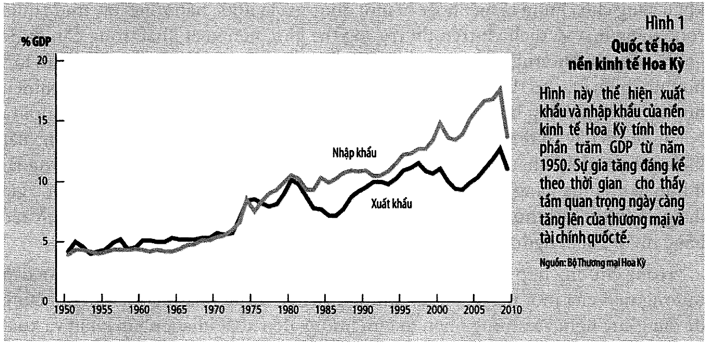
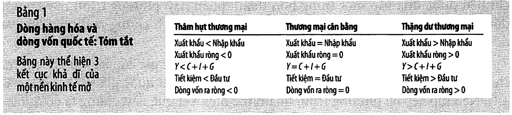
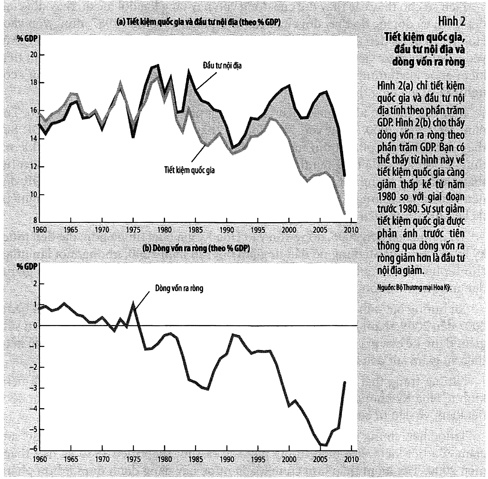
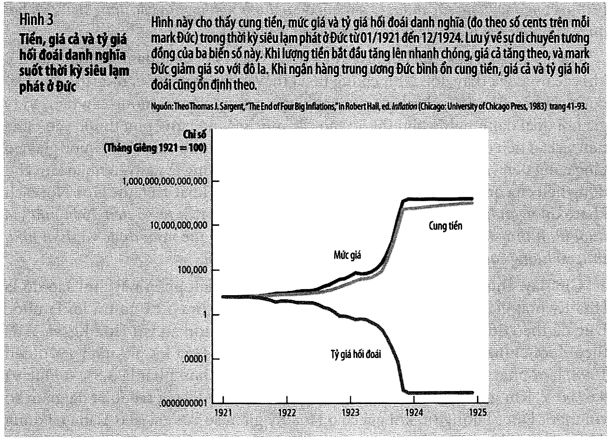
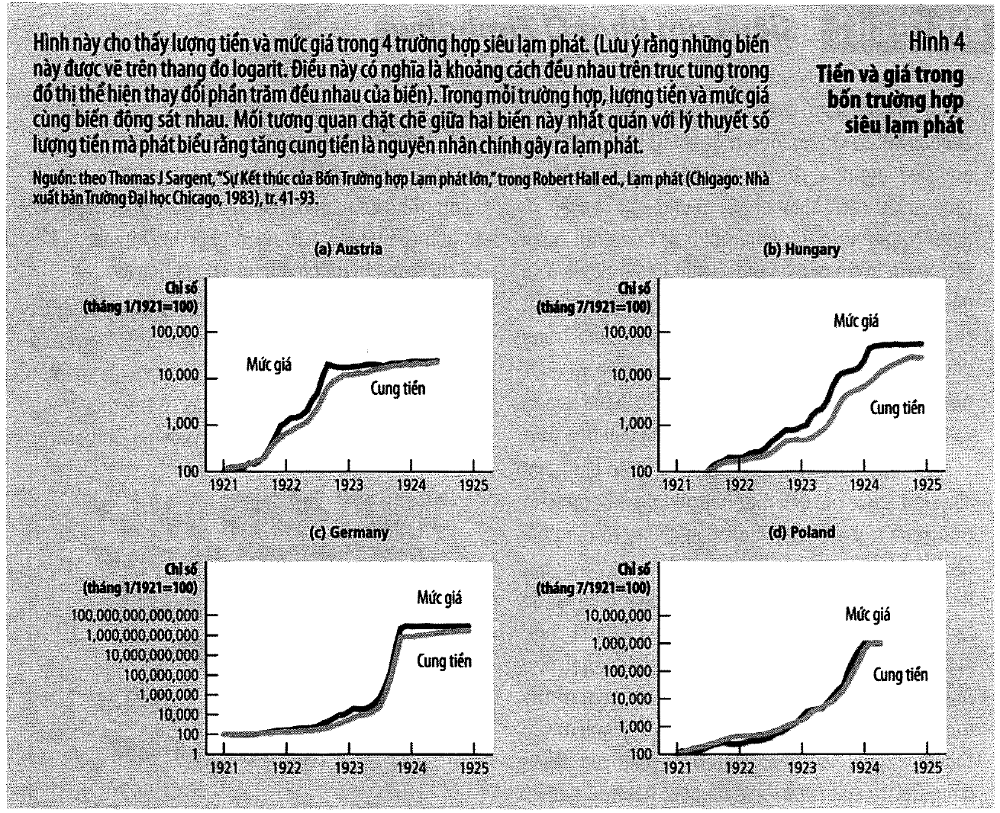

# Bài 9 — Kinh tế mở: các khái niệm cơ bản

> Bài học dựng từ **Chương 18 — Kinh tế học vĩ mô của nền kinh tế mở: các khái niệm cơ bản**
> (tr. 417–443) của *N. Gregory Mankiw — **Kinh tế học vĩ mô***, bản dịch của Khoa Kinh tế,
> **ĐH Kinh tế TP.HCM** (Cengage Learning Asia).
> 🎯 **Vòng 1.** Suốt tám bài vừa qua, mọi mô hình đều ngầm giả định **nền kinh tế đóng**. Bài này gỡ
> giả định đó ra. ⚠️ Nhưng chú ý: chương này **chỉ định nghĩa và đo**, chưa giải thích cái gì quyết
> định cái gì. Mô hình nằm ở **bài 10**. Đọc bài này như đọc bài 1 (đo GDP) và bài 2 (đo CPI) — nó là
> chương **thước đo**, và như mọi chương thước đo, chỗ khó nằm ở các **định nghĩa dễ nhầm**.
> 💼 **Góc QTKD** — ví dụ thêm cho ngành quản trị kinh doanh, **không có trong sách**.
> 📚 **Mở rộng** — thứ sách nói lướt hoặc để trong hộp phụ.
> ⚠️ — chỗ dễ hiểu sai, hoặc chỗ sách in sai.
> 📌 **Cần đọc trước:** [Bài 1](bai_01_do_luong_thu_nhap_quoc_gia.md) ($Y = C+I+G+NX$),
> [Bài 4 mục 7](bai_04_tiet_kiem_dau_tu_he_thong_tai_chinh.md#7-từ-y--c--i--g--nx-đến-s--i) ($S = I$ và
> giả định nền kinh tế đóng — bài này chính là chỗ gỡ nó ra), và
> [Bài 8 mục 8](bai_08_tang_truong_tien_va_lam_phat.md#8-hiệu-ứng-fisher) (hiệu ứng Fisher — mục 15
> của bài này ghép nó với ngang bằng sức mua).

---

## Mục lục

<!-- MUC-LUC -->

- [1. Vì sao chương này quan trọng](#1-vì-sao-chương-này-quan-trọng)
- [2. Dòng hàng hoá — xuất khẩu, nhập khẩu, xuất khẩu ròng](#2-dòng-hàng-hoá--xuất-khẩu-nhập-khẩu-xuất-khẩu-ròng)
- [3. 📚 Vì sao thế giới mở ra — Hình 1 tr. 420](#3--vì-sao-thế-giới-mở-ra--hình-1-tr-420)
- [4. Dòng vốn ra ròng](#4-dòng-vốn-ra-ròng)
- [5. NCO = NX — đồng nhất thức thứ tư của khoá này](#5-nco--nx--đồng-nhất-thức-thứ-tư-của-khoá-này)
- [6. S = I + NCO](#6-s--i--nco)
- [7. Bảng 1 tr. 426 — một mệnh đề được viết năm lần](#7-bảng-1-tr-426--một-mệnh-đề-được-viết-năm-lần)
- [8. Thâm hụt thương mại có phải vấn đề?](#8-thâm-hụt-thương-mại-có-phải-vấn-đề)
- [9. Tỷ giá hối đoái danh nghĩa](#9-tỷ-giá-hối-đoái-danh-nghĩa)
- [10. Tỷ giá hối đoái thực](#10-tỷ-giá-hối-đoái-thực)
- [11. Ngang bằng sức mua — lý thuyết đầu tiên về tỷ giá](#11-ngang-bằng-sức-mua--lý-thuyết-đầu-tiên-về-tỷ-giá)
- [12. Tiêu chuẩn hamburger — chỉ số Big Mac](#12-tiêu-chuẩn-hamburger--chỉ-số-big-mac)
- [13. Hai hạn chế của ngang bằng sức mua](#13-hai-hạn-chế-của-ngang-bằng-sức-mua)
- [14. ⭐ Carry trade — cái bẫy đắt nhất của chương](#14--carry-trade--cái-bẫy-đắt-nhất-của-chương)
- [15. 📚 Đồng Euro — hộp "Bạn có biết" tr. 430](#15--đồng-euro--hộp-bạn-có-biết-tr-430)
- [16. 📚 Đối chiếu Việt Nam](#16--đối-chiếu-việt-nam)
- [17. 💼 Góc QTKD](#17--góc-qtkd)
- [18. Code minh hoạ](#18-code-minh-hoạ)
- [19. Tự thử](#19-tự-thử)
- [20. Từ điển thuật ngữ](#20-từ-điển-thuật-ngữ)
- [21. Câu hỏi tự kiểm tra](#21-câu-hỏi-tự-kiểm-tra)
- [Tóm tắt một trang](#tóm-tắt-một-trang)
- [Nguồn](#nguồn)

<!-- /MUC-LUC -->

---

## 1. Vì sao chương này quan trọng

Sách mở bằng ba quyết định rất đời thường (tr. 417):

> *"Khi quyết định mua một chiếc xe hơi, bạn có thể so sánh các đời xe mới nhất được chào mời bởi các
> hãng Ford và Toyota. Khi lên kế hoạch cho kỳ nghỉ sắp tới, bạn có thể xem xét việc chọn bãi biển ở
> Florida hay ở Mexico. Khi bắt đầu tiết kiệm cho thời kỳ về hưu của mình, bạn có thể chọn giữa một quỹ
> tương hỗ mua cổ phiếu của các công ty Hoa Kỳ hay một quỹ đầu tư vào cổ phiếu của các công ty ở nước
> ngoài."*

Ba ví dụ đó **không phải ngẫu nhiên**: hai cái đầu là **dòng hàng hoá**, cái thứ ba là **dòng vốn**. Đó
đúng là hai nửa của chương này.

### Sách thừa nhận đã giả định gì suốt tám chương qua

Câu này quan trọng, và nó đáng đọc chậm (tr. 417):

> *"Cho đến chương này, sự phát triển kinh tế học vĩ mô của chúng ta hầu hết đã bỏ qua sự tương tác giữa
> một nền kinh tế với các nền kinh tế khác của thế giới xung quanh… Thật vậy, **nhằm giữ cho các mô hình
> thật đơn giản, kinh tế học vĩ mô thường giả định nền kinh tế đóng** – một nền kinh tế không có tương
> tác với các nền kinh tế khác."*

| Ở đâu | Giả định đóng thể hiện thế nào |
| ----- | ------------------------------ |
| [Bài 4](bai_04_tiet_kiem_dau_tu_he_thong_tai_chinh.md#7-từ-y--c--i--g--nx-đến-s--i) | $NX = 0$, nên $S = I$ |
| [Bài 6](bai_06_that_nghiep.md) | tỷ lệ thất nghiệp tự nhiên, không có tác động thương mại |
| [Bài 8](bai_08_tang_truong_tien_va_lam_phat.md) | lạm phát thuần là hiện tượng tiền tệ trong nước |

📌 Sách gọi các vấn đề quốc tế trong những chương ấy là *"có tính phụ trợ"* (tr. 417). Đó là một lời tự
thú có kiểm soát: giả định đóng **không đúng**, nhưng nó không làm sai kết luận của những chương đó. Bài
này và bài 10 mới là chỗ nó thật sự quan trọng.

### Chương này làm gì và **không** làm gì

⚠️ Đây là chỗ dễ thất vọng nếu không biết trước (tr. 418):

> *"Chúng ta bắt đầu chương này bằng việc thảo luận các biến số kinh tế vĩ mô quan trọng mô tả sự tương
> tác của một nền kinh tế mở với các thị trường thế giới… **Công việc trước tiên của chúng ta là hiểu
> các thông tin dữ liệu này có nghĩa là gì.** Ở chương tiếp theo, chúng ta sẽ phát triển một mô hình để
> giải thích các biến số này được xác định như thế nào."*

| Bài | Nhiệm vụ |
| --- | -------- |
| **Bài 9** (chương này) | **định nghĩa và đo** — NX, NCO, tỷ giá danh nghĩa, tỷ giá thực, PPP |
| **Bài 10** (chương 19) | **mô hình** — cái gì quyết định các biến ấy, chính sách tác động ra sao |

📌 Cấu trúc này lặp lại đúng cặp bài 1–2 (đo GDP và CPI) rồi bài 3–4 (mô hình dài hạn). Sách luôn đo
trước, giải thích sau. Lý do rất thực dụng: nếu định nghĩa mập mờ thì mô hình dựng trên nó cũng vô nghĩa.

---

## 2. Dòng hàng hoá — xuất khẩu, nhập khẩu, xuất khẩu ròng

| Khái niệm | Định nghĩa của sách (tr. 418) |
| --------- | ----------------------------- |
| **Xuất khẩu** | *"những hàng hóa và dịch vụ sản xuất trong nước và được bán ra nước ngoài"* |
| **Nhập khẩu** | *"những hàng hóa và dịch vụ sản xuất ở nước ngoài và được bán trong nước"* |
| **Xuất khẩu ròng** | *"giá trị xuất khẩu trừ giá trị nhập khẩu của một quốc gia, còn gọi là cán cân thương mại"* |

$$NX = \text{XK} - \text{NK}$$

Hai ví dụ của sách rất đáng dùng vì chúng cho thấy **cùng một giao dịch là hai thứ khác nhau tuỳ đứng ở
đâu** (tr. 418):

| Giao dịch | Với Hoa Kỳ | Với nước kia |
| --------- | ---------- | ------------ |
| Boeing bán máy bay cho hãng hàng không Pháp | **xuất khẩu** | nhập khẩu (Pháp) |
| Volvo bán xe hơi cho một cư dân Hoa Kỳ | **nhập khẩu** | xuất khẩu (Thuỵ Điển) |

### Ba tên gọi cho ba dấu

| Tên gọi | Điều kiện | Nghĩa |
| ------- | --------- | ----- |
| **Thặng dư thương mại** | $XK > NK$, $NX > 0$ | bán ròng ra thế giới |
| **Thương mại cân bằng** | $XK = NK$, $NX = 0$ | không bên nào ròng |
| **Thâm hụt thương mại** | $XK < NK$, $NX < 0$ | mua ròng từ thế giới |

⚠️ Ba cái tên này mang màu sắc đánh giá mà bản thân con số **không** có. "Thặng dư" nghe như lời, "thâm
hụt" nghe như lỗ. [Mục 8](#8-thâm-hụt-thương-mại-có-phải-vấn-đề) sẽ cho thấy điều đó sai đến mức nào.

### Sáu nhân tố làm đổi thương mại (tr. 419)

1. Sở thích của người tiêu dùng về hàng trong nước và hàng nước ngoài
2. Giá cả của hàng hoá tại nước nhà và nước ngoài
3. **Tỷ giá hối đoái** mà theo đó người ta có thể sử dụng nội tệ để mua ngoại tệ
4. Thu nhập của người tiêu dùng tại nước nhà và bên ngoài
5. Chi phí vận chuyển hàng hoá từ nước này đến nước khác
6. Các chính sách của chính phủ hướng đến thương mại quốc tế

📌 Đọc lại danh sách này và hỏi: **chính sách tiền tệ chạm được vào cái nào?** Chỉ nhân tố 3 (và gián
tiếp nhân tố 2, qua lạm phát). Đó là lý do nửa sau chương dành trọn cho tỷ giá.

---

## 3. 📚 Vì sao thế giới mở ra — Hình 1 tr. 420



Sách đưa số liệu (tr. 419): trong thập niên 1950, xuất và nhập khẩu hàng hoá dịch vụ của Hoa Kỳ ở mức
**4–5% GDP**; những năm gần đây *"tỷ lệ này đã nhiều hơn gấp đôi"*.

Điều đáng học không phải con số, mà là **cách sách giải thích nó**. Không có chữ "toàn cầu hoá" nào cả —
chỉ có công nghệ và luật:

| Nguyên nhân | Bằng chứng sách dẫn (tr. 420–421) |
| ----------- | --------------------------------- |
| **Vận tải** | tàu buôn 1950 chở < 10.000 tấn → nay > 100.000 tấn (**×10**) |
| | máy bay đường dài 1958, máy bay tải trọng lớn 1967 |
| **Viễn thông** | cáp điện thoại xuyên Đại Tây Dương *mãi đến 1956* mới có |
| | 1966: **138** cuộc gọi đồng thời Bắc Mỹ – châu Âu → nay hơn **một triệu** (**×7.246**) |
| **Chính sách** | NAFTA, GATT hạ thuế quan, hạn ngạch, rào cản |

### ⭐ Nhận xét tinh tế nhất của mục này

Công nghệ không chỉ làm vận chuyển rẻ hơn — nó **đổi cả cơ cấu hàng hoá** (tr. 420–421):

> *"Khi các nguyên liệu thô kềnh càng (như thép) và các hàng hóa dễ hư hỏng (như thực phẩm) chiếm phần
> lớn sản lượng đầu ra của thế giới, các hàng hóa vận chuyển này thường tốn kém chi phí và đôi khi là
> không thể vận chuyển được. Ngược lại, hàng hóa được sản xuất với công nghệ hiện đại thì thường nhẹ và
> dễ vận chuyển."*

Ví dụ cực đoan nhất mà sách chọn: **phim ảnh**. *"Một khi phim trường ở Hollywood sản xuất ra một bộ
phim mới, nó có thể gửi các bản sao của bộ phim này đến khắp nơi trên thế giới với chi phí gần như bằng
zero. Thực vậy, phim ảnh là ngành xuất khẩu chính của Hoa Kỳ."* (tr. 420–421)

📌 Nối về [bài 3](bai_03_san_xuat_va_tang_truong.md): thương mại tăng vì **chi phí giao dịch giảm**, và
chi phí giao dịch giảm vì **công nghệ tiến**. Cùng một biến đứng sau tăng trưởng dài hạn cũng đứng sau
toàn cầu hoá. Đây không phải hai câu chuyện.

Và sách ghi nhận đây là điều gần như không ai phản đối (tr. 421): *"Mô thức gia tăng thương mại được mô
tả trong Hình 1 là một hiện tượng mà hầu hết các nhà kinh tế học và các nhà chính sách xác nhận và thúc
đẩy."*

---

## 4. Dòng vốn ra ròng

> **Dòng vốn ra ròng** (tr. 421): *"mua sắm tài sản nước ngoài của cư dân trong nước trừ đi mua sắm tài
> sản trong nước bởi người nước ngoài."*

$$NCO = \text{mua tài sản NN của cư dân ta} - \text{mua tài sản ta của người NN}$$

Ví dụ mở đầu của sách rất gọn và nên nhớ (tr. 421): một cư dân Hoa Kỳ có **20.000 đô la** có thể dùng
mua **một chiếc Toyota** — đó là dòng hàng hoá — hoặc mua **cổ phiếu Công ty Toyota** — đó là dòng vốn.
**Cùng một số tiền, hai con đường hoàn toàn khác nhau.**

| Giao dịch | NCO của Hoa Kỳ |
| --------- | -------------- |
| Cư dân Hoa Kỳ mua cổ phiếu Telmex (Mexico) | **tăng** |
| Cư dân Nhật mua trái phiếu chính phủ Hoa Kỳ | **giảm** |

### Hai hình thức (tr. 421–422)

| | Đầu tư **trực tiếp** nước ngoài | Đầu tư **gián tiếp** nước ngoài |
| --- | --- | --- |
| Ví dụ của sách | McDonald khai trương cửa hàng ở Nga | một người Mỹ mua cổ phiếu công ty Nga |
| Vai trò chủ sở hữu | *"quản lý một cách chủ động"* | *"vai trò thụ động hơn"* |

⚠️ Trong đồng nhất thức ở [mục 5](#5-nco--nx--đồng-nhất-thức-thứ-tư-của-khoá-này), **hai hình thức này
hoàn toàn tương đương**. Nhưng chúng **không** tương đương về tác động kinh tế — xem
[mục 17(d)](#17--góc-qtkd).

### Đọc dấu của NCO

| Dấu | Nghĩa (tr. 422) |
| --- | --------------- |
| $NCO > 0$ | *"Vốn trong trường hợp này được gọi là đang đi ra khỏi quốc gia"* |
| $NCO < 0$ | *"Vốn trong trường hợp này là đang đi vào quốc gia"* — thường gọi là **dòng vốn vào** |

📌 Cái tên "dòng vốn **ra** ròng" là một cái bẫy đọc: khi báo nói "dòng vốn vào Việt Nam tăng", nghĩa là
$NCO$ của Việt Nam **âm hơn**. Luôn dịch về dấu trước khi lập luận.

### Bốn biến tác động đến NCO (tr. 422)

1. Lãi suất **thực** trả cho tài sản nước ngoài
2. Lãi suất **thực** trả cho tài sản trong nước
3. Các rủi ro **kinh tế và chính trị** của việc nắm giữ tài sản nước ngoài
4. Các chính sách của chính phủ tác động đến quyền sở hữu tài sản trong nước của người nước ngoài

Sách minh hoạ bằng lựa chọn giữa trái phiếu chính phủ Mexico và trái phiếu chính phủ Hoa Kỳ (tr. 422):
lãi suất thực cao hơn thì hấp dẫn hơn, *"tuy nhiên… các nhà đầu tư Hoa Kỳ cũng phải tính đến rủi ro mà
một trong hai chính phủ này có thể mất khả năng chi trả cho các khoản nợ của mình… cũng như bất kỳ những
hạn chế mà chính phủ Mexico ban hành, hay có thể sẽ ban hành trong tương lai."*

⭐ Ba yếu tố ấy — **lãi suất, rủi ro tín dụng, rủi ro chính sách** — chính là ba trong sáu thứ đã học ở
[bài 4 mục 2](bai_04_tiet_kiem_dau_tu_he_thong_tai_chinh.md#2-thị-trường-trái-phiếu) và
[bài 5](bai_05_cong_cu_co_ban_cua_tai_chinh.md). Không có khái niệm mới nào ở đây, chỉ có việc áp chúng
qua biên giới.

---

## 5. NCO = NX — đồng nhất thức thứ tư của khoá này

$$\boxed{NCO = NX}$$

> *"Phương trình này luôn duy trì bởi vì **mỗi giao dịch tác động đến một phía của phương trình này thì
> cũng tác động đến phía bên kia một lượng chính xác như nhau**. Phương trình này được gọi là một đồng
> nhất thức – một phương trình phải đúng bởi vì cách các biến số trong phương trình được định nghĩa và
> được đo lường."* (tr. 423)

### Bốn đồng nhất thức của khoá này, đặt cạnh nhau

| Đồng nhất thức | Bài | Đúng vì |
| -------------- | --- | ------- |
| $Y = C + I + G + NX$ | [1](bai_01_do_luong_thu_nhap_quoc_gia.md) | định nghĩa của bốn thành phần |
| $S = I$ | [4](bai_04_tiet_kiem_dau_tu_he_thong_tai_chinh.md#7-từ-y--c--i--g--nx-đến-s--i) | định nghĩa của $S$, **nền kinh tế đóng** |
| $M \times V = P \times Y$ | [8](bai_08_tang_truong_tien_va_lam_phat.md#3-phương-trình-số-lượng) | định nghĩa của $V$ |
| $NCO = NX$ | **9** | mọi giao dịch quốc tế có **hai vế** |

📌 Đến đây bạn nên bắt đầu thấy một mô thức: kinh tế vĩ mô xây trên một tầng **kế toán** rất chặt, và
mọi "phát hiện" của nó phần lớn là việc đọc đồng nhất thức theo một hướng mới. Đó không phải điểm yếu —
đó là lý do các kết luận của nó khó bác bỏ.

### Ví dụ mà sách dùng để chứng minh, và nó rất đáng theo đến cùng

Bạn ở Hoa Kỳ, viết phần mềm, bán cho người Nhật với giá **10.000 yên**. Đó là **xuất khẩu** của Hoa Kỳ,
nên $NX$ tăng. Câu hỏi: **cái gì làm vế kia tăng theo?** (tr. 423)

| Bạn làm gì với 10.000 yên | $NX$ | $NCO$ | Vì sao |
| ------------------------- | :--: | :---: | ------ |
| Để dưới tấm đệm (giữ yên) | ↑ | ↑ | *"bạn đang sử dụng phần thu nhập của mình đầu tư vào nền kinh tế Nhật"* — **yên là một tài sản Nhật** |
| Mua cổ phiếu / trái phiếu Nhật | ↑ | ↑ | rõ ràng là tài sản nước ngoài |
| Mua đĩa game Wii của Nhật | ↑ | **0** | nhập khẩu cũng tăng đúng bằng vậy → $NX$ **không đổi** |
| Đổi 10.000 yên lấy đô la ở ngân hàng | ↑ | ↑ | **ngân hàng** giờ phải làm một trong ba việc trên |

⭐ **Dòng thứ ba là dòng đắt nhất.** Nếu bạn dùng yên mua hàng Nhật thì **không ai** ở Hoa Kỳ kết thúc
với một tài sản nước ngoài — nhưng cũng **không có** xuất khẩu ròng, vì xuất khẩu và nhập khẩu tăng như
nhau. Cả hai vế bằng 0. Đồng nhất thức vẫn đúng.

**Dòng thứ tư** đóng lại mọi lối thoát: đổi yên lấy đô la không làm biến mất 10.000 yên, nó chỉ chuyển
chủ. *"Ngân hàng có thể mua tài sản Nhật (dòng vốn ra ròng của Hoa Kỳ); ngân hàng có thể mua một hàng
hóa của Nhật (nhập khẩu của Hoa Kỳ); hay ngân hàng có thể bán yên cho một người Mỹ khác khi người này
cần yên để thực hiện một giao dịch nào đó."* (tr. 423)

Sách chốt bằng hai câu tổng quát, đọc theo dấu (tr. 424):

| Tình huống | Chuyện gì đang xảy ra |
| ---------- | --------------------- |
| $NX > 0$ | *"quốc gia này đang bán hàng hóa và dịch vụ cho nước ngoài nhiều hơn là mua hàng hóa và dịch vụ từ nước ngoài… Nước này phải đang sử dụng số tiền này để mua tài sản nước ngoài. Vốn đang chảy ra khỏi quốc gia ($NCO > 0$)"* |
| $NX < 0$ | *"Việc mua ròng hàng hóa và dịch vụ này được tài trợ như thế nào trên thị trường thế giới? Đất nước này phải đang bán tài sản ra nước ngoài. Vốn đang đi vào quốc gia này ($NCO < 0$)"* |

> ⭐ *"Dòng hàng hóa và dịch vụ quốc tế và dòng vốn quốc tế là **hai mặt của cùng một đồng xu**."* (tr. 424)

### ⚠️ Một chỗ trông như mâu thuẫn — bài tập 1 tr. 440

Đề hỏi mỗi giao dịch thuộc $NX$ hay $NCO$, tăng hay giảm:

| | Giao dịch | Biến | Hướng |
| --- | --------- | ---- | ----- |
| a | Một người Mỹ mua một chiếc ti vi Sony | $NX$ | **giảm** |
| b | Một người Mỹ mua một cổ phần của hãng Sony | $NCO$ | **tăng** |
| c | Quỹ hưu bổng Sony mua một trái phiếu Kho bạc Hoa Kỳ | $NCO$ | giảm |
| d | Công nhân nhà máy Sony mua trái đào từ nông trại Hoa Kỳ | $NX$ | tăng |

⚠️ Đọc kỹ (a) và (b): cả hai đều là người Mỹ tiêu tiền cho Nhật, nhưng một cái làm $NX$ **giảm** còn cái
kia làm $NCO$ **tăng** — hai hướng ngược nhau. Nghe như phản chứng cho $NCO = NX$.

**Không phải.** Mỗi dòng trong bảng chỉ ghi **một vế** của giao dịch. Vế còn lại là thứ người Nhật làm
với số đô la nhận được — và chính nó làm vế kia khớp lại. Đề bài cố tình chỉ hỏi một nửa.

---

## 6. S = I + NCO

Bây giờ gỡ giả định của bài 4.

$$Y = C + I + G + NX \quad \xrightarrow{\text{trừ } C \text{ và } G} \quad \underbrace{Y - C - G}_{S} = I + NX$$

$$S = I + NX \quad \xrightarrow{NX = NCO} \quad \boxed{S = I + NCO}$$

> **Tiết kiệm = Đầu tư nội địa + Dòng vốn ra ròng** (tr. 425)

Sách diễn giải (tr. 425):

> *"khi công dân Hoa Kỳ tiết kiệm một đô la từ thu nhập của họ cho tương lai, đô la đó có thể được sử
> dụng để tài trợ tích lũy vốn nội địa hay có thể sử dụng để tài trợ cho việc mua vốn ở nước ngoài."*

### So với bài 4

| | Bài 4 (nền kinh tế **đóng**) | Bài 9 (nền kinh tế **mở**) |
| --- | --- | --- |
| Đẳng thức | $S = I$ | $S = I + NCO$ |
| Tiết kiệm đi đâu | **một** cửa | **hai** cửa |
| Quan hệ | trường hợp riêng $NCO = 0$ | trường hợp tổng quát |

⭐ **Cái duy nhất đổi là tiết kiệm giờ có hai chỗ để đi.** Không có khái niệm mới nào — chỉ có một cửa
ra thứ hai. Đó là toàn bộ nội dung của việc "mở" nền kinh tế trong khung này.

### Ví dụ hộ Smith — theo đúng một đồng tiền (tr. 425)

```
hộ Smith gửi tiết kiệm vào quỹ tương hỗ        →  S   (vế trái)
        │
        ├── quỹ mua cổ phiếu General Motors
        │       GM xây nhà máy ở Ohio           →  I   (đầu tư nội địa)
        │
        └── quỹ mua cổ phiếu Toyota
                Toyota xây nhà máy ở Osaka      →  NCO (dòng vốn ra ròng)
```

⚠️ Chú ý câu này của sách (tr. 425): *"việc mua cổ phiếu Toyota của một cư dân Hoa Kỳ là dòng vốn ra
ròng"* — **không** phải đầu tư. Đúng y cảnh báo ở
[bài 4 mục 9](bai_04_tiet_kiem_dau_tu_he_thong_tai_chinh.md#9--tiết-kiệm-không-phải-đầu-tư): mua cổ
phiếu là **tiết kiệm**, chỉ cái **nhà máy** mới là đầu tư. Ở đây thêm một lớp: nhà máy ở **Osaka** là
đầu tư của **Nhật**, và với Hoa Kỳ nó là $NCO$.

Và sách nhấn hệ thống tài chính vẫn ở giữa (tr. 425): *"chúng ta có thể xem hệ thống tài chính nằm ở
giữa hai phía của đồng nhất thức này."*

---

## 7. Bảng 1 tr. 426 — một mệnh đề được viết năm lần



Bảng 1 của sách trông như một bảng phải học thuộc. Nó **không phải**. Nó là **một** mệnh đề được phát
biểu lại năm lần bằng năm ngôn ngữ khác nhau.

[Code](#18-code-minh-hoạ) chứng minh điều đó: nhận **một** giả thiết duy nhất — quan hệ giữa $S$ và
$I$ — rồi suy ra cả năm dòng, và `assert` rằng ba dấu luôn trùng nhau.

| | **Thâm hụt** | **Cân bằng** | **Thặng dư** |
| --- | :---: | :---: | :---: |
| Xuất khẩu ? Nhập khẩu | $XK < NK$ | $XK = NK$ | $XK > NK$ |
| Xuất khẩu ròng | $NX < 0$ | $NX = 0$ | $NX > 0$ |
| $Y$ ? $C + I + G$ | $Y < C{+}I{+}G$ | $Y = C{+}I{+}G$ | $Y > C{+}I{+}G$ |
| Tiết kiệm ? Đầu tư | $S < I$ | $S = I$ | $S > I$ |
| Dòng vốn ra ròng | $NCO < 0$ | $NCO = 0$ | $NCO > 0$ |

✅ Đã kiểm bằng `assert`: **trong mỗi cột, năm dòng luôn cho cùng một dấu.**

⭐ Hệ quả cụ thể: **không thể có nước nào vừa thâm hụt thương mại vừa có vốn chảy ra.** Không phải vì
điều đó khó, mà vì nó **vô nghĩa về mặt kế toán** — như nói một người vừa cao 1m70 vừa cao 1m80.

### Cách đọc dòng thứ ba, bằng lời của sách (tr. 426)

> *"Nếu thu nhập $Y$ lớn hơn chi tiêu $C + I + G$, thì tiết kiệm $S = Y – C – G$ phải lớn hơn đầu tư $I$.
> Vì quốc gia đang có tiết kiệm lớn hơn đầu tư, quốc gia này phải đang gửi một phần tiết kiệm của mình
> ra bên ngoài."*

📌 Diễn nôm: nền kinh tế làm ra nhiều hơn số nó dùng hết. **Phần thừa phải đi ra ngoài** — và nó đi ra
đồng thời dưới **hai** dạng: dạng **hàng** (thặng dư thương mại) và dạng **vốn** (NCO dương). Đó là cùng
một phần thừa, nhìn từ hai phía.

---

## 8. Thâm hụt thương mại có phải vấn đề?

Đây là nghiên cứu tình huống của sách (tr. 426–429), và nó là phần **có ích nhất về mặt tư duy** trong
cả chương.



Sách mở bằng cách người ta thường nói (tr. 426–427): *"Các bạn có thể nghe thấy báo chí gọi Hoa Kỳ là
'quốc gia vay nợ lớn nhất thế giới'."*

### 📚 Suy ngược từ đồng nhất thức

Sách cho các con số **rời rạc** ở tr. 428 — mỗi giai đoạn nó nêu một hoặc hai biến, không nêu đủ ba. Vì
$NCO = S - I$ là đồng nhất thức, ta **suy ra được con số còn thiếu**.

| Giai đoạn | Sách in | Suy ra |
| --------- | ------- | ------ |
| **1980–1987** | dòng vốn vào **0,5% → 3,1%** GDP (tức $\Delta NCO = -2{,}6$ điểm); tiết kiệm giảm **3,2** điểm | ⟹ **đầu tư giảm 0,6 điểm** |
| **1991–2000** | dòng vốn vào **0,5% → 3,9%** GDP (tức $\Delta NCO = -3{,}4$ điểm); đầu tư **13,4% → 17,7%** (+4,3 điểm) | ⟹ **tiết kiệm TĂNG 0,9 điểm** |

✅ Cả hai kiểm bằng `assert`, và cả hai khớp với cách sách kể lại bằng lời.

Giai đoạn 1: sách quy nguyên nhân sâu xa cho *"sự giảm đi của tiết kiệm chính phủ - có nghĩa là sự gia
tăng thâm hụt ngân sách chính phủ"* (tr. 428).

📌 Đó chính là **hiện tượng lấn át** của
[bài 4 mục 13](bai_04_tiet_kiem_dau_tu_he_thong_tai_chinh.md#13-chính-sách-3--thâm-hụt-thặng-dư-và-hiện-tượng-lấn-át).
Nhưng ở nền kinh tế **mở**, một phần của nó **rò rỉ ra thành thâm hụt thương mại** thay vì rơi hết vào
đầu tư. Đó là bổ sung thật sự mà bài này thêm vào bài 4.

Giai đoạn 2: sách viết *"tiết kiệm đã tăng lên theo thời gian, khi ngân sách chính phủ chuyển từ thâm
hụt sang thặng dư. Nhưng đầu tư chuyển từ 13,4% thành 17,7% GDP, do nền kinh tế tận hưởng sự bùng nổ của
công nghệ thông tin"* (tr. 428) — khớp với con số +0,9 điểm mà code suy ra.

### ⭐⭐ Cùng một con số thâm hụt, hai ý nghĩa ngược nhau

| Giai đoạn | Nguyên nhân | Sách đánh giá |
| --------- | ----------- | ------------- |
| **1980s** | **tiết kiệm** sụt | **đáng lo** |
| **1990s** | **đầu tư** bùng nổ | **ít đáng lo** — đang mua vốn mới |

Lập luận cho 1980s (tr. 428) — và nó phản trực giác:

> *"Tuy nhiên, một khi tiết kiệm quốc gia giảm, không có lý do gì để phàn nàn về kết quả thâm hụt thương
> mại đang diễn ra. Nếu tiết kiệm quốc gia giảm mà không quy kết cho thâm hụt thương mại, đầu tư ở Hoa
> Kỳ phải giảm. Đến lượt mình, đầu tư giảm sẽ có tác động ngược đối với tăng trưởng trữ lượng vốn, năng
> suất lao động, và tiền lương thực. **Nói cách khác, với mức sụt giảm tiết kiệm của Hoa Kỳ cho trước,
> cách tốt nhất là có người nước ngoài đầu tư vào nền kinh tế Hoa Kỳ hơn là không có ai làm gì cả.**"*

📌 Đọc câu cuối cho kỹ. Thâm hụt thương mại ở đây **không phải bệnh, mà là thuốc** — thuốc cho một bệnh
khác (tiết kiệm sụt). Bỏ thuốc thì bệnh nặng thêm.

Lập luận cho 1990s (tr. 428):

> *"nền kinh tế đang vay từ bên ngoài để mua hàng hóa vốn mới. Nếu phần vốn thêm vào này cung cấp sinh
> lợi tốt dưới hình thức sản xuất ra hàng hóa và dịch vụ nhiều hơn, thì nền kinh tế sẽ có khả năng giải
> quyết các khoản nợ đang được tích lũy. Mặc khác, nếu các dự án đầu tư thất bại trong việc thu được
> sinh lợi kỳ vọng, nợ nần sẽ trở nên không như ý muốn."*

### Kết luận của sách — cố ý không dứt khoát (tr. 429)

> *"Không có câu trả lời chính xác và đơn giản cho câu hỏi được đặt tên để tựa của tình huống nghiên cứu
> này. Chỉ khi một cá nhân rơi vào tình trạng nợ nần trong hoàn cảnh khôn ngoan hay phung phí thì mới
> thấy được, quốc gia cũng vậy. **Thâm hụt thương mại bản thân nó không phải là vấn đề, nhưng đôi lúc nó
> có thể là một triệu chứng của vấn đề.**"*

⭐ Đây là **lần thứ ba** khoá này dùng cùng một hình thức lập luận:

| Bài | Câu hỏi sai | Câu hỏi đúng |
| --- | ----------- | ------------ |
| [4](bai_04_tiet_kiem_dau_tu_he_thong_tai_chinh.md#14-lịch-sử-nợ-chính-phủ-hoa-kỳ--hình-5-tr-306) | nợ chính phủ cao hay thấp? | vay **để làm gì**? |
| [7](bai_07_he_thong_tien_te.md#10-vốn-tự-có-và-đòn-bẩy) | đòn bẩy cao hay thấp? | đòn bẩy **để làm gì**, và dòng tiền dao động bao nhiêu? |
| **9** | thâm hụt hay thặng dư? | dòng vốn vào tài trợ **đầu tư** hay bù cho **tiêu dùng**? |

---

## 9. Tỷ giá hối đoái danh nghĩa

> **Tỷ giá hối đoái danh nghĩa** (tr. 429): *"mức mà một người có thể mua bán một loại tiền tệ của một
> quốc gia với tiền tệ của quốc gia khác."*

### ⚠️ Quy ước phải nhớ, nếu không sẽ sai dấu mỗi lần

Sách nói rõ (tr. 429):

> *"Suốt quyển sách này, chúng tôi luôn thể hiện tỷ giá hối đoái danh nghĩa dưới dạng **số đơn vị ngoại
> tệ đổi lấy một đô la Mỹ**, ví dụ 80 yên một đô la."*

$$e = 80 \text{ yên/USD} \quad\Longleftrightarrow\quad \frac{1}{80} = 0{,}0125 \text{ USD/yên}$$

Hai cách viết cùng một sự thật. Sách dùng cách thứ nhất. **Mọi phát biểu về "lên giá" và "giảm giá" trong
chương này đều theo quy ước đó.**

| Tỷ giá đổi | Gọi là gì | Đô la… |
| ---------- | --------- | ------ |
| 80 → **90** yên/USD | **sự lên giá** của đô la | mua được **nhiều** yên hơn |
| 80 → **70** yên/USD | **sự giảm giá** của đô la | mua được **ít** yên hơn |

Và nhìn từ phía kia, cùng một sự kiện:

- 80 → 90: đô la **lên giá**, yên **giảm giá**
- 80 → 70: đô la **giảm giá**, yên **lên giá**

📌 Không có sự kiện tỷ giá nào chỉ có một phía. Mỗi lần đọc tin về tỷ giá, hãy tự dịch sang phía kia —
đó là cách nhanh nhất để không nhầm dấu.

### ⚠️ "Mạnh lên" và "yếu đi" là hai chữ mang màu sắc mà con số không có

Sách ghi nhận (tr. 430): *"Thỉnh thoảng bạn có thể nghe thấy phương tiện truyền thông báo đô la hoặc là
đang 'mạnh lên' hay 'yếu đi'."*

Bài tập 5 tr. 441 hỏi đúng chuyện đó — ai vui, ai không vui khi đô la **lên giá**:

| Nhóm | Thấy sao | Vì sao |
| ---- | -------- | ------ |
| Quỹ hưu bổng Hà Lan giữ trái phiếu chính phủ Hoa Kỳ | **VUI** | tài sản USD đổi ra euro được nhiều hơn |
| Các ngành công nghiệp chế tạo Hoa Kỳ | **KHÔNG VUI** | hàng Mỹ đắt lên ở nước ngoài |
| Người du lịch Úc định sang Hoa Kỳ | **KHÔNG VUI** | chuyến đi đắt lên |
| Hãng Hoa Kỳ đang mua tài sản ở nước ngoài | **VUI** | đô la mua được nhiều hơn |

⭐ **Đồng tiền "mạnh" là tin tốt cho một nửa nền kinh tế và tin xấu cho nửa kia.** Không có chuyện một
đồng tiền mạnh thì tốt cho tất cả mọi người. Chữ "mạnh" là chữ của báo chí, không phải của kinh tế học.

### Nhiều tỷ giá song song

Sách nhắc (tr. 431): đô la có tỷ giá với yên, bảng, peso… nên khi các nhà kinh tế nói "đô la lên giá",
thường họ nói về một **chỉ số tỷ giá** — *"tương tự như chỉ số giá tiêu dùng chuyển đổi nhiều mức giá
của nền kinh tế thành một số đo riêng lẻ về mức giá chung."*

📌 Cùng một kỹ thuật gộp mà [bài 2](bai_02_do_luong_chi_phi_sinh_hoat.md) đã dùng cho CPI — kể cả cùng
những vấn đề về quyền số.

---

## 10. Tỷ giá hối đoái thực

> **Tỷ giá hối đoái thực** (tr. 431): *"mức mà ở đó một người có thể trao đổi **hàng hóa và dịch vụ** của
> một nước với hàng hóa và dịch vụ của nước khác."*

$$\text{tỷ giá thực} = \frac{e \times P}{P^*}$$

trong đó $e$ = ngoại tệ trên 1 USD, $P$ = giá hàng **nội địa** tính bằng USD, $P^*$ = giá hàng **nước
ngoài** tính bằng ngoại tệ.

### Ví dụ gạo của sách (tr. 431)

| | |
| --- | ---: |
| Gạo Mỹ $P$ | 100 USD/giạ |
| Gạo Nhật $P^*$ | 16.000 yên/giạ |
| Tỷ giá $e$ | 80 yên/USD |
| Giá gạo Mỹ tính bằng yên | $80 \times 100 = 8.000$ yên/giạ |
| **Tỷ giá thực** | $8.000 / 16.000 = $ **½ giạ gạo Nhật cho 1 giạ gạo Mỹ** |

✅ Kiểm bằng `assert`. Khớp với sách: *"Giá gạo Mỹ chỉ mua bằng một nửa giá gạo Nhật."*

Và câu hỏi ôn tập 5 tr. 440 làm lại với xe hơi: xe Nhật 500.000 yên, xe Mỹ 10.000 USD, $e = 100$ yên/USD
→ tỷ giá thực $= (100 \times 10.000)/500.000 = $ **2 xe Nhật cho 1 xe Mỹ**.

### ⭐ Vì sao tỷ giá THỰC mới là cái quan trọng

> *"tỷ giá hối đoái thực là nhân tố quan trọng xác định một quốc gia xuất khẩu và nhập khẩu bao nhiêu."*
> (tr. 432)

| Tỷ giá thực của Hoa Kỳ | Hàng Mỹ trở nên | $NX$ của Hoa Kỳ |
| ---------------------- | --------------- | --------------- |
| **giảm** | rẻ hơn tương đối | **tăng** |
| **tăng** | đắt hơn tương đối | **giảm** |

Hai ví dụ đời thường của sách (tr. 432): công ty của Ben chọn mua gạo Nhật hay gạo Mỹ để đóng gói; bạn
chọn nghỉ ở Miami hay Cancun. *"Nếu bạn quyết định nơi nghỉ của mình bằng cách so sánh chi phí, bạn đang
đưa ra quyết định căn cứ vào tỷ giá hối đoái thực."*

### ⚠️⚠️ Bài tập 8 tr. 441–442 — vì sao phải có hai khái niệm

| | Tình huống | Tỷ giá thực đổi |
| --- | ---------- | --------------: |
| a | $e$ **không đổi**, giá Mỹ tăng nhanh hơn | **TĂNG 10%** |
| b | $e$ không đổi, giá nước ngoài tăng nhanh hơn | giảm 9,1% |
| c | $e$ giảm 10%, giá không đổi cả hai nơi | giảm 10% |
| d | $e$ giảm, giá nước ngoài tăng nhanh hơn | giảm 18,2% |

⭐ **Đọc câu (a) và (c) cạnh nhau.** Ở (a) tỷ giá **danh nghĩa** không đổi một đồng nào, mà tỷ giá
**thực** vẫn lên giá 10%. Ở (c) tỷ giá danh nghĩa giảm 10% và tỷ giá thực cũng giảm đúng 10%.

📌 **Tỷ giá danh nghĩa một mình không cho biết sức cạnh tranh của bạn đổi thế nào.** Đó chính xác là lý
do phải có khái niệm thứ hai — và là nội dung của [mục 17(a)](#17--góc-qtkd).

---

## 11. Ngang bằng sức mua — lý thuyết đầu tiên về tỷ giá

Sách mở bằng một câu đố (tr. 432–433): năm 1970, một đô la Mỹ mua được **3,65 mark Đức** hay **627 lira
Ý**. Năm 1998, mua được **1,76 mark** hay **1.737 lira**.

> *"Nói cách khác, trải qua giai đoạn này, giá trị đô la đã giảm hơn một nửa so mark Đức, trong khi lại
> tăng gấp đôi so với lira Ý."* (tr. 433)

**Cùng một đồng tiền, hai hướng ngược nhau, cùng một giai đoạn.** Cái gì giải thích được điều đó?

> **Ngang bằng sức mua** (tr. 433): *"lý thuyết về tỷ giá hối đoái theo đó một đơn vị của bất kỳ loại
> tiền tệ cho trước nào sẽ có thể mua được cùng một số lượng hàng hóa ở tất cả các quốc gia."*

### Xây từ quy luật một giá

> *"một hàng hóa phải được bán với cùng một mức giá ở tất cả các địa điểm"* (tr. 433)

Vì nếu không, có **kinh doanh chênh lệch giá** — và chính việc ai cũng làm vậy sẽ xoá mất chênh lệch.

Ví dụ cà phê của sách (tr. 433): Seattle 4 USD/cân, Boston 5 USD/cân.

```
mua ở Seattle 4$, bán ở Boston 5$  →  lãi 1$/cân
        ↓  ai cũng làm vậy
cầu ở Seattle TĂNG  →  giá Seattle LÊN
cung ở Boston TĂNG  →  giá Boston XUỐNG
        ↓
hai giá gặp nhau. Cơ hội TỰ NÓ biến mất.
```

📌 Đây là **cùng một cơ chế** với việc thị trường tự về cân bằng ở
[EG13 bài 2](../../%5BEG13%5D.kinhtevimo-micro/ly_thuyet/bai_02_cung_va_cau.md). Không có gì mới ngoài
việc hai "địa điểm" giờ ở hai nước.

### Ba dòng đại số (tr. 434)

| Bước | |
| ---- | --- |
| Sức mua của 1 USD ở **nước nhà** | $1/P$ |
| Sức mua của 1 USD ở **nước ngoài** | $e/P^*$ |
| PPP đòi hai cái bằng nhau | $1/P = e/P^*$ |
| Sắp lại | $1 = e P / P^*$ |
| **Giải ra $e$** | $\boxed{e = P^*/P}$ |

Hai hệ quả, và cả hai đều quan trọng:

1. **Vế phải của dòng thứ tư chính là tỷ giá thực.** Nên nếu PPP đúng tuyệt đối thì **tỷ giá thực luôn
   bằng 1 và không bao giờ đổi** (tr. 434): *"nếu ngang bằng sức mua của một đô la là luôn luôn như nhau
   ở nước nhà và nước ngoài, thì tỷ giá hối đoái thực – giá tương đối của hàng hóa nội địa và nước ngoài
   – không thể thay đổi."*
2. **Tỷ giá danh nghĩa là tỷ số của hai mức giá.** Ví dụ của sách: cà phê 500 yên ở Nhật, 5 USD ở Hoa Kỳ
   → $e = 500/5 = 100$ yên/USD.

### ⭐ Đây là chỗ chương 17 nối vào chương 18

Câu này khép kín cả khối tiền tệ của khoá học (tr. 435):

> *"khi ngân hàng trung ương in ra một số lượng lớn tiền tệ, số tiền đó bị mất giá **dưới hình thức hàng
> hóa và dịch vụ** mà số tiền này có thể mua được và **dưới hình thức số lượng các loại tiền tệ khác** mà
> nó có thể trao đổi."*

```
in tiền  →  lạm phát   (bài 8, thuyết số lượng tiền)
         →  mất giá    (bài 9, ngang bằng sức mua)
```

**Một nguyên nhân, hai triệu chứng.** Và đó cũng là lời giải cho câu đố mở đầu mục này (tr. 435): từ 1970
đến 1998, lạm phát là **5,3%** ở Hoa Kỳ, **3,5%** ở Đức, **9,6%** ở Ý. Đức lạm phát thấp hơn Mỹ → mark
lên giá. Ý lạm phát cao hơn Mỹ → lira giảm giá.

### 📚 Kiểm PPP bằng chính số liệu của sách

Sách cho **bốn** con số tỷ giá (tr. 432–433) và **ba** con số lạm phát (tr. 435), ở hai chỗ cách nhau
hai trang. Ghép lại thì kiểm được lý thuyết.

$$\text{PPP dự báo: } \frac{e_{1998}}{e_{1970}} = \left(\frac{1+\pi_{\text{nước ngoài}}}{1+\pi_{\text{Mỹ}}}\right)^{28}$$

| | 1970 | 1998 | Thực tế | Lạm phát | **PPP dự báo** |
| --- | ---: | ---: | ---: | ---: | ---: |
| mark Đức | 3,65 | 1,76 | **×0,482** | 3,5% | ×0,617 |
| lira Ý | 627 | 1.737 | **×2,770** | 9,6% | ×3,067 |

⭐ **PPP dự báo đúng cả hai hướng.** Với lira, sai số chỉ **11%** — rất sát cho một lý thuyết một dòng.
Với mark, cùng hướng nhưng lệch **28%**.

📌 Đó là kết quả rất điển hình của PPP: **bắt đúng xu hướng dài hạn, không bắt đúng mức.** Sách nói
chính xác điều đó ở [mục 13](#13-hai-hạn-chế-của-ngang-bằng-sức-mua).

⚠️ Và một chỗ sách nói giảm: sách viết đô la *"tăng gấp đôi so với lira Ý"* (tr. 433), phép chia đúng
cho **2,77 lần**. "Gấp đôi" là nói giảm chứ không phải lỗi.

### 📚 Hình 3 tr. 436 — siêu lạm phát Đức



Sách đặt ba đường lên cùng một đồ thị cho giai đoạn 1/1921–12/1924: **cung tiền**, **mức giá**, và **tỷ
giá**. Cả ba di chuyển khớp nhau.

> *"Khi lượng tiền bắt đầu tăng lên nhanh chóng, giá cả tăng theo, và mark Đức giảm giá so với đô la.
> Khi ngân hàng trung ương Đức bình ổn cung tiền, giá cả và tỷ giá cũng ổn định theo."* (tr. 436)

📌 Chú ý trục là **logarit**, và trục tỷ giá chạy xuống tận `.0000000001`. Đó là cùng một Hình 4 của
[bài 8 mục 6](bai_08_tang_truong_tien_va_lam_phat.md#6-siêu-lạm-phát), thêm một đường thứ ba. Sách chốt
(tr. 436): *"Thuyết số lượng tiền thảo luận ở chương trước giải thích cung tiền tác động như thế nào đến
mức giá. Lý thuyết ngang bằng sức mua thảo luận ở chương này giải thích mức giá tác động như thế nào đến
tỷ giá hối đoái danh nghĩa."*



---

## 12. Tiêu chuẩn hamburger — chỉ số Big Mac

Đây là nghiên cứu tình huống của sách (tr. 437–438), và nó là cách kiểm PPP dễ nhớ nhất từng có.

*The Economist* thu thập giá một rổ hàng rất cụ thể — *"hai lát toàn thịt bò, sốt đặc biệt, xà lách, phô
mai, nước giấm, hành tây, bánh mì hạt vừng kẹp"* — tức chiếc **Big Mac**, bán gần như khắp thế giới.

$$\text{tỷ giá PPP dự đoán} = \frac{\text{giá Big Mac bản địa}}{\text{giá Big Mac ở Hoa Kỳ}}$$

Số liệu tháng 7/2009, giá ở Hoa Kỳ **3,57 USD** (tr. 438):

| Quốc gia | Giá Big Mac | PPP dự đoán | Thực tế | Giá quy ra USD | Nội tệ |
| -------- | ----------: | ----------: | ------: | -------------: | ------ |
| Indonesia | 20.900 rupiah | 5.854,3 | 10.200 | **2,05 $** | định giá **THẤP** 43% |
| Hàn Quốc | 3.400 won | 952,4 | 1.315 | 2,59 $ | THẤP 28% |
| Nhật | 320 yen | 89,6 | 92,6 | 3,46 $ | THẤP 3% |
| Thuỵ Điển | 39 krona | 10,92 | 7,90 | **4,94 $** | định giá **CAO** 38% |
| Mexico | 33 peso | 9,24 | 13,80 | 2,39 $ | THẤP 33% |
| Khu vực Euro | 3,31 euro | 0,93 | 0,72 | 4,60 $ | CAO 29% |
| Anh | 2,29 pound | 0,64 | 0,62 | 3,69 $ | CAO 3% |

✅ **Cả 7/7 cột "tỷ giá dự đoán" mà sách in đều khớp** với phép chia giá bản địa cho 3,57. Kiểm bằng
`assert`.

### ⭐ Cột "giá quy ra USD" là cột đáng nhìn nhất

Nó **không phải** bằng chứng PPP sai — nó là một con số **có ích**: mức chênh giữa tỷ giá thị trường và
tỷ giá "ngang sức mua".

**Chiếc Big Mac ở Indonesia đáng 2,05 USD, ở Thuỵ Điển 4,94 USD. Cùng một chiếc bánh, gấp 2,4 lần.**

📌 Đó cũng chính là lý do so sánh GDP đầu người giữa các nước bằng tỷ giá thị trường luôn phóng đại
khoảng cách — và vì sao các tổ chức quốc tế công bố thêm bản "**theo PPP**".

⚠️ Sách tự hạ kỳ vọng ngay (tr. 438):

> *"việc kinh doanh chênh lệch giá quốc tế về bánh Big Mac thì không dễ dàng. Nhưng mà hai tỷ giá này
> thường được đặt bên cạnh nhau. **Ngang bằng sức mua không phải là lý thuyết chính xác về tỷ giá hối
> đoái. Nhưng nó thường cung cấp một kết quả xấp xỉ ban đầu có tính hợp lý.**"*

### Bài tập 9 tr. 442 — bảng thứ hai, cột dự đoán để trống

| Quốc gia | Giá Big Mac | PPP dự đoán | Thực tế | Lệch |
| -------- | ----------: | ----------: | ------: | ---: |
| Chi lê | 1.750 peso | 490,2 | 549,00 | +12% |
| **Hungary** | 720 forint | **201,7** | **199,00** | **−1%** |
| **Cộng hoà Czech** | 67,9 koruna | **19,02** | **18,70** | **−2%** |
| Brazil | 8,03 real | 2,25 | 2,00 | −11% |
| Canada | 3,89 C$ | 1,09 | 1,16 | +6% |

**Tỷ giá chéo** (câu b) — tính forint trên đô la Canada mà không cần qua USD:

| | |
| --- | ---: |
| PPP dự báo | $201{,}7 / 1{,}0896 = $ **185,1 forint/C$** |
| Thực tế | $199 / 1{,}16 = $ **171,6 forint/C$** |

⭐ Chú ý Hungary và Czech: PPP lệch **dưới 5%**. Canada lệch 6%, Brazil 11%, Chi lê 12%. **Lý thuyết
không tệ — nó chỉ không chính xác.** Hai chuyện đó khác nhau.

---

## 13. Hai hạn chế của ngang bằng sức mua

Sách nêu **rõ ràng hai** lý do, và chỉ hai (tr. 436–437).

### (1) Nhiều hàng hoá không ngoại thương được

Ví dụ: cắt tóc rất đắt ở Paris so với New York.

> *"Những du khách quốc tế có thể không cắt tóc ở Paris, và một số thợ cắt tóc có thể di chuyển từ New
> York sang Paris. Nhưng những hoạt động như vậy sẽ **bị giới hạn** do vậy không thể loại trừ hoàn toàn
> sự khác biệt giá cả này."* (tr. 437)

→ Chênh lệch giá **tồn tại vĩnh viễn** mà không ai kiếm lời được từ nó.

### (2) Hàng ngoại thương được cũng không thay thế hoàn toàn cho nhau

> *"một số người tiêu dùng thích xe hơi Đức và những người khác thích xe hơi Hoa Kỳ… Nếu xe hơi Đức bất
> ngờ trở nên phổ biến hơn, tăng cầu sẽ làm cho giá xe hơi Đức tăng lên so với xe hơi Hoa Kỳ. **Bất kể
> sự chênh lệch về giá ở hai thị trường, có lẽ sẽ không có cơ hội cho kinh doanh chênh lệch giá tạo ra
> lợi nhuận bởi vì những người tiêu dùng không xem hai loại xe này tương đương với nhau.**"* (tr. 437)

⚠️ Cả hai lý do đều là lý do **vi mô** — hàng hoá không đồng nhất, chi phí giao dịch dương. Chúng không
phải lỗi của lý thuyết tiền tệ.

### Nhưng sách vẫn bênh vực PPP — và lập luận bênh vực rất cẩn

> *"Khi tỷ giá hối đoái thực tách ra khỏi mức được dự đoán bởi ngang bằng sức mua, người ta có **động cơ
> lớn hơn** để di chuyển hàng hóa xuyên biên giới quốc gia. Ngay cả nếu như các lực tác động của ngang
> bằng sức mua không hoàn toàn ấn định lại tỷ giá hối đoái thực, chúng cũng cung cấp một lý do để kỳ vọng
> rằng những thay đổi tách ra khỏi mức dự đoán của tỷ giá hối đoái thực hầu hết thường là nhỏ và có tính
> tạm thời. **Do đó, những biến động lớn và có tính bền bỉ của tỷ giá hối đoái danh nghĩa phản ánh một
> cách cơ bản những thay đổi của mức giá cả ở nước nhà và nước ngoài.**"* (tr. 437)

📌 **Cách dùng đúng:** PPP không dùng để đoán tỷ giá tháng tới. Nó dùng để hiểu vì sao một đồng tiền mất
giá 100 lần trong 5 năm. Dùng sai phạm vi là cách làm hỏng một lý thuyết phổ biến nhất — và nó áp cho
mọi lý thuyết trong khoá này, không riêng PPP.

---

## 14. ⭐ Carry trade — cái bẫy đắt nhất của chương

Bài tập 10 tr. 442 nhìn có vẻ là một bài tập PPP bình thường. Câu (d) của nó không phải.

Hai nước, **Ectenia** và **Wiknam**, chỉ có một hàng hoá là **Spam**.

### (a) Tỷ giá năm 2000

Spam giá **2 đô la** ở Ectenia và **6 peso** ở Wiknam → $e = 6/2 = $ **3 peso/đô la**.

### (b) Sau 20 năm

Lạm phát **3,5%/năm** ở Ectenia, **7%/năm** ở Wiknam. Đề gợi ý dùng **quy tắc 70** của
[bài 5 mục 3](bai_05_cong_cu_co_ban_cua_tai_chinh.md#3--ma-thuật-của-lãi-kép-và-quy-tắc-70--hộp-bạn-có-biết-tr-316):

| | Chu kỳ gấp đôi | Sau 20 năm | Giá Spam |
| --- | ---: | ---: | ---: |
| Ectenia | $70/3{,}5 = 20$ năm | ×2 | 4 đô la |
| Wiknam | $70/7 = 10$ năm | ×4 | 24 peso |

→ $e = 24/4 = $ **6 peso/đô la**. Peso mất giá một nửa.

✅ Lãi kép chính xác cho 3,98 đô la và 23,22 peso → $e = 5{,}83$. Quy tắc 70 cho 6. Sai số 3% — **đây là
lần thứ tư quy tắc 70 xuất hiện trong khoá này.**

### (c) Nước nào lãi suất danh nghĩa cao hơn?

**Wiknam.** Theo [hiệu ứng Fisher](bai_08_tang_truong_tien_va_lam_phat.md#8-hiệu-ứng-fisher):
$i = r + \pi^e$. Chênh lạm phát 3,5 điểm → chênh lãi suất danh nghĩa 3,5 điểm.

### (d) "Kế hoạch làm giàu nhanh"

> *"Vay từ quốc gia có lãi suất danh nghĩa thấp hơn, đầu tư vào quốc gia có lãi suất danh nghĩa cao hơn,
> và thu lợi từ sự chênh lệch lãi suất. Bạn có nhìn thấy bất kỳ trục trặc tiềm tàng nào từ ý tưởng này
> không?"*

Với lãi suất thực 2% ở cả hai nước, vay 1 triệu đô la, 20 năm:

| | Mỗi năm | Sau 20 năm |
| --- | ---: | ---: |
| Lãi thu được ở Wiknam | 9,0% | 5.604.411 |
| Lãi phải trả ở Ectenia | 5,5% | 2.917.757 |
| **Chênh lệch lãi suất** | **3,5%** | |
| **Tốc độ peso mất giá** | **3,4%** | |
| Thu về (quy ra đô la) | | 2.881.784 |
| Nợ phải trả | | 2.917.757 |
| **LÃI RÒNG** | | **−35.974** |

⭐ **Chênh lệch lãi suất 3,5%/năm bị tốc độ mất giá 3,4%/năm ăn gần hết.** Sau 20 năm, một triệu đô la
vốn cho lãi ròng **âm** — và đó là *trước* khi tính chi phí giao dịch.

### Cái bẫy này có tên riêng

Nó gọi là **carry trade**, và nó là một trong những cái bẫy tài chính dai dẳng nhất.

> ⚠️ **Lãi suất danh nghĩa cao không phải quà tặng. Nó là giá của một kỳ vọng mất giá.**

📌 Ba khái niệm của khoá này nối vào nhau đúng ở đây:

```
hiệu ứng Fisher (bài 8):  chênh lãi suất danh nghĩa ≈ chênh lạm phát
ngang bằng sức mua (bài 9): chênh lạm phát ≈ tốc độ mất giá
                    ⟹ chênh lãi suất danh nghĩa ≈ tốc độ mất giá
```

Và nó là **cùng một hình thức lập luận** với
[bài 4 mục 2](bai_04_tiet_kiem_dau_tu_he_thong_tai_chinh.md#2-thị-trường-trái-phiếu) về trái phiếu lãi
cao: lãi suất cao bất thường không phải phần thưởng, nó là **giá của một rủi ro**. Ở bài 4 rủi ro đó là
vỡ nợ; ở đây nó là mất giá.

⚠️ **Nhưng đừng đọc thành "carry trade luôn lỗ".** Đẳng thức trên chỉ đúng **trung bình, dài hạn**. Trong
ngắn hạn nó lệch, và đó chính là lý do carry trade tồn tại như một nghề — và cũng là lý do thỉnh thoảng
nó nổ tung khi tỷ giá điều chỉnh dồn một lần.

---

## 15. 📚 Đồng Euro — hộp "Bạn có biết" tr. 430

Sách dành một hộp cho euro, và nó đáng đọc vì nó là **một thí nghiệm chính sách còn đang chạy**.

| | |
| --- | --- |
| Lưu thông từ | **1/1/2002** |
| Thay thế | franc Pháp, mark Đức, lira Ý… |
| Ai điều hành | **Ngân hàng Trung ương châu Âu (ECB)**, đại diện từ tất cả các nước thành viên |

### Lợi ích, theo sách

*"làm cho ngoại thương dễ dàng hơn."* Sách minh hoạ bằng một phép so sánh đắt (tr. 430):

> *"Hãy tưởng tượng rằng mỗi tiểu bang trong 50 tiểu bang của Hoa Kỳ có một đồng tiền khác nhau. Mỗi lần
> bạn đi qua biên giới của một bang, bạn sẽ cần phải đổi tiền của bạn và thực hiện một phép tính tỷ giá
> hối đoái… Việc này sẽ không thuận lợi chút nào."*

### Chi phí, theo sách

> *"Nếu các quốc gia ở châu Âu chỉ có một đồng tiền chung, họ có thể chỉ có **một chính sách tiền tệ**.
> Nếu họ đồng ý về những gì mà chính sách tiền tệ là tốt nhất, họ sẽ phải đạt được một số các thỏa
> thuận thay vì mỗi nước đi theo con đường riêng của mình."* (tr. 430)

⚠️ Và sách thừa nhận đây **chưa** phải câu chuyện đã kết thúc (tr. 430):

> *"Năm 2010, câu hỏi về đồng euro đã nóng lên khi mà các quốc gia khu vực Euro đối mặt với những khó
> khăn kinh tế. Cụ thể là Hy Lạp đã tích lũy một lượng nợ chính phủ lớn và tự nhận ra mình có khả năng
> vỡ nợ. Do vậy, đất nước này đã phải tăng thuế và cắt giảm đáng kể chi tiêu chính phủ. Một số các nhà
> quan sát đã đề nghị rằng giải quyết các vấn đề này sẽ dễ dàng hơn nếu chính phủ có được thêm công cụ -
> đó là chính sách tiền tệ… **Tuy nhiên, khi quyển sách này sắp xuất bản thì kết cục này có vẻ như chưa
> xảy ra.**"*

📌 Câu cuối là một cột mốc thời gian rất rõ: sách in **2010**, giữa lúc khủng hoảng nợ châu Âu đang diễn
ra và chưa ai biết kết cục. Đọc nó như một lát cắt lịch sử, không phải như một dự báo.

⭐ Và chú ý sách gọi euro là *"một quyết định chính trị dựa trên những mối quan tâm vượt ra khỏi khuôn khổ
kinh tế tiêu chuẩn"* (tr. 430), rồi kết: *"đã nảy sinh tranh luận giữa các nhà kinh tế về việc liệu rằng
sự chọn lựa của châu Âu về đồng euro có phải là một quyết định đúng không."* Đây là một trong số ít chỗ
sách nói thẳng rằng kinh tế học **không** trả lời được câu hỏi.

---

## 16. 📚 Đối chiếu Việt Nam

⚠️ **Cảnh báo trước khi đọc.** Mục này **không có trong sách** và **không dựa trên nguồn số liệu nào được
kiểm chứng trong bài**. Nó chỉ nêu chỗ khung của Mankiw cần chỉnh khi đem về Việt Nam và **cách tra**.
Số liệu cụ thể hãy tra tại **Tổng cục Thống kê**, **Ngân hàng Nhà nước** và **Tổng cục Hải quan**.

### Việt Nam là ca cực đoan của Hình 1

Hình 1 tr. 420 cho thấy xuất và nhập khẩu của Hoa Kỳ chiếm khoảng 11–16% GDP. Việt Nam ở phía **rất khác**
của thang đo: tổng kim ngạch xuất nhập khẩu nhiều năm **vượt GDP**, tức tỷ lệ trên 100%.

📌 Điều đó **không** làm sai bất kỳ công thức nào ở trên. Nhưng nó đổi **trọng số**: với một nền kinh tế
mở đến mức ấy, mọi kết luận của bài 1–8 dựa trên giả định "nền kinh tế đóng" cần được đọc lại cẩn thận
hơn nhiều so với khi áp cho Hoa Kỳ.

### Cấu trúc NCO: FDI là chuyện lớn

[Mục 4](#4-dòng-vốn-ra-ròng) tách đầu tư trực tiếp khỏi đầu tư gián tiếp. Với Việt Nam, **FDI** là thành
phần chi phối của dòng vốn vào, chứ không phải vốn gián tiếp.

Đọc điều đó bằng khung [mục 17(d)](#17--góc-qtkd) và [bài 3](bai_03_san_xuat_va_tang_truong.md):

| | Vốn gián tiếp | FDI |
| --- | --- | --- |
| Mang theo | chỉ **vốn** | vốn **+ công nghệ + quản lý + kênh phân phối** |
| Rút ra | nhanh | chậm, tốn kém |
| Tác động lên **năng suất** | gián tiếp | trực tiếp |

⭐ Trong đồng nhất thức $NCO = NX$, một đô la FDI và một đô la vốn gián tiếp **giống hệt nhau**. Trong
[hàm sản xuất của bài 3](bai_03_san_xuat_va_tang_truong.md) thì không. Đó là một ví dụ rất tốt về việc
**đồng nhất thức kế toán không phải là toàn bộ câu chuyện kinh tế**.

### Tỷ giá: chế độ điều hành khác Mankiw

Chương 18 mô tả một thế giới tỷ giá do thị trường quyết định. Việt Nam điều hành tỷ giá theo cơ chế **có
quản lý**, với tỷ giá trung tâm do NHNN công bố và biên độ dao động.

⚠️ Hệ quả cho việc đọc [mục 10](#10-tỷ-giá-hối-đoái-thực): khi tỷ giá **danh nghĩa** được giữ ổn định một
cách chủ động mà lạm phát trong nước cao hơn các đối tác thương mại, thì tỷ giá **thực lên giá** — tức
sức cạnh tranh xuất khẩu giảm dần — **mà không có tin tức tỷ giá nào cả**. Đó chính xác là bài toán ở
[mục 17(a)](#17--góc-qtkd), ở quy mô quốc gia.

Chỉ số cần theo dõi có tên: **tỷ giá thực đa phương (REER)**. Nó là phiên bản "chỉ số" của công thức
$(e \times P)/P^*$, gộp nhiều đối tác thương mại theo quyền số kim ngạch — đúng cách CPI gộp nhiều mặt
hàng.

### Đô la hoá và vàng, đọc lại lần thứ ba

[Bài 7 mục 4](bai_07_he_thong_tien_te.md#4-đo-lượng-tiền--m1-và-m2) và
[bài 8 mục 17](bai_08_tang_truong_tien_va_lam_phat.md#17--đối-chiếu-việt-nam) đã nói về việc dân giữ USD
và vàng. Bài này thêm một góc: **giữ USD là một dạng $NCO$ dương của khu vực hộ gia đình.**

📌 Nói cách khác, thói quen tích trữ ngoại tệ **rút vốn ra khỏi hệ thống tài chính trong nước** đúng theo
nghĩa của $S = I + NCO$: phần tiết kiệm ấy không đi vào $I$. Đó là một chi phí thật, và nó nằm trong cùng
họ với chi phí mòn giày của [bài 8](bai_08_tang_truong_tien_va_lam_phat.md#10-chi-phí-thứ-nhất-và-thứ-hai--mòn-giày-thực-đơn).

### Điều đáng theo dõi

- **Cán cân thương mại hàng hoá** (Tổng cục Hải quan, hằng tháng) — nhưng nhớ [mục 8](#8-thâm-hụt-thương-mại-có-phải-vấn-đề):
  hỏi *thâm hụt do đâu*, đừng dừng ở dấu.
- **Cơ cấu nhập khẩu**: máy móc thiết bị và nguyên liệu đầu vào (tài trợ $I$) so với hàng tiêu dùng (tài
  trợ $C$). Đó chính là câu hỏi phân biệt "1980s" với "1990s" ở mục 8, áp cho Việt Nam.
- **Vốn FDI đăng ký so với vốn thực hiện** — hai con số rất khác nhau và thường bị dùng lẫn.
- **REER** thay vì tỷ giá danh nghĩa, khi muốn nói về sức cạnh tranh.

---

## 17. 💼 Góc QTKD

*Mục này không có trong sách.*

### (a) Bạn đang dùng tỷ giá nào?

Đây là ứng dụng trực tiếp nhất của [mục 10](#10-tỷ-giá-hối-đoái-thực), và nhầm nó là một cách mất biên
lợi nhuận mà không hiểu vì sao.

Bạn xuất khẩu sang Hoa Kỳ. Lạm phát trong nước **4%**, lạm phát Hoa Kỳ **2%**. Tỷ giá **danh nghĩa giữ
nguyên**.

| Năm | Tỷ giá danh nghĩa | Chi phí trong nước | Sức cạnh tranh |
| ---: | ----------------- | -----------------: | -------------: |
| 0 | không đổi | 1,000 | 100,0% |
| 1 | không đổi | 1,040 | 98,1% |
| 2 | không đổi | 1,082 | 96,2% |
| 3 | không đổi | 1,125 | 94,3% |
| 4 | không đổi | 1,170 | **92,5%** |

⭐ **Tỷ giá danh nghĩa không đổi một đồng nào, nhưng sau 4 năm sức cạnh tranh của bạn mất 7,5%.** Tỷ giá
**thực** đã lên giá.

📌 *"Tỷ giá ổn định"* trên báo **không** có nghĩa là vị thế cạnh tranh của bạn ổn định. Nếu lạm phát
trong nước cao hơn nước bạn bán hàng đến, thì một tỷ giá danh nghĩa cố định **là một sự lên giá thực dần
dần**.

### (b) Ba cách phòng rủi ro tỷ giá, xếp theo giá

| Cách | Chi phí | Khi nào dùng |
| ---- | ------- | ------------ |
| **Đối khớp đồng tiền** | gần bằng 0 | vay bằng chính đồng tiền bạn thu về |
| Điều khoản chia tỷ giá | chi phí đàm phán | hợp đồng dài, đối tác lâu năm |
| Hợp đồng kỳ hạn / quyền chọn | phí ngân hàng | dòng tiền lớn, kỳ hạn rõ |

⭐ **Cách thứ nhất gần như miễn phí và hầu như luôn bị bỏ qua.** Nếu doanh thu của bạn bằng USD thì khoản
vay của bạn cũng nên bằng USD. Rủi ro tỷ giá không biến mất — nó bị **triệt tiêu ở hai vế bảng cân đối**.

📌 Đó chính là nguyên lý của [mục 5](#5-nco--nx--đồng-nhất-thức-thứ-tư-của-khoá-này) áp cho một doanh
nghiệp: **mọi giao dịch có hai vế**, và nếu bạn để hai vế nằm ở hai đồng tiền khác nhau thì bạn đã mở một
vị thế đầu cơ mà có thể bạn không biết mình đang mở.

⚠️ Và nhớ [bài 7 mục 10](bai_07_he_thong_tien_te.md#10-vốn-tự-có-và-đòn-bẩy): vay ngoại tệ trong khi thu
nội tệ là **đòn bẩy chồng lên đòn bẩy**. Khi tỷ giá dịch, nợ của bạn phồng lên bằng nội tệ trong khi tài
sản thì không. Cùng cơ chế đã xoá sạch vốn tự có của ngân hàng B ở bài 7.

### (c) Cán cân thương mại của một quốc gia không phải báo cáo sức khoẻ

[Mục 8](#8-thâm-hụt-thương-mại-có-phải-vấn-đề) cho thấy cùng một con số thâm hụt có thể nghĩa là "tiết
kiệm sụt" (đáng lo) hoặc "đầu tư bùng nổ" (ít đáng lo).

Khi đọc tin về cán cân thương mại, câu hỏi đúng **không phải** "âm hay dương" mà:

> **Dòng vốn vào đang tài trợ cho ĐẦU TƯ, hay đang bù cho TIÊU DÙNG?**

Cùng một câu hỏi bạn đã hỏi về nợ chính phủ ở bài 4 và về đòn bẩy doanh nghiệp ở bài 7.

### (d) Đầu tư trực tiếp và gián tiếp không chỉ khác nhau ở tên

| | Đầu tư **trực tiếp** | Đầu tư **gián tiếp** |
| --- | --- | --- |
| Ai làm | doanh nghiệp | nhà đầu tư tài chính |
| Quyền kiểm soát | có — quản lý chủ động | không — vai trò thụ động |
| Rút ra | chậm, tốn kém | nhanh, chỉ cần bán cổ phiếu |
| **Mang theo** | công nghệ, quy trình, quản lý | **chỉ mang theo vốn** |

📌 Dòng cuối là dòng quan trọng. [Bài 3](bai_03_san_xuat_va_tang_truong.md) nói cái làm năng suất tăng là
**công nghệ và vốn nhân lực**, không chỉ vốn vật chất. Nên một đô la FDI và một đô la vốn gián tiếp
**không tương đương về tác động dài hạn** — dù chúng giống hệt nhau trong $NCO = NX$.

⚠️ Và dòng "rút ra" là dòng đáng sợ. Vốn gián tiếp có thể rút trong một ngày. Nếu nền kinh tế của bạn
đang được tài trợ chủ yếu bằng nó, bạn có một vấn đề **thanh khoản** ở quy mô quốc gia — cùng loại vấn
đề với "đổ xô rút tiền" ở
[bài 7 mục 13](bai_07_he_thong_tien_te.md#13-đổ-xô-rút-tiền-và-đại-khủng-hoảng), chỉ khác quy mô.

---

## 18. Code minh hoạ

> ⚙️ **Chạy:** cần **Python 3.10+**. Lưu file rồi gõ `python3 bai-09-kinh-te-mo-khai-niem-co-ban.py`.
> Không cần cài gói nào — chỉ dùng thư viện chuẩn. Output tất định.

Bản gốc: [`thuc_hanh/bai-09-kinh-te-mo-khai-niem-co-ban.py`](../thuc_hanh/bai-09-kinh-te-mo-khai-niem-co-ban.py).

Mọi con số có ghi `(tr. NNN)` trong code là **số sách in**, và có `assert` đối chiếu. Con số **không** có
`(tr. NNN)` là do bài này đặt ra để minh hoạ cơ chế.

```python
"""Bai 9 — Kinh te mo: cac khai niem co ban (Mankiw, chuong 18, tr. 417-443).

Chay:  python3 bai-09-kinh-te-mo-khai-niem-co-ban.py
Chi dung thu vien chuan. Ket qua tat dinh.

Moi con so co chu (tr. NNN) la so SACH IN. Cac assert doi chieu voi chung.
Con so KHONG co (tr. NNN) la do bai nay dat ra de minh hoa co che.

QUY UOC TY GIA cua sach (tr. 429): e = SO DON VI NGOAI TE doi duoc bang
1 DO LA. Vi du e = 80 yen/USD. e TANG = do la LEN GIA.
"""

# ===================================================================
# 1. XUAT KHAU, NHAP KHAU, XUAT KHAU RONG (tr. 418-419)
# ===================================================================
def dong_hang_hoa():
    print("1. DONG HANG HOA: XUAT KHAU, NHAP KHAU, XUAT KHAU RONG  (tr. 418-419)")
    print()
    print("   XK  = hang hoa san xuat TRONG nuoc, ban RA nuoc ngoai")
    print("   NK  = hang hoa san xuat O NUOC NGOAI, ban TRONG nuoc")
    print("   NX  = XK - NK          (con goi la CAN CAN THUONG MAI)")
    print()
    print("   Hai vi du cua sach (tr. 418):")
    print("      Boeing ban may bay cho hang hang khong Phap")
    print("         -> XUAT KHAU cua Hoa Ky, NHAP KHAU cua Phap")
    print("      Volvo (Thuy Dien) ban xe hoi cho mot cu dan Hoa Ky")
    print("         -> NHAP KHAU cua Hoa Ky, XUAT KHAU cua Thuy Dien")
    print()
    print(f"   {'ten goi':<24}{'dieu kien':<18}{'y nghia'}")
    print("   " + "-" * 68)
    for ten, dk, y in [
        ("Thang du thuong mai", "XK > NK, NX > 0", "ban rong ra the gioi"),
        ("Thuong mai can bang", "XK = NK, NX = 0", "khong ben nao rong"),
        ("Tham hut thuong mai", "XK < NK, NX < 0", "mua rong tu the gioi"),
    ]:
        print(f"   {ten:<24}{dk:<18}{y}")
    print()
    print("   Sau nhan to lam doi XK, NK, NX (tr. 419):")
    for i, n in enumerate([
        "so thich cua nguoi tieu dung ve hang trong nuoc va hang nuoc ngoai",
        "gia ca cua hang hoa tai nuoc nha va nuoc ngoai",
        "TY GIA HOI DOAI ma theo do nguoi ta dung noi te mua ngoai te",
        "thu nhap cua nguoi tieu dung tai nuoc nha va ben ngoai",
        "chi phi van chuyen hang hoa tu nuoc nay den nuoc khac",
        "cac chinh sach cua chinh phu huong den thuong mai quoc te"], 1):
        print(f"      {i}. {n}")
    print()
    print("   📌 Nhan to 3 la nhan to duy nhat trong danh sach do CHINH SACH TIEN")
    print("   TE cham vao duoc. Do la ly do nua sau chuong danh cho no.")


# ===================================================================
# 2. MUC DO MO CUA CUA HOA KY — HINH 1 tr. 420
# ===================================================================
def mo_cua():
    print("2. MUC DO MO CUA NGAY CANG TANG CUA HOA KY  (Hinh 1, tr. 420)")
    print()
    print("   Sach (tr. 419): 'Trong thap nien 1950, nhap khau va xuat khau hang")
    print("   hoa va dich vu thuong duy tri o muc 4 den 5% GDP. Nhung nam qua, ty")
    print("   le nay da NHIEU HON GAP DOI.'")
    print()
    print("   Sach quy ba nguyen nhan, va ca ba deu la CONG NGHE hoac LUAT, khong")
    print("   phai 'toan cau hoa' chung chung (tr. 420-421):")
    print()
    print(f"   {'nguyen nhan':<16}{'bang chung sach dan'}")
    print("   " + "-" * 72)
    bang_chung = [
        ("VAN TAI", "tau buon 1950 cho < 10.000 tan -> nay > 100.000 tan"),
        ("", "may bay duong dai 1958, may bay tai trong lon 1967"),
        ("VIEN THONG", "cap dien thoai xuyen Dai Tay Duong mai 1956 moi co"),
        ("", "1966: 138 cuoc goi dong thoi Bac My - chau Au"),
        ("", "nay: hon MOT TRIEU cuoc cung luc"),
        ("CHINH SACH", "NAFTA, GATT ha thue quan va rao can"),
    ]
    for a, b in bang_chung:
        print(f"   {a:<16}{b}")
    print()
    tau_cu, tau_moi = 10_000, 100_000
    goi_cu, goi_moi = 138, 1_000_000
    print(f"   Tau buon: suc cho x{tau_moi / tau_cu:.0f}")
    print(f"   Vien thong: so cuoc goi dong thoi x{goi_moi / goi_cu:,.0f}")
    print()
    print("   ⭐ Chu y nhan xet tinh te cua sach (tr. 420-421): tien bo cong nghe")
    print("   con doi CA CO CAU hang hoa. 'Cac loai nguyen lieu tho kenh cang (nhu")
    print("   thep) va cac hang hoa de hu hong (nhu thuc pham)' thi dat van chuyen;")
    print("   'hang hoa duoc san xuat voi cong nghe hien dai thi thuong nhe va de")
    print("   van chuyen'. Vi du cuc doan nhat: PHIM ANH — gui ban sao di khap the")
    print("   gioi voi 'chi phi gan nhu bang zero'.")
    print("   Sach ket: 'phim anh la nganh xuat khau chinh cua Hoa Ky'.")


# ===================================================================
# 3. DONG VON RA RONG (tr. 421-422)
# ===================================================================
def dong_von():
    print("3. DONG VON RA RONG — NCO  (tr. 421-422)")
    print()
    print("   > NCO (tr. 421) = mua tai san NUOC NGOAI cua cu dan TRONG NUOC")
    print("   >               - mua tai san TRONG NUOC cua nguoi NUOC NGOAI")
    print()
    print("   Vi du cua sach (tr. 421): mot cu dan Hoa Ky co 20.000 USD co the")
    print("   dung mua mot chiec Toyota (DONG HANG HOA) hoac mua CO PHIEU cua")
    print("   Cong ty Toyota (DONG VON). Cung mot so tien, hai con duong khac han.")
    print()
    print(f"   {'giao dich':<48}{'NCO Hoa Ky'}")
    print("   " + "-" * 62)
    for gd, huong in [
        ("cu dan Hoa Ky mua co phieu Telmex (Mexico)", "TANG"),
        ("cu dan Nhat mua trai phieu chinh phu Hoa Ky", "GIAM"),
        ("McDonald mo cua hang o Nga (dau tu TRUC TIEP)", "TANG"),
        ("mot nguoi My mua co phieu cong ty Nga (GIAN TIEP)", "TANG"),
    ]:
        print(f"   {gd:<48}{huong}")
    print()
    print("   Hai hinh thuc (tr. 421-422):")
    print(f"      {'DAU TU TRUC TIEP':<24}chu so huu QUAN LY CHU DONG (McDonald o Nga)")
    print(f"      {'DAU TU GIAN TIEP':<24}chu so huu co vai tro THU DONG (mua co phieu)")
    print()
    print("   Dau NCO doc the nao (tr. 422):")
    print("      NCO > 0  ->  von DANG DI RA KHOI quoc gia")
    print("      NCO < 0  ->  von DANG DI VAO quoc gia  ('dong von vao')")
    print()
    print("   Bon bien tac dong den NCO (tr. 422):")
    for i, b in enumerate([
        "lai suat THUC tra cho tai san nuoc ngoai",
        "lai suat THUC tra cho tai san trong nuoc",
        "rui ro kinh te va chinh tri cua viec nam giu tai san nuoc ngoai",
        "chinh sach cua chinh phu ve quyen so huu tai san trong nuoc"], 1):
        print(f"      {i}. {b}")


# ===================================================================
# 4. NCO = NX — DONG NHAT THUC THU BA (tr. 422-424)
# ===================================================================
# Bai tap 1 tr. 440: moi giao dich thuoc NX hay NCO, tang hay giam?
GIAO_DICH = [
    # mo ta, bien nao, huong (+1 tang / -1 giam)
    ("Mot nguoi My mua mot chiec ti vi Sony",            "NX",  -1),
    ("Mot nguoi My mua mot co phan cua hang Sony",       "NCO", +1),
    ("Quy huu bong Sony mua trai phieu Kho bac Hoa Ky",  "NCO", -1),
    ("Cong nhan nha may Sony mua trai dao tu nong trai Hoa Ky", "NX", +1),
]


def nco_bang_nx():
    print("4. NCO = NX — DONG NHAT THUC THU BA CUA KHOA NAY  (tr. 422-423)")
    print()
    print("   Sach (tr. 423): 'Phuong trinh nay luon duy tri boi vi moi giao dich")
    print("   tac dong den mot phia cua phuong trinh nay thi cung tac dong den phia")
    print("   ben kia mot luong CHINH XAC NHU NHAU.'")
    print()
    print("   Ban da gap hai dong nhat thuc truoc do:")
    print("      bai 1:  Y = C + I + G + NX      (dinh nghia bon thanh phan)")
    print("      bai 4:  S = I                   (dinh nghia S, nen kinh te DONG)")
    print("      bai 8:  M x V = P x Y           (dinh nghia V)")
    print("      bai nay: NCO = NX               (moi giao dich co HAI ve)")
    print()

    print("   Vi du cua sach (tr. 423): ban viet phan mem, ban cho nguoi Nhat")
    print("   voi gia 10.000 yen. Do la XUAT KHAU cua Hoa Ky. Roi sao nua?")
    print()
    print(f"   {'ban lam gi voi 10.000 yen':<40}{'NX':>6}{'NCO':>6}  {'ghi chu'}")
    print("   " + "-" * 78)
    for lam, nx, nco, ghi in [
        ("de duoi tam dem (giu yen)", "+", "+", "yen la mot TAI SAN Nhat"),
        ("mua co phieu / trai phieu Nhat", "+", "+", "ro rang la tai san Nhat"),
        ("mua dia game Wii cua Nhat", "0", "0", "XK va NK cung tang -> NX khong doi"),
        ("doi lay do la o ngan hang", "+", "+", "NGAN HANG phai lam mot trong ba"),
    ]:
        print(f"   {lam:<40}{nx:>6}{nco:>6}  {ghi}")
    print()
    print("   ⭐ Dong thu ba la dong dat nhat. Neu ban dung yen mua hang Nhat thi")
    print("   KHONG ai o Hoa Ky ket thuc voi mot tai san nuoc ngoai — va cung KHONG")
    print("   co NX. Ca hai ve deu bang 0. Dong nhat thuc van dung.")
    print()
    print("   Dong thu tu cung vay: doi yen lay do la khong LAM BIEN MAT 10.000")
    print("   yen. No chi chuyen chu. Ngan hang phai lam mot trong ba viec tren.")
    print()

    print("   Bai tap 1 tr. 440 — moi giao dich thuoc bien nao, huong nao:")
    print()
    print(f"   {'giao dich':<52}{'bien':>6}{'huong':>8}")
    print("   " + "-" * 68)
    for mo_ta, bien, huong in GIAO_DICH:
        print(f"   {mo_ta:<52}{bien:>6}{'tang' if huong > 0 else 'giam':>8}")
    # a va b la hai lua chon cua CUNG mot nguoi My voi cung so tien:
    # mua ti vi lam NX giam; mua co phan lam NCO tang. Hai chieu NGUOC nhau?
    print()
    print("   ⚠ Doc ky (a) va (b): ca hai deu la nguoi My tieu tien cho Nhat, nhung")
    print("   mot cai lam NX GIAM con cai kia lam NCO TANG. Nghe nhu mau thuan voi")
    print("   NCO = NX. Khong mau thuan: moi dong o (a) va (b) chi la MOT VE cua")
    print("   giao dich. Ve con lai la thu nguoi Nhat lam voi so do la nhan duoc —")
    print("   va chinh no lam ve kia khop lai.")


# ===================================================================
# 5. S = I + NCO (tr. 424-425)
# ===================================================================
def tiet_kiem_dau_tu():
    print("5. TIET KIEM, DAU TU VA DONG VON: S = I + NCO  (tr. 424-425)")
    print()
    print("   Xuat phat tu bai 1:")
    print("      Y = C + I + G + NX")
    print("   Tru C va G hai ve:")
    print("      Y - C - G = I + NX")
    print("            S   = I + NX")
    print("   Ma NX = NCO (muc 4), nen:")
    print()
    print("      ⭐  S = I + NCO")
    print("          tiet kiem = dau tu NOI DIA + dong von ra rong")
    print()
    print("   Sach dien giai (tr. 425): 'khi cong dan Hoa Ky tiet kiem mot do la tu")
    print("   thu nhap cua ho cho tuong lai, do la do co the duoc su dung de tai tro")
    print("   TICH LUY VON NOI DIA hay co the su dung de tai tro cho viec MUA VON O")
    print("   NUOC NGOAI.'")
    print()
    print("   📌 So voi bai 4: o do S = I, vi ta gia dinh nen kinh te DONG. Bay gio")
    print("   ta bo gia dinh do ra. Nen kinh te dong chi la truong hop rieng NCO = 0.")
    print("   Cai duy nhat doi la tiet kiem gio co HAI cho de di, khong phai mot.")
    print()
    print("   Vi du ho Smith cua sach (tr. 425), theo dung mot dong tien:")
    print("      ho Smith gui tiet kiem vao quy tuong ho          -> S (ve trai)")
    print("      quy mua co phieu General Motors                   |")
    print("         GM xay nha may o Ohio                         -> I (dau tu noi dia)")
    print("      quy mua co phieu Toyota                           |")
    print("         Toyota xay nha may o Osaka                    -> NCO")
    print()
    print("   ⚠ Chu y: 'viec mua co phieu Toyota cua mot cu dan Hoa Ky la DONG VON")
    print("   RA RONG' — khong phai dau tu. Y het canh bao cua bai 4: mua co phieu")
    print("   la TIET KIEM, khong phai DAU TU. Chi cai NHA MAY moi la dau tu.")


# ===================================================================
# 6. BANG 1 tr. 426 — BA KET CUC, KIEM NHAT QUAN
# ===================================================================
def bang_ba_ket_cuc():
    """Bang 1 tr. 426. Cho S va I, suy ra ca NAM dong va kiem chung nhat quan."""
    print("6. BANG 1 tr. 426 — BA KET CUC CUA MOT NEN KINH TE MO")
    print()
    print("   Bang nay khong phai bang ghi nho. No la MOT menh de duoc viet lai")
    print("   nam lan. Code duoi day chi nhan MOT gia thiet — quan he giua S va I —")
    print("   roi suy ra ca nam dong, va kiem rang chung khong bao gio mau thuan.")
    print()

    def suy_ra(S, I):
        NCO = S - I                 # tu S = I + NCO
        NX = NCO                    # tu NCO = NX
        return NX, NCO

    def dau(x):
        return ">" if x > 0 else ("<" if x < 0 else "=")

    cot = []
    for ten, S, I in [("THAM HUT", 14, 18),
                      ("CAN BANG", 16, 16),
                      ("THANG DU", 18, 14)]:
        NX, NCO = suy_ra(S, I)
        cot.append((ten, S, I, NX, NCO))

    print(f"   {'':<24}" + "".join(f"{t[0]:>18}" for t in cot))
    print("   " + "-" * 78)
    dong = [
        ("Xuat khau ? Nhap khau", lambda S, I, NX, NCO: f"XK {dau(NX)} NK"),
        ("Xuat khau rong", lambda S, I, NX, NCO: f"NX {dau(NX)} 0"),
        ("Y ? C + I + G", lambda S, I, NX, NCO: f"Y {dau(NX)} C + I + G"),
        ("Tiet kiem ? Dau tu", lambda S, I, NX, NCO: f"S {dau(S - I)} I"),
        ("Dong von ra rong", lambda S, I, NX, NCO: f"NCO {dau(NCO)} 0"),
    ]
    for nhan, f in dong:
        o = "".join(f"{f(S, I, NX, NCO):>18}" for _, S, I, NX, NCO in cot)
        print(f"   {nhan:<24}{o}")
    print()
    # Kiem nhat quan: nam dau phai GIONG NHAU trong tung cot
    for ten, S, I, NX, NCO in cot:
        d = {dau(NX), dau(S - I), dau(NCO)}
        assert len(d) == 1, (ten, d)
    print("   -> da kiem bang assert: trong MOI cot, nam dong deu cho CUNG MOT dau.")
    print("      Khong the co nuoc nao tham hut thuong mai ma dong von lai chay ra.")
    print()
    print("   Cach doc dong 3 (tr. 426): 'Neu thu nhap Y lon hon chi tieu C + I + G,")
    print("   thi tiet kiem S = Y - C - G phai lon hon dau tu I.' Nen kinh te lam ra")
    print("   nhieu hon so no dung het -> phan thua phai di ra ngoai, duoi dang HANG")
    print("   (thang du thuong mai) VA duoi dang VON (NCO duong). Cung mot phan thua.")


# ===================================================================
# 7. NGHIEN CUU TINH HUONG: THAM HUT THUONG MAI HOA KY (tr. 426-429)
# ===================================================================
def tham_hut_hoa_ky():
    print("7. THAM HUT THUONG MAI HOA KY CO PHAI VAN DE?  (tr. 426-429)")
    print()
    print("   Sach cho cac con so roi rac o tr. 428. Vi NCO = S - I la mot DONG")
    print("   NHAT THUC, ta co the suy ra con so con thieu trong tung giai doan.")
    print()

    print("   Giai doan 1980-1987 (tr. 428):")
    dong_von_vao_dau, dong_von_vao_cuoi = 0.5, 3.1       # % GDP, sach in
    d_nco = -(dong_von_vao_cuoi - dong_von_vao_dau)       # von VAO -> NCO am
    d_S = -3.2                                            # sach in
    d_I = d_S - d_nco                                     # tu NCO = S - I
    print(f"      dong von VAO: 0,5% -> 3,1% GDP"
          f"   (sach in)")
    print(f"      tuc NCO doi {d_nco:+.1f} diem phan tram")
    print(f"      sach quy cho tiet kiem giam {d_S:+.1f} diem phan tram   (sach in)")
    print(f"      => dau tu phai doi {d_I:+.1f} diem phan tram   (suy ra)")
    assert round(d_nco, 1) == -2.6 and round(d_I, 1) == -0.6
    print("      -> khop voi cach sach ke: tiet kiem sut MANH, dau tu sut NHE.")
    print("      Sach quy nguyen nhan sau xa: 'su giam di cua TIET KIEM CHINH PHU -")
    print("      co nghia la su gia tang tham hut ngan sach chinh phu' (tr. 428).")
    print("      Do dung la bai 4 muc 13 — hien tuong lan at — nhung o nen kinh te")
    print("      MO thi mot phan cua no ro ri ra thanh THAM HUT THUONG MAI.")
    print()

    print("   Giai doan 1991-2000 (tr. 428) — cung ket qua, NGUYEN NHAN NGUOC:")
    d_nco2 = -(3.9 - 0.5)
    I_dau, I_cuoi = 13.4, 17.7                            # sach in
    d_I2 = I_cuoi - I_dau
    d_S2 = d_nco2 + d_I2                                  # tu NCO = S - I
    print(f"      dong von VAO: 0,5% -> 3,9% GDP  ->  NCO doi {d_nco2:+.1f} diem")
    print(f"      dau tu: 13,4% -> 17,7% GDP  ->  doi {d_I2:+.1f} diem   (sach in)")
    print(f"      => tiet kiem phai doi {d_S2:+.1f} diem phan tram   (suy ra)")
    assert round(d_S2, 1) == 0.9
    print("      -> tiet kiem TANG, dung nhu sach viet: 'tiet kiem da tang len theo")
    print("      thoi gian, khi ngan sach chinh phu chuyen tu tham hut sang thang du'.")
    print()

    print("   ⭐⭐ HAI GIAI DOAN, CUNG MOT CON SO THAM HUT, HAI Y NGHIA KHAC HAN:")
    print()
    print(f"   {'':<14}{'nguyen nhan':<26}{'sach danh gia the nao'}")
    print("   " + "-" * 76)
    print(f"   {'1980s':<14}{'TIET KIEM sut':<26}"
          f"{'dang lo — von it hon de dau tu'}")
    print(f"   {'1990s':<14}{'DAU TU bung no':<26}"
          f"{'it dang lo — dang mua VON MOI'}")
    print()
    print("   Lap luan cua sach cho 1980s (tr. 428): 'Neu tiet kiem quoc gia giam ma")
    print("   khong quy ket cho tham hut thuong mai, dau tu o Hoa Ky phai giam.")
    print("   ... Noi cach khac, voi muc sut giam tiet kiem cua Hoa Ky cho truoc,")
    print("   CACH TOT NHAT LA CO NGUOI NUOC NGOAI DAU TU vao nen kinh te Hoa Ky")
    print("   hon la khong ca ai lam gi ca.'")
    print()
    print("   Va cho 1990s (tr. 428): 'nen kinh te dang vay tu ben ngoai de mua hang")
    print("   hoa VON MOI. Neu phan von them vao nay cung cap sinh loi tot... thi nen")
    print("   kinh te se co kha nang giai quyet cac khoan no dang duoc tich luy.'")
    print()
    print("   Ket luan cua sach (tr. 429), va no co chu y khong dut khoat:")
    print("      'Tham hut thuong mai BAN THAN NO KHONG PHAI LA VAN DE, nhung doi")
    print("       luc no co the la mot TRIEU CHUNG cua van de.'")
    print()
    print("   📌 Cung mot loai lap luan voi 'vay no' o bai 4 va bai 7: cau hoi dung")
    print("   khong phai 'co vay khong' ma 'vay de LAM GI'.")


# ===================================================================
# 8. TY GIA HOI DOAI DANH NGHIA (tr. 429-431)
# ===================================================================
def ty_gia_danh_nghia():
    print("8. TY GIA HOI DOAI DANH NGHIA  (tr. 429-431)")
    print()
    print("   > Ty gia hoi doai danh nghia (tr. 429): 'muc ma o do mot nguoi co the")
    print("   > mua ban mot loai tien te cua mot quoc gia voi tien te cua quoc gia khac'.")
    print()
    print("   ⚠ QUY UOC PHAI NHO, neu khong se sai dau moi lan (tr. 429): sach LUON")
    print("   viet ty gia duoi dang SO DON VI NGOAI TE doi lay MOT DO LA.")
    e = 80
    print(f"      e = {e} yen/USD    <=>    1/{e} = {1 / e:.4f} USD/yen")
    print("      Hai cach viet cung mot su that. Sach dung cach thu nhat.")
    print()
    print(f"   {'ty gia doi':<22}{'goi la gi':<28}{'do la...'}")
    print("   " + "-" * 66)
    for tu, den in [(80, 90), (80, 70)]:
        len_gia = den > tu
        print(f"   {f'{tu} -> {den} yen/USD':<22}"
              f"{('SU LEN GIA cua do la' if len_gia else 'SU MAT GIA cua do la'):<28}"
              f"{'mua duoc NHIEU yen hon' if len_gia else 'mua duoc IT yen hon'}")
    print()
    print("   Va nhin tu phia kia, cung mot su kien:")
    print("      80 -> 90 yen/USD:  do la LEN GIA  va  yen GIAM GIA")
    print("      80 -> 70 yen/USD:  do la GIAM GIA va  yen LEN GIA")
    print()
    print("   ⚠ Bao chi hay noi do la 'manh len' hay 'yeu di' (tr. 430). Do la cung")
    print("   mot thu, nhung hai chu ay mang mau sac danh gia ma ty gia thi khong co.")
    print("   Do la manh len KHONG phai tin tot cho moi nguoi — bai tap 5 tr. 441")
    print("   hoi dung chuyen do:")
    print()
    print(f"   {'nhom':<44}{'thay sao':<11}vi sao")
    print("   " + "-" * 86)
    for nhom, cam_giac, vi_sao in [
        ("Quy huu bong Ha Lan giu trai phieu Hoa Ky", "VUI",
         "tai san USD doi ra euro duoc nhieu"),
        ("Nganh che tao Hoa Ky", "KHONG VUI", "hang My dat len o nuoc ngoai"),
        ("Nguoi du lich Uc dinh sang Hoa Ky", "KHONG VUI", "chuyen di dat len"),
        ("Hang Hoa Ky dang mua tai san o nuoc ngoai", "VUI",
         "do la mua duoc nhieu hon"),
    ]:
        print(f"   {nhom:<44}{cam_giac:<11}{vi_sao}")
    print()
    print("   Sach cung nhac (tr. 431): co RAT NHIEU ty gia song song (yen, bang,")
    print("   peso...), nen khi noi 'do la len gia' thuong la noi ve mot CHI SO ty")
    print("   gia — y het cach CPI gop nhieu gia thanh mot so (bai 2).")


# ===================================================================
# 9. TY GIA HOI DOAI THUC (tr. 431-432)
# ===================================================================
def ty_gia_thuc(e, P, P_sao):
    """Ty gia thuc = (e x P) / P*   (tr. 432).
    e = ngoai te tren 1 USD; P = gia hang NOI DIA tinh bang USD;
    P* = gia hang NUOC NGOAI tinh bang ngoai te."""
    return (e * P) / P_sao


def muc_ty_gia_thuc():
    print("9. TY GIA HOI DOAI THUC  (tr. 431-432)")
    print()
    print("   > Ty gia hoi doai thuc (tr. 431): 'muc ma o do mot nguoi co the trao")
    print("   > doi HANG HOA VA DICH VU cua mot nuoc voi hang hoa va dich vu cua")
    print("   > nuoc khac'.")
    print()
    print("      ty gia thuc = (e x P) / P*")
    print()
    print("   Vi du gao cua sach (tr. 431):")
    e, P, P_sao = 80, 100, 16_000
    tt = ty_gia_thuc(e, P, P_sao)
    print(f"      gao My  P  = {P} USD/gia")
    print(f"      gao Nhat P* = {P_sao:,} yen/gia")
    print(f"      ty gia   e  = {e} yen/USD")
    print(f"      -> gia gao My tinh bang yen = {e} x {P} = {e * P:,} yen/gia")
    print(f"      -> ty gia thuc = {e * P:,} / {P_sao:,} = {tt}"
          f" gia gao Nhat / 1 gia gao My")
    assert tt == 0.5
    print("      -> KHOP voi sach: 'Gia gao My chi mua bang MOT NUA gia gao Nhat'.")
    print()

    print("   Cau hoi on tap 5 tr. 440 — xe hoi:")
    e2, P2, P2_sao = 100, 10_000, 500_000
    tt2 = ty_gia_thuc(e2, P2, P2_sao)
    print(f"      xe Nhat {P2_sao:,} yen · xe My {P2:,} USD · e = {e2} yen/USD")
    print(f"      ty gia danh nghia = {e2} yen/USD")
    print(f"      ty gia thuc = ({e2} x {P2:,}) / {P2_sao:,} = {tt2:.0f}"
          f" xe Nhat / 1 xe My")
    assert tt2 == 2
    print("      -> mot chiec xe My doi duoc HAI chiec xe Nhat.")
    print()

    print("   ⭐ Vi sao ty gia THUC moi la cai quan trong (tr. 432): no la 'nhan to")
    print("   quan trong xac dinh mot quoc gia xuat khau va nhap khau bao nhieu'.")
    print()
    print(f"   {'ty gia thuc Hoa Ky':<22}{'hang My tro nen':<22}{'NX Hoa Ky'}")
    print("   " + "-" * 56)
    print(f"   {'GIAM':<22}{'RE hon tuong doi':<22}{'TANG'}")
    print(f"   {'TANG':<22}{'DAT hon tuong doi':<22}{'GIAM'}")
    print()
    print("   Bai tap 8 tr. 441-442 — ty gia thuc Hoa Ky doi the nao:")
    print()
    goc = ty_gia_thuc(100, 100, 100)
    for nhan, e_moi, P_moi, Ps_moi, mo_ta in [
        ("a.", 100, 110, 100, "e khong doi, gia My tang nhanh hon"),
        ("b.", 100, 100, 110, "e khong doi, gia nuoc ngoai tang nhanh hon"),
        ("c.",  90, 100, 100, "e giam, gia khong doi ca hai noi"),
        ("d.",  90, 100, 110, "e giam, gia nuoc ngoai tang nhanh hon"),
    ]:
        moi = ty_gia_thuc(e_moi, P_moi, Ps_moi)
        huong = "TANG" if moi > goc else ("GIAM" if moi < goc else "KHONG DOI")
        print(f"   {nhan:<4}{mo_ta:<44}{moi / goc:>7.3f}  {huong}")
    print()
    print("   ⚠ Doc cau (a) va (c) canh nhau. O (a) ty gia DANH NGHIA khong doi")
    print("   mot dong nao, ma ty gia THUC van TANG 10%. O (c) ty gia danh nghia")
    print("   giam 10% va ty gia thuc cung giam dung 10%.")
    print("   -> ty gia danh nghia mot minh KHONG cho biet suc canh tranh doi the")
    print("   nao. Do chinh la ly do phai co khai niem thu hai. Cau (d) co CA HAI")
    print("   luc cung keo xuong nen ty gia thuc giam manh nhat bang.")


# ===================================================================
# 10. NGANG BANG SUC MUA (tr. 432-435)
# ===================================================================
def ppp():
    print("10. NGANG BANG SUC MUA  (tr. 432-435)")
    print()
    print("   > Ngang bang suc mua (tr. 433): 'moi don vi cua bat ky loai tien te")
    print("   > cho truoc nao se co the mua duoc CUNG MOT SO LUONG hang hoa o TAT CA")
    print("   > cac quoc gia'.")
    print()
    print("   Xay tu QUY LUAT MOT GIA (tr. 433): 'mot hang hoa phai duoc ban voi")
    print("   cung mot muc gia o tat ca cac dia diem'. Neu khong, co KINH DOANH")
    print("   CHENH LECH GIA (mua thap ban cao) — va chinh viec ai cung lam vay se")
    print("   xoa mat chenh lech.")
    print()
    print("   Vi du ca phe cua sach (tr. 433): Seattle 4 USD/can, Boston 5 USD/can")
    mua, ban = 4, 5
    print(f"      mua o Seattle {mua}$, ban o Boston {ban}$ -> lai {ban - mua}$/can")
    print(f"      ai cung lam -> cau Seattle TANG (gia len), cung Boston TANG (gia xuong)")
    print("      -> den khi hai gia bang nhau. Co hoi tu no BIEN MAT.")
    print()
    print("   Dan den cong thuc, theo dung ba buoc cua sach (tr. 434):")
    print("      suc mua cua 1 USD o nuoc nha       = 1/P")
    print("      suc mua cua 1 USD o nuoc ngoai     = e/P*")
    print("      PPP doi hai cai bang nhau:  1/P = e/P*")
    print("      => 1 = e x P / P*    (ve phai chinh la TY GIA THUC)")
    print("      => ⭐ e = P* / P")
    print()
    print("   Doc hai he qua, va ca hai deu quan trong:")
    print("      (1) neu PPP dung TUYET DOI thi TY GIA THUC KHONG BAO GIO DOI (= 1)")
    print("      (2) ty gia danh nghia = ty so hai MUC GIA")
    print()
    print("   Vi du ca phe quoc te (tr. 434): 500 yen o Nhat, 5 USD o Hoa Ky")
    print(f"      -> e = 500/5 = {500 / 5:.0f} yen/USD")
    assert 500 / 5 == 100
    print()
    print("   ⭐ Va day la cho chuong 17 noi vao chuong 18 (tr. 435):")
    print("      'khi ngan hang trung uong in ra mot so luong lon tien te, so tien")
    print("       do bi mat gia duoi hinh thuc HANG HOA VA DICH VU ma so tien nay")
    print("       co the mua duoc VA duoi hinh thuc SO LUONG CAC LOAI TIEN TE KHAC")
    print("       ma no co the trao doi'.")
    print("      In tien -> lam phat (bai 8) -> dong tien mat gia (bai nay).")
    print("      Mot nguyen nhan, hai trieu chung.")


def ppp_kiem_bang_so_lieu_sach():
    """Kiem PPP bang chinh bon con so ty gia + ba con so lam phat cua sach."""
    print()
    print("   📚 KIEM PPP BANG CHINH SO LIEU CUA SACH (tr. 432-433 va tr. 435)")
    print()
    print("   Sach cho ty gia 1970 va 1998 (tr. 432-433), va lam phat trung binh")
    print("   1970-1998 cua ba nuoc (tr. 435). Ta co the DOI CHIEU chung.")
    print()
    NAM = 1998 - 1970
    LP_MY = 0.053                     # 5,3%/nam (tr. 435)
    print(f"   {'':<10}{'1970':>10}{'1998':>10}{'thuc te':>12}"
          f"{'lam phat':>11}{'PPP du bao':>13}")
    print("   " + "-" * 68)
    for ten, e70, e98, lp in [("mark Duc", 3.65, 1.76, 0.035),
                              ("lira Y", 627, 1737, 0.096)]:
        thuc_te = e98 / e70
        du_bao = ((1 + lp) / (1 + LP_MY)) ** NAM
        print(f"   {ten:<10}{e70:>10.2f}{e98:>10.2f}{thuc_te:>11.3f}x"
              f"{lp:>10.1%}{du_bao:>12.3f}x")
    mark_tt = 1.76 / 3.65
    lira_tt = 1737 / 627
    mark_db = (1.035 / 1.053) ** NAM
    lira_db = (1.096 / 1.053) ** NAM
    print()
    print("   Doc bang: PPP du bao dung CA HAI HUONG.")
    print(f"      mark: do la GIAM gia — du bao {mark_db:.3f}x, thuc te {mark_tt:.3f}x")
    print(f"      lira: do la TANG gia — du bao {lira_db:.3f}x, thuc te {lira_tt:.3f}x")
    assert mark_db > mark_tt > 0 and 1 < lira_db
    print()
    print("   ⭐ Voi lira, PPP du bao gan nhu chinh xac (3,07 so voi 2,77 —"
          f" lech {abs(lira_db / lira_tt - 1):.0%}).")
    print("   Voi mark thi cung HUONG nhung lech nhieu hon"
          f" ({abs(mark_db / mark_tt - 1):.0%}).")
    print("   Do la ket qua rat dien hinh cua PPP: bat DUNG XU HUONG DAI HAN, khong")
    print("   bat dung MUC. Sach noi chinh xac dieu do o muc 12.")
    print()
    print("   ⚠ Sach viet (tr. 433) rang do la 'tang GAP DOI so voi lira Y'. Phep")
    print(f"   chia dung cho {lira_tt:.2f} lan, tuc hon gap doi kha nhieu. Cach noi")
    print("   'gap doi' o day la noi giam, khong phai loi.")


# ===================================================================
# 11. TIEU CHUAN HAMBURGER — BIG MAC (tr. 437-438)
# ===================================================================
GIA_BIG_MAC_MY = 3.57      # USD, thang 7/2009 (tr. 438)

# (quoc gia, gia Big Mac ban dia, ty gia du doan sach in, ty gia thuc te sach in)
BIG_MAC = [
    ("Indonesia",  20_900,  5_854,   10_200),
    ("Han Quoc",    3_400,    952,    1_315),
    ("Nhat",          320,   89.6,     92.6),
    ("Thuy Dien",      39,   10.9,      7.9),
    ("Mexico",         33,    9.2,     13.8),
    ("Khu vuc Euro",  3.31,  0.93,     0.72),
    ("Anh",           2.29,  0.64,     0.62),
]


def big_mac():
    print("11. TIEU CHUAN HAMBURGER  (tr. 437-438, so lieu 7/2009)")
    print()
    print("   The Economist thu thap gia mot ro hang RAT cu the: 'hai lat toan thit")
    print("   bo, sot dac biet, xa lach, pho mai, nuoc giam, hanh tay, banh mi hat")
    print("   vung kep' (tr. 437) — tuc chiec Big Mac, ban khap the gioi.")
    print()
    print(f"   Gia o Hoa Ky: {GIA_BIG_MAC_MY} USD")
    print("   Ty gia PPP du bao = gia ban dia / gia Hoa Ky")
    print()
    print(f"   {'quoc gia':<15}{'gia Big Mac':>14}{'PPP du bao':>13}"
          f"{'thuc te':>12}{'gia theo USD':>14}{'noi te':>12}")
    print("   " + "-" * 82)
    lech = 0
    for ten, gia, du_bao_sach, thuc_te in BIG_MAC:
        du_bao = gia / GIA_BIG_MAC_MY
        theo_usd = gia / thuc_te
        # thuc te > du bao  ->  can nhieu noi te hon PPP  ->  noi te DINH GIA THAP
        trang_thai = "THAP" if thuc_te > du_bao else "CAO"
        muc = abs(theo_usd / GIA_BIG_MAC_MY - 1)
        nd = 2 if du_bao < 20 else 1
        print(f"   {ten:<15}{gia:>14,.2f}{du_bao:>13,.{nd}f}{thuc_te:>12,.{nd}f}"
              f"{theo_usd:>13,.2f}$  {trang_thai:>4} {muc:>5.0%}")
        # doi chieu voi con so SACH IN
        if abs(du_bao - du_bao_sach) / du_bao_sach > 0.005:
            lech += 1
            print(f"      ⚠ lech voi sach: tinh ra {du_bao:,.1f},"
                  f" sach in {du_bao_sach:,}")
    print()
    assert lech == 0
    print(f"   -> ca {len(BIG_MAC)}/{len(BIG_MAC)} cot 'PPP du bao' cua sach deu"
          f" khop voi phep chia gia/{GIA_BIG_MAC_MY}. Kiem bang assert.")
    print()
    print("   ⭐ Doc cot cuoi. Do KHONG phai loi cua PPP — do la CON SO CO ICH:")
    print("   no do muc chenh giua ty gia thi truong va ty gia 'ngang suc mua'.")
    print("   Chiec Big Mac o Indonesia chi dang 2,05 USD, o Thuy Dien 4,94 USD.")
    print("   Cung mot chiec banh, gap 2,4 lan.")
    print()
    print("   ⚠ Va sach tu ha ky vong ngay (tr. 438): 'viec kinh doanh chenh lech")
    print("   gia quoc te ve banh Big Mac thi khong de dang. Nhung ma hai ty gia")
    print("   nay thuong duoc dat ben canh nhau. Ngang bang suc mua khong phai la")
    print("   ly thuyet chinh xac ve ty gia hoi doai. Nhung no thuong cung cap mot")
    print("   ket qua XAP XI BAN DAU co tinh hop ly.'")


def bai_tap_9_big_mac():
    """Bai tap 9 tr. 442 — bang Big Mac thu hai, cot 'du doan' de trong."""
    print()
    print("   Bai tap 9 tr. 442 — bang thu hai, cot 'du doan' de TRONG cho ban dien:")
    print()
    BANG2 = [("Chi le", 1_750, 549), ("Hungary", 720, 199),
             ("Cong hoa Czech", 67.9, 18.7), ("Brazil", 8.03, 2.00),
             ("Canada", 3.89, 1.16)]
    print(f"   {'quoc gia':<17}{'gia Big Mac':>13}{'PPP du bao':>13}"
          f"{'thuc te':>11}{'lech':>9}")
    print("   " + "-" * 63)
    kq = {}
    for ten, gia, thuc_te in BANG2:
        du_bao = gia / GIA_BIG_MAC_MY
        kq[ten] = du_bao
        nd = 2 if du_bao < 20 else 1
        print(f"   {ten:<17}{gia:>13,.2f}{du_bao:>13,.{nd}f}{thuc_te:>11,.2f}"
              f"{thuc_te / du_bao - 1:>+8.0%}")
    print()
    print("   b. Ty gia CHEO forint/dola Canada (khong can qua USD nua):")
    fo, ca = kq["Hungary"], kq["Canada"]
    print(f"      PPP du bao: {fo:,.1f} forint/USD  /  {ca:.4f} C$/USD"
          f"  = {fo / ca:,.1f} forint/C$")
    print(f"      thuc te:      199 forint/USD  /  1,16 C$/USD"
          f"  = {199 / 1.16:,.1f} forint/C$")
    print()
    print("   ⭐ Chu y Hungary va Czech: PPP du bao lech duoi 5% so voi thuc te.")
    print("   Con Canada lech 6%, Brazil lech 11%, Chi le lech 12%. Ly thuyet khong")
    print("   te — no chi khong CHINH XAC.")


# ===================================================================
# 12. HAI HAN CHE CUA PPP (tr. 436-437)
# ===================================================================
def han_che_ppp():
    print("12. HAI HAN CHE CUA PPP  (tr. 436-437)")
    print()
    print("   Sach neu ro rang HAI ly do, va chi hai:")
    print()
    print("   (1) NHIEU HANG HOA KHONG NGOAI THUONG DUOC")
    print("       Vi du cua sach: cat toc rat dat o Paris so voi New York.")
    print("       'Nhung du khach quoc te co the khong cat toc o Paris, va mot so")
    print("       tho cat toc co the di chuyen tu New York sang Paris. Nhung nhung")
    print("       hoat dong nhu vay se bi GIOI HAN' (tr. 437).")
    print("       -> chenh lech gia ton tai vinh vien ma khong ai kiem loi duoc.")
    print()
    print("   (2) HANG NGOAI THUONG DUOC CUNG KHONG THAY THE HOAN TOAN CHO NHAU")
    print("       'mot so nguoi tieu dung thich xe hoi Duc va nhung nguoi khac thich")
    print("       xe hoi Hoa Ky' (tr. 437). Neu xe Duc bong duoc chuong hon, gia xe")
    print("       Duc tang so voi xe My — va KHONG co kinh doanh chenh lech gia nao")
    print("       xoa duoc, 'boi vi nhung nguoi tieu dung khong xem hai loai xe nay")
    print("       tuong duong voi nhau'.")
    print()
    print("   ⚠ Ca hai ly do deu la ly do VI MO — hang hoa khong dong nhat, chi phi")
    print("   giao dich duong. Chung khong phai loi cua ly thuyet tien te.")
    print()
    print("   Nhung sach van ben vuc PPP, va lap luan ben vuc rat can (tr. 437):")
    print("      'Khi ty gia hoi doai thuc tach ra khoi muc duoc du doan boi ngang")
    print("       bang suc mua, nguoi ta co DONG CO LON HON de di chuyen hang hoa")
    print("       xuyen bien gioi quoc gia.'")
    print("      => cac luc PPP khong AN DINH duoc ty gia thuc, nhung chung KEO no.")
    print("      => 'nhung bien dong LON va co tinh BEN BI cua ty gia hoi doai danh")
    print("         nghia phan anh mot cach co ban nhung thay doi cua MUC GIA ca o")
    print("         nuoc nha va nuoc ngoai'.")
    print()
    print("   📌 Cach dung dung: PPP khong dung de doan ty gia thang toi. No dung de")
    print("   hieu vi sao mot dong tien mat gia 100 lan trong 5 nam. Sai pham vi ap")
    print("   dung la cach hong ly thuyet pho bien nhat.")


def bai_tap_10_carry_trade():
    """Bai tap 10 tr. 442 — Ectenia va Wiknam. Cau (d) la cai bay dat nhat chuong."""
    print()
    print("   Bai tap 10 tr. 442 — Ectenia va Wiknam, chi co MOT hang hoa la Spam:")
    print()
    spam_e, spam_w = 2.0, 6.0        # nam 2000 (tr. 442)
    e0 = spam_w / spam_e
    print(f"   a. Spam gia {spam_e} do la (Ectenia) va {spam_w} peso (Wiknam)")
    print(f"      -> ty gia PPP = {spam_w}/{spam_e} = {e0:.0f} peso/dola")
    assert e0 == 3

    NAM, LP_E, LP_W = 20, 0.035, 0.07
    print()
    print(f"   b. 20 nam, lam phat {LP_E:.1%}/nam o Ectenia va {LP_W:.0%}/nam o Wiknam.")
    print("      De cho goi y QUY TAC 70 cua bai 5:")
    ck_e, ck_w = round(70 / (LP_E * 100)), round(70 / (LP_W * 100))
    print(f"         Ectenia: 70/3,5 = {ck_e} nam gap doi -> sau 20 nam gia x2")
    print(f"         Wiknam:  70/7   = {ck_w} nam gap doi -> sau 20 nam gia x4")
    spam_e_70, spam_w_70 = spam_e * 2, spam_w * 4
    e_70 = spam_w_70 / spam_e_70
    print(f"         -> Spam: {spam_e_70:.0f} dola va {spam_w_70:.0f} peso"
          f"  ->  e = {e_70:.0f} peso/dola")
    spam_e_cx = spam_e * (1 + LP_E) ** NAM
    spam_w_cx = spam_w * (1 + LP_W) ** NAM
    e_cx = spam_w_cx / spam_e_cx
    print(f"      Lai kep chinh xac: {spam_e_cx:.2f} dola va {spam_w_cx:.2f} peso")
    print(f"         -> e = {e_cx:.2f} peso/dola")
    print(f"      -> peso MAT GIA khoang mot nua trong 20 nam."
          f" Quy tac 70 cho {e_70:.0f}, chinh xac {e_cx:.2f}.")
    assert round(e_70) == 6 and 5.5 < e_cx < 6.0

    print()
    print(f"   c. Nuoc nao co lai suat DANH NGHIA cao hon? WIKNAM.")
    print("      Hieu ung Fisher (bai 8 muc 8): i = r + lam phat ky vong.")
    print(f"      Chenh lam phat {LP_W - LP_E:.1%} -> chenh lai suat danh nghia"
          f" {LP_W - LP_E:.1%}.")

    print()
    print("   d. 'KE HOACH LAM GIAU NHANH': vay o Ectenia (lai thap), dau tu o")
    print("      Wiknam (lai cao), an chenh lech. Co truc trac gi khong?")
    print()
    von = 1_000_000.0
    r_thuc = 0.02
    i_e, i_w = r_thuc + LP_E, r_thuc + LP_W
    mat_gia_moi_nam = (e_cx / e0) ** (1 / NAM) - 1
    print(f"      {'':<34}{'moi nam':>12}{'sau 20 nam':>16}")
    print("      " + "-" * 62)
    print(f"      {'lai thu duoc o Wiknam':<34}{i_w:>11.1%}"
          f"{von * (1 + i_w) ** NAM:>15,.0f}")
    print(f"      {'lai phai tra o Ectenia':<34}{i_e:>11.1%}"
          f"{von * (1 + i_e) ** NAM:>15,.0f}")
    print(f"      {'chenh lech lai suat':<34}{i_w - i_e:>11.1%}")
    print(f"      {'toc do peso mat gia so voi dola':<34}{mat_gia_moi_nam:>11.1%}")
    print("      " + "-" * 62)
    # Von tinh bang dola: vay dola, doi ra peso, dau tu, doi nguoc lai.
    cuoi_peso = von * e0 * (1 + i_w) ** NAM
    cuoi_dola = cuoi_peso / e_cx
    no_dola = von * (1 + i_e) ** NAM
    print(f"      {'thu ve (quy ve dola)':<34}{'':>11}{cuoi_dola:>15,.0f}")
    print(f"      {'no phai tra':<34}{'':>11}{no_dola:>15,.0f}")
    print(f"      {'LAI RONG':<34}{'':>11}{cuoi_dola - no_dola:>15,.0f}")
    print()
    print(f"   ⭐ Chenh lech lai suat {i_w - i_e:.1%}/nam bi toc do mat gia"
          f" {mat_gia_moi_nam:.1%}/nam AN")
    print(f"   gan het. Sau 20 nam, 1 trieu dola von cho lai rong"
          f" {cuoi_dola - no_dola:,.0f} dola —")
    print("   xap xi 0 so voi quy mo von, va do la TRUOC khi tinh chi phi giao dich.")
    print()
    print("   ⚠ Do la mot trong nhung cai bay tai chinh dai dang nhat, va no co ten")
    print("   rieng trong nghe: CARRY TRADE. Lai suat danh nghia cao KHONG PHAI qua")
    print("   tang — no la GIA CUA MOT KY VONG MAT GIA (bai 5 da noi cung y voi rui")
    print("   ro tin dung). Ba khai niem khoa nay noi vao nhau o day:")
    print("      hieu ung Fisher (bai 8) + ngang bang suc mua (bai nay)")
    print("      => chenh lai suat danh nghia ~ chenh lam phat ~ toc do mat gia")
    print("   ⚠ Va luu y: no khong bao gio TRIET TIEU chinh xac trong ngan han. Do")
    print("   la ly do carry trade van ton tai — va van thinh thoang no tung.")


# ===================================================================
# 13. GOC QTKD
# ===================================================================
# Muc nay KHONG co trong sach.
def goc_qtkd():
    print("13. GOC QTKD — chuong nay cham vao cong viec o dau")
    print()
    print("   (a) BAN DANG DUNG TY GIA NAO?")
    print()
    print("   Muc 9 tach ty gia danh nghia khoi ty gia thuc. Trong kinh doanh,")
    print("   nham hai cai nay la mot cach mat bien loi nhuan ma khong hieu vi sao.")
    print()
    lp_vn, lp_my = 0.04, 0.02
    print(f"   Vi du: ban xuat khau sang Hoa Ky. Lam phat trong nuoc {lp_vn:.0%},")
    print(f"   lam phat Hoa Ky {lp_my:.0%}. Ty gia DANH NGHIA giu nguyen.")
    print()
    print(f"   {'nam':>5}{'ty gia danh nghia':>20}{'chi phi trong nuoc':>21}"
          f"{'suc canh tranh':>17}")
    print("   " + "-" * 63)
    for n in range(5):
        chi_phi = (1 + lp_vn) ** n
        gia_my = (1 + lp_my) ** n
        canh_tranh = gia_my / chi_phi
        print(f"   {n:>5}{'khong doi':>20}{chi_phi:>20.3f}{canh_tranh:>16.1%}")
    cuoi = (1 + lp_my) ** 4 / (1 + lp_vn) ** 4
    print()
    print(f"   -> ty gia danh nghia KHONG DOI mot dong nao, nhung sau 4 nam suc")
    print(f"      canh tranh cua ban mat {1 - cuoi:.1%}. Ty gia THUC da len gia.")
    print("   📌 'Ty gia on dinh' tren bao KHONG co nghia la vi the canh tranh cua")
    print("   ban on dinh. Neu lam phat trong nuoc cao hon nuoc ban ban hang den,")
    print("   ty gia danh nghia co dinh la mot su LEN GIA THUC dan dan.")
    print()

    print("   (b) BA CACH PHONG RUI RO TY GIA, XEP THEO GIA")
    print()
    print(f"   {'cach':<30}{'chi phi':<15}{'khi nao dung'}")
    print("   " + "-" * 80)
    for cach, chi_phi, khi_nao in [
        ("Doi khop dong tien", "gan bang 0", "vay bang chinh dong tien ban thu ve"),
        ("Dieu khoan chia ty gia", "dam phan", "hop dong dai, doi tac lau nam"),
        ("Hop dong ky han / quyen chon", "phi ngan hang", "dong tien lon, ky han ro"),
    ]:
        print(f"   {cach:<30}{chi_phi:<15}{khi_nao}")
    print()
    print("   ⭐ Cach thu nhat gan nhu MIEN PHI va hau nhu luon bi bo qua. Neu doanh")
    print("   thu cua ban bang USD thi khoan vay cua ban cung nen bang USD. Rui ro")
    print("   ty gia khong bien mat, no bi TRIET TIEU o hai ve bang can doi.")
    print("   Do dung la nguyen ly cua muc 4: moi giao dich co hai ve.")
    print()

    print("   (c) THAM HUT THUONG MAI CUA MOT QUOC GIA KHONG PHAI BAO CAO SUC KHOE")
    print()
    print("   Muc 7 cho thay CUNG mot con so tham hut co the nghia la 'tiet kiem")
    print("   sut' (dang lo) hoac 'dau tu bung no' (it dang lo). Khi doc tin ve can")
    print("   can thuong mai, cau hoi dung khong phai 'am hay duong' ma:")
    print("      dong von vao dang tai tro cho DAU TU, hay dang bu cho TIEU DUNG?")
    print("   Cung y voi bai 4 (vay de lam gi) va bai 7 (don bay de lam gi).")
    print()

    print("   (d) DAU TU TRUC TIEP VA GIAN TIEP KHONG CHI KHAC NHAU O TEN")
    print()
    print(f"   {'':<20}{'dau tu TRUC TIEP':<32}{'dau tu GIAN TIEP'}")
    print("   " + "-" * 78)
    for nhan, tt, gt in [
        ("ai lam", "doanh nghiep", "nha dau tu tai chinh"),
        ("quyen kiem soat", "co — quan ly chu dong", "khong — vai tro thu dong"),
        ("rut ra", "cham, ton kem", "nhanh, chi can ban co phieu"),
        ("mang theo", "cong nghe, quy trinh, quan ly", "chi mang theo VON"),
    ]:
        print(f"   {nhan:<20}{tt:<32}{gt}")
    print()
    print("   📌 Doc bang nay bang khung bai 3: cai lam nang suat tang la CONG NGHE")
    print("   va VON NHAN LUC, khong chi la von vat chat. Do la ly do mot dong FDI")
    print("   va mot dong von gian tiep khong tuong duong nhau ve tac dong dai han —")
    print("   du chung giong het nhau trong dong nhat thuc NCO = NX.")


# ===================================================================
def main():
    print("=" * 78)
    print("BAI 9 — KINH TE MO: CAC KHAI NIEM CO BAN"
          "   (Mankiw, chuong 18, tr. 417-443)")
    print("=" * 78)
    print()
    for f in [dong_hang_hoa, mo_cua, dong_von, nco_bang_nx, tiet_kiem_dau_tu,
              bang_ba_ket_cuc, tham_hut_hoa_ky, ty_gia_danh_nghia, muc_ty_gia_thuc]:
        f()
        print()
    ppp()
    ppp_kiem_bang_so_lieu_sach()
    print()
    big_mac()
    bai_tap_9_big_mac()
    print()
    han_che_ppp()
    bai_tap_10_carry_trade()
    print()
    goc_qtkd()
    print()
    print("=" * 78)
    print("Tat ca assert deu qua — moi con so co (tr. NNN) deu khop sach.")
    print("=" * 78)


if __name__ == "__main__":
    main()
```

Kết quả chạy thật:

```
==============================================================================
BAI 9 — KINH TE MO: CAC KHAI NIEM CO BAN   (Mankiw, chuong 18, tr. 417-443)
==============================================================================

1. DONG HANG HOA: XUAT KHAU, NHAP KHAU, XUAT KHAU RONG  (tr. 418-419)

   XK  = hang hoa san xuat TRONG nuoc, ban RA nuoc ngoai
   NK  = hang hoa san xuat O NUOC NGOAI, ban TRONG nuoc
   NX  = XK - NK          (con goi la CAN CAN THUONG MAI)

   Hai vi du cua sach (tr. 418):
      Boeing ban may bay cho hang hang khong Phap
         -> XUAT KHAU cua Hoa Ky, NHAP KHAU cua Phap
      Volvo (Thuy Dien) ban xe hoi cho mot cu dan Hoa Ky
         -> NHAP KHAU cua Hoa Ky, XUAT KHAU cua Thuy Dien

   ten goi                 dieu kien         y nghia
   --------------------------------------------------------------------
   Thang du thuong mai     XK > NK, NX > 0   ban rong ra the gioi
   Thuong mai can bang     XK = NK, NX = 0   khong ben nao rong
   Tham hut thuong mai     XK < NK, NX < 0   mua rong tu the gioi

   Sau nhan to lam doi XK, NK, NX (tr. 419):
      1. so thich cua nguoi tieu dung ve hang trong nuoc va hang nuoc ngoai
      2. gia ca cua hang hoa tai nuoc nha va nuoc ngoai
      3. TY GIA HOI DOAI ma theo do nguoi ta dung noi te mua ngoai te
      4. thu nhap cua nguoi tieu dung tai nuoc nha va ben ngoai
      5. chi phi van chuyen hang hoa tu nuoc nay den nuoc khac
      6. cac chinh sach cua chinh phu huong den thuong mai quoc te

   📌 Nhan to 3 la nhan to duy nhat trong danh sach do CHINH SACH TIEN
   TE cham vao duoc. Do la ly do nua sau chuong danh cho no.

2. MUC DO MO CUA NGAY CANG TANG CUA HOA KY  (Hinh 1, tr. 420)

   Sach (tr. 419): 'Trong thap nien 1950, nhap khau va xuat khau hang
   hoa va dich vu thuong duy tri o muc 4 den 5% GDP. Nhung nam qua, ty
   le nay da NHIEU HON GAP DOI.'

   Sach quy ba nguyen nhan, va ca ba deu la CONG NGHE hoac LUAT, khong
   phai 'toan cau hoa' chung chung (tr. 420-421):

   nguyen nhan     bang chung sach dan
   ------------------------------------------------------------------------
   VAN TAI         tau buon 1950 cho < 10.000 tan -> nay > 100.000 tan
                   may bay duong dai 1958, may bay tai trong lon 1967
   VIEN THONG      cap dien thoai xuyen Dai Tay Duong mai 1956 moi co
                   1966: 138 cuoc goi dong thoi Bac My - chau Au
                   nay: hon MOT TRIEU cuoc cung luc
   CHINH SACH      NAFTA, GATT ha thue quan va rao can

   Tau buon: suc cho x10
   Vien thong: so cuoc goi dong thoi x7,246

   ⭐ Chu y nhan xet tinh te cua sach (tr. 420-421): tien bo cong nghe
   con doi CA CO CAU hang hoa. 'Cac loai nguyen lieu tho kenh cang (nhu
   thep) va cac hang hoa de hu hong (nhu thuc pham)' thi dat van chuyen;
   'hang hoa duoc san xuat voi cong nghe hien dai thi thuong nhe va de
   van chuyen'. Vi du cuc doan nhat: PHIM ANH — gui ban sao di khap the
   gioi voi 'chi phi gan nhu bang zero'.
   Sach ket: 'phim anh la nganh xuat khau chinh cua Hoa Ky'.

3. DONG VON RA RONG — NCO  (tr. 421-422)

   > NCO (tr. 421) = mua tai san NUOC NGOAI cua cu dan TRONG NUOC
   >               - mua tai san TRONG NUOC cua nguoi NUOC NGOAI

   Vi du cua sach (tr. 421): mot cu dan Hoa Ky co 20.000 USD co the
   dung mua mot chiec Toyota (DONG HANG HOA) hoac mua CO PHIEU cua
   Cong ty Toyota (DONG VON). Cung mot so tien, hai con duong khac han.

   giao dich                                       NCO Hoa Ky
   --------------------------------------------------------------
   cu dan Hoa Ky mua co phieu Telmex (Mexico)      TANG
   cu dan Nhat mua trai phieu chinh phu Hoa Ky     GIAM
   McDonald mo cua hang o Nga (dau tu TRUC TIEP)   TANG
   mot nguoi My mua co phieu cong ty Nga (GIAN TIEP)TANG

   Hai hinh thuc (tr. 421-422):
      DAU TU TRUC TIEP        chu so huu QUAN LY CHU DONG (McDonald o Nga)
      DAU TU GIAN TIEP        chu so huu co vai tro THU DONG (mua co phieu)

   Dau NCO doc the nao (tr. 422):
      NCO > 0  ->  von DANG DI RA KHOI quoc gia
      NCO < 0  ->  von DANG DI VAO quoc gia  ('dong von vao')

   Bon bien tac dong den NCO (tr. 422):
      1. lai suat THUC tra cho tai san nuoc ngoai
      2. lai suat THUC tra cho tai san trong nuoc
      3. rui ro kinh te va chinh tri cua viec nam giu tai san nuoc ngoai
      4. chinh sach cua chinh phu ve quyen so huu tai san trong nuoc

4. NCO = NX — DONG NHAT THUC THU BA CUA KHOA NAY  (tr. 422-423)

   Sach (tr. 423): 'Phuong trinh nay luon duy tri boi vi moi giao dich
   tac dong den mot phia cua phuong trinh nay thi cung tac dong den phia
   ben kia mot luong CHINH XAC NHU NHAU.'

   Ban da gap hai dong nhat thuc truoc do:
      bai 1:  Y = C + I + G + NX      (dinh nghia bon thanh phan)
      bai 4:  S = I                   (dinh nghia S, nen kinh te DONG)
      bai 8:  M x V = P x Y           (dinh nghia V)
      bai nay: NCO = NX               (moi giao dich co HAI ve)

   Vi du cua sach (tr. 423): ban viet phan mem, ban cho nguoi Nhat
   voi gia 10.000 yen. Do la XUAT KHAU cua Hoa Ky. Roi sao nua?

   ban lam gi voi 10.000 yen                   NX   NCO  ghi chu
   ------------------------------------------------------------------------------
   de duoi tam dem (giu yen)                    +     +  yen la mot TAI SAN Nhat
   mua co phieu / trai phieu Nhat               +     +  ro rang la tai san Nhat
   mua dia game Wii cua Nhat                    0     0  XK va NK cung tang -> NX khong doi
   doi lay do la o ngan hang                    +     +  NGAN HANG phai lam mot trong ba

   ⭐ Dong thu ba la dong dat nhat. Neu ban dung yen mua hang Nhat thi
   KHONG ai o Hoa Ky ket thuc voi mot tai san nuoc ngoai — va cung KHONG
   co NX. Ca hai ve deu bang 0. Dong nhat thuc van dung.

   Dong thu tu cung vay: doi yen lay do la khong LAM BIEN MAT 10.000
   yen. No chi chuyen chu. Ngan hang phai lam mot trong ba viec tren.

   Bai tap 1 tr. 440 — moi giao dich thuoc bien nao, huong nao:

   giao dich                                             bien   huong
   --------------------------------------------------------------------
   Mot nguoi My mua mot chiec ti vi Sony                   NX    giam
   Mot nguoi My mua mot co phan cua hang Sony             NCO    tang
   Quy huu bong Sony mua trai phieu Kho bac Hoa Ky        NCO    giam
   Cong nhan nha may Sony mua trai dao tu nong trai Hoa Ky    NX    tang

   ⚠ Doc ky (a) va (b): ca hai deu la nguoi My tieu tien cho Nhat, nhung
   mot cai lam NX GIAM con cai kia lam NCO TANG. Nghe nhu mau thuan voi
   NCO = NX. Khong mau thuan: moi dong o (a) va (b) chi la MOT VE cua
   giao dich. Ve con lai la thu nguoi Nhat lam voi so do la nhan duoc —
   va chinh no lam ve kia khop lai.

5. TIET KIEM, DAU TU VA DONG VON: S = I + NCO  (tr. 424-425)

   Xuat phat tu bai 1:
      Y = C + I + G + NX
   Tru C va G hai ve:
      Y - C - G = I + NX
            S   = I + NX
   Ma NX = NCO (muc 4), nen:

      ⭐  S = I + NCO
          tiet kiem = dau tu NOI DIA + dong von ra rong

   Sach dien giai (tr. 425): 'khi cong dan Hoa Ky tiet kiem mot do la tu
   thu nhap cua ho cho tuong lai, do la do co the duoc su dung de tai tro
   TICH LUY VON NOI DIA hay co the su dung de tai tro cho viec MUA VON O
   NUOC NGOAI.'

   📌 So voi bai 4: o do S = I, vi ta gia dinh nen kinh te DONG. Bay gio
   ta bo gia dinh do ra. Nen kinh te dong chi la truong hop rieng NCO = 0.
   Cai duy nhat doi la tiet kiem gio co HAI cho de di, khong phai mot.

   Vi du ho Smith cua sach (tr. 425), theo dung mot dong tien:
      ho Smith gui tiet kiem vao quy tuong ho          -> S (ve trai)
      quy mua co phieu General Motors                   |
         GM xay nha may o Ohio                         -> I (dau tu noi dia)
      quy mua co phieu Toyota                           |
         Toyota xay nha may o Osaka                    -> NCO

   ⚠ Chu y: 'viec mua co phieu Toyota cua mot cu dan Hoa Ky la DONG VON
   RA RONG' — khong phai dau tu. Y het canh bao cua bai 4: mua co phieu
   la TIET KIEM, khong phai DAU TU. Chi cai NHA MAY moi la dau tu.

6. BANG 1 tr. 426 — BA KET CUC CUA MOT NEN KINH TE MO

   Bang nay khong phai bang ghi nho. No la MOT menh de duoc viet lai
   nam lan. Code duoi day chi nhan MOT gia thiet — quan he giua S va I —
   roi suy ra ca nam dong, va kiem rang chung khong bao gio mau thuan.

                                     THAM HUT          CAN BANG          THANG DU
   ------------------------------------------------------------------------------
   Xuat khau ? Nhap khau              XK < NK           XK = NK           XK > NK
   Xuat khau rong                      NX < 0            NX = 0            NX > 0
   Y ? C + I + G                Y < C + I + G     Y = C + I + G     Y > C + I + G
   Tiet kiem ? Dau tu                   S < I             S = I             S > I
   Dong von ra rong                   NCO < 0           NCO = 0           NCO > 0

   -> da kiem bang assert: trong MOI cot, nam dong deu cho CUNG MOT dau.
      Khong the co nuoc nao tham hut thuong mai ma dong von lai chay ra.

   Cach doc dong 3 (tr. 426): 'Neu thu nhap Y lon hon chi tieu C + I + G,
   thi tiet kiem S = Y - C - G phai lon hon dau tu I.' Nen kinh te lam ra
   nhieu hon so no dung het -> phan thua phai di ra ngoai, duoi dang HANG
   (thang du thuong mai) VA duoi dang VON (NCO duong). Cung mot phan thua.

7. THAM HUT THUONG MAI HOA KY CO PHAI VAN DE?  (tr. 426-429)

   Sach cho cac con so roi rac o tr. 428. Vi NCO = S - I la mot DONG
   NHAT THUC, ta co the suy ra con so con thieu trong tung giai doan.

   Giai doan 1980-1987 (tr. 428):
      dong von VAO: 0,5% -> 3,1% GDP   (sach in)
      tuc NCO doi -2.6 diem phan tram
      sach quy cho tiet kiem giam -3.2 diem phan tram   (sach in)
      => dau tu phai doi -0.6 diem phan tram   (suy ra)
      -> khop voi cach sach ke: tiet kiem sut MANH, dau tu sut NHE.
      Sach quy nguyen nhan sau xa: 'su giam di cua TIET KIEM CHINH PHU -
      co nghia la su gia tang tham hut ngan sach chinh phu' (tr. 428).
      Do dung la bai 4 muc 13 — hien tuong lan at — nhung o nen kinh te
      MO thi mot phan cua no ro ri ra thanh THAM HUT THUONG MAI.

   Giai doan 1991-2000 (tr. 428) — cung ket qua, NGUYEN NHAN NGUOC:
      dong von VAO: 0,5% -> 3,9% GDP  ->  NCO doi -3.4 diem
      dau tu: 13,4% -> 17,7% GDP  ->  doi +4.3 diem   (sach in)
      => tiet kiem phai doi +0.9 diem phan tram   (suy ra)
      -> tiet kiem TANG, dung nhu sach viet: 'tiet kiem da tang len theo
      thoi gian, khi ngan sach chinh phu chuyen tu tham hut sang thang du'.

   ⭐⭐ HAI GIAI DOAN, CUNG MOT CON SO THAM HUT, HAI Y NGHIA KHAC HAN:

                 nguyen nhan               sach danh gia the nao
   ----------------------------------------------------------------------------
   1980s         TIET KIEM sut             dang lo — von it hon de dau tu
   1990s         DAU TU bung no            it dang lo — dang mua VON MOI

   Lap luan cua sach cho 1980s (tr. 428): 'Neu tiet kiem quoc gia giam ma
   khong quy ket cho tham hut thuong mai, dau tu o Hoa Ky phai giam.
   ... Noi cach khac, voi muc sut giam tiet kiem cua Hoa Ky cho truoc,
   CACH TOT NHAT LA CO NGUOI NUOC NGOAI DAU TU vao nen kinh te Hoa Ky
   hon la khong ca ai lam gi ca.'

   Va cho 1990s (tr. 428): 'nen kinh te dang vay tu ben ngoai de mua hang
   hoa VON MOI. Neu phan von them vao nay cung cap sinh loi tot... thi nen
   kinh te se co kha nang giai quyet cac khoan no dang duoc tich luy.'

   Ket luan cua sach (tr. 429), va no co chu y khong dut khoat:
      'Tham hut thuong mai BAN THAN NO KHONG PHAI LA VAN DE, nhung doi
       luc no co the la mot TRIEU CHUNG cua van de.'

   📌 Cung mot loai lap luan voi 'vay no' o bai 4 va bai 7: cau hoi dung
   khong phai 'co vay khong' ma 'vay de LAM GI'.

8. TY GIA HOI DOAI DANH NGHIA  (tr. 429-431)

   > Ty gia hoi doai danh nghia (tr. 429): 'muc ma o do mot nguoi co the
   > mua ban mot loai tien te cua mot quoc gia voi tien te cua quoc gia khac'.

   ⚠ QUY UOC PHAI NHO, neu khong se sai dau moi lan (tr. 429): sach LUON
   viet ty gia duoi dang SO DON VI NGOAI TE doi lay MOT DO LA.
      e = 80 yen/USD    <=>    1/80 = 0.0125 USD/yen
      Hai cach viet cung mot su that. Sach dung cach thu nhat.

   ty gia doi            goi la gi                   do la...
   ------------------------------------------------------------------
   80 -> 90 yen/USD      SU LEN GIA cua do la        mua duoc NHIEU yen hon
   80 -> 70 yen/USD      SU MAT GIA cua do la        mua duoc IT yen hon

   Va nhin tu phia kia, cung mot su kien:
      80 -> 90 yen/USD:  do la LEN GIA  va  yen GIAM GIA
      80 -> 70 yen/USD:  do la GIAM GIA va  yen LEN GIA

   ⚠ Bao chi hay noi do la 'manh len' hay 'yeu di' (tr. 430). Do la cung
   mot thu, nhung hai chu ay mang mau sac danh gia ma ty gia thi khong co.
   Do la manh len KHONG phai tin tot cho moi nguoi — bai tap 5 tr. 441
   hoi dung chuyen do:

   nhom                                        thay sao   vi sao
   --------------------------------------------------------------------------------------
   Quy huu bong Ha Lan giu trai phieu Hoa Ky   VUI        tai san USD doi ra euro duoc nhieu
   Nganh che tao Hoa Ky                        KHONG VUI  hang My dat len o nuoc ngoai
   Nguoi du lich Uc dinh sang Hoa Ky           KHONG VUI  chuyen di dat len
   Hang Hoa Ky dang mua tai san o nuoc ngoai   VUI        do la mua duoc nhieu hon

   Sach cung nhac (tr. 431): co RAT NHIEU ty gia song song (yen, bang,
   peso...), nen khi noi 'do la len gia' thuong la noi ve mot CHI SO ty
   gia — y het cach CPI gop nhieu gia thanh mot so (bai 2).

9. TY GIA HOI DOAI THUC  (tr. 431-432)

   > Ty gia hoi doai thuc (tr. 431): 'muc ma o do mot nguoi co the trao
   > doi HANG HOA VA DICH VU cua mot nuoc voi hang hoa va dich vu cua
   > nuoc khac'.

      ty gia thuc = (e x P) / P*

   Vi du gao cua sach (tr. 431):
      gao My  P  = 100 USD/gia
      gao Nhat P* = 16,000 yen/gia
      ty gia   e  = 80 yen/USD
      -> gia gao My tinh bang yen = 80 x 100 = 8,000 yen/gia
      -> ty gia thuc = 8,000 / 16,000 = 0.5 gia gao Nhat / 1 gia gao My
      -> KHOP voi sach: 'Gia gao My chi mua bang MOT NUA gia gao Nhat'.

   Cau hoi on tap 5 tr. 440 — xe hoi:
      xe Nhat 500,000 yen · xe My 10,000 USD · e = 100 yen/USD
      ty gia danh nghia = 100 yen/USD
      ty gia thuc = (100 x 10,000) / 500,000 = 2 xe Nhat / 1 xe My
      -> mot chiec xe My doi duoc HAI chiec xe Nhat.

   ⭐ Vi sao ty gia THUC moi la cai quan trong (tr. 432): no la 'nhan to
   quan trong xac dinh mot quoc gia xuat khau va nhap khau bao nhieu'.

   ty gia thuc Hoa Ky    hang My tro nen       NX Hoa Ky
   --------------------------------------------------------
   GIAM                  RE hon tuong doi      TANG
   TANG                  DAT hon tuong doi     GIAM

   Bai tap 8 tr. 441-442 — ty gia thuc Hoa Ky doi the nao:

   a.  e khong doi, gia My tang nhanh hon            1.100  TANG
   b.  e khong doi, gia nuoc ngoai tang nhanh hon    0.909  GIAM
   c.  e giam, gia khong doi ca hai noi              0.900  GIAM
   d.  e giam, gia nuoc ngoai tang nhanh hon         0.818  GIAM

   ⚠ Doc cau (a) va (c) canh nhau. O (a) ty gia DANH NGHIA khong doi
   mot dong nao, ma ty gia THUC van TANG 10%. O (c) ty gia danh nghia
   giam 10% va ty gia thuc cung giam dung 10%.
   -> ty gia danh nghia mot minh KHONG cho biet suc canh tranh doi the
   nao. Do chinh la ly do phai co khai niem thu hai. Cau (d) co CA HAI
   luc cung keo xuong nen ty gia thuc giam manh nhat bang.

10. NGANG BANG SUC MUA  (tr. 432-435)

   > Ngang bang suc mua (tr. 433): 'moi don vi cua bat ky loai tien te
   > cho truoc nao se co the mua duoc CUNG MOT SO LUONG hang hoa o TAT CA
   > cac quoc gia'.

   Xay tu QUY LUAT MOT GIA (tr. 433): 'mot hang hoa phai duoc ban voi
   cung mot muc gia o tat ca cac dia diem'. Neu khong, co KINH DOANH
   CHENH LECH GIA (mua thap ban cao) — va chinh viec ai cung lam vay se
   xoa mat chenh lech.

   Vi du ca phe cua sach (tr. 433): Seattle 4 USD/can, Boston 5 USD/can
      mua o Seattle 4$, ban o Boston 5$ -> lai 1$/can
      ai cung lam -> cau Seattle TANG (gia len), cung Boston TANG (gia xuong)
      -> den khi hai gia bang nhau. Co hoi tu no BIEN MAT.

   Dan den cong thuc, theo dung ba buoc cua sach (tr. 434):
      suc mua cua 1 USD o nuoc nha       = 1/P
      suc mua cua 1 USD o nuoc ngoai     = e/P*
      PPP doi hai cai bang nhau:  1/P = e/P*
      => 1 = e x P / P*    (ve phai chinh la TY GIA THUC)
      => ⭐ e = P* / P

   Doc hai he qua, va ca hai deu quan trong:
      (1) neu PPP dung TUYET DOI thi TY GIA THUC KHONG BAO GIO DOI (= 1)
      (2) ty gia danh nghia = ty so hai MUC GIA

   Vi du ca phe quoc te (tr. 434): 500 yen o Nhat, 5 USD o Hoa Ky
      -> e = 500/5 = 100 yen/USD

   ⭐ Va day la cho chuong 17 noi vao chuong 18 (tr. 435):
      'khi ngan hang trung uong in ra mot so luong lon tien te, so tien
       do bi mat gia duoi hinh thuc HANG HOA VA DICH VU ma so tien nay
       co the mua duoc VA duoi hinh thuc SO LUONG CAC LOAI TIEN TE KHAC
       ma no co the trao doi'.
      In tien -> lam phat (bai 8) -> dong tien mat gia (bai nay).
      Mot nguyen nhan, hai trieu chung.

   📚 KIEM PPP BANG CHINH SO LIEU CUA SACH (tr. 432-433 va tr. 435)

   Sach cho ty gia 1970 va 1998 (tr. 432-433), va lam phat trung binh
   1970-1998 cua ba nuoc (tr. 435). Ta co the DOI CHIEU chung.

                   1970      1998     thuc te   lam phat   PPP du bao
   --------------------------------------------------------------------
   mark Duc        3.65      1.76      0.482x      3.5%       0.617x
   lira Y        627.00   1737.00      2.770x      9.6%       3.067x

   Doc bang: PPP du bao dung CA HAI HUONG.
      mark: do la GIAM gia — du bao 0.617x, thuc te 0.482x
      lira: do la TANG gia — du bao 3.067x, thuc te 2.770x

   ⭐ Voi lira, PPP du bao gan nhu chinh xac (3,07 so voi 2,77 — lech 11%).
   Voi mark thi cung HUONG nhung lech nhieu hon (28%).
   Do la ket qua rat dien hinh cua PPP: bat DUNG XU HUONG DAI HAN, khong
   bat dung MUC. Sach noi chinh xac dieu do o muc 12.

   ⚠ Sach viet (tr. 433) rang do la 'tang GAP DOI so voi lira Y'. Phep
   chia dung cho 2.77 lan, tuc hon gap doi kha nhieu. Cach noi
   'gap doi' o day la noi giam, khong phai loi.

11. TIEU CHUAN HAMBURGER  (tr. 437-438, so lieu 7/2009)

   The Economist thu thap gia mot ro hang RAT cu the: 'hai lat toan thit
   bo, sot dac biet, xa lach, pho mai, nuoc giam, hanh tay, banh mi hat
   vung kep' (tr. 437) — tuc chiec Big Mac, ban khap the gioi.

   Gia o Hoa Ky: 3.57 USD
   Ty gia PPP du bao = gia ban dia / gia Hoa Ky

   quoc gia          gia Big Mac   PPP du bao     thuc te  gia theo USD      noi te
   ----------------------------------------------------------------------------------
   Indonesia           20,900.00      5,854.3    10,200.0         2.05$  THAP   43%
   Han Quoc             3,400.00        952.4     1,315.0         2.59$  THAP   28%
   Nhat                   320.00         89.6        92.6         3.46$  THAP    3%
   Thuy Dien               39.00        10.92        7.90         4.94$   CAO   38%
   Mexico                  33.00         9.24       13.80         2.39$  THAP   33%
   Khu vuc Euro             3.31         0.93        0.72         4.60$   CAO   29%
   Anh                      2.29         0.64        0.62         3.69$   CAO    3%

   -> ca 7/7 cot 'PPP du bao' cua sach deu khop voi phep chia gia/3.57. Kiem bang assert.

   ⭐ Doc cot cuoi. Do KHONG phai loi cua PPP — do la CON SO CO ICH:
   no do muc chenh giua ty gia thi truong va ty gia 'ngang suc mua'.
   Chiec Big Mac o Indonesia chi dang 2,05 USD, o Thuy Dien 4,94 USD.
   Cung mot chiec banh, gap 2,4 lan.

   ⚠ Va sach tu ha ky vong ngay (tr. 438): 'viec kinh doanh chenh lech
   gia quoc te ve banh Big Mac thi khong de dang. Nhung ma hai ty gia
   nay thuong duoc dat ben canh nhau. Ngang bang suc mua khong phai la
   ly thuyet chinh xac ve ty gia hoi doai. Nhung no thuong cung cap mot
   ket qua XAP XI BAN DAU co tinh hop ly.'

   Bai tap 9 tr. 442 — bang thu hai, cot 'du doan' de TRONG cho ban dien:

   quoc gia           gia Big Mac   PPP du bao    thuc te     lech
   ---------------------------------------------------------------
   Chi le                1,750.00        490.2     549.00    +12%
   Hungary                 720.00        201.7     199.00     -1%
   Cong hoa Czech           67.90        19.02      18.70     -2%
   Brazil                    8.03         2.25       2.00    -11%
   Canada                    3.89         1.09       1.16     +6%

   b. Ty gia CHEO forint/dola Canada (khong can qua USD nua):
      PPP du bao: 201.7 forint/USD  /  1.0896 C$/USD  = 185.1 forint/C$
      thuc te:      199 forint/USD  /  1,16 C$/USD  = 171.6 forint/C$

   ⭐ Chu y Hungary va Czech: PPP du bao lech duoi 5% so voi thuc te.
   Con Canada lech 6%, Brazil lech 11%, Chi le lech 12%. Ly thuyet khong
   te — no chi khong CHINH XAC.

12. HAI HAN CHE CUA PPP  (tr. 436-437)

   Sach neu ro rang HAI ly do, va chi hai:

   (1) NHIEU HANG HOA KHONG NGOAI THUONG DUOC
       Vi du cua sach: cat toc rat dat o Paris so voi New York.
       'Nhung du khach quoc te co the khong cat toc o Paris, va mot so
       tho cat toc co the di chuyen tu New York sang Paris. Nhung nhung
       hoat dong nhu vay se bi GIOI HAN' (tr. 437).
       -> chenh lech gia ton tai vinh vien ma khong ai kiem loi duoc.

   (2) HANG NGOAI THUONG DUOC CUNG KHONG THAY THE HOAN TOAN CHO NHAU
       'mot so nguoi tieu dung thich xe hoi Duc va nhung nguoi khac thich
       xe hoi Hoa Ky' (tr. 437). Neu xe Duc bong duoc chuong hon, gia xe
       Duc tang so voi xe My — va KHONG co kinh doanh chenh lech gia nao
       xoa duoc, 'boi vi nhung nguoi tieu dung khong xem hai loai xe nay
       tuong duong voi nhau'.

   ⚠ Ca hai ly do deu la ly do VI MO — hang hoa khong dong nhat, chi phi
   giao dich duong. Chung khong phai loi cua ly thuyet tien te.

   Nhung sach van ben vuc PPP, va lap luan ben vuc rat can (tr. 437):
      'Khi ty gia hoi doai thuc tach ra khoi muc duoc du doan boi ngang
       bang suc mua, nguoi ta co DONG CO LON HON de di chuyen hang hoa
       xuyen bien gioi quoc gia.'
      => cac luc PPP khong AN DINH duoc ty gia thuc, nhung chung KEO no.
      => 'nhung bien dong LON va co tinh BEN BI cua ty gia hoi doai danh
         nghia phan anh mot cach co ban nhung thay doi cua MUC GIA ca o
         nuoc nha va nuoc ngoai'.

   📌 Cach dung dung: PPP khong dung de doan ty gia thang toi. No dung de
   hieu vi sao mot dong tien mat gia 100 lan trong 5 nam. Sai pham vi ap
   dung la cach hong ly thuyet pho bien nhat.

   Bai tap 10 tr. 442 — Ectenia va Wiknam, chi co MOT hang hoa la Spam:

   a. Spam gia 2.0 do la (Ectenia) va 6.0 peso (Wiknam)
      -> ty gia PPP = 6.0/2.0 = 3 peso/dola

   b. 20 nam, lam phat 3.5%/nam o Ectenia va 7%/nam o Wiknam.
      De cho goi y QUY TAC 70 cua bai 5:
         Ectenia: 70/3,5 = 20 nam gap doi -> sau 20 nam gia x2
         Wiknam:  70/7   = 10 nam gap doi -> sau 20 nam gia x4
         -> Spam: 4 dola va 24 peso  ->  e = 6 peso/dola
      Lai kep chinh xac: 3.98 dola va 23.22 peso
         -> e = 5.83 peso/dola
      -> peso MAT GIA khoang mot nua trong 20 nam. Quy tac 70 cho 6, chinh xac 5.83.

   c. Nuoc nao co lai suat DANH NGHIA cao hon? WIKNAM.
      Hieu ung Fisher (bai 8 muc 8): i = r + lam phat ky vong.
      Chenh lam phat 3.5% -> chenh lai suat danh nghia 3.5%.

   d. 'KE HOACH LAM GIAU NHANH': vay o Ectenia (lai thap), dau tu o
      Wiknam (lai cao), an chenh lech. Co truc trac gi khong?

                                             moi nam      sau 20 nam
      --------------------------------------------------------------
      lai thu duoc o Wiknam                    9.0%      5,604,411
      lai phai tra o Ectenia                   5.5%      2,917,757
      chenh lech lai suat                      3.5%
      toc do peso mat gia so voi dola          3.4%
      --------------------------------------------------------------
      thu ve (quy ve dola)                               2,881,784
      no phai tra                                        2,917,757
      LAI RONG                                             -35,974

   ⭐ Chenh lech lai suat 3.5%/nam bi toc do mat gia 3.4%/nam AN
   gan het. Sau 20 nam, 1 trieu dola von cho lai rong -35,974 dola —
   xap xi 0 so voi quy mo von, va do la TRUOC khi tinh chi phi giao dich.

   ⚠ Do la mot trong nhung cai bay tai chinh dai dang nhat, va no co ten
   rieng trong nghe: CARRY TRADE. Lai suat danh nghia cao KHONG PHAI qua
   tang — no la GIA CUA MOT KY VONG MAT GIA (bai 5 da noi cung y voi rui
   ro tin dung). Ba khai niem khoa nay noi vao nhau o day:
      hieu ung Fisher (bai 8) + ngang bang suc mua (bai nay)
      => chenh lai suat danh nghia ~ chenh lam phat ~ toc do mat gia
   ⚠ Va luu y: no khong bao gio TRIET TIEU chinh xac trong ngan han. Do
   la ly do carry trade van ton tai — va van thinh thoang no tung.

13. GOC QTKD — chuong nay cham vao cong viec o dau

   (a) BAN DANG DUNG TY GIA NAO?

   Muc 9 tach ty gia danh nghia khoi ty gia thuc. Trong kinh doanh,
   nham hai cai nay la mot cach mat bien loi nhuan ma khong hieu vi sao.

   Vi du: ban xuat khau sang Hoa Ky. Lam phat trong nuoc 4%,
   lam phat Hoa Ky 2%. Ty gia DANH NGHIA giu nguyen.

     nam   ty gia danh nghia   chi phi trong nuoc   suc canh tranh
   ---------------------------------------------------------------
       0           khong doi               1.000          100.0%
       1           khong doi               1.040           98.1%
       2           khong doi               1.082           96.2%
       3           khong doi               1.125           94.3%
       4           khong doi               1.170           92.5%

   -> ty gia danh nghia KHONG DOI mot dong nao, nhung sau 4 nam suc
      canh tranh cua ban mat 7.5%. Ty gia THUC da len gia.
   📌 'Ty gia on dinh' tren bao KHONG co nghia la vi the canh tranh cua
   ban on dinh. Neu lam phat trong nuoc cao hon nuoc ban ban hang den,
   ty gia danh nghia co dinh la mot su LEN GIA THUC dan dan.

   (b) BA CACH PHONG RUI RO TY GIA, XEP THEO GIA

   cach                          chi phi        khi nao dung
   --------------------------------------------------------------------------------
   Doi khop dong tien            gan bang 0     vay bang chinh dong tien ban thu ve
   Dieu khoan chia ty gia        dam phan       hop dong dai, doi tac lau nam
   Hop dong ky han / quyen chon  phi ngan hang  dong tien lon, ky han ro

   ⭐ Cach thu nhat gan nhu MIEN PHI va hau nhu luon bi bo qua. Neu doanh
   thu cua ban bang USD thi khoan vay cua ban cung nen bang USD. Rui ro
   ty gia khong bien mat, no bi TRIET TIEU o hai ve bang can doi.
   Do dung la nguyen ly cua muc 4: moi giao dich co hai ve.

   (c) THAM HUT THUONG MAI CUA MOT QUOC GIA KHONG PHAI BAO CAO SUC KHOE

   Muc 7 cho thay CUNG mot con so tham hut co the nghia la 'tiet kiem
   sut' (dang lo) hoac 'dau tu bung no' (it dang lo). Khi doc tin ve can
   can thuong mai, cau hoi dung khong phai 'am hay duong' ma:
      dong von vao dang tai tro cho DAU TU, hay dang bu cho TIEU DUNG?
   Cung y voi bai 4 (vay de lam gi) va bai 7 (don bay de lam gi).

   (d) DAU TU TRUC TIEP VA GIAN TIEP KHONG CHI KHAC NHAU O TEN

                       dau tu TRUC TIEP                dau tu GIAN TIEP
   ------------------------------------------------------------------------------
   ai lam              doanh nghiep                    nha dau tu tai chinh
   quyen kiem soat     co — quan ly chu dong           khong — vai tro thu dong
   rut ra              cham, ton kem                   nhanh, chi can ban co phieu
   mang theo           cong nghe, quy trinh, quan ly   chi mang theo VON

   📌 Doc bang nay bang khung bai 3: cai lam nang suat tang la CONG NGHE
   va VON NHAN LUC, khong chi la von vat chat. Do la ly do mot dong FDI
   va mot dong von gian tiep khong tuong duong nhau ve tac dong dai han —
   du chung giong het nhau trong dong nhat thuc NCO = NX.

==============================================================================
Tat ca assert deu qua — moi con so co (tr. NNN) deu khop sach.
==============================================================================
```

---

## 19. Tự thử

Sửa tham số trong file `.py` rồi chạy lại, quan sát cái gì đổi. Không có lời giải ở đây.

1. **Trong `bang_ba_ket_cuc()`, đổi một cột thành `("LA?", 16, 15)`.** Năm dòng ra thế nào? Bây giờ thử
   ép mâu thuẫn: có cách nào sửa hàm `suy_ra` để một cột vừa có $NX < 0$ vừa có $NCO > 0$ mà không phá
   $NCO = NX$ không? Trả lời bằng lời, đừng bằng code.

2. **Trong `tham_hut_hoa_ky()`, đổi `d_S = -3.2` thành `d_S = -1.0`.** Đầu tư suy ra là bao nhiêu? Con
   số đó có hợp lý với cách sách kể lại giai đoạn 1980–1987 không? `assert` sẽ đỏ — đọc thông báo lỗi và
   hiểu tại sao nó dừng đúng ở đó.

3. **Trong `muc_ty_gia_thuc()`, thêm một dòng bài tập 8 với `e_moi=110, P_moi=110, Ps_moi=100`.** Tỷ giá
   thực đổi bao nhiêu? Bây giờ so với dòng (a): cùng $P$ tăng 10%, nhưng thêm $e$ tăng 10%. Hai lực
   **cùng chiều** hay **ngược chiều**?

4. **Trong `ppp_kiem_bang_so_lieu_sach()`, đổi `LP_MY` từ 0.053 thành 0.096** (bằng lạm phát Ý). PPP dự
   báo tỷ giá lira đổi bao nhiêu? Kết quả đó nói gì về việc *hai nước có cùng tỷ lệ lạm phát*?

5. **Trong `big_mac()`, thêm một nước giả định giá 3,57 đơn vị nội tệ với tỷ giá thực tế 1,00.** Nội tệ
   được xếp là định giá cao hay thấp? Vì sao đó là trường hợp duy nhất PPP đúng tuyệt đối?

6. **Trong `bai_tap_10_carry_trade()`, đổi `LP_W` từ 0.07 xuống 0.05.** Lãi ròng sau 20 năm là bao nhiêu?
   Bây giờ đổi `NAM` từ 20 xuống 2. Lãi ròng đổi thế nào theo tỷ lệ? Câu hỏi thật: **carry trade nguy
   hiểm hơn ở kỳ hạn ngắn hay dài** — và điều đó khớp hay ngược với trực giác của bạn?

7. **Trong `goc_qtkd()` phần (a), đổi `lp_vn` xuống 0.02** (bằng lạm phát Mỹ). Sức cạnh tranh sau 4 năm
   còn bao nhiêu? Bây giờ đổi lên 0.10. Viết **một câu** nối kết quả này với
   [mục 16](#16--đối-chiếu-việt-nam).

---

## 20. Từ điển thuật ngữ

| Tiếng Việt | Tiếng Anh | Nghĩa gọn |
| ---------- | --------- | --------- |
| Nền kinh tế đóng | closed economy | không tương tác với nền kinh tế khác |
| Nền kinh tế mở | open economy | tương tác tự do với nhiều quốc gia |
| Xuất khẩu | exports | hàng sản xuất trong nước, bán ra nước ngoài |
| Nhập khẩu | imports | hàng sản xuất ở nước ngoài, bán trong nước |
| Xuất khẩu ròng | net exports | xuất khẩu trừ nhập khẩu |
| Cán cân thương mại | trade balance | tên gọi khác của xuất khẩu ròng |
| Thặng dư thương mại | trade surplus | xuất khẩu nhiều hơn nhập khẩu |
| Thâm hụt thương mại | trade deficit | nhập khẩu nhiều hơn xuất khẩu |
| Thương mại cân bằng | balanced trade | xuất khẩu bằng nhập khẩu |
| Dòng vốn ra ròng | net capital outflow | mua tài sản NN của ta trừ mua tài sản ta của NN |
| Đầu tư trực tiếp nước ngoài | foreign direct investment | chủ sở hữu quản lý chủ động |
| Đầu tư gián tiếp nước ngoài | foreign portfolio investment | chủ sở hữu có vai trò thụ động |
| Tỷ giá hối đoái danh nghĩa | nominal exchange rate | giá tương đối của hai đồng tiền |
| Sự lên giá | appreciation | đồng tiền mua được nhiều ngoại tệ hơn |
| Sự giảm giá | depreciation | đồng tiền mua được ít ngoại tệ hơn |
| Tỷ giá hối đoái thực | real exchange rate | giá tương đối của **hàng hoá** hai nước |
| Ngang bằng sức mua | purchasing power parity | một đơn vị tiền mua được cùng lượng hàng ở mọi nước |
| Quy luật một giá | law of one price | một hàng hoá phải cùng giá ở mọi nơi |
| Kinh doanh chênh lệch giá | arbitrage | mua thấp bán cao giữa hai thị trường |
| Carry trade | carry trade | vay nơi lãi thấp, đầu tư nơi lãi cao |

---

## 21. Câu hỏi tự kiểm tra

Trả lời rồi mới kéo lên đối chiếu. Câu có ⭐ là câu đáng dừng lâu.

1. Một công ty Việt Nam bán cà phê sang Đức. Giao dịch này thuộc $NX$ hay $NCO$ của Việt Nam, và hướng
   nào? Với Đức thì sao?

2. ⭐ Một người Việt mua cổ phiếu Apple. $NCO$ của Việt Nam đổi thế nào? Bây giờ một quỹ Mỹ mua trái
   phiếu chính phủ Việt Nam — $NCO$ của Việt Nam đổi thế nào?

3. Giải thích vì sao $NCO = NX$ **luôn** đúng. Trả lời bằng "mỗi giao dịch có hai vế", đừng trả lời bằng
   "vì sách nói vậy".

4. ⭐ Bạn xuất khẩu, thu về 1.000 euro, rồi dùng đúng 1.000 euro đó mua máy móc của Đức. $NX$ đổi bao
   nhiêu? $NCO$ đổi bao nhiêu? Đẳng thức có còn đúng không?

5. Nền kinh tế có $S = 200$, $I = 240$. $NCO$ bằng bao nhiêu? Nước này thặng dư hay thâm hụt thương mại?
   Vốn đang chảy vào hay chảy ra?

6. ⭐ Một nước có thâm hụt thương mại. Nêu **hai** câu chuyện hoàn toàn khác nhau có thể dẫn tới con số
   đó, và nói câu chuyện nào đáng lo hơn — kèm lý do.

7. Tỷ giá đổi từ 24.000 lên 25.000 VND/USD. Đô la lên giá hay giảm giá? Còn VND?

8. ⭐ Tỷ giá danh nghĩa VND/USD **không đổi suốt ba năm**. Lạm phát Việt Nam 5%/năm, lạm phát Mỹ 2%/năm.
   Tỷ giá **thực** đổi bao nhiêu phần trăm? Điều đó tốt hay xấu cho một doanh nghiệp xuất khẩu Việt Nam?

9. Gạo Việt 20.000 VND/kg, gạo Thái 30 baht/kg, tỷ giá 700 VND/baht. Tỷ giá thực giữa gạo Việt và gạo
   Thái bằng bao nhiêu? Gạo nào rẻ hơn tương đối?

10. Nêu logic của ngang bằng sức mua bằng **ba** bước: quy luật một giá → kinh doanh chênh lệch giá →
    kết luận về tỷ giá.

11. ⭐ Nếu ngang bằng sức mua đúng **tuyệt đối**, tỷ giá **thực** sẽ bằng bao nhiêu và thay đổi thế nào
    theo thời gian? Bây giờ nhìn bảng Big Mac ở [mục 12](#12-tiêu-chuẩn-hamburger--chỉ-số-big-mac) — nó
    đúng tuyệt đối chứ?

12. Nêu **hai** hạn chế của PPP mà sách đưa ra. Với mỗi cái, cho một ví dụ **của riêng bạn** ở Việt Nam.

13. ⭐ Một nước có lãi suất tiết kiệm danh nghĩa 15%/năm, nước bạn 5%/năm. Bạn định chuyển tiền sang gửi
    ở đó. Nêu **cơ chế** — không phải "rủi ro" chung chung — sẽ ăn mất phần chênh lệch. Dùng hiệu ứng
    Fisher và PPP trong câu trả lời.

14. Vì sao một đô la FDI và một đô la vốn gián tiếp giống hệt nhau trong $NCO = NX$ nhưng khác nhau trong
    [hàm sản xuất của bài 3](bai_03_san_xuat_va_tang_truong.md)? Điều đó nói gì về giới hạn của các đồng
    nhất thức kế toán?

15. 💼 Công ty bạn vay 2 triệu USD lãi 6%/năm để mở nhà máy phục vụ **thị trường trong nước**, doanh thu
    hoàn toàn bằng VND. VND mất giá 8% so với USD trong một năm. Chi phí lãi vay thực tế tính bằng VND là
    bao nhiêu phần trăm? Bạn lẽ ra nên làm gì khác, và nó tốn thêm bao nhiêu?

---

## Tóm tắt một trang

```
╔══════════════════════════════════════════════════════════════════════════╗
║  BÀI 9 — KINH TẾ MỞ: CÁC KHÁI NIỆM CƠ BẢN  (Ch.18, tr.417–443)           ║
╠══════════════════════════════════════════════════════════════════════════╣
║  BÀI 1–8 GIẢ ĐỊNH NỀN KINH TẾ ĐÓNG. BÀI NÀY MỞ NÓ RA.                    ║
║      chương này chỉ ĐỊNH NGHĨA và ĐO. Mô hình nằm ở bài 10               ║
║                                                                          ║
║  ── ① HAI DÒNG, HAI THƯỚC ĐO (tr.418–422) ──────────────────────────     ║
║  DÒNG HÀNG HOÁ:  NX = XK − NK        (= cán cân thương mại)              ║
║  DÒNG VỐN:       NCO = mua tài sản NN của dân ta − mua tài sản ta của NN ║
║      NCO > 0 vốn ĐI RA  ·  NCO < 0 vốn ĐI VÀO                            ║
║  FDI (trực tiếp, quản lý chủ động) ≠ FPI (gián tiếp, thụ động)           ║
║                                                                          ║
║  ── ② NCO = NX — ĐỒNG NHẤT THỨC THỨ TƯ CỦA KHOÁ ───────────────────      ║
║  ⭐ mọi giao dịch quốc tế đổi MỘT tài sản lấy MỘT hàng hoá ⟹ hai vế      ║
║     luôn khớp. Bạn đã gặp: Y=C+I+G+NX (b.1) · S=I (b.4) · MV=PY (b.8)    ║
║  ví dụ phần mềm 10.000 yên: giữ yên / mua cổ phiếu Nhật / mua Wii /      ║
║     đổi ra đô — CẢ BỐN đều giữ đẳng thức. Ngân hàng cũng phải làm        ║
║     một trong ba việc đó với số yên nhận về                              ║
║  ⭐⭐ S = I + NCO   ⟸ Y=C+I+G+NX trừ C và G, rồi thay NX=NCO             ║
║     tiết kiệm giờ có HAI cửa để đi, không phải một. Nền kinh tế ĐÓNG     ║
║     của bài 4 chỉ là trường hợp riêng NCO = 0                            ║
║  ⚠ mua cổ phiếu Toyota là NCO, KHÔNG phải đầu tư. Chỉ NHÀ MÁY mới là     ║
║    đầu tư — y hệt cảnh báo của bài 4                                     ║
║                                                                          ║
║  ── ③ BẢNG 1 tr.426: MỘT MỆNH ĐỀ VIẾT NĂM LẦN ──────────────────────     ║
║  ✅ đã kiểm bằng code: cho MỘT giả thiết về S so với I, suy ra cả năm    ║
║     dòng, và ba dấu luôn TRÙNG NHAU trong mọi cột                        ║
║      THÂM HỤT      XK<NK · NX<0 · Y<C+I+G · S<I · NCO<0                  ║
║      CÂN BẰNG      tất cả bằng                                           ║
║      THẶNG DƯ      XK>NK · NX>0 · Y>C+I+G · S>I · NCO>0                  ║
║  ⟹ không nước nào vừa thâm hụt thương mại vừa có vốn chảy RA             ║
║                                                                          ║
║  ── ④ THÂM HỤT THƯƠNG MẠI MỸ: HAI CÂU CHUYỆN (tr.426–429) ──────────     ║
║  📚 suy ngược từ NCO = S − I, dùng chính số sách in:                     ║
║      1980–87  vốn vào 0,5%→3,1% GDP, S giảm 3,2 điểm ⟹ I giảm 0,6 điểm   ║
║      1991–00  vốn vào 0,5%→3,9% GDP, I tăng 4,3 điểm ⟹ S TĂNG 0,9 điểm   ║
║  ⭐⭐ CÙNG con số thâm hụt, HAI ý nghĩa ngược nhau:                      ║
║      1980s = TIẾT KIỆM sụt        → đáng lo                              ║
║      1990s = ĐẦU TƯ bùng nổ       → ít đáng lo, đang mua VỐN MỚI         ║
║  sách kết: "thâm hụt thương mại BẢN THÂN NÓ không phải vấn đề, nhưng     ║
║      đôi lúc nó có thể là một TRIỆU CHỨNG của vấn đề"                    ║
║  ⟹ cùng loại lập luận với "vay nợ" ở bài 4 và "đòn bẩy" ở bài 7:         ║
║     câu hỏi đúng không phải CÓ VAY KHÔNG mà VAY ĐỂ LÀM GÌ                ║
║                                                                          ║
║  ── ⑤ HAI LOẠI TỶ GIÁ (tr.429–432) ─────────────────────────────────     ║
║  ⚠ QUY ƯỚC: e = số NGOẠI TỆ đổi được bằng MỘT đô la (80 yên/USD)         ║
║     80→90 đô la LÊN GIÁ (yên giảm) · 80→70 đô la GIẢM GIÁ (yên lên)      ║
║  ⚠ "đô la mạnh lên" KHÔNG phải tin tốt cho mọi người: quỹ hưu Hà Lan     ║
║    giữ trái phiếu Mỹ VUI, ngành chế tạo Mỹ KHÔNG VUI                     ║
║  ⭐ TỶ GIÁ THỰC = (e × P) / P*   ← cái QUYẾT ĐỊNH xuất nhập khẩu         ║
║     gạo: (80 × 100)/16.000 = ½ giạ gạo Nhật cho 1 giạ gạo Mỹ             ║
║     tỷ giá thực GIẢM ⟹ hàng ta rẻ tương đối ⟹ NX TĂNG                    ║
║  ⚠⚠ tỷ giá DANH NGHĨA một mình không cho biết gì: có thể đứng yên        ║
║     tuyệt đối mà tỷ giá THỰC vẫn lên giá 10% (bài tập 8a tr.441)         ║
║                                                                          ║
║  ── ⑥ NGANG BẰNG SỨC MUA (tr.432–438) ──────────────────────────────     ║
║  quy luật một giá → kinh doanh chênh lệch giá xoá chênh lệch             ║
║  1/P = e/P*  ⟹  ⭐ e = P*/P  ⟹ tỷ giá thực KHÔNG BAO GIỜ đổi (nếu đúng)  ║
║  ⭐ đây là chỗ ch.17 nối vào ch.18: in tiền → lạm phát → mất giá.        ║
║     MỘT nguyên nhân, HAI triệu chứng                                     ║
║  📚 kiểm PPP bằng chính số của sách, 1970–98:                            ║
║      lira: PPP báo ×3,07, thực tế ×2,77 (lệch 11%) — rất sát             ║
║      mark: PPP báo ×0,617, thực tế ×0,482 (lệch 28%) — đúng HƯỚNG        ║
║  ✅ BIG MAC 7/2009: cả 7/7 cột "tỷ giá dự đoán" của sách khớp phép chia  ║
║     giá/3,57. Big Mac ở Indonesia 2,05 USD, ở Thuỵ Điển 4,94 USD —       ║
║     cùng một chiếc bánh, gấp 2,4 lần                                     ║
║  ⚠ HAI hạn chế, cả hai đều là lý do VI MÔ: hàng không ngoại thương       ║
║    được (cắt tóc ở Paris) · hàng ngoại thương được nhưng không thay thế  ║
║    hoàn toàn (xe Đức ≠ xe Mỹ)                                            ║
║  📌 dùng PPP để hiểu vì sao một đồng tiền mất giá 100 lần trong 5 năm,   ║
║     ĐỪNG dùng để đoán tỷ giá tháng tới. Sai phạm vi = cách hỏng lý       ║
║     thuyết phổ biến nhất                                                 ║
║                                                                          ║
║  ⭐⭐ CARRY TRADE (bài tập 10d tr.442) — cái bẫy đắt nhất chương:        ║
║     vay nơi lãi thấp, đầu tư nơi lãi cao. Chênh lãi 3,5%/năm bị tốc độ   ║
║     mất giá 3,4%/năm ăn gần hết ⟹ 1 triệu đô sau 20 năm lãi ròng ÂM      ║
║     lãi suất danh nghĩa cao KHÔNG phải quà tặng — nó là GIÁ CỦA MỘT      ║
║     KỲ VỌNG MẤT GIÁ.  Fisher (b.8) + PPP (b.9) khớp vào nhau ở đây       ║
║                                                                          ║
║  💼 QTKD  tỷ giá danh nghĩa đứng yên + lạm phát ta 4% vs họ 2% ⟹ sau     ║
║          4 năm mất 7,5% sức cạnh tranh. "Tỷ giá ổn định" trên báo KHÔNG  ║
║          nghĩa là vị thế của bạn ổn định                                 ║
║          phòng rủi ro rẻ nhất là ĐỐI KHỚP ĐỒNG TIỀN: doanh thu USD thì   ║
║          khoản vay cũng nên USD. Rủi ro bị TRIỆT TIÊU ở hai vế bảng cân  ║
║          đối — đúng nguyên lý "mọi giao dịch có hai vế" của mục ②        ║
║          FDI mang theo CÔNG NGHỆ và QUẢN LÝ, vốn gián tiếp chỉ mang VỐN  ║
║          ⟹ tác động dài hạn khác hẳn, dù trong NCO = NX chúng giống hệt  ║
╚══════════════════════════════════════════════════════════════════════════╝
```

---

## Nguồn

- **Sách gốc:** N. Gregory Mankiw, *Kinh tế học vĩ mô*, **Chương 18 — Kinh tế học vĩ mô của nền kinh tế
  mở: các khái niệm cơ bản**, tr. 417–443. Bản dịch của Khoa Kinh tế, ĐH Kinh tế TP.HCM, Cengage Learning
  Asia. File: `tai_lieu/Kinh te hoc Vi mo (MacroEconomics)_Mankiw.pdf`, trang PDF **452–478**
  — **trang sách N = trang PDF N − 35**.

- **Các phần của chương đã được dùng:**
  - Mở đầu — ba quyết định, thừa nhận giả định nền kinh tế đóng, tr. 417–418
  - Mục *Dòng hàng hóa: Xuất khẩu, nhập khẩu và xuất khẩu ròng* + sáu nhân tố, tr. 418–419
  - Nghiên cứu tình huống *Mức Độ Mở Cửa Ngày Càng Gia Tăng Của Nền Kinh Tế Hoa Kỳ* + Hình 1, tr. 419–421
  - Mục *Lưu chuyển các nguồn lực tài chính: Dòng vốn ra ròng*, tr. 421–422
  - Mục *Sự ngang bằng giữa xuất khẩu ròng và dòng vốn ra ròng* — ví dụ phần mềm 10.000 yên, tr. 422–424
  - Mục *Tiết kiệm, đầu tư và mối quan hệ với các dòng vốn quốc tế* — ví dụ hộ Smith, tr. 424–425
  - **Bảng 1** *Dòng hàng hóa và dòng vốn quốc tế: Tóm tắt* + phần Tóm tắt, tr. 426
  - Nghiên cứu tình huống *Thâm Hụt Cán Cân Thương Mại Hoa Kỳ Có Là Một Vấn Đề Của Quốc Gia Này?*
    + Hình 2, tr. 426–429
  - Mục *Tỷ giá hối đoái danh nghĩa* + Bạn có biết *Đồng Euro*, tr. 429–431
  - Mục *Tỷ giá hối đoái thực*, tr. 431–432
  - Mục *Lý thuyết đầu tiên về xác định tỷ giá hối đoái: Ngang bằng sức mua* — lô gíc, hàm ý, tr. 432–435
  - Nghiên cứu tình huống *Tỷ Giá Hối Đoái Danh Nghĩa Suốt Thời Kỳ Siêu Lạm Phát* + Hình 3, tr. 435–436
  - Mục *Những hạn chế của ngang bằng sức mua*, tr. 436–437
  - Nghiên cứu tình huống *Tiêu Chuẩn Hamburger* + bảng Big Mac, tr. 437–438
  - Kết luận, Tóm tắt, Khái niệm then chốt, tr. 438–440
  - Câu hỏi ôn tập tr. 440; Bài tập và ứng dụng tr. 440–443

- **Đã kiểm chứng bằng code — mọi con số sách in đều khớp:**
  - **Bảng 1 tr. 426**: cho một giả thiết về $S$ so với $I$, code suy ra cả năm dòng và `assert` rằng ba
    dấu ($NX$, $S-I$, $NCO$) luôn trùng nhau trong mọi cột.
  - **Nghiên cứu tình huống tr. 428**: từ $NCO = S - I$ suy ra con số sách không in — đầu tư giảm **0,6
    điểm** (1980–1987) và tiết kiệm tăng **0,9 điểm** (1991–2000). Cả hai khớp với cách sách kể lại.
  - Tỷ giá thực gạo: $(80 \times 100)/16.000 = $ **½** (tr. 431); xe hơi: $(100 \times 10.000)/500.000 = $
    **2** (câu hỏi ôn tập 5 tr. 440).
  - **Bảng Big Mac tr. 438: cả 7/7 cột "tỷ giá dự đoán" của sách khớp** với phép chia giá bản địa cho
    3,57 USD. Kiểm bằng `assert`.
  - Bài tập 1, 5, 8, 9, 10 (tr. 440–442) giải đầy đủ trong code.
  - Ngang bằng sức mua cà phê: $500/5 = 100$ yên/USD (tr. 434).

- **⚠️ Một chỗ sách nói giảm:**
  - tr. 433 — sách viết đô la *"tăng gấp đôi so với lira Ý"* từ 1970 đến 1998. Phép chia
    $1.737/627 = $ **2,77 lần**, tức hơn gấp đôi khá nhiều. Đây là cách nói giảm, không phải lỗi, và
    không ảnh hưởng đến lập luận.

- **Chỗ đã ghi rõ để không nhoè ranh giới sách với phần bài này viết thêm:**
  - Việc **suy ngược** $\Delta I$ và $\Delta S$ ở [mục 8](#8-thâm-hụt-thương-mại-có-phải-vấn-đề) là do
    bài này làm. Sách chỉ in các con số rời rạc ở tr. 428 và kể lại bằng lời; đồng nhất thức
    $NCO = S - I$ cho phép lấp chỗ trống.
  - **Kiểm PPP bằng số liệu 1970–1998** ở [mục 11](#11-ngang-bằng-sức-mua--lý-thuyết-đầu-tiên-về-tỷ-giá)
    là do bài này ghép hai chỗ cách nhau hai trang của sách (tỷ giá ở tr. 432–433, lạm phát ở tr. 435).
    Sách **không** đặt phép so sánh này.
  - Cột **"giá quy ra USD"** và mức định giá cao/thấp trong bảng Big Mac ở
    [mục 12](#12-tiêu-chuẩn-hamburger--chỉ-số-big-mac) là do bài này tính thêm; sách chỉ in bốn cột.
  - Bảng số carry trade ở [mục 14](#14--carry-trade--cái-bẫy-đắt-nhất-của-chương) là do bài này dựng.
    Sách chỉ đặt câu hỏi ở bài tập 10(d) và không cho lời giải bằng số. Lãi suất thực 2% dùng trong bảng
    là **do bài này đặt ra** — kết luận định tính không phụ thuộc vào giá trị đó.
  - Toàn bộ [mục 16 — Đối chiếu Việt Nam](#16--đối-chiếu-việt-nam) và
    [mục 17 — Góc QTKD](#17--góc-qtkd) nằm ngoài sách. Mục 16 **không dựa trên nguồn số liệu nào được
    kiểm chứng trong bài**.

- **Liên hệ chéo:**
  - [Bài 1](bai_01_do_luong_thu_nhap_quoc_gia.md) — $Y = C+I+G+NX$, xuất phát điểm của $S = I + NCO$.
  - [Bài 4 mục 7](bai_04_tiet_kiem_dau_tu_he_thong_tai_chinh.md#7-từ-y--c--i--g--nx-đến-s--i) — $S = I$
    là trường hợp riêng $NCO = 0$ của bài này.
  - [Bài 4 mục 13](bai_04_tiet_kiem_dau_tu_he_thong_tai_chinh.md#13-chính-sách-3--thâm-hụt-thặng-dư-và-hiện-tượng-lấn-át) —
    lấn át; ở nền kinh tế mở, một phần rò rỉ ra thành thâm hụt thương mại.
  - [Bài 7 mục 13](bai_07_he_thong_tien_te.md#13-đổ-xô-rút-tiền-và-đại-khủng-hoảng) — rủi ro thanh khoản;
    vốn gián tiếp rút nhanh là phiên bản quốc gia của nó.
  - [Bài 8 mục 8](bai_08_tang_truong_tien_va_lam_phat.md#8-hiệu-ứng-fisher) — hiệu ứng Fisher, một nửa
    của lập luận carry trade ở mục 14.
  - [Bài 8 mục 6](bai_08_tang_truong_tien_va_lam_phat.md#6-siêu-lạm-phát) — Hình 3 tr. 436 của bài này là
    Hình 4 của bài 8 thêm một đường tỷ giá.
  - [Bài 5 mục 3](bai_05_cong_cu_co_ban_cua_tai_chinh.md#3--ma-thuật-của-lãi-kép-và-quy-tắc-70--hộp-bạn-có-biết-tr-316) —
    quy tắc 70, dùng lần thứ tư ở mục 14.
  - Cung cầu và cơ chế về cân bằng: [EG13 bài 2](../../%5BEG13%5D.kinhtevimo-micro/ly_thuyet/bai_02_cung_va_cau.md).
  - **Bài 10** sẽ dựng mô hình: hai thị trường (vốn vay và ngoại hối) xác định lãi suất thực, tỷ giá
    thực, $NCO$ và $NX$ — và cho biết chính sách tác động vào chúng thế nào.

<!-- BAN-DO -->

**Bản đồ khoá học**

| # | Bài | Chương sách | Ưu tiên |
| ---: | --- | --- | :---: |
| 0 | [Từ vi mô sang vĩ mô](bai_00_tu_vi_mo_sang_vi_mo.md) | ch. 1–9 | 🔸 |
| 1 | [Đo lường thu nhập quốc gia](bai_01_do_luong_thu_nhap_quoc_gia.md) | ch. 10 | 🎯 |
| 2 | [Đo lường chi phí sinh hoạt](bai_02_do_luong_chi_phi_sinh_hoat.md) | ch. 11 | 🎯 |
| 3 | [Sản xuất và tăng trưởng](bai_03_san_xuat_va_tang_truong.md) | ch. 12 | 🎯 |
| 4 | [Tiết kiệm, đầu tư và hệ thống tài chính](bai_04_tiet_kiem_dau_tu_he_thong_tai_chinh.md) | ch. 13 | 🎯 |
| 5 | [Các công cụ cơ bản của tài chính](bai_05_cong_cu_co_ban_cua_tai_chinh.md) | ch. 14 | 🎯⭐ |
| 6 | [Thất nghiệp](bai_06_that_nghiep.md) | ch. 15 | 🎯 |
| 7 | [Hệ thống tiền tệ](bai_07_he_thong_tien_te.md) | ch. 16 | 🎯 |
| 8 | [Tăng trưởng tiền và lạm phát](bai_08_tang_truong_tien_va_lam_phat.md) | ch. 17 | 🎯 |
| **9** | **Kinh tế mở: các khái niệm cơ bản** ← *bạn đang ở đây* | ch. 18 | 🎯 |
| 10 | [Lý thuyết kinh tế vĩ mô của nền kinh tế mở](bai_10_ly_thuyet_kinh_te_mo.md) | ch. 19 | 🔸 |
| 11 | [Tổng cầu và tổng cung](bai_11_tong_cau_va_tong_cung.md) | ch. 20 | 🎯 |
| 12 | [Chính sách tiền tệ và tài khóa lên tổng cầu](bai_12_chinh_sach_tien_te_va_tai_khoa.md) | ch. 21 | 🎯 |
| 13 | [Đánh đổi ngắn hạn giữa lạm phát và thất nghiệp](bai_13_lam_phat_va_that_nghiep.md) | ch. 22 | 🎯 |
| 14 | [Sáu tranh luận về chính sách vĩ mô](bai_14_sau_tranh_luan_chinh_sach.md) | ch. 23 | 🔸 |

🎯 vòng 1 — học kỹ · 🔸 vòng 2 — đọc hiểu · ⭐ chương sinh lời nhất với QTKD

Chỉ mục môn học: [README.md](../README.md)

<!-- /BAN-DO -->
