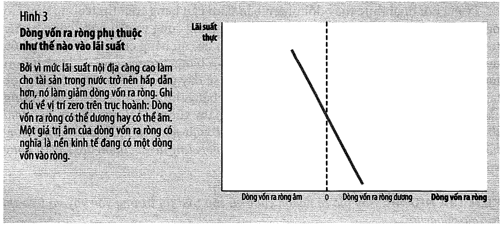
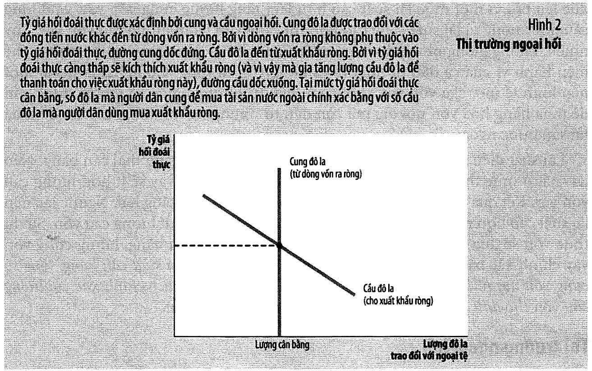
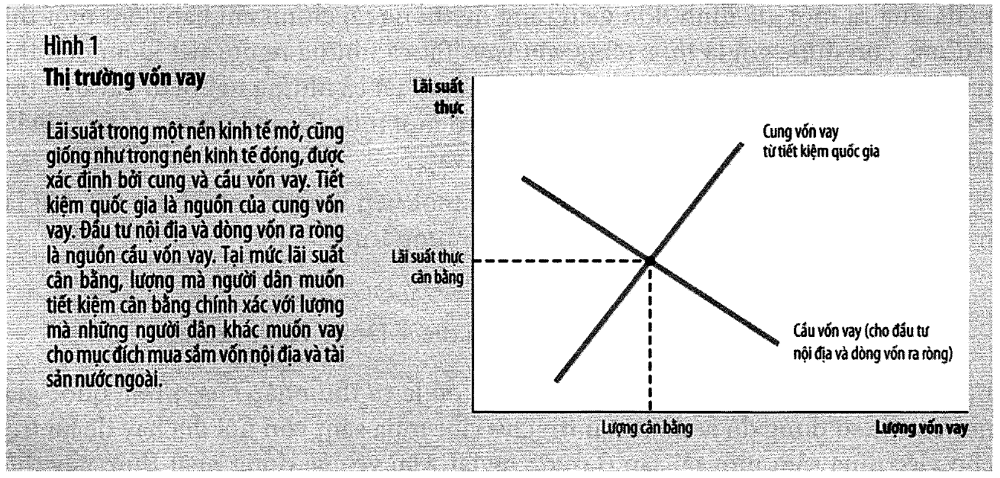
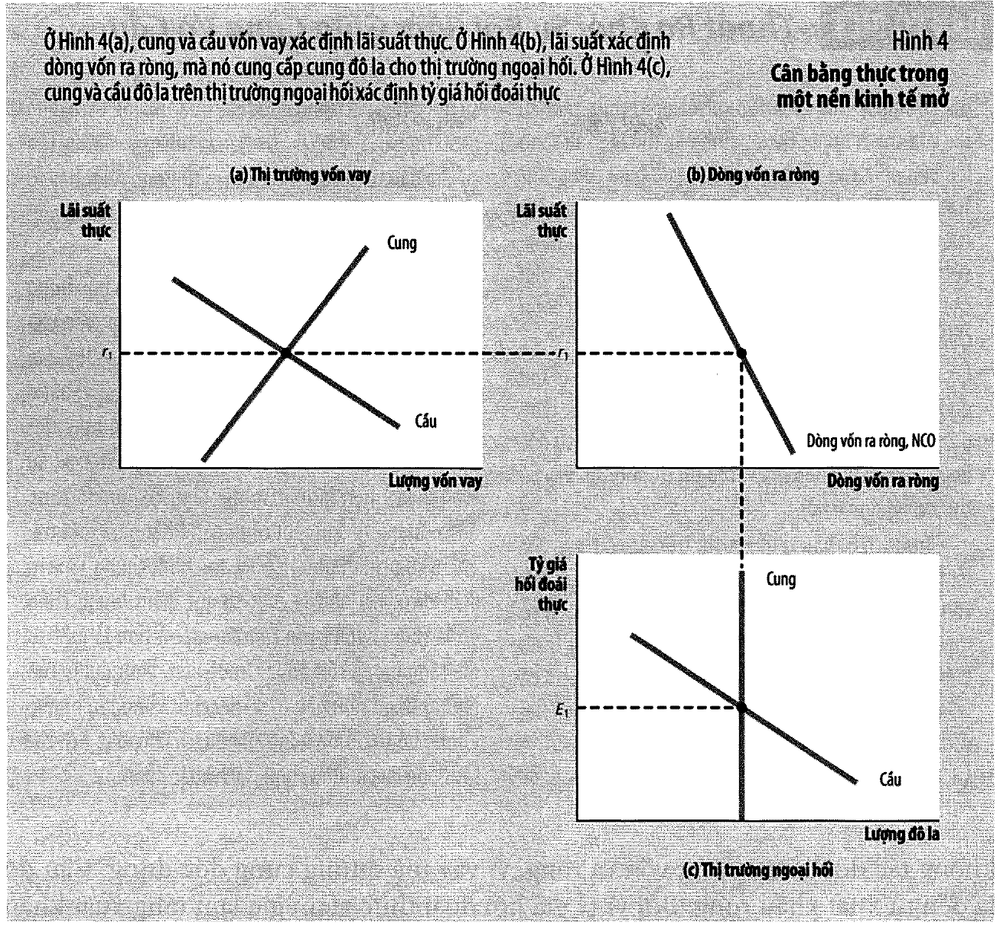
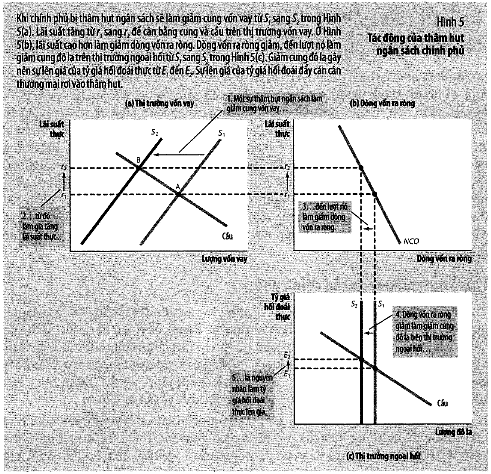
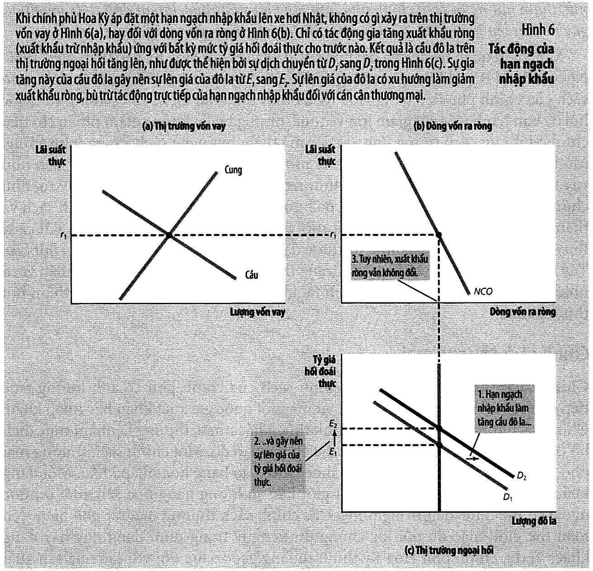
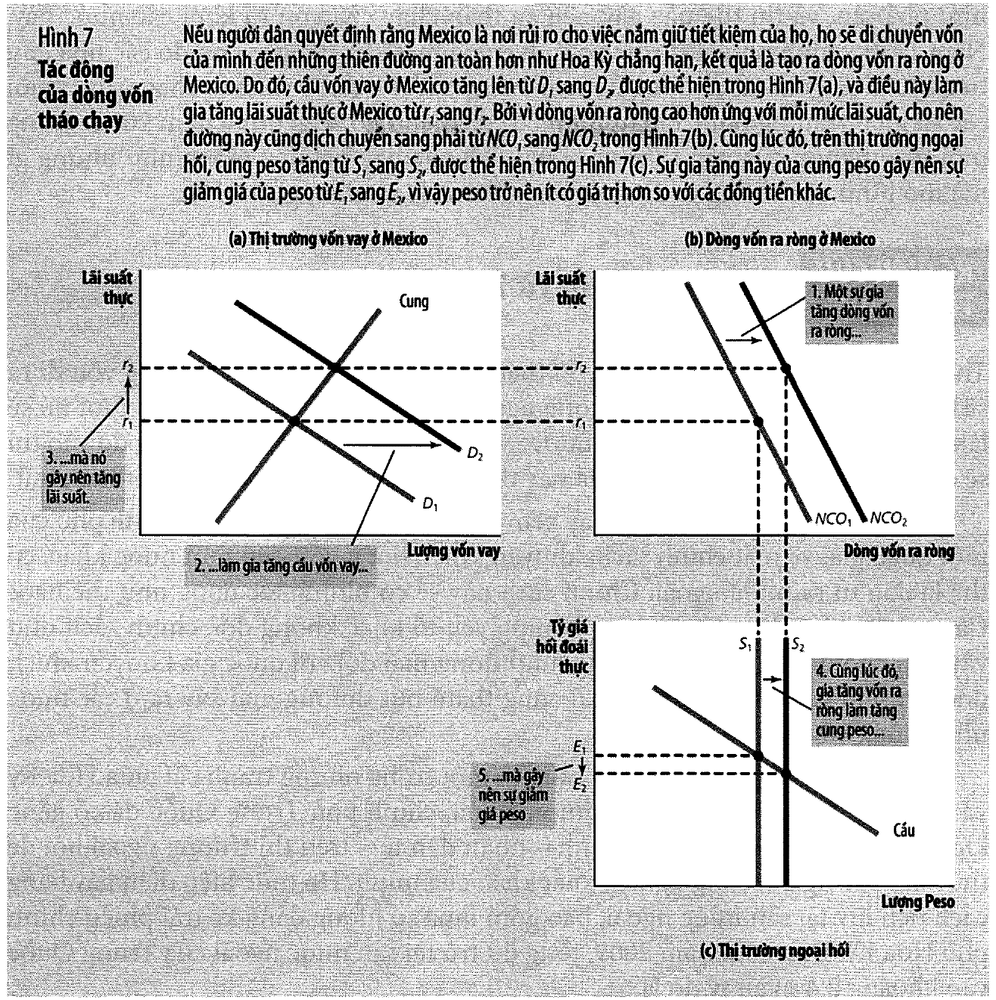

# Bài 10 — Lý thuyết kinh tế vĩ mô của nền kinh tế mở

> Bài học dựng từ **Chương 19 — Lý thuyết kinh tế vĩ mô của nền kinh tế mở** (tr. 444–465)
> của *N. Gregory Mankiw — **Kinh tế học vĩ mô***, bản dịch của Khoa Kinh tế, **ĐH Kinh tế TP.HCM**
> (Cengage Learning Asia).
> 🔸 **Vòng 2.** [Bài 9](bai_09_kinh_te_mo_khai_niem_co_ban.md) đã **định nghĩa và đo**. Bài này dựng
> **mô hình**: cái gì quyết định lãi suất thực, tỷ giá thực, dòng vốn và cán cân thương mại — và chính
> sách tác động vào chúng thế nào. Đây là bài **cuối cùng của khối dài hạn**; từ bài 11 trở đi sách bỏ
> giả định sản lượng cho trước.
> 💼 **Góc QTKD** — ví dụ thêm cho ngành quản trị kinh doanh, **không có trong sách**.
> 📚 **Mở rộng** — thứ sách nói lướt hoặc để trong hộp phụ.
> ⚠️ — chỗ dễ hiểu sai, hoặc chỗ sách in sai.
> 📌 **Cần đọc trước:** [Bài 9](bai_09_kinh_te_mo_khai_niem_co_ban.md) **toàn bộ** — bài này dùng lại
> $S = I + NCO$ và $NCO = NX$ ở mọi mục; và
> [Bài 4 mục 10](bai_04_tiet_kiem_dau_tu_he_thong_tai_chinh.md#10-thị-trường-vốn-vay--mô-hình) (thị
> trường vốn vay của nền kinh tế đóng — bài này chỉ thêm một thành phần vào vế cầu).

---

## Mục lục

<!-- MUC-LUC -->

- [1. Câu hỏi mà chương này đặt ra](#1-câu-hỏi-mà-chương-này-đặt-ra)
- [2. Hai thị trường, một biến nối](#2-hai-thị-trường-một-biến-nối)
- [3. Cân bằng đồng thời — và mô hình bằng số](#3-cân-bằng-đồng-thời--và-mô-hình-bằng-số)
- [4. 📚 "Thoát ra khỏi sự rối rắm giữa cung và cầu"](#4--thoát-ra-khỏi-sự-rối-rắm-giữa-cung-và-cầu)
- [5. Thí nghiệm 1 — thâm hụt ngân sách chính phủ](#5-thí-nghiệm-1--thâm-hụt-ngân-sách-chính-phủ)
- [6. 📚 Đối chiếu với bài 4 — cái gì mới, cái gì không](#6--đối-chiếu-với-bài-4--cái-gì-mới-cái-gì-không)
- [7. Thí nghiệm 2 — hạn ngạch nhập khẩu](#7-thí-nghiệm-2--hạn-ngạch-nhập-khẩu)
- [8. 📚 Hai cú sốc, cùng một lãi suất, hai tỷ giá ngược nhau](#8--hai-cú-sốc-cùng-một-lãi-suất-hai-tỷ-giá-ngược-nhau)
- [9. Thí nghiệm 3 — tháo chạy vốn](#9-thí-nghiệm-3--tháo-chạy-vốn)
- [10. Bảng tổng hợp — mọi thí nghiệm của chương và của bộ bài tập](#10-bảng-tổng-hợp--mọi-thí-nghiệm-của-chương-và-của-bộ-bài-tập)
- [11. 📚 Ngang bằng sức mua là trường hợp đặc biệt của mô hình này](#11--ngang-bằng-sức-mua-là-trường-hợp-đặc-biệt-của-mô-hình-này)
- [12. Các dòng vốn từ Trung Quốc](#12-các-dòng-vốn-từ-trung-quốc)
- [13. 📚 Kết luận có phụ thuộc tham số không?](#13--kết-luận-có-phụ-thuộc-tham-số-không)
- [14. 📚 Đối chiếu Việt Nam](#14--đối-chiếu-việt-nam)
- [15. 💼 Góc QTKD](#15--góc-qtkd)
- [16. Code minh hoạ](#16-code-minh-hoạ)
- [17. Tự thử](#17-tự-thử)
- [18. Từ điển thuật ngữ](#18-từ-điển-thuật-ngữ)
- [19. Câu hỏi tự kiểm tra](#19-câu-hỏi-tự-kiểm-tra)
- [Tóm tắt một trang](#tóm-tắt-một-trang)
- [Nguồn](#nguồn)

<!-- /MUC-LUC -->

---

## 1. Câu hỏi mà chương này đặt ra

Sách mở bằng một tình huống rất cụ thể (tr. 444):

> *"Hãy tưởng tượng rằng bạn là tổng thống và bạn muốn chấm dứt tình trạng thâm hụt thương mại. Bạn sẽ
> nên làm gì? Bạn có nên hạn chế nhập khẩu, có thể bằng cách ban hành hạn ngạch đối với hàng dệt may của
> Trung Quốc hay xe hơi từ Nhật Bản?"*

📌 Giữ câu hỏi này lại. [Mục 7](#7-thí-nghiệm-2--hạn-ngạch-nhập-khẩu) sẽ trả lời, và câu trả lời **không
phải** câu trả lời mà hầu hết mọi người đoán.

Bối cảnh sách nêu (tr. 444): ba thập niên qua Hoa Kỳ liên tục nhập nhiều hơn xuất. *"Nhiều lãnh đạo doanh
nghiệp cho rằng thâm hụt thương mại phản ánh hiện tượng cạnh tranh không công bằng: các doanh nghiệp nước
ngoài được cho phép bán hàng hóa của họ trên thị trường Hoa Kỳ trong khi chính phủ các nước lại ngăn cản
các doanh nghiệp Hoa Kỳ bán hàng hóa trên đất nước của họ."*

### ⚠️ Hai giả định — và cả hai đều là kết luận của các bài trước

Sách nêu rõ (tr. 444–445):

| # | Giả định | Đến từ đâu |
| - | -------- | ---------- |
| 1 | **GDP thực cho trước** — *"sản lượng hàng hóa và dịch vụ… được xác định bởi cung các yếu tố sản xuất và trạng thái công nghệ cho trước"* | [Bài 3](bai_03_san_xuat_va_tang_truong.md) |
| 2 | **Mức giá cho trước** — *"mức giá chung điều chỉnh để đưa cung và cầu tiền về trạng thái cân bằng"* | [Bài 8](bai_08_tang_truong_tien_va_lam_phat.md#2-lật-ngược-góc-nhìn--giá-trị-của-tiền-là-1p) |

📌 **Nghĩa là chương này vẫn nằm trong khối dài hạn.** Sản lượng không đổi. Cái được xác định ở đây chỉ
là **cơ cấu**: bao nhiêu tiết kiệm đi vào đầu tư trong nước, bao nhiêu chảy ra ngoài, và ở mức giá tương
đối nào. Bài 11 mới bỏ giả định thứ nhất ra.

Và sách nói rõ tham vọng của mô hình (tr. 445): *"nó áp dụng các công cụ về cung và cầu trong một nền
kinh tế mở. Tuy nhiên, mô hình này cũng phức tạp hơn các mô hình trước đây mà chúng ta đã từng thấy bởi
vì nó bao gồm việc **xem xét đồng thời cả hai thị trường**: thị trường vốn vay và thị trường ngoại hối."*

---

## 2. Hai thị trường, một biến nối

Đây là kiến trúc của cả chương, và nếu nắm được bảng này thì phần còn lại chỉ là bài tập.

| Thị trường | **Cung** đến từ | **Cầu** đến từ | **Giá** |
| ---------- | --------------- | -------------- | ------- |
| **Vốn vay** | tiết kiệm quốc gia $S$ | đầu tư nội địa $I$ **+ dòng vốn ra ròng $NCO$** | **lãi suất thực** $r$ |
| **Ngoại hối** | **dòng vốn ra ròng $NCO$** | xuất khẩu ròng $NX$ | **tỷ giá thực** $\varepsilon$ |

⭐ **Chú ý $NCO$ xuất hiện ở cả hai dòng, và ở hai vai trò ngược nhau:** ở thị trường vốn vay nó là một
phần của **cầu**; ở thị trường ngoại hối nó là toàn bộ **cung**.

> *"Dòng vốn ra ròng là biến số **nối kết** giữa hai thị trường."* (tr. 450)

Sách giải thích tại sao (tr. 450):

> *"Trên thị trường vốn vay, dòng vốn ra ròng là một phần của cầu. Một người muốn mua một tài sản nước
> ngoài phải tài trợ khoản mua này bằng cách tìm được nguồn trên thị trường vốn vay. Trên thị trường
> ngoại hối, dòng vốn ra ròng là nguồn cung. Một người muốn mua một tài sản của nước khác phải cung đô la
> để đổi lấy loại tiền tệ của đất nước đó."*

📌 **Cùng một hành động — mua một trái phiếu Nhật — đi qua hai thị trường và đóng hai vai.** Bạn phải
kiếm tiền trên thị trường vốn vay (cầu), rồi phải bán đô để lấy yên trên thị trường ngoại hối (cung).

### So với bài 4: cái gì đổi

| | [Bài 4](bai_04_tiet_kiem_dau_tu_he_thong_tai_chinh.md#10-thị-trường-vốn-vay--mô-hình) (đóng) | Bài 10 (mở) |
| --- | --- | --- |
| Cung vốn vay | $S$ | $S$ *(không đổi)* |
| **Cầu vốn vay** | $I$ | **$I + NCO$** |
| Thị trường thứ hai | không có | **ngoại hối** |

**Đúng một thứ được thêm vào.** Sách viết (tr. 447): *"trong một nền kinh tế mở, cầu vốn vay không chỉ
đến từ những người muốn có được vốn để mua hàng hóa vốn nội địa mà còn đến từ những người muốn có vốn
để mua tài sản nước ngoài."*

### ⚠️ Ba độ dốc, và một trong ba rất dễ nhầm

| Đường | Độ dốc | Vì sao |
| ----- | ------ | ------ |
| **$NCO$ theo lãi suất** (Hình 3) | **dốc xuống** | $r$ nội địa cao → tài sản trong nước hấp dẫn → ít mua tài sản nước ngoài |
| **Cung đô la** (Hình 2) | **dốc đứng** | $NCO$ không phụ thuộc **tỷ giá**, chỉ phụ thuộc $r$ |
| **Cầu đô la** (Hình 2) | **dốc xuống** | $\varepsilon$ cao → hàng nội đắt hơn → $NX$ giảm |





Sách giải thích đường $NCO$ dốc xuống bằng ví dụ hai quỹ tương hỗ (tr. 446): một ở Hoa Kỳ, một ở Đức, cả
hai đang chọn giữa trái phiếu chính phủ Hoa Kỳ và trái phiếu chính phủ Đức. *"Khi lãi suất thực ở Hoa kỳ
tăng lên, trái phiếu Hoa Kỳ trở nên hấp dẫn hơn đối với cả hai quỹ."* → người Mỹ mua ít tài sản nước
ngoài hơn **và** người nước ngoài mua nhiều tài sản Mỹ hơn — cả hai đều kéo $NCO$ xuống.



### ⭐ Chỗ khó nhất chương: vì sao cung đô la dốc ĐỨNG?

Sách thừa nhận thẳng rằng điều này khó nuốt (tr. 448):

> *"Lúc đầu có vẻ như khá lạ lẫm khi cho rằng dòng vốn ra ròng không phụ thuộc vào tỷ giá hối đoái. Rốt
> cuộc thì ứng với một giá trị trao đổi của đô la cao hơn không chỉ làm cho hàng hóa nước ngoài rẻ hơn
> đối với người mua Hoa Kỳ mà còn làm cho tài sản nước ngoài ít đắt đỏ hơn. Người ta có thể dự đoán rằng
> tài sản nước ngoài sẽ trở nên hấp dẫn hơn."*

Rồi đưa lập luận bù trừ (tr. 448–449):

> *"Nhưng nên nhớ rằng một nhà đầu tư Hoa Kỳ cuối cùng sẽ mong muốn chuyển tài sản nước ngoài cũng như
> lợi nhuận thu được từ các tài sản này sang đô la. Ví dụ, đô la có giá trị cao thì người Mỹ mua được cổ
> phiếu rẻ hơn từ một công ty Nhật, nhưng khi cổ phiếu được trả cổ tức, thì những khoản thu nhập cổ tức
> này lại dưới dạng yên… **và cả hai tác động này bù trừ lẫn nhau.**"*

📌 Đây là chỗ đáng dừng lại. Nó nói rằng **tỷ giá không tạo ra cơ hội đầu tư quốc tế nào cả** — nó chỉ
đổi tên đơn vị. Cái thật sự quyết định dòng vốn là **lãi suất thực** và **rủi ro**, đúng bốn biến ở
[bài 9 mục 4](bai_09_kinh_te_mo_khai_niem_co_ban.md#4-dòng-vốn-ra-ròng).

---

## 3. Cân bằng đồng thời — và mô hình bằng số

⚠️ **Trước khi đọc tiếp, một cảnh báo quan trọng về ranh giới.**

**Chương 19 không cho một con số nào.** Toàn bộ chương là bảy hình vẽ định tính. Mô hình bằng số dưới
đây **do bài này đặt ra**, với hai điều kiện:

1. cân bằng gốc ra số tròn để dễ theo dõi;
2. mọi kết luận **định tính** của sách phải tái hiện đúng.

[Mục 13](#13--kết-luận-có-phụ-thuộc-tham-số-không) kiểm điều kiện thứ hai một cách hệ thống: đổi tham số
thì **con số** đổi, **hướng** không đổi. Đó là điều duy nhất mô hình này hứa hẹn, và cũng là điều duy
nhất sách tuyên bố.

### Mô hình

$$S(r) = 1500 + 100r \qquad I(r) = 2100 - 100r \qquad NCO(r) = 600 - 40r$$
$$NX(\varepsilon) = 900 - 500\varepsilon$$

Giải theo đúng hai bước mà **Hình 4 tr. 451** vẽ:



| Bước | Hình 4 | Phương trình | Kết quả |
| ---- | ------ | ------------ | ------- |
| (a) | thị trường vốn vay | $S(r) = I(r) + NCO(r)$ | $r^* = $ **5,000%** |
| (b) | dòng vốn ra ròng | $NCO(r^*)$ | **400** — lượng đô la cung ra thị trường ngoại hối |
| (c) | thị trường ngoại hối | $NX(\varepsilon) = 400$ | $\varepsilon^* = $ **1,000** |

| | $r$ | $S$ | $I$ | $NCO$ | $NX$ | $\varepsilon$ |
| --- | ---: | ---: | ---: | ---: | ---: | ---: |
| **Cân bằng gốc** | 5,000% | 2.000 | 1.600 | 400 | 400 | 1,000 |

✅ Hai đồng nhất thức của bài 9 được `assert` **mỗi lần** mô hình được giải:

$$S = I + NCO: \quad 2000 = 1600 + 400 \qquad\qquad NCO = NX: \quad 400 = 400$$

Sách nhấn mạnh điều làm mô hình này khác mọi mô hình trước (tr. 452):

> *"Cả hai mức giá có liên quan với nhau này (lãi suất thực và tỷ giá hối đoái thực) **điều chỉnh đồng
> thời** để cân bằng giữa cung và cầu trên cả hai thị trường."*

📌 Đó là lý do không thể phân tích riêng từng thị trường. Một cú sốc vào thị trường vốn vay đi qua $NCO$
và hiện ra ở tỷ giá; một cú sốc vào thị trường ngoại hối có thể **không** đi ngược lại được — và
[mục 7](#7-thí-nghiệm-2--hạn-ngạch-nhập-khẩu) sống nhờ đúng sự bất đối xứng đó.

### Ba bước phân tích (tr. 453)

1. Xác định sự kiện tác động đến đường **cung** hay đường **cầu** nào
2. Xác định các đường này dịch chuyển theo **hướng** nào
3. Dùng sơ đồ cung–cầu xem cân bằng đổi thế nào

📌 Đúng ba bước của [EG13 bài 2](../../%5BEG13%5D.kinhtevimo-micro/ly_thuyet/bai_02_cung_va_cau.md),
không sửa một chữ. Cái khó ở chương này không phải phương pháp — mà là việc có **ba** đồ thị nối với
nhau, nên bước 3 phải chạy ba lần theo đúng thứ tự (a) → (b) → (c).

---

## 4. 📚 "Thoát ra khỏi sự rối rắm giữa cung và cầu"

Hộp phụ tr. 452 nhìn như một chỗ nghỉ, nhưng nó là một bài học phương pháp cho cả khoá.

Sách mở bằng một câu đố (tr. 452):

> *"Giả sử người chủ vườn táo quyết định mua một số táo của chính mình. Quyết định này thể hiện sự **tăng
> lên** bên phía **cầu** táo hay **giảm đi** của phía **cung** táo? Trả lời theo cách nào cũng có thể bào
> chữa được."*

Áp vào mô hình chương này, hai cách viết **cùng một** phương trình:

| Cách viết | Đọc là | Nhấn mạnh |
| --------- | ------ | --------- |
| $S = I + NCO$ | $NCO$ là một phần của **cầu** vốn vay | quỹ vốn tạo ra được **dùng ở đâu** |
| $S - NCO = I$ | $NCO$ là một sự **giảm cung** vốn vay | còn **bao nhiêu vốn** cho trong nước |

> *"Sự khác nhau này có tính **ngữ nghĩa** hơn là thực tế tồn tại hai hiện tượng."* (tr. 452)

Và làm y hệt với thị trường ngoại hối: người Mỹ nhập xe Nhật có thể đọc là *"sự sụt giảm của lượng **cầu**
đô la (bởi vì xuất khẩu ròng giảm)"* hoặc là một sự gia tăng lượng **cung** đô la. Sách chọn cách thứ
nhất, và thừa nhận (tr. 452): *"định nghĩa của những thuật ngữ này có vẻ đôi chút không tự nhiên, nhưng
nó sẽ chứng minh sự hữu ích khi phân tích các tác động của những chính sách khác nhau."*

📌 **Bài học phương pháp, dùng được cho cả khoá:** khi hai cách kể đều đúng, hãy chọn cách nào làm **bước
2** (hướng dịch chuyển) dễ xác định nhất — rồi **bám chặt lấy nó**. Đổi cách kể giữa chừng phân tích là
cách tự làm rối.

---

## 5. Thí nghiệm 1 — thâm hụt ngân sách chính phủ

**Bước 1–2:** thâm hụt ngân sách là tiết kiệm chính phủ **âm** → tiết kiệm quốc gia giảm → đường **cung**
vốn vay dịch sang **trái** ($S_1 \to S_2$ trong Hình 5a).

| | $r$ | $I$ | $NCO$ | $NX$ | $\varepsilon$ |
| --- | ---: | ---: | ---: | ---: | ---: |
| gốc | 5,000% | 1.600 | 400 | 400 | 1,000 |
| **cung vốn vay −300** | **6,250%** ↑ | **1.475** ↓ | **350** ↓ | **350** ↓ | **1,100** ↑ |

**Bước 3 — chuỗi nhân quả, đọc đúng thứ tự Hình 5(a) → 5(b) → 5(c):**



```
1. cung vốn vay giảm        →  lãi suất thực 5,000% → 6,250%
2. lãi suất cao hơn         →  đầu tư 1.600 → 1.475      (LẤN ÁT, giảm 125)
3. lãi suất cao hơn         →  NCO 400 → 350             (giảm 50)
4. NCO giảm → cung đô la giảm →  tỷ giá thực 1,000 → 1,100  (LÊN GIÁ)
5. đô la lên giá            →  NX 400 → 350              (THÂM HỤT THƯƠNG MẠI)
```

⭐ **Kiểm số học đáng làm:** tiết kiệm giảm **175**, và nó rơi vào đúng hai chỗ:

$$\underbrace{125}_{\text{đầu tư giảm}} + \underbrace{50}_{NCO \text{ giảm}} = 175$$

✅ `assert`. Đó chính là $S = I + NCO$ đọc theo **chiều thay đổi**.

📌 Chú ý bước 3 giải thích tại sao $NCO$ giảm bằng **hai** lực cùng chiều (tr. 454): *"tiết kiệm được để
lại nước nhà giờ đây nhận được sinh lợi cao hơn, việc đầu tư ra nước ngoài trở nên kém hấp dẫn hơn, và
những cư dân trong nước mua ít tài sản nước ngoài hơn. Mức lãi suất cao hơn cũng hấp dẫn những nhà đầu
tư nước ngoài… **cả hành vi trong và ngoài nước đều gây nên sự giảm sút của dòng vốn ra ròng**."*

Kết luận sách in nghiêng (tr. 455):

> *"trong một nền kinh tế mở, thâm hụt ngân sách chính phủ làm tăng lãi suất thực, lấn át đầu tư trong
> nước, gây nên sự lên giá nội tệ, và đẩy cán cân thương mại vào trạng thái thâm hụt"*

### ⭐⭐ Thâm hụt kép

Sách kể ca thật (tr. 455): Reagan trúng cử 1980, *"Tổng thống và Quốc hội đã ban hành việc cắt giảm lớn
về thuế, nhưng họ lại không giảm nhiều chi tiêu chính phủ một cách tương ứng, do vậy mà thâm hụt ngân
sách xảy ra trầm trọng."* Mô hình dự đoán thâm hụt thương mại theo sau — *"và thực tế điều đó đã xảy ra."*

Hai thâm hụt đi cùng nhau đến mức có tên riêng: **thâm hụt kép**.

⚠️ Nhưng sách cản ngay một cách đọc quá mạnh (tr. 455):

> *"Tuy nhiên, chúng ta sẽ **không xem trạng thái kép này như một sự đồng nhất**, vì có nhiều nhân tố bên
> ngoài chính sách tài khóa có thể có ảnh hưởng đến thâm hụt thương mại."*

📌 Điều đó khớp với [bài 9 mục 8](bai_09_kinh_te_mo_khai_niem_co_ban.md#8-thâm-hụt-thương-mại-có-phải-vấn-đề):
giai đoạn 1991–2000 thâm hụt thương mại lớn lên **trong khi tiết kiệm tăng**, vì đầu tư bùng nổ. Cùng
một triệu chứng, khác nguyên nhân. [Mục 8](#8--hai-cú-sốc-cùng-một-lãi-suất-hai-tỷ-giá-ngược-nhau) sẽ
cho thấy sự khác biệt đó lớn đến mức nào.

---

## 6. 📚 Đối chiếu với bài 4 — cái gì mới, cái gì không

Đáng dừng lại một mục để so, vì phần lớn nội dung mục 5 bạn đã học ở
[bài 4 mục 13](bai_04_tiet_kiem_dau_tu_he_thong_tai_chinh.md#13-chính-sách-3--thâm-hụt-thặng-dư-và-hiện-tượng-lấn-át).

| | Nền kinh tế **đóng** (bài 4) | Nền kinh tế **mở** (bài này) |
| --- | --- | --- |
| Thâm hụt ngân sách → | lãi suất **tăng** | lãi suất **tăng** |
| | đầu tư **giảm** (lấn át) | đầu tư **giảm**, nhưng **ít hơn** |
| | — | $NCO$ **giảm** |
| | — | nội tệ **lên giá** |
| | — | cán cân thương mại **xấu đi** |

⭐ **Điểm mới quan trọng nhất: hiện tượng lấn át bị "rò rỉ".** Trong nền kinh tế đóng, toàn bộ mức giảm
tiết kiệm rơi vào đầu tư. Trong nền kinh tế mở, một phần rơi vào $NCO$ — tức nó hiện ra thành **thâm hụt
thương mại** thay vì thành đầu tư sụt.

Trong mô hình số ở trên: tiết kiệm giảm 175, đầu tư chỉ giảm **125** (không phải 175). Phần 50 còn lại
"trốn" ra nước ngoài dưới dạng vốn nước ngoài chảy vào.

📌 Nghe như tin tốt (đầu tư đỡ sụt hơn), và ở một nghĩa nào đó đúng vậy — chính là lập luận
*"cách tốt nhất là có người nước ngoài đầu tư vào nền kinh tế Hoa Kỳ hơn là không có ai làm gì cả"* của
[bài 9](bai_09_kinh_te_mo_khai_niem_co_ban.md#8-thâm-hụt-thương-mại-có-phải-vấn-đề). Nhưng nó không
miễn phí: phần vốn ấy phải trả lãi cho người nước ngoài, và cán cân thương mại xấu đi thì ngành xuất
khẩu chịu.

⚠️ Mức độ "rò rỉ" phụ thuộc **độ nhạy của $NCO$ theo lãi suất** — và đó chính là câu hỏi của bài tập 11
tr. 465, được trả lời bằng số ở [mục 13](#13--kết-luận-có-phụ-thuộc-tham-số-không).

---

## 7. Thí nghiệm 2 — hạn ngạch nhập khẩu

Đây là mục trả lời câu hỏi mở đầu chương, và kết quả là kết quả gây sốc nhất của cả bài.

> **Chính sách thương mại** (tr. 455): *"chính sách của chính phủ có ảnh hưởng trực tiếp đến số lượng
> hàng hóa và dịch vụ mà một quốc gia xuất khẩu hay nhập khẩu."*

Các hình thức sách nêu: **thuế quan** (thuế đánh vào hàng nhập khẩu), **hạn ngạch nhập khẩu** (giới hạn
số lượng). Và một quan sát sắc (tr. 455): *"Những chính sách có dạng dưới tên gọi là hạn chế xuất khẩu
tự nguyện thì thực chất **không phải là tự nguyện**, và bản chất chính là hình thức hạn ngạch nhập khẩu."*

**Bước 1–2:** hạn ngạch làm giảm nhập khẩu ứng với **mọi** mức tỷ giá thực → $NX$ cao hơn ở mọi $\varepsilon$
→ đường **cầu đô la** dịch sang **phải** ($D_1 \to D_2$ trong Hình 6c). **Thị trường vốn vay: không có gì
dịch chuyển cả.**



| | $r$ | $I$ | $NCO$ | $NX$ | $\varepsilon$ |
| --- | ---: | ---: | ---: | ---: | ---: |
| gốc | 5,000% | 1.600 | 400 | 400 | 1,000 |
| **cầu đô la +150** | 5,000% **=** | 1.600 **=** | 400 **=** | **400 =** | **1,300** ↑ |

### ⭐⭐ Đọc chỗ này thật kỹ

**Tỷ giá thực lên giá 30%, mà xuất khẩu ròng không đổi một đồng nào.** ✅ `assert`.

Vì sao? Vì **thị trường vốn vay không ai động** → $r$ không đổi → $NCO$ không đổi → mà $NX = NCO$.
**Xuất khẩu ròng bị chốt từ thị trường KIA.**

Sách giải thích chi tiết hơn (tr. 457):

> *"Khi đô la tăng giá trị trên thị trường ngoại hối, hàng hóa nội địa trở nên đắt đỏ hơn so với hàng hóa
> nước ngoài. Sự lên giá này khuyến khích nhập khẩu và gây bất lợi cho xuất khẩu, và cả hai thay đổi này
> vận hành để **bù trừ** sự gia tăng trực tiếp của xuất khẩu ròng do hạn ngạch nhập khẩu. Cuối cùng, hạn
> ngạch nhập khẩu làm giảm cả nhập khẩu và xuất khẩu, nhưng xuất khẩu ròng… không thay đổi."*

Kết luận, sách in nghiêng (tr. 457):

> ⭐ *"**Chính sách thương mại không tác động đến cán cân thương mại.**"*

### Cách nhớ dễ nhất — qua đồng nhất thức

Sách tự đưa ra cách này (tr. 457):

$$NX = NCO = S - I$$

**Hạn ngạch không động đến $S$, không động đến $I$. Vậy nó không thể động đến $NX$.**

> *"Ứng với mức tiết kiệm quốc gia và đầu tư nội địa cho trước, tỷ giá hối đoái thực điều chỉnh để giữ
> cho cán cân thương mại không đổi, bất kể các chính sách thương mại của chính phủ được thực thi."*

### ⚠️ Nhưng đừng đọc thành "chính sách thương mại không làm gì cả"

Sách nói rõ nó **có** tác động — chỉ là tác động **vi mô**, không phải vĩ mô (tr. 457):

| Ai | Chuyện gì xảy ra khi Hoa Kỳ hạn ngạch xe Nhật |
| -- | ---------------------------------------------- |
| **General Motors** | *"gặp ít cạnh tranh hơn từ bên ngoài và sẽ bán được nhiều xe hơi hơn"* |
| **Boeing** | đô la lên giá → *"đối mặt với cạnh tranh mạnh hơn từ Airbus"* → bán ít hơn |
| Xuất khẩu ròng **xe hơi** | **tăng** |
| Xuất khẩu ròng **máy bay** | **giảm** |
| **Cán cân thương mại tổng quát** | **không đổi** |

> *"tác động của các chính sách thương mại thể hiện ở góc độ **kinh tế vi mô** hơn là kinh tế vĩ mô…
> chúng thường xuất phát từ những quan tâm đến các doanh nghiệp hay các ngành công nghiệp cụ thể. Ví dụ,
> chúng ta sẽ không lấy gì làm ngạc nhiên khi nghe một nhà điều hành của General Motors tranh luận về hạn
> ngạch nhập khẩu đối với xe hơi Nhật."* (tr. 457)

📌 **Người vận động hành lang không nói dối về lợi ích của chính họ — họ chỉ nói sai về tác động lên cả
nước.** Phân biệt được hai chuyện đó là toàn bộ giá trị của mục này.

Và sách chốt bằng lập luận thương mại tự do quen thuộc từ EG13 (tr. 457): *"Thương mại tự do cho phép các
nền kinh tế chuyên môn hóa vào việc sản xuất ra những gì tốt nhất họ có thể làm ra, làm cho cư dân ở tất
cả quốc gia đều hưởng lợi. Các hạn chế thương mại làm thiệt hại các lợi ích này."*

---

## 8. 📚 Hai cú sốc, cùng một lãi suất, hai tỷ giá ngược nhau

*Mục này không có trong sách.* Nó là một hệ quả của mô hình, và nó **chỉ hiện ra khi đặt hai thí nghiệm
cạnh nhau bằng số**.

Hai cú sốc, cả hai đều đẩy **cầu vốn vay** sang phải đúng bằng nhau (200):

| | Cú sốc | Đường nào dịch | Nguồn |
| --- | ------ | -------------- | ----- |
| **(A)** | **tháo chạy vốn** | $NCO$ dịch phải | Hình 7, tr. 458 |
| **(B)** | **hoàn thuế đầu tư** | $I$ dịch phải | bài tập 1, tr. 463 |



| | $r$ | $I$ | $NCO$ | $NX$ | $\varepsilon$ |
| --- | ---: | ---: | ---: | ---: | ---: |
| gốc | 5,000% | 1.600 | 400 | 400 | 1,000 |
| **(A)** tháo chạy vốn | **5,833%** | 1.517 ↓ | **567** ↑ | 567 ↑ | **0,667** ↓ |
| **(B)** hoàn thuế đầu tư | **5,833%** | 1.717 ↑ | **367** ↓ | 367 ↓ | **1,067** ↑ |

### ⭐⭐ Lãi suất giống hệt nhau. Tỷ giá đi ngược chiều nhau.

✅ Cả hai điều này được `assert`.

Vì sao? Vì cả hai làm **tổng** cầu vốn vay dịch giống nhau, nhưng chúng dịch **hai thành phần khác nhau**
của cầu đó:

```
(A) đẩy NCO lên  →  cung đô la TĂNG   →  ε giảm  →  nội tệ MẤT GIÁ, NX tăng
(B) đẩy I  lên   →  NCO bị ép xuống   →  cung đô la GIẢM  →  ε tăng  →  LÊN GIÁ, NX giảm
```

📌 **Bài học: "lãi suất tăng" một mình không đủ để biết chuyện gì đang xảy ra với tỷ giá. Phải biết lãi
suất tăng VÌ CÁI GÌ.** Hai bản tin cùng nói "lãi suất tăng" có thể là hai câu chuyện ngược nhau hoàn
toàn. Xem [mục 15(b)](#15--góc-qtkd).

### Và (B) chính là lời giải bài tập 1(b) tr. 463

Đề hỏi: *"Đại diện của một số nhà xuất khẩu lớn phản đối chính sách này. Tại sao trường hợp này có thể
xảy ra?"*

→ Vì hoàn thuế đầu tư làm nội tệ **lên giá 6,7%** và kéo $NX$ từ 400 xuống 367. **Ưu đãi cho người đầu
tư là thiệt hại cho người xuất khẩu, qua đường vòng tỷ giá.**

⭐ Đây là loại kết quả mà mô hình ba đồ thị sinh ra được còn trực giác thì không. Không ai nhìn một chính
sách thuế đầu tư mà đoán ngay rằng nạn nhân của nó là ngành xuất khẩu.

---

## 9. Thí nghiệm 3 — tháo chạy vốn

> **Tháo chạy vốn** (tr. 458): *"sự sụt giảm lớn và bất ngờ của cầu tài sản ở một quốc gia."*

⚠️ **Mục này đổi góc nhìn.** Sách nói rõ (tr. 458): *"chúng ta áp dụng mô hình nền kinh tế mở dưới góc độ
Mexico thay vì Hoa Kỳ."*

Bối cảnh (tr. 458): năm 1994, bất ổn chính trị ở Mexico *"bao gồm cả việc ám sát một nhà lãnh đạo chính
trị lỗi lạc"*. Người dân *"quyết định rút một số tài sản của họ ra khỏi Mexico và di chuyển dòng tiền này
sang Hoa Kỳ và 'những nơi trú ẩn an toàn' khác."*

**Bước 1–2:** $NCO$ của Mexico **tăng** ở mọi mức lãi suất → đường $NCO$ dịch **phải** → **và** vì $NCO$
là một phần của cầu vốn vay, **cầu vốn vay cũng dịch phải**.

📌 **Một cú sốc, hai đường dịch cùng lúc.** Đó là điều mà một mô hình một thị trường không bắt được.

| | $r$ | $I$ | $NCO$ | $NX$ | $\varepsilon$ |
| --- | ---: | ---: | ---: | ---: | ---: |
| gốc | 5,000% | 1.600 | 400 | 400 | 1,000 |
| **$NCO$ +200** | **5,833%** ↑ | 1.517 ↓ | 567 ↑ | 567 ↑ | **0,667** ↓ |

Kết quả: **lãi suất tăng và nội tệ mất giá** — đúng hai thứ sách nêu. Sách in nghiêng (tr. 458):

> *"vốn tháo chạy khỏi Mexico làm tăng lãi suất và giảm giá trị peso Mexico trên thị trường ngoại hối"*

### ✅ Số liệu thật — và nó đáng nhớ

Sách in con số ở tr. 458, từ **tháng 11/1994 đến tháng 3/1995** — **bốn tháng**:

| | Trước | Sau | |
| --- | ---: | ---: | --- |
| Lãi suất ngắn hạn trái phiếu chính phủ Mexico | 14% | **70%** | **×5,0** |
| Giá trị peso | 29 cent | **15 cent** | **mất 48,3%** |

✅ Cả hai kiểm bằng `assert`.

⚠️ **Chú ý quy ước.** Sách viết peso ở dạng **cent mỗi peso** (đô la trên ngoại tệ) — **ngược** với quy
ước "ngoại tệ trên một đô la" của [bài 9 mục 9](bai_09_kinh_te_mo_khai_niem_co_ban.md#9-tỷ-giá-hối-đoái-danh-nghĩa).
Đọc nhầm là kết luận lật ngược. Quy về quy ước bài 9:

$$\frac{100}{29} = 3{,}448 \;\to\; \frac{100}{15} = 6{,}667 \text{ peso/USD} \quad (\text{cần thêm } 93{,}3\% \text{ peso cho mỗi đô la})$$

### Hiệu ứng lan sang, và vì sao nó nhỏ

Sách chỉ ra (tr. 459): dòng vốn ra khỏi Mexico **chính là** dòng vốn vào Hoa Kỳ, nên ở Hoa Kỳ mọi thứ xảy
ra ngược lại — đô la lên giá, lãi suất giảm. *"Tuy nhiên, quy mô của tác động này đối với nền kinh tế Hoa
Kỳ là **nhỏ** vì nền kinh tế Hoa Kỳ quá lớn so với Mexico."*

Và sách liệt kê những lần lặp lại (tr. 459–460): **châu Á 1997** (Thái Lan, Hàn Quốc, Indonesia), **Nga
1998**, **Argentina 2002**.

> *"Trong mỗi trường hợp của vốn tháo chạy này, kết cục hầu hết đều giống như những gì mà mô hình của
> chúng ta dự đoán: **tăng lãi suất và giảm giá nội tệ**."*

---

## 10. Bảng tổng hợp — mọi thí nghiệm của chương và của bộ bài tập

Cột $NX$ đã bỏ đi: trong mô hình này $NX = NCO$ **luôn luôn** (đồng nhất thức bài 9), nên nó không mang
thông tin mới.

| Thí nghiệm | $r$ | $I$ | $NCO$ | $\varepsilon$ | Nguồn |
| ---------- | ---: | ---: | ---: | ---: | ----- |
| *cân bằng gốc* | 5,000% | 1.600 | 400 | 1,000 | |
| Thâm hụt ngân sách | 6,250% | 1.475 ↓ | 350 ↓ | 1,100 ↑ | Hình 5, tr. 453 |
| Tăng tiết kiệm tư nhân | 3,750% | 1.725 ↑ | 450 ↑ | 0,900 ↓ | bài tập 11, tr. 465 |
| Hoàn thuế đầu tư | 5,833% | 1.717 ↑ | 367 ↓ | 1,067 ↑ | bài tập 1, tr. 463 |
| **Hạn ngạch nhập khẩu** | 5,000% **=** | 1.600 **=** | 400 **=** | 1,300 ↑ | Hình 6, tr. 455 |
| **Pháp chuộng rượu California** | 5,000% **=** | 1.600 **=** | 400 **=** | 1,300 ↑ | bài tập 6, tr. 464 |
| **Tháo chạy vốn** | 5,833% | 1.517 ↓ | 567 ↑ | 0,667 ↓ | Hình 7, tr. 458 |
| **Lãi suất châu Âu tăng** | 5,833% | 1.517 ↓ | 567 ↑ | 0,667 ↓ | bài tập 7, tr. 464 |
| **TQ ngừng mua tài sản Mỹ** | 5,833% | 1.517 ↓ | 567 ↑ | 0,667 ↓ | bài tập 9, tr. 464 |
| Trợ giá XK, vay để trả | 5,625% | 1.538 ↓ | 375 ↓ | 1,350 ↑ | bài tập 8, tr. 464 |

### ⭐ Đọc theo cặp, không đọc theo dòng

- **Dòng 4 và 5 giống hệt nhau.** Hạn ngạch nhập khẩu và việc người Pháp bỗng chuộng rượu vang California
  là **cùng một loại cú sốc**: dịch đường cầu đô la. Cả hai đều **không đổi** $NX$. Một cái là chính sách,
  một cái là sở thích — mô hình không phân biệt.
- **Dòng 6, 7, 8 giống hệt nhau.** Ba câu chuyện rất khác nhau về bề ngoài — bất ổn chính trị ở Mexico,
  lãi suất châu Âu tăng, Trung Quốc thôi mua trái phiếu Mỹ — nhưng trong mô hình chúng là **một**: đường
  $NCO$ dịch phải.
- **Dòng 1 và 2 đối xứng gương.** Thâm hụt ngân sách và tăng tiết kiệm tư nhân.

📌 Đây là điều mà một mô hình tốt làm được: **gom rất nhiều câu chuyện bề mặt về vài cơ chế.** Nếu bạn
nhớ được ba loại dịch chuyển (cung vốn vay, cầu vốn vay qua $I$ hay qua $NCO$, cầu đô la) thì bạn giải
được mọi bài tập của chương mà không cần nhớ bài nào.

### ⚠️ Dòng cuối là dòng đáng chú ý nhất

Bài tập 8 tr. 464: Hoa Kỳ **trợ giá xuất khẩu** nông sản, *"nhưng đất nước này không tăng thuế hay giảm
bất kỳ khoản chi tiêu chính phủ nào khác để bù vào khoản chi tiêu này."*

**Chính sách nhằm TĂNG xuất khẩu, kết quả $NX$ đi từ 400 xuống 375 — GIẢM.** ✅ `assert`.

Vì mệnh đề in nghiêng trong đề bài biến nó thành **một khoản thâm hụt ngân sách đội lốt chính sách
thương mại**. Vế thương mại bị trung hoà hết ([mục 7](#7-thí-nghiệm-2--hạn-ngạch-nhập-khẩu)), còn vế
ngân sách thì không. Còn lại đúng tác động của [mục 5](#5-thí-nghiệm-1--thâm-hụt-ngân-sách-chính-phủ).

⭐ Bài tập 5 tr. 464 đặt đúng cái bẫy này vào miệng một chính khách: *"nếu chúng ta trợ giá xuất khẩu,
chúng ta có thể giảm thâm hụt bằng cách tăng khả năng cạnh tranh của chúng ta"*. Câu hỏi cuối của đề là
*"Bạn có đồng ý với vị thượng nghị sĩ này không?"* — và mô hình trả lời là **không**.

---

## 11. 📚 Ngang bằng sức mua là trường hợp đặc biệt của mô hình này

Hộp phụ tr. 449 trả lời câu hỏi mà người đọc kỹ sẽ hỏi:

> *"Tại sao chúng ta lại phát triển lý thuyết về tỷ giá hối đoái ở đây? Tại sao chúng ta đã không thực
> hiện điều này ở chương trước?"* (tr. 449)

Câu trả lời nằm ở **độ dốc của đường cầu đô la**:

| Giả định về hàng hoá | Đường cầu ngoại hối | Tỷ giá thực |
| -------------------- | ------------------- | ----------- |
| **PPP đúng** (chương 18) | **nằm ngang** | **không bao giờ đổi** |
| **PPP không đúng** (chương 19) | **dốc xuống** | thay đổi được |

Lập luận của sách (tr. 449): PPP giả định hàng hoá *"phản ứng rất nhanh chóng trước sự chênh lệch giá cả
quốc tế"*. Nếu vậy thì *"xuất khẩu ròng thực tế quá nhạy, đường cầu trong Hình 2 sẽ nằm ngang"* — và tỷ
giá thực bị ghim cứng.

### ✅ Kiểm bằng số

⭐ **Hai chương không mâu thuẫn nhau. Chương 18 là *giới hạn* của chương 19 khi độ nhạy của $NX$ tiến ra
vô cùng.**

| Độ nhạy $X_1$ | $\varepsilon$ cân bằng | $\varepsilon$ dịch bao nhiêu khi $NCO$ tăng 100 |
| ---: | ---: | ---: |
| 200 | 2,5000 | 0,41667 |
| 500 | 1,0000 | 0,16667 |
| 2.000 | 0,2500 | 0,04167 |
| 20.000 | 0,0250 | 0,00417 |
| **500.000** | 0,0010 | **0,00017** |

$X_1$ càng lớn ($NX$ càng nhạy), tỷ giá thực càng **không dịch**. Ở giới hạn nó đứng yên hoàn toàn — đó
đúng là thế giới của PPP.

Sách chốt (tr. 449):

> *"chương này tập trung vào trường hợp **thực tế hơn** theo đó đường cầu ngoại hối dốc xuống. Điều này
> cho phép khả năng tỷ giá hối đoái thực thay đổi theo thời gian, như trong thực tế nó đang xảy ra trong
> thế giới thực của chúng ta."*

📌 Đây là mô thức lặp lại suốt khoá: một mô hình đơn giản hơn thường là **trường hợp biên** của mô hình
phức tạp hơn, không phải một đối thủ của nó. Bạn đã gặp: nền kinh tế đóng là trường hợp $NCO = 0$ của
nền kinh tế mở ([bài 9](bai_09_kinh_te_mo_khai_niem_co_ban.md#6-s--i--nco)); ngân hàng dự trữ 100% là
trường hợp $R = 1$ của dự trữ một phần ([bài 7](bai_07_he_thong_tien_te.md#8-số-nhân-tiền)).

---

## 12. Các dòng vốn từ Trung Quốc

Nghiên cứu tình huống tr. 460–461 hỏi ngược với mục 9: thay vì vốn **tháo chạy** khỏi một nước, chuyện gì
xảy ra khi một chính phủ **chủ động** đẩy vốn ra ngoài?

Sách mô tả (tr. 460): Trung Quốc *"cố gắng kìm nén giá trị đồng tiền của mình – nhân dân tệ – trên thị
trường ngoại hối để thúc đẩy các ngành công nghiệp xuất khẩu của mình. Họ thực hiện điều này bằng cách
tích lũy tài sản nước ngoài, bao gồm mua số lượng đáng kể trái phiếu chính phủ Hoa Kỳ."*

**Cuối 2009: tổng dự trữ tài sản nước ngoài ≈ 2,4 nghìn tỷ đô la.**

Trong mô hình: $NCO$ của Trung Quốc dịch **phải** (giống mục 9), và đồng thời $NCO$ của Hoa Kỳ dịch
**trái**.

| | $r$ | $I$ | $NCO$ | $\varepsilon$ |
| --- | ---: | ---: | ---: | ---: |
| gốc | 5,000% | 1.600 | 400 | 1,000 |
| **Trung Quốc** ($NCO$ +200) | 5,833% ↑ | 1.517 ↓ | 567 ↑ | 0,667 ↓ |
| **Hoa Kỳ** ($NCO$ −200) | 4,167% ↓ | 1.683 ↑ | 233 ↓ | 1,333 ↑ |

**Một chính sách, hai nước, mọi biến đi ngược nhau.** Đó là lý do chuyện này thành tranh chấp ngoại giao
chứ không chỉ là chuyện kỹ thuật. Sách kể (tr. 460): Hoa Kỳ khuyến nghị Trung Quốc ngừng can thiệp, và
*"Một số các thành viên Quốc hội ngay cả đã tiến xa hơn với việc tán thành áp dụng thuế quan đánh vào
hàng nhập khẩu từ Trung Quốc trừ phi Trung Quốc ngừng cuộc chơi 'mánh khóe tiền tệ'."*

### ⚠️ Nhưng đoạn tiếp theo mới là đoạn đáng đọc nguyên văn

Sách chống lại cách kể thông thường (tr. 460–461):

> *"Tác động chính sách của Trung Quốc đối với nền kinh tế Hoa Kỳ **không phải tất cả đều xấu**. Người
> tiêu dùng Mỹ đối với hàng hóa nhập khẩu từ Trung Quốc được hưởng lợi do giá rẻ hơn. Ngoài ra, dòng vốn
> từ Trung Quốc làm lãi suất ở Hoa Kỳ thấp hơn, kéo theo tăng đầu tư ở nền kinh tế Hoa Kỳ. Xét ở khía
> cạnh nào đó, **chính phủ Trung Quốc đang tài trợ cho sự tăng trưởng kinh tế ở Hoa Kỳ.**"*

Kết: chính sách này *"tạo ra kẻ thắng người bại trong số những người Mỹ. Đem tất cả những điều này xem xét
cùng nhau, tác động **ròng** đối với nền kinh tế Hoa Kỳ có lẽ vẫn còn nhỏ."*

📌 Đọc bảng ở trên và bạn thấy đúng vậy: với Hoa Kỳ, lãi suất **giảm** và đầu tư **tăng** — không phải
một kết quả xấu. Cái xấu nằm ở tỷ giá lên giá và ngành xuất khẩu chịu thiệt. **Kẻ thắng và người bại nằm
trong cùng một nước**, và đó là lý do tranh luận không bao giờ dứt.

### Và sách thừa nhận không trả lời được câu hỏi về động cơ

> *"Câu hỏi khó hơn đề cập đến những động cơ đằng sau chính sách: Tại sao các nhà lãnh đạo Trung Quốc
> quan tâm đến việc sản xuất xuất khẩu và đầu tư ra nước ngoài hơn là sản xuất cho tiêu dùng nội địa và
> đầu tư ở nước nhà? **Không có câu trả lời rõ ràng.** Một khả năng là Trung Quốc muốn tích lũy dự trữ
> tài sản nước ngoài mà dựa vào đó họ có thể dùng đến trong những lúc khẩn cấp - một loại 'quỹ đề phòng
> bị cực' của quốc gia. **Khả năng khác đơn giản là chính sách đang bị sai đường.**"* (tr. 461)

⭐ Đó là một kết luận trung thực, và nó là kiểu kết luận đáng học: mô hình cho biết **hệ quả**, không cho
biết **động cơ**. Suy động cơ từ hệ quả là một bước nhảy mà kinh tế học không bảo đảm.

---

## 13. 📚 Kết luận có phụ thuộc tham số không?

*Mục này không có trong sách.* Nhưng nó **bắt buộc phải có**, vì mọi con số ở các mục trên đều do bài này
chọn. Câu hỏi hiển nhiên: nếu chọn khác thì kết luận có đổi không?

[Code](#16-code-minh-hoạ) quét một dải rộng các độ nhạy — từ "gần như không nhạy" (5) đến "rất nhạy"
(3.000) — và kiểm ba kết luận chính:

| $S_1$ | $I_1$ | $N_1$ | $X_1$ | Thâm hụt NS | Hạn ngạch | Tháo chạy vốn |
| ---: | ---: | ---: | ---: | --- | --- | --- |
| 100 | 100 | 40 | 500 | $r$↑ $I$↓ $\varepsilon$↑ $NX$↓ | $NX$ không đổi | $r$↑ $\varepsilon$↓ |
| 20 | 300 | 10 | 100 | $r$↑ $I$↓ $\varepsilon$↑ $NX$↓ | $NX$ không đổi | $r$↑ $\varepsilon$↓ |
| 400 | 20 | 200 | 3.000 | $r$↑ $I$↓ $\varepsilon$↑ $NX$↓ | $NX$ không đổi | $r$↑ $\varepsilon$↓ |
| 5 | 5 | 5 | 5 | $r$↑ $I$↓ $\varepsilon$↑ $NX$↓ | $NX$ không đổi | $r$↑ $\varepsilon$↓ |
| 1.000 | 1.000 | 1.000 | 1.000 | $r$↑ $I$↓ $\varepsilon$↑ $NX$↓ | $NX$ không đổi | $r$↑ $\varepsilon$↓ |

✅ `assert`: **cả ba kết luận định tính đúng với mọi bộ tham số thử.**

📌 **Con số thì đổi; hướng thì không.** Đó là điều duy nhất mô hình này hứa hẹn, và cũng là điều duy nhất
sách tuyên bố. Sách không in một con số nào chính vì lý do đó.

### ⚠️ Nhưng ĐỘ LỚN thì phụ thuộc — và sách hỏi đúng chuyện đó

Bài tập 11 tr. 465: *"Nếu độ co giãn của dòng vốn ra ròng của Hoa Kỳ đối với mức lãi suất thực là rất
cao, sự gia tăng tiết kiệm tư nhân sẽ có tác động lớn hay nhỏ đối với đầu tư nội địa của Hoa Kỳ?"*

| $N_1$ (độ nhạy của $NCO$) | Đầu tư tăng bao nhiêu khi $S$ tăng 300 |
| ---: | ---: |
| 5 | **146,3** |
| 40 | 125,0 |
| 200 | 75,0 |
| 2.000 | **13,6** |

⭐ $NCO$ càng nhạy, phần tiết kiệm tăng thêm càng **chảy ra nước ngoài** thay vì vào đầu tư nội địa. Ở
giới hạn, tăng tiết kiệm gần như **không** làm tăng đầu tư trong nước — nó chỉ làm tăng $NX$.

📌 Đây là một kết quả có ý nghĩa chính sách thật, và nó khó chịu: khuyến khích tiết kiệm trong một nền
kinh tế **hội nhập tài chính sâu** có thể không làm tăng vốn trong nước bao nhiêu. Nó chỉ đổi ai sở hữu
tài sản ở đâu.

---

## 14. 📚 Đối chiếu Việt Nam

⚠️ **Cảnh báo trước khi đọc.** Mục này **không có trong sách** và **không dựa trên nguồn số liệu nào được
kiểm chứng trong bài**. Nó chỉ nêu chỗ khung của Mankiw cần chỉnh khi đem về Việt Nam và **cách tra**.
Số liệu cụ thể hãy tra tại **Ngân hàng Nhà nước**, **Tổng cục Thống kê** và **Bộ Tài chính**.

### Giả định lớn nhất cần chỉnh: vốn di chuyển tự do

Mô hình chương 19 giả định **dòng vốn tự do qua biên giới** — chính là cái làm đường $NCO$ dốc xuống theo
lãi suất. Việt Nam **kiểm soát vốn** ở nhiều mức độ, đặc biệt với dòng vốn gián tiếp.

⚠️ Hệ quả trong khung của [mục 13](#13--kết-luận-có-phụ-thuộc-tham-số-không): kiểm soát vốn làm $N_1$
(độ nhạy của $NCO$) **nhỏ đi**. Đọc bảng ở mục 13 theo chiều $N_1$ nhỏ:

- tăng tiết kiệm trong nước → **phần lớn** rơi vào đầu tư nội địa, ít chảy ra ngoài
- nhưng cũng có nghĩa **lãi suất trong nước ít bị neo vào lãi suất thế giới hơn**

📌 Đó là một đánh đổi thật, không phải một khiếm khuyết: kiểm soát vốn mua được **tự chủ chính sách tiền
tệ** bằng cái giá là **hiệu quả phân bổ vốn** và **chi phí vốn cao hơn**.

### Tỷ giá có quản lý làm mô hình chạy khác

Mô hình giả định tỷ giá **điều chỉnh tự do** để cân bằng thị trường ngoại hối. Với cơ chế tỷ giá có quản
lý, khi $NCO$ dịch thì **áp lực** lên tỷ giá vẫn tồn tại nhưng nó **không hiện hết ra ở giá** — một phần
hấp thụ vào **dự trữ ngoại hối**.

| | Tỷ giá thả nổi (mô hình) | Tỷ giá có quản lý |
| --- | --- | --- |
| $NCO$ tăng đột ngột | $\varepsilon$ giảm ngay | NHTW **bán dự trữ**, $\varepsilon$ giảm ít hơn |
| Cái phải theo dõi | tỷ giá | **dự trữ ngoại hối** |

📌 Nói cách khác, ở một nền kinh tế điều hành tỷ giá, **biến số cảnh báo sớm không phải tỷ giá mà là dự
trữ ngoại hối**. Tỷ giá đứng yên không có nghĩa áp lực không có — nó có nghĩa ai đó đang trả giá cho
việc giữ nó đứng yên.

### Thâm hụt kép và ba tình huống Việt Nam

[Mục 5](#5-thí-nghiệm-1--thâm-hụt-ngân-sách-chính-phủ) nói thâm hụt ngân sách đẩy cán cân thương mại vào
thâm hụt. Nhưng [mục 10](#10-bảng-tổng-hợp--mọi-thí-nghiệm-của-chương-và-của-bộ-bài-tập) cho thấy có
nhiều nguyên nhân khác cùng gây ra một triệu chứng. Ba cách đọc, cần phân biệt:

| Cán cân thương mại xấu đi vì | Trong mô hình | Đáng lo đến đâu |
| ---------------------------- | ------------- | --------------- |
| Thâm hụt ngân sách | cung vốn vay dịch trái | đáng lo — đầu tư bị lấn át |
| Bùng nổ đầu tư (kể cả FDI) | cầu vốn vay dịch phải qua $I$ | ít đáng lo hơn — đang mua vốn mới |
| Nhập khẩu tiêu dùng tăng | tiết kiệm giảm | đáng lo |

⭐ Cùng một con số nhập siêu, ba ý nghĩa. Đó là bài học của
[bài 9 mục 8](bai_09_kinh_te_mo_khai_niem_co_ban.md#8-thâm-hụt-thương-mại-có-phải-vấn-đề) áp cho bối cảnh
gần hơn.

### Điều đáng theo dõi

- **Dự trữ ngoại hối tính theo tuần nhập khẩu** — thước đo đệm chống tháo chạy vốn.
- **Cơ cấu dòng vốn vào: FDI so với vốn gián tiếp và vay nợ ngắn hạn.** Mục 9 cho thấy tháo chạy vốn diễn
  ra trong **bốn tháng**; vốn nào rút được nhanh thì vốn đó là nguồn rủi ro.
- **Thâm hụt ngân sách so với GDP** — vế trái của mục 5.
- **Chênh lệch lãi suất trong nước và quốc tế** cùng với **kỳ vọng tỷ giá** — đó là carry trade của
  [bài 9 mục 14](bai_09_kinh_te_mo_khai_niem_co_ban.md#14--carry-trade--cái-bẫy-đắt-nhất-của-chương),
  và nó có thể chảy vào rồi chảy ra rất nhanh.

---

## 15. 💼 Góc QTKD

*Mục này không có trong sách.*

### (a) "Bảo hộ sẽ cứu ngành của tôi" — đúng ở cấp ngành, sai ở cấp nước

[Mục 7](#7-thí-nghiệm-2--hạn-ngạch-nhập-khẩu) cho kết quả khó chịu: hạn ngạch nhập khẩu **không** cải
thiện cán cân thương mại. Nhưng nó **vẫn** có ích cho ngành được bảo hộ. **Cả hai đều đúng.**

| Cấp độ | Hạn ngạch nhập khẩu xe hơi làm gì |
| ------ | --------------------------------- |
| Ngành xe hơi | **được lợi** — ít cạnh tranh, bán được nhiều hơn |
| Ngành máy bay | **bị thiệt** — đô lên giá, Airbus cạnh tranh mạnh hơn |
| Cả nước | **không đổi** — $NX = S - I$, mà $S$ và $I$ đều không dịch |

📌 Hai hệ quả thực dụng:

1. **Nếu bạn làm trong ngành được bảo hộ**, vận động hành lang là **hợp lý** với bạn. Chỉ đừng tin vào
   lập luận "để cải thiện cán cân thương mại" — đó là lập luận sai, và biết nó sai giúp bạn chuẩn bị cho
   phản biện.
2. **Nếu bạn làm trong ngành xuất khẩu**, mọi rào cản nhập khẩu mà ngành khác giành được đều đẩy tỷ giá
   lên giá và làm bạn **khó bán hơn**. Bạn là bên trả giá, dù bạn không tham gia cuộc tranh luận nào.

### (b) "Lãi suất tăng": hai câu chuyện, hai kế hoạch khác nhau

[Mục 8](#8--hai-cú-sốc-cùng-một-lãi-suất-hai-tỷ-giá-ngược-nhau) cho thấy "lãi suất tăng" một mình không
đủ để biết gì. Áp vào việc đọc tin:

| Bản tin | Tỷ giá | Ngành xuất khẩu của bạn |
| ------- | ------ | ----------------------- |
| Lãi tăng do **thâm hụt ngân sách** | **lên giá** | khó hơn — hàng bạn đắt lên |
| Lãi tăng do **bùng nổ đầu tư** | **lên giá** | khó hơn |
| Lãi tăng do **vốn tháo chạy** | **mất giá** | dễ hơn — nhưng khách hàng có thể cũng đang gặp khó |

⭐ Hai dòng đầu và dòng ba cho cùng một tiêu đề báo nhưng ngược nhau về tỷ giá. **Trước khi lập kế hoạch,
hỏi: lãi suất tăng vì cái gì?**

### (c) Đặt cược vào "đồng tiền sẽ mất giá" là đặt cược vào cái gì

Mô hình cho ba nguồn làm nội tệ **mất giá** và ba nguồn làm nó **lên giá**:

| Mất giá | Lên giá |
| ------- | ------- |
| tiết kiệm trong nước **tăng** | **thâm hụt ngân sách** |
| **vốn tháo chạy** ra ngoài | bùng nổ **đầu tư** trong nước |
| nước ngoài **ngừng mua** tài sản ta | rào cản nhập khẩu / trợ giá XK |

⚠️ **Chú ý dòng đầu của cả hai cột: tăng TIẾT KIỆM làm mất giá, tăng ĐẦU TƯ làm lên giá.** Hai thứ mà báo
chí hay gộp chung thành "kinh tế khoẻ" lại đẩy tỷ giá **ngược chiều nhau**. Nếu chiến lược phòng vệ của
bạn dựa trên "kinh tế tốt thì tiền mạnh", nó không có nền tảng nào trong mô hình này.

### (d) Rủi ro chính trị không phải rủi ro trừu tượng

[Mục 9](#9-thí-nghiệm-3--tháo-chạy-vốn) cho con số: Mexico 1994–95, lãi suất **14% → 70% trong bốn
tháng**, peso mất **48%** giá trị. Nếu bạn có khoản vay ngoại tệ hoặc hợp đồng dài hạn vào thời điểm đó,
**bạn không có bốn tháng để phản ứng**.

| Bạn có gì | Tháo chạy vốn làm gì với bạn |
| --------- | ---------------------------- |
| Vay ngoại tệ, doanh thu nội tệ | nợ phồng lên **gần gấp đôi** tính bằng nội tệ |
| Vay nội tệ, lãi thả nổi | chi phí lãi có thể nhân lên nhiều lần |
| Hợp đồng xuất khẩu giá cố định | được lợi — nhưng khách có thể huỷ |
| Tồn kho hàng nhập khẩu | giá vốn thay thế tăng mạnh |

⚠️ Đọc lại [bài 7 mục 13](bai_07_he_thong_tien_te.md#13-đổ-xô-rút-tiền-và-đại-khủng-hoảng): cái giết
doanh nghiệp là **thanh khoản**, không phải lợi nhuận. Một cú sốc tỷ giá bốn tháng **là** một cú sốc
thanh khoản.

Và đọc lại [bài 9 mục 17(b)](bai_09_kinh_te_mo_khai_niem_co_ban.md#17--góc-qtkd): **đối khớp đồng tiền**
là cách phòng rẻ nhất, và nó phải làm **trước** khi tin xấu ra, không phải sau. Sau khi tin xấu ra thì
hợp đồng kỳ hạn đắt gấp bội — nếu còn ai bán cho bạn.

---

## 16. Code minh hoạ

> ⚙️ **Chạy:** cần **Python 3.10+**. Lưu file rồi gõ `python3 bai-10-ly-thuyet-kinh-te-mo.py`.
> Không cần cài gói nào — chỉ dùng thư viện chuẩn. Output tất định.

Bản gốc: [`thuc_hanh/bai-10-ly-thuyet-kinh-te-mo.py`](../thuc_hanh/bai-10-ly-thuyet-kinh-te-mo.py).

⚠️ **Chương 19 không cho một con số nào** — cả chương là bảy hình vẽ định tính. Các tham số trong code
**do bài này đặt ra**. Mọi con số có ghi `(tr. NNN)` là số sách in và có `assert` đối chiếu (chỉ có hai:
lãi suất Mexico và giá trị peso). Phần còn lại được kiểm bằng cách khác: `assert` rằng **hai đồng nhất
thức** luôn đúng, và [mục 13](#13--kết-luận-có-phụ-thuộc-tham-số-không) `assert` rằng **kết luận định
tính không đổi khi đổi tham số**.

```python
"""Bai 10 — Ly thuyet kinh te vi mo cua nen kinh te mo (Mankiw, ch.19, tr. 444-465).

Chay:  python3 bai-10-ly-thuyet-kinh-te-mo.py
Chi dung thu vien chuan. Ket qua tat dinh.

Moi con so co chu (tr. NNN) la so SACH IN. Cac assert doi chieu voi chung.
Con so KHONG co (tr. NNN) la do bai nay dat ra de minh hoa co che.

⚠ SACH KHONG CHO MOT CON SO NAO cho mo hinh — ca chuong 19 la do thi dinh tinh
(Hinh 1-7). Cac tham so duoi day LA DO BAI NAY DAT RA. Chung duoc chon de:
   - can bang goc ra so tron: r = 5%, S = 2.000, I = 1.600, NCO = NX = 400, e = 1,00
   - moi ket luan DINH TINH cua sach deu tai hien dung
Doi tham so thi CON SO doi, HUONG khong doi. Do la dieu can kiem, va muc 13 kiem no.
"""

# ===================================================================
# THAM SO CUA MO HINH (do bai nay dat ra — xem canh bao o docstring)
# ===================================================================
# Thi truong VON VAY, lai suat thuc r tinh bang DIEM PHAN TRAM:
#     cung   S(r)   = S0 + S1*r          (tu tiet kiem quoc gia)
#     cau    I(r)   = I0 - I1*r          (dau tu noi dia)
#          + NCO(r) = N0 - N1*r          (dong von ra rong)
S0, S1 = 1_500, 100
I0, I1 = 2_100, 100
N0, N1 = 600, 40

# Thi truong NGOAI HOI, ty gia thuc e:
#     cung do la = NCO            (doc dung — khong phu thuoc e, tr. 448)
#     cau  do la = NX(e) = X0 - X1*e
X0, X1 = 900, 500


def can_bang(dich_S=0.0, dich_I=0.0, dich_NCO=0.0, dich_NX=0.0):
    """Giai ca HAI thi truong. Tra ve (r, S, I, NCO, NX, e).

    dich_* la do lon dich chuyen NGANG cua tung duong (duong = sang phai).
    """
    # (1) Thi truong von vay:  S(r) = I(r) + NCO(r)
    r = ((I0 + dich_I) + (N0 + dich_NCO) - (S0 + dich_S)) / (S1 + I1 + N1)
    S = S0 + dich_S + S1 * r
    I = I0 + dich_I - I1 * r
    NCO = N0 + dich_NCO - N1 * r
    assert abs(S - (I + NCO)) < 1e-9, "S = I + NCO bi vi pham"

    # (2) Thi truong ngoai hoi:  NX(e) = NCO
    NX = NCO                       # dong nhat thuc NCO = NX (bai 9)
    e = (X0 + dich_NX - NCO) / X1
    return r, S, I, NCO, NX, e


GOC = can_bang()


def in_ket_qua(ten, kq, so_sanh=None):
    r, S, I, NCO, NX, e = kq
    if so_sanh is None:
        print(f"   {ten:<26}{r:>8.3f}%{S:>10,.0f}{I:>10,.0f}"
              f"{NCO:>9,.0f}{NX:>9,.0f}{e:>9.3f}")
    else:
        r0, S0_, I0_, N0_, X0_, e0 = so_sanh
        def mui(x, y, nguong=1e-6):
            return "↑" if x > y + nguong else ("↓" if x < y - nguong else "=")
        print(f"   {ten:<26}{r:>7.3f}%{mui(r, r0)}{I:>9,.0f}{mui(I, I0_)}"
              f"{NCO:>8,.0f}{mui(NCO, N0_)}{NX:>8,.0f}{mui(NX, X0_)}"
              f"{e:>8.3f}{mui(e, e0)}")


# ===================================================================
# 1. CAU HOI CUA CHUONG (tr. 444)
# ===================================================================
def cau_hoi_cua_chuong():
    print("1. CAU HOI MA CHUONG NAY DAT RA  (tr. 444)")
    print()
    print("   Sach mo bang mot tinh huong rat cu the:")
    print("      'Hay tuong tuong rang ban la tong thong va ban muon cham dut tinh")
    print("       trang tham hut thuong mai. Ban se nen lam gi? Ban co nen han che")
    print("       nhap khau, co the bang cach ban hanh han ngach doi voi hang det")
    print("       may cua Trung Quoc hay xe hoi tu Nhat Ban?'")
    print()
    print("   Giu cau hoi nay lai. Muc 10 se tra loi, va cau tra loi KHONG PHAI la")
    print("   cau tra loi ma hau het moi nguoi doan.")
    print()
    print("   ⚠ HAI GIA DINH cua mo hinh, sach neu ro o tr. 444-445:")
    print("      1. GDP THUC cho truoc — 'san luong hang hoa va dich vu... duoc xac")
    print("         dinh boi cung cac yeu to san xuat va trang thai cong nghe'")
    print("      2. MUC GIA cho truoc — 'muc gia chung dieu chinh de dua cung va")
    print("         cau tien ve trang thai can bang'")
    print()
    print("   📌 Ca hai deu la ket luan DAI HAN cua bai 3 va bai 8. Nghia la chuong")
    print("   nay VAN o trong khoi dai han. San luong khong doi; cai duoc xac dinh")
    print("   o day chi la CO CAU: bao nhieu dau tu trong nuoc, bao nhieu ra ngoai,")
    print("   va o muc gia tuong doi nao. Bai 11 moi bo giai dinh thu nhat ra.")


# ===================================================================
# 2. HAI THI TRUONG (tr. 445-449)
# ===================================================================
def hai_thi_truong():
    print("2. HAI THI TRUONG, MOT BIEN NOI  (Hinh 1-3, tr. 446-450)")
    print()
    print(f"   {'thi truong':<20}{'CUNG den tu':<22}{'CAU den tu':<26}{'GIA'}")
    print("   " + "-" * 84)
    print(f"   {'VON VAY':<20}{'tiet kiem quoc gia S':<22}"
          f"{'dau tu noi dia I + NCO':<26}{'lai suat THUC r'}")
    print(f"   {'NGOAI HOI':<20}{'dong von ra rong NCO':<22}"
          f"{'xuat khau rong NX':<26}{'ty gia THUC e'}")
    print()
    print("   ⭐ NCO xuat hien o CA HAI bang, va o hai VAI TRO nguoc nhau:")
    print("      o thi truong von vay  -> mot phan cua CAU")
    print("      o thi truong ngoai hoi -> toan bo CUNG")
    print("   Sach (tr. 450): 'Dong von ra rong la bien so NOI KET giua hai thi")
    print("   truong'. Do la toan bo kien truc cua chuong nay trong mot cau.")
    print()
    print("   Vi sao lai vay (tr. 450): 'Mot nguoi muon mua mot tai san nuoc ngoai")
    print("   phai tai tro khoan mua nay bang cach tim duoc nguon tren thi truong")
    print("   von vay' — do la ve CAU. 'Mot nguoi muon mua mot tai san cua nuoc khac")
    print("   phai cung do la de doi lay loai tien te cua dat nuoc do' — ve CUNG.")
    print()
    print("   ⚠ HAI do doc de nham, va sach giai thich rat ky:")
    print()
    print(f"   {'duong':<24}{'do doc':<12}{'vi sao'}")
    print("   " + "-" * 78)
    print(f"   {'NCO theo lai suat (H.3)':<24}{'DOC XUONG':<12}"
          f"{'r noi dia cao -> tai san trong nuoc hap dan'}")
    print(f"   {'':<24}{'':<12}{'-> it mua tai san nuoc ngoai -> NCO giam'}")
    print(f"   {'cung do la (H.2)':<24}{'DOC DUNG':<12}"
          f"{'NCO khong phu thuoc TY GIA, chi phu thuoc r'}")
    print(f"   {'cau do la (H.2)':<24}{'DOC XUONG':<12}"
          f"{'e cao -> hang noi dat -> NX giam'}")
    print()
    print("   📌 Cho de nham nhat: vi sao cung do la DOC DUNG? Sach (tr. 448-449)")
    print("   thua nhan 'luc dau co ve nhu kha la lam' va giai thich bang mot lap")
    print("   luan bu tru rat dep: do la manh len thi tai san nuoc ngoai RE hon —")
    print("   nhung co tuc thu ve tu tai san do, khi doi nguoc sang do la, cung IT")
    print("   di dung ty le. 'Ca hai tac dong nay BU TRU LAN NHAU.'")


# ===================================================================
# 3. CAN BANG DONG THOI (Hinh 4, tr. 451)
# ===================================================================
def can_bang_goc():
    print("3. CAN BANG DONG THOI CA HAI THI TRUONG  (Hinh 4, tr. 451)")
    print()
    r, S, I, NCO, NX, e = GOC
    print("   Mo hinh bang so (tham so do bai nay dat ra):")
    print(f"      cung von vay   S(r)   = {S0:,} + {S1}r")
    print(f"      dau tu noi dia I(r)   = {I0:,} - {I1}r")
    print(f"      dong von ra rong NCO(r) = {N0:,} - {N1}r")
    print(f"      xuat khau rong NX(e)  = {X0:,} - {X1}e")
    print()
    print("   Giai theo dung hai buoc ma Hinh 4 ve:")
    print(f"      (a) S(r) = I(r) + NCO(r)   ->  r* = {r:.3f}%")
    print(f"      (b) NCO(r*) = {NCO:,.0f}  ->  do la cung ra thi truong ngoai hoi")
    print(f"      (c) NX(e) = {NCO:,.0f}     ->  e* = {e:.3f}")
    print()
    print(f"   {'':<26}{'r':>9}{'S':>10}{'I':>10}{'NCO':>9}{'NX':>9}{'e':>9}")
    print("   " + "-" * 82)
    in_ket_qua("CAN BANG GOC", GOC)
    print()
    print(f"   Kiem hai dong nhat thuc cua bai 9:")
    print(f"      S = I + NCO:  {S:,.0f} = {I:,.0f} + {NCO:,.0f}  ✓")
    print(f"      NCO = NX:     {NCO:,.0f} = {NX:,.0f}  ✓")
    assert abs(S - I - NCO) < 1e-9 and abs(NCO - NX) < 1e-9
    assert (round(r, 6), round(S), round(I), round(NCO), round(e, 6)) == \
           (5.0, 2000, 1600, 400, 1.0)
    print()
    print("   Sach (tr. 452): 'Hai muc gia nay (lai suat thuc va ty gia hoi doai")
    print("   thuc) dieu chinh DONG THOI de can bang giua cung va cau tren ca hai")
    print("   thi truong.' Do la ly do khong the phan tich rieng tung thi truong.")


# ===================================================================
# 4. BA BUOC PHAN TICH (tr. 453)
# ===================================================================
def ba_buoc():
    print("4. BA BUOC PHAN TICH  (tr. 453, muon tu chuong 4)")
    print()
    for i, b in enumerate([
        "xac dinh su kien tac dong den duong CUNG hay duong CAU nao",
        "xac dinh cac duong nay dich chuyen theo HUONG nao",
        "dung so do cung-cau xem can bang doi the nao"], 1):
        print(f"      {i}. {b}")
    print()
    print("   📌 Day dung la ba buoc cua EG13 bai 2, khong sua mot chu. Cai kho o")
    print("   chuong nay khong phai phuong phap — la viec co BA do thi noi voi nhau,")
    print("   nen buoc 3 phai chay ba lan theo dung thu tu (a) -> (b) -> (c).")


# ===================================================================
# 5. THI NGHIEM 1 — THAM HUT NGAN SACH (Hinh 5, tr. 453-455)
# ===================================================================
DICH_NGAN_SACH = -300.0     # tiet kiem quoc gia giam -> cung von vay dich TRAI


def tham_hut_ngan_sach():
    print("5. THI NGHIEM 1 — THAM HUT NGAN SACH CHINH PHU  (Hinh 5, tr. 453-455)")
    print()
    print("   Buoc 1-2: tham hut ngan sach la tiet kiem chinh phu AM -> tiet kiem")
    print("   quoc gia giam -> duong CUNG von vay dich sang TRAI (S1 -> S2).")
    print()
    kq = can_bang(dich_S=DICH_NGAN_SACH)
    print(f"   {'':<26}{'r':>8}{'I':>10}{'NCO':>9}{'NX':>9}{'e':>9}")
    print("   " + "-" * 71)
    in_ket_qua("goc", GOC, GOC)
    in_ket_qua(f"cung von vay {DICH_NGAN_SACH:+,.0f}", kq, GOC)
    print()
    r, S, I, NCO, NX, e = kq
    r0, S_0, I_0, N_0, X_0, e0 = GOC
    print(f"   Chuoi nhan qua, doc dung thu tu Hinh 5(a) -> 5(b) -> 5(c):")
    print(f"      1. cung von vay giam       -> lai suat thuc"
          f" {r0:.3f}% -> {r:.3f}%")
    print(f"      2. lai suat cao hon        -> dau tu {I_0:,.0f} -> {I:,.0f}"
          f"   (LAN AT, giam {I_0 - I:,.0f})")
    print(f"      3. lai suat cao hon        -> NCO {N_0:,.0f} -> {NCO:,.0f}"
          f"   (giam {N_0 - NCO:,.0f})")
    print(f"      4. NCO giam -> cung do la giam -> ty gia thuc"
          f" {e0:.3f} -> {e:.3f}  (LEN GIA)")
    print(f"      5. do la len gia           -> NX {X_0:,.0f} -> {NX:,.0f}"
          f"   (THAM HUT THUONG MAI)")
    print()
    print(f"   ⭐ Kiem so hoc: tiet kiem giam {S_0 - S:,.0f}, va no roi vao dung hai cho:")
    print(f"      dau tu giam {I_0 - I:,.0f}  +  NCO giam {N_0 - NCO:,.0f}"
          f"  =  {(I_0 - I) + (N_0 - NCO):,.0f}")
    assert abs((I_0 - I) + (N_0 - NCO) - (S_0 - S)) < 1e-9
    print("      Do la S = I + NCO doc theo chieu THAY DOI.")
    print()
    print("   Ket luan cua sach (tr. 455), in nghieng trong sach:")
    print("      'trong mot nen kinh te mo, tham hut ngan sach chinh phu lam tang")
    print("       lai suat thuc, lan at dau tu trong nuoc, gay nen su len gia noi te,")
    print("       va day can can thuong mai vao trang thai tham hut'")
    print()
    print("   ⭐⭐ THAM HUT KEP (tr. 455). Reagan trung cu 1980, cat thue lon ma")
    print("   khong cat chi tieu tuong ung -> tham hut ngan sach tram trong -> mo")
    print("   hinh du doan tham hut thuong mai -> 'thuc te dieu do da xay ra'.")
    print("   Hai tham hut di cung nhau den muc co ten rieng.")
    print()
    print("   ⚠ Nhung sach can ngay mot cach doc qua manh (tr. 455): 'chung ta se")
    print("   khong xem trang thai kep nay nhu MOT SU DONG NHAT, vi co nhieu nhan to")
    print("   ben ngoai chinh sach tai khoa co the co anh huong den tham hut thuong")
    print("   mai'. Muc 11 se cho mot nhan to nhu vay.")


# ===================================================================
# 6. THI NGHIEM 2 — CHINH SACH THUONG MAI (Hinh 6, tr. 455-457)
# ===================================================================
DICH_HAN_NGACH = 150.0      # han ngach nhap khau -> NX cao hon o MOI muc ty gia


def chinh_sach_thuong_mai():
    print("6. THI NGHIEM 2 — HAN NGACH NHAP KHAU  (Hinh 6, tr. 455-457)")
    print()
    print("   > Chinh sach thuong mai (tr. 455): 'chinh sach cua chinh phu co anh")
    print("   > huong truc tiep den so luong hang hoa va dich vu ma mot quoc gia")
    print("   > xuat khau hay nhap khau'.")
    print()
    print("   Buoc 1-2: han ngach lam GIAM nhap khau ung voi MOI muc ty gia thuc")
    print("   -> NX cao hon o moi muc e -> duong CAU do la dich sang PHAI (D1 -> D2).")
    print("   Thi truong VON VAY: khong co gi dich chuyen ca.")
    print()
    kq = can_bang(dich_NX=DICH_HAN_NGACH)
    print(f"   {'':<26}{'r':>8}{'I':>10}{'NCO':>9}{'NX':>9}{'e':>9}")
    print("   " + "-" * 71)
    in_ket_qua("goc", GOC, GOC)
    in_ket_qua(f"cau do la {DICH_HAN_NGACH:+,.0f}", kq, GOC)
    print()
    r, S, I, NCO, NX, e = kq
    assert abs(NX - GOC[4]) < 1e-9 and abs(r - GOC[0]) < 1e-9
    print("   ⭐⭐ DOC CHO NAY THAT KY. Ty gia thuc LEN GIA"
          f" {(e / GOC[5] - 1) * 100:.0f}%,")
    print("   nhung XUAT KHAU RONG KHONG DOI MOT DONG NAO.")
    print()
    print("   Vi sao? Vi thi truong von vay khong dong dau ca -> r khong doi -> NCO")
    print("   khong doi -> ma NX = NCO. Xuat khau rong bi CHOT tu thi truong KIA.")
    print()
    print("   Sach giai thich chi tiet hon (tr. 457): 'Khi do la tang gia tri tren")
    print("   thi truong ngoai hoi, hang hoa noi dia tro nen dat do hon so voi hang")
    print("   hoa nuoc ngoai. Su len gia nay khuyen khich nhap khau va gay bat loi")
    print("   cho xuat khau, va ca hai thay doi nay van hanh de BU TRU su gia tang")
    print("   truc tiep cua xuat khau rong do han ngach nhap khau.'")
    print()
    print("   ⭐ Va ket luan, sach in nghieng (tr. 457):")
    print("      'CHINH SACH THUONG MAI KHONG TAC DONG DEN CAN CAN THUONG MAI'")
    print()
    print("   Cach nho de nhat la qua dong nhat thuc, dung nhu sach lam (tr. 457):")
    print()
    print("      NX = NCO = S - I")
    print()
    print("   Han ngach khong dong den S, khong dong den I. Vay no khong the dong")
    print("   den NX. 'Ung voi muc tiet kiem quoc gia va dau tu noi dia cho truoc,")
    print("   ty gia hoi doai thuc DIEU CHINH de giu cho can can thuong mai khong")
    print("   doi, bat ke cac chinh sach thuong mai cua chinh phu duoc thuc thi.'")
    print()
    print("   ⚠ Nhung dung doc thanh 'chinh sach thuong mai khong lam gi ca'. Sach")
    print("   noi ro no CO tac dong — chi la tac dong VI MO, khong phai vi mo:")
    print()
    print(f"   {'ai':<32}{'chuyen gi xay ra'}")
    print("   " + "-" * 82)
    for ai, gi in [
        ("General Motors", "it canh tranh tu ngoai -> ban duoc NHIEU xe hon"),
        ("Boeing", "do la len gia -> Airbus canh tranh manh hon -> ban IT hon"),
        ("xuat khau rong xe hoi", "TANG"),
        ("xuat khau rong may bay", "GIAM"),
        ("can can thuong mai tong quat", "KHONG DOI"),
    ]:
        print(f"   {ai:<32}{gi}")
    print()
    print("   📌 Do la ly do sach viet (tr. 457): 'cac cuoc tranh luan ve chinh sach")
    print("   thuong mai... thuong xuat phat tu nhung quan tam den cac doanh nghiep")
    print("   hay cac nganh cong nghiep CU THE'. Nguoi van dong hanh lang khong noi")
    print("   doi ve loi ich cua CHINH HO — ho chi noi sai ve tac dong len CA NUOC.")


# ===================================================================
# 7. THI NGHIEM 3 — THAO CHAY VON (Hinh 7, tr. 458-460)
# ===================================================================
DICH_THAO_CHAY = 200.0      # NCO cao hon o moi muc lai suat


def thao_chay_von():
    print("7. THI NGHIEM 3 — THAO CHAY VON  (Hinh 7, tr. 458-460)")
    print()
    print("   > Thao chay von (tr. 458): 'su sut giam lon va bat ngo cua cau tai san")
    print("   > o mot quoc gia'.")
    print()
    print("   ⚠ Muc nay doi GOC NHIN: sach 'ap dung mo hinh nen kinh te mo duoi goc")
    print("   do MEXICO thay vi Hoa Ky' (tr. 458). Boi canh: bat on chinh tri o")
    print("   Mexico nam 1994, 'bao gom ca viec am sat mot nha lanh dao chinh tri'.")
    print()
    print("   Buoc 1-2: nguoi dan ban tai san Mexico, mua tai san Hoa Ky")
    print("   -> NCO cua Mexico TANG o moi muc lai suat -> duong NCO dich PHAI")
    print("   -> va vi NCO la mot phan cua CAU von vay, CAU von vay cung dich PHAI.")
    print()
    print("   📌 Chu y: MOT cu soc, HAI duong dich cung luc. Do la dieu ma mo hinh")
    print("   mot thi truong khong bat duoc.")
    print()
    kq = can_bang(dich_NCO=DICH_THAO_CHAY)
    print(f"   {'':<26}{'r':>8}{'I':>10}{'NCO':>9}{'NX':>9}{'e':>9}")
    print("   " + "-" * 71)
    in_ket_qua("goc", GOC, GOC)
    in_ket_qua(f"NCO {DICH_THAO_CHAY:+,.0f}", kq, GOC)
    print()
    r, S, I, NCO, NX, e = kq
    r0, S_0, I_0, N_0, X_0, e0 = GOC
    print("   Ket qua: LAI SUAT TANG va NOI TE MAT GIA — dung hai thu sach neu.")
    print(f"      lai suat {r0:.3f}% -> {r:.3f}%")
    print(f"      ty gia thuc {e0:.3f} -> {e:.3f}"
          f"  (noi te mat {(1 - e / e0) * 100:.1f}% gia tri)")
    print(f"      dau tu noi dia {I_0:,.0f} -> {I:,.0f}  (giam {I_0 - I:,.1f})")
    print()
    print("   Sach in nghieng ket luan (tr. 458): 'von thao chay khoi Mexico lam")
    print("   tang lai suat va giam gia tri peso Mexico tren thi truong ngoai hoi'.")
    print()

    # So lieu thuc te Mexico 1994-1995 (tr. 458)
    print("   ✅ SO LIEU THUC, sach in o tr. 458 (11/1994 -> 3/1995):")
    lai_truoc, lai_sau = 14, 70          # % — lai suat ngan han trai phieu chinh phu
    peso_truoc, peso_sau = 29, 15        # cent moi peso
    print(f"      lai suat ngan han trai phieu chinh phu: {lai_truoc}% -> {lai_sau}%"
          f"   (x{lai_sau / lai_truoc:.1f})")
    print(f"      gia tri peso: {peso_truoc} -> {peso_sau} cent moi peso"
          f"   (mat {(1 - peso_sau / peso_truoc) * 100:.1f}%)")
    tg_truoc, tg_sau = 100 / peso_truoc, 100 / peso_sau
    print(f"      doi sang quy uoc bai 9 (ngoai te tren 1 do la):")
    print(f"         {tg_truoc:.3f} -> {tg_sau:.3f} peso/USD"
          f"   (can THEM {(tg_sau / tg_truoc - 1) * 100:.1f}% peso cho moi do la)")
    assert round((1 - peso_sau / peso_truoc) * 100, 1) == 48.3
    assert round(lai_sau / lai_truoc, 1) == 5.0
    print()
    print("   ⚠ Chu y quy uoc: sach viet peso o dang CENT MOI PESO (do la tren ngoai")
    print("   te), NGUOC voi quy uoc chuong 18. Doc nham la ket luan lat nguoc.")
    print()
    print("   Va hieu ung LAN SANG (tr. 459): dong von ra khoi Mexico chinh la dong")
    print("   von VAO Hoa Ky, nen o Hoa Ky moi thu xay ra NGUOC LAI — do la len gia,")
    print("   lai suat giam. 'Tuy nhien, quy mo cua tac dong nay doi voi nen kinh te")
    print("   Hoa Ky la NHO vi nen kinh te Hoa Ky qua lon so voi Mexico.'")
    print()
    print("   Sach liet ke cac lan lap lai (tr. 459-460): chau A 1997 (Thai Lan,")
    print("   Han Quoc, Indonesia), Nga 1998, Argentina 2002. 'Trong moi truong hop")
    print("   cua von thao chay nay, ket cuc hau het deu GIONG NHU nhung gi ma mo")
    print("   hinh cua chung ta du doan: tang lai suat va giam gia noi te.'")


# ===================================================================
# 8. HAI CU SOC, CUNG MOT LAI SUAT, HAI TY GIA NGUOC NHAU
# ===================================================================
# Muc nay KHONG co trong sach. No la mot he qua cua mo hinh, hien ra khi ta
# chay hai thi nghiem bang so canh nhau.
DICH_HOAN_THUE = 200.0      # bai tap 1 tr. 463: hoan thue dau tu -> cau I dich phai


def hai_cu_soc():
    print("8. 📚 HAI CU SOC KHAC NHAU, CUNG MOT LAI SUAT, HAI TY GIA NGUOC NHAU")
    print()
    print("   Muc nay KHONG co trong sach — no la mot he qua cua mo hinh, chi hien")
    print("   ra khi dat hai thi nghiem canh nhau bang SO.")
    print()
    print("   Hai cu soc, ca hai deu day CAU von vay sang phai dung 200:")
    print("      (A) THAO CHAY VON      -> duong NCO dich phai 200   (muc 7)")
    print("      (B) HOAN THUE DAU TU   -> duong I  dich phai 200   (bai tap 1 tr. 463)")
    print()
    A = can_bang(dich_NCO=DICH_THAO_CHAY)
    B = can_bang(dich_I=DICH_HOAN_THUE)
    print(f"   {'':<26}{'r':>8}{'I':>10}{'NCO':>9}{'NX':>9}{'e':>9}")
    print("   " + "-" * 71)
    in_ket_qua("goc", GOC, GOC)
    in_ket_qua("(A) thao chay von", A, GOC)
    in_ket_qua("(B) hoan thue dau tu", B, GOC)
    print()
    assert abs(A[0] - B[0]) < 1e-9          # cung lai suat
    assert (A[5] - GOC[5]) * (B[5] - GOC[5]) < 0   # ty gia nguoc chieu
    print(f"   ⭐ LAI SUAT GIONG HET NHAU ({A[0]:.3f}% ca hai), vi tong cau von vay")
    print("   dich cung mot luong. Nhung TY GIA THUC di NGUOC CHIEU nhau:")
    print(f"      (A) e = {A[5]:.3f}  — noi te MAT GIA, NX TANG")
    print(f"      (B) e = {B[5]:.3f}  — noi te LEN GIA,  NX GIAM")
    print()
    print("   Vi sao? Vi ca hai lam CAU von vay dich giong nhau, nhung chung dich")
    print("   HAI THANH PHAN KHAC NHAU cua cau do:")
    print("      (A) day NCO len  -> cung do la TANG  -> e giam")
    print("      (B) day I  len   -> NCO bi ep xuong -> cung do la GIAM -> e tang")
    print()
    print("   📌 Bai hoc: 'lai suat tang' KHONG DU de biet chuyen gi dang xay ra voi")
    print("   ty gia. Phai biet lai suat tang VI CAI GI. Hai ban tin cung noi 'lai")
    print("   suat tang' co the la hai cau chuyen nguoc nhau hoan toan.")
    print()
    print("   Va (B) chinh la loi giai cho cau (b) cua bai tap 1 tr. 463: 'Dai dien")
    print("   cua mot so nha xuat khau lon PHAN DOI chinh sach nay. Tai sao?'")
    print(f"   -> vi no lam noi te len gia {(B[5] / GOC[5] - 1) * 100:.1f}%"
          f" va keo NX tu {GOC[4]:,.0f} xuong {B[4]:,.0f}.")
    print("      Uu dai cho nguoi DAU TU la thiet hai cho nguoi XUAT KHAU,")
    print("      qua duong vong ty gia.")


# ===================================================================
# 9. BANG TONG HOP MOI THI NGHIEM
# ===================================================================
THI_NGHIEM = [
    # ten, tham so dich, nguon (bai tap / hinh)
    ("Tham hut ngan sach",        dict(dich_S=-300),   "Hinh 5, tr. 453"),
    ("Tang tiet kiem tu nhan",    dict(dich_S=+300),   "b.tap 11, tr. 465"),
    ("Hoan thue dau tu",          dict(dich_I=+200),   "b.tap 1, tr. 463"),
    ("Han ngach nhap khau",       dict(dich_NX=+150),  "Hinh 6, tr. 455"),
    ("Phap chuong ruou California", dict(dich_NX=+150), "b.tap 6, tr. 464"),
    ("Thao chay von",             dict(dich_NCO=+200), "Hinh 7, tr. 458"),
    ("Lai suat chau Au tang",     dict(dich_NCO=+200), "b.tap 7, tr. 464"),
    ("TQ ngung mua tai san My",   dict(dich_NCO=+200), "b.tap 9, tr. 464"),
    ("Tro gia XK, vay de tra",    dict(dich_S=-150, dich_NX=+150), "b.tap 8, tr. 464"),
]


def bang_tong_hop():
    print("9. BANG TONG HOP — MOI THI NGHIEM CUA CHUONG VA CUA BO BAI TAP")
    print()
    print("   Cot NX da bo di: trong mo hinh nay NX = NCO LUON LUON (dong nhat")
    print("   thuc bai 9), nen no khong mang thong tin moi.")
    print()
    def mui(x, y):
        return "↑" if x > y + 1e-6 else ("↓" if x < y - 1e-6 else "=")
    r0, _, I_0, N_0, X_0, e0 = GOC
    print(f"   {'':<28}{'r':>8}{'I':>9}{'NCO':>8}{'e':>9}  {'nguon'}")
    print("   " + "-" * 82)
    print(f"   {'can bang goc':<28}{r0:>7.3f}%{I_0:>8,.0f} {N_0:>7,.0f} "
          f"{e0:>8.3f}")
    print("   " + "-" * 82)
    for ten, tham_so, nguon in THI_NGHIEM:
        r, S, I, NCO, NX, e = can_bang(**tham_so)
        print(f"   {ten:<28}{r:>7.3f}%{I:>8,.0f}{mui(I, I_0)}"
              f"{NCO:>7,.0f}{mui(NCO, N_0)}"
              f"{e:>8.3f}{mui(e, e0)}  {nguon}")
    print()
    print("   ⭐ Doc theo CAP:")
    print("      dong 4 va 5 giong het nhau  -> han ngach va so thich nuoc ngoai la")
    print("         CUNG mot loai cu soc: dich duong CAU do la. Ca hai deu KHONG doi NX")
    print("      dong 6, 7, 8 giong het nhau -> ba cau chuyen rat khac nhau ve be")
    print("         ngoai, nhung trong mo hinh chung la MOT: duong NCO dich phai")
    print("      dong 1 va 2 doi xung guong  -> tham hut ngan sach va tang tiet kiem")
    print()
    print("   ⚠ Dong cuoi (tro gia xuat khau, tr. 464) la dong dang chu y nhat:")
    tro_gia = can_bang(dich_S=-150, dich_NX=+150)
    print(f"      chinh sach nham TANG xuat khau, ket qua NX {GOC[4]:,.0f} ->"
          f" {tro_gia[4]:,.0f} — GIAM.")
    assert tro_gia[4] < GOC[4]
    print("      Vi de bai noi ro 'khong tang thue hay giam bat ky khoan chi tieu")
    print("      chinh phu nao khac de bu vao' — tuc no la mot khoan THAM HUT NGAN")
    print("      SACH doi lot chinh sach thuong mai. Ve thuong mai bi trung hoa het")
    print("      (muc 6), con ve ngan sach thi khong. Con lai dung tac dong cua muc 5.")


# ===================================================================
# 10. HOP "THOAT RA KHOI SU ROI RAM GIUA CUNG VA CAU" (tr. 452)
# ===================================================================
def roi_ram_cung_cau():
    print("10. 📚 'THOAT RA KHOI SU ROI RAM GIUA CUNG VA CAU'  (hop tr. 452)")
    print()
    print("   Sach mo bang mot cau do rat hay (tr. 452):")
    print("      'Gia su nguoi chu vuon tao quyet dinh mua mot so tao cua chinh minh.")
    print("       Quyet dinh nay the hien su TANG LEN ben phia CAU tao hay GIAM DI")
    print("       cua phia CUNG tao?'")
    print("      -> 'Tra loi theo cach nao cung co the bao chua duoc.'")
    print()
    print("   Ap vao mo hinh chuong nay, hai cach viet CUNG mot phuong trinh:")
    print()
    print(f"   {'cach viet':<18}{'doc la':<34}{'nhan manh'}")
    print("   " + "-" * 82)
    print(f"   {'S = I + NCO':<18}{'NCO la mot phan cua CAU von vay':<34}"
          f"{'quy von tao ra duoc DUNG o dau'}")
    print(f"   {'S - NCO = I':<18}{'NCO la mot su GIAM CUNG von vay':<34}"
          f"{'con bao nhieu von cho trong nuoc'}")
    print()
    print("   Sach ket (tr. 452): 'Su khac nhau nay co tinh NGU NGHIA hon la thuc te")
    print("   ton tai hai hien tuong.'")
    print()
    print("   Va lam y het voi thi truong ngoai hoi: nguoi My nhap xe Nhat co the doc")
    print("   la 'cau do la GIAM' (vi NX giam) hoac 'cung do la TANG'. Sach chon cach")
    print("   thu nhat, va thua nhan (tr. 452): 'dinh nghia cua nhung thuat ngu nay")
    print("   co ve doi chut khong tu nhien, nhung no se chung minh su huu ich khi")
    print("   phan tich cac tac dong cua nhung chinh sach khac nhau'.")
    print()
    print("   📌 Bai hoc phuong phap, dung cho ca khoa: khi hai cach ke deu dung, hay")
    print("   chon cach nao lam BUOC 2 (huong dich chuyen) de xac dinh nhat — roi")
    print("   BAM CHAT lay no. Doi cach ke giua chung phan tich la cach tu lam roi.")


# ===================================================================
# 11. NGANG BANG SUC MUA NHU MOT TRUONG HOP DAC BIET (hop tr. 449)
# ===================================================================
def ppp_truong_hop_dac_biet():
    print("11. 📚 PPP LA TRUONG HOP DAC BIET CUA MO HINH NAY  (hop tr. 449)")
    print()
    print("   Sach tu dat cau hoi ma nguoi doc ky se hoi (tr. 449): 'Tai sao chung ta")
    print("   lai phat trien ly thuyet ve ty gia hoi doai o day? Tai sao chung ta da")
    print("   khong thuc hien dieu nay o chuong truoc?'")
    print()
    print("   Cau tra loi nam o DO DOC cua duong cau do la:")
    print()
    print(f"   {'gia dinh ve hang hoa':<32}{'duong cau ngoai hoi':<22}"
          f"{'ty gia thuc'}")
    print("   " + "-" * 76)
    print(f"   {'PPP dung (chuong 18)':<32}{'NAM NGANG':<22}{'KHONG BAO GIO DOI'}")
    print(f"   {'PPP khong dung (chuong 19)':<32}{'DOC XUONG':<22}{'thay doi duoc'}")
    print()
    print("   Lap luan cua sach (tr. 449): PPP gia dinh hang hoa 'phan ung rat nhanh")
    print("   chong truoc su chenh lech gia ca quoc te'. Neu vay thi 'xuat khau rong")
    print("   thuc te qua nhay' truoc thay doi nho cua ty gia thuc — tuc duong cau")
    print("   NAM NGANG, va ty gia thuc bi ghim cung.")
    print()
    print("   ⭐ Cho nay dep: HAI chuong khong mau thuan nhau. Chuong 18 la GIOI HAN")
    print("   cua chuong 19 khi do nhay cua NX tien ra vo cuc. Kiem bang so:")
    print()
    global X1
    X1_goc = X1
    print(f"   {'do nhay X1':>12}{'e can bang':>14}{'e doi bao nhieu khi NCO +100':>32}")
    print("   " + "-" * 60)
    for x1 in [200, 500, 2_000, 20_000, 500_000]:
        X1 = x1
        e_goc = can_bang()[5]
        e_soc = can_bang(dich_NCO=100)[5]
        print(f"   {x1:>12,}{e_goc:>14.4f}{abs(e_soc - e_goc):>32.5f}")
    X1 = X1_goc
    print()
    print("   -> X1 cang lon (NX cang nhay), ty gia thuc cang KHONG DICH. O gioi han")
    print("      no dung yen hoan toan — do dung la the gioi cua PPP.")
    print()
    print("   Sach chot (tr. 449): 'chuong nay tap trung vao truong hop THUC TE HON")
    print("   theo do duong cau ngoai hoi doc xuong. Dieu nay cho phep kha nang ty")
    print("   gia hoi doai thuc thay doi theo thoi gian, nhu trong thuc te no dang")
    print("   xay ra trong the gioi thuc cua chung ta.'")


# ===================================================================
# 12. NGHIEN CUU TINH HUONG: DONG VON TU TRUNG QUOC (tr. 460-461)
# ===================================================================
def dong_von_trung_quoc():
    print("12. CAC DONG VON TU TRUNG QUOC  (tr. 460-461)")
    print()
    print("   Sach dat cau hoi nguoc voi muc 7 (tr. 460): thay vi von THAO CHAY khoi")
    print("   mot nuoc, chuyen gi xay ra khi mot chinh phu CHU DONG day von ra ngoai?")
    print()
    print("   Trung Quoc 'co gang kim nen gia tri dong tien cua minh - nhan dan te -")
    print("   tren thi truong ngoai hoi de thuc day cac nganh cong nghiep xuat khau")
    print("   cua minh... bang cach tich luy tai san nuoc ngoai, bao gom mua so luong")
    print("   dang ke trai phieu chinh phu Hoa Ky' (tr. 460).")
    du_tru = 2.4e12
    print(f"      cuoi 2009: du tru tai san nuoc ngoai ≈ {du_tru / 1e12:.1f}"
          f" NGHIN TY USD  (= {du_tru / 1e9:,.0f} ty)")
    print()
    print("   Trong mo hinh: day la NCO cua Trung Quoc dich sang PHAI (giong muc 7),")
    print("   va dong thoi NCO cua Hoa Ky dich sang TRAI.")
    print()
    tq = can_bang(dich_NCO=+DICH_THAO_CHAY)
    my = can_bang(dich_NCO=-DICH_THAO_CHAY)
    print(f"   {'':<26}{'r':>8}{'I':>10}{'NCO':>9}{'NX':>9}{'e':>9}")
    print("   " + "-" * 71)
    in_ket_qua("goc", GOC, GOC)
    in_ket_qua("Trung Quoc (NCO +200)", tq, GOC)
    in_ket_qua("Hoa Ky   (NCO -200)", my, GOC)
    print()
    print("   Doc bang: mot chinh sach, HAI nuoc, moi bien di NGUOC nhau. Do la ly do")
    print("   chuyen nay thanh tranh chap ngoai giao chu khong chi la ky thuat.")
    print()
    print("   ⚠ Va day la doan can doc nguyen van, vi no chong lai cach ke thong")
    print("   thuong (tr. 460-461): 'Tac dong chinh sach cua Trung Quoc doi voi nen")
    print("   kinh te Hoa Ky KHONG PHAI TAT CA DEU XAU. Nguoi tieu dung My doi voi")
    print("   hang hoa nhap khau tu Trung Quoc duoc huong loi do gia re hon. Ngoai ra,")
    print("   dong von tu Trung Quoc lam lai suat o Hoa Ky thap hon, keo theo tang")
    print("   dau tu o nen kinh te Hoa Ky. Xet o khia canh nao do, chinh phu Trung")
    print("   Quoc dang TAI TRO cho su tang truong kinh te o Hoa Ky.'")
    print()
    print("   -> 'tao ra ke thang nguoi bai trong so nhung nguoi My. Dem tat ca nhung")
    print("      dieu nay xem xet cung nhau, tac dong RONG doi voi nen kinh te Hoa Ky")
    print("      co le van con nho.'")
    print()
    print("   Va sach thua nhan khong tra loi duoc cau hoi ve DONG CO (tr. 461):")
    print("      'Khong co cau tra loi ro rang. Mot kha nang la Trung Quoc muon tich")
    print("       luy du tru tai san nuoc ngoai ma dua vao do ho co the dung den trong")
    print("       nhung luc khan cap - mot loai QUY DE PHONG BI CUC cua quoc gia.")
    print("       Kha nang khac don gian la CHINH SACH DANG BI SAI DUONG.'")


# ===================================================================
# 13. MO HINH CO PHU THUOC THAM SO KHONG?
# ===================================================================
# Muc nay KHONG co trong sach. Vi moi con so o tren la do bai nay dat ra, cau
# hoi bat buoc phai hoi la: neu doi tham so thi KET LUAN co doi khong?
def kiem_tinh_ben():
    print("13. 📚 KET LUAN CO PHU THUOC VAO THAM SO DO BAI NAY DAT RA KHONG?")
    print()
    print("   Moi con so o cac muc tren deu do bai nay chon. Vay phai hoi: neu chon")
    print("   khac thi HUONG cua ket luan co doi khong? Duoi day quet mot dai rong.")
    print()
    global S1, I1, N1, X1
    goc_ts = (S1, I1, N1, X1)
    bo_tham_so = [
        (100, 100, 40, 500),      # goc
        (20, 300, 10, 100),       # tiet kiem it nhay, dau tu rat nhay
        (400, 20, 200, 3_000),    # nguoc lai hoan toan
        (5, 5, 5, 5),             # tat ca deu it nhay
        (1_000, 1_000, 1_000, 1_000),
    ]
    print(f"   {'S1':>6}{'I1':>6}{'N1':>6}{'X1':>8}"
          f"{'  tham hut NS':<16}{'han ngach':<14}{'thao chay von'}")
    print("   " + "-" * 74)
    ok = True
    for s1, i1, n1, x1 in bo_tham_so:
        S1, I1, N1, X1 = s1, i1, n1, x1
        g = can_bang()
        a = can_bang(dich_S=-300)      # tham hut ngan sach
        b = can_bang(dich_NX=+150)     # han ngach nhap khau
        c = can_bang(dich_NCO=+200)    # thao chay von
        # ket luan can kiem, dung theo loi sach:
        kl_a = a[0] > g[0] and a[2] < g[2] and a[5] > g[5] and a[4] < g[4]
        kl_b = abs(b[4] - g[4]) < 1e-9 and b[5] > g[5]
        kl_c = c[0] > g[0] and c[5] < g[5]
        ok = ok and kl_a and kl_b and kl_c
        print(f"   {s1:>6,}{i1:>6,}{n1:>6,}{x1:>8,}"
              f"{'  r↑ I↓ e↑ NX↓' if kl_a else '  SAI':<16}"
              f"{'NX khong doi' if kl_b else 'SAI':<14}"
              f"{'r↑ e↓' if kl_c else 'SAI'}")
    S1, I1, N1, X1 = goc_ts
    assert ok
    print()
    print("   -> ca ba ket luan DINH TINH cua sach dung voi MOI bo tham so thu.")
    print("      Con so thi doi; huong thi khong. Do la dieu duy nhat mo hinh nay")
    print("      hua hen, va cung la dieu duy nhat sach tuyen bo.")
    print()
    print("   ⚠ Nhung do LON thi phu thuoc do co gian, va sach hoi dung chuyen do o")
    print("   bai tap 11 tr. 465: neu do co gian cua NCO theo lai suat RAT CAO thi")
    print("   tang tiet kiem tu nhan co tac dong lon hay nho den dau tu noi dia?")
    print()
    S1, I1, N1, X1 = goc_ts
    print(f"   {'N1 (do nhay NCO)':<22}{'dau tu tang bao nhieu khi S +300'}")
    print("   " + "-" * 60)
    for n1 in [5, 40, 200, 2_000]:
        N1 = n1
        g = can_bang()
        t = can_bang(dich_S=+300)
        print(f"   {n1:>22,}{t[2] - g[2]:>24,.1f}")
    S1, I1, N1, X1 = goc_ts
    print()
    print("   -> NCO cang nhay, phan tiet kiem tang cang chay RA NUOC NGOAI thay vi")
    print("      vao dau tu noi dia. O gioi han, tang tiet kiem gan nhu KHONG lam")
    print("      tang dau tu trong nuoc — no chi lam tang NX.")


# ===================================================================
# 14. GOC QTKD
# ===================================================================
# Muc nay KHONG co trong sach.
def goc_qtkd():
    print("14. GOC QTKD — chuong nay cham vao cong viec o dau")
    print()
    print("   (a) 'BAO HO SE CUU NGANH CUA TOI' — DUNG O CAP NGANH, SAI O CAP NUOC")
    print()
    print("   Muc 6 cho ket qua kho chiu: han ngach nhap khau KHONG cai thien can can")
    print("   thuong mai. Nhung no VAN co ich cho nganh duoc bao ho. Ca hai deu dung.")
    print()
    print(f"   {'cap do':<16}{'han ngach nhap khau xe hoi lam gi'}")
    print("   " + "-" * 72)
    print(f"   {'nganh xe hoi':<16}duoc loi — it canh tranh, ban duoc nhieu hon")
    print(f"   {'nganh may bay':<16}bi thiet — do la len gia, Airbus canh tranh manh hon")
    print(f"   {'ca nuoc':<16}KHONG DOI — NX = S - I, ma S va I deu khong dich")
    print()
    print("   📌 Neu ban lam trong nganh duoc bao ho, van dong hanh lang la HOP LY voi")
    print("   ban. Chi dung tin vao lap luan 'de cai thien can can thuong mai' — do la")
    print("   lap luan sai, va biet no sai giup ban chuan bi cho phan bien.")
    print("   Va neu ban lam trong nganh XUAT KHAU: moi rao can nhap khau ma nganh")
    print("   khac gianh duoc deu lam ty gia len gia va lam ban KHO BAN HON.")
    print()

    print("   (b) LAI SUAT TANG: HAI CAU CHUYEN, HAI KE HOACH KHAC NHAU")
    print()
    print("   Muc 8 cho thay 'lai suat tang' mot minh khong du de biet gi. Ap vao")
    print("   viec doc tin:")
    print()
    print(f"   {'ban tin':<32}{'ty gia':<12}{'nganh xuat khau cua ban'}")
    print("   " + "-" * 76)
    for tin, tg, hq in [
        ("lai tang do tham hut ngan sach", "LEN GIA", "kho hon — hang ban dat len"),
        ("lai tang do bung no dau tu", "LEN GIA", "kho hon"),
        ("lai tang do von thao chay", "MAT GIA", "de hon — nhung khach hang co the"),
        ("", "", "  cung dang gap kho"),
    ]:
        print(f"   {tin:<32}{tg:<12}{hq}")
    print()
    print("   ⭐ Hai dong dau va dong ba cho cung mot tieu de bao nhung nguoc nhau ve")
    print("   ty gia. Truoc khi lap ke hoach, hoi: lai suat tang VI CAI GI?")
    print()

    print("   (c) DAT CUOC VAO 'DONG TIEN SE MAT GIA' LA DAT CUOC VAO CAI GI")
    print()
    print("   Mo hinh cho ba nguon lam noi te MAT GIA:")
    for i, n in enumerate([
        "tiet kiem trong nuoc TANG        (muc 9, dong 2)",
        "von THAO CHAY ra ngoai            (muc 7)",
        "nuoc ngoai ngung mua tai san ta   (muc 9, dong 8)"], 1):
        print(f"      {i}. {n}")
    print()
    print("   Va ba nguon lam noi te LEN GIA:")
    for i, n in enumerate([
        "tham hut ngan sach                (muc 5)",
        "bung no dau tu trong nuoc         (muc 8B)",
        "rao can nhap khau / tro gia XK    (muc 6)"], 1):
        print(f"      {i}. {n}")
    print()
    print("   📌 Chu y nguon 2 cua ca hai nhom: tang TIET KIEM lam mat gia, tang DAU")
    print("   TU lam len gia. Hai thu ma bao chi hay gop chung thanh 'kinh te khoe'.")
    print()

    print("   (d) RUI RO CHINH TRI KHONG PHAI RUI RO TRUU TUONG")
    print()
    print("   Muc 7 cho con so: Mexico 1994-95, lai suat 14% -> 70% trong BON THANG,")
    print("   peso mat 48% gia tri. Neu ban co khoan vay ngoai te hoac hop dong dai")
    print("   han vao thoi diem do, ban khong co bon thang de phan ung.")
    print()
    print(f"   {'ban co gi':<34}{'thao chay von lam gi voi ban'}")
    print("   " + "-" * 76)
    for co, hq in [
        ("vay ngoai te, doanh thu noi te", "no phong len gan GAP DOI tinh bang noi te"),
        ("vay noi te, lai tha noi", "chi phi lai co the nhan len nhieu lan"),
        ("hop dong xuat khau gia co dinh", "duoc loi — nhung khach co the huy"),
        ("ton kho hang nhap khau", "gia von thay the tang manh"),
    ]:
        print(f"   {co:<34}{hq}")
    print()
    print("   ⚠ Doc lai bai 7 muc 13: cai giet doanh nghiep la THANH KHOAN, khong phai")
    print("   loi nhuan. Mot cu soc ty gia bon thang la mot cu soc thanh khoan.")
    print("   Va doc lai bai 9 muc 17(b): doi khop dong tien la cach phong re nhat,")
    print("   va no phai lam TRUOC khi tin xau ra, khong phai sau.")


# ===================================================================
def main():
    print("=" * 78)
    print("BAI 10 — LY THUYET KINH TE VI MO CUA NEN KINH TE MO")
    print("         (Mankiw, chuong 19, tr. 444-465)")
    print("=" * 78)
    print()
    for f in [cau_hoi_cua_chuong, hai_thi_truong, can_bang_goc, ba_buoc,
              tham_hut_ngan_sach, chinh_sach_thuong_mai, thao_chay_von,
              hai_cu_soc, bang_tong_hop, roi_ram_cung_cau,
              ppp_truong_hop_dac_biet, dong_von_trung_quoc, kiem_tinh_ben,
              goc_qtkd]:
        f()
        print()
    print("=" * 78)
    print("Tat ca assert deu qua — moi ket luan dinh tinh cua sach deu tai hien.")
    print("=" * 78)


if __name__ == "__main__":
    main()
```

Kết quả chạy thật:

```
==============================================================================
BAI 10 — LY THUYET KINH TE VI MO CUA NEN KINH TE MO
         (Mankiw, chuong 19, tr. 444-465)
==============================================================================

1. CAU HOI MA CHUONG NAY DAT RA  (tr. 444)

   Sach mo bang mot tinh huong rat cu the:
      'Hay tuong tuong rang ban la tong thong va ban muon cham dut tinh
       trang tham hut thuong mai. Ban se nen lam gi? Ban co nen han che
       nhap khau, co the bang cach ban hanh han ngach doi voi hang det
       may cua Trung Quoc hay xe hoi tu Nhat Ban?'

   Giu cau hoi nay lai. Muc 10 se tra loi, va cau tra loi KHONG PHAI la
   cau tra loi ma hau het moi nguoi doan.

   ⚠ HAI GIA DINH cua mo hinh, sach neu ro o tr. 444-445:
      1. GDP THUC cho truoc — 'san luong hang hoa va dich vu... duoc xac
         dinh boi cung cac yeu to san xuat va trang thai cong nghe'
      2. MUC GIA cho truoc — 'muc gia chung dieu chinh de dua cung va
         cau tien ve trang thai can bang'

   📌 Ca hai deu la ket luan DAI HAN cua bai 3 va bai 8. Nghia la chuong
   nay VAN o trong khoi dai han. San luong khong doi; cai duoc xac dinh
   o day chi la CO CAU: bao nhieu dau tu trong nuoc, bao nhieu ra ngoai,
   va o muc gia tuong doi nao. Bai 11 moi bo giai dinh thu nhat ra.

2. HAI THI TRUONG, MOT BIEN NOI  (Hinh 1-3, tr. 446-450)

   thi truong          CUNG den tu           CAU den tu                GIA
   ------------------------------------------------------------------------------------
   VON VAY             tiet kiem quoc gia S  dau tu noi dia I + NCO    lai suat THUC r
   NGOAI HOI           dong von ra rong NCO  xuat khau rong NX         ty gia THUC e

   ⭐ NCO xuat hien o CA HAI bang, va o hai VAI TRO nguoc nhau:
      o thi truong von vay  -> mot phan cua CAU
      o thi truong ngoai hoi -> toan bo CUNG
   Sach (tr. 450): 'Dong von ra rong la bien so NOI KET giua hai thi
   truong'. Do la toan bo kien truc cua chuong nay trong mot cau.

   Vi sao lai vay (tr. 450): 'Mot nguoi muon mua mot tai san nuoc ngoai
   phai tai tro khoan mua nay bang cach tim duoc nguon tren thi truong
   von vay' — do la ve CAU. 'Mot nguoi muon mua mot tai san cua nuoc khac
   phai cung do la de doi lay loai tien te cua dat nuoc do' — ve CUNG.

   ⚠ HAI do doc de nham, va sach giai thich rat ky:

   duong                   do doc      vi sao
   ------------------------------------------------------------------------------
   NCO theo lai suat (H.3) DOC XUONG   r noi dia cao -> tai san trong nuoc hap dan
                                       -> it mua tai san nuoc ngoai -> NCO giam
   cung do la (H.2)        DOC DUNG    NCO khong phu thuoc TY GIA, chi phu thuoc r
   cau do la (H.2)         DOC XUONG   e cao -> hang noi dat -> NX giam

   📌 Cho de nham nhat: vi sao cung do la DOC DUNG? Sach (tr. 448-449)
   thua nhan 'luc dau co ve nhu kha la lam' va giai thich bang mot lap
   luan bu tru rat dep: do la manh len thi tai san nuoc ngoai RE hon —
   nhung co tuc thu ve tu tai san do, khi doi nguoc sang do la, cung IT
   di dung ty le. 'Ca hai tac dong nay BU TRU LAN NHAU.'

3. CAN BANG DONG THOI CA HAI THI TRUONG  (Hinh 4, tr. 451)

   Mo hinh bang so (tham so do bai nay dat ra):
      cung von vay   S(r)   = 1,500 + 100r
      dau tu noi dia I(r)   = 2,100 - 100r
      dong von ra rong NCO(r) = 600 - 40r
      xuat khau rong NX(e)  = 900 - 500e

   Giai theo dung hai buoc ma Hinh 4 ve:
      (a) S(r) = I(r) + NCO(r)   ->  r* = 5.000%
      (b) NCO(r*) = 400  ->  do la cung ra thi truong ngoai hoi
      (c) NX(e) = 400     ->  e* = 1.000

                                     r         S         I      NCO       NX        e
   ----------------------------------------------------------------------------------
   CAN BANG GOC                 5.000%     2,000     1,600      400      400    1.000

   Kiem hai dong nhat thuc cua bai 9:
      S = I + NCO:  2,000 = 1,600 + 400  ✓
      NCO = NX:     400 = 400  ✓

   Sach (tr. 452): 'Hai muc gia nay (lai suat thuc va ty gia hoi doai
   thuc) dieu chinh DONG THOI de can bang giua cung va cau tren ca hai
   thi truong.' Do la ly do khong the phan tich rieng tung thi truong.

4. BA BUOC PHAN TICH  (tr. 453, muon tu chuong 4)

      1. xac dinh su kien tac dong den duong CUNG hay duong CAU nao
      2. xac dinh cac duong nay dich chuyen theo HUONG nao
      3. dung so do cung-cau xem can bang doi the nao

   📌 Day dung la ba buoc cua EG13 bai 2, khong sua mot chu. Cai kho o
   chuong nay khong phai phuong phap — la viec co BA do thi noi voi nhau,
   nen buoc 3 phai chay ba lan theo dung thu tu (a) -> (b) -> (c).

5. THI NGHIEM 1 — THAM HUT NGAN SACH CHINH PHU  (Hinh 5, tr. 453-455)

   Buoc 1-2: tham hut ngan sach la tiet kiem chinh phu AM -> tiet kiem
   quoc gia giam -> duong CUNG von vay dich sang TRAI (S1 -> S2).

                                    r         I      NCO       NX        e
   -----------------------------------------------------------------------
   goc                         5.000%=    1,600=     400=     400=   1.000=
   cung von vay -300           6.250%↑    1,475↓     350↓     350↓   1.100↑

   Chuoi nhan qua, doc dung thu tu Hinh 5(a) -> 5(b) -> 5(c):
      1. cung von vay giam       -> lai suat thuc 5.000% -> 6.250%
      2. lai suat cao hon        -> dau tu 1,600 -> 1,475   (LAN AT, giam 125)
      3. lai suat cao hon        -> NCO 400 -> 350   (giam 50)
      4. NCO giam -> cung do la giam -> ty gia thuc 1.000 -> 1.100  (LEN GIA)
      5. do la len gia           -> NX 400 -> 350   (THAM HUT THUONG MAI)

   ⭐ Kiem so hoc: tiet kiem giam 175, va no roi vao dung hai cho:
      dau tu giam 125  +  NCO giam 50  =  175
      Do la S = I + NCO doc theo chieu THAY DOI.

   Ket luan cua sach (tr. 455), in nghieng trong sach:
      'trong mot nen kinh te mo, tham hut ngan sach chinh phu lam tang
       lai suat thuc, lan at dau tu trong nuoc, gay nen su len gia noi te,
       va day can can thuong mai vao trang thai tham hut'

   ⭐⭐ THAM HUT KEP (tr. 455). Reagan trung cu 1980, cat thue lon ma
   khong cat chi tieu tuong ung -> tham hut ngan sach tram trong -> mo
   hinh du doan tham hut thuong mai -> 'thuc te dieu do da xay ra'.
   Hai tham hut di cung nhau den muc co ten rieng.

   ⚠ Nhung sach can ngay mot cach doc qua manh (tr. 455): 'chung ta se
   khong xem trang thai kep nay nhu MOT SU DONG NHAT, vi co nhieu nhan to
   ben ngoai chinh sach tai khoa co the co anh huong den tham hut thuong
   mai'. Muc 11 se cho mot nhan to nhu vay.

6. THI NGHIEM 2 — HAN NGACH NHAP KHAU  (Hinh 6, tr. 455-457)

   > Chinh sach thuong mai (tr. 455): 'chinh sach cua chinh phu co anh
   > huong truc tiep den so luong hang hoa va dich vu ma mot quoc gia
   > xuat khau hay nhap khau'.

   Buoc 1-2: han ngach lam GIAM nhap khau ung voi MOI muc ty gia thuc
   -> NX cao hon o moi muc e -> duong CAU do la dich sang PHAI (D1 -> D2).
   Thi truong VON VAY: khong co gi dich chuyen ca.

                                    r         I      NCO       NX        e
   -----------------------------------------------------------------------
   goc                         5.000%=    1,600=     400=     400=   1.000=
   cau do la +150              5.000%=    1,600=     400=     400=   1.300↑

   ⭐⭐ DOC CHO NAY THAT KY. Ty gia thuc LEN GIA 30%,
   nhung XUAT KHAU RONG KHONG DOI MOT DONG NAO.

   Vi sao? Vi thi truong von vay khong dong dau ca -> r khong doi -> NCO
   khong doi -> ma NX = NCO. Xuat khau rong bi CHOT tu thi truong KIA.

   Sach giai thich chi tiet hon (tr. 457): 'Khi do la tang gia tri tren
   thi truong ngoai hoi, hang hoa noi dia tro nen dat do hon so voi hang
   hoa nuoc ngoai. Su len gia nay khuyen khich nhap khau va gay bat loi
   cho xuat khau, va ca hai thay doi nay van hanh de BU TRU su gia tang
   truc tiep cua xuat khau rong do han ngach nhap khau.'

   ⭐ Va ket luan, sach in nghieng (tr. 457):
      'CHINH SACH THUONG MAI KHONG TAC DONG DEN CAN CAN THUONG MAI'

   Cach nho de nhat la qua dong nhat thuc, dung nhu sach lam (tr. 457):

      NX = NCO = S - I

   Han ngach khong dong den S, khong dong den I. Vay no khong the dong
   den NX. 'Ung voi muc tiet kiem quoc gia va dau tu noi dia cho truoc,
   ty gia hoi doai thuc DIEU CHINH de giu cho can can thuong mai khong
   doi, bat ke cac chinh sach thuong mai cua chinh phu duoc thuc thi.'

   ⚠ Nhung dung doc thanh 'chinh sach thuong mai khong lam gi ca'. Sach
   noi ro no CO tac dong — chi la tac dong VI MO, khong phai vi mo:

   ai                              chuyen gi xay ra
   ----------------------------------------------------------------------------------
   General Motors                  it canh tranh tu ngoai -> ban duoc NHIEU xe hon
   Boeing                          do la len gia -> Airbus canh tranh manh hon -> ban IT hon
   xuat khau rong xe hoi           TANG
   xuat khau rong may bay          GIAM
   can can thuong mai tong quat    KHONG DOI

   📌 Do la ly do sach viet (tr. 457): 'cac cuoc tranh luan ve chinh sach
   thuong mai... thuong xuat phat tu nhung quan tam den cac doanh nghiep
   hay cac nganh cong nghiep CU THE'. Nguoi van dong hanh lang khong noi
   doi ve loi ich cua CHINH HO — ho chi noi sai ve tac dong len CA NUOC.

7. THI NGHIEM 3 — THAO CHAY VON  (Hinh 7, tr. 458-460)

   > Thao chay von (tr. 458): 'su sut giam lon va bat ngo cua cau tai san
   > o mot quoc gia'.

   ⚠ Muc nay doi GOC NHIN: sach 'ap dung mo hinh nen kinh te mo duoi goc
   do MEXICO thay vi Hoa Ky' (tr. 458). Boi canh: bat on chinh tri o
   Mexico nam 1994, 'bao gom ca viec am sat mot nha lanh dao chinh tri'.

   Buoc 1-2: nguoi dan ban tai san Mexico, mua tai san Hoa Ky
   -> NCO cua Mexico TANG o moi muc lai suat -> duong NCO dich PHAI
   -> va vi NCO la mot phan cua CAU von vay, CAU von vay cung dich PHAI.

   📌 Chu y: MOT cu soc, HAI duong dich cung luc. Do la dieu ma mo hinh
   mot thi truong khong bat duoc.

                                    r         I      NCO       NX        e
   -----------------------------------------------------------------------
   goc                         5.000%=    1,600=     400=     400=   1.000=
   NCO +200                    5.833%↑    1,517↓     567↑     567↑   0.667↓

   Ket qua: LAI SUAT TANG va NOI TE MAT GIA — dung hai thu sach neu.
      lai suat 5.000% -> 5.833%
      ty gia thuc 1.000 -> 0.667  (noi te mat 33.3% gia tri)
      dau tu noi dia 1,600 -> 1,517  (giam 83.3)

   Sach in nghieng ket luan (tr. 458): 'von thao chay khoi Mexico lam
   tang lai suat va giam gia tri peso Mexico tren thi truong ngoai hoi'.

   ✅ SO LIEU THUC, sach in o tr. 458 (11/1994 -> 3/1995):
      lai suat ngan han trai phieu chinh phu: 14% -> 70%   (x5.0)
      gia tri peso: 29 -> 15 cent moi peso   (mat 48.3%)
      doi sang quy uoc bai 9 (ngoai te tren 1 do la):
         3.448 -> 6.667 peso/USD   (can THEM 93.3% peso cho moi do la)

   ⚠ Chu y quy uoc: sach viet peso o dang CENT MOI PESO (do la tren ngoai
   te), NGUOC voi quy uoc chuong 18. Doc nham la ket luan lat nguoc.

   Va hieu ung LAN SANG (tr. 459): dong von ra khoi Mexico chinh la dong
   von VAO Hoa Ky, nen o Hoa Ky moi thu xay ra NGUOC LAI — do la len gia,
   lai suat giam. 'Tuy nhien, quy mo cua tac dong nay doi voi nen kinh te
   Hoa Ky la NHO vi nen kinh te Hoa Ky qua lon so voi Mexico.'

   Sach liet ke cac lan lap lai (tr. 459-460): chau A 1997 (Thai Lan,
   Han Quoc, Indonesia), Nga 1998, Argentina 2002. 'Trong moi truong hop
   cua von thao chay nay, ket cuc hau het deu GIONG NHU nhung gi ma mo
   hinh cua chung ta du doan: tang lai suat va giam gia noi te.'

8. 📚 HAI CU SOC KHAC NHAU, CUNG MOT LAI SUAT, HAI TY GIA NGUOC NHAU

   Muc nay KHONG co trong sach — no la mot he qua cua mo hinh, chi hien
   ra khi dat hai thi nghiem canh nhau bang SO.

   Hai cu soc, ca hai deu day CAU von vay sang phai dung 200:
      (A) THAO CHAY VON      -> duong NCO dich phai 200   (muc 7)
      (B) HOAN THUE DAU TU   -> duong I  dich phai 200   (bai tap 1 tr. 463)

                                    r         I      NCO       NX        e
   -----------------------------------------------------------------------
   goc                         5.000%=    1,600=     400=     400=   1.000=
   (A) thao chay von           5.833%↑    1,517↓     567↑     567↑   0.667↓
   (B) hoan thue dau tu        5.833%↑    1,717↑     367↓     367↓   1.067↑

   ⭐ LAI SUAT GIONG HET NHAU (5.833% ca hai), vi tong cau von vay
   dich cung mot luong. Nhung TY GIA THUC di NGUOC CHIEU nhau:
      (A) e = 0.667  — noi te MAT GIA, NX TANG
      (B) e = 1.067  — noi te LEN GIA,  NX GIAM

   Vi sao? Vi ca hai lam CAU von vay dich giong nhau, nhung chung dich
   HAI THANH PHAN KHAC NHAU cua cau do:
      (A) day NCO len  -> cung do la TANG  -> e giam
      (B) day I  len   -> NCO bi ep xuong -> cung do la GIAM -> e tang

   📌 Bai hoc: 'lai suat tang' KHONG DU de biet chuyen gi dang xay ra voi
   ty gia. Phai biet lai suat tang VI CAI GI. Hai ban tin cung noi 'lai
   suat tang' co the la hai cau chuyen nguoc nhau hoan toan.

   Va (B) chinh la loi giai cho cau (b) cua bai tap 1 tr. 463: 'Dai dien
   cua mot so nha xuat khau lon PHAN DOI chinh sach nay. Tai sao?'
   -> vi no lam noi te len gia 6.7% va keo NX tu 400 xuong 367.
      Uu dai cho nguoi DAU TU la thiet hai cho nguoi XUAT KHAU,
      qua duong vong ty gia.

9. BANG TONG HOP — MOI THI NGHIEM CUA CHUONG VA CUA BO BAI TAP

   Cot NX da bo di: trong mo hinh nay NX = NCO LUON LUON (dong nhat
   thuc bai 9), nen no khong mang thong tin moi.

                                      r        I     NCO        e  nguon
   ----------------------------------------------------------------------------------
   can bang goc                  5.000%   1,600     400    1.000
   ----------------------------------------------------------------------------------
   Tham hut ngan sach            6.250%   1,475↓    350↓   1.100↑  Hinh 5, tr. 453
   Tang tiet kiem tu nhan        3.750%   1,725↑    450↑   0.900↓  b.tap 11, tr. 465
   Hoan thue dau tu              5.833%   1,717↑    367↓   1.067↑  b.tap 1, tr. 463
   Han ngach nhap khau           5.000%   1,600=    400=   1.300↑  Hinh 6, tr. 455
   Phap chuong ruou California   5.000%   1,600=    400=   1.300↑  b.tap 6, tr. 464
   Thao chay von                 5.833%   1,517↓    567↑   0.667↓  Hinh 7, tr. 458
   Lai suat chau Au tang         5.833%   1,517↓    567↑   0.667↓  b.tap 7, tr. 464
   TQ ngung mua tai san My       5.833%   1,517↓    567↑   0.667↓  b.tap 9, tr. 464
   Tro gia XK, vay de tra        5.625%   1,538↓    375↓   1.350↑  b.tap 8, tr. 464

   ⭐ Doc theo CAP:
      dong 4 va 5 giong het nhau  -> han ngach va so thich nuoc ngoai la
         CUNG mot loai cu soc: dich duong CAU do la. Ca hai deu KHONG doi NX
      dong 6, 7, 8 giong het nhau -> ba cau chuyen rat khac nhau ve be
         ngoai, nhung trong mo hinh chung la MOT: duong NCO dich phai
      dong 1 va 2 doi xung guong  -> tham hut ngan sach va tang tiet kiem

   ⚠ Dong cuoi (tro gia xuat khau, tr. 464) la dong dang chu y nhat:
      chinh sach nham TANG xuat khau, ket qua NX 400 -> 375 — GIAM.
      Vi de bai noi ro 'khong tang thue hay giam bat ky khoan chi tieu
      chinh phu nao khac de bu vao' — tuc no la mot khoan THAM HUT NGAN
      SACH doi lot chinh sach thuong mai. Ve thuong mai bi trung hoa het
      (muc 6), con ve ngan sach thi khong. Con lai dung tac dong cua muc 5.

10. 📚 'THOAT RA KHOI SU ROI RAM GIUA CUNG VA CAU'  (hop tr. 452)

   Sach mo bang mot cau do rat hay (tr. 452):
      'Gia su nguoi chu vuon tao quyet dinh mua mot so tao cua chinh minh.
       Quyet dinh nay the hien su TANG LEN ben phia CAU tao hay GIAM DI
       cua phia CUNG tao?'
      -> 'Tra loi theo cach nao cung co the bao chua duoc.'

   Ap vao mo hinh chuong nay, hai cach viet CUNG mot phuong trinh:

   cach viet         doc la                            nhan manh
   ----------------------------------------------------------------------------------
   S = I + NCO       NCO la mot phan cua CAU von vay   quy von tao ra duoc DUNG o dau
   S - NCO = I       NCO la mot su GIAM CUNG von vay   con bao nhieu von cho trong nuoc

   Sach ket (tr. 452): 'Su khac nhau nay co tinh NGU NGHIA hon la thuc te
   ton tai hai hien tuong.'

   Va lam y het voi thi truong ngoai hoi: nguoi My nhap xe Nhat co the doc
   la 'cau do la GIAM' (vi NX giam) hoac 'cung do la TANG'. Sach chon cach
   thu nhat, va thua nhan (tr. 452): 'dinh nghia cua nhung thuat ngu nay
   co ve doi chut khong tu nhien, nhung no se chung minh su huu ich khi
   phan tich cac tac dong cua nhung chinh sach khac nhau'.

   📌 Bai hoc phuong phap, dung cho ca khoa: khi hai cach ke deu dung, hay
   chon cach nao lam BUOC 2 (huong dich chuyen) de xac dinh nhat — roi
   BAM CHAT lay no. Doi cach ke giua chung phan tich la cach tu lam roi.

11. 📚 PPP LA TRUONG HOP DAC BIET CUA MO HINH NAY  (hop tr. 449)

   Sach tu dat cau hoi ma nguoi doc ky se hoi (tr. 449): 'Tai sao chung ta
   lai phat trien ly thuyet ve ty gia hoi doai o day? Tai sao chung ta da
   khong thuc hien dieu nay o chuong truoc?'

   Cau tra loi nam o DO DOC cua duong cau do la:

   gia dinh ve hang hoa            duong cau ngoai hoi   ty gia thuc
   ----------------------------------------------------------------------------
   PPP dung (chuong 18)            NAM NGANG             KHONG BAO GIO DOI
   PPP khong dung (chuong 19)      DOC XUONG             thay doi duoc

   Lap luan cua sach (tr. 449): PPP gia dinh hang hoa 'phan ung rat nhanh
   chong truoc su chenh lech gia ca quoc te'. Neu vay thi 'xuat khau rong
   thuc te qua nhay' truoc thay doi nho cua ty gia thuc — tuc duong cau
   NAM NGANG, va ty gia thuc bi ghim cung.

   ⭐ Cho nay dep: HAI chuong khong mau thuan nhau. Chuong 18 la GIOI HAN
   cua chuong 19 khi do nhay cua NX tien ra vo cuc. Kiem bang so:

     do nhay X1    e can bang    e doi bao nhieu khi NCO +100
   ------------------------------------------------------------
            200        2.5000                         0.41667
            500        1.0000                         0.16667
          2,000        0.2500                         0.04167
         20,000        0.0250                         0.00417
        500,000        0.0010                         0.00017

   -> X1 cang lon (NX cang nhay), ty gia thuc cang KHONG DICH. O gioi han
      no dung yen hoan toan — do dung la the gioi cua PPP.

   Sach chot (tr. 449): 'chuong nay tap trung vao truong hop THUC TE HON
   theo do duong cau ngoai hoi doc xuong. Dieu nay cho phep kha nang ty
   gia hoi doai thuc thay doi theo thoi gian, nhu trong thuc te no dang
   xay ra trong the gioi thuc cua chung ta.'

12. CAC DONG VON TU TRUNG QUOC  (tr. 460-461)

   Sach dat cau hoi nguoc voi muc 7 (tr. 460): thay vi von THAO CHAY khoi
   mot nuoc, chuyen gi xay ra khi mot chinh phu CHU DONG day von ra ngoai?

   Trung Quoc 'co gang kim nen gia tri dong tien cua minh - nhan dan te -
   tren thi truong ngoai hoi de thuc day cac nganh cong nghiep xuat khau
   cua minh... bang cach tich luy tai san nuoc ngoai, bao gom mua so luong
   dang ke trai phieu chinh phu Hoa Ky' (tr. 460).
      cuoi 2009: du tru tai san nuoc ngoai ≈ 2.4 NGHIN TY USD  (= 2,400 ty)

   Trong mo hinh: day la NCO cua Trung Quoc dich sang PHAI (giong muc 7),
   va dong thoi NCO cua Hoa Ky dich sang TRAI.

                                    r         I      NCO       NX        e
   -----------------------------------------------------------------------
   goc                         5.000%=    1,600=     400=     400=   1.000=
   Trung Quoc (NCO +200)       5.833%↑    1,517↓     567↑     567↑   0.667↓
   Hoa Ky   (NCO -200)         4.167%↓    1,683↑     233↓     233↓   1.333↑

   Doc bang: mot chinh sach, HAI nuoc, moi bien di NGUOC nhau. Do la ly do
   chuyen nay thanh tranh chap ngoai giao chu khong chi la ky thuat.

   ⚠ Va day la doan can doc nguyen van, vi no chong lai cach ke thong
   thuong (tr. 460-461): 'Tac dong chinh sach cua Trung Quoc doi voi nen
   kinh te Hoa Ky KHONG PHAI TAT CA DEU XAU. Nguoi tieu dung My doi voi
   hang hoa nhap khau tu Trung Quoc duoc huong loi do gia re hon. Ngoai ra,
   dong von tu Trung Quoc lam lai suat o Hoa Ky thap hon, keo theo tang
   dau tu o nen kinh te Hoa Ky. Xet o khia canh nao do, chinh phu Trung
   Quoc dang TAI TRO cho su tang truong kinh te o Hoa Ky.'

   -> 'tao ra ke thang nguoi bai trong so nhung nguoi My. Dem tat ca nhung
      dieu nay xem xet cung nhau, tac dong RONG doi voi nen kinh te Hoa Ky
      co le van con nho.'

   Va sach thua nhan khong tra loi duoc cau hoi ve DONG CO (tr. 461):
      'Khong co cau tra loi ro rang. Mot kha nang la Trung Quoc muon tich
       luy du tru tai san nuoc ngoai ma dua vao do ho co the dung den trong
       nhung luc khan cap - mot loai QUY DE PHONG BI CUC cua quoc gia.
       Kha nang khac don gian la CHINH SACH DANG BI SAI DUONG.'

13. 📚 KET LUAN CO PHU THUOC VAO THAM SO DO BAI NAY DAT RA KHONG?

   Moi con so o cac muc tren deu do bai nay chon. Vay phai hoi: neu chon
   khac thi HUONG cua ket luan co doi khong? Duoi day quet mot dai rong.

       S1    I1    N1      X1  tham hut NS   han ngach     thao chay von
   --------------------------------------------------------------------------
      100   100    40     500  r↑ I↓ e↑ NX↓  NX khong doi  r↑ e↓
       20   300    10     100  r↑ I↓ e↑ NX↓  NX khong doi  r↑ e↓
      400    20   200   3,000  r↑ I↓ e↑ NX↓  NX khong doi  r↑ e↓
        5     5     5       5  r↑ I↓ e↑ NX↓  NX khong doi  r↑ e↓
    1,000 1,000 1,000   1,000  r↑ I↓ e↑ NX↓  NX khong doi  r↑ e↓

   -> ca ba ket luan DINH TINH cua sach dung voi MOI bo tham so thu.
      Con so thi doi; huong thi khong. Do la dieu duy nhat mo hinh nay
      hua hen, va cung la dieu duy nhat sach tuyen bo.

   ⚠ Nhung do LON thi phu thuoc do co gian, va sach hoi dung chuyen do o
   bai tap 11 tr. 465: neu do co gian cua NCO theo lai suat RAT CAO thi
   tang tiet kiem tu nhan co tac dong lon hay nho den dau tu noi dia?

   N1 (do nhay NCO)      dau tu tang bao nhieu khi S +300
   ------------------------------------------------------------
                        5                   146.3
                       40                   125.0
                      200                    75.0
                    2,000                    13.6

   -> NCO cang nhay, phan tiet kiem tang cang chay RA NUOC NGOAI thay vi
      vao dau tu noi dia. O gioi han, tang tiet kiem gan nhu KHONG lam
      tang dau tu trong nuoc — no chi lam tang NX.

14. GOC QTKD — chuong nay cham vao cong viec o dau

   (a) 'BAO HO SE CUU NGANH CUA TOI' — DUNG O CAP NGANH, SAI O CAP NUOC

   Muc 6 cho ket qua kho chiu: han ngach nhap khau KHONG cai thien can can
   thuong mai. Nhung no VAN co ich cho nganh duoc bao ho. Ca hai deu dung.

   cap do          han ngach nhap khau xe hoi lam gi
   ------------------------------------------------------------------------
   nganh xe hoi    duoc loi — it canh tranh, ban duoc nhieu hon
   nganh may bay   bi thiet — do la len gia, Airbus canh tranh manh hon
   ca nuoc         KHONG DOI — NX = S - I, ma S va I deu khong dich

   📌 Neu ban lam trong nganh duoc bao ho, van dong hanh lang la HOP LY voi
   ban. Chi dung tin vao lap luan 'de cai thien can can thuong mai' — do la
   lap luan sai, va biet no sai giup ban chuan bi cho phan bien.
   Va neu ban lam trong nganh XUAT KHAU: moi rao can nhap khau ma nganh
   khac gianh duoc deu lam ty gia len gia va lam ban KHO BAN HON.

   (b) LAI SUAT TANG: HAI CAU CHUYEN, HAI KE HOACH KHAC NHAU

   Muc 8 cho thay 'lai suat tang' mot minh khong du de biet gi. Ap vao
   viec doc tin:

   ban tin                         ty gia      nganh xuat khau cua ban
   ----------------------------------------------------------------------------
   lai tang do tham hut ngan sach  LEN GIA     kho hon — hang ban dat len
   lai tang do bung no dau tu      LEN GIA     kho hon
   lai tang do von thao chay       MAT GIA     de hon — nhung khach hang co the
                                                 cung dang gap kho

   ⭐ Hai dong dau va dong ba cho cung mot tieu de bao nhung nguoc nhau ve
   ty gia. Truoc khi lap ke hoach, hoi: lai suat tang VI CAI GI?

   (c) DAT CUOC VAO 'DONG TIEN SE MAT GIA' LA DAT CUOC VAO CAI GI

   Mo hinh cho ba nguon lam noi te MAT GIA:
      1. tiet kiem trong nuoc TANG        (muc 9, dong 2)
      2. von THAO CHAY ra ngoai            (muc 7)
      3. nuoc ngoai ngung mua tai san ta   (muc 9, dong 8)

   Va ba nguon lam noi te LEN GIA:
      1. tham hut ngan sach                (muc 5)
      2. bung no dau tu trong nuoc         (muc 8B)
      3. rao can nhap khau / tro gia XK    (muc 6)

   📌 Chu y nguon 2 cua ca hai nhom: tang TIET KIEM lam mat gia, tang DAU
   TU lam len gia. Hai thu ma bao chi hay gop chung thanh 'kinh te khoe'.

   (d) RUI RO CHINH TRI KHONG PHAI RUI RO TRUU TUONG

   Muc 7 cho con so: Mexico 1994-95, lai suat 14% -> 70% trong BON THANG,
   peso mat 48% gia tri. Neu ban co khoan vay ngoai te hoac hop dong dai
   han vao thoi diem do, ban khong co bon thang de phan ung.

   ban co gi                         thao chay von lam gi voi ban
   ----------------------------------------------------------------------------
   vay ngoai te, doanh thu noi te    no phong len gan GAP DOI tinh bang noi te
   vay noi te, lai tha noi           chi phi lai co the nhan len nhieu lan
   hop dong xuat khau gia co dinh    duoc loi — nhung khach co the huy
   ton kho hang nhap khau            gia von thay the tang manh

   ⚠ Doc lai bai 7 muc 13: cai giet doanh nghiep la THANH KHOAN, khong phai
   loi nhuan. Mot cu soc ty gia bon thang la mot cu soc thanh khoan.
   Va doc lai bai 9 muc 17(b): doi khop dong tien la cach phong re nhat,
   va no phai lam TRUOC khi tin xau ra, khong phai sau.

==============================================================================
Tat ca assert deu qua — moi ket luan dinh tinh cua sach deu tai hien.
==============================================================================
```

---

## 17. Tự thử

Sửa tham số trong file `.py` rồi chạy lại, quan sát cái gì đổi. Không có lời giải ở đây.

1. **Trong `THI_NGHIEM`, thêm một dòng `("Thue quan thay han ngach", dict(dich_NX=+300), "—")`.** Tỷ giá
   lên giá bao nhiêu? $NX$ đổi bao nhiêu? So với dòng "Hạn ngạch nhập khẩu": tăng gấp đôi độ mạnh của
   chính sách thương mại có làm cán cân thương mại nhúc nhích không?

2. **Trong `THI_NGHIEM`, thêm `("Vua tham hut NS vua han ngach", dict(dich_S=-300, dich_NX=+150), "—")`.**
   $NX$ ra bao nhiêu? So với dòng "Thâm hụt ngân sách" một mình. Hạn ngạch có **bù đắp** được chút nào
   cho thâm hụt ngân sách không? Trả lời trước khi chạy.

3. **Đổi `N1` từ 40 xuống 0** (dòng vốn ra ròng hoàn toàn không nhạy với lãi suất). Chạy lại toàn bộ.
   Thí nghiệm nào **không còn đổi gì** nữa? Nền kinh tế lúc này giống mô hình nào của
   [bài 4](bai_04_tiet_kiem_dau_tu_he_thong_tai_chinh.md#10-thị-trường-vốn-vay--mô-hình)?

4. **Trong `thao_chay_von()`, đổi `DICH_THAO_CHAY` từ 200 lên 1.000.** Lãi suất và tỷ giá ra bao nhiêu?
   So tỷ lệ với con số Mexico thật (lãi suất ×5, peso mất 48%). Mô hình tuyến tính có tái hiện được độ
   lớn của một cuộc khủng hoảng thật không — và điều đó nói gì về giới hạn của mô hình?

5. **Trong `kiem_tinh_ben()`, thêm một bộ tham số cực đoan như `(1, 1, 10_000, 1)`.** Ba kết luận có còn
   đúng không? Nếu `assert` vẫn xanh, hãy thử tìm một bộ tham số **làm nó đỏ** — và giải thích vì sao
   bạn tìm được (hoặc không tìm được).

6. **Trong `ppp_truong_hop_dac_biet()`, thêm `X1 = 50` vào danh sách** (NX rất ít nhạy). Tỷ giá cân bằng
   ra bao nhiêu? Nó dịch bao nhiêu khi $NCO$ tăng 100? Một nền kinh tế mà xuất khẩu ròng gần như không
   phản ứng với tỷ giá thì cú sốc vốn gây ra chuyện gì?

7. **Trong `hai_cu_soc()`, đổi `DICH_HOAN_THUE` thành 400 nhưng giữ `DICH_THAO_CHAY` ở 200.** Lãi suất
   hai kịch bản còn bằng nhau không? Điều đó phá hỏng hay giữ nguyên bài học của mục 8?

---

## 18. Từ điển thuật ngữ

| Tiếng Việt | Tiếng Anh | Nghĩa gọn |
| ---------- | --------- | --------- |
| Thị trường vốn vay | market for loanable funds | nơi tiết kiệm gặp đầu tư và dòng vốn ra ròng |
| Thị trường ngoại hối | market for foreign-currency exchange | nơi nội tệ đổi lấy ngoại tệ |
| Lãi suất thực | real interest rate | giá của hàng hoá hiện tại so với hàng hoá tương lai |
| Tỷ giá hối đoái thực | real exchange rate | giá hàng trong nước so với hàng nước ngoài |
| Dòng vốn ra ròng | net capital outflow | biến **nối** hai thị trường |
| Hiện tượng lấn át | crowding out | đầu tư giảm do chính phủ đi vay |
| Thâm hụt kép | twin deficits | thâm hụt ngân sách đi cùng thâm hụt thương mại |
| Chính sách thương mại | trade policy | chính sách tác động trực tiếp đến xuất nhập khẩu |
| Thuế quan | tariff | thuế đánh vào hàng nhập khẩu |
| Hạn ngạch nhập khẩu | import quota | giới hạn số lượng hàng nhập khẩu |
| Hạn chế xuất khẩu tự nguyện | voluntary export restraint | hạn ngạch đội tên khác |
| Sự tháo chạy của vốn | capital flight | cầu tài sản một nước sụt giảm lớn và bất ngờ |

---

## 19. Câu hỏi tự kiểm tra

Trả lời rồi mới kéo lên đối chiếu. Câu có ⭐ là câu đáng dừng lâu.

1. Nêu **cung** và **cầu** của mỗi thị trường trong mô hình, và **giá** của mỗi thị trường.

2. ⭐ $NCO$ đóng vai gì ở thị trường vốn vay, và vai gì ở thị trường ngoại hối? Vì sao một biến lại có
   hai vai ngược nhau?

3. Vì sao đường cung đô la trên thị trường ngoại hối **dốc đứng**? Nêu lập luận bù trừ của sách, đừng nêu
   kết luận.

4. Chính phủ tăng thâm hụt ngân sách. Đường nào dịch, dịch về đâu? Nêu **năm** bước của chuỗi nhân quả
   dẫn tới cán cân thương mại.

5. ⭐ Trong nền kinh tế đóng, tiết kiệm giảm 175 thì đầu tư giảm bao nhiêu? Trong nền kinh tế mở với mô
   hình ở [mục 5](#5-thí-nghiệm-1--thâm-hụt-ngân-sách-chính-phủ) thì đầu tư giảm bao nhiêu? Phần chênh
   lệch đi đâu?

6. Vì sao thâm hụt ngân sách và thâm hụt thương mại được gọi là **thâm hụt kép**? Nêu **một** lý do sách
   đưa ra để không xem chúng là đồng nhất.

7. ⭐ Một nước áp hạn ngạch nhập khẩu. Cán cân thương mại đổi bao nhiêu? Giải thích bằng $NX = NCO = S - I$
   trước, rồi bằng cơ chế tỷ giá sau.

8. Nếu hạn ngạch nhập khẩu không đổi cán cân thương mại, tại sao các ngành vẫn vận động cho nó? Ai được
   lợi, ai chịu thiệt?

9. ⭐ Bạn đọc tin "lãi suất trong nước tăng mạnh". Nêu **hai** nguyên nhân có thể, và với mỗi nguyên nhân,
   nói tỷ giá đi hướng nào. Vì sao hai kết quả ngược nhau?

10. Vốn tháo chạy khỏi một nước. Lãi suất và tỷ giá của nước đó đổi thế nào? Còn nước nhận vốn?

11. ⭐ Chính phủ trợ giá xuất khẩu và vay nợ để trả cho khoản trợ giá đó. Xuất khẩu ròng tăng hay giảm?
    Tách câu trả lời thành **hai** tác động và nói cái nào thắng.

12. Ngang bằng sức mua (bài 9) là trường hợp đặc biệt của mô hình này khi nào? Điều đó có nghĩa hai
    chương mâu thuẫn nhau không?

13. ⭐ Trung Quốc mua trái phiếu chính phủ Hoa Kỳ với quy mô lớn. Nêu **hai** tác động **có lợi** cho Hoa
    Kỳ và **hai** tác động **có hại**. Sách kết luận tác động ròng thế nào?

14. Nếu dòng vốn ra ròng **rất nhạy** với lãi suất, việc khuyến khích tiết kiệm trong nước có làm tăng
    đầu tư nội địa nhiều không? Giải thích và nói điều đó có ý nghĩa gì với một nước hội nhập tài chính
    sâu.

15. 💼 Công ty bạn xuất khẩu, doanh thu bằng USD, vay bằng USD, chi phí sản xuất bằng nội tệ. Chính phủ
    công bố gói kích thích tài khoá lớn tài trợ bằng vay nợ. Dùng mô hình để dự đoán **ba** thứ đổi và
    nói mỗi thứ ảnh hưởng đến bạn ra sao. Bạn sẽ chuẩn bị gì trước?

---

## Tóm tắt một trang

```
╔══════════════════════════════════════════════════════════════════════════╗
║  BÀI 10 — LÝ THUYẾT KINH TẾ VĨ MÔ CỦA NỀN KINH TẾ MỞ (Ch.19, tr.444–465) ║
╠══════════════════════════════════════════════════════════════════════════╣
║  BÀI 9 ĐỊNH NGHĨA VÀ ĐO. BÀI NÀY DỰNG MÔ HÌNH.                           ║
║  ⚠ vẫn là DÀI HẠN: Y cho trước (bài 3), P cho trước (bài 8).             ║
║    Cái được xác định ở đây chỉ là CƠ CẤU, không phải quy mô              ║
║                                                                          ║
║  ── ① HAI THỊ TRƯỜNG, MỘT BIẾN NỐI (Hình 1–4, tr.446–451) ──────────     ║
║     thị trường       CUNG          CẦU              GIÁ                  ║
║     VỐN VAY          S             I + NCO          lãi suất THỰC r      ║
║     NGOẠI HỐI        NCO           NX               tỷ giá THỰC e        ║
║  ⭐ NCO ở CẢ HAI bảng, HAI vai trò ngược nhau: một phần của CẦU vốn vay, ║
║     toàn bộ CUNG đô la. "Dòng vốn ra ròng là biến số NỐI KẾT" (tr.450)   ║
║  ⚠ ba độ dốc dễ nhầm:                                                    ║
║     NCO theo r      DỐC XUỐNG  r nội cao ⟹ tài sản trong nước hấp dẫn    ║
║     cung đô la      DỐC ĐỨNG   NCO không phụ thuộc e, chỉ phụ thuộc r    ║
║     cầu đô la       DỐC XUỐNG  e cao ⟹ hàng nội đắt ⟹ NX giảm            ║
║  📌 vì sao cung đô la dốc đứng? sách thừa nhận "lúc đầu có vẻ khá lạ":   ║
║     đô mạnh ⟹ tài sản NN rẻ hơn, NHƯNG cổ tức đổi ngược lại cũng ít      ║
║     hơn đúng tỷ lệ. "Cả hai tác động này BÙ TRỪ LẪN NHAU" (tr.448–449)   ║
║                                                                          ║
║  ── ② BA THÍ NGHIỆM CỦA SÁCH ───────────────────────────────────────     ║
║  ⚠ sách KHÔNG cho một con số nào — cả chương là đồ thị định tính.        ║
║    Mô hình bằng số trong bài do bài này đặt ra; mục 13 kiểm rằng đổi     ║
║    tham số thì CON SỐ đổi, HƯỚNG không đổi                               ║
║                                                                          ║
║  ⭐ THÂM HỤT NGÂN SÁCH (Hình 5): cung vốn vay dịch TRÁI                  ║
║     r↑ ⟹ I↓ (lấn át) và NCO↓ ⟹ cung đô la↓ ⟹ e↑ (LÊN GIÁ) ⟹ NX↓          ║
║     ✅ kiểm số học: S giảm 175 = I giảm 125 + NCO giảm 50                ║
║     ⟹ THÂM HỤT KÉP. Reagan 1980: cắt thuế không cắt chi ⟹ cả hai         ║
║     ⚠ sách cản ngay: "KHÔNG xem trạng thái kép này như một sự ĐỒNG       ║
║       NHẤT" — nhiều nhân tố ngoài tài khoá cũng đổi cán cân thương mại   ║
║                                                                          ║
║  ⭐⭐ HẠN NGẠCH NHẬP KHẨU (Hình 6) — KẾT QUẢ GÂY SỐC:                    ║
║     tỷ giá thực LÊN GIÁ 30%, mà XUẤT KHẨU RÒNG KHÔNG ĐỔI MỘT ĐỒNG        ║
║     vì thị trường vốn vay không ai động ⟹ r không đổi ⟹ NCO không đổi    ║
║     mà NX = NCO. NX bị CHỐT từ thị trường KIA                            ║
║     "CHÍNH SÁCH THƯƠNG MẠI KHÔNG TÁC ĐỘNG ĐẾN CÁN CÂN THƯƠNG MẠI"        ║
║     cách nhớ:  NX = NCO = S − I.  Hạn ngạch không động S, không động I   ║
║  ⚠ nhưng nó CÓ tác động — VI MÔ, không phải vĩ mô: GM bán được nhiều     ║
║    hơn, Boeing bán được ít hơn (đô lên giá ⟹ Airbus mạnh hơn).           ║
║    Người vận động hành lang không nói dối về lợi ích CỦA HỌ — họ chỉ     ║
║    nói sai về tác động lên CẢ NƯỚC                                       ║
║                                                                          ║
║  ⭐ THÁO CHẠY VỐN (Hình 7): NCO dịch PHẢI ⟹ r↑ VÀ nội tệ MẤT GIÁ         ║
║     MỘT cú sốc, HAI đường dịch cùng lúc (NCO và cầu vốn vay)             ║
║     ✅ Mexico 11/1994→3/1995: lãi suất 14%→70% (×5), peso 29→15 cent     ║
║        (mất 48,3%) — BỐN THÁNG                                           ║
║     ⚠ sách viết peso ở dạng CENT MỖI PESO, NGƯỢC quy ước ch.18           ║
║     lặp lại: châu Á 1997 · Nga 1998 · Argentina 2002                     ║
║                                                                          ║
║  ── ③ HỆ QUẢ CHỈ HIỆN RA KHI CHẠY BẰNG SỐ ──────────────────────────     ║
║  📚 HAI cú sốc đẩy CẦU vốn vay sang phải ĐÚNG BẰNG NHAU:                 ║
║     (A) tháo chạy vốn (NCO dịch)  ⟹ r 5,833%, e 0,667 — MẤT GIÁ, NX↑     ║
║     (B) hoàn thuế đầu tư (I dịch) ⟹ r 5,833%, e 1,067 — LÊN GIÁ,  NX↓    ║
║  ⭐⭐ CÙNG LÃI SUẤT, TỶ GIÁ NGƯỢC CHIỀU. "Lãi suất tăng" một mình KHÔNG  ║
║     đủ để biết gì — phải biết lãi suất tăng VÌ CÁI GÌ                    ║
║     (B) chính là lời giải bài tập 1b tr.463: vì sao nhà XUẤT KHẨU phản   ║
║     đối một ưu đãi cho nhà ĐẦU TƯ — qua đường vòng tỷ giá                ║
║  ⚠ TRỢ GIÁ XUẤT KHẨU vay để trả (b.tập 8 tr.464): NX 400 → 375, GIẢM.    ║
║    Vế thương mại bị trung hoà hết, vế ngân sách thì không                ║
║                                                                          ║
║  ── ④ HAI HỘP PHỤ ĐÁNG ĐỌC ─────────────────────────────────────────     ║
║  📚 "chủ vườn táo mua táo của chính mình": tăng CẦU hay giảm CUNG? Cả    ║
║     hai đều bào chữa được. S = I + NCO hay S − NCO = I — "khác nhau có   ║
║     tính NGỮ NGHĨA hơn là thực tế tồn tại hai hiện tượng" (tr.452)       ║
║  📚 PPP (ch.18) là TRƯỜNG HỢP ĐẶC BIỆT của ch.19: khi NX nhạy vô hạn,    ║
║     cầu ngoại hối NẰM NGANG và tỷ giá thực bị ghim cứng                  ║
║     ✅ kiểm bằng số: X1 = 200 → e dịch 0,417; X1 = 500.000 → 0,00017     ║
║                                                                          ║
║  📌 TRUNG QUỐC (tr.460–461): kìm nhân dân tệ bằng cách mua tài sản NN;   ║
║     cuối 2009 dự trữ ≈ 2,4 NGHÌN TỶ USD. ⚠ sách chống lại cách kể quen:  ║
║     "KHÔNG PHẢI TẤT CẢ ĐỀU XẤU" — hàng rẻ hơn cho người Mỹ, lãi suất Mỹ  ║
║     thấp hơn ⟹ "chính phủ Trung Quốc đang TÀI TRỢ cho tăng trưởng Mỹ".   ║
║     Về động cơ, sách nói thẳng là không biết: "quỹ đề phòng bị cực" HAY  ║
║     "chính sách đang bị sai đường"                                       ║
║                                                                          ║
║  💼 QTKD  bảo hộ CỨU được ngành bạn và KHÔNG cứu được cán cân — cả hai   ║
║          đều đúng. Nếu bạn XUẤT KHẨU: mọi rào cản nhập khẩu ngành khác   ║
║          giành được đều đẩy tỷ giá lên và làm bạn khó bán hơn            ║
║          "lãi suất tăng" ⟹ hỏi VÌ CÁI GÌ trước khi lập kế hoạch          ║
║          nội tệ MẤT GIÁ do: tiết kiệm↑ · tháo chạy vốn · NN ngừng mua    ║
║          nội tệ LÊN GIÁ do: thâm hụt NS · bùng nổ đầu tư · rào cản NK    ║
║          ⟹ tiết kiệm↑ và đầu tư↑ đẩy tỷ giá NGƯỢC chiều nhau, dù báo     ║
║            chí gộp cả hai thành "kinh tế khoẻ"                           ║
║          Mexico: 4 THÁNG để lãi suất ×5. Đối khớp đồng tiền phải làm     ║
║          TRƯỚC khi tin xấu ra (bài 9 mục 17b), không phải sau            ║
╚══════════════════════════════════════════════════════════════════════════╝
```

---

## Nguồn

- **Sách gốc:** N. Gregory Mankiw, *Kinh tế học vĩ mô*, **Chương 19 — Lý thuyết kinh tế vĩ mô của nền
  kinh tế mở**, tr. 444–465. Bản dịch của Khoa Kinh tế, ĐH Kinh tế TP.HCM, Cengage Learning Asia.
  File: `tai_lieu/Kinh te hoc Vi mo (MacroEconomics)_Mankiw.pdf`, trang PDF **479–500**
  — **trang sách N = trang PDF N − 35**.

- **Các phần của chương đã được dùng:**
  - Mở đầu — tình huống tổng thống, hai giả định của mô hình, tr. 444–445
  - Mục *Thị trường vốn vay* + Hình 1, tr. 445–447
  - Mục *Thị trường ngoại hối* + Hình 2, tr. 447–449
  - Bạn có biết *Ngang Bằng Sức Mua Như Là Một Trường Hợp Đặc Biệt*, tr. 449
  - Mục *Dòng vốn ra ròng: Mối liên kết giữa hai thị trường* + Hình 3, tr. 450
  - Mục *Cân bằng đồng thời cả hai thị trường* + Hình 4, tr. 450–452
  - Bạn có biết *Thoát Ra Khỏi Sự Rối Rắm Giữa Cung Và Cầu*, tr. 452
  - Mục *Thâm hụt ngân sách của chính phủ* + Hình 5 + thâm hụt kép, tr. 453–455
  - Mục *Chính sách thương mại* + Hình 6, tr. 455–457
  - Mục *Bất ổn chính trị và sự tháo chạy vốn* + Hình 7 + Mexico 1994, tr. 458–460
  - Nghiên cứu tình huống *Các Dòng Vốn Từ Trung Quốc*, tr. 460–461
  - Kết luận, Tóm tắt, Khái niệm then chốt, tr. 461–462
  - Câu hỏi ôn tập tr. 462–463; Bài tập và ứng dụng tr. 463–465

- **⚠️ Chương này KHÔNG có số liệu — và đó là điều quan trọng nhất về nó:**
  Cả chương 19 là **bảy hình vẽ định tính**. Sách chỉ in **hai** con số cụ thể, cả hai trong nghiên cứu
  tình huống Mexico ở tr. 458:
  - lãi suất ngắn hạn trái phiếu chính phủ Mexico **14% → 70%** (11/1994 → 3/1995)
  - giá trị peso **29 → 15 cent** mỗi peso
  Cả hai được `assert` trong code (mất **48,3%** giá trị, lãi suất **×5,0**). Ngoài ra sách nêu dự trữ
  tài sản nước ngoài của Trung Quốc cuối 2009 ≈ **2,4 nghìn tỷ USD** (tr. 460).

- **Chỗ đã ghi rõ để không nhoè ranh giới sách với phần bài này viết thêm:**
  - **Toàn bộ mô hình bằng số** ($S = 1500 + 100r$, v.v.) là **do bài này đặt ra**. Sách không cho tham
    số nào. Chúng được chọn để cân bằng gốc ra số tròn và để mọi kết luận định tính của sách tái hiện
    đúng.
  - Cách kiểm thay cho việc đối chiếu số: (1) `assert` rằng **$S = I + NCO$** và **$NCO = NX$** đúng ở
    **mỗi lần** giải mô hình; (2) [mục 13](#13--kết-luận-có-phụ-thuộc-tham-số-không) `assert` rằng ba
    kết luận chính của sách đúng với **năm bộ tham số** rất khác nhau.
  - [Mục 8 — hai cú sốc, cùng lãi suất, hai tỷ giá ngược nhau](#8--hai-cú-sốc-cùng-một-lãi-suất-hai-tỷ-giá-ngược-nhau)
    **không có trong sách**. Nó là hệ quả của mô hình, chỉ hiện ra khi chạy hai thí nghiệm cạnh nhau bằng
    số. Sách có đủ nguyên liệu (Hình 7 và bài tập 1) nhưng không đặt chúng cạnh nhau.
  - [Mục 6](#6--đối-chiếu-với-bài-4--cái-gì-mới-cái-gì-không) — bảng so với nền kinh tế đóng là do bài
    này dựng; sách nhắc mối liên hệ bằng lời ở tr. 453.
  - [Mục 11](#11--ngang-bằng-sức-mua-là-trường-hợp-đặc-biệt-của-mô-hình-này) — bảng số cho thấy $X_1$
    tiến ra vô cùng thì tỷ giá thực đứng yên là **do bài này tính**; sách chỉ nêu lập luận bằng lời trong
    hộp tr. 449.
  - Bảng số ở [mục 13](#13--kết-luận-có-phụ-thuộc-tham-số-không) trả lời bài tập 11 tr. 465 bằng số;
    sách chỉ đặt câu hỏi.
  - [Mục 14 — Đối chiếu Việt Nam](#14--đối-chiếu-việt-nam) và [mục 15 — Góc QTKD](#15--góc-qtkd) nằm
    ngoài sách. Mục 14 **không dựa trên nguồn số liệu nào được kiểm chứng trong bài**.

- **Liên hệ chéo:**
  - [Bài 9](bai_09_kinh_te_mo_khai_niem_co_ban.md) — $S = I + NCO$ và $NCO = NX$; bài này dùng lại ở mọi
    mục và `assert` chúng mỗi lần giải mô hình.
  - [Bài 4 mục 10](bai_04_tiet_kiem_dau_tu_he_thong_tai_chinh.md#10-thị-trường-vốn-vay--mô-hình) — thị
    trường vốn vay của nền kinh tế đóng; bài này chỉ thêm $NCO$ vào vế cầu.
  - [Bài 4 mục 13](bai_04_tiet_kiem_dau_tu_he_thong_tai_chinh.md#13-chính-sách-3--thâm-hụt-thặng-dư-và-hiện-tượng-lấn-át) —
    lấn át trong nền kinh tế đóng; mục 6 của bài này cho thấy nó "rò rỉ" thế nào khi mở cửa.
  - [Bài 3](bai_03_san_xuat_va_tang_truong.md) và
    [bài 8](bai_08_tang_truong_tien_va_lam_phat.md#2-lật-ngược-góc-nhìn--giá-trị-của-tiền-là-1p) — hai
    giả định nền của chương này.
  - [Bài 7 mục 13](bai_07_he_thong_tien_te.md#13-đổ-xô-rút-tiền-và-đại-khủng-hoảng) — tháo chạy vốn là
    "đổ xô rút tiền" ở quy mô quốc gia.
  - Ba bước phân tích cung–cầu:
    [EG13 bài 2](../../%5BEG13%5D.kinhtevimo-micro/ly_thuyet/bai_02_cung_va_cau.md).
  - Lợi ích của thương mại tự do:
    [EG13 bài 14](../../%5BEG13%5D.kinhtevimo-micro/ly_thuyet/bai_14_thuong_mai_ngoai_tac_hang_hoa_cong.md).
  - **Bài 11** bỏ giả định "sản lượng cho trước" — đó là chỗ khoá học rẽ sang **ngắn hạn**, và là chỗ mọi
    kết luận của tám bài vừa qua cần được đọc lại với một khung thời gian khác.

<!-- BAN-DO -->

**Bản đồ khoá học**

| # | Bài | Chương sách | Ưu tiên |
| ---: | --- | --- | :---: |
| 0 | [Từ vi mô sang vĩ mô](bai_00_tu_vi_mo_sang_vi_mo.md) | ch. 1–9 | 🔸 |
| 1 | [Đo lường thu nhập quốc gia](bai_01_do_luong_thu_nhap_quoc_gia.md) | ch. 10 | 🎯 |
| 2 | [Đo lường chi phí sinh hoạt](bai_02_do_luong_chi_phi_sinh_hoat.md) | ch. 11 | 🎯 |
| 3 | [Sản xuất và tăng trưởng](bai_03_san_xuat_va_tang_truong.md) | ch. 12 | 🎯 |
| 4 | [Tiết kiệm, đầu tư và hệ thống tài chính](bai_04_tiet_kiem_dau_tu_he_thong_tai_chinh.md) | ch. 13 | 🎯 |
| 5 | [Các công cụ cơ bản của tài chính](bai_05_cong_cu_co_ban_cua_tai_chinh.md) | ch. 14 | 🎯⭐ |
| 6 | [Thất nghiệp](bai_06_that_nghiep.md) | ch. 15 | 🎯 |
| 7 | [Hệ thống tiền tệ](bai_07_he_thong_tien_te.md) | ch. 16 | 🎯 |
| 8 | [Tăng trưởng tiền và lạm phát](bai_08_tang_truong_tien_va_lam_phat.md) | ch. 17 | 🎯 |
| 9 | [Kinh tế mở: các khái niệm cơ bản](bai_09_kinh_te_mo_khai_niem_co_ban.md) | ch. 18 | 🎯 |
| **10** | **Lý thuyết kinh tế vĩ mô của nền kinh tế mở** ← *bạn đang ở đây* | ch. 19 | 🔸 |
| 11 | [Tổng cầu và tổng cung](bai_11_tong_cau_va_tong_cung.md) | ch. 20 | 🎯 |
| 12 | [Chính sách tiền tệ và tài khóa lên tổng cầu](bai_12_chinh_sach_tien_te_va_tai_khoa.md) | ch. 21 | 🎯 |
| 13 | [Đánh đổi ngắn hạn giữa lạm phát và thất nghiệp](bai_13_lam_phat_va_that_nghiep.md) | ch. 22 | 🎯 |
| 14 | [Sáu tranh luận về chính sách vĩ mô](bai_14_sau_tranh_luan_chinh_sach.md) | ch. 23 | 🔸 |

🎯 vòng 1 — học kỹ · 🔸 vòng 2 — đọc hiểu · ⭐ chương sinh lời nhất với QTKD

Chỉ mục môn học: [README.md](../README.md)

<!-- /BAN-DO -->
