# Bài 11 — Tổng cầu và tổng cung

> Bài học dựng từ **Chương 20 — Tổng cầu và tổng cung** (tr. 469–506)
> của *N. Gregory Mankiw — **Kinh tế học vĩ mô***, bản dịch của Khoa Kinh tế, **ĐH Kinh tế TP.HCM**
> (Cengage Learning Asia).
> 🎯 **Vòng 1.** ⭐⭐ **Đây là chỗ khoá học rẽ.** Bài 3–10 nói về **dài hạn**: giá cả linh hoạt, tiền
> trung lập, sản lượng do yếu tố sản xuất quyết định. Từ bài này trở đi là **ngắn hạn**, và ở đó **mọi
> kết luận ấy đều sai** — sách nói thẳng điều đó ở tr. 473, và dẫn chính David Hume, người dựng ra phân
> đôi cổ điển, làm nhân chứng.
> 💼 **Góc QTKD** — ví dụ thêm cho ngành quản trị kinh doanh, **không có trong sách**.
> 📚 **Mở rộng** — thứ sách nói lướt hoặc để trong hộp phụ.
> ⚠️ — chỗ dễ hiểu sai, hoặc chỗ sách in sai.
> 📌 **Cần đọc trước:** [Bài 8 mục 5](bai_08_tang_truong_tien_va_lam_phat.md#5-phân-đôi-cổ-điển-và-tính-trung-lập-của-tiền)
> (phân đôi cổ điển — bài này bỏ nó đi), [Bài 3](bai_03_san_xuat_va_tang_truong.md) (bốn yếu tố quyết
> định sản lượng dài hạn), [Bài 6](bai_06_that_nghiep.md) (tỷ lệ thất nghiệp tự nhiên), và
> [Bài 1 mục 5](bai_01_do_luong_thu_nhap_quoc_gia.md#5-bốn-thành-phần--y--c--i--g--nx) ($Y = C+I+G+NX$ — cả ba
> hiệu ứng của đường tổng cầu đều xuất phát từ đó).

---

## Mục lục

<!-- MUC-LUC -->

- [1. Vì sao chương này quan trọng](#1-vì-sao-chương-này-quan-trọng)
- [2. Ba dữ kiện về biến động kinh tế](#2-ba-dữ-kiện-về-biến-động-kinh-tế)
- [3. Vì sao phải bỏ phân đôi cổ điển](#3-vì-sao-phải-bỏ-phân-đôi-cổ-điển)
- [4. Đường tổng cầu dốc xuống — ba hiệu ứng](#4-đường-tổng-cầu-dốc-xuống--ba-hiệu-ứng)
- [5. Bốn nguồn dịch chuyển tổng cầu — Bảng 1 tr. 480](#5-bốn-nguồn-dịch-chuyển-tổng-cầu--bảng-1-tr-480)
- [6. Tổng cung dài hạn dốc đứng](#6-tổng-cung-dài-hạn-dốc-đứng)
- [7. Tổng cung ngắn hạn — ba lý thuyết](#7-tổng-cung-ngắn-hạn--ba-lý-thuyết)
- [8. Công thức của sách, và mô hình bằng số](#8-công-thức-của-sách-và-mô-hình-bằng-số)
- [9. Cú sốc tổng cầu: A → B → C](#9-cú-sốc-tổng-cầu-a--b--c)
- [10. Cú sốc tổng cung: đình lạm](#10-cú-sốc-tổng-cung-đình-lạm)
- [11. Đại Khủng hoảng — và một phép kiểm mà bài 8 chưa làm được](#11-đại-khủng-hoảng--và-một-phép-kiểm-mà-bài-8-chưa-làm-được)
- [12. Thế Chiến II — thí nghiệm ngược](#12-thế-chiến-ii--thí-nghiệm-ngược)
- [13. Suy thoái 2008–2009](#13-suy-thoái-20082009)
- [14. Dầu và nền kinh tế](#14-dầu-và-nền-kinh-tế)
- [15. 📚 Nguồn gốc mô hình — Keynes](#15--nguồn-gốc-mô-hình--keynes)
- [16. 📚 Bảng 2 tr. 489 — cái gì dịch chuyển đường AS ngắn hạn](#16--bảng-2-tr-489--cái-gì-dịch-chuyển-đường-as-ngắn-hạn)
- [17. 📚 Ba bài tập giải bằng số](#17--ba-bài-tập-giải-bằng-số)
- [18. 📚 Đối chiếu Việt Nam](#18--đối-chiếu-việt-nam)
- [19. 💼 Góc QTKD](#19--góc-qtkd)
- [20. Code minh hoạ](#20-code-minh-hoạ)
- [21. Tự thử](#21-tự-thử)
- [22. Từ điển thuật ngữ](#22-từ-điển-thuật-ngữ)
- [23. Câu hỏi tự kiểm tra](#23-câu-hỏi-tự-kiểm-tra)
- [Tóm tắt một trang](#tóm-tắt-một-trang)
- [Nguồn](#nguồn)

<!-- /MUC-LUC -->

---

## 1. Vì sao chương này quan trọng

Sách mở bằng hai câu đối lập nhau (tr. 469):

> *"Bình quân trong hơn nửa thế kỷ qua, sản lượng của nền kinh tế Hoa Kỳ tính theo GDP thực đã tăng
> khoảng **3% một năm**."*

> *"Tuy nhiên, nền kinh tế Hoa Kỳ cũng trải qua một số năm **thu hẹp** thay vì tăng trưởng. Doanh nghiệp
> không thể bán hàng hóa và dịch vụ ra thị trường, do đó phải cắt giảm sản xuất. Người lao động bị sa
> thải, thất nghiệp tăng và các nhà máy ngừng hoạt động."*

Hai định nghĩa cần nhớ ngay (tr. 469):

| | Định nghĩa của sách |
| --- | --- |
| **Suy thoái** *(recession)* | *"giai đoạn mà thu nhập thực giảm và thất nghiệp tăng"* |
| **Trì trệ** *(depression)* | *"suy thoái nghiêm trọng"* |

Ví dụ gần nhất khi sách in — và nó là ví dụ chạy suốt chương (tr. 469): *"Từ quý tư năm 2007 đến quý hai
năm 2009, GDP thực của nền kinh tế Hoa Kỳ đã giảm **4%**. Tỷ lệ thất nghiệp tăng từ **4,4%** vào tháng
5/2007 lên **10,1%** vào tháng 10/2009, đây là mức cao nhất trong hơn một phần tư thế kỷ."*

### ⭐⭐ Khác biệt duy nhất so với mười bài trước: KHUNG THỜI GIAN

Sách nói rõ ràng (tr. 469–470):

> *"Điểm khác so với các phân tích trước chính là khung thời gian. Cho đến nay, mục tiêu của chúng ta là
> lý giải hành vi của những biến số này **trong dài hạn**. Mục tiêu lúc này là giải thích **sự chệch
> hướng ngắn hạn** của các biến số này khỏi xu hướng dài hạn."*

| | Bài 3–10 | Bài 11–14 |
| --- | --- | --- |
| Câu hỏi | *"tăng trưởng từ thế hệ này sang thế hệ khác"* | *"biến động từ năm này sang năm khác"* |
| Giá cả | linh hoạt | **kết dính** |
| Tiền | trung lập | **có tác động thực** |
| Sản lượng | do yếu tố sản xuất | **có thể chệch khỏi mức tự nhiên** |
| Mô hình | cổ điển | **tổng cầu – tổng cung** |

📌 Nếu bạn thấy bài này mâu thuẫn với bài 8, đó là **đúng** — và sách chủ động tạo ra mâu thuẫn đó. Hai
bộ mô hình trả lời hai câu hỏi khác nhau. Điều này đã được báo trước từ
[bài 0 mục 11](bai_00_tu_vi_mo_sang_vi_mo.md#11--vai-trò-của-giả-định--vì-sao-vĩ-mô-có-hai-bộ-mô-hình).

Và sách thừa nhận đây là vùng còn tranh cãi (tr. 470): *"Các nhà kinh tế hiện vẫn tranh luận về cách tốt
nhất để phân tích các biến động ngắn hạn, nhưng **đa số họ đều sử dụng mô hình tổng cầu và tổng cung**."*

---

## 2. Ba dữ kiện về biến động kinh tế

Trước khi dựng mô hình, sách mô tả cái cần giải thích. Ba dữ kiện, tr. 470–472.

### Dữ kiện 1: biến động là bất thường và không thể dự báo

⚠️ Sách cảnh báo ngay về chính cái tên (tr. 470):

> *"Thuật ngữ **chu kỳ kinh tế** dễ gây nhầm lẫn vì nó gợi ý rằng những biến động kinh tế đi theo một mô
> thức thường xuyên và có thể dự báo được. Thực tế, biến động kinh tế **không hề có tính thường xuyên**,
> và hầu như **không thể dự báo trước** một cách chính xác."*

Bằng chứng từ Hình 1(a): đôi khi suy thoái xảy ra liên tục gần nhau (**1980 và 1982**); đôi khi nền kinh
tế trải qua nhiều năm không suy thoái. Giai đoạn dài nhất trong lịch sử Hoa Kỳ không có suy thoái là
**1991 đến 2001**.

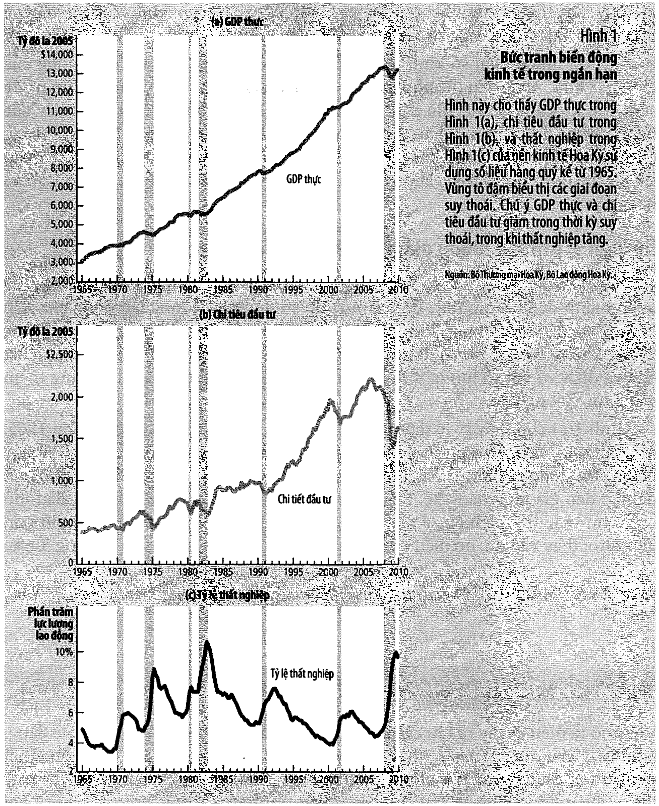

### Dữ kiện 2: đa số các đại lượng vĩ mô cùng biến động — nhưng không cùng biên độ

Đây là dữ kiện có con số, và con số đó rất đáng nhớ (tr. 472):

| | |
| --- | ---: |
| Đầu tư chiếm bình quân | **1/7** ≈ 14,3% của GDP |
| Nhưng chiếm | **2/3** ≈ 66,7% mức suy giảm GDP khi suy thoái |
| **⟹ đầu tư nhạy gấp** | **4,7 lần** GDP nói chung |

✅ Phép chia kiểm bằng `assert`.

> *"Nói cách khác, khi điều kiện kinh tế đi xuống, phần lớn sự giảm sút có thể quy cho những cắt giảm
> của chi tiêu vào **nhà máy mới, nhà ở mới và hàng tồn kho**."* (tr. 472)

⭐ Ba khoản đó có một điểm chung: **đều hoãn lại được.** Bạn không hoãn được việc ăn cơm, nhưng hoãn được
việc mua máy. Đó là lý do kinh tế học về **đầu tư** thực chất là kinh tế học về **kỳ vọng** — nối thẳng
về [bài 5 mục 8](bai_05_cong_cu_co_ban_cua_tai_chinh.md#8-định-giá-tài-sản--phân-tích-cơ-bản): giá trị
một dự án là hiện giá của dòng tiền **tương lai**, và tương lai là thứ đầu tiên trở nên mờ mịt khi có
tin xấu.

### Dữ kiện 3: khi sản lượng giảm thì thất nghiệp tăng

> *"Thực tế này không có gì ngạc nhiên: Khi các doanh nghiệp quyết định sản xuất hàng hóa và dịch vụ với
> số lượng ít đi thì họ sẽ sa thải bớt công nhân."* (tr. 472)

⚠️ Nhưng sách chốt bằng một câu quan trọng (tr. 472): *"Tỷ lệ thất nghiệp **không bao giờ tiến đến zero**;
thay vào đó, nó biến động xung quanh **tỷ lệ tự nhiên vào khoảng 5–6%**."*

📌 Đó chính là [bài 6](bai_06_that_nghiep.md): thất nghiệp cọ xát và cơ cấu không biến mất khi kinh tế
tốt. Cái biến động theo chu kỳ chỉ là phần **thất nghiệp chu kỳ** nằm trên tỷ lệ tự nhiên.

Số liệu 2008–2009 minh hoạ cả ba dữ kiện cùng lúc:

$$\text{thất nghiệp } 4{,}4\% \to 10{,}1\% \quad \text{tức } +5{,}7 \text{ điểm phần trăm, gấp } 2{,}30 \text{ lần}$$

---

## 3. Vì sao phải bỏ phân đôi cổ điển

[Bài 8 mục 5](bai_08_tang_truong_tien_va_lam_phat.md#5-phân-đôi-cổ-điển-và-tính-trung-lập-của-tiền) đã
dạy rằng biến danh nghĩa và biến thực tách rời nhau. Sách nhắc lại nó bằng một hình ảnh gợi (tr. 473):

> *"Quan điểm cổ điển này đôi lúc được mô tả theo cách nói: **'Tiền như là bức màn che bề ngoài'**."*

Rồi bác bỏ nó — cho ngắn hạn:

> *"**Đa số các nhà kinh tế tin rằng lý thuyết cổ điển mô tả thế giới trong dài hạn chứ không phải trong
> ngắn hạn.**… Trong ngắn hạn, các biến số thực và danh nghĩa **đan xen chặt chẽ** với nhau, và những
> thay đổi của cung tiền có thể **tạm thời** đẩy GDP thực chệch khỏi xu hướng dài hạn của nó."* (tr. 473)

### ⭐ Và nhân chứng của sách là chính David Hume

Đây là chi tiết đắt nhất của mục này (tr. 473–474). Hume — người đưa ra phân đôi cổ điển ở
[bài 8](bai_08_tang_truong_tien_va_lam_phat.md#5-phân-đôi-cổ-điển-và-tính-trung-lập-của-tiền) — quan sát
ở Anh thế kỷ 18 rằng:

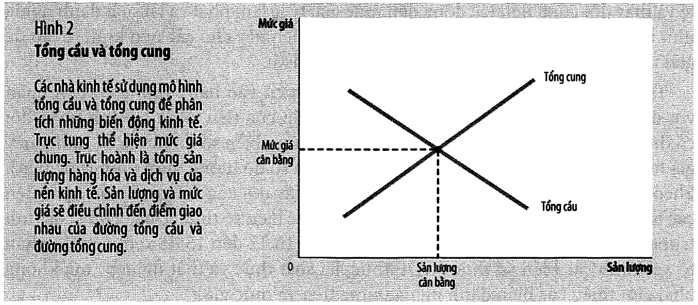

> *"khi cung tiền mở rộng sau những lần phát hiện ra vàng, thì phải **một thời gian sau** giá cả mới
> tăng, và **trong lúc đó**, nền kinh tế tận hưởng việc làm gia tăng và sản lượng cao hơn."*

📌 Không phải Mankiw phát hiện ra giới hạn của lý thuyết cổ điển. Chính tác giả của nó đã biết. Đó là một
bài học về cách đọc lý thuyết: **một mô hình tốt luôn kèm theo phạm vi áp dụng của nó**, và người dựng ra
nó thường là người biết rõ phạm vi ấy nhất.

### ⚠️ Một cái bẫy sách chặn ngay khi giới thiệu mô hình

Rất dễ nghĩ AD–AS là bản phóng to của cung–cầu một thị trường. Sách nói **không** (tr. 475):

> *"Ta có xu hướng xem mô hình tổng cầu và tổng cung thật ra là phiên bản lớn của mô hình cầu và cung thị
> trường như đã được giới thiệu trong Chương 4. **Thật ra, mô hình này là khác.**"*

Vì sao? Ở thị trường kem, giá kem tăng thì người mua **chuyển sang thứ khác** — đó là sự thay thế **giữa
các thị trường**. Nhưng:

> *"Suy cho cùng, đại lượng mà mô hình của chúng ta đang cố gắng giải thích – GDP thực – lại đo lường
> tổng hàng hóa và dịch vụ do **tất cả** doanh nghiệp sản xuất ra trên **tất cả** các thị trường."*
> (tr. 475)

📌 **Không còn thị trường nào để thay thế sang.** Nên độ dốc của AD và AS phải có lời giải thích **khác
hoàn toàn** với độ dốc cung–cầu vi mô. Ba mục tiếp theo là ba lời giải thích đó.

---

## 4. Đường tổng cầu dốc xuống — ba hiệu ứng

Xuất phát từ đồng nhất thức của [bài 1](bai_01_do_luong_thu_nhap_quoc_gia.md#5-bốn-thành-phần--y--c--i--g--nx):

$$Y = C + I + G + NX$$

Sách giả định $G$ cố định bởi chính sách. Ba thành phần còn lại đều phụ thuộc mức giá — và **mỗi thành
phần cho một hiệu ứng**.

| # | Hiệu ứng | Cơ chế | Thành phần |
| - | -------- | ------ | ---------- |
| 1 | **Của cải** | $P \downarrow$ → giá trị **thực** của tiền tăng → người tiêu dùng giàu hơn | **$C$** |
| 2 | **Lãi suất** | $P \downarrow$ → cần ít tiền để giao dịch → cho vay bớt → $r \downarrow$ | **$I$** |
| 3 | **Tỷ giá hối đoái** | $P \downarrow$ → $r \downarrow$ → vốn chảy ra → nội tệ mất giá | **$NX$** |

### Hiệu ứng của cải (tr. 476)

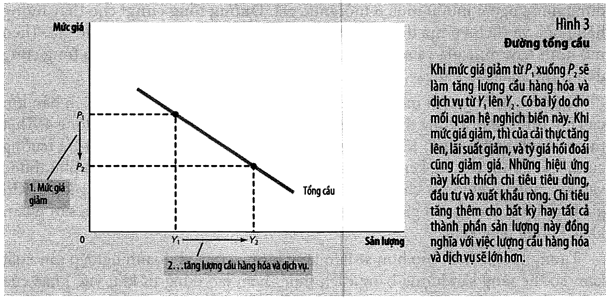

Ví dụ kẹo của sách:

| Giá một cây kẹo | 1 đô la đáng giá |
| ---: | ---: |
| 1,00 USD | **1** cây kẹo |
| 0,50 USD | **2** cây kẹo |

> *"Do đó, khi mức giá giảm làm cho số tiền bạn đang có sẽ tăng thêm giá trị, nó làm tăng số của cải thực
> và khả năng mua hàng hóa và dịch vụ của bạn."* (tr. 476)

### Hiệu ứng lãi suất (tr. 476–477)

$P \downarrow$ → hộ gia đình cần giữ ít tiền hơn → họ mua trái phiếu hoặc gửi tiết kiệm → *"họ tạo áp lực
khiến lãi suất giảm xuống"* → vay rẻ hơn → đầu tư tăng.

### Hiệu ứng tỷ giá hối đoái (tr. 477)

Đây là hiệu ứng nối bài này với bài 9–10, và chuỗi của sách rất đáng theo:

```
P giảm ở Hoa Kỳ  →  lãi suất Hoa Kỳ giảm
     →  nhà đầu tư Mỹ đi tìm lợi tức cao hơn ở nước ngoài
     →  cung đô la trên thị trường ngoại hối TĂNG
     →  đô la GIẢM GIÁ  →  tỷ giá thực giảm
     →  hàng Mỹ rẻ tương đối  →  xuất khẩu↑, nhập khẩu↓
     →  NX TĂNG
```

📌 Đó đúng là mô hình [bài 10](bai_10_ly_thuyet_kinh_te_mo.md#3-cân-bằng-đồng-thời--và-mô-hình-bằng-số)
chạy ngược từ một cú sốc mức giá. Ba bài không phải ba chủ đề rời.

### ⚠️⚠️ Điều dễ nhầm nhất của cả chương

Sách nói rõ (tr. 478):

> *"đường tổng cầu (giống như mọi đường cầu) được vẽ ra trong điều kiện 'các yếu tố khác không đổi'. Cụ
> thể, **ba lý giải về độ dốc đi xuống của đường tổng cầu đều giả định cung tiền là cố định**."*

**Đổi mức giá → đi DỌC theo đường AD. Đổi cung tiền → đường AD DỊCH CHUYỂN.** Nhầm hai chuyện này là lỗi
phổ biến nhất khi làm bài tập chương này.

### 📚 Thí nghiệm tư duy của sách

Sách đưa một thí nghiệm đáng làm (tr. 478): bạn thức dậy và thấy **giá mọi thứ giảm một nửa**, nên số
tiền trong tay bạn có giá trị **gấp đôi**. Bạn làm gì?

| Bạn chọn | Hiệu ứng nào | Thành phần nào tăng |
| -------- | ------------ | ------------------- |
| Ăn xài, tăng chi tiêu | của cải | $C$ |
| Cho vay / mua trái phiếu | lãi suất | $I$ |
| Đầu tư ra nước ngoài | tỷ giá | $NX$ |

> *"**Bất kể bạn chọn cách nào** trong số ba phản ứng này, thì mức giá giảm vẫn làm tăng lượng cầu hàng
> hóa và dịch vụ."* (tr. 478)

⭐ Đó là cách đọc hay nhất: ba hiệu ứng không phải ba lý thuyết cạnh tranh nhau, mà là **ba lối thoát cho
cùng một lượng sức mua tăng thêm**. Không lối nào cũng dẫn về cùng một kết luận.

---

## 5. Bốn nguồn dịch chuyển tổng cầu — Bảng 1 tr. 480

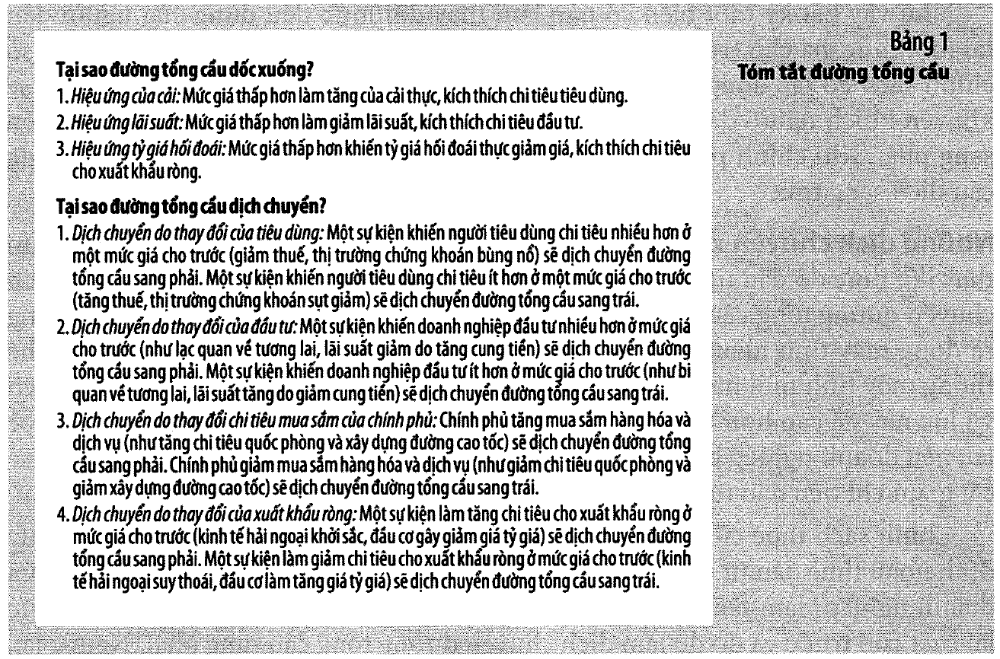

| Thành phần | Dịch sang **PHẢI** khi… | Dịch sang **TRÁI** khi… |
| ---------- | ----------------------- | ----------------------- |
| **Tiêu dùng** | giảm thuế · thị trường chứng khoán bùng nổ | tăng thuế · chứng khoán sụt |
| **Đầu tư** | lạc quan về tương lai · **tăng cung tiền** · hoàn thuế đầu tư | bi quan · **giảm cung tiền** |
| **Mua sắm chính phủ** | xây đường cao tốc · tăng quốc phòng | cắt giảm chi tiêu |
| **Xuất khẩu ròng** | kinh tế hải ngoại khởi sắc · **đồng tiền giảm giá** | hải ngoại suy thoái · **đồng tiền tăng giá** |

### ⭐ Chú ý cung tiền nằm ở dòng ĐẦU TƯ, không phải một dòng riêng

Sách giải thích cơ chế (tr. 479):

> *"sự gia tăng cung tiền làm giảm lãi suất trong ngắn hạn. Lãi suất giảm giúp chi phí vay ít tốn kém, do
> đó kích thích chi tiêu đầu tư và do đó dịch chuyển đường tổng cầu sang phải."*

📌 Cung tiền tác động **gián tiếp**, qua lãi suất. [Bài 12](bai_12_chinh_sach_tien_te_va_tai_khoa.md) sẽ
mở kỹ đúng cơ chế này. Và sách nói thêm (tr. 479): *"Nhiều nhà kinh tế tin rằng trong suốt lịch sử Hoa
Kỳ, những thay đổi của chính sách tiền tệ vẫn luôn là **nguồn gốc quan trọng** gây ra sự chuyển dịch của
tổng cầu."*

### ⚠️ Và chú ý dòng xuất khẩu ròng

**Đồng tiền GIẢM giá làm AD dịch PHẢI.** Đó là [bài 9–10](bai_10_ly_thuyet_kinh_te_mo.md) nối vào đây:
một cú sốc tỷ giá không chỉ là chuyện của ngành xuất khẩu — nó **dịch cả đường tổng cầu của nền kinh tế**.

Sách còn nêu một nguồn nữa (tr. 480): *"Xuất khẩu ròng có thể thay đổi vì các nhà đầu cơ quốc tế khuấy
động tỷ giá hối đoái."* Cùng loại hiện tượng với **tháo chạy vốn** ở
[bài 10 mục 9](bai_10_ly_thuyet_kinh_te_mo.md#9-thí-nghiệm-3--tháo-chạy-vốn), nhưng bây giờ hậu quả của
nó hiện ra ở **sản lượng**, không chỉ ở tỷ giá.

---

## 6. Tổng cung dài hạn dốc đứng

> **Mức sản lượng tự nhiên** (tr. 482): *"sản lượng hàng hóa và dịch vụ mà nền kinh tế đạt được trong dài
> hạn khi thất nghiệp ở tỷ lệ thông thường."* Còn gọi là **sản lượng tiềm năng** hay **sản lượng toàn
> dụng**.

Lập luận cho độ dốc đứng chỉ là [bài 3](bai_03_san_xuat_va_tang_truong.md) phát biểu lại (tr. 481):

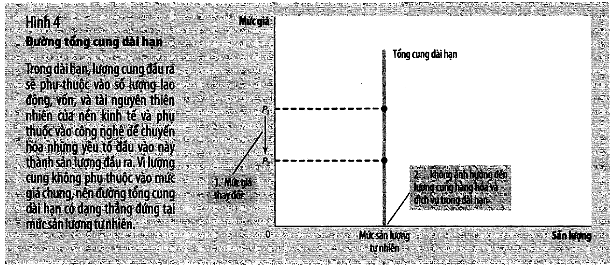

> *"Trong dài hạn, sản lượng hàng hóa và dịch vụ của một nền kinh tế (GDP thực) phụ thuộc vào nguồn cung
> **lao động, vốn và tài nguyên thiên nhiên**, và vào **công nghệ** sẵn có để chuyển hóa những yếu tố sản
> xuất này thành hàng hóa và dịch vụ."*

**Mức giá không nằm trong danh sách.** Nên LRAS dốc đứng.

Và sách nói rõ ý nghĩa đồ hoạ của nó (tr. 481–482): *"Đường tổng cung dài hạn thẳng đứng là cách thể hiện
về mặt **đồ họa** tính phân đôi cổ điển và tính trung lập của tiền."*

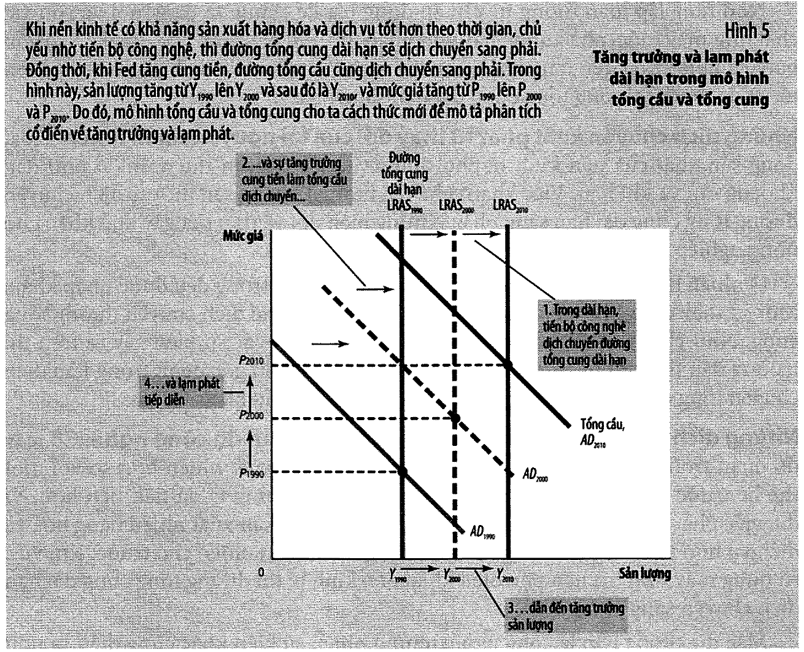

### Bốn nguồn dịch chuyển LRAS (tr. 482–483)

| Nguồn | Dịch sang **PHẢI** khi… | tr. |
| ----- | ----------------------- | --- |
| **Lao động** | làn sóng nhập cư · **thất nghiệp tự nhiên giảm** | 482 |
| **Vốn** | trữ lượng vốn vật chất **hoặc vốn nhân lực** tăng | 482 |
| **Tài nguyên** | khám phá trữ lượng khoáng sản mới | 483 |
| **Công nghệ** | phát minh · **mở cửa thương mại quốc tế** | 483 |

⭐ Dòng cuối đáng chú ý. Sách xếp **mở cửa thương mại** vào nhóm công nghệ (tr. 483): *"việc mở cửa
thương mại quốc tế có những tác động tương tự như phát minh ra một quy trình sản xuất mới vì nó cho phép
một quốc gia chuyên môn hóa vào những ngành có năng suất cao hơn."*

📌 Đó là [EG13 bài 14](../../%5BEG13%5D.kinhtevimo-micro/ly_thuyet/bai_14_thuong_mai_ngoai_tac_hang_hoa_cong.md)
gặp lại chương này. Và ngược lại, sách cũng nêu (tr. 483): quy định mới cản trở doanh nghiệp *"chẳng hạn
để giải quyết vấn đề an toàn lao động hay quan ngại môi trường"* thì đẩy LRAS sang **trái**.

Sách tự tổng kết rất gọn (tr. 483):

> *"**Bất kỳ chính sách hay sự kiện nào làm tăng GDP thực trong các chương trước thì bây giờ đều có thể
> được mô tả như làm tăng lượng cung hàng hóa và dịch vụ và đẩy đường tổng cung dài hạn sang phải.**"*

⭐ Tám bài từ bài 3 đến bài 10 được gọi lại trong một câu. Mô hình mới **không thay thế** mô hình cũ — nó
**chứa** mô hình cũ, dưới dạng một đường thẳng đứng.

---

## 7. Tổng cung ngắn hạn — ba lý thuyết

Sách nêu **chủ đề chung** trước khi kể ba lý thuyết, và câu này đáng thuộc (tr. 485):

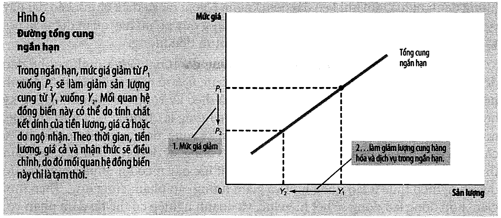

> *"Lượng cung sản lượng **chệch khỏi** mức dài hạn hay mức tự nhiên khi mức giá **thực tế** trong nền
> kinh tế **chệch khỏi** mức giá mà người dân **kỳ vọng** sẽ diễn ra."*

| Lý thuyết | Cái gì kết dính / sai lệch |
| --------- | -------------------------- |
| **Tiền lương kết dính** | lương **danh nghĩa** — hợp đồng dài hạn, *"đôi khi kéo dài đến 3 năm"* |
| **Giá cả kết dính** | giá niêm yết — vì có **chi phí thực đơn** ([bài 8 mục 10](bai_08_tang_truong_tien_va_lam_phat.md#10-chi-phí-thứ-nhất-và-thứ-hai--mòn-giày-thực-đơn)) |
| **Sự ngộ nhận** | nhà cung ứng nhầm giá **tương đối** của mình với giá chung |

⚠️ Sách **không** chọn một lý thuyết (tr. 488):

> *"Các nhà kinh tế vẫn tranh luận lý thuyết nào là đúng, và rất có khả năng **mỗi lý thuyết đều hàm chứa
> một phần sự thật**. Theo mục tiêu của cuốn sách này, những **điểm tương đồng** của các lý thuyết này
> quan trọng hơn là sự khác biệt."*

### ✅ Ví dụ số của sách (tr. 486) — lý thuyết tiền lương kết dính

Năm ngoái doanh nghiệp **kỳ vọng** mức giá năm nay là **100**, nên ký hợp đồng lao động ở mức lương
**20 USD/giờ**.

| Mức giá **thực tế** | Doanh thu/đơn vị | Lương danh nghĩa | **Lương THỰC** |
| ---: | ---: | ---: | ---: |
| 95 | **−5%** | 20,00 $ | **0,2105** |
| 100 | 0% | 20,00 $ | 0,2000 |
| 105 | **+5%** | 20,00 $ | **0,1905** |

### ⭐ Đọc cột cuối

**Lương danh nghĩa đứng yên ở 20 USD. Lương THỰC đi ngược với mức giá.**

- $P = 95$ → lương thực **cao hơn 5,3%** → doanh nghiệp thuê **ít** lao động → sản lượng giảm
- $P = 105$ → lương thực **thấp hơn 4,8%** → thuê **nhiều** lao động → sản lượng tăng

Đó là toàn bộ cơ chế, và sách kể đúng như vậy (tr. 486):

> *"Vì mức giá giảm thấp hơn mức kỳ vọng, doanh nghiệp này mất 5% cho mỗi đơn vị sản phẩm bán ra. Chi phí
> lao động sử dụng để làm ra sản phẩm thì vẫn **chốt** ở mức 20 đô la một giờ. Sản xuất lúc này ít có lợi
> nhuận hơn, do đó doanh nghiệp thuê ít lao động hơn và giảm lượng sản phẩm cung ứng."*

⚠️ Và cái chốt "tạm thời" (tr. 486):

> *"Theo thời gian, hợp đồng lao động sẽ hết hiệu lực, và doanh nghiệp có thể tái đàm phán với người lao
> động về mức lương thấp hơn (người lao động có thể chấp nhận vì giá cả giờ đây đã thấp hơn), **nhưng
> trong lúc này**, việc làm và sản lượng sẽ vẫn thấp hơn mức dài hạn của chúng."*

📌 Chính ba chữ **"trong lúc này"** là toàn bộ kinh tế học ngắn hạn. Không ai phủ nhận rằng nền kinh tế
cuối cùng sẽ tự điều chỉnh. Câu hỏi là **trong lúc chờ, chuyện gì xảy ra với người mất việc**.

### 📚 Hai lý thuyết còn lại, gọn hơn

**Giá cả kết dính** (tr. 486–487): doanh nghiệp công bố giá trước dựa trên kỳ vọng. Khi mức giá chung sụt
ngoài dự kiến, *"những doanh nghiệp đi sau này vẫn có giá quá cao, nên bị giảm doanh số. Doanh số giảm
khiến họ cắt giảm sản xuất và giảm lao động."*

**Sự ngộ nhận** (tr. 487): mức giá chung giảm → nhà cung ứng thấy giá **của mình** giảm → *"họ có thể tin
rằng giá của họ đã giảm so với giá cả khác trong nền kinh tế"* → tưởng giá **tương đối** giảm → giảm sản
lượng. Sách cho ví dụ nông dân trồng lúa mì và người lao động, và cả hai đều nhầm cùng một kiểu.

---

## 8. Công thức của sách, và mô hình bằng số

Sách viết hẳn ra công thức — đây là **một trong rất ít công thức** của cả phần ngắn hạn (tr. 488):

$$\boxed{Y = Y^n + a \times (P - P^e)}$$

> *"Trong đó $a$ là số hạng quyết định mức phản ứng của sản lượng là bao nhiêu trước sự thay đổi ngoài dự
> kiến của mức giá."* (tr. 488)

### Mô hình số của bài này

⚠️ **Ranh giới cần rõ.** Đường AS ngắn hạn dùng **đúng** công thức trên của sách. Chỉ có đường AD là do
bài này đặt dạng tuyến tính.

$$\text{LRAS}: Y = 1000 \qquad \text{SRAS}: Y = 1000 + 5(P - P^e) \qquad \text{AD}: Y = 1500 - 5P$$

| | $Y$ | $P$ |
| --- | ---: | ---: |
| **Cân bằng gốc** (Hình 7, tr. 490) | **1.000** | **100** |

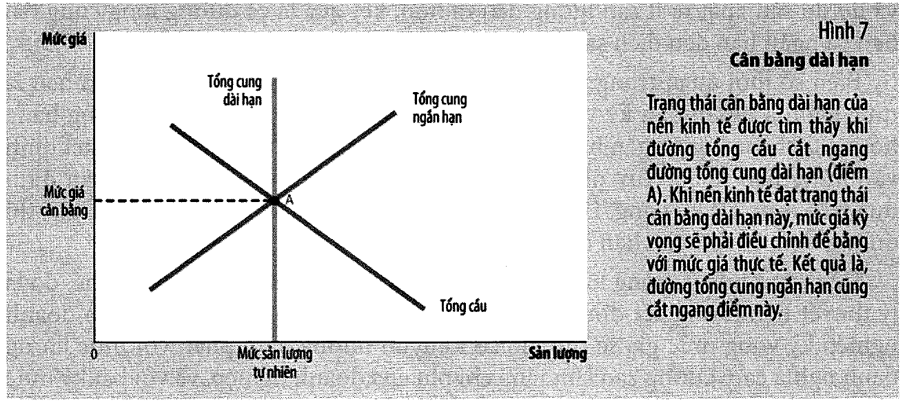

Ba điều kiện của cân bằng **dài hạn** (tr. 490), cả ba đều `assert`:

1. $Y = Y^n$ — sản lượng bằng mức tự nhiên ✓
2. $P = P^e$ — kỳ vọng khớp thực tế ✓
3. AD cắt **cả hai** đường AS tại cùng một điểm ✓

Sách mô tả đúng điều kiện thứ ba (tr. 490): *"Vì nền kinh tế luôn trong trạng thái cân bằng ngắn hạn, nên
đường tổng cung ngắn hạn cũng cắt qua điểm này, điều đó cho thấy mức giá kỳ vọng đã điều chỉnh theo xu
hướng cân bằng dài hạn trên."*

### ⭐ Cơ chế tự điều chỉnh của cả chương, viết thành một dòng

$$P \ne P^e \;\Rightarrow\; Y \ne Y^n \;\Rightarrow\; \text{người ta sửa kỳ vọng} \;\Rightarrow\; P^e \to P \;\Rightarrow\; Y \to Y^n$$

📌 **Kỳ vọng là thứ kéo nền kinh tế về.** Không cần ai làm gì cả. Giữ chặt cơ chế này — nó là chìa khoá
của mục 10, mục 11, của bài tập 8 ở [mục 17](#17--ba-bài-tập-giải-bằng-số), và của toàn bộ
[bài 13](bai_13_lam_phat_va_that_nghiep.md).

### Bốn bước phân tích — Bảng 3 tr. 491

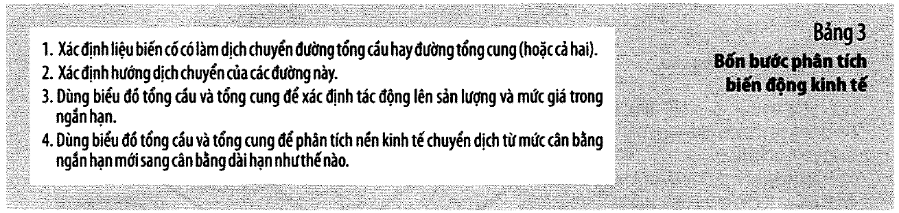

1. Xác định sự kiện làm dịch **AD** hay **AS** (hoặc cả hai)
2. Xác định **hướng** dịch chuyển
3. Dùng biểu đồ xem tác động lên sản lượng và mức giá trong **ngắn hạn**
4. Xem nền kinh tế chuyển từ cân bằng **ngắn hạn** mới sang cân bằng **dài hạn** mới

⚠️ Ba bước đầu quen thuộc từ EG13. **Bước 4 là bước mới**, và sách nói rõ (tr. 491): *"Thách thức mới là
chúng ta phải bổ sung thêm bước thứ tư: phải theo dõi trạng thái cân bằng ngắn hạn mới, cân bằng dài hạn
mới và **sự chuyển tiếp** giữa hai điểm cân bằng này."*

📌 Đó là khác biệt lớn nhất giữa chương này và mọi chương trước: **một cú sốc bây giờ có HAI kết cục, và
chúng khác nhau.** Bỏ qua bước 4 là cách kết luận sai nhiều nhất trong cả phần ngắn hạn.

---

## 9. Cú sốc tổng cầu: A → B → C

Bối cảnh của sách (tr. 491): *"một làn sóng bi quan bỗng nhiên bao trùm nền kinh tế. Nguyên nhân có thể
là một vụ bê bối ở Nhà Trắng, một vụ sụp đổ trên thị trường chứng khoán hoặc nổ ra chiến tranh ở nước
ngoài."*

| Điểm | $Y$ | $P$ | $\Delta Y$ | $\Delta P$ |
| ---- | ---: | ---: | ---: | ---: |
| **A** cân bằng gốc | 1.000,0 | 100,0 | 0,0% | 0,0% |
| **B** ngắn hạn (AD −100) | **950,0** ↓ | **90,0** ↓ | **−5,0%** | **−10,0%** |
| **C** dài hạn (kỳ vọng đã đổi) | **1.000,0** = | **80,0** ↓ | 0,0% | **−20,0%** |

**Ngắn hạn (A → B):** sản lượng giảm 50, mức giá giảm 10. *"Mức sản lượng giảm đi cho thấy nền kinh tế
đang trong **suy thoái**"* (tr. 491). Doanh nghiệp cắt giảm việc làm.

**Dài hạn (B → C):** kỳ vọng sửa từ 100 xuống **80**, SRAS dịch phải, sản lượng **về lại 1.000** nhưng
giá còn 80.

### ⭐ Kết luận trung tâm của cả chương (tr. 492)

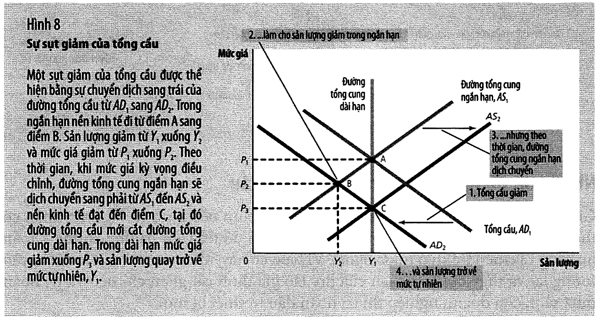

> *"trong **dài hạn**, sự dịch chuyển của đường tổng cầu được phản ánh **hoàn toàn vào mức giá** nhưng
> **không phản ánh trong mức sản lượng**. Nói cách khác, tác động dài hạn của sự dịch chuyển tổng cầu là
> một sự thay đổi **danh nghĩa** (mức giá thấp hơn) nhưng **không có thay đổi thực** (sản lượng như cũ)."*

📌 Đó chính là **tính trung lập của tiền** ở
[bài 8](bai_08_tang_truong_tien_va_lam_phat.md#5-phân-đôi-cổ-điển-và-tính-trung-lập-của-tiền) — nhưng bây
giờ ta thấy được **cả đường đi**. Nó đúng ở **C**, không đúng ở **B**. Và nền kinh tế **phải đi qua B để
đến C**.

⭐ Cả cuộc tranh luận vĩ mô nằm ở chỗ đó: nếu bạn chỉ nhìn A và C, chính sách tiền tệ không làm gì cả.
Nếu bạn sống ở B, nó là chuyện sinh tử.

### Ba bài học sách rút ra (tr. 493)

1. Trong **ngắn hạn**, dịch chuyển tổng cầu gây biến động **sản lượng**
2. Trong **dài hạn**, dịch chuyển tổng cầu tác động **mức giá**, không tác động sản lượng
3. Nhà hoạch định chính sách **có thể** giảm thiểu mức độ nghiêm trọng

⚠️ Về điểm 3, sách nêu lựa chọn thay thế (tr. 492): thay vì để nền kinh tế tự đi A → B → C, *"các nhà
hoạch định chính sách có thể hành động để tăng tổng cầu… đưa đường tổng cầu trở lại $AD_1$, và nền kinh
tế trở lại điểm A."* Nhưng kèm điều kiện: *"**Nếu chính sách thành công**"*.
[Bài 12](bai_12_chinh_sach_tien_te_va_tai_khoa.md) và [bài 14](bai_14_sau_tranh_luan_chinh_sach.md) sẽ
bàn chữ "nếu" đó.

### 📚 Hộp "Nhắc lại tính trung lập của tiền" (tr. 493)

Sách đóng gói cả mục này vào một câu ví von rất đắt:

> *"**Tiền chỉ là bức màn che, nhưng khi bức màn lay động mạnh, sản lượng thực cũng phải hắt hơi.**"*

---

## 10. Cú sốc tổng cung: đình lạm

> **Đình lạm** (tr. 498): *"giai đoạn sản lượng giảm và giá cả tăng."* Sách cũng dùng tên đầy đủ: *"trì
> trệ kèm lạm phát – Stagflation"*.

Bối cảnh (tr. 497): *"thời tiết xấu ở một số nước nông nghiệp gây mất mùa"* hoặc *"chiến tranh ở Trung
Đông làm cản trở tuyến vận tải dầu thô"*.

| Điểm | $Y$ | $P$ | $\Delta Y$ | $\Delta P$ |
| ---- | ---: | ---: | ---: | ---: |
| **A** cân bằng gốc | 1.000,0 | 100,0 | 0,0% | 0,0% |
| **B** SRAS dịch trái 100 | **950,0** ↓ | **110,0** ↑ | **−5,0%** | **+10,0%** |

### ⭐⭐ Sản lượng giảm VÀ mức giá tăng cùng lúc

Đó là điều mà một cú sốc **tổng cầu** không bao giờ làm được — ở [mục 9](#9-cú-sốc-tổng-cầu-a--b--c) hai
biến luôn đi **cùng** chiều.

| Loại cú sốc | Sản lượng | Mức giá | Hai biến đi |
| ----------- | --------- | ------- | ----------- |
| **Tổng cầu** giảm | GIẢM | **GIẢM** | **cùng** chiều |
| **Tổng cung** giảm | GIẢM | **TĂNG** | **ngược** chiều |

📌 **Đó là cách phân biệt hai loại cú sốc bằng số liệu, không cần biết nguyên nhân**: nhìn **dấu** của
thay đổi sản lượng và thay đổi giá cả. Một quy tắc đọc tin dùng được suốt đời — xem
[mục 19(b)](#19--góc-qtkd).

### ⚠️ Vòng xoáy giá và lương (tr. 498)

Nếu người lao động phản ứng bằng cách **nâng kỳ vọng** về mức giá, SRAS dịch trái **xa hơn nữa**:

| Kỳ vọng $P^e$ | $Y$ | $P$ |
| ---: | ---: | ---: |
| 100 | 950,0 | 110,0 |
| 110 | **925,0** | 115,0 |
| 120 | **900,0** | 120,0 |

> *"Hiện tượng giá cả cao hơn dẫn đến lương cao hơn, sau đó lại đẩy giá cao hơn nữa, đôi khi được gọi là
> **vòng xoáy giá và lương** (wage-price spiral)."* (tr. 498)

Sách cũng nói vòng xoáy này **tự dừng** (tr. 498): *"Mức sản lượng và việc làm thấp sẽ tạo áp lực làm
giảm tiền lương của người lao động vì họ có ít quyền lực đàm phán hơn khi thất nghiệp đang ở mức cao."*
Nhưng nó dừng **bằng cách để thất nghiệp cao đủ lâu** — không phải một cơ chế dễ chịu.

### ⚠️⚠️ Chính sách thích ứng — Hình 11 tr. 498

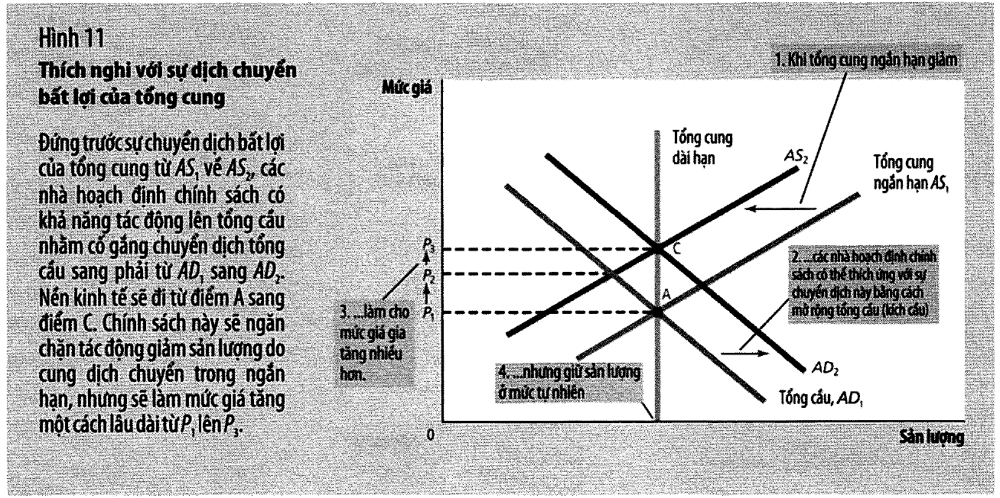

Câu hỏi: phải tăng tổng cầu bao nhiêu để **giữ** sản lượng ở mức tự nhiên?

| Điểm | $Y$ | $P$ | |
| ---- | ---: | ---: | --- |
| A cân bằng gốc | 1.000,0 | 100,0 | |
| B chỉ có cú sốc cung | 950,0 | 110,0 | sản lượng giảm |
| **C** thêm AD **+100** | **1.000,0** = | **120,0** ↑ | **sản lượng cứu được, giá cao hơn nữa** |

> *"Chính sách thích ứng này phải **chấp nhận** mức giá cao hơn để duy trì mức sản lượng và việc làm cao
> hơn."* (tr. 499)

### ⭐⭐ Bài học khó chịu nhất của chương (tr. 499)

> *"Các nhà hoạch định chính sách có khả năng tác động lên tổng cầu có thể giảm thiểu tác động bất lợi
> này lên **sản lượng** nhưng với **cái giá là đẩy lạm phát cao hơn**."*

**Không có lựa chọn tốt. Chỉ có hai lựa chọn xấu khác nhau.** Đó chính xác là đánh đổi mà
[bài 13](bai_13_lam_phat_va_that_nghiep.md) sẽ đặt tên và đo đạc.

📌 So sánh với cú sốc **cầu** ở mục 9: ở đó, chính sách đúng hướng có thể đưa nền kinh tế về A — vừa cứu
sản lượng **vừa** giữ giá. Ở cú sốc **cung** thì không. Đó là lý do đình lạm là loại khủng hoảng khó nhất
với nhà hoạch định chính sách.

---

## 11. Đại Khủng hoảng — và một phép kiểm mà bài 8 chưa làm được

Sách cho bốn con số ở tr. 494:

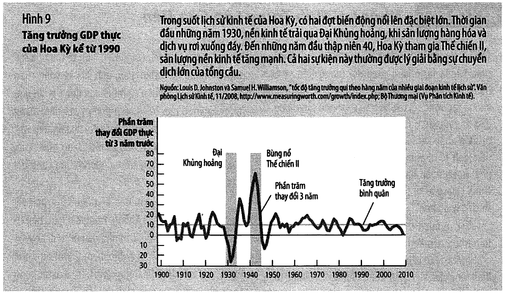

| | 1929 → 1933 |
| --- | ---: |
| GDP thực | **giảm 27%** |
| Mức giá | **giảm 22%** |
| Thất nghiệp | **3% → 25%** |
| Cung tiền | **giảm 28%** |
| Giá cổ phiếu | giảm khoảng **90%** |

📌 Con số **cung tiền giảm 28%** chính là con số của
[bài 7 mục 13](bai_07_he_thong_tien_te.md#13-đổ-xô-rút-tiền-và-đại-khủng-hoảng) và
[bài 8 mục 6](bai_08_tang_truong_tien_va_lam_phat.md#6-siêu-lạm-phát). Ba bài, một con số — nhưng bây giờ
ta có đủ dữ kiện để làm **một phép kiểm mà hai bài trước chưa làm được**.

### ⭐⭐ Kiểm giả định "vòng quay tiền ổn định"

[Bài 8 mục 3](bai_08_tang_truong_tien_va_lam_phat.md#3-phương-trình-số-lượng) đã nói rõ: phương trình
$M \times V = P \times Y$ là **đồng nhất thức**, và nó chỉ thành **lý thuyết** khi ta thêm giả định
**$V$ ổn định**. Bây giờ kiểm giả định đó bằng chính số liệu 1929–1933:

$$\frac{V_{1933}}{V_{1929}} = \frac{(P \cdot Y)_{1933}/(P \cdot Y)_{1929}}{M_{1933}/M_{1929}} = \frac{0{,}78 \times 0{,}73}{0{,}72} = 0{,}7908$$

$$\Rightarrow \textbf{vòng quay tiền GIẢM 20,9\%}$$

✅ Kiểm bằng `assert`.

⚠️ **Đây là một kết quả quan trọng mà sách không chỉ ra.** Giả định "$V$ ổn định" — trụ cột của thuyết số
lượng tiền ở bài 8 — **sụp đổ đúng vào lúc người ta cần nó nhất**. Mô hình dài hạn không giải thích được
1929–1933.

📌 **Đó chính là lý do chương 20 tồn tại.**

### Và đối chiếu dự báo dài hạn với thực tế

| | Mức giá | Sản lượng |
| --- | ---: | ---: |
| Mô hình **cổ điển** dự báo | giảm 28% | **KHÔNG ĐỔI** |
| **Thực tế** 1929–1933 | giảm 22% | **giảm 27%** |

Một cú sốc **danh nghĩa** (cung tiền) đã gây ra hậu quả **thực** (sản lượng, việc làm) rất lớn. Đó là
định nghĩa của "tiền không trung lập trong ngắn hạn", nhìn bằng số liệu thay vì bằng lý thuyết.

⚠️ Sách ghi nhận tranh cãi chưa dứt (tr. 494): *"Các nhà lịch sử kinh tế vẫn **tiếp tục tranh luận** về
nguyên nhân của Đại Khủng hoảng, nhưng đa số các lý giải đều tập trung vào sự giảm mạnh của tổng cầu."*
Ngoài cung tiền, sách nêu thêm hai kênh: giá cổ phiếu giảm 90% (hiệu ứng **của cải** ở
[mục 4](#4-đường-tổng-cầu-dốc-xuống--ba-hiệu-ứng)), và trục trặc ngân hàng cản trở doanh nghiệp tiếp cận
vốn đầu tư.

---

## 12. Thế Chiến II — thí nghiệm ngược

Chiều ngược lại của mục 11, và sách gọi là *"dễ lý giải hơn"* (tr. 495):

| | 1939 → 1944 |
| --- | ---: |
| Mua sắm chính phủ | **tăng gần 5 lần** |
| Sản lượng | **tăng gấp đôi** |
| Mức giá | **tăng 20%** |
| Thất nghiệp | **17% → 1%** |

$$\text{chi tiêu danh nghĩa } (P \times Y) \text{ tăng } 2 \times 1{,}2 = \textbf{2,4 lần}$$

✅ `assert`.

⭐ Chú ý con số **1% năm 1944** — sách gọi là *"mức thấp nhất trong lịch sử Hoa Kỳ"*. Đối chiếu với
[bài 6](bai_06_that_nghiep.md): tỷ lệ tự nhiên khoảng **5–6%**. Nghĩa là nền kinh tế 1944 chạy **vượt xa**
mức sản lượng tự nhiên — trong mô hình này đó là một điểm nằm **bên phải** đường LRAS.

📌 Điều đó **có thể xảy ra trong ngắn hạn** và **không thể duy trì trong dài hạn**. Đó là mặt kia của
tấm huy chương: nếu AD có thể đẩy sản lượng **xuống dưới** mức tự nhiên (mục 9), nó cũng có thể đẩy
**lên trên**. Bài 13 sẽ nói về cái giá của việc giữ nó ở trên.

⚠️ Và một chi tiết đáng chú ý (tr. 495): mức giá tăng 20% *"**bất kể** các biện pháp kiểm soát giá đại
trà của chính phủ nhằm hạn chế sự gia tăng giá cả"*. **Kiểm soát giá không ngăn được lạm phát khi tổng
cầu bùng nổ — nó chỉ đổi hình thức của lạm phát** (từ giá cao thành xếp hàng, thiếu hàng, chợ đen). Đó là
đúng kết luận về giá trần của
[EG13 bài 13](../../%5BEG13%5D.kinhtevimo-micro/ly_thuyet/bai_13_chinh_phu_can_thiep_thi_truong.md), ở
quy mô cả nền kinh tế.

---

## 13. Suy thoái 2008–2009

Sách kể chuỗi nhân quả theo đúng thứ tự, từ gốc rễ đến kết cục (tr. 495–496):

```
1. lãi suất THẤP sau suy thoái 2001  →  vay thế chấp rẻ  →  giá nhà tăng
2. người vay DƯỚI CHUẨN + CHỨNG KHOÁN HOÁ  →  rủi ro bị đóng gói và bán đi
3. "các tổ chức đi mua lại KHÔNG HIỂU HẾT những rủi ro bao hàm"
4. giá nhà ĐẢO CHIỀU  →  người vay NGẬP TRONG NỢ  →  ngừng trả nợ
5. ngân hàng tịch thu và bán nhà  →  vòng xoáy RỚT GIÁ nhanh hơn nữa
6. tổ chức tài chính lỗ lớn  →  KHÔNG CÒN QUỸ ĐỂ CHO VAY
7. "ngay cả những khách hàng có uy tín tín dụng tốt cũng không thể đi vay"
8.  →  TỔNG CẦU thụt lùi mạnh
```

📌 Bước 2–3 là [rủi ro đạo đức và thông tin bất cân xứng](bai_05_cong_cu_co_ban_cua_tai_chinh.md#5-thị-trường-bảo-hiểm--và-hai-vấn-đề-của-nó)
của bài 5; bước 6 là [thắt chặt tín dụng](bai_07_he_thong_tien_te.md#10-vốn-tự-có-và-đòn-bẩy) của bài 7.
Chương này chỉ thêm bước 8 — cái mà hai bài kia chưa có công cụ để nói.

### Số liệu

| | |
| --- | ---: |
| Giá nhà 1995–2006 | **tăng gần gấp đôi** *(≈ 6,5%/năm — bài này suy ra)* |
| Giá nhà 2006–2009 | **giảm khoảng 30%** |
| GDP thực Q4/2007 → Q2/2009 | **giảm gần 4%** |
| Thất nghiệp | 4,4% (5/2007) → **10,1%** (10/2009) → 9,5% (6/2010) |

### Ba hành động chính sách

Sách nhấn mạnh điểm chung của chúng (tr. 496): *"tất cả đều một phần nhằm vào mục tiêu **đưa tổng cầu trở
về mức ban đầu**."*

| Thời điểm | Hành động | Quy mô |
| --------- | --------- | ------ |
| 9/2007 – 12/2008 | Fed hạ lãi suất liên bang mục tiêu | **5,25% → 0** |
| 10/2008 | Quốc hội duyệt cứu trợ hệ thống tài chính | **700 tỷ USD** |
| 17/2/2009 | Obama ký đạo luật kích cầu | **787 tỷ USD** |

$$\text{tổng hai gói} = 1.487 \text{ tỷ USD} = \textbf{10,4\% GDP Hoa Kỳ 2009}$$

*(Phép chia này do bài này làm, dùng GDP 14.256 tỷ từ [bài 1](bai_01_do_luong_thu_nhap_quoc_gia.md#7-bảng-1--gdp-hoa-kỳ-năm-2009-nhìn-từ-bốn-thành-phần).
Sách không đặt hai con số này cạnh nhau.)*

⚠️ Sách kết bằng một câu rất trung thực, viết vào tháng 6/2010 (tr. 497):

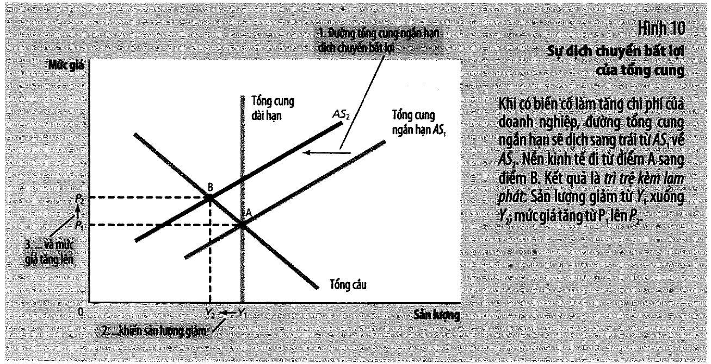

> *"Vậy thì nước đi chính sách nào, **nếu có**, là quan trọng nhất trong việc thúc đẩy sự phục hồi kinh
> tế? Đây chắc chắn là câu hỏi mà các nhà sử học kinh tế vĩ mô sẽ tranh luận trong những năm sắp tới."*

📌 **Ba chữ "nếu có" là ba chữ đắt nhất trong câu.** Sách không tuyên bố rằng các gói cứu trợ **đã** hiệu
quả. Nó chỉ mô tả chúng và ghi nhận rằng câu hỏi còn mở.

---

## 14. Dầu và nền kinh tế

Sách mở bằng một câu mạnh (tr. 499): *"Một số những biến động kinh tế **lớn nhất** ở Hoa Kỳ từ năm 1970
đều xuất phát từ những mỏ dầu ở Trung Đông."*

| Giai đoạn | Giá dầu | Thất nghiệp | Nguyên nhân |
| --------- | ------- | ----------- | ----------- |
| **1973–1975** | tăng gần **gấp đôi** | 4,9% → **8,5%** *(+3,6 điểm)* | OPEC giảm sản lượng để tăng giá |
| **1978–1981** | tăng **hơn gấp đôi** | 6% → **10%** *(+4,0 điểm)* | OPEC lại giới hạn cung dầu |
| **1986** | **giảm một nửa** | **giảm** | bất đồng nổ ra trong nội bộ OPEC |

⚠️ Sách mô tả OPEC bằng một cụm từ rất thật (tr. 499): *"OPEC là một dạng **liên minh bên bán** nhằm loại
bỏ cạnh tranh và giảm sản lượng để tăng giá."* Đó là đúng định nghĩa **cartel** của EG13 — chương này chỉ
cho thấy một cartel đủ lớn thì dịch được **cả đường tổng cung của thế giới**.

Năm 1986 là thí nghiệm **ngược**, và sách kể rất gọn: cartel tan rã → giá dầu giảm một nửa → AS dịch phải
→ *"sản lượng tăng mạnh, thất nghiệp giảm và tỷ lệ lạm phát đạt mức thấp nhất trong nhiều năm."*

### ⭐ Phần quan trọng nhất của mục này (tr. 500)

> *"Lượng dầu sử dụng để tạo ra một đơn vị GDP thực đã **giảm khoảng 40%** kể từ những cú sốc OPEC trong
> thập niên 1970."*

Hệ quả, bài này suy ra:

| Giá dầu tăng | Tác động thập niên 1970 | **Tác động ngày nay** |
| ---: | ---: | ---: |
| +50% | 50% | **30%** |
| +100% | 100% | **60%** |
| +200% | 200% | **120%** |

📌 Nguyên nhân sách nêu là *"những nỗ lực bảo tồn và thay đổi công nghệ"*. Đọc bằng khung
[mục 6](#6-tổng-cung-dài-hạn-dốc-đứng): đó là **LRAS dịch phải vì công nghệ** — và tác dụng phụ của nó
là làm nền kinh tế **bớt nhạy cảm** với một loại cú sốc cung.

⭐ **Công nghệ không chỉ làm ta giàu hơn; nó còn làm ta khó tổn thương hơn.** Đó là một lợi ích của tăng
trưởng mà [bài 3](bai_03_san_xuat_va_tang_truong.md) không nhắc đến, và nó đáng nhớ.

---

## 15. 📚 Nguồn gốc mô hình — Keynes

Hộp *Bạn có biết* tr. 500 kể mô hình này ở đâu ra, và nó đáng đọc vì nó cho biết mô hình được dựng để trả
lời câu hỏi gì.

> *"mô hình này tựu trung là một sản phẩm phụ của thời Đại Khủng hoảng vào những năm 1930. Các nhà kinh
> tế và các nhà hoạch định chính sách lúc đó không rõ nguyên nhân gây ra thảm họa này là gì cũng không
> biết phải đối phó với nó như thế nào."*

Năm **1936**, **John Maynard Keynes** xuất bản *Lý thuyết Tổng quát về Việc làm, Tiền lãi và Tiền tệ*.

> *"Thông điệp chủ yếu của Keynes là suy thoái và trì trệ có thể xảy ra vì **tổng cầu hàng hóa và dịch vụ
> không đủ**."*

### ⭐ Và câu trích của Keynes mà sách đưa nguyên văn

Keynes phê phán lý thuyết cổ điển (tr. 500):

> *"**Dài hạn là một định hướng lệch lạc đối với những diễn biến thực tại. Trong dài hạn tất cả chúng ta
> đều chết. Các nhà kinh tế đã đặt ra cho mình một nhiệm vụ quá dễ dãi, và quá vô ích vì khi vào mùa
> giông bão thì họ chỉ có thể nói với chúng ta rằng bão tan thì biển lặng.**"*

📌 Câu này thường bị trích cụt thành *"trong dài hạn tất cả chúng ta đều chết"* và bị hiểu thành một lời
nói đùa hư vô. Đọc đủ câu thì nó là một lời phê bình **phương pháp** rất cụ thể: nói với người đang chịu
bão rằng bão sẽ tan là **đúng nhưng vô dụng**.

⚠️ Nhưng cũng đừng đọc ngược lại thành "dài hạn không quan trọng". Sách vừa dành **tám bài** cho dài hạn,
và [mục 6](#6-tổng-cung-dài-hạn-dốc-đứng) chỉ ra rằng toàn bộ tám bài ấy nằm gọn trong một đường thẳng
đứng của mô hình này. Keynes không bảo vứt bỏ dài hạn — ông bảo **nó không đủ**.

> *"Thông điệp của Keynes nhắm đến các nhà hoạch định chính sách cũng như nhà kinh tế. Khi nền kinh tế
> thế giới gánh chịu thất nghiệp cao, Keynes cổ súy cho các chính sách làm tăng tổng cầu, bao gồm chi
> tiêu của chính phủ cho các công trình công cộng."* (tr. 500)

---

## 16. 📚 Bảng 2 tr. 489 — cái gì dịch chuyển đường AS ngắn hạn

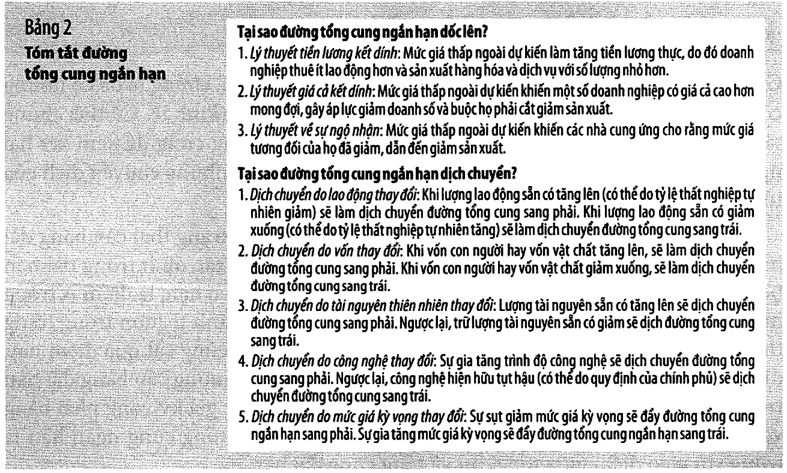

Đường SRAS chịu tác động của **tất cả** các biến làm dịch LRAS, **cộng thêm một biến mới**.

| Nguồn dịch chuyển | Dịch **cả hai** đường AS? | Ghi chú |
| ----------------- | :---: | ------- |
| Lao động | ✅ | thất nghiệp tự nhiên giảm → cả hai dịch phải |
| Vốn | ✅ | vốn vật chất hoặc vốn nhân lực |
| Tài nguyên | ✅ | |
| Công nghệ | ✅ | |
| **Mức giá kỳ vọng $P^e$** | ❌ **chỉ SRAS** | **biến mới của chương này** |

Cơ chế của biến mới, qua lý thuyết tiền lương kết dính (tr. 489):

> *"khi người lao động và doanh nghiệp kỳ vọng mức giá sẽ cao, họ có khuynh hướng đàm phán với mức lương
> danh nghĩa cao. Lương cao làm tăng chi phí của doanh nghiệp, và với bất kỳ mức giá thực tế nào, chi phí
> cao hơn sẽ làm giảm lượng cung hàng hóa và dịch vụ."*

Bài học khái quát, sách in nghiêng (tr. 489):

> ⭐ *"**Mức giá kỳ vọng tăng sẽ làm giảm lượng cung hàng hóa và dịch vụ và đẩy đường tổng cung ngắn hạn
> sang trái. Mức giá kỳ vọng giảm sẽ làm tăng lượng cung hàng hóa và dịch vụ và đẩy đường tổng cung ngắn
> hạn sang phải.**"*

📌 **Đây là biến quan trọng nhất của cả phần ngắn hạn**, và sách nói rõ vì sao (tr. 489): *"ảnh hưởng của
kỳ vọng lên vị trí của đường tổng cung ngắn hạn đóng vai trò **then chốt** trong việc lý giải nền kinh tế
chuyển tiếp như thế nào từ ngắn hạn sang dài hạn."*

Nếu bạn nhớ đúng một thứ từ bài này, hãy nhớ rằng **$P^e$ là biến kéo nền kinh tế về cân bằng dài hạn** —
và rằng nó **có thể bị thao túng**, đó là nội dung của [mục 17](#17--ba-bài-tập-giải-bằng-số) và của cả
bài 13.

---

## 17. 📚 Ba bài tập giải bằng số

### Bài tập 4 tr. 503–504 — lương danh nghĩa và lương thực qua ba điểm

Ngân hàng trung ương tăng cung tiền 5% → AD dịch phải.

| Điểm | $Y$ | $P$ | $W$ danh nghĩa | **$W$ thực** |
| ---- | ---: | ---: | ---: | ---: |
| **A** | 1.000,0 | 100,0 | 20,00 $ | **0,2000** |
| **B** | 1.037,5 | 107,5 | 20,00 $ *(kết dính)* | **0,1860** |
| **C** | 1.000,0 | 115,0 | **23,00 $** | **0,2000** |

- **(d) Lương DANH NGHĨA:** $A = B$ (kết dính) $< C$
- **(e) Lương THỰC:** $A > B$ và $A = C$
- **(f)** *"Liệu phân tích này có nhất quán với định đề cho rằng tiền có tác động thực trong ngắn hạn
  nhưng trung tính trong dài hạn hay không?"*

  → **Có.** Lương thực đổi ở B (0,1860 so với 0,2000) nhưng **trở lại đúng giá trị cũ** ở C. Tác động
  thực chỉ tồn tại **ở giữa đường**.

### ⭐⭐ Bài tập 8 tr. 505 — mầm của cả bài 13

Fed mở rộng cung tiền. Hai kịch bản kỳ vọng:

| | $Y$ | $P$ |
| --- | ---: | ---: |
| gốc | 1.000,0 | 100,0 |
| Fed nới lỏng, công chúng **BẤT NGỜ** | **1.050,0** ↑ | 110,0 |
| Fed nới lỏng, công chúng **ĐÃ ĐOÁN TRƯỚC** | **1.000,0 =** | **120,0** |

✅ `assert`.

Nếu công chúng đoán trước, kỳ vọng tăng **cùng lúc** với tổng cầu: SRAS dịch **trái** đúng bằng AD dịch
**phải**. **Sản lượng không đổi, chỉ có mức giá tăng.** Chính sách mất sạch hiệu lực thực.

📌 **Đó là mầm của toàn bộ [bài 13](bai_13_lam_phat_va_that_nghiep.md).** Nếu chính sách chỉ hiệu quả khi
nó **bất ngờ**, thì:

- một chính sách được công bố trước sẽ **không** hiệu quả;
- một ngân hàng trung ương hay gây bất ngờ sẽ **mất uy tín**, và sau đó cả những chính sách thành thật
  của nó cũng không được tin.

Đó là một cái bẫy thể chế thật, và nó không có lối ra dễ dàng.

### Bài tập 11 tr. 505 — chỉ số hoá tiền lương

- **Nền A:** tất cả lao động đồng ý trước mức lương **danh nghĩa** → rất kết dính → hệ số $a$ **lớn**
- **Nền B:** một nửa **chỉ số hoá** (lương tự động tăng giảm theo mức giá) → ít kết dính → $a$ **nhỏ**

Cung tiền tăng 5%:

| Nền | $a$ | $Y$ mới | $P$ mới | $\Delta Y$ | $\Delta P$ |
| --- | ---: | ---: | ---: | ---: | ---: |
| **A** | 10 | 1.050,0 | 105,0 | **+50,0** | +5,0 |
| **B** | 5 | 1.037,5 | 107,5 | +37,5 | **+7,5** |

→ Tác động lên **sản lượng** lớn hơn ở nền A; tác động lên **mức giá** lớn hơn ở nền B. ✅ `assert`.

⭐ Đọc ngược lại: **chỉ số hoá tiền lương làm chính sách tiền tệ bớt hiệu lực lên sản lượng và tăng hiệu
lực lên giá.** Đó là một lựa chọn thể chế có thật (nhiều nước từng dùng), và nó có hai mặt: bảo vệ người
lao động khỏi lạm phát ngoài dự kiến, nhưng đồng thời **tước đi công cụ ổn định hoá** của ngân hàng trung
ương.

---

## 18. 📚 Đối chiếu Việt Nam

⚠️ **Cảnh báo trước khi đọc.** Mục này **không có trong sách** và **không dựa trên nguồn số liệu nào được
kiểm chứng trong bài**. Nó chỉ nêu chỗ khung của Mankiw cần chỉnh khi đem về Việt Nam và **cách tra**.
Số liệu cụ thể hãy tra tại **Tổng cục Thống kê** và **Ngân hàng Nhà nước**.

### Đọc số liệu quý bằng khung của mục 10

[Mục 10](#10-cú-sốc-tổng-cung-đình-lạm) cho một quy tắc đọc dùng được ngay với số liệu Việt Nam công bố
hằng quý:

| Nếu bạn thấy | Thì đó là | Việc cần theo dõi tiếp |
| ------------ | --------- | ---------------------- |
| Tăng trưởng GDP **chậm lại** và CPI **hạ** | cú sốc **CẦU** | tín dụng, xuất khẩu, đầu tư công |
| Tăng trưởng GDP **chậm lại** và CPI **tăng** | cú sốc **CUNG** | giá xăng dầu, giá lương thực, chi phí vận tải |

📌 Đó là lý do [bài 8 mục 17](bai_08_tang_truong_tien_va_lam_phat.md#17--đối-chiếu-việt-nam) khuyên theo
dõi **khoảng cách giữa lạm phát chung và lạm phát cơ bản**: khoảng cách đó chính là thước đo phần cú sốc
**cung** trong con số lạm phát.

### Ba chỗ khung cần chỉnh

| | Mô hình chương 20 | Việt Nam cần chỉnh |
| --- | --- | --- |
| Nguồn cú sốc cung | chủ yếu **dầu** | thêm **giá lương thực** và **giá đầu vào nhập khẩu**; nông nghiệp còn chiếm tỷ trọng đáng kể |
| Kênh tỷ giá | một trong ba hiệu ứng, tương đối nhỏ | **lớn hơn nhiều** — độ mở thương mại rất cao ([bài 9 mục 16](bai_09_kinh_te_mo_khai_niem_co_ban.md#16--đối-chiếu-việt-nam)) |
| Mức sản lượng tự nhiên | tương đối ổn định | **đang tăng nhanh** — nền kinh tế đang hội tụ ([bài 3](bai_03_san_xuat_va_tang_truong.md)) |

⚠️ Điểm thứ ba đáng nhấn. Ở Hoa Kỳ, LRAS dịch phải chậm (~3%/năm), nên "chệch khỏi mức tự nhiên" là một
khái niệm khá rõ. Ở một nền kinh tế đang tăng trưởng nhanh, **bản thân mức tự nhiên đang chạy**, nên
phân biệt "suy thoái chu kỳ" với "tăng trưởng tiềm năng chậm lại" **khó hơn nhiều** — và hai chuyện đó
đòi hỏi hai loại chính sách hoàn toàn khác nhau.

📌 Nói bằng ngôn ngữ của bài: một bên là **AD dịch trái** (chữa bằng chính sách tổng cầu), một bên là
**LRAS chậm dịch phải** (chỉ chữa được bằng bài 3 — vốn, công nghệ, thể chế). Nhầm hai chuyện là cách
dùng sai công cụ trong nhiều năm liền.

### Kỳ vọng lạm phát: biến quan trọng nhất và khó đo nhất

[Mục 16](#16--bảng-2-tr-489--cái-gì-dịch-chuyển-đường-as-ngắn-hạn) chỉ ra $P^e$ là biến then chốt. Ở các
nước phát triển, nó được đo bằng khảo sát và bằng chênh lệch lợi suất trái phiếu thường với trái phiếu
chỉ số hoá lạm phát.

⚠️ Ở Việt Nam, công cụ đo trực tiếp còn hạn chế. Chỉ báo gián tiếp thường được nhìn: **giá vàng và tỷ
giá tự do**. Khi hai thứ này bật lên mà không có nguyên nhân quốc tế rõ ràng, đó thường là dấu hiệu kỳ
vọng lạm phát đang đổi — tức SRAS sắp dịch trái, đúng cơ chế mục 16.

---

## 19. 💼 Góc QTKD

*Mục này không có trong sách.*

### (a) Ngành của bạn nhạy gấp mấy lần nền kinh tế?

[Dữ kiện 2 ở mục 2](#2-ba-dữ-kiện-về-biến-động-kinh-tế) cho một con số ít ai để ý: đầu tư chiếm 1/7 GDP
nhưng gây ra 2/3 mức sụt giảm — **nhạy gấp 4,7 lần**.

| Nhóm hàng | Hệ số nhạy | Doanh thu khi GDP −2% |
| --------- | ---: | ---: |
| Hàng thiết yếu (thực phẩm) | 0,3 | −0,6% |
| Hàng tiêu dùng thông thường | 1,0 | −2,0% |
| Hàng lâu bền (xe, đồ gia dụng) | 2,5 | −5,0% |
| **Hàng ĐẦU TƯ** (máy móc, xây dựng) | **4,7** | **−9,4%** |

⚠️ Các hệ số 0,3 / 1,0 / 2,5 là **do bài này đặt ra** để minh hoạ thứ bậc; chỉ hệ số **4,7** của nhóm đầu
tư là suy ra từ con số sách in (tr. 472).

📌 **Ý nghĩa thực dụng:** nếu bạn ở nhóm cuối, bạn cần **đệm tiền mặt dày hơn**, **đòn bẩy thấp hơn** và
**hợp đồng linh hoạt hơn** so với một doanh nghiệp cùng quy mô ở nhóm đầu. Đó không phải chuyện thận
trọng — đó là **số học**. Đọc lại [bài 7 mục 10](bai_07_he_thong_tien_te.md#10-vốn-tự-có-và-đòn-bẩy):
đòn bẩy 20 chết khi tài sản giảm 5%.

### (b) Hai loại suy thoái đòi hỏi hai phản ứng khác nhau

[Mục 10](#10-cú-sốc-tổng-cung-đình-lạm) cho cách phân biệt bằng số liệu:

| | **Cú sốc CẦU** | **Cú sốc CUNG** |
| --- | --- | --- |
| Dấu hiệu | sản lượng ↓ **và** giá ↓ | sản lượng ↓ **nhưng** giá ↑ |
| Ví dụ | khủng hoảng 2008 | cú sốc dầu 1973, 1979 |
| Chi phí đầu vào của bạn | có thể **giảm** | **tăng** |
| Sức ép giá bán | phải **hạ** giá | muốn **tăng** giá mà khó |
| Việc cần làm | giữ thị phần, giữ tiền mặt | chuyển chi phí, đổi nguồn cung |

⭐ **Cái bẫy: dùng một kế hoạch ứng phó cho cả hai.** Trong cú sốc **cầu**, cắt giá có thể cứu doanh số.
Trong cú sốc **cung**, cắt giá là tự sát vì chi phí đang đi lên. **Nhìn dấu của lạm phát trước khi quyết
định.**

### (c) Lương danh nghĩa kết dính là vấn đề của bạn, không chỉ của lý thuyết

[Mục 7](#7-tổng-cung-ngắn-hạn--ba-lý-thuyết) cho cơ chế. Đọc từ ghế người sử dụng lao động:

| Tình huống | Lương **thực** bạn trả | Hậu quả |
| ---------- | ---------------------- | ------- |
| Lạm phát **cao** hơn dự kiến | **GIẢM** | chi phí nhẹ đi — nhưng nhân viên sẽ đòi |
| Lạm phát **thấp** hơn dự kiến | **TĂNG** | chi phí nặng lên mà doanh thu không theo |
| **GIẢM PHÁT** | **TĂNG MẠNH** | phải sa thải |

📌 Dòng cuối là lý do sách nói **"giảm phát còn xấu hơn lạm phát"** ở
[bài 8 mục 14](bai_08_tang_truong_tien_va_lam_phat.md#14-giảm-phát-và-phù-thuỷ-xứ-oz). Với lương danh
nghĩa kết dính, **giảm phát = tăng lương thực bắt buộc = sa thải**. Đó là cơ chế, không phải cảm giác.

### (d) Kỳ vọng là một biến số, không phải một lời bình luận

[Bài tập 8 ở mục 17](#17--ba-bài-tập-giải-bằng-số) cho kết quả sắc: nếu công chúng **đoán trước** chính
sách, chính sách mất hết tác động thực. Áp vào doanh nghiệp:

| Cách bạn tăng giá | Chuyện gì xảy ra |
| ----------------- | ---------------- |
| Thông báo trước 3 tháng | khách mua dồn, rồi ngừng — bạn tự tạo một chu kỳ |
| Tăng giá **bất ngờ** | sốc doanh số một lần rồi ổn — nhưng bạn mất một chút lòng tin |
| **Điều khoản trượt giá** trong hợp đồng | không ai bất ngờ, không ai sốc |

⭐ Cách thứ ba không phải "trung dung". Nó là cách **duy nhất** làm cho kỳ vọng khớp với thực tế — và đó
chính là trạng thái mà [mục 8](#8-công-thức-của-sách-và-mô-hình-bằng-số) gọi là cân bằng dài hạn:
$P = P^e$.

📌 **Mọi cái giá của biến động nằm ở khoảng cách giữa $P$ và $P^e$.** Công thức của sách nói đúng điều
đó, và nó áp cho một hợp đồng cung ứng y hệt như cho một nền kinh tế.

---

## 20. Code minh hoạ

> ⚙️ **Chạy:** cần **Python 3.10+**. Lưu file rồi gõ `python3 bai-11-tong-cau-va-tong-cung.py`.
> Không cần cài gói nào — chỉ dùng thư viện chuẩn. Output tất định.

Bản gốc: [`thuc_hanh/bai-11-tong-cau-va-tong-cung.py`](../thuc_hanh/bai-11-tong-cau-va-tong-cung.py).

⚠️ **Ranh giới:** đường AS ngắn hạn dùng **đúng công thức của sách** ở tr. 488. Chỉ đường AD là do bài
này đặt dạng tuyến tính. Mọi con số có `(tr. NNN)` là số sách in và có `assert` đối chiếu.

```python
"""Bai 11 — Tong cau va tong cung (Mankiw, chuong 20, tr. 469-506).

Chay:  python3 bai-11-tong-cau-va-tong-cung.py
Chi dung thu vien chuan. Ket qua tat dinh.

Moi con so co chu (tr. NNN) la so SACH IN. Cac assert doi chieu voi chung.
Con so KHONG co (tr. NNN) la do bai nay dat ra de minh hoa co che.

⚠ Chuong 20 la chuong DO THI, nhung KHAC chuong 19 o mot cho quan trong: no
CO cho mot cong thuc (tr. 488):
      San luong cung ung = Muc san luong tu nhien + a x (P thuc te - P ky vong)
Mo hinh so o day dung DUNG cong thuc do cho duong AS ngan han. Chi duong AD la
do bai nay dat dang tuyen tinh.
"""

# ===================================================================
# MO HINH AD-AS BANG SO
# ===================================================================
# AD    :  Y = A - b*P            (A la "vi tri" tong cau; b do bai nay dat)
# SRAS  :  Y = Yn + a*(P - Pe) - soc     ← cong thuc tr. 488, them so hang soc cung
# LRAS  :  Y = Yn
YN = 1_000.0      # muc san luong tu nhien
A0 = 1_500.0      # vi tri tong cau ban dau
B = 5.0           # do doc AD (do bai nay dat)
A_AS = 5.0        # he so a trong cong thuc tr. 488 (do bai nay dat)
PE0 = 100.0       # muc gia ky vong ban dau


def ngan_han(A=A0, Pe=PE0, soc_cung=0.0, a=A_AS, Yn=YN):
    """Can bang NGAN HAN: giao diem AD va SRAS. Tra ve (Y, P)."""
    # A - b*P = Yn + a*(P - Pe) - soc
    P = (A - Yn + a * Pe + soc_cung) / (B + a)
    Y = A - B * P
    return Y, P


def dai_han(A=A0, soc_cung=0.0, a=A_AS, Yn=YN):
    """Can bang DAI HAN: AD cat LRAS. Tra ve (Y, P, Pe_moi).

    Trong dai han ky vong bat kip thuc te, nen Pe = P va Y = Yn.
    Voi soc cung ton tai lau dai, Pe phai dich them de bu."""
    P = (A - Yn) / B
    Pe = P + soc_cung / a          # de Y = Yn khi con soc cung
    return Yn, P, Pe


GOC_NH = ngan_han()
GOC_DH = dai_han()


def in_dong(ten, Y, P, goc=None):
    if goc is None:
        print(f"   {ten:<34}{Y:>10,.1f}{P:>10,.1f}")
    else:
        Y0, P0 = goc
        def m(x, y):
            return "↑" if x > y + 1e-9 else ("↓" if x < y - 1e-9 else "=")
        print(f"   {ten:<34}{Y:>9,.1f}{m(Y, Y0)}{P:>9,.1f}{m(P, P0)}"
              f"{(Y / Y0 - 1) * 100:>9.1f}%{(P / P0 - 1) * 100:>9.1f}%")


# ===================================================================
# 1. BA DU KIEN VE BIEN DONG KINH TE (tr. 470-472)
# ===================================================================
def ba_du_kien():
    print("1. BA DU KIEN VE BIEN DONG KINH TE  (tr. 470-472)")
    print()
    print("   DU KIEN 1: BIEN DONG LA BAT THUONG VA KHONG THE DU BAO")
    print("      Sach canh bao ngay ve chinh cai ten (tr. 470): 'Thuat ngu CHU KY")
    print("      KINH TE de gay nham lan vi no goi y rang nhung bien dong kinh te")
    print("      di theo mot mo thuc thuong xuyen va co the du bao duoc. Thuc te,")
    print("      bien dong kinh te KHONG HE co tinh thuong xuyen.'")
    print("      Doi khi suy thoai lien tuc (1980 va 1982); doi khi nhieu nam khong")
    print("      co suy thoai — dai nhat la 1991 den 2001.")
    print()

    print("   DU KIEN 2: DA SO CAC DAI LUONG VI MO CUNG BIEN DONG")
    print("      Nhung KHONG cung BIEN DO. Sach cho hai ty le o tr. 472:")
    ty_trong_I = 1 / 7            # dau tu binh quan ~1/7 GDP (tr. 472)
    phan_sut_giam = 2 / 3         # nhung chiem ~2/3 muc suy giam GDP (tr. 472)
    do_nhay = phan_sut_giam / ty_trong_I
    print(f"         dau tu chiem binh quan     {ty_trong_I:>6.1%} cua GDP")
    print(f"         nhung chiem den            {phan_sut_giam:>6.1%}"
          f" muc suy giam GDP khi suy thoai")
    print(f"      -> dau tu nhay gap {do_nhay:.1f} LAN so voi GDP noi chung")
    assert round(do_nhay, 1) == 4.7
    print("      Sach: 'khi dieu kien kinh te di xuong, phan lon su giam sut co the")
    print("      quy cho nhung cat giam cua chi tieu vao NHA MAY MOI, NHA O MOI va")
    print("      HANG TON KHO'.")
    print()
    print("   ⭐ Ba khoan do co mot diem chung: deu HOAN LAI DUOC. Ban khong the hoan")
    print("   viec an com, nhung ban hoan duoc viec mua may. Do la ly do kinh te hoc")
    print("   ve DAU TU la kinh te hoc ve KY VONG — noi thang ve bai 5 muc 8.")
    print()

    print("   DU KIEN 3: SAN LUONG GIAM THI THAT NGHIEP TANG")
    print("      'Thuc te nay khong co gi ngac nhien: Khi cac doanh nghiep quyet dinh")
    print("      san xuat hang hoa va dich vu voi so luong it di thi ho se sa thai")
    print("      bot cong nhan' (tr. 472).")
    print("      ⚠ Nhung ty le that nghiep 'KHONG BAO GIO tien den zero; thay vao do,")
    print("      no bien dong xung quanh ty le tu nhien vao khoang 5-6%' — dung tinh")
    print("      than cua bai 6.")
    print()

    print("   So lieu 2008-2009, sach dan hai lan (tr. 469 va tr. 496):")
    print(f"      {'GDP thuc':<28}giam 4%    (quy 4/2007 -> quy 2/2009)")
    print(f"      {'that nghiep':<28}4,4% (5/2007) -> 10,1% (10/2009)")
    tang_that_nghiep = 10.1 - 4.4
    print(f"      -> that nghiep tang {tang_that_nghiep:.1f} DIEM PHAN TRAM,"
          f" tuc gap {10.1 / 4.4:.2f} lan")
    print("      Sach goi day la 'muc cao nhat trong hon mot phan tu the ky'.")


# ===================================================================
# 2. VI SAO CAN MOT MO HINH MOI (tr. 472-474)
# ===================================================================
def vi_sao_mo_hinh_moi():
    print("2. VI SAO PHAI BO PHAN DOI CO DIEN  (tr. 472-474)")
    print()
    print("   Bai 8 muc 5 da hoc PHAN DOI CO DIEN: bien danh nghia va bien thuc tach")
    print("   roi nhau, tien khong dong den bien thuc. Sach nhac lai bang mot cau rat")
    print("   goi (tr. 473): 'TIEN NHU LA BUC MAN CHE BE NGOAI'.")
    print()
    print("   Va roi noi thang rang no khong dung o day (tr. 473):")
    print("      'Da so cac nha kinh te tin rang ly thuyet co dien mo ta the gioi")
    print("       trong DAI HAN chu khong phai trong NGAN HAN.'")
    print("      'Trong ngan han, cac bien so thuc va danh nghia DAN XEN CHAT CHE voi")
    print("       nhau, va nhung thay doi cua cung tien co the TAM THOI day GDP thuc")
    print("       chech khoi xu huong dai han cua no.'")
    print()
    print("   ⭐ Va sach dan chinh David Hume — nguoi dung ra phan doi co dien —")
    print("   chong lai cach doc qua manh ve no (tr. 473-474): Hume quan sat o Anh")
    print("   the ky 18 rang 'khi cung tien mo rong sau nhung lan phat hien ra vang,")
    print("   thi phai mot thoi gian sau gia ca moi tang, va trong luc do, nen kinh")
    print("   te tan huong viec lam gia tang va san luong cao hon'.")
    print()
    print(f"   {'':<16}{'DAI HAN (bai 3-10)':<28}{'NGAN HAN (bai 11-13)'}")
    print("   " + "-" * 74)
    for nhan, dh, nh in [
        ("gia ca", "linh hoat", "KET DINH"),
        ("tien", "trung lap", "CO tac dong thuc"),
        ("san luong", "do yeu to san xuat", "co the chech khoi muc tu nhien"),
        ("mo hinh", "co dien", "TONG CAU - TONG CUNG"),
    ]:
        print(f"   {nhan:<16}{dh:<28}{nh}")
    print()
    print("   ⚠ Sach canh bao mot cai bay ngay khi gioi thieu mo hinh (tr. 475):")
    print("   'Ta co xu huong xem mo hinh tong cau va tong cung that ra la phien ban")
    print("   LON cua mo hinh cau va cung thi truong... Thuc ra, mo hinh nay LA KHAC.'")
    print("   O thi truong kem, gia kem tang thi nguoi mua chuyen sang thu khac —")
    print("   do la SU THAY THE giua cac thi truong. Nhung AD-AS do TAT CA hang hoa")
    print("   tren TAT CA thi truong, nen khong con cho nao de thay the sang.")


# ===================================================================
# 3. BA HIEU UNG LAM DUONG TONG CAU DOC XUONG (tr. 475-478)
# ===================================================================
BA_HIEU_UNG = [
    ("Hieu ung CUA CAI", "P thap -> gia tri THUC cua tien tang -> nguoi tieu dung",
     "giau hon", "kich thich TIEU DUNG (C)"),
    ("Hieu ung LAI SUAT", "P thap -> can it tien de giao dich -> cho vay bot ->",
     "lai suat giam", "kich thich DAU TU (I)"),
    ("Hieu ung TY GIA", "P thap -> lai suat giam -> von chay ra -> noi te",
     "mat gia", "kich thich XUAT KHAU RONG (NX)"),
]


def duong_tong_cau():
    print("3. VI SAO DUONG TONG CAU DOC XUONG — BA HIEU UNG  (tr. 475-478)")
    print()
    print("   Xuat phat tu chinh dong nhat thuc cua bai 1:")
    print("      Y = C + I + G + NX")
    print("   Sach gia dinh G co dinh boi chinh sach. Ba thanh phan con lai deu phu")
    print("   thuoc muc gia — va moi thanh phan cho MOT hieu ung.")
    print()
    for i, (ten, co_che, giua, ket) in enumerate(BA_HIEU_UNG, 1):
        print(f"   {i}. {ten}")
        print(f"      {co_che} {giua}")
        print(f"      -> {ket}")
    print()

    # Vi du keo cua sach (tr. 476)
    print("   Vi du keo cua sach cho hieu ung cua cai (tr. 476):")
    for gia in [1.00, 0.50]:
        print(f"      gia mot cay keo {gia:.2f} USD  ->  1 do la dang gia"
              f" {1 / gia:.0f} cay keo")
    assert 1 / 0.50 == 2
    print("      'Do do, khi muc gia giam lam so cua cai thuc tang them gia tri, no")
    print("      lam tang so cua cai thuc va kha nang mua hang hoa va dich vu.'")
    print()
    print("   ⚠ Ca ba hieu ung deu duoc ve voi CUNG TIEN CHO TRUOC (tr. 478):")
    print("   'ba ly giai ve do doc di xuong cua duong tong cau deu gia dinh cung")
    print("   tien la co dinh'. Doi cung tien thi duong AD DICH CHUYEN, khong phai")
    print("   di doc theo. Nham hai chuyen nay la loi pho bien nhat cua chuong.")


# ===================================================================
# 4. BON NGUON DICH CHUYEN TONG CAU — BANG 1 tr. 480
# ===================================================================
DICH_AD = [
    ("TIEU DUNG", "giam thue · thi truong chung khoan bung no",
     "tang thue · thi truong chung khoan sut"),
    ("DAU TU", "lac quan ve tuong lai · TANG CUNG TIEN · hoan thue dau tu",
     "bi quan · GIAM CUNG TIEN"),
    ("MUA SAM CHINH PHU", "xay duong cao toc · tang quoc phong",
     "cat giam chi tieu"),
    ("XUAT KHAU RONG", "kinh te hai ngoai khoi sac · dong tien GIAM gia",
     "hai ngoai suy thoai · dong tien TANG gia"),
]


def dich_chuyen_ad():
    print("4. BON NGUON DICH CHUYEN TONG CAU — BANG 1 tr. 480")
    print()
    print(f"   {'thanh phan':<20}{'dich sang PHAI khi...'}")
    print("   " + "-" * 74)
    for tp, phai, _ in DICH_AD:
        print(f"   {tp:<20}{phai}")
    print()
    print(f"   {'thanh phan':<20}{'dich sang TRAI khi...'}")
    print("   " + "-" * 74)
    for tp, _, trai in DICH_AD:
        print(f"   {tp:<20}{trai}")
    print()
    print("   ⭐ Chu y CUNG TIEN nam o dong DAU TU, khong phai mot dong rieng. Do la")
    print("   vi co che cua no di QUA lai suat: 'su gia tang cung tien lam giam lai")
    print("   suat trong ngan han. Lai suat giam giup chi phi vay it ton kem, do do")
    print("   kich thich chi tieu dau tu' (tr. 479). Bai 12 se mo ky co che nay.")
    print()
    print("   ⚠ Va chu y dong XUAT KHAU RONG: dong tien GIAM gia lam AD dich PHAI.")
    print("   Do la bai 9-10 noi vao day. Mot cu soc ty gia khong chi la chuyen cua")
    print("   nganh xuat khau — no dich ca duong tong cau cua nen kinh te.")


# ===================================================================
# 5. TONG CUNG DAI HAN DOC DUNG (tr. 481-483)
# ===================================================================
def tong_cung_dai_han():
    print("5. TONG CUNG DAI HAN DOC DUNG  (Hinh 4, tr. 481-483)")
    print()
    print("   > Muc san luong tu nhien (tr. 482): 'san luong hang hoa va dich vu ma")
    print("   > nen kinh te dat duoc trong dai han khi that nghiep o ty le thong thuong'.")
    print("   Con goi la san luong TIEM NANG hay san luong TOAN DUNG.")
    print()
    print("   Lap luan cua sach (tr. 481), va no chi la bai 3 phat bieu lai:")
    print("      'Trong dai han, san luong hang hoa va dich vu cua mot nen kinh te")
    print("       (GDP thuc) phu thuoc vao nguon cung LAO DONG, VON va TAI NGUYEN")
    print("       THIEN NHIEN, va vao CONG NGHE san co de chuyen hoa nhung yeu to")
    print("       san xuat nay thanh hang hoa va dich vu.'")
    print("   -> muc gia KHONG nam trong danh sach -> LRAS doc dung.")
    print()
    print("   Sach noi ro y nghia do hoa cua no (tr. 481-482): 'Duong tong cung dai")
    print("   han thang dung la cach the hien ve mat DO HOA tinh phan doi co dien va")
    print("   tinh trung lap cua tien.'")
    print()
    print("   Bon nguon dich chuyen LRAS (tr. 482-483) — dung bon yeu to cua bai 3:")
    print()
    print(f"   {'nguon':<16}{'dich sang PHAI khi...':<40}{'nguon sach'}")
    print("   " + "-" * 78)
    for ng, phai, tr in [
        ("LAO DONG", "lan song nhap cu · that nghiep tu nhien GIAM", "tr. 482"),
        ("VON", "tru luong von vat chat hoac von nhan luc tang", "tr. 482"),
        ("TAI NGUYEN", "kham pha tru luong khoang san moi", "tr. 483"),
        ("CONG NGHE", "phat minh · MO CUA THUONG MAI QUOC TE", "tr. 483"),
    ]:
        print(f"   {ng:<16}{phai:<40}{tr}")
    print()
    print("   ⭐ Dong cuoi dang chu y: sach xep MO CUA THUONG MAI vao nhom cong nghe")
    print("   (tr. 483): 'viec mo cua thuong mai quoc te co nhung tac dong tuong tu")
    print("   nhu phat minh ra mot cong nghe san xuat moi'. Do la ly do bai 9-10 va")
    print("   bai nay khong phai hai chu de roi.")
    print()
    print("   Va sach tu tong ket rat gon (tr. 483): 'Bat ky chinh sach hay su kien")
    print("   nao lam TANG GDP thuc trong cac chuong truoc thi bay gio deu co the")
    print("   duoc mo ta nhu lam tang luong cung hang hoa va day duong tong cung dai")
    print("   han sang phai.' Tam bai 3 den 10 duoc goi lai trong mot cau.")


# ===================================================================
# 6. BA LY THUYET VE AS NGAN HAN + VI DU SO tr. 486
# ===================================================================
def as_ngan_han_ba_ly_thuyet():
    print("6. VI SAO AS NGAN HAN DOC LEN — BA LY THUYET  (tr. 485-488)")
    print()
    print("   Sach neu chu de chung TRUOC khi ke ba ly thuyet (tr. 485), va cau nay")
    print("   la cau dang thuoc:")
    print("      'Luong cung san luong CHECH KHOI muc dai han hay muc tu nhien khi")
    print("       muc gia THUC TE trong nen kinh te CHECH KHOI muc gia ma nguoi dan")
    print("       KY VONG se dien ra.'")
    print()
    print(f"   {'ly thuyet':<26}{'cai gi ket dinh / sai lech'}")
    print("   " + "-" * 74)
    for ten, cai_gi in [
        ("TIEN LUONG KET DINH", "luong danh nghia — hop dong dai han, doi khi 3 nam"),
        ("GIA CA KET DINH", "gia niem yet — vi co CHI PHI THUC DON (bai 8 muc 10)"),
        ("SU NGO NHAN", "nha cung ung nham gia TUONG DOI cua minh voi gia chung"),
    ]:
        print(f"   {ten:<26}{cai_gi}")
    print()
    print("   ⚠ Sach KHONG chon mot ly thuyet (tr. 488): 'Cac nha kinh te van tranh")
    print("   luan ly thuyet nao la dung, va rat co kha nang MOI LY THUYET DEU HAM")
    print("   CHUA MOT PHAN SU THAT. Theo muc tieu cua cuon sach nay, nhung diem")
    print("   TUONG DONG cua cac ly thuyet nay quan trong hon la su khac biet.'")
    print()

    # Vi du so cua sach, tr. 486
    print("   VI DU SO CUA SACH (tr. 486) — ly thuyet tien luong ket dinh:")
    print()
    P_ky_vong, luong = 100, 20.0     # ky vong muc gia 100, ky hop dong 20 USD/gio
    print(f"      nam ngoai doanh nghiep KY VONG muc gia nam nay la {P_ky_vong}")
    print(f"      -> ky hop dong lao dong o muc luong {luong:.0f} USD mot gio")
    print()
    print(f"   {'muc gia THUC TE':>18}{'doanh thu/don vi':>20}"
          f"{'luong danh nghia':>19}{'luong THUC':>13}")
    print("   " + "-" * 72)
    for P in [95, 100, 105]:
        doanh_thu = (P / P_ky_vong - 1) * 100
        luong_thuc = luong / P
        print(f"   {P:>18}{doanh_thu:>19.0f}%{luong:>18.2f}${luong_thuc:>13.4f}")
    # doi chieu voi loi ke cua sach
    assert round((95 / 100 - 1) * 100) == -5 and round((105 / 100 - 1) * 100) == 5
    print()
    print(f"   ⭐ Doc COT CUOI. Luong DANH NGHIA dung yen o {luong:.0f} USD, nhung luong")
    print("   THUC di NGUOC voi muc gia:")
    print(f"      P = 95  -> luong thuc {luong / 95:.4f}"
          f"  (cao hon goc {(luong / 95) / (luong / 100) - 1:+.1%})"
          f"  -> thue IT lao dong")
    print(f"      P = 105 -> luong thuc {luong / 105:.4f}"
          f"  (thap hon goc {(luong / 105) / (luong / 100) - 1:+.1%})"
          f" -> thue NHIEU lao dong")
    print()
    print("   Do la toan bo co che, va sach ke dung nhu vay (tr. 486): 'Vi muc gia")
    print("   giam thap hon muc ky vong, doanh nghiep nay mat 5% cho moi don vi san")
    print("   pham ban ra. Chi phi lao dong su dung de lam ra san pham thi van CHOT")
    print("   o muc 20 do la mot gio. San xuat luc nay it co loi nhuan hon, do do")
    print("   doanh nghiep thue it lao dong hon va giam luong san pham cung ung.'")
    print()
    print("   ⚠ Va cai chot 'tam thoi' (tr. 486): 'Theo thoi gian, hop dong lao dong")
    print("   se het hieu luc, va doanh nghiep co the tai dam phan voi nguoi lao dong")
    print("   ve muc luong thap hon (nguoi lao dong co the chap nhan vi gia ca gio")
    print("   day da thap hon), NHUNG TRONG LUC NAY, viec lam va san luong se van")
    print("   thap hon muc dai han cua chung.'")
    print("   Chinh chu 'trong luc nay' la toan bo kinh te hoc ngan han.")


# ===================================================================
# 7. CONG THUC AS NGAN HAN (tr. 488) VA MO HINH SO
# ===================================================================
def cong_thuc_as():
    print("7. CONG THUC AS NGAN HAN CUA SACH  (tr. 488)")
    print()
    print("   Sach viet han ra cong thuc — day la MOT TRONG RAT IT cong thuc cua")
    print("   phan ngan han (tr. 488):")
    print()
    print("      San luong cung ung = Muc san luong tu nhien")
    print("                         + a x (Muc gia thuc te - Muc gia ky vong)")
    print()
    print("   'Trong do a la so hang quyet dinh muc phan ung cua san luong la bao")
    print("   nhieu truoc su thay doi ngoai du kien cua muc gia.'")
    print()
    print("   Mo hinh so cua bai nay dung DUNG cong thuc do:")
    print(f"      LRAS :  Y = {YN:,.0f}")
    print(f"      SRAS :  Y = {YN:,.0f} + {A_AS:.0f} x (P - Pe)")
    print(f"      AD   :  Y = {A0:,.0f} - {B:.0f}P"
          f"          ← dang tuyen tinh nay do BAI NAY dat")
    print()
    Y, P = GOC_NH
    print(f"   {'':<34}{'Y':>10}{'P':>10}")
    print("   " + "-" * 57)
    in_dong("CAN BANG GOC (Hinh 7, tr. 490)", Y, P)
    assert (Y, P) == (1000.0, 100.0)
    print()
    print("   Kiem ba dieu kien cua can bang DAI HAN (tr. 490):")
    print(f"      Y = Yn ?           {Y:,.0f} = {YN:,.0f}   ✓")
    print(f"      P = Pe ?           {P:,.0f} = {PE0:,.0f}   ✓")
    print("      AD cat CA HAI duong AS tai cung mot diem   ✓")
    print()
    print("   Sach mo ta dung dieu kien thu ba (tr. 490): 'Vi nen kinh te luon trong")
    print("   trang thai can bang ngan han, nen duong tong cung ngan han cung cat qua")
    print("   diem nay, dieu do cho thay muc gia ky vong da dieu chinh theo xu huong")
    print("   can bang dai han tren.'")
    print()
    print("   ⭐ Va day la CO CHE TU DIEU CHINH cua ca chuong, viet thanh mot dong:")
    print("      P ≠ Pe  ->  Y ≠ Yn  ->  nguoi ta sua ky vong  ->  Pe -> P  ->  Y -> Yn")
    print("   Ky vong la thu keo nen kinh te ve. Khong can ai lam gi ca.")


# ===================================================================
# 8. BON BUOC PHAN TICH — BANG 3 tr. 491
# ===================================================================
def bon_buoc():
    print("8. BON BUOC PHAN TICH BIEN DONG KINH TE — BANG 3 tr. 491")
    print()
    for i, b in enumerate([
        "xac dinh su kien lam dich AD hay AS (hoac ca hai)",
        "xac dinh HUONG dich chuyen",
        "dung bieu do xem tac dong len san luong va muc gia trong NGAN HAN",
        "xem nen kinh te chuyen tu can bang NGAN HAN moi sang can bang DAI HAN moi"], 1):
        print(f"      {i}. {b}")
    print()
    print("   ⚠ Ba buoc dau la ba buoc quen thuoc tu EG13 bai 2. Buoc 4 la buoc MOI,")
    print("   va sach noi ro (tr. 491): 'Thach thuc moi la chung ta phai bo sung them")
    print("   buoc thu tu: phai theo doi trang thai can bang NGAN HAN moi, can bang")
    print("   DAI HAN moi va SU CHUYEN TIEP giua hai diem can bang nay.'")
    print()
    print("   📌 Do la khac biet lon nhat giua chuong nay va moi chuong truoc: mot cu")
    print("   soc bay gio co HAI ket cuc, va chung khac nhau. Bo qua buoc 4 la cach")
    print("   ket luan sai nhieu nhat trong ca phan ngan han.")


# ===================================================================
# 9. CU SOC TONG CAU (Hinh 8, tr. 491-493)
# ===================================================================
SOC_AD = -100.0


def cu_soc_tong_cau():
    print("9. CU SOC TONG CAU: A -> B -> C  (Hinh 8, tr. 491-493)")
    print()
    print("   Boi canh cua sach (tr. 491): 'mot lan song bi quan bong nhien bao trum")
    print("   nen kinh te. Nguyen nhan co the la mot vu be boi o Nha Trang, mot vu")
    print("   sup do tren thi truong chung khoan hoac no ra chien tranh o nuoc ngoai.'")
    print()
    A_moi = A0 + SOC_AD
    B_Y, B_P = ngan_han(A=A_moi)                 # ky vong CHUA kip doi
    C_Y, C_P, C_Pe = dai_han(A=A_moi)            # ky vong da doi
    print(f"   {'':<34}{'Y':>9} {'P':>9} {'ΔY':>9} {'ΔP':>9}")
    print("   " + "-" * 74)
    in_dong("A  can bang goc", *GOC_NH, goc=GOC_NH)
    in_dong(f"B  ngan han (AD {SOC_AD:+,.0f})", B_Y, B_P, goc=GOC_NH)
    in_dong("C  dai han (ky vong da doi)", C_Y, C_P, goc=GOC_NH)
    print()
    assert B_Y < GOC_NH[0] and B_P < GOC_NH[1]
    assert abs(C_Y - YN) < 1e-9 and C_P < B_P
    print(f"   Doc theo hai buoc:")
    print(f"      NGAN HAN (A->B): san luong GIAM {GOC_NH[0] - B_Y:,.0f}"
          f" va muc gia GIAM {GOC_NH[1] - B_P:,.0f}")
    print(f"         -> 'Muc san luong giam di cho thay nen kinh te dang trong SUY")
    print(f"            THOAI' (tr. 491). Doanh nghiep cat giam viec lam.")
    print(f"      DAI HAN  (B->C): ky vong sua tu {PE0:,.0f} xuong {C_Pe:,.0f},")
    print(f"         AS ngan han dich PHAI, san luong VE LAI {C_Y:,.0f}"
          f" nhung gia con {C_P:,.0f}")
    print()
    print("   ⭐ Ket luan cua sach, va no la ket luan trung tam cua ca chuong (tr. 492):")
    print("      'trong DAI HAN, su dich chuyen cua duong tong cau duoc phan anh HOAN")
    print("       TOAN vao MUC GIA nhung KHONG phan anh trong muc san luong. Noi cach")
    print("       khac, tac dong dai han cua su dich chuyen tong cau la mot su thay")
    print("       doi DANH NGHIA (muc gia thap hon) nhung KHONG co thay doi THUC.'")
    print()
    print("   -> Do chinh la TINH TRUNG LAP CUA TIEN cua bai 8, nhung bay gio ta thay")
    print("      duoc CA DUONG DI: no dung o C, khong dung o B. Va nen kinh te phai")
    print("      di qua B de den C.")
    print()
    print("   Ba bai hoc sach rut ra (tr. 493):")
    for i, l in enumerate([
        "trong NGAN HAN, dich chuyen tong cau gay bien dong SAN LUONG",
        "trong DAI HAN, dich chuyen tong cau tac dong MUC GIA, khong tac dong san luong",
        "nha hoach dinh chinh sach CO THE giam thieu muc do nghiem trong"], 1):
        print(f"      {i}. {l}")
    print()
    print("   ⚠ Sach cung neu lua chon khac (tr. 492): thay vi de nen kinh te tu di")
    print("   A -> B -> C, 'cac nha hoach dinh chinh sach co the hanh dong de tang")
    print("   tong cau... dua duong tong cau tro lai AD1, va nen kinh te tro lai diem")
    print("   A'. Nhung co dieu kien: 'Neu chinh sach thanh cong'. Bai 12 va bai 14")
    print("   se ban chu 'neu' do.")


# ===================================================================
# 10. CU SOC TONG CUNG VA DINH LAM (Hinh 10-11, tr. 496-499)
# ===================================================================
SOC_AS = 100.0


def cu_soc_tong_cung():
    print("10. CU SOC TONG CUNG: DINH LAM  (Hinh 10-11, tr. 496-499)")
    print()
    print("   > Dinh lam (tr. 498): 'giai doan san luong giam va gia ca tang'.")
    print("   Sach cung dung ten day du: 'tri tre kem lam phat - Stagflation'.")
    print()
    print("   Boi canh (tr. 497): 'thoi tiet xau o mot so nuoc nong nghiep gay mat")
    print("   mua' hoac 'chien tranh o Trung Dong lam can tro tuyen van tai dau tho'.")
    print()
    nh_Y, nh_P = ngan_han(soc_cung=SOC_AS)
    print(f"   {'':<34}{'Y':>9} {'P':>9} {'ΔY':>9} {'ΔP':>9}")
    print("   " + "-" * 74)
    in_dong("A  can bang goc", *GOC_NH, goc=GOC_NH)
    in_dong(f"B  AS ngan han dich TRAI {SOC_AS:.0f}", nh_Y, nh_P, goc=GOC_NH)
    assert nh_Y < GOC_NH[0] and nh_P > GOC_NH[1]
    print()
    print("   ⭐⭐ SAN LUONG GIAM va MUC GIA TANG CUNG LUC. Do la dieu ma mot cu soc")
    print("   TONG CAU khong bao gio lam duoc — o muc 9, hai bien luon di CUNG chieu.")
    print()
    print(f"   {'loai cu soc':<20}{'san luong':<14}{'muc gia':<14}{'hai bien di'}")
    print("   " + "-" * 70)
    print(f"   {'TONG CAU giam':<20}{'GIAM':<14}{'GIAM':<14}{'CUNG chieu'}")
    print(f"   {'TONG CUNG giam':<20}{'GIAM':<14}{'TANG':<14}{'NGUOC chieu'}")
    print()
    print("   📌 Do la cach PHAN BIET hai loai cu soc bang so lieu, khong can biet")
    print("   nguyen nhan: nhin dau cua thay doi san luong va thay doi gia ca.")
    print()
    print("   ⚠ VONG XOAY GIA VA LUONG (tr. 498). Neu nguoi lao dong phan ung bang")
    print("   cach NANG KY VONG ve muc gia, AS ngan han dich TRAI XA HON:")
    print()
    for Pe_moi in [100, 110, 120]:
        Y_, P_ = ngan_han(Pe=Pe_moi, soc_cung=SOC_AS)
        print(f"      ky vong Pe = {Pe_moi:>3}  ->  Y = {Y_:>7,.1f}   P = {P_:>6,.1f}")
    print("      'Hien tuong gia ca cao hon dan den luong cao hon, sau do lai day gia")
    print("       cao hon nua' — vong xoay gia va luong (wage-price spiral).")
    print()

    # Hinh 11: chinh sach thich ung
    print("   HINH 11 tr. 498 — CHINH SACH THICH UNG:")
    print("   Cau hoi: phai tang tong cau bao nhieu de GIU san luong o muc tu nhien?")
    # muon Y = Yn thi P phai = Pe + soc/a, roi A = Y + b*P
    P_can = PE0 + SOC_AS / A_AS
    A_can = YN + B * P_can
    Y_c, P_c = ngan_han(A=A_can, soc_cung=SOC_AS)
    print()
    in_dong("A  can bang goc", *GOC_NH, goc=GOC_NH)
    in_dong(f"B  chi co cu soc cung", nh_Y, nh_P, goc=GOC_NH)
    in_dong(f"C  them AD {A_can - A0:+,.0f} (thich ung)", Y_c, P_c, goc=GOC_NH)
    assert abs(Y_c - YN) < 1e-9 and P_c > nh_P
    print()
    print(f"   -> giu duoc san luong o {Y_c:,.0f}, nhung muc gia phai len {P_c:,.0f}")
    print(f"      thay vi {nh_P:,.0f}. Sach noi thang cai gia (tr. 499):")
    print("      'Chinh sach thich ung nay phai CHAP NHAN muc gia cao hon de duy tri")
    print("       muc san luong va viec lam cao hon.'")
    print()
    print("   ⭐⭐ Va day la bai hoc kho chiu nhat cua chuong (tr. 499):")
    print("      'Cac nha hoach dinh chinh sach co kha nang tac dong len tong cau co")
    print("       the giam thieu tac dong bat loi nay len SAN LUONG nhung voi CAI GIA")
    print("       la day LAM PHAT CAO HON.'")
    print("   Khong co lua chon tot. Chi co hai lua chon xau khac nhau — va do chinh")
    print("   la danh doi ma bai 13 se dat ten.")


# ===================================================================
# 11. DAI KHUNG HOANG — DOI CHIEU VOI BAI 7 VA BAI 8
# ===================================================================
def dai_khung_hoang():
    print("11. DAI KHUNG HOANG 1929-1933  (tr. 494)")
    print()
    print("   Sach cho BON con so o tr. 494:")
    giam_Y, giam_P = 0.27, 0.22
    that_nghiep_dau, that_nghiep_cuoi = 3, 25
    giam_M = 0.28              # tr. 494, va cung la con so cua bai 7 muc 13
    print(f"      GDP thuc      giam {giam_Y:.0%}")
    print(f"      muc gia       giam {giam_P:.0%}  (trong 4 nam do)")
    print(f"      that nghiep   tang tu {that_nghiep_dau}% len {that_nghiep_cuoi}%")
    print(f"      cung tien     giam {giam_M:.0%}  (1929-1933)")
    print(f"      gia co phieu  giam khoang 90%")
    print()
    print("   📌 Con so cung tien giam 28% chinh la con so cua BAI 7 MUC 13 va BAI 8")
    print("   MUC 6. Ba bai, mot con so — nhung bay gio ta co the LAM MOT PHEP KIEM")
    print("   ma hai bai truoc chua lam duoc.")
    print()

    print("   ⭐ KIEM: neu VONG QUAY TIEN on dinh nhu thuyet so luong tien gia dinh")
    print("   (bai 8 muc 3), thi tu M x V = P x Y suy ra:")
    print()
    con_lai_M = 1 - giam_M
    con_lai_P = 1 - giam_P
    con_lai_Y = 1 - giam_Y
    con_lai_V = (con_lai_P * con_lai_Y) / con_lai_M
    print(f"      M con {con_lai_M:.4f}  ·  P con {con_lai_P:.4f}"
          f"  ·  Y con {con_lai_Y:.4f}")
    print(f"      => V con  (P x Y) / M  =  ({con_lai_P:.2f} x {con_lai_Y:.2f})"
          f" / {con_lai_M:.2f}  =  {con_lai_V:.4f}")
    print(f"      => VONG QUAY TIEN GIAM {1 - con_lai_V:.1%}")
    assert 0.20 < 1 - con_lai_V < 0.22
    print()
    print("   ⚠ Do la mot ket qua quan trong va sach KHONG chi ra: gia dinh 'V on")
    print("   dinh' — tru cot cua thuyet so luong tien o bai 8 — SUP DO dung vao luc")
    print("   nguoi ta can no nhat. Mo hinh dai han khong giai thich duoc 1929-1933.")
    print("   Do chinh la ly do chuong 20 ton tai.")
    print()
    print("   Va doi chieu du bao dai han voi thuc te:")
    print()
    print(f"   {'':<30}{'muc gia':>12}{'san luong':>14}")
    print("   " + "-" * 58)
    print(f"   {'mo hinh CO DIEN du bao':<30}{f'giam {giam_M:.0%}':>12}"
          f"{'KHONG DOI':>14}")
    print(f"   {'thuc te 1929-1933':<30}{f'giam {giam_P:.0%}':>12}"
          f"{f'giam {giam_Y:.0%}':>14}")
    print()
    print("   -> cu soc DANH NGHIA (cung tien) da gay ra hau qua THUC (san luong,")
    print("      viec lam) rat lon. Do la dinh nghia cua 'tien khong trung lap trong")
    print("      ngan han'.")
    print()
    print("   Sach ghi nhan tranh cai chua dut (tr. 494): 'Cac nha lich su kinh te van")
    print("   TIEP TUC TRANH LUAN ve nguyen nhan cua Dai Khung hoang, nhung da so cac")
    print("   ly giai deu tap trung vao su giam manh cua tong cau.' Ngoai cung tien,")
    print("   sach neu them: gia co phieu giam 90% (giam cua cai), va truc trac ngan")
    print("   hang can tro doanh nghiep tiep can von.")


# ===================================================================
# 12. THE CHIEN II (tr. 495)
# ===================================================================
def the_chien_hai():
    print("12. BUNG NO THE CHIEN II 1939-1944  (tr. 495)")
    print()
    print("   Chieu nguoc lai cua muc 11, va sach goi la 'de ly giai hon':")
    tang_G = 5.0
    tang_Y = 2.0
    tang_P = 1.20
    tn_dau, tn_cuoi = 17, 1
    print(f"      mua sam chinh phu   tang gan {tang_G:.0f} LAN   (1939 -> 1944)")
    print(f"      san luong           tang {tang_Y:.0f} lan (gap doi)")
    print(f"      muc gia             tang {tang_P - 1:.0%}")
    print(f"      that nghiep         {tn_dau}% (1939) -> {tn_cuoi}% (1944)")
    print()
    chi_tieu_danh_nghia = tang_Y * tang_P
    print(f"   Chi tieu danh nghia (P x Y) tang {chi_tieu_danh_nghia:.1f} LAN"
          f"  = {(chi_tieu_danh_nghia - 1) * 100:.0f}%")
    assert round(chi_tieu_danh_nghia, 1) == 2.4
    print()
    print(f"   ⭐ Chu y that nghiep {tn_cuoi}% nam 1944 — sach goi la 'muc THAP NHAT")
    print("   TRONG LICH SU Hoa Ky'. Doi chieu voi bai 6: ty le tu nhien khoang 5-6%.")
    print(f"   Nghia la nen kinh te 1944 chay VUOT XA muc san luong tu nhien —"
          f" trong")
    print("   mo hinh nay do la mot diem NAM BEN PHAI duong LRAS.")
    print()
    print("   ⚠ Va sach ghi mot chi tiet dang chu y (tr. 495): muc gia tang 20%")
    print("   'BAT KE cac bien phap kiem soat gia dai tra cua chinh phu nham han che")
    print("   su gia tang gia ca'. Kiem soat gia khong ngan duoc lam phat khi tong")
    print("   cau bung no — no chi doi hinh thuc cua lam phat.")


# ===================================================================
# 13. SUY THOAI 2008-2009 (tr. 495-497)
# ===================================================================
def suy_thoai_2008():
    print("13. SUY THOAI 2008-2009  (tr. 495-497)")
    print()
    print("   Sach ke chuoi nhan qua theo dung thu tu, tu goc re den ket cuc:")
    print()
    for i, b in enumerate([
        "lai suat THAP sau suy thoai 2001 -> vay the chap re -> gia nha tang",
        "nguoi vay DUOI CHUAN + CHUNG KHOAN HOA -> rui ro bi dong goi va ban di",
        "'cac to chuc di mua lai KHONG HIEU HET nhung rui ro bao ham'",
        "gia nha DAO CHIEU -> nguoi vay NGAP TRONG NO -> ngung tra no",
        "ngan hang tich thu va ban nha -> vong xoay ROT GIA nhanh hon nua",
        "to chuc tai chinh lo lon -> KHONG CON QUY DE CHO VAY",
        "'ngay ca nhung khach hang co uy tin tin dung tot cung khong the di vay'",
        "-> TONG CAU thut lui manh"], 1):
        print(f"      {i}. {b}")
    print()
    print("   So lieu sach cho:")
    nha_dau, nha_cuoi = 1995, 2006
    print(f"      gia nha {nha_dau}-{nha_cuoi}      tang gan GAP DOI")
    toc_do = 2 ** (1 / (nha_cuoi - nha_dau)) - 1
    print(f"         -> tuong duong {toc_do:.1%}/nam trong {nha_cuoi - nha_dau} nam"
          f"   (bai nay suy ra)")
    print(f"      gia nha 2006-2009      giam khoang 30%")
    print(f"      GDP thuc               giam gan 4%  (Q4/2007 -> Q2/2009)")
    print(f"      that nghiep            4,4% (5/2007) -> 10,1% (10/2009)")
    print(f"                             -> 9,5% (6/2010, khi sach di in)")
    print()
    print("   BA HANH DONG CHINH SACH, va sach nhan manh diem chung cua chung:")
    print("   'tat ca deu mot phan nham vao muc tieu dua tong cau tro ve muc ban dau'")
    print()
    goi_cuu_tro, goi_kich_cau = 700, 787          # ty USD (tr. 496-497)
    print(f"   {'thoi diem':<17}{'hanh dong':<44}{'quy mo'}")
    print("   " + "-" * 78)
    print(f"   {'9/2007-12/2008':<17}{'Fed ha lai suat lien bang muc tieu':<44}"
          f"{'5,25% -> 0'}")
    print(f"   {'10/2008':<17}{'Quoc hoi duyet cuu tro he thong tai chinh':<44}"
          f"{goi_cuu_tro} ty USD")
    print(f"   {'17/2/2009':<17}{'Obama ky dao luat kich cau':<44}"
          f"{goi_kich_cau} ty USD")
    print()
    tong_goi = goi_cuu_tro + goi_kich_cau
    GDP_2009 = 14_256.0        # ty USD — con so cua BAI 1 (tr. 224)
    print(f"   Tong hai goi: {tong_goi:,} ty USD")
    print(f"   So voi GDP Hoa Ky 2009 ({GDP_2009:,.0f} ty, con so cua bai 1):"
          f" {tong_goi / GDP_2009:.1%} GDP")
    assert round(tong_goi / GDP_2009 * 100, 1) == 10.4
    print("   (phep chia nay do bai nay lam — sach khong dat hai con so canh nhau)")
    print()
    print("   ⚠ Sach ket bang mot cau rat trung thuc, viet vao thang 6/2010 (tr. 497):")
    print("      'Vay thi nuoc di chinh sach nao, NEU CO, la quan trong nhat trong")
    print("       viec thuc day su phuc hoi kinh te? Day chac chan la cau hoi ma cac")
    print("       nha su hoc kinh te vi mo se tranh luan trong nhung nam sap toi.'")
    print("   Ba chu 'neu co' la ba chu dat nhat trong cau. Sach khong tuyen bo la")
    print("   cac goi cuu tro DA hieu qua.")


# ===================================================================
# 14. DAU VA NEN KINH TE (tr. 499-500)
# ===================================================================
DAU = [
    # giai doan, gia dau, that nghiep dau -> cuoi, ghi chu
    ("1973-1975", "tang gan GAP DOI", 4.9, 8.5, "OPEC giam san luong, day gia"),
    ("1978-1981", "tang hon GAP DOI", 6.0, 10.0, "OPEC lai gioi han cung dau"),
    ("1986", "GIAM MOT NUA", None, None, "bat dong no ra trong noi bo OPEC"),
]


def dau_va_nen_kinh_te():
    print("14. DAU VA NEN KINH TE  (tr. 499-500)")
    print()
    print("   Sach mo bang mot cau manh (tr. 499): 'Mot so nhung bien dong kinh te")
    print("   LON NHAT o Hoa Ky tu nam 1970 deu xuat phat tu nhung mo dau o Trung Dong.'")
    print()
    print(f"   {'giai doan':<12}{'gia dau':<20}{'that nghiep':<18}{'nguyen nhan'}")
    print("   " + "-" * 78)
    for gd, gia, tn_d, tn_c, ghi in DAU:
        tn = f"{tn_d}% -> {tn_c}%" if tn_d else "GIAM"
        print(f"   {gd:<12}{gia:<20}{tn:<18}{ghi}")
    print()
    for gd, _, tn_d, tn_c, _ in DAU:
        if tn_d:
            print(f"   {gd}: that nghiep tang {tn_c - tn_d:.1f} diem phan tram")
    print()
    print("   ⚠ Sach mo ta OPEC bang mot cum tu rat that (tr. 499): 'OPEC la mot dang")
    print("   LIEN MINH BEN BAN nham loai bo canh tranh va giam san luong de tang gia'.")
    print("   Do la dung dinh nghia CARTEL cua EG13 — chuong nay chi cho thay mot")
    print("   cartel du lon thi dich duoc ca duong tong cung cua the gioi.")
    print()
    print("   Nam 1986 la thi nghiem NGUOC, va sach ke rat gon: cartel tan ra -> gia")
    print("   dau giam mot nua -> AS dich PHAI -> 'san luong tang manh, that nghiep")
    print("   giam va ty le lam phat dat muc thap nhat trong nhieu nam'.")
    print()
    print("   ⭐ VA DAY LA PHAN QUAN TRONG NHAT CUA MUC NAY (tr. 500):")
    giam_cuong_do = 0.40
    print(f"      'Luong dau su dung de tao ra mot don vi GDP thuc da giam khoang")
    print(f"       {giam_cuong_do:.0%} ke tu nhung cu soc OPEC trong thap nien 1970.'")
    print()
    con_lai = 1 - giam_cuong_do
    print(f"   -> cung mot cu soc gia dau bay gio chi gay tac dong bang"
          f" {con_lai:.0%} truoc kia")
    print(f"      (bai nay suy ra; sach chi noi 'nho hon so voi qua khu')")
    print()
    print(f"   {'gia dau tang':>14}{'tac dong thap nien 1970':>28}"
          f"{'tac dong ngay nay':>22}")
    print("   " + "-" * 66)
    for tang in [0.5, 1.0, 2.0]:
        print(f"   {tang:>13.0%}{tang:>27.0%}{tang * con_lai:>21.0%}")
    print()
    print("   📌 Nguyen nhan sach neu la 'nhung no luc bao ton va thay doi cong nghe'.")
    print("   Doc bang khung muc 5: do la LRAS dich phai vi CONG NGHE — va tac dung")
    print("   phu cua no la lam nen kinh te BOT NHAY CAM voi mot loai cu soc cung.")
    print("   Cong nghe khong chi lam ta giau hon; no con lam ta KHO TON THUONG HON.")


# ===================================================================
# 15. BA BAI TAP GIAI BANG SO
# ===================================================================
def bai_tap_4():
    """Bai tap 4 tr. 503-504: cung tien tang 5%, A -> B -> C, luong danh nghia va thuc."""
    print("15. BA BAI TAP GIAI BANG SO")
    print()
    print("   BAI TAP 4 tr. 503-504 — ngan hang trung uong tang cung tien 5%:")
    print()
    A_moi = A0 + 75.0            # cung tien tang -> AD dich phai
    B_Y, B_P = ngan_han(A=A_moi)
    C_Y, C_P, C_Pe = dai_han(A=A_moi)
    LUONG = 20.0
    print(f"   {'diem':<8}{'Y':>10}{'P':>9}{'W danh nghia':>16}{'W thuc':>12}")
    print("   " + "-" * 58)
    for ten, Y_, P_, W_ in [("A", *GOC_NH, LUONG),
                            ("B", B_Y, B_P, LUONG),
                            ("C", C_Y, C_P, LUONG * C_P / GOC_NH[1])]:
        print(f"   {ten:<8}{Y_:>10,.1f}{P_:>9,.1f}{W_:>15.2f}${W_ / P_:>12.4f}")
    w_A, w_B = LUONG / GOC_NH[1], LUONG / B_P
    w_C = (LUONG * C_P / GOC_NH[1]) / C_P
    assert abs(w_A - w_C) < 1e-9 and w_B < w_A
    print()
    print("   d. Luong DANH NGHIA:  A = B  (ket dinh)  <  C")
    print("   e. Luong THUC:        A > B  ·  A = C")
    print("   f. 'Lieu phan tich nay co nhat quan voi dinh de cho rang tien co tac")
    print("      dong THUC trong ngan han nhung TRUNG TINH trong dai han hay khong?'")
    print(f"      -> CO. Luong thuc doi o B ({w_B:.4f} so voi {w_A:.4f}) nhung"
          f" TRO LAI dung")
    print(f"         gia tri cu o C ({w_C:.4f}). Tac dong thuc chi ton tai o giua duong.")


def bai_tap_8():
    """Bai tap 8 tr. 505: Fed mo rong cung tien nhung cong chung DA KY VONG."""
    print()
    print("   BAI TAP 8 tr. 505 — Fed mo rong cung tien. Hai kich ban ky vong:")
    print()
    A_moi = A0 + 100.0
    bat_ngo = ngan_han(A=A_moi)                       # Pe khong doi
    du_kien = ngan_han(A=A_moi, Pe=PE0 + 100.0 / B)   # Pe tang dung bang muc gia moi
    print(f"   {'':<40}{'Y':>10}{'P':>10}")
    print("   " + "-" * 62)
    in_dong("goc", *GOC_NH)
    in_dong("cong chung BAT NGO", *bat_ngo)
    in_dong("cong chung DA DOAN TRUOC", *du_kien)
    assert abs(du_kien[0] - YN) < 1e-9 and du_kien[1] > bat_ngo[1]
    print()
    print("   ⭐⭐ Neu cong chung doan truoc, ky vong tang cung luc voi tong cau:")
    print("   AS ngan han dich TRAI dung bang AD dich PHAI  ->  SAN LUONG KHONG DOI,")
    print("   chi co MUC GIA tang. Chinh sach mat sach hieu luc thuc.")
    print()
    print("   📌 Do la mam cua toan bo bai 13. Neu chinh sach chi hieu qua khi no")
    print("   BAT NGO, thi mot chinh sach duoc cong bo truoc se khong hieu qua — va")
    print("   mot ngan hang trung uong hay gay bat ngo se mat uy tin.")


def bai_tap_11():
    """Bai tap 11 tr. 505: hai nen kinh te, mot co chi so hoa luong."""
    print()
    print("   BAI TAP 11 tr. 505 — hai nen kinh te, do KET DINH cua luong khac nhau:")
    print("      nen A: TAT CA lao dong dong y truoc muc luong danh nghia")
    print("      nen B: MOT NUA chi so hoa (luong tu dong tang giam theo muc gia)")
    print("   -> nen B it ket dinh hon -> AS DOC HON -> he so a NHO hon")
    print()
    A_moi = A0 + 75.0        # cung tien tang 5%
    print(f"   {'nen':<8}{'he so a':>10}{'Y moi':>11}{'P moi':>10}"
          f"{'ΔY':>10}{'ΔP':>10}")
    print("   " + "-" * 62)
    kq = {}
    for ten, a in [("A", 10.0), ("B", 5.0)]:
        goc = ngan_han(a=a)
        Y_, P_ = ngan_han(A=A_moi, a=a)
        kq[ten] = (Y_, P_)
        print(f"   {ten:<8}{a:>10.0f}{Y_:>11,.1f}{P_:>10,.1f}"
              f"{Y_ - goc[0]:>+10,.1f}{P_ - goc[1]:>+10,.1f}")
    assert kq["A"][0] > kq["B"][0] and kq["A"][1] < kq["B"][1]
    print()
    print("   -> tac dong len SAN LUONG lon hon o nen A (luong ket dinh hon)")
    print("      tac dong len MUC GIA lon hon o nen B (luong linh hoat hon)")
    print()
    print("   ⭐ Doc nguoc lai: CHI SO HOA TIEN LUONG lam chinh sach tien te bot hieu")
    print("   luc len san luong va tang hieu luc len gia. Do la mot lua chon the che")
    print("   co that, va no co hai mat.")


# ===================================================================
# 16. GOC QTKD
# ===================================================================
# Muc nay KHONG co trong sach.
def goc_qtkd():
    print("16. GOC QTKD — chuong nay cham vao cong viec o dau")
    print()
    print("   (a) NGANH CUA BAN NHAY GAP MAY LAN NEN KINH TE?")
    print()
    print("   Du kien 2 (muc 1) cho mot con so ma it ai de y: dau tu chiem 1/7 GDP")
    print("   nhung gay ra 2/3 muc sut giam — tuc nhay gap 4,7 lan.")
    print("   Ap vao doanh nghiep: neu ban ban HANG DAU TU (may moc, xay dung, thiet")
    print("   bi, phan mem doanh nghiep), doanh thu cua ban KHONG dao dong nhu GDP.")
    print()
    do_nhay_gdp = -0.02          # GDP thuc giam 2% trong mot suy thoai vua
    print(f"   {'nhom hang':<30}{'he so nhay':>12}{'doanh thu khi GDP -2%':>24}")
    print("   " + "-" * 68)
    for nhom, he_so in [("hang thiet yeu (thuc pham)", 0.3),
                        ("hang tieu dung thong thuong", 1.0),
                        ("hang lau ben (xe, do gia dung)", 2.5),
                        ("hang DAU TU (may moc, xay dung)", 4.7)]:
        print(f"   {nhom:<30}{he_so:>12.1f}{do_nhay_gdp * he_so:>23.1%}")
    print()
    print("   ⚠ Cac he so 0,3 / 1,0 / 2,5 la DO BAI NAY DAT RA de minh hoa thu bac;")
    print("   chi he so 4,7 cua nhom dau tu la suy ra tu con so sach in (tr. 472).")
    print()
    print("   📌 Y nghia thuc dung: neu ban o nhom cuoi, ban can dem tien mat DAY HON,")
    print("   don bay THAP HON va hop dong LINH HOAT HON so voi mot doanh nghiep cung")
    print("   quy mo o nhom dau. Do khong phai chuyen than trong — do la so hoc.")
    print("   Doc lai bai 7 muc 10: don bay 20 chet khi tai san giam 5%.")
    print()

    print("   (b) HAI LOAI SUY THOAI DOI HOI HAI PHAN UNG KHAC NHAU")
    print()
    print("   Muc 10 cho cach phan biet chung bang so lieu:")
    print()
    print(f"   {'':<24}{'CU SOC CAU':<26}{'CU SOC CUNG'}")
    print("   " + "-" * 74)
    for nhan, cau, cung in [
        ("dau hieu", "san luong↓ VA gia↓", "san luong↓ NHUNG gia↑"),
        ("vi du", "khung hoang 2008", "cu soc dau 1973, 1979"),
        ("chi phi dau vao", "co the GIAM", "TANG"),
        ("suc ep gia ban", "phai HA gia", "muon TANG gia ma kho"),
        ("viec can lam", "giu thi phan, giu tien mat", "chuyen chi phi, doi nguon cung"),
    ]:
        print(f"   {nhan:<24}{cau:<26}{cung}")
    print()
    print("   ⭐ Cai bay: dung mot ke hoach ung pho cho ca hai. Trong cu soc CAU, cat")
    print("   gia co the cuu doanh so. Trong cu soc CUNG, cat gia la tu sat vi chi phi")
    print("   dang di len. Nhin DAU cua lam phat truoc khi quyet dinh.")
    print()

    print("   (c) LUONG DANH NGHIA KET DINH LA VAN DE CUA BAN, KHONG CHI CUA LY THUYET")
    print()
    print("   Muc 6 cho thay co che: luong danh nghia chot, muc gia doi, luong THUC")
    print("   di nguoc chu ky. Doc tu ghe nguoi su dung lao dong:")
    print()
    print(f"   {'tinh huong':<30}{'luong thuc cua ban':<22}{'hau qua'}")
    print("   " + "-" * 76)
    for th, lt, hq in [
        ("lam phat CAO hon du kien", "GIAM", "chi phi nhe di — nhan vien se doi"),
        ("lam phat THAP hon du kien", "TANG", "chi phi nang ma doanh thu khong theo"),
        ("GIAM PHAT", "TANG MANH", "phai sa thai — bai 8 muc 14"),
    ]:
        print(f"   {th:<30}{lt:<22}{hq}")
    print()
    print("   📌 Dong cuoi la ly do sach noi 'giam phat con xau hon lam phat' (bai 8).")
    print("   Voi luong danh nghia ket dinh, giam phat = tang luong thuc bat buoc =")
    print("   sa thai. Do la co che, khong phai cam giac.")
    print()

    print("   (d) KY VONG LA MOT BIEN SO, KHONG PHAI MOT LOI BINH LUAN")
    print()
    print("   Bai tap 8 (muc 15) cho ket qua sac: neu cong chung DOAN TRUOC chinh sach,")
    print("   chinh sach mat het tac dong thuc. Ap vao doanh nghiep:")
    print("      thong bao tang gia TRUOC 3 thang  -> khach mua don, roi ngung")
    print("      tang gia BAT NGO                   -> soc doanh so mot lan roi on")
    print("      dieu khoan truot gia trong hop dong -> khong ai bat ngo, khong ai soc")
    print()
    print("   ⭐ Cach thu ba khong phai 'trung dung'. No la cach DUY NHAT lam cho ky")
    print("   vong khop voi thuc te, va do la trang thai ma muc 7 goi la can bang dai")
    print("   han: P = Pe. Moi cai gia cua bien dong nam o khoang cach giua P va Pe.")


# ===================================================================
def main():
    print("=" * 78)
    print("BAI 11 — TONG CAU VA TONG CUNG   (Mankiw, chuong 20, tr. 469-506)")
    print("=" * 78)
    print()
    for f in [ba_du_kien, vi_sao_mo_hinh_moi, duong_tong_cau, dich_chuyen_ad,
              tong_cung_dai_han, as_ngan_han_ba_ly_thuyet, cong_thuc_as,
              bon_buoc, cu_soc_tong_cau, cu_soc_tong_cung, dai_khung_hoang,
              the_chien_hai, suy_thoai_2008, dau_va_nen_kinh_te]:
        f()
        print()
    bai_tap_4()
    bai_tap_8()
    bai_tap_11()
    print()
    goc_qtkd()
    print()
    print("=" * 78)
    print("Tat ca assert deu qua — moi con so co (tr. NNN) deu khop sach.")
    print("=" * 78)


if __name__ == "__main__":
    main()
```

Kết quả chạy thật:

```
==============================================================================
BAI 11 — TONG CAU VA TONG CUNG   (Mankiw, chuong 20, tr. 469-506)
==============================================================================

1. BA DU KIEN VE BIEN DONG KINH TE  (tr. 470-472)

   DU KIEN 1: BIEN DONG LA BAT THUONG VA KHONG THE DU BAO
      Sach canh bao ngay ve chinh cai ten (tr. 470): 'Thuat ngu CHU KY
      KINH TE de gay nham lan vi no goi y rang nhung bien dong kinh te
      di theo mot mo thuc thuong xuyen va co the du bao duoc. Thuc te,
      bien dong kinh te KHONG HE co tinh thuong xuyen.'
      Doi khi suy thoai lien tuc (1980 va 1982); doi khi nhieu nam khong
      co suy thoai — dai nhat la 1991 den 2001.

   DU KIEN 2: DA SO CAC DAI LUONG VI MO CUNG BIEN DONG
      Nhung KHONG cung BIEN DO. Sach cho hai ty le o tr. 472:
         dau tu chiem binh quan      14.3% cua GDP
         nhung chiem den             66.7% muc suy giam GDP khi suy thoai
      -> dau tu nhay gap 4.7 LAN so voi GDP noi chung
      Sach: 'khi dieu kien kinh te di xuong, phan lon su giam sut co the
      quy cho nhung cat giam cua chi tieu vao NHA MAY MOI, NHA O MOI va
      HANG TON KHO'.

   ⭐ Ba khoan do co mot diem chung: deu HOAN LAI DUOC. Ban khong the hoan
   viec an com, nhung ban hoan duoc viec mua may. Do la ly do kinh te hoc
   ve DAU TU la kinh te hoc ve KY VONG — noi thang ve bai 5 muc 8.

   DU KIEN 3: SAN LUONG GIAM THI THAT NGHIEP TANG
      'Thuc te nay khong co gi ngac nhien: Khi cac doanh nghiep quyet dinh
      san xuat hang hoa va dich vu voi so luong it di thi ho se sa thai
      bot cong nhan' (tr. 472).
      ⚠ Nhung ty le that nghiep 'KHONG BAO GIO tien den zero; thay vao do,
      no bien dong xung quanh ty le tu nhien vao khoang 5-6%' — dung tinh
      than cua bai 6.

   So lieu 2008-2009, sach dan hai lan (tr. 469 va tr. 496):
      GDP thuc                    giam 4%    (quy 4/2007 -> quy 2/2009)
      that nghiep                 4,4% (5/2007) -> 10,1% (10/2009)
      -> that nghiep tang 5.7 DIEM PHAN TRAM, tuc gap 2.30 lan
      Sach goi day la 'muc cao nhat trong hon mot phan tu the ky'.

2. VI SAO PHAI BO PHAN DOI CO DIEN  (tr. 472-474)

   Bai 8 muc 5 da hoc PHAN DOI CO DIEN: bien danh nghia va bien thuc tach
   roi nhau, tien khong dong den bien thuc. Sach nhac lai bang mot cau rat
   goi (tr. 473): 'TIEN NHU LA BUC MAN CHE BE NGOAI'.

   Va roi noi thang rang no khong dung o day (tr. 473):
      'Da so cac nha kinh te tin rang ly thuyet co dien mo ta the gioi
       trong DAI HAN chu khong phai trong NGAN HAN.'
      'Trong ngan han, cac bien so thuc va danh nghia DAN XEN CHAT CHE voi
       nhau, va nhung thay doi cua cung tien co the TAM THOI day GDP thuc
       chech khoi xu huong dai han cua no.'

   ⭐ Va sach dan chinh David Hume — nguoi dung ra phan doi co dien —
   chong lai cach doc qua manh ve no (tr. 473-474): Hume quan sat o Anh
   the ky 18 rang 'khi cung tien mo rong sau nhung lan phat hien ra vang,
   thi phai mot thoi gian sau gia ca moi tang, va trong luc do, nen kinh
   te tan huong viec lam gia tang va san luong cao hon'.

                   DAI HAN (bai 3-10)          NGAN HAN (bai 11-13)
   --------------------------------------------------------------------------
   gia ca          linh hoat                   KET DINH
   tien            trung lap                   CO tac dong thuc
   san luong       do yeu to san xuat          co the chech khoi muc tu nhien
   mo hinh         co dien                     TONG CAU - TONG CUNG

   ⚠ Sach canh bao mot cai bay ngay khi gioi thieu mo hinh (tr. 475):
   'Ta co xu huong xem mo hinh tong cau va tong cung that ra la phien ban
   LON cua mo hinh cau va cung thi truong... Thuc ra, mo hinh nay LA KHAC.'
   O thi truong kem, gia kem tang thi nguoi mua chuyen sang thu khac —
   do la SU THAY THE giua cac thi truong. Nhung AD-AS do TAT CA hang hoa
   tren TAT CA thi truong, nen khong con cho nao de thay the sang.

3. VI SAO DUONG TONG CAU DOC XUONG — BA HIEU UNG  (tr. 475-478)

   Xuat phat tu chinh dong nhat thuc cua bai 1:
      Y = C + I + G + NX
   Sach gia dinh G co dinh boi chinh sach. Ba thanh phan con lai deu phu
   thuoc muc gia — va moi thanh phan cho MOT hieu ung.

   1. Hieu ung CUA CAI
      P thap -> gia tri THUC cua tien tang -> nguoi tieu dung giau hon
      -> kich thich TIEU DUNG (C)
   2. Hieu ung LAI SUAT
      P thap -> can it tien de giao dich -> cho vay bot -> lai suat giam
      -> kich thich DAU TU (I)
   3. Hieu ung TY GIA
      P thap -> lai suat giam -> von chay ra -> noi te mat gia
      -> kich thich XUAT KHAU RONG (NX)

   Vi du keo cua sach cho hieu ung cua cai (tr. 476):
      gia mot cay keo 1.00 USD  ->  1 do la dang gia 1 cay keo
      gia mot cay keo 0.50 USD  ->  1 do la dang gia 2 cay keo
      'Do do, khi muc gia giam lam so cua cai thuc tang them gia tri, no
      lam tang so cua cai thuc va kha nang mua hang hoa va dich vu.'

   ⚠ Ca ba hieu ung deu duoc ve voi CUNG TIEN CHO TRUOC (tr. 478):
   'ba ly giai ve do doc di xuong cua duong tong cau deu gia dinh cung
   tien la co dinh'. Doi cung tien thi duong AD DICH CHUYEN, khong phai
   di doc theo. Nham hai chuyen nay la loi pho bien nhat cua chuong.

4. BON NGUON DICH CHUYEN TONG CAU — BANG 1 tr. 480

   thanh phan          dich sang PHAI khi...
   --------------------------------------------------------------------------
   TIEU DUNG           giam thue · thi truong chung khoan bung no
   DAU TU              lac quan ve tuong lai · TANG CUNG TIEN · hoan thue dau tu
   MUA SAM CHINH PHU   xay duong cao toc · tang quoc phong
   XUAT KHAU RONG      kinh te hai ngoai khoi sac · dong tien GIAM gia

   thanh phan          dich sang TRAI khi...
   --------------------------------------------------------------------------
   TIEU DUNG           tang thue · thi truong chung khoan sut
   DAU TU              bi quan · GIAM CUNG TIEN
   MUA SAM CHINH PHU   cat giam chi tieu
   XUAT KHAU RONG      hai ngoai suy thoai · dong tien TANG gia

   ⭐ Chu y CUNG TIEN nam o dong DAU TU, khong phai mot dong rieng. Do la
   vi co che cua no di QUA lai suat: 'su gia tang cung tien lam giam lai
   suat trong ngan han. Lai suat giam giup chi phi vay it ton kem, do do
   kich thich chi tieu dau tu' (tr. 479). Bai 12 se mo ky co che nay.

   ⚠ Va chu y dong XUAT KHAU RONG: dong tien GIAM gia lam AD dich PHAI.
   Do la bai 9-10 noi vao day. Mot cu soc ty gia khong chi la chuyen cua
   nganh xuat khau — no dich ca duong tong cau cua nen kinh te.

5. TONG CUNG DAI HAN DOC DUNG  (Hinh 4, tr. 481-483)

   > Muc san luong tu nhien (tr. 482): 'san luong hang hoa va dich vu ma
   > nen kinh te dat duoc trong dai han khi that nghiep o ty le thong thuong'.
   Con goi la san luong TIEM NANG hay san luong TOAN DUNG.

   Lap luan cua sach (tr. 481), va no chi la bai 3 phat bieu lai:
      'Trong dai han, san luong hang hoa va dich vu cua mot nen kinh te
       (GDP thuc) phu thuoc vao nguon cung LAO DONG, VON va TAI NGUYEN
       THIEN NHIEN, va vao CONG NGHE san co de chuyen hoa nhung yeu to
       san xuat nay thanh hang hoa va dich vu.'
   -> muc gia KHONG nam trong danh sach -> LRAS doc dung.

   Sach noi ro y nghia do hoa cua no (tr. 481-482): 'Duong tong cung dai
   han thang dung la cach the hien ve mat DO HOA tinh phan doi co dien va
   tinh trung lap cua tien.'

   Bon nguon dich chuyen LRAS (tr. 482-483) — dung bon yeu to cua bai 3:

   nguon           dich sang PHAI khi...                   nguon sach
   ------------------------------------------------------------------------------
   LAO DONG        lan song nhap cu · that nghiep tu nhien GIAMtr. 482
   VON             tru luong von vat chat hoac von nhan luc tangtr. 482
   TAI NGUYEN      kham pha tru luong khoang san moi       tr. 483
   CONG NGHE       phat minh · MO CUA THUONG MAI QUOC TE   tr. 483

   ⭐ Dong cuoi dang chu y: sach xep MO CUA THUONG MAI vao nhom cong nghe
   (tr. 483): 'viec mo cua thuong mai quoc te co nhung tac dong tuong tu
   nhu phat minh ra mot cong nghe san xuat moi'. Do la ly do bai 9-10 va
   bai nay khong phai hai chu de roi.

   Va sach tu tong ket rat gon (tr. 483): 'Bat ky chinh sach hay su kien
   nao lam TANG GDP thuc trong cac chuong truoc thi bay gio deu co the
   duoc mo ta nhu lam tang luong cung hang hoa va day duong tong cung dai
   han sang phai.' Tam bai 3 den 10 duoc goi lai trong mot cau.

6. VI SAO AS NGAN HAN DOC LEN — BA LY THUYET  (tr. 485-488)

   Sach neu chu de chung TRUOC khi ke ba ly thuyet (tr. 485), va cau nay
   la cau dang thuoc:
      'Luong cung san luong CHECH KHOI muc dai han hay muc tu nhien khi
       muc gia THUC TE trong nen kinh te CHECH KHOI muc gia ma nguoi dan
       KY VONG se dien ra.'

   ly thuyet                 cai gi ket dinh / sai lech
   --------------------------------------------------------------------------
   TIEN LUONG KET DINH       luong danh nghia — hop dong dai han, doi khi 3 nam
   GIA CA KET DINH           gia niem yet — vi co CHI PHI THUC DON (bai 8 muc 10)
   SU NGO NHAN               nha cung ung nham gia TUONG DOI cua minh voi gia chung

   ⚠ Sach KHONG chon mot ly thuyet (tr. 488): 'Cac nha kinh te van tranh
   luan ly thuyet nao la dung, va rat co kha nang MOI LY THUYET DEU HAM
   CHUA MOT PHAN SU THAT. Theo muc tieu cua cuon sach nay, nhung diem
   TUONG DONG cua cac ly thuyet nay quan trong hon la su khac biet.'

   VI DU SO CUA SACH (tr. 486) — ly thuyet tien luong ket dinh:

      nam ngoai doanh nghiep KY VONG muc gia nam nay la 100
      -> ky hop dong lao dong o muc luong 20 USD mot gio

      muc gia THUC TE    doanh thu/don vi   luong danh nghia   luong THUC
   ------------------------------------------------------------------------
                   95                 -5%             20.00$       0.2105
                  100                  0%             20.00$       0.2000
                  105                  5%             20.00$       0.1905

   ⭐ Doc COT CUOI. Luong DANH NGHIA dung yen o 20 USD, nhung luong
   THUC di NGUOC voi muc gia:
      P = 95  -> luong thuc 0.2105  (cao hon goc +5.3%)  -> thue IT lao dong
      P = 105 -> luong thuc 0.1905  (thap hon goc -4.8%) -> thue NHIEU lao dong

   Do la toan bo co che, va sach ke dung nhu vay (tr. 486): 'Vi muc gia
   giam thap hon muc ky vong, doanh nghiep nay mat 5% cho moi don vi san
   pham ban ra. Chi phi lao dong su dung de lam ra san pham thi van CHOT
   o muc 20 do la mot gio. San xuat luc nay it co loi nhuan hon, do do
   doanh nghiep thue it lao dong hon va giam luong san pham cung ung.'

   ⚠ Va cai chot 'tam thoi' (tr. 486): 'Theo thoi gian, hop dong lao dong
   se het hieu luc, va doanh nghiep co the tai dam phan voi nguoi lao dong
   ve muc luong thap hon (nguoi lao dong co the chap nhan vi gia ca gio
   day da thap hon), NHUNG TRONG LUC NAY, viec lam va san luong se van
   thap hon muc dai han cua chung.'
   Chinh chu 'trong luc nay' la toan bo kinh te hoc ngan han.

7. CONG THUC AS NGAN HAN CUA SACH  (tr. 488)

   Sach viet han ra cong thuc — day la MOT TRONG RAT IT cong thuc cua
   phan ngan han (tr. 488):

      San luong cung ung = Muc san luong tu nhien
                         + a x (Muc gia thuc te - Muc gia ky vong)

   'Trong do a la so hang quyet dinh muc phan ung cua san luong la bao
   nhieu truoc su thay doi ngoai du kien cua muc gia.'

   Mo hinh so cua bai nay dung DUNG cong thuc do:
      LRAS :  Y = 1,000
      SRAS :  Y = 1,000 + 5 x (P - Pe)
      AD   :  Y = 1,500 - 5P          ← dang tuyen tinh nay do BAI NAY dat

                                              Y         P
   ---------------------------------------------------------
   CAN BANG GOC (Hinh 7, tr. 490)       1,000.0     100.0

   Kiem ba dieu kien cua can bang DAI HAN (tr. 490):
      Y = Yn ?           1,000 = 1,000   ✓
      P = Pe ?           100 = 100   ✓
      AD cat CA HAI duong AS tai cung mot diem   ✓

   Sach mo ta dung dieu kien thu ba (tr. 490): 'Vi nen kinh te luon trong
   trang thai can bang ngan han, nen duong tong cung ngan han cung cat qua
   diem nay, dieu do cho thay muc gia ky vong da dieu chinh theo xu huong
   can bang dai han tren.'

   ⭐ Va day la CO CHE TU DIEU CHINH cua ca chuong, viet thanh mot dong:
      P ≠ Pe  ->  Y ≠ Yn  ->  nguoi ta sua ky vong  ->  Pe -> P  ->  Y -> Yn
   Ky vong la thu keo nen kinh te ve. Khong can ai lam gi ca.

8. BON BUOC PHAN TICH BIEN DONG KINH TE — BANG 3 tr. 491

      1. xac dinh su kien lam dich AD hay AS (hoac ca hai)
      2. xac dinh HUONG dich chuyen
      3. dung bieu do xem tac dong len san luong va muc gia trong NGAN HAN
      4. xem nen kinh te chuyen tu can bang NGAN HAN moi sang can bang DAI HAN moi

   ⚠ Ba buoc dau la ba buoc quen thuoc tu EG13 bai 2. Buoc 4 la buoc MOI,
   va sach noi ro (tr. 491): 'Thach thuc moi la chung ta phai bo sung them
   buoc thu tu: phai theo doi trang thai can bang NGAN HAN moi, can bang
   DAI HAN moi va SU CHUYEN TIEP giua hai diem can bang nay.'

   📌 Do la khac biet lon nhat giua chuong nay va moi chuong truoc: mot cu
   soc bay gio co HAI ket cuc, va chung khac nhau. Bo qua buoc 4 la cach
   ket luan sai nhieu nhat trong ca phan ngan han.

9. CU SOC TONG CAU: A -> B -> C  (Hinh 8, tr. 491-493)

   Boi canh cua sach (tr. 491): 'mot lan song bi quan bong nhien bao trum
   nen kinh te. Nguyen nhan co the la mot vu be boi o Nha Trang, mot vu
   sup do tren thi truong chung khoan hoac no ra chien tranh o nuoc ngoai.'

                                             Y         P        ΔY        ΔP
   --------------------------------------------------------------------------
   A  can bang goc                     1,000.0=    100.0=      0.0%      0.0%
   B  ngan han (AD -100)                 950.0↓     90.0↓     -5.0%    -10.0%
   C  dai han (ky vong da doi)         1,000.0=     80.0↓      0.0%    -20.0%

   Doc theo hai buoc:
      NGAN HAN (A->B): san luong GIAM 50 va muc gia GIAM 10
         -> 'Muc san luong giam di cho thay nen kinh te dang trong SUY
            THOAI' (tr. 491). Doanh nghiep cat giam viec lam.
      DAI HAN  (B->C): ky vong sua tu 100 xuong 80,
         AS ngan han dich PHAI, san luong VE LAI 1,000 nhung gia con 80

   ⭐ Ket luan cua sach, va no la ket luan trung tam cua ca chuong (tr. 492):
      'trong DAI HAN, su dich chuyen cua duong tong cau duoc phan anh HOAN
       TOAN vao MUC GIA nhung KHONG phan anh trong muc san luong. Noi cach
       khac, tac dong dai han cua su dich chuyen tong cau la mot su thay
       doi DANH NGHIA (muc gia thap hon) nhung KHONG co thay doi THUC.'

   -> Do chinh la TINH TRUNG LAP CUA TIEN cua bai 8, nhung bay gio ta thay
      duoc CA DUONG DI: no dung o C, khong dung o B. Va nen kinh te phai
      di qua B de den C.

   Ba bai hoc sach rut ra (tr. 493):
      1. trong NGAN HAN, dich chuyen tong cau gay bien dong SAN LUONG
      2. trong DAI HAN, dich chuyen tong cau tac dong MUC GIA, khong tac dong san luong
      3. nha hoach dinh chinh sach CO THE giam thieu muc do nghiem trong

   ⚠ Sach cung neu lua chon khac (tr. 492): thay vi de nen kinh te tu di
   A -> B -> C, 'cac nha hoach dinh chinh sach co the hanh dong de tang
   tong cau... dua duong tong cau tro lai AD1, va nen kinh te tro lai diem
   A'. Nhung co dieu kien: 'Neu chinh sach thanh cong'. Bai 12 va bai 14
   se ban chu 'neu' do.

10. CU SOC TONG CUNG: DINH LAM  (Hinh 10-11, tr. 496-499)

   > Dinh lam (tr. 498): 'giai doan san luong giam va gia ca tang'.
   Sach cung dung ten day du: 'tri tre kem lam phat - Stagflation'.

   Boi canh (tr. 497): 'thoi tiet xau o mot so nuoc nong nghiep gay mat
   mua' hoac 'chien tranh o Trung Dong lam can tro tuyen van tai dau tho'.

                                             Y         P        ΔY        ΔP
   --------------------------------------------------------------------------
   A  can bang goc                     1,000.0=    100.0=      0.0%      0.0%
   B  AS ngan han dich TRAI 100          950.0↓    110.0↑     -5.0%     10.0%

   ⭐⭐ SAN LUONG GIAM va MUC GIA TANG CUNG LUC. Do la dieu ma mot cu soc
   TONG CAU khong bao gio lam duoc — o muc 9, hai bien luon di CUNG chieu.

   loai cu soc         san luong     muc gia       hai bien di
   ----------------------------------------------------------------------
   TONG CAU giam       GIAM          GIAM          CUNG chieu
   TONG CUNG giam      GIAM          TANG          NGUOC chieu

   📌 Do la cach PHAN BIET hai loai cu soc bang so lieu, khong can biet
   nguyen nhan: nhin dau cua thay doi san luong va thay doi gia ca.

   ⚠ VONG XOAY GIA VA LUONG (tr. 498). Neu nguoi lao dong phan ung bang
   cach NANG KY VONG ve muc gia, AS ngan han dich TRAI XA HON:

      ky vong Pe = 100  ->  Y =   950.0   P =  110.0
      ky vong Pe = 110  ->  Y =   925.0   P =  115.0
      ky vong Pe = 120  ->  Y =   900.0   P =  120.0
      'Hien tuong gia ca cao hon dan den luong cao hon, sau do lai day gia
       cao hon nua' — vong xoay gia va luong (wage-price spiral).

   HINH 11 tr. 498 — CHINH SACH THICH UNG:
   Cau hoi: phai tang tong cau bao nhieu de GIU san luong o muc tu nhien?

   A  can bang goc                     1,000.0=    100.0=      0.0%      0.0%
   B  chi co cu soc cung                 950.0↓    110.0↑     -5.0%     10.0%
   C  them AD +100 (thich ung)         1,000.0=    120.0↑      0.0%     20.0%

   -> giu duoc san luong o 1,000, nhung muc gia phai len 120
      thay vi 110. Sach noi thang cai gia (tr. 499):
      'Chinh sach thich ung nay phai CHAP NHAN muc gia cao hon de duy tri
       muc san luong va viec lam cao hon.'

   ⭐⭐ Va day la bai hoc kho chiu nhat cua chuong (tr. 499):
      'Cac nha hoach dinh chinh sach co kha nang tac dong len tong cau co
       the giam thieu tac dong bat loi nay len SAN LUONG nhung voi CAI GIA
       la day LAM PHAT CAO HON.'
   Khong co lua chon tot. Chi co hai lua chon xau khac nhau — va do chinh
   la danh doi ma bai 13 se dat ten.

11. DAI KHUNG HOANG 1929-1933  (tr. 494)

   Sach cho BON con so o tr. 494:
      GDP thuc      giam 27%
      muc gia       giam 22%  (trong 4 nam do)
      that nghiep   tang tu 3% len 25%
      cung tien     giam 28%  (1929-1933)
      gia co phieu  giam khoang 90%

   📌 Con so cung tien giam 28% chinh la con so cua BAI 7 MUC 13 va BAI 8
   MUC 6. Ba bai, mot con so — nhung bay gio ta co the LAM MOT PHEP KIEM
   ma hai bai truoc chua lam duoc.

   ⭐ KIEM: neu VONG QUAY TIEN on dinh nhu thuyet so luong tien gia dinh
   (bai 8 muc 3), thi tu M x V = P x Y suy ra:

      M con 0.7200  ·  P con 0.7800  ·  Y con 0.7300
      => V con  (P x Y) / M  =  (0.78 x 0.73) / 0.72  =  0.7908
      => VONG QUAY TIEN GIAM 20.9%

   ⚠ Do la mot ket qua quan trong va sach KHONG chi ra: gia dinh 'V on
   dinh' — tru cot cua thuyet so luong tien o bai 8 — SUP DO dung vao luc
   nguoi ta can no nhat. Mo hinh dai han khong giai thich duoc 1929-1933.
   Do chinh la ly do chuong 20 ton tai.

   Va doi chieu du bao dai han voi thuc te:

                                      muc gia     san luong
   ----------------------------------------------------------
   mo hinh CO DIEN du bao            giam 28%     KHONG DOI
   thuc te 1929-1933                 giam 22%      giam 27%

   -> cu soc DANH NGHIA (cung tien) da gay ra hau qua THUC (san luong,
      viec lam) rat lon. Do la dinh nghia cua 'tien khong trung lap trong
      ngan han'.

   Sach ghi nhan tranh cai chua dut (tr. 494): 'Cac nha lich su kinh te van
   TIEP TUC TRANH LUAN ve nguyen nhan cua Dai Khung hoang, nhung da so cac
   ly giai deu tap trung vao su giam manh cua tong cau.' Ngoai cung tien,
   sach neu them: gia co phieu giam 90% (giam cua cai), va truc trac ngan
   hang can tro doanh nghiep tiep can von.

12. BUNG NO THE CHIEN II 1939-1944  (tr. 495)

   Chieu nguoc lai cua muc 11, va sach goi la 'de ly giai hon':
      mua sam chinh phu   tang gan 5 LAN   (1939 -> 1944)
      san luong           tang 2 lan (gap doi)
      muc gia             tang 20%
      that nghiep         17% (1939) -> 1% (1944)

   Chi tieu danh nghia (P x Y) tang 2.4 LAN  = 140%

   ⭐ Chu y that nghiep 1% nam 1944 — sach goi la 'muc THAP NHAT
   TRONG LICH SU Hoa Ky'. Doi chieu voi bai 6: ty le tu nhien khoang 5-6%.
   Nghia la nen kinh te 1944 chay VUOT XA muc san luong tu nhien — trong
   mo hinh nay do la mot diem NAM BEN PHAI duong LRAS.

   ⚠ Va sach ghi mot chi tiet dang chu y (tr. 495): muc gia tang 20%
   'BAT KE cac bien phap kiem soat gia dai tra cua chinh phu nham han che
   su gia tang gia ca'. Kiem soat gia khong ngan duoc lam phat khi tong
   cau bung no — no chi doi hinh thuc cua lam phat.

13. SUY THOAI 2008-2009  (tr. 495-497)

   Sach ke chuoi nhan qua theo dung thu tu, tu goc re den ket cuc:

      1. lai suat THAP sau suy thoai 2001 -> vay the chap re -> gia nha tang
      2. nguoi vay DUOI CHUAN + CHUNG KHOAN HOA -> rui ro bi dong goi va ban di
      3. 'cac to chuc di mua lai KHONG HIEU HET nhung rui ro bao ham'
      4. gia nha DAO CHIEU -> nguoi vay NGAP TRONG NO -> ngung tra no
      5. ngan hang tich thu va ban nha -> vong xoay ROT GIA nhanh hon nua
      6. to chuc tai chinh lo lon -> KHONG CON QUY DE CHO VAY
      7. 'ngay ca nhung khach hang co uy tin tin dung tot cung khong the di vay'
      8. -> TONG CAU thut lui manh

   So lieu sach cho:
      gia nha 1995-2006      tang gan GAP DOI
         -> tuong duong 6.5%/nam trong 11 nam   (bai nay suy ra)
      gia nha 2006-2009      giam khoang 30%
      GDP thuc               giam gan 4%  (Q4/2007 -> Q2/2009)
      that nghiep            4,4% (5/2007) -> 10,1% (10/2009)
                             -> 9,5% (6/2010, khi sach di in)

   BA HANH DONG CHINH SACH, va sach nhan manh diem chung cua chung:
   'tat ca deu mot phan nham vao muc tieu dua tong cau tro ve muc ban dau'

   thoi diem        hanh dong                                   quy mo
   ------------------------------------------------------------------------------
   9/2007-12/2008   Fed ha lai suat lien bang muc tieu          5,25% -> 0
   10/2008          Quoc hoi duyet cuu tro he thong tai chinh   700 ty USD
   17/2/2009        Obama ky dao luat kich cau                  787 ty USD

   Tong hai goi: 1,487 ty USD
   So voi GDP Hoa Ky 2009 (14,256 ty, con so cua bai 1): 10.4% GDP
   (phep chia nay do bai nay lam — sach khong dat hai con so canh nhau)

   ⚠ Sach ket bang mot cau rat trung thuc, viet vao thang 6/2010 (tr. 497):
      'Vay thi nuoc di chinh sach nao, NEU CO, la quan trong nhat trong
       viec thuc day su phuc hoi kinh te? Day chac chan la cau hoi ma cac
       nha su hoc kinh te vi mo se tranh luan trong nhung nam sap toi.'
   Ba chu 'neu co' la ba chu dat nhat trong cau. Sach khong tuyen bo la
   cac goi cuu tro DA hieu qua.

14. DAU VA NEN KINH TE  (tr. 499-500)

   Sach mo bang mot cau manh (tr. 499): 'Mot so nhung bien dong kinh te
   LON NHAT o Hoa Ky tu nam 1970 deu xuat phat tu nhung mo dau o Trung Dong.'

   giai doan   gia dau             that nghiep       nguyen nhan
   ------------------------------------------------------------------------------
   1973-1975   tang gan GAP DOI    4.9% -> 8.5%      OPEC giam san luong, day gia
   1978-1981   tang hon GAP DOI    6.0% -> 10.0%     OPEC lai gioi han cung dau
   1986        GIAM MOT NUA        GIAM              bat dong no ra trong noi bo OPEC

   1973-1975: that nghiep tang 3.6 diem phan tram
   1978-1981: that nghiep tang 4.0 diem phan tram

   ⚠ Sach mo ta OPEC bang mot cum tu rat that (tr. 499): 'OPEC la mot dang
   LIEN MINH BEN BAN nham loai bo canh tranh va giam san luong de tang gia'.
   Do la dung dinh nghia CARTEL cua EG13 — chuong nay chi cho thay mot
   cartel du lon thi dich duoc ca duong tong cung cua the gioi.

   Nam 1986 la thi nghiem NGUOC, va sach ke rat gon: cartel tan ra -> gia
   dau giam mot nua -> AS dich PHAI -> 'san luong tang manh, that nghiep
   giam va ty le lam phat dat muc thap nhat trong nhieu nam'.

   ⭐ VA DAY LA PHAN QUAN TRONG NHAT CUA MUC NAY (tr. 500):
      'Luong dau su dung de tao ra mot don vi GDP thuc da giam khoang
       40% ke tu nhung cu soc OPEC trong thap nien 1970.'

   -> cung mot cu soc gia dau bay gio chi gay tac dong bang 60% truoc kia
      (bai nay suy ra; sach chi noi 'nho hon so voi qua khu')

     gia dau tang     tac dong thap nien 1970     tac dong ngay nay
   ------------------------------------------------------------------
             50%                        50%                  30%
            100%                       100%                  60%
            200%                       200%                 120%

   📌 Nguyen nhan sach neu la 'nhung no luc bao ton va thay doi cong nghe'.
   Doc bang khung muc 5: do la LRAS dich phai vi CONG NGHE — va tac dung
   phu cua no la lam nen kinh te BOT NHAY CAM voi mot loai cu soc cung.
   Cong nghe khong chi lam ta giau hon; no con lam ta KHO TON THUONG HON.

15. BA BAI TAP GIAI BANG SO

   BAI TAP 4 tr. 503-504 — ngan hang trung uong tang cung tien 5%:

   diem             Y        P    W danh nghia      W thuc
   ----------------------------------------------------------
   A          1,000.0    100.0          20.00$      0.2000
   B          1,037.5    107.5          20.00$      0.1860
   C          1,000.0    115.0          23.00$      0.2000

   d. Luong DANH NGHIA:  A = B  (ket dinh)  <  C
   e. Luong THUC:        A > B  ·  A = C
   f. 'Lieu phan tich nay co nhat quan voi dinh de cho rang tien co tac
      dong THUC trong ngan han nhung TRUNG TINH trong dai han hay khong?'
      -> CO. Luong thuc doi o B (0.1860 so voi 0.2000) nhung TRO LAI dung
         gia tri cu o C (0.2000). Tac dong thuc chi ton tai o giua duong.

   BAI TAP 8 tr. 505 — Fed mo rong cung tien. Hai kich ban ky vong:

                                                    Y         P
   --------------------------------------------------------------
   goc                                  1,000.0     100.0
   cong chung BAT NGO                   1,050.0     110.0
   cong chung DA DOAN TRUOC             1,000.0     120.0

   ⭐⭐ Neu cong chung doan truoc, ky vong tang cung luc voi tong cau:
   AS ngan han dich TRAI dung bang AD dich PHAI  ->  SAN LUONG KHONG DOI,
   chi co MUC GIA tang. Chinh sach mat sach hieu luc thuc.

   📌 Do la mam cua toan bo bai 13. Neu chinh sach chi hieu qua khi no
   BAT NGO, thi mot chinh sach duoc cong bo truoc se khong hieu qua — va
   mot ngan hang trung uong hay gay bat ngo se mat uy tin.

   BAI TAP 11 tr. 505 — hai nen kinh te, do KET DINH cua luong khac nhau:
      nen A: TAT CA lao dong dong y truoc muc luong danh nghia
      nen B: MOT NUA chi so hoa (luong tu dong tang giam theo muc gia)
   -> nen B it ket dinh hon -> AS DOC HON -> he so a NHO hon

   nen        he so a      Y moi     P moi        ΔY        ΔP
   --------------------------------------------------------------
   A               10    1,050.0     105.0     +50.0      +5.0
   B                5    1,037.5     107.5     +37.5      +7.5

   -> tac dong len SAN LUONG lon hon o nen A (luong ket dinh hon)
      tac dong len MUC GIA lon hon o nen B (luong linh hoat hon)

   ⭐ Doc nguoc lai: CHI SO HOA TIEN LUONG lam chinh sach tien te bot hieu
   luc len san luong va tang hieu luc len gia. Do la mot lua chon the che
   co that, va no co hai mat.

16. GOC QTKD — chuong nay cham vao cong viec o dau

   (a) NGANH CUA BAN NHAY GAP MAY LAN NEN KINH TE?

   Du kien 2 (muc 1) cho mot con so ma it ai de y: dau tu chiem 1/7 GDP
   nhung gay ra 2/3 muc sut giam — tuc nhay gap 4,7 lan.
   Ap vao doanh nghiep: neu ban ban HANG DAU TU (may moc, xay dung, thiet
   bi, phan mem doanh nghiep), doanh thu cua ban KHONG dao dong nhu GDP.

   nhom hang                       he so nhay   doanh thu khi GDP -2%
   --------------------------------------------------------------------
   hang thiet yeu (thuc pham)             0.3                  -0.6%
   hang tieu dung thong thuong            1.0                  -2.0%
   hang lau ben (xe, do gia dung)         2.5                  -5.0%
   hang DAU TU (may moc, xay dung)         4.7                  -9.4%

   ⚠ Cac he so 0,3 / 1,0 / 2,5 la DO BAI NAY DAT RA de minh hoa thu bac;
   chi he so 4,7 cua nhom dau tu la suy ra tu con so sach in (tr. 472).

   📌 Y nghia thuc dung: neu ban o nhom cuoi, ban can dem tien mat DAY HON,
   don bay THAP HON va hop dong LINH HOAT HON so voi mot doanh nghiep cung
   quy mo o nhom dau. Do khong phai chuyen than trong — do la so hoc.
   Doc lai bai 7 muc 10: don bay 20 chet khi tai san giam 5%.

   (b) HAI LOAI SUY THOAI DOI HOI HAI PHAN UNG KHAC NHAU

   Muc 10 cho cach phan biet chung bang so lieu:

                           CU SOC CAU                CU SOC CUNG
   --------------------------------------------------------------------------
   dau hieu                san luong↓ VA gia↓        san luong↓ NHUNG gia↑
   vi du                   khung hoang 2008          cu soc dau 1973, 1979
   chi phi dau vao         co the GIAM               TANG
   suc ep gia ban          phai HA gia               muon TANG gia ma kho
   viec can lam            giu thi phan, giu tien matchuyen chi phi, doi nguon cung

   ⭐ Cai bay: dung mot ke hoach ung pho cho ca hai. Trong cu soc CAU, cat
   gia co the cuu doanh so. Trong cu soc CUNG, cat gia la tu sat vi chi phi
   dang di len. Nhin DAU cua lam phat truoc khi quyet dinh.

   (c) LUONG DANH NGHIA KET DINH LA VAN DE CUA BAN, KHONG CHI CUA LY THUYET

   Muc 6 cho thay co che: luong danh nghia chot, muc gia doi, luong THUC
   di nguoc chu ky. Doc tu ghe nguoi su dung lao dong:

   tinh huong                    luong thuc cua ban    hau qua
   ----------------------------------------------------------------------------
   lam phat CAO hon du kien      GIAM                  chi phi nhe di — nhan vien se doi
   lam phat THAP hon du kien     TANG                  chi phi nang ma doanh thu khong theo
   GIAM PHAT                     TANG MANH             phai sa thai — bai 8 muc 14

   📌 Dong cuoi la ly do sach noi 'giam phat con xau hon lam phat' (bai 8).
   Voi luong danh nghia ket dinh, giam phat = tang luong thuc bat buoc =
   sa thai. Do la co che, khong phai cam giac.

   (d) KY VONG LA MOT BIEN SO, KHONG PHAI MOT LOI BINH LUAN

   Bai tap 8 (muc 15) cho ket qua sac: neu cong chung DOAN TRUOC chinh sach,
   chinh sach mat het tac dong thuc. Ap vao doanh nghiep:
      thong bao tang gia TRUOC 3 thang  -> khach mua don, roi ngung
      tang gia BAT NGO                   -> soc doanh so mot lan roi on
      dieu khoan truot gia trong hop dong -> khong ai bat ngo, khong ai soc

   ⭐ Cach thu ba khong phai 'trung dung'. No la cach DUY NHAT lam cho ky
   vong khop voi thuc te, va do la trang thai ma muc 7 goi la can bang dai
   han: P = Pe. Moi cai gia cua bien dong nam o khoang cach giua P va Pe.

==============================================================================
Tat ca assert deu qua — moi con so co (tr. NNN) deu khop sach.
==============================================================================
```

---

## 21. Tự thử

Sửa tham số trong file `.py` rồi chạy lại, quan sát cái gì đổi. Không có lời giải ở đây.

1. **Đổi `A_AS` từ 5 xuống 1** (đường SRAS gần như dốc đứng). Chạy lại mục 9. Điểm B bây giờ cách A bao
   xa? Nền kinh tế lúc này giống mô hình nào của [bài 8](bai_08_tang_truong_tien_va_lam_phat.md)?

2. **Đổi `A_AS` từ 5 lên 100** (SRAS gần như nằm ngang). Cú sốc AD −100 làm sản lượng giảm bao nhiêu, mức
   giá giảm bao nhiêu? Đây là nền kinh tế mà giá cả **rất** kết dính — kết quả đó nói gì về sức mạnh của
   chính sách tổng cầu?

3. **Trong `cu_soc_tong_cau()`, đổi `SOC_AD` từ −100 thành +100.** Chuỗi A → B → C ra sao? Đối chiếu với
   [mục 12 — Thế Chiến II](#12-thế-chiến-ii--thí-nghiệm-ngược): điểm B nằm bên nào của LRAS?

4. **Trong `cu_soc_tong_cung()`, đổi `SOC_AS` từ 100 xuống 30** (cú sốc dầu nhẹ hơn). Đình lạm còn rõ
   không? Bây giờ nhân với 0,6 theo hệ số ở [mục 14](#14-dầu-và-nền-kinh-tế) — đó là cú sốc dầu tương
   đương ngày nay.

5. **Trong `bai_tap_11()`, thêm một nền kinh tế C với `a = 1`** (chỉ số hoá hoàn toàn). Cung tiền tăng 5%
   làm sản lượng đổi bao nhiêu? Viết **một câu** về việc chỉ số hoá toàn phần làm gì với chính sách tiền
   tệ.

6. **Trong `dai_khung_hoang()`, đổi `giam_P` từ 0.22 xuống 0.10** (giả sử giá cả kết dính hơn nữa). Vòng
   quay tiền suy ra giảm bao nhiêu? Con số đó có hợp lý không, và điều đó nói gì về việc **suy ngược một
   biến từ ba biến kia**?

7. **Trong `cu_soc_tong_cung()`, phần vòng xoáy giá–lương, thêm `Pe = 130 và 140`.** Sản lượng đi tới
   đâu? Vòng xoáy này dừng ở đâu trong mô hình — và sách nói nó dừng **bằng cách nào** trong thực tế?

---

## 22. Từ điển thuật ngữ

| Tiếng Việt | Tiếng Anh | Nghĩa gọn |
| ---------- | --------- | --------- |
| Suy thoái | recession | thu nhập thực giảm và thất nghiệp tăng |
| Trì trệ | depression | suy thoái nghiêm trọng |
| Chu kỳ kinh tế | business cycle | biến động của nền kinh tế — ⚠️ tên gây nhầm |
| Mô hình tổng cầu và tổng cung | model of AD and AS | mô hình giải thích biến động ngắn hạn |
| Đường tổng cầu | aggregate-demand curve | lượng hàng mọi khu vực muốn mua ở mỗi mức giá |
| Đường tổng cung | aggregate-supply curve | lượng hàng doanh nghiệp sản xuất ở mỗi mức giá |
| Mức sản lượng tự nhiên | natural rate of output | sản lượng khi thất nghiệp ở tỷ lệ thông thường |
| Sản lượng tiềm năng | potential output | tên khác của mức sản lượng tự nhiên |
| Hiệu ứng của cải | wealth effect | $P\downarrow$ → của cải thực tăng → $C\uparrow$ |
| Hiệu ứng lãi suất | interest-rate effect | $P\downarrow$ → $r\downarrow$ → $I\uparrow$ |
| Hiệu ứng tỷ giá hối đoái | exchange-rate effect | $P\downarrow$ → nội tệ mất giá → $NX\uparrow$ |
| Lý thuyết tiền lương kết dính | sticky-wage theory | lương danh nghĩa chậm điều chỉnh |
| Lý thuyết giá cả kết dính | sticky-price theory | giá niêm yết chậm điều chỉnh |
| Lý thuyết về sự ngộ nhận | misperceptions theory | nhầm giá tương đối với giá chung |
| Mức giá kỳ vọng | expected price level | biến quyết định vị trí của SRAS |
| Đình lạm | stagflation | sản lượng giảm **và** giá cả tăng |
| Vòng xoáy giá và lương | wage-price spiral | giá cao → lương cao → giá cao hơn |
| Chính sách thích ứng | accommodative policy | tăng AD để bù cú sốc cung, chấp nhận giá cao hơn |

---

## 23. Câu hỏi tự kiểm tra

Trả lời rồi mới kéo lên đối chiếu. Câu có ⭐ là câu đáng dừng lâu.

1. Nêu **ba** dữ kiện về biến động kinh tế. Với dữ kiện 2, nêu con số cho biết đầu tư nhạy gấp mấy lần
   GDP.

2. ⭐ Vì sao chương này phải **bỏ** phân đôi cổ điển? Ai là người đầu tiên nghi ngờ tính trung lập của
   tiền trong ngắn hạn?

3. Nêu **ba** lý do đường tổng cầu dốc xuống. Với mỗi lý do, nói nó tác động vào thành phần nào của
   $Y = C+I+G+NX$.

4. ⭐ Ba lý do đó được vẽ với giả định gì? Nếu ngân hàng trung ương tăng cung tiền, ta **đi dọc** theo
   đường AD hay đường AD **dịch chuyển**?

5. Vì sao đường tổng cung **dài hạn** dốc đứng? Nêu bốn nguồn làm nó dịch chuyển.

6. ⭐ Nêu **ba** lý thuyết giải thích độ dốc lên của SRAS. Sách chọn cái nào? Nêu **chủ đề chung** của cả
   ba bằng một câu.

7. Doanh nghiệp kỳ vọng $P = 100$, ký lương 20 USD/giờ. Thực tế $P = 110$. Lương **thực** đổi bao nhiêu
   phần trăm? Doanh nghiệp thuê nhiều hơn hay ít hơn?

8. ⭐ Viết công thức đường AS ngắn hạn của sách. Nêu **ba** điều kiện của cân bằng dài hạn.

9. Nền kinh tế đang ở cân bằng dài hạn. Thị trường chứng khoán sụp đổ. Mô tả **ngắn hạn** và **dài hạn**
   bằng bốn bước của Bảng 3.

10. ⭐ Bạn thấy số liệu: GDP giảm 2%, CPI **tăng** 6%. Đó là cú sốc cầu hay cung? Còn nếu CPI **giảm** 1%?
    Trả lời bằng quy tắc, không bằng phỏng đoán về nguyên nhân.

11. Cú sốc cung bất lợi xảy ra. Chính phủ có thể giữ sản lượng ở mức tự nhiên không? Nếu có thì **cái giá
    là gì**?

12. ⭐ Từ 1929 đến 1933, cung tiền giảm 28%, mức giá giảm 22%, GDP thực giảm 27%. Dùng $M \times V = P
    \times Y$ tính xem vòng quay tiền đổi bao nhiêu. Kết quả đó nói gì về giả định của
    [bài 8](bai_08_tang_truong_tien_va_lam_phat.md#3-phương-trình-số-lượng)?

13. Năm 1944 thất nghiệp Hoa Kỳ là 1%, trong khi tỷ lệ tự nhiên khoảng 5–6%. Trong mô hình AD–AS, nền
    kinh tế đang ở đâu so với đường LRAS? Điều đó duy trì được lâu không?

14. ⭐ Ngân hàng trung ương mở rộng cung tiền và **công chúng đoán trước được**. Sản lượng đổi bao nhiêu?
    Nêu **hai** hệ quả thể chế của kết quả này.

15. Cường độ dầu trên một đơn vị GDP đã giảm 40%. Một cú sốc làm giá dầu tăng gấp đôi ngày nay gây tác
    động bằng bao nhiêu phần so với thập niên 1970?

16. 💼 Bạn bán thiết bị công nghiệp. Dự báo GDP tăng trưởng chậm lại từ 6% xuống 3%. Dùng hệ số ở
    [mục 19(a)](#19--góc-qtkd) ước lượng doanh thu của bạn đổi thế nào, và nêu **ba** thứ bạn chuẩn bị
    trước — kèm lý do cho mỗi thứ.

---

## Tóm tắt một trang

```
╔══════════════════════════════════════════════════════════════════════════╗
║  BÀI 11 — TỔNG CẦU VÀ TỔNG CUNG  (Ch.20, tr.469–506)                     ║
╠══════════════════════════════════════════════════════════════════════════╣
║  ⭐⭐ ĐÂY LÀ CHỖ KHOÁ HỌC RẼ. Bài 3–10 là DÀI HẠN. Từ đây là NGẮN HẠN.   ║
║     Mọi kết luận "tiền trung lập" của bài 8 SAI ở đây — và sách nói      ║
║     thẳng điều đó (tr.473). Chính Hume cũng nghi ngờ nó trong ngắn hạn   ║
║                                                                          ║
║  ── ① BA DỮ KIỆN (tr.470–472) ──────────────────────────────────────     ║
║  1. biến động BẤT THƯỜNG, không dự báo được. "Chu kỳ" là tên gây nhầm    ║
║  2. các đại lượng CÙNG biến động, nhưng KHÔNG cùng biên độ:              ║
║     ✅ đầu tư = 1/7 GDP nhưng gây 2/3 mức sụt giảm ⟹ nhạy gấp 4,7 LẦN    ║
║        vì nhà máy, nhà ở, tồn kho đều HOÃN LẠI ĐƯỢC — ăn cơm thì không   ║
║  3. sản lượng giảm ⟹ thất nghiệp tăng, nhưng KHÔNG BAO GIỜ về 0 —        ║
║     dao động quanh tỷ lệ tự nhiên 5–6% (bài 6)                           ║
║                                                                          ║
║  ── ② ĐƯỜNG TỔNG CẦU DỐC XUỐNG — BA HIỆU ỨNG (tr.475–478) ──────────     ║
║  từ Y = C + I + G + NX; G cố định, ba cái còn lại đều nhạy với P:        ║
║     CỦA CẢI    P↓ ⟹ giá trị thực của tiền↑ ⟹ C↑   (1$ = 1 kẹo → 2 kẹo)   ║
║     LÃI SUẤT   P↓ ⟹ cần ít tiền ⟹ cho vay ⟹ r↓ ⟹ I↑                      ║
║     TỶ GIÁ     P↓ ⟹ r↓ ⟹ vốn chạy ra ⟹ nội tệ mất giá ⟹ NX↑              ║
║  ⚠⚠ cả ba vẽ với CUNG TIỀN CHO TRƯỚC. Đổi cung tiền thì AD DỊCH, không   ║
║     phải đi dọc theo. Nhầm hai chuyện này là lỗi phổ biến nhất chương    ║
║  ⚠ AD-AS KHÔNG phải bản phóng to của cung–cầu một thị trường: ở đây      ║
║    không còn thị trường nào để thay thế sang (tr.475)                    ║
║                                                                          ║
║  ── ③ HAI ĐƯỜNG TỔNG CUNG ──────────────────────────────────────────     ║
║  LRAS DỐC ĐỨNG: Y dài hạn do lao động, vốn, tài nguyên, công nghệ —      ║
║     mức giá KHÔNG có trong danh sách. Đó là bài 3 vẽ thành hình          ║
║     ⭐ sách xếp MỞ CỬA THƯƠNG MẠI vào nhóm CÔNG NGHỆ (tr.483)            ║
║  SRAS DỐC LÊN — ba lý thuyết, sách KHÔNG chọn cái nào:                   ║
║     TIỀN LƯƠNG kết dính · GIÁ CẢ kết dính · SỰ NGỘ NHẬN                  ║
║     "rất có khả năng MỖI LÝ THUYẾT ĐỀU HÀM CHỨA MỘT PHẦN SỰ THẬT"        ║
║  ✅ ví dụ tr.486: kỳ vọng P=100, ký lương 20$/giờ. P thực = 95 ⟹ doanh   ║
║     thu −5% mà lương danh nghĩa CHỐT ⟹ lương THỰC +5,3% ⟹ thuê ít hơn    ║
║     ⟹ lương danh nghĩa cứng làm lương THỰC đi NGƯỢC chu kỳ               ║
║  ⭐⭐ CÔNG THỨC DUY NHẤT CỦA CHƯƠNG (tr.488):                            ║
║        Y = Yn + a × (P − Pe)                                             ║
║     ⟹ cơ chế TỰ ĐIỀU CHỈNH: P≠Pe ⟹ Y≠Yn ⟹ sửa kỳ vọng ⟹ Pe→P ⟹ Y→Yn      ║
║       KỲ VỌNG là thứ kéo nền kinh tế về. Không cần ai làm gì cả          ║
║                                                                          ║
║  ── ④ HAI LOẠI CÚ SỐC — VÀ CÁCH PHÂN BIỆT ──────────────────────────     ║
║  ✅ mô hình số: AD −100 ⟹ A(1000, 100) → B(950, 90) → C(1000, 80)        ║
║     ngắn hạn SUY THOÁI; dài hạn sản lượng VỀ LẠI, chỉ giá thấp hơn       ║
║     ⟹ "tác động dài hạn của dịch chuyển tổng cầu là thay đổi DANH NGHĨA  ║
║       nhưng KHÔNG có thay đổi THỰC" — trung lập của tiền, thấy CẢ ĐƯỜNG  ║
║  ✅ AS dịch trái 100 ⟹ Y 950 VÀ P 110 ⟹ ĐÌNH LẠM (stagflation)           ║
║  ⭐⭐ CÁCH PHÂN BIỆT BẰNG SỐ LIỆU, không cần biết nguyên nhân:           ║
║        cú sốc CẦU:  Y↓ và P↓  — CÙNG chiều                               ║
║        cú sốc CUNG: Y↓ và P↑  — NGƯỢC chiều                              ║
║  ⚠ VÒNG XOÁY GIÁ–LƯƠNG: kỳ vọng 100→110→120 ⟹ Y 950→925→900              ║
║  ⚠⚠ CHÍNH SÁCH THÍCH ỨNG: bơm AD +100 giữ được Y = 1000, nhưng P lên     ║
║     120 thay vì 110. "phải CHẤP NHẬN mức giá cao hơn để duy trì sản      ║
║     lượng". KHÔNG có lựa chọn tốt — chỉ có hai lựa chọn xấu khác nhau    ║
║                                                                          ║
║  ── ⑤ BỐN CA LỊCH SỬ ───────────────────────────────────────────────     ║
║  ĐẠI KHỦNG HOẢNG 1929–33: Y −27% · P −22% · U 3%→25% · M −28%            ║
║     ⭐⭐ 📚 kiểm bằng MV = PY: V phải GIẢM 20,9%. Giả định "V ổn định" — ║
║        trụ cột của bài 8 — SỤP ĐỔ đúng lúc cần nó nhất. Mô hình dài hạn  ║
║        không giải thích nổi 1929–33. ĐÓ LÀ LÝ DO CHƯƠNG 20 TỒN TẠI       ║
║  THẾ CHIẾN II 1939–44: G ×5 · Y ×2 · P +20% · U 17%→1% (thấp nhất        ║
║     lịch sử Mỹ) ⟹ chi tiêu danh nghĩa ×2,4. Kiểm soát giá KHÔNG ngăn     ║
║     được lạm phát, chỉ đổi hình thức của nó                              ║
║  2008–09: nhà 1995–2006 ×2 (6,5%/năm) → −30% · Y −4% · U 4,4%→10,1%      ║
║     Fed 5,25%→0 · cứu trợ 700 tỷ · kích cầu 787 tỷ ⟹ 10,4% GDP           ║
║     ⚠ sách viết 6/2010: "nước đi chính sách nào, NẾU CÓ, là quan trọng   ║
║       nhất?" — ba chữ "nếu có" là ba chữ đắt nhất                        ║
║  DẦU: 1973–75 giá ×2, U 4,9%→8,5% · 1978–81 ×2, U 6%→10% · 1986 ÷2,      ║
║     ngược lại hoàn toàn. ⭐ cường độ dầu/GDP đã GIẢM 40% ⟹ cùng cú sốc   ║
║     nay chỉ gây 60% tác động. Công nghệ làm ta giàu VÀ khó tổn thương    ║
║                                                                          ║
║  📚 BÀI TẬP 8 tr.505 — MẦM CỦA CẢ BÀI 13: Fed nới lỏng mà công chúng     ║
║     ĐOÁN TRƯỚC ⟹ Pe tăng cùng lúc ⟹ AS dịch trái đúng bằng AD dịch phải  ║
║     ⟹ SẢN LƯỢNG KHÔNG ĐỔI, chỉ giá tăng. Chính sách chỉ hiệu quả khi nó  ║
║     BẤT NGỜ — và một NHTW hay gây bất ngờ sẽ mất uy tín                  ║
║                                                                          ║
║  💼 QTKD  ngành bạn nhạy gấp mấy lần GDP? Hàng ĐẦU TƯ nhạy 4,7 lần ⟹     ║
║          cần đệm tiền mặt DÀY hơn và đòn bẩy THẤP hơn. Số học, không     ║
║          phải sự thận trọng (bài 7 mục 10: đòn bẩy 20 chết ở −5%)        ║
║          HAI loại suy thoái, HAI cách ứng phó: sốc CẦU thì hạ giá giữ    ║
║          thị phần; sốc CUNG thì hạ giá là tự sát. Nhìn DẤU của lạm phát  ║
║          lương danh nghĩa kết dính là vấn đề của BẠN: giảm phát = tăng   ║
║          lương thực bắt buộc = sa thải (bài 8 mục 14)                    ║
║          kỳ vọng là BIẾN SỐ: điều khoản trượt giá làm P = Pe, và mọi     ║
║          cái giá của biến động nằm ở khoảng cách giữa P và Pe            ║
╚══════════════════════════════════════════════════════════════════════════╝
```

---

## Nguồn

- **Sách gốc:** N. Gregory Mankiw, *Kinh tế học vĩ mô*, **Chương 20 — Tổng cầu và tổng cung**,
  tr. 469–506. Bản dịch của Khoa Kinh tế, ĐH Kinh tế TP.HCM, Cengage Learning Asia.
  File: `tai_lieu/Kinh te hoc Vi mo (MacroEconomics)_Mankiw.pdf`, trang PDF **504–541**
  — **trang sách N = trang PDF N − 35**.

- **Các phần của chương đã được dùng:**
  - Mở đầu — suy thoái, trì trệ, số liệu 2008–2009, khung thời gian, tr. 469–470
  - Mục *Ba dữ kiện quan trọng về biến động kinh tế* + Hình 1, tr. 470–472
  - Mục *Giải thích biến động kinh tế ngắn hạn* — giả định cổ điển, Hume, tr. 472–474
  - Mục *Mô hình tổng cầu và tổng cung* + Hình 2, tr. 474–475
  - Mục *Đường tổng cầu* — ba hiệu ứng + Hình 3, tr. 475–478
  - Mục *Tại sao đường tổng cầu có thể dịch chuyển* + **Bảng 1**, tr. 478–480
  - Mục *Tại sao đường tổng cung dốc đứng trong dài hạn* + Hình 4, tr. 481–482
  - Mục *Tại sao đường tổng cung dài hạn dịch chuyển*, tr. 482–483
  - Mục *Sử dụng tổng cầu và tổng cung để minh họa tăng trưởng dài hạn và lạm phát* + Hình 5, tr. 483–484
  - Mục *Tại sao đường tổng cung có độ dốc hướng lên trong ngắn hạn* + Hình 6 + ba lý thuyết, tr. 485–488
  - **Công thức AS ngắn hạn**, tr. 488
  - Mục *Tại sao đường tổng cung ngắn hạn dịch chuyển* + **Bảng 2**, tr. 488–489
  - Mục *Hai nguyên nhân gây biến động kinh tế* + Hình 7 + **Bảng 3**, tr. 490–491
  - Mục *Những tác động của sự dịch chuyển tổng cầu* + Hình 8, tr. 491–493
  - Bạn có biết *Nhắc Lại Tính Trung Lập Của Tiền*, tr. 493
  - Nghiên cứu tình huống *Hai Đợt Chuyển Dịch Lớn Của Tổng Cầu: Đại Khủng Hoảng Và Thế Chiến Thứ II*
    + Hình 9, tr. 493–495
  - Nghiên cứu tình huống *Đợt Suy Thoái 2008-2009*, tr. 495–497
  - Mục *Những tác động của sự dịch chuyển tổng cung* + Hình 10 + Hình 11, tr. 497–499
  - Nghiên cứu tình huống *Dầu Và Nền Kinh Tế*, tr. 499–500
  - Bạn có biết *Nguồn Gốc Mô Hình Tổng Cầu Và Tổng Cung* — Keynes 1936, tr. 500
  - Kết luận, Tóm tắt, Khái niệm then chốt, tr. 500–502
  - Câu hỏi ôn tập tr. 502–503; Bài tập và ứng dụng tr. 503–506

- **Đã kiểm chứng bằng code — mọi con số sách in đều khớp:**
  - Dữ kiện 2 tr. 472: đầu tư $\tfrac{1}{7}$ GDP nhưng $\tfrac{2}{3}$ mức sụt giảm → **nhạy gấp 4,7 lần**
  - Ví dụ tiền lương kết dính tr. 486: $P = 95$ → doanh thu **−5%**; $P = 105$ → **+5%**; lương thực đi
    **ngược** chiều mức giá
  - Cân bằng gốc của mô hình khớp cả **ba** điều kiện cân bằng dài hạn tr. 490
  - Đại Khủng hoảng tr. 494: từ $M$ −28%, $P$ −22%, $Y$ −27% suy ra **vòng quay tiền giảm 20,9%**
  - Thế Chiến II tr. 495: $Y \times 2$ và $P \times 1{,}2$ → chi tiêu danh nghĩa **× 2,4**
  - Suy thoái 2008–09 tr. 496–497: 700 + 787 = **1.487 tỷ USD** = **10,4% GDP** (dùng GDP 2009 của bài 1)
  - Dầu tr. 499–500: thất nghiệp **+3,6** và **+4,0** điểm phần trăm; cường độ dầu giảm 40% → tác động
    còn **60%**
  - Bài tập 4, 8, 11 (tr. 503–505) giải đầy đủ và kiểm bằng `assert`

- **⚠️ Một lỗi in trong chương:**
  - tr. 494 — chú thích **Hình 9** ghi *"Tăng trưởng GDP thực của Hoa Kỳ kể từ **1990**"*, nhưng trục
    hoành của hình chạy từ **1900** và đoạn văn cùng trang viết *"Hình 9 cho thấy số liệu từ năm 1900"*.
    Chú thích thiếu một số 0. Lỗi chữ, không ảnh hưởng nội dung.

- **Chỗ đã ghi rõ để không nhoè ranh giới sách với phần bài này viết thêm:**
  - **Đường AS ngắn hạn trong mô hình số dùng ĐÚNG công thức của sách** (tr. 488). Chỉ **đường AD** là do
    bài này đặt dạng tuyến tính $Y = 1500 - 5P$, và các tham số $Y^n = 1000$, $a = 5$, $P^e = 100$ là do
    bài này chọn để cân bằng gốc ra số tròn.
  - Phép kiểm **vòng quay tiền giảm 20,9%** ở [mục 11](#11-đại-khủng-hoảng--và-một-phép-kiểm-mà-bài-8-chưa-làm-được)
    là **do bài này làm**. Sách in bốn con số ở tr. 494 nhưng **không** ghép chúng qua $M \times V = P
    \times Y$. Đây là chỗ bài này thêm giá trị lớn nhất so với sách.
  - Phép chia **10,4% GDP** ở [mục 13](#13-suy-thoái-20082009) là do bài này làm, dùng GDP 2009 từ
    [bài 1](bai_01_do_luong_thu_nhap_quoc_gia.md#7-bảng-1--gdp-hoa-kỳ-năm-2009-nhìn-từ-bốn-thành-phần).
    Sách không đặt hai con số cạnh nhau.
  - Bảng "tác động cú sốc dầu ngày nay chỉ còn 60%" ở [mục 14](#14-dầu-và-nền-kinh-tế) là **suy ra** từ
    con số 40% của sách; sách chỉ nói *"nhỏ hơn so với quá khứ"*.
  - Các hệ số nhạy **0,3 / 1,0 / 2,5** ở [mục 19(a)](#19--góc-qtkd) là **do bài này đặt ra** để minh hoạ
    thứ bậc. Chỉ hệ số **4,7** suy ra từ số sách in.
  - Bảng ba điểm A/B/C với lương danh nghĩa và lương thực ở [mục 17](#17--ba-bài-tập-giải-bằng-số) là
    lời giải bài tập 4 do bài này tính; sách chỉ đặt câu hỏi.
  - Toàn bộ [mục 18 — Đối chiếu Việt Nam](#18--đối-chiếu-việt-nam) và [mục 19 — Góc QTKD](#19--góc-qtkd)
    nằm ngoài sách. Mục 18 **không dựa trên nguồn số liệu nào được kiểm chứng trong bài**.

- **Liên hệ chéo:**
  - [Bài 8 mục 5](bai_08_tang_truong_tien_va_lam_phat.md#5-phân-đôi-cổ-điển-và-tính-trung-lập-của-tiền) —
    phân đôi cổ điển; bài này bỏ nó cho ngắn hạn và giữ nó cho dài hạn.
  - [Bài 8 mục 3](bai_08_tang_truong_tien_va_lam_phat.md#3-phương-trình-số-lượng) — giả định "$V$ ổn
    định"; mục 11 của bài này kiểm nó bằng số liệu 1929–1933 và cho thấy nó sụp đổ.
  - [Bài 3](bai_03_san_xuat_va_tang_truong.md) — bốn yếu tố quyết định sản lượng dài hạn, tức bốn nguồn
    dịch chuyển LRAS.
  - [Bài 6](bai_06_that_nghiep.md) — tỷ lệ thất nghiệp tự nhiên, tức mức sản lượng tự nhiên.
  - [Bài 1 mục 5](bai_01_do_luong_thu_nhap_quoc_gia.md#5-bốn-thành-phần--y--c--i--g--nx) — $Y = C+I+G+NX$, gốc
    của cả ba hiệu ứng làm AD dốc xuống.
  - [Bài 9–10](bai_10_ly_thuyet_kinh_te_mo.md) — hiệu ứng tỷ giá và mục dịch chuyển $NX$ nối vào đây.
  - [Bài 7 mục 13](bai_07_he_thong_tien_te.md#13-đổ-xô-rút-tiền-và-đại-khủng-hoảng) — cùng con số cung
    tiền giảm 28%, nhìn từ phía hệ thống ngân hàng.
  - Giá trần và kiểm soát giá:
    [EG13 bài 13](../../%5BEG13%5D.kinhtevimo-micro/ly_thuyet/bai_13_chinh_phu_can_thiep_thi_truong.md).
  - **Bài 12** sẽ mở kỹ **cơ chế** mà chính sách tiền tệ và tài khoá dịch chuyển đường tổng cầu — tức
    chương này chỉ nói "AD dịch", bài 12 nói "dịch bằng cách nào và bao nhiêu".
  - [Bài 13](bai_13_lam_phat_va_that_nghiep.md) sẽ đặt tên cho đánh đổi ở [mục 10](#10-cú-sốc-tổng-cung-đình-lạm) và khai thác đầy đủ bài
    tập 8 ở [mục 17](#17--ba-bài-tập-giải-bằng-số).

<!-- BAN-DO -->

**Bản đồ khoá học**

| # | Bài | Chương sách | Ưu tiên |
| ---: | --- | --- | :---: |
| 0 | [Từ vi mô sang vĩ mô](bai_00_tu_vi_mo_sang_vi_mo.md) | ch. 1–9 | 🔸 |
| 1 | [Đo lường thu nhập quốc gia](bai_01_do_luong_thu_nhap_quoc_gia.md) | ch. 10 | 🎯 |
| 2 | [Đo lường chi phí sinh hoạt](bai_02_do_luong_chi_phi_sinh_hoat.md) | ch. 11 | 🎯 |
| 3 | [Sản xuất và tăng trưởng](bai_03_san_xuat_va_tang_truong.md) | ch. 12 | 🎯 |
| 4 | [Tiết kiệm, đầu tư và hệ thống tài chính](bai_04_tiet_kiem_dau_tu_he_thong_tai_chinh.md) | ch. 13 | 🎯 |
| 5 | [Các công cụ cơ bản của tài chính](bai_05_cong_cu_co_ban_cua_tai_chinh.md) | ch. 14 | 🎯⭐ |
| 6 | [Thất nghiệp](bai_06_that_nghiep.md) | ch. 15 | 🎯 |
| 7 | [Hệ thống tiền tệ](bai_07_he_thong_tien_te.md) | ch. 16 | 🎯 |
| 8 | [Tăng trưởng tiền và lạm phát](bai_08_tang_truong_tien_va_lam_phat.md) | ch. 17 | 🎯 |
| 9 | [Kinh tế mở: các khái niệm cơ bản](bai_09_kinh_te_mo_khai_niem_co_ban.md) | ch. 18 | 🎯 |
| 10 | [Lý thuyết kinh tế vĩ mô của nền kinh tế mở](bai_10_ly_thuyet_kinh_te_mo.md) | ch. 19 | 🔸 |
| **11** | **Tổng cầu và tổng cung** ← *bạn đang ở đây* | ch. 20 | 🎯 |
| 12 | [Chính sách tiền tệ và tài khóa lên tổng cầu](bai_12_chinh_sach_tien_te_va_tai_khoa.md) | ch. 21 | 🎯 |
| 13 | [Đánh đổi ngắn hạn giữa lạm phát và thất nghiệp](bai_13_lam_phat_va_that_nghiep.md) | ch. 22 | 🎯 |
| 14 | [Sáu tranh luận về chính sách vĩ mô](bai_14_sau_tranh_luan_chinh_sach.md) | ch. 23 | 🔸 |

🎯 vòng 1 — học kỹ · 🔸 vòng 2 — đọc hiểu · ⭐ chương sinh lời nhất với QTKD

Chỉ mục môn học: [README.md](../README.md)

<!-- /BAN-DO -->
