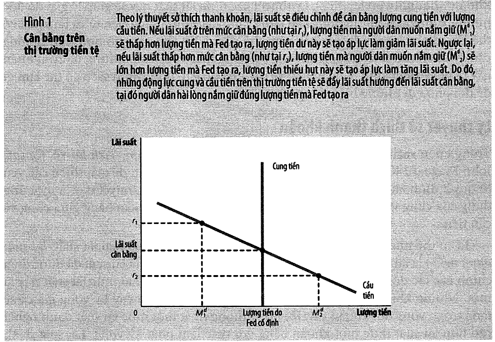
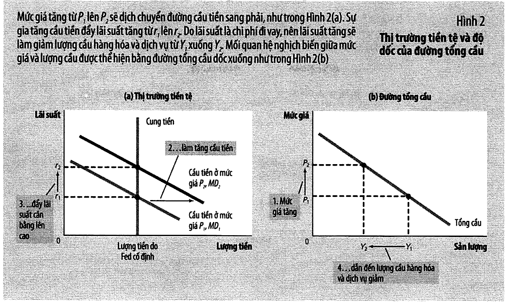
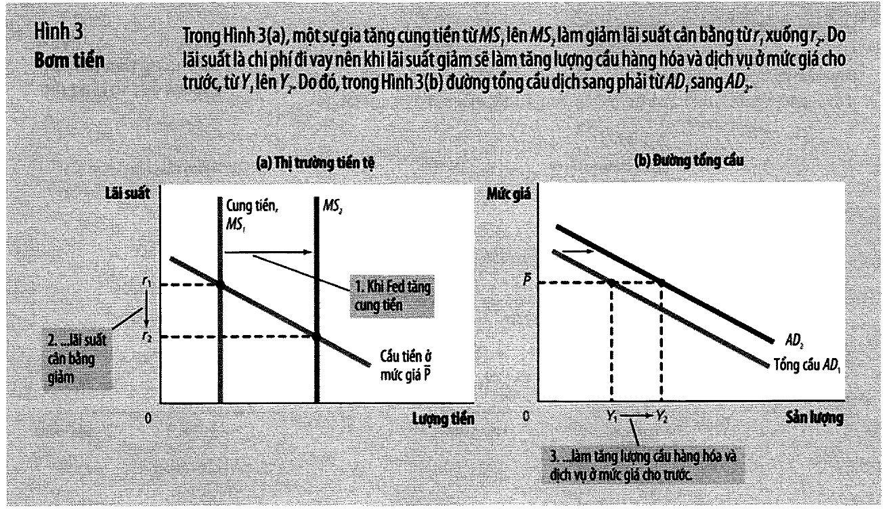
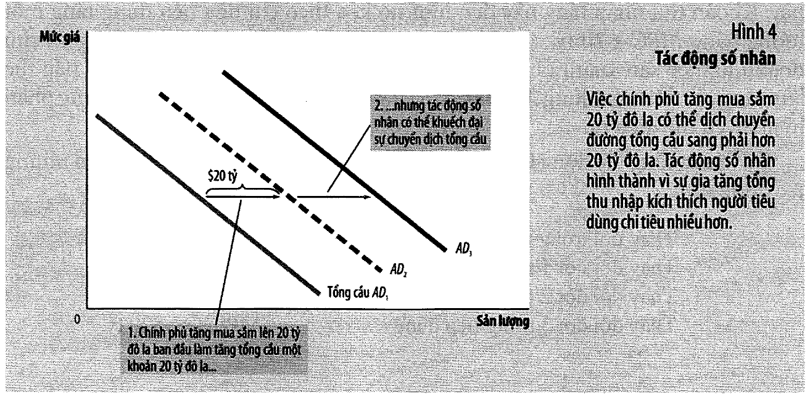
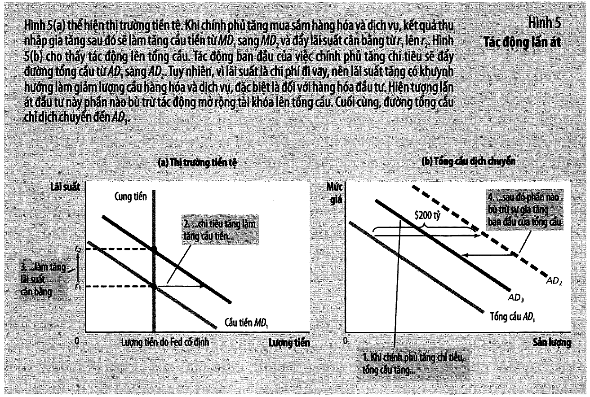

# Bài 12 — Tác động của chính sách tiền tệ và chính sách tài khoá lên tổng cầu

> Bài học dựng từ **Chương 21 — Tác động của chính sách tiền tệ và chính sách tài khoá lên tổng cầu**
> (tr. 507–534) của *N. Gregory Mankiw — **Kinh tế học vĩ mô***, bản dịch của Khoa Kinh tế,
> **ĐH Kinh tế TP.HCM** (Cengage Learning Asia).
> 🎯 **Vòng 1.** [Bài 11](bai_11_tong_cau_va_tong_cung.md) nói *"đường tổng cầu dịch chuyển"*. Bài này
> nói **dịch bằng cách nào** và **dịch bao nhiêu**. Đây là bài có nội dung **dùng được ngay** nhiều nhất
> trong cả khối ngắn hạn: nó cho bạn công cụ đọc mọi bản tin về lãi suất và gói kích cầu.
> 💼 **Góc QTKD** — ví dụ thêm cho ngành quản trị kinh doanh, **không có trong sách**.
> 📚 **Mở rộng** — thứ sách nói lướt hoặc để trong hộp phụ.
> ⚠️ — chỗ dễ hiểu sai, hoặc chỗ sách in sai.
> 📌 **Cần đọc trước:** [Bài 11](bai_11_tong_cau_va_tong_cung.md) **toàn bộ**;
> [Bài 7 mục 14](bai_07_he_thong_tien_te.md#14-lãi-suất-liên-ngân-hàng) ("hai mặt của một vấn đề");
> [Bài 4 mục 10](bai_04_tiet_kiem_dau_tu_he_thong_tai_chinh.md#10-thị-trường-vốn-vay--mô-hình) (lãi
> suất cân bằng vốn vay — mục 3 của bài này so hai lý thuyết lãi suất cạnh nhau).

---

## Mục lục

<!-- MUC-LUC -->

- [1. Câu hỏi mở đầu chương](#1-câu-hỏi-mở-đầu-chương)
- [2. Lý thuyết sở thích thanh khoản](#2-lý-thuyết-sở-thích-thanh-khoản)
- [3. 📚 Hai lý thuyết về lãi suất — có mâu thuẫn không?](#3--hai-lý-thuyết-về-lãi-suất--có-mâu-thuẫn-không)
- [4. ⭐ Dựng lại đường tổng cầu từ thị trường tiền tệ](#4--dựng-lại-đường-tổng-cầu-từ-thị-trường-tiền-tệ)
- [5. Bơm tiền làm dịch đường tổng cầu](#5-bơm-tiền-làm-dịch-đường-tổng-cầu)
- [6. Vì sao Fed nói về lãi suất chứ không nói về cung tiền](#6-vì-sao-fed-nói-về-lãi-suất-chứ-không-nói-về-cung-tiền)
- [7. 📚 Tiệm cận đáy zero và bẫy thanh khoản](#7--tiệm-cận-đáy-zero-và-bẫy-thanh-khoản)
- [8. Fed và thị trường chứng khoán](#8-fed-và-thị-trường-chứng-khoán)
- [9. Chính sách tài khoá — tác động số nhân](#9-chính-sách-tài-khoá--tác-động-số-nhân)
- [10. Tác động lấn át](#10-tác-động-lấn-át)
- [11. Thay đổi thuế — và vì sao "vĩnh viễn" khác "tạm thời"](#11-thay-đổi-thuế--và-vì-sao-vĩnh-viễn-khác-tạm-thời)
- [12. 📚 Chính sách tài khoá cũng chạm vào tổng cung](#12--chính-sách-tài-khoá-cũng-chạm-vào-tổng-cung)
- [13. Nên dùng chính sách để bình ổn nền kinh tế không?](#13-nên-dùng-chính-sách-để-bình-ổn-nền-kinh-tế-không)
- [14. Nhân tố bình ổn tự động](#14-nhân-tố-bình-ổn-tự-động)
- [15. 📚 Bốn bài tập giải bằng số](#15--bốn-bài-tập-giải-bằng-số)
- [16. 💼 Góc QTKD](#16--góc-qtkd)
- [17. 📚 Đối chiếu Việt Nam](#17--đối-chiếu-việt-nam)
- [18. Code minh hoạ](#18-code-minh-hoạ)
- [19. Tự thử](#19-tự-thử)
- [20. Từ điển thuật ngữ](#20-từ-điển-thuật-ngữ)
- [21. Câu hỏi tự kiểm tra](#21-câu-hỏi-tự-kiểm-tra)
- [Tóm tắt một trang](#tóm-tắt-một-trang)
- [Nguồn](#nguồn)

<!-- /MUC-LUC -->

---

## 1. Câu hỏi mở đầu chương

Sách mở bằng một tình huống rất cụ thể (tr. 507):

> *"Hãy hình dung bạn là thành viên của Ủy ban Thị trường Mở Liên bang… Bạn nhận định rằng tổng thống và
> Quốc hội đã thống nhất **tăng thuế**. Fed sẽ phản ứng như thế nào trước thay đổi chính sách tài khoá
> này? Liệu có nên mở rộng cung tiền, thu hẹp cung tiền hay giữ cung tiền không đổi?"*

⭐ Chú ý câu hỏi **không** hỏi "chính sách nào đúng" mà hỏi **"một cơ quan nên phản ứng thế nào trước cơ
quan kia"**. Đó là chủ đề thật của chương: hai công cụ, hai chủ thể, và họ phải đọc nhau.

### Ba hiệu ứng, xếp lại theo tầm quan trọng

[Bài 11 mục 4](bai_11_tong_cau_va_tong_cung.md#4-đường-tổng-cầu-dốc-xuống--ba-hiệu-ứng) nêu ba hiệu ứng
làm AD dốc xuống. Chương này xếp hạng chúng (tr. 508):

| Hiệu ứng | Vì sao yếu / mạnh | Xếp hạng |
| -------- | ----------------- | -------- |
| **Của cải** | *"số tiền nắm giữ chỉ là một phần nhỏ trong của cải của hộ gia đình"* | **ít quan trọng nhất** |
| **Tỷ giá** | xuất và nhập khẩu chỉ là phần nhỏ trong GDP Hoa Kỳ | nhỏ với Mỹ |
| **Lãi suất** | chạy qua **đầu tư** — thành phần nhạy nhất | **QUAN TRỌNG NHẤT** |

> *"**Đối với nền kinh tế Hoa Kỳ, lý do quan trọng nhất cho độ dốc hướng xuống của đường tổng cầu là hiệu
> ứng lãi suất.**"* (tr. 508)

⚠️ Và sách ghi một ngoặc đơn rất đáng chú ý (tr. 508): *"(Hiệu ứng này quan trọng hơn đối với các nước
**nhỏ**, trong đó xuất nhập khẩu thường chiếm tỷ lệ cao hơn trong GDP)"* — nói về hiệu ứng **tỷ giá**.

📌 Đó là một dòng sách viết cho người đọc **ngoài** Hoa Kỳ, và nó đúng ở đây. Với Việt Nam — nơi tổng kim
ngạch xuất nhập khẩu vượt GDP ([bài 9 mục 16](bai_09_kinh_te_mo_khai_niem_co_ban.md#16--đối-chiếu-việt-nam))
— kênh **tỷ giá** nặng hơn nhiều so với Hoa Kỳ. Cả chương này tập trung vào kênh lãi suất; hãy đọc nó với
ý thức rằng thứ tự ưu tiên ấy là **của Hoa Kỳ**.

---

## 2. Lý thuyết sở thích thanh khoản

> **Lý thuyết sở thích thanh khoản** (tr. 508–509): *"lý thuyết của Keynes cho rằng lãi suất điều chỉnh
> để đưa cung tiền và cầu tiền về trạng thái cân bằng."*

> *"Về bản chất, lý thuyết này là **một ứng dụng của cung và cầu**."* (tr. 509)

| Vế | Độ dốc | Vì sao |
| -- | ------ | ------ |
| **Cung tiền** | **dốc đứng** | Fed ấn định — không phụ thuộc lãi suất |
| **Cầu tiền** | **dốc xuống** | lãi suất là **chi phí cơ hội** của việc giữ tiền |

Cầu tiền dốc xuống, lý do sách cho (tr. 511):

> *"khi bạn giữ của cải dưới dạng tiền mặt trong túi, thay vì trái phiếu sinh lời, thì bạn sẽ **đánh mất
> phần lãi** mà mình có thể có."*

### ⚠️ Một đơn giản hoá sách nói rõ là có ý thức

> *"Những chi tiết kiểm soát tiền tệ có vai trò quan trọng đối với việc triển khai chính sách của Fed,
> nhưng **không quan trọng đối với phân tích trong chương này**… chúng ta có thể bỏ qua những chi tiết về
> cách thức chính sách của Fed được thực hiện và **giả định rằng Fed kiểm soát cung tiền một cách trực
> tiếp**."* (tr. 510)



📌 Đó chính là giả định mà
[bài 7 mục 12](bai_07_he_thong_tien_te.md#12--vì-sao-fed-không-kiểm-soát-nổi-cung-tiền) đã dành cả một
mục để chứng minh là **sai**. Sách biết, và chọn bỏ qua vì nó không đổi kết luận của chương này. Đó là
cách dùng giả định đúng đắn: **nói ra, và nói vì sao được phép**.

### Cơ chế về cân bằng (tr. 511)

| Nếu lãi suất | Người dân | Kết quả |
| ------------ | --------- | ------- |
| **cao** hơn cân bằng | giữ ít tiền hơn số Fed cung | mua trái phiếu → **lãi suất giảm** |
| **thấp** hơn cân bằng | muốn giữ nhiều tiền hơn | bán trái phiếu → **lãi suất tăng** |

---

## 3. 📚 Hai lý thuyết về lãi suất — có mâu thuẫn không?

Hộp phụ tr. 512 trả lời câu hỏi mà người đọc kỹ sẽ hỏi ngay: ở
[bài 4](bai_04_tiet_kiem_dau_tu_he_thong_tai_chinh.md#10-thị-trường-vốn-vay--mô-hình), lãi suất cân bằng
**tiết kiệm và đầu tư**. Ở đây nó cân bằng **cung tiền và cầu tiền**. Cái nào đúng?

> *"Có thể ráp nối hai lý thuyết này lại hay không?"* (tr. 512)

| | **Bài 4** — vốn vay | **Bài 12** — sở thích thanh khoản |
| --- | --- | --- |
| Cân bằng gì | tiết kiệm và đầu tư | cung tiền và cầu tiền |
| Khung thời gian | **DÀI HẠN** | **NGẮN HẠN** |
| Giả định về $P$ | $P$ **điều chỉnh** để cân bằng | $P$ **kết dính**, không điều chỉnh |
| Nhấn mạnh | tiết kiệm và cơ hội đầu tư | **chính sách tiền tệ** |

### ⭐ Ba định đề, hai thứ tự ngược nhau

Sách viết ra cả hai chuỗi. **Cổ điển, dài hạn** (tr. 512):

1. Sản lượng do cung vốn, lao động và công nghệ quyết định *(= mức sản lượng tự nhiên)*
2. Với sản lượng đó, **lãi suất** điều chỉnh để cân bằng vốn vay
3. Với sản lượng và lãi suất đó, **mức giá** điều chỉnh để cân bằng cung cầu tiền

**Ngắn hạn** — sách nói rõ chuỗi này *"hoàn toàn **đảo ngược trật tự**"* (tr. 512):

1. **Mức giá** thường được chốt hay kết dính, ít phản ứng
2. Với mức giá cho trước, **lãi suất** điều chỉnh để cân bằng cung cầu tiền
3. Lãi suất đó tác động lên tổng cầu và do đó lên **sản lượng**

⭐ Đọc hai danh sách cạnh nhau. Chúng dùng **đúng ba biến** — sản lượng, lãi suất, mức giá — nhưng theo
**thứ tự ngược nhau**. Cái gì được coi là "cho trước" ở mô hình này thì là "cần xác định" ở mô hình kia.

> *"Hai lý thuyết khác nhau về lãi suất đều **có ích cho những mục tiêu khác nhau**."* (tr. 512)

📌 Không mâu thuẫn. Chỉ là hai công cụ cho hai câu hỏi — đúng như
[bài 0 mục 11](bai_00_tu_vi_mo_sang_vi_mo.md#11--vai-trò-của-giả-định--vì-sao-vĩ-mô-có-hai-bộ-mô-hình)
đã báo trước.

---

## 4. ⭐ Dựng lại đường tổng cầu từ thị trường tiền tệ

Đây là đóng góp chính của chương. [Bài 11](bai_11_tong_cau_va_tong_cung.md#8-công-thức-của-sách-và-mô-hình-bằng-số)
**giả định** đường AD dốc xuống; chương này **dựng ra** nó.

Ba bước, đúng như sách tóm tắt (tr. 513):



1. Mức giá cao hơn làm **tăng cầu tiền**
2. Cầu tiền cao hơn dẫn đến **lãi suất cao hơn**
3. Lãi suất cao hơn làm **giảm lượng cầu** hàng hoá và dịch vụ

### Mô hình số

⚠️ **Ranh giới:** tham số của thị trường tiền tệ là **do bài này đặt ra**. Nhưng chúng được chọn để **tái
hiện đúng** đường AD $Y = 1500 - 5P$ của bài 11 — đó chính là phép kiểm.

$$\text{cầu tiền } M^d = 1000 + 5P - 100r \qquad \text{cung tiền } M^s = 1000$$
$$\text{hàng hoá } Y = 175 + 0{,}75Y - 25r + G, \quad G = 200$$

| Mức giá $P$ | Lãi suất $r$ | Sản lượng $Y$ |
| ---: | ---: | ---: |
| 80 | 4,00% | 1.100 |
| 90 | 4,50% | 1.050 |
| **100** | **5,00%** | **1.000** |
| 110 | 5,50% | 950 |
| 120 | 6,00% | 900 |

$$\frac{\Delta Y}{\Delta P} = -5 \quad\Rightarrow\quad \boxed{Y = 1500 - 5P}$$

### ⭐⭐ Đó chính là đường AD của bài 11

✅ Kiểm bằng `assert`. **Bài 11 đặt nó ra; bài 12 dựng ra nó từ hai thị trường.**

📌 Đây là một loại phép kiểm quan trọng và ít khi được nói ra: **một mô hình chi tiết hơn phải tái hiện
được mô hình đơn giản hơn**. Bạn đã gặp cùng dạng ba lần:

| Mô hình đơn giản | Là trường hợp riêng của | Khi nào |
| ---------------- | ----------------------- | ------- |
| Ngân hàng dự trữ 100% | dự trữ một phần ([bài 7](bai_07_he_thong_tien_te.md#8-số-nhân-tiền)) | $R = 1$ |
| Nền kinh tế đóng | nền kinh tế mở ([bài 9](bai_09_kinh_te_mo_khai_niem_co_ban.md#6-s--i--nco)) | $NCO = 0$ |
| Ngang bằng sức mua | mô hình bài 10 ([bài 10](bai_10_ly_thuyet_kinh_te_mo.md#11--ngang-bằng-sức-mua-là-trường-hợp-đặc-biệt-của-mô-hình-này)) | $NX$ nhạy vô hạn |
| **AD của bài 11** | **hai thị trường của bài 12** | — |

---

## 5. Bơm tiền làm dịch đường tổng cầu

Giữ **mức giá cố định**, đổi **cung tiền**. Đây là **dịch chuyển**, không phải đi dọc theo đường.

| Cung tiền $M^s$ | Lãi suất $r$ | Sản lượng $Y$ | AD dịch |
| ---: | ---: | ---: | ---: |
| 900 | 5,50% | 950 | −50 |
| **1.000** | **5,00%** | **1.000** | 0 |
| **1.100** | **4,00%** | **1.100** | **+100** |
| 1.200 | 3,00% | 1.200 | +200 |

✅ `assert`: $M^s = 1100 \Rightarrow r = 4\%$, $Y = 1100$.

> *"**Khi Fed tăng cung tiền, họ làm giảm lãi suất và tăng lượng cầu hàng hóa và dịch vụ ở bất kỳ mức giá
> cho trước, làm dịch chuyển đường tổng cầu sang phải.**"* (tr. 514)



⭐ Chú ý **độ lớn**: cung tiền +100 làm AD dịch phải đúng **100** — bằng đúng độ lớn cú sốc AD ở
[bài 11 mục 9](bai_11_tong_cau_va_tong_cung.md#9-cú-sốc-tổng-cầu-a--b--c). Hai bài dùng cùng một con số,
và bây giờ ta biết nó **đến từ đâu**.

### 📌 Bảy mắt xích, bảy bài

```
Fed mua trái phiếu     →  dự trữ ngân hàng tăng      (bài 7 mục 11)
    →  cung tiền tăng                                 (bài 7 mục 8)
    →  lãi suất cân bằng GIẢM                         (mục 2 bài này)
    →  chi phí vay giảm  →  ĐẦU TƯ tăng               (bài 4 mục 10)
    →  tổng cầu dịch PHẢI                             (bài 11 mục 5)
    →  sản lượng tăng trong NGẮN HẠN                  (bài 11 mục 9)
    →  chỉ còn MỨC GIÁ tăng trong DÀI HẠN             (bài 8, bài 11)
```

Đó là lý do các bài phải học theo thứ tự. Không mắt xích nào bỏ được.

---

## 6. Vì sao Fed nói về lãi suất chứ không nói về cung tiền

Sách nêu **hai** lý do (tr. 515):

1. *"khó đo lường chính xác cung tiền"*
2. *"cầu tiền biến động theo thời gian"* — với bất kỳ lượng cung tiền nào, biến động cầu tiền sẽ đưa đến
   biến động lãi suất, tổng cầu và sản lượng

⭐ Lý do thứ hai là lý do thật. Nếu Fed chốt **cung tiền**, mọi cú sốc cầu tiền đều biến thành cú sốc lãi
suất và lọt sang sản lượng. Nếu Fed chốt **lãi suất**, nó *"thực chất thích nghi với những chuyển dịch
hàng ngày của cầu tiền bằng cách điều chỉnh cung tiền."*

✅ Kiểm bằng mô hình — một cú sốc cầu tiền (+50):

| Chế độ | Lãi suất | Sản lượng |
| ------ | ---: | ---: |
| không có cú sốc | 5,00% | 1.000 |
| Fed chốt **CUNG TIỀN** | **5,50%** | **950** |
| Fed chốt **LÃI SUẤT** | 5,00% | **1.000** |

Chốt lãi suất thì cú sốc cầu tiền **không lọt sang sản lượng**. Đó cũng là lời giải bài tập 2 tr. 531 —
xem [mục 15](#15--bốn-bài-tập-giải-bằng-số).

### ⚠️ Nhưng điều này không đổi phân tích

> *"chính sách tiền tệ có thể được mô tả **theo cung tiền hoặc theo lãi suất**… Những thay đổi của chính
> sách tiền tệ nhắm đến việc mở rộng tổng cầu có thể được mô tả như là **tăng cung tiền** hoặc như **hạ
> lãi suất**."* (tr. 515)

📌 Đó chính là **"hai mặt của một vấn đề"** ở
[bài 7 mục 14](bai_07_he_thong_tien_te.md#14-lãi-suất-liên-ngân-hàng). Khi FOMC đặt mục tiêu lãi suất
6%, họ tự cam kết *"thực hiện bất kỳ nghiệp vụ thị trường mở cần thiết để đảm bảo rằng lãi suất cân bằng
phải là 6%"* (tr. 515). **Không tồn tại lựa chọn "hạ lãi suất mà không bơm tiền".**

---

## 7. 📚 Tiệm cận đáy zero và bẫy thanh khoản

Hộp phụ tr. 516 đặt một câu hỏi mà năm 2010 đang rất nóng, và ngày nay còn nóng hơn:

> *"điều gì xảy ra nếu lãi suất mục tiêu của Fed đã giảm ở mức thấp nhất có thể? Trong giai đoạn suy
> thoái 2008 và 2009, lãi suất quỹ liên bang giảm **gần bằng zero**."*

> **Bẫy thanh khoản** (tr. 516): lãi suất danh nghĩa không thể xuống dưới zero (*"thay vì cho vay với lãi
> suất danh nghĩa âm, người ta chỉ cần giữ tiền mặt"*), nên chính sách tiền tệ mở rộng *"không còn hiệu
> lực nữa"*. *"Tổng cầu, sản xuất và việc làm có thể bị **mắc kẹt** ở mức thấp."*

### Lối ra 1 — nâng kỳ vọng lạm phát

> *"ngay cả khi lãi suất danh nghĩa không thể giảm hơn nữa, lạm phát kỳ vọng cao hơn có thể hạ lãi suất
> **thực** bằng cách làm cho lãi suất thực trở thành **âm**, điều đó sẽ kích thích chi tiêu đầu tư."*
> (tr. 516)

Kiểm bằng số học của
[bài 8 mục 8](bai_08_tang_truong_tien_va_lam_phat.md#8-hiệu-ứng-fisher): $r_{\text{thực}} = i - \pi$, với
$i = 0$:

| Lãi suất danh nghĩa | Lạm phát kỳ vọng | **Lãi suất thực** |
| ---: | ---: | ---: |
| 0% | 0% | 0% |
| 0% | 2% | **−2%** |
| 0% | **4%** | **−4%** |

### ⭐ Và đây là lập luận cho mục tiêu lạm phát DƯƠNG

> *"Ở mức lạm phát zero, lãi suất thực giống như lãi suất danh nghĩa không bao giờ giảm thấp hơn zero.
> Nhưng nếu tỷ lệ lạm phát danh nghĩa là 4%, khi đó ngân hàng trung ương có thể dễ dàng đẩy lãi suất
> thực xuống −4% bằng cách hạ lãi suất danh nghĩa xuống bằng 0. Do đó, **lạm phát vừa phải giúp các nhà
> hoạch định chính sách có thêm dư địa để kích thích nền kinh tế khi cần**."* (tr. 516)

📌 Đọc lại [bài 8 mục 15](bai_08_tang_truong_tien_va_lam_phat.md#15-sáu-chi-phí-của-lạm-phát): sách liệt
kê **sáu chi phí** của lạm phát và kết luận độ lớn của chúng ở mức vừa phải *"vẫn còn nhiều tranh cãi"*.
Đây là một **lợi ích** của lạm phát vừa phải, và nó nằm ở phía **bên kia** cán cân.

⭐ **Mục tiêu lạm phát 0 không phải lựa chọn hiển nhiên.** Hai bài đặt cạnh nhau cho thấy vì sao các ngân
hàng trung ương thường chọn mục tiêu **2%** chứ không phải 0%.

### Lối ra 2 — mua tài sản khác

> *"họ có thể mua nợ cầm cố và nợ doanh nghiệp và từ đó hạ thấp lãi suất trên các loại khoản vay này. Fed
> đã tích cực thực hiện chọn lựa cuối cùng này trong thời kỳ suy thoái 2008 và 2009."* (tr. 516)

📌 Ngày nay công cụ này có tên riêng: **nới lỏng định lượng** (quantitative easing).

⚠️ Và sách ghi nhận tranh cãi chưa dứt (tr. 516): *"Các nhà kinh tế khác hoài nghi về tính phù hợp của
bẫy thanh khoản và tin rằng ngân hàng trung ương vẫn tiếp tục có công cụ để mở rộng nền kinh tế, ngay cả
khi mục tiêu lãi suất đã tiệm cận đáy zero."* Sách **không** kết luận bên nào đúng.

---

## 8. Fed và thị trường chứng khoán

Sách mở bằng câu đùa của Paul Samuelson (tr. 516):

> *"Thị trường chứng khoán đã dự báo **chín** trong số **năm** đợt suy thoái đã xảy ra vừa qua."*

📌 Đó là một câu đùa về **dương tính giả**: 9 dự báo cho 5 sự kiện = 4 báo động nhầm. Và nó đúng cho mọi
chỉ báo sớm: nhạy hơn thì bắt được nhiều hơn **nhưng cũng báo động nhầm nhiều hơn**.

Nhưng sách vẫn bênh vực việc theo dõi nó (tr. 516–517): thập niên 1990 giá cổ phiếu **tăng khoảng bốn
lần**; từ 11/2007 đến 3/2009 thị trường **mất nửa giá trị**.

### Hai kênh từ chứng khoán sang tổng cầu (tr. 517)

1. Giá cổ phiếu tăng → hộ gia đình **giàu hơn** → tiêu dùng tăng
   *(chính là **hiệu ứng của cải** ở [bài 11 mục 4](bai_11_tong_cau_va_tong_cung.md#4-đường-tổng-cầu-dốc-xuống--ba-hiệu-ứng))*
2. Giá cổ phiếu tăng → doanh nghiệp **bán thêm cổ phiếu mới** để huy động vốn → đầu tư tăng

### ✅ Một ca thật, có đủ số liệu (tr. 517)

**Ngày 19/10/1987:** thị trường cổ phiếu giảm **22,6%** trong một ngày — *"mức giảm trong ngày lớn nhất
trong lịch sử"*. Fed phản ứng:

$$\text{lãi suất quỹ liên bang } 7{,}7\% \to 6{,}6\% \quad(\text{giảm } 1{,}1 \text{ điểm} = 14{,}3\%)$$

> *"Một phần nhờ hành động nhanh chóng của Fed mà nền kinh tế đã **tránh được** suy thoái."*

⚠️ Đối chiếu với [bài 7 mục 11](bai_07_he_thong_tien_te.md#11-bốn-công-cụ-kiểm-soát-tiền-tệ-của-fed): ở
đó sách in con số cho **cùng sự kiện này** là **22%** (tr. 376), ở đây là **22,6%** (tr. 517). Cùng một
sự kiện, hai mức làm tròn. Không mâu thuẫn, nhưng đáng biết nếu bạn đối chiếu hai chương.

### ⚠️⚠️ Câu quan trọng nhất của mục này

Năm 2008–2009 Fed cũng hạ lãi suất khi chứng khoán sụt, *"nhưng **lần này** chính sách tiền tệ **không
đủ** để xoay chuyển đợt suy thoái sâu"* (tr. 517).

**Cùng một công cụ, hai kết quả.** Đó là lý do [mục 13](#13-nên-dùng-chính-sách-để-bình-ổn-nền-kinh-tế-không)
phải bàn về **giới hạn** của chính sách bình ổn.

---

## 9. Chính sách tài khoá — tác động số nhân

> **Chính sách tài khoá** (tr. 517): *"công việc ấn định mức chi tiêu và thuế khoá của chính phủ của các
> nhà hoạch định chính sách."*

⚠️ Khác biệt cơ bản với chính sách tiền tệ (tr. 518):

| Công cụ | Dịch AD bằng cách |
| ------- | ----------------- |
| Chính sách **tiền tệ** và **thuế** | **gián tiếp** — qua quyết định chi tiêu của doanh nghiệp và hộ gia đình |
| **Mua sắm** của chính phủ | **trực tiếp** |

Ví dụ của sách: Bộ Quốc phòng đặt đơn hàng **20 tỷ đô la** mua máy bay chiến đấu từ Boeing.

> **Tác động số nhân** (tr. 518): *"những chuyển dịch **thêm** của đường tổng cầu xuất phát từ việc chính
> sách tài khoá mở rộng làm tăng thu nhập và theo đó làm tăng chi tiêu tiêu dùng."*

> **MPC — khuynh hướng tiêu dùng biên** (tr. 519): *"tỷ phần của số thu nhập tăng thêm mà hộ gia đình chi
> tiêu tiêu dùng thay vì tiết kiệm."*



### Chuỗi cộng dồn, với MPC = ¾ (tr. 520)

| Vòng | Công thức | Số tiền (tỷ) | Cộng dồn |
| ---- | --------- | ---: | ---: |
| mua sắm chính phủ | 20 tỷ | 20,000 | 20,000 |
| tiêu dùng đợt 1 | $MPC \times 20$ | 15,000 | 35,000 |
| tiêu dùng đợt 2 | $MPC^2 \times 20$ | 11,250 | 46,250 |
| tiêu dùng đợt 3 | $MPC^3 \times 20$ | 8,438 | 54,688 |
| … | … | … | … |
| **TỔNG** | $\dfrac{1}{1-MPC} \times 20$ | | **80,000** |

$$\text{Số nhân} = 1 + MPC + MPC^2 + \dots = \boxed{\frac{1}{1 - MPC}} = \frac{1}{1 - 0{,}75} = 4$$

✅ Khớp với sách (tr. 520): *"số tiền 20 tỷ mà chính phủ chi tạo ra **80 tỷ** đô la cầu hàng hóa và dịch
vụ."*

| MPC | Số nhân | 20 tỷ tạo ra |
| ---: | ---: | ---: |
| 0,00 | 1,00 | 20 tỷ |
| **0,50** | **2,00** | 40 tỷ |
| **0,75** | **4,00** | **80 tỷ** |
| 0,90 | 10,00 | 200 tỷ |

✅ Khớp (tr. 520): *"MPC = ¾ dẫn đến hệ số nhân là 4, thì MPC bằng ½ chỉ mang lại số nhân bằng 2."*

### ⭐ Số nhân không chỉ áp cho chi tiêu chính phủ

> *"nó nói đến **bất kỳ** sự kiện nào làm thay đổi chi tiêu trong **bất kỳ** thành phần nào của GDP."*
> (tr. 521)

| Sự kiện | Ban đầu | Tổng cầu đổi |
| ------- | ---: | ---: |
| Suy thoái hải ngoại làm $NX$ giảm | −10 tỷ | **−40 tỷ** |
| Chứng khoán bùng nổ làm $C$ tăng | +20 tỷ | **+80 tỷ** |

✅ Cả hai khớp với hai con số sách in ở tr. 521.

Và sách nêu thêm một kênh khuếch đại nữa (tr. 519): **hệ số gia tốc đầu tư** — *"Boeing có thể phản ứng
trước nhu cầu máy bay cao hơn bằng quyết định mua nhiều thiết bị hoặc xây dựng thêm nhà máy mới."*

---

## 10. Tác động lấn át

> **Tác động lấn át** (tr. 521): *"phần bù trừ trong tổng cầu xảy ra khi chính sách tài khoá mở rộng làm
> tăng lãi suất và do đó làm giảm chi tiêu đầu tư."*

Chuỗi nhân quả, đúng theo sách (tr. 521–522):

```
1. chính phủ chi 20 tỷ  →  thu nhập tăng (có số nhân)
2. thu nhập cao hơn  →  hộ gia đình muốn giữ NHIỀU TIỀN hơn  →  CẦU TIỀN tăng
3. Fed KHÔNG đổi cung tiền  →  LÃI SUẤT phải tăng để cân bằng
4. lãi suất cao hơn  →  ĐẦU TƯ giảm
5.  →  tổng cầu bị kéo NGƯỢC lại
```

⚠️ **Chú ý bước 3.** Lấn át chỉ xảy ra vì Fed **giữ cung tiền không đổi**. Nếu Fed chốt **lãi suất**
([mục 6](#6-vì-sao-fed-nói-về-lãi-suất-chứ-không-nói-về-cung-tiền)), lấn át **không** xảy ra. Đó là lời
giải bài tập 12 tr. 533.

### ✅ Số nhân THỰC, sau khi trừ lấn át

| Độ nhạy cầu tiền theo thu nhập | Mức lấn át | **Số nhân thực** | 20 tỷ tạo ra |
| ---: | ---: | ---: | ---: |
| 0,0 | không | **4,00** | 80,0 tỷ |
| 0,2 | 0,05 | 3,33 | 66,7 tỷ |
| 0,6 | 0,15 | 2,50 | 50,0 tỷ |
| 1,0 | 0,25 | 2,00 | 40,0 tỷ |
| **3,0** | 0,75 | **1,00** | **20,0 tỷ** |
| 10,0 | 2,50 | **0,36** | **7,3 tỷ** |

### ⭐⭐ Đọc bảng trên cạnh kết luận của sách (tr. 522)



> *"Khi chính phủ tăng mua sắm 20 tỷ đô la, tổng cầu hàng hóa và dịch vụ có thể tăng **ít hay nhiều hơn**
> 20 tỷ tùy vào quy mô số nhân và tác động lấn át."*

Cả **ba** trường hợp đều có thể, và mô hình cho biết cái gì quyết định: **độ nhạy của cầu tiền theo thu
nhập** và **độ nhạy của đầu tư theo lãi suất**.

📌 **Đối chiếu với [bài 4 mục 13](bai_04_tiet_kiem_dau_tu_he_thong_tai_chinh.md#13-chính-sách-3--thâm-hụt-thặng-dư-và-hiện-tượng-lấn-át):**
ở đó lấn át xảy ra qua **thị trường vốn vay** trong **dài hạn**. Ở đây nó xảy ra qua **thị trường tiền
tệ** trong **ngắn hạn**. **Cùng một tên gọi, hai cơ chế, hai khung thời gian.** Đây là một trong những
chỗ dễ nhầm nhất của cả khoá.

---

## 11. Thay đổi thuế — và vì sao "vĩnh viễn" khác "tạm thời"

Cắt giảm thuế cũng chịu **cả hai** tác động (số nhân và lấn át). Nhưng sách nêu thêm một yếu tố thứ ba mà
chỉ thuế mới có (tr. 523):

> *"nhận định của hộ gia đình về việc thuế thay đổi là **vĩnh viễn hay tạm thời**"*

| Nhận định | Hộ gia đình coi khoản giảm thuế là | Tác động lên AD |
| --------- | ---------------------------------- | --------------- |
| **VĨNH VIỄN** | *"phần bổ sung **đáng kể** vào nguồn lực tài chính"* | **LỚN** |
| **TẠM THỜI** | *"phần bổ sung **không đáng kể**"* | **NHỎ** |

### ✅ Và sách cho một ca cực đoan có thật (tr. 524)

Năm **1992**, Tổng thống George H. W. Bush *"đứng trước nguy cơ suy thoái và chiến dịch tái tranh cử sắp
diễn ra"*. Ông cắt giảm khoản thuế thu nhập **khấu trừ từ quỹ lương**.

Nhưng:

> *"do **thuế suất theo luật định là không đổi**, nên mỗi đồng đô la được giảm khấu trừ năm 1992 là tương
> đương một đồng đô la thuế tăng thêm phải nộp vào ngày 15/4/1993."*

⭐ Khoản "giảm thuế" đó **thực chất là một khoản vay ngắn hạn từ chính phủ**. Giá trị thật của nó không
phải số tiền, mà chỉ là **tiền lãi** của số tiền đó trong một năm:

| Lãi suất/năm | Giá trị thực của khoản hoãn 1.000 $ |
| ---: | ---: |
| 2% | 20 $ |
| **5%** | **50 $** |
| 10% | 100 $ |

> *"không có gì ngạc nhiên khi tác động của chính sách này lên tiêu dùng và tổng cầu là **tương đối
> nhỏ**."* (tr. 524)

📌 Đó là [bài 5 mục 2](bai_05_cong_cu_co_ban_cua_tai_chinh.md#2-giá-trị-hiện-tại--đo-giá-trị-của-tiền-tệ-theo-thời-gian)
(giá trị hiện tại) áp vào chính sách công. **Một khoản chuyển dịch thời điểm mà không đổi tổng số thì gần
như không có giá trị.** Chính trị gia gọi nó là "giảm thuế"; kế toán gọi nó là "khoản phải trả ngắn hạn".

---

## 12. 📚 Chính sách tài khoá cũng chạm vào tổng cung

Cả chương nói về **tổng cầu**. Hộp phụ tr. 523 mở một cánh cửa khác.

### Kênh 1 — thuế và động cơ

> *"Một trong **Mười Nguyên lý Kinh tế học** ở Chương 1 cho rằng người dân phản ứng với những động cơ
> khuyến khích. Khi các nhà hoạch định chính sách giảm thuế suất, người lao động được giữ lại nhiều tiền
> hơn từ mỗi đô la họ kiếm được, do đó họ có động cơ lớn hơn để làm việc và sản xuất ra hàng hóa và dịch
> vụ."* → **AS dịch phải**.

⚠️ Và sách xử lý phái **chuyên gia phía cung** một cách rất cẩn (tr. 523):

| | |
| --- | --- |
| Lập luận của họ | *"một đợt giảm thuế suất sẽ kích thích hoạt động sản xuất và thu nhập bổ sung **đủ** để làm tăng số thu thuế"* |
| Đánh giá của sách | *"Đây chắc chắn là một **khả năng lý thuyết**, nhưng đa số các nhà kinh tế **không xem đây là trường hợp bình thường**."* |

⭐ Chú ý **cách** sách viết: nó **không bác bỏ**, nó **định vị**. "Khả năng lý thuyết" + "không phải
trường hợp bình thường". Đó là cách viết đúng khi một lập luận có logic đúng nhưng **độ lớn thực nghiệm**
không đủ.

### Kênh 2 — chi tiêu công và năng suất

> *"Đường bộ sẽ được khu vực tư nhân sử dụng để vận chuyển hàng hóa đến khách hàng; chất lượng đường bộ
> tăng lên sẽ làm tăng năng suất của những doanh nghiệp này."* (tr. 523)

⚠️ Nhưng sách ghi rõ độ trễ: *"Tác động này lên tổng cung có lẽ có quan trọng hơn trong **dài hạn** so
với ngắn hạn, vì phải mất một khoảng thời gian để chính phủ xây đường mới và đưa vào sử dụng."*

📌 Đọc bằng khung [bài 11 mục 6](bai_11_tong_cau_va_tong_cung.md#6-tổng-cung-dài-hạn-dốc-đứng): chi tiêu
hạ tầng là **LRAS dịch phải vì vốn**. Đó là lý do một gói kích cầu chi vào **hạ tầng** khác hẳn một gói
chi vào **trợ cấp tiêu dùng**, dù hai gói có cùng con số trên báo. Xem [mục 16(c)](#16--góc-qtkd).

---

## 13. Nên dùng chính sách để bình ổn nền kinh tế không?

Sách quay lại câu hỏi mở đầu chương và trả lời nó (tr. 524): nếu Quốc hội tăng thuế làm AD dịch **trái**,
Fed có thể *"mở rộng tổng cầu bằng cách tăng cung tiền"*. *"Nếu chính sách tiền tệ phản ứng một cách phù
hợp, thì những thay đổi kết hợp giữa chính sách tiền tệ và chính sách tài khoá có thể **giữ cho tổng cầu
hàng hóa và dịch vụ không bị ảnh hưởng**."*

### ⚖️ Ủng hộ — Đạo luật Việc làm 1946

> *"đây là một chính sách liên tục và trách nhiệm của chính quyền liên bang là …**thúc đẩy việc làm và
> sản xuất toàn dụng**."* (tr. 524–525)

Sách tách **hai** hàm ý:

| Mức độ | Hàm ý |
| ------ | ----- |
| Khiêm tốn hơn | chính phủ nên **tránh trở thành nguyên nhân** gây biến động → tránh thay đổi lớn và bất ngờ |
| Tham vọng hơn | chính phủ nên **phản ứng** trước thay đổi của khu vực tư nhân để ổn định tổng cầu |

Lập luận Keynes (tr. 525): tổng cầu biến động chủ yếu do **"tính bầy đàn"** — *"những làn sóng bi quan và
lạc quan **không có cơ sở**"*. Và câu đáng nhớ nhất:

> ⭐ *"một số thay đổi về thái độ này trong chừng mực nhất định **tự chúng sẽ trở thành hiện thực**."*

📌 Đó là một mệnh đề mạnh: kỳ vọng không chỉ **phản ánh** nền kinh tế, chúng **tạo ra** nó. Nối với
[bài 11 mục 8](bai_11_tong_cau_va_tong_cung.md#8-công-thức-của-sách-và-mô-hình-bằng-số): $P^e$ là biến
kéo nền kinh tế về — và nó cũng có thể đẩy nền kinh tế đi.

🍷 William McChesney Martin, cựu chủ tịch Fed (tr. 525):

> *"Công việc của Fed là **tịch thu bình rượu khi buổi tiệc bắt đầu**."*

### ⚖️ Phản đối — độ trễ

| Loại độ trễ | Độ dài | Nguyên nhân |
| ----------- | ------ | ----------- |
| Chính sách **tiền tệ** | *"ít nhất **6 tháng**"* | đầu tư đã lên kế hoạch từ trước |
| | *"có thể tốn đến **nhiều năm**"* | tác động đầy đủ |
| Chính sách **tài khoá** | *"hàng tháng hoặc… hàng năm"* | **quy trình chính trị** |

⚠️ Lập luận phản bác mạnh nhất (tr. 526–527): vì độ trễ, *"Fed thường xuyên phản ứng quá chậm trước những
điều kiện kinh tế đang thay đổi và kết quả là trở thành **nguyên nhân** chứ không phải là giải pháp khắc
phục biến động kinh tế."*

Và sách chỉ ra gốc rễ: *"Các độ trễ… cũng rắc rối một phần vì hoạt động **dự báo kinh tế quá kém**…
nhiều đợt suy thoái và trì trệ nghiêm trọng xảy ra mà **không có nhiều cảnh báo trước**."*

📌 Đối chiếu với [mục 8](#8-fed-và-thị-trường-chứng-khoán): năm 1987 Fed phản ứng trong **vài tuần** và
thành công; năm 2008–2009 phản ứng mạnh hơn nhiều và *"không đủ"*. **Độ trễ không phải hằng số** — và đó
là một phần của vấn đề.

---

## 14. Nhân tố bình ổn tự động

> **Các nhân tố bình ổn tự động** (tr. 527): *"những thay đổi trong chính sách tài khoá kích thích tổng
> cầu khi nền kinh tế đi vào suy thoái mà các nhà hoạch định chính sách **không cần phải có hành động chủ
> đích nào**."*

Sách nêu điểm chung của cả hai phe (tr. 527): *"**Tất cả** các nhà kinh tế – bao gồm cả những người cổ suý
hay chỉ trích chính sách bình ổn – đều **nhất trí** rằng độ trễ trong triển khai làm cho chính sách bình
ổn ngắn hạn kém hiệu quả."*

Hai nhân tố chính:

1. **Hệ thống thuế** — thu thuế tự động giảm khi suy thoái (thuế thu nhập cá nhân, thuế lương, thuế thu
   nhập doanh nghiệp đều gắn với hoạt động kinh tế)
2. **Chi tiêu chính phủ** — trợ cấp thất nghiệp, phúc lợi tự động tăng

### ⭐ Cơ chế, viết thành công thức

⚠️ **Công thức này không có trong sách** — sách mô tả cơ chế bằng lời. Bài này viết nó ra.

Với thuế suất biên $t$, thu nhập khả dụng chỉ còn $(1-t)$ mỗi đồng, nên mỗi vòng tiêu dùng chỉ còn
$MPC \times (1-t)$:

$$\text{số nhân} = \frac{1}{1 - MPC(1-t)}$$

| Thuế suất biên $t$ | Số nhân | Cú sốc −100 làm $Y$ giảm |
| ---: | ---: | ---: |
| **0%** | **4,00** | **−400** |
| 10% | 3,08 | −308 |
| 20% | 2,50 | −250 |
| 30% | 2,11 | −211 |
| **50%** | **1,60** | **−160** |

### ⭐⭐ Đọc bảng

**Thuế suất càng cao thì số nhân càng NHỎ.** Nhân tố bình ổn tự động hoạt động bằng cách **làm nhỏ số
nhân** — tức làm giảm độ khuếch đại của **mọi** cú sốc, cả cú sốc xấu **lẫn** cú sốc tốt.

📌 **Đó không phải tác dụng phụ; đó chính là cơ chế.**

⚠️ Sách đánh giá rất cẩn (tr. 528): *"Các nhân tố bình ổn tự động ở nền kinh tế Hoa Kỳ là **không đủ mạnh**
để ngăn chặn hoàn toàn các đợt suy thoái. Tuy nhiên, không có các nhân tố bình ổn tự động này, sản lượng
và việc làm sẽ biến động **mạnh hơn thực tế**."*

### ⭐ Một hệ quả chính sách sách nêu thẳng

> *"nhiều nhà kinh tế **phản đối** việc sửa đổi hiến pháp trong đó yêu cầu chính phủ liên bang luôn phải
> duy trì **ngân sách cân đối**… Nếu chính phủ đứng trước quy tắc khắt khe phải cân đối ngân sách, họ
> **buộc phải tìm cách tăng thuế và cắt giảm chi tiêu trong suy thoái**… quy tắc cân đối ngân sách khắt
> khe sẽ **loại bỏ** các nhân tố bình ổn tự động vốn có trong hệ thống thuế và chi tiêu của chính phủ hiện
> hữu."* (tr. 528)

📌 Đây là một lập luận tinh tế và đáng nhớ: **một quy tắc nghe rất có trách nhiệm (cân đối ngân sách) lại
có thể làm nền kinh tế bất ổn hơn**, vì nó bắt chính phủ hành động **thuận chu kỳ** đúng lúc không nên.

---

## 15. 📚 Bốn bài tập giải bằng số

### Bài tập 8 tr. 533 — cần bao nhiêu chi tiêu để lấp hố suy thoái

Sản lượng thấp hơn tiềm năng **400 tỷ**; $MPC = 4/5$; ngân hàng trung ương **giữ lãi suất không đổi**
(không lấn át); mức giá cố định.

$$\text{số nhân} = \frac{1}{1-0{,}8} = 5 \quad\Rightarrow\quad \Delta G = \frac{400}{5} = \textbf{80 tỷ}$$

⚠️ Chú ý đề bài cho sẵn **hai** điều kiện để bỏ lấn át. Bỏ một trong hai thì con số 80 tỷ **không còn
đúng**.

### Bài tập 9 tr. 533 — vì sao giảm thuế yếu hơn tăng chi tiêu

Giảm thuế 20 tỷ, không lấn át, $MPC = 3/4$.

| | |
| --- | ---: |
| **(a)** Tác động đầu tiên: hộ gia đình chi $MPC \times 20$ | **15 tỷ** *(không phải 20 — họ tiết kiệm 5)* |
| **(b)** Tổng tác động: $15 \times 4$ | **60 tỷ** |
| **(c)** So với tăng chi mua sắm 20 tỷ | **80 tỷ** |

⭐ Giảm thuế tạo ra **ít hơn 20 tỷ** so với chi mua sắm. Vì sao? Vì **vòng đầu tiên** của chi mua sắm là
20 tỷ **trọn vẹn**, còn vòng đầu tiên của giảm thuế chỉ là 15 tỷ.

**(d)** *"Có cách nào để chính phủ tăng tổng cầu nhưng **không thay đổi thâm hụt ngân sách** không?"*
→ Tăng **cả hai** cùng một lượng:

| | Tổng cầu đổi |
| --- | ---: |
| tăng chi tiêu +20 tỷ | **+80 tỷ** |
| tăng thuế +20 tỷ | **−60 tỷ** |
| **RÒNG** | **+20 tỷ** |

⭐ Ròng đúng bằng **20 tỷ** — đúng bằng độ lớn của gói. Kết quả này có tên riêng: **số nhân ngân sách cân
đối**, và nó **luôn bằng 1** bất kể MPC. ✅ Kiểm bằng `assert` với MPC = 0,5 / 0,75 / 0,9.

**Vì sao?** Vì phần chênh lệch chính là phần hộ gia đình **sẽ tiết kiệm** nếu được giữ tiền — mà chính
phủ thì tiêu **hết**.

### Bài tập 6 tr. 532 — suy ngược MPC từ số liệu quan sát

Quan sát: $G$ tăng 10 tỷ làm tổng cầu tăng **30 tỷ**.

**(a)** Nếu **bỏ qua** lấn át: số nhân quan sát $= 3$ → từ $1/(1-MPC) = 3$ → $MPC = 2/3$.

**(b)** *"Bây giờ giả sử các nhà kinh tế xét đến tác động lấn át. Ước tính MPC mới của họ sẽ lớn hơn hay
nhỏ hơn lúc đầu?"* → **LỚN HƠN.**

| Mức lấn át | Số nhân **thuần** cần có | MPC suy ra |
| ---: | ---: | ---: |
| 0,00 | 3,00 | 0,6667 |
| 0,05 | 3,53 | 0,7167 |
| 0,10 | 4,29 | 0,7667 |
| 0,20 | 7,50 | 0,8667 |

Vì lấn át đã ăn mất một phần tác động, nên số nhân **thuần** phải lớn hơn 3 để còn lại 3 sau khi bị trừ.
Mà số nhân lớn hơn thì MPC phải lớn hơn.

### Bài tập 2 tr. 531 — virus làm tê liệt máy ATM

Người dân muốn giữ tiền mặt nhiều hơn → **cầu tiền tăng**.

| | |
| --- | --- |
| **(a)** Fed không đổi cung tiền | lãi suất 5,00% → **5,50%**; sản lượng 1.000 → **950** → AD dịch **trái** |
| **(b)** Fed nên làm gì | **TĂNG** cung tiền để bù |
| **(c)** Thực hiện bằng cách nào | nghiệp vụ thị trường mở — Fed **MUA** trái phiếu |

📌 Đây chính là lý do [mục 6](#6-vì-sao-fed-nói-về-lãi-suất-chứ-không-nói-về-cung-tiền): với mục tiêu lãi
suất, phản ứng này xảy ra **tự động** — Fed không cần biết có virus nào, chỉ cần thấy lãi suất lệch mục
tiêu.

---

## 16. 💼 Góc QTKD

*Mục này không có trong sách.*

### (a) Sáu tháng là con số bạn cần nhớ

[Mục 13](#13-nên-dùng-chính-sách-để-bình-ổn-nền-kinh-tế-không) cho con số của sách: chính sách tiền tệ mất
*"ít nhất 6 tháng"* để có tác động đầy đủ.

| Bạn nghe tin | Tác động lên doanh số của bạn |
| ------------ | ----------------------------- |
| NHTW hạ lãi suất hôm nay | rõ nhất sau **2–4 quý**, không phải tháng tới |
| Gói kích cầu được thông qua | chậm hơn nữa — còn chờ giải ngân |
| **NHTW nâng lãi suất hôm nay** | **chi phí vốn tăng TRƯỚC, cầu giảm SAU** |

⭐ Dòng cuối là dòng quan trọng. Khi chính sách thắt chặt, chi phí tài chính của bạn tăng gần như **ngay**,
còn cầu thì giảm **dần**. Nghĩa là có một giai đoạn bạn chịu chi phí cao **mà chưa thấy doanh số giảm** —
dễ tưởng nhầm là "không sao". **Đó là giai đoạn nên chuẩn bị, không phải giai đoạn nên mở rộng.**

### (b) Ngành của bạn nằm ở đâu trong chuỗi truyền dẫn?

[Mục 5](#5-bơm-tiền-làm-dịch-đường-tổng-cầu) cho bảy mắt xích. Càng gần đầu chuỗi thì càng sớm cảm nhận:

| Vị trí | Ngành | Cảm nhận chính sách tiền tệ |
| :---: | ----- | --------------------------- |
| 1 | ngân hàng, tài chính | **ngay** — giá tài sản đổi trong ngày |
| 2 | bất động sản, xây dựng | sớm — lãi vay thế chấp đổi nhanh |
| 3 | máy móc, thiết bị, ô tô | giữa — qua quyết định đầu tư |
| 4 | bán lẻ, dịch vụ tiêu dùng | muộn — qua thu nhập và việc làm |
| 5 | hàng thiết yếu | **muộn nhất và nhẹ nhất** |

📌 Đối chiếu với [bài 11 mục 19(a)](bai_11_tong_cau_va_tong_cung.md#19--góc-qtkd): thứ tự này **gần trùng**
với thứ tự độ nhạy theo chu kỳ. Không phải trùng hợp — cả hai đều do vai trò của **đầu tư** và **hàng lâu
bền**, tức của những quyết định **hoãn lại được**.

### (c) "Gói kích cầu X tỷ" — ba câu hỏi trước khi tin

[Mục 9](#9-chính-sách-tài-khoá--tác-động-số-nhân) và [mục 10](#10-tác-động-lấn-át) cho thấy con số trên
báo **không** cho biết tác động thật.

| # | Câu hỏi | Vì sao quan trọng |
| - | ------- | ----------------- |
| 1 | **Chi mua sắm** hay **giảm thuế**? | chi mua sắm vòng đầu trọn vẹn → tác động lớn hơn ([bài tập 9c](#15--bốn-bài-tập-giải-bằng-số)) |
| 2 | **Vĩnh viễn** hay **một lần**? | một lần → hộ gia đình tiết kiệm phần lớn → tác động nhỏ ([mục 11](#11-thay-đổi-thuế--và-vì-sao-vĩnh-viễn-khác-tạm-thời)) |
| 3 | **Hạ tầng** hay **trợ cấp tiêu dùng**? | hạ tầng chậm hơn nhưng dịch **cả** đường tổng cung ([mục 12](#12--chính-sách-tài-khoá-cũng-chạm-vào-tổng-cung)) |

⭐ Ba câu hỏi, ba đáp số khác nhau — với **cùng một con số** trên tiêu đề báo.

### (d) Doanh nghiệp của bạn có "nhân tố bình ổn tự động" không?

[Mục 14](#14-nhân-tố-bình-ổn-tự-động) cho cơ chế: nhân tố bình ổn làm **nhỏ số nhân**, tức giảm độ khuếch
đại của mọi cú sốc. Doanh nghiệp có thể tự dựng cái đó:

| Cơ cấu chi phí | Khi doanh số giảm 20% | Bạn chịu |
| -------------- | --------------------- | -------- |
| Chi phí **cố định** cao | chi phí gần như không đổi | **toàn bộ** cú sốc |
| Chi phí **biến đổi** cao | chi phí giảm theo | một phần cú sốc |
| Lương có phần **thưởng** | quỹ lương tự động co lại | **ít nhất** |

⭐ Đó đúng là logic của nhân tố bình ổn tự động, áp cho một bảng cân đối thay vì cho một ngân sách quốc
gia. Và nó có **cùng cái giá**: cái gì làm nhẹ cú sốc **xấu** cũng làm nhẹ cú sốc **tốt**. Chi phí biến
đổi cao thì bạn ăn ít hơn khi bùng nổ.

⚠️ Đọc lại [bài 7 mục 10](bai_07_he_thong_tien_te.md#10-vốn-tự-có-và-đòn-bẩy) và
[bài 11 mục 19(a)](bai_11_tong_cau_va_tong_cung.md#19--góc-qtkd): ba mục này nói **cùng một điều** bằng ba
ngôn ngữ — đòn bẩy, độ nhạy chu kỳ, và cơ cấu chi phí.

📌 **Nếu ngành của bạn nhạy, hãy chọn cơ cấu chi phí LINH HOẠT và đòn bẩy THẤP.** Đó là kết luận thực
dụng nhất của cả khối ngắn hạn.

---

## 17. 📚 Đối chiếu Việt Nam

⚠️ **Cảnh báo trước khi đọc.** Mục này **không có trong sách** và **không dựa trên nguồn số liệu nào được
kiểm chứng trong bài**. Nó chỉ nêu chỗ khung của Mankiw cần chỉnh khi đem về Việt Nam và **cách tra**.
Số liệu cụ thể hãy tra tại **Ngân hàng Nhà nước**, **Bộ Tài chính** và **Tổng cục Thống kê**.

### Thứ tự ba hiệu ứng phải đảo lại

[Mục 1](#1-câu-hỏi-mở-đầu-chương) cho biết với Hoa Kỳ, kênh **lãi suất** quan trọng nhất và kênh **tỷ
giá** nhỏ. Sách **tự ghi chú** rằng với nước nhỏ mở cửa thì kênh tỷ giá lớn hơn.

| Kênh | Hoa Kỳ | Việt Nam (cần chỉnh) |
| ---- | ------ | -------------------- |
| Lãi suất | **quan trọng nhất** | vẫn quan trọng |
| **Tỷ giá** | nhỏ | **lớn hơn nhiều** — độ mở thương mại rất cao |
| Của cải | nhỏ nhất | nhỏ, nhưng **giá bất động sản** có thể là kênh của cải đáng kể |

📌 Hệ quả: một quyết định lãi suất ở Việt Nam có **hai** kênh tác động mạnh cùng lúc — qua đầu tư trong
nước, **và** qua tỷ giá rồi qua xuất khẩu ròng ([bài 10 mục 8](bai_10_ly_thuyet_kinh_te_mo.md#8--hai-cú-sốc-cùng-một-lãi-suất-hai-tỷ-giá-ngược-nhau)).
Hai kênh này có thể **cùng chiều** hoặc **ngược chiều** tuỳ nguồn gốc cú sốc.

### Công cụ tiền tệ: một cái Mankiw không mô hình hoá

[Bài 7 mục 16](bai_07_he_thong_tien_te.md#16--đối-chiếu-việt-nam) đã nêu **trần tăng trưởng tín dụng**
("room tín dụng"). Trong khung của bài này, nó là một công cụ **không đi qua lãi suất**:

| | Công cụ của Fed | Room tín dụng |
| --- | --------------- | ------------- |
| Đi qua | lãi suất → đầu tư | **chặn thẳng lượng cho vay** |
| Trong mô hình mục 4 | dịch đường cung tiền | chặn ngoài mô hình |
| Độ trễ | *"ít nhất 6 tháng"* | **nhanh hơn** — có hiệu lực gần như ngay |

⚠️ Đó là một **đánh đổi thật**: room tín dụng nhanh hơn và chắc tay hơn, nhưng nó thay cơ chế **giá** bằng
cơ chế **phân bổ hành chính**, nên phân bổ vốn kém hiệu quả hơn. Với người làm kinh doanh, hệ quả rất cụ
thể: **khi room hết, lãi suất không cho bạn biết gì cả** — bạn không vay được ở bất kỳ giá nào.

### Chính sách tài khoá: hai đặc điểm cần chỉnh

**Độ trễ giải ngân đầu tư công.** [Mục 13](#13-nên-dùng-chính-sách-để-bình-ổn-nền-kinh-tế-không) nói độ
trễ tài khoá đến từ *"quy trình chính trị"*. Ở Việt Nam, một phần đáng kể độ trễ đến từ khâu **giải ngân**
sau khi đã có chủ trương — tức từ khâu **thực thi**, không phải khâu quyết định. Chỉ số cần theo dõi vì
thế là **tỷ lệ giải ngân so với kế hoạch**, chứ không phải quy mô gói được công bố.

**Nhân tố bình ổn tự động yếu hơn.** [Mục 14](#14-nhân-tố-bình-ổn-tự-động) chỉ ra hai nhân tố: hệ thống
thuế lũy tiến và bảo hiểm thất nghiệp. Cả hai đều phụ thuộc **độ bao phủ** của khu vực chính thức.

📌 Với một nền kinh tế có tỷ trọng lao động **phi chính thức** lớn, cả hai nhân tố đều bao phủ ít người
hơn — nghĩa là số nhân **ít bị co lại**, và biến động **truyền mạnh hơn** vào thu nhập hộ gia đình. Đó là
một lập luận kỹ thuật cho việc mở rộng an sinh xã hội mà không cần viện đến lý do đạo đức nào.

### Điều đáng theo dõi

- **Lãi suất điều hành** và **lãi suất liên ngân hàng qua đêm** — tín hiệu sớm nhất ([bài 7 mục 15](bai_07_he_thong_tien_te.md#15--góc-qtkd))
- **Trần tăng trưởng tín dụng** được giao và mức đã dùng — thường ràng buộc hơn lãi suất
- **Tỷ lệ giải ngân đầu tư công** so với kế hoạch — thước đo độ trễ tài khoá thật
- **Tỷ giá và dự trữ ngoại hối** — vì kênh tỷ giá nặng hơn ([bài 10 mục 14](bai_10_ly_thuyet_kinh_te_mo.md#14--đối-chiếu-việt-nam))

---

## 18. Code minh hoạ

> ⚙️ **Chạy:** cần **Python 3.10+**. Lưu file rồi gõ `python3 bai-12-chinh-sach-tien-te-va-tai-khoa.py`.
> Không cần cài gói nào — chỉ dùng thư viện chuẩn. Output tất định.

Bản gốc: [`thuc_hanh/bai-12-chinh-sach-tien-te-va-tai-khoa.py`](../thuc_hanh/bai-12-chinh-sach-tien-te-va-tai-khoa.py).

⚠️ **Ranh giới:** công thức số nhân $1/(1-MPC)$ là **của sách** (tr. 520). Tham số của thị trường tiền tệ
là **do bài này đặt ra** — nhưng được chọn để **tái hiện đúng** đường AD $Y = 1500 - 5P$ của bài 11, và
điều đó được `assert`.

```python
"""Bai 12 — Tac dong cua chinh sach tien te va tai khoa len tong cau
(Mankiw, chuong 21, tr. 507-534).

Chay:  python3 bai-12-chinh-sach-tien-te-va-tai-khoa.py
Chi dung thu vien chuan. Ket qua tat dinh.

Moi con so co chu (tr. NNN) la so SACH IN. Cac assert doi chieu voi chung.
Con so KHONG co (tr. NNN) la do bai nay dat ra de minh hoa co che.

⚠ Chuong nay CO cho mot cong thuc (tr. 520):
      So nhan = 1 / (1 - MPC)
Mo hinh so o day dung dung cong thuc do. Cac tham so cua THI TRUONG TIEN TE
la do bai nay dat ra — nhung chung duoc chon de tai hien DUNG duong tong cau
Y = 1.500 - 5P cua BAI 11. Do la cach kiem: chuong 21 phai DUNG RA duoc cai
ma chuong 20 chi gia dinh.
"""

# ===================================================================
# MO HINH HAI KHOI
# ===================================================================
# (1) THI TRUONG TIEN TE — ly thuyet so thich thanh khoan (tr. 509-511)
#     cau tien   Md = MD0 + cP*P + cY*Y - b*r
#     cung tien  Ms = MS          (doc dung — Fed an dinh, tr. 510)
#     can bang:  r = (MD0 + cP*P + cY*Y - MS) / b
#
# (2) THI TRUONG HANG HOA
#     Y = A0 + MPC*Y - d*r + G
#
# Tham so do bai nay dat, chon de tai hien AD cua bai 11: Y = 1.500 - 5P
MD0, CP, B = 1_000.0, 5.0, 100.0
MS0 = 1_000.0
A0, MPC, D, G0 = 175.0, 0.75, 25.0, 200.0
P0 = 100.0


def so_nhan_thuan(mpc=MPC):
    """So nhan chi tieu KHONG co lan at — cong thuc tr. 520."""
    return 1.0 / (1.0 - mpc)


def so_nhan_thuc(cY=0.0, mpc=MPC, d=D, b=B):
    """So nhan sau khi tru lan at. cY = do nhay cua cau tien theo THU NHAP."""
    return 1.0 / (1.0 - mpc + d * cY / b)


def can_bang(P=P0, MS=MS0, G=G0, A=A0, cY=0.0, mpc=MPC, d=D):
    """Giai dong thoi hai khoi. Tra ve (Y, r)."""
    tu = A + G - d * (MD0 + CP * P - MS) / B
    Y = tu / (1.0 - mpc + d * cY / B)
    r = (MD0 + CP * P + cY * Y - MS) / B
    return Y, r


GOC = can_bang()


# ===================================================================
# 1. CAU HOI MO DAU VA BA HIEU UNG (tr. 507-508)
# ===================================================================
def cau_hoi_mo_dau():
    print("1. CAU HOI MO DAU CHUONG  (tr. 507)")
    print()
    print("   'Hay hinh dung ban la thanh vien cua Uy ban Thi truong Mo Lien bang...")
    print("    Ban nhan dinh rang tong thong va Quoc hoi da thong nhat TANG THUE.")
    print("    Fed se phan ung nhu the nao truoc thay doi chinh sach tai khoa nay?")
    print("    Lieu co nen mo rong cung tien, thu hep cung tien hay giu khong doi?'")
    print()
    print("   ⭐ Chu y cau hoi khong hoi 'chinh sach nao dung' ma hoi 'MOT co quan")
    print("   nen PHAN UNG THE NAO truoc co quan kia'. Do la chu de that cua chuong.")
    print()
    print("   Bai 11 chi noi 'AD dich chuyen'. Chuong nay hoi DICH BANG CACH NAO va")
    print("   DICH BAO NHIEU.")
    print()

    print("   BA HIEU UNG cua bai 11, xep lai theo TAM QUAN TRONG (tr. 508):")
    print()
    print(f"   {'hieu ung':<16}{'vi sao yeu / manh':<44}{'xep hang'}")
    print("   " + "-" * 76)
    for ten, ly_do, hang in [
        ("CUA CAI", "tien chi la MOT PHAN NHO cua cua cai ho gia dinh", "it quan trong nhat"),
        ("TY GIA", "XK va NK chi la phan nho trong GDP Hoa Ky", "nho voi My, LON voi nuoc nho"),
        ("LAI SUAT", "chay qua dau tu — thanh phan nhay nhat (bai 11)", "QUAN TRONG NHAT"),
    ]:
        print(f"   {ten:<16}{ly_do:<44}{hang}")
    print()
    print("   Sach in nghieng (tr. 508): 'Doi voi nen kinh te Hoa Ky, ly do QUAN")
    print("   TRONG NHAT cho do doc huong xuong cua duong tong cau la HIEU UNG LAI SUAT'.")
    print()
    print("   ⚠ Va sach ghi ngoac don rat dang chu y: '(Hieu ung nay quan trong hon")
    print("   doi voi cac nuoc nho, trong do xuat nhap khau thuong chiem ty le cao hon")
    print("   trong GDP)'. Voi Viet Nam, kenh TY GIA nang hon nhieu so voi Hoa Ky.")
    print("   Do la mot dong sach viet cho nguoi doc ngoai Hoa Ky, va no dung o day.")


# ===================================================================
# 2. LY THUYET SO THICH THANH KHOAN (tr. 508-511)
# ===================================================================
def so_thich_thanh_khoan():
    print("2. LY THUYET SO THICH THANH KHOAN  (Hinh 1, tr. 509-511)")
    print()
    print("   > Ly thuyet so thich thanh khoan (tr. 508-509): 'ly thuyet cua Keynes")
    print("   > cho rang lai suat dieu chinh de dua cung tien va cau tien ve trang")
    print("   > thai can bang'.")
    print()
    print("   'Ve ban chat, ly thuyet nay la mot UNG DUNG CUA CUNG VA CAU' (tr. 509).")
    print()
    print(f"   {'ve':<12}{'do doc':<14}{'vi sao'}")
    print("   " + "-" * 74)
    print(f"   {'CUNG tien':<12}{'DOC DUNG':<14}"
          f"{'Fed an dinh — khong phu thuoc lai suat'}")
    print(f"   {'CAU tien':<12}{'DOC XUONG':<14}"
          f"{'lai suat la CHI PHI CO HOI cua viec giu tien'}")
    print()
    print("   Cau tien doc xuong, ly do sach cho (tr. 511): 'khi ban giu cua cai")
    print("   duoi dang tien mat trong tui, thay vi trai phieu sinh loi, thi ban se")
    print("   danh mat phan lai ma minh co the co'.")
    print()
    print("   ⚠ Sach thua nhan mot don gian hoa co y (tr. 510): 'Nhung chi tiet kiem")
    print("   soat tien te co vai tro quan trong doi voi viec trien khai chinh sach")
    print("   cua Fed, nhung KHONG quan trong doi voi phan tich trong chuong nay...")
    print("   chung ta co the bo qua nhung chi tiet ve cach thuc chinh sach cua Fed")
    print("   duoc thuc hien va GIA DINH rang Fed kiem soat cung tien mot cach TRUC TIEP.'")
    print("   -> do la giai dinh ma BAI 7 MUC 12 da chung minh la sai. Sach biet, va")
    print("      chon bo qua vi no khong doi ket luan cua chuong nay.")
    print()

    print("   Co che ve can bang, sach ke ca hai chieu (tr. 511):")
    print()
    print(f"   {'neu lai suat':<18}{'nguoi dan':<30}{'ket qua'}")
    print("   " + "-" * 74)
    print(f"   {'CAO hon can bang':<18}{'giu it tien hon so voi Fed cung':<30}"
          f"{'mua trai phieu -> lai suat GIAM'}")
    print(f"   {'THAP hon can bang':<18}{'muon giu nhieu tien hon':<30}"
          f"{'ban trai phieu -> lai suat TANG'}")
    print()
    print("   📌 Doi chieu voi BAI 4: o do lai suat can bang CUNG VON VAY va CAU VON")
    print("   VAY. O day no can bang CUNG TIEN va CAU TIEN. Hai ly thuyet khac nhau —")
    print("   va sach danh han mot hop de noi ve chuyen do (muc 3).")


# ===================================================================
# 3. HAI LY THUYET VE LAI SUAT (hop tr. 512)
# ===================================================================
def hai_ly_thuyet_lai_suat():
    print("3. 📚 HAI LY THUYET VE LAI SUAT — CO MAU THUAN KHONG?  (hop tr. 512)")
    print()
    print("   Sach tu dat cau hoi ma nguoi doc ky se hoi (tr. 512): 'Co the rap noi")
    print("   hai ly thuyet nay lai hay khong?'")
    print()
    print(f"   {'':<12}{'BAI 4 (von vay)':<30}{'BAI NAY (thanh khoan)'}")
    print("   " + "-" * 74)
    for nhan, a, b in [
        ("can bang gi", "tiet kiem va dau tu", "cung tien va cau tien"),
        ("khung thoi gian", "DAI HAN", "NGAN HAN"),
        ("gia dinh ve P", "P dieu chinh de can bang", "P KET DINH, khong dieu chinh"),
        ("nhan manh", "tiet kiem va co hoi dau tu", "CHINH SACH TIEN TE"),
    ]:
        print(f"   {nhan:<12}{a:<30}{b}")
    print()
    print("   Ba dinh de CO DIEN (dai han), sach liet ke o tr. 512:")
    for i, d in enumerate([
        "san luong do von, lao dong, cong nghe quyet dinh (= muc tu nhien)",
        "voi san luong do, LAI SUAT dieu chinh de can bang von vay",
        "voi san luong va lai suat do, MUC GIA dieu chinh de can bang cung cau tien"], 1):
        print(f"      {i}. {d}")
    print()
    print("   Va ba menh de NGAN HAN — sach noi ro chung 'DAO NGUOC TRAT TU' (tr. 512):")
    for i, d in enumerate([
        "MUC GIA thuong duoc chot hay ket dinh, it phan ung trong ngan han",
        "voi mot muc gia bat ky cho truoc, LAI SUAT dieu chinh de can bang cung cau tien",
        "lai suat do tac dong len TONG CAU va do do len SAN LUONG"], 1):
        print(f"      {i}. {d}")
    print()
    print("   ⭐ Doc hai danh sach canh nhau. Chung dung DUNG BA BIEN — san luong,")
    print("   lai suat, muc gia — nhung theo THU TU NGUOC NHAU. Cai gi duoc coi la")
    print("   'cho truoc' o mo hinh nay thi la 'can xac dinh' o mo hinh kia.")
    print()
    print("   Sach ket rat gon (tr. 512): 'Hai ly thuyet khac nhau ve lai suat deu co")
    print("   ich cho nhung MUC TIEU KHAC NHAU.'")
    print("   -> khong mau thuan. Chi la hai cong cu cho hai cau hoi.")


# ===================================================================
# 4. DUNG LAI DUONG TONG CAU TU THI TRUONG TIEN TE (Hinh 2, tr. 512-513)
# ===================================================================
def dung_lai_duong_ad():
    print("4. ⭐ DUNG LAI DUONG TONG CAU TU THI TRUONG TIEN TE  (Hinh 2, tr. 512-513)")
    print()
    print("   Day la dong gop chinh cua chuong: bai 11 GIA DINH duong AD doc xuong;")
    print("   chuong nay DUNG RA no tu ly thuyet so thich thanh khoan.")
    print()
    print("   Ba buoc, dung nhu sach tom tat o tr. 513:")
    for i, b in enumerate([
        "muc gia cao hon lam TANG cau tien",
        "cau tien cao hon dan den LAI SUAT cao hon",
        "lai suat cao hon lam GIAM luong cau hang hoa va dich vu"], 1):
        print(f"      {i}. {b}")
    print()
    print("   Mo hinh so (tham so thi truong tien te do bai nay dat):")
    print(f"      cau tien   Md = {MD0:,.0f} + {CP:.0f}P - {B:.0f}r")
    print(f"      cung tien  Ms = {MS0:,.0f}  (Fed an dinh)")
    print(f"      hang hoa   Y = {A0:.0f} + {MPC}Y - {D:.0f}r + G,"
          f"   G = {G0:.0f}")
    print()
    print(f"   {'muc gia P':>12}{'lai suat r':>13}{'san luong Y':>14}")
    print("   " + "-" * 42)
    for P in [80, 90, 100, 110, 120]:
        Y, r = can_bang(P=P)
        print(f"   {P:>12}{r:>12.2f}%{Y:>14,.0f}")
    print()
    Y100, r100 = can_bang(P=100)
    Y110, r110 = can_bang(P=110)
    doc = (Y110 - Y100) / (110 - 100)
    print(f"   Do doc: dY/dP = {doc:.0f}")
    print(f"   -> duong tong cau suy ra:  Y = {Y100 + 100 * -doc:,.0f} - {-doc:.0f}P")
    assert (round(Y100), round(r100, 6)) == (1000, 5.0)
    assert round(doc, 6) == -5.0
    print()
    print("   ⭐⭐ DO CHINH LA DUONG AD CUA BAI 11:  Y = 1.500 - 5P")
    print("   Bai 11 dat no ra; bai nay DUNG RA no tu hai thi truong. Tham so cua thi")
    print("   truong tien te duoc chon de hai bai KHOP NHAU — do la mot phep kiem:")
    print("   mo hinh chi tiet hon phai tai hien duoc mo hinh don gian hon.")


# ===================================================================
# 5. BOM TIEN (Hinh 3, tr. 514)
# ===================================================================
def bom_tien():
    print("5. BOM TIEN LAM DICH DUONG TONG CAU  (Hinh 3, tr. 514)")
    print()
    print("   Giu MUC GIA co dinh, doi CUNG TIEN. Day la dich chuyen, khong phai")
    print("   di doc theo duong.")
    print()
    print(f"   {'cung tien Ms':>14}{'lai suat r':>13}{'san luong Y':>14}"
          f"{'AD dich':>11}")
    print("   " + "-" * 54)
    Y_goc, _ = can_bang()
    for MS in [900.0, 1_000.0, 1_100.0, 1_200.0]:
        Y, r = can_bang(MS=MS)
        print(f"   {MS:>14,.0f}{r:>12.2f}%{Y:>14,.0f}{Y - Y_goc:>+11,.0f}")
    Y_bom, r_bom = can_bang(MS=1_100.0)
    assert round(Y_bom) == 1100 and round(r_bom, 6) == 4.0
    print()
    print("   Sach in nghieng (tr. 514): 'Khi Fed tang cung tien, ho lam giam lai")
    print("   suat va tang luong cau hang hoa va dich vu o bat ky muc gia cho truoc,")
    print("   lam dich chuyen duong tong cau sang phai.'")
    print()
    print(f"   ⭐ Chu y do lon: cung tien +100 lam AD dich phai dung 100 — bang do")
    print("   lon cu soc AD cua BAI 11 MUC 9. Hai bai dung cung mot con so, va bay gio")
    print("   ta biet no den TU DAU: qua lai suat, qua dau tu.")
    print()
    print("   Chuoi day du, viet ra tung mat xich:")
    print("      Fed mua trai phieu  ->  du tru ngan hang tang    (bai 7 muc 11)")
    print("      ->  cung tien tang                                (bai 7 muc 8)")
    print("      ->  lai suat can bang GIAM                        (muc 2 bai nay)")
    print("      ->  chi phi vay giam  ->  DAU TU tang             (bai 4 muc 10)")
    print("      ->  tong cau dich PHAI                            (bai 11 muc 5)")
    print("      ->  san luong tang trong NGAN HAN                 (bai 11 muc 9)")
    print("      ->  chi con MUC GIA tang trong DAI HAN            (bai 8, bai 11)")
    print()
    print("   📌 Bay mat xich, bay bai. Do la ly do cac bai phai hoc theo thu tu.")


# ===================================================================
# 6. MUC TIEU LAI SUAT (tr. 515)
# ===================================================================
def muc_tieu_lai_suat():
    print("6. VI SAO FED NOI VE LAI SUAT CHU KHONG NOI VE CUNG TIEN  (tr. 515)")
    print()
    print("   Sach neu HAI ly do (tr. 515):")
    for i, l in enumerate([
        "'kho do luong chinh xac cung tien'",
        "'cau tien bien dong theo thoi gian' — voi bat ky luong cung tien nao,"], 1):
        print(f"      {i}. {l}")
    print("         bien dong cau tien se dua den bien dong lai suat, tong cau,")
    print("         san luong")
    print()
    print("   ⭐ Ly do thu hai la ly do that, va no dang doc ky. Neu Fed chot CUNG")
    print("   TIEN thi moi cu soc cau tien deu bien thanh cu soc lai suat. Neu Fed")
    print("   chot LAI SUAT thi no 'tu dong THICH NGHI voi nhung chuyen dich hang")
    print("   ngay cua cau tien bang cach dieu chinh cung tien'.")
    print()
    print("   Kiem bang mo hinh: mot cu soc cau tien (MD0 tang 50) gay ra gi?")
    print()
    print(f"   {'che do':<28}{'lai suat':>12}{'san luong':>13}")
    print("   " + "-" * 56)
    Y0_, r0_ = can_bang()
    Y_chot_M, r_chot_M = can_bang(MS=MS0)          # cu soc: MD0 +50 (mo phong duoi)
    # mo phong cu soc cau tien bang cach coi no nhu MS giam tuong duong
    Y_soc, r_soc = can_bang(MS=MS0 - 50.0)
    print(f"   {'khong co cu soc':<28}{r0_:>11.2f}%{Y0_:>13,.0f}")
    print(f"   {'Fed chot CUNG TIEN':<28}{r_soc:>11.2f}%{Y_soc:>13,.0f}")
    print(f"   {'Fed chot LAI SUAT':<28}{r0_:>11.2f}%{Y0_:>13,.0f}")
    assert Y_soc < Y0_ and r_soc > r0_
    print()
    print("   -> chot LAI SUAT thi cu soc cau tien KHONG lot sang san luong. Fed chi")
    print("      viec bom them 50 don vi tien. Chot CUNG TIEN thi san luong lanh du.")
    print("   Do la loi giai bai tap 2 tr. 531 (virus lam te liet may ATM).")
    print()
    print("   ⚠ Nhung sach cung noi ro dieu nay KHONG doi phan tich (tr. 515):")
    print("      'chinh sach tien te co the duoc mo ta theo CUNG TIEN HOAC theo LAI SUAT'")
    print("      'Nhung thay doi cua chinh sach tien te nham den viec MO RONG tong cau")
    print("       co the duoc mo ta nhu la TANG CUNG TIEN hoac nhu HA LAI SUAT.'")
    print()
    print("   📌 Do chinh la 'hai mat cua mot van de' o BAI 7 MUC 14. Khi FOMC dat")
    print("   muc tieu lai suat 6%, ho tu cam ket 'thuc hien bat ky nghiep vu thi")
    print("   truong mo can thiet de dam bao rang lai suat can bang phai la 6%'.")


# ===================================================================
# 7. BAY THANH KHOAN VA TIEM CAN DAY ZERO (hop tr. 516)
# ===================================================================
def bay_thanh_khoan():
    print("7. 📚 TIEM CAN DAY ZERO VA BAY THANH KHOAN  (hop tr. 516)")
    print()
    print("   Cau hoi cua sach (tr. 516): 'dieu gi xay ra neu lai suat muc tieu cua")
    print("   Fed da giam o muc thap nhat co the? Trong giai doan suy thoai 2008 va")
    print("   2009, lai suat quy lien bang giam GAN BANG ZERO.'")
    print()
    print("   > Bay thanh khoan (tr. 516): lai suat danh nghia khong the xuong duoi")
    print("   > zero (vi thay vi cho vay lai suat am, nguoi ta chi can GIU TIEN MAT),")
    print("   > nen chinh sach tien te mo rong 'khong con hieu luc nua'.")
    print("   'Tong cau, san xuat va viec lam co the bi MAC KET o muc thap.'")
    print()
    print("   Sach neu HAI loi ra, va ca hai deu dang hoc:")
    print()
    print("   LOI RA 1 — NANG KY VONG LAM PHAT (tr. 516)")
    print("      'ngay ca khi lai suat danh nghia khong the giam hon nua, lam phat ky")
    print("       vong cao hon co the ha lai suat THUC bang cach lam cho lai suat thuc")
    print("       tro thanh AM, dieu do se kich thich chi tieu dau tu'")
    print()
    print("   Kiem bang so hoc cua bai 8 muc 8 (hieu ung Fisher):  r thuc = i - lam phat")
    print()
    print(f"   {'lai suat danh nghia i':>24}{'lam phat ky vong':>20}"
          f"{'lai suat THUC':>16}")
    print("   " + "-" * 62)
    for lam_phat in [0.0, 1.0, 2.0, 4.0]:
        r_thuc = 0.0 - lam_phat
        print(f"   {0.0:>23.1f}%{lam_phat:>19.1f}%{r_thuc:>15.1f}%")
    print()
    print("   ⭐ Do la lap luan cua sach cho viec dat MUC TIEU LAM PHAT DUONG (tr. 516):")
    print("      'O muc lam phat zero, lai suat thuc giong nhu lai suat danh nghia")
    print("       khong bao gio giam thap hon zero. Nhung neu ty le lam phat danh")
    print("       nghia la 4%, khi do ngan hang trung uong co the de dang day lai suat")
    print("       thuc xuong -4% bang cach ha lai suat danh nghia xuong bang 0.'")
    print("      -> 'lam phat vua phai giup cac nha hoach dinh chinh sach co them DU")
    print("         DIA de kich thich nen kinh te khi can'")
    print()
    print("   📌 Doc lai BAI 8 MUC 15: sach liet ke sau chi phi cua lam phat va ket")
    print("   luan do lon cua chung 'VAN CON NHIEU TRANH CAI' o muc vua phai. Day la")
    print("   mot LOI ICH cua lam phat vua phai, va no o phia ben kia can can. Muc")
    print("   tieu lam phat 0 KHONG PHAI la lua chon hien nhien.")
    print()
    print("   LOI RA 2 — MUA TAI SAN KHAC (tr. 516)")
    print("      'ho co the mua no cam co va no doanh nghiep va tu do ha thap lai suat")
    print("       tren cac loai khoan vay nay. Fed da tich cuc thuc hien chon lua cuoi")
    print("       cung nay trong thoi ky suy thoai 2008 va 2009.'")
    print("      -> ngay nay goi la NOI LONG DINH LUONG (quantitative easing).")
    print()
    print("   ⚠ Va sach ghi nhan tranh cai (tr. 516): 'Cac nha kinh te khac hoai nghi")
    print("   ve tinh phu hop cua bay thanh khoan va tin rang ngan hang trung uong van")
    print("   tiep tuc co cong cu de mo rong nen kinh te, ngay ca khi muc tieu lai suat")
    print("   da tiem can day zero.' Sach khong ket luan ben nao dung.")


# ===================================================================
# 8. FED VA THI TRUONG CHUNG KHOAN (tr. 516-517)
# ===================================================================
def fed_va_chung_khoan():
    print("8. FED VA THI TRUONG CHUNG KHOAN  (tr. 516-517)")
    print()
    print("   Sach mo bang cau dua cua Paul Samuelson (tr. 516):")
    print("      'Thi truong chung khoan da du bao CHIN trong so NAM dot suy thoai")
    print("       da xay ra vua qua.'")
    du_bao, thuc_te = 9, 5
    print(f"      -> {du_bao} du bao cho {thuc_te} su kien"
          f" = {du_bao - thuc_te} bao dong GIA")
    print("      Do la mot cau dua ve DUONG TINH GIA, va no dung cho moi chi bao som:")
    print("      nhay hon thi bat duoc nhieu hon NHUNG cung bao dong nham nhieu hon.")
    print()
    print("   Nhung sach van benh vuc viec theo doi no (tr. 516-517):")
    print("      thap nien 1990: gia co phieu tang khoang BON LAN")
    print("      11/2007 -> 3/2009: thi truong mat NUA gia tri")
    print()
    print("   HAI kenh tu chung khoan sang tong cau (tr. 517):")
    print("      1. gia co phieu tang -> ho gia dinh GIAU HON -> tieu dung tang")
    print("         (do chinh la HIEU UNG CUA CAI cua bai 11 muc 4)")
    print("      2. gia co phieu tang -> doanh nghiep BAN THEM CO PHIEU MOI de huy")
    print("         dong von -> dau tu tang")
    print()
    print("   ✅ Va mot ca thuc, sach cho du so lieu (tr. 517): 19/10/1987")
    sut_giam = 22.6                       # % — tr. 517
    lai_dau, lai_cuoi = 7.7, 6.6          # % — lai suat quy lien bang, tr. 517
    print(f"      thi truong co phieu giam {sut_giam}% trong MOT NGAY"
          f"  ('lon nhat trong lich su')")
    print(f"      Fed ha lai suat quy lien bang {lai_dau}% -> {lai_cuoi}%"
          f" trong thang 10")
    print(f"      -> giam {lai_dau - lai_cuoi:.1f} diem phan tram"
          f" = {(1 - lai_cuoi / lai_dau) * 100:.1f}% muc lai suat")
    assert round(lai_dau - lai_cuoi, 1) == 1.1
    print("      'Mot phan nho hanh dong nhanh chong cua Fed ma nen kinh te da TRANH")
    print("       DUOC suy thoai.'")
    print()
    print("   ⚠ Doi chieu voi BAI 7 MUC 11: o do sach in con so cho cung su kien nay")
    print("   la '22%' (tr. 376), o day la '22,6%' (tr. 517). Cung mot su kien, hai")
    print("   muc lam tron. Khong mau thuan.")
    print()
    print("   ⚠⚠ Va cau quan trong nhat cua muc nay (tr. 517): nam 2008-2009 Fed cung")
    print("   ha lai suat khi chung khoan sut, 'NHUNG LAN NAY chinh sach tien te KHONG")
    print("   DU de xoay chuyen dot suy thoai sau'. Cung mot cong cu, hai ket qua.")
    print("   Do la ly do muc 13 phai ban ve GIOI HAN cua chinh sach binh on.")


# ===================================================================
# 9. CHINH SACH TAI KHOA: TAC DONG SO NHAN (tr. 518-521)
# ===================================================================
def tac_dong_so_nhan():
    print("9. CHINH SACH TAI KHOA — TAC DONG SO NHAN  (Hinh 4, tr. 518-521)")
    print()
    print("   > Chinh sach tai khoa (tr. 517): 'cong viec an dinh muc chi tieu va")
    print("   > thue khoa cua chinh phu cua cac nha hoach dinh chinh sach'.")
    print()
    print("   ⚠ Khac biet co ban voi chinh sach tien te, sach neu ro (tr. 518):")
    print("      chinh sach TIEN TE va THUE  -> dich AD GIAN TIEP, qua quyet dinh chi")
    print("                                     tieu cua doanh nghiep va ho gia dinh")
    print("      MUA SAM cua chinh phu       -> dich AD TRUC TIEP")
    print()
    print("   Vi du cua sach: Bo Quoc phong dat don hang 20 ty do la mua may bay")
    print("   chien dau tu Boeing.")
    print()
    print("   > Tac dong so nhan (tr. 518): 'nhung chuyen dich THEM cua duong tong")
    print("   > cau xuat phat tu viec chinh sach tai khoa mo rong lam tang thu nhap")
    print("   > va theo do lam tang chi tieu tieu dung'.")
    print()
    print("   > MPC — khuynh huong tieu dung bien (tr. 519): 'ty phan cua so thu nhap")
    print("   > tang them ma ho gia dinh chi tieu tieu dung thay vi tiet kiem'.")
    print()

    don_hang = 20.0     # ty USD (tr. 518)
    mpc = 0.75          # 3/4 (tr. 519)
    print(f"   Chuoi cong don cua sach (tr. 520), voi MPC = {mpc}:")
    print()
    print(f"   {'vong':<22}{'cong thuc':<18}{'so tien':>12}{'cong don':>12}")
    print("   " + "-" * 67)
    tong = 0.0
    for i in range(5):
        so_tien = don_hang * mpc ** i
        tong += so_tien
        ct = "20 ty" if i == 0 else f"MPC^{i} x 20 ty"
        nhan = "mua sam chinh phu" if i == 0 else f"tieu dung dot {i}"
        print(f"   {nhan:<22}{ct:<18}{so_tien:>12.3f}{tong:>12.3f}")
    print(f"   {'...':<22}{'...':<18}{'...':>12}{'...':>12}")
    sn = so_nhan_thuan(mpc)
    print(f"   {'TONG':<22}{'1/(1-MPC) x 20 ty':<18}{'':>12}"
          f"{don_hang * sn:>12.3f}")
    print()
    print("   So nhan = 1 + MPC + MPC^2 + MPC^3 + ...  =  1 / (1 - MPC)")
    print(f"           = 1 / (1 - {mpc}) = {sn:.0f}")
    print(f"   -> 20 ty do la chi tieu tao ra {don_hang * sn:.0f} TY do la cau")
    assert round(sn, 9) == 4.0 and round(don_hang * sn, 9) == 80.0
    print("   -> KHOP voi sach (tr. 520): 'so tien 20 ty ma chinh phu chi tao ra 80")
    print("      ty do la cau hang hoa va dich vu'.")
    print()

    print("   So nhan phu thuoc MPC nhu the nao:")
    print()
    print(f"   {'MPC':>8}{'so nhan 1/(1-MPC)':>21}{'20 ty tao ra':>16}")
    print("   " + "-" * 46)
    for m in [0.0, 0.5, 0.75, 0.8, 0.9]:
        s = so_nhan_thuan(m)
        print(f"   {m:>8.2f}{s:>21.2f}{don_hang * s:>14.0f} ty")
    assert round(so_nhan_thuan(0.5), 9) == 2.0
    print()
    print("   -> KHOP voi sach (tr. 520): 'MPC = 3/4 dan den he so nhan la 4, thi MPC")
    print("      bang 1/2 chi mang lai so nhan bang 2'.")
    print()
    print("   ⭐ So nhan KHONG chi ap cho chi tieu chinh phu. Sach noi ro (tr. 521):")
    print("      'no noi den BAT KY su kien nao lam thay doi chi tieu trong BAT KY")
    print("       thanh phan nao cua GDP'.")
    print("   Hai vi du sach cho, va ca hai deu kiem duoc:")
    for mo_ta, ban_dau in [("suy thoai hai ngoai lam NX giam 10 ty", -10.0),
                           ("chung khoan bung no lam C tang 20 ty", 20.0)]:
        print(f"      {mo_ta:<42}-> tong cau doi {ban_dau * sn:>+7.0f} ty")
    assert round(-10.0 * sn, 9) == -40.0 and round(20.0 * sn, 9) == 80.0
    print("      -> khop voi hai con so sach in o tr. 521: 40 ty va 80 ty.")
    print()
    print("   Va sach neu them mot kenh khuech dai nua (tr. 519): HE SO GIA TOC DAU TU")
    print("   — 'Boeing co the phan ung truoc nhu cau may bay cao hon bang quyet dinh")
    print("   mua nhieu thiet bi hoac xay dung them nha may moi'.")


# ===================================================================
# 10. TAC DONG LAN AT (Hinh 5, tr. 521-522)
# ===================================================================
def lan_at():
    print("10. TAC DONG LAN AT  (Hinh 5, tr. 521-522)")
    print()
    print("   > Tac dong lan at (tr. 521): 'phan bu tru trong tong cau xay ra khi")
    print("   > chinh sach tai khoa mo rong lam tang lai suat va do do lam giam chi")
    print("   > tieu dau tu'.")
    print()
    print("   Chuoi nhan qua, dung theo sach (tr. 521-522):")
    for i, b in enumerate([
        "chinh phu chi 20 ty -> thu nhap tang (co so nhan)",
        "thu nhap cao hon -> ho gia dinh muon giu NHIEU TIEN hon -> CAU TIEN tang",
        "Fed KHONG doi cung tien -> LAI SUAT phai tang de can bang",
        "lai suat cao hon -> DAU TU giam",
        "-> tong cau bi keo NGUOC lai"], 1):
        print(f"      {i}. {b}")
    print()
    print("   ⚠ Chu y buoc 3: lan at chi xay ra vi Fed GIU CUNG TIEN KHONG DOI. Neu")
    print("   Fed chot LAI SUAT thay vi cung tien (muc 6), lan at KHONG xay ra.")
    print("   Do la loi giai bai tap 12 tr. 533.")
    print()
    print("   Mo hinh so: cho cau tien phu thuoc THU NHAP (he so cY), roi do so nhan.")
    print()
    print(f"   {'cY (cau tien theo Y)':>22}{'lan at':>10}{'so nhan THUC':>15}"
          f"{'20 ty tao ra':>16}")
    print("   " + "-" * 64)
    for cY in [0.0, 0.2, 0.6, 1.0, 3.0, 10.0]:
        sn = so_nhan_thuc(cY=cY)
        lan = "khong" if cY == 0 else f"{D * cY / B:.2f}"
        print(f"   {cY:>22.1f}{lan:>10}{sn:>15.2f}{20 * sn:>14.1f} ty")
    assert abs(so_nhan_thuc(cY=0.0) - 4.0) < 1e-9
    assert abs(so_nhan_thuc(cY=3.0) - 1.0) < 1e-9
    print()
    print("   ⭐⭐ Doc bang tren canh ket luan cua sach (tr. 522):")
    print("      'Khi chinh phu tang mua sam 20 ty do la, tong cau hang hoa va dich")
    print("       vu co the tang IT hay NHIEU hon 20 ty tuy vao quy mo so nhan va tac")
    print("       dong lan at.'")
    print()
    print(f"      cY = 0    -> so nhan 4,00  -> 80 ty   (NHIEU hon 20)")
    print(f"      cY = 3    -> so nhan 1,00  -> 20 ty   (DUNG BANG 20)")
    print(f"      cY = 10   -> so nhan 0,36  -> 7,3 ty  (IT hon 20)")
    print()
    print("   -> ca ba truong hop deu co the, va mo hinh cho biet cai gi quyet dinh:")
    print("      do NHAY cua cau tien theo thu nhap, va do NHAY cua dau tu theo lai suat.")
    print()
    print("   📌 Doi chieu voi BAI 4 MUC 13: o do lan at xay ra qua THI TRUONG VON VAY")
    print("   trong DAI HAN. O day no xay ra qua THI TRUONG TIEN TE trong NGAN HAN.")
    print("   Cung mot ten goi, hai co che, hai khung thoi gian. Dung nham.")


# ===================================================================
# 11. THAY DOI THUE (tr. 522-524)
# ===================================================================
def thay_doi_thue():
    print("11. THAY DOI THUE — VA VI SAO 'VINH VIEN' KHAC 'TAM THOI'  (tr. 522-524)")
    print()
    print("   Cat giam thue cung chiu CA HAI tac dong (so nhan va lan at). Nhung sach")
    print("   neu them mot yeu to thu ba ma chi thue moi co (tr. 523):")
    print()
    print("      'nhan dinh cua ho gia dinh ve viec thue thay doi la VINH VIEN hay")
    print("       TAM THOI'")
    print()
    print(f"   {'nhan dinh':<14}{'ho gia dinh coi khoan giam thue la':<44}"
          f"{'tac dong len AD'}")
    print("   " + "-" * 76)
    print(f"   {'VINH VIEN':<14}{'bo sung DANG KE vao nguon luc tai chinh':<44}{'LON'}")
    print(f"   {'TAM THOI':<14}{'bo sung KHONG dang ke':<44}{'NHO'}")
    print()
    print("   ✅ VA SACH CHO MOT CA CUC DOAN CO THAT (tr. 524):")
    print("      Nam 1992, Tong thong George H. W. Bush 'dung truoc nguy co suy thoai")
    print("      va chien dich tai tranh cu sap dien ra'. Ong cat giam khoan thue thu")
    print("      nhap KHAU TRU TU QUY LUONG.")
    print("      NHUNG: 'thue suat theo luat dinh la KHONG DOI, nen moi dong do la")
    print("      duoc giam khau tru nam 1992 la tuong duong mot dong do la thue tang")
    print("      them phai nop vao ngay 15/4/1993'.")
    print()
    print("   -> khoan 'giam thue' do THUC CHAT la mot khoan VAY NGAN HAN tu chinh phu.")
    print("   Gia tri thuc cua no khong phai so tien, ma chi la TIEN LAI cua so tien do")
    print("   trong mot nam:")
    print()
    khoan = 1_000.0
    print(f"   {'lai suat/nam':>14}{'gia tri thuc cua khoan hoan 1.000$':>38}")
    print("   " + "-" * 54)
    for r in [0.02, 0.05, 0.10]:
        print(f"   {r:>13.0%}{khoan * r:>38,.0f}$")
    print()
    print(f"   -> voi lai suat 5%, mot khoan 'giam thue' 1.000$ ma phai tra lai sau")
    print(f"      mot nam chi dang gia {khoan * 0.05:,.0f}$ — tuc 5% cua con so tren tin.")
    print("   Sach ket (tr. 524): 'khong co gi ngac nhien khi tac dong cua chinh sach")
    print("   nay len tieu dung va tong cau la TUONG DOI NHO'.")
    print()
    print("   📌 Do la BAI 5 MUC 2 (gia tri hien tai) ap vao chinh sach cong. Mot")
    print("   khoan chuyen dich THOI DIEM ma khong doi TONG SO thi gan nhu khong co")
    print("   gia tri. Chinh tri gia goi no la 'giam thue'; ke toan goi no la 'khoan")
    print("   phai tra ngan han'.")


# ===================================================================
# 12. CHINH SACH TAI KHOA VA TONG CUNG (hop tr. 523)
# ===================================================================
def tai_khoa_va_tong_cung():
    print("12. 📚 CHINH SACH TAI KHOA CO THE TAC DONG LEN TONG CUNG  (hop tr. 523)")
    print()
    print("   Ca chuong nay noi ve TONG CAU. Hop phu tr. 523 mo mot canh cua khac.")
    print()
    print("   HAI kenh sang tong cung:")
    print()
    print("   (1) THUE VA DONG CO — 'Mot trong Muoi Nguyen ly Kinh te hoc o Chuong 1")
    print("       cho rang nguoi dan phan ung voi nhung dong co khuyen khich.'")
    print("       thue suat giam -> giu lai nhieu hon moi do la kiem duoc")
    print("       -> lam viec va san xuat nhieu hon -> AS dich PHAI")
    print()
    print("   ⚠ Va sach xu ly phai CHUYEN GIA PHIA CUNG mot cach rat can (tr. 523):")
    print("      lap luan cua ho: 'mot dot giam thue suat se kich thich hoat dong san")
    print("      xuat va thu nhap bo sung DU de lam tang so thu thue'")
    print("      danh gia cua sach: 'Day chac chan la mot KHA NANG LY THUYET, nhung da")
    print("      so cac nha kinh te khong xem day la truong hop BINH THUONG.'")
    print("      'cac tac dong nay thuong la KHONG DU LON de lam tang so thu thue khi")
    print("       thue suat giam'")
    print()
    print("   ⭐ Chu y cach sach viet: no KHONG bac bo, no dinh vi. 'Kha nang ly")
    print("   thuyet' + 'khong phai truong hop binh thuong'. Do la cach viet dung khi")
    print("   mot lap luan co logic dung nhung do lon thuc nghiem khong du.")
    print()
    print("   (2) CHI TIEU CONG VA NANG SUAT (tr. 523)")
    print("       'Duong bo se duoc khu vuc tu nhan su dung de van chuyen hang hoa den")
    print("        khach hang; chat luong duong bo tang len se lam tang nang suat cua")
    print("        nhung doanh nghiep nay.'")
    print("       -> chi tieu ha tang tac dong CA HAI ve: tong cau (ngay) va tong cung")
    print("          (cham hon).")
    print()
    print("   ⚠ Va sach ghi ro do tre (tr. 523): 'Tac dong nay len tong cung co le co")
    print("   quan trong hon trong DAI HAN so voi ngan han, vi phai mat mot khoang")
    print("   thoi gian de chinh phu xay duong moi va dua vao su dung.'")
    print()
    print("   📌 Doc bang khung BAI 11 MUC 6: chi tieu ha tang la LRAS dich phai vi")
    print("   VON. Do la ly do mot goi kich cau chi vao ha tang khac han mot goi chi")
    print("   vao tro cap tieu dung, du hai goi co cung con so tren bao.")


# ===================================================================
# 13. NEN DUNG CHINH SACH BINH ON KHONG? (tr. 524-527)
# ===================================================================
def chinh_sach_binh_on():
    print("13. NEN DUNG CHINH SACH DE BINH ON NEN KINH TE KHONG?  (tr. 524-527)")
    print()
    print("   Sach quay lai cau hoi mo dau chuong va tra loi no (tr. 524): neu Quoc")
    print("   hoi tang thue lam AD dich TRAI, Fed co the 'mo rong tong cau bang cach")
    print("   tang cung tien'. 'Neu chinh sach tien te phan ung mot cach phu hop, thi")
    print("   nhung thay doi ket hop giua chinh sach tien te va chinh sach tai khoa co")
    print("   the giu cho tong cau hang hoa va dich vu KHONG BI ANH HUONG.'")
    print()
    print("   ⚖ UNG HO — DAO LUAT VIEC LAM 1946 (tr. 524-525)")
    print("      'day la mot chinh sach lien tuc va trach nhiem cua chinh quyen lien")
    print("       bang la ...thuc day viec lam va san xuat toan dung'")
    print("      Hai ham y, sach tach ro:")
    print("         khiem ton hon: chinh phu nen TRANH TRO THANH NGUYEN NHAN gay bien")
    print("                        dong -> tranh thay doi lon va bat ngo")
    print("         tham vong hon: chinh phu nen PHAN UNG truoc thay doi cua khu vuc")
    print("                        tu nhan de on dinh tong cau")
    print()
    print("      Lap luan Keynes: tong cau bien dong chu yeu do 'TINH BAY DAN' — 'nhung")
    print("      lan song bi quan va lac quan KHONG CO CO SO'. Va cau dang nho nhat:")
    print("      'mot so thay doi ve thai do nay trong chung muc nhat dinh TU CHUNG SE")
    print("       TRO THANH HIEN THUC'.")
    print()
    print("      🍷 William McChesney Martin, cuu chu tich Fed (tr. 525):")
    print("         'Cong viec cua Fed la TICH THU BINH RUOU khi buoi tiec bat dau.'")
    print()
    print("   ⚖ PHAN DOI — DO TRE (tr. 526-527)")
    print()
    print(f"   {'loai do tre':<22}{'do dai':<26}{'nguyen nhan'}")
    print("   " + "-" * 76)
    for loai, dai, ng in [
        ("chinh sach TIEN TE", "'it nhat 6 thang'", "dau tu da len ke hoach tu truoc"),
        ("", "'co the ton den nhieu nam'", "tac dong day du"),
        ("chinh sach TAI KHOA", "'hang thang hoac hang nam'", "quy trinh CHINH TRI"),
    ]:
        print(f"   {loai:<22}{dai:<26}{ng}")
    print()
    print("   ⚠ Va lap luan phan bac manh nhat (tr. 526-527): vi do tre, 'Fed thuong")
    print("   xuyen phan ung qua cham truoc nhung dieu kien kinh te dang thay doi va")
    print("   ket qua la tro thanh NGUYEN NHAN chu khong phai la giai phap khac phuc")
    print("   bien dong kinh te'.")
    print()
    print("   Sach cung chi ra goc re: 'Cac do tre... cung RAC ROI mot phan vi hoat")
    print("   dong DU BAO kinh te qua kem... nhieu dot suy thoai va tri tre nghiem")
    print("   trong xay ra ma KHONG CO NHIEU CANH BAO TRUOC.'")
    print()
    print("   📌 Doi chieu voi muc 8: nam 1987 Fed phan ung trong VAI TUAN va thanh")
    print("   cong; nam 2008-2009 phan ung manh hon nhieu va 'khong du'. Do tre khong")
    print("   phai hang so — va do la mot phan cua van de.")


# ===================================================================
# 14. NHAN TO BINH ON TU DONG (tr. 527-528)
# ===================================================================
def nhan_to_binh_on():
    print("14. NHAN TO BINH ON TU DONG  (tr. 527-528)")
    print()
    print("   > Cac nhan to binh on tu dong (tr. 527): 'nhung thay doi trong chinh")
    print("   > sach tai khoa kich thich tong cau khi nen kinh te di vao suy thoai ma")
    print("   > cac nha hoach dinh chinh sach KHONG CAN PHAI CO HANH DONG CHU DICH NAO'.")
    print()
    print("   Sach neu diem chung cua ca hai phe (tr. 527): 'Tat ca cac nha kinh te -")
    print("   bao gom ca nhung nguoi co suy hay chi trich chinh sach binh on - deu NHAT")
    print("   TRI rang do tre trong trien khai lam cho chinh sach binh on ngan han kem")
    print("   hieu qua.'")
    print()
    print("   HAI nhan to chinh:")
    print("      1. HE THONG THUE — thu thue tu dong giam khi suy thoai (thue thu nhap,")
    print("         thue luong, thue thu nhap doanh nghiep deu gan voi hoat dong)")
    print("      2. CHI TIEU CHINH PHU — tro cap that nghiep, phuc loi tu dong tang")
    print()
    print("   ⭐ CO CHE, viet thanh cong thuc (KHONG co trong sach — bai nay viet ra):")
    print("      voi thue suat bien t, thu nhap kha dung chi con (1-t) moi dong,")
    print("      nen moi vong tieu dung chi con MPC x (1-t):")
    print()
    print("         so nhan =  1 / (1 - MPC x (1 - t))")
    print()
    print(f"   {'thue suat bien t':>18}{'so nhan':>12}{'cu soc -100 lam Y giam':>26}")
    print("   " + "-" * 58)
    mpc = 0.75
    for t in [0.0, 0.1, 0.2, 0.3, 0.5]:
        sn = 1.0 / (1.0 - mpc * (1.0 - t))
        print(f"   {t:>17.0%}{sn:>12.2f}{-100 * sn:>24,.0f}")
    assert abs(1.0 / (1.0 - 0.75 * (1 - 0.0)) - 4.0) < 1e-9
    print()
    print("   ⭐⭐ Doc bang: thue suat cang cao thi so nhan cang NHO. Nhan to binh on")
    print("   tu dong hoat dong bang cach LAM NHO SO NHAN — tuc lam GIAM do khuech dai")
    print("   cua MOI cu soc, ca cu soc xau LAN cu soc tot.")
    print("   Do khong phai tac dung phu; do la CHINH LA co che.")
    print()
    print("   ⚠ Sach danh gia rat can (tr. 528): 'Cac nhan to binh on tu dong o nen")
    print("   kinh te Hoa Ky la KHONG DU MANH de ngan chan hoan toan cac dot suy thoai.")
    print("   Tuy nhien, khong co cac nhan to binh on tu dong nay, san luong va viec")
    print("   lam se bien dong MANH HON THUC TE.'")
    print()
    print("   ⭐ Va mot he qua chinh sach ma sach neu thang (tr. 528):")
    print("      'nhieu nha kinh te phan doi viec sua doi hien phap trong do yeu cau")
    print("       chinh phu lien bang luon phai duy tri NGAN SACH CAN DOI'")
    print("      'Neu chinh phu dung truoc quy tac khat khe phai can doi ngan sach, ho")
    print("       buoc phai tim cach TANG THUE va CAT GIAM CHI TIEU trong suy thoai.'")
    print("      -> 'quy tac can doi ngan sach khat khe se LOAI BO cac nhan to binh on")
    print("         tu dong von co trong he thong thue va chi tieu cua chinh phu hien huu'")
    print()
    print("   📌 Do la mot lap luan tinh te: mot quy tac nghe rat co trach nhiem (can")
    print("   doi ngan sach) lai co the lam nen kinh te BAT ON HON, vi no bat chinh phu")
    print("   hanh dong THUAN CHU KY dung luc khong nen.")


# ===================================================================
# 15. BON BAI TAP GIAI BANG SO
# ===================================================================
def bai_tap_8():
    """Bai tap 8 tr. 533: san luong thap hon tiem nang 400 ty, MPC = 4/5,
    NHTW giu lai suat khong doi (khong lan at), muc gia co dinh."""
    print("15. BON BAI TAP GIAI BANG SO")
    print()
    print("   BAI TAP 8 tr. 533 — san luong thap hon tiem nang 400 ty do la;")
    print("   MPC = 4/5; ngan hang trung uong GIU LAI SUAT khong doi (khong lan at);")
    print("   muc gia co dinh. Chi tieu chinh phu phai doi bao nhieu?")
    print()
    ho_cach, mpc = 400.0, 0.8
    sn = so_nhan_thuan(mpc)
    can = ho_cach / sn
    print(f"      so nhan = 1/(1 - {mpc}) = {sn:.0f}")
    print(f"      can tang tong cau {ho_cach:.0f} ty  ->  G phai tang"
          f" {ho_cach:.0f}/{sn:.0f} = {can:.0f} TY")
    assert round(sn, 9) == 5.0 and round(can, 9) == 80.0
    print()
    print("   ⚠ Chu y de bai cho san HAI dieu kien de bo lan at: 'ngan hang trung uong")
    print("   dong y dieu chinh cung tien de GIU LAI SUAT KHONG DOI' va 'muc gia hoan")
    print("   toan co dinh'. Bo mot trong hai thi con so 80 ty khong con dung.")


def bai_tap_9():
    """Bai tap 9 tr. 533: giam thue 20 ty, khong lan at, MPC = 3/4."""
    print()
    print("   BAI TAP 9 tr. 533 — giam thue 20 ty, KHONG lan at, MPC = 3/4:")
    print()
    giam_thue, mpc = 20.0, 0.75
    sn = so_nhan_thuan(mpc)
    dot_dau = mpc * giam_thue
    tong_thue = dot_dau * sn
    tong_chi = giam_thue * sn
    print(f"   a. tac dong DAU TIEN: ho gia dinh chi MPC x {giam_thue:.0f}"
          f" = {dot_dau:.0f} ty")
    print(f"      (khong phai {giam_thue:.0f} ty — ho tiet kiem"
          f" {giam_thue - dot_dau:.0f} ty)")
    print(f"   b. tong tac dong = {dot_dau:.0f} x {sn:.0f} = {tong_thue:.0f} TY")
    print(f"   c. so voi TANG CHI MUA SAM 20 ty: {tong_chi:.0f} ty")
    print(f"      -> giam thue tao ra IT HON {tong_chi - tong_thue:.0f} ty"
          f" so voi chi mua sam. Vi sao?")
    print(f"         vi vong DAU TIEN cua chi mua sam la {giam_thue:.0f} ty tron ven,")
    print(f"         con vong dau tien cua giam thue chi la {dot_dau:.0f} ty.")
    assert round(tong_thue, 9) == 60.0 and round(tong_chi, 9) == 80.0

    print()
    print("   d. 'co cach nao de chinh phu tang tong cau nhung KHONG THAY DOI THAM")
    print("      HUT NGAN SACH khong?'  -> tang CA HAI cung mot luong:")
    print()
    tang = 20.0
    tu_G = tang * sn
    tu_T = -mpc * tang * sn
    print(f"      tang chi tieu +{tang:.0f} ty   ->  tong cau {tu_G:>+7.0f} ty")
    print(f"      tang thue     +{tang:.0f} ty   ->  tong cau {tu_T:>+7.0f} ty")
    print("      " + "-" * 44)
    print(f"      {'RONG':<24}->  tong cau {tu_G + tu_T:>+7.0f} ty")
    assert abs(tu_G + tu_T - tang) < 1e-9
    print()
    print(f"   ⭐ Rong dung bang {tang:.0f} ty — dung bang do lon cua goi. Ket qua nay")
    print("   co ten rieng: SO NHAN NGAN SACH CAN DOI, va no LUON BANG 1 (voi mo hinh")
    print("   don gian nay, bat ke MPC).")
    for m in [0.5, 0.75, 0.9]:
        s = so_nhan_thuan(m)
        print(f"      MPC = {m:<5} -> so nhan {s:>5.2f}"
              f" -> rong {tang * s - m * tang * s:>6.2f} ty")
        assert abs(tang * s - m * tang * s - tang) < 1e-9
    print("   Vi sao? Vi phan chenh lech chinh la phan ho gia dinh SE TIET KIEM neu")
    print("   duoc giu tien — ma chinh phu thi tieu HET.")


def bai_tap_6():
    """Bai tap 6 tr. 532: G +10 ty lam AD tang 30 ty. Suy ra MPC."""
    print()
    print("   BAI TAP 6 tr. 532 — quan sat: G tang 10 ty lam tong cau tang 30 ty.")
    print()
    dG, dAD = 10.0, 30.0
    sn_qs = dAD / dG
    mpc_uoc = 1.0 - 1.0 / sn_qs
    print(f"   a. neu BO QUA lan at:  so nhan quan sat = {dAD:.0f}/{dG:.0f}"
          f" = {sn_qs:.0f}")
    print(f"      tu 1/(1-MPC) = {sn_qs:.0f}  ->  MPC = {mpc_uoc:.4f} = 2/3")
    assert abs(mpc_uoc - 2 / 3) < 1e-9
    print()
    print("   b. 'Bay gio gia su cac nha kinh te xet den tac dong lan at. Uoc tinh MPC")
    print("      moi cua ho se LON HON hay NHO HON luc dau?'")
    print("      -> LON HON. Vi lan at da an mat mot phan tac dong, nen so nhan THUAN")
    print("         phai lon hon 3 de con lai 3 sau khi bi tru. Ma so nhan lon hon thi")
    print("         MPC phai lon hon.")
    print()
    print(f"   {'lan at (d*cY/b)':>18}{'so nhan thuan can co':>24}{'MPC suy ra':>14}")
    print("   " + "-" * 58)
    for k in [0.0, 0.05, 0.10, 0.20]:
        # so nhan thuc = 1/(1-mpc+k) = 3  ->  1-mpc+k = 1/3  ->  mpc = 1 - 1/3 + k
        mpc_k = 1.0 - 1.0 / sn_qs + k
        print(f"   {k:>18.2f}{1 / (1 - mpc_k):>24.2f}{mpc_k:>14.4f}")
    print()
    print("   -> lan at cang manh thi MPC suy ra cang lon. Kiem duoc bang so.")


def bai_tap_2():
    """Bai tap 2 tr. 531: virus lam te liet may ATM -> cau tien tang."""
    print()
    print("   BAI TAP 2 tr. 531 — virus lam te liet may giao dich tu dong, nguoi dan")
    print("   muon giu tien mat nhieu hon (cau tien TANG):")
    print()
    Y0_, r0_ = can_bang()
    Y_, r_ = can_bang(MS=MS0 - 50.0)      # cau tien +50 tuong duong cung tien -50
    print(f"   a. Fed KHONG doi cung tien:")
    print(f"         lai suat {r0_:.2f}% -> {r_:.2f}%   (TANG)")
    print(f"         san luong {Y0_:,.0f} -> {Y_:,.0f}   (GIAM) -> AD dich TRAI")
    print(f"   b. Fed nen TANG cung tien de bu — o day la +50:")
    Y2_, r2_ = can_bang(MS=MS0 + 0.0)
    print(f"         quay ve lai suat {r0_:.2f}% va san luong {Y0_:,.0f}")
    print(f"   c. thuc hien bang nghiep vu thi truong mo:  Fed MUA trai phieu")
    assert Y_ < Y0_ and r_ > r0_
    print()
    print("   📌 Day chinh la ly do muc 6: Fed chot LAI SUAT chu khong chot CUNG TIEN.")
    print("   Voi muc tieu lai suat, phan ung nay xay ra TU DONG — Fed khong can biet")
    print("   co virus nao, chi can thay lai suat lech muc tieu.")


# ===================================================================
# 16. GOC QTKD
# ===================================================================
# Muc nay KHONG co trong sach.
def goc_qtkd():
    print("16. GOC QTKD — chuong nay cham vao cong viec o dau")
    print()
    print("   (a) SAU THANG LA CON SO BAN CAN NHO")
    print()
    print("   Muc 13 cho con so cua sach: chinh sach tien te mat 'IT NHAT 6 THANG' de")
    print("   co tac dong day du, chinh sach tai khoa con lau hon.")
    print()
    print(f"   {'ban nghe tin':<34}{'tac dong len doanh so cua ban':<0}")
    print("   " + "-" * 76)
    for tin, khi_nao in [
        ("NHTW ha lai suat hom nay", "ro nhat sau 2-4 quy, khong phai thang toi"),
        ("goi kich cau duoc thong qua", "cham hon nua — con cho giai ngan"),
        ("NHTW nang lai suat hom nay", "chi phi von cua ban tang TRUOC, cau giam SAU"),
    ]:
        print(f"   {tin:<34}{khi_nao}")
    print()
    print("   ⭐ Dong cuoi la dong quan trong: khi chinh sach that chat, chi phi tai")
    print("   chinh cua ban tang gan nhu NGAY, con cau thi giam DAN. Nghia la co mot")
    print("   giai doan ban chiu chi phi cao MA chua thay doanh so giam — de tuong")
    print("   nham la 'khong sao'. Do la giai doan nen chuan bi, khong phai giai doan")
    print("   nen mo rong.")
    print()

    print("   (b) NGANH CUA BAN NAM O DAU TRONG CHUOI TRUYEN DAN?")
    print()
    print("   Muc 5 cho bay mat xich tu 'Fed mua trai phieu' den 'san luong tang'.")
    print("   Cang gan dau chuoi thi cang som cam nhan:")
    print()
    print(f"   {'vi tri':<8}{'nganh':<30}{'cam nhan chinh sach tien te'}")
    print("   " + "-" * 76)
    for vt, nganh, khi in [
        ("1", "ngan hang, tai chinh", "NGAY — gia tai san doi trong ngay"),
        ("2", "bat dong san, xay dung", "SOM — lai vay the chap doi nhanh"),
        ("3", "may moc, thiet bi, o to", "GIUA — qua quyet dinh dau tu"),
        ("4", "ban le, dich vu tieu dung", "MUON — qua thu nhap va viec lam"),
        ("5", "hang thiet yeu", "MUON NHAT va NHE NHAT"),
    ]:
        print(f"   {vt:<8}{nganh:<30}{khi}")
    print()
    print("   📌 Doi chieu voi BAI 11 MUC 19(a): thu tu nay gan trung voi thu tu do")
    print("   NHAY theo chu ky. Khong phai trung hop — ca hai deu do vai tro cua DAU")
    print("   TU va HANG LAU BEN, tuc cua nhung quyet dinh HOAN LAI DUOC.")
    print()

    print("   (c) 'GOI KICH CAU X TY' — HAI CAU HOI TRUOC KHI TIN")
    print()
    print("   Muc 9 va 10 cho thay con so tren bao KHONG cho biet tac dong that.")
    print("   Hai cau hoi phai hoi:")
    print()
    print("      1. Goi nay la CHI MUA SAM hay GIAM THUE?")
    print("         chi mua sam vong dau tron ven -> tac dong lon hon (bai tap 9c)")
    print("      2. Goi nay VINH VIEN hay MOT LAN?")
    print("         mot lan -> ho gia dinh tiet kiem phan lon -> tac dong nho (muc 11)")
    print()
    print("   Va cau thu ba, cho nguoi lam kinh doanh:")
    print("      3. Goi nay chi vao HA TANG hay vao TRO CAP TIEU DUNG?")
    print("         ha tang -> cham hon nhung dich CA duong tong cung (muc 12)")
    print("         tro cap  -> nhanh hon nhung chi dich tong cau")
    print()

    print("   (d) DOANH NGHIEP CUA BAN CO 'NHAN TO BINH ON TU DONG' KHONG?")
    print()
    print("   Muc 14 cho co che: nhan to binh on tu dong lam NHO so nhan, tuc lam")
    print("   giam do khuech dai cua moi cu soc. Doanh nghiep co the tu dung cai do:")
    print()
    print(f"   {'co cau chi phi':<26}{'khi doanh so giam 20%':<28}{'ban chiu'}")
    print("   " + "-" * 76)
    for cc, khi, chiu in [
        ("chi phi CO DINH cao", "chi phi gan nhu khong doi", "TOAN BO cu soc"),
        ("chi phi BIEN DOI cao", "chi phi giam theo", "mot phan cu soc"),
        ("luong co phan THUONG", "quy luong tu dong co lai", "it nhat"),
    ]:
        print(f"   {cc:<26}{khi:<28}{chiu}")
    print()
    print("   ⭐ Do dung la logic cua nhan to binh on tu dong, ap cho mot bang can doi")
    print("   thay vi cho mot ngan sach quoc gia. Va no co cung cai gia: cai gi lam")
    print("   nhe cu soc XAU cung lam nhe cu soc TOT. Chi phi bien doi cao thi ban an")
    print("   it hon khi bung no.")
    print()
    print("   ⚠ Doc lai BAI 7 MUC 10 va BAI 11 MUC 19(a): ba muc nay noi cung mot dieu")
    print("   bang ba ngon ngu — don bay, do nhay chu ky, va co cau chi phi. Neu nganh")
    print("   cua ban nhay, hay chon co cau chi phi LINH HOAT va don bay THAP. Do la")
    print("   ket luan thuc dung nhat cua ca khoi ngan han.")


# ===================================================================
def main():
    print("=" * 78)
    print("BAI 12 — TAC DONG CUA CHINH SACH TIEN TE VA TAI KHOA LEN TONG CAU")
    print("         (Mankiw, chuong 21, tr. 507-534)")
    print("=" * 78)
    print()
    for f in [cau_hoi_mo_dau, so_thich_thanh_khoan, hai_ly_thuyet_lai_suat,
              dung_lai_duong_ad, bom_tien, muc_tieu_lai_suat, bay_thanh_khoan,
              fed_va_chung_khoan, tac_dong_so_nhan, lan_at, thay_doi_thue,
              tai_khoa_va_tong_cung, chinh_sach_binh_on, nhan_to_binh_on]:
        f()
        print()
    bai_tap_8()
    bai_tap_9()
    bai_tap_6()
    bai_tap_2()
    print()
    goc_qtkd()
    print()
    print("=" * 78)
    print("Tat ca assert deu qua — moi con so co (tr. NNN) deu khop sach.")
    print("=" * 78)


if __name__ == "__main__":
    main()
```

Kết quả chạy thật:

```
==============================================================================
BAI 12 — TAC DONG CUA CHINH SACH TIEN TE VA TAI KHOA LEN TONG CAU
         (Mankiw, chuong 21, tr. 507-534)
==============================================================================

1. CAU HOI MO DAU CHUONG  (tr. 507)

   'Hay hinh dung ban la thanh vien cua Uy ban Thi truong Mo Lien bang...
    Ban nhan dinh rang tong thong va Quoc hoi da thong nhat TANG THUE.
    Fed se phan ung nhu the nao truoc thay doi chinh sach tai khoa nay?
    Lieu co nen mo rong cung tien, thu hep cung tien hay giu khong doi?'

   ⭐ Chu y cau hoi khong hoi 'chinh sach nao dung' ma hoi 'MOT co quan
   nen PHAN UNG THE NAO truoc co quan kia'. Do la chu de that cua chuong.

   Bai 11 chi noi 'AD dich chuyen'. Chuong nay hoi DICH BANG CACH NAO va
   DICH BAO NHIEU.

   BA HIEU UNG cua bai 11, xep lai theo TAM QUAN TRONG (tr. 508):

   hieu ung        vi sao yeu / manh                           xep hang
   ----------------------------------------------------------------------------
   CUA CAI         tien chi la MOT PHAN NHO cua cua cai ho gia dinhit quan trong nhat
   TY GIA          XK va NK chi la phan nho trong GDP Hoa Ky   nho voi My, LON voi nuoc nho
   LAI SUAT        chay qua dau tu — thanh phan nhay nhat (bai 11)QUAN TRONG NHAT

   Sach in nghieng (tr. 508): 'Doi voi nen kinh te Hoa Ky, ly do QUAN
   TRONG NHAT cho do doc huong xuong cua duong tong cau la HIEU UNG LAI SUAT'.

   ⚠ Va sach ghi ngoac don rat dang chu y: '(Hieu ung nay quan trong hon
   doi voi cac nuoc nho, trong do xuat nhap khau thuong chiem ty le cao hon
   trong GDP)'. Voi Viet Nam, kenh TY GIA nang hon nhieu so voi Hoa Ky.
   Do la mot dong sach viet cho nguoi doc ngoai Hoa Ky, va no dung o day.

2. LY THUYET SO THICH THANH KHOAN  (Hinh 1, tr. 509-511)

   > Ly thuyet so thich thanh khoan (tr. 508-509): 'ly thuyet cua Keynes
   > cho rang lai suat dieu chinh de dua cung tien va cau tien ve trang
   > thai can bang'.

   'Ve ban chat, ly thuyet nay la mot UNG DUNG CUA CUNG VA CAU' (tr. 509).

   ve          do doc        vi sao
   --------------------------------------------------------------------------
   CUNG tien   DOC DUNG      Fed an dinh — khong phu thuoc lai suat
   CAU tien    DOC XUONG     lai suat la CHI PHI CO HOI cua viec giu tien

   Cau tien doc xuong, ly do sach cho (tr. 511): 'khi ban giu cua cai
   duoi dang tien mat trong tui, thay vi trai phieu sinh loi, thi ban se
   danh mat phan lai ma minh co the co'.

   ⚠ Sach thua nhan mot don gian hoa co y (tr. 510): 'Nhung chi tiet kiem
   soat tien te co vai tro quan trong doi voi viec trien khai chinh sach
   cua Fed, nhung KHONG quan trong doi voi phan tich trong chuong nay...
   chung ta co the bo qua nhung chi tiet ve cach thuc chinh sach cua Fed
   duoc thuc hien va GIA DINH rang Fed kiem soat cung tien mot cach TRUC TIEP.'
   -> do la giai dinh ma BAI 7 MUC 12 da chung minh la sai. Sach biet, va
      chon bo qua vi no khong doi ket luan cua chuong nay.

   Co che ve can bang, sach ke ca hai chieu (tr. 511):

   neu lai suat      nguoi dan                     ket qua
   --------------------------------------------------------------------------
   CAO hon can bang  giu it tien hon so voi Fed cungmua trai phieu -> lai suat GIAM
   THAP hon can bang muon giu nhieu tien hon       ban trai phieu -> lai suat TANG

   📌 Doi chieu voi BAI 4: o do lai suat can bang CUNG VON VAY va CAU VON
   VAY. O day no can bang CUNG TIEN va CAU TIEN. Hai ly thuyet khac nhau —
   va sach danh han mot hop de noi ve chuyen do (muc 3).

3. 📚 HAI LY THUYET VE LAI SUAT — CO MAU THUAN KHONG?  (hop tr. 512)

   Sach tu dat cau hoi ma nguoi doc ky se hoi (tr. 512): 'Co the rap noi
   hai ly thuyet nay lai hay khong?'

               BAI 4 (von vay)               BAI NAY (thanh khoan)
   --------------------------------------------------------------------------
   can bang gi tiet kiem va dau tu           cung tien va cau tien
   khung thoi gianDAI HAN                       NGAN HAN
   gia dinh ve PP dieu chinh de can bang      P KET DINH, khong dieu chinh
   nhan manh   tiet kiem va co hoi dau tu    CHINH SACH TIEN TE

   Ba dinh de CO DIEN (dai han), sach liet ke o tr. 512:
      1. san luong do von, lao dong, cong nghe quyet dinh (= muc tu nhien)
      2. voi san luong do, LAI SUAT dieu chinh de can bang von vay
      3. voi san luong va lai suat do, MUC GIA dieu chinh de can bang cung cau tien

   Va ba menh de NGAN HAN — sach noi ro chung 'DAO NGUOC TRAT TU' (tr. 512):
      1. MUC GIA thuong duoc chot hay ket dinh, it phan ung trong ngan han
      2. voi mot muc gia bat ky cho truoc, LAI SUAT dieu chinh de can bang cung cau tien
      3. lai suat do tac dong len TONG CAU va do do len SAN LUONG

   ⭐ Doc hai danh sach canh nhau. Chung dung DUNG BA BIEN — san luong,
   lai suat, muc gia — nhung theo THU TU NGUOC NHAU. Cai gi duoc coi la
   'cho truoc' o mo hinh nay thi la 'can xac dinh' o mo hinh kia.

   Sach ket rat gon (tr. 512): 'Hai ly thuyet khac nhau ve lai suat deu co
   ich cho nhung MUC TIEU KHAC NHAU.'
   -> khong mau thuan. Chi la hai cong cu cho hai cau hoi.

4. ⭐ DUNG LAI DUONG TONG CAU TU THI TRUONG TIEN TE  (Hinh 2, tr. 512-513)

   Day la dong gop chinh cua chuong: bai 11 GIA DINH duong AD doc xuong;
   chuong nay DUNG RA no tu ly thuyet so thich thanh khoan.

   Ba buoc, dung nhu sach tom tat o tr. 513:
      1. muc gia cao hon lam TANG cau tien
      2. cau tien cao hon dan den LAI SUAT cao hon
      3. lai suat cao hon lam GIAM luong cau hang hoa va dich vu

   Mo hinh so (tham so thi truong tien te do bai nay dat):
      cau tien   Md = 1,000 + 5P - 100r
      cung tien  Ms = 1,000  (Fed an dinh)
      hang hoa   Y = 175 + 0.75Y - 25r + G,   G = 200

      muc gia P   lai suat r   san luong Y
   ------------------------------------------
             80        4.00%         1,100
             90        4.50%         1,050
            100        5.00%         1,000
            110        5.50%           950
            120        6.00%           900

   Do doc: dY/dP = -5
   -> duong tong cau suy ra:  Y = 1,500 - 5P

   ⭐⭐ DO CHINH LA DUONG AD CUA BAI 11:  Y = 1.500 - 5P
   Bai 11 dat no ra; bai nay DUNG RA no tu hai thi truong. Tham so cua thi
   truong tien te duoc chon de hai bai KHOP NHAU — do la mot phep kiem:
   mo hinh chi tiet hon phai tai hien duoc mo hinh don gian hon.

5. BOM TIEN LAM DICH DUONG TONG CAU  (Hinh 3, tr. 514)

   Giu MUC GIA co dinh, doi CUNG TIEN. Day la dich chuyen, khong phai
   di doc theo duong.

     cung tien Ms   lai suat r   san luong Y    AD dich
   ------------------------------------------------------
              900        6.00%           900       -100
            1,000        5.00%         1,000         +0
            1,100        4.00%         1,100       +100
            1,200        3.00%         1,200       +200

   Sach in nghieng (tr. 514): 'Khi Fed tang cung tien, ho lam giam lai
   suat va tang luong cau hang hoa va dich vu o bat ky muc gia cho truoc,
   lam dich chuyen duong tong cau sang phai.'

   ⭐ Chu y do lon: cung tien +100 lam AD dich phai dung 100 — bang do
   lon cu soc AD cua BAI 11 MUC 9. Hai bai dung cung mot con so, va bay gio
   ta biet no den TU DAU: qua lai suat, qua dau tu.

   Chuoi day du, viet ra tung mat xich:
      Fed mua trai phieu  ->  du tru ngan hang tang    (bai 7 muc 11)
      ->  cung tien tang                                (bai 7 muc 8)
      ->  lai suat can bang GIAM                        (muc 2 bai nay)
      ->  chi phi vay giam  ->  DAU TU tang             (bai 4 muc 10)
      ->  tong cau dich PHAI                            (bai 11 muc 5)
      ->  san luong tang trong NGAN HAN                 (bai 11 muc 9)
      ->  chi con MUC GIA tang trong DAI HAN            (bai 8, bai 11)

   📌 Bay mat xich, bay bai. Do la ly do cac bai phai hoc theo thu tu.

6. VI SAO FED NOI VE LAI SUAT CHU KHONG NOI VE CUNG TIEN  (tr. 515)

   Sach neu HAI ly do (tr. 515):
      1. 'kho do luong chinh xac cung tien'
      2. 'cau tien bien dong theo thoi gian' — voi bat ky luong cung tien nao,
         bien dong cau tien se dua den bien dong lai suat, tong cau,
         san luong

   ⭐ Ly do thu hai la ly do that, va no dang doc ky. Neu Fed chot CUNG
   TIEN thi moi cu soc cau tien deu bien thanh cu soc lai suat. Neu Fed
   chot LAI SUAT thi no 'tu dong THICH NGHI voi nhung chuyen dich hang
   ngay cua cau tien bang cach dieu chinh cung tien'.

   Kiem bang mo hinh: mot cu soc cau tien (MD0 tang 50) gay ra gi?

   che do                          lai suat    san luong
   --------------------------------------------------------
   khong co cu soc                    5.00%        1,000
   Fed chot CUNG TIEN                 5.50%          950
   Fed chot LAI SUAT                  5.00%        1,000

   -> chot LAI SUAT thi cu soc cau tien KHONG lot sang san luong. Fed chi
      viec bom them 50 don vi tien. Chot CUNG TIEN thi san luong lanh du.
   Do la loi giai bai tap 2 tr. 531 (virus lam te liet may ATM).

   ⚠ Nhung sach cung noi ro dieu nay KHONG doi phan tich (tr. 515):
      'chinh sach tien te co the duoc mo ta theo CUNG TIEN HOAC theo LAI SUAT'
      'Nhung thay doi cua chinh sach tien te nham den viec MO RONG tong cau
       co the duoc mo ta nhu la TANG CUNG TIEN hoac nhu HA LAI SUAT.'

   📌 Do chinh la 'hai mat cua mot van de' o BAI 7 MUC 14. Khi FOMC dat
   muc tieu lai suat 6%, ho tu cam ket 'thuc hien bat ky nghiep vu thi
   truong mo can thiet de dam bao rang lai suat can bang phai la 6%'.

7. 📚 TIEM CAN DAY ZERO VA BAY THANH KHOAN  (hop tr. 516)

   Cau hoi cua sach (tr. 516): 'dieu gi xay ra neu lai suat muc tieu cua
   Fed da giam o muc thap nhat co the? Trong giai doan suy thoai 2008 va
   2009, lai suat quy lien bang giam GAN BANG ZERO.'

   > Bay thanh khoan (tr. 516): lai suat danh nghia khong the xuong duoi
   > zero (vi thay vi cho vay lai suat am, nguoi ta chi can GIU TIEN MAT),
   > nen chinh sach tien te mo rong 'khong con hieu luc nua'.
   'Tong cau, san xuat va viec lam co the bi MAC KET o muc thap.'

   Sach neu HAI loi ra, va ca hai deu dang hoc:

   LOI RA 1 — NANG KY VONG LAM PHAT (tr. 516)
      'ngay ca khi lai suat danh nghia khong the giam hon nua, lam phat ky
       vong cao hon co the ha lai suat THUC bang cach lam cho lai suat thuc
       tro thanh AM, dieu do se kich thich chi tieu dau tu'

   Kiem bang so hoc cua bai 8 muc 8 (hieu ung Fisher):  r thuc = i - lam phat

      lai suat danh nghia i    lam phat ky vong   lai suat THUC
   --------------------------------------------------------------
                       0.0%                0.0%            0.0%
                       0.0%                1.0%           -1.0%
                       0.0%                2.0%           -2.0%
                       0.0%                4.0%           -4.0%

   ⭐ Do la lap luan cua sach cho viec dat MUC TIEU LAM PHAT DUONG (tr. 516):
      'O muc lam phat zero, lai suat thuc giong nhu lai suat danh nghia
       khong bao gio giam thap hon zero. Nhung neu ty le lam phat danh
       nghia la 4%, khi do ngan hang trung uong co the de dang day lai suat
       thuc xuong -4% bang cach ha lai suat danh nghia xuong bang 0.'
      -> 'lam phat vua phai giup cac nha hoach dinh chinh sach co them DU
         DIA de kich thich nen kinh te khi can'

   📌 Doc lai BAI 8 MUC 15: sach liet ke sau chi phi cua lam phat va ket
   luan do lon cua chung 'VAN CON NHIEU TRANH CAI' o muc vua phai. Day la
   mot LOI ICH cua lam phat vua phai, va no o phia ben kia can can. Muc
   tieu lam phat 0 KHONG PHAI la lua chon hien nhien.

   LOI RA 2 — MUA TAI SAN KHAC (tr. 516)
      'ho co the mua no cam co va no doanh nghiep va tu do ha thap lai suat
       tren cac loai khoan vay nay. Fed da tich cuc thuc hien chon lua cuoi
       cung nay trong thoi ky suy thoai 2008 va 2009.'
      -> ngay nay goi la NOI LONG DINH LUONG (quantitative easing).

   ⚠ Va sach ghi nhan tranh cai (tr. 516): 'Cac nha kinh te khac hoai nghi
   ve tinh phu hop cua bay thanh khoan va tin rang ngan hang trung uong van
   tiep tuc co cong cu de mo rong nen kinh te, ngay ca khi muc tieu lai suat
   da tiem can day zero.' Sach khong ket luan ben nao dung.

8. FED VA THI TRUONG CHUNG KHOAN  (tr. 516-517)

   Sach mo bang cau dua cua Paul Samuelson (tr. 516):
      'Thi truong chung khoan da du bao CHIN trong so NAM dot suy thoai
       da xay ra vua qua.'
      -> 9 du bao cho 5 su kien = 4 bao dong GIA
      Do la mot cau dua ve DUONG TINH GIA, va no dung cho moi chi bao som:
      nhay hon thi bat duoc nhieu hon NHUNG cung bao dong nham nhieu hon.

   Nhung sach van benh vuc viec theo doi no (tr. 516-517):
      thap nien 1990: gia co phieu tang khoang BON LAN
      11/2007 -> 3/2009: thi truong mat NUA gia tri

   HAI kenh tu chung khoan sang tong cau (tr. 517):
      1. gia co phieu tang -> ho gia dinh GIAU HON -> tieu dung tang
         (do chinh la HIEU UNG CUA CAI cua bai 11 muc 4)
      2. gia co phieu tang -> doanh nghiep BAN THEM CO PHIEU MOI de huy
         dong von -> dau tu tang

   ✅ Va mot ca thuc, sach cho du so lieu (tr. 517): 19/10/1987
      thi truong co phieu giam 22.6% trong MOT NGAY  ('lon nhat trong lich su')
      Fed ha lai suat quy lien bang 7.7% -> 6.6% trong thang 10
      -> giam 1.1 diem phan tram = 14.3% muc lai suat
      'Mot phan nho hanh dong nhanh chong cua Fed ma nen kinh te da TRANH
       DUOC suy thoai.'

   ⚠ Doi chieu voi BAI 7 MUC 11: o do sach in con so cho cung su kien nay
   la '22%' (tr. 376), o day la '22,6%' (tr. 517). Cung mot su kien, hai
   muc lam tron. Khong mau thuan.

   ⚠⚠ Va cau quan trong nhat cua muc nay (tr. 517): nam 2008-2009 Fed cung
   ha lai suat khi chung khoan sut, 'NHUNG LAN NAY chinh sach tien te KHONG
   DU de xoay chuyen dot suy thoai sau'. Cung mot cong cu, hai ket qua.
   Do la ly do muc 13 phai ban ve GIOI HAN cua chinh sach binh on.

9. CHINH SACH TAI KHOA — TAC DONG SO NHAN  (Hinh 4, tr. 518-521)

   > Chinh sach tai khoa (tr. 517): 'cong viec an dinh muc chi tieu va
   > thue khoa cua chinh phu cua cac nha hoach dinh chinh sach'.

   ⚠ Khac biet co ban voi chinh sach tien te, sach neu ro (tr. 518):
      chinh sach TIEN TE va THUE  -> dich AD GIAN TIEP, qua quyet dinh chi
                                     tieu cua doanh nghiep va ho gia dinh
      MUA SAM cua chinh phu       -> dich AD TRUC TIEP

   Vi du cua sach: Bo Quoc phong dat don hang 20 ty do la mua may bay
   chien dau tu Boeing.

   > Tac dong so nhan (tr. 518): 'nhung chuyen dich THEM cua duong tong
   > cau xuat phat tu viec chinh sach tai khoa mo rong lam tang thu nhap
   > va theo do lam tang chi tieu tieu dung'.

   > MPC — khuynh huong tieu dung bien (tr. 519): 'ty phan cua so thu nhap
   > tang them ma ho gia dinh chi tieu tieu dung thay vi tiet kiem'.

   Chuoi cong don cua sach (tr. 520), voi MPC = 0.75:

   vong                  cong thuc              so tien    cong don
   -------------------------------------------------------------------
   mua sam chinh phu     20 ty                   20.000      20.000
   tieu dung dot 1       MPC^1 x 20 ty           15.000      35.000
   tieu dung dot 2       MPC^2 x 20 ty           11.250      46.250
   tieu dung dot 3       MPC^3 x 20 ty            8.438      54.688
   tieu dung dot 4       MPC^4 x 20 ty            6.328      61.016
   ...                   ...                        ...         ...
   TONG                  1/(1-MPC) x 20 ty                   80.000

   So nhan = 1 + MPC + MPC^2 + MPC^3 + ...  =  1 / (1 - MPC)
           = 1 / (1 - 0.75) = 4
   -> 20 ty do la chi tieu tao ra 80 TY do la cau
   -> KHOP voi sach (tr. 520): 'so tien 20 ty ma chinh phu chi tao ra 80
      ty do la cau hang hoa va dich vu'.

   So nhan phu thuoc MPC nhu the nao:

        MPC    so nhan 1/(1-MPC)    20 ty tao ra
   ----------------------------------------------
       0.00                 1.00            20 ty
       0.50                 2.00            40 ty
       0.75                 4.00            80 ty
       0.80                 5.00           100 ty
       0.90                10.00           200 ty

   -> KHOP voi sach (tr. 520): 'MPC = 3/4 dan den he so nhan la 4, thi MPC
      bang 1/2 chi mang lai so nhan bang 2'.

   ⭐ So nhan KHONG chi ap cho chi tieu chinh phu. Sach noi ro (tr. 521):
      'no noi den BAT KY su kien nao lam thay doi chi tieu trong BAT KY
       thanh phan nao cua GDP'.
   Hai vi du sach cho, va ca hai deu kiem duoc:
      suy thoai hai ngoai lam NX giam 10 ty     -> tong cau doi     -40 ty
      chung khoan bung no lam C tang 20 ty      -> tong cau doi     +80 ty
      -> khop voi hai con so sach in o tr. 521: 40 ty va 80 ty.

   Va sach neu them mot kenh khuech dai nua (tr. 519): HE SO GIA TOC DAU TU
   — 'Boeing co the phan ung truoc nhu cau may bay cao hon bang quyet dinh
   mua nhieu thiet bi hoac xay dung them nha may moi'.

10. TAC DONG LAN AT  (Hinh 5, tr. 521-522)

   > Tac dong lan at (tr. 521): 'phan bu tru trong tong cau xay ra khi
   > chinh sach tai khoa mo rong lam tang lai suat va do do lam giam chi
   > tieu dau tu'.

   Chuoi nhan qua, dung theo sach (tr. 521-522):
      1. chinh phu chi 20 ty -> thu nhap tang (co so nhan)
      2. thu nhap cao hon -> ho gia dinh muon giu NHIEU TIEN hon -> CAU TIEN tang
      3. Fed KHONG doi cung tien -> LAI SUAT phai tang de can bang
      4. lai suat cao hon -> DAU TU giam
      5. -> tong cau bi keo NGUOC lai

   ⚠ Chu y buoc 3: lan at chi xay ra vi Fed GIU CUNG TIEN KHONG DOI. Neu
   Fed chot LAI SUAT thay vi cung tien (muc 6), lan at KHONG xay ra.
   Do la loi giai bai tap 12 tr. 533.

   Mo hinh so: cho cau tien phu thuoc THU NHAP (he so cY), roi do so nhan.

     cY (cau tien theo Y)    lan at   so nhan THUC    20 ty tao ra
   ----------------------------------------------------------------
                      0.0     khong           4.00          80.0 ty
                      0.2      0.05           3.33          66.7 ty
                      0.6      0.15           2.50          50.0 ty
                      1.0      0.25           2.00          40.0 ty
                      3.0      0.75           1.00          20.0 ty
                     10.0      2.50           0.36           7.3 ty

   ⭐⭐ Doc bang tren canh ket luan cua sach (tr. 522):
      'Khi chinh phu tang mua sam 20 ty do la, tong cau hang hoa va dich
       vu co the tang IT hay NHIEU hon 20 ty tuy vao quy mo so nhan va tac
       dong lan at.'

      cY = 0    -> so nhan 4,00  -> 80 ty   (NHIEU hon 20)
      cY = 3    -> so nhan 1,00  -> 20 ty   (DUNG BANG 20)
      cY = 10   -> so nhan 0,36  -> 7,3 ty  (IT hon 20)

   -> ca ba truong hop deu co the, va mo hinh cho biet cai gi quyet dinh:
      do NHAY cua cau tien theo thu nhap, va do NHAY cua dau tu theo lai suat.

   📌 Doi chieu voi BAI 4 MUC 13: o do lan at xay ra qua THI TRUONG VON VAY
   trong DAI HAN. O day no xay ra qua THI TRUONG TIEN TE trong NGAN HAN.
   Cung mot ten goi, hai co che, hai khung thoi gian. Dung nham.

11. THAY DOI THUE — VA VI SAO 'VINH VIEN' KHAC 'TAM THOI'  (tr. 522-524)

   Cat giam thue cung chiu CA HAI tac dong (so nhan va lan at). Nhung sach
   neu them mot yeu to thu ba ma chi thue moi co (tr. 523):

      'nhan dinh cua ho gia dinh ve viec thue thay doi la VINH VIEN hay
       TAM THOI'

   nhan dinh     ho gia dinh coi khoan giam thue la          tac dong len AD
   ----------------------------------------------------------------------------
   VINH VIEN     bo sung DANG KE vao nguon luc tai chinh     LON
   TAM THOI      bo sung KHONG dang ke                       NHO

   ✅ VA SACH CHO MOT CA CUC DOAN CO THAT (tr. 524):
      Nam 1992, Tong thong George H. W. Bush 'dung truoc nguy co suy thoai
      va chien dich tai tranh cu sap dien ra'. Ong cat giam khoan thue thu
      nhap KHAU TRU TU QUY LUONG.
      NHUNG: 'thue suat theo luat dinh la KHONG DOI, nen moi dong do la
      duoc giam khau tru nam 1992 la tuong duong mot dong do la thue tang
      them phai nop vao ngay 15/4/1993'.

   -> khoan 'giam thue' do THUC CHAT la mot khoan VAY NGAN HAN tu chinh phu.
   Gia tri thuc cua no khong phai so tien, ma chi la TIEN LAI cua so tien do
   trong mot nam:

     lai suat/nam    gia tri thuc cua khoan hoan 1.000$
   ------------------------------------------------------
              2%                                    20$
              5%                                    50$
             10%                                   100$

   -> voi lai suat 5%, mot khoan 'giam thue' 1.000$ ma phai tra lai sau
      mot nam chi dang gia 50$ — tuc 5% cua con so tren tin.
   Sach ket (tr. 524): 'khong co gi ngac nhien khi tac dong cua chinh sach
   nay len tieu dung va tong cau la TUONG DOI NHO'.

   📌 Do la BAI 5 MUC 2 (gia tri hien tai) ap vao chinh sach cong. Mot
   khoan chuyen dich THOI DIEM ma khong doi TONG SO thi gan nhu khong co
   gia tri. Chinh tri gia goi no la 'giam thue'; ke toan goi no la 'khoan
   phai tra ngan han'.

12. 📚 CHINH SACH TAI KHOA CO THE TAC DONG LEN TONG CUNG  (hop tr. 523)

   Ca chuong nay noi ve TONG CAU. Hop phu tr. 523 mo mot canh cua khac.

   HAI kenh sang tong cung:

   (1) THUE VA DONG CO — 'Mot trong Muoi Nguyen ly Kinh te hoc o Chuong 1
       cho rang nguoi dan phan ung voi nhung dong co khuyen khich.'
       thue suat giam -> giu lai nhieu hon moi do la kiem duoc
       -> lam viec va san xuat nhieu hon -> AS dich PHAI

   ⚠ Va sach xu ly phai CHUYEN GIA PHIA CUNG mot cach rat can (tr. 523):
      lap luan cua ho: 'mot dot giam thue suat se kich thich hoat dong san
      xuat va thu nhap bo sung DU de lam tang so thu thue'
      danh gia cua sach: 'Day chac chan la mot KHA NANG LY THUYET, nhung da
      so cac nha kinh te khong xem day la truong hop BINH THUONG.'
      'cac tac dong nay thuong la KHONG DU LON de lam tang so thu thue khi
       thue suat giam'

   ⭐ Chu y cach sach viet: no KHONG bac bo, no dinh vi. 'Kha nang ly
   thuyet' + 'khong phai truong hop binh thuong'. Do la cach viet dung khi
   mot lap luan co logic dung nhung do lon thuc nghiem khong du.

   (2) CHI TIEU CONG VA NANG SUAT (tr. 523)
       'Duong bo se duoc khu vuc tu nhan su dung de van chuyen hang hoa den
        khach hang; chat luong duong bo tang len se lam tang nang suat cua
        nhung doanh nghiep nay.'
       -> chi tieu ha tang tac dong CA HAI ve: tong cau (ngay) va tong cung
          (cham hon).

   ⚠ Va sach ghi ro do tre (tr. 523): 'Tac dong nay len tong cung co le co
   quan trong hon trong DAI HAN so voi ngan han, vi phai mat mot khoang
   thoi gian de chinh phu xay duong moi va dua vao su dung.'

   📌 Doc bang khung BAI 11 MUC 6: chi tieu ha tang la LRAS dich phai vi
   VON. Do la ly do mot goi kich cau chi vao ha tang khac han mot goi chi
   vao tro cap tieu dung, du hai goi co cung con so tren bao.

13. NEN DUNG CHINH SACH DE BINH ON NEN KINH TE KHONG?  (tr. 524-527)

   Sach quay lai cau hoi mo dau chuong va tra loi no (tr. 524): neu Quoc
   hoi tang thue lam AD dich TRAI, Fed co the 'mo rong tong cau bang cach
   tang cung tien'. 'Neu chinh sach tien te phan ung mot cach phu hop, thi
   nhung thay doi ket hop giua chinh sach tien te va chinh sach tai khoa co
   the giu cho tong cau hang hoa va dich vu KHONG BI ANH HUONG.'

   ⚖ UNG HO — DAO LUAT VIEC LAM 1946 (tr. 524-525)
      'day la mot chinh sach lien tuc va trach nhiem cua chinh quyen lien
       bang la ...thuc day viec lam va san xuat toan dung'
      Hai ham y, sach tach ro:
         khiem ton hon: chinh phu nen TRANH TRO THANH NGUYEN NHAN gay bien
                        dong -> tranh thay doi lon va bat ngo
         tham vong hon: chinh phu nen PHAN UNG truoc thay doi cua khu vuc
                        tu nhan de on dinh tong cau

      Lap luan Keynes: tong cau bien dong chu yeu do 'TINH BAY DAN' — 'nhung
      lan song bi quan va lac quan KHONG CO CO SO'. Va cau dang nho nhat:
      'mot so thay doi ve thai do nay trong chung muc nhat dinh TU CHUNG SE
       TRO THANH HIEN THUC'.

      🍷 William McChesney Martin, cuu chu tich Fed (tr. 525):
         'Cong viec cua Fed la TICH THU BINH RUOU khi buoi tiec bat dau.'

   ⚖ PHAN DOI — DO TRE (tr. 526-527)

   loai do tre           do dai                    nguyen nhan
   ----------------------------------------------------------------------------
   chinh sach TIEN TE    'it nhat 6 thang'         dau tu da len ke hoach tu truoc
                         'co the ton den nhieu nam'tac dong day du
   chinh sach TAI KHOA   'hang thang hoac hang nam'quy trinh CHINH TRI

   ⚠ Va lap luan phan bac manh nhat (tr. 526-527): vi do tre, 'Fed thuong
   xuyen phan ung qua cham truoc nhung dieu kien kinh te dang thay doi va
   ket qua la tro thanh NGUYEN NHAN chu khong phai la giai phap khac phuc
   bien dong kinh te'.

   Sach cung chi ra goc re: 'Cac do tre... cung RAC ROI mot phan vi hoat
   dong DU BAO kinh te qua kem... nhieu dot suy thoai va tri tre nghiem
   trong xay ra ma KHONG CO NHIEU CANH BAO TRUOC.'

   📌 Doi chieu voi muc 8: nam 1987 Fed phan ung trong VAI TUAN va thanh
   cong; nam 2008-2009 phan ung manh hon nhieu va 'khong du'. Do tre khong
   phai hang so — va do la mot phan cua van de.

14. NHAN TO BINH ON TU DONG  (tr. 527-528)

   > Cac nhan to binh on tu dong (tr. 527): 'nhung thay doi trong chinh
   > sach tai khoa kich thich tong cau khi nen kinh te di vao suy thoai ma
   > cac nha hoach dinh chinh sach KHONG CAN PHAI CO HANH DONG CHU DICH NAO'.

   Sach neu diem chung cua ca hai phe (tr. 527): 'Tat ca cac nha kinh te -
   bao gom ca nhung nguoi co suy hay chi trich chinh sach binh on - deu NHAT
   TRI rang do tre trong trien khai lam cho chinh sach binh on ngan han kem
   hieu qua.'

   HAI nhan to chinh:
      1. HE THONG THUE — thu thue tu dong giam khi suy thoai (thue thu nhap,
         thue luong, thue thu nhap doanh nghiep deu gan voi hoat dong)
      2. CHI TIEU CHINH PHU — tro cap that nghiep, phuc loi tu dong tang

   ⭐ CO CHE, viet thanh cong thuc (KHONG co trong sach — bai nay viet ra):
      voi thue suat bien t, thu nhap kha dung chi con (1-t) moi dong,
      nen moi vong tieu dung chi con MPC x (1-t):

         so nhan =  1 / (1 - MPC x (1 - t))

     thue suat bien t     so nhan    cu soc -100 lam Y giam
   ----------------------------------------------------------
                  0%        4.00                    -400
                 10%        3.08                    -308
                 20%        2.50                    -250
                 30%        2.11                    -211
                 50%        1.60                    -160

   ⭐⭐ Doc bang: thue suat cang cao thi so nhan cang NHO. Nhan to binh on
   tu dong hoat dong bang cach LAM NHO SO NHAN — tuc lam GIAM do khuech dai
   cua MOI cu soc, ca cu soc xau LAN cu soc tot.
   Do khong phai tac dung phu; do la CHINH LA co che.

   ⚠ Sach danh gia rat can (tr. 528): 'Cac nhan to binh on tu dong o nen
   kinh te Hoa Ky la KHONG DU MANH de ngan chan hoan toan cac dot suy thoai.
   Tuy nhien, khong co cac nhan to binh on tu dong nay, san luong va viec
   lam se bien dong MANH HON THUC TE.'

   ⭐ Va mot he qua chinh sach ma sach neu thang (tr. 528):
      'nhieu nha kinh te phan doi viec sua doi hien phap trong do yeu cau
       chinh phu lien bang luon phai duy tri NGAN SACH CAN DOI'
      'Neu chinh phu dung truoc quy tac khat khe phai can doi ngan sach, ho
       buoc phai tim cach TANG THUE va CAT GIAM CHI TIEU trong suy thoai.'
      -> 'quy tac can doi ngan sach khat khe se LOAI BO cac nhan to binh on
         tu dong von co trong he thong thue va chi tieu cua chinh phu hien huu'

   📌 Do la mot lap luan tinh te: mot quy tac nghe rat co trach nhiem (can
   doi ngan sach) lai co the lam nen kinh te BAT ON HON, vi no bat chinh phu
   hanh dong THUAN CHU KY dung luc khong nen.

15. BON BAI TAP GIAI BANG SO

   BAI TAP 8 tr. 533 — san luong thap hon tiem nang 400 ty do la;
   MPC = 4/5; ngan hang trung uong GIU LAI SUAT khong doi (khong lan at);
   muc gia co dinh. Chi tieu chinh phu phai doi bao nhieu?

      so nhan = 1/(1 - 0.8) = 5
      can tang tong cau 400 ty  ->  G phai tang 400/5 = 80 TY

   ⚠ Chu y de bai cho san HAI dieu kien de bo lan at: 'ngan hang trung uong
   dong y dieu chinh cung tien de GIU LAI SUAT KHONG DOI' va 'muc gia hoan
   toan co dinh'. Bo mot trong hai thi con so 80 ty khong con dung.

   BAI TAP 9 tr. 533 — giam thue 20 ty, KHONG lan at, MPC = 3/4:

   a. tac dong DAU TIEN: ho gia dinh chi MPC x 20 = 15 ty
      (khong phai 20 ty — ho tiet kiem 5 ty)
   b. tong tac dong = 15 x 4 = 60 TY
   c. so voi TANG CHI MUA SAM 20 ty: 80 ty
      -> giam thue tao ra IT HON 20 ty so voi chi mua sam. Vi sao?
         vi vong DAU TIEN cua chi mua sam la 20 ty tron ven,
         con vong dau tien cua giam thue chi la 15 ty.

   d. 'co cach nao de chinh phu tang tong cau nhung KHONG THAY DOI THAM
      HUT NGAN SACH khong?'  -> tang CA HAI cung mot luong:

      tang chi tieu +20 ty   ->  tong cau     +80 ty
      tang thue     +20 ty   ->  tong cau     -60 ty
      --------------------------------------------
      RONG                    ->  tong cau     +20 ty

   ⭐ Rong dung bang 20 ty — dung bang do lon cua goi. Ket qua nay
   co ten rieng: SO NHAN NGAN SACH CAN DOI, va no LUON BANG 1 (voi mo hinh
   don gian nay, bat ke MPC).
      MPC = 0.5   -> so nhan  2.00 -> rong  20.00 ty
      MPC = 0.75  -> so nhan  4.00 -> rong  20.00 ty
      MPC = 0.9   -> so nhan 10.00 -> rong  20.00 ty
   Vi sao? Vi phan chenh lech chinh la phan ho gia dinh SE TIET KIEM neu
   duoc giu tien — ma chinh phu thi tieu HET.

   BAI TAP 6 tr. 532 — quan sat: G tang 10 ty lam tong cau tang 30 ty.

   a. neu BO QUA lan at:  so nhan quan sat = 30/10 = 3
      tu 1/(1-MPC) = 3  ->  MPC = 0.6667 = 2/3

   b. 'Bay gio gia su cac nha kinh te xet den tac dong lan at. Uoc tinh MPC
      moi cua ho se LON HON hay NHO HON luc dau?'
      -> LON HON. Vi lan at da an mat mot phan tac dong, nen so nhan THUAN
         phai lon hon 3 de con lai 3 sau khi bi tru. Ma so nhan lon hon thi
         MPC phai lon hon.

      lan at (d*cY/b)    so nhan thuan can co    MPC suy ra
   ----------------------------------------------------------
                 0.00                    3.00        0.6667
                 0.05                    3.53        0.7167
                 0.10                    4.29        0.7667
                 0.20                    7.50        0.8667

   -> lan at cang manh thi MPC suy ra cang lon. Kiem duoc bang so.

   BAI TAP 2 tr. 531 — virus lam te liet may giao dich tu dong, nguoi dan
   muon giu tien mat nhieu hon (cau tien TANG):

   a. Fed KHONG doi cung tien:
         lai suat 5.00% -> 5.50%   (TANG)
         san luong 1,000 -> 950   (GIAM) -> AD dich TRAI
   b. Fed nen TANG cung tien de bu — o day la +50:
         quay ve lai suat 5.00% va san luong 1,000
   c. thuc hien bang nghiep vu thi truong mo:  Fed MUA trai phieu

   📌 Day chinh la ly do muc 6: Fed chot LAI SUAT chu khong chot CUNG TIEN.
   Voi muc tieu lai suat, phan ung nay xay ra TU DONG — Fed khong can biet
   co virus nao, chi can thay lai suat lech muc tieu.

16. GOC QTKD — chuong nay cham vao cong viec o dau

   (a) SAU THANG LA CON SO BAN CAN NHO

   Muc 13 cho con so cua sach: chinh sach tien te mat 'IT NHAT 6 THANG' de
   co tac dong day du, chinh sach tai khoa con lau hon.

   ban nghe tin                      tac dong len doanh so cua ban
   ----------------------------------------------------------------------------
   NHTW ha lai suat hom nay          ro nhat sau 2-4 quy, khong phai thang toi
   goi kich cau duoc thong qua       cham hon nua — con cho giai ngan
   NHTW nang lai suat hom nay        chi phi von cua ban tang TRUOC, cau giam SAU

   ⭐ Dong cuoi la dong quan trong: khi chinh sach that chat, chi phi tai
   chinh cua ban tang gan nhu NGAY, con cau thi giam DAN. Nghia la co mot
   giai doan ban chiu chi phi cao MA chua thay doanh so giam — de tuong
   nham la 'khong sao'. Do la giai doan nen chuan bi, khong phai giai doan
   nen mo rong.

   (b) NGANH CUA BAN NAM O DAU TRONG CHUOI TRUYEN DAN?

   Muc 5 cho bay mat xich tu 'Fed mua trai phieu' den 'san luong tang'.
   Cang gan dau chuoi thi cang som cam nhan:

   vi tri  nganh                         cam nhan chinh sach tien te
   ----------------------------------------------------------------------------
   1       ngan hang, tai chinh          NGAY — gia tai san doi trong ngay
   2       bat dong san, xay dung        SOM — lai vay the chap doi nhanh
   3       may moc, thiet bi, o to       GIUA — qua quyet dinh dau tu
   4       ban le, dich vu tieu dung     MUON — qua thu nhap va viec lam
   5       hang thiet yeu                MUON NHAT va NHE NHAT

   📌 Doi chieu voi BAI 11 MUC 19(a): thu tu nay gan trung voi thu tu do
   NHAY theo chu ky. Khong phai trung hop — ca hai deu do vai tro cua DAU
   TU va HANG LAU BEN, tuc cua nhung quyet dinh HOAN LAI DUOC.

   (c) 'GOI KICH CAU X TY' — HAI CAU HOI TRUOC KHI TIN

   Muc 9 va 10 cho thay con so tren bao KHONG cho biet tac dong that.
   Hai cau hoi phai hoi:

      1. Goi nay la CHI MUA SAM hay GIAM THUE?
         chi mua sam vong dau tron ven -> tac dong lon hon (bai tap 9c)
      2. Goi nay VINH VIEN hay MOT LAN?
         mot lan -> ho gia dinh tiet kiem phan lon -> tac dong nho (muc 11)

   Va cau thu ba, cho nguoi lam kinh doanh:
      3. Goi nay chi vao HA TANG hay vao TRO CAP TIEU DUNG?
         ha tang -> cham hon nhung dich CA duong tong cung (muc 12)
         tro cap  -> nhanh hon nhung chi dich tong cau

   (d) DOANH NGHIEP CUA BAN CO 'NHAN TO BINH ON TU DONG' KHONG?

   Muc 14 cho co che: nhan to binh on tu dong lam NHO so nhan, tuc lam
   giam do khuech dai cua moi cu soc. Doanh nghiep co the tu dung cai do:

   co cau chi phi            khi doanh so giam 20%       ban chiu
   ----------------------------------------------------------------------------
   chi phi CO DINH cao       chi phi gan nhu khong doi   TOAN BO cu soc
   chi phi BIEN DOI cao      chi phi giam theo           mot phan cu soc
   luong co phan THUONG      quy luong tu dong co lai    it nhat

   ⭐ Do dung la logic cua nhan to binh on tu dong, ap cho mot bang can doi
   thay vi cho mot ngan sach quoc gia. Va no co cung cai gia: cai gi lam
   nhe cu soc XAU cung lam nhe cu soc TOT. Chi phi bien doi cao thi ban an
   it hon khi bung no.

   ⚠ Doc lai BAI 7 MUC 10 va BAI 11 MUC 19(a): ba muc nay noi cung mot dieu
   bang ba ngon ngu — don bay, do nhay chu ky, va co cau chi phi. Neu nganh
   cua ban nhay, hay chon co cau chi phi LINH HOAT va don bay THAP. Do la
   ket luan thuc dung nhat cua ca khoi ngan han.

==============================================================================
Tat ca assert deu qua — moi con so co (tr. NNN) deu khop sach.
==============================================================================
```

---

## 19. Tự thử

Sửa tham số trong file `.py` rồi chạy lại, quan sát cái gì đổi. Không có lời giải ở đây.

1. **Đổi `D` từ 25 lên 100** (đầu tư nhạy hơn nhiều với lãi suất). Đường AD suy ra ở
   [mục 4](#4--dựng-lại-đường-tổng-cầu-từ-thị-trường-tiền-tệ) có độ dốc bao nhiêu? Nó **thoải hơn** hay
   **dốc hơn**? Điều đó làm chính sách tiền tệ mạnh hơn hay yếu hơn?

2. **Đổi `B` từ 100 xuống 20** (cầu tiền ít nhạy với lãi suất). Bơm tiền +100 bây giờ hạ lãi suất bao
   nhiêu? Sản lượng đổi bao nhiêu? Viết **một câu** nối kết quả này với **bẫy thanh khoản** ở
   [mục 7](#7--tiệm-cận-đáy-zero-và-bẫy-thanh-khoản).

3. **Trong `lan_at()`, thêm `cY = 30.0` vào danh sách.** Số nhân thực ra bao nhiêu? 20 tỷ tạo ra bao
   nhiêu? Ở mức lấn át đó, chính sách tài khoá còn đáng làm không?

4. **Trong `nhan_to_binh_on()`, đổi `mpc` từ 0.75 xuống 0.5.** Bảng số nhân theo thuế suất đổi thế nào?
   Nhân tố bình ổn tự động có **quan trọng hơn** hay **kém quan trọng hơn** ở một nền kinh tế mà người dân
   tiết kiệm nhiều?

5. **Trong `bai_tap_9()`, đổi `mpc` từ 0.75 lên 0.9.** Số nhân ngân sách cân đối có còn bằng 1 không?
   Chứng minh bằng đại số tại sao — không dùng code.

6. **Trong `bom_tien()`, thêm `MS = 1_500`.** Lãi suất ra bao nhiêu? Con số đó có hợp lý không, và điều đó
   nói gì về việc **ngoại suy một mô hình tuyến tính** ra ngoài vùng nó được dựng?

7. **Trong `dung_lai_duong_ad()`, thêm `P = 200` vào danh sách.** Sản lượng ra bao nhiêu? So với mức sản
   lượng tự nhiên $Y^n = 1000$ của [bài 11](bai_11_tong_cau_va_tong_cung.md#8-công-thức-của-sách-và-mô-hình-bằng-số).
   Mô hình có tự biết rằng sản lượng không thể âm không?

---

## 20. Từ điển thuật ngữ

| Tiếng Việt | Tiếng Anh | Nghĩa gọn |
| ---------- | --------- | --------- |
| Lý thuyết sở thích thanh khoản | theory of liquidity preference | lãi suất điều chỉnh để cân bằng cung và cầu tiền |
| Cầu tiền | money demand | lượng của cải người ta muốn giữ dưới dạng thanh khoản |
| Chi phí cơ hội của việc giữ tiền | opportunity cost of holding money | lãi suất bị bỏ qua |
| Chính sách tài khoá | fiscal policy | ấn định mức chi tiêu và thuế khoá của chính phủ |
| Tác động số nhân | multiplier effect | chuyển dịch **thêm** của AD do thu nhập tăng |
| Khuynh hướng tiêu dùng biên (MPC) | marginal propensity to consume | tỷ phần thu nhập tăng thêm được **chi tiêu** |
| Số nhân chi tiêu | spending multiplier | $1/(1-MPC)$ |
| Hệ số gia tốc đầu tư | investment accelerator | cầu cao hơn thúc đẩy đầu tư, khuếch đại thêm |
| Tác động lấn át | crowding out effect | AD bị bù trừ vì lãi suất tăng làm đầu tư giảm |
| Số nhân ngân sách cân đối | balanced-budget multiplier | tăng $G$ và $T$ cùng lượng → AD tăng đúng lượng đó |
| Các nhân tố bình ổn tự động | automatic stabilizers | tài khoá tự kích cầu khi suy thoái, không cần quyết định |
| Bẫy thanh khoản | liquidity trap | lãi suất danh nghĩa chạm 0, chính sách tiền tệ mất lực |
| Tiệm cận đáy zero | zero lower bound | giới hạn dưới của lãi suất danh nghĩa |
| Nới lỏng định lượng | quantitative easing | NHTW mua tài sản ngoài trái phiếu chính phủ ngắn hạn |

---

## 21. Câu hỏi tự kiểm tra

Trả lời rồi mới kéo lên đối chiếu. Câu có ⭐ là câu đáng dừng lâu.

1. Trong ba hiệu ứng làm AD dốc xuống, sách xếp cái nào quan trọng nhất **với Hoa Kỳ**? Thứ tự này đổi
   thế nào với một nước nhỏ mở cửa?

2. Vì sao đường **cung tiền** dốc đứng và đường **cầu tiền** dốc xuống? Nêu chi phí cơ hội của việc giữ
   tiền.

3. ⭐ [Bài 4](bai_04_tiet_kiem_dau_tu_he_thong_tai_chinh.md#10-thị-trường-vốn-vay--mô-hình) nói lãi suất
   cân bằng tiết kiệm và đầu tư; bài này nói nó cân bằng cung và cầu tiền. Hai lý thuyết có mâu thuẫn
   không? Trả lời bằng **khung thời gian** và bằng **giả định về mức giá**.

4. Nêu **ba** bước dẫn từ "mức giá tăng" đến "lượng cầu hàng hoá giảm".

5. ⭐ Fed tăng cung tiền. Lãi suất đổi thế nào? Đường AD **dịch chuyển** hay ta **đi dọc theo** nó? Giải
   thích sự khác biệt.

6. Nêu **hai** lý do Fed đặt mục tiêu lãi suất thay vì mục tiêu cung tiền. Với mỗi lý do, nói nó giải
   quyết vấn đề gì.

7. ⭐ Lãi suất danh nghĩa đã bằng 0 mà nền kinh tế vẫn suy thoái. Nêu **hai** lối ra mà sách đưa ra. Vì
   sao lạm phát mục tiêu 4% cho nhiều "dư địa" hơn lạm phát mục tiêu 0%?

8. MPC = 0,8. Số nhân bằng bao nhiêu? Chính phủ chi thêm 50 tỷ thì tổng cầu tăng bao nhiêu **nếu không có
   lấn át**?

9. ⭐ Giải thích **năm** bước của tác động lấn át. Bước nào sẽ **biến mất** nếu ngân hàng trung ương chốt
   lãi suất thay vì chốt cung tiền?

10. Chính phủ chi thêm 20 tỷ. Nêu **ba** kết cục có thể cho tổng cầu (lớn hơn 20, đúng 20, nhỏ hơn 20) và
    điều kiện cho mỗi kết cục.

11. ⭐ Vì sao giảm thuế 20 tỷ tạo ra ít tổng cầu hơn tăng chi mua sắm 20 tỷ? Trả lời bằng **vòng đầu
    tiên**, đừng trả lời bằng "vì sách nói vậy".

12. Chính phủ tăng chi tiêu 30 tỷ **và** tăng thuế 30 tỷ. Tổng cầu đổi bao nhiêu? Kết quả này phụ thuộc
    MPC không?

13. ⭐ Năm 1992, Bush giảm khoản thuế khấu trừ từ quỹ lương nhưng không đổi thuế suất. Vì sao tác động
    lên tiêu dùng lại nhỏ? Tính giá trị thực của một khoản hoãn 5.000 $ trong một năm với lãi suất 6%.

14. Nêu **hai** nhân tố bình ổn tự động. Với thuế suất biên 25% và MPC = 0,8, số nhân bằng bao nhiêu?
    So với trường hợp không có thuế.

15. ⭐ Vì sao nhiều nhà kinh tế **phản đối** quy tắc bắt buộc cân đối ngân sách? Trả lời bằng cơ chế của
    câu 14, đừng trả lời bằng ý kiến.

16. Nêu **hai** lập luận ủng hộ và **hai** lập luận phản đối chính sách bình ổn chủ động. Câu nào của
    Keynes cho biết vì sao kỳ vọng lại quan trọng đến thế?

17. 💼 Bạn nghe tin ngân hàng trung ương vừa nâng lãi suất điều hành 1 điểm phần trăm. Doanh nghiệp bạn
    bán thiết bị công nghiệp, vay ngắn hạn lãi thả nổi. Nêu **thứ tự thời gian** của những gì sẽ xảy ra
    với bạn, và **hai** việc bạn làm ngay trong quý này.

---

## Tóm tắt một trang

```
╔══════════════════════════════════════════════════════════════════════════╗
║  BÀI 12 — CHÍNH SÁCH TIỀN TỆ VÀ TÀI KHOÁ LÊN TỔNG CẦU (Ch.21,tr.507–534) ║
╠══════════════════════════════════════════════════════════════════════════╣
║  BÀI 11 NÓI "AD DỊCH". BÀI NÀY NÓI DỊCH BẰNG CÁCH NÀO VÀ BAO NHIÊU.      ║
║  câu hỏi mở chương: Quốc hội tăng thuế — Fed NÊN PHẢN ỨNG THẾ NÀO?       ║
║      ⟹ chủ đề thật: hai cơ quan phải đọc nhau                            ║
║                                                                          ║
║  ── ① BA HIỆU ỨNG, XẾP LẠI THEO TẦM QUAN TRỌNG (tr.508) ────────────     ║
║  CỦA CẢI  yếu — tiền chỉ là phần nhỏ của cải hộ gia đình                 ║
║  TỶ GIÁ   nhỏ với Mỹ ⚠ nhưng sách ghi rõ: LỚN với NƯỚC NHỎ               ║
║  LÃI SUẤT ⭐ "lý do QUAN TRỌNG NHẤT" — cả chương xoay quanh nó           ║
║                                                                          ║
║  ── ② LÝ THUYẾT SỞ THÍCH THANH KHOẢN (Keynes, tr.508–511) ──────────     ║
║  cung tiền DỐC ĐỨNG (Fed ấn định) · cầu tiền DỐC XUỐNG (lãi suất là      ║
║     CHI PHÍ CƠ HỘI của việc giữ tiền) · r điều chỉnh để cân bằng         ║
║  📚 HAI lý thuyết lãi suất, KHÔNG mâu thuẫn (hộp tr.512):                ║
║     bài 4  vốn vay   DÀI HẠN  P điều chỉnh   nhấn tiết kiệm & đầu tư     ║
║     bài 12 thanh khoản NGẮN HẠN P KẾT DÍNH   nhấn CHÍNH SÁCH TIỀN TỆ     ║
║     ⭐ cùng BA biến, THỨ TỰ NGƯỢC NHAU. Cái "cho trước" ở mô hình này    ║
║       là cái "cần xác định" ở mô hình kia                                ║
║                                                                          ║
║  ── ③ ⭐⭐ DỰNG LẠI ĐƯỜNG AD CỦA BÀI 11 ─────────────────────────────    ║
║  ba bước (tr.513): P↑ ⟹ cầu tiền↑ ⟹ r↑ ⟹ lượng cầu hàng hoá↓             ║
║  ✅ mô hình số cho ra ĐÚNG Y = 1.500 − 5P của bài 11. Bài 11 ĐẶT nó ra;  ║
║     bài 12 DỰNG RA nó từ hai thị trường — mô hình chi tiết hơn phải      ║
║     tái hiện được mô hình đơn giản hơn. Đó là phép kiểm                  ║
║  ✅ bơm tiền: Ms 1.000→1.100 ⟹ r 5%→4% ⟹ AD dịch phải đúng 100 —         ║
║     bằng đúng cú sốc AD của bài 11 mục 9, và giờ ta biết nó đến TỪ ĐÂU   ║
║  📌 BẢY MẮT XÍCH, BẢY BÀI: Fed mua trái phiếu (b.7) → cung tiền↑ (b.7)   ║
║     → r↓ (b.12) → đầu tư↑ (b.4) → AD dịch (b.11) → Y↑ ngắn hạn (b.11)    ║
║     → chỉ còn P↑ dài hạn (b.8). Đó là lý do phải học theo thứ tự         ║
║                                                                          ║
║  ── ④ FED NÓI VỀ LÃI SUẤT, KHÔNG NÓI VỀ CUNG TIỀN (tr.515) ─────────     ║
║  hai lý do: khó đo cung tiền · CẦU TIỀN BIẾN ĐỘNG                        ║
║  ✅ kiểm: cú sốc cầu tiền +50 ⟹ chốt CUNG TIỀN thì Y 1.000→950;          ║
║     chốt LÃI SUẤT thì Y KHÔNG ĐỔI — Fed tự động bơm bù                   ║
║  ⭐ "chính sách tiền tệ có thể mô tả theo CUNG TIỀN HOẶC theo LÃI SUẤT"  ║
║     — đúng "hai mặt của một vấn đề" ở bài 7 mục 14                       ║
║  📚 BẪY THANH KHOẢN (hộp tr.516): i không xuống dưới 0. Hai lối ra —     ║
║     (1) nâng KỲ VỌNG LẠM PHÁT ⟹ r thực ÂM. Với π = 4% và i = 0 thì       ║
║         r thực = −4%. ⭐ đó là lập luận cho MỤC TIÊU LẠM PHÁT DƯƠNG,     ║
║         và nó nằm ở phía bên kia cán cân so với sáu chi phí ở bài 8      ║
║     (2) mua nợ cầm cố và nợ doanh nghiệp ⟹ nới lỏng định lượng           ║
║                                                                          ║
║  ── ⑤ CHÍNH SÁCH TÀI KHOÁ: HAI LỰC NGƯỢC CHIỀU ─────────────────────     ║
║  ⚠ mua sắm chính phủ dịch AD TRỰC TIẾP; tiền tệ và thuế thì GIÁN TIẾP    ║
║  ⭐ SỐ NHÂN = 1/(1 − MPC).  MPC = ¾ ⟹ 4 ⟹ 20 tỷ tạo ra 80 TỶ             ║
║     ✅ MPC = ½ ⟹ số nhân 2 (khớp tr.520) · NX −10 tỷ ⟹ AD −40 tỷ ·       ║
║        C +20 tỷ ⟹ AD +80 tỷ (khớp hai con số tr.521)                     ║
║     áp cho BẤT KỲ thành phần nào của GDP, không riêng G                  ║
║  ⭐ LẤN ÁT đi ngược: G↑ ⟹ thu nhập↑ ⟹ cầu tiền↑ ⟹ r↑ ⟹ I↓                ║
║     ⚠ chỉ xảy ra vì Fed GIỮ CUNG TIỀN. Fed chốt LÃI SUẤT ⟹ KHÔNG lấn át  ║
║  ✅ số nhân THỰC theo độ lấn át: 4,00 → 2,00 → 1,00 → 0,36               ║
║     ⟹ 20 tỷ có thể thành 80 tỷ, 20 tỷ, hoặc 7,3 tỷ. Sách nói đúng vậy:   ║
║       "có thể tăng ÍT hay NHIỀU hơn 20 tỷ"                               ║
║  📌 lấn át bài 4 = thị trường VỐN VAY, DÀI HẠN. Lấn át bài này = thị     ║
║     trường TIỀN TỆ, NGẮN HẠN. Cùng tên, hai cơ chế                       ║
║                                                                          ║
║  ── ⑥ THUẾ: "VĨNH VIỄN" KHÁC "TẠM THỜI" (tr.522–524) ───────────────     ║
║  ✅ ca cực đoan có thật: Bush 1992 giảm khấu trừ thuế từ quỹ lương,      ║
║     nhưng thuế suất không đổi ⟹ mỗi đô giảm năm 1992 = mỗi đô phải nộp   ║
║     thêm ngày 15/4/1993 ⟹ THỰC CHẤT là khoản VAY NGẮN HẠN                ║
║     giá trị thật của "giảm thuế" 1.000$ chỉ là TIỀN LÃI: 50$ ở lãi 5%    ║
║     ⟹ bài 5 mục 2 (giá trị hiện tại) áp vào chính sách công              ║
║  📚 tài khoá cũng chạm TỔNG CUNG (hộp tr.523): thuế↓ ⟹ động cơ làm việc  ║
║     ⚠ sách xử lý phía cung rất cẩn: "chắc chắn là một KHẢ NĂNG LÝ        ║
║       THUYẾT, nhưng đa số không xem đây là trường hợp BÌNH THƯỜNG"       ║
║     hạ tầng chạm CẢ HAI vế — nhưng vế cung đến CHẬM hơn nhiều            ║
║                                                                          ║
║  ── ⑦ NÊN BÌNH ỔN KHÔNG? (tr.524–528) ──────────────────────────────     ║
║  ỦNG HỘ  Đạo luật Việc làm 1946 · Keynes: tổng cầu dao động vì "TÍNH     ║
║     BẦY ĐÀN", và "một số thay đổi thái độ TỰ CHÚNG SẼ THÀNH HIỆN THỰC"   ║
║     🍷 Martin: "việc của Fed là TỊCH THU BÌNH RƯỢU khi buổi tiệc bắt đầu"║
║  PHẢN ĐỐI ĐỘ TRỄ: tiền tệ "ít nhất 6 THÁNG", tài khoá "hàng tháng hoặc   ║
║     hàng năm" vì quy trình CHÍNH TRỊ. ⟹ Fed có thể thành NGUYÊN NHÂN     ║
║     chứ không phải giải pháp. Và dự báo kinh tế thì "quá kém"            ║
║  ⭐ NHÂN TỐ BÌNH ỔN TỰ ĐỘNG — cả hai phe đều đồng ý. 📚 cơ chế viết      ║
║     thành công thức (sách chỉ mô tả bằng lời):                           ║
║        số nhân = 1/(1 − MPC×(1−t))                                       ║
║     ✅ t: 0%→4,00 · 20%→2,50 · 50%→1,60. Nhân tố bình ổn hoạt động       ║
║        bằng cách LÀM NHỎ SỐ NHÂN ⟹ giảm khuếch đại của MỌI cú sốc,       ║
║        cả xấu LẪN tốt. Đó không phải tác dụng phụ — đó CHÍNH LÀ cơ chế   ║
║     ⚠⚠ ⟹ quy tắc CÂN ĐỐI NGÂN SÁCH khắt khe sẽ XOÁ nhân tố bình ổn và    ║
║        buộc chính phủ hành động THUẬN CHU KỲ. Một quy tắc nghe rất có    ║
║        trách nhiệm lại làm nền kinh tế BẤT ỔN HƠN                        ║
║                                                                          ║
║  ✅ BÀI TẬP: 8 tr.533 hố 400 tỷ, MPC 4/5 ⟹ G phải tăng 80 tỷ ·           ║
║     9 tr.533 giảm thuế 20 tỷ ⟹ 60 tỷ (yếu hơn chi mua sắm 80 tỷ, vì      ║
║     vòng ĐẦU chỉ 15 tỷ) · 9d SỐ NHÂN NGÂN SÁCH CÂN ĐỐI = 1 với MỌI MPC   ║
║     6 tr.532 G +10 ⟹ AD +30 ⟹ MPC = 2/3; có lấn át thì MPC phải LỚN HƠN  ║
║                                                                          ║
║  💼 QTKD  SÁU THÁNG là con số cần nhớ. Khi thắt chặt, chi phí vốn của    ║
║          bạn tăng NGAY còn cầu giảm DẦN ⟹ có giai đoạn chịu chi phí cao  ║
║          mà chưa thấy doanh số giảm — dễ tưởng nhầm là "không sao"       ║
║          vị trí trong chuỗi truyền dẫn: tài chính → BĐS → thiết bị →     ║
║          bán lẻ → thiết yếu. Càng gần đầu chuỗi càng sớm cảm nhận        ║
║          "gói kích cầu X tỷ": hỏi CHI MUA SẮM hay GIẢM THUẾ · VĨNH VIỄN  ║
║          hay MỘT LẦN · HẠ TẦNG hay TRỢ CẤP. Ba câu hỏi, ba đáp số khác   ║
║          chi phí BIẾN ĐỔI cao = nhân tố bình ổn tự động của riêng bạn —  ║
║          và nó có cùng cái giá: làm nhẹ cú sốc xấu thì cũng làm nhẹ tốt  ║
╚══════════════════════════════════════════════════════════════════════════╝
```

---

## Nguồn

- **Sách gốc:** N. Gregory Mankiw, *Kinh tế học vĩ mô*, **Chương 21 — Tác động của chính sách tiền tệ và
  chính sách tài khoá lên tổng cầu**, tr. 507–534. Bản dịch của Khoa Kinh tế, ĐH Kinh tế TP.HCM, Cengage
  Learning Asia. File: `tai_lieu/Kinh te hoc Vi mo (MacroEconomics)_Mankiw.pdf`, trang PDF **542–569**
  — **trang sách N = trang PDF N − 35**.

- **Các phần của chương đã được dùng:**
  - Mở đầu — câu hỏi FOMC, ba hiệu ứng xếp theo tầm quan trọng, tr. 507–508
  - Mục *Lý thuyết sở thích thanh khoản* — cung tiền, cầu tiền, cân bằng + Hình 1, tr. 508–511
  - Bạn có biết *Lãi Suất Trong Dài Hạn Và Ngắn Hạn*, tr. 512
  - Mục *Độ dốc đi xuống của đường tổng cầu* + Hình 2, tr. 511–513
  - Mục *Thay đổi cung tiền* + Hình 3, tr. 513–514
  - Mục *Vai trò của mục tiêu lãi suất trong chính sách của Fed*, tr. 515
  - Bạn có biết *Tiệm Cận Đáy Zero*, tr. 516
  - Nghiên cứu tình huống *Tại Sao Fed Phải Để Mắt Đến Thị Trường Chứng Khoán (Và Ngược Lại)*, tr. 516–517
  - Mục *Chính sách tài khoá tác động lên tổng cầu như thế nào* — mua sắm chính phủ, tr. 517–518
  - Mục *Tác động số nhân* + Hình 4 + **công thức số nhân**, tr. 518–521
  - Mục *Những ứng dụng khác của tác động số nhân*, tr. 521
  - Mục *Tác động lấn át* + Hình 5, tr. 521–522
  - Mục *Thay đổi thuế* + ca Bush 1992, tr. 522–524
  - Bạn có biết *Chính Sách Tài Khóa Có Thể Tác Động Lên Tổng Cung Như Thế Nào*, tr. 523
  - Mục *Trường hợp chính sách bình ổn chủ động* + Đạo luật Việc làm 1946 + Keynes, tr. 524–525
  - Nghiên cứu tình huống *Đồ Đệ Của Keynes Trong Nhà Trắng* — Kennedy, Tobin, Solow, tr. 525–526
  - Mục *Trường hợp không ủng hộ chính sách bình ổn chủ động* — độ trễ, tr. 526–527
  - Mục *Các nhân tố bình ổn tự động*, tr. 527–528
  - Theo dòng thời sự *Những Chỉ Báo Lỗi Nhịp*, tr. 529
  - Kết luận, Tóm tắt, Khái niệm then chốt, tr. 528–530
  - Câu hỏi ôn tập tr. 531; Bài tập và ứng dụng tr. 531–534

- **Đã kiểm chứng bằng code — mọi con số sách in đều khớp:**
  - **Công thức số nhân tr. 520**: $MPC = 3/4 \Rightarrow$ số nhân **4** $\Rightarrow$ 20 tỷ tạo ra
    **80 tỷ**; $MPC = 1/2 \Rightarrow$ số nhân **2**
  - Hai ứng dụng khác của số nhân tr. 521: $NX$ −10 tỷ → AD **−40 tỷ**; $C$ +20 tỷ → AD **+80 tỷ**
  - Thị trường chứng khoán tr. 517: lãi suất quỹ liên bang **7,7% → 6,6%** = giảm **1,1 điểm** = **14,3%**
  - Bài tập 8 tr. 533: hố 400 tỷ, $MPC = 4/5$ → $\Delta G = $ **80 tỷ**
  - Bài tập 9 tr. 533: giảm thuế 20 tỷ → **60 tỷ**; chi mua sắm 20 tỷ → **80 tỷ**; **số nhân ngân sách cân
    đối = 1** với mọi MPC
  - Bài tập 6 tr. 532: $\Delta G = 10$, $\Delta AD = 30$ → $MPC = 2/3$; có lấn át thì MPC suy ra **lớn hơn**
  - Bài tập 2 tr. 531: cú sốc cầu tiền làm $r$ tăng và $Y$ giảm nếu Fed giữ cung tiền
  - ⭐ **Mô hình hai khối tái hiện đúng đường AD $Y = 1500 - 5P$ của bài 11**, kiểm bằng `assert`

- **⚠️ Hai chỗ đáng ghi chú (không phải lỗi nội dung):**
  - Sự kiện **19/10/1987**: chương 21 (tr. 517) in mức sụt giảm là **22,6%**; chương 16 (tr. 376, tức
    [bài 7](bai_07_he_thong_tien_te.md#11-bốn-công-cụ-kiểm-soát-tiền-tệ-của-fed)) in là **22%**. Cùng một
    sự kiện, hai mức làm tròn.
  - **Hình 5(b) tr. 522** ghi nhãn mũi tên là *"$200 tỷ"*, trong khi cả đoạn văn lẫn Hình 4 đều dùng
    **20 tỷ**. Nhiều khả năng là lỗi in thừa một số 0. ⚠️ Đây là đọc từ bản quét, nên hãy tự đối chiếu
    trước khi trích.

- **Chỗ đã ghi rõ để không nhoè ranh giới sách với phần bài này viết thêm:**
  - **Công thức số nhân $1/(1-MPC)$ là của sách** (tr. 520). **Tham số của thị trường tiền tệ** trong mô
    hình số là **do bài này đặt ra** — nhưng chúng được chọn để tái hiện đúng đường AD của bài 11, và điều
    đó được `assert`.
  - Bảng **số nhân thực theo độ lấn át** ở [mục 10](#10-tác-động-lấn-át) là do bài này dựng. Sách chỉ nói
    bằng lời rằng kết quả *"có thể tăng ít hay nhiều hơn 20 tỷ"*; bài này chỉ ra **cái gì quyết định**.
  - **Công thức số nhân có thuế $1/(1 - MPC(1-t))$** ở [mục 14](#14-nhân-tố-bình-ổn-tự-động) **không có
    trong sách**. Sách mô tả nhân tố bình ổn tự động bằng lời; bài này viết ra cơ chế và cho thấy nó hoạt
    động bằng cách **làm nhỏ số nhân**.
  - Bảng **giá trị thực của khoản hoãn thuế** ở [mục 11](#11-thay-đổi-thuế--và-vì-sao-vĩnh-viễn-khác-tạm-thời)
    là do bài này tính, dùng khái niệm giá trị hiện tại của bài 5. Sách chỉ kết luận tác động *"tương đối
    nhỏ"*.
  - Bảng **thứ tự ngành trong chuỗi truyền dẫn** ở [mục 16(b)](#16--góc-qtkd) là do bài này dựng.
  - Toàn bộ [mục 16 — Góc QTKD](#16--góc-qtkd) và [mục 17 — Đối chiếu Việt Nam](#17--đối-chiếu-việt-nam)
    nằm ngoài sách. Mục 17 **không dựa trên nguồn số liệu nào được kiểm chứng trong bài**.

- **Liên hệ chéo:**
  - [Bài 11](bai_11_tong_cau_va_tong_cung.md) — mô hình AD–AS; bài này dựng ra đường AD mà bài 11 giả định.
  - [Bài 7 mục 14](bai_07_he_thong_tien_te.md#14-lãi-suất-liên-ngân-hàng) — "hai mặt của một vấn đề";
    mục 6 của bài này là bản đầy đủ của nó.
  - [Bài 7 mục 12](bai_07_he_thong_tien_te.md#12--vì-sao-fed-không-kiểm-soát-nổi-cung-tiền) — giả định
    "Fed kiểm soát cung tiền trực tiếp" mà chương này chủ động chấp nhận.
  - [Bài 4 mục 10](bai_04_tiet_kiem_dau_tu_he_thong_tai_chinh.md#10-thị-trường-vốn-vay--mô-hình) và
    [mục 13](bai_04_tiet_kiem_dau_tu_he_thong_tai_chinh.md#13-chính-sách-3--thâm-hụt-thặng-dư-và-hiện-tượng-lấn-át) —
    lý thuyết lãi suất dài hạn và lấn át dài hạn; mục 3 và mục 10 của bài này so chúng với bản ngắn hạn.
  - [Bài 8 mục 8](bai_08_tang_truong_tien_va_lam_phat.md#8-hiệu-ứng-fisher) — hiệu ứng Fisher, dùng ở
    mục 7 để tính lãi suất thực âm.
  - [Bài 8 mục 15](bai_08_tang_truong_tien_va_lam_phat.md#15-sáu-chi-phí-của-lạm-phát) — sáu chi phí của
    lạm phát; mục 7 của bài này cho một **lợi ích** ở phía bên kia cán cân.
  - [Bài 5 mục 2](bai_05_cong_cu_co_ban_cua_tai_chinh.md#2-giá-trị-hiện-tại--đo-giá-trị-của-tiền-tệ-theo-thời-gian) —
    giá trị hiện tại, dùng để định giá "khoản giảm thuế" của Bush 1992.
  - [Bài 10 mục 8](bai_10_ly_thuyet_kinh_te_mo.md#8--hai-cú-sốc-cùng-một-lãi-suất-hai-tỷ-giá-ngược-nhau) —
    vì sao "lãi suất tăng" một mình không đủ để biết tỷ giá đi hướng nào.
  - [Bài 13](bai_13_lam_phat_va_that_nghiep.md) sẽ hỏi: nếu chính sách có thể đẩy sản lượng lên, **cái giá là gì?** Đó là đánh đổi mà
    [bài 11 mục 10](bai_11_tong_cau_va_tong_cung.md#10-cú-sốc-tổng-cung-đình-lạm) đã hé lộ và bài 13 sẽ đo.

<!-- BAN-DO -->

**Bản đồ khoá học**

| # | Bài | Chương sách | Ưu tiên |
| ---: | --- | --- | :---: |
| 0 | [Từ vi mô sang vĩ mô](bai_00_tu_vi_mo_sang_vi_mo.md) | ch. 1–9 | 🔸 |
| 1 | [Đo lường thu nhập quốc gia](bai_01_do_luong_thu_nhap_quoc_gia.md) | ch. 10 | 🎯 |
| 2 | [Đo lường chi phí sinh hoạt](bai_02_do_luong_chi_phi_sinh_hoat.md) | ch. 11 | 🎯 |
| 3 | [Sản xuất và tăng trưởng](bai_03_san_xuat_va_tang_truong.md) | ch. 12 | 🎯 |
| 4 | [Tiết kiệm, đầu tư và hệ thống tài chính](bai_04_tiet_kiem_dau_tu_he_thong_tai_chinh.md) | ch. 13 | 🎯 |
| 5 | [Các công cụ cơ bản của tài chính](bai_05_cong_cu_co_ban_cua_tai_chinh.md) | ch. 14 | 🎯⭐ |
| 6 | [Thất nghiệp](bai_06_that_nghiep.md) | ch. 15 | 🎯 |
| 7 | [Hệ thống tiền tệ](bai_07_he_thong_tien_te.md) | ch. 16 | 🎯 |
| 8 | [Tăng trưởng tiền và lạm phát](bai_08_tang_truong_tien_va_lam_phat.md) | ch. 17 | 🎯 |
| 9 | [Kinh tế mở: các khái niệm cơ bản](bai_09_kinh_te_mo_khai_niem_co_ban.md) | ch. 18 | 🎯 |
| 10 | [Lý thuyết kinh tế vĩ mô của nền kinh tế mở](bai_10_ly_thuyet_kinh_te_mo.md) | ch. 19 | 🔸 |
| 11 | [Tổng cầu và tổng cung](bai_11_tong_cau_va_tong_cung.md) | ch. 20 | 🎯 |
| **12** | **Chính sách tiền tệ và tài khóa lên tổng cầu** ← *bạn đang ở đây* | ch. 21 | 🎯 |
| 13 | [Đánh đổi ngắn hạn giữa lạm phát và thất nghiệp](bai_13_lam_phat_va_that_nghiep.md) | ch. 22 | 🎯 |
| 14 | [Sáu tranh luận về chính sách vĩ mô](bai_14_sau_tranh_luan_chinh_sach.md) | ch. 23 | 🔸 |

🎯 vòng 1 — học kỹ · 🔸 vòng 2 — đọc hiểu · ⭐ chương sinh lời nhất với QTKD

Chỉ mục môn học: [README.md](../README.md)

<!-- /BAN-DO -->
