# Bài 13 — Sự đánh đổi ngắn hạn giữa lạm phát và thất nghiệp

> Bài học dựng từ **Chương 22 — Sự đánh đổi ngắn hạn giữa lạm phát và thất nghiệp**
> (tr. 535–559) của *N. Gregory Mankiw — **Kinh tế học vĩ mô***, bản dịch của Khoa Kinh tế,
> **ĐH Kinh tế TP.HCM** (Cengage Learning Asia).
> 🎯 **Vòng 1.** [Bài 12](bai_12_chinh_sach_tien_te_va_tai_khoa.md) nói chính sách **đẩy được**
> sản lượng lên. Bài này hỏi câu còn lại: **cái giá là gì, và giữ được bao lâu?**
> Đây là chương duy nhất trong khoá kể một **câu chuyện lịch sử liên tục** — từ 1958 đến 2009 —
> và cũng là chương duy nhất ta thấy một dự báo lý thuyết bị thực tế **kiểm chứng công khai**.
> 💼 **Góc QTKD** — ví dụ thêm cho ngành quản trị kinh doanh, **không có trong sách**.
> 📚 **Mở rộng** — thứ sách nói lướt hoặc để trong hộp phụ.
> ⚠️ — chỗ dễ hiểu sai, hoặc chỗ sách in sai.
> 📌 **Cần đọc trước:** [Bài 11](bai_11_tong_cau_va_tong_cung.md) và
> [Bài 12](bai_12_chinh_sach_tien_te_va_tai_khoa.md) **toàn bộ**;
> [Bài 6](bai_06_that_nghiep.md#6-bốn-nguyên-nhân-của-thất-nghiệp-dài-hạn) (thất nghiệp tự nhiên);
> [Bài 8 mục 5](bai_08_tang_truong_tien_va_lam_phat.md#5-phân-đôi-cổ-điển-và-tính-trung-lập-của-tiền)
> (tính trung lập của tiền — chương này là chỗ nó **bị thách thức rồi được cứu**).

---

## Mục lục

<!-- MUC-LUC -->

- [1. Chỉ số khốn khổ — câu hỏi mở chương](#1-chỉ-số-khốn-khổ--câu-hỏi-mở-chương)
- [2. Nguồn gốc của đường Phillips](#2-nguồn-gốc-của-đường-phillips)
- [3. AD–AS sinh ra đường Phillips — ví dụ bằng số của sách](#3-adas-sinh-ra-đường-phillips--ví-dụ-bằng-số-của-sách)
- [4. 📚 Hệ số Okun ẩn trong chính ví dụ của sách](#4--hệ-số-okun-ẩn-trong-chính-ví-dụ-của-sách)
- [5. Friedman–Phelps: đường Phillips dài hạn dốc đứng](#5-friedmanphelps-đường-phillips-dài-hạn-dốc-đứng)
- [6. Ý nghĩa của từ "tự nhiên"](#6-ý-nghĩa-của-từ-tự-nhiên)
- [7. Phương trình đường Phillips ngắn hạn](#7-phương-trình-đường-phillips-ngắn-hạn)
- [8. ⭐ Đường đi A → B → C: vì sao đánh đổi chỉ là tạm thời](#8--đường-đi-a--b--c-vì-sao-đánh-đổi-chỉ-là-tạm-thời)
- [9. Cú sốc cung và đình lạm](#9-cú-sốc-cung-và-đình-lạm)
- [10. Tỷ lệ hy sinh — số học của Volcker](#10-tỷ-lệ-hy-sinh--số-học-của-volcker)
- [11. ⭐ Tỷ lệ hy sinh thực tế của Volcker](#11--tỷ-lệ-hy-sinh-thực-tế-của-volcker)
- [12. ⭐ Cái giá phụ thuộc tốc độ kỳ vọng](#12--cái-giá-phụ-thuộc-tốc-độ-kỳ-vọng)
- [13. Thí nghiệm tự nhiên 1961-1973](#13-thí-nghiệm-tự-nhiên-1961-1973)
- [14. Volcker, Greenspan và khủng hoảng 2008](#14-volcker-greenspan-và-khủng-hoảng-2008)
- [15. Kết luận — Friedman 1968](#15-kết-luận--friedman-1968)
- [16. 📚 Quét tham số: kết luận có bền không?](#16--quét-tham-số-kết-luận-có-bền-không)
- [17. 💼 Góc QTKD](#17--góc-qtkd)
- [18. 📚 Đối chiếu Việt Nam](#18--đối-chiếu-việt-nam)
- [19. Code minh hoạ](#19-code-minh-hoạ)
- [20. Tự thử](#20-tự-thử)
- [21. Từ điển thuật ngữ](#21-từ-điển-thuật-ngữ)
- [22. Câu hỏi tự kiểm tra](#22-câu-hỏi-tự-kiểm-tra)
- [Tóm tắt một trang](#tóm-tắt-một-trang)
- [Nguồn](#nguồn)

<!-- /MUC-LUC -->

---

## 1. Chỉ số khốn khổ — câu hỏi mở chương

Sách mở bằng một chỉ báo mà giới bình luận hay dùng (tr. 535):

> **chỉ số khốn khổ** (*misery index*) = tỷ lệ lạm phát + tỷ lệ thất nghiệp

Đây là hai con số mà *"các nhà hoạch định chính sách luôn được trông chờ"* mỗi tháng khi Tổng cục
Thống kê Lao động công bố.

Nhưng cả khoá học đến giờ đã dạy rằng hai con số này **không liên quan đến nhau**:

| Biến | Do cái gì quyết định | Bài |
| ---- | -------------------- | --- |
| **Thất nghiệp tự nhiên** | quy định tiền lương tối thiểu, sức mạnh công đoàn, tiền lương hiệu dụng, hiệu quả tìm việc | [Bài 6](bai_06_that_nghiep.md#6-bốn-nguyên-nhân-của-thất-nghiệp-dài-hạn) |
| **Lạm phát** | tăng trưởng cung tiền do ngân hàng trung ương kiểm soát | [Bài 8](bai_08_tang_truong_tien_va_lam_phat.md#3-phương-trình-số-lượng) |

> *"Do đó, trong dài hạn lạm phát và thất nghiệp là hai vấn đề **hầu như không liên quan đến
> nhau**."* (tr. 535)

⭐ **Trong ngắn hạn thì ngược lại.** Cả chương này là về cái "ngược lại" đó, và sách nói thẳng nó
đến từ đâu: đó là một trong *Mười Nguyên lý của Kinh tế học* ở Chương 1.

### Một con số cho thấy chương này cần thiết

Sách in hai dữ kiện ở tr. 548, cách nhau vài dòng:

| Thời kỳ | Lạm phát | Thất nghiệp | Chỉ số khốn khổ |
| ------- | -------- | ----------- | --------------- |
| thập niên **1960** | 1% | 7% | **8** |
| năm **1980** | hơn 9% | ~7% | **16** |

> *"trong thập niên 1960, đường Phillips chỉ ra rằng tỷ lệ thất nghiệp 7% có thể đi kèm với tỷ lệ
> lạm phát chỉ 1%. Lạm phát hơn 9% là điều không thể tưởng."* (tr. 548)

✅ Cùng một mức thất nghiệp, chỉ số khốn khổ **gấp đôi**. Cái giá phải trả cho 7% thất nghiệp đã
tăng gấp đôi trong hai mươi năm.

⭐ Đó là cả chương này trong một dòng: **đường Phillips không đứng yên.** Mọi thứ còn lại chỉ là
giải thích *vì sao nó dịch* và *dịch theo quy luật gì*.

📌 Và nó có hệ quả chính trị thật, sách ghi rõ (tr. 548):

> *"Khi chỉ số khốn khổ năm 1980 gần như đạt mức cao lịch sử, người dân trở nên bất mãn với kết quả
> của nền kinh tế. Chính vì sự bất mãn này mà Tổng thống Jimmy Carter thất bại trong đợt tái tranh
> cử tháng 11/1980 và bị Ronald Reagan thay thế."*

---

## 2. Nguồn gốc của đường Phillips

⚠️ Đây là chỗ rất dễ trích sai vì có **ba cái tên, ba năm, ba vai trò khác nhau**. Sách phân biệt
rất rõ và ta nên giữ đúng.

| Năm | Ai | Làm gì |
| --- | -- | ------ |
| **1958** | A. W. Phillips, tạp chí *Economica* (Anh) | công bố *"Mối Quan hệ giữa Thất nghiệp và Tỷ lệ Thay đổi Tiền lương ở Anh Quốc giai đoạn 1861-1957"* |
| **1960** | Paul Samuelson và Robert Solow, *American Economic Review* | *"Thống kê Chính sách chống Lạm phát"* — tìm thấy tương quan tương tự trong số liệu **Hoa Kỳ**, và **chính họ đặt tên** "đường Phillips" |
| **1968** | Milton Friedman (bài phát biểu chủ tịch Hiệp hội Kinh tế Hoa Kỳ) và Edmund Phelps (độc lập) | **phủ nhận** sự đánh đổi **dài hạn** |

⚠️ Sách ghi một chi tiết mà bản tóm tắt nào cũng bỏ (tr. 536): Phillips xét lạm phát theo **tiền
lương danh nghĩa**, không phải lạm phát **giá cả**. Sách để trong ngoặc:

> *"(Phillips xem xét lạm phát theo tiền lương danh nghĩa không phải lạm phát giá cả, nhưng với mục
> tiêu tìm hiểu của chúng ta, sự phân biệt này không quan trọng. Hai thước đo lạm phát này thường
> đi đôi với nhau)."*

📌 Đó là một giả định **được nói ra** — đúng cách dùng giả định mà
[bài 12 mục 2](bai_12_chinh_sach_tien_te_va_tai_khoa.md#2-lý-thuyết-sở-thích-thanh-khoản) đã khen.

### Vì sao Samuelson và Solow quan tâm đến thế

> *"họ tin rằng nó nắm giữ một số bài học quan trọng cho các nhà hoạch định chính sách. Cụ thể, họ
> gợi ý rằng đường Phillips mang lại cho các nhà hoạch định chính sách **danh mục các kết quả kinh
> tế khả dĩ**."* (tr. 537–538)

⭐ Chữ **"danh mục"** (a menu) là chữ quan trọng nhất của mục này. Nếu đường Phillips là một thực
đơn, thì chính sách vĩ mô chỉ còn là việc **chọn món**. Cả chương này là câu chuyện về việc thực
đơn ấy hoá ra không tồn tại.

⭐ Và chú ý **trình tự thời gian** — nó hiếm gặp trong kinh tế học:

```
1958-1960   bằng chứng thực nghiệm có TRƯỚC
1968        lý thuyết bác bỏ nó, khi số liệu vẫn đang ủng hộ nó
1970-1973   thực tế xác nhận lý thuyết
```

Sách gọi giai đoạn 1970–1973 là một **"thí nghiệm tự nhiên"** (tr. 544) — xem [mục 13](#13-thí-nghiệm-tự-nhiên-1961-1973).

---

## 3. AD–AS sinh ra đường Phillips — ví dụ bằng số của sách

Sách không nói suông. Hình 2 (tr. 537–538) dựng **một ví dụ số cụ thể**, và ta kiểm lại từng con số.

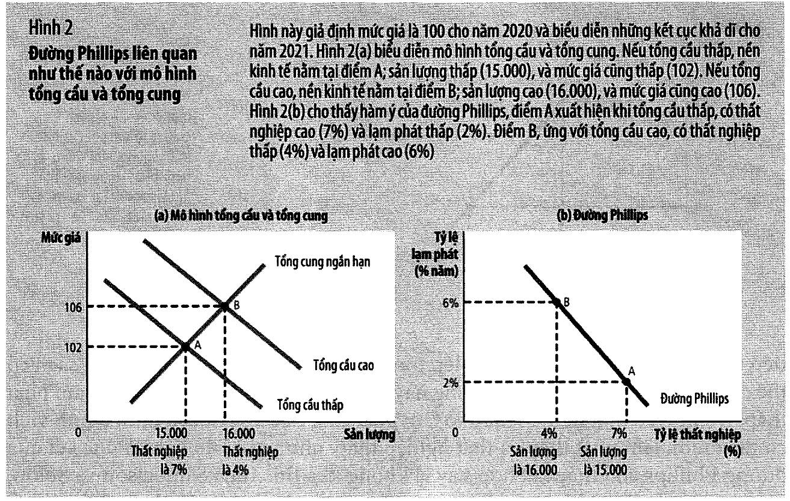

Giả định (tr. 537): mức giá năm **2020 bằng 100**. Năm 2021 có hai khả năng tuỳ sức mạnh tổng cầu.

| Kết cục | Sản lượng | Mức giá 2021 | Lạm phát | Thất nghiệp |
| ------- | --------- | ------------ | -------- | ----------- |
| **A** — tổng cầu **thấp** | 15.000 | 102 | **2%** | **7%** |
| **B** — tổng cầu **cao** | 16.000 | 106 | **6%** | **4%** |

✅ $(102-100)/100 = 2\%$ và $(106-100)/100 = 6\%$ — khớp tr. 538 đúng từng con số.
✅ Hai cặp $(7\%, 2\%)$ và $(4\%, 6\%)$ chính là hai điểm A và B của Hình 1 (tr. 537).

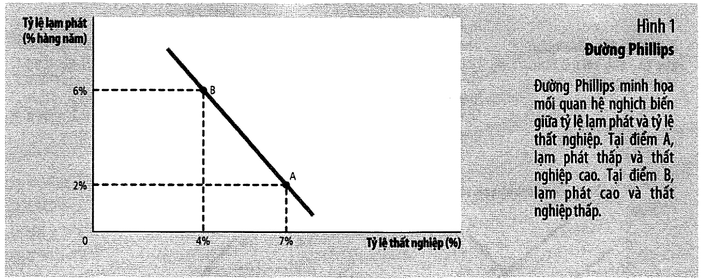

Bốn bước sách đi, viết liền một mạch:

```
tổng cầu CAO ⟹ sản lượng CAO ⟹ cần nhiều lao động ⟹ thất nghiệp THẤP
             ⟹ mức giá CAO   ⟹ lạm phát CAO
```

⟹ thất nghiệp và lạm phát đi **ngược chiều**. Đó là đường Phillips.

⭐ Vậy nên nhớ một điều: **đường Phillips không phải một lý thuyết mới.** Nó là mô hình AD–AS của
[bài 11](bai_11_tong_cau_va_tong_cung.md#8-công-thức-của-sách-và-mô-hình-bằng-số) vẽ trên một hệ
trục khác:

| Mô hình AD–AS | Đường Phillips |
| ------------- | -------------- |
| trục hoành: **sản lượng** | trục hoành: **thất nghiệp** (nghịch đảo của sản lượng) |
| trục tung: **mức giá** $P$ | trục tung: **tốc độ tăng** của $P$ |

⚠️ Dòng thứ hai là chỗ dễ trượt nhất. Đổi từ *mức* sang *tốc độ tăng* là một phép đạo hàm, và nó là
lý do mọi kết luận của chương này đều nói về **thay đổi**, không nói về **trạng thái**.

> *"Vì chính sách tiền tệ và chính sách tài khóa có thể dịch chuyển đường tổng cầu, chúng cũng làm
> dịch chuyển nền kinh tế **dọc theo** đường Phillips."* (tr. 538)

📌 Chữ **"dọc theo"** ở đây quan trọng. Suốt phần còn lại của chương, câu hỏi luôn là: ta đang **đi
dọc theo** một đường, hay **cả đường đang dịch**?

---

## 4. 📚 Hệ số Okun ẩn trong chính ví dụ của sách

⚠️ Mục này **không có trong sách**, nhưng mọi nguyên liệu đều là của sách.

Hình 2 cho **cả sản lượng lẫn thất nghiệp** cho cùng hai kết cục. Sách đặt bốn con số ấy cạnh nhau
trong một hình và không bao giờ chia chúng cho nhau. Ta chia:

| Đại lượng | A | B | Chênh |
| --------- | - | - | ----- |
| sản lượng | 15.000 | 16.000 | **+6,67%** |
| thất nghiệp | 7% | 4% | **−3 điểm** |

$$\frac{6{,}67\%}{3 \text{ điểm}} = 2{,}22 \text{ phần trăm sản lượng mỗi điểm thất nghiệp}$$

✅ Trong kinh tế học con số này có tên: **định luật Okun** (*Okun's law*). Ước lượng kinh điển là
khoảng **2**. Ví dụ của sách cho **2,22** — rất gần.

⭐ **Vì sao đáng bỏ công tính:** nó là **cầu nối giữa hai đơn vị đo**. Chương này đo cái giá của
giảm lạm phát bằng **phần trăm sản lượng** (tỷ lệ hy sinh, [mục 10](#10-tỷ-lệ-hy-sinh--số-học-của-volcker)),
nhưng số liệu lịch sử mà sách in ra lại là **điểm thất nghiệp** ([mục 14](#14-volcker-greenspan-và-khủng-hoảng-2008)).
Không có hệ số này thì hai mục đó **không so sánh được với nhau** — và [mục 11](#11--tỷ-lệ-hy-sinh-thực-tế-của-volcker)
sẽ dùng đúng nó để làm một phép tính mà sách khẳng định bằng lời nhưng không bao giờ đặt con số.

⚠️ **Ranh giới:** bốn con số đầu vào là **của sách** (Hình 2, tr. 537–538). Phép chia là **của bài
này**.

---

## 5. Friedman–Phelps: đường Phillips dài hạn dốc đứng

Lập luận của Friedman và Phelps năm 1968 **không dựa trên số liệu mới**. Nó dựa trên lý thuyết cổ
điển mà [bài 8](bai_08_tang_truong_tien_va_lam_phat.md#5-phân-đôi-cổ-điển-và-tính-trung-lập-của-tiền)
đã dựng:

```
tăng trưởng cung tiền  ⟹ quyết định LẠM PHÁT
tăng trưởng cung tiền  ⟹ KHÔNG chạm các biến THỰC
⟹ không có lý do gì để lạm phát liên quan đến thất nghiệp trong DÀI HẠN
```

Sách trích nguyên văn Friedman (tr. 539). Đoạn này đáng đọc kỹ:

> *"Cơ quan tiền tệ trực tiếp kiểm soát lượng tiền danh nghĩa, lượng nợ của mình… Về nguyên tắc, họ
> có thể sử dụng quyền kiểm soát này để **cố định các đại lượng danh nghĩa** — như tỷ giá hối đoái,
> mức giá, mức thu nhập quốc dân danh nghĩa, lượng tiền theo định nghĩa này hay định nghĩa khác —
> hoặc để cố định sự thay đổi của một đại lượng danh nghĩa… Họ **không thể** sử dụng quyền kiểm
> soát của mình đối với những đại lượng danh nghĩa để cố định **các đại lượng thực** — như lãi suất
> thực, tỷ lệ thất nghiệp, thu nhập quốc dân thực, lượng tiền thực…"*

⭐ Đó chính là **sự phân đôi cổ điển** của
[bài 8 mục 5](bai_08_tang_truong_tien_va_lam_phat.md#5-phân-đôi-cổ-điển-và-tính-trung-lập-của-tiền),
phát biểu lại bằng ngôn ngữ chính sách: **công cụ danh nghĩa chỉ mua được kết quả danh nghĩa.**

Và sách chốt bằng một câu rất mạnh (tr. 540):

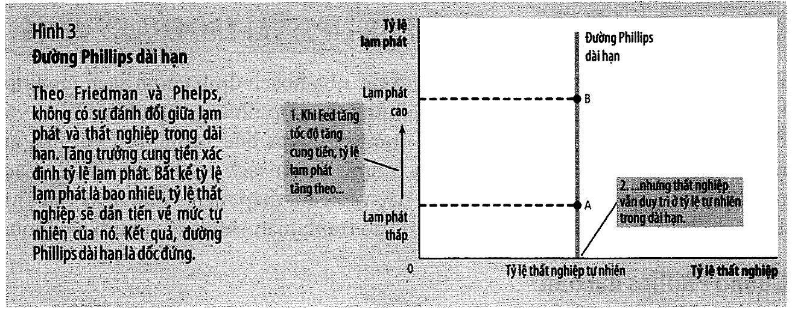

> *"đường tổng cung dài hạn dốc đứng và đường Phillips dài hạn dốc đứng là **hai mặt của một vấn
> đề**."*

📌 Đây là lần thứ ba khoá học gặp cụm "hai mặt của một vấn đề" — lần trước là
[bài 7 mục 14](bai_07_he_thong_tien_te.md#14-lãi-suất-liên-ngân-hàng) (cung tiền và lãi suất) và
[bài 9 mục 5](bai_09_kinh_te_mo_khai_niem_co_ban.md#5-nco--nx--đồng-nhất-thức-thứ-tư-của-khoá-này)
(NCO và NX). Mỗi lần đều đáng dừng lại: hai đồ thị nhìn khác nhau nhưng chứa **cùng một** thông tin.

Sách chốt phần này (tr. 540):

> *"**Bất kể Fed theo đuổi chính sách tiền tệ nào, sản lượng và thất nghiệp đều ở mức tự nhiên của
> chúng trong dài hạn.**"*

---

## 6. Ý nghĩa của từ "tự nhiên"

⚠️ Đây là chỗ dễ hiểu sai nhất của cả chương, và sách cảnh báo thẳng (tr. 540):

> *"tỷ lệ thất nghiệp tự nhiên **không nhất thiết** là tỷ lệ thất nghiệp **mong đợi về mặt xã
> hội**, và tỷ lệ thất nghiệp tự nhiên cũng **không bất biến theo thời gian**."*

Ví dụ sách đưa (tr. 541): một nghiệp đoàn mới thành lập dùng quyền lực thị trường đẩy tiền lương
thực lên cao hơn mức cân bằng ⟹ cung lao động dư thừa ⟹ thất nghiệp tự nhiên **cao hơn**.

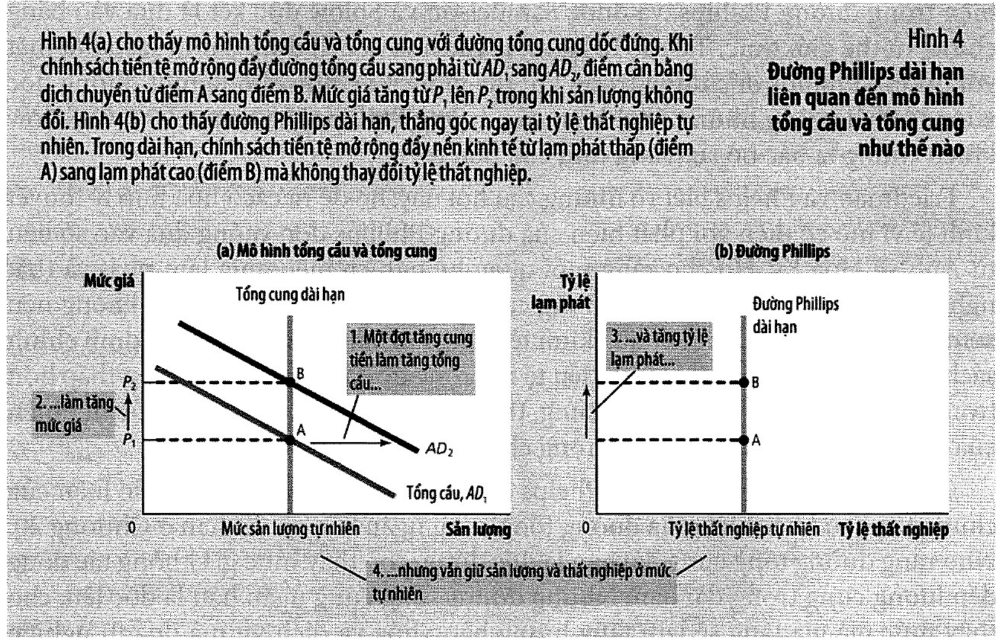

> *"Mức thất nghiệp này là tự nhiên **không phải vì nó tốt** mà vì nó **nằm ngoài phạm vi ảnh
> hưởng của chính sách tiền tệ**."*

⭐ Vậy **"tự nhiên" = "tiền tệ không với tới"**, chứ không phải "tối ưu", cũng không phải "không
thể đổi".

Chính sách **khác** thì đổi được, và sách liệt kê chúng — đúng bốn thứ mà
[bài 6](bai_06_that_nghiep.md#6-bốn-nguyên-nhân-của-thất-nghiệp-dài-hạn) đã dành cả chương để mô tả:

| Công cụ | Bài 6 |
| ------- | ----- |
| quy định tiền lương tối thiểu | [mục 8](bai_06_that_nghiep.md#8-nguyên-nhân-2--luật-lương-tối-thiểu) |
| quy định đàm phán tập thể | [mục 9](bai_06_that_nghiep.md#9-nguyên-nhân-3--công-đoàn-và-thương-lượng-tập-thể) |
| bảo hiểm thất nghiệp | [mục 7](bai_06_that_nghiep.md#7-nguyên-nhân-1--tìm-việc-và-bảo-hiểm-thất-nghiệp) |
| chương trình đào tạo nghề | [mục 7](bai_06_that_nghiep.md#7-nguyên-nhân-1--tìm-việc-và-bảo-hiểm-thất-nghiệp) |

> *"Một thay đổi chính sách làm giảm tỷ lệ thất nghiệp tự nhiên sẽ đẩy đường Phillips **dài hạn**
> sang trái… và đường tổng cung dài hạn sẽ dịch sang phải. Nền kinh tế đạt được thất nghiệp thấp
> hơn và sản lượng cao hơn **ở tốc độ tăng trưởng tiền và lạm phát bất kỳ**."* (tr. 541)

⭐ Đó là một kết luận chính sách rất mạnh mà sách chỉ nói một câu: **muốn thất nghiệp thấp hơn một
cách bền vững thì không được dùng ngân hàng trung ương.** Phải dùng chính sách thị trường lao động.

---

## 7. Phương trình đường Phillips ngắn hạn

Sách tóm cả phân tích Friedman–Phelps vào **một phương trình** (tr. 543):

$$u = u^n - a \times (\pi - \pi^e)$$

| Ký hiệu | Nghĩa |
| ------- | ----- |
| $u$ | tỷ lệ thất nghiệp |
| $u^n$ | tỷ lệ thất nghiệp **tự nhiên** |
| $\pi$ | lạm phát **thực tế** |
| $\pi^e$ | lạm phát **kỳ vọng** |
| $a$ | tham số đo mức phản ứng của thất nghiệp trước lạm phát ngoài dự kiến |

Sách nói rõ nó là gì (tr. 543):

> *"Phương trình này (về bản chất, là cách thể hiện khác của phương trình tổng cung mà chúng ta đã
> thấy trước đây)…"*

📌 So với công thức tổng cung của
[bài 11 mục 8](bai_11_tong_cau_va_tong_cung.md#8-công-thức-của-sách-và-mô-hình-bằng-số):

$$Y = Y^n + a(P - P^e)$$

Cùng một cấu trúc: **biến thực = mức tự nhiên + hệ số × (bất ngờ danh nghĩa)**. Chỉ đổi $Y \to u$
(và đảo dấu, vì thất nghiệp đi ngược sản lượng) và $P \to \pi$.

⚠️ **Sách không cho giá trị của $a$.** Mô hình số trong bài này đặt $a = 0{,}5$ để có con số cụ thể.
**Hướng** của mọi kết luận không phụ thuộc $a$; chỉ **độ lớn** thì phụ thuộc — và
[mục 16](#16--quét-tham-số-kết-luận-có-bền-không) chứng minh điều đó bằng `assert`.

### Bài tập 2 tr. 557

Thất nghiệp tự nhiên 6%. Bốn tình huống:

| | Lạm phát | Kỳ vọng | Thất nghiệp | Kết luận |
| - | -------- | ------- | ----------- | -------- |
| (a) | 5% | 3% | **5,0%** | lạm phát ngoài dự kiến ⟹ $u$ **dưới** tự nhiên |
| (b) | 3% | 5% | **7,0%** | lạm phát thấp hơn dự kiến ⟹ $u$ **trên** tự nhiên |
| (c) | 5% | 5% | **6,0%** | khớp kỳ vọng ⟹ $u$ đúng bằng tự nhiên |
| (d) | 3% | 3% | **6,0%** | khớp kỳ vọng ⟹ $u$ đúng bằng tự nhiên |

✅ **(c) và (d) cho cùng một tỷ lệ thất nghiệp** dù lạm phát khác nhau — 5% và 3%. Đó chính là
đường Phillips **dài hạn** dốc đứng, nhìn từ phương trình.

⭐ Bài học của cả phương trình nằm ở **dấu trừ trong ngoặc**: cái đẩy thất nghiệp xuống dưới tự
nhiên **không phải** lạm phát **cao**, mà là lạm phát **cao hơn người ta tưởng**. Một nền kinh tế
lạm phát 100% ổn định suốt hai mươi năm có thất nghiệp đúng bằng mức tự nhiên.

📌 Câu đó chính là điều Friedman viết năm 1968, và [mục 15](#15-kết-luận--friedman-1968) sẽ trích
nguyên văn.

---

## 8. ⭐ Đường đi A → B → C: vì sao đánh đổi chỉ là tạm thời

Đây là **cơ chế trung tâm** của cả chương (Hình 5, tr. 543–544).

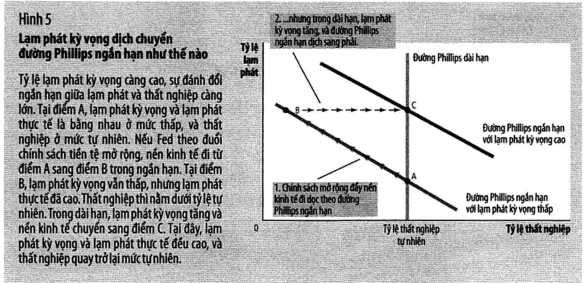

Sách kể câu chuyện bằng lời; ta chạy nó bằng số. Nền kinh tế bắt đầu ở **điểm A**: lạm phát 2%, kỳ
vọng 2%, thất nghiệp bằng mức tự nhiên 5%. Nhà hoạch định chính sách quyết định "mua" thất nghiệp
thấp bằng cách đẩy lạm phát lên 6% **và giữ ở đó**.

Kỳ vọng điều chỉnh **thích nghi** — sách nói bằng lời: *"Theo thời gian, người dân sẽ quen với tỷ
lệ lạm phát cao hơn và họ nâng dần kỳ vọng của mình về lạm phát lên"* (tr. 544). Viết thành công
thức (⚠️ công thức này là **của bài này**):

$$\pi^e_{t+1} = \pi^e_t + \lambda(\pi_t - \pi^e_t)$$

| Kỳ | Lạm phát | Kỳ vọng | Thất nghiệp | So với $u^n$ | |
| -: | -------: | ------: | ----------: | -----------: | - |
| 0 | 6,00% | 2,00% | **3,00%** | −2,00 | **A → B** — mua được thất nghiệp thấp |
| 1 | 6,00% | 4,00% | 4,00% | −1,00 | |
| 2 | 6,00% | 5,00% | 4,50% | −0,50 | |
| 4 | 6,00% | 5,75% | 4,88% | −0,12 | |
| 8 | 6,00% | 5,98% | **4,99%** | −0,01 | **C** — hết khuyến mại |

✅ Ngay sau cú sốc thất nghiệp **xuống 3%**, dưới mức tự nhiên.
✅ Sau 8 kỳ thất nghiệp **quay về 5%**.
✅ Lạm phát thì **ở lại 6%**, không quay về 2%.

⟹ **Điểm C: lạm phát cao hơn điểm A, thất nghiệp bằng điểm A.**

⭐ Chính sách đã **mua** thất nghiệp thấp bằng lạm phát cao — nhưng món hàng hết hạn còn hoá đơn
thì vĩnh viễn. Tổng "lợi ích" thu được, đo bằng điểm-kỳ thất nghiệp dưới tự nhiên, là **3,99
điểm-kỳ** — một con số **hữu hạn**. Cái giá: lạm phát cao hơn **4 điểm, vĩnh viễn**.

> **Hữu hạn đổi lấy vĩnh viễn.** Đó là cả lập luận của Friedman–Phelps, viết bằng số.

📌 So với [bài 11 mục 9](bai_11_tong_cau_va_tong_cung.md#9-cú-sốc-tổng-cầu-a--b--c): cùng một chữ
cái A → B → C, cùng một logic *"ngắn hạn được, dài hạn mất"*. Khác một chỗ quan trọng: ở bài 11,
điểm C có **mức giá** cao hơn; ở đây, điểm C có **tốc độ tăng giá** cao hơn — và cái sau thì không
bao giờ hết.

⚠️ Và sách cảnh báo đúng cái bẫy tâm lý của điểm B (tr. 544):

> *"các nhà hoạch định chính sách có thể cho rằng họ đã đạt được mức thất nghiệp thấp hơn **vĩnh
> viễn**, với cái giá là lạm phát cao hơn, đây là sự trao đổi — nếu có thể — là đáng để thực hiện."*

Điểm B trông giống một thành công. Nó chỉ lộ ra là một khoản vay khi ta tới điểm C.

---

## 9. Cú sốc cung và đình lạm

⚠️ Đây là nguồn dịch chuyển **thứ hai** của đường Phillips, và nó khác hẳn nguồn thứ nhất:

| Nguồn | Cái gì đổi | Mục |
| ----- | ---------- | --- |
| **kỳ vọng** | $\pi^e$ trong phương trình | [mục 8](#8--đường-đi-a--b--c-vì-sao-đánh-đổi-chỉ-là-tạm-thời) |
| **cú sốc cung** | chi phí sản xuất ⟹ cả đường AS **và** đường Phillips | mục này |

> **Cú sốc cung** (tr. 547, chú thích): *"sự kiện trực tiếp làm thay đổi chi phí và giá cả của doanh
> nghiệp, làm dịch chuyển đường tổng cung của nền kinh tế và đường Phillips."*

Sự kiện, theo sách:

| Năm | Việc gì | Giá dầu |
| --- | ------- | ------- |
| **1974** | OPEC hạn chế lượng dầu thô bơm lên | *"gần như gấp đôi"* (tr. 546–547) |
| **1979** | OPEC *"một lần nữa thể hiện sức mạnh thị trường"* | *"hơn gấp đôi"* (tr. 548) |

Kết quả: sản lượng **giảm** (*stagnation*) + giá cả **tăng** (*inflation*) = **đình lạm**
(*stagflation*).

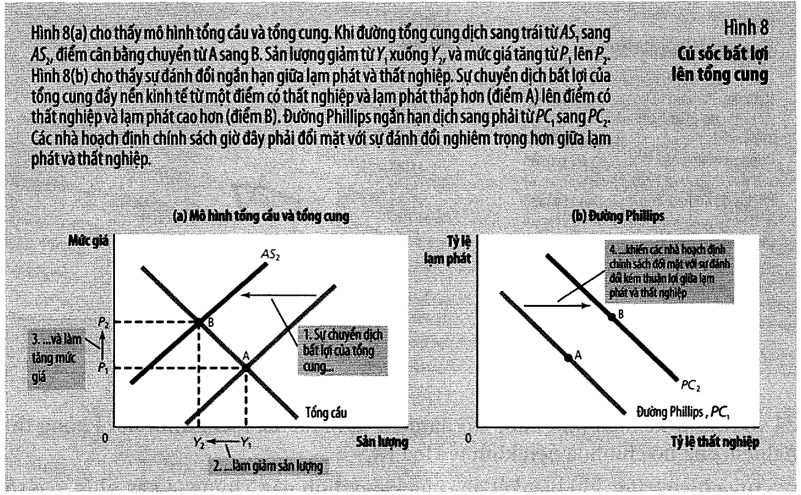

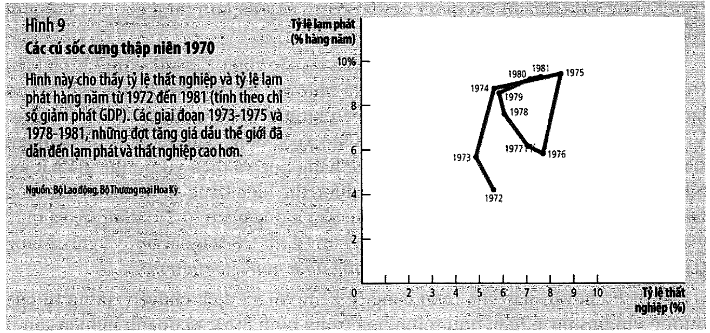

📌 Đây chính là cú sốc tổng cung bất lợi mà
[bài 11 mục 10](bai_11_tong_cau_va_tong_cung.md#10-cú-sốc-tổng-cung-đình-lạm) đã dựng bằng số. Bài
này chỉ vẽ lại nó trên hệ trục lạm phát–thất nghiệp.

### Vì sao cú sốc cung khó hơn cú sốc cầu

| Lựa chọn của nhà hoạch định | Lạm phát | Thất nghiệp |
| --------------------------- | -------- | ----------- |
| chống lạm phát (thu hẹp cầu) | 2,0% | **9,5%** |
| không làm gì | 5,0% | 8,0% |
| chống thất nghiệp (mở rộng cầu) | 8,0% | **6,5%** |

⚠️ Đọc cột cuối cùng cột kề cuối: **không có dòng nào tốt hơn tất cả các dòng khác.** Đó là định
nghĩa của một sự **đánh đổi tệ hơn**, chứ không phải một bài toán khó hơn.

Sách viết chính xác điều đó (tr. 547):

> *"họ phải chấp nhận tỷ lệ lạm phát cao hơn đối với tỷ lệ thất nghiệp cho trước, **hoặc** tỷ lệ
> thất nghiệp cao hơn ứng với tỷ lệ lạm phát cho trước, **hoặc** một số kết hợp vừa thất nghiệp cao
> hơn lẫn lạm phát cao hơn."*

⭐ Câu hỏi quyết định **không phải** "nên chọn dòng nào" mà là: **cú sốc này tạm thời hay vĩnh
viễn?** Sách trả lời: nó phụ thuộc vào **kỳ vọng** (tr. 547).

| Công chúng tin gì | Kỳ vọng | Đường Phillips |
| ----------------- | ------- | -------------- |
| *"chỉ một lần thôi"* | không đổi | *"sớm quay trở lại vị trí ban đầu"* |
| *"một kỷ nguyên mới lạm phát cao"* | **tăng** | *"vẫn ở vị trí mới, ít được mong đợi"* |

⚠️ Và Fed thập niên 1970 đã làm kỳ vọng **tăng**. Sách nói rõ Fed **"thích ứng"** với cú sốc cung
bằng cách tăng cung tiền cao hơn (tr. 547–548) — để ngăn sản lượng giảm. Đổi lại:

> *"đợt suy thoái do cú sốc cung gây ra sẽ bớt nghiêm trọng hơn so với khi không có chính sách,
> nhưng nền kinh tế Hoa Kỳ đã đối mặt với sự đánh đổi không thuận lợi giữa lạm phát và thất nghiệp
> **trong nhiều năm**."*

⭐ Đó là một trong những câu đắt nhất của cả sách: chính sách **thích ứng** đã đổi một cơn đau ngắn
lấy một thập niên khó chịu. Không phải vì nó sai về mặt cơ học, mà vì nó đã dạy công chúng kỳ vọng
lạm phát cao.

---

## 10. Tỷ lệ hy sinh — số học của Volcker

Tháng 10 năm 1979, Paul Volcker nhậm chức chủ tịch Fed khi lạm phát gần 10%.

> *"Là vệ sĩ của hệ thống tiền tệ quốc gia, ông biết mình có ít chọn lựa trừ việc theo đuổi chính
> sách giảm lạm phát."* (tr. 548)

⚠️ Sách phân biệt rõ hai từ rất dễ lẫn (tr. 549) — nên nhớ, vì nhiều bản dịch dùng lẫn:

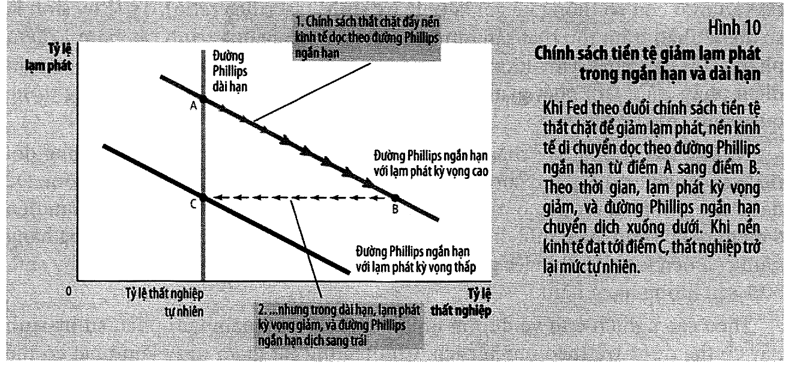

| Từ | Tiếng Anh | Nghĩa | Ví von của sách |
| -- | --------- | ----- | --------------- |
| **giảm lạm phát** | *disinflation* | giảm **tốc độ** tăng giá | *"giống như giảm tốc độ của ô tô"* |
| **giảm phát** | *deflation* | mức giá **sụt giảm** | *"giống như lùi xe"* |

Chương này nói về cái **thứ nhất**.
[Bài 8 mục 14](bai_08_tang_truong_tien_va_lam_phat.md#14-giảm-phát-và-phù-thuỷ-xứ-oz) nói về cái
thứ hai.

> **Tỷ lệ hy sinh** (*sacrifice ratio*, tr. 550, chú thích): *"số điểm phần trăm tổn thất sản lượng
> hàng năm trong quá trình giảm lạm phát 1 điểm phần trăm."*
> Ước lượng tiêu biểu: **5**.

### Phép tính của sách

| Bước | Con số |
| ---- | ------ |
| lạm phát cần giảm | 10% → 4% = **6 điểm** |
| tỷ lệ hy sinh | **5** |
| ⟹ tổng sản lượng phải bỏ | **30%** |

✅ Khớp tr. 550: *"việc giảm lạm phát 6 điểm phần trăm sẽ đòi hỏi hy sinh 30% sản lượng hàng năm."*

Sách nêu ba lịch trình, và chúng **luôn cộng lại bằng 30%** (tr. 550):

| Lịch trình | Số năm | Sản lượng thấp hơn xu hướng | Tổng |
| ---------- | -----: | --------------------------: | ---: |
| cắt ngay | 1 | 30% | **30%** |
| dàn ra 5 năm | 5 | 6% | **30%** |
| dàn ra 10 năm | 10 | 3% | **30%** |

✅ Cả ba đều bằng 30%.

> *"bất kể hướng đi nào được chọn, thì việc cắt giảm lạm phát cũng không hề dễ dàng."* (tr. 550)

⭐ Và chú ý điều con số 30% **không** nói: nó không nói **ai chịu**.
[Mục 11](#11--tỷ-lệ-hy-sinh-thực-tế-của-volcker) và
[bài 14](bai_14_sau_tranh_luan_chinh_sach.md) sẽ quay lại đúng chỗ này — và đó là chỗ số học này
khác hẳn một bài toán trên giấy.

---

## 11. ⭐ Tỷ lệ hy sinh thực tế của Volcker

⚠️ Mục này là **phép tính của bài này**. Mọi con số đầu vào đều là **của sách**, nhưng sách không
bao giờ nhân chúng với nhau.

Sách ghi một câu rất kín đáo (tr. 552):

> *"Đa số những ước tính về tỷ lệ hy sinh dựa vào chính sách giảm lạm phát của Volcker đều **nhỏ
> hơn** các ước tính có được từ những số liệu trước đây."*

**Nhỏ hơn bao nhiêu** thì sách không nói. Nhưng sách đã in đủ nguyên liệu — ở ba trang khác nhau.

| Đầu vào | Giá trị | Nguồn |
| ------- | ------- | ----- |
| thất nghiệp 1982–83 | ~10% | tr. 552 |
| vượt mức tự nhiên | **4 điểm** | tr. 552 |
| số năm | **2** | tr. 552 |
| lạm phát giảm được | gần 10% → 4% = **6 điểm** | tr. 551 |
| hệ số Okun | **2,22** | Hình 2, tr. 537–538 → [mục 4](#4--hệ-số-okun-ẩn-trong-chính-ví-dụ-của-sách) |

$$\text{tỷ lệ hy sinh thực tế} = \frac{4 \times 2 \times 2{,}22}{6} = \frac{17{,}8\%}{6} = \mathbf{2{,}96}$$

✅ **2,96 — chỉ bằng 59% con số dự báo 5,00.** Đúng như sách khẳng định bằng lời.

⭐ Và đây là chỗ hay nhất của cả chương: **hai trường phái đều sai một nửa.**

| Trường phái | Dự báo | Thực tế |
| ----------- | ------ | ------- |
| tỷ lệ hy sinh (số liệu trước 1979) | **5,0** | quá **bi quan** |
| kỳ vọng hợp lý (Lucas, Sargent, Barro) | **~0** | quá **lạc quan** |
| | | thực tế: **2,96** |

Sách giải thích vì sao không ai đạt 0 (tr. 552):

> *"mặc dù Volcker tuyên bố rằng ông sẽ nhắm chính sách tiền tệ vào việc giảm lạm phát, **phần lớn
> dân chúng không tin ông**. Vì ít có ai tin rằng Volcker sẽ giảm lạm phát nhanh như ông làm được,
> do đó lạm phát kỳ vọng không giảm, và đường Phillips ngắn hạn không dịch chuyển xuống nhanh như
> lẽ ra nó có thể."*

Và sách còn dẫn một bằng chứng đo được:

> *"dự báo lạm phát của các công ty dự báo thương mại đi xuống chậm hơn trong thập niên 1980 so với
> lạm phát thực tế."* (tr. 552)

⟹ **Kỳ vọng hợp lý không sai về lý thuyết.** Cái thiếu là **sự tín nhiệm** — và tín nhiệm thì
không tuyên bố một câu là có.

📌 Đó là kết luận sẽ trở lại thành cả một tranh luận chính sách ở
[bài 14](bai_14_sau_tranh_luan_chinh_sach.md) (quy tắc hay tuỳ nghi).

---

## 12. ⭐ Cái giá phụ thuộc tốc độ kỳ vọng

Nếu tín nhiệm quyết định cái giá, thì ta nên **đo** quan hệ đó. Bài tập 6 và 8 tr. 558 hỏi đúng
điều này bằng ba cách khác nhau.

Chạy cùng một chính sách giảm lạm phát (10% → 5%) với các tốc độ $\lambda$ khác nhau:

| $\lambda$ | Nghĩa | Đỉnh thất nghiệp | Tổng điểm-kỳ dư |
| --------: | ----- | ---------------: | --------------: |
| **1,00** | tức thì — kỳ vọng hợp lý | 5,00% | **0,00** |
| 0,75 | rất nhanh | 5,62% | 0,83 |
| 0,50 | vừa | 6,25% | 2,50 |
| 0,25 | chậm — "sức ỳ" của James | 6,88% | 7,50 |
| 0,10 | rất chậm | 7,25% | **22,17** |

✅ Cột cuối tăng đơn điệu khi $\lambda$ giảm ⟹ kỳ vọng càng ỳ, giảm lạm phát càng đắt. Chênh lệch
giữa dòng đầu và dòng cuối là **hơn 22 điểm-kỳ**, tức là cùng một chính sách có thể **miễn phí**
hoặc **rất đắt** tuỳ hoàn toàn vào một biến số nằm trong đầu công chúng.

✅ $\lambda = 1{,}00$ cho tổng **0,00** — đúng là kết luận của phe kỳ vọng hợp lý (tr. 550–551):

> *"Theo Sargent, tỷ lệ hy sinh có thể nhỏ hơn nhiều so với những gì mà các ước tính trước đây đề
> cập. Thật vậy, trong trường hợp cực đoan nhất, **nó có thể là zero**."*

### Bài tập 6 tr. 558

Lạm phát 10%, ngân hàng trung ương muốn giảm về 5%. Milton tin kỳ vọng điều chỉnh nhanh; James tin
kỳ vọng có *"sức ỳ rất lớn"*.

⟹ **Milton ủng hộ** đề xuất, vì với kỳ vọng nhanh thì cái giá gần như bằng không. **James phản
đối**, vì với sức ỳ lớn thì cái giá lớn.

### Bài tập 8 tr. 558

Cả ba ý đều đọc được từ **cùng một bảng trên**:

| | Điều kiện | $\lambda$ | Suy thoái |
| - | --------- | --------- | --------- |
| (a) | hợp đồng tiền lương có thời hạn **ngắn** | lớn | **nhẹ hơn** |
| (b) | người dân **ít tin** vào nỗ lực của Fed | nhỏ | **nặng hơn** |
| (c) | kỳ vọng điều chỉnh **nhanh** theo lạm phát thực tế | lớn | **nhẹ hơn** |

⭐ Cả ba đều là **cùng một biến số**. Đó là lý do sách gom chúng vào một câu hỏi.

📌 Và nó trả lời luôn **bài tập 7 tr. 558** — vì sao ngân hàng trung ương **độc lập** giảm được chi
phí chống lạm phát:

> *"Nhiều nhà kinh tế tin rằng các nước có thể giảm chi phí giảm lạm phát bằng cách cho phép ngân
> hàng trung ương ra quyết định chính sách tiền tệ mà không chịu sự can thiệp của các chính trị
> gia. Tại sao có thể như vậy?"* (tr. 558)

⟹ Không phải vì họ giỏi hơn, mà vì cam kết của họ **đáng tin hơn** ⟹ $\lambda$ lớn hơn ⟹ cột cuối
nhỏ hơn. Một lập luận **thể chế** dựa trên một **tham số kỹ thuật**.

---

## 13. Thí nghiệm tự nhiên 1961-1973

⚠️ Đoạn lịch sử này phải đọc theo **đúng thứ tự thời gian**, vì cả sức nặng nằm ở chỗ: **dự báo có
trước, số liệu xác nhận có sau.**

| Giai đoạn | Hình | Việc gì |
| --------- | ---- | ------- |
| **1961–1968** | Hình 6 | số liệu *"trải ra thành đường Phillips **hoàn hảo**"*. Lạm phát tăng trong 8 năm, thất nghiệp giảm |
| **1968** | — | Friedman và Phelps dự báo *"thẳng thừng"*: tận dụng đánh đổi này *"chỉ thành công có tính tạm thời"* |
| **1970–1973** | Hình 7 | đường Phillips *"gãy đổ"*. Cả hai cùng tăng |
| **1973** | — | *"các nhà hoạch định chính sách mới hiểu được rằng Friedman và Phelps đã đúng"* (tr. 546) |

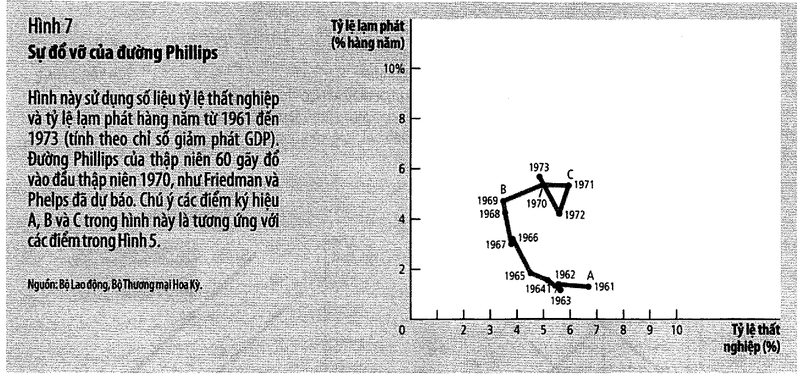

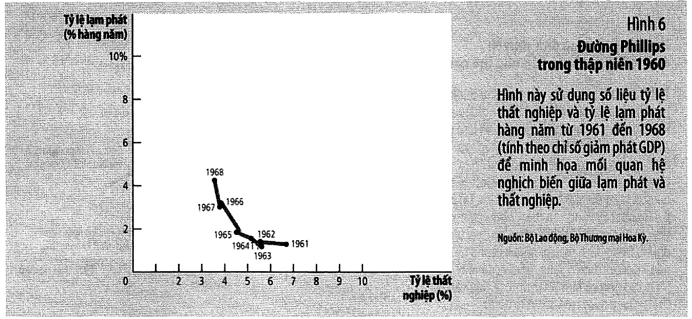

⭐ Sách nhận xét một điều đáng chú ý (tr. 546): Hình 7 (số liệu **thật**) *"trông giống như"* Hình 5
(lý thuyết **vẽ tay**). Rất hiếm khi một dự báo lý thuyết được thực tế vẽ lại gần như đúng hình.

### Nguyên nhân sách cho — hai vế

| Vế | Nội dung (tr. 545) |
| -- | ------------------ |
| **tài khoá** | *"chi tiêu của chính phủ tăng mạnh khi chiến tranh Việt Nam leo thang"* |
| **tiền tệ** | *"vì Fed đang cố gắng kìm hãm lãi suất trước chính sách tài khóa mở rộng, cung tiền (tính bằng $M_2$) tăng khoảng **13% mỗi năm** trong giai đoạn từ năm 1970 đến 1972 so với **7% mỗi năm** trong những năm đầu thập niên 1960"* |

Kết quả lạm phát (tr. 545): **5–6%/năm** cuối thập niên 1960 và đầu 1970, so với **1–2%/năm** đầu
thập niên 1960.

### 📚 Ghép hai vế bằng phương trình của bài 8

⚠️ Phép ghép này là **của bài này**. Sách đặt hai con số cạnh nhau nhưng không nói chúng phải khớp
qua phương trình số lượng tiền.

| Đại lượng | Đầu 1960s | 1970–72 | Chênh |
| --------- | --------- | ------- | ----- |
| tăng trưởng cung tiền | 7% | 13% | **+6 điểm** |
| lạm phát | 1–2% | 5–6% | **+4 điểm** |

Từ [bài 8 mục 4](bai_08_tang_truong_tien_va_lam_phat.md#4--viết-năm-bước-ấy-thành-một-dòng):

$$\%\Delta P \approx \%\Delta M + \%\Delta V - \%\Delta Y$$

Cung tiền tăng thêm 6 điểm nhưng lạm phát chỉ tăng thêm 4 điểm. **2 điểm còn lại phải đi đâu đó** —
vào tăng trưởng sản lượng, hoặc vào vòng quay tiền.

📌 So với [bài 11 mục 11](bai_11_tong_cau_va_tong_cung.md#11-đại-khủng-hoảng--và-một-phép-kiểm-mà-bài-8-chưa-làm-được):
ở Đại Khủng hoảng ta thấy $V$ **giảm 20,9%**. Ở đây ta thấy một phần dư nhỏ hơn nhiều và cùng dấu.
Kết luận chung cho cả hai: **"$V$ ổn định" là một giả định làm việc, không phải một định luật** —
và nó sẽ trở lại lần cuối ở [bài 14](bai_14_sau_tranh_luan_chinh_sach.md) khi bàn về quy tắc 3%.

---

## 14. Volcker, Greenspan và khủng hoảng 2008

### Volcker (Hình 11, tr. 551–552)

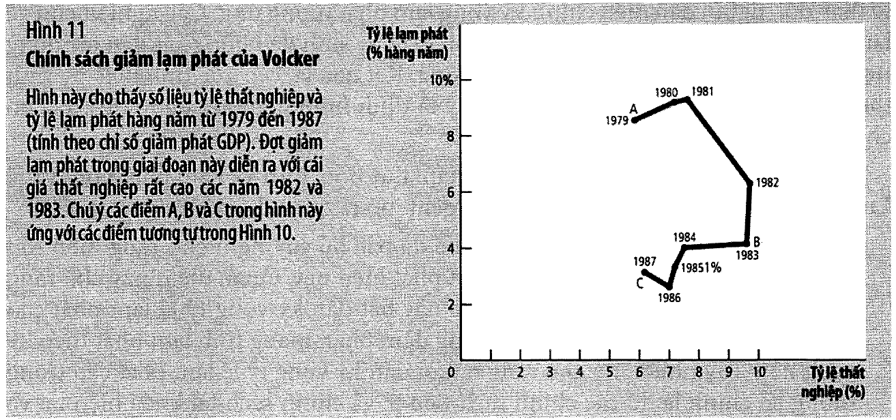

| | |
| - | - |
| **kết quả** | lạm phát gần 10% (1981–82) → **4%** (1983–84). ✅ thành công |
| **cái giá** | thất nghiệp ~10% năm 1982–83, *"đợt suy thoái sâu nhất ở Hoa Kỳ từ thời Đại Khủng hoảng vào những năm 1930"* |

⚠️ Và sách ghi một chi tiết quan trọng: **chính sách tài khoá lúc đó đi ngược lại.** Thâm hụt thời
Reagan **mở rộng** tổng cầu, *"có xu hướng tăng lạm phát"*. Công lao giảm lạm phát *"hoàn toàn
thuộc về chính sách tiền tệ"* (tr. 551).

📌 Đó là một trường hợp thực tế của câu hỏi mở đầu
[bài 12](bai_12_chinh_sach_tien_te_va_tai_khoa.md#1-câu-hỏi-mở-đầu-chương): hai cơ quan đọc nhau —
và ở đây, họ đã đi ngược nhau.

### Greenspan (Hình 12, tr. 553–554)

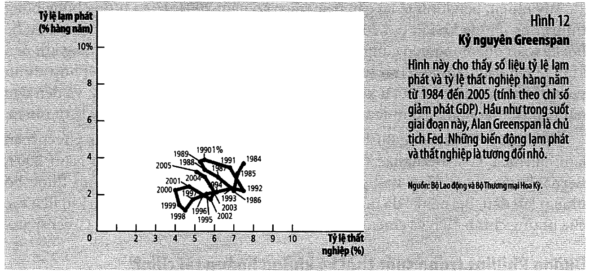

1987–2005. *"Những biến động lạm phát và thất nghiệp là tương đối nhỏ."*

⚠️ Sách rất trung thực về nguyên nhân — **không chỉ tài năng**:

> *"Năm 1986 xảy ra bất đồng giữa các thành viên OPEC về mức sản lượng, và thỏa thuận hạn chế nguồn
> cung lâu dài của họ bắt đầu đổ vỡ. Giá dầu giảm khoảng một nửa."*
> …*"**vận may** dưới dạng cú sốc cung thuận lợi cũng là một phần của câu chuyện này."* (tr. 553)

⭐ Một cú sốc cung **thuận lợi** dịch đường Phillips **vào trong** — cả lạm phát lẫn thất nghiệp
cùng giảm. Đó chính là câu trả lời cho câu hỏi Kiểm tra nhanh tr. 548.

⚠️ Và 1989–1990: thất nghiệp giảm, lạm phát tăng ⟹ Fed **nâng lãi suất** ⟹ suy thoái nhỏ 1991–1992.
Sách ghi rõ đây là Fed **chủ động chấp nhận một cuộc suy thoái** để tránh lặp lại sai lầm thập niên
1960.

### Khủng hoảng 2008–2009 (Hình 13, tr. 554–555)

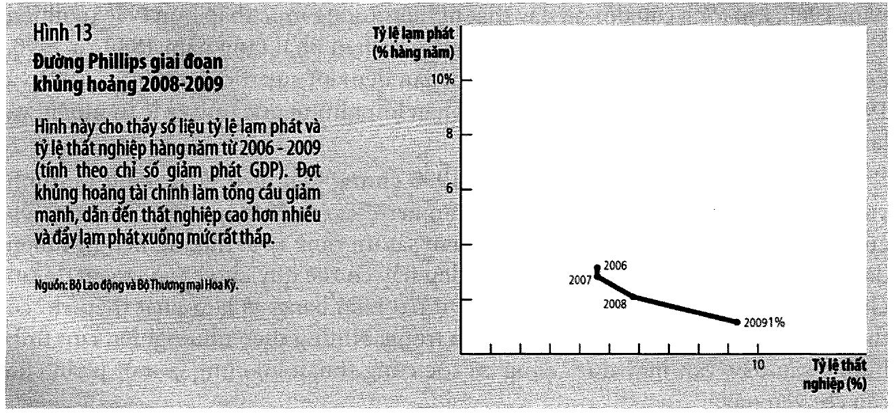

| Giai đoạn | Giá nhà Hoa Kỳ |
| --------- | -------------- |
| 1995–2006 | tăng **hơn gấp đôi** |
| 2006–2009 | giảm **khoảng một phần ba** |

⟹ tổng cầu giảm mạnh ⟹ *"nền kinh tế **trượt theo** đường Phillips **đi xuống**"*: thất nghiệp cao
hơn nhiều, lạm phát xuống mức rất thấp.

⚠️ Sách viết khi kết cục **chưa rõ**, và trung thực về điều đó (tr. 555):

> *"Khi cuốn sách này được biên soạn, người ta vẫn không rõ nền kinh tế sẽ phục hồi nhanh trong bao
> lâu từ đợt khủng hoảng này và liệu lạm phát sẽ cao hơn, thấp hơn hoặc có khả năng xảy ra giảm
> phát hay không."*

### ⭐ Sáu giai đoạn, và câu hỏi kiểm tra duy nhất đáng hỏi

| Giai đoạn | Cái gì dịch | Nguồn |
| --------- | ----------- | ----- |
| 1961–1968 | **đi dọc** theo đường | tổng cầu ([mục 3](#3-adas-sinh-ra-đường-phillips--ví-dụ-bằng-số-của-sách)) |
| 1970–1973 | đường **dịch lên** | kỳ vọng ([mục 8](#8--đường-đi-a--b--c-vì-sao-đánh-đổi-chỉ-là-tạm-thời)) |
| 1974–1981 | đường **dịch ra xa** | cú sốc cung ([mục 9](#9-cú-sốc-cung-và-đình-lạm)) |
| 1982–1984 | đường **dịch xuống** | kỳ vọng giảm ([mục 10](#10-tỷ-lệ-hy-sinh--số-học-của-volcker)) |
| 1986 | đường **dịch vào** | cú sốc cung **thuận lợi** |
| 2008–2009 | **đi dọc** theo đường | tổng cầu sụp ([bài 12](bai_12_chinh_sach_tien_te_va_tai_khoa.md)) |

⚠️ Cột giữa là câu hỏi kiểm tra duy nhất đáng hỏi khi nhìn một biểu đồ lạm phát–thất nghiệp: **đi
dọc theo đường, hay đường dịch?**

---

## 15. Kết luận — Friedman 1968

Sách kết chương bằng một đoạn trích dài của Friedman. Đoạn này đáng thuộc, vì nó chứa cả chương
trong bốn dòng (tr. 555):

> *"**Luôn có** sự đánh đổi **tạm thời** giữa lạm phát và thất nghiệp; **không có** sự đánh đổi
> **vĩnh viễn**. Đánh đổi tạm thời không xuất phát từ **phía lạm phát**, mà từ lạm phát **ngoài dự
> kiến**, nói chung có nghĩa là từ tỷ lệ lạm phát **đang gia tăng**. Quan niệm phổ biến cho rằng có
> sự đánh đổi vĩnh viễn chính là phiên bản phức tạp của sự nhầm lẫn giữa **"cao"** và **"đang
> tăng"**… Tỷ lệ lạm phát **đang tăng** có thể làm giảm thất nghiệp, còn tỷ lệ lạm phát **cao** thì
> không."*

> *"Nhưng bao lâu thì là "tạm thời"?… Tôi chỉ có thể mạo hiểm đưa ra nhận định cá nhân dựa vào một
> số nghiên cứu bằng chứng lịch sử, rằng những tác động ban đầu của tỷ lệ lạm phát cao hơn và ngoài
> dự kiến sẽ kéo dài trong vòng **hai đến năm năm**."*

⭐⭐ **"Cao" khác "đang tăng"** — đó là câu quan trọng nhất của cả chương. Kiểm lại bằng chính mô
hình:

| Nền kinh tế | Lạm phát | Kỳ vọng | Thất nghiệp |
| ----------- | -------- | ------- | ----------- |
| A — lạm phát **ổn định** 2% | 2% | 2% | **5,0%** |
| B — lạm phát **ổn định** 8% | 8% | 8% | **5,0%** |
| C — **đang tăng** 2% → 8% | 8% | 2% | **2,0%** |

✅ A và B **cùng một tỷ lệ thất nghiệp**. "Cao" không mua được gì.
✅ Chỉ khi lạm phát **đang tăng** thì thất nghiệp mới xuống 2%. Và
[mục 8](#8--đường-đi-a--b--c-vì-sao-đánh-đổi-chỉ-là-tạm-thời) đã cho thấy trạng thái C không giữ
được.

Sách chốt (tr. 555):

> *"Ngày nay, gần nửa thế kỷ sau, phát biểu này vẫn tóm tắt đầy đủ quan điểm của hầu hết nhà kinh
> tế vĩ mô."*

📌 Sách cũng liệt kê **năm giải Nobel** trong chương này (tr. 555): Phillips, Samuelson, Solow,
Friedman, Phelps, Lucas, Sargent, Barro — *"Năm người trong số này đã đoạt giải thưởng Nobel cho
các công trình kinh tế học của họ."*

---

## 16. 📚 Quét tham số: kết luận có bền không?

⚠️ Ba tham số $u^n$, $a$, $\lambda$ đều **do bài này đặt ra**. Nếu kết luận của sách phụ thuộc vào
việc chọn đúng chúng thì chúng vô giá trị. Ta quét năm bộ rất khác nhau và kiểm **ba mệnh đề** của
sách bằng `assert`.

| Bộ tham số | $u^n$ | $a$ | $\lambda$ | $u$ ngay sau sốc | $u$ sau 60 kỳ |
| ---------- | ----: | --: | --------: | ---------------: | ------------: |
| gốc | 5,0 | 0,50 | 0,50 | 4,00% | 5,00% |
| $u^n$ cao | 9,0 | 0,50 | 0,50 | 8,00% | 9,00% |
| $a$ lớn | 5,0 | 2,00 | 0,50 | **1,00%** | 5,00% |
| $a$ nhỏ | 5,0 | 0,20 | 0,50 | 4,60% | 5,00% |
| kỳ vọng ỳ | 5,0 | 0,50 | 0,10 | 4,00% | 5,00% |

Ba mệnh đề được `assert` cho **cả năm** bộ:

| # | Mệnh đề | Nghĩa |
| - | ------- | ----- |
| 1 | $\pi = \pi^e \Rightarrow u = u^n$, bất kể mức lạm phát | Phillips **dài hạn** dốc đứng |
| 2 | lạm phát **ngoài dự kiến** ⟹ $u$ xuống dưới $u^n$ | đánh đổi **ngắn hạn** có thật |
| 3 | giữ lạm phát mới đủ lâu ⟹ $u$ quay về $u^n$ | đánh đổi là **tạm thời** |

⭐ Con số thì đổi — cột "$u$ ngay sau sốc" chạy từ 1,00% đến 8,00%. **Hướng thì không.** Đó là ý
nghĩa của một kết luận **định tính**, và là lý do Friedman–Phelps dám đưa ra dự báo năm 1968 khi
chưa có số liệu nào ủng hộ họ.

📌 Cùng một phương pháp đã dùng ở
[bài 10 mục 13](bai_10_ly_thuyet_kinh_te_mo.md#13--kết-luận-có-phụ-thuộc-tham-số-không). Khi mô
hình có tham số bịa, đây là cách duy nhất để biết mình đang chứng minh gì.

---

## 17. 💼 Góc QTKD

⚠️ Toàn bộ mục này **không có trong sách**.

### (a) Câu hỏi duy nhất đáng hỏi khi đọc số liệu lạm phát

Không phải *"lạm phát cao hay thấp"* mà là *"lạm phát có **cao hơn mức mọi người đã tính vào giá**
không"*. Đó là Friedman 1968, dịch sang ngôn ngữ kinh doanh.

| Tình huống | Ảnh hưởng lên biên lợi nhuận |
| ---------- | ---------------------------- |
| lạm phát 8%, hợp đồng đã tính 8% | gần như **không** — mọi giá đã điều chỉnh |
| lạm phát 8%, hợp đồng đã tính 3% | **nặng** — chi phí tăng, giá bán bị khoá |
| lạm phát 3%, hợp đồng đã tính 8% | **lợi** — giá bán đã chốt cao hơn chi phí |

⭐ Hai dòng dưới cùng nguy hiểm **đối xứng** nhau. Doanh nghiệp nào ký hợp đồng dài hạn cố định giá
đều đang **đánh cược vào lạm phát kỳ vọng**, dù có ý thức điều đó hay không.

### (b) Điều khoản trượt giá chính là $\lambda$ của riêng bạn

[Mục 12](#12--cái-giá-phụ-thuộc-tốc-độ-kỳ-vọng) cho thấy $\lambda$ lớn làm cú sốc **rẻ hơn**. Trong
doanh nghiệp, $\lambda$ chính là tốc độ bạn chuyển được thay đổi chi phí vào giá bán.

| Cơ chế | $\lambda$ hiệu dụng | Hậu quả khi có cú sốc chi phí |
| ------ | ------------------- | ----------------------------- |
| hợp đồng 3 năm giá cố định | rất nhỏ | chịu trọn cú sốc |
| hợp đồng 1 năm | nhỏ | chịu phần lớn |
| báo giá lại hàng quý | lớn | chuyển phần lớn |
| điều khoản trượt giá theo CPI | ≈ 1 | chuyển gần hết sang khách |

⚠️ Nhưng $\lambda$ lớn **không miễn phí**: nó chuyển rủi ro sang khách hàng, và khách hàng có thể
đổi sang đối thủ có $\lambda$ nhỏ hơn. Đó là một sự đánh đổi giống hệt sự đánh đổi của cả chương
này — bạn không thoát khỏi rủi ro, bạn chỉ chọn ai giữ nó.

### (c) Tín nhiệm là một tài sản đo được

[Mục 11](#11--tỷ-lệ-hy-sinh-thực-tế-của-volcker): Volcker thất bại ở chỗ *"phần lớn dân chúng không
tin ông"*, và chính chỗ đó làm cái giá đội từ ~0 lên 2,96. Áp vào doanh nghiệp:

```
thông báo tăng giá lần đầu               → khách hàng không tin, tích trữ
thông báo lần thứ ba, đã giữ đúng hẹn ba lần → khách tin, không tích trữ
⟹ chi phí của CÙNG MỘT quyết định giảm dần theo số lần giữ lời
```

⭐ Đó là lập luận kinh tế cho việc **không bao giờ thông báo một chính sách giá mà mình chưa chắc
giữ được**. Cái mất không phải lần này — là $\lambda$ của những lần sau.

### (d) Vị trí của bạn trong chu kỳ chống lạm phát

Khi ngân hàng trung ương thật sự thắt chặt để chống lạm phát ([mục 10](#10-tỷ-lệ-hy-sinh--số-học-của-volcker)),
thứ tự là:

```
lãi suất tăng → cầu giảm → SẢN LƯỢNG giảm → việc làm giảm → LẠM PHÁT giảm
```

**Lạm phát là khâu cuối cùng.** Doanh nghiệp sẽ thấy doanh số giảm **trước khi** báo chí nói *"lạm
phát đã hạ nhiệt"*.

⚠️ Đợi đến khi tin tức xác nhận là đã trễ ít nhất một quý — và
[bài 12 mục 13](bai_12_chinh_sach_tien_te_va_tai_khoa.md#13-nên-dùng-chính-sách-để-bình-ổn-nền-kinh-tế-không)
đã cho biết độ trễ tiền tệ là *"ít nhất 6 tháng"*. [Mục 12](#12--cái-giá-phụ-thuộc-tốc-độ-kỳ-vọng)
cho biết giai đoạn khó chịu kéo dài bao lâu: nó **tỷ lệ nghịch với $\lambda$**.

---

## 18. 📚 Đối chiếu Việt Nam

⚠️ Mục này **không dựa trên nguồn số liệu nào được kiểm chứng trong bài**. Nó nói về **cách đọc**,
không về con số cụ thể.

### (a) Ba chỗ khung của chương khớp kém

| Giả định của chương | Ở Việt Nam |
| ------------------- | ---------- |
| thất nghiệp là biến đo được và biến động | khu vực phi chính thức lớn ⟹ tỷ lệ thất nghiệp chính thức **thấp và ít biến động**, người ta điều chỉnh bằng **giờ làm và thu nhập** chứ không bằng có việc / mất việc |
| lạm phát chủ yếu do **cầu** | rổ CPI có tỷ trọng lớn là **lương thực và năng lượng** ⟹ cú sốc **cung** chiếm tỷ trọng lớn |
| nền kinh tế tương đối **đóng** | độ mở rất cao ⟹ **lạm phát nhập khẩu qua tỷ giá** ([bài 9](bai_09_kinh_te_mo_khai_niem_co_ban.md#10-tỷ-giá-hối-đoái-thực), [bài 10](bai_10_ly_thuyet_kinh_te_mo.md#14--đối-chiếu-việt-nam)) là kênh mạnh |

⭐ **Hệ quả:** một biểu đồ lạm phát–thất nghiệp của Việt Nam **không nên đọc như Hình 6 của sách**.
Biến thay thế đáng theo dõi là **khoảng cách sản lượng** và **tăng trưởng tín dụng**, không phải tỷ
lệ thất nghiệp công bố.

### (b) Nhưng cơ chế kỳ vọng thì vẫn nguyên

[Mục 8](#8--đường-đi-a--b--c-vì-sao-đánh-đổi-chỉ-là-tạm-thời) và
[mục 12](#12--cái-giá-phụ-thuộc-tốc-độ-kỳ-vọng) không dựa trên đặc điểm nào của Hoa Kỳ. Chúng chỉ
cần ba điều:

```
người ta hình thành kỳ vọng · kỳ vọng đi vào hợp đồng · hợp đồng có thời hạn
```

Ba điều đó đúng ở mọi nền kinh tế có tiền tệ.

⟹ Kết luận **chuyển được**: một ngân hàng trung ương muốn hạ lạm phát rẻ thì phải làm cho cam kết
của mình **đáng tin** — đó là cái duy nhất nâng được $\lambda$.

### (c) Điều đáng theo dõi

- **Lạm phát cơ bản** (loại lương thực và năng lượng) so với **lạm phát tổng**: chênh lệch lớn ⟹
  đang là cú sốc **cung**, không phải cú sốc cầu ⟹ đọc theo [mục 9](#9-cú-sốc-cung-và-đình-lạm)
- **Kỳ vọng lạm phát** trong khảo sát doanh nghiệp — đó chính là biến số của
  [mục 12](#12--cái-giá-phụ-thuộc-tốc-độ-kỳ-vọng)
- **Độ bao phủ của điều khoản trượt giá** trong hợp đồng của chính bạn
- **Giá lương thực và giá năng lượng thế giới** — nguồn cú sốc cung, và là biến ngoại sinh với mọi
  chính sách trong nước

---

## 19. Code minh hoạ

> ⚙️ **Chạy:** cần **Python 3.10+**. Lưu file rồi gõ `python3 bai-13-lam-phat-va-that-nghiep.py`.
> Không cần cài gói nào — chỉ dùng thư viện chuẩn. Output tất định.

Bản gốc: [`thuc_hanh/bai-13-lam-phat-va-that-nghiep.py`](../thuc_hanh/bai-13-lam-phat-va-that-nghiep.py).

⚠️ **Ranh giới:** phương trình $u = u^n - a(\pi - \pi^e)$ là **của sách** (tr. 543). Các giá trị
$u^n$, $a$, $\lambda$ là **do bài này đặt ra** — và [mục 16](#16--quét-tham-số-kết-luận-có-bền-không)
quét năm bộ khác nhau để chứng minh kết luận không phụ thuộc chúng.

```python
"""Bai 13 — Su danh doi ngan han giua lam phat va that nghiep
(Mankiw, chuong 22, tr. 535-559).

Chay:  python3 bai-13-lam-phat-va-that-nghiep.py
Chi dung thu vien chuan. Ket qua tat dinh.

Moi con so co chu (tr. NNN) la so SACH IN. Cac assert doi chieu voi chung.
Con so KHONG co (tr. NNN) la do bai nay dat ra de minh hoa co che.

⚠ Chuong 22 CO cho mot phuong trinh (tr. 543):
      Ty le that nghiep = ty le that nghiep tu nhien
                          - a x (lam phat thuc te - lam phat ky vong)
Mo hinh so o day dung DUNG phuong trinh do. He so a va toc do dieu chinh ky
vong lambda la do bai nay dat ra — va muc 12 quet nam bo tham so de cho thay
ket luan DINH TINH cua sach khong doi khi chung doi.
"""

# ===================================================================
# THAM SO
# ===================================================================
# Phuong trinh duong Phillips ngan han cua SACH (tr. 543):
#     u = un - a*(pi - pi_e)
# Tuong duong:  pi = pi_e + (un - u)/a
UN = 5.0        # ty le that nghiep tu nhien (%)   — do bai nay dat
A_PC = 0.5      # he so a trong phuong trinh tr. 543 — do bai nay dat
LAMBDA = 0.5    # toc do ky vong bat kip thuc te   — do bai nay dat


def that_nghiep(pi, pi_e, un=UN, a=A_PC):
    """Phuong trinh duong Phillips ngan han, tr. 543."""
    return un - a * (pi - pi_e)


def lam_phat(u, pi_e, un=UN, a=A_PC):
    """Dao nguoc phuong trinh tren: chinh sach chon u thi lam phat ra bao nhieu."""
    return pi_e + (un - u) / a


def tieu_de(so, ten):
    print(f"[{so}] {ten}")
    print("-" * 78)


# ===================================================================
def chi_so_khon_kho():
    tieu_de(1, "CHI SO KHON KHO — CAU HOI MO CHUONG (tr. 535)")
    print("""
   Sach mo chuong bang mot chi bao ma cac nha binh luan hay dung (tr. 535):

       chi so khon kho = ty le lam phat + ty le that nghiep

   Chuong 6 (bai 6) va chuong 17 (bai 8) da noi: trong DAI HAN hai bien nay
   "hau nhu khong lien quan den nhau" — that nghiep tu nhien do THI TRUONG LAO
   DONG quyet dinh, lam phat do TANG TRUONG CUNG TIEN quyet dinh.

   ⭐ Trong NGAN HAN thi nguoc lai. Ca chuong nay la ve cai "nguoc lai" do.
""".rstrip())
    print()

    # So lieu tr. 548: nam 1980 lam phat hon 9%, that nghiep khoang 7%.
    pi_1980, u_1980 = 9.0, 7.0
    khon_kho_1980 = pi_1980 + u_1980
    assert khon_kho_1980 == 16.0

    # So lieu tr. 548: duong Phillips thap nien 1960 cho u = 7% di kem pi = 1%.
    pi_1960, u_1960 = 1.0, 7.0
    khon_kho_1960 = pi_1960 + u_1960
    assert khon_kho_1960 == 8.0

    print("   Hai lan cung mot muc that nghiep, hai the gioi khac han (tr. 548):")
    print()
    print(f"      {'nam':<8}{'lam phat':>10}{'that nghiep':>14}{'chi so khon kho':>18}")
    print(f"      {'1960s':<8}{pi_1960:>9.0f}%{u_1960:>13.0f}%{khon_kho_1960:>17.0f}")
    print(f"      {'1980':<8}{pi_1980:>9.0f}%{u_1980:>13.0f}%{khon_kho_1980:>17.0f}")
    print()
    print(f"   ✅ Cung 7% that nghiep, chi so khon kho GAP DOI: {khon_kho_1960:.0f} -> "
          f"{khon_kho_1980:.0f}")
    print()
    print("   Sach viet thang (tr. 548): 'trong thap nien 1960, duong Phillips chi ra")
    print("   rang ty le that nghiep 7% co the di kem voi ty le lam phat chi 1%. Lam")
    print("   phat hon 9% la dieu khong the tuong.'")
    print()
    print("   ⭐ Do la ca chuong nay trong mot dong: duong Phillips KHONG DUNG YEN.")
    print("   Cai gia phai tra cho mot muc that nghiep khong doi da tang gap doi.")
    print()
    print("   📌 Va no co he qua chinh tri that: 'Chinh vi su bat man nay ma Tong")
    print("   thong Jimmy Carter that bai trong dot tai tranh cu thang 11/1980 va bi")
    print("   Ronald Reagan thay the.' (tr. 548)")


# ===================================================================
def nguon_goc():
    tieu_de(2, "NGUON GOC CUA DUONG PHILLIPS (tr. 536)")
    print("""
   ⚠ Ba cai ten, ba nam, ba vai tro khac nhau — sach phan biet rat ro:

      1958  A. W. Phillips, tap chi Economica (Anh)
            "Moi Quan he giua That nghiep va Ty le Thay doi Tien luong o Anh
             Quoc giai doan 1861-1957"
            ⚠ Phillips xet lam phat theo TIEN LUONG danh nghia, KHONG phai lam
              phat GIA CA. Sach ghi ro ngoac don nay va noi hai thuoc do
              "thuong di doi voi nhau".

      1960  Paul Samuelson va Robert Solow, American Economic Review
            "Thong ke Chinh sach chong Lam phat"
            → tim thay tuong quan tuong tu trong so lieu HOA KY
            → chinh HAI NGUOI NAY dat ten "duong Phillips"

      1968  Milton Friedman (bai phat bieu chu tich Hiep hoi Kinh te Hoa Ky)
            va Edmund Phelps (doc lap) — PHU NHAN su danh doi DAI HAN

   ⭐ Chu y thu tu: bang chung truoc (1958-1960), ly thuyet bac bo sau (1968),
   roi thuc te xac nhan ly thuyet (1970-1973). Rat hiem khi kinh te hoc chay
   dung trinh tu nay. Sach goi giai doan sau la "thi nghiem tu nhien" (tr. 544).
""".rstrip())
    print()
    print("   ⭐ Vi sao Samuelson va Solow quan tam? Sach noi thang (tr. 537-538):")
    print("   ho tin duong Phillips 'mang lai cho cac nha hoach dinh chinh sach DANH")
    print("   MUC cac ket qua kinh te kha di'. Tuc la mot THUC DON. Ca chuong nay la")
    print("   cau chuyen ve viec thuc don do hoa ra khong ton tai.")


# ===================================================================
def tu_ad_as_ra_phillips():
    tieu_de(3, "AD-AS SINH RA DUONG PHILLIPS — VI DU BANG SO CUA SACH (tr. 537-538)")
    print()
    print("   Sach dung DUNG mot vi du so (Hinh 2). Ta kiem lai tung con so.")
    print()

    P_2020 = 100.0                     # tr. 537: gia dinh muc gia 2020 = 100
    # Hinh 2(a): hai ket cuc cho nam 2021 tuy suc manh tong cau
    ket_cuc = [
        # ten, san luong, muc gia 2021, that nghiep (tr. 538)
        ("A — tong cau THAP", 15_000.0, 102.0, 7.0),
        ("B — tong cau CAO", 16_000.0, 106.0, 4.0),
    ]

    print(f"      {'ket cuc':<22}{'san luong':>12}{'muc gia':>10}"
          f"{'lam phat':>11}{'that nghiep':>14}")
    tinh = []
    for ten, Y, P, u in ket_cuc:
        pi = (P - P_2020) / P_2020 * 100
        tinh.append((ten, Y, P, pi, u))
        print(f"      {ten:<22}{Y:>12,.0f}{P:>10.0f}{pi:>10.0f}%{u:>13.0f}%")

    # tr. 538: "ket cuc A co ty le lam phat la 2%, va ket cuc B co ty le lam phat la 6%"
    assert tinh[0][3] == 2.0, "lam phat ket cuc A phai bang 2% (tr. 538)"
    assert tinh[1][3] == 6.0, "lam phat ket cuc B phai bang 6% (tr. 538)"
    print()
    print("   ✅ Ca hai ty le lam phat khop tr. 538: 2% va 6%.")
    print("   ✅ Hai cap (that nghiep, lam phat) = (7%, 2%) va (4%, 6%) khop Hinh 1")
    print("      va Hinh 2(b) — tr. 537-538.")
    print()
    print("   Bon buoc sach di, viet lien mot mach:")
    print("      tong cau CAO ⟹ san luong CAO ⟹ can nhieu lao dong ⟹ that nghiep THAP")
    print("                  ⟹ muc gia CAO ⟹ lam phat CAO")
    print("   ⟹ that nghiep va lam phat di NGUOC chieu. Do la duong Phillips.")
    print()
    print("   ⭐ Duong Phillips KHONG phai mot ly thuyet moi. No la mo hinh AD-AS cua")
    print("   bai 11 ve tren mot he truc khac: doi truc san luong thanh truc that")
    print("   nghiep, doi truc MUC GIA thanh truc TOC DO TANG muc gia.")


# ===================================================================
def he_so_okun():
    tieu_de(4, "📚 HE SO OKUN AN TRONG CHINH VI DU CUA SACH (khong co trong sach)")
    print()
    print("   Hinh 2 cho ca san luong LAN that nghiep cho cung hai ket cuc. Ghep hai")
    print("   thong tin do lai thi ra mot con so ma sach KHONG BAO GIO viet ra.")
    print()

    Y_a, u_a = 15_000.0, 7.0
    Y_b, u_b = 16_000.0, 4.0
    tang_san_luong = (Y_b - Y_a) / Y_a * 100      # % san luong
    giam_that_nghiep = u_a - u_b                  # diem phan tram
    okun = tang_san_luong / giam_that_nghiep

    print(f"      san luong tang       {Y_a:>8,.0f} -> {Y_b:>8,.0f}  = "
          f"{tang_san_luong:>5.2f}%")
    print(f"      that nghiep giam     {u_a:>8.0f}% -> {u_b:>8.0f}%  = "
          f"{giam_that_nghiep:>5.2f} diem")
    print(f"      ⟹ moi DIEM that nghiep giam doi lay {okun:.2f}% san luong")
    print()
    assert abs(okun - 2.2222222222) < 1e-6
    print("   ✅ he so = 2,22 phan tram san luong tren moi diem that nghiep")
    print()
    print("   ⚠ Con so nay LA CUA BAI NAY, khong phai cua sach. Sach dat hai con so")
    print("   canh nhau trong cung mot hinh nhung khong bao gio chia chung cho nhau.")
    print()
    print("   📚 Trong kinh te hoc con so nay co ten: DINH LUAT OKUN (Okun's law),")
    print("   uoc luong kinh dien la khoang 2. Vi du cua sach cho 2,22 — rat gan.")
    print()
    print("   ⭐ Vi sao dang cong suc: no la CAU NOI giua hai don vi do. Chuong nay do")
    print("   cai gia cua giam lam phat bang PHAN TRAM SAN LUONG (ty le hy sinh, muc")
    print("   8), nhung so lieu lich su ma sach in lai la DIEM THAT NGHIEP (muc 10).")
    print("   Khong co he so nay thi hai muc do khong so sanh duoc voi nhau.")


# ===================================================================
def phillips_dai_han():
    tieu_de(5, "FRIEDMAN - PHELPS: DUONG PHILLIPS DAI HAN DOC DUNG (tr. 539-541)")
    print("""
   Lap luan cua ho KHONG phai so lieu moi. No la ly thuyet co dien cua bai 8:

      tang truong cung tien ⟹ quyet dinh LAM PHAT
      tang truong cung tien KHONG cham cac bien THUC
      ⟹ khong co ly do gi de lam phat lien quan den that nghiep trong DAI HAN

   Sach trich nguyen van Friedman (tr. 539) — doan nay dang doc ky:

      "Co quan tien te truc tiep kiem soat luong tien danh nghia... Ve nguyen
       tac, ho co the su dung quyen kiem soat nay de co dinh cac DAI LUONG DANH
       NGHIA... Ho KHONG THE su dung quyen kiem soat cua minh doi voi nhung dai
       luong danh nghia de co dinh cac DAI LUONG THUC — nhu lai suat thuc, ty le
       that nghiep, thu nhap quoc dan thuc..."

   ⭐ Do la SU PHAN DOI CO DIEN cua bai 8 muc 6, phat bieu lai bang ngon ngu
   chinh sach: cong cu danh nghia chi mua duoc ket qua danh nghia.
""".rstrip())
    print()
    print("   ⭐ Va sach chot bang mot cau rat manh (tr. 540):")
    print()
    print('      "duong tong cung dai han doc dung va duong Phillips dai han doc dung')
    print('       la HAI MAT CUA MOT VAN DE."')
    print()
    print("   Kiem bang chinh mo hinh: neu lam phat = lam phat ky vong thi phuong")
    print("   trinh tr. 543 cho u = un, bat ke lam phat bang bao nhieu.")
    print()
    print(f"      {'lam phat':>10}{'ky vong':>10}{'that nghiep':>14}")
    for pi in [0.0, 2.0, 5.0, 10.0, 100.0]:
        u = that_nghiep(pi, pi)
        assert u == UN, "khi pi = pi_e thi u phai bang un"
        print(f"      {pi:>9.0f}%{pi:>9.0f}%{u:>13.1f}%")
    print()
    print("   ✅ Cot cuoi khong doi ⟹ duong Phillips dai han DOC DUNG tai un.")


# ===================================================================
def y_nghia_tu_tu_nhien():
    tieu_de(6, '"TU NHIEN" NGHIA LA GI (tr. 540-541)')
    print("""
   ⚠ Day la cho de hieu sai nhat cua ca chuong, va sach canh bao thang:

      "ty le that nghiep tu nhien khong nhat thiet la ty le that nghiep MONG DOI
       ve mat xa hoi, va ty le that nghiep tu nhien cung khong bat bien theo
       thoi gian." (tr. 540)

   Vi du cua sach (tr. 541): mot nghiep doan moi dung quyen luc thi truong day
   tien luong thuc len cao hon muc can bang ⟹ cung lao dong du thua ⟹ that
   nghiep tu nhien CAO HON.

      "Muc that nghiep nay la TU NHIEN khong phai vi no TOT ma vi no nam NGOAI
       PHAM VI ANH HUONG cua chinh sach tien te." (tr. 541)

   ⭐ "Tu nhien" = "tien te khong voi toi", chu KHONG phai "toi uu", cung khong
   phai "khong the doi". Chinh sach KHAC thi doi duoc — va sach liet ke chung:
      tien luong toi thieu · dam phan tap the · bao hiem that nghiep · dao tao
   ⟹ nhung chinh sach nay day duong Phillips DAI HAN sang trai, va dong thoi
      day duong tong cung dai han sang phai (tr. 541).
""".rstrip())
    print()
    print("   ⭐ Do la mot ket luan chinh sach rat manh ma sach chi noi mot cau:")
    print("   muon that nghiep thap HON MOT CACH BEN VUNG thi khong duoc dung Fed.")
    print("   Phai dung chinh sach THI TRUONG LAO DONG — dung thu cong cu ma bai 6")
    print("   da danh ca chuong de mo ta.")


# ===================================================================
def phuong_trinh_va_bai_tap_2():
    tieu_de(7, "PHUONG TRINH DUONG PHILLIPS NGAN HAN + BAI TAP 2 tr. 557")
    print()
    print("   Phuong trinh cua SACH (tr. 543):")
    print()
    print("      ty le that nghiep = ty le that nghiep TU NHIEN")
    print("                          - a x (lam phat THUC TE - lam phat KY VONG)")
    print()
    print("   ⚠ Sach KHONG cho gia tri cua a. Bai nay dat a = 0,5 de co so cu the.")
    print("   Huong cua ket qua khong phu thuoc a; chi do lon thi phu thuoc.")
    print()
    print("   Bai tap 2 tr. 557: that nghiep tu nhien 6%, bon truong hop.")
    print()
    un_bt = 6.0
    truong_hop = [
        ("a", 5.0, 3.0),
        ("b", 3.0, 5.0),
        ("c", 5.0, 5.0),
        ("d", 3.0, 3.0),
    ]
    print(f"      {'':<4}{'lam phat':>10}{'ky vong':>10}{'that nghiep':>13}   ket luan")
    for nhan, pi, pi_e in truong_hop:
        u = that_nghiep(pi, pi_e, un=un_bt)
        if pi > pi_e:
            kl = "lam phat NGOAI DU KIEN ⟹ u DUOI tu nhien"
        elif pi < pi_e:
            kl = "lam phat THAP hon du kien ⟹ u TREN tu nhien"
        else:
            kl = "khop ky vong ⟹ u DUNG bang tu nhien"
        print(f"      {nhan:<4}{pi:>9.0f}%{pi_e:>9.0f}%{u:>12.1f}%   {kl}")

    assert that_nghiep(5.0, 3.0, un=un_bt) < un_bt
    assert that_nghiep(3.0, 5.0, un=un_bt) > un_bt
    assert that_nghiep(5.0, 5.0, un=un_bt) == un_bt
    assert that_nghiep(3.0, 3.0, un=un_bt) == un_bt
    print()
    print("   ✅ (c) va (d) cho CUNG mot ty le that nghiep du lam phat khac nhau")
    print("      5% va 3%. Do chinh la duong Phillips DAI HAN doc dung.")
    print()
    print("   ⭐ Bai hoc cua ca phuong trinh nam o dau tru: cai day that nghiep")
    print("   xuong duoi tu nhien KHONG phai lam phat CAO, ma la lam phat CAO HON")
    print("   NGUOI TA TUONG. Mot nen kinh te lam phat 100% on dinh trong hai muoi")
    print("   nam co that nghiep dung bang muc tu nhien.")


# ===================================================================
def duong_di_a_b_c():
    tieu_de(8, "⭐ DUONG DI A → B → C: VI SAO DANH DOI CHI LA TAM THOI (Hinh 5, tr. 543-544)")
    print()
    print("   Nen kinh te bat dau can bang: lam phat 2%, ky vong 2%, u = un = 5%.")
    print("   Nha hoach dinh chinh sach quyet dinh 'mua' that nghiep thap bang cach")
    print("   day lam phat len 6% va GIU o do.")
    print()
    print("   Ky vong dieu chinh THICH NGHI:  pi_e(t+1) = pi_e(t) + λ*(pi(t) - pi_e(t))")
    print(f"   voi λ = {LAMBDA} (do bai nay dat — sach chi noi 'theo thoi gian, nguoi dan")
    print("   se quen voi ty le lam phat cao hon', tr. 544).")
    print()

    pi_moi = 6.0
    pi_e = 2.0
    print(f"      {'ky':>4}{'lam phat':>11}{'ky vong':>10}{'that nghiep':>14}"
          f"{'so voi un':>12}   diem")
    duong_di = []
    for ky in range(0, 9):
        u = that_nghiep(pi_moi, pi_e)
        chenh = u - UN
        nhan = ""
        if ky == 0:
            nhan = "A → B  mua duoc u thap"
        elif abs(chenh) < 0.005:
            nhan = "C  het khuyen mai"
        duong_di.append((ky, pi_moi, pi_e, u))
        print(f"      {ky:>4}{pi_moi:>10.2f}%{pi_e:>9.2f}%{u:>13.2f}%"
              f"{chenh:>11.2f}   {nhan}".rstrip())
        pi_e = pi_e + LAMBDA * (pi_moi - pi_e)

    u_dau = duong_di[0][3]
    u_cuoi = duong_di[-1][3]
    assert u_dau < UN, "ngay sau cu soc, that nghiep phai xuong duoi tu nhien"
    assert abs(u_cuoi - UN) < 0.02, "cuoi cung that nghiep phai quay ve tu nhien"
    print()
    print(f"   ✅ Ngay sau cu soc: u = {u_dau:.2f}% — DUOI muc tu nhien {UN:.0f}%")
    print(f"   ✅ Sau 8 ky:        u = {u_cuoi:.2f}% — DA QUAY VE muc tu nhien")
    print(f"   ✅ Lam phat thi O LAI o {pi_moi:.0f}%, KHONG quay ve 2%")
    print()
    print("   ⟹ Diem C: lam phat cao hon diem A, that nghiep BANG diem A.")
    print()
    print("   ⭐ Chinh sach da MUA that nghiep thap bang lam phat cao — nhung mon hang")
    print("   het han con hoa don thi vinh vien. Sach goi day la 'su danh doi TAM THOI'")
    print("   (tr. 544).")
    print()
    print("   📌 Tong 'loi ich' thu duoc, do bang diem-ky that nghiep duoi tu nhien:")
    tong_loi = sum(UN - u for _, _, _, u in duong_di)
    print(f"      {tong_loi:.2f} diem-ky — mot con so HUU HAN.")
    print(f"      Cai gia: lam phat cao hon {pi_moi - 2.0:.0f} diem, VINH VIEN.")
    print("   ⭐ Huu han doi lay vinh vien. Do la ca lap luan cua Friedman-Phelps,")
    print("   viet bang so.")


# ===================================================================
def cu_soc_cung():
    tieu_de(9, "CU SOC CUNG VA DINH LAM (tr. 546-548)")
    print("""
   ⚠ Day la nguon dich chuyen THU HAI cua duong Phillips — khac han nguon thu
   nhat. Muc 8 dich chuyen vi KY VONG doi. Muc nay dich chuyen vi CHI PHI doi.

      "Cu soc cung la su kien truc tiep tac dong len chi phi san xuat va muc gia
       ban ra cua doanh nghiep; no lam dich chuyen duong tong cung cua nen kinh
       te va theo do la duong Phillips." (tr. 547, chu thich)

   Su kien: 1974, OPEC cat san luong dau ⟹ gia dau the gioi "gan nhu gap doi"
   (tr. 546-547). Nam 1979 OPEC lam lai: gia dau "hon gap doi" (tr. 548).

   Ket qua: san luong GIAM (dinh tre - stagnation) + gia ca TANG (lam phat -
   inflation) = DINH LAM (stagflation).
""".rstrip())
    print()
    print("   Vi sao cu soc cung KHO HON cu soc cau — bang lua chon:")
    print()
    soc = 3.0        # cu soc day duong Phillips ra xa: un hieu dung tam thoi cao hon
    un_soc = UN + soc
    lua_chon = [
        ("chong lam phat (thu hep cau)", 2.0),
        ("khong lam gi", 5.0),
        ("chong that nghiep (mo rong cau)", 8.0),
    ]
    print(f"      {'lua chon cua nha hoach dinh':<34}{'lam phat':>10}{'that nghiep':>14}")
    for ten, pi in lua_chon:
        u = that_nghiep(pi, 5.0, un=un_soc)
        print(f"      {ten:<34}{pi:>9.1f}%{u:>13.1f}%")
    print()
    print("   ⚠ Doc cot cuoi CUNG cot ke cuoi: khong co dong nao tot hon TAT CA cac")
    print("   dong khac. Do la dinh nghia cua mot su danh doi TE HON, chu khong phai")
    print("   mot bai toan kho hon.")
    print()
    print("   Sach viet chinh xac dieu do (tr. 547):")
    print("      'ho phai chap nhan ty le lam phat cao hon doi voi ty le that nghiep")
    print("       cho truoc, HOAC ty le that nghiep cao hon ung voi ty le lam phat cho")
    print("       truoc, HOAC mot so ket hop vua that nghiep cao hon LAN lam phat cao")
    print("       hon.'")
    print()
    print("   ⭐ Cau hoi quyet dinh KHONG phai 'nen chon dong nao' ma la:")
    print("   cu soc nay TAM THOI hay VINH VIEN? Sach tra loi: no phu thuoc vao KY")
    print("   VONG (tr. 547). Neu cong chung tin day chi la mot lan, ky vong khong doi")
    print("   va duong Phillips 'som quay tro lai vi tri ban dau'. Neu cong chung tin")
    print("   day la ky nguyen moi thi ky vong tang va duong Phillips O LAI cho moi.")
    print()
    print("   ⚠ Va Fed thap nien 1970 da lam ky vong tang: sach noi Fed 'THICH UNG'")
    print("   voi cu soc cung bang cach tang cung tien cao hon (tr. 547-548) — de ngan")
    print("   san luong giam. Doi lai: 'nen kinh te Hoa Ky da doi mat voi su danh doi")
    print("   khong thuan loi giua lam phat va that nghiep TRONG NHIEU NAM.'")


# ===================================================================
def ty_le_hy_sinh():
    tieu_de(10, "TY LE HY SINH — SO HOC CUA VOLCKER (tr. 549-550)")
    print()
    print("   Dinh nghia cua sach (tr. 550, chu thich):")
    print("      'so diem phan tram ton that san luong hang nam trong qua trinh giam")
    print("       lam phat 1 diem phan tram.'")
    print("      Uoc luong tieu bieu: 5.")
    print()
    print("   ⚠ Va sach phan biet ro hai tu de lan (tr. 549):")
    print("      GIAM LAM PHAT (disinflation) = giam TOC DO tang gia — 'giam toc do xe'")
    print("      GIAM PHAT     (deflation)    = muc gia SUT GIAM   — 'lui xe'")
    print("   Chuong nay noi ve cai THU NHAT. Bai 8 muc 14 noi ve cai thu hai.")
    print()

    ty_le = 5.0            # tr. 550
    pi_dau, pi_dich = 10.0, 4.0    # tr. 550: gan 10% xuong "on hoa o muc 4%"
    can_giam = pi_dau - pi_dich
    tong_hy_sinh = can_giam * ty_le
    assert can_giam == 6.0, "sach noi 'doi hoi phai giam den 6 diem phan tram'"
    assert tong_hy_sinh == 30.0, "sach noi 'hy sinh 30% san luong hang nam'"

    print(f"      lam phat can giam        {pi_dau:.0f}% -> {pi_dich:.0f}%  = "
          f"{can_giam:.0f} diem")
    print(f"      ty le hy sinh                          = {ty_le:.0f}")
    print(f"      ⟹ tong san luong phai bo                = {tong_hy_sinh:.0f}%")
    print()
    print("   ✅ Khop tr. 550: '6 diem phan tram se doi hoi hy sinh 30% san luong")
    print("      hang nam.'")
    print()
    print("   Ba lich trinh sach neu, tong luon bang 30% (tr. 550):")
    print()
    lich = [
        ("cat ngay, 1 nam", 1, 30.0),
        ("dan ra 5 nam", 5, 6.0),
        ("dan ra 10 nam", 10, 3.0),
    ]
    print(f"      {'lich trinh':<20}{'so nam':>9}{'san luong thap hon xu huong':>32}"
          f"{'tong':>9}")
    for ten, nam, moi_nam in lich:
        tong = nam * moi_nam
        assert tong == tong_hy_sinh, "moi lich trinh phai cong lai bang 30%"
        print(f"      {ten:<20}{nam:>9}{moi_nam:>30.0f}%{tong:>8.0f}%")
    print()
    print("   ✅ Ca ba deu bang 30%. Sach noi dung the: 'bat ke huong di nao duoc")
    print("      chon, thi viec cat giam lam phat cung khong he de dang.'")
    print()
    print("   ⭐ Chu y cai ma con so 30% KHONG noi: no khong noi ai chiu. Muc 11 se")
    print("   noi — va do la cho ma so hoc nay khac han mot bai toan tren giay.")


# ===================================================================
def hy_sinh_thuc_te():
    tieu_de(11, "⭐📚 TY LE HY SINH THUC TE CUA VOLCKER (bai nay tinh, sach KHONG tinh)")
    print()
    print("   Sach ghi mot cau rat kin dao (tr. 552):")
    print()
    print("      'Da so nhung uoc tinh ve ty le hy sinh dua vao chinh sach giam lam")
    print("       phat cua Volcker deu NHO HON cac uoc tinh co duoc tu nhung so lieu")
    print("       truoc day.'")
    print()
    print("   Nho hon BAO NHIEU thi sach khong noi. Nhung sach da in du nguyen lieu.")
    print()

    # Nguyen lieu, moi cai deu la so SACH IN:
    u_1982_83 = 10.0     # tr. 552: "nam 1982 va 1983, ty le that nghiep la khoang 10%"
    vuot = 4.0           # tr. 552: "cao hon khoang 4 diem phan tram so voi luc Volcker
                         #           duoc chi dinh lam chu tich Fed"
    so_nam = 2.0         # tr. 552: hai nam 1982 va 1983
    pi_giam = 6.0        # tr. 551: "tu gan 10% nam 1981 va 1982 xuong con 4% nam 1983"
    okun = 2.2222222222  # muc 4 — suy ra tu Hinh 2 CUA CHINH CHUONG NAY

    diem_nam = vuot * so_nam
    san_luong_mat = diem_nam * okun
    ty_le_thuc = san_luong_mat / pi_giam

    print(f"      that nghiep 1982-83                     {u_1982_83:>8.0f}%   (tr. 552)")
    print(f"      vuot muc tu nhien                       {vuot:>8.0f} diem (tr. 552)")
    print(f"      so nam                                  {so_nam:>8.0f}     (tr. 552)")
    print(f"      ⟹ tong diem-nam that nghiep du         {diem_nam:>8.0f}")
    print(f"      x he so Okun cua Hinh 2 (muc 4)         {okun:>8.2f}")
    print(f"      ⟹ san luong mat                        {san_luong_mat:>8.1f}%")
    print(f"      lam phat giam duoc                      {pi_giam:>8.0f} diem (tr. 551)")
    print(f"      ⟹ TY LE HY SINH THUC TE                {ty_le_thuc:>8.2f}")
    print()
    assert 2.5 < ty_le_thuc < 3.5
    assert ty_le_thuc < 5.0, "phai nho hon uoc luong tieu bieu, dung nhu sach noi"
    print(f"   ✅ {ty_le_thuc:.2f} — nho hon HAN uoc luong tieu bieu 5,00 (tr. 550).")
    print(f"      Cu the: chi bang {ty_le_thuc / 5.0 * 100:.0f}% cua con so du bao.")
    print()
    print("   ⚠ RANH GIOI: ca ba con so dau vao la CUA SACH, o ba trang khac nhau")
    print("   (tr. 537-538, tr. 551, tr. 552). Phep NHAN chung voi nhau la cua bai")
    print("   nay. Sach khang dinh ket qua bang loi nhung khong bao gio dat con so.")
    print()
    print("   ⭐ Va day la cho hay nhat cua ca chuong: hai truong phai deu SAI mot")
    print("   nua. Phe ty le hy sinh du bao 5, thuc te 2,7 — ho da qua bi quan. Phe")
    print("   ky vong hop ly du bao ~0, thuc te 2,7 — ho da qua lac quan. Sach giai")
    print("   thich vi sao khong ai dat 0 (tr. 552):")
    print()
    print("      'mac du Volcker tuyen bo rang ong se nham chinh sach tien te vao viec")
    print("       giam lam phat, PHAN LON DAN CHUNG KHONG TIN ONG.'")
    print()
    print("   ⟹ Ky vong hop ly khong sai ve LY THUYET. Cai thieu la SU TIN NHIEM —")
    print("   va tin nhiem thi khong tuyen bo mot cau la co.")


# ===================================================================
def toc_do_ky_vong():
    tieu_de(12, "⭐ CAI GIA PHU THUOC TOC DO KY VONG — BAI TAP 6 va 8 tr. 558")
    print()
    print("   Bai tap 6 tr. 558: lam phat 10%, NHTW muon giam ve 5%. Milton tin ky")
    print("   vong dieu chinh NHANH; James tin ky vong co 'suc y rat lon'. Ai ung ho?")
    print()
    print("   Bai tap 8 tr. 558 hoi cung mot co che theo ba huong khac.")
    print()
    print("   Ta cho chay cung mot chinh sach giam lam phat voi cac toc do λ khac nhau")
    print("   va dem tong diem-ky that nghiep du.")
    print()

    def mo_phong(lam, pi_dau=10.0, pi_moi=5.0, so_ky=40):
        """Ky vong dieu chinh NGAY trong ky chinh sach doi, roi moi tinh u.

        lam = 1 nghia la cong chung tin ngay lap tuc ⟹ pi_e = pi_moi ⟹ u = un."""
        pi_e = pi_dau
        tong = 0.0
        dinh = 0.0
        for _ in range(so_ky):
            pi_e = pi_e + lam * (pi_moi - pi_e)
            u = that_nghiep(pi_moi, pi_e)
            tong += u - UN
            dinh = max(dinh, u)
        return tong, dinh

    print(f"      {'λ (toc do ky vong bat kip)':<30}{'dinh that nghiep':>19}"
          f"{'tong diem-ky du':>19}")
    ket = []
    for lam, nhan in [(1.00, "tuc thi — ky vong hop ly"),
                      (0.75, "rat nhanh"),
                      (0.50, "vua"),
                      (0.25, "cham — 'suc y' cua James"),
                      (0.10, "rat cham")]:
        tong, dinh = mo_phong(lam)
        ket.append((lam, tong))
        print(f"      {lam:>4.2f}  {nhan:<24}{dinh:>18.2f}%{tong:>19.2f}")

    # Cang cham thi cang dat — kiem bang assert, khong bang mat.
    for i in range(len(ket) - 1):
        assert ket[i][1] < ket[i + 1][1], "λ nho hon phai TON KEM hon"
    assert abs(ket[0][1] - 0.0) < 1e-9, "λ = 1 (ky vong hop ly hoan hao) phai TON 0"
    print()
    print("   ✅ Cot cuoi tang don dieu khi λ giam ⟹ ky vong cang y, giam lam phat")
    print("      cang dat.")
    print("   ✅ λ = 1,00 cho tong = 0,00 — DUNG la ket luan cua Lucas, Sargent, Barro")
    print("      (tr. 550-551): 'trong truong hop cuc doan nhat, no co the la ZERO.'")
    print()
    print("   ⟹ Bai tap 6: MILTON ung ho de xuat, vi voi ky vong nhanh thi cai gia")
    print("      gan nhu bang khong. James phan doi vi voi suc y lon thi cai gia lon.")
    print()
    print("   ⟹ Bai tap 8 tr. 558, ca ba y deu doc duoc tu bang tren:")
    print("      (a) hop dong tien luong NGAN HAN  ⟹ λ lon  ⟹ suy thoai NHE hon")
    print("      (b) it tin Fed                    ⟹ λ nho  ⟹ suy thoai NANG hon")
    print("      (c) ky vong dieu chinh nhanh      ⟹ λ lon  ⟹ suy thoai NHE hon")
    print()
    print("   ⭐ Ca ba deu la CUNG MOT bien so. Do la ly do bai tap gom chung mot cau.")
    print()
    print("   📌 Va no giai thich bai tap 7 tr. 558 — vi sao NHTW doc lap giam duoc")
    print("   chi phi chong lam phat: khong phai vi ho gioi hon, ma vi cam ket cua ho")
    print("   DANG TIN hon ⟹ λ lon hon ⟹ cot cuoi nho hon. Do la mot lap luan the che")
    print("   dua tren mot tham so ky thuat.")


# ===================================================================
def lich_su_1961_1973():
    tieu_de(13, "THI NGHIEM TU NHIEN 1961-1973 (Hinh 6 va 7, tr. 544-546)")
    print("""
   ⚠ Day la doan lich su phai doc theo DUNG thu tu thoi gian, vi ca suc nang
   nam o cho: du bao co TRUOC, so lieu xac nhan co SAU.

      1961-1968 (Hinh 6)  so lieu "trai ra thanh duong Phillips HOAN HAO".
                          Lam phat tang trong 8 nam nay, that nghiep giam.
      1968       Friedman va Phelps du bao THANG THUNG rang neu co tan dung
                 danh doi nay thi "chi thanh cong co tinh tam thoi".
      1970-1973 (Hinh 7)  duong Phillips "gay do". Ca hai cung tang.
      1973       "cac nha hoach dinh chinh sach moi hieu duoc rang Friedman va
                 Phelps da dung." (tr. 546)

   ⭐ Chu y: sach noi Hinh 7 (so lieu THAT) "trong giong nhu" Hinh 5 (ly thuyet
   VE TAY). Do la cai hiem trong kinh te hoc — mot du bao ly thuyet duoc thuc te
   ve lai gan nhu dung hinh.
""".rstrip())
    print()
    print("   Nguyen nhan sach cho, hai ve (tr. 545):")
    print()
    print(f"      {'ve':<12}noi dung")
    print(f"      {'TAI KHOA':<12}chi tieu chinh phu tang manh khi chien tranh Viet Nam leo thang")
    print(f"      {'TIEN TE':<12}Fed kim ham lai suat ⟹ cung tien tang ~13%/nam giai doan")
    print(f"      {'':<12}1970-1972, so voi ~7%/nam dau 1960s")
    print()
    m_1970s, m_1960s = 13.0, 7.0
    pi_cuoi_60s = (5.0, 6.0)     # tr. 545: "khoang 5-6% mot nam"
    pi_dau_60s = (1.0, 2.0)      # tr. 545: "1-2% mot nam"
    tang_m = m_1970s - m_1960s
    tang_pi_min = pi_cuoi_60s[0] - pi_dau_60s[0]
    tang_pi_max = pi_cuoi_60s[1] - pi_dau_60s[1]
    print(f"      tang truong cung tien tang    {m_1960s:.0f}% -> {m_1970s:.0f}%   = "
          f"+{tang_m:.0f} diem")
    print(f"      lam phat tang                 {pi_dau_60s[0]:.0f}-{pi_dau_60s[1]:.0f}% "
          f"-> {pi_cuoi_60s[0]:.0f}-{pi_cuoi_60s[1]:.0f}% = "
          f"+{tang_pi_min:.0f} den +{tang_pi_max:.0f} diem")
    print()
    print("   ✅ Cung tien tang them 6 diem, lam phat tang them 4 diem. Chenh lech")
    print("      nam o tang truong san luong — DUNG cong thuc MV = PY cua bai 8:")
    print("         %ΔP ≈ %ΔM + %ΔV − %ΔY")
    v_suy = tang_m - tang_pi_max      # gia dinh %ΔY khong doi giua hai giai doan
    print(f"      Voi V on dinh va %ΔY khong doi, phan du {v_suy:.0f} diem phai di dau do.")
    print()
    print("   ⚠ RANH GIOI: phep tinh nay la cua bai nay. Sach dat hai con so canh nhau")
    print("   nhung khong noi chung phai khop qua phuong trinh so luong tien.")
    print()
    print("   📌 So voi bai 11 muc 11: o Dai Khung hoang ta thay V GIAM 20,9%. O day")
    print("   ta thay mot phan du nho hon nhieu va cung dau. Ket luan chung cho ca hai:")
    print("   'V on dinh' la mot GIA DINH LAM VIEC, khong phai mot dinh luat.")


# ===================================================================
def volcker_greenspan_2008():
    tieu_de(14, "VOLCKER, GREENSPAN, VA KHUNG HOANG 2008 (tr. 551-555)")
    print("""
   VOLCKER (Hinh 11, tr. 551-552)
      10/1979 nham chuc, lam phat gan 10%. "La ve si cua he thong tien te quoc
      gia, ong biet minh co it chon lua tru viec theo duoi chinh sach giam lam
      phat." (tr. 548)
      Ket qua: lam phat gan 10% (1981-82) → 4% (1983-84). ✔ thanh cong.
      Cai gia: that nghiep ~10% nam 1982-83, "dot suy thoai sau nhat o Hoa Ky
      tu thoi Dai Khung hoang vao nhung nam 1930" (tr. 552).
      ⚠ Sach ghi ro chinh sach TAI KHOA lam luc do di NGUOC lai: tham hut thoi
      Reagan MO RONG tong cau. Cong lao giam lam phat "hoan toan thuoc ve chinh
      sach tien te" (tr. 551).

   GREENSPAN (Hinh 12, tr. 553-554)
      1987-2005. "Nhung bien dong lam phat va that nghiep la tuong doi nho."
      ⚠ Va sach rat trung thuc ve nguyen nhan: khong chi tai nang. Nam 1986 OPEC
      bat dong, gia dau giam "khoang mot nua" ⟹ CU SOC CUNG THUAN LOI. Sach goi
      thang la "van may" (tr. 553).
      1989-1990 that nghiep giam va lam phat tang ⟹ Fed nang lai suat ⟹ suy
      thoai nho 1991-1992. ⚠ Do la Fed CHU DONG chap nhan mot cuoc suy thoai.

   KHUNG HOANG 2008-2009 (Hinh 13, tr. 554-555)
      gia nha Hoa Ky tang HON GAP DOI 1995-2006, roi GIAM KHOANG MOT PHAN BA
      2006-2009 ⟹ tong cau giam manh ⟹ "nen kinh te truot theo duong Phillips
      DI XUONG": that nghiep cao hon nhieu, lam phat "xuong muc rat thap".
      ⚠ Sach viet khi ket cuc CHUA RO: "nguoi ta van khong ro nen kinh te se phuc
      hoi nhanh trong bao lau... va lieu lam phat se cao hon, thap hon hoac co
      kha nang xay ra giam phat hay khong." (tr. 555)
""".rstrip())
    print()
    print("   ⭐ Ba giai doan, ba loai dich chuyen — va do la ca chuong nay:")
    print()
    for gd, dich, nguon in [
            ("1961-1968", "DI DOC theo duong", "tong cau (muc 3)"),
            ("1970-1973", "duong DICH len", "ky vong (muc 8)"),
            ("1974-1981", "duong DICH ra xa", "cu soc cung (muc 9)"),
            ("1982-1984", "duong DICH xuong", "ky vong giam (muc 10)"),
            ("1986", "duong DICH vao", "cu soc cung THUAN LOI"),
            ("2008-2009", "DI DOC theo duong", "tong cau sup (bai 12)")]:
        print(f"      {gd:<16}{dich:<26}{nguon}")
    print()
    print("   ⚠ Cot giua la cau hoi kiem tra duy nhat dang hoi khi doc mot bieu do")
    print("   lam phat-that nghiep: DI DOC theo duong, hay DUONG DICH?")


# ===================================================================
def ket_luan_friedman():
    tieu_de(15, "KET LUAN — FRIEDMAN 1968, VA VI SAO CAU DO VAN DUNG (tr. 555)")
    print("""
   Sach ket chuong bang mot doan trich dai cua Friedman nam 1968. Doan nay dang
   thuoc, vi no chua ca chuong trong bon dong:

      "LUON co su danh doi TAM THOI giua lam phat va that nghiep; KHONG co su
       danh doi VINH VIEN. Danh doi tam thoi khong xuat phat tu PHIA lam phat,
       ma tu lam phat NGOAI DU KIEN, noi chung co nghia la tu ty le lam phat
       DANG GIA TANG. Quan niem pho bien cho rang co su danh doi vinh vien chinh
       la phien ban phuc tap cua su nham lan giua 'CAO' va 'DANG TANG'..."

      "Nhung bao lau thi la 'tam thoi'? ... nhung tac dong ban dau cua ty le lam
       phat cao hon va ngoai du kien se keo dai trong vong HAI DEN NAM NAM."

   ⭐ "Cao" khac "dang tang" — do la cau quan trong nhat cua ca chuong. Mot nen
   kinh te co lam phat 8% ON DINH khong co that nghiep thap hon nen kinh te co
   lam phat 2% ON DINH. Chi cai DI CHUYEN tu 2% len 8% moi mua duoc that nghiep
   thap, va chi mua duoc trong hai den nam nam.

   Sach chot: "Ngay nay, gan nua the ky sau, phat bieu nay van tom tat day du
   quan diem cua hau het nha kinh te vi mo." (tr. 555)
""".rstrip())
    print()
    print("   Kiem lai bang chinh mo hinh: hai nen kinh te lam phat ON DINH khac nhau.")
    print()
    print(f"      {'nen kinh te':<28}{'lam phat':>10}{'ky vong':>10}{'that nghiep':>14}")
    for ten, pi in [("A — lam phat on dinh 2%", 2.0), ("B — lam phat on dinh 8%", 8.0)]:
        u = that_nghiep(pi, pi)
        print(f"      {ten:<28}{pi:>9.0f}%{pi:>9.0f}%{u:>13.1f}%")
    assert that_nghiep(2.0, 2.0) == that_nghiep(8.0, 8.0)
    print()
    print("   ✅ Cung mot ty le that nghiep. 'Cao' khong mua duoc gi.")
    print()
    print(f"      {'nen kinh te':<28}{'lam phat':>10}{'ky vong':>10}{'that nghiep':>14}")
    u_tang = that_nghiep(8.0, 2.0)
    print(f"      {'C — DANG TANG 2% -> 8%':<28}{8.0:>9.0f}%{2.0:>9.0f}%{u_tang:>13.1f}%")
    assert u_tang < UN
    print()
    print(f"   ✅ Chi khi lam phat DANG TANG thi that nghiep moi xuong {u_tang:.0f}%.")
    print("      Va trang thai C khong the giu — muc 8 da cho thay no chay ve un.")


# ===================================================================
def kiem_do_ben():
    tieu_de(16, "📚 QUET THAM SO — KET LUAN DINH TINH CO BEN KHONG?")
    print()
    print("   ⚠ Ba tham so UN, a, λ deu do bai nay dat. Neu ket luan cua sach phu")
    print("   thuoc vao viec chon dung chung thi chung vo gia tri. Ta quet nam bo rat")
    print("   khac nhau va kiem BA menh de cua sach bang assert.")
    print()

    # Cu soc: lam phat bat ngo tu 2% len 4% (2 diem), roi giu o 4%.
    PI_CU, PI_MOI = 2.0, 4.0
    bo = [
        ("goc          ", 5.0, 0.50, 0.50),
        ("un cao       ", 9.0, 0.50, 0.50),
        ("a lon        ", 5.0, 2.00, 0.50),
        ("a nho        ", 5.0, 0.20, 0.50),
        ("ky vong y    ", 5.0, 0.50, 0.10),
    ]
    print(f"      {'bo tham so':<14}{'un':>6}{'a':>7}{'λ':>7}"
          f"{'u ngay sau soc':>17}{'u sau 60 ky':>14}{'ba menh de':>13}")
    for ten, un, a, lam in bo:
        # menh de 1: khi pi = pi_e thi u = un, bat ke pi
        md1 = all(abs(that_nghiep(p, p, un=un, a=a) - un) < 1e-9
                  for p in [0.0, 3.0, 50.0])
        # menh de 2: lam phat NGOAI du kien day u xuong duoi un
        u_soc = that_nghiep(PI_MOI, PI_CU, un=un, a=a)
        md2 = u_soc < un
        # menh de 3: giu lam phat moi du lau thi u quay ve un
        pi_e = PI_CU
        for _ in range(60):
            pi_e = pi_e + lam * (PI_MOI - pi_e)
        u_cuoi = that_nghiep(PI_MOI, pi_e, un=un, a=a)
        md3 = abs(u_cuoi - un) < 0.05
        assert md1 and md2 and md3, f"bo '{ten.strip()}' pha vo ket luan cua sach"
        print(f"      {ten:<14}{un:>6.1f}{a:>7.2f}{lam:>7.2f}"
              f"{u_soc:>16.2f}%{u_cuoi:>13.2f}%{'✅ ✅ ✅':>13}")
    print()
    print("   ✅ Ca nam bo deu qua ba menh de:")
    print("      (1) pi = pi_e ⟹ u = un, bat ke muc lam phat  → Phillips DAI HAN doc dung")
    print("      (2) lam phat NGOAI du kien ⟹ u xuong duoi un → danh doi NGAN HAN co that")
    print("      (3) giu lam phat moi du lau ⟹ u quay ve un   → danh doi la TAM THOI")
    print()
    print("   ⭐ Con so thi doi — cot 'u ngay sau soc' chay tu 1,00% den 8,00%. Huong")
    print("   thi khong. Do la y nghia cua mot ket luan DINH TINH, va la ly do")
    print("   Friedman-Phelps dam du bao nam 1968 khi chua co so lieu nao ung ho ho.")


# ===================================================================
def goc_qtkd():
    tieu_de(17, "💼 GOC QTKD — DOC MOT BAN TIN LAM PHAT (khong co trong sach)")
    print()
    print("   (a) CAU HOI DUY NHAT DANG HOI KHI DOC SO LIEU LAM PHAT")
    print()
    print("   Khong phai 'lam phat cao hay thap' ma la 'lam phat co CAO HON MUC MOI")
    print("   NGUOI DA TINH VAO GIA khong'. Do la Friedman 1968, dich sang ngon ngu")
    print("   kinh doanh.")
    print()
    for th, hq in [("tinh huong", "anh huong len bien loi nhuan"),
                   ("lam phat 8%, hop dong da tinh 8%", "gan nhu KHONG — moi gia da dieu chinh"),
                   ("lam phat 8%, hop dong da tinh 3%", "NANG — chi phi tang, gia ban bi khoa"),
                   ("lam phat 3%, hop dong da tinh 8%", "LOI — gia ban da chot cao hon chi phi")]:
        print(f"      {th:<40}{hq}")
    print()
    print("   ⭐ Hai dong duoi cung nguy hiem doi xung nhau. Doanh nghiep nao ky hop")
    print("   dong dai han co dinh gia deu dang danh cuoc vao lam phat KY VONG, du co")
    print("   y thuc dieu do hay khong.")
    print()
    print("   (b) DIEU KHOAN TRUOT GIA CHINH LA λ CUA RIENG BAN")
    print()
    print("   Muc 12 cho thay λ lon lam cu soc RE hon. Trong doanh nghiep, λ chinh la")
    print("   toc do ban chuyen duoc thay doi chi phi vao gia ban.")
    print()
    for cc, lam, hq in [("co che", "λ hieu dung", "hau qua khi co cu soc chi phi"),
                        ("hop dong 3 nam gia co dinh", "rat nho", "chiu tron cu soc"),
                        ("hop dong 1 nam", "nho", "chiu phan lon"),
                        ("dieu khoan truot gia theo CPI", "≈ 1", "chuyen gan het sang khach"),
                        ("bao gia lai hang quy", "lon", "chuyen phan lon")]:
        print(f"      {cc:<34}{lam:<16}{hq}")
    print()
    print("   ⚠ Nhung λ lon KHONG mien phi: no chuyen rui ro sang khach hang, va")
    print("   khach hang co the doi sang doi thu co λ nho hon. Do la mot su danh doi")
    print("   giong het su danh doi cua ca chuong nay.")
    print()
    print("   (c) TIN NHIEM LA MOT TAI SAN CO THE DO DUOC")
    print()
    print("   Muc 11: Volcker that bai o cho 'phan lon dan chung khong tin ong', va")
    print("   chinh cho do lam cai gia doi tu ~0 len 2,7. Ap vao doanh nghiep:")
    print()
    print("      thong bao tang gia lan dau         → khach hang khong tin, tich tru")
    print("      thong bao lan thu ba, dung hen ba lan → khach tin, khong tich tru")
    print("      ⟹ chi phi cua CUNG MOT quyet dinh giam dan theo so lan giu loi")
    print()
    print("   ⭐ Do la lap luan kinh te cho viec KHONG bao gio thong bao mot chinh sach")
    print("   gia ma minh chua chac giu duoc. Cai mat khong phai lan nay — la λ cua")
    print("   nhung lan sau.")
    print()
    print("   (d) VI TRI CUA BAN TRONG CHU KY CHONG LAM PHAT")
    print()
    print("   Khi NHTW thuc su thit chat de chong lam phat (muc 10), thu tu la:")
    print("      lai suat tang → cau giam → SAN LUONG giam → viec lam giam → LAM PHAT")
    print("      giam")
    print("   Lam phat la khau CUOI CUNG. Doanh nghiep se thay doanh so giam TRUOC khi")
    print("   thay bao chi noi 'lam phat da ha nhiet'.")
    print()
    print("   ⚠ Doi den khi tin tuc xac nhan la da tre it nhat mot quy. Muc 12 cho biet")
    print("   giai doan nay keo dai bao lau: no ti le nghich voi λ.")


# ===================================================================
def doi_chieu_viet_nam():
    tieu_de(18, "📚 DOI CHIEU VIET NAM (khong co trong sach)")
    print()
    print("   ⚠ Muc nay KHONG dua tren nguon so lieu nao duoc kiem chung trong bai.")
    print("   No noi ve CACH DOC, khong ve con so cu the.")
    print()
    print("   (a) BA CHO KHUNG CUA CHUONG NAY KHOP KEM VOI VIET NAM")
    print()
    for gd, vn in [("gia dinh cua chuong", "o Viet Nam"),
                   ("that nghiep do luong duoc", "khu vuc phi chinh thuc lon ⟹ ty le"),
                   ("", "that nghiep chinh thuc thap va it bien dong"),
                   ("lam phat chu yeu do cau", "ro cau phan lon do gia luong thuc va"),
                   ("", "nang luong ⟹ cu soc CUNG chiem ty trong lon"),
                   ("nen kinh te dong", "do mo rat cao ⟹ lam phat nhap khau qua"),
                   ("", "ty gia (bai 9, bai 10) la kenh manh")]:
        print(f"      {gd:<32}{vn}")
    print()
    print("   ⭐ He qua: bieu do lam phat-that nghiep cua Viet Nam KHONG nen doc nhu")
    print("   Hinh 6 cua sach. Bien so thay the dang theo doi la khoang cach san luong")
    print("   va tang truong tin dung, khong phai ty le that nghiep cong bo.")
    print()
    print("   (b) NHUNG CO CHE KY VONG THI VAN NGUYEN")
    print()
    print("   Muc 8 va muc 12 khong dua tren dac diem nao cua Hoa Ky. Chung chi can:")
    print("      nguoi ta hinh thanh ky vong · ky vong di vao hop dong · hop dong co")
    print("      thoi han")
    print("   Ba dieu do dung o moi nen kinh te co tien te.")
    print()
    print("   ⟹ Ket luan chuyen duoc: mot NHTW muon ha lam phat re thi phai lam cho")
    print("   cam ket cua minh DANG TIN — do la cai duy nhat nang duoc λ.")
    print()
    print("   (c) DIEU DANG THEO DOI")
    print()
    print("      - lam phat CO BAN (loai lương thuc va nang luong) so voi lam phat")
    print("        tong: chenh lech lon ⟹ dang la cu soc CUNG, khong phai cu soc cau")
    print("      - ky vong lam phat trong khao sat doanh nghiep — bien so cua muc 12")
    print("      - do bao phu cua dieu khoan truot gia trong hop dong cua chinh ban")
    print("      - gia luong thuc va gia nang luong the gioi — nguon cu soc cung")


# ===================================================================
def main():
    print("=" * 78)
    print("BAI 13 — LAM PHAT VA THAT NGHIEP   (Mankiw, chuong 22, tr. 535-559)")
    print("=" * 78)
    print()
    for f in [chi_so_khon_kho, nguon_goc, tu_ad_as_ra_phillips, he_so_okun,
              phillips_dai_han, y_nghia_tu_tu_nhien, phuong_trinh_va_bai_tap_2,
              duong_di_a_b_c, cu_soc_cung, ty_le_hy_sinh, hy_sinh_thuc_te,
              toc_do_ky_vong, lich_su_1961_1973, volcker_greenspan_2008,
              ket_luan_friedman, kiem_do_ben, goc_qtkd, doi_chieu_viet_nam]:
        f()
        print()
    print("=" * 78)
    print("Tat ca assert deu qua — moi con so co (tr. NNN) deu khop sach.")
    print("=" * 78)


if __name__ == "__main__":
    main()
```

Kết quả chạy thật:

```
==============================================================================
BAI 13 — LAM PHAT VA THAT NGHIEP   (Mankiw, chuong 22, tr. 535-559)
==============================================================================

[1] CHI SO KHON KHO — CAU HOI MO CHUONG (tr. 535)
------------------------------------------------------------------------------

   Sach mo chuong bang mot chi bao ma cac nha binh luan hay dung (tr. 535):

       chi so khon kho = ty le lam phat + ty le that nghiep

   Chuong 6 (bai 6) va chuong 17 (bai 8) da noi: trong DAI HAN hai bien nay
   "hau nhu khong lien quan den nhau" — that nghiep tu nhien do THI TRUONG LAO
   DONG quyet dinh, lam phat do TANG TRUONG CUNG TIEN quyet dinh.

   ⭐ Trong NGAN HAN thi nguoc lai. Ca chuong nay la ve cai "nguoc lai" do.

   Hai lan cung mot muc that nghiep, hai the gioi khac han (tr. 548):

      nam       lam phat   that nghiep   chi so khon kho
      1960s           1%            7%                8
      1980            9%            7%               16

   ✅ Cung 7% that nghiep, chi so khon kho GAP DOI: 8 -> 16

   Sach viet thang (tr. 548): 'trong thap nien 1960, duong Phillips chi ra
   rang ty le that nghiep 7% co the di kem voi ty le lam phat chi 1%. Lam
   phat hon 9% la dieu khong the tuong.'

   ⭐ Do la ca chuong nay trong mot dong: duong Phillips KHONG DUNG YEN.
   Cai gia phai tra cho mot muc that nghiep khong doi da tang gap doi.

   📌 Va no co he qua chinh tri that: 'Chinh vi su bat man nay ma Tong
   thong Jimmy Carter that bai trong dot tai tranh cu thang 11/1980 va bi
   Ronald Reagan thay the.' (tr. 548)

[2] NGUON GOC CUA DUONG PHILLIPS (tr. 536)
------------------------------------------------------------------------------

   ⚠ Ba cai ten, ba nam, ba vai tro khac nhau — sach phan biet rat ro:

      1958  A. W. Phillips, tap chi Economica (Anh)
            "Moi Quan he giua That nghiep va Ty le Thay doi Tien luong o Anh
             Quoc giai doan 1861-1957"
            ⚠ Phillips xet lam phat theo TIEN LUONG danh nghia, KHONG phai lam
              phat GIA CA. Sach ghi ro ngoac don nay va noi hai thuoc do
              "thuong di doi voi nhau".

      1960  Paul Samuelson va Robert Solow, American Economic Review
            "Thong ke Chinh sach chong Lam phat"
            → tim thay tuong quan tuong tu trong so lieu HOA KY
            → chinh HAI NGUOI NAY dat ten "duong Phillips"

      1968  Milton Friedman (bai phat bieu chu tich Hiep hoi Kinh te Hoa Ky)
            va Edmund Phelps (doc lap) — PHU NHAN su danh doi DAI HAN

   ⭐ Chu y thu tu: bang chung truoc (1958-1960), ly thuyet bac bo sau (1968),
   roi thuc te xac nhan ly thuyet (1970-1973). Rat hiem khi kinh te hoc chay
   dung trinh tu nay. Sach goi giai doan sau la "thi nghiem tu nhien" (tr. 544).

   ⭐ Vi sao Samuelson va Solow quan tam? Sach noi thang (tr. 537-538):
   ho tin duong Phillips 'mang lai cho cac nha hoach dinh chinh sach DANH
   MUC cac ket qua kinh te kha di'. Tuc la mot THUC DON. Ca chuong nay la
   cau chuyen ve viec thuc don do hoa ra khong ton tai.

[3] AD-AS SINH RA DUONG PHILLIPS — VI DU BANG SO CUA SACH (tr. 537-538)
------------------------------------------------------------------------------

   Sach dung DUNG mot vi du so (Hinh 2). Ta kiem lai tung con so.

      ket cuc                  san luong   muc gia   lam phat   that nghiep
      A — tong cau THAP           15,000       102         2%            7%
      B — tong cau CAO            16,000       106         6%            4%

   ✅ Ca hai ty le lam phat khop tr. 538: 2% va 6%.
   ✅ Hai cap (that nghiep, lam phat) = (7%, 2%) va (4%, 6%) khop Hinh 1
      va Hinh 2(b) — tr. 537-538.

   Bon buoc sach di, viet lien mot mach:
      tong cau CAO ⟹ san luong CAO ⟹ can nhieu lao dong ⟹ that nghiep THAP
                  ⟹ muc gia CAO ⟹ lam phat CAO
   ⟹ that nghiep va lam phat di NGUOC chieu. Do la duong Phillips.

   ⭐ Duong Phillips KHONG phai mot ly thuyet moi. No la mo hinh AD-AS cua
   bai 11 ve tren mot he truc khac: doi truc san luong thanh truc that
   nghiep, doi truc MUC GIA thanh truc TOC DO TANG muc gia.

[4] 📚 HE SO OKUN AN TRONG CHINH VI DU CUA SACH (khong co trong sach)
------------------------------------------------------------------------------

   Hinh 2 cho ca san luong LAN that nghiep cho cung hai ket cuc. Ghep hai
   thong tin do lai thi ra mot con so ma sach KHONG BAO GIO viet ra.

      san luong tang         15,000 ->   16,000  =  6.67%
      that nghiep giam            7% ->        4%  =  3.00 diem
      ⟹ moi DIEM that nghiep giam doi lay 2.22% san luong

   ✅ he so = 2,22 phan tram san luong tren moi diem that nghiep

   ⚠ Con so nay LA CUA BAI NAY, khong phai cua sach. Sach dat hai con so
   canh nhau trong cung mot hinh nhung khong bao gio chia chung cho nhau.

   📚 Trong kinh te hoc con so nay co ten: DINH LUAT OKUN (Okun's law),
   uoc luong kinh dien la khoang 2. Vi du cua sach cho 2,22 — rat gan.

   ⭐ Vi sao dang cong suc: no la CAU NOI giua hai don vi do. Chuong nay do
   cai gia cua giam lam phat bang PHAN TRAM SAN LUONG (ty le hy sinh, muc
   8), nhung so lieu lich su ma sach in lai la DIEM THAT NGHIEP (muc 10).
   Khong co he so nay thi hai muc do khong so sanh duoc voi nhau.

[5] FRIEDMAN - PHELPS: DUONG PHILLIPS DAI HAN DOC DUNG (tr. 539-541)
------------------------------------------------------------------------------

   Lap luan cua ho KHONG phai so lieu moi. No la ly thuyet co dien cua bai 8:

      tang truong cung tien ⟹ quyet dinh LAM PHAT
      tang truong cung tien KHONG cham cac bien THUC
      ⟹ khong co ly do gi de lam phat lien quan den that nghiep trong DAI HAN

   Sach trich nguyen van Friedman (tr. 539) — doan nay dang doc ky:

      "Co quan tien te truc tiep kiem soat luong tien danh nghia... Ve nguyen
       tac, ho co the su dung quyen kiem soat nay de co dinh cac DAI LUONG DANH
       NGHIA... Ho KHONG THE su dung quyen kiem soat cua minh doi voi nhung dai
       luong danh nghia de co dinh cac DAI LUONG THUC — nhu lai suat thuc, ty le
       that nghiep, thu nhap quoc dan thuc..."

   ⭐ Do la SU PHAN DOI CO DIEN cua bai 8 muc 6, phat bieu lai bang ngon ngu
   chinh sach: cong cu danh nghia chi mua duoc ket qua danh nghia.

   ⭐ Va sach chot bang mot cau rat manh (tr. 540):

      "duong tong cung dai han doc dung va duong Phillips dai han doc dung
       la HAI MAT CUA MOT VAN DE."

   Kiem bang chinh mo hinh: neu lam phat = lam phat ky vong thi phuong
   trinh tr. 543 cho u = un, bat ke lam phat bang bao nhieu.

        lam phat   ky vong   that nghiep
              0%        0%          5.0%
              2%        2%          5.0%
              5%        5%          5.0%
             10%       10%          5.0%
            100%      100%          5.0%

   ✅ Cot cuoi khong doi ⟹ duong Phillips dai han DOC DUNG tai un.

[6] "TU NHIEN" NGHIA LA GI (tr. 540-541)
------------------------------------------------------------------------------

   ⚠ Day la cho de hieu sai nhat cua ca chuong, va sach canh bao thang:

      "ty le that nghiep tu nhien khong nhat thiet la ty le that nghiep MONG DOI
       ve mat xa hoi, va ty le that nghiep tu nhien cung khong bat bien theo
       thoi gian." (tr. 540)

   Vi du cua sach (tr. 541): mot nghiep doan moi dung quyen luc thi truong day
   tien luong thuc len cao hon muc can bang ⟹ cung lao dong du thua ⟹ that
   nghiep tu nhien CAO HON.

      "Muc that nghiep nay la TU NHIEN khong phai vi no TOT ma vi no nam NGOAI
       PHAM VI ANH HUONG cua chinh sach tien te." (tr. 541)

   ⭐ "Tu nhien" = "tien te khong voi toi", chu KHONG phai "toi uu", cung khong
   phai "khong the doi". Chinh sach KHAC thi doi duoc — va sach liet ke chung:
      tien luong toi thieu · dam phan tap the · bao hiem that nghiep · dao tao
   ⟹ nhung chinh sach nay day duong Phillips DAI HAN sang trai, va dong thoi
      day duong tong cung dai han sang phai (tr. 541).

   ⭐ Do la mot ket luan chinh sach rat manh ma sach chi noi mot cau:
   muon that nghiep thap HON MOT CACH BEN VUNG thi khong duoc dung Fed.
   Phai dung chinh sach THI TRUONG LAO DONG — dung thu cong cu ma bai 6
   da danh ca chuong de mo ta.

[7] PHUONG TRINH DUONG PHILLIPS NGAN HAN + BAI TAP 2 tr. 557
------------------------------------------------------------------------------

   Phuong trinh cua SACH (tr. 543):

      ty le that nghiep = ty le that nghiep TU NHIEN
                          - a x (lam phat THUC TE - lam phat KY VONG)

   ⚠ Sach KHONG cho gia tri cua a. Bai nay dat a = 0,5 de co so cu the.
   Huong cua ket qua khong phu thuoc a; chi do lon thi phu thuoc.

   Bai tap 2 tr. 557: that nghiep tu nhien 6%, bon truong hop.

            lam phat   ky vong  that nghiep   ket luan
      a           5%        3%         5.0%   lam phat NGOAI DU KIEN ⟹ u DUOI tu nhien
      b           3%        5%         7.0%   lam phat THAP hon du kien ⟹ u TREN tu nhien
      c           5%        5%         6.0%   khop ky vong ⟹ u DUNG bang tu nhien
      d           3%        3%         6.0%   khop ky vong ⟹ u DUNG bang tu nhien

   ✅ (c) va (d) cho CUNG mot ty le that nghiep du lam phat khac nhau
      5% va 3%. Do chinh la duong Phillips DAI HAN doc dung.

   ⭐ Bai hoc cua ca phuong trinh nam o dau tru: cai day that nghiep
   xuong duoi tu nhien KHONG phai lam phat CAO, ma la lam phat CAO HON
   NGUOI TA TUONG. Mot nen kinh te lam phat 100% on dinh trong hai muoi
   nam co that nghiep dung bang muc tu nhien.

[8] ⭐ DUONG DI A → B → C: VI SAO DANH DOI CHI LA TAM THOI (Hinh 5, tr. 543-544)
------------------------------------------------------------------------------

   Nen kinh te bat dau can bang: lam phat 2%, ky vong 2%, u = un = 5%.
   Nha hoach dinh chinh sach quyet dinh 'mua' that nghiep thap bang cach
   day lam phat len 6% va GIU o do.

   Ky vong dieu chinh THICH NGHI:  pi_e(t+1) = pi_e(t) + λ*(pi(t) - pi_e(t))
   voi λ = 0.5 (do bai nay dat — sach chi noi 'theo thoi gian, nguoi dan
   se quen voi ty le lam phat cao hon', tr. 544).

        ky   lam phat   ky vong   that nghiep   so voi un   diem
         0      6.00%     2.00%         3.00%      -2.00   A → B  mua duoc u thap
         1      6.00%     4.00%         4.00%      -1.00
         2      6.00%     5.00%         4.50%      -0.50
         3      6.00%     5.50%         4.75%      -0.25
         4      6.00%     5.75%         4.88%      -0.12
         5      6.00%     5.88%         4.94%      -0.06
         6      6.00%     5.94%         4.97%      -0.03
         7      6.00%     5.97%         4.98%      -0.02
         8      6.00%     5.98%         4.99%      -0.01

   ✅ Ngay sau cu soc: u = 3.00% — DUOI muc tu nhien 5%
   ✅ Sau 8 ky:        u = 4.99% — DA QUAY VE muc tu nhien
   ✅ Lam phat thi O LAI o 6%, KHONG quay ve 2%

   ⟹ Diem C: lam phat cao hon diem A, that nghiep BANG diem A.

   ⭐ Chinh sach da MUA that nghiep thap bang lam phat cao — nhung mon hang
   het han con hoa don thi vinh vien. Sach goi day la 'su danh doi TAM THOI'
   (tr. 544).

   📌 Tong 'loi ich' thu duoc, do bang diem-ky that nghiep duoi tu nhien:
      3.99 diem-ky — mot con so HUU HAN.
      Cai gia: lam phat cao hon 4 diem, VINH VIEN.
   ⭐ Huu han doi lay vinh vien. Do la ca lap luan cua Friedman-Phelps,
   viet bang so.

[9] CU SOC CUNG VA DINH LAM (tr. 546-548)
------------------------------------------------------------------------------

   ⚠ Day la nguon dich chuyen THU HAI cua duong Phillips — khac han nguon thu
   nhat. Muc 8 dich chuyen vi KY VONG doi. Muc nay dich chuyen vi CHI PHI doi.

      "Cu soc cung la su kien truc tiep tac dong len chi phi san xuat va muc gia
       ban ra cua doanh nghiep; no lam dich chuyen duong tong cung cua nen kinh
       te va theo do la duong Phillips." (tr. 547, chu thich)

   Su kien: 1974, OPEC cat san luong dau ⟹ gia dau the gioi "gan nhu gap doi"
   (tr. 546-547). Nam 1979 OPEC lam lai: gia dau "hon gap doi" (tr. 548).

   Ket qua: san luong GIAM (dinh tre - stagnation) + gia ca TANG (lam phat -
   inflation) = DINH LAM (stagflation).

   Vi sao cu soc cung KHO HON cu soc cau — bang lua chon:

      lua chon cua nha hoach dinh         lam phat   that nghiep
      chong lam phat (thu hep cau)            2.0%          9.5%
      khong lam gi                            5.0%          8.0%
      chong that nghiep (mo rong cau)         8.0%          6.5%

   ⚠ Doc cot cuoi CUNG cot ke cuoi: khong co dong nao tot hon TAT CA cac
   dong khac. Do la dinh nghia cua mot su danh doi TE HON, chu khong phai
   mot bai toan kho hon.

   Sach viet chinh xac dieu do (tr. 547):
      'ho phai chap nhan ty le lam phat cao hon doi voi ty le that nghiep
       cho truoc, HOAC ty le that nghiep cao hon ung voi ty le lam phat cho
       truoc, HOAC mot so ket hop vua that nghiep cao hon LAN lam phat cao
       hon.'

   ⭐ Cau hoi quyet dinh KHONG phai 'nen chon dong nao' ma la:
   cu soc nay TAM THOI hay VINH VIEN? Sach tra loi: no phu thuoc vao KY
   VONG (tr. 547). Neu cong chung tin day chi la mot lan, ky vong khong doi
   va duong Phillips 'som quay tro lai vi tri ban dau'. Neu cong chung tin
   day la ky nguyen moi thi ky vong tang va duong Phillips O LAI cho moi.

   ⚠ Va Fed thap nien 1970 da lam ky vong tang: sach noi Fed 'THICH UNG'
   voi cu soc cung bang cach tang cung tien cao hon (tr. 547-548) — de ngan
   san luong giam. Doi lai: 'nen kinh te Hoa Ky da doi mat voi su danh doi
   khong thuan loi giua lam phat va that nghiep TRONG NHIEU NAM.'

[10] TY LE HY SINH — SO HOC CUA VOLCKER (tr. 549-550)
------------------------------------------------------------------------------

   Dinh nghia cua sach (tr. 550, chu thich):
      'so diem phan tram ton that san luong hang nam trong qua trinh giam
       lam phat 1 diem phan tram.'
      Uoc luong tieu bieu: 5.

   ⚠ Va sach phan biet ro hai tu de lan (tr. 549):
      GIAM LAM PHAT (disinflation) = giam TOC DO tang gia — 'giam toc do xe'
      GIAM PHAT     (deflation)    = muc gia SUT GIAM   — 'lui xe'
   Chuong nay noi ve cai THU NHAT. Bai 8 muc 14 noi ve cai thu hai.

      lam phat can giam        10% -> 4%  = 6 diem
      ty le hy sinh                          = 5
      ⟹ tong san luong phai bo                = 30%

   ✅ Khop tr. 550: '6 diem phan tram se doi hoi hy sinh 30% san luong
      hang nam.'

   Ba lich trinh sach neu, tong luon bang 30% (tr. 550):

      lich trinh             so nam     san luong thap hon xu huong     tong
      cat ngay, 1 nam             1                            30%      30%
      dan ra 5 nam                5                             6%      30%
      dan ra 10 nam              10                             3%      30%

   ✅ Ca ba deu bang 30%. Sach noi dung the: 'bat ke huong di nao duoc
      chon, thi viec cat giam lam phat cung khong he de dang.'

   ⭐ Chu y cai ma con so 30% KHONG noi: no khong noi ai chiu. Muc 11 se
   noi — va do la cho ma so hoc nay khac han mot bai toan tren giay.

[11] ⭐📚 TY LE HY SINH THUC TE CUA VOLCKER (bai nay tinh, sach KHONG tinh)
------------------------------------------------------------------------------

   Sach ghi mot cau rat kin dao (tr. 552):

      'Da so nhung uoc tinh ve ty le hy sinh dua vao chinh sach giam lam
       phat cua Volcker deu NHO HON cac uoc tinh co duoc tu nhung so lieu
       truoc day.'

   Nho hon BAO NHIEU thi sach khong noi. Nhung sach da in du nguyen lieu.

      that nghiep 1982-83                           10%   (tr. 552)
      vuot muc tu nhien                              4 diem (tr. 552)
      so nam                                         2     (tr. 552)
      ⟹ tong diem-nam that nghiep du                8
      x he so Okun cua Hinh 2 (muc 4)             2.22
      ⟹ san luong mat                            17.8%
      lam phat giam duoc                             6 diem (tr. 551)
      ⟹ TY LE HY SINH THUC TE                    2.96

   ✅ 2.96 — nho hon HAN uoc luong tieu bieu 5,00 (tr. 550).
      Cu the: chi bang 59% cua con so du bao.

   ⚠ RANH GIOI: ca ba con so dau vao la CUA SACH, o ba trang khac nhau
   (tr. 537-538, tr. 551, tr. 552). Phep NHAN chung voi nhau la cua bai
   nay. Sach khang dinh ket qua bang loi nhung khong bao gio dat con so.

   ⭐ Va day la cho hay nhat cua ca chuong: hai truong phai deu SAI mot
   nua. Phe ty le hy sinh du bao 5, thuc te 2,7 — ho da qua bi quan. Phe
   ky vong hop ly du bao ~0, thuc te 2,7 — ho da qua lac quan. Sach giai
   thich vi sao khong ai dat 0 (tr. 552):

      'mac du Volcker tuyen bo rang ong se nham chinh sach tien te vao viec
       giam lam phat, PHAN LON DAN CHUNG KHONG TIN ONG.'

   ⟹ Ky vong hop ly khong sai ve LY THUYET. Cai thieu la SU TIN NHIEM —
   va tin nhiem thi khong tuyen bo mot cau la co.

[12] ⭐ CAI GIA PHU THUOC TOC DO KY VONG — BAI TAP 6 va 8 tr. 558
------------------------------------------------------------------------------

   Bai tap 6 tr. 558: lam phat 10%, NHTW muon giam ve 5%. Milton tin ky
   vong dieu chinh NHANH; James tin ky vong co 'suc y rat lon'. Ai ung ho?

   Bai tap 8 tr. 558 hoi cung mot co che theo ba huong khac.

   Ta cho chay cung mot chinh sach giam lam phat voi cac toc do λ khac nhau
   va dem tong diem-ky that nghiep du.

      λ (toc do ky vong bat kip)       dinh that nghiep    tong diem-ky du
      1.00  tuc thi — ky vong hop ly              5.00%               0.00
      0.75  rat nhanh                             5.62%               0.83
      0.50  vua                                   6.25%               2.50
      0.25  cham — 'suc y' cua James              6.88%               7.50
      0.10  rat cham                              7.25%              22.17

   ✅ Cot cuoi tang don dieu khi λ giam ⟹ ky vong cang y, giam lam phat
      cang dat.
   ✅ λ = 1,00 cho tong = 0,00 — DUNG la ket luan cua Lucas, Sargent, Barro
      (tr. 550-551): 'trong truong hop cuc doan nhat, no co the la ZERO.'

   ⟹ Bai tap 6: MILTON ung ho de xuat, vi voi ky vong nhanh thi cai gia
      gan nhu bang khong. James phan doi vi voi suc y lon thi cai gia lon.

   ⟹ Bai tap 8 tr. 558, ca ba y deu doc duoc tu bang tren:
      (a) hop dong tien luong NGAN HAN  ⟹ λ lon  ⟹ suy thoai NHE hon
      (b) it tin Fed                    ⟹ λ nho  ⟹ suy thoai NANG hon
      (c) ky vong dieu chinh nhanh      ⟹ λ lon  ⟹ suy thoai NHE hon

   ⭐ Ca ba deu la CUNG MOT bien so. Do la ly do bai tap gom chung mot cau.

   📌 Va no giai thich bai tap 7 tr. 558 — vi sao NHTW doc lap giam duoc
   chi phi chong lam phat: khong phai vi ho gioi hon, ma vi cam ket cua ho
   DANG TIN hon ⟹ λ lon hon ⟹ cot cuoi nho hon. Do la mot lap luan the che
   dua tren mot tham so ky thuat.

[13] THI NGHIEM TU NHIEN 1961-1973 (Hinh 6 va 7, tr. 544-546)
------------------------------------------------------------------------------

   ⚠ Day la doan lich su phai doc theo DUNG thu tu thoi gian, vi ca suc nang
   nam o cho: du bao co TRUOC, so lieu xac nhan co SAU.

      1961-1968 (Hinh 6)  so lieu "trai ra thanh duong Phillips HOAN HAO".
                          Lam phat tang trong 8 nam nay, that nghiep giam.
      1968       Friedman va Phelps du bao THANG THUNG rang neu co tan dung
                 danh doi nay thi "chi thanh cong co tinh tam thoi".
      1970-1973 (Hinh 7)  duong Phillips "gay do". Ca hai cung tang.
      1973       "cac nha hoach dinh chinh sach moi hieu duoc rang Friedman va
                 Phelps da dung." (tr. 546)

   ⭐ Chu y: sach noi Hinh 7 (so lieu THAT) "trong giong nhu" Hinh 5 (ly thuyet
   VE TAY). Do la cai hiem trong kinh te hoc — mot du bao ly thuyet duoc thuc te
   ve lai gan nhu dung hinh.

   Nguyen nhan sach cho, hai ve (tr. 545):

      ve          noi dung
      TAI KHOA    chi tieu chinh phu tang manh khi chien tranh Viet Nam leo thang
      TIEN TE     Fed kim ham lai suat ⟹ cung tien tang ~13%/nam giai doan
                  1970-1972, so voi ~7%/nam dau 1960s

      tang truong cung tien tang    7% -> 13%   = +6 diem
      lam phat tang                 1-2% -> 5-6% = +4 den +4 diem

   ✅ Cung tien tang them 6 diem, lam phat tang them 4 diem. Chenh lech
      nam o tang truong san luong — DUNG cong thuc MV = PY cua bai 8:
         %ΔP ≈ %ΔM + %ΔV − %ΔY
      Voi V on dinh va %ΔY khong doi, phan du 2 diem phai di dau do.

   ⚠ RANH GIOI: phep tinh nay la cua bai nay. Sach dat hai con so canh nhau
   nhung khong noi chung phai khop qua phuong trinh so luong tien.

   📌 So voi bai 11 muc 11: o Dai Khung hoang ta thay V GIAM 20,9%. O day
   ta thay mot phan du nho hon nhieu va cung dau. Ket luan chung cho ca hai:
   'V on dinh' la mot GIA DINH LAM VIEC, khong phai mot dinh luat.

[14] VOLCKER, GREENSPAN, VA KHUNG HOANG 2008 (tr. 551-555)
------------------------------------------------------------------------------

   VOLCKER (Hinh 11, tr. 551-552)
      10/1979 nham chuc, lam phat gan 10%. "La ve si cua he thong tien te quoc
      gia, ong biet minh co it chon lua tru viec theo duoi chinh sach giam lam
      phat." (tr. 548)
      Ket qua: lam phat gan 10% (1981-82) → 4% (1983-84). ✔ thanh cong.
      Cai gia: that nghiep ~10% nam 1982-83, "dot suy thoai sau nhat o Hoa Ky
      tu thoi Dai Khung hoang vao nhung nam 1930" (tr. 552).
      ⚠ Sach ghi ro chinh sach TAI KHOA lam luc do di NGUOC lai: tham hut thoi
      Reagan MO RONG tong cau. Cong lao giam lam phat "hoan toan thuoc ve chinh
      sach tien te" (tr. 551).

   GREENSPAN (Hinh 12, tr. 553-554)
      1987-2005. "Nhung bien dong lam phat va that nghiep la tuong doi nho."
      ⚠ Va sach rat trung thuc ve nguyen nhan: khong chi tai nang. Nam 1986 OPEC
      bat dong, gia dau giam "khoang mot nua" ⟹ CU SOC CUNG THUAN LOI. Sach goi
      thang la "van may" (tr. 553).
      1989-1990 that nghiep giam va lam phat tang ⟹ Fed nang lai suat ⟹ suy
      thoai nho 1991-1992. ⚠ Do la Fed CHU DONG chap nhan mot cuoc suy thoai.

   KHUNG HOANG 2008-2009 (Hinh 13, tr. 554-555)
      gia nha Hoa Ky tang HON GAP DOI 1995-2006, roi GIAM KHOANG MOT PHAN BA
      2006-2009 ⟹ tong cau giam manh ⟹ "nen kinh te truot theo duong Phillips
      DI XUONG": that nghiep cao hon nhieu, lam phat "xuong muc rat thap".
      ⚠ Sach viet khi ket cuc CHUA RO: "nguoi ta van khong ro nen kinh te se phuc
      hoi nhanh trong bao lau... va lieu lam phat se cao hon, thap hon hoac co
      kha nang xay ra giam phat hay khong." (tr. 555)

   ⭐ Ba giai doan, ba loai dich chuyen — va do la ca chuong nay:

      1961-1968       DI DOC theo duong         tong cau (muc 3)
      1970-1973       duong DICH len            ky vong (muc 8)
      1974-1981       duong DICH ra xa          cu soc cung (muc 9)
      1982-1984       duong DICH xuong          ky vong giam (muc 10)
      1986            duong DICH vao            cu soc cung THUAN LOI
      2008-2009       DI DOC theo duong         tong cau sup (bai 12)

   ⚠ Cot giua la cau hoi kiem tra duy nhat dang hoi khi doc mot bieu do
   lam phat-that nghiep: DI DOC theo duong, hay DUONG DICH?

[15] KET LUAN — FRIEDMAN 1968, VA VI SAO CAU DO VAN DUNG (tr. 555)
------------------------------------------------------------------------------

   Sach ket chuong bang mot doan trich dai cua Friedman nam 1968. Doan nay dang
   thuoc, vi no chua ca chuong trong bon dong:

      "LUON co su danh doi TAM THOI giua lam phat va that nghiep; KHONG co su
       danh doi VINH VIEN. Danh doi tam thoi khong xuat phat tu PHIA lam phat,
       ma tu lam phat NGOAI DU KIEN, noi chung co nghia la tu ty le lam phat
       DANG GIA TANG. Quan niem pho bien cho rang co su danh doi vinh vien chinh
       la phien ban phuc tap cua su nham lan giua 'CAO' va 'DANG TANG'..."

      "Nhung bao lau thi la 'tam thoi'? ... nhung tac dong ban dau cua ty le lam
       phat cao hon va ngoai du kien se keo dai trong vong HAI DEN NAM NAM."

   ⭐ "Cao" khac "dang tang" — do la cau quan trong nhat cua ca chuong. Mot nen
   kinh te co lam phat 8% ON DINH khong co that nghiep thap hon nen kinh te co
   lam phat 2% ON DINH. Chi cai DI CHUYEN tu 2% len 8% moi mua duoc that nghiep
   thap, va chi mua duoc trong hai den nam nam.

   Sach chot: "Ngay nay, gan nua the ky sau, phat bieu nay van tom tat day du
   quan diem cua hau het nha kinh te vi mo." (tr. 555)

   Kiem lai bang chinh mo hinh: hai nen kinh te lam phat ON DINH khac nhau.

      nen kinh te                   lam phat   ky vong   that nghiep
      A — lam phat on dinh 2%             2%        2%          5.0%
      B — lam phat on dinh 8%             8%        8%          5.0%

   ✅ Cung mot ty le that nghiep. 'Cao' khong mua duoc gi.

      nen kinh te                   lam phat   ky vong   that nghiep
      C — DANG TANG 2% -> 8%              8%        2%          2.0%

   ✅ Chi khi lam phat DANG TANG thi that nghiep moi xuong 2%.
      Va trang thai C khong the giu — muc 8 da cho thay no chay ve un.

[16] 📚 QUET THAM SO — KET LUAN DINH TINH CO BEN KHONG?
------------------------------------------------------------------------------

   ⚠ Ba tham so UN, a, λ deu do bai nay dat. Neu ket luan cua sach phu
   thuoc vao viec chon dung chung thi chung vo gia tri. Ta quet nam bo rat
   khac nhau va kiem BA menh de cua sach bang assert.

      bo tham so        un      a      λ   u ngay sau soc   u sau 60 ky   ba menh de
      goc              5.0   0.50   0.50            4.00%         5.00%        ✅ ✅ ✅
      un cao           9.0   0.50   0.50            8.00%         9.00%        ✅ ✅ ✅
      a lon            5.0   2.00   0.50            1.00%         5.00%        ✅ ✅ ✅
      a nho            5.0   0.20   0.50            4.60%         5.00%        ✅ ✅ ✅
      ky vong y        5.0   0.50   0.10            4.00%         5.00%        ✅ ✅ ✅

   ✅ Ca nam bo deu qua ba menh de:
      (1) pi = pi_e ⟹ u = un, bat ke muc lam phat  → Phillips DAI HAN doc dung
      (2) lam phat NGOAI du kien ⟹ u xuong duoi un → danh doi NGAN HAN co that
      (3) giu lam phat moi du lau ⟹ u quay ve un   → danh doi la TAM THOI

   ⭐ Con so thi doi — cot 'u ngay sau soc' chay tu 1,00% den 8,00%. Huong
   thi khong. Do la y nghia cua mot ket luan DINH TINH, va la ly do
   Friedman-Phelps dam du bao nam 1968 khi chua co so lieu nao ung ho ho.

[17] 💼 GOC QTKD — DOC MOT BAN TIN LAM PHAT (khong co trong sach)
------------------------------------------------------------------------------

   (a) CAU HOI DUY NHAT DANG HOI KHI DOC SO LIEU LAM PHAT

   Khong phai 'lam phat cao hay thap' ma la 'lam phat co CAO HON MUC MOI
   NGUOI DA TINH VAO GIA khong'. Do la Friedman 1968, dich sang ngon ngu
   kinh doanh.

      tinh huong                              anh huong len bien loi nhuan
      lam phat 8%, hop dong da tinh 8%        gan nhu KHONG — moi gia da dieu chinh
      lam phat 8%, hop dong da tinh 3%        NANG — chi phi tang, gia ban bi khoa
      lam phat 3%, hop dong da tinh 8%        LOI — gia ban da chot cao hon chi phi

   ⭐ Hai dong duoi cung nguy hiem doi xung nhau. Doanh nghiep nao ky hop
   dong dai han co dinh gia deu dang danh cuoc vao lam phat KY VONG, du co
   y thuc dieu do hay khong.

   (b) DIEU KHOAN TRUOT GIA CHINH LA λ CUA RIENG BAN

   Muc 12 cho thay λ lon lam cu soc RE hon. Trong doanh nghiep, λ chinh la
   toc do ban chuyen duoc thay doi chi phi vao gia ban.

      co che                            λ hieu dung     hau qua khi co cu soc chi phi
      hop dong 3 nam gia co dinh        rat nho         chiu tron cu soc
      hop dong 1 nam                    nho             chiu phan lon
      dieu khoan truot gia theo CPI     ≈ 1             chuyen gan het sang khach
      bao gia lai hang quy              lon             chuyen phan lon

   ⚠ Nhung λ lon KHONG mien phi: no chuyen rui ro sang khach hang, va
   khach hang co the doi sang doi thu co λ nho hon. Do la mot su danh doi
   giong het su danh doi cua ca chuong nay.

   (c) TIN NHIEM LA MOT TAI SAN CO THE DO DUOC

   Muc 11: Volcker that bai o cho 'phan lon dan chung khong tin ong', va
   chinh cho do lam cai gia doi tu ~0 len 2,7. Ap vao doanh nghiep:

      thong bao tang gia lan dau         → khach hang khong tin, tich tru
      thong bao lan thu ba, dung hen ba lan → khach tin, khong tich tru
      ⟹ chi phi cua CUNG MOT quyet dinh giam dan theo so lan giu loi

   ⭐ Do la lap luan kinh te cho viec KHONG bao gio thong bao mot chinh sach
   gia ma minh chua chac giu duoc. Cai mat khong phai lan nay — la λ cua
   nhung lan sau.

   (d) VI TRI CUA BAN TRONG CHU KY CHONG LAM PHAT

   Khi NHTW thuc su thit chat de chong lam phat (muc 10), thu tu la:
      lai suat tang → cau giam → SAN LUONG giam → viec lam giam → LAM PHAT
      giam
   Lam phat la khau CUOI CUNG. Doanh nghiep se thay doanh so giam TRUOC khi
   thay bao chi noi 'lam phat da ha nhiet'.

   ⚠ Doi den khi tin tuc xac nhan la da tre it nhat mot quy. Muc 12 cho biet
   giai doan nay keo dai bao lau: no ti le nghich voi λ.

[18] 📚 DOI CHIEU VIET NAM (khong co trong sach)
------------------------------------------------------------------------------

   ⚠ Muc nay KHONG dua tren nguon so lieu nao duoc kiem chung trong bai.
   No noi ve CACH DOC, khong ve con so cu the.

   (a) BA CHO KHUNG CUA CHUONG NAY KHOP KEM VOI VIET NAM

      gia dinh cua chuong             o Viet Nam
      that nghiep do luong duoc       khu vuc phi chinh thuc lon ⟹ ty le
                                      that nghiep chinh thuc thap va it bien dong
      lam phat chu yeu do cau         ro cau phan lon do gia luong thuc va
                                      nang luong ⟹ cu soc CUNG chiem ty trong lon
      nen kinh te dong                do mo rat cao ⟹ lam phat nhap khau qua
                                      ty gia (bai 9, bai 10) la kenh manh

   ⭐ He qua: bieu do lam phat-that nghiep cua Viet Nam KHONG nen doc nhu
   Hinh 6 cua sach. Bien so thay the dang theo doi la khoang cach san luong
   va tang truong tin dung, khong phai ty le that nghiep cong bo.

   (b) NHUNG CO CHE KY VONG THI VAN NGUYEN

   Muc 8 va muc 12 khong dua tren dac diem nao cua Hoa Ky. Chung chi can:
      nguoi ta hinh thanh ky vong · ky vong di vao hop dong · hop dong co
      thoi han
   Ba dieu do dung o moi nen kinh te co tien te.

   ⟹ Ket luan chuyen duoc: mot NHTW muon ha lam phat re thi phai lam cho
   cam ket cua minh DANG TIN — do la cai duy nhat nang duoc λ.

   (c) DIEU DANG THEO DOI

      - lam phat CO BAN (loai lương thuc va nang luong) so voi lam phat
        tong: chenh lech lon ⟹ dang la cu soc CUNG, khong phai cu soc cau
      - ky vong lam phat trong khao sat doanh nghiep — bien so cua muc 12
      - do bao phu cua dieu khoan truot gia trong hop dong cua chinh ban
      - gia luong thuc va gia nang luong the gioi — nguon cu soc cung

==============================================================================
Tat ca assert deu qua — moi con so co (tr. NNN) deu khop sach.
==============================================================================
```

---

## 20. Tự thử

Sửa tham số trong file `.py` rồi chạy lại, quan sát cái gì đổi. Không có lời giải ở đây.

1. **Đổi `A_PC` từ 0.5 lên 1.5** (thất nghiệp nhạy hơn với lạm phát ngoài dự kiến). Trong
   [mục 8](#8--đường-đi-a--b--c-vì-sao-đánh-đổi-chỉ-là-tạm-thời), thất nghiệp ngay sau cú sốc bằng
   bao nhiêu? Con số đó có hợp lý về mặt kinh tế không? Mô hình tuyến tính có tự biết rằng thất
   nghiệp không thể âm không?

2. **Đổi `LAMBDA` từ 0.5 xuống 0.15.** Cần bao nhiêu kỳ để thất nghiệp quay về mức tự nhiên? Tổng
   "lợi ích" (điểm-kỳ dưới tự nhiên) tăng hay giảm? Viết **một câu** nối kết quả này với lập luận
   của James ở bài tập 6 tr. 558.

3. **Trong `ty_le_hy_sinh()`, đổi `ty_le` từ 5.0 xuống 2.0.** Tổng sản lượng phải bỏ còn bao nhiêu?
   Ba lịch trình có còn cộng lại bằng nhau không? Vì sao?

4. **Trong `hy_sinh_thuc_te()`, đổi `okun` từ 2,22 xuống 2,00** (ước lượng kinh điển). Tỷ lệ hy
   sinh thực tế ra bao nhiêu? Kết luận "nhỏ hơn 5" có đổi không? Điều đó nói gì về việc kết luận
   này nhạy đến đâu với hệ số Okun?

5. **Trong `toc_do_ky_vong()`, đổi `pi_moi` từ 5.0 xuống 2.0** (giảm lạm phát mạnh hơn: 10% → 2%).
   Cột "tổng điểm-kỳ dư" đổi thế nào ở mỗi $\lambda$? Quan hệ giữa **độ lớn** của việc giảm lạm
   phát và **cái giá** là tuyến tính hay không?

6. **Trong `kiem_do_ben()`, thêm bộ `("a rat lon", 5.0, 5.00, 0.50)`.** Mệnh đề nào vỡ, và vỡ vì lý
   do **kinh tế** hay vì lý do **toán học**? Sửa mô hình thế nào để nó không vỡ?

7. **Trong `duong_di_a_b_c()`, sau kỳ 4 hãy đổi `pi_moi` về lại 2.0.** Chuyện gì xảy ra với thất
   nghiệp? So kết quả với [mục 10](#10-tỷ-lệ-hy-sinh--số-học-của-volcker) — bạn vừa mô phỏng chính
   sách của Volcker.

8. **Viết thêm một hàm** tính chỉ số khốn khổ dọc theo đường đi A → B → C của
   [mục 8](#8--đường-đi-a--b--c-vì-sao-đánh-đổi-chỉ-là-tạm-thời). Chỉ số này cao nhất ở kỳ nào?
   Điều đó có nghĩa gì với một chính trị gia sắp tái tranh cử?

---

## 21. Từ điển thuật ngữ

| Tiếng Việt | Tiếng Anh | Nghĩa gọn |
| ---------- | --------- | --------- |
| Đường Phillips | Phillips curve | đường biểu diễn sự đánh đổi **ngắn hạn** giữa lạm phát và thất nghiệp |
| Chỉ số khốn khổ | misery index | lạm phát + thất nghiệp |
| Đường Phillips dài hạn | long-run Phillips curve | đường **dốc đứng** tại tỷ lệ thất nghiệp tự nhiên |
| Tỷ lệ thất nghiệp tự nhiên | natural rate of unemployment | mức thất nghiệp mà chính sách **tiền tệ** không với tới |
| Giả thuyết tỷ lệ tự nhiên | natural-rate hypothesis | thất nghiệp sau cùng luôn về mức tự nhiên, bất kể lạm phát |
| Lạm phát kỳ vọng | expected inflation | mức lạm phát người dân đã tính vào hợp đồng |
| Cú sốc cung | supply shock | sự kiện làm đổi chi phí sản xuất, dịch cả AS lẫn đường Phillips |
| Đình lạm | stagflation | sản lượng giảm **và** giá cả tăng cùng lúc |
| Chính sách thích ứng | accommodative policy | mở rộng tổng cầu để bù cú sốc cung, đổi lại lạm phát cao hơn |
| Giảm lạm phát | disinflation | giảm **tốc độ** tăng giá |
| Giảm phát | deflation | mức giá **sụt giảm** |
| Tỷ lệ hy sinh | sacrifice ratio | % sản lượng năm phải bỏ để giảm **1 điểm** lạm phát |
| Kỳ vọng hợp lý | rational expectations | người dân dùng **tối ưu** mọi thông tin có được, kể cả về chính sách |
| Sự tín nhiệm | credibility | mức độ công chúng tin cam kết của ngân hàng trung ương |
| 📚 Định luật Okun | Okun's law | mỗi điểm thất nghiệp ≈ 2 phần trăm sản lượng (**không có trong sách**) |

---

## 22. Câu hỏi tự kiểm tra

Trả lời rồi mới kéo lên đối chiếu. Câu có ⭐ là câu đáng dừng lâu.

1. Chỉ số khốn khổ năm 1980 và trong thập niên 1960 khác nhau bao nhiêu **ở cùng một mức thất
   nghiệp**? Con số đó chứng minh điều gì về đường Phillips?

2. Ai công bố tương quan gốc, năm nào, ở nước nào? Ai đặt tên "đường Phillips"? Ai bác bỏ đánh đổi
   dài hạn, năm nào?

3. ⭐ Dựng đường Phillips từ mô hình AD–AS. Bắt đầu từ giả định $P_{2020} = 100$ và hai kết cục
   (15.000; 102) và (16.000; 106) — tính lạm phát cho từng kết cục và giải thích **bốn bước** dẫn
   từ tổng cầu cao đến thất nghiệp thấp.

4. Từ hai kết cục ở câu 3, tính **hệ số Okun**. Vì sao con số này cần thiết để so
   [mục 10](#10-tỷ-lệ-hy-sinh--số-học-của-volcker) với [mục 14](#14-volcker-greenspan-và-khủng-hoảng-2008)?

5. ⭐ Vì sao đường Phillips **dài hạn** dốc đứng? Trả lời bằng lập luận cổ điển của
   [bài 8](bai_08_tang_truong_tien_va_lam_phat.md#5-phân-đôi-cổ-điển-và-tính-trung-lập-của-tiền),
   không trả lời bằng "vì sách nói vậy".

6. "Tự nhiên" trong "tỷ lệ thất nghiệp tự nhiên" nghĩa là gì? Nêu **hai** điều mà nó **không** có
   nghĩa. Nêu **bốn** chính sách có thể đổi được nó.

7. Viết phương trình đường Phillips ngắn hạn. Với $u^n = 6\%$, $a = 0{,}5$: tính $u$ cho các cặp
   $(\pi, \pi^e)$ = (5;3), (3;5), (5;5), (3;3). Hai cặp cuối nói lên điều gì?

8. ⭐ Mô tả đường đi **A → B → C**. Ở điểm C, lạm phát so với A thế nào? Thất nghiệp so với A thế
   nào? Nền kinh tế đã **mua** gì và **trả** bằng gì?

9. ⭐ Vì sao Friedman nói *"cao"* khác *"đang tăng"*? Cho một ví dụ số chứng minh hai nền kinh tế
   có lạm phát ổn định rất khác nhau vẫn có cùng tỷ lệ thất nghiệp.

10. Cú sốc cung bất lợi làm gì với đường Phillips? Nêu **ba** lựa chọn của nhà hoạch định chính
    sách và cho biết vì sao **không** lựa chọn nào trội hơn hẳn.

11. ⭐ Sau một cú sốc cung, điều gì quyết định đường Phillips có quay về vị trí cũ hay không? Fed
    thập niên 1970 đã làm gì, và cái giá kéo dài bao lâu?

12. Định nghĩa **tỷ lệ hy sinh**. Với ước lượng 5 và mục tiêu giảm lạm phát từ 10% xuống 4%, tổng
    sản lượng phải bỏ là bao nhiêu? Ba lịch trình của sách có cho tổng khác nhau không?

13. ⭐⭐ Tính **tỷ lệ hy sinh thực tế** của chính sách Volcker từ ba con số của sách (thất nghiệp
    vượt 4 điểm, 2 năm, lạm phát giảm 6 điểm) và hệ số Okun ở câu 4. So với ước lượng 5. Vì sao nó
    không bằng 0 như phe kỳ vọng hợp lý dự báo?

14. ⭐ Trong bài tập 6 tr. 558, Milton hay James sẽ ủng hộ chính sách giảm lạm phát? Trả lời bằng
    **cơ chế**, không bằng tên.

15. Trong bài tập 8 tr. 558, ba điều kiện (a), (b), (c) tác động thế nào lên độ sâu của suy thoái?
    Chỉ ra rằng cả ba là **cùng một biến số**.

16. ⭐ Vì sao một ngân hàng trung ương **độc lập** có thể giảm lạm phát rẻ hơn? Trả lời bằng
    $\lambda$.

17. Kể lại thí nghiệm tự nhiên 1961–1973 theo đúng thứ tự thời gian. Vì sao thứ tự lại quan trọng?

18. Với mỗi giai đoạn sau, cho biết nền kinh tế **đi dọc theo** đường Phillips hay **đường dịch**:
    1961–1968 · 1970–1973 · 1974–1981 · 1986 · 2008–2009.

19. 💼 Doanh nghiệp bạn ký hợp đồng bán hàng cố định giá 2 năm, chi phí đầu vào thả nổi. Lạm phát
    bất ngờ tăng từ 3% lên 8%. Chuyện gì xảy ra với biên lợi nhuận? Nêu **hai** cách nâng $\lambda$
    của bạn và **một** cái giá của mỗi cách.

20. 💼 Bạn vừa thông báo tăng giá 5% từ quý sau và đã hai lần trước đó lùi thông báo tương tự. Vì
    sao lần này sẽ **đắt hơn** với bạn so với một công ty chưa từng lùi? Trả lời bằng
    [mục 11](#11--tỷ-lệ-hy-sinh-thực-tế-của-volcker).

---

## Tóm tắt một trang

```
╔══════════════════════════════════════════════════════════════════════════╗
║  BÀI 13 — LẠM PHÁT VÀ THẤT NGHIỆP        (Ch.22, tr.535–559)             ║
╠══════════════════════════════════════════════════════════════════════════╣
║  BÀI 12 NÓI CHÍNH SÁCH ĐẨY ĐƯỢC SẢN LƯỢNG. BÀI NÀY HỎI: GIÁ BAO NHIÊU,   ║
║  VÀ GIỮ ĐƯỢC BAO LÂU?                                                    ║
║                                                                          ║
║  ── ① BA CÁI TÊN, BA VAI TRÒ (tr.536) ───────────────────────────────    ║
║  1958 Phillips  tương quan nghịch, số liệu ANH, lạm phát TIỀN LƯƠNG      ║
║  1960 Samuelson & Solow  tìm thấy ở HOA KỲ, và CHÍNH HỌ đặt tên          ║
║       ⭐ họ tin nó là "DANH MỤC các kết quả khả dĩ" — một THỰC ĐƠN.      ║
║          Cả chương là chuyện thực đơn ấy hoá ra không tồn tại            ║
║  1968 Friedman & Phelps  phủ nhận đánh đổi DÀI HẠN                       ║
║  ⭐ trình tự hiếm: bằng chứng TRƯỚC, lý thuyết bác bỏ SAU, thực tế       ║
║     xác nhận lý thuyết SAU NỮA (1970-73). Sách gọi: "thí nghiệm tự nhiên"║
║                                                                          ║
║  ── ② ĐƯỜNG PHILLIPS = AD-AS VẼ TRÊN HỆ TRỤC KHÁC (tr.537–538) ──────    ║
║  ✅ Hình 2: P2020=100 · A(15.000; 102) ⟹ π=2%, u=7%                      ║
║                        B(16.000; 106) ⟹ π=6%, u=4%   — khớp cả bốn số    ║
║  ⚠ đổi trục MỨC GIÁ thành TỐC ĐỘ TĂNG giá. Đó là một phép đạo hàm, và    ║
║    là lý do mọi kết luận chương này nói về THAY ĐỔI, không về TRẠNG THÁI ║
║  📚 HỆ SỐ OKUN ẩn trong chính bốn con số đó (sách KHÔNG tính):           ║
║     6,67% sản lượng / 3 điểm thất nghiệp = 2,22 — cầu nối HAI ĐƠN VỊ ĐO  ║
║                                                                          ║
║  ── ③ ⭐ PHƯƠNG TRÌNH CỦA SÁCH (tr.543) ─────────────────────────────    ║
║       u = u^n − a × (π − π^e)                                            ║
║  = cách viết khác của Y = Y^n + a(P − P^e) ở bài 11 mục 8                ║
║  ⭐ DẤU TRỪ TRONG NGOẶC là cả bài học: cái hạ thất nghiệp KHÔNG phải     ║
║     lạm phát CAO, mà là lạm phát CAO HƠN NGƯỜI TA TƯỞNG                  ║
║  ✅ bài tập 2 tr.557: (5;3)→5,0% · (3;5)→7,0% · (5;5) và (3;3) đều 6,0%  ║
║     ⟹ hai cặp cuối CÙNG u dù π khác ⟹ Phillips DÀI HẠN dốc đứng          ║
║  ⭐ Friedman: "tổng cung dài hạn dốc đứng và Phillips dài hạn dốc đứng   ║
║     là HAI MẶT CỦA MỘT VẤN ĐỀ"                                           ║
║  ⚠ "TỰ NHIÊN" = tiền tệ KHÔNG VỚI TỚI — không phải "tốt", không phải     ║
║    "không đổi được". Đổi được bằng bốn công cụ của BÀI 6, không bằng Fed ║
║                                                                          ║
║  ── ④ ⭐⭐ A → B → C: VÌ SAO ĐÁNH ĐỔI CHỈ LÀ TẠM THỜI (Hình 5) ───────   ║
║  ✅ π 2%→6% và giữ: kỳ 0 u=3,00% · kỳ 8 u=4,99% · π Ở LẠI 6%             ║
║  ⟹ điểm C: lạm phát cao hơn A, thất nghiệp BẰNG A                        ║
║  ⭐ tổng "lợi ích" = 3,99 điểm-kỳ, HỮU HẠN. Cái giá = +4 điểm lạm phát,  ║
║     VĨNH VIỄN.  HỮU HẠN ĐỔI LẤY VĨNH VIỄN — cả Friedman-Phelps ở một dòng║
║  ⚠ điểm B TRÔNG GIỐNG một thành công. Nó chỉ lộ ra là khoản vay ở điểm C ║
║                                                                          ║
║  ── ⑤ NGUỒN DỊCH THỨ HAI: CÚ SỐC CUNG (tr.546–548) ─────────────────     ║
║  1974 OPEC ⟹ dầu "gần như gấp đôi" · 1979 ⟹ "hơn gấp đôi"                ║
║  ĐÌNH LẠM = sản lượng giảm (stagnation) + giá tăng (inflation)           ║
║  ⚠ KHÔNG lựa chọn nào trội hơn hẳn — đó là định nghĩa của một đánh đổi   ║
║    TỆ HƠN, chứ không phải một bài toán KHÓ HƠN                           ║
║  ⭐ câu hỏi quyết định: cú sốc TẠM THỜI hay VĨNH VIỄN? ⟹ do KỲ VỌNG      ║
║  ⚠⚠ Fed 1970s THÍCH ỨNG (tăng cung tiền để đỡ sản lượng) ⟹ dạy công      ║
║     chúng kỳ vọng lạm phát cao ⟹ "đánh đổi không thuận lợi TRONG NHIỀU   ║
║     NĂM". Đổi một cơn đau ngắn lấy một thập niên khó chịu                ║
║                                                                          ║
║  ── ⑥ CÁI GIÁ CỦA GIẢM LẠM PHÁT (tr.549–552) ──────────────────────      ║
║  ⚠ GIẢM LẠM PHÁT (disinflation) = giảm TỐC ĐỘ — "giảm tốc độ xe"         ║
║    GIẢM PHÁT     (deflation)    = mức giá SỤT  — "lùi xe"  (bài 8 mục 14)║
║  TỶ LỆ HY SINH = % sản lượng năm mất cho MỖI điểm lạm phát. Ước tính 5   ║
║  ✅ 6 điểm × 5 = 30% · ba lịch trình 1/5/10 năm ĐỀU cộng lại 30%         ║
║  ⭐📚 TỶ LỆ HY SINH THỰC TẾ (bài này tính, sách chỉ khẳng định bằng lời):║
║     4 điểm × 2 năm × Okun 2,22 / 6 điểm = 2,96 — chỉ bằng 59% dự báo     ║
║  ⭐⭐ HAI PHE ĐỀU SAI MỘT NỬA: phe hy sinh dự báo 5 (quá bi quan) · phe  ║
║     kỳ vọng hợp lý dự báo ~0 (quá lạc quan) · thực tế 2,96               ║
║     lý do sách cho: "PHẦN LỚN DÂN CHÚNG KHÔNG TIN ÔNG"                   ║
║     ⟹ kỳ vọng hợp lý không sai về LÝ THUYẾT. Cái thiếu là TÍN NHIỆM      ║
║                                                                          ║
║  ── ⑦ ⭐ CÁI GIÁ LÀ MỘT HÀM CỦA λ (bài tập 6 và 8 tr.558) ──────────     ║
║  ✅ λ=1,00 → 0,00 · 0,75 → 0,83 · 0,50 → 2,50 · 0,25 → 7,50 · 0,10→22,17 ║
║     ⟹ CÙNG MỘT chính sách: miễn phí, hoặc rất đắt. Chênh 22 điểm-kỳ      ║
║  ⟹ bài tập 6: MILTON ủng hộ, JAMES phản đối — cùng một biến số           ║
║  ⟹ bài tập 8 (a)(b)(c) cũng CÙNG biến số đó. Vì thế mới gom một câu      ║
║  📌 và nó giải thích bài tập 7: NHTW ĐỘC LẬP rẻ hơn không phải vì giỏi   ║
║     hơn, mà vì cam kết ĐÁNG TIN hơn ⟹ λ lớn hơn ⟹ cái giá nhỏ hơn        ║
║                                                                          ║
║  ── ⑧ SÁU GIAI ĐOẠN, MỘT CÂU HỎI KIỂM TRA ──────────────────────────     ║
║  1961-68 đi DỌC (tổng cầu) · 1970-73 dịch LÊN (kỳ vọng)                  ║
║  1974-81 dịch RA XA (cú sốc cung) · 1982-84 dịch XUỐNG (kỳ vọng giảm)    ║
║  1986 dịch VÀO (cú sốc cung THUẬN LỢI — sách gọi thẳng là "vận may")     ║
║  2008-09 đi DỌC xuống (tổng cầu sụp; giá nhà +gấp đôi rồi −1/3)          ║
║  ⚠ CÂU HỎI DUY NHẤT đáng hỏi khi nhìn biểu đồ π–u:                       ║
║    ĐI DỌC THEO ĐƯỜNG, HAY ĐƯỜNG DỊCH?                                    ║
║                                                                          ║
║  ── ⑨ FRIEDMAN 1968, CÂU CHỐT CỦA CẢ CHƯƠNG (tr.555) ───────────────     ║
║  "LUÔN có đánh đổi TẠM THỜI; KHÔNG có đánh đổi VĨNH VIỄN. …phiên bản     ║
║   phức tạp của sự nhầm lẫn giữa 'CAO' và 'ĐANG TĂNG'."  "hai đến năm năm"║
║  ✅ π ổn định 2% và π ổn định 8% cho CÙNG u = 5%. "Cao" không mua được gì║
║  ✅ chỉ khi ĐANG TĂNG 2%→8% thì u mới xuống 2% — và không giữ được       ║
║                                                                          ║
║  📚 QUÉT 5 BỘ THAM SỐ: u ngay sau sốc chạy 1,00% → 8,00%, nhưng CẢ BA    ║
║     mệnh đề của sách đều đúng ở cả năm bộ. Con số đổi; hướng thì không   ║
║                                                                          ║
║  💼 QTKD  hỏi "lạm phát có CAO HƠN MỨC ĐÃ TÍNH VÀO GIÁ không", đừng hỏi  ║
║          "cao hay thấp". Hợp đồng cố định giá = một vụ cá cược vào π^e   ║
║          ĐIỀU KHOẢN TRƯỢT GIÁ chính là λ của bạn — nhưng λ lớn chuyển    ║
║          rủi ro sang khách, và khách có thể sang đối thủ có λ nhỏ hơn    ║
║          TÍN NHIỆM đo được: mỗi lần giữ lời làm lần sau rẻ hơn. Đừng     ║
║          thông báo một chính sách giá mà mình chưa chắc giữ              ║
║          LẠM PHÁT LÀ KHÂU CUỐI: bạn thấy doanh số giảm TRƯỚC khi báo chí ║
║          nói "đã hạ nhiệt". Đợi tin tức xác nhận là trễ ít nhất một quý  ║
╚══════════════════════════════════════════════════════════════════════════╝
```

---

## Nguồn

- **Sách gốc:** N. Gregory Mankiw, *Kinh tế học vĩ mô*, **Chương 22 — Sự đánh đổi ngắn hạn giữa lạm
  phát và thất nghiệp**, tr. 535–559. Bản dịch của Khoa Kinh tế, ĐH Kinh tế TP.HCM, Cengage Learning
  Asia. File: `tai_lieu/Kinh te hoc Vi mo (MacroEconomics)_Mankiw.pdf`, trang PDF **570–594**
  — **trang sách N = trang PDF N − 35**.

- **Các phần của chương đã được dùng:**
  - Mở đầu — chỉ số khốn khổ, dài hạn so với ngắn hạn, tr. 535–536
  - Mục *Đường Phillips* — nguồn gốc: Phillips 1958, Samuelson–Solow 1960 + Hình 1, tr. 536–537
  - Mục *Tổng cầu, tổng cung và đường Phillips* + Hình 2 (ví dụ số), tr. 537–538
  - Mục *Sự dịch chuyển của đường Phillips: vai trò của kỳ vọng* — Friedman và Phelps + trích dẫn
    nguyên văn + Hình 3, tr. 539–540
  - Mục *Ý nghĩa của từ "tự nhiên"* + Hình 4, tr. 540–541
  - Mục *Khớp lý thuyết với bằng chứng*, tr. 541–542
  - Mục *Đường Phillips ngắn hạn* — **phương trình tr. 543** + Hình 5, tr. 543–544
  - Mục *Thí nghiệm tự nhiên về giả thuyết tỷ lệ tự nhiên* + Hình 6 và Hình 7, tr. 544–546
  - Mục *Sự dịch chuyển của đường Phillips: vai trò của các cú sốc cung* + Hình 8 và Hình 9,
    tr. 546–548
  - Mục *Cái giá của việc giảm lạm phát* + Hình 10, tr. 548–549
  - Mục *Tỷ lệ hy sinh* — ước lượng 5 + ba lịch trình, tr. 549–550
  - Mục *Kỳ vọng hợp lý và khả năng giảm lạm phát không phải trả giá* + trích Sargent 1981,
    tr. 550–551
  - Mục *Chính sách giảm lạm phát của Volcker* + Hình 11, tr. 551–552
  - Mục *Kỷ nguyên Greenspan* + Hình 12, tr. 553–554
  - Mục *Đường Phillips trong suốt thời kỳ khủng hoảng tài chính* + Hình 13, tr. 554–555
  - Kết luận + trích Friedman 1968, tr. 555
  - Tóm tắt, Khái niệm then chốt, tr. 556; Câu hỏi ôn tập tr. 556–557; Bài tập và ứng dụng
    tr. 557–559

- **Đã kiểm chứng bằng code — mọi con số sách in đều khớp:**
  - **Hình 2 tr. 537–538**: $P_{2020} = 100$; kết cục A ($P = 102$) → lạm phát **2%**; kết cục B
    ($P = 106$) → lạm phát **6%**; hai cặp $(7\%, 2\%)$ và $(4\%, 6\%)$ khớp Hình 1
  - **Chỉ số khốn khổ tr. 548**: 1980 = $9 + 7 =$ **16**; thập niên 1960 ở cùng mức thất nghiệp
    $= 1 + 7 =$ **8**
  - **Tỷ lệ hy sinh tr. 550**: $6 \times 5 =$ **30%**; ba lịch trình 1 năm / 5 năm / 10 năm đều cộng
    lại đúng **30%**
  - **Phương trình tr. 543** áp cho bài tập 2 tr. 557: (a) 5,0% · (b) 7,0% · (c) và (d) đều **6,0%**
  - $\pi = \pi^e \Rightarrow u = u^n$ với mọi mức lạm phát ⟹ đường Phillips dài hạn **dốc đứng**
  - ⭐ Quét **năm bộ tham số** rất khác nhau, `assert` rằng **ba** kết luận định tính của sách đều
    giữ nguyên

- **Chỗ đã ghi rõ để không nhoè ranh giới sách với phần bài này viết thêm:**
  - **Phương trình $u = u^n - a(\pi - \pi^e)$ là của sách** (tr. 543). Giá trị $u^n = 5$, $a = 0{,}5$,
    $\lambda = 0{,}5$ là **do bài này đặt ra**; [mục 16](#16--quét-tham-số-kết-luận-có-bền-không)
    chứng minh chúng không đổi kết luận.
  - **Công thức điều chỉnh kỳ vọng $\pi^e_{t+1} = \pi^e_t + \lambda(\pi_t - \pi^e_t)$ không có
    trong sách.** Sách mô tả cơ chế bằng lời (tr. 544); bài này viết nó thành công thức để chạy
    được đường đi A → B → C.
  - **[Mục 4 — hệ số Okun 2,22](#4--hệ-số-okun-ẩn-trong-chính-ví-dụ-của-sách) là của bài này.**
    Bốn con số đầu vào là của sách (Hình 2), phép chia là của bài này. Sách không bao giờ dùng từ
    "Okun".
  - **[Mục 11 — tỷ lệ hy sinh thực tế 2,96](#11--tỷ-lệ-hy-sinh-thực-tế-của-volcker) là của bài
    này.** Ba con số đầu vào nằm ở tr. 551 và tr. 552; hệ số Okun đến từ tr. 537–538. Sách khẳng
    định kết quả bằng lời (*"đều nhỏ hơn"*) nhưng không đặt con số.
  - **[Mục 12 — bảng $\lambda$](#12--cái-giá-phụ-thuộc-tốc-độ-kỳ-vọng) là của bài này.** Sách nêu
    hai cực (Friedman và Sargent) nhưng không nội suy giữa chúng.
  - **Phép ghép $MV = PY$ cho giai đoạn 1970–72** ở [mục 13](#13-thí-nghiệm-tự-nhiên-1961-1973) là
    của bài này. Sách in cả hai con số nhưng không nối chúng.
  - Toàn bộ [mục 17 — Góc QTKD](#17--góc-qtkd) và [mục 18 — Đối chiếu Việt Nam](#18--đối-chiếu-việt-nam)
    nằm ngoài sách. Mục 18 **không dựa trên nguồn số liệu nào được kiểm chứng trong bài**.

- **⚠️ Ba chỗ đáng ghi chú trong bản in này:**
  - **Khái niệm then chốt tr. 556** in *"**Có sốc cung**"* — phải là *"**Cú sốc cung**"*, đúng như
    tr. 547 và phần chú thích đã viết. Lỗi đánh máy.
  - **tr. 553** viết *"nhưng theo như **nghiên cứu tình huống sau đây**…"*, nhưng phần tiếp theo là
    một tiểu mục thường, **không có hộp Nghiên cứu tình huống nào**. Tương tự, **tr. 555** dẫn
    *"tranh luận này được minh họa trong phần **Tin tức báo chí**"* — bản in này **không có hộp đó**.
    Nhiều khả năng hai hộp bị lược khi biên tập bản dịch.
  - **Nhãn trên Hình 11 và Hình 13** trong bản quét xuất hiện dạng `19851%` và `20091%` — đó là hiện
    tượng của bản quét, không phải số liệu. ⚠️ Không trích số từ nhãn hình; dùng số trong văn bản.

- **Liên hệ chéo:**
  - [Bài 6](bai_06_that_nghiep.md#6-bốn-nguyên-nhân-của-thất-nghiệp-dài-hạn) — bốn nguyên nhân của
    thất nghiệp tự nhiên; [mục 6](#6-ý-nghĩa-của-từ-tự-nhiên) chỉ ra đó là những công cụ **duy
    nhất** dịch được đường Phillips dài hạn.
  - [Bài 8 mục 5](bai_08_tang_truong_tien_va_lam_phat.md#5-phân-đôi-cổ-điển-và-tính-trung-lập-của-tiền) —
    phân đôi cổ điển; là toàn bộ lập luận của Friedman–Phelps ở [mục 5](#5-friedmanphelps-đường-phillips-dài-hạn-dốc-đứng).
  - [Bài 8 mục 14](bai_08_tang_truong_tien_va_lam_phat.md#14-giảm-phát-và-phù-thuỷ-xứ-oz) — **giảm
    phát**, phân biệt với **giảm lạm phát** của [mục 10](#10-tỷ-lệ-hy-sinh--số-học-của-volcker).
  - [Bài 11 mục 8](bai_11_tong_cau_va_tong_cung.md#8-công-thức-của-sách-và-mô-hình-bằng-số) — công
    thức tổng cung $Y = Y^n + a(P - P^e)$; phương trình của chương này là **cách viết khác** của nó.
  - [Bài 11 mục 10](bai_11_tong_cau_va_tong_cung.md#10-cú-sốc-tổng-cung-đình-lạm) — đình lạm bằng
    mô hình AD–AS; [mục 9](#9-cú-sốc-cung-và-đình-lạm) vẽ lại nó trên hệ trục Phillips.
  - [Bài 11 mục 11](bai_11_tong_cau_va_tong_cung.md#11-đại-khủng-hoảng--và-một-phép-kiểm-mà-bài-8-chưa-làm-được) —
    vòng quay tiền giảm 20,9%; [mục 13](#13-thí-nghiệm-tự-nhiên-1961-1973) làm phép kiểm tương tự
    cho 1970–72.
  - [Bài 12](bai_12_chinh_sach_tien_te_va_tai_khoa.md) — công cụ dịch chuyển tổng cầu; chương này
    cho biết **cái giá** của việc dùng chúng.
  - [Bài 14](bai_14_sau_tranh_luan_chinh_sach.md) sẽ dùng lại [mục 11](#11--tỷ-lệ-hy-sinh-thực-tế-của-volcker) và
    [mục 12](#12--cái-giá-phụ-thuộc-tốc-độ-kỳ-vọng) làm đạn cho hai trong sáu tranh luận: *quy tắc
    hay tuỳ nghi* và *lạm phát zero có phải mục tiêu đúng*.

<!-- BAN-DO -->

**Bản đồ khoá học**

| # | Bài | Chương sách | Ưu tiên |
| ---: | --- | --- | :---: |
| 0 | [Từ vi mô sang vĩ mô](bai_00_tu_vi_mo_sang_vi_mo.md) | ch. 1–9 | 🔸 |
| 1 | [Đo lường thu nhập quốc gia](bai_01_do_luong_thu_nhap_quoc_gia.md) | ch. 10 | 🎯 |
| 2 | [Đo lường chi phí sinh hoạt](bai_02_do_luong_chi_phi_sinh_hoat.md) | ch. 11 | 🎯 |
| 3 | [Sản xuất và tăng trưởng](bai_03_san_xuat_va_tang_truong.md) | ch. 12 | 🎯 |
| 4 | [Tiết kiệm, đầu tư và hệ thống tài chính](bai_04_tiet_kiem_dau_tu_he_thong_tai_chinh.md) | ch. 13 | 🎯 |
| 5 | [Các công cụ cơ bản của tài chính](bai_05_cong_cu_co_ban_cua_tai_chinh.md) | ch. 14 | 🎯⭐ |
| 6 | [Thất nghiệp](bai_06_that_nghiep.md) | ch. 15 | 🎯 |
| 7 | [Hệ thống tiền tệ](bai_07_he_thong_tien_te.md) | ch. 16 | 🎯 |
| 8 | [Tăng trưởng tiền và lạm phát](bai_08_tang_truong_tien_va_lam_phat.md) | ch. 17 | 🎯 |
| 9 | [Kinh tế mở: các khái niệm cơ bản](bai_09_kinh_te_mo_khai_niem_co_ban.md) | ch. 18 | 🎯 |
| 10 | [Lý thuyết kinh tế vĩ mô của nền kinh tế mở](bai_10_ly_thuyet_kinh_te_mo.md) | ch. 19 | 🔸 |
| 11 | [Tổng cầu và tổng cung](bai_11_tong_cau_va_tong_cung.md) | ch. 20 | 🎯 |
| 12 | [Chính sách tiền tệ và tài khóa lên tổng cầu](bai_12_chinh_sach_tien_te_va_tai_khoa.md) | ch. 21 | 🎯 |
| **13** | **Đánh đổi ngắn hạn giữa lạm phát và thất nghiệp** ← *bạn đang ở đây* | ch. 22 | 🎯 |
| 14 | [Sáu tranh luận về chính sách vĩ mô](bai_14_sau_tranh_luan_chinh_sach.md) | ch. 23 | 🔸 |

🎯 vòng 1 — học kỹ · 🔸 vòng 2 — đọc hiểu · ⭐ chương sinh lời nhất với QTKD

Chỉ mục môn học: [README.md](../README.md)

<!-- /BAN-DO -->
