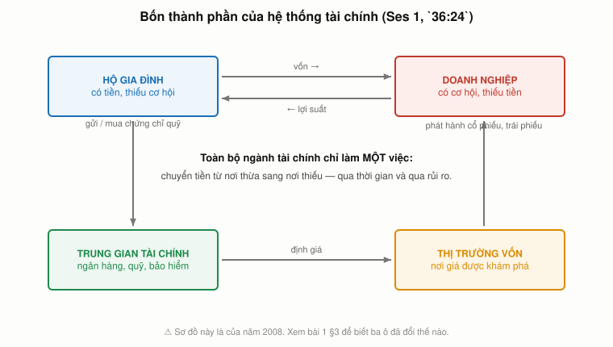
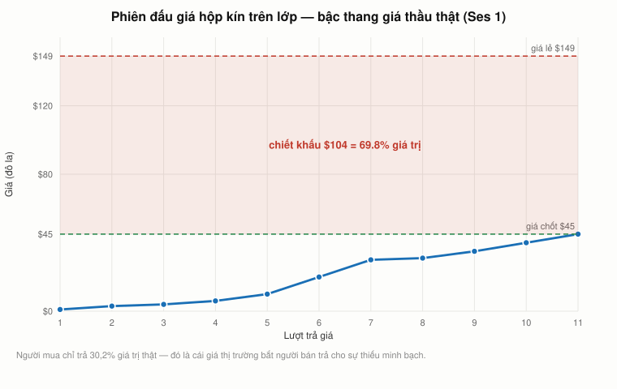

# Bài 1 — Tài chính là gì: hai thách thức, hai yếu tố, sáu nguyên lý

> Bài học dựng trên video **"Ses 1: Introduction and Course Overview"**
> — khoá **MIT 15.401 *Finance Theory I*, Fall 2008**, giảng viên **Andrew W. Lo** (MIT Sloan).
> YouTube `HdHlfiOAJyE`, 67:05. Phụ đề gốc do người viết tay.
> 📚 **Mở rộng** — kiến thức nền video lướt qua hoặc để dành cho các buổi sau.
> 🇻🇳 **Góc Việt Nam** — số liệu và ví dụ trong nước, **không có trong video** (mục 7, 18).
> ⚠️ **Video ghi học kỳ Thu 2008 — đã 18 năm.** Các mục đối chiếu với 2026: **3** (hệ thống tài chính
> đã đổi), **9** (tiên đề cổ đông tối thượng), **12** (lãi suất âm), **13** (Lo tự phản biện),
> **14** (chuyện gì đã xảy ra sau đó). Mục **17** bổ sung phần lý thuyết buổi 1 còn thiếu.
> 📌 **Không cần đọc trước gì cả.** Lo nói thẳng ở `12:43`: *"tôi giả định các bạn không biết gì."*
> Toàn bộ công thức viết bằng LaTeX — mở bằng **Obsidian** hoặc VS Code + Markdown Preview Enhanced.

---

## Mục lục

<!-- MUC-LUC -->
- [1. Tài chính = Toán + Tiền](#1-tài-chính--toán--tiền)
- [2. Ba người, ba loại toán, một thứ chung](#2-ba-người-ba-loại-toán-một-thứ-chung)
- [3. Bốn thành phần của hệ thống tài chính](#3-bốn-thành-phần-của-hệ-thống-tài-chính)
- [4. Hai thách thức — và vì sao chỉ có một cái thật sự khó](#4-hai-thách-thức--và-vì-sao-chỉ-có-một-cái-thật-sự-khó)
- [5. Nghịch lý nước và kim cương — "giá trị" nghĩa là gì](#5-nghịch-lý-nước-và-kim-cương--giá-trị-nghĩa-là-gì)
- [6. Phiên đấu giá hộp kín — price discovery diễn ra trực tiếp](#6-phiên-đấu-giá-hộp-kín--price-discovery-diễn-ra-trực-tiếp)
- [7. Đọc lại phiên đấu giá bằng lý thuyết đấu giá](#7-đọc-lại-phiên-đấu-giá-bằng-lý-thuyết-đấu-giá)
- [8. Kế toán là ngôn ngữ — stock và flow](#8-kế-toán-là-ngôn-ngữ--stock-và-flow)
- [9. Năm điểm quyết định dòng tiền](#9-năm-điểm-quyết-định-dòng-tiền)
- [10. Áp khung đó lên chính bạn](#10-áp-khung-đó-lên-chính-bạn)
- [11. Thời gian và rủi ro — hai thứ làm nên cả ngành](#11-thời-gian-và-rủi-ro--hai-thứ-làm-nên-cả-ngành)
- [12. Đối chiếu 2026 — chỗ Lo nói chắc mà lịch sử đã bác](#12-đối-chiếu-2026--chỗ-lo-nói-chắc-mà-lịch-sử-đã-bác)
- [13. Sáu nguyên lý — và vì sao Lo chỉ đưa ba](#13-sáu-nguyên-lý--và-vì-sao-lo-chỉ-đưa-ba)
- [14. Bài giảng này ghi ngay trước khi Lehman sụp](#14-bài-giảng-này-ghi-ngay-trước-khi-lehman-sụp)
- [15. Bản đồ cả khoá — bốn phần, 20 buổi, 13 bài](#15-bản-đồ-cả-khoá--bốn-phần-20-buổi-13-bài)
- [16. Cách học — "tài chính không phải môn thể thao để ngồi xem"](#16-cách-học--tài-chính-không-phải-môn-thể-thao-để-ngồi-xem)
- [17. Bốn mảnh lý thuyết buổi 1 còn thiếu](#17-bốn-mảnh-lý-thuyết-buổi-1-còn-thiếu)
- [18. Góc Việt Nam — đọc bộ khung của Lo bằng số liệu 2026](#18-góc-việt-nam--đọc-bộ-khung-của-lo-bằng-số-liệu-2026)
- [19. Code minh hoạ](#19-code-minh-hoạ)
- [20. Tự thử](#20-tự-thử)
- [21. Từ điển thuật ngữ](#21-từ-điển-thuật-ngữ)
- [22. Câu hỏi tự kiểm tra](#22-câu-hỏi-tự-kiểm-tra)
- [Tóm tắt một trang](#tóm-tắt-một-trang)
- [Nguồn](#nguồn)
<!-- /MUC-LUC -->

---

## 1. Tài chính = Toán + Tiền

Phương trình đầu tiên của cả khoá học không phải NPV, không phải CAPM. Nó là thế này (`11:21`):

$$\text{Tài chính} = \text{Toán học} + \text{Tiền}$$

Lo đùa ngay sau đó rằng phương trình này ngụ ý *"toán học là tài chính trừ đi tiền"* — và ông
nói thêm, *"mà thật ra đúng thế, nhưng đấy không phải ý tôi"* (`11:37`).

Ý thật của ông: **tài chính là việc nghiên cứu các giao dịch tiền tệ một cách có hệ thống và có kỷ luật.**

Chỗ này rất nhiều người đọc xong là bỏ chạy: *"tôi không giỏi toán, chắc tôi học nhầm lớp."*
Lo chặn phản ứng đó ngay (`11:58`), và đây là điều quan trọng nhất của mục này:

> *"Khi tôi nói toán học, tôi đang nói tới một dải rất rộng của toán học. Từ chỗ cực kỳ phức tạp
> và sâu sắc, tới chỗ cực kỳ tầm thường và hiển nhiên."* — `12:16`

Dải đó chạy từ **hình học vi phân và phương trình đạo hàm riêng** ở một đầu, tới **số học và đại số
phổ thông** ở đầu kia. Cả hai đầu đều kiếm ra tiền. Mục 2 chứng minh điều đó bằng ba con người thật.

---

## 2. Ba người, ba loại toán, một thứ chung

Lo không định nghĩa tài chính bằng định nghĩa. Ông định nghĩa nó bằng **ba người kiếm được rất
nhiều tiền theo ba cách hoàn toàn khác nhau** (`13:18`–`20:37`).

### James Simons — đầu cực đại của dải toán

Trước khi lập Renaissance Technologies, Simons là **trưởng khoa Toán ở Stony Brook**, một nhà hình
học vi phân. Ông cùng S. S. Chern dựng ra **lý thuyết Chern–Simons** — thứ về sau hoá ra cực kỳ hữu
dụng cho **lý thuyết dây** trong vật lý (`13:58`). Trừu tượng đến mức không thể trừu tượng hơn.

Rồi ông lập quỹ đầu cơ. Lo mô tả thành tích của Simons:

> *"Ông ấy là Michael Phelps của các chiến lược đầu tư định lượng."* — `14:43`

Con số Lo đưa ra: năm **2006**, tạp chí *Alpha* của Institutional Investor xếp Simons là **nhà quản
lý quỹ đầu cơ được trả cao nhất năm**, với **1,7 tỷ đô la** (`15:02`). Lo nhấn mạnh một chi tiết mà
người nghe hay bỏ sót:

> *"Đấy không phải tài sản, đấy là thu nhập. Đấy là trên tờ W-2 của ông ta. Đấy là lương một năm."* — `15:21`

Và ông làm được điều đó với một công ty gồm **75 tiến sĩ toán, vật lý, khoa học máy tính** — mà
*"không ai, không một ai biết ông ta làm gì hay làm thế nào"* (`15:50`).

### Warren Buffett — đầu cực tiểu của dải toán

Tháng 2/2008, Forbes xếp Buffett **giàu nhất thế giới**, tài sản **62 tỷ đô la** (`16:12`). Lo kể
một mẩu chuyện riêng: khi Simons nghe con số đó, ông ta hỏi *"thật à? 62 tỷ? Làm sao ông ta kiếm
được chừng ấy?"* (`16:33`).

Cách Buffett làm được mới là điều đáng nói. Văn phòng của ông ở Omaha *"chắc còn nhỏ hơn nhiều
phòng họp ở Sloan"*, nhân sự *"ít hơn số người trong startup của nhiều bạn ngồi đây"* — chủ yếu chỉ
có Charlie Munger, vài thư ký, vài kế toán và luật sư (`16:51`–`17:10`). Việc ông làm là đọc bản
cáo bạch, báo cáo kết quả kinh doanh, bảng cân đối kế toán:

> *"Và với đúng số học phổ thông, ông ấy đã dựng nên đế chế đầu tư này bằng cách nhìn vào định giá.
> Kế toán đơn giản."* — `17:27`

Lo tự đính chính ngay: *"tôi nói kế toán đơn giản, nhưng chẳng có gì đơn giản trong việc ông ấy
làm cả."*

### Jack Welch — không phải dân tài chính, nhưng nói được tiếng tài chính

Bằng tiến sĩ của Welch là **kỹ thuật**, không phải quản trị. Ông vào General Electric năm **1960**,
làm CEO năm **1981** (`17:55`–`18:11`).

| GE        | 1981 (Welch nhận) |    2001 (Welch rời) |
| --------- | ----------------: | ------------------: |
| Doanh thu |           26 tỷ $ |            130 tỷ $ |
| Nhân sự   |           400.000 | 300.000 (sau 5 năm) |

Việc cắt 100.000 chỗ làm trong 5 năm là lý do ông có biệt danh **"Neutron Jack"** — như bom neutron,
xoá sạch dân số nhưng để lại nhà cửa (`18:35`). Cùng lúc đó giá trị thị trường của GE tăng gấp bội.

> ⚠️ **Tự kiểm tra số của giáo sư.** Ở `19:17` Lo nói doanh thu tăng *"gấp 4 lần rưỡi"*. Nhưng
> $130 / 26 = 5{,}0$ đúng theo chính hai con số ông vừa đọc. Đây là một chỗ tốt để tập phản xạ
> quan trọng nhất của cả khoá: **nghe xong thì tính lại.** (Số thực tế của GE — 27,2 tỷ năm 1981 và
> 129,9 tỷ năm 2000 — cho tỷ lệ 4,8×, gần với con số Lo nói hơn là với phép chia của chính ông.)

Điều Welch giỏi không phải kỹ thuật. Đó là **ra quyết định đúng về đầu tư và về chi phí** — tức
là hiểu được ngôn ngữ tài chính, dù không dùng một chút nào kiến thức tiến sĩ của mình (`19:37`).

### Thứ chung duy nhất

Ba người: một nhà hình học vi phân, một người dùng số học phổ thông, một kỹ sư. Không ai giống ai.

> *"Nhưng có một thứ chung. Thứ chung đó là cả ba đều hiểu — một cách bản năng, sâu sắc, tận gốc —
> **ngôn ngữ của tài chính**."* — `20:18`

Và Lo chốt: những gì cả khoá 15.401 dạy chính là **thứ ba người này coi là hiển nhiên**, thứ họ
dùng hằng ngày mà không cần nghĩ (`20:18`).

---

## 3. Bốn thành phần của hệ thống tài chính



*Bốn ô, và mọi mũi tên đều chỉ về một việc: chuyển tiền từ nơi thừa sang nơi thiếu.*

Trước khi đi vào nội dung, Lo dựng sơ đồ dòng chảy của nền kinh tế và khoanh **bốn thành phần** mà
cả khoá sẽ xoay quanh (`21:30`–`21:46`):

```
                    ┌──────────────────────┐
          ┌────────►│   THỊ TRƯỜNG VỐN     │◄────────┐
          │         │  (capital markets)   │         │
          │         └──────────────────────┘         │
          │                                          │
   ┌──────┴───────┐                        ┌─────────┴──────────┐
   │  HỘ GIA ĐÌNH │                        │  DOANH NGHIỆP      │
   │  (households)│                        │  PHI TÀI CHÍNH     │
   └──────┬───────┘                        └─────────┬──────────┘
          │         ┌──────────────────────┐         │
          └────────►│ TRUNG GIAN TÀI CHÍNH │◄────────┘
                    │ (ngân hàng, quỹ, BH) │
                    └──────────────────────┘
```

Nền kinh tế dĩ nhiên còn thị trường lao động và thị trường hàng hoá, nhưng khoá học **cố ý không
đụng tới** (`21:46`).

Điểm quan trọng — và cũng là điều khiến tài chính học được — nằm ở `22:27`:

> *"Phân tích tài chính áp dụng cho tất cả các thành phần này theo đúng một cách giống hệt nhau.
> Chỉ khi bạn áp nó vào một bối cảnh cụ thể thì thuật ngữ mới đổi, ứng dụng mới trông khác đi."*

Nghĩa là: **bạn không phải học bốn môn.** Bạn học một bộ công cụ rồi đọc nó bằng bốn thứ tiếng địa
phương. Mục 10 sẽ dùng đúng tính chất này để áp khung doanh nghiệp lên tài chính cá nhân của bạn.

### Sơ đồ bốn ô này là sơ đồ của năm 2008

Bốn ô vẫn đúng. Nhưng **thứ nằm trong ô đã đổi**, và ba thay đổi dưới đây quan trọng đủ để bạn phải
biết trước khi đọc 12 bài còn lại.

**1. Ô "trung gian tài chính" giờ chủ yếu KHÔNG còn là ngân hàng.**
Lo ghi trong ô đó "ngân hàng, quỹ, bảo hiểm", với ngân hàng đứng đầu. Theo Financial Stability Board,
năm 2024 khối **trung gian tài chính phi ngân hàng** (*non-bank financial intermediation* — quỹ đầu
tư, quỹ hưu trí, quỹ thị trường tiền tệ, private credit…) đạt **256,8 nghìn tỷ USD, chiếm 51 % tổng
tài sản tài chính toàn cầu**, và tăng **9,4 %/năm** — gấp đôi tốc độ của khối ngân hàng (4,7 %).
Ngân hàng giờ là thiểu số trong chính cái ô mang tên nó.

**2. Sơ đồ thiếu hẳn một nhân vật giờ đã thành trung tâm: ngân hàng trung ương.**
Trước 2008, bảng cân đối của Fed khoảng **900 tỷ USD**, gần như toàn trái phiếu kho bạc ngắn hạn —
Fed là **cái van điều tiết**, không phải người mua. Sau các đợt nới lỏng định lượng (QE) và COVID,
bảng cân đối đạt đỉnh **~8,9 nghìn tỷ USD năm 2022**, tức **gấp khoảng mười lần**, rồi rút về
~6,5 nghìn tỷ năm 2025. Ngân hàng trung ương trở thành **người mua lớn nhất trên chính thị trường mà
nó điều tiết**. Bài 4–5 (trái phiếu) sẽ không đọc được nếu bỏ qua chuyện này.

**3. Dòng "hộ gia đình → thị trường vốn" giờ đi qua một cái phễu rất hẹp.**
Năm **2024**, lần đầu tiên **quỹ chỉ số thụ động vượt quỹ chủ động** về tổng tài sản tại Mỹ. Ba nhà
quản lý — **BlackRock, Vanguard, State Street** — nắm khoảng **20–25 % cổ phần của phần lớn công ty
S&P 500** và là cổ đông lớn nhất ở khoảng **9 trên 10** công ty trong chỉ số. Năm 2008 con số đó chỉ
là **13,5 %**.

> ⚠️ Một đính chính hay bị bỏ qua: ba công ty này **không "sở hữu"** số cổ phần đó theo nghĩa hưởng
> lợi. Họ nắm hộ cho hàng chục triệu nhà đầu tư của các quỹ. Quyền họ thực sự nắm là **quyền biểu
> quyết** — và đó mới là chỗ đáng bàn.

Điều này **không** làm hỏng bài học của Lo. Câu *"phân tích tài chính áp dụng cho cả bốn thành
phần theo đúng một cách"* (`22:27`) vẫn đúng nguyên. Nhưng khi bạn gặp chữ "trung gian tài chính"
trong các bài sau, **đừng chỉ hình dung một ngân hàng.**

---

## 4. Hai thách thức — và vì sao chỉ có một cái thật sự khó

Lo hứa một lời hứa rất to ở `06:46`:

> *"Hoá ra chỉ có hai. Chỉ có hai thách thức trong phân tích tài chính, và một khi bạn giải được cả
> hai thì bạn xong. Nên nếu tình cờ bạn nghĩ ra được cả hai trước khi hết buổi hôm nay, bạn không
> cần quay lại các buổi còn lại nữa."* — `06:46`–`07:03`

Hai thách thức đó (`22:57`):

| #     | Thách thức                          | Câu hỏi                     |
| ----- | ----------------------------------- | --------------------------- |
| **1** | **Định giá** tài sản (*valuation*)  | Cái này đáng giá bao nhiêu? |
| **2** | **Quản trị** tài sản (*management*) | Vậy thì nên làm gì?         |

Và đây là cú lật của mục này. Lo tháo tung thách thức thứ hai ngay tại chỗ (`23:20`):

> *"Quản trị sẽ là việc tìm xem trong hai khả năng thì cái nào đáng giá hơn. Rồi bạn biết gì không?
> Bạn chọn cái đáng giá hơn. Thế thôi. Chỉ có thế."*

$$\text{Mục tiêu} + \text{Định giá} \;\Longrightarrow\; \text{Quyết định}$$

Nói cách khác: **một khi bạn biết mục tiêu và định giá được các lựa chọn, quyết định là hệ quả máy
móc.** Toàn bộ độ khó dồn vào một chỗ duy nhất — **định giá**. Đó là lý do 2/3 đầu khoá học chỉ làm
mỗi việc định giá, và 1/3 cuối mới nói tới quản trị (`35:41`).

Nếu bạn chỉ nhớ một câu từ bài 1, nhớ câu này: **mọi quyết định kinh doanh đều rút gọn về định
giá cộng mục tiêu.** Việc còn lại là số học.

---

## 5. Nghịch lý nước và kim cương — "giá trị" nghĩa là gì

Nhưng "định giá" không dễ như nghe. Lo hỏi (`24:21`):

> *"Giá trị là gì? Nước có giá trị không? Sự sống không tồn tại được nếu thiếu nó — ít nhất là sự
> sống gốc carbon."* — `24:21`
>
> *"Vậy nước khá là có giá trị. Nhưng nước không đắt. Ít ra là trước khi Poland Springs xuất hiện.
> Còn kim cương thì sao? Theo tôi biết, con người không cần kim cương để sống sót, thế mà kim cương
> lại cực kỳ đắt."* — `24:46`

Đây là **nghịch lý giá trị** (*paradox of value*, hay nghịch lý nước–kim cương) mà Adam Smith nêu
từ 1776. Nó cho thấy hai chữ "giá trị" đang trộn hai thứ khác nhau:

| Loại giá trị         | Nghĩa              | Nước     | Kim cương      |
| -------------------- | ------------------ | -------- | -------------- |
| **Giá trị sử dụng**  | hữu ích đến đâu    | vô hạn   | gần bằng không |
| **Giá trị trao đổi** | đổi được bao nhiêu | rất thấp | rất cao        |

📚 **Bổ sung — lời giải mà Lo không đưa ra ở đây.** Kinh tế học vi mô giải nghịch lý này bằng **hữu
dụng biên**: cái quyết định giá không phải tổng hữu dụng, mà là hữu dụng của **đơn vị cuối cùng**.
Cốc nước thứ một nghìn trong ngày gần như vô dụng, nên nước rẻ. Viên kim cương thứ nhất thì hiếm,
nên đắt. Toàn bộ khoá 15.401 sẽ làm điều tương tự cho tài sản tài chính: **giá là chuyện của đơn vị
biên và của người mua biên**, không phải chuyện của tổng lợi ích.

Mục 6 và 7 cho thấy nguyên tắc "người mua biên" đó vận hành thật, ngay trong một giảng đường.

---

## 6. Phiên đấu giá hộp kín — price discovery diễn ra trực tiếp



*Bậc thang giá thầu thật của lớp học — vẽ từ chính dãy số trong file thực hành.*

Đây là 8 phút hay nhất của cả buổi (`25:58`–`34:18`). Lo than rằng giáo viên khoa học thì có cuộn
Tesla để biểu diễn, còn dân tài chính thì không có gì — nên ông tự nghĩ ra một màn (`26:14`).

### Thiết lập

Lo mang **hai gói hàng**. Vì ông dạy hai lớp, ông cho **tung đồng xu** để chọn ngẫu nhiên gói nào
bán cho lớp nào — *"để không có chuyện tôi thiên vị lớp này hơn lớp kia"* (`27:09`). Lớp này ra
**mặt sấp** (`27:34`), nhận gói nhỏ hơn.

Rồi ông hỏi cả phòng: **có ai biết trong hộp có gì không?** Không ai biết. Giá trị của nó là bao nhiêu?

> *"Bằng không? Âm? Không thể âm được, đúng không? Có trách nhiệm hữu hạn. Bạn không thể nợ tôi vì
> một thứ nằm trong hộp."* — `27:53`

Câu đùa ấy thật ra là bước phân tích đầu tiên: **cận dưới bằng 0 đã được xác lập.**
Từ chỗ không biết gì, ta vừa biết được một điều.

Và Lo nói rõ đây không phải trò chơi: *"đừng trả giá nếu bạn không trả tiền được, và tôi muốn được
trả bằng tiền mặt"* (`28:35`). Khi có người hỏi tiền đi đâu, ông đáp thẳng: *"Tôi lấy tiền. Cái này
sẽ vào quỹ ủng hộ Andrew Lo. Tôi chính là tổ chức từ thiện đó."* (`29:45`)

### Bậc thang giá thầu — số liệu thật

```
$1 → $3 → $4 → $6 → $10 → $20 → $30 → $31 → $35 → $40 → $45
                                                          ▲
                                            chốt: "going once, going twice, sold"
```

Chú ý ba chi tiết trong bậc thang này:

1. **Bước nhảy $10 → $20 → $30.** Lo phải thốt lên *"Wow!"* và trêu *"bạn có thấy gói này nhỏ hơn
   gói kia không? Nó bé tí mà."* (`29:25`) — ông đang **bơm thông tin ngược vào thị trường** để dìm
   giá xuống. Không thành công.
2. **Có người trả $5 sau khi đã có $6.** Lo gạt: *"không được"* (`29:11`). Đấu giá kiểu Anh chỉ đi
   lên.
3. **Có người hỏi "tôi bán khống được không?"** Lo: *"Không, xin lỗi. Ở đây chỉ có một người bán
   đấu giá, là tôi."* (`30:38`) — một chi tiết nhỏ nhưng quan trọng: **thị trường này cấm bán khống**,
   nên chỉ người lạc quan mới được thể hiện quan điểm. Giá vì thế lệch lên trên.

### Kết quả

Chốt **$45**. Người thắng mở hộp: một chiếc **iPod Nano bản 4 GB**. Lo hỏi giá lẻ, có người đoán
$125, Lo đính chính: **"$149, cho chính xác"** (`33:58`).

| Khoản mục        |                 Giá trị |
| ---------------- | ----------------------: |
| Giá lẻ           |               **149 $** |
| Giá chốt đấu giá |                **45 $** |
| Chiết khấu       |      **104 $ = 69,8 %** |
| Người mua trả    | **30,2 %** giá trị thật |

### Bài học Lo rút ra

> *"Ta đã xác lập được giá trị. Nó là 45 đô la. Đó là thị trường đang vận hành. Không một ai trong
> các bạn biết trong này có gì."* — `31:08`

> *"Không biết gì, không hề có một mẩu thông tin nào, mà chúng ta đã xác lập được giá trị. Điều đó
> thật đáng nể."* — `32:10`

Rồi ông tự bác chính mình — và đây mới là ý sâu nhất của màn biểu diễn (`32:29`):

> *"Nhưng không đúng là **không có** thông tin. Thực ra trong phòng này có cực kỳ nhiều thông tin.
> Bởi vì các bạn biết một số thứ. Các bạn biết kích thước các gói hàng. Các bạn biết rằng tôi là
> giáo sư, và nếu tôi lừa các bạn thật thì tôi sẽ gặp rắc rối với hiệu trưởng."*

Nói cách khác: **không tồn tại "không thông tin".** Cái mà lớp học định giá không phải chiếc iPod —
họ định giá **cái phân phối xác suất của những thứ mà một giáo sư MIT có thể bỏ vào một hộp nhỏ để
bán đấu giá trước mặt sinh viên của mình.** Kích thước hộp, danh tiếng người bán, ràng buộc thể
diện — tất cả đều là dữ liệu, và tất cả đều được nén vào con số $45.

Và chiết khấu chính là giá của phần còn thiếu (`34:34`):

> *"Sự thiếu minh bạch, sự thiếu thông tin, thực sự đã **làm giảm** giá trị của món đồ đó."*

> ⚠️ **Lo tự nói sai con số của mình.** Ở `37:12` ông tổng kết: *"nếu bạn muốn bán một tài sản mà
> người mua không được nhìn, và phải bán ngay, thì chiết khấu 66% là khá công bằng."* Nhưng chiết
> khấu thật là $104/149 = **69,8 %**. (Ở `36:58` ông nói *"khoảng một phần ba giá trị"* — cái này
> thì đúng: 30,2 %.) Không ảnh hưởng gì tới lập luận, nhưng nếu bạn đang tự tính theo, đừng bối rối.

---

## 7. Đọc lại phiên đấu giá bằng lý thuyết đấu giá

Video dừng ở *"thị trường đã tạo ra một con số"*. Phần này đi tiếp — **không có trong video** — vì
nó trả lời câu Lo cố tình bỏ ngỏ ở `35:09`: *"vì sao lại là $45, và vì sao người kia không chịu lên $50?"*

Có **hai lực** kéo giá xuống, và điều quan trọng là chúng **tách rời nhau**:

### Lực (a) — giá chốt là định giá cao thứ **hai**, không phải cao nhất

Đấu giá kiểu Anh (tăng dần, công khai) có một tính chất đẹp: người thắng **không** trả mức mình sẵn
sàng trả. Họ trả mức của **đối thủ bỏ cuộc cuối cùng**, cộng một bước giá.

$$P_{\text{chốt}} \;=\; v_{(2)} + \varepsilon$$

với $v_{(2)}$ là định giá cao thứ hai trong phòng và $\varepsilon$ là bước giá.

Hệ quả cho lớp học: **chúng ta không hề biết người thắng định giá chiếc hộp bao nhiêu.** Ta chỉ biết
người về nhì dừng ở $40. Cái $45 đo người về nhì, không đo người thắng. Đây là lý do Lo nói ở `35:09`
rằng sẽ *"rất khó gỡ ra tất cả những suy nghĩ đã dẫn tới cuộc trả giá này"*.

Ý này quay lại suốt cả khoá: **giá thị trường không phải quan điểm của người lạc quan nhất, mà là
quan điểm của người lạc quan biên** — người vừa đủ để giao dịch xảy ra. Bài 13 (Thị trường hiệu quả)
sẽ dựng cả một lý thuyết trên đúng câu này.

### Lực (b) — ai cũng chừa một khoản vì không chắc chắn

Trên nền đó, mỗi người còn tự trừ đi một khoản nữa vì họ **biết là mình không biết**. Gọi khoản chừa
đó là $k$:

$$b_i = e_i \times (1 - k)$$

với $e_i$ là ước lượng của người $i$ và $b_i$ là mức họ thực sự trả.

Mục 19 mô phỏng cả hai lực này bằng code. Kết quả: chỉ riêng lực (a) — ước lượng của cả phòng vốn
đã nằm dưới $149 vì không ai được nhìn — chưa đủ để giải thích $45. Phải cộng thêm lực (b) ở mức
$k \approx 60\%$ thì giá mới rơi xuống mức đó.

> ⚠️ Mô hình ở mục 19 là **mô hình đơn giản hoá do bài học này dựng**, không phải của Lo. Nó không
> chứng minh rằng lớp học "thật sự" chừa 60 %. Nó chỉ làm một việc: cho thấy hai lực trên là **hai
> đại lượng khác nhau** và có thể tách ra đo riêng. Đó mới là điều đáng mang đi.

### Khi price discovery hỏng — VinFast trên Nasdaq, 2023

Màn đấu giá của Lo chạy được vì có **nhiều người trả giá cho một món hàng**. Bỏ chữ "nhiều" đi thì
cơ chế vẫn chạy, nhưng con số nó tạo ra không còn nghĩa như cũ. Ví dụ rõ nhất, và là ví dụ Việt Nam:

**VinFast** niêm yết trên Nasdaq ngày **15/8/2023** qua sáp nhập với công ty SPAC Black Spade, giá
trị vốn chủ ban đầu **trên 23 tỷ USD**. Vấn đề nằm ở cấu trúc sở hữu:

| Cơ cấu sở hữu khi niêm yết             |                                Tỷ lệ |
| -------------------------------------- | -----------------------------------: |
| Hai cổ đông lớn nhất nắm               |                          **99,69 %** |
| Còn lại cho thị trường (*free float*)  | **~0,3 %**, khoảng 16 triệu cổ phiếu |
| Nhà đầu tư SPAC rút vốn trước sáp nhập |                            **~84 %** |

Kết quả:

- **Ngày đầu:** +255 %, lên 37,06 USD.
- **Đỉnh:** vốn hoá khoảng **190 tỷ USD** — lớn hơn **tổng** của Ford, GM, Ferrari và Stellantis
  cộng lại, đưa VinFast thành hãng xe giá trị thứ ba thế giới, chỉ sau Tesla và Toyota.
- **Nền tảng kinh doanh cùng lúc đó:** bán ~**24.000 xe** năm 2022, doanh thu **634 triệu USD**, lỗ
  **hơn 2 tỷ USD**. Tỷ lệ giá trên doanh thu khoảng **250 lần**.
- **Tháng 5/2026:** vốn hoá còn **~9,94 tỷ USD**, tức khoảng **5 %** của đỉnh.

**Bài học nối thẳng với mục 7.** Ở lớp của Lo, $45 đo **người trả giá cao thứ hai trong một phòng
đông người**. Khi chỉ 0,3 % cổ phần được giao dịch, "giá thị trường" vẫn là giá thật — có người mua,
có người bán, khớp lệnh được — nhưng nó **đo một nhóm rất nhỏ**, và vì thế **không còn tổng hợp quan
điểm của thị trường** nữa. Giá đúng về mặt cơ chế, hỏng về mặt thông tin.

Và để ý một trùng hợp đắt: Lo **cấm bán khống** trong lớp (`30:38`), nên chỉ người lạc quan mới nói
được. Free float mỏng gây ra đúng hiệu ứng đó trong đời thật — người bi quan gần như không có cách
nào thể hiện quan điểm, nên giá chỉ đi lên cho tới khi hết người mua.

---

## 8. Kế toán là ngôn ngữ — stock và flow

Từ `38:18` Lo chuyển sang bộ khung sẽ dùng suốt 13 tuần. Điểm khởi đầu là kế toán:

> *"Kế toán là ngôn ngữ, là từ vựng của tài chính, ở chỗ nó là khởi đầu của việc đo lường các khái
> niệm kinh tế."* — `38:18`

Và ông cảnh báo có **một cặp khái niệm sẽ lạ lẫm với hầu hết người học** (`38:57`):

> *"Khi tôi nói **stock**, tôi không nói cổ phiếu. Ý tôi là **stock của tài sản** — mức tài sản.
> Và **flow** là **tốc độ thay đổi** của tài sản."*

### Câu chuyện bồn tắm

Lo kể lại buổi đầu môn kinh tế vĩ mô hồi ông học cao học (`39:16`). Một sinh viên ngồi cuối lớp giơ
tay: *"Xin lỗi thầy, nhưng đấy chẳng phải chỉ là phân biệt giữa một biến và đạo hàm bậc nhất của nó
thôi sao?"*

Giáo sư hơi khựng, thừa nhận đúng, rồi đưa ra cách hiểu trực quan hơn — **cái bồn tắm**:

> *"**Stock là mức nước. Flow là tốc độ nước chảy vào bồn.**"* — `39:46`

Sinh viên đó vẫn có vẻ chưa thông. Giáo sư kết luận:

> *"Thôi thế này, có người thấy bồn tắm trực quan, có người thấy đạo hàm trực quan. Tuỳ mỗi người."* — `40:04`

### Ánh xạ sang hai tờ báo cáo

| Khái niệm | Bồn tắm    | Toán    | Báo cáo kế toán                | Đo cái gì                |
| --------- | ---------- | ------- | ------------------------------ | ------------------------ |
| **Stock** | mức nước   | $W(t)$  | **Bảng cân đối kế toán**       | một **thời điểm**        |
| **Flow**  | tốc độ vòi | $dW/dt$ | **Báo cáo kết quả kinh doanh** | một **khoảng thời gian** |

$$W(T) \;=\; W(0) + \int_0^T \frac{dW}{dt}\,dt \qquad\text{hay rời rạc: }\; W_T = W_0 + \sum_{t=1}^{T} F_t$$

Bảng cân đối cho biết **tài sản** là gì và **quyền đòi trên tài sản đó** (nợ phải trả) là gì
(`40:25`). Báo cáo kết quả cho biết công ty kiếm được bao nhiêu **trên một đơn vị thời gian**, so với
lỗ (`40:47`).

**Đọc một tờ mà không đọc tờ kia thì không biết công ty đang ở đâu.** Một công ty có thể có mức
nước rất cao mà vòi đang chảy ngược — và ngược lại. Mục 19 mô phỏng đúng tình huống thứ hai bằng
hai năm đầu của một sinh viên MBA.

Và Lo thả một câu khiến cả phòng phải ngẩng lên (`41:26`):

> *"Nhân tiện, đây là **toàn bộ** công cụ mà Warren Buffett dùng để phân tích các khoản đầu tư của
> ông ấy. Chỉ có thế. Tin hay không thì tuỳ. Không có gì màu mè hơn."*

---

## 9. Năm điểm quyết định dòng tiền

Đặt bộ khung đó vào một doanh nghiệp, ta được **năm điểm mà mọi quyết định tài chính doanh nghiệp
đều rơi vào** (`41:49`–`42:36`):

```
                    ┌──────────────────┐
        (1) huy động│                  │(5) trả lại nhà đầu tư
     ──────────────►│   DOANH NGHIỆP   │──────────────────────►
        NHÀ ĐẦU TƯ  │                  │       NHÀ ĐẦU TƯ
                    │   ┌──────────┐   │
                    │   │  tiền    │   │
                    │   │   mặt    │   │
                    │   └──────────┘   │
                    │    ▲        │    │
                    │(3) │        │(2) │
                    │ từ │        ▼ vào│
                    │ HĐKD  TÀI SẢN THỰC
                    │        └───(4)───┘
                    │      giữ lại tái đầu tư
                    └──────────────────┘
```

| #   | Quyết định                           | Ai lo              |
| --- | ------------------------------------ | ------------------ |
| 1   | Tiền huy động từ nhà đầu tư          | Giám đốc tài chính |
| 2   | Tiền đầu tư vào tài sản thực         | Quản lý vận hành   |
| 3   | Tiền do hoạt động kinh doanh sinh ra | Quản lý vận hành   |
| 4   | Giữ lại bao nhiêu để tái đầu tư      | Giám đốc tài chính |
| 5   | Trả lại nhà đầu tư bao nhiêu         | Hội đồng quản trị  |

Lo ánh xạ thẳng sang **nghề nghiệp** (`43:13`–`43:51`): quyết định đầu tư thực là **2 và 3**; giám
đốc tài chính lo tài trợ là **1 và 4**; hội đồng quản trị quyết chia cổ tức là **5**; còn quản trị
rủi ro là **1 và 5**.

Và tất cả gói lại trong một câu (`42:36`):

> *"Tiền mặt là dòng máu của doanh nghiệp. Nếu bạn đi theo dòng tiền, cuối cùng bạn sẽ đụng vào mọi
> khía cạnh quan trọng của hoạt động doanh nghiệp hiện đại."*

Mục tiêu cuối cùng thì Lo phát biểu gọn ở `44:03`: **tối đa hoá tài sản của cổ đông** (*maximize
shareholder wealth*).

> 📚 Câu đó là **tiên đề** của khoá học, không phải kết luận. Nó có nhiều vấn đề — cổ đông nào? trong
> bao lâu? còn các bên liên quan khác? Lo hoàn toàn biết điều này và hứa sẽ tự đục thủng bộ khung
> của mình ở buổi cuối (`54:07`, xem mục 13).

### Tiên đề này đã bị chính giới doanh nghiệp Mỹ bỏ phiếu chống — 2019

Ngày **19/8/2019**, **Business Roundtable** — hiệp hội CEO của các tập đoàn lớn nhất nước Mỹ — công
bố *Statement on the Purpose of a Corporation* với **181 CEO ký tên**. Văn bản này **lật ngược chính
sách 22 năm** của chính tổ chức đó: từ 1997, mọi bản nguyên tắc quản trị của họ đều khẳng định
**cổ đông tối thượng** (*shareholder primacy*).

Bản 2019 nói doanh nghiệp phải phục vụ **khách hàng, người lao động, nhà cung cấp, cộng đồng — và
cổ đông**, không xếp cổ đông lên trước.

Nhưng đừng đọc nó như một chiến thắng đã ngã ngũ:

- Giới nghiên cứu phản ứng hoài nghi ngay từ đầu — nhiều người coi đây là động tác đối phó với sức
  ép chính trị, và chỉ ra rằng các công ty ký tên vẫn vận động chính sách theo hướng ngược lại.
- Con lắc đã đảo chiều: làn sóng phản đối ESG giai đoạn **2022–2025** kéo lập luận cổ đông tối
  thượng quay lại, và năm 2024 có cả thư ngỏ gửi các bên ký tên đòi *"đưa doanh nghiệp về lại việc
  kinh doanh"*.

**Không phải "Lo dạy sai".** Tối đa hoá tài sản cổ đông vẫn là tiên đề vận hành của gần như mọi mô
hình định giá bạn sắp học — bài 6 (cổ phiếu) và bài 12 (ngân sách vốn) đều đứng trên nó. Điều bạn
cần biết là: **đó là một lựa chọn, được tranh cãi công khai ở cấp cao nhất, chứ không phải một định
luật.** Chính Lo cũng gọi các nguyên lý của mình là *"xấp xỉ"* (`50:54`).

---

## 10. Áp khung đó lên chính bạn

Đây là chỗ Lo biến bài giảng thành thứ dùng được ngay tối nay. Ông thừa nhận phần trên nghe rất lý
thuyết, rồi yêu cầu (`44:20`):

> *"Tôi muốn các bạn lấy tất cả những ý này và áp thẳng vào chính mình. Hãy nghĩ về những dòng tiền
> đang chảy qua đời bạn. Ngay bây giờ có thể chưa nhiều, vì bạn còn đi học. Nhưng tin tôi đi, nó sẽ
> lớn lên."*

Hộ gia đình — tức **bạn** — nằm giữa **hoạt động kinh tế thực** (công việc của bạn) và **tài sản/nợ
tài chính** (`44:34`). Năm điểm ở mục 9 dịch nguyên xi:

| #   | Doanh nghiệp                 | Bạn                                          |
| --- | ---------------------------- | -------------------------------------------- |
| 1   | Huy động từ nhà đầu tư       | Vay học phí, vay tiêu dùng, vay thế chấp nhà |
| 2   | Đầu tư vào tài sản thực      | **Học vấn của chính bạn**                    |
| 3   | Tiền do hoạt động sinh ra    | Lương                                        |
| 4   | Tiêu dùng và tái đầu tư      | Ăn uống, mua nhà, nuôi con                   |
| 5   | Đầu tư vào tài sản tài chính | Quỹ hưu trí, bảo hiểm xã hội                 |

Ở `45:17` Lo hỏi cả lớp: *"tài sản thực lớn nhất mà tất cả các bạn đang đầu tư vào lúc này là gì?"*
Một sinh viên đáp: *"Giáo dục."* Lo:

> *"Chính xác. **Vốn con người.** Chính các bạn. Học vấn của chính các bạn."* — `45:17`

Với "tái đầu tư vào tài sản thực", ông nói thẳng là gồm cả *"đầu tư vào nhà cửa hoặc vào con cái.
Đó là tài sản thực"* — rồi thêm ngay: *"đôi khi chúng cũng là **nợ phải trả** thực, nhưng đấy là
chuyện khác"* (`45:38`).

Yêu cầu cuối của mục này (`46:36`–`46:58`):

> *"Mỗi một ý tôi nêu ra, dù tôi có bảo bạn hay không, trong suốt 13 tuần tới, tôi muốn bạn cầm ý đó
> lên và hỏi: **điều này làm đời tôi khá hơn ở chỗ nào?**"*

Đây là **cách ôn tập tốt nhất cho cả khoá này**, và nó miễn phí: sau mỗi bài, viết một câu trả lời
cho câu hỏi trên. Nếu không viết nổi, bạn chưa hiểu bài.

---

## 11. Thời gian và rủi ro — hai thứ làm nên cả ngành

Đây là lập luận sắc nhất của buổi học (`47:27`–`49:13`).

Lo khẳng định: bỏ **thời gian** và **rủi ro** ra khỏi tài chính thì **không còn gì để nghiên cứu nữa.**

> *"Không có thời gian và không có rủi ro, các quyết định tài chính thực ra rút gọn về phân tích
> kinh tế vi mô cơ bản. Nếu bạn từng học một khoá kinh tế vi mô đại học — cung bằng cầu — thì bạn đã
> học hết những gì có để học về tài chính, khi bỏ đi thời gian và rủi ro."* — `47:50`

> *"Lý do duy nhất khiến tài chính thú vị, những khía cạnh khó duy nhất trong việc chúng tôi làm, là
> vì thời gian và rủi ro."* — `48:17`

Nói mạnh hơn nữa (`08:04`, đầu buổi): **lý do duy nhất tồn tại một khoa tài chính, một đội ngũ giảng
viên tài chính, các tạp chí tài chính và cả một ngành tài chính — là thời gian và rủi ro.**

Và ông quy nó về hai câu mà ngay cả Buffett cũng không cần phát biểu ra lời (`49:13`):

> *"Ông ấy biết rằng **1 đô la hôm nay không bằng 1 đô la sang năm**. Và ông ấy cũng biết rằng
> **1 đô la hôm nay không rủi ro không bằng 1 đô la hôm nay có một chút rủi ro.** Kể cả chỉ một chút
> xíu rủi ro thôi, ông ấy vẫn biết."*

Toàn bộ 15.401 chỉ là việc **viết hai câu trên thành công thức**:

| Câu                             | Trở thành                            | Học ở bài |
| ------------------------------- | ------------------------------------ | --------- |
| 1 đô hôm nay ≠ 1 đô sang năm    | chiết khấu, NPV, đường cong lãi suất | 2–5       |
| 1 đô chắc chắn ≠ 1 đô có rủi ro | phần bù rủi ro, β, CAPM              | 9–11      |

Lo cũng nói rõ **trình tự dạy** (`49:41`): ba bốn tuần đầu chỉ nói về **thời gian**, sau đó mới đưa
**rủi ro** vào khi đã đủ công cụ. *"Và khi ta ghép hai cái lại, ta được tài chính hiện đại."*

---

## 12. Đối chiếu 2026 — chỗ Lo nói chắc mà lịch sử đã bác

Ngay giữa đoạn hùng hồn về thời gian, Lo thả một lời hứa (`48:35`):

> *"Trong khoảng bốn buổi nữa, tôi sẽ đưa cho các bạn một chứng minh khác cho thuyết tương đối hẹp.
> Và chứng minh này sẽ dựa trên việc **lãi suất không thể âm**. Hoá ra có một mối liên hệ triết học
> rất sâu giữa tài chính và vật lý."*

Lập luận (ông không khai triển ở buổi 1) đại khái là: nếu lãi suất âm thì bạn giữ tiền mặt còn hơn,
nên lãi suất danh nghĩa bị chặn dưới ở 0 — và cái chặn đó phản ánh việc **thời gian chỉ chảy một
chiều**.

**Tiền đề đó đã sai trong thực tế.** Sáu năm sau bài giảng này, các ngân hàng trung ương lớn đã áp
lãi suất danh nghĩa **âm** — và duy trì hàng năm trời:

| Ngân hàng trung ương        | Bắt đầu âm | Mức                       | Kết thúc |
| --------------------------- | ---------- | ------------------------- | -------- |
| **ECB** (khu vực đồng euro) | 6/2014     | −0,10 % rồi xuống −0,50 % | 7/2022   |
| **SNB** (Thuỵ Sĩ)           | 12/2014    | −0,75 %                   | 2022     |
| **BOJ** (Nhật Bản)          | 1/2016     | −0,10 %                   | 3/2024   |

Riksbank (Thuỵ Điển) cũng âm từ 2015 đến 2020, và Đan Mạch còn sớm hơn (2012).

**Nhưng đừng vội kết luận Lo sai hoàn toàn.** Đây là chỗ tinh tế, và nó dạy nhiều hơn cả lời hứa
ban đầu:

- Cái chặn dưới **không phải là 0**, mà là **âm một chút** — vì giữ tiền mặt vật lý cũng tốn phí
  (kho, két, bảo hiểm, vận chuyển). Giới nghiên cứu gọi đây là *effective lower bound*, và nó nằm
  đâu đó quanh −0,5 % đến −1 %.
- Nó vẫn **là một cái chặn**. Không ngân hàng trung ương nào đẩy được xuống −5 %. Trực giác cốt lõi
  của Lo — rằng tiền mặt tạo ra một sàn cho lãi suất — vẫn đứng vững. Chỉ có con số 0 là sai.

Bài học đáng giá hơn nhiều so với lời hứa gốc: **một tiên đề của lý thuyết tài chính có thể trông
hiển nhiên như định luật vật lý cho tới ngày nó không còn đúng.** Hãy nhớ mục này khi tới bài 13 —
buổi mà chính Lo tự tháo dỡ bộ khung của mình.

📚 Cùng lúc, cập nhật ba nhân vật của mục 2 tính tới 2026:

- **James Simons** mất ngày **10/5/2024**, thọ 86 tuổi, tài sản khoảng 31,4 tỷ đô. Quỹ Medallion
  của ông giữ mức lợi suất khoảng **66 %/năm trước phí** (≈39 % sau phí) trong giai đoạn 1988–2021 —
  vẫn là thành tích chưa ai chạm tới. Cần lưu ý: con số này đến từ điều tra của nhà báo Gregory
  Zuckerman chứ không phải báo cáo kiểm toán công khai, vì Medallion đã **đóng cửa với nhà đầu tư
  ngoài từ 2005**.
- **Warren Buffett** không còn là người giàu nhất thế giới từ lâu. Ngày làm CEO cuối cùng của ông
  ở Berkshire Hathaway là **31/12/2025**; **Greg Abel** tiếp quản từ 1/1/2026, còn Buffett (95 tuổi)
  giữ ghế chủ tịch. Ông thông báo quyết định này tại đại hội cổ đông **tháng 5/2025** — kết thúc sáu
  thập kỷ điều hành.
- **Jack Welch** mất ngày **1/3/2020**, thọ 84 tuổi. Di sản quản trị của ông bị đánh giá lại rất
  gay gắt. Chính sách **xếp hạng rồi sa thải 10 % yếu nhất mỗi năm** (*rank and yank*, hay đường cong
  sức sống 20–70–10) đã bị **chính GE bỏ**, vì bộ phận nhân sự kết luận nó không đo được tiềm năng,
  làm hỏng tinh thần và không cải thiện hiệu quả — lỗi cấu trúc của nó là **luôn phải có ai đó ở
  nhóm cuối**, dù người đó không hề kém. Năm 2022, David Gelles xuất bản *The Man Who Broke
  Capitalism*, lập luận rằng việc Welch cắt giảm chi phí tàn nhẫn và chỉ nhìn lợi nhuận theo quý đã
  làm hại cả GE lẫn chủ nghĩa tư bản Mỹ.
 Chú ý mối liên hệ: đây chính là **tiên đề "tối đa hoá tài sản cổ đông"** ở mục 9 được thi hành
  đến tận cùng. Welch là ca thử nghiệm lớn nhất của tiên đề đó — và kết quả sau 20 năm là lý do
  Business Roundtable phải viết lại tuyên bố của họ năm 2019.

---

## 13. Sáu nguyên lý — và vì sao Lo chỉ đưa ba

Lo hứa **sáu nguyên lý nền tảng** (`08:24`, `49:57`). Rồi ông đưa **ba**, và cố ý giấu ba cái còn
lại tới buổi cuối. Hiểu được vì sao ông làm thế cũng quan trọng ngang việc thuộc ba nguyên lý đầu.

Trước hết, một cảnh báo ông đặt ngay đầu (`50:54`):

> *"Thực ra tất cả các nguyên lý này đều là **xấp xỉ** của một sự thật phức tạp hơn nhiều."*

### Nguyên lý 1 — Không có bữa trưa miễn phí

> *"There is no such thing as a free lunch."* — `50:54`

Lo sửa lại cho chặt ngay lập tức (`51:14`):

> *"Nếu bạn muốn nghiêm ngặt, nó phải viết là: **thỉnh thoảng vẫn có bữa trưa miễn phí, nhưng không
> có chương trình bữa trưa miễn phí.** Không có chuyện miễn phí một cách hệ thống."*

Phân biệt này là toàn bộ ngành quản lý quỹ. Cơ hội lẻ tẻ thì có — Simons sống bằng chúng. **Dòng
chuyển giao của cải đều đặn, không lý do, thì không.**

### Nguyên lý 2 — Ba tính chất của con người, khi mọi thứ khác như nhau

Lo dừng lại để giễu chính nghề của mình về cụm *"other things equal"* — *"tất nhiên mọi thứ khác
chẳng bao giờ như nhau, nhưng ta cứ giả vờ thế"* (`51:30`). Rồi ba tính chất (`51:52`):

| #   | Tính chất                                                                | Tên gọi                          | Dùng ở đâu               |
| --- | ------------------------------------------------------------------------ | -------------------------------- | ------------------------ |
| a   | Thích **nhiều tiền** hơn ít tiền                                         | *non-satiation* (không thoả mãn) | mọi bài toán tối ưu      |
| b   | Thích **tiền sớm** hơn tiền muộn                                         | ưa thích hiện tại                | chiết khấu, bài 2–5      |
| c   | Thích **ít rủi ro** hơn nhiều rủi ro *(khi rủi ro được định nghĩa đúng)* | ngại rủi ro                      | phần bù rủi ro, bài 9–11 |

Chú ý cụm **"khi rủi ro được định nghĩa đúng"** ở (c). Cả bài 9, 10, 11 sinh ra chỉ để định nghĩa
cho đúng chữ "rủi ro" đó — và câu trả lời (rủi ro của một tài sản là **đóng góp của nó vào rủi ro
của cả danh mục**, không phải độ dao động riêng của nó) đi ngược trực giác đến mức phải mất ba bài
mới dựng xong.

Và câu đùa hay nhất buổi (`52:21`):

> *"Nếu bạn không tin tôi, hoặc nếu bạn biết ai đó không thoả mãn các nguyên lý này, xin hãy giới
> thiệu họ cho tôi sau giờ học. Tôi rất muốn làm quen, và làm ăn với họ."*

(Đó chính là định nghĩa của **cơ hội chênh lệch giá** — arbitrage. Nếu tồn tại người thích ít tiền
hơn nhiều tiền, bạn có thể kiếm lời từ họ mà không chịu rủi ro nào.)

### Nguyên lý 3 — Mọi tác nhân hành động vì lợi ích của chính mình

> *"All agents act to further their own self-interest."* — `52:41`

Lo tự trêu ngành kinh tế học ngay sau đó (`53:04`):

> *"Các nhà kinh tế học, theo cái cách rất riêng và rất khó chịu của họ, đã định nghĩa lại được sở
> thích để lập luận rằng ngay cả **Mẹ Teresa cũng cực kỳ ích kỷ**, bởi vì hàm hữu dụng của bà là hàm
> hữu dụng của người khác. Cho nên khi làm tất cả những việc tốt đó, Mẹ Teresa chỉ đang phục vụ lợi
> ích của chính mình. Bà ấy ích kỷ ghê chưa."*

Rồi thừa nhận vấn đề: định nghĩa kiểu đó biến nguyên lý thành **tautology** — một câu đúng vì không
thể sai, tức là không nói lên điều gì. Và ông nói đây chính là chỗ tài chính cứu kinh tế học
(`53:26`): tài chính sẽ chỉ ra **cụ thể loại sở thích nào thật sự nằm trong quyết định**, biến câu
tautology thành mô hình kiểm chứng được.

### Ba nguyên lý còn lại — và vì sao chúng bị giấu

Lo không giấu vì hết giờ. Ông giải thích lý do ở `53:48`–`54:26`, và đây là đoạn thẳng thắn nhất
của cả buổi:

> *"Ta sẽ **dùng** các nguyên lý đó. Nhưng đến buổi cuối tôi sẽ **chất vấn toàn bộ bộ khung mà tôi
> đã dựng cho các bạn, và chỉ cho các bạn thấy các lỗ hổng nằm ở đâu.**"*

> *"Trong 13 tuần đầu, tôi cần các bạn **tự nguyện gác lại sự hoài nghi** của mình."*

Cụm *"willingly suspend your disbelief"* là thuật ngữ của sân khấu kịch: khán giả biết đó là diễn,
nhưng đồng ý tin trong hai tiếng để vở kịch chạy được.

Đây là một **hợp đồng sư phạm**, và nó tử tế hơn phần lớn các khoá học: Lo nói trước với bạn rằng
thứ ông sắp dạy là một xấp xỉ, rằng ông biết nó thủng ở đâu, và rằng ông sẽ tự chỉ ra các lỗ đó khi
bạn đã đủ sức nhìn. Bạn không bị lừa — bạn được mời tham gia có ý thức.

📚 **Vậy ba nguyên lý còn lại là gì?** Buổi 1 không nói, nên bài học này **không đoán**. Chúng sẽ
xuất hiện ở buổi 20 (bài 13 của khoá này). Nếu bạn muốn đoán trước để tự kiểm tra sau, các ứng viên
hợp lý nhất theo mạch của Lo là: đa dạng hoá, cân bằng thị trường/không có arbitrage, và tính hiệu
quả của thị trường. **Đừng ghi ba cái này vào vở như thể chúng là của Lo** — chúng chưa được xác
nhận.

### Lo đã tự viết tiếp phần chất vấn — và mất chín năm

Lời hứa ở `54:07` không dừng lại ở một buổi giảng. Năm **2017**, Lo xuất bản
***Adaptive Markets: Financial Evolution at the Speed of Thought*** (Princeton University Press) —
nguyên một cuốn sách làm đúng cái việc ông hứa: chỉ ra bộ khung này thủng ở đâu.

Luận điểm trung tâm — và cách diễn đạt của chính Lo rất đáng chú ý — là lý thuyết thị trường hiệu
quả **"không sai, chỉ là chưa đầy đủ"**. Thay vì chọn phe giữa *thị trường lý tính* (tài chính chính
thống) và *thị trường phi lý tính* (kinh tế học hành vi), Lo dựng một khung **tiến hoá** trong đó cả
hai cùng tồn tại:

- Mức độ hiệu quả của thị trường **thay đổi theo thời gian**, tuỳ vào cấu trúc quần thể nhà đầu tư
  và môi trường cạnh tranh — chứ không phải một thuộc tính cố định bật/tắt.
- Khi thị trường bất ổn, nhà đầu tư phản ứng theo **bản năng**, tạo ra chỗ kém hiệu quả cho người
  khác khai thác. Rồi cạnh tranh lại bào mòn chỗ đó đi.

Bản kỹ thuật hơn, viết cùng Ruixun Zhang: *The Adaptive Markets Hypothesis: An Evolutionary Approach
to Understanding Financial System Dynamics* (Clarendon Lectures in Finance, Oxford).

**Vì sao chuyện này quan trọng ngay từ bài 1.** Nó cho biết **hợp đồng sư phạm ở `54:26` là thật**.
Lo không nói suông về việc "gác lại hoài nghi rồi tôi sẽ chỉ chỗ thủng" — ông dành phần lớn sự nghiệp
sau đó để đo xem nó thủng ở đâu. Khi tới bài 13, đọc kèm cuốn sách này.

---

## 14. Bài giảng này ghi ngay trước khi Lehman sụp

Có một tầng nghĩa mà người xem năm 2026 thấy còn Lo và cả giảng đường thì không.

Ở `08:42` ông nói về sáu nguyên lý:

> *"Đây là những ý tưởng nền tảng đã định hình các thị trường tài chính, và là nguyên nhân gốc rễ
> của mọi đổi mới trên thị trường tài chính, cũng như của **mọi cuộc khủng hoảng thị trường tài chính
> mà chúng ta đã chứng kiến — kể cả những gì đang diễn ra mấy tháng qua trên thị trường thế chấp
> dưới chuẩn.**"* — `08:56`

> *"Ngay lúc này tôi đoán hầu hết các bạn biết là đang có chuyện gì đó, biết là chuyện xấu, nhưng
> không biết vì sao, thế nào, ở đâu, khi nào, và phải làm gì. Khoảng năm buổi nữa, các bạn sẽ biết."* — `09:11`

**Định vị thời điểm.** Video không ghi ngày, và trang OCW cũng không công bố lịch theo ngày — nên
đừng suy đoán bừa. Nhưng có **một mốc nằm trong chính bài giảng**: ở `64:57` Lo giới thiệu một
chuyên đề mới và nói *"ngày 17 tháng 9 là buổi đầu tiên"*, ở thì tương lai. Vậy buổi học này diễn ra
**trước 17/9/2008**.

> 📌 **Cập nhật sau khi dựng bài 2 — mốc đã chốt được chặt hơn nhiều.**
> Buổi 2 mở đầu bằng việc chính phủ Mỹ tiếp quản Fannie Mae và Freddie Mac *"cuối tuần qua"*. FHFA
> công bố quyết định đó **Chủ nhật 7/9/2008**. Cộng với việc Lo kết thúc buổi 1 bằng *"hẹn gặp lại
> thứ Hai tới"* (`66:56`), suy ra:
>
> | Buổi | Ngày |
> |---|---|
> | **Buổi 1** (bài này) | **3 hoặc 4/9/2008** — MIT khai giảng học kỳ Thu 2008 vào thứ Tư 3/9 |
> | Buổi 2 | **thứ Hai 8/9/2008** |
> | Buổi 3 | **thứ Tư 10/9/2008** |
>
> Nghĩa là buổi học bạn vừa xem diễn ra **khoảng mười một ngày trước khi Lehman phá sản**.
> Chi tiết và bằng chứng đầy đủ ở [bài 2, mục 2](bai_02_gia_tri_hien_tai.md#2-lo-áp-cái-hộp-lên-cuộc-khủng-hoảng-đang-diễn-ra).

**Lehman Brothers nộp đơn phá sản ngày 15/9/2008.** Merrill Lynch bị Bank of America mua trong cùng
cuối tuần đó. AIG được giải cứu ngày 16/9.

Nghĩa là bài giảng bạn vừa xem gần như chắc chắn được ghi **trước hoặc ngay sát** tuần lễ tồi tệ
nhất của tài chính hiện đại. Lo gọi khủng hoảng là *"chuyện đang diễn ra mấy tháng qua"* — với ông
lúc ấy nó vẫn là một vấn đề của thị trường thế chấp, chưa phải sự kiện sắp xoá sổ ngành ngân hàng
đầu tư độc lập của Mỹ.

Đây là lý do nên xem cả 20 buổi theo thứ tự: **khoá học này được dạy xuyên qua cuộc khủng hoảng.**
Lời hứa ở `09:11` — *"khoảng năm buổi nữa các bạn sẽ biết"* — rơi đúng vào các buổi trái phiếu
(bài 4–5 của khoá này), tức là đúng lúc thị trường bên ngoài đang sụp. Rất ít tài liệu tài chính nào
có được bối cảnh đó.

> ⚠️ Vẫn đừng viết "bài giảng ghi ngày X" như một sự thật đã xác nhận. Ngày 3–4/9 là **suy ra**
> từ ba mảnh bằng chứng ở trên, không phải từ một nguồn công bố ngày ghi hình. Mức chắc chắn cao,
> nhưng hãy biết mình đang đứng trên cái gì.

### Mười tám năm sau — lời hứa ở `09:11` đã được trả như thế nào

Lo hứa *"khoảng năm buổi nữa các bạn sẽ biết"*. Người học năm 2026 có lợi thế mà lớp học 2008 không
có: **biết toàn bộ phần còn lại của câu chuyện.** Đây là bộ khung thời gian tối thiểu để đọc 12 bài
sau cho đúng bối cảnh:

| Thời điểm     | Chuyện gì                                                              | Liên quan bài nào |
| ------------- | ---------------------------------------------------------------------- | ----------------- |
| **9/2008**    | Lehman phá sản, AIG được giải cứu, Merrill bị mua                      | bối cảnh cả khoá  |
| **12/2008**   | Fed hạ lãi suất chính sách về gần **0** và khởi động QE                | bài 3–5           |
| **2010**      | **Dodd–Frank Act**; sau đó là **Basel III** và stress test thường niên | bài 12–13         |
| **2014–2016** | Lãi suất **âm** ở châu Âu và Nhật (xem mục 12)                         | bài 3             |
| **2020**      | COVID — Fed mở van lần nữa, bảng cân đối đạt đỉnh ~8,9 nghìn tỷ (2022) | bài 3–5           |
| **2021–2023** | Lạm phát quay lại; chu kỳ tăng lãi suất nhanh nhất kể từ thời Volcker  | bài 3–5           |
| **3/2023**    | **Silicon Valley Bank sụp đổ**                                         | **bài 5**         |

**SVB là món quà cho người học đúng khoá này**, vì nó chết theo một cách rất cụ thể:

- SVB **không** chết vì nợ xấu. Danh mục của nó gần như **không có rủi ro tín dụng** — chủ yếu là
  trái phiếu kho bạc Mỹ và chứng khoán cơ quan chính phủ.
- Nó chết vì **lệch kỳ hạn** (*duration mismatch*): tài sản là trái phiếu dài hạn, nguồn vốn là tiền
  gửi không kỳ hạn rút bất cứ lúc nào. Khi Fed nâng lãi suất từ 0,25 % (3/2022) lên 4,5 % (12/2022),
  giá trị tài sản dài hạn rơi còn nghĩa vụ trả tiền gửi thì không đổi.
- Cuối 2022, danh mục **giữ đến ngày đáo hạn** (*held-to-maturity*) là 91,3 tỷ USD, với khoản lỗ
  theo giá thị trường **trên 15 tỷ** — xấp xỉ toàn bộ vốn chủ sở hữu. Vì hạch toán HTM không phải
  đánh giá lại theo giá thị trường, **các chỉ số vốn trên báo cáo vẫn đẹp** trong lúc ngân hàng đã
  mất khả năng thanh toán trên thực tế.
- Ngày 8/3/2023 SVB công bố bán danh mục sẵn sàng để bán, lỗ 1,8 tỷ. Người gửi rút **42 tỷ USD trong
  một ngày**. Ngày 10/3 cơ quan quản lý tiếp quản.

Toàn bộ đoạn trên là **nội dung bài 5** — duration và phòng vệ rủi ro lãi suất — kể lại dưới dạng
một vụ đổ vỡ 209 tỷ đô. Khi học tới đó, quay lại đọc lại mục này.

---

## 15. Bản đồ cả khoá — bốn phần, 20 buổi, 13 bài

Lo chia khoá học thành **bốn phần** (`55:04`–`55:47`):

| Phần  | Nội dung                                                                                                           | Lo nói gì                                              |
| ----- | ------------------------------------------------------------------------------------------------------------------ | ------------------------------------------------------ |
| **A** | Nhập môn                                                                                                           | chính là buổi này                                      |
| **B** | **Định giá** — chiết khấu, toán học của NPV, định giá cổ phiếu, trái phiếu, hợp đồng tương lai, kỳ hạn, quyền chọn | 3–4 buổi tiếp theo và hơn nữa                          |
| **C** | **Rủi ro** — đưa rủi ro vào bộ khung của phần B                                                                    | *"xong phần C là ta đã xử lý cả thời gian lẫn rủi ro"* |
| **D** | **Ứng dụng** vào tài chính doanh nghiệp                                                                            | *"những gì Jack Welch làm từ 1981 đến 2001"*           |
| —     | Buổi cuối                                                                                                          | ghép tất cả lại, và chỉ ra chỗ xấp xỉ bị hỏng          |

Về buổi cuối, Lo có một câu đùa rất Lo (`55:47`): *"đây không phải kiểu 'bài giảng cuối cùng' như
những bài giảng cuối cùng khác. Tôi sẽ không chết đâu."*

**Khoá học tiếng Việt này gom 20 buổi thành 13 bài**, cắt theo ranh giới chủ đề chứ không theo ranh
giới video — vì Lo thường xuyên bắt đầu chủ đề mới ở giữa buổi (`Ses 12: Options III & Risk and
Return I`). Bản đồ đầy đủ ở [README](../README.md).

📚 **Giáo trình.** Lo giao đọc **Brealey & Myers, chương 1 và 2** cho buổi sau (`10:14`). Sách đầy
đủ là **Brealey, Myers & Allen, *Principles of Corporate Finance*, 9th ed., McGraw-Hill, 2007**.
Lo mô tả nó thế này (`56:29`):

> *"Đây là một cuốn sách mà nếu rơi từ tầng sáu xuống trúng ai đó thì có thể giết người."*

Ông nói rõ sẽ **không dạy hết sách**, chỉ các chương trong danh sách đọc (`56:48`).

---

## 16. Cách học — "tài chính không phải môn thể thao để ngồi xem"

Bốn phút cuối buổi Lo dành cho phương pháp học, và ông coi phần này là **thiết yếu** chứ không phải
thủ tục (`09:45`). Với người tự học qua YouTube năm 2026 thì nó còn quan trọng hơn — vì bạn không có
buổi ôn tập, không có nhóm, không có ai chấm bài.

### Ông từ chối dùng từ "dạy"

> *"Tôi đã đổi cách nói về khoá học này, và tôi **không còn mô tả việc mình làm là 'dạy'** nữa. Bởi
> vì 'dạy' hàm ý rằng tôi có thể nhồi kiến thức vào não các bạn. Hoá ra không làm được. Và hai đứa
> con trai tôi đã chứng minh điều đó nhiều lần rồi."* — `58:44`

> *"Bạn phải **muốn** học. Bạn phải **kéo** kiến thức từ tôi sang bạn."* — `59:04`

Rồi câu ông mượn của thầy toán lớp 12 của mình (`59:04`, `59:22`):

> *"Toán học không phải môn thể thao để ngồi xem. Tài chính cũng vậy. **Tài chính không phải môn thể
> thao để ngồi xem.** Bạn phải thực sự làm nó."*

Và lý do tại sao (`58:24`):

> *"Cách duy nhất để học tài chính là **làm** tài chính. Nếu bạn vào lớp và ngồi nghe tôi giảng, bạn
> có thể được giải trí một tiếng rưỡi, nhưng bạn sẽ không học được gì."*

### Vì sao nó khó — và khi nào thì "sáng ra"

Lo đưa một chẩn đoán rất thẳng (`60:08`):

> *"Phân tích tài chính là thứ **xa lạ với quy trình nhận thức thông thường của con người.** Không
> ai trong các bạn được đấu dây sẵn để tính giá trị hiện tại ròng cả."*

Và một dự báo lịch (`60:08`–`60:29`): dạy khoá này nhiều lần rồi, ông thấy **khoảng giữa tuần 8 và
tuần 13** thì đèn bật sáng trong đầu người học. *"Vài trường hợp hiếm thì tới tuần 14 — hơi muộn."*

**Đây là thông tin quý cho người tự học.** Nếu bạn học đến bài 6, 7 mà vẫn thấy rời rạc, **đó là
đúng lịch, không phải bạn dốt.** Bộ khung chỉ khép lại khi rủi ro được ghép vào thời gian — tức bài
9–11 của khoá này. Đừng bỏ ngang ở bài 5.

### Không có bài tập về nhà — nhưng có một xấp bài tập

Cơ chế Lo thiết kế rất đáng chú ý (`61:10`):

> *"**Không có bài tập về nhà trong lớp này. Không hề.** Tuy nhiên, chúng tôi sẽ đưa các bạn một gói
> bài tập kèm lời giải ngay từ đầu."*

> *"Và tôi hứa với các bạn rằng **phần lớn câu hỏi thi sẽ lấy nguyên văn từ gói bài tập này.** Phần
> lớn, nghĩa là hơn 50 % số điểm."* — `61:25`

Lý do (`61:51`): *"chúng tôi muốn loại bỏ phần lớn nỗi sợ và lo lắng gắn với phân tích tài chính."*

📚 **Gói bài tập đó vẫn còn.** OCW công bố đầy đủ **Problem Sets, Problem Set Solutions, Exams và
Exam Solutions** của khoá này. Đây là tài nguyên giá trị nhất mà video **không** chứa — xem [Nguồn](#nguồn).

### Bốn lời khuyên cuối, dịch sang bối cảnh tự học

| Lo nói (cho lớp MBA 2008)                                                                            | Mốc     | Bạn làm gì khi tự học 2026                  |
| ---------------------------------------------------------------------------------------------------- | ------- | ------------------------------------------- |
| Đọc lướt slide **trước** buổi học                                                                    | `65:25` | Tải slide OCW, lướt trước khi bấm play      |
| Ghi chép nhiều — *"slide cố tình để không đầy đủ, để bạn phải viết tay"*                             | `65:39` | Dừng video, viết tay. Đừng chỉ đọc bài này. |
| Xem lại sau — *"bạn có thể đã **nghe** điều tôi nói, nhưng chưa **hiểu**, và chưa **áp dụng được**"* | `66:10` | Làm mục [Tự thử](#20-tự-thử) sau mỗi bài    |
| Làm bài tập **cả theo nhóm lẫn một mình** — *"vì lúc thi bạn ngồi một mình"*                         | `66:24` | Làm lại bài tập OCW mà không nhìn lời giải  |

Và câu cuối cùng của buổi (`66:56`):

> *"Tôi muốn các bạn **coi khoá học này là chuyện cá nhân**, bởi vì đó là cách duy nhất để bạn thực
> sự học được."*

---

## 17. Bốn mảnh lý thuyết buổi 1 còn thiếu

Buổi 1 là buổi dựng khung, nên Lo cố ý không viết ra một công thức nào. Nhưng có bốn mảnh mà **thiếu
chúng thì bài 2 sẽ đọc như tiếng nước ngoài**. Cả bốn đều **không có trong video** — đây là thứ Lo
ngầm giả định bạn sẽ nhặt được từ Brealey–Myers chương 1–2, phần đọc ông giao ở `10:14`.

### 17. 1 Tờ báo cáo thứ ba mà Lo không kể

Ở mục 8, Lo nêu **hai** báo cáo: bảng cân đối kế toán (stock) và báo cáo kết quả kinh doanh (flow).
Thực tế có **ba**. Tờ thứ ba là **báo cáo lưu chuyển tiền tệ** (*cash flow statement*) — và trớ trêu
thay, nó chính là **thứ mà sơ đồ năm điểm ở mục 9 đang mô tả**:

| Phần của báo cáo lưu chuyển tiền tệ         | Ứng với điểm nào ở mục 9 |
| ------------------------------------------- | ------------------------ |
| Dòng tiền từ **hoạt động kinh doanh** (CFO) | điểm **3**               |
| Dòng tiền từ **hoạt động đầu tư** (CFI)     | điểm **2**               |
| Dòng tiền từ **hoạt động tài chính** (CFF)  | điểm **1** và **5**      |

$$\Delta\text{Tiền mặt} \;=\; \text{CFO} + \text{CFI} + \text{CFF}$$

**Vì sao cần tờ thứ ba khi đã có tờ thứ hai?** Vì **lợi nhuận kế toán không phải là tiền mặt.** Báo
cáo kết quả kinh doanh ghi nhận doanh thu khi *phát sinh*, không phải khi *thu được tiền*; và nó trừ
**khấu hao** — một khoản chi phí không hề làm tiền chảy ra khỏi công ty. Hệ quả thực tế: **một công
ty có thể báo lãi đều đặn rồi chết vì hết tiền mặt.** Đó là kiểu chết phổ biến nhất của doanh nghiệp
đang tăng trưởng nhanh.

Đây không phải tiểu tiết kế toán. Bài 12 định giá dự án bằng **dòng tiền tự do**, *không* bằng lợi
nhuận. Câu của Lo ở `42:36` — *"hãy đi theo dòng tiền"* — nghĩa đen là: **đọc tờ thứ ba.**

### 17. 2 "Không có bữa trưa miễn phí" — bản dùng được

Nguyên lý 1 ở mục 13 là khẩu hiệu. Bản kỹ thuật gồm hai phát biểu, và **đây mới là động cơ chạy toàn
bộ phần B của khoá học**:

> **Luật một giá** (*law of one price*): hai tài sản cho **cùng dòng tiền trong mọi trạng thái tương
> lai** thì phải có **cùng giá hôm nay**.

> **Không có cơ hội arbitrage** (*no-arbitrage*): không tồn tại danh mục nào có chi phí **≤ 0** hôm
> nay mà lại cho dòng tiền **≥ 0** ở mọi trạng thái tương lai và **> 0** ở ít nhất một trạng thái.

Sức mạnh của nó nằm ở chỗ nó **không cần biết ai muốn gì**. Bạn không cần biết nhà đầu tư ngại rủi ro
đến đâu, không cần hàm hữu dụng, không cần cung và cầu. Bạn chỉ cần biết rằng nếu hai thứ cho dòng
tiền y hệt nhau mà giá khác nhau, sẽ có người mua cái rẻ bán cái đắt cho tới khi khoảng chênh đóng lại.

| Kết quả bạn sẽ gặp                         | Bài | Chứng minh bằng                      |
| ------------------------------------------ | --- | ------------------------------------ |
| Giá kỳ hạn $= S_0(1+r)^T$                  | 7   | nhân bản: vay tiền + mua giao ngay   |
| Ngang giá put–call                         | 8   | hai danh mục cho cùng payoff         |
| Giá trái phiếu = tổng dòng tiền chiết khấu | 4   | nhân bản bằng trái phiếu zero-coupon |
| Định giá quyền chọn bằng cây nhị thức      | 8   | danh mục nhân bản, tự tài trợ        |

Đây chính là chỗ **tài chính khác kinh tế học**. Kinh tế học định giá bằng *cung gặp cầu* — cần
biết sở thích của mọi người. Tài chính định giá bằng *nhân bản* — chỉ cần biết rằng bữa trưa miễn phí
không tồn tại. **Ít giả định hơn, kết luận chặt hơn.**

### 17. 3 Công thức mà buổi 1 gọi tên nhưng không viết ra

Lo lặp đi lặp lại *"1 đô hôm nay không bằng 1 đô sang năm"*. Viết ra thì nó là:

$$PV \;=\; \frac{C_t}{(1+r)^t}$$

Hệ số $1/(1+r)^t$ gọi là **hệ số chiết khấu**. Với một chuỗi dòng tiền và một khoản chi ban đầu $C_0$:

$$NPV \;=\; -\,C_0 \;+\; \sum_{t=1}^{T} \frac{C_t}{(1+r)^t}$$

Và **quy tắc quyết định** — chính là "chọn cái đáng giá hơn" ở mục 4, viết thành một dòng:

> Nhận dự án khi $NPV > 0$. Giữa nhiều phương án loại trừ nhau, chọn phương án có $NPV$ lớn nhất.

Kiểm chứng ngược bằng mục 19: ở 5 %/năm, 100 đô hôm nay thành **121,54 đô** sau 4 năm. Đi ngược lại:

$$PV=\frac{121{,}54}{1{,}05^{4}}=99{,}99$$

> ⚠️ **Vì sao lệch 1 xu chứ không tròn 100?** Vì mục 19 giữ tiền bằng **số nguyên xu** và làm tròn
> xuống sau mỗi năm, nên nó cho 121,54 trong khi giá trị đúng là $100 \times 1{,}05^4 = 121{,}550625$.
> Chia ngược con số đã làm tròn thì tất nhiên không về đúng 100. Đây không phải lỗi — đây chính là
> lý do luật của kho này bắt **tiền phải dùng số nguyên**: máy tính buộc phải làm tròn ở đâu đó, và
> tốt hơn hết là bạn biết chỗ đó nằm ở đâu.

Bài 2 và bài 3 chỉ là hai công thức trên, cộng với câu hỏi khó thật sự: **lấy $r$ ở đâu ra?**
Trả lời được câu đó cần tới tận bài 9–11.

### 17. 4 Vì sao "rủi ro được định nghĩa đúng" cần cả một danh mục

Nguyên lý 2c có cụm điều kiện *"khi rủi ro được định nghĩa đúng"* (`51:52`). Đây là chỗ trực giác
sai nặng nhất trong cả khoá, nên biết trước vẫn hơn.

**Trực giác (sai):** rủi ro của một tài sản là độ dao động của chính nó.

**Đúng:** rủi ro của một tài sản là **phần đóng góp của nó vào rủi ro của danh mục bạn đang giữ.**

Lý do nằm trong công thức phương sai danh mục:

$$\sigma_p^2 \;=\; \sum_i \sum_j w_i\,w_j\,\sigma_{ij}$$

Để ý: nó phụ thuộc vào **hiệp phương sai** $\sigma_{ij}$ giữa từng cặp tài sản, không chỉ vào phương
sai riêng $\sigma_{ii}$. Hệ quả đi ngược trực giác: **một tài sản dao động rất mạnh nhưng ngược pha
với danh mục sẽ LÀM GIẢM rủi ro tổng** — và vì thế đáng được định giá **cao hơn**, không phải thấp hơn.

Đây là toàn bộ lý do tồn tại của bài 9, 10, 11, và cũng là lý do Lo bảo phải chờ tới tuần 8–13 mới
"sáng ra" (`60:08`). **Bạn không thể định nghĩa rủi ro của một tài sản khi chỉ nhìn vào một tài sản.**

---

## 18. Góc Việt Nam — đọc bộ khung của Lo bằng số liệu 2026

Lo dạy MBA Mỹ năm 2008 bằng ví dụ Mỹ. Bộ khung thì không có quốc tịch — nhưng **các con số thì có**.
Mục này dịch ba ý chính của buổi 1 sang bối cảnh Việt Nam 2026. **Không có gì ở đây nằm trong video.**

### 18. 1 "1 đồng hôm nay ≠ 1 đồng sang năm" — bằng số Việt Nam

| Chỉ số                                                             | Mức tham khảo, 2026         |
| ------------------------------------------------------------------ | --------------------------- |
| Lãi suất huy động kỳ hạn dài, nhóm BIDV / Vietcombank / VietinBank | ~**5,9 %/năm**              |
| Lãi suất tiết kiệm trực tuyến cao nhất thị trường                  | ~**7,4 %/năm**              |
| CPI quý I/2026                                                     | +**3,51 %**                 |
| CPI tháng 3/2026                                                   | **4,65 %** — cao nhất 5 năm |

Lãi suất **danh nghĩa** là con số ngân hàng in trên sổ. Lãi suất **thực** mới là thứ quyết định bạn
mua được thêm bao nhiêu:

$$1+r_{\text{thực}} \;=\; \frac{1+r_{\text{danh nghĩa}}}{1+\pi}
\qquad\Longrightarrow\qquad
r_{\text{thực}} = \frac{1{,}059}{1{,}0465}-1 \approx \mathbf{1{,}19\ \%}$$

Phép trừ nhanh $5{,}9-4{,}65=1{,}25\ \%$ chỉ là **xấp xỉ**; công thức Fisher ở trên mới đúng. Bài 3
sẽ nói kỹ vì sao khoảng lệch giữa hai cách tính lớn dần khi lạm phát cao.

**Đọc lại câu của Lo bằng con số này.** Gửi tiết kiệm 5,9 % trong khi lạm phát 4,65 % nghĩa là
**sức mua của bạn chỉ tăng khoảng 1,2 %/năm**, không phải 5,9 %. Gửi 100 triệu đồng trong 5 năm:

| Thời điểm         | Số dư danh nghĩa | Sức mua thật (theo giá 2026) |
| ----------------- | ---------------: | ---------------------------: |
| Hôm nay           |      100,0 triệu |                  100,0 triệu |
| Sau 5 năm ở 5,9 % |  **133,2 triệu** |             **≈106,1 triệu** |

Trong 33,2 triệu "tiền lãi" đó, hơn **27 triệu chỉ là bù trượt giá**. Đây đúng là điều Lo muốn nói khi
bảo phân tích tài chính *"xa lạ với nhận thức thông thường của con người"* (`60:08`) — mắt người đọc
con số danh nghĩa, còn túi tiền thì sống bằng con số thực.

### 18. 2 Ô "thị trường vốn" của Việt Nam đang được định giá lại

Mục 3 nói bốn ô của Lo giờ trông khác đi. Ở Việt Nam, chính cái ô "thị trường vốn" đang đổi hạng:

**FTSE Russell nâng hạng thị trường chứng khoán Việt Nam** từ *cận biên* lên *thị trường mới nổi thứ
cấp*, **hiệu lực 21/9/2026**. Quyết định công bố ngày 7/10/2025 và được xác nhận lại ngày 7/4/2026.
Kỳ xem xét tháng 9/2026 đưa **117 mã** Việt Nam vào bộ chỉ số GEIS. Lộ trình tăng tỷ trọng chia bốn
đợt: **10 %** (9/2026) → **30 %** (3/2027) → **65 %** (6/2027) → **100 %** (9/2027).

> ⚠️ **Phân biệt số đã xảy ra với số dự báo** — thói quen này cần cho cả khoá.
> *Đã xảy ra:* ngày hiệu lực, số mã, lộ trình tỷ trọng — do chính FTSE công bố.
> *Dự báo:* mọi con số dòng vốn. TPS ước ~1,54 tỷ USD vốn thụ động; SSI ước tới 1,7 tỷ và cho rằng
> sẽ giải ngân làm 3–5 đợt chứ không một lần; MBS ước tổng cả chủ động lẫn thụ động có thể ~6 tỷ USD.
> Đây là **ước lượng của các công ty chứng khoán**, không phải số liệu đã đo. Đừng chép như sự thật.

Đây là một phiên **price discovery quy mô quốc gia**, đang diễn ra đúng lúc bạn đọc dòng này: giá
của 117 mã cổ phiếu đang được định lại bởi một nhóm người mua hoàn toàn mới. Cơ chế giống hệt cái hộp
của Lo ở mục 6 — chỉ khác quy mô.

### 18. 3 Bảng cân đối kế toán cá nhân, phiên bản Việt Nam

Mục 10 dịch năm điểm dòng tiền sang đời một sinh viên MBA Mỹ. Dịch tiếp sang Việt Nam:

| #   | Lo (MBA Mỹ, 2008)            | Bạn (Việt Nam, 2026)                                       |
| --- | ---------------------------- | ---------------------------------------------------------- |
| 1   | Vay học phí, vay tiêu dùng   | Vay tiêu dùng, vay mua nhà, dư nợ thẻ tín dụng ⚠️           |
| 2   | Học phí MBA                  | Học phí, chứng chỉ nghề, khoá học kỹ năng                  |
| 3   | Lương sau tốt nghiệp         | Lương + thu nhập ngoài                                     |
| 4   | Tiêu dùng, mua nhà, nuôi con | Như trên — nhà thường là khoản lớn nhất cả đời             |
| 5   | 401(k), an sinh xã hội       | BHXH, chứng chỉ quỹ, **vàng**, **bất động sản**, tiết kiệm |

Một khác biệt đáng chú ý: hộ gia đình Việt Nam giữ tỷ trọng lớn ở **tài sản thực** — vàng và bất động
sản — hơn là ở tài sản tài chính. Điều đó **không** làm bộ khung của Lo kém hợp; nó làm bộ khung
**hợp hơn**, vì ranh giới *"tài sản thực ↔ tài sản tài chính"* mà ông vẽ ở `44:34` chính là ranh giới
bạn đang đứng trên.

### 18. 4 Nguyên lý 1 dùng được ngay: nhận ra một lời mời lừa đảo

Trên thị trường Việt Nam đang có những lời chào mời gửi tiết kiệm **15–20 %/năm**, kèm các cụm như
*"suất gửi nội bộ"* hay *"gói ưu đãi đặc biệt cho khách VIP"*.

Nguyên lý 1 của Lo trả lời gọn trong một dòng — và đây có lẽ là ứng dụng thực tế đắt nhất của cả buổi:

> Lãi suất thị trường đang là **5,9 – 7,4 %**. Ai đó hứa **20 %** thì phần chênh **13 %** phải đến từ
> **một nguồn nào đó**. Hãy hỏi thẳng: **nguồn đó là gì?**

Nếu không chỉ ra được một dòng tiền thật, từ một hoạt động thật, mang một rủi ro thật — thì phần chênh
đó đến từ **tiền của người gửi sau**. Đó là định nghĩa của mô hình Ponzi.

Nhớ Lo phát biểu nguyên lý 1 chặt đến mức nào (`51:14`): *"thỉnh thoảng **vẫn có** bữa trưa miễn
phí, nhưng không có **chương trình** bữa trưa miễn phí."* Một cơ hội 20 % có thật thì có thể tồn tại —
hiếm, một lần, và bạn phải làm việc rất vất vả mới tìm ra. Một **chương trình** trả 20 % đều đặn cho
bất kỳ ai mang tiền tới thì không. Toàn bộ sự khác nhau nằm ở chữ đó.

---

## 19. Code minh hoạ

> ⚙️ **Chạy:** cần **Python 3.10+**. Lưu file rồi gõ `python3 bai-01-dinh-gia-va-dong-tien.py`.
> **Không cần cài gói nào.** File có sẵn tại [thuc_hanh/bai-01-dinh-gia-va-dong-tien.py](../thuc_hanh/bai-01-dinh-gia-va-dong-tien.py).

|            |                                                                                             |
| ---------- | ------------------------------------------------------------------------------------------- |
| File       | [`thuc_hanh/bai-01-dinh-gia-va-dong-tien.py`](../thuc_hanh/bai-01-dinh-gia-va-dong-tien.py) |
| Kích thước | **201 dòng**, 6 mục                                                                         |

Sáu mục. Đáng chú ý nhất: **mục 2 và 3 tách hai lực đã đẩy chiếc iPod $149 xuống còn $45**, và
**mục 4 dựng lại câu chuyện bồn tắm bằng 24 tháng dòng tiền của một sinh viên MBA** — cho thấy đúng
tình huống "mức nước đang xuống trong khi vòi đã chảy vào": tháng 13 công ty (bạn) bắt đầu có lãi,
nhưng phải tới tháng 24 tài sản ròng mới vượt 0.

Tiền dùng **số nguyên** ở mọi chỗ (đô la hoặc xu). Kết quả **tất định** — seed cố định `15401`.

Kết quả chạy thật:

```
══ 1. Phien dau gia hop kin — du lieu that tu lop hoc ══════════════════════
Bac thang gia thau : $1 → $3 → $4 → $6 → $10 → $20 → $30 → $31 → $35 → $40 → $45
Gia chot           : $45
Gia le mon hang    : $149
Chiet khau         : $104  = 69.8% gia tri
Nguoi mua tra      : 30.2% gia tri that

══ 2. Vi sao gia chot phan anh nguoi mua cao thu HAI ═══════════════════════
Dinh gia rieng cua 6 nguoi : [22, 88, 31, 60, 15, 45]
Cao nhat  : $88 (nguoi #1)
Cao thu 2 : $60
Gia chot  : $61

→ Gia thi truong KHONG phai dinh gia cua nguoi lac quan nhat.
  No la dinh gia cua nguoi lac quan thu HAI. Nguoi thang giu lai phan chenh.

══ 3. Gia cua su mo duc thong tin ══════════════════════════════════════════
Uoc luong cua 12 nguoi tra gia : [102, 100, 99, 94, 76, 76, 72, 68, 61, 45, 43, 42]
Trung binh $73 — gia tri that $149: ca phong deu duoi gia.

  muc chua k |  gia chot |  % gia tri that
-------------+-----------+----------------
          0% |      $101 |            68%
         10% |       $91 |            61%
         20% |       $81 |            54%
         30% |       $71 |            48%
         40% |       $61 |            41%
         50% |       $51 |            34%
         60% |       $40 |            27%  ← di qua $45 o day
         70% |       $30 |            20%
         80% |       $20 |            13%
         90% |       $10 |             7%

→ Hai luc keo gia xuong, tach roi nhau:
  (a) uoc luong cua ca phong da nam duoi $149 vi khong ai duoc nhin;
  (b) tren nen do, ai cung con chua them mot khoan vi khong chac chan.
  Chua khoang 60% thi gia chot con $40 — da xuong duoi muc $45 that su cua lop hoc.
  Tong hai luc = GIA ma thi truong bat nguoi ban tra cho su thieu minh bach.

══ 4. Stock vs Flow — bang can doi ke toan vs bao cao ket qua ══════════════
 thang |   flow (thu-chi) |   stock (tai san rong)
-------+------------------+-----------------------
     1 |          -2,100$ |                -6,100$
     6 |          -2,100$ |               -16,600$
    12 |          -2,100$ |               -29,200$
    13 |          +2,700$ |               -26,500$
    18 |          +2,700$ |               -13,000$
    24 |          +2,700$ |                 3,200$

Muc nuoc dau  (stock) :       -4,000$
Tong chay vao (flow)  :       +7,200$
Muc nuoc cuoi (stock) :        3,200$

→ STOCK la muc nuoc trong bon  → BANG CAN DOI KE TOAN (mot thoi diem)
  FLOW la toc do voi chay      → BAO CAO KET QUA  (mot khoang thoi gian)
  Doc mot cai ma khong doc cai kia thi khong biet cong ty dang o dau.

Day bon sau nhat o thang 12: -29,200$

══ 5. Nam diem quyet dinh — dong tien phai khop ════════════════════════════
(1) Huy dong tu nha dau tu     :    200$M   [CFO]
(3) Sinh ra tu hoat dong       :    450$M   [van hanh]
──────────────────────────────────────────────────────────────────────────
    Tong tien VAO              :    650$M

(2) Dau tu vao tai san thuc    :    320$M   [quyet dinh dau tu]
(5) Tra lai nha dau tu         :    260$M   [hoi dong quan tri]
──────────────────────────────────────────────────────────────────────────
    Tong tien RA               :    580$M

(4) Giu lai tai dau tu         :     70$M   ← phan con lai, khong tu do

→ Buffett doc dung hai to giay: bang can doi va bao cao ket qua (xem muc 4).
  Nam con so tren day la toan bo nhung gi mot giam doc tai chinh quyet dinh.

══ 6. Bo thoi gian va rui ro di thi tai chinh khong con gi de hoc ══════════
 nam |    $100 hom nay dang gia
-----+-------------------------
   0 |                  100.00$
   1 |                  105.00$
   2 |                  110.25$
   3 |                  115.76$
   4 |                  121.54$

→ Cung mot to 100 do la, dat o nam khac nhau thi la HANG HOA KHAC NHAU.
  Do la ly do duy nhat nganh tai chinh ton tai (Lo, phut 48:17).

──────────────────────────────────────────────────────────────────────────
Tat ca assert deu qua.
```

---

## 20. Tự thử

Sửa tham số rồi quan sát. Không có lời giải ở đây — đó là chủ ý, theo đúng tinh thần `59:22`.

1. **Bước giá quyết định bao nhiêu?** Ở mục 2, đổi `step` từ `1` lên `5` rồi `10`. Giá chốt đổi thế
   nào? Với bước giá bằng bao nhiêu thì người thắng phải trả đúng định giá của chính mình — và khi đó
   lợi ích của việc thắng còn lại bao nhiêu?

2. **Bao nhiêu người trả giá thì đủ?** Ở mục 3, đổi `N_BIDDERS` từ `12` xuống `3`, rồi lên `50`
   (giữ nguyên seed). Giá chốt ở mức chừa `k = 0%` thay đổi thế nào? Vì sao thêm người trả giá lại
   đẩy giá lên, kể cả khi không ai định giá cao hơn giá trị thật? *(Gợi ý: bạn đang lấy giá trị lớn
   thứ hai của một mẫu — mẫu càng lớn thì thống kê thứ tự càng dịch lên.)*

3. **Đảo ngược bồn tắm.** Ở mục 4, đổi `inflow_per_month` thành `[0] * 18 + [7_500_00] * 6` — tức
   ra trường muộn 6 tháng. Tài sản ròng cuối kỳ là bao nhiêu? Đáy sâu nhất rơi vào tháng nào? Rồi
   thử: giữ nguyên tổng thu nhập 24 tháng nhưng dồn hết vào 6 tháng cuối — `stock` cuối kỳ có đổi
   không? `assert` ở dòng cuối mục 4 nói gì về việc đó?

4. **Phá dòng tiền.** Ở mục 5, đổi `returned_to_investors` từ `260` lên `400`. Chương trình dừng ở
   `assert` nào, và câu đó đang nói gì về công ty? Trong thực tế, một công ty trả cổ tức nhiều hơn
   lượng tiền nó tạo ra thì lấy tiền ở đâu — và điều đó ứng với điểm nào trong năm điểm ở mục 9?

5. **Chỗ này chưa có công thức.** Mục 6 dùng lãi kép cứng `value * 1.05`. Cả bài 1 chưa có một công
   thức chiết khấu nào. Hãy tự viết ra: nếu $100 sau 4 năm thành $121,54 thì **ngược lại**, muốn có
   $121,54 sau 4 năm thì hôm nay phải bỏ ra bao nhiêu? Viết công thức tổng quát trước khi sang bài 2
   — bài 2 chỉ làm mỗi việc đó.

---

## 21. Từ điển thuật ngữ

| Tiếng Việt                 | Tiếng Anh                     | Nghĩa trong bài                                                                                              |
| -------------------------- | ----------------------------- | ------------------------------------------------------------------------------------------------------------ |
| Định giá                   | *valuation*                   | Xác định một tài sản đáng giá bao nhiêu. Thách thức thứ nhất, và là thách thức khó duy nhất                  |
| Quản trị tài sản           | *management*                  | Chọn phương án đáng giá hơn. Hệ quả máy móc của định giá cộng mục tiêu                                       |
| Phát hiện giá              | *price discovery*             | Quá trình thị trường tạo ra một mức giá từ các quan điểm rời rạc — màn đấu giá ở mục 6                       |
| Đấu giá kiểu Anh           | *English auction*             | Đấu giá tăng dần, công khai. Giá chốt = định giá cao **thứ hai** + một bước giá                              |
| Nghịch lý giá trị          | *paradox of value*            | Nước thiết yếu mà rẻ, kim cương vô dụng mà đắt. Giá trị sử dụng ≠ giá trị trao đổi                           |
| Mức tài sản                | *stock*                       | Lượng tài sản tại **một thời điểm**. Mức nước trong bồn. Đo bằng bảng cân đối kế toán                        |
| Dòng                       | *flow*                        | **Tốc độ thay đổi** của tài sản. Tốc độ nước chảy. Đo bằng báo cáo kết quả kinh doanh                        |
| Bảng cân đối kế toán       | *balance sheet*               | Ảnh chụp tài sản và các quyền đòi trên tài sản tại một thời điểm                                             |
| Báo cáo kết quả kinh doanh | *income statement*            | Nguồn tiền và cách dùng tiền trong một khoảng thời gian, thường theo quý                                     |
| Vốn con người              | *human capital*               | Học vấn và năng lực của chính bạn, coi như một tài sản thực                                                  |
| Tối đa hoá tài sản cổ đông | *maximize shareholder wealth* | Mục tiêu Lo đặt cho doanh nghiệp — một **tiên đề** của khoá, sẽ bị chất vấn ở bài 13                         |
| Không có bữa trưa miễn phí | *no free lunch*               | Nguyên lý 1. Chính xác hơn: không có bữa trưa miễn phí **có hệ thống**                                       |
| Không thoả mãn             | *non-satiation*               | Thích nhiều tiền hơn ít tiền. Nguyên lý 2a                                                                   |
| Ngại rủi ro                | *risk aversion*               | Thích ít rủi ro hơn nhiều rủi ro. Nguyên lý 2c — chữ "rủi ro" phải chờ tới bài 9–11 mới được định nghĩa đúng |
| Chênh lệch giá             | *arbitrage*                   | Kiếm lời không rủi ro từ chỗ giá lệch. Chính là "người mà Lo muốn làm ăn cùng" ở `52:21`                     |
| Chặn dưới hiệu lực         | *effective lower bound*       | Mức sàn thật của lãi suất danh nghĩa — âm một chút, không phải 0. Xem mục 12                                 |
| Gác lại hoài nghi          | *suspend disbelief*           | Hợp đồng sư phạm của Lo: tin bộ khung trong 13 tuần, rồi cùng ông đục thủng nó ở buổi cuối                   |

**Thuật ngữ bổ sung — không có trong video, dùng ở mục 3, 9, 13, 17, 18:**

| Tiếng Việt                         | Tiếng Anh                                  | Nghĩa trong bài                                                                                      |
| ---------------------------------- | ------------------------------------------ | ---------------------------------------------------------------------------------------------------- |
| Báo cáo lưu chuyển tiền tệ         | *cash flow statement*                      | **Tờ báo cáo thứ ba** Lo không kể. Chính là sơ đồ năm điểm ở mục 9. Xem mục 17.1                     |
| Dòng tiền tự do                    | *free cash flow*                           | Tiền thật còn lại sau đầu tư — thứ bài 12 dùng để định giá, thay cho lợi nhuận kế toán               |
| Luật một giá                       | *law of one price*                         | Cùng dòng tiền ở mọi trạng thái ⟹ cùng giá hôm nay. Bản kỹ thuật của nguyên lý 1                     |
| Không có cơ hội arbitrage          | *no-arbitrage*                             | Không có danh mục nào chi phí ≤ 0 mà cho dòng tiền ≥ 0 khắp nơi và > 0 đâu đó. Động cơ của cả phần B |
| Nhân bản                           | *replication*                              | Dựng một danh mục cho dòng tiền y hệt tài sản cần định giá — cách chứng minh của bài 4, 7, 8         |
| Giá trị hiện tại                   | *present value*                            | $C_t/(1+r)^t$. Công thức buổi 1 gọi tên nhưng không viết ra. Xem mục 17.3                            |
| Giá trị hiện tại ròng              | *net present value (NPV)*                  | $-C_0+\sum C_t/(1+r)^t$. Quy tắc quyết định: nhận khi NPV > 0                                        |
| Hệ số chiết khấu                   | *discount factor*                          | $1/(1+r)^t$ — giá hôm nay của 1 đồng nhận ở thời điểm $t$                                            |
| Hiệp phương sai                    | *covariance*                               | $\sigma_{ij}$ — lý do rủi ro phải đo ở cấp **danh mục**, không cấp tài sản. Xem mục 17.4             |
| Lãi suất thực                      | *real interest rate*                       | Lãi suất danh nghĩa đã trừ lạm phát, theo công thức Fisher. Xem mục 18.1                             |
| Trung gian tài chính phi ngân hàng | *non-bank financial intermediation (NBFI)* | Quỹ, bảo hiểm, private credit… — **51 %** tài sản tài chính toàn cầu năm 2024. Xem mục 3             |
| Nới lỏng định lượng                | *quantitative easing (QE)*                 | Ngân hàng trung ương mua tài sản quy mô lớn. Bảng cân đối Fed: 900 tỷ → ~8,9 nghìn tỷ USD            |
| Đầu tư thụ động                    | *passive investing*                        | Bám chỉ số thay vì chọn cổ phiếu. Vượt quỹ chủ động lần đầu năm 2024                                 |
| Cổ phiếu tự do chuyển nhượng       | *free float*                               | Phần cổ phần thật sự giao dịch được. VinFast từng chỉ ~0,3 % — xem mục 7                             |
| Lệch kỳ hạn                        | *duration mismatch*                        | Tài sản dài hạn, nguồn vốn ngắn hạn. Thứ đã giết SVB năm 2023 — xem mục 14, học kỹ ở bài 5           |
| Cổ đông tối thượng                 | *shareholder primacy*                      | Học thuyết doanh nghiệp chỉ phục vụ cổ đông. Bị Business Roundtable bác năm 2019 — xem mục 9         |
| Giả thuyết thị trường thích nghi   | *adaptive markets hypothesis*              | Khung tiến hoá Lo đưa ra năm 2017: hiệu quả thị trường **thay đổi theo thời gian**. Xem mục 13       |

---

## 22. Câu hỏi tự kiểm tra

Che bài lại rồi trả lời. Mốc thời gian trong ngoặc là chỗ kiểm chứng.

1. Lo nói chỉ có **hai** thách thức trong phân tích tài chính. Kể tên. Rồi giải thích tại sao thực
   ra chỉ có **một** cái khó. (`22:57`, `23:20`)

2. Ba nhân vật ở mục 2 dùng ba loại toán khác nhau đến mức nào? Điều **duy nhất** họ có chung là gì?
   (`20:18`)

3. Chiếc iPod giá lẻ $149 bán được $45. Nêu **hai** cơ chế khác nhau cùng góp phần vào khoảng chênh
   đó. (mục 7)

4. Lo nói *"không hề có thông tin nào"* rồi tự bác lại ngay. Thông tin thật sự có trong phòng học
   hôm đó gồm những gì? (`32:29`)

5. Phân biệt **stock** và **flow**. Mỗi cái ứng với báo cáo kế toán nào? Vì sao đọc một cái mà bỏ
   cái kia thì nguy hiểm? (`39:16`, `40:25`)

6. Kể **năm** điểm quyết định dòng tiền. Giám đốc tài chính lo điểm nào, hội đồng quản trị lo điểm
   nào? (`41:49`, `43:13`)

7. Tài sản thực lớn nhất mà một sinh viên đang đầu tư vào là gì, theo Lo? (`45:17`)

8. Nếu bỏ **thời gian** và **rủi ro** ra khỏi tài chính thì còn lại môn gì? (`47:50`)

9. Phát biểu nguyên lý 1 theo bản **chặt** của Lo, không phải bản khẩu hiệu. Khác biệt nằm ở đâu và
   vì sao nó quan trọng với người quản lý quỹ? (`51:14`)

10. Nguyên lý 2c có một cụm điều kiện dễ bị bỏ qua. Cụm đó là gì, và vì sao nó cần tới ba bài học
    mới giải quyết xong? (`51:52`)

11. Vì sao Lo giữ lại ba nguyên lý cuối tới buổi thứ 20? Ông yêu cầu người học làm gì trong lúc chờ?
    (`53:48`, `54:07`)

12. Lo hứa chứng minh thuyết tương đối hẹp dựa trên tiền đề nào — và tiền đề đó đã ra sao sau 2014?
    Phần nào trong trực giác của ông vẫn đúng? (`48:35`, mục 12)

13. Theo kinh nghiệm của Lo, người học thường "sáng ra" vào khoảng tuần thứ mấy? Điều đó nên thay đổi
    cách bạn phản ứng khi học tới bài 6–7 thấy rối như thế nào? (`60:08`)

14. Vì sao Lo từ chối dùng từ "dạy"? (`58:44`)

**Phần bổ sung — kiểm tra kiến thức ngoài video (mục 3, 9, 13, 17, 18):**

15. Lo vẽ ô "trung gian tài chính" với ngân hàng đứng đầu. Năm 2024 khối phi ngân hàng chiếm bao
    nhiêu phần trăm tài sản tài chính toàn cầu? Và **nhân vật nào** hoàn toàn vắng mặt trong sơ đồ
    của ông mà giờ không thể bỏ qua? (mục 3)

16. Lo nêu **hai** báo cáo kế toán. Tờ thứ ba là gì, gồm mấy phần, và mỗi phần ứng với điểm nào
    trong năm điểm dòng tiền ở mục 9? (mục 17.1)

17. Vì sao một công ty có thể **báo lãi đều đặn mà vẫn chết**? Điều đó đổi cách bài 12 định giá dự
    án như thế nào? (mục 17.1)

18. Phát biểu **luật một giá** và **điều kiện không arbitrage**. Vì sao định giá bằng nhân bản lại
    cần **ít giả định hơn** định giá bằng cung–cầu? (mục 17.2)

19. Viết công thức giá trị hiện tại và công thức NPV. Quy tắc quyết định NPV là bản viết lại của câu
    nào trong mục 4? (mục 17.3)

20. Một tài sản dao động **rất mạnh** có thể **làm giảm** rủi ro của danh mục. Giải thích bằng công
    thức $\sigma_p^2$. Đây là lý do ba bài nào phải tồn tại? (mục 17.4)

21. Tiên đề "tối đa hoá tài sản cổ đông" đã bị thách thức ra sao năm 2019, bởi ai? Vì sao điều đó
    **không** có nghĩa là bỏ tiên đề này đi? (mục 9)

22. Lo hứa chỉ ra lỗ hổng của bộ khung ở buổi cuối. Sau đó ông đã làm gì với lời hứa này, và luận
    điểm trung tâm của công trình đó là gì? (mục 13)

23. SVB sụp đổ năm 2023 **không** phải vì nợ xấu. Vậy vì sao? Cách hạch toán "giữ đến ngày đáo hạn"
    đã che giấu điều gì? (mục 14)

24. Gửi tiết kiệm 5,9 %/năm khi lạm phát 4,65 % thì sức mua tăng bao nhiêu? Tính bằng công thức
    Fisher, rồi so với phép trừ nhanh. (mục 18.1)

25. Có người mời bạn gửi tiền lãi 20 %/năm trong khi lãi suất thị trường 5,9–7,4 %. Dùng nguyên lý 1
    của Lo, bạn phải hỏi **đúng một câu** gì? (mục 18.4)

26. Giá cổ phiếu VinFast từng lên 190 tỷ USD rồi rơi còn ~5 %. Cơ chế đấu giá có hỏng không? Phân
    biệt "giá đúng về mặt cơ chế" và "giá đúng về mặt thông tin". (mục 7)

---

## Tóm tắt một trang

```
╔═══════════════════════════════════════════════════════════════════════════╗
║  BÀI 1 — TÀI CHÍNH LÀ GÌ            MIT 15.401 Ses 1 · Andrew Lo · 67:05  ║
╠═══════════════════════════════════════════════════════════════════════════╣
║                                                                           ║
║  TÀI CHÍNH  =  TOÁN HỌC  +  TIỀN                              `11:21`     ║
║  ("toán" chạy từ hình học vi phân tới số học phổ thông — cả hai đầu       ║
║   đều kiếm ra tiền: Simons ↔ Buffett)                                     ║
║                                                                           ║
║  ┌─ HAI THÁCH THỨC ───────────────────────────────────────────`22:57`─┐   ║
║  │  1. ĐỊNH GIÁ   ← toàn bộ độ khó nằm đây, 2/3 khoá học          │       ║
║  │  2. QUẢN TRỊ   ← chỉ là "chọn cái đáng giá hơn". Máy móc.      │       ║
║  │                                                                 │      ║
║  │     Mục tiêu + Định giá  ⟹  Quyết định                          │      ║
║  └─────────────────────────────────────────────────────────────────┘      ║
║                                                                           ║
║  ┌─ HAI YẾU TỐ (lý do cả ngành tồn tại) ──────────────────────`47:27`─┐   ║
║  │  THỜI GIAN : 1$ hôm nay  ≠  1$ sang năm      → NPV, bài 2–5     │      ║
║  │  RỦI RO    : 1$ chắc chắn ≠ 1$ có rủi ro     → CAPM, bài 9–11   │      ║
║  │                                                                 │      ║
║  │  Bỏ cả hai đi ⟹ tài chính = kinh tế vi mô, hết chuyện nghiên cứu│      ║
║  └─────────────────────────────────────────────────────────────────┘      ║
║                                                                           ║
║  ┌─ STOCK vs FLOW (bồn tắm) ──────────────────────────────────`39:46`─┐   ║
║  │  STOCK = mức nước  = W(t)      → BẢNG CÂN ĐỐI   (một thời điểm) │      ║
║  │  FLOW  = tốc độ vòi = dW/dt    → BÁO CÁO KQKD   (một khoảng)    │      ║
║  │                                                                 │      ║
║  │        W(T) = W(0) + Σ F(t)     ← đọc một cái là chưa đủ        │      ║
║  │  "Đây là TOÀN BỘ công cụ Buffett dùng."             `41:26`     │      ║
║  └─────────────────────────────────────────────────────────────────┘      ║
║                                                                           ║
║  NĂM ĐIỂM DÒNG TIỀN `41:49`  (1)huy động (2)đầu tư (3)vận hành            ║
║                               (4)giữ lại  (5)trả cổ đông                  ║
║        CFO: 1,4  ·  Vận hành: 2,3  ·  HĐQT: 5  ·  Quản trị rủi ro: 1,5    ║
║        → áp nguyên xi lên tài chính CÁ NHÂN của bạn        `44:20`        ║
║                                                                           ║
║  BA NGUYÊN LÝ (trong sáu — ba cái kia giấu tới buổi 20)     `49:57`       ║
║   1. Không có bữa trưa miễn phí — chính xác: không có CHƯƠNG TRÌNH        ║
║      bữa trưa miễn phí. Lẻ tẻ thì có; hệ thống thì không.                 ║
║   2. Khi mọi thứ khác như nhau, người ta thích: nhiều tiền hơn ít ·       ║
║      tiền sớm hơn muộn · ít rủi ro hơn nhiều (khi rủi ro ĐN đúng)         ║
║   3. Mọi tác nhân hành động vì lợi ích của chính mình                     ║
║                                                                           ║
║  ĐẤU GIÁ HỘP KÍN `25:58`   iPod $149  →  chốt $45  (chiết khấu 69,8%)     ║
║   · thị trường tạo ra một con số dùng được từ "không thông tin"           ║
║   · nhưng KHÔNG hề có "không thông tin": kích thước hộp, danh tiếng       ║
║     người bán, ràng buộc thể diện — tất cả đã được định giá   `32:29`     ║
║   · giá chốt đo NGƯỜI VỀ NHÌ, không đo người thắng                        ║
║   · chiết khấu = GIÁ của sự thiếu minh bạch                   `34:34`     ║
║                                                                           ║
║  ⚠️ 2026 BÁC LẠI `48:35` — Lo: "lãi suất không thể âm".                   ║
║     ECB −0,10% (2014) · SNB −0,75% (2014) · BOJ −0,10% (2016)             ║
║     Sàn không ở 0, mà ở khoảng −0,5%. Nhưng VẪN LÀ MỘT CÁI SÀN.           ║
║                                                                           ║
║  ⚠️ BỐI CẢNH — buổi này ghi TRƯỚC 17/9/2008 (`64:57`).                    ║
║     Lehman sụp 15/9/2008. Cả khoá được dạy XUYÊN QUA khủng hoảng.         ║
║                                                                           ║
║  CÁCH HỌC `59:22`  "Tài chính không phải môn thể thao để ngồi xem."       ║
║     Đèn thường bật sáng ở khoảng TUẦN 8–13 → rối ở bài 6–7 là ĐÚNG LỊCH   ║
╚═══════════════════════════════════════════════════════════════════════════╝
```

```
╔═══════════════════════════════════════════════════════════════════════════╗
║                         BỔ SUNG 2026 — NGOÀI VIDEO                        ║
╠═══════════════════════════════════════════════════════════════════════════╣
║                                                                           ║
║ HỆ THỐNG TÀI CHÍNH 2008 -> 2026            (mục 3)                        ║
║   Ô 'trung gian tài chính': phi ngân hàng = 51% tài sản TC toàn cầu       ║
║                             256,8 nghìn tỷ USD, +9,4%/năm (FSB 2024)      ║
║   Nhân vật Lo KHÔNG vẽ:     NGÂN HÀNG TRUNG ƯƠNG                          ║
║                             Fed: 900 tỷ -> đỉnh 8,9 nghìn tỷ USD          ║
║   Phễu hộ gia đình -> vốn:  quỹ thụ động vượt chủ động lần đầu 2024       ║
║                             Big Three nắm 20-25% S&P 500 (2008: 13,5%)    ║
║                                                                           ║
║ BỐN MẢNH LÝ THUYẾT BUỔI 1 THIẾU            (mục 17)                       ║
║   1. Tờ báo cáo THỨ BA: lưu chuyển tiền tệ. ΔTiền = CFO + CFI + CFF       ║
║      = chính sơ đồ năm điểm ở mục 9. Lãi kế toán KHÁC tiền mặt.           ║
║   2. Luật một giá + KHÔNG ARBITRAGE = bản dùng được của nguyên lý 1       ║
║      Định giá bằng NHÂN BẢN -> không cần biết sở thích của ai             ║
║   3. PV = C/(1+r)^t    NPV = -C0 + Σ C/(1+r)^t    Nhận khi NPV > 0        ║
║   4. σp² = ΣΣ wi wj σij -> rủi ro sống ở cấp DANH MỤC                     ║
║                                                                           ║
║ TIÊN ĐỀ BỊ THÁCH THỨC                      (mục 9)                        ║
║   19/8/2019 Business Roundtable, 181 CEO ký: doanh nghiệp phục vụ cả      ║
║   khách hàng / lao động / nhà cung cấp / cộng đồng — lật 22 năm chính     ║
║   sách cũ. Nhưng con lắc đảo lại 2022-2025 (phản đối ESG).                ║
║   => Đây là một LỰA CHỌN, không phải một định luật.                       ║
║                                                                           ║
║ LO TỰ VIẾT TIẾP PHẦN CHẤT VẤN              (mục 13)                       ║
║   Adaptive Markets (2017): thị trường hiệu quả 'không sai, chỉ chưa đủ'   ║
║   Mức hiệu quả THAY ĐỔI theo thời gian và theo quần thể nhà đầu tư        ║
║                                                                           ║
║ SAU BUỔI HỌC NÀY                           (mục 14)                       ║
║   2008 Lehman · 2010 Dodd-Frank · 2014-16 lãi suất âm · 2020 COVID QE     ║
║   2021-23 lạm phát + tăng lãi nhanh nhất từ Volcker · 3/2023 SVB SỤP      ║
║   SVB chết KHÔNG vì nợ xấu mà vì LỆCH KỲ HẠN -> chính là bài 5            ║
║   Lỗ HTM >15 tỷ ~ cả vốn chủ, báo cáo vẫn đẹp. Rút 42 tỷ trong 1 ngày.    ║
║                                                                           ║
║ GÓC VIỆT NAM 2026                          (mục 18)                       ║
║   Gửi 5,9% · CPI 4,65% -> lãi suất THỰC ~ 1,19%/năm (Fisher)              ║
║   100 triệu gửi 5 năm: danh nghĩa 133,2tr NHƯNG sức mua ~ 106,1tr         ║
║   FTSE nâng hạng VN lên mới nổi thứ cấp, hiệu lực 21/9/2026, 117 mã       ║
║      tỷ trọng 10% -> 30% -> 65% -> 100% (9/2026 đến 9/2027)               ║
║      [dòng vốn 1,5-6 tỷ USD là DỰ BÁO của CTCK, không phải số đã đo]      ║
║   VinFast 2023: free float 0,3% -> vốn hoá 190 tỷ USD -> nay còn ~5%      ║
║      giá đúng về CƠ CHẾ, hỏng về THÔNG TIN                                ║
║   Ai mời lãi 20% khi thị trường 5,9-7,4%? Hỏi: CHÊNH LỆCH TỪ ĐÂU RA?      ║
║                                                                           ║
╚═══════════════════════════════════════════════════════════════════════════╝
```

---

## Nguồn

- **Video gốc:** *Ses 1: Introduction and Course Overview* — MIT 15.401 **Finance Theory I**,
  Fall 2008, giảng viên **Prof. Andrew W. Lo**, MIT Sloan School of Management.
  YouTube [`HdHlfiOAJyE`](https://www.youtube.com/watch?v=HdHlfiOAJyE), 67:05.
  Kênh MIT OpenCourseWare. Giấy phép **CC BY-NC-SA**.
- **Trang khoá học OCW:** <https://ocw.mit.edu/courses/15-401-finance-theory-i-fall-2008/> — có
  **Lecture Notes, Problem Sets, Problem Set Solutions, Exams, Exam Solutions** và Recitations.
  Đây chính là "gói bài tập kèm lời giải" Lo hứa ở `61:10`, và là tài nguyên video **không** chứa.
- **Giáo trình Lo giao:** Brealey, Richard, Stewart Myers, and Franklin Allen.
  ***Principles of Corporate Finance***. 9th ed. New York, NY: McGraw-Hill, 2007.
  Buổi sau đọc **chương 1 và 2** (`10:14`).
- **Phụ đề:** bản người viết tay (`HdHlfiOAJyE.en-qlPKC2UN_YU.vtt`), 1.463 đoạn, ~10.700 từ.
  Mọi mốc `MM:SS` trong bài đều đã đối chiếu ngược với phụ đề gốc.

**Dữ kiện ngoài video đã kiểm chứng độc lập** (dùng ở mục 2 và 12):

- Simons dẫn đầu bảng xếp hạng thu nhập của *Institutional Investor's Alpha* năm 2006 với 1,7 tỷ đô —
  [NYT, 24/4/2007](https://cpi.stanford.edu/_media/pdf/journalism/4.24.07%20Top%20Hedge.html).
- Simons mất 10/5/2024, thọ 86 —
  [Bloomberg](https://www.bloomberg.com/news/articles/2024-05-10/jim-simons-quant-king-at-renaissance-technologies-dies-at-86) ·
  [CNBC](https://www.cnbc.com/2024/05/10/jim-simons-billionaire-quantitative-investing-pioneer-who-generated-eye-popping-returns-dies-at-86.html).
  Lợi suất Medallion ~66 %/năm trước phí (1988–2018) theo điều tra của Gregory Zuckerman, *The Man
  Who Solved the Market* — **không phải** số liệu kiểm toán công khai.
- Buffett dẫn đầu Forbes 2008 với 62 tỷ đô; giá cổ phiếu chốt ngày **11/2/2008**, danh sách công bố
  **6/3/2008** —
  [CNBC](https://www.cnbc.com/2008/03/06/warren-buffett-named-worlds-richest-billionaire-by-forbes.html) ·
  [CNN](https://www.cnn.com/2008/WORLD/europe/03/06/money.forbes/).
  (Lo nói *"tháng 2 năm 2008"* ở `16:12` — ông đang nói tới **ngày chốt giá**, nên không sai.)
- Lãi suất danh nghĩa âm: ECB từ 6/2014 tới 7/2022, SNB từ 12/2014 tới 2022, BOJ từ 1/2016 tới
  3/2024 —
  [Columbia SIPA, so sánh các NHTW](https://www.sipa.columbia.edu/negative-interest-rates-comparison-negative-interest-rate-implementation-approaches-and-experiences) ·
  [Anadolu Agency, 3/2024](https://www.aa.com.tr/en/asia-pacific/negative-interest-rate-era-ends-worldwide-as-japan-drops-policy/3170056).
- Buffett rời ghế CEO Berkshire Hathaway ngày **31/12/2025**, Greg Abel tiếp quản từ 1/1/2026 —
  [CNBC, 2/1/2026](https://www.cnbc.com/2026/01/02/berkshire-hathaway-shares-dip-as-warren-buffett-exits-and-greg-abel-era-begins.html) ·
  [CBS News](https://www.cbsnews.com/news/greg-abel-berkshire-hathaway-warren-buffett-successor/).
- Jack Welch mất **1/3/2020**, thọ 84; đánh giá lại *rank and yank* và cuốn *The Man Who Broke
  Capitalism* của David Gelles —
  [NPR, 6/2022](https://www.npr.org/2022/06/01/1101505691/short-term-profits-and-long-term-consequences-did-jack-welch-break-capitalism) ·
  [Vitality curve, Wikipedia](https://en.wikipedia.org/wiki/Vitality_curve).

**Dữ kiện bổ sung dùng ở mục 3, 7, 9, 13, 14, 18:**

- **Trung gian tài chính phi ngân hàng** đạt 256,8 nghìn tỷ USD = 51 % tài sản tài chính toàn cầu năm
  2024, tăng 9,4 % so với 4,7 % của khối ngân hàng —
  [FSB, *Global Monitoring Report on NBFI 2025*](https://www.fsb.org/2025/12/fsb-reports-continued-growth-in-nonbank-financial-intermediation-in-2024-to-256-8-trillion/).
- **Bảng cân đối Fed** ~900 tỷ USD trước 2008, đỉnh ~8,9 nghìn tỷ năm 2022, còn ~6,5 nghìn tỷ năm
  2025 — [CRS / Congress.gov](https://www.congress.gov/crs-product/IF12147) ·
  [American Action Forum tracker](https://www.americanactionforum.org/insight/tracker-the-federal-reserves-balance-sheet/).
- **Quỹ thụ động vượt quỹ chủ động** lần đầu năm 2024; Big Three nắm 20–25 % cổ phần phần lớn công ty
  S&P 500, so với 13,5 % năm 2008 —
  [Morningstar](https://www.morningstar.com/funds/recovery-us-fund-flows-was-weak-2023) ·
  [IR Impact, 7/2025](https://www.ir-impact.com/2025/07/the-quiet-power-of-the-big-three-a-new-era-of-corporate-governance/).
  ⚠️ Ba công ty này là **người nắm giữ hộ**, không phải chủ sở hữu hưởng lợi.
- **Business Roundtable**, *Statement on the Purpose of a Corporation*, 19/8/2019, 181 CEO ký —
  [thông cáo gốc](https://www.businessroundtable.org/business-roundtable-redefines-the-purpose-of-a-corporation-to-promote-an-economy-that-serves-all-americans) ·
  [phản biện và diễn biến sau đó](https://www.corporatecomplianceinsights.com/corporations-value-stakeholders-revisiting-business-roundtable-statement/).
- **Andrew W. Lo**, *Adaptive Markets: Financial Evolution at the Speed of Thought*, Princeton
  University Press, 2017 —
  [điểm sách của CFA Institute](https://blogs.cfainstitute.org/investor/2017/12/06/book-review-adaptive-markets/).
  Bản kỹ thuật: Lo & Ruixun Zhang, *The Adaptive Markets Hypothesis* (Clarendon Lectures in Finance,
  Oxford).
- **SVB**: danh mục giữ đến ngày đáo hạn 91,3 tỷ USD cuối 2022, lỗ theo giá thị trường >15 tỷ; rút
  42 tỷ trong một ngày; bị tiếp quản 10/3/2023 —
  [Báo cáo Material Loss Review của Fed OIG, 9/2023](https://oig.federalreserve.gov/reports/board-material-loss-review-silicon-valley-bank-sep2023.pdf) ·
  [INSEAD Knowledge](https://knowledge.insead.edu/economics-finance/risks-and-regulations-silicon-valley-bank-collapse).
- **VinFast**: niêm yết Nasdaq 15/8/2023, free float ~0,3 %, đỉnh vốn hoá ~190 tỷ USD, tháng 5/2026
  còn ~9,94 tỷ —
  [Forbes, 17/8/2023](https://www.forbes.com/sites/petercohan/2023/08/17/why-vinfast-stock-may-be-98-too-high/) ·
  [Gulf News](https://gulfnews.com/business/markets/vietnam-tycoon-loses-18-billion-after-ev-makers-shares-sink-1.97606445) ·
  [stockanalysis.com](https://stockanalysis.com/stocks/vfs/market-cap/).
- **Nâng hạng FTSE Russell**: hiệu lực 21/9/2026, công bố 7/10/2025, xác nhận lại 7/4/2026, 117 mã
  vào GEIS, lộ trình tỷ trọng 10 % → 30 % → 65 % → 100 % —
  [Báo Chính phủ, 8/10/2025](https://baochinhphu.vn/thi-truong-chung-khoan-viet-nam-duoc-nang-hang-102251008061000295.htm) ·
  [Báo Chính phủ, 4/2026](https://baochinhphu.vn/chinh-thuc-xac-nhan-lo-trinh-nang-hang-thi-truong-chung-khoan-viet-nam-102260407214555354.htm) ·
  [VnEconomy](https://vneconomy.vn/ftse-russell-xac-nhan-viet-nam-vuot-qua-ky-review-chinh-thuc-nang-hang-vao-thang-92026.htm).
  ⚠️ Các con số **dòng vốn** (TPS ~1,54 tỷ USD; SSI ~1,7 tỷ; MBS ~6 tỷ) là **dự báo của công ty
  chứng khoán**, không phải số liệu đã đo —
  [Tạp chí Công Thương](https://tapchicongthuong.vn/nang-hang-thi-truong-chung-khoan-viet-nam--dong-von-ftse-hon-1-5-ty-usd-va-30-co-phieu-trong--tam-ngam-543398.htm).
- **Lãi suất huy động và CPI Việt Nam 2026**: nhóm ngân hàng lớn ~5,9 %/năm kỳ hạn dài, tiết kiệm
  trực tuyến cao nhất ~7,4 %; CPI quý I/2026 +3,51 %, riêng tháng 3/2026 đạt 4,65 % — cao nhất 5 năm.
  Cảnh báo lừa đảo mời gửi 15–20 %/năm —
  [Thư viện Pháp luật — lãi suất 2026](https://thuvienphapluat.vn/chinh-sach-phap-luat-moi/vn/ho-tro-phap-luat/tai-chinh/106712/thong-tin-lai-suat-ngan-hang-nam-2026-lai-suat-tien-gui-lai-suat-cho-vay-bao-nhieu) ·
  [Thư viện Pháp luật — lạm phát 2026](https://thuvienphapluat.vn/chinh-sach-phap-luat-moi/vn/ho-tro-phap-luat/tai-chinh/104032/lam-phat-nam-2026-cua-viet-nam-la-bao-nhieu) ·
  [Thời báo Kinh tế Sài Gòn](https://thesaigontimes.vn/lai-suat-tien-gui-2026-nhung-bai-toan-vi-mo-hoc-bua/).
  ⚠️ Đây là **mức tham khảo tại thời điểm viết bài**, thay đổi liên tục. Trước khi dùng cho quyết định
  thật, tra lại số hiện hành.

---

**Bản đồ khoá học**

<!-- BAN-DO -->
| # | Bài | Buổi |
| ---: | --- | --- |
| **1** | **Tài chính là gì — hai thách thức, hai yếu tố, sáu nguyên lý** ← *bạn đang ở đây* | Ses 1 |
| 2 | [Giá trị hiện tại — hai thời điểm là hai loại tiền tệ](bai_02_gia_tri_hien_tai.md) | Ses 2–3 |
| 3 | [Đòn bẩy và lạm phát — con số nhìn thấy vs con số quyết định](bai_03_don_bay_va_lam_phat.md) | Ses 4 (nửa đầu) |
| 4 | [Trái phiếu I — đọc tương lai từ một bảng giá](bai_04_trai_phieu_va_duong_cong.md) | Ses 4 (nửa sau)–5 |
| 5 | [Trái phiếu II — luật một giá, đo rủi ro, cỗ máy tạo AAA](bai_05_duration_va_chung_khoan_hoa.md) | Ses 6–7 |
| 6 | [Cổ phiếu — chiết khấu cổ tức, tăng trưởng, và PVGO](bai_06_co_phieu_va_tang_truong.md) | Ses 8 |
| 7 | [Hợp đồng kỳ hạn và hợp đồng tương lai — thanh toán hằng ngày](bai_07_ky_han_va_tuong_lai.md) | Ses 9–10 |
| 8 | [Quyền chọn — payoff, ngang giá put–call, cây nhị thức, Black–Scholes](bai_08_quyen_chon.md) | Ses 10–12 |
| 9 | [Rủi ro và lợi suất — đo bằng gì, và đo được đến đâu](bai_09_rui_ro_va_loi_suat.md) | Ses 12–13 |
| 10 | [Lý thuyết danh mục — Markowitz và biên hiệu quả](bai_10_ly_thuyet_danh_muc.md) | Ses 13–15 |
| 11 | [CAPM — beta, trạng thái cân bằng, và giá của rủi ro không tránh được](bai_11_capm_va_beta.md) | Ses 15–17 |
| 12 | [Hoạch định ngân sách vốn — dòng tiền, lá chắn thuế, và bốn cách IRR hỏng](bai_12_ngan_sach_von.md) | Ses 17–18 |
| 13 | [Thị trường hiệu quả, tài chính hành vi, và thị trường thích nghi](bai_13_thi_truong_hieu_qua.md) | Ses 18–20 |
| | *— phần E: tài chính doanh nghiệp —* | |
| 14 | [🏢 Đọc doanh nghiệp bằng số — báo cáo, tỷ số, DuPont, ROIC](bai_14_doc_doanh_nghiep_bang_so.md) | phần E |
| 15 | [🏢 WACC — chi phí vốn bình quân gia quyền](bai_15_wacc.md) | phần E |
| 16 | [🏢 Cơ cấu vốn — Modigliani, Miller và giới hạn của lá chắn thuế](bai_16_co_cau_von.md) | phần E |
| 17 | [🏢 Chi phí đại diện, quản trị công ty và chính sách chi trả](bai_17_chi_phi_dai_dien.md) | phần E |
| 18 | [🏢 Định giá doanh nghiệp, M&A và giới hạn của mô hình](bai_18_dinh_gia_doanh_nghiep.md) | phần E |
| 19 | [🏢 Quyền chọn thực và APV — hai chỗ bộ công cụ tiêu chuẩn hỏng](bai_19_quyen_chon_thuc_va_apv.md) | phần E · phụ lục |
| | *— phần F: ngoài giáo trình MIT —* | |
| 20 | [🏛 Chu kỳ đòn bẩy — thứ cả khoá học này bỏ sót](bai_20_chu_ky_don_bay.md) | phần F · Yale ECON 251 |

Chỉ mục môn học: [README.md](../README.md)

<!-- /BAN-DO -->
