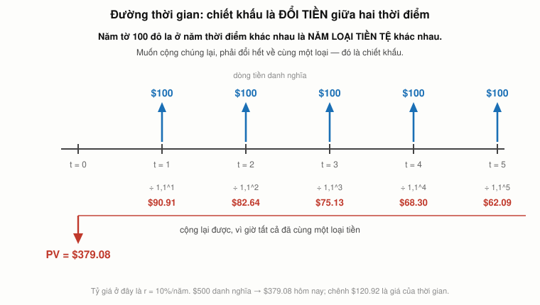
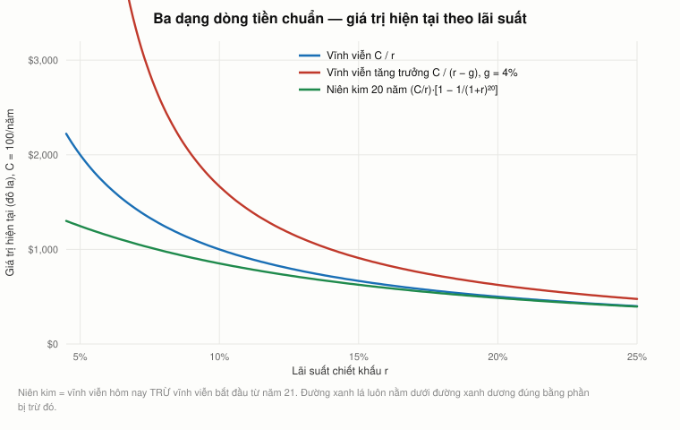
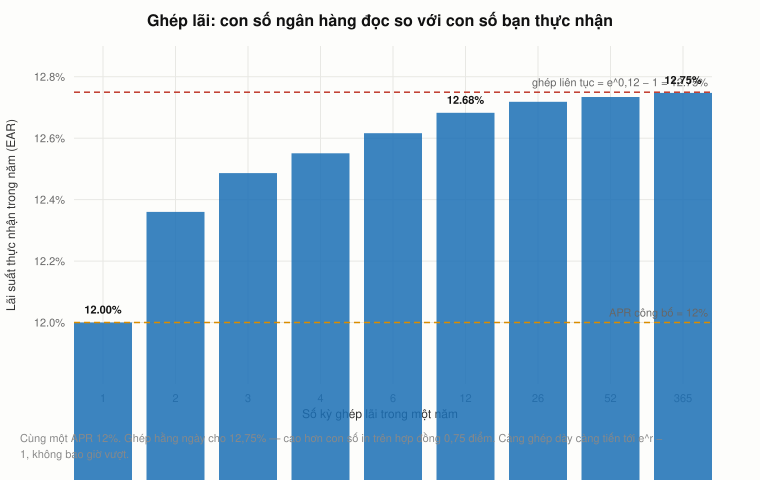

# Bài 2 — Giá trị hiện tại: dòng tiền ở hai thời điểm là hai loại tiền tệ

> Bài học dựng trên **hai video**: **"Ses 2: Present Value Relations I"** (`U03Md5enU-0`, 75:50) và
> **"Ses 3: Present Value Relations II"** (`4F1J5Q3DiaI`, 80:12) — khoá **MIT 15.401 *Finance
> Theory I*, Fall 2008**, giảng viên **Prof. Andrew W. Lo**. Phụ đề gốc do người viết tay.
>
> 🕑 **Cách đọc mốc thời gian.** Bài này gộp hai buổi, nên mọi mốc đều có tiền tố:
> `S2 45:33` = buổi 2, phút 45:33 · `S3 30:22` = buổi 3, phút 30:22. Mỗi mốc đã được đối chiếu
> ngược với **đúng** phụ đề của video đó.
>
> 📚 **Mở rộng** — kiến thức video lướt qua hoặc bài học này bổ sung, **không có trong video**.
> 🇻🇳 **Góc Việt Nam** — số liệu và ví dụ trong nước (mục 15), **không có trong video**.
> ⚠️ Các mục đối chiếu 2026: **11** (trái phiếu vĩnh viễn của Anh đã biến mất), **2** (mốc ghi hình).
> 📌 **Cần đọc trước:** [Bài 1](bai_01_tai_chinh_la_gi.md) — đặc biệt là
> [mục 17](bai_01_tai_chinh_la_gi.md#17-bốn-mảnh-lý-thuyết-buổi-1-còn-thiếu), nơi đã nêu trước
> công thức PV và nguyên lý không-arbitrage. Bài này là chỗ hai thứ đó gặp nhau.
>
> Công thức viết bằng LaTeX — mở bằng **Obsidian** hoặc VS Code + Markdown Preview Enhanced.

---

## Mục lục

<!-- MUC-LUC -->
- [1. Hộp thứ hai — và cú lật của bài 1](#1-hộp-thứ-hai--và-cú-lật-của-bài-1)
- [2. Lo áp cái hộp lên cuộc khủng hoảng đang diễn ra](#2-lo-áp-cái-hộp-lên-cuộc-khủng-hoảng-đang-diễn-ra)
- [3. Tài sản là gì — định nghĩa lại từ gốc](#3-tài-sản-là-gì--định-nghĩa-lại-từ-gốc)
- [4. Toán tử giá trị $V_t$ và đường thời gian](#4-toán-tử-giá-trị-v_t-và-đường-thời-gian)
- [5. Phép ẩn dụ trung tâm: hai thời điểm là hai loại tiền tệ](#5-phép-ẩn-dụ-trung-tâm-hai-thời-điểm-là-hai-loại-tiền-tệ)
- [6. NPV — cộng được, sau khi đã đổi tiền](#6-npv--cộng-được-sau-khi-đã-đổi-tiền)
- [7. Tỷ giá lấy từ đâu? Lo mở phiên đấu giá thứ hai](#7-tỷ-giá-lấy-từ-đâu-lo-mở-phiên-đấu-giá-thứ-hai)
- [8. Vì sao vẫn chiết khấu khi KHÔNG có rủi ro?](#8-vì-sao-vẫn-chiết-khấu-khi-không-có-rủi-ro)
- [9. Từ tỷ giá sang $r$ — và năm cái tên của nó](#9-từ-tỷ-giá-sang-r--và-năm-cái-tên-của-nó)
- [10. Ba giả định, và hạn dùng của chúng](#10-ba-giả-định-và-hạn-dùng-của-chúng)
- [11. Vĩnh viễn: $C/r$](#11-vĩnh-viễn-cr)
- [12. Vĩnh viễn tăng trưởng: $C/(r-g)$](#12-vĩnh-viễn-tăng-trưởng-cr-g)
- [13. Niên kim = vĩnh viễn đi mượn thời gian](#13-niên-kim--vĩnh-viễn-đi-mượn-thời-gian)
- [14. Ghép lãi: con số ngân hàng đọc so với con số bạn thực nhận](#14-ghép-lãi-con-số-ngân-hàng-đọc-so-với-con-số-bạn-thực-nhận)
- [15. Góc Việt Nam — cái bẫy lãi suất ưu đãi](#15-góc-việt-nam--cái-bẫy-lãi-suất-ưu-đãi)
- [16. Code minh hoạ](#16-code-minh-hoạ)
- [17. Tự thử](#17-tự-thử)
- [18. Từ điển thuật ngữ](#18-từ-điển-thuật-ngữ)
- [19. Câu hỏi tự kiểm tra](#19-câu-hỏi-tự-kiểm-tra)
- [Tóm tắt một trang](#tóm-tắt-một-trang)
- [Nguồn](#nguồn)
<!-- /MUC-LUC -->

---

## 1. Hộp thứ hai — và cú lật của bài 1

Buổi 2 mở đầu bằng việc trả nốt câu chuyện còn dở. Ở bài 1, Lo bán đấu giá một hộp kín và thu được
**$45** cho một chiếc iPod Nano giá lẻ **$149**. Ông có **hai** gói, và tung đồng xu để chọn gói nào
bán cho lớp nào. Giờ ông tiết lộ gói kia (`S2 00:34`):

> *"Gói to hơn hoá ra là một cuốn sách. Thật ra là một cuốn sách tôi mới xuất bản về quỹ đầu cơ.
> Và hoá ra phiên đấu giá món thứ hai đó chốt ở **$60**."*

Rồi có sinh viên hỏi giá bìa. Lo đáp (`S2 01:48`):

> *"Cuốn sách bán lẻ **$45**. Tất nhiên là tôi có ký tặng, nên chắc điều đó làm giảm giá bán lại."*

Đặt hai phiên cạnh nhau thì ra một thứ khó chịu:

| Món hàng           | Gói     | Giá lẻ | Chốt | So với giá lẻ |
| ------------------ | ------- | -----: | ---: | ------------: |
| iPod Nano 4 GB     | **nhỏ** |   $149 |  $45 |    **30,2 %** |
| Sách về quỹ đầu cơ | **to**  |    $45 |  $60 |   **133,3 %** |

Cùng một điều kiện thông tin — **bằng không** — mà một hộp bán **dưới** giá 70 %, hộp kia bán
**trên** giá 33 %. Biến duy nhất thay đổi giữa hai phiên là **kích thước gói**. Lo nói thẳng
(`S2 01:33`):

> *"Thật ra tôi nghĩ chính là kích thước của các gói hàng, tin hay không thì tuỳ. Nên ai bảo bạn
> rằng kích thước không quan trọng thì người đó không thực tế."*

**Điều này bổ sung một mảnh còn thiếu vào [mục 7 của bài 1](bai_01_tai_chinh_la_gi.md#7-đọc-lại-phiên-đấu-giá-bằng-lý-thuyết-đấu-giá).**
Ở đó ta đã tách hai lực kéo giá **xuống**: giá chốt đo người về nhì, và ai cũng chừa một khoản vì
không chắc chắn. Phiên thứ hai cho thấy hai lực đó **không phải lúc nào cũng thắng**. Khi cái neo
duy nhất mà người mua có (kích thước hộp) gợi ý một giá trị lớn, họ trả **vượt** giá thật. Thị
trường không hệ thống dìm giá tài sản mờ đục — nó **khuếch đại bất cứ tín hiệu nào còn sót lại**, dù
tín hiệu đó vô nghĩa đến đâu.

Và Lo tóm bằng một câu sẽ chạy suốt buổi học (`S2 00:56`):

> *"Điều đó cho các bạn thấy sức mạnh của thông tin — hoặc của việc thiếu thông tin — trong việc
> xác định giá trị."*

---

## 2. Lo áp cái hộp lên cuộc khủng hoảng đang diễn ra

Trước khi vào bài, Lo dành gần 20 phút cho thời sự. Và đây là chỗ buổi học này trở nên đặc biệt.

> *"Chuyện xảy ra cuối tuần qua là chuyện có lẽ chưa từng xảy ra kể từ thời Đại Suy thoái. Chuyện
> xảy ra cuối tuần qua là chính phủ liên bang đã tiếp quản hai trong số các định chế tài chính do
> nhà nước bảo trợ lớn nhất thế giới, **Fannie Mae và Freddie Mac**."* — `S2 03:15`–`S2 03:34`

### Mốc thời gian: buổi học này chốt được ngày

Bài 1 chỉ định vị được *"trước 17/9/2008"*. Buổi 2 cho phép chốt chặt hơn nhiều, và toàn bộ bằng
chứng nằm trong chính hai video cộng một dữ kiện lịch sử:

| Bằng chứng                                                                 | Nguồn             |
| -------------------------------------------------------------------------- | ----------------- |
| Lo kết thúc buổi 1: *"hẹn gặp lại thứ Hai tới"*                            | Bài 1, `S1 66:56` |
| Buổi 2: chính phủ tiếp quản Fannie/Freddie *"cuối tuần qua"*               | `S2 03:15`        |
| FHFA công bố đưa hai công ty vào diện bảo hộ **Chủ nhật 7/9/2008**         | dữ kiện lịch sử   |
| Một sinh viên trong buổi 2: *"sáng nay nó giảm 83 %"* — *"so với hôm qua"* | `S2 12:53`        |

⟹ **Buổi 2 là thứ Hai 8/9/2008.** Suy ngược: **buổi 1 diễn ra ngày 3 hoặc 4/9/2008** (MIT khai
giảng học kỳ Thu 2008 vào thứ Tư 3/9), và **buổi 3 là thứ Tư 10/9/2008**.

Ý nghĩa của con số đó thì lạnh người. Ở buổi 3, Lo nói về Lehman Brothers (`S3 09:47`):

> *"Lehman Brothers là một tay chơi lớn trong các loại chứng khoán này, và họ đang chịu rất nhiều
> sức ép. Giá cổ phiếu của họ đã rơi mạnh, ngay cả trong vài ngày gần đây."*

Rồi ông nói tiếp (`S3 10:19`):

> *"Hãy tưởng tượng nếu Freddie và Fannie không được cứu. Gần như chắc chắn Lehman sẽ sụp ngay lập
> tức như một hiệu ứng dây chuyền."*

**Lehman nộp đơn phá sản ngày 15/9/2008 — năm ngày sau buổi 3.** Lo đang nhìn thẳng vào nó và không
biết mình đang nhìn vào cái gì.

> 📌 Bài 1 nay đã được cập nhật theo mốc này. Xem
> [bài 1, mục 14](bai_01_tai_chinh_la_gi.md#14-bài-giảng-này-ghi-ngay-trước-khi-lehman-sụp).

### Cái hộp kín, phiên bản khủng hoảng tín dụng

Đây là đoạn hay nhất buổi. Lo lấy nguyên màn đấu giá ở bài 1 và thay ruột hộp (`S2 07:56`):

> *"Bây giờ thay vì một chiếc iPod trong gói giấy, hãy tưởng tượng gói giấy đó chứa **giấy tờ do
> Fannie Mae hoặc Freddie Mac phát hành**. Và giờ tôi hỏi các bạn, các bạn trả giá cho tờ giấy này
> chứ? Tôi không biết Freddie Mac hay Fannie Mae có còn tồn tại sau hai năm nữa không, nhưng tôi vẫn
> muốn các bạn trả giá."*

Rồi câu này (`S2 08:22`):

> *"Cái bạn nhận được cho tờ giấy này, tôi cũng không thực sự biết, nên nó được gói lại. Và bạn cũng
> không biết. **Bạn không biết. Tôi không biết. Bạn biết là tôi không biết. Và tôi biết rằng bạn biết
> là tôi biết rằng tôi không biết.** Vậy tờ giấy đó sẽ bán được bao nhiêu? Chắc là dưới 30 xu trên
> một đô, phải không?"*

Đó không phải câu đùa. Đó là **bất định bậc cao** (*higher-order uncertainty*) phát biểu chính xác,
và nó là cơ chế thật của việc thị trường tín dụng đóng băng năm 2008: khi không ai biết ai đang cầm
cái gì, và ai cũng biết rằng không ai biết, thì giá chào mua rơi xuống mức mà **không ai chịu bán** —
và thị trường ngừng hoạt động.

Lo kết (`S2 08:36`):

> *"Cái ta thấy xảy ra trong lớp học này lần trước chính xác là cái đã xảy ra ở quy mô khủng khiếp
> hơn nhiều với hai tổ chức lớn đó."*

📚 **Một chi tiết đáng chú ý cho người đọc 2026.** Ở `S2 09:56` một sinh viên hỏi chính phủ lấy tiền
đâu ra để bảo lãnh. Lo đáp: *"Họ sở hữu máy in tiền."* Rồi sinh viên hỏi ngay: *"Vậy chắc chúng ta
sắp bị lạm phát?"* Lo trả lời (`S2 10:09`): *"Đó là mối lo. Có thể là vấn đề. Ta sẽ phải chờ xem."*
— Thực tế: lạm phát Mỹ **không** bùng lên sau 2008; nó ngủ yên gần 13 năm rồi mới bùng năm 2021–2022,
vì một nguyên nhân khác (đứt gãy cung ứng hậu COVID cộng kích thích tài khoá). Câu hỏi đúng, thời
điểm sai.

---

## 3. Tài sản là gì — định nghĩa lại từ gốc

Đây là ý trung tâm của buổi 2, và nó nghe tầm thường cho tới lúc bạn dùng nó.

Lo mở đầu bằng cách liệt kê đủ loại tài sản: doanh nghiệp, nhà xưởng, bằng sáng chế, cổ phiếu, trái
phiếu, quyền chọn, và cả *"kiến thức và danh tiếng"* (`S2 21:30`). Cả lớp bàn khá lâu về bằng sáng
chế so với bí mật kinh doanh — công thức Coca-Cola không hề được cấp bằng, vì **xin bằng thì phải
công bố toàn bộ**, và sau 17 năm là hết độc quyền (`S2 24:03`).

Rồi ông xoá sạch bảng (`S2 27:51`):

> *"Tôi muốn các bạn quên hết những cái đó đi. Tôi muốn các bạn nghĩ về tài sản theo một cách hoàn
> toàn khác. Tôi muốn rút tài sản về những tính chất cốt lõi nhất của nó."*

> **Định nghĩa.** Một **tài sản** tại thời điểm $t$ đơn giản là một **dãy các dòng tiền hiện tại và
> tương lai**:
> $$\text{Tài sản}_t \;=\; \{CF_t,\; CF_{t+1},\; CF_{t+2},\; \dots\}$$
> — `S2 28:13`

Bốn hệ quả, và Lo đi qua từng cái vì lớp học liên tục vặn:

**1. Không có dòng tiền quá khứ.** Chỉ hiện tại và tương lai. Quá khứ không nằm trong định nghĩa.

**2. Tài sản phải gắn với một thời điểm.** (`S2 29:16`)

> *"Nói 'tài sản là Coca-Cola' thì chưa đủ. Bạn phải nói tài sản là **Coca-Cola hôm nay**, khác với
> Coca-Cola mười năm trước, khác với Coca-Cola một trăm năm nữa. Đó là những tài sản khác nhau."*

> *"Cái này giống nghịch lý thiền: không ai tắm hai lần trên một dòng sông, vì nước vẫn đang chảy."*
> — `S2 29:41`

**3. Là một DÃY, không phải một TỔNG.** Một sinh viên hỏi thẳng và Lo chốt thẳng (`S2 31:47`):

> — *"Vậy nó là một dãy dòng tiền, không phải một tổng?"*
> — *"Đúng, không phải tổng. Là một dãy, tức là một danh sách các dòng tiền ở các thời điểm khác
> nhau trong tương lai."*

Phân biệt này quan trọng hơn vẻ ngoài của nó, và mục 4 sẽ cho thấy vì sao: **tài sản** là cái đầu
vào, **giá trị** là cái đầu ra. Lẫn hai thứ là lỗi mà Lo phải sửa lại ở buổi sau (`S3 23:33`):

> *"Bạn có thể có một con tàu vũ trụ bay lên mặt trăng. Đó là một tài sản. Giá trị của con tàu vũ
> trụ bay lên mặt trăng — đó lại là chuyện khác."* — `S3 23:51`

**4. Dòng tiền có thể âm.** Khi được hỏi, Lo nói dòng tiền không cần dương, chỉ cần là **số thực**
(*"không có số phức ở đây nhé"*). Nếu tất cả đều âm thì ta gọi nó là **nợ phải trả** — nhưng với
khung này thì cả hai là cùng một loại vật thể (`S2 31:17`–`S2 31:31`). Và dãy `0, 0, 0, …` cũng là
một tài sản hợp lệ (`S2 35:06`).

Lo dùng một phép ẩn dụ mà đáng nhớ (`S2 30:57`):

> *"Bạn có thể coi tài sản là các phân tử hoặc nguyên tử của một lý thuyết trường thống nhất về tài
> chính. Còn proton và electron — đó là các dòng tiền."*

Và ông giải thích vì sao một định nghĩa trừu tượng đến thế lại có ích (`S2 35:28`):

> *"Càng phức tạp thì bộ khung này càng quan trọng. Bởi vì dù bài toán trước mặt bạn có đáng sợ đến
> đâu, rốt cuộc **một tài sản là một dãy dòng tiền**. Về mặt khái niệm thì đơn giản. Phần khó là tìm
> ra các dòng tiền đó là gì."*

---

## 4. Toán tử giá trị $V_t$ và đường thời gian

Nếu tài sản là dãy dòng tiền, thì **định giá** là một hàm số. Lo đặt tên cho nó trước khi biết nó là
gì — một thủ thuật ông thừa nhận là *"cái mẹo mà các nhà kinh tế học vẫn dùng"* (`S2 36:53`):

> $$V_t\big(\{CF_t, CF_{t+1}, \dots\}\big) \;=\; \text{một con số}$$
> *"Đó là một hàm nhận đầu vào là một dãy dòng tiền và nhả ra một con số, cái mà tôi sẽ gọi là giá
> trị của tài sản tại thời điểm $t$."* — `S2 37:13`

Rồi ông hỏi cả lớp: **một ví dụ của $V$ mà tất cả các bạn đều đã biết là gì?** Câu trả lời:
**giá thị trường** (`S2 38:11`).

> *"Vậy một ví dụ của $V_t$ là **thị trường tại thời điểm $t$**. Đó chính là cái ta làm lần trước.
> Ta có một toán tử giá trị. Nhét một cái hộp gói giấy vào, và $45 rơi ra."* — `S2 38:35`

> *"Cái ta sắp làm là **tháo tung cái hộp đó ra** xem nó chạy thế nào, và xem nó có thật sự chạy
> không."* — `S2 38:35`

### Đường thời gian — và mẹo thi của Lo

Trước khi tính bất cứ thứ gì, Lo bắt vẽ đường thời gian, và ông rất nghiêm túc về việc này
(`S2 40:42`):

> *"Để hiểu được giá trị của một tài sản, bạn phải biết **thời điểm** của các dòng tiền. Trong tài
> chính, thời gian là tất cả."*

```
   t=0        t=1        t=2        t=3
    │          │          │          │
    ▼          ▼          ▼          ▼
  −10.000    +5.000     +7.000       …
  (hôm nay)  (1 năm)    (2 năm)
```

Và đây là lời khuyên thực dụng nhất của cả buổi (`S2 42:43`):

> *"Xem như một mẹo cho bài giữa kỳ và cuối kỳ: bất cứ khi nào phải làm một phép tính giá trị hiện
> tại, tôi muốn thấy cái này. Tôi muốn thấy rằng bạn biết mọi thứ xảy ra lúc nào. Bởi vì **chín
> trên mười lần bạn tính sai định giá, đó là vì bạn xếp cái này sai chỗ.**"*

Không phải vì công thức sai. Vì **xếp sai thời điểm**. Mục 13 sẽ cho một ví dụ đúng như vậy, khi
chính cả lớp — và cả Lo — lúng túng giữa $T$ và $T+1$.

---

## 5. Phép ẩn dụ trung tâm: hai thời điểm là hai loại tiền tệ



*Năm tờ 100 đô ở năm thời điểm là năm loại tiền tệ. Muốn cộng, phải đổi hết về một loại.*

Đây là ý mà nếu bạn chỉ mang một thứ ra khỏi bài 2, hãy mang cái này.

Lo hỏi cả lớp một câu có vẻ ngớ ngẩn (`S2 44:57`):

> *"Chuyện gì xảy ra khi bạn cộng **150 yên** với **300 bảng Anh**? Bằng 450 cái gì? 450 đô la à?
> Nếu bạn tin thế thì xin gặp tôi sau giờ học, chúng ta sẽ cần làm vài giao dịch."*

> *"Rõ ràng 450 chẳng có nghĩa gì. **Nó giống như cộng cân nặng của bạn với tuổi của bạn.** Con số
> đó có thể thú vị, nhưng không có cách nào diễn giải nó."* — `S2 45:33`

Để cộng được, phải quy về một đơn vị. Lo đưa hai kết quả (`S2 46:19`):

$$150\ \text{yên} + 300\ \text{bảng} = 46{.}050\ \text{yên} \;=\; 300{,}98\ \text{bảng}$$

> 📚 Hai con số này ngầm định tỷ giá **1 bảng = 153 yên** (vì $300 \times 153 = 45.900$, cộng 150 ra
> 46.050; và $150/153 = 0{,}98$ bảng). Đây là số minh hoạ do Lo tự đặt — tỷ giá thật tháng 9/2008
> quanh 190 yên/bảng. Không ảnh hưởng gì đến lập luận, nhưng nếu bạn tự tính lại thì đừng bối rối.

Đơn vị được chọn làm chuẩn có tên riêng (`S2 46:58`):

> **Numeraire** — *"một đơn vị tính toán, hay một chuẩn, mà ta dùng để đo mọi thứ."*

Chọn yên hay bảng đều được. Nhà đầu tư Anh thì chọn bảng, nhà đầu tư Nhật thì chọn yên. **Kết luận
không đổi, chỉ đơn vị đổi.**

Và giờ là cú nhảy (`S2 47:41`–`S2 48:18`):

> *"Đúng cái bài tập ấy phải được áp dụng cho **tiền hôm nay so với tiền ngày mai**. Bởi vì hai thứ
> đó không giống nhau. Nó giống như yên và bảng. Chúng không như nhau. Chúng không mua được cùng
> một thứ. Chúng không được dùng theo cùng một cách. Chúng có thị trường khác nhau."*

> *"**Dòng tiền ở các thời điểm khác nhau giống như các loại tiền tệ khác nhau.** Muốn cộng chúng
> lại, bạn phải dùng đúng tỷ giá."*

Đây là toàn bộ nội dung của bài 2, và nó khoá lại một trong hai câu ở
[bài 1 mục 11](bai_01_tai_chinh_la_gi.md#11-thời-gian-và-rủi-ro--hai-thứ-làm-nên-cả-ngành):
*"1 đô hôm nay không bằng 1 đô sang năm"*. Không phải vì nó "kém giá trị hơn" một cách mơ hồ — mà vì
**nó là một đơn vị tiền tệ khác**. Cộng thẳng là một lỗi loại, không phải lỗi số học.

Và nếu bạn có $T$ kỳ, bạn có $T$ loại tiền tệ (`S2 49:43`):

> *"Mỗi một ngày là một loại tiền tệ khác nhau. Và tôi cần quy đổi chúng để cộng được."*

---

## 6. NPV — cộng được, sau khi đã đổi tiền

Chọn numeraire là **đô la hôm nay** (`S2 48:56`). Gọi tỷ giá quy đổi từ đô la ở thời điểm $t$ về
đô la hôm nay là $d_t$. Khi đó:

$$V_0 \;=\; CF_0 \;+\; d_1 CF_1 \;+\; d_2 CF_2 \;+\; \dots \;+\; d_T CF_T \;=\; \sum_{t=0}^{T} d_t\,CF_t$$

với $d_0 = 1$ (đô la hôm nay quy về đô la hôm nay thì không cần đổi).

Lo đặt tên (`S2 51:48`):

> **Giá trị hiện tại ròng** (*net present value*, NPV) là giá trị tại thời điểm 0 của dãy dòng tiền.

Vì sao "hiện tại"? Vì đơn vị là **đô la hôm nay**. Vì sao "ròng"? Vì đã **trừ đi khoản đầu tư ban
đầu** — chính là $CF_0$, thường âm (`S2 52:32`–`S2 53:20`).

### Ví dụ gốc của Lo

Một dự án cần bỏ ra **10 triệu** hôm nay, thu về **5 triệu** năm 1 và **7 triệu** năm 2. Tỷ giá lấy
từ thị trường: **0,90** cho năm 1 và **0,80** cho năm 2 (`S2 61:18`–`S2 62:13`):

|  Năm | Dòng tiền |  Tỷ giá | Quy về hôm nay |
| ---: | --------: | ------: | -------------: |
|    0 |  −10.000k |    1,00 |       −10.000k |
|    1 |   +5.000k |    0,90 |        +4.500k |
|    2 |   +7.000k |    0,80 |        +5.600k |
|      |           | **NPV** |      **+100k** |

$$NPV = -10 + 0{,}90 \times 5 + 0{,}80 \times 7 = +0{,}1\ \text{triệu đô} = \$100.000$$

Rồi câu hỏi quản trị (`S2 62:34`):

> *"Có nên nhận dự án này không? Để tôi hỏi lại: bạn có muốn 100.000 đô không? Nếu không, lại gặp
> tôi sau giờ học, tôi sẽ giúp bạn giải quyết vấn đề này."*

Và ông nối thẳng về bài 1 (`S2 62:55`):

> *"Nhớ hôm đầu tiên tôi bảo rằng một khi đã định giá được thì quản trị là chuyện tầm thường chứ?
> Tôi không đùa đâu. Đây là ví dụ. **Phần định giá là phần khó. Phần quản trị, tức là ra quyết định,
> thì dễ — một khi bạn có đúng những con số trước mặt.**"*

> 📚 **Một điều Lo không nói ra ở đây, mà mục 16 sẽ kiểm.** Hai tỷ giá 0,90 và 0,80 **không** ứng
> với một lãi suất duy nhất. Từ 0,90 suy ra $r_1 = 11{,}11\%$; từ 0,80 suy ra $r_2 = 11{,}80\%$. Ví
> dụ của Lo ngầm giả định lãi suất **không phẳng** — tức là đã có một **đường cong lãi suất**. Đó là
> chủ đề của bài 4. Ở mục 9 dưới đây, Lo sẽ tạm thời gộp tất cả về một $r$ duy nhất cho dễ.

---

## 7. Tỷ giá lấy từ đâu? Lo mở phiên đấu giá thứ hai

Lo dừng lại và tự vặn mình (`S2 53:58`):

> *"Tôi có một câu hỏi chưa được trả lời. Nghe thì hay đấy. Nhưng tôi vừa rút cái gì đó ra từ không
> khí. Tôi đã rút cái gì ra từ không khí?"*
> — *"Tỷ giá."*
> — *"Chính xác. Vậy tôi lấy tỷ giá ở đâu?"*

Câu trả lời, lần thứ ba trong hai buổi học: **từ thị trường** (`S2 54:11`). Và Lo chứng minh ngay tại
chỗ bằng cách mở một phiên đấu giá thứ hai (`S2 54:33`):

> *"Tôi có một chứng khoán trả **$1 sau một năm kể từ hôm nay**. Ai trả tôi một xu cho tờ giấy này?
> Ai trả 50 xu? 75 xu? 80? 90? 95? 97? 98? — Thôi được. **97 xu ăn một đô.** Đó, tỷ giá nằm ngay
> đó. Xong."*

$$d_1 = 0{,}97 \quad\Longrightarrow\quad \$1 \text{ sau một năm } = \$0{,}97 \text{ hôm nay}$$

Rồi ông nói một câu vừa đùa vừa thật (`S2 55:05`):

> *"Nhân tiện, tôi rất cảm kích. Đó là rất nhiều niềm tin vào mức độ tín nhiệm của tôi. Chiết khấu
> chỉ có 3 %."*

Chú ý cấu trúc lập luận, vì nó lặp lại suốt khoá: **Lo không suy ra tỷ giá từ lý thuyết.** Ông
**đo** nó, bằng đúng cái cơ chế đã tạo ra con số $45 ở bài 1. Và ông nói rõ vì sao điều đó quan trọng
(`S2 56:28`):

> *"Đó là lý do các thị trường tài chính quan trọng đến thế. Vì ta cần những đầu vào đó cho quá
> trình định giá. Nếu thị trường tài chính không tồn tại, ta không làm được việc này. Tôi sẽ phải
> khua tay và nói, à thì bạn lấy nó từ một nguồn lý thuyết nào đó. Bạn cứ bịa ra. Nghe không thuyết
> phục lắm. Mà đúng là không thuyết phục thật."*

> *"Sức mạnh của thị trường tài chính là **trí tuệ đám đông**. Và dù bạn thích hay không, các bạn
> chính là cái trí tuệ mà chúng ta đang khai thác."* — `S2 56:45`

Cuối cùng, đổi tên (`S2 57:27`):

> *"Để ý rằng các tỷ giá này đôi khi được gọi là **hệ số chiết khấu** (*discount factors*). Lý do
> gọi thế là vì chúng thường là những số **nhỏ hơn 1**."*

---

## 8. Vì sao vẫn chiết khấu khi KHÔNG có rủi ro?

Đây là câu hỏi hay nhất mà một sinh viên đặt ra trong cả hai buổi, và Lo cũng khen thế (`S2 58:09`):

> — *"Chính xác thì thầy đang chiết khấu **cái gì**, nếu mọi thứ hoàn toàn chắc chắn? Sự thiếu kiên
> nhẫn của em à?"*

Nhớ lại: từ `S2 43:17` Lo đã tuyên bố cả buổi 2 và 3 chạy trong **thế giới không có bất định**.
Không có rủi ro vỡ nợ. Không có ngẫu nhiên. Vậy tại sao $1 sang năm lại đáng giá dưới $1?

> *"Đó là **sự thiếu kiên nhẫn**. Người ta muốn tiêu dùng bây giờ chứ không phải sau này. Và do đó,
> nếu bạn muốn bắt ai đó tiêu dùng muộn hơn, bạn phải cho họ một động lực nào đó."* — `S2 58:28`

> *"Để tôi lấy được đô la của bạn ngay bây giờ và trả lại bạn sau một năm — tức là bạn không được
> tiêu đô la đó hôm nay — thì tôi phải làm cho nó đáng để bạn chờ. Nghĩa là bạn đưa tôi 97 xu bây
> giờ và tôi trả lại bạn $1 sang năm. **Tôi trả thêm cho bạn khoản thời gian mà bạn phải chờ.**"*
> — `S2 58:49`

Một sinh viên khác bổ sung góc nhìn ngược lại, và Lo đồng ý ngay (`S2 59:16`): bạn cũng có thể **cho
người đang cần dùng tiền hôm nay vay**, và tính phí họ vì đặc quyền đó.

📚 **Bốn nguồn của chiết khấu — chỉ một cái áp dụng ở bài này.** Đây là chỗ dễ lẫn nhất, nên tách rõ:

| Nguồn                                        | Có trong bài 2 không?      | Học ở đâu    |
| -------------------------------------------- | -------------------------- | ------------ |
| **Thiếu kiên nhẫn** (ưa thích hiện tại)      | ✅ **duy nhất** ở bài này   | bài 2        |
| **Lạm phát**                                 | ❌ Lo cố ý hoãn             | bài 3        |
| **Rủi ro vỡ nợ / bất định**                  | ❌ đã giả định bằng không   | bài 9–11     |
| **Chi phí cơ hội** (dùng tiền vào việc khác) | ✅ mặt kia của cùng đồng xu | bài 2, mục 9 |

Ngay trong buổi, một sinh viên nêu lạm phát và Lo gạt sang một bên rất dứt khoát (`S2 59:46` và
`S2 60:50`):

> *"Đúng, tôi sẽ nói đến chuyện đó ở cuối bài giảng này. Đó là một lý do khác khiến có chiết khấu.
> Không chỉ là ưa thích thời gian."* … *"Hãy tạm gác lạm phát lại, vì tôi không muốn mọi người bị
> rối vì nó."*

Ông cũng đã trả lời sẵn một câu hỏi mà bài 1 để ngỏ (`S2 60:12`):

> *"**Giảm phát có thể xảy ra. Lãi suất thực âm có thể xảy ra** trong một số giai đoạn phát triển
> kinh tế bất thường."*

⚠️ Chú ý ông nói **lãi suất thực** âm — cái đó đúng và đã xảy ra nhiều lần. Khác với lời hứa ở
[bài 1 mục 12](bai_01_tai_chinh_la_gi.md#12-đối-chiếu-2026--chỗ-lo-nói-chắc-mà-lịch-sử-đã-bác),
nơi ông nói **lãi suất danh nghĩa** không thể âm. Hai phát biểu khác nhau, và chỉ cái sau bị lịch sử
bác.

---

## 9. Từ tỷ giá sang $r$ — và năm cái tên của nó

Mang $T$ tỷ giá theo người thì phiền. Lo muốn nén tất cả về **một** con số (`S2 70:23`):

> *"Đó là chuyện đau đầu, phải mang theo $T$ con số. Hơn nữa còn có tỷ giá giữa ngày $T+k$ và $T+j$.
> Bất kỳ hai ngày nào cũng phải có tỷ giá giữa chúng. Chẳng mấy chốc số tỷ giá bạn phải nhớ trong đầu
> trở nên vô lý."*

> *"**Đó là lý do người ta nghĩ ra đồng Euro.** Họ cố hợp nhất bớt một số tỷ giá."* — `S2 70:41`

Cách nén: đi **ngược chiều**. Thay vì hỏi "$1 sang năm đáng bao nhiêu hôm nay", hỏi "$1 hôm nay đáng
bao nhiêu sang năm" — số đó **lớn hơn 1**, và ta viết nó là $1+r$ (`S2 67:21`–`S2 68:11`):

$$\$1 \text{ ở năm } 0 \;\longrightarrow\; \$1 \times (1+r)^T \text{ ở năm } T$$

$$\Longrightarrow\quad d_t \;=\; \frac{1}{(1+r)^t}
\qquad\text{và}\qquad
\boxed{\;V_0 \;=\; \sum_{t=0}^{T} \frac{CF_t}{(1+r)^t}\;}$$

Lo giải thích vì sao viết $(1+r)^2$ chứ không phải một ký hiệu mới $1+z$ cho hai năm (`S2 68:33`):
ông **chọn năm làm đơn vị** rồi lấy luỹ thừa, để chỉ phải nhớ một con số duy nhất.

### Năm cái tên của cùng một con số

Chỗ này gây nhầm lẫn cho người mới nhiều hơn bất cứ chỗ nào khác trong bài, nên Lo liệt kê hết
(`S2 69:12`–`S2 69:38`):

| Tên tiếng Việt             | Tiếng Anh                     | Hay gặp trong bối cảnh               |
| -------------------------- | ----------------------------- | ------------------------------------ |
| Lãi suất                   | *interest rate*               | ngân hàng, trái phiếu                |
| Tỷ lệ tăng trưởng          | *growth rate*                 | khi nhìn tiền lớn lên theo thời gian |
| Chi phí vốn                | *cost of capital*             | tài chính doanh nghiệp               |
| **Chi phí cơ hội của vốn** | *opportunity cost of capital* | tên chuẩn xác nhất                   |
| Chi phí sử dụng            | *user cost*                   | cách gọi của **John Maynard Keynes** |

Trong năm cái tên đó, **"chi phí cơ hội của vốn"** là cái nói đúng bản chất nhất. $r$ không phải
một tính chất của dự án. Nó là **thứ bạn có thể kiếm được ở nơi khác với cùng số tiền đó** — nên bỏ
tiền vào dự án này tức là từ bỏ nó. Mục 12 sẽ cho thấy hệ quả rất thực tế: cùng một dự án tiết kiệm
điện, tốt ở $r = 4\%$ và tệ ở $r = 14\%$, dù bản thân dự án không đổi một chữ.

Và Lo nhắc lại, lần thứ tư (`S2 70:59`): $r$ **cũng lấy từ thị trường**. Ông thừa nhận ngay sau đó
(`S2 71:15`) rằng *"thị trường thật ra sẽ cho ta rất nhiều $r$ khác nhau"* — nhưng hoãn chuyện đó lại.

Cuối buổi 2, Lo giao bài tự luyện (`S2 73:40`):

> *"Hãy tự kiểm tra mình. Nếu bạn có $100 hôm nay và $r = 7\%$, thì $100 đó đáng bao nhiêu sau ba
> năm? Hoặc nếu bạn có $180 sau ba năm, và muốn biết nó đáng bao nhiêu **sau một năm** chứ không phải
> sau ba năm, với $r = 8\%$, thì bằng bao nhiêu?"*

(Mục 17 có lời giải dạng bài tập — thử tự làm trước.)

---

## 10. Ba giả định, và hạn dùng của chúng

Trước khi kết buổi 2, Lo bày rõ mọi thứ ông đã lén đưa vào (`S2 64:26`–`S2 65:15`):

| #   | Giả định                                                                       | Bị gỡ ở đâu                 |
| --- | ------------------------------------------------------------------------------ | --------------------------- |
| 1   | **Biết trước dòng tiền** — không có bất định về việc chúng có xảy ra hay không | bài 9–11                    |
| 2   | **Biết trước tỷ giá** — và nếu chưa biết thì đi lấy ở thị trường               | bài 4 (đường cong lãi suất) |
| 3   | **Không có ma sát** khi quy đổi — không phí, không chênh lệch mua–bán          | bài 13                      |

Về giả định 3, Lo lấy ví dụ rất đời (`S2 65:01`): khi bạn ra nước ngoài đổi tiền, quầy đổi tiền
**thu phí**. Suốt bài này ông nói như thể việc quy đổi không tốn gì.

Và ông đặt **hạn dùng** rõ ràng (`S2 65:49`):

> *"Cho tới bài giảng 12 — còn xa lắm — tôi sẽ giả định các giả định này đúng. Sau bài 12 tôi sẽ
> quay lại và **chất vấn, mở rộng và sửa lại từng cái một** một cách có hệ thống."*

So sánh với [hợp đồng sư phạm ở bài 1](bai_01_tai_chinh_la_gi.md#13-sáu-nguyên-lý--và-vì-sao-lo-chỉ-đưa-ba):
Lo lại làm đúng một việc — nói trước cái gì là xấp xỉ, và nói trước khi nào sẽ tháo nó ra. Đây là
kiểu trung thực trí tuệ đáng học theo, không chỉ trong tài chính.

> ⚠️ **Một chi tiết nhỏ, kiểm cho vui.** Ở `S2 66:08` Lo nói: *"khi tôi bảo các bạn hôm khai giảng
> rằng các bạn không chịu nổi sự thật…"*. Câu *"you can't handle the truth"* **không có** trong bản
> ghi buổi 1. Nhiều khả năng ông nói nó ở lớp còn lại — Lo dạy **hai** lớp song song và tự nhắc điều
> đó ở `S2 00:20`. Không quan trọng, nhưng nó minh hoạ đúng luật số 1 của khoá học này: **kiểm, đừng
> nhớ.**

---

## 11. Vĩnh viễn: $C/r$

Buổi 3 dồn phần lớn thời lượng cho hai công thức. Lo giới thiệu cái thứ nhất bằng lời lẽ khá bất
thường (`S3 29:45`):

> *"…một trong những công thức đẹp nhất của cả khoá học này. Nghe có vẻ lạ khi tôi gọi một công thức
> là đẹp."*

Rồi ông mượn Paul Samuelson (`S3 30:04`):

> *"Paul Samuelson, nhà kinh tế học lớn ở MIT, từng nói rằng hoặc bạn thấy lý thuyết xác suất là đẹp,
> hoặc không. Và nếu bạn không thấy nó đẹp thì tôi thấy tiếc cho bạn. Tôi nghĩ điều tương tự cũng
> đúng với công thức này."*

> **Vĩnh viễn** (*perpetuity*): một tờ giấy trả cho người cầm nó **$C$ mỗi năm, mãi mãi**, bắt đầu
> từ **năm sau**. — `S3 30:40`

> *"Nó là món quà cứ cho mãi."* — `S3 31:42`

Trực giác đầu tiên của ai cũng là: trả vô hạn tiền thì phải đáng giá vô hạn. **Sai** (`S3 32:02`) —
vì giá trị hiện tại của một đô la trả ở tương lai xa **giảm dần**, và giảm đủ nhanh để tổng hội tụ:

$$PV = \sum_{t=1}^{\infty} \frac{C}{(1+r)^t} \;=\; \boxed{\dfrac{C}{r}}$$

> *"Nếu tôi có một tờ giấy trả $100 mỗi năm mãi mãi, và lãi suất là 10 %, tờ giấy đó đáng bao nhiêu?"*
> — *"$1.000."* — *"Chính xác."* — `S3 33:53`

### Chứng minh — Lo gọi nó là "mẹo đội tuyển toán cấp ba"

Lo lướt qua bằng một câu (`S3 33:13`). Vì bài này muốn đầy đủ về lý thuyết, viết ra cho tử tế:

Đặt $S = \dfrac{C}{1+r} + \dfrac{C}{(1+r)^2} + \dfrac{C}{(1+r)^3} + \dots$

Nhân hai vế với $(1+r)$:

$$(1+r)S = C + \frac{C}{1+r} + \frac{C}{(1+r)^2} + \dots = C + S$$

Trừ $S$ khỏi cả hai vế:

$$(1+r)S - S = C \quad\Longrightarrow\quad rS = C \quad\Longrightarrow\quad S = \frac{C}{r}$$

> 📌 **Điều kiện hội tụ.** Phép nhân–trừ trên chỉ hợp lệ khi chuỗi hội tụ, tức khi
> $\left|\dfrac{1}{1+r}\right| < 1$, tức khi $r > 0$. Với $r \le 0$ thì tổng phân kỳ và công thức vô
> nghĩa. Mục 12 sẽ gặp lại đúng vấn đề này ở dạng khó chịu hơn.

### Một nghịch lý nhỏ mà Lo giải rất gọn

Có sinh viên nhận ra điều lạ (`S3 43:25`): nếu $C$ và $r$ không đổi, thì **giá của vĩnh viễn không
bao giờ đổi**. Mua $1.000 hôm nay, năm năm sau vẫn $1.000. Vậy chẳng phải bạn bị hớ, vì tài sản
không tăng giá?

Lo (`S3 44:33`):

> *"Nói lợi suất bằng 0 là sai. **Lợi suất từ GIÁ** bằng 0. Không có tăng giá. Nhưng trong lúc đó,
> mỗi năm bạn vẫn nhận séc $100. Nếu tờ giấy giá $1.000 và bạn nhận $100 mỗi năm, thì lợi suất hằng
> năm của bạn là bao nhiêu? **10 %.** Còn lãi suất là bao nhiêu? Ồ, hay nhỉ."*

Bài học chung, và nó quay lại ở bài 6 khi định giá cổ phiếu: **lợi suất toàn phần = lợi suất từ
giá + lợi suất từ dòng tiền.** Nhìn mỗi giá thì bạn thấy một tài sản "không sinh lời". Đó là lỗi đọc
báo cáo phổ biến nhất về cổ phiếu cổ tức cao.

### Đối chiếu 2026 — ví dụ thật của Lo đã biến mất

Khi bị hỏi có vĩnh viễn thật ngoài đời không, Lo đưa ra ví dụ kinh điển (`S3 34:47`):

> *"Ở Vương quốc Anh có một loại trái phiếu chính phủ gọi là **console** [consol]. Trái phiếu này là
> một vĩnh viễn. Nó trả cho người giữ một khoản cố định mỗi năm, mãi mãi. Trong trường hợp đó,
> 'mãi mãi' nghĩa là chừng nào chính phủ Anh còn tồn tại."*

**Chính phủ Anh vẫn còn tồn tại. Consol thì không.**

Trong hai năm 2014–2015, Kho bạc Anh mua lại **toàn bộ** trái phiếu không kỳ hạn của mình:

| Trái phiếu                                                           | Ngày mua lại |
| -------------------------------------------------------------------- | ------------ |
| 4 % Consolidated Loan (Churchill phát hành 1927)                     | 1/2/2015     |
| 3½ % War Loan — lớn nhất, 1.938,6 triệu bảng, chiếm 75 % tổng        | 9/3/2015     |
| 3½ % Conversion Loan                                                 | 1/4/2015     |
| 3 % Treasury Stock                                                   | 8/5/2015     |
| 2¾ % và 2½ % Annuities, 2½ % Consolidated Stock, 2½ % Treasury Stock | **5/7/2015** |

Ngày 5/7/2015, danh mục trái phiếu chính phủ Anh **không còn một trái phiếu vĩnh viễn nào**.

📚 Lý do thì rất "bài 2": các consol này có **lãi suất coupon cao** so với mặt bằng lãi suất thời
2014–2015 (khi lãi suất chạm đáy lịch sử). Trả $C$ cố định mãi mãi trong lúc $r$ đã rơi xuống rất
thấp nghĩa là $C/r$ **rất đắt** với người phát hành. Mua lại theo mệnh giá là món hời — đúng phép
tính bạn vừa học. Một chi tiết vui: khoản 4 % Consolidated Loan năm 1927 đã gộp trong nó cả một
khoản nợ từ năm 1853 của Gladstone, vốn dùng để hợp nhất vốn cổ phần của **Công ty Nam Hải** — tức
là nước Anh vừa trả nốt tàn dư của **bong bóng Nam Hải 1720**.

Nhưng **công thức không hề sai đi**. Vĩnh viễn vẫn là công cụ trung tâm, chỉ là nó sống ở chỗ khác:
mục 13 dùng nó để dựng công thức trả góp, và bài 6 dùng nó để định giá cổ phiếu (mô hình chiết khấu
cổ tức chính là một vĩnh viễn tăng trưởng).

### Trái phiếu 100 năm — và câu đố Lo để lại

Lo đưa một ví dụ gần vĩnh viễn hơn (`S3 36:35`): Walt Disney từng phát hành **trái phiếu 100 năm**.
Rồi ông đố (`S3 36:58`):

> *"Nếu bạn lấy chuỗi vô hạn này và chỉ cộng tới số hạng thứ 100 thay vì tới vô cùng, bạn bắt được
> bao nhiêu phần trăm tổng giá trị? Hoá ra 100 số hạng là **khá sát với vô cùng** với những mức lãi
> suất mà ta dùng."*

Mục 16 tính chính xác. Đáp án ngắn: ở lãi suất 7,55 % thì 100 kỳ bắt được **99,88 %** giá trị vĩnh
viễn. Ở 2 % thì chỉ còn **86,2 %** — nên câu "100 năm ≈ mãi mãi" **chỉ đúng khi lãi suất không quá
thấp**, một điều kiện Lo không nêu ra.

📚 **Số liệu thật về đợt phát hành đó**, để bạn có cái neo: tháng 7/1993, Disney phát hành trái phiếu
kỳ hạn 100 năm đáo hạn **15/7/2093**, coupon **7,55 %**, ban đầu dự kiến 150 triệu đô nhưng nhu cầu
lớn đến mức nâng lên **300 triệu**. Ba ngày sau, Coca-Cola phát hành 150 triệu đô kỳ hạn 100 năm ở
7,455 %. Đây là những trái phiếu 100 năm đầu tiên kể từ **1954**. Báo chí gọi trái phiếu Disney là
*"Sleeping Beauty"* — công chúa ngủ 100 năm.

> ⚠️ Lo nói *"cách đây vài năm"* (`S3 36:35`). Thực ra là **1993**, tức 15 năm trước buổi giảng. Một
> chỗ nhỏ để tập phản xạ kiểm lại số của người dạy.

---

## 12. Vĩnh viễn tăng trưởng: $C/(r-g)$

Nếu dòng tiền không đứng yên mà **lớn dần** theo tỷ lệ $g$ mỗi năm (`S3 45:52`) — năm sau trả $C$,
năm sau nữa $C(1+g)$, rồi $C(1+g)^2$… — thì cùng một mẹo cho:

$$PV \;=\; \sum_{t=1}^{\infty} \frac{C\,(1+g)^{t-1}}{(1+r)^t} \;=\; \boxed{\dfrac{C}{r-g}}
\qquad \textbf{với điều kiện } r > g$$

Trực giác thì thẳng (`S3 46:33`): trừ $g$ đi làm **mẫu số nhỏ lại**, nên cả phân số **lớn lên** —
đúng hướng, vì dòng tiền tăng dần thì phải đáng giá hơn.

### Vì sao bắt buộc $r > g$ — và chỗ lập luận của Lo hơi lỏng

Lo giải thích khá hay bằng lời (`S3 47:40`–`S3 49:28`): nếu $r = g$ thì mọi số hạng rút gọn thành
$C/(1+r)$, một hằng số, và cộng vô hạn hằng số thì ra vô cùng.

> *"Đến một lúc nào đó nó sẽ vượt tổng GDP thế giới, rồi vượt luôn ra ngoài, rồi tới các hành tinh
> khác trong hệ mặt trời."* — `S3 47:58`

Và ví dụ ông chọn thì rất 2008 (`S3 49:46`):

> *"Suốt 15 năm qua Trung Quốc tăng trưởng khoảng 10 %/năm… Điều đó không thể kéo dài mãi. Nếu nó
> kéo dài thì không chỉ tất cả chúng ta sẽ nói tiếng Trung, mà **mọi hành tinh trong cả thiên hà này
> cũng sẽ nói tiếng Trung**."*

Nhưng khi bị hỏi *"thế nếu $r < g$ thì sao?"*, câu trả lời của Lo (`S3 50:28`) khá lỏng: ông nói có
*"điểm gián đoạn tại 0"* và tổng trở nên *"vô cùng hơn nữa, dù cái đó nghĩa là gì"*. Phát biểu chặt
thì đơn giản hơn:

> Chuỗi $\displaystyle\sum_{t\ge1} \frac{C(1+g)^{t-1}}{(1+r)^t}$ là một **cấp số nhân** với công bội
> $q = \dfrac{1+g}{1+r}$.
> - $g < r \iff q < 1$: chuỗi **hội tụ**, tổng $= C/(r-g)$.
> - $g \ge r \iff q \ge 1$: chuỗi **phân kỳ** về $+\infty$.
>
> Khi $g > r$, biểu thức $C/(r-g)$ vẫn cho ra **một số âm** — nhưng số đó **không phải giá trị của
> gì cả**. Nó là kết quả của việc áp một công thức ra ngoài miền xác định.

Đây không phải chuyện học thuật. Đưa một giá trị **âm** từ $C/(r-g)$ vào một bản định giá là lỗi
kinh điển trong định giá doanh nghiệp — nó xảy ra bất cứ khi nào ai đó giả định một công ty tăng
trưởng vĩnh viễn nhanh hơn chi phí vốn của chính nó. Mục 16 in ra chính con số âm vô nghĩa đó để bạn
nhận mặt nó.

---

## 13. Niên kim = vĩnh viễn đi mượn thời gian



*Ba dạng dòng tiền chuẩn. Niên kim luôn nằm dưới vĩnh viễn đúng bằng phần bị cắt đi.*

Công thức thứ hai, mà Lo gọi là *"công thức yêu thích thứ hai của tôi trong cả khoá"* (`S3 52:20`) —
và là công thức **thực dụng nhất** bạn học được ở bài này.

> **Niên kim** (*annuity*): một chứng khoán trả một khoản cố định mỗi năm trong **một số năm hữu
> hạn**, rồi ngừng. — `S3 52:34`

> *"Ví dụ của niên kim là một trái phiếu. Ví dụ khác là khoản vay mua ô tô. Ví dụ khác nữa là khoản
> vay mua nhà."* — `S3 52:51`

### Lập luận nhân bản — không cần đại số

Lo có thể dẫn công thức bằng cùng mẹo nhân–trừ. Thay vào đó ông làm một việc hay hơn nhiều
(`S3 55:09`):

> *"Để tôi cho các bạn một thí nghiệm tư duy sẽ dẫn ra công thức này trong chưa tới một phút, không
> cần mẹo đội tuyển toán nào cả."*

> *"Giả sử bạn muốn tạo ra một niên kim nhưng không có sẵn. Một cách là **mua một vĩnh viễn, giữ nó
> $T$ kỳ, rồi bán đi.**"* — `S3 55:33`

```
Vĩnh viễn mua hôm nay :  C  C  C  …  C   C    C    C   …   (mãi mãi)
                         1  2  3     T  T+1  T+2  T+3
Vĩnh viễn bán ở T+1   :  ·  ·  ·  …  ·   C    C    C   …   (mãi mãi)
                       ──────────────────────────────────
Còn lại               :  C  C  C  …  C   ·    ·    ·       = NIÊN KIM T kỳ
```

> *"**Một niên kim là một vĩnh viễn đi mượn thời gian.**"* — `S3 56:26`

Định giá giao dịch đó:

- **Mua** vĩnh viễn hôm nay: tốn $C/r$.
- **Bán** nó sau khi đã nhận đủ $T$ khoản. Giá bán vẫn là $C/r$ (giá vĩnh viễn không đổi — mục 11).
- Nhưng khoản bán đó nhận **ở tương lai**, nên phải quy về hôm nay: $\dfrac{C/r}{(1+r)^T}$.

$$PV_{\text{niên kim}} \;=\; \frac{C}{r} \;-\; \frac{C}{r}\cdot\frac{1}{(1+r)^T}
\;=\; \boxed{\dfrac{C}{r}\left[1 - \dfrac{1}{(1+r)^T}\right]}$$

**Chú ý cái vừa xảy ra.** Không có một phép biến đổi đại số nào. Lo định giá một tài sản bằng cách
**dựng lại nó từ hai tài sản khác** — đúng nguyên lý **nhân bản / không-arbitrage** đã nêu trước ở
[bài 1 mục 17.2](bai_01_tai_chinh_la_gi.md#17-bốn-mảnh-lý-thuyết-buổi-1-còn-thiếu). Đây là lần đầu
tiên trong khoá bạn thấy nó chạy thật, và nó sẽ chạy lại ở bài 4, 7 và 8. Mục 16 kiểm bằng code rằng
ba con đường — công thức đóng, nhân bản, cộng tay từng kỳ — cho **cùng một số**.

### Chỗ cả lớp và cả Lo cùng lúng túng: $T$ hay $T+1$?

Đây đúng là cái bẫy Lo cảnh báo ở mục 4 — **xếp sai thời điểm**. Xem đoạn `S3 58:12`–`S3 61:03`:

> — *"Tỷ giá giữa ngày 0 và ngày $T+1$ là gì?"* — *"Theo $T$ ạ."* — *"Không. **Gần đúng, nhưng chưa
> trúng.**"* — *"$T+1$."* …
>
> Rồi Lo tự sửa lại chính mình (`S3 60:16`): *"À, xin lỗi. **Là $T$ kỳ**, quy ước hơi rối."*
>
> Và cuối cùng: *"**Bao nhiêu người đang thấy rối?**"* — `S3 61:03`

Ông phải bật đèn và làm lại trên bảng. Lời giải thích cuối cùng (`S3 63:00`): một vĩnh viễn **bắt đầu
trả từ kỳ sau**, nên một chuỗi bắt đầu ở $T+1$ có giá trị $C/r$ **tại thời điểm $T$**, và ta chiết
khấu $T$ kỳ về hiện tại.

Nếu bạn đọc tới đây mà thấy rối thì **hoàn toàn bình thường** — cả một giảng đường MBA của MIT cũng
rối ở đúng chỗ này, và người dạy phải sửa lời hai lần. Cách chữa duy nhất là cái Lo đã bảo ở `S2 42:43`:
**vẽ đường thời gian ra giấy.**

### Câu chuyện trả góp của Lo

Lo kể lần đầu ông mua nhà (`S3 65:09`). Lãi suất hôm đó khoảng 8¾ %, nhưng **cuốn sổ tra cứu của ngân
hàng không có mức 8¾** — chỉ có 8½ và 9.

> *"Tôi chỉ dùng công thức này, bấm vài con số, và ra được khoản trả hằng tháng. Tôi bảo nhân viên
> ngân hàng: đây, mỗi tháng tôi sẽ trả từng này. Anh ta bảo, à không, anh không thể tự làm thế được…
> phải chờ phó tổng giám đốc cho biết con số đúng là bao nhiêu."*

Phó tổng giám đốc cũng không có sổ. Họ phải gọi về chi nhánh chính để tra.

> *"Và quả nhiên, khi họ trả lời, nó đúng bằng con số của tôi, **tới chữ số thập phân thứ tư**. Anh
> ta kinh ngạc kiểu, wow, làm sao anh làm được thế? Nó chỉ đáng kinh ngạc nếu bạn không biết cái bí
> mật rất cơ bản này."* — `S3 66:12`

Đảo công thức để lấy khoản trả hằng kỳ — đây là dạng bạn sẽ thật sự gõ vào máy tính:

$$C \;=\; PV \cdot \dfrac{r}{1 - (1+r)^{-T}}$$

📚 **Hệ số chiết khấu niên kim.** Lo nhắc tới các bảng tra *annuity discount factor* (`S3 66:44`) —
chính là cụm $\frac{1}{r}\left[1-(1+r)^{-T}\right]$, tách rời khỏi $C$. Biết hệ số này và số tiền vay
thì chia ra là có khoản trả hằng tháng. *"Ngày nay ta làm trong Excel, không có gì to tát. Nhưng bạn
vẫn nên biết cơ sở của các phép tính đó."* (`S3 68:13`)

> 📌 **Công thức mà Lo không đưa: niên kim tăng trưởng.** Để trọn bộ bốn dạng dòng tiền chuẩn:
> $$PV = \frac{C}{r-g}\left[1 - \left(\frac{1+g}{1+r}\right)^{T}\right] \qquad (r \ne g)$$
> Dùng khi khoản trả tăng đều — ví dụ một hợp đồng thuê có điều khoản tăng giá hằng năm, hoặc dòng
> lương dự kiến tăng theo thâm niên.

| Dòng tiền    | Kỳ hạn | Công thức                                                      |
| ------------ | ------ | -------------------------------------------------------------- |
| Cố định $C$  | vô hạn | $C/r$                                                          |
| Tăng đều $g$ | vô hạn | $C/(r-g)$, cần $r>g$                                           |
| Cố định $C$  | $T$ kỳ | $\frac{C}{r}\left[1-(1+r)^{-T}\right]$                         |
| Tăng đều $g$ | $T$ kỳ | $\frac{C}{r-g}\left[1-\left(\frac{1+g}{1+r}\right)^{T}\right]$ |

---

## 14. Ghép lãi: con số ngân hàng đọc so với con số bạn thực nhận



*Cùng một APR 12%: ghép hằng ngày cho 12,75%, cao hơn con số in trên hợp đồng 0,75 điểm.*

Phần cuối buổi 3 chuyển sang một chủ đề mà Lo nói rõ là **quy ước**, không phải lý thuyết (`S3 68:46`):

> *"Ghép lãi là chuyện quy ước. Tôi muốn giải thích quy ước đó là gì và cho các bạn một chút động cơ
> logic của nó, để ít nhất nó không trông như tôi bịa ra từ trên trời."*

Gần như mọi lãi suất trên thế giới đều được **niêm yết theo năm** (`S3 69:20`). Vấn đề: nếu bạn rút
tiền sau **sáu tháng** thì được trả bao nhiêu?

Cách "công bằng" theo cảm tính là chia đôi: 10 %/năm → 5 % cho nửa năm. Nhưng Lo chỉ ra hệ quả
(`S3 70:21`):

> *"Nếu bạn được trả 5 % lãi trong sáu tháng đầu, bạn rút tiền khỏi ngân hàng, rồi gửi lại **ngay phút
> sau** và giữ tiếp sáu tháng nữa, bạn sẽ kiếm thêm 5 % trên số gốc, **cộng thêm 5 % trên 5 % của sáu
> tháng đầu**. Bạn kiếm được lãi trên lãi."*

Ngân hàng có thể chống lại bằng cách trả $\sqrt{1{,}10}-1$ cho mỗi nửa năm — để ghép hai kỳ lại đúng
bằng 10 %. Nhưng (`S3 72:41`):

> *"Họ không làm thế, chủ yếu vì **chẳng ai thích dính đến căn thức, trừ nha sĩ**."*

Nên quy ước thắng, và sinh ra hai từ viết tắt mà bạn phải phân biệt được:

| Viết tắt | Tên đầy đủ               | Là gì                                                             |
| -------- | ------------------------ | ----------------------------------------------------------------- |
| **APR**  | *annual percentage rate* | **Lãi suất niêm yết.** Con số trong quảng cáo. Chưa tính ghép lãi |
| **EAR**  | *effective annual rate*  | **Lãi suất thực nhận.** Đã tính ghép lãi. Cũng gặp dưới tên APY   |

$$\text{EAR} \;=\; \left(1 + \frac{\text{APR}}{n}\right)^{n} - 1$$

Và đây là điểm Lo nhấn mạnh nhất (`S3 73:16`): **ghép lãi tốt cho người gửi, xấu cho người vay.**

> *"Khi họ bảo bạn muốn vay tiền à, tôi cho anh lãi suất cực tốt, 10 % thôi. Nhưng khi bạn thật sự
> xem mình trả bao nhiêu lãi, bạn sẽ phát hiện ra thực tế là **hơn 10 %**."*

Đó là lý do luật buộc ngân hàng phải công bố loại lãi suất nào (`S3 77:04`): *"Đó là một cam kết kiểu
minh bạch trong cho vay mà giờ họ bị buộc phải làm."* Và nếu bạn hỏi EAR, **họ có nghĩa vụ trả lời**
(`S3 77:21`).

Vì sao ngân hàng ghép lãi **hằng ngày**? Lo đưa lý do rất thực dụng (`S3 77:58`): vì họ cho bạn rút
tiền hằng ngày. Nếu không ghép theo ngày, mỗi người rút vào một hôm khác nhau lại phải tính riêng
một kiểu.

### Đáp án câu đố cuối buổi

Lo kết thúc buổi 3 bằng một câu đố và **không giải** (`S3 79:08`):

> *"Nếu bạn ghép lãi không phải mỗi ngày, không phải mỗi giờ, không phải mỗi phút, không phải mỗi
> femto-giây, mà theo **lát thời gian nhỏ nhất bạn có thể nghĩ ra** — nếu bạn ghép liên tục, nếu $n$
> tiến ra vô cùng, bạn được gì?"*

> *"Hoá ra bạn thật sự nhận được **một con số**. Và con số đó thì rất kỳ quái."* — `S3 79:57`

Vì bài 3 mới trả lời, còn bạn thì đang cần nó ngay để hiểu mục 16, đáp án ở đây:

$$\lim_{n\to\infty}\left(1+\frac{r}{n}\right)^{n} \;=\; e^{\,r}
\qquad\Longrightarrow\qquad
\text{EAR}_{\text{liên tục}} = e^{\,r} - 1$$

Với $r = 10\%$: $e^{0{,}1} - 1 = 10{,}5171\%$.

Điều "kỳ quái" mà Lo ám chỉ chính là **$e$** — hằng số Euler xuất hiện từ một câu hỏi thuần tuý về
ngân hàng, không liên quan gì tới hình học hay giải tích. Và điểm quan trọng về mặt tài chính: **ghép
lãi dày hơn không cho vô hạn tiền.** Nó có một **trần**, và trần đó là $e^r$. Mục 16 in ra cả bảng
hội tụ về con số đó.

---

## 15. Góc Việt Nam — cái bẫy lãi suất ưu đãi

Công thức niên kim ở mục 13 không phải bài tập lý thuyết. Ở Việt Nam năm 2026 nó là thứ quyết định
bạn có trả nổi khoản vay mua nhà hay không. **Không có gì trong mục này nằm trong video.**

### Cấu trúc một khoản vay mua nhà ở Việt Nam

Gần như mọi ngân hàng đều dùng cùng một cấu trúc **hai giai đoạn**:

| Giai đoạn                                   | Lãi suất, mức tham khảo 2026                                                                   |
| ------------------------------------------- | ---------------------------------------------------------------------------------------------- |
| **Ưu đãi**, 6–36 tháng đầu                  | **8 – 10 %/năm** (ACB 8,3 % cho 12 tháng; MB 8,5 % cho 12 tháng; VietinBank 10 % cho 36 tháng) |
| **Thả nổi**, phần đời còn lại của khoản vay | **12 – 14 %/năm**                                                                              |

Lãi suất thả nổi không phải con số ngân hàng tuỳ ý đặt, mà theo công thức:

$$r_{\text{thả nổi}} \;=\; r_{\text{tham chiếu}} \;+\; \text{biên độ}$$

trong đó $r_{\text{tham chiếu}}$ thường là **lãi suất tiết kiệm kỳ hạn 12–13 tháng** của chính ngân
hàng đó, và **biên độ 3–4 %/năm** (VietinBank công bố biên độ 3,5 %).

### Vì sao con số trong hợp đồng không phải con số bạn sẽ trả

Đây là chỗ mục 13 trả tiền cho công sức đọc. Ngân hàng báo khoản trả hằng tháng bằng cách nhét **lãi
suất ưu đãi** vào công thức niên kim cho **toàn bộ kỳ hạn**. Nhưng lãi suất ưu đãi chỉ sống được vài
tháng.

Mục 16 chạy đúng phép tính đó với một khoản vay điển hình — **2 tỷ đồng, 20 năm, ưu đãi 8,5 % trong
24 tháng rồi thả nổi 12,5 %**:

| Khoản mục                                           |                       Số tiền |
| --------------------------------------------------- | ----------------------------: |
| Ngân hàng báo giá hằng tháng (tính theo lãi ưu đãi) |              **17.356.465 đ** |
| Dư nợ còn lại sau 24 tháng                          |               1.916.872.461 đ |
| Khoản trả hằng tháng **từ tháng 25**                |              **22.350.750 đ** |
| **Mức tăng**                                        | **+4.994.285 đ, tức +28,8 %** |

Và tổng số tiền trả cả kỳ là **5.244.317.160 đ** — **2,62 lần** số tiền vay.

**Con số bạn nhìn khi ký hợp đồng không phải con số bạn trả trong 18 năm còn lại.** Nếu ngân sách
gia đình bạn vừa khít với 17,4 triệu/tháng thì bạn đã vỡ kế hoạch từ tháng thứ 25. Đây là phép tính
mà **bạn phải tự làm**, vì nó không nằm trên tờ rơi.

### Ba thứ khác cũng phải đưa vào phép tính

📚 Chi phí ẩn — dùng đúng khung "dãy dòng tiền" ở mục 3, chúng chỉ là các dòng tiền âm ở những thời
điểm nhất định:

- **Phí trả nợ trước hạn.** Shinhan Bank: 2 % trong 2 năm đầu, 1 % năm thứ ba, 0,5 % năm thứ tư. MB:
  1 % trên dư nợ còn lại trong 5 năm đầu. Nghĩa là **thoát khỏi khoản vay cũng tốn tiền**.
- **Hoàn trả lãi ưu đãi.** Nếu bạn phá vỡ cam kết trước hạn, ngoài phí trên còn phải trả lại phần lãi
  đã được ưu đãi — mức 1,5 %/năm với gói 12 tháng, 2 % với gói 18 tháng, 2,5 % với gói 24 tháng.
- **Vay để đầu tư thì đắt hơn.** Với khoản vay không phục vụ nhu cầu ở thực, lãi suất có thể lên tới
  khoảng **14 %/năm**.

### Đọc quảng cáo bằng công thức, đừng bằng con số to nhất

Một cạm bẫy thường gặp: gói *"5,5 %/năm trong 6 tháng"* trông rẻ hơn gói *"7 %/năm trong 12 tháng"*.
Nhưng gói đầu chỉ giữ mức đó **6 tháng**, còn 234 tháng còn lại chạy theo lãi thả nổi. Câu hỏi đúng
không phải *"lãi ưu đãi bao nhiêu"* mà là:

> **Biên độ thả nổi là bao nhiêu, và lãi suất tham chiếu là mức nào?** Đó là hai con số quyết định
> gần như toàn bộ số tiền bạn sẽ trả.

Nối với [nguyên lý 1 của Lo](bai_01_tai_chinh_la_gi.md#13-sáu-nguyên-lý--và-vì-sao-lo-chỉ-đưa-ba):
lãi ưu đãi thấp hơn mặt bằng **không phải bữa trưa miễn phí**. Phần chênh không biến mất — nó được
dời sang giai đoạn thả nổi, sang phí trả nợ trước hạn, hoặc sang điều khoản hoàn trả ưu đãi. Việc của
bạn là tìm xem nó nằm ở đâu.

> ⚠️ Mọi con số trong mục này là **mức tham khảo tại thời điểm viết bài**, và lãi suất Việt Nam đang
> biến động mạnh. Trước khi dùng cho quyết định thật, **tra lại số hiện hành** và yêu cầu ngân hàng
> ghi rõ biên độ thả nổi trong hợp đồng.

---

## 16. Code minh hoạ

> ⚙️ **Chạy:** cần **Python 3.10+**. Lưu file rồi gõ `python3 bai-02-gia-tri-hien-tai.py`.
> **Không cần cài gói nào.** File có sẵn tại [thuc_hanh/bai-02-gia-tri-hien-tai.py](../thuc_hanh/bai-02-gia-tri-hien-tai.py).

|            |                                                                                   |
| ---------- | --------------------------------------------------------------------------------- |
| File       | [`thuc_hanh/bai-02-gia-tri-hien-tai.py`](../thuc_hanh/bai-02-gia-tri-hien-tai.py) |
| Kích thước | **279 dòng**, 9 mục                                                               |

Chín mục. Đáng chú ý nhất: **mục 2 phát hiện ra hai tỷ giá của Lo không ứng với một lãi suất duy
nhất**; **mục 6 in ra con số âm vô nghĩa** mà công thức $C/(r-g)$ nhả ra khi $g > r$; **mục 7 kiểm
rằng ba cách dẫn niên kim cho cùng một số tới 12 chữ số**; và **mục 8 chạy đúng khoản vay mua nhà
ở mục 15**.

Tiền dùng **số nguyên** ở mọi chỗ (đô la, nghìn đô, hoặc đồng). Kết quả **tất định** — file này không
có một số ngẫu nhiên nào.

Kết quả chạy thật:

```
══ 1. Hai hop kin, hai ket qua nguoc nhau ══════════════════════════════════
Mon hang               | goi      |  gia le |   chot |  % gia le
-----------------------+----------+---------+--------+----------
iPod Nano 4GB          | hop NHO  |    $149 |    $45 |    30.2%
Sach ve quy dau co     | hop TO   |     $45 |    $60 |   133.3%

→ Cung MOT luong thong tin (bang khong) ma ra hai ket qua nguoc nhau:
  hop nho ban duoi gia 70%, hop to ban TREN gia 33%.
  Bien duy nhat thay doi la KICH THUOC GOI. Lo goi day la 'suc manh
  cua thong tin — hoac cua viec thieu thong tin' (Ses 2, phut 00:56).

══ 2. NPV — vi du goc cua Lo ═══════════════════════════════════════════════
 nam |    dong tien |  ty gia |   quy ve hom nay
-----+--------------+---------+-----------------
   0 |     -10,000k |    1.00 |         -10,000k
   1 |       5,000k |    0.90 |           4,500k
   2 |       7,000k |    0.80 |           5,600k
-----+--------------+---------+-----------------
 NPV |              |         |             100k

→ NPV = $100,000 do la HOM NAY. Duong ⟹ nhan du an.
  Lo: 'ban co muon 100.000 do la khong? Neu khong, gap toi sau gio hoc.'

  Ty gia nam 1 = 0,90 ⟹ r = 11.11%
  Ty gia nam 2 = 0,80 ⟹ r = 11.80%  (can bac hai, vi 2 nam)
  → Hai con so KHAC NHAU. Vi du cua Lo ngam gia dinh lai suat
    KHONG phang. Do la duong cong lai suat — chu de cua bai 4.

══ 3. Quyet dinh dau tu — va diem lat ══════════════════════════════════════
Chi phi lap dat   : $230,000
Tiet kiem         : $90,000/nam trong 3 nam

 lai suat r |          NPV | quyet dinh
------------+--------------+------------
         0% |      40,000$ | NHAN
         4% |      19,758$ | NHAN
         8% |       1,939$ | NHAN
        10% |      -6,183$ | BO
        12% |     -13,835$ | BO
        14% |     -21,053$ | BO

→ Diem lat (NPV = 0) o r = 8.4665%. Tren muc do thi du an lo.
  Con so nay co ten rieng: TY SUAT HOAN VON NOI BO (IRR).
  Lo khong goi ten no o buoi nay — se gap lai o bai 12.

══ 4. Vinh vien: C/r — va kiem chung bang cach cong tay ════════════════════
Cong thuc dong  : PV = C/r = 100/0.1 = $1,000.00

 so ky cong |     tong tay |  % cong thuc
------------+--------------+-------------
          1 |       90.91$ |     9.0909%
          5 |      379.08$ |    37.9079%
         10 |      614.46$ |    61.4457%
         30 |      942.69$ |    94.2691%
         50 |      991.48$ |    99.1481%
        100 |      999.93$ |    99.9927%
        500 |    1,000.00$ |   100.0000%

→ Chuoi VO HAN cho tong HUU HAN. Do la toan bo diem cua cong thuc.
  Va chu y dong n=100: trai phieu 100 nam gan nhu la mot vinh vien.

══ 5. 100 ky nam bat duoc bao nhieu phan tram cua vinh vien? ═══════════════
 lai suat |  100 ky / vo han
----------+-----------------
       2% |        86.1967%
       4% |        98.0200%
       7% |        99.8848%
       8% |        99.9545%
      10% |        99.9927%
      15% |        99.9999%

→ Lo hoi: '100 ky co gan bang vo han khong?' O muc lai suat thuc te
  thi CO. Trai phieu Disney 7,55% nam 1993 bat ~99,9% gia tri vinh vien.
  Chi khi lai suat rat thap thi 100 nam moi khac vo han dang ke.

══ 6. C/(r-g) — dieu kien r > g khong phai chi tiet ky thuat ═══════════════
      g |   r - g |     PV = C/(r-g) | ghi chu
--------+---------+------------------+---------------------------
     0% |   0.100 |        1,000.00$ | vinh vien khong tang truong
     2% |   0.080 |        1,250.00$ |
     5% |   0.050 |        2,000.00$ |
     8% |   0.020 |        5,000.00$ |
     9% |   0.010 |       10,000.00$ |
   9.9% |   0.001 |      100,000.00$ | g sat r → PV bung ra
    10% |   0.000 |          vo cung | ty so (1+g)/(1+r) = 1
    12% |  -0.020 |       -5,000.00$ | ← SO AM, VO NGHIA

→ Cong thuc C/(r-g) CHI dung khi g < r. Khi g >= r chuoi phan ky:
  tong that su la VO CUNG, khong phai so am ma cong thuc in ra.
  Dua so am do vao bao cao dinh gia la mot loi kinh dien.

  Khi g = r = 10%, tong 100/200/400 ky = 9,091 / 18,182 / 36,364  → tang tuyen tinh, khong hoi tu

══ 7. Nien kim = vinh vien di muon thoi gian ═══════════════════════════════
A. Cong thuc dong C/r x (1 - 1/(1+r)^T) :   671.008140
B. Nhan ban (mua vinh vien, ban sau T)  :   671.008140
C. Cong tay 10 ky tung ky mot           :   671.008140

→ Ba duong khac nhau, mot ket qua. Cach B khong dung mot phep bien doi
  dai so nao — no chi dung LAP LUAN NHAN BAN: hai danh muc cho cung
  dong tien thi phai cung gia. Do la nguyen ly khong-arbitrage.

══ 8. Tra gop mua nha: con so ngan hang quang cao vs con so that ═══════════
Vay 2,000,000,000d trong 240 thang (20 nam)
Lai suat uu dai 8.5%/nam trong 24 thang dau, sau do tha noi 12.5%/nam

Ngan hang bao gia hang thang (tinh theo lai uu dai):     17,356,465d
Sau 24 thang, du no con                      :  1,916,872,461d
Tien tra hang thang tu thang 25 tro di          :     22,350,750d

→ Tien tra thang TANG 4,994,285d, tuc +28.8%, chi vi het uu dai.
  Con so ban ky hop dong KHONG phai con so ban tra trong 18 nam con lai.

  Tong tra ca ky :    5,244,317,160d  = 2.62 lan so tien vay

══ 9. Ghep lai: con so ngan hang doc vs con so ban thuc nhan ═══════════════
Gui $1,000 mot nam, lai suat cong bo (APR) = 10%

     ky ghep lai |       n |   so du cuoi nam |      EAR
-----------------+---------+------------------+---------
      khong ghep |       1 |        1,100.00$ | 10.0000%
         nua nam |       2 |        1,102.50$ | 10.2500%
             quy |       4 |        1,103.81$ | 10.3813%
           thang |      12 |        1,104.71$ | 10.4713%
            ngay |     365 |        1,105.16$ | 10.5156%
             gio |   8,760 |        1,105.17$ | 10.5170%
  lien tuc (n→∞) |       ∞ |        1,105.17$ | 10.5171%

→ Dap an cau do Lo de lai cuoi buoi 3: khi n → vo cung,
  (1 + r/n)^n → e^r. Ghep lai lien tuc cho EAR = e^0,10 - 1 = 10,5171%.
  Tran cua viec ghep lai day hon la mot con so huu han, khong phai vo cung.

──────────────────────────────────────────────────────────────────────────
Tat ca assert deu qua.
```

> 📚 **Đối chiếu với con số Lo đọc miệng ở `S3 76:02`.** Lo nói ghép nửa năm cho *"$1.103"*, ghép quý
> thêm *"$4"*, ghép tháng thêm *"$5"*. Số chính xác là **1.102,50 · 1.103,81 · 1.104,71**. Ông làm
> tròn tới đô la khi giảng — hợp lý trên lớp, nhưng nếu bạn tự tính theo thì đừng tưởng mình sai.

---

## 17. Tự thử

Sửa tham số rồi quan sát. Không có lời giải ở đây.

1. **Bài tập Lo giao cuối buổi 2** (`S2 73:40`), làm bằng tay trước khi chạy code:
   (a) Có $100 hôm nay, $r = 7\%$. Sau **ba năm** đáng bao nhiêu?
   (b) Có $180 ở **năm thứ ba**, $r = 8\%$. Nó đáng bao nhiêu ở **năm thứ nhất**? *(Cẩn thận: đây
   không phải quy về hôm nay. Vẽ đường thời gian.)*

2. **Đảo ngược dự án đèn.** Ở mục 3 của code, đổi `YEARS` từ `3` lên `5` (giữ nguyên mọi thứ khác).
   IRR chuyển thành bao nhiêu? Vì sao kéo dài thời gian tiết kiệm lại làm dự án chịu được lãi suất
   cao hơn?

3. **Vĩnh viễn ở lãi suất thấp.** Ở mục 5, thêm `0.5` và `1` vào danh sách lãi suất. Ở mức lãi suất
   0,5 %/năm thì 100 kỳ bắt được bao nhiêu phần trăm vĩnh viễn? Câu *"100 năm ≈ mãi mãi"* của Lo
   còn đúng trong môi trường lãi suất bằng 0 của những năm 2010 không?

4. **Phá công thức tăng trưởng.** Ở mục 6, đặt `R2 = 0.05` rồi chạy lại. Những dòng nào giờ cho số
   âm? Nếu một bản định giá doanh nghiệp giả định công ty tăng trưởng vĩnh viễn 6 %/năm trong khi chi
   phí vốn là 5 %, con số bản đó in ra nghĩa là gì?

5. **Bẫy ưu đãi, phiên bản của bạn.** Ở mục 8, thử ba tình huống: (a) ưu đãi 6 tháng thay vì 24;
   (b) thả nổi 14 % thay vì 12,5 %; (c) vay 15 năm thay vì 20. Trường hợp nào làm mức nhảy tiền trả
   hằng tháng **tệ nhất**? Và tổng tiền trả cả kỳ có đi cùng chiều với mức nhảy đó không?

6. **Chỗ này chưa có công thức.** Mục 13 cho công thức niên kim tăng trưởng nhưng code **không** kiểm
   nó. Hãy tự thêm một mục 10 vào file: tính niên kim tăng trưởng bằng công thức đóng, rồi cộng tay
   từng kỳ, rồi `assert` hai số bằng nhau. Cẩn thận trường hợp $r = g$ — công thức đóng chia cho 0,
   nhưng tổng thì vẫn hữu hạn vì chỉ có $T$ kỳ. Giá trị đúng khi $r = g$ là bao nhiêu?

---

## 18. Từ điển thuật ngữ

| Tiếng Việt                | Tiếng Anh                         | Nghĩa trong bài                                                                                  |
| ------------------------- | --------------------------------- | ------------------------------------------------------------------------------------------------ |
| Dòng tiền                 | *cash flow*                       | Tiền chảy vào hoặc ra khỏi bạn tại một thời điểm                                                 |
| Tài sản                   | *asset*                           | **Một dãy** dòng tiền hiện tại và tương lai — không phải một tổng, và luôn gắn với một thời điểm |
| Toán tử giá trị           | *value operator* $V_t$            | Hàm nhận vào một dãy dòng tiền, nhả ra một con số. Một ví dụ của nó là **giá thị trường**        |
| Numeraire                 | *numeraire*                       | Đơn vị được chọn làm chuẩn để quy mọi thứ về. Ở bài này: **đô la hôm nay**                       |
| Hệ số chiết khấu          | *discount factor* $d_t$           | "Tỷ giá" từ tiền ở thời điểm $t$ về tiền hôm nay. Bằng $1/(1+r)^t$, thường nhỏ hơn 1             |
| Giá trị hiện tại          | *present value* (PV)              | Giá trị của dòng tiền tương lai, tính bằng đô la hôm nay                                         |
| Giá trị hiện tại ròng     | *net present value* (NPV)         | PV đã trừ khoản đầu tư ban đầu $CF_0$. Quy tắc: nhận khi NPV > 0                                 |
| Chi phí cơ hội của vốn    | *opportunity cost of capital* $r$ | Cùng một con số với lãi suất / tỷ lệ tăng trưởng / chi phí vốn / *user cost* của Keynes          |
| Vĩnh viễn                 | *perpetuity*                      | Trả $C$ mỗi kỳ **mãi mãi**, bắt đầu từ kỳ sau. $PV = C/r$                                        |
| Vĩnh viễn tăng trưởng     | *growing perpetuity*              | Dòng tiền tăng đều $g$. $PV = C/(r-g)$, **bắt buộc** $r > g$                                     |
| Niên kim                  | *annuity*                         | Trả $C$ mỗi kỳ trong **$T$ kỳ** rồi ngừng. Trái phiếu, vay mua ô tô, vay mua nhà đều là niên kim |
| Hệ số chiết khấu niên kim | *annuity discount factor*         | $\frac{1}{r}\left[1-(1+r)^{-T}\right]$ — phần chỉ phụ thuộc lãi suất, tách khỏi $C$              |
| Consol                    | *consol*                          | Trái phiếu vĩnh viễn của chính phủ Anh. **Đã bị mua lại hết vào 5/7/2015**                       |
| Ghép lãi                  | *compounding*                     | Nhận lãi trên lãi. Là **quy ước**, không phải định luật                                          |
| Lãi suất niêm yết         | *annual percentage rate* (APR)    | Con số trong quảng cáo. Chưa tính hiệu ứng ghép lãi                                              |
| Lãi suất thực nhận        | *effective annual rate* (EAR)     | Con số thật sau khi ghép lãi. $\left(1+\frac{APR}{n}\right)^n - 1$                               |
| Ghép lãi liên tục         | *continuous compounding*          | Giới hạn khi $n \to \infty$. Cho $e^r$ — trần của việc ghép lãi                                  |
| Bất định bậc cao          | *higher-order uncertainty*        | "Tôi không biết, bạn biết là tôi không biết…" — cơ chế đóng băng thị trường tín dụng 2008        |
| Lãi suất thả nổi          | *floating rate*                   | Lãi tham chiếu + biên độ. Ở Việt Nam: lãi tiết kiệm 12–13 tháng + 3–4 %                          |

---

## 19. Câu hỏi tự kiểm tra

Che bài lại rồi trả lời. Mốc trong ngoặc là chỗ kiểm chứng.

1. Hộp nhỏ bán được 30 % giá lẻ, hộp to bán được 133 % giá lẻ, cùng một điều kiện thông tin. Điều đó
   bổ sung gì cho phân tích ở [bài 1 mục 7](bai_01_tai_chinh_la_gi.md#7-đọc-lại-phiên-đấu-giá-bằng-lý-thuyết-đấu-giá)? (`S2 00:34`, `S2 01:33`)

2. Lo định nghĩa tài sản là gì? Nêu **ba** hệ quả của định nghĩa đó mà một sinh viên trong lớp đã
   vặn lại. (`S2 28:13`, `S2 29:16`, `S2 31:47`)

3. Vì sao "Coca-Cola hôm nay" và "Coca-Cola mười năm trước" là **hai tài sản khác nhau**? (`S2 29:16`)

4. Phân biệt **tài sản** và **giá trị của tài sản**. Lo dùng ví dụ gì để tách hai thứ? (`S3 23:51`)

5. Vì sao không thể cộng thẳng 150 yên với 300 bảng? Và điều đó liên quan thế nào tới việc cộng
   $CF_1$ với $CF_2$? (`S2 44:57`, `S2 48:02`)

6. Tỷ giá giữa "đô la sang năm" và "đô la hôm nay" lấy ở đâu ra? Lo chứng minh bằng cách nào ngay tại
   lớp, và ra con số bao nhiêu? (`S2 54:11`, `S2 54:33`)

7. Nếu **không có bất kỳ rủi ro nào**, tại sao $1 sang năm vẫn đáng giá dưới $1 hôm nay? (`S2 58:28`)

8. Kể **năm** cái tên của $r$. Trong đó cái nào mô tả đúng bản chất nhất, và vì sao? (`S2 69:38`)

9. Ba giả định Lo đặt cho toàn bộ khung này là gì, và ông hẹn gỡ chúng ở bài giảng thứ mấy?
   (`S2 64:26`, `S2 65:49`)

10. Chứng minh $PV = C/r$ cho vĩnh viễn. Điều kiện nào để phép chứng minh đó hợp lệ? (mục 11)

11. Một vĩnh viễn có giá không bao giờ đổi. Vậy lợi suất của người nắm giữ có bằng 0 không? Giải
    thích. (`S3 44:33`)

12. Vì sao **bắt buộc** $r > g$ trong công thức $C/(r-g)$? Nếu $g > r$ thì công thức cho ra số gì, và
    số đó nghĩa là gì? (`S3 47:19`, mục 12)

13. Dẫn công thức niên kim **không dùng đại số**, chỉ bằng lập luận nhân bản. Cần mua gì, bán gì, khi
    nào? (`S3 55:33`, `S3 56:26`)

14. Trong lập luận đó, giá bán vĩnh viễn được chiết khấu $T$ kỳ hay $T+1$ kỳ? Đây là chỗ cả lớp lẫn
    Lo cùng nhầm — giải thích cho đúng. (`S3 58:33`, `S3 63:00`)

15. Phân biệt **APR** và **EAR**. Ghép lãi có lợi cho ai và hại cho ai? (`S3 73:41`, `S3 73:16`)

16. Ghép lãi liên tục cho EAR bằng bao nhiêu khi APR = 10 %? Con số "kỳ quái" mà Lo ám chỉ là gì?
    (`S3 79:34`, mục 14)

17. Trái phiếu 100 năm có gần bằng vĩnh viễn không? Câu trả lời phụ thuộc vào cái gì mà Lo **không**
    nói ra? (`S3 36:58`, mục 16)

18. 🇻🇳 Một khoản vay 2 tỷ, 20 năm, ưu đãi 8,5 % trong 24 tháng rồi thả nổi 12,5 %. Tiền trả hằng
    tháng nhảy bao nhiêu phần trăm ở tháng thứ 25? Và câu hỏi bạn **phải** hỏi ngân hàng là gì?
    (mục 15)

19. 🇻🇳 Vì sao trái phiếu consol của Anh bị mua lại hết năm 2015? Trả lời bằng chính công thức $C/r$.
    (mục 11)

20. Lo bảo *"chín trên mười lần bạn tính sai định giá là vì xếp sai thời điểm"*. Trong chính buổi 3
    có một ví dụ sống của lỗi đó. Ở đâu? (`S2 42:43`, `S3 61:03`)

---

## Tóm tắt một trang

```
╔═══════════════════════════════════════════════════════════════════════════╗
║  BÀI 2 — GIÁ TRỊ HIỆN TẠI        MIT 15.401 Ses 2+3 · Andrew Lo · 156 phút║
╠═══════════════════════════════════════════════════════════════════════════╣
║                                                                           ║
║  ┌─ Ý TRUNG TÂM ──────────────────────────────────────────`S2 48:02`─┐    ║
║  │  DÒNG TIỀN Ở HAI THỜI ĐIỂM = HAI LOẠI TIỀN TỆ KHÁC NHAU        │       ║
║  │  150 yên + 300 bảng = 450 CÁI GÌ?  ("cộng cân nặng với tuổi")   │      ║
║  │  → phải chọn NUMERAIRE (đô la hôm nay) rồi quy đổi bằng TỶ GIÁ  │      ║
║  └─────────────────────────────────────────────────────────────────┘      ║
║                                                                           ║
║  TÀI SẢN = MỘT DÃY dòng tiền hiện tại + tương lai          `S2 28:13`     ║
║    · không phải một TỔNG   · không có quá khứ   · gắn với một thời điểm   ║
║    · "không ai tắm hai lần trên một dòng sông"                            ║
║    · tài sản ≠ GIÁ TRỊ của tài sản (tàu vũ trụ vs giá tàu vũ trụ)         ║
║                                                                           ║
║  V(t): hàm nhận DÃY dòng tiền → nhả ra MỘT SỐ.  Ví dụ: giá thị trường     ║
║                                                                           ║
║  ┌─ BỐN CÔNG THỨC PHẢI THUỘC ──────────────────────────────────────┐      ║
║  │  NPV        = Σ CF(t) / (1+r)^t          nhận khi NPV > 0       │      ║
║  │  Vĩnh viễn  = C/r                        bắt đầu trả từ KỲ SAU  │      ║
║  │  V.v tăng g = C/(r−g)                    BẮT BUỘC r > g         │      ║
║  │  Niên kim   = (C/r)·[1 − (1+r)^−T]       = vĩnh viễn mượn t.gian│      ║
║  │  Trả góp    C = PV · r / [1 − (1+r)^−T]                         │      ║
║  └─────────────────────────────────────────────────────────────────┘      ║
║                                                                           ║
║  NIÊN KIM DẪN BẰNG NHÂN BẢN, KHÔNG CẦN ĐẠI SỐ              `S3 55:33`     ║
║    mua vĩnh viễn (C/r) − bán nó ở T+1 (C/r ÷ (1+r)^T) = niên kim T kỳ     ║
║    → lần đầu nguyên lý KHÔNG-ARBITRAGE chạy thật trong khoá học           ║
║                                                                           ║
║  r CÓ NĂM TÊN `S2 69:38`  lãi suất · tỷ lệ tăng trưởng · chi phí vốn ·    ║
║     CHI PHÍ CƠ HỘI CỦA VỐN (đúng bản chất nhất) · user cost (Keynes)      ║
║                                                                           ║
║  CHIẾT KHẤU VÌ CÁI GÌ khi KHÔNG có rủi ro?  → THIẾU KIÊN NHẪN `S2 58:28`  ║
║     lạm phát: hoãn tới bài 3 · rủi ro: hoãn tới bài 9-11                  ║
║                                                                           ║
║  BA GIẢ ĐỊNH, HẠN DÙNG TỚI BÀI GIẢNG 12                   `S2 64:26`      ║
║     1. biết trước dòng tiền  2. biết trước tỷ giá  3. không có ma sát     ║
║                                                                           ║
║  APR vs EAR `S3 73:41`   EAR = (1 + APR/n)^n − 1                          ║
║     ghép lãi TỐT cho người GỬI, XẤU cho người VAY                         ║
║     n → ∞  ⟹  e^r   ($1000 @10%: 1100 → 1102,50 → 1104,71 → 1105,17)      ║
║                                                                           ║
║  ⚠️ 2026: CONSOL CỦA ANH ĐÃ BIẾN MẤT — mua lại hết 5/7/2015               ║
║     Ví dụ "vĩnh viễn có thật" của Lo không còn tồn tại.                   ║
║     Lý do thì rất bài 2: C cố định cao / r xuống thấp ⟹ C/r quá đắt.      ║
║                                                                           ║
║  ⚠️ MỐC THỜI GIAN CHỐT ĐƯỢC: buổi 2 = THỨ HAI 8/9/2008                    ║
║     (Fannie/Freddie vào diện bảo hộ CN 7/9). Buổi 1 ≈ 3-4/9.              ║
║     Buổi 3 ≈ 10/9 — Lehman sụp 15/9, tức NĂM NGÀY SAU.                    ║
║     Lo ở `S3 10:19`: "nếu Fannie/Freddie không được cứu, gần như          ║
║     chắc chắn Lehman sẽ sụp ngay lập tức."                                ║
║                                                                           ║
║  🇻🇳 BẪY LÃI SUẤT ƯU ĐÃI  vay 2 tỷ / 20 năm / 8,5% (24th) → 12,5%          ║
║     ngân hàng báo 17.356.465đ/tháng → thực tế 22.350.750đ từ tháng 25     ║
║     +28,8% chỉ vì hết ưu đãi. Tổng trả 5,24 tỷ = 2,62 lần vốn vay.        ║
║     HỎI ĐÚNG MỘT CÂU: biên độ thả nổi bao nhiêu, tham chiếu là gì?        ║
╚═══════════════════════════════════════════════════════════════════════════╝
```

---

## Nguồn

- **Video gốc, buổi 2:** *Ses 2: Present Value Relations I* —
  YouTube [`U03Md5enU-0`](https://www.youtube.com/watch?v=U03Md5enU-0), 75:50.
- **Video gốc, buổi 3:** *Ses 3: Present Value Relations II* —
  YouTube [`4F1J5Q3DiaI`](https://www.youtube.com/watch?v=4F1J5Q3DiaI), 80:12.
  Cả hai thuộc **MIT 15.401 Finance Theory I, Fall 2008**, giảng viên **Prof. Andrew W. Lo**,
  kênh MIT OpenCourseWare, giấy phép **CC BY-NC-SA**.
- **Trang khoá học OCW:** <https://ocw.mit.edu/courses/15-401-finance-theory-i-fall-2008/> — Lecture
  Notes, Problem Sets và lời giải cho đúng hai buổi này.
- **Giáo trình:** Brealey, Myers & Allen, ***Principles of Corporate Finance***, 9th ed.,
  McGraw-Hill, 2007 — Lo giao **chương 2 và 3** cho hai buổi này (`S2 20:39`).
- **Phụ đề:** bản người viết tay của cả hai video. Mọi mốc `S2 MM:SS` và `S3 MM:SS` đều đã được đối
  chiếu ngược với **đúng** phụ đề của video tương ứng — kiểm riêng từng video, không gộp chung.

**Dữ kiện ngoài video đã kiểm chứng độc lập:**

- **Fannie Mae và Freddie Mac vào diện bảo hộ**: hội đồng quản trị hai công ty chấp thuận ngày
  6/9/2008, FHFA và Bộ Tài chính công bố công khai **Chủ nhật 7/9/2008** —
  [FHFA, lịch sử diện bảo hộ](https://www.fhfa.gov/conservatorship/history) ·
  [Tuyên bố của Chủ tịch Fed Bernanke, 7/9/2008](https://www.federalreserve.gov/newsevents/pressreleases/other20080907a.htm).
  Đây là căn cứ để chốt **buổi 2 = thứ Hai 8/9/2008**.
- **Trái phiếu vĩnh viễn của Anh đã được mua lại hết**: 4 % Consolidated Loan ngày 1/2/2015, 3½ % War
  Loan ngày 9/3/2015, và bốn khoản cuối cùng ngày **5/7/2015** —
  [Thông cáo DMO, 27/3/2015](https://www.dmo.gov.uk/media/i2sfsfj4/pr270315.pdf) ·
  [Thông cáo DMO, 6/2/2015](https://dmo.gov.uk/media/a0olvmsx/pr060215.pdf) ·
  [Thông cáo của Bộ trưởng Osborne](https://gov.uk/government/news/chancellor-osborne-to-repay-part-of-our-first-world-war-debt).
- **Trái phiếu 100 năm của Disney** ("Sleeping Beauty"): phát hành 7/1993, coupon 7,55 %, đáo hạn
  15/7/2093, dự kiến 150 triệu đô nhưng phát hành 300 triệu; Coca-Cola phát hành 150 triệu đô ở
  7,455 % ba ngày sau; là trái phiếu 100 năm đầu tiên kể từ 1954 —
  [CBS News](https://www.cbsnews.com/news/100-year-bonds58-with-all-this-uncertainty63/) ·
  [Tình huống HBS 9-294-034, bản tóm tắt](https://faculty.washington.edu/rbowen/cases/DisneyCase_7-08.pdf).
- **Lãi suất vay mua nhà tại Việt Nam 2026**: ưu đãi 8–10 %/năm trong 6–36 tháng đầu, sau đó thả nổi
  12–14 %/năm; công thức thả nổi = lãi tiết kiệm 12–13 tháng + biên độ 3–4 % (VietinBank 3,5 %); phí
  trả nợ trước hạn và điều khoản hoàn trả lãi ưu đãi —
  [VietNamNet](https://vietnamnet.vn/vay-mua-nha-nam-2026-lai-suat-cao-dieu-kien-con-ngat-ngheo-hon-2487612.html) ·
  [VPBank](https://www.vpbank.com.vn/bi-kip-va-chia-se/retail-story-and-tips/loans-category/lai-suat-vay-mua-nha) ·
  [So sánh 8 ngân hàng](https://www.baselify.vn/blog/lai-suat-vay-mua-nha-2026).
  ⚠️ Là **mức tham khảo tại thời điểm viết bài**, thay đổi liên tục — tra lại trước khi dùng thật.

---

**Bản đồ khoá học**

<!-- BAN-DO -->
| # | Bài | Buổi |
| ---: | --- | --- |
| 1 | [Tài chính là gì — hai thách thức, hai yếu tố, sáu nguyên lý](bai_01_tai_chinh_la_gi.md) | Ses 1 |
| **2** | **Giá trị hiện tại — hai thời điểm là hai loại tiền tệ** ← *bạn đang ở đây* | Ses 2–3 |
| 3 | [Đòn bẩy và lạm phát — con số nhìn thấy vs con số quyết định](bai_03_don_bay_va_lam_phat.md) | Ses 4 (nửa đầu) |
| 4 | [Trái phiếu I — đọc tương lai từ một bảng giá](bai_04_trai_phieu_va_duong_cong.md) | Ses 4 (nửa sau)–5 |
| 5 | [Trái phiếu II — luật một giá, đo rủi ro, cỗ máy tạo AAA](bai_05_duration_va_chung_khoan_hoa.md) | Ses 6–7 |
| 6 | [Cổ phiếu — chiết khấu cổ tức, tăng trưởng, và PVGO](bai_06_co_phieu_va_tang_truong.md) | Ses 8 |
| 7 | [Hợp đồng kỳ hạn và hợp đồng tương lai — thanh toán hằng ngày](bai_07_ky_han_va_tuong_lai.md) | Ses 9–10 |
| 8 | [Quyền chọn — payoff, ngang giá put–call, cây nhị thức, Black–Scholes](bai_08_quyen_chon.md) | Ses 10–12 |
| 9 | [Rủi ro và lợi suất — đo bằng gì, và đo được đến đâu](bai_09_rui_ro_va_loi_suat.md) | Ses 12–13 |
| 10 | [Lý thuyết danh mục — Markowitz và biên hiệu quả](bai_10_ly_thuyet_danh_muc.md) | Ses 13–15 |
| 11 | [CAPM — beta, trạng thái cân bằng, và giá của rủi ro không tránh được](bai_11_capm_va_beta.md) | Ses 15–17 |
| 12 | [Hoạch định ngân sách vốn — dòng tiền, lá chắn thuế, và bốn cách IRR hỏng](bai_12_ngan_sach_von.md) | Ses 17–18 |
| 13 | [Thị trường hiệu quả, tài chính hành vi, và thị trường thích nghi](bai_13_thi_truong_hieu_qua.md) | Ses 18–20 |
| | *— phần E: tài chính doanh nghiệp —* | |
| 14 | [🏢 Đọc doanh nghiệp bằng số — báo cáo, tỷ số, DuPont, ROIC](bai_14_doc_doanh_nghiep_bang_so.md) | phần E |
| 15 | [🏢 WACC — chi phí vốn bình quân gia quyền](bai_15_wacc.md) | phần E |
| 16 | [🏢 Cơ cấu vốn — Modigliani, Miller và giới hạn của lá chắn thuế](bai_16_co_cau_von.md) | phần E |
| 17 | [🏢 Chi phí đại diện, quản trị công ty và chính sách chi trả](bai_17_chi_phi_dai_dien.md) | phần E |
| 18 | [🏢 Định giá doanh nghiệp, M&A và giới hạn của mô hình](bai_18_dinh_gia_doanh_nghiep.md) | phần E |
| 19 | [🏢 Quyền chọn thực và APV — hai chỗ bộ công cụ tiêu chuẩn hỏng](bai_19_quyen_chon_thuc_va_apv.md) | phần E · phụ lục |
| | *— phần F: ngoài giáo trình MIT —* | |
| 20 | [🏛 Chu kỳ đòn bẩy — thứ cả khoá học này bỏ sót](bai_20_chu_ky_don_bay.md) | phần F · Yale ECON 251 |

Chỉ mục môn học: [README.md](../README.md)

<!-- /BAN-DO -->
