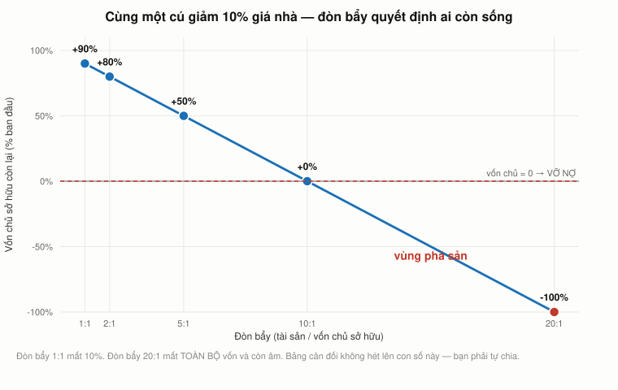

# Bài 3 — Đòn bẩy và lạm phát: hai cách để một con số đúng trở thành một con số sai

> Bài học dựng trên **nửa đầu** video **"Ses 4: Present Value Relations III & Fixed-Income
> Securities I"** (`hyc8h5T76BE`, 71:49) — khoá **MIT 15.401 *Finance Theory I*, Fall 2008**,
> giảng viên **Prof. Andrew W. Lo**. Phụ đề gốc do người viết tay.
>
> 🕑 Mốc thời gian có tiền tố buổi: `S4 39:54` = buổi 4, phút 39:54. Bài này dùng buổi 4 từ
> **`S4 00:00` tới `S4 42:23`**; phần còn lại (chứng khoán thu nhập cố định) thuộc [bài 4](../README.md).
> Vài chỗ dẫn ngược sang `S1`, `S2`, `S3` — mọi mốc đều đối chiếu với **đúng** video của nó.
>
> 📚 **Mở rộng** — kiến thức video lướt qua hoặc bài học này bổ sung, **không có trong video**.
> 🇻🇳 **Góc Việt Nam** — số liệu và ví dụ trong nước (mục 13), **không có trong video**.
> ⚠️ Mục **7** ghi lại một dự đoán của Lo **đã sai ngay hôm sau**; mục **8** đối chiếu đòn bẩy với 2026.
> 📌 **Cần đọc trước:** [Bài 2](bai_02_gia_tri_hien_tai.md) — công thức niên kim ở mục 13 và
> khoản vay mua nhà ở mục 15 là thứ bài này mổ xẻ tiếp.
>
> Công thức viết bằng LaTeX — mở bằng **Obsidian** hoặc VS Code + Markdown Preview Enhanced.

---

## Mục lục

<!-- MUC-LUC -->
- [1. Ngày 15/9/2008 — buổi học mở đầu bằng một cáo phó](#1-ngày-1592008--buổi-học-mở-đầu-bằng-một-cáo-phó)
- [2. Đòn bẩy — con số mà bảng cân đối không hét lên](#2-đòn-bẩy--con-số-mà-bảng-cân-đối-không-hét-lên)
- [3. Cùng một cú giảm 10 %, ba kết cục hoàn toàn khác nhau](#3-cùng-một-cú-giảm-10--ba-kết-cục-hoàn-toàn-khác-nhau)
- [4. Vì sao vẫn có người chấp nhận đòn bẩy 20 : 1](#4-vì-sao-vẫn-có-người-chấp-nhận-đòn-bẩy-20--1)
- [5. Mark to market — và cái hộp ở bài 1 lại xuất hiện](#5-mark-to-market--và-cái-hộp-ở-bài-1-lại-xuất-hiện)
- [6. Cái gì thực sự đẩy người vay ra khỏi nhà](#6-cái-gì-thực-sự-đẩy-người-vay-ra-khỏi-nhà)
- [7. Lo đưa ra một dự đoán — và nó sai ngay hôm sau](#7-lo-đưa-ra-một-dự-đoán--và-nó-sai-ngay-hôm-sau)
- [8. Đối chiếu 2026 — chuyện gì đã xảy ra với đòn bẩy](#8-đối-chiếu-2026--chuyện-gì-đã-xảy-ra-với-đòn-bẩy)
- [9. Lạm phát — thứ hoàn toàn khác với giá trị thời gian của tiền](#9-lạm-phát--thứ-hoàn-toàn-khác-với-giá-trị-thời-gian-của-tiền)
- [10. Danh nghĩa và thực](#10-danh-nghĩa-và-thực)
- [11. Quy tắc vàng: danh nghĩa chiết khấu bằng danh nghĩa](#11-quy-tắc-vàng-danh-nghĩa-chiết-khấu-bằng-danh-nghĩa)
- [12. Bốn thứ Lo không nói về lạm phát](#12-bốn-thứ-lo-không-nói-về-lạm-phát)
- [13. Góc Việt Nam](#13-góc-việt-nam)
- [14. Code minh hoạ](#14-code-minh-hoạ)
- [15. Tự thử](#15-tự-thử)
- [16. Từ điển thuật ngữ](#16-từ-điển-thuật-ngữ)
- [17. Câu hỏi tự kiểm tra](#17-câu-hỏi-tự-kiểm-tra)
- [Tóm tắt một trang](#tóm-tắt-một-trang)
- [Nguồn](#nguồn)
<!-- /MUC-LUC -->

---

## 1. Ngày 15/9/2008 — buổi học mở đầu bằng một cáo phó

Buổi 4 không bắt đầu bằng công thức. Nó bắt đầu bằng một bảng số (`S4 00:26`):

> *"Đây là các chỉ số tài chính nổi bật của Lehman Brothers tính tới cuối năm 2007."*

| Chỉ số cuối 2007       |     Giá trị |
| ---------------------- | ----------: |
| Doanh thu ròng         |     19 tỷ $ |
| Lợi nhuận ròng         |      4 tỷ $ |
| Vốn dài hạn            |    145 tỷ $ |
| Tài sản quản lý        |    282 tỷ $ |
| Nhân sự                |      28.500 |
| Giá cổ phiếu           | **62 $/cp** |
| **Tỷ lệ đòn bẩy ròng** |  **16 : 1** |

Rồi câu hỏi (`S4 01:32`):

> *"Cuối năm 2007, có ai dự báo được rằng một công ty như thế này có thể **biến mất chín tháng
> sau** không? Biến mất — ý tôi là bị xoá sổ hoàn toàn."*

### Buổi học này diễn ra đúng ngày Lehman nộp đơn phá sản

Chuỗi bằng chứng tiếp nối [bài 2 mục 2](bai_02_gia_tri_hien_tai.md#2-lo-áp-cái-hộp-lên-cuộc-khủng-hoảng-đang-diễn-ra):

| Bằng chứng                                                                                               | Mốc                   |
| -------------------------------------------------------------------------------------------------------- | --------------------- |
| Lo kể Fed từ chối bảo lãnh, Barclays và Bank of America rút lui, *"nên họ nộp đơn theo Chương 11"*       | `S4 17:33`–`S4 18:15` |
| *"Ngày mai, gần như chắc chắn Fed sẽ hạ lãi suất"* — cuộc họp FOMC là **16/9/2008**                      | `S4 14:05`            |
| *"Tôi sẽ nói cụ thể chuyện đó vào **tối thứ Tư**"* — chuyên đề khai giảng 17/9 theo lời hứa ở `S1 64:57` | `S4 26:15`            |
| Buổi 3 = thứ Tư 10/9/2008 (đã chốt ở bài 2)                                                              | —                     |

⟹ **Buổi 4 là thứ Hai 15/9/2008** — ngày Lehman Brothers nộp đơn phá sản. Lịch cả bốn buổi đến giờ:

| Buổi  | Ngày                  | Chuyện gì đang xảy ra bên ngoài                   |
| ----- | --------------------- | ------------------------------------------------- |
| 1     | thứ Tư 3/9/2008       | *(bình yên)*                                      |
| 2     | thứ Hai 8/9/2008      | Fannie Mae & Freddie Mac vào diện bảo hộ (CN 7/9) |
| 3     | thứ Tư 10/9/2008      | Lehman lao dốc                                    |
| **4** | **thứ Hai 15/9/2008** | **Lehman nộp đơn phá sản sáng hôm đó**            |

### Sự huỷ diệt giá trị mà không ai bị ngu đi

Lo giải thích cái chết của Lehman theo cách rất khác một bản tin (`S4 24:19`):

> *"Chẳng phải tự nhiên các nhân viên ngân hàng đầu tư, các nhà giao dịch tự doanh và các nhà quản
> lý tài sản của Lehman bị **tổn thương não** rồi trở nên ngu hơn trước. Họ vẫn thông minh y như
> cũ, vẫn tinh khôn, vẫn giàu kinh nghiệm, vẫn hiểu biết như bao giờ hết."*

> *"Vấn đề là vì quy mô rủi ro họ đang gánh, có một mối lo chung về khả năng tồn tại của họ như một
> doanh nghiệp. Và khi bạn không muốn làm ăn với họ, khi tất cả mọi người không muốn làm ăn với họ,
> **khi không ai muốn làm ăn với họ nữa, thì họ không còn là một doanh nghiệp**. Và giá trị doanh
> nghiệp của họ về không."* — `S4 24:38`

> *"Có bài toán con gà và quả trứng ở đây. Nhưng bất kể là gà hay trứng, **khi quả trứng vỡ thì bạn
> xong**."* — `S4 24:51`

Nối thẳng với [định nghĩa tài sản ở bài 2](bai_02_gia_tri_hien_tai.md#3-tài-sản-là-gì--định-nghĩa-lại-từ-gốc):
tài sản là **một dãy dòng tiền tương lai**. Con người, kỹ năng, hệ thống của Lehman vẫn nguyên vẹn.
Nhưng nếu không ai chịu giao dịch với bạn, dãy dòng tiền tương lai của bạn **thành dãy số không** —
và bài 2 đã nói rõ dãy `0, 0, 0, …` cũng là một tài sản hợp lệ. Chỉ là nó đáng giá không đồng.

Cổ phiếu **62 đô cuối 2007 → 0 sau chín tháng.** Và Lo giải thích vì sao cổ đông mất sạch trong khi
chủ nợ thì chưa chắc (`S4 23:17`):

> *"Bạn ra toà và nói, tôi không thể trả nổi các giấy nợ của mình… Toà sẽ chỉ định người quản tài để
> giám sát việc thanh lý tài sản nhằm trả cho các chủ nợ một cách trật tự. Và bạn biết ai đứng
> **cuối hàng** không? **Cổ đông.** Đúng vậy."*

---

## 2. Đòn bẩy — con số mà bảng cân đối không hét lên

Trong cả bảng ở mục 1, Lo chỉ vào đúng một con số (`S4 02:21`):

> *"Một chìa khoá cho chuyện đang xảy ra và vì sao nó có thể xảy ra là **con số này ngay đây**, tỷ
> lệ đòn bẩy ròng. Tỷ lệ đòn bẩy ròng cho bạn biết Lehman Brothers đang phơi mình trước bao nhiêu
> rủi ro so với lượng vốn họ thực sự đang quản lý."*

> **Đòn bẩy** (*leverage*) $L$ = tổng tài sản chia cho vốn chủ sở hữu:
> $$L \;=\; \frac{A}{E} \;=\; \frac{E + D}{E}$$
> với $A$ là tài sản, $E$ là vốn của bạn, $D$ là nợ vay.

Và đây là toàn bộ ý nghĩa của nó, viết thành một dòng:

$$\boxed{\;R_E \;=\; L \times R_A\;}$$

Lợi suất trên **vốn của bạn** bằng đòn bẩy nhân lợi suất trên **tài sản**. Một cú xê dịch nhỏ của
tài sản trở thành một cú xê dịch lớn của bạn.

📚 **Hệ quả trực tiếp và rất đáng nhớ:** vốn chủ bị xoá sạch khi tài sản giảm đúng $1/L$.

|  Đòn bẩy | Tài sản giảm bao nhiêu thì vốn chủ về 0 |
| -------: | --------------------------------------: |
|    5 : 1 |                                    20 % |
|   16 : 1 |                              **6,25 %** |
|   20 : 1 |                                     5 % |
| 30,7 : 1 |                              **3,26 %** |

> ⚠️ **Lo đọc con số "ròng" — và con số "gộp" gần gấp đôi.**
> Lo nói đòn bẩy của Lehman là **16 : 1**. Đó là *net leverage ratio* — một chỉ số **phi-GAAP do
> chính Lehman tự định nghĩa** (tài sản ròng chia vốn chủ hữu hình, sau khi loại tiền mặt, các thoả
> thuận cho vay có bảo đảm, lợi thế thương mại và tài sản vô hình). Trong báo cáo tháng 11/2007,
> **đòn bẩy gộp của Lehman là 30,7 : 1** — tăng từ 23,9 : 1 năm 2004.
>
> Khác biệt không nhỏ: ở 16 : 1 thì cần tài sản giảm 6,25 % mới xoá sạch vốn; ở 30,7 : 1 thì chỉ cần
> **3,26 %**. Cùng một công ty, hai cách đo, hai bức tranh rủi ro khác hẳn.
>
> Chi tiết cay đắng: chính chỉ số *net leverage* này về sau trở thành trung tâm của vụ **Repo 105** —
> Lehman dùng tiền từ các giao dịch repo để tất toán nợ ngay trước ngày chốt sổ, nhằm **làm đẹp con
> số đòn bẩy ròng công bố ra ngoài**.

Bài học rộng hơn con số: **khi một công ty tự định nghĩa chỉ số đo rủi ro của chính nó, hãy hỏi
định nghĩa đó là gì.** Đây là lần đầu trong khoá học bạn gặp chuyện "con số nào cũng đúng, tuỳ bạn
đo thế nào" — và nó sẽ quay lại ở bài 12.

---

## 3. Cùng một cú giảm 10 %, ba kết cục hoàn toàn khác nhau



*Cùng một cú giảm 10% giá nhà. Chỉ khác đòn bẩy — và đó là khác biệt giữa sống và phá sản.*

Lo bỏ Lehman sang một bên và lấy ví dụ ai cũng hiểu (`S4 02:52`): **mua nhà**.

Một căn nhà **500.000 đô** ở khu Boston — mà Lo gọi là *"một căn khởi điểm nhỏ, tôi e là vậy"*
(`S4 03:39`). Trả trước 20 % là chuẩn ngành:

```
   Tài sản           Nguồn tiền
  ┌──────────┐      ┌──────────────────┐
  │          │      │ VỐN CỦA BẠN      │  100.000 $
  │  CĂN NHÀ │      ├──────────────────┤
  │ 500.000$ │      │ NỢ NGÂN HÀNG     │  400.000 $
  └──────────┘      └──────────────────┘
                    Đòn bẩy = 500/100 = 5 : 1
```

Giá nhà giảm **10 %**. Mất 50.000 đô. Câu hỏi Lo đặt ra (`S4 05:20`): **ngân hàng mất bao nhiêu
trong 50.000 đó?**

> *"Không đồng nào — vì họ đã cho bạn vay tiền và họ mong bạn trả lại. **Họ không phải cổ đông. Họ
> không tìm cách gánh rủi ro sụt giảm.** Họ chỉ muốn lấy lại tiền của mình cộng lãi."* — `S4 05:37`

> *"Khoản lỗ 50.000 đó là của bạn hết. Bạn bỏ ra 100.000 và mất 50 — **một nửa tài sản của bạn bốc
> hơi chỉ với một cú xê dịch 10 % của giá nhà.**"* — `S4 05:51`

Rồi Lo đổi tham số. Ông kể chính mình mua nhà đầu tiên năm 1988 khi chuyển tới Boston, và
**chỉ phải trả trước 5 %** nhờ vay jumbo cộng bảo hiểm khoản vay (`S4 03:19`):

| Trả trước | Vốn của bạn |    Nợ vay | Đòn bẩy | Giá nhà −10 % ⟹ lợi suất trên vốn |
| --------: | ----------: | --------: | ------: | --------------------------------: |
|     100 % |   500.000 $ |         0 |   1,0 × |                         **−10 %** |
|      20 % |   100.000 $ | 400.000 $ |   5,0 × |                         **−50 %** |
|       5 % |    25.000 $ | 475.000 $ |  20,0 × |                        **−200 %** |

> *"Bạn đã mất hết rồi. Khoản lỗ 50.000 vẫn còn nguyên đó, nhưng bạn chỉ bỏ vào 25. Nên giờ bạn mất
> sạch vốn, và **trên đó còn âm thêm 25 nữa**. Bạn không chỉ mất toàn bộ tài sản của mình — bạn mất
> **hơn** toàn bộ. Lợi suất ròng của bạn là **âm 200 %**."* — `S4 06:39`

Đây là chỗ trực giác con người hỏng nặng nhất. **Mất hơn 100 % là chuyện hoàn toàn có thể**, và
nó xảy ra bất cứ khi nào bạn dùng tiền vay. Bạn không thể mất hơn số tiền mình bỏ ra khi mua bằng
tiền mặt — nhưng khi có đòn bẩy thì "mất sạch" chỉ là một cột mốc trên đường đi xuống.

Và Lo quay lại Lehman (`S4 07:28`):

> *"Nếu bạn là một định chế tài chính lớn, đòn bẩy 16 trên 1, và giá trị danh mục đó giảm 10 % hay
> 20 %, bạn có thể **đốt hết vốn rất, rất nhanh**."*

---

## 4. Vì sao vẫn có người chấp nhận đòn bẩy 20 : 1

Câu hỏi hiển nhiên (`S4 08:18`): *"Tại sao trên đời lại có người làm thế? Sao lại vay gấp 16 lần?"*

Và Lo tự trả lời bằng cách tự tố mình (`S4 08:38`):

> *"20 trên 1, chính xác. Vậy là tôi từng là một nhà đầu tư dùng đòn bẩy đầy tự hào với tỷ lệ 20 : 1.
> **Tôi thắng cả Lehman Brothers.** Tại sao tôi làm thế? Có điên không?"*

Câu trả lời gồm hai phần, và cả hai đều quan trọng.

### Phần một: đòn bẩy cắt cả hai chiều

Nó **không phải rủi ro**. Nó là một **bộ khuếch đại** (`S4 09:22`):

> *"Nếu giá nhà tăng 10 %, thì ở đòn bẩy 20 : 1, **tôi trông như một nhà quản lý quỹ đầu cơ**. Kiếm
> được đống tiền."*

| Trả trước | Đòn bẩy | Giá −20 % | Giá −10 % | Giá +10 % | Giá +20 % |
| --------: | ------: | --------: | --------: | --------: | --------: |
|     100 % |   1,0 × |     −20 % |     −10 % |     +10 % |     +20 % |
|      50 % |   2,0 × |     −40 % |     −20 % |     +20 % |     +40 % |
|      20 % |   5,0 × |    −100 % |     −50 % |     +50 % |    +100 % |
|      10 % |  10,0 × |    −200 % |    −100 % |    +100 % |    +200 % |
|       5 % |  20,0 × |    −400 % |    −200 % |    +200 % |    +400 % |

### Phần hai: điều kiện ngầm — và nó đã vỡ

Đây mới là ý sâu. Một sinh viên nói ra (`S4 09:40`): *"trong quá khứ, chẳng có gì cho thấy giá sẽ
giảm."* Lo đồng ý và diễn giải chính xác (`S4 09:55`):

> *"Rủi ro của đòn bẩy 20 : 1 chỉ là rủi ro **nếu** mức dao động của giá nhà đủ lớn để có thể xoá sổ
> tôi. Nhưng cho tới rất gần đây, giá nhà chỉ làm mỗi một việc: **đi lên**. Và không chỉ đi lên, nó
> đi lên một cách rất mượt và có trật tự."*

> *"Nếu giá nhà tăng 15 % một năm, năm nào cũng thế, bạn có thể vừa mừng vừa hơi sợ. Chuyện đó
> không xảy ra. Giá nhà tăng, tôi không nhớ rõ — 8 %, 10 %, 7 %, 5 %, 6 %. Khá là mượt. Nên **độ
> dao động của những khoản đầu tư đó thấp tới mức đòn bẩy chẳng làm tôi sợ chút nào.**"* — `S4 10:10`

> *"Chuyện xảy ra trong hai ba năm vừa qua là **độ dao động đã vượt khỏi tầm kiểm soát**."*
> — `S4 10:46`

**Đây là chỗ bài 3 mở cửa cho bài 9.** Toàn bộ câu chuyện đòn bẩy không nói được điều gì cho tới
khi ta biết **tài sản dao động bao nhiêu**. Đòn bẩy 20 : 1 trên một tài sản gần như không dao động
là chuyện bình thường; đòn bẩy 5 : 1 trên một tài sản dao động mạnh là tự sát. Cụm *"khi rủi ro được
định nghĩa đúng"* mà Lo cài vào nguyên lý 2c ở
[bài 1](bai_01_tai_chinh_la_gi.md#13-sáu-nguyên-lý--và-vì-sao-lo-chỉ-đưa-ba) bắt đầu có nghĩa từ đây.

📚 **Và đây là lỗi logic phổ biến nhất trong tài chính**, được phát biểu ngay tại chỗ: *"chỉ vì nó
chưa từng giảm nên nó sẽ không giảm."* Lo tóm gọn (`S4 11:21`):

> *"Chính là việc nhìn các khoản đầu tư đi lên rồi nghĩ rằng, ồ, chúng chẳng bao giờ có thể đi xuống."*

---

## 5. Mark to market — và cái hộp ở bài 1 lại xuất hiện

Một sinh viên phản biện rất hay (`S4 11:21`): *"nhưng cuối ngày thì bạn vẫn sống trong căn nhà đó
mà? Bạn chỉ phải chịu chuyện đánh giá theo giá thị trường lên xuống thôi."*

Lo dừng lại vì đó là một thuật ngữ chưa dùng lần nào (`S4 11:35`): **mark to market** — *"ghi nhận
theo giá thị trường"*.

> *"Là khi một thứ có giá trị sổ sách được đưa ra đối chiếu với thực tế, dưới dạng giá thị trường."*
> — `S4 11:49`

Và ví dụ ông chọn thì tuyệt (`S4 12:04`):

> *"Ví dụ, ở buổi giảng đầu tiên, khi tôi bán đấu giá cái hộp nhỏ xíu mà các bạn không biết bên
> trong có gì — nó **không có giá thị trường** trước đó, ít nhất là với các bạn. Nhưng chúng ta đã
> ghi nhận nó theo giá thị trường. Ghi ở **45 đô**. Và thế là một mức giá thị trường được xác lập."*

Ba bài học, một cái hộp. Ở [bài 1](bai_01_tai_chinh_la_gi.md#6-phiên-đấu-giá-hộp-kín--price-discovery-diễn-ra-trực-tiếp)
nó là *price discovery*. Ở [bài 2](bai_02_gia_tri_hien_tai.md#2-lo-áp-cái-hộp-lên-cuộc-khủng-hoảng-đang-diễn-ra)
nó là giấy tờ của Fannie/Freddie. Ở đây nó là định nghĩa của *mark to market*.

Và câu trả lời cho phản biện của sinh viên thì rất sòng phẳng (`S4 12:21`):

> *"Đúng thế. Chẳng có gì to tát nếu bạn thích sống trong căn nhà đó, và bạn trả nổi khoản vay, và
> bạn ổn. Và **hàng triệu chủ nhà đang chính xác ở tình trạng đó**. Ta không được quên điều đó. Rằng
> khoản vay dưới chuẩn đã cho phép hàng triệu người trở thành chủ nhà, những người lẽ ra chẳng bao
> giờ có thể."*

Nghĩa là: **đòn bẩy chỉ giết bạn khi bạn bị buộc phải bán.** Nếu bạn giữ được tới hết kỳ hạn, một
cú sụt giá tạm thời không quan trọng. Chuyện gì buộc người ta phải bán thì mục 6 trả lời.

---

## 6. Cái gì thực sự đẩy người vay ra khỏi nhà

Không phải giá nhà giảm. Là **dòng tiền hằng tháng** (`S4 12:36`):

> *"Nhưng nếu có vấn đề về việc lãi suất tăng lên và khoản trả góp của bạn tăng theo, bởi vì bạn đã
> nhận một **lãi suất mồi rất thấp**? Bạn có một khoản vay lãi suất điều chỉnh, vì họ bảo rằng, này,
> anh có thể mua căn nhà này gần như không cần bỏ đồng nào. Và anh dư sức trả, vì khoản trả hằng
> tháng của anh chỉ có **300 đô**. Rồi một năm sau, khoản trả đó là **1.000 đô**. Lúc đó mới là vấn
> đề thật sự."* — `S4 12:57`

> 📌 Đây **chính xác** là cấu trúc bạn đã tính ở
> [bài 2 mục 15](bai_02_gia_tri_hien_tai.md#15-góc-việt-nam--cái-bẫy-lãi-suất-ưu-đãi): lãi ưu đãi
> rồi thả nổi. Ở đó khoản trả nhảy **+28,8 %**. Ở đây Lo mô tả cùng cơ chế nhảy hơn ba lần. Cùng một
> công thức niên kim, hai bộ tham số.

Rồi quyết định (`S4 13:32`):

> *"Bạn có tiếp tục đổ toàn bộ thu nhập vào và sống chật vật vì một căn nhà mà bạn **sẽ không bao
> giờ lấy lại được tiền** không? Nó đúng nghĩa là cầm tiền của mình đi đốt, vì bạn đã mất phần vốn
> của mình rồi."*

> *"Hay là bạn cắm chìa khoá vào cửa trước rồi dọn đi và nói: **này ngân hàng, tất cả là của anh.
> Tôi đi đây.** Đó là chuyện đã xảy ra trên khắp nước Mỹ."* — `S4 13:49`

### Vì sao bỏ nhà đi lại là một lựa chọn hợp pháp

Câu hỏi tiếp theo của lớp: *"bạn có thể đến ngân hàng và nói nhà là của anh, thật à?"* (`S4 14:39`)

> *"Phần lớn hợp đồng vay mua nhà là **khoản vay không truy đòi** (*non-recourse loan*), nghĩa là họ
> có căn nhà của bạn làm tài sản bảo đảm, **nhưng đó là tất cả những gì họ có**. Họ không có đứa con
> đầu lòng của bạn, họ không có ngón út của bạn."* — `S4 14:51`

**Đây là một quyền chọn, không phải một khoản vay thuần tuý.** Người vay có quyền — không phải
nghĩa vụ — giao nhà lại thay vì trả nợ. Nếu giá trị nhà rơi xuống dưới dư nợ, việc "cắm chìa khoá"
là hành vi **tối ưu về tài chính**, không phải hành vi vô đạo đức. Bài 8 sẽ dạy cách định giá đúng
cái quyền chọn đó; đây là lần đầu bạn gặp nó, và nó nằm ẩn trong một hợp đồng mà không ai gọi là
quyền chọn.

Cái giá phải trả thì có (`S4 15:38`): *"điểm tín dụng của bạn sẽ nát bét."* Nhưng nó hết hạn sau
năm tới bảy năm — và Lo nói thẳng điều đó cũng không ngăn được gì (`S4 15:56`):

> *"Đừng quên, đó chính là cách thị trường vay dưới chuẩn ra đời. Các bạn thấy quảng cáo trên TV
> rồi chứ? **Không sao nếu bạn đang vỡ nợ, không sao nếu bạn không có lịch sử tín dụng, không sao
> nếu bạn không có việc làm — chúng tôi vẫn cho bạn vay.**"*

> *"Bây giờ thì không còn đúng, hoặc không còn đúng đến thế. Nhưng tới một lúc nào đó khi thị trường
> hồi phục, **chúng ta sẽ lại thấy chuyện đó quay lại**."* — `S4 16:07`

---

## 7. Lo đưa ra một dự đoán — và nó sai ngay hôm sau

Đây là đoạn đáng giá nhất buổi học đối với người xem năm 2026, vì chúng ta biết phần kết.

Hai lần trong buổi 4, Lo nói Fed sắp hạ lãi suất. Lần đầu ở `S4 14:05`:

> *"Ngày mai sẽ có chuyện rất đáng chú ý. Ngày mai, **gần như chắc chắn Fed sẽ hạ lãi suất**, vì họ
> muốn giảm áp lực lên hệ thống."*

Lần thứ hai, ở cuối buổi, ông nâng mức tự tin lên và giải thích **cơ sở** (`S4 70:38`):

> *"Vì loại tri thức thị trường đó, tôi có thể nói với các bạn với **99,5 % độ tin cậy** rằng ngày
> mai Fed sẽ cắt lãi suất. Làm sao tôi biết? Tôi không biết. Fed có thể không cắt. Nhưng nếu bạn
> nhìn vào thị trường tài chính hôm nay, nhìn giá trái phiếu kho bạc hôm nay, nhìn hợp đồng tương
> lai lãi suất Fed — tất cả các mức giá đó, **nếu bạn biết cách đọc, nếu bạn giải được mấy lá trà
> đó** — nó sẽ nói rằng ngày mai Fed cắt lãi suất."*

> *"Nên tôi muốn các bạn theo dõi ngày mai xem tôi có đúng không. **Sẽ rất mất mặt, và có thể là
> thảm hoạ, nếu tôi sai.**"* — `S4 71:07`

### Chuyện thực sự xảy ra ngày hôm sau

**Ngày 16/9/2008, FOMC giữ nguyên lãi suất mục tiêu ở 2 %.** Fed **không** cắt.

Và chi tiết còn gây sốc hơn: biên bản cuộc họp cho thấy **ba phương án** được đặt lên bàn — giữ
nguyên, **tăng 25 điểm cơ bản**, và hạ 25 điểm cơ bản. Nghĩa là ngày sau khi Lehman sụp, một đợt
**tăng lãi suất** vẫn đang chính thức được cân nhắc. Fed nêu lý do là lo lạm phát cao có thể bám vào
kỳ vọng, và *"hệ quả của vụ phá sản Lehman ngày 15/9 vẫn chưa rõ ràng tại thời điểm cuộc họp"*.

Fed chỉ cắt ba tuần sau — **8/10/2008**, trong một đợt cắt phối hợp quốc tế xuống 1,5 %, rồi 1,0 %
ngày 29/10, rồi về **0–0,25 %** ngày 16/12/2008.

### Rút ra gì từ chuyện này

Đừng đọc nó thành "Lo dốt". Hãy đọc nó thành ba điều, và cả ba đều nằm trong chương trình:

**1. Giá thị trường là một dự báo, không phải một lời tiên tri.** Lo nói rất đúng rằng giá đang
*hàm chứa* một dự báo. Ông chỉ quên rằng dự báo **có thể sai**. Chính ông đã đặt sẵn phần đính chính
ở `S4 70:06`: *"Bạn không làm được chuyện đó một cách hoàn hảo."* Bài 4 sẽ dựng đúng bộ máy trích
dự báo đó ra khỏi giá trái phiếu; bài 13 sẽ hỏi nó đáng tin đến đâu.

**2. "99,5 % độ tin cậy" là một con số bịa.** Không có mô hình nào cho ra 99,5 %. Đó là cách nói
"tôi rất chắc". Và một trong những thói quen tốn tiền nhất trong tài chính là **gán một con số xác
suất giả cho một niềm tin định tính** — rồi đối xử với nó như số liệu.

**3. Thị trường sai vì lý do rất người.** Ngày 16/9, Fed đang cân giữa lạm phát (đang cao) và khủng
hoảng (chưa rõ mức độ). Thị trường định giá theo mối lo nổi bật nhất; Fed cân theo nhiệm vụ kép của
mình. Hai bộ trọng số khác nhau.

Lo tự nói câu tổng kết hay nhất cho chính mình chỉ vài phút trước đó (`S4 20:44`):

> *"Nếu bạn không có bộ khung để suy nghĩ về chuyện này, thì bạn chỉ còn cách phản ứng theo **sợ hãi
> và tham lam**. Ngay lúc này, chúng ta đang trong gọng kìm của sợ hãi."*

> *"Tôi hứa với các bạn, đây là **khoảng thời gian đáng sợ nhất** mà chúng ta từng trải qua, kể cả
> tháng 8/1998, tháng 10/1987, năm 1994, năm 2001."* — `S4 21:00`

---

## 8. Đối chiếu 2026 — chuyện gì đã xảy ra với đòn bẩy

Đòn bẩy 30 : 1 của Lehman không phải chuyện riêng của một công ty. Nó là chuẩn ngành lúc đó, và
phản ứng chính sách sau 2008 nhắm thẳng vào nó.

| Thay đổi sau 2008                     | Nội dung                                                                                                                                       |
| ------------------------------------- | ---------------------------------------------------------------------------------------------------------------------------------------------- |
| **Basel III**                         | Đặt **tỷ lệ đòn bẩy** như một ràng buộc bắt buộc, độc lập với trọng số rủi ro — chính vì trọng số rủi ro đã đánh giá tài sản thế chấp quá lành |
| **Stress test thường niên**           | Cơ quan quản lý mô phỏng cú sốc rồi hỏi: ở kịch bản này, vốn chủ của anh còn không?                                                            |
| **Dodd–Frank (2010)**                 | Giám sát các định chế "quá lớn để đổ", yêu cầu kế hoạch xử lý phá sản                                                                          |
| **Ngân hàng đầu tư độc lập biến mất** | Goldman Sachs và Morgan Stanley chuyển thành công ty mẹ ngân hàng tháng 9/2008 — chịu quản lý và giới hạn đòn bẩy của Fed                      |

Kết quả: đòn bẩy của các ngân hàng lớn Mỹ giảm mạnh so với 2007.

> ⚠️ **Nhưng đừng kết luận là "đã xong".** Đòn bẩy không biến mất — nó **di chuyển**. Xem
> [bài 1 mục 3](bai_01_tai_chinh_la_gi.md#3-bốn-thành-phần-của-hệ-thống-tài-chính): khối trung gian
> tài chính **phi ngân hàng** nay chiếm **51 % tài sản tài chính toàn cầu** và tăng gấp đôi tốc độ
> khối ngân hàng. Quỹ đầu cơ, private credit và các quỹ khác không chịu Basel III. FSB cũng ghi nhận
> **thiếu dữ liệu nghiêm trọng** về private credit.
>
> Nói cách khác: quy định siết chỗ nhìn thấy được, và đòn bẩy chảy sang chỗ khó nhìn hơn. Đó là lý
> do câu hỏi của Lo — *"anh phơi mình trước bao nhiêu so với vốn anh thực có?"* — vẫn là câu hỏi
> đúng, chỉ khó trả lời hơn.

📚 **Và một minh chứng gần đây rằng bài học chưa cũ:** SVB sụp năm 2023 không phải vì đòn bẩy quá
mức theo chuẩn — mà vì **lệch kỳ hạn** trên một danh mục gần như không có rủi ro tín dụng. Chi tiết
ở [bài 1 mục 14](bai_01_tai_chinh_la_gi.md#14-bài-giảng-này-ghi-ngay-trước-khi-lehman-sụp), và cơ
chế đầy đủ sẽ học ở bài 5.

---

## 9. Lạm phát — thứ hoàn toàn khác với giá trị thời gian của tiền

Ở phút `S4 30:16`, Lo chuyển chủ đề và trả nốt món nợ từ hai buổi trước:

> *"Để tôi quay lại chỗ chúng ta kết thúc buổi trước, tức là chủ đề lạm phát."*

Nhắc lại: ở [bài 2 mục 8](bai_02_gia_tri_hien_tai.md#8-vì-sao-vẫn-chiết-khấu-khi-không-có-rủi-ro),
khi một sinh viên nêu lạm phát, Lo gạt sang một bên: *"hãy tạm gác lạm phát lại, vì tôi không muốn
mọi người bị rối vì nó."* Giờ là lúc.

Và điều đầu tiên ông làm là **tách nó ra khỏi thứ đã học** (`S4 32:59`):

> *"Ý tưởng đằng sau lạm phát là để đo **sức mua** của đồng tiền của bạn. Và cái đó **hoàn toàn khác**
> với giá trị thời gian của tiền. Giá trị thời gian của tiền chỉ nói rằng người ta thiếu kiên nhẫn
> và thích tiền bây giờ hơn tiền sau này. Còn lạm phát là một nhận định về **sức mua** của đồng tiền
> đó, bây giờ so với sau này."*

**Hai thứ này độc lập với nhau.** Ngay cả trong một thế giới không lạm phát, bạn vẫn chiết khấu
(vì thiếu kiên nhẫn — bài 2). Và ngay cả với lãi suất bằng 0, sức mua vẫn có thể đổi. Trộn hai khái
niệm là lỗi mà mục 11 sẽ định giá bằng tiền.

### Bộ máy: của cải và giỏ hàng

Lo dựng hai đại lượng (`S4 31:14`):

- $W_t$ — **của cải** của bạn ở thời điểm $t$, tính bằng số tờ tiền.
- $I_t$ — **chỉ số giá** của cái giỏ hàng bạn thực sự tiêu dùng: thực phẩm, quần áo, và cả
  *"giải trí, tiêu khiển và những thứ tương tự"*.

> *"Việc bạn có một lượng của cải nhất định thực ra **không cho biết bạn hạnh phúc đến đâu**. Cái
> cho biết là bạn tiêu dùng được bao nhiêu."* — `S4 31:52`

> 📚 Đây là lý do các nhà kinh tế đo mức sống bằng **tiêu dùng**, không phải bằng của cải. Một chi
> tiết nhỏ nhưng nó định hình cả cách CPI được xây dựng.

Và lạm phát **có thể âm** (`S4 33:20`):

> *"Nó có thể đi theo cả hai hướng. Nói cách khác, hoàn toàn có thể một đô la sang năm mua được
> **nhiều hơn** một đô la hôm nay — nếu giá giảm, như đang xảy ra với năng lượng lúc này. Dầu đang
> dưới 100 đô một thùng. Mới vài tháng trước nó ở 130 đô."*

> ✅ **Kiểm:** đúng. WTI và Brent lập đỉnh lịch sử **147,02 đô/thùng ngày 11/7/2008**, rồi rơi xuống
> dưới 100 đô vào cuối hè 2008 — tức đúng lúc Lo đang giảng. Ông đang mô tả thị trường theo thời
> gian thực và mô tả đúng.

Câu đùa hay nhất buổi nằm ở đây. Lo viết chữ $\pi$ lên bảng và một sinh viên hỏi tại sao lại là pi
(`S4 36:51`):

> *"Ồ không không. Ý tôi chỉ là một biến tên là pi. **Tôi không có ý 3,14159. Chỉ ở MIT tôi mới bị
> hỏi câu này.** Tôi từng dạy ở các trường khác và họ hỏi tôi cái ký hiệu ngộ nghĩnh đó trông giống
> cái gì."*

---

## 10. Danh nghĩa và thực

> **Lợi suất danh nghĩa** (*nominal*): $\dfrac{W_{t+k}}{W_t} - 1$ — số tờ tiền nhiều hơn bao nhiêu.
> Lo giải thích tên gọi ở `S4 34:23`: *"gọi là danh nghĩa vì nó chỉ đúng trên danh nghĩa."*

> **Lợi suất thực** (*real*): sức mua nhiều hơn bao nhiêu.

Ví dụ trung tâm của Lo (`S4 35:26`): của cải tăng **10 %**, giá cả cũng tăng **10 %**.

> *"Bạn có kiếm được tiền không? Bạn có tiến bộ gì không? **Bạn kiếm được tiền, nhưng bạn không tiến
> bộ.** Bạn được 10 % trên 1.000 đô ban đầu. Nhưng thứ bạn thích ăn, thích mua, thích dùng — cũng
> tăng 10 %."* — `S4 35:26`

> *"Nên xét từ góc độ **thực** — thực nghĩa là thứ bạn thật sự quan tâm — bạn chẳng tiến bộ gì cả."*
> — `S4 36:09`

### Công thức đúng, và công thức xấp xỉ

$$1 + r_{\text{thực}} \;=\; \frac{1 + r_{\text{danh nghĩa}}}{1 + \pi}
\qquad\text{(phương trình Fisher, dạng đúng)}$$

Lo đưa luôn dạng rút gọn (`S4 39:54`):

> *"Lợi suất thực **xấp xỉ bằng** lợi suất danh nghĩa **trừ đi** tỷ lệ lạm phát — không chia cho cái
> gì cả. **Đó là phép xấp xỉ.**"*

$$r_{\text{thực}} \;\approx\; r_{\text{danh nghĩa}} - \pi$$

Và ông trung thực về giới hạn của nó (`S4 40:34`): với 15 % danh nghĩa và 10 % lạm phát, phép trừ
cho 5 %, *"nhưng không đúng chính xác 5 %, vì nếu bạn lấy 1,15 chia 1,10 thì không ra đúng 5 %."*

Số chính xác là **4,55 %**. Mục 14 in ra cả bảng sai lệch:

| Danh nghĩa | Lạm phát | Trừ nhanh | Fisher đúng |    Sai lệch |
| ---------: | -------: | --------: | ----------: | ----------: |
|       10 % |     10 % |    0,00 % |  **0,00 %** |      0,00 % |
|        5 % |      3 % |    2,00 % |      1,94 % |      0,06 % |
|       15 % |     10 % |    5,00 % |  **4,55 %** |      0,45 % |
|       20 % |     15 % |    5,00 % |      4,35 % |      0,65 % |
|       60 % |     50 % |   10,00 % |      6,67 % |  **3,33 %** |
|      120 % |    100 % |   20,00 % |     10,00 % | **10,00 %** |

**Quy tắc dùng được:** ở lạm phát một chữ số, phép trừ nhanh đủ tốt cho tính nhẩm. Ở lạm phát hai
chữ số trở lên, nó **sai nghiêm trọng** — và luôn sai theo hướng làm bạn thấy mình giàu hơn thực tế.
Lo có nhắc tới điều này bằng một câu rất gợi (`S4 19:39`):

> *"Ai đến từ một nước Mỹ Latin đều biết bóng ma lạm phát đáng sợ đến mức nào."*

---

## 11. Quy tắc vàng: danh nghĩa chiết khấu bằng danh nghĩa

Lo kết phần lạm phát bằng đúng một quy tắc, và ông gọi nó là thứ *"sẽ giúp bạn dù bạn làm loại tính
toán nào"* (`S4 41:26`):

> **Dòng tiền danh nghĩa phải được chiết khấu bằng lãi suất danh nghĩa.**
> **Dòng tiền thực phải được chiết khấu bằng lãi suất thực.**
> *"Chỉ cần nhớ có thế thôi."* — `S4 42:08`

Ông cũng cho biết trong thực tế bạn sẽ gặp cái nào (`S4 41:45`):

> *"Phần lớn dòng tiền bạn nhận được trong phân tích sẽ là **danh nghĩa** — tức là số tiền thật bạn
> sẽ thấy vào những ngày đó. Nhưng thỉnh thoảng bạn có thể nhận được một dự báo lập theo giá trị
> **thực**, tức theo sức mua."*

### Vì sao trộn lại tốn tiền — bằng số

Mục 14 chạy một dự án thu về **sức mua tương đương 100 đô hôm nay**, mỗi năm trong 3 năm. Lạm phát
5 %, lãi suất danh nghĩa 8 % (⟹ lãi suất thực 2,857 %):

| Cách tính                                                 |                 PV |
| --------------------------------------------------------- | -----------------: |
| **A.** dòng tiền **thực** ÷ lãi suất **thực**             |           283,64 $ |
| **B.** dòng tiền **danh nghĩa** ÷ lãi suất **danh nghĩa** |       **283,64 $** |
| **C.** dòng tiền **thực** ÷ lãi suất **danh nghĩa**       | 257,71 $ ← **sai** |

A và B **khớp nhau tuyệt đối**. Đó không phải trùng hợp — đó là nội dung của quy tắc: hai con đường
nhất quán phải cho cùng một giá trị, vì chúng chỉ là hai đơn vị đo của cùng một thứ. Đúng như phép
ẩn dụ tiền tệ ở [bài 2](bai_02_gia_tri_hien_tai.md#5-phép-ẩn-dụ-trung-tâm-hai-thời-điểm-là-hai-loại-tiền-tệ):
tính bằng yên hay bằng bảng đều được, miễn **nhất quán**.

Còn C thấp hơn **25,93 đô, tức 9,1 %** — vì nó **chiết khấu hai lần cho lạm phát**: một lần nằm sẵn
trong lãi suất danh nghĩa, một lần nữa vì quên thổi phồng dòng tiền lên theo giá.

Lỗi này gần như luôn nghiêng về **đánh giá thấp** dự án, nghĩa là bạn sẽ **từ chối những dự án
tốt**. Đó là loại lỗi không ai phát hiện ra, vì không có ai đến phàn nàn về một dự án chưa từng được
làm.

---

## 12. Bốn thứ Lo không nói về lạm phát

Buổi 4 dành cho lạm phát khoảng 12 phút. Đủ cho quy tắc, thiếu cho bối cảnh. Bốn mảnh sau
**không có trong video** nhưng cần cho các bài sau.

### 12. 1 Chỉ số giá được dựng thế nào — và vì sao nó luôn bị tranh cãi

$I_t$ của Lo là một cái giỏ. Trong thực tế, dựng cái giỏ đó là một chuỗi lựa chọn có thể bàn cãi:

- **Giỏ nào?** Cơ quan thống kê phải chọn một rổ hàng đại diện. Rổ của bạn không giống rổ trung bình.
  Người trẻ thuê nhà ở thành phố và một hộ nông thôn có chủ nhà chịu hai mức lạm phát khác hẳn nhau,
  dù đọc cùng một con số CPI.
- **Thay thế.** Khi thịt bò lên giá, người ta chuyển sang thịt lợn. Nếu giỏ hàng cố định, chỉ số sẽ
  **thổi phồng** lạm phát vì nó giả định bạn vẫn mua thịt bò.
- **Chất lượng đổi.** Điện thoại hôm nay đắt hơn điện thoại 2008 nhưng cũng là một món đồ khác hẳn.
  Bao nhiêu phần của mức giá cao hơn là "lạm phát", bao nhiêu là "sản phẩm tốt hơn"?

Hệ quả cho bạn: **con số CPI trên báo là lạm phát của một người trung bình không tồn tại.** Khi
tính lãi suất thực cho quyết định của **bạn**, con số đúng để dùng là lạm phát của **rổ hàng của
bạn**.

### 12. 2 Lạm phát toàn phần và lạm phát lõi

- **Toàn phần** (*headline*): toàn bộ giỏ hàng.
- **Lõi** (*core*): bỏ thực phẩm và năng lượng — hai nhóm dao động mạnh nhất.

Ngân hàng trung ương nhìn lõi để đọc **xu hướng**; hộ gia đình sống bằng toàn phần. Cả hai đều đúng
cho mục đích của mình. Chú ý chính ví dụ của Lo ở `S4 33:44` — giá dầu rơi từ 130 xuống dưới 100 —
là một cú sốc **không** nằm trong lạm phát lõi.

### 12. 3 Trái phiếu chống lạm phát — nơi lãi suất thực được niêm yết công khai

Đây là mảnh thiếu lớn nhất, vì nó trả lời một câu hỏi mà cả bài 2 lẫn bài 3 đều để ngỏ:
**lãi suất thực lấy ở đâu ra?** Câu trả lời quen thuộc của Lo là *"từ thị trường"* — và với lãi suất
thực, thị trường đó có thật:

**TIPS** (*Treasury Inflation-Protected Securities*) là trái phiếu chính phủ Mỹ có **gốc được điều
chỉnh theo CPI**. Bạn mua TIPS thì bạn khoá được một **lãi suất thực**, bất kể lạm phát ra sao.

Và từ đó suy ra được một thứ rất hữu ích:

$$\text{Lạm phát hoà vốn} \;=\; r_{\text{trái phiếu thường}} \;-\; r_{\text{TIPS cùng kỳ hạn}}$$

Đây là **mức lạm phát mà thị trường đang kỳ vọng** trong kỳ hạn đó — đọc trực tiếp từ giá, đúng cái
"quả cầu pha lê" mà Lo mô tả ở `S4 70:06`.

📚 Bài 4 sẽ dựng bộ máy trích dự báo từ giá trái phiếu. Khi tới đó, nhớ rằng cùng bộ máy ấy áp lên
cặp trái phiếu thường/TIPS thì cho ra kỳ vọng lạm phát.

### 12. 4 Lạm phát chuyển của cải từ chủ nợ sang con nợ

Nếu bạn nợ một khoản **lãi suất cố định**, lạm phát bào mòn giá trị thực của món nợ đó. Mục 14 tính:
một khoản nợ danh nghĩa 400.000 đô, sau ba năm, còn lại bao nhiêu **theo sức mua**?

| Lạm phát/năm | Giá trị thực của nợ sau 3 năm |
| -----------: | ----------------------------: |
|          0 % |                     400.000 $ |
|          3 % |                     366.057 $ |
|          5 % |                     345.535 $ |
|         10 % |                     300.526 $ |
|         20 % |                     231.481 $ |

Đây là mặt còn lại của mục 11, và nó có hệ quả rất thực tế: **khoản vay lãi suất cố định là một
lá chắn lạm phát cho người vay.** Khoản vay **thả nổi** thì không — vì lạm phát lên kéo lãi suất
lên theo, và bạn gánh cả hai. Mục 13 cho thấy vì sao điều này quan trọng đặc biệt ở Việt Nam.

---

## 13. Góc Việt Nam

**Không có gì trong mục này nằm trong video.**

### 13. 1 Đòn bẩy: con số bài 2 chưa hỏi

[Bài 2 mục 15](bai_02_gia_tri_hien_tai.md#15-góc-việt-nam--cái-bẫy-lãi-suất-ưu-đãi) tính khoản trả
hằng tháng của một khoản vay 2 tỷ. Nhưng nó **không hỏi** câu của bài 3: nếu giá nhà giảm thì **vốn
của bạn** ra sao?

Áp công thức $R_E = L \times R_A$ vào khoản vay đó:

| Bạn bỏ ra | Giá trị nhà |   Đòn bẩy | Giá nhà giảm bao nhiêu thì vốn về 0 | Giá −20 % ⟹ |
| --------: | ----------: | --------: | ----------------------------------: | ----------: |
|    500 tr |      2,5 tỷ | **5,0 ×** |                                20 % |  **−100 %** |
|      1 tỷ |      3,0 tỷ |     3,0 × |                                33 % |       −60 % |
|      2 tỷ |      4,0 tỷ |     2,0 × |                                50 % |       −40 % |

Nếu bạn vay 2 tỷ để mua căn nhà 2,5 tỷ, thì **giá nhà giảm 20 % là vốn của bạn về 0** — dù bạn
vẫn đang trả nợ đầy đủ và vẫn đang sống trong đó. Bạn không mất nhà, nhưng bạn **mất quyền lựa chọn**:
không bán được mà không lỗ, không tái cấp vốn được, không chuyển chỗ được.

### 13. 2 Lá chắn lạm phát ở mục 12.4 **không** áp dụng cho bạn

Đây là điểm quan trọng nhất của mục này, và nó là chỗ bối cảnh Việt Nam khác hẳn bối cảnh Mỹ 2008.

| Khía cạnh                | Mỹ                         | Việt Nam                                      |
| ------------------------ | -------------------------- | --------------------------------------------- |
| Vay mua nhà phổ biến     | **cố định 30 năm**         | ưu đãi 6–36 tháng, sau đó **thả nổi**         |
| Lãi thả nổi tính thế nào | —                          | lãi tiết kiệm 12–13 tháng **+ biên độ 3–4 %** |
| Lạm phát tăng ⟹          | nợ thực của bạn **nhẹ đi** | lãi suất huy động tăng ⟹ lãi vay tăng theo    |

Cơ chế: lạm phát lên → Ngân hàng Nhà nước và thị trường đẩy lãi suất huy động lên → lãi suất tham
chiếu của khoản vay của bạn lên → khoản trả hằng tháng của bạn lên.

**Với khoản vay thả nổi, lạm phát đánh bạn hai lần**: sức mua của thu nhập giảm, và khoản trả nợ
tăng. Người vay Mỹ với khoản cố định 30 năm chỉ chịu vế đầu và được lợi ở vế sau. Đây là một khác
biệt cấu trúc, không phải chi tiết kỹ thuật — và nó nói rằng khi so sánh các gói vay ở Việt Nam,
**biên độ thả nổi quan trọng hơn lãi suất ưu đãi**, đúng như kết luận của bài 2.

### 13. 3 Lãi suất thực của người gửi tiết kiệm

Nối lại con số ở [bài 1 mục 18.1](bai_01_tai_chinh_la_gi.md#18-góc-việt-nam--đọc-bộ-khung-của-lo-bằng-số-liệu-2026):
gửi 5,9 %/năm, CPI tháng 3/2026 ở 4,65 % (cao nhất 5 năm) ⟹ lãi suất thực theo Fisher ≈ **1,19 %**.

Giờ đọc nó qua lăng kính mục 10: ở mức lạm phát 4,65 %, phép trừ nhanh cho 1,25 % còn Fisher cho
1,19 % — **sai lệch 0,06 điểm phần trăm**, không đáng kể. Nhưng nếu lạm phát Việt Nam quay lại vùng
hai chữ số như giai đoạn 2008 và 2011, phép trừ nhanh bắt đầu sai đáng kể, và bảng ở mục 10 cho thấy
sai theo hướng **làm bạn tưởng mình đang lời nhiều hơn thực tế**.

📚 **Việt Nam không có TIPS.** Mục 12.3 nói lãi suất thực được niêm yết công khai ở Mỹ qua TIPS. Ở
Việt Nam không có công cụ tương đương, nên **không có cách đọc kỳ vọng lạm phát trực tiếp từ giá thị
trường**. Đó là một phần lý do vì sao **vàng và bất động sản** giữ vai trò lá chắn lạm phát truyền
thống trong danh mục hộ gia đình Việt Nam — như đã nêu ở [bài 1 mục 18.3](bai_01_tai_chinh_la_gi.md#18-góc-việt-nam--đọc-bộ-khung-của-lo-bằng-số-liệu-2026).
Đó là lựa chọn hợp lý khi thiếu công cụ tài chính chuyên dụng, nhưng chúng là lá chắn **không hoàn
hảo**: chúng có rủi ro riêng, và bài 10 sẽ cho công cụ để nói chính xác "không hoàn hảo" nghĩa là gì.

> ⚠️ Mọi con số Việt Nam trong mục này là **mức tham khảo tại thời điểm viết bài**. Tra lại trước khi
> dùng cho quyết định thật.

---

## 14. Code minh hoạ

> ⚙️ **Chạy:** cần **Python 3.10+**. Lưu file rồi gõ `python3 bai-03-don-bay-va-lam-phat.py`.
> **Không cần cài gói nào.** File có sẵn tại [thuc_hanh/bai-03-don-bay-va-lam-phat.py](../thuc_hanh/bai-03-don-bay-va-lam-phat.py).

|            |                                                                                         |
| ---------- | --------------------------------------------------------------------------------------- |
| File       | [`thuc_hanh/bai-03-don-bay-va-lam-phat.py`](../thuc_hanh/bai-03-don-bay-va-lam-phat.py) |
| Kích thước | **197 dòng**, 6 mục                                                                     |

Sáu mục. Đáng chú ý: **mục 1 so hai cách đo đòn bẩy của Lehman** và cho thấy ngưỡng chịu đựng khác
nhau gần gấp đôi; **mục 3 in bảng đòn bẩy cắt cả hai chiều**; **mục 5 chứng minh bằng số rằng hai
con đường nhất quán cho cùng một PV, còn trộn lẫn thì lệch 9,1 %**.

Kết quả **tất định** — file này không có một số ngẫu nhiên nào.

Kết quả chạy thật:

```
══ 1. Lehman: mot cong ty khoe manh tren giay ══════════════════════════════
Chi so cuoi 2007                   |        gia tri
-----------------------------------+---------------
Doanh thu rong                     |        19 ty $
Loi nhuan rong                     |         4 ty $
Von dai han                        |       145 ty $
Tai san quan ly                    |       282 ty $
Nhan su                            |         28.500
Gia co phieu                       |        62 $/cp

Do don bay           |   ty le |  muc giam xoa sach von
---------------------+---------+-----------------------
RONG (Lo doc)        |   16.0x |                 6.25%
GOP (bao cao 2007)   |   30.7x |                 3.26%

→ O don bay gop 30,7 lan, chi can tai san giam 3,26% la von chu bay sach.
  Lo doc con so RONG 16 lan — chi so phi-GAAP do chinh Lehman tu dinh nghia.
  Con so GOP gan gap doi. Hai cach do, hai buc tranh rui ro khac han.

══ 2. Don bay: cung mot cu giam, ba ket cuc khac nhau ══════════════════════
Can nha 500,000$, gia giam 10% ⟹ mat 50,000$

 tra truoc |   von cua ban |        no vay |  don bay |  loi suat tren von
-----------+---------------+---------------+----------+-------------------
      100% |      500,000$ |            0$ |     1.0x |              -10%
       20% |      100,000$ |      400,000$ |     5.0x |              -50%
        5% |       25,000$ |      475,000$ |    20.0x |             -200%

→ Ngan hang KHONG chiu mot dong nao cua khoan lo. Ho khong phai chu so huu,
  ho la chu no: ho chi doi lai tien cho vay cong lai. Toan bo khoan lo la cua ban.

  Cong thuc: loi suat tren von = don bay x loi suat tren tai san
             tra truoc 5%  ⟹ 20 x (-10%) = -200%
  Mat HON 100% tai san cua minh: ban mat sach von VA con no them.

══ 3. Vi sao van co nguoi chap nhan don bay 20 lan ═════════════════════════
 tra truoc |  don bay |   gia -20% |   gia -10% |   gia +10% |   gia +20%
-----------+----------+------------+------------+------------+-----------
      100% |     1.0x |       -20% |       -10% |        10% |        20%
       50% |     2.0x |       -40% |       -20% |        20% |        40%
       20% |     5.0x |      -100% |       -50% |        50% |       100%
       10% |    10.0x |      -200% |      -100% |       100% |       200%
        5% |    20.0x |      -400% |      -200% |       200% |       400%

→ Don bay khong phai 'rui ro'. No la mot BO KHUECH DAI, khuech dai ca hai chieu.
  Lo (Ses 4, phut 09:22): 'neu gia nha tang 10%, o don bay 20 lan thi toi
  trong nhu mot nguoi quan ly quy dau co.'

  Dieu kien ngam de no an toan: TAI SAN KHONG DAO DONG MANH.
  Do dung la gia dinh da vo nam 2007-2008 — va la ly do bai 9 ton tai.

══ 4. Lai suat thuc: Fisher chinh xac vs phep tru nhanh ════════════════════
Lo (Ses 4, phut 39:54): r_thuc ≈ r_danh_nghia - lam_phat  ← XAP XI
Cong thuc dung   : 1 + r_thuc = (1 + r_danh_nghia) / (1 + lam_phat)

 danh nghia |  lam phat |  tru nhanh |  Fisher dung |  sai lech
------------+-----------+------------+--------------+----------
        10% |       10% |      0.00% |        0.00% |     0.00%
        15% |       10% |      5.00% |        4.55% |     0.45%
         5% |        3% |      2.00% |        1.94% |     0.06%
         8% |        5% |      3.00% |        2.86% |     0.14%
        20% |       15% |      5.00% |        4.35% |     0.65%
        60% |       50% |     10.00% |        6.67% |     3.33%
       120% |      100% |     20.00% |       10.00% |    10.00%

→ Hai vi du chinh Lo dua ra:
  · 10% danh nghia, 10% lam phat ⟹ dung BANG 0. Xap xi khong sai chut nao.
  · 15% danh nghia, 10% lam phat ⟹ Lo noi 'khoang 5%', that ra 4,55%.
  Xap xi tot khi lam phat THAP. Cang lam phat cao, sai lech cang lon.

══ 5. Tron danh nghia voi thuc — loi ton tien nhat cua bai nay ═════════════
Du an thu ve suc mua tuong duong $100 hom nay, moi nam trong 3 nam
Lai suat danh nghia 8% · lam phat 5% ⟹ lai suat thuc 2.8571%

cach tinh                                      |         PV
-----------------------------------------------+-----------
A. dong tien THUC     / lai suat THUC          |    283.64$
B. dong tien DANH NGHIA / lai suat DANH NGHIA  |    283.64$
C. dong tien THUC     / lai suat DANH NGHIA    |    257.71$   ← SAI

→ A va B khop nhau tuyet doi. Do la NOI DUNG cua quy tac.
  C thap hon 25.93$, tuc -9.1% — vi no
  chiet khau hai lan cho lam phat: mot lan trong lai suat, mot lan vi quen thoi phong.

  Lo (Ses 4, phut 42:08): 'danh nghia chiet khau bang danh nghia,
  thuc chiet khau bang thuc. Chi can nho co the thoi.'

══ 6. Lam phat lam gi voi mon no cua ban ═══════════════════════════════════
Mon no danh nghia co dinh 400,000$, khong tra goc trong 3 nam.

 lam phat/nam |  gia tri THUC cua no sau 3 nam
--------------+-------------------------------
           0% |                       400,000$
           3% |                       366,057$
           5% |                       345,535$
          10% |                       300,526$
          20% |                       231,481$

→ Lam phat CHUYEN CUA CAI tu chu no sang con no, khi lai suat da co dinh.
  Day la mat con lai cua muc 5, va la ly do khoan vay LAI SUAT CO DINH
  va khoan vay LAI SUAT THA NOI la hai tai san hoan toan khac nhau.
  ⚠️ O Viet Nam phan lon vay mua nha la THA NOI sau uu dai ⟹ ban KHONG
     duoc huong la chan nay: lam phat len thi lai suat cung len theo.

──────────────────────────────────────────────────────────────────────────
Tat ca assert deu qua.
```

---

## 15. Tự thử

Sửa tham số rồi quan sát. Không có lời giải ở đây.

1. **Ngưỡng của Lehman.** Ở mục 1 của code, thêm các mức đòn bẩy 10, 20, 40, 50 vào bảng. Vẽ (hoặc
   hình dung) quan hệ giữa đòn bẩy và ngưỡng chịu đựng. Nó là quan hệ tuyến tính hay không? Đi từ
   16 lên 32 làm ngưỡng đổi bao nhiêu; đi từ 32 lên 48 thì bao nhiêu?

2. **Đòn bẩy và thời gian.** Mục 2 chỉ nhìn **một** cú giảm. Hãy sửa để mô phỏng ba năm liên tiếp,
   mỗi năm giá nhà ±5 % xen kẽ (−5, +5, −5). Vốn của bạn cuối kỳ có quay về mức ban đầu không? Vì
   sao không? *(Gợi ý: −5 % rồi +5 % không đưa bạn về chỗ cũ, và đòn bẩy khuếch đại chính hiệu ứng
   đó.)*

3. **Điểm mà phép trừ nhanh hỏng.** Ở mục 4, tìm mức lạm phát nhỏ nhất mà tại đó sai lệch giữa phép
   trừ nhanh và Fisher vượt **1 điểm phần trăm**, với lãi suất danh nghĩa cao hơn lạm phát đúng
   5 điểm. Con số đó có làm bạn đổi cách tính nhẩm không?

4. **Phá quy tắc vàng theo chiều ngược lại.** Mục 5 cho thấy dòng tiền **thực** chiết khấu bằng lãi
   **danh nghĩa** làm PV thấp đi. Hãy thêm đường D: dòng tiền **danh nghĩa** chiết khấu bằng lãi
   **thực**. PV sẽ cao hơn hay thấp hơn đáp án đúng? Loại lỗi nào nguy hiểm hơn cho một người đang
   trình dự án xin vốn?

5. **Lá chắn lạm phát, phiên bản thả nổi.** Mục 6 giả định lãi suất **cố định**. Hãy viết thêm mục 7:
   khoản nợ 400.000, lãi suất thả nổi bằng `lạm phát + 3 %`, tính khoản trả lãi **thực** hằng năm ở
   các mức lạm phát 0/3/5/10/20 %. Lá chắn còn lại bao nhiêu?

6. **Chỗ này chưa có công thức.** Mục 2 dùng $R_E = L \times R_A$, nhưng công thức đó **bỏ qua chi
   phí lãi vay**. Dạng đầy đủ là
   $R_E = R_A + \frac{D}{E}\left(R_A - R_D\right)$ với $R_D$ là lãi suất nợ. Hãy kiểm rằng khi
   $R_D = 0$ thì nó rút về dạng đơn giản. Rồi tính lại bảng mục 2 với $R_D = 8\%$ — kết luận có đổi
   không, và đổi theo hướng nào?

---

## 16. Từ điển thuật ngữ

| Tiếng Việt                   | Tiếng Anh                                 | Nghĩa trong bài                                                                                           |
| ---------------------------- | ----------------------------------------- | --------------------------------------------------------------------------------------------------------- |
| Đòn bẩy                      | *leverage*                                | $L = A/E$ — tổng tài sản chia vốn chủ. Bộ khuếch đại lợi suất theo **cả hai chiều**                       |
| Đòn bẩy ròng                 | *net leverage*                            | Chỉ số **phi-GAAP** Lehman tự định nghĩa. Lo đọc 16:1; đòn bẩy **gộp** là 30,7:1                          |
| Lợi suất trên vốn chủ        | *return on equity*                        | $R_E = L \times R_A$. Có thể **âm hơn −100 %** khi có nợ                                                  |
| Ghi nhận theo giá thị trường | *mark to market*                          | Đối chiếu giá trị sổ sách với giá thị trường thật. Phiên đấu giá ở bài 1 chính là một lần mark to market  |
| Khoản vay không truy đòi     | *non-recourse loan*                       | Ngân hàng chỉ có tài sản bảo đảm, không có gì khác. Biến khoản vay thành một **quyền chọn** cho người vay |
| Lãi suất mồi                 | *teaser rate*                             | Lãi ưu đãi ngắn hạn rồi nhảy lên. Cơ chế đã đẩy người vay Mỹ ra khỏi nhà năm 2007–2008                    |
| Vay lãi suất điều chỉnh      | *adjustable-rate mortgage (ARM)*          | Lãi suất thay đổi theo thị trường — không phải cố định                                                    |
| Lợi suất danh nghĩa          | *nominal return*                          | Số tờ tiền nhiều hơn bao nhiêu. *"Đúng trên danh nghĩa"*                                                  |
| Lợi suất thực                | *real return*                             | **Sức mua** nhiều hơn bao nhiêu. Thứ bạn thật sự quan tâm                                                 |
| Phương trình Fisher          | *Fisher equation*                         | $1+r_{\text{thực}} = \dfrac{1+r_{\text{danh nghĩa}}}{1+\pi}$. Phép trừ nhanh chỉ là xấp xỉ                |
| Chỉ số giá                   | *price index* $I_t$                       | Giá của giỏ hàng bạn tiêu dùng. **Giỏ của bạn ≠ giỏ trung bình**                                          |
| Lạm phát toàn phần / lõi     | *headline / core inflation*               | Toàn bộ giỏ / bỏ thực phẩm và năng lượng. Hộ gia đình sống bằng toàn phần                                 |
| Giảm phát                    | *deflation*                               | Lạm phát âm — 1 đồng sang năm mua được **nhiều hơn**                                                      |
| TIPS                         | *Treasury Inflation-Protected Securities* | Trái phiếu Mỹ có gốc điều chỉnh theo CPI. Nơi **lãi suất thực** được niêm yết công khai                   |
| Lạm phát hoà vốn             | *breakeven inflation*                     | Chênh lệch lợi suất trái phiếu thường và TIPS = **kỳ vọng lạm phát của thị trường**                       |
| Lãi suất thả nổi             | *floating rate*                           | Lãi tham chiếu + biên độ. Ở Việt Nam: lãi tiết kiệm 12–13 tháng + 3–4 %                                   |

---

## 17. Câu hỏi tự kiểm tra

Che bài lại rồi trả lời. Mốc trong ngoặc là chỗ kiểm chứng.

1. Buổi giảng này diễn ra ngày nào? Nêu **ba** mảnh bằng chứng nằm trong chính video. (mục 1)

2. Lehman có 28.500 nhân viên thông minh y như cũ vào sáng 15/9/2008. Vậy giá trị doanh nghiệp biến
   đi đâu? Trả lời bằng **định nghĩa tài sản của bài 2**. (`S4 24:19`, `S4 24:38`)

3. Viết công thức đòn bẩy và công thức lợi suất trên vốn chủ. Ở đòn bẩy $L$, tài sản phải giảm bao
   nhiêu thì vốn chủ về 0? (mục 2)

4. Lo đọc đòn bẩy Lehman là 16 : 1. Con số nào **cũng đúng** nhưng cho bức tranh khác hẳn, và khác
   nhau ở chỗ nào? (mục 2)

5. Một căn nhà 500.000 $ giảm 10 %. Ngân hàng mất bao nhiêu? Vì sao? (`S4 05:20`, `S4 05:37`)

6. Trả trước 5 % thì lợi suất trên vốn của bạn là **−200 %** khi giá giảm 10 %. Giải thích bằng lời
   vì sao mất **hơn** 100 % là chuyện có thể xảy ra. (`S4 06:39`)

7. Lo tự nhận từng dùng đòn bẩy 20 : 1 và nói *"tôi thắng cả Lehman"*. Hai lý do khiến điều đó không
   điên rồ **lúc đó** là gì? Lý do nào đã hỏng? (`S4 08:38`, `S4 09:55`, `S4 10:46`)

8. **Mark to market** nghĩa là gì, và Lo dùng ví dụ nào từ buổi 1 để minh hoạ? (`S4 11:49`, `S4 12:04`)

9. Cái gì thực sự buộc người vay bỏ nhà đi — giá nhà giảm hay điều gì khác? (`S4 12:57`)

10. Vì sao **khoản vay không truy đòi** biến một khoản nợ thành một quyền chọn cho người vay?
    (`S4 14:51`, mục 6)

11. Lo dự đoán gì cho ngày hôm sau, với mức tin cậy nào, dựa trên cơ sở gì? Chuyện gì đã thực sự xảy
    ra? (`S4 70:38`, mục 7)

12. Rút ra **ba** bài học từ dự đoán sai đó — không phải "Lo dốt". (mục 7)

13. Vì sao lạm phát là thứ **hoàn toàn khác** với giá trị thời gian của tiền? Nêu một tình huống có
    cái này mà không có cái kia. (`S4 32:59`)

14. Viết phương trình Fisher dạng đúng và dạng xấp xỉ. Ở mức lạm phát nào thì dạng xấp xỉ bắt đầu
    nguy hiểm, và nó luôn sai theo hướng nào? (`S4 39:54`, mục 10)

15. Phát biểu quy tắc vàng về chiết khấu. Nếu bạn chiết khấu dòng tiền **thực** bằng lãi suất **danh
    nghĩa**, bạn phạm lỗi gì và PV lệch theo hướng nào? (`S4 42:08`, mục 11)

16. Lãi suất **thực** lấy từ đâu ra ở thị trường Mỹ? Và làm sao đọc được **kỳ vọng lạm phát của thị
    trường** từ giá? (mục 12.3)

17. Lạm phát chuyển của cải từ ai sang ai, và với điều kiện gì? (mục 12.4)

18. 🇻🇳 Vì sao người vay mua nhà ở Việt Nam **không** được hưởng lá chắn lạm phát mà người vay Mỹ với
    khoản cố định 30 năm được hưởng? (mục 13.2)

19. 🇻🇳 Bạn bỏ 500 triệu, vay 2 tỷ, mua căn nhà 2,5 tỷ. Đòn bẩy là bao nhiêu? Giá nhà giảm bao nhiêu
    thì vốn của bạn về 0? Lúc đó bạn **mất** gì, dù vẫn đang trả nợ đầy đủ? (mục 13.1)

20. Lo nói *"nếu bạn không có bộ khung để suy nghĩ, bạn chỉ còn cách phản ứng theo sợ hãi và tham
    lam"*. Đặt câu đó cạnh dự đoán sai của chính ông ở mục 7 — bạn rút ra gì? (`S4 20:44`)

---

## Tóm tắt một trang

```
╔═══════════════════════════════════════════════════════════════════════════╗
║  BÀI 3 — ĐÒN BẨY VÀ LẠM PHÁT      MIT 15.401 Ses 4 (nửa đầu) · Andrew Lo  ║
║              ghi THỨ HAI 15/9/2008 — ngày Lehman nộp đơn phá sản          ║
╠═══════════════════════════════════════════════════════════════════════════╣
║                                                                           ║
║  MỘT CHỦ ĐỀ, HAI CƠ CHẾ:                                                  ║
║  CON SỐ BẠN NHÌN THẤY KHÔNG PHẢI CON SỐ QUYẾT ĐỊNH                        ║
║    · ĐÒN BẨY  : lợi suất trên TÀI SẢN  ≠  lợi suất trên VỐN CỦA BẠN       ║
║    · LẠM PHÁT : lợi suất DANH NGHĨA    ≠  lợi suất THỰC                   ║
║                                                                           ║
║  ┌─ ĐÒN BẨY ──────────────────────────────────────────────`S4 02:21`─┐    ║
║  │   L = A/E        R(vốn) = L × R(tài sản)                        │      ║
║  │   Vốn chủ về 0 khi tài sản giảm 1/L                             │      ║
║  │                                                                 │      ║
║  │   nhà 500k$, giá −10%  ⟹  mất 50k$, NGÂN HÀNG MẤT 0 ĐỒNG        │      ║
║  │     trả trước 100% → L=1   → −10%                               │      ║
║  │     trả trước  20% → L=5   → −50%                               │      ║
║  │     trả trước   5% → L=20  → −200%  ← mất HƠN cả vốn            │      ║
║  │                                                                 │      ║
║  │   Lehman: 16:1 RÒNG (chỉ số Lehman tự đặt) → ngưỡng 6,25%        │     ║
║  │           30,7:1 GỘP (báo cáo 2007)        → ngưỡng 3,26%        │     ║
║  │   62$/cp cuối 2007 → 0 sau chín tháng. Cổ đông đứng CUỐI hàng.   │     ║
║  └─────────────────────────────────────────────────────────────────┘      ║
║                                                                           ║
║  ĐIỀU KIỆN NGẦM ĐÃ VỠ `S4 09:55`  đòn bẩy chỉ an toàn khi tài sản         ║
║    KHÔNG DAO ĐỘNG MẠNH. "Giá nhà chỉ đi lên, và đi lên rất mượt."         ║
║    → đây là cánh cửa mở sang bài 9 (rủi ro)                               ║
║                                                                           ║
║  MARK TO MARKET `S4 12:04` = cái hộp ở bài 1, ghi giá 45$                 ║
║  BỎ NHÀ ĐI: không phải vì giá giảm mà vì DÒNG TIỀN HẰNG THÁNG             ║
║    teaser 300$/th → 1.000$/th. Non-recourse ⟹ đó là một QUYỀN CHỌN        ║
║                                                                           ║
║  ┌─ LẠM PHÁT ─────────────────────────────────────────────`S4 32:59`─┐    ║
║  │  KHÁC HẲN giá trị thời gian của tiền:                            │     ║
║  │    thời gian = thiếu kiên nhẫn ·  lạm phát = SỨC MUA             │     ║
║  │                                                                 │      ║
║  │  Fisher đúng : 1+r(thực) = (1+r(danh nghĩa)) / (1+π)            │      ║
║  │  Xấp xỉ      : r(thực) ≈ r(danh nghĩa) − π                      │      ║
║  │    5%/3%   → 1,94% (xấp xỉ 2,00%)   lệch 0,06đ  ✓ dùng được     │      ║
║  │   15%/10%  → 4,55% (xấp xỉ 5,00%)   lệch 0,45đ                  │      ║
║  │  120%/100% → 10,0% (xấp xỉ 20,0%)   lệch 10,0đ  ✗ hỏng hẳn      │      ║
║  │  Xấp xỉ LUÔN sai theo hướng làm bạn tưởng mình giàu hơn.        │      ║
║  └─────────────────────────────────────────────────────────────────┘      ║
║                                                                           ║
║  QUY TẮC VÀNG `S4 42:08`                                                  ║
║     DANH NGHĨA chiết khấu bằng DANH NGHĨA                                 ║
║     THỰC       chiết khấu bằng THỰC                                       ║
║     A: thực/thực = 283,64$ ·  B: dn/dn = 283,64$ ·  C: thực/dn = 257,71$  ║
║     Trộn lẫn = chiết khấu HAI LẦN cho lạm phát ⟹ từ chối dự án tốt        ║
║                                                                           ║
║  ⚠️ LO DỰ ĐOÁN SAI `S4 70:38` "99,5% chắc chắn mai Fed cắt lãi suất"      ║
║     16/9/2008: FOMC GIỮ NGUYÊN 2%. Còn cân nhắc cả phương án TĂNG.        ║
║     Fed chỉ cắt ngày 8/10 (1,5%) → 29/10 (1,0%) → 16/12 (0-0,25%)         ║
║     Bài học: giá thị trường là DỰ BÁO, không phải lời tiên tri.           ║
║             "99,5%" là con số bịa cho một niềm tin định tính.             ║
║                                                                           ║
║  🇻🇳 GÓC VIỆT NAM                                                          ║
║     bỏ 500tr + vay 2 tỷ = nhà 2,5 tỷ ⟹ L=5 ⟹ giá −20% là vốn VỀ 0         ║
║     ⚠️ Vay VN THẢ NỔI sau ưu đãi ⟹ KHÔNG có lá chắn lạm phát:             ║
║        lạm phát lên → lãi huy động lên → lãi vay lên → bạn bị đánh 2 lần  ║
║     VN không có TIPS ⟹ không đọc được kỳ vọng lạm phát từ giá             ║
╚═══════════════════════════════════════════════════════════════════════════╝
```

---

## Nguồn

- **Video gốc:** *Ses 4: Present Value Relations III & Fixed-Income Securities I* —
  YouTube [`hyc8h5T76BE`](https://www.youtube.com/watch?v=hyc8h5T76BE), 71:49. Bài này dùng
  **`S4 00:00`–`S4 42:23`**; phần chứng khoán thu nhập cố định thuộc bài 4.
  Khoá **MIT 15.401 Finance Theory I, Fall 2008**, giảng viên **Prof. Andrew W. Lo**, kênh MIT
  OpenCourseWare, giấy phép **CC BY-NC-SA**.
- **Trang khoá học OCW:** <https://ocw.mit.edu/courses/15-401-finance-theory-i-fall-2008/>
- **Giáo trình:** Brealey, Myers & Allen, ***Principles of Corporate Finance***, 9th ed. Lo giao
  **chương 23–25** cho ba buổi 4–6 (`S4 44:45`).
- **Phụ đề:** bản người viết tay. Mọi mốc `S4 MM:SS` đã đối chiếu ngược với đúng phụ đề video này;
  các mốc `S1`/`S2`/`S3` đối chiếu với video tương ứng của chúng, kiểm riêng từng video.

**Dữ kiện ngoài video đã kiểm chứng độc lập:**

- **FOMC ngày 16/9/2008 giữ nguyên lãi suất mục tiêu ở 2 %** — không cắt, dù Lehman đã nộp đơn phá
  sản hôm trước. Biên bản cho thấy cả phương án **tăng 25 điểm cơ bản** vẫn nằm trên bàn —
  [Thông cáo FOMC 16/9/2008](https://www.federalreserve.gov/newsevents/pressreleases/monetary20080916a.htm) ·
  [Tài liệu cuộc họp](https://www.federalreserve.gov/monetarypolicy/files/FOMC20080916meeting.pdf).
  Fed cắt lần đầu ngày 8/10/2008 trong đợt phối hợp quốc tế, rồi 29/10 và 16/12/2008.
- **Đòn bẩy của Lehman**: báo cáo tháng 11/2007 ghi **30,7 lần** (gộp), tăng từ 23,9 lần năm 2004;
  chỉ số *net leverage* 16,1 lần là thước đo **phi-GAAP do Lehman tự định nghĩa** (tài sản ròng chia
  vốn chủ hữu hình) và về sau là trung tâm của vụ Repo 105 —
  [Journal of Financial Crises, Yale](https://elischolar.library.yale.edu/cgi/viewcontent.cgi?article=1002&context=journal-of-financial-crises) ·
  [Hồ sơ Lehman, Stanford — phân tích đòn bẩy](https://web.stanford.edu/~jbulow/lehmandocs/docs/DEBTORS/LBEX-DOCID%201401225.pdf).
  Lợi nhuận ròng năm tài chính 2007 khoảng **4,2 tỷ đô** (3,306 tỷ chín tháng đầu + 886 triệu quý 4) —
  [thông cáo kết quả của Lehman](https://dl.bourse.lu/dl?v=JCGNdIVZZ3HCZAcyLkiRDHRbVZWfu5fZf7oNR0E7nn8jUE0iSmK2X/u570FR8ya/0DJANwUpR5ZQls5119O/j76E+6KMtoitTgt9lQWDF+r0WihUBpDwVAPF73mpDlS1nbVFTPP/b7G5Bnq64Aa49zE3Tv7fZzpa6WMhtDwAgalO6EVFYJkRkTOyqfwgL5sac5dunNa/iwwh+0HyzgcwEUtsbofGS6cdA45VP3c58ls%3D).
  ⚠️ Con số **doanh thu ròng 19 tỷ** và **28.500 nhân sự** tôi **không** xác minh được từ nguồn độc
  lập; bài này trình bày chúng như **những gì trên slide của Lo**, không phải như dữ kiện đã kiểm.
- **Giá dầu**: WTI và Brent lập đỉnh **147,02 đô/thùng ngày 11/7/2008**, rồi rơi xuống dưới 100 đô
  vào cuối hè 2008 — khớp với mô tả thời gian thực của Lo ở `S4 33:44` —
  [Britannica Money, lịch sử giá dầu](https://www.britannica.com/money/What-is-the-highest-price-of-crude-oil-in-history).
- ⚠️ **Một chỗ Lo nhớ nhầm.** Ở `S4 19:03` ông nói khi làm trợ lý giáo sư ở Wharton **năm 1986**, lãi
  suất vay mua nhà cố định 30 năm là **18 %**. Số thật: **1986 trung bình 10,19 %**. Mức 18,63 % là
  **đỉnh tuần ngày 9/10/1981**, năm năm trước đó, thời Volcker chống lạm phát —
  [Bankrate, lịch sử lãi suất vay mua nhà](https://www.bankrate.com/mortgages/historical-mortgage-rates/) ·
  [Rocket Mortgage](https://www.rocketmortgage.com/learn/historical-mortgage-rates-30-year-fixed).
  Không ảnh hưởng tới lập luận của ông (rằng lãi suất 2008 là thấp theo chuẩn lịch sử), nhưng nếu bạn
  tự tra số thì đừng bối rối.
- **Bối cảnh quy định sau 2008** (mục 8): Basel III đưa tỷ lệ đòn bẩy thành ràng buộc bắt buộc; khối
  trung gian tài chính phi ngân hàng nay chiếm 51 % tài sản tài chính toàn cầu —
  [FSB, *Global Monitoring Report on NBFI 2025*](https://www.fsb.org/2025/12/fsb-reports-continued-growth-in-nonbank-financial-intermediation-in-2024-to-256-8-trillion/).
  Chi tiết SVB xem [bài 1, mục 14](bai_01_tai_chinh_la_gi.md#14-bài-giảng-này-ghi-ngay-trước-khi-lehman-sụp).
- **Lãi suất vay mua nhà Việt Nam** (mục 13): cơ chế thả nổi = lãi tiết kiệm 12–13 tháng + biên độ
  3–4 %. Nguồn đầy đủ ở [bài 2, mục Nguồn](bai_02_gia_tri_hien_tai.md#nguồn).

---

**Bản đồ khoá học**

<!-- BAN-DO -->
| # | Bài | Buổi |
| ---: | --- | --- |
| 1 | [Tài chính là gì — hai thách thức, hai yếu tố, sáu nguyên lý](bai_01_tai_chinh_la_gi.md) | Ses 1 |
| 2 | [Giá trị hiện tại — hai thời điểm là hai loại tiền tệ](bai_02_gia_tri_hien_tai.md) | Ses 2–3 |
| **3** | **Đòn bẩy và lạm phát — con số nhìn thấy vs con số quyết định** ← *bạn đang ở đây* | Ses 4 (nửa đầu) |
| 4 | [Trái phiếu I — đọc tương lai từ một bảng giá](bai_04_trai_phieu_va_duong_cong.md) | Ses 4 (nửa sau)–5 |
| 5 | [Trái phiếu II — luật một giá, đo rủi ro, cỗ máy tạo AAA](bai_05_duration_va_chung_khoan_hoa.md) | Ses 6–7 |
| 6 | [Cổ phiếu — chiết khấu cổ tức, tăng trưởng, và PVGO](bai_06_co_phieu_va_tang_truong.md) | Ses 8 |
| 7 | [Hợp đồng kỳ hạn và hợp đồng tương lai — thanh toán hằng ngày](bai_07_ky_han_va_tuong_lai.md) | Ses 9–10 |
| 8 | [Quyền chọn — payoff, ngang giá put–call, cây nhị thức, Black–Scholes](bai_08_quyen_chon.md) | Ses 10–12 |
| 9 | [Rủi ro và lợi suất — đo bằng gì, và đo được đến đâu](bai_09_rui_ro_va_loi_suat.md) | Ses 12–13 |
| 10 | [Lý thuyết danh mục — Markowitz và biên hiệu quả](bai_10_ly_thuyet_danh_muc.md) | Ses 13–15 |
| 11 | [CAPM — beta, trạng thái cân bằng, và giá của rủi ro không tránh được](bai_11_capm_va_beta.md) | Ses 15–17 |
| 12 | [Hoạch định ngân sách vốn — dòng tiền, lá chắn thuế, và bốn cách IRR hỏng](bai_12_ngan_sach_von.md) | Ses 17–18 |
| 13 | [Thị trường hiệu quả, tài chính hành vi, và thị trường thích nghi](bai_13_thi_truong_hieu_qua.md) | Ses 18–20 |
| | *— phần E: tài chính doanh nghiệp —* | |
| 14 | [🏢 Đọc doanh nghiệp bằng số — báo cáo, tỷ số, DuPont, ROIC](bai_14_doc_doanh_nghiep_bang_so.md) | phần E |
| 15 | [🏢 WACC — chi phí vốn bình quân gia quyền](bai_15_wacc.md) | phần E |
| 16 | [🏢 Cơ cấu vốn — Modigliani, Miller và giới hạn của lá chắn thuế](bai_16_co_cau_von.md) | phần E |
| 17 | [🏢 Chi phí đại diện, quản trị công ty và chính sách chi trả](bai_17_chi_phi_dai_dien.md) | phần E |
| 18 | [🏢 Định giá doanh nghiệp, M&A và giới hạn của mô hình](bai_18_dinh_gia_doanh_nghiep.md) | phần E |
| 19 | [🏢 Quyền chọn thực và APV — hai chỗ bộ công cụ tiêu chuẩn hỏng](bai_19_quyen_chon_thuc_va_apv.md) | phần E · phụ lục |
| | *— phần F: ngoài giáo trình MIT —* | |
| 20 | [🏛 Chu kỳ đòn bẩy — thứ cả khoá học này bỏ sót](bai_20_chu_ky_don_bay.md) | phần F · Yale ECON 251 |

Chỉ mục môn học: [README.md](../README.md)

<!-- /BAN-DO -->
