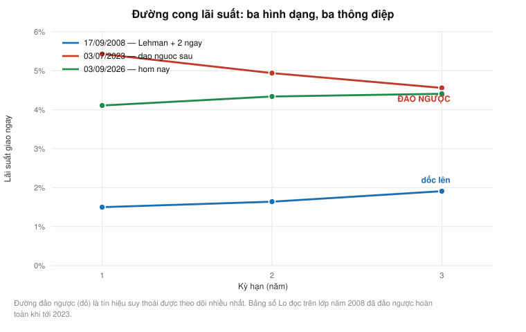
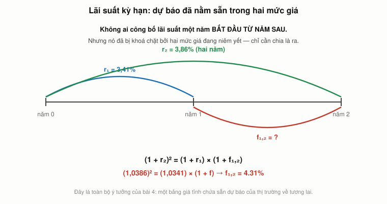

# Bài 4 — Trái phiếu I: đọc tương lai từ một bảng giá

> Bài học dựng trên **nửa sau** video **"Ses 4: Present Value Relations III & Fixed-Income
> Securities I"** (`hyc8h5T76BE`, 71:49) và **toàn bộ** video **"Ses 5: Fixed-Income Securities II"**
> (`yrmqYNvvIzs`, 79:10) — khoá **MIT 15.401 *Finance Theory I*, Fall 2008**, giảng viên
> **Prof. Andrew W. Lo**. Phụ đề gốc do người viết tay.
>
> 🕑 Mốc thời gian có tiền tố buổi: `S4 47:25` = buổi 4, phút 47:25. Bài này dùng buổi 4 từ
> **`S4 42:23` tới hết**, và buổi 5 **toàn bộ**. Vài chỗ dẫn ngược sang `S1`, `S2`, `S3` — mọi mốc
> đều đối chiếu với **đúng** video của nó.
>
> 📚 **Mở rộng** — kiến thức video lướt qua hoặc bài học này bổ sung, **không có trong video**.
> 🇻🇳 **Góc Việt Nam** — số liệu và ví dụ trong nước (mục 18), **không có trong video**.
> ⚠️ Mục **7** ghi lại việc Lo tự chấm điểm dự đoán sai của chính mình; mục **8** ghi một câu
> khẳng định của ông **bị bác sau 85 ngày**; mục **14** đối chiếu với 2026.
> 📌 **Cần đọc trước:** [Bài 2](bai_02_gia_tri_hien_tai.md) — ẩn dụ tỷ giá và luật một giá là
> nền của toàn bộ bài này. [Bài 3](bai_03_don_bay_va_lam_phat.md) — dự đoán mà Lo tự chấm điểm ở
> mục 7 là dự đoán ông đưa ra ở cuối bài 3.
>
> Công thức viết bằng LaTeX — mở bằng **Obsidian** hoặc VS Code + Markdown Preview Enhanced.

---

## Mục lục

<!-- MUC-LUC -->
- [1. Chuyển đề: từ một lãi suất sang cả một đường cong](#1-chuyển-đề-từ-một-lãi-suất-sang-cả-một-đường-cong)
- [2. Thị trường lớn nhất mà ít người nhắc tới](#2-thị-trường-lớn-nhất-mà-ít-người-nhắc-tới)
- [3. Đối chiếu 2026 — bảng số của Lo đã đảo ngược](#3-đối-chiếu-2026--bảng-số-của-lo-đã-đảo-ngược)
- [4. Ba nhóm người chơi, và vì sao 2008 nổ ở khâu giữa](#4-ba-nhóm-người-chơi-và-vì-sao-2008-nổ-ở-khâu-giữa)
- [5. Trái phiếu chiết khấu thuần — một công thức, ba biến](#5-trái-phiếu-chiết-khấu-thuần--một-công-thức-ba-biến)
- [6. STRIPS — lịch sử thật của một ý tưởng "hiển nhiên"](#6-strips--lịch-sử-thật-của-một-ý-tưởng-hiển-nhiên)
- [7. Ngày 17/9/2008 — Lo mở buổi học bằng cách tự nhận mình sai](#7-ngày-1792008--lo-mở-buổi-học-bằng-cách-tự-nhận-mình-sai)
- [8. "Không bao giờ có lãi suất danh nghĩa âm" — 85 ngày sau thì có](#8-không-bao-giờ-có-lãi-suất-danh-nghĩa-âm--85-ngày-sau-thì-có)
- [9. R lớn và r nhỏ — ký hiệu cứu bạn khỏi rối](#9-r-lớn-và-r-nhỏ--ký-hiệu-cứu-bạn-khỏi-rối)
- [10. Đường cong lãi suất — và cách đọc nó](#10-đường-cong-lãi-suất--và-cách-đọc-nó)
- [11. Bảng giá ngày 17/9/2008, đọc từng dòng](#11-bảng-giá-ngày-1792008-đọc-từng-dòng)
- [12. Lãi suất kỳ hạn — dự báo nằm sẵn trong hai mức giá](#12-lãi-suất-kỳ-hạn--dự-báo-nằm-sẵn-trong-hai-mức-giá)
- [13. Khoá lãi suất bằng hai giao dịch](#13-khoá-lãi-suất-bằng-hai-giao-dịch)
- [14. Bốn lý thuyết cấu trúc kỳ hạn, và hai lần thực tế bác lại](#14-bốn-lý-thuyết-cấu-trúc-kỳ-hạn-và-hai-lần-thực-tế-bác-lại)
- [15. Trái phiếu coupon và lợi suất đáo hạn](#15-trái-phiếu-coupon-và-lợi-suất-đáo-hạn)
- [16. Trái phiếu coupon là một gói STRIPS — luật một giá quay lại](#16-trái-phiếu-coupon-là-một-gói-strips--luật-một-giá-quay-lại)
- [17. Ba chỗ video nói gọn quá](#17-ba-chỗ-video-nói-gọn-quá)
- [18. Góc Việt Nam](#18-góc-việt-nam)
- [19. Code minh hoạ](#19-code-minh-hoạ)
- [20. Tự thử](#20-tự-thử)
- [21. Từ điển thuật ngữ](#21-từ-điển-thuật-ngữ)
- [22. Câu hỏi tự kiểm tra](#22-câu-hỏi-tự-kiểm-tra)
- [Tóm tắt một trang](#tóm-tắt-một-trang)
- [Nguồn](#nguồn)
<!-- /MUC-LUC -->

---

## 1. Chuyển đề: từ một lãi suất sang cả một đường cong

Ở phút `S4 42:23`, giữa buổi giảng, Lo sang trang:

> *"Xong bài giảng 3 rồi, ta chuyển sang bài 4 — chứng khoán thu nhập cố định. Và đây chính là
> tâm điểm của phần lớn sự đổ vỡ trên thị trường lúc này."*

Rồi ông nói một câu nghe như quảng cáo nhưng hoá ra đúng nguyên văn (`S4 43:28`):

> *"Các bạn giờ đã biết tất cả những gì cần biết để định giá gần như bất kỳ chứng khoán thu nhập
> cố định nào — miễn là không có vỡ nợ. Không có bất định. Nhớ nhé, ta nói không có bất định cho
> tới bài 12."*

Ông không nói quá. Toàn bộ bộ máy đã dựng xong ở [bài 2](bai_02_gia_tri_hien_tai.md): một tài sản
là một chuỗi dòng tiền, và giá trị của nó là tổng giá trị hiện tại của chuỗi ấy. Trái phiếu chỉ là
chuỗi dòng tiền **được ghi sẵn trên giấy**. Về mặt định giá, đó là loại chứng khoán **dễ nhất trên
đời** (`S4 45:42`):

> *"Không thể đơn giản hơn một mảnh giấy ghi: mỗi năm vào ngày này, tôi sẽ trả anh 10.000 đô."*

**Vậy tại sao còn ba bài giảng nữa cho chủ đề này?**

Vì bài 2 và bài 3 lén dùng một giả định mà chưa ai chất vấn: **có đúng một lãi suất `r`**. Chiết
khấu năm 1 bằng `r`, năm 2 bằng `r`, năm 30 cũng bằng `r`.

Điều đó không đúng. Và bài này là bài phá vỡ nó.

Lo nói thẳng ở `S5 10:40`:

> *"Lãi suất có thể khác nhau tuỳ theo chân trời thời gian. Lãi suất một năm không giống lãi suất
> năm năm, bởi vì thị trường có kỳ vọng khác nhau về việc nền kinh tế sẽ ra sao."*

Nghe thì như một chi tiết kỹ thuật phiền phức. Thực ra nó là quà tặng. Vì **cái cách các lãi suất
khác nhau chính là một bản dự báo** — thị trường viết ra bằng giá, cập nhật từng phút, miễn phí,
và bạn chỉ cần biết chia hai số cho nhau là đọc được.

Lo gọi nó bằng cái tên to nhất mà một nhà kinh tế lượng dám dùng (`S4 70:06`):

> *"Đây là thứ gần với một quả cầu pha lê nhất mà các bạn sẽ từng chạm tới. Tôi nói nghiêm túc.
> Nhìn vào giá, bạn có thể biết tương lai."*

Bài này làm ba việc: **(a)** chỉ ra quả cầu ấy nằm ở đâu và đọc nó thế nào; **(b)** dựng một giao
dịch cho phép bạn *khoá* một lãi suất tương lai ngay hôm nay; và **(c)** — phần mà bản thân Lo mở
màn buổi 5 bằng cách tự làm — **đem quả cầu ấy đi chấm điểm**. Kết quả không đẹp, và đó mới là bài
học thật.

---

## 2. Thị trường lớn nhất mà ít người nhắc tới

Trước khi vào công thức, Lo dành 15 phút cho một việc mà giáo trình thường bỏ: **cho thấy thị
trường này to đến mức nào.** Vì nếu không thấy, người học sẽ tưởng cổ phiếu mới là tài chính.

Ông chiếu bảng quy mô thị trường trái phiếu Mỹ **cuối 2006** — ông nói rõ đó là *"số liệu kịp thời
nhất tôi kiếm được"* (`S4 46:58`):

| Cuối 2006                              |          Dư nợ | Tỷ trọng          |
| -------------------------------------- | -------------: | ----------------- |
| Liên quan thế chấp nhà (MBS)           | **6.400 tỷ $** | 24 % — *lớn nhất* |
| Trái phiếu kho bạc                     |     4.200 tỷ $ |                   |
| Thị trường tiền tệ                     |     3.800 tỷ $ |                   |
| Cơ quan liên bang (Fannie, Freddie)    |     2.600 tỷ $ |                   |
| Trái phiếu địa phương                  |     2.300 tỷ $ |                   |
| Chứng khoán bảo đảm bằng tài sản (ABS) |     2.000 tỷ $ |                   |

Rồi (`S4 47:53`):

> *"Những con số này làm thị trường cổ phiếu trông nhỏ bé. Ta vẫn quen tập trung phân tích cổ
> phiếu, và ta phấn khích khi Google định thâu tóm Yahoo. Nhưng quy mô thị trường cổ phiếu bị
> chứng khoán thu nhập cố định làm cho lu mờ."*

Ông thòng thêm một câu rất Lo (`S4 48:20`):

> *"Đây là so táo với cam. Tôi chỉ đang nói rằng táo nhiều hơn cam rất nhiều."*

Ba quan sát ông rút ra từ hai biểu đồ tiếp theo, và cả ba đều quan trọng cho việc hiểu 2008:

**a) Phân biệt tồn kho và dòng chảy — đúng công cụ của [bài 1](bai_01_tai_chinh_la_gi.md).**
Biểu đồ đầu là **dư nợ** (tồn kho), biểu đồ sau là **lượng phát hành mỗi năm** (dòng chảy)
(`S4 49:23`). Đây chính là cặp khái niệm cái bồn tắm ở bài 1, lần này áp cho cả một thị trường.

**b) Cái tăng nhanh nhất là cái sau này nổ.** *"Trái phiếu liên quan thế chấp là mảng tăng nhanh
nhất, bỏ xa các mảng khác. Và điều đó kéo dài tới 2007, rồi người ta bắt đầu đạp phanh."*
(`S4 49:42`) Còn ABS thì *"năm 1985 chưa tồn tại. Giờ ta đang nói về một thị trường 2.000 tỷ đô."*
(`S4 49:04`)

**c) To không có nghĩa là dễ bán.** Đây là điểm tinh tế nhất và cũng là điểm ít ai nói (`S4 51:15`):

> *"Khác với cổ phiếu giao dịch suốt ngày, chúng ta **không** có một sàn giao dịch trái phiếu có tổ
> chức như NYSE. Có trái phiếu được giao dịch mỗi phút trong ngày, nhưng thường không phải cùng một
> mã."*

Và (`S4 52:03`): *"Những chứng khoán phức tạp như CDO, MBS còn giao dịch thưa hơn nữa, vì chúng
phức tạp và không dễ biết giá của chúng từ phút này sang phút khác."*

⚠️ **Giữ câu này lại.** Nó là một nửa lời giải thích cho toàn bộ 2008: khi bạn phải *mark to market*
(bài 3, mục 5) một thứ **không có giá thị trường**, thì con số bạn ghi vào sổ là một ước lượng — và
khi thị trường hoảng, ước lượng đó rơi thẳng đứng.

---

## 3. Đối chiếu 2026 — bảng số của Lo đã đảo ngược

Bảng của Lo là ảnh chụp cuối 2006. Mười chín năm sau, **thứ tự đã lộn ngược**.

| Loại chứng khoán        | Cuối 2006 (slide của Lo) |                     Quý 1/2026 (SIFMA) | Thay đổi  |
| ----------------------- | -----------------------: | -------------------------------------: | --------- |
| Trái phiếu kho bạc      |               4.200 tỷ $ |                        **30.800 tỷ $** | **× 7,3** |
| Trái phiếu doanh nghiệp |         *(Lo không đọc)* |                            11.700 tỷ $ |           |
| Liên quan thế chấp      |  6.400 tỷ $ — *lớn nhất* | *(không nằm trong tổng SIFMA công bố)* |           |

Hai điều đáng để ý:

**1. Nợ chính phủ Mỹ đã thay MBS làm trung tâm hệ thống.** Năm 2006 mảng lớn nhất là thế chấp nhà;
2026 thì trái phiếu kho bạc một mình lớn hơn *toàn bộ* thị trường trái phiếu Mỹ năm 2006 cộng lại
tính theo tỷ trọng. Cuộc khủng hoảng mà Lo đang dạy xuyên qua đã kết thúc bằng việc **chuyển rủi ro
từ bảng cân đối tư nhân sang bảng cân đối nhà nước** — đúng cơ chế mà bài 3, mục 8 mô tả với đòn bẩy.

**2. Điều Lo nói về thanh khoản đã đúng một nửa, và sai một nửa.** Vẫn **không** có sàn trái phiếu
tập trung kiểu NYSE — điều đó đến 2026 vẫn đúng. Nhưng hai thứ đã đổi:

- **TRACE** (Trade Reporting and Compliance Engine, FINRA vận hành từ tháng 7/2002, mở rộng dần) bắt
  buộc báo cáo mọi giao dịch trái phiếu doanh nghiệp trong vòng vài phút. Năm 2008 Lo còn dạy trong
  giai đoạn TRACE mới phủ hết trái phiếu doanh nghiệp; ngày nay một nhà đầu tư cá nhân tra được giá
  giao dịch thật, miễn phí.
- **Giao dịch điện tử**: các nền tảng như MarketAxess và Tradeweb, cùng *portfolio trading* (mua bán
  cả rổ trái phiếu như một lô), đã biến một phần lớn thị trường trái phiếu doanh nghiệp Mỹ thành
  điện tử.

⚠️ Nhưng lưu ý điều **không** đổi: **minh bạch giá ≠ thanh khoản.** Bạn biết giá gần nhất không có
nghĩa là bạn bán được ngay ở giá đó. Tháng 3/2020 thị trường trái phiếu kho bạc Mỹ — thị trường
thanh khoản nhất hành tinh — vẫn kẹt cứng tới mức Fed phải mua vào hàng trăm tỷ đô trong vài tuần.
Câu của Lo ở `S4 52:03` chưa hết hạn.

---

## 4. Ba nhóm người chơi, và vì sao 2008 nổ ở khâu giữa

Lo chia thị trường thành ba nhóm (`S4 52:24`), và cách chia này giải thích chính xác cái ông đang
sống qua:

```
   NGƯỜI PHÁT HÀNH   ──────►   TRUNG GIAN   ──────►   NHÀ ĐẦU TƯ
   (issuers)                   (intermediaries)       (investors)

   chính phủ                   nhà tạo lập chính      quỹ hưu trí
   doanh nghiệp                ngân hàng đầu tư       công ty bảo hiểm
   chính quyền địa phương      tổ chức xếp hạng       ngân hàng
   tổ chức nước ngoài          bên bảo lãnh tín dụng  quỹ đầu cơ

   phát hành giấy nợ           ghép người mua         cho vay tiền,
   để lấy tiền mặt             với người bán          nhận lãi
```

Lo giải thích khái niệm "mua trái phiếu" bằng một trò đùa của giới học thuật (`S4 53:11`):

> *"Thỉnh thoảng đi ăn trưa với đồng nghiệp trong nhóm tài chính, một ông sẽ nói: tôi bán cho anh
> một trái phiếu được không, hôm nay tôi chưa ra máy ATM. Đó là cách giáo sư tài chính nói chuyện,
> tiếc thay."*

Điểm cần nhớ: **mua trái phiếu = cho vay tiền.** Không phải "đầu tư vào một sản phẩm". Bạn là
chủ nợ.

Rồi ông chỉ vào chỗ đang cháy (`S4 54:25`):

> *"Sự đổ vỡ đang diễn ra ở khâu **trung gian**. Nỗ lực chống đỡ tài chính cho Fannie Mae, Freddie
> Mac, Lehman, Merrill và các tổ chức khác thực chất là nhằm cứu một hỗn hợp giữa trung gian và
> người phát hành. Bởi vì nếu không cứu nhóm này, thì nhóm kia — nhà đầu tư — sẽ lãnh đủ."*

### Vì sao một người "chỉ thu phí cầu đường" lại có thể chết

Lo đưa ra ẩn dụ hay nhất buổi (`S4 55:17`):

> *"Với tư cách nhà tạo lập, họ rốt cuộc phải ôm rủi ro trên sổ sách của chính mình. Nói chung đó
> không phải ý hay. Thế giới lý tưởng là bạn làm **người thu phí cầu đường**, thu phí xe chạy qua
> chạy lại. Bạn không ôm rủi ro nào cả. Nhưng nếu **không phải ai cũng muốn chạy qua rồi chạy
> lại**, bạn có thể phải đứng ra làm một chiều và để người khác làm chiều kia."*

Nghĩa là: người tạo lập thị trường kiếm tiền từ **chênh lệch mua–bán**, không phải từ đặt cược
hướng giá. Nhưng để làm được vậy, hai chiều phải cân. Khi cả thị trường muốn bán, chỉ còn một chiều
— và người tạo lập trở thành người mua duy nhất.

Lo minh hoạ bằng ngày 19/10/1987 (`S4 55:49`, `S4 56:34`, `S4 57:04`):

> *"Sáng hôm đó, các chuyên gia sàn — những người có nhiệm vụ tạo lập thị trường — đến lúc 9 giờ 30
> và bị áp đảo bởi tất cả mọi người đều muốn bán. Nên họ mua. Và khi họ mua, giá thế nào? Tiếp tục
> giảm. Nghĩa là càng nhiều người muốn bán. Nên họ mua tiếp. Cứ thế, suốt cả ngày. Thứ họ mua buổi
> sáng, tới chiều mất 20 % giá trị. Và những người tạo lập này **cũng dùng đòn bẩy**. Nhiều người
> trong số họ bị xoá sạch vốn chỉ vì cú giảm 20 % trong một ngày — trong khi họ chỉ đang làm đúng
> việc của mình."*

⚠️ **Số chính xác:** ngày thứ Hai 19/10/1987, **DJIA giảm 508,32 điểm, tức 22,61 %**, đóng cửa ở
1.738,74. **S&P 500 giảm 20,47 %.** Lo nói *"khoảng 20 %"* — đúng cho S&P 500, hơi thấp so với Dow.
Đây vẫn là mức giảm một ngày lớn nhất lịch sử thị trường Mỹ, vượt xa 12,82 % của 29/10/1929.

Câu **"họ cũng dùng đòn bẩy"** là chỗ bài 3 nối vào bài 4: cùng một cơ chế, khác nhân vật. Người
tạo lập thị trường không đặt cược hướng giá, nhưng vì họ dùng đòn bẩy, **họ vẫn chết vì hướng giá.**

Lo còn kể một câu chuyện về một nhà tạo lập lên cơn đau tim trên sàn NYSE chật cứng và không ngã
xuống được cho tới khi thị trường đóng cửa (`S4 57:27`). ⚠️ **Tôi không xác minh được giai thoại
này từ nguồn độc lập** — nó có mọi dấu hiệu của một truyền thuyết phố Wall. Bài học ông rút ra thì
đứng vững mà không cần giai thoại: khi thanh khoản bốc hơi, khâu trung gian là nơi chịu lực.

---

## 5. Trái phiếu chiết khấu thuần — một công thức, ba biến

Lo bắt đầu định giá bằng **trái phiếu coupon** ba năm, coupon 5 %, mệnh giá 1.000 $ (`S4 60:14`).
Ông giải thích cả cái tên (`S4 61:17`):

> *"Vì sao gọi là trái phiếu coupon? Ngày xưa trái phiếu là một tờ giấy thật, và ở mép dưới có
> những phiếu nhỏ. Bạn cắt phiếu ra rồi gửi qua bưu điện. Mỗi năm gửi một lần, hoặc hai lần một
> năm, bạn nhận lại 50 đô."*

Rồi ông hỏi "cái này đáng giá bao nhiêu?" và một sinh viên trả lời "còn tuỳ lãi suất" (`S4 62:09`).
Lo hỏi tiếp cách xác định giá trị thị trường, và nhận được **hai** câu trả lời (`S4 62:56`,
`S4 63:13`):

> *"Tính giá trị hiện tại ròng, NPV. Đó là một câu trả lời. Đó là câu trả lời đúng theo sách giáo
> khoa. Còn cách nào khác? — **Qua thị trường.** Chính xác. Đấu giá nó đi."*

Và ông chốt lại bằng đúng ẩn dụ tỷ giá của [bài 2](bai_02_gia_tri_hien_tai.md#5-phép-ẩn-dụ-trung-tâm-hai-thời-điểm-là-hai-loại-tiền-tệ)
(`S4 63:27`):

> *"Nhưng khi làm vậy, cái ta đang làm chính là tính giá trị hiện tại. Cách làm là tìm ra giá của
> **một đô ở năm 1**, tính theo hôm nay. Giá của một đô ở năm 2, tính theo hôm nay. Và một đô ở năm
> 3. Lấy các tỷ giá đó rồi quy tất cả các loại tiền khác nhau về đô-la hôm nay."*

Trước khi làm chuyện phức tạp, ông đơn giản hoá tối đa. Ông liệt kê năm loại rủi ro sẽ phải xử lý —
**lạm phát, tín dụng, thời điểm, thanh khoản, tỷ giá** (`S4 64:32`) — rồi gạt hết bốn cái đi
(`S4 65:33`):

> *"Trong vài bài giảng tới tôi muốn giữ mọi thứ đơn giản và chỉ nói về **nợ không rủi ro**. Không
> rủi ro theo nghĩa không vỡ nợ. Cụ thể là trái phiếu chính phủ Mỹ. Vì bạn luôn có thể in đô-la ra
> để trả chủ nợ."*

Và ông không quên chú thích cho chính mình (`S4 65:51`):

> *"Những đồng đô-la đó có thể không đáng giá như bạn muốn nếu in quá nhiều — nhưng tạm thời ta
> không quan tâm tới vỡ nợ."*

### Trái phiếu chiết khấu thuần

Bỏ luôn coupon đi thì còn lại thứ đơn giản nhất: **một khoản trả duy nhất ở cuối** (`S4 66:08`).

$$P_{0,t} \;=\; \frac{F}{(1+r_{0,t})^{\,t}}$$

Lo giải thích tại sao có chữ "chiết khấu" trong tên (`S4 66:25`):

> *"Nếu mệnh giá là 1.000 đô và không có gì ở giữa, thì giá hôm nay **không thể** lớn hơn 1.000 đô,
> vì tiền hôm nay đáng giá hơn tiền năm sau. Nên giá hôm nay sẽ thấp hơn 1.000. Nó nằm ở mức chiết
> khấu so với 1.000 — do đó có tên trái phiếu chiết khấu thuần."*

Và rồi câu quan trọng nhất của cả mục (`S4 69:25`):

> *"Quan hệ này thực sự tuyệt vời, bởi nếu bạn có **hai trong ba biến** của phương trình, bạn có
> biến thứ ba. Cho tôi biết mệnh giá và lãi suất, bạn có giá. Cho tôi biết giá và mệnh giá, bạn có
> lãi suất. Cho tôi lãi suất và giá, bạn tính ra mệnh giá."*

Đọc lướt thì đây là một mẹo đại số tầm thường. Nhưng nó là **bản lề của cả bài**. Vì trên thị trường
thật, **cái bạn quan sát được là giá**, không phải lãi suất. Lãi suất không phải một con số ai đó
công bố — nó là thứ bạn **suy ngược ra từ giá**. Lo nói rõ ở `S5 11:16`:

> *"Làm sao ta biết các lãi suất này là bao nhiêu? — **Thị trường.** Chính xác. Cách làm không phải
> là nghĩ về lãi suất, mà là **đấu giá** những mảnh giấy trả 1.000 đô sau một năm, 1.000 đô sau hai
> năm... rồi xem giá đấu ra là bao nhiêu. Có giá rồi, có mệnh giá rồi, ta giải ngược ra `r`."*

---

## 6. STRIPS — lịch sử thật của một ý tưởng "hiển nhiên"

Có một vấn đề thực tế: trái phiếu chiết khấu thuần **hiếm**. Tín phiếu kho bạc (T-bill) là trái
phiếu chiết khấu thuần, nhưng kỳ hạn tối đa một năm. Ở kỳ hạn 5, 15, 30 năm, chính phủ chỉ phát
hành trái phiếu **có coupon** (`S4 67:00`).

Lo kể giải pháp như một câu chuyện (`S4 67:21`):

> *"Rồi một kỹ sư tài chính thông minh nào đó nói: đây là việc tôi sẽ làm. Tôi sẽ mua thật nhiều
> trái phiếu coupon của kho bạc, rồi phát hành các trái phiếu chiết khấu khớp đúng với từng khoản
> coupon. Nói cách khác, tôi sẽ **lột** các coupon ra và chào bán chúng như những chứng khoán riêng
> biệt. Và tôi gọi chúng là **STRIPS**."*

Ông đọc tên đầy đủ (`S4 68:08`): *separate trading of registered interest and principal securities*
— giao dịch tách rời phần lãi và phần gốc đã đăng ký.

Rồi ông rút ra bài học nghề nghiệp (`S4 68:44`):

> *"Có rất nhiều ý tưởng mà với bạn thì có vẻ hiển nhiên nhưng với thị trường thì không. Và
> **không có bằng sáng chế cho ý tưởng hay**. Không ai độc quyền ý tưởng hay. Bạn hoàn toàn có thể
> tạo ra giá trị khổng lồ bằng một giải pháp mà bạn tưởng là quá đơn giản, nhưng nó giải quyết vấn
> đề cho các định chế tài chính rất lớn."*

### Lịch sử thật, và Lo nhớ hơi lệch

Lo nói (`S4 68:29`): *"Chuyện này cũng không lâu lắm đâu. Chắc, tôi không rõ, 15 hay 20 năm trước
họ tạo ra STRIPS."* Tính từ 2008 thì đó là 1988–1993.

Số thật, và câu chuyện thật thì hay hơn:

| Thời điểm        | Chuyện gì                                                                                                                                                                                                                                                                                                |
| ---------------- | -------------------------------------------------------------------------------------------------------------------------------------------------------------------------------------------------------------------------------------------------------------------------------------------------------- |
| **Tháng 8/1982** | **Merrill Lynch** ra **TIGRs** (*Treasury Investment Growth Receipts*) và **Salomon Brothers** ra **CATS** (*Certificates of Accrual on Treasury Securities*). Cách làm đúng như Lo mô tả: mua trái phiếu kho bạc, gửi vào tài khoản lưu ký ngân hàng, rồi phát hành chứng chỉ sở hữu từng khoản coupon. |
| 1984             | Hàng loạt bản sao xuất hiện (Treasury Receipts…). Nhược điểm chí mạng: **chứng chỉ của hãng này không đổi được với hãng kia** — thị trường bị phân mảnh, thanh khoản kém.                                                                                                                                |
| **15/2/1985**    | **Kho bạc Mỹ tự làm.** Chương trình STRIPS chính thức, áp cho trái phiếu và tín phiếu mới kỳ hạn từ 10 năm trở lên, lưu ký điện tử qua hệ thống Fed.                                                                                                                                                     |
| 1986             | Bổ sung cơ chế **tái hợp** (reconstitution): ghép các STRIPS lại thành trái phiếu nguyên.                                                                                                                                                                                                                |

Nghĩa là ở thời điểm Lo giảng, STRIPS đã **23 tuổi**, còn ý tưởng gốc thì **26 tuổi**. Chênh lệch
không quan trọng. Điều quan trọng là câu chuyện đầy đủ **củng cố** luận điểm của ông chứ không phá
nó: từ 1982 đến 1985 khu vực tư nhân đã lột khoảng **57 tỷ đô mệnh giá** trái phiếu kho bạc bằng ý
tưởng "hiển nhiên" đó, trước khi chính phủ nhìn ra và tự làm — và khi chính phủ làm thì TIGRs và
CATS chết sạch.

📚 Có một chi tiết Lo bỏ qua nhưng đáng nhớ: **hai ông lớn chỉ đặt tên con vật.** TIGRs (hổ), CATS
(mèo). Đó không phải đùa — vì các sản phẩm này mang **thương hiệu riêng**, không hoán đổi được cho
nhau, nên chính cái tên hay ho ấy là nguyên nhân khiến chúng thất bại. Bài học phụ: trong thị trường
tài chính, **tiêu chuẩn hoá đánh bại khác biệt hoá.**

---

## 7. Ngày 17/9/2008 — Lo mở buổi học bằng cách tự nhận mình sai

Cuối buổi 4, Lo đưa ra dự đoán đã ghi ở [bài 3, mục 7](bai_03_don_bay_va_lam_phat.md#7-lo-đưa-ra-một-dự-đoán--và-nó-sai-ngay-hôm-sau)
(`S4 70:38`): *"với 99,5 % độ tin cậy, ngày mai Fed sẽ cắt lãi suất."* Rồi thêm (`S4 71:07`):
*"Sẽ rất mất mặt, và có thể là thảm hoạ, nếu tôi sai."*

Buổi 5 mở đầu như thế này (`S5 00:28`):

> *"Trước khi bắt đầu bài hôm nay, tôi muốn nói vài lời về tin tức, bởi vì lần trước, hôm thứ Hai,
> **chúng ta** đã nói — hay đúng hơn là **tôi** đã nói — rằng Fed sẽ cắt lãi suất. [CẢ LỚP CƯỜI]"*

Cái dấu **[LAUGHTER]** đó nằm trong phụ đề gốc. Sinh viên đã theo dõi.

Ông kể tiếp (`S5 00:47`):

> *"Và thực tế, nếu bạn nhìn dữ liệu hôm thứ Hai, nhìn hợp đồng tương lai lãi suất Fed và các hợp
> đồng tài chính khác, thị trường đã định giá vào việc Fed sẽ cắt ít nhất 25 điểm cơ bản, và một xác
> suất hợp lý là cắt 50. Và tất nhiên, họ **không làm cả hai**. Họ giữ nguyên lãi suất."*

### Việc Fed làm thay vì cắt lãi suất

> *"Nhưng họ **có** làm gì đó. Họ làm gì? Có ai biết không? — Một khoản vay. Bao nhiêu?
> **85 tỷ đô**, mà kể cả với chỗ bạn bè thì đó vẫn là rất nhiều tiền. [CƯỜI]"* (`S5 01:03`)

Đó là **AIG**. Fed công bố khoản vay 85 tỷ đô cho AIG ngày 16/9/2008 — đúng cái ngày Lo dự đoán họ
sẽ cắt lãi suất.

Lo dựng câu hỏi của buổi học từ nghịch lý này (`S5 02:36`):

> *"Lehman Brothers sụp, và Fed làm gì? **Không gì cả.** Vậy nếu Fed không làm gì cho Lehman, mà
> lại cấp khoản vay 85 tỷ cho AIG, thì phải có gì đó khác nhau. Ý tôi là, ta có thể kiểm tra xem
> Ben Bernanke có ông anh vợ làm ở AIG không, nhưng tôi không nghĩ đó là lý do."*

Câu trả lời ông đưa ra (`S5 07:26`, `S5 07:45`) — và ông ghi rõ *"đây là suy đoán"*:

> *"Fed quyết định rằng vấn đề không phải **giá** của vốn mà là **sự sẵn có** của vốn. Nói cách
> khác, họ lo về một cuộc khủng hoảng tín dụng, một khủng hoảng thanh khoản. Và AIG là một tay chơi
> rất quan trọng ở khía cạnh đó — rõ ràng quan trọng hơn Lehman nhiều. AIG cung cấp lượng bảo hiểm
> khổng lồ cho nhiều bên khác trong thị trường tín dụng."*

Rồi ông chỉ ra cơ chế dây chuyền, và đây là chỗ hay nhất (`S5 08:27`):

> *"Nếu bạn là một quỹ hưu trí, bạn **bị luật buộc** chỉ được nắm tài sản hạng đầu tư. Nếu vì bất
> kỳ lý do gì các tài sản đó rơi xuống dưới hạng đầu tư, thì theo luật bạn **buộc phải bán**. Bây
> giờ, bạn nghĩ chuyện gì sẽ xảy ra với thị trường nếu tất cả mọi người cùng một lúc quyết định
> tống khứ những tài sản đó?"*

Đây là bài học không nằm trong công thức nào: **một quy định thiết kế để bảo vệ nhà đầu tư có thể
biến thành cỗ máy bán tháo đồng loạt.** Bảo hiểm của AIG là thứ giữ cho đống giấy đó ở hạng đầu tư.
Cứu AIG không phải cứu AIG — là cứu cái nhãn xếp hạng.

### Chuyện gì đã xảy ra sau đó với AIG

| Khoản mục                         | Con số                                                                   |
| --------------------------------- | ------------------------------------------------------------------------ |
| Cam kết tối đa                    | **182,3 tỷ $** (Fed + Bộ Tài chính), cộng 15,2 tỷ qua kênh cho vay chung |
| Số **thực sự giải ngân** cao nhất | **141,8 tỷ $** (tháng 4/2009)                                            |
| Cổ phần nhà nước nắm              | tới **92 %**                                                             |
| Kết thúc                          | Bộ Tài chính bán nốt cổ phần tháng 12/2012, ở giá 32,50 $/cp             |
| Kết quả tài chính                 | **lãi 22,7 tỷ $** — Fed lãi 17,7 tỷ, Bộ Tài chính lãi 5,0 tỷ             |

⚠️ **Đừng đọc con số 22,7 tỷ như một lời biện minh.** Đó là lợi nhuận **danh nghĩa**, không tính chi
phí cơ hội của vốn và không tính giá trị của bảo lãnh ngầm mà nhà nước đã trao. Có thời điểm Văn
phòng Ngân sách Quốc hội (CBO) dự báo khoản cứu trợ này sẽ **lỗ 14 tỷ đô**. Việc nó rốt cuộc có lãi
là kết quả của diễn biến thị trường, không phải bằng chứng rằng quyết định lúc đó là đúng — đúng
tinh thần bài học ở mục dưới đây.

### Điều Lo tự rút ra

Đây là đoạn quan trọng nhất buổi 5, và tôi để nguyên văn (`S5 06:50`):

> *"Hôm thứ Hai, tôi khẳng định rằng giá thị trường đang nói với chúng ta: sẽ có một đợt cắt lãi
> suất của Fed. Rõ ràng là **sai**. Mà đó là một bài học rất hay, bởi vì điều này cho ta thấy rằng
> **giá thị trường có chứa thông tin, nhưng như tôi đã nói lần trước, chúng không phải một quả cầu
> pha lê. Chúng không hoàn hảo, và vì thế chúng có thể sai.**"*

Một giáo sư MIT dựng lên hình ảnh "quả cầu pha lê" ở cuối buổi trước, rồi mở buổi sau bằng cách tự
đập nó — trước mặt sinh viên đã cười ông. Giữ hình ảnh này lại: nó là thứ phân biệt một môn học với
một bài quảng cáo. Và mục 14 sẽ đem chính quả cầu ấy đi cân đo bằng số liệu.

---

## 8. "Không bao giờ có lãi suất danh nghĩa âm" — 85 ngày sau thì có

Giữa buổi, một sinh viên hỏi một câu rất hay (`S5 09:00`):

> *"Có một chuyện đơn giản mà em không hiểu. Làm sao lãi suất lại có thể thấp hơn tỷ lệ lạm phát?"*

Lo trả lời phần đầu **hoàn toàn đúng** (`S5 09:14`) — và nó chính là [bài 3](bai_03_don_bay_va_lam_phat.md#10-danh-nghĩa-và-thực):

> *"Về nguyên tắc thì không nên kéo dài. Nhưng trong ngắn hạn thì chắc chắn có thể. Và điều đó có
> nghĩa là **lãi suất thực đang âm**, hoặc nền kinh tế đang co lại."*

Sinh viên hỏi tiếp: *"Vậy lúc này, 1 đô một năm nữa có giá hơn 1 đô hôm nay?"* Lo đáp (`S5 09:29`):

> *"Nếu tính cả lạm phát thì đúng — **theo giá trị thực**, không phải theo giá trị danh nghĩa.*
> ***Bạn không bao giờ có thể có lãi suất danh nghĩa âm.*** *Đúng không? Trừ khi có ai đó đang đốt
> tiền."*

⚠️ **Đây là lần thứ hai Lo nói câu này trong khoá.** Lần đầu ở buổi 1, và [bài 1, mục 12](bai_01_tai_chinh_la_gi.md)
đã bác lại bằng ECB, SNB, BOJ. Nhưng lần này chuyện còn ngoạn mục hơn nhiều, vì:

**Nó bị bác ngay trong chính thị trường mà ông đang chiếu lên màn hình, sau 85 ngày.**

Dãy số dưới đây lấy từ **H.15 của Fed** — lợi suất tín phiếu kho bạc Mỹ 4 tuần, thị trường thứ cấp:

| Ngày           | Tín phiếu 4 tuần |
| -------------- | ---------------: |
| 10/12/2008     |           0,00 % |
| **11/12/2008** |      **−0,01 %** |
| 15/12/2008     |           0,00 % |
| **19/12/2008** |      **−0,01 %** |
| 24/12/2008     |           0,00 % |

Và trên thị trường **sơ cấp**, ba phiên đấu giá tín phiếu 4 tuần ngày **9, 16 và 23/12/2008** đều
kết thúc **đúng bằng 0,00 %** — trái phiếu được phát hành **ngang mệnh giá**, tức nhà đầu tư bỏ ra
32 tỷ đô để một tháng sau nhận lại đúng 32 tỷ đô, không một xu lãi.

⚠️ **Một chi tiết phải nói cho chính xác:** các phiên **đấu giá** không âm — Kho bạc Mỹ không nhận
giá thầu âm cho chứng khoán danh nghĩa, và quy định năm 2009 sau đó ghi rõ mức bỏ thầu phải là số
dương hoặc bằng không. Lãi suất **âm** xảy ra ở **thị trường thứ cấp**, nơi người ta mua đi bán lại.
Đó là chỗ con số −0,01 % ở trên đến từ.

**Vì sao ai đó chịu trả tiền để được cho chính phủ vay?** Vì hai lý do rất thực tế: (a) giữ 32 tỷ đô
tiền mặt cũng tốn tiền — kho, bảo hiểm, và rủi ro ngân hàng giữ hộ bị phá sản; (b) nhiều tổ chức
**bị luật buộc** phải nắm tín phiếu kho bạc làm tài sản thế chấp. Khi nhu cầu bắt buộc gặp nguồn
cung hạn chế, giá vượt mệnh giá, và lợi suất chui xuống dưới 0.

📚 Cái Lo bỏ sót không phải một chi tiết kỹ thuật mà là một giả định: **ông ngầm cho rằng tiền mặt
luôn là lựa chọn thay thế miễn phí.** Nếu bạn luôn có thể giữ tiền giấy với chi phí bằng 0, thì
đúng, không ai chịu lãi suất âm. Nhưng với 32 tỷ đô thì tiền giấy **không** miễn phí. Ranh giới đó
có tên: **"mức sàn tiền giấy hiệu dụng"** (*effective lower bound*), và nó nằm dưới 0, không bằng 0.

Bài học rút ra không phải "Lo dốt" — mà là: **một điều kiện không kênh hoá luôn kèm theo một giả
định ngầm về công nghệ giao dịch.** Ở bài 2, luật một giá dựa vào giả định "bạn mua bán được tự do".
Ở đây, "lãi suất không thể âm" dựa vào giả định "bạn giữ tiền mặt được miễn phí". Khi giả định vỡ,
kết luận vỡ theo. Đây là mẫu hình sẽ lặp lại suốt phần quyền chọn và CAPM.

---

## 9. R lớn và r nhỏ — ký hiệu cứu bạn khỏi rối

Lo cảnh báo trước (`S5 37:17`):

> *"Bài giảng này có rất nhiều ký hiệu, nhưng không nhiều thách thức khái niệm. Bởi vì mọi thách
> thức khái niệm đã được giải quyết khi ta nói về quy tắc giá trị hiện tại ròng."*

Ông đúng. Nhưng ký hiệu vẫn cần học cho chắc, vì nếu lẫn thì mọi thứ sau đó sụp.

### Hai loại lãi suất

| Ký hiệu   | Tên                            | Nghĩa                                                    |
| --------- | ------------------------------ | -------------------------------------------------------- |
| $R_t$     | **lãi suất giao ngay một năm** | lãi suất cho vay **một năm**, từ thời điểm $t-1$ tới $t$ |
| $r_{0,t}$ | **lãi suất giao ngay $t$ năm** | lãi suất **trung bình** cho vay từ hôm nay tới năm $t$   |

Lo nhấn mạnh (`S5 13:11`): **"$R$ lớn LUÔN LUÔN là lãi suất một năm"**, còn $r$ nhỏ thì có thể là
lãi suất nhiều năm.

Ví dụ cụ thể để khỏi lẫn:

```
   hôm nay        năm 1          năm 2          năm 3
      |──────────────|──────────────|──────────────|
      
      ├─── R₁ ───────┤              R₁ = lãi suất 1 năm, từ hôm nay tới năm 1
                     ├─── R₂ ──────┤ R₂ = lãi suất 1 năm, từ năm 1 tới năm 2
                                    ├─ R₃ ─┤        (lãi suất 1 năm, năm 2→3)

      ├────────── r(0,2) ──────────┤ r(0,2) = lãi suất TRUNG BÌNH 2 năm
      ├───────────── r(0,3) ───────────────┤ r(0,3) = trung bình 3 năm
```

### Quan hệ giữa chúng

Nếu bạn cho vay 1 đô hôm nay và **lăn vòng** qua từng năm một, sau $t$ năm bạn có
$(1+R_1)(1+R_2)\cdots(1+R_t)$. Còn nếu bạn cho vay một lần với lãi suất $r_{0,t}$ trong $t$ năm, bạn
có $(1+r_{0,t})^t$. Hai thứ đó phải bằng nhau, nên:

$$(1+r_{0,t})^{\,t} \;=\; \prod_{k=1}^{t}(1+R_k) \qquad\Longleftrightarrow\qquad
r_{0,t} \;=\; \left[\prod_{k=1}^{t}(1+R_k)\right]^{1/t} - 1$$

Lo diễn đạt bằng một câu (`S5 16:08`):

> *"Bạn có thể nghĩ về $r$ nhỏ như một **trung bình nhân** của các $R$ lớn."*

⚠️ **Trung bình *nhân*, không phải trung bình cộng.** Với lãi suất nhỏ thì hai cái gần bằng nhau,
nhưng khác biệt lớn dần khi lãi suất cao — cùng cơ chế đã gặp ở [bài 3](bai_03_don_bay_va_lam_phat.md#10-danh-nghĩa-và-thực)
với công thức Fisher xấp xỉ.

### Vì sao phải bận tâm

Lo nói thẳng lý do (`S5 14:23`):

> *"Ta **không quan sát được** các $R$ này. Nên đây là hư cấu thuần tuý, theo nghĩa những gì tôi
> đang viết. Đó là lý thuyết. Tôi không nói rằng ta biết các $R$ lớn ấy là bao nhiêu. Nhưng tôi biết
> chúng tồn tại."*

Rồi (`S5 16:43`):

> *"Cái $r$ nhỏ — thứ ta **quan sát được** — chứa thông tin về diễn biến lãi suất tương lai. Bên
> trong $r$ nhỏ là tất cả các $R$ lớn — ít nhất là kỳ vọng ngày hôm nay về chúng."*

Đây là toàn bộ mánh: **cái quan sát được (giá, do đó $r$) chứa cái không quan sát được (kỳ vọng về
$R$ tương lai).** Phần còn lại chỉ là số học.

---

## 10. Đường cong lãi suất — và cách đọc nó



*Ba hình dạng đường cong, vẽ từ chính ba bảng số trong file thực hành.*

Lo lấy một bảng giá STRIPS thật, ngày **1/8/2001**, kỳ hạn từ 3 tháng tới 30 năm (`S5 17:25`). Ba
mức giá ông đọc rõ ra:

| Kỳ hạn | Giá trên mỗi 1 $ mệnh giá | $r_{0,t}$ suy ra |
| -----: | ------------------------: | ---------------: |
|  1 năm |                     0,967 |         3,4126 % |
|  2 năm |                     0,927 |         3,8628 % |
|  5 năm |                     0,797 |     **4,6426 %** |

Ông tính miệng cái 5 năm (`S5 18:50`): *"khi giải ra, tôi được 4,64 %. Đó là suất sinh lợi, chi phí
vốn, lợi suất của chân trời 5 kỳ."* Con số khớp — mục 19 chạy lại bằng code.

### Bước lấy ra dự báo

Đây là chỗ Lo phải mượn máy tính của sinh viên (`S5 21:31`):

> *"Tôi không mang máy tính, nhưng chắc chắn các bạn có. Ai chia hộ tôi phép này được không? Lấy
> 0,967 chia cho 0,927. Được bao nhiêu? — 1,04. Trừ đi 1. **4 %.** Cho tôi thêm vài chữ số nữa
> được không? — 4,314."*

Vì sao phép chia này lại ra lãi suất một năm của **năm thứ hai**? Vì:

$$\frac{P_{0,1}}{P_{0,2}} \;=\; \frac{F/(1+R_1)}{F/[(1+R_1)(1+R_2)]} \;=\; 1+R_2$$

Cái $F$ triệt tiêu, $(1+R_1)$ triệt tiêu, còn đúng $1+R_2$.

Lo chốt (`S5 22:35`):

> *"Ẩn trong giá của một trái phiếu hai năm và một trái phiếu một năm — ẩn trong đó là một **dự
> báo** về lợi suất, hay chi phí vay, giữa năm 1 và năm 2."*

⚠️ Số đúng là **4,3150 %**; sinh viên đọc 4,314 do làm tròn. Không đáng kể, nhưng nếu bạn tự bấm máy
và ra 4,315 thì đừng nghĩ mình sai.

Kiểm chứng quan hệ trung bình nhân: $R_1 = 3{,}4126\%$, $R_2 = 4{,}3150\%$, trung bình nhân
$= \sqrt{1{,}034126 \times 1{,}043150} - 1 = 3{,}8628\%$ — **đúng bằng** $r_{0,2}$ tính thẳng từ giá
2 năm. Mục 19 kiểm cái này tới sai số $10^{-12}$.

### Đường cong lãi suất

Vẽ $r_{0,t}$ theo $t$, ta được thứ Lo gọi tên ở `S5 23:15`: **cấu trúc kỳ hạn của lãi suất**, hay
**đường cong lãi suất**. Và ông cho quy tắc đọc (`S5 23:36`):

| Hình dạng                 | Thị trường đang nói                                                |
| ------------------------- | ------------------------------------------------------------------ |
| **Dốc lên**               | các $R$ lớn tương lai **cao hơn** hiện tại → kỳ vọng lãi suất tăng |
| **Phẳng**                 | lãi suất tương lai bằng hiện tại                                   |
| **Dốc xuống (đảo ngược)** | các $R$ lớn tương lai **thấp hơn** → kỳ vọng lãi suất giảm         |

---

## 11. Bảng giá ngày 17/9/2008, đọc từng dòng

Rồi Lo làm việc mà giáo trình không làm được: ông mở trình duyệt (`S5 24:15`).

> *"Tôi đang ở trang Bloomberg. Đây là bản công khai, tôi không có giấy phép gì đặc biệt. Bấm vào
> market data, rồi rates and bonds, bạn sẽ ra đúng trang này."*

Đây là bảng lợi suất trái phiếu kho bạc Mỹ **đúng ngày hôm đó**, lấy từ chuỗi H.15 của Fed —
tức cùng nguồn dữ liệu Lo đang nhìn:

| Kỳ hạn      | 16/9/2008 (đường **cam**) | 17/9/2008 (đường **xanh**) |         Đổi |
| ----------- | ------------------------: | -------------------------: | ----------: |
| 1 tháng     |                    0,23 % |                     0,07 % |     −16 đcb |
| **3 tháng** |                    0,84 % |                 **0,03 %** | **−81 đcb** |
| 6 tháng     |                    1,52 % |                     1,03 % |     −49 đcb |
| 1 năm       |                    1,72 % |                     1,50 % |     −22 đcb |
| 2 năm       |                    1,89 % |                     1,64 % |     −25 đcb |
| 5 năm       |                    2,64 % |                     2,52 % |     −12 đcb |
| **10 năm**  |                    3,48 % |                 **3,41 %** |  **−7 đcb** |
| 30 năm      |                    4,08 % |                     4,08 % |           0 |

Giờ đọc lại lời Lo và đối chiếu từng câu:

**✅ "Ba điểm cơ bản."** (`S5 25:14`)

> *"Chỗ ta đang đứng hôm nay, với lãi suất 3 tháng, là gần bằng 0. Thực ra là **ba điểm cơ bản**,
> ba điểm cơ bản cho tín phiếu kho bạc 3 tháng."*

Số chính thức trong H.15 ngày 17/9/2008: **0,03 %.** Lo đọc đúng từng điểm cơ bản, trực tiếp trên
lớp, không chuẩn bị trước.

**✅ "Đường xanh và đường cam khác nhau, và khác ở đầu ngắn."** (`S5 26:18`)

> *"Nhìn khoảng cách giữa đường xanh và đường cam. Đường cam là hôm qua. Có khác biệt. Có khác biệt
> rõ rệt **ở đầu ngắn**, nghĩa là rất nhiều người đang đi mua tín phiếu kho bạc lúc này, có lẽ ngay
> khi chúng ta đang nói chuyện."*

Bảng xác nhận: kỳ hạn 3 tháng **giảm 81 điểm cơ bản trong một ngày**, trong khi kỳ hạn 10 năm chỉ
giảm 7 và kỳ hạn 30 năm **không đổi**. Đó không phải "lãi suất giảm" — đó là **một cuộc chạy trốn
tập trung vào đúng một chỗ trú.**

**✅ Cơ chế giá.** Lo hỏi lớp vì sao lợi suất thấp thế, và dẫn tới câu trả lời (`S5 25:45`):

> *"**Giá cực kỳ cao.** Đúng vậy. Giá bằng khoản trả sau 3 tháng chia cho $1+r$. Nếu $r$ hoá ra bé
> tí xíu, thì chỉ vì giá rất cao. Vì sao giá lại cao? — Vì trái phiếu kho bạc Mỹ là thứ an toàn để
> nắm giữ lúc này."*

Đây chính là mục 5 dùng ngược: **ba biến, biết hai suy ra một.** Không ai "đặt" lãi suất xuống 0,03 %.
Người ta tranh nhau mua, giá bị đẩy sát mệnh giá, và lợi suất — thứ suy ra từ giá — rơi theo.

**✅ Hình dạng.** (`S5 28:11`)

> *"Đường cong đi lên rất dốc sau ba tháng đầu. Có một cú tăng lớn ở độ dốc, rồi sau đó thoải dần.
> Đó là dấu hiệu của một cuộc **chạy trốn về chất lượng** hay chạy trốn về thanh khoản trong ngắn
> hạn."*

Từ 0,03 % lên 1,03 % rồi 1,50 % — nhảy 100 rồi 47 điểm cơ bản; sau đó từ 1,50 lên 4,08 rải suốt 29
năm còn lại. Đúng như ông mô tả.

**✅ Diễn giải.** (`S5 28:29`)

> *"Thị trường kỳ vọng rằng theo thời gian, khi mọi thứ lắng xuống, lãi suất sẽ đi lên, vì một trong
> hai lý do. Hoặc có áp lực lạm phát, hoặc sẽ có những hệ quả kinh tế của những gì đang xảy ra hôm
> nay, và điều đó rốt cuộc đẩy lãi suất lên."*

Giữ câu này. **Mục 14 sẽ đem nó đi chấm điểm.**

### Một câu hỏi từ Argentina mà đáng cả một mục

Một sinh viên người Argentina hỏi một câu rất sắc (`S5 28:50`):

> *"Ở nước em, khi có khủng hoảng thì lãi suất **tăng**, vì xác suất vỡ nợ tăng. Còn ở đây em thấy
> ngược lại."*

Trả lời của Lo (`S5 29:13`, `S5 29:49`) là một trong những đoạn giá trị nhất buổi:

> *"Đúng vậy. Nó tuỳ vào **bản chất** của cuộc khủng hoảng. Ở một số nước, phản ứng điển hình của cơ
> quan tiền tệ là bơm tiền mặt ngập thị trường, vì đó là cách họ đối phó với thiếu thanh khoản. Khi
> làm vậy, bạn khuyến khích lạm phát, và đó là lý do lãi suất tăng ở những nền kinh tế đó. Nước Mỹ,
> tốt hay xấu, đã cho thấy một mức độ kiềm chế tiền tệ nhất định qua nhiều năm."*

Bài học tổng quát: **cùng một cú sốc, đường cong lãi suất phản ứng ngược nhau tuỳ vào việc thị
trường tin gì về ngân hàng trung ương.** Nếu tin sẽ in tiền → lo lạm phát → lãi suất tăng. Nếu tin
sẽ giữ kỷ luật → chỉ là thiếu tiền mặt tạm thời → lãi suất giảm. Đường cong không đo nền kinh tế;
nó đo **niềm tin của thị trường về phản ứng chính sách.**

Điều này rất đáng nhớ khi đọc [mục 18](#18-góc-việt-nam) về Việt Nam.

---

## 12. Lãi suất kỳ hạn — dự báo nằm sẵn trong hai mức giá



*Không ai công bố lãi suất một năm bắt đầu từ năm sau — nhưng nó đã bị hai mức giá khoá chặt.*

Lo tổng quát hoá phép chia ở mục 10 (`S5 37:48`):

$$\frac{P_{0,\,t-1}}{P_{0,\,t}} \;-\; 1 \;=\; f_{t-1,\,t}$$

Và đặt tên (`S5 38:13`):

> *"Nó được gọi là **lãi suất kỳ hạn** hôm nay giữa ngày $t-1$ và $t$. Nó là một dự báo về lãi suất
> giao ngay tương lai giữa hai ngày đó."*

### Ba khái niệm rất dễ lẫn

Lo tự nhận là chúng gây rối (`S5 39:14`), và bảng sau là chỗ đáng học thuộc:

| Loại lãi suất                                              | Áp dụng cho khoảng nào     | Hôm nay có quan sát được không?   |
| ---------------------------------------------------------- | -------------------------- | --------------------------------- |
| **Lãi suất giao ngay** ($r_{0,t}$)                         | từ **hôm nay** tới năm $t$ | ✅ **có** — suy từ giá hôm nay     |
| **Lãi suất giao ngay tương lai** ($R_t$ thật, khi tới lúc) | từ năm $t-1$ tới năm $t$   | ❌ **không** — chưa xảy ra         |
| **Lãi suất kỳ hạn** ($f_{t-1,t}$)                          | từ năm $t-1$ tới năm $t$   | ✅ **có** — suy từ hai giá hôm nay |

**Lãi suất kỳ hạn và lãi suất giao ngay tương lai áp cho cùng một khoảng thời gian, nhưng một cái
bạn biết hôm nay còn cái kia thì không.** Lãi suất kỳ hạn là **phỏng đoán tốt nhất của thị trường**
về lãi suất giao ngay tương lai. Lo diễn đạt (`S5 38:31`):

> *"Ta không biết lãi suất tương lai sẽ là bao nhiêu. Nó bất định. Nhưng hôm nay, **ẩn trong giá hôm
> nay là một dự báo** về cái tương lai chưa biết đó, và ta gọi dự báo ấy là lãi suất kỳ hạn."*

Và ông không quên lời khuyên thực dụng nhất buổi (`S5 40:58`):

> 💡 *"Mỗi lần gặp một bài toán kiểu này, **hãy vẽ trục thời gian**. Không thì bạn sẽ rối tung không
> cứu được."*

---

## 13. Khoá lãi suất bằng hai giao dịch

Đây là ví dụ hay nhất buổi 5, và Lo dẫn nó rất cẩn thận (`S5 41:56`):

> *"Bạn là giám đốc tài chính của một công ty đa quốc gia đặt ở Mỹ, và bạn sẽ nhận 10 triệu đô sau
> một năm nữa, từ hoạt động ở nước ngoài. Nhưng bạn phải trả cổ tức vào **hai** năm nữa. Bạn không
> muốn cầm số tiền đó rồi loay hoay với nó. Bạn không biết lãi suất khi đó sẽ ra sao. Cái bạn muốn
> là **hôm nay** khoá được một suất sinh lợi cho khoảng giữa năm 1 và năm 2."*

Dữ kiện: lãi suất giao ngay 1 năm = **5 %**, 2 năm = **7 %**.

Lo hỏi lớp trước khi giải: *"7 % là lãi suất giao ngay, lãi suất kỳ hạn, hay lãi suất giao ngay
tương lai?"* (`S5 42:57`) Câu trả lời: **lãi suất giao ngay 2 năm**. Còn cái bạn cần là lãi suất một
năm ở năm 1 — thứ bạn không biết. Nhưng bạn **có** lãi suất kỳ hạn (`S5 43:51`).

### Giao dịch

$$f_{1,2} = \frac{(1{,}07)^2}{1{,}05} - 1 = \frac{1{,}1449}{1{,}05} - 1 = \mathbf{9{,}038\,\%}$$

| Giao dịch                                     |        Năm 0 |         Năm 1 |             Năm 2 |
| --------------------------------------------- | -----------: | ------------: | ----------------: |
| **1.** Vay 1 năm ở 5 % (= bán một trái phiếu) | +9.523.810 $ | −10.000.000 $ |                 0 |
| **2.** Mua trái phiếu 2 năm ở 7 %             | −9.523.810 $ |             0 |     +10.903.810 $ |
| **3.** Tiền về từ công ty con                 |            0 | +10.000.000 $ |                 0 |
| **TỔNG**                                      |        **0** |         **0** | **+10.903.810 $** |

Lo dừng lại để giải thích con số 9,524 triệu vì nó trông kỳ quặc (`S5 51:14`):

> *"9,524 triệu là **giá trị hiện tại** của 10 triệu đô hôm nay, ở lãi suất 5 %."*

Đúng vậy: $10{.}000{.}000 / 1{,}05 = 9{.}523{.}810$. Bạn vay đúng số tiền mà một năm sau, cả gốc lẫn
lãi, bằng đúng 10 triệu đang trên đường về.

**Kết quả:** bỏ ra **0 đồng** hôm nay, **0 đồng** năm sau, nhận **10.903.810 $** ở năm 2 — tương
đương suất sinh lợi **9,038 %** trên 10 triệu, **khoá cứng từ hôm nay**.

### Ba điều đáng học từ ví dụ này

**1. Vui hay buồn?** Lo hỏi: giả sử tới năm 1, lãi suất một năm hoá ra 7 % — bạn vui hay buồn?
(`S5 47:28`) Cả lớp chia đôi. Đáp án: **vui**, vì bạn đã khoá 9 %. Nhưng ông cảnh báo (`S5 49:22`):
*"Nếu tôi bảo bạn lúc đó lãi suất là 15 %, bạn sẽ tự đấm ngực."*

Khoá lãi suất **không phải** là được lời. Nó là **bỏ cả cơ hội lẫn rủi ro**. Đây là ý niệm phòng
vệ đầu tiên của khoá học, và nó sẽ quay lại đầy đủ ở bài 7 (hợp đồng kỳ hạn) và bài 8 (quyền chọn).

**2. Ai nên làm và ai không nên.** Câu này rất Lo (`S5 49:54`, `S5 50:55`):

> *"Tôi không phải nhà quản lý quỹ đầu cơ. Tôi không phải trader. Tôi không muốn đặt cược vào lãi
> suất tương lai. Tôi chỉ muốn **giải xong bài toán của mình**. […] Nếu bạn nghĩ lãi suất sẽ tăng
> nhiều hơn thị trường nghĩ, thì bạn có thể chờ. Nhưng lúc đó **bạn đang trở thành nhà đầu cơ lãi
> suất**. Bạn đang chấp nhận rủi ro. Và với tư cách CFO, đó thường không phải việc của bạn, cũng
> không phải năng lực của bạn."*

**3. Vì sao không mua một hợp đồng phái sinh cho nhanh?** Một sinh viên hỏi đúng câu đó. Lo trả lời
(`S5 52:21`):

> *"Có, bạn hoàn toàn có thể ký một hợp đồng kỳ hạn. Nhưng vấn đề là làm cách này **quá đơn giản**.
> Sao lại không? Và nếu đơn giản thì nhiều khả năng nó **rẻ**. Nếu phức tạp, đó là lúc bạn phải trả
> tiền. […] Tôi rất sẵn lòng cấu trúc một sản phẩm phái sinh cho bạn. Và tới lúc xong việc, tôi sẽ
> tính phí — ồ, tôi không biết nữa, chắc 5 %. Còn đằng kia, bạn mua một trái phiếu 2 năm và một tín
> phiếu 1 năm, thế là xong."*

Đây là bài học chi phí quan trọng nhất trong cả bài, và nó **không** nằm trong công thức nào: nếu
bạn tự dựng được cấu trúc từ các công cụ chuẩn, bạn không phải trả phí cho người dựng hộ. Toàn bộ
ngành sản phẩm cấu trúc sống nhờ việc khách hàng không biết điều này.

Lo còn thòng thêm cho nhẹ (`S5 53:24`), sau khi một sinh viên hỏi lấy đâu ra 10 triệu:

> *"Có một câu đùa cũ của Steve Martin: tôi sẽ chỉ cho bạn cách kiếm một triệu đô mà không đóng
> thuế. Bước một, kiếm một triệu đô."*

### Lời thú nhận đáng giá nhất của cả buổi

Ngay sau ví dụ, Lo nói (`S5 51:31`):

> *"Đây là minh hoạ tốt cho cái tôi vẫn nói: tài chính không phải môn thể thao để ngồi xem. Tôi cho
> rằng tất cả các bạn đều hiểu các bài giảng về giá trị hiện tại, về giá trị thời gian của tiền, và
> chuyện phải dùng đúng tỷ giá. Nghe thì khá đơn giản. Nhưng đưa nó vào thực hành thì không dễ —
> **ít nhất là với tôi. Tôi không thấy ví dụ này trong suốt chút nào.** Bạn phải thực sự ngồi nghĩ,
> nghĩ xem tiền từ đâu tới, đi đâu, mỗi thời điểm bạn có bao nhiêu."*

Một giáo sư MIT nói *"tôi không thấy ví dụ này trong suốt"* về ví dụ của chính ông. Nếu bạn đọc mục
này ba lần mới hiểu, bạn đang ở đúng nơi cần ở.

---

## 14. Bốn lý thuyết cấu trúc kỳ hạn, và hai lần thực tế bác lại

Cuối buổi, Lo điểm danh các lý thuyết giải thích **vì sao** đường cong có hình dạng như nó có
(`S5 69:00`):

| Lý thuyết                                       | Nói gì                                                                              | Suy ra đường cong    |
| ----------------------------------------------- | ----------------------------------------------------------------------------------- | -------------------- |
| **Kỳ vọng thuần tuý** (Expectations Hypothesis) | lãi suất kỳ hạn hôm nay = kỳ vọng toán học của lãi suất giao ngay tương lai         | **phẳng** trung bình |
| **Ưa thích thanh khoản** (Liquidity Preference) | cho vay càng dài càng phải trả thêm phần bù, vì người ta thích giữ thanh khoản      | **luôn dốc lên**     |
| **Môi trường ưa thích** (Preferred Habitat)     | mỗi nhóm nhà đầu tư có kỳ hạn ưa thích; kỳ hạn nào ít người thích thì phải trả thêm | hình dạng bất kỳ     |
| **Phân khúc thị trường** (Market Segmentation)  | các kỳ hạn là những thị trường gần như tách rời                                     | hình dạng bất kỳ     |

Cộng thêm cả một họ mô hình toán, mà Lo giới thiệu với chút tự hào nhà trường (`S5 69:17`):

> *"Mô hình nổi tiếng nhất được phát triển bởi chính **John Cox và Steve Ross** của chúng ta. Mô
> hình Cox–Ingersoll–Ross về cấu trúc kỳ hạn của lãi suất có lẽ là mô hình đường cong lãi suất nổi
> tiếng nhất."*

📚 Chú thích: mô hình CIR công bố năm **1985** trên *Econometrica*, đồng tác giả với **Jonathan
Ingersoll** (Đại học Yale) — người mà Lo bỏ tên khi nói miệng nhưng vẫn nằm trong tên mô hình. Cox
và Ross đều ở MIT Sloan; Stephen Ross mất ngày **3/3/2017**.

### Rồi Lo hạ một câu

`S5 72:34`:

> *"Và để cho các bạn biết giới học thuật đang ở đâu hôm nay: **không mô hình nào trong số này chạy
> được.** Không mô hình nào giải thích trọn vẹn được chuyển động của đường cong lãi suất."*

Và ông biến nó thành cơ hội (`S5 72:54`):

> *"Đó là một cơ hội tuyệt vời cho các bạn. Vì nếu bạn có một mô hình chạy được, bạn có thể làm rất
> tốt. Bạn có thể biến một chút xíu năng lực dự báo thành một khối tài sản khổng lồ, rất nhanh, ở
> Phố Wall."*

Khi sinh viên hỏi liệu Cox có giàu nhờ mô hình không, Lo trả lời **không** — và bổ sung *"Black và
Scholes cũng không, thực ra"* (`S5 73:39`), vì công thức công bố **1973**, cùng năm Sàn quyền chọn
Chicago (CBOE) khai trương ngày **26/4/1973**, và ai cũng dùng công thức đó ngay từ đầu. Ông kết
(`S5 74:10`):

> *"Tôi tin là **có** những mô hình cấu trúc kỳ hạn chạy khá tốt ngoài kia. Chúng không được công
> bố. Chúng được giữ như **Coca-Cola của thị trường tài chính**. Chúng là bí mật kinh doanh."*

### Kiểm chứng thứ nhất: phần bù kỳ hạn đã âm suốt hơn một thập kỷ

Lý thuyết Ưa thích thanh khoản đưa ra một dự đoán **kiểm chứng được**: cho vay dài phải được trả
thêm, nên **phần bù kỳ hạn luôn dương**, và đường cong trung bình phải dốc lên.

Fed New York công bố ước lượng phần bù kỳ hạn hằng ngày. Dùng chuỗi **Kim–Wright** (mã FRED
`THREEFYTP10`, phần bù kỳ hạn trái phiếu 10 năm không coupon), tôi đếm từ 1990 tới nay:

| Chỉ số trên chuỗi `THREEFYTP10` |                Giá trị |
| ------------------------------- | ---------------------: |
| Tổng số ngày có dữ liệu         |                  9.151 |
| Số ngày phần bù kỳ hạn **âm**   |              **1.184** |
| Ngày âm đầu tiên                |              22/9/2011 |
| Ngày âm cuối                    |               5/6/2023 |
| Mức thấp nhất                   | **−0,66 %** (4/8/2020) |
| Mức gần nhất (28/8/2026)        |                +0,88 % |

**1.184 ngày giao dịch — khoảng 4 năm rưỡi cộng dồn trong 12 năm — nhà đầu tư chấp nhận lợi suất
thấp hơn kỳ vọng lãi suất ngắn hạn để được nắm trái phiếu 10 năm.** Tức là họ **trả thêm** để cho
vay dài, đúng ngược điều Lý thuyết Ưa thích thanh khoản khẳng định.

📚 Lưu ý phương pháp: phần bù kỳ hạn **không quan sát được trực tiếp** — nó là sản phẩm của một mô
hình. Mô hình ACM (Adrian–Crump–Moench, Fed New York) cho con số hơi khác Kim–Wright, có lúc lệch
50–100 điểm cơ bản. Nhưng **dấu** thì cả hai mô hình đồng ý, và đó là điều đang được kiểm. Nếu Lo
giảng bài này năm 2026, câu *"không mô hình nào chạy được"* vẫn nguyên giá trị — chỉ là giờ ta có
số liệu để nói cụ thể mô hình nào sai ở chỗ nào.

### Kiểm chứng thứ hai: đem quả cầu pha lê đi chấm điểm

Đây là chỗ bài học này đi xa hơn video. Lo nói đường cong chứa dự báo. Được — vậy **dự báo đó đúng
tới đâu?**

Tôi lấy đường cong lợi suất trái phiếu kho bạc Mỹ ở ba ngày, suy ngược ra lãi suất kỳ hạn một năm
(chi tiết ở mục 19), rồi đối chiếu với **lãi suất một năm thực tế** đúng vào ngày mà dự báo trỏ tới:

| Dự báo làm ngày | Cho ngày  | Kỳ hạn dự báo |    Thực tế |     Lệch | Hướng     |
| --------------- | --------- | ------------: | ---------: | -------: | --------- |
| **17/9/2008**   | 17/9/2009 |        1,78 % | **0,40 %** | +138 đcb | ❌ **sai** |
| **17/9/2008**   | 17/9/2010 |        2,47 % | **0,26 %** | +221 đcb | ❌ **sai** |
| **3/7/2023**    | 3/7/2024  |        4,43 % | **5,04 %** |  −61 đcb | ✅ đúng    |
| **3/7/2023**    | 3/7/2025  |        3,75 % | **4,07 %** |  −32 đcb | ✅ đúng    |

**Sai số trung bình: 113 điểm cơ bản.**

Nhưng con số trung bình che mất điều quan trọng hơn — **hai loại sai rất khác nhau:**

**Ngày 17/9/2008 — sai cả hướng.** Đường cong Lo đang chiếu lên màn hình nói lãi suất một năm sẽ
**tăng** từ 1,50 % lên 1,78 % rồi 2,47 %. Đúng như ông diễn giải ở `S5 28:29`. Thực tế: ngày
**16/12/2008** Fed hạ lãi suất chính sách xuống **0–0,25 %** và giữ gần bằng 0 suốt **bảy năm**. Lãi
suất một năm thực tế: 0,40 % rồi 0,26 %.

Bài học: **giá thị trường dở nhất đúng ở các bước ngoặt.** Vì bước ngoặt, theo định nghĩa, là thứ
chưa nằm trong giá. Ngày 17/9/2008, thị trường thấy khủng hoảng thanh khoản và lo lạm phát. Nó
**không** thấy một thập kỷ lãi suất bằng không.

**Ngày 3/7/2023 — đúng hướng, sai tốc độ.** Đường cong đảo ngược sâu nói lãi suất sẽ **giảm** từ
5,43 % xuống 4,43 % rồi 3,75 %. Lãi suất **có** giảm thật — nhưng chậm hơn nhiều: 5,04 % rồi 4,07 %.
Thị trường đoán trúng chiều, hụt tốc độ. Báo chí gọi hiện tượng này là *"higher for longer"*.

### Và một phát hiện lớn hơn: đường cong đảo ngược 2022–2024

Chuyện của đường cong 2023 chưa dừng ở đó, và đây là bài kiểm tra nghiêm khắc nhất với niềm tin
"đường cong dự báo được kinh tế":

| Chỉ số                                | Ghi nhận                                                 |
| ------------------------------------- | -------------------------------------------------------- |
| Chênh lệch 10 năm − 2 năm đảo ngược   | **5/7/2022 → cuối 8/2024**, khoảng **26 tháng**          |
| Kỷ lục trước đó                       | ~1978–1979                                               |
| Độ sâu nhất                           | **−0,93 %** (7/2023) — sâu nhất kể từ đầu thập niên 1980 |
| Chênh lệch 10 năm − 3 tháng đảo ngược | 25/10/2022 → 13/12/2024                                  |
| **Suy thoái theo sau?**               | **KHÔNG**                                                |

Đường cong đảo ngược từ lâu được coi là chỉ báo suy thoái đáng tin cậy nhất trong kinh tế học thực
nghiệm — mọi lần đảo ngược kéo dài kể từ thập niên 1970 đều có suy thoái theo sau. **Lần này thì
không.** Tính tới tháng 9/2026, đã **25 tháng** kể từ khi đường cong trở lại bình thường, vượt xa
mọi độ trễ lịch sử, mà suy thoái không tới.

⚠️ Hai lưu ý để không kết luận quá tay:

- **"Dài nhất lịch sử" nên đọc là "dài nhất trong chuỗi số liệu".** Phần lớn nghiên cứu chỉ dùng dữ
  liệu từ 1976. Đường cong Mỹ từng đảo ngược khoảng 700 ngày trước cú sụp 1929 — nằm ngoài chuỗi
  hiện đại.
- **Một lần trượt không giết một chỉ báo.** Nhưng nó buộc phải hỏi *vì sao* — và câu trả lời được
  bàn nhiều nhất là chính cái ở kiểm chứng thứ nhất: khi phần bù kỳ hạn bị nén xuống âm bởi mua
  tài sản quy mô lớn của ngân hàng trung ương, thì "đảo ngược" không còn mang cùng thông tin như
  hồi 1980.

**Ghép lại thành một câu:** đường cong lãi suất là bảng ghi **kỳ vọng của thị trường hôm nay** —
không phải bảng ghi tương lai. Nó đáng giá vì nó cho bạn **khoá** được một mức lãi suất ngay bây giờ
(mục 13), chứ không phải vì nó đoán đúng. Đây đúng là điều Lo tự nói ở `S5 06:50` sau khi dự đoán
hụt — chỉ là bài học này có thêm số liệu để đóng đinh.

---

## 15. Trái phiếu coupon và lợi suất đáo hạn

Quay lại trái phiếu coupon. Lo nói cách nghĩ đúng (`S5 55:24`):

> *"Bạn luôn có thể nhìn một trái phiếu coupon như một **gói các trái phiếu chiết khấu**. Đó là
> ngược lại của STRIPS. STRIPS lấy một trái phiếu coupon rồi chẻ nó thành những trái phiếu chiết
> khấu nhỏ. Thì ngược lại, trái phiếu coupon thực chất chỉ là một tập hợp các trái phiếu chiết khấu
> ở các kỳ hạn khác nhau."*

Nên giá là (`S5 56:16`):

$$P_0 \;=\; \sum_{t=1}^{T} \frac{C_t}{(1+r_{0,t})^{\,t}}$$

Mỗi dòng tiền chiết khấu bằng **lãi suất của đúng kỳ hạn của nó**. Đó là cách đúng.

📚 Một chi tiết thể chế Lo nhắc ở `S4 59:57` và `S5 56:16`: **trái phiếu coupon Mỹ thường trả nửa
năm một lần.** Nên "coupon 3 %" nghĩa là 3 % **mỗi sáu tháng**, không phải mỗi năm. Bài này bỏ qua
chi tiết đó cho gọn, nhưng khi tính bằng số liệu thật thì phải nhớ.

### Vì sao vẫn có Y

Nhưng thị trường không báo giá bằng cả đường cong. Nó báo bằng **một con số** (`S5 57:21`):

$$P_0 \;=\; \sum_{t=1}^{T} \frac{C_t}{(1+Y)^{\,t}}$$

Lo định nghĩa (`S5 57:43`):

> *"$Y$ đó được gọi là **lợi suất** của trái phiếu ấy. Nó là lãi suất duy nhất mà nếu lãi suất là
> hằng số suốt thời gian, sẽ làm cho giá trị hiện tại của toàn bộ coupon và gốc bằng đúng giá hiện
> tại."*

Ông so với khoản vay mua nhà — nối thẳng vào [bài 2, mục 13](bai_02_gia_tri_hien_tai.md) (`S5 58:07`):

> *"Rõ ràng, khi bạn nhận một khoản vay cố định 5,98 %, bạn biết lãi suất sẽ **không** thực sự là
> 5,98 % mãi mãi. Lãi suất thay đổi hằng năm. Nhưng 5,98 % đó là một **trung bình** của cả kỳ 30 năm
> bạn đi vay."*

Nói cách khác: **$Y$ là một cách nén cả một đường cong vào một con số để tiện báo giá — không phải
một sự thật về lãi suất.** Y phụ thuộc cả vào coupon, nên hai trái phiếu cùng kỳ hạn nhưng coupon
khác nhau sẽ có Y khác nhau dù đối mặt cùng một đường cong. Lo nói rõ điều này khi quay lại biểu đồ
Bloomberg (`S5 62:26`):

> *"Cái được vẽ ở đây **không phải** $r$ nhỏ. Nó là $Y$ của các trái phiếu coupon."*

### Một chỗ Lo nói quá tay về toán

Giải ngược $Y$ từ giá là giải một **phương trình đa thức bậc $T$**. Lo dẫn dắt bằng câu hỏi kiểu đố
vui (`S5 59:52`):

> *"Với đa thức bậc $t$, trước hết bạn có bao nhiêu nghiệm? — $t$. Và trong số đó, bao nhiêu nghiệm
> **chắc chắn** là số thực? — Đúng rồi. **Không có bảo đảm nào là có nghiệm thực cả.**"*

Rồi (`S5 60:30`):

> *"Với trái phiếu, nơi mọi khoản coupon đều dương và gốc dương và giá dương, hoá ra bạn **có** ít
> nhất một nghiệm thực. Vấn đề là trong **một số trường hợp, bạn có nhiều nghiệm thực**. Và khi đó
> rất khó biết lợi suất nào là đúng."*

⚠️ **Với trái phiếu coupon thông thường, điều này không xảy ra. $Y$ là DUY NHẤT.** Lý do đơn giản
hơn cả quy tắc dấu Descartes: nếu **mọi** dòng tiền sau thời điểm 0 đều dương, thì

$$P(Y) = \sum_{t=1}^{T} \frac{C_t}{(1+Y)^t}$$

là hàm **giảm nghiêm ngặt** theo $Y$ trên miền $Y > -1$ — mỗi số hạng đều giảm, nên tổng giảm. Một
hàm giảm nghiêm ngặt cắt mỗi mức giá **đúng một lần**. Vậy có đúng một nghiệm. Mục 19 quét 401 điểm
từ −50 % tới +750 % và xác nhận tính đơn điệu bằng `assert`.

**Nhiều nghiệm chỉ xuất hiện khi dòng tiền đổi dấu nhiều hơn một lần** — ví dụ trái phiếu có quyền
mua lại kèm phí, hoặc một dự án phải bỏ thêm vốn ở giữa vòng đời. Đó là bài toán **nhiều IRR** kinh
điển, và nó sẽ quay lại đúng nghĩa ở bài 12 (hoạch định ngân sách vốn). Áp cảnh báo đó cho một trái
phiếu coupon thường là áp nhầm chỗ.

📚 Vì sao chuyện này đáng đính chính: nếu bạn tin lợi suất đáo hạn có thể mơ hồ, bạn sẽ không dám
dùng phương pháp chia đôi để giải nó — trong khi đó là cách chuẩn, an toàn và tất định, đúng vì hàm
đơn điệu.

---

## 16. Trái phiếu coupon là một gói STRIPS — luật một giá quay lại

Lo kết thúc buổi 5 bằng cách khép vòng tròn về STRIPS (`S5 75:22`):

> *"Bạn có một trái phiếu 3 năm coupon 5 %, và có thể chứng minh rằng nó **đồng nhất** với 50 tờ
> STRIPS 1 năm, 50 tờ STRIPS 2 năm, và 1.050 tờ STRIPS 3 năm, mỗi tờ trả 1 đô ở năm 1, 2 và 3."*

Rồi ông hỏi câu quan trọng (`S5 76:03`):

> *"Điều này có một hệ quả rất mạnh. Giá của trái phiếu 3 năm coupon 5 % **buộc phải** bằng chi phí
> mua 50 tờ STRIPS 1 năm, 50 tờ 2 năm và 1.050 tờ 3 năm. **Vì sao** phải bằng?"*

Một sinh viên buột miệng *"kênh hoá"*, và Lo bắt ngay (`S5 76:24`): *"Kênh hoá là gì? Ta chưa định
nghĩa từ đó."*

### Cỗ máy in tiền, nếu giá lệch

Lo dựng nó từng bước (`S5 76:59` → `S5 78:21`). Giả sử trái phiếu đắt hơn gói STRIPS:

| Bước                     |     Hôm nay | Năm 1 | Năm 2 |    Năm 3 |
| ------------------------ | ----------: | ----: | ----: | -------: |
| Mua gói STRIPS           | −1.024,93 $ | +50 $ | +50 $ | +1.050 $ |
| **Bán khống** trái phiếu | +1.032,93 $ | −50 $ | −50 $ | −1.050 $ |
| **Ròng**                 | **+8,00 $** | **0** | **0** |    **0** |

Lo giải thích bán khống cho những ai chưa gặp (`S5 77:18`):

> *"Làm sao tôi bán được thứ tôi không sở hữu? — **Bán khống.** Đúng vậy. Bán khống là khi bạn không
> sở hữu chứng khoán, bạn **mượn** nó từ một nhà môi giới, rồi bán đi, và bạn thu tiền về. Vì bạn đã
> mượn, tới lúc nào đó bạn phải trả lại."*

Và ông chốt (`S5 78:21`):

> *"Bạn kiếm được tiền hôm nay, nhưng bạn **không còn nghĩa vụ nào nữa**, bởi vì thứ bạn nhận từ
> STRIPS chính là thứ bạn dùng để trả coupon cho trái phiếu bạn đã bán. Nên bạn không còn nghĩa vụ,
> mà lại có một đống tiền trước mặt. Khá là ngon."*

Rồi lập luận phản chứng (`S5 78:37`, `S5 78:52`):

> *"Và nếu bạn làm việc đó thật nhiều lần, đống tiền đó lớn dần. Rõ ràng ta biết chuyện đó không dễ.
> Và nếu nó không dễ, thì có nghĩa **giả thiết của ta — rằng trái phiếu đắt hơn gói STRIPS — không
> thể đúng.** Đảo ngược logic thì được lập luận tương tự theo chiều kia. Vậy khả năng duy nhất là
> hai giá bằng nhau."*

Đây chính xác là **luật một giá** của [bài 2](bai_02_gia_tri_hien_tai.md#13-niên-kim--vĩnh-viễn-đi-mượn-thời-gian),
lần này áp cho hai mảnh giấy khác tên nhưng cùng dòng tiền. Và chú ý cấu trúc lập luận: **không ai
chứng minh giá phải bằng nhau. Người ta chứng minh rằng nếu không bằng thì có tiền miễn phí, và tiền
miễn phí thì không tồn tại lâu.** Đây là mẫu chứng minh sẽ dùng lại cho hợp đồng kỳ hạn (bài 7),
ngang giá put–call và Black–Scholes (bài 8).

Câu cuối cùng của buổi giảng là một lời hẹn (`S5 79:05`):

> *"Lần tới, tôi sẽ chỉ cho các bạn thấy rằng **một chút đại số tuyến tính** cho phép các bạn kiếm
> cả đống tiền bằng cách so sánh đủ loại trái phiếu với nhau."*

Đó là mở đầu của [bài 5](../README.md).

---

## 17. Ba chỗ video nói gọn quá

### a) Thẻ tín dụng **không** phải khoản vay không truy đòi

Lo kể chuyện hai sinh viên MIT định khởi nghiệp bằng thẻ tín dụng (`S5 65:42`): mười người, mỗi
người mười thẻ, mỗi thẻ vay 1.000 đô — được 100.000 đô. Lo phản đối là lãi 18 %/năm, và sinh viên
đáp: *"đó là vốn mạo hiểm rẻ nhất anh từng thấy."* Rồi Lo nói (`S5 66:15`):

> *"Và họ đúng, bởi vì **đó là những khoản vay không truy đòi**. Chúng không lấy phần nào của công
> ty bạn."*

⚠️ **Dùng sai thuật ngữ, và sai theo hướng nguy hiểm.**

| Thuật ngữ                           | Nghĩa đúng                                                  | Thẻ tín dụng |
| ----------------------------------- | ----------------------------------------------------------- | ------------ |
| **Không có thế chấp** (*unsecured*) | không có tài sản bảo đảm                                    | ✅ **đúng**   |
| **Không truy đòi** (*non-recourse*) | chủ nợ **chỉ** được lấy tài sản bảo đảm, không đụng tới bạn | ❌ **sai**    |

Khoản vay không truy đòi — như khoản vay mua nhà ở một số bang của Mỹ, đúng cái mà
[bài 3, mục 6](bai_03_don_bay_va_lam_phat.md#6-cái-gì-thực-sự-đẩy-người-vay-ra-khỏi-nhà) mô tả như
một quyền chọn — cho phép bạn **giao chìa khoá rồi đi**. Nợ thẻ tín dụng thì ngược lại: **truy đòi
toàn phần.** Ngân hàng kiện được bạn, lấy phán quyết của toà, trừ vào lương.

Cái Lo **muốn** nói là đúng: nợ thẻ tín dụng không làm loãng cổ phần, khác với vốn mạo hiểm. Nhưng
nó vẫn theo bạn về nhà. Với người học đang cân nhắc vay tiêu dùng khởi nghiệp, đây là khác biệt
không được nhầm.

### b) "Số phức không tồn tại trong thực tế"

Ở `S5 60:10`, sau khi nói "số thực", Lo đùa:

> *"Hoá ra có những con số thực sự không tồn tại trong thực tế. Chúng được gọi là số phức. Và chúng
> khá là phức tạp, nên tôi sẽ không nói về chúng. [CƯỜI]"*

Đây rõ ràng là đùa, không phải một khẳng định toán học, và trong bối cảnh một lớp tài chính thì
không hại gì. Nhưng nếu bạn học tiếp sang mô hình lãi suất hay định giá quyền chọn bằng biến đổi
Fourier, bạn sẽ gặp số phức làm công cụ **rất** thực tế. Đừng mang lời đùa này đi xa.

### c) Lo lặp lại con số vay mua nhà 18 %

Ở `S5 64:44` Lo nhắc lại: *"Nhớ không, tôi đã kể là tôi đi kiếm nhà và tìm khoản vay ở mức 18 %. Đó
là khoản vay cố định 30 năm hồi thập niên 1980."*

Lần này ông nói **"thập niên 1980"**, chính xác hơn lần ở buổi 4 (`S4 19:03`) khi ông nói **"năm
1986"**. Chi tiết đã xử lý ở [bài 3, mục Nguồn](bai_03_don_bay_va_lam_phat.md#nguồn): mức 18,63 % là
đỉnh tuần **9/10/1981**; năm 1986 trung bình **10,19 %**. Câu ở buổi 5 đứng vững; câu ở buổi 4 thì
không.

📚 Điều ông rút ra thì đúng và đáng nhớ (`S5 64:15`, `S5 65:04`): lợi suất tín phiếu kho bạc một năm
**năm 1982 là 12 %**, và có lúc kỳ hạn dài chạm 16–17 %. So với mức 2008, *"lãi suất vay hiện nay
rất rất thấp theo chuẩn lịch sử"*. Ông dùng nó để khuyến khích sinh viên khởi nghiệp (`S5 65:24`):

> *"Nếu bạn đang nghĩ tới huy động vốn, bạn có thể thấy nản với thị trường hôm nay. Nhưng hãy nhìn
> lãi suất và tự hỏi: mình muốn khởi nghiệp hôm nay, hay năm 1982?"*

---

## 18. Góc Việt Nam

Ba khác biệt cấu trúc khiến bài học này **không** áp thẳng vào Việt Nam được.

### a) Đường cong lãi suất Việt Nam mỏng hơn nhiều

Thị trường trái phiếu Việt Nam, tính tới cuối 2025:

| Cấu phần                |             Quy mô |         % GDP |
| ----------------------- | -----------------: | ------------: |
| Trái phiếu chính phủ    |                    | **~22 %** GDP |
| Trái phiếu doanh nghiệp | ~1,4 triệu tỷ đồng | **~11 %** GDP |
| **Cộng**                |                    | **~33 %** GDP |

So sánh khu vực: Thái Lan **73 %** GDP, Malaysia **~57 %**, Philippines **~30 %**. Việt Nam nằm ở
nhóm dưới, và chính phủ đã tự đánh giá là **không hoàn thành** mục tiêu đưa dư nợ trái phiếu doanh
nghiệp lên 20 % GDP giai đoạn 2021–2025.

Hệ quả trực tiếp cho bài này: **đường cong lãi suất Việt Nam ít điểm và kém tin cậy hơn.** Trong
tuần 9–13/3/2026, Kho bạc Nhà nước gọi thầu 13.500 tỷ đồng ở bốn kỳ hạn 5, 10, 15 và 20 năm, nhưng
chỉ trúng thầu **560 tỷ — 4,15 %** kế hoạch, và **toàn bộ tập trung ở kỳ hạn 10 năm**. Ba kỳ hạn còn
lại **không có giao dịch nào**.

⚠️ **Không có giao dịch thì không có giá; không có giá thì không có lãi suất giao ngay để suy ra.**
Cả bộ máy ở mục 9–12 — $R$ lớn, $r$ nhỏ, lãi suất kỳ hạn — cần một đường cong **liên tục và có giao
dịch thật**. Ở Việt Nam, kỳ hạn 10 năm là điểm chuẩn gần như duy nhất luôn có thanh khoản.

### b) Nhưng bộ máy vẫn dùng được ở chỗ nó có số

Lợi suất trái phiếu chính phủ 10 năm trên thị trường thứ cấp (theo báo giá liên ngân hàng OTC):

| Thời điểm            |                Lợi suất 10 năm |
| -------------------- | -----------------------------: |
| Tháng 5/2026         | 4,38 % — cao nhất kể từ 3/2023 |
| Tháng 6/2026         |                  4,47 → 4,52 % |
| 9/7/2026             |                     **4,53 %** |
| So với một năm trước |       **+1,18 điểm phần trăm** |

Tăng 118 điểm cơ bản trong 12 tháng. Và diễn biến trong tuần 9–13/3/2026 — lãi suất liên ngân hàng
**giảm** ở kỳ hạn ngắn trong khi lợi suất trái phiếu **tăng** ở kỳ hạn dài — chính là **đường cong
dốc lên** (*steepening*) theo đúng nghĩa mục 10.

Đọc theo cách của Lo: thị trường đang đòi được trả nhiều hơn để cho vay dài. Hai lý do được nêu là
**áp lực phát hành** (Chính phủ đẩy mạnh huy động cho đầu tư công) và **rủi ro tài khoá** khi nợ
công tăng — cộng thêm ảnh hưởng của lợi suất trái phiếu Mỹ như một mức tham chiếu.

### c) Câu hỏi của sinh viên Argentina áp cho Việt Nam thì đáng nghĩ

Nhớ lại mục 11: sinh viên Argentina nói ở nước em, khủng hoảng làm lãi suất **tăng**; Lo trả lời
điều đó phụ thuộc **thị trường tin gì về ngân hàng trung ương**.

Việt Nam đứng ở đâu trên phổ này là câu hỏi mở, và tôi không có bằng chứng đủ mạnh để trả lời thay
bạn. Nhưng có hai dữ kiện đáng đặt cạnh nhau:

- Lãi suất phát hành trái phiếu doanh nghiệp bình quân 9 tháng đầu 2025 là **7,23 %**, kỳ hạn bình
  quân **3,66 năm** — tức thị trường đòi phần bù đáng kể so với trái phiếu chính phủ 10 năm ở
  ~4,5 %.
- Cơ cấu phát hành riêng lẻ: **tổ chức tín dụng 66,27 %**, **bất động sản 26,13 %**.

Con số thứ hai đáng dừng lại. Hơn một phần tư trái phiếu doanh nghiệp phát hành riêng lẻ là bất động
sản — cùng khu vực mà [bài 3](bai_03_don_bay_va_lam_phat.md) mô tả là nơi đòn bẩy tích tụ. Tỷ lệ
trái phiếu chậm trả đã giảm về **1,3 %** năm 2025 từ đỉnh **12,2 %** năm 2023, nhưng con số đỉnh ấy
là một lời nhắc: **rủi ro tín dụng — thứ Lo cố tình gạt sang một bên tới bài 12 — ở Việt Nam không
gạt được.**

Nói cách khác: bài này dạy định giá trái phiếu **không vỡ nợ**. Ở Mỹ, trái phiếu kho bạc gần đúng
với giả định đó. Ở Việt Nam, trái phiếu chính phủ cũng gần đúng — nhưng trái phiếu doanh nghiệp thì
**không**, và dùng công thức mục 15 cho một trái phiếu bất động sản mà bỏ qua rủi ro vỡ nợ là sai
lầm sẽ tốn tiền thật.

---

## 19. Code minh hoạ

> ⚙️ **Chạy:** cần **Python 3.10+**. Lưu file rồi gõ `python3 bai-04-trai-phieu-va-duong-cong.py`.
> **Không cần cài gói nào.** File có sẵn tại [thuc_hanh/bai-04-trai-phieu-va-duong-cong.py](../thuc_hanh/bai-04-trai-phieu-va-duong-cong.py).

|            |                                                                                                   |
| ---------- | ------------------------------------------------------------------------------------------------- |
| File       | [`thuc_hanh/bai-04-trai-phieu-va-duong-cong.py`](../thuc_hanh/bai-04-trai-phieu-va-duong-cong.py) |
| Kích thước | **329 dòng**, 7 mục                                                                               |

Bảy mục. Đáng chú ý: **mục 2 tái tạo đúng con số 4,64 % Lo đọc trên lớp** và kiểm quan hệ trung bình
nhân tới sai số $10^{-12}$; **mục 4 chứng minh bằng cách quét 401 điểm rằng lợi suất đáo hạn là
duy nhất**, bác lại lời cảnh báo "nhiều nghiệm thực" ở `S5 60:30`; **mục 6–7 lấy ba đường cong thật
rồi đem dự báo của chúng đi chấm điểm với lãi suất thực tế.**

Về mục 6: dữ liệu là **lợi suất ngang giá** của trái phiếu kho bạc Mỹ, tức lợi suất coupon — không
phải lãi suất giao ngay. Đây đúng là chỗ Lo cảnh báo ở `S5 62:26`. Nên code **bootstrap** ngược ra
hệ số chiết khấu trước khi tính lãi suất kỳ hạn, thay vì dùng thẳng con số trên báo.

Kết quả chạy thật:

```
══ 1. Trai phieu chiet khau thuan: biet hai, suy ra mot ════════════════════
Biet menh gia 1,000$ va r = 4.64%, ky han 5 nam
  → gia hom nay      = 797.10$
Biet gia 797.10$ va menh gia 1,000$
  → lai suat giao ngay = 4.6399%
Biet gia 797.10$ va r = 4.64%
  → menh gia         = 1,000.00$

→ Gia LUON thap hon menh gia. Do khong phai quy uoc dat ten, do la he qua:
  tien hom nay dang gia hon tien nam sau (bai 2), nen mieng giay tra 1.000$
  o nam thu 5 khong the dat 1.000$ hom nay.

══ 2. Tu gia STRIPS ra lai suat: ba con so cua Lo ══════════════════════════
 ky han |  gia / 1$ menh gia |  lai suat giao ngay r(0,t)
--------+--------------------+---------------------------
  1 nam |              0.967 |                   3.4126%
  2 nam |              0.927 |                   3.8628%
  5 nam |              0.797 |                   4.6426%

→ Lo doc mieng con so 5 nam la 4,64%. Tinh lai: 4.6426%. Khop.
→ 0.967 / 0.927 - 1 = 4.3150%  ← lai suat 1 nam GIUA nam 1 va nam 2,
  doc ra tu hai muc gia cua NGAY HOM NAY. Khong ai phai du doan gi ca.
→ R1 = 3.4126%,  R2 = 4.3150%  ⟹  trung binh nhan = 3.8628%
  r(0,2) tinh thang tu gia 2 nam    = 3.8628%   ← bang nhau, khong phai trung hop

══ 3. Giao dich khoa lai suat cua Lo, tung dong tien mot ═══════════════════
Lai suat giao ngay:  1 nam = 5%   2 nam = 7%
Lai suat KY HAN giua nam 1 va nam 2 = (1+0.07)²/(1+0.05) - 1 = 9.0381%
  (Lo noi mieng 'khoang 9%' o `S5 48:22` — so day du la 9.038%)

giao dich                          |          nam 0 |          nam 1 |          nam 2
-----------------------------------+----------------+----------------+---------------
Vay 1 nam (ban trai phieu)         |     9,523,810$ |   -10,000,000$ |             0$
Mua trai phieu 2 nam               |    -9,523,810$ |             0$ |    10,903,810$
Tien ve tu cong ty con             |             0$ |    10,000,000$ |             0$
-----------------------------------+----------------+----------------+---------------
TONG                               |             0$ |             0$ |    10,903,810$

→ Bo ra 0$ hom nay, 0$ nam sau, nhan 10,903,810$ o nam 2.
  Loi suat khoa duoc tren 10 trieu = 9.038%  = dung lai suat ky han.
  Khong ky hop dong phai sinh nao. Chi mot lan vay va mot lan cho vay.

══ 4. Loi suat dao han Y: mot con so thay cho ca duong cong ════════════════
Trai phieu 3 nam, coupon 5%, menh gia 1,000$
Dong tien: 50$, 50$, 1,050$

 nam |    dong tien |   r(0,t) |   gia tri hien tai
-----+--------------+----------+-------------------
   1 |          50$ |    3.41% |             48.35$
   2 |          50$ |    3.86% |             46.35$
   3 |       1,050$ |    4.12% |            930.22$
-----+--------------+----------+-------------------
     |              |      GIA |          1,024.93$

→ Loi suat dao han Y = 4.0999% — MOT lai suat duy nhat cho ra dung gia do.
  Nam trong khoang r(0,1)=3.41% … r(0,3)=4.12%, lech ve phia nam cuoi
  vi dong tien nam cuoi lon nhat. Y la trung binh CO TRONG SO theo gia tri hien tai.

⚠️ Lo noi phuong trinh bac t 'doi khi co nhieu nghiem thuc'. Voi trai phieu
   thuong thi khong. Ly do: gia la ham GIAM NGHIEM NGAT theo y.
   Quet y tu -50% toi +750%, 401 diem: gia luon giam? True
   Ham giam nghiem ngat thi cat moi muc gia DUNG MOT LAN ⟹ Y la DUY NHAT.
   Nhieu nghiem chi xuat hien khi dong tien DOI DAU (trai phieu co quyen mua lai,
   du an phai chi them tien o giua) — khong phai trai phieu coupon thong thuong.

══ 5. Luat mot gia: trai phieu coupon phai bang goi STRIPS cua no ══════════
 nam |   so to STRIPS |   gia moi to |     thanh tien
-----+----------------+--------------+---------------
   1 |             50 |     0.967024 |         48.35$
   2 |             50 |     0.927050 |         46.35$
   3 |          1,050 |     0.885926 |        930.22$
-----+----------------+--------------+---------------
     |                |   GOI STRIPS |      1,024.93$
     |                |   TRAI PHIEU |      1,024.93$

Gia su trai phieu bi rao ban dat hon goi STRIPS 8$:
  1. Mua goi STRIPS               : -  1,024.93$
  2. Ban khong trai phieu         : +  1,032.93$
  ---------------------------------------------
  Tien vao tui NGAY HOM NAY       : +      8.00$
  Nam 1, 2, 3: STRIPS tra dung so tien phai tra cho nguoi mua trai phieu.
  Nghia vu con lai = 0. Rui ro = 0. Von bo ra = 0.
  Da kiem: ca 3 nam deu tu can bang, khong nam nao am.

→ Vi ai cung lam duoc, khong ai duoc lam lau. Nguoi mua STRIPS day gia goi len,
  nguoi ban khong day gia trai phieu xuong, hai gia gap nhau. Do la LUAT MOT GIA
  cua bai 2, lan nay ap cho hai mieng giay khac ten nhung cung dong tien.

══ 6. Ba duong cong that: doc du bao nam trong gia ═════════════════════════
ngay                         |      R1 |      R2 |      R3 | hinh dang
-----------------------------+---------+---------+---------+----------
17/09/2008  Lehman + 2 ngay  |   1.50% |   1.78% |   2.47% | doc len
03/07/2023  dao nguoc sau    |   5.43% |   4.43% |   3.75% | DAO NGUOC
03/09/2026  hom nay          |   4.11% |   4.58% |   4.56% | doc len

R1 = lai suat 1 nam hom nay. R2, R3 = lai suat 1 nam cua nam sau va nam sau nua,
doc ra tu gia HOM NAY. Duong cong doc len ⟹ thi truong cho lai suat TANG;
dao nguoc ⟹ cho lai suat GIAM. Do la toan bo 'qua cau pha le' cua Lo (`S5 11:49`).

══ 7. Du bao gap thuc te: qua cau pha le sai bao nhieu? ════════════════════
du bao lam ngay              |    cho nam |   du bao |  thuc te |      lech | huong
-----------------------------+------------+----------+----------+-----------+-------
17/09/2008  Lehman + 2 ngay  | 17/09/2009 |    1.78% |    0.40% |   +138đcb | SAI
17/09/2008  Lehman + 2 ngay  | 17/09/2010 |    2.47% |    0.26% |   +221đcb | SAI
03/07/2023  dao nguoc sau    | 03/07/2024 |    4.43% |    5.04% |    -61đcb | dung
03/07/2023  dao nguoc sau    | 03/07/2025 |    3.75% |    4.07% |    -32đcb | dung

→ Sai so trung binh: 113 diem co ban.
  Nhung khong phai moi cai sai deu giong nhau:
    2008: gia noi lai suat se TANG tu 1,50% len 1,78% roi 2,47%.
          Thuc te Fed ha ve 0-0,25% ngay 16/12/2008 va giu gan zero bay nam.
          → SAI CA HUONG. Do la mot buoc ngoat, va buoc ngoat la thu
            gia thi truong doan te nhat, vi no chua nam trong gia.
    2023: duong cong dao nguoc noi lai suat se GIAM tu 5,43% xuong 4,43% roi 3,75%.
          Lai suat GIAM that — dung huong — nhung giam cham hon nhieu.
          → dung huong, sai do lon. Thi truong doan duoc chieu, khong doan duoc toc do.

→ Ket luan cua bai: lai suat ky han la KY VONG cua thi truong hom nay,
  khong phai lai suat cua ngay mai. No dang gia vi no cho ban KHOA duoc
  mot muc lai suat ngay bay gio (muc 3), khong phai vi no doan dung.
  Chinh Lo mo buoi 5 bang cach tu nhan minh doan sai (`S5 06:50`):
  'gia thi truong co thong tin, nhung chung khong phai qua cau pha le.'

──────────────────────────────────────────────────────────────────────────
Xong. Moi con so tren deu chay ra tu code nay, khong con so nao go tay.
```

---

## 20. Tự thử

Sửa tham số rồi quan sát. Không có lời giải kèm — nếu có lời giải thì bạn sẽ đọc lời giải.

**1. Phá vỡ giao dịch khoá lãi suất.** Ở mục 3 của code, đổi `R_2Y` từ `0.07` xuống `0.04` (đường
cong **đảo ngược**: 2 năm rẻ hơn 1 năm). Lãi suất kỳ hạn ra bao nhiêu? Giao dịch còn khoá được gì
không, và bạn có còn muốn làm nó không?

**2. Lãi suất kỳ hạn nhiều năm.** Lo nhắc ở `S5 40:41`: *"lãi suất vay hai năm, tính từ ba năm nữa"*
— lấy trái phiếu 5 năm so với trái phiếu 3 năm. Viết hàm tính $f_{t_1,t_2}$ tổng quát, rồi kiểm rằng
với $t_2 = t_1 + 1$ nó trùng với công thức ở mục 3.

**3. Y phụ thuộc coupon.** Ở mục 4, giữ nguyên đường cong `SPOT` nhưng đổi `COUPON_RATE` lần lượt
thành `0.00`, `0.05`, `0.15`. Ba trái phiếu này cùng kỳ hạn, cùng đường cong — nhưng $Y$ có bằng
nhau không? Con số nào **không** đổi khi coupon đổi?

**4. Làm cho có nhiều nghiệm thật.** Ở mục 4, đổi `CFS` thành một chuỗi **đổi dấu hai lần**, ví dụ
`[-500_00, 1_400_00, -900_00]` (một dự án phải bỏ thêm vốn ở giữa). Bỏ `assert` đơn điệu đi, rồi vẽ
`bond_price` theo `y` bằng cách in bảng. Bây giờ có bao nhiêu nghiệm? Đây mới là cảnh báo của Lo áp
đúng chỗ.

**5. Kênh hoá theo chiều ngược.** Ở mục 5, đổi `LECH` thành số **âm** (trái phiếu **rẻ hơn** gói
STRIPS). Giao dịch nào tạo ra tiền miễn phí bây giờ? Viết ra ba dòng bảng như trong bài.

**6. Chấm điểm thêm một ngày.** Chọn một ngày bất kỳ trước 2024, tra lợi suất kỳ hạn 1, 2, 3 năm
trên FRED (`DGS1`, `DGS2`, `DGS3`), thêm vào `CURVES`, rồi thêm lãi suất `DGS1` thực tế một và hai
năm sau vào `THUC_TE`. Sai số của bạn là bao nhiêu? Có ngày nào lãi suất kỳ hạn đoán **đúng** không?

---

## 21. Từ điển thuật ngữ

| Tiếng Việt                   | Tiếng Anh                             | Nghĩa                                                                                                                      |
| ---------------------------- | ------------------------------------- | -------------------------------------------------------------------------------------------------------------------------- |
| Chứng khoán thu nhập cố định | fixed-income security                 | giấy nợ có dòng tiền ghi sẵn, biết trước                                                                                   |
| Trái phiếu chiết khấu thuần  | pure discount bond / zero-coupon bond | chỉ trả một lần ở cuối, không coupon                                                                                       |
| Tín phiếu kho bạc            | Treasury bill (T-bill)                | trái phiếu chiết khấu thuần của kho bạc, kỳ hạn ≤ 1 năm                                                                    |
| Trái phiếu coupon            | coupon bond                           | trả lãi định kỳ cộng gốc ở cuối                                                                                            |
| Coupon                       | coupon                                | khoản lãi định kỳ; tên gốc từ phiếu cắt trên tờ trái phiếu giấy                                                            |
| Mệnh giá                     | face value / par value                | số tiền trả ở ngày đáo hạn, thường 1.000 $                                                                                 |
| Ngang giá                    | at par                                | giá đúng bằng mệnh giá; xảy ra khi lợi suất bằng lãi coupon                                                                |
| STRIPS                       | STRIPS                                | *separate trading of registered interest and principal securities* — chẻ trái phiếu coupon thành các trái phiếu chiết khấu |
| Tái hợp                      | reconstitution                        | ghép các STRIPS lại thành trái phiếu nguyên                                                                                |
| Lãi suất giao ngay           | spot rate                             | lãi suất từ **hôm nay** tới một mốc tương lai                                                                              |
| Lãi suất giao ngay tương lai | future spot rate                      | lãi suất sẽ áp giữa hai mốc tương lai — chưa biết                                                                          |
| Lãi suất kỳ hạn              | forward rate                          | dự báo của thị trường **hôm nay** về lãi suất giao ngay tương lai                                                          |
| Giao dịch kỳ hạn             | forward transaction                   | thoả thuận hôm nay cho một giao dịch bắt đầu trong tương lai                                                               |
| Đường cong lãi suất          | yield curve                           | đồ thị lợi suất theo kỳ hạn                                                                                                |
| Cấu trúc kỳ hạn              | term structure of interest rates      | tên chính thức của đường cong lãi suất                                                                                     |
| Đường cong đảo ngược         | inverted yield curve                  | kỳ hạn ngắn có lợi suất **cao hơn** kỳ hạn dài                                                                             |
| Lợi suất đáo hạn             | yield to maturity (YTM, $Y$)          | một lãi suất duy nhất làm PV dòng tiền bằng giá                                                                            |
| Lợi suất ngang giá           | par yield                             | lãi coupon làm trái phiếu có giá bằng mệnh giá                                                                             |
| Bootstrap                    | bootstrapping                         | suy ngược lãi suất giao ngay từ lợi suất ngang giá, tuần tự từ kỳ hạn ngắn                                                 |
| Phần bù kỳ hạn               | term premium                          | phần lợi suất dài hạn vượt trên kỳ vọng lãi suất ngắn hạn                                                                  |
| Điểm cơ bản (đcb)            | basis point (bp)                      | 0,01 điểm phần trăm                                                                                                        |
| Kênh hoá                     | arbitrage                             | kiếm lời chắc chắn, không vốn, không rủi ro, từ lệch giá                                                                   |
| Bán khống                    | short sell                            | mượn chứng khoán, bán đi, mua lại trả sau                                                                                  |
| Chạy trốn về chất lượng      | flight to quality                     | dòng tiền đổ vào tài sản an toàn nhất khi hoảng loạn                                                                       |
| Chạy trốn về thanh khoản     | flight to liquidity                   | dòng tiền đổ vào tài sản dễ bán nhất                                                                                       |
| Nhà tạo lập thị trường       | market maker / dealer                 | đứng ra mua và bán để giữ thị trường có giá                                                                                |
| Trung gian                   | intermediary                          | bên ghép người phát hành với nhà đầu tư                                                                                    |
| Hạng đầu tư                  | investment grade                      | mức xếp hạng tín nhiệm từ BBB−/Baa3 trở lên                                                                                |
| Sàn tiền giấy hiệu dụng      | effective lower bound                 | mức lãi suất thấp nhất mà tiền mặt còn là lựa chọn thay thế                                                                |
| Giả thuyết kỳ vọng           | Expectations Hypothesis               | lãi suất kỳ hạn = kỳ vọng của lãi suất giao ngay tương lai                                                                 |
| Ưa thích thanh khoản         | Liquidity Preference                  | cho vay dài phải được trả thêm phần bù                                                                                     |
| Môi trường ưa thích          | Preferred Habitat                     | mỗi nhóm nhà đầu tư có kỳ hạn ưa thích riêng                                                                               |
| Phân khúc thị trường         | Market Segmentation                   | các kỳ hạn là những thị trường gần như tách rời                                                                            |
| Mô hình Cox–Ingersoll–Ross   | CIR model                             | mô hình cấu trúc kỳ hạn nổi tiếng nhất, 1985                                                                               |

---

## 22. Câu hỏi tự kiểm tra

Trả lời trước, rồi mới quay lại tìm. Số mục ghi ở cuối mỗi câu.

1. Bài 2 và bài 3 dùng ngầm một giả định mà bài này phá vỡ. Giả định đó là gì? *(mục 1)*
2. Vì sao Lo nói bạn "đã biết tất cả những gì cần biết" để định giá trái phiếu, dù còn ba bài giảng
   nữa về chủ đề này? *(mục 1)*
3. Cuối 2006, mảng lớn nhất của thị trường trái phiếu Mỹ là gì? Quý 1/2026 thì là gì? *(mục 2, 3)*
4. Lo nói thị trường trái phiếu "không có sàn tập trung như NYSE". Đến 2026, câu nào trong nhận
   định đó vẫn đúng và câu nào đã đổi? *(mục 3)*
5. Trong ba nhóm người chơi, cuộc khủng hoảng 2008 nổ ở nhóm nào, và tại sao lại là nhóm đó? *(mục 4)*
6. Ẩn dụ "người thu phí cầu đường" nghĩa là gì, và điều gì làm nó hỏng? *(mục 4)*
7. Người tạo lập thị trường không đặt cược hướng giá. Vậy tại sao nhiều người trong họ bị xoá sạch
   vốn ngày 19/10/1987? *(mục 4)*
8. Viết công thức giá trái phiếu chiết khấu thuần. Vì sao "biết hai suy ra một" lại là điểm mấu chốt
   của cả bài? *(mục 5)*
9. Trên thị trường thật, bạn quan sát được **giá** hay **lãi suất**? Cái kia đến từ đâu? *(mục 5, 11)*
10. STRIPS giải quyết vấn đề gì? Ai nghĩ ra trước — tư nhân hay chính phủ? *(mục 6)*
11. Vì sao TIGRs và CATS thất bại dù ý tưởng đúng? *(mục 6)*
12. Buổi 5 ghi ngày nào? Ba mảnh bằng chứng nào trong video xác định ngày đó? *(mục 7)*
13. Fed đã làm gì ngày 16/9/2008 thay vì cắt lãi suất? Lo giải thích tại sao cứu AIG mà bỏ Lehman
    như thế nào? *(mục 7)*
14. Cơ chế nào khiến việc một tài sản bị hạ khỏi hạng đầu tư có thể gây bán tháo đồng loạt? *(mục 7)*
15. Lo nói "không bao giờ có lãi suất danh nghĩa âm". Điều gì đã xảy ra 85 ngày sau, và ở thị trường
    sơ cấp hay thứ cấp? *(mục 8)*
16. Giả định ngầm nào nằm dưới câu "lãi suất không thể âm"? *(mục 8)*
17. Phân biệt $R_2$ và $r_{0,2}$. Cái nào quan sát được? *(mục 9)*
18. Vì sao $r$ nhỏ là trung bình **nhân** chứ không phải trung bình cộng của các $R$ lớn? *(mục 9)*
19. Vì sao $P_{0,1}/P_{0,2} - 1$ lại bằng $R_2$? Chứng minh trong hai dòng. *(mục 10)*
20. Lợi suất tín phiếu kho bạc 3 tháng ngày 17/9/2008 là bao nhiêu? Nó **giảm** bao nhiêu so với hôm
    trước, và lợi suất 30 năm đổi bao nhiêu? *(mục 11)*
21. Vì sao lợi suất 3 tháng rơi 81 điểm cơ bản trong một ngày mà lợi suất 30 năm không đổi? Điều đó
    nói gì? *(mục 11)*
22. Sinh viên Argentina hỏi gì, và câu trả lời của Lo cho biết đường cong lãi suất thực sự đo cái
    gì? *(mục 11)*
23. Phân biệt ba khái niệm: lãi suất giao ngay, lãi suất giao ngay tương lai, lãi suất kỳ hạn. *(mục 12)*
24. Trong ví dụ CFO, vì sao con số vay là 9,524 triệu chứ không phải 10 triệu? *(mục 13)*
25. Nếu tới năm 1 lãi suất một năm là 15 % thay vì 7 %, bạn vui hay buồn? Điều đó nói gì về bản chất
    của việc khoá lãi suất? *(mục 13)*
26. Lo nói gì về việc mua một hợp đồng phái sinh thay vì tự dựng giao dịch? Vì sao điều đó quan
    trọng với ví tiền của bạn? *(mục 13)*
27. Lý thuyết Ưa thích thanh khoản đưa ra dự đoán kiểm chứng được nào, và số liệu 1990–2026 nói gì
    về dự đoán đó? *(mục 14)*
28. Đường cong ngày 17/9/2008 dự báo lãi suất một năm sẽ là bao nhiêu sau một năm? Thực tế là bao
    nhiêu? *(mục 14)*
29. Hai loại sai của lãi suất kỳ hạn ở 2008 và 2023 khác nhau thế nào? Loại nào nghiêm trọng hơn và
    vì sao? *(mục 14)*
30. Đường cong đảo ngược 2022–2024 dài bao lâu, và điều gì **không** xảy ra sau đó? *(mục 14)*
31. Vì sao lợi suất đáo hạn $Y$ của hai trái phiếu cùng kỳ hạn có thể khác nhau? *(mục 15)*
32. Lo cảnh báo phương trình lợi suất "đôi khi có nhiều nghiệm thực". Với trái phiếu coupon thường
    thì sao, và chứng minh bằng lập luận gì? *(mục 15)*
33. Khi nào cảnh báo nhiều nghiệm của Lo mới đúng? *(mục 15)*
34. Nếu trái phiếu 3 năm coupon 5 % đắt hơn gói STRIPS tương ứng, bạn làm gì để có tiền miễn phí?
    Viết ba dòng bảng. *(mục 16)*
35. Cấu trúc lập luận "luật một giá" là gì? Nó chứng minh trực tiếp hay phản chứng? *(mục 16)*
36. Nợ thẻ tín dụng là không có thế chấp hay không truy đòi? Khác biệt đó có hậu quả gì với bạn?
    *(mục 17)*
37. Vì sao ở Việt Nam khó dựng đường cong lãi suất đầy đủ như của Lo? *(mục 18)*
38. Lợi suất trái phiếu chính phủ Việt Nam 10 năm đã đổi bao nhiêu trong 12 tháng tính tới giữa
    2026? Hình dạng đường cong đang là gì? *(mục 18)*
39. Bài này định giá trái phiếu **không vỡ nợ**. Giả định đó áp được cho loại trái phiếu Việt Nam
    nào, và **không** áp được cho loại nào? *(mục 18)*
40. Lo nói gì ở cuối buổi 5 về việc mở rộng lập luận kênh hoá? Bài tiếp theo sẽ làm gì? *(mục 16)*

---

## Tóm tắt một trang

```
╔═════════════════════════════════════════════════════════════════════════╗
║  BÀI 4 — TRÁI PHIẾU I: ĐỌC TƯƠNG LAI TỪ MỘT BẢNG GIÁ                    ║
║  MIT 15.401 Ses 4 (nửa sau) + Ses 5 · Andrew Lo                         ║
║  buổi 5 ghi THỨ TƯ 17/9/2008 — hai ngày sau khi Lehman nộp đơn          ║
╠═════════════════════════════════════════════════════════════════════════╣
║  BÀI 2–3 CHIẾT KHẤU BẰNG MỘT r. BÀI NÀY PHÁ VỠ ĐIỀU ĐÓ.                 ║
║     r khác nhau theo kỳ hạn — và chính sự khác nhau ấy LÀ một dự báo.   ║
║                                                                         ║
║  ┌─ KÝ HIỆU (đừng lẫn) ────────────────────────────────`S5 13:11`─┐     ║
║  │  R(t)   lãi suất 1 NĂM, từ năm t-1 tới t   → KHÔNG quan sát được │   ║
║  │  r(0,t) lãi suất TRUNG BÌNH, hôm nay → năm t → quan sát được     │   ║
║  │  r nhỏ = TRUNG BÌNH NHÂN của các R lớn   (không phải cộng)      │    ║
║  └─────────────────────────────────────────────────────────────────┘    ║
║                                                                         ║
║  TRÁI PHIẾU CHIẾT KHẤU THUẦN  `S4 69:25`   P = F / (1+r)^t              ║
║     BA BIẾN, BIẾT HAI SUY RA MỘT. Thị trường cho GIÁ; r là thứ ta       ║
║     SUY NGƯỢC ra. Không ai "đặt" lãi suất — người ta đấu giá mảnh giấy. ║
║                                                                         ║
║  ĐỌC DỰ BÁO  `S5 21:31`   P(0,1) / P(0,2) - 1  =  R2                    ║
║     F triệt tiêu, (1+R1) triệt tiêu, còn đúng 1+R2.                     ║
║     → lãi suất 1 năm của NĂM SAU, đọc từ hai mức giá HÔM NAY.           ║
║     Tổng quát: lãi suất kỳ hạn f(t-1,t) = P(0,t-1)/P(0,t) - 1           ║
║                                                                         ║
║  ┌─ KHOÁ LÃI SUẤT BẰNG HAI GIAO DỊCH ──────────────────`S5 41:56`─┐     ║
║  │  r(1nam)=5%, r(2nam)=7%  ⟹  f(1,2) = 1,07²/1,05 - 1 = 9,038%   │     ║
║  │    vay 9,523,810$ một năm  +  mua trái phiếu 2 năm cùng số đó   │    ║
║  │    năm 0: 0$   năm 1: 0$ (tiền về trả nợ)   năm 2: 10,903,810$  │    ║
║  │  Không hợp đồng phái sinh nào. `S5 52:21` "nếu đơn giản thì     │    ║
║  │     rẻ; nếu phức tạp, đó là lúc bạn phải trả tiền."             │    ║
║  └─────────────────────────────────────────────────────────────────┘    ║
║                                                                         ║
║  BẢNG GIÁ 17/9/2008 — Lo đọc TRỰC TIẾP trên lớp `S5 25:14`              ║
║     3 tháng: 0,84% (16/9) → 0,03% (17/9)   = -81 điểm cơ bản MỘT NGÀY   ║
║     30 năm : 4,08%        → 4,08%          = KHÔNG ĐỔI                  ║
║     ✅ H.15 của Fed xác nhận đúng 0,03%. Ông đọc chuẩn từng đcb.        ║
║     → không phải "lãi suất giảm" mà là CHẠY TRỐN VỀ CHẤT LƯỢNG          ║
║                                                                         ║
║  ⚠️ HAI CÂU CỦA LO BỊ THỰC TẾ BÁC                                       ║
║     1. `S5 09:29` "KHÔNG BAO GIỜ có lãi suất danh nghĩa âm"             ║
║        → 11/12/2008 (85 ngày sau) tín phiếu 4 tuần: -0,01%              ║
║        → đấu giá 9, 16, 23/12/2008 đều ra ĐÚNG 0,00%                    ║
║        Giả định ngầm bị vỡ: "giữ tiền mặt là miễn phí". Với 32 tỷ$      ║
║        thì không. Ranh giới thật = SÀN TIỀN GIẤY HIỆU DỤNG, dưới 0.     ║
║     2. `S5 60:30` "lợi suất đôi khi có nhiều nghiệm thực"               ║
║        → với trái phiếu coupon THƯỜNG thì KHÔNG. Giá là hàm GIẢM        ║
║          NGHIÊM NGẶT theo Y ⟹ cắt mỗi mức giá đúng MỘT lần ⟹ Y DUY NHẤT.║
║          Nhiều nghiệm chỉ khi dòng tiền ĐỔI DẤU (bài 12).               ║
║                                                                         ║
║  ┌─ ⚠️ CHẤM ĐIỂM QUẢ CẦU PHA LÊ ───────────────────────────────────┐    ║
║  │  Lo `S4 70:06`: "gần với quả cầu pha lê nhất mà bạn từng chạm"  │    ║
║  │  Lo `S5 06:50`: "rõ ràng là SAI... chúng không phải quả cầu"    │    ║
║  │                                                                 │    ║
║  │   dự báo ngày    cho ngày     dự báo   thực tế    lệch  hướng   │    ║
║  │   17/9/2008    17/9/2009      1,78%     0,40%   +138đcb   SAI   │    ║
║  │   17/9/2008    17/9/2010      2,47%     0,26%   +221đcb   SAI   │    ║
║  │    3/7/2023     3/7/2024      4,43%     5,04%    -61đcb  đúng   │    ║
║  │    3/7/2023     3/7/2025      3,75%     4,07%    -32đcb  đúng   │    ║
║  │                                                                 │    ║
║  │  2008: SAI CẢ HƯỚNG — bước ngoặt là thứ chưa nằm trong giá.     │    ║
║  │  2023: đúng hướng, hụt tốc độ ("higher for longer").            │    ║
║  └─────────────────────────────────────────────────────────────────┘    ║
║                                                                         ║
║  ⚠️ HAI LẦN THỰC TẾ BÁC LÝ THUYẾT (`S5 72:34` "không mô hình nào chạy") ║
║     · Ưa thích thanh khoản đòi phần bù kỳ hạn LUÔN DƯƠNG.               ║
║       Kim–Wright 1990–2026: 1.184 ngày ÂM (22/9/2011 → 5/6/2023),       ║
║       thấp nhất -0,66% ngày 4/8/2020.                                   ║
║     · Đường cong đảo ngược 5/7/2022 → 8/2024 (~26 tháng, dài nhất       ║
║       trong chuỗi hiện đại, sâu nhất -0,93%) — KHÔNG có suy thoái.      ║
║                                                                         ║
║  LUẬT MỘT GIÁ QUAY LẠI  `S5 75:22`                                      ║
║     trái phiếu 3 năm coupon 5%  =  50 STRIPS 1n + 50 STRIPS 2n          ║
║                                    + 1.050 STRIPS 3n                    ║
║     lệch giá ⟹ mua gói + bán khống trái phiếu ⟹ tiền vào túi NGAY,      ║
║     nghĩa vụ về sau = 0. Không ai chứng minh hai giá bằng nhau —        ║
║     người ta chứng minh nếu lệch thì có TIỀN MIỄN PHÍ, mà thứ đó        ║
║     không tồn tại lâu. Mẫu chứng minh này dùng lại ở bài 7 và 8.        ║
║                                                                         ║
║  🇻🇳 GÓC VIỆT NAM                                                        ║
║     trái phiếu CP ~22% GDP + DN ~11% GDP = ~33%  (Thái Lan 73%)         ║
║     ⚠️ tuần 9–13/3/2026: gọi thầu 13.500 tỷ, trúng 560 tỷ = 4,15%,      ║
║        TOÀN BỘ ở kỳ hạn 10 năm — ba kỳ hạn kia KHÔNG có giao dịch.      ║
║        Không giao dịch ⟹ không giá ⟹ không suy ra được lãi suất.        ║
║     lợi suất 10 năm 4,53% (9/7/2026), +1,18 điểm trong 12 tháng,        ║
║        đường cong đang DỐC LÊN                                          ║
║     ⚠️ bài này định giá trái phiếu KHÔNG VỠ NỢ. Trái phiếu doanh        ║
║        nghiệp bất động sản (26,13% phát hành riêng lẻ) KHÔNG như vậy —  ║
║        chậm trả từng đạt đỉnh 12,2% năm 2023.                           ║
╚═════════════════════════════════════════════════════════════════════════╝
```

---

## Nguồn

- **Video gốc 1:** *Ses 4: Present Value Relations III & Fixed-Income Securities I* —
  YouTube [`hyc8h5T76BE`](https://www.youtube.com/watch?v=hyc8h5T76BE), 71:49. Bài này dùng
  **`S4 42:23` tới hết**; phần đầu thuộc [bài 3](bai_03_don_bay_va_lam_phat.md).
- **Video gốc 2:** *Ses 5: Fixed-Income Securities II* —
  YouTube [`yrmqYNvvIzs`](https://www.youtube.com/watch?v=yrmqYNvvIzs), 79:10, dùng **toàn bộ**.
  Cả hai thuộc khoá **MIT 15.401 Finance Theory I, Fall 2008**, giảng viên **Prof. Andrew W. Lo**,
  kênh MIT OpenCourseWare, giấy phép **CC BY-NC-SA**.
- **Trang khoá học OCW:** <https://ocw.mit.edu/courses/15-401-finance-theory-i-fall-2008/>
- **Giáo trình:** Brealey, Myers & Allen, ***Principles of Corporate Finance***, 9th ed. Lo giao
  **chương 23–25** cho ba buổi 4–6 (`S4 44:45`).
- **Phụ đề:** bản người viết tay. Mọi mốc `S4 MM:SS` và `S5 MM:SS` đã đối chiếu ngược với **đúng**
  phụ đề video của nó bằng script, kiểm riêng từng video.

### Ngày ghi hình buổi 5

**Thứ Tư 17/9/2008**, xác định bằng ba mảnh bằng chứng nằm trong chính video:

1. `S5 00:28` — *"lần trước, hôm **thứ Hai**"* ⟹ buổi 4 là thứ Hai 15/9, khớp với
   [bài 3, mục 1](bai_03_don_bay_va_lam_phat.md#1-ngày-1592008--buổi-học-mở-đầu-bằng-một-cáo-phó).
2. `S5 01:03` — khoản vay **85 tỷ đô cho AIG**, công bố tối 16/9/2008 ⟹ buổi này sau ngày đó.
3. `S5 08:27` — *"ta sẽ nói về chuyện này lúc 4 giờ chiều **nay** ở chuyên đề"* và `S5 79:05`
   *"tôi gặp các bạn lúc 4 giờ"* ⟹ đúng buổi chuyên đề thứ Tư mà Lo hứa ở `S4 44:30`.

Lịch bốn buổi đầu giờ đã đủ: **3–4/9 · 8/9 · 10/9 · 15/9 · 17/9/2008.**

### Dữ liệu thị trường

- **Lợi suất trái phiếu kho bạc Mỹ** (mục 11, 14, 19): chuỗi ngày `DGS1MO`, `DGS3MO`, `DGS6MO`,
  `DGS1`, `DGS2`, `DGS3`, `DGS5`, `DGS10`, `DGS30` — nguồn **Fed H.15**, truy cập qua
  [FRED, St. Louis Fed](https://fred.stlouisfed.org/series/DGS3MO).
  Ngày 17/9/2008: lợi suất 3 tháng **0,03 %**, hôm trước 0,84 % — **xác nhận đúng từng điểm cơ bản**
  con số Lo đọc trên lớp ở `S5 25:14`.
- **Lãi suất tín phiếu âm tháng 12/2008** (mục 8): chuỗi `DTB4WK` ghi **−0,01 %** ngày **11/12/2008**
  và **19/12/2008** — [FRED `DTB4WK`](https://fred.stlouisfed.org/series/DTB4WK). Ba phiên đấu giá
  tín phiếu 4 tuần ngày 9, 16 và 23/12/2008 phát hành **ngang mệnh giá** (0,00 %) —
  [Federal Register, quy tắc cuối 1/6/2009](https://www.govinfo.gov/content/pkg/FR-2009-06-01/html/E9-12787.htm),
  ghi rõ mức bỏ thầu cho tín phiếu phải là số dương hoặc bằng không.
- **Phần bù kỳ hạn** (mục 14): chuỗi Kim–Wright
  [`THREEFYTP10`](https://fred.stlouisfed.org/series/THREEFYTP10), 9.151 ngày từ 2/1/1990 tới
  28/8/2026; **1.184 ngày âm**, từ 22/9/2011 tới 5/6/2023, thấp nhất **−0,6587 %** ngày 4/8/2020.
  Số liệu do tôi tự đếm từ chuỗi gốc. Mô hình thay thế là ACM (Adrian–Crump–Moench) của
  [Fed New York](https://www.newyorkfed.org/research/data_indicators/term-premia-tabs).
- **Đường cong đảo ngược 2022–2024** (mục 14): chênh lệch `T10Y2Y` đảo ngược từ **5/7/2022** tới
  cuối tháng 8/2024 (~26 tháng, dài nhất trong chuỗi số liệu hiện đại), sâu nhất **−0,93 %** tháng
  7/2023; chênh lệch 10 năm − 3 tháng đảo ngược 25/10/2022 → 13/12/2024. Không có suy thoái theo sau
  — [FRED `T10Y2Y`](https://fred.stlouisfed.org/series/T10Y2Y).

### Dữ kiện lịch sử và thị trường

- **Quy mô thị trường trái phiếu Mỹ 2026** (mục 3): dư nợ **50,5 nghìn tỷ đô** quý 1/2026 (con số
  này **không** bao gồm MBS và ABS), trong đó trái phiếu kho bạc **30,8 nghìn tỷ**, trái phiếu doanh
  nghiệp **11,7 nghìn tỷ** —
  [SIFMA, US Fixed Income Securities Statistics](https://www.sifma.org/research/statistics/us-fixed-income-securities-statistics/).
  ⚠️ Vì phạm vi thống kê khác nhau, chỉ dòng **trái phiếu kho bạc** là so sánh được trực tiếp với
  bảng 2006 của Lo.
- **TRACE**: hệ thống báo cáo giao dịch trái phiếu của FINRA, vận hành từ tháng 7/2002 —
  [FINRA TRACE](https://www.finra.org/filing-reporting/trace).
- **Ngày 19/10/1987** (mục 4): **DJIA −508,32 điểm = −22,61 %**, đóng cửa 1.738,74; **S&P 500
  −20,47 %**; khối lượng kỷ lục 604,33 triệu cổ phiếu —
  [Federal Reserve History, *Stock Market Crash of 1987*](https://www.federalreservehistory.org/essays/stock-market-crash-of-1987) ·
  [Britannica](https://www.britannica.com/topic/Black-Monday-1987).
  Lo nói *"khoảng 20 %"* (`S4 56:04`) — đúng cho S&P 500. ⚠️ Giai thoại nhà tạo lập tử vong trên sàn
  (`S4 57:47`) tôi **không** xác minh được từ nguồn độc lập; bài này trình bày nó như **chuyện Lo
  kể**, không phải dữ kiện đã kiểm.
- **Lịch sử STRIPS** (mục 6): TIGRs của Merrill Lynch và CATS của Salomon Brothers ra đời **tháng
  8/1982**; Kho bạc Mỹ khởi động chương trình STRIPS **15/2/1985**; cơ chế tái hợp bổ sung năm 1986;
  khoảng **57 tỷ đô** mệnh giá đã bị lột trong giai đoạn 1982–1985 —
  [TreasuryDirect, lịch sử STRIPS](https://www.treasurydirect.gov/research-center/timeline/strips/).
  ⚠️ Lo nói *"15 hay 20 năm trước"* (`S4 68:29`); số thật tính tới 2008 là **23 năm**.
- **Cứu trợ AIG** (mục 7): cam kết tối đa **182,3 tỷ đô**, giải ngân cao nhất **141,8 tỷ** (4/2009),
  nhà nước nắm tới **92 %** cổ phần, thoái hết tháng 12/2012, tổng lợi nhuận **22,7 tỷ đô**
  (Fed 17,7 + Bộ Tài chính 5,0) —
  [CRS, *Government Assistance for AIG: Summary and Cost*](https://www.congress.gov/crs-product/R42953) ·
  [thông cáo Bộ Tài chính Mỹ](https://home.treasury.gov/news/press-releases/tg1500).
- **Cox–Ingersoll–Ross** (mục 14): Cox, Ingersoll & Ross, *"A Theory of the Term Structure of
  Interest Rates"*, **Econometrica 53(2), 1985**. Black & Scholes công bố **1973**, cùng năm CBOE
  khai trương **26/4/1973**. Stephen Ross mất **3/3/2017**.
- **Thị trường trái phiếu Việt Nam** (mục 18): dư nợ trái phiếu chính phủ **~22 % GDP** năm 2025,
  trái phiếu doanh nghiệp **~1,4 triệu tỷ đồng ≈ 11 % GDP**; phát hành riêng lẻ 9 tháng đầu 2025
  kỳ hạn bình quân **3,66 năm**, lãi suất bình quân **7,23 %**, tổ chức tín dụng **66,27 %**, bất
  động sản **26,13 %**; tỷ lệ chậm trả **1,3 %** năm 2025 so với đỉnh **12,2 %** năm 2023 —
  [Báo Chính phủ](https://baochinhphu.vn/thi-truong-trai-phieu-2025-on-dinh-tang-truong-va-huong-toi-xanh-hoa-nguon-von-102251111182736921.htm) ·
  [VBMA, Báo cáo thị trường trái phiếu Việt Nam](https://vbma.org.vn/) ·
  [VnEconomy, đánh giá mục tiêu 20 % GDP](https://vneconomy.vn/chinh-phu-danh-gia-khong-hoan-thanh-muc-tieu-20-du-no-trai-phieu-so-voi-gdp.htm).
  Lợi suất trái phiếu chính phủ 10 năm **4,53 %** ngày 9/7/2026, **+1,18 điểm phần trăm** so với một
  năm trước; phiên gọi thầu tuần 9–13/3/2026 chỉ trúng **560 tỷ trên 13.500 tỷ (4,15 %)**, toàn bộ ở
  kỳ hạn 10 năm —
  [VnEconomy](https://vneconomy.vn/nhieu-ky-han-trai-phieu-chinh-phu-dong-bang.htm) ·
  [Thời báo Tài chính Việt Nam](https://thoibaotaichinhvietnam.vn/loi-suat-trai-phieu-chinh-phu-duoc-du-bao-tang-trong-thoi-gian-toi-193854.html).
- **Lãi suất vay mua nhà Mỹ thập niên 1980** (mục 17): chi tiết và nguồn ở
  [bài 3, mục Nguồn](bai_03_don_bay_va_lam_phat.md#nguồn).

---

**Bản đồ khoá học**

<!-- BAN-DO -->
| # | Bài | Buổi |
| ---: | --- | --- |
| 1 | [Tài chính là gì — hai thách thức, hai yếu tố, sáu nguyên lý](bai_01_tai_chinh_la_gi.md) | Ses 1 |
| 2 | [Giá trị hiện tại — hai thời điểm là hai loại tiền tệ](bai_02_gia_tri_hien_tai.md) | Ses 2–3 |
| 3 | [Đòn bẩy và lạm phát — con số nhìn thấy vs con số quyết định](bai_03_don_bay_va_lam_phat.md) | Ses 4 (nửa đầu) |
| **4** | **Trái phiếu I — đọc tương lai từ một bảng giá** ← *bạn đang ở đây* | Ses 4 (nửa sau)–5 |
| 5 | [Trái phiếu II — luật một giá, đo rủi ro, cỗ máy tạo AAA](bai_05_duration_va_chung_khoan_hoa.md) | Ses 6–7 |
| 6 | [Cổ phiếu — chiết khấu cổ tức, tăng trưởng, và PVGO](bai_06_co_phieu_va_tang_truong.md) | Ses 8 |
| 7 | [Hợp đồng kỳ hạn và hợp đồng tương lai — thanh toán hằng ngày](bai_07_ky_han_va_tuong_lai.md) | Ses 9–10 |
| 8 | [Quyền chọn — payoff, ngang giá put–call, cây nhị thức, Black–Scholes](bai_08_quyen_chon.md) | Ses 10–12 |
| 9 | [Rủi ro và lợi suất — đo bằng gì, và đo được đến đâu](bai_09_rui_ro_va_loi_suat.md) | Ses 12–13 |
| 10 | [Lý thuyết danh mục — Markowitz và biên hiệu quả](bai_10_ly_thuyet_danh_muc.md) | Ses 13–15 |
| 11 | [CAPM — beta, trạng thái cân bằng, và giá của rủi ro không tránh được](bai_11_capm_va_beta.md) | Ses 15–17 |
| 12 | [Hoạch định ngân sách vốn — dòng tiền, lá chắn thuế, và bốn cách IRR hỏng](bai_12_ngan_sach_von.md) | Ses 17–18 |
| 13 | [Thị trường hiệu quả, tài chính hành vi, và thị trường thích nghi](bai_13_thi_truong_hieu_qua.md) | Ses 18–20 |
| | *— phần E: tài chính doanh nghiệp —* | |
| 14 | [🏢 Đọc doanh nghiệp bằng số — báo cáo, tỷ số, DuPont, ROIC](bai_14_doc_doanh_nghiep_bang_so.md) | phần E |
| 15 | [🏢 WACC — chi phí vốn bình quân gia quyền](bai_15_wacc.md) | phần E |
| 16 | [🏢 Cơ cấu vốn — Modigliani, Miller và giới hạn của lá chắn thuế](bai_16_co_cau_von.md) | phần E |
| 17 | [🏢 Chi phí đại diện, quản trị công ty và chính sách chi trả](bai_17_chi_phi_dai_dien.md) | phần E |
| 18 | [🏢 Định giá doanh nghiệp, M&A và giới hạn của mô hình](bai_18_dinh_gia_doanh_nghiep.md) | phần E |
| 19 | [🏢 Quyền chọn thực và APV — hai chỗ bộ công cụ tiêu chuẩn hỏng](bai_19_quyen_chon_thuc_va_apv.md) | phần E · phụ lục |
| | *— phần F: ngoài giáo trình MIT —* | |
| 20 | [🏛 Chu kỳ đòn bẩy — thứ cả khoá học này bỏ sót](bai_20_chu_ky_don_bay.md) | phần F · Yale ECON 251 |

Chỉ mục môn học: [README.md](../README.md)

<!-- /BAN-DO -->
