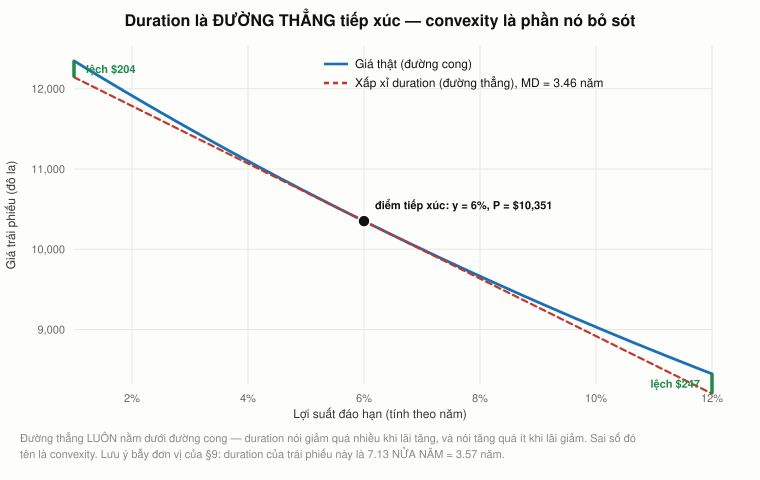
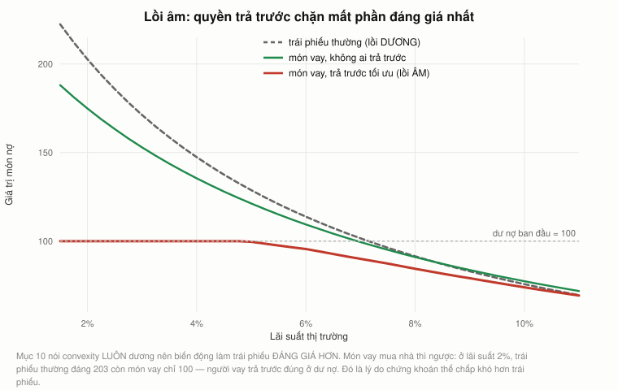
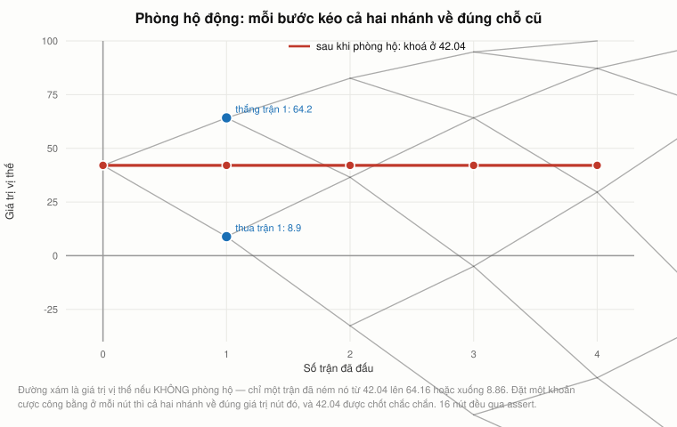
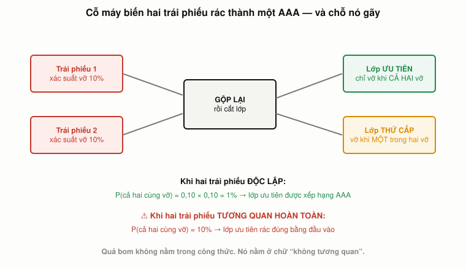

# Bài 5 — Trái phiếu II: luật một giá, đo rủi ro, và cỗ máy tạo AAA

> [!info] Về bài này
> Bài học dựng trên **toàn bộ** hai video **"Ses 6: Fixed-Income Securities III"**
> (`AtT59jxU9es`, 79:45) và **"Ses 7: Fixed-Income Securities IV"** (`ZWKnK9LIETA`, 75:33) —
> khoá **MIT 15.401 *Finance Theory I*, Fall 2008**, giảng viên **Prof. Andrew W. Lo**.
> Phụ đề gốc do người viết tay.
> 🕑 Mốc thời gian có tiền tố buổi: `S6 57:29` = buổi 6, phút 57:29. Vài chỗ dẫn ngược sang
> `S1`–`S5` — mọi mốc đều đối chiếu với **đúng** video của nó.
> 🏛 **Phần cuối mục 10 đến từ một khoá khác.** Năm mục `###` về **quyền trả trước** và **lồi âm**
> dựng trên [Yale ECON 251](https://oyc.yale.edu/economics/econ-251) của John Geanakoplos, bài
> giảng **17** (`rH-0KBgQk2E`), **18** (`qbEsK92KpQI`), **20** (`gXrCrXuU2_g`) và
> **21** (`DAd7LFM0jK8`). Mốc của phần đó ghi dạng `L17 62:57`.
> Lý do bổ sung: mục 14–17 dựng cỗ máy tạo AAA **từ chính những món vay mua nhà** mà không nhắc
> tới quyền chọn nằm sẵn bên trong mỗi món; và mục 8 dạy duration như một thước đo rủi ro mà không
> nói nó cũng chính là **tỷ lệ phòng hộ**. Xem thêm [bài 20](bai_20_chu_ky_don_bay.md).
>
> **Cách đọc các khối màu:** `[!quote]` trích nguyên văn (kèm nguồn) · `[!warning]` chỗ dễ nhầm · `[!note]` mở rộng/ghi chú · `[!example]` ví dụ áp dụng (Góc QTKD / Góc đời sống — biên soạn thêm, không có trong sách).
>
> **Cần đọc trước:** [Bài 4](bai_04_trai_phieu_va_duong_cong.md) — lãi suất giao ngay, lợi suất
> đáo hạn và gói STRIPS là nền của mọi thứ ở đây.
> **Bài 1 có nợ bạn một lời hứa.** [Mục 14 của bài 1](bai_01_tai_chinh_la_gi.md) kể vụ SVB rồi
> viết *"toàn bộ đoạn trên là nội dung bài 5"*. [Mục 11](#11-duration-không-phải-chuyện-cũ--svb-2023)
> trả món nợ đó.
> Công thức viết bằng LaTeX — mở bằng **Obsidian** hoặc VS Code + Markdown Preview Enhanced.

---

## Mục lục

<!-- MUC-LUC -->
- [1. Hai buổi giảng, hai ngày lịch sử](#1-hai-buổi-giảng-hai-ngày-lịch-sử)
- [2. Nhiệt kế ba tuần: đọc lãi suất như đọc nhiệt độ](#2-nhiệt-kế-ba-tuần-đọc-lãi-suất-như-đọc-nhiệt-độ)
- [3. Quỹ thị trường tiền tệ vỡ mệnh giá — cú sốc thật của tuần đó](#3-quỹ-thị-trường-tiền-tệ-vỡ-mệnh-giá--cú-sốc-thật-của-tuần-đó)
- [4. Luật một giá — và giả định tối thiểu để nó đúng](#4-luật-một-giá--và-giả-định-tối-thiểu-để-nó-đúng)
- [5. Kênh hoá: cỗ máy in tiền khi luật bị vi phạm](#5-kênh-hoá-cỗ-máy-in-tiền-khi-luật-bị-vi-phạm)
- [6. Bán khống, và ngày lý thuyết tài chính đi nghỉ phép](#6-bán-khống-và-ngày-lý-thuyết-tài-chính-đi-nghỉ-phép)
- [7. n phương trình, T ẩn số — kênh hoá thu nhập cố định](#7-n-phương-trình-t-ẩn-số--kênh-hoá-thu-nhập-cố-định)
- [8. Duration — nén cả một đường cong vào một con số](#8-duration--nén-cả-một-đường-cong-vào-một-con-số)
- [9. Bẫy đơn vị: 7,13 năm hay 7,13 nửa năm](#9-bẫy-đơn-vị-713-năm-hay-713-nửa-năm)
- [10. Convexity — và vì sao trái phiếu có mùi quyền chọn](#10-convexity--và-vì-sao-trái-phiếu-có-mùi-quyền-chọn)
- [11. Duration không phải chuyện cũ — SVB 2023](#11-duration-không-phải-chuyện-cũ--svb-2023)
- [12. Nợ có rủi ro và ba tổ chức xếp hạng](#12-nợ-có-rủi-ro-và-ba-tổ-chức-xếp-hạng)
- [13. Chênh lệch tín dụng — đọc lịch sử qua một đường](#13-chênh-lệch-tín-dụng--đọc-lịch-sử-qua-một-đường)
- [14. Cỗ máy biến hai trái phiếu rác thành một AAA](#14-cỗ-máy-biến-hai-trái-phiếu-rác-thành-một-aaa)
- [15. Quả bom nằm ở chữ không tương quan](#15-quả-bom-nằm-ở-chữ-không-tương-quan)
- [16. Lời một Giám đốc Rủi ro, và câu ông ấy vẫn chưa hiểu](#16-lời-một-giám-đốc-rủi-ro-và-câu-ông-ấy-vẫn-chưa-hiểu)
- [17. Công thức đã được dùng thật — copula Gauss](#17-công-thức-đã-được-dùng-thật--copula-gauss)
- [18. Đối chiếu 2026 — chuyện gì đã xảy ra sau đó](#18-đối-chiếu-2026--chuyện-gì-đã-xảy-ra-sau-đó)
- [19. Góc Việt Nam](#19-góc-việt-nam)
- [20. Code minh hoạ](#20-code-minh-hoạ)
- [21. Tự thử](#21-tự-thử)
- [22. Từ điển thuật ngữ](#22-từ-điển-thuật-ngữ)
- [23. Câu hỏi tự kiểm tra](#23-câu-hỏi-tự-kiểm-tra)
- [Tóm tắt một trang](#tóm-tắt-một-trang)
- [Nguồn](#nguồn)
<!-- /MUC-LUC -->

---

## 1. Hai buổi giảng, hai ngày lịch sử

Bài này gộp hai buổi vì chúng là một mạch liên tục. Nhưng ngày ghi hình thì đáng nêu riêng, vì cả
hai đều rơi đúng vào những ngày mà bây giờ nằm trong sách giáo khoa.

|            | Ngày                  | Chuyện gì đang xảy ra bên ngoài lớp học                                                                                                                                                              |
| ---------- | --------------------- | ---------------------------------------------------------------------------------------------------------------------------------------------------------------------------------------------------- |
| **Buổi 6** | **Thứ Tư 24/9/2008**  | Cuối tuần đầu tiên **không** có tổ chức nào sụp. Đề xuất TARP 700 tỷ đô đang nằm trên bàn Quốc hội. Lệnh cấm bán khống của SEC vừa có hiệu lực 5 ngày. Buffett vừa bỏ 5 tỷ vào Goldman tối hôm trước |
| **Buổi 7** | **Thứ Hai 29/9/2008** | **Hạ viện Mỹ đang bỏ phiếu TARP trong lúc Lo giảng.** Sáng cùng ngày Citigroup công bố mua Wachovia                                                                                                  |

Bằng chứng cho ngày buổi 7 nằm ngay trong lời Lo (`S7 01:30`):

> [!quote]
> *"Nó **đang được bỏ phiếu ngay lúc chúng ta nói chuyện**. Nên hy vọng ta sẽ biết kết quả vào cuối
> buổi học, hoặc cuối ngày hôm nay. Nếu nó không được thông qua, các bạn nghĩ chuyện gì sẽ xảy ra
> với lãi suất ba tháng?"*

> [!warning] Nó không được thông qua.
> Chiều hôm đó, **Hạ viện bác TARP với tỷ lệ 228–205**. Chỉ số Dow
> Jones rơi **777,68 điểm (−6,98 %)** — cú giảm theo điểm lớn nhất lịch sử tính tới lúc đó. S&P 500
> mất gần 9 %. Chỉ số biến động VIX lập đỉnh mọi thời đại.

Lo đặt câu hỏi cho lớp, rồi lớp tan, rồi câu trả lời tới trong vòng vài giờ.

> [!note]
> Ba mảnh bằng chứng khác chốt lịch, để bạn tự kiểm: Lo hẹn *"thứ Năm, mùng 2 tháng 10, từ 5 giờ 30
> tới 7 giờ"* cho một toạ đàm của Sloan (`S7 06:56`); ông thảo luận thương vụ **Wachovia–Citigroup**
> công bố sáng 29/9 (`S7 09:13`); và ông kết thúc bằng *"hẹn gặp lại vào **thứ Tư**"* (`S7 75:33`) —
> tức buổi 8 là 1/10. Còn buổi 6 thì Lo mở đầu bằng *"có câu hỏi nào từ buổi trước không, buổi đó là
> **một tuần trước**. Mong các bạn đã nghỉ ngơi tốt."* (`S6 00:00`) — buổi 5 là thứ Tư 17/9, nên buổi
> 6 là thứ Tư 24/9, và **lớp thứ Hai 22/9 đã không diễn ra**.

Lịch bảy buổi đầu giờ đã đủ: **3–4/9 · 8/9 · 10/9 · 15/9 · 17/9 · 24/9 · 29/9/2008.**

---

## 2. Nhiệt kế ba tuần: đọc lãi suất như đọc nhiệt độ

[Bài 4](bai_04_trai_phieu_va_duong_cong.md#11-bảng-giá-ngày-1792008-đọc-từng-dòng) dừng ở ngày
17/9 với lợi suất tín phiếu kho bạc 3 tháng ở **3 điểm cơ bản**. Lo quay lại đúng biểu đồ đó ở cả
hai buổi này, và biến nó thành một dụng cụ đo (`S7 01:45`):

> [!quote]
> *"Bạn có thể coi đây như một **cái nhiệt kế**. Đo nhiệt độ của nền kinh tế. Khá kinh ngạc, phải
> không? Nó cho bạn thấy thị trường tài chính rất động, và bạn thực sự học được rất nhiều từ giá
> thị trường."*

| Buổi | Ngày |                         Lãi suất 3 tháng Lo đọc trên lớp |         Lãi suất 30 năm |
| ---- | ---- | -------------------------------------------------------: | ----------------------: |
| 5    | 17/9 |                 **3 điểm cơ bản** — hoảng loạn đỉnh điểm |                  ~4,0 % |
| 6    | 24/9 |                          **41 điểm cơ bản** (`S6 03:27`) | **4,37 %** (`S6 06:13`) |
| 7    | 29/9 | **71–72 điểm cơ bản** (`S7 00:26`), sáng có lúc trên 1 % | **4,22 %** (`S7 02:29`) |

Lo diễn giải từng bước:

**Đầu ngắn hạ nhiệt.** *"Chứng khoán kho bạc ngắn hạn đã **giảm giá** trong tuần qua. Đó là một dấu
hiệu cho thấy có lẽ thị trường không còn hoảng loạn như tuần trước."* (`S6 03:48`) Nhớ cơ chế ba
biến ở [bài 4 mục 5](bai_04_trai_phieu_va_duong_cong.md#5-trái-phiếu-chiết-khấu-thuần--một-công-thức-ba-biến):
lợi suất tăng **vì** giá giảm, và giá giảm vì cơn tranh mua đã dịu.

**Đầu dài thì ngược lại.** Lợi suất 30 năm **tăng** từ 4,0 % lên 4,37 % trong một tuần. Một sinh
viên đưa ra lời giải thích, và Lo nhận ngay (`S6 06:13`):

> [!quote]
> *"Có lẽ họ lo về **lạm phát** hơn. Chính phủ vừa hứa 700 tỷ đô."* — *"Được, vậy lạm phát giờ đã
> được đưa vào giá, chỉ trong bảy ngày qua."*

Rồi ông hỏi câu quan trọng nhất mục này (`S6 06:37`):

> [!quote]
> *"Vậy thì — giá hôm nay đúng, hay giá tuần trước đúng? Đầu ngắn của đường cong lãi suất là hợp lý
> ở 41 điểm cơ bản hôm nay, hay thực ra hợp lý ở 3 điểm cơ bản tuần trước?"*

Và ông tự trả lời (`S6 06:56`):

> [!quote]
> *"**Không có câu trả lời cho câu hỏi đó, vì không có câu trả lời đúng.** Những mức giá này là
> phản ánh kỳ vọng hiện tại của tất cả người tham gia thị trường. Đúng hay sai, nó phản ánh tổng hoà
> của trí tuệ, hoặc nỗi sợ, hoặc lòng tham của thị trường."*

Và ông nối thẳng về **buổi 1** (`S6 07:18`):

> [!quote]
> *"Ta muốn moi ra thông tin nằm trong giá, nhưng bạn phải hiểu rằng **đây chính là loại giá không
> hoàn hảo mà ta đã tạo ra trong ngày đầu tiên**, khi các bạn đấu giá cái gói nhỏ đó. Hoá ra bạn may
> mắn và mua được một chiếc iPod với 45 đô. Nhưng nó đã có thể đi theo hướng khác. Và thực tế, ở lớp
> thứ hai thì nó **đã** đi theo hướng khác."*

📌 Đó là [cuộc đấu giá cái hộp ở bài 1](bai_01_tai_chinh_la_gi.md), và Lo vừa thừa nhận rằng ở một
lớp khác, cùng thí nghiệm đó đã cho kết quả tệ cho người mua. Cùng cơ chế, hai kết cục.

Ông chốt (`S6 07:50`): *"Giá phản ánh mọi khía cạnh của nền kinh tế — **cả cái duy lý lẫn cái phi lý**."*

### Một chi tiết về việc kiểm chứng những con số này

[Bài 4](bai_04_trai_phieu_va_duong_cong.md#11-bảng-giá-ngày-1792008-đọc-từng-dòng) đối chiếu được
con số "3 điểm cơ bản" của Lo **đúng từng điểm cơ bản** với chuỗi H.15 của Fed. Lần này thì không:

| Ngày |                        Lo đọc trên lớp | H.15 chốt phiên |
| ---- | -------------------------------------: | --------------: |
| 24/9 | 3 tháng **0,41 %** · 30 năm **4,37 %** | 0,49 % · 4,40 % |
| 29/9 | 3 tháng **0,71 %** · 30 năm **4,22 %** | 0,94 % · 4,13 % |

> [!note]
> Đây **không** phải lỗi của ai. Lo đang mở Bloomberg **trực tiếp giữa buổi học**, còn H.15 là ảnh
> chụp tại một thời điểm cố định cuối ngày. Ngày 29/9 lãi suất chạy loạn cả ngày — chính Lo nói *"sáng
> nay có lúc đầu ngắn trên 1 %, giờ đã lùi về"* (`S7 00:45`), và buổi chiều Hạ viện bác TARP khiến
> tiền tháo chạy vào kho bạc lần nữa.

Bài học nhỏ nhưng rất thực dụng: **"lợi suất ngày 29/9/2008" không phải một con số duy nhất.**
Khi bạn đọc một con số thị trường trong báo cáo, hỏi ngay: *chốt phiên, hay lúc mấy giờ?* Vào những
ngày bình thường câu hỏi đó vô nghĩa. Vào những ngày quan trọng thì nó là cả câu chuyện.

---

## 3. Quỹ thị trường tiền tệ vỡ mệnh giá — cú sốc thật của tuần đó

Lo dừng bài giảng để hỏi lớp một câu (`S6 08:08`):

> [!quote]
> *"Có chuyện rất quan trọng đã xảy ra tuần trước. Và tôi không biết bao nhiêu bạn thực sự nghe
> thấy. Bộ Tài chính chắc chắn biết, Fed cũng biết, nhưng **báo chí không làm nổi bật nó theo cách
> mà tôi nghĩ đáng lẽ phải làm**, xét mức độ quan trọng. Có ai biết tôi đang nói về chuyện gì không?"*

Sinh viên đoán lệnh cấm bán khống — Lo nói đó là chuyện khác, sẽ quay lại cuối buổi. Rồi có người
trả lời đúng (`S6 09:42`):

> [!quote]
> *"Một trong những quỹ thị trường tiền tệ lớn đã **vỡ mệnh giá**."* — *"Vỡ mệnh giá, chính xác. Quỹ
> nào? — **Quỹ Reserve.**"*

### Vỡ mệnh giá là gì, và vì sao nó đáng sợ

Lo giải thích cho lớp — và cách ông giải thích đáng chép lại (`S6 10:51`):

> [!quote]
> *"Quỹ thị trường tiền tệ được cho là an toàn tới mức khi bạn bỏ 1 đô vào, thì ít nhất khi rút ra
> bạn phải nhận lại được 1 đô. **Vỡ mệnh giá** nghĩa là nếu bạn rút, có khả năng thứ bạn rút được
> **ít hơn 1 đô**."*

Và vì sao đó không phải chuyện nhỏ (`S6 11:07`):

> [!quote]
> *"Nghĩ về ngân hàng — khi bạn bỏ tiền vào tài khoản thanh toán, bạn **kỳ vọng** lấy được tiền ra,
> có thể không nhiều lãi, thậm chí không lãi nếu mọi chuyện không thuận, nhưng bạn kỳ vọng nhận lại
> **đúng số vốn**. Quỹ thị trường tiền tệ cũng y hệt vậy. Người ta dùng nó **như thể** đó là tài
> khoản thanh toán. Thực tế có những quỹ mà bạn **viết séc** lên được."*

Con số cụ thể (`S6 14:35`):

> [!quote]
> *"Vỡ mệnh giá trong trường hợp này nghĩa là nếu bạn bỏ vào 1 đô, khi rút ra tuần trước bạn nhận
> được **97 xu**. Bạn mất 3 xu trên mỗi đô — nghe có vẻ không nhiều, nhưng nếu bạn ra máy ATM của
> Bank of America và cứ mỗi đô gửi vào bạn rút ra được 97 xu, bạn sẽ khá cáu."*

### Số thật, và một chi tiết Lo không có

|             |                                                                                       |
| ----------- | ------------------------------------------------------------------------------------- |
| Quỹ         | **Reserve Primary Fund** — một trong những quỹ thị trường tiền tệ **đầu tiên** của Mỹ |
| Quy mô      | **62,5 tỷ đô**                                                                        |
| Nguyên nhân | nắm **785 triệu đô** giấy tờ thương mại của Lehman = **1,2 %** tài sản ròng           |
| Vỡ mệnh giá | **16/9/2008** — ghi giá trị Lehman về **0**, NAV rơi xuống **0,97 đô**                |
| Yêu cầu rút | **25 tỷ đô** ngay ngày 15/9; **vượt 40 tỷ** trong hai ngày                            |
| Đóng băng   | 19/9 nộp đơn lên SEC xin **ngưng toàn bộ quyền rút**                                  |

> [!warning]
> Lo nói *"ước tính, tôi nghĩ là **90 tỷ đô** đã rời khỏi các quỹ này trong một tuần"* (`S6 14:51`).
> Con số thật **lớn hơn nhiều**: khoảng **300 tỷ đô** rút khỏi các quỹ *prime* trong vòng một tuần;
> một nghiên cứu của Yale tính tổng cuộc tháo chạy trên toàn thị trường quỹ thị trường tiền tệ là
> **439 tỷ đô**. Trong "tháng khủng hoảng" 2/9–7/10/2008, tài sản của các quỹ **chỉ nắm giấy tờ chính
> phủ** tăng **409 tỷ đô (+44 %)** — đúng bức tranh Lo mô tả: tiền không biến mất, nó **chạy sang chỗ
> trú**.

Lo không có con số đúng lúc đó — không ai có, chuyện mới xảy ra tám ngày. Điều đáng chú ý là ông
đọc đúng **cơ chế** trước khi có số liệu.

### Vì sao chi tiết này quan trọng hơn cả Lehman

Đây là luận điểm hay nhất của cả bài, và Lo lặp lại nó ở buổi 7 (`S7 13:08`):

> [!quote]
> *"Lý do khiến cơ quan quản lý và chính phủ **cuối cùng** phải hành động **không phải** vì Lehman
> sụp, hay AIG sụp, hay bất kỳ tổ chức lớn nào khác sụp. Lý do cuối cùng đẩy họ qua mép để làm một
> việc thực sự lớn là vì **quỹ Reserve — một quỹ thị trường tiền tệ bán lẻ — đã vỡ mệnh giá.**"*

Lo dựng cơ chế lan truyền (`S6 12:05`, `S6 12:25`):

> [!quote]
> *"Nếu nhà đầu tư cá nhân, người tiêu dùng bình thường, hoảng sợ về tài khoản quỹ tiền tệ của họ,
> họ sẽ **đồng loạt** làm cái đã xảy ra tuần trước: rút những khoản tiền khổng lồ ra. Và như tôi đã
> nói, **không doanh nghiệp nào chịu nổi việc toàn bộ vốn bị rút cùng một lúc.** Nếu điều đó xảy ra,
> ta sẽ thấy hàng loạt định chế tài chính đổ vỡ, khiến bốn tuần vừa qua trông như **những ngày xưa
> tươi đẹp**."*

Và ẩn dụ (`S6 16:00`):

> [!quote]
> *"Ai từng xem phim về thế giới động vật kiểu đàn trâu rừng chạy loạn — khi cả đàn đã lồng lên thì
> rất khó chỉ đứng đó nói: bình tĩnh nào, dừng lại đi, chậm thôi. Bạn không làm thế được nữa khi nó
> đã bắt đầu. Nên **bạn phải chặn nó trước khi nó tới điểm tới hạn**."*

> [!note]
> Chính phủ Mỹ làm đúng điều Lo mô tả: **19/9/2008** Bộ Tài chính lập **Chương trình Bảo lãnh Tạm
> thời cho Quỹ Thị trường Tiền tệ**, dùng Quỹ Bình ổn Tỷ giá 50 tỷ đô làm hậu thuẫn — bảo hiểm cho
> quỹ tiền tệ đúng cách FDIC bảo hiểm tiền gửi, y như Lo mô tả ở `S6 12:59`.

---

## 4. Luật một giá — và giả định tối thiểu để nó đúng

Ở phút `S6 28:19` Lo bắt đầu bài giảng thật, và ông quay về nguyên lý đã nêu từ buổi 1:

> [!quote] S6 28:52
> *"Đây là **luật một giá**. Ý tưởng rất đơn giản. Đơn giản tới mức bạn có thể nghĩ nó hiển nhiên,
> nhưng nó có những hệ quả cực kỳ mạnh."* (`S6 28:52`)

> [!quote] S6 29:21
> *"**Hai dòng tiền giống hệt nhau phải có cùng một mức giá thị trường.**"* (`S6 29:21`)

Ông nối ngay với định nghĩa tài sản ở [bài 2](bai_02_gia_tri_hien_tai.md#3-tài-sản-là-gì--định-nghĩa-lại-từ-gốc)
(`S6 29:21`):

> [!quote]
> *"Nhớ rằng khi ta nghĩ về một tài sản, ta nghĩ về nó như **một chuỗi dòng tiền**. Tài sản là như
> thế. Nên tôi chỉ đang nói: khi có hai tài sản giống hệt nhau, chúng phải có cùng giá."*

Và tầm quan trọng (`S6 29:36`):

> [!quote]
> *"Nguyên lý này là **một trong những ý tưởng quan trọng nhất trong toàn bộ tài chính hiện đại**,
> vì nó dẫn tới việc định giá đủ mọi loại chứng khoán, bao gồm **tất cả** các sản phẩm phái sinh
> từng được định giá trên Phố Wall."*

### Cuộc trao đổi hay nhất buổi

Một sinh viên chất vấn (`S6 29:56`):

> [!quote]
> *"Nhưng thầy có phải thêm điều kiện rằng đó là **ở trạng thái cân bằng** không?"*

Lo trả lời (`S6 30:09`, `S6 30:32`, `S6 30:49`):

> [!quote]
> *"Không, không. Tôi **không** cần thêm điều kiện gì cả. Thứ nhất, vì đây là một nước tự do và tôi
> không phải làm gì mà tôi không muốn. Nhưng quan trọng hơn, là vì tôi **không muốn** giới hạn nó
> vào cân bằng. Cân bằng nghĩa là cung bằng cầu, đúng không? Tôi **không quan tâm** cung và cầu.
> Cung hoàn toàn có thể khác cầu. Tôi thấy vậy cũng được."*
>
> *"Giả định **duy nhất** tôi cần để luật này đúng là: **con người thích nhiều tiền hơn ít tiền.**
> Mà thậm chí không cần cả 'con người'. Tôi chỉ cần **đúng một người** trong nền kinh tế thích nhiều
> tiền hơn ít tiền. Và tôi xung phong nhận vị trí đó."*

📌 Đây là chỗ phải dừng lại. Sinh viên hỏi một câu rất chuẩn theo sách kinh tế — và Lo bác nó, không
phải vì câu hỏi dở mà vì **luật một giá thuộc một hạng khác**. Nó không phải kết quả cân bằng. Nó là
điều kiện **không kênh hoá**, và nó chỉ cần một giả định về sở thích, áp cho **một** người.

Đây chính là "tính chất a" trong sáu nguyên lý ở [bài 1](bai_01_tai_chinh_la_gi.md) — *non-satiation*,
thích nhiều tiền hơn ít. Cả toà nhà định giá phái sinh của tài chính hiện đại đứng trên đúng một
viên gạch đó.

---

## 5. Kênh hoá: cỗ máy in tiền khi luật bị vi phạm

Vì sao chỉ cần một giả định nhỏ như vậy? Vì nếu luật bị vi phạm thì có tiền miễn phí, và Lo dựng
lập luận từng bước (`S6 31:13`):

> [!quote]
> *"Nếu bạn chỉ cho tôi hai dòng tiền giống hệt nhau mà bán ở hai mức giá khác nhau — trước hết,
> **đừng nói với ai ngoài tôi.**"*

| Bước | Bạn làm gì          | Kết quả                                                          |
| ---- | ------------------- | ---------------------------------------------------------------- |
| 1    | Mua tài sản **rẻ**  | chi tiền                                                         |
| 2    | Bán tài sản **đắt** | thu tiền, nhiều hơn số chi                                       |
| 3    | Ngồi im             | mọi dòng tiền tương lai **triệt tiêu** vì hai bên giống hệt nhau |

> [!quote] S6 31:52
> *"Từ thời điểm đó trở đi tôi **không còn rủi ro nào, và thực tế cũng không còn nghĩa vụ nào**. Tôi
> có thể quên vụ đó đi, cầm tiền và tiêu. Vì tôi đã mua và bán những dòng tiền giống hệt nhau."*
> (`S6 31:35`)
>
> *"Cái đó gọi là **kênh hoá** — hay nói kỹ thuật hơn, một **bữa trưa miễn phí**. Tôi đã tạo được
> tiền ra từ hư không."* (`S6 31:52`)

Lo nhấn ba lần vào chi tiết mà người mới học hay bỏ qua (`S6 37:14`, `S6 37:44`, `S6 37:59`):

> [!quote] S6 38:14, S6 38:31
> *"Bạn phải bỏ ra bao nhiêu tiền của chính mình cho giao dịch này? — **Không đồng nào**, bởi vì thứ
> bạn mua được **tài trợ hoàn toàn bởi thứ bạn bán**. Và trên nữa, bạn còn dư một ít."*
>
> *"Cái này giống mấy quảng cáo lúc hai giờ sáng: làm giàu bằng bất động sản **không cần vốn**. Bạn
> đúng là không bỏ đồng nào."*
>
> *"Không vốn. Có tiền trong túi. Không rủi ro. Không nghĩa vụ. Ngay hôm nay, bạn rời khỏi giao
> dịch này **giàu hơn**."* (`S6 38:14`, `S6 38:31`)

### Và tinh thần rất đặc trưng của Lo

Khi giá thị trường không khớp lý thuyết, ông không thấy lý thuyết bị đe doạ (`S6 35:29`):

> [!quote]
> *"Nếu chúng không cùng giá, thì thay vì buồn bã và nghi ngờ rằng lý thuyết tài chính có vấn đề,
> **điều hào hứng nhất với một giáo sư tài chính là thấy lý thuyết này sụp đổ** — bởi vì khi đó ta
> có thể ra thị trường giao dịch và kiếm tiền. Nên nếu luật một giá thất bại, đừng gọi điện phàn nàn
> với tôi. Hãy gọi điện **kể cho tôi nghe nó ở đâu** để tôi tận dụng."*

> [!note] Mục 20 của bài này dựng đúng giao dịch đó bằng số
> , với ba trái phiếu thật: bỏ 0 đồng, thu
> **1,14 đô** ngay hôm nay, và mọi dòng tiền năm 1 và năm 2 triệt tiêu **chính xác về 0**.

---

## 6. Bán khống, và ngày lý thuyết tài chính đi nghỉ phép

Một sinh viên hỏi về chi phí giao dịch, và Lo dùng nó để dẫn tới điểm nóng nhất buổi (`S6 40:16`):

> [!quote]
> *"Một dạng chi phí giao dịch **không phải là con số** mà là một **ma sát**. Bạn cần **làm được**
> việc gì thì mới thực hiện được giao dịch này?"* — *"Phải **bán khống** được."*

Đúng vậy: bước 2 của mục 5 là **bán một thứ bạn không sở hữu**. Bạn mượn nó từ nhà môi giới, bán
đi, thu tiền, rồi trả lại sau. Nếu không bán khống được thì (`S6 41:18`, `S6 41:37`):

> [!quote]
> *"Lập luận kênh hoá này dựa vào việc bạn bán được thứ bạn không sở hữu. **Nếu tôi không cho phép
> bạn bán khống, lập luận này không còn chạy nữa.** Và điều đó nghĩa là quan hệ định giá này — vế
> trái phải bằng vế phải — **bay ra ngoài cửa sổ**."*

Rồi câu của cả bài (`S6 41:57`):

> [!quote]
> *"Trong vài tuần tới và có thể vài tháng tới, **lý thuyết tài chính sẽ đi nghỉ phép**, bởi vì
> chính phủ đã đình chỉ bán khống với một số chứng khoán."*

### Bối cảnh: lệnh cấm

**19/9/2008**, SEC ra lệnh khẩn cấm bán khống cổ phiếu tài chính. Danh sách ban đầu **799 mã**, các
sàn bổ sung thêm trong những ngày sau lên **gần 1.000 mã**. Lệnh có hiệu lực tới **8/10/2008**.

Lo nêu lý do chính trị đằng sau (`S6 43:10`):

> [!quote] S6 43:28
> *"Vấn đề với phương án kia thiên về chính trị. Vấn đề chính trị là: chúng ta muốn **những kẻ xấu
> xa** này, những người bán khống đang đẩy giá chứng khoán tài chính xuống, phải dừng hành vi tồi tệ
> của họ. Nên ta sẽ ra luật cấm. Điều đó có thể hợp lý từ góc nhìn chính trị, nhưng **không hợp lý
> từ góc nhìn kinh tế**, bởi vì nó phá vỡ các quan hệ định giá như thế này."* (`S6 43:28`)

### Một sinh viên đưa ra phương án tốt hơn

Sinh viên tên Megan hỏi tại sao không **tăng chi phí** bán khống thay vì cấm hẳn (`S6 42:17`). Lo
nhận ngay (`S6 42:35`):

> [!quote]
> *"Đó là một phương án thay thế **tuyệt vời**. Tôi nghĩ nó đã tốt hơn nhiều. Bạn hoàn toàn đúng."*

Ông giải thích rằng thị trường đã có sẵn cơ chế: cổ phiếu **khó mượn** (*hard-to-borrow*) bị tính
phí cho vay cao hơn. *"Bằng cách xoá bỏ bán khống, về cơ bản bạn làm cho chi phí đó thành **vô
cực**."* (`S6 44:43`)

### Năm năm sau, số liệu trả lời

Nghiên cứu **Boehmer, Jones & Zhang, *"Shackling Short Sellers: The 2008 Shorting Ban"***, đăng trên
*Review of Financial Studies* (2013), đo đúng câu hỏi này:

| Phát hiện             |                                                                            |
| --------------------- | -------------------------------------------------------------------------- |
| Hoạt động bán khống   | **giảm ~77 %** ở cổ phiếu vốn hoá lớn                                      |
| Chất lượng thị trường | **xấu đi nghiêm trọng** — chênh lệch mua–bán rộng ra, biến động tăng       |
| Phân bố tác động      | tập trung ở cổ phiếu **lớn**; gần như không ảnh hưởng nửa dưới theo quy mô |
| **Giá cổ phiếu**      | **không bị ảnh hưởng**                                                     |

Nghĩa là: lệnh cấm **thất bại đúng ở mục tiêu nó được đặt ra để đạt** — chống đỡ giá — trong khi
gây ra chi phí thanh khoản có thật. Lo nói ra điều này **trực tiếp trên lớp, năm ngày sau khi lệnh
có hiệu lực**, dựa vào lý thuyết chứ không phải dữ liệu. Năm năm sau dữ liệu đồng ý với ông.

📌 Đây là một trong những chỗ hiếm hoi trong khoá học mà một **dự đoán chính sách** của Lo được kiểm
chứng và **đúng**. Đặt cạnh [dự đoán lãi suất sai của ông ở bài 3](bai_03_don_bay_va_lam_phat.md#7-lo-đưa-ra-một-dự-đoán--và-nó-sai-ngay-hôm-sau)
để thấy sự khác nhau: dự báo **giá** thì ông sai, phân tích **cơ chế** thì ông đúng. Đó cũng là ranh
giới mà cả khoá học này nên dạy bạn tôn trọng.

### Và một chỗ Lo bỏ ngỏ mà sinh viên vá lại

Một sinh viên chỉ ra rằng ngay cả khi cấm bán khống, **người đang sở hữu** trái phiếu đắt vẫn có thể
bán nó đi và mua gói rẻ hơn. Lo khen và mở rộng (`S6 47:20`, `S6 48:08`):

> [!quote] S6 48:40
> *"Người sở hữu trái phiếu coupon có thể nói: trái phiếu của tôi đáng 110, nhưng tôi lấy được đúng
> dòng tiền đó bằng cách mua một mớ trái phiếu chiết khấu, mà chỉ tốn 100. Tôi bán trái phiếu coupon
> ở 110, mua 100 đô trái phiếu chiết khấu, và tôi vừa kiếm 10 đô."*
>
> *"Vấn đề là **hầu hết những người mua trái phiếu ở vế trái là các quỹ hưu trí**, mà quỹ hưu trí
> không làm nghề kênh hoá. Họ chỉ muốn **khớp tài sản với nghĩa vụ**. Nên bạn vẫn đúng — nhưng nó
> sẽ không phải cái đẳng thức chặt như khi có **những kẻ tham lam như tôi** đứng ra làm."* (`S6 48:40`)

Rút ra: **luật một giá không tự thực thi.** Nó cần người **có thể** và **muốn** thực hiện giao
dịch. Bỏ đi khả năng (cấm bán khống) hoặc bỏ đi ý muốn (nhà đầu tư chỉ khớp nghĩa vụ) thì giá được
phép lệch — và lệch bao lâu tuỳ vào việc còn bao nhiêu người tham lam.

---

## 7. n phương trình, T ẩn số — kênh hoá thu nhập cố định

Lo nâng cấp bài toán (`S6 49:41`):

> [!quote]
> *"Thay vì nhìn một trái phiếu, nếu ta nhìn **cả một rổ** trái phiếu coupon thì sao?"*

Đặt vấn đề:

- **Đã biết:** giá thị trường của $n$ trái phiếu, và lịch coupon của từng cái.
- **Chưa biết:** $T$ hệ số chiết khấu — một cho mỗi năm.
- Mỗi trái phiếu cho **một phương trình**.

$$P_i \;=\; \sum_{t=1}^{T} C_{i,t}\, d_t \qquad i = 1,\dots,n$$

Rồi Lo dẫn lớp qua đại số phổ thông (`S6 53:00`–`S6 54:19`):

| Số phương trình | Số ẩn | Bao nhiêu nghiệm                                                                                        |
| --------------- | ----- | ------------------------------------------------------------------------------------------------------- |
| 2               | 2     | **một** (nếu khả nghịch)                                                                                |
| 1               | 2     | **vô số**                                                                                               |
| 3               | 2     | **một** nếu phương trình thứ ba **phụ thuộc tuyến tính** vào hai cái kia; **không có nghiệm** nếu không |

Và đây là chỗ đại số biến thành tiền (`S6 55:41`, `S6 56:31`, `S6 56:54`):

> [!quote]
> *"Nếu ta thêm trái phiếu thứ ba, và hai mức lợi suất đã dùng cho hai trái phiếu đầu **không** phù
> hợp với trái phiếu thứ ba, thì có gì đó sai. Nghĩa là **giá của trái phiếu thứ ba không thoả mãn**
> quan hệ đó. Đó là **bằng chứng của định giá sai**."*
>
> *"Trong toán, gặp 'vô nghiệm' thì bạn buồn. **Trong tài chính, 'vô nghiệm' nghĩa là có một giao
> dịch.** Tồn tại một tổ hợp tuyến tính của ba trái phiếu mà: (a) không tốn đồng vốn nào, (b) tạo ra
> dòng tiền ngay hôm nay, (c) không đòi hỏi khoản trả nào trong tương lai — tức là không rủi ro. Đó
> là một bữa trưa miễn phí. Đó là kênh hoá."*

Ở quy mô thật thì (`S6 52:30`): *"vào một ngày bất kỳ bạn có thể có 200 đến 300 trái phiếu đang giao
dịch. Nhưng bạn chỉ có 30 ẩn số."* — 200 phương trình, 30 ẩn. Đó là lúc phải biết **đại số tuyến
tính** thật: ma trận khả nghịch, trị riêng (`S6 57:09`).

### Câu chuyện Salomon Brothers — và cái kết Lo không kể

Lo kể (`S6 57:29`, `S6 58:05`, `S6 58:25`):

> [!quote]
> *"Thập niên 1970, một số người tốt nghiệp MIT được Salomon Brothers tuyển. Họ biết rất ít về chứng
> khoán thu nhập cố định. […] Và họ không giải ba phương trình hai ẩn — họ giải **200 phương trình
> 30 ẩn**. Vào thập niên 70 chuyện đó không dễ, vì chưa có máy tính cá nhân, chưa có Excel."*
>
> *"Đây là **đại số phổ thông**. Ngay cả hồi đó nó cũng đã là đại số phổ thông. Và họ cứ thế quay
> tay, tìm những chỗ vô nghiệm. Và họ tìm được rất nhiều."*
>
> *"Một năm nào đó trong thập niên 70 hoặc 80, **một trong những người tốt nghiệp MIT này được trả
> thưởng 22 triệu đô một năm** — cho việc giải hệ phương trình tuyến tính."*

Hoạt động này có tên: **kênh hoá thu nhập cố định** (`S6 58:48`).

> [!note] Số thật, và câu chuyện đầy đủ:

|                   |                                                                                                            |
| ----------------- | ---------------------------------------------------------------------------------------------------------- |
| Người đó          | **Lawrence Hilibrand** — cử nhân **và** thạc sĩ Sloan, đều ở MIT                                           |
| Khoản thưởng      | **23 triệu đô cho năm 1989** (Lo nhớ 22 triệu, thập niên 70–80)                                            |
| Bối cảnh          | nhóm kênh hoá của Salomon lãi ~**400 triệu đô** năm đó và có thoả thuận hưởng **15 %** lợi nhuận giao dịch |
| Biệt danh báo chí | *"Salomon's $23 million man"*                                                                              |

> [!warning] Và đây là phần Lo không kể — vì năm 2008 nó chưa phải chuyện để kể trong buổi này.
> Hilibrand
> rời Salomon cùng John Meriwether để đồng sáng lập **Long-Term Capital Management**. LTCM sụp năm
> 1998. Phần vốn của các sáng lập viên rơi từ **1,8 tỷ đô xuống 27 triệu**. Theo Roger Lowenstein
> trong *When Genius Failed*, Hilibrand — trước đó tài sản gần nửa tỷ đô — tỉnh dậy trắng tay và
> **nợ 24 triệu đô**.

Cùng một người, cùng một phương pháp, hai kết cục cách nhau chín năm. Chênh lệch không nằm ở toán
mà ở **đòn bẩy** ([bài 3](bai_03_don_bay_va_lam_phat.md)) và ở **tương quan** — thứ mà mục 15 của
bài này sắp mổ xẻ. LTCM chết vì các vị thế lẽ ra độc lập bỗng cùng đi một hướng. Chính xác cái sắp
xảy ra với CDO. Và Lo nhắc tới LTCM ở `S7 28:32` như một vết lồi trên biểu đồ chênh lệch tín dụng
mà không dừng lại — nhưng bạn thì nên dừng.

> [!warning]
> Lo còn nói *"siêu máy tính đầu tiên từng được lắp trên Phố Wall, một chiếc **Cray-2**, được lắp ở
> Salomon Brothers"* (`S6 60:47`). Tôi **không xác minh được** khẳng định này từ nguồn độc lập; bài này
> trình bày nó như **chuyện Lo kể**, không phải dữ kiện đã kiểm.

Và một cảnh báo thực dụng (`S6 59:22`): *"Đây là thứ bạn dứt khoát **không nên thử ở nhà**. Tôi biết
các bạn có MATLAB và nghịch được ma trận nghịch đảo, nhưng còn cả đống ma sát, chi phí giao dịch và
khiếm khuyết khác phải nhét vào phân tích."*

---

## 8. Duration — nén cả một đường cong vào một con số



*Duration là đường thẳng tiếp xúc. Khoảng cách giữa nó và đường cong chính là convexity.*

Nửa sau buổi 6 đổi chủ đề: **đo rủi ro**. Lo đặt câu hỏi rất cơ học (`S6 61:45`, `S6 62:52`):

> [!quote]
> *"Tôi muốn nhìn giá thị trường của một trái phiếu như một **hàm số** có đầu vào và đầu ra là giá.
> Rồi hỏi: **dao động ở đầu vào tạo ra dao động bao nhiêu ở đầu ra?** […] Thứ tôi đang nói tới là
> **độ dốc** của đường này."*

Ông giải thích tại sao trái phiếu dài nhạy hơn (`S6 64:43`):

> [!quote]
> *"Suất chiết khấu bạn dùng, cái $1+r$ này, bạn nâng nó lên **luỹ thừa 30** chứ không phải luỹ thừa
> ¼. Và thứ nằm ở mẫu số được nâng lên luỹ thừa 30 thì khi bạn động vào mẫu số một chút, tác động
> lớn hơn nhiều."*

Rồi ông đặt tên (`S6 63:23`):

> [!quote]
> *"Nó được gọi là **duration**, đặt theo tên **Macaulay**, người đầu tiên đề xuất nó như một cách
> đo mức rủi ro của trái phiếu."*

### Định nghĩa

Với trái phiếu chiết khấu thuần thì đơn giản (`S6 65:41`): **duration = đúng kỳ hạn**. Với trái
phiếu coupon thì phải lấy **trung bình có trọng số** của mọi ngày nhận tiền, trọng số là **tỷ trọng
giá trị hiện tại** (`S6 66:44`):

$$D \;=\; \sum_{t=1}^{T} t \cdot w_t, \qquad w_t = \frac{\text{PV}(C_t)}{P_0}, \qquad \sum_t w_t = 1$$

Và mối liên hệ với độ nhạy giá (`S6 67:07`):

$$\frac{\Delta P/P}{\Delta y} \;=\; -\,\frac{D}{1+y} \;\equiv\; -\,D_{\text{mod}}$$

Trong đó $D_{\text{mod}}$ là **duration hiệu chỉnh** (*modified duration*). Dấu âm là quan hệ nghịch
giữa giá và lợi suất (`S6 68:27`).

Trực giác Lo cho ở `S6 68:09`: *"Nếu một trái phiếu trả phần lớn tiền **sớm** và rất ít ở các kỳ
sau, duration cao hay thấp? — Thấp. Và duration thấp nghĩa là giá không nhạy lắm với thay đổi lợi
suất. Ngược lại, nếu toàn bộ khoản trả nằm **xa tít trong tương lai**, nó sẽ rất nhạy với lãi suất."*

### Vì sao con số này đáng học thuộc

Vì bạn không nắm một trái phiếu, bạn nắm **một danh mục** (`S6 68:48`):

> [!quote] S6 69:21
> *"Khi nhà đầu tư trái phiếu nhìn một danh mục — và **đây là điểm mấu chốt**, họ nhìn danh mục bởi
> vì đó là thứ họ đầu tư vào. Khi bạn bỏ tiền vào quỹ thị trường tiền tệ hay quỹ trái phiếu, bạn
> không bỏ vào **một** trái phiếu, bạn bỏ vào **cả một tập**. Câu hỏi tự nhiên là: danh mục đó nhạy
> thế nào với thay đổi lãi suất? Câu trả lời liên quan tới duration."*
>
> *"Nếu tôi nói với bạn rằng danh mục này có duration **năm năm rưỡi**, con số đó cho bạn trực giác
> về mức độ nhạy — tức mức độ rủi ro — của danh mục."* (`S6 69:21`)

### Ví dụ bằng số của Lo, tái tạo đủ

`S6 69:36`: trái phiếu kho bạc **4 năm**, mệnh giá **100 $**, coupon **7 %**, giá **103,50 $**, lợi
suất **6 %**, trả coupon **nửa năm một lần**.

|       Kỳ | Dòng tiền | Giá trị hiện tại | $t \times$ PV |
| -------: | --------: | ---------------: | ------------: |
|        1 |    3,50 $ |         3,3981 $ |        3,3981 |
|        2 |    3,50 $ |         3,2991 $ |        6,5982 |
|        … |         … |                … |             … |
|        8 |  103,50 $ |        81,7039 $ |      653,6308 |
| **Cộng** |           |   **103,5098 $** |  **738,2784** |

$$D = \frac{738{,}2784}{103{,}5098} = \mathbf{7{,}1324}\ \text{kỳ}, \qquad
D_{\text{mod}} = \frac{7{,}1324}{1{,}03} = \mathbf{6{,}9247}$$

✅ Lo đọc **7,13** và **6,92** trên lớp. Cả hai khớp. Mục 20 tính lại toàn bộ bảng bằng code.

> [!note]
> Ông cũng cho một cách dùng thực dụng (`S6 71:12`): *"nếu lợi suất tăng 1/10 phần trăm, tức 10
> điểm cơ bản, giá trái phiếu sẽ giảm 68 điểm cơ bản."* Con số chính xác là **−69,0 điểm cơ bản** —
> Lo cắt bớt chữ số khi đọc miệng. Không đáng kể, nhưng nếu bạn tự tính và ra 69 thì đừng nghi ngờ
> mình.

---

## 9. Bẫy đơn vị: 7,13 năm hay 7,13 nửa năm

Ngay giữa câu, Lo tự bắt lỗi mình (`S6 70:49`):

> [!quote]
> *"Vậy duration khoảng **7,13 năm**. Nên duration là một phép đo có đơn vị là năm, hoặc đơn vị nửa
> năm. **Xin lỗi — 7,13 đơn vị nửa năm.**"*

**Giữ lại lời tự đính chính này, vì nó là cái bẫy phổ biến nhất khi mới học duration.**

Kiểm tra bằng logic đơn giản: trái phiếu này **kỳ hạn 4 năm**. Duration của một trái phiếu coupon
**luôn nhỏ hơn kỳ hạn** (chỉ bằng kỳ hạn với trái phiếu chiết khấu thuần). Nên 7,13 **không thể** là
năm. Nó là **7,13 kỳ nửa năm = 3,57 năm** ✓.

Hậu quả nếu nhầm:

| Cách đọc                                    | $D_{\text{mod}}$ | Dự báo khi lợi suất +10 điểm cơ bản |
| ------------------------------------------- | ---------------: | ----------------------------------: |
| ❌ Coi 7,13 là **năm**, chia cho $(1+6\%)$   |           6,7264 |                          −67,26 đcb |
| ✅ 7,13 là **kỳ**, chia cho $(1+3\%)$ mỗi kỳ |       **6,9247** |                      **−69,25 đcb** |

Lệch gần 10 % — không phải thảm hoạ trên một trái phiếu, nhưng trên danh mục 90 tỷ đô thì là **3 tỷ**.

**Quy tắc:** duration luôn đi kèm **đơn vị của kỳ ghép lãi**, không phải năm. Muốn đổi sang năm
thì chia cho số kỳ mỗi năm. Và trong công thức $D_{\text{mod}} = D/(1+y)$, cái $y$ phải là **lợi
suất mỗi kỳ**, không phải lợi suất năm.

---

## 10. Convexity — và vì sao trái phiếu có mùi quyền chọn

Duration là **đạo hàm bậc nhất**. Nó là một đường thẳng tiếp xúc với một đường cong — nên nó chỉ
đúng cho những cú dịch chuyển nhỏ. Lo thêm số hạng thứ hai (`S6 72:14`):

> [!quote]
> *"Convexity là một phép đo rủi ro khác. Nó là **đạo hàm bậc hai**. Thứ nó đo là **bản thân độ nhạy
> thay đổi thế nào**."*

Và ông dựng nó bằng **khai triển Taylor** (`S6 73:20`):

$$P(y + \Delta y) \;\approx\; P(y)\left[\,1 \;-\; D_{\text{mod}}\,\Delta y \;+\; \tfrac{1}{2}\,V\,(\Delta y)^2\,\right]$$

Lo bình luận (`S6 74:06`): *"Nhìn thì có thể như một biểu thức kinh khủng, nhưng thực ra nó **khá
đẹp theo cách riêng của nó**."*

### Nó đáng giá bao nhiêu — bằng số

Lo tự kiểm nghiệm ở đầu buổi 7 bằng cách đổi lợi suất từ 6 % lên 8 % rồi so xấp xỉ với định giá lại
thật (`S7 18:32`, `S7 18:49`):

> [!quote]
> *"Bây giờ ta có máy tính số tốc độ cao tính được tất cả trong tích tắc, bạn thấy khác biệt. Nó
> **lệch khoảng một xu**. Một xu thì không to. Nhưng khi bạn xử lý hàng tỷ đô thì một xu là con số
> khá đáng kể."*

✅ Kiểm lại:

|                           |       Giá |        Lệch so với định giá lại |
| ------------------------- | --------: | ------------------------------: |
| Định giá lại chính xác    | 96,6336 $ |                               — |
| Chỉ dùng duration (bậc 1) | 96,3421 $ |                    **−29,2 xu** |
| Thêm convexity (bậc 2)    | 96,6429 $ | **+0,9 xu** ← *"khoảng một xu"* |

**Convexity thu hẹp sai số 31 lần.** Con số Lo đọc miệng năm 2008 khớp chính xác.

Và ông cho lời khuyên dùng nó thế nào (`S7 19:03`, `S7 19:20`):

> [!quote]
> *"Tôi **không** cho rằng bạn nên dùng convexity và duration để định giá trái phiếu. Nhưng như một
> cách **nhanh và bẩn** để có trực giác về mức rủi ro của một danh mục trái phiếu, thì hai câu bạn
> nên hỏi người ta là: **duration bao nhiêu, và convexity bao nhiêu.**"*

### Chỗ trái phiếu bắt đầu có mùi quyền chọn

Đây là đoạn tinh tế nhất buổi 6, và nó gieo hạt cho bài 8. Lo hỏi lớp (`S6 77:20`):

> [!quote]
> *"Ta biết nếu lãi suất **tăng** thì giá trái phiếu giảm. Nhưng nếu **độ biến động** của lãi suất
> tăng — như đã tăng trong mấy tuần qua — thì sao? Nó làm trái phiếu **đáng giá hơn hay kém hơn**?"*

Nhìn vào công thức: số hạng convexity là $\tfrac{1}{2} V (\Delta y)^2$. Vì nó có **bình phương**, nó
**luôn dương** dù lãi suất lên hay xuống. Nên (`S6 78:24`):

> [!quote]
> *"Nếu bình phương thay đổi lợi suất **tăng lên**, các yếu tố khác không đổi — mà các yếu tố khác
> thì chẳng bao giờ không đổi, nhưng nhà kinh tế thích nói vậy — thì nó thực sự làm trái phiếu
> **đáng giá hơn**. Ở khía cạnh này, **sở hữu một trái phiếu giống như sở hữu một quyền chọn**. Các
> bạn chưa học về quyền chọn, ta sẽ tới đó sau vài bài. Nhưng hoá ra, khi độ biến động tăng thì có
> một quyền chọn là rất có giá trị. Trái phiếu cũng vậy — trái phiếu **có tính chất giống quyền
> chọn**."*

📌 **Đây là lần thứ hai quyền chọn xuất hiện trong khoá học mà không được gọi tên.** Lần đầu là
khoản vay không truy đòi ở [bài 3](bai_03_don_bay_va_lam_phat.md#6-cái-gì-thực-sự-đẩy-người-vay-ra-khỏi-nhà).
Lần này là convexity. Bài 8 sẽ ghép chúng lại: **giá trị tăng theo biến động** là dấu vân tay của
một quyền chọn, ở đâu bạn thấy nó thì ở đó có quyền chọn ẩn.

Mục 20 in bảng sai số theo năm mức cú sốc, và số hạng convexity **luôn cộng vào** — bạn nhìn thấy
dấu vân tay đó trực tiếp bằng số.

> [!note]
> Lo cũng giải thích tại sao cả bộ máy này ra đời (`S6 75:08`, `S6 75:42`):

> [!quote]
> *"Bạn có thể nghĩ: sao phải đi đường vòng dài thế, không dùng Excel rồi đổi lãi suất và tính lại
> được à? **Hôm nay thì được, nhưng thập niên 1970 thì không.** […] Nhớ chuyện tôi kể về lần đi vay
> mua nhà 20 năm trước, khi nhân viên tín dụng không tính nổi khoản trả hằng tháng của tôi và phải
> đi tìm một cuốn sách tra? Giờ hãy tưởng tượng bạn là một trader trái phiếu, giao dịch từng phút
> trong ngày."*

📌 Câu chuyện nhân viên tín dụng ấy nằm ở [bài 2](bai_02_gia_tri_hien_tai.md#13-niên-kim--vĩnh-viễn-đi-mượn-thời-gian).

### Trái phiếu có quyền mua lại — quyền đó đáng bao nhiêu

Mục này nói trái phiếu *"có mùi quyền chọn"*. Trong đời thực, gần như mọi món nợ dài hạn **kèm hẳn
một quyền chọn thật**: người vay được trả sạch sớm. Nguồn cho phần bổ sung này là
[Yale ECON 251](https://oyc.yale.edu/economics/econ-251) của John Geanakoplos, bài giảng 17–18.

Một trái phiếu coupon 9%, lãi suất thị trường 8%, biến động 16%/năm, 30 năm. Người phát hành được
quyền gọi lại bất cứ lúc nào ở mệnh giá 100. Định giá bằng **quy nạp lùi** trên cây nhị thức lãi
suất — đúng kỹ thuật của [bài 8 §15](bai_08_quyen_chon.md#15-cây-nhị-thức-dựng-một-danh-mục-trả-đúng-như-quyền-chọn),
chỉ đổi thứ đi lên đi xuống từ giá cổ phiếu sang lãi suất:

|                             |                                   giá trị |
| --------------------------- | ----------------------------------------: |
| không có quyền mua lại      |                               **113,236** |
| có quyền mua lại ở mệnh giá |                                **95,529** |
| quyền đó đáng giá           | **17,707** = **18,5%** giá trị trái phiếu |

**Quyền nghe có vẻ vô hại đó lấy đi gần một phần năm giá trị.** Và người phát hành **không**
gọi lại ngay, dù đang trả 9% trong khi thị trường chỉ 8%. Họ chờ: nếu lãi suất vọt lên thì món nợ
9% thành hời, còn nếu lãi suất tụt thì lúc nào cũng gọi lại ở 100 được. **Dưới chân là mệnh giá,
trên đầu là vô hạn** — đúng hình dạng payoff của một quyền chọn.

### Món vay mua nhà chính là một trái phiếu có quyền mua lại

Khác đúng **một** chỗ: số tiền để thoát không phải mệnh giá cố định mà là **dư nợ còn lại**, và
dư nợ đó giảm dần theo lịch.

| lãi vay | trả mỗi năm | dư nợ sau 1 năm | không trả trước | trả trước tối ưu |
| ------: | ----------: | --------------: | --------------: | ---------------: |
|      7% |      8,0586 |          98,941 |          109,40 |        **95,55** |
|      8% |      8,8827 |          99,117 |          120,59 |        **98,84** |

Với món vay 7%, mỗi năm trả 8,0586 — nhiều hơn 7 đồng lãi — nên phần dư **1,0586** đi vào trừ gốc,
kéo dư nợ từ 100 xuống 98,941. Đó là lý do người cho vay ngày càng **an toàn hơn** theo thời gian,
và là lý do món vay trả đều được phát minh sau cuộc Đại Suy thoái: trước đó người vay trả 8, 8, 8…
rồi **108** ở năm cuối, và năm 1933 gần như mọi nông dân đến hạn khoản 108 đó đều vỡ nợ
(`L17 48:33`).

### Người vay nhà cầu nguyện nhầm hướng

Geanakoplos hỏi cả lớp người vay nên mong gì, và câu trả lời làm hầu hết mọi người ngạc nhiên:

> [!quote] L17 62:57
> *"Phần lớn chủ nhà nghĩ họ đang cầu cho lãi suất giảm, nhưng họ hiểu ngược hết cả. Họ không nhận
> ra rằng hiện giá các khoản phải trả trong tương lai sẽ **tăng** lên. Họ nên mong lãi suất **tăng**,
> nên mong có một đợt lạm phát lớn — đó mới là lúc họ kiếm được tiền."* (`L17 62:57`)

Lý do nằm ở chính cấu trúc dư nợ: hợp đồng cho phép bạn **vay lại dư nợ ở đúng lãi suất cũ mỗi năm**.
Lãi suất thị trường lên 12% mà bạn vẫn vay ở 7% thì bạn đang lời. Lãi suất xuống thì bạn không lỗ,
vì bạn trả trước ở dư nợ và thoát ra.

### Vì sao ngân hàng phải đếm cả những người không để ý

Với lãi suất thị trường 6% và biến động 20%, nếu **mọi** người vay đều trả trước tối ưu thì ngân
hàng phải tính **8,38%** món vay mới đáng giá đúng 100. Nhưng lãi vay thực tế thời đó chỉ khoảng
**7,5%**. Chênh **0,88 điểm** đi đâu?

Câu trả lời: nó đến từ những người **không** trả trước. Với lãi vay 7,5%:

|                            | giá trị món vay với ngân hàng |
| -------------------------- | ----------------------------: |
| ai cũng trả trước tối ưu   |                         97,19 |
| không ai trả trước bao giờ |                        114,95 |

**Chỉ cần 15,8% số người vay không bao giờ trả trước là món vay đáng đúng 100.** Một thiểu số
nhỏ không để ý đã trả tiền cho quyền chọn của tất cả những người còn lại.

Geanakoplos nói thẳng điều này với sinh viên: *"Bạn phải trông vào những người không tinh ý. Không
chỉ trông vào họ, bạn còn phải **đếm** họ."* (`L17 69:51`). Ở quỹ của ông, mô hình dự báo trả trước
mô tả mỗi người vay bằng **hai** tham số — *chi phí* của việc trả trước và *độ tỉnh táo* — rồi
khớp bốn con số cho cả tổng thể (`L18 42:10`).

📌 Và có một hệ quả phản trực giác mà ông dùng làm câu hỏi tuyển dụng: sau một đợt lãi suất giảm
mạnh làm 60% người vay bỏ đi, nhóm còn lại đáng giá **hơn** 40% giá trị ban đầu — vì những người
tinh ý đã rời trước, chỉ còn lại người không để ý. Ông gọi đó là **chọn lọc thuận** — ngược với
chọn lọc bất lợi (`L18 34:47`).

### Lồi âm — và chỗ mục này phải đọc lại

Mục 10 vừa chứng minh convexity **luôn dương**, nên biến động làm trái phiếu **đáng giá hơn**.
Với món vay mua nhà thì ngược lại:

| lãi suất | trái phiếu thường | vay, không trả trước | vay, trả trước tối ưu |
| -------: | ----------------: | -------------------: | --------------------: |
|      10% |             75,73 |                77,38 |                 73,93 |
|       8% |             91,45 |                90,99 |                 84,40 |
|       6% |            113,78 |               109,40 |                 95,55 |
|       4% |            147,39 |               135,45 |            **100,00** |
|       2% |            202,63 |               174,81 |            **100,00** |



**Đọc cột cuối từ dưới lên.** Lãi suất càng thấp, giá càng **không tăng được nữa** — vì người
vay trả trước ở đúng dư nợ. Trần cứng ở 100. Trong khi trái phiếu thường ở lãi suất 2% đáng
**202,63**.

Đường cong bị **ép phẳng từ trên xuống**. Đó là **lồi âm** (*negative convexity*), và nó là lý do
chứng khoán thế chấp khó hơn trái phiếu — mục 14 đến 17 dựng cỗ máy tạo AAA từ những món vay này
mà chưa nhắc gì tới quyền chọn nằm sẵn bên trong mỗi món.

📌 Quyền trả trước cũng là nhân vật chính trong cú sụp 2007: khi ngân hàng đột ngột đòi đặt cọc 25%
thay vì 3%, người vay **không tái cấp vốn được nữa**, tỷ lệ trả trước sụp từ 70% xuống khoảng 10%,
và khoản lỗ tối đa của người cho vay nhảy từ 30% lên 90%. Chuyện đó ở
[bài 20 §10](bai_20_chu_ky_don_bay.md#10-bằng-chứng-từ-khủng-hoảng-200709).

### Phòng hộ động — cách giữ phần mình biết mà không dính phần mình không biết

Mục 8–9 đo rủi ro lãi suất, phần trên đo phần quyền chọn. Còn lại một câu thực hành: bạn tin mình
hiểu **người vay trả trước thế nào** nhưng không hề tin mình đoán được **lãi suất đi đâu**. Làm sao
giữ phần thứ nhất mà bỏ phần thứ hai?

Ví dụ dễ nhất, của Geanakoplos (`L20 05:51`): một loạt đấu 7 trận, đội mạnh thắng mỗi trận với xác
suất 60%. Một người hâm mộ đội yếu đặt cược 100 ăn 100 vào **cả loạt**.

|                                 |                      |
| ------------------------------- | -------------------: |
| giá trị vị thế ngay từ đầu      |          **42,0416** |
| xác suất đội mạnh thắng cả loạt |               0,7102 |
| sau trận 1: thắng / thua        | **64,1600 / 8,8640** |

Nhận cược đó là có lợi, nhưng **chỉ một trận** đã làm vị thế nhảy từ 42,04 lên 64,16 hoặc tụt xuống
8,86. Nếu phải ghi nhận theo giá thị trường thì ngày hôm sau đã phải báo lỗ.

Cả loạt có $2^7$ đường đi. Một món vay 30 năm với một bước mỗi ngày có hơn $10^{2000}$ đường. Không
ai phòng hộ được từng đường. **Nhưng không cần.**

| sau trận | vị thế | nếu thắng | nếu thua |   đặt cược lệch |   chốt lại |
| -------: | -----: | --------: | -------: | --------------: | ---------: |
|      0-0 | 42,042 |    64,160 |    8,864 | −22,12 / +33,18 | **42,042** |
|      1-0 | 64,160 |    82,592 |   36,512 | −18,43 / +27,65 | **64,160** |
|      0-1 |  8,864 |    36,512 |  −32,608 | −27,65 / +41,47 |  **8,864** |



Ở mỗi nút, đặt một khoản cược **công bằng** (kỳ vọng bằng không ở đúng tỷ lệ 60/40) đủ lớn để kéo cả
hai nhánh về đúng giá trị của nút đó. Lặp lại đến hết loạt thì **42,04 được chốt chắc chắn**. Chương
trình `assert` cả hai điều — cược công bằng, và sau cược thì hai nhánh bằng nhau — ở **cả 16 nút**.

> [!warning] Chú ý hướng đặt cược.
> Để giữ 42,04 bạn phải cược **chống lại chính đội mình tin sẽ thắng**.
> Geanakoplos nói thẳng đó là lý do nhiều người từ chối phòng hộ (`L20 18:03`): nó lấy bớt phần thắng
> để bù cho phần thua.

📌 **Và đây là điều kiện cần.** Phòng hộ động chỉ chạy được nếu bạn **ghi nhận theo giá thị trường**
mỗi bước — không biết vị thế đang đáng bao nhiêu thì không biết phải cược bao nhiêu.
[Bài 7 §2](bai_07_ky_han_va_tuong_lai.md#2-ý-tưởng-tệ-nhất-lo-từng-nghe-trong-cả-cuộc-khủng-hoảng)
kể chuyện ngân hàng vận động bỏ ghi nhận theo giá thị trường và Lo gọi đó là ý tưởng tệ nhất ông
từng nghe. Ở đây có một lý do nữa: bỏ nó đi thì cả kỹ thuật này sụp theo.

### Áp dụng thật: phòng hộ món vay bằng trái phiếu dài hạn

|                         | giá hôm nay | nếu lãi suất lên | nếu xuống |
| ----------------------- | ----------: | ---------------: | --------: |
| món vay 8% có trả trước |       98,84 |           101,54 |    108,00 |
| trái phiếu 30 năm 9%    |      140,93 |           130,42 |    168,36 |

Giữ **0,1704** đơn vị trái phiếu — tức **24,02 đồng** — thì chênh lệch giữa hai nhánh triệt tiêu;
phần còn lại 74,82 đồng để vào tín phiếu một năm. Giờ bạn chỉ còn dính vào thứ bạn **biết**.

### Vòng đời trung bình — và nó chính là duration của mục 8

Người giao dịch không chạy lại cả cây mỗi lần. Họ nhẩm bằng **vòng đời trung bình**: trung bình năm
có dòng tiền, trọng số theo hiện giá.

| trái phiếu 9%, r = 6% | vòng đời TB | đo bằng đạo hàm |   chênh |
| --------------------: | ----------: | --------------: | ------: |
|                 5 năm |       4,288 |           4,288 | 1,2e−10 |
|                10 năm |       7,299 |           7,299 | 3,3e−10 |
|                30 năm |      13,641 |          13,641 | 1,5e−09 |

Hai cột bằng nhau **không phải trùng hợp**. Lấy đạo hàm công thức hiện giá rồi chia lại cho hiện giá
thì ra đúng trung bình có trọng số của năm:

$$-\frac{dPV}{dr}\cdot\frac{1+r}{PV}=\sum_t t\cdot\frac{PV(CF_t)}{PV}$$

Vế phải là **vòng đời trung bình**; vế trái là **độ nhạy lãi suất**. Chúng là một. Và đó cũng
chính là **duration** của [mục 8](#8-duration--nén-cả-một-đường-cong-vào-một-con-số) — chỉ khác tên.
Cái mới là **cách dùng**: số tiền đặt vào mỗi trái phiếu để phòng hộ tỷ lệ với vòng đời của nó, nên
nhẩm được trong đầu. Geanakoplos đoán trên lớp "trái phiếu 10 năm chắc khoảng 7, trái phiếu 30 năm
chắc 12 hay 13" (`L21 72:28`) — số thật là **7,299** và **13,641**.

### Nhưng quy tắc nhẩm hỏng đúng ở chỗ có quyền trả trước

| công cụ cần phòng hộ        | đo trên cây | quy tắc vòng đời |       lệch |
| --------------------------- | ----------: | ---------------: | ---------: |
| trái phiếu 10 năm 9%        |       68,03 |            64,12 |      +6,1% |
| trái phiếu 5 năm 9%         |       33,44 |            35,16 |      −4,9% |
| **món vay 8% có trả trước** |   **24,02** |        **30,85** | **−22,2%** |

Với trái phiếu thường quy tắc lệch dưới 7%. Với món vay mua nhà nó lệch **22%**, và lệch theo hướng
làm bạn **phòng hộ quá tay**.

Lý do nằm ngay ở phần lồi âm bên trên: vòng đời trung bình là độ nhạy **bậc một**, đo tại một điểm.
Cú đi của cây không nhỏ — lãi suất 6% nhảy lên **7,33%** hoặc xuống **4,91%** — nên phần bậc hai ăn
rất nặng, và với món vay thì phần bậc hai **âm**. Dùng quy tắc nhẩm cho chứng khoán thế chấp là sai
lầm đúng kiểu mà [mục 10](#10-convexity--và-vì-sao-trái-phiếu-có-mùi-quyền-chọn) đã cảnh báo khi nói
duration một mình không đủ.

---

## 11. Duration không phải chuyện cũ — SVB 2023

[Bài 1, mục 14](bai_01_tai_chinh_la_gi.md) kể vụ Silicon Valley Bank rồi viết: *"toàn bộ đoạn trên
là nội dung bài 5 — duration và phòng vệ rủi ro lãi suất — kể lại dưới dạng một vụ đổ vỡ 209 tỷ đô."*
Giờ bạn có công cụ, nên hãy làm phép tính.

| Silicon Valley Bank, cuối 2022                     |                                    |
| -------------------------------------------------- | ---------------------------------: |
| Danh mục **giữ đến ngày đáo hạn** (HTM)            |                      **91,3 tỷ $** |
| Lỗ theo giá thị trường                             | **trên 15 tỷ $** = 16,4 % danh mục |
| Vốn chủ sở hữu                                     |                       ~**16 tỷ $** |
| Lợi suất trái phiếu kho bạc 10 năm tăng trong 2022 |               ~**240 điểm cơ bản** |

Giải ngược từ công thức mục 8:

$$D_{\text{mod}} \;=\; \frac{\Delta P / P}{\Delta y} \;=\; \frac{0{,}164}{0{,}024} \;\approx\; \mathbf{6{,}85}$$

**Một con số duy nhất — duration — giải thích gần hết vụ đổ vỡ.** Danh mục có duration khoảng 7,
lãi suất tăng 240 điểm cơ bản, mất 16 % giá trị, và 16 % của 91 tỷ **xấp xỉ đúng bằng toàn bộ vốn
chủ sở hữu**. Ngân hàng đã mất khả năng thanh toán trên thực tế trước khi bất kỳ ai rút đồng nào.

Ba điều đáng khắc vào đầu:

**1. Danh mục của SVB gần như KHÔNG có rủi ro tín dụng.** Chủ yếu là trái phiếu kho bạc Mỹ và chứng
khoán cơ quan chính phủ — đúng loại tài sản mà Lo gọi là *"không vỡ nợ vì họ sở hữu máy in tiền"*
(`S6 17:00`). **"Không có rủi ro vỡ nợ" không có nghĩa là "không có rủi ro."** Duration là một
loại rủi ro khác hoàn toàn, và nó đủ để giết một ngân hàng 209 tỷ đô.

**2. Kế toán che mất nó.** Danh mục "giữ đến ngày đáo hạn" **không** phải đánh giá lại theo giá thị
trường. Nên các chỉ số vốn **trên báo cáo** vẫn đẹp. So với `S6 62:19` — Lo dạy sinh viên vẽ giá
theo lợi suất, còn quy tắc kế toán thì cho phép **không vẽ**.

**3. Lệch kỳ hạn giết, chứ không phải duration.** Tài sản duration ~7 năm, nguồn vốn là tiền gửi rút
**bất cứ lúc nào** — duration gần bằng 0. Nếu SVB được ngồi yên tới đáo hạn thì không lỗ đồng nào.
Chính điều Lo nói ở `S6 12:25` đã xảy ra: **không doanh nghiệp nào chịu nổi việc toàn bộ vốn bị rút
cùng lúc.** Ngày 8/3/2023 SVB công bố lỗ 1,8 tỷ; người gửi rút **42 tỷ đô trong một ngày**; ngày
10/3 cơ quan quản lý tiếp quản.

📌 Hai buổi giảng này ghi năm 2008 nói về quỹ thị trường tiền tệ, còn vụ 2023 nói về tiền gửi ngân
hàng. **Cùng một cơ chế**: một nghĩa vụ có thể đòi ngay lập tức, đứng trên một tài sản không thể bán
ngay ở giá sổ sách.

---

## 12. Nợ có rủi ro và ba tổ chức xếp hạng

Cho tới đây, cả bài 4 và bài 5 chỉ nói về nợ **không vỡ nợ**. Buổi 7 bỏ giả định đó (`S7 20:35`):

> [!quote]
> *"Nợ có rủi ro khác về bản chất, theo nghĩa **có khả năng bạn không được trả lại tiền**."*

Thị trường tự dựng ra cơ chế đo (`S7 20:55`): **xếp hạng tín nhiệm**, do **Moody's, S&P và Fitch**
công bố. Ranh giới quan trọng nhất là giữa **hạng đầu tư** và **hạng đầu cơ**.

| Moody's      | Nghĩa                                        |
| ------------ | -------------------------------------------- |
| Aaa          | chất lượng cao nhất                          |
| Aa           | chất lượng cao                               |
| A            | trung bình khá                               |
| Baa          | trung bình — **ngưỡng cuối của hạng đầu tư** |
| Ba trở xuống | **dưới hạng đầu tư**                         |

> [!note]
> Lo minh hoạ ranh giới Baa bằng một hình ảnh học đường (`S7 27:04`): *"đây kiểu như điểm 65 ở cấp
> hai cấp ba"* — tức vừa đủ qua.

### "Trái phiếu đáng lẽ phải nhàm chán"

Đây là câu đáng nhớ nhất mục này (`S7 22:46`, `S7 23:07`):

> [!quote]
> *"Trừ vài chiến lược kỳ dị như kênh hoá thu nhập cố định, **hầu hết người ta đầu tư vào trái
> phiếu không phải vì muốn lợi suất hấp dẫn**. Muốn lợi suất hấp dẫn thì bỏ tiền vào cổ phiếu, bất
> động sản, vốn tư nhân. **Trái phiếu đáng lẽ phải nhàm chán.** Bạn bỏ tiền vào, năm năm sau lấy
> tiền ra kèm một chút."*

Rồi Lo chỉ ra chuyện đổi từ khi nào (`S7 23:25`): *"Và mãi tới thập niên 1970–80, khi kỷ nguyên trái
phiếu rác xuất hiện với **Michael Milken** và **Drexel Burnham Lambert**, thị trường thu nhập cố
định mới có một bộ mặt rất khác."*

### Một quan sát về bản chất của nợ

Đoạn này gieo hạt cho bài 8 và bài 12 (`S7 23:46`, `S7 24:04`):

> [!quote]
> *"Càng rủi ro thì nó càng **bớt giống nợ và giống vốn chủ sở hữu hơn**. Nghĩ về quy trình phá
> sản: nếu bạn nắm một trái phiếu doanh nghiệp rủi ro và công ty tuyên bố phá sản, họ không trả được
> lãi cho bạn — thì ít nhất về mặt lý thuyết, **bạn, người nắm trái phiếu, trở thành người nắm vốn
> chủ sở hữu**. Bạn sở hữu tài sản. Vì họ không trả được, nên họ buộc phải trao quyền kiểm soát công
> ty cho bạn."*

Và cái giá của việc đó (`S7 24:26`): *"Tức là lợi suất trở nên ngẫu nhiên và bạn không biết mình sẽ
nhận được gì. **Mỗi ngày là một bất ngờ. Món quà cứ tặng mãi không thôi.**"*

> [!note]
> Bảng lợi suất theo hạng: hạng thấp hơn trả cao hơn, đơn giản vì xác suất vỡ nợ cao hơn
> (`S7 25:29`). Và ở dưới hạng đầu tư (`S7 26:03`): *"lợi suất 15 % hay 20 % — bạn không nghĩ trái
> phiếu cho được 15–20 %, nhưng có, **nếu có 5 % hoặc 10 % khả năng bạn không nhận được gì cả**. Khi
> được trả thì bạn được trả hậu, nhưng bạn không phải lúc nào cũng được trả."*

---

## 13. Chênh lệch tín dụng — đọc lịch sử qua một đường

Lo chiếu một biểu đồ duy nhất: **lợi suất trái phiếu Baa của Moody's trừ lợi suất trái phiếu kho bạc
Mỹ 10 năm**, chạy từ thập niên 1920 tới 2005. Đó là **chênh lệch tín dụng** — cái giá thị trường
đang tính cho rủi ro vỡ nợ (`S7 26:41`, `S7 27:26`).

| Thời điểm          | Chênh lệch              | Chuyện gì                          |
| ------------------ | ----------------------- | ---------------------------------- |
| Thập niên **1930** | ~**7,5 điểm phần trăm** | sau cú sụp 1929 và Đại Suy thoái   |
| **12/1987**        | vết lồi                 | sau cú sụp 19/10/1987              |
| **9/1998**         | vết lồi                 | **LTCM** sụp                       |
| **2001**           | tới ~3–3,5 %            | sau 11/9                           |
| **2005–2006**      | **1,5–2 %**             | **gần mức thấp nhất mọi thời đại** |

Rồi Lo hỏi lớp con số 1,5 % ấy **có nghĩa gì**, và nhận hai câu trả lời — cả hai đều đúng
(`S7 29:13`, `S7 29:52`):

**Cách đọc 1 — thị trường thấy rủi ro vỡ nợ không đáng kể.** *"Nói cách khác, giới đầu tư ít lo về
rủi ro vỡ nợ hơn hồi thập niên 1930. Cũng không có gì lạ — **thập niên 1930 có xảy ra chuyện gì đó
khá đáng kể**."*

**Cách đọc 2 — có quá nhiều tiền.** (`S7 29:52`)

> [!quote]
> *"Chính xác. **Rất nhiều tiền.** Rất nhiều tiền sẵn sàng cho vay vào đủ mọi dự án rủi ro mà
> không mấy kỳ vọng được trả phần bù lớn hơn. […] Vì có quá nhiều tiền, có sự gia tăng cung vốn quá
> lớn, nên phần bù mà số vốn đó đòi được **không thể lớn**, đơn giản vì cạnh tranh cung vốn cho các
> dự án rủi ro."*

Và Lo chốt bằng câu giải thích toàn bộ cuộc khủng hoảng trong mười từ (`S7 31:05`):

> [!quote]
> *"Một phần lý do khiến chúng ta rơi vào khó khăn tài chính hiện tại là vì **có quá nhiều tiền
> đuổi theo quá ít cơ hội thực sự tốt**."*

📌 Ghép nó với [bài 3](bai_03_don_bay_va_lam_phat.md) thì thành một chuỗi nhân quả hoàn chỉnh: nhiều
tiền → chênh lệch tín dụng bị nén → đòn bẩy rẻ → đòn bẩy nhiều → tài sản giảm nhẹ cũng xoá sạch vốn.

> [!note]
> Lo cũng nhắc rằng chênh lệch tín dụng **không chỉ** chứa rủi ro vỡ nợ (`S7 31:29`): còn có **hiệu
> ứng thuế**, và một **phần bù rủi ro thị trường** — trả cho việc giá dao động, chứ không phải cho
> việc vỡ nợ. Phần bù rủi ro thị trường đó là chủ đề bài 9–11.

---

## 14. Cỗ máy biến hai trái phiếu rác thành một AAA



*Cùng một cỗ máy, hai giả định về tương quan — và hai kết cục cách nhau mười lần.*

Đây là mười lăm phút giá trị nhất của cả hai buổi. Lo hứa trước (`S7 35:21`):

> [!quote]
> *"Trong khoảng 10–15 phút, tôi sẽ minh hoạ cho tất cả các bạn **bản chất của vấn đề trong thị
> trường thế chấp dưới chuẩn**. Chỉ cần chừng đó thôi. Đi tới tận cùng thì có thể mất nhiều năm.
> Nhưng ít nhất để hiểu chuyện gì đang xảy ra, tôi sẽ làm ví dụ rất đơn giản này."*

Ông không nói quá. Cả cuộc khủng hoảng nằm trong một ví dụ số học lớp 7.

### Bước 1 — hai trái phiếu, mỗi cái đều khó bán

Một trái phiếu rủi ro trả **1.000 $** nếu trả được, và **0 $** nếu không, với xác suất **90/10**
(`S7 35:42`, `S7 36:03`). Giá trị kỳ vọng: **900 $**.

Lo giả sử lãi suất phi rủi ro bằng 0 cho gọn (`S7 38:02`), rồi lấy **hai** trái phiếu như vậy. Và
ông nói thẳng vấn đề (`S7 38:45`, `S7 39:03`):

> [!quote]
> *"Tỷ lệ vỡ nợ 10 % là khá rủi ro. […] Với mức 10 %, trái phiếu này sẽ được xếp **dưới Baa**. Nó
> dưới hạng đầu tư. Nên bạn sẽ không kiếm được nhiều người muốn mua."*

### Bước 2 — gom vào một rổ, và giả định then chốt

> [!quote] S7 39:23
> *"Giờ tôi sẽ cho các bạn xem một chút **phép thuật**."* (`S7 39:23`)

Gom hai trái phiếu vào một pháp nhân duy nhất (`S7 39:42`). Rồi — và đây là chỗ mọi thứ về sau xoay
quanh (`S7 40:22`):

> [!quote]
> ⚠️ *"Và ta hãy giả định, cho tiện lập luận, rằng việc vỡ nợ của hai trái phiếu này **không tương
> quan**. Thực tế tôi sẽ giả định đây là **hai lần tung đồng xu riêng biệt, và là hai đồng xu khác
> nhau** — cùng xác suất ra mặt ngửa 90 %, nhưng chúng không liên quan gì đến nhau. Chúng độc lập."*

**Ghi câu này vào lề trang.** Mục 15 sẽ tháo nó ra.

### Bước 3 — cắt lớp

> [!quote] S7 42:05
> *"Đây là **nét thiên tài**."* (`S7 42:05`)

Phát hành hai tờ giấy mới, mỗi tờ mệnh giá 1.000 $ — **tổng không đổi**. Khác biệt duy nhất là
**thứ tự ưu tiên** (`S7 42:23`):

- **Lớp cao cấp** (*senior tranche*) được trả **trước**.
- **Lớp thấp cấp** (*junior tranche*) chỉ được trả nếu còn tiền sau khi lớp cao cấp đã đủ.

> [!note]
> Lo chú thích cái tên, và chú thích ấy có sức nặng riêng vào tháng 9/2008 (`S7 42:42`):

> [!quote]
> *"**Tranche**, tôi tin là tiếng Pháp của **chiến hào** — nghe có vẻ hợp thời hơn nhiều so với
> trước đây. Chúng ta đang tự đào chiến hào cho mình."*

### Bước 4 — bảng số

| Kết cục của rổ  | Xác suất |  Rổ trả | Lớp cao cấp | Lớp thấp cấp |
| --------------- | -------: | ------: | ----------: | -----------: |
| Cả hai trả đủ   | **81 %** | 2.000 $ |     1.000 $ |      1.000 $ |
| Đúng một tờ trả | **18 %** | 1.000 $ | **1.000 $** |          0 $ |
| Cả hai vỡ nợ    |  **1 %** |     0 $ |         0 $ |          0 $ |

| Tờ giấy      | Xác suất vỡ nợ | Giá (= giá trị kỳ vọng) |
| ------------ | -------------: | ----------------------: |
| **Cao cấp**  |        **1 %** |               **990 $** |
| **Thấp cấp** |       **19 %** |               **810 $** |
| **Cộng**     |                |             **1.800 $** |

Ba điều phải thấy cùng lúc:

**1. Không có giá trị nào được tạo ra.** Hai trái phiếu gốc cộng lại đáng 1.800 $. Hai tờ giấy mới
cộng lại cũng đáng 1.800 $. Lo nói rõ (`S7 49:51`): *"Tôi **không tạo ra cũng không phá huỷ** giá
trị nào. Tất cả những gì tôi làm là **phân bổ lại** giá trị đó."*

**2. Không ai bị lừa.** (`S7 45:47`)

> [!quote]
> *"Chừng nào nhà đầu tư **biết cấu trúc**, thì không ai được hời cũng không ai bị hớ. **Không có
> gian lận nào ở đây.** Chúng ta giải thích cho nhà đầu tư, nên tất cả các bạn đều thấy các xác suất
> này."*

**3. Và nó giải quyết một vấn đề có thật.** Từ hai tờ giấy mà **không ai muốn mua**, sinh ra một tờ
1 % vỡ nợ — **xếp hạng AAA**, đúng thứ quỹ hưu trí bắt buộc phải nắm — và một tờ 19 % vỡ nợ, đúng
thứ quỹ đầu cơ đi tìm. Cả hai bên đều thoả mãn (`S7 51:08`, `S7 52:11`).

Lo còn thêm một tầng nữa, với một câu đùa mà tháng 9/2008 chẳng ai cười nổi (`S7 51:28`):

> [!quote]
> *"Và nếu họ vẫn thấy lo về cấu trúc rất rất an toàn này — hãy **bảo hiểm** nó. Kiếm một công ty
> bảo hiểm lớn, ổn định, ồ tôi không biết nữa, có lẽ là **AIG**, và nhờ họ bảo hiểm rằng mấy tờ này
> sẽ không vỡ nợ. […] Khi đó chúng được gọi là **siêu cao cấp**. **Quỹ hưu trí mê thứ này.** Họ mua
> với số lượng cực lớn."*

> [!note]
> Và đó là lời giải cho câu hỏi của [bài 4, mục 7](bai_04_trai_phieu_va_duong_cong.md#7-ngày-1792008--lo-mở-buổi-học-bằng-cách-tự-nhận-mình-sai):
> tại sao Fed cứu AIG mà bỏ Lehman. AIG là thứ giữ cho cái nhãn AAA đứng vững.

Lo tổng kết vì sao thị trường bùng nổ (`S7 52:45`): tiền từ **quỹ hưu trí** đổ vào lớp cao cấp, tiền
từ **quỹ đầu cơ** đổ vào lớp thấp cấp, và cộng lại nó mang vào ngành này *"nhiều tiền hơn bao giờ
hết."*

Và ông kiên quyết bảo vệ ý tưởng gốc (`S7 54:53`, `S7 55:30`):

> [!quote]
> *"Bạn thấy đấy, đây là **một ý tưởng tuyệt vời** — và nó thực sự tuyệt vời, vì nó tăng đáng kể
> **năng lực chịu rủi ro của cả nền kinh tế**. Và nó làm rất nhiều người khá lên. Ngay lúc này ta
> đang giữa khủng hoảng và chỉ tập trung vào mặt tiêu cực. Nhưng đừng quên quá nhanh rằng quá trình
> chứng khoán hoá này mang về lượng tiền khổng lồ, và cuối cùng số tiền đó **đến tay người mua nhà**
> — những người mua được nhà mà lẽ ra không mua nổi. Và vẫn còn rất nhiều người có khoản vay dưới
> chuẩn **đang trả nợ đều đặn**, đang sống yên ổn trong nhà của họ."*

Giữ thái độ này. Nó là dấu hiệu của một người dạy nghiêm túc: **phân biệt được một công cụ tốt bị
dùng sai với một công cụ tự nó xấu.**

---

## 15. Quả bom nằm ở chữ không tương quan

Lo hỏi lớp *"Vậy chỗ nào sai?"* (`S7 56:34`) — và một sinh viên tìm ra trước khi ông kịp nói:

> [!quote]
> *"Giả định thầy đưa ra là chúng **không tương quan**. Chẳng phải khả năng chúng tương quan là cao
> hơn sao?"*

Lo đáp (`S7 56:53`):

> [!quote]
> *"Thế đấy, **lúc nào cũng có người sẵn sàng phá đám cả hội**. Bạn hoàn toàn đúng. Đó chính là chỗ
> câu chuyện trở nên thú vị."*

### Chuyện gì xảy ra khi tương quan bằng 1

Nếu hai trái phiếu vỡ nợ **cùng lúc và trả đủ cùng lúc**, thì chỉ còn **hai** kết cục: rổ trả 2.000 $
(xác suất 90 %) hoặc trả 0 $ (xác suất 10 %). Khi đó:

| Tờ giấy                       | Tương quan 0 | Tương quan 1 |
| ----------------------------- | -----------: | -----------: |
| **Cao cấp** — xác suất vỡ nợ  |      **1 %** |     **10 %** |
| **Thấp cấp** — xác suất vỡ nợ |         19 % |         10 % |
| **Cao cấp** — giá             |        990 $ |        900 $ |
| **Thấp cấp** — giá            |        810 $ |        900 $ |

Lo dừng lại ở đúng chỗ (`S7 57:38`):

> [!quote]
> *"Cái lớp từng là AAA, cái lớp từng có xác suất vỡ nợ dưới 1 %, cái lớp được cho là an toàn tới
> mức đủ loại tổ chức bảo thủ có thể ôm — lớp đó vừa **tăng rủi ro lên gấp mười lần**. Xác suất vỡ
> nợ đi từ 1 % lên 10 %."*

Và (`S7 58:45`): *"Nếu chúng tương quan hoàn hảo thì **chứng khoán hoá chẳng làm được gì cả**. Tất
cả những gì bạn làm là lấy hai tờ giấy rồi cắt chúng thành hai tờ giấy giống hệt nhau."*

**Đây là toàn bộ cuộc khủng hoảng, và nó đáng nói lại thật chậm:**

> [!note]
> **Không một trái phiếu gốc nào thay đổi. Không ai vỡ nợ thêm. Không dòng tiền nào khác đi. Chỉ có
> MỘT THAM SỐ trong một mô hình đổi giá trị — và một tờ giấy AAA trở thành một tờ giấy rủi ro gấp
> mười lần.**

### Vì sao tương quan lại tăng

Lo giải thích bằng ẩn dụ hay nhất buổi (`S7 59:06`, `S7 59:29`):

> [!quote]
> *"Khi thị trường nhà ở quay đầu — như nó đã làm **ngay sau tháng 6/2006** — điều đó tạo ra một cú
> lệch khổng lồ trong thị trường tín dụng, bởi vì **thứ vốn không tương quan bỗng nhiên tương quan
> rất cao**."*
>
> *"Nó giống như một công ty bảo hiểm đang bảo hiểm tài sản trên khắp cả nước bỗng nhiên gặp
> **động đất ở cả 50 bang cùng một lúc**. Một công ty bảo hiểm không chịu nổi sự kiện như vậy, trừ
> khi họ đã chuẩn bị. Và các công ty bảo hiểm động đất chuẩn bị bằng cách bảo hiểm **không chỉ động
> đất** mà cả bão, hoả hoạn và các thảm hoạ khác — những thứ hiếm khi đến cùng lúc và cùng một chỗ.
> **Chúng ta thì chưa chuẩn bị.**"*

Và số liệu mà mọi mô hình lúc đó dựa vào (`S7 68:03`):

> [!quote]
> ⚠️ *"Trong 30 năm qua, thị trường nhà ở Mỹ **chưa bao giờ giảm quá 1 % hay 2 % trong một năm**.
> Nói gì đến chuyện giảm 10 % trong 12 tháng vừa rồi. Đó là một cú sốc rất lớn với hệ thống."*

Đây là chỗ cần nhìn cho rõ: mô hình **không sai về mặt toán**. Nó được cho ăn một tham số ước
lượng từ 30 năm dữ liệu mà trong đó **sự kiện cần đo chưa từng xảy ra**. Rồi tham số ấy hoá ra chính
là thứ mà kết quả nhạy cảm nhất.

### Và tôi đã kiểm lời tự bào chữa mà Lo nêu hộ các tổ chức xếp hạng

Lo nói (`S7 67:10`):

> [!quote]
> *"Ngay cả khi bạn cố tỏ ra thận trọng và nói: thôi, tương quan có lẽ không bằng 0, cứ cho nó là,
> ồ tôi không biết, **25 %** đi — dù lịch sử cho thấy tương quan có lẽ thấp hơn thế nhiều. Nếu bạn
> dùng một con số nhân tạo như 25 % hay 30 %, bạn **vẫn** sẽ không tránh được cú lệch mà ta thấy vài
> năm qua, bởi vì tương quan thực tế đã lên cao hơn thế rất nhiều."*

Mục 20 chạy đúng con số đó. Ở tương quan **25 %**, xác suất vỡ nợ của lớp cao cấp là **3,25 %** —
gấp **3,3 lần** mức 1 % của mô hình gốc, và đã **quá xa ngưỡng AAA** (Lo nói ở `S7 66:12` rằng AAA
*"không được vỡ nợ quá 1 % hay 2 %"*). Nghĩa là: một giả định "thận trọng" 25 % đã đủ để **không**
dán được nhãn AAA lên tờ giấy đó ngay từ đầu.

---

## 16. Lời một Giám đốc Rủi ro, và câu ông ấy vẫn chưa hiểu

Lo đọc cho lớp nghe một trích đoạn từ tạp chí *The Economist*, đăng **ẩn danh**, của **Giám đốc Quản
trị Rủi ro một định chế tài chính lớn** (`S7 60:07`). Đây là tài liệu quý nhất trong cả hai buổi, vì
nó là lời của một người **ở trong** thảm hoạ, viết **giữa lúc** thảm hoạ đang diễn ra.

> [!quote] S7 62:34
> *"Như hầu hết các ngân hàng, chúng tôi sở hữu một danh mục gồm nhiều lớp khác nhau của các nghĩa
> vụ nợ có bảo đảm (CDO) — vốn là các gói chứng khoán được bảo đảm bằng tài sản. Chiến lược kinh
> doanh và chiến lược rủi ro của chúng tôi là **mua các rổ tài sản, chủ yếu là trái phiếu, cất chúng
> trên bảng cân đối của chính mình**, cấu trúc chúng thành CDO và cuối cùng phân phối tới nhà đầu tư
> cuối."* (`S7 60:31`)
>
> *"Chúng tôi **rất muốn bán đi các lớp dưới hạng đầu tư**, và các phê duyệt rủi ro của chúng tôi
> đặt điều kiện phải đưa các lớp này về **không**. Tuy nhiên chúng tôi cho phép giữ lại trên bảng
> cân đối của mình các lớp **AAA và siêu cao cấp** (còn tốt hơn cả AAA), vì phần vỡ nợ được coi là
> **đã được bảo vệ tốt bởi tất cả các lớp thấp hơn**, vốn phải hấp thụ mọi khoản lỗ trước."*
> (`S7 61:09`)
>
> *"Tháng 5/2005 chúng tôi nắm các lớp AAA, kỳ vọng chúng tăng giá, và bán khống các lớp dưới hạng
> đầu tư, kỳ vọng chúng giảm giá."* (`S7 61:30`)
>
> *"**Từ góc nhìn quản trị rủi ro, điều này là hoàn hảo**: nắm vị thế mua ở tài sản rủi ro thấp và
> vị thế bán ở tài sản rủi ro cao hơn. Nhưng điều ngược lại với kỳ vọng đã xảy ra: **các lớp AAA
> giảm giá và các lớp dưới hạng đầu tư tăng giá**, tạo ra lỗ khi chúng tôi đánh giá lại vị thế theo
> giá thị trường."* (`S7 61:52`, `S7 62:10`)
>
> *"**Điều này hoàn toàn phản trực giác.** Các lời giải thích cho việc này thì rối rắm và tập trung
> vào các tương quan chéo phức tạp giữa các lớp. Về bản chất, hoá ra đã có một cú **siết bán khống**
> ở các lớp dưới hạng đầu tư, đẩy giá lên và kéo theo việc bán tháo các lớp cao cấp hơn, kể cả những
> lớp tốt nhất."* (`S7 62:34`)

Rồi Lo nói bốn từ (`S7 62:48`):

> [!quote]
> *"**Ông ấy vẫn chưa hiểu.**"*

Và giải thích (`S7 62:48`, `S7 63:04`, `S7 63:18`):

> [!quote]
> *"Ví dụ số học tôi vừa cho các bạn xem **giải thích chính xác** chuyện đã xảy ra. Chuyện đã xảy ra
> là **các tương quan, vốn được giả định bằng 0, hoá ra không bằng 0**. Và khi mọi thứ thay đổi, khi
> tương quan thay đổi, điều đó làm thay đổi rủi ro. Và khi rủi ro thay đổi, nó làm thay đổi định giá
> — bởi vì **thị trường không ngu**. Người ta nhận ra: chà, tôi đã giả định chúng không tương quan,
> nhưng giờ chúng tương quan rất mạnh. Tốt hơn là tôi nên tính lại mô hình. Và mô hình bảo tôi rằng
> **AAA không còn là AAA nữa**, và BA thực ra giờ là Baa."*

**Vì sao đoạn này quan trọng đến thế:** vị Giám đốc Rủi ro ấy quan sát đúng hiện tượng — AAA giảm
giá, lớp rác tăng giá — nhưng gán cho nó một nguyên nhân kỹ thuật ở tầng vi mô (*siết bán khống*),
trong khi nguyên nhân thật là **một tham số ở tầng vĩ mô**. Đúng như Lo nói ở `S7 73:43`: *"họ tập
trung ở mức rất, rất chi tiết vào những mô hình có lẽ không phù hợp cho bức tranh vĩ mô."*

Hãy nhìn bảng ở mục 15 lần nữa: khi tương quan tăng, **cao cấp mất giá và thấp cấp lên giá** — đúng
hai chuyển động mà vị CRO gọi là "hoàn toàn phản trực giác". Bảng đó có 6 dòng và không cần máy tính.

### Và ai đứng ở đầu bên kia giao dịch

Lo cho biết ai đã thắng (`S7 72:49`):

> [!quote]
> *"Một trong những khoản chi trả lớn nhất lịch sử ngành quỹ đầu cơ đã xảy ra năm ngoái, cho một nhà
> quản lý quỹ ở New York tên **John Paulson**. Tôi nghĩ ông ta được trả — chuyện này có trên Wall
> Street Journal, các bạn tra được — khoảng **3 hay 4 tỷ đô**. Đó là **thu nhập** năm ngoái của ông
> ta. Đó là con số trên tờ khai thuế. Đó **không** phải tài sản, đó là **thu nhập**."*

Và (`S7 70:17`): *"Tiền không bốc hơi vào không khí. Nó đi từ lớp cao cấp sang lớp thấp cấp. Về một
mặt nào đó, đó là một **cuộc chuyển giao của cải**."*

---

## 17. Công thức đã được dùng thật — copula Gauss

Ví dụ hai trái phiếu của Lo là bản thu nhỏ. Trên thực tế, một CDO gom hàng trăm đến hàng nghìn khoản
vay, và ngành tài chính cần một mô hình để tính tương quan cho cả rổ. Lo có nhắc thoáng qua rằng
người ta *"chẻ những chứng khoán kiểu này thành **năm lớp** khác nhau"* (`S7 68:49`) nhưng không đi
sâu. Đây là chỗ bài học này đi tiếp.

### Công thức

Mô hình chuẩn của cả ngành là **copula Gauss một nhân tố**, do **David X. Li** đưa ra năm **2000**
trong bài *"On Default Correlation: A Copula Function Approach"* (*Journal of Fixed Income*).

Giá trị tài sản của bên vay thứ $i$ được viết thành **một nhân tố chung cộng một nhiễu riêng**:

$$A_i \;=\; \sqrt{\rho}\, M \;+\; \sqrt{1-\rho}\, Z_i, \qquad M, Z_i \sim N(0,1) \text{ độc lập}$$

Bên vay $i$ vỡ nợ khi $A_i < \Phi^{-1}(\text{PD})$. Cái hay của cấu trúc này: **cho trước** nhân tố
chung $M = m$, các vụ vỡ nợ trở lại **độc lập**, với xác suất

$$p(m) \;=\; \Phi\!\left(\frac{\Phi^{-1}(\text{PD}) - \sqrt{\rho}\,m}{\sqrt{1-\rho}}\right)$$

Nên số vụ vỡ nợ tuân theo phân phối nhị thức có điều kiện, và ta chỉ cần lấy tích phân trên $m$.
$\rho$ chính là **tham số tương quan** — đúng cái Lo đặt bằng 0 ở `S7 40:22`.

### Kết quả: 100 trái phiếu, lớp cao cấp chịu lỗ khi hơn 20 % rổ vỡ nợ

| Tương quan $\rho$ | Xác suất lớp cao cấp chịu lỗ | So với $\rho = 0$ |
| ----------------: | ---------------------------: | ----------------- |
|           **0 %** |                 **0,0808 %** | —                 |
|               5 % |                     3,3966 % | × 42              |
|              10 % |                     7,2116 % | × 89              |
|          **20 %** |                **11,9852 %** | **× 148**         |
|              30 % |                    14,4584 % | × 179             |
|              50 % |                    16,3343 % | × 202             |

Ở tương quan bằng 0, xác suất lớp cao cấp chịu lỗ là **tám phần vạn**. Với con số đó, dán nhãn
AAA lên tờ giấy ấy là **hoàn toàn hợp lý**. Chỉ cần tương quan lên **20 %** — không phải 100 %, chỉ
20 % — con số đó thành **12 %**, gấp **148 lần**.

**Không một dòng tiền nào thay đổi. Chỉ một tham số.**

### Và tham số đó được ước lượng thế nào

Đây là chỗ chí mạng, và nó là một biến thể tinh vi hơn của điều Lo đã nói ở `S7 68:03`:

Thay vì chờ gom đủ dữ liệu lịch sử về vỡ nợ thật — vốn hiếm — mô hình của Li ước lượng tương quan
**từ giá hợp đồng hoán đổi rủi ro tín dụng** (CDS). Nhưng thị trường CDS lúc đó **mới tồn tại chưa
đầy một thập kỷ**, và cả thập kỷ ấy là giai đoạn **giá nhà chỉ đi lên**. Đương nhiên tương quan vỡ
nợ đo được trong cửa sổ đó là rất thấp. Cú sụp bất động sản gần nhất nằm **hoàn toàn ngoài** cửa sổ.

> [!note]
> Ba điều nên biết để không kết luận quá tay:

- **Mô hình không sai.** Nó là một mô hình copula hợp lệ. Cái sai là **tham số** và việc coi tương
  quan như một **hằng số** thay vì thứ thay đổi theo trạng thái thị trường.
- **Người ta đã cảnh báo.** Darrell Duffie ở Stanford, được các ngân hàng đầu tư mời giải thích công
  thức này nhiều lần, mỗi lần đều nói nó **không phù hợp** để dùng cho quản trị rủi ro hay định giá.
  Chính Li nói với *Wall Street Journal* mùa thu 2005: *"rất ít người hiểu bản chất của mô hình."*
- **Đừng đổ hết lên một người.** Bài báo *Wired* của Felix Salmon (3/2009), *"Recipe for Disaster:
  The Formula That Killed Wall Street"*, phổ biến câu chuyện này nhưng bị giới học thuật phản biện —
  Donald MacKenzie và Taylor Spears cho rằng việc cá nhân hoá vào Li là **đặt sai chỗ**, dù họ đồng
  ý rằng vai trò của copula Gauss, **đặc biệt trong tay các tổ chức xếp hạng**, là có thật.

Rút ra một câu cho cả nghề: **hãy hỏi mô hình của bạn nhạy nhất với tham số nào, rồi hỏi tham số
đó được ước lượng từ cửa sổ dữ liệu nào, và sự kiện bạn lo có nằm trong cửa sổ đó không.** Nếu
không, con số bạn in ra là một phép ngoại suy chứ không phải một ước lượng.

---

## 18. Đối chiếu 2026 — chuyện gì đã xảy ra sau đó

### Ba tổ chức xếp hạng

Lo đặt hai câu hỏi ở `S7 65:21` — chúng **độc lập** không, và chúng **khách quan** không? Ông trả
lời: độc lập thì có, về mặt sở hữu. Còn khách quan thì (`S7 65:41`):

> [!quote]
> *"S&P, Moody's và Fitch là **doanh nghiệp**, mà doanh nghiệp thì nói chung cố kiếm tiền. Muốn kiếm
> tiền thì phải có doanh thu, muốn có doanh thu thì phải có nhiều khách hàng. Nên câu hỏi là: rốt
> cuộc họ có phát xếp hạng quá dễ dãi so với mức đáng lẽ phải làm, vì họ muốn nhiều việc hơn không?
> **Tôi không biết câu trả lời**, nhưng sẽ có rất nhiều người — đặc biệt là luật sư — đặt câu hỏi đó
> trong những tháng tới."*

Ông đúng, và mất tám năm để có câu trả lời:

|                                                     |         Số tiền | Thời điểm  |
| --------------------------------------------------- | --------------: | ---------- |
| **S&P** dàn xếp với Bộ Tư pháp Mỹ và 19 bang        |  **1,375 tỷ $** | **2/2015** |
| **Moody's** dàn xếp với Bộ Tư pháp, 21 bang và D.C. | **864 triệu $** | **1/2017** |

> [!note]
> Trong thoả thuận, Moody's **thừa nhận** đã không tuân thủ chính các tiêu chuẩn của mình khi xếp
> hạng một số chứng khoán, dù không có kết luận vi phạm pháp luật. S&P thừa nhận rằng năm 2005 lãnh
> đạo đã **trì hoãn** việc áp dụng mô hình mới vốn sẽ cho ra xếp hạng tiêu cực hơn. Khoản phạt của
> Moody's tương đương khoảng **một phần ba** lợi nhuận hãng kiếm được trong bốn năm trước khủng hoảng.

> [!warning]
> Nhưng lưu ý điều Lo nói ở `S7 66:50` vẫn đúng tới nay: *"rất khó lập một tổ chức xếp hạng mới,
> vì cơ quan quản lý đòi hỏi những tiêu chuẩn gần như bất khả thi với một công ty khởi nghiệp."* Cấu
> trúc thị trường **về cơ bản không đổi**: ba hãng vẫn thống trị. Đạo luật Dodd-Frank (2010) có gỡ bỏ
> các tham chiếu tới xếp hạng trong quy định liên bang và lập Văn phòng Xếp hạng Tín nhiệm tại SEC,
> nhưng mô hình *người phát hành trả tiền* — gốc rễ của xung đột lợi ích Lo mô tả — vẫn nguyên.

### Quỹ thị trường tiền tệ

Cú "vỡ mệnh giá" ở mục 3 dẫn tới **ba đợt cải cách**, và diễn biến của chúng là một bài học về việc
vá lỗi hệ thống:

| Năm      | Làm gì                                                                                                                   | Kết quả                         |
| -------- | ------------------------------------------------------------------------------------------------------------------------ | ------------------------------- |
| **2010** | siết yêu cầu thanh khoản và chất lượng tài sản                                                                           | chưa đủ                         |
| **2014** | **NAV thả nổi** cho quỹ *prime* dành cho tổ chức + cho phép **phí thanh khoản và cổng chặn rút**                         | ⚠️ cổng chặn phản tác dụng       |
| **2023** | **bỏ cổng chặn**, thay bằng **phí thanh khoản bắt buộc** khi rút ròng vượt ngưỡng; nâng mạnh yêu cầu tài sản thanh khoản | thông qua với tỷ lệ sát sao 3–2 |

> [!warning]
> Chỗ đáng học nhất: cơ chế "cổng chặn" của năm 2014 **làm tình hình tệ hơn**. Vì cổng chặn được
> kích hoạt khi tài sản thanh khoản tuần rơi xuống dưới 30 %, nhà đầu tư học được cách **rút trước** khi
> quỹ chạm ngưỡng — đúng cái nó định ngăn. Tháng 3/2020 điều đó tái diễn. Cải cách 2023 chuyển sang
> phí tính theo **dòng rút ròng trong ngày**, để không còn ngưỡng nào đáng chạy trước.

Đây là mẫu hình đáng nhớ, và nó lặp lại chính xác điều xảy ra với lệnh cấm bán khống ở mục 6:
**một quy định thiết kế để chặn cơn hoảng loạn có thể tạo ra chính cơn hoảng loạn ấy, nếu nó tạo ra
một ngưỡng mà mọi người đều nhìn thấy.**

### TARP — gói cứu trợ mà Lo đang chờ kết quả bỏ phiếu

Lo nói ở `S6 25:42` rằng ông tưởng tượng được một kịch bản trong đó *"số tiền thực chi bằng **không
hoặc âm** — tức chính phủ **kiếm được tiền**."* Kết quả cuối cùng, chốt sổ ngày 30/9/2023:

|                                      |                                                        |
| ------------------------------------ | -----------------------------------------------------: |
| Quốc hội cho phép ban đầu            |             700 tỷ $ (Dodd-Frank 2010 hạ xuống 475 tỷ) |
| **Thực giải ngân**                   |                                         **443,5 tỷ $** |
| **Chi phí trọn đời**                 |                                          **31,1 tỷ $** |
| Riêng chương trình mua vốn ngân hàng | giải ngân 204,9 tỷ cho 707 tổ chức → **lãi 16,3 tỷ $** |

Lo **gần đúng, không hoàn toàn đúng**. Phần **ngân hàng** đúng là có lãi, như ông hình dung. Nhưng
tổng thể vẫn lỗ 31,1 tỷ — và gần như toàn bộ khoản lỗ đó đến từ các chương trình **hỗ trợ người vay
mua nhà tránh bị siết nợ**. Nghĩa là: chỗ chính phủ mất tiền chính là chỗ nó giúp người dân, còn chỗ
nó kiếm tiền là chỗ nó cứu ngân hàng. Đó là một dữ kiện đáng nhớ khi tranh luận về "bailout".

📌 Và nhớ khung Lo đưa ra ở `S7 05:32` — nó vẫn là cách đúng để nghĩ về mọi gói cứu trợ:

> [!quote]
> *"Nó là gói **giải cứu**, chắc chắn. Nhưng nó là một khoản 'bailout' hay một **khoản đầu tư khôn
> ngoan** thì chỉ phụ thuộc vào **giá** — giá bạn mua được, và giá bạn bán ra sau này."*

---

## 19. Góc Việt Nam

Bài này có một mục Việt Nam rõ ràng hơn mọi bài trước, vì Việt Nam đã trải qua **phiên bản của chính
mình** cho cả hai câu chuyện: cú tương quan và cú vỡ niềm tin bán lẻ.

### a) Cú sốc trái phiếu doanh nghiệp 2022 là cùng một cơ chế

| Thời điểm     | Chuyện gì                                                                                                                                                 |
| ------------- | --------------------------------------------------------------------------------------------------------------------------------------------------------- |
| **4/2022**    | Uỷ ban Chứng khoán huỷ 9 đợt phát hành của **Tân Hoàng Minh**; lãnh đạo tập đoàn bị bắt                                                                   |
| **16/9/2022** | **Nghị định 65/2022** siết phát hành riêng lẻ: mệnh giá tối thiểu nâng lên **100 triệu đồng**, người mua phải là **nhà đầu tư chứng khoán chuyên nghiệp** |
| **10/2022**   | vụ **Vạn Thịnh Phát – SCB**; nhà đầu tư mất niềm tin, đòi mua lại trước hạn hàng loạt                                                                     |
| **5/3/2023**  | **Nghị định 08/2023** hoãn một loạt quy định của Nghị định 65 tới hết 2023, cho phép **gia hạn** và thanh toán bằng tài sản khác                          |
| **2023**      | tỷ lệ trái phiếu **chậm trả đạt đỉnh 12,2 %**                                                                                                             |
| **2025**      | tỷ lệ chậm trả giảm về **1,3 %**                                                                                                                          |

Đọc lại mục 15 rồi nhìn bảng này. Trái phiếu doanh nghiệp Việt Nam giai đoạn 2020–2021 được phát
hành bởi rất nhiều tổ chức phát hành **khác tên nhau** — nhưng như [bài 4](bai_04_trai_phieu_va_duong_cong.md#18-góc-việt-nam)
đã ghi, **26,13 %** giá trị phát hành riêng lẻ là **bất động sản**, cộng thêm phần lớn còn lại là tổ
chức tín dụng có dư nợ bất động sản. Nghĩa là chúng chia chung **một nhân tố $M$**: thị trường bất
động sản.

**Chính xác là quả bom ở mục 15.** Khi thị trường bất động sản quay đầu, các khoản vỡ nợ vốn được
xem như độc lập trở thành gần như đồng thời — và tỷ lệ chậm trả nhảy lên 12,2 %.

### b) Và Việt Nam cũng có phiên bản "vỡ mệnh giá" của mình

Nhớ luận điểm mạnh nhất của Lo ở mục 3: cái đẩy chính phủ Mỹ vào hành động **không phải** Lehman, mà
là việc **một nhà đầu tư bán lẻ bình thường phát hiện ra khoản tiền mình tưởng là an toàn thì không
an toàn**.

Ở Việt Nam, việc trái phiếu doanh nghiệp được phân phối tới nhà đầu tư cá nhân qua kênh ngân hàng
đã tạo ra đúng nhận thức sai đó: nhiều người mua tin rằng mình đang gửi một dạng tiết kiệm có lãi
cao hơn. Đó là lý do Nghị định 65 nhắc thẳng tới việc **giám sát liên thông giữa thị trường tài
chính và tín dụng ngân hàng**, và tại sao tiêu chuẩn "nhà đầu tư chuyên nghiệp" trở thành tâm điểm.

> [!warning]
> Nhưng chú ý diễn biến chính sách: quy định "nhà đầu tư chuyên nghiệp" bị **ngưng hiệu lực** bởi
> Nghị định 08/2023 cho tới hết 31/12/2023, vì nếu siết ngay giữa lúc khủng hoảng thì không còn ai mua
> và doanh nghiệp không đảo được nợ. **Đó chính xác là thế lưỡng nan mà Lo mô tả bằng ẩn dụ phòng cấp
> cứu** (`S7 07:27`):

> [!quote]
> *"Giống như một bệnh nhân vào phòng cấp cứu và đang chảy máu, mà nguyên nhân chảy máu là do lạm
> dụng ma tuý và đủ thứ tệ hại cho sức khoẻ. Lúc đó bạn **không** muốn giảng một bài về dinh dưỡng
> tốt và tác hại của chất kích thích. **Bạn phải cầm máu đã.** Rồi trong vài tuần vài tháng sau, bạn
> mới phục hồi cho bệnh nhân."*

### c) Còn thiếu gì so với bộ máy trong bài này

- **Xếp hạng tín nhiệm.** Việt Nam có các tổ chức xếp hạng nội địa (FiinRatings, Saigon Ratings, VIS
  Rating) nhưng số tổ chức phát hành **được xếp hạng** vẫn rất nhỏ so với số tổ chức phát hành. Toàn
  bộ mục 12–13 — đọc lợi suất qua lăng kính hạng tín nhiệm, đọc chênh lệch tín dụng như một chỉ báo
  — chỉ dùng được khi có mật độ xếp hạng đủ dày.
- **Chênh lệch tín dụng làm chỉ báo.** Không có chuỗi "Baa trừ trái phiếu chính phủ" dài như biểu đồ
  Lo chiếu, nên khó dùng nó để đọc chu kỳ tiền rẻ / tiền đắt như ở mục 13.
- **Bán khống.** Thị trường chứng khoán Việt Nam chưa cho bán khống cổ phiếu theo nghĩa của mục 6.
 Theo đúng lập luận của Lo ở `S6 41:37`, điều đó nghĩa là **cơ chế ép giá về đúng quan hệ định
  giá bị yếu đi có hệ thống** — không chỉ trong một cuộc khủng hoảng như lệnh cấm 2008 của SEC, mà
  **thường trực**. Đây là lý do cấu trúc khiến định giá sai ở thị trường Việt Nam có thể tồn tại lâu
  hơn.

---

## 20. Code minh hoạ

> [!note]
> ⚙️ **Chạy:** cần **Python 3.10+**. Lưu file rồi gõ `python3 bai-05-duration-va-chung-khoan-hoa.py`.
> **Không cần cài gói nào.** File có sẵn tại [thuc_hanh/bai-05-duration-va-chung-khoan-hoa.py](../thuc_hanh/bai-05-duration-va-chung-khoan-hoa.py).

|            |                                                                                                         |
| ---------- | ------------------------------------------------------------------------------------------------------- |
| File       | [`thuc_hanh/bai-05-duration-va-chung-khoan-hoa.py`](../thuc_hanh/bai-05-duration-va-chung-khoan-hoa.py) |
| Kích thước | **720 dòng**. 10 mục                                                                                    |

Tám mục. Đáng chú ý: **mục 1 dựng đúng giao dịch kênh hoá** của mục 5 — bỏ 0 đồng, thu 1,14 $, mọi
dòng tiền tương lai triệt tiêu **chính xác về 0** (kiểm bằng `assert` trên số nguyên xu); **mục 2
tái tạo từng con số trong ví dụ duration của Lo**, kể cả 7,13 và 6,92; **mục 4 cho thấy convexity
thu hẹp sai số 31 lần** và khớp đúng câu *"lệch khoảng một xu"*; **mục 7 quét tương quan từ 0 tới 1
để xem nhãn AAA tan chảy**; và **mục 8 mở rộng lên 100 trái phiếu bằng copula Gauss một nhân tố** —
mô hình mà ngành tài chính thực sự đã dùng.

Mục 8 dùng `statistics.NormalDist` (có sẵn trong Python) và tích phân Simpson trên lưới cố định, nên
**không có số ngẫu nhiên** — chạy hai lần cho kết quả giống hệt.

Kết quả chạy thật:

```
══ 1. Ba trai phieu, hai an so: tim tien mien phi ══════════════════════════
trai phieu      |  dong tien nam 1 |  dong tien nam 2 |        gia
----------------+------------------+------------------+-----------
A  coupon  4%   |            4.00$ |          104.00$ |     98.48$
B  coupon 10%   |           10.00$ |          110.00$ |    109.70$
C  coupon  6%   |            6.00$ |          106.00$ |    102.60$

Giai tu A va B:  d1 = 0.960000   d2 = 0.910000
  ⟹ lai suat giao ngay 1 nam = 4.1667%,  2 nam = 4.8285%
Gia C theo ly thuyet = 102.22$   gia rao ban = 102.60$
  ⟹ C dang bi rao ban DAT hon 0.38$

Ty le tai tao: 0.6667 to A + 0.3333 to B = 1 to C
  → nhan 3 lan cho tron so: mua 2 to A, mua 1 to B, BAN KHONG 3 to C

giao dich                  |       hom nay |        nam 1 |        nam 2
---------------------------+---------------+--------------+-------------
Mua 2 to A                 |      -196.96$ |        8.00$ |      208.00$
Mua 1 to B                 |      -109.70$ |       10.00$ |      110.00$
Ban khong 3 to C           |       307.80$ |      -18.00$ |     -318.00$
---------------------------+---------------+--------------+-------------
RONG                       |         1.14$ |        0.00$ |        0.00$

→ Von bo ra: 0$.  Rui ro: 0.  Nghia vu tuong lai: 0.  Tien vao tui: 1.14$
  Do la KENH HOA. Va no chi chay duoc neu ban BAN KHONG duoc to C (`S6 40:32`).

══ 2. Duration: tai tao vi du cua Lo tung con so ═══════════════════════════
 ky |   dong tien |  gia tri hien tai |        t × PV
----+-------------+-------------------+--------------
  1 |       3.50$ |           3.3981$ |       3.3981
  2 |       3.50$ |           3.2991$ |       6.5982
  3 |       3.50$ |           3.2030$ |       9.6090
  4 |       3.50$ |           3.1097$ |      12.4388
  5 |       3.50$ |           3.0191$ |      15.0957
  6 |       3.50$ |           2.9312$ |      17.5872
  7 |       3.50$ |           2.8458$ |      19.9207
  8 |     103.50$ |          81.7039$ |     653.6308
----+-------------+-------------------+--------------
    |             |         103.5098$ |     738.2784

Gia            = 103.5098$   ← Lo doc 103,50$
Duration Macaulay =   7.1324 ky nua nam  ← Lo doc 7,13
Duration Macaulay =   3.5662 NAM         ← con so nay Lo KHONG doc
Modified duration =   6.9247             ← Lo doc 6,92
Convexity         =  58.1253

══ 3. Bay don vi: Lo tu dinh chinh ngay tren lop ═══════════════════════════
Trai phieu nay ky han 4 nam. Duration KHONG the la 7,13 nam.
  · 7,13 ky nua nam = 3.57 nam  ← dung, va nho hon ky han. Luon nho hon,
    tru trai phieu chiet khau thuan (duration = dung ky han).

cach doc                           |   gia tri |   du bao khi loi suat +10dcb
-----------------------------------+-----------+-----------------------------
SAI  — coi 7,13 la so NAM          |    6.7264 |                     -67.26dcb
DUNG — 7,13 la so KY nua nam       |    6.9247 |                     -69.25dcb

→ Cung mot bai toan, hai ket qua lech gan 10%. Duration luon di kem
  DON VI CUA KY GHEP LAI, khong phai nam. Doi sang nam thi chia cho so ky/nam.

══ 4. Duration mot minh la khong du: convexity kiem duoc gi ════════════════
 thay doi loi suat |  dinh gia lai |    bac 1 (D) |   bac 2 (D+C) |  sai so bac 2
-------------------+---------------+--------------+---------------+--------------
           +10 dcb |     102.7961$ |    102.7931$ |     102.7961$ |      +0.0000$
           +50 dcb |     100.0000$ |     99.9260$ |     100.0012$ |      +0.0012$
          +100 dcb |      96.6336$ |     96.3421$ |      96.6429$ |      +0.0093$
          +200 dcb |      90.3052$ |     89.1743$ |      90.3777$ |      +0.0725$
          +400 dcb |      79.1005$ |     74.8388$ |      79.6521$ |      +0.5516$

→ Vi du cua Lo (6% → 8%): dinh gia lai = 96.6336$
  chi dung duration   : 96.3421$   lech  29.2 xu
  them ca convexity   : 96.6429$   lech   0.9 xu  ← Lo noi 'khoang mot xu'
  Convexity thu hep sai so 31 lan.

→ Va chu y DAU: convexity luon CONG vao. Voi cu soc lon hon, no cong nhieu hon.
  Do la y Lo noi o `S6 78:24`: bien dong tang thi trai phieu DANG GIA HON.
  Trai phieu co mui QUYEN CHON — bai 8 se goi dung ten thu do.

══ 5. Duration giet mot ngan hang 209 ty do nam 2023 ═══════════════════════
Danh muc giu den dao han cuoi 2022 :    91.3 ty $
Lo theo gia thi truong             :    15.0 ty $  = 16.4% danh muc
Von chu so huu                     :    16.0 ty $
Loi suat 10 nam tang trong 2022    :     240 dcb

→ Giai nguoc: modified duration ngam = 6.85
  Mot con so duy nhat — duration — giai thich gan het vu do vo nay.
→ Lo 94% von chu so huu. Ngan hang da MAT KHA NANG THANH TOAN tren thuc te.
  Nhung ke toan HTM khong bat danh gia lai theo gia thi truong, nen
  cac chi so von TREN BAO CAO van dep — den ngay nguoi gui rut 42 ty trong MOT ngay.

Danh muc cua SVB gan nhu KHONG co rui ro tin dung — trai phieu kho bac va
  chung khoan co quan chinh phu. 'Khong rui ro vo no' KHONG co nghia la 'khong rui ro'.

══ 6. Chung khoan hoa: hai trai phieu rac, mot mieng giay AAA ══════════════
Moi trai phieu: menh gia 1,000$, tra du voi xac suat 90%
  ⟹ gia tri ky vong tung to = 900$   (hai to = 1,800$)
Gia dinh then chot cua Lo: hai to vo no DOC LAP — 'hai dong xu khac nhau' (`S7 40:22`)

ket cuc cua ro     |  xac suat |      ro tra |     senior |     junior
-------------------+-----------+-------------+------------+-----------
ca hai tra du      |       81% |      2,000$ |     1,000$ |     1,000$
dung mot to tra    |       18% |      1,000$ |     1,000$ |         0$
ca hai vo no       |        1% |          0$ |         0$ |         0$

lop giay   |  xac suat vo no |   gia (= gia tri ky vong)
-----------+-----------------+--------------------------
SENIOR     |              1% |                      990$
JUNIOR     |             19% |                      810$
-----------+-----------------+--------------------------
CONG       |                 |                    1,800$

→ Tong van la 1.800$. KHONG tao ra dong gia tri nao — chi PHAN PHOI LAI rui ro.
  Tu hai to 10% vo no, sinh ra mot to 1% vo no (quy huu tri mua)
  va mot to 19% vo no (quy dau co mua). Ca hai ben deu vui.
  Va khong ai lua ai — moi xac suat deu duoc cong bo (`S7 45:47`).

══ 7. Qua bom nam o chu 'doc lap' ══════════════════════════════════════════
 tuong quan |  senior vo no |  junior vo no |   gia senior |   gia junior
------------+---------------+---------------+--------------+-------------
         0% |         1.00% |        19.00% |         990$ |         810$
        10% |         1.90% |        18.10% |         981$ |         819$
        25% |         3.25% |        16.75% |         968$ |         832$
        50% |         5.50% |        14.50% |         945$ |         855$
        75% |         7.75% |        12.25% |         922$ |         878$
       100% |        10.00% |        10.00% |         900$ |         900$

→ Tu tuong quan 0 sang 1, xac suat vo no cua lop AAA tang tu 1% len 10% — GAP MUOI LAN.
  Khong mot trai phieu goc nao thay doi. Khong ai vo no them. Chi mot
  THAM SO trong mo hinh doi gia tri. `S7 57:38`
→ O tuong quan hoan hao, senior va junior deu ve 900$ —
  dung bang trai phieu goc. Chung khoan hoa khong con lam gi ca.

→ Lo noi ke ca dat tuong quan 'than trong' 25%, thuc te van vuot xa. Kiem:
  o 25%, senior vo no = 3.25% — da gap 3.3 lan muc 1% cua mo hinh goc,
  va da qua xa nguong AAA. Cai gia phai tra cho MOT gia dinh sai.

══ 8. 100 trai phieu: cong thuc that su da duoc dung ═══════════════════════
Ro 100 trai phieu, moi to vo no voi xac suat 10%.
Lop cao cap chi chiu lo khi hon 20 to vo no (lop duoi hap thu 20% dau tien).

 tuong quan |  xac suat lop cao cap chiu lo | so voi tuong quan 0
------------+-------------------------------+--------------------
         0% |                     0.080757% | —
         5% |                     3.396647% | × 42
        10% |                     7.211633% | × 89
        20% |                    11.985216% | × 148
        30% |                    14.458416% | × 179
        50% |                    16.334258% | × 202

→ O tuong quan 0, lop cao cap vo no 0.080757% — nho hon mot phan van.
  Voi con so do, mot to giay duoc dan nhan AAA la hoan toan hop ly.
→ Chi can tuong quan len 20%, con so do thanh 11.99% — gap 148 lan.
  KHONG mot dong tien nao thay doi. Chi mot THAM SO.

Do la ca cuoc khung hoang goi gon trong mot bang. Cong thuc nay do
  David X. Li dua ra nam 2000, va tro thanh chuan cua ca nganh. No uoc
  luong tuong quan tu gia hop dong hoan doi rui ro tin dung — ma chuoi gia
  do chi ton tai tu khoang 2000, dung giai doan gia nha CHI CO TANG.
  Mo hinh khong sai. Tham so no duoc cho an moi sai — va tham so do
  chinh la thu ma mo hinh nhay cam nhat.

══ 9. Quyen tra truoc — thu lam mon vay mua nha kho hon trai phieu ═════════
Bai 5 den gio coi trai phieu la mot chuoi dong tien CO DINH. Doi thuc thi
gan nhu moi mon no dai han deu kem mot QUYEN: nguoi vay duoc tra sach som.

Trai phieu coupon 9%, lai suat thi truong 8%, bien dong 16%/nam, 30 nam:
  khong co quyen mua lai       113.236
  co quyen mua lai o menh gia   95.529
  -> quyen do dang gia          17.707  = 18.5% gia tri trai phieu

  Nguoi phat hanh KHONG goi lai ngay du dang tra 9% trong khi thi truong
  chi 8%. Ho cho: neu lai suat vot len thi mon no 9% thanh hoi, con
  neu lai suat tut thi luc nao cung goi lai o menh gia duoc. Duoi chan la
  menh gia, tren dau la vo han — dung hinh dang cua mot quyen chon.

  Mon vay mua nha chinh la trai phieu goi lai, chi khac mot cho:
   lai vay  tra moi nam  du no sau 1 nam  khong tra truoc  tra truoc toi uu
  -------------------------------------------------------------------------
        7%       8.0586           98.941           109.40             95.55
        8%       8.8827           99.117           120.59             98.84

  So de thoat khong phai menh gia ma la DU NO CON LAI, va du no giam dan.
  Voi mon vay 7%, moi nam tra 8.0586 — nhieu hon 7 dong lai — nen phan
  du 1.0586 di vao tru goc, keo du no tu 100 xuong 98.941 sau mot nam.
  Do la ly do nguoi cho vay ngay cang AN TOAN hon theo thoi gian, va la ly do
  mon vay tra deu duoc phat minh sau cuoc Dai Suy thoai.

  ⚠ VAY NGAN HANG PHAI TINH LAI BAO NHIEU? Voi lai suat thi truong 6% va
  bien dong 20%, neu MOI nguoi vay deu tra truoc toi uu thi phai tinh
  8.38% mon vay moi dang gia dung 100. Nhung lai vay thuc te thoi do
  chi khoang 7.5%. Chenh 0.88% diem di dau?

  Cau tra loi: no den tu nhung nguoi KHONG tra truoc. Voi lai vay 7.5%:
     ai cung tra truoc toi uu   -> 97.19
     khong ai tra truoc bao gio -> 114.95
  Chi can 15.8% so nguoi vay khong bao gio tra truoc la mon vay dang dung 100.
  Mot thieu so nho khong de y da tra tien cho ca quyen chon cua so con lai.

  ⚠⚠ LOI AM — cho muc 10 phai doc lai:
    lai suat  trai phieu thuong  vay, khong tra truoc  vay, tra truoc toi uu
  --------------------------------------------------------------------------
         10%              75.73                 77.38                  73.93
          8%              91.45                 90.99                  84.40
          6%             113.78                109.40                  95.55
          4%             147.39                135.45                 100.00
          2%             202.63                174.81                 100.00

  Doc cot cuoi tu duoi len: lai suat cang thap gia CANG KHONG tang duoc nua,
  vi nguoi vay tra truoc o dung du no. Tran cung o quanh 100.0.
  Muc 10 noi convexity LUON DUONG nen bien dong lam trai phieu DANG GIA HON.
  Voi mon vay mua nha thi nguoc: duong cong bi ep phang tu tren xuong.
  Do la loi am, va do la ly do chung khoan the chap kho hon trai phieu.

══ 10. Phong ho dong: chot lai tung buoc thay vi tung duong di ═════════════
Muc 2-4 do rui ro lai suat, muc 9 do phan quyen chon. Con lai mot cau:
lam sao GIU duoc phan minh biet ma khong dinh phan minh khong biet?

Vi du de nhat, cua Geanakoplos: mot loat dau 7 tran, doi manh thang moi tran
voi xac suat 60%. Mot nguoi ham mo doi yeu dat cuoc 100 an 100 vao CA LOAT.
Nhan cuoc do la co loi, nhung van co the thua sach.

  gia tri vi the ngay tu dau       42.0416
  xac suat doi manh thang ca loat   0.7102
  sau tran 1: thang 64.1600  ·  thua 8.8640

  Chi mot tran da lam vi the nhay tu 42.04 len 64.16 hoac tut xuong 8.86.
  Neu phai ghi nhan theo gia thi truong thi ngay hom sau da phai bao lo.

  Ca loat co 2^7 duong di. Mot mon vay 30 nam voi mot buoc moi ngay co hon
  10^2000 duong. Khong ai phong ho duoc tung duong. NHUNG khong can:
  chi can can bang MOT BUOC, roi buoc sau lai can bang lai.

    sau tran    vi the   neu thang   neu thua   dat cuoc lech   chot lai
  ----------------------------------------------------------------------
         0-0    42.042      64.160      8.864 -22.12 / +33.18     42.042
         0-1     8.864      36.512    -32.608 -27.65 / +41.47      8.864
         1-0    64.160      82.592     36.512 -18.43 / +27.65     64.160
         2-1    64.160      87.200     29.600 -23.04 / +34.56     64.160

  16 nut, nut nao cung co mot khoan dat cuoc lam ca hai nhanh ve dung gia
  tri cua chinh nut do. assert kiem ca hai dieu: cuoc CONG BANG (ky vong 0)
  va sau cuoc thi HAI NHANH BANG NHAU. Lap lai den het loat thi 42.04 duoc
  chot chac chan.

  ⚠ CHU Y HUONG DAT CUOC. De giu 42.04 ban phai dat cuoc CHONG LAI chinh doi
    minh tin se thang. Do la ly do nhieu nguoi khong thich phong ho: no lay
    bot phan thang de bu cho phan thua.

  VA DAY LA DIEU KIEN CAN: phong ho dong chi chay duoc neu ban GHI NHAN
    THEO GIA THI TRUONG moi buoc. Khong biet vi the dang dang bao nhieu thi
    khong biet phai dat cuoc bao nhieu. Muc 2 cua bai 7 coi ghi nhan theo gia thi
    truong la mot cau chuyen minh bach; o day no la dieu kien de ky thuat nay
    ton tai duoc.

  Ap dung that: phong ho mot mon vay bang trai phieu dai han.
                              gia hom nay  neu lai suat len   neu xuong
  ---------------------------------------------------------------------
  mon vay 8% tra truoc              98.84            101.54      108.00
  trai phieu 30 nam 9%             140.93            130.42      168.36

  Giu 0.1704 don vi trai phieu — tuc 24.02 dong — thi chenh lech giua hai
  nhanh triet tieu, phan con lai 74.82 dong de vao tin phieu mot nam.
  Bay gio ban chi con dinh vao thu ban BIET (nguoi vay tra truoc the nao),
  khong con dinh vao thu ban khong biet (lai suat di dau).

  VONG DOI TRUNG BINH — quy tac nham cua dan giao dich:
  trai phieu 9%, r = 6%        vong doi TB   do bang dao ham     chenh
  --------------------------------------------------------------------
                       5 nam         4.288             4.288   1.2e-10
                      10 nam         7.299             7.299   3.3e-10
                      30 nam        13.641            13.641   1.5e-09

  Hai cot bang nhau khong phai trung hop: lay dao ham cua cong thuc hien gia
  roi chia lai cho hien gia thi ra DUNG trung binh co trong so cua nam. Nen
  do nhay lai suat va "vong doi trung binh" la MOT.

  Do cung la duration cua muc 8 — chi khac ten. Cai moi la CACH DUNG: so tien
  dat vao moi trai phieu de phong ho ti le voi vong doi cua no. Nen mot nguoi
  giao dich co the nham trong dau ma khong can chay lai ca cay.

  Quy tac do dung den dau? So voi ket qua do that tren cay:
  cong cu can phong ho        do tren cay  quy tac vong doi     lech
  ------------------------------------------------------------------
  trai phieu 10 nam 9%              68.03             64.12     6.1%
  trai phieu 5 nam 9%               33.44             35.16    -4.9%
  mon vay 8% tra truoc              24.02             30.85   -22.2%

  ⚠⚠ VOI TRAI PHIEU THUONG quy tac lech duoi 7%. VOI MON VAY MUA NHA no
     lech 22% — va lech theo huong lam ban phong ho QUA TAY.

     Ly do nam ngay o muc 9: quyen tra truoc lam duong gia LOI AM. Vong doi
     trung binh la do nhay BAC MOT, do tai mot diem. Cu di cua cay khong nho
     — lai suat 6% nhay len 7.33% hoac xuong 4.91% — nen phan bac hai
     an rat nang. Dung quy tac nham cho chung khoan the chap la sai lam
     dung kieu ma muc 4 da canh bao khi noi duration mot minh khong du.

──────────────────────────────────────────────────────────────────────────
Xong. Moi con so tren deu chay ra tu code nay, khong con so nao go tay.
```

---

## 21. Tự thử

Sửa tham số rồi quan sát. Không có lời giải kèm.

**1. Đảo chiều kênh hoá.** Ở mục 1 của code, đổi giá trái phiếu C từ `102_60` thành `101_80` (rẻ hơn
giá đúng). Giao dịch nào tạo ra tiền miễn phí bây giờ? Bạn cần bán khống tờ nào? Viết lại bảng ba
dòng.

**2. Khi luật một giá không tự thực thi.** Vẫn ở mục 1, thêm một chi phí giao dịch cố định 0,50 $
mỗi tờ trái phiếu mua hoặc bán. Ở mức lệch giá bao nhiêu thì giao dịch mới còn lãi? Đó chính là
"nêm" mà Lo nói tới ở `S6 45:20`.

**3. Duration của trái phiếu chiết khấu thuần.** Ở mục 2, đổi `COUPON_YR` thành `0.0`. Duration bằng
bao nhiêu? Nó có bằng đúng kỳ hạn không? Rồi thử `COUPON_YR = 0.20`. Coupon càng cao thì duration
càng cao hay càng thấp, và tại sao?

**4. Duration bằng nhau chưa chắc rủi ro bằng nhau.** Dựng hai danh mục có **cùng** modified
duration nhưng convexity **rất khác** — ví dụ (a) một trái phiếu 10 năm, (b) một nửa tiền vào trái
phiếu 1 năm và nửa kia vào trái phiếu 30 năm. Cái nào tốt hơn khi lãi suất dịch chuyển mạnh, và theo
mục 10 thì tại sao?

**5. Bao nhiêu tương quan thì đủ giết một nhãn AAA?** Ở mục 8, viết một vòng lặp dò tìm mức tương
quan $\rho$ nhỏ nhất khiến xác suất lớp cao cấp chịu lỗ vượt **1 %** — ngưỡng mà Lo nói ở `S7 66:12`
là giới hạn của AAA. Con số đó có làm bạn ngạc nhiên không?

**6. Điểm gắn quan trọng cỡ nào.** Ở mục 8, giữ `rho = 0.20` cố định rồi đổi `ATTACH` lần lượt thành
`0.05`, `0.20`, `0.40`. Lớp dưới càng dày thì lớp trên càng an toàn bao nhiêu? Rồi hỏi: ai chịu
khoản lỗ mà lớp dưới hấp thụ, và tại sao Lo nói ở `S7 69:23` rằng *"lớp lớn nhất là lớp cao cấp
nhất"*?

**7. Năm lớp thay vì hai.** Lo nhắc ở `S7 68:49` rằng thực tế người ta chẻ thành **năm** lớp. Sửa
mục 8 để tính xác suất chịu lỗ cho một chuỗi lớp với các điểm gắn 0–5 %, 5–10 %, 10–20 %, 20–35 %,
35–100 %. Lớp nào nhạy nhất với tương quan?

---

## 22. Từ điển thuật ngữ

| Tiếng Việt                | Tiếng Anh                            | Nghĩa                                                                             |
| ------------------------- | ------------------------------------ | --------------------------------------------------------------------------------- |
| Luật một giá              | law of one price                     | hai dòng tiền giống hệt phải cùng giá                                             |
| Kênh hoá                  | arbitrage                            | lãi chắc chắn, không vốn, không rủi ro, từ lệch giá                               |
| Bữa trưa miễn phí         | free lunch                           | cách nói khác của kênh hoá                                                        |
| Kênh hoá thu nhập cố định | fixed-income arbitrage               | tìm trái phiếu định giá sai bằng cách giải hệ phương trình từ cả rổ               |
| Bán khống                 | short sell                           | mượn chứng khoán, bán đi, mua lại trả sau                                         |
| Khó mượn                  | hard-to-borrow                       | chứng khoán khan hiếm để mượn, phí cho vay cao                                    |
| Không thoả mãn            | non-satiation                        | thích nhiều tiền hơn ít — giả định duy nhất luật một giá cần                      |
| Phụ thuộc tuyến tính      | linear dependence                    | một phương trình dựng lại được từ các phương trình khác                           |
| Duration                  | duration                             | trung bình có trọng số các ngày nhận tiền; trọng số là tỷ trọng giá trị hiện tại  |
| Duration Macaulay         | Macaulay duration                    | dạng gốc, đơn vị là **số kỳ ghép lãi**                                            |
| Duration hiệu chỉnh       | modified duration                    | $D/(1+y)$ — độ nhạy phần trăm giá theo lợi suất                                   |
| Convexity                 | convexity                            | đạo hàm bậc hai của giá theo lợi suất; đo độ cong                                 |
| Khai triển Taylor         | Taylor expansion                     | xấp xỉ hàm phi tuyến bằng đa thức                                                 |
| Lệch kỳ hạn               | duration mismatch                    | tài sản dài hạn, nguồn vốn ngắn hạn — thứ đã giết SVB                             |
| Giữ đến ngày đáo hạn      | held-to-maturity (HTM)               | phân loại kế toán **không** bắt đánh giá lại theo giá thị trường                  |
| Vỡ mệnh giá               | break the buck                       | quỹ thị trường tiền tệ có NAV dưới 1 đô/đơn vị                                    |
| Quỹ thị trường tiền tệ    | money market fund                    | quỹ nắm giấy tờ ngắn hạn, được dùng như tài khoản thanh toán                      |
| Quỹ *prime*               | prime money market fund              | quỹ tiền tệ có nắm giấy tờ doanh nghiệp, không chỉ giấy tờ chính phủ              |
| NAV thả nổi               | floating NAV                         | giá đơn vị quỹ được tính theo giá thị trường, không cố định ở 1 đô                |
| Xếp hạng tín nhiệm        | credit rating                        | đánh giá xác suất vỡ nợ do Moody's, S&P, Fitch công bố                            |
| Hạng đầu tư               | investment grade                     | từ Baa3/BBB− trở lên                                                              |
| Chênh lệch tín dụng       | credit spread                        | lợi suất trái phiếu doanh nghiệp trừ lợi suất trái phiếu chính phủ cùng kỳ hạn    |
| Trái phiếu rác            | junk bond                            | trái phiếu dưới hạng đầu tư                                                       |
| Chứng khoán hoá           | securitization                       | gom tài sản vào một rổ rồi phát hành giấy tờ có thứ tự ưu tiên khác nhau          |
| Phi trung gian hoá        | disintermediation                    | vay vốn thẳng từ thị trường thay vì qua ngân hàng                                 |
| Lớp                       | tranche                              | một mức ưu tiên trả tiền trong cấu trúc chứng khoán hoá (tiếng Pháp: *chiến hào*) |
| Lớp cao cấp               | senior tranche                       | được trả trước, rủi ro thấp, lợi suất thấp                                        |
| Lớp thấp cấp              | junior tranche                       | được trả sau cùng; còn gọi là *rác độc* (*toxic waste*)                           |
| Siêu cao cấp              | super senior                         | lớp cao cấp có thêm bảo hiểm bên ngoài                                            |
| Điểm gắn                  | attachment point                     | mức lỗ của rổ mà từ đó một lớp bắt đầu chịu thiệt                                 |
| Nghĩa vụ nợ có bảo đảm    | collateralized debt obligation (CDO) | chứng khoán phát hành trên một rổ tài sản, chia thành nhiều lớp                   |
| Hoán đổi rủi ro tín dụng  | credit default swap (CDS)            | hợp đồng bảo hiểm chống vỡ nợ                                                     |
| Copula Gauss              | Gaussian copula                      | mô hình gắn kết các vụ vỡ nợ qua một nhân tố chung                                |
| Nhân tố chung             | common factor                        | biến ngẫu nhiên tác động lên tất cả bên vay cùng lúc                              |
| Siết bán khống            | short squeeze                        | giá tăng buộc người bán khống phải mua lại, đẩy giá tăng thêm                     |

---

## 23. Câu hỏi tự kiểm tra

Trả lời trước, rồi mới quay lại tìm. Số mục ghi ở cuối mỗi câu.

1. Buổi 6 và buổi 7 ghi ngày nào? Chuyện gì đang xảy ra bên ngoài lớp học trong buổi 7? *(mục 1)*
2. Lãi suất tín phiếu 3 tháng đi từ 3 lên 41 rồi 71 điểm cơ bản trong hai tuần. Điều đó nói lên gì
   về **giá** của tín phiếu, và về tâm lý thị trường? *(mục 2)*
3. Cùng lúc đó lợi suất 30 năm **tăng**. Vì sao hai đầu đường cong đi ngược nhau? *(mục 2)*
4. Lo hỏi "giá hôm nay đúng hay giá tuần trước đúng?" Câu trả lời của ông là gì, và vì sao đó là câu
   trả lời quan trọng nhất mục đó? *(mục 2)*
5. Con số Lo đọc trên lớp lệch với chuỗi H.15 chốt phiên. Đó có phải lỗi không? Bài học thực dụng
   là gì? *(mục 2)*
6. "Vỡ mệnh giá" nghĩa là gì? Vì sao nó đáng sợ hơn việc một ngân hàng đầu tư phá sản? *(mục 3)*
7. Lo nói cái gì mới thực sự đẩy chính phủ Mỹ vào hành động — không phải Lehman, không phải AIG.
   Là gì, và tại sao? *(mục 3)*
8. Phát biểu luật một giá. Nó cần bao nhiêu giả định, và giả định đó là gì? *(mục 4)*
9. Một sinh viên hỏi liệu có phải thêm điều kiện "ở trạng thái cân bằng". Lo trả lời thế nào, và
   vì sao câu trả lời đó quan trọng về mặt khái niệm? *(mục 4)*
10. Trong giao dịch kênh hoá, bạn phải bỏ ra bao nhiêu vốn của mình? Tiền mua đến từ đâu? *(mục 5)*
11. Lo nói ông cảm thấy thế nào khi lý thuyết của mình sụp đổ? *(mục 5)*
12. Vì sao lệnh cấm bán khống phá vỡ luật một giá? *(mục 6)*
13. Nghiên cứu Boehmer–Jones–Zhang tìm ra ba điều gì về lệnh cấm 2008? Điều nào là kết luận nặng
    nhất? *(mục 6)*
14. Ngay cả khi cấm bán khống, cơ chế nào vẫn có thể kéo giá về đúng? Vì sao nó yếu hơn nhiều?
    *(mục 6)*
15. Với $n$ trái phiếu và $T$ năm, cái gì là phương trình và cái gì là ẩn số? Khi $n > T$ mà hệ
    **vô nghiệm** thì điều đó nghĩa là gì trong tài chính? *(mục 7)*
16. Ai được thưởng 23 triệu đô, cho việc gì, và chuyện gì xảy ra với ông ta chín năm sau? *(mục 7)*
17. Định nghĩa duration Macaulay bằng một câu. Trọng số là gì? *(mục 8)*
18. Vì sao trái phiếu kỳ hạn dài nhạy hơn với thay đổi lãi suất? Lo giải thích bằng cách nào?
    *(mục 8)*
19. Duration của trái phiếu chiết khấu thuần bằng bao nhiêu? Của trái phiếu coupon thì so với kỳ hạn
    thế nào? *(mục 8, 9)*
20. Lo tự đính chính "7,13 năm" thành "7,13 nửa năm". Làm sao bạn tự phát hiện được lỗi đó **mà
    không cần** tính lại? *(mục 9)*
21. Nhầm đơn vị duration gây sai số bao nhiêu phần trăm trong ví dụ này? *(mục 9)*
22. Convexity là đạo hàm bậc mấy? Nó thêm số hạng nào vào công thức xấp xỉ? *(mục 10)*
23. Trong ví dụ 6 % → 8 %, chỉ dùng duration thì lệch bao nhiêu, thêm convexity thì lệch bao nhiêu?
    *(mục 10)*
24. Vì sao **tăng độ biến động lãi suất** lại làm trái phiếu **đáng giá hơn**? Điều đó gợi tới loại
    công cụ nào? *(mục 10)*
25. Giải ngược duration ngầm của danh mục SVB từ ba con số. Bạn cần con số nào? *(mục 11)*
26. Danh mục SVB gần như không có rủi ro tín dụng. Vậy nó chết vì gì? *(mục 11)*
27. Quy tắc kế toán nào che mất khoản lỗ của SVB, và nó che bằng cách nào? *(mục 11)*
28. Vì sao Lo nói "trái phiếu đáng lẽ phải nhàm chán"? Cái gì làm nó hết nhàm chán, và từ khi nào?
    *(mục 12)*
29. Khi một doanh nghiệp phá sản, người nắm trái phiếu trở thành gì? Điều đó nói gì về ranh giới
    giữa nợ và vốn chủ sở hữu? *(mục 12)*
30. Chênh lệch tín dụng thấp có **hai** cách đọc. Kể cả hai. *(mục 13)*
31. Lo tóm tắt nguyên nhân khủng hoảng trong một câu. Câu đó là gì? *(mục 13)*
32. Từ hai trái phiếu 10 % vỡ nợ, cỗ máy chứng khoán hoá tạo ra hai tờ giấy có xác suất vỡ nợ bao
    nhiêu? Giá mỗi tờ? *(mục 14)*
33. Chứng khoán hoá có tạo ra giá trị không? Nó làm gì? *(mục 14)*
34. Giả định then chốt duy nhất của cỗ máy đó là gì? *(mục 14, 15)*
35. Khi tương quan đi từ 0 lên 1, xác suất vỡ nợ của lớp AAA đi từ đâu tới đâu? Bao nhiêu dòng tiền
    đã thay đổi? *(mục 15)*
36. Ẩn dụ động đất của Lo nói gì về việc đa dạng hoá? *(mục 15)*
37. Vị Giám đốc Rủi ro quan sát thấy hiện tượng gì, ông ấy quy cho nguyên nhân nào, và nguyên nhân
    thật là gì? *(mục 16)*
38. Trong công thức copula Gauss một nhân tố, $\rho$ đại diện cho cái gì, và tại sao "cho trước
    $M = m$" lại làm bài toán trở nên dễ? *(mục 17)*
39. Tham số tương quan của mô hình Li được ước lượng từ đâu, và tại sao nguồn dữ liệu đó là chí
    mạng? *(mục 17)*
40. Ba tổ chức xếp hạng đã trả bao nhiêu tiền dàn xếp, và cấu trúc thị trường có thay đổi không?
    *(mục 18)*
41. Cơ chế "cổng chặn rút" năm 2014 phản tác dụng thế nào? Nó giống điều gì ở mục 6? *(mục 18)*
42. TARP cuối cùng lãi hay lỗ? Phần nào lãi và phần nào lỗ? *(mục 18)*
43. Trái phiếu doanh nghiệp Việt Nam 2022 minh hoạ cơ chế nào ở mục 15? Nhân tố chung $M$ là gì?
    *(mục 19)*
44. Việt Nam chưa cho bán khống cổ phiếu. Theo lập luận của Lo ở mục 6, hệ quả cấu trúc là gì?
    *(mục 19)*

---

## Tóm tắt một trang

```
╔════════════════════════════════════════════════════════════════════════════╗
║  BÀI 5 — TRÁI PHIẾU II: LUẬT MỘT GIÁ, ĐO RỦI RO, CỖ MÁY TẠO AAA            ║
║  MIT 15.401 Ses 6 + Ses 7 · Andrew Lo                                      ║
║  buổi 6 = THỨ TƯ 24/9/2008 · buổi 7 = THỨ HAI 29/9/2008                    ║
║  — buổi 7 giảng ĐÚNG LÚC Hạ viện bỏ phiếu TARP. Hạ viện BÁC, 228-205.      ║
║    Dow rơi 777,68 điểm (-6,98%) — kỷ lục theo điểm lúc bấy giờ.            ║
╠════════════════════════════════════════════════════════════════════════════╣
║  NHIỆT KẾ BA TUẦN — lãi suất 3 tháng `S7 01:45`                            ║
║     17/9: 3 đcb  →  24/9: 41 đcb  →  29/9: 71 đcb                          ║
║     `S6 06:56` "KHÔNG có câu trả lời, vì không có câu trả lời ĐÚNG."       ║
║     Giá phản ánh cả cái duy lý LẪN cái phi lý.                             ║
║                                                                            ║
║  CÚ SỐC THẬT của tuần đó KHÔNG phải Lehman `S7 13:08`                      ║
║     Quỹ Reserve Primary VỠ MỆNH GIÁ 16/9: bỏ 1$ vào, rút ra 97 xu.         ║
║     ~300 tỷ$ rời quỹ prime trong MỘT TUẦN (Lo ước 90 tỷ, thật thì hơn)     ║
║     Cái đẩy chính phủ vào cuộc là NGƯỜI GỬI BÁN LẺ mất niềm tin,           ║
║       không phải một ngân hàng đầu tư sụp.                                 ║
╠════════════════════════════════════════════════════════════════════════════╣
║  ┌─ LUẬT MỘT GIÁ ──────────────────────────────────────`S6 29:21`─┐        ║
║  │  Hai dòng tiền GIỐNG HỆT phải có CÙNG một giá.                 │        ║
║  │  Giả định DUY NHẤT: "thích nhiều tiền hơn ít tiền" — và chỉ    │        ║
║  │     cần ĐÚNG MỘT người. KHÔNG cần cân bằng cung cầu `S6 30:32` │        ║
║  │                                                                │        ║
║  │  Vi phạm ⟹ mua rẻ + bán đắt ⟹ dòng tiền tương lai triệt tiêu   │        ║
║  │    vốn bỏ ra 0 · rủi ro 0 · nghĩa vụ 0 · tiền vào túi ngay     │        ║
║  │  CODE: 3 trái phiếu, 2 ẩn ⟹ thu 1,14$, năm 1 và 2 = ĐÚNG 0     │        ║
║  └────────────────────────────────────────────────────────────────┘        ║
║                                                                            ║
║  ⚠️ NHƯNG NÓ CẦN BÁN KHỐNG  `S6 41:57`                                     ║
║     SEC cấm bán khống 799 mã tài chính, 19/9-8/10/2008.                    ║
║     Lo, 5 ngày sau lệnh: "LÝ THUYẾT TÀI CHÍNH SẼ ĐI NGHỈ PHÉP."            ║
║     ✅ Boehmer-Jones-Zhang (RFS 2013) xác nhận: bán khống -77%,            ║
║        chất lượng thị trường XẤU ĐI, và GIÁ KHÔNG ĐỔI.                     ║
║        → lệnh cấm thất bại đúng ở mục tiêu của nó.                         ║
║     Lo dự báo GIÁ thì sai (bài 3). Phân tích CƠ CHẾ thì đúng.              ║
║                                                                            ║
║  n PHƯƠNG TRÌNH, T ẨN SỐ  `S6 56:31`                                       ║
║     mỗi trái phiếu = 1 phương trình · mỗi năm = 1 ẩn                       ║
║     200 phương trình / 30 ẩn ⟹ "vô nghiệm" trong toán                      ║
║     nhưng trong TÀI CHÍNH, vô nghiệm nghĩa là CÓ MỘT GIAO DỊCH.            ║
║     Lawrence Hilibrand (MIT): thưởng 23 TRIỆU$ cho năm 1989.               ║
║     📚 Chín năm sau: LTCM sụp, ông ta NỢ 24 triệu$. Cùng phương pháp.      ║
╠════════════════════════════════════════════════════════════════════════════╣
║  ┌─ ĐO RỦI RO LÃI SUẤT ────────────────────────────────`S6 63:23`─┐        ║
║  │  DURATION = trung bình CÓ TRỌNG SỐ các ngày nhận tiền,         │        ║
║  │             trọng số = tỷ trọng giá trị hiện tại               │        ║
║  │         D(mod) = D/(1+y)      ΔP/P ≈ -D(mod) · Δy              │        ║
║  │                                                                │        ║
║  │  Ví dụ Lo: TP 4 năm, coupon 7%, giá 103,50$, lợi suất 6%       │        ║
║  │    D = 7,1324 KỲ NỬA NĂM (Lo đọc 7,13)  = 3,57 năm             │        ║
║  │    D(mod) = 6,9247 (Lo đọc 6,92)   ✅ khớp cả hai              │        ║
║  │                                                                │        ║
║  │  ⚠️ BẪY: Lo tự đính chính "7,13 năm" → "7,13 NỬA NĂM".         │        ║
║  │     Tự kiểm: TP kỳ hạn 4 năm thì D KHÔNG THỂ là 7,13 năm.      │        ║
║  │     Nhầm đơn vị ⟹ lệch ~10%.                                   │        ║
║  │                                                                │        ║
║  │  CONVEXITY = đạo hàm bậc HAI. Taylor:                          │        ║
║  │     P(y+Δy) ≈ P(y)·[1 - D(mod)·Δy + ½·V·(Δy)²]                 │        ║
║  │     6%→8%: chỉ D lệch 29,2 xu · thêm V lệch 0,9 xu (÷31 lần)   │        ║
║  │     ✅ khớp câu "lệch khoảng một xu" `S7 18:49`                │        ║
║  │                                                                │        ║
║  │  (Δy)² LUÔN DƯƠNG ⟹ biến động TĂNG thì trái phiếu ĐÁNG GIÁ     │        ║
║  │     HƠN `S6 78:24`. Đó là dấu vân tay của một QUYỀN CHỌN.      │        ║
║  │     Lần 2 quyền chọn xuất hiện mà chưa gọi tên (lần 1: bài 3). │        ║
║  └────────────────────────────────────────────────────────────────┘        ║
║                                                                            ║
║  📚 SVB 2023 — món nợ bài 1 để lại                                         ║
║     HTM 91,3 tỷ$ · lỗ >15 tỷ$ (16,4%) · vốn chủ ~16 tỷ$ · 10Y +240đcb      ║
║     ⟹ giải ngược D(mod) ≈ 6,85. MỘT con số giải thích cả vụ đổ vỡ.         ║
║     Danh mục gần như KHÔNG có rủi ro tín dụng — toàn kho bạc Mỹ.           ║
║       "Không rủi ro vỡ nợ" ≠ "không rủi ro".                               ║
║     Kế toán HTM không bắt đánh giá lại ⟹ báo cáo vẫn đẹp tới ngày          ║
║     người gửi rút 42 tỷ$ trong MỘT ngày.                                   ║
╠════════════════════════════════════════════════════════════════════════════╣
║  ┌─ CỖ MÁY TẠO AAA ────────────────────────────────`S7 42:05`──────┐       ║
║  │  2 trái phiếu, mỗi tờ 1.000$, trả đủ 90%  ⟹ mỗi tờ đáng 900$   │        ║
║  │  Gom vào một rổ, cắt hai LỚP theo thứ tự ưu tiên trả tiền:     │        ║
║  │                                                                │        ║
║  │     kết cục       xs     rổ      SENIOR     JUNIOR             │        ║
║  │     cả hai trả    81%   2.000$   1.000$     1.000$             │        ║
║  │     một tờ trả    18%   1.000$   1.000$          0$            │        ║
║  │     cả hai vỡ      1%       0$        0$         0$            │        ║
║  │                                                                │        ║
║  │     SENIOR:  vỡ nợ  1%  →  giá 990$   → AAA, quỹ hưu trí mua   │        ║
║  │     JUNIOR:  vỡ nợ 19%  →  giá 810$   → rác độc, quỹ đầu cơ    │        ║
║  │     CỘNG = 1.800$ = ĐÚNG hai trái phiếu gốc.                   │        ║
║  │                                                                │        ║
║  │  KHÔNG tạo ra giá trị. KHÔNG lừa ai. Mọi xác suất công bố.     │        ║
║  │     Chỉ PHÂN PHỐI LẠI rủi ro cho hai nhóm khách khác nhau.     │        ║
║  │  + bảo hiểm bởi "một công ty lớn, ổn định, ồ có lẽ là AIG"     │        ║
║  │    ⟹ SIÊU CAO CẤP. `S7 51:28`                                  │        ║
║  └────────────────────────────────────────────────────────────────┘        ║
║                                                                            ║
║  ⚠️⚠️ VÀ ĐÂY LÀ QUẢ BOM  `S7 40:22` / `S7 57:38`                           ║
║     Giả định DUY NHẤT: hai vụ vỡ nợ KHÔNG TƯƠNG QUAN                       ║
║     ("hai lần tung đồng xu, và là hai đồng xu KHÁC NHAU")                  ║
║                                                                            ║
║       tương quan     0%    25%    50%    100%                              ║
║       SENIOR vỡ nợ   1%   3,25%   5,5%    10%   ← × MƯỜI LẦN               ║
║       JUNIOR vỡ nợ  19%  16,75%  14,5%    10%                              ║
║       giá SENIOR   990$    968$   945$    900$                             ║
║                                                                            ║
║     KHÔNG trái phiếu nào đổi. KHÔNG ai vỡ nợ thêm. KHÔNG dòng              ║
║       tiền nào khác. Chỉ MỘT THAM SỐ trong mô hình.                        ║
║     Vì sao tương quan tăng? Giá nhà quay đầu sau 6/2006 `S7 59:06`         ║
║     "như một hãng bảo hiểm gặp ĐỘNG ĐẤT Ở CẢ 50 BANG cùng lúc"             ║
║     ⚠️ Mô hình ăn tham số từ 30 năm mà giá nhà "chưa từng giảm quá 1-2%    ║
║                                                                            ║
║  📚 100 TRÁI PHIẾU — copula Gauss (David X. Li, 2000)                      ║
║     A(i) = √ρ·M + √(1-ρ)·Z(i)   ⟹ cho trước M, vỡ nợ lại độc lập           ║
║     lớp cao cấp chịu lỗ khi >20/100 tờ vỡ nợ:                              ║
║       ρ = 0%   →  0,0808%   ← AAA hoàn toàn hợp lý                         ║
║       ρ = 20%  → 11,9852%   ← GẤP 148 LẦN                                  ║
║     ⚠️ ρ ước lượng từ giá CDS — chuỗi giá chỉ có từ ~2000, đúng            ║
║       giai đoạn giá nhà CHỈ ĐI LÊN. Sự kiện cần đo nằm NGOÀI cửa sổ.       ║
║     Hỏi: mô hình nhạy nhất với tham số nào, và tham số đó                  ║
║       ước lượng từ cửa sổ dữ liệu nào?                                     ║
║                                                                            ║
║  "ÔNG ẤY VẪN CHƯA HIỂU"  `S7 62:48`                                        ║
║     Giám đốc Rủi ro một ngân hàng lớn viết trên The Economist:             ║
║     nắm AAA, bán khống lớp rác — "từ góc nhìn quản trị rủi ro,             ║
║     điều này là HOÀN HẢO". Rồi AAA giảm, rác tăng. Ông gọi đó là           ║
║     "hoàn toàn phản trực giác", quy cho một cú SIẾT BÁN KHỐNG.             ║
║     Bảng 6 dòng ở trên giải thích xong. Ông nhìn đúng hiện tượng,          ║
║       gán sai nguyên nhân: vi mô thay vì MỘT THAM SỐ vĩ mô.                ║
╠════════════════════════════════════════════════════════════════════════════╣
║  📚 ĐỐI CHIẾU 2026                                                         ║
║     · S&P dàn xếp 1,375 tỷ$ (2015) · Moody's 864 triệu$ (2017)             ║
║       nhưng cấu trúc thị trường KHÔNG đổi — vẫn ba hãng, vẫn               ║
║       mô hình "người phát hành trả tiền".                                  ║
║     · Quỹ tiền tệ: cải cách 2010, 2014, 2023. ⚠️ "Cổng chặn rút"           ║
║       của 2014 PHẢN TÁC DỤNG — tạo ngưỡng ai cũng thấy nên ai cũng         ║
║       chạy trước. Đúng mẫu hình của lệnh cấm bán khống.                    ║
║     · TARP: giải ngân 443,5 tỷ$, chi phí trọn đời 31,1 tỷ$.                ║
║       Phần NGÂN HÀNG LÃI 16,3 tỷ. Phần LỖ là chỗ giúp NGƯỜI VAY NHÀ.       ║
║                                                                            ║
║  🇻🇳 GÓC VIỆT NAM                                                           ║
║     2022: Tân Hoàng Minh → NĐ 65 (mệnh giá 100tr, NĐT chuyên nghiệp)       ║
║           Vạn Thịnh Phát–SCB → NĐ 08/2023 hoãn chính quy định đó           ║
║     Chậm trả đỉnh 12,2% (2023) → 1,3% (2025). Bất động sản chiếm           ║
║       26,13% phát hành riêng lẻ ⟹ CÙNG MỘT NHÂN TỐ M.                      ║
║       Đúng quả bom tương quan ở trên, phiên bản Việt Nam.                  ║
║     ⚠️ VN chưa cho bán khống cổ phiếu ⟹ theo lập luận `S6 41:37`,          ║
║     cơ chế ép giá về đúng bị yếu THƯỜNG TRỰC, không chỉ khi khủng hoảng    ║
╠════════════════════════════════════════════════════════════════════════════╣
║ 🏛 QUYỀN TRẢ TRƯỚC — bổ sung từ Yale ECON 251 (Geanakoplos, bài 17–18)      ║
║   Mọi món nợ dài hạn đời thực đều kèm QUYỀN trả sạch sớm.                  ║
║    trái phiếu coupon 9%, thị trường 8%, biến động 16%, 30 năm:             ║
║      không có quyền mua lại  113,236   ·   có quyền  95,529                ║
║      quyền đó lấy đi 17,707 = 18,5% giá trị                                ║
║   Món vay mua nhà = trái phiếu callable, chỉ khác: giá thoát là DƯ NỢ,     ║
║   và dư nợ giảm dần -> người cho vay ngày càng an toàn hơn.                ║
║   ⚠ Người vay nên mong lãi suất TĂNG, không phải giảm (`L17 62:57`).       ║
║   Ngân hàng tính 7,5% trong khi hoà vốn cần 8,38%: chênh 0,88 điểm         ║
║     đến từ người KHÔNG trả trước. Chỉ cần 15,8% số người vay không bao     ║
║     giờ trả trước là món vay đáng đúng 100.                                ║
║   ⚠⚠ LỒI ÂM — mục 10 phải đọc lại. Convexity của trái phiếu LUÔN DƯƠNG,    ║
║      nhưng ở lãi suất 2% trái phiếu thường đáng 202,63 còn món vay chỉ     ║
║      100,00: người vay trả trước ở dư nợ, trần cứng. Đường cong bị ép      ║
║      phẳng TỪ TRÊN XUỐNG. Đó là lý do MBS khó hơn trái phiếu.              ║
╠════════════════════════════════════════════════════════════════════════════╣
║ 🏛 PHÒNG HỘ ĐỘNG — bổ sung từ Yale ECON 251 (bài 20–21)                     ║
║   Loạt đấu 7 trận, đội mạnh thắng mỗi trận 60%. Cược 100 ăn 100 cả loạt:   ║
║     vị thế đáng 42,04 · nhưng MỘT trận đẩy nó lên 64,16 hoặc xuống 8,86    ║
║   Cả loạt 2^7 đường; món vay 30 năm hơn 10^2000 đường. Không ai phòng hộ   ║
║   từng đường — nhưng KHÔNG CẦN: cân bằng MỘT bước rồi bước sau cân lại.    ║
║   Ở mỗi nút, một khoản cược CÔNG BẰNG kéo cả hai nhánh về đúng giá trị nút ║
║   đó. 16 nút đều qua assert. Lặp đến hết loạt thì 42,04 được chốt chắc.    ║
║   ⚠ Phải cược CHỐNG LẠI chính đội mình tin sẽ thắng — nhiều người từ chối  ║
║     phòng hộ vì thế. Và nó chỉ chạy được nếu GHI NHẬN THEO GIÁ THỊ TRƯỜNG. ║
║   VÒNG ĐỜI TRUNG BÌNH = −(dPV/dr)(1+r)/PV = Σ t·PV(CFt)/PV — hai vế bằng   ║
║   nhau tới 1e−9. Nó CHÍNH LÀ duration của mục 8, chỉ khác cách dùng: tiền  ║
║   đặt vào mỗi trái phiếu tỷ lệ với vòng đời của nó, nhẩm được trong đầu.   ║
║     trái phiếu 5/10/30 năm 9%: vòng đời 4,29 · 7,30 · 13,64 năm            ║
║   ⚠⚠ QUY TẮC NHẨM HỎNG ở chỗ có quyền trả trước: lệch dưới 7% với trái     ║
║      phiếu thường nhưng −22,2% với món vay — vì lồi ÂM, và cú đi của cây   ║
║      không nhỏ (6% nhảy lên 7,33% hoặc xuống 4,91%).                       ║
╚════════════════════════════════════════════════════════════════════════════╝
```

---

## Nguồn

- **Video gốc 1:** *Ses 6: Fixed-Income Securities III* —
  YouTube [`AtT59jxU9es`](https://www.youtube.com/watch?v=AtT59jxU9es), 79:45, dùng **toàn bộ**.
- **Video gốc 2:** *Ses 7: Fixed-Income Securities IV* —
  YouTube [`ZWKnK9LIETA`](https://www.youtube.com/watch?v=ZWKnK9LIETA), 75:33, dùng **toàn bộ**.
  Cả hai thuộc khoá **MIT 15.401 Finance Theory I, Fall 2008**, giảng viên **Prof. Andrew W. Lo**,
  kênh MIT OpenCourseWare, giấy phép **CC BY-NC-SA**.
- **Trang khoá học OCW:** <https://ocw.mit.edu/courses/15-401-finance-theory-i-fall-2008/>
- **Giáo trình:** Brealey, Myers & Allen, ***Principles of Corporate Finance***, 9th ed. — chương
  23–25 (`S4 44:45`).
- **Phụ đề:** bản người viết tay. Mọi mốc `S6 MM:SS` và `S7 MM:SS` đã đối chiếu ngược với **đúng**
  phụ đề video của nó bằng script, kiểm riêng từng video.

### Ngày ghi hình

**Buổi 6 = thứ Tư 24/9/2008; buổi 7 = thứ Hai 29/9/2008.** Bằng chứng trong video:

1. `S6 00:00` — *"buổi trước, một tuần trước… mong các bạn đã nghỉ ngơi tốt"* ⟹ buổi 5 = thứ Tư
   17/9, buổi 6 = thứ Tư 24/9, và lớp thứ Hai 22/9 đã không diễn ra.
2. `S6 23:38` — *"Warren Buffett **vừa** bỏ 5 tỷ đô mua cổ phần Goldman Sachs"* ⟹ thương vụ công bố
   tối thứ Ba 23/9.
3. `S7 01:30` — *"nó **đang được bỏ phiếu ngay lúc chúng ta nói chuyện**"* ⟹ Hạ viện bỏ phiếu TARP
   trưa thứ Hai 29/9.
4. `S7 09:13` — thảo luận thương vụ **Wachovia–Citigroup**, công bố sáng 29/9.
5. `S7 06:56` — *"thứ Năm, mùng 2 tháng 10, từ 5 giờ 30 tới 7 giờ"*, và `S7 75:33` — *"hẹn gặp lại
   **thứ Tư**"* ⟹ buổi 8 = 1/10.

Lịch bảy buổi đầu: **3–4/9 · 8/9 · 10/9 · 15/9 · 17/9 · 24/9 · 29/9/2008.**

### Sự kiện tháng 9/2008

- **Quỹ Reserve Primary vỡ mệnh giá** (mục 3): quy mô 62,5 tỷ đô, nắm 785 triệu đô giấy tờ thương
  mại Lehman = 1,2 % tài sản ròng; ngày **16/9/2008** ghi giá trị Lehman về 0 và NAV rơi xuống
  **0,97 đô**; yêu cầu rút 25 tỷ ngay 15/9 và vượt 40 tỷ trong hai ngày; ngày 19/9 xin SEC ngưng
  quyền rút. Khoảng **300 tỷ đô** rời các quỹ *prime* trong một tuần; một nghiên cứu Yale tính tổng
  cuộc tháo chạy là **439 tỷ**; tài sản quỹ chỉ nắm giấy tờ chính phủ tăng **409 tỷ (+44 %)** trong
  giai đoạn 2/9–7/10/2008 —
  [Journal of Financial Crises, Yale: *United States: Reserve Primary Fund Suspension, 2008*](https://elischolar.library.yale.edu/cgi/viewcontent.cgi?article=1655&context=journal-of-financial-crises).
  ⚠️ Lo ước tính **90 tỷ** (`S6 14:51`) — con số thật lớn hơn nhiều; bài này ghi rõ chênh lệch.
- **Chương trình Bảo lãnh Tạm thời cho Quỹ Thị trường Tiền tệ**: công bố **19/9/2008**, dùng Quỹ
  Bình ổn Tỷ giá 50 tỷ đô — cùng nguồn trên.
- **Lệnh cấm bán khống của SEC** (mục 6): lệnh khẩn ban hành sau khi thị trường đóng cửa **thứ Năm
  18/9/2008**, hiệu lực từ 19/9; danh sách ban đầu **799 mã**, mở rộng lên gần 1.000; kết thúc
  **8/10/2008**.
- **Hạ viện bác TARP** (mục 1): thứ Hai **29/9/2008**, tỷ lệ **228–205** (thiếu 13 phiếu); DJIA giảm
  **777,68 điểm = −6,98 %**, đóng cửa 10.365,45 — cú giảm theo điểm lớn nhất lịch sử tính tới lúc
  đó; S&P 500 giảm gần 9 %; Nasdaq −9,1 %; VIX lập đỉnh mọi thời đại. Thượng viện thông qua bản sửa
  đổi 1/10, Hạ viện thông qua 3/10 —
  [CNN Money, 29/9/2008](https://money.cnn.com/2008/09/29/news/economy/bailout/) ·
  [NPR](https://www.npr.org/2008/09/29/95180529/house-rejects-bailout-bill-wall-street-shudders).
- **Lợi suất trái phiếu kho bạc** (mục 2): chuỗi ngày `DGS3MO`, `DGS30` — nguồn **Fed H.15**, qua
  [FRED](https://fred.stlouisfed.org/series/DGS3MO). Chốt phiên 24/9: 0,49 % và 4,40 %; 29/9:
  0,94 % và 4,13 %. Lo đọc Bloomberg trực tiếp giữa buổi nên số của ông là giá **trong phiên**.

### Nghiên cứu và dữ kiện học thuật

- **Lệnh cấm bán khống 2008** (mục 6): Ekkehart Boehmer, Charles M. Jones & Xiaoyan Zhang,
  ***"Shackling Short Sellers: The 2008 Shorting Ban"***, *Review of Financial Studies* 26(6),
  6/2013, tr. 1363–1400. Bán khống giảm ~77 % ở cổ phiếu vốn hoá lớn; chất lượng thị trường xấu đi
  nghiêm trọng ở mọi nhóm trừ nhóm nhỏ nhất; **giá cổ phiếu không bị ảnh hưởng** —
  [SSRN](https://papers.ssrn.com/sol3/papers.cfm?abstract_id=1412844) ·
  [bản PDF Columbia](https://business.columbia.edu/sites/default/files-efs/pubfiles/4047/Shackling%20Short%20Sellers.pdf).
- **Lawrence Hilibrand** (mục 7): cử nhân và thạc sĩ Sloan tại MIT; được Salomon Brothers trả
  **23 triệu đô cho năm 1989**; nhóm kênh hoá lãi ~400 triệu và hưởng 15 % lợi nhuận giao dịch; sau
  đó đồng sáng lập LTCM, và khi LTCM sụp năm 1998, phần vốn của các sáng lập viên rơi từ 1,8 tỷ
  xuống 27 triệu — Roger Lowenstein, *When Genius Failed*; xem thêm
  [Newsweek, *"Gloomy Wall Street's $23 Million Man"*](https://www.newsweek.com/gloomy-wall-streets-23-million-man-202612).
  ⚠️ Lo nhớ **22 triệu** và **thập niên 70 hoặc 80** (`S6 58:25`).
  ⚠️ Khẳng định về **siêu máy tính Cray-2 đầu tiên trên Phố Wall đặt ở Salomon Brothers**
  (`S6 60:47`) tôi **không** xác minh được từ nguồn độc lập.
- **Duration**: đặt theo **Frederick Macaulay**. Ví dụ số của Lo (`S6 69:36`) tái tạo được đầy đủ:
  giá 103,5098 $, duration Macaulay **7,1324 kỳ nửa năm**, duration hiệu chỉnh **6,9247** — khớp hai
  con số 7,13 và 6,92 Lo đọc trên lớp. Xấp xỉ bậc hai cho vụ 6 % → 8 % lệch **0,9 xu**, khớp câu
  *"khoảng một xu"* ở `S7 18:49`. ⚠️ Con số **68 điểm cơ bản** ở `S6 71:12` chính xác là **69,0**.
- **Copula Gauss** (mục 17): David X. Li, *"On Default Correlation: A Copula Function Approach"*,
  ***Journal of Fixed Income*** 9(4), 2000, tr. 43–54. Bối cảnh phổ biến: Felix Salmon,
  *"Recipe for Disaster: The Formula That Killed Wall Street"*, ***Wired***, 3/2009. Phản biện học
  thuật: Donald MacKenzie & Taylor Spears,
  [*"'The Formula That Killed Wall Street'? The Gaussian Copula and the Material Cultures of Modelling"*](https://www.sps.ed.ac.uk/sites/default/files/assets/pdf/Formula12.pdf),
  Đại học Edinburgh — cho rằng việc cá nhân hoá vào Li là đặt sai chỗ. Darrell Duffie (Stanford)
  nhiều lần cảnh báo mô hình không phù hợp để quản trị rủi ro; chính Li nói với *Wall Street Journal*
  mùa thu 2005 rằng *"rất ít người hiểu bản chất của mô hình."*
- **Ngày 19/10/1987, LTCM 9/1998, 11/9/2001** (mục 13): các vết lồi Lo chỉ trên biểu đồ chênh lệch
  tín dụng; chi tiết cú sụp 1987 xem [bài 4, mục Nguồn](bai_04_trai_phieu_va_duong_cong.md#nguồn).

### Đối chiếu 2026

- **SVB** (mục 11): danh mục giữ đến ngày đáo hạn **91,3 tỷ đô** cuối 2022, lỗ theo giá thị trường
  **trên 15 tỷ**, vốn chủ ~16 tỷ; người gửi rút **42 tỷ trong một ngày** (8/3/2023); cơ quan quản lý
  tiếp quản 10/3/2023. Nguồn đầy đủ ở [bài 1, mục 14](bai_01_tai_chinh_la_gi.md). Duration ngầm
  **~6,85** là số tôi giải ngược từ ba con số trên, không phải số công bố.
- **Dàn xếp của tổ chức xếp hạng** (mục 18): **S&P 1,375 tỷ đô** (2/2015, chia đôi giữa Bộ Tư pháp
  và 19 bang + D.C., CalPERS nhận riêng 125 triệu); **Moody's 864 triệu đô** (1/2017, 437,5 triệu
  cho Bộ Tư pháp và 426,3 triệu cho các bang) —
  [Thông cáo Bộ Tư pháp Mỹ về Moody's](https://www.justice.gov/archives/opa/pr/justice-department-and-state-partners-secure-nearly-864-million-settlement-moody-s-arising) ·
  [JURIST về S&P](https://www.jurist.org/news/2015/02/doj-announces-1375-billion-settlement-with-sp/).
- **Cải cách quỹ thị trường tiền tệ** (mục 18): 2010, 2014 (NAV thả nổi cho quỹ *prime* tổ chức,
  cùng phí thanh khoản và cổng chặn rút), và **12/7/2023** (bỏ cổng chặn, thay bằng phí thanh khoản
  bắt buộc theo dòng rút ròng trong ngày; thông qua 3–2) —
  [SEC, thông cáo cải cách 2014](https://www.sec.gov/newsroom/press-releases/2014-143) ·
  [Fed New York, *Liquidity Fees, Swing Pricing, and the 2023 Money Market Fund Reforms*](https://tellerwindow.newyorkfed.org/2023/08/21/liquidity-fees-swing-pricing-and-the-2023-money-market-fund-reforms/) ·
  [Harvard Law School Forum on Corporate Governance](https://corpgov.law.harvard.edu/2023/08/22/the-secs-money-market-fund-reforms/).
- **TARP chốt sổ** (mục 18): giải ngân **443,5 tỷ đô** trên hạn mức ban đầu 700 tỷ (Dodd-Frank hạ
  còn 475 tỷ); **chi phí trọn đời 31,1 tỷ đô**, phần lớn từ các chương trình hỗ trợ người vay mua
  nhà; chương trình mua vốn ngân hàng giải ngân 204,9 tỷ cho 707 tổ chức và **lãi 16,3 tỷ**. Tất cả
  chương trình kết thúc **30/9/2023** —
  [Bộ Tài chính Mỹ, *About TARP*](https://home.treasury.gov/data/troubled-assets-relief-program/about-tarp) ·
  [CBO, *Final Report on the Troubled Asset Relief Program*](https://www.cbo.gov/publication/60220) ·
  [GAO-24-107033](https://www.gao.gov/products/gao-24-107033).

### Việt Nam

- **Nghị định 65/2022/NĐ-CP** (16/9/2022) ban hành ngay sau vụ Tân Hoàng Minh: nâng mệnh giá trái
  phiếu riêng lẻ lên **100 triệu đồng**, yêu cầu người mua là **nhà đầu tư chứng khoán chuyên
  nghiệp**, tăng giám sát liên thông giữa thị trường tài chính và tín dụng ngân hàng —
  [Cổng Thông tin điện tử Chính phủ](https://xaydungchinhsach.chinhphu.vn/nghi-dinh-65-2022-nd-cp-dai-lo-moi-cho-trai-phieu-doanh-nghiep-119220922115010857.htm) ·
  [Truyền hình Quốc hội](https://quochoitv.vn/ra-doi-ngay-sau-vu-tan-hoang-minh-nghi-dinh-652022nd-cp-mang-nhieu-ky-vong-cua-thi-truong-trai-phieu-doanh-nghiep).
- **Nghị định 08/2023/NĐ-CP** (5/3/2023) ban hành sau vụ SCB – Vạn Thịnh Phát: **ngưng hiệu lực** quy
  định xác định nhà đầu tư chứng khoán chuyên nghiệp là cá nhân tới hết **31/12/2023**, cho phép đàm
  phán kéo dài kỳ hạn thanh toán và thanh toán bằng tài sản khác —
  [Báo Chính phủ](https://baochinhphu.vn/bo-tai-chinh-khong-keo-dai-hieu-luc-mot-so-quy-dinh-ve-trai-phieu-102231128213116362.htm) ·
  [Thư viện Pháp luật, toàn văn NĐ 65](https://thuvienphapluat.vn/van-ban/Doanh-nghiep/Nghi-dinh-65-2022-ND-CP-sua-doi-Nghi-dinh-153-2020-ND-CP-chao-ban-giao-dich-trai-phieu-doanh-nghiep-529835.aspx).
- **Tỷ lệ chậm trả và cơ cấu ngành** (mục 19): đỉnh **12,2 %** năm 2023, giảm về **1,3 %** năm 2025;
  bất động sản chiếm **26,13 %** giá trị phát hành riêng lẻ. Nguồn đầy đủ ở
  [bài 4, mục Nguồn](bai_04_trai_phieu_va_duong_cong.md#nguồn).

---

**Bản đồ khoá học**

<!-- BAN-DO -->
|     # | Bài                                                                                                 | Buổi                   |
| ----: | --------------------------------------------------------------------------------------------------- | ---------------------- |
|     1 | [Tài chính là gì — hai thách thức, hai yếu tố, sáu nguyên lý](bai_01_tai_chinh_la_gi.md)            | Ses 1                  |
|     2 | [Giá trị hiện tại — hai thời điểm là hai loại tiền tệ](bai_02_gia_tri_hien_tai.md)                  | Ses 2–3                |
|     3 | [Đòn bẩy và lạm phát — con số nhìn thấy vs con số quyết định](bai_03_don_bay_va_lam_phat.md)        | Ses 4 (nửa đầu)        |
|     4 | [Trái phiếu I — đọc tương lai từ một bảng giá](bai_04_trai_phieu_va_duong_cong.md)                  | Ses 4 (nửa sau)–5      |
| **5** | **Trái phiếu II — luật một giá, đo rủi ro, cỗ máy tạo AAA** ← *bạn đang ở đây*                      | Ses 6–7                |
|     6 | [Cổ phiếu — chiết khấu cổ tức, tăng trưởng, và PVGO](bai_06_co_phieu_va_tang_truong.md)             | Ses 8                  |
|     7 | [Hợp đồng kỳ hạn và hợp đồng tương lai — thanh toán hằng ngày](bai_07_ky_han_va_tuong_lai.md)       | Ses 9–10               |
|     8 | [Quyền chọn — payoff, ngang giá put–call, cây nhị thức, Black–Scholes](bai_08_quyen_chon.md)        | Ses 10–12              |
|     9 | [Rủi ro và lợi suất — đo bằng gì, và đo được đến đâu](bai_09_rui_ro_va_loi_suat.md)                 | Ses 12–13              |
|    10 | [Lý thuyết danh mục — Markowitz và biên hiệu quả](bai_10_ly_thuyet_danh_muc.md)                     | Ses 13–15              |
|    11 | [CAPM — beta, trạng thái cân bằng, và giá của rủi ro không tránh được](bai_11_capm_va_beta.md)      | Ses 15–17              |
|    12 | [Hoạch định ngân sách vốn — dòng tiền, lá chắn thuế, và bốn cách IRR hỏng](bai_12_ngan_sach_von.md) | Ses 17–18              |
|    13 | [Thị trường hiệu quả, tài chính hành vi, và thị trường thích nghi](bai_13_thi_truong_hieu_qua.md)   | Ses 18–20              |
|       | *— phần E: tài chính doanh nghiệp —*                                                                |                        |
|    14 | [🏢 Đọc doanh nghiệp bằng số — báo cáo, tỷ số, DuPont, ROIC](bai_14_doc_doanh_nghiep_bang_so.md)     | phần E                 |
|    15 | [🏢 WACC — chi phí vốn bình quân gia quyền](bai_15_wacc.md)                                          | phần E                 |
|    16 | [🏢 Cơ cấu vốn — Modigliani, Miller và giới hạn của lá chắn thuế](bai_16_co_cau_von.md)              | phần E                 |
|    17 | [🏢 Chi phí đại diện, quản trị công ty và chính sách chi trả](bai_17_chi_phi_dai_dien.md)            | phần E                 |
|    18 | [🏢 Định giá doanh nghiệp, M&A và giới hạn của mô hình](bai_18_dinh_gia_doanh_nghiep.md)             | phần E                 |
|    19 | [🏢 Quyền chọn thực và APV — hai chỗ bộ công cụ tiêu chuẩn hỏng](bai_19_quyen_chon_thuc_va_apv.md)   | phần E · phụ lục       |
|       | *— phần F: ngoài giáo trình MIT —*                                                                  |                        |
|    20 | [🏛 Chu kỳ đòn bẩy — thứ cả khoá học này bỏ sót](bai_20_chu_ky_don_bay.md)                           | phần F · Yale ECON 251 |

Chỉ mục môn học: [README.md](../README.md)

<!-- /BAN-DO -->
