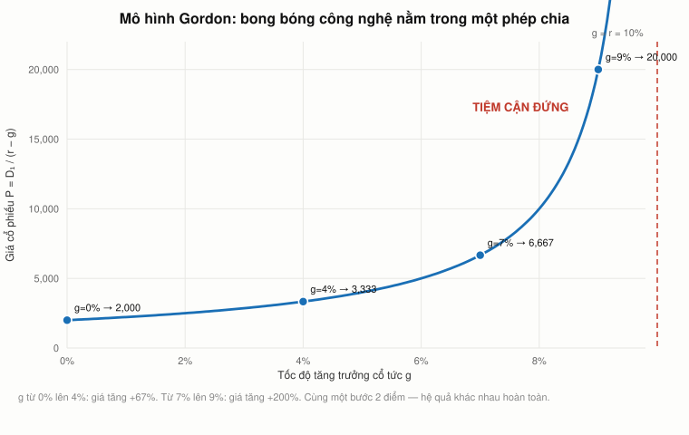
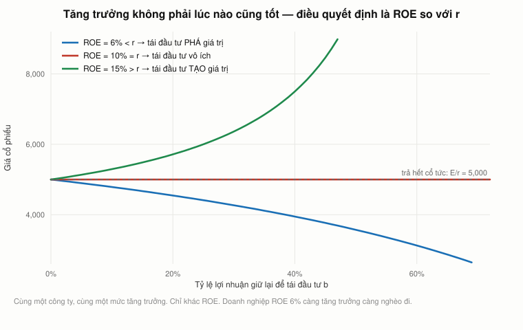

# Bài 6 — Cổ phiếu: chiết khấu cổ tức, tăng trưởng, và giá trị của cơ hội

> Bài học dựng trên **toàn bộ** video **"Ses 8: Equities"** (`cny-1yDbQno`, 75:27) — khoá
> **MIT 15.401 *Finance Theory I*, Fall 2008**, giảng viên **Prof. Andrew W. Lo**.
> Phụ đề gốc do người viết tay.
>
> 🕑 Mốc thời gian có tiền tố buổi: `S8 50:39` = buổi 8, phút 50:39. Vài chỗ dẫn ngược sang
> `S1`–`S7` — mọi mốc đều đối chiếu với **đúng** video của nó.
>
> 📚 **Mở rộng** — kiến thức video lướt qua hoặc bài học này bổ sung, **không có trong video**.
> 🇻🇳 **Góc Việt Nam** — số liệu và ví dụ trong nước (mục 18), **không có trong video**.
> ⚠️ **Buổi này hết giờ giữa chừng.** Lo hứa **hai lần** sẽ dẫn công thức nối cổ tức với lợi
> nhuận (`S8 63:47` và `S8 64:32`) rồi chuông reo. [Mục 13](#13-phần-lo-hứa-hai-lần-rồi-hết-giờ)
> và [mục 14](#14-tăng-trưởng-không-phải-lúc-nào-cũng-tốt) là phần đó, ghi rõ **không có trong
> video**.
> 📌 **Cần đọc trước:** [Bài 2](bai_02_gia_tri_hien_tai.md) — công thức vĩnh viễn và vĩnh viễn
> tăng trưởng ở mục 11–12 là **đúng hai công thức** dùng lại nguyên vẹn ở đây.
>
> Công thức viết bằng LaTeX — mở bằng **Obsidian** hoặc VS Code + Markdown Preview Enhanced.

---

## Mục lục

<!-- MUC-LUC -->
- [1. Ngày 1/10/2008, và câu cuối cùng của buổi giảng](#1-ngày-1102008-và-câu-cuối-cùng-của-buổi-giảng)
- [2. Cổ phiếu là gì — hai nguồn dòng tiền](#2-cổ-phiếu-là-gì--hai-nguồn-dòng-tiền)
- [3. Trách nhiệm hữu hạn — phát minh Lo cho là vĩ đại](#3-trách-nhiệm-hữu-hạn--phát-minh-lo-cho-là-vĩ-đại)
- [4. Câu chuyện Domino's, và vì sao số thật còn hay hơn](#4-câu-chuyện-dominos-và-vì-sao-số-thật-còn-hay-hơn)
- [5. Bán khống, lần thứ ba trong khoá](#5-bán-khống-lần-thứ-ba-trong-khoá)
- [6. Thị trường sơ cấp, thứ cấp, và cuộc trả thù của lũ mọt sách](#6-thị-trường-sơ-cấp-thứ-cấp-và-cuộc-trả-thù-của-lũ-mọt-sách)
- [7. Mô hình chiết khấu cổ tức](#7-mô-hình-chiết-khấu-cổ-tức)
- [8. Không trả cổ tức bao giờ thì đáng giá bao nhiêu](#8-không-trả-cổ-tức-bao-giờ-thì-đáng-giá-bao-nhiêu)
- [9. Suất chiết khấu đến từ đâu — câu chuyện giáo sư Nobel](#9-suất-chiết-khấu-đến-từ-đâu--câu-chuyện-giáo-sư-nobel)
- [10. Thí nghiệm tư duy: chẻ cổ tức thành STRIPS](#10-thí-nghiệm-tư-duy-chẻ-cổ-tức-thành-strips)
- [11. Vĩnh viễn, Gordon, và bong bóng công nghệ trong một phép chia](#11-vĩnh-viễn-gordon-và-bong-bóng-công-nghệ-trong-một-phép-chia)
- [12. Lật ngược công thức để tìm suất chiết khấu](#12-lật-ngược-công-thức-để-tìm-suất-chiết-khấu)
- [13. Phần Lo hứa hai lần rồi hết giờ](#13-phần-lo-hứa-hai-lần-rồi-hết-giờ)
- [14. Tăng trưởng không phải lúc nào cũng tốt](#14-tăng-trưởng-không-phải-lúc-nào-cũng-tốt)
- [15. Cổ tức không còn là toàn bộ câu chuyện](#15-cổ-tức-không-còn-là-toàn-bộ-câu-chuyện)
- [16. Trở lại GE — khi thị trường đúng và xếp hạng sai](#16-trở-lại-ge--khi-thị-trường-đúng-và-xếp-hạng-sai)
- [17. Nghề phân tích: đúng 52 phần trăm đã là thiên tài](#17-nghề-phân-tích-đúng-52-phần-trăm-đã-là-thiên-tài)
- [18. Góc Việt Nam](#18-góc-việt-nam)
- [19. Code minh hoạ](#19-code-minh-hoạ)
- [20. Tự thử](#20-tự-thử)
- [21. Từ điển thuật ngữ](#21-từ-điển-thuật-ngữ)
- [22. Câu hỏi tự kiểm tra](#22-câu-hỏi-tự-kiểm-tra)
- [Tóm tắt một trang](#tóm-tắt-một-trang)
- [Nguồn](#nguồn)
<!-- /MUC-LUC -->

---

## 1. Ngày 1/10/2008, và câu cuối cùng của buổi giảng

Buổi 8 ghi **thứ Tư 1/10/2008** — hai ngày sau khi Hạ viện bác gói cứu trợ TARP và chỉ số Dow rơi
777 điểm ([bài 5, mục 1](bai_05_duration_va_chung_khoan_hoa.md#1-hai-buổi-giảng-hai-ngày-lịch-sử)).
Lo kết thúc buổi 7 bằng *"hẹn gặp lại thứ Tư, ta sẽ nói về cổ phiếu phổ thông"* (`S7 75:33`), và
buổi 8 đúng là về cổ phiếu.

Bài này khác các bài trước ở một điểm: Lo gần như **không** nhắc tới khủng hoảng suốt 75 phút. Ông
dạy lý thuyết định giá cổ phiếu từ đầu tới cuối. Rồi ở giây cuối cùng, ông thả một câu (`S8 75:08`):

> ⚠️ *"Hoán đổi rủi ro tín dụng của **General Electric hôm nay được định giá 700 điểm cơ bản**. Đây
> là một chứng khoán xếp hạng **AAA**, mà 700 điểm cơ bản tín dụng. **Điên rồ!** Nhưng lúc này người
> ta không muốn cho vay. Nên nếu bạn muốn vay trên thị trường vốn hôm nay, chúc may mắn."*

Rồi hết giờ, và video dừng.

📌 **Giữ câu đó lại.** Cùng ngày hôm ấy, GE đang làm một việc mà Lo có thể chưa biết khi bước vào
lớp. [Mục 16](#16-trở-lại-ge--khi-thị-trường-đúng-và-xếp-hạng-sai) quay lại — và câu trả lời cho
"điên rồ hay không" đến sau **năm tháng**.

📚 Ba mảnh bằng chứng khác chốt ngày: Lo nhắc *"trò chơi giao dịch mà ta làm **hai tuần trước, vào
hôm thứ Sáu đó**"* (`S8 09:48`) — đúng thứ Sáu 19/9 mà ông hứa ở `S4 56:04`; ông nói *"lãi suất trái
phiếu kho bạc Mỹ xuống ba điểm cơ bản"* như chuyện vừa xảy ra (`S8 44:56`); và toàn bộ nội dung khớp
lời hẹn ở cuối buổi 7.

⚠️ Một chi tiết nhỏ đáng đính chính: Lo nói mức **ba điểm cơ bản** xảy ra **ngày 18/9**. Theo chuỗi
H.15 của Fed, mức 0,03 % là **ngày 17/9/2008**; ngày 18/9 đã là 0,23 %. Chính Lo đọc con số đó
trực tiếp trên lớp hôm 17/9 — xem [bài 4, mục 11](bai_04_trai_phieu_va_duong_cong.md#11-bảng-giá-ngày-1792008-đọc-từng-dòng).
Không ảnh hưởng gì tới lập luận, nhưng nếu bạn tự tra thì đừng bối rối.

---

## 2. Cổ phiếu là gì — hai nguồn dòng tiền

Lo bắt đầu bằng đúng định nghĩa của [bài 2](bai_02_gia_tri_hien_tai.md#3-tài-sản-là-gì--định-nghĩa-lại-từ-gốc)
(`S8 00:46`):

> *"Cổ phần là **quyền sở hữu** trong một công ty. Và khi bạn sở hữu một mảnh của công ty, cái bạn
> sở hữu là **chuỗi dòng tiền** đó."*

Có đúng **hai** đường để tiền về tay bạn:

|             |                                      |
| ----------- | ------------------------------------ |
| **Cổ tức**  | công ty trả tiền mặt cho bạn         |
| **Lãi vốn** | giá mảnh giấy tăng, và bạn bán nó đi |

Lo giải thích vì sao công ty tăng trưởng thường không trả cổ tức (`S8 01:05`):

> *"Công ty giai đoạn đầu muốn giữ tiền mặt, vì họ có rất nhiều ý tưởng đầu tư muốn triển khai. Nên
> mọi khoản tiền tạo ra nội bộ, họ sẽ **cày ngược trở lại** vào hoạt động hiện tại. […] Nhưng bạn
> vẫn nhận được giá trị từ mảnh giấy đó, vì khi công ty lớn lên, khi nó đáng giá hơn, thì mảnh giấy
> bạn cầm cũng đáng giá hơn."*

### Một chỗ Lo nói sai, và ở Việt Nam nó rất tốn tiền

Ở `S8 01:58` Lo nói:

> *"Có hai dạng cổ tức. **Cổ tức tiền mặt hoặc cổ tức cổ phiếu, cả hai đều mang lại giá trị tăng
> thêm.**"*

⚠️ **Vế sau sai.** Cổ tức **tiền mặt** là một khoản chi trả thật — tiền rời khỏi công ty và vào tài
khoản bạn. Cổ tức **cổ phiếu** thì không: công ty in thêm giấy và chia cho chính các cổ đông hiện
hữu theo đúng tỷ lệ họ đang nắm.

Nếu bạn sở hữu 1 % công ty và **mọi người** đều nhận thêm 20 % số cổ phiếu, thì sau đó bạn vẫn sở
hữu **đúng 1 %**. Không một đồng nào rời khỏi công ty. Về bản chất đó là một **cuộc chia tách cổ
phiếu**, và giá tham chiếu được điều chỉnh xuống một cách máy móc:

$$P_{\text{sau}} = \frac{P_{\text{trước}}}{1+\alpha}$$

trong đó $\alpha$ là tỷ lệ chia. Trên bảng cân đối, nó chỉ là một bút toán chuyển từ quỹ này sang
vốn điều lệ — tổng vốn chủ sở hữu **không đổi**.

📌 Đây không phải bắt bẻ chữ nghĩa. [Mục 18](#18-góc-việt-nam) cho thấy vì sao ở Việt Nam đây là
một trong những hiểu nhầm tốn kém nhất của nhà đầu tư cá nhân.

---

## 3. Trách nhiệm hữu hạn — phát minh Lo cho là vĩ đại

Đây là đoạn hay nhất buổi, và nó không có một công thức nào. Lo mở bằng một lời khen bất thường
(`S8 02:16`):

> *"Tôi phải nói rằng **ai đã phát minh ra cổ phần** — chuyện này từ nhiều, nhiều thế kỷ trước — thực
> sự là một nhà sáng tạo tài chính **lỗi lạc**, bởi vì cổ phần có một khả năng cực kỳ mạnh trong việc
> tạo động lực và khuyến khích đúng cho **mọi loại đổi mới**."*

Ông nêu hai tính chất pháp lý.

### a) Người nhận phần còn lại

Cổ đông đứng **sau** chủ nợ (`S8 02:58`). Nghe thì tệ, nhưng (`S8 03:41`):

> *"Nó rất thú vị nếu việc đứng thứ hai đồng nghĩa với việc bạn tiếp cận được **toàn bộ phần thượng
> tầng** của tăng trưởng và thành công của công ty. […] Với tư cách trái chủ, phần lời của bạn bị
> **chặn trần**. Trong khi với tư cách người nhận phần còn lại, người nắm cổ phần, bạn **không có
> giới hạn trên**."*

📌 Ghép với [bài 5, mục 12](bai_05_duration_va_chung_khoan_hoa.md#12-nợ-có-rủi-ro-và-ba-tổ-chức-xếp-hạng):
ở đó Lo nói khi nợ càng rủi ro thì nó *"càng bớt giống nợ và giống vốn chủ hơn"*. Giờ ta thấy chiều
ngược lại — nợ và vốn chủ chỉ là **hai lát cắt của cùng một dòng tiền**, khác nhau ở thứ tự ưu tiên
và ở việc bên nào bị chặn trần. Chính xác cấu trúc phân lớp ở [bài 5, mục 14](bai_05_duration_va_chung_khoan_hoa.md#14-cỗ-máy-biến-hai-trái-phiếu-rác-thành-một-aaa).

### b) Trách nhiệm hữu hạn

`S8 04:26`:

> *"Khía cạnh còn lại rất quan trọng gọi là **trách nhiệm hữu hạn** — thực tế rằng, với tư cách
> cổ đông, **thứ nhiều nhất bạn có thể mất là tất cả.**"*

Rồi ông giải thích tại sao câu đó, nghe như một lời nguyền, thực ra là một món quà (`S8 04:49`,
`S8 05:10`):

> *"Nghe có vẻ không phải một thoả thuận tốt, nhưng tin tôi đi, đó là một thoả thuận **tuyệt vời**.
> 'Tất cả' ở đây nghĩa là tất cả những gì **bạn đã bỏ vào** — nên nó không phải theo nghĩa đen là
> tất cả. Ví dụ, bạn **không mất mạng**. Bạn **không mất tự do**. Bạn không mất ngón út. Bạn không
> mất bộ phận cơ thể nào khác, cũng không mất người thân."*

Và bối cảnh lịch sử (`S8 05:31`):

> *"Trước khi có công ty hiện đại và trách nhiệm hữu hạn, doanh nhân phải đối mặt với **trách nhiệm
> vô hạn**, hoặc **bị tống vào tù** nếu vỡ nợ."*

Câu chốt (`S8 07:31`):

> *"Hãy thử nghĩ đổi mới sẽ ra sao nếu ta quy định rằng công ty đầu tiên của bạn thất bại thì từ đó
> trở đi **bạn vĩnh viễn không được lập công ty nữa**. Nghĩ xem sẽ còn bao nhiêu người dám mạo hiểm
> hay dám nhảy vào làm một việc như khởi nghiệp."*

📚 Bối cảnh Lo không kể: nhà tù cho con nợ là chuyện có thật và kéo dài rất lâu. Ở Anh, **Đạo luật
Trách nhiệm Hữu hạn 1855** và **Đạo luật Công ty Cổ phần 1856** mới cho phép nhà đầu tư thường giới
hạn thiệt hại ở phần vốn góp; **Đạo luật Con nợ 1869** mới xoá bỏ phần lớn việc bỏ tù vì nợ. Nghĩa
là cấu trúc pháp lý mà Lo gọi là *"bí quyết mở khoá sức mạnh của quần chúng"* (`S8 09:08`) mới chỉ
khoảng **170 tuổi**.

---

## 4. Câu chuyện Domino's, và vì sao số thật còn hay hơn

Để minh hoạ, Lo kể một chuyện ông nghe khi còn ở Wharton (`S8 06:17`, `S8 06:35`, `S8 06:59`):

> *"Nhiều năm trước, khi tôi ở Trường Wharton, tôi nghe một bài nói của người sáng lập **Domino's
> Pizza**. Tiếc là tôi **không nhớ tên ông ấy**. […] Có người hỏi: làm sao ông biết một chuỗi pizza
> toàn quốc sẽ thành công đến thế? Ông ấy rất thật thà. Ông nói: tôi **không** biết. Đây là **công
> ty thứ chín** của tôi. **Tám công ty đầu đều phá sản.** Và nếu công ty này cũng phá sản, chắc tôi
> sẽ lập công ty thứ mười."*

⚠️ **Chi tiết này không khớp với lịch sử.** Người sáng lập Domino's là **Tom Monaghan**, và:

| Lo kể                         | Số thật                                                                                                                                          |
| ----------------------------- | ------------------------------------------------------------------------------------------------------------------------------------------------ |
| "công ty thứ chín"            | Domino's là **doanh nghiệp đầu tiên** của ông. Năm **1960** ông và em trai vay **500 đô** mua tiệm pizza *DomiNick's* ở Ypsilanti, Michigan      |
| "tám công ty đầu đều phá sản" | Không có tám công ty nào. Nhưng chính Domino's **suýt sập một lần**                                                                              |
| —                             | Đầu **1970** ông nợ **1,5 triệu đô** và bị **150 chủ nợ** kiện                                                                                   |
| —                             | Ngày **1/5/1970** ông giao 49 % công ty cho một doanh nhân địa phương **để tránh phá sản**; **trong vòng một năm** ông giành lại quyền kiểm soát |
| "ông ấy là tỷ phú"            | Năm **1998** ông bán **93 %** cổ phần Domino's cho **Bain Capital** với giá khoảng **1 tỷ đô**                                                   |

**Và đây mới là điều thú vị: câu chuyện thật minh hoạ luận điểm của Lo *tốt hơn* câu chuyện ông
kể.** Vì nó cho thấy trách nhiệm hữu hạn hoạt động chính xác như thế nào trong đời thật:

Một người nợ 1,5 triệu đô với 150 chủ nợ đang kiện **đã không đi tù, đã không mất nhà, đã không mất
mạng**. Ông giao đi phần lớn vốn chủ sở hữu — đúng thứ ông đã bỏ vào — giữ lại quyền tiếp tục làm
việc, rồi giành lại công ty. Hai mươi tám năm sau ông bán nó với giá một tỷ đô.

Nếu là thế kỷ 18, ông đã ngồi tù. Đó chính xác là bài giảng của Lo, chỉ khác là có thật.

📚 Còn ý *"những người khởi nghiệp hàng loạt cứ đi từ công ty này sang công ty khác"* (`S8 06:17`)
thì đúng như một hiện tượng — chỉ là Monaghan không phải ví dụ cho nó.

---

## 5. Bán khống, lần thứ ba trong khoá

Lo quay lại chủ đề bán khống, và lần này ông thừa nhận một kết quả bất lợi từ chính lớp học của mình
(`S8 09:29`):

> *"Bán khống cho phép **thông tin không tích cực** — nhưng vẫn quan trọng — đi vào giá thị trường."*

Rồi (`S8 10:03`):

> *"Những bạn đã tham gia trò chơi giao dịch hai tuần trước — khi ta xem lại kết quả ở cuối khoá,
> lúc nói về thị trường hiệu quả, tôi sẽ cho các bạn thấy rằng giá hình thành trong thị trường đó
> **không hiệu quả lắm**. Một phần lý do là vì **chúng ta không cho phép các bạn bán khống**. Những
> bạn có thông tin rằng tại một thời điểm cổ phiếu đó **vô giá trị** thì việc nhiều nhất có thể làm
> là bán hết số mình đang có. Nhưng bán xong là hết, bạn ra khỏi thị trường. Nếu được bán khống, các
> bạn đã đẩy giá đó về **0**, đúng chỗ nó thuộc về."*

📌 Đây là lần thứ ba bán khống xuất hiện, và mỗi lần một góc:

| Bài                                                                                                               | Góc nhìn                                                |
| ----------------------------------------------------------------------------------------------------------------- | ------------------------------------------------------- |
| [Bài 4, mục 16](bai_04_trai_phieu_va_duong_cong.md#16-trái-phiếu-coupon-là-một-gói-strips--luật-một-giá-quay-lại) | **Cơ chế** — làm sao bán thứ mình không sở hữu          |
| [Bài 5, mục 6](bai_05_duration_va_chung_khoan_hoa.md#6-bán-khống-và-ngày-lý-thuyết-tài-chính-đi-nghỉ-phép)       | **Chính sách** — cấm nó thì luật một giá mất hiệu lực   |
| Bài 6                                                                                                             | **Thông tin** — không có nó, tin xấu không vào được giá |

Ba góc, một kết luận: **bán khống không phải một chiến lược đầu cơ, nó là một kênh dẫn thông tin.**
Bịt kênh đó thì giá chỉ còn phản ánh ý kiến của những người lạc quan. Nhớ [bài 1](bai_01_tai_chinh_la_gi.md):
Lo chỉ ra chính điều này ở phiên đấu giá cái hộp — *"thị trường này cấm bán khống, nên chỉ người lạc
quan mới được thể hiện quan điểm, giá vì thế lệch lên trên."*

---

## 6. Thị trường sơ cấp, thứ cấp, và cuộc trả thù của lũ mọt sách

Lo phân biệt hai thị trường bằng một ẩn dụ rất dễ nhớ (`S8 10:57`, `S8 11:16`):

> *"**Sơ cấp** là thị trường nơi chứng khoán được phát hành lần đầu tiên. **Thứ cấp** thì bạn có thể
> coi là **thị trường đồ cũ**. Ta có chợ xe cũ. Ta có chợ nhà cũ. Và có chợ **chứng khoán cũ**. Tôi
> biết các bạn không thực sự nghĩ về Sở Giao dịch New York theo cách đó, nhưng đúng là vậy. Chỉ có
> điều **chứng khoán cũ tốt ngang chứng khoán mới, và ở nhiều khía cạnh thì còn tốt hơn**."*

📌 Lo nói rõ khoá này **chỉ** học thị trường **thứ cấp** (`S8 11:31`) — IPO, M&A, vốn mạo hiểm thuộc
các môn khác. Đáng nhớ khi bạn thấy bài học không nói gì về định giá công ty chưa niêm yết.

Ông cũng nêu một liên hệ thực dụng cho người khởi nghiệp (`S8 13:04`):

> *"Khi bạn khởi nghiệp và nhận vốn từ một quỹ đầu tư mạo hiểm, cách quỹ đó **rốt cuộc được trả tiền
> không phải** là niềm vui được là một phần của công ty tuyệt vời của bạn, mà là việc công ty bạn
> **lên sàn** để họ bán ra ở giá thị trường công khai."*

Nghĩa là chu kỳ IPO và chu kỳ vốn mạo hiểm dính chặt vào nhau — và cả hai dính vào chu kỳ tín dụng.

### Công nghệ, và một câu Lo tự đặt tên

Khi sinh viên hỏi internet có góp phần làm khối lượng giao dịch tăng không, Lo kể một chuyện
(`S8 15:00`):

> *"Hồi tôi dạy Tài chính năm 2000 hay 2001, giữa buổi có một sinh viên đại học nhìn vào cái điện
> thoại rồi chạy vụt ra ngoài. Cậu ta quay lại ngay trước khi hết giờ, mặt mày rất khổ sở. Cuối buổi
> tôi hỏi có sao không, cậu ta nói vừa phải xử lý một **lệnh gọi ký quỹ** cho vị thế cổ phiếu đặt
> hôm trước. **Đây là một sinh viên đại học.** Giao dịch trên cái điện thoại bé xíu của cậu ta."*

Ông liệt kê những gì đã đổi: internet, **ECN** (mạng truyền thông điện tử — khởi đầu như bảng tin
cho người mua và bán lớn gặp nhau ẩn danh, `S8 15:35`), định tuyến lệnh điện tử. Kết quả: nhà đầu tư
cá nhân giao dịch **nhanh hơn, rẻ hơn, dễ hơn bao giờ hết**, còn *"một số quỹ đầu cơ đã phải đóng
cửa vì không cạnh tranh nổi với những đổi mới công nghệ này"* (`S8 16:37`).

Rồi ông chốt bằng câu đắt nhất mục này (`S8 17:11`, `S8 17:26`):

> *"Ngày xưa thì **quen ai** quan trọng hơn **biết gì**. Mạng lưới con ông cháu cha quan trọng hơn
> mạng máy tính. Và người tốt nghiệp Harvard, Yale có lợi thế hơn người tốt nghiệp MIT, Caltech.
> Điều đó đã bị **lộn ngược** trong mấy năm qua. Tôi gọi đó là **cuộc trả thù của lũ mọt sách** —
> điềm lành cho tất cả các bạn. [CẢ LỚP CƯỜI]"*

---

## 7. Mô hình chiết khấu cổ tức

Lo giới thiệu mô hình định giá cổ phiếu đầu tiên trong lịch sử (`S8 17:26`, `S8 17:49`):

> *"Nó **không thể đơn giản hơn**. Một mô hình mà tôi nghĩ tất cả các bạn sẽ hiểu ngay lập tức, vậy
> mà các hệ quả của nó lại **sâu rộng và thâm thuý**. Nó gọi là **Mô hình chiết khấu cổ tức**."*

$$P_t \;=\; \sum_{k=1}^{\infty} \frac{\mathbb{E}_t[D_{t+k}]}{(1+r_{t+1})(1+r_{t+2})\cdots(1+r_{t+k})}$$

Ba ký hiệu, và mỗi cái đều có lý do (`S8 23:04`–`S8 24:00`):

| Ký hiệu        | Nghĩa                                  | Chú ý                                                                                           |
| -------------- | -------------------------------------- | ----------------------------------------------------------------------------------------------- |
| $D_t$          | cổ tức tiền mặt tại thời điểm $t$      | có thể **bằng 0** nhiều năm liền, nhưng **không bao giờ âm** — ta không lấy tiền của nhà đầu tư |
| $\mathbb{E}_t$ | **toán tử kỳ vọng** tại thời điểm $t$  | khác trái phiếu: cổ tức **không biết trước**, phải dự báo                                       |
| $r_t$          | suất sinh lợi **đã hiệu chỉnh rủi ro** | tương xứng với rủi ro của **đúng** dòng tiền đó                                                 |

Và đây là chỗ Lo giải thích vì sao cổ phiếu khó hơn trái phiếu (`S8 27:03`):

> *"Giờ các bạn sẽ hiểu vì sao tôi nói cổ phiếu phức tạp hơn công cụ thu nhập cố định nhiều. Là bởi
> vì có **hai nguồn bất định**. Một là **suất chiết khấu**, hai là **dòng tiền**. Và hơn nữa, suất
> chiết khấu ở đây không phải suất phi rủi ro, mà là suất **đã hiệu chỉnh rủi ro**."*

📌 So với [bài 4](bai_04_trai_phieu_va_duong_cong.md): ở trái phiếu không vỡ nợ, tử số **biết trước**
và mẫu số đọc được từ giá thị trường. Ở cổ phiếu, **cả hai** đều phải ước lượng. Đó là toàn bộ khác
biệt về độ khó.

Lo cũng chú ý rằng $r$ có chỉ số dưới thay đổi theo thời gian (`S8 25:25`): *"đúng như ta có đường
cong lãi suất cho trái phiếu phi rủi ro, ta có thể có một đường cong lãi suất cho **dòng tiền rủi
ro**."* Rồi ông thú nhận (`S8 24:00`): *"Tôi sẽ **khoát tay bỏ qua** chuyện làm sao có được suất
hiệu chỉnh rủi ro, và sẽ quay lại sau vài bài giảng."* Đó là bài 9–11.

---

## 8. Không trả cổ tức bao giờ thì đáng giá bao nhiêu

Đoạn tranh luận này chiếm gần bốn phút và là chỗ hay nhất để hiểu mô hình. Lo tuyên bố (`S8 19:02`):

> *"Và nếu một công ty **không bao giờ, không bao giờ** trả cổ tức, thì nó **đáng giá 0**, đúng
> không? Nếu nó không trả bạn đồng tiền mặt nào mãi mãi, thì đó có vẻ là một tài sản rất tệ."*

Lớp phản đối. Lo đáp lại từng đợt, và cách ông làm đáng học:

**Phản đối 1 — "nhưng giá vẫn tăng, tôi bán đi là có lời."** (`S8 20:27`)

> *"Nhưng hãy nghĩ đi. Nếu một công ty cứ tăng giá trị mãi mà **không bao giờ** chi trả, thì **tiền
> mặt đang đi đâu**? Khi tôi nói không bao giờ, tôi nghĩa là **không bao giờ**. […] Bạn có nghĩ ra
> công ty nào tăng giá trị liên tục mà không bao giờ, không bao giờ trả một xu nào không?"*

**Phản đối 2 — "vẫn bán được cho người khác mà."** (`S8 21:14`)

> *"Ồ đúng, bạn có thể kiếm lời bằng cách bán. Nhưng nếu bạn bán một chứng khoán cho ai đó, mà
> **họ biết chắc chắn** rằng nó không bao giờ trả một đồng nào, thì cái đó gọi là **mô hình Ponzi**.
> Nói cách khác, bạn đang bán một mảnh giấy vô giá trị cho ai đó và hy vọng rằng **họ ngu hơn bạn**
> vì đã mua nó."*

**Phản đối 3 — "nếu công ty giải thể thì cổ đông vẫn được chia."** (`S8 22:00`)

> *"Vậy thì nó **có** chi trả. Đó là **cổ tức thanh lý**. Thế là vi phạm điều kiện 'không bao giờ,
> không bao giờ chi trả gì cả' của tôi rồi. **Và đó chính là điểm mấu chốt.**"*

Lập luận cuối cùng của Lo (`S8 22:12`) đáng ghi lại nguyên vẹn, vì nó là thứ khiến mô hình **không
thể bác bỏ được** theo nghĩa tốt:

> *"Nếu công ty đang tăng trưởng và có giá trị, thì bạn **biết chắc** rằng: **A**, tại một thời điểm
> nào đó nó sẽ trả cổ tức; hoặc **B**, nếu không và nó bị thanh lý, thì khi thanh lý bạn nhận được
> phần chia theo tỷ lệ của bất cứ thứ gì còn trong công ty — mà đó **cũng là một khoản chi trả**."*

📌 **Đây là chỗ dễ hiểu lầm nhất của cả bài.** Lo **không** nói "công ty phải trả cổ tức thì mới có
giá trị". Ông nói: giá trị đến từ **tiền mặt rốt cuộc về tay cổ đông**, bằng đường nào cũng được —
cổ tức, thanh lý, hoặc, như [mục 15](#15-cổ-tức-không-còn-là-toàn-bộ-câu-chuyện) sẽ chỉ ra, **mua
lại cổ phiếu**. Cái ông loại trừ là trường hợp **không bao giờ có tiền mặt nào cả** — và trường hợp
đó, đúng như ông nói, chỉ tồn tại được nếu có người mua ngu hơn.

Lo minh hoạ bằng Microsoft (`S8 18:27`):

> *"Suốt nhiều năm Microsoft **không hề** trả cổ tức. Nhưng khoảng năm hay sáu năm trước, họ công bố
> bắt đầu trả. Vì sao? Vì họ đã tích luỹ nhiều tiền mặt tới mức **không còn đủ chỗ để đầu tư số tiền
> đó**."*

✅ Số thật: Microsoft công bố cổ tức đầu tiên ngày **16/1/2003**, mức **0,16 đô/cp** trước chia tách
(**0,08 đô** sau khi chia tách 2-ăn-1 tháng 2/2003), trả ngày 7/3/2003 — lần chi trả đầu tiên kể từ
khi lên sàn năm 1986. Từ tháng 10/2008 tính ngược là **5 năm 9 tháng** — khớp với "năm hay sáu năm"
của Lo.

---

## 9. Suất chiết khấu đến từ đâu — câu chuyện giáo sư Nobel

Lo nêu một mệnh đề rồi bắt lớp tự chứng minh (`S8 29:34`):

> *"Tôi sẽ phát biểu một điều, rồi yêu cầu các bạn biện minh cho nó. Mệnh đề là: **suất chiết khấu ở
> mẫu số của mỗi phân số phải được hiệu chỉnh rủi ro sao cho phản ánh rủi ro của TỬ SỐ tương ứng**,
> cùng với điều kiện thị trường chung. Giờ hãy biện minh cho tôi."*

Sinh viên trả lời rằng rủi ro cao hơn thì phải được đền bù cao hơn. Lo hỏi tiếp *"Sao bạn biết?"*
Sinh viên đáp: *"Chỉ là luật rừng thôi, em không rõ."* (`S8 30:44`) Lo bắt lấy (`S8 30:56`):

> *"Bạn đúng. Đó **là** luật rừng. Nhưng ở đây, **rừng là gì**? — Chính xác, cảm ơn. **Thị
> trường.** Thị trường là khu rừng nơi bạn cạnh tranh để giành nguồn lực khan hiếm. Và để dự án cưng
> của bạn được cấp vốn, bạn phải đưa ra động lực đúng để người ta mua vào dự án của bạn."*

### Câu chuyện

Rồi Lo kể chuyện hay nhất buổi để đóng đinh một điểm (`S8 34:36`, `S8 35:15`, `S8 35:36`):

> *"Vài năm trước, có một giảng viên ở Carnegie Mellon đoạt giải Nobel, và hoá ra ông là một trong
> những giáo sư được trả lương cao nhất trường lúc đó. Tờ báo sinh viên phỏng vấn ông: 'Thưa giáo
> sư, ông có thấy phù hợp không khi lương ông **gấp đôi** lương những nhà vật lý cũng đoạt Nobel và
> những người đoạt huy chương Fields ở khoa Toán?'*
>
> *Và vị giảng viên đó — một nhà kinh tế học — trả lời:*
>
> ***'Này chàng trai. Trường đại học không quyết định mức lương cân bằng của tôi. Họ chỉ quyết
> định tôi làm việc ở thành phố nào.'***"*

Lo áp ngay vào bài (`S8 35:54`):

> *"Cũng y hệt với những dòng tiền này. **Không phải công ty được chọn suất chiết khấu là bao nhiêu.**
> Câu hỏi là: cho trước mức rủi ro của dòng tiền đó, **thị trường bảo tôi** suất sinh lợi công bằng
> là bao nhiêu? Đó là con số tôi muốn cắm vào mẫu số."*

⚠️ **Tôi không xác minh được câu chuyện này** — Lo không nêu tên, và tôi không tìm được nguồn độc
lập. Bài này trình bày nó như **chuyện Lo kể**. Nhưng luận điểm thì đứng vững mà không cần giai
thoại, và nó lặp lại chính xác điều Lo đã nói ở [bài 2](bai_02_gia_tri_hien_tai.md#7-tỷ-giá-lấy-từ-đâu-lo-mở-phiên-đấu-giá-thứ-hai)
về nơi lãi suất đến từ.

📚 Lo cũng dùng dịp này giải thích thói quen dùng nhiều tên cho cùng một thứ (`S8 70:45`):

> *"Lý do tôi luôn dùng bốn năm cái tên cho cùng một đại lượng là để các bạn nhạy với việc **người
> ta nhìn con số này từ những góc khác nhau**. Khi tôi nói **chi phí vốn**, tôi đang nghĩ như một nhà
> quản lý doanh nghiệp phân bổ tiền nội bộ. Còn với tư cách nhà đầu tư bên ngoài, tôi muốn biết
> **suất sinh lợi** của tôi là bao nhiêu."*

📌 Đó là "năm cái tên của $r$" ở [bài 2, mục 9](bai_02_gia_tri_hien_tai.md#9-từ-tỷ-giá-sang-r--và-năm-cái-tên-của-nó),
lần này áp cho cổ phiếu.

---

## 10. Thí nghiệm tư duy: chẻ cổ tức thành STRIPS

Để trả lời câu hỏi "suất chiết khấu hiệu chỉnh rủi ro đến từ đâu", Lo dựng một thí nghiệm tư duy rất
đặc trưng (`S8 38:48`):

> *"Hãy tưởng tượng làm một **STRIP**. Các bạn biết STRIPS là gì rồi đúng không? Vậy hãy nghĩ tới
> việc **lột từng khoản cổ tức ra**. Thí nghiệm hơi kỳ quặc, nhưng chịu khó theo tôi. Giả sử thay vì
> một công ty, tôi tạo ra **vô số công ty**. Mỗi công ty chỉ sống đúng **một lần trả cổ tức**, sau
> đó bị thanh lý."*

📌 Đây chính xác là cấu trúc STRIPS ở [bài 4, mục 6](bai_04_trai_phieu_va_duong_cong.md#6-strips--lịch-sử-thật-của-một-ý-tưởng-hiển-nhiên),
mang từ trái phiếu sang cổ phiếu. Một tài sản dài hạn = **một gói các tài sản một-dòng-tiền**, và
mỗi mảnh có suất chiết khấu riêng.

Rồi ông làm nó cụ thể: một mảnh giấy tài trợ công nghệ nano, thanh lý **tháng 12/2013**, dòng tiền
kỳ vọng **27 triệu đô**. Định giá thế nào? Lớp đề xuất tìm chứng khoán tương đương, dùng đường cong
lãi suất, cộng chênh lệch tín dụng… Lo gạt hết (`S8 44:03`, `S8 44:16`):

> *"Bạn làm thế cũng được, nhưng giờ ta đang làm mọi thứ ngày càng phức tạp. **Chẳng lẽ không có
> cách nào dễ hơn để biết giá?** — Chính xác. **Để thị trường quyết định. Đấu giá nó đi.**"*

> *"Giả sử ai đó sẵn sàng trả **15 triệu hôm nay** cho một dòng tiền kỳ vọng 27 triệu vào 2013. Với
> hai con số đó, bạn **có $r$**, đúng không? $r$ được xác lập **đúng theo cách** ta xác lập $r$ cho
> trái phiếu phi rủi ro."* (`S8 44:32`)

Và câu kết luận (`S8 45:10`):

> *"Lợi suất đó sẽ là một lợi suất **đã hiệu chỉnh rủi ro**. **Tôi không biết việc hiệu chỉnh rủi ro
> đã được làm thế nào.** […] Vấn đề là **thị trường đã làm hộ chúng ta.**"*

📌 Ba lần trong khoá học, cùng một câu trả lời: [bài 1](bai_01_tai_chinh_la_gi.md) đấu giá cái hộp,
[bài 2](bai_02_gia_tri_hien_tai.md#7-tỷ-giá-lấy-từ-đâu-lo-mở-phiên-đấu-giá-thứ-hai) đấu giá tờ 1 đô
tương lai, [bài 4](bai_04_trai_phieu_va_duong_cong.md#5-trái-phiếu-chiết-khấu-thuần--một-công-thức-ba-biến)
đấu giá trái phiếu. **Lãi suất không phải thứ ai đó công bố. Nó là thứ bạn suy ngược ra từ giá.**

### Một câu trả lời rất thẳng cho một câu hỏi rất hay

Một sinh viên hỏi: nếu công thức đúng, thì mua cổ phiếu để làm gì — chẳng phải bạn phải tin nó **sai**
mới có động cơ mua sao? (`S8 46:09`) Lo trả lời (`S8 46:37`, `S8 47:14`):

> *"Câu trả lời là **không, bạn không cần**. […] Có thể bạn chỉ đơn giản muốn cái tổ hợp rủi ro và
> phần thưởng của dòng tiền đó. Có gì sai đâu? […] Ngay cả khi mọi thứ được định giá đúng, **không
> phải là bạn sẽ không kiếm được đồng nào**. Bạn sẽ kiếm được theo đúng suất sinh lợi thị trường
> công bằng của chứng khoán đó."*

Điều này nghe hiển nhiên nhưng bị hiểu sai rất rộng: **bạn không cần thị trường sai thì mới đầu tư
có lãi.** Thị trường đúng vẫn trả cho bạn phần bù rủi ro. Đi tìm chỗ định giá sai là **một** lý do
để đầu tư, không phải lý do duy nhất.

---

## 11. Vĩnh viễn, Gordon, và bong bóng công nghệ trong một phép chia



*Khi g tiến tới r, mẫu số tiến tới 0. Bong bóng công nghệ nằm gọn trong một phép chia.*

Lo đơn giản hoá dần (`S8 48:10`). Cố định cổ tức $D$ và suất chiết khấu $r$:

$$P_0 = \frac{D}{r}$$

> *"Kỳ diệu thay, cái bạn nhận được là **người bạn cũ** của chúng ta — công thức vĩnh viễn."*
> (`S8 48:51`)

Hai hệ quả ông rút ra ngay (`S8 49:09`, `S8 49:28`):

1. Giá cổ phiếu **tăng theo** kỳ vọng cổ tức tương lai.
2. Giá cổ phiếu **tỷ lệ nghịch** với suất chiết khấu. *"Nếu lãi suất nói chung tăng lên thì giá cổ
   phiếu phải làm sao? — Đúng, phải giảm."* Hai cách hiểu: dòng tiền tương lai bị chiết khấu mạnh
   hơn; hoặc cầu cổ phiếu giảm vì trái phiếu giờ hấp dẫn hơn.

Cho cổ tức tăng đều tốc độ $g$ thì được **mô hình Gordon** (`S8 50:19`):

$$P_0 = \frac{D_1}{r-g}$$

📌 Cả hai công thức này đã có ở [bài 2, mục 11–12](bai_02_gia_tri_hien_tai.md#11-vĩnh-viễn-cr).
Không có gì mới về toán. Cái mới là **cái ta cắm vào**.

### Và đây là chỗ Lo nói một câu rất lớn

`S8 50:39`:

> *"Và bây giờ, trong biểu thức cực kỳ đơn giản này, ta có **một lời giải thích cho bong bóng
> công nghệ — cả việc nó phình to đến thế, lẫn việc nó vỡ**. Nếu $r$ gần $g$, nếu tốc độ tăng
> trưởng rất lớn, bạn sẽ có một mức giá rất lớn. Và nếu có những thay đổi nhanh trong việc người ta
> **kỳ vọng** $g$ là bao nhiêu, hoặc **ước lượng** $g$ là bao nhiêu, bạn có thể nhận được những cú
> sốc rất nhanh về mặt bằng giá — bao gồm cả giá vọt lên rồi sụp đổ."*

[Mục 19](#19-code-minh-hoạ) viết câu đó ra thành bảng. Với $r = 10\%$ cố định, cùng một tin *"tăng
trưởng nhanh hơn 1 điểm phần trăm"*:

| $g$ hiện tại | $r - g$ | Giá đổi bao nhiêu khi $g$ tăng 1 điểm |
| -----------: | ------: | ------------------------------------: |
|          0 % |    10 % |                           **+11,1 %** |
|          4 % |     6 % |                               +20,0 % |
|          8 % |     2 % |                          **+100,0 %** |
|          9 % |     1 % |            $g$ chạm $r$ ⟹ **vô cùng** |

Độ nhạy của giá theo $g$ chính là $1/(r-g)$: ở $g = 0$ nó bằng **10**; ở $g = 9\%$ nó bằng **100**.

**Không ai cần phi lý cả.** Chỉ cần thị trường sửa ước lượng $g$ một chút, ở vùng $g$ gần $r$.

### Điều kiện $r > g$, và một câu đùa đắt giá

Sinh viên hỏi $r > g$ có ý nghĩa gì ngoài chuyện toán học (`S8 51:25`). Lo giải thích (`S8 52:17`,
`S8 52:33`):

> *"Nếu tốc độ tăng trưởng nhanh hơn lãi suất, và nếu nó thật sự kéo dài **tới vô cùng**, thì rất
> nhanh bạn sẽ **lớn hơn cả GDP của hành tinh này**. […] Chẳng mấy chốc bạn sẽ **giàu hơn cả Chúa**,
> và ta biết chuyện đó không thể xảy ra."*

Và ví dụ đối chiếu (`S8 53:03`):

> *"Trung Quốc đã tăng trưởng 10 % suốt 15 năm qua. Bạn có nghĩ 10 % là bền vững không? Nếu Trung
> Quốc tiếp tục tăng 10 %, chẳng mấy chốc **tất cả chúng ta sẽ nói tiếng Quan Thoại**."*

Câu chốt (`S8 53:18`): *"**Đây là một công thức về vô cùng. Nó không phải về năm năm hay mười
năm.**"*

📌 Đây là cái bẫy phổ biến nhất khi dùng Gordon: cắm tốc độ tăng trưởng **ngắn hạn** vào một công
thức đòi tốc độ **vĩnh viễn**. Bài 2 đã cảnh báo; bài này cho thấy hậu quả bằng số.

### Ví dụ nhiệt hạch lạnh

Lo minh hoạ bằng một câu chuyện khoa học (`S8 53:57`): thí nghiệm **Pons và Fleischmann**, mà ông
nhớ là *"15 hay 20 năm trước"*. Số thật: hai nhà hoá học công bố ngày **23/3/1989** — tức 19 năm
trước buổi giảng, khớp với khoảng ông nói.

Ý ông muốn nói (`S8 55:00`, `S8 55:37`):

> *"Nếu tạo được phản ứng hạt nhân ở nhiệt độ phòng, điều đó sẽ **xoá sổ mọi vấn đề năng lượng của
> thế giới**, vì bạn có thể chạy xe bằng nước máy. […] Có một khoảng thời gian ngắn ta **chưa biết**,
> và trong khoảng đó, $r - g$ trông khá nhỏ. $g$ trông rất lớn so với $r$."*

Bài học tổng quát, và nó không phụ thuộc vào việc nhiệt hạch lạnh có thật hay không: **kỳ vọng về
$g$ đủ để làm giá dịch chuyển khổng lồ, kể cả trước khi ai biết sự thật.**

---

## 12. Lật ngược công thức để tìm suất chiết khấu

Từ $P_0 = D_1/(r-g)$ ta có (`S8 56:14`, `S8 56:36`):

$$r \;=\; \underbrace{\frac{D_1}{P_0}}_{\text{lợi suất cổ tức}} \;+\; \underbrace{g}_{\text{tăng trưởng}}$$

Vì sao điều này thú vị? Vì trong nhiều năm, giới phân tích chỉ dùng **lợi suất cổ tức** làm chi phí
vốn (`S8 57:02`) — y như cách bạn lấy coupon chia cho giá trái phiếu. Nhưng cổ phiếu có thêm một
thành phần, và Lo nói về nó bằng giọng rất MIT (`S8 58:04`):

> *"Biểu thức này nói một điều mà **mọi người tốt nghiệp MIT đều biết trong tim mình**: **công nghệ
> tạo ra giá trị vượt xa những gì bạn quan sát được trong dòng tiền hiện tại.** Không chỉ cổ tức tạo
> nên giá trị công ty, mà là **khả năng công ty lớn lên theo thời gian**. Không chỉ nhà xưởng và
> thiết bị hiện có, mà là **tất cả những ý tưởng thú vị, sáng tạo đang bị khoá trong công ty đó**,
> những thứ một ngày nào đó có thể được triển khai."*

### Và một cái bẫy ký hiệu Lo dừng lại rất lâu để cảnh báo

Công thức dùng $D_1$ — cổ tức **kỳ sau**. Nhưng cái bạn quan sát được là $D_0$ — cổ tức **vừa trả**
(`S8 60:08`, `S8 60:35`, `S8 60:51`):

> *"Giá tôi dùng trong ký hiệu này là **giá đã trừ cổ tức**, nghĩa là cổ tức kỳ này **đã được trả
> rồi**. […] Nên nếu muốn dùng $D$ mà có tăng trưởng, tôi phải lấy **cổ tức gần nhất vừa được trả**
> rồi **nhân với $(1+g)$** để ra giá trị cổ tức kỳ sau."*

$$r \;=\; \frac{D_0\,(1+g)}{P_0} \;+\; g$$

[Mục 19](#19-code-minh-hoạ) chạy cả ba cách trên một ví dụ ($D_0 = 2\,\$$, $P = 50\,\$$, $g = 5\%$):

| Cách tính                       | $r$ suy ra |
| ------------------------------- | ---------: |
| ❌ Chỉ lấy $D_0/P$, quên hẳn $g$ |     4,00 % |
| ⚠️ $D_0/P + g$ (quên nhân $1+g$) |     9,00 % |
| ✅ $D_0(1+g)/P + g$              | **9,20 %** |

### Và câu hỏi hay nhất của cả buổi

Một sinh viên nói: *"Nếu chỉ dùng công thức vĩnh viễn $D/r$ thì **mọi cổ phiếu em nhìn đều có vẻ bị
định giá quá cao**."* (`S8 61:55`) Lo bắt ngay:

> *"Đúng vậy. Chính xác. Vì sao? Nếu bạn chỉ dùng $D/P$ thì mọi cổ phiếu trông đều bị định giá quá
> cao. **Bạn đang thiếu cái gì?** — Đúng rồi, bạn thiếu $g$."*

Đây là chẩn đoán chính xác cho một sai lầm rất phổ biến. Nếu bạn định giá cổ phiếu và thấy **cái
gì cũng đắt**, khả năng cao là bạn đang quên cắm tăng trưởng vào — chứ không phải cả thị trường đang
điên.

---

## 13. Phần Lo hứa hai lần rồi hết giờ

⚠️ **Mục này không có trong video.** Lo hứa nó **hai lần**:

> *"Sẽ có những biểu thức khác mà ta sẽ dẫn ra **trong vài phút nữa**, dùng các đẳng thức kế toán để
> **nối cổ tức với lợi nhuận** hoặc với dòng tiền."* (`S8 63:47`)
>
> *"Bạn sẽ phải điều chỉnh các công thức, và **tôi sẽ chỉ cho các bạn cách làm trong vài phút
> nữa**."* (`S8 64:32`)

Rồi lớp hỏi thêm về chính sách cổ tức, chuông reo, và buổi 9 mở thẳng vào hợp đồng kỳ hạn. **Phần đó
không bao giờ được giảng trong bản ghi hình.** Dưới đây là nó, dẫn từ chính chương giáo trình Lo
giao (Brealey, Myers & Allen).

### Nối cổ tức với lợi nhuận

Bắt đầu từ một đẳng thức kế toán đơn giản:

$$D_1 = \text{EPS}_1 \times \text{tỷ lệ chi trả}, \qquad b = 1 - \text{tỷ lệ chi trả}$$

trong đó $b$ là **tỷ lệ giữ lại** (*plowback*). Phần lợi nhuận giữ lại được tái đầu tư với suất sinh
lợi trên vốn chủ **ROE**, nên vốn chủ — và do đó lợi nhuận, và do đó cổ tức — tăng trưởng ở tốc độ:

$$\boxed{\,g = \text{ROE} \times b\,}$$

Đây là **tăng trưởng bền vững**, và nó trả lời câu hỏi mà mô hình Gordon để treo lơ lửng: *$g$ ở
đâu ra?* Nó không phải một con số bạn bịa. Nó là **tích của việc bạn giữ lại bao nhiêu và bạn kiếm
được bao nhiêu trên phần giữ lại đó**.

### Tách giá thành hai phần

Thay vào Gordon:

$$P_0 = \frac{\text{EPS}_1 \times (1-b)}{r - \text{ROE}\times b}$$

Bây giờ so nó với một công ty **không tăng trưởng** — chi trả hết lợi nhuận, $b = 0$, $g = 0$:

$$P_{\text{không tăng trưởng}} = \frac{\text{EPS}_1}{r}$$

Phần chênh lệch có tên riêng: **PVGO** — *giá trị hiện tại của các cơ hội tăng trưởng*.

$$\boxed{\,P_0 = \frac{\text{EPS}_1}{r} + \text{PVGO}\,}$$

Chia hai vế cho $\text{EPS}_1$ được cách đọc **hệ số giá trên lợi nhuận**:

$$\frac{P_0}{\text{EPS}_1} \;=\; \frac{1}{r} \;+\; \frac{\text{PVGO}}{\text{EPS}_1}$$

### Ví dụ bằng số

Với $\text{EPS}_1 = 5\,\$$, $r = 10\%$, ROE $= 15\%$, tỷ lệ chi trả $= 40\%$:

|                                                       |              |
| ----------------------------------------------------- | -----------: |
| Tăng trưởng $g = 15\% \times 60\%$                    |      **9 %** |
| Cổ tức $D_1 = 5 \times 40\%$                          |       2,00 $ |
| Giá $P_0 = 2/(0{,}10-0{,}09)$                         | **200,00 $** |
| Giá nếu **không** tăng trưởng $= 5/0{,}10$            |      50,00 $ |
| **PVGO**                                              | **150,00 $** |
| PVGO chiếm bao nhiêu phần giá                         |     **75 %** |
| $P/E = 40 = 1/r + \text{PVGO}/\text{EPS}_1 = 10 + 30$ |            ✅ |

**Đây là câu trả lời cho "vì sao cổ phiếu công nghệ có P/E bằng 40".** Không phải vì thị trường
điên. Mà vì **ba phần tư giá trị của nó không nằm ở hoạt động hiện tại** — nó nằm ở những thứ công
ty **chưa** làm. Chính xác điều Lo nói ở `S8 58:04`, giờ đã thành công thức.

📌 Và nó cho bạn một câu hỏi kiểm tra rất sắc với bất kỳ cổ phiếu tăng trưởng nào: *tách P/E ra, phần
$1/r$ là bao nhiêu và phần PVGO là bao nhiêu?* Nếu PVGO chiếm 75 % giá thì bạn đang trả tiền chủ yếu
cho **những lời hứa**, và bạn nên biết điều đó một cách tường minh.

---

## 14. Tăng trưởng không phải lúc nào cũng tốt



*Cùng một công ty, cùng một mức tăng trưởng. Chỉ khác ROE — và ba đường đi ba hướng.*

⚠️ **Mục này cũng không có trong video**, và nó là hệ quả quan trọng nhất của công thức vừa dẫn.

Trực giác thông thường: giữ lại nhiều lợi nhuận hơn ⟹ tăng trưởng nhanh hơn ⟹ cổ phiếu đáng giá hơn.
**Sai.** Hãy xem điều gì thực sự quyết định.

Giữ $\text{EPS}_1 = 5\,\$$ và $r = 10\%$, đổi tỷ lệ chi trả và ROE ([mục 19](#19-code-minh-hoạ)
chạy đầy đủ):

| Tỷ lệ chi trả |                 ROE = 6 % |                ROE = 10 % |                 ROE = 15 % |
| ------------: | ------------------------: | ------------------------: | -------------------------: |
|         100 % | $g=0{,}0\%$ · **50,00 $** | $g=0{,}0\%$ · **50,00 $** |  $g=0{,}0\%$ · **50,00 $** |
|          80 % |     $g=1{,}2\%$ · 45,45 $ | $g=2{,}0\%$ · **50,00 $** |      $g=3{,}0\%$ · 57,14 $ |
|          60 % |     $g=2{,}4\%$ · 39,47 $ | $g=4{,}0\%$ · **50,00 $** |      $g=6{,}0\%$ · 75,00 $ |
|          40 % | $g=3{,}6\%$ · **31,25 $** | $g=6{,}0\%$ · **50,00 $** | $g=9{,}0\%$ · **200,00 $** |

Đọc theo **từng cột**:

- **ROE = $r$ (cột giữa):** giá **không đổi** dù giữ lại bao nhiêu. Tăng trưởng từ 0 % lên 6 %
  **không tạo ra một xu giá trị nào**, vì mỗi đồng tái đầu tư kiếm được đúng bằng chi phí vốn.
- **ROE > $r$ (cột phải):** giữ lại càng nhiều, giá càng cao. Tăng trưởng **tạo** giá trị.
- **ROE < $r$ (cột trái):** giữ lại càng nhiều, giá càng **thấp**. Tăng trưởng **phá huỷ** giá trị.

**"Công ty tăng trưởng" không đồng nghĩa với "cổ phiếu tốt".** Một công ty tăng trưởng 3,6 %/năm
bằng cách tái đầu tư ở ROE 6 % trong khi cổ đông đòi 10 % đang **huỷ diệt giá trị** — và nó huỷ diệt
**nhanh hơn** nếu nó tăng trưởng nhanh hơn.

📌 Đây là chỗ nối trực tiếp sang **bài 12** (hoạch định ngân sách vốn): quyết định giữ lại lợi nhuận
là một quyết định đầu tư, và nó chỉ đúng khi dự án có **NPV dương** — tức khi suất sinh lợi vượt chi
phí vốn. Lo đã đặt nền cho điều này ở `S8 19:30` khi trả lời câu hỏi về hội đồng quản trị:

> *"Nếu với tư cách một công ty, bạn **không biết làm gì với số tiền mình đang tạo ra**, thì trước
> hết, điều đó gợi ý rằng có lẽ bạn **không làm đúng việc của mình** — vì với tư cách một công ty,
> bạn được kỳ vọng nghĩ ra những cách có giá trị để kiếm tiền cho nhà đầu tư."*

Và ngược lại (`S8 20:01`): nếu công ty đã trưởng thành, không còn tăng trưởng, không biết dùng tiền
vào đâu — *"thì bạn hoàn toàn có thể trả lại toàn bộ số tiền đó cho nhà đầu tư. **Chẳng có gì sai
cả.**"*

### Chính sách cổ tức, và vì sao nó dính chặt

Lo dành ba phút cuối buổi cho một câu hỏi thực tế: công ty đổi chính sách cổ tức bao lâu một lần?
(`S8 71:59`)

> *"Câu trả lời ngắn gọn là các công ty **không thích trả cổ tức** trừ khi họ biết chắc có thể duy
> trì mức đó trong một khoảng thời gian dài. Lý do rất đơn giản: **khi một công ty cắt cổ tức, đó
> được coi là tin xấu.** Dù bạn có diễn giải kiểu gì, phản ứng điển hình là 'ôi, công ty đang cạn
> tiền, hoặc đang gặp rắc rối'."*

Hệ quả: **cổ tức là một tín hiệu, không chỉ là một khoản chi trả.** Vì cắt cổ tức tốn kém về mặt
uy tín, ban điều hành chỉ nâng nó khi tin rằng mức mới **bền vững**. Điều đó khiến cổ tức trở thành
một cam kết đáng tin — và cũng khiến nó **dính**, thay đổi rất chậm so với lợi nhuận thật.

📌 Giữ ý này lại cho [mục 15](#15-cổ-tức-không-còn-là-toàn-bộ-câu-chuyện): chính vì cổ tức dính mà
doanh nghiệp đi tìm một kênh trả tiền **linh hoạt hơn**.

---

## 15. Cổ tức không còn là toàn bộ câu chuyện

Lo dựng **toàn bộ** bài giảng này trên cổ tức. Năm 2008 đó là lựa chọn hợp lý. Năm 2026 thì không
còn, và lý do nằm ở đúng câu ông vừa nói: cổ tức **dính**, còn mua lại cổ phiếu thì không.

| S&P 500                                       |                                                    |
| --------------------------------------------- | -------------------------------------------------: |
| Cổ tức 12 tháng (tới 9/2025)                  |                                     **664,9 tỷ $** |
| Mua lại cổ phiếu cả năm 2025                  |                                    **~1.000 tỷ $** |
| Lợi suất **cổ tức** $D/P$                     | **1,04 %** — thấp nhất trong lịch sử chuỗi số liệu |
| Lợi suất **chi trả** $(D + \text{mua lại})/P$ |                                         **2,60 %** |
| Mua lại lớn gấp mấy lần cổ tức                |                                            **1,5** |

### Vì sao chuyện này quan trọng với công thức của Lo

Áp $r = D/P + g$ với $g = 5\%$:

| Dùng gì làm tử số            |    $r$ |    $r - g$ |
| ---------------------------- | -----: | ---------: |
| Chỉ cổ tức (như trong video) | 6,04 % | **1,04 %** |
| Cổ tức **cộng** mua lại      | 7,60 % | **2,60 %** |

Chênh **156 điểm cơ bản** trong $r$. Nghe nhỏ — nhưng nhớ [mục 11](#11-vĩnh-viễn-gordon-và-bong-bóng-công-nghệ-trong-một-phép-chia):
$r$ nằm ở **mẫu số của $r-g$**. Định giá cùng một dòng tiền 1 đô tăng trưởng đều:

- chỉ tính cổ tức → **96,15 $**
- tính cả mua lại → **38,40 $**

⚠️ **Bỏ qua mua lại làm giá trị cao gấp 2,5 lần.**

### Nhưng logic của Lo không sai

Điều quan trọng phải nói cho rõ: **mua lại cổ phiếu cũng là tiền trả về cho cổ đông.** Nó chỉ đi
bằng một cửa khác — thay vì gửi tiền cho tất cả, công ty mua lại cổ phần của một số người, và phần
sở hữu của những người ở lại tăng lên. Nguyên lý *"tài sản là một chuỗi dòng tiền"* vẫn nguyên vẹn,
và chính Lo đã bao quát trường hợp này bằng lập luận cổ tức thanh lý ở `S8 22:12`.

Cái sai là **con số bạn cắm vào**. Nếu bạn lấy dòng "Dividends" trong báo cáo tài chính, bạn đang
bỏ qua **khoảng 60 %** số tiền thực sự được trả về cho cổ đông. **Công thức cũ, dữ liệu mới.**

📚 Ba chi tiết để không kết luận quá tay:

- **Không phải doanh nghiệp Mỹ đã ngừng trả cổ tức.** Khoảng **56,5 %** công ty trong S&P 500 vẫn
  trả cổ tức — gần như không khác 25 năm trước. Lợi suất cổ tức toàn chỉ số giảm chủ yếu vì **cơ cấu
  trọng số**: NVIDIA ~8 %, Apple ~7 %, Microsoft ~5 %, Amazon ~4 % của chỉ số, và nhóm này trả rất
  ít hoặc không trả.
- **Mua lại tập trung ở nhóm rất nhỏ.** Top 20 công ty chiếm khoảng **một nửa** tổng giá trị mua lại.
- **Số công ty niêm yết ở Mỹ đã giảm gần một nửa** so với đỉnh hơn **8.000** năm 1996, xuống quanh
  **4.100–4.400** kể từ sau khủng hoảng 2008. Cái "thị trường đồ cũ" mà Lo mô tả ở
  [mục 6](#6-thị-trường-sơ-cấp-thứ-cấp-và-cuộc-trả-thù-của-lũ-mọt-sách) giờ có **ít món hàng hơn
  nhiều**, và mỗi món thì lớn hơn.

---

## 16. Trở lại GE — khi thị trường đúng và xếp hạng sai

Giờ quay lại câu cuối cùng của buổi giảng (`S8 75:08`): *"Hoán đổi rủi ro tín dụng của GE hôm nay
700 điểm cơ bản. Đây là một chứng khoán AAA. **Điên rồ!**"*

### Chuyện gì đang xảy ra với GE đúng ngày hôm đó

**1/10/2008** — cùng ngày Lo giảng — General Electric công bố:

|                                                          |                                                 |
| -------------------------------------------------------- | ----------------------------------------------- |
| Chào bán cổ phiếu phổ thông ra công chúng                | **ít nhất 12 tỷ $**                             |
| Bán cổ phiếu ưu đãi vĩnh viễn cho **Berkshire Hathaway** | **3 tỷ $**, cổ tức **10 %/năm**                 |
| Kèm chứng quyền mua cổ phiếu phổ thông                   | 3 tỷ $, giá thực hiện **22,25 $**, kỳ hạn 5 năm |

Đó là **tuần thứ hai liên tiếp** Warren Buffett bơm vốn khẩn cấp cho một định chế lớn — trước đó là
5 tỷ đô vào Goldman Sachs, cũng cổ tức 10 %, mà chính Lo đã kể ở
[bài 5, mục 1](bai_05_duration_va_chung_khoan_hoa.md#1-hai-buổi-giảng-hai-ngày-lịch-sử) (`S6 23:38`).

⚠️ Và trong chính thông cáo ngày 1/10 đó, Tổng giám đốc GE Jeff Immelt khẳng định GE vẫn **"cam kết
với xếp hạng Triple A"**.

### Ai đúng: thị trường CDS hay xếp hạng tín nhiệm?

| Ngày          | Chuyện gì                                                                                             |
| ------------- | ----------------------------------------------------------------------------------------------------- |
| **1/10/2008** | GE mang xếp hạng **AAA**. Thị trường CDS đòi **~700 điểm cơ bản** để bảo hiểm nó. Lo gọi là "điên rồ" |
| —             | Đỉnh kỷ lục của CDS GE Capital chạm khoảng **740 điểm cơ bản**                                        |
| **12/3/2009** | **S&P** hạ GE và GE Capital từ **AAA xuống AA+**                                                      |
| **23/3/2009** | **Moody's** hạ hai bậc, từ **Aaa xuống Aa2** — lần đầu GE mất Aaa của Moody's **sau bốn thập kỷ**     |

**Thị trường CDS đúng. Xếp hạng sai — và sai chậm mất năm tháng.**

📌 Đây là **hình ảnh phản chiếu** của [bài 5](bai_05_duration_va_chung_khoan_hoa.md#16-lời-một-giám-đốc-rủi-ro-và-câu-ông-ấy-vẫn-chưa-hiểu).
Ở đó, xếp hạng **quá hào phóng** với CDO. Ở đây, xếp hạng **quá chậm** với GE. Hai chiều ngược nhau,
cùng một kết luận:

> **Xếp hạng tín nhiệm đi sau giá. Khi hai thứ mâu thuẫn, hãy hỏi cái nào đang được ai đó đặt tiền
> thật vào.**

Và đó cũng chính là câu trả lời cho từ *"điên rồ"* của Lo. Không có gì điên cả — thị trường đang định
giá một điều mà tổ chức xếp hạng chưa thừa nhận. Đây là bài học Lo dạy suốt sáu bài
([bài 4, mục 11](bai_04_trai_phieu_va_duong_cong.md#11-bảng-giá-ngày-1792008-đọc-từng-dòng)), chỉ là
lần này chính ông đọc con số rồi không tin nó.

### Phần kết của câu chuyện GE

- **Buffett lãi khoảng 1,2 tỷ đô**: GE mua lại cổ phiếu ưu đãi tháng 10/2011 với giá 3,3 tỷ, cộng
  ba năm cổ tức 10 % (~900 triệu) và khoản phí mua lại 300 triệu.
- **GE không còn tồn tại như một công ty.** GE HealthCare tách ra ngày **3/1/2023**; GE Vernova tách
  ra ngày **2/4/2024**; phần còn lại thành **GE Aerospace**.

📌 Nhớ [bài 1](bai_01_tai_chinh_la_gi.md): Lo mở đầu cả khoá học bằng **Jack Welch và GE** như hình
mẫu của một nhà quản trị vĩ đại — doanh thu từ 26 tỷ (1981) lên 130 tỷ (2001). Mười sáu năm sau buổi
giảng này, công ty ấy đã **tự chia làm ba**. Ba tập đoàn con vẫn đang hoạt động, nhưng GE mà Welch
xây dựng thì không còn.

---

## 17. Nghề phân tích: đúng 52 phần trăm đã là thiên tài

Ở cuối phần lý thuyết, một sinh viên hỏi làm sao dùng công thức tổng quát khi cổ tức thay đổi. Lo
trả lời rằng bạn phải chia dòng tiền thành từng đoạn và chiết khấu ngược từng đoạn (`S8 67:15`) —
rồi ông dừng lại để nói một điều rất thẳng về nghề (`S8 65:33`, `S8 65:48`, `S8 66:02`):

> *"Hãy nghĩ xem một nhà phân tích cổ phiếu phải kiếm sống thế nào. Họ phải tìm ra không chỉ suất
> chiết khấu phù hợp — bản thân việc đó đã đủ khó — mà còn phải tìm ra **cả lộ trình cổ tức**, không
> chỉ mức ở trạng thái dừng. […] Có rất nhiều việc phải làm. Nó khó. Nó là việc khó. Nhưng quan
> trọng hơn, **nó không chỉ khó, nó còn là công việc rất thiếu chính xác**."*

Rồi câu đáng nhớ nhất mục này (`S8 66:15`):

> *"Hãy tưởng tượng một công việc mà bạn bước vào với hiểu biết rằng nếu bạn làm **thật xuất sắc**,
> nếu bạn đứng đầu lớp, nếu bạn là người giỏi nhất từng làm việc này — thì bạn sẽ đúng **52 % thời
> gian**. 52 %. Nghĩa là bạn **sai 48 %**."*

Và ẩn dụ (`S8 66:31`):

> *"Nó giống như làm dự báo thời tiết — nhưng là dự báo thời tiết cho **30 năm tới**, rồi lấy tổng
> hợp tất cả các quyết định đó, bỏ vào một danh mục, và **đầu tư toàn bộ số tiền tiết kiệm cả đời**
> vào đó."*

Nhưng Lo không kết thúc bằng bi quan. Ông đưa ra hai điểm (`S8 68:20`, `S8 68:32`):

**1. Việc đó vẫn phải làm, dù bạn có muốn hay không.** *"Dù bạn có muốn đưa ra những dự báo đó hay
không, **người ta vẫn sẽ giao dịch cổ phiếu của bạn**. Nên nếu bạn không dự báo thì người khác sẽ,
vì họ buộc phải giao dịch."*

**2. Và 52 % là rất nhiều tiền.** *"Nếu ta thực sự đạt được tỷ lệ đúng 52 %, ta sẽ **giàu vượt xa
mọi tưởng tượng**."*

📌 Đối chiếu với [bài 4, mục 14](bai_04_trai_phieu_va_duong_cong.md#14-bốn-lý-thuyết-cấu-trúc-kỳ-hạn-và-hai-lần-thực-tế-bác-lại),
nơi tôi đem lãi suất kỳ hạn đi chấm điểm và tìm ra sai số trung bình 113 điểm cơ bản. Cùng một tinh
thần: **trong tài chính, "sai thường xuyên" là điều kiện làm việc bình thường, không phải dấu hiệu
bạn làm sai.** Cái quyết định là bạn sai **ít hơn người khác bao nhiêu**, và bạn có định cỡ vị thế
tương xứng với độ bất định đó không.

---

## 18. Góc Việt Nam

### a) Cổ tức bằng cổ phiếu — chỗ Lo nói sai, và ở Việt Nam nó tốn tiền thật

Quay lại [mục 2](#2-cổ-phiếu-là-gì--hai-nguồn-dòng-tiền): Lo nói cổ tức tiền mặt và cổ tức cổ phiếu
*"cả hai đều mang lại giá trị tăng thêm"* (`S8 01:58`). Ở Việt Nam, nơi **chia cổ tức bằng cổ phiếu
và thưởng cổ phiếu là chuyện phổ biến**, hiểu nhầm này rất đắt.

Cơ chế đúng, bằng số:

|                     | Trước ngày giao dịch không hưởng quyền |              Sau |
| ------------------- | -------------------------------------: | ---------------: |
| Số cổ phiếu bạn nắm |                                  1.000 |        **1.200** |
| Giá mỗi cổ phiếu    |                               40.000 đ |    **~33.333 đ** |
| **Tổng tài sản**    |                       **40,0 triệu đ** | **40,0 triệu đ** |

Giá tham chiếu được điều chỉnh **tự động** theo $P/(1+\alpha)$. Trên bảng cân đối, đây chỉ là bút
toán chuyển từ quỹ đầu tư phát triển sang vốn điều lệ — **tổng vốn chủ sở hữu không đổi**, và
**không một đồng tiền mặt nào** rời khỏi công ty hay vào tài khoản bạn.

⚠️ **Hai hệ quả thực tế:**

1. **Tác động tâm lý.** Nhà đầu tư mới thấy giá sau điều chỉnh thấp hơn giá mua và tưởng mình lỗ,
   dẫn tới bán tháo hoặc mua thêm sai thời điểm.
2. **Nó không phải thu nhập.** Khi so sánh "lợi suất cổ tức" giữa các cổ phiếu, chỉ **cổ tức tiền
   mặt** mới đếm được. Một công ty chia 20 % bằng cổ phiếu có lợi suất cổ tức tiền mặt bằng **0**.

Và đây là chỗ [mục 14](#14-tăng-trưởng-không-phải-lúc-nào-cũng-tốt) trả tiền cho công sức đọc:
chia cổ tức bằng cổ phiếu **chỉ** tạo giá trị nếu số tiền mặt được giữ lại đó được tái đầu tư ở suất
sinh lợi **vượt chi phí vốn**. Đó chính xác là điều kiện $\text{ROE} > r$. Nếu doanh nghiệp chia cổ
phiếu **vì cạn tiền mặt** chứ không vì có dự án tốt, thì đó đúng là "in thêm giấy", và pha loãng sẽ
không bao giờ được lấp đầy.

### b) Định giá và một con số đáng giật mình về mức độ tập trung

Bối cảnh 2026: P/E của VN-Index đã lùi về vùng **thấp nhất một thập kỷ**, và cột mốc **nâng hạng của
FTSE** là một trong các động lực chính — chi tiết ở
[bài 1, mục Nguồn](bai_01_tai_chinh_la_gi.md#nguồn).

Nhưng có một dữ kiện đáng chú ý hơn con số P/E, và nó song song đúng với chuyện trọng số ở
[mục 15](#15-cổ-tức-không-còn-là-toàn-bộ-câu-chuyện):

> ⚠️ Nếu **loại Vingroup** khỏi VN-Index, thị trường năm 2025 chỉ tăng gần **17 %**, và tới cuối
> tháng 4/2026 gần như **đứng yên**. Hiệu suất **trung vị** của 400 cổ phiếu trên HOSE chỉ đạt
> **2,8 %**.

Bài học chung với thị trường Mỹ: **chỉ số không phải là thị trường.** Ở Mỹ, lợi suất cổ tức S&P
500 rơi xuống 1,04 % chủ yếu vì bốn cổ phiếu công nghệ chiếm gần một phần tư chỉ số. Ở Việt Nam,
mức tăng của VN-Index chủ yếu đến từ một nhóm. Trong cả hai trường hợp, **con số trung bình có trọng
số đang kể một câu chuyện khác hẳn con số trung vị.**

### c) Cổ tức tiền mặt ở Việt Nam vẫn là một kênh thật

Khác với Mỹ, nơi mua lại cổ phiếu đã vượt cổ tức, ở Việt Nam **cổ tức tiền mặt vẫn là kênh chính**,
và với một số doanh nghiệp trưởng thành thì mức chi trả rất đáng kể — ví dụ Vinamilk chi
**4.350 đ/cp** năm 2025, tương ứng lợi suất khoảng **7,3 %** trên thị giá, cao hơn lãi suất tiết
kiệm 12 tháng (quanh 5–6 %).

📌 Nghĩa là: **mô hình chiết khấu cổ tức của Lo, dùng đúng như trong video, hợp với thị trường Việt
Nam hơn là với thị trường Mỹ hôm nay.** Nhưng phải trừ ra hai thứ: cổ tức **cổ phiếu** (không tính),
và các doanh nghiệp tăng trưởng chưa chi trả (phải dùng PVGO ở [mục 13](#13-phần-lo-hứa-hai-lần-rồi-hết-giờ)).

---

## 19. Code minh hoạ

> ⚙️ **Chạy:** cần **Python 3.10+**. Lưu file rồi gõ `python3 bai-06-co-phieu-va-tang-truong.py`.
> **Không cần cài gói nào.** File có sẵn tại [thuc_hanh/bai-06-co-phieu-va-tang-truong.py](../thuc_hanh/bai-06-co-phieu-va-tang-truong.py).

|            |                                                                                                 |
| ---------- | ----------------------------------------------------------------------------------------------- |
| File       | [`thuc_hanh/bai-06-co-phieu-va-tang-truong.py`](../thuc_hanh/bai-06-co-phieu-va-tang-truong.py) |
| Kích thước | **240 dòng**, 6 mục                                                                             |

Sáu mục. **Mục 1–3 tái tạo đúng phần Lo giảng**; **mục 4–5 là phần ông hứa hai lần rồi hết giờ**;
**mục 6 là thứ ông không thể biết năm 2008**.

Đáng chú ý: **mục 1 cho thấy tổng vô hạn thật sự hội tụ** — nhưng chậm, 50 kỳ mới đạt 94 %; **mục 2
viết câu nói của Lo về bong bóng công nghệ thành một bảng**, và ở $g$ chạm $r$ thì giá đúng nghĩa
**vô cùng**; **mục 5 chứng minh bằng số rằng tăng trưởng chỉ tạo giá trị khi ROE > r**, kèm `assert`
kiểm cả ba chiều biến thiên; **mục 6 tính lợi suất chi trả thật của S&P 500 2026** và cho thấy bỏ
qua mua lại làm định giá cao gấp 2,5 lần.

Kết quả chạy thật:

```
══ 1. Chiet khau co tuc: tong vo han that su hoi tu ════════════════════════
Co tuc ky sau D1 = 2.00$   suat chiet khau r = 10%   tang truong g = 4%
Cong thuc Gordon  P = D1/(r-g) = 33.33$

 cong bao nhieu ky |  tong gia tri hien tai |  % cua Gordon
-------------------+------------------------+--------------
                10 |                 14.31$ |       42.93%
                25 |                 25.13$ |       75.40%
                50 |                 31.32$ |       93.95%
               100 |                 33.21$ |       99.63%
               200 |                 33.33$ |      100.00%
               500 |                 33.33$ |      100.00%

→ Cong thuc Gordon KHONG phai mot me toan. No la tong vo han that,
  va tong do hoi tu. Nhung chu y toc do: 50 ky moi dat ~93%.
  Phan lon gia tri mot co phieu tang truong nam RAT XA trong tuong lai.
  Va no chi hoi tu khi r > g. `S8 51:41` — neu khong, ban 'giau hon Chua'.

══ 2. Bong bong cong nghe, viet bang mot phep chia ═════════════════════════
Giu r = 10%. Xem chuyen gi xay ra khi thi truong SUA UOC LUONG g len 1 diem.

  g nay |    r-g |         gia |   g moi |     gia moi |  doi gia
--------+--------+-------------+---------+-------------+---------
     0% |    10% |      20.00$ |      1% |      22.22$ |   +11.1%
     2% |     8% |      25.00$ |      3% |      28.57$ |   +14.3%
     4% |     6% |      33.33$ |      5% |      40.00$ |   +20.0%
     6% |     4% |      50.00$ |      7% |      66.67$ |   +33.3%
     8% |     2% |     100.00$ |      9% |     200.00$ |  +100.0%
     9% |     1% |     200.00$ |     10% |      VO CUC |      → ∞

→ CUNG mot tin tot — 'tang truong nhanh hon 1 diem phan tram' — nhung tac dong
  KHONG he giong nhau. O g = 0% no cong 11%; o g = 9% no CONG GAP DOI gia.
  Do do nhay cua gia theo g chinh la 1/(r-g), va no no ra khi g tien gan r.
    g =   0%  ⟹  do nhay 1/(r-g) =  10.0  (sai 1 diem o g ⟹ sai ~10% o gia)
    g =   4%  ⟹  do nhay 1/(r-g) =  16.7  (sai 1 diem o g ⟹ sai ~17% o gia)
    g =   8%  ⟹  do nhay 1/(r-g) =  50.0  (sai 1 diem o g ⟹ sai ~50% o gia)
    g =   9%  ⟹  do nhay 1/(r-g) = 100.0  (sai 1 diem o g ⟹ sai ~100% o gia)

Do la ca bong bong cong nghe trong mot dong: khong can ai phi ly ca.
  Chi can thi truong sua uoc luong g mot chut, o vung g gan r.

══ 3. r = D/P + g, va bay D0 so voi D1 ═════════════════════════════════════
Co tuc VUA tra D0 = 2.00$   gia hom nay P = 50.00$   uoc luong g = 5%

cach tinh                                    |  r suy ra
---------------------------------------------+----------
SAI HAN  D0/P, quen ca g   `S8 61:55`        |    4.00%
THIEU    D0/P + g (quen nhan 1+g)            |    9.00%
DUNG     D0(1+g)/P + g     `S8 60:51`        |    9.20%

→ Bo qua g cho ra r = 4.00%. Do la ly do sinh vien noi o `S8 61:55` rang
  'moi co phieu em nhin deu co ve bi dinh gia qua cao'. Cau tra loi cua Lo: BAN QUEN g.
→ Quen nhan (1+g) chi lech 20 diem co ban — nghe nho.
  Nhung r nam o MAU SO cua r-g, nen hay xem no lam gi voi gia:
    dung r sai   r = 9.00%  ⟹  P =   52.50$
    dung r dung  r = 9.20%  ⟹  P =   50.00$

══ 4. Loi nhuan, ty le giu lai, va gia tri cua co hoi tang truong ══════════
Chuoi suy dien (khong co trong video, lay tu giao trinh Lo giao):
  co tuc  D1  = EPS1 × ty le chi tra = 5.00$ × 40% = 2.00$
  giu lai b   = 1 - ty le chi tra    = 60%
  tang truong g = ROE × b            = 15% × 60% = 9%

thanh phan                                 |    gia tri
-------------------------------------------+-----------
Gia co phieu  P0 = D1/(r-g)                |    200.00$
Gia neu KHONG tang truong  EPS1/r          |     50.00$
PVGO — gia tri cua CO HOI tang truong      |    150.00$
PVGO chiem bao nhieu phan gia              |        75%

P/E = P0/EPS1                              |       40.0
  = 1/r  +  PVGO/EPS1                      |  10.0 + 30.0

Day la cau tra loi cho cau hoi 'vi sao co phieu cong nghe co P/E 40?'
  75% gia tri cua no KHONG nam o hoat dong hien tai, ma o nhung thu
  cong ty CHUA lam. Do la dieu Lo noi o `S8 58:04` — 'cong nghe tao ra gia tri
  vuot xa nhung gi ban quan sat duoc trong dong tien hien tai.'

══ 5. Tang truong khong phai luc nao cung tot ══════════════════════════════
Giu EPS1 = 5.00$ va r = 10%. Doi ty le chi tra va ROE.
Giu lai nhieu hon ⟹ tang truong nhanh hon. Nhung co dang gia hon khong?

ty le chi tra |                ROE 6% |               ROE 10% |               ROE 15%
--------------+-----------------------+-----------------------+----------------------
         100% |    g=0.0%  P=  50.00$ |    g=0.0%  P=  50.00$ |    g=0.0%  P=  50.00$
          80% |    g=1.2%  P=  45.45$ |    g=2.0%  P=  50.00$ |    g=3.0%  P=  57.14$
          60% |    g=2.4%  P=  39.47$ |    g=4.0%  P=  50.00$ |    g=6.0%  P=  75.00$
          40% |    g=3.6%  P=  31.25$ |    g=6.0%  P=  50.00$ |    g=9.0%  P= 200.00$

→ Doc theo TUNG COT:
  · ROE = 10% = r : gia KHONG DOI du giu lai bao nhieu. Tai dau tu
    kiem dung bang chi phi von ⟹ khong tao ra dong gia tri nao.
  · ROE = 15% > r : giu lai cang nhieu, gia cang CAO. Tang truong TAO gia tri.
  · ROE = 6% < r : giu lai cang nhieu, gia cang THAP. Tang truong PHA gia tri.

'Cong ty tang truong' KHONG dong nghia voi 'co phieu tot'. Dieu quyet dinh
  la ROE co vuot chi phi von hay khong. Mot cong ty tang truong 8%/nam bang
  cach tai dau tu o ROE 6% trong khi co dong doi 10% dang HUY DIET gia tri —
  nhanh hon neu no tang truong nhanh hon.

══ 6. Thu Lo khong the biet nam 2008: mua lai co phieu ═════════════════════
chi so S&P 500                         |          gia tri
---------------------------------------+-----------------
Co tuc 12 thang                        |         664.9 ty$
Mua lai co phieu ca nam 2025           |       1,000.0 ty$
Von hoa suy ra tu loi suat co tuc      |      63,932.7 ty$
Loi suat CO TUC        D/P             |           1.04%
Loi suat CHI TRA  (D+mua lai)/P        |           2.60%
Mua lai lon gap may lan co tuc         |            1.50

Ap cong thuc r = D/P + g cua Lo, gia su g = 5%:
  chi tinh co tuc  (nhu video)     r =  6.04%   ⟹  r - g =  1.04%
  tinh ca mua lai                  r =  7.60%   ⟹  r - g =  2.60%
  → lech 156 diem co ban trong r.

Va vi r nam o mau so cua r-g, hay xem no lam gi voi mot dinh gia:
    chi tinh co tuc    P = 1.00$/(r-g) =    96.15$
    tinh ca mua lai    P = 1.00$/(r-g) =    38.40$
    → bo qua mua lai lam gia tri cao gap 2.5 lan.

Logic cua Lo KHONG sai — mua lai cung la tien tra ve cho co dong, nen
  'tai san la mot chuoi dong tien' van dung. Cai sai la CON SO ban cam vao:
  lay o dong 'Dividends' trong bao cao thi ban bo qua ~60% tien that su
  duoc tra ve. Cong thuc cu, du lieu moi.

──────────────────────────────────────────────────────────────────────────
Xong. Moi con so tren deu chay ra tu code nay, khong con so nao go tay.
```

---

## 20. Tự thử

Sửa tham số rồi quan sát. Không có lời giải kèm.

**1. Tổng vô hạn hội tụ nhanh cỡ nào.** Ở mục 1 của code, đổi `G` thành `0.00`, rồi `0.08`. Với
$g$ nào thì 50 kỳ đầu chiếm bao nhiêu phần trăm giá trị? Điều đó nói gì về việc *"phần lớn giá trị
của một cổ phiếu tăng trưởng nằm ở đâu"*?

**2. Cổ tức không đều.** Công thức Gordon giả định $g$ hằng số mãi mãi. Viết một hàm định giá cổ
phiếu trả cổ tức tăng 20 %/năm trong 10 năm đầu, rồi 3 %/năm mãi mãi sau đó — đúng cách Lo mô tả ở
`S8 67:15`. So kết quả với việc dùng thẳng $g = 3\%$ và với $g = 20\%$.

**3. Cái bẫy $D_0$ trên số thật.** Chọn một cổ phiếu trả cổ tức đều, tra $D_0$ và giá hiện tại, đoán
$g$, rồi tính $r$ cả ba cách ở mục 3. Con số nào bạn tin? Và $g$ bạn đoán phải sai bao nhiêu thì
kết luận đổi chiều?

**4. Giải ngược $g$ thay vì $r$.** Đảo bài toán: giả sử bạn **biết** $r = 9\%$ (từ bài 11 bạn sẽ có
cách ước lượng nó). Cắm giá thị trường và $D_0$ vào rồi giải ra $g$ mà thị trường đang ngầm định.
Con số đó có hợp lý không? Đây là kỹ thuật gọi là **kỳ vọng ngầm định**, và nó thường hữu ích hơn
việc tự đoán $g$.

**5. Khi nào PVGO âm.** Ở mục 4 của code, đổi `ROE` thành `0.06` (thấp hơn $r$). PVGO ra bao nhiêu?
Một cổ phiếu có PVGO **âm** nghĩa là gì, và bạn có thể tìm thấy nó trong thực tế không?

**6. Ngưỡng ROE.** Ở mục 5, viết vòng lặp dò tìm mức ROE nhỏ nhất khiến việc giảm tỷ lệ chi trả từ
100 % xuống 40 % **làm tăng** giá cổ phiếu. Bạn có đoán được kết quả trước khi chạy không?

**7. Bao nhiêu mua lại thì đủ đổi kết luận.** Ở mục 6, đổi `BUYBACK_2025` thành 0, rồi bằng đúng cổ
tức, rồi gấp ba cổ tức. Ở mức nào thì việc bỏ qua mua lại còn là sai số chấp nhận được?

**8. 🇻🇳 Cổ tức bằng cổ phiếu.** Viết một hàm nhận (số cổ phiếu, giá, tỷ lệ chia bằng cổ phiếu) và
trả về (số cổ phiếu mới, giá tham chiếu mới, tổng tài sản). Kiểm bằng `assert` rằng tổng tài sản
**không đổi**. Rồi thêm một tham số ROE và cho thấy sau bao nhiêu năm thì tăng trưởng lợi nhuận mới
lấp đầy phần pha loãng — với ROE > $r$ và với ROE < $r$.

---

## 21. Từ điển thuật ngữ

| Tiếng Việt                              | Tiếng Anh                        | Nghĩa                                                                  |
| --------------------------------------- | -------------------------------- | ---------------------------------------------------------------------- |
| Cổ phiếu phổ thông                      | common stock / equity            | quyền sở hữu một phần công ty                                          |
| Cổ tức                                  | dividend                         | khoản công ty chi trả cho cổ đông                                      |
| Cổ tức tiền mặt                         | cash dividend                    | tiền mặt thật rời khỏi công ty ⟹ **là** chi trả                        |
| Cổ tức cổ phiếu                         | stock dividend                   | phát thêm cổ phiếu theo tỷ lệ ⟹ **không** tạo giá trị                  |
| Cổ tức thanh lý                         | liquidating dividend             | khoản chia khi công ty giải thể                                        |
| Cổ tức đặc biệt                         | extraordinary dividend           | khoản chi trả một lần, không lặp lại                                   |
| Lãi vốn                                 | capital gain                     | lời từ việc giá cổ phiếu tăng                                          |
| Người nhận phần còn lại                 | residual claimant                | cổ đông — nhận mọi thứ sau khi chủ nợ được trả                         |
| Trách nhiệm hữu hạn                     | limited liability                | mất nhiều nhất là phần vốn đã bỏ vào                                   |
| Trách nhiệm vô hạn                      | unlimited liability              | chủ nợ đòi được tới tài sản cá nhân                                    |
| Thị trường sơ cấp                       | primary market                   | nơi chứng khoán được phát hành lần đầu                                 |
| Thị trường thứ cấp                      | secondary market                 | nơi mua bán chứng khoán đã phát hành                                   |
| Mạng truyền thông điện tử               | ECN                              | nền tảng ghép lệnh mua bán trực tiếp, bỏ qua trung gian                |
| Lệnh gọi ký quỹ                         | margin call                      | yêu cầu nộp thêm tiền khi vị thế vay lỗ                                |
| Mô hình chiết khấu cổ tức               | dividend discount model (DDM)    | giá = PV của toàn bộ cổ tức tương lai                                  |
| Mô hình Gordon                          | Gordon growth model              | $P = D_1/(r-g)$ với cổ tức tăng đều                                    |
| Toán tử kỳ vọng                         | expectation operator             | $\mathbb{E}_t[\cdot]$ — giá trị trung bình theo thông tin tại $t$      |
| Suất chiết khấu hiệu chỉnh rủi ro       | risk-adjusted discount rate      | $r$ tương xứng với rủi ro của đúng dòng tiền đó                        |
| Giá đã trừ cổ tức                       | ex-dividend price                | giá sau khi cổ tức kỳ này đã được trả                                  |
| Ngày giao dịch không hưởng quyền        | ex-dividend date                 | ngày mua vào thì **không** còn được nhận cổ tức kỳ đó                  |
| Lợi suất cổ tức                         | dividend yield                   | $D/P$                                                                  |
| Lợi suất chi trả                        | payout yield / shareholder yield | $(D + \text{mua lại})/P$                                               |
| Tỷ lệ chi trả                           | payout ratio                     | phần lợi nhuận đem chia                                                |
| Tỷ lệ giữ lại                           | plowback / retention ratio       | $b = 1 -$ tỷ lệ chi trả                                                |
| Lợi nhuận trên mỗi cổ phiếu             | earnings per share (EPS)         | lợi nhuận ròng chia số cổ phiếu                                        |
| Suất sinh lợi trên vốn chủ              | return on equity (ROE)           | lợi nhuận chia vốn chủ sở hữu                                          |
| Tăng trưởng bền vững                    | sustainable growth               | $g = \text{ROE} \times b$                                              |
| Giá trị hiện tại của cơ hội tăng trưởng | PVGO                             | $P_0 - \text{EPS}_1/r$ — phần giá đến từ những gì công ty **chưa** làm |
| Hệ số giá trên lợi nhuận                | P/E ratio                        | $P_0/\text{EPS}_1 = 1/r + \text{PVGO}/\text{EPS}_1$                    |
| Mua lại cổ phiếu                        | share buyback / repurchase       | công ty mua lại cổ phần của chính mình                                 |
| Pha loãng                               | dilution                         | số cổ phiếu tăng khiến tỷ lệ sở hữu mỗi cổ phần giảm                   |
| Mô hình Ponzi                           | Ponzi scheme                     | trả người cũ bằng tiền người mới, không có dòng tiền thật              |
| Kẻ ngu hơn                              | greater fool                     | người mua lại thứ vô giá trị với hy vọng bán tiếp                      |

---

## 22. Câu hỏi tự kiểm tra

Trả lời trước, rồi mới quay lại tìm. Số mục ghi ở cuối mỗi câu.

1. Buổi 8 ghi ngày nào? Câu cuối cùng Lo nói trong buổi này là gì? *(mục 1)*
2. Có mấy đường để tiền về tay một cổ đông? Kể ra. *(mục 2)*
3. Lo nói cổ tức tiền mặt và cổ tức cổ phiếu "cả hai đều mang lại giá trị tăng thêm". Chỗ nào sai,
   và vì sao? *(mục 2, 18)*
4. "Người nhận phần còn lại" nghĩa là gì? Vì sao đứng thứ hai lại có thể là vị trí tốt? *(mục 3)*
5. Trách nhiệm hữu hạn nghĩa là gì? Lo liệt kê những thứ bạn **không** mất — kể ra ba thứ. *(mục 3)*
6. Trước khi có trách nhiệm hữu hạn thì doanh nhân vỡ nợ phải đối mặt với gì? *(mục 3)*
7. Lo kể câu chuyện Domino's thế nào, và số thật khác ra sao? Vì sao số thật minh hoạ luận điểm của
   ông **tốt hơn**? *(mục 4)*
8. Trò chơi giao dịch trong lớp Lo cho ra giá không hiệu quả. Lo nói lý do là gì? *(mục 5)*
9. Bán khống đã xuất hiện ba lần trong khoá học, mỗi lần một góc. Kể ba góc đó. *(mục 5)*
10. Thị trường sơ cấp và thứ cấp khác nhau thế nào? Khoá này học cái nào? *(mục 6)*
11. "Cuộc trả thù của lũ mọt sách" nghĩa là gì trong bối cảnh Lo nói? *(mục 6)*
12. Viết mô hình chiết khấu cổ tức. Ba ký hiệu trong đó có nghĩa gì? *(mục 7)*
13. Vì sao Lo nói cổ phiếu khó hơn trái phiếu? Nêu **hai** nguồn bất định. *(mục 7)*
14. Lo nói công ty không bao giờ trả cổ tức thì đáng giá 0. Lớp đưa ra ba phản đối — kể ra và nêu
    cách Lo bác từng cái. *(mục 8)*
15. Trong lập luận cuối của Lo (`S8 22:12`), một công ty có giá trị **buộc phải** làm một trong hai
    việc gì? *(mục 8)*
16. Microsoft bắt đầu trả cổ tức năm nào, và lý do Lo đưa ra là gì? *(mục 8)*
17. Câu trả lời của vị giáo sư Nobel là gì, và nó minh hoạ điều gì về suất chiết khấu? *(mục 9)*
18. Trong thí nghiệm chẻ cổ tức thành STRIPS, làm sao ta xác định được suất chiết khấu hiệu chỉnh
    rủi ro của một dòng tiền? *(mục 10)*
19. Có phải bạn buộc phải tin thị trường sai thì mới nên mua cổ phiếu? Lo trả lời thế nào? *(mục 10)*
20. Viết công thức vĩnh viễn và công thức Gordon. Hai hệ quả Lo rút ra từ $D/r$ là gì? *(mục 11)*
21. Lo nói mô hình Gordon giải thích bong bóng công nghệ theo **cả hai chiều**. Giải thích bằng
    $1/(r-g)$. *(mục 11)*
22. Điều kiện $r > g$ có ý nghĩa kinh tế gì, không chỉ ý nghĩa toán học? *(mục 11)*
23. Vì sao Lo nói "đây là một công thức về vô cùng"? Cái bẫy là gì? *(mục 11)*
24. Viết $r$ theo lợi suất cổ tức và tăng trưởng. Vì sao phải nhân $D_0$ với $(1+g)$? *(mục 12)*
25. Một sinh viên nói "mọi cổ phiếu em nhìn đều có vẻ bị định giá quá cao". Chẩn đoán của Lo?
    *(mục 12)*
26. Viết công thức tăng trưởng bền vững. Nó trả lời câu hỏi nào mà mô hình Gordon để treo? *(mục 13)*
27. Định nghĩa PVGO. Viết P/E thành hai phần. *(mục 13)*
28. Với EPS = 5 $, $r = 10\%$, ROE = 15 %, chi trả 40 %: tính $g$, giá, PVGO, và P/E. *(mục 13)*
29. Khi ROE **bằng** $r$, thay đổi tỷ lệ chi trả ảnh hưởng thế nào tới giá? Vì sao? *(mục 14)*
30. Khi nào tăng trưởng **phá huỷ** giá trị? Cho một ví dụ bằng số. *(mục 14)*
31. Vì sao công ty ngại cắt cổ tức, và điều đó khiến cổ tức trở thành cái gì? *(mục 14)*
32. Năm 2025, mua lại cổ phiếu của S&P 500 lớn gấp mấy lần cổ tức? Lợi suất cổ tức là bao nhiêu?
    *(mục 15)*
33. Dùng công thức của Lo với dòng "Dividends" trong báo cáo làm định giá sai theo hướng nào, và
    bao nhiêu? *(mục 15)*
34. Logic của Lo có sai khi có mua lại cổ phiếu không? Cái gì sai? *(mục 15)*
35. Số công ty niêm yết ở Mỹ đã đổi thế nào so với đỉnh 1996? *(mục 15)*
36. GE làm gì ngày 1/10/2008? Immelt khẳng định điều gì trong thông cáo hôm đó? *(mục 16)*
37. Thị trường CDS đòi 700 điểm cơ bản cho một chứng khoán AAA. Lo gọi là "điên rồ". Ai đúng, và
    biết được sau bao lâu? *(mục 16)*
38. Vụ GE là hình ảnh phản chiếu của điều gì ở bài 5? Kết luận chung là gì? *(mục 16)*
39. GE ngày nay còn tồn tại không? Chuyện gì đã xảy ra? Nó liên hệ thế nào với bài 1? *(mục 16)*
40. Lo nói một nhà phân tích giỏi nhất thế giới đúng được bao nhiêu phần trăm? Ông rút ra hai điểm
    tích cực nào? *(mục 17)*
41. 🇻🇳 Bạn nắm 1.000 cổ phiếu giá 40.000 đ, công ty chia cổ tức 20 % bằng cổ phiếu. Sau ngày giao
    dịch không hưởng quyền, bạn có bao nhiêu cổ phiếu, giá bao nhiêu, tổng tài sản bao nhiêu?
    *(mục 18)*
42. 🇻🇳 Khi nào chia cổ tức bằng cổ phiếu **thực sự** tạo ra giá trị? Điều kiện đó trùng với điều
    kiện nào ở mục 14? *(mục 18)*
43. 🇻🇳 Nếu loại Vingroup khỏi VN-Index thì bức tranh 2025–2026 đổi thế nào? Nó song song với hiện
    tượng gì ở thị trường Mỹ? *(mục 18)*
44. 🇻🇳 Mô hình chiết khấu cổ tức dùng đúng như trong video hợp với thị trường nào hơn — Mỹ hôm nay
    hay Việt Nam? Vì sao? *(mục 18)*

---

## Tóm tắt một trang

```
╔═════════════════════════════════════════════════════════════════════════╗
║  BÀI 6 — CỔ PHIẾU: CHIẾT KHẤU CỔ TỨC, TĂNG TRƯỞNG, GIÁ TRỊ CỦA CƠ HỘI   ║
║  MIT 15.401 Ses 8 · Andrew Lo · THỨ TƯ 1/10/2008                        ║
║  ⚠️ Buổi này HẾT GIỜ giữa chừng. Lo hứa hai lần (`S8 63:47`, `S8 64:32`)║
║    sẽ dẫn công thức nối cổ tức với lợi nhuận — rồi chuông reo. Mục 13-14║
║     của bài là phần đó, ghi rõ KHÔNG CÓ TRONG VIDEO.                    ║
╠═════════════════════════════════════════════════════════════════════════╣
║  CỔ PHIẾU = QUYỀN SỞ HỮU MỘT CHUỖI DÒNG TIỀN `S8 00:46`                 ║
║     hai đường tiền về: CỔ TỨC và LÃI VỐN                                ║
║     ⚠️ `S8 01:58` Lo nói cổ tức CỔ PHIẾU "cũng mang lại giá trị" — SAI. ║
║        Đó là chia tách. 1.000cp × 40k + chia 20% = 1.200cp × 33,3k.     ║
║        Tổng vẫn 40 triệu. Không đồng nào rời công ty.                   ║
║                                                                         ║
║  ┌─ TRÁCH NHIỆM HỮU HẠN ─────────────────────────────`S8 04:26`────┐    ║
║  │  "Thứ NHIỀU NHẤT bạn có thể mất là TẤT CẢ" — nghe như lời      │     ║
║  │  nguyền, thật ra là món quà: tất cả = phần BẠN ĐÃ BỎ VÀO.      │     ║
║  │  Không mất mạng. Không mất tự do. Không mất người thân.        │     ║
║  │  Trước đó: trách nhiệm VÔ HẠN, hoặc NGỒI TÙ vì vỡ nợ.          │     ║
║  │  (Anh: Đạo luật 1855/1856; bỏ tù vì nợ xoá năm 1869)           │     ║
║  │                                                                │     ║
║  │  ⚠️ Lo kể chủ Domino's: "công ty thứ 9, tám cái đầu phá sản".   │    ║
║  │     Thật: Tom Monaghan, Domino's là DOANH NGHIỆP ĐẦU TIÊN.     │     ║
║  │     1970 nợ 1,5 triệu$, 150 chủ nợ kiện → giao 49% để TRÁNH    │     ║
║  │     phá sản → một năm sau giành lại → 1998 bán 93% cho Bain    │     ║
║  │     Capital giá ~1 tỷ$.                                        │     ║
║  │  Số thật minh hoạ luận điểm của Lo TỐT HƠN chuyện ông kể.       │    ║
║  └────────────────────────────────────────────────────────────────┘     ║
║                                                                         ║
║  BÁN KHỐNG — lần thứ BA trong khoá, góc thứ ba `S8 10:03`               ║
║     bài 4: CƠ CHẾ · bài 5: CHÍNH SÁCH · bài 6: THÔNG TIN                ║
║     Lo tự nhận trò chơi giao dịch trong lớp ông cho giá KHÔNG hiệu quả, ║
║     vì cấm bán khống ⟹ người biết cổ phiếu vô giá trị chỉ bán được      ║
║     phần mình có rồi hết cách. Bịt kênh đó ⟹ giá chỉ còn ý kiến         ║
║     của phe lạc quan.                                                   ║
╠═════════════════════════════════════════════════════════════════════════╣
║  ┌─ MÔ HÌNH CHIẾT KHẤU CỔ TỨC ─────────────────────────`S8 17:49`─┐     ║
║  │      P = Σ  E[D(t+k)] / (1+r1)(1+r2)...(1+rk)                  │     ║
║  │                                                                │     ║
║  │  Cổ phiếu khó hơn trái phiếu vì có HAI nguồn bất định          │     ║
║  │    `S8 27:03`: dòng tiền VÀ suất chiết khấu. Ở trái phiếu      │     ║
║  │    không vỡ nợ, tử số biết trước.                              │     ║
║  │                                                                │     ║
║  │  "Không bao giờ trả cổ tức ⟹ đáng giá 0" `S8 19:02`            │     ║
║  │    · "bán được cho người khác mà" → đó là MÔ HÌNH PONZI,       │     ║
║  │      bán giấy vô giá trị và mong họ NGU HƠN BẠN `S8 21:14`     │     ║
║  │    · "công ty giải thể vẫn chia" → đó LÀ một khoản chi trả     │     ║
║  │  Lo KHÔNG nói phải trả cổ tức. Ông nói tiền phải RỐT CUỘC      │     ║
║  │    về tay cổ đông, bằng đường nào cũng được.                   │     ║
║  │                                                                │     ║
║  │  Suất chiết khấu ở đâu ra? "Luật rừng — mà RỪNG LÀ THỊ TRƯỜNG" │     ║
║  │  `S8 35:36` "Trường đại học không quyết định mức lương cân      │    ║
║  │    bằng của tôi. Họ chỉ quyết định tôi làm việc ở THÀNH PHỐ    │     ║
║  │    nào." Công ty không chọn r. Thị trường chọn.                │     ║
║  └────────────────────────────────────────────────────────────────┘     ║
║                                                                         ║
║  VĨNH VIỄN P = D/r  ·  GORDON P = D1/(r-g)   `S8 48:51` `S8 50:19`      ║
║     `S8 50:39` "trong biểu thức cực kỳ đơn giản này ta có MỘT LỜI       ║
║       GIẢI THÍCH CHO BONG BÓNG CÔNG NGHỆ — cả việc nó phình to lẫn      ║
║       việc nó vỡ."  Độ nhạy của giá theo g chính là 1/(r-g):            ║
║                                                                         ║
║       g hiện tại   r-g    giá đổi khi g TĂNG 1 điểm phần trăm           ║
║          0%        10%              +11,1%                              ║
║          4%         6%              +20,0%                              ║
║          8%         2%             +100,0%                              ║
║          9%         1%     g chạm r ⟹ VÔ CÙNG                           ║
║                                                                         ║
║     Không ai cần phi lý. Chỉ cần sửa ước lượng g một chút,              ║
║       ở vùng g gần r.                                                   ║
║     `S8 53:18` "ĐÂY LÀ MỘT CÔNG THỨC VỀ VÔ CÙNG. Không phải về          ║
║       năm năm hay mười năm." r<g ⟹ bạn "giàu hơn cả Chúa".              ║
║                                                                         ║
║  LẬT NGƯỢC:  r = D1/P + g          `S8 56:36`                           ║
║     ⚠️ D1 là cổ tức KỲ SAU. Cái bạn thấy là D0 — cổ tức VỪA TRẢ.        ║
║        Phải nhân (1+g):   r = D0(1+g)/P + g                             ║
║        D0=2$, P=50$, g=5%:  quên g → 4,00% · quên (1+g) → 9,00%         ║
║                             đúng → 9,20%                                ║
║     `S8 61:55` SV: "mọi cổ phiếu em nhìn đều có vẻ quá đắt."            ║
║       Lo: "BẠN ĐANG THIẾU g."                                           ║
╠═════════════════════════════════════════════════════════════════════════╣
║  ┌─ 📚 PHẦN LO HỨA RỒI HẾT GIỜ (không có trong video) ────────────┐     ║
║  │   D1 = EPS1 × tỷ lệ chi trả       b = 1 - tỷ lệ chi trả        │     ║
║  │   TĂNG TRƯỞNG BỀN VỮNG:   g = ROE × b                          │     ║
║  │      (trả lời câu hỏi Gordon để treo: g ở đâu ra?)             │     ║
║  │                                                                │     ║
║  │   P0 = EPS1/r  +  PVGO        P/E = 1/r + PVGO/EPS1            │     ║
║  │                                                                │     ║
║  │   EPS1=5$, r=10%, ROE=15%, chi trả 40% ⟹ g=9%                  │     ║
║  │     giá 200$ · giá nếu KHÔNG tăng trưởng 50$ · PVGO 150$       │     ║
║  │     PVGO = 75% GIÁ TRỊ · P/E = 40 = 10 + 30                    │     ║
║  │   Đó là câu trả lời cho "vì sao cổ phiếu công nghệ P/E 40":     │    ║
║  │     3/4 giá trị nằm ở những thứ công ty CHƯA LÀM.              │     ║
║  └────────────────────────────────────────────────────────────────┘     ║
║                                                                         ║
║  TĂNG TRƯỞNG KHÔNG PHẢI LÚC NÀO CŨNG TỐT (cũng không trong video)       ║
║     EPS1=5$, r=10%. Đọc theo TỪNG CỘT:                                  ║
║                                                                         ║
║     tỷ lệ chi trả   ROE 6%      ROE 10%      ROE 15%                    ║
║          100%       50,00$      50,00$       50,00$                     ║
║           60%       39,47$      50,00$       75,00$                     ║
║           40%       31,25$      50,00$      200,00$                     ║
║                                                                         ║
║     · ROE = r : giá KHÔNG ĐỔI. Tăng trưởng tạo ra ĐÚNG 0 giá trị.       ║
║     · ROE > r : giữ lại nhiều ⟹ giá CAO hơn. Tăng trưởng TẠO giá trị.   ║
║     · ROE < r : giữ lại nhiều ⟹ giá THẤP hơn. Tăng trưởng PHÁ giá trị,  ║
║       và phá NHANH HƠN nếu tăng trưởng nhanh hơn.                       ║
║     "Công ty tăng trưởng" ≠ "cổ phiếu tốt". Quyết định là ROE vs r.     ║
╠═════════════════════════════════════════════════════════════════════════╣
║  ⚠️ CỔ TỨC KHÔNG CÒN LÀ TOÀN BỘ CÂU CHUYỆN (2026)                       ║
║     S&P 500: cổ tức 12 tháng 664,9 tỷ$ · MUA LẠI cả 2025 ~1.000 tỷ$     ║
║     lợi suất CỔ TỨC 1,04% (thấp nhất lịch sử)                           ║
║     lợi suất CHI TRẢ (D+mua lại) 2,60% ⟹ lệch 156 điểm cơ bản trong r   ║
║     ⟹ định giá cùng một dòng tiền: 96,15$ so với 38,40$ — GẤP 2,5 LẦN   ║
║     Logic của Lo KHÔNG sai (mua lại cũng là tiền về tay cổ đông).       ║
║       Sai là CON SỐ cắm vào: lấy dòng "Dividends" là bỏ qua ~60%.       ║
║       Công thức cũ, dữ liệu mới.                                        ║
║                                                                         ║
║  ⚠️⚠️ CÂU CUỐI CÙNG CỦA BUỔI GIẢNG  `S8 75:08`                          ║
║     "CDS của General Electric hôm nay 700 điểm cơ bản. Đây là chứng     ║
║      khoán AAA. ĐIÊN RỒ!"                                               ║
║     Cùng ngày 1/10/2008: GE chào bán 12 tỷ$ cổ phiếu + bán 3 tỷ$ ưu đãi ║
║     cho Berkshire (cổ tức 10%). Immelt tuyên bố GE "cam kết với AAA".   ║
║     12/3/2009  S&P hạ AAA → AA+                                         ║
║     23/3/2009  Moody's hạ Aaa → Aa2, lần đầu sau BỐN THẬP KỶ            ║
║     THỊ TRƯỜNG CDS ĐÚNG. XẾP HẠNG SAI, VÀ SAI CHẬM 5 THÁNG.             ║
║       Hình ảnh phản chiếu của bài 5: ở đó xếp hạng QUÁ HÀO PHÓNG với    ║
║       CDO; ở đây QUÁ CHẬM với GE. Cùng kết luận: XẾP HẠNG ĐI SAU GIÁ.   ║
║     Kết cục: Buffett lãi ~1,2 tỷ$. GE tách làm ba — HealthCare 3/1/2023,║
║     Vernova 2/4/2024. GE mà Jack Welch xây (bài 1) KHÔNG CÒN TỒN TẠI.   ║
║                                                                         ║
║  NGHỀ PHÂN TÍCH  `S8 66:15`                                             ║
║     "Nếu bạn là người GIỎI NHẤT từng làm việc này, bạn đúng 52%         ║
║       thời gian. Nghĩa là bạn SAI 48%."  Như dự báo thời tiết cho       ║
║       30 NĂM TỚI, rồi đầu tư cả đời tiết kiệm vào đó.                   ║
║     Nhưng: việc đó vẫn PHẢI làm (người khác vẫn giao dịch cổ phiếu      ║
║     của bạn), và 52% là "giàu vượt xa mọi tưởng tượng".                 ║
║                                                                         ║
║  🇻🇳 GÓC VIỆT NAM                                                        ║
║     ⚠️ Cổ tức bằng CỔ PHIẾU không phải thu nhập. Giá điều chỉnh         ║
║       P/(1+α). Chỉ tạo giá trị nếu tiền giữ lại tái đầu tư ở ROE > r    ║
║       — đúng điều kiện ở mục 14.                                        ║
║     ⚠️ Loại Vingroup khỏi VN-Index: 2025 chỉ tăng gần 17%, tới cuối     ║
║       4/2026 gần như ĐỨNG YÊN. Trung vị 400 mã HOSE chỉ 2,8%.           ║
║       CHỈ SỐ KHÔNG PHẢI THỊ TRƯỜNG — đúng như S&P 500 với 4 mã          ║
║       công nghệ chiếm gần 1/4 trọng số.                                 ║
║     📌 DDM dùng đúng như trong video hợp với VN hơn là với Mỹ hôm nay:  ║
║       cổ tức tiền mặt vẫn là kênh chính (VNM 4.350đ/cp = ~7,3%).        ║
╚═════════════════════════════════════════════════════════════════════════╝
```

---

## Nguồn

- **Video gốc:** *Ses 8: Equities* — YouTube [`cny-1yDbQno`](https://www.youtube.com/watch?v=cny-1yDbQno),
  75:27, dùng **toàn bộ**. Khoá **MIT 15.401 Finance Theory I, Fall 2008**, giảng viên
  **Prof. Andrew W. Lo**, kênh MIT OpenCourseWare, giấy phép **CC BY-NC-SA**.
- **Trang khoá học OCW:** <https://ocw.mit.edu/courses/15-401-finance-theory-i-fall-2008/>
- **Giáo trình:** Brealey, Myers & Allen, ***Principles of Corporate Finance***, 9th ed. — chương
  về định giá cổ phiếu phổ thông, nguồn của [mục 13](#13-phần-lo-hứa-hai-lần-rồi-hết-giờ) và
  [mục 14](#14-tăng-trưởng-không-phải-lúc-nào-cũng-tốt).
- **Phụ đề:** bản người viết tay. Mọi mốc `S8 MM:SS` đã đối chiếu ngược với phụ đề video này bằng
  script.

### Ngày ghi hình và một chỗ hụt của video

**Thứ Tư 1/10/2008.** Bằng chứng: buổi 7 kết thúc bằng *"hẹn gặp lại thứ Tư, ta sẽ nói về cổ phiếu
phổ thông"* (`S7 75:33`); Lo nhắc trò chơi giao dịch *"hai tuần trước, vào hôm thứ Sáu đó"*
(`S8 09:48`) — đúng thứ Sáu 19/9 đã hẹn ở `S4 56:04`; và thương vụ GE–Berkshire ông ám chỉ ở
`S8 75:08` được công bố đúng ngày 1/10/2008.

⚠️ **Video kết thúc trước khi Lo giảng xong.** Ông hứa dẫn công thức nối cổ tức với lợi nhuận ở
`S8 63:47` và `S8 64:32` rồi hết giờ. Tôi đã kiểm phần mở đầu buổi 9 (`i_pLF9J3QPE`): nó vào thẳng
hợp đồng kỳ hạn và tương lai, **không** có nội dung cổ phiếu nào. Mục 13–14 của bài này bổ sung phần
đó và **ghi rõ là không có trong video**.

⚠️ Ở `S8 44:56` Lo nói lợi suất tín phiếu kho bạc chạm ba điểm cơ bản **ngày 18/9**. Theo chuỗi H.15
của Fed, mức **0,03 %** là ngày **17/9/2008**; ngày 18/9 đã là 0,23 % — xem
[bài 4, mục Nguồn](bai_04_trai_phieu_va_duong_cong.md#nguồn).

### Dữ kiện đã kiểm

- **Tom Monaghan và Domino's** (mục 4): sinh 1937; năm **1960** cùng em trai vay **500 đô** mua tiệm
  *DomiNick's* ở Ypsilanti, Michigan — đây là **doanh nghiệp đầu tiên**, không phải thứ chín. Đầu
  **1970** nợ **1,5 triệu đô**, bị **150 chủ nợ** kiện; ngày **1/5/1970** giao **49 %** công ty cho
  Ken Heavlin **để tránh phá sản**, giành lại quyền kiểm soát trong vòng một năm. Năm **1998** bán
  **93 %** cổ phần cho **Bain Capital** với giá khoảng **1 tỷ đô** —
  [Encyclopedia.com](https://www.encyclopedia.com/history/encyclopedias-almanacs-transcripts-and-maps/tom-monaghan) ·
  [Wikipedia, Tom Monaghan](https://en.wikipedia.org/wiki/Tom_Monaghan).
  ⚠️ Lo nói *"tôi không nhớ tên ông ấy"* (`S8 06:17`) — có thể ông nhớ nhầm cả người kể lẫn câu
  chuyện. Bài này giữ nguyên lời ông rồi đối chiếu.
- **Microsoft** (mục 8): công bố cổ tức đầu tiên **16/1/2003**, mức **0,16 đô/cp** trước chia tách
  (**0,08 đô** sau chia tách 2-ăn-1 tháng 2/2003), trả ngày 7/3/2003 — lần đầu kể từ khi IPO ngày
  13/3/1986 —
  [Thông cáo Microsoft, 16/1/2003](https://news.microsoft.com/source/2003/01/16/microsoft-declares-annual-dividend-and-announces-two-for-one-split-on-common-stock/) ·
  [Báo cáo thường niên Microsoft 2003](https://www.microsoft.com/investor/reports/ar03/item_five.htm).
- **Pons và Fleischmann** (mục 11): công bố thí nghiệm nhiệt hạch lạnh ngày **23/3/1989**, tức 19
  năm trước buổi giảng — khớp với *"15 hay 20 năm trước"* của Lo (`S8 53:57`).
- ⚠️ **Câu chuyện giáo sư Nobel ở Carnegie Mellon** (`S8 34:36`): Lo không nêu tên và tôi **không**
  xác minh được từ nguồn độc lập. Bài này trình bày như **chuyện Lo kể**, không phải dữ kiện đã kiểm.
- **Trách nhiệm hữu hạn** (mục 3): Anh ban hành **Limited Liability Act 1855** và **Joint Stock
  Companies Act 1856**; **Debtors Act 1869** xoá bỏ phần lớn việc bỏ tù vì nợ.

### GE — dữ kiện cho mục 16

- **1/10/2008**: GE công bố chào bán **ít nhất 12 tỷ đô** cổ phiếu phổ thông và bán **3 tỷ đô** cổ
  phiếu ưu đãi vĩnh viễn cho **Berkshire Hathaway**, cổ tức **10 %**, kèm chứng quyền mua 3 tỷ đô cổ
  phiếu phổ thông ở giá **22,25 đô**, kỳ hạn 5 năm. Trong cùng thông cáo, Jeff Immelt nói GE vẫn
  *"cam kết với xếp hạng Triple A"* —
  [Thông cáo GE, 1/10/2008](https://www.ge.com/news/press-releases/ge-announces-common-stock-offering-warren-buffett-announces-investment-ge) ·
  [Hồ sơ 8-K của GE gửi SEC](https://www.sec.gov/Archives/edgar/data/40545/000090951808000745/mm10-0108_8ke991.htm).
- **Mất xếp hạng AAA**: **S&P** hạ GE và GE Capital từ **AAA xuống AA+** ngày **12/3/2009**;
  **Moody's** hạ hai bậc từ **Aaa xuống Aa2** ngày **23/3/2009** — lần đầu GE mất Aaa của Moody's
  sau **bốn thập kỷ** —
  [CNN Money, 12/3/2009](https://money.cnn.com/2009/03/12/news/companies/ge_credit_downgrade/index.html) ·
  [Hồ sơ 8-K của GE, 3/2009](https://www.sec.gov/Archives/edgar/data/0000040545/000004054509000017/ex99.htm).
- **CDS**: hợp đồng hoán đổi rủi ro tín dụng của GE Capital lập đỉnh kỷ lục khoảng **740 điểm cơ
  bản**. ⚠️ Tôi **không** xác minh được con số **700 điểm cơ bản** ứng với đúng ngày 1/10/2008; bài
  này trình bày nó như **con số Lo đọc trên lớp hôm đó**.
- **Kết cục**: GE mua lại cổ phiếu ưu đãi tháng 10/2011 với giá **3,3 tỷ đô**; cộng ba năm cổ tức
  10 % (~900 triệu) và phí mua lại 300 triệu, Buffett lãi khoảng **1,2 tỷ đô**.
- **GE tách làm ba**: **GE HealthCare** tách ngày **3/1/2023**; **GE Vernova** tách ngày
  **2/4/2024** (tỷ lệ 1 cổ phiếu GEV cho mỗi 4 cổ phiếu GE, ngày chốt 19/3/2024); phần còn lại là
  **GE Aerospace** —
  [Tài liệu tách công ty, GE Aerospace](https://www.geaerospace.com/investor-relations/spin-off-resources).
  Bối cảnh Jack Welch và GE ở [bài 1](bai_01_tai_chinh_la_gi.md).

### Cổ tức và mua lại cổ phiếu ở Mỹ — dữ kiện cho mục 15

- **Cổ tức S&P 500** 12 tháng tới tháng 9/2025: kỷ lục **664,9 tỷ đô**, tăng 7,9 % so với 12 tháng
  trước. **Mua lại cổ phiếu** cả năm 2025 dự kiến đạt kỷ lục **1.000 tỷ đô**; riêng quý 3/2025 là
  249,0 tỷ. Top 20 công ty chiếm **49,5 %** tổng giá trị mua lại quý 3/2025 —
  [S&P Dow Jones Indices, thông cáo quý 3/2025](https://www.spglobal.com/spdji/en/documents/index-news-and-announcements/20251218-sp-500-buyback-q3-2025.pdf).
- **Lợi suất cổ tức S&P 500** rơi xuống khoảng **1,04–1,08 %**, mức thấp nhất trong lịch sử chuỗi số
  liệu, dưới cả mức đáy 1,11 % tháng 9/2000. Khoảng **56,5 %** công ty trong chỉ số vẫn trả cổ tức —
  không khác nhiều so với 25 năm trước; nguyên nhân chính là **cơ cấu trọng số** (NVIDIA ~8 %,
  Apple ~7 %, Microsoft ~5 %, Amazon ~4 % của chỉ số).
  ⚠️ Con số **von hoá 63.933 tỷ đô** trong code là do tôi **suy ngược** từ hai con số trên
  (664,9 tỷ ÷ 1,04 %), không phải số liệu công bố trực tiếp.
- **Số công ty niêm yết ở Mỹ**: đỉnh **hơn 8.000** năm 1996 (một thống kê ghi 8.090), giảm còn
  **4.572** vào quý 1/2023; ổn định quanh **4.100–4.400** kể từ sau 2008 —
  [Harvard Law School Forum on Corporate Governance](https://corpgov.law.harvard.edu/2017/05/18/looking-behind-the-declining-number-of-public-companies/) ·
  [Meketa, *The Decreasing Number of Public Companies* (2024)](https://meketa.com/wp-content/uploads/2024/09/MEKETA_The-Decreasing-Number-of-Public-Companies_2024.pdf).

### Việt Nam

- **Cổ tức bằng cổ phiếu** (mục 18): về bản chất là nghiệp vụ chia tách, **không phát sinh dòng tiền
  mới**; nhà đầu tư nắm nhiều cổ phiếu hơn nhưng giá bị pha loãng nên tài sản không đổi; trên bảng
  cân đối chỉ là dịch chuyển giữa các tài khoản con trong vốn chủ sở hữu. Giá tham chiếu ngày giao
  dịch không hưởng quyền $= P/(1+\alpha)$ —
  [DNSE](https://www.dnse.com.vn/senses/tin-tuc/hieu-dung-ve-pha-loang-co-phieu-khi-doanh-nghiep-chia-co-tuc-35163328) ·
  [CafeF](https://cafef.vn/hieu-dung-ve-pha-loang-co-phieu-khi-doanh-nghiep-chia-co-tuc-188251130075449561.chn) ·
  [Đầu tư cổ phiếu — cách tính giá điều chỉnh](https://dautucophieu.net/co-tuc-va-cach-tinh-gia-dieu-chinh-cua-co-phieu-trong-ngay-gdkhq/).
- **Mức độ tập trung của VN-Index** (mục 18): nếu loại Vingroup, thị trường 2025 chỉ tăng gần
  **17 %**, và tới cuối tháng 4/2026 gần như đứng yên; hiệu suất **trung vị** của 400 cổ phiếu trên
  HOSE chỉ **2,8 %**. P/E VN-Index về vùng thấp nhất một thập kỷ —
  [Vietstock, triển vọng cổ phiếu 2026](https://vietstock.vn/2026/05/trien-vong-co-phieu-2026-diem-tua-tu-loi-nhuan-doanh-nghiep-va-dinh-gia-830-1442416.htm) ·
  [VietnamBiz, dự báo VN-Index 2026](https://vietnambiz.vn/du-bao-vn-index-nam-2026-cua-cac-ctck-cao-nhat-2113-diem-2026129129323.htm).
- **Cổ tức tiền mặt** (mục 18): Vinamilk chi **4.350 đ/cp** năm 2025, thị giá 59.500 đ ⟹ lợi suất
  khoảng **7,3 %/năm**, cao hơn lãi suất tiết kiệm 12 tháng (khoảng 5–6 %). Bối cảnh nâng hạng FTSE
  ở [bài 1, mục Nguồn](bai_01_tai_chinh_la_gi.md#nguồn).

---

**Bản đồ khoá học**

<!-- BAN-DO -->
| # | Bài | Buổi |
| ---: | --- | --- |
| 1 | [Tài chính là gì — hai thách thức, hai yếu tố, sáu nguyên lý](bai_01_tai_chinh_la_gi.md) | Ses 1 |
| 2 | [Giá trị hiện tại — hai thời điểm là hai loại tiền tệ](bai_02_gia_tri_hien_tai.md) | Ses 2–3 |
| 3 | [Đòn bẩy và lạm phát — con số nhìn thấy vs con số quyết định](bai_03_don_bay_va_lam_phat.md) | Ses 4 (nửa đầu) |
| 4 | [Trái phiếu I — đọc tương lai từ một bảng giá](bai_04_trai_phieu_va_duong_cong.md) | Ses 4 (nửa sau)–5 |
| 5 | [Trái phiếu II — luật một giá, đo rủi ro, cỗ máy tạo AAA](bai_05_duration_va_chung_khoan_hoa.md) | Ses 6–7 |
| **6** | **Cổ phiếu — chiết khấu cổ tức, tăng trưởng, và PVGO** ← *bạn đang ở đây* | Ses 8 |
| 7 | [Hợp đồng kỳ hạn và hợp đồng tương lai — thanh toán hằng ngày](bai_07_ky_han_va_tuong_lai.md) | Ses 9–10 |
| 8 | [Quyền chọn — payoff, ngang giá put–call, cây nhị thức, Black–Scholes](bai_08_quyen_chon.md) | Ses 10–12 |
| 9 | [Rủi ro và lợi suất — đo bằng gì, và đo được đến đâu](bai_09_rui_ro_va_loi_suat.md) | Ses 12–13 |
| 10 | [Lý thuyết danh mục — Markowitz và biên hiệu quả](bai_10_ly_thuyet_danh_muc.md) | Ses 13–15 |
| 11 | [CAPM — beta, trạng thái cân bằng, và giá của rủi ro không tránh được](bai_11_capm_va_beta.md) | Ses 15–17 |
| 12 | [Hoạch định ngân sách vốn — dòng tiền, lá chắn thuế, và bốn cách IRR hỏng](bai_12_ngan_sach_von.md) | Ses 17–18 |
| 13 | [Thị trường hiệu quả, tài chính hành vi, và thị trường thích nghi](bai_13_thi_truong_hieu_qua.md) | Ses 18–20 |
| | *— phần E: tài chính doanh nghiệp —* | |
| 14 | [🏢 Đọc doanh nghiệp bằng số — báo cáo, tỷ số, DuPont, ROIC](bai_14_doc_doanh_nghiep_bang_so.md) | phần E |
| 15 | [🏢 WACC — chi phí vốn bình quân gia quyền](bai_15_wacc.md) | phần E |
| 16 | [🏢 Cơ cấu vốn — Modigliani, Miller và giới hạn của lá chắn thuế](bai_16_co_cau_von.md) | phần E |
| 17 | [🏢 Chi phí đại diện, quản trị công ty và chính sách chi trả](bai_17_chi_phi_dai_dien.md) | phần E |
| 18 | [🏢 Định giá doanh nghiệp, M&A và giới hạn của mô hình](bai_18_dinh_gia_doanh_nghiep.md) | phần E |
| 19 | [🏢 Quyền chọn thực và APV — hai chỗ bộ công cụ tiêu chuẩn hỏng](bai_19_quyen_chon_thuc_va_apv.md) | phần E · phụ lục |
| | *— phần F: ngoài giáo trình MIT —* | |
| 20 | [🏛 Chu kỳ đòn bẩy — thứ cả khoá học này bỏ sót](bai_20_chu_ky_don_bay.md) | phần F · Yale ECON 251 |

Chỉ mục môn học: [README.md](../README.md)

<!-- /BAN-DO -->
