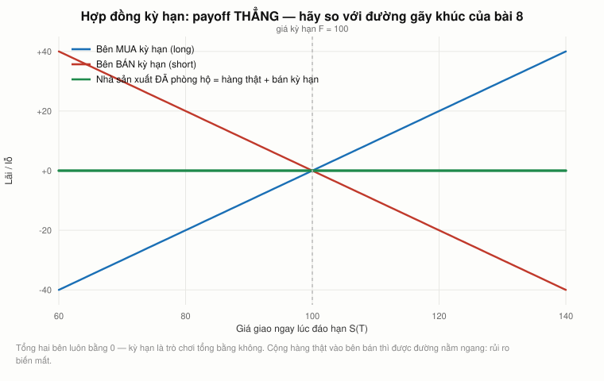

# Bài 7 — Hợp đồng kỳ hạn và hợp đồng tương lai: mua thứ chưa có, bằng tiền chưa trả

> Bài học dựng trên **toàn bộ** video **"Ses 9: Forward and Futures Contracts I"**
> (`i_pLF9J3QPE`, 78:57) và **phần đầu** video **"Ses 10: Forward and Futures Contracts II"**
> (`IwA7nVEwqto`, 79:47) — khoá **MIT 15.401 *Finance Theory I*, Fall 2008**, giảng viên
> **Prof. Andrew W. Lo**. Phụ đề gốc do người viết tay.
>
> 🕑 Mốc thời gian có tiền tố buổi: `S9 28:19` = buổi 9, phút 28:19. Mỗi mốc được đối chiếu với
> **đúng** video của nó, không gộp chung.
>
> 📚 **Mở rộng** — kiến thức video lướt qua hoặc bài học này bổ sung, **không có trong video**.
> 🇻🇳 **Góc Việt Nam** — số liệu và ví dụ trong nước (mục 22), **không có trong video**.
> ⚠️ **17 phút cuối buổi 10 là phần mở đầu về quyền chọn** (`S10 62:33` trở đi). Phần đó thuộc
> [bài 8](../README.md), không nằm ở đây.
> 📌 **Cần đọc trước:** [Bài 4](bai_04_trai_phieu_va_duong_cong.md) — **lãi suất kỳ hạn** ở mục 10
> của bài đó và **giá kỳ hạn** ở đây là **cùng một ý tưởng**, chỉ đổi tài sản.
>
> Công thức viết bằng LaTeX — mở bằng **Obsidian** hoặc VS Code + Markdown Preview Enhanced.

---

## Mục lục

<!-- MUC-LUC -->
- [1. Hai buổi giảng, hai ngày trong cơn bão](#1-hai-buổi-giảng-hai-ngày-trong-cơn-bão)
- [2. Ý tưởng tệ nhất Lo từng nghe trong cả cuộc khủng hoảng](#2-ý-tưởng-tệ-nhất-lo-từng-nghe-trong-cả-cuộc-khủng-hoảng)
- [3. Ý tưởng tỷ đô Lo tặng lớp học, và ai đã đi làm nó](#3-ý-tưởng-tỷ-đô-lo-tặng-lớp-học-và-ai-đã-đi-làm-nó)
- [4. Vì sao phải phòng hộ — bài toán của người làm máy công cụ](#4-vì-sao-phải-phòng-hộ--bài-toán-của-người-làm-máy-công-cụ)
- [5. Ba công ty vàng, ba triết lý, và kết cục của cả ba](#5-ba-công-ty-vàng-ba-triết-lý-và-kết-cục-của-cả-ba)
- [6. Bao nhiêu doanh nghiệp thật sự phòng hộ](#6-bao-nhiêu-doanh-nghiệp-thật-sự-phòng-hộ)
- [7. Hợp đồng kỳ hạn: định nghĩa, và một dòng thời gian](#7-hợp-đồng-kỳ-hạn-định-nghĩa-và-một-dòng-thời-gian)
- [8. Vì sao hợp đồng kỳ hạn có giá trị bằng 0: 40 đô và 250 đô](#8-vì-sao-hợp-đồng-kỳ-hạn-có-giá-trị-bằng-0-40-đô-và-250-đô)
- [9. Giá kỳ hạn là dự báo của thị trường](#9-giá-kỳ-hạn-là-dự-báo-của-thị-trường)
- [10. Ba đặc điểm, và con quỷ nằm ở đối tác](#10-ba-đặc-điểm-và-con-quỷ-nằm-ở-đối-tác)
- [11. Nhà máy đậu phụ — số học của việc bẻ kèo](#11-nhà-máy-đậu-phụ--số-học-của-việc-bẻ-kèo)
- [12. Hợp đồng tương lai: bốn thay đổi, và cái nào thực sự quan trọng](#12-hợp-đồng-tương-lai-bốn-thay-đổi-và-cái-nào-thực-sự-quan-trọng)
- [13. "Tính lãi suất cho đúng" nghĩa là gì](#13-tính-lãi-suất-cho-đúng-nghĩa-là-gì)
- [14. Giá tương lai không bằng giá kỳ hạn](#14-giá-tương-lai-không-bằng-giá-kỳ-hạn)
- [15. Hợp đồng NYMEX thật, và ký quỹ](#15-hợp-đồng-nymex-thật-và-ký-quỹ)
- [16. Định giá: hai cách để có dầu vào tháng 12](#16-định-giá-hai-cách-để-có-dầu-vào-tháng-12)
- [17. Vàng, xăng, và ngày công thức bị kéo đến vô cực](#17-vàng-xăng-và-ngày-công-thức-bị-kéo-đến-vô-cực)
- [18. Ngày 19/10/1987 — Lo kể gọn quá](#18-ngày-19101987--lo-kể-gọn-quá)
- [19. Phòng hộ 25 % — bảng của Lo, và bảng của năm 2026](#19-phòng-hộ-25---bảng-của-lo-và-bảng-của-năm-2026)
- [20. Đòn bẩy: Metallgesellschaft, LME nickel, và niềm tin vào nhà thanh toán bù trừ](#20-đòn-bẩy-metallgesellschaft-lme-nickel-và-niềm-tin-vào-nhà-thanh-toán-bù-trừ)
- [21. Bảng điểm dự đoán của Lo](#21-bảng-điểm-dự-đoán-của-lo)
- [22. Góc Việt Nam](#22-góc-việt-nam)
- [23. Code minh hoạ](#23-code-minh-hoạ)
- [24. Tự thử](#24-tự-thử)
- [25. Từ điển thuật ngữ](#25-từ-điển-thuật-ngữ)
- [26. Câu hỏi tự kiểm tra](#26-câu-hỏi-tự-kiểm-tra)
- [Tóm tắt một trang](#tóm-tắt-một-trang)
- [Nguồn](#nguồn)
<!-- /MUC-LUC -->

---

## 1. Hai buổi giảng, hai ngày trong cơn bão

Bài này dựng từ hai buổi cách nhau đúng một tuần. Cả hai đều **không có** ngày ghi trên video —
phải suy từ chính lời giảng.

### Buổi 9 — thứ Tư 8/10/2008

Bốn manh mối, khớp nhau:

| Manh mối trong video                                              | Đối chiếu                                                                    |
| ----------------------------------------------------------------- | ---------------------------------------------------------------------------- |
| *"Fed đang cắt lãi suất"* (`S9 01:07`)                            | Fed cắt khẩn cấp 50 điểm cơ bản, phối hợp toàn cầu, 7 giờ sáng **8/10/2008** |
| *"thị trường cổ phiếu đang giảm"* (`S9 00:00`)                    | Dow đóng cửa 8/10: **−189,01** điểm (−2,00 %)                                |
| *"tín phiếu 3 tháng tăng khoảng 60, 70 điểm cơ bản"* (`S9 00:24`) | DTB3 ngày 8/10 = **0,67 %**; đáy hoảng loạn 17/9 là **0,03 %** ⟹ **+64 bp**  |
| *"không gặp thứ Hai vì đó là Columbus Day"* (`S9 78:57`)          | Columbus Day 2008 = **thứ Hai 13/10**                                        |

### Buổi 10 — thứ Tư 15/10/2008

| Manh mối trong video                                               | Đối chiếu                                                                                                                                                     |
| ------------------------------------------------------------------ | ------------------------------------------------------------------------------------------------------------------------------------------------------------- |
| *"chúc mừng kỳ nghỉ Columbus Day"* (`S10 00:00`)                   | ngày lễ là thứ Hai 13/10 ⟹ đây là buổi đầu tiên sau lễ                                                                                                        |
| *"đã một tuần rồi"* (`S10 00:54`)                                  | đúng một tuần sau 8/10                                                                                                                                        |
| *"một ngày như thứ Sáu tuần trước, hay như thứ Hai"* (`S10 16:06`) | **10/10**: Dow dao động **1.018,77 điểm** trong phiên, VIX đóng cửa **69,95** — kỷ lục; **13/10**: Dow **+936,42** (+11,08 %), mức tăng điểm lớn nhất lịch sử |
| *"ba tuần tới, lý thuyết tài chính đi nghỉ mát"* (`S10 62:16`)     | bầu cử tổng thống **thứ Ba 4/11/2008** — đúng ba tuần                                                                                                         |

⚠️ **Một chỗ không khớp.** Cuối buổi 9 Lo nói *"hẹn gặp lại một tuần kể từ thứ Hai"* (`S9 78:57`)
— tức thứ Hai 20/10. Nhưng bốn manh mối của buổi 10 đều chỉ về **thứ Tư 15/10**. Bài này chọn
15/10 vì bốn thắng một, và ghi rõ chỗ chưa giải thích được thay vì lấp liếm.

⚠️ **Điều Lo không nhắc.** Chiều 15/10/2008, Dow rơi **733,08 điểm (−7,87 %)** — mức giảm điểm
lớn thứ hai trong lịch sử tính đến khi đó. Ông mở lớp bằng *"thị trường cổ phiếu chắc chắn đã có
một kỳ nghỉ vui"* (`S10 00:25`), nhắc về đợt tăng hôm thứ Hai. Cú rơi tăng tốc trong 90 phút cuối
phiên; nhiều khả năng lớp học đã tan trước đó.

⚠️ Ở `S10 75:59` Lo nói *"thứ Hai vừa rồi S&P tăng 1.000 điểm"*. Ông đang nói về **Dow**, và con số
thật là **936,42**. S&P 500 hôm đó tăng 104,13 điểm.

Bối cảnh ba buổi trước: [bài 5](bai_05_duration_va_chung_khoan_hoa.md) (24/9 và 29/9) và
[bài 6](bai_06_co_phieu_va_tang_truong.md) (1/10).

---

## 2. Ý tưởng tệ nhất Lo từng nghe trong cả cuộc khủng hoảng

Buổi 9 mở đầu bằng một câu hỏi từ dưới lớp (`S9 06:16`):

> *"Nói về minh bạch — tại sao các ngân hàng lại vận động để bỏ ghi nhận theo giá thị trường?"*

Lo trả lời không vòng vo (`S9 06:28`):

> *"Ý tưởng một số ngân hàng đề xuất — tạm đình chỉ ghi nhận theo giá thị trường — có lẽ là **ý
> tưởng tệ nhất tôi từng nghe trong cả cuộc khủng hoảng này**."*

Rồi ông dựng một phép ẩn dụ (`S9 06:49`):

> *"Không ghi nhận theo giá thị trường giống như trong một rạp hát đông người, bạn ngửi thấy khói
> và nhìn thấy lửa trên sân khấu — mà thay vì để mọi người ra ngoài, bạn bảo tất cả **ngồi xuống,
> thư giãn, hít thở sâu**, để chúng tôi suy nghĩ thêm nửa tiếng nữa rồi sẽ quyết."*

### Vì sao ông phản ứng dữ vậy

Vì cả khoá học này chỉ có một định nghĩa về giá, và ông kéo nó ra ngay tại chỗ (`S9 08:11`):

> *"Cái gì quyết định giá trị của một chứng khoán? Chính xác — **thị trường**. Giá là con số mà
> **hai người trưởng thành tự nguyện** đồng ý giao dịch. Nếu bạn không tìm được hai người trưởng
> thành tự nguyện đồng ý giao dịch, bạn có thể nghĩ ra đủ loại con số rất thú vị, **nhưng đó không
> phải giá**."*

Đây đúng là câu ông nói ngày đầu tiên của khoá ([bài 1](bai_01_tai_chinh_la_gi.md)). Bỏ ghi nhận
theo giá thị trường không làm tài sản đáng giá hơn; nó chỉ **xoá mất cái duy nhất có thể kiểm
chứng được**.

Có sinh viên hỏi tiếp về việc SEC vừa cho phép doanh nghiệp *"dùng phán đoán của mình"*
(`S9 07:29`). Lo (`S9 07:44`):

> *"SEC muốn nói gì thì nói. Vấn đề cốt lõi là: **có thị trường nào cho các chứng khoán này ở mức
> giá các công ty đó đưa ra không?** Tôi có thể nghĩ ý tưởng của mình là đáng giá nhất thế giới.
> Điều đó không làm nó thành thật."*

### Chuyện đã xảy ra sau đó

Lo không biết kết cục. Đây là kết cục:

| Ngày           | Việc                                                                                                                                                                                            |
| -------------- | ----------------------------------------------------------------------------------------------------------------------------------------------------------------------------------------------- |
| **3/10/2008**  | Đạo luật EESA (gói TARP) — **Điều 132** trao SEC thẩm quyền đình chỉ chuẩn mực giá trị hợp lý; **Điều 133** buộc SEC nghiên cứu và báo cáo Quốc hội trong 90 ngày                               |
| **29/10/2008** | SEC tổ chức bàn tròn với tổ chức phát hành, nhà đầu tư, kiểm toán, giới chuẩn mực                                                                                                               |
| **30/12/2008** | SEC nộp báo cáo: **khuyến nghị KHÔNG đình chỉ**, thay vào đó cải thiện cách áp dụng và hướng dẫn định giá trong thị trường kém thanh khoản                                                      |
| **9/4/2009**   | FASB ban hành **FSP FAS 157-4** — dưới sức ép từ Quốc hội. Cho phép kết luận rằng khi khối lượng giao dịch sụt mạnh so với bình thường, giá niêm yết **có thể không quyết định** giá trị hợp lý |

Nên đọc kết cục này cho đúng. **Lo thắng vòng một, thua nửa vòng hai.** SEC không đình chỉ —
đúng như ông muốn. Nhưng bốn tháng sau, FASB nới cách áp dụng, và mùa xuân 2009 các ngân hàng Mỹ
bắt đầu báo lãi trở lại. FSP 157-4 **không** bỏ nguyên tắc: nó vẫn khẳng định giá trị hợp lý là
giá **hiện tại theo thị trường**, không phải giá giả định. Nhưng nó chuyển rất nhiều thứ sang
**phán đoán** — đúng chỗ Lo cảnh báo ở `S9 07:44`.

---

## 3. Ý tưởng tỷ đô Lo tặng lớp học, và ai đã đi làm nó

Trước đó vài phút, một sinh viên người Argentina kể chuyện nước mình năm 2002 — *"năm tổng thống
trong một tuần, chính phủ vỡ nợ, một nửa công ty đại chúng vỡ nợ"* (`S9 02:43`) — rồi nói khủng
hoảng tạo ra cơ hội. Lo đồng ý, và tặng lớp một ý tưởng (`S9 04:47`):

> *"Chẳng phải sẽ tuyệt vời sao nếu có một website **chỉ làm mỗi việc đăng giá các giao dịch** của
> những chứng khoán này theo thời gian? Chúng ta không có sàn giao dịch có tổ chức. Vậy nên đó là
> ý tưởng: **tạo một cái eBay cho CDO**."*

Ông nói thêm (`S9 05:24`): *"tôi cam đoan với các bạn, nếu là người đầu tiên ra thị trường với một
sáng kiến kiểu này, tôi đoán đó là **ý tưởng trị giá một tỷ đô**"*, và (`S9 05:55`) *"phần lớn thị
trường đó hiện vẫn là **giấy và bút chì**, khá lạc hậu về mặt công nghệ."*

### Ý tưởng đó đã được làm — nhưng không phải bởi một startup

| Việc Lo mong             | Chuyện thật                                                                                                                                                              |
| ------------------------ | ------------------------------------------------------------------------------------------------------------------------------------------------------------------------ |
| Sàn có tổ chức cho CDS   | **ICE Trust** bắt đầu bù trừ CDS chỉ số ngày **9/3/2009** — **năm tháng** sau buổi giảng. Ba tuần đầu: 399 giao dịch, **45 tỷ đô** danh nghĩa. Năm đầu: **4.300 tỷ đô**  |
| Công khai giá giao dịch  | Dodd-Frank (2010) buộc báo cáo mọi giao dịch phái sinh về **kho dữ liệu hoán đổi (SDR)**; bắt buộc bù trừ tập trung với CDS chỉ số và hoán đổi lãi suất từ **10/6/2013** |
| Người đầu tiên thắng lớn | Không phải startup. Là **ICE** — một sàn giao dịch đã tồn tại — mua lại The Clearing Corporation ngày 6/3/2009 để lấy hạ tầng                                            |

**Điều đáng học không phải Lo dự đoán đúng hay sai — mà là ai thực hiện.** Ông hình dung một
doanh nhân MIT. Thứ đến thật là **quy định pháp luật cộng một sàn giao dịch sẵn có**. Minh bạch
cho thị trường 60.000 tỷ đô không đến từ một website; nó đến từ một đạo luật.

Chi tiết về CDS và CDO: [bài 5, mục 17–20](bai_05_duration_va_chung_khoan_hoa.md).

---

## 4. Vì sao phải phòng hộ — bài toán của người làm máy công cụ

Lo mở phần bài giảng chính bằng một tình huống (`S9 09:31`):

> *"Công ty bạn đặt tại Mỹ, cung cấp máy công cụ cho khách ở Đức và Brazil. Giá niêm yết bằng đồng
> tiền của từng nước, nên biến động euro, đô la và real ảnh hưởng lớn tới doanh thu. Làm sao giảm
> hoặc **phòng hộ** rủi ro đó?"*

Rồi ông chốt cái ý thật (`S9 10:04`):

> *"Bạn **không phải** công ty dự báo tỷ giá. Cái bạn muốn là **loại bỏ** thứ bất định đó đi, hoặc
> ít nhất giảm nó tới mức không phải nghĩ tới nữa."*

Ông chiếu doanh thu **Caterpillar 1980–1989** (`S9 11:36`) — cùng một chuỗi doanh thu, quy đổi
sang đô la Mỹ so với để nguyên nội tệ, ra hai đường khác hẳn nhau. ⚠️ Bài này **không xác minh
được** bảng số đó; nó là slide trong lớp, không có trong phụ đề.

### Bốn cách phòng hộ Lo liệt kê (`S9 13:03`)

1. **Phái sinh** — kỳ hạn, tương lai, quyền chọn, hoán đổi (ba buổi tới)
2. **Bảo hiểm**
3. **Đa dạng hoá**
4. **Ghép kỳ hạn tài sản với nợ**, hoặc ghép doanh thu với chi phí theo từng nước

Điểm 4 ông giải thích hay (`S9 13:23`): *"đó là một trong những lý do các công ty đặt nhà máy ở
nước họ làm ăn nhiều — đây là **phòng hộ tự nhiên**, vì họ tạo ra chi phí lẫn doanh thu bằng cùng
một đồng tiền, nên chúng tự triệt tiêu."* Nhưng (`S9 13:53`) *"bạn không phải lúc nào cũng làm
được, và chắc chắn không làm nhanh được."*

### Uranium-238

Có hai quan điểm về phái sinh, và Lo nói **cả hai đều đúng** (`S9 14:33`):

> *"Một cực: phái sinh là công cụ cực kỳ hiệu quả để quản trị rủi ro. Cực kia, do chính **Warren
> Buffett** phát biểu: phái sinh là **vũ khí huỷ diệt hàng loạt của tài chính**. Và sự thật là
> **cả hai**. Từ uranium-238 bạn có thể làm nhà máy điện hạt nhân... hoặc một quả bom bẩn. Bản
> thân công nghệ **không** tốt cũng không xấu. Vấn đề là bạn dùng nó thế nào."*

Ông thêm (`S9 15:17`): *"đây không phải thứ nên tự thử ở nhà, trừ khi bạn là người chuyên nghiệp."*

---

## 5. Ba công ty vàng, ba triết lý, và kết cục của cả ba

Đây là đoạn hay nhất buổi 9, và cũng là đoạn thời gian đã phán xử xong.

Lo đặt câu hỏi: doanh nghiệp **có nên** phòng hộ không? Hai lập luận đối nghịch:

**Không nên** (`S9 15:32`): nếu cổ đông tiếp cận thị trường tự do, *"bất cứ điều gì bạn làm được,
họ cũng làm được"*. Nhà đầu tư muốn bạn tập trung vào việc kinh doanh.

**Nên** (`S9 16:41`): phòng hộ giảm bất định dòng tiền, giữ công ty tập trung vào năng lực lõi, và
**giảm xác suất rơi vào kiệt quệ tài chính** — mà chi phí kiệt quệ thì không thu hồi được, kể cả
qua thủ tục phá sản.

Rồi ông đưa **ba công ty vàng có thật, ba chính sách khác nhau**:

| Công ty                  | Chính sách (`S9 17:17`–`S9 19:35`)                   | Lý lẽ                                                                                                                                                                     |
| ------------------------ | ---------------------------------------------------- | ------------------------------------------------------------------------------------------------------------------------------------------------------------------------- |
| **Homestake Mining**     | **không phòng hộ**, ghi thẳng vào chính sách công ty | *"cổ đông hưởng lợi tối đa từ chính sách không phòng hộ"* — nếu không chịu được nóng thì ra khỏi bếp; muốn hết biến động thì đừng mua công ty vàng, bỏ tiền vào tín phiếu |
| **American Barrick**     | **phòng hộ sản lượng đầu ra**                        | mang lại **ổn định tài chính**; giá vàng biến động vì dòng tiền tránh bão vào rồi ra, và *"cổ đông thích lợi nhuận ổn định"*                                              |
| **Battle Mountain Gold** | phòng hộ **tới 25 %**                                | *"một nghiên cứu gần đây cho thấy có thể có phần bù cho việc phòng hộ. Nhưng họ không chắc lắm, nên đi nửa đường"*                                                        |

Lo kết: *"không rõ đáp án là gì"* (`S9 19:35`).

### Đáp án có, chỉ là Lo chưa thể biết năm 2008

**Không một công ty nào trong ba còn tồn tại độc lập khi Lo giảng bài này.**

| Công ty                             | Kết cục                                                | Thời điểm             |
| ----------------------------------- | ------------------------------------------------------ | --------------------- |
| Homestake Mining                    | bị **Barrick Gold** mua, **2,3 tỷ đô** bằng cổ phiếu   | **12/2001**           |
| Battle Mountain Gold                | sáp nhập vào **Newmont**, giá trị vốn **542 triệu đô** | công bố **22/6/2000** |
| American Barrick → **Barrick Gold** | vẫn tồn tại — nhưng **xoá sạch sổ phòng hộ**           | **9–12/2009**         |

Và cú kết đáng giá nhất là của Barrick. Ngày **8/9/2009**, Barrick công bố phát hành **3 tỷ đô**
cổ phiếu, dùng **1,9 tỷ** để đóng toàn bộ hợp đồng vàng giá cố định và **1 tỷ** để đóng một phần
hợp đồng thả nổi. Khoản ghi giảm lợi nhuận: **5,6 tỷ đô** trong quý 3. Cả năm 2009 Barrick lỗ
ròng **4,3 tỷ đô**. Giá bình quân đóng sổ: khoảng **1.070 đô/ounce**.

**Công ty phòng hộ hăng nhất trong danh sách của Lo cuối cùng đã đầu hàng, và trả 5,6 tỷ đô cho
đặc quyền được thôi phòng hộ.** Lý do Barrick nêu: họ ngày càng tin giá vàng sẽ tăng — tức chính
xác là **cái dự báo giá mà ở `S9 17:56` Lo bảo công ty vàng không nên làm**.

### Và một công ty nữa, do sinh viên nêu

Ở `S9 34:03` một sinh viên hỏi về **Southwest Airlines** — hãng nổi tiếng phòng hộ nhiên liệu
trong khi các hãng khác thì không. Lo trả lời không có giới hạn pháp lý nào.

Chuyện sau đó: chương trình phòng hộ của Southwest tiết kiệm **1,3 tỷ đô năm 2008** (chính năm
Lo giảng) và **1,2 tỷ đô năm 2022** sau khi Nga tấn công Ukraine. Chi phí duy trì khoảng
**150 triệu đô/năm**, phòng hộ khoảng **một nửa** lượng nhiên liệu tiêu thụ. Tháng **3/2025**,
CEO Bob Jordan tuyên bố **chấm dứt** chương trình; quý 2/2025 Southwest tất toán nốt danh mục vốn
chạy tới 2027. Southwest là **hãng lớn cuối cùng của Mỹ** bỏ phòng hộ nhiên liệu — American, United
và Delta đã bỏ từ khoảng một thập kỷ trước.

**Cả hai đầu của cuộc tranh luận đều đã đầu hàng.** Barrick bỏ phòng hộ vì tin giá sẽ tăng;
Southwest bỏ phòng hộ vì thấy 15 năm qua không đáng tiền. Cuộc tranh luận Lo trình bày như còn để
ngỏ, thực tế đã kết thúc — theo hướng **không phòng hộ**, ở cả hai ngành.

---

## 6. Bao nhiêu doanh nghiệp thật sự phòng hộ

Lo trích một nghiên cứu (`S9 20:23`):

> *"Guay và Kothari — S.P. Kothari là giảng viên nhóm kế toán của trường, đang nghỉ phép — công bố
> một bài cách đây khoảng năm năm, lấy mẫu ngẫu nhiên **413 công ty lớn** với dòng tiền bình quân
> khoảng **700 triệu đô**. **57 %** số đó dùng phái sinh năm **1997**."*

✅ **Các con số của Lo khớp.** Bài báo: Guay, W. và Kothari, S.P., *"How Much Do Firms Hedge with
Derivatives?"*, **Journal of Financial Economics 70(3), 12/2003, tr. 423–461** — đúng "khoảng năm
năm" trước 10/2008. Mẫu công bố trong bài là **234 công ty phi tài chính lớn có dùng phái sinh**;
$413 \times 57\% = 235$. Hai con số là hai mặt của cùng một mẫu.

Lo dự đoán (`S9 21:08`): *"nếu khảo sát lại hôm nay, tôi đoán con số 57 % đã tăng lên khá nhiều.
Nhưng tôi không biết chắc."*

📚 **Điều đáng chú ý hơn mà Lo không nhắc**, và chính là kết luận của bài báo: với công ty trung
vị trong mẫu, **toàn bộ danh mục phái sinh** chỉ tạo ra tối đa **15 triệu đô** dòng tiền hiện tại
nếu lãi suất, tỷ giá và giá hàng hoá **cùng lúc** biến động ba độ lệch chuẩn. Công ty trung vị nắm
phái sinh lãi suất hoặc tỷ giá chỉ bằng **3–6 %** tổng mức phơi nhiễm tương ứng.

Nói cách khác: **rất nhiều công ty dùng phái sinh, nhưng dùng rất ít.** Phòng hộ doanh nghiệp
trên thực tế là một lớp sơn mỏng, không phải bức tường.

---

## 7. Hợp đồng kỳ hạn: định nghĩa, và một dòng thời gian

Lo định nghĩa (`S9 24:50`):

> *"Hợp đồng kỳ hạn là **cam kết mua**, vào một ngày trong tương lai, một lượng nhất định hàng hoá
> hoặc tài sản, ở **mức giá thoả thuận hôm nay**."*

Ba thứ phải ghi trong hợp đồng (`S9 23:16`): **mua bán cái gì**, **ở giá nào**, **vào lúc nào**.

Quy ước (`S9 25:34`):

- Giá thoả thuận hôm nay gọi là **giá kỳ hạn** (nếu tài sản là khoản vay thì gọi là **lãi suất kỳ
  hạn** — chính là thứ ở [bài 4, mục 10](bai_04_trai_phieu_va_duong_cong.md))
- Bên **mua** gọi là **trường vị** (long)
- Bên **bán** gọi là **đoản vị** (short)

Lo tự vặn lại chính mình (`S9 26:34`):

> *"Chỗ mập mờ là hợp đồng kỳ hạn **không có giá trị gì** vào ngày ký. Nói bên này trường bên kia
> đoản nghe hơi kỳ, vì giá trị hợp đồng lúc ký là **không**. Bạn trường số không, hay đoản số
> không — ai quan tâm?"*

Rồi giải thích tên gọi (`S9 27:08`): ngày mai, nếu **giá giao ngay** tăng, người đã cam kết mua ở
giá cũ có lãi; người bán lỗ. *"Giá lên thì vị thế trường có lãi, vị thế đoản lỗ. Đó là lý do dùng
cách chuẩn hoá ấy."*

Ngay chỗ này Lo bắt lấy một nhầm lẫn rất dễ mắc (`S9 27:46`):

> *"Cái giá tôi đang nói lên hay xuống **không phải giá kỳ hạn**. Nó là giá... xin lỗi, nó là
> **giá giao ngay trong tương lai**."*

Ông tự sửa giữa câu. Đây là **hai giá khác nhau** và cả bài này phụ thuộc vào việc phân biệt được
chúng:

| Ký hiệu   | Tên               | Là gì                                                                                                  |
| --------- | ----------------- | ------------------------------------------------------------------------------------------------------ |
| $S_t$     | **giá giao ngay** | giá mua ngay bây giờ, giao ngay bây giờ                                                                |
| $F_{t,T}$ | **giá kỳ hạn**    | giá thoả thuận hôm nay ($t$) cho việc giao hàng vào ngày $T$                                           |
| $H_{t,T}$ | **giá tương lai** | như trên, nhưng cho hợp đồng tương lai — sẽ khác ở [mục 14](#14-giá-tương-lai-không-bằng-giá-kỳ-hạn) |

Chú ý cả $F$ và $H$ đều có **hai chỉ số dưới** (`S10 23:59`): ngày định giá và ngày tất toán. Đó
là chỗ chúng phức tạp hơn cổ phiếu — cổ phiếu không có ngày tất toán.

Và **hợp đồng kỳ hạn khác quyền chọn** (`S9 24:29`): ký rồi thì **bắt buộc** phải thực hiện. Quyền
chọn cho bạn *"quyền, chứ không phải nghĩa vụ"* — đó là bài 8.

---

## 8. Vì sao hợp đồng kỳ hạn có giá trị bằng 0: 40 đô và 250 đô



*Payoff kỳ hạn là đường THẲNG. Hãy nhớ hình này khi sang bài 8 gặp đường gãy khúc.*

Đây là lập luận trung tâm của cả buổi, và Lo dựng nó cực gọn (`S9 28:19`).

Giả sử dầu giao ngay **100 đô/thùng**. Ta ký hợp đồng mua dầu sau sáu tháng ở **110 đô**.

> *"Khi ta đã đồng ý hợp đồng đó, giá trị của thoả thuận là **không**. Nó **phải** bằng không. Vì
> nếu không bằng không thì tôi thua bạn thắng, hoặc bạn thua tôi thắng. Nên ta sẽ **không ký**."*

Rồi hai phản ví dụ:

**Ví dụ 1 (`S9 28:57`):** *"Giả sử tôi đề nghị mua dầu của bạn sau sáu tháng ở **40 đô/thùng**.
Đó là hợp đồng hợp pháp. Bao nhiêu người ở đây đồng ý hôm nay? Không ai."*

**Ví dụ 2 (`S9 30:26`):** *"Ngược lại, giả sử tờ giấy ghi tôi sẽ mua dầu ở **250 đô/thùng** sau
sáu tháng. Tôi ngờ là tất cả các bạn sẽ **rất vui lòng** bán cho tôi hợp đồng kỳ hạn đó. Tôi sẽ
không làm thế, vì nó nực cười."*

**Kết luận (`S9 30:57`):** *"Ta mặc cả cho tới khi đạt một mức giá mà cả hai đều thấy công bằng.
Khi đạt tới mức đó, **giá trị hiện tại của hợp đồng bằng không**."*

Mục 1 của [code](#23-code-minh-hoạ) tính NPV của cả bốn mức giá và cho thấy chỉ **một** mức làm
NPV = 0:

$$F_{0,T} = S_0 (1+r)^T$$

Với $S_0 = 100$, $r = 5\%$, $T = 0{,}5$: $F = 102{,}47$ đô.

⚠️ **Lo dùng 110 đô làm ví dụ trong bài, nhưng 110 đô KHÔNG phải giá cân bằng** ở mức lãi suất
5 %. NPV với bên mua là **−7,35 đô/thùng**. Ông biết điều đó — ở `S9 34:42` ông trả lời câu hỏi
"giá kỳ hạn có phải luôn cao hơn giá hiện tại không?" bằng *"không, không nhất thiết"*. Con số 110
là số minh hoạ, không phải kết quả tính. Bài này ghi rõ để bạn đừng học thuộc nó như một quan hệ.

### Không cần cầu nguyện ai cũng thành thật

Ở `S9 44:22` Lo đóng đinh lập luận bằng một câu tuyệt vời:

> *"Bạn có bao giờ thấy hợp đồng ở 200 đô/thùng không? Không, vì như thế nghĩa là **một trong hai
> chúng ta đang rất ngu**. Mà chúng ta hoàn toàn được phép ngu — **Hiến pháp bảo đảm quyền đó**."*

---

## 9. Giá kỳ hạn là dự báo của thị trường

Có sinh viên hỏi giá kỳ hạn có luôn cao hơn giá giao ngay không. Lo dùng câu hỏi đó để mở ra ý
lớn (`S9 35:28`):

> *"Nó cho bạn biết **thị trường đang cung cấp thông tin về tương lai**. Dự báo giá tương lai nằm
> **ẩn** trong các giá kỳ hạn này. Đúng y như khi ta nhìn đường cong lãi suất và thấy các lãi suất
> kỳ hạn ẩn cho việc vay mượn trong tương lai."*

Đây là **cùng một cấu trúc** đã học ở [bài 4, mục 10–12](bai_04_trai_phieu_va_duong_cong.md).
Ở đó, giá của hai trái phiếu khác kỳ hạn hàm ý một lãi suất tương lai. Ở đây, giá giao ngay và giá
kỳ hạn của dầu hàm ý một kỳ vọng về giá dầu. **Cùng một phép trừ, đổi tài sản.**

Ví dụ Lo đưa (`S9 36:04`): *"nếu bạn thấy giá kỳ hạn của dầu là 90 đô trong khi hôm nay là 100, thì
hoặc người ta kỳ vọng sẽ tìm được nhiều dầu trong sáu tháng tới, hoặc có dự báo nhu cầu sẽ sụt
mạnh."*

⚠️ Nhưng bài 4 cũng đã dạy điều Lo không nhắc lại ở đây: **lãi suất kỳ hạn là dự báo tệ**. Đo lại
bằng dữ liệu thật, sai số bình quân của dự báo lãi suất kỳ hạn là **113 điểm cơ bản**
([bài 4, mục 11](bai_04_trai_phieu_va_duong_cong.md)). Không có lý do tin giá dầu kỳ hạn khá hơn.
Giá kỳ hạn nói cho bạn biết **thị trường đang nghĩ gì**, không phải **điều gì sẽ xảy ra**.

---

## 10. Ba đặc điểm, và con quỷ nằm ở đối tác

Lo liệt kê (`S9 36:18`) ba đặc điểm của hợp đồng kỳ hạn:

1. **May đo riêng** — thoả thuận giữa hai bên cụ thể, không phải cổ phiếu IBM ai mua cũng như nhau
2. **Không chuẩn hoá** — muốn nhiều bao nhiêu, ít bao nhiêu cũng được
3. **Không giao dịch trên sàn** — gọi là chứng khoán **phi tập trung** (OTC), *"hai người giao
   dịch với nhau qua một cái quầy"*

Rồi đặc điểm thứ tư, cái quan trọng nhất (`S9 45:59`):

> *"Vì đây là hợp đồng giữa hai bên, có **rủi ro đối tác** đáng kể — tức là có rủi ro bạn không
> thanh toán phần của bạn, hoặc tôi không thanh toán phần của tôi."*

Rồi một câu chua chát rất 2008 (`S9 46:17`):

> *"Nếu bạn giao dịch với — tôi ghét phải nói câu này — nhưng với một đối tác **AAA**, thì rủi ro
> phải là nhỏ. **Nhưng giờ ta đều biết AAA nghĩa là gì rồi.**"*

Đây chính là bài 5 vọng lại: [cỗ máy tạo AAA](bai_05_duration_va_chung_khoan_hoa.md) và giá trị
thật của một chữ xếp hạng.

Và hai vấn đề của hợp đồng kỳ hạn, do chính sinh viên chỉ ra (`S9 48:57`):

| Vấn đề              | Nội dung                                                                                                                                                                         |
| ------------------- | -------------------------------------------------------------------------------------------------------------------------------------------------------------------------------- |
| **Kém thanh khoản** | *"Tôi không muốn ở trong hợp đồng nữa — nhưng thoát ra không dễ. Tôi không bán được hợp đồng trừ khi tìm được người khác muốn mua đậu nành ở 165 đô sau ba tháng."* (`S9 49:12`) |
| **Rủi ro đối tác**  | không có ai đứng giữa                                                                                                                                                            |

Lo mô tả nốt cái bẫy (`S9 49:31`): *"Tôi có thể quay lại tìm người nông dân và hỏi, anh có phiền
huỷ hợp đồng không? Họ sẽ nói: còn tuỳ, hôm nay giá đậu nành bao nhiêu? Nếu 180 đô, tôi vui lòng
huỷ. Nếu 50 đô — xin lỗi, anh bị kẹt với thoả thuận rồi."*

---

## 11. Nhà máy đậu phụ — số học của việc bẻ kèo

Đây là ví dụ Lo dựng công phu nhất, và là ví dụ bài học này sẽ đem về Việt Nam ở [mục 22](#22-góc-việt-nam).

**Bối cảnh (`S9 47:57`):** đậu nành giao ngay **160 đô/tấn**. Một nhà máy đậu phụ cần **1.000 tấn**
sau ba tháng. Họ ký hợp đồng kỳ hạn mua 1.000 tấn ở **165 đô/tấn** — trả người nông dân **5 đô**
phần bù để chốt giá.

**Rồi một tháng trôi qua (`S9 51:48`):** thời tiết đẹp bất thường, mùa bội thu, giá giao ngay rơi
xuống **100 đô/tấn**.

Lo hỏi lớp: nhà máy đậu phụ ở tình thế tốt hơn, xấu hơn, hay như cũ? Lớp trả lời "như cũ" — anh ta
đã tự nguyện ký mà. Lo bác (`S9 53:19`), qua chính câu trả lời của một sinh viên:

> *"Đúng. **Đối thủ của anh ta sẽ hạ giá đậu phụ.** Đậu nành rẻ đi rồi. Còn anh này thì trả 165 đô
> cho thứ đáng 100 đô. Về cơ bản anh ta sẽ **phá sản**, vì đối thủ sẽ ăn hết phần của anh ta. Họ
> sẽ bán rẻ hơn 40 %, và anh ta còn **thị phần bằng không**."*

**Đây là ý sâu nhất của cả buổi giảng, và Lo lướt qua rất nhanh.** Phòng hộ không diễn ra trong
chân không. Nếu **đối thủ của bạn không phòng hộ**, thì việc bạn phòng hộ vừa loại bỏ rủi ro giá
đầu vào **vừa tạo ra một rủi ro mới**: rủi ro **cạnh tranh tương đối**. Trong ngành mà giá đầu vào
được chuyển hết sang giá bán, **không phòng hộ mới là vị thế trung lập**; phòng hộ mới là đánh
bạc. Đây chính xác là lập luận của Homestake Mining ở [mục 5](#5-ba-công-ty-vàng-ba-triết-lý-và-kết-cục-của-cả-ba), đặt vào ngành thực phẩm.

**Và thế là (`S9 53:49`):** nhà máy đậu phụ tính toán — *"tôi có thể mua đậu nành ở 100 đô ngoài
thị trường ngay bây giờ, và tôi còn hai tháng... nếu tôi cứ **bỏ đi** khỏi thoả thuận kỳ hạn này
thì sao?"*

> *"Về mặt pháp lý anh ta không được làm thế. Nghĩa là nếu làm, anh ta có thể bị kiện. Và từ góc
> nhìn của anh ta: **họ kiện tôi rồi tính tiếp, hoặc tôi thực hiện hợp đồng và phá sản**. Nếu chỉ
> có hai lựa chọn đó, tôi sẽ bẻ kèo và để họ kiện."* (`S9 54:08`)

Rồi Lo lật sang phía người nông dân (`S9 54:58`): *"bạn đang xoa tay vì chốt được 165 đô/tấn. Đến
lúc giao hàng, bạn phát hiện kho **không nhận hàng**. Và bạn **không gọi được** cho nhà máy đậu
phụ. Anh ta không bắt máy."*

### Số học của tiền đặt cọc

Một sinh viên đề xuất giải pháp: tiền cọc (`S9 55:47`). Lo cho tính luôn (`S9 56:29`):

|                                           |                                     |
| ----------------------------------------- | ----------------------------------- |
| Giá trị hợp đồng                          | 165 đô × 1.000 tấn = **165.000 đô** |
| Cọc "nghe có vẻ hợp lý"                   | **5 đô/tấn** = 5.000 đô             |
| Giá rơi về 100 đô ⟹ thiệt hại của bên mua | **65 đô/tấn**                       |
| Bên mua bỏ cọc, vẫn lãi                   | **60 đô/tấn**                       |

Lo, đóng vai người nông dân (`S9 57:13`): *"Tuyệt, tôi được 5 đô/tấn. Số đó làm được gì? **Nó trả
tiền tem thư cho tôi.** Nó chẳng làm được gì cả."*

Nên người nông dân đòi cọc **160 đô/tấn** (`S9 57:26`). Và Lo hỏi lại sinh viên: bạn có chịu
không? Câu trả lời (`S9 57:57`): *"Nói chung bạn sẽ **không muốn khoá 160 đô/tấn suốt ba tháng**
nếu không cần thiết, vì nó tốn kém. **Chi phí cơ hội chính là lãi suất.**"*

Và đây là chỗ cả bài giảng khoá lại: **hợp đồng kỳ hạn đặt bạn vào một tình thế không có lối
ra tốt.** Cọc ít thì vô nghĩa; cọc nhiều thì mất chi phí vốn. *"Chẳng lẽ không có cách nào đơn
giản hơn?"* (`S9 59:36`)

---

## 12. Hợp đồng tương lai: bốn thay đổi, và cái nào thực sự quan trọng

Lo trả lời chính mình (`S9 59:36`):

> *"Có cách xử lý **tất cả** các phản đối của các bạn — **tất cả**. Hãy tạo ra một hợp đồng mới,
> gọi là **hợp đồng tương lai**. Hợp đồng tương lai giống hệt hợp đồng kỳ hạn, trừ vài ngoại lệ."*

| #   | Thay đổi                                                                                                                   | Chữa được vấn đề gì                                                |
| --- | -------------------------------------------------------------------------------------------------------------------------- | ------------------------------------------------------------------ |
| 1   | **Chuẩn hoá** — mỗi hợp đồng ứng với một lượng cố định, chất lượng cố định, biết trước và xác định khách quan (`S9 59:55`) | kém thanh khoản: hợp đồng của bạn giống hệt hợp đồng của mọi người |
| 2   | **Ngày tất toán cố định**, **giá xác định trên sàn** (`S9 60:21`)                                                          | không cần đi tìm đối tác                                           |
| 3 | **Ghi nhận theo giá thị trường mỗi ngày** (`S9 60:21`) | rủi ro đối tác |
| 4   | **Có trung gian**: Công ty Thanh toán bù trừ Hợp đồng tương lai (`S9 69:17`)                                               | rủi ro đối tác, lần hai                                            |

### Thay đổi số 3 mới là phát minh thật

Lo dựng nó bằng chính ví dụ đậu nành (`S9 64:28`):

> *"Vậy thì hãy thoả thuận thế này. **Tại sao chúng ta không đồng ý rằng mỗi ngày, ta ký một hợp
> đồng mới với một giá kỳ hạn mới, rồi chỉ trả cho nhau phần chênh lệch, ngày qua ngày?**"*

Cụ thể (`S9 64:53`): hôm nay 165 đô, giao ngay 160. Mai giao ngay xuống 155. *"Tôi trả bạn 5 đô
chia cho lãi suất của ba tháng trừ một ngày, rồi **ta huỷ hợp đồng cũ và bắt đầu một cái mới** ở
160 đô."*

Ông thừa nhận nó phiền (`S9 65:15`): *"trước hết, nó sẽ rất **nhức đầu**, vì phải làm rất nhiều
hợp đồng mỗi ngày."*

Nhưng kết quả (`S9 66:16`):

> *"Nếu làm thế mỗi ngày, cái ta đang làm về bản chất là **luôn luôn tìm ra giá thị trường của
> ngày hôm nay** cho việc giao đậu nành vào ngày tất toán đó. **Đó chính là ghi nhận theo giá thị
> trường.**"*

Và tại sao nó chữa được rủi ro đối tác (`S9 67:01`):

> *"Rủi ro duy nhất tôi còn với bạn là rủi ro của **một ngày biến động**, không phải ba tháng. Giá
> có thể chạy rất nhiều trong ba tháng."*

Ghép mục 2 với mục 12 lại thì thấy Lo đang nói **cùng một điều hai lần trong một buổi**: **ghi
nhận theo giá thị trường mỗi ngày là thứ giữ cho hệ thống không nổ.** Đầu buổi ông giận vì ngân
hàng muốn bỏ nó; cuối buổi ông chỉ ra nó chính là phát minh làm nên thị trường tương lai. Đó không
phải trùng hợp — đó là cấu trúc của buổi giảng.

### Nhà thanh toán bù trừ

Lo mô tả (`S9 69:38`): *"một tổ chức **ngồi giữa** bạn và tôi, đơn giản là đóng vai đối tác. Tôi
không giao dịch với bạn, hay bạn, hay bạn. Tôi giao dịch với **một tổ chức đứng giữa tất cả**."*

Ở `S10 18:03` một sinh viên hỏi nhà thanh toán bù trừ **kiếm tiền thế nào**. Lo (`S10 18:21`):
*"việc của họ thực ra không phải kiếm tiền, mà là **tạo ra một sàn giao dịch cho các thành viên**.
Nhiều sàn là tổ chức phi lợi nhuận... trong một số trường hợp, chính các thành viên **sở hữu** nhà
thanh toán bù trừ."*

⚠️ Câu này đúng năm 2008 nhưng đã lỗi. **CME Group, ICE và Nasdaq đều là công ty đại chúng niêm
yết vì lợi nhuận.** Mô hình sở hữu bởi thành viên đã gần như biến mất ở Mỹ. Điều này quan trọng
hơn nghe qua — [mục 20](#20-đòn-bẩy-metallgesellschaft-lme-nickel-và-niềm-tin-vào-nhà-thanh-toán-bù-trừ) cho thấy vì sao.

---

## 13. "Tính lãi suất cho đúng" nghĩa là gì

Ở `S9 67:42` Lo đưa ra một khẳng định lớn rồi bỏ đi không chứng minh:

> *"Khi bạn cộng hết tiền đã đổi tay trong suốt ba tháng — nếu ta ký một hợp đồng kỳ hạn mới mỗi
> ngày, cộng hết tiền qua lại **và tính lãi suất cho đúng** — bạn biết sẽ được gì không? Về cơ bản
> ta sẽ được **đúng cái mà một hợp đồng kỳ hạn ký ngày đầu, giữ tới đáo hạn** cho ra."*

Ông không nói **"cho đúng" nghĩa là gì**. Nó có tên, và đó là kỹ thuật thật mà mọi nhà quản trị
rủi ro đều phải biết: **tailing the hedge** (thu đuôi phòng hộ).

### Vấn đề

Hợp đồng kỳ hạn trả tiền **một lần, tại ngày $T$**. Hợp đồng tương lai trả tiền **mỗi ngày**. Một
đô nhận vào ngày 5 không bằng một đô nhận vào ngày 80. Nếu bạn giữ **đúng 1 hợp đồng** mỗi ngày và
đem lãi/lỗ gửi lại tới $T$:

$$\sum_{i=1}^{n} (H_i - H_{i-1})(1+r)^{(T-t_i)/365} \neq H_T - H_0$$

Hai vế **không** bằng nhau, vì mỗi khoản chênh lệch được nhân với một hệ số khác nhau.

### Cách sửa

Vào ngày $i$, chỉ giữ

$$n_i = (1+r)^{-(T-t_i)/365} \text{ hợp đồng}$$

Khi đó mỗi hệ số tích luỹ bị hệ số vị thế triệt tiêu, và tổng **co lại thành một dãy nối tiếp**:

$$\sum_i n_i (H_i - H_{i-1})(1+r)^{(T-t_i)/365} = \sum_i (H_i - H_{i-1}) = H_T - H_0$$

Bạn bắt đầu với **ít hơn một hợp đồng**, và tăng dần lên đúng 1 vào ngày đáo hạn.

### Kiểm bằng dữ liệu thật

Mục 2 của [code](#23-code-minh-hoạ) chạy đúng phép này trên **80 phiên giá dầu WTI thật** từ
27/7/2007 đến 16/11/2007 (FRED `DCOILWTICO`):

| Cách tích luỹ lãi/lỗ                               | Tại 16/11/2007 | Lệch so với kỳ hạn |
| -------------------------------------------------- | -------------: | -----------------: |
| Hợp đồng **kỳ hạn**, giữ tới đáo hạn               |     +16,6181 $ |                  — |
| Tương lai, giữ **đúng 1** hợp đồng, gửi lại lãi/lỗ |     +16,6729 $ |      **+0,0548 $** |
| Tương lai, **có thu đuôi**                         |     +16,6181 $ |       **0,0000 $** |

Ngày đầu tiên chỉ giữ **0,9851 hợp đồng**. Làm đúng thì hai cách trùng nhau tới từng chữ số máy
tính biểu diễn được.

Sai số 5,5 xu trên 16,62 đô nghe nhỏ — **0,33 %**. Nhưng với một quỹ phòng hộ 500 triệu đô,
0,33 % là **1,65 triệu đô**, và nó rơi về một phía cố định chứ không tự triệt tiêu. Đây là loại
sai số làm hỏng sổ sách chứ không làm hỏng bài giảng.

---

## 14. Giá tương lai không bằng giá kỳ hạn

Ở `S10 32:32` Lo dựng hàng rào rồi bước qua:

> *"Hợp đồng tương lai gần như là hợp đồng kỳ hạn. Khác biệt duy nhất là chênh lệch lãi suất theo
> ngày... Nhưng tổng tích luỹ sẽ **xấp xỉ như nhau**. Vậy nên cho lớp này, tôi sẽ **khẳng định**
> rằng chúng xấp xỉ bằng nhau. Thật ra có một quan hệ khác... bạn có thể xem trong sách."*

Câu "xem trong sách" đó che một kết quả đẹp, và bài này dẫn nó ra.

**Định lý (Cox, Ingersoll, Ross, 1981).** Giá tương lai bằng giá kỳ hạn **khi và chỉ khi lãi suất
là tất định**. Nếu lãi suất ngẫu nhiên, dấu của chênh lệch phụ thuộc **tương quan giữa giá tài sản
và lãi suất**.

### Vì sao — lý do rất vật lý

Bên **mua** hợp đồng tương lai nhận tiền **ngay hôm giá lên**, và trả tiền **ngay hôm giá xuống**.

- Nếu **giá lên đi cùng lãi suất lên**: những khoản tiền nhận được đem gửi ở lãi **cao**; những
  khoản phải trả đi vay ở lãi **thấp**. Bên mua có **lợi thế**. Lợi thế đó phải trả bằng một
  **giá tương lai cao hơn** giá kỳ hạn.
- Nếu tương quan **âm**: ngược lại, bên bán có lợi thế, giá tương lai **thấp hơn**.
- Nếu lãi suất tất định: không có lợi thế nào, **hai giá bằng nhau chính xác**.

### Kiểm bằng số

Mục 3 của [code](#23-code-minh-hoạ) dựng một cây nhị thức hai bước, xác suất trung lập rủi ro 1/2
mỗi nhánh, lãi suất kỳ đầu 5 %:

| Lãi suất kỳ 2 phụ thuộc giá |  $S_0$ | $F$ kỳ hạn | $H$ tương lai |     $H - F$ | Ai lợi  |
| --------------------------- | -----: | ---------: | ------------: | ----------: | ------- |
| giá lên thì lãi suất lên    | 95,238 |   104,9143 |      105,6000 | **+0,6857** | bên MUA |
| lãi suất **tất định**       | 95,238 |   105,0000 |      105,0000 | **−0,0000** | hoà     |
| giá lên thì lãi suất xuống  | 95,238 |   104,9143 |      104,4000 | **−0,5143** | bên BÁN |

Chênh lệch **65 điểm cơ bản** — không lớn, nhưng cũng không phải không.

**Khi nào điều này thật sự quan trọng?** Khi tài sản cơ sở **chính là** lãi suất. Hợp đồng
tương lai **Eurodollar** — từng là hợp đồng phái sinh giao dịch nhiều nhất thế giới — có giá tương
quan gần như hoàn hảo với lãi suất. Với hợp đồng dài hạn, chênh lệch tương lai/kỳ hạn (gọi là
**convexity adjustment**) lớn tới mức không thể bỏ qua, và mọi bàn giao dịch lãi suất đều tính nó
riêng. Lo bảo "xem trong sách"; ngoài đời có cả một đội ngũ làm việc đó.

---

## 15. Hợp đồng NYMEX thật, và ký quỹ

Cuối buổi 9, Lo chiếu một hợp đồng có thật (`S9 72:27`, nhắc lại ở `S10 01:14`):

| Thuộc tính              | Giá trị                                            |
| ----------------------- | -------------------------------------------------- |
| Sàn                     | NYMEX (New York Mercantile Exchange)               |
| Hàng hoá                | dầu thô nhẹ (light crude), giao **tháng 12/2007**  |
| Ngày báo giá            | **27/7/2007**                                      |
| Quy mô                  | **1.000 thùng**/hợp đồng                           |
| Bước giá                | **1 xu/thùng** ⟹ hợp đồng nhảy theo bước **10 đô** |
| Số hợp đồng khớp hôm đó | 51.475                                             |
| **Ký quỹ ban đầu**      | **4.050 đô**                                       |
| **Ký quỹ duy trì**      | **3.000 đô**                                       |

⚠️ **Một chỗ Lo đọc lệch giữa hai buổi.** Ở `S9 73:08` ông đọc giá **"76,06 đô/thùng"**; ở
`S10 02:00` ông đọc **"75,06 đô/thùng"** — cùng một slide. Slide payoff ở `S10 06:29` ghi rõ
**75,06**, nên đó là con số đúng và buổi 9 là chỗ đọc nhầm.

📚 **Con số Lo không đưa, nhưng làm ví dụ hay hơn hẳn:** giá dầu WTI **giao ngay** ngày 27/7/2007
là **77,03 đô/thùng** (FRED `DCOILWTICO`).

Vậy nghĩa là **giá tương lai (75,06) THẤP HƠN giá giao ngay (77,03)**. Thị trường đang ở trạng
thái **bù hoãn (backwardation)**. Mục 1 của [code](#23-code-minh-hoạ) tính ngược ra tiện ích nắm
giữ thuần **+13,25 %/năm** — thị trường đang trả một khoản đáng kể cho việc **có dầu trong tay ngay
bây giờ**. Đó là ngôn ngữ của một thị trường thiếu hàng.

### Ký quỹ, và vì sao nó tăng

Lo cho lớp tính (`S9 74:42`): 75 đô × 1.000 thùng = **75.000 đô** giá trị kiểm soát, ký quỹ chỉ
**4.050 đô** ⟹ **5,4 %**, tức đòn bẩy **18,5 lần**.

Rồi (`S9 75:05`): *"nhân tiện, khoản ký quỹ đó đã **tăng khoảng 50 % kể từ sáng nay**. NYMEX,
Chicago Board of Trade và các sàn khác đã nâng ký quỹ đồng loạt vì lo ngại về thanh khoản và khả
năng tồn tại."*

Cơ chế Lo giải thích (`S10 15:48`): ký quỹ được đặt sao cho **99 %** thời gian nó đủ phủ biến động
một ngày. Biến động ngày tăng ⟹ ký quỹ phải tăng. *"Giờ các bạn có biết vì sao tất cả các sàn quyết
định nâng ký quỹ không? **Biến động bắt đầu tăng.** Và tín nhiệm của người ta nói chung cũng giảm
đi."*

### Lệnh gọi ký quỹ

Lo mô tả rất thẳng (`S9 75:38`): xuống dưới 3.000 đô thì có điện thoại. *"Và các bạn biết chuyện
gì xảy ra nếu không gọi lại không? **Họ thanh lý hợp đồng. Bạn ra khỏi thị trường.**"*

Ở buổi sau ông đóng nốt lỗ hổng (`S10 14:56`), khi sinh viên hỏi có thể bỏ ký quỹ mà đi không:

> *"Trước hết, bạn chịu trách nhiệm về **toàn bộ khoản lỗ**, không phải chỉ khoản ký quỹ. Tài khoản
> ký quỹ **không phải một khoản vay miễn truy đòi**. Họ sẽ truy tài sản của bạn."*

⚠️ Đây là chỗ sửa một hiểu nhầm rất phổ biến ở Việt Nam: **ký quỹ không phải mức lỗ tối đa.** Nó
là số tiền bạn phải có mặt trước để được vào cuộc.

---

## 16. Định giá: hai cách để có dầu vào tháng 12

Đây là toàn bộ nội dung định giá của bài, và Lo dựng đúng bằng cấu trúc ông đã dùng cho trái phiếu
và cổ phiếu (`S10 22:38`):

> *"Chúng ta sẽ dùng **đúng lập luận** đã dùng để định giá mọi thứ khác. Tìm ra **hai dòng tiền
> giống hệt nhau**. Và hai tài sản có dòng tiền giống hệt nhau thì phải có cùng — cùng cái gì?
> **Giá.**"*

Câu hỏi mở đường đến từ chính sinh viên, hai buổi trước (`S9 37:20` và `S10 24:35`): nếu tháng 12
cần dầu, sao không mua tháng 10 rồi giữ?

Lo trả lời (`S9 38:41`): *"Hoàn toàn hợp lý, trừ một điều. Khi mua bây giờ, **bạn phải cất giữ
nó**."* Rồi ông giữ lại ý đó suốt một buổi và bung ra ở buổi sau.

### Hai cột

|                | **Cột trái: hợp đồng kỳ hạn** | **Cột phải: mua giao ngay bằng tiền vay**                  |
| -------------- | ----------------------------- | ---------------------------------------------------------- |
| **Ngày 0**     | ký hợp đồng, trả **0 đô**     | **vay** $S_0$, mua ngay tài sản. Tiền túi bỏ ra: **0 đô**  |
| **Giữa chừng** | không có gì                   | trả **chi phí lưu kho**, hưởng **tiện ích nắm giữ**        |
| **Ngày $T$**   | trả $F_{0,T}$, nhận tài sản   | trả nợ $S_0(1+r)^T$ + chi phí lưu kho thuần. Đã có tài sản |
| **Kết quả**    | có tài sản tại $T$            | có tài sản tại $T$                                         |

Lo (`S10 29:52`): *"Cả hai cách đều cho bạn tài sản tại thời điểm $T$. **Cả hai đều tốn bạn không
đồng nào ngày 0.** Nên chúng phải bán cùng một giá. Xong. Đó là toàn bộ lập luận."*

Và phần chứng minh (`S10 30:40`): giả sử vế này lớn hơn vế kia ⟹ **bán hợp đồng kỳ hạn, làm cột
phải**. Ngược lại ⟹ **mua hợp đồng kỳ hạn, bán khống tài sản, đem tiền cho vay**.

### Công thức

$$F_{t,T} = S_t (1+r_f)^{T-t} + \text{FV}(\text{chi phí lưu kho thuần})$$

hay viết dạng Lo thích hơn (`S10 33:06`), chia hai vế cho $(1+r_f)^{T-t}$:

$$\frac{F_{t,T}}{(1+r_f)^{T-t}} = S_t + \text{PV}(\text{chi phí lưu kho thuần})$$

Lo bình (`S10 33:25`): *"Đây là quan hệ chúng ta đã tìm, và các bạn đã vật lộn với nó suốt hai
buổi. Các bạn cứ hỏi: lãi suất có nằm trong đó không, thế còn việc **có sẵn tài sản trong tay** thì
sao? **Tất cả những cân nhắc đó gói gọn trong một biểu thức này.**"*

**Tiện ích nắm giữ** (convenience yield, `S10 28:47`) là *"cách nói của giới tương lai để chỉ mọi
lợi ích bạn có được từ việc **thực sự cầm** tài sản vật chất"* — nếu cần dùng sớm thì đã có sẵn.

---

## 17. Vàng, xăng, và ngày công thức bị kéo đến vô cực

Lo lấy ba ví dụ để cho thấy công thức đọc ra được **trạng thái vật chất** của thị trường.

### Vàng (`S10 35:01`)

*"Vàng dễ cất. Không có chi phí lưu kho đáng kể... không cổ tức, không tiện ích nắm giữ thật sự.
Chẳng phải thỉnh thoảng bạn cần cạo một mẩu vàng ra để thưởng thức."* Nên:

$$F = S(1+r_f)^{T-t}$$

Lo (`S10 36:17`): *"Nếu quan hệ này bị vi phạm, đó là dấu hiệu có **kinh doanh chênh lệch giá**...
đó thật sự là cách kiếm một triệu đô mà không cần vốn."* Rồi ngay lập tức dội nước lạnh
(`S10 36:39`): *"Sẽ khó lắm, vì rất nhiều người đang nhìn nó suốt ngày."*

### Xăng (`S10 37:07`)

*"Rất phiền phức để cất giữ an toàn. Nếu bạn không muốn bị nổ tung"* ⟹ có chi phí lưu kho $u$.
Nhưng cũng có tiện ích $y$: *"nếu bạn có xăng, bạn dùng được dọc đường"*. Nên:

$$F = S(1 + r_f + u - y)^{T-t}$$

| Tài sản |    $u$ |     $y$ | $F/S$ sau 1 năm | Hình thái                   |
| ------- | -----: | ------: | --------------: | --------------------------- |
| Vàng    | 0,00 % |  0,00 % |          1,0500 | bưu phí (contango)          |
| Xăng A  | 6,00 % |  1,00 % |          1,1000 | bưu phí (contango)          |
| Xăng B  | 6,00 % | 12,00 % |          0,9900 | **bù hoãn (backwardation)** |

Vàng có $u = y = 0$ nên $F/S = 1+r > 1$ **luôn luôn** — vàng gần như không bao giờ bù hoãn.
Hàng hoá tiêu dùng thì có, và **bù hoãn là tín hiệu thiếu hàng**, không phải lỗi công thức.

Lo có một ví dụ lịch sử (`S10 38:37`): *"Sau bão Katrina, quan hệ này bị vi phạm một thời gian —
hàm ý rằng **tự đi xây kho chứa cho mình là đáng làm**, vì các kho chứa đã bị phá huỷ."*

### Ngày 20/4/2020 — thứ Lo không thể tưởng tượng

Buổi giảng này ngầm định giá hàng hoá không âm. Ngày **20/4/2020** giả định đó vỡ.

|                                     |                                        |
| ----------------------------------- | -------------------------------------- |
| WTI Cushing, 17/4/2020              | **18,31 $/thùng**                      |
| WTI Cushing, **20/4/2020**          | **−36,98 $/thùng** (FRED `DCOILWTICO`) |
| Hợp đồng CL tháng 5/2020 tất toán ở | **−37,63 $/thùng**                     |

Người ta **trả tiền để có ai đó lấy dầu đi**. Vì sao? Vì kho Cushing gần hết chỗ, và người nắm hợp
đồng đến hạn không có nơi nhận hàng.

**Công thức của Lo không hỏng.** Mục 4 của [code](#23-code-minh-hoạ) tính ngược: để giá kỳ hạn
rơi từ 18,31 xuống −36,98, chi phí lưu kho thuần một tháng phải là **55,29 $/thùng** — trong khi
phí kho Cushing bình thường khoảng **0,40 $/thùng/tháng**. **Gấp 138 lần.**

Tham số $u$ không hỏng, nó bị **kéo tới vô cực vì hết chỗ chứa**. Chính xác là điều Lo mô tả về
Katrina, chỉ mạnh hơn hai bậc độ lớn. Đây là ví dụ đẹp nhất cho thấy công thức chi phí lưu giữ
không phải trò kế toán — nó đo một thứ có thật trong thế giới vật chất.

---

## 18. Ngày 19/10/1987 — Lo kể gọn quá

Lo dùng chỉ số S&P 500 để minh hoạ công thức, rồi kể (`S10 42:16`):

> *"Ngày 19/10/1987, buổi sáng trước khi Sở Giao dịch Chứng khoán New York mở cửa, có một chênh
> lệch **rất lớn** giữa giá giao ngay và giá tương lai. Chênh lệch đó khiến giới kinh doanh chênh
> lệch giá xoa tay: Giáng sinh đến sớm... Họ **mua hợp đồng tương lai và bán khống cổ phiếu**. Đó
> là **khởi đầu** của vụ sụp đổ tháng 10/1987, chỉ trong một ngày thị trường mất khoảng **20 %**."*

### Cái đúng

✅ **Con số 20 % đúng.** S&P 500 đóng cửa 282,70 hôm 16/10 và 224,84 hôm 19/10 — **−20,47 %**, ngày
tệ nhất trong lịch sử chỉ số.

✅ **Chiều giao dịch đúng.** Giá tương lai rơi sâu hơn giá giao ngay, nên chênh lệch được khai thác
bằng cách **mua hợp đồng tương lai rẻ, bán cổ phiếu đắt**. Mục 5 của [code](#23-code-minh-hoạ) tính
giá tương lai **hợp lý** cho hợp đồng S&P tháng 12/1987 dựa trên lãi suất tín phiếu 3 tháng thật
hôm 16/10 (**6,93 %**, FRED `DTB3`) và lợi suất cổ tức khoảng 3,1 %: giá tương lai đáng ra phải
**cao hơn** giao ngay **1,87 điểm**. Thực tế hôm 19/10 nó **thấp hơn** khoảng **18 điểm**.

### Cái sai

**Vụ sụp đổ không bắt đầu sáng thứ Hai.**

| Ngày           |    S&P 500 |     Thay đổi |
| -------------- | ---------: | -----------: |
| 13/10/1987     |     314,52 |            — |
| 14/10/1987     |     305,23 |      −2,95 % |
| 15/10/1987     |     298,08 |      −2,34 % |
| 16/10/1987     |     282,70 |      −5,16 % |
| **19/10/1987** | **224,84** | **−20,47 %** |

**Ba phiên trước ngày thứ Hai đen tối, S&P 500 đã mất 10,12 %** — trước khi có bất kỳ giao dịch
chênh lệch giá nào của sáng 19/10.

Báo cáo Brady (Uỷ ban Đặc nhiệm về Cơ chế Thị trường, 1/1988) mô tả kinh doanh chênh lệch giá chỉ
số là **kênh truyền dẫn**, không phải nguồn gốc: nó chuyển áp lực bán từ thị trường tương lai sang
sàn NYSE. Nguồn áp lực bán là **bảo hiểm danh mục** (portfolio insurance) và lệnh rút quỹ tương hỗ,
tích tụ từ tuần trước đó.

Khác biệt này quan trọng vì nó đổi bài học. Nếu vụ sụp đổ **bắt đầu** từ chênh lệch giá, kết
luận là "phái sinh gây ra khủng hoảng". Nếu nó chỉ **truyền dẫn**, kết luận là "phái sinh nối các
thị trường lại với nhau, và mối nối truyền cả điều xấu lẫn điều tốt" — đúng luận điểm uranium-238
của chính Lo ở [mục 4](#4-vì-sao-phải-phòng-hộ--bài-toán-của-người-làm-máy-công-cụ).

📚 Và một chi tiết Lo bỏ qua: hôm đó **hợp đồng tương lai S&P tháng 12 giảm khoảng 27 %**, sâu hơn
chỉ số giao ngay 20,47 %. Lý do một phần là **giá giao ngay bị cũ**: rất nhiều cổ phiếu chưa mở
cửa giao dịch, nên chỉ số phản ánh giá của hôm trước. Chênh lệch "lớn" mà giới chênh lệch giá nhìn
thấy **một phần là ảo ảnh do dữ liệu chậm**, và họ bán cổ phiếu dựa trên nó.

---

## 19. Phòng hộ 25 % — bảng của Lo, và bảng của năm 2026

Lo trả một món nợ ở đây (`S10 51:04`): *"đầu buổi tôi nói có công ty chỉ muốn phòng hộ 25 % rủi ro.
Có người hỏi 25 % nghĩa là gì. Tôi bảo sẽ trả lời. Giờ tôi trả lời."*

**Tình huống (`S10 51:17`):** bạn có danh mục cổ phiếu vốn hoá lớn trị giá **5 triệu đô**. Bạn
không tin thị trường giữ được mức hiện tại nhưng cũng không muốn bán.

**Cách chậm (`S10 52:09`):** bán 25 % của 500 mã. *"Bạn sẽ có một danh sách lệnh 500 cổ phiếu. Rất
phiền."*

**Cách nhanh (`S10 52:24`):** **bán khống 5 hợp đồng tương lai S&P**.

Hợp đồng S&P 500 hồi đó có hệ số nhân **250 đô/điểm** (`S10 45:20`). Với chỉ số ở 1.000:

$$5 \times 250 \times 1000 = 1.250.000 \text{ đô} = 25\% \times 5.000.000$$

| S&P đổi | Danh mục tiền mặt | Vị thế bán khống |        Tổng | So với không phòng hộ |
| ------: | ----------------: | ---------------: | ----------: | --------------------: |
|    +100 |       5.500.000 $ |       −125.000 $ | 5.375.000 $ |            −125.000 $ |
|       0 |       5.000.000 $ |              0 $ | 5.000.000 $ |                   0 $ |
|    −100 |       4.500.000 $ |       +125.000 $ | 4.625.000 $ |            +125.000 $ |

Lo (`S10 54:46`): *"Khi S&P lên, tôi lãi ít hơn vì phòng hộ chống lại tôi. Khi S&P xuống, tôi lỗ ít
hơn vì phòng hộ làm việc cho tôi. Vì chỉ rút 25 % danh mục ra bằng phòng hộ, nó **giảm nhẹ** chứ
không loại bỏ biến động."*

Định nghĩa chính thức (`S10 56:16`): *"'tôi muốn phòng hộ 25 %' nghĩa là dùng hợp đồng tương lai
sao cho **mức phơi nhiễm danh nghĩa bằng 25 % giá trị hiện tại của danh mục**."*

### Hợp đồng đó không còn tồn tại

**CME chấm dứt giao dịch hợp đồng tương lai S&P 500 cỡ chuẩn (mã `SP`, hệ số nhân 250) vào
17/9/2021.** Mọi vị thế còn mở được chuyển thành vị thế E-mini tương đương.

Ngày 4/9/2026, S&P 500 ở **7.718,60**. Cùng bài toán, cùng danh mục 5 triệu đô, phòng hộ 25 %:

| Hợp đồng    | Hệ số | Danh nghĩa 1 HĐ |   Cần | Làm tròn | Phòng hộ thực |   Sai số |
| ----------- | ----: | --------------: | ----: | -------: | ------------: | -------: |
| SP (đã huỷ) |   250 |     1.929.650 $ |  0,65 |        1 |       38,59 % | +13,59 % |
| ES (E-mini) |    50 |       385.930 $ |  3,24 |        3 |       23,16 % |  −1,84 % |
| MES (Micro) |     5 |        38.593 $ | 32,39 |       32 |       24,70 % |  −0,30 % |

**Một hợp đồng SP kiểu cũ giờ bằng 39 % cả danh mục 5 triệu đô.** Không còn dùng được để tinh
chỉnh. Chỉ số tăng gần **8 lần** kể từ 1987 mà hệ số nhân đứng yên — hợp đồng tự đào thải mình. Đó
là lý do CME khai tử nó, và cũng là lý do có Micro E-mini (hệ số 5, ra mắt 2019): để nhà đầu tư nhỏ
lấy lại được độ phân giải mà nhà đầu tư năm 1987 vốn có.

### Điều Lo bỏ qua: hệ số beta

Bảng của Lo ngầm định danh mục chạy **đúng 1:1** với S&P 500. Danh mục thật không thế. Số hợp đồng
đúng là:

$$N = -\beta \times \frac{V}{m \times S}$$

trong đó $\beta$ là độ nhạy của danh mục với chỉ số, $V$ giá trị danh mục, $m$ hệ số nhân, $S$ mức
chỉ số.

| $\beta$ | Số hợp đồng ES cần | Sai số nếu bỏ qua beta |
| ------: | -----------------: | ---------------------: |
|    0,70 |               2,27 |                  −0,97 |
|    1,00 |               3,24 |                   0,00 |
|    1,35 |               4,37 |                  +1,13 |

Với danh mục công nghệ $\beta = 1{,}35$, bỏ qua beta khiến bạn **thiếu phòng hộ 26 %** so với ý
định. Lo chưa dạy $\beta$ ở buổi này — nó tới ở [bài 11](../README.md) (CAPM). Nhưng công thức phòng
hộ **không dùng được** nếu thiếu nó, và đó là chỗ dễ sai nhất khi áp dụng thật.

---

## 20. Đòn bẩy: Metallgesellschaft, LME nickel, và niềm tin vào nhà thanh toán bù trừ

Lo kết phần này bằng một phép nhẩm (`S10 59:27`):

> *"Bạn đặt ký quỹ 5 %. Mua một hợp đồng. Giả sử giá hợp đồng giảm **2,5 %**. Tỷ suất sinh lời trên
> số tiền bạn bỏ ra là bao nhiêu? Đúng rồi, **âm 50 %**. Đó là một bước chạy rất lớn. Trong một
> ngày."*

Và ẩn dụ của ông (`S10 58:07`): *"Đòn bẩy là **cái cưa máy mà bạn không nên đưa cho đứa trẻ tám
tuổi làm đồ chơi**."*

### Bài kiểm tra bằng dữ liệu thật

Mục 7 của [code](#23-code-minh-hoạ) chạy chính hợp đồng của Lo qua **80 phiên giá dầu thật**: mua 1
hợp đồng CLZ7 ở 75,06 đô ngày 27/7/2007, ký quỹ ban đầu 4.050 đô, duy trì 3.000 đô, giữ tới đáo hạn
16/11/2007 (giá 94,81 đô).

|                        |                                            |
| ---------------------- | -----------------------------------------: |
| Lãi/lỗ trên hàng hoá   |                           **+19.750,00 $** |
| Số lệnh gọi ký quỹ     |                                      **4** |
| Tiền phải nạp thêm     |                                 7.889,06 $ |
| Tổng vốn thực sự bỏ ra |                                11.939,06 $ |
| Lãi ròng               | +16.618,09 $ = **+139,2 %** trên vốn bỏ ra |

**Giao dịch này ĐÚNG.** Dầu chạy từ 75 lên 95 đô. Nó vẫn gọi tiền thêm **bốn lần**, và tổng vốn
thật sự phải bỏ ra gấp gần **ba lần** con số 4.050 đô ghi trên hợp đồng.

Đó là **rủi ro thanh khoản**, và nó khác hoàn toàn rủi ro thị trường.

### Metallgesellschaft, 1993 — đúng hướng mà vẫn chết

Công ty con Mỹ của tập đoàn Đức Metallgesellschaft (MGRM) bán hợp đồng cung ứng dầu sưởi và xăng
**giá cố định, kỳ hạn 5–10 năm** cho các nhà bán buôn độc lập. Để phòng hộ, họ mua hợp đồng tương
lai NYMEX tháng gần nhất và **lăn** (roll) liên tục — kỹ thuật "stack and roll".

Mùa thu 1993, OPEC phát tín hiệu giảm giá. Thị trường lật từ **bù hoãn sang bưu phí**, khiến việc
lăn hợp đồng liên tục sinh lỗ. Và cái mấu chốt:

|                                               |                                             |
| --------------------------------------------- | ------------------------------------------- |
| Khoản **lỗ** trên hợp đồng tương lai          | phải trả **tiền mặt ngay**, mỗi ngày        |
| Khoản **lãi** trên hợp đồng cung ứng 5–10 năm | chỉ là lãi trên giấy, trải suốt một thập kỷ |

Ban kiểm soát ở Đức hoảng, thay CEO cả hai pháp nhân và tất toán toàn bộ vị thế ở mức lỗ khoảng
**1,3 tỷ đô**. Rồi giá giao ngay tăng trở lại, khiến công ty còn phải chịu thêm chi phí thực hiện
cam kết với khách. Một tổ hợp ngân hàng phải giải cứu để MGRM khỏi mất khả năng thanh toán.

**Bài học chính xác là bảng số ở trên, phóng to 100.000 lần: một vị thế có thể được phòng hộ
đúng về mặt kinh tế mà vẫn giết công ty vì dòng tiền.** Ghi nhận theo giá thị trường — thứ Lo ca
ngợi hai lần trong buổi 9 — cắt rủi ro tín dụng bằng cách **biến nó thành rủi ro thanh khoản**. Nó
không làm rủi ro biến mất; nó **đổi loại rủi ro**.

### Chiều ngược lại

Mua 1 hợp đồng ngày 3/7/2008 ở đỉnh **145,31 đô**, giữ tới 19/12/2008 (**33,17 đô**):

- Lỗ: **−112.140 đô**
- Ký quỹ ban đầu: 4.050 đô
- **Lỗ gấp 27,7 lần ký quỹ ban đầu**

Và ký quỹ *"không phải khoản vay miễn truy đòi"* (`S10 14:56`).

### LME nickel, 8/3/2022 — khi nhà thanh toán bù trừ không trung lập

Lo mô tả nhà thanh toán bù trừ như một thứ chắc chắn: *"chúng ta biết nó sẽ luôn ở đó để giao dịch
với chúng ta"* (`S9 70:21`). Có một ngày điều đó không đúng.

| Thời điểm     | Việc                                                                                      |
| ------------- | ----------------------------------------------------------------------------------------- |
| 7/3/2022      | Nickel kỳ hạn 3 tháng trên LME tăng **69 %** trong một phiên                              |
| 6h00 sáng 8/3 | Tăng **hơn 100 %** trong khoảng năm giờ, vượt **100.000 đô/tấn**                          |
| 8h15 8/3      | LME **đình chỉ** giao dịch nickel — lần đầu kể từ 1988                                    |
| 12h05 8/3     | LME **huỷ toàn bộ giao dịch nickel** đã khớp trong ngày, tổng giá trị khoảng **12 tỷ đô** |
| tới 8h00 16/3 | Thị trường đóng cửa                                                                       |

Lý do LME nêu: **19,7 tỷ đô lệnh gọi ký quỹ** sẽ làm phá sản nhiều thành viên bù trừ và gây rủi ro
hệ thống.

Elliott Management kiện đòi 456 triệu đô, Jane Street 15 triệu, AQR 80 triệu bảng. **Toà Thượng
thẩm Anh (11/2023) và Toà Phúc thẩm (10/2024) đều xử LME thắng**; Toà Tối cao từ chối cho kháng cáo
tháng 1/2025. Toà Phúc thẩm mô tả cú tăng giá là *"sự kiện một thế hệ mới có một lần"*. Riêng cơ
quan quản lý FCA **phạt LME 9,2 triệu bảng** — lần đầu tiên xử phạt một sàn giao dịch ở Anh — vì
nhiều lỗi trong xử lý căng thẳng thị trường, kể cả việc **chỉ có nhân sự cấp thấp trực ca sáng sớm
8/3/2022**.

Đối chiếu điều này với `S9 70:21` của Lo và với ghi chú ở [mục 12](#12-hợp-đồng-tương-lai-bốn-thay-đổi-và-cái-nào-thực-sự-quan-trọng)
rằng các sàn giờ là công ty vì lợi nhuận: **nhà thanh toán bù trừ loại bỏ rủi ro đối tác song
phương, nhưng nó tạo ra một rủi ro mới — rủi ro rằng chính nhà thanh toán bù trừ, để tự cứu mình,
sẽ xoá bỏ hợp đồng của bạn.** Bạn không hết rủi ro đối tác; bạn đổi 200 đối tác lấy một đối tác duy
nhất, cực lớn, có động cơ riêng, và được toà cho phép huỷ giao dịch.

---

## 21. Bảng điểm dự đoán của Lo

Buổi 10 có nhiều lời tiên đoán. Chấm điểm bằng dữ liệu 2026:

| Lo nói                                                                                                    | Mốc         | Kết quả                                                                                                                                                                                                                                                                             |
| --------------------------------------------------------------------------------------------------------- | ----------- | ----------------------------------------------------------------------------------------------------------------------------------------------------------------------------------------------------------------------------------------------------------------------------------- |
| Sẽ có nhà thanh toán bù trừ tập trung cho CDS; *"có một đề xuất của **Chicago Mercantile Exchange**"*     | `S10 21:01` | ✅ **cơ chế đúng**, ❌ **ngựa sai**. **ICE Trust** bù trừ CDS từ 9/3/2009 và thắng áp đảo. **CME rút khỏi mảng CDS** tháng 12/2017, chuyển toàn bộ vị thế mở sang ICE năm 2018                                                                                                        |
| *"nếu bắt đầu làm thế, thị trường đó sẽ **lớn hơn** hiện nay, đồng thời **rủi ro giảm đi**"*              | `S10 21:20` | ⚠️ **nửa đúng**. Rủi ro giảm thật (bù trừ tập trung + báo cáo bắt buộc). Nhưng thị trường CDS **co lại mạnh** sau 2008, không lớn lên                                                                                                                                                |
| *"ba tuần tới, lý thuyết tài chính đi nghỉ mát"*                                                          | `S10 62:16` | ✅ Dow còn giảm thêm **hơn 20 %** từ 15/10 tới đáy 20/11/2008 (7.552,29)                                                                                                                                                                                                             |
| Thị trường tương lai bầu cử: **Iowa Electronic Markets**                                                  | `S10 61:18` | ⚠️ IEM **vẫn hoạt động** (Đại học Iowa, giấy no-action của CFTC, hạn mức **5–500 đô**, miễn phí giao dịch) — nhưng quy mô đã chuyển hẳn sang **Polymarket** (16,3 tỷ đô danh nghĩa riêng năm 2024) và **Kalshi**. Tổng khối lượng luỹ kế hai sàn vượt **150 tỷ đô** vào tháng 4/2026 |
| *"quyền chọn đắt gấp khoảng 10 lần so với một năm trước... **biến động ẩn tăng ít nhất một bậc độ lớn**"* | `S10 76:34` | ⚠️ Vế đầu hợp lý, **vế sau sai**. VIX ngày 15/10/2007 = **19,25**; ngày 15/10/2008 = **69,25**. Đó là **×3,6**, không phải một bậc độ lớn (×10). Giá quyền chọn tăng nhanh hơn biến động rất nhiều, nhưng đó là **hai đại lượng khác nhau**                                          |
| *"quyền chọn S&P châu Âu cho ngày sau bầu cử, **thứ Tư 3/11**"*                                           | `S10 78:43` | ❌ Bầu cử là **thứ Ba 4/11/2008**; ngày sau là **thứ Tư 5/11**. Ngày 3/11/2008 là thứ Hai                                                                                                                                                                                            |

Dự đoán hay nhất của Lo lại là dự đoán khiêm tốn nhất, ở `S10 61:54`:

> *"Giá hợp đồng tương lai chứa **rất nhiều** thông tin. Nhưng nhớ rằng thông tin đó **chỉ tốt bằng
> chính các bạn** — 'các bạn' ở đây là thị trường. **Nếu thị trường gồm toàn những kẻ ngốc, giá bạn
> nhận được sẽ là giá của kẻ ngốc.**"*

Đây là điều kiện mà cả bộ khung định giá của khoá học đứng trên, và Lo sẽ quay lại chất vấn nó ở
buổi cuối ([bài 13](../README.md)).

---

## 22. Góc Việt Nam

### VN30F1M — hợp đồng tương lai duy nhất người Việt giao dịch nhiều

Thị trường phái sinh Việt Nam khai trương **10/8/2017** trên **Sở Giao dịch Chứng khoán Hà Nội
(HNX)**, sản phẩm đầu tiên và tới nay vẫn là chủ lực: **hợp đồng tương lai chỉ số VN30**.

| Thuộc tính           | VN30F1M                                                       | Đối chiếu với hợp đồng NYMEX của Lo          |
| -------------------- | ------------------------------------------------------------- | -------------------------------------------- |
| Hệ số nhân           | **100.000 đồng/điểm**                                         | 1.000 thùng/hợp đồng                         |
| Ký quỹ ban đầu       | **17 %** (VSDC, từ **15/12/2022**, nâng từ 13 %)              | 5,4 %                                        |
| Tất toán             | **bằng tiền**, không giao vật chất                            | có thể giao vật chất                         |
| Thanh toán hằng ngày | **có**, VSDC tính cuối mỗi phiên                              | có                                           |
| Thanh toán bù trừ    | **VSDC** (Tổng công ty Lưu ký và Bù trừ chứng khoán Việt Nam) | Công ty Thanh toán bù trừ Hợp đồng tương lai |

Số liệu HNX tháng 6/2025: **172.179 hợp đồng/phiên**, giá trị danh nghĩa **24.516 tỷ đồng/phiên**.
Suy ngược ra mức chỉ số bình quân **≈ 1.424 điểm**, tức danh nghĩa **142,4 triệu đồng/hợp đồng**,
ký quỹ ban đầu **24,2 triệu đồng**.

**Đòn bẩy chỉ 5,88 lần — thấp hơn nhiều so với 18,5 lần của hợp đồng dầu NYMEX Lo chiếu trên
lớp.** Đây là điều ngược trực giác: nhiều người nghĩ phái sinh Việt Nam là sòng bạc đòn bẩy cao.
Mức ký quỹ 17 % thực ra **rất chặt** so với chuẩn quốc tế.

Vài con số khác đáng nhớ:

- Thanh khoản tháng 12/2025: **267.501 hợp đồng/phiên**, tăng bình quân hơn **20 %/năm** kể từ 2017
- Số tài khoản phái sinh tới 3/2025: **hơn 1.956.134** — gấp gần **790 lần** ngày khai trương
- Tháng 12/2025: tự doanh công ty chứng khoán **1,17 %**, nhà đầu tư nước ngoài **3,57 %** khối
  lượng ⟹ **khoảng 95 %** là **nhà đầu tư cá nhân trong nước**
- Đã có thêm hợp đồng tương lai **VN100** và trái phiếu Chính phủ

⚠️ Con số 95 % là điểm khác biệt lớn nhất so với thị trường Lo mô tả. Ở Mỹ, hai phía của hợp đồng
thường là **người phòng hộ** (hãng hàng không, nhà máy đậu phụ) và **người đầu cơ**. Ở Việt Nam,
với 95 % là cá nhân trong nước và không có hợp đồng hàng hoá nội địa thanh khoản, hầu như **không
có bên phòng hộ**. Cả hai phía đều là đầu cơ. Lo bảo vệ giới đầu cơ ở `S9 12:45`: *"họ cung cấp một
dịch vụ vô cùng giá trị, họ là mặt kia của cùng một đồng xu... giống như cố vỗ tay bằng một bàn
tay."* Ở Việt Nam thì cả hai bàn tay đều là đầu cơ — và đó là câu hỏi mở về công dụng kinh tế của
thị trường này.

### Nhà máy đậu phụ của Lo, phiên bản Đắk Lắk

Ví dụ ở [mục 11](#11-nhà-máy-đậu-phụ--số-học-của-việc-bẻ-kèo) đã xảy ra thật ở Việt Nam, chỉ đảo
vai: **người bán bẻ kèo, không phải người mua**.

Đầu niên vụ **2023–2024**, cà phê robusta Tây Nguyên giao dịch quanh **60.000 đồng/kg**. Rất nhiều
nông dân và đại lý **chốt giá bán trước** ở mức đó. Rồi hạn hán do El Niño cộng với việc nông dân
chuyển sang sầu riêng làm sản lượng giảm bốn năm liên tiếp. Giá không quay đầu khi vào chính vụ như
mọi năm — nó chạy thẳng lên, có lúc chạm **135.000 đồng/kg**.

Từ **tháng 2/2024**, báo chí quốc tế ghi nhận nông dân Việt Nam **từ chối giao hàng đã bán** trừ
khi được thương lượng lại giá. Giới thương nhân ước tính **1–2 triệu bao** cà phê đã bán trước —
tới **8,5 % tổng xuất khẩu** — bị chậm giao.

Số học giống hệt bảng của Lo, chỉ đổi đơn vị. Một hợp đồng **10 tấn** (đúng quy mô hợp đồng robusta
trên sàn ICE London):

|                                           |                                                   |
| ----------------------------------------- | ------------------------------------------------: |
| Giá trị hợp đồng đã chốt (60.000 đ/kg)    |                              **600.000.000 đồng** |
| Giá trị theo đỉnh giá 2024 (135.000 đ/kg) |                            **1.350.000.000 đồng** |
| Thiệt hại nếu vẫn giao hàng               | **750.000.000 đồng** = **125 %** giá trị hợp đồng |
| Tiền đặt cọc 5 %                          |                                   30.000.000 đồng |
| **Bỏ cọc, bẻ kèo, vẫn lãi**               |                              **720.000.000 đồng** |

Đúng câu của Lo về tiền cọc 5 đô/tấn (`S9 57:13`): *"nó trả tiền tem thư cho tôi."*

Điều đáng chú ý: người trong cuộc gọi đây là **thương lượng lại giá**, không phải vỡ hợp đồng.
Trong ngành có từ riêng cho nó: **washout**. Nó không phải hiện tượng Việt Nam — nó là hệ quả cấu
trúc của **hợp đồng kỳ hạn không có thanh toán hằng ngày**, đúng như Lo phân tích năm 2008.

**Hợp đồng tương lai sẽ chữa được điều này**, và chữa theo đúng cách Lo mô tả ở `S9 64:28`:
750 triệu đồng chênh lệch sẽ được chia thành vài chục lệnh gọi ký quỹ nhỏ trong sáu tháng. Không ai
bị dồn vào chân tường một lần. Nhưng Việt Nam **không có sàn hàng hoá nội địa thanh khoản** cho cà
phê; muốn dùng hợp đồng tương lai robusta thì phải ra ICE London, và phải chịu thêm rủi ro tỷ giá
cùng thủ tục ký quỹ ngoại tệ.

Tới **tháng 4/2026**, giá robusta tại vườn về khoảng **85.400 đồng/kg**, giảm 13–18 % so với cùng
kỳ 2025. ⚠️ Và khi giá **giảm**, rủi ro bẻ kèo **đổi phía** — sang bên mua. Đó chính là nhà máy đậu
phụ của Lo, lần này đúng chiều.

---

## 23. Code minh hoạ

> ⚙️ **Chạy:** cần **Python 3.10+**. Lưu file rồi gõ `python3 bai-07-ky-han-va-tuong-lai.py`.
> **Không cần cài gói nào.** File có sẵn tại [thuc_hanh/bai-07-ky-han-va-tuong-lai.py](../thuc_hanh/bai-07-ky-han-va-tuong-lai.py).

|            |                                                                                         |
| ---------- | --------------------------------------------------------------------------------------- |
| File       | [`thuc_hanh/bai-07-ky-han-va-tuong-lai.py`](../thuc_hanh/bai-07-ky-han-va-tuong-lai.py) |
| Kích thước | **478 dòng**, 8 mục                                                                     |

Tám mục. **Mục 1–2 và 5–7 tái tạo đúng phần Lo giảng, bằng dữ liệu thật**; **mục 3–4 là phần ông
nói lướt** (*"xấp xỉ bằng nhau"*, *"xem trong sách"*); **mục 8 là thị trường Việt Nam**.

Đáng chú ý: **mục 2 chạy 80 phiên giá dầu WTI thật** và cho thấy "tính lãi suất cho đúng" của Lo
chính là **tailing the hedge**, khớp tới từng chữ số; **mục 3 chứng minh bằng cây nhị thức rằng
giá tương lai chỉ bằng giá kỳ hạn khi lãi suất tất định**, kèm ba `assert` cho ba chiều tương quan;
**mục 4 tính ngược chi phí lưu kho ngụ ý của ngày 20/4/2020** và ra **gấp 138 lần** mức bình
thường; **mục 7 cho thấy một giao dịch ĐÚNG hướng vẫn gọi ký quỹ bốn lần**.

Kết quả chạy thật:

```
══ 1. Vi sao gia ky han lam NPV bang 0 ═════════════════════════════════════
Gia giao ngay Lo lay lam vi du: 100.00 $/thung, r = 5%/nam, ky han 0.5 nam

Gia ky han | Y nghia                | NPV voi ben mua | Ai chiu thiet | Co ky khong
-----------+------------------------+-----------------+---------------+-------------
     40.00 | Lo de nghi mua o 40    |        +60.96 $ | ben BAN thiet | khong
    102.47 | gia can bang           |         +0.00 $ | khong ai      | CO
    110.00 | gia Lo dung trong bai  |         -7.35 $ | ben MUA thiet | khong
    250.00 | Lo de nghi mua o 250   |       -143.98 $ | ben MUA thiet | khong

Chi MOT gia lam NPV = 0: F = S0*(1+r)^T = 102.47 $

Hop dong that cua Lo: giao ngay 77.03 $, ky han 75.06 $, 112 ngay
  Chi phi von tren gia giao ngay              :   +1.16 $/thung
  Gia ky han 'khong kho, khong tien ich'      :   78.19 $/thung
  Gia thi truong THAP hon muc do              :   -3.13 $/thung
  ⇒ tien ich nam giu thuan (y - u)            : +13.25%/nam
  Gia ky han < gia giao ngay ⇒ thi truong BU HOAN (backwardation).

══ 2. Mark-to-market: tong thanh toan hang ngay = lai/lo ky han? ═══════════
Gia ky han chot 27/7/2007  F0 =   78.19 $/thung
Gia giao ngay 16/11/2007   ST =   94.81 $/thung

Cach tich luy lai/lo                      | Tai 16/11/2007 | Lech so voi ky han
------------------------------------------+----------------+--------------------
Hop dong KY HAN, giu toi dao han          |     +16.6181 $ |         +0.0000 $
Tuong lai, giu 1 hop dong, gui lai lai/lo |     +16.6729 $ |         +0.0548 $
Tuong lai, CO 'tinh lai suat cho dung'    |     +16.6181 $ |         +0.0000 $

'Tinh lai suat cho dung' co ten that: TAILING THE HEDGE — ngay con T-i ngay thi
   chi giu (1+r)^-(T-i)/365 hop dong. Hom dau chi giu 0.9851 hop dong,
   den han moi giu du 1. Lam dung thi hai cach trung nhau TUNG XU.

══ 3. Khi nao gia tuong lai KHAC gia ky han (Lo bo qua) ════════════════════
Lai suat ky 2 phu thuoc gia | S0     | F ky han | H tuong lai | H - F     | Ai loi
----------------------------+--------+----------+-------------+-----------+---------
gia len thi lai suat len    | 95.238 | 104.9143 |    105.6000 |   +0.6857 | ben MUA
lai suat TAT DINH           | 95.238 | 105.0000 |    105.0000 |   -0.0000 | hoa
gia len thi lai suat xuong  | 95.238 | 104.9143 |    104.4000 |   -0.5143 | ben BAN

Ly do rat vat ly: gia len ⇒ ben MUA duoc nhan tien NGAY hom do.
   Neu luc gia len lai suat cung len, khoan tien do duoc tai dau tu voi lai cao,
   con luc gia xuong thi ben mua di vay bu voi lai THAP. Loi the do phai tra bang
   mot gia tuong lai cao hon. Lai suat tat dinh thi loi the bien mat.

══ 4. Vang de, xang kho, va ngay cong thuc bi keo den vo cuc ═══════════════
Tai san | u (kho) | y (tien ich) | F/S sau 1 nam | Hinh thai thi truong
--------+---------+--------------+---------------+---------------------
Vang    |   0.00% |        0.00% |        1.0500 | buu phi (contango)
Xang A  |   6.00% |        1.00% |        1.1000 | buu phi (contango)
Xang B  |   6.00% |       12.00% |        0.9900 | bu hoan (backwardation)

Vang: F/S = 1 + r, luon > 1 ⇒ vang HAU NHU khong bao gio bu hoan.
Xang: y > r + u thi F < S. Do la tin hieu THIEU HANG, khong phai loi cong thuc.

⚠️  20/4/2020: WTI Cushing = -36.98 $/thung (phien truoc: 18.31 $)
   Chi phi kho rong ngu y trong mot thang :   55.29 $/thung
   Phi kho Cushing binh thuong            :    0.40 $/thung
   Gap                                     :     138 lan
   ⇒ Cong thuc cua Lo KHONG hong. Tham so u bi keo len vo cung vi HET CHO CHUA.

══ 5. Chenh lech chi so ngay 19/10/1987 ════════════════════════════════════
Ngay   | S&P 500 dong cua | Thay doi
-------+------------------+----------
13/10  |           314.52 |         —
14/10  |           305.23 |    -2.95 %
15/10  |           298.08 |    -2.34 %
16/10  |           282.70 |    -5.16 %
19/10  |           224.84 |   -20.47 %
20/10  |           236.83 |    +5.33 %

Lo noi 'mat khoang 20 % trong mot ngay' : that la -20.47% — DUNG.
⚠️  Nhung BA PHIEN TRUOC do (14-16/10)  : -10.12%, truoc khi co bat ky
   giao dich chenh lech nao cua ngay thu Hai. Vu sup do khong BAT DAU sang 19/10.

Gia tuong lai hop ly ngay 16/10/1987 (r = 6.93%, co tuc = 3.1%, 63 ngay):
   F = 282.70 x (1 + (0.0693 - 0.031) x 63/365) = 284.57
   ⇒ gia tuong lai le ra phai CAO hon giao ngay +1.87 diem.

Thuc te 19/10/1987: hop dong thang 12 giam ~-27%, chi so giao ngay -20.47%
   Gia tuong lai uoc tinh :  206.37
   Chi so giao ngay       :  224.84
   Gia tuong lai THAP hon :  -18.47 diem (-8.2%)
   Le ra phai cao hon     :   +1.87 diem
   ⇒ Chieu Lo mo ta DUNG: mua hop dong tuong lai re, ban co phieu dat.

══ 6. Phong ho 25 % danh muc: 2008 va 2026 ═════════════════════════════════
Danh muc:      5,000,000 $   S&P 500 = 1,000
Ban khong 5 hop dong x 250 x 1,000 = 1,250,000 $ = 25% danh muc

S&P doi | Danh muc tien mat | Vi the ban khong |          Tong | So voi khong phong ho
--------+-------------------+------------------+---------------+----------------------
   +100 |       5,500,000 $ |       -125,000 $ |   5,375,000 $ |           -125,000 $
     +0 |       5,000,000 $ |             +0 $ |   5,000,000 $ |                 +0 $
   -100 |       4,500,000 $ |       +125,000 $ |   4,625,000 $ |           +125,000 $

Nam 2026, S&P 500 = 7,718.60. Hop dong SP (250x) da huy niem yet 17/9/2021.

Hop dong     | He so | Danh nghia 1 HD |   Can | Lam tron | Phong ho thuc | Sai so
-------------+-------+-----------------+-------+----------+---------------+--------
SP  (da huy) |   250 |     1,929,650 $ |  0.65 |        1 |        38.59% | +13.59%
ES  (E-mini) |    50 |       385,930 $ |  3.24 |        3 |        23.16% | -1.84%
MES (Micro)  |     5 |        38,593 $ | 32.39 |       32 |        24.70% | -0.30%

⚠️  Mot hop dong SP kieu cu bay gio la 39% ca danh muc 5 trieu do —
   khong con dung duoc de tinh chinh. Do la ly do no bi khai tu.

📚 Lo lam nhu danh muc chay dung 1:1 voi S&P. That ra so hop dong dung la:
   N = -beta x V / (he so x S)

beta | So hop dong ES can | Sai so neu bo qua beta
-----+--------------------+------------------------
0.70 |               2.27 |                  -0.97
1.00 |               3.24 |                  +0.00
1.35 |               4.37 |                  +1.13

══ 7. Don bay va lenh goi ky quy ═══════════════════════════════════════════
So hoc Lo lam nham tren lop: ky quy 5%, gia giam 2.5%
   ⇒ ty suat tren von bo ra = -0.025/0.05 = -50%  (Lo doc: -50 %)

Hop dong that cua Lo: mua 1 CLZ7 o 75.06 $, 1,000 thung/HD
   Gia tri kiem soat  :  75,060.00 $
   Ky quy ban dau     :   4,050.00 $  = 5.40%
   ⇒ don bay          :       18.5 lan

   Ket qua den 16/11/2007 (gia giao ngay 94.81 $):
   Lai/lo tren hang hoa   :   +19,750.00 $
   So lenh goi ky quy     :            4
   Tien phai nap them     :     7,889.06 $
   Tong von thuc su bo ra :    11,939.06 $
   So du tai khoan cuoi   :    28,557.15 $
   Lai rong               :   +16,618.09 $  = +139.2% tren von bo ra

Giao dich nay DUNG — dau len tu 75 len 95 $. No van goi tien them nhieu lan.
   Do la bai hoc Metallgesellschaft 1993: dung huong van co the chet vi dong tien.

⚠️  Chieu nguoc: mua 1 hop dong ngay 3/7/2008 o 145.31 $, giu toi 19/12/2008 (33.17 $)
   Lo                     :  -112,140.00 $
   Ky quy ban dau         :     4,050.00 $
   Lo gap ky quy ban dau  :         27.7 lan
   `S10 14:56`: 'tai khoan ky quy KHONG phai khoan vay mien truy doi.' Ho doi du.

══ 8. Viet Nam: VN30F1M va cu be keo ca phe 2024 ═══════════════════════════
VN30 suy tu so lieu HNX 6/2025 :          1,424 diem
Danh nghia 1 hop dong          :    142,386,702 dong
Ky quy ban dau (17%)          :     24,205,739 dong
Don bay                        :           5.88 lan

So sanh don bay hai thi truong:
Thi truong                        | Ky quy | Don bay
----------------------------------+--------+---------
NYMEX dau tho 7/2007 (`S9 74:15`) |  5.4%  |   18.5x
VN30F1M 2026 (VSDC)               | 17.0%  |    5.9x

⚠️  Nguoc voi truc giac: phai sinh Viet Nam don bay THAP hon nhieu so voi thi truong
   hang hoa My ma Lo mo ta. 17 % ky quy la muc rat chat.

VN30 doi | Lai/lo 1 HD (dong) | Con lai / ky quy ban dau
---------+--------------------+--------------------------
     +40 |         +4,000,000 |                  116.5%
      +0 |                 +0 |                  100.0%
     -20 |         -2,000,000 |                   91.7%
     -40 |         -4,000,000 |                   83.5%
     -80 |         -8,000,000 |                   66.9%
⇒ VN30 giam 242 diem (17.0%) la ky quy ban dau bay sach.

Nong dan chot ban 10 tan ca phe o 60,000 d/kg (dau nien vu 2023-2024):
   Gia tri hop dong da chot     :     600,000,000 dong
   Gia tri theo dinh gia 2024   :   1,350,000,000 dong  (135,000 d/kg)
   Thiet hai neu van giao hang  :     750,000,000 dong  = 125% gia tri hop dong
   Tien dat coc (5%)            :      30,000,000 dong
   Bo coc, be keo, van lai      :     720,000,000 dong

Day dung la nha may dau phu cua Lo (`S9 51:48`) — chi doi vai. Tien coc nho khong
   giu noi ai khi gia chay 125 %. Chua hop dong TUONG LAI: thanh toan hang ngay se
   chuyen 750 trieu do thanh vai chuc lenh goi nho, khong ai bi don vao chan tuong.

──────────────────────────────────────────────────────────────────────────
Het. Moi con so gia lay tu FRED (DCOILWTICO, DTB3, SP500), HNX/VSDC va bao chi;
moi bang deu chay lai cho ket qua giong het.
```

---

## 24. Tự thử

1. **Đổi lãi suất trong mục 2** từ 5 % lên 15 % rồi chạy lại. Sai số của cách "giữ đúng 1 hợp
   đồng" thay đổi thế nào? Nó tỷ lệ với gì?
2. **Trong mục 3**, đổi hai mức lãi suất từ (8 %, 2 %) thành (20 %, 2 %). Chênh lệch $H - F$ thay
   đổi bao nhiêu lần? Vẽ tay quan hệ giữa độ phân tán lãi suất và $H - F$.
3. **Trong mục 7**, hạ ký quỹ duy trì từ 3.000 đô xuống 2.000 đô. Số lệnh gọi ký quỹ đổi thế nào,
   và tổng vốn phải bỏ ra đổi thế nào? Rồi thử nâng lên 3.800 đô.
4. **Trong mục 7**, đảo vị thế thành **bán khống** (đổi dấu lãi/lỗ). Với cùng đường giá, tài khoản
   bị gọi ký quỹ bao nhiêu lần trước khi cháy?
5. **Trong mục 6**, tính lại bảng phòng hộ 2026 với danh mục **50 triệu đô** thay vì 5 triệu. Hợp
   đồng nào giờ là lựa chọn hợp lý nhất? Kết luận gì về việc CME khai tử hợp đồng SP?
6. **Trong mục 8**, đổi tiền đặt cọc cà phê từ 5 % lên 30 %. Mức cọc nào mới đủ để nông dân **không**
   có động cơ bẻ kèo ở giá 135.000 đồng/kg? So sánh với chi phí cơ hội của việc khoá số tiền đó.

---

## 25. Từ điển thuật ngữ

| Tiếng Việt                   | Tiếng Anh          | Nghĩa                                                                                                        |
| ---------------------------- | ------------------ | ------------------------------------------------------------------------------------------------------------ |
| Hợp đồng kỳ hạn              | forward contract   | thoả thuận song phương mua/bán tài sản ở giá định trước, vào ngày định trước; không chuẩn hoá, không qua sàn |
| Hợp đồng tương lai           | futures contract   | như trên nhưng **chuẩn hoá**, giao dịch trên sàn, **thanh toán hằng ngày**, có nhà thanh toán bù trừ         |
| Giá giao ngay                | spot price         | giá mua-giao ngay lập tức, ký hiệu $S_t$                                                                     |
| Giá kỳ hạn                   | forward price      | giá thoả thuận hôm nay cho việc giao hàng tương lai, $F_{t,T}$                                               |
| Giá tương lai                | futures price      | như trên, cho hợp đồng tương lai, $H_{t,T}$                                                                  |
| Trường vị                    | long               | bên **mua** hợp đồng — lãi khi giá lên                                                                       |
| Đoản vị                      | short              | bên **bán** hợp đồng — lãi khi giá xuống                                                                     |
| Ghi nhận theo giá thị trường | mark to market     | định giá lại vị thế theo giá thị trường mỗi ngày và **thanh toán ngay** phần chênh lệch                      |
| Ký quỹ ban đầu               | initial margin     | tiền phải nộp trước khi mở vị thế                                                                            |
| Ký quỹ duy trì               | maintenance margin | ngưỡng dưới; rơi xuống dưới thì bị **gọi ký quỹ**                                                            |
| Gọi ký quỹ                   | margin call        | yêu cầu nạp thêm tiền để đưa tài khoản về mức ký quỹ ban đầu                                                 |
| Rủi ro đối tác               | counterparty risk  | rủi ro bên kia không thực hiện nghĩa vụ                                                                      |
| Nhà thanh toán bù trừ        | clearing house     | tổ chức đứng giữa mọi giao dịch, trở thành đối tác của cả hai bên                                            |
| Chi phí lưu giữ              | cost of carry      | tổng chi phí giữ tài sản tới ngày giao: lãi vay + lưu kho − tiện ích                                         |
| Tiện ích nắm giữ             | convenience yield  | lợi ích phi tiền tệ của việc **thực sự có** hàng trong tay                                                   |
| Bưu phí                      | contango           | giá kỳ hạn **cao hơn** giá giao ngay                                                                         |
| Bù hoãn                      | backwardation      | giá kỳ hạn **thấp hơn** giá giao ngay — dấu hiệu thiếu hàng                                                  |
| Thu đuôi phòng hộ            | tailing the hedge  | điều chỉnh số hợp đồng theo $(1+r)^{-(T-t)}$ để lãi/lỗ tích luỹ khớp đúng hợp đồng kỳ hạn                    |
| Giá trị danh nghĩa           | notional value     | quy mô hợp đồng × giá — **không** phải số tiền bạn bỏ ra                                                     |
| Phòng hộ                     | hedge              | dùng một vị thế để triệt tiêu rủi ro của vị thế khác                                                         |
| Đầu cơ                       | speculate          | mở vị thế để kiếm lời từ biến động giá, không có rủi ro đối ứng                                              |
| Bẻ kèo hợp đồng              | washout            | bên bán (hoặc mua) từ chối thực hiện, thương lượng lại giá khi thị trường chạy mạnh                          |

---

## 26. Câu hỏi tự kiểm tra

**Định nghĩa và cơ chế**

1. Ba thứ nào bắt buộc phải ghi trong một hợp đồng kỳ hạn?
2. Vì sao hợp đồng kỳ hạn có giá trị **bằng 0** vào ngày ký? Điều gì xảy ra nếu không?
3. Phân biệt $S_t$, $F_{t,T}$ và $H_{t,T}$. Vì sao hai cái sau cần **hai** chỉ số dưới?
4. Lo tự sửa mình ở `S9 27:46` về "giá lên xuống". Ông sửa cái gì, và vì sao chỗ đó quan trọng?
5. Bốn thay đổi biến hợp đồng kỳ hạn thành hợp đồng tương lai là gì? Cái nào là phát minh thật?
6. Vì sao "ký quỹ ban đầu" **không** phải mức lỗ tối đa của bạn?

**Định giá**

7. Viết công thức chi phí lưu giữ. Giải thích từng số hạng bằng lời.
8. Vì sao vàng gần như không bao giờ bù hoãn, còn xăng thì có?
9. Hợp đồng dầu tháng 12/2007 của Lo có giá 75,06 đô trong khi giao ngay là 77,03 đô. Thị trường
   đang nói gì?
10. Ngày 20/4/2020 giá dầu xuống −36,98 đô. Công thức chi phí lưu giữ có hỏng không? Giải thích.
11. Nếu $F$ **cao hơn** giá suy ra từ chi phí lưu giữ, bạn làm gì để kiếm lời? Nếu thấp hơn?

**Thu đuôi và chênh lệch tương lai/kỳ hạn**

12. "Tính lãi suất cho đúng" của Lo (`S9 67:42`) nghĩa cụ thể là gì?
13. Ngày đầu tiên bạn giữ 0,9851 hợp đồng thay vì 1. Vì sao con số đó nhỏ hơn 1, và nó tiến về đâu?
14. Khi nào giá tương lai **cao hơn** giá kỳ hạn? Giải thích bằng dòng tiền, không bằng công thức.
15. Với hợp đồng nào thì chênh lệch tương lai/kỳ hạn lớn tới mức không thể bỏ qua? Vì sao?

**Phòng hộ**

16. "Phòng hộ 25 %" định nghĩa chính xác thế nào?
17. Bảng phòng hộ của Lo ngầm định điều gì về danh mục? Công thức đúng là gì?
18. Nhà máy đậu phụ chốt giá 165 đô rồi giá rơi về 100 đô. Vì sao anh ta ở tình thế **xấu hơn**,
    dù đã tự nguyện ký?
19. Từ câu 18, rút ra kết luận gì về việc "phòng hộ luôn là lựa chọn an toàn"?
20. Ba công ty vàng Lo nêu theo ba chính sách khác nhau. Kết cục của cả ba là gì, và nó nói lên
    điều gì?

**Đối chiếu 2026**

21. Hợp đồng S&P 500 hệ số 250 giờ ra sao, và vì sao?
22. Lo dự đoán sẽ có bù trừ tập trung cho CDS. Ông đúng ở đâu, sai ở đâu?
23. Lo nói biến động ẩn "tăng một bậc độ lớn". Số thật là bao nhiêu, và sai lầm ở đâu?
24. Metallgesellschaft phòng hộ **đúng hướng** mà vẫn suýt phá sản. Cơ chế là gì?
25. Vụ LME nickel 8/3/2022 bác lại giả định nào của Lo về nhà thanh toán bù trừ?

**Việt Nam**

26. Đòn bẩy VN30F1M so với hợp đồng dầu NYMEX của Lo: cái nào cao hơn, gấp mấy lần?
27. 95 % khối lượng phái sinh Việt Nam là nhà đầu tư cá nhân trong nước. Vì sao con số đó đáng lo
    hơn nó nghe?
28. Cú "bẻ kèo" cà phê 2024 tương ứng với ví dụ nào của Lo? Ai đóng vai nhà máy đậu phụ?
29. Tiền đặt cọc 5 % có ngăn được bẻ kèo khi giá chạy 125 % không? Tính ra số.
30. Nếu giá cà phê **giảm** mạnh, rủi ro bẻ kèo đổi sang phía nào?

---

## Tóm tắt một trang

```
╔═════════════════════════════════════════════════════════════════════════╗
║ BÀI 7 — HỢP ĐỒNG KỲ HẠN VÀ HỢP ĐỒNG TƯƠNG LAI      MIT 15.401 Ses 9-10  ║
║ Buổi 9: thứ Tư 8/10/2008   ·   Buổi 10: thứ Tư 15/10/2008               ║
╠═════════════════════════════════════════════════════════════════════════╣
║ MỘT CÂU        Cùng một hợp đồng. Khác nhau ở chỗ tiền đổi tay KHI NÀO —║
║                và đó là toàn bộ khác biệt về rủi ro.                    ║
╠═════════════════════════════════════════════════════════════════════════╣
║ KỲ HẠN vs TƯƠNG LAI                                                     ║
║   kỳ hạn    may đo · OTC · KHÔNG thanh toán tới ngày giao               ║
║             ⇒ rủi ro ĐỐI TÁC tích tụ suốt kỳ hạn hợp đồng               ║
║   tương lai chuẩn hoá · trên sàn · thanh toán MỖI NGÀY · có bù trừ      ║
║             ⇒ rủi ro đối tác chỉ còn MỘT NGÀY biến động                 ║
║   Ghi nhận theo giá thị trường không XOÁ rủi ro —                       ║
║      nó ĐỔI rủi ro tín dụng thành rủi ro THANH KHOẢN.                   ║
╠═════════════════════════════════════════════════════════════════════════╣
║ HAI CÔNG THỨC                                                           ║
║   NPV ngày ký = 0   ⇒   F = S(1+r)^T   (chỉ MỘT giá làm được)           ║
║   Chi phí lưu giữ   F = S(1 + r + u − y)^(T−t)                          ║
║       u = phí lưu kho   ·   y = tiện ích nắm giữ                        ║
║       F > S contango (bưu phí)  ·  F < S backwardation (bù hoãn)        ║
║       vàng u = y = 0 ⇒ gần như không bao giờ bù hoãn                    ║
╠═════════════════════════════════════════════════════════════════════════╣
║ HAI THỨ LO NÓI LƯỚT, BÀI NÀY DẪN RA                                     ║
║   Thu đuôi  'tính lãi suất cho đúng' = giữ (1+r)^−(T−t) hợp đồng        ║
║             80 phiên WTI thật: lệch 0 nếu thu đuôi, +5,5 xu nếu không   ║
║   H ≠ F     giá tương lai = giá kỳ hạn CHỈ KHI lãi suất tất định        ║
║             tương quan giá–lãi suất dương ⇒ H > F  (CIR 1981)           ║
╠═════════════════════════════════════════════════════════════════════════╣
║ SỐ CẦN NHỚ                                                              ║
║   75,06 $   hợp đồng dầu 12/2007 của Lo; giao ngay 77,03 $ ⇒ bù hoãn    ║
║   5,4 %     ký quỹ NYMEX ⇒ đòn bẩy 18,5 lần                             ║
║   4 lệnh    gọi ký quỹ của một giao dịch ĐÚNG hướng (75 → 95 $)         ║
║   −20,47 %  S&P 500 ngày 19/10/1987 — nhưng 3 phiên trước đã −10,12 %   ║
║   −36,98 $  WTI 20/4/2020 ⇒ phí lưu kho ngụ ý gấp 138 lần bình thường   ║
║   1,3 tỷ $  Metallgesellschaft 1993 — đúng hướng, chết vì dòng tiền     ║
║   12 tỷ $   nickel LME huỷ giao dịch 8/3/2022 — bù trừ không trung lập  ║
╠═════════════════════════════════════════════════════════════════════════╣
║ ⚠️ VIDEO NÓI SAI                                                        ║
║   S9 73:08   đọc '76,06 $'; buổi 10 và slide ghi 75,06 $                ║
║   S10 42:16  '19/10/1987 là khởi đầu' — 3 phiên trước đã mất 10,12 %    ║
║   S10 75:59  'S&P tăng 1.000 điểm' — đó là Dow, +936,42                 ║
║   S10 76:34  'biến động ẩn tăng bậc độ lớn' — VIX 19,25 → 69,25 = ×3,6  ║
║   S10 78:43  'thứ Tư 3/11' — bầu cử thứ Ba 4/11, ngày sau là 5/11       ║
║   S10 18:21  'sàn phi lợi nhuận' — CME, ICE, Nasdaq đều vì lợi nhuận    ║
╠═════════════════════════════════════════════════════════════════════════╣
║ ⚠️ THỜI GIAN ĐÃ PHÁN XỬ                                                 ║
║   Ba công ty vàng Lo nêu: không cái nào còn độc lập. Barrick — phòng hộ ║
║   hăng nhất — trả 5,6 tỷ $ năm 2009 để được THÔI phòng hộ.              ║
║   Southwest bỏ phòng hộ nhiên liệu 3/2025, hãng lớn cuối cùng của Mỹ.   ║
║   Hợp đồng S&P hệ số 250 khai tử 17/9/2021 — nay bằng 39 % danh mục 5tr.║
╠═════════════════════════════════════════════════════════════════════════╣
║ 🇻🇳 VIỆT NAM                                                             ║
║   VN30F1M  ký quỹ 17 % ⇒ đòn bẩy 5,9 lần — CHẶT hơn NYMEX của Lo (18,5) ║
║            ~95 % khối lượng là cá nhân trong nước ⇒ gần như không có bên║
║            phòng hộ; cả hai phía đều đầu cơ                             ║
║   Cà phê   2/2024: chốt bán 60.000 đ/kg, giá lên 135.000 ⇒ bỏ cọc 5 %   ║
║            vẫn lãi 720 triệu/HĐ 10 tấn. Đúng nhà máy đậu phụ của Lo.    ║
╚═════════════════════════════════════════════════════════════════════════╝
```

---

## Nguồn

### Video gốc

- **Ses 9: Forward and Futures Contracts I** — MIT 15.401, Fall 2008, Prof. Andrew W. Lo.
  YouTube `i_pLF9J3QPE`, 78:57. Phụ đề gốc do người viết tay.
- **Ses 10: Forward and Futures Contracts II** — YouTube `IwA7nVEwqto`, 79:47. Bài này dùng tới
  `S10 62:33`; phần còn lại thuộc bài 8.
- Trang khoá học: [MIT OpenCourseWare 15.401](https://ocw.mit.edu/courses/15-401-finance-theory-i-fall-2008/) ·
  [Problem Sets](https://ocw.mit.edu/courses/15-401-finance-theory-i-fall-2008/pages/problem-sets/).
  Giấy phép **CC BY-NC-SA**.
- Giáo trình Lo giao: Brealey, Myers & Allen, *Principles of Corporate Finance*, 9th ed.

### Dữ liệu thị trường (mọi con số trong code)

- **Giá dầu WTI Cushing** hằng ngày, chuỗi `DCOILWTICO` —
  [FRED, Federal Reserve Bank of St. Louis](https://fred.stlouisfed.org/series/DCOILWTICO).
  Dùng cho: 27/7/2007 = 77,03 $; 16/11/2007 = 94,81 $; 3/7/2008 = 145,31 $; 19/12/2008 = 33,17 $;
  17/4/2020 = 18,31 $; **20/4/2020 = −36,98 $**.
- **Lãi suất tín phiếu kho bạc 3 tháng**, chuỗi `DTB3` —
  [FRED](https://fred.stlouisfed.org/series/DTB3). Dùng cho: 17/9/2008 = 0,03 %; 8/10/2008 =
  0,67 %; 16/10/1987 = 6,93 %.
- **S&P 500**, chuỗi `SP500` — [FRED](https://fred.stlouisfed.org/series/SP500). 4/9/2026 =
  7.718,60.
- **VIX**, chuỗi `VIXCLS` — [FRED](https://fred.stlouisfed.org/series/VIXCLS). 15/10/2007 = 19,25;
  10/10/2008 = 69,95; 15/10/2008 = 69,25.
- **Dow Jones và S&P 500 theo phiên** (1987 và 2008) — Yahoo Finance API lịch sử. 19/10/1987:
  S&P 500 đóng cửa 224,84 (−20,47 %). 10/10/2008: Dow dao động 8.901,28–7.882,51. 13/10/2008: Dow
  +936,42. 15/10/2008: Dow −733,08.
- ⚠️ Mức giảm **≈27 %** của hợp đồng tương lai S&P tháng 12/1987 hôm 19/10 lấy từ tường thuật thứ
  cấp về **Báo cáo Brady**; bài này **không** xác minh được con số tất toán chính xác của hợp đồng
  đó. Giá tương lai 206,37 trong code là **ước tính suy ra**, được ghi rõ như vậy.
  [Báo cáo Brady, 1/1988](https://www.sechistorical.org/collection/papers/1980/1988_0101_BradyReport.pdf) ·
  [Fed, *A Brief History of the 1987 Stock Market Crash*](https://www.federalreserve.gov/pubs/feds/2007/200713/200713pap.pdf).

### Ghi nhận theo giá thị trường (mục 2)

- **EESA 2008**, ký ngày 3/10/2008: Điều 132 trao SEC thẩm quyền đình chỉ SFAS 157; Điều 133 buộc
  nghiên cứu và báo cáo trong 90 ngày —
  [Federal Register](https://www.federalregister.gov/documents/2008/10/14/E8-24245/sec-study-of-mark-to-market-accounting).
- **Báo cáo SEC, 30/12/2008**: khuyến nghị **không** đình chỉ giá trị hợp lý —
  [*Report and Recommendations Pursuant to Section 133 of EESA*](https://www.sec.gov/files/marktomarket123008.pdf).
- **FSP FAS 157-4**, ban hành **9/4/2009**, hiệu lực cho kỳ báo cáo kết thúc sau 15/6/2009 —
  [Deloitte IAS Plus](https://www.iasplus.com/en/news/2009/April/news4608).

### Bù trừ CDS (mục 3, 21)

- **ICE Trust** bắt đầu bù trừ CDS chỉ số **9/3/2009**; ba tuần đầu 399 giao dịch / 45 tỷ đô; năm
  đầu 4.300 tỷ đô —
  [Thông cáo ICE](https://ir.theice.com/press/news-details/2009/ICE-Trust-Begins-Clearing-CDS-Addressing-Systemic-and-Operational-Risks-Global-Banks-Begin-Transferring-Existing-Bilateral-Trades-to-ICE-Trust/default.aspx).
- **CME rút khỏi bù trừ CDS**, thông báo 15/12/2017, chuyển vị thế mở sang ICE Clear Credit năm
  2018 — [Thông báo CME](https://www.cmegroup.com/notices/clearing/2017/12/Chadv17-491.html) ·
  [Thông cáo ICE](https://ir.theice.com/press/news-details/2018/Intercontinental-Exchange-Announces-Transition-of-Credit-Default-Swap-Open-Interest-from-CME-Group-to-ICE-Clear-Europe/default.aspx).
- **Dodd-Frank**: bù trừ bắt buộc với CDS chỉ số và hoán đổi lãi suất từ **10/6/2013**.

### Phòng hộ doanh nghiệp (mục 5, 6)

- **Guay, W. và Kothari, S.P.**, *"How Much Do Firms Hedge with Derivatives?"*, **Journal of
  Financial Economics 70(3), 12/2003, 423–461**; mẫu **234 công ty phi tài chính lớn** dùng phái
  sinh — [ScienceDirect](https://www.sciencedirect.com/science/article/abs/pii/S0304405X0300179X) ·
  [Bản thảo trên trang MIT của Kothari](https://www.mit.edu/~kothari/attach/Guay%20Kothari%20March%202002%20derivatives%20paper.pdf).
- **Homestake Mining** bị Barrick mua, **12/2001**, 2,3 tỷ đô bằng cổ phiếu —
  [Wikipedia](https://en.wikipedia.org/wiki/Homestake_Mining_Company).
- **Battle Mountain Gold** sáp nhập vào Newmont, công bố **22/6/2000**, 542 triệu đô —
  [FTC, thông báo chấm dứt sớm](https://www.ftc.gov/legal-library/browse/early-termination-notices/20004088).
- **Barrick xoá sổ phòng hộ vàng**: công bố **8/9/2009**, phát hành 3 tỷ đô, ghi giảm 5,6 tỷ đô,
  lỗ ròng cả năm 2009 là 4,3 tỷ đô, giá bình quân đóng sổ ~1.070 đô/ounce —
  [Thông cáo Barrick](https://www.barrick.com/news/news-details/2009/Barrick-Announces-Plan-to-Eliminate-Gold-Hedges-Launches-3-Billion-Public-Equity-Offering/default.aspx) ·
  [The Globe and Mail](https://www.theglobeandmail.com/report-on-business/streetwise/barrick-closes-gold-hedge/article793308/).
- **Southwest Airlines** chấm dứt phòng hộ nhiên liệu: công bố **3/2025**, tất toán danh mục còn
  lại trong **quý 2/2025**; từng tiết kiệm 1,3 tỷ đô (2008) và 1,2 tỷ đô (2022); chi phí ~150
  triệu đô/năm — [Aviation Week](https://aviationweek.com/air-transport/airlines-lessors/daily-memo-southwest-turns-another-page-it-ditches-fuel-hedging) ·
  [Hồ sơ 10-Q của Southwest](https://www.sec.gov/Archives/edgar/data/92380/000009238025000134/luv-20250630.htm).

### Hợp đồng và sàn (mục 19, 20)

- **CME chấm dứt hợp đồng S&P 500 cỡ chuẩn (`SP`, hệ số 250) ngày 17/9/2021**; vị thế mở chuyển
  thành E-mini —
  [CME Group FAQ](https://www.cmegroup.com/education/articles-and-reports/faq-conclusion-of-standard-sp-500-futures-and-options-trading.html).
- **Metallgesellschaft 1993**: MGRM bán hợp đồng cung ứng 5–10 năm giá cố định, phòng hộ bằng
  stack-and-roll trên NYMEX; thị trường lật sang bưu phí mùa thu 1993; tất toán ở mức lỗ ~1,3 tỷ
  đô; được tổ hợp ngân hàng giải cứu —
  [Đại học Trier, tài liệu tình huống](https://www.uni-trier.de/fileadmin/fb4/studium/FFA/Downloads/Risk_Management/CASE3_Metallgesellschaft_AG_2.pdf) ·
  [Penn State EBF 301](https://courses.ems.psu.edu/ebf301/node/571).
- **LME nickel 8/3/2022**: giá vượt 100.000 đô/tấn, đình chỉ lúc 8h15, huỷ toàn bộ giao dịch trong
  ngày lúc 12h05 (~12 tỷ đô), thị trường đóng tới 16/3; LME ước tính 19,7 tỷ đô lệnh gọi ký quỹ.
  Toà Thượng thẩm 11/2023 và Toà Phúc thẩm 10/2024 xử LME thắng; Toà Tối cao từ chối kháng cáo
  1/2025. FCA phạt LME 9,2 triệu bảng —
  [Norton Rose Fulbright](https://www.nortonrosefulbright.com/en/inside-disputes/blog/202403-london-metal-exchange-wins-high-court-battle-over-us12-billion-cancelled-nickel-trades) ·
  [Freshfields](https://www.freshfields.com/en/our-thinking/blogs/risk-and-compliance/the-english-court-of-appeal-upholds-dismissal-of-lme-nickel-crisis-claims-102jm2t) ·
  [OFR working paper 24-09](https://www.financialresearch.gov/working-papers/files/OFRwp-24-09_central-clearing-and-trade-cancellation.pdf).
- **Iowa Electronic Markets** vẫn hoạt động (Đại học Iowa, giấy no-action của CFTC, hạn mức
  5–500 đô, miễn phí) — [Trang IEM](https://iemweb.biz.uiowa.edu/). **Polymarket** 16,3 tỷ đô danh
  nghĩa năm 2024; Polymarket + Kalshi vượt **150 tỷ đô** khối lượng luỹ kế vào 4/2026 —
  [The Block](https://www.theblock.co/post/399759/polymarket-and-kalshis-combined-lifetime-volumes-hit-150-billion-in-april) ·
  [KPMG, *The Current State of Prediction Markets*](https://kpmg.com/us/en/articles/2025/current-state-of-prediction-markets.html).

### Việt Nam (mục 22)

- **Hợp đồng tương lai VN30**: hệ số nhân **100.000 đồng/điểm**, tất toán bằng tiền, giao dịch trên
  HNX, bù trừ qua VSDC —
  [SSI, tài liệu HĐTL VN30](https://www.ssi.com.vn/upload/files/KHCN/SSI_HDTLVN30%20new.pdf) ·
  [PHS, quy định HĐTL chỉ số VN30](https://www.phs.vn/san-pham-dich-vu/quy-dinh-ve-hdtl-chi-so-vn-30/22).
- **Tỷ lệ ký quỹ ban đầu 17 %** áp dụng từ **15/12/2022** (nâng từ 13 %), do VSDC công bố vào ngày
  01, 10 và 20 hằng tháng —
  [MBS, ký quỹ giao dịch phái sinh](https://www.mbs.com.vn/ky-quy-khi-giao-dich-phai-sinh-la-gi/).
- **Thanh khoản và cơ cấu nhà đầu tư**: 172.179 HĐ/phiên và 24.516 tỷ đồng danh nghĩa/phiên
  (6/2025); 267.501 HĐ/phiên (12/2025); tăng bình quân **27,46 %/năm**; hơn **1.956.134** tài khoản
  tới 3/2025; tự doanh 1,17 % và khối ngoại 3,57 % khối lượng (12/2025) —
  [HNX, 6 năm thị trường phái sinh](https://www.hnx.vn/vi-vn/m-tin-tuc-hnx/Thi%20truong%20chung%20khoan%20phai%20sinh%20Viet%20Nam%206%20nam%20hoat%20dong%20giao%20dich%20hop%20dong%20VN30%20tang%20binh%20quan%202746nam-60017160-0.html) ·
  [Thời báo Tài chính Việt Nam](https://thoibaotaichinhvietnam.vn/thanh-khoan-hop-dong-tuong-lai-chi-so-vn30-tang-binh-quan-2746nam-133924.html).
  ⚠️ Con số **≈1.424 điểm** cho mức VN30 bình quân là do bài này **suy ngược** từ hai con số trên
  (24.516 tỷ ÷ 172.179 ÷ 100.000), không phải số liệu công bố trực tiếp.
- **Giá cà phê robusta**: đầu niên vụ 2023–2024 quanh **60.000 đồng/kg**, năm 2024 có lúc chạm
  **135.000 đồng/kg**; tồn kho niên vụ 2022–2023 thấp nhất lịch sử —
  [VOV](https://vov.vn/thi-truong/gia-ca-phe/khung-hoang-nguon-cung-gia-ca-phe-robusta-pha-ky-luc-cao-nhat-lich-su-post1091652.vov) ·
  [Tài chính Doanh nghiệp](https://taichinhdoanhnghiep.net.vn/gia-ca-phe-xo-do-moi-ky-luc-cao-nhat-tu-truoc-toi-nay-d52375.html).
- **Bẻ kèo hợp đồng, 2/2024**: nông dân từ chối giao hàng đã bán trừ khi thương lượng lại giá;
  ước tính **1–2 triệu bao** (tới **8,5 %** tổng xuất khẩu) chậm giao —
  [Reuters qua Nasdaq](https://www.nasdaq.com/articles/exclusive-vietnam-coffee-farmers-seek-to-renegotiate-deals-after-price-surge).
- **Giá tại vườn tháng 4/2026** khoảng **85.400 đồng/kg**, giảm 13–18 % so với cùng kỳ —
  [Commodity Board](https://commodity-board.com/vietnam-robusta-coffee-flat-but-firm-as-exports-surge-in-h1-2026).
- ⚠️ Quy mô hợp đồng robusta **10 tấn** trên ICE London được dùng làm đơn vị tính trong mục 8 của
  code vì nó trùng với đơn vị giao dịch thực tế của ngành.

---

**Bản đồ khoá học**

<!-- BAN-DO -->
| # | Bài | Buổi |
| ---: | --- | --- |
| 1 | [Tài chính là gì — hai thách thức, hai yếu tố, sáu nguyên lý](bai_01_tai_chinh_la_gi.md) | Ses 1 |
| 2 | [Giá trị hiện tại — hai thời điểm là hai loại tiền tệ](bai_02_gia_tri_hien_tai.md) | Ses 2–3 |
| 3 | [Đòn bẩy và lạm phát — con số nhìn thấy vs con số quyết định](bai_03_don_bay_va_lam_phat.md) | Ses 4 (nửa đầu) |
| 4 | [Trái phiếu I — đọc tương lai từ một bảng giá](bai_04_trai_phieu_va_duong_cong.md) | Ses 4 (nửa sau)–5 |
| 5 | [Trái phiếu II — luật một giá, đo rủi ro, cỗ máy tạo AAA](bai_05_duration_va_chung_khoan_hoa.md) | Ses 6–7 |
| 6 | [Cổ phiếu — chiết khấu cổ tức, tăng trưởng, và PVGO](bai_06_co_phieu_va_tang_truong.md) | Ses 8 |
| **7** | **Hợp đồng kỳ hạn và hợp đồng tương lai — thanh toán hằng ngày** ← *bạn đang ở đây* | Ses 9–10 |
| 8 | [Quyền chọn — payoff, ngang giá put–call, cây nhị thức, Black–Scholes](bai_08_quyen_chon.md) | Ses 10–12 |
| 9 | [Rủi ro và lợi suất — đo bằng gì, và đo được đến đâu](bai_09_rui_ro_va_loi_suat.md) | Ses 12–13 |
| 10 | [Lý thuyết danh mục — Markowitz và biên hiệu quả](bai_10_ly_thuyet_danh_muc.md) | Ses 13–15 |
| 11 | [CAPM — beta, trạng thái cân bằng, và giá của rủi ro không tránh được](bai_11_capm_va_beta.md) | Ses 15–17 |
| 12 | [Hoạch định ngân sách vốn — dòng tiền, lá chắn thuế, và bốn cách IRR hỏng](bai_12_ngan_sach_von.md) | Ses 17–18 |
| 13 | [Thị trường hiệu quả, tài chính hành vi, và thị trường thích nghi](bai_13_thi_truong_hieu_qua.md) | Ses 18–20 |
| | *— phần E: tài chính doanh nghiệp —* | |
| 14 | [🏢 Đọc doanh nghiệp bằng số — báo cáo, tỷ số, DuPont, ROIC](bai_14_doc_doanh_nghiep_bang_so.md) | phần E |
| 15 | [🏢 WACC — chi phí vốn bình quân gia quyền](bai_15_wacc.md) | phần E |
| 16 | [🏢 Cơ cấu vốn — Modigliani, Miller và giới hạn của lá chắn thuế](bai_16_co_cau_von.md) | phần E |
| 17 | [🏢 Chi phí đại diện, quản trị công ty và chính sách chi trả](bai_17_chi_phi_dai_dien.md) | phần E |
| 18 | [🏢 Định giá doanh nghiệp, M&A và giới hạn của mô hình](bai_18_dinh_gia_doanh_nghiep.md) | phần E |
| 19 | [🏢 Quyền chọn thực và APV — hai chỗ bộ công cụ tiêu chuẩn hỏng](bai_19_quyen_chon_thuc_va_apv.md) | phần E · phụ lục |
| | *— phần F: ngoài giáo trình MIT —* | |
| 20 | [🏛 Chu kỳ đòn bẩy — thứ cả khoá học này bỏ sót](bai_20_chu_ky_don_bay.md) | phần F · Yale ECON 251 |

Chỉ mục môn học: [README.md](../README.md)

<!-- /BAN-DO -->
