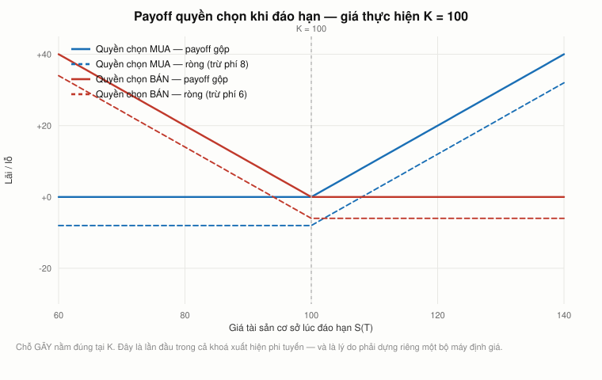
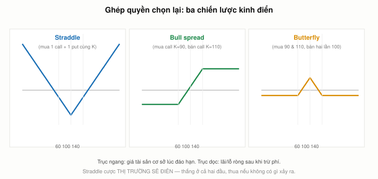
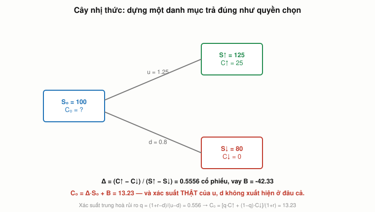
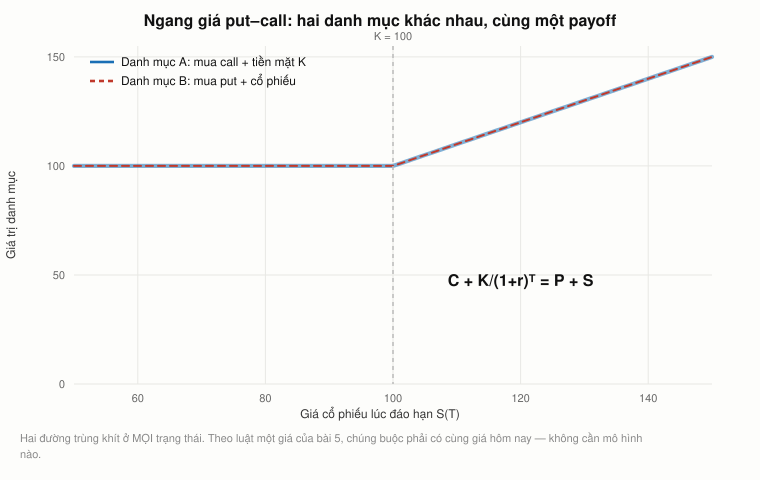

# Bài 8 — Quyền chọn: đường gãy khúc, cây nhị thức, và tham số biến mất

> Bài học dựng trên **ba đoạn video**: phần cuối **"Ses 10"** (`IwA7nVEwqto`, từ `62:33`),
> **toàn bộ "Ses 11: Options II"** (`rMsu4v-UlkA`, 58:41), và phần đầu **"Ses 12: Options III &
> Risk and Return I"** (`Q2qjnLO3I_M`, tới `53:04`) — khoá **MIT 15.401 *Finance Theory I*,
> Fall 2008**, giảng viên **Prof. Andrew W. Lo**. Phụ đề gốc do người viết tay.
>
> 🕑 Mốc thời gian có tiền tố buổi: `S11 19:01` = buổi 11, phút 19:01. Mỗi mốc được đối chiếu với
> **đúng** video của nó, không gộp chung.
>
> 📚 **Mở rộng** — kiến thức video lướt qua hoặc bài học này bổ sung, **không có trong video**.
> 🇻🇳 **Góc Việt Nam** — số liệu và ví dụ trong nước (mục 22), **không có trong video**.
> ⚠️ **Phần cuối buổi 12** (`S12 53:04` trở đi) là mở đầu về rủi ro và lợi suất — thuộc
> [bài 9](../README.md), không nằm ở đây.
> 📌 **Cần đọc trước:** [Bài 7](bai_07_ky_han_va_tuong_lai.md) — cả bài này dựng trên đúng một
> phép so sánh: hợp đồng tương lai **bắt buộc** thực hiện, quyền chọn thì **không**.
>
> Công thức viết bằng LaTeX — mở bằng **Obsidian** hoặc VS Code + Markdown Preview Enhanced.

---

## Mục lục

<!-- MUC-LUC -->
- [1. Ba buổi, ba ngày, và một kỳ thi giữa kỳ](#1-ba-buổi-ba-ngày-và-một-kỳ-thi-giữa-kỳ)
- [2. Quyền chọn là gì — quyền, chứ không phải nghĩa vụ](#2-quyền-chọn-là-gì--quyền-chứ-không-phải-nghĩa-vụ)
- [3. Đường gãy khúc: lần đầu trong khoá gặp phi tuyến](#3-đường-gãy-khúc-lần-đầu-trong-khoá-gặp-phi-tuyến)
- [4. Quyền chọn bán chính là hợp đồng bảo hiểm](#4-quyền-chọn-bán-chính-là-hợp-đồng-bảo-hiểm)
- [5. Payoff gộp, payoff ròng, và điểm hoà vốn mới](#5-payoff-gộp-payoff-ròng-và-điểm-hoà-vốn-mới)
- [6. Straddle: đặt cược rằng thị trường sẽ điên](#6-straddle-đặt-cược-rằng-thị-trường-sẽ-điên)
- [7. Bull spread và butterfly](#7-bull-spread-và-butterfly)
- [8. Mọi payoff đều dựng được từ call và put](#8-mọi-payoff-đều-dựng-được-từ-call-và-put)
- [9. VIX — chỉ số Lo mô tả không phải chỉ số đang chạy](#9-vix--chỉ-số-lo-mô-tả-không-phải-chỉ-số-đang-chạy)
- [10. Quyền chọn ở khắp nơi: vốn chủ sở hữu là một quyền chọn mua](#10-quyền-chọn-ở-khắp-nơi-vốn-chủ-sở-hữu-là-một-quyền-chọn-mua)
- [11. Trợ lý giáo sư, tấm bằng, và cách tuyển người](#11-trợ-lý-giáo-sư-tấm-bằng-và-cách-tuyển-người)
- [12. Cardano và phương trình bậc ba — bốn chỗ cần sửa](#12-cardano-và-phương-trình-bậc-ba--bốn-chỗ-cần-sửa)
- [13. Bachelier 1900, và câu chuyện Lo kể lệch ở đâu](#13-bachelier-1900-và-câu-chuyện-lo-kể-lệch-ở-đâu)
- [14. Black, Scholes, Merton — và một hành vi đạo đức hiếm](#14-black-scholes-merton--và-một-hành-vi-đạo-đức-hiếm)
- [15. Cây nhị thức: dựng một danh mục trả đúng như quyền chọn](#15-cây-nhị-thức-dựng-một-danh-mục-trả-đúng-như-quyền-chọn)
- [16. Tham số biến mất](#16-tham-số-biến-mất)
- [17. Điều kiện d < r < u — kinh tế học, không phải toán](#17-điều-kiện-d--r--u--kinh-tế-học-không-phải-toán)
- [18. Từ nhị thức tới Black–Scholes](#18-từ-nhị-thức-tới-blackscholes)
- [19. Ngang giá put–call — chỗ Lo chạm rồi bỏ](#19-ngang-giá-putcall--chỗ-lo-chạm-rồi-bỏ)
- [20. Điều Lo hứa hai lần rồi không làm](#20-điều-lo-hứa-hai-lần-rồi-không-làm)
- [21. Đối chiếu 2026](#21-đối-chiếu-2026)
- [22. Góc Việt Nam](#22-góc-việt-nam)
- [23. Code minh hoạ](#23-code-minh-hoạ)
- [24. Tự thử](#24-tự-thử)
- [25. Từ điển thuật ngữ](#25-từ-điển-thuật-ngữ)
- [26. Câu hỏi tự kiểm tra](#26-câu-hỏi-tự-kiểm-tra)
- [Tóm tắt một trang](#tóm-tắt-một-trang)
- [Nguồn](#nguồn)
<!-- /MUC-LUC -->

---

## 1. Ba buổi, ba ngày, và một kỳ thi giữa kỳ

Bài này gộp ba đoạn giảng nằm rải trên ba buổi. Không buổi nào ghi ngày; phải suy từ chính lời
giảng và đối chiếu với dữ liệu thị trường.

| Đoạn                    | Ngày                   | Bằng chứng                                                                                            |
| ----------------------- | ---------------------- | ----------------------------------------------------------------------------------------------------- |
| **Ses 10**, từ `62:33`  | thứ Tư **15/10/2008**  | đã chứng minh ở [bài 7, mục 1](bai_07_ky_han_va_tuong_lai.md#1-hai-buổi-giảng-hai-ngày-trong-cơn-bão) |
| **Ses 11**, toàn bộ     | thứ Hai **27/10/2008** | xem dưới                                                                                              |
| **Ses 12**, tới `53:04` | thứ Hai **3/11/2008**  | xem dưới                                                                                              |

### Buổi 11 — thứ Hai 27/10/2008

Manh mối quyết định nằm ở `S11 32:30`:

> *"Tuần trước, tính trong phiên, chỉ số VIX — tức Biến động Ẩn — chạm đỉnh **89 %**."*

VIX chỉ chạm 89 **đúng một lần trong lịch sử**: **89,53 vào thứ Sáu 24/10/2008**. Vậy "tuần
trước" là tuần 20–24/10, và buổi giảng nằm trong tuần kế tiếp.

Ba manh mối phụ đều khớp:

- Lo nói *"tôi chưa xem hôm nay, nhưng tôi đoán khoảng 60 tới 70"*, một sinh viên đáp **"71 %"**.
  Ngày 27/10/2008 VIX giao dịch trong khoảng **65,90–81,65** — 71 nằm giữa.
- `S11 32:17`: *"chúng ta sẽ xem nó **buổi sau, thứ Hai tới**"* ⟹ buổi kế tiếp là một **thứ Hai**.
- `S11 58:41`: *"hẹn gặp lại **thứ Tư, thi giữa kỳ**"* ⟹ thứ Tư 29/10 là ngày thi, không phải
  buổi giảng.

Cả ba chỉ về: buổi 11 = **thứ Hai**, thi giữa kỳ **thứ Tư 29/10**, buổi kế tiếp **thứ Hai 3/11**.

### Buổi 12 — thứ Hai 3/11/2008, một ngày trước bầu cử

- `S12 66:46`: *"chúng ta sẽ làm việc đó vào **thứ Tư**"* ⟹ hôm nay là thứ Hai.
- `S12 55:39`: *"năm vừa rồi, một nhà quản lý quỹ điển hình lỗ khoảng **30 % tới 40 %**."*
  S&P 500 ngày 29/10/2007 là **1.540,98**; ngày 3/11/2008 là **966,30** — **−37,3 %**, rơi đúng
  giữa khoảng Lo nói.

⚠️ **Một khoảng trống thành thật.** Buổi 10 (15/10) và buổi 11 (27/10) cách nhau **12 ngày**,
trong khi lớp học họp thứ Hai và thứ Tư. Nghĩa là các buổi 20/10 và 22/10 **không nằm trong bộ 20
video MIT OCW công bố**. Bài này không giả vờ biết chuyện gì xảy ra ở đó.

Bối cảnh thị trường trong ba tuần này:

| Ngày                 |          S&P 500 |                   VIX | Tín phiếu 3 tháng |
| -------------------- | ---------------: | --------------------: | ----------------: |
| 24/10/2008 (thứ Sáu) |           876,77 | **89,53 trong phiên** |            0,86 % |
| 27/10/2008 (buổi 11) | **848,92** — đáy |                 80,06 |            0,84 % |
| 3/11/2008 (buổi 12)  |           966,30 |                 53,68 |            0,49 % |
| 20/11/2008           |           752,44 | 80,86 (đỉnh đóng cửa) |                 — |

---

## 2. Quyền chọn là gì — quyền, chứ không phải nghĩa vụ

Lo dựng định nghĩa bằng cách đối chiếu với bài 7 (`S10 63:19`):

> *"Tên gọi của chúng rất đúng, vì chúng cho bạn **lựa chọn**. Hợp đồng tương lai và kỳ hạn **buộc**
> bạn phải giao dịch, quyền chọn thì không. Nó cho bạn **quyền, nhưng không phải nghĩa vụ**."*

Rồi ông xếp quyền chọn vào chỗ của nó trong họ chứng khoán (`S10 64:11`):

> *"Quyền chọn là một ví dụ cụ thể của thứ mà bây giờ các bạn đã biết dưới tên chung là **chứng
> khoán phái sinh**. Nó có tên đó vì **giá trị của nó được suy ra từ một chứng khoán khác**."*

### Bốn từ phải nhớ

| Thuật ngữ                  | `S10`   | Nghĩa                                                            |
| -------------------------- | ------- | ---------------------------------------------------------------- |
| **Quyền chọn mua** (call)  | `65:19` | quyền **mua** chứng khoán vào — hoặc trước — một ngày nhất định  |
| **Quyền chọn bán** (put)   | `66:03` | quyền **bán**, tức "ném" cổ phiếu sang tay người khác            |
| **Kiểu Mỹ / kiểu châu Âu** | `65:42` | Mỹ = được thực hiện **sớm**; châu Âu = **chỉ** đúng ngày đáo hạn |
| **Giá thực hiện** (strike) | `66:18` | giá bạn được mua (call) hoặc được bán (put)                      |

Ký hiệu (`S10 66:34`): $S_t$ giá cổ phiếu, $K$ giá thực hiện, $C_t$ giá call, $P_t$ giá put.
Lo nhấn mạnh **$K$ không có chỉ số thời gian** — nó cố định trong hợp đồng, không đổi suốt đời
quyền chọn.

### Vì sao một tờ giấy vô dụng lại có giá

Lo hỏi lớp (`S10 66:58`):

> *"Hôm nay cổ phiếu giao dịch ở **60 đô**, và bạn mua quyền mua nó ở **70 đô** trong ba tháng.
> Tờ giấy đó có giá trị gì không? **Nó vô giá trị chứ?**"*

Rồi tự trả lời (`S10 67:17`):

> *"Lý do tờ giấy đó **không** đáng giá 0 hôm nay là vì **có một cơ hội**, dù bạn thấy nó nhỏ đến
> đâu, rằng điều gì đó tuyệt vời sẽ xảy ra trong ba tháng tới và giá lên **80 đô**. Và nếu lên 80
> đô, bạn sẽ rất vui vì có quyền mua ở 70. **Vui đến mức nào? Vui 10 đô một cổ phiếu.**"*

Đây là cả lý thuyết định giá quyền chọn nén vào một câu: **giá trị của quyền chọn nằm ở phần
xác suất mà nó ăn tiền, chứ không nằm ở giá trị hôm nay.** Mục 15–18 chỉ là cách biến câu đó
thành số.

Payoff tại ngày đáo hạn (`S10 68:14`, `S10 69:16`):

$$C_T = \max(S_T - K,\ 0) \qquad\qquad P_T = \max(K - S_T,\ 0)$$

---

## 3. Đường gãy khúc: lần đầu trong khoá gặp phi tuyến



*Chỗ gãy nằm đúng tại giá thực hiện K. Đây là phi tuyến đầu tiên của cả khoá.*

Đây là đoạn quan trọng nhất buổi 11, và Lo nói thẳng rằng nó khó hơn vẻ ngoài (`S11 14:08`):

> *"Lợi suất của cổ phiếu là **tuyến tính**. Lợi suất của quyền chọn là **phi tuyến**. Và đây là
> một trong những ý **quan trọng và tinh tế nhất** của công cụ này. Cho tới giờ, tất cả các công
> cụ ta xem — cổ phiếu, trái phiếu, tương lai, kỳ hạn — payoff của chúng tương đối đơn giản, theo
> nghĩa là **đường thẳng**. **Đây là lần đầu tiên ta phân tích một chứng khoán có cấu trúc kỳ quái
> như thế này.**"*

Rồi ông nối thẳng vào cuộc khủng hoảng đang diễn ra (`S11 14:47`):

> *"Một trong những lý do hôm nay chúng ta đang ở trong khủng hoảng tài chính là vì **độ phức tạp
> của các chứng khoán đã được tạo ra**. Và độ phức tạp đó chính là các **phi tuyến** kiểu này."*

Và ông nối ngược về bài 5 (`S11 15:03`):

> *"Như tôi đã nói, **bảo hiểm là một quyền chọn bán**. Nên bạn có thể dùng lý thuyết định giá
> quyền chọn để định giá hợp đồng bảo hiểm, ví dụ **hợp đồng hoán đổi rủi ro tín dụng**. Và điều đó
> nghĩa là **một danh mục CDS không hành xử giống một danh mục cổ phiếu hay trái phiếu**."*

Đây chính là câu trả lời cho câu hỏi treo lại từ [bài 5](bai_05_duration_va_chung_khoan_hoa.md):
vì sao mô hình copula Gauss ước lượng sai rủi ro CDO đến thế. Không phải vì tương quan bị nhập sai
— mà vì **payoff phi tuyến làm sai số tương quan bị khuếch đại phi tuyến**.

### Bất đối xứng, đo bằng số

Mục 1 của [code](#23-code-minh-hoạ) dựng bảng này với $K = 20$, phí call 2,50 đô, phí put 2,00 đô:

| Vị thế   | Lợi tối đa |  Lỗ tối đa | Hoà vốn tại |
| -------- | ---------: | ---------: | ----------: |
| Mua call | **vô hạn** |    −2,50 $ |     22,50 $ |
| Bán call |     2,50 $ | **vô hạn** |     22,50 $ |
| Mua put  |    18,00 $ |    −2,00 $ |     18,00 $ |
| Bán put  |     2,00 $ |   −18,00 $ |     18,00 $ |

Lo hỏi lớp (`S11 13:09`): *"Phần lợi của quyền chọn bán bị chặn ở đâu?"* Câu trả lời: **giá cổ
phiếu không thể âm**, nên chặn trên là chính $K$. Call thì không có chặn trên.

Và ông cảnh báo về vị thế **bán call** (`S11 16:32`):

> *"Nó sẽ là ảnh gương của đường xanh… nghĩa là **phần thua của bạn là vô hạn**, còn phần thắng thì
> rất hạn chế. Sao lại có ai muốn làm thế? Nghe như một thoả thuận tệ hại. Khác biệt là **bạn được
> trả tiền để làm việc đó**."*

---

## 4. Quyền chọn bán chính là hợp đồng bảo hiểm

Đây là phép ánh xạ hay nhất trong cả ba buổi, và Lo dựng nó ở `S10 70:11`:

> *"Bạn đang nắm **General Electric**, đang giao dịch ở **20 đô**, và bạn muốn chắc chắn nó không
> bao giờ xuống dưới **18 đô**… Cách làm là **bạn mua một quyền chọn bán GE với giá thực hiện 18
> đô**."*

Rồi ông đi từng dòng của một hợp đồng bảo hiểm (`S10 71:13`):

| Điều khoản bảo hiểm          | Tương ứng trong quyền chọn bán  |
| ---------------------------- | ------------------------------- |
| Tài sản được bảo hiểm        | cổ phiếu General Electric       |
| Giá trị tài sản hiện tại     | 20 $                            |
| Thời hạn hợp đồng            | **thời gian tới đáy hạn**       |
| Mức bảo hiểm tối đa          | **18 $ = giá thực hiện $K$**    |
| Mức miễn thường (deductible) | **2 $ = $S_0 - K$**             |
| **Phí bảo hiểm**             | **chính là giá quyền chọn bán** |

Lo kết (`S10 71:49`): *"Xong. Một thứ đẹp đẽ. **Quyền chọn bán không gì khác hơn là một hợp đồng
bảo hiểm** trên giá trị một cổ phiếu."*

📚 Mục 19 chứng minh rằng đây **không phải ẩn dụ** — nó là một **đẳng thức**, và đẳng thức đó có
tên: **ngang giá put–call**.

### Ba khác biệt so với bảo hiểm thật (`S10 72:33`)

1. **Thực hiện sớm.** *"Bạn không làm thế với bảo hiểm ô tô được, đúng không? Chắc cũng được, bạn
   có thể đâm nó vào cột và bảo tôi muốn được trả tiền ngay — nhưng đó không được coi là hành vi
   đúng mực."*
2. **Tính chuyển nhượng.** Bạn **bán được** quyền chọn cho người khác; bạn không chuyển được bảo
   hiểm xe cho bạn mình.
3. **Cổ tức.** Cổ tức làm giá cổ phiếu giảm, nên phải điều chỉnh giá thực hiện — *"xe hơi thì không
   trả cổ tức"* (`S10 73:24`).

### Câu hỏi hay nhất trong buổi

Một sinh viên hỏi (`S10 74:21`): mua quyền chọn bán thì có mất phần lợi khi giá lên không? Lo
(`S10 74:41`):

> *"Không, thật ra **không đúng**. Nếu bạn mua cổ phiếu và giữ nó, và bạn cũng mua một quyền chọn
> bán, cái đó **bảo vệ phần dưới**. Còn phần trên **hoàn toàn là của bạn**. Vì khi cổ phiếu lên,
> quyền chọn bán mất giá trị — nó **dừng ở 0**, nó không đi xuống âm."*

Rồi ông đóng cái bẫy (`S10 75:17`):

> *"Nghe thì bạn được cả hai đầu. **Và như các bạn đều biết, bảo hiểm thì không rẻ.** Nghe thì hay,
> nhưng bạn phải trả tiền cho nó."*

**Đây là khác biệt cốt lõi giữa quyền chọn và hợp đồng tương lai** (`S10 75:40`, `S11 10:43`):
hợp đồng tương lai có **NPV bằng 0** ngày ký ([bài 7, mục 8](bai_07_ky_han_va_tuong_lai.md#8-vì-sao-hợp-đồng-kỳ-hạn-có-giá-trị-bằng-0-40-đô-và-250-đô));
quyền chọn thì **đáng giá dương ngay ngày đầu**.

---

## 5. Payoff gộp, payoff ròng, và điểm hoà vốn mới

Lo cẩn thận tách hai đường (`S11 07:06`):

> *"Trông từ biểu đồ này, quyền chọn mua giống mấy lời chào trên TV khuya — kiếm một triệu đô mà
> **không cần vốn**. Kiểu như **không có cách nào thua**. Sao lại có thể thế được?"*

Sinh viên trả lời ngay: *"Vì nó có giá."* Lo: *"Chính xác. **Không có bữa trưa miễn phí.**"*

Nên phải trừ **phí quyền chọn** (option premium), và về nguyên tắc phải nhân với hệ số lãi suất từ
ngày mua tới ngày đáo hạn — dù (`S11 08:22`) *"thường thì ta bỏ qua giá trị thời gian của tiền, vì
đó chỉ là lãi một tháng."*

Hệ quả (`S11 10:28`):

> *"Giá cổ phiếu phải lên **cao hơn 20 đô một chút** thì bạn mới có lãi, sau khi trừ chi phí mua
> quyền chọn."*

**Điểm hoà vốn của quyền chọn mua không phải giá thực hiện — mà là giá thực hiện cộng phí.** Đây
là chỗ người mới sai nhiều nhất, và mục 22 cho thấy nó gây hậu quả gì với chứng quyền ở Việt Nam.

📚 Một câu hỏi rất hay từ dưới lớp (`S11 08:37`): *"Nhìn giá quyền chọn có suy ra được gì về giá
tương lai của cổ phiếu không?"* Lo (`S11 08:51`):

> *"Có, hoàn toàn có. Giống như trong quản trị khủng hoảng — nhìn tín phiếu kho bạc hôm nay là biết
> nhu cầu giữ tiền mặt, giấu tiền dưới đệm, lớn tới đâu. **Nhìn quyền chọn thì bạn cảm nhận được
> thị trường đang đi về đâu.**"*

Đây đúng là mạch [bài 4](bai_04_trai_phieu_va_duong_cong.md) (lãi suất kỳ hạn) và
[bài 7, mục 9](bai_07_ky_han_va_tuong_lai.md#9-giá-kỳ-hạn-là-dự-báo-của-thị-trường) (giá kỳ hạn) —
lần thứ ba trong khoá, **giá hôm nay chứa dự báo về ngày mai**.

---

## 6. Straddle: đặt cược rằng thị trường sẽ điên



*Ba cách ghép quyền chọn. Straddle cược rằng thị trường sẽ điên — thắng ở cả hai đầu.*

Lo chọn đúng chiến lược hợp với tháng 10/2008 (`S11 19:01`): **mua một call và một put cùng giá
thực hiện**. Payoff hình chữ **V**.

Sinh viên phản ứng ngay (`S11 19:58`): *"Vậy trừ một khoảng hẹp quanh giá thực hiện, ông **luôn**
có lãi. Sao không làm thật nhiều?"* Lo (`S11 20:28`): *"Câu hỏi là **nó tốn bao nhiêu**. Khoảng đó
càng hẹp thì mua càng đắt."*

Rồi ông chốt ý (`S11 21:02`):

> *"Bạn đang nói rằng bạn sẽ **kiếm được rất nhiều tiền nếu giá lên rất cao hoặc xuống rất thấp**.
> Cách duy nhất bạn không kiếm được gì là nếu cổ phiếu **không làm gì cả**… Đây là ví dụ về việc
> đặt cược **không phải rằng thị trường sẽ lên, không phải rằng thị trường sẽ xuống, mà rằng thị
> trường sẽ ĐIÊN**. Tức là bạn **đang đặt cược vào biến động**."*

Và ngay lập tức ông chỉ ra cái bẫy (`S11 21:57`):

> *"Bây giờ nó bị **đẩy xuống rất sâu**. Nói cách khác, mua một put và một call bây giờ **rất đắt**.
> Vì sao? Vì **biến động đang rất cao**… Bạn đang mua bảo hiểm, và bây giờ mua bảo hiểm rất, rất
> đắt. Vì **chúng ta đang ở giữa một cơn bão**. Và đó có lẽ là **thời điểm tệ nhất để mua bảo hiểm
> bão**."*

Mục 2 của [code](#23-code-minh-hoạ) đo đúng cái "vùng chết" đó. Với call 6 đô và put 5 đô ở
$K = 50$:

| Vùng                          | Kết quả                                               |
| ----------------------------- | ----------------------------------------------------- |
| $S_T < 39{,}00$               | có lãi                                                |
| $39{,}00 \le S_T \le 61{,}00$ | **lỗ** — vùng chết rộng **22 đô = 44 % giá cổ phiếu** |
| $S_T > 61{,}00$               | có lãi                                                |

**Tổng phí càng đắt thì vùng chết càng rộng.** Đó chính là cơ chế Lo mô tả: khi ai cũng sợ, bảo
hiểm đắt lên, và cái ngưỡng bạn phải vượt qua để có lãi cũng bị đẩy ra xa.

Và ông dùng nó để bình một tin thời sự (`S11 23:36`):

> *"Nếu bạn là **Warren Buffett** và mua **Goldman Sachs** ba, bốn tuần trước, và lúc đó thấy đó là
> món hời — thì đến giờ **bạn đã lỗ**. Warren Buffett đã lỗ. Mặt khác, như các bạn đều biết,
> Buffett không đầu tư ngắn hạn."*

Khoản đầu tư đó — 5 tỷ đô cổ phiếu ưu đãi Goldman, công bố **23/9/2008** — được nhắc ở
[bài 6](bai_06_co_phieu_va_tang_truong.md) cùng thương vụ GE.

---

## 7. Bull spread và butterfly

**Bull spread** (`S11 25:31`): mua call giá thực hiện 50, **bán** call giá thực hiện 60.

Lo hỏi lớp: *"Sao lại tự cắt phần lợi phía trên? Nếu chỉ mua call thôi thì bạn được hết mà."*
Sinh viên đáp gọn (`S11 26:19`): **"Vì nó rẻ hơn."** Lo:

> *"Chính xác. Nó rẻ hơn vì khi bạn bán call ở 60, **bạn nhận tiền ngay hôm nay**. Số đó giúp bạn
> tài trợ cho cái call ở 50. Rẻ hơn, **nhưng không phải bữa trưa miễn phí**."*

Với các mức phí trong [code](#23-code-minh-hoạ): call 50 giá 6,00 đô, call 60 giá 2,50 đô ⟹ chi phí
ròng **3,50 đô**, tức **58 %** giá call trần. Đổi lại, trần lãi bị chặn ở **6,50 đô**.

Lo giải thích khi nào nên dùng (`S11 26:52`): *"Tôi nghĩ cổ phiếu còn chỗ để tăng, sẽ dao động giữa
50 và 60. Nhưng tôi **không thể hình dung nó đáng hơn 60**. Nên tôi sẵn lòng nhường phần trên cho
những người lạc quan hơn tôi, và lấy tiền đó bù chi phí."*

**Butterfly** (`S11 27:56`): mua call 40, **bán 2** call 50, mua call 60.

> *"Payoff: nếu nó nằm trong một khoảng thì bạn được trả tiền. Nhưng nếu nó **thật sự biến động
> mạnh** thì bạn không được trả gì. Bạn **đặt cược ngược lại biến động**."*

Butterfly là **ảnh gương của straddle**. Straddle ăn tiền khi thị trường điên; butterfly ăn tiền
khi thị trường đứng yên. Cùng một bộ công cụ, hai niềm tin ngược nhau.

---

## 8. Mọi payoff đều dựng được từ call và put

Lo nêu một kết quả toán học rồi đi tiếp (`S11 28:20`):

> *"Với những kiểu payoff này, bạn có thể **chứng minh bằng toán học** rằng có thể tạo ra **bất kỳ
> payoff nào khác trên đời**. Có một kết quả toán học liên quan tới **khai triển Taylor và khai
> triển Fourier**, nói rằng **mọi chứng khoán mà bạn nghĩ ra được đều xấp xỉ được bằng một dãy call
> và put**. Đó là một ý rất mạnh."*

📚 Kết quả này có tên: **công thức Breeden–Litzenberger / Carr–Madan**. Với hàm payoff $f$ đủ trơn:

$$f(S_T) = f(K_0) + f'(K_0)\,(S_T - K_0) + \int_0^{K_0} f''(K)\,P(K)\,dK + \int_{K_0}^{\infty} f''(K)\,C(K)\,dK$$

Nói bằng lời: **một trái phiếu, một hợp đồng kỳ hạn, và một dải liên tục các quyền chọn dựng lại
được bất kỳ payoff nào.** Chính công thức này là nền của cách tính **VIX từ năm 2003** — xem
[mục 9](#9-vix--chỉ-số-lo-mô-tả-không-phải-chỉ-số-đang-chạy).

Lo bổ sung một lưu ý rất thực dụng (`S11 28:44`): *"Thực tế bạn **không cần** thứ gì cầu kỳ đến
thế. Chỉ với **một số rất nhỏ** call và put, bạn ghép được những biểu đồ payoff cực kỳ phức tạp."*

Và ông giao bài tập (`S11 29:20`): *"Tôi khuyên các bạn tự làm vài ví dụ. Vì đây là thứ **rất dễ
tưởng là mình đã hiểu**. Trừ khi bị buộc phải tự vẽ ra, bạn sẽ không cảm được nó."* — đó là
[mục 24](#24-tự-thử).

---

## 9. VIX — chỉ số Lo mô tả không phải chỉ số đang chạy

Một sinh viên hỏi một câu rất sâu (`S11 29:38`): giá quyền chọn có **tự tạo ra** biến động không?
Lo trả lời bằng cách kể về VIX (`S11 30:14`):

> *"Câu hỏi đó được đặt ra ngay sau khi Black và Scholes công bố công thức. Nó tạo ra cả một dòng
> nghiên cứu, khởi đầu bởi chính cựu Chủ nhiệm khoa của chúng ta, **Dick Schmalensee**. Ông viết
> một bài với **Robert Trippi** về biến động ẩn của quyền chọn."*

✅ Đúng: **Schmalensee, R. và Trippi, R.**, *"Common Stock Volatility Expectations Implied by Option
Premia"*, *Journal of Finance*, 1978. Richard Schmalensee là Chủ nhiệm khoa MIT Sloan 1998–2007 ✓.

Rồi Lo mô tả VIX (`S11 31:25`):

> *"Giờ có một chỉ số do **Sở Giao dịch Quyền chọn Chicago** tạo ra, gọi là **VIX**, viết tắt của
> **Volatility Implied Index**. Họ nhìn các quyền chọn trên **S&P 500** và hỏi: **biến động nào
> nhất quán với giá quyền chọn ngang giá** trên chỉ số đó?"*

### Hai chỗ sai trong một đoạn

**Một: tên gọi.** VIX là viết tắt của **Cboe Volatility Index**, không phải "Volatility Implied
Index".

**Hai, và quan trọng hơn: mô tả đó là của chỉ số đã ngừng dùng từ năm năm trước.**

|                 | VIX gốc, 1993                  | VIX từ **22/9/2003**                       |
| --------------- | ------------------------------ | ------------------------------------------ |
| Chỉ số cơ sở    | **S&P 100** (OEX)              | **S&P 500** (SPX)                          |
| Quyền chọn dùng | **ngang giá**                  | **cả một dải quyền chọn ngoài tiền**       |
| Đại lượng đo    | biến động ẩn Black–Scholes     | **giá trị hợp lý của hoán đổi phương sai** |
| Tên hiện tại    | đổi thành **VXO**, vẫn công bố | **VIX**                                    |

Mô tả của Lo — "biến động ẩn của quyền chọn ngang giá" — là **VXO**, chỉ số cũ; và ông ghép nó với
**S&P 500** trong khi chỉ số cũ dùng **S&P 100**. Chỉ số VIX ông đang đọc số liệu trong lớp hôm đó
được tính theo công thức khác hẳn: một **dải quyền chọn ngoài tiền** — chính là ứng dụng trực tiếp
của kết quả Carr–Madan ở [mục 8](#8-mọi-payoff-đều-dựng-được-từ-call-và-put).

### Nhưng con số của ông thì đúng chính xác

- `S11 32:30` *"tuần trước chạm đỉnh trong phiên **89 %**"* → **89,53** ngày **24/10/2008** ✓
- `S11 32:30` *"S&P 500 lịch sử có mức biến động khoảng **15 % tới 20 %**"* ✓
- Sinh viên đọc **"71 %"** → phiên 27/10/2008 VIX chạy trong khoảng 65,90–81,65 ✓

### Và đây là điều Lo không thể biết

**Con số 89,53 ngày 24/10/2008 vẫn là kỷ lục trong phiên của VIX tính tới 2026.**

|                  |       Đỉnh trong phiên |         Đỉnh đóng cửa |
| ---------------- | ---------------------: | --------------------: |
| Khủng hoảng 2008 | **89,53** (24/10/2008) |    80,86 (20/11/2008) |
| Đại dịch 2020    |      85,47 (18/3/2020) | **82,69** (16/3/2020) |

Đại dịch phá kỷ lục **đóng cửa** nhưng **không** phá kỷ lục **trong phiên**. Cái tuần mà Lo giảng
bài này vẫn là **giờ phút hoảng sợ nhất mà thị trường quyền chọn từng ghi nhận** — mười tám năm
sau vẫn vậy.

---

## 10. Quyền chọn ở khắp nơi: vốn chủ sở hữu là một quyền chọn mua

Lo chuyển sang phần ông thích nhất (`S11 33:43`):

> *"Ngay sau khi các bài của Black, Scholes và Merton được công bố, người ta nhận ra rằng **nhìn
> đâu cũng thấy quyền chọn**."*

Rồi ông làm cú lật ngoạn mục (`S11 34:04`):

> *"Tôi đã nói trước đây rằng giá cổ phiếu **không** giống quyền chọn. Xấp xỉ thì đúng. Nhưng thực
> tế, nếu nhìn kỹ **cổ phiếu là gì**, thì **cổ phiếu chính là một quyền chọn**."*

Lập luận (`S11 34:28`): vốn chủ sở hữu là quyền đối với tài sản doanh nghiệp, nhưng nếu doanh
nghiệp có nợ thì **chủ nợ xếp hàng trước**. Vậy vào ngày trái phiếu đáo hạn:

$$E_T = \max(0,\ V_T - B)$$

trong đó $V$ là giá trị tài sản doanh nghiệp và $B$ là mệnh giá nợ.

> *"Cái đó **trông rất quen** với các bạn. Nó **chính là payoff của một quyền chọn mua**, với giá
> thực hiện là $B$ và tài sản cơ sở là $V$."*

Còn chủ nợ (`S11 36:20`): $D_T = \min(V_T,\ B) = B - \max(0,\ B - V_T)$ — tức là **trái phiếu phi
rủi ro cộng với một vị thế bán khống quyền chọn bán**. Và (`S11 36:53`): $V = D + E$.

📚 Mô hình này có tên và có tác giả: **Merton (1974)**. Lo nêu ý tưởng nhưng không đưa công thức.
Mục 7 của [code](#23-code-minh-hoạ) chạy nó với Black–Scholes, nợ mệnh giá 100, kỳ hạn 1 năm,
$r = 3\%$:

| Đòn bẩy $V/B$ | $\sigma_V$ | Vốn CSH $E$ | Giá nợ $D$ | Chênh lệch tín dụng |
| ------------: | ---------: | ----------: | ---------: | ------------------: |
|        1,5000 |       20 % |       53,08 |      96,92 |           **13 bp** |
|        1,2000 |       20 % |       24,55 |      95,45 |          **165 bp** |
|        1,0500 |       20 % |       12,64 |      92,36 |          **495 bp** |
|    **1,0337** |       20 % |       11,54 |      91,83 |          **552 bp** |
|    **1,0337** |   **40 %** |       19,24 |      84,13 |        **1.428 bp** |

**Dòng 1,0337 là Lehman Brothers.** Đòn bẩy gộp 30,7:1 từ
[bài 3](bai_03_don_bay_va_lam_phat.md) cho $V/B = 1/(1 - 1/30{,}7) = 1{,}0337$. Vốn chủ sở hữu của
Lehman là một **quyền chọn mua gần ngang giá trên toàn bộ bảng cân đối**.

Và đây là ý làm cả [bài 6](bai_06_co_phieu_va_tang_truong.md) sáng ra: **chỉ cần biến động tài sản
tăng từ 20 % lên 40 %, chênh lệch tín dụng nhảy từ 552 lên 1.428 điểm cơ bản — gấp 2,6 lần — mà
doanh nghiệp không mất một đồng tài sản nào.** Đó chính xác là cách thị trường CDS định giá GE
ngày 1/10/2008, và là lý do các cơ quan xếp hạng — vốn nhìn tài sản chứ không nhìn biến động — luôn
đi sau.

### Kinh doanh chênh lệch cấu trúc vốn

Từ $V = D + E$, Lo mô tả một nghề (`S11 37:12`):

> *"Đẳng thức này **phải** đúng. Nhưng thực tế có chênh lệch giữa giá thị trường của $D$ và của
> $E$. Dùng lý thuyết quyền chọn và mô hình rủi ro tín dụng, các quỹ đầu cơ đã kiếm tiền bằng cách
> **mua cổ phiếu và bán khống trái phiếu của cùng một công ty**, hoặc ngược lại."*

Rồi một câu rất đáng nhớ (`S11 37:48`):

> *"Muốn làm những giao dịch đó thì bạn phải có năng lực mô hình hoá tín dụng vượt trội — **chắc
> chắn phải hơn cái mà các cơ quan xếp hạng đang làm**. Và thực tế đã có những trường hợp quỹ đầu
> cơ **chủ động đặt cược chống lại mô hình của cơ quan xếp hạng**."*

**Bài 5 và bài 6 đã cho biết ai đúng.** Các quỹ đó thắng. Xếp hạng AAA cho CDO sai
([bài 5](bai_05_duration_va_chung_khoan_hoa.md)); xếp hạng AAA cho GE sai theo chiều ngược lại
([bài 6](bai_06_co_phieu_va_tang_truong.md)). Mô hình Merton — thứ Lo vừa dựng trong ba phút — là
nền của **"khoảng cách tới vỡ nợ"** mà Moody's KMV và các bàn tín dụng dùng tới hôm nay.

---

## 11. Trợ lý giáo sư, tấm bằng, và cách tuyển người

Lo kể chuyện riêng (`S11 38:31`):

> *"Khi tôi mới về MIT hai mươi năm trước, tôi nhớ rất rõ có mấy đồng nghiệp lớn tuổi gọi **trợ lý
> giáo sư là quyền chọn**."*

Cơ chế: hợp đồng ba năm; hết ba năm hoặc gia hạn hoặc nghỉ; hết ba năm nữa thì xét biên chế. *"Bạn
hưởng lợi từ họ một thời gian. Nếu không được việc, bạn luôn có thể bỏ. Nhưng khi đã có biên chế
thì hết quyền chọn."* (`S11 39:35`)

Rồi ông hỏi lớp: nếu tin vào định giá quyền chọn thì nên tuyển loại trợ lý giáo sư nào? Một sinh
viên: **"Chấp nhận rủi ro."** Lo (`S11 40:12`):

> *"Chấp nhận rủi ro. Bạn muốn tuyển những người **cực kỳ biến động**. Không phải về cảm xúc, hy
> vọng thế, mà về **trí tuệ**. Vì **bạn được toàn bộ phần trên nhưng không chịu phần dưới**. Và đó
> thật sự là cách chúng tôi và nhiều nơi khác đã tuyển người."*

Rồi mở rộng (`S11 40:48`): *"Đi học cũng là một quyền chọn. Bạn **không bắt buộc** phải dùng tấm
bằng. Nhưng bạn **có** nó."*

Đây là ứng dụng trực tiếp của mục 3: **khi payoff bất đối xứng, biến động là thứ tốt.** Nó lý
giải mọi thứ từ đầu tư mạo hiểm, tới thử nghiệm thuốc, tới cách một công ty nên phân bổ ngân sách
R&D. Và nó cũng lý giải chỗ trái ngược: khi bạn ở **phía bán** quyền chọn — như cổ đông một ngân
hàng có bảo hiểm tiền gửi — bạn lại **rất ghét** biến động.

---

## 12. Cardano và phương trình bậc ba — bốn chỗ cần sửa

Lo bắt đầu lịch sử định giá quyền chọn từ thế kỷ 16 (`S11 44:18`), với nhà toán học Ý **Gerolamo
Cardano**. Ông kể bốn ý, và cả bốn đều cần chỉnh.

**Lo nói (`S11 44:40`):** *"Cardano là **người thứ hai** tìm ra nghiệm của phương trình bậc ba."*

**Lo nói (`S11 45:16`):** *"Hoá ra **không còn công thức nào sau bậc ba**. Nên phương trình bậc ba
có gì đó rất đặc biệt."*

**Lo nói (`S11 45:31`):** *"Ông **ăn cắp** công thức từ một đồng nghiệp… Cardano nói không, không,
tôi hứa sẽ không. Rồi Cardano **lừa ông ta thật**."*

**Lo nói (`S11 45:53`):** *"Tôi ngại phải nói là tôi **không nhớ tên** người thật sự phát minh ra
nó."*

### Bốn đính chính

**1. ⚠️ Câu sai rõ ràng nhất: "không còn công thức nào sau bậc ba".**

**Phương trình bậc bốn CÓ công thức.** Nó do **Ludovico Ferrari** — chính học trò của Cardano —
tìm ra năm **1540**, và được in trong **cùng cuốn *Ars Magna* (1545)** với công thức bậc ba.

Bức tường thật nằm ở **bậc năm**: **Abel–Ruffini** (Ruffini 1799, Abel 1824) chứng minh không tồn
tại công thức căn thức tổng quát cho bậc năm trở lên; **Galois** (1830, công bố 1846) cho tiêu
chuẩn chính xác — nhóm Galois phải giải được, và $S_5$ thì không.

**2. Người đồng nghiệp Lo không nhớ tên: Niccolò Fontana, biệt danh Tartaglia.**

**3. Cardano thực ra là người thứ *ba*.** **Scipione del Ferro** (Bologna) giải được bậc ba dạng
rút gọn khoảng năm 1515 nhưng không công bố, chỉ truyền cho học trò Antonio Maria Fior. Tartaglia
tìm ra độc lập và **thắng Fior trong cuộc đấu toán năm 1535**.

**4. "Ăn cắp" là cách kể một phía.** Tartaglia tiết lộ cho Cardano năm 1539 dưới một lời thề giữ
bí mật — bản thân chuyện có lời thề hay không đã bị tranh cãi (Ferrari, người có mặt, thề là
không). Nhưng năm **1543** Cardano và Ferrari tới Bologna và được cháu của del Ferro cho xem giấy
tờ chứng minh **del Ferro đã có lời giải hai mươi năm trước Tartaglia** — nghĩa là lời thề, nếu
có, đã không còn hiệu lực. *Ars Magna* **ghi công cả del Ferro lẫn Tartaglia**. Tartaglia kiện
nhiều lần và **không bao giờ thắng**; ông thách đấu Cardano, Ferrari nhận lời thay và đánh bại
ông, sau đó Tartaglia mất cả uy tín lẫn vị trí giảng dạy.

### Phần Lo kể đúng, và nó mới là phần quan trọng

Cardano viết ***Liber de Ludo Aleae*** (*Sách về trò chơi may rủi*), và Lo đọc nguyên văn
(`S11 46:10`):

> *"Nguyên tắc căn bản nhất của mọi trò cờ bạc đơn giản là **điều kiện ngang bằng** — về đối thủ,
> về khán giả, về tiền, về hoàn cảnh, về hộp xúc xắc, và về chính con xúc xắc. **Trong chừng mực
> bạn rời xa sự ngang bằng đó, nếu nó có lợi cho đối thủ thì bạn là kẻ ngốc, còn nếu có lợi cho
> chính bạn thì bạn là kẻ bất công.**"*

Lo (`S11 46:44`): *"Cái ông ấy mô tả về bản chất là một **canh bạc 50/50**, hay cái ta gọi là **trò
chơi công bằng**, hay cái bây giờ gọi là **martingale**."*

Và đó là hạt giống của toàn bộ mục 15–18: **định giá quyền chọn là tìm cái độ đo mà dưới đó mọi
canh bạc đều công bằng.**

---

## 13. Bachelier 1900, và câu chuyện Lo kể lệch ở đâu

Lo dẫn tới một điểm ông rõ ràng rất tự hào (`S11 47:23`):

> *"Bước ngẫu nhiên có một vị trí đặc biệt trong lòng các nhà kinh tế tài chính, vì hầu hết nhà
> kinh tế đều mắc một chứng rối loạn tâm lý mà chúng tôi gọi là **ghen tị với vật lý**. Ai cũng ước
> mình có ba định luật giải thích được 99 % hành vi. Thực tế, các nhà kinh tế có **99 định luật
> giải thích được chừng 3 % hành vi kinh tế**."*

> *"Nhưng có **đúng một** ví dụ trong lịch sử tài chính, nơi một nhà kinh tế nghĩ ra ý tưởng
> **trước** một nhà vật lý."*

Đó là **Louis Bachelier**, luận án tiến sĩ toán tại Sorbonne, **năm 1900**, về định giá chứng quyền
trên **Sở Giao dịch Paris**. Để giải bài toán, ông phải dựng mô hình toán cho giá cơ sở — và dựng
ra cái ngày nay gọi là **chuyển động Brown**.

### Ba chỗ cần sửa

**1. Năm của Einstein.** Lo (`S11 48:42`, `S11 48:58`): *"ông ấy làm việc đó **trước ba năm** so
với một nhà vật lý nổi tiếng… **Albert Einstein, năm 1903**, công bố một bài về hiệu ứng quang
điện và chuyển động Brown."*

Thật ra: Einstein công bố năm **1905**, năm kỳ diệu, và đó là **hai bài riêng biệt** — hiệu ứng
quang điện (tháng 3) và chuyển động Brown (tháng 5). Bachelier bảo vệ luận án **29/3/1900**.

Vậy khoảng cách là **năm năm, không phải ba** — luận điểm của Lo **mạnh hơn** con số ông đưa.

**2. Câu chuyện "xét biên chế".** Lo (`S11 51:24`): *"có một lỗi nhỏ… khi ông ấy được xét biên chế,
họ **gửi thư cho các tên tuổi lớn**, và ông ấy **bị từ chối biên chế** vì họ tìm ra lỗi đó. Ông bị
đưa vào danh sách đen."*

Sự thật khác về cơ chế lẫn về quy mô:

| Lo kể                           | Thực tế                                                                          |
| ------------------------------- | -------------------------------------------------------------------------------- |
| xét biên chế kiểu Mỹ, 15 lá thư | **thi tuyển ghế giáo sư kiểu Pháp** tại **Dijon, năm 1926**                      |
| "các tên tuổi lớn" tìm ra lỗi   | **một** báo cáo bất lợi, của **Paul Lévy** (khi đó 40 tuổi, École Polytechnique) |
| lỗi có thật trong luận án 1900  | Lévy **đọc nhầm** một trang trong bài báo **1913** của Bachelier                 |

Và có một chi tiết Lo hoàn toàn bỏ qua: luận án 1900 chỉ được xếp **"mention honorable"** chứ không
phải **"très honorable"** — ở Pháp thời đó, đó gần như là án tử cho một sự nghiệp hàn lâm, và nó
xảy ra **hai mươi sáu năm trước** vụ Dijon.

**3. Kết cục.** Lo (`S11 51:42`): *"ông ấy không xin được việc gì ngoài một **trường sư phạm nhỏ
dành cho nữ ở miền nam nước Pháp**."*

Thật ra: Bachelier trở lại **Besançon năm 1927 với vị trí giáo sư chính thức**, và **nghỉ hưu năm
1937 ở tuổi 67**. Besançon nằm ở **miền đông** nước Pháp, và đó là một **đại học**.

✅ **Chỗ Lo kể đúng và rất đáng nhớ:** **Paul Lévy đã viết thư xin lỗi Bachelier năm 1931** và hai
người làm hoà — sau khi Kolmogorov và các nhà toán học Nga bắt đầu trích dẫn Bachelier. Và **Paul
Samuelson** là người tìm lại luận án Bachelier trong kho lưu trữ Sorbonne và phục hồi danh tiếng
cho ông (`S11 52:18`) ✓.

### Và phần đẹp nhất, Lo kể chính xác

Poincaré — người hướng dẫn Bachelier — viết trong **bản nhận xét luận án** (Lo gọi nhầm là "thư
giới thiệu việc làm", `S11 49:37`):

> *"Cách ứng viên thu được luật Gauss là **hết sức độc đáo**… Ông phát triển nó trong một chương
> thoạt nhìn có vẻ kỳ lạ, vì ông đặt tên nó là **'Bức xạ của Xác suất'**. Trên thực tế, tác giả
> viện tới một so sánh với **lý thuyết giải tích về sự lan truyền của nhiệt**… Lập luận của Fourier
> áp dụng được gần như **không cần thay đổi gì** cho bài toán này — một bài toán khác hẳn bài toán
> mà nó vốn được tạo ra."*

Rồi lời phàn nàn kinh điển của người hướng dẫn: *"Thật đáng tiếc là tác giả đã không phát triển
phần này của luận án xa hơn."* Lo bình (`S11 50:14`): *"tất nhiên, ông thầy nào cuối cùng cũng
phải chê học trò một chút, như tất cả chúng tôi vẫn làm."*

**Phương trình mà Bachelier dẫn ra để định giá chứng quyền trên Sở Giao dịch Paris chính là
phương trình truyền nhiệt.** Và đó là câu trả lời cho câu hỏi vì sao ngày nay có nhiều nhà vật lý
đến thế trong ngành tài chính (`S11 52:55`).

---

## 14. Black, Scholes, Merton — và một hành vi đạo đức hiếm

Trước Black–Scholes có một chuỗi thất bại đáng kể, và Lo liệt kê hết (`S11 53:30`):

| Người                                                          | Năm            | Kết quả                                                                                                        |
| -------------------------------------------------------------- | -------------- | -------------------------------------------------------------------------------------------------------------- |
| **Kruizenga**, nghiên cứu sinh MIT của Samuelson               | thập niên 1950 | luận án *"Put and Call Options: A Theoretical and Market Analysis"* — *"không có bộ máy toán học để hoàn tất"* |
| **K. Sprenkle**, Yale, thầy hướng dẫn Jim Tobin và Arthur Okun | 1961           | *"Warrant Prices as Indicators of Expectations and Preferences"* — không ra công thức                          |
| **Samuelson**                                                  | 1965           | phải giả định về **sở thích cá nhân** mới ra giá ⟹ không dùng được                                             |
| **Samuelson và Merton**                                        | 1969           | cố tìm công thức **không phụ thuộc sở thích** — *"và họ vẫn không làm được"*                                   |

Rồi Lo kể chuyện xảy ra ngay bên kia đường (`S11 54:54`):

> *"Fischer Black lúc đó là tư vấn viên tại **Arthur D. Little**. Ông ấy **thậm chí không phải người
> hàn lâm**. Toà nhà Arthur D. Little là toà nhà ngay kia — cái mà người ta không cho chúng tôi phá
> đi, vì nó được coi là một viên ngọc kiến trúc."*

Điểm nghẽn (`S11 55:32`):

> *"Fischer về cơ bản đã tìm ra phương trình đó, nhưng **không giải được**, vì ông ấy **chưa bao giờ
> nghe nói tới phương trình truyền nhiệt** — nền tảng của ông là khoa học máy tính, không phải toán.
> Trớ trêu là Fischer Black **có bằng tiến sĩ toán ứng dụng**. Nhưng ông ấy **chưa bao giờ học vật
> lý**."*

Lời giải đến theo cách rất MIT (`S11 56:05`): Myron Scholes cầm phương trình sang **khoa toán MIT**,
hỏi một giáo sư đã bao giờ thấy thứ này chưa. *"Ông ấy nhìn và bảo: à, đó là phương trình truyền
nhiệt thôi. Đây, giải thế này."*

### Bài báo bị từ chối

Lo (`S11 56:38`):

> *"Họ gửi bài cho khoảng **năm tạp chí kinh tế**. **Tất cả** đều từ chối, nói rằng cái này quá
> chuyên biệt, không phải kinh tế học, không phải tài chính, chúng tôi không biết nó là gì — **đi
> chỗ khác**."*

> *"Chỉ tới khi họ đổi được tiêu đề từ 'định giá quyền chọn' sang **'Định giá Quyền chọn và Nghĩa
> vụ Nợ Doanh nghiệp'** thì cuối cùng bài mới được đăng."*

⚠️ Tiêu đề Lo nêu là chính xác — *"The Pricing of Options and Corporate Liabilities"*, *Journal of
Political Economy*, số tháng 5–6/1973. Nhưng con số **"khoảng năm tạp chí"** thì bài này **không
xác minh được**; các tường thuật đã kiểm chứng chỉ ghi nhận **JPE** và **Review of Economics and
Statistics** từ chối, và JPE nhận sau khi **Merton Miller** và **Eugene Fama** can thiệp.

### Hành vi đạo đức mà Lo gọi là phi thường

Merton đi hướng khác và tới cùng kết quả, độc lập. Bài của ông — *"Theory of Rational Option
Pricing"*, *Bell Journal of Economics and Management Science*, mùa xuân 1973 — thực ra **được nhận
trước**. Rồi (`S11 57:28`):

> *"Merton **được đăng trước**. Nhưng ông ấy **yêu cầu hoãn bài của mình lại**, vì ông muốn bài của
> Fischer Black và Myron Scholes ra **cùng năm**. Ông cảm thấy mình đã rút ra quá nhiều trực giác
> từ những gì Black và Scholes làm, nên **không muốn về đích trước** — như thế là không công bằng
> với họ."*

> *"Đó là **một trong những hành vi đạo đức nghề nghiệp phi thường nhất** trong ngành. Vì cả hai
> đều thấy rõ **cái gì đang được đặt cược**."*

⚠️ **Một chỗ sai về ngày.** Lo (`S11 57:55`): *"Không may là Fischer Black đã **chết vì ung thư năm
trước đó**."* Giải Nobel trao **tháng 10/1997**; Fischer Black mất **30/8/1995** vì ung thư vòm
họng, ở tuổi 57 — **hai năm trước**, không phải một năm.

✅ Phần còn lại Lo kể đúng: giải không trao cho người đã mất, nhưng **thông cáo của Uỷ ban Nobel
nêu đích danh Black**, ghi rằng công trình được phát triển *"trong sự hợp tác chặt chẽ với Fischer
Black, người đã mất ở tuổi ngoài năm mươi năm 1995."*

---

## 15. Cây nhị thức: dựng một danh mục trả đúng như quyền chọn



*Xác suất thật của u và d không xuất hiện ở bất kỳ đâu trong lời giải. Đó là tham số biến mất.*

Buổi 12 là buổi Lo trả món nợ. Ông mở đầu (`S12 01:28`):

> *"Đây sẽ là mô hình định giá quyền chọn **đầu tiên mà bất kỳ ai trong các bạn từng thấy**. Các
> bạn đều nghe nói về Black–Scholes. Nhưng lý do tôi **yêu** mô hình này là vì nó đơn giản tới mức
> **chỉ với đại số phổ thông**, bạn tự làm được toàn bộ phần giải tích. Trong khi **kinh tế học ẩn
> bên dưới thì cực kỳ sâu**."*

Mô hình: **cây nhị thức**, của **John Cox, Steve Ross** (cả hai đều ở MIT Sloan) và **Mark
Rubinstein** (UC Berkeley), 1979. Lo lưu ý (`S12 02:45`): *"dù đây là phiên bản đơn giản hơn
Black–Scholes, **trên thị trường thật người ta dùng nó nhiều hơn hẳn công thức Black–Scholes**."*

### Khung một kỳ

Cổ phiếu hôm nay $S_0$; ngày mai chỉ có **hai** khả năng (`S12 05:17`): lên thành $uS_0$ với xác
suất $p$, hoặc xuống thành $dS_0$ với xác suất $1-p$. Quyền chọn mua giá thực hiện $K$, đáo hạn
ngày mai.

Hai giá trị cho cổ phiếu ⟹ **hai giá trị cho quyền chọn** (`S12 08:56`):
$C_u = \max(uS_0 - K, 0)$ và $C_d = \max(dS_0 - K, 0)$.

### Lập luận

Lo dựng nó bằng đúng cách ông đã dùng cho trái phiếu, cổ phiếu, và hợp đồng tương lai (`S12 12:50`):

> *"Chúng ta sẽ làm **đúng cách đã định giá gần như mọi thứ trên đời**. Dùng lập luận kinh doanh
> chênh lệch giá. Tôi sẽ dựng một **danh mục có payoff giống hệt quyền chọn**, và khi đó chi phí
> dựng danh mục đó **phải chính là giá quyền chọn**."*

Danh mục: $\Delta$ cổ phiếu và $B$ đô trái phiếu phi rủi ro. Chọn $\Delta$ và $B$ sao cho danh mục
trả đúng $C_u$ ở trạng thái lên và $C_d$ ở trạng thái xuống.

Lo hỏi lớp: **làm sao biết luôn tìm được?** Sinh viên trả lời (`S12 17:45`): *"Vì có **hai phương
trình và hai ẩn số**."*

$$\Delta^* = \frac{C_u - C_d}{(u-d)S_0} \qquad\qquad B^* = \frac{uC_d - dC_u}{(u-d)\,r}$$

$$\boxed{C_0 = S_0\Delta^* + B^*}$$

⚠️ **Lưu ý ký hiệu (`S12 15:37`):** Cox–Ross–Rubinstein dùng $r$ là lãi suất **gộp** — tức
$r = 1{,}05$ cho 5 %, không phải $1+r$. Lo tự xin lỗi về chỗ này. Đừng nhầm với $r$ ròng ở bài
2–7.

### Kiểm bằng chính ví dụ của Lo

Lo đưa số ở `S12 32:37`: cổ phiếu hôm nay **20 đô**, ngày mai **30 hoặc 10**. Với $K = 20$,
$r = 1{,}05$, mục 3 của [code](#23-code-minh-hoạ) cho:

$$\Delta^* = 0{,}5000 \text{ cổ phiếu} \qquad B^* = -4{,}7619 \text{ đô (âm ⟹ ĐI VAY)} \qquad C_0 = 5{,}2381$$

| Trạng thái | Cổ phiếu |  Trả nợ | Tổng danh mục |  Call | Khớp |
| ---------- | -------: | ------: | ------------: | ----: | ---- |
| lên        |  15,0000 | −5,0000 |   **10,0000** | 10,00 | ✅    |
| xuống      |   5,0000 | −5,0000 |    **0,0000** |  0,00 | ✅    |

Danh mục "nửa cổ phiếu, vay 4,76 đô" trả **đúng bằng** quyền chọn ở cả hai trạng thái. Vậy giá
quyền chọn **phải** là 5,2381 đô — nếu không, có máy in tiền.

---

## 16. Tham số biến mất

Đây là khoảnh khắc Lo dàn dựng công phu nhất cả khoá. Ở `S12 09:46` ông liệt kê **sáu tham số**:
$S_0$, $K$, $u$, $d$, $p$, $r$. Rồi (`S12 10:31`):

> *"Công thức định giá quyền chọn sẽ phụ thuộc vào **tất cả các tham số này trừ một**. **Một trong
> số chúng là thừa.** Có ai đoán được là tham số nào không?"*

Lớp đoán sai hai lần: lãi suất $r$ (Terry), giá cổ phiếu hôm nay $S_0$ (Ken). Lo bác cả hai, rồi
thừa nhận (`S12 12:17`): *"Thật ra **không có câu trả lời hay** cho chuyện này, vì **tất cả** đều
trông như thuộc về đó."*

Rồi ông tiết lộ (`S12 20:35`):

> *"Điều mà công thức này **không** phụ thuộc vào là **xác suất nó lên hay xuống**. Bây giờ,
> **chuyện đó thật đáng kinh ngạc**. Kinh ngạc vì nó nói rằng **bạn và tôi có thể bất đồng** về
> việc General Electric ngày mai lên hay xuống, **mà vẫn đồng ý** giá của một quyền chọn mua GE."*

Mục 3 của [code](#23-code-minh-hoạ) chứng minh bằng số:

| $p$ thật | Kỳ vọng giá ngày mai | Giá call theo công thức |
| -------: | -------------------: | ----------------------: |
|     0,10 |              12,00 $ |            **5,2381 $** |
|     0,50 |              20,00 $ |            **5,2381 $** |
|     0,90 |              28,00 $ |            **5,2381 $** |

Ba người bất đồng hoàn toàn về tương lai cổ phiếu — kỳ vọng lệch nhau **hơn gấp đôi** — vẫn ra
cùng một giá quyền chọn.

### Vì sao

Lo (`S12 21:21`):

> *"Nó liên quan tới một hiện tượng **rất, rất sâu**: định giá quyền chọn là định giá **độ lớn
> tương đối của chứng khoán đó so với giá cổ phiếu**. Và một khi ta hiểu các đặc trưng cơ bản của
> giá cổ phiếu — như nó lên xuống bao nhiêu qua $u$ và $d$ — thì **cái đó quan trọng hơn chính xác
> suất**."*

### Nhưng $u$ và $d$ thì rất quan trọng

Một sinh viên hỏi ngay (`S12 22:27`): nếu bất đồng về **$u$ và $d$** thì sao? Lo (`S12 22:44`):
*"Thì **ta sẽ bất đồng về giá quyền chọn**. Ta **phải** thống nhất $u$ và $d$."*

|  $u$ |  $d$ | $C_u$ | $C_d$ | Giá call |
| ---: | ---: | ----: | ----: | -------: |
|  1,5 |  0,5 |    10 |     0 | 5,2381 $ |
|  1,3 |  0,7 |     6 |     0 | 3,3333 $ |
|  2,0 |  0,4 |    20 |     0 | 7,7381 $ |

Và điều này trả lời câu hỏi *"vậy thị trường quyền chọn tồn tại bằng cách nào?"* (`S12 22:27`).
Lo (`S12 23:20`):

> *"Ta **đồng ý về $u$ và $d$**, nhưng bạn nghĩ giá sẽ lên nên bạn muốn cái call đó; tôi nghĩ giá
> sẽ xuống nên tôi vui lòng bán cho bạn. **Ta bất đồng về $p$. Đó là thứ tạo ra thị trường.** Vẻ
> đẹp của cách dựng này là nó cho phép ta **thống nhất được một cái giá, trong khi có lý do hoàn
> toàn khác nhau để giao dịch.**"*

---

## 17. Điều kiện d < r < u — kinh tế học, không phải toán

Viết lại công thức, Lo chỉ ra nó là một **trung bình có trọng số chiết khấu** (`S12 23:51`), với
trọng số

$$\theta = \frac{r - d}{u - d} \qquad\qquad 1 - \theta = \frac{u - r}{u - d}$$

Hai trọng số cộng lại bằng 1. Nếu chúng cũng **không âm**, ta có thể đọc chúng như **xác suất** —
gọi là **xác suất trung lập rủi ro** (`S12 29:18`).

Điều kiện để không âm: $d < r < u$. Lo hỏi (`S12 26:24`): *"Cho tôi trực giác vì sao điều đó **có
lý về mặt kinh tế**. Nó **không liên quan gì tới toán học** — toán học chẳng quan tâm bất đẳng thức
đó có đúng không."*

Sinh viên Brian trả lời, và Lo dẫn lại chậm rãi (`S12 27:23`):

- **Nếu $r \le d$:** *"Nếu cổ phiếu ở **trạng thái tệ nhất** còn cho nhiều hơn tín phiếu kho bạc,
  thì tại sao còn ai muốn mua tín phiếu? **Không ai cả.** Giá tín phiếu sẽ về 0. Nó sẽ **không còn
  tồn tại**."*
- **Nếu $r \ge u$:** *"Bạn sẽ **không bao giờ giữ cổ phiếu**, vì kể cả trong thế giới tốt nhất cho
  cổ phiếu, nó vẫn thua tín phiếu. Giá cổ phiếu về 0, và **sẽ không còn cổ phiếu nào trong nền kinh
  tế**."*

Kết (`S12 28:27`):

> *"Trường hợp **duy nhất** mà cổ phiếu và tín phiếu **cùng tồn tại được** trong thế giới đơn giản
> này là khi bất đẳng thức đó đúng. **Đó là kinh tế học của công thức định giá này. Nó không liên
> quan gì tới toán.**"*

Mục 3 của [code](#23-code-minh-hoạ) chạy cả hai trường hợp vi phạm và in ra **kẽ hở cụ thể**: khi
$r < d$ thì vay ở $r$ mua cổ phiếu cho lãi ít nhất $d - r$ mỗi đô **không rủi ro**; khi $r > u$ thì
bán khống cổ phiếu và cho vay cũng vậy.

Đây là một trong những đoạn hay nhất cả khoá: **một bất đẳng thức toán học được biện minh hoàn
toàn bằng lập luận rằng cả hai loại tài sản phải cùng tồn tại được.**

---

## 18. Từ nhị thức tới Black–Scholes

Sinh viên phản đối đúng chỗ: đời thật đâu chỉ có hai kết cục. Lo trả lời bằng cách mở rộng
(`S12 34:51`):

> *"Lý do phần mở rộng này mạnh đến thế là vì **tôi chưa hề nói một kỳ là bao lâu**. Tôi chỉ nói
> hôm nay so với ngày mai. Nhưng nó có thể là **ba phút nữa, ba femto-giây nữa, hay ba năm nữa**."*

> *"Nên nếu bạn nói ta không thống nhất được $u$ và $d$ — thì thôi, đừng thống nhất. **Hãy thống
> nhất rằng giữa bây giờ và năm phút nữa, có 256 kết cục khả dĩ.** Cái đó dễ thống nhất chứ?"*

Rồi (`S12 36:21`):

> *"Khi bạn cho **số kỳ tiến ra vô cùng**, đồng thời **co $u$ và $d$ nhỏ dần** để cây trở nên đủ
> thực tế — bạn biết được gì không? **Bạn được công thức Black–Scholes.**"*

Và ông đóng vòng lại với mục 13 (`S12 36:59`): nghiệm là lời giải của **phương trình đạo hàm riêng
parabolic** — đúng phương trình truyền nhiệt của Bachelier. Rồi (`S12 37:21`):

> *"Đây là thứ **Black và Scholes chưa bao giờ nghĩ tới**. Một cách tiếp cận hoàn toàn khác dẫn tới
> **đúng cùng một kết luận**."*

Mục 4 của [code](#23-code-minh-hoạ) đo tốc độ hội tụ trên **thị trường thật ngày buổi 11**: S&P 500
ở 848,92, VIX 80,06 %, lãi suất 0,84 %, call ngang giá kỳ hạn một tháng. Black–Scholes cho
**78,3674**:

| $n$ bước | Giá nhị thức |       Lệch % |
| -------: | -----------: | -----------: |
|        1 |      97,9269 | **+24,96 %** |
|        2 |      69,4852 |     −11,33 % |
|        4 |      73,6821 |      −5,98 % |
|       64 |      78,0630 |      −0,39 % |
|    1.024 |      78,3483 |      −0,02 % |
|    4.096 |      78,3626 |  **−0,01 %** |

⚠️ Chú ý cột lệch **đổi dấu** giữa $n=1$ và $n=2$ rồi mới hội tụ từ dưới lên. Cây nhị thức
**không** đơn điệu tiến về Black–Scholes — nó dao động quanh đích. Đó là lý do trong thực tế người
ta không dùng $n$ nhỏ rồi ngoại suy.

Và Lo giải thích vì sao thị trường vẫn dùng cây nhị thức chứ không dùng công thức đóng
(`S12 37:42`):

> *"Để giải các phương trình đạo hàm riêng này, trừ một số rất nhỏ ví dụ trong sách giáo khoa, bạn
> **không giải được bằng giải tích**. Bạn phải giải bằng số. Mà nếu đằng nào cũng phải giải bằng
> số, thì **chi bằng cứ dùng cây nhị thức** — nó đơn giản hơn nhiều về mặt tính toán."*

Ông thêm một ý rất kỹ sư (`S12 38:20`): cây nhị thức **song song hoá cực kỳ dễ**, hợp với điện toán
lưới và tính toán phân tán.

### Điều kiện thật của mô hình

Một sinh viên hỏi bước ngẫu nhiên đi vào đâu (`S12 41:46`). Lo (`S12 42:06`):

> *"Bước ngẫu nhiên **chính là giả định các phép tung đồng xu độc lập và cùng phân phối**. Nếu lợi
> suất **tương quan theo thời gian** thì **các công thức này không chạy**. Bạn cần loại công thức
> khác — bạn không còn có phép thử Bernoulli độc lập nữa, bạn có một **xích Markov**."*

Và ông tiết lộ mình đã viết đúng bài đó (`S12 42:42`): Lo và Jiang Wang, *"Implementing Option
Pricing Models When Asset Returns Are Predictable"*, *Journal of Finance*, 1995.

⚠️ Lo nói *"chắc khoảng gần 10 năm trước"* — thực tế là **13 năm** tính từ 2008.

Và biến động nằm ở đâu? Sinh viên trả lời đúng (`S12 48:43`): **khoảng cách giữa $u$ và $d$**. Lo:
*"Chính xác. Giữ mọi thứ khác cố định, khi tôi **nới rộng khoảng cách giữa $u$ và $d$**, tôi đang
tăng biến động."*

---

## 19. Ngang giá put–call — chỗ Lo chạm rồi bỏ



*Hai danh mục trùng khít ở mọi trạng thái — nên theo luật một giá, chúng phải cùng giá hôm nay.*

Ở `S10 72:10` Lo nói đúng một câu rồi đi tiếp:

> *"Mọi quyền chọn mua đều có thể chuyển thành một danh mục **có chứa quyền chọn bán**."*

Ông không bao giờ viết ra. Đây là công thức đó:

$$\boxed{\;C - P \;=\; S - \frac{K}{(1+r)^T}\;}$$

### Chứng minh — đúng lập luận của mục 15

Dựng hai danh mục:

- **A** = mua call + gửi $K/(1+r)^T$ vào ngân hàng
- **B** = mua cổ phiếu + mua put

| $S_T$ |     A: call + tiền | B: cổ phiếu + put |
| ----: | -----------------: | ----------------: |
|    60 |  0 + 100 = **100** | 60 + 40 = **100** |
|    80 |  0 + 100 = **100** | 80 + 20 = **100** |
|   100 |  0 + 100 = **100** | 100 + 0 = **100** |
|   120 | 20 + 100 = **120** | 120 + 0 = **120** |
|   150 | 50 + 100 = **150** | 150 + 0 = **150** |

Hai danh mục trả **giống hệt nhau ở mọi trạng thái**. Vậy chúng phải cùng giá hôm nay. Sắp xếp
lại ra công thức trên.

### Vì sao điều này quan trọng

**Mua cổ phiếu + mua quyền chọn bán = mua quyền chọn mua + gửi tiết kiệm.**

Đó là lý do mà câu ở [mục 4](#4-quyền-chọn-bán-chính-là-hợp-đồng-bảo-hiểm) — *"quyền chọn bán
chính là hợp đồng bảo hiểm"* — **không phải ẩn dụ**. Nó là một **đẳng thức đại số**. "Cổ phiếu có
bảo hiểm" và "quyền chọn mua cộng tiền mặt" là **cùng một thứ, viết hai cách**.

Và ngang giá put–call **không cần bất kỳ mô hình nào**: không cần $u$, $d$, không cần Black–Scholes,
không cần giả định phân phối. Nó chỉ cần **luật một giá** — đúng nguyên lý ở
[bài 5](bai_05_duration_va_chung_khoan_hoa.md).

Mục 5 của [code](#23-code-minh-hoạ) kiểm cả hai chiều: xác nhận đẳng thức đúng tới $10^{-10}$, rồi
mô phỏng một call bị định giá lệch **+2,00 đô** và cho thấy giao dịch bốn chân thu **đúng 2,00 đô
ngay hôm nay** với **dòng tiền cuối kỳ bằng 0 ở mọi trạng thái**.

---

## 20. Điều Lo hứa hai lần rồi không làm

Ở buổi 11 Lo hứa **hai lần** sẽ chiếu số liệu thật ở buổi sau:

> `S11 09:18`: *"Sau khi tôi đưa cho các bạn công thức định giá, **buổi sau tôi sẽ chiếu giá quyền
> chọn**. Cụ thể, ta sẽ xem giá **quyền chọn bán trên S&P 500 cho tháng tới và cho hai tháng tới**.
> Và các bạn sẽ thấy **khác biệt rất, rất lớn** giữa hai cái đó."*

> `S11 32:17`: *"Chúng ta sẽ xem nó **buổi sau, thứ Hai tới. Tôi sẽ làm việc đó ngay trong lớp**,
> chiếu cho các bạn xem biến động đó trông thế nào."*

**Buổi 12 không nhắc tới VIX một lần nào, và không có bảng giá quyền chọn nào.** Ông dành trọn nửa
buổi cho cây nhị thức rồi chuyển thẳng sang rủi ro và lợi suất.

Đây là phần đó, dựng từ dữ liệu thật.

### Giá bảo hiểm S&P 500, một tháng

Mục 6 của [code](#23-code-minh-hoạ) định giá quyền chọn bán kiểu châu Âu bằng Black–Scholes, với
S&P 500, VIX và lãi suất tín phiếu **thật** của từng ngày:

| Ngày                     |  S&P 500 |     VIX |    $r$ | Put ngang giá | Put $K = 90\%$ | Bảo hiểm 1 triệu $ |
| ------------------------ | -------: | ------: | -----: | ------------: | -------------: | -----------------: |
| 29/10/2007               | 1.540,98 | 19,87 % | 3,91 % |       2,125 % |    **0,061 %** |              610 $ |
| **27/10/2008** (buổi 11) |   848,92 | 80,06 % | 0,84 % |       9,161 % |    **4,604 %** |       **46.044 $** |
| 3/11/2008 (buổi 12)      |   966,30 | 53,68 % | 0,49 % |       6,154 % |    **2,159 %** |           21.591 $ |

### Kiểm lại lời Lo ở `S10 76:34`

Ông nói ở buổi 10: *"tôi nghĩ nó **đắt gấp khoảng 10 lần** so với một năm trước. **Biến động ẩn tăng
ít nhất một bậc độ lớn.**"*

| Mức bảo vệ           | Tỷ lệ 2008 / 2007 |
| -------------------- | ----------------: |
| Ngang giá            |       **4,3 lần** |
| Chống sụt quá 10 %   |      **75,4 lần** |
| (so sánh: chính VIX) |       **4,0 lần** |

**Vế đầu: hợp lý.** Con số "đắt gấp 10 lần" **phụ thuộc hoàn toàn vào giá thực hiện** — ngang giá
thì 4,3 lần, ra ngoài tiền 10 % thì 75 lần. Ước đoán 10 lần của Lo nằm giữa hai mức đó.

**Vế sau: sai.** VIX đi từ **19,87 % lên 80,06 %** — đó là **4,0 lần**, không phải một bậc độ lớn
(10 lần). Và bảng trên cho thấy chính xác vì sao ông nhầm: **giá quyền chọn và biến động ẩn là
hai đại lượng khác nhau**, và giá phản ứng **phi tuyến** — càng ra ngoài tiền thì càng phi tuyến
mạnh. Ông cảm nhận đúng độ đắt của giá, rồi quy nhầm nó cho biến động.

### Lời hứa thứ hai: một tháng so với hai tháng

| Kỳ hạn  | Giá put | % chỉ số | Quy ra %/tháng |
| ------- | ------: | -------: | -------------: |
| 1 tháng |   39,09 |  4,604 % |        4,604 % |
| 2 tháng |   67,12 |  7,906 % |        3,953 % |

Hợp đồng hai tháng đắt hơn **1,72 lần**, **không phải gấp đôi** — giá quyền chọn tỷ lệ với **căn
bậc hai của thời gian**, không tỷ lệ tuyến tính.

⚠️ **Giới hạn phải nói rõ:** bảng trên giả định **biến động ẩn giống nhau ở cả hai kỳ hạn**. Ý Lo
định chỉ ra (`S11 33:05`) là biến động ẩn kỳ hạn dài **thấp hơn**, vì thị trường kỳ vọng cơn hoảng
loạn sẽ dịu — nhưng bài học này **không có dữ liệu chuỗi quyền chọn tháng 10/2008** để tái dựng con
số đó. Nên ở đây chỉ trình bày **cơ chế**, không bịa số.

---

## 21. Đối chiếu 2026

| Lo nói                                                                                                                          | Mốc                      | 2026                                                                                                                                                                                     |
| ------------------------------------------------------------------------------------------------------------------------------- | ------------------------ | ---------------------------------------------------------------------------------------------------------------------------------------------------------------------------------------- |
| VIX = "Volatility Implied Index", đo quyền chọn **ngang giá** trên S&P 500                                                      | `S11 31:25`              | ❌ Tên là **Cboe Volatility Index**; và mô tả đó là của **VXO** (chỉ số cũ, S&P **100**, ngang giá). VIX đã đổi công thức từ **22/9/2003** sang dải quyền chọn ngoài tiền                 |
| VIX chạm **89 %** trong phiên tuần trước                                                                                        | `S11 32:30`              | ✅ **89,53** ngày 24/10/2008 — và **vẫn là kỷ lục trong phiên tới 2026** (đại dịch 2020 đạt 85,47)                                                                                        |
| **International Securities Exchange** là sàn quyền chọn sôi động nhất thế giới, do **Bill Porter** (người sáng lập E*Trade) lập | `S11 42:33`              | ⚠️ ISE bị Deutsche Börse mua 2007, rồi **Nasdaq mua lại 1,1 tỷ đô**, hoàn tất **30/6/2016**. Nay là **Nasdaq ISE**                                                                        |
| Quyền chọn là "**cược thuần**", cung ròng bằng 0, khác cổ phiếu                                                                 | `S10 64:31`, `S11 42:15` | ✅ vẫn đúng — và là chỗ phân biệt quyền chọn với **chứng quyền**, xem [mục 22](#22-góc-việt-nam)                                                                                         |
| Quỹ đầu cơ đặt cược **chống lại mô hình của cơ quan xếp hạng**                                                                  | `S11 37:48`              | ✅ họ đúng — xem [bài 5](bai_05_duration_va_chung_khoan_hoa.md) và [bài 6](bai_06_co_phieu_va_tang_truong.md)                                                                             |
| Nghiệp vụ định giá quyền chọn là "**khoa học tên lửa**"                                                                         | `S11 50:30`              | ⚠️ đã thành hạ tầng phổ thông. Mô hình Merton ở [mục 10](#10-quyền-chọn-ở-khắp-nơi-vốn-chủ-sở-hữu-là-một-quyền-chọn-mua) là nền của "khoảng cách tới vỡ nợ" mà mọi bàn tín dụng đều chạy |

### Thay đổi lớn nhất Lo không thể tưởng tượng: quyền chọn đáo hạn trong ngày

Năm 2008, quyền chọn chỉ số đáo hạn **mỗi tháng một lần**. Từ **2022**, Cboe niêm yết quyền chọn
SPX đáo hạn **mỗi ngày giao dịch**. Kết quả:

| Chỉ tiêu, năm 2025                             |                                                |
| ---------------------------------------------- | ---------------------------------------------: |
| Tổng khối lượng quyền chọn niêm yết Mỹ         |                       **hơn 15,2 tỷ hợp đồng** |
| 0DTE (đáo hạn trong ngày) trên tổng SPX        | **≈ 59 %** — kỷ lục tháng: **62,4 %** (8/2025) |
| 0DTE trên **toàn bộ** quyền chọn niêm yết Mỹ   |    **24,1 %** (2024: 21,5 %; gần gấp đôi 2022) |
| Tỷ trọng **nhà đầu tư cá nhân** trong SPX 0DTE |                                     **≈ 53 %** |

**Đọc con số này bằng chính khung của Lo.** Một quyền chọn đáo hạn trong ngày là quyền chọn có
$T \to 0$. Ở giới hạn đó payoff **gần như là một hàm bậc thang** — độ cong bùng nổ, và mọi thứ Lo
cảnh báo ở `S11 14:47` về *"độ phức tạp và tính phi tuyến"* bị đẩy tới cực đại. Hơn một nửa khối
lượng ấy là **nhà đầu tư cá nhân**. Đây đúng là cái cưa máy của [bài 7](bai_07_ky_han_va_tuong_lai.md#20-đòn-bẩy-metallgesellschaft-lme-nickel-và-niềm-tin-vào-nhà-thanh-toán-bù-trừ),
lần này đưa cho nhiều tay hơn hẳn.

---

## 22. Góc Việt Nam

### Việt Nam có gì, và thiếu gì

| Công cụ                         | Việt Nam                   | Ghi chú                                                 |
| ------------------------------- | -------------------------- | ------------------------------------------------------- |
| Hợp đồng tương lai chỉ số       | ✅ **VN30F1M** từ 10/8/2017 | [bài 7](bai_07_ky_han_va_tuong_lai.md#22-góc-việt-nam) |
| **Chứng quyền có bảo đảm (CW)** | ✅ từ **28/6/2019**         | HOSE — chỉ **chứng quyền MUA**                          |
| Quyền chọn cổ phiếu niêm yết    | ❌ **không có**             |                                                         |
| Quyền chọn chỉ số               | ❌ **không có**             |                                                         |
| **Chứng quyền BÁN**             | ❌ **không có**             | ⚠️ xem dưới                                              |

### Chứng quyền có bảo đảm — quyền chọn mua đội tên khác

CW khai trương HOSE ngày **28/6/2019** với **10 mã** của **7 công ty chứng khoán** (BSC, VPS, SSI,
HSC, KIS, MBS, VNDirect), tổng **21,9 triệu chứng quyền** trên **6 mã cơ sở**: FPT, HPG, MBB, MWG,
PNJ, VNM, kỳ hạn 3–6 tháng.

| Đặc điểm          | CW Việt Nam                                      | Đối chiếu với Lo                                  |
| ----------------- | ------------------------------------------------ | ------------------------------------------------- |
| Loại              | **chỉ chứng quyền mua**                          | Lo dạy cả call lẫn put                            |
| Kiểu thực hiện    | **châu Âu**                                      | `S10 65:42`                                       |
| Thanh toán        | **bằng tiền**, không giao cổ phiếu               | Lo: quyền chọn chỉ số cũng vậy                    |
| Giá thanh toán    | **bình quân 5 phiên trước đáo hạn**              | 📚 Lo không nhắc — cơ chế chống làm giá phiên cuối |
| Tỷ lệ chuyển đổi  | ví dụ **5:1** — 5 chứng quyền đổi 1 cổ phiếu     | 📚 không có trong quyền chọn Mỹ                    |
| Tổ chức phát hành | **công ty chứng khoán**, không phải doanh nghiệp | ⚠️ xem dưới                                        |

⚠️ **Một chỗ dễ hiểu sai, và Lo đã dựng sẵn khung để tránh.** Ở `S10 64:31` Lo phân biệt:

> *"Quyền chọn là chứng khoán mà bạn có thể coi như **cược thuần giữa hai bên**. **Chứng quyền
> (warrant) là quyền chọn do một công ty phát hành trên chính cổ phiếu của mình**. Nên **cung ròng
> của quyền chọn bằng 0**, còn cung ròng của chứng quyền thì không."*

Chứng quyền Việt Nam **không phải "warrant" theo nghĩa này**. Chúng do **công ty chứng khoán** phát
hành, không phải doanh nghiệp niêm yết; **không** làm pha loãng cổ phần; **cung ròng bằng 0** đúng
như quyền chọn. **Về bản chất kinh tế, CW Việt Nam là quyền chọn mua niêm yết, chỉ mang cái tên
"chứng quyền".** Đọc chúng bằng khung "warrant" của Lo là đọc sai.

Khung pháp lý siết lại năm 2025: **Nghị định 245/2025/NĐ-CP** (hiệu lực 11/9/2025) buộc tổ chức
phát hành phải là công ty chứng khoán có nghiệp vụ tự doanh, **vốn điều lệ và vốn chủ sở hữu tối
thiểu 1.000 tỷ đồng**; **Thông tư 122/2025/TT-BTC** giới hạn mỗi đợt chào bán quy đổi tối đa
**1,5 %** lượng cổ phiếu tự do chuyển nhượng, và trần tổng là **10 %**.

CW **không bị giới hạn tỷ lệ sở hữu nước ngoài** — nên nó là cách nhà đầu tư ngoại tiếp cận những
mã đã "hết room".

### Điểm hoà vốn: cái bẫy của mục 5, bằng tiền đồng

Mục 8 của [code](#23-code-minh-hoạ) chạy một CW cấu trúc điển hình: cổ phiếu cơ sở **26.000 đ**,
giá thực hiện **28.000 đ**, tỷ lệ **5:1**, giá CW **800 đ**, kỳ hạn 6 tháng.

|                                   |                                     |
| --------------------------------- | ----------------------------------: |
| Mua 1 cổ phiếu                    |                            26.000 đ |
| Mua 5 CW (tương đương 1 cổ phiếu) |   **4.000 đ** ⟹ đòn bẩy **6,5 lần** |
| **Điểm hoà vốn của cổ phiếu**     |   26.000 đ — chỉ cần **không giảm** |
| **Điểm hoà vốn của CW**           | **32.000 đ** — phải **tăng 23,1 %** |

Đây đúng là cảnh báo của Lo ở `S11 10:28`, chuyển sang tiền đồng: **giá thực hiện không phải điểm
hoà vốn.** Cổ phiếu đi ngang thì người mua cổ phiếu hoà vốn còn người mua CW **mất sạch**.

### Cách kiểm một CW đắt hay rẻ

Đừng hỏi "CW này rẻ không". Hãy **đo ngược biến động ẩn** rồi so với biến động lịch sử của chính
cổ phiếu đó:

| Giá CW niêm yết | Biến động ẩn ngụ ý |
| --------------: | -----------------: |
|           300 đ |             30,3 % |
|           400 đ |             35,1 % |
|       **800 đ** |         **62,4 %** |
|         1.200 đ |             87,4 % |

Mua CW ở 800 đ chỉ hợp lý nếu bạn **thật sự tin** cổ phiếu đó sẽ biến động **62 %/năm**. Đó là câu
hỏi phải trả lời trước, và nó chính là mục 16–18 áp dụng vào thực tế.

### Lỗ hổng lớn nhất: không ai bán bảo hiểm

**Toàn bộ mạch hay nhất của bài này — [mục 4](#4-quyền-chọn-bán-chính-là-hợp-đồng-bảo-hiểm),
"quyền chọn bán chính là hợp đồng bảo hiểm" — không thực hiện được với một cổ phiếu Việt Nam.**

Không có chứng quyền bán. Không có quyền chọn cổ phiếu. Muốn phòng phần giảm của một danh mục Việt
Nam, bạn chỉ còn **bán khống VN30F1M**
([bài 7](bai_07_ky_han_va_tuong_lai.md#22-góc-việt-nam)) — mà cách đó:

1. chỉ phòng được **rủi ro chỉ số**, không phòng được rủi ro từng mã;
2. đòi **ký quỹ 17 %** và **thanh toán hằng ngày**, tức đổi rủi ro thị trường lấy rủi ro thanh
   khoản — đúng bài học Metallgesellschaft ở [bài 7](bai_07_ky_han_va_tuong_lai.md#20-đòn-bẩy-metallgesellschaft-lme-nickel-và-niềm-tin-vào-nhà-thanh-toán-bù-trừ);
3. **cắt luôn phần lợi phía trên** — trong khi mua quyền chọn bán thì không (`S10 74:41`).

📚 Còn một quyền chọn mà rất nhiều người Việt **đang nắm mà không biết**: **ESOP**. Quyền mua cổ
phiếu ưu đãi cho người lao động chính là một quyền chọn mua trên chính công ty mình — và mọi thứ ở
[mục 11](#11-trợ-lý-giáo-sư-tấm-bằng-và-cách-tuyển-người) áp dụng nguyên vẹn: nó đáng giá **nhiều
hơn** khi công ty biến động mạnh, và giá trị của nó **không** bằng chênh lệch giá hôm nay.

---

## 23. Code minh hoạ

> ⚙️ **Chạy:** cần **Python 3.10+**. Lưu file rồi gõ `python3 bai-08-quyen-chon.py`.
> **Không cần cài gói nào.** File có sẵn tại [thuc_hanh/bai-08-quyen-chon.py](../thuc_hanh/bai-08-quyen-chon.py).

|            |                                                                       |
| ---------- | --------------------------------------------------------------------- |
| File       | [`thuc_hanh/bai-08-quyen-chon.py`](../thuc_hanh/bai-08-quyen-chon.py) |
| Kích thước | **488 dòng**, 8 mục                                                   |

Tám mục. **Mục 1–4 tái tạo đúng phần Lo giảng**; **mục 5 là ngang giá put–call** — chỗ ông chạm vào
một câu rồi bỏ; **mục 6 là thứ ông hứa hai lần rồi không làm**; **mục 7–8 là mở rộng**.

Đáng chú ý: **mục 3 dựng lại đúng phép dẫn của Lo** rồi kiểm rằng danh mục nhân bản trả **khớp
tuyệt đối** ở cả hai trạng thái, và chứng minh bằng số rằng **xác suất $p$ biến mất**; **mục 4 đo
tốc độ hội tụ về Black–Scholes** trên thị trường thật ngày 27/10/2008; **mục 5 mô phỏng kẽ hở kinh
doanh chênh lệch giá** khi ngang giá put–call bị vi phạm; **mục 7 chạy mô hình Merton trên đúng đòn
bẩy của Lehman**.

Black–Scholes viết bằng `math.erf` — không cần thư viện ngoài.

Kết quả chạy thật:

```
══ 1. Payoff quyen chon: duong gay khuc, khong phai duong thang ════════════
Gia thuc hien K = 20.00 $   phi call = 2.50 $   phi put = 2.00 $

   S_T | Mua call | Ban call | Mua put | Ban put | Co phieu | Call ROONG
-------+----------+----------+---------+---------+----------+------------
  0.00 |     0.00 |    -0.00 |   20.00 |  -20.00 |     0.00 |      -2.50
  5.00 |     0.00 |    -0.00 |   15.00 |  -15.00 |     5.00 |      -2.50
 10.00 |     0.00 |    -0.00 |   10.00 |  -10.00 |    10.00 |      -2.50
 15.00 |     0.00 |    -0.00 |    5.00 |   -5.00 |    15.00 |      -2.50
 20.00 |     0.00 |    -0.00 |    0.00 |   -0.00 |    20.00 |      -2.50
 22.50 |     2.50 |    -2.50 |    0.00 |   -0.00 |    22.50 |      +0.00
 25.00 |     5.00 |    -5.00 |    0.00 |   -0.00 |    25.00 |      +2.50
 30.00 |    10.00 |   -10.00 |    0.00 |   -0.00 |    30.00 |      +7.50
 40.00 |    20.00 |   -20.00 |    0.00 |   -0.00 |    40.00 |     +17.50

Vi the      | Loi toi da  | Lo toi da  | Hoa von tai
------------+-------------+------------+-------------
Mua call    |      VO HAN |     -2.50$ |      22.50$
Ban call    |       2.50$ |     VO HAN |      22.50$
Mua put     |      18.00$ |     -2.00$ |      18.00$
Ban put     |       2.00$ |    -18.00$ |      18.00$

`S11 13:09` Lo hoi: loi toi da cua nguoi MUA PUT la bao nhieu?
   Gia co phieu khong the am ⇒ chan tren la K = 20.00$ (rong 18.00$).
   Call thi khong co chan tren. Do la BAT DOI XUNG — thu chua tung gap
   o co phieu, trai phieu, ky han hay tuong lai.

══ 2. Straddle, bull spread, butterfly ═════════════════════════════════════
STRADDLE (`S11 19:01`): mua call K=50 va put K=50, tong phi 11.00$

   S_T | Call K=50 | Put K=50 | Payoff gop | Payoff RONG | Co lai?
-------+-----------+----------+------------+-------------+---------
 25.00 |      0.00 |    25.00 |      25.00 |      +14.00 |      CO
 35.00 |      0.00 |    15.00 |      15.00 |       +4.00 |      CO
 39.00 |      0.00 |    11.00 |      11.00 |       +0.00 |   khong
 45.00 |      0.00 |     5.00 |       5.00 |       -6.00 |   khong
 50.00 |      0.00 |     0.00 |       0.00 |      -11.00 |   khong
 55.00 |      5.00 |     0.00 |       5.00 |       -6.00 |   khong
 61.00 |     11.00 |     0.00 |      11.00 |       +0.00 |   khong
 65.00 |     15.00 |     0.00 |      15.00 |       +4.00 |      CO
 75.00 |     25.00 |     0.00 |      25.00 |      +14.00 |      CO

Vung CHET: tu 39.00$ toi 61.00$ — rong 22.00$
   `S11 21:20` Lo: 'ban khong dat cuoc thi truong len hay xuong — ban dat cuoc
   thi truong SE DIEN.' Va `S11 21:57`: 'bay gio no bi day xuong RAT sau,
   vi bien dong dang rat cao. Mua bao hiem giua con bao thi dat.'

BULL SPREAD (`S11 25:31`): mua call K=50, BAN call K=60
   Mua call 50 mot minh ton  :   6.00$
   Ban call 60 thu ve        :   2.50$
   Chi phi rong              :   3.50$  = 58% gia call tran

   S_T | Mua call 50 | Ban call 60 | Payoff gop | Payoff RONG
-------+-------------+-------------+------------+-------------
 45.00 |        0.00 |       -0.00 |       0.00 |       -3.50
 50.00 |        0.00 |       -0.00 |       0.00 |       -3.50
 54.00 |        4.00 |       -0.00 |       4.00 |       +0.50
 55.00 |        5.00 |       -0.00 |       5.00 |       +1.50
 60.00 |       10.00 |       -0.00 |      10.00 |       +6.50
 70.00 |       20.00 |      -10.00 |      10.00 |       +6.50
100.00 |       50.00 |      -40.00 |      10.00 |       +6.50
`S11 26:19` Lo hoi 'vi sao lai tu cat phan tren?' Sinh vien: 'vi no RE hon.'
   Doi lay: moi khoan lai tren 60$ deu thuoc ve nguoi khac. Tran lai = 6.50$

BUTTERFLY (`S11 27:56`): mua call 40, BAN 2 call 50, mua call 60. Chi phi 2.00$

   S_T | Payoff gop | Payoff RONG
-------+------------+-------------
 30.00 |       0.00 |       -2.00
 40.00 |       0.00 |       -2.00
 45.00 |       5.00 |       +3.00
 50.00 |      10.00 |       +8.00
 55.00 |       5.00 |       +3.00
 60.00 |       0.00 |       -2.00
 70.00 |       0.00 |       -2.00
Nguoc hoan toan straddle: an tien khi thi truong DUNG YEN.

══ 3. Nhi thuc mot ky: dung phep dan cua Lo ════════════════════════════════
S0 = 20.00$   u = 1.5   d = 0.5   K = 20.00$   r gop = 1.05
Ngay mai: co phieu 30.00$ hoac 10.00$  ⇒  call 10.00$ hoac 0.00$

Danh muc NHAN BAN (`S12 12:50`): mua delta co phieu + vay B do
   delta* = (Cu - Cd) / ((u-d)*S0) =   0.5000 co phieu
   B*     = (u*Cd - d*Cu)/((u-d)*r) =  -4.7619 do  (am ⇒ DI VAY)
   C0     = S0*delta* + B*          =   5.2381 do

Kiem: danh muc do tra dung bang call o CA HAI trang thai?
Trang thai | Co phieu | Tra no  | Tong danh muc |  Call | Khop
-----------+----------+---------+---------------+-------+------
len        |  15.0000 | -5.0000 |       10.0000 | 10.00 | OK
xuong      |   5.0000 | -5.0000 |        0.0000 |  0.00 | OK

Xac suat trung lap rui ro theta = (r-d)/(u-d) = 0.5500
C0 = [theta*Cu + (1-theta)*Cd] / r = 5.2381 — trung khop.

`S12 20:56` THAM SO BIEN MAT la xac suat THAT p:
p that | Ky vong gia mai  | Gia call theo cong thuc
-------+------------------+-------------------------
  0.10 |           12.00$ |                  5.2381$
  0.50 |           20.00$ |                  5.2381$
  0.90 |           28.00$ |                  5.2381$
   Ba nguoi bat dong hoan toan ve tuong lai co phieu — VAN dong y gia quyen chon.

u, d thi KHAC — chung la mo hinh, phai thong nhat truoc (`S12 33:48`):
  u  |  d  | Cu | Cd | Gia call
-----+-----+----+----+----------
 1.5 | 0.5 | 10 |  0 |   5.2381$
 1.3 | 0.7 |  6 |  0 |   3.3333$
 2.0 | 0.4 | 20 |  0 |   7.7381$

⚠️  Dieu kien BAT BUOC (`S12 26:24`): d < r < u. Vi pham thi co may in tien.
Truong hop             | d    | r    | u    | Ke ho
-----------------------+------+------+------+--------------------------------
binh thuong            | 0.50 | 1.05 | 1.50 | khong
r < d, co phieu ap dao | 1.10 | 1.05 | 1.50 | vay r=1.05, mua co phieu ⇒ lai it nhat +0.05/do, KHONG rui ro
r > u, tin phieu ap da | 0.50 | 1.05 | 1.02 | ban khong co phieu, cho vay ⇒ lai it nhat +0.03/do, KHONG rui ro
   `S12 28:27` Lo: 'chi co MOT truong hop co phieu va tin phieu cung ton tai
   duoc — la khi bat dang thuc nay dung. Do la KINH TE HOC, khong phai toan.'

══ 4. Cho n → vo cung thi ra Black-Scholes ═════════════════════════════════
Thi truong that 27/10/2008: S&P = 848.92, VIX = 80.06%, r = 0.84%
Call ngang gia, ky han 1 thang. Black-Scholes = 78.3674

   n |  Gia nhi thuc | Lech so voi B-S | Lech %
-----+---------------+-----------------+--------
   1 |       97.9269 |        +19.5595 | +24.96%
   2 |       69.4852 |         -8.8822 | -11.33%
   4 |       73.6821 |         -4.6853 | -5.98%
  16 |       77.1578 |         -1.2096 | -1.54%
  64 |       78.0630 |         -0.3044 | -0.39%
 256 |       78.2912 |         -0.0762 | -0.10%
1024 |       78.3483 |         -0.0191 | -0.02%
4096 |       78.3626 |         -0.0048 | -0.01%

`S12 36:41` Lo: 'cho so ky tien ra vo cung, ban duoc gi? BAN DUOC CONG THUC
   BLACK-SCHOLES.' Va `S12 37:42`: 'day la thu Black va Scholes khong bao gio nghi toi.'
   Bang tren la cau do bang so: 4096 buoc dat sai so duoi mot phan van.

══ 5. Ngang gia put-call (Lo cham mot cau roi bo) ══════════════════════════
S = 100.00   K = 100.00   r = 5%   sigma = 30%   T = 0.5 nam
   Call C =  9.6349      Put P =  7.1659
   C - P            =  2.4690
   S - K/(1+r)^T    =  2.4690
   Lech             = 0.00e+00

Vi sao? Hai danh muc cho DUNG mot dong tien tai T (`S12 12:50`, cung lap luan):
  A = mua call + gui K/(1+r)^T vao ngan hang
  B = mua co phieu + mua put

   S_T | A: call + tien | B: co phieu + put | Khop
-------+----------------+-------------------+------
 60.00 |         100.00 |            100.00 | OK
 80.00 |         100.00 |            100.00 | OK
100.00 |         100.00 |            100.00 | OK
120.00 |         120.00 |            120.00 | OK
150.00 |         150.00 |            150.00 | OK

He qua thuc dung: MUA CO PHIEU + MUA PUT = MUA CALL + GUI TIET KIEM.
   Do la ly do `S10 71:49` 'quyen chon ban chinh la hop dong bao hiem' KHONG
   phai an du — no la mot dang thuc.

Ke ho neu bi vi pham: gia su call bi dinh gia sai lech +2,00 $
   Ban call 11.6349, mua put 7.1659, mua co phieu 100.00, vay 97.5310
   Thu ngay hom nay :  +2.0000 $ — va dong tien tai T bang 0 O MOI TRANG THAI
   Kiem tra 3 trang thai: dong tien cuoi ky deu bang 0 ⇒ loi nhuan KHONG rui ro.

══ 6. Gia bao hiem S&P: 2007 vs 2008 ═══════════════════════════════════════
Mua bao hiem 1 thang cho danh muc mo phong S&P 500, dinh gia Black-Scholes,
quyen chon ban kieu chau Au. Hai muc bao ve: ngang gia va chong sut qua 10 %.

Ngay       |  S&P 500 |    VIX |     r | Put ngang gia | Put K = 90 % | 1 trieu $
-----------+----------+--------+-------+---------------+--------------+-----------
29/10/2007 |  1540.98 | 19.87% | 3.91% |       2.125%  |      0.061%  |      610$
27/10/2008 |   848.92 | 80.06% | 0.84% |       9.161%  |      4.604%  |   46,044$
03/11/2008 |   966.30 | 53.68% | 0.49% |       6.154%  |      2.159%  |   21,591$

Cung hop dong bao hiem, cach nhau MOT NAM — dat hon bao nhieu lan?
Muc bao ve            | Ty le 2008 / 2007
----------------------+-------------------
Ngang gia             |             4.3 lan
Chong sut qua 10 %    |            75.4 lan
(so sanh: chinh VIX)  |             4.0 lan

⚠️  `S10 76:34` Lo doan 'dat hon khoang 10 lan nam ngoai'. Con so that PHU THUOC
   HOAN TOAN VAO GIA THUC HIEN: ngang gia thi 4 lan, ra ngoai tien 10 % thi 75 lan.
   Uoc doan 10 lan cua ong nam giua hai muc do — hop ly.
⚠️  Nhung cau tiep theo thi SAI: 'bien dong an tang IT NHAT MOT BAC DO LON'.
   VIX di tu 19.87% len 80.06% = 4.0 lan, khong phai 10 lan.
   GIA quyen chon va BIEN DONG AN la hai dai luong khac nhau — gia phan ung
   phi tuyen, cang ra ngoai tien cang phi tuyen manh.

Loi hua thu hai (`S11 09:18`): put S&P ky han 1 thang so voi 2 thang, 27/10/2008

Ky han   | Gia put | % chi so | Quy doi ra %/thang
---------+---------+----------+--------------------
1 thang  |   39.09 |   4.604% |             4.604%
2 thang  |   67.12 |   7.906% |             3.953%
   Hop dong 2 thang dat hon 1.72 lan chu KHONG phai gap doi — quyen chon
   khong ty le tuyen tinh voi thoi gian, no ty le voi CAN BAC HAI cua thoi gian.
⚠️  Bang tren gia dinh bien dong an GIONG NHAU o ca hai ky han. That ra thang
   10/2008 bien dong an ky han dai THAP hon — dung y Lo dinh chi ra (`S11 33:05`)
   nhung khong bao gio chieu. Bai hoc nay khong co du lieu chuoi quyen chon 2008
   de tai dung con so do, nen chi trinh bay CO CHE, khong bia so.

══ 7. Von chu so huu = quyen chon mua tren tai san doanh nghiep ════════════
No menh gia B = 100, dao han 1 nam, r = 3%
Von chu so huu E = call(tai san V, gia thuc hien B). No D = V - E.

Don bay | Tai san V | sigma_V |  Von CSH E | Gia no D | Chenh lech tin dung
--------+-----------+---------+------------+----------+---------------------
 1.5000 |    150.00 |     20% |    53.0807 |  96.9193 |               13 bp
 1.2000 |    120.00 |     20% |    24.5472 |  95.4528 |              165 bp
 1.0500 |    105.00 |     20% |    12.6388 |  92.3612 |              495 bp
 1.0500 |    105.00 |     40% |    20.2971 |  84.7029 |            1,360 bp
 1.0337 |    103.37 |     20% |    11.5379 |  91.8321 |              552 bp
 1.0337 |    103.37 |     40% |    19.2423 |  84.1277 |            1,428 bp

Dong 1,0337 la Lehman Brothers: don bay GOP 30,7:1 ⇒ tai san/no = 1/(1-1/30,7).
   Xem [bai 3]. Von chu so huu cua Lehman la mot quyen chon mua GAN NGANG GIA
   tren toan bo bang can doi — va bien dong tai san nam 2008 khong con la 20 %.
   Tang sigma_V tu 20 % len 40 % o cung don bay do: chenh lech tin dung nhay tu
   552 bp len 1,428 bp — gap 2.6 lan, KHONG can mat mot dong tai san nao.
   Do la cach thi truong CDS dinh gia GE nam 2008 ([bai 6]) va Barclays nam 2008.

══ 8. Viet Nam: chung quyen co bao dam (CW) ════════════════════════════════
Co phieu co so 26,000 d · gia thuc hien 28,000 d · ty le 5:1 · gia CW 800 d
Mua 1 co phieu ton    26,000 d   ·   mua 5 CW (bang 1 co phieu) ton   4,000 d
⇒ don bay 6.5 lan

Gia co phieu khi dao han | Lai/lo neu mua CO PHIEU | Lai/lo neu mua CW
-------------------------+-------------------------+-------------------
                20,000 d |                -6,000 d |            -4,000 d
                24,000 d |                -2,000 d |            -4,000 d
                26,000 d |                    +0 d |            -4,000 d
                28,000 d |                +2,000 d |            -4,000 d
                28,800 d |                +2,800 d |            -3,200 d
                32,000 d |                +6,000 d |                +0 d
                36,000 d |               +10,000 d |            +4,000 d

Hoa von cua CW o 32,000 d — cao hon gia hien tai 23.1%.
   Co phieu chi can KHONG GIAM la hoa von. CW can tang 23.1% moi hoa von.
   Do la cai gia cua don bay — dung y `S11 10:28` cua Lo ve 'diem hoa von moi'.

Kiem tra mot CW dat hay re: do nguoc BIEN DONG AN tu gia niem yet, roi so
voi bien dong LICH SU cua chinh co phieu do.

Gia CW niem yet | Black-Scholes o sigma 35 % | Bien dong AN ngu y
----------------+----------------------------+--------------------
          300 d |                      399 d |             28.2%
          400 d |                      399 d |             35.0%
          800 d |                      399 d |             62.4%
        1,200 d |                      399 d |             90.1%
Gia 800 d chi hop ly neu ban tin co phieu nay se bien dong 62%/nam.
   Do la CAU HOI phai tra loi truoc khi mua, khong phai 'CW nay re hay dat'.

⚠️  LO HONG LON NHAT: Viet Nam CHI CO chung quyen MUA.
   Toan bo mach 'quyen chon ban = hop dong bao hiem' cua Lo (`S10 70:11`)
   KHONG thuc hien duoc voi mot co phieu Viet Nam. Muon phong ho phan giam thi
   chi con ban khong VN30F1M ([bai 7]) — chi phong duoc rui ro CHI SO,
   khong phong duoc rui ro tung ma, va phai ky quy 17 %.

──────────────────────────────────────────────────────────────────────────
Het. Gia thi truong lay tu Yahoo Finance (^GSPC, ^VIX) va FRED (DTB3);
cau truc CW lay tu quy che HOSE/VSDC. Chay lai cho ket qua giong het.
```

---

## 24. Tự thử

1. **Trong mục 2**, tăng phí straddle từ 11 đô lên 20 đô (mô phỏng biến động cao hơn). Vùng chết
   rộng thêm bao nhiêu? Viết công thức tổng quát cho độ rộng vùng chết.
2. **Trong mục 3**, đổi $K$ từ 20 xuống 10 (quyền chọn sâu trong tiền). $\Delta^*$ ra bao nhiêu, và
   vì sao con số đó có ý nghĩa? Rồi thử $K = 35$ (sâu ngoài tiền).
3. **Trong mục 3**, giữ $u/d$ nhưng đổi $r$ từ 1,05 lên 1,45. Chuyện gì xảy ra, và `assert` nào
   nổ? Giải thích bằng kinh tế học, không bằng toán.
4. **Trong mục 4**, đổi VIX từ 80 % xuống 20 % rồi chạy lại bảng hội tụ. Cây nhị thức cần bao nhiêu
   bước để đạt sai số dưới 0,01 % — nhiều hơn hay ít hơn khi biến động cao?
5. **Trong mục 5**, đổi dấu sai lệch từ +2,00 đô sang −2,00 đô. Giao dịch kinh doanh chênh lệch giá
   phải đảo bốn chân thế nào?
6. **Trong mục 7**, tìm mức đòn bẩy $V/B$ khiến chênh lệch tín dụng vượt **700 điểm cơ bản** ở
   $\sigma_V = 20\%$ — con số CDS của GE ngày 1/10/2008 ([bài 6](bai_06_co_phieu_va_tang_truong.md)).
   Rồi tìm lại ở $\sigma_V = 45\%$. Cái nào giải thích thị trường 2008 tốt hơn?
7. **Trong mục 8**, đổi tỷ lệ chuyển đổi từ 5:1 sang 20:1 mà giữ nguyên tổng vốn bỏ ra. Điểm hoà
   vốn có đổi không? Đòn bẩy có đổi không? Rút ra kết luận gì về việc tỷ lệ chuyển đổi có phải
   thông tin quan trọng hay không.

---

## 25. Từ điển thuật ngữ

| Tiếng Việt                    | Tiếng Anh                   | Nghĩa                                                                   |
| ----------------------------- | --------------------------- | ----------------------------------------------------------------------- |
| Quyền chọn                    | option                      | quyền — **không phải nghĩa vụ** — mua hoặc bán ở giá định trước         |
| Quyền chọn mua                | call                        | quyền **mua** ở giá $K$                                                 |
| Quyền chọn bán                | put                         | quyền **bán** ở giá $K$                                                 |
| Giá thực hiện                 | strike / exercise price     | giá $K$ ghi trong hợp đồng, **không đổi** suốt đời quyền chọn           |
| Phí quyền chọn                | option premium              | giá phải trả để có quyền chọn — chính là "phí bảo hiểm"                 |
| Kiểu Mỹ                       | American                    | được thực hiện **bất kỳ lúc nào** tới đáo hạn                           |
| Kiểu châu Âu                  | European                    | **chỉ** được thực hiện đúng ngày đáo hạn                                |
| Ngang giá                     | at-the-money                | $S = K$                                                                 |
| Trong tiền / ngoài tiền       | in / out of the money       | quyền chọn đang có / chưa có giá trị nội tại                            |
| Payoff gộp / ròng             | gross / net payoff          | trước / sau khi trừ phí quyền chọn                                      |
| Bất đối xứng                  | asymmetric payoff           | phần lợi và phần lỗ **không** đối xứng — dấu hiệu của quyền chọn        |
| Straddle                      | straddle                    | mua call + put **cùng** giá thực hiện — cược vào **biến động**          |
| Bull spread                   | bull spread                 | mua call thấp + bán call cao — rẻ hơn, nhưng bị chặn trên               |
| Butterfly                     | butterfly spread            | cược rằng giá sẽ **đứng yên**                                           |
| Biến động ẩn                  | implied volatility          | biến động **suy ngược** từ giá quyền chọn trên thị trường               |
| VIX                           | Cboe Volatility Index       | biến động ẩn 30 ngày của S&P 500, tính từ **dải quyền chọn ngoài tiền** |
| Cây nhị thức                  | binomial tree               | mô hình Cox–Ross–Rubinstein 1979: mỗi kỳ giá chỉ lên hoặc xuống         |
| Danh mục nhân bản             | replicating portfolio       | tổ hợp cổ phiếu + trái phiếu trả **giống hệt** quyền chọn               |
| Xác suất trung lập rủi ro     | risk-neutral probability    | $\theta = (r-d)/(u-d)$ — **không** phải xác suất thật                   |
| Ngang giá put–call            | put–call parity             | $C - P = S - K/(1+r)^T$ — đúng **không cần mô hình nào**                |
| Mô hình Merton                | Merton model (1974)         | coi vốn chủ sở hữu là quyền chọn mua trên tài sản doanh nghiệp          |
| Chênh lệch cấu trúc vốn       | capital structure arbitrage | mua cổ phiếu / bán khống nợ cùng công ty (hoặc ngược lại)               |
| Chứng quyền                   | warrant                     | quyền chọn do **chính doanh nghiệp** phát hành trên cổ phiếu của mình   |
| Chứng quyền có bảo đảm        | covered warrant             | quyền chọn do **bên thứ ba** phát hành — sản phẩm của Việt Nam          |
| Quyền chọn đáo hạn trong ngày | 0DTE option                 | quyền chọn đáo hạn ngay hôm giao dịch                                   |

---

## 26. Câu hỏi tự kiểm tra

**Định nghĩa và payoff**

1. Khác biệt cốt lõi giữa hợp đồng tương lai và quyền chọn là gì? Nó dẫn tới khác biệt gì về giá
   ngày ký?
2. Viết payoff của call và put tại đáo hạn. Vì sao cả hai đều không âm?
3. Lợi tối đa và lỗ tối đa của bốn vị thế cơ bản là gì? Cái nào có lỗ vô hạn?
4. Vì sao lợi tối đa của người mua put bị chặn, còn của người mua call thì không?
5. Cổ phiếu 60 đô, quyền mua ở 70 đô sau ba tháng. Tờ giấy đó có đáng giá 0 không? Vì sao?
6. Điểm hoà vốn của người mua call nằm ở đâu — và vì sao **không** phải ở giá thực hiện?

**Bảo hiểm và phi tuyến**

7. Ánh xạ năm điều khoản của hợp đồng bảo hiểm sang quyền chọn bán.
8. Mua cổ phiếu + mua put có cắt mất phần lợi phía trên không? Giải thích.
9. Lo nói phi tuyến là "một trong những lý do hôm nay ta đang ở trong khủng hoảng". Ông muốn nói gì?
10. Vì sao một danh mục CDS không hành xử giống một danh mục trái phiếu?

**Chiến lược**

11. Straddle đặt cược vào cái gì? Vùng chết của nó rộng bằng bao nhiêu, và cái gì quyết định độ
    rộng đó?
12. Vì sao bull spread rẻ hơn call đơn thuần? Bạn đánh đổi cái gì?
13. Butterfly là ảnh gương của chiến lược nào?
14. Kết quả toán học nào bảo đảm mọi payoff đều dựng được từ call và put? Nó liên quan gì tới VIX?

**Cây nhị thức**

15. Sáu tham số của mô hình một kỳ là gì? Cái nào biến mất, và vì sao đó là chuyện đáng kinh ngạc?
16. Nếu $p$ không quan trọng thì tại sao thị trường quyền chọn vẫn tồn tại?
17. Giải thích bằng **kinh tế học** vì sao phải có $d < r < u$. Chuyện gì xảy ra nếu $r < d$?
18. $\Delta^*$ nghĩa là gì về mặt trực giác? Dấu của $B^*$ nói lên điều gì?
19. Biến động nằm ở đâu trong mô hình nhị thức?
20. Vì sao thị trường vẫn dùng cây nhị thức thay vì công thức Black–Scholes đóng?

**Ngang giá put–call và mô hình Merton**

21. Viết ngang giá put–call. Cần giả định gì về phân phối giá cổ phiếu? (Bẫy.)
22. "Mua cổ phiếu + mua put" tương đương với danh mục nào?
23. Vì sao vốn chủ sở hữu của một công ty có nợ là một quyền chọn mua? Giá thực hiện là gì?
24. Chủ nợ đang nắm vị thế gì, theo ngôn ngữ quyền chọn?
25. Biến động tài sản tăng gấp đôi mà tài sản không đổi — chênh lệch tín dụng thay đổi thế nào, và
    vì sao điều đó quan trọng với chuyện xếp hạng ở bài 5–6?

**Lịch sử và đối chiếu 2026**

26. Lo nói "không còn công thức nào sau bậc ba". Sai ở đâu, và bức tường thật nằm ở đâu?
27. Bachelier đi trước Einstein bao nhiêu năm? Lo nói bao nhiêu?
28. Câu chuyện Lo kể về việc Bachelier "bị từ chối biên chế" lệch những chỗ nào?
29. Merton đã làm gì mà Lo gọi là hành vi đạo đức phi thường?
30. VIX Lo mô tả trong lớp là chỉ số nào? Nó khác chỉ số ông đang đọc số liệu thế nào?

**Việt Nam**

31. Chứng quyền có bảo đảm của Việt Nam giống quyền chọn hay giống warrant theo định nghĩa của Lo?
    Vì sao?
32. Tỷ lệ chuyển đổi 5:1 nghĩa là gì? Nó ảnh hưởng tới điểm hoà vốn thế nào?
33. Một nhà đầu tư Việt Nam muốn bảo hiểm một cổ phiếu riêng lẻ khỏi sụt giá. Họ làm được gì, và
    không làm được gì?
34. Vì sao "CW này rẻ" là một câu hỏi sai? Câu hỏi đúng là gì?

---

## Tóm tắt một trang

```
╔═════════════════════════════════════════════════════════════════════════╗
║ BÀI 8 — QUYỀN CHỌN                      MIT 15.401 Ses 10-11-12         ║
║ Ses 10 phần cuối 15/10/2008 · Ses 11 27/10/2008 · Ses 12 3/11/2008      ║
╠═════════════════════════════════════════════════════════════════════════╣
║ MỘT CÂU     Chứng khoán đầu tiên trong khoá có payoff GÃY KHÚC —        ║
║             và mọi thứ khó đều bắt nguồn từ chỗ gãy đó.                 ║
╠═════════════════════════════════════════════════════════════════════════╣
║ PAYOFF                                                                  ║
║   call  max(S−K, 0)   lợi VÔ HẠN, lỗ = phí       hoà vốn tại K + phí    ║
║   put   max(K−S, 0)   lợi chặn ở K, lỗ = phí     hoà vốn tại K − phí    ║
║   ⚠️ Hoà vốn KHÔNG phải giá thực hiện — luôn cộng/trừ phí.              ║
╠═════════════════════════════════════════════════════════════════════════╣
║ PUT = BẢO HIỂM  (S10 70:11)                                             ║
║   tài sản → cổ phiếu · mức bảo hiểm → K · miễn thường → S₀−K            ║
║   thời hạn → tới đáo hạn · phí bảo hiểm → giá quyền chọn bán            ║
║   KHÔNG phải ẩn dụ. Ngang giá put-call biến nó thành ĐẲNG THỨC:         ║
║      C − P = S − K/(1+r)^T   ⟺   cổ phiếu + put = call + tiết kiệm      ║
║      Đúng mà KHÔNG cần mô hình nào — chỉ cần luật một giá.              ║
╠═════════════════════════════════════════════════════════════════════════╣
║ BA CHIẾN LƯỢC                                                           ║
║   straddle   call + put cùng K  → cược thị trường SẼ ĐIÊN               ║
║              vùng chết rộng = 2 × tổng phí. Phí đắt ⇒ vùng chết rộng.   ║
║   bull spread  mua call thấp + BÁN call cao → rẻ hơn, bị chặn trên      ║
║   butterfly    ảnh gương straddle → ăn tiền khi thị trường ĐỨNG YÊN     ║
╠═════════════════════════════════════════════════════════════════════════╣
║ CÂY NHỊ THỨC  (Cox–Ross–Rubinstein 1979)                                ║
║   Δ* = (Cᵤ−C_d)/((u−d)S₀)      B* = (uC_d−dCᵤ)/((u−d)r)                 ║
║   C₀ = S₀Δ* + B*      θ = (r−d)/(u−d)                                   ║
║   THAM SỐ BIẾN MẤT: xác suất thật p KHÔNG có trong công thức.           ║
║      p = 0,1 hay 0,9 → cùng giá. Bất đồng về p là thứ TẠO ra thị trường.║
║   d < r < u là KINH TẾ HỌC, không phải toán: vi phạm thì một trong      ║
║      hai tài sản không thể tồn tại. Biến động = khoảng cách u−d.        ║
║   n → ∞ ⇒ Black–Scholes. Nhưng hội tụ DAO ĐỘNG, không đơn điệu.         ║
╠═════════════════════════════════════════════════════════════════════════╣
║ QUYỀN CHỌN Ở KHẮP NƠI  (Merton 1974)                                    ║
║   vốn chủ sở hữu = call trên tài sản, giá thực hiện = mệnh giá nợ       ║
║   chủ nợ         = trái phiếu phi rủi ro − put bán khống                ║
║   Lehman đòn bẩy 30,7:1 ⇒ V/B = 1,0337, call GẦN NGANG GIÁ.             ║
║      σ tài sản 20 %→40 %: chênh lệch tín dụng 552 bp → 1.428 bp,        ║
║      KHÔNG mất một đồng tài sản nào. Xếp hạng nhìn tài sản nên đi sau.  ║
║   trợ lý giáo sư, tấm bằng, ESOP — payoff bất đối xứng ⇒ tuyển người    ║
║   BIẾN ĐỘNG, vì bạn được phần trên mà không chịu phần dưới.             ║
╠═════════════════════════════════════════════════════════════════════════╣
║ ⚠️ VIDEO NÓI SAI                                                        ║
║   S11 31:25  VIX = 'Volatility Implied Index' → 'Cboe Volatility Index';║
║              mô tả 'ngang giá S&P 500' là của VXO cũ (S&P 100, tới 2003)║
║   S11 45:16  'không còn công thức sau bậc ba' → bậc BỐN có (Ferrari     ║
║              1540, cùng Ars Magna). Tường thật ở bậc NĂM (Abel–Ruffini) ║
║   S11 45:53  'không nhớ tên người phát minh' → Tartaglia; và del Ferro  ║
║              có trước cả hai ⇒ Cardano là người thứ BA, không phải hai  ║
║   S11 48:58  'Einstein 1903' → 1905, HAI bài. Bachelier trước 5 năm     ║
║   S11 51:42  Bachelier 'trường nữ miền nam Pháp' → giáo sư chính thức   ║
║              Besançon (miền ĐÔNG) 1927–1937; Lévy xin lỗi năm 1931      ║
║   S11 57:55  Black mất 'năm trước' giải Nobel → mất 30/8/1995, HAI năm  ║
║   S10 76:34  'biến động ẩn tăng bậc độ lớn' → VIX 19,87→80,06 = 4,0 lần ║
╠═════════════════════════════════════════════════════════════════════════╣
║ 📚 LO HỨA HAI LẦN RỒI KHÔNG LÀM  (S11 09:18 · S11 32:17)                ║
║   Bảo hiểm 1 triệu $ chống sụt 10 %, kỳ hạn 1 tháng:                    ║
║      29/10/2007  VIX 19,87 %  →       610 $                             ║
║      27/10/2008  VIX 80,06 %  →    46.044 $   = 75 lần                  ║
║   Ngang giá thì chỉ 4,3 lần. Tỷ lệ phụ thuộc HOÀN TOÀN vào giá K.       ║
╠═════════════════════════════════════════════════════════════════════════╣
║ ⚠️ 2026                                                                 ║
║   VIX 89,53 (24/10/2008) VẪN là kỷ lục trong phiên — COVID chỉ đạt 85,47║
║   0DTE = 59 % khối lượng SPX 2025, 24,1 % toàn thị trường, ~53 % cá nhân║
╠═════════════════════════════════════════════════════════════════════════╣
║ 🇻🇳 VIỆT NAM                                                             ║
║   Chứng quyền có bảo đảm (28/6/2019) — CHỈ chứng quyền MUA, châu Âu,    ║
║   thanh toán tiền, giá tất toán = bình quân 5 phiên cuối, có tỷ lệ đổi  ║
║   ⚠️ Do CÔNG TY CHỨNG KHOÁN phát hành ⇒ thực chất là QUYỀN CHỌN MUA,    ║
║      không phải 'warrant' theo định nghĩa Lo ở S10 64:31                ║
║   ⚠️ KHÔNG có chứng quyền bán ⇒ toàn bộ mạch 'put = bảo hiểm' KHÔNG     ║
║      dùng được cho cổ phiếu Việt Nam. Chỉ còn bán khống VN30F1M.        ║
║   Ví dụ 5:1, CW 800 đ, cổ phiếu 26.000: hoà vốn 32.000 ⇒ phải TĂNG 23 % ║
╚═════════════════════════════════════════════════════════════════════════╝
```

---

## Nguồn

### Video gốc

- **Ses 10: Forward and Futures Contracts II & Options I** — YouTube `IwA7nVEwqto`, 79:47. Bài này
  dùng từ `62:33`; phần trước đó thuộc [bài 7](bai_07_ky_han_va_tuong_lai.md).
- **Ses 11: Options II** — YouTube `rMsu4v-UlkA`, 58:41. Dùng toàn bộ.
- **Ses 12: Options III & Risk and Return I** — YouTube `Q2qjnLO3I_M`, 66:46. Bài này dùng tới
  `53:04`; phần còn lại thuộc bài 9.
- Khoá **MIT 15.401 *Finance Theory I*, Fall 2008**, Prof. Andrew W. Lo. Phụ đề gốc do người viết
  tay. Trang khoá học: [MIT OpenCourseWare](https://ocw.mit.edu/courses/15-401-finance-theory-i-fall-2008/) ·
  [Problem Sets](https://ocw.mit.edu/courses/15-401-finance-theory-i-fall-2008/pages/problem-sets/).
  Giấy phép **CC BY-NC-SA**. Giáo trình: Brealey, Myers & Allen, *Principles of Corporate Finance*,
  9th ed.

### Dữ liệu thị trường

- **VIX** (giá mở/cao/thấp/đóng theo phiên) — Yahoo Finance `^VIX`. Dùng cho: đỉnh trong phiên
  **89,53** ngày **24/10/2008**; khoảng giao dịch 65,90–81,65 ngày 27/10/2008; đóng cửa 80,06
  (27/10/2008), 53,68 (3/11/2008), 19,87 (29/10/2007); đỉnh đóng cửa 80,86 (20/11/2008);
  COVID: 85,47 trong phiên (18/3/2020) và **82,69** đóng cửa (16/3/2020).
- **S&P 500** — Yahoo Finance `^GSPC`: 1.540,98 (29/10/2007) · 876,77 (24/10/2008) · **848,92**
  (27/10/2008) · 966,30 (3/11/2008) · 752,44 (20/11/2008).
- **Lãi suất tín phiếu kho bạc 3 tháng**, chuỗi `DTB3` —
  [FRED](https://fred.stlouisfed.org/series/DTB3): 3,91 % (29/10/2007) · 0,84 % (27/10/2008) ·
  0,49 % (3/11/2008).

### Lý thuyết định giá quyền chọn

- **Black, F. và Scholes, M.**, *"The Pricing of Options and Corporate Liabilities"*, **Journal of
  Political Economy 81(3), 5–6/1973**.
- **Merton, R.C.**, *"Theory of Rational Option Pricing"*, **Bell Journal of Economics and
  Management Science 4(1), mùa xuân 1973**; và **Merton (1974)**, *"On the Pricing of Corporate
  Debt: The Risk Structure of Interest Rates"*, *Journal of Finance* 29(2) — mô hình ở mục 10.
- **Cox, J., Ross, S. và Rubinstein, M.**, *"Option Pricing: A Simplified Approach"*, **Journal of
  Financial Economics 7(3), 1979, 229–263** — cây nhị thức ở mục 15–18.
- **Schmalensee, R. và Trippi, R.**, *"Common Stock Volatility Expectations Implied by Option
  Premia"*, *Journal of Finance*, 1978 — bài Lo nhắc ở `S11 30:14`.
- **Lo, A. và Wang, J.**, *"Implementing Option Pricing Models When Asset Returns Are
  Predictable"*, *Journal of Finance*, **1995** — bài Lo nhắc ở `S12 42:42` (ông nói "gần 10 năm
  trước"; thực tế 13 năm).
- **Giải Nobel Kinh tế 1997** trao cho Robert C. Merton và Myron S. Scholes; thông cáo nêu đích
  danh Fischer Black, *"người đã mất ở tuổi ngoài năm mươi năm 1995"* —
  [Nobel Prize, thông cáo báo chí 1997](https://www.nobelprize.org/prizes/economic-sciences/1997/press-release/).
- **Fischer Black** sinh 11/1/1938, mất **30/8/1995** vì ung thư vòm họng, tại New Canaan,
  Connecticut — [MacTutor, Đại học St Andrews](https://mathshistory.st-andrews.ac.uk/Biographies/Black_Fischer/).
  ⚠️ Lo nói ông mất "năm trước đó" (tức 1996); thực tế là **hai năm** trước giải.
- ⚠️ Con số **"khoảng năm tạp chí từ chối"** (`S11 56:38`) **không xác minh được** trong bài này;
  các tường thuật đã kiểm chứng chỉ ghi nhận **JPE** và **Review of Economics and Statistics**.

### Lịch sử toán học (mục 12–13)

- **Cubic/quartic**: Scipione del Ferro giải bậc ba dạng rút gọn khoảng 1515; **Tartaglia** tìm ra
  độc lập và thắng Fior năm 1535; Cardano biết từ Tartaglia năm 1539, thấy giấy tờ của del Ferro
  tại Bologna năm 1543, công bố trong ***Ars Magna* (1545)** có ghi công cả hai. **Ludovico
  Ferrari** giải **bậc bốn** năm 1540, in trong cùng cuốn sách —
  [The Renaissance Mathematicus](https://thonyc.wordpress.com/2010/06/17/gunfight-at-the-cubic-coral/).
- **Bậc năm**: **Ruffini (1799)** và **Abel (1824)** chứng minh không có công thức căn thức tổng
  quát; **Galois** cho tiêu chuẩn đầy đủ —
  [MacTutor, Paolo Ruffini](https://mathshistory.st-andrews.ac.uk/Biographies/Ruffini/) ·
  [Quartic equation](https://en.wikipedia.org/wiki/Quartic_equation).
- **Cardano**, ***Liber de Ludo Aleae*** — viết khoảng 1564, in sau khi ông mất, **1663**.
- **Louis Bachelier**: bảo vệ luận án *Théorie de la spéculation* ngày **29/3/1900** tại Sorbonne,
  hội đồng Appell – Boussinesq – **Poincaré**; xếp loại **"mention honorable"**, thấp hơn "très
  honorable" cần thiết cho sự nghiệp hàn lâm. Năm **1926** bị trượt ghế ở **Dijon** do **một** báo
  cáo bất lợi của **Paul Lévy**, dựa trên việc Lévy **đọc nhầm** bài báo 1913. **Lévy xin lỗi năm
  1931**. Bachelier làm **giáo sư chính thức tại Besançon từ 1927**, nghỉ hưu **1937** —
  [MacTutor, Louis Bachelier](https://mathshistory.st-andrews.ac.uk/Biographies/Bachelier/) ·
  [Courtault và cộng sự, *"On the Centenary of Théorie de la spéculation"*, Mathematical Finance 10(3), 2000](http://jupiter.plymouth.edu/~harding/BU5120/bachelier.pdf).
- **Einstein 1905** — *annus mirabilis*: bài về **hiệu ứng quang điện** (tháng 3) và bài về
  **chuyển động Brown** (tháng 5) là **hai bài riêng biệt**. ⚠️ Lo nói "1903" và "một bài".

### VIX và cấu trúc thị trường (mục 9, 21)

- **VIX gốc (1993)** đo biến động ẩn 30 ngày từ quyền chọn **ngang giá trên S&P 100 (OEX)**. Ngày
  **22/9/2003**, Cboe (cùng Goldman Sachs) đổi sang phương pháp mới: dải quyền chọn **ngoài tiền
  trên SPX**, tương đương giá trị hợp lý của hoán đổi phương sai. Chỉ số cũ được đổi tên thành
  **VXO** và vẫn công bố —
  [Cboe, Volatility Index Methodology](https://cdn.cboe.com/api/global/us_indices/governance/Volatility_Index_Methodology_Cboe_Volatility_Index.pdf) ·
  [Carr & Wu, *A Tale of Two Indices*](https://engineering.nyu.edu/sites/default/files/2021-03/carrwutaleoftwoindices.pdf).
- **International Securities Exchange**: Deutsche Börse mua năm 2007; **Nasdaq công bố mua lại
  1,1 tỷ đô ngày 9/3/2016**, hoàn tất **30/6/2016** —
  [Thông cáo Nasdaq](https://ir.nasdaq.com/news-releases/news-release-details/nasdaq-completes-acquisition-international-securities-exchange) ·
  [Hồ sơ 8-K](https://www.sec.gov/Archives/edgar/data/0001120193/000119312516505375/d160286dex991.htm).
- **0DTE, năm 2025**: khối lượng quyền chọn niêm yết Mỹ vượt **15,2 tỷ hợp đồng**; 0DTE chiếm
  **≈59 %** khối lượng SPX (kỷ lục tháng **62,4 %** trong 8/2025) và **24,1 %** toàn thị trường
  quyền chọn niêm yết Mỹ (2024: 21,5 %); nhà đầu tư cá nhân chiếm **≈53 %** khối lượng SPX 0DTE —
  [Cboe, *SPX 0DTE Options Jump to Record 62% Share in August*](https://www.cboe.com/insights/posts/spx-0-dte-options-jump-to-record-62-share-in-august) ·
  [Traders Magazine, *VOL REPORT 2025*](https://www.tradersmagazine.com/vol-report/vol-report-0dte-flex-options-are-2025-heroes/).

### Việt Nam (mục 22)

- **Chứng quyền có bảo đảm** khai trương HOSE **28/6/2019**: 10 mã, 7 tổ chức phát hành (BSC, VPS,
  SSI, HSC, KIS, MBS, VNDirect), **21,9 triệu chứng quyền**, 6 mã cơ sở (FPT, HPG, MBB, MWG, PNJ,
  VNM), kỳ hạn 3–6 tháng —
  [Thời báo Tài chính Việt Nam](https://thoibaotaichinhvietnam.vn/chinh-thuc-giao-dich-san-pham-chung-quyen-co-bao-dam-33595.html) ·
  [Tuổi Trẻ](https://tuoitre.vn/tu-28-6-chung-quyen-co-bao-dam-chinh-thuc-giao-dich-tren-thi-truong-2019062413242242.htm).
- **Đặc điểm sản phẩm**: chỉ **chứng quyền mua**, thực hiện **kiểu châu Âu**, **thanh toán bằng
  tiền**; giá thanh toán là **bình quân giá cơ sở 5 phiên liền trước ngày đáo hạn** —
  [VietnamBiz](https://vietnambiz.vn/nha-dau-tu-can-biet-chung-quyen-co-dam-bao-covered-warrant-la-gi-va-nhung-dieu-can-luu-y-trong-giao-dich-20190623180211966.htm).
- **Khung pháp lý 2025**: **Nghị định 245/2025/NĐ-CP** (hiệu lực **11/9/2025**) — tổ chức phát hành
  phải là công ty chứng khoán có nghiệp vụ tự doanh, vốn điều lệ **và** vốn chủ sở hữu tối thiểu
  **1.000 tỷ đồng**; **Thông tư 122/2025/TT-BTC** — mỗi đợt chào bán quy đổi tối đa **1,5 %** lượng
  cổ phiếu tự do chuyển nhượng, trần tổng **10 %** —
  [Thư viện Pháp luật](https://thuvienphapluat.vn/chinh-sach-phap-luat-moi/vn/ho-tro-phap-luat/chinh-sach-moi/94499/nghi-dinh-245-2025-nd-cp-chao-ban-chung-quyen-co-bao-dam-tu-ngay-11-9-2025) ·
  [Tạp chí Kinh tế Tài chính](https://tapchikinhtetaichinh.vn/thong-tu-so-1222025tt-btc-chuan-hoa-dieu-kien-phat-hanh-chung-quyen-136039.html) ·
  [VSDC, Quyết định 30/QĐ-HĐTV ngày 16/4/2025](https://luatvietnam.vn/chung-khoan/quyet-dinh-30-qd-hdtv-2025-quy-che-dang-ky-va-thuc-hien-chung-quyen-co-bao-dam-397994-d1.html).
- ⚠️ Ví dụ CW trong mục 8 của code (cổ phiếu 26.000 đ, giá thực hiện 28.000 đ, tỷ lệ 5:1, giá CW
  800 đ) là **ví dụ minh hoạ** dựng theo cấu trúc thật, **không phải một mã CW cụ thể**.

---

**Bản đồ khoá học**

<!-- BAN-DO -->
| # | Bài | Buổi |
| ---: | --- | --- |
| 1 | [Tài chính là gì — hai thách thức, hai yếu tố, sáu nguyên lý](bai_01_tai_chinh_la_gi.md) | Ses 1 |
| 2 | [Giá trị hiện tại — hai thời điểm là hai loại tiền tệ](bai_02_gia_tri_hien_tai.md) | Ses 2–3 |
| 3 | [Đòn bẩy và lạm phát — con số nhìn thấy vs con số quyết định](bai_03_don_bay_va_lam_phat.md) | Ses 4 (nửa đầu) |
| 4 | [Trái phiếu I — đọc tương lai từ một bảng giá](bai_04_trai_phieu_va_duong_cong.md) | Ses 4 (nửa sau)–5 |
| 5 | [Trái phiếu II — luật một giá, đo rủi ro, cỗ máy tạo AAA](bai_05_duration_va_chung_khoan_hoa.md) | Ses 6–7 |
| 6 | [Cổ phiếu — chiết khấu cổ tức, tăng trưởng, và PVGO](bai_06_co_phieu_va_tang_truong.md) | Ses 8 |
| 7 | [Hợp đồng kỳ hạn và hợp đồng tương lai — thanh toán hằng ngày](bai_07_ky_han_va_tuong_lai.md) | Ses 9–10 |
| **8** | **Quyền chọn — payoff, ngang giá put–call, cây nhị thức, Black–Scholes** ← *bạn đang ở đây* | Ses 10–12 |
| 9 | [Rủi ro và lợi suất — đo bằng gì, và đo được đến đâu](bai_09_rui_ro_va_loi_suat.md) | Ses 12–13 |
| 10 | [Lý thuyết danh mục — Markowitz và biên hiệu quả](bai_10_ly_thuyet_danh_muc.md) | Ses 13–15 |
| 11 | [CAPM — beta, trạng thái cân bằng, và giá của rủi ro không tránh được](bai_11_capm_va_beta.md) | Ses 15–17 |
| 12 | [Hoạch định ngân sách vốn — dòng tiền, lá chắn thuế, và bốn cách IRR hỏng](bai_12_ngan_sach_von.md) | Ses 17–18 |
| 13 | [Thị trường hiệu quả, tài chính hành vi, và thị trường thích nghi](bai_13_thi_truong_hieu_qua.md) | Ses 18–20 |
| | *— phần E: tài chính doanh nghiệp —* | |
| 14 | [🏢 Đọc doanh nghiệp bằng số — báo cáo, tỷ số, DuPont, ROIC](bai_14_doc_doanh_nghiep_bang_so.md) | phần E |
| 15 | [🏢 WACC — chi phí vốn bình quân gia quyền](bai_15_wacc.md) | phần E |
| 16 | [🏢 Cơ cấu vốn — Modigliani, Miller và giới hạn của lá chắn thuế](bai_16_co_cau_von.md) | phần E |
| 17 | [🏢 Chi phí đại diện, quản trị công ty và chính sách chi trả](bai_17_chi_phi_dai_dien.md) | phần E |
| 18 | [🏢 Định giá doanh nghiệp, M&A và giới hạn của mô hình](bai_18_dinh_gia_doanh_nghiep.md) | phần E |
| 19 | [🏢 Quyền chọn thực và APV — hai chỗ bộ công cụ tiêu chuẩn hỏng](bai_19_quyen_chon_thuc_va_apv.md) | phần E · phụ lục |
| | *— phần F: ngoài giáo trình MIT —* | |
| 20 | [🏛 Chu kỳ đòn bẩy — thứ cả khoá học này bỏ sót](bai_20_chu_ky_don_bay.md) | phần F · Yale ECON 251 |

Chỉ mục môn học: [README.md](../README.md)

<!-- /BAN-DO -->
