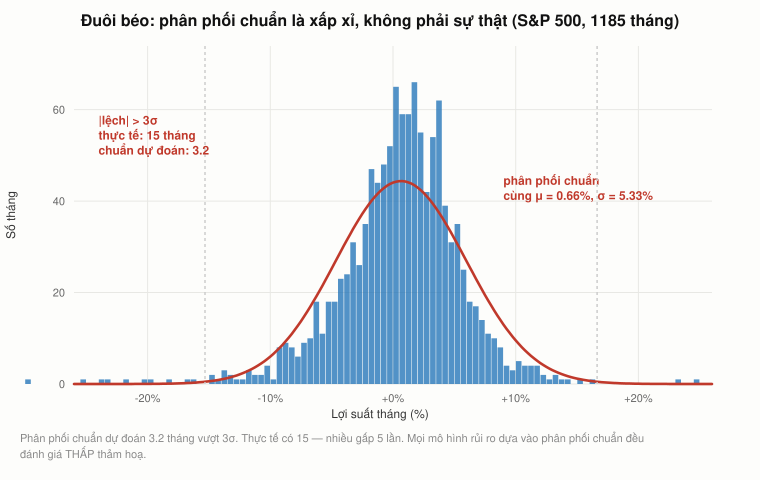

# Bài 9 — Rủi ro và lợi suất: đo bằng gì, và đo được đến đâu

> Bài học dựng trên **phần cuối buổi 12** ("Ses 12: Options III & Risk and Return I",
> `Q2qjnLO3I_M`, từ `53:04`) và **phần đầu buổi 13** ("Ses 13: Risk and Return II & Portfolio
> Theory I", `tL7Lcl90Sc0`, tới `45:56`) — khoá **MIT 15.401 *Finance Theory I*, Fall 2008**,
> giảng viên **Prof. Andrew W. Lo**. Phụ đề gốc do người viết tay.
>
> 🕑 Mốc thời gian có tiền tố buổi: `S13 04:37` = buổi 13, phút 04:37. Mỗi mốc được đối chiếu với
> **đúng** video của nó.
>
> 📚 **Mở rộng** — kiến thức video lướt qua hoặc bài học này bổ sung, **không có trong video**.
> 🇻🇳 **Góc Việt Nam** — số liệu và ví dụ trong nước (mục 20), **không có trong video**.
> ⚠️ **Phần sau `S13 45:56`** là mở đầu lý thuyết danh mục — trọng số, bán khống, 130-30, biên
> hiệu quả. Phần đó thuộc [bài 10](../README.md), không nằm ở đây.
> 📌 **Cần đọc trước:** [Bài 6](bai_06_co_phieu_va_tang_truong.md) — mọi con số "lợi suất cổ
> phiếu" ở đây đều là thứ ta đã chiết khấu suốt bài 2–8 mà chưa bao giờ hỏi nó **từ đâu ra**.
>
> Công thức viết bằng LaTeX — mở bằng **Obsidian** hoặc VS Code + Markdown Preview Enhanced.

---

## Mục lục

<!-- MUC-LUC -->
- [1. Hai buổi, và một dự đoán đã thành sự thật ngay trên lớp](#1-hai-buổi-và-một-dự-đoán-đã-thành-sự-thật-ngay-trên-lớp)
- [2. Câu hỏi khung: có bao giờ nên khen một người làm mất tiền của bạn?](#2-câu-hỏi-khung-có-bao-giờ-nên-khen-một-người-làm-mất-tiền-của-bạn)
- [3. Ba ký hiệu, và một chỗ dễ nhầm](#3-ba-ký-hiệu-và-một-chỗ-dễ-nhầm)
- [4. Đo rủi ro bằng gì](#4-đo-rủi-ro-bằng-gì)
- [5. Tương quan](#5-tương-quan)
- [6. Đuôi béo: phân phối chuẩn là xấp xỉ, không phải sự thật](#6-đuôi-béo-phân-phối-chuẩn-là-xấp-xỉ-không-phải-sự-thật)
- [7. Ba tính chất của một thị trường tốt](#7-ba-tính-chất-của-một-thị-trường-tốt)
- [8. Sóng hình sin: vì sao thị trường tốt phải khó dự đoán](#8-sóng-hình-sin-vì-sao-thị-trường-tốt-phải-khó-dự-đoán)
- [9. Vật lý không đổi ý, thị trường thì có](#9-vật-lý-không-đổi-ý-thị-trường-thì-có)
- [10. Câu chuyện sàn Thượng Hải — con số đúng, cái tên sai](#10-câu-chuyện-sàn-thượng-hải--con-số-đúng-cái-tên-sai)
- [11. Bốn con số thực nghiệm, và chúng còn đúng không](#11-bốn-con-số-thực-nghiệm-và-chúng-còn-đúng-không)
- [12. Trung bình cộng hay trung bình nhân — Lo không nói rõ](#12-trung-bình-cộng-hay-trung-bình-nhân--lo-không-nói-rõ)
- [13. Phần bù rủi ro đo được chính xác đến đâu](#13-phần-bù-rủi-ro-đo-được-chính-xác-đến-đâu)
- [14. Dự đoán lãi suất 30 năm — chấm điểm sau 17 năm](#14-dự-đoán-lãi-suất-30-năm--chấm-điểm-sau-17-năm)
- [15. Ba dị thường Lo chiếu lên bảng](#15-ba-dị-thường-lo-chiếu-lên-bảng)
- [16. Cảnh báo của chính Lo, và điều xảy ra sau đó](#16-cảnh-báo-của-chính-lo-và-điều-xảy-ra-sau-đó)
- [17. Ba dị thường ấy, 18 năm sau](#17-ba-dị-thường-ấy-18-năm-sau)
- [18. Quỹ tương hỗ: biểu đồ nằm bên trái số 0](#18-quỹ-tương-hỗ-biểu-đồ-nằm-bên-trái-số-0)
- [19. Đối chiếu 2026: chỉ số thắng, và người khổng lồ rời ghế](#19-đối-chiếu-2026-chỉ-số-thắng-và-người-khổng-lồ-rời-ghế)
- [20. Góc Việt Nam](#20-góc-việt-nam)
- [21. Code minh hoạ](#21-code-minh-hoạ)
- [22. Tự thử](#22-tự-thử)
- [23. Từ điển thuật ngữ](#23-từ-điển-thuật-ngữ)
- [24. Câu hỏi tự kiểm tra](#24-câu-hỏi-tự-kiểm-tra)
- [Tóm tắt một trang](#tóm-tắt-một-trang)
- [Nguồn](#nguồn)
<!-- /MUC-LUC -->

---

## 1. Hai buổi, và một dự đoán đã thành sự thật ngay trên lớp

| Đoạn                    | Ngày                  | Bằng chứng                                                                                   |
| ----------------------- | --------------------- | -------------------------------------------------------------------------------------------- |
| **Ses 12**, từ `53:04`  | thứ Hai **3/11/2008** | đã chứng minh ở [bài 8, mục 1](bai_08_quyen_chon.md#1-ba-buổi-ba-ngày-và-một-kỳ-thi-giữa-kỳ) |
| **Ses 13**, tới `45:56` | thứ Tư **5/11/2008**  | xem dưới                                                                                     |

Buổi 12 kết bằng *"chúng ta sẽ làm việc đó vào **thứ Tư**"* (`S12 66:46`). Buổi 13 khớp với thứ Tư
**5/11/2008** — **một ngày sau bầu cử tổng thống** — qua hai con số ông đọc trên lớp:

| Lo đọc                                                                                    | Đối chiếu                                                                                           |
| ----------------------------------------------------------------------------------------- | --------------------------------------------------------------------------------------------------- |
| *"kỳ hạn 30 năm sáng nay ở **4,17**"* (`S13 19:50`)                                       | FRED `DGS30`: 4/11 = **4,20 %**, 5/11 = **4,13 %**. Đọc lúc mở cửa ngày 5/11 thì 4,17 nằm đúng giữa |
| *"biến động của S&P hiện khoảng **49 %**… giảm từ **80 %** vài tuần trước"* (`S13 44:10`) | VIX đóng cửa 27/10 = **80,06** (đúng ngày buổi 11); ngày 5/11 VIX giao dịch **46,87–55,62**         |

Và ngay đó Lo tự chấm điểm mình (`S13 44:35`):

> *"Nên **đúng như tôi đã dự đoán**, biến động sẽ giảm khi kết quả bầu cử rõ ràng. Chuyện đó đã
> loại bỏ được một mảnh bất định. Nhưng vẫn còn một mảnh nữa — chuyện gì sẽ xảy ra với nền kinh
> tế. Đó là lý do biến động ở **49 %** thay vì mức trung bình lịch sử 16–20 %."*

Lời hứa ấy được đưa ra ở [bài 7](bai_07_ky_han_va_tuong_lai.md) (`S10 62:16`, ngày 15/10):
*"ba tuần tới, lý thuyết tài chính đi nghỉ mát."* Ba tuần sau, ông quay lại và **đúng**.

⚠️ Nhưng ông vẫn còn nợ hai lời hứa khác từ buổi 11 — chiếu giá quyền chọn bán S&P và đồ thị VIX
— và buổi 12 lẫn buổi 13 đều không làm.
[Bài 8, mục 20](bai_08_quyen_chon.md#20-điều-lo-hứa-hai-lần-rồi-không-làm) đã dựng lại phần đó.

---

## 2. Câu hỏi khung: có bao giờ nên khen một người làm mất tiền của bạn?

Lo mở nửa sau khoá học bằng một câu hỏi cực gọn (`S12 55:39`):

> *"Năm vừa rồi, một nhà quản lý danh mục điển hình lỗ khoảng **30 % tới 40 %**. Đó là mức lợi
> suất khá tàn khốc. Và trong bối cảnh đó, nếu bạn tìm được một nhà quản lý chỉ làm bạn lỗ
> **10 %**, bạn có thể nghĩ: chà, thế là khá đấy chứ."*

> *"**Điều đó có thật sự hợp lý không? Có bao giờ chúng ta muốn chúc mừng một nhà quản lý danh
> mục vì đã làm chúng ta mất tiền không?**"* (`S12 56:05`)

✅ Con số của ông đúng: S&P 500 ngày 29/10/2007 là **1.540,98**; ngày 3/11/2008 là **966,30** —
**−37,3 %**, rơi đúng giữa khoảng ông nói.

**Đây là toàn bộ nửa sau của khoá học nén vào một câu.** Câu trả lời là **có** — nhưng chỉ khi
bạn có một thước đo nói được **rủi ro mà người đó đã gánh**. Không có thước đo ấy thì "−10 % là
giỏi" chỉ là cảm giác. Bài 9–11 tồn tại để xây thước đo đó.

Và Lo nói rõ nó dẫn tới đâu (`S12 53:56`):

> *"Rồi tôi sẽ lấy các thước đo này và nói cho các bạn cách tìm ra **con số mà tôi đã phải hoãn
> lại suốt nửa học kỳ đầu — chi phí vốn**, tức suất sinh lợi yêu cầu, tức suất sinh lợi đã điều
> chỉnh rủi ro."*

Đó là chữ $r$ đã xuất hiện trong **mọi công thức** từ [bài 2](bai_02_gia_tri_hien_tai.md) tới
[bài 8](bai_08_quyen_chon.md) mà chưa lần nào được giải thích nó từ đâu ra.

---

## 3. Ba ký hiệu, và một chỗ dễ nhầm

Lo dựng ký hiệu rất nhanh (`S12 56:36`–`S12 57:49`):

| Khái niệm                  | Định nghĩa                                                      | `S12`   |
| -------------------------- | --------------------------------------------------------------- | ------- |
| **Lợi suất**               | phải **gồm cả cổ tức**, không chỉ thay đổi giá                  | `56:36` |
| **Lợi suất kỳ vọng** $\mu$ | trung bình ta kỳ vọng **trong 5 năm tới**, không phải năm ngoái | `56:55` |
| **Lợi suất vượt trội**     | lợi suất trừ lãi suất phi rủi ro $r_f$                          | `57:13` |
| **Phần bù rủi ro**         | **trung bình** lợi suất vượt trội qua thời gian dài             | `57:31` |

Lo nhấn mạnh sự phân biệt cuối (`S12 57:31`):

> *"**Lợi suất vượt trội** bạn có thể coi là **một lần hiện thực hoá** của phần bù rủi ro. Nhưng
> trung bình qua một thời gian dài, con số ta quan tâm nhất là **phần bù rủi ro** — lợi suất trung
> bình trừ lãi suất phi rủi ro."*

Rồi ông đưa con số (`S12 57:49`):

> *"Suốt khoảng **100 năm** qua, thị trường cổ phiếu Mỹ cho lợi suất trung bình trừ lãi suất phi
> rủi ro vào khoảng **7 %**."*

⚠️ **Ghi nhớ con số 7 % này.** Hai ngày sau, ở `S13 43:49`, ông nói **8 %**.
[Mục 13](#13-phần-bù-rủi-ro-đo-được-chính-xác-đến-đâu) giải thích vì sao cả hai đều "đúng", và
vì sao đó là điều đáng lo hơn là đáng cười.

Và một chỗ Lo cảnh báo mà rất nhiều người bỏ qua (`S12 58:10`): *"Lợi suất vượt trội hiện thực
hoá **năm nay** thì kinh khủng, nên tôi thậm chí không nói con số đó ra. Nhưng các bạn có thấy
khác biệt giữa lợi suất **năm nay** và **trung bình dài hạn** không? Ta bàn được cả hai, nhưng
**dùng kỹ thuật khác nhau cho từng cái**."*

---

## 4. Đo rủi ro bằng gì

Lo chọn hai thống kê và nói thẳng đó là **lựa chọn**, không phải chân lý (`S12 58:44`):

$$\text{Phương sai} = \mathbb{E}\big[(R - \mu)^2\big] \qquad\qquad \text{Độ lệch chuẩn} = \sqrt{\text{Phương sai}}$$

Lý do dùng độ lệch chuẩn thay vì phương sai (`S12 59:24`):

> *"Ta dùng độ lệch chuẩn đơn giản vì nó **cùng đơn vị**. Nó tính bằng phần trăm mỗi năm, còn
> phương sai tính bằng **điểm phần trăm bình phương mỗi năm** — nên độ lệch chuẩn dễ xử lý hơn."*

Rồi ông phân biệt hai thứ mà người học hay lẫn (`S12 59:45`): giá trị **tổng thể** (lý thuyết,
$\mu$ và $\sigma$) so với **ước lượng mẫu** (tính từ dữ liệu lịch sử). Cả
[mục 13](#13-phần-bù-rủi-ro-đo-được-chính-xác-đến-đâu) xoay quanh khoảng cách giữa hai thứ đó.

📚 Và ở buổi sau, Lo thừa nhận độ lệch chuẩn là một lựa chọn có nhược điểm — nhưng đoạn đó
(`S13 67:42` trở đi) nằm trong phần lý thuyết danh mục, thuộc [bài 10](../README.md). Tóm tắt: đo
rủi ro bằng **độ trải** thì *"bạn đang lẫn phần trên với phần dưới. Chưa ai gặp vấn đề với rủi ro
đi lên cả."*

---

## 5. Tương quan

Thống kê thứ ba, và là thống kê sẽ dựng nên toàn bộ [bài 10](../README.md) (`S12 60:18`):

> *"Tương quan là **hai khoản đầu tư di chuyển cùng nhau chặt đến đâu**… là một con số giữa
> **−1 và 1** đo mức độ liên hệ giữa hai chứng khoán."*

Rồi ông báo trước cách nó sẽ được dùng (`S12 61:14`):

> *"Nếu khoản đầu tư mới có tương quan **bằng không hoặc âm** với danh mục hiện tại của bạn, nó sẽ
> giúp **giảm dao động**. Nhưng nếu hai khoản cùng lên xuống một lúc, nó không những không giúp mà
> còn **cộng thêm rủi ro**. Và bạn không muốn thế — ít nhất là không muốn nếu không có phần thưởng
> tương xứng."*

Câu cuối đó là toàn bộ mô hình CAPM viết bằng lời, ba buổi trước khi nó được viết bằng công
thức.

---

## 6. Đuôi béo: phân phối chuẩn là xấp xỉ, không phải sự thật



*1.185 tháng lợi suất S&P 500 thật, so với phân phối chuẩn cùng trung bình và độ lệch chuẩn.*

Lo chiếu biểu đồ tần suất lợi suất tháng của **General Motors** cùng đường phân phối chuẩn có cùng
trung bình và phương sai (`S12 63:28`):

> *"Trông thì có vẻ là một xấp xỉ khá tốt, nhưng thực ra có **những mẩu xác suất thừa** thò ra ở
> đây và ở đây, không khớp với chuẩn."* (`S12 63:52`)

> *"Giả định phân phối chuẩn sẽ nói rằng xác suất nhận lợi suất **−15 %** là tương đối thấp, và
> nhận dưới **−20 %** là **cực kỳ thấp**. Nhưng thực tế thì khác. Trong dữ liệu **có** rủi ro nhận
> những lợi suất thấp hơn nhiều. Và **sau năm nay**, tôi có thể nói với các bạn rằng **những cái
> đuôi này sẽ còn béo hơn nữa**."* (`S12 64:12`)

Rồi câu đắt nhất cả đoạn (`S12 64:49`):

> *"**95 % của phân phối** được nắm bởi những gì tôi sẽ dạy trong khoá này. Nhưng nếu bạn muốn
> **5 % còn lại** cho đúng — và nhân tiện, **nếu bạn định làm nghề đầu tư thì tất cả nằm ở 5 %
> đó** — thì bạn sẽ muốn học 15.433."*

**Đây là câu quan trọng nhất trong cả hai buổi.** Lo đang nói trước rằng bộ khung ông sắp dạy —
trung bình, phương sai, tương quan, CAPM — là một **xấp xỉ có biên**, và biên đó nằm đúng chỗ nghề
đầu tư sống. Ông hứa quay lại chất vấn nó ở buổi cuối ([bài 13](../README.md)), và ông giữ lời.

📚 Mức độ "béo" của đuôi, đo bằng số: trong 1.185 tháng S&P 500 từ 1928 tới 2026, tháng tệ nhất là
**−29,94 %** và tháng tốt nhất là **+39,14 %** — tức khoảng **±5,6 độ lệch chuẩn**. Dưới phân phối
chuẩn, một biến cố 5,6 xích-ma xảy ra chừng **một lần trong 50 triệu tháng**. Ta đã gặp hai lần
trong chưa tới một trăm năm.

---

## 7. Ba tính chất của một thị trường tốt

Buổi 13 mở bằng một câu hỏi ngược đời (`S13 02:36`):

> *"Nếu bạn đang **thiết kế** một thị trường cổ phiếu, bạn muốn thị trường đó có những tính chất
> gì?"*

Lo đưa ba, và cả ba đều làm người nghe khó chịu:

| #   | Tính chất                                                                   | `S13`   |
| --- | --------------------------------------------------------------------------- | ------- |
| 1   | Giá **ngẫu nhiên và không dự đoán được**                                    | `02:58` |
| 2   | Giá **phản ứng nhanh** với thông tin mới, gần như không có độ trễ           | `03:19` |
| 3   | Nhà đầu tư **không thể kiếm lợi suất bất thường** sau khi điều chỉnh rủi ro | `03:35` |

Rồi ông tự thừa nhận điều đó nghe kỳ (`S13 02:58`): *"Nghe hơi phản trực giác, và chắc chắn các
bạn sẽ công nhận rằng mấy tuần qua thị trường **cực kỳ khó đoán**. Cảm giác đó **không dễ chịu**.
Nghe không giống một điều tốt."*

Và định nghĩa gọn lại (`S13 04:03`):

> *"Cách nói khác là **thị trường đó có tính cạnh tranh rất cao. Rất khó kiếm tiền trong những thị
> trường như vậy.** Có thể đó không phải thị trường bạn thích giao dịch — nhưng đó không phải câu
> hỏi. Câu hỏi là: **thế nào là một thị trường tốt?**"*

---

## 8. Sóng hình sin: vì sao thị trường tốt phải khó dự đoán

Lo vẽ một đường lên bảng và hỏi lớp cách dự báo nó (`S13 04:37`).

- Sinh viên: *"Có chu kỳ."* — *"Đường gì?"* — *"Sóng hình sin."*
- Lo (`S13 04:58`): *"Đúng, sóng hình sin. Thật ra tôi tạo ra nó **đúng bằng cách đó** — một sóng
  sin cộng chút nhiễu. Vậy tại sao đây lại **không** phải mô hình tốt cho một thị trường?"*
- Sinh viên (`S13 05:14`): *"**Ai cũng sẽ mua ở đáy và bán ở đỉnh.**"*
- Lo: *"Chính xác. Qua vài chu kỳ là bạn hiểu ra. Và bạn **không cần trải qua nhiều chu kỳ lắm**
  trước khi giàu hơn cả trong mơ."*
- Sinh viên khác (`S13 05:42`): *"Một thị trường đều đặn như thế **không thể có thật**, vì ngay khi
  ai cũng muốn nó tăng thì nó sẽ sụp."*
- Lo (`S13 06:03`): *"**Chính xác. Ngay khi bạn cố làm điều đó — mô hình biến mất.**"*

Mục 1 của [code](#21-code-minh-hoạ) chạy đúng thí nghiệm ấy. Quy tắc thô sơ nhất có thể nghĩ ra —
*"kỳ trước tăng thì nắm giữ, không thì đứng ngoài"* — trên bốn thị trường khác nhau:

| Thị trường                       |      Quy tắc |      Mua và giữ | Quy tắc ăn đứt? |
| -------------------------------- | -----------: | --------------: | --------------- |
| Sóng hình sin của Lo (nhiễu nhỏ) | **+741,1 %** |          −5,3 % | **CÓ**          |
| Sóng hình sin, nhiễu gấp sáu lần |      −73,5 % |          −1,4 % | không           |
| Bước ngẫu nhiên, không có chu kỳ |       −1,8 % |        +107,6 % | không           |
| **S&P 500 THẬT, 12/1927–9/2026** |   +6.026,4 % | **+43.830,6 %** | không           |

Ba bài học trong một bảng:

1. **Có chu kỳ thật thì quy tắc ngu ngốc nhất cũng thắng đậm.** Đó là lý do một thị trường có chu
   kỳ không thể tồn tại.
2. **Thêm nhiễu vào là lợi thế biến mất** — dù chu kỳ vẫn còn nguyên ở đó. Mô hình có thật mà
   không **khai thác được**.
3. **Trên gần một thế kỷ dữ liệu thật, quy tắc ấy bỏ lỡ 86 % mức tăng** — và bảng này **chưa trừ
   một đồng phí giao dịch hay thuế nào**.

---

## 9. Vật lý không đổi ý, thị trường thì có

Đây là câu hay nhất buổi giảng (`S13 06:18`):

> *"Đây là một trong những lý do tài chính khó hơn vật lý nhiều. **Trong vật lý, nếu bạn thả một
> quả bóng trong trường hấp dẫn, nó sẽ không đổi ý và nói: chà, giờ tôi sẽ đổi hằng số hấp dẫn,
> chỉ vì anh đang thử tôi.** Nhưng trong thị trường tài chính, **ngay khoảnh khắc bạn cố khai thác
> một mô hình, mô hình đó thay đổi.** Và bạn càng cố khai thác thì nó càng thay đổi nhanh."*

> *"Nếu có **rất nhiều người** cố dự đoán mô hình — bạn biết được gì không? **Bạn không được mô
> hình nào cả. Bạn được sự ngẫu nhiên.**"* (`S13 06:53`)

Rồi ông lật ngược nó, và đây mới là ý sâu (`S13 07:13`):

> *"Khi bạn **dự báo** giá thị trường, bạn biết mình đang làm gì không? Bạn **đang giúp thị trường
> trở nên hiệu quả hơn**, bằng cách đưa thông tin vào giá."*

**Người dự báo và thị trường hiệu quả không phải hai phe đối nghịch — họ là hai mặt của cùng
một đồng xu.** Thị trường hiệu quả **vì** có nhiều người cố đánh bại nó. Nếu một ngày ai cũng bỏ
cuộc và mua chỉ số, thị trường sẽ **thôi** hiệu quả. Đó là nghịch lý Grossman–Stiglitz, và
[mục 19](#19-đối-chiếu-2026-chỉ-số-thắng-và-người-khổng-lồ-rời-ghế) cho thấy nó đang thành vấn đề
thật.

Và Lo trả lời một câu hỏi rất đúng chỗ (`S13 10:26`): biến động cao có phải dấu hiệu kém hiệu quả
không?

> *"**Không phải bản thân biến động, mà là mức độ DỰ ĐOÁN ĐƯỢC TRÊN MỖI ĐƠN VỊ BIẾN ĐỘNG.** Đó
> mới là thứ cần tập trung."*

---

## 10. Câu chuyện sàn Thượng Hải — con số đúng, cái tên sai

Để minh hoạ rằng *"thị trường ít biến động không có nghĩa là hoạt động tốt"*, Lo kể (`S13 09:38`):

> *"Ví dụ hồi đó — chuyện này khoảng **20 hay 30 năm trước** — là thị trường chứng khoán Trung
> Quốc, **Sở Giao dịch Thượng Hải**. Đó là một thị trường khá non trẻ, và lúc ấy **chỉ có hai cổ
> phiếu** giao dịch trên đó. Đó là **Công ty Đường sắt Quốc gia** và **Ngân hàng Trung Quốc**."*

> *"Và lúc đó, người ta coi việc **bán** một chứng khoán mình đã mua là **không yêu nước**. Nên
> bạn được mua, nhưng không được bán. Thế là giá cứ lên, lên và lên."* (`S13 09:54`)

### Kiểm chứng

✅ **"Chỉ có hai cổ phiếu" — ĐÚNG, và đúng một cách đáng nể.** Ngày **26/9/1986**, chi nhánh quận
Tĩnh An của Công ty Tín thác và Đầu tư thuộc Ngân hàng Công thương Trung Quốc chi nhánh Thượng Hải
chính thức khai trương quầy giao dịch cổ phiếu **đầu tiên** sau khi nước Cộng hoà Nhân dân Trung
Hoa thành lập — giao dịch **đúng hai** mã. Khối lượng khoảng **700 cổ phiếu, tức chừng 35.000 nhân
dân tệ mỗi ngày**. Từ 2008 nhìn lại thì đó là **22 năm trước**, khớp với "20 hay 30 năm".

❌ **Tên hai công ty thì sai.** Hai mã đó là **Diên Trung Thực nghiệp** (延中实业) và **Phi Nhạc Âm
hưởng** (飞乐音响) — hai doanh nghiệp **tập thể** nhỏ ở Thượng Hải, không phải Đường sắt Quốc gia
hay Ngân hàng Trung Quốc. Phi Nhạc Âm hưởng thành lập **18/11/1984**, được coi là **công ty cổ
phần niêm yết đầu tiên của Trung Quốc mới**; tháng 11/1986 Đặng Tiểu Bình tặng Chủ tịch Sở Giao
dịch New York John Phelan một tờ cổ phiếu Phi Nhạc mệnh giá 50 nhân dân tệ.

⚠️ **Chi tiết "bán là không yêu nước" — bài này KHÔNG xác minh được.** Nó có thể đúng như một mô tả
văn hoá thời đó, nhưng không tìm được nguồn độc lập. Bài này trình bày nó như **câu Lo kể**, không
như dữ kiện.

📌 Và **Sở Giao dịch Thượng Hải** đúng nghĩa chỉ khai trương **19/12/1990** với "Bát Lão Cổ" — tám
mã đầu tiên. Cái Lo mô tả là **quầy giao dịch phi tập trung tiền thân**, không phải sàn.

Nhưng **luận điểm của Lo thì đứng vững**: một thị trường mà bạn chỉ được mua chứ không được bán
sẽ có biến động rất thấp và **không phản ánh thông tin nào**. Biến động thấp ≠ hiệu quả.

---

## 11. Bốn con số thực nghiệm, và chúng còn đúng không

Lo đưa **bốn dữ kiện** về thị trường cổ phiếu Mỹ (`S13 11:57`), dựa trên dữ liệu **1946–2001**:

1. **Lãi suất thực chỉ dương chút ít.** Tín phiếu 1 năm ~**38 điểm cơ bản/tháng**; lạm phát
   ~**32 điểm cơ bản/tháng** ⟹ lãi suất thực ~**6 điểm cơ bản/tháng** (`S13 12:35`).
2. **Chỉ số trọng số vốn hoá ~1 %/tháng**, chỉ số trọng số đều **1,18 %**, Motorola **1,66 %**
   (`S13 12:54`).
3. **Rủi ro đi kèm.** Motorola có độ lệch chuẩn tháng ~**10 %** so với ~**5 %** của các chỉ số
   (`S13 13:38`).
4. **"Càng nhiều rủi ro, lợi suất kỳ vọng càng cao — đó là thông điệp bạn rút ra khi nhìn dữ
   liệu cơ bản này."** (`S13 13:59`)

Rồi ở cuối phần, ông gói lại thành ba con số để nhớ (`S13 43:28`, `S13 43:49`):

> *"Lợi suất trung bình của cổ phiếu Mỹ từ **1926 đến 2004 là 11,2 %**… Phần bù rủi ro trung bình
> khoảng **8 %**… Độ lệch chuẩn của thị trường khoảng **16 %/năm**."*

### Tính lại bằng dữ liệu thật

Mục 2 của [code](#21-code-minh-hoạ) chạy 1.185 tháng S&P 500 (Yahoo `^GSPC`, 12/1927–9/2026):

| Cửa sổ                     | Tháng | TB tháng | TB năm | Độ lệch năm | Thấp nhất | Cao nhất |
| -------------------------- | ----: | -------: | -----: | ----------: | --------: | -------: |
| 1946–2001 (bảng của Lo)    |   672 |  0,712 % | 8,55 % | **14,39 %** |  −21,76 % | +16,30 % |
| 1928–2004 (con số kết bài) |   924 |  0,615 % | 7,38 % | **19,36 %** |  −29,94 % | +39,14 % |
| 1928–2026 (toàn bộ)        | 1.185 |  0,657 % | 7,88 % |     18,45 % |  −29,94 % | +39,14 % |

### Hai chỗ cần đính chính

**Một: con số 11,2 % là TỔNG lợi suất, bảng trên là lợi suất GIÁ.** Đo khoảng cách bằng dữ liệu
thật, giai đoạn 1/1988–9/2026 (38,7 năm):

|                            |    Đầu |      Cuối |        Kép/năm |
| -------------------------- | -----: | --------: | -------------: |
| Chỉ số **giá** `^GSPC`     | 257,07 |  7.718,60 |     **9,20 %** |
| Chỉ số **tổng** `^SP500TR` | 257,47 | 17.298,34 |    **11,50 %** |
| ⇒ **cổ tức đóng góp**      |        |           | **2,30 %/năm** |

Nghe nhỏ, nhưng tích luỹ 39 năm thì 1 đô thành **30 đô** so với **67 đô** — **gấp 2,2 lần**. Mọi
con số "lợi suất cổ phiếu" đều phải nói rõ là **giá** hay **tổng**. Đây là bài 6 vọng lại: cổ tức
không phải phần thêm nếm, nó là **một nửa câu chuyện**.

**Hai: con số "16 % độ lệch chuẩn" của Lo hợp với BẢNG ông chiếu, không hợp với CỬA SỔ ông gán.**

| Cửa sổ                                         |    Độ lệch chuẩn tính lại |
| ---------------------------------------------- | ------------------------: |
| **1946–2001** — cửa sổ bảng số liệu Lo chiếu   |    **14,39 %** — sát 16 % |
| **1928–2004** — cửa sổ ông gán con số 16 % vào | **19,36 %** — cách khá xa |

Thập niên 1930 làm mọi thứ khác hẳn. Lo đọc con số của bảng này rồi gán cho cửa sổ kia.

---

## 12. Trung bình cộng hay trung bình nhân — Lo không nói rõ

Khi Lo nói *"11,2 %/năm"*, đó là trung bình **cộng** hay trung bình **nhân**? Ông không nói. Và
hai con số ấy **không bằng nhau**.

| Cửa sổ    | TB cộng/năm | TB nhân/năm |      Chênh | $\sigma^2/2$ | 1 $ thành |
| --------- | ----------: | ----------: | ---------: | -----------: | --------: |
| 1946–2001 |      8,55 % |      7,77 % |     0,78 % |       1,03 % |      66 $ |
| 1928–2004 |      7,38 % |      5,65 % | **1,74 %** |       1,87 % |      69 $ |
| 1928–2026 |      7,88 % |      6,35 % |     1,53 % |       1,70 % |     437 $ |

Xấp xỉ:

$$\text{TB nhân} \;\approx\; \text{TB cộng} - \frac{\sigma^2}{2}$$

Cột 4 và cột 5 gần trùng nhau — đó không phải trùng hợp, đó là công thức.

**Ý nghĩa thực dụng:** nếu bạn lấy "trung bình cộng" để dự báo giá trị danh mục sau 30 năm, bạn sẽ
**dự báo cao hơn sự thật một cách có hệ thống**. Với $\sigma = 20\%$/năm, sai lệch là 2 %/năm —
sau 30 năm là **1,8 lần**.

📌 Nó cũng là lời giải thích cho một chuyện lạ trong bảng: cửa sổ **1946–2001 (56 năm)** biến 1 đô
thành **66 đô**, còn cửa sổ **1928–2004 (77 năm)** — dài hơn 21 năm — chỉ thành **69 đô**. Thập
niên 1930 nuốt gần trọn phần chênh.

---

## 13. Phần bù rủi ro đo được chính xác đến đâu

Đây là mục quan trọng nhất bài này, và Lo **không** làm nó.

Ông đọc **7 %** ở buổi 12 (`S12 57:49`) rồi **8 %** ở buổi 13 (`S13 43:49`) — cách nhau hai ngày.
Rất dễ coi đó là lỡ lời. Nó không phải.

Cả hai đều là **ước lượng từ mẫu**, và sai số chuẩn của ước lượng đó là

$$\text{SE}(\hat\mu) = \frac{\sigma}{\sqrt{T}}$$

Mục 4 của [code](#21-code-minh-hoạ) tính nó ra:

|     Số năm dữ liệu | $\sigma = 16\%$ | $\sigma = 20\%$ | Khoảng tin cậy 95 % quanh 8 % |
| -----------------: | --------------: | --------------: | ----------------------------- |
|                 10 |          5,06 % |          6,32 % | 8 % ± 12,4 %                  |
|                 30 |          2,92 % |          3,65 % | 8 % ± 7,2 %                   |
| **79** (1926–2004) |          1,80 % |      **2,25 %** | **8 % ± 4,4 %**               |
|                100 |          1,60 % |          2,00 % | 8 % ± 3,9 %                   |
|                400 |          0,80 % |      **1,00 %** | 8 % ± 2,0 %                   |

### Ba kết luận không thoải mái

**1. Với 79 năm dữ liệu, khoảng tin cậy 95 % của "phần bù rủi ro 8 %" là [3,6 % ; 12,4 %].** Dữ
liệu **không loại trừ được** cả giả thuyết "phần bù chỉ 3,6 %" lẫn giả thuyết "phần bù tận
12,4 %". Toàn bộ các cuộc tranh luận về hưu trí, về định giá, về chi phí vốn đều diễn ra **bên
trong** khoảng đó.

**2. Muốn sai số chuẩn xuống 1 %/năm cần 400 NĂM dữ liệu.** Ta không có 400 năm. Ta có khoảng 100.
Và 400 năm dữ liệu về "cùng một thị trường" là một khái niệm vô nghĩa — nước Mỹ năm 1626 không tồn
tại.

**3. Vì sao Lo đọc 7 % rồi 8 %:** chênh lệch một điểm phần trăm nằm **gọn** trong sai số đo lường.
Không ai sai cả. Chỉ là con số **không được biết chính xác đến mức đó**.

### Và đây là điều làm nên bài 10–11

Độ lệch chuẩn thì đo được **chính xác hơn nhiều**: sai số chuẩn của $\sigma$ xấp xỉ
$\sigma/\sqrt{2T}$.

| Số năm | SE của $\mu$ | SE của $\sigma$ |
| -----: | -----------: | --------------: |
|     10 |       6,32 % |      **4,47 %** |
|     30 |       3,65 % |      **2,58 %** |
|     79 |       2,25 % |      **1,59 %** |

**RỦI RO đo được. LỢI SUẤT KỲ VỌNG thì gần như không.** Toàn bộ lý thuyết danh mục
([bài 10](../README.md)) và CAPM ([bài 11](../README.md)) được xây trên đúng sự bất cân xứng này:
chúng dồn hết công sức vào việc **tối ưu hoá cái đo được**, và giả định cái không đo được là đã
cho trước.

---

## 14. Dự đoán lãi suất 30 năm — chấm điểm sau 17 năm

Lo đọc số liệu sáng hôm đó (`S13 19:50`) rồi đưa ra một phán đoán rất dứt khoát (`S13 20:09`):

> *"Dựa trên bằng chứng lịch sử, **nghe có vẻ điên rồ** khi nghĩ rằng chúng ta có thể ở trong môi
> trường lãi suất thấp như thế suốt **30 năm tới** — nhất là khi ta **đang in tiền như thể nó sắp
> hết mốt**. Và ta sẽ còn làm thế trong vài năm nữa. Ta **phải** làm, vì ai đó phải trả cho tất cả
> các gói cứu trợ này. Nên về cơ bản ta buộc phải theo đuổi chính sách tiền tệ và tài khoá có tính
> lạm phát."*

Mục 5 của [code](#21-code-minh-hoạ) chấm điểm bằng chuỗi `DGS30` thật, 215 tháng từ 11/2008 tới
9/2026:

| Giai đoạn         |   Tháng | Trung bình | Tỷ lệ tháng **dưới** 4,17 % |
| ----------------- | ------: | ---------: | --------------------------: |
| 11/2008 – 12/2013 |      62 |     3,71 % |                        65 % |
| 01/2014 – 12/2019 |      72 |     2,89 % |                   **100 %** |
| 01/2020 – 12/2021 |      24 |     1,81 % |                   **100 %** |
| 01/2022 – 09/2026 |      57 |     4,24 % |                        39 % |
| **Toàn bộ**       | **215** |            |                    **73 %** |

|                              |                       |
| ---------------------------- | --------------------: |
| Thấp nhất (trung bình tháng) |   **1,27 %** (3/2020) |
| Thấp nhất theo ngày          | **0,99 %** (9/3/2020) |
| Cao nhất                     |                5,26 % |
| Tháng 9/2026                 |            **5,26 %** |

### Chấm điểm cho công bằng: Lo SAI 13 năm, rồi ĐÚNG 4 năm

Không những lãi suất không tăng — nó **rơi xuống 0,99 %**, tức chưa bằng một phần tư mức Lo cho là
đáy. Và suốt **2014–2021, không một tháng nào** lãi suất 30 năm vượt 4,17 %.

Từ 2022 lạm phát quay lại và ông bắt đầu đúng. Nhưng cần đọc đúng chỗ ông sai: **"in tiền" xảy ra
2008–2014; lạm phát đến năm 2021.** Độ trễ 7–13 năm. Cơ chế ông mô tả cuối cùng có hoạt động — chỉ
là trên một **chu kỳ dài gấp mười lần** so với cái ông ngầm định trong câu nói.

📌 Và điều đó gắn thẳng với [mục 13](#13-phần-bù-rủi-ro-đo-được-chính-xác-đến-đâu): với 17 năm dữ
liệu, ngay cả một chuỗi hoàn toàn quan sát được như lãi suất cũng chưa đủ dài để phán một câu về
30 năm.

---

## 15. Ba dị thường Lo chiếu lên bảng

Lo mở phần này bằng một lời rào rất cẩn thận (`S13 28:06`):

> *"Cái tôi sắp cho các bạn xem chỉ là một mớ **factoid** — nghĩa là chúng là các dữ kiện thực
> nghiệm trong dữ liệu. **Nhưng nếu bạn đổi vài giả định hoặc đổi mẫu, những dữ kiện này có thể
> đổi theo.** Đây không phải hằng số phổ quát mà vì lý do lý thuyết nào đó phải đúng. Đây chỉ là
> **tính chất của dữ liệu**."*

Rồi ba dị thường, tất cả trên toàn bộ cổ phiếu NYSE + Amex + NASDAQ, **1964–2004**:

### Hiệu ứng quy mô (`S13 28:27`)

Chia 10 nhóm theo vốn hoá. Nhóm **lớn nhất** ~**9–10 %/năm**; nhóm **nhỏ nhất** ~**15 %/năm**.
Khoảng cách **~500 điểm cơ bản/năm**.

### Rồi ông tự phá nó (`S13 30:48`)

Ông tính lại, tách riêng **tháng Giêng** và các tháng còn lại:

> *"Tôi thật sự **không nghĩ còn nhiều hiệu ứng quy mô** một khi bạn bỏ các tháng Giêng đi. Vẫn có
> chút khác biệt giữa lớn nhất và nhỏ nhất, nhưng khác biệt đó **rất nhỏ**. Còn nhìn hiệu ứng
> tháng Giêng mà xem — **cái đó thì to**."* (`S13 31:22`)

**Một "quy luật" 500 điểm cơ bản hoá ra gần như toàn bộ nằm trong MỘT tháng của năm.** Đây là
màn trình diễn hay nhất về cách một dị thường tan ra khi bạn nhìn kỹ hơn — và Lo tự làm nó với
chính dữ liệu của mình.

### Phần bù giá trị (`S13 32:26`)

Sắp xếp theo **giá trị sổ sách / giá thị trường** thay vì vốn hoá. Chênh lệch giữa nhóm giá/sổ sách
cao và thấp: **600–700 điểm cơ bản/năm** (`S13 34:47`).

Và Lo chỉ ra chỗ khác biệt then chốt so với hiệu ứng quy mô (`S13 35:07`):

> *"Đó là khác biệt lớn, vì trong **cả hai nhóm** thì rủi ro **gần như tương đương**. Không phải
> chuyện cổ phiếu bên trái rủi ro hơn hẳn bên phải. Điều đó **thì đúng** với hiệu ứng vốn hoá —
> cổ phiếu nhỏ **thật sự** biến động hơn cổ phiếu lớn. Nhưng **không đúng** với giá trị và tăng
> trưởng."*

Ông cũng ghi nhận đây là địa hạt của ai (`S13 32:26`): *"Tuỳ bạn hỏi ai — **Warren Buffett** sẽ
gọi đây là thiên tài và là sự thật."* Và (`S13 34:26`) đó chính là **cổ phiếu giá trị** theo nghĩa
Graham và Dodd.

### Động lượng (`S13 35:25`)

Lợi suất **năm ngoái** có duy trì sang 12 tháng tới không? Chênh lệch giữa nhóm động lượng cao và
thấp: *"khoảng **15 %**, nếu không hơn. Một khoảng cách rất, rất lớn."* (`S13 35:48`)

---

## 16. Cảnh báo của chính Lo, và điều xảy ra sau đó

Ngay sau khi chiếu ba dị thường, Lo tự dội nước lạnh (`S13 36:15`):

> *"Có lúc, một số tạp chí học thuật bị chê là **chưa từng gặp một dị thường nào mà họ không
> yêu**, vì cứ công bố cái này tới cái khác. Và theo một nghĩa nào đó, bạn phải hơi hoài nghi. Vì
> có **quá nhiều cách nhìn cổ phiếu**, quá nhiều đặc trưng. Và bạn biết rằng **trong một mẫu 100
> biến ngẫu nhiên, 5 % trong số đó sẽ có ý nghĩa thống kê — ngay cả khi không cái nào thực sự khác
> không.**"*

> *"Nên bạn **phải nhìn các dị thường này với một hạt muối**."* (`S13 37:09`)

### Mô phỏng đúng cảnh báo đó, trên dữ liệu thật

Mục 7 của [code](#21-code-minh-hoạ) lấy **492 tháng lợi suất S&P 500 thật, 1/1964–12/2004** —
đúng cửa sổ Lo dùng — rồi tạo **100 tín hiệu bật/tắt hoàn toàn ngẫu nhiên**, không chứa một mẩu
thông tin nào. Với mỗi tín hiệu, so lợi suất trung bình các tháng "bật" với các tháng "tắt":

| Ngưỡng $ |     t |    $ | Số "dị thường" có ý nghĩa | Kỳ vọng lý thuyết |
| -------- | ----: | ---: |
| > 1,96   | **4** |    5 |
| > 2,78   | **2** |  0,5 |
| > 3,00   | **1** |  0,3 |

**"Dị thường" tốt nhất trong 100 cái: chênh lệch +17,50 %/năm, $|t| = 3{,}80$.**

Con số đó **vượt cả ngưỡng khắt khe nhất mà giới học thuật đề ra** — và nó **không chứa một
mẩu thông tin nào**. Tín hiệu là số giả ngẫu nhiên thuần tuý.

### Và đó chính là điều ngành tài chính phát hiện ra sau khi Lo giảng bài này

| Nghiên cứu                                | Phát hiện                                                                        |
| ----------------------------------------- | -------------------------------------------------------------------------------- |
| **Harvey, Liu & Zhu (2016)**, *RFS* 29(1) | Với mức độ khai thác dữ liệu hiện nay, một nhân tố mới phải vượt **$             | t | > 3{,}0$**, không phải 2,0. Trong 296 dị thường đã công bố, **27–53 % là phát hiện giả** |
| **McLean & Pontiff (2016)**, *JF* 71(1)   | 97 biến dự báo: lợi suất thấp hơn **26 %** ngoài mẫu và **58 %** sau khi công bố |
| **Hou, Xue & Zhang (2020)**, *RFS* 33(5)  | Trong **452** dị thường, **65 %** không vượt nổi $                               | t | \ge 1{,}96$ khi dùng trọng số vốn hoá và ngưỡng NYSE; ở ngưỡng 2,78 thì **82 %** hỏng    |

⚠️ **Nhưng phải nói cả phía phản biện.** Chen & Zimmermann, và Jensen–Kelly–Pedersen (2023), tìm
được tỷ lệ tái lập **cao** khi áp dụng phương pháp nhất quán; con số "65 % hỏng" phụ thuộc rất
mạnh vào cách xử lý cổ phiếu siêu nhỏ và cách gán trọng số. Ba bài trên cũng nói ba chuyện khác
nhau: Harvey–Liu–Zhu bàn về **ngưỡng thống kê**, McLean–Pontiff nói dị thường **có thật nhưng suy
giảm**, chỉ Hou–Xue–Zhang mới cho rằng phần lớn **chưa từng tồn tại**.

**Điểm đáng khâm phục là: Lo cảnh báo chính xác điều này năm 2008, TRƯỚC cả ba bài báo.** Ông
chiếu ba dị thường lên bảng rồi tự nói đừng tin chúng quá. Mười tám năm sau, ngành tài chính dành
hàng trăm bài báo để chứng minh ông đúng.

---

## 17. Ba dị thường ấy, 18 năm sau

Lo giảng bài này ngày **5/11/2008**. Thời điểm không thể tệ hơn.

| Dị thường           | Lo nói (11/2008)                                                 | Chuyện đã xảy ra                                                                                                                                                                       |
| ------------------- | ---------------------------------------------------------------- | -------------------------------------------------------------------------------------------------------------------------------------------------------------------------------------- |
| **Động lượng**      | *"hiệu ứng động lượng có vẻ **thực sự mạnh**"*, chênh lệch ~15 % | **Bốn tháng sau**, động lượng mất **hơn 73 % trong ba tháng** (3–5/2009). Daniel & Moskowitz xếp 3/2009–3/2013 là một trong **hai** giai đoạn sụt sâu nhất lịch sử, cùng với 1932–1939 |
| **Phần bù giá trị** | 600–700 điểm cơ bản/năm, *"rủi ro gần như tương đương"*          | Nhân tố HML bước vào **cú sụt sâu nhất kể từ 1963**: **−55 %** từ 2007 tới giữa 2020. Một số cách dựng danh mục cho ra **−59 %**                                                       |
| **Hiệu ứng quy mô** | ~500 điểm cơ bản/năm                                             | Chính Lo đã cho thấy nó gần như **biến mất** ngoài tháng Giêng. Các nghiên cứu tái lập sau này xếp nó vào nhóm mong manh nhất                                                          |

### Hiệu ứng tháng Giêng, tính lại

Mục 6 của [code](#21-code-minh-hoạ) đo trên chính chỉ số S&P 500:

| Giai đoạn     |    Tháng Giêng | Các tháng khác |          Chênh |
| ------------- | -------------: | -------------: | -------------: |
| **1928–2007** | +1,475 %/tháng | +0,535 %/tháng | **+0,94 điểm** |
| **2008–2026** | +0,112 %/tháng | +0,911 %/tháng | **−0,80 điểm** |

**Dấu bị đảo ngược.** Trước bài giảng của Lo, tháng Giêng tốt hơn các tháng khác gần một điểm
phần trăm mỗi tháng. Sau đó, nó **tệ hơn** gần một điểm.

⚠️ Phải nói cho công bằng: Lo trình bày hiệu ứng tháng Giêng trên danh mục **cổ phiếu nhỏ**, nơi
nó mạnh nhất, chứ không phải trên chỉ số lớn. Bảng trên **không bác bỏ** ông; nó cho thấy bạn
**không thể tái dựng** phát hiện của ông bằng dữ liệu chỉ số. Và đó chính là vấn đề: **các dị
thường sống ở góc khó quan sát nhất của thị trường** — nơi chi phí giao dịch cao nhất và dữ liệu
kém tin cậy nhất.

---

## 18. Quỹ tương hỗ: biểu đồ nằm bên trái số 0

Lo khép phần thực nghiệm bằng câu hỏi hiển nhiên (`S13 38:15`): nếu có ngần ấy dị thường và có thể
khai thác chúng, thì các nhà quản lý quỹ phải đánh bại được chiến lược mua-và-giữ chứ?

Ông chiếu biểu đồ tần suất lợi suất vượt trội của quỹ tương hỗ, **1972–1991** (`S13 38:55`):

> *"Bạn có một ít dương, một ít âm, **âm nhiều hơn dương**, và trung bình thì **nhỏ hơn không**.
> **Quỹ tương hỗ, sau khi trừ phí, trung bình đang làm bạn MẤT tiền.**"* (`S13 39:17`)

Và ẩn dụ ông dùng (`S13 41:31`):

> *"Đâu đó trong này là Quỹ Magellan của **Peter Lynch** — một quỹ tuyệt vời, một nhà quản lý rất
> tài năng. Nhưng mặt khác, **nếu bạn không thể biết TRƯỚC ai sẽ là Peter Lynch tiếp theo**, thì
> về cơ bản bạn đang **ném phi tiêu vào cái biểu đồ này**."*

Rồi ông đưa một con số làm cả lớp cười (`S13 42:34`):

> *"Nhân tiện, các bạn có biết là **có nhiều quỹ tương hỗ hơn cả số cổ phiếu** không? Khoảng
> **10.000 quỹ tương hỗ**. Có khoảng **8.000 cổ phiếu**, kể cả cổ phiếu hạng bét… Cách các nhà
> quản lý biện minh cho chuyện đó là: **Baskin Robbins có 31 vị**, nên chúng tôi cũng muốn cho nhà
> đầu tư nhiều lựa chọn."*

⚠️ Lo giữ thái độ trung lập (`S13 42:06`): *"Tôi sẽ không đứng về phe nào, vì ta sẽ quay lại chuyện
này ở cuối khoá."* Ông giữ lời — [bài 13](../README.md).

---

## 19. Đối chiếu 2026: chỉ số thắng, và người khổng lồ rời ghế

| Lo nói                                                                     | Mốc         | 2026                                                                                                                                                                                                                                |
| -------------------------------------------------------------------------- | ----------- | ----------------------------------------------------------------------------------------------------------------------------------------------------------------------------------------------------------------------------------- |
| Quỹ tương hỗ trung bình **thua** sau phí (dữ liệu 1972–1991)               | `S13 39:17` | ✅ **và mạnh hơn.** SPIVA cuối 2025: **79 %** quỹ cổ phiếu vốn hoá lớn Mỹ thua S&P 500 **riêng năm 2025** — năm tệ thứ tư trong 25 năm bảng SPIVA. Qua **20 năm**: **93 %** thua                                                     |
| *"Nhiều quỹ hơn cả cổ phiếu"* — 10.000 quỹ vs 8.000 cổ phiếu               | `S13 42:34` | ⚠️ Số quỹ tương hỗ Mỹ giảm còn **6.768** (2025), xuống dưới 8.000 từ 2019. Nhưng cách đếm rất dễ gây hiểu nhầm: một quỹ có nhiều **hạng chứng chỉ** (A, C, tổ chức…) bị đếm thành nhiều dòng                                         |
| Nhà đầu tư *"nên bỏ tiền vào quỹ chỉ số thụ động"* (lập luận của Vanguard) | `S13 41:48` | ✅ Thụ động vượt chủ động về tài sản: **quỹ cổ phiếu Mỹ từ 8/2019** (4,27 vs 4,25 nghìn tỷ đô); **toàn bộ loại tài sản từ cuối 2023** (13,29 vs 13,23 nghìn tỷ). Tới cuối 2025: **19,3** so với **17,4 nghìn tỷ**                    |
| **Warren Buffett** gọi phần bù giá trị là *"thiên tài và sự thật"*         | `S13 32:26` | ⚠️ Buffett **rời ghế CEO Berkshire ngày 1/1/2026** sau 60 năm, trao lại cho **Greg Abel**; ông vẫn giữ ghế chủ tịch. Berkshire năm 2025 **+10,9 %** so với S&P 500 **+16,4 %** — năm dương thứ mười liên tiếp, nhưng vẫn thua chỉ số |

### Và đây là chỗ nghịch lý của mục 9 trở thành vấn đề thật

Lo lập luận ở `S13 07:13` rằng **thị trường hiệu quả vì có nhiều người cố đánh bại nó**. Từ 2019,
phần lớn tiền ở Mỹ **đã thôi cố**. Nếu ngày càng ít người phân tích cổ phiếu, ai là người đưa
thông tin vào giá?

Đó là **nghịch lý Grossman–Stiglitz**: một thị trường hoàn toàn hiệu quả thì không ai có động cơ
thu thập thông tin, mà không ai thu thập thông tin thì thị trường không thể hiệu quả. Năm 2008 nó
là một điểm lý thuyết. Năm 2026, với 53 % khối lượng quyền chọn SPX 0DTE là nhà đầu tư cá nhân
([bài 8, mục 21](bai_08_quyen_chon.md#21-đối-chiếu-2026)) và hơn một nửa tài sản quỹ nằm trong sản
phẩm thụ động, nó là một câu hỏi thực nghiệm chưa có lời đáp.

---

## 20. Góc Việt Nam

Việt Nam có một thứ mà thị trường Mỹ không có: **một mốc gốc sạch**. VN-Index khai trương ngày
**28/7/2000** tại **đúng 100,00 điểm**. Không cần chắp nối chuỗi, không cần chuẩn hoá.

### 26 năm, đặt cạnh S&P 500

Mục 8 của [code](#21-code-minh-hoạ) chạy 315 tháng VN-Index (nguồn DNSE) và cùng cửa sổ của S&P
500:

| Chỉ số       | Điểm đầu | Điểm cuối |  Năm | Tăng kép/năm | Độ lệch chuẩn/năm | Lợi/Rủi ro |
| ------------ | -------: | --------: | ---: | -----------: | ----------------: | ---------: |
| **VN-Index** |   100,00 |  1.853,08 | 26,2 |  **11,80 %** |       **31,25 %** |       0,38 |
| S&P 500      | 1.430,83 |  7.718,60 | 26,2 |       6,65 % |           15,12 % |       0,44 |

**Việt Nam lãi gần gấp đôi, và rủi ro cũng gấp đôi.** Tỷ số lợi trên rủi ro thô thì hai bên
không cách nhau nhiều — đúng ý Lo ở `S13 10:26`: *"không phải bản thân biến động, mà là mức độ dự
đoán được trên mỗi đơn vị biến động."*

⚠️ Cả hai con số đều là **lợi suất giá, chưa gồm cổ tức**. Ở Việt Nam lợi suất cổ tức bình quân
cao hơn Mỹ, nên khoảng cách thật còn rộng hơn.

### Sụt giảm sâu nhất

|          |     Mức sụt | Đáy    |
| -------- | ----------: | ------ |
| VN-Index | **−78,4 %** | 2/2009 |
| S&P 500  |     −52,6 % | 2/2009 |

Cùng một tháng đáy. Nhưng người Việt mất **gần bốn phần năm** tài sản danh mục, người Mỹ mất
**hơn một nửa**. Đó là điều mà con số "11,80 %/năm" không nói cho bạn biết, và là lý do
[mục 4](#4-đo-rủi-ro-bằng-gì) tồn tại.

### "Hiệu ứng Tết" — và một bài kiểm tra tự áp lên chính mình

Rất nhiều bài viết trong nước nói về hiệu ứng Tết. Đo trên VN-Index (tháng 1 và 2 dương lịch, nơi
Tết luôn rơi vào):

|                |         Trung bình | Số tháng |
| -------------- | -----------------: | -------: |
| Tháng 1–2      | **+3,070 %/tháng** |       52 |
| Các tháng khác |     +0,985 %/tháng |      262 |
| **Chênh lệch** | **+2,085 %/tháng** |        $ | t | = 1{,}32$ |

Chênh lệch **hơn 2 điểm phần trăm mỗi tháng** nghe rất to. Nhưng $|t| = 1{,}32$ **không vượt nổi cả
ngưỡng 1,96 truyền thống**, chứ chưa nói ngưỡng 3,0 của Harvey–Liu–Zhu.

Và [mục 16](#16-cảnh-báo-của-chính-lo-và-điều-xảy-ra-sau-đó) vừa cho thấy ngưỡng đó nghĩa là
gì: trên dữ liệu S&P thật, **một tín hiệu ngẫu nhiên thuần tuý** đạt được $|t| = 3{,}80$ và
+17,50 %/năm. Nếu tin hiệu ứng Tết ở mức $|t| = 1{,}32$ thì bạn phải tin cả 100 chiến lược vô
nghĩa kia.

### Quỹ chủ động Việt Nam: kết quả ngược hoàn toàn với Mỹ

| Năm năm tới 30/6/2025, %/năm   |             |
| ------------------------------ | ----------: |
| **VN-Index** (tính từ dữ liệu) | **10,77 %** |
| VESAF (VinaCapital)            |      22,9 % |
| SSI-SCA                        |      19,9 % |
| DCDS (Dragon Capital)          |      19,2 % |
| VEOF (VinaCapital)             |      19,0 % |
| VCBF-BCF                       |      17,8 % |

Con số VN-Index **10,77 %** tính từ dữ liệu thô khớp gần như chính xác với mức **10,8 %** các
báo cáo trong nước công bố — một dấu hiệu tốt cho cả hai phía.

**Nhóm quỹ chủ động hàng đầu Việt Nam đánh bại chỉ số 700–1.200 điểm cơ bản mỗi năm trong năm
năm** — ngược hoàn toàn biểu đồ 1972–1991 mà Lo chiếu (`S13 38:34`).

⚠️ **Nhưng đừng vội mừng, vì bốn lý do:**

1. **Thiên lệch sống sót.** Danh sách trên là các quỹ **còn tồn tại và được nhắc tới**. Quỹ đóng
   cửa không xuất hiện trong bảng nào cả. Đây đúng là chỗ Lo cảnh báo ở `S13 41:31` — bạn đang
   nhìn phần bên phải của biểu đồ.
2. **Chỉ số so sánh có vấn đề.** VN-Index bị chi phối bởi vài mã vốn hoá rất lớn
   ([bài 6](bai_06_co_phieu_va_tang_truong.md#18-góc-việt-nam)); đánh bại nó không giống đánh bại
   thị trường.
3. **Năm năm là quá ngắn.** Theo [mục 13](#13-phần-bù-rủi-ro-đo-được-chính-xác-đến-đâu), với
   $\sigma = 31\%$ và $T = 5$, sai số chuẩn của lợi suất trung bình là **13,9 %/năm**. Khoảng cách
   9–12 điểm phần trăm **nằm gọn** trong sai số đó.
4. **Năm 2025 thì ngược lại.** VN-Index tăng gần **41 %**; hầu hết quỹ mở chủ động **thua** chỉ số,
   trong khi các ETF ngoại thắng áp đảo (VanEck Vietnam ETF **+62,8 %** sau 11 tháng, Fubon FTSE
   Vietnam **+57,4 %**).

**Cách đọc đúng:** thị trường Việt Nam vẫn có đủ điều kiện Lo mô tả cho một thị trường **kém
hiệu quả** — ít nhà phân tích chuyên nghiệp, hơn 90 % khối lượng là nhà đầu tư cá nhân
([bài 7](bai_07_ky_han_va_tuong_lai.md#22-góc-việt-nam)), thông tin công bố chậm. Theo lập luận
của chính Lo ở `S13 08:13`, đó là môi trường mà kỹ năng **có thể** được trả công. Nhưng năm năm
dữ liệu thì không đủ để chứng minh nó, và bài học của mục 16 là: **con số nghe càng to, càng phải
hỏi nó có bao nhiêu điểm dữ liệu đứng sau.**

---

## 21. Code minh hoạ

> ⚙️ **Chạy:** cần **Python 3.10+**. Lưu file rồi gõ `python3 bai-09-rui-ro-va-loi-suat.py`.
> **Không cần cài gói nào.** File có sẵn tại [thuc_hanh/bai-09-rui-ro-va-loi-suat.py](../thuc_hanh/bai-09-rui-ro-va-loi-suat.py).

|            |                                                                                       |
| ---------- | ------------------------------------------------------------------------------------- |
| File       | [`thuc_hanh/bai-09-rui-ro-va-loi-suat.py`](../thuc_hanh/bai-09-rui-ro-va-loi-suat.py) |
| Kích thước | **580 dòng**, 8 mục                                                                   |

Tám mục, chạy trên **dữ liệu thật nhúng thẳng trong file**: 1.186 tháng S&P 500 (12/1927–9/2026),
315 tháng VN-Index (7/2000–9/2026), 215 tháng lãi suất kho bạc Mỹ 30 năm (11/2008–9/2026).

**Mục 1–2 và 6 tái tạo đúng phần Lo giảng**; **mục 3–4 là phần ông bỏ qua**; **mục 5 chấm điểm một
dự đoán ông nêu rõ trên lớp**; **mục 7 mô phỏng chính cảnh báo của ông**; **mục 8 là Việt Nam**.

Đáng chú ý: **mục 1 chạy sóng hình sin của Lo rồi chạy cùng quy tắc trên 98 năm dữ liệu thật**;
**mục 4 cho thấy cần 400 năm dữ liệu mới đo được phần bù rủi ro tới 1 %**; **mục 6 cho thấy hiệu
ứng tháng Giêng đã đổi dấu**; **mục 7 tìm được một "dị thường" $|t| = 3{,}80$ từ tín hiệu hoàn toàn
ngẫu nhiên**.

Mọi số giả ngẫu nhiên sinh từ một bộ sinh tuyến tính đồng dư **hạt cố định** — chạy lại cho kết quả
giống hệt.

Kết quả chạy thật:

```
══ 1. Song hinh sin cua Lo, va chuyen gi xay ra tren du lieu that ══════════
240 ky, chu ky 40 ky. Quy tac: ky truoc TANG thi nam giu, khong thi dung ngoai.

Thi truong                         |    Quy tac |  Mua va giu | Quy tac an dut?
-----------------------------------+------------+-------------+-----------------
Song hinh sin cua Lo (nhieu nho)   |    +741.1% |       -5.3% |              CO
Song hinh sin, nhieu GAP SAU LAN   |     -73.5% |       -1.4% |           khong
Buoc ngau nhien, khong co chu ky   |      -1.8% |     +107.6% |           khong
S&P 500 THAT, 12/1927-9/2026       |   +6026.4% |   +43830.6% |           khong

Tren mot chu ky sach, quy tac tho so nhat cung an dam — dung y sinh vien noi o
   `S13 05:14`: 'ai cung se mua o day va ban o kia.'
   Them nhieu vao thi loi the co lai. Tren buoc ngau nhien no vo dung.
   Tren du lieu THAT gan mot the ky, no bo lo phan lon muc tang.
   ⚠️ Va bang tren chua tru MOT DONG phi giao dich hay thue nao.

`S13 06:18` — cau hay nhat buoi giang:
   'Trong vat ly, neu ban tha mot qua bong trong truong hap dan, no khong doi y
    va noi: gio toi se doi hang so hap dan, chi vi ban dang thu toi.'

══ 2. Bon con so Lo doc tren lop, doi chieu voi du lieu that ═══════════════
Chi so GIA S&P 500 — chua gom co tuc.

Cua so                     |  Thang | TB thang | TB nam | Do lech nam | Thap nhat | Cao nhat
---------------------------+--------+----------+--------+-------------+-----------+----------
1946-2001 (bang cua Lo)    |    672 |  0.712%  | 8.55%  |     14.39%  |  -21.76%  |  16.30%
1928-2004 (con so ket bai) |    924 |  0.615%  | 7.38%  |     19.36%  |  -29.94%  |  39.14%
1928-2026 (toan bo)        |   1185 |  0.657%  | 7.88%  |     18.45%  |  -29.94%  |  39.14%

Lo doc tren lop (`S13 43:28`): loi suat TB co phieu My 1926-2004 = 11,2 %/nam,
phan bu rui ro ~8 %, do lech chuan ~16 %/nam.

Khoang cach GIA vs TONG LOI SUAT, do bang so lieu that (38.7 nam, 1/1988-9/2026):
   Chi so gia   ^GSPC   :    257.07 →  7,718.60  ⇒  9.20%/nam
   Chi so tong  ^SP500TR:    257.47 → 17,298.34  ⇒ 11.50%/nam
   ⇒ CO TUC dong gop    :  2.30%/nam
 Moi so 'loi suat co phieu' phai noi ro la GIA hay TONG. Chenh 2.30%/nam
      nghe nho, nhung tich luy 39 nam thi 1 $ thanh 30 $ so voi 67 $ — gap 2.2 lan.

⚠️  Do lech chuan Lo gan cho cua so 1926-2004 la '~16 %'. Tinh lai:
   1928-2004 : 19.36%/nam — CACH 16 % kha xa
   1946-2001 : 14.39%/nam — SAT 16 %
   ⇒ Con so 16 % cua ong hop voi BANG SO LIEU ong chieu (1946-2001), khong hop
     voi cua so 1926-2004 ma ong gan no vao. Thap nien 1930 lam moi thu doi khac.

══ 3. Trung binh cong hay trung binh nhan — Lo khong noi ro ════════════════
Khi Lo noi '11,2 %/nam', do la trung binh CONG hay trung binh NHAN?
Hai so nay KHONG bang nhau, va chenh lech cang lon khi bien dong cang cao.

Cua so                     | TB cong/nam | TB nhan/nam | Chenh | sigma^2/2 | 1 $ thanh
---------------------------+-------------+-------------+-------+-----------+-----------
1946-2001 (bang cua Lo)    |      8.55%  |      7.77%  | 0.78% |    1.03%  |       66 $
1928-2004 (con so ket bai) |      7.38%  |      5.65%  | 1.74% |    1.87%  |       69 $
1928-2026 (toan bo)        |      7.88%  |      6.35%  | 1.53% |    1.70%  |      437 $

Xap xi: TB nhan ≈ TB cong − sigma^2/2. Cot 4 va cot 5 gan bang nhau.
   Y nghia thuc dung: neu ban dung 'trung binh cong' de du bao gia tri danh muc
   sau 30 nam, ban se DU BAO CAO HON su that mot cach co he thong.
   Voi sigma = 20 %/nam, sai lech la 2 %/nam — sau 30 nam la 1,8 lan.

══ 4. Sai so chuan cua chinh con so '8 %' ma Lo doc ════════════════════════
Sai so chuan cua trung binh mau = sigma / can(T). Voi co phieu My:

So nam du lieu | sigma = 16 %/nam | sigma = 20 %/nam | Khoang tin cay 95 % (sigma=20 %)
---------------+------------------+------------------+----------------------------------
            10 |           5.06%  |           6.32%  |                      8 % ± 12.4%
            30 |           2.92%  |           3.65%  |                       8 % ± 7.2%
            79 |           1.80%  |           2.25%  |                       8 % ± 4.4%
           100 |           1.60%  |           2.00%  |                       8 % ± 3.9%
           400 |           0.80%  |           1.00%  |                       8 % ± 2.0%

De sai so chuan xuong con 1 %/nam voi sigma = 20 %, can 400 NAM du lieu.
   Ta khong co 400 nam. Ta co khoang 100.

Voi 79 nam (1926-2004) va sigma 20 %: sai so chuan = 2.25%/nam
   Con so 8 % cua Lo co khoang tin cay 95 % la [3.6 %, 12.4 %]
   ⚠️ Tuc la du lieu KHONG loai tru duoc ca gia thuyet 'phan bu rui ro chi 3,6 %'
      lan gia thuyet 'phan bu rui ro tan 12,4 %'.
   ⚠️ Va no cung giai thich vi sao chinh Lo doc 7 % o buoi 12 roi 8 % o buoi 13:
      chenh 1 diem phan tram nam GON trong sai so do luong.

So sanh: do lech chuan la thu do duoc CHINH XAC hon nhieu.
    10 nam: sai so chuan cua sigma ≈ sigma/can(2T) = 4.47%
    30 nam: sai so chuan cua sigma ≈ sigma/can(2T) = 2.58%
    79 nam: sai so chuan cua sigma ≈ sigma/can(2T) = 1.59%
 Do la ly do sau cua ca ly thuyet danh muc: RUI RO do duoc, LOI SUAT KY VONG
      thi gan nhu khong. Bai 10-11 se xay tren su bat can xung do.

══ 5. Lai suat 30 nam: Lo noi 'dien ro', 17 nam sau thi sao ════════════════
Lo doc 4.17 % sang 5/11/2008 (FRED DGS30 dong cua hom do: 4,13 %).
Tu 11/2008 den 9/2026: 215 thang co so lieu.
   So thang DUOI 4.17 % : 158  (73%)
   Thap nhat            : 1.27 %
   Cao nhat             : 5.26 %
   Thang 9/2026         : 5.26 %

Giai doan       | Thang | TB      | Ty le thang duoi 4,17 %
----------------+-------+---------+-------------------------
11/2008-12/2013 |    62 |  3.71 % |                     65%
01/2014-12/2019 |    72 |  2.89 % |                    100%
01/2020-12/2021 |    24 |  1.81 % |                    100%
01/2022-09/2026 |    57 |  4.24 % |                     39%

Ket luan phai noi cho dung: Lo SAI 13 nam, roi DUNG 4 nam.
   Khong nhung lai suat khong tang — trung binh thang roi xuong 1.27 %
   (3/2020; day theo NGAY la 0,99 % hom 9/3/2020), tuc chua bang mot phan ba muc
   ong cho la day. Suot 2014-2021, KHONG MOT THANG NAO
   lai suat 30 nam vuot 4,17 %.
   Tu 2022 lam phat quay lai va ong bat dau dung. Nhung 'in tien' xay ra nam
   2008-2014; lam phat den nam 2021. Do CHU KY ma Lo ngam dinh la 1-2 nam.

══ 6. Hieu ung thang Gieng: con khong, sau khi Lo giang no ═════════════════
Loi suat TB theo thang, chi so gia S&P 500:

Thang | 1928-2007         | 2008-2026         | Doi
------+-------------------+-------------------+-------
    1 |  +1.475% (80 nam) |  +0.112% (19 nam) |     ▼
    2 |  -0.136% (80 nam) |  +0.014% (19 nam) |     ▲
    3 |  +0.321% (80 nam) |  +0.849% (19 nam) |     ▲
    4 |  +1.149% (80 nam) |  +2.236% (19 nam) |     ▲
    5 |  -0.036% (80 nam) |  +0.816% (19 nam) |     ▲
    6 |  +0.923% (80 nam) |  +0.206% (19 nam) |     ▼
    7 |  +1.429% (80 nam) |  +2.706% (19 nam) |     ▲
    8 |  +0.834% (80 nam) |  +0.124% (19 nam) |     ▼
    9 |  -1.167% (80 nam) |  -0.826% (19 nam) |     ▲
   10 |  +0.480% (80 nam) |  +0.846% (18 nam) |     ▲
   11 |  +0.676% (80 nam) |  +2.478% (18 nam) |     ▲
   12 |  +1.408% (80 nam) |  +0.631% (18 nam) |     ▼

1928-2007: thang Gieng +1.475%/thang · cac thang khac +0.535%/thang ⇒ chenh +0.94 diem

2008-2026: thang Gieng +0.112%/thang · cac thang khac +0.911%/thang ⇒ chenh -0.80 diem

⚠️ Hieu ung thang Gieng tren CHI SO LON von da yeu — Lo trinh bay no tren
   danh muc CO PHIEU NHO, noi no manh nhat. Bang tren khong bac bo Lo;
   no cho thay ban KHONG THE tai dung phat hien cua ong bang du lieu chi so.
   Do chinh la van de: cac di thuong song o goc kho quan sat cua thi truong.

══ 7. 100 chien luoc thuan nhieu tren du lieu THAT ═════════════════════════
Du lieu: 492 thang loi suat S&P 500 THAT, 1/1964-12/2004 (cua so Lo dung).
Tin hieu: 100 chuoi bat/tat HOAN TOAN NGAU NHIEN, khong chua thong tin nao.

Nguong t (tri tuyet doi) | So chien luoc 'co y nghia' | Ky vong ly thuyet
-------------------------+----------------------------+-------------------
                  > 1,96 |                          4 |                 5
                  > 2,78 |                          2 |               0.5
                  > 3,00 |                          1 |               0.3

'Di thuong' tot nhat trong 100 cai: chenh lech +17.50%/nam, |t| = 3.80
   Neu viet thanh bai bao, no se qua duoc nguong 1,96 truyen thong.
   No khong chua MOT MANH thong tin nao — tin hieu la so ngau nhien thuan tuy.

Do la ly do Harvey-Liu-Zhu (2016) doi nguong |t| > 3,0 cho mot nhan to moi,
   va Hou-Xue-Zhang (2020) thay 65 % trong 452 di thuong khong tai lap duoc.
   Lo canh bao dieu nay nam 2008, TRUOC ca hai bai bao do.

══ 8. Viet Nam: chinh bo so lieu Lo khong the co ═══════════════════════════
VN-Index khai truong 28/7/2000 tai dung 100,00 diem — mot moc goc HIEM CO.

Chi so    | Diem dau | Diem cuoi |  Nam | Tang kep/nam | Do lech chuan/nam | Loi/Rui ro
----------+----------+-----------+------+--------------+-------------------+------------
VN-Index  |   100.00 |  1,853.08 | 26.2 |      11.80%  |           31.25%  |       0.38
S&P 500   | 1,430.83 |  7,718.60 | 26.2 |       6.65%  |           15.12%  |       0.44

Cung mot cua so 26 nam: Viet Nam lai NHIEU hon, va RUI RO cung nhieu hon.
   Ty so loi/rui ro tho thi hai ben khong cach nhau nhieu — dung y `S13 10:26`
   cua Lo: 'khong phai bien dong, ma la DU DOAN DUOC TREN MOI DON VI BIEN DONG.'

Sut giam sau nhat 2000-2026 (theo gia cuoi thang):
   VN-Index :  -78.4%  (day thang 2/2009)
   S&P 500  :  -52.6%  (day thang 2/2009)

'Hieu ung Tet' (thang 1 va 2 duong lich) tren VN-Index:
   Thang 1-2   : +3.070%/thang  (52 thang)
   Cac thang khac: +0.985%/thang  (262 thang)
   Chenh lech  : +2.085%/thang, |t| = 1.32
   ⇒ KHONG vuot nguong 1,96 — va muc 7 vua cho thay nguong do nghia la gi.

Nam nam 6/2020 → 6/2025: VN-Index 825.11 → 1,376.07 ⇒ 10.77%/nam (chua gom co tuc)
   Nhom quy chu dong hang dau cung ky: VESAF 22,9 % · SSI-SCA 19,9 % · DCDS 19,2 %
 NGUOC hoan toan ket qua My cua Lo (`S13 38:34`): o Viet Nam, quy chu dong
      hang dau DANH BAI chi so dai han. Nhung nam 2025 thi ETF thang ap dao.

──────────────────────────────────────────────────────────────────────────
Het. S&P 500 va ^SP500TR lay tu Yahoo Finance; DGS30 tu FRED; VN-Index tu DNSE.
Moi con so ngau nhien sinh tu hat co dinh — chay lai cho ket qua giong het.
```

---

## 22. Tự thử

1. **Trong mục 1**, tăng nhiễu của sóng hình sin dần từ 0,5 lên 3,0. Ở mức nhiễu nào thì quy tắc
   thôi thắng mua-và-giữ? Điều đó nói gì về ranh giới giữa "có mô hình" và "khai thác được mô
   hình"?
2. **Trong mục 1**, thêm phí giao dịch 0,1 % mỗi lần đổi vị thế. Kết quả trên dữ liệu S&P thật
   thay đổi thế nào?
3. **Trong mục 3**, tính lại bảng cho cửa sổ **2010–2026**. Khoảng cách giữa trung bình cộng và
   trung bình nhân lớn hơn hay nhỏ hơn giai đoạn 1928–2004? Vì sao?
4. **Trong mục 4**, tính số năm cần thiết để sai số chuẩn xuống **0,5 %/năm**. Rồi tính cho một thị
   trường có $\sigma = 31\%$ như Việt Nam.
5. **Trong mục 6**, đổi tháng khảo sát từ tháng 1 sang tháng 9. Có "hiệu ứng tháng Chín" không?
   Nếu có, bạn có tin nó không — và vì sao?
6. **Trong mục 7**, đổi hạt ngẫu nhiên từ `19641231` sang ba giá trị khác. Số chiến lược vượt
   ngưỡng 1,96 dao động thế nào? Rồi tăng số chiến lược từ 100 lên 1.000.
7. **Trong mục 8**, tính lại "hiệu ứng Tết" nhưng chỉ dùng **tháng 2** thay vì tháng 1 và 2. Trị
   số $t$ tăng hay giảm? Nếu bạn thử cả hai rồi báo cáo cái tốt hơn, bạn vừa phạm lỗi gì?

---

## 23. Từ điển thuật ngữ

| Tiếng Việt                  | Tiếng Anh                 | Nghĩa                                                                                    |
| --------------------------- | ------------------------- | ---------------------------------------------------------------------------------------- |
| Lợi suất kỳ vọng            | expected return           | $\mu$ — trung bình ta **kỳ vọng** trong tương lai, không phải trung bình lịch sử         |
| Lợi suất vượt trội          | excess return             | lợi suất trừ lãi suất phi rủi ro — **một lần hiện thực hoá**                             |
| Phần bù rủi ro              | risk premium              | **trung bình dài hạn** của lợi suất vượt trội                                            |
| Phương sai                  | variance                  | $\mathbb{E}[(R-\mu)^2]$ — đơn vị là điểm phần trăm **bình phương**                       |
| Độ lệch chuẩn               | standard deviation        | căn bậc hai của phương sai — cùng đơn vị với lợi suất                                    |
| Tương quan                  | correlation               | số trong $[-1, 1]$ đo mức hai tài sản di chuyển cùng nhau                                |
| Trung bình cộng             | arithmetic mean           | trung bình các lợi suất từng kỳ                                                          |
| Trung bình nhân             | geometric mean            | lợi suất **kép** thực sự đạt được; luôn **nhỏ hơn** trung bình cộng                      |
| Sai số chuẩn                | standard error            | $\sigma/\sqrt{T}$ — độ bất định của **chính ước lượng**                                  |
| Đuôi béo                    | fat tails                 | biến cố cực đoan xảy ra **thường xuyên hơn** phân phối chuẩn dự báo                      |
| Bước ngẫu nhiên             | random walk               | giá không dự đoán được từ quá khứ của chính nó                                           |
| Thị trường hiệu quả         | efficient market          | giá phản ánh thông tin sẵn có; không kiếm được lợi suất bất thường sau điều chỉnh rủi ro |
| Dị thường                   | anomaly                   | mô hình trong dữ liệu mà lý thuyết không giải thích được                                 |
| Hiệu ứng quy mô             | size effect               | cổ phiếu vốn hoá nhỏ có lợi suất cao hơn                                                 |
| Hiệu ứng tháng Giêng        | January effect            | lợi suất tháng Giêng cao bất thường, nhất là ở cổ phiếu nhỏ                              |
| Phần bù giá trị             | value premium             | cổ phiếu giá/sổ sách thấp có lợi suất cao hơn                                            |
| Động lượng                  | momentum                  | lợi suất năm trước có xu hướng duy trì                                                   |
| Khai thác dữ liệu           | data mining               | thử nhiều giả thuyết rồi báo cáo cái "có ý nghĩa" — sinh ra phát hiện giả                |
| Thiên lệch sống sót         | survivorship bias         | chỉ nhìn thấy những cái còn tồn tại, không thấy cái đã chết                              |
| Nghịch lý Grossman–Stiglitz | Grossman–Stiglitz paradox | thị trường hoàn toàn hiệu quả thì không ai có động cơ thu thập thông tin                 |

---

## 24. Câu hỏi tự kiểm tra

**Khung**

1. Lo hỏi: có bao giờ nên chúc mừng một nhà quản lý làm bạn mất tiền không? Câu trả lời phụ thuộc
   vào điều gì?
2. Phân biệt lợi suất vượt trội và phần bù rủi ro.
3. Vì sao Lo dùng độ lệch chuẩn thay vì phương sai?
4. Tương quan sẽ được dùng để làm gì ở bài 10?

**Thị trường hiệu quả**

5. Ba tính chất của một thị trường tốt theo Lo là gì? Vì sao tính chất thứ nhất nghe phản trực
   giác?
6. Trên sóng hình sin, vì sao một quy tắc thô sơ lại thắng đậm? Vì sao điều đó chứng minh sóng
   hình sin không thể là một thị trường thật?
7. Giải thích câu *"trong vật lý, quả bóng không đổi ý"*. Nó nói gì về khác biệt giữa tài chính và
   khoa học tự nhiên?
8. Vì sao người dự báo giá **giúp** thị trường hiệu quả hơn? Điều đó dẫn tới nghịch lý gì?
9. Biến động thấp có phải dấu hiệu thị trường hiệu quả không? Lo dùng ví dụ nào, và ví dụ đó đúng
   sai chỗ nào?

**Số liệu**

10. Lợi suất "giá" và lợi suất "tổng" khác nhau bao nhiêu, đo bằng dữ liệu thật 1988–2026?
11. Trung bình cộng và trung bình nhân khác nhau xấp xỉ bao nhiêu? Công thức là gì?
12. Nếu bạn dùng trung bình cộng để dự báo danh mục 30 năm, bạn sai theo chiều nào?
13. Vì sao cửa sổ 1946–2001 (56 năm) biến 1 đô thành nhiều tiền hơn gần bằng cửa sổ 1928–2004
    (77 năm)?

**Sai số đo lường**

14. Viết công thức sai số chuẩn của lợi suất trung bình. Với 79 năm và $\sigma = 20\%$, nó bằng
    bao nhiêu?
15. Khoảng tin cậy 95 % của "phần bù rủi ro 8 %" là gì? Điều đó có ý nghĩa gì với một tranh luận
    về hưu trí?
16. Cần bao nhiêu năm dữ liệu để đo phần bù rủi ro chính xác tới 1 %/năm?
17. Vì sao Lo đọc 7 % ở buổi 12 rồi 8 % ở buổi 13?
18. Đại lượng nào đo được chính xác hơn — $\mu$ hay $\sigma$? Vì sao điều đó định hình cả bài
    10–11?

**Dị thường**

19. Ba dị thường Lo chiếu là gì, và độ lớn mỗi cái?
20. Lo tự phá hiệu ứng quy mô bằng cách nào?
21. Khác biệt then chốt giữa hiệu ứng quy mô và phần bù giá trị, theo Lo, là gì?
22. Phát biểu cảnh báo của Lo về 100 biến ngẫu nhiên. Mô phỏng ở mục 7 tìm được $|t|$ cao nhất là
    bao nhiêu?
23. Ba nghiên cứu lớn về tái lập dị thường nói gì? Chúng có nói cùng một điều không?
24. Chuyện gì xảy ra với động lượng và phần bù giá trị **sau** ngày Lo giảng bài này?
25. Hiệu ứng tháng Giêng trên S&P 500 thay đổi thế nào giữa 1928–2007 và 2008–2026?

**Quỹ và 2026**

26. Kết luận của Lo về quỹ tương hỗ 1972–1991 là gì? Số liệu SPIVA 2025 nói gì?
27. Ẩn dụ "ném phi tiêu vào biểu đồ" nghĩa là gì?
28. Vì sao việc phần lớn tiền chuyển sang thụ động lại là một vấn đề, theo chính lập luận của Lo?

**Việt Nam**

29. VN-Index và S&P 500, cùng cửa sổ 26 năm: cái nào lãi hơn, cái nào rủi ro hơn, tỷ số lợi/rủi ro
    ra sao?
30. Cú sụt sâu nhất của VN-Index là bao nhiêu, và của S&P 500?
31. "Hiệu ứng Tết" có trị số $t$ bằng bao nhiêu? Bạn có nên tin nó không?
32. Quỹ chủ động Việt Nam đánh bại VN-Index năm năm liền. Kể bốn lý do để **không** kết luận vội
    từ đó.

---

## Tóm tắt một trang

```
╔══════════════════════════════════════════════════════════════════════════════╗
║ BÀI 9 — RỦI RO VÀ LỢI SUẤT                    MIT 15.401 Ses 12-13           ║
║ Ses 12 phần cuối 3/11/2008 · Ses 13 phần đầu 5/11/2008                       ║
╠══════════════════════════════════════════════════════════════════════════════╣
║ MỘT CÂU     Rủi ro đo được. Lợi suất kỳ vọng thì gần như không.              ║
║             Bài 10-11 được xây trên đúng sự bất cân xứng đó.                 ║
╠══════════════════════════════════════════════════════════════════════════════╣
║ BA KÝ HIỆU  lợi suất vượt trội = R − r_f   (một lần hiện thực hoá)           ║
║             phần bù rủi ro    = trung bình dài hạn của nó                    ║
║             rủi ro = độ lệch chuẩn — một LỰA CHỌN, không phải chân lý        ║
╠══════════════════════════════════════════════════════════════════════════════╣
║ BA TÍNH CHẤT CỦA THỊ TRƯỜNG TỐT  (S13 02:58)                                 ║
║   1. giá NGẪU NHIÊN, không dự đoán được                                      ║
║   2. giá phản ứng NHANH với thông tin mới                                    ║
║   3. không kiếm được lợi suất bất thường SAU khi điều chỉnh rủi ro           ║
║   Nghịch lý: thị trường hiệu quả VÌ có nhiều người cố đánh bại nó.           ║
║      Người dự báo và thị trường hiệu quả là hai mặt một đồng xu.             ║
╠══════════════════════════════════════════════════════════════════════════════╣
║ SÓNG HÌNH SIN  (S13 04:37) — quy tắc 'kỳ trước tăng thì giữ'                 ║
║   sóng sin, nhiễu nhỏ   quy tắc  +741 % · mua và giữ      −5 %  ⇒ THẮNG ĐẬM  ║
║   sóng sin, nhiễu ×6    quy tắc   −74 % · mua và giữ      −1 %  ⇒ thua       ║
║   S&P 500 THẬT 98 năm   quy tắc +6.026 % · mua và giữ +43.831 %  ⇒ bỏ lỡ 86 %║
║   Có mô hình ≠ khai thác được. Thêm nhiễu là lợi thế biến mất.               ║
╠══════════════════════════════════════════════════════════════════════════════╣
║ SAI SỐ CHUẨN — MỤC LO KHÔNG LÀM                                              ║
║   SE(µ) = σ/√T. Với 79 năm và σ = 20 %: SE = 2,25 %/năm                      ║
║   ⇒ 'phần bù rủi ro 8 %' có khoảng tin cậy 95 % là [3,6 % ; 12,4 %]          ║
║   ⇒ cần 400 NĂM để đo chính xác tới 1 %/năm. Ta có khoảng 100.               ║
║   ⇒ vì thế Lo đọc 7 % buổi 12 rồi 8 % buổi 13 — cả hai đều 'đúng'            ║
║   SE(σ) ≈ σ/√(2T), nhỏ hơn hẳn ⇒ RỦI RO đo được, LỢI SUẤT KỲ VỌNG thì không. ║
╠══════════════════════════════════════════════════════════════════════════════╣
║ TB CỘNG vs TB NHÂN   TB nhân ≈ TB cộng − σ²/2                                ║
║   1928-2004: cộng 7,38 % · nhân 5,65 % · chênh 1,74 % (σ²/2 = 1,87 %)        ║
║   Dùng TB cộng dự báo 30 năm ⇒ dự báo CAO hơn sự thật, có hệ thống.          ║
╠══════════════════════════════════════════════════════════════════════════════╣
║ GIÁ vs TỔNG LỢI SUẤT  (1988-2026, số liệu thật)                              ║
║   ^GSPC 9,20 %/năm · ^SP500TR 11,50 %/năm ⇒ cổ tức đóng góp 2,30 %/năm       ║
║   Sau 39 năm: 1 $ thành 30 $ so với 67 $ — gấp 2,2 lần.                      ║
╠══════════════════════════════════════════════════════════════════════════════╣
║ ⚠️ VIDEO NÓI SAI / CẦN CHỈNH                                                 ║
║   S13 09:38  hai mã Thượng Hải KHÔNG phải Đường sắt & Ngân hàng Trung Quốc — ║
║              là Diên Trung Thực nghiệp và Phi Nhạc Âm hưởng (26/9/1986).     ║
║              Riêng con số 'chỉ có hai mã' thì ĐÚNG chính xác.                ║
║   S13 43:49  '16 % độ lệch chuẩn' hợp với bảng 1946-2001 (14,4 %), không hợp ║
║              với cửa sổ 1926-2004 mà ông gán nó vào (19,4 %)                 ║
║   S12 57:49 vs S13 43:49  phần bù 7 % rồi 8 % — nằm gọn trong sai số đo      ║
╠══════════════════════════════════════════════════════════════════════════════╣
║ ⚠️ DỰ ĐOÁN LÃI SUẤT 30 NĂM  (S13 20:09 'nghe điên rồ')                       ║
║   Lo đọc 4,17 % ngày 5/11/2008 và nói mức đó không thể kéo dài 30 năm.       ║
║   2014-2019: 100 % số tháng DƯỚI 4,17 %   ·   2020-2021: 100 %               ║
║   đáy 0,99 % (9/3/2020) — chưa bằng một phần tư mức ông cho là đáy           ║
║   9/2026: 5,26 %  ⇒  SAI 13 năm, rồi ĐÚNG 4 năm. Độ trễ 7-13 năm.            ║
╠══════════════════════════════════════════════════════════════════════════════╣
║ DỊ THƯỜNG, VÀ CẢNH BÁO CỦA CHÍNH LO  (S13 36:15)                             ║
║   quy mô ~500 bp · giá trị 600-700 bp · động lượng ~15 %                     ║
║   Lo tự phá hiệu ứng quy mô: bỏ tháng Giêng ra thì gần như KHÔNG CÒN GÌ.     ║
║   Mô phỏng: 100 tín hiệu NGẪU NHIÊN THUẦN trên S&P thật 1964-2004 ⇒          ║
║      4 vượt |t| > 1,96 · tốt nhất |t| = 3,80, chênh +17,5 %/năm              ║
║   ⇒ Harvey-Liu-Zhu 2016 đòi |t| > 3,0 · Hou-Xue-Zhang 2020: 65 % hỏng        ║
║   ⇒ Lo cảnh báo điều này năm 2008, TRƯỚC cả hai bài báo đó.                  ║
╠══════════════════════════════════════════════════════════════════════════════╣
║ ⚠️ BA DỊ THƯỜNG ẤY, SAU NGÀY 5/11/2008                                       ║
║   động lượng   mất hơn 73 % trong ba tháng (3-5/2009)                        ║
║   giá trị      HML sụt −55 % từ 2007 tới 2020 — sâu nhất kể từ 1963          ║
║   tháng Giêng  1928-2007 +0,94 điểm/tháng → 2008-2026 −0,80. ĐỔI DẤU.        ║
╠══════════════════════════════════════════════════════════════════════════════╣
║ ⚠️ 2026                                                                      ║
║   SPIVA cuối 2025: 79 % quỹ vốn hoá lớn thua S&P năm 2025; 93 % qua 20 năm   ║
║   Thụ động vượt chủ động: quỹ cổ phiếu Mỹ 2019 · toàn bộ loại tài sản 2023   ║
║   Buffett rời ghế CEO Berkshire 1/1/2026; 2025 +10,9 % vs S&P +16,4 %        ║
╠══════════════════════════════════════════════════════════════════════════════╣
║ 🇻🇳 VIỆT NAM  (VN-Index khai trương 28/7/2000 tại đúng 100,00 điểm)           ║
║   26,2 năm: VN-Index +11,80 %/năm σ 31,25 % · S&P +6,65 %/năm σ 15,12 %      ║
║   Sụt sâu nhất: VN −78,4 % · S&P −52,6 % — CÙNG đáy tháng 2/2009             ║
║   'Hiệu ứng Tết' +2,085 %/tháng nhưng |t| = 1,32 ⇒ không vượt cả ngưỡng 1,96 ║
║   Quỹ chủ động top, 5 năm: đánh bại VN-Index 700-1.200 bp/năm — NGƯỢC với Mỹ ║
║   Nhưng: thiên lệch sống sót · chỉ số méo · T=5 quá ngắn · 2025 ETF thắng.   ║
╚══════════════════════════════════════════════════════════════════════════════╝
```

---

## Nguồn

### Video gốc

- **Ses 12: Options III & Risk and Return I** — YouTube `Q2qjnLO3I_M`, 66:46. Bài này dùng từ
  `53:04`; phần trước thuộc [bài 8](bai_08_quyen_chon.md).
- **Ses 13: Risk and Return II & Portfolio Theory I** — YouTube `tL7Lcl90Sc0`, 78:21. Bài này dùng
  tới `45:56`; phần còn lại thuộc bài 10.
- Khoá **MIT 15.401 *Finance Theory I*, Fall 2008**, Prof. Andrew W. Lo. Phụ đề gốc do người viết
  tay. Trang khoá học: [MIT OpenCourseWare](https://ocw.mit.edu/courses/15-401-finance-theory-i-fall-2008/) ·
  [Problem Sets](https://ocw.mit.edu/courses/15-401-finance-theory-i-fall-2008/pages/problem-sets/).
  Giấy phép **CC BY-NC-SA**. Giáo trình: Brealey, Myers & Allen, *Principles of Corporate Finance*,
  9th ed.

### Dữ liệu thị trường (nhúng trong code)

- **S&P 500 theo ngày và theo tháng, 12/1927–9/2026** — Yahoo Finance `^GSPC`. ⚠️ Đây là **chỉ số
  giá**, không gồm cổ tức; mục 11 đo khoảng cách bằng số liệu thật.
- **S&P 500 Total Return `^SP500TR`** — Yahoo Finance: 1/1988 = **257,47** → 9/2026 =
  **17.298,34**.
- **Lãi suất kho bạc Mỹ kỳ hạn 30 năm**, chuỗi `DGS30` —
  [FRED](https://fred.stlouisfed.org/series/DGS30): 4/11/2008 = 4,20 % · 5/11/2008 = **4,13 %** ·
  đáy theo ngày **0,99 %** (9/3/2020) · 3/9/2026 = **5,25 %**.
- **VIX** — Yahoo Finance `^VIX`: 27/10/2008 = 80,06 · 5/11/2008 giao dịch 46,87–55,62.
- **VN-Index theo ngày, 28/7/2000–4/9/2026** — API biểu đồ của **DNSE/Entrade**. Phiên đầu tiên:
  **100,00** điểm; 4/9/2026: **1.853,08** điểm; 6.314 phiên.

### Khai thác dữ liệu và tái lập dị thường (mục 16–17)

- **Harvey, C.R., Liu, Y. và Zhu, C.**, *"… and the Cross-Section of Expected Returns"*, **Review
  of Financial Studies 29(1), 2016, 5–68** — đề xuất ngưỡng **$|t| > 3{,}0$**; ước tính **27–53 %**
  trong 296 dị thường đã công bố là phát hiện giả —
  [RFS](https://academic.oup.com/rfs/article/29/1/5/1843824) ·
  [bản NBER](https://www.nber.org/system/files/working_papers/w20592/w20592.pdf).
- **McLean, R.D. và Pontiff, J.**, *"Does Academic Research Destroy Stock Return Predictability?"*,
  **Journal of Finance 71(1), 2016, 5–31** — 97 biến dự báo; lợi suất thấp hơn **26 %** ngoài mẫu
  và **58 %** sau công bố —
  [Wiley](https://onlinelibrary.wiley.com/doi/abs/10.1111/jofi.12365).
- **Hou, K., Xue, C. và Zhang, L.**, *"Replicating Anomalies"*, **Review of Financial Studies
  33(5), 2020, 2019–2133** — **65 %** trong 452 dị thường không vượt $|t| \ge 1{,}96$ với trọng số
  vốn hoá và ngưỡng NYSE; **82 %** hỏng ở ngưỡng 2,78 —
  [RFS](https://academic.oup.com/rfs/article-abstract/33/5/2019/5236964) ·
  [bản NBER](https://www.nber.org/system/files/working_papers/w23394/w23394.pdf).
- ⚠️ **Phía phản biện**: Chen & Zimmermann, và Jensen, Kelly & Pedersen (2023), tìm được tỷ lệ tái
  lập cao khi phương pháp được áp dụng nhất quán; con số "65 % hỏng" phụ thuộc mạnh vào cách xử lý
  cổ phiếu siêu nhỏ và cách gán trọng số —
  [Chen, *Most claimed statistical findings … are likely true*](https://arxiv.org/pdf/2206.15365).

### Nhân tố sau 2008 (mục 17)

- **Phần bù giá trị (HML)**: sụt **−55 %** từ 2007 tới giữa 2020 — mức sâu nhất kể từ 6/1963; một
  số cách dựng danh mục cho **−59 %** tới 3/2020 —
  [Alpha Architect, *The Drivers of Booms and Busts in the Value Premium*](https://alphaarchitect.com/booms-and-busts-value-premium/) ·
  [Arnott và cộng sự, *Reports of Value's Death May Be Greatly Exaggerated*](https://www.tandfonline.com/doi/full/10.1080/0015198X.2020.1842704).
- **Sụp đổ động lượng 2009**: mất **hơn 73 % trong ba tháng**; Daniel & Moskowitz xếp 3/2009–3/2013
  và 6/1932–12/1939 là hai giai đoạn sụt sâu nhất —
  [*Momentum Crashes*, JFE](https://www.sciencedirect.com/science/article/pii/S0304405X16301490).

### Quỹ, chỉ số và Buffett (mục 18–19)

- **SPIVA U.S. cuối 2025**: **79 %** quỹ cổ phiếu vốn hoá lớn Mỹ thua S&P 500 trong năm 2025 — năm
  tệ thứ tư trong 25 năm; qua 20 năm **93 %** thua. ⚠️ Có phản biện do Active Managers Council tài
  trợ cho rằng nếu tính theo **tài sản** và so với quỹ chỉ số thực tế thay vì chỉ số, con số là
  **55 %** —
  [S&P Dow Jones Indices, SPIVA](https://www.spglobal.com/spdji/en/research-insights/spiva/) ·
  [InvestmentNews](https://www.investmentnews.com/equities/active-managers-stumble-again-in-2025-as-large-caps-dominate/265541).
- **Thụ động vượt chủ động**: quỹ cổ phiếu Mỹ từ **8/2019** (4,27 vs 4,25 nghìn tỷ đô); toàn bộ
  loại tài sản từ **cuối 2023** (13,29 vs 13,23 nghìn tỷ) —
  [ThinkAdvisor/Morningstar](https://www.thinkadvisor.com/2019/09/20/passive-overtakes-active-in-us-stock-fund-assets-morningstar/) ·
  [CNBC](https://www.cnbc.com/2024/01/18/passive-investing-rules-wall-street-now-topping-actively-managed-assets-in-stock-bond-and-other-funds.html).
- **Số quỹ tương hỗ Mỹ**: **6.768** năm 2025, giảm liên tục từ khi xuống dưới 8.000 vào 2019 —
  [Statista](https://www.statista.com/statistics/255590/number-of-mutual-fund-companies-in-the-united-states/).
  ⚠️ Cách đếm dễ gây hiểu nhầm vì một quỹ có nhiều **hạng chứng chỉ**.
- **Warren Buffett rời ghế CEO Berkshire Hathaway ngày 1/1/2026** sau 60 năm; **Greg Abel** kế
  nhiệm; Buffett giữ ghế chủ tịch. Berkshire 2025 **+10,9 %** so với S&P 500 **+16,4 %** —
  [NPR](https://www.npr.org/2026/01/01/nx-s1-5661491/warren-buffett-retires-berkshire-hathaway-ceo) ·
  [CNBC](https://www.cnbc.com/2026/01/02/berkshire-hathaway-shares-dip-as-warren-buffett-exits-and-greg-abel-era-begins.html).

### Sàn Thượng Hải (mục 10)

- Ngày **26/9/1986**, chi nhánh quận Tĩnh An của Công ty Tín thác và Đầu tư thuộc ICBC Thượng Hải
  khai trương quầy giao dịch cổ phiếu đầu tiên, giao dịch **đúng hai** mã: **Diên Trung Thực
  nghiệp** (延中实业) và **Phi Nhạc Âm hưởng** (飞乐音响); khối lượng ~700 cổ phiếu (~35.000 nhân
  dân tệ)/ngày. **Sở Giao dịch Chứng khoán Thượng Hải** khai trương **19/12/1990** với "Bát Lão
  Cổ" —
  [Bách khoa Baidu, *Bát Lão Cổ*](https://baike.baidu.com/en/item/Old%20Eight%20Stocks/35470) ·
  [Bách khoa Baidu, *Thượng Hải Phi Nhạc Âm hưởng*](https://baike.baidu.com/en/item/Shanghai%20Feilo%20Acoustics%20Co.,Ltd./32796).
- ⚠️ Chi tiết *"bán cổ phiếu bị coi là không yêu nước"* (`S13 09:54`) **không xác minh được** trong
  bài này và chỉ được trình bày như câu Lo kể.

### Quỹ Việt Nam (mục 20)

- Hiệu suất bình quân năm năm tới **30/6/2025**: VN-Index **10,8 %/năm**; VESAF **22,9 %** ·
  SSI-SCA **19,9 %** · DCDS **19,2 %** · VEOF **19,0 %** · VCBF-BCF **17,8 %**.
- Năm **2025**: VN-Index tăng gần **41 %**; phần lớn quỹ mở chủ động thua chỉ số, trong khi
  VanEck Vietnam ETF đạt **+62,8 %** và Fubon FTSE Vietnam **+57,4 %** sau 11 tháng —
  [Thời báo Tài chính Việt Nam](https://thoibaotaichinhvietnam.vn/loi-nhuan-quy-mo-nam-2025-giua-giai-doan-phan-hoa-cua-thi-truong-190597.html) ·
  [Tuổi Trẻ](https://tuoitre.vn/nhung-quy-lon-nao-dang-dan-dau-hieu-qua-dau-tu-nam-2025-20251230210003261.htm) ·
  [Diễn đàn Doanh nghiệp](https://diendandoanhnghiep.vn/quy-mo-co-phieu-co-hieu-suat-thap-hon-vn-index-hieu-sao-cho-dung-10163557.html).
- ⚠️ Con số **10,77 %/năm** trong code là do bài này **tự tính** từ chuỗi VN-Index (6/2020 →
  6/2025), **chưa gồm cổ tức**; nó khớp với mức 10,8 % các báo cáo công bố.

---

**Bản đồ khoá học**

<!-- BAN-DO -->
| # | Bài | Buổi |
| ---: | --- | --- |
| 1 | [Tài chính là gì — hai thách thức, hai yếu tố, sáu nguyên lý](bai_01_tai_chinh_la_gi.md) | Ses 1 |
| 2 | [Giá trị hiện tại — hai thời điểm là hai loại tiền tệ](bai_02_gia_tri_hien_tai.md) | Ses 2–3 |
| 3 | [Đòn bẩy và lạm phát — con số nhìn thấy vs con số quyết định](bai_03_don_bay_va_lam_phat.md) | Ses 4 (nửa đầu) |
| 4 | [Trái phiếu I — đọc tương lai từ một bảng giá](bai_04_trai_phieu_va_duong_cong.md) | Ses 4 (nửa sau)–5 |
| 5 | [Trái phiếu II — luật một giá, đo rủi ro, cỗ máy tạo AAA](bai_05_duration_va_chung_khoan_hoa.md) | Ses 6–7 |
| 6 | [Cổ phiếu — chiết khấu cổ tức, tăng trưởng, và PVGO](bai_06_co_phieu_va_tang_truong.md) | Ses 8 |
| 7 | [Hợp đồng kỳ hạn và hợp đồng tương lai — thanh toán hằng ngày](bai_07_ky_han_va_tuong_lai.md) | Ses 9–10 |
| 8 | [Quyền chọn — payoff, ngang giá put–call, cây nhị thức, Black–Scholes](bai_08_quyen_chon.md) | Ses 10–12 |
| **9** | **Rủi ro và lợi suất — đo bằng gì, và đo được đến đâu** ← *bạn đang ở đây* | Ses 12–13 |
| 10 | [Lý thuyết danh mục — Markowitz và biên hiệu quả](bai_10_ly_thuyet_danh_muc.md) | Ses 13–15 |
| 11 | [CAPM — beta, trạng thái cân bằng, và giá của rủi ro không tránh được](bai_11_capm_va_beta.md) | Ses 15–17 |
| 12 | [Hoạch định ngân sách vốn — dòng tiền, lá chắn thuế, và bốn cách IRR hỏng](bai_12_ngan_sach_von.md) | Ses 17–18 |
| 13 | [Thị trường hiệu quả, tài chính hành vi, và thị trường thích nghi](bai_13_thi_truong_hieu_qua.md) | Ses 18–20 |
| | *— phần E: tài chính doanh nghiệp —* | |
| 14 | [🏢 Đọc doanh nghiệp bằng số — báo cáo, tỷ số, DuPont, ROIC](bai_14_doc_doanh_nghiep_bang_so.md) | phần E |
| 15 | [🏢 WACC — chi phí vốn bình quân gia quyền](bai_15_wacc.md) | phần E |
| 16 | [🏢 Cơ cấu vốn — Modigliani, Miller và giới hạn của lá chắn thuế](bai_16_co_cau_von.md) | phần E |
| 17 | [🏢 Chi phí đại diện, quản trị công ty và chính sách chi trả](bai_17_chi_phi_dai_dien.md) | phần E |
| 18 | [🏢 Định giá doanh nghiệp, M&A và giới hạn của mô hình](bai_18_dinh_gia_doanh_nghiep.md) | phần E |
| 19 | [🏢 Quyền chọn thực và APV — hai chỗ bộ công cụ tiêu chuẩn hỏng](bai_19_quyen_chon_thuc_va_apv.md) | phần E · phụ lục |
| | *— phần F: ngoài giáo trình MIT —* | |
| 20 | [🏛 Chu kỳ đòn bẩy — thứ cả khoá học này bỏ sót](bai_20_chu_ky_don_bay.md) | phần F · Yale ECON 251 |

Chỉ mục môn học: [README.md](../README.md)

<!-- /BAN-DO -->
