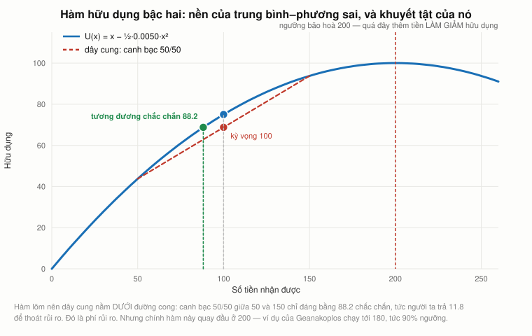
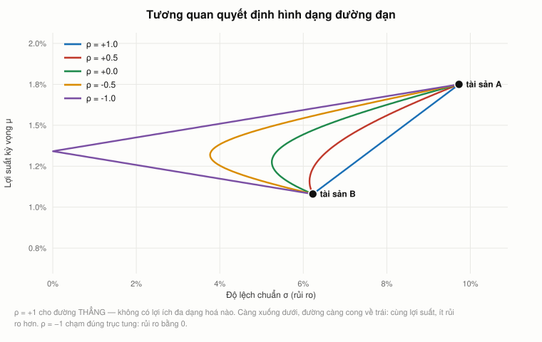
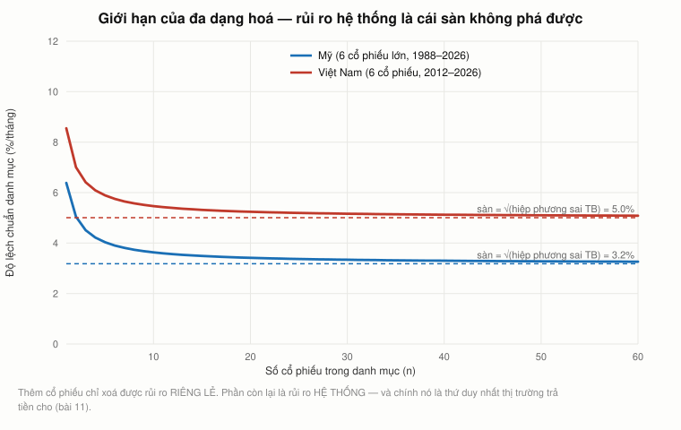
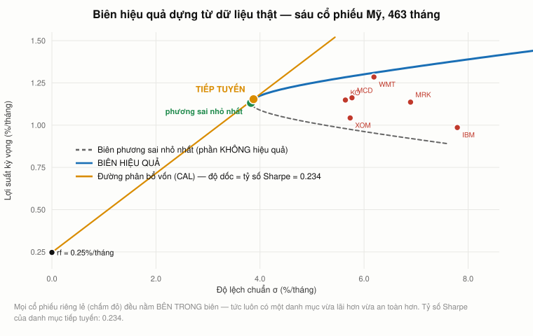

# Bài 10 — Lý thuyết danh mục: Markowitz và biên hiệu quả

> Bài học dựa trên **MIT 15.401 Finance Theory I** (GS. Andrew W. Lo, MIT Sloan, học kỳ thu 2008),
> ba buổi: **Ses 13** từ `45:56` (YouTube `tL7Lcl90Sc0`), **Ses 14** trọn vẹn (`J7d3vcaS9-o`, 80:36),
> **Ses 15** tới `52:10` (`z2oQe6B1Qa4`).
> Mốc thời gian ghi dạng `S13 mm:ss`, `S14 mm:ss`, `S15 mm:ss`.
> Phần **📚 Lý thuyết bổ sung** là kiến thức nền video lướt qua hoặc không có.
>
> 🏛 **Phần cuối mục 8 đến từ một khoá khác.** Ba mục `###` về **hàm hữu dụng, ngại rủi ro và
> nghịch lý St. Petersburg** dựng trên [Yale ECON 251](https://oyc.yale.edu/economics/econ-251)
> của John Geanakoplos, bài giảng **22** (`aGQsjueE07Y`). Mốc của phần đó ghi dạng `L22 06:51`.
> Lý do bổ sung: mục 8 thừa nhận đo rủi ro bằng phương sai là *một lựa chọn* nhưng không đưa ra
> được lý do lý thuyết nào — phần bổ sung đưa lý do đó, và cả cái giá của nó.
> ⚠️ **Video ghi tháng 11/2008** — §25 đối chiếu với 2026, §22–24 chấm điểm từng dự đoán.
> 📌 **Cần đọc trước:** [Bài 9 — Rủi ro và lợi suất](bai_09_rui_ro_va_loi_suat.md) (sai số chuẩn của kỳ vọng — §21 dựng thẳng trên đó).

---

## Mục lục

<!-- MUC-LUC -->
- [1. Ba buổi giảng này ghi ngày nào](#1-ba-buổi-giảng-này-ghi-ngày-nào)
- [2. Danh mục chỉ là một bộ trọng số](#2-danh-mục-chỉ-là-một-bộ-trọng-số)
- [3. Bán khống là một khoản vay bằng cổ phiếu](#3-bán-khống-là-một-khoản-vay-bằng-cổ-phiếu)
- [4. Đòn bẩy: 130-30 và căn nhà năm ăn một](#4-đòn-bẩy-130-30-và-căn-nhà-năm-ăn-một)
- [5. Vì sao quỹ tương hỗ từng không được bán khống](#5-vì-sao-quỹ-tương-hỗ-từng-không-được-bán-khống)
- [6. Vì sao phải cần danh mục — và Buffett nói ngược lại](#6-vì-sao-phải-cần-danh-mục--và-buffett-nói-ngược-lại)
- [7. Hai giả định làm nền cho tất cả](#7-hai-giả-định-làm-nền-cho-tất-cả)
- [8. Đo rủi ro bằng độ lệch chuẩn là một lựa chọn](#8-đo-rủi-ro-bằng-độ-lệch-chuẩn-là-một-lựa-chọn)
- [9. Kỳ vọng thì cộng tuyến tính, phương sai thì không](#9-kỳ-vọng-thì-cộng-tuyến-tính-phương-sai-thì-không)
- [10. Hai tài sản — kiểm chứng từng số Lo đọc](#10-hai-tài-sản--kiểm-chứng-từng-số-lo-đọc)
- [11. Vì sao độ lệch chuẩn nhân căn bậc hai của 12](#11-vì-sao-độ-lệch-chuẩn-nhân-căn-bậc-hai-của-12)
- [12. Tương quan quyết định hình dạng đường đạn](#12-tương-quan-quyết-định-hình-dạng-đường-đạn)
- [13. Tương quan bằng +1 cũng cho danh mục phi rủi ro](#13-tương-quan-bằng-1-cũng-cho-danh-mục-phi-rủi-ro)
- [14. Cái chấm ai cũng thích hơn General Motors](#14-cái-chấm-ai-cũng-thích-hơn-general-motors)
- [15. n tài sản: hiệp phương sai áp đảo phương sai](#15-n-tài-sản-hiệp-phương-sai-áp-đảo-phương-sai)
- [16. Công thức Lo đọc nhầm trên lớp](#16-công-thức-lo-đọc-nhầm-trên-lớp)
- [17. Giới hạn của đa dạng hoá và rủi ro hệ thống](#17-giới-hạn-của-đa-dạng-hoá-và-rủi-ro-hệ-thống)
- [18. Tương quan không phải hằng số vật lý](#18-tương-quan-không-phải-hằng-số-vật-lý)
- [19. Biên hiệu quả và danh mục tiếp tuyến](#19-biên-hiệu-quả-và-danh-mục-tiếp-tuyến)
- [20. Tỷ số Sharpe](#20-tỷ-số-sharpe)
- [21. Markowitz là cỗ máy khuếch đại sai số](#21-markowitz-là-cỗ-máy-khuếch-đại-sai-số)
- [22. Chấm điểm lớp học ngày 17/11/2008](#22-chấm-điểm-lớp-học-ngày-17112008)
- [23. Câu nói về Buffett, đo lại sau 18 năm](#23-câu-nói-về-buffett-đo-lại-sau-18-năm)
- [24. Năm cái chấm của Lo, 18 năm sau](#24-năm-cái-chấm-của-lo-18-năm-sau)
- [25. Đối chiếu 2026](#25-đối-chiếu-2026)
- [26. Góc Việt Nam](#26-góc-việt-nam)
- [27. Code minh hoạ](#27-code-minh-hoạ)
- [28. Từ điển thuật ngữ](#28-từ-điển-thuật-ngữ)
- [29. Câu hỏi tự kiểm tra](#29-câu-hỏi-tự-kiểm-tra)
- [Tóm tắt một trang](#tóm-tắt-một-trang)
- [Nguồn](#nguồn)
<!-- /MUC-LUC -->

---

## 1. Ba buổi giảng này ghi ngày nào

Bài này gộp ba buổi. Cả ba đều định được ngày từ chính lời giảng, rồi đối chiếu với số liệu thị trường.

| Buổi                    | Ngày                   | Chứng cứ quyết định |
| ----------------------- | ---------------------- | ------------------- |
| **Ses 13**, từ `45:56`  | thứ Tư **5/11/2008**   | xem bảng dưới       |
| **Ses 14**, trọn vẹn    | thứ Tư **12/11/2008**  | xem bảng dưới       |
| **Ses 15**, tới `52:10` | thứ Hai **17/11/2008** | xem bảng dưới       |

### Ses 13 — thứ Tư 5/11/2008

[Bài 9](bai_09_rui_ro_va_loi_suat.md) đã định ngày này bằng lãi suất kho bạc 30 năm Lo đọc trên lớp. Có một con số thứ hai còn chắc hơn:

> `S13 44:10` — *"biến động ngụ ý của quyền chọn S&P ngang giá, khoảng **49%**… giảm từ **80%** hai tuần trước. Đúng như tôi đã dự đoán, biến động sẽ giảm khi kết quả bầu cử rõ ràng."*

| Ngày                     | VIX đóng cửa | Đọc sáng hôm sau sẽ ra khoảng         |
| ------------------------ | ------------ | ------------------------------------- |
| thứ Ba **4/11** (bầu cử) | **47,73**    | → sáng 5/11: **≈ 48–50** ✅ khớp "49%" |
| thứ Tư 5/11              | 54,56        | → sáng 6/11: ≈ 55                     |
| thứ Hai 10/11            | 59,98        | → sáng 11/11: ≈ 60                    |
| thứ Tư 12/11             | 66,46        | → sáng 13/11: ≈ 66                    |

Chỉ sáng **5/11** mới đọc ra 49. Và câu *"đúng như tôi đã dự đoán"* chỉ có nghĩa vào đúng buổi sáng sau ngày bầu cử, khi VIX vừa chạm đáy 47,73 — chứ không phải một tuần sau, lúc nó đã leo lại 60.

### Ses 14 — thứ Tư 12/11/2008

Hai manh mối độc lập, cả hai đều nói **thứ Tư**:

| Manh mối                                                                                                                                        | Suy ra                                                                                                                                        |
| ----------------------------------------------------------------------------------------------------------------------------------------------- | --------------------------------------------------------------------------------------------------------------------------------------------- |
| `S14 59:31` *"hai tuần nữa kể từ hôm nay có gì không?… Lễ Tạ ơn"*, rồi `S14 60:05` *"**Chẳng phải đó là một thứ Tư như mọi thứ Tư khác sao?**"* | Hai tuần sau buổi này là một **thứ Tư**, và là thứ Tư trước Lễ Tạ ơn. Tạ ơn 2008 = thứ Năm 27/11 → thứ Tư đó = 26/11 → **buổi giảng = 12/11** |
| `S15 15:37` *"chỗ ta dừng lại ở phút cuối cùng của **buổi thứ Tư**"*                                                                            | Ses 14 rơi vào thứ Tư — Lo tự xác nhận ở buổi kế tiếp                                                                                         |

### Ses 15 — thứ Hai 17/11/2008

| Manh mối                                                                  | Kiểm chứng                                                                          |
| ------------------------------------------------------------------------- | ----------------------------------------------------------------------------------- |
| `S14 80:36` *"hẹn gặp lại thứ Hai"* và `S15 78:23` *"hẹn gặp lại thứ Tư"* | Ses 15 là một **thứ Hai**                                                           |
| `S15 51:21` *"bây giờ rất nhiều người đi xem **phim James Bond**"*        | *Quantum of Solace* khởi chiếu ở Mỹ thứ Sáu **14/11/2008** → buổi giảng sau ngày đó |
| `S15 32:05` *"S&P đã giảm **45%** so với đỉnh vài tháng trước"*           | Đỉnh 1.565,15 (9/10/2007). Thứ Hai 17/11 đóng 850,75 = **−45,64%** ✅                |

Thứ Hai đầu tiên sau 14/11 là **17/11/2008**. Ba manh mối cùng chỉ một ngày.

### Một chỗ không khớp, ghi lại thay vì lấp liếm

Ses 13 kết thúc bằng `S13 78:21` *"ta sẽ thấy điều đó vào **thứ Hai**"*. Thứ Hai sau 5/11 là 10/11. Nhưng bốn manh mối trên đặt Ses 14 vào thứ Tư 12/11, tức **không có buổi nào ngày 10/11**.

Tôi không giải thích được khoảng trống này — có thể là bài kiểm tra giữa kỳ, có thể Lo nói nhầm ngày. Nhưng tôi **không** sửa ngày của Ses 14 cho vừa, vì chứng cứ cho thứ Tư 12/11 mạnh hơn hẳn: hai lời nói trong hai buổi khác nhau cùng chỉ vào thứ Tư. Đây đúng loại mâu thuẫn đã gặp giữa Ses 9 và Ses 10 ở [bài 7](bai_07_ky_han_va_tuong_lai.md).

---

## 2. Danh mục chỉ là một bộ trọng số

Lo mở đầu bằng một quan sát ai cũng bỏ qua (`S13 47:20`):

> *"Hôm nay các bạn đã ra quyết định đó rồi, dù có biết hay không. Vì nếu từ hôm qua tới hôm nay bạn không làm gì để tái cân bằng danh mục, bạn đã **chủ động quyết định** để nguyên. Cứ để nó chạy."*

**Không hành động cũng là một quyết định.** Mỗi ngày bạn không đụng vào danh mục là một ngày bạn tái khẳng định bộ trọng số hiện có.

Định nghĩa (`S13 47:49`): danh mục là **một bộ trọng số cộng lại bằng 1**.

$$\omega = (\omega_1, \omega_2, \ldots, \omega_n), \qquad \sum_{i=1}^{n}\omega_i = 1$$

$$\omega_i = \frac{N_i \times P_i}{\sum_j N_j P_j}$$

trong đó $N_i$ là số cổ phiếu $i$ và $P_i$ là giá của nó (`S13 48:41`).

Điểm mấu chốt (`S13 49:04`): **$N_i$ là một số thực, không phải số nguyên dương.** Nó có thể là 0, là 5, là 500, hoặc **−200**. Âm nghĩa là bạn đã bán khống 200 cổ phiếu đó.

Từ đó suy ra ngay, và Lo để sinh viên tự nói ra (`S13 49:49`): nếu một trọng số **âm**, thì một trọng số khác phải **lớn hơn 1**. Vì tất cả phải cộng lại bằng đúng 1.

Trọng số lớn hơn 1 nghĩa là gì? Sinh viên Lucas trả lời (`S13 50:19`): **bạn đang dùng đòn bẩy.**

---

## 3. Bán khống là một khoản vay bằng cổ phiếu

Câu hỏi tiếp theo của Lo rất sắc (`S13 50:19`): *"Tiền đó ở đâu ra? Ai cho bạn vay?"*

Sinh viên Andy trả lời (`S13 50:43`): *"Cổ phiếu bạn bán khống đã cho bạn khoản tiền mặt dôi ra để mua cổ phiếu khác."*

Lo chốt lại (`S13 51:05`):

> *"Đúng. Vậy là **không ai cho bạn vay tiền cả, nhưng có người cho bạn vay một thứ khác. Họ cho bạn vay một cổ phiếu.** Ta bán cổ phiếu vay đó đi, lấy tiền mặt bỏ vào cổ phiếu khác."*

Đây là ý quan trọng nhất của cả đoạn, và Lo nhấn mạnh tới mức bảo sinh viên về nhà tự làm lại bằng số cụ thể (`S13 51:23`). Bán khống **không** phải "cá cược giá giảm" — về mặt cơ học, nó là **một khoản vay hiện vật**: bạn mượn cổ phiếu, bán nó, và cầm tiền.

Hệ quả: mọi danh mục có trọng số âm đều là danh mục **đi vay**. Rủi ro của nó không chỉ nằm ở giá cổ phiếu mà còn ở chỗ người cho vay có thể đòi lại cổ phiếu bất cứ lúc nào.

Lo cũng nhắc tới một trường hợp ông cố ý không dạy (`S13 52:00`): danh mục có trọng số cộng lại bằng **0**, tức không bỏ đồng vốn nào. Đó chính là danh mục kinh doanh chênh lệch giá đã gặp ở [bài 7 §5](bai_07_ky_han_va_tuong_lai.md) và [bài 8 §5](bai_08_quyen_chon.md), và là nền của rất nhiều chiến lược quỹ đầu cơ.

---

## 4. Đòn bẩy: 130-30 và căn nhà năm ăn một

### Danh mục 130-30

Sinh viên Megan hỏi về sản phẩm này (`S13 53:36`). Lo giải thích (`S13 54:07`): **mua 130%, bán khống 30%**, cộng lại vẫn bằng 100%. Có cả biến thể 120-20 và 180-80.

⚠️ Bản ghi phụ đề `S13 53:51` để sinh viên nói *"nên bạn quay về trạng thái ròng bằng **không**"*, và Lo đáp *"Đúng, chính xác."* Trạng thái ròng của 130-30 là **+100%**, không phải 0 — và chính Lo giải thích đúng như vậy ngay câu sau. Đây gần như chắc chắn là chỗ nghe nhầm khi làm phụ đề, hoặc sinh viên lỡ lời.

Lo nói ông không giải thích được vì sao **đúng con số 130-30** lại thành chuẩn (`S13 57:28`): *"vì những lý do có lẽ hơi xa đề để bàn ở đây, 130-30 dường như là điểm ngọt."*

**Có câu trả lời, và nó là một con số pháp lý** — xem §5.

### Căn nhà năm ăn một

Ví dụ Lo dùng để cho thấy đòn bẩy là con dao hai lưỡi (`S13 60:58`): mua căn nhà 500.000 đô la với 100.000 đô vốn tự có.

|                         | Trọng số  |
| ----------------------- | --------- |
| Nhà                     | **+500%** |
| Ngân hàng (nợ thế chấp) | **−400%** |
| Tổng                    | +100%     |

| Giá nhà giảm | Mất bao nhiêu | Còn lại bao nhiêu % vốn tự có |
| -----------: | ------------: | ----------------------------: |
|           2% |        10.000 |                           90% |
|           5% |        25.000 |                           75% |
|          15% |        75.000 |                           25% |
|      **20%** |   **100.000** |                        **0%** |

Lo nói *"nhà giảm 2% thì bạn mất 10% giá trị vốn"* (`S13 61:26`) — đúng chính xác: 2% × 5 = 10%.

⚠️ Con số ông **không** đọc ra, nhưng cả nước Mỹ đang sống trong đó lúc ông giảng: **giá nhà giảm 20% là vốn tự có về đúng bằng 0.** Chỉ số giá nhà Case-Shiller toàn quốc từ đỉnh tháng 7/2006 tới đáy tháng 2/2012 giảm khoảng 27%. Với người mua bằng 20% tiền mặt, đó là mất sạch và còn nợ thêm.

---

## 5. Vì sao quỹ tương hỗ từng không được bán khống

Lo kể lại lịch sử (`S13 54:54`) rồi khẳng định một câu **sai**:

> ⚠️ `S13 54:54` — *"**Chuyện này không liên quan gì tới SEC. Không liên quan gì tới luật.** Nó liên quan tới bản thân các tổ chức đang đầu tư, vì bán khống ngày xưa bị xem là rất rủi ro."*

Thật ra có **hai ràng buộc pháp lý liên bang**, và chúng giải thích luôn cả câu hỏi 130-30 mà ông né ở §4.

### Ràng buộc 1 — luật thuế (đã bị bãi bỏ)

**Quy tắc "short-short"**, mục 851(b)(3) Bộ luật Thuế vụ Hoa Kỳ: một công ty đầu tư được ưu đãi thuế (RIC) phải có **dưới 30%** tổng thu nhập đến từ các vị thế nắm giữ **dưới ba tháng**. Vượt ngưỡng là mất tư cách RIC và bị đánh thuế doanh nghiệp trên toàn bộ lợi nhuận.

Quy tắc này ép nhà quản lý ra quyết định đầu tư theo tính toán thuế thay vì theo đầu tư. Nó bị **bãi bỏ ngày 1/9/1997** (Đạo luật Giảm thuế 1997). Nghiên cứu sau đó dùng chính lần bãi bỏ này làm thí nghiệm tự nhiên và thấy năng lực căn thời điểm của các quỹ **cải thiện rõ rệt** sau 1997.

### Ràng buộc 2 — Đạo luật Công ty Đầu tư 1940 (vẫn còn hiệu lực)

**Mục 18** của Đạo luật 1940 cấm quỹ đăng ký phát hành "chứng khoán ưu tiên đại diện cho khoản nợ" — bao gồm cả khoản vay để bán khống — **trừ khi tỷ lệ bao phủ tài sản đạt tối thiểu 300%** ngay sau đó.

Dịch ra số: một quỹ có **100 đô la** tài sản ròng được bán khống hoặc vay tối đa **50 đô la**. Trần pháp lý là **150/50**.

> **Và đó chính là câu trả lời cho `S13 57:28`.** 130-30 không phải "điểm ngọt" thần bí của ngành. Nó là con số nằm **an toàn bên trong trần 150/50** mà luật liên bang đặt ra từ năm 1940. Lo nói lý do "hơi xa đề"; thật ra lý do nằm ngay trong đạo luật quy định chính những quỹ ông đang nói tới.

Đây cũng là lý do quỹ đầu cơ bán khống thoải mái còn quỹ tương hỗ thì không: quỹ đầu cơ được **miễn trừ** khỏi Đạo luật 1940 theo mục 3(c)(1) và 3(c)(7).

*(Từ 2020 SEC bổ sung Quy tắc 18f-4 đặt giới hạn theo giá trị chịu rủi ro cho phái sinh, áp dụng từ 19/8/2022; bán khống vật lý vẫn nằm trong khung bao phủ tài sản của mục 18.)*

Điều Lo nói **đúng**: mệnh lệnh đầu tư của từng tổ chức thường còn chặt hơn luật. Nhiều quỹ hưu trí cấm bán khống tuyệt đối dù luật cho phép tới 50%. Nhưng nói *"không liên quan gì tới luật"* thì không chính xác.

---

## 6. Vì sao phải cần danh mục — và Buffett nói ngược lại

Lo đặt câu hỏi thẳng (`S13 62:24`): *"vì sao phải bận tâm tới danh mục?"* Rồi ông đưa ngay ý kiến phản bác mạnh nhất (`S13 62:40`):

> *"Warren Buffett đã phê phán chính ý tưởng đa dạng hoá này. Ông nói: **hãy bỏ tất cả trứng vào một giỏ, rồi trông cái giỏ đó cho thật kỹ.** Chẳng phải thế tốt hơn sao?"*

Lo trả lời (`S13 62:59`): *"Nghe thì hay, nhưng nếu bạn **không biết cách chọn đúng giỏ** thì sao?"*

> *"Đó chính là ý tưởng đằng sau lý thuyết danh mục. **Không phải ai cũng là Warren Buffett. Không phải ai cũng muốn trở thành Warren Buffett.**"* (`S13 63:12`)

Ba công dụng của danh mục (`S13 64:03`):

1. **Đa dạng hoá** — trải rủi ro ra nhiều chứng khoán.
2. **Đặt cược có trọng tâm** — điều này ngược trực giác. Lo nói (`S13 64:27`) bạn *không* buộc phải mua mọi cổ phiếu. Nếu bạn tin ngành công nghệ thông tin sẽ tốt, bạn có thể lập danh mục **toàn cổ phiếu công nghệ**: vẫn được đa dạng hoá, mà vẫn đặt được cược vào lĩnh vực bạn am hiểu. Danh mục tách **rủi ro riêng của một công ty** khỏi **quan điểm về một ngành**.
3. **May đo theo khẩu vị rủi ro của riêng bạn** (`S13 65:14`).

### Sự chia rẽ triết học

Đoạn `S13 73:07` là chỗ Lo nêu rõ nhất mâu thuẫn nền tảng của cả khoá học:

|                                 | Warren Buffett                     | Tài chính hàn lâm (1960–70)                              |
| ------------------------------- | ---------------------------------- | -------------------------------------------------------- |
| Giá có sai không?               | **Có**, và tìm ra được             | **Không**, hoặc không tìm ra được                        |
| Việc cần làm                    | Tìm cổ phiếu bị định giá sai       | Nhận giá như nó vốn có, rồi lập danh mục tốt nhất        |
| Bức tranh rủi ro–lợi suất là gì | Lịch sử, chẳng nói gì về tương lai | **Trạng thái cân bằng** — mọi thứ đang ở đúng chỗ của nó |

Lo kể lại lời phản bác của Buffett (`S13 73:44`) — chuyện tờ 100 đô la:

> *"Nghe như chuyện tếu về nhà kinh tế học đi trên đường, thấy tờ 100 đô la, và bước thẳng qua. Có người hỏi sao không nhặt, ông ta bảo: **nếu nó là thật thì đã có người nhặt rồi.**"*

Và Buffett kết (`S13 73:58`): *"tôi đã làm được, tôi đã thấy các quy luật, tôi đã khai thác chúng, và tôi có nhiều tiền hơn anh, thế đấy."*

Lo thừa nhận (`S13 74:10`): *"Khó mà cãi lại một tỷ phú bốn mươi mấy tỷ."*

Điều đáng chú ý nhất: Lo **không giả vờ mình thắng cuộc tranh luận này**. Ông nói thẳng (`S13 76:45`):

> *"**Đó là một điều hư cấu.** Hư cấu ở chỗ bảo rằng không thể dự báo giá cổ phiếu. Nhưng nó là một điều hư cấu **khá sát với thực tế với 99% công chúng**."*

§23 sẽ đo lại chính cuộc tranh luận này bằng số liệu 18 năm sau.

---

## 7. Hai giả định làm nền cho tất cả

Toàn bộ bài 10 và bài 11 dựng trên đúng hai giả định (`S13 66:13`):

1. **Lợi suất đo bằng kỳ vọng** của tỷ suất sinh lời.
2. **Rủi ro đo bằng độ lệch chuẩn.**

Lo rất trung thực về việc đây là **lựa chọn**, không phải chân lý (`S13 66:29`):

> *"Đó là một **giả định**. Nói cách khác, ta đang giả định sẽ đo rủi ro bằng độ lệch chuẩn… **Với một số nhà đầu tư, hai thước đo đó không phù hợp.**"*

Ông nêu ví dụ đầu tư có trách nhiệm xã hội (`S13 66:46`): người không muốn bỏ tiền vào công ty gây ô nhiễm hay bóc lột lao động đang tối ưu theo một chiều thứ ba mà mô hình này không có.

Lý do chọn hai thước đo này thì rất thực dụng (`S13 66:13`): *"vì lý do thuần thống kê — chúng dễ tính, và là hai đại lượng đầu tiên người ta nhìn."*

> ⚠️ **`S13 68:42` — Lo nói nhầm một chữ ngay giữa câu quan trọng nhất.** Ông đọc: *"tất cả nhà đầu tư đều thích kỳ vọng cao hơn và tất cả nhà đầu tư đều thích **phương sai cao hơn**."* Ý ông là **phương sai THẤP hơn** — toàn bộ phần còn lại của ba buổi giảng, và cả slide, đều dựa trên chiều ngược lại. Đây là lỡ lời, nhưng nếu nghe mà không để ý thì hỏng cả bài.

Từ hai giả định đó ra hướng đi (`S13 77:33`): **hướng tây bắc**. Bắc = lợi suất cao hơn. Tây = rủi ro thấp hơn.

---

## 8. Đo rủi ro bằng độ lệch chuẩn là một lựa chọn

Lo nêu vấn đề rồi bỏ qua (`S13 67:42`):

> *"Có nhiều cách đo rủi ro… nhưng có người lập luận rằng nhìn vào độ phân tán là **lẫn lộn phía tăng với phía giảm**. Chẳng ai có vấn đề gì với rủi ro phía tăng cả. Tôi chưa gặp ai nói 'năm nay tôi kiếm quá nhiều tiền, thế thật không hay'. Nếu bạn gặp ai như thế, giới thiệu tôi với."*

Ông biện minh (`S13 67:42`): với **phân phối đối xứng** như phân phối chuẩn, độ lệch chuẩn là thước đo không tồi.

⚠️ Nhưng [bài 8 §14](bai_08_quyen_chon.md) đã cho thấy lợi suất cổ phiếu **không** đối xứng: đuôi trái dày hơn đuôi phải. Vậy lời biện minh này yếu hơn nó nghe.

Những thước đo một phía mà Lo nhắc tới nhưng không dạy:

| Thước đo                      | Đo cái gì                                         | Ai đề xuất                               |
| ----------------------------- | ------------------------------------------------- | ---------------------------------------- |
| **Bán phương sai**            | Chỉ tính độ lệch **dưới** một ngưỡng              | **Chính Markowitz**, trong sách năm 1959 |
| **Tỷ số Sortino**             | Lợi suất vượt trội chia độ lệch phía giảm         | Frank Sortino, thập niên 1980            |
| **Giá trị chịu rủi ro (VaR)** | Mức lỗ không bị vượt quá với xác suất 95% hay 99% | JP Morgan, RiskMetrics 1994              |
| **CVaR / thiếu hụt kỳ vọng**  | Lỗ **trung bình** trong 5% trường hợp tệ nhất     | Rockafellar & Uryasev 2000               |

Chi tiết đáng nhớ: **Markowitz biết rõ vấn đề này**. Trong cuốn *Portfolio Selection: Efficient Diversification of Investments* (1959) ông viết rằng bán phương sai hợp lý hơn phương sai, nhưng phương sai được ưu tiên vì "chi phí, sự tiện lợi và tính quen thuộc". Năm 1959, cái gọi là chi phí là **thời gian máy tính**. Toàn bộ ngành tài chính đi theo phương sai vì năm 1959 máy tính quá đắt — và giữ nguyên như thế cho tới hôm nay.

CVaR về sau trở thành chuẩn quản trị: Basel III (2016) chuyển từ VaR sang thiếu hụt kỳ vọng 97,5% cho rủi ro thị trường của ngân hàng.

### Nhưng vẫn còn một câu hỏi: vì sao lại là **phương sai**?

Lo nói độ lệch chuẩn "không tồi" với phân phối đối xứng, và Markowitz nói ông chọn nó vì tiện. Cả hai đều là lý do **thực dụng**. Có một lý do **lý thuyết** mà không bài nào trong khoá đưa ra, và nó nằm ở [Yale ECON 251](https://oyc.yale.edu/economics/econ-251) của John Geanakoplos, bài giảng 22. Mốc của phần này ghi dạng `L22 06:51`.

Bắt đầu từ **nghịch lý St. Petersburg** (Bernoulli, thế kỷ 18). Tung một đồng xu đến khi ra sấp; nếu phải tung $N$ lần thì nhận $2^N$ đồng.

| số lần tung $N$ | xác suất |         tiền nhận | góp vào kỳ vọng |
| --------------: | -------: | ----------------: | --------------: |
|               1 | 5,00e−01 |                 2 |             1,0 |
|               3 | 1,25e−01 |                 8 |             1,0 |
|              20 | 9,54e−07 |         1.048.576 |             1,0 |
|              40 | 9,09e−13 | 1.099.511.627.776 |             1,0 |

Mỗi hàng góp **đúng 1 đồng** vào kỳ vọng: $(1/2^N)\cdot 2^N = 1$. Có vô hạn hàng, nên **kỳ vọng bằng vô hạn**. Theo mọi thứ bài 1 đến bài 9 dạy, bạn nên trả vô hạn để chơi. Bernoulli hỏi rất nhiều người, và trung bình họ trả **4 đồng**.

Lời giải của Bernoulli: người ta không quan tâm **số tiền**, mà quan tâm **hữu dụng** của tiền. Thay tiền bằng logarit:

$$\mathbb{E}[\ln X]=\sum_{N\ge 1}\frac{1}{2^N}\ln\!\left(2^N\right)=\ln 2\sum_{N\ge 1}\frac{N}{2^N}=2\ln 2=\ln 4$$

Tương đương chắc chắn $= e^{\ln 4} = $ **đúng 4 đồng** — chính con số Bernoulli đo được. Chương trình `assert` điều đó tới `1e-6`.

⚠️ **Nhưng Bernoulli chưa giải xong.** Geanakoplos chỉ ra ngay (`L22 10:54`): nếu tiền thưởng là $2^{2^N}$ thay vì $2^N$ thì **ngay cả log cũng cho vô hạn**. Hàm hữu dụng phải vừa lõm vừa **bị chặn**, mà log thì lõm nhưng không bị chặn.

### Ngại rủi ro chính là hàm hữu dụng lõm

Hữu dụng lõm nghĩa là $U''(x) < 0$: đồng thứ một triệu thêm ít hữu dụng hơn đồng thứ nhất. Hệ quả hình học: dây cung nằm **dưới** đường cong, nên một canh bạc luôn kém hơn kỳ vọng của nó nhận chắc chắn.

Với canh bạc 50/50 giữa 50 và 150 (kỳ vọng 100), dùng $U(x)=x-\tfrac12\alpha x^2$:

| hệ số ngại rủi ro $\alpha$ | $\mathbb{E}[U]$ | tương đương chắc chắn | phí rủi ro |
| -------------------------: | --------------: | --------------------: | ---------: |
|                    0,00000 |        100,0000 |               100,000 |      0,000 |
|                    0,00250 |         84,3750 |                95,862 |  **4,138** |
|                    0,00500 |         68,7500 |                88,197 | **11,803** |
|                    0,00667 |         58,3333 |                79,289 | **20,711** |



Càng lõm thì tương đương chắc chắn càng thấp — người ta sẵn sàng **trả tiền** để đổi canh bạc lấy một số chắc chắn. Khoản chênh đó là **phí rủi ro**, và nó chính là thứ [bài 9](bai_09_rui_ro_va_loi_suat.md) gọi là phần bù rủi ro thị trường, nhìn từ phía người bỏ tiền.

### Và đây là chỗ nối về bài này

Với hàm hữu dụng **bậc hai**, kỳ vọng hữu dụng rút gọn thành đúng **hai** con số:

$$\mathbb{E}[U]=\mathbb{E}[X]-\tfrac12\alpha\,\mathbb{E}[X]^2-\tfrac12\alpha\operatorname{Var}[X]$$

Không còn phụ thuộc gì khác của phân phối — không độ lệch, không nhọn, không đuôi. **Đó là lý do lý thuyết vì sao cả bài này chỉ làm việc với trung bình và phương sai.**

| canh bạc                       | $\mathbb{E}[U]$ tính trực tiếp | công thức $\mathbb{E},\operatorname{Var}$ |   chênh |
| ------------------------------ | -----------------------------: | ----------------------------------------: | ------: |
| 50/150 đều nhau                |                      68,750000 |                                 68,750000 | 0,0e+00 |
| 0/50/250, xác suất 0,2/0,5/0,3 |                      50,000000 |                                 50,000000 | 0,0e+00 |
| **lệch phải rất mạnh**         |                      22,650000 |                                 22,650000 | 0,0e+00 |

Hàng cuối lệch phải rất mạnh — độ lệch chuẩn không mô tả nổi hình dạng của nó. Vậy mà hai cách tính vẫn khớp **tuyệt đối**. Hàm bậc hai **không nhìn** phân bố hình gì; nó chỉ nhìn hai mô men đầu.

### Cái giá của sự tiện lợi

$U(x)=x-\tfrac12\alpha x^2$ có đạo hàm $U'(x)=1-\alpha x$, **âm** khi $x>1/\alpha$. Tức là quá ngưỡng đó, **thêm tiền làm giảm hữu dụng**.

| hệ số $\alpha$ | ngưỡng bão hoà $1/\alpha$ | ví dụ của Geanakoplos |
| -------------: | ------------------------: | --------------------- |
|        0,00500 |                       200 | tiêu dùng tới 180     |
|        0,00250 |                       400 | tiêu dùng tới 280     |

Chính ví dụ của ông chạy ở **90%** và **70%** ngưỡng bão hoà. Mô hình chỉ đúng **dưới** ngưỡng, và đó là ràng buộc thật chứ không phải chi tiết kỹ thuật. Hàm log thì không có ngưỡng này — nhưng log lại **không** cho ra dạng trung bình–phương sai.

> ⇒ **Trung bình–phương sai không phải một sự thật về rủi ro.** Nó là hệ quả của một hàm hữu dụng được chọn vì dễ tính, và hàm đó có một khuyết tật lớn. Mục này mở đầu bằng việc Markowitz chọn phương sai vì "sự tiện lợi". Phần vừa rồi đo chính xác sự tiện lợi đó đắt đến đâu.

📌 Cùng logic này còn cho ra **định lý quỹ tương hỗ**: trong cân bằng, mọi người đều nắm đúng một rổ — toàn bộ thị trường — pha với tiền gửi ngân hàng, chỉ khác nhau ở tỷ lệ pha (`L22 74:51`). Đó chính là kết quả [§19 của bài này](#19-biên-hiệu-quả-và-danh-mục-tiếp-tuyến) đạt tới bằng hình học, và [bài 11 §2](bai_11_capm_va_beta.md#2-từ-danh-mục-tiếp-tuyến-tới-danh-mục-thị-trường) dùng làm bàn đạp cho CAPM.

---

## 9. Kỳ vọng thì cộng tuyến tính, phương sai thì không

Đây là trục toán học của cả bài. Lo trình bày ở `S14 04:13`.

### Kỳ vọng — dễ

$$R_p = \sum_i \omega_i R_i \quad\Longrightarrow\quad \mathbb{E}[R_p] = \mu_p = \sum_i \omega_i \mu_i$$

Lo nhấn mạnh sự khác nhau giữa hai dòng (`S14 04:53`):

- Dòng trên là **đồng nhất thức kế toán**. Lợi suất thực tế của danh mục *bằng định nghĩa* là trung bình có trọng số.
- Dòng dưới **không phải** đồng nhất thức. Nó là một phát biểu về kỳ vọng, suy ra từ dòng trên.

### Phương sai — không dễ

$$\sigma_p^2 = \mathbb{E}\left[\left(\sum_i \omega_i (R_i - \mu_i)\right)^2\right] = \sum_{i=1}^{n}\sum_{j=1}^{n} \omega_i \omega_j \,\sigma_{ij}$$

Lo dẫn dắt bằng một câu hỏi đơn giản (`S14 07:18`): bình phương một tổng $n$ số hạng thì ra bao nhiêu số hạng? Sinh viên trả lời hụt, ông chốt (`S14 08:00`): **$n^2$**.

Trong $n^2$ số hạng đó:

- **$n$ số hạng** nằm trên đường chéo, $i = j$, cho $\omega_i^2 \sigma_i^2$ — phương sai của từng cổ phiếu.
- **$n^2 - n$ số hạng** ngoài đường chéo, cho $\omega_i\omega_j\sigma_{ij}$ — **hiệp phương sai**.

$$\sigma_{ij} = \rho_{ij}\,\sigma_i\,\sigma_j$$

> Và đây là điều Markowitz được trao giải Nobel (`S14 10:25`): trong đám $n^2$ số hạng đó, **một số có thể nhỏ, thậm chí âm**. Khi đó chúng **kéo tụt** rủi ro tổng thể.
>
> `S14 10:43` — *"Đây là trực giác. Đây là toán học nằm dưới câu **đừng bỏ tất cả trứng vào một giỏ**."*

Vì sao hiệp phương sai quan trọng hơn phương sai (`S14 12:24`):

> *"Intel trông là một cổ phiếu đáng sợ vì nó rất biến động. Nhưng khi bạn có $n$ Intel trong danh mục, dù từng con đáng sợ, **thứ bạn phải để mắt là chúng tương quan với nhau ra sao**. Vì tương quan trong một danh mục $n$ cổ phiếu quan trọng hơn phương sai của từng con."*

Lý do là số học thuần tuý: có $n$ phương sai nhưng có $n^2 - n$ hiệp phương sai. Với $n = 100$: 100 phương sai và **9.900** hiệp phương sai.

---

## 10. Hai tài sản — kiểm chứng từng số Lo đọc

Lo thu về hai tài sản để lấy trực giác (`S14 13:25`): *"khó có trực giác cho ma trận $n \times n$, trừ khi bạn là Rain Man."*

$$\mu_p = \omega_a\mu_a + \omega_b\mu_b$$
$$\sigma_p^2 = \omega_a^2\sigma_a^2 + \omega_b^2\sigma_b^2 + 2\,\omega_a\omega_b\,\rho_{ab}\,\sigma_a\sigma_b$$

Số liệu ông đọc trên lớp (`S14 15:57`), giai đoạn **1946–2001**:

|                | Kỳ vọng/tháng | Độ lệch/tháng |
| -------------- | ------------: | ------------: |
| Motorola       |         1,75% |         9,73% |
| General Motors |         1,08% |         6,23% |
| Tương quan     |           \-- |          0,37 |

§27 tính lại toàn bộ bảng. Kết quả:

|   w(MOT) |    w(GM) | Kỳ vọng/tháng | Độ lệch/tháng | Kỳ vọng/năm | Độ lệch/năm |
| -------: | -------: | ------------: | ------------: | ----------: | ----------: |
|       0% |     100% |         1,08% |         6,23% |       13,0% |       21,6% |
|      25% |      75% |         1,25% |     **6,01%** |       15,0% |       20,8% |
|      50% |      50% |     **1,42%** |     **6,68%** |       17,0% |       23,1% |
|      75% |      25% |         1,58% |         8,01% |       19,0% |       27,7% |
|     100% |       0% |         1,75% |         9,73% |       21,0% |       33,7% |
| **125%** | **−25%** |         1,92% |        11,68% |       23,0% |       40,4% |

Lo đọc (`S14 17:22`): *"nâng lợi suất lên **1,42%**, nhưng rủi ro thêm vào chỉ từ 6,23% lên **6,68%** một tháng."*

✅ **Cả hai con số đều đúng chính xác.** Tính đầy đủ ra 1,4150% và 6,6773%.

Hàng cuối là hàng thú vị nhất (`S14 18:27`): bán khống 25% General Motors, lấy tiền mua thêm Motorola. Lo bình luận (`S14 18:49`): *"bán khống General Motors — mà bây giờ chắc cũng không phải ý tồi, xét tình cảnh khốn khó của họ."*

⚠️ **Câu đùa đó hoá ra là lời khuyên đầu tư đúng nhất trong cả ba buổi giảng.** Xem §24.

Rủi ro của hàng đó: 11,68% so với 6,23% = **1,87 lần** — Lo nói *"gần gấp đôi"*. Đúng.

Điểm cần thấy ở bảng: khi w(MOT) tăng từ 0% lên 25%, kỳ vọng **tăng** mà độ lệch lại **giảm** (6,23% → 6,01%). Đó là toàn bộ phép màu, và §14 sẽ khai thác nó tới cùng.

---

## 11. Vì sao độ lệch chuẩn nhân căn bậc hai của 12

Lo dạy quy tắc này bằng cách hỏi ngược (`S14 19:58`), và nó đáng được viết ra tử tế.

**Lợi suất** thì dễ (`S14 20:17`): bỏ qua lãi kép thì nhân 12; tính lãi kép thì $(1+r)^{12}-1$.

**Phương sai** thì phải quay lại một đẳng thức cơ bản (`S14 22:04`):

$$\mathrm{Var}(a+b) = \mathrm{Var}(a) + \mathrm{Var}(b) + 2\,\mathrm{Cov}(a,b)$$

Nếu **hiệp phương sai bằng 0** — tức tháng này không dự báo được gì cho tháng sau — thì:

$$\mathrm{Var}(a+b) = \mathrm{Var}(a) + \mathrm{Var}(b)$$

Cộng 12 tháng độc lập, mỗi tháng cùng phương sai $\sigma^2$:

$$\sigma^2_{\text{năm}} = 12\,\sigma^2_{\text{tháng}} \quad\Longrightarrow\quad \boxed{\sigma_{\text{năm}} = \sqrt{12}\;\sigma_{\text{tháng}}}$$

$\sqrt{12} = 3{,}4641$ — Lo gọi tắt là *"3 rưỡi"* (`S14 23:20`).

**Nhưng hãy để ý điều kiện.** Quy tắc căn bậc hai chỉ đúng khi lợi suất **không tự tương quan**. Đó chính là giả thuyết thị trường hiệu quả của [bài 9 §3](bai_09_rui_ro_va_loi_suat.md). Nếu có động lượng (tự tương quan dương), rủi ro năm **lớn hơn** $\sqrt{12}\sigma$; nếu có đảo chiều (tự tương quan âm), nó **nhỏ hơn**.

Nói cách khác: **quy tắc căn bậc hai của thời gian là hệ quả của thị trường hiệu quả, không phải một định luật toán học.** Đây là lý do các mô hình rủi ro chuẩn hoá theo $\sqrt{T}$ có xu hướng đánh giá thấp rủi ro dài hạn trong thị trường có xu thế — một trong những đường dẫn thẳng tới khủng hoảng 2008.

---

## 12. Tương quan quyết định hình dạng đường đạn



*Cùng hai tài sản, chỉ đổi tương quan. ρ = +1 cho đường thẳng; ρ = −1 chạm đúng trục tung.*

Lo cho chạy cùng một cặp cổ phiếu qua năm giá trị tương quan (`S14 38:13`). §27 tính lại:

| w(MOT) | ρ = +1 | ρ = 0,37 | ρ = 0 | ρ = −0,5 |   ρ = −1 | Kỳ vọng |
| -----: | -----: | -------: | ----: | -------: | -------: | ------: |
|     0% |   6,23 |     6,23 |  6,23 |     6,23 |     6,23 |   1,08% |
|    25% |   7,11 |     6,01 |  5,27 |     4,05 | **2,24** |   1,25% |
|    50% |   7,98 |     6,68 |  5,78 |     4,27 |     1,75 |   1,42% |
|    75% |   8,86 |     8,01 |  7,46 |     6,66 |     5,74 |   1,58% |
|   100% |   9,73 |     9,73 |  9,73 |     9,73 |     9,73 |   1,75% |

Đọc theo hàng ngang: **tương quan càng thấp, rủi ro càng nhỏ, mà lợi suất không đổi.** Cột kỳ vọng bên phải giống hệt nhau ở mọi trường hợp — vì kỳ vọng cộng tuyến tính, không đụng gì tới tương quan.

Ba hình dạng (`S14 40:17`):

| ρ                 | Hình dạng                        | Vì sao                                                                    |
| ----------------- | -------------------------------- | ------------------------------------------------------------------------- |
| **+1**            | **đường thẳng**                  | Hai cổ phiếu thực chất là một, chỉ khác tỷ lệ. Không có gì để đa dạng hoá |
| **giữa −1 và +1** | **đường đạn** cong về phía tây   | Càng gần −1 càng phình ra xa                                              |
| **−1**            | **hình tam giác chạm trục tung** | Tồn tại danh mục rủi ro bằng **0**                                        |

Trường hợp ρ = −1 làm Lo dừng lại (`S14 42:30`):

> *"Lý do kết quả này gây sửng sốt là nó cho ta biết **tồn tại một cách lập danh mục cho lợi suất khoảng 1,39% mà không có rủi ro gì cả**… Nhân 12 lên bạn được khoảng bao nhiêu? 16% một năm? Bạn hãy chỉ cho tôi cơ hội đầu tư nào cho 16% một năm mà không rủi ro, tôi sẽ xem xét kỹ giúp bạn."*

§27 giải chính xác:

- Trọng số: w(MOT) = 6,23/(9,73+6,23) = **0,39035**
- Độ lệch chuẩn = **0** (kiểm bằng máy: dưới $10^{-7}$)
- Kỳ vọng = **1,3415%/tháng = 16,10%/năm**

⚠️ Con số Lo đọc — **1,39%** — hơi lệch; đáp số đúng là **1,34%**. Nhưng ngay sau đó ông tự hạ xuống *"cứ gọi là 1,3% cho thận trọng"* rồi nhân 12 ra *"16% một năm"*. Và **16,10% thì đúng là 16%**. Kết luận ông rút ra hoàn toàn chính xác.

Lo chốt lại vì sao chuyện này không xảy ra ngoài đời (`S14 43:42`):

> *"**Bạn không tìm được hai tài sản tương quan âm hoàn hảo.** Nếu tìm được, có những điều kỳ diệu bạn làm được với tổ hợp đó. Và lý thuyết danh mục chính là **sách dạy nấu ăn để khai thác tương quan**."*

---

## 13. Tương quan bằng +1 cũng cho danh mục phi rủi ro

Lo nói (`S14 40:37`) rằng khi ρ = +1 thì *"không cách nào có rủi ro thấp hơn General Motors trừ khi bạn bán khống Motorola"*. Ông dừng ở đó. Nhưng nếu đi tiếp một bước thì ra một kết quả đáng nói.

Khi ρ = +1, độ lệch chuẩn của danh mục là $|\omega_a\sigma_a + \omega_b\sigma_b|$ — **tuyến tính**. Cho nó bằng 0:

$$\omega_{\text{MOT}} = \frac{-\sigma_{\text{GM}}}{\sigma_{\text{MOT}} - \sigma_{\text{GM}}} = \frac{-6{,}23}{9{,}73 - 6{,}23} = -1{,}780$$

§27 tính ra: bán khống **178%** Motorola, mua **278%** General Motors, độ lệch chuẩn bằng **0**, kỳ vọng **−0,1126%/tháng = −1,35%/năm**.

> **Vậy cả ρ = −1 lẫn ρ = +1 đều cho danh mục phi rủi ro. Khác nhau không nằm ở rủi ro mà ở LỢI SUẤT:** một cái +16,1%/năm, một cái −1,35%/năm.

Điều này làm rõ một chuyện Lo chỉ nói nửa vời. Ông bảo ρ = −1 là kinh doanh chênh lệch giá nên không thể tồn tại. Nhưng **ρ = +1 cũng vậy**, chỉ theo chiều ngược: bạn tạo được tài sản phi rủi ro lợi suất âm, nên bạn **bán khống** nó và cầm tín phiếu kho bạc (khi đó khoảng 0,4%/tháng) — vẫn là bữa trưa miễn phí.

Bài học tổng quát: **với hai tài sản có tương quan hoàn hảo theo bất kỳ chiều nào, tổ hợp của chúng tổng hợp ra một trái phiếu phi rủi ro.** Không kinh doanh chênh lệch giá đòi hỏi trái phiếu tổng hợp đó phải trả **đúng lãi suất phi rủi ro**. Bộ tham số Lo đưa ra không thoả điều kiện đó ở cả hai đầu — nên nó chỉ dùng để minh hoạ hình học, chứ không mô tả được một thị trường có thể tồn tại.

Đây chính là lập luận đã dùng để định giá quyền chọn ở [bài 8 §11](bai_08_quyen_chon.md): dựng một danh mục sao chép phi rủi ro, rồi buộc nó trả lãi suất phi rủi ro.

---

## 14. Cái chấm ai cũng thích hơn General Motors

Đây là khoảnh khắc Lo bán được lý thuyết danh mục cho cả lớp (`S14 34:21`).

Ông dựng bẫy trước: nếu chỉ có hai cổ phiếu và bạn muốn **ít rủi ro nhất có thể**, bạn bỏ hết vào General Motors (6,23% so với 9,73%). Không cách nào an toàn hơn.

Rồi ông tháo bẫy (`S14 35:39`):

> *"**Tuy nhiên** — và đây là điểm quan trọng — nếu bây giờ tôi cho phép bạn lấy trung bình có trọng số của hai cái, nếu tôi cho bạn quyền lập danh mục, thì bạn có được cái chấm này. **Cái chấm đó, mọi người trong phòng này đều phải thích hơn General Motors.** Vì nó ít rủi ro hơn GM, mà lợi suất lại cao hơn."*

Danh mục đó có tên: **danh mục phương sai nhỏ nhất**. Lo không đưa công thức; nó là:

$$\omega_a^{\ast} = \frac{\sigma_b^2 - \sigma_{ab}}{\sigma_a^2 + \sigma_b^2 - 2\sigma_{ab}}$$

§27 giải với đúng số liệu của Lo:

|                   | Kỳ vọng/tháng | Độ lệch/tháng | Kỳ vọng/năm | Độ lệch/năm |
| ----------------- | ------------: | ------------: | ----------: | ----------: |
| General Motors    |       1,0800% |       6,2300% |      12,96% |      21,58% |
| **Danh mục PSNN** |   **1,2039%** |   **5,9820%** |  **14,45%** |  **20,72%** |
| Chênh lệch        |  **+0,1239%** |  **−0,2480%** |  **+1,49%** |  **−0,86%** |

Trọng số: **18,49% Motorola, 81,51% General Motors.**

> **Cả hai chiều đều tốt hơn.** Lợi hơn **1,49 điểm phần trăm mỗi năm** và rủi ro thấp hơn **0,86 điểm**. Không dự báo, không chọn cổ phiếu, không cần biết gì về Motorola hay General Motors ngoài ba con số thống kê.

Lo tổng kết đúng chỗ đó (`S14 36:56`): *"Vậy là tôi vừa làm tất cả các bạn khá giả hơn chỉ bằng mẩu kiến thức này."*

Và (`S14 37:10`): *"**Giá trị của lý thuyết danh mục nằm ở chỗ nó cho bạn những lựa chọn mà trước đó bạn không có.**"*

Điều đáng chú ý về mặt logic: kết quả này **không** đòi hỏi thị trường hiệu quả, **không** đòi hỏi khả năng dự báo, **không** đòi hỏi bạn đúng về bất cứ điều gì. Nó chỉ đòi bạn biết ba con số. Đó là lý do lý thuyết danh mục sống sót qua mọi cuộc tranh cãi về thị trường hiệu quả — nó không phụ thuộc vào kết quả cuộc tranh cãi đó.

---

## 15. n tài sản: hiệp phương sai áp đảo phương sai

Với danh mục **chia đều** $n$ tài sản, phương sai rút gọn thành một biểu thức rất gọn:

$$\sigma_p^2 = \frac{1}{n}\,\overline{\sigma^2} + \left(1 - \frac{1}{n}\right)\overline{\sigma_{ij}}$$

trong đó $\overline{\sigma^2}$ là **phương sai trung bình** và $\overline{\sigma_{ij}}$ là **hiệp phương sai trung bình**.

Lo giải thích ý nghĩa (`S14 57:05`):

> *"Khi $n$ lớn lên, hoá ra **phương sai trung bình không còn quan trọng nữa**. Thứ điều khiển rủi ro danh mục của bạn chẳng liên quan gì tới phương sai của từng thành phần. Nó liên quan tới **hiệp phương sai trung bình**."*

§27 đo trên số liệu thật — sáu cổ phiếu Mỹ ở sáu ngành khác nhau, tháng 2/1988 đến 8/2026 (463 tháng):

| Mã  | Ngành     | Kỳ vọng/tháng | Độ lệch/năm | Kép/năm |
| --- | --------- | ------------: | ----------: | ------: |
| MRK | Dược phẩm |        1,136% |      23,88% |  11,34% |
| IBM | Công nghệ |        0,986% |      26,99% |   8,54% |
| MCD | Ăn nhanh  |        1,162% |      19,98% |  12,62% |
| KO  | Đồ uống   |        1,148% |      19,54% |  12,54% |
| WMT | Bán lẻ    |        1,285% |      21,44% |  13,97% |
| XOM | Dầu khí   |        1,042% |      19,86% |  11,10% |

Ma trận tương quan:

|         |  MRK |  IBM |  MCD |   KO |  WMT |  XOM |
| ------- | ---: | ---: | ---: | ---: | ---: | ---: |
| **MRK** | 1,00 | 0,15 | 0,33 | 0,40 | 0,24 | 0,26 |
| **IBM** | 0,15 | 1,00 | 0,24 | 0,11 | 0,16 | 0,24 |
| **MCD** | 0,33 | 0,24 | 1,00 | 0,42 | 0,34 | 0,31 |
| **KO**  | 0,40 | 0,11 | 0,42 | 1,00 | 0,32 | 0,30 |
| **WMT** | 0,24 | 0,16 | 0,34 | 0,32 | 1,00 | 0,10 |
| **XOM** | 0,26 | 0,24 | 0,31 | 0,30 | 0,10 | 1,00 |

**Tương quan trung bình: 0,262.** Không cặp nào âm — đúng như §22 sẽ cho thấy.

---

## 16. Công thức Lo đọc nhầm trên lớp

> ⚠️ **`S14 56:43`** — Lo đọc công thức thành:
>
> *"phương sai của toàn bộ danh mục bằng **phương sai trung bình cộng với $n$ nhân $(n-1)$ nhân hiệp phương sai trung bình**."*

Đọc như thế thì phương sai **tăng theo $n^2$** — tức càng đa dạng hoá càng rủi ro, ngược hoàn toàn với ý ông đang giảng và với cái biểu đồ ông chiếu ngay sau đó.

Chỗ nhầm nằm ở đâu thì rõ: $n^2 - n = n(n-1)$ đúng là **số lượng** số hạng hiệp phương sai. Nhưng khi trọng số đều là $1/n$, mỗi số hạng được nhân với $1/n^2$, nên tổng của chúng là

$$\frac{n(n-1)}{n^2}\,\overline{\sigma_{ij}} = \left(1 - \frac{1}{n}\right)\overline{\sigma_{ij}}$$

Ông đọc phần **đếm** mà bỏ mất phần **chia**. Slide gần như chắc chắn ghi đúng.

§27 kiểm chứng công thức đúng bằng cách so hai cách tính trên số liệu thật:

```
Độ lệch tính từ chuỗi lợi suất danh mục : 3,9030%/tháng
Độ lệch theo công thức                  : 3,9030%/tháng
```

Trùng khớp tuyệt đối tới sai số máy — vì đây là **đẳng thức**, không phải xấp xỉ.

---

## 17. Giới hạn của đa dạng hoá và rủi ro hệ thống



*Thêm cổ phiếu chỉ xoá được rủi ro riêng lẻ. Phần còn lại là cái sàn không phá được.*

Cho $n \to \infty$ trong công thức §15, số hạng đầu biến mất:

$$\lim_{n\to\infty}\sigma_p^2 = \overline{\sigma_{ij}}$$

**Hiệp phương sai trung bình chính là sàn.** §27 đo trên sáu cổ phiếu thật:

|     n | Độ lệch/năm | % rủi ro đã bỏ được |
| ----: | ----------: | ------------------: |
|     1 |      22,11% |                0,0% |
|     2 |      17,47% |               50,0% |
|     3 |      15,62% |               66,7% |
|     5 |      13,97% |               80,0% |
|    10 |      12,58% |               90,0% |
|    20 |      11,83% |               95,0% |
|    50 |      11,35% |               98,0% |
|   100 |      11,19% |               99,0% |
| **∞** |  **11,03%** |            **100%** |

Lo mô tả đúng hiện tượng này (`S14 66:07`): *"Sau 20, 30, 40, 50, 100 cổ phiếu, bạn sẽ thấy phương sai danh mục **không giảm nữa**."*

Bảng cho thấy điều mà mắt thường không thấy: **phần lớn lợi ích đến rất sớm.** Đi từ 1 lên 10 cổ phiếu bỏ được 90% rủi ro có thể bỏ. Đi từ 10 lên 100 chỉ thêm 9% nữa. Từ 100 lên vô hạn thêm 1%.

Cái sàn 11,03%/năm đó có tên (`S14 66:32`): **rủi ro hệ thống**, hay **rủi ro thị trường**.

> *"Đó là rủi ro mà **dù đa dạng hoá tốt đến đâu bạn cũng phải gánh**. Tất cả chúng ta, không ai bớt rủi ro hơn mức đó được, trừ khi bắt đầu nhét tiền vào đệm hoặc mua tín phiếu kho bạc."* (`S14 66:32`)

Đây là khái niệm bản lề của cả khoá. Toàn bộ [bài 11 — CAPM](bai_09_rui_ro_va_loi_suat.md) dựng trên nó: nếu rủi ro riêng của từng công ty **bỏ được miễn phí**, thì thị trường không có lý do trả tiền cho ai gánh nó. Chỉ phần **không bỏ được** mới được trả công.

Kiểm chứng thực tế trên sáu mã: một cổ phiếu trung bình biến động **22,11%/năm**; chia đều sáu mã còn **13,52%/năm**. Bỏ được **38,9% độ lệch** chỉ bằng cách chia đều tiền — không phân tích, không dự báo.

---

## 18. Tương quan không phải hằng số vật lý

Đây là đoạn hay nhất của Ses 14, và cũng là đoạn thời sự nhất.

Sinh viên hỏi vì sao tương quan lại thay đổi. Lo trả lời bằng chuyện sân bay (`S14 58:58`):

> *"Tương quan là **một hàm của hành vi con người**… Tối nay tôi ra sân bay, chắc chỉ cần tới trước nửa tiếng. Nhưng hai tuần nữa thì sao? **Lễ Tạ ơn.** Chẳng phải đó là một thứ Tư như mọi thứ Tư khác sao? Không. Vì bằng cách nào đó tất cả chúng ta đã cùng quyết định đi vào đúng ngày ấy."*

Rồi ông chuyển sang câu trả lời thật (`S14 61:26`):

> *"Khi tất cả chúng ta sợ hãi về giá trị khoản đầu tư của mình, khi mạch sợ hãi bị kích hoạt, bản năng tự nhiên — vì nó **đã được lập trình cứng vào não** — là chạy tới nơi an toàn… **Trong một rạp hát đông người, nếu bạn ngửi thấy mùi khói và có người hét 'cháy', bốn lối thoát ngoài kia sẽ hơi đông một chút.** Đó không phải khoa học tên lửa."*

Và lời chỉ trích thẳng vào giới định lượng (`S14 50:51`):

> *"Đó là bài học mà phần lớn người trong ngành, những người không có nền tài chính, không hề biết. Họ là nhà vật lý, nhà toán học, nhà khoa học máy tính. Họ ước lượng tương quan. **Nó là một tham số, như hằng số hấp dẫn hay số Avogadro.** Cứ thế mà cắm vào. Và chẳng ai bảo họ rằng nó có thể thay đổi. Và khi nó thay đổi, chuyện xấu xảy ra rất nhanh."*

Ông áp thẳng vào khủng hoảng đang diễn ra (`S14 57:38`):

> *"Nếu bạn đã giả định suốt rằng mình có một rổ lớn các khoản vay thế chấp, và các khoản vay đó **không tương quan**, thì thực chất bạn đã giả định mình gần như không có rủi ro… Nhưng khi thị trường bất động sản đi xuống **trên toàn quốc**, ai cũng bắt đầu vỡ nợ. Và các vụ tịch biên trở nên tương quan rất cao. **Chỉ sau một đêm, đúng nghĩa một đêm, rủi ro của bạn có thể vọt lên.**"*

Kết luận triết học (`S14 62:17`):

> *"Tương quan **không phải một đại lượng vật lý**. Đó là vấn đề với vật lý và sinh học. Vật lý có những tham số không đổi theo thời gian. Tôi ước tài chính có được như thế. Chúng tôi không có. **Chúng tôi có những tham số không phải tham số. Chúng là biến ngẫu nhiên.**"*

> ⚠️ **`S14 51:06` — số Avogadro Lo đọc là "9,08 nhân 10 mũ 23".** Con số đúng là **6,02214076 × 10²³**.
>
> Và có một tầng mỉa mai Lo không thể biết: ông lấy số Avogadro làm ví dụ mẫu mực cho *"tham số không bao giờ đổi"*. Ngày **20/5/2019**, hệ SI được định nghĩa lại và số Avogadro trở thành một giá trị **quy ước chính xác** — nói cách khác, con số đó **đã bị con người thay đổi**, mười một năm sau bài giảng. Còn hằng số hấp dẫn $G$ thì tới nay vẫn là hằng số cơ bản **đo kém chính xác nhất** trong vật lý.

⚠️ Về **chu kỳ Kondratiev** mà Lo nhắc thoáng qua (`S14 30:33`) như một ví dụ 50 năm dữ liệu: ý tưởng "sóng dài" 45–60 năm là của nhà kinh tế Nga **Nikolai Kondratiev**, người bị bắt năm 1930 và bị xử bắn ngày **17/9/1938** dưới thời Stalin. Lý thuyết này **không** thuộc dòng chính của kinh tế học hiện đại và Lo nêu nó như một minh hoạ, không phải một sự tán thành.

---

## 19. Biên hiệu quả và danh mục tiếp tuyến



*Biên hiệu quả dựng từ 463 tháng dữ liệu thật. Mọi cổ phiếu riêng lẻ đều nằm bên trong.*

### Biên hiệu quả

Sinh viên Ryan chỉ ra điều hiển nhiên (`S14 53:57`): **nửa dưới của đường đạn vô dụng.** Với cùng mức rủi ro, luôn có một điểm ở nửa trên cho lợi suất cao hơn.

Lo đồng ý (`S14 54:10`): *"Nửa dưới đường cong đó, bạn cứ vứt đi. Chỉ có mấy anh ngốc mới xuống dưới đó."*

Toàn bộ đường đạn gọi là **biên phương sai nhỏ nhất**; nửa trên gọi là **biên hiệu quả** (`S14 74:31`).

Với **ba tài sản trở lên**, kết quả mạnh hơn hẳn (`S15 05:16`):

> *"Đường cong này gợi ý rằng **chẳng bao giờ hợp lý khi bỏ hết tiền vào một chứng khoán duy nhất**… Ta sẽ không bao giờ muốn nắm 100% IBM, hay 100% General Motors, hay 100% Motorola. Nếu ta làm thế, ta sẽ ở trên mấy cái chấm đó, và mấy cái chấm đó **không nằm trên biên hiệu quả**."*

Và (`S15 06:08`): *"Ngay lập tức, ta đã rời khỏi thế giới của Warren Buffett."*

Thêm cổ phiếu thì sao? Sinh viên tự trả lời (`S15 07:37`): **không bao giờ tệ hơn**, vì bạn luôn có thể đặt trọng số 0 cho cổ phiếu mới. Nên biên hiệu quả chỉ có thể **dịch về phía tây bắc** (`S15 08:14`).

Lo diễn đạt lại rất gọn (`S15 29:48`): thêm cổ phiếu thứ 21 vào rổ 20 cổ phiếu **không làm thay đổi tương quan giữa 20 cổ phiếu cũ**. Nó chỉ **nới một ràng buộc** — trọng số thứ 21 trước đây bị ép bằng 0, nay được tự do. Nới ràng buộc thì nghiệm tối ưu không thể xấu đi.

### Danh mục tiếp tuyến

Đây là kết quả then chốt (`S15 15:37`). Trộn tài sản phi rủi ro với **bất kỳ** danh mục nào cho một **đường thẳng** trong không gian kỳ vọng–độ lệch chuẩn.

Lo hỏi (`S15 18:19`): *"Nếu tôi cho bạn chọn trộn tín phiếu kho bạc với **đúng một** danh mục thôi, bạn chọn cái nào?"*

Sinh viên trả lời (`S15 18:40`): **cái mà đường thẳng tiếp xúc với đường cong.**

$$\omega^{\ast} \;\propto\; \Sigma^{-1}(\mu - r_f\mathbf{1})$$

> *"Tồn tại **duy nhất một** danh mục bạn có thể trộn với tín phiếu kho bạc sao cho không bao giờ có thể làm tốt hơn… Đó là danh mục mà **tất cả các bạn trong phòng này đều muốn có**. Tôi không biết gì về các bạn, không biết lý lịch, không biết mức ngại rủi ro của các bạn — **nhưng tôi không cần biết.**"* (`S15 19:42`)

Đó là điều làm kết quả này khác hẳn mọi thứ trước đó. Lo lặp đi lặp lại suốt hai buổi rằng *"tuỳ khẩu vị rủi ro của bạn"* (`S14 17:46`). Bây giờ, lần đầu tiên, ông nói được một điều **không phụ thuộc khẩu vị**.

Khẩu vị vẫn quyết định bạn **ở đâu trên đường thẳng đó** (`S15 20:20`): người ngại rủi ro nằm gần tín phiếu kho bạc, nhà quản lý quỹ đầu cơ nằm phía trên, đi vay để mua thêm. Nhưng **ai cũng ở trên cùng một đường thẳng**.

Điều kiện Lo nêu rõ (`S15 22:27`): giả định này cần **lãi suất đi vay bằng lãi suất cho vay**. Nếu vay đắt hơn gửi — tức là ngoài đời thật — đường thẳng có một **chỗ gãy** và có hai đường tiếp tuyến với hai độ dốc khác nhau.

---

## 20. Tỷ số Sharpe

Độ dốc của đường tiếp tuyến (`S15 27:28`):

$$S = \frac{\mathbb{E}[R_p] - r_f}{\sigma_p}$$

Nó có tên: **tỷ số Sharpe**, đặt theo **William F. Sharpe**.

> *"Nhà quản lý quỹ đầu cơ thường khoe tỷ số Sharpe của họ rất tự hào. Tỷ số Sharpe đơn giản là một thước đo của đánh đổi rủi ro–lợi suất đó. Sharpe càng cao càng tốt."* (`S15 27:47`)

📚 Vài chi tiết Lo không kể:

- Sharpe giới thiệu nó năm **1966** dưới tên **"tỷ số thưởng trên biến động"** (reward-to-variability ratio), không phải tên mình. Cái tên "tỷ số Sharpe" do người khác đặt.
- Chính Sharpe viết lại năm 1994 để nhắc rằng nó thường bị dùng sai — đặc biệt là quy về năm bằng $\sqrt{12}$ với các chuỗi có tự tương quan (đúng cái bẫy ở §11).
- **William F. Sharpe** sinh 16/6/1934, năm 2026 vẫn còn sống, 92 tuổi, giáo sư danh dự Đại học Stanford. Ông là **người cuối cùng còn lại** trong bộ ba nhận giải Nobel 1990 — Merton Miller mất năm 2000, **Harry Markowitz mất ngày 22/6/2023, thọ 95 tuổi**.
- Về Markowitz: bài báo "Portfolio Selection" đăng trên *Journal of Finance* tháng 3/**1952**, xuất phát từ luận án tiến sĩ của ông ở Đại học Chicago. Đề tài mới tới mức trong buổi bảo vệ, **Milton Friedman đùa rằng lý thuyết danh mục không phải là kinh tế học**.

§27 tính tỷ số Sharpe trên sáu cổ phiếu thật (2/1988–8/2026, lãi suất phi rủi ro trung bình 2,96%/năm):

| Danh mục                 | Kỳ vọng/năm | Độ lệch/năm | **Sharpe** |
| ------------------------ | ----------: | ----------: | ---------: |
| **Tiếp tuyến**           |      13,84% |      13,42% |  **0,811** |
| Phương sai nhỏ nhất      |      13,58% |      13,26% |      0,801 |
| Chia đều 1/n             |      13,52% |      13,52% |      0,781 |
| WMT (riêng lẻ, tốt nhất) |      15,42% |      21,44% |      0,581 |
| KO (riêng lẻ)            |      13,78% |      19,54% |      0,554 |
| IBM (riêng lẻ, tệ nhất)  |      11,83% |      26,99% |      0,329 |

**Cổ phiếu riêng lẻ tốt nhất có Sharpe 0,581. Danh mục tiếp tuyến đạt 0,811 — cao hơn 40%.** Và nó không đòi hỏi bất kỳ dự báo nào.

§27 còn kiểm chứng công thức bằng cách quét toàn bộ lưới trọng số không âm bước 5%: **không tổ hợp nào vượt được danh mục tiếp tuyến.**

Đó là kết quả trong mẫu. §21 kể phần còn lại.

---

## 21. Markowitz là cỗ máy khuếch đại sai số

Lo nói ra giả định quan trọng nhất rồi đi tiếp (`S14 44:24`):

> *"**Tất cả những gì ta giả định là kỳ vọng và phương sai ổn định theo thời gian, và tương quan ổn định theo thời gian.** Đó là những giả định không hề tầm thường, tôi thừa nhận."*

Mục này đo xem "không hề tầm thường" là bao nhiêu.

### Vấn đề, phát biểu bằng ngôn ngữ của bài 9

[Bài 9 §11](bai_09_rui_ro_va_loi_suat.md) đã đo: sai số chuẩn của kỳ vọng là $\sigma/\sqrt{T}$. Với 79 năm dữ liệu và σ = 20%, phần bù rủi ro "8%" có khoảng tin cậy 95% là **[3,6% ; 12,4%]**. Cần **400 năm** mới đo chính xác tới 1%/năm.

Bây giờ nhìn công thức tiếp tuyến:

$$\omega^{\ast} \;\propto\; \Sigma^{-1}(\mu - r_f\mathbf{1})$$

Nó lấy chính đại lượng **khó đo nhất** ($\mu$), rồi nhân với **nghịch đảo** của ma trận hiệp phương sai. Nghịch đảo ma trận khuếch đại nhiễu theo hướng các giá trị riêng nhỏ. Kết quả là một cỗ máy có đầu vào rất nhiễu và một bộ khuếch đại gắn ngay sau.

Richard Michaud đặt tên cho hiện tượng này năm **1989**: **"cỗ máy tối đa hoá sai số ước lượng"** (*The Markowitz Optimization Enigma: Is "Optimized" Optimal?*, Financial Analysts Journal).

### Đo thật

§27 chạy thử nghiệm **ngoài mẫu** trên sáu cổ phiếu thật: ước lượng $\mu$ và $\Sigma$ trên một cửa sổ, nắm giữ đúng một tháng, rồi lăn cửa sổ đi một tháng, lặp lại tới hết 463 tháng.

**Cửa sổ ước lượng 60 tháng → 403 tháng ngoài mẫu:**

| Chiến lược          | Kép/năm | Độ lệch/năm |    Sharpe | Tháng tệ nhất |
| ------------------- | ------: | ----------: | --------: | ------------: |
| Tiếp tuyến          |  14,16% |  **74,68%** | **0,265** |  **−218,74%** |
| Phương sai nhỏ nhất |  11,83% |      13,16% |     0,733 |       −11,68% |
| **Chia đều 1/n**    |  12,44% |      13,44% | **0,761** |       −13,43% |

**Cửa sổ 120 tháng → 343 tháng ngoài mẫu:**

| Chiến lược          | Kép/năm | Độ lệch/năm |    Sharpe | Tháng tệ nhất |
| ------------------- | ------: | ----------: | --------: | ------------: |
| Tiếp tuyến          |   5,16% |      17,11% |     0,256 |       −14,15% |
| Phương sai nhỏ nhất |  10,66% |      13,50% |     0,665 |       −11,05% |
| **Chia đều 1/n**    |  10,80% |      13,42% | **0,677** |       −13,43% |

**Cửa sổ 240 tháng (20 năm!) → 223 tháng ngoài mẫu:**

| Chiến lược          | Kép/năm | Độ lệch/năm |    Sharpe | Tháng tệ nhất |
| ------------------- | ------: | ----------: | --------: | ------------: |
| Tiếp tuyến          |   6,73% |      13,48% |     0,447 |       −11,29% |
| Phương sai nhỏ nhất |   9,42% |      12,84% |     0,660 |       −11,19% |
| **Chia đều 1/n**    |  11,31% |      12,42% | **0,816** |       −10,84% |

> **Ở cả ba cửa sổ, chia đều tiền ra sáu phần bằng nhau đánh bại danh mục tiếp tuyến "tối ưu".** Với cửa sổ 60 tháng, danh mục tiếp tuyến còn có một tháng lỗ **−218%** — tức là nó nổ tung, vì trọng số không bị chặn.
>
> Và ngay cả với **20 năm** dữ liệu ước lượng, Sharpe của 1/n vẫn là 0,816 so với 0,447.

Đây chính xác là kết quả của **DeMiguel, Garlappi & Uppal (2009)**, *"Optimal Versus Naive Diversification: How Inefficient is the 1/N Portfolio Strategy?"*, Review of Financial Studies 22(5). Họ chạy trên **14 bộ dữ liệu** và 1/N thắng tối ưu hoá Markowitz ước lượng từ mẫu ở **13 bộ**. Họ ước tính: với 25 tài sản, cần khoảng **3.000 tháng — 250 năm — dữ liệu** thì Markowitz mới bắt đầu thắng.

### Vì sao — nhìn thẳng vào trọng số

§27 in ra biên độ dao động của chính các trọng số "tối ưu", cửa sổ 120 tháng:

| Mã      | Trọng số nhỏ nhất | Trọng số lớn nhất |        Biên độ |
| ------- | ----------------: | ----------------: | -------------: |
| MRK     |            −77,4% |            +47,3% |     124,7 điểm |
| IBM     |            −27,9% |            +38,4% |      66,3 điểm |
| **MCD** |        **−50,6%** |       **+230,0%** | **280,6 điểm** |
| KO      |            −91,2% |            +51,9% |     143,2 điểm |
| WMT     |            −92,2% |            +70,0% |     162,1 điểm |
| **XOM** |            −41,8% |       **+195,3%** |     237,1 điểm |

Cùng sáu cổ phiếu ấy, cùng phương pháp ấy, chỉ đổi cửa sổ ước lượng **một tháng mỗi lần** — mà "trọng số tối ưu" của McDonald's chạy từ −50,6% tới +230%.

Để ý một chi tiết quan trọng: **danh mục phương sai nhỏ nhất chịu đựng tốt hơn hẳn danh mục tiếp tuyến** (Sharpe 0,660–0,733 so với 0,256–0,447). Lý do rất rõ ràng — công thức của nó **không dùng $\mu$**:

$$\omega^{\ast}_{\text{PSNN}} \;\propto\; \Sigma^{-1}\mathbf{1}$$

Chỉ cần hiệp phương sai, không cần kỳ vọng. Mà [bài 9 §11](bai_09_rui_ro_va_loi_suat.md) đã đo: sai số chuẩn của σ là $\sigma/\sqrt{2T}$ — nhỏ hơn hẳn sai số chuẩn của μ. **Bỏ đại lượng khó đo nhất ra khỏi công thức thì kết quả ổn định hơn nhiều.**

### Ngành đã trả lời thế nào

| Cách chữa              | Ý tưởng                                                                                         | Ai                                |
| ---------------------- | ----------------------------------------------------------------------------------------------- | --------------------------------- |
| **Co ngót**            | Kéo hiệp phương sai mẫu về một mục tiêu có cấu trúc                                             | Ledoit & Wolf (2003, 2004)        |
| **Black-Litterman**    | Xuất phát từ trọng số vốn hoá thị trường, chỉ điều chỉnh theo quan điểm riêng có gắn độ tin cậy | Black & Litterman (1992)          |
| **Chặn trọng số**      | Cấm bán khống, chặn trần từng mã                                                                | thực hành phổ biến                |
| **Bỏ hẳn μ**           | Chỉ dùng phương sai nhỏ nhất, hoặc ngang giá rủi ro                                             | công nghiệp hoá từ 2005 trở đi    |
| **Không tối ưu gì cả** | 1/n                                                                                             | DeMiguel, Garlappi & Uppal (2009) |

Không có gì trong §21 phủ nhận §14 hay §20. Toán của Markowitz **đúng**. Vấn đề nằm ở chỗ ta phải cắm **số ước lượng** vào chỗ dành cho **tham số thật** — đúng câu Lo đã cảnh báo, chỉ là ông không đo nó.

---

## 22. Chấm điểm lớp học ngày 17/11/2008

Đoạn `S15 32:05` là một bài tập trên lớp có thể chấm điểm được, và đây là lần đầu ai đó chấm nó.

Lo đặt câu hỏi:

> *"Bây giờ các bạn nói tôi nghe — cho tôi một cổ phiếu mà bạn sẽ bỏ tiền vào **ngay hôm nay**. S&P đã giảm 45% so với đỉnh vài tháng trước. Thị trường đang rất tệ và không có vẻ gì khá lên."*

Nhưng câu hỏi thật của ông chặt hơn (`S15 33:09`): ông muốn một cổ phiếu **tương quan âm** với thị trường.

Bốn câu trả lời của lớp:

| Sinh viên đề xuất   | Lý lẽ                     | Lo phản bác                                                                                           |
| ------------------- | ------------------------- | ----------------------------------------------------------------------------------------------------- |
| **Campbell's Soup** | thực phẩm thiết yếu, rẻ   | *"Người ta nghèo đi thì ăn ít súp hộp hơn và tự nấu súp từ gói tương cà với nước nóng"* (`S15 32:38`) |
| **Wal-Mart**        | *"đang lên"*              | *"Về mặt lịch sử, bán lẻ **không** tương quan âm với chu kỳ kinh tế"* (`S15 33:59`)                   |
| **Freddie Mac**     | *(cả lớp cười)*           | *"Nếu bạn thích khoản đầu tư đó, tôi có thứ khác cho bạn"* (`S15 34:10`)                              |
| **Philip Morris**   | *"lo lắng thì hút thuốc"* | *"Thuốc lá là hàng tiêu dùng, cũng bị ảnh hưởng khi thị trường đi xuống"* (`S15 34:40`)               |

§27 đo lại toàn bộ, **11/2008 → 8/2026, 213 tháng**, so với S&P 500 **tổng lợi suất**:

| Mã       | Tên                       |    Kép/năm | Độ lệch/năm | **Tương quan** |   Sharpe |
| -------- | ------------------------- | ---------: | ----------: | -------------: | -------: |
| CPB      | Campbell's Soup           |  **1,60%** |      19,59% |      **0,231** |     0,11 |
| WMT      | Wal-Mart                  |     12,51% |      18,14% |          0,372 |     0,67 |
| FMCC     | Freddie Mac               |      9,14% | **124,19%** |          0,306 |     0,45 |
| MO       | Altria                    | **15,50%** |      20,30% |          0,357 |     0,75 |
| PM       | Philip Morris Intl        |     13,96% |      22,45% |          0,483 |     0,64 |
| **SPTR** | **S&P 500 tổng lợi suất** | **15,02%** |  **14,86%** |          1,000 | **0,93** |

### Kết luận 1 — Lo đúng tuyệt đối về tương quan

**Không một mã nào trong năm mã có tương quan âm.** Thấp nhất là 0,231.

Và mã thấp nhất chính là **Campbell's Soup** — mã Lo gạt đi bằng câu *"cái đó không phải tương quan âm, cái đó là tương quan **bằng không**"* (`S15 33:09`). Đo được sau 18 năm: **0,23**. Sinh viên nói đúng về tính chất của cổ phiếu; Lo nói đúng rằng nó không âm; và chính từ "bằng không" mà Lo dùng để bác bỏ hoá ra là mô tả sát nhất trong cả năm mã.

### Kết luận 2 — không mã nào đánh bại chỉ số theo Sharpe

|                    | Sharpe | So với chỉ số 0,93 |
| ------------------ | -----: | -----------------: |
| Altria             |   0,75 |              −0,18 |
| Wal-Mart           |   0,67 |              −0,26 |
| Philip Morris Intl |   0,64 |              −0,29 |
| Freddie Mac        |   0,45 |              −0,47 |
| Campbell's Soup    |   0,11 |              −0,82 |

⚠️ **Altria lãi hơn chỉ số +0,48 điểm/năm mà vẫn thua theo Sharpe.** Đó là toàn bộ nội dung bài giảng hôm ấy, minh hoạ bằng chính câu trả lời của sinh viên trong phòng.

Còn **Freddie Mac** — mã cả lớp cười — lãi 9,14%/năm với độ lệch chuẩn **124%/năm**, gấp **8 lần** thị trường. Nếu chỉ nhìn lợi suất thì nó "được"; nhìn theo rủi ro thì nó gần như không đầu tư được.

### Kết luận 3 — đa dạng hoá giúp, nhưng không cứu được rổ sai

Gộp cả năm mã thành danh mục chia đều:

| Danh mục                  |    Kép/năm | Độ lệch/năm |   Sharpe |
| ------------------------- | ---------: | ----------: | -------: |
| Đều 5 mã sinh viên chọn   | **19,40%** |      28,38% |     0,71 |
| Đều 4 mã (bỏ Freddie Mac) |     11,92% |      14,17% |     0,77 |
| **S&P 500 tổng lợi suất** |     15,02% |      14,86% | **0,93** |

Sharpe của rổ 5 mã (0,71) **cao hơn 4 trong 5 mã riêng lẻ** — đa dạng hoá đúng là có tác dụng, y như §15–17 nói. Nhưng rổ ấy **vẫn thua chỉ số**. Đa dạng hoá cứu bạn khỏi rủi ro riêng lẻ; nó không cứu bạn khỏi việc chọn sai rổ.

---

## 23. Câu nói về Buffett, đo lại sau 18 năm

Đây là dự đoán kiểm chứng được rõ nhất trong cả ba buổi.

> `S15 38:26` — *"Nếu bạn nhìn vào thành tích của Warren Buffett trong 25 hay 30 năm qua, **tỷ số Sharpe của ông ấy tốt hơn hẳn danh mục tiếp tuyến**. Vậy ông ấy đúng là đã tạo ra giá trị, nếu dùng tiêu chí này."*

§27 đo Berkshire Hathaway hạng A so với S&P 500 tổng lợi suất, cắt đúng tại ngày ông nói câu đó:

| Cửa sổ                                  |    BRK.A | S&P 500 TR |       Chênh |
| --------------------------------------- | -------: | ---------: | ----------: |
| **2/1988 – 11/2008** — Lo **nhìn thấy** | **0,68** |       0,35 | **+0,33** ✅ |
| **11/2008 – 8/2026** — **sau** câu nói  |     0,65 |   **0,93** | **−0,27** ❌ |
| 2/1988 – 8/2026 — cả đoạn               |     0,67 |       0,62 |       +0,05 |

> **Ngày Lo nói câu đó, ông hoàn toàn đúng: Sharpe của Buffett gần gấp đôi thị trường. Trong 18 năm tiếp theo, chính tỷ số ấy thua chỉ số 0,27 điểm. Gộp cả 38 năm, lợi thế chỉ còn +0,05.**

### Chi tiết quan trọng nhất nằm ở cột nào thay đổi

Sharpe của Berkshire gần như **không đổi**: 0,68 → 0,65.
Sharpe của chỉ số **nhảy vọt**: 0,35 → 0,93.

**Buffett không tệ đi. Cái mốc so sánh tốt lên.** Giai đoạn 1988–2008 chứa hai lần sụp đổ lớn (2000 và 2008); giai đoạn 2008–2026 là một trong những đợt tăng dài nhất lịch sử với lãi suất gần 0. Phần lớn "alpha" của Buffett đo được trước 2008 đến từ việc ông **không mất tiền** trong hai lần sụp đổ ấy — và sau 2008 thì thị trường ít cho ông cơ hội đó hơn.

### Và Lo đã tự báo trước điều này, hai phút sau

> `S15 38:43` — *"Nhưng vấn đề là **bạn phải nhận ra các Warren Buffett TRƯỚC KHI họ trở thành Warren Buffett**. Vì sau khi họ đã thành Warren Buffett rồi, không chắc họ còn tạo thêm được chừng ấy giá trị nữa. **Mèo đã ra khỏi bao rồi.**"*

Đó là phát biểu chính xác về mặt thống kê của điều số liệu 18 năm sau cho thấy. Ông đọc đúng con số, rút ra đúng kết luận, **và tự nêu đúng cái điều kiện làm con số ấy hết giá trị** — tất cả trong vòng hai phút.

### Kết quả hàn lâm về cùng câu hỏi

**Frazzini, Kabiller & Pedersen (2018)**, *"Buffett's Alpha"*, Financial Analysts Journal 74(4):35–55, đo trên cửa sổ dài hơn (từ 1976) và tìm được:

- Sharpe của Berkshire = **0,79** — cao, nhưng *"thấp hơn nhiều nhà đầu tư tưởng"*.
- Đòn bẩy trung bình khoảng **1,7 : 1**, phần lớn đến từ **phí bảo hiểm nhận trước** với chi phí **thấp hơn lãi suất tín phiếu kho bạc**.
- Alpha trở nên **không có ý nghĩa thống kê** khi kiểm soát hai nhân tố: *betting against beta* và *quality minus junk*.
- Kết luận của họ: lợi suất của Buffett *"không phải may mắn cũng không phải phép màu, mà là phần thưởng cho việc dùng đòn bẩy rẻ trên những cổ phiếu chất lượng cao và an toàn."*

⚠️ Con số 0,79 của họ và con số 0,67 của tôi **không mâu thuẫn** — khác cửa sổ (họ 1976–2017, tôi 2/1988–8/2026). Cửa sổ của họ chứa cả thập niên 1970–80 khi Berkshire tăng mạnh nhất; cửa sổ của tôi bắt đầu từ 1988 vì đó là mốc sớm nhất có chỉ số S&P 500 tổng lợi suất.

Ý nghĩa của bài AQR nếu đặt cạnh bài giảng này: **Buffett được giải thích bằng chính khung của Lo.** Đòn bẩy rẻ + nghiêng về nhân tố — đúng hai thứ mà lý thuyết danh mục và mô hình nhân tố mô tả được. Cuộc tranh luận ở §6 không kết thúc bằng một bên thắng, mà bằng việc phía hàn lâm mở rộng khung cho tới khi nó chứa được Buffett.

---

## 24. Năm cái chấm của Lo, 18 năm sau

Cả ba buổi giảng xoay quanh một biểu đồ có năm cái chấm (`S13 70:32`): **Merck, General Motors, Motorola, McDonald's**, và tín phiếu kho bạc.

**Hai trong năm cái chấm đó không còn tồn tại ở dạng năm 2008.**

### General Motors — cái mỏ neo "ít rủi ro" đã về 0 sau bảy tháng

GM là cực **tây** của toàn bộ ví dụ hai tài sản. Nó là câu trả lời cho *"an toàn nhất bạn có thể đi tới đâu"* (`S14 34:51`). Điều xảy ra sau đó:

| Ngày         | Sự kiện                                                                                                                                      |
| ------------ | -------------------------------------------------------------------------------------------------------------------------------------------- |
| 12/11/2008   | Lo giảng Ses 14, dùng GM làm mỏ neo rủi ro thấp                                                                                              |
| **1/6/2009** | GM nộp đơn phá sản theo Chương 11, nợ **172 tỷ đô la** — vụ phá sản công nghiệp lớn thứ hai lịch sử Mỹ. Cổ phiếu đóng cửa hôm đó ở **75 xu** |
| ~8/6/2009    | GM bị loại khỏi chỉ số Dow Jones, **lần đầu từ năm 1925**                                                                                    |
| 15/7/2009    | Mã đổi từ GMGMQ sang **MTLQQ** (Motors Liquidation Company)                                                                                  |
| 31/3/2011    | Motors Liquidation ra khỏi phá sản; cổ phiếu phổ thông cũ **bị huỷ, cổ đông nhận được con số không**                                         |
| 18/11/2010   | "GM mới" IPO ở 33 đô la — **cổ đông cũ không được tham gia**                                                                                 |

> **Bảy tháng sau khi Lo dùng General Motors làm định nghĩa của "ít rủi ro nhất trong hai", vốn chủ sở hữu của nó bằng 0.**
>
> Và câu đùa ông thả ra ở `S14 18:49` — *"bán khống General Motors, mà bây giờ chắc cũng không phải ý tồi"* — hoá ra là lời khuyên đầu tư sinh lời nhất trong cả ba buổi giảng.

Đây không phải để chê Lo. Đó là **minh hoạ hoàn hảo cho chính điều ông đang giảng**: độ lệch chuẩn quá khứ của một cổ phiếu không nói gì về việc công ty ấy có tồn tại hay không. Rủi ro phá sản là một chiều mà mô hình kỳ vọng–phương sai **không có chỗ để chứa**. [Bài 8 §16](bai_08_quyen_chon.md) đã cho thấy mô hình Merton (1974) xử lý đúng chiều này — bằng cách coi vốn chủ sở hữu là **quyền chọn mua** trên tài sản công ty.

⚠️ Cũng vì lý do này mà dữ liệu trong §27 **không** dùng GM: chuỗi giá GM trên Yahoo Finance chỉ bắt đầu từ **tháng 11/2010** — lịch sử của công ty cũ đã bị xoá khỏi mã chứng khoán. Đó chính là **thiên lệch sống sót** ở dạng thuần khiết nhất.

### Motorola — vẫn còn, nhưng không còn là cùng một công ty

Motorola Inc. tách làm hai ngày **4/1/2011**: **Motorola Solutions** (mã MSI, phần còn lại) và **Motorola Mobility** (mã MMI, mảng điện thoại). Motorola Mobility được Google mua năm 2012 với **12,5 tỷ đô la**, rồi bán cho Lenovo năm 2014 với **2,91 tỷ**.

⚠️ Vì lý do này, §27 **không** dùng Motorola trong phần tính toán trên dữ liệu thật: cách Yahoo Finance điều chỉnh giá qua đợt tách công ty kèm gộp cổ phiếu 1:7 là thứ tôi không kiểm chứng được, nên mọi con số lợi suất dài hạn của Motorola sẽ không đáng tin. Merck và McDonald's thì vẫn nguyên vẹn và có mặt trong bộ sáu mã.

### Bài học chung

Trong 18 năm, **hai trong bốn cổ phiếu** trên biểu đồ trung tâm của bài giảng hoặc phá sản hoặc bị chia đôi. Đó là tỷ lệ 50%. Khi §15 nói *"thêm cổ phiếu thì không bao giờ tệ hơn"*, phát biểu ấy đúng **trong mô hình tĩnh** — nơi cổ phiếu không biến mất.

---

## 25. Đối chiếu 2026

### Ba dự đoán của Lo, chấm điểm

| Lo nói                                                                                              | Kết quả tới 2026                                                                                                                                                                                                                                                                                                                                                                   |
| --------------------------------------------------------------------------------------------------- | ---------------------------------------------------------------------------------------------------------------------------------------------------------------------------------------------------------------------------------------------------------------------------------------------------------------------------------------------------------------------------------- |
| `S13 58:03` — 130-30 *"rất phổ biến, và có khả năng sẽ tăng trưởng"*                                | ⚠️ **Sai 15 năm, rồi đúng.** Sau khủng hoảng, tài sản trong các quỹ tự nhận 130/30 co lại còn khoảng **1 tỷ đô la**; chiến lược mở rộng hệ thống đạt đỉnh **9,4 tỷ năm 2010** rồi lụi. Tới đầu 2026, theo các báo cáo ngành, chiến lược này hồi lại khoảng **153 tỷ đô la**. Cùng hình dạng với dự đoán lãi suất ở [bài 9 §17](bai_09_rui_ro_va_loi_suat.md): sai rất lâu, rồi đúng |
| `S14 79:20` — Renaissance Technologies *"có lẽ là thành tích đơn lẻ tốt nhất trong lịch sử đầu tư"* | **Đúng — nhưng chỉ với quỹ ông không mua được.** Xem dưới                                                                                                                                                                                                                                                                                                                          |
| `S15 38:26` — Sharpe của Buffett *"tốt hơn hẳn"*                                                    | ⚠️ Đúng lúc đó, sai 18 năm sau. §23                                                                                                                                                                                                                                                                                                                                                 |

### Renaissance: hai công ty trong một

Lo nêu James Simons làm phản ví dụ cho Buffett (`S14 79:20`). Số liệu công khai từ đó:

|          | Medallion (chỉ nội bộ)                                | RIEF / RIDA (bán ra ngoài)                                    |
| -------- | ----------------------------------------------------- | ------------------------------------------------------------- |
| **2020** | **+76% ròng** (khoảng +149% gộp, trước phí 5% và 44%) | RIEF **−19,4%**, RIDA **−31,6%**                              |
| Hệ quả   | —                                                     | Nhà đầu tư rút mạnh; RIEF từ ~36 tỷ đầu 2020 xuống dưới 20 tỷ |

**Cùng một công ty, cùng năm, cùng đội ngũ: quỹ nội bộ +76%, quỹ bán ra ngoài −19% và −32%.** Đó là lời bình luận đanh nhất có thể có về câu *"hãy tìm Warren Buffett tiếp theo"*. Ngay cả khi bạn **nhận ra đúng công ty**, thứ bạn mua được chưa chắc là thứ tạo ra thành tích ấy.

**James Simons mất ngày 10/5/2024, thọ 86 tuổi.**

### Lý thuyết danh mục đã thành sản phẩm

Điều Lo dạy như toán học thuần tuý năm 2008 thì tới 2026 là hàng bán sẵn:

| Sản phẩm                                                 | Chính là §nào của bài này                               |
| -------------------------------------------------------- | ------------------------------------------------------- |
| Quỹ ETF **biến động thấp** (USMV ra mắt 2011, SPLV 2011) | §14 — danh mục phương sai nhỏ nhất, đóng gói            |
| Quỹ **ngang giá rủi ro**                                 | §21 — bỏ hẳn μ ra khỏi công thức                        |
| **Cố vấn tự động** (Betterment 2010, Wealthfront)        | §19 — mỗi khách một điểm trên cùng một đường tiếp tuyến |
| Quỹ **mục tiêu theo năm nghỉ hưu**                       | §19 — trượt dọc đường tiếp tuyến theo tuổi              |

Đáng chú ý: sản phẩm thắng lớn nhất là **biến động thấp** và **ngang giá rủi ro** — cả hai đều là những cách **né tránh việc phải ước lượng $\mu$**. Thị trường đã tự tìm ra kết luận của §21 mà không cần đọc DeMiguel, Garlappi & Uppal.

Và như [bài 9 §21](bai_09_rui_ro_va_loi_suat.md) đã ghi: quỹ chỉ số thụ động vượt quỹ chủ động về tài sản ở mảng cổ phiếu Mỹ từ **2019** và trên toàn bộ loại tài sản từ **2023**. Warren Buffett rời ghế tổng giám đốc Berkshire ngày **1/1/2026**, Greg Abel kế nhiệm.

---

## 26. Góc Việt Nam

Câu hỏi thực tế: **đa dạng hoá trong nước bỏ được bao nhiêu rủi ro, ở một thị trường như Việt Nam?**

§27 đo trên sáu cổ phiếu Việt Nam ở sáu ngành khác nhau, tháng 4/2012 → 8/2026 (173 tháng):

| Mã  | Ngành        |    Kép/năm | Độ lệch/năm |
| --- | ------------ | ---------: | ----------: |
| FPT | Công nghệ    |     20,56% |      26,17% |
| VNM | Sữa          |     11,40% |      23,22% |
| HPG | Thép         | **25,15%** |      34,30% |
| VCB | Ngân hàng    |     16,33% |      28,46% |
| REE | Cơ điện lạnh |     19,04% |      27,93% |
| PNJ | Trang sức    |     17,43% |  **35,70%** |

Ma trận tương quan:

|         |  FPT |  VNM |  HPG |  VCB |  REE |  PNJ |
| ------- | ---: | ---: | ---: | ---: | ---: | ---: |
| **FPT** | 1,00 | 0,31 | 0,47 | 0,44 | 0,51 | 0,41 |
| **VNM** | 0,31 | 1,00 | 0,28 | 0,38 | 0,29 | 0,13 |
| **HPG** | 0,47 | 0,28 | 1,00 | 0,45 | 0,39 | 0,34 |
| **VCB** | 0,44 | 0,38 | 0,45 | 1,00 | 0,37 | 0,28 |
| **REE** | 0,51 | 0,29 | 0,39 | 0,37 | 1,00 | 0,23 |
| **PNJ** | 0,41 | 0,13 | 0,34 | 0,28 | 0,23 | 1,00 |

### So sánh trực tiếp với Mỹ

|              | Một mã trung bình | Sàn đa dạng hoá | Bỏ được tối đa | Tương quan TB |
| ------------ | ----------------: | --------------: | -------------: | ------------: |
| **Việt Nam** |     **29,6%/năm** |   **17,3%/năm** |      **41,5%** |     **0,353** |
| **Mỹ**       |         22,1%/năm |       11,0%/năm |          50,1% |         0,262 |

> **Cổ phiếu Việt Nam vừa biến động mạnh hơn, vừa tương quan với nhau cao hơn.** Hai điều đó cộng lại cho ra kết quả kép: đa dạng hoá trong nước bỏ được **ít** rủi ro hơn (41,5% so với 50,1%), mà cái sàn còn lại thì **cao** hơn (17,3% so với 11,0%/năm).

Nói cách khác: một người Việt Nam mua đủ sáu ngành khác nhau vẫn còn ôm 17,3%/năm biến động — nhiều hơn cả **một cổ phiếu Mỹ trung bình đơn lẻ trừ đi đa dạng hoá**, và gần bằng độ lệch chuẩn của cả chỉ số S&P 500 (14,86%/năm ở §22).

### Điều này có nghĩa gì, và không có nghĩa gì

**Có nghĩa:** đây là một **lập luận kinh tế** để nhà đầu tư Việt Nam nhìn ra ngoài biên giới — không phải vì cổ phiếu nước ngoài "tốt hơn", mà vì **chúng không cùng nhịp**. Đó chính xác là logic §12: thứ bạn tìm không phải lợi suất cao, mà là **tương quan thấp**.

**Không có nghĩa** rằng đầu tư ra nước ngoài là dễ. Với nhà đầu tư cá nhân Việt Nam, các rào cản thật:

- Quản lý ngoại hối hạn chế việc cá nhân chuyển vốn ra nước ngoài để đầu tư gián tiếp.
- Rủi ro tỷ giá là một nguồn biến động **mới** cộng thêm, không tự động triệt tiêu.
- Chứng chỉ quỹ đầu tư ra nước ngoài do công ty quản lý quỹ trong nước phát hành là con đường khả thi hơn, nhưng danh mục sản phẩm còn hẹp và phí cao hơn ETF quốc tế.

⚠️ Và một cảnh báo bắt buộc, nối thẳng §21: mọi con số trong bảng trên là **ước lượng từ 173 tháng**. Với $T = 173$ và σ ≈ 30%, sai số chuẩn của kỳ vọng là $30/\sqrt{173/12} = 7{,}9$ điểm phần trăm mỗi năm. Nghĩa là cột "kép/năm" ở bảng đầu mục này có sai số cỡ **±15 điểm** ở khoảng tin cậy 95%. **Đừng dùng nó để xếp hạng cổ phiếu.** Cột đáng tin hơn nhiều là cột **độ lệch chuẩn** và ma trận **tương quan** — vì như [bài 9 §11](bai_09_rui_ro_va_loi_suat.md) đã đo, chúng có sai số chuẩn nhỏ hơn hẳn.

Đó cũng là lý do phần Việt Nam này chỉ rút kết luận về **rủi ro và tương quan**, không rút kết luận nào về **cổ phiếu nào đáng mua**.

---

## 27. Code minh hoạ

> ⚙️ **Chạy:** cần **Python 3.11+**. Lưu file rồi gõ `python3 bai-10-ly-thuyet-danh-muc.py`. Không cần cài gói nào — toàn bộ số liệu nằm ngay trong file.

|            |                                                                                       |
| ---------- | ------------------------------------------------------------------------------------- |
| File       | [`thuc_hanh/bai-10-ly-thuyet-danh-muc.py`](../thuc_hanh/bai-10-ly-thuyet-danh-muc.py) |
| Kích thước | **1.388 dòng**. 10 mục                                                                |

Chín mục, chạy trên **dữ liệu thật nhúng thẳng trong file**: 463 tháng của sáu cổ phiếu Mỹ và
Berkshire Hathaway (2/1988–8/2026), 213 tháng của bốn mã sinh viên nêu trên lớp, 173 tháng của sáu
cổ phiếu Việt Nam, cùng lãi suất tín phiếu kho bạc 3 tháng.

**Mục 1–6 tái tạo đúng phần Lo giảng và kiểm chứng từng con số ông đọc**; **mục 13 và 21 của bài
học nằm ở mục 3 và 7 của code — là phần ông không dạy**; **mục 8 chấm điểm bài tập trên lớp và câu
nói về Buffett**; **mục 9 là Việt Nam.**

Đáng chú ý: **mục 2 xác nhận cả 1,42% lẫn 6,68% Lo đọc đều đúng**; **mục 4 chứng minh danh mục
phương sai nhỏ nhất vừa lãi hơn vừa an toàn hơn General Motors**; **mục 6 quét toàn bộ lưới trọng
số để xác nhận công thức tiếp tuyến**; **mục 7 cho thấy chia đều tiền đánh bại Markowitz ở cả ba
cửa sổ ước lượng**.

Toàn bộ kết quả **tất định** — không có số ngẫu nhiên nào, mọi con số đọc từ dữ liệu cố định.

⚠️ Khối `DU_LIEU` chiếm khoảng 420 dòng số liệu thô ngay đầu file. Đọc lướt qua nó để tới phần hàm.

Kết quả chạy thật:

```
==============================================================================
BAI 10 — LY THUYET DANH MUC: MARKOWITZ VA BIEN HIEU QUA
MIT 15.401, Ses 13 (5/11/2008) · Ses 14 (12/11/2008) · Ses 15 (17/11/2008)
==============================================================================

==============================================================================
MUC 1. TRONG SO DANH MUC, BAN KHONG VA DON BAY  (`S13 47:49`)
==============================================================================
Danh muc = mot bo trong so cong lai bang 1. Tien nguyen (dong do la).

Vi du `S13 52:54` — tai khoan 100,000 do la:
  Ma | So CP  | Gia tri   | Trong so | Gia suy nguoc
------------------------------------------------------
  A  |   200  |   10,000  |   10.0%  |      50.0000
  B  | 1,000  |   60,000  |   60.0%  |      60.0000
  C  |   700  |   30,000  |   30.0%  |      42.8571
------------------------------------------------------
  Tong          |  100,000  |  100.0%
  => 10 / 60 / 30 %, dung nhu Lo doc.
  Gia co phieu C khong ra so tron: slide cho trong so DA LAM TRON.
  Cong thuc goc `S13 48:41`: trong so i = (so CP i x gia i) / tong gia tri.

Vi du `S13 58:43` — don bay bang cach ban trai phieu phi rui ro:
  Von tu co           50,000 do la
  Mua co phieu       100,000 do la  -> trong so  +200.0%
  Vay moi gioi       -50,000 do la  -> trong so  -100.0%
  Tong                                      +100.0%

Vi du `S13 60:58` — mua nha 500,000, von tu co 100,000:
  Trong so: nha +500%, ngan hang -400%  -> don bay 5:1

  Gia nha giam | Mat bao nhieu do la | % von tu co con lai
----------------------------------------------------------
           2% |          10,000    |               90%
           5% |          25,000    |               75%
          15% |          75,000    |               25%
          20% |         100,000    |                0%
----------------------------------------------------------
  Lo noi 'nha giam 2% thi mat 10% von' — dung: 2% x 5 = 10%.
  Nha giam 20% la von tu co ve DUNG BANG 0.

Vi du `S13 54:07` — danh muc 130-30:
  Mua        +130%   Ban khong  -30%   Tong  +100%
  Gioi han ban khong 30% ep gioi han mua o dung 130%: hai con so RANG BUOC nhau.

==============================================================================
MUC 2. HAI TAI SAN — KIEM CHUNG TUNG SO LO DOC  (`S14 15:57`)
==============================================================================
Motorola : ky vong 1.75%/thang, do lech 9.73%   (1946-2001)
Gen.Motors: ky vong 1.08%/thang, do lech 6.23%   tuong quan 0.37

  w(MOT)  w(GM)  | Ky vong  Do lech | Nam hoa: ky vong   do lech
----------------------------------------------------------------------
      0%   100%  |    1.08%     6.23% |           13.0%     21.6%
     25%    75%  |    1.25%     6.01% |           15.0%     20.8%
     50%    50%  |    1.42%     6.68% |           17.0%     23.1%
     75%    25%  |    1.58%     8.01% |           19.0%     27.7%
    100%     0%  |    1.75%     9.73% |           21.0%     33.7%
    125%   -25%  |    1.92%    11.68% |           23.0%     40.4%
----------------------------------------------------------------------

Lo doc tren lop `S14 17:22`: 'boost your return to 1.42%, extra risk
from 6.23% to 6.68% per month'.
  Tinh lai: ky vong 1.4150%  -> lam tron 1.42%   Lo noi 1.42%
            do lech 6.6773%  -> lam tron 6.68%   Lo noi 6.68%
  => CA HAI CON SO CUA LO DEU DUNG.

Hang cuoi `S14 18:27` — ban khong 25% GM de mua them Motorola:
  Ky vong 1.92%/thang (23.0%/nam), do lech 11.68%/thang (40.4%/nam)
  Lo noi rui ro 'gan gap doi so voi bo het vao GM': 11.68 / 6.23 = 1.87 lan.

Quy tac nam hoa `S14 20:17`: ky vong nhan 12, DO LECH nhan can bac hai 12.
  can(12) = 3.4641  (Lo goi tat la '3 va 1/2')
  Ly do: phuong sai cua tong = tong phuong sai KHI hiep phuong sai bang 0.

==============================================================================
MUC 3. TUONG QUAN QUYET DINH HINH DANG DUONG DAN  (`S14 38:13`)
==============================================================================
  w(MOT) |  rho=+1   rho=0.37   rho=0   rho=-0.5   rho=-1   | Ky vong
--------------------------------------------------------------------------
     0%  |     6.23     6.23     6.23     6.23     6.23   |   1.08%
    25%  |     7.11     6.01     5.27     4.05     2.24   |   1.25%
    50%  |     7.98     6.68     5.78     4.27     1.75   |   1.42%
    75%  |     8.86     8.01     7.46     6.66     5.74   |   1.58%
   100%  |     9.73     9.73     9.73     9.73     9.73   |   1.75%
--------------------------------------------------------------------------

Khi rho = -1, ton tai danh muc RUI RO BANG 0 (`S14 42:30`):
  w(MOT) = 6.23/(9.73+6.23) = 0.39035   w(GM) = 0.60965
  Do lech = 0.0000000596%    Ky vong = 1.3415%/thang = 16.10%/nam
  Lo doc '1.39%'; con so dung la 1.34%. Nhung ong tu ha xuong '1.3%'
  roi nhan 12 ra '16% mot nam' — va 16.1% thi dung la 16%.

BO SUNG — rho = +1 CUNG co danh muc rui ro bang 0, Lo khong nhac (`S14 40:37`):
  w(MOT) = -1.78000   w(GM) = 2.78000   (ban khong Motorola)
  Do lech = 0.0000003372%    Ky vong = -0.1126%/thang = -1.35%/nam
  Khac biet khong nam o RUI RO ma nam o LOI SUAT: rho=-1 cho +16%/nam,
  rho=+1 cho loi suat AM. Ca hai deu la co hoi kinh doanh chenh lech:
  rho=-1 thi mua, rho=+1 thi ban khong va cam tin phieu kho bac.
  => Bo tham so cua Lo khong the ton tai voi rho = +1 hay rho = -1.

==============================================================================
MUC 4. CAI CHAM AI CUNG THICH HON GENERAL MOTORS  (`S14 35:39`)
==============================================================================
Cong thuc dong cho danh muc phuong sai nho nhat hai tai san:
  w(a) = (var_b - hiep) / (var_a + var_b - 2 x hiep)
  hiep phuong sai = 0.37 x 9.73 x 6.23 = 22.4286
  w(MOT) = 0.18486   w(GM) = 0.81514

               | Ky vong/thang | Do lech/thang | Ky vong/nam | Do lech/nam
----------------------------------------------------------------------------
  General Motors|      1.0800%  |      6.2300%  |     12.96%  |     21.58%
  Danh muc PSNN |      1.2039%  |      5.9820%  |     14.45%  |     20.72%
----------------------------------------------------------------------------
  Chenh lech    |     +0.1239%  |     -0.2480%  |     +1.49%  |     -0.86%
----------------------------------------------------------------------------

Lo noi `S14 36:04`: 'everybody in this room should prefer that dot to
General Motors — less risk AND higher return'. Kiem lai: DUNG.
  Lai hon 1.49 diem/nam, rui ro thap hon 0.86 diem/nam.
  Khong can du bao gi. Chi can biet mot con so tuong quan.

==============================================================================
MUC 5. GIOI HAN CUA DA DANG HOA — DU LIEU THAT  (`S14 56:43`)
==============================================================================
Sau co phieu My, thang 2/1988 - 8/2026 (463 thang):
  Ma  | Ky vong/thang | Do lech/thang | Do lech/nam | Kep/nam
------------------------------------------------------------------
  MRK |        1.136%  |         6.89%  |     23.88%  |  11.34%
  IBM |        0.986%  |         7.79%  |     26.99%  |   8.54%
  MCD |        1.162%  |         5.77%  |     19.98%  |  12.62%
  KO  |        1.148%  |         5.64%  |     19.54%  |  12.54%
  WMT |        1.285%  |         6.19%  |     21.44%  |  13.97%
  XOM |        1.042%  |         5.73%  |     19.86%  |  11.10%
------------------------------------------------------------------

Ma tran tuong quan:
            MRK     IBM     MCD      KO     WMT     XOM
  MRK      1.00    0.15    0.33    0.40    0.24    0.26
  IBM      0.15    1.00    0.24    0.11    0.16    0.24
  MCD      0.33    0.24    1.00    0.42    0.34    0.31
  KO       0.40    0.11    0.42    1.00    0.32    0.30
  WMT      0.24    0.16    0.34    0.32    1.00    0.10
  XOM      0.26    0.24    0.31    0.30    0.10    1.00

  Phuong sai trung binh     40.751   (do lech 6.38%/thang)
  Hiep phuong sai TB        10.130
  Tuong quan trung binh      0.262

Cong thuc dung cho danh muc DEU n tai san:
     phuong sai = (1/n) x phuong sai TB + (1 - 1/n) x hiep phuong sai TB

  ⚠  `S14 56:43` Lo doc thanh 'average variance PLUS n times n minus 1
     times the average covariance'. Doc nhu the thi phuong sai TANG theo
     n^2 — nguoc hoan toan y ong dang giang. Slide chac chan la cong thuc
     tren; day la loi noi nham.

    n  | Phuong sai | Do lech/thang | Do lech/nam | % rui ro da bo duoc
----------------------------------------------------------------------
      1|     40.751 |         6.38%  |     22.11%  |            0.0%
      2|     25.441 |         5.04%  |     17.47%  |           50.0%
      3|     20.337 |         4.51%  |     15.62%  |           66.7%
      5|     16.254 |         4.03%  |     13.97%  |           80.0%
     10|     13.192 |         3.63%  |     12.58%  |           90.0%
     20|     11.661 |         3.41%  |     11.83%  |           95.0%
     50|     10.742 |         3.28%  |     11.35%  |           98.0%
    100|     10.436 |         3.23%  |     11.19%  |           99.0%
   1000|     10.161 |         3.19%  |     11.04%  |           99.9%
----------------------------------------------------------------------
  Gioi han n -> vo cung: phuong sai = 10.130, do lech 11.03%/nam.
  Do la RUI RO HE THONG — khong danh muc co phieu nao bo di duoc.

Kiem chung voi danh muc deu THAT cua 6 ma nay:
  Do lech tinh tu chuoi loi suat danh muc : 3.9030%/thang
  Do lech theo cong thuc tren             : 3.9030%/thang
  Trung khop tuyet doi — cong thuc la mot dang thuc, khong phai xap xi.

  Mot ma trung binh : 22.11%/nam
  Deu 6 ma         : 13.52%/nam
  => bo duoc 38.9% do lech chi bang cach chia deu tien.

==============================================================================
MUC 6. BIEN HIEU QUA, DANH MUC TIEP TUYEN, TY SO SHARPE  (`S15 19:04`)
==============================================================================
Lai suat phi rui ro trung binh (tin phieu 3 thang): 0.2470%/thang = 2.96%/nam

  Danh muc              MRK     IBM     MCD      KO     WMT     XOM
  Phuong sai nho nhat    8.9%   11.8%   12.9%   18.9%   21.4%   26.1%
  Tiep tuyen             8.8%    7.3%   14.7%   18.3%   29.0%   21.9%

                      | Ky vong/nam | Do lech/nam | Sharpe nam
------------------------------------------------------------------
  Deu 1/n             |     13.52%  |     13.52%  |     0.781
  Phuong sai nho nhat |     13.58%  |     13.26%  |     0.801
  Tiep tuyen          |     13.84%  |     13.42%  |     0.811
  MRK (rieng le)      |     13.63%  |     23.88%  |     0.447
  IBM (rieng le)      |     11.83%  |     26.99%  |     0.329
  MCD (rieng le)      |     13.94%  |     19.98%  |     0.549
  KO (rieng le)       |     13.78%  |     19.54%  |     0.554
  WMT (rieng le)      |     15.42%  |     21.44%  |     0.581
  XOM (rieng le)      |     12.51%  |     19.86%  |     0.481
------------------------------------------------------------------

Do quet toan bo trong so khong am, buoc 5%:
  Sharpe cao nhat tim duoc trong luoi : 0.8105
  Sharpe cua danh muc tiep tuyen      : 0.8105
  Khong diem nao trong luoi vuot duoc. Cong thuc dong la dung.

Do doc duong tiep tuyen chinh la ty so Sharpe: 0.811.
`S15 27:28` Lo goi day la 'thuoc do danh muc tot den dau'.

==============================================================================
MUC 7. SAI SO UOC LUONG — 1/n DAU VOI MARKOWITZ NGOAI MAU  (bo sung)
==============================================================================
Lo gia dinh ky vong, phuong sai va tuong quan la THAM SO on dinh
(`S14 44:24`). Bai 9 da do: sai so chuan cua ky vong la sigma/can(T).
Muc nay do xem sai so ay lam hong toi uu hoa Markowitz den muc nao.

Cua so uoc luong 60 thang -> 403 thang ngoai mau:
    Chien luoc          | Kep/nam | Do lech/nam | Sharpe | Thang toi te nhat
----------------------------------------------------------------------------
    Tiep tuyen          |  14.16% |     74.68%  |  0.265 |        -218.74%
    Phuong sai nho nhat |  11.83% |     13.16%  |  0.733 |         -11.68%
    Deu 1/n             |  12.44% |     13.44%  |  0.761 |         -13.43%
----------------------------------------------------------------------------
    => 1/n THANG danh muc tiep tuyen theo Sharpe.

Cua so uoc luong 120 thang -> 343 thang ngoai mau:
    Chien luoc          | Kep/nam | Do lech/nam | Sharpe | Thang toi te nhat
----------------------------------------------------------------------------
    Tiep tuyen          |   5.16% |     17.11%  |  0.256 |         -14.15%
    Phuong sai nho nhat |  10.66% |     13.50%  |  0.665 |         -11.05%
    Deu 1/n             |  10.80% |     13.42%  |  0.677 |         -13.43%
----------------------------------------------------------------------------
    => 1/n THANG danh muc tiep tuyen theo Sharpe.

Cua so uoc luong 240 thang -> 223 thang ngoai mau:
    Chien luoc          | Kep/nam | Do lech/nam | Sharpe | Thang toi te nhat
----------------------------------------------------------------------------
    Tiep tuyen          |   6.73% |     13.48%  |  0.447 |         -11.29%
    Phuong sai nho nhat |   9.42% |     12.84%  |  0.660 |         -11.19%
    Deu 1/n             |  11.31% |     12.42%  |  0.816 |         -10.84%
----------------------------------------------------------------------------
    => 1/n THANG danh muc tiep tuyen theo Sharpe.

Day chinh la ket qua cua DeMiguel, Garlappi & Uppal (2009): tren 14 bo
du lieu, 1/n thang toi uu hoa Markowitz uoc luong tu mau o 13 bo.
Ly do: bien mu vao cong thuc tiep tuyen la thu KHO DO NHAT (bai 9),
con cong thuc lai KHUECH DAI dung nhung sai so ay.

Bang chung truc tiep — do bien dong cua chinh cac trong so uoc luong:
    Ma  | Trong so nho nhat | Trong so lon nhat | Bien do
--------------------------------------------------------------
    MRK |          -77.4%  |           47.3%  |  124.7 diem
    IBM |          -27.9%  |           38.4%  |   66.3 diem
    MCD |          -50.6%  |          230.0%  |  280.6 diem
    KO  |          -91.2%  |           51.9%  |  143.2 diem
    WMT |          -92.2%  |           70.0%  |  162.1 diem
    XOM |          -41.8%  |          195.3%  |  237.1 diem
--------------------------------------------------------------
    Cung sau co phieu ay, chi doi cua so uoc luong mot thang mot lan,
    ma trong so 'toi uu' nhay qua ca bien do trong bang tren.

==============================================================================
MUC 8. CHAM DIEM LOP HOC NGAY 17/11/2008  (`S15 32:05`)
==============================================================================
Lo hoi: 'cho toi mot co phieu TUONG QUAN AM voi thi truong'.
Sinh vien tra loi: Campbell's Soup, Wal-Mart, Freddie Mac, Philip Morris.
Duoi day la ket qua thuc te 11/2008 - 8/2026, 213 thang.

    Ma   Ten                 | Kep/nam | Do lech/nam | Tuong quan | Sharpe
------------------------------------------------------------------------------
    CPB  Campbell's Soup     |   1.60% |     19.59%  |      0.231 |   0.11
    WMT  Wal-Mart            |  12.51% |     18.14%  |      0.372 |   0.67
    FMCC Freddie Mac         |   9.14% |    124.19%  |      0.306 |   0.45
    MO   Altria              |  15.50% |     20.30%  |      0.357 |   0.75
    PM   Philip Morris Intl  |  13.96% |     22.45%  |      0.483 |   0.64
    SPTR S&P 500 tong LS     |  15.02% |     14.86%  |      1.000 |   0.93
------------------------------------------------------------------------------

KET LUAN 1 — KHONG mot ma nao trong nam ma co tuong quan AM.
  Thap nhat la CPB (Campbell's Soup) o 0.231.
  Lo dung tuyet doi: tuong quan am voi thi truong gan nhu khong ton tai.
  Va chinh CPB la ma Lo gat di bang cau 'that's not negative correlation,
  that's ZERO correlation' (`S15 33:09`) — 18 nam sau, do duoc 0.23.

KET LUAN 2 — theo Sharpe, KHONG ma nao danh bai chi so.
  Altria               Sharpe  0.75  so voi chi so 0.93  (-0.18)
  Philip Morris Intl   Sharpe  0.64  so voi chi so 0.93  (-0.29)
  Wal-Mart             Sharpe  0.67  so voi chi so 0.93  (-0.26)
  Freddie Mac          Sharpe  0.45  so voi chi so 0.93  (-0.47)
  Campbell's Soup      Sharpe  0.11  so voi chi so 0.93  (-0.82)
  Altria lai HON chi so +0.48 diem/nam nhung Sharpe van thua.
  Freddie Mac — ma Lo cuoi to nhat — lai 9.14%/nam
  voi do lech 124%/nam, gap 8 lan thi truong.

KET LUAN 3 — gop ca nam ma lai thanh danh muc deu thi sao?
    Danh muc                    | Kep/nam | Do lech/nam | Sharpe
------------------------------------------------------------------
    Deu 5 ma sinh vien chon     |  19.40% |     28.38%  |   0.71
    Deu 4 ma (bo Freddie Mac)   |  11.92% |     14.17%  |   0.77
    S&P 500 tong LS (chi so)    |  15.02% |     14.86%  |   0.93
------------------------------------------------------------------
    Da dang hoa GIUP: Sharpe cua ro 5 ma cao hon 4 trong 5 ma rieng le.
    Nhung ro ay VAN THUA chi so. Do dung la bai giang cua hom do.

------------------------------------------------------------------------------
`S15 38:26` Lo noi: 'Sharpe cua Buffett TOT HON HAN danh muc tiep tuyen'.
Do lai tren Berkshire hang A va S&P 500 tong loi suat:

    Cua so                            | BRK.A | S&P TR | Chenh
----------------------------------------------------------------------
    2/1988 - 11/2008  (Lo NHIN THAY)  |  0.68 |   0.35 |  +0.33
    11/2008 - 8/2026  (SAU cau noi)   |  0.65 |   0.93 |  -0.27
    2/1988 - 8/2026   (ca doan)       |  0.67 |   0.62 |  +0.05
----------------------------------------------------------------------
  Ngay Lo noi cau ay, ong DUNG: Sharpe cua Buffett cao hon +0.33.
  18 nam sau do, chinh ty so ay THUA chi so 0.27 diem.
  Gop ca 38 nam, loi the chi con +0.05.

  Dang chu y: Sharpe cua Berkshire gan nhu KHONG DOI (0.68 -> 0.65).
  Thu thay doi la chi so: 0.35 -> 0.93.
  Buffett khong te di. Cai moc so sanh tot len.

  Va chinh Lo da bao truoc dieu nay hai phut sau (`S15 38:43`):
  'ban phai nhan ra cac Warren Buffett TRUOC KHI ho thanh Warren Buffett.
   Sau khi ho thanh roi, khong chac ho con tao them gia tri nua.'

==============================================================================
MUC 9. GOC VIET NAM — DA DANG HOA TRONG MOT THI TRUONG TUONG QUAN CAO
==============================================================================
Sau co phieu Viet Nam, thang 4/2012 - 8/2026 (173 thang), sau nganh khac nhau.

    Ma  | Kep/nam | Do lech/nam
----------------------------------------
    FPT |  20.56% |     26.17%
    VNM |  11.40% |     23.22%
    HPG |  25.15% |     34.30%
    VCB |  16.33% |     28.46%
    REE |  19.04% |     27.93%
    PNJ |  17.43% |     35.70%
----------------------------------------

Ma tran tuong quan:
           FPT    VNM    HPG    VCB    REE    PNJ
  FPT     1.00   0.31   0.47   0.44   0.51   0.41
  VNM     0.31   1.00   0.28   0.38   0.29   0.13
  HPG     0.47   0.28   1.00   0.45   0.39   0.34
  VCB     0.44   0.38   0.45   1.00   0.37   0.28
  REE     0.51   0.29   0.39   0.37   1.00   0.23
  PNJ     0.41   0.13   0.34   0.28   0.23   1.00

  Tuong quan trung binh, sau co phieu Viet Nam : 0.353
  Tuong quan trung binh, sau co phieu My       : 0.262

    Thi truong | Mot ma TB | San da dang hoa | Bo duoc toi da
----------------------------------------------------------------
    Viet Nam   |     29.6% |          17.3%  |          41.5%
    My         |     22.1% |          11.0%  |          50.1%
----------------------------------------------------------------

  Co phieu Viet Nam bien dong manh hon (30% so voi 22%/nam),
  va tuong quan giua chung cung CAO HON (0.35 so voi 0.26).
  Hai dieu do cong lai: da dang hoa TRONG NUOC bo duoc it rui ro hon,
  va cai san con lai cung cao hon (17% so voi 11%/nam).
  Do la ly do kinh te de mot nha dau tu Viet Nam nhin ra ngoai bien gioi —
  khong phai vi co phieu ngoai 'tot hon', ma vi chung khong cung nhip.

==============================================================================
MUC 10. VI SAO DUNG TRUNG BINH VA PHUONG SAI (Yale ECON 251, bai 22)
==============================================================================
Muc 8 cua bai hoc thua nhan: do rui ro bang do lech chuan la MOT LUA CHON,
va chinh Markowitz noi ong chon phuong sai vi "chi phi, su tien loi va tinh
quen thuoc". Muc nay dua ra bien minh LY THUYET ma cho do con thieu.

Bat dau tu nghich ly St. Petersburg (Bernoulli, the ky 18). Tung dong xu den
khi ra sap; neu phai tung N lan thi nhan 2^N dong.

   so lan tung N      xac suat             tien nhan   gop vao ky vong
  ----------------------------------------------------------------------
               1      5.00e-01                     2               1.0
               2      2.50e-01                     4               1.0
               3      1.25e-01                     8               1.0
              10      9.77e-04                 1.024               1.0
              20      9.54e-07             1.048.576               1.0
              40      9.09e-13     1.099.511.627.776               1.0

  MOI hang dong gop DUNG 1 dong vao ky vong: (1/2^N) x 2^N = 1. Co vo han
  hang, nen ky vong bang VO HAN. Cong 20 hang dau da duoc 20 dong;
  cong 40 hang duoc 40 dong; khong bao gio dung.

  Theo moi thu bai 1 den bai 9 day, ban nen tra VO HAN de choi. Bernoulli hoi
  that nhieu nguoi, va trung binh ho tra 4 dong.

  BERNOULLI: nguoi ta khong quan tam SO TIEN, ma quan tam HUU DUNG cua tien.
  Thay tien bang log tu nhien roi tinh lai ky vong:
     E[ln X] = sum (1/2^N) x ln(2^N) = ln 2 x sum N/2^N = ln 2 x 2 = ln 4
     tinh so : 1.3862943611   ·   ln 4 = 1.3862943611
  Tuong duong chac chan = e^(E[ln X]) = 4.000000 — DUNG 4 dong.

  ⚠ VA BERNOULLI CHUA GIAI XONG. Neu tien thuong la 2^(2^N) thay vi 2^N thi
    ngay ca log cung cho vo han. Ham huu dung phai LOM VA BI CHAN, log thi
    lom nhung khong bi chan. Geanakoplos noi thang dieu nay o `L22 10:54`.

  NGAI RUI RO = HAM HUU DUNG LOM. Mot canh bac 50/50 giua 50 va 150:

    ngai rui ro   ky vong   E[huu dung]  tuong duong chac chan   phi rui ro
  -------------------------------------------------------------------------
        0.00000     100.0      100.0000                100.000        0.000
        0.00250     100.0       84.3750                 95.862        4.138
        0.00500     100.0       68.7500                 88.197       11.803
        0.00667     100.0       58.3333                 79.289       20.711

  Cang lom thi tuong duong chac chan cang thap: nguoi ta san sang TRA tien
  de doi canh bac lay mot so chac chan. Khoan chenh do la PHI RUI RO.

  DAY LA CHO NOI VE BAI NAY. Voi ham huu dung BAC HAI, ky vong huu
     dung rut gon thanh dung HAI con so:

       E[U] = E[X] - (1/2) alpha E[X]^2 - (1/2) alpha Var[X]

     Khong con phu thuoc gi khac cua phan phoi. Do la ly do LY THUYET vi sao
     ca bai nay chi lam viec voi trung binh va phuong sai.

                          canh bac  E[U] truc tiep  cong thuc E,Var    chenh
  ----------------------------------------------------------------------------
                   50/150 deu nhau       68.750000        68.750000  0.0e+00
     0/50/250 xac suat 0,2/0,5/0,3       50.000000        50.000000  0.0e+00
                    lech phai manh       22.650000        22.650000  0.0e+00

  Hang cuoi LECH PHAI RAT MANH — do lech chuan khong mo ta duoc no. Vay ma
  hai cach tinh van khop den 1e-9. Ham bac hai KHONG NHIN phan bo hinh gi;
  no chi nhin hai con so dau tien.

  ⚠⚠ CAI GIA CUA SU TIEN LOI. Ham U(x) = x - (1/2) alpha x^2 co dao ham
     U'(x) = 1 - alpha x, AM khi x > 1/alpha. Tuc la qua nguong do, THEM
     TIEN LAM GIAM HUU DUNG.

    ngai rui ro   nguong bao hoa 1/alpha   vi du cua Geanakoplos
  --------------------------------------------------------------
        0.00500                      200       tieu dung toi 180
        0.00250                      400       tieu dung toi 280

  Chinh vi du cua Geanakoplos chay o 90% va 70% nguong bao hoa.
  Mo hinh chi dung DUOI nguong, va do la mot rang buoc that chu khong phai
  chi tiet ky thuat. Log thi khong co nguong nay — nhung log lai khong cho
  ra dang trung binh-phuong sai.

  ⇒ Trung binh-phuong sai khong phai mot su that ve rui ro. No la HE QUA cua
    mot ham huu dung duoc chon vi de tinh, va ham do co mot khuyet tat lon.
    Muc 8 noi Markowitz chon phuong sai vi "su tien loi". Day la do chinh
    xac su tien loi do dat den dau.

==============================================================================
HET. Moi con so tren tinh tu du lieu nhung trong chinh file nay.
==============================================================================
```

### Tự thử

1. Trong `muc_2`, đổi `RHO` từ `0.37` xuống `0.10`. Danh mục 50-50 giờ có độ lệch bao nhiêu? Nó có còn cao hơn General Motors đơn lẻ không?
2. Trong `muc_5`, bỏ `IBM` ra khỏi danh sách `ma`. Tương quan trung bình thay đổi thế nào, và sàn đa dạng hoá đi lên hay đi xuống? Giải thích bằng ma trận tương quan ở §15.
3. Trong `muc_7`, thêm cửa sổ ước lượng `360` tháng (30 năm). Danh mục tiếp tuyến có bao giờ đuổi kịp 1/n không?
4. Trong `muc_7`, chặn trọng số danh mục tiếp tuyến trong khoảng `[0, 1]` bằng cách cắt rồi chuẩn hoá lại. Sharpe ngoài mẫu cải thiện bao nhiêu? So với danh mục phương sai nhỏ nhất thì sao?
5. Trong `muc_9`, tính danh mục tiếp tuyến cho sáu cổ phiếu Việt Nam rồi chạy đúng thử nghiệm ngoài mẫu của `muc_7`. Với 173 tháng dữ liệu, kết quả có tệ hơn trường hợp Mỹ không? Vì sao nó phải tệ hơn?

---

## 28. Từ điển thuật ngữ

| Tiếng Việt                   | Tiếng Anh                          | Nghĩa                                                           |
| ---------------------------- | ---------------------------------- | --------------------------------------------------------------- |
| Danh mục                     | Portfolio                          | Một bộ trọng số cộng lại bằng 1                                 |
| Trọng số danh mục            | Portfolio weight                   | Tỷ lệ tài sản đặt vào một chứng khoán; có thể âm hoặc lớn hơn 1 |
| Bán khống                    | Short selling                      | Mượn chứng khoán, bán đi, cầm tiền; trọng số âm                 |
| Đòn bẩy                      | Leverage                           | Đầu tư nhiều hơn vốn tự có; trọng số lớn hơn 1                  |
| Danh mục 130-30              | 130/30 portfolio                   | Mua 130%, bán khống 30%, ròng 100%                              |
| Hiệp phương sai              | Covariance                         | Đo mức độ hai tài sản dịch chuyển cùng chiều                    |
| Tương quan                   | Correlation                        | Hiệp phương sai chuẩn hoá về khoảng −1 tới +1                   |
| Đường đạn                    | Bullet / minimum-variance boundary | Tập hợp mọi danh mục có rủi ro nhỏ nhất tại mỗi mức lợi suất    |
| Biên hiệu quả                | Efficient frontier                 | Nửa **trên** của đường đạn                                      |
| Danh mục phương sai nhỏ nhất | Minimum-variance portfolio         | Điểm cực tây của đường đạn; công thức **không dùng** kỳ vọng    |
| Danh mục tiếp tuyến          | Tangency portfolio                 | Danh mục có tỷ số Sharpe cao nhất                               |
| Tỷ số Sharpe                 | Sharpe ratio                       | (Lợi suất − lãi suất phi rủi ro) / độ lệch chuẩn                |
| Rủi ro hệ thống              | Systematic / market risk           | Phần rủi ro đa dạng hoá không bỏ được                           |
| Rủi ro riêng lẻ              | Idiosyncratic risk                 | Phần rủi ro đa dạng hoá bỏ được                                 |
| Bán phương sai               | Semivariance                       | Phương sai chỉ tính phía giảm                                   |
| Co ngót                      | Shrinkage                          | Kéo ước lượng mẫu về phía một mục tiêu có cấu trúc              |
| Thiên lệch sống sót          | Survivorship bias                  | Sai lệch do dữ liệu chỉ còn những thứ chưa chết                 |
| Đường bàng quan              | Indifference curve                 | Tập hợp các tổ hợp rủi ro–lợi suất bạn thấy như nhau            |

---

## 29. Câu hỏi tự kiểm tra

1. Trọng số của một danh mục là (−0,3 ; 0,5 ; 0,8). Bạn đang làm gì với chứng khoán thứ nhất, và tiền mua thêm hai chứng khoán kia ở đâu ra?
2. Vì sao kỳ vọng của danh mục là trung bình có trọng số đơn giản, còn phương sai thì không? Trả lời bằng cách đếm số hạng.
3. Danh mục đều 100 cổ phiếu. Có bao nhiêu số hạng phương sai và bao nhiêu số hạng hiệp phương sai trong công thức? Cái nào quyết định rủi ro?
4. Hai cổ phiếu, σ lần lượt 20% và 30%, tương quan **+1**. Có tồn tại danh mục rủi ro bằng 0 không? Nếu có, trọng số bằng bao nhiêu, và vì sao bộ tham số này không thể tồn tại trong một thị trường không có kinh doanh chênh lệch giá? (§13)
5. Vì sao danh mục phương sai nhỏ nhất chịu đựng sai số ước lượng tốt hơn hẳn danh mục tiếp tuyến? Câu trả lời nằm ở **biến nào vắng mặt** trong công thức. (§21)
6. Quy tắc nhân $\sqrt{12}$ để năm hoá độ lệch chuẩn cần điều kiện gì? Điều gì xảy ra với quy tắc đó nếu thị trường có động lượng? (§11)
7. Altria lãi hơn S&P 500 mà tỷ số Sharpe vẫn thua. Giải thích bằng hình học của đường tiếp tuyến. (§22)
8. Lo nói tỷ số Sharpe của Buffett *"tốt hơn hẳn"*. Đo lại thì lợi thế biến mất sau 2008 — nhưng Sharpe của **Berkshire** gần như không đổi. Vậy cái gì đã thay đổi, và điều đó nói lên gì về việc dùng Sharpe quá khứ để chọn nhà quản lý? (§23)
9. Vì sao dữ liệu ở §27 không dùng General Motors, dù GM là một trong hai cổ phiếu chính của bài giảng? Tên của vấn đề đó là gì? (§24)
10. Sáu cổ phiếu Việt Nam ở sáu ngành khác nhau có tương quan trung bình 0,353; sáu cổ phiếu Mỹ có 0,262. Hai hệ quả cụ thể cho nhà đầu tư Việt Nam là gì? (§26)
11. Nếu tất cả mọi người đều làm đúng như bài này dạy, thì giá cổ phiếu có bị thay đổi không? Lo nói sẽ trả lời *"vào thứ Hai"* (`S14 77:34`). Bài 11 là buổi thứ Hai đó.

---

## Tóm tắt một trang

```
╔══════════════════════════════════════════════════════════════════════════════════╗
║ BÀI 10 — LÝ THUYẾT DANH MỤC: MARKOWITZ VÀ BIÊN HIỆU QUẢ    MIT 15.401 Ses 13-15  ║
║ Ses 13 từ 45:56 (5/11) · Ses 14 trọn vẹn (12/11) · Ses 15 tới 52:10 (17/11/2008) ║
╠══════════════════════════════════════════════════════════════════════════════════╣
║ MỘT CÂU   Kỳ vọng thì cộng tuyến tính. Phương sai thì không.                     ║
║           Toàn bộ lý thuyết danh mục nằm trong khoảng cách giữa hai câu đó.      ║
╠══════════════════════════════════════════════════════════════════════════════════╣
║ BỐN ĐỊNH NGHĨA                                                                   ║
║   danh mục          = một bộ trọng số cộng lại bằng 1                            ║
║   trọng số âm       = bán khống — MỘT KHOẢN VAY BẰNG CỔ PHIẾU, không phải cược   ║
║   trọng số > 1      = đòn bẩy, và tiền đến từ chính vị thế bán khống kia         ║
║   biên hiệu quả     = nửa TRÊN của đường đạn. Nửa dưới vứt đi.                   ║
╠══════════════════════════════════════════════════════════════════════════════════╣
║ CÔNG THỨC PHẢI NHỚ                                                               ║
║   kỳ vọng    mu_p = tổng w_i mu_i                   (trung bình có trọng số)     ║
║   phương sai var_p = tổng tổng w_i w_j sigma_ij     (n^2 số hạng, KHÔNG phải TB) ║
║   danh mục đều: var = (1/n) var_TB + (1 - 1/n) hiệp_TB                           ║
║   n -> vô cùng: var -> HIỆP PHƯƠNG SAI TRUNG BÌNH = rủi ro hệ thống              ║
║   năm hoá:   kỳ vọng x 12   ·   độ lệch x căn(12) = 3,4641                       ║
╠══════════════════════════════════════════════════════════════════════════════════╣
║ SỐ CỦA LO, KIỂM LẠI TỪNG CON (Motorola/GM 1946-2001, rho = 0,37)                 ║
║   50-50: kỳ vọng 1,4150% · độ lệch 6,6773%   Lo đọc 1,42% và 6,68%  ĐÚNG CẢ HAI  ║
║   rho = -1: rủi ro bằng 0 tại 1,3415%/tháng = 16,10%/năm                         ║
║             Lo đọc 1,39% (lệch) nhưng kết luận '16% một năm' thì ĐÚNG            ║
╠══════════════════════════════════════════════════════════════════════════════════╣
║ CÁI CHẤM AI CŨNG THÍCH HƠN GENERAL MOTORS                                        ║
║   Danh mục phương sai nhỏ nhất: 18,49% Motorola + 81,51% GM                      ║
║      lãi hơn GM  +1,49 điểm/năm   VÀ   rủi ro thấp hơn 0,86 điểm/năm             ║
║   Không dự báo. Không chọn cổ phiếu. Chỉ cần biết một con số tương quan.         ║
╠══════════════════════════════════════════════════════════════════════════════════╣
║ GIỚI HẠN ĐA DẠNG HOÁ (6 cổ phiếu Mỹ thật, 1988-2026, tương quan TB 0,262)        ║
║   1 mã  22,11%/năm  ·  10 mã  12,58%  ·  100 mã  11,19%  ·  vô cùng  11,03%      ║
║   Đi từ 1 lên 10 mã bỏ được 90% rủi ro bỏ được. Từ 10 lên 100 chỉ thêm 9%.       ║
║   Sàn 11,03% là RỦI RO HỆ THỐNG — nền của bài 11 (CAPM).                         ║
╠══════════════════════════════════════════════════════════════════════════════════╣
║ DANH MỤC TIẾP TUYẾN — điều duy nhất KHÔNG phụ thuộc khẩu vị rủi ro               ║
║   w tỷ lệ với nghịch_đảo(Sigma) x (mu - r_f)     độ dốc = TỶ SỐ SHARPE           ║
║   Sáu mã thật: tiếp tuyến 0,811 · phương sai nhỏ nhất 0,801 · chia đều 0,781     ║
║                cổ phiếu riêng lẻ TỐT NHẤT chỉ 0,581                              ║
╠══════════════════════════════════════════════════════════════════════════════════╣
║ NHƯNG NGOÀI MẪU THÌ NGƯỢC LẠI  (bài 9 §11 gặp lại ở đây)                         ║
║   Sharpe ngoài mẫu, 6 cổ phiếu thật:                                             ║
║      cửa sổ  60 tháng: tiếp tuyến 0,265 (một tháng -218%!) · chia đều 0,761      ║
║      cửa sổ 120 tháng: tiếp tuyến 0,256 · chia đều 0,677                         ║
║      cửa sổ 240 tháng: tiếp tuyến 0,447 · chia đều 0,816                         ║
║   Chia đều THẮNG ở cả ba. Vì công thức tiếp tuyến lấy mu — thứ khó đo nhất —     ║
║   rồi nhân với nghịch đảo ma trận, tức KHUẾCH ĐẠI đúng sai số ấy.                ║
║   Phương sai nhỏ nhất chịu đựng tốt hơn vì công thức của nó KHÔNG DÙNG mu.       ║
║   DeMiguel-Garlappi-Uppal 2009: 1/n thắng ở 13 trong 14 bộ dữ liệu.              ║
╠══════════════════════════════════════════════════════════════════════════════════╣
║ ⚠️ VIDEO NÓI SAI / CẦN CHỈNH                                                     ║
║   S13 54:54  'không liên quan gì tới luật' — SAI. Quy tắc short-short (thuế,     ║
║              bãi bỏ 1/9/1997) và Đạo luật 1940 mục 18 (bao phủ tài sản 300%).    ║
║              Chính mục 18 giải thích 130-30: trần pháp lý là 150/50.             ║
║   S13 68:42  'nhà đầu tư thích phương sai CAO hơn' — ý là THẤP hơn               ║
║   S14 51:06  số Avogadro '9,08 x 10^23' — đúng là 6,022 x 10^23, và nó đã bị     ║
║              ĐỊNH NGHĨA LẠI năm 2019 — sau khi Lo lấy làm ví dụ 'bất biến'       ║
║   S14 56:43  công thức đọc thành 'phương sai TB + n(n-1) x hiệp TB' — đọc phần   ║
║              ĐẾM mà quên phần CHIA cho n^2                                       ║
╠══════════════════════════════════════════════════════════════════════════════════╣
║ CHẤM ĐIỂM LỚP HỌC 17/11/2008 (Lo đòi một cổ phiếu TƯƠNG QUAN ÂM)                 ║
║   Campbell's 0,231 · Freddie Mac 0,306 · Altria 0,357 · Wal-Mart 0,372 · PM 0,483║
║   KHÔNG mã nào âm. Lo đúng tuyệt đối.                                            ║
║   Sharpe: chỉ số 0,93 — không mã nào đuổi kịp (cao nhất là Altria 0,75)          ║
║   Altria lãi HƠN chỉ số +0,48 điểm/năm mà Sharpe VẪN THUA. Đó là cả bài giảng.   ║
║   Freddie Mac — mã cả lớp cười — độ lệch 124%/năm, gấp 8 lần thị trường.         ║
╠══════════════════════════════════════════════════════════════════════════════════╣
║ CÂU NÓI VỀ BUFFETT, ĐO LẠI (S15 38:26 'Sharpe của ông ấy tốt hơn hẳn')           ║
║   1988-11/2008  Lo NHÌN THẤY : BRK.A 0,68  ·  S&P 0,35  ->  +0,33  ĐÚNG          ║
║   11/2008-2026  SAU câu nói  : BRK.A 0,65  ·  S&P 0,93  ->  -0,27  ĐẢO DẤU       ║
║   Sharpe của Berkshire gần như KHÔNG ĐỔI. Cái mốc so sánh mới là thứ tốt lên.    ║
║   Và Lo tự báo trước hai phút sau: 'phải nhận ra họ TRƯỚC KHI họ thành Buffett'. ║
╠══════════════════════════════════════════════════════════════════════════════════╣
║ ⚠️ HAI TRONG NĂM CÁI CHẤM CỦA LO ĐÃ BIẾN MẤT                                     ║
║   General Motors — mỏ neo 'ít rủi ro nhất' — phá sản 1/6/2009, BẢY THÁNG sau     ║
║      bài giảng. Cổ đông phổ thông nhận con số không. Câu đùa 'bán khống GM'      ║
║      (S14 18:49) là lời khuyên đầu tư sinh lời nhất trong cả ba buổi.            ║
║   Motorola tách đôi 4/1/2011; mảng điện thoại Google mua 12,5 tỷ, bán 2,91 tỷ.   ║
╠══════════════════════════════════════════════════════════════════════════════════╣
║ 🇻🇳 VIỆT NAM (6 mã, 6 ngành, 4/2012-8/2026)                                       ║
║                     một mã TB   sàn đa dạng hoá   bỏ được   tương quan TB        ║
║      Việt Nam         29,6%         17,3%          41,5%        0,353            ║
║      Mỹ               22,1%         11,0%          50,1%        0,262            ║
║   Vừa biến động mạnh hơn VỪA tương quan cao hơn: đa dạng hoá trong nước bỏ được  ║
║   ÍT hơn, mà sàn còn lại thì CAO hơn. Đó là lập luận kinh tế để nhìn ra ngoài —  ║
║   không phải vì cổ phiếu ngoại tốt hơn, mà vì chúng không cùng nhịp.             ║
║   ⚠️ Với T = 173 tháng, sai số chuẩn của kỳ vọng là ±15 điểm/năm (95%).          ║
║      Đừng dùng cột lợi suất để xếp hạng. Cột tương quan mới đáng tin.            ║
╠══════════════════════════════════════════════════════════════════════════════════╣
║ 🏛 VÌ SAO LÀ PHƯƠNG SAI — bổ sung từ Yale ECON 251 (bài giảng 22)                 ║
║   Mục 8 nói đo rủi ro bằng độ lệch chuẩn là MỘT LỰA CHỌN, Markowitz chọn         ║
║   nó vì 'sự tiện lợi'. Đây là lý do LÝ THUYẾT mà chỗ đó còn thiếu.               ║
║   NGHỊCH LÝ ST. PETERSBURG: tung xu đến khi ra sấp, N lần thì nhận 2^N.          ║
║     mỗi hàng góp đúng 1 đồng vào kỳ vọng -> KỲ VỌNG = VÔ HẠN                     ║
║     nhưng người ta chỉ trả 4 đồng. Bernoulli: thay tiền bằng HỮU DỤNG.           ║
║     E[ln X] = ln 4 -> tương đương chắc chắn ĐÚNG 4 đồng (assert 1e−6)            ║
║   ⚠ Bernoulli chưa giải xong: nếu thưởng 2^(2^N) thì log cũng vô hạn.            ║
║     Hàm hữu dụng phải LÕM VÀ BỊ CHẶN; log lõm nhưng không bị chặn.               ║
║   VỚI HÀM BẬC HAI U(x) = x − ½αx², kỳ vọng hữu dụng rút gọn thành:               ║
║       E[U] = E[X] − ½α·E[X]² − ½α·Var[X]                                         ║
║   Không còn phụ thuộc gì khác của phân phối. ĐÓ là lý do lý thuyết vì sao        ║
║   cả bài này chỉ làm việc với trung bình và phương sai. Kiểm trên một canh       ║
║   bạc LỆCH PHẢI RẤT MẠNH: hai cách tính vẫn khớp tuyệt đối (0,0e+00).            ║
║   ⚠⚠ CÁI GIÁ: U'(x) = 1 − αx ÂM khi x > 1/α. Quá ngưỡng đó THÊM TIỀN LÀM         ║
║      GIẢM hữu dụng. Ví dụ của chính Geanakoplos chạy ở 90% và 70% ngưỡng.        ║
║   ⇒ Trung bình–phương sai không phải sự thật về rủi ro. Nó là hệ quả của         ║
║     một hàm hữu dụng chọn vì dễ tính, và hàm đó có khuyết tật lớn.               ║
╚══════════════════════════════════════════════════════════════════════════════════╝
```

---

## Nguồn

**Video gốc** — MIT OpenCourseWare, giấy phép CC BY-NC-SA:

- **Ses 13**, từ `45:56` — [`tL7Lcl90Sc0`](https://www.youtube.com/watch?v=tL7Lcl90Sc0), thứ Tư 5/11/2008
- **Ses 14**, trọn vẹn — [`J7d3vcaS9-o`](https://www.youtube.com/watch?v=J7d3vcaS9-o), thứ Tư 12/11/2008
- **Ses 15**, tới `52:10` — [`z2oQe6B1Qa4`](https://www.youtube.com/watch?v=z2oQe6B1Qa4), thứ Hai 17/11/2008
- Giáo trình đi kèm: Brealey, Myers & Allen, *Principles of Corporate Finance*, ấn bản 9

**Số liệu dùng để kiểm chứng và đối chiếu:**

- **Giá cổ phiếu tháng, đã gộp cổ tức** — Yahoo Finance, trường `adjclose`: MRK, IBM, MCD, KO, WMT, XOM, CPB, FMCC, MO, PM, BRK-A (2/1988–8/2026)
- **Chỉ số S&P 500 tổng lợi suất** — Yahoo Finance [`^SP500TR`](https://finance.yahoo.com/quote/%5ESP500TR/) (có từ 1/1988). Chỉ số giá `^GSPC` **không** dùng để so với cổ phiếu, vì `adjclose` của cổ phiếu đã gồm cổ tức còn `^GSPC` thì không
- **Lãi suất phi rủi ro** — [FRED `TB3MS`](https://fred.stlouisfed.org/series/TB3MS), tín phiếu kho bạc 3 tháng, trung bình tháng
- **VIX** — [FRED `VIXCLS`](https://fred.stlouisfed.org/series/VIXCLS): 4/11/2008 = 47,73 · 5/11 = 54,56 · 10/11 = 59,98 · 12/11 = 66,46 · 27/10 = 80,06
- **Lãi suất kho bạc 30 năm** — [FRED `DGS30`](https://fred.stlouisfed.org/series/DGS30): 4/11/2008 = 4,20 · 5/11 = 4,13 · 12/11 = 4,17
- **Tín phiếu 3 tháng hằng ngày** — [FRED `DTB3`](https://fred.stlouisfed.org/series/DTB3): 12/11/2008 = 0,18% · 20/11 = 0,03% · **10/12/2008 = 0,00%**
- **Cổ phiếu Việt Nam** — DNSE/Entrade `chart-api`, giá đóng cửa ngày: FPT, VNM, HPG, VCB, REE, PNJ (3/2012–8/2026)

**Tài liệu học thuật được dẫn:**

- Markowitz, H. (1952), "Portfolio Selection", *Journal of Finance* 7(1):77–91
- Markowitz, H. (1959), *Portfolio Selection: Efficient Diversification of Investments* — chương về bán phương sai
- Sharpe, W. F. (1966), "Mutual Fund Performance", *Journal of Business* — tỷ số thưởng trên biến động
- Michaud, R. (1989), "The Markowitz Optimization Enigma: Is 'Optimized' Optimal?", *Financial Analysts Journal* 45(1)
- Black, F. & Litterman, R. (1992), "Global Portfolio Optimization", *Financial Analysts Journal* 48(5)
- Ledoit, O. & Wolf, M. (2004), "Honey, I Shrunk the Sample Covariance Matrix", *Journal of Portfolio Management* 30(4)
- DeMiguel, V., Garlappi, L. & Uppal, R. (2009), "Optimal Versus Naive Diversification: How Inefficient is the 1/N Portfolio Strategy?", *Review of Financial Studies* 22(5):1915–1953
- Frazzini, A., Kabiller, D. & Pedersen, L. H. (2018), "Buffett's Alpha", *Financial Analysts Journal* 74(4):35–55

**Khung pháp lý (§5):**

- Đạo luật Công ty Đầu tư 1940, **mục 18** — yêu cầu bao phủ tài sản 300%
- Bộ luật Thuế vụ Hoa Kỳ, **mục 851(b)(3)** — quy tắc "short-short", bãi bỏ 1/9/1997
- SEC **Quy tắc 18f-4** (2020), áp dụng từ 19/8/2022 — khung giới hạn phái sinh theo giá trị chịu rủi ro

**Sự kiện doanh nghiệp (§24, §25):**

- General Motors nộp đơn Chương 11 ngày 1/6/2009; Motors Liquidation Company (MTLQQ); cổ phiếu phổ thông cũ bị huỷ; GM mới IPO 18/11/2010
- Motorola Inc. tách thành Motorola Solutions và Motorola Mobility ngày 4/1/2011
- Harry Markowitz (24/8/1927 – 22/6/2023); James Simons (25/4/1938 – 10/5/2024)

⚠️ **Chưa xác minh được, ghi rõ ở đây:** con số tài sản của chiến lược 130/30 năm 2026 (§25) lấy từ báo cáo ngành, không phải số liệu được kiểm toán; các mốc 1 tỷ và 9,4 tỷ đô la sau khủng hoảng cũng vậy. Số liệu lợi suất RIEF/RIDA năm 2020 lấy từ bảng theo dõi quỹ đầu cơ do HSBC công bố và các bản tin ngành, không phải báo cáo chính thức của Renaissance Technologies.

---

**Bản đồ khoá học**

<!-- BAN-DO -->
|      # | Bài                                                                                                 | Buổi                   |
| -----: | --------------------------------------------------------------------------------------------------- | ---------------------- |
|      1 | [Tài chính là gì — hai thách thức, hai yếu tố, sáu nguyên lý](bai_01_tai_chinh_la_gi.md)            | Ses 1                  |
|      2 | [Giá trị hiện tại — hai thời điểm là hai loại tiền tệ](bai_02_gia_tri_hien_tai.md)                  | Ses 2–3                |
|      3 | [Đòn bẩy và lạm phát — con số nhìn thấy vs con số quyết định](bai_03_don_bay_va_lam_phat.md)        | Ses 4 (nửa đầu)        |
|      4 | [Trái phiếu I — đọc tương lai từ một bảng giá](bai_04_trai_phieu_va_duong_cong.md)                  | Ses 4 (nửa sau)–5      |
|      5 | [Trái phiếu II — luật một giá, đo rủi ro, cỗ máy tạo AAA](bai_05_duration_va_chung_khoan_hoa.md)    | Ses 6–7                |
|      6 | [Cổ phiếu — chiết khấu cổ tức, tăng trưởng, và PVGO](bai_06_co_phieu_va_tang_truong.md)             | Ses 8                  |
|      7 | [Hợp đồng kỳ hạn và hợp đồng tương lai — thanh toán hằng ngày](bai_07_ky_han_va_tuong_lai.md)       | Ses 9–10               |
|      8 | [Quyền chọn — payoff, ngang giá put–call, cây nhị thức, Black–Scholes](bai_08_quyen_chon.md)        | Ses 10–12              |
|      9 | [Rủi ro và lợi suất — đo bằng gì, và đo được đến đâu](bai_09_rui_ro_va_loi_suat.md)                 | Ses 12–13              |
| **10** | **Lý thuyết danh mục — Markowitz và biên hiệu quả** ← *bạn đang ở đây*                              | Ses 13–15              |
|     11 | [CAPM — beta, trạng thái cân bằng, và giá của rủi ro không tránh được](bai_11_capm_va_beta.md)      | Ses 15–17              |
|     12 | [Hoạch định ngân sách vốn — dòng tiền, lá chắn thuế, và bốn cách IRR hỏng](bai_12_ngan_sach_von.md) | Ses 17–18              |
|     13 | [Thị trường hiệu quả, tài chính hành vi, và thị trường thích nghi](bai_13_thi_truong_hieu_qua.md)   | Ses 18–20              |
|        | *— phần E: tài chính doanh nghiệp —*                                                                |                        |
|     14 | [🏢 Đọc doanh nghiệp bằng số — báo cáo, tỷ số, DuPont, ROIC](bai_14_doc_doanh_nghiep_bang_so.md)     | phần E                 |
|     15 | [🏢 WACC — chi phí vốn bình quân gia quyền](bai_15_wacc.md)                                          | phần E                 |
|     16 | [🏢 Cơ cấu vốn — Modigliani, Miller và giới hạn của lá chắn thuế](bai_16_co_cau_von.md)              | phần E                 |
|     17 | [🏢 Chi phí đại diện, quản trị công ty và chính sách chi trả](bai_17_chi_phi_dai_dien.md)            | phần E                 |
|     18 | [🏢 Định giá doanh nghiệp, M&A và giới hạn của mô hình](bai_18_dinh_gia_doanh_nghiep.md)             | phần E                 |
|     19 | [🏢 Quyền chọn thực và APV — hai chỗ bộ công cụ tiêu chuẩn hỏng](bai_19_quyen_chon_thuc_va_apv.md)   | phần E · phụ lục       |
|        | *— phần F: ngoài giáo trình MIT —*                                                                  |                        |
|     20 | [🏛 Chu kỳ đòn bẩy — thứ cả khoá học này bỏ sót](bai_20_chu_ky_don_bay.md)                           | phần F · Yale ECON 251 |

Chỉ mục môn học: [README.md](../README.md)

<!-- /BAN-DO -->
