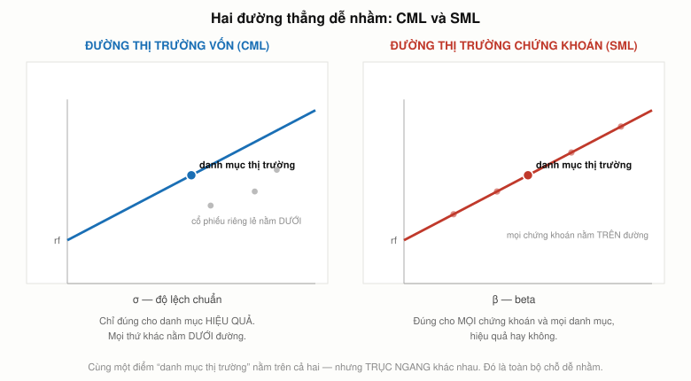
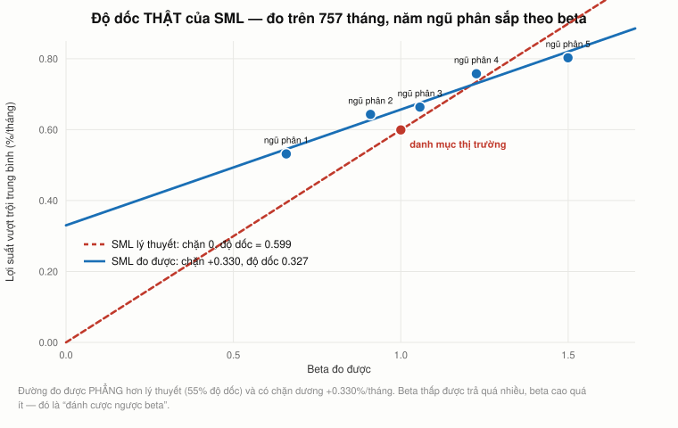

# Bài 11 — CAPM: beta, trạng thái cân bằng, và giá của rủi ro không tránh được

> [!info] Về bài này
> Bài học dựa trên **MIT 15.401 Finance Theory I** (GS. Andrew W. Lo, MIT Sloan, học kỳ thu 2008),
> ba buổi: **Ses 15** từ `52:10` (YouTube `z2oQe6B1Qa4`), **Ses 16** trọn vẹn (`N8gtnbJuMoo`, 75:22),
> **Ses 17** tới `21:49` (`JE80wLNIhjE`).
> Mốc thời gian ghi dạng `S15 mm:ss`, `S16 mm:ss`, `S17 mm:ss`.
> Phần **📚 Lý thuyết bổ sung** là kiến thức nền video lướt qua hoặc không có.
>
> **Cách đọc các khối màu:** `[!quote]` trích nguyên văn (kèm nguồn) · `[!warning]` chỗ dễ nhầm · `[!note]` mở rộng/ghi chú · `[!example]` ví dụ áp dụng (Góc QTKD / Góc đời sống — biên soạn thêm, không có trong sách).
>
> **Cần đọc trước:** [Bài 10 — Lý thuyết danh mục](bai_10_ly_thuyet_danh_muc.md) (danh mục tiếp tuyến — §2 bắt đầu đúng từ chỗ đó).

---

## Mục lục

<!-- MUC-LUC -->
- [1. Ba buổi giảng này ghi ngày nào](#1-ba-buổi-giảng-này-ghi-ngày-nào)
- [2. Từ danh mục tiếp tuyến tới danh mục thị trường](#2-từ-danh-mục-tiếp-tuyến-tới-danh-mục-thị-trường)
- [3. CAPM đòi hỏi trạng thái cân bằng — bước ngoặt của cả khoá](#3-capm-đòi-hỏi-trạng-thái-cân-bằng--bước-ngoặt-của-cả-khoá)
- [4. Chỉ số nào mới là "thị trường"](#4-chỉ-số-nào-mới-là-thị-trường)
- [5. Phê phán của Roll: CAPM có kiểm chứng được không](#5-phê-phán-của-roll-capm-có-kiểm-chứng-được-không)
- [6. Hai đường thẳng: CML và SML](#6-hai-đường-thẳng-cml-và-sml)
- [7. Beta bằng 1, bằng 0, và beta âm](#7-beta-bằng-1-bằng-0-và-beta-âm)
- [8. Cổ phiếu vàng có beta bằng 0 không](#8-cổ-phiếu-vàng-có-beta-bằng-0-không)
- [9. Beta cộng tuyến tính — phương sai thì không](#9-beta-cộng-tuyến-tính--phương-sai-thì-không)
- [10. Từ beta tới chi phí vốn: Microsoft và Gillette](#10-từ-beta-tới-chi-phí-vốn-microsoft-và-gillette)
- [11. Gillette đã không còn tồn tại khi Lo giảng](#11-gillette-đã-không-còn-tồn-tại-khi-lo-giảng)
- [12. Người lau kính và điệu nhảy Ireland](#12-người-lau-kính-và-điệu-nhảy-ireland)
- [13. Rủi ro hệ thống và rủi ro riêng lẻ, viết thành phương trình](#13-rủi-ro-hệ-thống-và-rủi-ro-riêng-lẻ-viết-thành-phương-trình)
- [14. Alpha — thước đo khoảng cách tới đường](#14-alpha--thước-đo-khoảng-cách-tới-đường)
- [15. CAPM giải thích được gì: ba cách sắp xếp danh mục](#15-capm-giải-thích-được-gì-ba-cách-sắp-xếp-danh-mục)
- [16. Độ dốc thật của SML, và CAPM beta không của Fischer Black](#16-độ-dốc-thật-của-sml-và-capm-beta-không-của-fischer-black)
- [17. Chỗ CAPM thật sự vỡ: biến động cao bị trừng phạt](#17-chỗ-capm-thật-sự-vỡ-biến-động-cao-bị-trừng-phạt)
- [18. Biogen: alpha to, sai số chuẩn còn to hơn](#18-biogen-alpha-to-sai-số-chuẩn-còn-to-hơn)
- [19. Quỹ đầu cơ XYZ và chữ ký của lợi suất được làm mượt](#19-quỹ-đầu-cơ-xyz-và-chữ-ký-của-lợi-suất-được-làm-mượt)
- [20. Nhiều beta: Fama-French, APT, và "beta ngoại lai"](#20-nhiều-beta-fama-french-apt-và-beta-ngoại-lai)
- [21. CAPM quốc tế](#21-capm-quốc-tế)
- [22. Đối chiếu 2026](#22-đối-chiếu-2026)
- [23. Góc Việt Nam](#23-góc-việt-nam)
- [24. Code minh hoạ](#24-code-minh-hoạ)
- [25. Từ điển thuật ngữ](#25-từ-điển-thuật-ngữ)
- [26. Câu hỏi tự kiểm tra](#26-câu-hỏi-tự-kiểm-tra)
- [Tóm tắt một trang](#tóm-tắt-một-trang)
- [Nguồn](#nguồn)
<!-- /MUC-LUC -->

---

## 1. Ba buổi giảng này ghi ngày nào

[Bài 10 §1](bai_10_ly_thuyet_danh_muc.md) đã định **Ses 15 = thứ Hai 17/11/2008**. Hai buổi còn lại nối tiếp trực tiếp.

| Buổi                    | Ngày                   | Chứng cứ                           |
| ----------------------- | ---------------------- | ---------------------------------- |
| **Ses 15**, từ `52:10`  | thứ Hai **17/11/2008** | xem bài 10 §1                      |
| **Ses 16**, trọn vẹn    | thứ Tư **19/11/2008**  | `S15 78:23` *"hẹn gặp lại thứ Tư"* |
| **Ses 17**, tới `21:49` | thứ Hai **24/11/2008** | xem dưới                           |

### Ses 17 — thứ Hai 24/11/2008, buổi cuối trước Lễ Tạ ơn

| Manh mối                                                                                                  | Kiểm chứng                                                                                                                                                       |
| --------------------------------------------------------------------------------------------------------- | ---------------------------------------------------------------------------------------------------------------------------------------------------------------- |
| `S16 75:22` *"hẹn gặp lại thứ Hai"*                                                                       | Ses 17 là một **thứ Hai**                                                                                                                                        |
| `S17 80:08` *"Chúc các bạn **Lễ Tạ ơn** vui vẻ. Hẹn gặp lại thứ Hai"*                                     | Tạ ơn 2008 = thứ Năm 27/11. Đây là buổi cuối trước kỳ nghỉ → thứ Hai **24/11**                                                                                   |
| `S17 67:32` — sinh viên hỏi hôm nay dùng lãi suất phi rủi ro nào, Lo đáp *"**Hôm nay tôi sẽ dùng 1%**"* | [FRED `DGS1`](https://fred.stlouisfed.org/series/DGS1) (kho bạc 1 năm): 21/11 = 0,83 · **24/11 = 0,95** · 25/11 = 0,95 · 26/11 = 0,93. Làm tròn ra đúng **1%** ✅ |

Con số thứ ba là loại chứng cứ tốt nhất: Lo đọc một mức lãi suất thị trường ngay tại chỗ, và mức đó khớp ngày.

Đáng chú ý theo mạch [bài 9 §17](bai_09_rui_ro_va_loi_suat.md): ngày 5/11 Lo còn nói *"nghe điên rồ"* khi nghĩ lãi suất có thể ở mức thấp lâu dài. Mười chín ngày sau, ông đã phải dùng **1%** làm lãi suất phi rủi ro cho một bài toán ngân sách vốn thật.

---

## 2. Từ danh mục tiếp tuyến tới danh mục thị trường

[Bài 10 §19](bai_10_ly_thuyet_danh_muc.md) dừng lại ở một kết quả: **mọi người, bất kể khẩu vị rủi ro, đều muốn nằm trên cùng một đường tiếp tuyến.** Ai cũng nắm cùng một danh mục cổ phiếu — chỉ khác nhau ở tỷ lệ pha với tín phiếu kho bạc.

Lo đặt tên cho nó (`S15 52:29`): **danh mục M**.

Rồi ông đi bước quyết định (`S15 59:02`):

> [!quote]
> *"Nếu **tất cả mọi người trên thế giới** đều bàng quan giữa việc nắm n+1 chứng khoán và việc nắm hai chứng khoán, thì hai chứng khoán đó đóng một vai trò rất đặc biệt… Ai cũng muốn nắm M. Vậy hãy chấp nhận bước nhảy niềm tin rằng **ai cũng thật sự nắm M**."*

Lập luận cộng dồn (`S15 62:16`):

> [!quote]
> *"Nếu ai cũng nắm danh mục M, đó là phía **cầu**. Về phía **cung**, tôi giả định mọi cổ phiếu được phát hành đều có người nắm. Khi tôi cộng dồn toàn bộ nhu cầu… trong mọi trường hợp, trọng số của các bạn là giống hệt nhau. Vậy khi tôi cộng cả thế giới lại và được danh mục M, nó phải bằng cái gì? **Nó chỉ có thể bằng tổng toàn bộ tài sản trên thế giới.** Cung bằng cầu."*

$$\boxed{M = \text{danh mục thị trường} = \text{mọi cổ phiếu theo đúng tỷ trọng vốn hoá}}$$

Lo gọi đây là *"kết quả đơn giản đến mức gây sốc nhưng mạnh một cách phi thường"* (`S15 63:27`), và ghi công cho **Bill Sharpe**:

> [!quote] S15 63:55
> *"Markowitz nghĩ ra tối ưu hoá danh mục… **Bill Sharpe nhìn vào đó và nói: à há. Nếu ai cũng ở trên đường đó, thì ai cũng đang nắm M hoặc tín phiếu kho bạc, và do đó M chỉ có thể là danh mục thị trường.**"* (`S15 63:55`)

### Kiểm chứng bằng số

§24 làm phép thử hai chiều trên ma trận hiệp phương sai **thật** của năm nhóm cổ phiếu Mỹ:

1. **Chiều xuôi** — cho trước trọng số thị trường, suy ngược ra kỳ vọng cân bằng $\mu = r_f + \lambda\Sigma w_m$. Kiểm lại bằng SML: khớp **tuyệt đối**.
2. **Chiều ngược** — từ bộ $(\mu, \Sigma, r_f)$ đó tính lại danh mục tiếp tuyến bằng công thức của bài 10. Kết quả trùng trọng số thị trường tới sai số **$10^{-15}$**.

| Nhóm | Trọng số thị trường | Danh mục tiếp tuyến tính lại |                   Lệch |
| ---- | ------------------: | ---------------------------: | ---------------------: |
| B1   |            0,200000 |                     0,200000 | $+8{,}3\times10^{-17}$ |
| B2   |            0,200000 |                     0,200000 | $-9{,}2\times10^{-16}$ |
| B3   |            0,200000 |                     0,200000 | $-9{,}7\times10^{-16}$ |
| B4   |            0,200000 |                     0,200000 | $+2{,}2\times10^{-15}$ |
| B5   |            0,200000 |                     0,200000 | $-4{,}7\times10^{-16}$ |

> [!warning]
> Đây là **chứng minh bằng dựng hình**, không phải một khẳng định về số liệu: tôi lấy hiệp phương sai thật nhưng **giả định** vốn hoá bằng nhau. Điều nó chứng minh là mệnh đề toán học — *danh mục tiếp tuyến bằng danh mục thị trường khi và chỉ khi SML đúng cho mọi tài sản* — chứ không phải rằng thị trường Mỹ thật sự cân bằng.

---

## 3. CAPM đòi hỏi trạng thái cân bằng — bước ngoặt của cả khoá

Đây là câu quan trọng nhất trong ba buổi giảng, và Lo nói nó ở phần tổng kết (`S17 19:15`):

> [!quote]
> *"**CAPM đòi hỏi trạng thái cân bằng. Đó là một bước ngoặt so với mọi thứ ta đã làm trong khoá này.** Tất cả các quan hệ định giá tôi đã lập luận — giá trị hiện tại của trái phiếu, của cổ phiếu, của hợp đồng tương lai, hợp đồng kỳ hạn, quyền chọn — **tất cả** đều chỉ dựa vào ý niệm **không có bữa trưa miễn phí**, rằng người ta thích nhiều tiền hơn ít tiền. Nhưng với CAPM, tôi phải viện tới một điều kiện mạnh hơn nhiều. **Tôi phải đòi hỏi cung bằng cầu.**"*

Bảng dưới là toàn bộ khoá học nhìn qua đúng một lăng kính:

| Kết quả                                         | Bài                                                                      | Điều kiện cần                                                      |
| ----------------------------------------------- | ------------------------------------------------------------------------ | ------------------------------------------------------------------ |
| Giá trị hiện tại, đường cong lãi suất           | [2](bai_02_gia_tri_hien_tai.md), [4](bai_04_trai_phieu_va_duong_cong.md) | không kinh doanh chênh lệch giá                                    |
| Luật một giá, định giá trái phiếu               | [5](bai_05_duration_va_chung_khoan_hoa.md)                               | không kinh doanh chênh lệch giá                                    |
| Chiết khấu cổ tức, PVGO                         | [6](bai_06_co_phieu_va_tang_truong.md)                                   | không kinh doanh chênh lệch giá                                    |
| Giá kỳ hạn, chi phí lưu giữ                     | [7](bai_07_ky_han_va_tuong_lai.md)                                       | không kinh doanh chênh lệch giá                                    |
| Ngang giá put–call, cây nhị thức, Black–Scholes | [8](bai_08_quyen_chon.md)                                                | không kinh doanh chênh lệch giá                                    |
| Biên hiệu quả, danh mục tiếp tuyến              | [10](bai_10_ly_thuyet_danh_muc.md)                                       | chỉ cần biết $\mu$, $\Sigma$ — không cần giả định gì về thị trường |
| **CAPM, SML, beta** | **11 (bài này)** | **cung = cầu, và mọi người đều tối ưu hoá kỳ vọng–phương sai** |

Vì sao chuyện này quan trọng đến thế? Vì **sức mạnh của một kết luận bị chặn bởi độ mạnh của giả định yếu nhất**.

- Ngang giá put–call ở [bài 8 §5](bai_08_quyen_chon.md) đúng **bất kể** ai nghĩ gì về thị trường. Nếu nó sai, có người kiếm được tiền chắc chắn, ngay lập tức, không rủi ro. Nó gần như một đồng nhất thức kế toán.
- CAPM đúng **chỉ khi** mọi nhà đầu tư đều tối ưu hoá kỳ vọng–phương sai, đều dùng chung một bộ ước lượng, đều vay và cho vay ở cùng một lãi suất, và thị trường thanh toán. Nếu CAPM sai, **chẳng ai kiếm được đồng nào chắc chắn cả** — nó chỉ đơn giản là sai.

Đó là lý do mà cả §15–19 dưới đây có thể tìm ra chỗ CAPM lệch khỏi dữ liệu, mà không có gì mâu thuẫn. Còn nếu tìm được chỗ ngang giá put–call lệch, đó sẽ là tin sốt dẻo.

---

## 4. Chỉ số nào mới là "thị trường"

Ngay sau khi dựng xong lập luận, Lo phải trả lời câu hỏi thực dụng: **lấy gì làm M?**

> [!quote]
> ⚠️ `S15 64:11` — *"Và bây giờ ta có một đại diện cho danh mục thị trường, **Russell 2000**. Hoặc S&P 500."*
>
> ⚠️ `S15 64:24` — *"**Russell 2000 có 2.000 cổ phiếu gia quyền theo vốn hoá. Đó là thứ gần nhất với 'mọi thứ' mà bạn quan tâm mà bạn có thể có được.**"*

**Điều này không đúng.** Russell 2000 **không** phải một đại diện cho thị trường. Nó là **2.000 công ty NHỎ NHẤT** trong Russell 3000 — được xây dựng bằng cách **loại bỏ** đúng phần vốn hoá lớn. Nó chiếm khoảng **7%** tổng vốn hoá thị trường Mỹ, không phải 100%.

| Chỉ số                 | Là gì                                       | Đại diện cho M được không                 |
| ---------------------- | ------------------------------------------- | ----------------------------------------- |
| **Russell 2000**       | 2.000 công ty **nhỏ nhất** của Russell 3000 | ❌ Cố ý loại bỏ vốn hoá lớn                |
| **Russell 3000**       | ~3.000 công ty lớn nhất, ~97% vốn hoá Mỹ    | ✅ Hợp lý                                  |
| S&P 500                | 500 công ty lớn, ~80% vốn hoá Mỹ            | ⚠️ Chấp nhận được, nhưng thiếu vốn hoá nhỏ |
| CRSP gia quyền vốn hoá | Toàn bộ NYSE + Amex + NASDAQ, có cổ tức     | ✅ Chuẩn học thuật                         |

Chi tiết mỉa mai: **chính Lo mô tả đúng đại diện chuẩn ở buổi sau** (`S17 02:43`): *"thị trường ở đây là lợi suất gia quyền theo vốn hoá, **bao gồm cổ tức, của toàn bộ cổ phiếu trên NYSE, Amex và NASDAQ**."* Đó chính là chuỗi tôi dùng ở §24 — và cũng là chuỗi Ken French công bố. Câu ở `S15 64:11` là lỡ lời khi liệt kê ví dụ, không phải quan điểm của ông.

Nhưng nó dẫn thẳng tới một vấn đề sâu hơn nhiều.

---

## 5. Phê phán của Roll: CAPM có kiểm chứng được không

Lo tự nêu vấn đề khi trả lời một sinh viên (`S16 67:19`):

> [!quote]
> *"Theo lý thuyết, danh mục tiếp tuyến này **không chỉ dành cho thị trường chứng khoán Mỹ. Nó phải là của thị trường chứng khoán toàn thế giới, mọi thứ.**"*

Nhưng "mọi thứ" đi xa hơn Lo nói. **Richard Roll (1977)**, *"A Critique of the Asset Pricing Theory's Tests"*, Journal of Financial Economics 4(2):129–176, chỉ ra hai điều:

### 1. Quan hệ tuyến tính là một hằng đúng, không phải một giả thuyết

Có một **tương đương toán học**: danh mục $M$ nằm trên biên hiệu quả kỳ vọng–phương sai **khi và chỉ khi** $\mathbb{E}[R_i] = r_f + \beta_i(\mathbb{E}[R_M] - r_f)$ đúng cho mọi $i$.

Điều đó không cần bất kỳ giả định kinh tế nào — nó là hình học thuần tuý. §24 mục 1 minh hoạ chính xác chiều này: cho trước trọng số nào đó và bảo nó là hiệu quả, SML tự động đúng tới sai số máy.

Hệ quả: **kiểm định CAPM thực chất chỉ là kiểm định xem chỉ số đại diện có hiệu quả kỳ vọng–phương sai hay không.** Nếu bạn giả định thị trường hiệu quả, CAPM thành hằng đúng và chẳng kiểm được gì.

### 2. Danh mục thị trường thật không quan sát được

Danh mục thị trường phải chứa **mọi tài sản có giá trị**: cổ phiếu, trái phiếu, bất động sản, hàng hoá, doanh nghiệp tư nhân, đồ sưu tầm — và, quan trọng nhất, **vốn con người**, tức giá trị hiện tại của toàn bộ thu nhập lao động tương lai của nhân loại.

Không ai quan sát được lợi suất của nó. Vì vậy mọi kiểm định CAPM đều là **kiểm định giả thuyết kép**: CAPM đúng **và** chỉ số bạn chọn là đại diện tốt. Bác bỏ được thì không biết vế nào sai.

> [!quote]
> Roll viết thẳng: *"Lý thuyết này không kiểm chứng được trừ khi biết chính xác thành phần của danh mục thị trường thật và dùng nó trong kiểm định."*

Đặt cạnh §4: Lo đề xuất Russell 2000 làm đại diện; đại diện chuẩn là CRSP gia quyền vốn hoá; danh mục thị trường thật thì **không tồn tại dưới dạng quan sát được**. Ba tầng khác nhau, và bậc thang giữa tầng hai và tầng ba là chỗ Roll đứng.

> [!warning]
> Điều này **không** làm CAPM vô dụng. Nó làm CAPM thành một **khung để suy nghĩ và một quy ước để định giá**, chứ không phải một định luật đã được kiểm chứng. Chính Lo nói đúng như thế (`S16 29:55`): *"**Đây không phải vật lý. Đây không phải toán học.** Bạn đang áp một bộ lý thuyết và xấp xỉ lên một thực tại phức tạp hơn rất nhiều."*

---

## 6. Hai đường thẳng: CML và SML



*Cùng một điểm “danh mục thị trường” nằm trên cả hai — nhưng trục ngang khác nhau.*

Lo đặt tên cho hai đường ở đầu Ses 16.

### Đường thị trường vốn (`S16 00:56`)

$$\mathbb{E}[R_p] = r_f + \frac{\sigma_p}{\sigma_M}\left(\mathbb{E}[R_M] - r_f\right)$$

> [!quote] S16 01:15
> *"Đường tiếp tuyến đó gọi là **đường thị trường vốn**, vì nó thể hiện điều mà mọi thị trường vốn hiệu quả phải thể hiện về đánh đổi rủi ro–lợi suất."* (`S16 01:15`)

> [!warning]
> Nó **chỉ áp dụng cho danh mục hiệu quả** — và Lo nhấn mạnh rằng hầu như không có gì hiệu quả (`S16 02:37`): *"Nói thẳng ra, **phần lớn khoản đầu tư đều không hiệu quả**. Bạn chọn đại một cổ phiếu như IBM, nó không phải một danh mục hiệu quả."*

### Đường thị trường chứng khoán (`S16 12:11`)

$$\mathbb{E}[R_i] = r_f + \beta_i\left(\mathbb{E}[R_M] - r_f\right), \qquad \beta_i = \frac{\mathrm{Cov}(R_i, R_M)}{\mathrm{Var}(R_M)}$$

> [!quote] S16 12:11
> *"Ta gọi nó là **đường thị trường chứng khoán**, không phải đường thị trường vốn, vì nó áp dụng cho **từng chứng khoán một trong toàn bộ vũ trụ đầu tư của bạn**."* (`S16 12:11`)

### Chỗ khác nhau duy nhất

Hai công thức giống hệt nhau trừ hệ số nhân: $\sigma_p/\sigma_M$ so với $\beta_p$. Mà

$$\beta_p = \frac{\rho_{pM}\,\sigma_p\,\sigma_M}{\sigma_M^2} = \rho_{pM}\cdot\frac{\sigma_p}{\sigma_M}$$

**Hai đường trùng nhau khi và chỉ khi $\rho_{pM} = 1$** — tức khi danh mục hoàn toàn đồng nhịp với thị trường, tức khi nó **đã đa dạng hoá triệt để**, tức khi nó nằm trên đường tiếp tuyến.

§24 đo bằng tham số thật ($r_f = 0{,}363\%$/tháng, phần bù $0{,}599\%$/tháng, $\sigma_M = 4{,}46\%$/tháng):

| Danh mục | $\sigma_p$ | $\rho$ với TT | $\beta$ | CML nói | SML nói |      Chênh |
| -------- | ---------: | ------------: | ------: | ------: | ------: | ---------: |
| P1       |       3,0% |          1,00 |    0,67 |  0,766% |  0,766% |      0,000 |
| P2       |       5,0% |          1,00 |    1,12 |  1,034% |  1,034% |      0,000 |
| P3       |       5,0% |          0,60 |    0,67 |  1,034% |  0,766% | **+0,269** |
| P4       |       5,0% |          0,30 |    0,34 |  1,034% |  0,564% | **+0,470** |
| P5       |       8,0% |          0,40 |    0,72 |  1,437% |  0,793% | **+0,645** |

Đọc hàng P3, P4, P5: **cùng độ lệch chuẩn 5%, nhưng lợi suất đáng được hưởng khác nhau hoàn toàn** tuỳ tương quan. CML sẽ hứa hẹn quá tay, vì nó tính công cho cả phần biến động là rủi ro riêng — mà rủi ro riêng thì không ai trả tiền.

---

## 7. Beta bằng 1, bằng 0, và beta âm

Lo đi qua ba trường hợp (`S16 05:33`):

|   $\beta$ |       SML cho | Ý nghĩa                                              |
| --------: | ------------: | ---------------------------------------------------- |
|  **1,00** |  0,962%/tháng | Đúng bằng lợi suất thị trường — các $r_f$ triệt tiêu |
|  **0,00** |  0,363%/tháng | Đúng bằng lãi suất phi rủi ro                        |
| **−0,30** |  0,183%/tháng | **Thấp hơn** lãi suất phi rủi ro                     |
| **−1,50** | −0,536%/tháng | **Âm** — bạn trả tiền để được gánh rủi ro này        |

Trường hợp thứ hai là chỗ dễ hiểu nhầm nhất, và Lo dừng lại nói rõ (`S16 06:23`):

> [!quote]
> *"Điều quan trọng phải nhận ra là **nếu beta của một tài sản bằng 0, điều đó KHÔNG có nghĩa tài sản đó không biến động**… Một tài sản có beta bằng 0 vẫn có thể có biến động. **Nó không phải tài sản phi rủi ro.** Nó là bất kỳ tài sản nào có beta bằng 0."*

Còn beta âm thì Lo nhận là *"hoàn toàn phản trực giác"* (`S16 08:16`): *"Bạn có thể sẵn lòng **trả tiền cho ai đó vì đặc ân được gánh rủi ro ấy**. Vì sao lại trả tiền để chịu rủi ro?"*

Câu trả lời nằm ở chính khung của [bài 10 §12](bai_10_ly_thuyet_danh_muc.md) (`S16 11:08`):

> [!quote]
> *"Nếu bạn có một chứng khoán tương quan âm với danh mục thị trường, nó giúp bạn **rất nhiều**. Mà nếu nó giúp bạn nhiều thì bạn sẵn lòng trả tiền cho nó. Khi bạn sẵn lòng trả tiền, bạn **đẩy giá hôm nay lên cao**. Và do đó lợi suất kỳ vọng… trở nên thấp hơn."*

Đây là mắt xích quan trọng: **giá cao hôm nay chính là lợi suất kỳ vọng thấp ngày mai.** Bảo hiểm đắt không phải vì nó tệ mà vì nó quý.

Và Lo tự đóng vòng lặp (`S16 12:28`): sinh viên Dennis hỏi bán khống có tạo ra beta âm không. Lo đáp có — *"nhưng vấn đề là khi bán khống, bạn thường cũng nhận **kỳ vọng âm**. Cái bạn muốn là một tài sản **beta âm nhưng kỳ vọng dương**. Đó mới là thứ cực hiếm."*

---

## 8. Cổ phiếu vàng có beta bằng 0 không

Sinh viên Ken hỏi thẳng: cho một ví dụ chứng khoán beta âm đi (`S16 12:59`). Lo trả lời (`S16 13:19`):

> [!quote]
> *"Rất khó kiếm. Nhưng thứ gần nhất tồn tại trên thị trường hôm nay là **cổ phiếu ngành khai thác vàng**. Beta của nó **quanh 0, đôi khi âm, đôi khi dương, nhưng nhỏ**. Đó là ví dụ duy nhất mà chúng tôi tìm được trong dữ liệu có vẻ hơi âm."*

§24 đo trên **Newmont** — công ty khai thác vàng niêm yết lâu đời nhất của Mỹ:

| Cửa sổ           |    n | Beta |   se | Khoảng tin cậy 95% |       R² | Bác bỏ β = 0? |
| ---------------- | ---: | ---: | ---: | ------------------ | -------: | ------------- |
| 4/1986 – 7/2026  |  484 | 0,46 | 0,11 | [0,24 ; 0,68]      | **0,03** | **có**        |
| 4/1986 – 12/2000 |  177 | 0,86 | 0,21 | [0,45 ; 1,26]      |     0,09 | **có**        |
| 1/2001 – 11/2008 |   95 | 0,26 | 0,23 | [−0,20 ; 0,72]     |     0,01 | không         |
| 12/2008 – 7/2026 |  212 | 0,23 | 0,16 | [−0,08 ; 0,55]     | **0,01** | không         |

**Chấm điểm hai mặt:**

✅ Lo đúng ở điều quan trọng nhất: **R² chỉ 1–3%**. Cổ phiếu vàng gần như không có quan hệ với thị trường — đây thật sự là thứ gần "beta bằng 0" nhất trong các cổ phiếu thường.

> [!warning]
> Nhưng ước lượng điểm **dương ở mọi cửa sổ**, không âm. Cách nói chính xác là: *beta dương nhưng nhỏ, và sai số lớn tới mức không bác bỏ được giả thuyết beta = 0 trong các cửa sổ gần đây.*

> [!warning]
> *"Đôi khi âm"* thì không tìm thấy. Và Lo đã tự chỉ ra rằng cách duy nhất chắc chắn tạo beta âm là **bán khống** (`S16 12:44`) — nhưng khi đó kỳ vọng cũng âm theo, nên chẳng giúp được gì.

> [!note]
> Có một cách đọc sâu hơn cho kết quả này. Từ 12/2008, beta của Newmont là **0,23 với R² = 0,01**. Nghĩa là 99% biến động của nó **không** đến từ thị trường cổ phiếu. Với một nhà đầu tư đã đa dạng hoá, 99% ấy là rủi ro riêng lẻ — và theo đúng §13 dưới đây, **không được trả công**. Đó là lý do kinh tế vì sao cổ phiếu vàng, xét dài hạn, không phải một khoản đầu tư hấp dẫn dù nó là công cụ phòng vệ tốt.

---

## 9. Beta cộng tuyến tính — phương sai thì không

Lo gọi đây là *"một sự đơn giản hoá cực lớn"* (`S16 16:11`), và nó xứng đáng.

$$R_p = \sum_i \omega_i R_i \;\Longrightarrow\; \mathrm{Cov}(R_p, R_M) = \sum_i \omega_i\,\mathrm{Cov}(R_i, R_M) \;\Longrightarrow\; \boxed{\beta_p = \sum_i \omega_i \beta_i}$$

> [!quote] S16 15:50
> *"Nếu bạn coi beta là thước đo rủi ro, thì thước đo rủi ro này **tuyến tính** — khác hẳn độ biến động, vốn không tuyến tính."* (`S16 15:50`)

§24 kiểm bằng dữ liệu thật, trộn năm nhóm theo trọng số 40/25/15/12/8%:

|                                  |         Beta |    Độ lệch/tháng |
| -------------------------------- | -----------: | ---------------: |
| Trung bình có trọng số           |   **0,9161** |          4,4766% |
| Đo trực tiếp trên chuỗi danh mục |   **0,9161** |      **4,1566%** |
| Lệch                             | **0,00e+00** | **+0,3200 điểm** |

**Beta khớp tuyệt đối tới từng bit. Độ lệch chuẩn lệch 0,32 điểm.**

Ý nghĩa thực tế: muốn biết rủi ro của một rổ theo nghĩa phương sai, bạn cần cả ma trận hiệp phương sai — $n^2$ số hạng như [bài 10 §9](bai_10_ly_thuyet_danh_muc.md). Muốn biết theo nghĩa beta, bạn chỉ cần **$n$ con số và một phép trung bình**.

Đó chính là thứ làm CAPM dùng được trong thực tế, còn tối ưu hoá Markowitz thì [bài 10 §21](bai_10_ly_thuyet_danh_muc.md) cho thấy vỡ ngoài mẫu.

---

## 10. Từ beta tới chi phí vốn: Microsoft và Gillette

Đây là chỗ toàn bộ khoá học có tiền lãi (`S16 17:32`):

> [!quote]
> *"Nếu bạn muốn biết lợi suất kỳ vọng của một dự án khoan dầu, hãy **đo beta của các cổ phiếu khoan dầu**, dùng beta đó, và đó là suất chiết khấu phù hợp cho dự án ấy."*

Ví dụ Lo dùng, số liệu 1990–2001 (`S16 18:22`), với $r_f = 5\%$ và phần bù thị trường $6\%$:

| Công ty   | Beta | Chi phí vốn = 5 + β × 6 | Lo đọc |     |
| --------- | ---: | ----------------------: | -----: | --- |
| Gillette  | 0,81 |               **9,86%** |  9,86% | ✅   |
| Microsoft | 1,49 |              **13,94%** | 13,94% | ✅   |

Cả hai đúng chính xác.

Trực giác kiểm tra "mùi" thì đến từ sinh viên Courtney (`S16 23:06`): *"người ta không nhất thiết cần máy tính… còn Gillette bán dao cạo và lăn khử mùi, là hàng thiết yếu."* Lo tán thành và nói thêm (`S16 23:26`): *"Nếu kinh tế đi xuống, cái gì bị cắt trước — lưỡi dao cạo hay Windows? Rất may là Windows."*

Rồi ông tự đặt câu hỏi mà 18 năm sau trả lời được (`S16 23:49`):

> [!quote]
> *"**Ngày nay tôi không biết câu trả lời nữa.** Vì bây giờ ta phụ thuộc vào internet nhiều đến mức có thể khác đi. **Tôi chưa cập nhật phân tích này để xem beta từ 2001 tới 2008 ra sao, nhưng nó có thể đã khác.** Nên giờ có khi lại là mấy anh mọt sách chưa cạo râu…"*

### Đo lại

§24 chạy đúng hồi quy đó trên dữ liệu thật, chuẩn thị trường là chuỗi CRSP gia quyền vốn hoá mà chính Lo mô tả ở `S17 02:43`:

| Mã       | Cửa sổ           |    n |     Beta |   se | alpha/năm |    t |   R² |
| -------- | ---------------- | ---: | -------: | ---: | --------: | ---: | ---: |
| **MSFT** | 1/1990 – 12/2001 |  144 | **1,49** | 0,18 |     24,4% | 2,58 | 0,33 |
| **MSFT** | 1/2002 – 7/2026  |  295 | **0,95** | 0,07 |      5,1% | 1,32 | 0,38 |
| PG       | 1/1990 – 12/2001 |  144 |     0,49 | 0,13 |      9,0% | 1,29 | 0,09 |
| PG       | 1/2002 – 7/2026  |  295 |     0,37 | 0,05 |      4,0% | 1,38 | 0,14 |

> [!note]
> **Beta Microsoft giai đoạn 1990–2001 đo được 1,4865 — làm tròn ra đúng 1,49, con số Lo đọc trên lớp.** Tái lập độc lập, khớp tới hai chữ số thập phân, từ dữ liệu Yahoo Finance và Ken French mà Lo chưa từng chạm tới.

Và câu hỏi ông bỏ ngỏ đã có đáp án: **beta Microsoft rơi từ 1,49 xuống 0,95**. Trực giác *"mọt sách chưa cạo râu"* của ông đúng về hướng — phần mềm đã trở thành hàng thiết yếu. Microsoft năm 2026 không còn là cổ phiếu chu kỳ; nó dao động gần như đúng nhịp thị trường.

---

## 11. Gillette đã không còn tồn tại khi Lo giảng

Có một chi tiết Lo không nhắc, và nó làm hỏng ví dụ theo cách rất đáng chú ý.

Lo nói (`S16 29:23`): *"Nếu bạn đang ngồi trong **hai công ty này** và đặt câu hỏi: chúng ta sắp mở rộng hoạt động…"*

> [!warning] Gillette không còn là một công ty vào lúc đó.
> Procter & Gamble công bố thương vụ ngày 28/1/2005 và **hoàn tất ngày 1/10/2005** — trị giá công bố khoảng 57 tỷ đô la, giá trị hạch toán cuối cùng 53,4 tỷ. Mỗi cổ phiếu Gillette đổi lấy 0,975 cổ phiếu P&G.

Tức là khi Lo giảng buổi này ngày **19/11/2008**, Gillette đã ngừng tồn tại như một công ty độc lập được **ba năm bảy tuần**.

Điều này không sai về mặt sư phạm — beta 1990–2001 của Gillette là một sự kiện lịch sử có thật, và bài học về chi phí vốn không đổi. Nhưng nó là **ví dụ thứ ba liên tiếp** trong khoá học nơi cổ phiếu được dùng làm minh hoạ đã biến mất:

| Bài                                    | Cổ phiếu           | Chuyện gì xảy ra                                |
| -------------------------------------- | ------------------ | ----------------------------------------------- |
| [10 §24](bai_10_ly_thuyet_danh_muc.md) | **General Motors** | Phá sản 1/6/2009, cổ đông nhận con số không     |
| [10 §24](bai_10_ly_thuyet_danh_muc.md) | **Motorola**       | Tách đôi 4/1/2011                               |
| **11 (bài này)**                       | **Gillette**       | Bị P&G mua, **1/10/2005 — trước cả buổi giảng** |

Ba trên năm cổ phiếu trung tâm của khoá học. Đó không phải xui xẻo — đó là **tỷ lệ nền của thị trường cổ phiếu**, và là lý do vì sao mọi con số đo trên "các công ty còn tồn tại" đều bị thiên lệch sống sót. §23 sẽ gặp lại đúng vấn đề này ở Việt Nam.

§24 dùng **P&G** làm công ty kế thừa. Beta của P&G (0,37–0,49) còn thấp hơn Gillette (0,81) — cùng một câu chuyện kinh tế, đậm hơn: hàng tiêu dùng thiết yếu không quan tâm chu kỳ.

---

## 12. Người lau kính và điệu nhảy Ireland

Đây là đoạn hay nhất của cả ba buổi giảng, và nó dạy toàn bộ CAPM mà không dùng một công thức nào.

Lo dựng bối cảnh (`S16 60:01`): người lau kính các toà nhà chọc trời ở khu trung tâm Manhattan, đứng trên giàn giáo rộng nửa mét ở tầng 40. Ông thật sự đi tra lương của họ:

> [!quote] S16 61:22
> *"Khi tôi tra lần cuối, khoảng bốn năm trước, người lau kính chọc trời điển hình được trả khoảng **60.000 đô la một năm**… Không yêu cầu bằng cấp, không chứng chỉ. Cứ đến rồi leo lên."* (`S16 61:22`)

Rồi ông đặt câu hỏi (`S16 62:01`):

> [!quote]
> *"Giả sử có một người thợ đến làm, mà anh ta lại rất thích **vừa lau kính vừa nhảy — nhảy điệu jig của Ireland** — trên tầng 40. Các bạn đồng ý là rủi ro hơn chứ? Vậy các bạn nghĩ người đó có được trả cao hơn 60.000 một năm không? **Vì sao không? Anh ta đang chịu nhiều rủi ro hơn mà.**"*

Và câu trả lời (`S16 62:37`):

> [!quote]
> *"Chính xác. **Anh ta không BUỘC phải chịu rủi ro đó. Nó không thuộc về công việc.** Anh ta có thể chọn chịu, nhưng sẽ không được đền bù, vì nó không cần thiết. Và có 100.000 người xếp hàng sau lưng sẵn sàng nhận việc mà không cần chịu rủi ro ấy."*

Toàn bộ CAPM nằm trong đó:

| Người lau kính                         | Cổ phiếu                                               |
| -------------------------------------- | ------------------------------------------------------ |
| Rủi ro độ cao — **thuộc về công việc** | **Rủi ro hệ thống (beta)** — không đa dạng hoá bỏ được |
| Điệu nhảy jig — **tự chọn**            | **Rủi ro riêng lẻ** — đa dạng hoá bỏ được              |
| 60.000 đô la                           | Phần bù rủi ro $\beta \times$ MRP                      |
| Nhảy jig: 0 đồng thêm                  | Rủi ro riêng lẻ: **0 đồng thêm**                       |

Lo tóm lại (`S16 63:34`): *"CAPM chỉ nói rằng **bạn được cái bạn trả tiền, và bạn trả tiền cho cái bạn được**. Nếu có một lượng rủi ro mà không ai gạt bỏ dễ dàng được — tức bạn buộc phải gánh — thì phải trả tiền cho nó. Nhưng nếu có rủi ro mà bạn không buộc phải chịu, thì bạn không phải trả tiền cho nó."*

Và (`S16 64:03`): *"**Beta là thước đo của cái hạt cứng bé xíu của rủi ro mà bạn không gạt bỏ được.**"*

> [!note] Con số năm 2026.
> Lo đọc 60.000 đô la, tra vào khoảng 2004. Các nguồn hiện nay chênh nhau tới hai lần tuỳ định nghĩa: các trang tổng hợp việc làm cho *"lau kính"* nói chung ghi khoảng 41.000–45.000 đô la ở New York; còn các nguồn chuyên về **lau kính nhà cao tầng** — đúng công việc Lo mô tả, có chứng chỉ đu dây và giàn treo — cho khoảng **75.000–100.000 đô la**, trung vị quanh 82.000. ⚠️ Tôi ghi cả hai khoảng thay vì chọn một, vì các nguồn này không thống nhất và không có nguồn nào là thống kê chính thức.

Điểm sư phạm quan trọng hơn con số: **lập luận của Lo không phụ thuộc vào mức lương.** Dù là 45.000 hay 100.000, người nhảy jig vẫn không được trả thêm đồng nào.

---

## 13. Rủi ro hệ thống và rủi ro riêng lẻ, viết thành phương trình

Lo chuyển ẩn dụ §12 thành toán (`S16 69:28`):

$$R_i = r_f + \beta_i(R_M - r_f) + \varepsilon_i$$

Ba phần (`S16 70:18`):

| Thành phần           | Là gì                                            | Được trả công? |
| -------------------- | ------------------------------------------------ | -------------- |
| $r_f$                | Lãi suất phi rủi ro                              | —              |
| $\beta_i(R_M - r_f)$ | **Rủi ro hệ thống**                              | ✅ Có           |
| $\varepsilon_i$      | **Rủi ro riêng lẻ** — *"chính là điệu nhảy jig"* | ❌ Không        |

> [!quote] S16 70:45
> *"Sao tôi biết bạn không được trả công cho $\varepsilon$? **Vì trung bình, kỳ vọng của nó bằng 0.**"* (`S16 70:45`)

Vì sao nó biến mất trong danh mục (`S16 71:29`):

> [!quote]
> *"Cái này dựa trên một mảnh toán học gọi là **luật số lớn**. Bạn có thể đã nghe cụm từ đó trong trò chuyện thường ngày, nhưng nó là một **định lý thật**. Nó nói rằng khi bạn có rất nhiều dao động không tương quan với nhau — mà theo định nghĩa, rủi ro riêng lẻ của Gillette và Microsoft là không tương quan — thì trong giới hạn, chúng thật sự tiến về 0."*

Số cụ thể Lo đưa (`S16 71:29`): *"Mua 10 cổ phiếu thay vì 1 là đã đa dạng hoá. 20 tốt hơn 10. Và về mặt toán học, **sau 50 cổ phiếu thì bạn cơ bản đã đa dạng hoá xong**."*

[Bài 10 §17](bai_10_ly_thuyet_danh_muc.md) đo bằng số: 10 mã bỏ được **90%** rủi ro có thể bỏ; 50 mã bỏ được **98%**. Lo nói đúng.

### Lời khuyên nghề nghiệp nằm ngay trong đó

Lo rút ra một hệ quả rất cụ thể (`S16 58:28`):

> [!quote]
> *"**Nếu bạn làm trong ngành dịch vụ tài chính, bạn không nên mua cổ phiếu dịch vụ tài chính. Nếu bạn làm ngành dược, bạn không nên mua cổ phiếu công nghệ sinh học.** Ấy thế mà ta vẫn làm vậy, vì những lý do ngoài quản lý danh mục."*

Và về chương trình mua cổ phiếu cho nhân viên (`S16 59:17`), khi được hỏi có nên tham gia không:

> [!quote]
> *"Tôi khuyên **không**, xét từ góc độ tài chính, nhưng tôi có thể khuyên **có**, xét từ góc độ khuyến khích quản trị. Lý do các công ty làm thế rất đơn giản: **họ đang cố hút bạn vào.** Còn từ góc độ cá nhân bạn, bạn đang gánh rủi ro mà bạn không cần phải gánh."*

> [!warning]
> Đây là lời khuyên đắt giá và có thật: vốn con người của bạn **đã** tập trung hết vào ngành bạn làm. Mua thêm cổ phiếu chính công ty đó là nhân đôi một canh bạc mà bạn không được trả công để chơi. Enron năm 2001 là bài học kinh điển — nhiều nhân viên mất cả việc lẫn toàn bộ quỹ hưu vào cùng một ngày.

---

## 14. Alpha — thước đo khoảng cách tới đường

Sinh viên Eduard hỏi: làm sao đo được mình cách biên hiệu quả bao xa (`S16 24:06`). Lo trả lời (`S16 24:42`):

$$\alpha_i = \mathbb{E}[R_i]_{\text{thực tế}} - \left[r_f + \beta_i(\mathbb{E}[R_M] - r_f)\right]$$

> [!quote] S16 24:42
> *"Với một nhà quản lý danh mục hay một dự án đầu tư mang lại lợi suất kỳ vọng khác với con số này, phần chênh lệch đó chính là cái ta gọi là **alpha**."* (`S16 24:42`)

Ba nhà quản lý Lo chiếu (`S16 35:22`) — **cả ba đều có lợi suất 15% và độ biến động 20%**, chỉ khác beta:

|     |       Beta | SML đòi | Thực tế |   Alpha | Đánh giá          |
| --- | ---------: | ------: | ------: | ------: | ----------------- |
| A   |       thấp |      6% |     15% | **+9%** | Xuất sắc          |
| B   | trung bình |    ~15% |     15% |      ~0 | Đúng như mong đợi |
| C   |        cao |   > 15% |     15% |  **âm** | Kém               |

> [!quote] S16 36:03
> *"Để ý là tôi đã nói cả ba nhà quản lý có **cùng độ biến động, 20%**. **Bạn có thể có cùng độ biến động mà beta khác nhau. Beta và độ biến động không nhất thiết đi đôi với nhau.**"* (`S16 36:03`)

Và trong ngôn ngữ hồi quy (`S16 72:23`), CAPM rút gọn thành **một giả thuyết duy nhất**:

$$H_0: \alpha_i = 0 \quad \text{với mọi cổ phiếu, mọi nhà quản lý, mọi dự án}$$

Đó là điều §15–19 sẽ đem đi kiểm.

---

## 15. CAPM giải thích được gì: ba cách sắp xếp danh mục

Lo mở đầu Ses 17 bằng một nhận xét phương pháp rất đúng (`S17 05:30`):

> [!quote]
> *"Khi bạn bỏ chứng khoán vào danh mục, **nhiễu — rủi ro riêng lẻ — được bình quân hoá đi**, và cái còn lại là các nhân tố chung. Nên tôi sẽ cho các bạn xem CAPM chạy tốt hay tệ **không phải trên từng cổ phiếu**, mà trên các danh mục."*

Ông chiếu ba biểu đồ. §24 dựng lại cả ba từ dữ liệu Ken French, trên **hai** cửa sổ: cửa sổ của Lo, và giai đoạn sau bài giảng.

### Sắp theo quy mô

| Nhóm                          | TB/tháng | Beta | alpha/tháng | t(alpha) |   R² |
| ----------------------------- | -------: | ---: | ----------: | -------: | ---: |
| **1963–2000 (cửa sổ của Lo)** |          |      |             |          |      |
| Nhỏ nhất                      |   1,182% | 1,15 |     +0,063% |     0,34 | 0,64 |
| Giữa                          |   1,186% | 1,12 |     +0,082% |     0,86 | 0,86 |
| Lớn nhất                      |   1,012% | 0,94 |     +0,000% |     0,01 | 0,97 |
| **2001–2026 (sau bài giảng)** |          |      |             |          |      |
| Nhỏ nhất                      |   0,993% | 1,16 |     +0,036% |     0,18 | 0,69 |
| Giữa                          |   0,970% | 1,15 |     +0,016% |     0,13 | 0,86 |
| Lớn nhất                      |   0,822% | 0,96 |     +0,004% |     0,16 | 0,99 |

Lo nói (`S17 07:49`): *"Đây là mức khớp tốt **đến kinh ngạc**, nên tôi sẽ không coi đây là điển hình trong tài liệu tài chính. Nhưng tình cờ trong 40 năm này, CAPM chạy khá tốt thật."*

✅ **Đúng, và còn đúng hơn ông tưởng.** Không alpha nào có ý nghĩa thống kê — trong **cả hai** cửa sổ, kể cả 26 năm ông chưa nhìn thấy.

Đây là kết luận đáng chú ý theo mạch [bài 9 §16](bai_09_rui_ro_va_loi_suat.md), nơi hiệu ứng quy mô được nêu như một *dị thường*. Ở đây, qua lăng kính CAPM, nó **không phải dị thường**: cổ phiếu nhỏ lãi hơn vì beta của chúng cao hơn. Beta giải thích hết. Cái gọi là "phần bù quy mô" phần lớn chỉ là phần bù thị trường được khuếch đại.

### Sắp theo beta

| Nhóm               | TB/tháng | Beta | alpha/tháng | t(alpha) |
| ------------------ | -------: | ---: | ----------: | -------: |
| **1963–2000**      |          |      |             |          |
| 1 (beta thấp nhất) |   1,059% | 0,70 | **+0,175%** | **1,97** |
| 2                  |   1,080% | 0,92 |     +0,082% |     1,34 |
| 3                  |   1,059% | 1,06 |     −0,016% |    −0,28 |
| 4                  |   1,119% | 1,20 |     −0,028% |    −0,37 |
| 5 (beta cao nhất)  |   1,188% | 1,45 |     −0,089% |    −0,68 |
| **2001–2026**      |          |      |             |          |
| 1 (beta thấp nhất) |   0,654% | 0,59 |     +0,093% |     0,82 |
| 2                  |   0,898% | 0,90 |     +0,124% |     1,69 |
| 3                  |   0,979% | 1,05 |     +0,100% |     1,10 |
| 4                  |   1,123% | 1,26 |     +0,094% |     0,92 |
| 5 (beta cao nhất)  |   1,132% | 1,57 | **−0,118%** |    −0,59 |

Hình dạng rất rõ và giống nhau ở cả hai cửa sổ: **alpha giảm đều khi beta tăng.** Nhóm beta thấp được thưởng, nhóm beta cao bị phạt. Đó chính là §16.

---

## 16. Độ dốc thật của SML, và CAPM beta không của Fischer Black



*Đường đo được phẳng hơn lý thuyết và có hệ số chặn dương — đó là “đánh cược ngược beta”.*

Lo nhìn thấy vấn đề và nói nhẹ đi (`S17 10:08`):

> [!quote]
> *"Quan hệ thực tế trông có vẻ tuyến tính, nhưng ở một **độ dốc hơi khác một chút**. Có vẻ phần bù rủi ro không phải là độ dốc đúng, mà **nhỏ hơn một chút** mới là đúng."*

§24 đo bằng hồi quy chéo trên năm nhóm sắp theo beta. CAPM đòi một đường **qua gốc toạ độ** với độ dốc bằng đúng phần bù thị trường.

| Cửa sổ    | Chặn (alpha) | Độ dốc thực tế | Phần bù thị trường | % độ dốc lý thuyết |
| --------- | -----------: | -------------: | -----------------: | -----------------: |
| 1963–2000 |  **+0,407%** |     **0,172%** |             0,529% |            **32%** |
| 2001–2026 |      +0,276% |         0,499% |             0,702% |                71% |
| Cả đoạn   |      +0,330% |         0,327% |             0,599% |                55% |

> [!quote]
> ⚠️ **Trong chính cửa sổ của Lo, độ dốc thực tế chỉ bằng MỘT PHẦN BA lý thuyết, và có một chặn dương lớn (+0,407%/tháng ≈ 5%/năm).** Đó không phải *"hơi khác một chút"*.

> [!warning]
> Không phải Lo sai về sự kiện — ông mô tả đúng hướng và đúng hình dạng. Ông chỉ **giảm nhẹ độ lớn** của sai lệch. Với người học chỉ nghe qua, khác biệt giữa "nhỏ hơn một chút" và "bằng một phần ba" là khác biệt giữa một mô hình hoạt động tốt và một mô hình chỉ đúng về xếp hạng.

### Lời giải Lo có nhắc: CAPM beta không

Lo chỉ đúng hướng (`S17 10:24`):

> [!quote]
> *"Ở 15.433 các bạn sẽ học một lý thuyết CAPM mới do **Fischer Black** phát triển, gọi là **CAPM của Black**. Nó nói **không có lãi suất phi rủi ro** — thứ bạn phải dùng là lợi suất của một cái gọi là **danh mục beta bằng 0**. Hoá ra nếu làm thế, đường vẽ ra khớp gần như chính xác."*

> [!note] Fischer Black (1972)
> , *"Capital Market Equilibrium with Restricted Borrowing"*, Journal of Business 45(3). Ý tưởng: giả định của CAPM rằng ai cũng vay được không giới hạn ở lãi suất phi rủi ro là **sai**. Trong thực tế nhà đầu tư bị chặn đòn bẩy — quỹ tương hỗ vướng Đạo luật 1940 §18 như [bài 10 §5](bai_10_ly_thuyet_danh_muc.md) đã kể; quỹ hưu bị mệnh lệnh đầu tư chặn.

Người bị chặn đòn bẩy mà vẫn muốn lợi suất cao thì làm gì? **Họ mua cổ phiếu beta cao thay vì vay tiền mua cổ phiếu beta thấp.** Cầu dồn về phía beta cao đẩy giá lên, kéo lợi suất kỳ vọng xuống — làm SML **phẳng đi** đúng như bảng trên.

Bốn mươi hai năm sau, Frazzini & Pedersen biến quan sát đó thành một nhân tố giao dịch được: **"betting against beta"** (Journal of Financial Economics, 2014) — mua có đòn bẩy nhóm beta thấp, bán khống nhóm beta cao.

Và đó chính là nhân tố mà [bài 10 §23](bai_10_ly_thuyet_danh_muc.md) đã gặp: Frazzini, Kabiller & Pedersen (2018) chỉ ra alpha của Warren Buffett **mất ý nghĩa thống kê** khi kiểm soát *betting-against-beta* và *quality-minus-junk*. Bảng độ dốc SML ở trên **chính là cái nhân tố ấy, đo từ đầu**. Buffett nghiêng danh mục về cổ phiếu beta thấp chất lượng cao rồi dùng đòn bẩy rẻ từ phí bảo hiểm — tức là ông làm đúng thứ mà bảng này nói là được trả công.

---

## 17. Chỗ CAPM thật sự vỡ: biến động cao bị trừng phạt

Biểu đồ thứ ba của Lo sắp danh mục theo **tổng độ biến động** thay vì beta (`S17 11:35`). Ông kết luận (`S17 11:58`):

> [!quote]
> *"**Không có quan hệ hệ thống nào giữa biến động và lợi suất.** Biến động càng cao, bạn không nhất thiết nhận lợi suất càng cao. Nói cách khác, **biến động không phải thước đo đúng** của đánh đổi rủi ro–lợi suất."*

§24 đo lại:

| Nhóm                          |   TB/tháng | Beta | alpha/tháng |  t(alpha) |     |
| ----------------------------- | ---------: | ---: | ----------: | --------: | --- |
| **1963–2000 (cửa sổ của Lo)** |            |      |             |           |     |
| 1 (ít biến động nhất)         |     1,028% | 0,72 |     +0,135% |      1,78 |     |
| 2                             |     1,116% | 0,93 |     +0,113% |      1,68 |     |
| 3                             |     1,193% | 1,09 |     +0,107% |      1,64 |     |
| 4                             |     1,248% | 1,29 |     +0,052% |      0,61 |     |
| **5 (biến động nhất)**        | **0,806%** | 1,50 | **−0,498%** | **−2,87** | ⚠️   |
| **2001–2026 (sau bài giảng)** |            |      |             |           |     |
| **1 (ít biến động nhất)**     |     0,846% | 0,66 | **+0,237%** | **+2,50** | ⚠️   |
| 2                             |     0,853% | 0,94 |     +0,045% |      0,54 |     |
| 3                             |     0,911% | 1,14 |     −0,032% |     −0,33 |     |
| 4                             |     1,123% | 1,38 |     +0,008% |      0,06 |     |
| **5 (biến động nhất)**        | **0,851%** | 1,76 | **−0,527%** | **−2,01** | ⚠️   |

> [!quote]
> **Dữ liệu nói một điều mạnh hơn hẳn "không có quan hệ".** Nhóm biến động nhất có alpha **âm và có ý nghĩa thống kê ở CẢ HAI cửa sổ** (t = −2,87 và t = −2,01). Trong giai đoạn sau 2001, nhóm **ít** biến động nhất còn có alpha **dương có ý nghĩa** (t = +2,50).
>
> **Biến động cao không phải là "không được trả công". Nó bị TRỪNG PHẠT.**

Nhìn cột "TB/tháng" giai đoạn 1963–2000: 1,028 → 1,116 → 1,193 → 1,248 → **0,806**. Lợi suất tăng đều qua bốn nhóm rồi **sụp** ở nhóm cuối — trong khi beta vẫn tăng lên 1,50. Nhóm biến động nhất chịu nhiều beta hơn tất cả mà lại trả về ít hơn cả nhóm an toàn nhất.

> [!note]
> Hiện tượng này có tên: **dị thường biến động thấp**. Nó được ghi nhận chính thức đúng hai năm trước bài giảng và trở thành một trong những kết quả vững nhất của tài chính thực nghiệm:

| Nghiên cứu                                                              | Nội dung                                                                      |
| ----------------------------------------------------------------------- | ----------------------------------------------------------------------------- |
| **Ang, Hodrick, Xing & Zhang (2006)**, *Journal of Finance* 61(1)       | Cổ phiếu có biến động **riêng lẻ** cao cho lợi suất **thấp bất thường**       |
| **Baker, Bradley & Wurgler (2011)**, *Financial Analysts Journal* 67(1) | *"Benchmarks as Limits to Arbitrage"* — vì sao dị thường này tồn tại dai dẳng |
| **Frazzini & Pedersen (2014)**, *JFE* 111(1)                            | *Betting Against Beta* — cùng lực đẩy, đo bằng beta                           |

Lý do kinh tế được chấp nhận rộng rãi nhất khớp chính xác với §16: **ràng buộc đòn bẩy cộng với việc đo lường theo chuẩn tham chiếu.** Nhà quản lý bị chấm điểm so với chỉ số và không được dùng đòn bẩy, nên muốn vượt chỉ số họ **buộc phải** mua cổ phiếu biến động mạnh. Cầu quá mức đó đẩy giá lên và kéo lợi suất tương lai xuống.

> [!warning]
> Cần nói rõ đây là chỗ CAPM **thật sự** hỏng, khác với §15. Hiệu ứng quy mô thì CAPM giải thích được. Còn cái này thì không: nhóm 5 có beta cao nhất, đáng lẽ phải lãi nhất, mà lại lãi kém nhất. **Không có cách nào cứu bằng cách đo beta cẩn thận hơn.**

Và đây cũng là câu trả lời hoàn chỉnh cho [bài 10 §22](bai_10_ly_thuyet_danh_muc.md): vì sao Freddie Mac với độ lệch chuẩn 124%/năm lại cho lợi suất tầm thường. Không phải xui — đó là hệ thống.

---

## 18. Biogen: alpha to, sai số chuẩn còn to hơn

Lo kết thúc Ses 16 bằng hai hồi quy CAPM (`S16 73:24`). Với Biogen, 1988–2006:

|                  |           |
| ---------------- | --------: |
| Beta             |      1,43 |
| Hệ số chặn       | **1,61%** |
| **Sai số chuẩn** |  **1,1%** |
| $r_f(1-\beta)$   |     −2,1% |
| Alpha suy ra     |      3,7% |

Rồi ông kết luận (`S16 74:29`):

> [!quote]
> ⚠️ *"**Biogen là một món hời cực kỳ hời theo CAPM**, nếu bạn tin vào CAPM."*

Nhưng con số bác bỏ kết luận đó **nằm ngay trên slide của ông**:

$$t = \frac{1{,}61}{1{,}1} = \boxed{1{,}46}$$

**1,46 < 1,96.** Alpha của Biogen **không có ý nghĩa thống kê** ở mức 5%. Lo đọc sai số chuẩn ra miệng rồi đi tiếp mà không chia.

> [!warning]
> Có thêm một vấn đề đơn vị: hệ số chặn 1,61% là **theo tháng** (hồi quy chạy trên lợi suất tháng), còn $r_f(1-\beta) = 5\% \times (1-1{,}43) = -2{,}15\%$ là **theo năm**. Trừ hai số khác đơn vị cho nhau thì "3,7%" không có ý nghĩa rõ ràng. Và câu tiếp theo (`S16 74:02`) — *"3,7%, hay theo tháng là alpha 45%"* — cũng không mạch lạc; 45% là con số **năm hoá** của 3,7%/tháng.

Nhưng chỗ này không quan trọng, vì **kết luận vững bất kể đơn vị**: $t = 1{,}46$ là $t = 1{,}46$.

### Đo lại

| Cửa sổ            |    n | Beta | alpha/tháng |   se |    **t** | alpha/năm |   R² |
| ----------------- | ---: | ---: | ----------: | ---: | -------: | --------: | ---: |
| 10/1991 – 12/2006 |  183 | 1,80 |      1,791% | 1,34 | **1,33** |     21,5% | 0,14 |
| 1/2007 – 7/2026   |  235 | 0,53 |      0,457% | 0,60 | **0,76** |      5,5% | 0,07 |

> [!warning]
> Cửa sổ của tôi bắt đầu 10/1991 chứ không phải 1988, vì đó là mốc sớm nhất có dữ liệu Biogen trên Yahoo Finance. Beta vì thế khác Lo (1,80 so với 1,43).

Nhưng **kết luận trùng khít**: alpha 21,5%/năm nghe rất to, mà $t = 1{,}33$ — không có ý nghĩa. Và **ngoài mẫu**, 19 năm rưỡi tiếp theo: alpha rơi xuống 5,5%/năm với $t = 0{,}76$.

> [!quote]
> *"Món hời cực kỳ hời"* không tái lập. Đây đúng là cảnh báo của chính Lo ở [bài 9 §16](bai_09_rui_ro_va_loi_suat.md), nơi 100 tín hiệu **hoàn toàn ngẫu nhiên** trên dữ liệu S&P thật sinh ra một "dị thường" với $|t| = 3{,}80$. Nếu nhiễu thuần tuý đạt được $t = 3{,}8$, thì $t = 1{,}46$ chẳng nói lên điều gì cả.

Công bằng với Lo: ông biết điều này và báo trước ngay câu sau (`S16 74:50`): *"Điều ta sẽ bàn lần tới là liệu cách diễn giải này có thật sự hợp lý không, hay ta đang **thiếu nhân tố**, hay ta đang **đo sai**."* Ông đặt bẫy để mở Ses 17. Nhưng câu *"món hời cực kỳ hời"* được nói ra trước, và không kèm chữ "nếu".

---

## 19. Quỹ đầu cơ XYZ và chữ ký của lợi suất được làm mượt

Lo chiếu số liệu một quỹ đầu cơ thật, giấu tên vì *"nhà quản lý quỹ đầu cơ vừa rất giàu vừa rất hay kiện"* (`S16 41:39`):

|                  |                  |
| ---------------- | ---------------: |
| Lợi suất năm hoá |            12,5% |
| Độ lệch chuẩn    |         **5,5%** |
| Beta             |       **−0,028** |
| Giai đoạn        | 1/1985 – 12/2002 |

CAPM đòi: $5 + (-0{,}028)(6) = 4{,}832\%$. Thực tế đạt 12,5%.

$$\alpha = 12{,}5 - 4{,}832 = 7{,}668\% \approx \textbf{767 điểm cơ bản}$$

Lo đọc **771 điểm** — ứng với lợi suất 12,54%, tức con số trên slide trước khi ông làm tròn miệng thành "12,5". Chênh lệch không đáng kể.

> [!quote] S16 43:17
> *"Đó là một alpha khổng lồ. Cực kỳ, cực kỳ lớn. **Đây là lý do người ta phấn khích với quỹ đầu cơ.**"* (`S16 43:17`)

Tỷ số Sharpe: $(12{,}5-5)/5{,}5 = \mathbf{1{,}36}$.

Để so sánh, [bài 10 §23](bai_10_ly_thuyet_danh_muc.md) đo Berkshire Hathaway qua 38 năm: **0,67**. Quỹ XYZ có Sharpe **gấp đôi Warren Buffett**, với beta bằng không.

### Lo đã tự trả lời câu hỏi này — bốn năm trước bài giảng

Lo có nêu nghi ngờ đúng hướng trên lớp (`S16 45:48`): alpha này *"không tính tới nhà quản lý đang chịu bao nhiêu **rủi ro thanh khoản**"*. Và ông tán thành khi sinh viên Megan nói về *"beta cải trang thành alpha"* (`S16 46:07`).

> [!note]
> Nhưng ông không nhắc rằng chính ông là đồng tác giả của bài báo giải thích cơ chế:

> [!quote]
> **Getmansky, Lo & Makarov (2004)**, *"An Econometric Model of Serial Correlation and Illiquidity in Hedge Fund Returns"*, Journal of Financial Economics 74(3):529–609.

Nội dung: lợi suất quỹ đầu cơ báo cáo thường **tự tương quan rất cao** — khác hẳn quỹ tương hỗ. Nguyên nhân khả dĩ nhất là **kém thanh khoản**: tài sản không giao dịch thường xuyên nên được định giá theo mô hình, và giá mô hình đuổi theo giá thật với độ trễ. Lợi suất báo cáo trở thành **trung bình trượt** của lợi suất thật:

$$R^{\text{báo cáo}}_t = \theta_0 R_t + \theta_1 R_{t-1} + \theta_2 R_{t-2}, \qquad \sum\theta_k = 1$$

Kết quả: *"lợi suất báo cáo sẽ mượt hơn lợi suất kinh tế thật, **làm hạ thấp độ biến động và nâng các thước đo hiệu quả điều chỉnh rủi ro như tỷ số Sharpe**."*

### Mô phỏng

§24 lấy **chính chuỗi lợi suất vượt trội thật của thị trường** làm "sự thật" (nên hoàn toàn tất định, không có số ngẫu nhiên), rồi áp bộ lọc làm mượt lên:

| Bộ lọc $(\theta_0,\theta_1,\theta_2)$ | Độ lệch | Beta đo được | alpha/năm |   Sharpe | Tự tương quan |
| ------------------------------------- | ------: | -----------: | --------: | -------: | ------------: |
| 1,00 / 0,00 / 0,00 (không làm mượt)   |   4,46% |     **1,00** |     0,00% |     0,46 |          0,04 |
| 0,60 / 0,30 / 0,10                    |   3,06% |         0,61 |    +2,84% |     0,68 |          0,47 |
| 0,40 / 0,35 / 0,25                    |   2,66% |     **0,40** |    +4,32% |     0,78 |          0,67 |
| 0,34 / 0,33 / 0,33                    |   2,60% |     **0,34** |    +4,79% | **0,80** |          0,68 |

> [!note]
> **Cùng một chuỗi lợi suất thật. Chỉ đổi cách BÁO CÁO nó.** Làm mượt càng mạnh thì: độ lệch càng nhỏ, beta đo được càng nhỏ, alpha càng to, Sharpe càng cao, tự tương quan càng lớn.
>
> Đó đúng là **bốn đặc điểm** của quỹ XYZ: lợi suất cao, đường mượt, beta bằng không, alpha lớn.

### Cách chữa — cũng từ bài báo ấy

Cộng beta đương thời **và** các beta trễ. §24 chạy trên chuỗi đã làm mượt bằng bộ lọc 0,40/0,35/0,25:

$$\beta_0 + \beta_1 + \beta_2 = 0{,}400 + 0{,}350 + 0{,}250 = \mathbf{1{,}000}$$

Đúng bằng độ phơi nhiễm thị trường thật.

> [!quote]
> ⚠️ **Tôi KHÔNG khẳng định quỹ XYZ là gian lận hay định giá sai.** Lo không nêu tên nó và tôi không biết nó là quỹ nào. Điều mục này cho thấy chỉ là: một hồ sơ *"lợi suất cao, mượt, beta bằng không"* **có thể sinh ra từ định giá chậm mà không cần bất kỳ kỹ năng nào** — và chính Lo là người đã chứng minh điều đó.

> [!warning]
> Một ghi chú về thời điểm, nêu ra như bối cảnh chứ không phải suy luận về quỹ XYZ: buổi giảng này là **19/11/2008**. Đúng **22 ngày sau**, ngày 11/12/2008, Bernard Madoff bị bắt — và hồ sơ khiến ông ta thuyết phục được nhà đầu tư suốt hai thập kỷ chính là kiểu hồ sơ mượt, beta gần không mà bảng trên mô tả. Lo đứng cách công cụ chẩn đoán đúng có một bước chân, và công cụ ấy là của chính ông.

---

## 20. Nhiều beta: Fama-French, APT, và "beta ngoại lai"

Lo đóng phần CAPM bằng cách thừa nhận nó chưa đủ (`S17 14:08`):

> [!quote]
> *"CAPM, dù là một xấp xỉ đầu tiên rất thú vị và thuyết phục, **chỉ là một xấp xỉ**. Có những nhân tố khác — như **giá trị sổ sách trên thị giá**, như **thanh khoản**, như **khối lượng giao dịch** — cũng góp phần giải thích."*

> [!warning]
> Ông **không nêu tên Fama và French**, dù đó chính xác là công trình ông đang mô tả. Bổ sung ở đây:

| Mô hình         | Nhân tố                                           | Nguồn                                      |
| --------------- | ------------------------------------------------- | ------------------------------------------ |
| CAPM            | thị trường                                        | Sharpe (1964), Lintner (1965)              |
| **Ba nhân tố**  | thị trường + **quy mô (SMB)** + **giá trị (HML)** | Fama & French (1993), *JFE* 33(1)          |
| Bốn nhân tố     | thêm **động lượng**                               | Carhart (1997), *Journal of Finance* 52(1) |
| **Năm nhân tố** | thêm **lợi nhuận** + **đầu tư**                   | Fama & French (2015), *JFE* 116(1)         |
| Nhân tố q       | thị trường, quy mô, đầu tư, sinh lời              | Hou, Xue & Zhang (2015)                    |

> [!note]
> Và cái tên trong tiêu đề bài này mà Lo không dạy: **Lý thuyết định giá kinh doanh chênh lệch (APT)**, do **Stephen Ross (1976)** đề xuất, *Journal of Economic Theory* 13(3).

APT khác CAPM ở đúng điểm §3 nhấn mạnh: **APT không cần trạng thái cân bằng.** Nó chỉ cần (a) lợi suất do một số ít nhân tố chung sinh ra, và (b) **không có kinh doanh chênh lệch giá**. Từ đó suy ra lợi suất kỳ vọng phải tuyến tính theo các độ nhạy nhân tố.

|                       | CAPM                                          | APT                                    |
| --------------------- | --------------------------------------------- | -------------------------------------- |
| Điều kiện cần         | cung = cầu, ai cũng tối ưu kỳ vọng–phương sai | **chỉ cần không có bữa trưa miễn phí** |
| Số nhân tố            | đúng một                                      | bao nhiêu cũng được                    |
| Nói rõ nhân tố là gì? | có — danh mục thị trường                      | **không** — đó là điểm yếu của nó      |

Đánh đổi rất sắc nét: APT đòi giả định **yếu hơn nhiều** nhưng đổi lại **không cho biết nhân tố là gì**. CAPM nói thẳng phải dùng cái gì, nhưng phải trả bằng một giả định mạnh. Mọi mô hình đa nhân tố dùng trong thực tế đều là APT về mặt logic và Fama-French về mặt lựa chọn nhân tố.

Lo có nêu đúng một tiêu chí lọc nhân tố, và nó rất thực dụng (`S17 17:39`):

> [!quote]
> *"**Nếu bạn không giao dịch được nó thì bạn không quản trị được nó.**"*

Ông giải thích (`S17 17:03`): thất nghiệp là một nhân tố **có ý nghĩa kinh tế** — nó thật sự giải thích được lợi suất cổ phiếu. Nhưng nó không **có ý nghĩa tài chính**, vì bạn không mua bán được thất nghiệp. Muốn giảm beta thị trường, bạn bán hợp đồng tương lai S&P như [bài 7 §12](bai_07_ky_han_va_tuong_lai.md). Không có hợp đồng tương lai nào trên tỷ lệ thất nghiệp.

Và cảnh báo cho người mua quỹ đầu cơ (`S16 44:15`):

> [!quote]
> *"Quỹ đầu cơ thật sự có **nhiều beta**. Nên đừng vội đổ hết tiền vào quỹ đầu cơ, vì phần vượt trội này, một phần đúng là thiên tài và kỹ năng độc đáo. **Nhưng một phần khác là do bạn đang gánh những rủi ro mà bạn không hề biết mình đang gánh.**"*

---

## 21. CAPM quốc tế

Một sinh viên hỏi: nếu muốn phân bổ tiền toàn cầu, có nên mua chỉ số theo vốn hoá từng thị trường không (`S16 66:43`). Lo trả lời rất thẳng (`S16 67:19`):

> [!quote]
> *"Theo lý thuyết, danh mục tiếp tuyến này không chỉ dành cho thị trường Mỹ. Nó phải là **thị trường chứng khoán toàn thế giới**… tất cả tài sản trên thế giới gia quyền theo vốn hoá, tính bằng **đồng tiền của chính nhà đầu tư**."*

Nhưng rồi ông nêu điều kiện bị vi phạm (`S16 67:38`):

> [!quote]
> *"Điều đó **ngầm giả định có hội nhập thị trường vốn** trên toàn thế giới — rằng bạn được tự do mua bán cổ phiếu ở bất kỳ đâu, không có rào cản nào. **Và ta biết là không phải thế.**"*

Kết luận của ông (`S16 68:14`): *"CAPM áp cho cổ phiếu quốc tế là một xấp xỉ **có thể còn tệ hơn** việc áp riêng từng nước rồi so sánh chênh lệch… Người ta đã làm các phiên bản CAPM quốc tế. **Chúng chạy không tốt lắm.**"*

Rồi ông tự bỏ ngỏ (`S16 68:33`): *"Ít nhất là tính tới 10 năm trước. Trong 10 năm gần đây nhiều thứ đã thay đổi, nên có thể hội nhập thị trường vốn đã làm CAPM thế giới trông khá hơn trên dữ liệu."*

> [!warning]
> Đây là một câu hỏi mở, và tôi **không** có đủ dữ liệu trong bài này để trả lời nó cho giai đoạn 2008–2026. Điều tôi có thể nói là nó nối thẳng vào [bài 10 §26](bai_10_ly_thuyet_danh_muc.md): tương quan giữa cổ phiếu Việt Nam và cổ phiếu Mỹ thấp chính là điều làm đa dạng hoá quốc tế có giá trị — và cũng chính là điều khiến một CAPM thế giới duy nhất khó đúng, vì các rào cản vốn giữ cho hai thị trường không hội nhập.

---

## 22. Đối chiếu 2026

### Vũ trụ cổ phiếu đã co lại một nửa

Lo mô tả quy mô thị trường (`S15 55:05`):

> [!quote]
> *"Có lẽ có **7.000 hay 8.000 chứng khoán** giao dịch hôm nay. Có lẽ chỉ 2.000 hay 3.000 là đáng xem xét nghiêm túc, và có lẽ chỉ **1.500** là bạn thật sự cần để đa dạng hoá."*

|                                              | Khoảng 2008 |                   2026 |
| -------------------------------------------- | ----------: | ---------------------: |
| Công ty niêm yết Mỹ (đỉnh 1996)              |      ~8.090 |                      — |
| Công ty hoạt động nội địa trên NYSE + Nasdaq |      ~5.000 | **~3.657** (cuối 2025) |
| Số liệu kiểu Ngân hàng Thế giới              |           — |       **3.908** (2025) |

**Vũ trụ cổ phiếu niêm yết Mỹ đã giảm hơn 50% so với đỉnh 1996.** Con số "1.500 mã là đủ" của Lo giờ chiếm gần **một nửa toàn bộ thị trường niêm yết**, chứ không phải một phần năm.

Nguyên nhân được nêu phổ biến: vốn tư nhân dồi dào hơn khiến công ty ở lại tư nhân lâu hơn; chi phí tuân thủ sau Sarbanes-Oxley; và sáp nhập.

> [!warning]
> Điều này làm **phê phán của Roll ở §5 nặng hơn theo thời gian**, chứ không nhẹ đi. Danh mục thị trường thật ngày càng nằm ngoài tầm quan sát: phần giá trị doanh nghiệp Mỹ nằm trong tay quỹ đầu tư tư nhân và công ty chưa niêm yết lớn hơn hẳn năm 2008. Một chỉ số niêm yết năm 2026 là đại diện **tệ hơn** cho "mọi tài sản" so với một chỉ số niêm yết năm 1996.

### CAPM vẫn là ngôn ngữ chung

Lo nói (`S17 15:46`): *"CAPM được dùng **gần như phổ quát** — trong giới quản lý danh mục, giới đầu tư mạo hiểm, giới quản lý dự án, và các giám đốc tài chính."*

✅ Vẫn đúng năm 2026. Beta vẫn là con số mọi bảng tính chi phí vốn bắt đầu từ đó. Điều thay đổi là người ta hiểu rõ hơn nó là **một quy ước được đồng thuận** chứ không phải một phép đo.

### Ba dự đoán, chấm điểm

| Lo nói                                                          | Kết quả                                                                          |
| --------------------------------------------------------------- | -------------------------------------------------------------------------------- |
| `S16 23:49` beta Microsoft *"có thể đã khác"* sau 2001          | ✅ **Đúng**: 1,49 → **0,95**                                                      |
| `S17 11:58` biến động và lợi suất *"không có quan hệ hệ thống"* | ⚠️ **Nhẹ hơn thực tế**: quan hệ có, và là **âm có ý nghĩa thống kê** (§17)        |
| `S17 10:08` độ dốc SML *"nhỏ hơn một chút"*                     | ⚠️ **Nhẹ hơn thực tế**: chỉ bằng **một phần ba** trong chính cửa sổ của ông (§16) |

Nhận xét chung về ba chỗ này: Lo **không sai về sự kiện** ở bất kỳ chỗ nào. Ông đọc đúng hướng mọi lần. Chỗ lệch đều là **độ lớn** — và đều theo hướng làm CAPM trông ổn hơn thực tế. Với một khoá nhập môn thì đó là lựa chọn sư phạm hợp lý; nhưng người học cần biết mình đang nghe một phiên bản đã được làm dịu.

---

## 23. Góc Việt Nam

§24 chạy đúng hồi quy CAPM của Lo trên sáu cổ phiếu Việt Nam, chuẩn là VN-Index, tháng 4/2012 – 8/2026 (173 tháng). VN-Index trong giai đoạn này: trung bình 0,990%/tháng, độ lệch 5,70%/tháng (**19,8%/năm**).

| Mã  | Beta |   se | Khoảng 95%    | alpha/tháng |    t |   R² | TB/tháng |
| --- | ---: | ---: | ------------- | ----------: | ---: | ---: | -------: |
| FPT | 0,86 | 0,08 | [0,70 ; 1,01] |     +1,005% | 2,25 | 0,42 |   1,852% |
| VNM | 0,56 | 0,08 | [0,41 ; 0,72] |     +0,561% | 1,23 | 0,23 |   1,120% |
| HPG | 1,19 | 0,10 | [1,00 ; 1,38] |     +1,183% | 2,12 | 0,47 |   2,360% |
| VCB | 1,03 | 0,08 | [0,88 ; 1,18] |     +0,579% | 1,30 | 0,51 |   1,597% |
| REE | 0,71 | 0,09 | [0,52 ; 0,89] |     +1,069% | 1,98 | 0,25 |   1,768% |
| PNJ | 0,76 | 0,13 | [0,51 ; 1,00] |     +1,176% | 1,62 | 0,18 |   1,925% |

### Điều đáng tin: beta và R²

Beta trải từ **0,56 (Vinamilk)** tới **1,19 (Hoà Phát)** — đúng thứ tự kinh tế mà §10 mô tả. Sữa là hàng thiết yếu, beta thấp, y hệt Gillette. Thép là hàng chu kỳ nặng, beta cao nhất, y hệt Microsoft thời 1990. **Trực giác "mùi" của Lo chuyển sang thị trường Việt Nam không cần sửa gì.**

R² nằm trong khoảng **0,18–0,51**. Lo nói R² của Biogen 17,5% và Motorola 33% là *"khá tiêu biểu cho dữ liệu tài chính"* (`S17 02:03`). Cổ phiếu Việt Nam rơi đúng vào khoảng đó. Một thị trường hoàn toàn khác, cùng một kết luận: **một nhân tố thị trường giải thích chưa tới một nửa biến động của một cổ phiếu đơn lẻ.**

### Điều KHÔNG đáng tin: cả sáu alpha đều dương

Sáu trên sáu mã có alpha dương, ba mã có $t > 1{,}96$. Nếu đọc ngây thơ thì đây là bằng chứng thị trường Việt Nam đầy alpha.

**Không phải.** Nó cho thấy tôi đã chọn sáu mã lớn, quen tên, **và còn sống tới 2026**. Đó đúng là **thiên lệch sống sót** — chính cái bẫy đã xoá sạch lịch sử General Motors ở [bài 10 §24](bai_10_ly_thuyet_danh_muc.md) và làm Gillette biến mất ở §11 bài này.

Một phép thử đúng đắn phải lấy **toàn bộ** cổ phiếu niêm yết năm 2012, kể cả những mã sau đó huỷ niêm yết, bị đình chỉ, hoặc phá sản. Tôi không có bộ dữ liệu đó, nên **tôi không rút kết luận nào về alpha ở thị trường Việt Nam.**

### Và vấn đề sâu hơn: VN-Index không phải "thị trường"

Đúng theo §5, VN-Index là chỉ số gia quyền vốn hoá của **riêng sàn HOSE**. Nó không gồm HNX, không gồm UPCoM, không gồm doanh nghiệp chưa niêm yết, và — quan trọng nhất với hộ gia đình Việt Nam — **không gồm bất động sản**, vốn là cấu phần tài sản lớn nhất của phần lớn hộ gia đình.

Beta trong bảng trên là **beta so với một chỉ số**, không phải beta so với "thị trường". Với một nhà đầu tư Việt Nam mà phần lớn của cải nằm ở nhà đất và ở vốn con người, con số quan trọng là hiệp phương sai của cổ phiếu với **những thứ đó** — và không ai công bố chuỗi ấy.

Đó chính xác là điều Roll (1977) nói, chỉ là ở một thị trường nơi khoảng cách giữa "chỉ số" và "mọi tài sản" còn rộng hơn ở Mỹ.

---

## 24. Code minh hoạ

> [!note]
> ⚙️ **Chạy:** cần **Python 3.11+**. Lưu file rồi gõ `python3 bai-11-capm-va-beta.py`. Không cần cài gói nào — toàn bộ số liệu nằm ngay trong file.

|            |                                                                           |
| ---------- | ------------------------------------------------------------------------- |
| File       | [`thuc_hanh/bai-11-capm-va-beta.py`](../thuc_hanh/bai-11-capm-va-beta.py) |
| Kích thước | **1.808 dòng**, 9 mục                                                     |

Chín mục, chạy trên **dữ liệu thật nhúng thẳng trong file**: 757 tháng nhân tố và danh mục
của Ken French (7/1963–7/2026), 484 tháng bốn cổ phiếu Mỹ, 173 tháng sáu cổ phiếu Việt Nam
và VN-Index.

**Mục 1–4 và 6 tái tạo phần Lo giảng và kiểm chứng từng con số ông đọc**; **mục 5 chấm điểm một
khẳng định cụ thể của ông về cổ phiếu vàng**; **mục 6 dựng lại cả ba biểu đồ ông chiếu, trên hai
cửa sổ**; **mục 7–8 là phần ông bỏ qua**; **mục 9 là Việt Nam.**

Đáng chú ý: **mục 1 chứng minh danh mục tiếp tuyến bằng danh mục thị trường tới sai số $10^{-15}$**;
**mục 4 đo lại beta Microsoft 1990–2001 ra đúng 1,49 như Lo đọc**; **mục 6 cho thấy nhóm biến động
mạnh nhất có alpha âm có ý nghĩa thống kê ở cả hai cửa sổ**; **mục 8 tái tạo toàn bộ hồ sơ của
quỹ đầu cơ XYZ chỉ bằng cách làm mượt chuỗi lợi suất thị trường thật.**

Toàn bộ kết quả **tất định** — không có số ngẫu nhiên nào.

> [!warning]
> Khối `DU_LIEU` chiếm khoảng 1.070 dòng số liệu thô ngay đầu file. Đọc lướt qua nó để tới phần hàm.

Kết quả chạy thật:

```
==============================================================================
BAI 11 — CAPM: BETA, TRANG THAI CAN BANG, VA GIA CUA RUI RO KHONG TRANH DUOC
MIT 15.401, Ses 15 (17/11/2008) · Ses 16 (19/11/2008) · Ses 17 (24/11/2008)
==============================================================================

==============================================================================
MUC 1. TU TIEP TUYEN TOI DANH MUC THI TRUONG  (`S15 59:02`)
==============================================================================
Lap luan cua Bill Sharpe, `S15 62:16`: neu AI CUNG nam danh muc tiep tuyen,
thi khi cong don toan bo cau, TONG CAU phai bang TONG CUNG. Ma tong cung la
toan bo co phieu dang ton tai. Vay danh muc tiep tuyen BUOC PHAI la danh muc
thi truong — moi co phieu theo dung ty trong von hoa cua no.

Duoi day la kiem chung bang so. Ma tran hiep phuong sai lay TU DU LIEU THAT
(nam nhom ngu phan vi sap theo beta). Trong so von hoa thi GIA DINH bang nhau —
day la mot phep chung minh bang dung, khong phai mot khang dinh ve so lieu.

  Phuong sai danh muc thi truong : 23.2839   (do lech 4.83%/thang)
  He so ngai rui ro tong hop lam : 0.0257

   Nhom | Trong so | Beta  | Ky vong can bang | Kiem lai bang SML
------------------------------------------------------------------
   B1   |   20.0%  |  0.59 |          0.7186% |           0.7186%
   B2   |   20.0%  |  0.84 |          0.8645% |           0.8645%
   B3   |   20.0%  |  0.99 |          0.9541% |           0.9541%
   B4   |   20.0%  |  1.15 |          1.0545% |           1.0545%
   B5   |   20.0%  |  1.43 |          1.2188% |           1.2188%
------------------------------------------------------------------
  Cot cuoi trung khop cot ap chot tuyet doi — theo dung dinh nghia.

   Nhom | Trong so thi truong | Danh muc tiep tuyen tinh lai | Lech
----------------------------------------------------------------------
   B1   |           0.200000  |                     0.200000  | +8.3e-17
   B2   |           0.200000  |                     0.200000  | -9.2e-16
   B3   |           0.200000  |                     0.200000  | -9.7e-16
   B4   |           0.200000  |                     0.200000  | +2.2e-15
   B5   |           0.200000  |                     0.200000  | -4.7e-16
----------------------------------------------------------------------
  Danh muc tiep tuyen VA danh muc thi truong la MOT. Do la ca noi dung CAPM.

  Chu y dieu nay doi hoi gi: `S17 19:15` — 'CAPM DOI HOI TRANG THAI CAN BANG.
  Do la mot buoc ngoat so voi moi thu ta da lam. Moi dinh gia truoc day — trai
  phieu, co phieu, ky han, quyen chon — chi dua tren KHONG CO BUA TRUA MIEN PHI.
  Voi CAPM toi phai doi hoi CUNG BANG CAU.'

==============================================================================
MUC 2. DUONG THI TRUONG VON VA DUONG THI TRUONG CHUNG KHOAN  (`S16 12:11`)
==============================================================================
Tham so dung o day: lai suat phi rui ro 0.363%/thang, phan bu thi truong
0.599%/thang, do lech thi truong 4.46%/thang — deu do tu du lieu that.

  Duong thi truong VON (CML)      : E[R] = rf + (sigma_p / sigma_m) x MRP
     -> CHI ap dung cho danh muc HIEU QUA
  Duong thi truong CHUNG KHOAN(SML): E[R] = rf + beta x MRP
     -> ap dung cho MOI chung khoan, hieu qua hay khong

Chung trung nhau khi nao? Khi tuong quan voi thi truong bang 1, vi khi do
beta = hiep/var = rho x sigma_p x sigma_m / sigma_m^2 = sigma_p / sigma_m.

  Danh muc | sigma_p | rho voi TT | beta  | CML noi | SML noi | Chenh
------------------------------------------------------------------------
        P1 |    3.0% |       1.00 |  0.67 |  0.766% |  0.766% | +0.000
        P2 |    5.0% |       1.00 |  1.12 |  1.034% |  1.034% | +0.000
        P3 |    5.0% |       0.60 |  0.67 |  1.034% |  0.766% | +0.269
        P4 |    5.0% |       0.30 |  0.34 |  1.034% |  0.564% | +0.470
        P5 |    8.0% |       0.40 |  0.72 |  1.437% |  0.793% | +0.645
------------------------------------------------------------------------
  Voi rho = 1 hai duong cho cung mot so. Voi rho < 1, CML doi loi suat CAO HON
  thuc te — vi mot phan bien dong cua danh muc la rui ro RIENG, ma rui ro rieng
  thi khong duoc tra cong.

Ba truong hop dac biet cua beta (`S16 05:33`):
   beta | Ky vong theo SML | Y nghia
------------------------------------------------------------------
    1.00 |           0.962% | bang dung loi suat thi truong
    0.00 |           0.363% | bang dung lai suat phi rui ro
   -0.30 |           0.183% | THAP HON lai suat phi rui ro
   -1.50 |          -0.536% | AM — ban tra tien de duoc ganh rui ro nay
------------------------------------------------------------------
  `S16 06:23` Lo nhan manh: beta = 0 KHONG co nghia tai san khong bien dong.
  Mot tai san co the dao manh ma van co beta bang 0, mien la no khong dao
  CUNG NHIP voi thi truong. Muc 5 se do dung mot tai san nhu vay.

==============================================================================
MUC 3. BETA CONG TUYEN TINH — PHUONG SAI THI KHONG  (`S16 15:29`)
==============================================================================
Nam nhom ngu phan vi sap theo beta, tron theo trong so 40/25/15/12/8 %:

   Nhom | Trong so |  Beta | Do lech/thang
------------------------------------------------
   B1   |     40%  |  0.66 |         3.50%
   B2   |     25%  |  0.91 |         4.25%
   B3   |     15%  |  1.06 |         4.91%
   B4   |     12%  |  1.23 |         5.72%
   B5   |      8%  |  1.50 |         7.36%
------------------------------------------------
   TB co trong so  |0.9161 |       4.4766%
   Do THUC TE      |0.9161 |       4.1566%
------------------------------------------------
   Beta   : lech 0.00e+00  -> cong tuyen tinh TUYET DOI
   Do lech: lech +0.3200 diem -> KHONG cong tuyen tinh

Day la mot don gian hoa RAT LON. Muon biet rui ro cua mot ro co phieu theo
nghia phuong sai, ban can ca ma tran hiep phuong sai (bai 10 muc 9). Muon biet
no theo nghia beta, ban chi can trung binh co trong so cua tung beta.

==============================================================================
MUC 4. MICROSOFT VA GILLETTE — KIEM LAI SAU 25 NAM  (`S16 18:22`)
==============================================================================
Lo dung lai suat phi rui ro 5%/nam va phan bu thi truong 6%/nam (`S16 28:26`).

   Cong ty    | Beta Lo doc | Chi phi von = 5 + beta x 6 | Lo doc | Khop?
--------------------------------------------------------------------------
   Gillette   |        0.81 |                       9.86% |  9.86% | DUNG
   Microsoft  |        1.49 |                      13.94% | 13.94% | DUNG
--------------------------------------------------------------------------

Do lai bang du lieu that. Chuan thi truong = Mkt-RF cua Ken French, dung
dinh nghia Lo mo ta o `S17 02:43`.

   Ma   | Cua so            |   n | Beta | se(b) | alpha/nam | t(alpha) |  R^2
------------------------------------------------------------------------------
   MSFT | 1990/01 - 2001/12 | 144 | 1.49 |  0.18 |     24.4% |     2.58 |  0.33
   MSFT | 2002/01 - 2026/07 | 295 | 0.95 |  0.07 |      5.1% |     1.32 |  0.38
   PG   | 1990/01 - 2001/12 | 144 | 0.49 |  0.13 |      9.0% |     1.29 |  0.09
   PG   | 2002/01 - 2026/07 | 295 | 0.37 |  0.05 |      4.0% |     1.38 |  0.14
------------------------------------------------------------------------------
 Beta Microsoft 1990-2001 do duoc 1.4865 — LAM TRON RA DUNG 1,49,
     dung con so Lo doc tren lop. Tai lap doc lap, khop toi hai chu so.

  ⚠ Con Gillette thi khong do lai duoc: Procter & Gamble hoan tat thuong vu
     mua Gillette ngay 1/10/2005 — BA NAM TRUOC buoi giang nay. Bang tren dung
     P&G lam cong ty ke thua. Beta cua P&G con thap hon Gillette (0,81).

==============================================================================
MUC 5. CO PHIEU VANG CO BETA BANG 0 KHONG?  (`S16 13:19`)
==============================================================================
Lo: 'thu gan nhat voi beta am ma thi truong co la co phieu khai thac vang.
Beta cua no quanh 0, doi khi am, doi khi duong, nhung nho.'

Newmont — cong ty khai thac vang niem yet lau doi nhat cua My:

   Cua so            |   n | Beta | se(b) | Khoang 95%      |  R^2 | Beta=0?
------------------------------------------------------------------------------
   1986/04 - 2026/07 | 484 | 0.46 |  0.11 | [ 0.24 ;  0.68] | 0.03 | BAC BO
   1986/04 - 2000/12 | 177 | 0.86 |  0.21 | [ 0.45 ;  1.26] | 0.09 | BAC BO
   2001/01 - 2008/11 |  95 | 0.26 |  0.23 | [-0.20 ;  0.72] | 0.01 | khong bac bo
   2008/12 - 2026/07 | 212 | 0.23 |  0.16 | [-0.08 ;  0.55] | 0.01 | khong bac bo
------------------------------------------------------------------------------

  Ket luan hai mat:
  - Lo DUNG o cho quan trong nhat: R^2 chi 1-3%, tuc gan nhu KHONG co quan he
    voi thi truong. Day that su la thu gan 'beta bang 0' nhat.
  - Nhung uoc luong diem thi DUONG o moi cua so, khong am. Cach noi chinh xac
    la: beta duong nhung nho, va sai so lon toi muc khong bac bo duoc gia
    thuyet beta = 0 trong phan lon cac cua so.
  - 'Doi khi am' thi khong tim thay o day. Muon co beta am that su, `S16 12:44`
    Lo tu chi ra cach duy nhat: BAN KHONG. Nhung khi do ky vong cung am theo.

==============================================================================
MUC 6. CAPM GIAI THICH DUOC GI — BA CACH SAP XEP  (`S17 05:50`)
==============================================================================
Lo chieu ba bieu do: nhom sap theo QUY MO, theo BETA, va theo PHUONG SAI.
Duoi day la ca ba, tinh tu du lieu Ken French, tren hai cua so.

  --- Sap theo QUY MO (1 = nho nhat) ---
  1963-2000  cua so cua Lo  (450 thang)
    Nhom       | TB/thang | Beta | alpha/thang | t(alpha) |  R^2
------------------------------------------------------------------
    1 / 3      |   1.182% | 1.15 |      0.063% |     0.34 |  0.64
    2 / 3      |   1.186% | 1.12 |      0.082% |     0.86 |  0.86
    3 / 3      |   1.012% | 0.94 |      0.000% |     0.01 |  0.97
------------------------------------------------------------------
  2001-2026  sau buoi giang  (307 thang)
    Nhom       | TB/thang | Beta | alpha/thang | t(alpha) |  R^2
------------------------------------------------------------------
    1 / 3      |   0.993% | 1.16 |      0.036% |     0.18 |  0.69
    2 / 3      |   0.970% | 1.15 |      0.016% |     0.13 |  0.86
    3 / 3      |   0.822% | 0.96 |      0.004% |     0.16 |  0.99
------------------------------------------------------------------
  => Lo noi 'CAPM khop tot mot cach dang kinh ngac' voi nhom theo quy mo
     (`S17 07:49`). Dung: khong alpha nao co y nghia thong ke, ca hai cua so.
     Hieu ung quy mo KHONG phai mot lo hong cua CAPM — beta giai thich het.

  --- Sap theo BETA (1 = beta thap nhat) ---
  1963-2000  cua so cua Lo  (450 thang)
    Nhom       | TB/thang | Beta | alpha/thang | t(alpha) |  R^2
------------------------------------------------------------------
    1 / 5      |   1.059% | 0.70 |      0.175% |     1.97 |  0.74  <<<
    2 / 5      |   1.080% | 0.92 |      0.082% |     1.34 |  0.91
    3 / 5      |   1.059% | 1.06 |     -0.016% |    -0.28 |  0.94
    4 / 5      |   1.119% | 1.20 |     -0.028% |    -0.37 |  0.92
    5 / 5      |   1.188% | 1.45 |     -0.089% |    -0.68 |  0.85
------------------------------------------------------------------
  2001-2026  sau buoi giang  (307 thang)
    Nhom       | TB/thang | Beta | alpha/thang | t(alpha) |  R^2
------------------------------------------------------------------
    1 / 5      |   0.654% | 0.59 |      0.093% |     0.82 |  0.65
    2 / 5      |   0.898% | 0.90 |      0.124% |     1.69 |  0.91
    3 / 5      |   0.979% | 1.05 |      0.100% |     1.10 |  0.90
    4 / 5      |   1.123% | 1.26 |      0.094% |     0.92 |  0.91
    5 / 5      |   1.132% | 1.57 |     -0.118% |    -0.59 |  0.81
------------------------------------------------------------------
  => Nhom beta thap co alpha DUONG, nhom beta cao co alpha AM. Duong thi truong
     chung khoan THUC TE phang hon ly thuyet. Xem tiep phan duoi.

  --- Sap theo PHUONG SAI (1 = it bien dong nhat) ---
  1963-2000  cua so cua Lo  (450 thang)
    Nhom       | TB/thang | Beta | alpha/thang | t(alpha) |  R^2
------------------------------------------------------------------
    1 / 5      |   1.028% | 0.72 |      0.135% |     1.78 |  0.80
    2 / 5      |   1.116% | 0.93 |      0.113% |     1.68 |  0.89
    3 / 5      |   1.193% | 1.09 |      0.107% |     1.64 |  0.93
    4 / 5      |   1.248% | 1.29 |      0.052% |     0.61 |  0.91
    5 / 5      |   0.806% | 1.50 |     -0.498% |    -2.87 |  0.77  <<<
------------------------------------------------------------------
  2001-2026  sau buoi giang  (307 thang)
    Nhom       | TB/thang | Beta | alpha/thang | t(alpha) |  R^2
------------------------------------------------------------------
    1 / 5      |   0.846% | 0.66 |      0.237% |     2.50 |  0.77  <<<
    2 / 5      |   0.853% | 0.94 |      0.045% |     0.54 |  0.90
    3 / 5      |   0.911% | 1.14 |     -0.032% |    -0.33 |  0.91
    4 / 5      |   1.123% | 1.38 |      0.008% |     0.06 |  0.86
    5 / 5      |   0.851% | 1.76 |     -0.527% |    -2.01 |  0.75  <<<
------------------------------------------------------------------
  => `S17 11:58` Lo noi 'khong co quan he he thong nao giua bien dong va loi
     suat'. Du lieu noi mot dieu MANH HON: nhom bien dong nhat co alpha AM co
     y nghia thong ke o CA HAI cua so. Bien dong cao khong phai la khong duoc
     tra cong — no bi TRUNG PHAT.

==============================================================================
DO DOC THUC TE CUA DUONG THI TRUONG CHUNG KHOAN
==============================================================================
Hoi quy CHEO: lay 5 nhom sap theo beta, ve loi suat vuot troi trung binh theo
beta. CAPM doi mot duong qua goc toa do voi do doc bang phan bu thi truong.

  Cua so     | Chan (alpha) | Do doc thuc te | Phan bu TT | % do doc ly thuyet
------------------------------------------------------------------------------
  1963-2000  |      +0.407% |         0.172% |     0.529% |                32%
  2001-2026  |      +0.276% |         0.499% |     0.702% |                71%
  ca doan    |      +0.330% |         0.327% |     0.599% |                55%
------------------------------------------------------------------------------
  `S17 10:08` Lo noi do doc 'hoi khac mot chut, co ve nho hon phan bu mot chut'.
  Do ra thi trong chinh cua so cua ong, do doc chi bang MOT PHAN BA ly thuyet,
  va co mot chan duong lon. Do khong phai 'mot chut'.
  Day dung la ly do Fischer Black (1972) de xuat CAPM khong co tai san phi rui
  ro, thay bang mot 'danh muc beta bang 0' — `S17 10:24` Lo co nhac toi.

==============================================================================
MUC 7. BIOGEN — ALPHA TO, NHUNG SAI SO CHUAN THI SAO?  (`S16 73:24`)
==============================================================================
Lo chieu ket qua hoi quy CAPM cua Biogen va ket luan (`S16 74:29`):
'Theo CAPM thi Biogen la mon hoi cuc ky hoi neu ban tin vao CAPM.'

Nhung chinh slide cua ong co san con so de bac bo ket luan do:
   he so chan 1,61 %   sai so chuan 1,1 %   =>  t = 1,61 / 1,1 = 1,46
   t = 1.46 < 1,96. KHONG co y nghia thong ke o muc 5 %.

Lo doc con so sai so chuan ra mieng roi di tiep. Bai 9 muc 16 da cho thay
chuyen gi xay ra khi bo qua no.

Do lai bang du lieu that:

   Cua so          |   n | Beta | alpha/thang | se(a) |    t | alpha/nam |  R^2
------------------------------------------------------------------------------
   10/1991-12/2006 | 183 | 1.80 |      1.791% |  1.34 | 1.33 |     21.5% |  0.14
   01/2007-07/2026 | 235 | 0.53 |      0.457% |  0.60 | 0.76 |      5.5% |  0.07
------------------------------------------------------------------------------

  ⚠ Cua so cua toi bat dau 10/1991 chu khong phai 1988 nhu Lo, vi day la moc
     som nhat co du lieu Biogen tren Yahoo Finance. Beta vi the khac ong
     (1.80 so voi 1,43). Nhung KET LUAN thi giong het:
     alpha 21.5%/nam nghe rat to, ma t chi 1.33 — KHONG co y nghia.

  Va ngoai mau: 5.5%/nam voi t = 0.76. 'Mon hoi cuc ky hoi'
  khong tai lap. Do la ca bai hoc: alpha to ma sai so cung to thi khong
  phai mot phat hien, chi la nhieu.

==============================================================================
MUC 8. QUY DAU CO XYZ VA LOI SUAT DUOC LAM MUOT  (`S16 41:39`)
==============================================================================
Lo mo ta mot quy: loi suat 12.5%/nam, do lech 5.5%/nam, beta -0.028,
giai doan 1/1985 - 12/2002.

  CAPM doi     : 5.0 + (-0.028) x 6.0 = 4.832%/nam
  Thuc te dat  : 12.5%/nam
  Alpha        : 7.668%/nam = 767 diem co ban
  Lo doc 771 diem co ban; 767 khac mot chut vi ong lam tron loi
  suat xuong '12,5' — 771 diem ung voi 12.54%.
  Ty so Sharpe : (12.5 - 5.0) / 5.5 = 1.36

Sharpe 1,36 voi beta gan bang 0. Bai 10 muc 23 da do: Berkshire dat 0,67.
Mot ho so nhu vay dang ra phai lam nguoi ta dat cau hoi, chu khong phai
chi thay hap dan.

------------------------------------------------------------------------------
CHINH LO DA TRA LOI CAU HOI DO — trong nghien cuu cua ong bon nam truoc do.
Getmansky, Lo & Makarov (2004): loi suat quy dau co bao cao thuong bi LAM MUOT,
vi tai san kem thanh khoan duoc dinh gia theo mo hinh chu khong theo thi truong.
Loi suat bao cao = trung binh co trong so cua loi suat THAT ky nay va cac ky truoc.

Mo phong duoi day khong dung so ngau nhien: lay CHINH chuoi loi suat vuot troi
cua thi truong lam 'su that', roi ap bo loc lam muot len no.

   Bo loc (theta)     | Do lech | Beta do | alpha/nam | Sharpe | Tu tuong quan
------------------------------------------------------------------------------
   1.00/0.00/0.00        |   4.46% |    1.00 |     0.00% |   0.46 |         0.04
   0.60/0.30/0.10        |   3.06% |    0.61 |     2.84% |   0.68 |         0.47
   0.40/0.35/0.25        |   2.66% |    0.40 |     4.32% |   0.78 |         0.67
   0.34/0.33/0.33        |   2.60% |    0.34 |     4.79% |   0.80 |         0.68
------------------------------------------------------------------------------
  Cung MOT chuoi loi suat that. Chi doi cach BAO CAO no.
  Lam muot cang manh thi: do lech cang nho, beta do duoc cang nho, Sharpe cang
  cao, va tu tuong quan cang lon. Dung bon dac diem cua quy XYZ.

Cach chua, cung tu bai bao ay: cong beta duong thoi VA cac beta TRE.
   beta duong thoi 0.400 + beta tre 1 thang 0.350 + tre 2 thang 0.250
   = 1.000   (su that la 1,000)
   Tong ba beta khoi phuc lai dung muc do phoi nhiem thi truong that.

  ⚠ Toi KHONG khang dinh quy XYZ cua Lo la mot vu gian lan hay dinh gia sai.
     Ong khong neu ten no, va toi khong biet no la quy nao. Dieu muc nay cho
     thay chi la: mot ho so 'loi suat cao, muot, beta bang 0' co the sinh ra tu
     dinh gia cham ma khong can bat ky ky nang nao — va chinh Lo la nguoi da
     chung minh dieu do, bon nam truoc buoi giang nay.

==============================================================================
MUC 9. GOC VIET NAM — BETA, VA CAU HOI 'DANH MUC THI TRUONG' LA GI
==============================================================================
Chuan: VN-Index, thang 4/2012 - 8/2026 (173 thang).
  Trung binh 0.990%/thang, do lech 5.70%/thang (19.8%/nam)

   Ma  | Beta | se(b) | Khoang 95%    | alpha/thang |    t |  R^2 | TB/thang
------------------------------------------------------------------------------
   FPT | 0.86 |  0.08 | [0.70 ; 1.01] |      1.005% | 2.25 | 0.42 |   1.852%
   VNM | 0.56 |  0.08 | [0.41 ; 0.72] |      0.561% | 1.23 | 0.23 |   1.120%
   HPG | 1.19 |  0.10 | [1.00 ; 1.38] |      1.183% | 2.12 | 0.47 |   2.360%
   VCB | 1.03 |  0.08 | [0.88 ; 1.18] |      0.579% | 1.30 | 0.51 |   1.597%
   REE | 0.71 |  0.09 | [0.52 ; 0.89] |      1.069% | 1.98 | 0.25 |   1.768%
   PNJ | 0.76 |  0.13 | [0.51 ; 1.00] |      1.176% | 1.62 | 0.18 |   1.925%
------------------------------------------------------------------------------

  R^2 nam trong khoang 0.18 - 0.51. Lo noi R^2 cua Biogen 17,5 %
  va Motorola 33 % la 'kha tieu bieu cho du lieu tai chinh' (`S17 02:03`).
  Co phieu Viet Nam roi dung vao khoang do. Mot thi truong rat khac, cung mot
  ket luan: mot nhan to thi truong giai thich duoi mot nua bien dong cua mot
  co phieu don le.

  ⚠ CANH BAO QUAN TRONG: ca 6/6 ma deu co alpha DUONG.
     Dieu do KHONG co nghia thi truong Viet Nam co alpha de kiem. No co nghia
     toi da chon sau ma lon, quen ten, VA CON SONG DEN 2026. Do dung la thien
     lech song sot — cung cai bay da lam mat lich su General Motors o bai 10.
     Mot phep thu dung dan phai lay TOAN BO co phieu niem yet nam 2012, ke ca
     nhung ma sau do huy niem yet.

  Va con mot van de sau hon, dung y Roll (1977): VN-Index la chi so gia quyen
  von hoa cua rieng san HOSE. No khong gom UPCoM, khong gom cong ty chua niem
  yet, khong gom bat dong san — von la phan lon tai san cua ho gia dinh Viet Nam.
  Beta do duoc o tren la beta so voi MOT CHI SO, khong phai so voi 'thi truong'.

==============================================================================
HET. Moi con so tren tinh tu du lieu nhung trong chinh file nay.
==============================================================================
```

### Tự thử

1. Trong `muc_1`, đổi trọng số thị trường `w_m` từ đều sang `[0.5, 0.2, 0.15, 0.1, 0.05]`. Danh mục tiếp tuyến tính lại có còn khớp không? Vì sao kết quả không phụ thuộc bộ trọng số bạn chọn?
2. Trong `muc_5`, thay `NEM` bằng `PG` và chạy lại bốn cửa sổ. R² thay đổi thế nào, và điều đó nói gì về việc dùng khoảng tin cậy để kết luận "beta bằng 0"?
3. Trong `muc_6`, đổi ranh giới hai cửa sổ từ năm 2000 sang năm 2008. Dị thường biến động thấp mạnh lên hay yếu đi khi đưa khủng hoảng 2008 vào cửa sổ sau?
4. Trong `muc_8`, thử bộ lọc bốn kỳ `(0.3, 0.3, 0.2, 0.2)`. Sharpe lên tới bao nhiêu? Tổng bốn beta có còn khôi phục về 1,000 không?
5. Trong `muc_9`, tính beta của sáu cổ phiếu Việt Nam so với **thị trường Mỹ** (`MKTRF`) thay vì VN-Index, trên phần thời gian chồng nhau. Kết quả có ý nghĩa gì với một nhà đầu tư Mỹ đang cân nhắc mua cổ phiếu Việt Nam?

---

## 25. Từ điển thuật ngữ

| Tiếng Việt                               | Tiếng Anh                      | Nghĩa                                                                  |
| ---------------------------------------- | ------------------------------ | ---------------------------------------------------------------------- |
| Danh mục thị trường                      | Market portfolio               | Mọi tài sản theo tỷ trọng vốn hoá                                      |
| Đường thị trường vốn                     | Capital market line (CML)      | Đường tiếp tuyến; **chỉ** đúng cho danh mục hiệu quả                   |
| Đường thị trường chứng khoán             | Security market line (SML)     | Quan hệ kỳ vọng–beta; đúng cho **mọi** chứng khoán                     |
| Beta                                     | Beta                           | Hiệp phương sai với thị trường chia phương sai thị trường              |
| Alpha                                    | Alpha                          | Lợi suất thực tế trừ lợi suất SML đòi                                  |
| Rủi ro hệ thống                          | Systematic risk                | Phần rủi ro không đa dạng hoá bỏ được; **được trả công**               |
| Rủi ro riêng lẻ                          | Idiosyncratic risk             | Phần đa dạng hoá bỏ được; **không được trả công**                      |
| Trạng thái cân bằng                      | Equilibrium                    | Cung bằng cầu; điều kiện CAPM cần mà các mô hình trước không cần       |
| Chi phí vốn                              | Cost of capital                | Suất chiết khấu điều chỉnh rủi ro cho một dự án                        |
| Luật số lớn                              | Law of large numbers           | Định lý làm rủi ro riêng lẻ triệt tiêu trong danh mục lớn              |
| Phê phán của Roll                        | Roll's critique                | Danh mục thị trường không quan sát được nên CAPM không kiểm chứng được |
| CAPM beta không                          | Zero-beta CAPM                 | Bản CAPM của Black không giả định vay tự do ở lãi suất phi rủi ro      |
| Dị thường biến động thấp                 | Low-volatility anomaly         | Cổ phiếu biến động thấp cho lợi suất điều chỉnh rủi ro cao hơn         |
| Đặt cược ngược beta                      | Betting against beta           | Nhân tố khai thác đúng dị thường trên                                  |
| Lý thuyết định giá kinh doanh chênh lệch | Arbitrage Pricing Theory (APT) | Mô hình đa nhân tố chỉ cần không có chênh lệch giá                     |
| Làm mượt lợi suất                        | Return smoothing               | Báo cáo lợi suất bằng trung bình trượt của lợi suất thật               |

---

## 26. Câu hỏi tự kiểm tra

1. Vì sao ngang giá put–call ([bài 8](bai_08_quyen_chon.md)) và CAPM không cùng "hạng" về mức độ chắc chắn? Nêu điều kiện mỗi cái cần. (§3)
2. Một cổ phiếu có độ lệch chuẩn 40%/năm nhưng beta bằng 0. Theo CAPM nó phải cho lợi suất kỳ vọng bao nhiêu, và vì sao? (§7)
3. Vì sao một tài sản beta âm lại có thể có lợi suất kỳ vọng **thấp hơn lãi suất phi rủi ro** mà không ai kinh doanh chênh lệch được? (§7)
4. Bạn có beta của 30 cổ phiếu và trọng số của chúng. Tính beta danh mục cần bao nhiêu phép tính? Còn tính độ lệch chuẩn danh mục thì cần gì? (§9)
5. Người lau kính nhảy điệu jig chịu rủi ro cao hơn mà không được trả thêm. Dịch câu đó sang ngôn ngữ CAPM, dùng đúng hai thuật ngữ. (§12–13)
6. Hai nhà quản lý cùng lợi suất 15% và cùng độ biến động 20%, nhưng một người có alpha dương còn một người alpha âm. Điều gì khác nhau giữa họ? (§14)
7. CAPM giải thích được hiệu ứng quy mô nhưng không giải thích được dị thường biến động thấp. Chỉ ra chính xác dòng nào trong hai bảng ở §15 và §17 cho thấy sự khác biệt đó.
8. Vì sao ràng buộc đòn bẩy lại làm đường thị trường chứng khoán **phẳng đi**? Nối câu trả lời với alpha của Warren Buffett ở [bài 10 §23](bai_10_ly_thuyet_danh_muc.md). (§16)
9. Alpha của Biogen là 21,5%/năm với $t = 1{,}33$. Vì sao đó **không** phải một phát hiện? So sánh với kết quả mô phỏng ở [bài 9 §16](bai_09_rui_ro_va_loi_suat.md). (§18)
10. Một quỹ báo cáo Sharpe 1,36 với beta −0,03 và đường vốn rất mượt. Nêu **một** con số thống kê bạn sẽ yêu cầu xem trước tiên, và vì sao. (§19)
11. Vì sao Roll (1977) nói CAPM không kiểm chứng được? Và vì sao việc số công ty niêm yết Mỹ giảm một nửa từ 1996 làm vấn đề đó **nặng hơn**? (§5, §22)
12. Cả sáu cổ phiếu Việt Nam ở §23 đều có alpha dương. Nêu lý do vì sao đó không phải bằng chứng thị trường Việt Nam dễ kiếm alpha.

---

## Tóm tắt một trang

```
╔════════════════════════════════════════════════════════════════════════════════════════╗
║ BÀI 11 — CAPM: BETA, CÂN BẰNG, VÀ GIÁ CỦA RỦI RO KHÔNG TRÁNH ĐƯỢC   Ses 15-17          ║
║ Ses 15 từ 52:10 (17/11) · Ses 16 trọn vẹn (19/11) · Ses 17 tới 21:49 (24/11/2008)      ║
╠════════════════════════════════════════════════════════════════════════════════════════╣
║ MỘT CÂU   Bạn được trả công cho rủi ro KHÔNG THỂ tránh, không phải rủi ro bạn CHỊU.    ║
║           Beta đo phần thứ nhất. Độ lệch chuẩn đo cả hai — nên nó sai thước.           ║
╠════════════════════════════════════════════════════════════════════════════════════════╣
║ CÂU QUAN TRỌNG NHẤT CỦA BA BUỔI  (S17 19:15)                                           ║
║   'CAPM ĐÒI HỎI TRẠNG THÁI CÂN BẰNG. Đó là bước ngoặt so với mọi thứ ta đã làm.'       ║
║   Trái phiếu, cổ phiếu, kỳ hạn, quyền chọn — chỉ cần KHÔNG CÓ BỮA TRƯA MIỄN PHÍ.       ║
║   CAPM cần CUNG = CẦU. Ngang giá put-call sai thì có người kiếm tiền chắc chắn;        ║
║   CAPM sai thì... nó chỉ đơn giản là sai. Đó là lý do §15-19 tìm ra chỗ nó lệch.       ║
╠════════════════════════════════════════════════════════════════════════════════════════╣
║ HAI ĐƯỜNG THẲNG                                                                        ║
║   CML  E[R] = rf + (sigma_p / sigma_m) x MRP   -> CHỈ cho danh mục hiệu quả            ║
║   SML  E[R] = rf + beta x MRP                  -> cho MỌI chứng khoán                  ║
║   Trùng nhau khi và chỉ khi tương quan với thị trường = 1: beta = rho x sig_p/sig_m    ║
║   Cùng sigma 5%: rho 1,00 -> 1,034%/tháng · rho 0,30 -> 0,564%. Chênh 0,47 điểm.       ║
╠════════════════════════════════════════════════════════════════════════════════════════╣
║ BA TRƯỜNG HỢP BETA (đo bằng tham số thật: rf 0,363% MRP 0,599% /tháng)                 ║
║   beta = 1   -> đúng lợi suất thị trường      beta = 0   -> đúng lãi suất phi rủi ro   ║
║   beta < 0   -> THẤP HƠN lãi suất phi rủi ro; đủ âm thì bạn TRẢ TIỀN để gánh nó        ║
║   beta = 0 KHÔNG có nghĩa không biến động. Giá cao hôm nay = lợi suất thấp mai.        ║
╠════════════════════════════════════════════════════════════════════════════════════════╣
║ BETA CỘNG TUYẾN TÍNH — PHƯƠNG SAI THÌ KHÔNG  (kiểm trên dữ liệu thật)                  ║
║   trung bình có trọng số  beta 0,9161   độ lệch 4,4766%                                ║
║   đo trực tiếp            beta 0,9161   độ lệch 4,1566%                                ║
║   lệch                    0,00e+00      +0,3200 điểm                                   ║
║   Beta: n con số và một phép trung bình. Phương sai: cả ma trận n^2 số hạng.           ║
╠════════════════════════════════════════════════════════════════════════════════════════╣
║ NGƯỜI LAU KÍNH VÀ ĐIỆU NHẢY IRELAND  (S16 60:01 - 63:34)                               ║
║   Lau kính tầng 40 Manhattan: khoảng 60.000 đô/năm (Lo tra, ~2004).                    ║
║   Người vừa lau vừa nhảy jig chịu rủi ro CAO HƠN. Có được trả thêm không? KHÔNG.       ║
║   'Anh ta không BUỘC phải chịu rủi ro đó. Và có 100.000 người xếp hàng sau lưng.'      ║
║      rủi ro thuộc về công việc = BETA = được trả công                                  ║
║      điệu nhảy jig tự chọn     = RỦI RO RIÊNG LẺ = 0 đồng                              ║
╠════════════════════════════════════════════════════════════════════════════════════════╣
║ KIỂM LẠI TỪNG SỐ LO ĐỌC                                                                ║
║   5 + 0,81 x 6 = 9,86 % (Gillette) · 5 + 1,49 x 6 = 13,94 % (Microsoft)  ĐÚNG CẢ HAI   ║
║   Beta Microsoft 1990-2001 đo lại = 1,4865 -> làm tròn ĐÚNG 1,49 như Lo đọc.           ║
║   Và câu ông bỏ ngỏ đã có đáp án: 2002-2026 beta Microsoft rơi xuống 0,95.             ║
║   Phần mềm đã thành hàng thiết yếu — đúng trực giác 'mọt sách chưa cạo râu' của ông.   ║
╠════════════════════════════════════════════════════════════════════════════════════════╣
║ BA CÁCH SẮP XẾP DANH MỤC (Ken French, 7/1963-7/2026)                                   ║
║   QUY MÔ : không alpha nào có ý nghĩa, CẢ HAI cửa sổ. CAPM giải thích HẾT hiệu ứng     ║
║            quy mô. Cái gọi là 'phần bù quy mô' phần lớn là phần bù thị trường x beta.  ║
║   BETA   : alpha giảm đều khi beta tăng. SML thực tế PHẲNG hơn lý thuyết.              ║
║   PHƯƠNG SAI: ⚠️ đây mới là chỗ CAPM VỠ. Xem khối dưới.                                ║
╠════════════════════════════════════════════════════════════════════════════════════════╣
║ CHỖ CAPM THẬT SỰ VỠ — BIẾN ĐỘNG CAO BỊ TRỪNG PHẠT                                      ║
║   Lo nói (S17 11:58): 'không có quan hệ hệ thống nào giữa biến động và lợi suất'.      ║
║   Dữ liệu nói mạnh hơn: nhóm biến động nhất có alpha ÂM CÓ Ý NGHĨA ở CẢ HAI cửa sổ.    ║
║      1963-2000  nhóm 5: beta 1,50 mà lợi suất 0,806%/tháng — THẤP nhất trong 5 nhóm    ║
║                 alpha -0,498%/tháng, t = -2,87                                         ║
║      2001-2026  nhóm 1 alpha +0,237% t = +2,50  ·  nhóm 5 alpha -0,527% t = -2,01      ║
║   Tên của nó: DỊ THƯỜNG BIẾN ĐỘNG THẤP (Ang-Hodrick-Xing-Zhang 2006).                  ║
╠════════════════════════════════════════════════════════════════════════════════════════╣
║ ⚠️ ĐỘ DỐC THẬT CỦA SML — LO NÓI NHẸ ĐI                                                 ║
║   Lo (S17 10:08): độ dốc 'hơi khác một chút, nhỏ hơn một chút'.                        ║
║      1963-2000 (cửa sổ của ông): chặn +0,407%/tháng, độ dốc 32 % lý thuyết             ║
║      2001-2026: 71 %      ·      cả đoạn: 55 %                                         ║
║   Một phần BA, không phải 'một chút'. Đây là CAPM beta-không của Fischer Black 1972:   ║
║   người bị chặn đòn bẩy mua cổ phiếu beta cao thay vì vay tiền -> SML phẳng đi.        ║
║   Và đó chính là 'betting against beta' đã giải thích alpha của Buffett ở bài 10.      ║
╠════════════════════════════════════════════════════════════════════════════════════════╣
║ BIOGEN — ALPHA TO, SAI SỐ CHUẨN CÒN TO HƠN  (S16 73:24)                                ║
║   Lo: 'Biogen là món hời cực kỳ hời theo CAPM.' Nhưng slide của ông có sẵn số bác bỏ:  ║
║      hệ số chặn 1,61 %  ·  sai số chuẩn 1,1 %  ->  t = 1,46 < 1,96                     ║
║   Đo lại: 1991-2006 alpha 21,5 %/năm mà t = 1,33. Ngoài mẫu 2007-2026: 5,5 %, t = 0,76.║
║   Bài 9 §16: một tín hiệu NGẪU NHIÊN THUẦN đạt |t| = 3,80. Vậy 1,46 nói lên gì?        ║
╠════════════════════════════════════════════════════════════════════════════════════════╣
║ QUỸ ĐẦU CƠ XYZ VÀ LỢI SUẤT ĐƯỢC LÀM MƯỢT  (S16 41:39)                                  ║
║   Hồ sơ: 12,5 %/năm · độ lệch 5,5 % · beta -0,028 · alpha 767 điểm cơ bản              ║
║          Sharpe 1,36 — GẤP ĐÔI Berkshire (0,67, đo ở bài 10)                           ║
║   Mô phỏng trên CHÍNH chuỗi thị trường thật, chỉ đổi cách BÁO CÁO:                     ║
║      bộ lọc 1,00/0,00/0,00  sig 4,46 % · beta 1,00 · alpha 0,00 % · Sharpe 0,46        ║
║      bộ lọc 0,40/0,35/0,25  sig 2,66 % · beta 0,40 · alpha 4,32 % · Sharpe 0,78        ║
║   Cách chữa, từ chính bài báo của Lo: cộng beta đương thời VÀ các beta trễ:            ║
║      0,400 + 0,350 + 0,250 = 1,000  — khôi phục đúng phơi nhiễm thật.                  ║
║   Getmansky, Lo & Makarov (2004) — Lo là ĐỒNG TÁC GIẢ, bốn năm trước bài giảng.        ║
║   ⚠️ Tôi KHÔNG khẳng định XYZ là gì. Lo giấu tên và tôi không biết.                    ║
╠════════════════════════════════════════════════════════════════════════════════════════╣
║ 📚 PHÊ PHÁN CỦA ROLL (1977) — VÀ MỘT CHỖ LO NÓI SAI                                    ║
║   ⚠️ S15 64:24 Lo đề xuất RUSSELL 2000 làm đại diện danh mục thị trường. Sai:          ║
║      Russell 2000 là 2.000 công ty NHỎ NHẤT của Russell 3000, ~7 % vốn hoá Mỹ.         ║
║      (Ông tự mô tả đúng đại diện chuẩn ở S17 02:43: CRSP gia quyền vốn hoá.)           ║
║   Roll: (1) quan hệ tuyến tính là HẰNG ĐÚNG nếu M hiệu quả — không kiểm được gì;       ║
║         (2) danh mục thị trường thật gồm cả BẤT ĐỘNG SẢN và VỐN CON NGƯỜI -> không     ║
║             quan sát được. Mọi kiểm định CAPM là kiểm định GIẢ THUYẾT KÉP.             ║
╠════════════════════════════════════════════════════════════════════════════════════════╣
║ ⚠️ 2026                                                                                ║
║   Công ty niêm yết Mỹ: đỉnh ~8.090 (1996) -> ~3.657 (cuối 2025). GIẢM HƠN MỘT NỬA.     ║
║   '1.500 mã là đủ đa dạng hoá' của Lo giờ là gần NỬA thị trường niêm yết.              ║
║   Điều đó làm phê phán Roll NẶNG HƠN theo thời gian, không nhẹ đi.                     ║
║   Ba dự đoán của Lo: beta Microsoft đổi ✅ · hai chỗ còn lại ĐÚNG HƯỚNG nhưng          ║
║   ông nói NHẸ ĐI độ lớn — đều theo hướng làm CAPM trông ổn hơn thực tế.                ║
╠════════════════════════════════════════════════════════════════════════════════════════╣
║ 🇻🇳 VIỆT NAM (6 mã, 173 tháng, chuẩn VN-Index 0,990 %/tháng, độ lệch 19,8 %/năm)        ║
║   ĐÁNG TIN — beta xếp đúng thứ tự kinh tế của Lo:                                      ║
║      VNM 0,56 (sữa, hàng thiết yếu — y hệt Gillette)                                   ║
║      HPG 1,19 (thép, chu kỳ nặng — y hệt Microsoft thời 1990)                          ║
║      R^2 0,18-0,51, rơi đúng khoảng Lo gọi là 'tiêu biểu cho dữ liệu tài chính'        ║
║   KHÔNG ĐÁNG TIN — cả 6/6 mã đều có alpha DƯƠNG. Đó là THIÊN LỆCH SỐNG SÓT:            ║
║      tôi chọn sáu mã lớn, quen tên, VÀ CÒN SỐNG tới 2026. Không kết luận gì về alpha.  ║
║   Và đúng ý Roll: VN-Index chỉ là HOSE — không UPCoM, không chưa niêm yết,             ║
║      KHÔNG BẤT ĐỘNG SẢN, vốn là tài sản lớn nhất của hộ gia đình Việt Nam.             ║
╚════════════════════════════════════════════════════════════════════════════════════════╝
```

---

## Nguồn

**Video gốc** — MIT OpenCourseWare, giấy phép CC BY-NC-SA:

- **Ses 15**, từ `52:10` — [`z2oQe6B1Qa4`](https://www.youtube.com/watch?v=z2oQe6B1Qa4), thứ Hai 17/11/2008
- **Ses 16**, trọn vẹn — [`N8gtnbJuMoo`](https://www.youtube.com/watch?v=N8gtnbJuMoo), thứ Tư 19/11/2008
- **Ses 17**, tới `21:49` — [`JE80wLNIhjE`](https://www.youtube.com/watch?v=JE80wLNIhjE), thứ Hai 24/11/2008
- Giáo trình đi kèm: Brealey, Myers & Allen, *Principles of Corporate Finance*, ấn bản 9

**Số liệu dùng để kiểm chứng:**

- **Nhân tố và danh mục sắp xếp** — [Ken French Data Library](https://mba.tuck.dartmouth.edu/pages/faculty/ken.french/data_library.html): `F-F_Research_Data_Factors`, `Portfolios_Formed_on_ME`, `Portfolios_Formed_on_BETA`, `Portfolios_Formed_on_VAR`. Bản dựng từ cơ sở dữ liệu CRSP tháng 7/2026. Đây đúng là danh mục thị trường Lo mô tả ở `S17 02:43`
- **Giá cổ phiếu tháng, đã gộp cổ tức** — Yahoo Finance `adjclose`: MSFT, PG, NEM, BIIB
- **Lãi suất kho bạc 1 năm** — [FRED `DGS1`](https://fred.stlouisfed.org/series/DGS1): 21/11/2008 = 0,83 · **24/11 = 0,95** · 26/11 = 0,93
- **Cổ phiếu Việt Nam và VN-Index** — DNSE/Entrade `chart-api`, giá đóng cửa ngày (3/2012–8/2026)

**Tài liệu học thuật được dẫn:**

- Sharpe, W. F. (1964), "Capital Asset Prices: A Theory of Market Equilibrium under Conditions of Risk", *Journal of Finance* 19(3)
- Lintner, J. (1965), "The Valuation of Risk Assets and the Selection of Risky Investments…", *Review of Economics and Statistics* 47(1)
- Black, F. (1972), "Capital Market Equilibrium with Restricted Borrowing", *Journal of Business* 45(3) — CAPM beta không
- **Roll, R. (1977)**, "A Critique of the Asset Pricing Theory's Tests Part I", *Journal of Financial Economics* 4(2):129–176
- Ross, S. A. (1976), "The Arbitrage Theory of Capital Asset Pricing", *Journal of Economic Theory* 13(3)
- Fama, E. & French, K. (1993), "Common Risk Factors in the Returns on Stocks and Bonds", *JFE* 33(1); và (2015), *JFE* 116(1)
- Carhart, M. (1997), "On Persistence in Mutual Fund Performance", *Journal of Finance* 52(1)
- **Getmansky, M., Lo, A. W. & Makarov, I. (2004)**, "An Econometric Model of Serial Correlation and Illiquidity in Hedge Fund Returns", *JFE* 74(3):529–609
- Ang, A., Hodrick, R., Xing, Y. & Zhang, X. (2006), "The Cross-Section of Volatility and Expected Returns", *Journal of Finance* 61(1)
- Baker, M., Bradley, B. & Wurgler, J. (2011), "Benchmarks as Limits to Arbitrage", *Financial Analysts Journal* 67(1)
- Frazzini, A. & Pedersen, L. H. (2014), "Betting Against Beta", *JFE* 111(1)

**Sự kiện doanh nghiệp và số liệu ngành:**

- Procter & Gamble mua Gillette: công bố 28/1/2005, **hoàn tất 1/10/2005**; tỷ lệ hoán đổi 0,975 cổ phiếu P&G cho mỗi cổ phiếu Gillette
- Số công ty niêm yết Mỹ: đỉnh ~8.090 năm 1996; ~3.657 công ty hoạt động nội địa trên NYSE + Nasdaq cuối 2025

> [!warning] Chưa xác minh được, ghi rõ ở đây:
> mức lương người lau kính nhà cao tầng ở New York năm 2026 (§12) — các nguồn tổng hợp việc làm chênh nhau tới hai lần (41.000–45.000 đô la cho "lau kính" nói chung; 75.000–100.000 cho lau kính nhà cao tầng có chứng chỉ) và không nguồn nào là thống kê chính thức. Con số 60.000 đô la của Lo là do ông tự tra, khoảng năm 2004, và tôi không tìm được nguồn gốc của nó.

> [!warning] Danh tính "quỹ đầu cơ XYZ" (§19) là không biết.
> Lo cố ý không nêu tên. Mọi phân tích ở §19 là về **cơ chế** sinh ra hồ sơ lợi suất kiểu đó, không phải về quỹ cụ thể nào.

---

**Bản đồ khoá học**

<!-- BAN-DO -->
| # | Bài | Buổi |
| ---: | --- | --- |
| 1 | [Tài chính là gì — hai thách thức, hai yếu tố, sáu nguyên lý](bai_01_tai_chinh_la_gi.md) | Ses 1 |
| 2 | [Giá trị hiện tại — hai thời điểm là hai loại tiền tệ](bai_02_gia_tri_hien_tai.md) | Ses 2–3 |
| 3 | [Đòn bẩy và lạm phát — con số nhìn thấy vs con số quyết định](bai_03_don_bay_va_lam_phat.md) | Ses 4 (nửa đầu) |
| 4 | [Trái phiếu I — đọc tương lai từ một bảng giá](bai_04_trai_phieu_va_duong_cong.md) | Ses 4 (nửa sau)–5 |
| 5 | [Trái phiếu II — luật một giá, đo rủi ro, cỗ máy tạo AAA](bai_05_duration_va_chung_khoan_hoa.md) | Ses 6–7 |
| 6 | [Cổ phiếu — chiết khấu cổ tức, tăng trưởng, và PVGO](bai_06_co_phieu_va_tang_truong.md) | Ses 8 |
| 7 | [Hợp đồng kỳ hạn và hợp đồng tương lai — thanh toán hằng ngày](bai_07_ky_han_va_tuong_lai.md) | Ses 9–10 |
| 8 | [Quyền chọn — payoff, ngang giá put–call, cây nhị thức, Black–Scholes](bai_08_quyen_chon.md) | Ses 10–12 |
| 9 | [Rủi ro và lợi suất — đo bằng gì, và đo được đến đâu](bai_09_rui_ro_va_loi_suat.md) | Ses 12–13 |
| 10 | [Lý thuyết danh mục — Markowitz và biên hiệu quả](bai_10_ly_thuyet_danh_muc.md) | Ses 13–15 |
| **11** | **CAPM — beta, trạng thái cân bằng, và giá của rủi ro không tránh được** ← *bạn đang ở đây* | Ses 15–17 |
| 12 | [Hoạch định ngân sách vốn — dòng tiền, lá chắn thuế, và bốn cách IRR hỏng](bai_12_ngan_sach_von.md) | Ses 17–18 |
| 13 | [Thị trường hiệu quả, tài chính hành vi, và thị trường thích nghi](bai_13_thi_truong_hieu_qua.md) | Ses 18–20 |
| | *— phần E: tài chính doanh nghiệp —* | |
| 14 | [🏢 Đọc doanh nghiệp bằng số — báo cáo, tỷ số, DuPont, ROIC](bai_14_doc_doanh_nghiep_bang_so.md) | phần E |
| 15 | [🏢 WACC — chi phí vốn bình quân gia quyền](bai_15_wacc.md) | phần E |
| 16 | [🏢 Cơ cấu vốn — Modigliani, Miller và giới hạn của lá chắn thuế](bai_16_co_cau_von.md) | phần E |
| 17 | [🏢 Chi phí đại diện, quản trị công ty và chính sách chi trả](bai_17_chi_phi_dai_dien.md) | phần E |
| 18 | [🏢 Định giá doanh nghiệp, M&A và giới hạn của mô hình](bai_18_dinh_gia_doanh_nghiep.md) | phần E |
| 19 | [🏢 Quyền chọn thực và APV — hai chỗ bộ công cụ tiêu chuẩn hỏng](bai_19_quyen_chon_thuc_va_apv.md) | phần E · phụ lục |
| | *— phần F: ngoài giáo trình MIT —* | |
| 20 | [🏛 Chu kỳ đòn bẩy — thứ cả khoá học này bỏ sót](bai_20_chu_ky_don_bay.md) | phần F · Yale ECON 251 |

Chỉ mục môn học: [README.md](../README.md)

<!-- /BAN-DO -->
