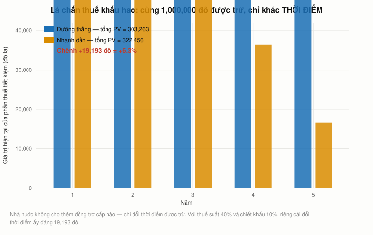
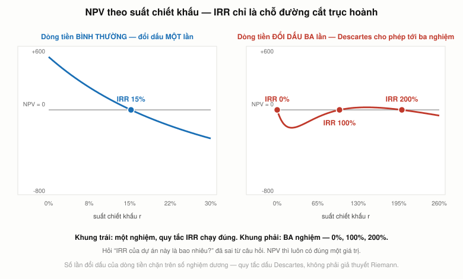

# Bài 12 — Hoạch định ngân sách vốn: dòng tiền, lá chắn thuế, và bốn cách IRR hỏng

> Bài học dựa trên **MIT 15.401 Finance Theory I** (GS. Andrew W. Lo, MIT Sloan, học kỳ thu 2008),
> hai buổi: **Ses 17** từ `21:49` (YouTube `JE80wLNIhjE`), **Ses 18** tới `69:28` (`sMKQywwkIjQ`).
> Mốc thời gian ghi dạng `S17 mm:ss`, `S18 mm:ss`.
> Phần **📚 Lý thuyết bổ sung** là kiến thức nền video lướt qua hoặc không có.
> ⚠️ **Video ghi tháng 11–12/2008** — §21 đối chiếu với 2026.
> 📌 **Cần đọc trước:** [Bài 11 — CAPM](bai_11_capm_va_beta.md) (suất chiết khấu của bài này đến thẳng từ đó).

---

## Mục lục

<!-- MUC-LUC -->
- [1. Hai buổi giảng này ghi ngày nào](#1-hai-buổi-giảng-này-ghi-ngày-nào)
- [2. Đổi chỗ ngồi: từ nhà đầu tư sang giám đốc tài chính](#2-đổi-chỗ-ngồi-từ-nhà-đầu-tư-sang-giám-đốc-tài-chính)
- [3. Quy tắc NPV và tính cộng giá trị](#3-quy-tắc-npv-và-tính-cộng-giá-trị)
- [4. Mỗi dòng tiền một suất chiết khấu](#4-mỗi-dòng-tiền-một-suất-chiết-khấu)
- [5. Kế toán không được thiết kế để nhìn về tương lai](#5-kế-toán-không-được-thiết-kế-để-nhìn-về-tương-lai)
- [6. Cỗ máy một triệu đô la](#6-cỗ-máy-một-triệu-đô-la)
- [7. Lá chắn thuế khấu hao: tốc độ đáng giá bao nhiêu](#7-lá-chắn-thuế-khấu-hao-tốc-độ-đáng-giá-bao-nhiêu)
- [8. Dòng tiền phải quy được cho dự án](#8-dòng-tiền-phải-quy-được-cho-dự-án)
- [9. Beta thuần tuý: Bloomberg nên dùng chi phí vốn nào](#9-beta-thuần-tuý-bloomberg-nên-dùng-chi-phí-vốn-nào)
- [10. Chuyện gì đã xảy ra với Bloomberg Press](#10-chuyện-gì-đã-xảy-ra-với-bloomberg-press)
- [11. Dự án khoan dầu: hai loại rủi ro, hai suất chiết khấu](#11-dự-án-khoan-dầu-hai-loại-rủi-ro-hai-suất-chiết-khấu)
- [12. Rủi ro sự nghiệp — biến số Lo đặt lên bàn](#12-rủi-ro-sự-nghiệp--biến-số-lo-đặt-lên-bàn)
- [13. Thời gian hoàn vốn: nó bỏ sót cái gì](#13-thời-gian-hoàn-vốn-nó-bỏ-sót-cái-gì)
- [14. Chỉ số sinh lời và vấn đề quy mô](#14-chỉ-số-sinh-lời-và-vấn-đề-quy-mô)
- [15. Vì sao tài chính nói bằng lợi suất chứ không bằng đô la](#15-vì-sao-tài-chính-nói-bằng-lợi-suất-chứ-không-bằng-đô-la)
- [16. Bốn cách IRR hỏng](#16-bốn-cách-irr-hỏng)
- [17. Một chỗ Lo nói sai về toán học](#17-một-chỗ-lo-nói-sai-về-toán-học)
- [18. Người ta thật sự dùng gì](#18-người-ta-thật-sự-dùng-gì)
- [19. APV — thứ Lo nhắc tên rồi bỏ qua](#19-apv--thứ-lo-nhắc-tên-rồi-bỏ-qua)
- [20. Chính trị, văn hoá, và cái búa của nhà kinh tế](#20-chính-trị-văn-hoá-và-cái-búa-của-nhà-kinh-tế)
- [21. Đối chiếu 2026](#21-đối-chiếu-2026)
- [22. Góc Việt Nam](#22-góc-việt-nam)
- [23. Code minh hoạ](#23-code-minh-hoạ)
- [24. Từ điển thuật ngữ](#24-từ-điển-thuật-ngữ)
- [25. Câu hỏi tự kiểm tra](#25-câu-hỏi-tự-kiểm-tra)
- [Tóm tắt một trang](#tóm-tắt-một-trang)
- [Nguồn](#nguồn)
<!-- /MUC-LUC -->

---

## 1. Hai buổi giảng này ghi ngày nào

| Buổi                    | Ngày                   | Chứng cứ                                                                                              |
| ----------------------- | ---------------------- | ----------------------------------------------------------------------------------------------------- |
| **Ses 17**, từ `21:49`  | thứ Hai **24/11/2008** | xem [bài 11 §1](bai_11_capm_va_beta.md) — `DGS1` ngày đó = 0,95%, khớp câu *"hôm nay tôi sẽ dùng 1%"* |
| **Ses 18**, tới `69:28` | thứ Hai **1/12/2008**  | xem dưới                                                                                              |

Ses 17 kết thúc bằng `S17 80:08` *"Chúc các bạn Lễ Tạ ơn vui vẻ. **Hẹn gặp lại thứ Hai.**"* Lễ Tạ ơn 2008 là thứ Năm 27/11, nên thứ Hai kế tiếp là **1/12/2008**.

Hai chi tiết trong bài khớp:

- `S18 70:05` — Lo nói ông cần giả thuyết thị trường hiệu quả *"để biện minh cho phần lớn những gì tôi đã dạy các bạn suốt **13 tuần** vừa qua"*. Học kỳ thu MIT 2008 khai giảng 3/9. Từ 3/9 tới 1/12 là **khoảng 13 tuần** ✅
- `S18 49:21` — *"nếu các bạn rảnh trong **kỳ nghỉ lễ** và thấy chán…"* Kỳ nghỉ đông sắp tới, phù hợp với đầu tháng 12.

Ses 18 kết thúc bằng `S18 79:16` *"Thứ Tư tôi sẽ nói với các bạn về **tin xấu**"* → Ses 19 = thứ Tư 3/12/2008.

---

## 2. Đổi chỗ ngồi: từ nhà đầu tư sang giám đốc tài chính

Lo mở đầu phần này bằng một yêu cầu rất rõ ràng (`S17 22:20`):

> *"Tôi muốn các bạn **đổi góc nhìn**. Từ trước tới giờ ta nhìn thị trường từ vị trí của **nhà đầu tư** — hoặc Warren Buffett, hoặc nhà đầu tư thấm nhuần lý thuyết danh mục. Bây giờ tôi muốn các bạn nói rằng mình là một **giám đốc tài chính doanh nghiệp**, hoặc một quản lý dự án… Bạn **không** chủ yếu cố đánh bại thị trường, bạn cũng **không** chủ yếu cố đầu tư tài sản của mình. Bạn đang cố ra quyết định về việc có nên nhận một dự án hay không."*

Đây là bản lề của cả khoá học. Mười một bài trước dùng thị trường để **định giá**. Từ đây, ta dùng thị trường để **quyết định**.

Và Lo nói rõ đâu là phần ông giúp được, đâu là không (`S17 29:26`). Muốn tính NPV cần **ba thứ**:

| Cần                       | Ai lo        | Lo nói                                                                          |
| ------------------------- | ------------ | ------------------------------------------------------------------------------- |
| **Dòng tiền**             | bạn          | *"Đó là việc của bạn. Đó là việc của kinh doanh."*                              |
| **Suất chiết khấu** | **bài 11** | *"bây giờ các bạn biết dùng điều chỉnh rủi ro để tính suất chiết khấu phù hợp"* |
| **Quyền chọn chiến lược** | bạn          | *"bây giờ các bạn hiểu cách dùng định giá quyền chọn"* (bài 8)                  |

> `S17 30:00` — *"Tôi đã nói với các bạn từ đầu khoá rằng **tài chính là ngôn ngữ của kinh doanh**. Đây là ý tôi. **Bạn thậm chí không thể bàn về một quyết định nếu không nói được ngôn ngữ tài chính**, nếu không đánh giá dự án trong khung này."*

---

## 3. Quy tắc NPV và tính cộng giá trị

Lo quay lại đúng câu mở đầu khoá học (`S17 25:49`): *"mọi tài sản chẳng qua là **một dãy dòng tiền**."*

$$\text{NPV} = CF_0 + \sum_{t=1}^{T}\frac{CF_t}{(1+r_t)^t}$$

Tiêu chí đầu tư, gọn tới mức có thể (`S17 28:05`–`29:06`):

| Tình huống                    | Làm gì                           |
| ----------------------------- | -------------------------------- |
| Một dự án                     | Nhận **khi và chỉ khi** NPV > 0  |
| Nhiều dự án **độc lập**       | Nhận **tất cả** dự án có NPV > 0 |
| Nhiều dự án **loại trừ nhau** | Nhận dự án có **NPV lớn nhất**   |

Lo có đùa một câu đáng nhớ (`S17 28:25`): nếu NPV âm thì *"đừng nhận, hoặc bán nó đi. **Bán khống nó, nếu được.** Bán khống một dự án thì khó, bán khống chứng khoán thì không khó lắm."*

### Tính cộng giá trị

Cái làm quy tắc trên dùng được (`S17 27:04`):

$$\text{NPV}(A + B) = \text{NPV}(A) + \text{NPV}(B)$$

> *"Nhờ một thứ gọi là **tính cộng giá trị**, ta có thể ra quyết định phân bổ nguồn lực đơn giản bằng cách chọn những dự án có NPV dương lớn. **Bạn không phải lo về tương tác giữa các dự án trừ khi có tương tác thật sự** liên quan tới quyết định của bạn."* (`S17 27:04`)

§23 kiểm bằng số:

| Dự án     |      t=0 |    t=1 |    t=2 |    t=3 |    NPV ở 10% |
| --------- | -------: | -----: | -----: | -----: | -----------: |
| A         | −100.000 | 40.000 | 40.000 | 40.000 |      −525,92 |
| B         |  −60.000 | 10.000 | 25.000 | 45.000 |     3.561,23 |
| **A + B** | −160.000 | 50.000 | 65.000 | 85.000 | **3.035,31** |

NPV(A) + NPV(B) = **3.035,31**. Trùng khớp tuyệt đối.

Điều này quan trọng hơn nó có vẻ. Nó nói rằng bạn **được phép** đánh giá từng dự án riêng lẻ rồi cộng lại — không cần giải một bài toán tối ưu khổng lồ trên toàn công ty. Đó là lý do hoạch định ngân sách vốn khả thi trong thực tế.

Quy trình Lo khuyến nghị (`S17 27:50`): xét dự án **độc lập** trước, rồi đánh giá **tương tác** riêng, rồi cộng lại.

---

## 4. Mỗi dòng tiền một suất chiết khấu

Chi tiết dễ bỏ qua nhất trong công thức là chỉ số dưới của $r$ (`S17 26:26`):

> *"Các bạn để ý tôi dùng $r_1$ cho dòng tiền 1, và $r_T$ cho dòng tiền T. Nghĩa là **hai dòng tiền khác nhau của cùng một dự án có thể mang hai rủi ro khác nhau**."*

§23 cho thấy điều này không phải chi tiết vụn vặt. Với dự án A và ba suất chiết khấu thật 4% / 8% / 16%:

| Cách tính                            |           NPV | Chênh so với đúng |
| ------------------------------------ | ------------: | ----------------: |
| Ba suất riêng 4% / 8% / 16%          | **−1.618,60** |                 — |
| Một suất duy nhất 4,00% (thấp nhất)  |     11.003,64 |    **+12.622,24** |
| Một suất duy nhất 9,33% (trung bình) |        653,28 |     **+2.271,89** |
| Một suất duy nhất 16,00% (cao nhất)  |    −10.164,42 |         −8.545,82 |

Chú ý hàng giữa: **dùng trung bình cộng của ba suất không cho ra đáp số đúng**, và ở đây nó còn đảo dấu NPV từ âm sang dương. Chiết khấu là phép toán phi tuyến; trung bình của các suất không bằng suất của trung bình.

§11 sẽ cho thấy trường hợp khác biệt này đáng giá hàng triệu đô la.

---

## 5. Kế toán không được thiết kế để nhìn về tương lai

Đây là đoạn triết lý sắc nhất của Ses 17, và nó giải thích **vì sao** phải dùng dòng tiền chứ không phải lợi nhuận kế toán.

> `S17 30:45` — *"Một điều tôi nghĩ chưa được nhấn mạnh đủ là khi bạn nhìn vào số liệu kế toán, bạn đang nhìn vào những con số **không phải biến ngẫu nhiên. Chúng đã được hiện thực hoá rồi.** Không có bất định nào trong những gì bảng cân đối kế toán hay báo cáo kết quả kinh doanh nói. **Nó nói về quá khứ.** Và kế toán viên thì ghét bất định."*

Và (`S17 31:23`): *"Đó là điều một kế toán viên giỏi sẽ làm — hiểu chỗ nào đặt chi phí và doanh thu vào đúng ô để mọi thứ khớp nhau. **Kế toán không có khả năng. Nó không được thiết kế để quản lý và phản ánh bất định.**"*

Ví dụ ông đưa nối thẳng về [bài 7](bai_07_ky_han_va_tuong_lai.md) (`S17 31:44`):

> *"Các bạn đã nghe cụm **khoản mục ngoại bảng**, đúng không? Ví dụ hợp đồng hoán đổi rủi ro tín dụng, hay hợp đồng tương lai. Nếu bạn tham gia một giao dịch tương lai, ngay lúc tham gia thì NPV của hợp đồng tương lai bằng bao nhiêu?"* — Sinh viên: *"Không."* — *"**Đúng. Và vì thế nó không lên bảng cân đối kế toán, vì nó không phải tài sản cũng không phải nợ.** Nó là cả hai, hoặc chẳng là gì, tuỳ cách bạn nhìn."*

Nhưng (`S17 32:16`): *"**việc ký một thoả thuận như thế có tác động rất lớn tới rủi ro tương lai của bạn.**"*

Đó là mô tả chính xác cơ chế đã làm nổ tung AIG năm 2008: một danh mục hoán đổi rủi ro tín dụng NPV bằng 0 lúc ký, không xuất hiện trên bảng cân đối, mà tạo ra khoản lỗ hàng chục tỷ đô la. [Bài 5 §17](bai_05_duration_va_chung_khoan_hoa.md) đã kể phần còn lại.

Lo cẩn thận không biến đây thành lời chê kế toán (`S17 32:46`): *"Đây không phải một lời phê phán kế toán, mà đơn giản là **bạn không thể dùng nó cho những mục đích nó không được thiết kế để phục vụ**."*

### FAS 157 — chuyện đang xảy ra ngay lúc ông giảng

Lo nhắc tới chuẩn mực đang gây tranh cãi dữ dội lúc đó (`S17 36:33`):

> *"Ngay lúc này, **trung tâm của cuộc tranh luận trong khủng hoảng tài chính** là khái niệm kế toán theo giá trị hợp lý, **FAS 157**, quy định bạn phải dùng giá trị thị trường để cập nhật tài sản và nợ. Và đó là một quy định mới đã tạo ra một số vấn đề, vì giá trị thị trường trong thời kỳ căng thẳng có thể rơi rất nhanh."*

📚 **Chuyện gì đã xảy ra:**

|                                            |                                                                                                                                                                      |
| ------------------------------------------ | -------------------------------------------------------------------------------------------------------------------------------------------------------------------- |
| FAS 157 hiệu lực                           | Báo cáo phát hành sau 15/11/2007 — tức các ngân hàng phải áp lần đầu vào đầu 2008, đúng lúc nhiều chứng khoán **không giao dịch chút nào**                           |
| Phe chỉ trích                              | Buộc ghi giảm ngay cả khi định nắm tới đáo hạn; góp phần làm ngân hàng sụp                                                                                           |
| Nghiên cứu của SEC (theo yêu cầu Quốc hội) | Kết luận đây là một **cuộc rút tiền hàng loạt**, không phải khủng hoảng do kế toán giá trị hợp lý gây ra                                                             |
| Kết cục | **Không bị bãi bỏ.** Hướng dẫn chung SEC–FASB 30/9/2008 về thị trường mất trật tự; FSP FAS 157-4 tháng 3/2009 nới cách xác định giá trị hợp lý khi thanh khoản sụt |
| Ngày nay                                   | Được mã hoá lại thành **ASC 820** (2009), vẫn còn hiệu lực và vẫn đang được sửa đổi (ASU 2022-03). Chuẩn quốc tế tương ứng là **IFRS 13**                            |

Kết quả: cuộc tranh luận sinh ra **tinh chỉnh về cách đo trong thị trường kém thanh khoản**, chứ không phải một lần rút lui. Mô hình giá thoát và thang ba cấp độ 1/2/3 vẫn là xương sống của kế toán giá trị hợp lý.

---

## 6. Cỗ máy một triệu đô la

Công thức dòng tiền sau thuế Lo dựng dần từ `S17 39:59` tới `S17 41:01`:

$$CF = (1-\tau)\big(\text{Doanh thu} - \text{Chi phí hoạt động}\big) \;-\; \text{Chi đầu tư} \;+\; \tau \times \text{Khấu hao}$$

Điểm mấu chốt: **khấu hao không bị trừ như một chi phí**, nó được **cộng lại** nhân với thuế suất. Vì nó không phải tiền ra — giá trị duy nhất của nó là làm giảm thuế.

Ví dụ (`S17 44:39`): máy **1.000.000 đô la**, đời 10 năm, doanh thu **300.000**/năm, chi phí hoạt động **100.000**/năm, khấu hao đường thẳng **100.000**/năm, thuế suất **40%**.

| Khoản mục                          |     Kế toán |   Dòng tiền |
| ---------------------------------- | ----------: | ----------: |
| Doanh thu                          |     300.000 |     300.000 |
| Trừ chi phí hoạt động              |    −100.000 |    −100.000 |
| Trừ khấu hao (**không phải tiền**) |    −100.000 |           0 |
| **Lợi nhuận kế toán trước thuế**   | **100.000** |           — |
| Tiền vào trước thuế                |           — | **200.000** |
| Trừ thuế thực nộp (40%)            |     −40.000 |     −40.000 |
| **SAU THUẾ**                       |  **60.000** | **160.000** |

Lo đọc hai con số: kế toán báo lãi **100.000**/năm, dòng tiền thật **160.000**/năm. ✅ **Cả hai đều đúng** — chúng đo hai thứ khác nhau.

Chênh **60.000** đô la mỗi năm chính là **lá chắn thuế khấu hao**: 40% × 100.000.

### "Khác biệt cả một trời một vực"

Lo nói vậy ở `S17 46:42`. §23 đo:

| Suất chiết khấu | NPV theo dòng tiền | NPV theo lợi nhuận kế toán | Quyết định    |
| --------------: | -----------------: | -------------------------: | ------------- |
|            6,0% |           +177.614 |                   −263.991 | **KHÁC NHAU** |
|            8,0% |            +73.613 |                   −328.992 | **KHÁC NHAU** |
|            9,5% |             +4.608 |                   −372.120 | **KHÁC NHAU** |
|           10,0% |            −16.869 |                   −385.543 | cả hai bỏ     |
|           12,0% |            −95.964 |                   −434.978 | cả hai bỏ     |

- Ngưỡng hoà vốn theo **dòng tiền**: **9,61%**
- Ngưỡng hoà vốn theo **lợi nhuận kế toán**: **0,00%**

> Với bất kỳ chi phí vốn nào **giữa 0% và 9,61%**, hai cách tính cho **hai quyết định ngược nhau**. Đó là toàn bộ khoảng chi phí vốn thực tế của một doanh nghiệp lớn.

Lo giải thích lá chắn thuế bằng một hình ảnh (`S17 43:20`):

> *"Khấu hao là một chi phí bạn **được trừ**, thuần tuý vì luật thuế. Và vì được trừ nên bạn **không phải nộp chừng ấy thuế**. Nó giống một **tấm thẻ ra tù miễn phí**. Tấm thẻ đó đáng giá bao nhiêu? Đáng giá đúng chừng này."*

Và (`S17 44:21`): *"**Hãy nhìn vào tiền. Đừng nhìn vào con số kế toán, hãy nhìn vào tiền.** Làm thế thì bạn sẽ không bao giờ sai."*

---

## 7. Lá chắn thuế khấu hao: tốc độ đáng giá bao nhiêu



*Cùng một triệu đô được trừ thuế, chỉ khác thời điểm — và cái đổi thời điểm ấy có giá.*

Lo nhắc tới khấu hao nhanh dần rồi đi tiếp (`S17 37:52`):

> *"Ngay cả khi cỗ máy vẫn chạy tốt, có những trường hợp bạn được giả định rằng **một nửa cỗ máy bốc hơi sau một năm**. Sao lại thế? Đó là một công cụ kế toán mà Quốc hội thông qua từ nhiều năm trước để cho doanh nghiệp đẩy nhanh khấu hao và nhờ đó được lợi về thuế."*

Câu hỏi ông không hỏi: **được lợi bao nhiêu?** Tổng số tiền được trừ là như nhau — chỉ khác thời điểm.

§23 so đường thẳng với giảm dần kép (chuyển sang đường thẳng khi có lợi hơn), chiết khấu 10%:

|      Năm |     Đường thẳng |      Nhanh dần |           Chênh |
| -------: | --------------: | -------------: | --------------: |
|        1 |         100.000 |    **200.000** |        +100.000 |
|        2 |         100.000 |        160.000 |         +60.000 |
|        3 |         100.000 |        128.000 |         +28.000 |
|        4 |         100.000 |        102.400 |          +2.400 |
|        5 |         100.000 |         81.920 |         −18.080 |
|     6–10 | 100.000 mỗi năm | 65.536 mỗi năm | −34.464 mỗi năm |
| **Tổng** |   **1.000.000** |  **1.000.000** |           **0** |

|                |     Giá trị hiện tại lá chắn thuế |
| -------------- | --------------------------------: |
| Đường thẳng    |                           245.783 |
| Nhanh dần      |                       **274.112** |
| **Chênh lệch** | **+28.329** (nhiều hơn **11,5%**) |

> Cùng số tiền được trừ, cùng cỗ máy, cùng thuế suất. **Chỉ vì được trừ sớm hơn mà dự án đáng giá thêm 28.329 đô la** — gần 3% giá trị cỗ máy.

Đó là lý do khấu hao nhanh dần là một công cụ chính sách hiệu quả: nó **không cho doanh nghiệp thêm đồng trợ cấp nào**, nó chỉ đổi thời điểm. Ngân sách nhà nước mất ít hơn nhiều so với một khoản trợ cấp trực tiếp cùng tác dụng.

---

## 8. Dòng tiền phải quy được cho dự án

Nguyên tắc thứ ba của Lo (`S17 34:33`), nghe đơn giản nhất mà khó nhất:

> *"**Dùng dòng tiền quy được cho dự án.** Nghĩa là bạn phải so sánh doanh nghiệp **có** dự án với doanh nghiệp **không có** dự án, rồi nhìn vào chênh lệch… **Rất, rất dễ quên một số dòng tiền** hoặc đi kèm dự án hoặc phải chi ra nếu nhận dự án. Và trong nhiều trường hợp, những chỗ sót đó ảnh hưởng rất lớn tới việc có nên nhận dự án hay không."*

Lời khuyên của ông thì thẳng thắn (`S17 35:11`): *"cuối cùng thì **luyện tập, luyện tập, luyện tập**."*

📚 Danh sách những khoản hay bị quên, Lo không liệt kê nhưng đây là chuẩn của ngành:

| Phải tính                                                    | Không được tính                                                         |
| ------------------------------------------------------------ | ----------------------------------------------------------------------- |
| Chi phí cơ hội của tài sản đã có (nhà xưởng có thể cho thuê) | **Chi phí chìm** — tiền đã tiêu, không thu hồi được                     |
| Thay đổi **vốn lưu động**                                    | Chi phí quản lý phân bổ mà dự án không thật sự gây thêm                 |
| **Ăn mòn** doanh thu sản phẩm hiện có                        | Chi phí lãi vay — nó nằm trong **suất chiết khấu**, tính hai lần là sai |
| Giá trị thanh lý cuối đời dự án                              |                                                                         |

Vốn lưu động đúng là câu hỏi một sinh viên nêu (`S17 48:10`), và Lo xác nhận phải tính **tác động tăng thêm ròng** của nó.

⚠️ Mục "chi phí lãi vay" đáng nhấn mạnh: nó là lỗi phổ biến nhất. Suất chiết khấu đã phản ánh chi phí tài trợ; trừ lãi vay ra khỏi dòng tiền **rồi lại** chiết khấu bằng chi phí vốn là tính chi phí nợ hai lần.

---

## 9. Beta thuần tuý: Bloomberg nên dùng chi phí vốn nào

Lo cảnh báo một lỗi rất phổ biến (`S17 52:41`):

> *"Rất nhiều quản lý doanh nghiệp bỏ qua điểm này. **Họ nghĩ nếu mình ở một bộ phận thì bộ phận đó có một chi phí vốn, và từ đó trở đi cứ dùng nó cho MỌI THỨ bộ phận ấy làm.** Nhưng nếu bộ phận đó đang làm một thứ rất khác với thứ nó khởi đầu thì sao?"*

Ví dụ ông đưa (`S17 53:12`) là một chuyện có thật: **Bloomberg** — công ty dữ liệu và công nghệ — quyết định mở mảng **xuất bản sách**, Bloomberg Press.

> `S17 54:04` — *"**Ngành của Bloomberg không phải xuất bản.** Họ là nhà cung cấp thông tin, họ là công ty công nghệ. Bội số của một công ty công nghệ không giống bội số của một công ty xuất bản."*

Giải pháp, do sinh viên Courtney nêu (`S17 55:52`): *"tìm các công ty tương đương, xem beta của họ."*

Và chọn công ty nào? Sinh viên Louis trả lời (`S17 57:07`): **John Wiley & Sons**, chứ không phải McGraw-Hill — *"vì McGraw-Hill không phải nhà xuất bản thuần tuý."*

> `S17 57:22` — *"Chính xác. McGraw-Hill có rất nhiều mảng khác ngoài xuất bản."* Sinh viên nêu tên: **Standard & Poor's**. — *"Đúng. McGraw-Hill sở hữu Standard & Poor's."*

Khái niệm này có tên: **công ty thuần tuý** (pure play).

| Công ty               |     Beta | Chi phí vốn = 5 + β × 6 | Vấn đề                                   |
| --------------------- | -------: | ----------------------: | ---------------------------------------- |
| **John Wiley & Sons** | **1,29** |              **12,74%** | ✅ Xuất bản thuần tuý                     |
| McGraw-Hill           |        — |                       — | ❌ Sở hữu Standard & Poor's               |
| Bloomberg (ước)       |    ~1,60 |                 ~14,60% | ❌ Công nghệ/dữ liệu, không phải xuất bản |

Lo đọc **12,7%** (`S17 60:10`). §23 tính: $5 + 1{,}29 \times 6 = 12{,}74\%$ ✅

### Sai lầm này đáng giá bao nhiêu

§23 dựng một dự án xuất bản giả định (chi 50 triệu, thu 9,5 triệu/năm trong 10 năm — con số minh hoạ, Lo không đưa dòng tiền cụ thể):

| Suất chiết khấu dùng    |            NPV | Quyết định |
| ----------------------- | -------------: | ---------- |
| Wiley 12,74% (**đúng**) | **+2.089.450** | **NHẬN**   |
| Bloomberg 14,60% (sai)  |     −1.585.737 | BỎ         |

> Chênh **3,68 triệu đô la**, và **hai quyết định ngược nhau**. Dùng sai suất chiết khấu không làm lệch kết quả — nó **đảo ngược** kết quả.

Lo cũng nói rõ cách làm nghiêm túc (`S17 59:09`):

> *"Cái tôi đưa cho các bạn không phải một công thức nấu ăn dùng được trong mọi hoàn cảnh, mà là một **cách tiếp cận**… Tìm các công ty ở cả hai đầu quang phổ: nhỏ và lớn, thuần tuý và tập đoàn, ước lượng chi phí vốn cho tất cả. Rồi nói: với dải kết quả này, chúng tôi cho rằng chi phí vốn phù hợp nằm ở đây."*

---

## 10. Chuyện gì đã xảy ra với Bloomberg Press

Lo dành gần mười phút cho quyết định của Bloomberg, và kết lại (`S17 63:37`):

> *"Bloomberg thật ra đã ra một quyết định khá tốt, ít nhất là ở góc độ khởi động được nó. **Có sinh lời hay không thì ai mà biết? Nó mới chỉ tồn tại vài năm.**"*

**Câu trả lời đến sau mười sáu tháng.**

| Thời điểm        | Sự kiện                                                                                                            |
| ---------------- | ------------------------------------------------------------------------------------------------------------------ |
| 24/11/2008       | Lo giảng buổi này, dùng **John Wiley & Sons** làm công ty thuần tuý để tính chi phí vốn cho Bloomberg Press        |
| Tháng 3/2009     | **Sách của chính Lo** ra mắt tại Bloomberg Press: *The Heretics of Finance* (Lo & Hasanhodzic, ISBN 9781576603161) |
| Tháng 12/2009    | Bloomberg mua lại *BusinessWeek*                                                                                   |
| **Tháng 3/2010** | **Bloomberg Press trở thành một dấu ấn của John Wiley & Sons.** Bloomberg rời mảng xuất bản sách |

> **Công ty Lo dùng làm chuẩn so sánh chính là công ty cuối cùng đã tiếp quản dự án.**

Đó là một sự trùng hợp hiếm có, nhưng nó không hề ngẫu nhiên về mặt kinh tế. Chính lập luận "công ty thuần tuý" của Lo giải thích tại sao: nếu **beta của Wiley** là beta đúng cho hoạt động này, thì Wiley cũng là bên có **lợi thế so sánh** để vận hành nó. Bloomberg mang vào một chi phí vốn sai và không có gì bù lại được điều đó.

⚠️ Sự kiện này cũng có mặt trái đáng ghi. Sau khi tiếp quản, Wiley gửi thư cho hàng trăm tác giả Bloomberg Press dưới dạng **sửa đổi hợp đồng làm giảm tỷ lệ nhuận bút**; một kiểm toán độc lập do Authors Guild thuê tính ra mức giảm **24%–43%** khi áp lên doanh số thực tế. Lo là một trong những tác giả đó.

### Và McGraw-Hill

Lo dùng McGraw-Hill làm ví dụ phản diện: *"không phải nhà xuất bản thuần tuý — họ sở hữu Standard & Poor's."*

Tám năm sau, công ty **tự giải quyết** vấn đề đó: ngày **27/4/2016**, McGraw Hill Financial đổi tên thành **S&P Global Inc.**, mã chứng khoán **SPGI**. Tổng giám đốc Douglas Peterson nói gọn: *"Không còn sách giáo khoa nữa."* Mảng giáo dục đã bị bán cho Apollo Global Management từ 2013.

> Chẩn đoán của Lo — *"McGraw-Hill không phải công ty thuần tuý"* — đúng tới mức chính công ty đã sửa nó, bằng cách trở thành công ty thuần tuý **ở chiều ngược lại**: bỏ xuất bản, giữ dữ liệu tài chính, và đổi tên theo mảng còn lại.

---

## 11. Dự án khoan dầu: hai loại rủi ro, hai suất chiết khấu

Đây là bài toán khó nhất và hay nhất của Ses 17 (`S17 68:59`).

| Dữ kiện                                                                               |                    |
| ------------------------------------------------------------------------------------- | ------------------ |
| Khoan mất **1 năm**                                                                   |                    |
| Cuối năm 1: xác suất **1/3** tìm thấy **3 triệu thùng**, xác suất **2/3** không có gì |                    |
| Nếu trúng, bơm hết trong năm 2                                                        |                    |
| Lợi nhuận sau thuế                                                                    | **20 đô la/thùng** |
| Lãi suất phi rủi ro                                                                   | **5%**             |
| Suất chiết khấu ngành khai thác dầu                                                   | **20%**            |
| Rủi ro **thăm dò** | **beta = 0** |

§23 tính từng bước:

| Bước | Việc làm                                            |        Giá trị |
| ---: | --------------------------------------------------- | -------------: |
|    1 | 60.000.000 đô la ở cuối năm 2                       |     60.000.000 |
|    2 | Chiết khấu năm 2 → 1 ở **20%** (rủi ro **giá dầu**) |     50.000.000 |
|    3 | Nhân xác suất 1/3                                   |     16.666.667 |
|    4 | Chiết khấu năm 1 → 0 ở **5%** (rủi ro **thăm dò**)  | **15.873.016** |

**NPV = 15,9 triệu đô la** — đúng con số Lo đọc (`S17 75:17`).

### Vì sao năm đầu chiết khấu ở 5%

Lo giải thích (`S17 74:37`):

> *"Lý do bạn chiết khấu năm đầu về năm 0 ở lãi suất phi rủi ro là vì **rủi ro khoan trượt là hoàn toàn đa dạng hoá được**. Đó là rủi ro riêng lẻ thuần tuý. Không có beta. **Mỏ dầu dưới lòng đất không biết đang là thị trường tăng giá hay giảm giá. Chúng không quan tâm. Chúng ở đó hoặc không ở đó.**"*

Và (`S17 78:03`): *"**Đây chính là điệu nhảy jig của Ireland** — nhảy trên cái sàn treo khi lau kính. Bạn sẽ không được trả thêm cho nó."* — nối thẳng về [bài 11 §12](bai_11_capm_va_beta.md).

### Sai lầm này đáng giá bao nhiêu

|                           |                                NPV |
| ------------------------- | ---------------------------------: |
| Cách đúng (20% rồi 5%)    |                     **15.873.016** |
| Cách sai (20% cả hai năm) |                         13.888.889 |
| **Chênh lệch**            | **+1.984.127** (cao hơn **14,3%**) |

Độ nhạy theo beta của rủi ro thăm dò (phần bù thị trường 6%/năm):

| beta thăm dò | Suất chiết khấu năm 1 |            NPV | So với beta = 0 |
| -----------: | --------------------: | -------------: | --------------: |
|     **0,00** |                 5,00% | **15.873.016** |               — |
|         0,25 |                 6,50% |     15.649.452 |        −223.564 |
|         0,50 |                 8,00% |     15.432.099 |        −440.917 |
|         1,00 |                11,00% |     15.015.015 |        −858.001 |
|         2,50 |                20,00% |     13.888.889 |      −1.984.127 |

> Câu hỏi *"rủi ro thăm dò có hệ thống hay không"* đáng giá **gần hai triệu đô la** trên một mỏ dầu. Và nó không phải câu hỏi kỹ thuật về địa chất — nó là câu hỏi về **tương quan với thị trường**.

### Kiểm tra sắc bén của sinh viên Andy

Andy hỏi (`S17 76:27`): nếu **biết chắc** có đủ dầu để thu về đúng giá trị kỳ vọng thì dự án có đáng giá y hệt không?

|                                                             |        NPV |
| ----------------------------------------------------------- | ---------: |
| Trường hợp chắc chắn (20 triệu đô la, không rủi ro thăm dò) | 15.873.016 |
| Trường hợp 1/3 – 2/3                                        | 15.873.016 |

**Bằng nhau, tới từng xu.** Lo trả lời (`S17 76:47`): *"Đúng. Hoàn toàn đúng. Vì bất định của dự án này ở năm đầu là **hoàn toàn đa dạng hoá được**. Nó là một lần tung đồng xu."*

Và ông đưa ra lập luận quyết định (`S17 77:03`):

> *"Giả sử bạn là Saudi Aramco và thay vì làm **một** mỏ, bạn làm **một trăm** mỏ. Khi đó bạn đã đa dạng hoá qua đủ loại đồng xu, và **luật số lớn** sẽ biến khoản thu về thành một thứ gần như không rủi ro."*

### Câu chuyện Saudi Aramco

Lo kể (`S17 71:11`) rằng ông từng đưa bài toán này cho lớp Sloan Fellows — các lãnh đạo cấp cao 15–30 năm kinh nghiệm. Một người ở cuối phòng nói: *"Xin lỗi giáo sư Lo, nhưng tôi không nhớ là chúng tôi đã dùng phân tích này khi làm thăm dò dầu khí."*

> *"Và người đó nói: 'Tôi là **phó chủ tịch cấp cao phụ trách thăm dò dầu khí của Saudi Aramco**.' Đây là công ty dầu lớn nhất thế giới, và ông ta là người phụ trách khoan những cái lỗ đó. Ông ấy nói họ **không** làm phân tích này, nhưng sẽ thử vì thấy nó rất hợp lý. **Nói thật là hơi đáng sợ.**"* (`S17 72:04`)

Đây không phải chuyện cười vào ngành dầu khí. Nó minh hoạ một điều nghiêm túc: khoảng cách giữa lý thuyết tài chính và thực hành doanh nghiệp năm 2008 vẫn còn rộng ngay cả ở những công ty lớn nhất thế giới.

---

## 12. Rủi ro sự nghiệp — biến số Lo đặt lên bàn

Một sinh viên hỏi thẳng ở đầu Ses 18 (`S18 03:25`): nếu NPV rõ ràng tốt hơn, thì những người dùng phương pháp khác là **sai**, hay **kém thông minh** hơn?

Lo đùa một câu (`S18 03:46`) rồi trả lời nghiêm túc. Có hai lý do:

1. **Quán tính văn hoá** (`S18 04:02`) — các phương pháp đó có trước NPV.
2. **Chúng nắm bắt một loại rủi ro khác** (`S18 04:40`):

> *"Ta đã nói về rất nhiều loại rủi ro. Rủi ro thị trường, rủi ro ước lượng, rủi ro tín dụng. Nhưng **rủi ro quan trọng nhất với tất cả các bạn khi bắt đầu đi làm là gì?**"* — Sinh viên: *"Rủi ro sự nghiệp."* — *"Chính xác."*
>
> *"**Rủi ro sự nghiệp có lẽ là rủi ro quan trọng nhất dưới góc nhìn của người ra quyết định. Và vài thước đo tôi sắp mô tả tập trung vào rủi ro sự nghiệp hơn là rủi ro của nhà đầu tư hay cổ đông.**"* (`S18 04:58`)

Rồi ông nói rõ nghĩa vụ (`S18 05:15`):

> *"Điều tôi muốn các bạn tập trung vào khi làm việc là **tối đa hoá giá trị công ty dưới góc nhìn của chủ sở hữu**. Các bạn là **người đại diện** của chủ sở hữu… **Nhưng trên thực tế, cách người ta hành xử thường khác đi.**"*

Đây là một trong những đoạn trung thực nhất của cả khoá. Lo không giả vờ rằng lý thuyết mô tả được thực tế. Ông nói: đây là điều **đúng**, đây là điều người ta **làm**, và đây là **lý do** khoảng cách tồn tại. Đó chính là vấn đề người đại diện, và nó giải thích hầu hết những gì còn lại của bài này.

---

## 13. Thời gian hoàn vốn: nó bỏ sót cái gì

**Thời gian hoàn vốn** là số kỳ tối thiểu để dòng tiền cộng dồn bù được vốn bỏ ra (`S18 06:07`).

Lo chỉ ra khuyết tật ngay lập tức (`S18 06:28`):

> *"Ngay lập tức bạn thấy có vấn đề, vì ta đang **cộng dòng tiền ở các kỳ khác nhau**. Tôi hy vọng đến giờ, nhìn vào một biểu thức như thế các bạn thấy khó chịu về mặt nhận thức. **Nó giống như cộng bảng Anh với yên Nhật.** Nhớ hôm đầu tiên chứ? Ba bảng cộng hai mươi lăm yên là bao nhiêu? Tôi chịu."*

§23 dựng ba dự án:

| Dự án                |  Hoàn vốn | Hoàn vốn chiết khấu | NPV ở 10% | Đúng?    |
| -------------------- | --------: | ------------------: | --------: | -------- |
| **A ngắn, NPV âm**   | **2 năm** |               2 năm |  **−560** | **BỎ**   |
| **B dài, NPV dương** | **5 năm** |               5 năm |  **+559** | **NHẬN** |
| C đều, NPV dương     |     3 năm |               3 năm |      +119 | NHẬN     |

> Dự án A hoàn vốn **nhanh nhất** mà NPV **âm**. Dự án B mất **lâu nhất** mà NPV dương lớn nhất. **Xếp hạng theo hoàn vốn cho ra kết quả ngược hẳn với NPV.**

Lý do (`S18 08:20`): hoàn vốn **bỏ qua mọi dòng tiền sau kỳ hoàn vốn**. Dự án A có một khoản chi 800 đô la ở năm 3 — sau kỳ hoàn vốn — và thước đo này không nhìn thấy nó.

> *"Bạn có thể có một dự án… sau kỳ hoàn vốn, ở một thời điểm tương lai nào đó, nó tạo ra **dòng tiền âm cực lớn**. Tất cả những thứ đó bị hoàn vốn bỏ qua."* (`S18 08:20`)

### Nhưng Lo cũng bênh vực nó

Ông chủ động hỏi lớp có lý do hợp lý nào không (`S18 09:52`), và nhận được hai câu trả lời tốt:

| Lý do                                                                                                           | Ai nêu                        | Lo đáp                                                                                   |
| --------------------------------------------------------------------------------------------------------------- | ----------------------------- | ---------------------------------------------------------------------------------------- |
| **Bất định về dòng tiền xa** — *"trong tính NPV bạn đang giả định mình BIẾT dòng tiền tít tắp trong tương lai"* | sinh viên David (`S18 10:08`) | *"Đúng thế"* — nhưng *"nếu đó là điều bạn lo thì **nó phải nằm trong suất chiết khấu**"* |
| **Thanh khoản** — dự án hoàn vốn chậm đòi bạn gồng thanh khoản lâu hơn                                          | sinh viên (`S18 11:29`)       | *"Đúng"* — nhưng đường cong lãi suất dốc lên đã phản ánh phần bù kỳ hạn đó               |

Và ông thừa nhận điều kiện để nó đúng (`S18 13:12`): dòng tiền **đều**, và các dự án so sánh **cùng rủi ro, cùng quy mô, cùng thanh khoản**. *"Nhưng hãy nghĩ xem những điều kiện đó ràng buộc tới mức nào."*

Lời khuyên thực dụng nhất của cả bài (`S18 13:59`):

> *"Chắc chắn sẽ có người hỏi bạn: **thời gian hoàn vốn là bao nhiêu?** Bạn cần biết câu trả lời. **Nói 'giáo sư 401 của tôi bảo cái đó vô nghĩa' thì không đủ.** Bạn phải có câu trả lời, rồi mới lập luận rằng hoàn vốn không tóm hết được những đặc điểm ta quan tâm."*

---

## 14. Chỉ số sinh lời và vấn đề quy mô

$$PI = \frac{\text{Giá trị hiện tại của các dòng tiền tương lai}}{\text{Vốn đầu tư ban đầu}}$$

Nhận dự án nếu $PI > 1$ (`S18 15:02`).

Lo thừa nhận nó gần NPV tới mức nào (`S18 15:19`): *"Nếu chỉ số sinh lời lớn hơn 1, bạn có một dự án NPV dương. Nếu nhỏ hơn 1, NPV âm. **Nên về việc nhận hay không nhận, nó y hệt NPV.**"*

§23 xác nhận trên bốn dự án — **cả bốn đều cùng kết luận**.

Vấn đề nằm ở **xếp hạng**:

| Dự án                  | Chỉ số sinh lời |    NPV ở 10% |
| ---------------------- | --------------: | -----------: |
| Nhỏ (Lo: đưa 1 nhận 2) |      **1,8182** |         0,82 |
| To                     |          1,3636 |       363,64 |
| **Rất to, biên mỏng**  |          1,0182 | **1.818,18** |
| Xấu                    |          0,9091 |       −90,91 |

| Xếp theo chỉ số sinh lời | Xếp theo NPV             |
| ------------------------ | ------------------------ |
| 1. **Nhỏ**               | 1. **Rất to, biên mỏng** |
| 2. To                    | 2. To                    |
| 3. Rất to, biên mỏng     | 3. Nhỏ                   |
| 4. Xấu                   | 4. Xấu                   |

Lo dùng đúng ví dụ này (`S18 15:59`):

> *"Nếu các bạn đưa tôi 1 đô la và tôi đưa lại 2 đô la, chỉ số sinh lời là 2. Trông sẽ rất đẹp so với khoản đầu tư vào Berkshire Hathaway 20 năm trước, vì cái đó có thể không cho chỉ số sinh lời như thế. **Nhưng Warren Buffett kiếm được nhiều hơn một đô la rất nhiều.**"*

---

## 15. Vì sao tài chính nói bằng lợi suất chứ không bằng đô la

Đoạn `S18 18:06`–`S18 30:37` là phần hay nhất của Ses 18, và nó không nằm trong giáo trình nào.

Lo đặt câu hỏi mà không ai trong lớp từng nghĩ tới (`S18 18:06`):

> *"Lý do các nhà kinh tế học, và nhà kinh tế tài chính, tập trung vào **lợi suất**? Điều đó có bao giờ khiến các bạn thấy lạ không? Khi nói chuyện với doanh nhân, họ nói bằng **số tiền**. Còn nhà kinh tế tài chính thì diễn đạt mọi thứ bằng **tỷ lệ**. Cả khoá này ta đã dành phần lớn thời gian cho $r$, chứ không phải $v$."*

Lớp thử vài câu trả lời — bỏ đơn vị, so sánh được giữa các quy mô. Lo đều gạt: *"nhưng sao không so đô la với đô la?"* (`S18 19:41`).

Rồi ông tự trả lời (`S18 23:26`):

> *"Ẩn dưới cách tiếp cận đó là một **niềm tin**. Niềm tin đó là: **ta có thể đầu tư bao nhiêu tiền tuỳ ý mà vẫn nhận được những lợi suất ấy.**… Ta đang giả định quy mô không quan trọng, theo nghĩa dù đầu tư một trăm đô la, hay một trăm triệu, hay một trăm tỷ, ta vẫn nhận được cùng lợi suất. **Và sự thật là điều đó đơn giản không đúng. Quy mô tuyệt đối có quan trọng.**"*

Ví dụ ông đưa (`S18 24:44`): đổ thêm vài tỷ vào **công nghệ nano** năm 2008 thì không ảnh hưởng mấy vì công nghệ còn mới. Nhưng đổ 2 tỷ đô la vào *"phần mềm tầng giữa quản lý cơ chế điều khiển máy chủ tệp"* trong một tháng? *"Chúc may mắn."*

Kết luận (`S18 25:37`):

> *"Tất cả những gì ta làm trong khoá này **bỏ qua quy mô** dưới góc độ rủi ro–lợi suất. Nhưng có một lĩnh vực mà quy mô **tuyệt đối** quan trọng: **NPV**."*

### Hệ quả: CAPM không áp cho nhà đầu tư lớn

Lo nói thẳng (`S18 29:48`):

> *"Nhân tiện, **lý thuyết đó không áp dụng cho một số nhà đầu tư lớn nhất hiện nay.** Ví dụ một số quỹ đầu tư quốc gia, một số quỹ hưu công. **Họ không thể đầu tư theo những nguyên tắc cơ bản của lý thuyết danh mục.** Vì khi họ triển khai vốn, họ đang tìm chỗ đặt vài tỷ đô la vào một khoản đầu tư duy nhất. Quản lý danh mục 250 tỷ thì **không đủ giờ trong ngày** để loay hoay phân bổ 5 triệu chỗ này, 10 triệu chỗ kia."*

Đặt cạnh [bài 11 §3](bai_11_capm_va_beta.md): CAPM được suy ra với giả định mỗi nhà đầu tư **nhỏ** và **nhận giá như đã cho**. Với những chủ thể lớn nhất trên thị trường, giả định đó vỡ — họ **là** giá.

### Và một câu về khủng hoảng

Lo mô tả logic đầu tư tới điểm hoà (`S18 28:46`): *"bạn sẽ cứ làm cho tới khi nó hết sinh lời. Đó là bản chất con người, đó là kinh doanh tốt — **chạy nó tới khi nó chết**."*

Rồi (`S18 29:00`):

> ⚠️ *"**Mà nhân tiện, đó chính là điều chúng ta đã làm với thị trường thế chấp dưới chuẩn.** Đó là lý do ta đang ở trong cuộc khủng hoảng này. Chúng ta về cơ bản đã chạy ngành đó tới chết, **và còn hơn thế nữa**."*

---

## 16. Bốn cách IRR hỏng



*Khung trái một nghiệm, khung phải ba nghiệm. Hỏi “IRR là bao nhiêu?” đã sai từ câu hỏi.*

**Suất sinh lời nội bộ** là nghiệm của $\text{NPV}(r) = 0$. Lo chỉ ra ngay nó là gì (`S18 33:14`): *"chính là **lợi suất đến ngày đáo hạn** của trái phiếu"* — đúng thứ đã học ở [bài 4](bai_04_trai_phieu_va_duong_cong.md).

Bốn điều kiện để IRR tương đương NPV (`S18 36:53`):

1. Chỉ **một** khoản chi, tại thời điểm 0
2. Chỉ **một** dự án được xem xét
3. Chi phí cơ hội của vốn **như nhau mọi kỳ**
4. Ngưỡng so sánh đặt **đúng bằng** chi phí cơ hội của vốn

⚠️ Các ví dụ dưới đây do tôi dựng để tái hiện đúng các bệnh Lo mô tả; ông không đọc con số cụ thể trên lớp.

### (a) Khoản vay — phải đảo ngược xếp hạng (`S18 38:01`)

| Khoản vay |    t=0 |    t=1 |        IRR | NPV ở 10% |
| --------- | -----: | -----: | ---------: | --------: |
| V1        | +1.000 | −1.200 | **20,00%** |    −90,91 |
| V2        | +1.000 | −1.500 | **50,00%** |   −363,64 |

> IRR cao hơn (50%) là khoản vay **đắt hơn**. Với khoản vay, bạn muốn IRR **thấp**. Quy tắc *"chọn IRR cao nhất"* cho ra đúng đáp án ngược.

### (b) Không tồn tại nghiệm thực (`S18 39:13`)

Dòng tiền `[+1.000, −3.000, +2.500]`. Đặt $x = 1/(1+r)$:

$$1000 - 3000x + 2500x^2 = 0$$

Biệt thức $= (-3000)^2 - 4(2500)(1000) = 9.000.000 - 10.000.000 = \mathbf{-1.000.000}$

**Âm.** Hai nghiệm đều là số phức: $x = 0{,}6000 \pm 0{,}2000i$. §23 quét lưới và tìm được **0 nghiệm thực**.

> *"Tôi thách các bạn nói cho tôi biết quyết định đầu tư đúng là gì khi nhìn vào những số phức đó. **Không thể làm được.**"* (`S18 43:34`)

Nhưng NPV thì vẫn tính được bình thường: ở 10% là **+338,84**. Dự án này có NPV dương và **không có IRR**.

Lo cảnh báo thêm một chi tiết rất thực tế (`S18 44:27`): Excel sẽ báo lỗi. *"Nhưng nếu bạn làm bằng MATLAB, **bạn sẽ nhận được một đáp số. MATLAB không có vấn đề gì với số phức.**"*

### (c) Nhiều nghiệm (`S18 45:06`)

Dòng tiền `[−1.000, +6.000, −11.000, +6.000]`. §23 tìm được **ba** nghiệm thực: **0,00%, 100,00%, 200,00%**.

|        r |       NPV |
| -------: | --------: |
|     −20% | +1.031,25 |
|   **0%** |  **0,00** |
|      50% |   −111,11 |
| **100%** |  **0,00** |
|     150% |    +24,00 |
| **200%** |  **0,00** |
|     300% |    −93,75 |

> *"Đường NPV cắt trục hoành một lần, hai lần, **ba lần**. Bạn thích cái nào? Chọn cái lớn nhất? Hay nhỏ nhất? Hay lấy trung bình? **Tôi chịu.**"* (`S18 45:47`)

### (d) Bỏ qua quy mô (`S18 38:20`)

| Dự án                    |         IRR |  NPV ở 10% |
| ------------------------ | ----------: | ---------: |
| Nhỏ: đưa 1 nhận 2        | **100,00%** |       0,82 |
| To: đưa 1.000 nhận 1.500 |      50,00% | **363,64** |

IRR chọn dự án nhỏ. NPV chọn dự án to. **NPV đúng.**

### Vì sao ngành vốn tư nhân vẫn dùng nó

Lo hỏi lớp ngành nào dùng IRR gần như độc quyền (`S18 46:08`). Đáp án: **vốn tư nhân** (`S18 47:04`).

Hai lý do ông đưa:

1. Phần lớn thương vụ vốn tư nhân **đúng là** chi tiền trước rồi thu về sau — thoả điều kiện 1.
2. **So sánh giữa các quỹ khác quy mô** — nhưng chính đó là chỗ IRR bỏ mất thông tin quan trọng nhất.

Và ông chỉ ra mâu thuẫn (`S18 48:27`): *"Nhưng cuối cùng thì một nhà đầu tư mạo hiểm cũng vẫn **phải nhìn vào quy mô**. Tôi có một tỷ đô la phải giải ngân."*

⚠️ Chỗ IRR hỏng ngay cả với vốn tư nhân: **tài trợ tầng lửng** (`S18 47:23`) — khi có thêm vòng góp vốn về sau, dòng tiền âm xuất hiện ở giữa và cả bốn điều kiện sụp đổ.

---

## 17. Một chỗ Lo nói sai về toán học

Ở cuối phần IRR, Lo đưa ra một nhận xét (`S18 62:14`):

> ⚠️ *"Nhân tiện, **số lượng và bản chất các nghiệm của đa thức** hoá ra liên quan tới một bài toán rất, rất, rất nổi tiếng và khó, chưa giải được, gọi là **giả thuyết Riemann zeta**."*

**Điều này không đúng, theo hai cách.**

| Lo nói                                      | Thực tế                                                                                                                                                                                                              |
| ------------------------------------------- | -------------------------------------------------------------------------------------------------------------------------------------------------------------------------------------------------------------------- |
| Số nghiệm của đa thức là bài toán chưa giải | Một đa thức bậc $k$ có **đúng $k$ nghiệm** trong trường số phức. Đó là **định lý cơ bản của đại số**, Gauss chứng minh năm **1799** — đã giải xong 226 năm |
| *"Giả thuyết Riemann zeta"*                 | Có hai đối tượng khác nhau bị gộp tên: **hàm zeta Riemann** và **giả thuyết Riemann**. Giả thuyết Riemann nói về nghiệm của **hàm zeta** — một hàm giải tích, **không phải đa thức** — và không liên quan gì tới IRR |

Điều mỉa mai là **chính Lo đã nói đúng đáp án hai mươi phút trước đó** (`S18 41:38`): *"hoá ra mọi đa thức bậc $k$ đều có **đúng $k$ nghiệm**"* nếu cho phép số phức. Đó chính là định lý cơ bản của đại số. Đến `62:14` ông lại gán nó cho một bài toán chưa giải.

### Kết quả đúng và cần dùng ở đây

Thứ thật sự chi phối số **IRR thực** là **quy tắc dấu Descartes**: số nghiệm thực dương của một đa thức **không vượt quá** số lần đổi dấu trong dãy hệ số.

§23 kiểm trên cả bốn ví dụ:

| Dòng tiền     | Số lần đổi dấu | Số nghiệm thực tìm được |
| ------------- | -------------: | ----------------------: |
| khoản vay V1  |              1 |                       1 |
| không tồn tại |              2 |                   **0** |
| nhiều nghiệm  |              3 |                   **3** |
| cỗ máy ở §6   |              1 |                       1 |

Quy tắc giữ trong mọi trường hợp. Và nó cho ngay quy tắc thực hành: **một dòng tiền chỉ đổi dấu một lần thì có nhiều nhất một IRR** — đó chính là điều kiện 1 của Lo, phát biểu chặt chẽ hơn.

📚 Kết quả mạnh hơn nữa là **điều kiện Norstrøm (1972)**: nếu dãy dòng tiền **cộng dồn** chỉ đổi dấu đúng một lần và tổng cuối cùng khác 0, thì IRR là **duy nhất**. Đây là điều kiện đủ dễ kiểm nhất trong thực tế.

⚠️ Giả thuyết Riemann thì vẫn chưa được chứng minh tính tới 2026, và vẫn là một trong bảy Bài toán Thiên niên kỷ của Viện Clay. Nó chỉ không liên quan gì tới việc chọn dự án.

---

## 18. Người ta thật sự dùng gì

Lo chiếu một khảo sát (`S18 50:53`), *"khoảng năm năm trước"* so với 2008:

| Phương pháp        |                                 Lo đọc |
| ------------------ | -------------------------------------: |
| Thời gian hoàn vốn |                            **hơn 80%** |
| IRR                |                                    65% |
| NPV                | *"đang bắt kịp… giờ phổ biến hơn IRR"* |

Ông ghi công cho một chỗ rất cụ thể (`S18 53:13`):

> *"Phần lớn điều đó, nếu bạn muốn biết nó đến từ đâu, là nhờ **Brealey và Myers**. Cuốn giáo trình các bạn đang dùng có lẽ là **giáo trình tài chính doanh nghiệp lớn đầu tiên từng được viết**, từ thập niên 1980. Stu Myers và Dick Brealey viết nó vì lúc đó **không có gì khác** ứng với các nguyên lý tài chính hiện đại."*

📚 **So với khảo sát chuẩn của ngành.** Nghiên cứu được trích dẫn nhiều nhất về câu hỏi này là **Graham & Harvey (2001)**, *"The Theory and Practice of Corporate Finance: Evidence from the Field"*, Journal of Financial Economics 60:187–243, khảo sát **392 giám đốc tài chính**:

| Phương pháp        | Graham & Harvey (dữ liệu 2/1999) | Lo đọc |
| ------------------ | -------------------------------: | -----: |
| IRR                |                        **75,7%** |    65% |
| NPV                |                        **74,9%** |  > 65% |
| Thời gian hoàn vốn |                        **56,7%** |  > 80% |

⚠️ Hai bộ số không khớp, và **thứ tự cũng ngược**: Graham & Harvey xếp IRR trên NPV, Lo nói NPV đã vượt IRR.

Một phần khác biệt gần như chắc chắn nằm ở **cách hỏi**: Graham & Harvey hỏi *"luôn luôn hoặc gần như luôn luôn dùng"*, còn khảo sát trên slide của Lo có thể hỏi *"có dùng"*. Với câu hỏi lỏng hơn thì hoàn vốn đạt trên 80% là hoàn toàn hợp lý. Tôi **không kết luận Lo sai** — tôi chỉ ghi rằng nguồn tham chiếu chuẩn của ngành cho con số khác, và Lo không nêu tên khảo sát ông dùng.

**Kết quả bền vững nhất của Graham & Harvey**, và nó khớp hoàn hảo với §12: **doanh nghiệp lớn dùng NPV và CAPM; doanh nghiệp nhỏ dùng hoàn vốn.** Điểm sử dụng NPV là 3,42 cho công ty lớn so với 2,83 cho công ty nhỏ. Giám đốc điều hành có bằng MBA cũng dùng NPV nhiều hơn.

---

## 19. APV — thứ Lo nhắc tên rồi bỏ qua

Ngay đầu Ses 18 (`S18 01:07`), một sinh viên hỏi về **giá trị hiện tại điều chỉnh**. Lo trả lời:

> *"Cả giáo trình lẫn thực hành tốt nhất đều khuyến nghị dùng **giá trị hiện tại điều chỉnh**, về cơ bản là điều chỉnh cho những thứ như thuế, tương tác giữa các dự án, phương án chiến lược, tính quyền chọn… **Với bây giờ thì NPV là đáp án đúng**, nhưng khi học sâu hơn về cách điều chỉnh, các bạn sẽ muốn dùng chúng."*

📚 Ý tưởng của APV (Stewart Myers, 1974) là **tách bạch**:

$$\text{APV} = \underbrace{\text{NPV của dự án nếu tài trợ hoàn toàn bằng vốn chủ}}_{\text{giá trị hoạt động}} \;+\; \underbrace{\text{giá trị hiện tại của các hiệu ứng tài trợ}}_{\text{chủ yếu là lá chắn thuế lãi vay}}$$

Vì sao nó tốt hơn cách gộp mọi thứ vào một suất chiết khấu: chi phí vốn bình quân gia quyền (WACC) giả định **tỷ lệ nợ trên vốn không đổi** suốt đời dự án. Với một thương vụ mua lại bằng đòn bẩy — nơi nợ được trả dần theo lịch định trước — giả định đó sai hiển nhiên. APV xử lý được vì nó chiết khấu lá chắn thuế **riêng**, theo lịch nợ thật.

|                          | WACC                       | APV                                           |
| ------------------------ | -------------------------- | --------------------------------------------- |
| Giả định về cấu trúc vốn | tỷ lệ nợ/vốn **không đổi** | lịch nợ **bất kỳ**                            |
| Lá chắn thuế lãi vay     | gộp trong suất chiết khấu  | tính **riêng, hiện rõ**                       |
| Hợp với                  | doanh nghiệp ổn định       | mua lại bằng đòn bẩy, dự án có tài trợ ưu đãi |

⚠️ Bài này **không** dạy WACC — Lo cũng không dạy trong hai buổi này. Suất chiết khấu ở đây đến thẳng từ CAPM ([bài 11](bai_11_capm_va_beta.md)) và là **chi phí vốn chủ sở hữu** cho một dự án được xem như tài trợ toàn bộ bằng vốn chủ. Đó là lý do §9 dùng beta của Wiley trực tiếp mà không tháo đòn bẩy.

---

## 20. Chính trị, văn hoá, và cái búa của nhà kinh tế

Lo kết thúc phần ngân sách vốn bằng một cảnh báo về chính khung ông vừa dạy (`S18 58:26`):

> *"Và các bạn đừng làm người trịch thượng về chuyện này. **Đừng nói với người ta rằng NPV là con đường duy nhất.** Hãy nhận ra rằng có những yếu tố rủi ro và lợi ích khác mà hoàn vốn, IRR, hay chỉ số sinh lời có thể nắm bắt được."*

Và (`S18 59:06`): *"Có rất nhiều cân nhắc khác mà bạn không nên quên — **chính trị, xã hội, văn hoá, triển khai**."*

Một sinh viên hỏi cụ thể (`S18 63:12`): nếu tôi là nhà đầu tư mua cổ phiếu niêm yết, chẳng phải mọi cân nhắc đó đã nằm trong giá rồi sao? Lo lấy một ví dụ đang nóng hổi (`S18 64:02`):

> *"Nhìn chuyện xảy ra với **Bear Stearns** so với **Lehman Brothers**. Rất khó hiểu vì sao lại như thế. Bear Stearns bị coi là **quá lớn để sụp** nên được đưa vào một cú hạ cánh mềm với JP Morgan. Lehman, ở một số khía cạnh còn lớn hơn và còn đan xen rộng hơn trong hệ thống tài chính, thì **bị để cho sụp. Tôi không hiểu nổi điều đó dưới góc độ kinh tế.**"*

Phỏng đoán của ông — và ông ghi rõ là **phỏng đoán thuần tuý** (`S18 65:06`):

> *"Lý do Lehman Brothers bị bỏ mặc là vì có quá nhiều chỉ trích và phản ứng dữ dội sau vụ Bear Stearns, đến mức cả Bộ Tài chính lẫn Cục Dự trữ Liên bang cho rằng làm lại lần nữa là **không thể chấp nhận về mặt chính trị**. Vì nếu làm lại, họ sẽ bị kỳ vọng làm lại nữa, và nữa, và nữa."*

Rồi ông tự lật lại lập luận của mình (`S18 65:37`):

> *"Nhưng để thấy độ phức tạp của chiều chính trị: **giờ đây khi Lehman đã sụp và gây ra hậu quả thảm khốc như vậy, có lẽ giờ mới thật sự là không thể để bất kỳ công ty nào sụp.** Vì người ta sẽ nói: nhớ Lehman Brothers chứ? Tốt hơn là đừng làm thế nữa."*

Lo cũng đưa một ví dụ chính trị **nội bộ** dễ áp dụng hơn (`S18 66:29`): bạn là quản lý bộ phận mới được tổng giám đốc thuê về để xoay chuyển tình thế. Quý đầu tiên, bạn đề xuất một kế hoạch tái cấu trúc. *"Nhiều khả năng tổng giám đốc sẽ đồng ý — dù chẳng biết gì về việc đề xuất đó khôn hay dại, tốt hay xấu."* Vì sao? *"Người ta vừa thuê bạn để làm việc đó, nên họ phải cho bạn hưởng lợi ích của sự nghi ngờ một thời gian trước khi siết cương lại."*

Và ông tự chỉ trích chính nghề của mình (`S18 67:45`):

> *"Nhà kinh tế học có một thói rất xấu, kể cả tôi. **Chúng tôi nghĩ mọi thứ đều là kinh tế.** Có người nói rằng **với người cầm búa thì mọi thứ trông đều giống cái đinh.** Và tôi đồng ý. Là nhà kinh tế, tôi có những công cụ mà tôi nghĩ áp dụng được cho mọi thứ. Và có một nguy hiểm là… **chỉ sau khi bị đập vào đầu bởi một loạt thất bại của lý thuyết**, bạn mới bắt đầu nhận ra có thể còn thứ khác ngoài kia đang giải thích hành vi."*

Đó chính là cầu nối sang **bài 13** — buổi cuối về thị trường hiệu quả, tài chính hành vi, và khoa học thần kinh nhận thức.

---

## 21. Đối chiếu 2026

| Lo nói                                                               | Kết quả tới 2026                                                                                                                                                              |
| -------------------------------------------------------------------- | ----------------------------------------------------------------------------------------------------------------------------------------------------------------------------- |
| `S17 63:37` Bloomberg Press *"có sinh lời hay không thì ai mà biết"* | **Bloomberg rời mảng xuất bản tháng 3/2010** — Bloomberg Press thành dấu ấn của **John Wiley & Sons**, đúng công ty ông dùng làm chuẩn so sánh (§10) |
| `S17 57:22` McGraw-Hill *"không phải công ty thuần tuý"* | Công ty **đổi tên thành S&P Global** ngày 27/4/2016 và bỏ hẳn mảng giáo dục — trở thành công ty thuần tuý ở chiều ngược lại (§10) |
| `S17 36:33` FAS 157 *"trung tâm của cuộc tranh luận"*                | Không bị bãi bỏ. Mã hoá thành **ASC 820** (2009), vẫn hiệu lực và vẫn đang được sửa đổi. IFRS 13 là chuẩn quốc tế tương ứng (§5)                                              |
| `S18 51:11` NPV *"đang bắt kịp"* IRR                                 | ✅ Graham (2022): **ít nhất ba phần tư** doanh nghiệp lớn Mỹ vẫn luôn dùng cả NPV lẫn IRR; doanh nghiệp nhỏ vẫn nghiêng hẳn về hoàn vốn (§18)                                  |
| `S18 62:14` giả thuyết Riemann                                       | ⚠️ Vẫn chưa được chứng minh năm 2026 — và vẫn không liên quan gì tới IRR (§17)                                                                                                 |
| `S18 29:48` quỹ đầu tư quốc gia không dùng được lý thuyết danh mục   | Vấn đề quy mô đã **nghiêm trọng hơn**: các quỹ chỉ số thụ động lớn nhất giờ nắm tỷ trọng sở hữu lớn trong hầu hết công ty Mỹ (xem [bài 10 §25](bai_10_ly_thuyet_danh_muc.md)) |

Nhận xét chung: **các dự đoán về phương pháp của Lo đều đúng, còn các ví dụ doanh nghiệp của ông thì đều biến động.** Đó là mô hình lặp lại trong cả khoá — [bài 10 §24](bai_10_ly_thuyet_danh_muc.md) mất General Motors và Motorola, [bài 11 §11](bai_11_capm_va_beta.md) mất Gillette, bài này mất cả Bloomberg Press lẫn McGraw-Hill dưới tên cũ. **Khung phân tích thì bền; các ví dụ minh hoạ thì không.**

---

## 22. Góc Việt Nam

### Chi phí vốn cho một dự án Việt Nam

Áp đúng phương pháp §9 — dùng beta của công ty thuần tuý cùng ngành. Beta lấy từ [bài 11 §23](bai_11_capm_va_beta.md), đo so với VN-Index, 173 tháng.

⚠️ Lãi suất phi rủi ro **3%** và phần bù rủi ro thị trường **8%** dưới đây là **giả định minh hoạ**, không phải số liệu tôi đo được. Mục này cho thấy kết quả nhạy đến mức nào với chính hai giả định đó.

| Mã  | Ngành        | Beta | Chi phí vốn = 3 + β × 8 |
| --- | ------------ | ---: | ----------------------: |
| VNM | sữa          | 0,56 |               **7,52%** |
| REE | cơ điện lạnh | 0,71 |                   8,64% |
| PNJ | trang sức    | 0,76 |                   9,05% |
| FPT | công nghệ    | 0,86 |                   9,84% |
| VCB | ngân hàng    | 1,03 |                  11,22% |
| HPG | thép         | 1,19 |              **12,50%** |

Một dự án: chi **100 tỷ đồng**, thu **16 tỷ/năm** trong 10 năm.

| Nếu dự án thuộc ngành của | Chi phí vốn |                 NPV | Quyết định |
| ------------------------- | ----------: | ------------------: | ---------- |
| VNM                       |       7,52% |  **+9.733.723.277** | NHẬN       |
| REE                       |       8,64% |      +4.310.324.070 | NHẬN       |
| PNJ                       |       9,05% |      +2.456.704.529 | NHẬN       |
| FPT                       |       9,84% |      −1.007.964.529 | BỎ         |
| VCB                       |      11,22% |      −6.633.790.782 | BỎ         |
| HPG                       |      12,50% | **−11.431.918.186** | BỎ         |

> **Cùng một dòng tiền.** Chỉ đổi beta từ 0,56 sang 1,19, NPV đổi **21,2 tỷ đồng** và quyết định lật từ NHẬN sang BỎ. Đây chính là lỗi Lo cảnh báo ở `S17 52:41`, đo bằng tiền Việt.

### Và chính hai giả định kia còn nhạy hơn

Giữ beta cố định ở 1,00, thay đổi lãi suất phi rủi ro và phần bù thị trường (đơn vị: tỷ đồng):

| rf \ Phần bù |       6% |       7% |    8% |    9% |   10% |
| -----------: | -------: | -------: | ----: | ----: | ----: |
|       **2%** | **+7,4** | **+2,7** |  −1,7 |  −5,8 |  −9,6 |
|       **3%** | **+2,7** |     −1,7 |  −5,8 |  −9,6 | −13,2 |
|       **4%** |     −1,7 |     −5,8 |  −9,6 | −13,2 | −16,5 |
|       **5%** |     −5,8 |     −9,6 | −13,2 | −16,5 | −19,7 |

> NPV chạy từ **+7,4 tỷ tới −19,7 tỷ** chỉ trong dải giả định hợp lý này. **Không phải dòng tiền, mà chính mẫu số mới là nguồn bất định lớn nhất.**

Đây đúng là điều [bài 9 §11](bai_09_rui_ro_va_loi_suat.md) đã đo: kỳ vọng là đại lượng **khó ước lượng nhất**, và phần bù rủi ro thị trường chính là một kỳ vọng. Với 79 năm dữ liệu Mỹ, khoảng tin cậy 95% của nó là **[3,6% ; 12,4%]** — rộng hơn cả bảng trên. Với Việt Nam, chuỗi số liệu ngắn hơn nhiều.

Hệ quả thực hành: **đừng báo cáo một con số NPV duy nhất.** Báo cáo bảng độ nhạy, đúng như Lo khuyến nghị ở `S17 59:09` — *"tìm các công ty ở cả hai đầu quang phổ… rồi nói: với dải kết quả này, chúng tôi cho rằng chi phí vốn phù hợp nằm ở đây."*

### Lá chắn thuế ở thuế suất 20%

| Thuế suất        | Lá chắn thuế/năm | Giá trị hiện tại 10 năm |    So với Mỹ |
| ---------------- | ---------------: | ----------------------: | -----------: |
| Mỹ (Lo dùng) 40% |           40.000 |                 245.783 |            — |
| **Việt Nam 20%** |           20.000 |             **122.891** | **−122.891** |

Thuế suất thu nhập doanh nghiệp chuẩn của Việt Nam là **20%**, đúng một nửa mức Lo dùng.

> Hệ quả trực tiếp: **lá chắn thuế khấu hao ở Việt Nam chỉ đáng giá một nửa so với ví dụ của Lo.** Quyết định đầu tư vào tài sản cố định vì thế ít phụ thuộc vào lịch khấu hao hơn, và §7 — giá trị của khấu hao nhanh dần — cũng chỉ còn một nửa sức nặng.

📚 Khung pháp lý hiện hành để đối chiếu:

|               |                                                                                                                                                                                                                                                      |
| ------------- | ---------------------------------------------------------------------------------------------------------------------------------------------------------------------------------------------------------------------------------------------------- |
| **Thuế suất** | Luật Thuế thu nhập doanh nghiệp số **67/2025/QH15**, hiệu lực **1/10/2025**: chuẩn **20%**; **17%** cho doanh nghiệp nhỏ (doanh thu 3–50 tỷ đồng/năm); **15%** cho doanh nghiệp siêu nhỏ (dưới 3 tỷ). Không áp cho công ty con của tập đoàn lớn      |
| **Khấu hao**  | **Thông tư 45/2013/TT-BTC** — ngưỡng vốn hoá 30 triệu đồng; ba phương pháp: **đường thẳng**, **số dư giảm dần có điều chỉnh**, **theo sản lượng**; khung thời gian tối thiểu–tối đa theo Phụ lục 1; mỗi tài sản chỉ được đổi phương pháp **một lần** |

⚠️ Cần kiểm lại: Nghị định 320/2025/NĐ-CP và các thông tư ban hành theo luật thuế mới có sửa đổi phần khấu hao của Thông tư 45/2013 hay không — cơ sở pháp lý gốc của thông tư này (Luật 14/2008) đã bị thay thế.

---

## 23. Code minh hoạ

> ⚙️ **Chạy:** cần **Python 3.11+**. Lưu file rồi gõ `python3 bai-12-ngan-sach-von.py`. Không cần cài gói nào.

|            |                                                                             |
| ---------- | --------------------------------------------------------------------------- |
| File       | [`thuc_hanh/bai-12-ngan-sach-von.py`](../thuc_hanh/bai-12-ngan-sach-von.py) |
| Kích thước | **845 dòng**, 9 mục                                                         |

Chín mục. **Tiền luôn là số nguyên** (đô la hoặc đồng); lợi suất là số thực. Kết quả **tất định** — không có số ngẫu nhiên nào. Dữ liệu nhúng duy nhất là 173 tháng lợi suất sáu cổ phiếu Việt Nam và VN-Index, dùng lại từ bài 11.

**Mục 1–5 tái tạo phần Lo giảng và kiểm chứng từng con số ông đọc**; **mục 3 là phần ông nhắc mà không đo**; **mục 6–8 dựng lại ba phương pháp thay thế và bốn cách IRR hỏng**; **mục 9 là Việt Nam.**

Đáng chú ý: **mục 2 cho thấy hai cách tính cho hai quyết định ngược nhau ở mọi chi phí vốn giữa 0% và 9,61%**; **mục 4 tái tạo đúng 15,9 triệu đô la của bài toán khoan dầu và chứng minh trường hợp chắc chắn cho cùng giá trị tới từng xu**; **mục 8 tìm đủ ba nghiệm IRR bằng quét lưới và chia đôi, rồi kiểm quy tắc dấu Descartes trên cả bốn ví dụ.**

Kết quả chạy thật:

```
==============================================================================
BAI 12 — HOACH DINH NGAN SACH VON: DONG TIEN, LA CHAN THUE, VA IRR
MIT 15.401, Ses 17 tu 21:49 (24/11/2008) · Ses 18 toi 69:28 (1/12/2008)
==============================================================================

==============================================================================
MUC 1. QUY TAC NPV VA TINH CONG GIA TRI  (`S17 25:49`)
==============================================================================
Lo mo dau phan nay bang dung cau da mo dau ca khoa hoc (`S17 25:49`):
'moi tai san chang qua la MOT DAY DONG TIEN'. Khac biet duy nhat bay gio la
ta da biet suat chiet khau tu dau ra — tu CAPM cua bai 11.

  Suat chiet khau 10%. Tien don vi do la, so nguyen.

   Du an | t=0      | t=1     | t=2     | t=3     |       NPV
------------------------------------------------------------------
   A     | -100,000 |  40,000 |  40,000 |  40,000 |    -525.92
   B     |  -60,000 |  10,000 |  25,000 |  45,000 |   3,561.23
   A + B | -160,000 |  50,000 |  65,000 |  85,000 |   3,035.31
------------------------------------------------------------------
   NPV(A) + NPV(B) = 3,035.31
   Trung khop tuyet doi. Do la TINH CONG GIA TRI (`S17 27:04`):
   'ban khong phai lo ve tuong tac giua cac du an TRU KHI co tuong tac thuc su.'

Suat chiet khau KHAC NHAU cho tung dong tien (`S17 26:26`):
  Lo viet r1 cho dong tien 1, rT cho dong tien T — khong phai mot chu r.
  'hai dong tien cua CUNG mot du an co the mang HAI rui ro khac nhau.'

   Cach tinh                              |        NPV | Chenh so voi dung
------------------------------------------------------------------------
   Ba suat rieng 4% / 8% / 16%            |  -1,618.60 |   khop dinh nghia
   Mot suat duy nhat  4.00% (thap nhat )  |  11,003.64 |        +12,622.24
   Mot suat duy nhat  9.33% (trung binh)  |     653.28 |         +2,271.89
   Mot suat duy nhat 16.00% (cao nhat  )  | -10,164.42 |         -8,545.82
------------------------------------------------------------------------
   Dung trung binh cong cua ba suat KHONG cho ra dap so dung. Muc 4 cho thay
   sai lech nay lon toi muc nao khi rui ro doi that su giua cac nam.

==============================================================================
MUC 2. CO MAY MOT TRIEU DO LA: LOI NHUAN KE TOAN KHONG PHAI DONG TIEN
==============================================================================
Vi du `S17 44:39`: may 1,000,000 do la, doi 10 nam, doanh thu
300,000/nam, chi phi hoat dong 100,000/nam, khau hao duong
thang 100,000/nam, thue suat 40%.

   Khoan muc                        | Ke toan   | Dong tien
----------------------------------------------------------
   Doanh thu                        |   300,000 |   300,000
   Tru chi phi hoat dong            |  -100,000 |  -100,000
   Tru khau hao (KHONG phai tien)   |  -100,000 |         0
----------------------------------------------------------
   Loi nhuan ke toan TRUOC thue     |   100,000 |        --
   Tien vao truoc thue              |        -- |   200,000
   Tru thue thuc nop (40%)          |   -40,000 |   -40,000
----------------------------------------------------------
   SAU THUE                         |    60,000 |   160,000
----------------------------------------------------------
   Lo doc: ke toan bao lai 100,000/nam, dong tien that la 160,000/nam.
   CA HAI DEU DUNG — chung do hai thu khac nhau.
   Chenh 60,000 do la moi nam, dung bang la chan thue khau hao:
   40% x 100,000 = 40,000.

Lo noi `S17 46:42`: 'khac biet ca mot troi mot vuc khi tinh NPV'. Do thu:

   Suat chiet khau | NPV theo dong tien | NPV theo loi nhuan ke toan | Quyet dinh
------------------------------------------------------------------------------
             6.0% |            177,614 |                   -263,991 | KHAC NHAU
             8.0% |             73,613 |                   -328,992 | KHAC NHAU
             9.5% |              4,608 |                   -372,120 | KHAC NHAU
            10.0% |            -16,869 |                   -385,543 | ca hai bo
            12.0% |            -95,964 |                   -434,978 | ca hai bo
------------------------------------------------------------------------------
   Nguong hoa von theo dong tien      : 9.61%
   Nguong hoa von theo loi nhuan ke toan: 0.00%
   Giua 0.00% va 9.61%, hai cach cho HAI QUYET DINH NGUOC NHAU.

Vi sao khau hao khong phai chi phi bang tien (`S17 43:06`): 'ban duoc TRU no
thuan tuy vi luat thue. Va vi duoc tru nen ban khong phai nop chung ay thue.
No giong mot the ra tu mien phi.' Gia tri cua the do = thue suat x khau hao.

==============================================================================
MUC 3. LA CHAN THUE KHAU HAO — TOC DO KHAU HAO DANG GIA BAO NHIEU
==============================================================================
Lo nhac toi khau hao nhanh dan (`S17 37:52`): 'Quoc hoi thong qua tu nhieu nam
truoc de cho doanh nghiep day nhanh khau hao va nho do duoc loi ve thue.'
Tong so tien duoc tru la NHU NHAU. Chi khac THOI DIEM. Vay no dang gia bao nhieu?

   Nam | Duong thang | Nhanh dan (giam dan kep) | Chenh
------------------------------------------------------------
     1 |     100,000 |                  200,000 |  +100,000
     2 |     100,000 |                  160,000 |   +60,000
     3 |     100,000 |                  128,000 |   +28,000
     4 |     100,000 |                  102,400 |    +2,400
     5 |     100,000 |                   81,920 |   -18,080
     6 |     100,000 |                   65,536 |   -34,464
     7 |     100,000 |                   65,536 |   -34,464
     8 |     100,000 |                   65,536 |   -34,464
     9 |     100,000 |                   65,536 |   -34,464
    10 |     100,000 |                   65,536 |   -34,464
------------------------------------------------------------
   TONG|   1,000,000 |                1,000,000 |        +0
------------------------------------------------------------

   Gia tri hien tai cua la chan thue, chiet khau 10%:
     Duong thang :      245,783 do la
     Nhanh dan   :      274,112 do la
     Chenh lech  :      +28,329 do la  (11.5% nhieu hon)

   Cung mot so tien duoc tru, cung mot co may, cung mot thue suat.
   Chi vi duoc tru SOM HON ma du an dang gia them tung ay. Do la ly do
   khau hao nhanh dan la mot cong cu chinh sach: no khong cho doanh nghiep
   them dong tro cap nao, no chi doi thoi diem.

==============================================================================
MUC 4. DU AN KHOAN DAU — HAI LOAI RUI RO, HAI SUAT CHIET KHAU  (`S17 68:59`)
==============================================================================
Nam thu 2 neu trung dau: 3,000,000 thung x 20 do = 60,000,000 do la.
Xac suat trung dau 1/3. Lai suat phi rui ro 5%.
Suat chiet khau nganh khai thac dau 20% — 'dau la hoat dong beta cao'.
NHUNG rui ro THAM DO (trung hay khong) co beta bang 0 (`S17 70:30`).

   Buoc | Viec lam                                       | Gia tri
----------------------------------------------------------------------
   1    | 60,000,000 do la o cuoi nam 2                 |   60,000,000
   2    | Chiet khau nam 2 -> 1 o 20% (rui ro GIA DAU)  |   50,000,000
   3    | Nhan xac suat 1/3                             |   16,666,667
   4    | Chiet khau nam 1 -> 0 o 5% (rui ro THAM DO)   |   15,873,016
----------------------------------------------------------------------
   NPV = 15,873,016 do la = 15.9 trieu.  Lo doc 15,9 trieu.

So sanh voi cach LAM SAI — chiet khau ca hai nam o 20%:
   Cach dung (20% roi 5%) :   15,873,016 do la
   Cach sai  (20% ca hai) :   13,888,889 do la
   Chenh lech             :   +1,984,127 do la  (14.3% cao hon)

Do nhay theo beta cua rui ro tham do (phan bu thi truong 6%/nam):
   beta tham do | Suat chiet khau nam 1 |          NPV | So voi beta = 0
--------------------------------------------------------------------------
           0.00 |                 5.00% |   15,873,016 |              +0
           0.25 |                 6.50% |   15,649,452 |        -223,564
           0.50 |                 8.00% |   15,432,099 |        -440,917
           1.00 |                11.00% |   15,015,015 |        -858,001
           2.50 |                20.00% |   13,888,889 |      -1,984,127
--------------------------------------------------------------------------
   Cau hoi 'rui ro tham do co he thong hay khong' dang gia hang trieu do la.
   Lo tra loi (`S17 74:37`): 'mo dau duoi long dat KHONG BIET dang la thi truong
   tang gia hay giam gia. Chung khong quan tam. Chung o do hoac khong o do.'

Kiem tra cua sinh vien Andy (`S17 76:27`): neu BIET CHAC co du dau de thu ve
dung 20,000,000 do la thi du an co dang gia y het khong?
   Truong hop chac chan :   15,873,016 do la
   Truong hop 1/3 - 2/3 :   15,873,016 do la
   BANG NHAU. Lo tra loi 'Dung. Hoan toan dung.' — vi bat dinh o nam dau
   la thuan tuy da dang hoa duoc, nen no khong lam thay doi gia tri.

==============================================================================
MUC 5. BETA THUAN TUY — BLOOMBERG NEN DUNG CHI PHI VON NAO  (`S17 53:12`)
==============================================================================
Bloomberg — cong ty du lieu va cong nghe — muon mo mang XUAT BAN SACH.
Dung chi phi von cua chinh Bloomberg hay cua nganh xuat ban? (`S17 53:48`)

   Cong ty duoc xem xet | Beta | Chi phi von | Ghi chu
--------------------------------------------------------------------------
   John Wiley & Sons    | 1.29 |     12.74%  | xuat ban THUAN TUY — Lo chon cai nay
   McGraw-Hill          |  --  |     --      | so huu Standard & Poor's — KHONG thuan tuy
   Bloomberg (uoc)      | 1.60 |     14.60%  | cong nghe/du lieu — KHONG phai xuat ban
--------------------------------------------------------------------------
   5 + 1,29 x 6 = 12.74%. Lo doc 12,7%. DUNG.

Sinh vien Louis chi ra vi sao khong dung McGraw-Hill (`S17 57:07`):
'McGraw-Hill khong phai nha xuat ban thuan tuy' — ho so huu Standard & Poor's.

Gia dinh mot du an xuat ban: chi 50 trieu do la, thu ve 9,5 trieu/nam, 10 nam.
(Con so nay do toi dat ra de minh hoa, Lo khong dua dong tien cu the.)

   Suat chiet khau dung        |          NPV | Quyet dinh
------------------------------------------------------------------
   Wiley  12,74% (dung)        |    2,089,450 | NHAN
   Bloomberg 14,60% (sai)      |   -1,585,737 | BO
------------------------------------------------------------------
   Chenh 3,675,188 do la, va HAI QUYET DINH NGUOC NHAU.
   Dung sai suat chiet khau khong lam lech ket qua — no dao nguoc ket qua.

Lo canh bao dung cai loi nay (`S17 52:41`): 'rat nhieu quan ly doanh nghiep bo
qua diem nay. Ho nghi neu minh o mot bo phan thi bo phan do co mot chi phi von,
va tu do tro di cu dung no cho MOI THU bo phan ay lam.'

==============================================================================
MUC 6. THOI GIAN HOAN VON — NO BO SOT CAI GI  (`S18 05:31`)
==============================================================================
Lo goi phep cong cua thoi gian hoan von la 'cong bang Anh voi yen Nhat'
(`S18 06:48`) — cong dong tien o cac thoi diem khac nhau ma khong chiet khau.

   Du an              | Hoan von | Hoan von chiet khau |      NPV | Dung?
----------------------------------------------------------------------------
   A ngan, NPV am     |    2 nam |               2 nam |     -560 | BO
   B dai, NPV duong   |    5 nam |               5 nam |      559 | NHAN
   C deu, NPV duong   |    3 nam |               3 nam |      119 | NHAN
----------------------------------------------------------------------------

   Du an A hoan von trong 2 nam — nhanh nhat — ma NPV = -560.
   Du an B mat toi 5 nam ma NPV = +559.
   Xep hang theo hoan von cho ra KET QUA NGUOC HAN voi NPV.

   Vi sao: hoan von BO QUA moi dong tien sau ky hoan von (`S18 08:20`).
   Du an A co mot khoan chi 800 do la o nam 3 — sau ky hoan von —
   va thoi gian hoan von khong nhin thay no.

Nhung Lo cung benh vuc no, va co ly (`S18 10:08`, sinh vien David):
  'trong tinh NPV ban dang gia dinh minh BIET dong tien xa tit tap trong tuong
   lai la bao nhieu.' Du an hoan von som thi it phu thuoc vao du bao xa.
  Va (`S18 11:29`) van de THANH KHOAN: du an hoan von cham doi hoi ban gong
   thanh khoan lau hon.
  Lo dap lai ca hai: 'neu do la van de thi no PHAI nam trong suat chiet khau.'

Va ly do that su khien no ton tai (`S18 04:58`): RUI RO SU NGHIEP.
   'Rui ro su nghiep co le la rui ro quan trong nhat duoi goc nhin cua nguoi ra
    quyet dinh. Va vai thuoc do toi sap mo ta tap trung vao rui ro su nghiep
    hon la rui ro cua nha dau tu hay co dong.'

==============================================================================
MUC 7. CHI SO SINH LOI VA VAN DE QUY MO  (`S18 14:12`)
==============================================================================
Chi so sinh loi = gia tri hien tai GOP / von dau tu ban dau.
Nhan du an neu chi so > 1. Ta hay kiem xem no co tuong duong NPV khong.

   Du an                  | Chi so sinh loi |        NPV | Cung ket luan?
--------------------------------------------------------------------------
   Nho (Lo: dua 1 nhan 2) |          1.8182 |       0.82 | co
   To                     |          1.3636 |     363.64 | co
   Rat to, bien mong      |          1.0182 |   1,818.18 | co
   Xau                    |          0.9091 |     -90.91 | co
--------------------------------------------------------------------------
   Ve NHAN hay BO thi chi so sinh loi luon trung ket luan voi NPV.
   (`S18 15:19` Lo noi dung dieu nay.) Van de nam o XEP HANG.

   Xep theo chi so sinh loi | Xep theo NPV
----------------------------------------------------------
   1. Nho (Lo: dua 1 nhan 2) | 1. Rat to, bien mong
   2. To                     | 2. To
   3. Rat to, bien mong      | 3. Nho (Lo: dua 1 nhan 2)
   4. Xau                    | 4. Xau
----------------------------------------------------------
   Chi so sinh loi xep 'Nho (Lo: dua 1 nhan 2)' dau bang.
   NPV xep 'Rat to, bien mong' dau bang.

   Lo dung dung vi du nay (`S18 15:59`): 'neu cac ban dua toi 1 do la va toi
   dua lai 2 do la, chi so sinh loi la 2. Trong se rat dep so voi khoan dau tu
   vao Berkshire Hathaway 20 nam truoc. Nhung Warren Buffett kiem duoc nhieu
   hon MOT DO LA rat nhieu.'

==============================================================================
MUC 8. BON CACH IRR HONG  (`S18 32:42`)
==============================================================================
IRR la nghiem cua NPV(r) = 0 — chinh la loi suat den ngay dao han cua trai
phieu o bai 4 (`S18 33:14`). Bon dieu kien de no tuong duong NPV (`S18 36:53`):
  1. chi mot khoan chi, tai thoi diem 0
  2. chi mot du an duoc xem xet
  3. chi phi co hoi cua von nhu nhau moi ky
  4. nguong so sanh dat dung bang chi phi co hoi cua von

⚠  Cac vi du duoi day do TOI dung de tai hien dung cac benh Lo mo ta; ong
   khong doc con so cu the tren lop.

------------------------------------------------------------------------------
(a) KHOAN VAY — phai dao nguoc xep hang  (`S18 38:01`)

   Khoan vay | t=0    | t=1     |    IRR |      NPV o 10%
------------------------------------------------------------
   V1        |  1,000 |  -1,200 | 20.00% |         -90.91
   V2        |  1,000 |  -1,500 | 50.00% |        -363.64
------------------------------------------------------------
   IRR cao hon (50%) la khoan vay DAT HON. Voi khoan vay, ban muon IRR THAP.
   Quy tac 'chon IRR cao nhat' cho ra dung dap an nguoc.

------------------------------------------------------------------------------
(b) KHONG TON TAI NGHIEM THUC  (`S18 39:13`)

   Dong tien: [1000, -3000, 2500]
   Dat x = 1/(1+r). NPV = 1000 - 3000x + 2500x^2 — mot phuong trinh BAC HAI.
   Biet thuc = b^2 - 4ac = 9,000,000 - 10,000,000 = -1,000,000
   Am. Hai nghiem deu la SO PHUC: x = 0.6000 +/- 0.2000i
   So nghiem thuc tim duoc bang quet luoi: 0
   Lo (`S18 43:34`): 'toi thach cac ban noi cho toi biet quyet dinh dau tu dung
   la gi khi nhin vao nhung so phuc do. Khong the lam duoc.'
   NPV o 10% thi van tinh duoc binh thuong: 338.84

------------------------------------------------------------------------------
(c) NHIEU NGHIEM  (`S18 45:06`)

   Dong tien: [-1000, 6000, -11000, 6000]
   So lan doi dau: 3  (quy tac dau Descartes: toi da 3 nghiem duong)
   So nghiem thuc tim duoc: 3  ->  0.00%, 100.00%, 200.00%

   r       |        NPV
------------------------------
      -20% |   1,031.25
        0% |       0.00
       50% |    -111.11
      100% |       0.00
      150% |      24.00
      200% |       0.00
      300% |     -93.75
------------------------------
   Duong NPV cat truc hoanh BA lan. Lo (`S18 45:47`): 'Ban thich cai nao?
   Chon cai lon nhat? Hay nho nhat? Hay lay trung binh?'

------------------------------------------------------------------------------
(d) BO QUA QUY MO  (`S18 38:20`)

   Du an                      |     IRR |          NPV o 10%
------------------------------------------------------------
   Nho: dua 1 nhan 2          | 100.00% |               0.82
   To: dua 1.000 nhan 1.500   |  50.00% |             363.64
------------------------------------------------------------
   IRR chon du an nho. NPV chon du an to. NPV dung.

------------------------------------------------------------------------------
⚠  MOT CHO LO NOI SAI  (`S18 62:14`)
   Ong noi so luong va ban chat cac nghiem cua da thuc 'lien quan toi mot bai
   toan chua giai duoc rat noi tieng goi la gia thuyet Riemann zeta'.
   Khong phai. So nghiem cua mot da thuc bac k la DUNG k — do la DINH LY CO BAN
   CUA DAI SO, Gauss chung minh nam 1799. Da giai xong tu 226 nam truoc.
   Gia thuyet Riemann noi ve nghiem cua HAM ZETA — khong phai da thuc — va
   khong lien quan gi toi IRR.
   Ket qua DUNG va can dung o day la QUY TAC DAU DESCARTES:
   so nghiem thuc duong khong vuot qua so lan doi dau cua day he so.

   Kiem lai quy tac Descartes tren ca ba vi du tren:
   Dong tien                       | So lan doi dau | So nghiem thuc tim duoc
----------------------------------------------------------------------------
   khoan vay V1                    |              1 |                       1
   khong ton tai                   |              2 |                       0
   nhieu nghiem                    |              3 |                       3
   chuan muc 2                     |              1 |                       1
----------------------------------------------------------------------------
   Moi truong hop deu thoa: so nghiem <= so lan doi dau. Quy tac giu.

==============================================================================
MUC 9. GOC VIET NAM — CHI PHI VON VA LA CHAN THUE O THUE SUAT 20%
==============================================================================
Bai 11 da do beta sau co phieu Viet Nam so voi VN-Index. Gio dung chung de
tinh chi phi von cho mot du an — dung cach Lo lam voi John Wiley & Sons.

  Gia dinh: lai suat phi rui ro 3%/nam, phan bu rui ro thi truong
  8%/nam. ⚠ Day la GIA DINH minh hoa, khong phai so lieu do duoc.
  Muc nay cho thay ket qua NHAY den muc nao voi chinh hai gia dinh do.

   Ma  | Nganh          | Beta | Chi phi von = 3 + beta x 8
------------------------------------------------------------------
   FPT | cong nghe      | 0.86 |                   9.84%
   VNM | sua            | 0.56 |                   7.52%
   HPG | thep           | 1.19 |                  12.50%
   VCB | ngan hang      | 1.03 |                  11.22%
   REE | co dien lanh   | 0.71 |                   8.64%
   PNJ | trang suc      | 0.76 |                   9.05%
------------------------------------------------------------------

Mot du an: chi 100 ty dong, thu ve 16 ty/nam trong 10 nam (tien nguyen, VND).

   Neu du an thuoc nganh cua ma | Chi phi von |              NPV | Quyet dinh
------------------------------------------------------------------------------
   VNM                          |      7.52%  |    9,733,723,277 | NHAN
   REE                          |      8.64%  |    4,310,324,070 | NHAN
   PNJ                          |      9.05%  |    2,456,704,529 | NHAN
   FPT                          |      9.84%  |   -1,007,964,529 | BO
   VCB                          |     11.22%  |   -6,633,790,782 | BO
   HPG                          |     12.50%  |  -11,431,918,186 | BO
------------------------------------------------------------------------------
   CUNG mot dong tien. Chi doi beta tu 0.56 (VNM) sang 1.19 (HPG),
   NPV doi 21,165,641,464 dong.

Do nhay theo chinh hai gia dinh (beta co dinh o 1,00):
   rf \ MRP |             6%             7%             8%             9%            10%
------------------------------------------------------------------------------
        2%  |           7.4t           2.7t          -1.7t          -5.8t          -9.6t
        3%  |           2.7t          -1.7t          -5.8t          -9.6t         -13.2t
        4%  |          -1.7t          -5.8t          -9.6t         -13.2t         -16.5t
        5%  |          -5.8t          -9.6t         -13.2t         -16.5t         -19.7t
------------------------------------------------------------------------------
   NPV chay tu am toi duong chi trong bang gia dinh nay. Do chinh la dieu
   bai 9 muc 11 da do: ky vong la dai luong KHO DO NHAT, va o day no vao thang
   mau so cua moi phep chiet khau.

La chan thue khau hao o hai thue suat (co may muc 2, chiet khau 10%):
   Thue suat    | La chan thue/nam | Gia tri hien tai 10 nam | So voi My
--------------------------------------------------------------------------
   My (Lo dung) |           40,000 |                 245,783 |          +0
   Viet Nam     |           20,000 |                 122,891 |    -122,891
--------------------------------------------------------------------------
   Thue suat doanh nghiep chuan cua Viet Nam la 20%, mot nua muc Lo dung.
   He qua truc tiep: la chan thue khau hao chi dang gia MOT NUA. Cac quyet dinh
   dau tu vao tai san co dinh vi the it phu thuoc vao lich khau hao hon o My.
   (Tu 1/10/2025 con them hai bac uu dai 15% va 17% cho doanh nghiep nho.)

==============================================================================
HET. Moi con so tren tinh tu du lieu va gia dinh ghi ro trong chinh file nay.
==============================================================================
```

### Tự thử

1. Trong `muc_2`, đổi `THUE` từ 40 xuống 20 (thuế suất Việt Nam). Ngưỡng hoà vốn theo dòng tiền thay đổi thế nào? Khoảng chi phí vốn mà hai cách bất đồng rộng ra hay hẹp lại?
2. Trong `muc_3`, đổi suất chiết khấu từ 10% lên 20%. Khấu hao nhanh dần đáng giá thêm hay bớt? Giải thích tại sao.
3. Trong `muc_4`, đổi xác suất trúng dầu từ 1/3 thành 2/3 nhưng giảm trữ lượng còn 1,5 triệu thùng. NPV có đổi không? Vì sao?
4. Trong `muc_6`, thêm một dự án có hoàn vốn 1 năm và NPV âm lớn hơn nữa. Bạn dựng nó thế nào?
5. Trong `muc_8`, thêm dòng tiền `[-100, 400, -500, 200]` vào phần (c). Có bao nhiêu lần đổi dấu, và tìm được bao nhiêu nghiệm thực? Quy tắc Descartes có giữ không?
6. Trong `muc_9`, tính chi phí vốn cho từng mã bằng lãi suất phi rủi ro 5% và phần bù 6% (đúng bộ số Lo dùng cho Mỹ). Có mã nào đổi quyết định không?

---

## 24. Từ điển thuật ngữ

| Tiếng Việt                  | Tiếng Anh                      | Nghĩa                                                  |
| --------------------------- | ------------------------------ | ------------------------------------------------------ |
| Hoạch định ngân sách vốn    | Capital budgeting              | Quyết định nhận hay bỏ dự án đầu tư                    |
| Giá trị hiện tại ròng       | Net present value (NPV)        | Tổng dòng tiền đã chiết khấu, gồm cả khoản chi ban đầu |
| Tính cộng giá trị           | Value additivity               | NPV của tổng bằng tổng các NPV                         |
| Dòng tiền tăng thêm         | Incremental cash flow          | Chênh lệch giữa có và không có dự án                   |
| Chi phí chìm                | Sunk cost                      | Tiền đã tiêu, không được tính vào quyết định           |
| Lá chắn thuế khấu hao       | Depreciation tax shield        | Thuế suất nhân khấu hao — tiền thật, tiết kiệm được    |
| Khấu hao nhanh dần          | Accelerated depreciation       | Trừ nhiều hơn ở những năm đầu                          |
| Khoản mục ngoại bảng        | Off-balance-sheet item         | Nghĩa vụ không xuất hiện trên bảng cân đối kế toán     |
| Kế toán giá trị hợp lý      | Fair value accounting          | FAS 157, nay là ASC 820                                |
| Công ty thuần tuý           | Pure play                      | Công ty chỉ làm một ngành, dùng để lấy beta so sánh    |
| Thời gian hoàn vốn          | Payback period                 | Số kỳ để dòng tiền cộng dồn bù vốn                     |
| Chỉ số sinh lời             | Profitability index            | Giá trị hiện tại gộp chia vốn đầu tư                   |
| Suất sinh lời nội bộ        | Internal rate of return (IRR)  | Suất chiết khấu làm NPV bằng 0                         |
| Quy tắc dấu Descartes       | Descartes' rule of signs       | Số nghiệm thực dương không vượt số lần đổi dấu         |
| Định lý cơ bản của đại số   | Fundamental theorem of algebra | Đa thức bậc k có đúng k nghiệm phức                    |
| Giá trị hiện tại điều chỉnh | Adjusted present value (APV)   | Tách giá trị hoạt động khỏi hiệu ứng tài trợ           |
| Rủi ro sự nghiệp            | Career risk                    | Rủi ro với người ra quyết định, không phải với cổ đông |
| Vấn đề người đại diện       | Agency problem                 | Lợi ích người quản lý lệch khỏi lợi ích chủ sở hữu     |

---

## 25. Câu hỏi tự kiểm tra

1. Vì sao tính cộng giá trị làm cho hoạch định ngân sách vốn khả thi trong thực tế? Nếu nó không đúng thì một công ty phải làm gì thay vào đó? (§3)
2. Một dự án ba năm có ba mức rủi ro khác nhau ở ba năm. Vì sao dùng trung bình cộng của ba suất chiết khấu không cho đáp số đúng? (§4)
3. Lo nói *"số liệu kế toán không phải biến ngẫu nhiên — chúng đã được hiện thực hoá rồi"*. Câu đó nói gì về việc dùng báo cáo tài chính để dự báo? (§5)
4. Cỗ máy ở §6 có lợi nhuận kế toán 100.000 và dòng tiền 160.000. Chênh lệch đến từ đâu, và vì sao nó là **tiền thật** chứ không phải thủ thuật kế toán?
5. Khấu hao nhanh dần cho doanh nghiệp trừ **cùng tổng số tiền** như đường thẳng. Vậy vì sao nó vẫn đáng giá? Con số ở §7 là bao nhiêu?
6. Vì sao chi phí lãi vay **không** được trừ khỏi dòng tiền dự án? (§8)
7. Vì sao Lo chọn John Wiley & Sons chứ không phải McGraw-Hill làm chuẩn so sánh? Và điều gì đã xảy ra với cả hai công ty sau đó? (§9, §10)
8. Trong bài toán khoan dầu, vì sao năm đầu chiết khấu ở 5% còn năm thứ hai ở 20%? Nếu rủi ro thăm dò có beta bằng 1 thì NPV mất bao nhiêu? (§11)
9. Một dự án có thời gian hoàn vốn 2 năm và NPV âm. Hãy mô tả cấu trúc dòng tiền làm được điều đó. (§13)
10. Chỉ số sinh lời luôn cho cùng kết luận **nhận/bỏ** như NPV. Vậy vì sao vẫn không nên dùng nó? (§14)
11. Lo nói cả khoá học ngầm giả định *"quy mô không quan trọng"*. Giả định đó vỡ ở đâu, và với ai? (§15)
12. Cho dòng tiền `[+1.000, −3.000, +2.500]`: NPV ở 10% là bao nhiêu, và IRR là bao nhiêu? Câu trả lời thứ hai nói gì về IRR? (§16)
13. Vì sao *"số nghiệm của một đa thức"* **không** phải bài toán chưa giải? Kết quả toán học đúng cần dùng cho IRR là gì? (§17)
14. Tại sao doanh nghiệp nhỏ dùng thời gian hoàn vốn nhiều hơn doanh nghiệp lớn? Nối câu trả lời với khái niệm rủi ro sự nghiệp. (§12, §18)
15. Ở §22, NPV chạy từ +7,4 tỷ tới −19,7 tỷ chỉ vì đổi hai giả định. Bạn nên báo cáo điều đó thế nào cho ban lãnh đạo?

---

## Tóm tắt một trang

```
╔════════════════════════════════════════════════════════════════════════════════════╗
║ BÀI 12 — HOẠCH ĐỊNH NGÂN SÁCH VỐN: DÒNG TIỀN, LÁ CHẮN THUẾ, IRR    Ses 17-18       ║
║ Ses 17 từ 21:49 (24/11/2008) · Ses 18 tới 69:28 (1/12/2008)                        ║
╠════════════════════════════════════════════════════════════════════════════════════╣
║ MỘT CÂU   Nhìn vào TIỀN, đừng nhìn vào con số kế toán.                             ║
║           Và dùng suất chiết khấu của DỰ ÁN, không phải của công ty bạn.           ║
╠════════════════════════════════════════════════════════════════════════════════════╣
║ BA THỨ CẦN ĐỂ TÍNH NPV  (S17 29:26)                                                ║
║   dòng tiền          -> việc của bạn. 'Đó là việc của kinh doanh.'                 ║
║   suất chiết khấu    -> bài 11, CAPM                                               ║
║   quyền chọn chiến lược -> bài 8                                                   ║
║   'Bạn thậm chí không thể BÀN về một quyết định nếu không nói ngôn ngữ tài chính.' ║
╠════════════════════════════════════════════════════════════════════════════════════╣
║ CÔNG THỨC PHẢI NHỚ                                                                 ║
║   NPV = CF0 + tổng CF_t / (1 + r_t)^t     ← chú ý CHỈ SỐ DƯỚI của r                ║
║   CF  = (1 - thuế)(doanh thu - chi phí) - chi đầu tư + thuế x khấu hao             ║
║   Khấu hao KHÔNG bị trừ như chi phí — nó được CỘNG LẠI nhân thuế suất.             ║
║   Tính cộng giá trị: NPV(A+B) = NPV(A) + NPV(B). Kiểm: khớp tuyệt đối.             ║
╠════════════════════════════════════════════════════════════════════════════════════╣
║ CỖ MÁY MỘT TRIỆU ĐÔ  (S17 44:39) — doanh thu 300k, chi phí 100k, khấu hao 100k     ║
║   Kế toán báo lãi 100.000/năm  ·  Dòng tiền thật 160.000/năm  ·  CẢ HAI ĐỀU ĐÚNG   ║
║   Chênh 60.000 = lá chắn thuế khấu hao = 40% x 100.000                             ║
║   Ngưỡng hoà vốn: dòng tiền 9,61% · lợi nhuận kế toán 0,00%                        ║
║   ⇒ Với MỌI chi phí vốn giữa 0% và 9,61%, hai cách cho HAI QUYẾT ĐỊNH NGƯỢC NHAU.  ║
╠════════════════════════════════════════════════════════════════════════════════════╣
║ LÁ CHẮN THUẾ: TỐC ĐỘ ĐÁNG GIÁ BAO NHIÊU (phần Lo nhắc mà không đo)                 ║
║   Cùng 1.000.000 được trừ, chỉ khác THỜI ĐIỂM, chiết khấu 10%:                     ║
║      đường thẳng 245.783  ·  nhanh dần 274.112  ·  chênh +28.329 (+11,5%)          ║
║   Khấu hao nhanh dần không cho thêm đồng trợ cấp nào — nó chỉ đổi thời điểm.       ║
╠════════════════════════════════════════════════════════════════════════════════════╣
║ DỰ ÁN KHOAN DẦU — HAI RỦI RO, HAI SUẤT CHIẾT KHẤU  (S17 68:59)                     ║
║   3 triệu thùng x 20 đô = 60 triệu ở cuối năm 2, xác suất trúng 1/3                ║
║      bước 2: chiết khấu năm 2 -> 1 ở 20%  (rủi ro GIÁ DẦU, beta cao)               ║
║      bước 4: chiết khấu năm 1 -> 0 ở  5%  (rủi ro THĂM DÒ, beta = 0)               ║
║   NPV = 15.873.016 = 15,9 triệu. Lo đọc 15,9. ĐÚNG.                                ║
║   Cách sai (20% cả hai năm): 13.888.889. Chênh +14,3%.                             ║
║   'Mỏ dầu dưới lòng đất KHÔNG BIẾT đang là thị trường tăng hay giảm giá.'          ║
║   Nếu biết CHẮC thu 20 triệu: NPV y hệt, tới từng xu. Bất định đa dạng hoá được    ║
║   thì không làm thay đổi giá trị. Đây là điệu nhảy jig của bài 11.                 ║
╠════════════════════════════════════════════════════════════════════════════════════╣
║ BLOOMBERG PRESS — DỰ BÁO TỰ ỨNG NGHIỆM ĐẸP NHẤT CẢ KHOÁ                            ║
║   Lo dùng JOHN WILEY & SONS làm công ty thuần tuý: beta 1,29 -> 5+1,29x6 = 12,74%  ║
║   Lo đọc 12,7%. ĐÚNG. Ông kết: 'Có sinh lời không thì ai mà biết?'                 ║
║   Tháng 3/2009: sách của CHÍNH LO ra ở Bloomberg Press (The Heretics of Finance)   ║
║   Tháng 3/2010 — 16 THÁNG SAU: Bloomberg Press thành DẤU ẤN CỦA JOHN WILEY.        ║
║      Công ty ông dùng làm chuẩn so sánh chính là công ty đã tiếp quản dự án.       ║
║   Và McGraw-Hill ('không thuần tuý vì sở hữu S&P') đổi tên thành S&P GLOBAL        ║
║      ngày 27/4/2016, bỏ hẳn sách giáo khoa. Thuần tuý theo chiều NGƯỢC LẠI.        ║
╠════════════════════════════════════════════════════════════════════════════════════╣
║ RỦI RO SỰ NGHIỆP — BIẾN SỐ LO ĐẶT LÊN BÀN  (S18 04:58)                             ║
║   'Rủi ro quan trọng nhất với các bạn khi đi làm là gì?' — RỦI RO SỰ NGHIỆP.       ║
║   'Vài thước đo tôi sắp mô tả tập trung vào rủi ro sự nghiệp HƠN là rủi ro         ║
║    của nhà đầu tư hay cổ đông.' Đó là lý do hoàn vốn và IRR vẫn sống.              ║
╠════════════════════════════════════════════════════════════════════════════════════╣
║ BA PHƯƠNG PHÁP THAY THẾ, VÀ CHỖ CHÚNG HỎNG                                         ║
║   HOÀN VỐN     cộng dòng tiền khác kỳ = 'cộng bảng Anh với yên Nhật' (S18 06:48)   ║
║      A: hoàn vốn 2 năm, NPV -560  ·  B: hoàn vốn 5 năm, NPV +559  ⇒ NGƯỢC HẲN      ║
║      Nó BỎ QUA mọi dòng tiền sau kỳ hoàn vốn.                                      ║
║   CHỈ SỐ SINH LỜI  luôn cùng kết luận nhận/bỏ với NPV. Hỏng ở XẾP HẠNG:            ║
║      'đưa 1 nhận 2' xếp nhất theo chỉ số, xếp ba theo NPV.                         ║
║   IRR          bốn cách hỏng — xem khối dưới.                                      ║
╠════════════════════════════════════════════════════════════════════════════════════╣
║ BỐN CÁCH IRR HỎNG  (S18 32:42)                                                     ║
║   (a) KHOẢN VAY: V1 IRR 20% NPV -90,91 · V2 IRR 50% NPV -363,64                    ║
║       IRR cao hơn = vay ĐẮT HƠN. Quy tắc 'chọn IRR cao nhất' cho đáp án NGƯỢC.     ║
║   (b) KHÔNG TỒN TẠI: [+1000, -3000, +2500] biệt thức = -1.000.000 < 0              ║
║       0 nghiệm thực. Mà NPV ở 10% vẫn là +338,84 — dự án tốt, KHÔNG CÓ IRR.        ║
║       ⚠️ Excel báo lỗi; MATLAB thì TRẢ VỀ MỘT ĐÁP SỐ (số phức).                    ║
║   (c) NHIỀU NGHIỆM: [-1000, +6000, -11000, +6000] -> IRR = 0%, 100%, 200%          ║
║   (d) BỎ QUA QUY MÔ: 'đưa 1 nhận 2' IRR 100% NPV 0,82 vs IRR 50% NPV 363,64        ║
╠════════════════════════════════════════════════════════════════════════════════════╣
║ ⚠️ MỘT CHỖ LO NÓI SAI VỀ TOÁN  (S18 62:14)                                         ║
║   Ông nói số nghiệm của đa thức 'liên quan tới giả thuyết Riemann zeta'.           ║
║   KHÔNG. Đa thức bậc k có ĐÚNG k nghiệm — ĐỊNH LÝ CƠ BẢN CỦA ĐẠI SỐ, Gauss 1799.   ║
║   Đã giải xong 226 năm. Và chính Lo đã nói đúng điều này ở S18 41:38.              ║
║   Kết quả ĐÚNG cần dùng: QUY TẮC DẤU DESCARTES — số nghiệm thực dương không        ║
║   vượt quá số lần đổi dấu. Kiểm trên cả 4 ví dụ: 1/1 · 2/0 · 3/3 · 1/1. GIỮ.       ║
╠════════════════════════════════════════════════════════════════════════════════════╣
║ VÌ SAO TÀI CHÍNH NÓI BẰNG LỢI SUẤT CHỨ KHÔNG BẰNG ĐÔ LA  (S18 23:26)               ║
║   'Ẩn dưới đó là một NIỀM TIN: ta có thể đầu tư bao nhiêu tiền tuỳ ý mà vẫn        ║
║    nhận được những lợi suất ấy. Và sự thật là điều đó ĐƠN GIẢN KHÔNG ĐÚNG.'        ║
║   ⇒ CAPM KHÔNG áp cho quỹ đầu tư quốc gia và quỹ hưu lớn. Họ LÀ giá.               ║
║   ⇒ 'Đó chính là điều chúng ta đã làm với thị trường thế chấp dưới chuẩn:          ║
║      chạy ngành đó tới chết, và còn hơn thế nữa.' (S18 29:00)                      ║
╠════════════════════════════════════════════════════════════════════════════════════╣
║ ⚠️ KẾ TOÁN VÀ FAS 157                                                              ║
║   'Số liệu kế toán KHÔNG phải biến ngẫu nhiên. Chúng đã hiện thực hoá rồi.         ║
║    Nó nói về QUÁ KHỨ. Và kế toán viên thì ghét bất định.' (S17 30:45)              ║
║   Hợp đồng tương lai NPV = 0 lúc ký -> ngoại bảng -> mà đổi HẲN rủi ro tương lai.  ║
║   Đó đúng là cơ chế làm nổ AIG.                                                    ║
║   FAS 157: KHÔNG bị bãi bỏ. Mã hoá thành ASC 820 (2009), vẫn hiệu lực 2026.        ║
║   SEC kết luận khủng hoảng là RÚT TIỀN HÀNG LOẠT, không phải do kế toán.           ║
╠════════════════════════════════════════════════════════════════════════════════════╣
║ 🇻🇳 VIỆT NAM                                                                        ║
║   Chi phí vốn = 3 + beta x 8, beta từ bài 11. Dự án: chi 100 tỷ, thu 16 tỷ/năm.    ║
║      VNM beta 0,56 -> 7,52%  -> NPV  +9,7 tỷ  NHẬN                                 ║
║      HPG beta 1,19 -> 12,50% -> NPV -11,4 tỷ  BỎ                                   ║
║   CÙNG dòng tiền. Chỉ đổi beta, NPV đổi 21,2 tỷ và quyết định LẬT.                 ║
║   ⚠️ Nhưng chính hai giả định rf và phần bù còn nhạy hơn: NPV chạy từ              ║
║      +7,4 tỷ tới -19,7 tỷ trong dải hợp lý. MẪU SỐ mới là nguồn bất định lớn nhất. ║
║   ⇒ ĐỪNG báo cáo một con số NPV duy nhất. Báo cáo bảng độ nhạy.                    ║
║   Thuế suất Việt Nam 20% = MỘT NỬA mức Lo dùng ⇒ lá chắn thuế khấu hao chỉ         ║
║   đáng giá một nửa (122.891 so với 245.783).                                       ║
╚════════════════════════════════════════════════════════════════════════════════════╝
```

---

## Nguồn

**Video gốc** — MIT OpenCourseWare, giấy phép CC BY-NC-SA:

- **Ses 17**, từ `21:49` — [`JE80wLNIhjE`](https://www.youtube.com/watch?v=JE80wLNIhjE), thứ Hai 24/11/2008
- **Ses 18**, tới `69:28` — [`sMKQywwkIjQ`](https://www.youtube.com/watch?v=sMKQywwkIjQ), thứ Hai 1/12/2008
- Giáo trình đi kèm: Brealey, Myers & Allen, *Principles of Corporate Finance*, ấn bản 9

**Số liệu dùng để kiểm chứng:**

- **Lãi suất kho bạc 1 năm** — [FRED `DGS1`](https://fred.stlouisfed.org/series/DGS1), dùng để định ngày Ses 17
- **Cổ phiếu Việt Nam và VN-Index** — DNSE/Entrade `chart-api`, giá đóng cửa ngày (3/2012–8/2026); beta tính lại từ [bài 11](bai_11_capm_va_beta.md)

**Tài liệu học thuật và khảo sát:**

- Graham, J. R. & Harvey, C. R. (2001), "The Theory and Practice of Corporate Finance: Evidence from the Field", *Journal of Financial Economics* 60:187–243 — khảo sát 392 giám đốc tài chính, dữ liệu tháng 2/1999
- Graham, J. R. (2022), "Presidential Address: Corporate Finance and Reality", *Journal of Finance* 77(4) — bản cập nhật sau 20 năm
- Myers, S. C. (1974), "Interactions of Corporate Financing and Investment Decisions", *Journal of Finance* 29(1) — nguồn gốc APV
- Norstrøm, C. J. (1972), "A Sufficient Condition for a Unique Nonnegative Internal Rate of Return", *Journal of Financial and Quantitative Analysis* 7(3)
- Lo, A. W. & Hasanhodzic, J. (2009), *The Heretics of Finance*, Bloomberg Press, ISBN 9781576603161 — cuốn sách Lo nhắc trên lớp ở `S17 57:40`

**Chuẩn mực kế toán và sự kiện doanh nghiệp:**

- **FAS 157** hiệu lực với báo cáo phát hành sau 15/11/2007; mã hoá thành **ASC 820** (2009); hướng dẫn chung SEC–FASB 30/9/2008; FSP FAS 157-4 tháng 3/2009; ASU 2022-03; chuẩn quốc tế tương ứng **IFRS 13**
- **Bloomberg Press** trở thành dấu ấn của **John Wiley & Sons** tháng 3/2010
- **McGraw Hill Financial** đổi tên thành **S&P Global Inc.** ngày 27/4/2016, mã **SPGI**

**Khung pháp lý Việt Nam (§22):**

- Luật Thuế thu nhập doanh nghiệp số **67/2025/QH15**, hiệu lực 1/10/2025 — thuế suất chuẩn 20%, bậc ưu đãi 17% và 15%
- **Thông tư 45/2013/TT-BTC** — quản lý, sử dụng và trích khấu hao tài sản cố định

⚠️ **Chưa xác minh được, ghi rõ ở đây:**

- Khảo sát Lo chiếu ở `S18 50:53` (hoàn vốn > 80%, IRR 65%) **không được nêu tên** trên lớp, và con số không khớp Graham & Harvey (2001). Tôi đối chiếu với khảo sát chuẩn của ngành và ghi khả năng khác biệt do cách hỏi, chứ **không** kết luận Lo sai (§18).
- Beta 1,29 của John Wiley & Sons và mọi dòng tiền dự án ở §9 và §22 là **giả định minh hoạ** — Lo chỉ đọc beta và chi phí vốn, không đưa dòng tiền.
- Beta ước tính ~1,60 cho Bloomberg ở §9 là **do tôi đặt ra** để minh hoạ; Bloomberg là công ty tư nhân, không có beta quan sát được.
- Lãi suất phi rủi ro 3% và phần bù rủi ro thị trường 8% ở §22 là **giả định**, không phải số liệu đo được cho Việt Nam.

---

**Bản đồ khoá học**

<!-- BAN-DO -->
| # | Bài | Buổi |
| ---: | --- | --- |
| 1 | [Tài chính là gì — hai thách thức, hai yếu tố, sáu nguyên lý](bai_01_tai_chinh_la_gi.md) | Ses 1 |
| 2 | [Giá trị hiện tại — hai thời điểm là hai loại tiền tệ](bai_02_gia_tri_hien_tai.md) | Ses 2–3 |
| 3 | [Đòn bẩy và lạm phát — con số nhìn thấy vs con số quyết định](bai_03_don_bay_va_lam_phat.md) | Ses 4 (nửa đầu) |
| 4 | [Trái phiếu I — đọc tương lai từ một bảng giá](bai_04_trai_phieu_va_duong_cong.md) | Ses 4 (nửa sau)–5 |
| 5 | [Trái phiếu II — luật một giá, đo rủi ro, cỗ máy tạo AAA](bai_05_duration_va_chung_khoan_hoa.md) | Ses 6–7 |
| 6 | [Cổ phiếu — chiết khấu cổ tức, tăng trưởng, và PVGO](bai_06_co_phieu_va_tang_truong.md) | Ses 8 |
| 7 | [Hợp đồng kỳ hạn và hợp đồng tương lai — thanh toán hằng ngày](bai_07_ky_han_va_tuong_lai.md) | Ses 9–10 |
| 8 | [Quyền chọn — payoff, ngang giá put–call, cây nhị thức, Black–Scholes](bai_08_quyen_chon.md) | Ses 10–12 |
| 9 | [Rủi ro và lợi suất — đo bằng gì, và đo được đến đâu](bai_09_rui_ro_va_loi_suat.md) | Ses 12–13 |
| 10 | [Lý thuyết danh mục — Markowitz và biên hiệu quả](bai_10_ly_thuyet_danh_muc.md) | Ses 13–15 |
| 11 | [CAPM — beta, trạng thái cân bằng, và giá của rủi ro không tránh được](bai_11_capm_va_beta.md) | Ses 15–17 |
| **12** | **Hoạch định ngân sách vốn — dòng tiền, lá chắn thuế, và bốn cách IRR hỏng** ← *bạn đang ở đây* | Ses 17–18 |
| 13 | [Thị trường hiệu quả, tài chính hành vi, và thị trường thích nghi](bai_13_thi_truong_hieu_qua.md) | Ses 18–20 |
| | *— phần E: tài chính doanh nghiệp —* | |
| 14 | [🏢 Đọc doanh nghiệp bằng số — báo cáo, tỷ số, DuPont, ROIC](bai_14_doc_doanh_nghiep_bang_so.md) | phần E |
| 15 | [🏢 WACC — chi phí vốn bình quân gia quyền](bai_15_wacc.md) | phần E |
| 16 | [🏢 Cơ cấu vốn — Modigliani, Miller và giới hạn của lá chắn thuế](bai_16_co_cau_von.md) | phần E |
| 17 | [🏢 Chi phí đại diện, quản trị công ty và chính sách chi trả](bai_17_chi_phi_dai_dien.md) | phần E |
| 18 | [🏢 Định giá doanh nghiệp, M&A và giới hạn của mô hình](bai_18_dinh_gia_doanh_nghiep.md) | phần E |
| 19 | [🏢 Quyền chọn thực và APV — hai chỗ bộ công cụ tiêu chuẩn hỏng](bai_19_quyen_chon_thuc_va_apv.md) | phần E · phụ lục |
| | *— phần F: ngoài giáo trình MIT —* | |
| 20 | [🏛 Chu kỳ đòn bẩy — thứ cả khoá học này bỏ sót](bai_20_chu_ky_don_bay.md) | phần F · Yale ECON 251 |

Chỉ mục môn học: [README.md](../README.md)

<!-- /BAN-DO -->
