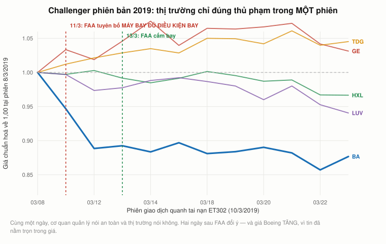
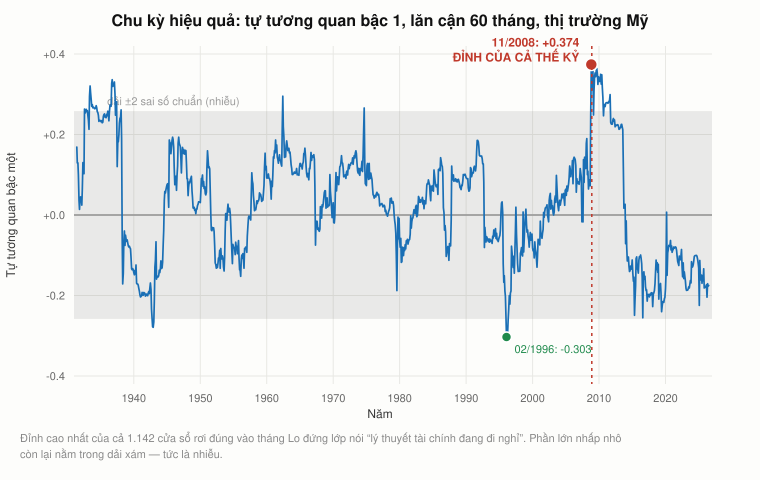
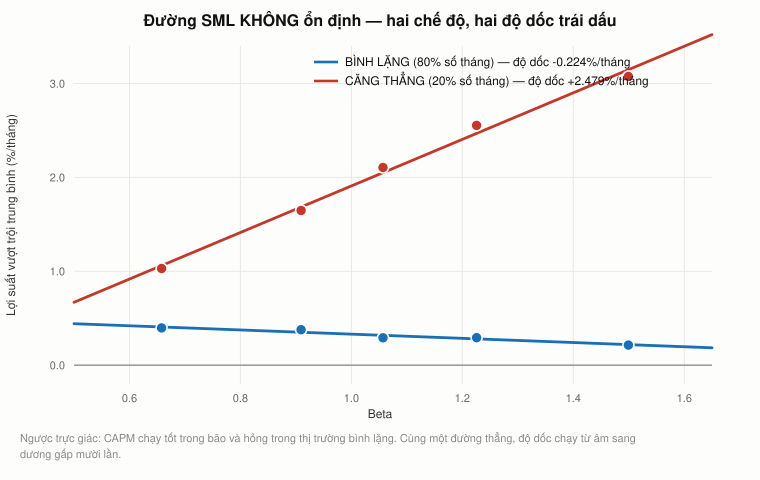

# Bài 13 — Thị trường hiệu quả, tài chính hành vi, và thị trường thích nghi

> Bài học dựa trên **MIT 15.401 Finance Theory I** (GS. Andrew W. Lo, MIT Sloan, học kỳ thu 2008),
> ba buổi: **Ses 18** từ `69:28` (YouTube `sMKQywwkIjQ`), **Ses 19** trọn vẹn (`a5PF2PcElV0`),
> **Ses 20** trọn vẹn (`P03PfYgNjmw`).
> Mốc thời gian ghi dạng `S18 mm:ss`, `S19 mm:ss`, `S20 mm:ss`.
> Phần **📚 Lý thuyết bổ sung** là kiến thức nền video lướt qua hoặc không có.
> ⚠️ **Video ghi tháng 12/2008** — §26 và §30 đối chiếu với 2026.
> 📌 **Cần đọc trước:** [Bài 1](bai_01_tai_chinh_la_gi.md) (lời hứa sáu nguyên lý được trả ở §27),
> [Bài 11 — CAPM](bai_11_capm_va_beta.md) (§23 đo lại đường SML).

---

## Mục lục

<!-- MUC-LUC -->
- [1. Ba buổi giảng này ghi ngày nào](#1-ba-buổi-giảng-này-ghi-ngày-nào)
- [2. Vì sao bài này để cuối cùng](#2-vì-sao-bài-này-để-cuối-cùng)
- [3. Challenger — bằng chứng mạnh nhất cho thị trường hiệu quả](#3-challenger--bằng-chứng-mạnh-nhất-cho-thị-trường-hiệu-quả)
- [4. Điều Maloney & Mulherin tìm ra mà Lo không kể](#4-điều-maloney--mulherin-tìm-ra-mà-lo-không-kể)
- [5. Challenger phiên bản 2019 — Boeing 737 MAX](#5-challenger-phiên-bản-2019--boeing-737-max)
- [6. Tờ 100 đô la trên vỉa hè, và ba dạng hiệu quả](#6-tờ-100-đô-la-trên-vỉa-hè-và-ba-dạng-hiệu-quả)
- [7. Nghịch lý Grossman–Stiglitz — "nghịch lý Thiền" của Lo](#7-nghịch-lý-grossmanstiglitz--nghịch-lý-thiền-của-lo)
- [8. Danh sách thiên lệch, và ác cảm mất mát](#8-danh-sách-thiên-lệch-và-ác-cảm-mất-mát)
- [9. Nghịch lý Ellsberg — hai chiếc bình](#9-nghịch-lý-ellsberg--hai-chiếc-bình)
- [10. Frank Knight: rủi ro là thứ đo được, bất định thì không](#10-frank-knight-rủi-ro-là-thứ-đo-được-bất-định-thì-không)
- [11. Con khỉ đột không ai thấy](#11-con-khỉ-đột-không-ai-thấy)
- [12. Định lý Dutch Book — giới hạn của sự phi lý tính](#12-định-lý-dutch-book--giới-hạn-của-sự-phi-lý-tính)
- [13. Câu "thị trường có thể phi lý lâu hơn..." không phải của Keynes](#13-câu-thị-trường-có-thể-phi-lý-lâu-hơn-không-phải-của-keynes)
- [14. Elliot, và sai lầm của Descartes](#14-elliot-và-sai-lầm-của-descartes)
- [15. Mô hình não ba tầng — phần đúng và phần đã bị bác bỏ](#15-mô-hình-não-ba-tầng--phần-đúng-và-phần-đã-bị-bác-bỏ)
- [16. Đau làm ta ngu đi — và tình yêu cũng vậy](#16-đau-làm-ta-ngu-đi--và-tình-yêu-cũng-vậy)
- [17. Lời khuyên thực dụng Lo rút ra](#17-lời-khuyên-thực-dụng-lo-rút-ra)
- [18. Giả thuyết thị trường thích nghi](#18-giả-thuyết-thị-trường-thích-nghi)
- [19. Chiếc áo khoác Superman — heuristic sinh ra từ đâu](#19-chiếc-áo-khoác-superman--heuristic-sinh-ra-từ-đâu)
- [20. Đồng cỏ và đàn cừu](#20-đồng-cỏ-và-đàn-cừu)
- [21. Chu kỳ hiệu quả — đo trên một thế kỷ](#21-chu-kỳ-hiệu-quả--đo-trên-một-thế-kỷ)
- [22. Đường SML không ổn định — đo bằng số](#22-đường-sml-không-ổn-định--đo-bằng-số)
- [23. Đau bảo vệ ta, và lợi nhuận là thuốc tê](#23-đau-bảo-vệ-ta-và-lợi-nhuận-là-thuốc-tê)
- [24. Vì sao ta cần quy định — mã phòng cháy](#24-vì-sao-ta-cần-quy-định--mã-phòng-cháy)
- [25. Đối chiếu 2026](#25-đối-chiếu-2026)
- [26. Sáu nguyên lý — lời hứa của buổi 1 được trả](#26-sáu-nguyên-lý--lời-hứa-của-buổi-1-được-trả)
- [27. Toàn khoá trong một trang](#27-toàn-khoá-trong-một-trang)
- [28. Góc Việt Nam — một thị trường trở nên hiệu quả](#28-góc-việt-nam--một-thị-trường-trở-nên-hiệu-quả)
- [29. Sau bài giảng — 18 năm](#29-sau-bài-giảng--18-năm)
- [30. Code minh hoạ](#30-code-minh-hoạ)
- [31. Từ điển thuật ngữ](#31-từ-điển-thuật-ngữ)
- [32. Câu hỏi tự kiểm tra](#32-câu-hỏi-tự-kiểm-tra)
- [Tóm tắt một trang](#tóm-tắt-một-trang)
- [Nguồn](#nguồn)
<!-- /MUC-LUC -->

---

## 1. Ba buổi giảng này ghi ngày nào

| Buổi   | Ngày                  | Chứng cứ                                                                                                                   |
| ------ | --------------------- | -------------------------------------------------------------------------------------------------------------------------- |
| Ses 18 | **Thứ Hai 1/12/2008** | Đã dựng ở [bài 12 §1](bai_12_ngan_sach_von.md#1-hai-buổi-giảng-này-ghi-ngày-nào)                                           |
| Ses 19 | **Thứ Tư 3/12/2008**  | Cuối Ses 18 (`S18 79:16`): *"Thứ Tư tôi sẽ nói với các bạn về tất cả các ví dụ mà chuyện này hỏng."*                       |
| Ses 20 | **Thứ Hai 8/12/2008** | Cuối Ses 19 (`S19 78:31`): *"tôi sẽ nói thêm vào thứ Hai"*; và `S19 79:26`: *"thứ Hai tới tôi sẽ nói về bài thi cuối kỳ."* |

Hai mảnh chứng cứ phụ, độc lập với nhau, cùng chỉ về đầu tháng 12/2008:

- `S20 36:36` — Lo dẫn *"một trong những người phụ trách chuyển giao của Obama"* với câu **"khủng
  hoảng là thứ đáng tiếc nếu bỏ phí"**. Đó là **Rahm Emanuel**, nói tại hội nghị CEO Council của
  *Wall Street Journal* ngày **19/11/2008** — ba tuần trước buổi giảng. (Câu nguyên văn của Emanuel:
  *"You never want a serious crisis to go to waste."* Lo diễn đạt lại, không trích nguyên.)
- `S20 07:57` — sinh viên Ingrid kể *"khoảng hai tuần trước"* các đài truyền hình khuyên người dân
  đừng mua quà Giáng sinh. Hai tuần trước 8/12 là quanh Black Friday **28/11/2008**.

Lịch MIT học kỳ thu 2008 kết thúc giảng dạy thứ Năm **11/12/2008**, nên thứ Hai 8/12 là **buổi thứ
Hai cuối cùng của học kỳ** — hợp với việc Lo dành 20 phút cuối để tổng kết và nói về bài thi.

Một sự trùng hợp đáng ghi, **không** có trong video: **Bernard Madoff bị bắt ngày 11/12/2008**, ba
ngày sau buổi giảng cuối này. Bài 10 §17 đã bàn về quỹ đầu cơ ẩn danh "XYZ" mà Lo chiếu ở Ses 13 và
đã **từ chối** khẳng định đó là Madoff. Ở đây cũng vậy: ghi lại mốc thời gian như bối cảnh, không
suy diễn.

---

## 2. Vì sao bài này để cuối cùng

Lo mở đầu bằng việc thừa nhận ông đang làm ngược quy ước của cả ngành (`S18 69:46`):

> *"Thông thường, thị trường hiệu quả là bài giảng được dạy ở **đầu** hầu hết các khoá tài chính
> doanh nghiệp và tài chính nhập môn. Và lý do người ta dạy nó ở đầu là vì thật ra ta **cần** giả
> thuyết thị trường hiệu quả để biện minh cho hầu hết những gì tôi đã dạy các bạn suốt 13 tuần qua."*

Rồi ông giải thích chính xác cái gì đang treo lơ lửng (`S18 70:05`):

> *"Suốt khoá này tôi cứ lặp đi lặp lại: khi ta cần một suất chiết khấu, khi ta cần một mức giá, khi
> ta cần một giá trị — ta đi đâu? **Ra thị trường.** … Và đó là lý do ở đầu hầu hết các khoá tài
> chính, ta thường dạy sinh viên **hãy tin vào thị trường**."*

Và rồi câu định hình cả bài học này (`S18 70:41`):

> *"Tôi đã **không** làm thế trong khoá này, vì tôi **không muốn các bạn tin vào thị trường**. Tôi
> muốn các bạn học được từ kinh nghiệm rằng **khi nào nên tin thị trường, và khi nào thì không**."*

Đó chính là lời hứa ở buổi 1 mà [bài 1 §13](bai_01_tai_chinh_la_gi.md#13-sáu-nguyên-lý--và-vì-sao-lo-chỉ-đưa-ba)
đã ghi lại: *"đến buổi cuối tôi sẽ chất vấn toàn bộ bộ khung mà tôi đã dựng cho các bạn, và chỉ cho
các bạn thấy các lỗ hổng nằm ở đâu."* Ba buổi này là phần trả nợ.

**Cấu trúc Lo tuyên bố trước** (`S18 72:38`) và đi đúng:

1. Lập luận **ủng hộ** thị trường hiệu quả — bằng vụ Challenger.
2. Lập luận **chống** — bằng tâm lý học.
3. **Hoà giải** hai bên bằng khoa học thần kinh nhận thức, dẫn tới lý thuyết riêng của ông.

Và ông cảnh báo trước về bước 3, ngay cuối Ses 18 (`S18 72:04`, `S18 72:23`, `S18 72:38`):

> *"Tôi có một lý thuyết, và nó **không được chấp nhận rộng rãi**. Nên tôi phải bắt đầu bằng lời từ
> chối trách nhiệm đó. Đây là lý thuyết cưng của riêng tôi, nó không có trong sách giáo khoa nào cả
> vì nó tương đối mới. Và nếu bạn tìm nó trên mạng, **tên tôi sẽ là cái tên duy nhất hiện ra.** Điều
> đó vừa tốt vừa xấu. Bạn nghe nó từ chính miệng con ngựa — nhưng người kể lại là **một con ngựa.**"*

📌 Ghi lại câu đó. §30 sẽ quay lại xem nó còn đúng không.

---

## 3. Challenger — bằng chứng mạnh nhất cho thị trường hiệu quả

Lo dựng lập luận ủng hộ bằng đúng **một** nghiên cứu (`S18 75:02`): Maloney & Mulherin (2003),
*"The Complexity of Price Discovery in an Efficient Market: The Stock Market Reaction to the
Challenger Crash"*, đăng trên *Journal of Corporate Finance*.

**Dòng thời gian ông kể** (`S18 75:23`–`78:39`):

| Thời điểm            | Việc                                                                                                                 |
| -------------------- | -------------------------------------------------------------------------------------------------------------------- |
| 11:39 sáng 28/1/1986 | Tàu con thoi Challenger nổ trên bầu trời Florida                                                                     |
| 11:47                | Tin lên dây tin tức                                                                                                  |
| 12:17                | **Lockheed** — không bình luận                                                                                       |
| 12:52                | **Rockwell International** — không bình luận                                                                         |
| ~13:00               | Giá **Morton Thiokol** đã tụt xuống dưới cả ba nhà thầu còn lại                                                      |
| Đóng cửa cùng ngày   | Morton Thiokol là **cổ phiếu duy nhất** giảm đáng kể; phải **tạm ngừng giao dịch**                                   |
| 9/6/1986             | Uỷ ban tổng thống công bố: nguyên nhân là **vòng đệm cao su chữ O** của tên lửa đẩy — do **Morton Thiokol** sản xuất |

Câu Lo dùng để chốt (`S18 78:39`, `79:01`):

> *"Chuyện này xảy ra trong **chưa đầy sáu tiếng**. Uỷ ban mất **sáu tháng** mới ra được cái vòng
> chữ O và Morton Thiokol. Nếu bạn nhìn vào đồ thị này, bạn **không thấy** một vòng chữ O. Nhưng bạn
> thấy **Morton Thiokol**. Rõ mồn một, như ngón tay cái bị sưng."*

> *"Đây là trí tuệ đám đông. Đây là lý do khi bạn nhìn giá thị trường, bạn nên nhìn nó với một mức
> độ **kinh ngạc và tôn trọng** nhất định. Bởi vì nó tổng hợp thông tin đến mức bạn không thể tin
> nổi."*

⚠️ **Một chỗ Lo nói lỏng.** Ông nói "sáu tháng" ba lần. Từ 28/1/1986 tới 9/6/1986 là **4 tháng 12
ngày**. Con số đúng làm phép so sánh *bớt* kịch tính (4,5 tháng so với 6 tiếng thay vì 6 tháng so
với 6 tiếng) nhưng vẫn là chênh lệch khoảng **550 lần**. Kết luận không đổi.

⚠️ Ở `S18 77:32` Lo đọc nhầm *"Martin Thiokol"*; đúng là **Morton Thiokol** — ông gọi đúng ở mọi
chỗ khác. Ba nhà thầu còn lại là **Lockheed**, **Martin Marietta**, **Rockwell International**.

📚 Lo nói *"nhà vật lý Richard Feynman ở trong hội đồng đó và viết một ý kiến bất đồng"*. Chính xác
hơn: Feynman viết **Phụ lục F** của báo cáo Rogers, một phần riêng mang tên *"Personal Observations
on the Reliability of the Shuttle"*, và đã doạ rút tên khỏi báo cáo nếu phụ lục ấy không được in.
Đây là nơi có câu nổi tiếng: *"Với một công nghệ thành công, thực tại phải được ưu tiên hơn quan hệ
công chúng, vì Tự Nhiên không thể bị lừa."*

---

## 4. Điều Maloney & Mulherin tìm ra mà Lo không kể

Lo dừng ở chỗ "thị trường đoán đúng". Nhưng phần thú vị nhất của bài báo nằm ở chỗ **thị trường đã
đoán đúng bằng cách nào** — và câu trả lời là: **không ai biết**.

Ba phát hiện của bài báo mà buổi giảng bỏ qua:

1. **Không có bằng chứng giao dịch nội gián.** Hai tác giả tìm kỹ khối lượng giao dịch và hồ sơ:
   không có đợt bán bất thường nào của người trong cuộc ở Morton Thiokol, không có giao dịch quyền
   chọn nào đáng ngờ. Cũng không có nhà phân tích nào công bố khuyến nghị trong ngày. Giá đúng
   **mà không truy được ai là người biết**.

2. **Mức giảm khớp với thiệt hại thật.** Mức mất vốn hoá của Morton Thiokol trong ngày xấp xỉ giá
   trị hiện tại của phần doanh thu hợp đồng mà công ty thật sự mất sau đó. Thị trường không chỉ
   **chỉ đúng người**, nó còn **định lượng gần đúng**.

3. **Ba nhà thầu kia cũng giảm** — khoảng 2–3% — rồi hồi lại. Chỉ Morton Thiokol giảm ~12% và ở lại
   đó. Nghĩa là thị trường không "bắn vào cả đám" rồi may mà trúng; nó **phân biệt**.

Vì sao điều này quan trọng hơn cả câu chuyện Lo kể: nó cho thấy **hiệu quả thị trường không đòi
hỏi ai đó phải biết trước**. Không cần một thiên tài nội gián. Chỉ cần nhiều người, mỗi người biết
một mẩu — ai đó ở Utah có họ hàng làm cho Thiokol, ai đó nhớ báo cáo thời tiết lạnh bất thường đêm
trước, ai đó là kỹ sư biết vòng đệm cao su giòn khi lạnh — và một cơ chế gộp các mẩu đó lại thành
**một con số**. Cơ chế đó tên là *giá*.

📚 Đó cũng là lý do lập luận này mạnh hơn mọi kiểm định thống kê về hiệu quả thị trường: nó là một
**thí nghiệm tự nhiên** có đáp án được công bố độc lập sau đó bởi một cơ quan không giao dịch chứng
khoán.

---

## 5. Challenger phiên bản 2019 — Boeing 737 MAX



*Đúng cấu trúc biểu đồ Challenger Lo chiếu trên lớp — chuẩn hoá về 1,00 tại phiên trước tai nạn.*

Ta không có dữ liệu tick năm 1986. Nhưng logic thì lặp lại được, và có một sự kiện hiện đại gần
như song song: **chuyến bay ET302 của Ethiopian Airlines rơi Chủ nhật 10/3/2019**, chiếc Boeing 737
MAX thứ hai rơi trong năm tháng.

Cách làm: **mô hình thị trường** (market model). Ước lượng alpha và beta của từng mã trên 144 phiên
trước sự kiện, rồi đo **lợi suất bất thường** của phiên đầu tiên sau tai nạn:

$$AR_t = r_t - (\alpha + \beta \cdot r_{m,t})$$

Kết quả (chi tiết ở [code §1](#30-code-minh-hoạ)):

| Mã     | Vai trò                                          | beta | Lợi suất 11/3 |         AR |         t |
| ------ | ------------------------------------------------ | ---: | ------------: | ---------: | --------: |
| **BA** | Boeing — thân máy bay + phần mềm MCAS            | 1,35 |    **−5,33%** | **−7,50%** | **−5,61** |
| GE     | General Electric — động cơ LEAP (liên doanh CFM) | 0,92 |        +3,34% |     +2,07% |     +0,71 |
| HXL    | Hexcel — vật liệu composite                      | 0,97 |        −0,29% |     −1,77% |     −1,48 |
| TDG    | TransDigm — linh kiện máy bay                    | 1,29 |        +1,21% |     −0,81% |     −0,63 |
| LUV    | Southwest — hãng khai thác MAX lớn nhất          | 0,82 |        −0,31% |     −1,52% |     −0,92 |

**Chỉ một mã vượt ngưỡng ý nghĩa.** Bốn mã còn lại đều |t| < 1,5 — không phân biệt được với 0. Và
phiên đó S&P 500 **tăng** 1,47%: thị trường chung đi lên, một mã đi xuống.

Nhưng phần đắt giá nhất là **dòng thời gian**:

| Ngày             | Việc                                                      |
| ---------------- | --------------------------------------------------------- |
| CN 10/3/2019     | ET302 rơi, 157 người thiệt mạng                           |
| **T2 11/3/2019** | **FAA ra thông báo chính thức: máy bay ĐỦ ĐIỀU KIỆN BAY** |
| **T2 11/3/2019** | **Thị trường: Boeing −5,33%, AR = −7,50%, t = −5,61**     |
| T2 11/3/2019     | Trung Quốc cấm bay — nước đầu tiên                        |
| T3 12/3/2019     | EU và Anh cấm bay. Boeing −6,15%                          |
| **T4 13/3/2019** | **FAA cấm bay — cơ quan lớn cuối cùng. Boeing +0,46%**    |

**Cùng một ngày, cơ quan quản lý hàng không Mỹ tuyên bố chiếc máy bay an toàn và thị trường
định giá nó là không.** Hai ngày sau, FAA đổi ý. Và ngày FAA thực sự cấm bay, **Boeing tăng giá** —
tin đã nằm trọn trong giá từ hai phiên trước.

Đó chính xác là cấu trúc Challenger: một cơ quan chính thức công bố kết luận **sau** khi giá đã kết
luận, và giá không nhúc nhích vào ngày công bố.

⚠️ **Khác biệt phải nói rõ.** Ở Challenger, thủ phạm **không hiển nhiên** — bốn nhà thầu ngang nhau,
thị trường phải *chọn*. Ở 737 MAX, ai cũng biết Boeing làm ra chiếc máy bay. Cái đáng giá ở đây
không phải "chọn đúng ai" mà là **"chọn đúng lúc"**. Bài kiểm tra dễ hơn Challenger một bậc.

📚 Đối chiếu với tai nạn Lion Air JT610 ngày 29/10/2018 — chiếc MAX **đầu tiên** rơi: Boeing cũng
giảm, AR = −5,89%, nhưng Southwest cũng −2,85% và Hexcel −1,84%. Thị trường hôm đó **rải đều** hơn.
Một vụ rơi là tai nạn; hai vụ rơi cùng kiểu là **lỗi thiết kế** — và thị trường phản ứng đúng theo
sự khác biệt đó.

---

## 6. Tờ 100 đô la trên vỉa hè, và ba dạng hiệu quả

Lo tóm tắt giả thuyết bằng một câu (`S18 73:26`):

> *"Hiệu quả thị trường nói rằng không có bữa trưa miễn phí, không có chênh lệch giá, bạn không được
> cái gì mà không mất gì, **giá phản ánh đầy đủ mọi thông tin sẵn có**, và không có cách nào kiếm
> tiền trên thị trường. **Quản lý chủ động không tạo ra giá trị nào cả.**"*

Rồi ông đùa (`S18 73:44`): *"Nếu bạn thật sự tin điều này, bạn ngồi đây làm gì?"*

Và ở đầu Ses 19, chuyện cười kinh điển (`S19 03:09`):

> *"Hai nhà kinh tế đi trên phố. Một người thấy tờ 100 đô la nằm dưới đất và cúi xuống nhặt. Người
> kia nói: 'Ôi, đừng nhặt làm gì.' — 'Sao lại không?' — 'Nếu đó là tờ 100 đô **thật**, thì đã có
> người nhặt rồi. Nên nó phải là **tiền giả**.'"*
>
> *"Các bạn cười. Nhưng đó **đúng là** điều thị trường hiệu quả nói."* (`S19 03:24`)

Chú ý mối nối với [bài 1](bai_01_tai_chinh_la_gi.md#13-sáu-nguyên-lý--và-vì-sao-lo-chỉ-đưa-ba). Ở
buổi 1 Lo đã tự sửa nguyên lý 1 cho chặt: *"thỉnh thoảng **vẫn có** bữa trưa miễn phí, nhưng không
có **chương trình** bữa trưa miễn phí."* Chuyện cười ở đây là bản **quá đà** của nguyên lý 1, và Lo
kể nó chính xác để cho thấy phiên bản quá đà đó buồn cười. Nguyên lý 1 phiên bản chặt sống sót; bản
khẩu hiệu thì không.

### Ba dạng hiệu quả (Fama 1970) — Lo không phân biệt, nhưng bạn cần

Buổi giảng dùng một chữ "hiệu quả" cho mọi thứ. Ngành tài chính từ 1970 phân ba mức, theo Eugene
Fama, *"Efficient Capital Markets: A Review of Theory and Empirical Work"*, *Journal of Finance*:

| Dạng                         | Giá phản ánh                | Nếu đúng thì cái gì vô dụng                 |
| ---------------------------- | --------------------------- | ------------------------------------------- |
| **Yếu** (*weak form*)        | mọi **giá quá khứ**         | phân tích kỹ thuật, đọc đồ thị              |
| **Bán mạnh** (*semi-strong*) | mọi **thông tin công khai** | phân tích cơ bản dựa trên báo cáo tài chính |
| **Mạnh** (*strong form*)     | **cả thông tin nội bộ**     | ngay cả nội gián cũng không kiếm được       |

Vụ Challenger là bằng chứng cho dạng **bán mạnh** — và mạnh đến mức gần chạm dạng mạnh, vì giá đi
trước cả kết luận của uỷ ban điều tra.

§22 sẽ kiểm định dạng **yếu** trên 100 năm dữ liệu, bằng đúng cách Lo dùng ở Ses 20.

📚 Fama tự sửa lại cách gọi này năm 1991 (*"Efficient Capital Markets: II"*) thành **kiểm định khả
năng dự báo lợi suất**, **nghiên cứu sự kiện**, và **kiểm định thông tin riêng**. §5 của bài này là
một *nghiên cứu sự kiện* theo đúng nghĩa Fama dùng.

---

## 7. Nghịch lý Grossman–Stiglitz — "nghịch lý Thiền" của Lo

Lo nêu vấn đề rồi hẹn lại (`S19 04:03`):

> *"Nếu không ai kiếm được tiền, vậy ai là người ngoài kia đi thu thập thông tin để làm cho thị
> trường trở nên hiệu quả? Trước hết, có một chút **nghịch lý kiểu Thiền** ở đây. Ta sẽ nói về
> nghịch lý Thiền đó sau."*

Ông không quay lại nó trong ba buổi này. Nên đây là phần bù.

Nghịch lý ấy có tên và có bài báo: **Sanford Grossman và Joseph Stiglitz (1980)**, *"On the
Impossibility of Informationally Efficient Markets"*, *American Economic Review* 70(3).

Lập luận, gọn lại:

1. Thu thập và phân tích thông tin **tốn tiền**.
2. Nếu giá đã phản ánh **đầy đủ** mọi thông tin, thì người bỏ tiền thu thập thông tin **không thu
   lại được gì** — người không bỏ đồng nào cũng thấy đúng cái giá đó.
3. Vậy sẽ **không ai** thu thập thông tin.
4. Nhưng nếu không ai thu thập, giá **không thể** phản ánh thông tin.
5. Mâu thuẫn.

Kết luận của họ: **hiệu quả hoàn hảo là bất khả thi về mặt logic.** Thị trường phải kém hiệu quả
vừa đủ để trả công cho người đi tìm thông tin — không hơn. Lợi nhuận của quản lý chủ động là *tiền
công cho việc làm giá trở nên đúng*, chứ không phải bữa trưa miễn phí.

📌 Đây là mảnh ghép quan trọng vì nó **báo trước** giả thuyết của chính Lo ở §19. Nếu mức kém hiệu
quả phải vừa đủ trả công cho người tìm thông tin, thì khi số người tìm thông tin **thay đổi**, mức
kém hiệu quả cũng phải thay đổi. Grossman–Stiglitz cho ta *lý do* phải có chu kỳ; Lo cho ta *cơ chế*
và *dữ liệu*.

---

## 8. Danh sách thiên lệch, và ác cảm mất mát

Lo lật sang phía đối lập (`S19 06:07`):

> *"Tài chính hành vi, đối trọng của hiệu quả thị trường, nói rằng người tham gia thị trường đơn giản
> là **phi lý tính**. … Họ mắc đủ loại thiên lệch: **ác cảm mất mát, neo, đóng khung, quá tự tin,
> phản ứng thái quá, bầy đàn, kế toán tinh thần**…"*

Và ông tổng kết bằng một câu độc (`S19 06:47`):

> *"Khi bạn nhìn xuống danh sách này và coi trọng những gì các nhà tâm lý học nói với ta, bạn sẽ kết
> luận rằng **con người là loài ngu nhất trên trái đất.**"*

### Ác cảm mất mát, đo bằng số

⚠️ Lo dẫn lại ví dụ này từ *"bài nói giới thiệu"* của ông (`S19 07:17`) chứ **không đọc lại con số**
trong buổi 19. Nên bài học này dùng số của bản gốc đã xuất bản: **Tversky & Kahneman (1981)**,
*"The Framing of Decisions and the Psychology of Choice"*, *Science* 211, bài toán 3 và 4.

Hai quyết định, đưa ra **cùng lúc**:

| Quyết định (i) |                                          | Quyết định (ii) |                                        |
| -------------- | ---------------------------------------- | --------------- | -------------------------------------- |
| **A**          | chắc chắn được **240 đô**                | **C**           | chắc chắn mất **750 đô**               |
| **B**          | 25% được **1.000 đô**, 75% không được gì | **D**           | 75% mất **1.000 đô**, 25% không mất gì |

Trong 150 người trả lời: **84% chọn A**, **87% chọn D**, **73% chọn cả cặp A+D**. Chỉ **3%** chọn
cặp B+C.

Giờ gộp hai quyết định thành một canh bạc và liệt kê từng trạng thái:

| Gói                  | may (25%) | không may (75%) | kỳ vọng |
| -------------------- | --------: | --------------: | ------: |
| **A + D** (73% chọn) |      +240 |            −760 |    −510 |
| **B + C** (3% chọn)  |      +250 |            −750 |    −500 |

**Chênh lệch bằng đúng +10 đô ở CẢ HAI trạng thái.** Đó là **áp đảo tuyệt đối** — không cần biết
xác suất, không cần biết hàm hữu dụng, không cần giả định gì. 73% số người chọn cặp bị áp đảo.

Lo gọi số dư đó là **"tiền mặt để trên vỉa hè"** (`S19 09:38`) và đọc con số **10.000 đô** — đúng
bằng bản gốc **nhân lên 1.000 lần**, tức ông dùng bản đã phóng đại quy mô để gây ấn tượng với lớp.

**Vì sao người ta chọn như vậy?** Vì ta đổi khẩu vị rủi ro tuỳ theo **cách đóng khung**:

- ở vế **lãi** → **ngại rủi ro** (chọn chắc chắn);
- ở vế **lỗ** → **tìm rủi ro** (chọn may rủi để mong hoà vốn).

Một hàm hữu dụng đơn điệu **không thể** sinh ra cả hai. Đó là lý do Kahneman nhận **giải Nobel kinh
tế năm 2002** — với tư cách một **nhà tâm lý học**. Lo nhấn mạnh điều đó (`S19 10:29`):

> *"Điều thú vị là Kahneman **không phải nhà kinh tế học**, ông là nhà tâm lý học. Theo một nghĩa
> nào đó, có lẽ giải Nobel kinh tế đang phát tín hiệu cho giới kinh tế học rằng họ nên coi trọng
> những thứ kiểu này hơn."*

⚠️ Lo nói Kahneman nhận giải *"vài năm trước"* — chính xác là **2002**, tức sáu năm trước buổi giảng.
Amos Tversky mất **2/6/1996**, sáu năm trước khi giải được trao; giải Nobel không truy tặng. Lo nói
đúng chi tiết này.

📌 Cập nhật 2026: **Daniel Kahneman mất ngày 27/3/2024**, thọ 90 tuổi.

---

## 9. Nghịch lý Ellsberg — hai chiếc bình

Đây là đoạn hay nhất của Ses 19, và Lo dựng nó thành một cuộc đấu giá thật với cả lớp.

**Bình A** (`S19 11:27`): 100 viên bi, **50 đỏ, 50 đen**, giống hệt nhau về mọi mặt khác. Bạn chọn
một màu, viết ra giấy, không nói. Lo rút một viên. Trúng màu bạn chọn → bạn được **10.000 đô**.
Chơi **đúng một lần**.

Lo đấu giá trong lớp (`S19 12:21`): *"Ai chịu chơi với tôi giá 1 đô? … 1.000? 2.000? 3.000? 4.000?
4.500? 4.999? 5.010?"* Vẫn còn tay giơ ở **4.999**, không ai giơ ở **5.010**. Lớp MIT tính ra ngay
giá trị kỳ vọng là 5.000.

**Bình B** (`S19 14:20`): giống hệt bình A về mọi mặt, **trừ một điều — Lo không nói tỉ lệ**.

> *"Có thể là 50/50 đỏ đen, nhưng cũng có thể là 40/60, hoặc 70/30, hoặc 85/15, hoặc 100/0. Tôi hứa
> với bạn là có **đúng 100 viên bi** và có **nhiều nhất hai màu**, đỏ và/hoặc đen. Ngoài ra tôi
> không nói gì thêm."*

Và ông thừa nhận thẳng (`S19 16:18`): *"Nếu bạn hỏi có phải tôi là người chọn phân phối không, thì
**đúng, tôi chọn**."*

Kết quả đấu giá lần hai (`S19 16:33`): **số cánh tay giảm hẳn ở mọi mức giá.** Cùng một giải thưởng,
cùng một trò chơi, người ta trả **ít hơn** cho bình B.

### Lời giải của Lo, và lời giải đúng

Lo giải thích bằng hồi quy vô hạn (`S19 21:32`):

> *"Tôi biết người ta hơi thích màu đỏ hơn. Nhưng vấn đề là **bạn biết tôi biết**. Và hơn nữa, **tôi
> biết bạn biết tôi biết**, và bạn biết tôi biết bạn biết tôi biết. Khi bạn đẩy nó về vô hạn, bạn
> ra được cái gì? **50/50.**"*

⚠️ Lập luận này **không chặt**. Hồi quy vô hạn về niềm tin không hội tụ về một con số theo cách đó;
nó đòi hỏi giả định về cấu trúc niềm tin chung mà Lo không nêu.

**Lời giải đúng đến từ một sinh viên** trong lớp, tên Brian (`S19 23:12`), khi Lo hỏi có cơ chế
nào làm ông không thể chọn phân phối bất lợi:

> AUDIENCE: *"Nếu bạn chỉ cần **tung một đồng xu** để quyết định chọn màu nào?"*
>
> ANDREW LO: *"Chính xác. Nếu Brian tung **đồng xu của cậu ấy**, chứ không phải đồng xu của tôi —
> thì **không có cách nào** tôi có thể làm gì để bất lợi cho bạn."*

Và điều này **chứng minh được**, không cần hồi quy vô hạn. Nếu bình có $k$ viên đỏ trong 100 viên,
và bạn chọn màu bằng đồng xu công bằng:

$$P(\text{thắng}) = \tfrac{1}{2}\cdot\tfrac{k}{100} + \tfrac{1}{2}\cdot\tfrac{100-k}{100} = \tfrac{1}{2}$$

**Với mọi $k$.** Quét cả 101 tỉ lệ có thể ([code §2](#30-code-minh-hoạ)):

| Chiến lược              | P(thắng) nhỏ nhất | P(thắng) lớn nhất |
| ----------------------- | ----------------: | ----------------: |
| Luôn chọn ĐỎ (tất định) |          **0,00** |              1,00 |
| Tung đồng xu            |          **0,50** |          **0,50** |

Chiến lược tất định có thể bị Lo ép về **0**. Chiến lược ngẫu nhiên **bất khả bại** — không phải nhờ
may mắn, mà nhờ toán học. Đây là một kết quả **minimax** cổ điển của lý thuyết trò chơi.

**Kết luận phản trực giác:** *thêm* sự ngẫu nhiên (đồng xu của **chính bạn**) làm trò chơi **công
bằng hơn**. Lo diễn đạt điều đó rồi kể tiếp phần đắt nhất (`S19 23:31`):

> *"Ấy thế mà khi bạn nói với người ta điều đó, họ bảo: nghe hay đấy, **nhưng tôi vẫn không muốn
> chơi**. Vì tôi không muốn dính vào cái bất định ấy. Và **cái đó là bẩm sinh**. Con người chúng ta
> né tránh cái mình không biết."*

### Và Lo nối thẳng vào cuộc khủng hoảng đang diễn ra ngoài cửa lớp

(`S19 24:11`)

> *"Bây giờ lấy ví dụ này áp vào một công ty đang có **tài sản độc hại** trên bảng cân đối, mà bạn
> **không biết giá trị thị trường là bao nhiêu**, vì **không có thị trường**, vì nó không giao dịch.
> Vì bạn không biết định giá thứ chứng khoán đó thế nào, do nó chứa quá nhiều mảnh mà bạn không hình
> dung nổi hệ quả **pháp lý**, chưa nói tài chính, là gì."*
>
> *"Và giờ bạn hiểu vì sao người ta nói: khoan đã, **tôi không muốn chơi**. Tôi không quan tâm nó
> đáng giá bao nhiêu. **Tôi không muốn biết.** Tôi không muốn dính vào vì tôi không đánh giá được
> rủi ro. **Đó chính là điều đang xảy ra ngoài kia, ở mức độ khủng khiếp.**"*

📌 Đây là một trong những khoảnh khắc hay nhất của cả khoá: một thí nghiệm tâm lý 1961 giải thích
tại sao thị trường chứng khoán hoá đóng băng năm 2008 — không phải vì rủi ro quá cao, mà vì **không
ai biết rủi ro là bao nhiêu**.

⚠️ **Lo gọi Ellsberg là "nhà tâm lý học"** (`S19 32:52`). Sai. **Daniel Ellsberg** có bằng cử nhân và
tiến sĩ **kinh tế học** ở Harvard, làm nhà phân tích ở RAND Corporation, và bài báo gốc là
*"Risk, Ambiguity, and the Savage Axioms"*, *Quarterly Journal of Economics* (1961) — một tạp chí
kinh tế học. Ông nổi tiếng với thế giới rộng hơn vì **rò rỉ Hồ sơ Lầu Năm Góc năm 1971**. Ellsberg
mất ngày **16/6/2023**.

---

## 10. Frank Knight: rủi ro là thứ đo được, bất định thì không

Lo dùng nghịch lý Ellsberg làm bàn đạp cho một ý lớn hơn (`S19 26:07`), và đây là phần lý thuyết
quan trọng nhất của Ses 19.

**Frank Knight**, *Risk, Uncertainty, and Profit* (1921), muốn giải thích vì sao một số người giàu
đến mức phi lý. Lo dựng câu hỏi (`S19 26:42`):

> *"Bill Gates có nên đáng giá 40 hay 50 tỉ đô la không? Điều đó có hợp lý không? Ông ấy có thật sự
> **có giá trị hơn** bất kỳ ai trong chúng ta đến mức ấy không?"*

Câu trả lời của Knight, theo cách Lo trình bày:

|                    | **Rủi ro** (*risk*)                  | **Bất định** (*uncertainty*)            |
| ------------------ | ------------------------------------ | --------------------------------------- |
| Định nghĩa         | ngẫu nhiên **tham số hoá được**      | ngẫu nhiên **không ai tham số hoá nổi** |
| Ví dụ Lo dùng      | bảng tỉ lệ tử vong, bảo hiểm tài sản | công nghệ nano                          |
| Lợi nhuận cân bằng | **bằng 0**                           | **có thể là hàng tỉ**                   |

Lo dựng lập luận qua ngành bảo hiểm nhân thọ (`S19 27:43`):

> *"Nếu bạn kể tôi nghe **15 sự kiện** về đời bạn, với 15 sự kiện đó tôi có thể xác định tuổi thọ kỳ
> vọng của bạn **trong khoảng cộng trừ 5 năm**, với độ chính xác cực cao. Và với tôi, đó là **nhiều
> thông tin hơn tôi cần**. Tôi không cần biết khi nào tôi sẽ chết."*

Rồi ông hỏi lớp một câu không liên quan gì tới tài chính (`S19 28:27`):

> *"Là nhà kinh tế học, ta luôn nói: càng nhiều thông tin càng tốt. Bạn có **thật sự tin** điều
> đó không? Bạn có **muốn biết** khi nào mình sẽ chết không? Nếu tôi có thông tin đó, bạn có muốn
> tôi nói cho bạn không? Ngày giờ cụ thể? Bạn có muốn biết không?"*

Từ đó tới kết luận (`S19 29:11`, `S19 30:12`):

> *"Ngành bảo hiểm nhân thọ hiện không phải ngành tăng trưởng. … Vì không còn nhiều lợi nhuận, do
> người ta đã hiểu khá rõ cách dự báo tỉ lệ tử vong."*
>
> *"**Bất định** là thứ Frank Knight gọi là rủi ro mà không ai tham số hoá được. Công nghệ nano —
> ai mà biết nó có sinh lời không? Ta còn không biết nó **là cái gì**, hay liệu nó có phải một ngành
> kinh doanh không. Loại bất định đó — nếu bạn sẵn sàng nhận lấy nó, thì có những người sẽ kiếm được
> **hàng tỉ đô la** theo đúng nghĩa đen."*

### Sự im lặng của nghĩa địa

Một sinh viên tên Ike đặt câu hỏi hay nhất buổi (`S19 31:08`):

> AUDIENCE: *"Còn **sự im lặng của nghĩa địa** thì sao? Rằng Bill Gates được bù trừ bởi hàng nghìn
> doanh nhân đã thất bại và không còn gì?"*

Lo trả lời rằng đó chính là **hệ quả** của lập luận, không phải phản bác (`S19 31:25`):

> *"Vì sao lại có sự chênh lệch khủng khiếp đến thế với **một số loại** ngẫu nhiên, trong khi với các
> loại ngẫu nhiên khác thì bạn có một đường chuông đẹp đẽ? … Cứ một Bill Gates thì có vài triệu
> doanh nhân thất bại — là vì người ta đang nhận lấy loại ngẫu nhiên mà **không ai biết định lượng.**"*

Và ông nói thẳng cái giá (`S19 31:53`, `S19 32:12`):

> *"Trong lớp này, tôi cá rằng **ít nhất một người sẽ là tỉ phú trong 15 năm nữa**. Và tôi rất muốn
> làm quen thật thân với bạn từ giờ tới lúc đó."*
>
> *"Nhưng mặt trái, mà tất cả các bạn nên biết: với **số doanh nhân còn lại** không kiếm được một tỉ
> đô, bạn sẽ **không kiếm được gì cả. Số không. Bạn mất tất cả.**"*

📚 **Vì sao mục này quan trọng cho cả khoá.** Bài 9–11 dựng toàn bộ bộ máy đo rủi ro bằng phương sai
và beta. Bộ máy đó chỉ chạy được trên **rủi ro Knight** — thứ có phân phối. Với **bất định Knight**,
phương sai không tồn tại vì phân phối không tồn tại. Nghĩa là: CAPM không sai, nó chỉ **không áp
được** cho loại quyết định sinh ra Bill Gates. Đó là lỗ hổng đầu tiên trong bộ khung mà Lo hứa chỉ ra.

⚠️ **Đối chiếu số liệu.** Lo nói J.P. Morgan *"đáng giá 100 triệu đô vào thời đó"*. Khi Morgan mất
năm 1913, di sản được định giá khoảng **80 triệu đô** (chưa kể bộ sưu tập nghệ thuật, ước thêm ~50
triệu). Con số 100 triệu là làm tròn lên. Giai thoại nổi tiếng là John D. Rockefeller nghe con số ấy
rồi nói: *"Nghĩ mà xem, ông ta còn không phải người giàu."*

---

## 11. Con khỉ đột không ai thấy

Ví dụ thứ ba Lo chiếu, rất nhanh (`S19 35:33`):

> *"Đây là ví dụ rõ ràng cho thấy tất cả chúng ta đều được lập trình sẵn để **nhìn thấy những thứ ta
> đang tìm**, và khi ta không tìm những thứ khác, ta **hoàn toàn không thấy chúng**."*

📚 Lo không nêu tên. Đó là **Simons & Chabris (1999)**, *"Gorillas in Our Midst: Sustained
Inattentional Blindness for Dynamic Events"*, *Perception* 28, 1059–1074. Người xem được yêu cầu đếm
số lần chuyền bóng giữa các cầu thủ áo trắng; khoảng **một nửa** không nhận ra một người mặc đồ khỉ
đột đi vào giữa khung hình, đấm ngực, rồi đi ra.

Kết luận Lo rút ra (`S19 35:51`):

> *"Ví dụ cuối này tôi đưa ra vì nó cung cấp bằng chứng **không thể chối cãi** rằng khả năng nhận
> thức của con người là **có giới hạn**. Ta không có lý tính vô hạn theo nghĩa có thể tính, quan sát,
> phân tích, dự báo và nhớ một lượng thông tin vô hạn."*

📌 Đây là mắt xích chuyển tiếp: các thiên lệch ở §8–§9 là *lỗi sở thích*; khỉ đột là *giới hạn năng
lực xử lý*. Hai loại khác nhau, và §14 sẽ cho thấy chúng có chung một gốc sinh lý.

---

## 12. Định lý Dutch Book — giới hạn của sự phi lý tính

Đây là câu trả lời của phe thị trường hiệu quả, và Lo gọi nó là *"đòn phản công khá mạnh"*
(`S19 36:34`).

**Đặt vấn đề** (`S19 37:06`): sự kiện A = *"S&P 500 giảm 5% trở lên vào thứ Hai tới"*. Lo chêm một
câu đắng (`S19 37:06`): *"Chuyện này từng được coi là một sự kiện khá cực đoan. Giờ thì nó là chuyện
thường ngày."*

Giả sử bạn tin: **P(A) = 1/2** và **P(không A) = 3/4**. Tổng bằng **5/4**, không bằng 1.

Lo nói trước phản ứng của lớp (`S19 37:25`):

> *"Một số bạn đang cười vì bạn sẽ chẳng bao giờ có niềm tin như thế. Nhưng tôi **đảm bảo** với từng
> người: nếu tôi đưa bạn vào một căn phòng thiếu sáng và hỏi bạn một loạt câu hỏi theo thời gian,
> cuối cùng bạn **sẽ** thể hiện đúng loại xác suất lệch lạc như thế này, vì năng lực nhận thức của
> con người **không được thiết kế** để suy luận xác suất cho đúng."*

**Cách rút tiền:**

| Kèo    | Bạn nhận vì bạn tin              | Nội dung                                                         |
| ------ | -------------------------------- | ---------------------------------------------------------------- |
| **B1** | P(A) = 1/2, tức kèo 1 ăn 1       | A xảy ra → Lo trả bạn 1 đô; không xảy ra → bạn trả Lo 1 đô       |
| **B2** | P(không A) = 3/4, tức kèo 3 ăn 1 | A **không** xảy ra → Lo trả bạn 1 đô; A xảy ra → bạn trả Lo 3 đô |

Lo đặt **50 đô vào B1** và **25 đô vào B2**:

| Kết cục        |   B1 |   B2 |    Tổng |
| -------------- | ---: | ---: | ------: |
| A xảy ra       |  −50 |  +75 | **+25** |
| A không xảy ra |  +50 |  −25 | **+25** |

> *"Sấp tôi thắng, ngửa bạn thua. Bất kể chuyện gì xảy ra, tôi kiếm 25 đô. … Và tôi sẽ làm đi làm
> lại cho tới khi một trong hai chuyện xảy ra: hoặc **bạn hết tiền**, hoặc **bạn đổi niềm tin.**"*
> — `S19 40:10`

**Dạng tổng quát** ([code §3](#30-code-minh-hoạ)): quét các cặp niềm tin (p, q):

|     p |     q |   p+q | Món lợi chắc chắn? | Lãi trên 1.000 đô đặt cược |
| ----: | ----: | ----: | :----------------: | -------------------------: |
| 0,500 | 0,750 | 1,250 |       **CÓ**       |                  200,00 đô |
| 0,500 | 0,500 | 1,000 |       không        |                    0,00 đô |
| 0,333 | 0,333 | 0,667 |       **CÓ**       |                  500,00 đô |
| 0,700 | 0,500 | 1,200 |       **CÓ**       |                  166,60 đô |
| 0,500 | 0,510 | 1,010 |       **CÓ**       |                    9,80 đô |

Quét cả 99 cặp (p, 1−p): **không cặp nào** cho món lợi dương.

> Đó là toàn bộ nội dung của tiên đề xác suất: **không phải vì nó đẹp, mà vì ai vi phạm nó đều bị
> rút sạch tiền.** Kết quả này thuộc về **Frank Ramsey (1926)** và **Bruno de Finetti (1931)**.

**Kết luận của phe hiệu quả** (`S19 41:48`):

> *"Người ta có thể phi lý tính lúc này lúc khác, và có những người phi lý tính suốt. Nhưng **chỉ cần
> có người thông minh ngoài kia**, chỉ cần có **tiền thông minh** ngoài kia, thì chuyện đó **không
> quan trọng**. Bởi vì xác suất sẽ được lực lượng thị trường kéo về tổng bằng 1."*

---

## 13. Câu "thị trường có thể phi lý lâu hơn..." không phải của Keynes

Lo tự phản biện ngay (`S19 42:22`):

> *"Câu hỏi là **những lực lượng thị trường đó mạnh đến đâu**? Và tôi sẽ chỉ vào cuộc khủng hoảng hiện
> tại để nói với bạn rằng, dù nghe hay trên giấy và ở một nơi như MIT, tôi đảm bảo với bạn điều
> **John Maynard Keynes** nói cách đây mấy chục năm vẫn đúng: **thị trường có thể phi lý tính lâu
> hơn nhiều so với khả năng bạn giữ được thanh khoản.**"*
>
> *"Nói cách khác, nếu bạn là **người tỉnh táo duy nhất trong một thế giới điên**, thì **bạn** mới là
> người có vấn đề."*

⚠️ **Câu này không phải của Keynes.** Nó không xuất hiện trong bất kỳ tác phẩm, bài viết, thư từ hay
bài phát biểu nào của Keynes. Nguồn sớm nhất truy được là **A. Gary Shilling** trên tạp chí *Forbes*
tháng 2/1986: *"Markets can remain irrational a lot longer than you and I can remain solvent."*

Đây là một trong những câu bị gán nhầm phổ biến nhất trong tài chính, và Lo lặp lại nó nguyên vẹn.

📚 Keynes **có** viết một ý gần đó, nhưng khác hẳn về sắc thái — trong *The General Theory* (1936),
chương 12, ông mô tả đầu tư chuyên nghiệp như một **cuộc thi sắc đẹp**, nơi việc thắng không đòi hỏi
đoán ai đẹp nhất mà đoán *người khác nghĩ ai đẹp nhất*. Câu nổi tiếng thật sự của ông là
*"Về lâu dài, tất cả chúng ta đều đã chết"* — trong *A Tract on Monetary Reform* (1923), và nó nói
về chính sách tiền tệ chứ không phải về nhà đầu tư vỡ nợ.

📌 Ý Lo muốn nói **vẫn đúng**, và có bằng chứng thật để thay: quỹ **Long-Term Capital Management** sụp
năm 1998 với hai nhà kinh tế đoạt giải Nobel trong ban lãnh đạo, đúng vì các vị thế hội tụ của họ
đúng về dài hạn nhưng bị gọi ký quỹ trước khi kịp đúng. Đó là ví dụ nên trích thay cho một câu không
ai nói.

---

## 14. Elliot, và sai lầm của Descartes

Lo xin phép lớp đi đường vòng 20 phút (`S19 43:26`) và đây là chỗ buổi giảng đổi hẳn thể loại.

> *"Hoá ra cái mà các nhà kinh tế gọi là **lý tính** không phải cái mà bạn và tôi hiểu là lý tính
> trong sinh hoạt hằng ngày."* — `S19 43:40`

**Nhân vật:** bệnh nhân mã hoá **"Elliot"**, mô tả trong sách *Descartes' Error* (1994) của
**Antonio Damasio**, nhà thần kinh học lâm sàng (`S19 44:03`, `S19 44:24`).

Elliot có một khối u não phải cắt bỏ. Như mọi ca như vậy, bác sĩ phải cắt thêm cả phần mô lành xung
quanh để chắc chắn lấy hết u.

**Sau mổ, Elliot làm mọi bài kiểm tra nhận thức đều đạt** (`S19 45:11`):

> *"Họ cho anh làm bài kiểm tra tri giác, trí nhớ, IQ, khả năng học, khả năng ngôn ngữ, số học. **Mọi
> bài kiểm tra, Elliot đều vượt qua xuất sắc**, hoặc trung bình hoặc trên trung bình rõ rệt."*

**Và đời anh sụp đổ** (`S19 45:11`):

> *"Vậy mà chỉ vài tuần sau khi hồi phục, anh bị **đuổi việc**, **vợ bỏ đi**, và về cơ bản anh phải
> vào viện. Anh không thể sống một mình vì hành vi của anh trở nên quá phi lý."*

**Phi lý theo nghĩa nào?** Damasio mô tả (`S19 46:00`, Lo đọc nguyên văn):

> *"Khi công việc đòi hỏi ngắt một hoạt động để chuyển sang việc khác, anh vẫn có thể cứ tiếp tục,
> dường như đánh mất mục tiêu chính. … Có thể nói bước cụ thể mà Elliot mắc kẹt vào lại đang được
> thực hiện **quá tốt**, và **trả giá bằng toàn bộ mục đích chung**."*

Và ví dụ cụ thể (`S19 46:51`):

> *"Elliot được giao viết một lá thư cho khách hàng. Anh mở trình soạn thảo, và trước khi bắt đầu
> gõ, anh phải chọn **đúng phông chữ**. Và anh mất **ba tiếng** để chọn phông chữ đó. Ba tiếng, theo
> nghĩa đen. … Và không phải chỉ lần đầu — **mọi lá thư anh viết đều mất ba tiếng ở phần mở đầu**."*

**Bài kiểm tra duy nhất Elliot trượt** (`S19 47:48`): đo phản ứng cảm xúc khi xem những hình ảnh
gây xúc động mạnh. Elliot **không có phản ứng nào**. Không một chút.

Khi Damasio hỏi anh cảm thấy thế nào (`S19 49:10`):

> *"Buồn cười lắm. Sau ca mổ, tôi để ý là những thứ tôi từng thích trước kia, giờ tôi không thích
> nữa. Ví dụ tôi từng thích bít tết, rượu vang đỏ, và nhạc Mozart. Sau mổ tôi vẫn trải nghiệm tất cả
> những thứ đó, và **tôi không cảm thấy gì**. Tôi **biết** là mình nên thích, nhưng tôi không thích.
> Tôi cũng không ghét. Tôi chỉ đơn giản không thấy thích thú như tôi biết là mình nên thấy."*

Lo kể một mẩu đời riêng để bắc cầu (`S19 49:58`): ông mua hộp **Cracker Jacks** cho cậu con trai
tám tuổi và ăn thử một ít, rồi nghĩ *"chà, tôi biết là mình nên thấy ngon, nhưng tôi không thấy."*

> *"Hãy tưởng tượng bạn có cảm giác đó với **mọi thứ**. Mọi nỗi sợ, mọi lo âu, mọi ham muốn lớn
> lao, toàn bộ cảm xúc của bạn — biến mất. Bạn không cảm thấy gì. Bạn thấy **tê dại bên trong**."*
> — `S19 50:43`

**Kết luận của Damasio, và của bài giảng này** (`S19 50:43`, `S19 51:29`):

> *"Damasio phỏng đoán rằng cái mà ta gọi là **hành vi lý tính thật ra ĐÒI HỎI cảm xúc**. Nói cách
> khác, **bạn phải cảm được thì mới hành động lý tính được**."*
>
> *"Đây là quan điểm của Descartes về thế giới. Đó là lý do cuốn sách tên là **Sai lầm của
> Descartes**. Ông ấy lập luận rằng Descartes đã sai hoàn toàn. Rằng thật ra, cảm xúc là **mặt bên
> kia của cùng một đồng xu**. Nếu bạn không cảm được, bạn không thể lý tính."*

⚠️ **Một chi tiết Lo nhớ sai.** Ông nói bài kiểm tra đó là **tốc độ chớp mắt** (*eye-blink response
rate*), và dành gần hai phút giải thích ngón bài poker và phim hoạt hình Betty Boop. Thước đo thật
mà Damasio dùng với Elliot là **phản ứng dẫn điện của da** (*skin conductance response*, còn gọi là
phản ứng điện da) — cùng nguyên lý với máy phát hiện nói dối. Chớp mắt phản xạ giật mình cũng là
thước đo cảm xúc có thật trong tâm lý học, nhưng không phải thước đo trong ca Elliot.

📚 Giả thuyết Damasio dựng từ ca này có tên riêng: **giả thuyết dấu ấn cơ thể** (*somatic marker
hypothesis*), và vùng não bị cắt là **vỏ não trước trán bụng giữa** (*ventromedial prefrontal
cortex*). Bằng chứng thực nghiệm mạnh nhất cho nó là **Iowa Gambling Task** (Bechara, Damasio,
Damasio & Anderson, 1994), nơi bệnh nhân tổn thương vùng này tiếp tục rút bài từ các bộ bài thua lỗ
ngay cả khi họ **nói được** rằng những bộ đó xấu.

---

## 15. Mô hình não ba tầng — phần đúng và phần đã bị bác bỏ

Đây là chỗ cần đọc kỹ nhất trong cả bài, vì Lo nói trước rằng **đây là phần sẽ thay đổi cuộc đời bạn**
(`S19 52:21`) và phần khoa học ông dựa vào **đã bị bác bỏ**.

**Mô hình Lo trình bày** (`S19 52:39`) là **não ba tầng** (*triune brain*) của **Paul MacLean**:

| Tầng       | Tên Lo dùng                | Chức năng theo mô hình                        | Tiến hoá                                      |
| ---------- | -------------------------- | --------------------------------------------- | --------------------------------------------- |
| dưới cùng  | **não bò sát** (thân não)  | nhịp tim, hô hấp, thân nhiệt                  | cổ nhất, chung với mọi động vật có xương sống |
| giữa       | **não thú** (não giữa)     | cảm xúc, hành vi xã hội, sợ và tham, tình yêu | chỉ có ở động vật máu nóng                    |
| ngoài cùng | **não người** (tân vỏ não) | ngôn ngữ, toán học, suy luận logic            | mới nhất                                      |

Và trật tự ưu tiên khi cơ thể suy sụp (`S19 57:14`, `S19 58:12`): não bò sát tắt **sau cùng**, rồi
não thú, còn tân vỏ não tắt **trước tiên**. Lo minh hoạ bằng câu hỏi cho lớp — nếu bạn bị tai nạn xe
và mất máu, tầng nào tắt cuối? — và câu chốt (`S19 58:48`):

> *"Từ góc nhìn tiến hoá, việc bạn **sợ và bỏ chạy thục mạng** khi đối mặt một con hổ răng kiếm có lẽ
> quan trọng hơn việc bạn giải được phương trình vi phân. **Kể cả khi bạn học ở MIT.**"*

### Ba chỗ sai, xếp theo mức nghiêm trọng

**1. Mô hình não ba tầng đã bị khoa học thần kinh bác bỏ.**

Nó là một trong những ý tưởng bị bác bỏ dai dẳng nhất trong khoa học phổ thông. Tổng kết ngắn gọn
nhất là bài **Cesario, Johnson & Eisthen (2020)**, *"Your Brain Is Not an Onion With a Tiny Reptile
Inside"*, *Current Directions in Psychological Science* 29(3). Trước đó, Georg Striedter,
*Principles of Brain Evolution* (2005), đã trình bày đầy đủ bằng chứng so sánh.

Não **không** tiến hoá bằng cách đắp tầng mới lên tầng cũ. Mọi động vật có xương sống đều có tiền
thân của cả ba vùng; bò sát **có** cấu trúc tương đồng với vỏ não; và cảm xúc không nằm gọn trong
một tầng.

**2. "Tân vỏ não chỉ có ở người và một số vượn lớn"** (`S19 56:17`) — **sai rõ ràng**.

**Mọi động vật có vú đều có tân vỏ não.** Đó chính là đặc điểm định nghĩa lớp Thú. Chuột có tân vỏ
não. Điều khác biệt ở người là **kích thước tương đối và mức gấp nếp**, không phải sự tồn tại.

**3. "MacLean nghĩ ra mô hình này khoảng 10 năm trước"** (`S19 52:39`) — **sai khoảng 35 năm**.

MacLean đưa ra thuật ngữ *triune brain* từ **thập niên 1960**; cuốn sách tổng kết
*The Triune Brain in Evolution* xuất bản **1990**. Bản thân **Paul MacLean mất ngày 26/12/2007** —
gần đúng **một năm trước** buổi giảng này.

### Nhưng kết luận của Lo vẫn sống

Điều này quan trọng, đừng ném cả mục đi. Luận điểm Lo cần là:

> **Ra quyết định là kết quả tương tác giữa hệ thống cảm xúc và hệ thống suy luận, và khi cảm xúc
> quá mạnh, suy luận bị chèn ép.**

Luận điểm ấy **không phụ thuộc** vào mô hình ba tầng. Nó được chống đỡ độc lập bởi:

- ca Elliot và giả thuyết dấu ấn cơ thể (§14);
- các mô hình **hai hệ thống** trong tâm lý học nhận thức — Kahneman gọi là **Hệ thống 1** (nhanh,
  tự động, cảm tính) và **Hệ thống 2** (chậm, tốn công, suy luận), trong *Thinking, Fast and Slow*
  (2011);
- nghiên cứu về **hạch hạnh nhân** (*amygdala*) và phản ứng sợ — LeDoux (1996), *The Emotional Brain*.

📌 Cách đọc đúng mục này: **bản đồ sai, đích đến đúng.** Lo dùng một mô hình giải phẫu lỗi thời để
dẫn tới một kết luận về ra quyết định vẫn được ủng hộ. Với người học năm 2026, hãy giữ kết luận và
thay bản đồ.

---

## 16. Đau làm ta ngu đi — và tình yêu cũng vậy

Lo kể một thí nghiệm (`S19 59:26`): đưa người vào máy MRI, cho họ giải bài toán số học trên màn hình
chiếu qua gương, rồi **đâm kim vào họ** giữa chừng.

> *"Bây giờ bạn nghĩ: người ta cấp tiền nghiên cứu cho cái này à? Ai chẳng biết là khi bị đâm thì
> giải toán sẽ lâu hơn."* — `S19 60:15`
>
> *"Nhưng đây là điều bất ngờ. Cái họ phát hiện là lượng máu tới tân vỏ não bị **thu hẹp lại** sau
> cơn đau đó, và nó kéo dài **hàng giờ**. … Kích thích đau đó, xét mọi mặt, đã **làm bạn ngu đi**
> trong một khoảng thời gian. Về mặt sinh lý, bạn **không thể** giải các bài toán đó nhanh như
> trước."* — `S19 60:54`

⚠️ **Cần thận trọng với tuyên bố này.** Hiệu ứng nhận thức là có thật và có tài liệu: đau làm giảm
chú ý và trí nhớ làm việc (Eccleston & Crombez, 1999, *Psychological Bulletin*; Moriarty, McGuire &
Finn, 2011). Nhưng **cơ chế cụ thể** mà Lo mô tả — dòng máu tới tân vỏ não bị thu hẹp **hàng giờ**
sau **một mũi kim** — tôi **không tìm được nguồn nào xác nhận**, và Lo không nêu bài báo. Nhận định
tổng quát đúng; con số "hàng giờ" và cơ chế mạch máu là phần chưa xác minh được.

**Ví dụ Lo dùng để chứng minh cho lớp thấy nó đang xảy ra ngay trong đầu họ** (`S19 61:36`):

> *"Bao nhiêu bạn từng trải qua chuyện này? Bạn đang cố gặp một người rất hấp dẫn. Bạn nghĩ ra đủ
> cách khôn khéo để gặp họ 'tình cờ'. … Bạn đã chuẩn bị sẵn lời thoại. … Và cuối cùng nó diễn ra.
> Bạn gặp người đó, và ngay khi bạn mở miệng, bạn **nghe như một thằng ngốc hoàn toàn**. Bạn nói
> toàn những điều sai, bạn líu lưỡi, bạn bắt đầu lắp bắp."*
>
> *"Sự hấp dẫn giới tính **kích thích quá mức** não giữa của bạn. Và khi nó làm thế, nó hạn chế
> dòng máu tới tân vỏ não. Khả năng ngôn ngữ nằm ở tân vỏ não. **Tình yêu làm bạn ngu đi.**"*
> — `S19 62:23`

### Hiệu ứng Stroop: Lo làm đúng thí nghiệm, giải thích sai cơ chế

Lo cho cả lớp làm chung (`S19 62:48`): đọc to **màu** của một loạt từ, càng nhanh càng tốt. Bảng
thứ nhất — từ và màu **khớp** nhau — cả lớp đọc trôi chảy: *"Đỏ, xanh lá, xanh dương, vàng, cam…"*
(`S19 63:19`). Bảng thứ hai — từ và màu **lệch** nhau — cả lớp khựng lại và cười.

📚 Thí nghiệm này có tên: **hiệu ứng Stroop**, từ **J. Ridley Stroop (1935)**, *"Studies of
Interference in Serial Verbal Reactions"*, *Journal of Experimental Psychology* 18. Lo không nêu tên.

⚠️ **Giải thích của Lo sai.** Ông nói (`S19 63:40`): *"khả năng ngôn ngữ nằm hoàn toàn ở tân vỏ não,
não người. Nhưng nhận diện màu thật ra là một phần của não thú."*

Cách hiểu hiện đại: **cả hai đều là chức năng của vỏ não**, và cái gây chậm là **xung đột phản ứng**
được xử lý ở **vỏ đai trước** (*anterior cingulate cortex*) và **vỏ trước trán lưng bên** — xem
Botvinick, Braver, Barch, Carter & Cohen (2001), *Psychological Review*, và bài tổng quan của
MacLeod (1991). Nguyên nhân thật là **đọc chữ đã tự động hoá** ở người biết chữ và chạy nhanh hơn
việc gọi tên màu; hai luồng đua nhau và phải có bộ phận phân xử.

⚠️ **Và một chi tiết sinh học ngược hẳn.** Lo nói *"Động vật có vú nhận diện màu rất tốt"* (`S19
64:08`). Thật ra **phần lớn động vật có vú là lưỡng sắc** (*dichromat*) — chúng nhìn màu **kém**.
Thị giác ba màu ở linh trưởng là một phát minh **muộn** và hiếm trong lớp Thú. Chim, nhiều loài bò
sát và cá là **bốn sắc** (*tetrachromat*) — chúng nhìn màu **tốt hơn** động vật có vú. Nhận diện màu
là ví dụ **tệ nhất có thể** cho một chức năng "não thú".

⚠️ Còn giai thoại *"màu đỏ làm bạn ăn nhiều hơn vì đó là màu của máu"* (`S19 64:43`) là **văn hoá đại
chúng, không phải kết quả nghiên cứu vững**. Các nghiên cứu về màu và lượng ăn cho kết quả trái
chiều; Genschow, Reutner & Wänke (2012) thậm chí tìm thấy màu đỏ làm người ta ăn và uống **ít hơn**.

📌 Ba cảnh báo trên **không** làm hỏng phần tiếp theo. Thí nghiệm Stroop tự nó chứng minh đúng điều
Lo cần: **có những quá trình trong đầu bạn chạy tự động và bạn không tắt được chúng bằng ý chí.**

---

## 17. Lời khuyên thực dụng Lo rút ra

Đây là đoạn Lo gọi là *"lời khuyên tự-giúp-mình khá hữu ích"* (`S19 66:35`), và nó là phần dùng được
ngay nhất của cả buổi.

> *"Bao nhiêu bạn từng nghe câu: **'Tôi giận đến mức không nói nổi'**? Bạn nghe rồi đúng không? Bạn
> chắc cũng từng cảm thấy thế. Đó **không chỉ là một phép ẩn dụ**. Nó đúng về mặt sinh lý."*
> — `S19 66:56`
>
> *"Nên lần tới khi ai đó bước vào phòng làm việc của bạn và nói điều gì làm bạn giận đến mức muốn
> bóp cổ họ, và bạn **không nói được** — thì **điều tốt nhất nên làm là đừng nói**. Hãy nói: 'Cảm ơn
> anh rất nhiều. Nhận xét đó rất sâu sắc. Để tôi trả lời anh sau khoảng một tuần.' Bởi vì nếu bạn cố
> nói khi đang bị kích thích cảm xúc quá mức, bạn chắc chắn sẽ **nói những điều ngu ngốc, những điều
> bạn sẽ hối hận có khi nhiều năm sau.**"* — `S19 67:28`

Và hệ quả sâu hơn (`S19 67:58`, `S19 68:17`):

> *"Sở thích của ta là tổng hoà của những tương tác này. Vì vậy chúng **không ổn định theo thời
> gian**, cũng **không ổn định theo hoàn cảnh**."*
>
> *"**Bạn không phải là con người của mười năm trước.** Và nhiều người trong các bạn sẽ đối mặt với
> mất mát kiểu này hay kiểu khác — mất cha mẹ, mất vợ chồng hay con cái — bạn sẽ **không còn là con
> người trước sự kiện đó** nữa."*

**Quy tắc thực hành ông đưa ra** (`S19 68:47`):

> *"Hãy **giữ mắt vào mục tiêu**. Nghĩa là: quyết định xem bạn muốn đạt được cái gì, rồi tự hỏi ở mỗi
> bước — **hành động hiện tại của tôi sắp giúp hay cản trở mục tiêu đó?** Nếu bạn lái xe về nhà và có
> ai tạt đầu bạn, và bạn muốn giơ ngón tay giữa rồi đâm xe vào họ, hãy tự hỏi: điều đó có giúp bạn
> đạt mục tiêu về nhà không có sự cố không? Nếu không, thì bạn không nên làm — **dù làm thế sẽ rất
> đã.**"*

📌 Câu *"sở thích không ổn định theo thời gian hay theo hoàn cảnh"* nghe như lời khuyên sống, nhưng
nó là một **mệnh đề kỹ thuật có hệ quả nặng**. Toàn bộ bài 10 và 11 giả định sở thích **cố định** —
đó là cách ta viết được một hàm hữu dụng, một danh mục tiếp tuyến, một đường SML. Nếu sở thích trôi,
đường SML phải trôi theo. §23 đo xem nó có trôi thật không.

---

## 18. Giả thuyết thị trường thích nghi

Lo ráp lại (`S19 69:25`):

> *"Tài chính hành vi và tài chính lý tính. **Cả hai đều đúng, và cả hai đều sai.** Lý do cả hai đều
> đúng là vì mỗi bên áp dụng cho những hoàn cảnh nhất định."*
>
> *"Cái tôi đã dạy các bạn trong khoá này là **tài chính lý tính**, thứ áp dụng được **phần lớn thời
> gian**, khi não giữa và tân vỏ não của bạn được **cân bằng** đúng mực. Nhưng trong những giai đoạn
> căng thẳng cực độ, khi bạn bị áp đảo về cảm xúc theo hướng tích cực hoặc tiêu cực, bạn **sẽ không**
> hành xử theo cách ta coi là lý tính. Đó là những khoảnh khắc mà tài chính hành vi áp dụng."*

Và một câu phê bình sắc, dành cho chính phe hành vi (`S19 70:04`):

> *"**Tài chính hành vi không phải một lý thuyết. Nó chỉ là một bộ sưu tập các dị thường.**"*

**Giả thuyết thị trường thích nghi** (*adaptive markets hypothesis*, AMH) là nỗ lực biến bộ sưu tập
đó thành lý thuyết (`S19 70:24`):

> *"Cách làm là thừa nhận rằng chúng ta **vừa là sinh vật của não thú vừa là sinh vật của tân vỏ
> não**. Tuỳ theo điều kiện thị trường, điều kiện môi trường, và quá trình ra quyết định của chính
> mình, ta **có thể ở phe lý tính hoặc phe hành vi** ở bất kỳ thời điểm nào."*

Và ông nhắc lại lời cảnh báo mở khoá (`S19 70:56`):

> *"Đầu khoá học, khi khủng hoảng đang bung ra, tôi đã nói rất rõ với các bạn rằng **lý thuyết tài
> chính sắp đi nghỉ mấy tuần**."*

**Sáu tính chất của AMH**, Lo liệt kê ở cuối Ses 19 và nhắc lại đầu Ses 20 (`S20 00:32`):

| #   | Tính chất                                                               |
| --- | ----------------------------------------------------------------------- |
| 1   | Cá nhân hành động vì lợi ích của mình — **nhưng họ mắc sai lầm**        |
| 2   | Họ **học và thích nghi**                                                |
| 3   | **Cạnh tranh** thúc đẩy thích nghi và đổi mới                           |
| 4   | **Chọn lọc tự nhiên** định hình sự sống sót của các quy tắc kinh nghiệm |
| 5   | Mức hiệu quả của thị trường **thay đổi theo hoàn cảnh và quần thể**     |
| 6   | Cuối cùng, thứ duy nhất quan trọng là **sống sót**                      |

⚠️ Lo nói *"sáu tính chất tôi liệt kê ở cuối buổi trước"* nhưng phần cuối Ses 19 không đọc rõ đủ sáu
mục; danh sách trên ghép từ `S20 00:32`–`01:20` cùng cách trình bày trong cuốn sách 2017 của ông.
Đây là **tái dựng**, không phải trích nguyên văn.

---

## 19. Chiếc áo khoác Superman — heuristic sinh ra từ đâu

Lo kết Ses 19 bằng một câu chuyện cá nhân, và nó là ví dụ hay nhất trong cả khoá về việc **một quy
tắc kinh nghiệm ra đời như thế nào**.

**Bài toán** (`S19 73:08`): tủ quần áo của ông có 5 áo khoác, 10 quần, 20 cà vạt, 10 áo sơ mi, 10 đôi
tất, 4 đôi giày, 5 thắt lưng.

> *"Nếu bạn chịu khó tính tổ hợp, bạn sẽ thấy tôi có **hai triệu bộ đồ khác nhau** trong tủ. …
> Giả sử tôi mất **một giây** để đánh giá độ hợp mốt của một bộ. Tôi sẽ mất bao lâu để mặc quần áo
> mỗi ngày? … Hoá ra là **23,1 ngày**."* — `S19 73:23`, `S19 74:02`

(Kiểm: 5 × 10 × 20 × 10 × 10 × 4 × 5 = 2.000.000 bộ. 2.000.000 giây = 23,15 ngày. Lo đúng.)

**Nhưng ông mặc quần áo trong năm phút.** Vì sao? Vì ông dùng một **heuristic**. Và heuristic đó
đến từ đâu (`S19 74:20`)?

> *"Năm tôi sáu tuổi, lớn lên ở Queens, New York, siêu anh hùng của thời đó là Superman. … Một thiên
> tài tiếp thị nào đó nghĩ ra rằng nếu in logo Superman lên một chiếc áo khoác thì sẽ bán được rất
> nhiều cho lũ trẻ sáu tuổi. Lớn lên trong gia đình mẹ đơn thân, nhà tôi không dư tiền, nên tôi phải
> **nì nèo mẹ suốt mấy tuần** mới có được chiếc áo đó."*

Rồi buổi sáng thứ Hai (`S19 75:09`):

> *"Tôi dậy sớm hẳn, háo hức đi học với chiếc áo khoác đó. Tôi soi gương, tạo đủ các tư thế anh hùng,
> ngắm mình. Và đến khi xong, tôi **muộn học 15 phút**, và phải xin giấy của mẹ để vào lớp. Tôi nhớ
> rất rõ, đi vào lớp, lên bàn giáo viên đưa giấy, đi ngược về chỗ, tất cả những đứa khác đã ngồi
> xuống đọc bài, **cười khẩy tôi**. Và tôi **xấu hổ đến chết**. Và bạn biết là tôi phải xấu hổ thật,
> vì **42 năm sau tôi vẫn nhớ chính xác chuyện này.**"*
>
> *"Và bạn biết không? **Từ ngày đó trở đi, tôi chưa bao giờ mất quá năm phút để mặc quần áo. Chưa
> bao giờ.**"* — `S19 75:40`

**Bài học Lo rút ra** (`S19 75:57`):

> *"Tôi giải được bài toán của mình nhờ **phản hồi tiêu cực rất mạnh**. … Nếu tôi giống Elliot và
> không bao giờ có phản hồi tiêu cực, tôi sẽ **cứ mất hàng tiếng để mặc quần áo mỗi sáng**."*

Và điểm cuối, về tính **phụ thuộc bối cảnh** của heuristic (`S19 76:20`):

> *"Tom Cruise chắc chắn mất hơn năm phút để mặc quần áo mỗi sáng. Ông ấy chắc dành nhiều thời gian
> chải tóc hơn tôi. Và **có lý do cho việc đó**. Với ông ấy, **heuristic đó hợp lý trong bối cảnh của
> ông ấy, không phải trong bối cảnh của tôi.**"*

📌 Đây là bản thu nhỏ của toàn bộ AMH: một quy tắc không "đúng" hay "sai", nó **thích nghi hay không
thích nghi với môi trường**. Đổi môi trường, quy tắc từng thắng sẽ thua. §21 mở rộng ý này thành cơ
chế thị trường.

⚠️ Chi tiết dùng để định tuổi Lo: *"42 năm sau"* sự kiện năm ông sáu tuổi → ông 48 tuổi vào tháng
12/2008 → sinh khoảng **1960**. **Andrew Wen-Chuan Lo sinh năm 1960** tại Hồng Kông. Khớp.

---

## 20. Đồng cỏ và đàn cừu

Ses 20 mở bằng các hệ quả của AMH, và Lo bắt đầu bằng câu chuyện bà cụ 95 tuổi (`S20 01:56`–`04:51`):
một gia đình có tài sản khoảng 300 triệu đô, con cháu sống trong căn penthouse ở Park Avenue, còn bà
nội thì ở căn hộ nhỏ dưới Lower Manhattan, đi xe buýt thay vì taxi, từ chối chuyển tới ở cùng.

> *"Nghe này, Sonny. Cháu không nhớ những ngày mà bà phải **xếp hàng chờ bữa tối, không biết tới lượt
> mình còn gì để ăn không.** Nên đừng có bảo bà rằng nhà mình có nhiều tiền hơn mức có thể tiêu."*
> — `S20 03:58`
>
> *"Những người này đã bị hoàn cảnh **thay đổi vĩnh viễn**. Họ không còn là con người trước đó nữa.
> Và bạn sẽ **không thay đổi được họ**."* — `S20 04:16`

Hệ quả kỹ thuật (`S20 05:29`, `S20 06:16`):

> *"CAPM chạy được **nếu** tất cả các giả định tôi nêu là đúng. Nhưng các giả định đó dựa trên việc
> con người hành động lý tính. **Nếu con người không hành động lý tính** vì bất cứ lý do gì … thì lý
> thuyết sẽ **không chạy**."*
>
> *"**Phần bù rủi ro không phải một hằng số phổ quát như trọng lực.** Nó thay đổi theo thời gian và
> theo hoàn cảnh."*

### Ẩn dụ đồng cỏ — mà Lo nói thẳng rằng nó không phải ẩn dụ

(`S20 10:13`)

> *"Một đồng cỏ xanh đẹp trở thành chỗ ăn ưa thích của đàn cừu. Và sau một thời gian, khi lũ cừu gặm
> cỏ, béo lên và sinh sôi, chúng tác động ngày càng nhiều lên đồng cỏ đó. Chẳng mấy chốc, với ngần
> ấy cừu gặm trên cùng một đồng cỏ, **đồng cỏ cạn kiệt**. Và khi nó cạn kiệt, chuyện gì xảy ra với
> quần thể cừu? **Nó suy giảm.** Rồi đồng cỏ mọc lại, và chu kỳ bắt đầu lại từ đầu."*
>
> *"Tôi có tin cho bạn đây. **Đồng cỏ đó, bạn hãy nghĩ nó là lợi nhuận. Và đàn cừu, bạn hãy nghĩ đó
> là các bạn.** … Chuyện đó **đã xảy ra với chứng khoán bảo đảm bằng thế chấp**. Giờ không còn đồng
> cỏ nào nữa. Nó gần như đã hết."* — `S20 10:57`, `S20 11:13`
>
> *"**Đây không phải một phép loại suy hay ẩn dụ.** Tôi đang mô tả **chính xác cơ chế** mà các thực
> thể sinh học tương tác với môi trường của chúng. Và chúng ta **là** thực thể sinh học. Khác biệt
> duy nhất giữa ta và cừu là ta **tiêu thụ đô la thay vì cỏ**."* — `S20 11:27`

📌 Nối với [bài 5](bai_05_duration_va_chung_khoan_hoa.md) về chứng khoán hoá: Lo đang nói rằng cỗ
máy tạo AAA từ thế chấp dưới chuẩn không "sai" ngay từ đầu — nó là một đồng cỏ thật, và nó bị **gặm
trụi**.

---

## 21. Chu kỳ hiệu quả — đo trên một thế kỷ



*1.142 cửa sổ trải 95 năm. Đỉnh cao nhất rơi đúng vào tháng Lo đang giảng bài này.*

Đây là bằng chứng thực nghiệm chính của Ses 20, và ta đo lại được.

**Lập luận** (`S20 13:19`):

> *"Nếu giá phản ánh đầy đủ mọi thông tin sẵn có, thì **tự tương quan bậc một của lợi suất tháng phải
> xấp xỉ bằng 0**. Nói cách khác, tương quan giữa lợi suất tháng trước và lợi suất tháng này phải
> **không phân biệt được với 0** về mặt thống kê. Vì nếu không, bạn sẽ có thông tin để dựng một chiến
> lược giao dịch."*

**Đồ thị Lo chiếu** (`S20 14:16`): hệ số tự tương quan bậc một, **lăn cận 5 năm**, cho chỉ số
S&P Composite theo tháng, **từ tháng 1/1871 tới tháng 4/2003**.

**Kết luận ông rút ra** (`S20 15:28`):

> *"Đồ thị này cho thấy hiệu quả thị trường, đo bằng tự tương quan bậc một — trước hết, **nó không
> bằng 0**. Nhưng quan trọng hơn, **nó không giảm đơn điệu theo thời gian**. Thị trường **không** ngày
> càng hiệu quả hơn. **Có một chu kỳ hiệu quả.**"*

### Đo lại, và kéo dài thêm 23 năm

Ta không có bộ dữ liệu Shiller mà Lo dùng, nhưng có bộ **Ken French** (toàn thị trường Mỹ theo CRSP)
từ **7/1926 tới 7/2026** — ngắn hơn ở một đầu, **dài hơn 23 năm** ở đầu kia. Và đầu kia mới là phần
ta thật sự muốn biết.

**Bước 1 — Bác bỏ bước đi ngẫu nhiên trên toàn mẫu:**

| Mẫu               | Số tháng |         ac1 |         t |
| ----------------- | -------: | ----------: | --------: |
| 1926-07 … 2026-07 |    1.201 | **+0,0892** | **+3,09** |

|t| > 2 → **bác bỏ** bước đi ngẫu nhiên trên một thế kỷ dữ liệu. Nhưng độ lớn chỉ **8,9%** — biết
trước được một chút, không nhiều.

**Bước 2 — Tách làm đôi đúng tại tháng Lo giảng:**

| Mẫu               | Số tháng |         ac1 |         t |
| ----------------- | -------: | ----------: | --------: |
| 1926-07 … 2008-12 |      990 | **+0,1126** | **+3,54** |
| 2009-01 … 2026-07 |      211 | **−0,0809** |     −1,18 |

**Đổi dấu.** Quán tính tháng dương có ý nghĩa suốt 83 năm; 18 năm sau thì biến mất, thậm chí đảo
chiều (dù không đạt ngưỡng ý nghĩa).

**Bước 3 — Lăn cận 60 tháng, đúng cách Lo vẽ:**

|                        | Tháng       |        ac1 | Số sai số chuẩn |
| ---------------------- | ----------- | ---------: | --------------: |
| **Cao nhất cả thế kỷ** | **2008-11** | **+0,374** |        **+2,9** |
| Thấp nhất cả thế kỷ    | 1996-02     |     −0,303 |            −2,3 |

**Đỉnh cao nhất của cả 1.142 cửa sổ, trải 95 năm, rơi đúng vào tháng 11/2008 — tháng Lo đang
đứng trên bục giảng nói với sinh viên rằng lý thuyết tài chính đang đi nghỉ.** Thị trường lúc ấy xa
rời bước đi ngẫu nhiên hơn bất kỳ lúc nào trong dữ liệu.

**Bước 4 — Kiểm định một dự báo cụ thể của Lo.** Ở `S20 17:09` ông trả lời câu hỏi tại sao thị trường
sắp **kém** hiệu quả hơn:

> *"Chính xác. Người ta, đặc biệt là các nhà đầu tư tinh vi như quỹ đầu cơ, **đang rút khỏi thị
> trường** vì họ đang bị thổi bay. Họ mất rất nhiều tiền. Họ không đủ tiền vận hành. Họ rút. Và cái
> còn lại **có thể không hiệu quả bằng trước.**"*

|               |        TB |  ac1 | lăn cận | Số cửa sổ |
| ------------- | --------: | ---: |
| Trước 12/2008 | **0,102** |  931 |
| Sau 12/2008   | **0,177** |  211 |

**Tăng 74%.** Theo đúng thước đo của chính Lo, **dự báo đúng** — và vẫn đúng khi bỏ các tháng cực
đoan 2–6/2020 (0,102 → 0,202) và khi đổi cửa sổ sang 120 tháng (0,074 → 0,154).

### Nhưng đừng đọc quá đồ thị này

Sai số chuẩn của **một** điểm lăn cận 60 tháng là $1/\sqrt{60} \approx 0{,}129$. Số cửa sổ vượt 2 sai
số chuẩn: **71/1.142 = 6,2%** — gần đúng 5% mà **ngẫu nhiên thuần tuý** sẽ cho. Nghĩa là **phần lớn
nhấp nhô trên đồ thị là nhiễu, không phải chu kỳ**.

Đây là một điểm Lo **không** nói với lớp, và nó quan trọng: một đồ thị dao động mạnh trông rất thuyết
phục, nhưng dao động là thứ mà 1.142 cửa sổ chồng lấn **buộc phải** tạo ra.

Riêng đỉnh 11/2008 thì không phải nhiễu: nó cách 0 tới **2,9 sai số chuẩn**.

⚠️ **Một khác biệt tôi không tái tạo được.** Lo mô tả tự tương quan *"tăng vọt trong thập niên 1990"*
(`S20 15:16`). Trên dữ liệu CRSP giá trị-trọng-số, đỉnh thập niên 1990 chỉ **+0,185** (9/1991), còn
tháng 2/1996 lại là **đáy của cả thế kỷ** (−0,303). Nguyên nhân khả dĩ: bộ dữ liệu Shiller mà Lo
dùng lấy **trung bình các giá đóng cửa trong tháng** thay vì giá cuối tháng, và phép lấy trung bình
thời gian **tự tạo ra tự tương quan dương giả** — hiệu ứng Working (1960). Tôi ghi lại khác biệt chứ
không kết luận ai đúng.

---

## 22. Đường SML không ổn định — đo bằng số



*Cùng một đường thẳng, hai chế độ thị trường — độ dốc đổi dấu và chênh nhau gấp mười lần.*

Lo đưa ra một mệnh đề kiểm định được (`S20 01:41`):

> *"Quan hệ đánh đổi rủi ro–lợi suất, quan hệ giữa rủi ro và tỉ suất sinh lời kỳ vọng, như đường SML
> của CAPM — **cái đó không ổn định theo thời gian hay theo hoàn cảnh**, bởi vì sở thích cá nhân
> không ổn định theo thời gian hay theo hoàn cảnh."*

Ta đo. Dùng **5 ngũ phân sắp theo beta** của Ken French, 7/1963–7/2026 (757 tháng), chia thành hai
chế độ theo **biến động thị trường 12 tháng trước** — một biến **không nhìn trước tương lai**. Ngưỡng
"căng thẳng" đặt ở phân vị 80%.

| Chế độ         | Số tháng | Ngũ phân 1→5 (%/tháng)             | Độ dốc SML đo được | Độ dốc lý thuyết |     Tỉ lệ | Hệ số chặn |
| -------------- | -------: | ---------------------------------- | -----------------: | ---------------: | --------: | ---------: |
| **Bình lặng**  |      596 | +0,397 +0,378 +0,293 +0,293 +0,214 |         **−0,224** |           +0,298 |  **−75%** |     +0,554 |
| **Căng thẳng** |      149 | +1,031 +1,648 +2,106 +2,555 +3,075 |         **+2,479** |           +1,756 | **+141%** |     −0,570 |

**Kết quả ngược với trực giác.** Ai cũng đoán CAPM hỏng trong khủng hoảng. Đo được thì ngược lại:

- Trong thị trường **bình lặng**, độ dốc SML **âm** — beta cao lại cho lợi suất **thấp** hơn. Toàn bộ
  hiệu ứng **"đánh cược ngược beta"** đo ở [bài 11](bai_11_capm_va_beta.md) nằm **gọn** trong các
  giai đoạn bình lặng.
- Trong chế độ **căng thẳng**, năm ngũ phân xếp **đúng thứ tự beta không sai một bậc**, và độ dốc còn
  **vượt** lý thuyết 41%.

📚 **Cách giải thích hợp lý nhất** là ràng buộc đòn bẩy (Frazzini & Pedersen, 2014,
*"Betting Against Beta"*, *Journal of Financial Economics*): trong thời bình, nhà đầu tư không được
vay đủ sẽ **mua cổ phiếu beta cao thay cho đòn bẩy**, đẩy giá chúng lên và giết phần bù. Khi biến
động nổ ra, ai cũng phải giảm đòn bẩy cùng lúc và beta được **định giá lại dữ dội**.

⚠️ **Một phần là giả tạo, và phải nói rõ.** Pettengill, Sundaram & Mathur (1995) chỉ ra rằng độ dốc
SML **đo trên lợi suất đã thực hiện** buộc phải đổi dấu theo hướng thị trường. Kiểm lại trên chính
bộ dữ liệu này:

|                           | Số tháng |     Độ dốc |
| ------------------------- | -------: | ---------: |
| Tháng thị trường **tăng** |      453 | **+3,298** |
| Tháng thị trường **giảm** |      304 | **−4,101** |

Đúng như dự đoán. **Nhưng điều đó không giải thích được kết quả ở trên**: chế độ bình lặng có phần bù
thị trường trung bình **dương** (+0,298%/tháng) mà độ dốc vẫn **âm**.

📌 Cái ta đo được không phải "CAPM đúng ở đâu", mà là **sự bất ổn** — đúng điều Lo phát biểu. Cùng một
đường thẳng, hai chế độ, độ dốc chạy từ −0,22 tới +2,48 %/tháng. Một tham số bị coi là hằng số của tự
nhiên hoá ra dao động gấp mười lần chính nó.

---

## 23. Đau bảo vệ ta, và lợi nhuận là thuốc tê

Ses 20 quay lại khủng hoảng bằng một luận điểm mà Lo gọi là *"rất quan trọng nhưng khá hiển nhiên, mà
tôi ngờ nhiều bạn đã bỏ qua"* (`S20 26:25`): **đau bảo vệ ta**.

Ông hỏi lớp về người bị tổn thương thần kinh, và sinh viên Mike trả lời (`S20 27:05`):

> AUDIENCE: *"Ở đâu đó có một bé gái **hoàn toàn không cảm thấy đau**. Và em ấy **cào rách mắt mình**.
> Người em ấy đầy vết bầm vì em ấy **đâm sầm vào mọi thứ**."*

> *"Nếu bạn không cảm được cánh tay trái, nếu nó tê, thì bạn **sẽ không biết phải rụt lại** khi cào
> nó vào cạnh ghế sắc, hay khi bị một dụng cụ nào đó đâm phải. Bạn sẽ không biết rụt lại. Bạn có thể
> cứ đẩy tới. Và thế là một vết xước, một vết cắt, một vết thủng. **Nếu bạn không cảm được đau, bạn
> không tự bảo vệ được mình. Đau bảo vệ ta.**"* — `S20 27:58`

**Áp vào khủng hoảng** (`S20 28:19`, `S20 29:02`):

> *"Nếu bạn từng làm bất cứ điều gì liên quan tới việc **rút lui khỏi một rủi ro**, thì đó là vì bạn
> đã **cảm thấy đau** — hoặc đau hiện tại, hoặc **ký ức về cơn đau trước đó**."*
>
> *"Giờ để tôi hỏi bạn một câu. **Giả sử không ai trong các bạn cảm thấy đau gì cả. Bạn có thật sự
> kiềm được mình khỏi nhận thêm rủi ro không?**"*

### Và đây là chỗ luận điểm có xương sống sinh học

(`S20 30:05`)

> *"Hoá ra **lợi ích tài chính, phần thưởng bằng tiền, kích thích đúng cái mạch tưởng thưởng mà
> cocaine kích thích.** Tôi không đùa. Đây không phải phép loại suy hay ẩn dụ. Đó là **một sự thật
> sinh lý học.**"*
>
> *"Các nhà khoa học thần kinh dùng máy fMRI cho người chơi những trò có tiền thật — không nhiều
> tiền, nhưng đủ để có tác dụng. Và họ phát hiện rằng khi người ta **kiếm được tiền** trong máy MRI,
> não họ giải phóng **dopamine** vào một vùng gọi là **nhân accumbens**. Đây **chính xác** là điều
> xảy ra khi bạn dùng cocaine."* — `S20 30:33`
>
> *"Có người nói kiếm tiền còn sướng hơn tình dục. Bạn biết không? Đó **không phải nói quá**."*
> — `S20 30:56`

📚 **Nguồn của tuyên bố này**, Lo không nêu: **Breiter, Aharon, Kahneman, Dale & Shizgal (2001)**,
*"Functional Imaging of Neural Responses to Expectancy and Experience of Monetary Gains and Losses"*,
*Neuron* 30(2), 619–639. Bài này so sánh trực tiếp với **Breiter và cộng sự (1997)** về cocaine ở
người nghiện, và tìm thấy các vùng kích hoạt chồng lấn — nhân accumbens và vùng amygdala mở rộng
dưới nhân đậu.

Chú ý đồng tác giả: **Daniel Kahneman**. Cùng người ở §8. Ông đi từ ác cảm mất mát trên giấy bút
tới đo trực tiếp trong máy quét.

⚠️ **Một điểm cần chính xác hơn Lo.** fMRI đo tín hiệu **BOLD** — mức oxy trong máu — chứ **không** đo
dopamine. Việc quy tín hiệu BOLD ở nhân accumbens thành "giải phóng dopamine" là một bước suy diễn.
Đo dopamine trực tiếp cần PET với chất đánh dấu raclopride. Kết luận vẫn đứng vững, nhưng câu chữ
"não họ giải phóng dopamine" là cách nói tắt.

**Hệ quả cho quản trị rủi ro** (`S20 31:20`, `S20 35:32`):

> *"Khi bạn ở trạng thái đó, khi nhân accumbens của bạn bị dopamine kích thích quá mức, sẽ **rất khó,
> gần như bất khả**, để bạn rút lại và nói không. Nói thẳng ra, **đó chính là định nghĩa của nghiện.**"*
>
> *"**Quản trị rủi ro không chạy được trừ khi ta có khả năng cảm thấy đau và sợ. Và lợi nhuận là
> một loại thuốc tê rất mạnh.** Chúng như một thứ ma tuý. Càng có lợi nhuận trong thời gian đủ dài,
> bạn càng bớt lo lắng về việc đặt câu hỏi, vì bạn **không thấy đau**. Bạn không thấy đau nên bạn
> **không hỏi những câu khó**. Và bạn không thu hẹp rủi ro trong khi mọi người xung quanh có vẻ vẫn
> ổn."*

📌 Đây là lời giải thích hay nhất trong cả khoá cho câu hỏi *"tại sao không ai dừng lại năm 2006"*.
Không phải vì họ ngu, không phải vì họ tham theo nghĩa đạo đức — mà vì cơ chế cảnh báo đã bị **gây
tê bởi chính lợi nhuận**.

---

## 24. Vì sao ta cần quy định — mã phòng cháy

Từ đó Lo rút ra một lập luận về quy định mà ông tự nhận là giới kinh tế học bỏ sót (`S20 32:05`):

> *"Các nhà kinh tế lập luận rằng nhà nước nên can thiệp vì có hàng hoá công, có ngoại ứng, có thị
> trường không đầy đủ. Nhưng tôi nghĩ giới kinh tế đã bỏ sót **động cơ hiển nhiên nhất** cho quy
> định: **quy định là phương tiện để xã hội ngăn chính mình làm những việc mà nó biết là mình không
> muốn làm, trong những giai đoạn nó không có khả năng tự dừng lại.**"*

Ví dụ hài hước rồi ví dụ nghiêm túc (`S20 32:23`, `S20 32:49`):

> *"Đây là lý do một số người để khoai tây chiên lên **ngăn cao nhất** trong bếp. Họ biết là không nên
> ăn quá nhiều. … Và cách đó **không hiệu quả lắm**. Tôi có thể làm chứng cho điều đó."*

> *"Ở mọi bang của nước Mỹ, ta áp **mã phòng cháy** cho người xây dựng: số lối thoát tối thiểu, biển
> báo lối thoát có đèn nhìn rõ, chuông báo cháy, hệ thống phun nước trên trần. Tất cả những thứ đó
> **tốn tiền**. Bạn có bao giờ tự hỏi vì sao ta lại có chúng không? Nói cách khác, **sao không để thị
> trường tự do làm việc?** Cho người ta tự do lựa chọn."*

Và câu trả lời (`S20 33:41`):

> *"Bạn biết vì sao không? Vì trong cái thế giới tự-do-lựa-chọn ấy, **sẽ không ai chọn toà nhà đắt
> hơn**. Lý do rất đơn giản: khi bạn đánh giá xác suất có hoả hoạn vào một ngày bất kỳ, bạn gán cho
> sự kiện đó **trọng số bằng 0**."*
>
> *"Tôi không nghĩ có ai bước vào lớp học hôm nay mà nghĩ: hừm, nếu có cháy thì mình sẽ phải bước qua
> ai để ra được cửa kia? … Ta không nghĩ về nó, vì **quá trình nhận thức của ta không được thiết kế
> để tập trung vào mọi khả năng có thể xảy ra**. Ta không có cỗ máy tính toán vô hạn trên đầu. Nên ta
> gán xác suất 0 cho một số sự kiện. Và khi bạn làm thế, **bạn sẽ không trả gì cho nó.**"*
>
> *"Nên ta **quy định**. Ta quy định vì ta **biết chính mình.**"* — `S20 34:48`

Rồi ông trả lời một sinh viên phản biện rằng tài chính vốn đã là ngành bị quản chặt nhất
(`S20 40:00`):

> *"Tôi **không** nghĩ ta nên thêm quy định. Tôi cho rằng ta **không cần nhiều quy định hơn**. Ta cần
> quy định **tốt hơn, thông minh hơn, thích nghi hơn.**"*
>
> *"Một loạt vấn đề này bắt đầu từ **năm 1999** trở đi, khi ta thật sự **tháo dỡ** một phần quy định
> — cụ thể là **Đạo luật Glass-Steagall**. Ta tháo nó năm 1999. Và nhân tiện, việc đó **không phải do
> phe Cộng hoà làm. Bill Clinton ký.** Nên trách nhiệm chia đều cho cả hai đảng. **Đây không phải một
> vấn đề chính trị.**"* — `S20 40:41`

📚 Kiểm chứng: Glass-Steagall (1933) bị vô hiệu hoá phần lớn bởi **Đạo luật Gramm-Leach-Bliley**, ký
ngày **12/11/1999** bởi Tổng thống Bill Clinton. Lo nói đúng cả năm lẫn người ký.

---

## 25. Đối chiếu 2026

Buổi giảng này kết thúc ngày 8/12/2008. Dưới đây là những gì đã xảy ra với các mệnh đề của nó.

### Quy định: Lo được kiểm định hai lần, và đúng cả hai

| Mốc           | Việc                                                                                                           | Kết quả                                      |
| ------------- | -------------------------------------------------------------------------------------------------------------- | -------------------------------------------- |
| **21/7/2010** | **Đạo luật Dodd-Frank** được ký, kèm **Quy tắc Volcker** cấm ngân hàng tự doanh                                | Đúng hướng "quy định thông minh hơn" Lo mong |
| **24/5/2018** | Đạo luật EGRRCPA nâng ngưỡng giám sát chặt từ **50 tỉ lên 250 tỉ đô** tổng tài sản                             | Nới lỏng                                     |
| **10/3/2023** | **Silicon Valley Bank sụp đổ** — tổng tài sản ~209 tỉ đô, tức **nằm đúng trong khoảng vừa được miễn giám sát** | Bài học lặp lại                              |

Ngân hàng lớn thứ hai từng sụp đổ trong lịch sử Mỹ tính tới thời điểm đó rơi vào **đúng khoảng mà
đợt nới lỏng 2018 đã miễn cho khỏi kiểm tra sức chịu đựng hằng năm**. Đó là một kiểm định khá tàn nhẫn
cho câu *"ta quy định vì ta biết chính mình"* — và cho luận điểm §23 rằng cơ chế cảnh báo bị gây tê
sau một giai đoạn dài không có đau.

⚠️ **Phải công bằng với cả phía phản biện.** Việc đổ lỗi khủng hoảng 2008 cho việc bãi bỏ
Glass-Steagall là **gây tranh cãi trong giới kinh tế**: Bear Stearns và Lehman Brothers là ngân hàng
đầu tư **thuần tuý**, Glass-Steagall không áp cho họ; và đạo luật đó cũng không cấm việc tạo và nắm
giữ chứng khoán bảo đảm bằng thế chấp. Lo trình bày mối liên hệ đó như hiển nhiên; nó không hiển
nhiên. Ông **đúng** về ngày tháng và người ký, nhưng quan hệ nhân quả thì còn mở.

### Tài sản độc hại và kế toán theo giá thị trường

Vấn đề bình B ở §9 — không định giá được vì không có thị trường — được chính quyền Mỹ xử lý bằng
**Chương trình Cứu trợ Tài sản Xấu (TARP)** và các đợt kiểm tra sức chịu đựng 2009. Chuẩn mực kế
toán **FAS 157** mà bài 12 §21 đã bàn **không bị bãi bỏ**; nó được mã hoá thành **ASC 820** năm 2009
và vẫn hiệu lực năm 2026.

### Những người trong bài giảng

| Người                                    | Trạng thái                                                                                          |
| ---------------------------------------- | --------------------------------------------------------------------------------------------------- |
| **Paul MacLean** (não ba tầng)           | Mất **26/12/2007**, một năm **trước** buổi giảng                                                    |
| **Daniel Ellsberg** (nghịch lý hai bình) | Mất **16/6/2023**, thọ 92                                                                           |
| **Daniel Kahneman** (ác cảm mất mát)     | Mất **27/3/2024**, thọ 90                                                                           |
| **Antonio Damasio** (ca Elliot)          | Vẫn làm việc, Đại học Nam California                                                                |
| **Andrew W. Lo**                         | Giáo sư Charles E. và Susan T. Harris, MIT Sloan; giám đốc MIT Laboratory for Financial Engineering |

### Mô hình não ba tầng

Đã bị bác bỏ dứt khoát — xem §15. Đây là phần **hỏng nặng nhất** của buổi giảng khi đọc lại năm 2026,
và cũng là phần Lo trình bày **tự tin nhất**.

---

## 26. Sáu nguyên lý — lời hứa của buổi 1 được trả

Ở buổi 1, Lo hứa **sáu nguyên lý**, đưa **ba**, rồi cố ý giữ ba cái còn lại tới buổi cuối. Ở
`S20 43:22` ông trả nợ. Đây là cả sáu:

| #        | Nguyên lý                                                            | Dùng ở đâu trong khoá                          |
| -------- | -------------------------------------------------------------------- | ---------------------------------------------- |
| **P1**   | Không có bữa trưa miễn phí                                           | bài 2, 4, 8 — định giá bằng không-arbitrage    |
| **P2**   | Thích nhiều tiền hơn ít; tiền sớm hơn tiền muộn; ít rủi ro hơn nhiều | bài 2 (chiết khấu), bài 9–11 (phần bù rủi ro)  |
| **P3**   | Mọi tác nhân hành động vì lợi ích của chính mình                     | bài 6, 12 — rủi ro sự nghiệp                   |
| **P4** | **Giá thị trường dịch chuyển để cân bằng cung và cầu** | bài 10–11 — danh mục tiếp tuyến |
| **P5** | **Thị trường tài chính có tính THÍCH NGHI và cạnh tranh cao** | **bài 13 — chính bài này** |
| **P6** | **Chia sẻ rủi ro và ma sát là trung tâm của đổi mới tài chính** | bài 3, 7 — chứng khoán hoá, hợp đồng tương lai |

**Đối chiếu với dự đoán của bài 1.** [Bài 1 §13](bai_01_tai_chinh_la_gi.md#13-sáu-nguyên-lý--và-vì-sao-lo-chỉ-đưa-ba)
đoán ba cái còn lại là *đa dạng hoá*, *cân bằng thị trường/không có arbitrage*, và *tính hiệu quả của
thị trường* — kèm cảnh báo in đậm **"đừng ghi ba cái này vào vở như thể chúng là của Lo"**.

Kết quả: **trúng một phần** (P4 đúng là cân bằng cung–cầu). Hai cái kia **trượt**. Quyết định không
đoán bừa ở bài 1 là đúng.

📌 Và chú ý P5 nói gì: nguyên lý được **giữ kín 13 tuần** hoá ra chính là **tiền đề của giả thuyết
thích nghi**. Lo đã đặt kết luận của buổi 20 vào danh sách nguyên lý ngay từ buổi 1, rồi che nó đi.
Đó không phải sự trùng hợp — đó là thiết kế của khoá học.

⚠️ Ở `S20 43:59` Lo đọc nhãn "P5" một lần rồi gộp hai ý cuối vào cùng một câu, sau đó lại nói *"cả
sáu nguyên lý này"*. Bảng trên tách chúng thành P5 và P6 theo đúng tài liệu chính thức của 15.401.

---

## 27. Toàn khoá trong một trang

Lo dành 20 phút cuối cho phần ông gọi là (`S20 41:33`) *"một trải nghiệm cận tử — vì bạn sẽ thấy cả
khoá học vụt qua trước mắt"*. Dưới đây là bản đồ ông vẽ, đối chiếu với 13 bài của khoá này.

| Lo nói (`S20`)                                                                                                                 | Bài                                                                         |
| ------------------------------------------------------------------------------------------------------------------------------ | --------------------------------------------------------------------------- |
| `42:11` *"toán học cộng tiền bằng tài chính"*; ba kiểu đầu tư Simons / Buffett / Welch                                         | [Bài 1](bai_01_tai_chinh_la_gi.md)                                          |
| `43:07` sáu nguyên lý                                                                                                          | §26 bài này                                                                 |
| `44:37` giá trị hiện tại; tài sản là **một chuỗi dòng tiền**; "tỉ giá hối đoái giữa hôm nay và ngày mai"                       | [Bài 2](bai_02_gia_tri_hien_tai.md), [Bài 3](bai_03_don_bay_va_lam_phat.md) |
| `45:34` trái phiếu chiết khấu và trái phiếu coupon; **quan hệ giữa chúng là arbitrage**; lãi giao ngay, lãi kỳ hạn, đường cong | [Bài 4](bai_04_trai_phieu_va_duong_cong.md)                                 |
| `45:52` trái phiếu doanh nghiệp; **đóng gói lại** thế chấp và vay mua xe thành sản phẩm cho từng nhóm khách                    | [Bài 5](bai_05_duration_va_chung_khoan_hoa.md)                              |
| `46:14` cổ phiếu — cùng bộ khung, nhưng **cổ tức là ngẫu nhiên**; PVGO                                                         | [Bài 6](bai_06_co_phieu_va_tang_truong.md)                                  |
| `47:23` kỳ hạn và tương lai — *"chứng khoán kỳ lạ vì ngày ký chúng đáng giá 0"*; thanh toán hằng ngày                          | [Bài 7](bai_07_ky_han_va_tuong_lai.md)                                      |
| `48:21` quyền chọn — payoff **gãy khúc**, bất đối xứng; mô hình nhị thức                                                       | [Bài 8](bai_08_quyen_chon.md)                                               |
| `49:12` các dị thường: quy mô, tháng Giêng, Value Line, quán tính, khoản dồn tích                                              | [Bài 9](bai_09_rui_ro_va_loi_suat.md)                                       |
| `49:52` *"không phải chọn một cổ phiếu, mà xây một **danh mục tốt**"*; trung bình và phương sai                                | [Bài 10](bai_10_ly_thuyet_danh_muc.md)                                      |
| `50:33` CAPM ở hai dạng: **CML** cho danh mục hiệu quả, **SML** cho mọi chứng khoán                                            | [Bài 11](bai_11_capm_va_beta.md)                                            |
| `51:09` *"và dùng rủi ro với lợi suất kỳ vọng, giờ ta có **lý thuyết đầy đủ về hoạch định ngân sách vốn**"*                    | [Bài 12](bai_12_ngan_sach_von.md)                                           |
| `51:31` *"và cuối cùng, ý tưởng về hiệu quả thị trường"*                                                                       | Bài này                                                                     |

Và câu chốt của cả khoá (`S20 51:51`):

> *"Bạn có thể tin vào chúng không? Câu trả lời là **thỉnh thoảng**. Khi thị trường hiệu quả, khi
> giá phản ánh đầy đủ mọi thông tin sẵn có, thì sức mạnh và trí tuệ của đám đông là cực kỳ thuyết
> phục. **Nhưng có những giai đoạn mà đám đông không phải một đám đông khôn ngoan, mà là một đám đông
> giận dữ — như ngay lúc này.** Nên bạn hãy cẩn thận, **đừng đi hỏi thị trường về giá trị dự án của
> bạn khi nó đang định hành hình ai đó** hay một định chế tài chính nào đó."*

📌 Đó là câu trả lời trực tiếp cho lời hứa ở §2. Không phải "hãy tin thị trường", không phải "đừng
tin thị trường", mà **"biết khi nào"** — và cách biết là §21 và §22 của bài này.

### Nhân tiện: Lo còn chỉ đường đi tiếp (`S20 52:54`)

| Hướng                                        | Môn ở MIT Sloan                                     |
| -------------------------------------------- | --------------------------------------------------- |
| Đầu tư, giao dịch, quản lý danh mục, quỹ hưu | 15.433 Investments, 15.437 Options and Futures      |
| Tài chính doanh nghiệp, dự án, M&A           | 15.434 Corporate Finance, các môn kế toán tài chính |

Và ông nhắc lại một lần nữa rằng phần lộn xộn của tài chính **không** nằm trong bất kỳ môn nào trong
số đó (`S19 77:44`): *"Ta không dạy phần lộn xộn của tài chính vì nó vẫn đang được phát triển."*

---

## 28. Góc Việt Nam — một thị trường trở nên hiệu quả

AMH đưa ra một dự đoán kiểm định được: thị trường nào do **nhà đầu tư cá nhân** chi phối thì kém hiệu
quả; khi tổ chức vào nhiều hơn thì hiệu quả tăng. Việt Nam gần như là một phòng thí nghiệm hoàn hảo
cho dự đoán ấy — 26 năm lịch sử, tỉ trọng nhà đầu tư cá nhân trong giá trị giao dịch rất cao.

Dữ liệu: **VN-Index đóng cửa cuối tháng, 7/2000 – 9/2026**, 314 lợi suất tháng
([code §8](#30-code-minh-hoạ)).

| Thị trường   | Số tháng |         ac1 |         t |
| ------------ | -------: | ----------: | --------: |
| **Việt Nam** |      314 | **+0,3307** | **+5,86** |
| Mỹ, cùng kỳ  |      312 |     +0,0358 |     +0,63 |

Việt Nam có quán tính mạnh **gấp 9 lần** Mỹ, và có ý nghĩa thống kê rõ ràng trong khi Mỹ thì không.
Kết quả này phù hợp với dự đoán của AMH.

**Nhưng phần đắt nhất là khi tách làm đôi:**

| Nửa         | Khoảng            | Số tháng |         ac1 |         t |
| ----------- | ----------------- | -------: | ----------: | --------: |
| **Nửa đầu** | 2000-08 … 2013-08 |      157 | **+0,4027** | **+5,05** |
| **Nửa sau** | 2013-09 … 2026-09 |      157 | **+0,0272** |     +0,34 |

**Trong một thế hệ, VN-Index đi từ "dự đoán được rõ ràng" sang "không phân biệt được với bước đi
ngẫu nhiên".** Đó đúng là giả thuyết thị trường thích nghi, đo trên một thị trường Lo chưa từng nhắc
tới, theo đúng chiều lý thuyết của ông dự đoán.

Lăn cận 60 tháng:

|           | Tháng       |        ac1 |
| --------- | ----------- | ---------: |
| Cao nhất  | **2005-08** | **+0,518** |
| Thấp nhất | 2017-12     |     −0,115 |

Đỉnh 8/2005 rơi vào giai đoạn ngay trước cơn sốt 2006–2007, khi thị trường gần như thuần tuý là nhà
đầu tư cá nhân, chưa có quỹ ETF ngoại, chưa có giao dịch ký quỹ chính thức.

### Ba cảnh báo bắt buộc khi đọc bảng trên

1. **VN-Index có biên độ dao động giá** (±7% trên HOSE). Biên độ **khoá giá lại** trong nhiều phiên
   liên tiếp khi có tin lớn, sinh ra quán tính **cơ học** chứ không phải do tâm lý. Một phần con số
   +0,40 của nửa đầu gần như chắc chắn đến từ đây.
2. **Quán tính đo được không phải lợi nhuận.** Chưa trừ phí giao dịch, **thuế 0,1% trên giá trị bán**
   (áp cho mọi giao dịch, kể cả lỗ), và quy tắc **T+2** khiến không thể xoay vòng hằng ngày.
3. **Mẫu nửa sau trùng với giai đoạn vốn ngoại và quỹ ETF vào mạnh** (VNM ETF từ 2009, FTSE Vietnam,
   Diamond ETF từ 2020), cùng với việc nâng hạng thị trường được bàn suốt giai đoạn này. Đó là
   **tương quan**, không phải bằng chứng nhân quả.

📌 Dù vậy, hướng và độ lớn của thay đổi đúng như AMH dự báo, và cả ba cảnh báo trên đều **không đổi**
giữa hai nửa mẫu (biên độ ±7% có từ 2013, thuế bán 0,1% có từ 2015) — nên chúng không giải thích được
việc con số **giảm** từ +0,40 xuống +0,03.

---

## 29. Sau bài giảng — 18 năm

Lo kết thúc ngày 8/12/2008 bằng câu hỏi *"ai còn lại trong thị trường?"* và nói rằng chính họ sẽ định
đoạt *"một hai năm tới"* (`S20 25:29`). Ta có dữ liệu của 18 năm.

| Khoảng                   | Lợi suất toàn thị trường Mỹ |             Gộp |
| ------------------------ | --------------------------: | --------------: |
| 1–2/2009 (hai tháng đầu) |                 **−17,40%** |               — |
| Cả năm 2009              |                     +28,63% |     +28,63%/năm |
| Hai năm 2009–2010        |                     +51,02% |     +22,89%/năm |
| **Tới 7/2026 (18 năm)**  |              **+1.056,46%** | **+14,94%/năm** |

Đọc theo thứ tự: ai nghe Lo xong mà sợ hãi rồi bán hết thì **đúng trong hai tháng** và **sai trong
18 năm**. Đó là bài học thực dụng nhất của cả khoá, và Lo không nói nó — ông không thể, vì ông đang
đứng ở tháng 12/2008.

|     | Ba tháng tệ nhất                                         | Ba tháng tốt nhất                                         |
| --- | -------------------------------------------------------- | --------------------------------------------------------- |
|     | 2020-03 (−13,25%) · 2009-02 (−10,13%) · 2022-04 (−9,41%) | 2020-04 (+13,60%) · 2020-11 (+12,46%) · 2011-10 (+11,33%) |

📌 Chú ý ba tháng tệ nhất và hai tháng tốt nhất đều **nằm sát nhau trong năm 2020**. Đó chính là điều
§22 đo được: những giai đoạn cực đoan đến theo cụm, và trong cụm đó lý thuyết hoạt động khác hẳn.

### Một điều Lo dự báo sai — và đó là tin vui

`S20 38:55`:

> *"Nếu bạn tìm 'adaptive markets' trên mạng, lúc này bạn sẽ **chỉ thấy tên tôi** gắn với nó. Nó chưa
> thật sự là một lý thuyết đi vào cách nói thông thường, chứ chưa nói được chấp nhận rộng rãi. Ở thời
> điểm này nó chỉ là **một phỏng đoán**."*

Năm **2017**, Princeton University Press xuất bản ***Adaptive Markets: Financial Evolution at the
Speed of Thought***. Sách được điểm trên *Financial Times*, được CFA Institute giới thiệu, và giả
thuyết này giờ xuất hiện trong tài liệu giảng dạy tài chính hành vi. Bản kỹ thuật hơn, viết cùng
Ruixun Zhang, ra ở Oxford (Clarendon Lectures in Finance).

**Chín năm sau buổi giảng này, Lo đã tự bác bỏ dự báo của chính mình** — theo đúng cái cách ông hy
vọng ở `S20 39:08`: *"nhưng hy vọng là điều đó sẽ thay đổi theo thời gian."*

### Và một điều Lo dự báo đúng

`S19 05:37`:

> *"Tôi sẽ đưa ra một dự báo khá mạnh. Tôi dự báo rằng những gì tôi sắp nói với các bạn trong 75 phút
> tới sẽ **thay đổi cuộc đời các bạn vĩnh viễn**. Đó là một lời hứa lớn. Nhưng các bạn sẽ cho tôi
> biết. **Năm hay mười năm nữa, tôi muốn các bạn viết thư lại cho tôi** và nói tôi có đúng không."*

Bây giờ là **18 năm**. Bạn vừa đọc lại bài giảng đó.

---

## 30. Code minh hoạ

> ⚙️ **Chạy:** cần **Python 3.10+**. Lưu file rồi gõ `python3 bai-13-thi-truong-hieu-qua.py`.
> Không cần cài gói nào — chỉ dùng thư viện chuẩn. Kết quả **tất định**: chạy hai lần giống hệt nhau.

|            |                                                                                         |
| ---------- | --------------------------------------------------------------------------------------- |
| File       | [`thuc_hanh/bai-13-thi-truong-hieu-qua.py`](../thuc_hanh/bai-13-thi-truong-hieu-qua.py) |
| Kích thước | **2.100 dòng**, 9 mục                                                                   |

(2.100 dòng, trong đó ~1.180 dòng là dữ liệu nhúng).

**Chín mục:**

|  Mục | Nội dung                                                                 | Mục lý thuyết |
| ---: | ------------------------------------------------------------------------ | ------------- |
|    1 | Nghiên cứu sự kiện 737 MAX bằng mô hình thị trường                       | §5            |
|    2 | Nghịch lý Ellsberg — quét 101 tỉ lệ bình, chứng minh đồng xu bất khả bại | §9            |
|    3 | Định lý Dutch Book — kiểm số của Lo, rồi tổng quát hoá                   | §12           |
|    4 | Ác cảm mất mát — áp đảo tuyệt đối, số nguyên                             | §8            |
|    5 | Tự tương quan 100 năm, lăn cận 60 tháng, kiểm dự báo của Lo              | §21           |
|    6 | Đường SML trong chế độ bình lặng và căng thẳng                           | §22           |
|    7 | Sáu nguyên lý + mỗi bài 2–12 một hàm, kiểm lại con số                    | §26–§27       |
|    8 | VN-Index 2000–2026, tách nửa mẫu                                         | §28           |
|    9 | 18 năm sau bài giảng                                                     | §29           |

**Nguồn dữ liệu nhúng:**

| Nguồn                   | Nội dung                                                                                                  |
| ----------------------- | --------------------------------------------------------------------------------------------------------- |
| Ken French Data Library | Mkt-RF và RF hằng tháng, 7/1926–7/2026 (1.201 tháng); 5 ngũ phân sắp theo beta, 7/1963–7/2026 (757 tháng) |
| Yahoo Finance           | Giá đóng cửa đã điều chỉnh theo ngày: BA, GE, HXL, TDG, LUV, ^GSPC — 8/2018–3/2019 (166 phiên)            |
| DNSE / Entrade          | VN-Index đóng cửa cuối tháng, 7/2000–9/2026 (315 điểm)                                                    |

⚠️ **Hai hạn chế của dữ liệu, ghi rõ:**

- Ở §5, thị trường dùng **^GSPC** (chỉ số giá, không có cổ tức) so với **giá đã điều chỉnh cổ tức**
  của từng mã. Với cửa sổ một ngày, sai lệch cổ tức khoảng 0,008%/ngày — không đáng kể so với AR
  −7,50%. Với cửa sổ ước lượng 144 ngày thì nó tạo một chút thiên lệch trong alpha, không trong beta.
- **Spirit AeroSystems (SPR)** — nhà sản xuất thân máy bay 737, ứng viên tự nhiên nhất cho vai
  "Morton Thiokol" — **đã bị huỷ niêm yết** khỏi Yahoo sau khi Boeing mua lại. Đây là cùng loại bẫy
  **thiên lệch sống sót** mà bài 11 gặp với Barrick Gold. Ta thay bằng Hexcel và TransDigm và ghi rõ
  ở đây.

Kết quả chạy thật:

```
==============================================================================
BAI 13 — THI TRUONG HIEU QUA, HANH VI, VA THI TRUONG THICH NGHI
MIT 15.401 · Andrew W. Lo · Ses 18 (1/12/2008), 19 (3/12), 20 (8/12/2008)
==============================================================================

==============================================================================
MUC 1. CHALLENGER PHIEN BAN 2019 — SU KIEN BOEING 737 MAX
==============================================================================
Cua so uoc luong : 2018-08-02 -> 2019-02-28  (144 phien)
Ngay su kien     : 2019-03-11 (phien dau sau khi ET302 roi ngay 10/3/2019)
Thi truong ngay do: S&P 500 +1.47%  — mot phien TANG

  ma   beta    alpha   sd du  | LS that  | AR        t     | CAR 2 ngay
  ---------------------------------------------------------------------
  BA    1.35  +0.185%   1.34% |   -5.33% |   -7.50%  -5.61 |   -14.24%
  GE    0.92  -0.085%   2.93% |   +3.34% |   +2.07%  +0.71 |    +0.47%
  HXL   0.97  +0.051%   1.19% |   -0.29% |   -1.77%  -1.48 |    -1.53%
  TDG   1.29  +0.133%   1.29% |   +1.21% |   -0.81%  -0.63 |    -0.41%
  LUV   0.82  +0.016%   1.65% |   -0.31% |   -1.52%  -0.92 |    -4.13%

  BA   Boeing — than may bay + phan mem MCAS
  GE   General Electric — dong co LEAP (lien doanh CFM)
  HXL  Hexcel — vat lieu composite
  TDG  TransDigm — linh kien may bay
  LUV  Southwest — hang KHAI THAC MAX lon nhat

KET LUAN. Chi MOT ma vuot nguong y nghia (|t| > 2):
  BA: t = -5.61  — bon ma con lai deu |t| < 2, khong phan biet duoc voi 0.
  Ma cao thu hai theo |t|: HXL voi t = 1.48

MOC THOI GIAN — thi truong so voi co quan quan ly:
  10/3/2019 (CN)   ET302 roi, 157 nguoi thiet mang
  11/3/2019 (T2)   FAA ra thong bao 'MAY BAY DU DIEU KIEN BAY'.
  11/3/2019 (T2)   Thi truong: Boeing -5.33% trong phien S&P 500 +1.47%
  11/3/2019 (T2)   Trung Quoc cam bay 737 MAX — nuoc dau tien
  12/3/2019 (T3)   EU + Anh cam bay. Boeing -6.15%
  13/3/2019 (T4)   FAA cam bay — co quan LON CUOI CUNG. Boeing +0.46%

  Ngay FAA thuc su cam bay, Boeing +0.46% —
  tin da nam TRON trong gia tu hai phien truoc. Do la y nghia cua 'hieu qua'.

DOI CHIEU — tai nan Lion Air JT610, 29/10/2018 (chiec MAX dau tien roi):
  BA   loi suat   -6.59%   AR   -5.89%
  GE   loi suat   -1.24%   AR   -0.55%
  HXL  loi suat   -2.43%   AR   -1.84%
  TDG  loi suat   -1.20%   AR   -0.49%
  LUV  loi suat   -3.37%   AR   -2.85%
  Lan dau thi truong cung danh Boeing, nhung nhe hon nhieu —
  mot vu roi la tai nan, hai vu roi cung kieu la LOI THIET KE.

⚠️  KHAC BIET VOI CHALLENGER. O Challenger, thu pham KHONG hien nhien:
    bon nha thau ngang nhau, thi truong phai CHON. O 737 MAX, ai cung biet
    Boeing lam ra chiec may bay. Cai dang gia o day khong phai 'chon dung ai'
    ma la 'chon dung LUC': gia da ket luan truoc FAA hai ngay tron.

==============================================================================
MUC 2. NGHICH LY ELLSBERG — VI SAO TUNG DONG XU LAM BAN BAT KHA BAI
==============================================================================
Binh B co 100 bi, so bi DO tu 0 den 100 — Lo tu chon, sau khi biet ban.

Chien luoc A: luon chon DO. Lo biet dieu do va chon ti le tuong ung.
Chien luoc B: tung dong xu — 50% chon DO, 50% chon DEN.

  so bi do | P(thang) neu luon chon DO | P(thang) neu tung dong xu
  ------------------------------------------------------------------
         0 |                    0.000 |                    0.500
        10 |                    0.100 |                    0.500
        20 |                    0.200 |                    0.500
        30 |                    0.300 |                    0.500
        40 |                    0.400 |                    0.500
        50 |                    0.500 |                    0.500
        60 |                    0.600 |                    0.500
        70 |                    0.700 |                    0.500
        80 |                    0.800 |                    0.500
        90 |                    0.900 |                    0.500
       100 |                    1.000 |                    0.500

  Quet ca 101 ti le co the:
    luon chon DO   : P(thang) tu 0.00 den 1.00   — Lo ep duoc ve 0.00
    tung dong xu   : P(thang) tu 0.50 den 0.50   — KHONG DOI, du Lo lam gi

Gia tri ky vong cua tro choi voi chien luoc dong xu:
  10,000 x 1/2 = 5,000 do la — DUNG BANG binh A.
  Vay hai binh dang gia y nhau: 5,000 do la moi binh.

NHUNG — dieu Lo do duoc trong lop (`S19 16:33`):
  Binh A: nhieu sinh vien tra toi 4.999 do la.
  Binh B: so canh tay giam han o moi muc gia.
  Cung mot gia tri ky vong. Gia san sang tra thi khac. Do la nghich ly Ellsberg.

Ket luan phan truc giac: THEM su ngau nhien (dong xu cua CHINH BAN) lam
   tro choi CONG BANG hon. Ay the ma khi noi voi nguoi ta dieu do, ho van
   khong muon choi. Ta ne tranh cai minh khong hieu, ngay ca khi da co cach
   trung hoa no. Frank Knight (1921) goi hai thu do la RUI RO va BAT DINH.

==============================================================================
MUC 3. DINH LY DUTCH BOOK — GIOI HAN CUA SU PHI LY TINH
==============================================================================
Su kien A = 'S&P 500 giam 5% tro len vao thu Hai toi' (`S19 37:06`).
Niem tin cua ban: P(A) = 1/2,  P(khong A) = 3/4.  Tong = 5/4.

  Keo B1: A xay ra -> Lo tra ban 1 do; khong xay ra -> ban tra Lo 1 do.
          (Ban nhan vi tin P(A) = 1/2, tuc keo 1 an 1.)
  Keo B2: A KHONG xay ra -> Lo tra ban 1 do; A xay ra -> ban tra Lo 3 do.
          (Ban nhan vi tin P(khong A) = 3/4, tuc keo 3 an 1.)

Lo dat 50 do vao B1 (ben 'khong A') va 25 do vao B2 (ben 'A'):
  A xay ra     : mat 50 tren B1, thang 3 x 25 = 75 tren B2  ->  +25 do
  A khong xay ra: thang 50 tren B1, mat 25 tren B2        ->  +25 do
  Sap ngua gi Lo cung an 25 do la. Lo lap lai toi khi ban het tien.

DANG TONG QUAT. Voi niem tin P(A) = p, P(khong A) = q, dat cuoc so nguyen
s1 vao B1 va s2 vao B2. Ti le tra thuong cong bang theo niem tin la
  B1 tra (1-p)/p an 1,   B2 tra (1-q)/q an 1.

  p     q     p+q   | mon loi chac chan? | lai/1000 do dat cuoc
  ----------------------------------------------------------------
  0.500 0.750 1.250 |        CO          |    200.00 do
  0.500 0.500 1.000 |       khong        |      0.00 do
  0.333 0.333 0.667 |        CO          |    500.00 do
  0.600 0.600 1.200 |        CO          |    166.67 do
  0.700 0.500 1.200 |        CO          |    166.60 do
  0.400 0.400 0.800 |        CO          |    250.00 do
  0.500 0.510 1.010 |        CO          |      9.80 do

Quy luat rut ra tu bang tren:
  p + q > 1  -> Lo cuoc NGUOC ca hai ben, an chenh lech.
  p + q < 1  -> Lo cuoc THEO ca hai ben, an chenh lech.
  p + q = 1  -> khong co cach nao. Loi bang 0 dung.

Do la toan bo noi dung cua tien de xac suat: KHONG phai vi no dep,
   ma vi ai vi pham no deu bi rut sach tien. Ramsey (1926), de Finetti (1931).
  (Da quet 99 cap (p, 1-p): khong cap nao cho mon loi duong.)

⚠️  GIOI HAN CUA LAP LUAN. Lo tra loi cau hoi cua sinh vien (`S19 42:22`)
    bang cau ma ai cung trich la CUA KEYNES:
      "Thi truong co the phi ly tinh lau hon ban co the giu duoc kha nang
       thanh toan."
    Cau nay KHONG co trong bat ky tac pham nao cua Keynes. Xem muc 12 bai hoc.

==============================================================================
MUC 4. AC CAM MAT MAT — SU AP DAO MA GAN CA LOP BO QUA
==============================================================================
⚠️  Lo dan lai vi du nay tu 'bai noi gioi thieu' cua ong (`S19 07:17`),
    KHONG doc lai con so trong buoi 19. Nen ta dung so cua ban goc da
    xuat ban: Tversky & Kahneman (1981), Science 211, bai toan 3 va 4.

Hai quyet dinh, dua ra CUNG LUC. Chon mot o moi quyet dinh.

  Quyet dinh (i):  A. chac chan duoc 240 do
                   B. 25% duoc 1,000 do, 75% khong duoc gi
  Quyet dinh (ii): C. chac chan mat 750 do
                   D. 75% mat 1,000 do, 25% khong mat gi

  Trong 150 nguoi tra loi: 84% chon A, 87% chon D. 73% chon ca cap A+D.
  Chi 3% chon cap B+C.

Gio gop hai quyet dinh lai thanh MOT canh bac va liet ke tung trang thai.
Dung mot bien ngau nhien duy nhat: 'so may' xay ra voi xac suat 25%.

  goi   | may (25%)  | khong may (75%) | ky vong
  ----------------------------------------------------
  A + D |       +240 |            -760 |     -510
  B + C |       +250 |            -750 |     -500

  Chenh lech (B+C) - (A+D):  may +10   khong may +10
  Bang nhau o CA HAI trang thai: +10 do la.
  Do la AP DAO TUYET DOI (state-by-state dominance) — khong can biet
  xac suat, khong can biet ham huu dung, khong can gia dinh gi ca.

  73% so nguoi chon cap bi ap dao. 3% chon cap ap dao.
  Lo goi so du do la 'tien mat de tren via he' (`S19 09:38`) — dung 10 do
  o ban goc, va dung 10.000 do neu nhan het cac con so len 1.000 lan,
  tuc dung con so Lo doc trong buoi giang.

Vi sao lai chon nhu vay? Vi ta doi khau vi rui ro tuy theo CACH DONG KHUNG:
  o ve LAI  -> ngai rui ro (chon chac chan)
  o ve LO   -> tim rui ro  (chon may rui de mong hoa von)
Mot ham huu dung don dieu KHONG the sinh ra ca hai. Do la ly do
Kahneman nhan giai Nobel kinh te 2002 — voi tu cach mot NHA TAM LY HOC.

==============================================================================
MUC 5. MOT THE KY TU TUONG QUAN — CHU KY HIEU QUA CUA THI TRUONG MY
==============================================================================
Loi suat toan thi truong My, 1926-07 -> 2026-07  (1201 thang)

BUOC 1 — Buoc di ngau nhien noi tu tuong quan bang 0. Do thu:
  toan mau 1201 thang : ac1 = +0.0892   t = +3.09
  |t| > 2 -> BAC BO buoc di ngau nhien tren mot the ky du lieu.
  Nhung do lon chi la 8.9% — biet truoc duoc mot chut, khong nhieu.

BUOC 2 — Tach lam doi tai thang Lo giang:
  1926-07 .. 2008-12  ( 990 thang): ac1 = +0.1126  t = +3.54
  2009-01 .. 2026-07  ( 211 thang): ac1 = -0.0809  t = -1.18
  DOI DAU. Da so 83 nam co quan tinh duong co y nghia; 18 nam sau thi khong.

BUOC 3 — Lan can 60 thang, dung cach Lo ve do thi:
  So cua so: 1142.  Sai so chuan cua moi diem: ~0.129
  CAO NHAT : 2008-11  ac1 = +0.374   (+2.9 sai so chuan)
  THAP NHAT: 1996-02  ac1 = -0.303   (-2.3 sai so chuan)

  Dinh cao nhat cua CA THE KY roi dung vao thang Lo dang giang bai nay.

  Do thi tho (moi dong mot cua so ket thuc thang 12 cua nam ghi ben trai;
  hai dong @ o cuoi la dinh va day cua ca the ky):
   nam         -0.3        -0.15         0         +0.15       +0.3
             ---------------------------------------------------------
       1935                              |                   #          +0.250
       1940              #               |                              -0.198
       1945                              |              #               +0.188
       1950                              |    #                         +0.057
       1955                   #          |                              -0.136
       1960                              |       #                      +0.098
       1965                              |         #                    +0.121
       1970                              |       #                      +0.097
       1975                              |     #                        +0.069
       1980                       #      |                              -0.084
       1985                              |        #                     +0.111
       1990                              |       #                      +0.102
       1995              #               |                              -0.202
       2000                         #    |                              -0.062
       2005                              |       #                      +0.105
       2010                              |                     #        +0.269
       2015                  #           |                              -0.144
       2020                        #     |                              -0.077
       2025                #             |                              -0.178
    11/2008                              |                           @  +0.374
    02/1996      @                       |                              -0.303

BUOC 4 — Lo du bao (`S20 17:09`): hedge fund rut khoi thi truong nen
         'vai nam toi thi truong co the KEM hieu qua hon'. Kiem xem:
  TB |ac1| truoc 12/2008 : 0.102   (931 cua so)
  TB |ac1| sau   12/2008 : 0.177   (211 cua so)
  Tang 74% — theo dung thuoc do cua chinh Lo, du bao DUNG.

⚠️  DUNG DOC QUA DO THI NAY. Sai so chuan cua mot diem lan can 60 thang
    la 0.129. So cua so vuot 2 sai so chuan:
    71/1142 = 6.2% — gan dung 5% ma NGAU NHIEN
    THUAN TUY se cho. Phan lon nhap nho tren do thi la nhieu, khong phai chu ky.
    Rieng dinh 11/2008 thi khong: no cach 0 toi 2.9 sai so chuan.

==============================================================================
MUC 6. DUONG SML KHONG ON DINH — CAPM TRONG BINH LANG VA TRONG BAO
==============================================================================
5 ngu phan sap theo beta, 1963-07 -> 2026-07  (757 thang)
  beta thuc do tren toan mau: 0.66  0.91  1.06  1.23  1.50
  Nguong 'cang thang' = phan vi 80% cua bien dong 12 thang truoc = 5.47%/thang

BINH LANG  (596 thang, 80% so thang)
  ngu phan (beta thap -> cao), loi suat vuot troi TB %/thang:
    +0.397  +0.378  +0.293  +0.293  +0.214
  do doc SML do duoc : -0.224 %/thang  (sai so chuan 0.037)
  do doc LY THUYET   : +0.298 %/thang  (phan bu thi truong TB)
  ti le do/ly thuyet : -75%
  he so chan         : +0.554 %/thang   (CAPM doi = 0)

CANG THANG  (149 thang, 20% so thang)
  ngu phan (beta thap -> cao), loi suat vuot troi TB %/thang:
    +1.031  +1.648  +2.106  +2.555  +3.075
  do doc SML do duoc : +2.479 %/thang  (sai so chuan 0.122)
  do doc LY THUYET   : +1.756 %/thang  (phan bu thi truong TB)
  ti le do/ly thuyet : +141%
  he so chan         : -0.570 %/thang   (CAPM doi = 0)

KET QUA NGUOC VOI TRUC GIAC. Nguoi ta thuong doan CAPM hong trong
    khung hoang. Do duoc thi nguoc lai: trong thi truong BINH LANG do doc
    SML AM — beta cao lai cho loi suat THAP hon. Ca hieu ung 'danh cuoc
    nguoc beta' cua bai 11 nam GON trong cac giai doan binh lang.

    Trong che do cang thang, nam ngu phan xep dung thu tu beta khong sai
    mot bac nao, va do doc con VUOT ly thuyet.

⚠️  MOT PHAN LA GIA TAO — va phai noi ro. Pettengill, Sundaram & Mathur
    (1995) chi ra rang do doc SML DO TREN LOI SUAT DA THUC HIEN buoc phai
    doi dau theo huong thi truong. Kiem lai:
    thang thi truong TANG    n= 453  do doc +3.298 %/thang
    thang thi truong GIAM    n= 304  do doc -4.101 %/thang
    Dung nhu du doan. Nhung dieu do KHONG giai thich duoc ket qua tren:
    che do binh lang co phan bu thi truong TB DUONG ma do doc van AM.
    Cai ta do duoc la su BAT ON — dung dieu Lo noi o `S20 01:56`.

==============================================================================
MUC 7. SAU NGUYEN LY — VA TOAN KHOA KIEM LAI BANG SO
==============================================================================
Buoi 1, Lo hua sau nguyen ly roi chi dua ba, noi ro se giu ba cai con lai
toi buoi cuoi de 'chat van toan bo bo khung'. Day la ca sau, doc tu `S20 43:22`:

  P1. Khong co bua trua mien phi
      -> bai 2, 4, 8 — dinh gia bang khong-arbitrage
  P2. Thich nhieu tien hon it; tien som hon tien muon; it rui ro hon nhieu
      -> bai 2 (chiet khau), bai 9-11 (phan bu rui ro)
  P3. Moi tac nhan hanh dong vi loi ich cua chinh minh
      -> bai 6, 12 — rui ro su nghiep
  P4. Gia thi truong dich chuyen de can bang cung va cau
      -> bai 10-11 — danh muc tiep tuyen GIU KIN TOI BUOI 20
  P5. Thi truong tai chinh co tinh THICH NGHI va canh tranh cao
      -> bai 13 — chinh bai nay GIU KIN TOI BUOI 20
  P6. Chia se rui ro va ma sat la trung tam cua doi moi tai chinh
      -> bai 3, 7 — chung khoan hoa, hop dong tuong lai GIU KIN TOI BUOI 20

Bai 1 cua khoa nay tung DOAN ba cai con lai la: da dang hoa, can bang
   thi truong, va tinh hieu qua — va ghi ro 'dung chep vao vo nhu the do la
   cua Lo'. Doi chieu: trung MOT phan (P4 la can bang cung-cau).
   Hai cai kia deu truot. Quyet dinh khong doan la dung.

==============================================================================
TOAN KHOA TRONG MOT MAN HINH — moi bai mot ham, kiem lai con so da tinh
==============================================================================

Bai 3  Trai phieu coupon 5%, ky han 10 nam, YTM 5%, menh gia 1.000
       gia = 1000.00  -> ban dung MENH GIA khi coupon = YTM. Kiem: OK

Bai 5  Mo hinh Gordon: co tuc 2, r = 10%, g = 4%
       gia = 2 / (0,10 - 0,04) = 33.33
       Tang g len 5% (chi 1 diem): gia = 40.00  (+20%)
       Do la ly do dinh gia co phieu tang truong bap benh den vay.

Bai 10 Danh muc phuong sai nho nhat, sd_a = 20%, sd_b = 30%:
       rho    | ti trong A | sd danh muc
       ----------------------------------------
       -1.0   |     60.0%  |      0.00%
       -0.5   |     63.2%  |     11.92%
       +0.0   |     69.2%  |     16.64%
       +0.5   |     85.7%  |     19.64%
       +1.0   |    300.0%  |      0.00%
       Hai dau bang deu cho rui ro BANG 0: rho = -1 bang cach mua ca hai,
       rho = +1 bang cach mua 300% A va BAN KHONG 200% B. Ca hai deu la
       bua trua mien phi — va ca hai deu khong ton tai ngoai doi, vi
       khong co cap tai san nao tuong quan +1 hay -1 hoan hao.

Bai 11 CAPM voi rf = 4%, phan bu = 6%:
       VNM (sua)              beta 0.56 -> loi suat doi hoi  7.36%
       thi truong             beta 1.00 -> loi suat doi hoi 10.00%
       HPG (thep)             beta 1.19 -> loi suat doi hoi 11.14%
       Microsoft 1990-2001    beta 1.49 -> loi suat doi hoi 12.94%

Bai 12 Du an -100,000 roi 4 nam moi nam +30,000:
       r =  5.00%  NPV =      +6,379  -> NHAN
       r =  7.71%  NPV =          +9  -> NHAN
       r = 10.00%  NPV =      -4,904  -> BO
       r = 15.00%  NPV =     -14,351  -> BO
       Cung mot du an. Chi doi MAU SO. Quyet dinh lat.
       Va mau so den tu bai 11, tuc tu beta, tuc tu THI TRUONG.
       Neu thi truong khong hieu qua thi ca chuoi nay sup — do la bai 13.

==============================================================================
MUC 8. VN-INDEX 2000-2026 — MOT THI TRUONG TRO NEN HIEU QUA
==============================================================================
VN-Index dong cua cuoi thang, 2000-07 -> 2026-09  (314 loi suat thang)

  Tu tuong quan bac 1 : +0.3307   t = +5.86
  My cung ky (312 thang): +0.0358   t = +0.63

  Viet Nam co quan tinh manh gap 9 lan My, va co y nghia thong ke ro rang.

BAY GIO TACH LAM DOI:
  nua dau (2000-08 .. 2013-08, 157 thang): ac1 = +0.4027  t = +5.05
  nua sau (2013-09 .. 2026-09, 157 thang): ac1 = +0.0272  t = +0.34

  Trong MOT THE HE, VN-Index di tu 'du doan duoc ro rang' sang
      'khong phan biet duoc voi buoc di ngau nhien'. Do dung la gia thuyet
      thi truong thich nghi, do tren mot thi truong Lo chua tung nhac toi.

  Lan can 60 thang:
    CAO NHAT : 2005-08  ac1 = +0.518
    THAP NHAT: 2017-12  ac1 = -0.115
    TB |ac1| Viet Nam : 0.181

  Do thi tho, cung thang do va cung ti le voi muc 5:
   nam         -0.3        -0.15         0         +0.15       +0.3
             ---------------------------------------------------------
       2005                              |                           #  +0.433
       2007                              |                         #    +0.330
       2009                              |                           #  +0.385
       2011                              |                    #         +0.260
       2013                              |               #              +0.195
       2015                        #     |                              -0.069
       2017                     #        |                              -0.115
       2019                              |       #                      +0.094
       2021                              |      #                       +0.088
       2023                              |  #                           +0.039
       2025                              |     #                        +0.079

⚠️  BA CANH BAO khi doc bang tren.
    1. VN-Index co bien do dao gia (+/-7% san HOSE). Bien do KHOA gia lai
       nhieu phien lien tiep, sinh quan tinh CO HOC chu khong phai do tam ly.
    2. Quan tinh do duoc KHONG phai la loi nhuan. Chua tru phi giao dich,
       thue 0,1% tren gia tri ban, va quy tac T+2.
    3. Mau nua sau trung voi giai doan von ngoai va quy ETF vao manh.
       Tuong quan, khong phai nhan qua.

==============================================================================
MUC 9. SAU BAI GIANG — 18 NAM TIEP THEO
==============================================================================
Lo giang buoi cuoi thu Hai 8/12/2008. Loi suat toan thi truong My tu do:

  1-2/2009 (hai thang dau)     -17.40%        —   qua   2 thang
  ca nam 2009                  +28.63%   +28.63%/nam  qua  12 thang
  hai nam 2009-2010            +51.02%   +22.89%/nam  qua  24 thang
  toi 7/2026 (18 nam)        +1056.46%   +14.94%/nam  qua 211 thang

  Doc theo thu tu: ai nghe Lo xong ma so hai roi ban het thi DUNG
     trong hai thang (-17.4%) va SAI trong 18 nam (+1056%).

BA THANG TE NHAT va BA THANG TOT NHAT sau bai giang:
  te nhat  : 2020-03 -13.25%   2009-02 -10.13%   2022-04  -9.41%
  tot nhat : 2020-04 +13.60%   2020-11 +12.46%   2011-10 +11.33%

MOT DIEU LO DU BAO SAI, VA DO LA TIN VUI (`S20 38:55`):
  "Neu ban tim adaptive markets tren mang, luc nay ban se chi thay ten toi."
  Nam 2017 Princeton University Press xuat ban 'Adaptive Markets: Financial
  Evolution at the Speed of Thought'. Sach doat giai, duoc diem tren
  Financial Times va CFA Institute. Gia thuyet nay gio co trong giao trinh.
  Chin nam sau buoi giang nay, Lo da tu bac bo du bao cua chinh minh.

VA MOT DIEU LO DU BAO DUNG (`S19 05:37`):
  "Nhung gi toi sap noi trong 75 phut toi se thay doi cuoc doi cac ban
   vinh vien. Nam hay muoi nam nua, hay viet thu cho toi."
  Bay gio la 18 nam. Ban vua doc lai bai giang do.

==============================================================================
HET KHOA HOC. Moi con so tren tinh tu du lieu ghi ro trong chinh file nay.
==============================================================================
```

### Tự thử

1. Ở §5, đổi `NGAY_SU_KIEN` sang `"2018-10-29"` (Lion Air) và ước lượng beta trên cửa sổ **trước**
   tháng 10/2018. Boeing có còn là mã duy nhất vượt |t| > 2 không? Kết quả nói gì về việc thị trường
   **học** giữa hai vụ tai nạn?
2. Ở §5, đổi cửa sổ ước lượng từ 144 phiên xuống 30 phiên. Beta của Boeing đổi bao nhiêu, và thống kê
   t đổi bao nhiêu? Cái nào nhạy hơn — tử số hay mẫu số?
3. Ở §6 (`PHAN_VI_CANG_THANG`), đổi ngưỡng từ 0,80 sang 0,50, 0,90, 0,95. Ở ngưỡng nào thì độ dốc SML
   trong chế độ bình lặng đổi từ âm sang dương? Con số đó cho biết gì về độ vững của kết luận §22?
4. Ở §5 và §8, đổi `CUA_SO` từ 60 sang 36 và sang 120. Đỉnh 11/2008 có còn là đỉnh của cả thế kỷ
   không? Còn đỉnh 8/2005 của Việt Nam?
5. Ở §3, viết thêm một hàm nhận (p, q) rồi trả về **cặp tiền cược cụ thể** tạo ra món lợi lớn nhất,
   thay vì chỉ trả về độ lớn món lợi. Kiểm nó tái tạo được 50 và 25 của Lo.
6. Ở §8, thay vì tách đôi, hãy tính tự tương quan trên **từng khoảng 5 năm không chồng lấn** của
   VN-Index. Xu hướng giảm có đơn điệu không, hay cũng có chu kỳ như Mỹ?

---

## 31. Từ điển thuật ngữ

| Tiếng Việt                       | Tiếng Anh                          | Nghĩa                                                                                           |
| -------------------------------- | ---------------------------------- | ----------------------------------------------------------------------------------------------- |
| Giả thuyết thị trường hiệu quả   | *efficient market hypothesis*      | Giá phản ánh đầy đủ mọi thông tin sẵn có; không kiếm được lợi nhuận vượt trội một cách hệ thống |
| Hiệu quả dạng yếu                | *weak-form efficiency*             | Giá đã phản ánh mọi **giá quá khứ** → phân tích kỹ thuật vô dụng                                |
| Hiệu quả dạng bán mạnh           | *semi-strong-form efficiency*      | Giá đã phản ánh mọi **thông tin công khai** → phân tích cơ bản vô dụng                          |
| Hiệu quả dạng mạnh               | *strong-form efficiency*           | Giá đã phản ánh cả **thông tin nội bộ**                                                         |
| Nghiên cứu sự kiện               | *event study*                      | Đo lợi suất bất thường quanh một ngày sự kiện, dùng mô hình thị trường làm chuẩn                |
| Lợi suất bất thường              | *abnormal return*, AR              | $r_t - (\alpha + \beta r_{m,t})$ — phần lợi suất không giải thích được bằng thị trường          |
| Lợi suất bất thường tích luỹ     | *cumulative abnormal return*, CAR  | Tổng AR qua nhiều ngày của cửa sổ sự kiện                                                       |
| Nghịch lý Grossman–Stiglitz      | *Grossman–Stiglitz paradox*        | Hiệu quả hoàn hảo là bất khả thi: nếu giá đã đúng hết thì không ai bỏ tiền đi tìm thông tin     |
| Tài chính hành vi                | *behavioral finance*               | Nhánh nghiên cứu các sai lệch hệ thống trong quyết định tài chính                               |
| Ác cảm mất mát                   | *loss aversion*                    | Ngại rủi ro ở vế lãi, tìm rủi ro ở vế lỗ — bất đối xứng theo cách đóng khung                    |
| Đóng khung                       | *framing*                          | Cùng một lựa chọn, mô tả khác nhau → quyết định khác nhau                                       |
| Áp đảo tuyệt đối                 | *state-by-state dominance*         | Gói A tốt hơn gói B ở **mọi** trạng thái → chọn B là sai bất kể sở thích                        |
| Nghịch lý Ellsberg               | *Ellsberg paradox*                 | Người ta trả ít hơn cho canh bạc có **xác suất chưa biết**, dù giá trị kỳ vọng bằng nhau        |
| Mơ hồ                            | *ambiguity*                        | Không biết xác suất, khác với biết xác suất của một biến ngẫu nhiên                             |
| Bất định Knight                  | *Knightian uncertainty*            | Ngẫu nhiên **không tham số hoá được**; nguồn của lợi nhuận doanh nhân theo Knight (1921)        |
| Định lý Dutch Book               | *Dutch Book theorem*               | Nếu niềm tin xác suất không cộng thành 1, tồn tại bộ cược khiến bạn **chắc chắn thua**          |
| Mù do không chú ý                | *inattentional blindness*          | Không nhìn thấy vật thể rõ ràng vì đang tập trung vào việc khác (thí nghiệm khỉ đột)            |
| Giả thuyết dấu ấn cơ thể         | *somatic marker hypothesis*        | Damasio: quyết định tốt đòi hỏi tín hiệu cảm xúc từ cơ thể                                      |
| Hiệu ứng Stroop                  | *Stroop effect*                    | Đọc tên màu chậm lại khi chữ và màu không khớp — do xung đột phản ứng tự động                   |
| Não ba tầng                      | *triune brain*                     | ⚠️ Mô hình MacLean chia não thành bò sát / thú / người — **đã bị khoa học thần kinh bác bỏ**     |
| Nhân accumbens                   | *nucleus accumbens*                | Vùng não trong mạch tưởng thưởng; kích hoạt bởi cả tiền lẫn cocaine                             |
| Giả thuyết thị trường thích nghi | *adaptive markets hypothesis*, AMH | Lo (2004, 2017): mức hiệu quả **thay đổi** theo quần thể nhà đầu tư và môi trường               |
| Quy tắc kinh nghiệm              | *heuristic*                        | Quy tắc rút gọn thay cho tối ưu hoá đầy đủ; sinh ra từ phản hồi, thích nghi với bối cảnh        |
| Tự tương quan bậc một            | *first-order autocorrelation*      | Tương quan giữa lợi suất kỳ này và kỳ trước; bằng 0 nếu là bước đi ngẫu nhiên                   |
| Bước đi ngẫu nhiên               | *random walk*                      | Giá tương lai không dự báo được từ giá quá khứ                                                  |
| Đánh cược ngược beta             | *betting against beta*, BAB        | Chiến lược mua beta thấp, bán beta cao — sinh lời vì SML phẳng hơn lý thuyết                    |
| Quy tắc Volcker                  | *Volcker Rule*                     | Điều khoản trong Dodd-Frank (2010) cấm ngân hàng nhận tiền gửi tự doanh                         |
| Đạo luật Glass-Steagall          | *Glass-Steagall Act*               | Luật 1933 tách ngân hàng thương mại và ngân hàng đầu tư; bị vô hiệu hoá 12/11/1999              |

---

## 32. Câu hỏi tự kiểm tra

**Phần A — Thị trường hiệu quả**

1. Vì sao Lo để bài về thị trường hiệu quả ở **cuối** khoá trong khi hầu hết giáo trình để ở đầu?
   Ông nêu lý do gì ở `S18 70:41`?
2. Trong vụ Challenger, cái gì làm bằng chứng này mạnh hơn một kiểm định thống kê thông thường?
3. Maloney & Mulherin tìm thấy điều gì về **giao dịch nội gián**, và vì sao phát hiện đó làm lập luận
   của Lo **mạnh hơn** chứ không yếu đi?
4. Trong sự kiện 737 MAX ngày 11/3/2019, FAA công bố điều gì và thị trường định giá điều gì? Ngày FAA
   đổi ý, giá Boeing biến động thế nào và điều đó nghĩa là gì?
5. Phân biệt ba dạng hiệu quả của Fama. Vụ Challenger là bằng chứng cho dạng nào?
6. Phát biểu nghịch lý Grossman–Stiglitz bằng năm bước. Vì sao nó **báo trước** giả thuyết của Lo?

**Phần B — Tài chính hành vi**

7. Trong bài toán Tversky–Kahneman ở §8, hai lựa chọn phổ biến nhất bị áp đảo bởi hai lựa chọn ít ai
   chọn với biên bao nhiêu? Vì sao "áp đảo tuyệt đối" là một lập luận mạnh hơn "giá trị kỳ vọng thấp
   hơn"?
8. Ở nghịch lý Ellsberg, chứng minh rằng tung đồng xu cho xác suất thắng đúng 1/2 **với mọi** thành
   phần bình. Lập luận hồi quy vô hạn của Lo hỏng ở đâu?
9. Lo nối nghịch lý Ellsberg với tài sản độc hại năm 2008 như thế nào? Hãy phát biểu mối nối đó bằng
   một câu.
10. Phân biệt **rủi ro** và **bất định** theo Knight. Bài 9–11 của khoá này áp dụng được cho loại
    nào, và điều đó nghĩa là gì với việc định giá một startup?
11. Xây một bộ cược Dutch Book cho người tin P(A) = 0,6 và P(không A) = 0,6. Món lợi chắc chắn trên
    1.000 đô đặt cược là bao nhiêu?
12. Câu *"thị trường có thể phi lý lâu hơn bạn giữ được thanh khoản"* — ai nói, năm nào? Nêu một ví
    dụ thật thay thế cho câu bị gán nhầm này.

**Phần C — Thần kinh và thích nghi**

13. Bệnh nhân Elliot vượt qua mọi bài kiểm tra nhận thức nhưng mất việc và mất gia đình. Bài kiểm tra
    duy nhất anh trượt là gì (theo Damasio, không theo cách Lo nhớ), và kết luận rút ra là gì?
14. Nêu **ba** chỗ sai trong phần não ba tầng của Lo, xếp theo mức nghiêm trọng. Kết luận nào của ông
    vẫn sống sót, và nhờ bằng chứng nào?
15. Vì sao nhận diện màu là ví dụ **tệ nhất có thể** cho một chức năng "não thú"?
16. Sáu tính chất của AMH. Tính chất nào mâu thuẫn trực tiếp với hiệu quả thị trường dạng chuẩn?
17. Chiếc áo khoác Superman: heuristic của Lo ra đời từ đâu, và vì sao heuristic của Tom Cruise lại
    khác mà vẫn đúng?
18. Ẩn dụ đồng cỏ và đàn cừu — Lo nói nó **không phải** ẩn dụ. Ông nghĩa là gì?

**Phần D — Số liệu**

19. Tự tương quan bậc một của thị trường Mỹ 1926–2026 là bao nhiêu, và thống kê t? Điều đó bác bỏ cái
    gì?
20. Đỉnh cao nhất của tự tương quan lăn cận 60 tháng trong cả thế kỷ rơi vào tháng nào? Vì sao điều
    đó đặc biệt trong bối cảnh bài giảng này?
21. Trong 1.142 cửa sổ lăn cận, bao nhiêu phần trăm vượt 2 sai số chuẩn? Con số đó nói gì về cách
    đọc đồ thị của Lo?
22. Độ dốc SML trong chế độ **bình lặng** và chế độ **căng thẳng** là bao nhiêu? Kết quả nào ngược
    với trực giác thông thường, và cách giải thích hợp lý nhất là gì?
23. Hiệu ứng Pettengill giải thích được bao nhiêu phần của kết quả câu 22? Phần nào nó **không** giải
    thích được?
24. Tự tương quan của VN-Index ở nửa đầu và nửa sau mẫu là bao nhiêu? Nêu ba lý do kỹ thuật khiến con
    số nửa đầu **cao giả tạo**, và giải thích vì sao chúng không giải thích được phần **giảm**.
25. Từ 12/2008 tới 7/2026, thị trường Mỹ đi được bao nhiêu? Hai tháng đầu thì sao? Bài học rút ra là
    gì về việc hành động theo nỗi sợ?

**Phần E — Tổng kết khoá**

26. Ba nguyên lý Lo giữ kín tới buổi 20 là gì? Bài 1 đoán những gì, và trúng mấy cái?
27. Nguyên lý P5 nói gì, và vì sao việc nó nằm trong danh sách **từ buổi 1** không phải sự trùng hợp?
28. Lo trả lời câu hỏi *"có tin được thị trường không?"* bằng một từ. Từ đó là gì, và làm sao để biết
    khi nào?
29. Lo dự báo sai điều gì về chính lý thuyết của mình, và vì sao việc sai đó là tin tốt?
30. Nếu bạn phải giữ lại **đúng một** ý từ cả 13 bài của khoá này, bạn giữ ý nào? Viết ba câu bảo vệ
    lựa chọn đó.

---

## Tóm tắt một trang

```
╔═══════════════════════════════════════════════════════════════════════════════════════════╗
║ BÀI 13 — THỊ TRƯỜNG HIỆU QUẢ, HÀNH VI, VÀ THÍCH NGHI         Ses 18-20                    ║
║ Ses 18 từ 69:28 (1/12) · Ses 19 (3/12) · Ses 20 (8/12/2008) — buổi cuối                   ║
╠═══════════════════════════════════════════════════════════════════════════════════════════╣
║ MỘT CÂU   Đừng tin thị trường, cũng đừng không tin. Học cách biết KHI NÀO.                ║
╠═══════════════════════════════════════════════════════════════════════════════════════════╣
║ LỜI HỨA CỦA BUỔI 1 ĐƯỢC TRẢ  (S18 70:41)                                                  ║
║   'Tôi KHÔNG muốn các bạn tin vào thị trường. Tôi muốn các bạn học được từ                ║
║    kinh nghiệm khi nào nên tin thị trường, và khi nào thì không.'                         ║
║   Ba nguyên lý giấu 13 tuần: P4 cung=cầu · P5 THỊ TRƯỜNG THÍCH NGHI · P6 ma sát           ║
║   Bài 1 đoán ba cái đó là: đa dạng hoá, cân bằng, hiệu quả. Trúng MỘT.                    ║
╠═══════════════════════════════════════════════════════════════════════════════════════════╣
║ PHÍA ỦNG HỘ — CHALLENGER  (S18 75:02)                                                     ║
║   Nổ 11:39 sáng 28/1/1986. Trong 6 TIẾNG thị trường chỉ đúng Morton Thiokol.              ║
║   Uỷ ban tổng thống mất tới 9/6/1986. (Lo đọc 'sáu tháng'; thật là 4 tháng 12 ngày.)      ║
║   Maloney-Mulherin còn tìm thấy: KHÔNG có giao dịch nội gián nào.                         ║
║      Giá đúng mà KHÔNG TRUY ĐƯỢC AI BIẾT. Đó mới là điều đáng kinh ngạc.                  ║
╠═══════════════════════════════════════════════════════════════════════════════════════════╣
║ CHALLENGER 2019 — BOEING 737 MAX, đo lại được                                             ║
║   ET302 rơi CN 10/3/2019. Phiên T2 11/3: BA AR -7,50% t = -5,61                           ║
║      GE +0,71 · HXL -1,48 · TDG -0,63 · LUV -0,92  — không mã nào có ý nghĩa              ║
║   T2 11/3 FAA công bố MÁY BAY ĐỦ ĐIỀU KIỆN BAY. Cùng ngày thị trường nói KHÔNG.           ║
║   T4 13/3 FAA cấm bay -> Boeing +0,46%. Tin đã nằm trọn trong giá từ 2 phiên.             ║
╠═══════════════════════════════════════════════════════════════════════════════════════════╣
║ PHÍA CHỐNG — BA THÍ NGHIỆM                                                                ║
║   ÁC CẢM MẤT MẤT (Tversky-Kahneman 1981): 73% chọn A+D, 3% chọn B+C.                      ║
║      B+C ÁP ĐẢO A+D đúng +10 đô ở CẢ HAI trạng thái. Lo đọc 10.000 (nhân 1.000).          ║
║   ELLSBERG: bình A 50/50 vs bình B tỉ lệ ẩn. Cùng giá trị kỳ vọng 5.000.                  ║
║      Người ta trả ÍT hơn cho bình B. Tung đồng xu -> P(thắng) = 1/2 với MỌI tỉ lệ.        ║
║      'Đó chính là điều đang xảy ra với tài sản độc hại ngoài kia.' (S19 24:11)            ║
║   KHỈ ĐỘT (Simons-Chabris 1999): năng lực nhận thức CÓ GIỚI HẠN.                          ║
╠═══════════════════════════════════════════════════════════════════════════════════════════╣
║ GIỚI HẠN CỦA PHI LÝ TÍNH — DUTCH BOOK  (S19 36:34)                                        ║
║   Tin P(A)=1/2 và P(khôngA)=3/4 -> Lo đặt 50 và 25, ăn 25 đô DÙ SẤP HAY NGỬA.             ║
║   Món lợi chắc chắn tồn tại KHI VÀ CHỈ KHI p + q khác 1. Ramsey 1926, de Finetti 1931.    ║
║   ⚠️ 'Thị trường phi lý lâu hơn bạn giữ thanh khoản' KHÔNG PHẢI CỦA KEYNES.               ║
║      Nguồn sớm nhất: A. Gary Shilling, Forbes, 2/1986.                                    ║
╠═══════════════════════════════════════════════════════════════════════════════════════════╣
║ ELLIOT VÀ SAI LẦM CỦA DESCARTES  (S19 44:03)                                              ║
║   Cắt u não -> mọi bài IQ/trí nhớ/ngôn ngữ ĐẠT. Mất việc, vợ bỏ, phải nhập viện.          ║
║   Ba tiếng để chọn PHÔNG CHỮ. Mỗi lá thư. 'Bạn phải CẢM được thì mới lý tính được.'       ║
║   ⚠️ Damasio dùng PHẢN ỨNG DẪN ĐIỆN CỦA DA, không phải tốc độ chớp mắt như Lo nhớ.        ║
╠═══════════════════════════════════════════════════════════════════════════════════════════╣
║ ⚠️⚠️ MÔ HÌNH NÃO BA TẦNG — ĐÃ BỊ BÁC BỎ                                                   ║
║   (1) Não KHÔNG tiến hoá bằng đắp tầng. Cesario-Johnson-Eisthen (2020).                   ║
║   (2) 'Tân vỏ não chỉ có ở người và vượn lớn' — SAI. MỌI ĐỘNG VẬT CÓ VÚ đều có.           ║
║   (3) 'MacLean nghĩ ra 10 năm trước' — sai 35 năm. MacLean mất 26/12/2007.                ║
║   ⚠️ Stroop: Lo giải thích sai cơ chế (là xung đột trong VỎ NÃO, không phải hai tầng).    ║
║      Và phần lớn thú là LƯỠNG SẮC — nhìn màu kém hơn chim và bò sát.                      ║
║   NHƯNG KẾT LUẬN SỐNG: cảm xúc là điều kiện của lý tính. Bản đồ sai, đích đúng.           ║
╠═══════════════════════════════════════════════════════════════════════════════════════════╣
║ CHU KỲ HIỆU QUẢ — ĐO TRÊN 100 NĂM  (S20 14:16)                                            ║
║   Mỹ 1926-2026, 1.201 tháng: ac1 = +0,0892  t = +3,09 -> BÁC BỎ bước đi ngẫu nhiên        ║
║   1926-2008: +0,113 (t=3,54)  |  2009-2026: -0,081 (t=-1,18)  ĐỔI DẤU                     ║
║   ĐỈNH CAO NHẤT CỦA CẢ THẾ KỶ: tháng 11/2008 (+0,374) — đúng tháng Lo giảng.              ║
║   Dự báo của Lo (S20 17:09) 'sắp kém hiệu quả hơn': TB|ac| 0,102 -> 0,177 (+74%). ĐÚNG.   ║
║   ⚠️ Nhưng 71/1142 cửa sổ vượt 2 sai số chuẩn = 6,2%, gần đúng mức NGẪU NHIÊN cho.        ║
║      Phần lớn nhấp nhô là NHIỄU. Riêng đỉnh 11/2008 cách 0 tới 2,9 sai số chuẩn.          ║
╠═══════════════════════════════════════════════════════════════════════════════════════════╣
║ ĐƯỜNG SML KHÔNG ỔN ĐỊNH  (S20 01:41)  — 757 tháng, ngũ phân beta                          ║
║   BÌNH LẶNG (596 th): độ dốc -0,224 %/th (lý thuyết +0,298) = -75%, chặn +0,554           ║
║   CĂNG THẲNG (149 th): độ dốc +2,479 %/th (lý thuyết +1,756) = +141%, chặn -0,570         ║
║   NGƯỢC TRỰC GIÁC: CAPM hỏng trong BÌNH LẶNG, chạy tốt trong BÃO.                         ║
║      Cả hiệu ứng 'đánh cược ngược beta' của bài 11 nằm GỌN trong giai đoạn bình lặng.     ║
║   ⚠️ Một phần là hiệu ứng Pettengill (1995): tăng +3,30 / giảm -4,10. Nhưng chế độ        ║
║      bình lặng có phần bù DƯƠNG mà độ dốc vẫn ÂM — nên nó không giải thích hết.           ║
╠═══════════════════════════════════════════════════════════════════════════════════════════╣
║ ĐAU BẢO VỆ TA, LỢI NHUẬN LÀ THUỐC TÊ  (S20 26:25, 30:05)                                  ║
║   'Phần thưởng bằng tiền kích thích ĐÚNG mạch tưởng thưởng mà cocaine kích thích.         ║
║       Tôi không đùa. Đây không phải ẩn dụ. Đó là một sự thật sinh lý học.'                ║
║       (Breiter, Aharon, KAHNEMAN, Dale & Shizgal, Neuron 2001 — cùng Kahneman ở §8)       ║
║   'Quản trị rủi ro không chạy được trừ khi ta CẢM ĐƯỢC ĐAU VÀ SỢ.'                        ║
║   QUY ĐỊNH = xã hội tự ngăn mình làm điều nó biết là không muốn, trong giai đoạn          ║
║      nó không tự dừng được. Mã phòng cháy: KHÔNG AI trả cho sự kiện họ gán xác suất 0.    ║
╠═══════════════════════════════════════════════════════════════════════════════════════════╣
║ ⚠️ ĐỐI CHIẾU 2026                                                                         ║
║   Dodd-Frank 21/7/2010 (Quy tắc Volcker) -> nới lỏng 24/5/2018 (ngưỡng 50 -> 250 tỉ)      ║
║   -> SILICON VALLEY BANK sụp 10/3/2023, ~209 tỉ tài sản — ĐÚNG TRONG KHOẢNG MIỄN.         ║
║   FAS 157 không bị bãi bỏ; mã hoá thành ASC 820 (2009), vẫn hiệu lực.                     ║
║   Ellsberg mất 16/6/2023 · Kahneman mất 27/3/2024 · MacLean mất 26/12/2007.               ║
╠═══════════════════════════════════════════════════════════════════════════════════════════╣
║ 🇻🇳 VIỆT NAM — MỘT THỊ TRƯỜNG TRỞ NÊN HIỆU QUẢ  (Lo chưa từng nhắc tới)                    ║
║   VN-Index 7/2000-9/2026, 314 tháng: ac1 = +0,3307  t = +5,86                             ║
║   Mỹ cùng kỳ: +0,0358  t = +0,63  -> Việt Nam mạnh GẤP 9 LẦN                              ║
║   Nửa đầu 2000-2013: +0,4027 (t=5,05)  |  Nửa sau 2013-2026: +0,0272 (t=0,34)             ║
║      TRONG MỘT THẾ HỆ: từ 'dự đoán được' sang 'không phân biệt được với ngẫu nhiên'.      ║
║   ⚠️ Ba cảnh báo: biên độ ±7% sinh quán tính CƠ HỌC · quán tính KHÔNG phải lợi nhuận      ║
║      (phí + thuế bán 0,1% + T+2) · nửa sau trùng giai đoạn vốn ngoại vào — TƯƠNG QUAN.    ║
╠═══════════════════════════════════════════════════════════════════════════════════════════╣
║ SAU BÀI GIẢNG — 18 NĂM                                                                    ║
║   1-2/2009: -17,40%  |  2009: +28,63%  |  2 năm: +51,02%  |  tới 7/2026: +1.056%          ║
║   = 14,94%/năm. Ai sợ rồi bán: ĐÚNG trong 2 tháng, SAI trong 18 năm.                      ║
║   Lo dự báo SAI: 'tìm adaptive markets trên mạng chỉ thấy tên tôi.' -> Sách               ║
║      Princeton University Press 2017, được điểm trên FT, vào giáo trình. Tin vui.         ║
║   Lo dự báo ĐÚNG (S19 05:37): 'Năm hay mười năm nữa hãy viết thư cho tôi.'                ║
║      Bây giờ là 18 năm. Bạn vừa đọc lại bài giảng đó.                                     ║
╚═══════════════════════════════════════════════════════════════════════════════════════════╝
```

---

## Nguồn

**Video gốc (MIT OpenCourseWare, giấy phép CC BY-NC-SA):**

- Ses 18 — `sMKQywwkIjQ`, từ `69:28` (thứ Hai 1/12/2008)
- Ses 19 — `a5PF2PcElV0`, trọn vẹn, 79:45 (thứ Tư 3/12/2008)
- Ses 20 — `P03PfYgNjmw`, trọn vẹn, 54:11 (thứ Hai 8/12/2008)

**Giáo trình khoá học:** Brealey, Myers & Allen, *Principles of Corporate Finance*, ấn bản 9.

**Tài liệu học thuật được dẫn trong bài:**

| Chủ đề                           | Nguồn                                                                                                                                                                                                                      |
| -------------------------------- | -------------------------------------------------------------------------------------------------------------------------------------------------------------------------------------------------------------------------- |
| Challenger                       | Maloney, M. T. & Mulherin, J. H. (2003), *"The Complexity of Price Discovery in an Efficient Market: The Stock Market Reaction to the Challenger Crash"*, *Journal of Corporate Finance* 9(4), 453–479                     |
| Ba dạng hiệu quả                 | Fama, E. F. (1970), *"Efficient Capital Markets: A Review of Theory and Empirical Work"*, *Journal of Finance* 25(2); và Fama (1991), *"Efficient Capital Markets: II"*                                                    |
| Nghịch lý hiệu quả               | Grossman, S. J. & Stiglitz, J. E. (1980), *"On the Impossibility of Informationally Efficient Markets"*, *American Economic Review* 70(3), 393–408                                                                         |
| Ác cảm mất mát, đóng khung       | Tversky, A. & Kahneman, D. (1981), *"The Framing of Decisions and the Psychology of Choice"*, *Science* 211, 453–458; và Kahneman & Tversky (1979), *"Prospect Theory"*, *Econometrica* 47(2)                              |
| Nghịch lý hai bình               | Ellsberg, D. (1961), *"Risk, Ambiguity, and the Savage Axioms"*, *Quarterly Journal of Economics* 75(4), 643–669                                                                                                           |
| Rủi ro vs bất định               | Knight, F. H. (1921), *Risk, Uncertainty, and Profit*                                                                                                                                                                      |
| Dutch Book                       | Ramsey, F. P. (1926), *"Truth and Probability"*; de Finetti, B. (1931), *"Sul significato soggettivo della probabilità"*                                                                                                   |
| Mù do không chú ý                | Simons, D. J. & Chabris, C. F. (1999), *"Gorillas in Our Midst"*, *Perception* 28, 1059–1074                                                                                                                               |
| Ca Elliot                        | Damasio, A. R. (1994), *Descartes' Error: Emotion, Reason, and the Human Brain*; Bechara, Damasio, Damasio & Anderson (1994), *Cognition* 50                                                                               |
| ⚠️ Não ba tầng bị bác bỏ          | Cesario, J., Johnson, D. J. & Eisthen, H. L. (2020), *"Your Brain Is Not an Onion With a Tiny Reptile Inside"*, *Current Directions in Psychological Science* 29(3); Striedter, G. (2005), *Principles of Brain Evolution* |
| Hiệu ứng Stroop                  | Stroop, J. R. (1935), *Journal of Experimental Psychology* 18; MacLeod, C. M. (1991), *Psychological Bulletin* 109(2); Botvinick và cộng sự (2001), *Psychological Review* 108(3)                                          |
| Tiền và mạch tưởng thưởng        | Breiter, H. C., Aharon, I., Kahneman, D., Dale, A. & Shizgal, P. (2001), *"Functional Imaging of Neural Responses to Expectancy and Experience of Monetary Gains and Losses"*, *Neuron* 30(2), 619–639                     |
| Bước đi ngẫu nhiên               | Lo, A. W. & MacKinlay, A. C. (1988), *Review of Financial Studies* 1(1); và (1999), *A Non-Random Walk Down Wall Street*                                                                                                   |
| Giả thuyết thích nghi            | Lo, A. W. (2004), *"The Adaptive Markets Hypothesis"*, *Journal of Portfolio Management* 30(5); và (2017), *Adaptive Markets: Financial Evolution at the Speed of Thought*, Princeton University Press                     |
| Đánh cược ngược beta             | Frazzini, A. & Pedersen, L. H. (2014), *"Betting Against Beta"*, *Journal of Financial Economics* 111(1)                                                                                                                   |
| Độ dốc SML theo hướng thị trường | Pettengill, G. N., Sundaram, S. & Mathur, I. (1995), *Journal of Financial and Quantitative Analysis* 30(1)                                                                                                                |
| Thiên lệch trung bình thời gian  | Working, H. (1960), *"Note on the Correlation of First Differences of Averages in a Random Chain"*, *Econometrica* 28(4)                                                                                                   |
| Đau và nhận thức                 | Eccleston, C. & Crombez, G. (1999), *Psychological Bulletin* 125(3); Moriarty, McGuire & Finn (2011), *Progress in Neurobiology* 93(3)                                                                                     |

**Dữ liệu:**

| Nguồn                                                                                                | Dùng cho                                                          |
| ---------------------------------------------------------------------------------------------------- | ----------------------------------------------------------------- |
| [Ken French Data Library](https://mba.tuck.dartmouth.edu/pages/faculty/ken.french/data_library.html) | Mkt-RF, RF hằng tháng 1926–2026; ngũ phân sắp theo beta 1963–2026 |
| Yahoo Finance (`query2.finance.yahoo.com`)                                                           | Giá ngày BA, GE, HXL, TDG, LUV, ^GSPC 2018–2019                   |
| DNSE / Entrade chart-api                                                                             | VN-Index đóng cửa theo ngày 2000–2026                             |

⚠️ **Chưa xác minh được, ghi rõ ở đây:**

- Tuyên bố ở `S19 60:54` rằng lưu lượng máu tới tân vỏ não bị thu hẹp **hàng giờ** sau một mũi kim:
  tôi **không tìm được nguồn xác nhận** cơ chế và khoảng thời gian cụ thể đó. Hiệu ứng nhận thức
  (đau làm chậm giải toán) thì có tài liệu. Xem §16.
- Danh sách **sáu tính chất của AMH** ở §18 là **tái dựng** từ `S20 00:32`–`01:20` cộng cách trình
  bày trong sách 2017 của Lo, **không phải** trích nguyên văn một đoạn liền mạch.
- Con số Lo đọc cho ví dụ ác cảm mất mát (`S19 09:38`) **không có trong ba buổi này** — ông dẫn lại
  từ một bài nói giới thiệu không nằm trong loạt video. §8 dùng số của bản gốc Tversky & Kahneman
  (1981) và ghi rõ mối liên hệ với con số 10.000 Lo đọc.
- Việc **quy khủng hoảng 2008 cho việc bãi bỏ Glass-Steagall** (`S20 40:41`) là quan điểm gây tranh
  cãi trong giới kinh tế, không phải sự đồng thuận. §25 nêu cả phía phản biện.
- Bối cảnh **Madoff bị bắt ngày 11/12/2008** ở §1 là mốc thời gian ghi lại làm bối cảnh, **không**
  hàm ý liên hệ nào với nội dung buổi giảng.

---

**Bản đồ khoá học**

<!-- BAN-DO -->
| # | Bài | Buổi |
| ---: | --- | --- |
| 1 | [Tài chính là gì — hai thách thức, hai yếu tố, sáu nguyên lý](bai_01_tai_chinh_la_gi.md) | Ses 1 |
| 2 | [Giá trị hiện tại — hai thời điểm là hai loại tiền tệ](bai_02_gia_tri_hien_tai.md) | Ses 2–3 |
| 3 | [Đòn bẩy và lạm phát — con số nhìn thấy vs con số quyết định](bai_03_don_bay_va_lam_phat.md) | Ses 4 (nửa đầu) |
| 4 | [Trái phiếu I — đọc tương lai từ một bảng giá](bai_04_trai_phieu_va_duong_cong.md) | Ses 4 (nửa sau)–5 |
| 5 | [Trái phiếu II — luật một giá, đo rủi ro, cỗ máy tạo AAA](bai_05_duration_va_chung_khoan_hoa.md) | Ses 6–7 |
| 6 | [Cổ phiếu — chiết khấu cổ tức, tăng trưởng, và PVGO](bai_06_co_phieu_va_tang_truong.md) | Ses 8 |
| 7 | [Hợp đồng kỳ hạn và hợp đồng tương lai — thanh toán hằng ngày](bai_07_ky_han_va_tuong_lai.md) | Ses 9–10 |
| 8 | [Quyền chọn — payoff, ngang giá put–call, cây nhị thức, Black–Scholes](bai_08_quyen_chon.md) | Ses 10–12 |
| 9 | [Rủi ro và lợi suất — đo bằng gì, và đo được đến đâu](bai_09_rui_ro_va_loi_suat.md) | Ses 12–13 |
| 10 | [Lý thuyết danh mục — Markowitz và biên hiệu quả](bai_10_ly_thuyet_danh_muc.md) | Ses 13–15 |
| 11 | [CAPM — beta, trạng thái cân bằng, và giá của rủi ro không tránh được](bai_11_capm_va_beta.md) | Ses 15–17 |
| 12 | [Hoạch định ngân sách vốn — dòng tiền, lá chắn thuế, và bốn cách IRR hỏng](bai_12_ngan_sach_von.md) | Ses 17–18 |
| **13** | **Thị trường hiệu quả, tài chính hành vi, và thị trường thích nghi** ← *bạn đang ở đây* | Ses 18–20 |
| | *— phần E: tài chính doanh nghiệp —* | |
| 14 | [🏢 Đọc doanh nghiệp bằng số — báo cáo, tỷ số, DuPont, ROIC](bai_14_doc_doanh_nghiep_bang_so.md) | phần E |
| 15 | [🏢 WACC — chi phí vốn bình quân gia quyền](bai_15_wacc.md) | phần E |
| 16 | [🏢 Cơ cấu vốn — Modigliani, Miller và giới hạn của lá chắn thuế](bai_16_co_cau_von.md) | phần E |
| 17 | [🏢 Chi phí đại diện, quản trị công ty và chính sách chi trả](bai_17_chi_phi_dai_dien.md) | phần E |
| 18 | [🏢 Định giá doanh nghiệp, M&A và giới hạn của mô hình](bai_18_dinh_gia_doanh_nghiep.md) | phần E |
| 19 | [🏢 Quyền chọn thực và APV — hai chỗ bộ công cụ tiêu chuẩn hỏng](bai_19_quyen_chon_thuc_va_apv.md) | phần E · phụ lục |
| | *— phần F: ngoài giáo trình MIT —* | |
| 20 | [🏛 Chu kỳ đòn bẩy — thứ cả khoá học này bỏ sót](bai_20_chu_ky_don_bay.md) | phần F · Yale ECON 251 |

Chỉ mục môn học: [README.md](../README.md)

<!-- /BAN-DO -->
