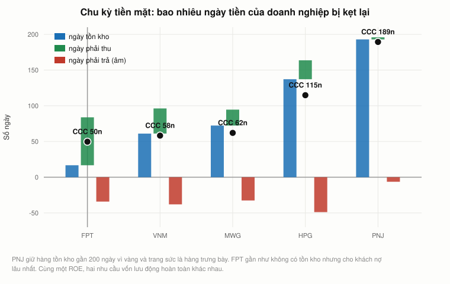
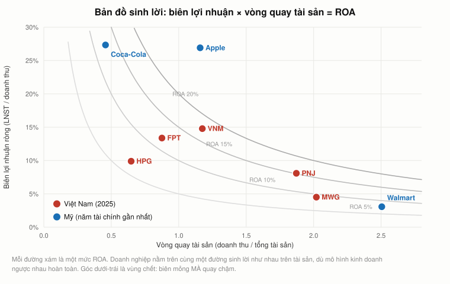
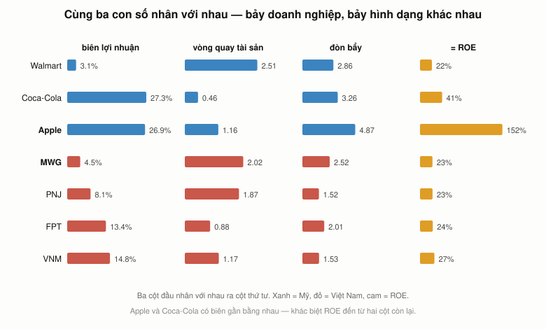
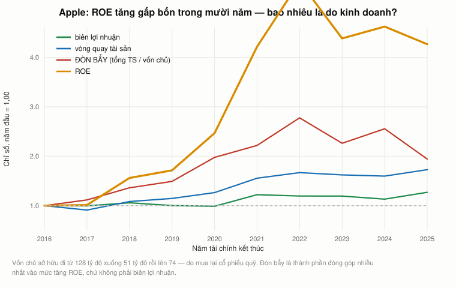
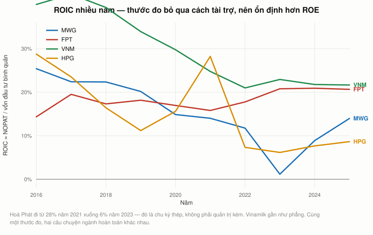

# Bài 14 — Đọc doanh nghiệp bằng số: ba báo cáo, các tỷ số, và phân rã DuPont

> 🏢 **PHẦN E — TÀI CHÍNH DOANH NGHIỆP.** Bài này **không đến từ video của Andrew Lo**.
> Lo dạy 15.401 *Finance Theory I* — nửa **đầu tư** của tài chính — và chính ông chỉ người học
> sang **15.434 Corporate Finance** cho nửa còn lại (`S20 53:30`). Phần E là nửa còn lại đó.
> Nguồn: Brealey, Myers & Allen, *Principles of Corporate Finance*; Penman,
> *Financial Statement Analysis and Security Valuation*; chế độ kế toán Việt Nam.
> 📌 **Cần đọc trước:** [Bài 1 §8](bai_01_tai_chinh_la_gi.md#8-kế-toán-là-ngôn-ngữ--stock-và-flow)
> (stock và flow), [Bài 3 §2](bai_03_don_bay_va_lam_phat.md#2-đòn-bẩy--con-số-mà-bảng-cân-đối-không-hét-lên)
> (đòn bẩy), [Bài 12 §5](bai_12_ngan_sach_von.md#5-kế-toán-không-được-thiết-kế-để-nhìn-về-tương-lai).
> ⚠️ Số liệu cập nhật tới **báo cáo năm 2025**; phần đối chiếu chuẩn mực kế toán tính tới 2026.

---

## Mục lục

<!-- MUC-LUC -->
- [1. Phần E là gì, và ranh giới với mười ba bài trước](#1-phần-e-là-gì-và-ranh-giới-với-mười-ba-bài-trước)
- [2. Ba báo cáo, ba câu hỏi khác nhau](#2-ba-báo-cáo-ba-câu-hỏi-khác-nhau)
- [3. Bảng cân đối kế toán, và bốn đẳng thức không được phép sai](#3-bảng-cân-đối-kế-toán-và-bốn-đẳng-thức-không-được-phép-sai)
- [4. Báo cáo kết quả kinh doanh — bậc thang biên lợi nhuận](#4-báo-cáo-kết-quả-kinh-doanh--bậc-thang-biên-lợi-nhuận)
- [5. Báo cáo lưu chuyển tiền tệ — báo cáo khó nói dối nhất](#5-báo-cáo-lưu-chuyển-tiền-tệ--báo-cáo-khó-nói-dối-nhất)
- [6. Lợi nhuận không phải tiền — nối lại bài 12](#6-lợi-nhuận-không-phải-tiền--nối-lại-bài-12)
- [7. Bốn nhóm tỷ số, và quy tắc bình quân](#7-bốn-nhóm-tỷ-số-và-quy-tắc-bình-quân)
- [8. Hiệu quả: vòng quay đo tốc độ, không đo lợi nhuận](#8-hiệu-quả-vòng-quay-đo-tốc-độ-không-đo-lợi-nhuận)
- [9. Chu kỳ tiền mặt — bao nhiêu ngày tiền của bạn bị kẹt](#9-chu-kỳ-tiền-mặt--bao-nhiêu-ngày-tiền-của-bạn-bị-kẹt)
- [10. Đòn bẩy và khả năng trả lãi — nối lại bài 3](#10-đòn-bẩy-và-khả-năng-trả-lãi--nối-lại-bài-3)
- [11. Thanh khoản — câu hỏi mười hai tháng](#11-thanh-khoản--câu-hỏi-mười-hai-tháng)
- [12. Phân rã DuPont — ba phép chia đổi cách bạn nhìn doanh nghiệp](#12-phân-rã-dupont--ba-phép-chia-đổi-cách-bạn-nhìn-doanh-nghiệp)
- [13. Bản đồ sinh lời: Walmart, Apple, Coca-Cola](#13-bản-đồ-sinh-lời-walmart-apple-coca-cola)
- [14. Ba doanh nghiệp Việt Nam cùng ROE, ba con đường khác hẳn](#14-ba-doanh-nghiệp-việt-nam-cùng-roe-ba-con-đường-khác-hẳn)
- [15. ROE chế tạo được — Apple qua mười năm](#15-roe-chế-tạo-được--apple-qua-mười-năm)
- [16. DuPont năm nhân tố — tách riêng gánh nặng thuế và lãi vay](#16-dupont-năm-nhân-tố--tách-riêng-gánh-nặng-thuế-và-lãi-vay)
- [17. ROIC — thước đo không bị cách tài trợ làm nhiễu](#17-roic--thước-đo-không-bị-cách-tài-trợ-làm-nhiễu)
- [18. ROIC trừ WACC — và đây là chỗ bài 15 bắt đầu](#18-roic-trừ-wacc--và-đây-là-chỗ-bài-15-bắt-đầu)
- [19. Bảy cái bẫy khi đọc tỷ số](#19-bảy-cái-bẫy-khi-đọc-tỷ-số)
- [20. Kế toán dồn tích, và vì sao Lo đã nhắc tới nó ở buổi 20](#20-kế-toán-dồn-tích-và-vì-sao-lo-đã-nhắc-tới-nó-ở-buổi-20)
- [21. Ngân hàng không dùng khung này](#21-ngân-hàng-không-dùng-khung-này)
- [22. Góc Việt Nam — VAS, IFRS, và chất lượng số liệu](#22-góc-việt-nam--vas-ifrs-và-chất-lượng-số-liệu)
- [23. Đi tiếp: bốn bài còn lại của phần E](#23-đi-tiếp-bốn-bài-còn-lại-của-phần-e)
- [24. Code minh hoạ](#24-code-minh-hoạ)
- [25. Từ điển thuật ngữ](#25-từ-điển-thuật-ngữ)
- [26. Câu hỏi tự kiểm tra](#26-câu-hỏi-tự-kiểm-tra)
- [Tóm tắt một trang](#tóm-tắt-một-trang)
- [Nguồn](#nguồn)
<!-- /MUC-LUC -->

---

## 1. Phần E là gì, và ranh giới với mười ba bài trước

Mười ba bài đầu bám sát 20 buổi giảng của Lo. Chúng dạy bạn **định giá một tài sản**: trái phiếu,
cổ phiếu, quyền chọn, một danh mục, một dự án. Người ngồi ở ghế đó là **nhà đầu tư nhìn từ ngoài
vào**.

Phần E đổi ghế. Bạn ngồi **bên trong doanh nghiệp**, và câu hỏi đổi theo:

| Mười ba bài đầu hỏi             | Phần E hỏi                                         |
| ------------------------------- | -------------------------------------------------- |
| Tài sản này đáng giá bao nhiêu? | Doanh nghiệp của tôi đang làm ăn ra sao?           |
| Suất chiết khấu là bao nhiêu?   | Vốn của tôi có giá bao nhiêu, và nên lấy từ đâu?   |
| Beta của cổ phiếu này?          | Nên vay bao nhiêu, phát hành cổ phần bao nhiêu?    |
| Dự án này NPV dương không?      | Ai trong công ty có động cơ nói dối tôi về NPV đó? |

**Lo tự đánh dấu ranh giới này.** Ở `S20 52:54` ông chia đường đi tiếp thành hai nhánh: nhánh đầu
tư (15.433 *Investments*, 15.437 *Options and Futures*) và nhánh doanh nghiệp (15.434 *Corporate
Finance*, kèm các môn kế toán). Phần E là nhánh thứ hai.

**Năm bài của phần E:**

|    Bài | Nội dung                                               | Câu hỏi trung tâm                                   |
| -----: | ------------------------------------------------------ | --------------------------------------------------- |
| **14** | Báo cáo tài chính, tỷ số, DuPont, ROIC                 | Doanh nghiệp này kiếm tiền **bằng gì**?             |
|     15 | WACC, beta có đòn bẩy và không đòn bẩy                 | Vốn của nó **giá bao nhiêu**?                       |
|     16 | Cơ cấu vốn, Modigliani–Miller, đánh đổi                | Nên vay **bao nhiêu**?                              |
|     17 | Chi phí đại diện, quản trị công ty, chính sách chi trả | Ai **thật sự** quyết định, và vì lợi ích của ai?    |
|     18 | Định giá doanh nghiệp, M&A, quản trị theo giá trị      | Nó **đáng giá bao nhiêu**, và mua nó có khôn không? |

Bài 14 phải đi trước, vì bốn bài sau đều cần những con số mà bài này dạy cách đọc. Không biết
tỷ lệ nợ trên vốn chủ thì không tính được WACC; không biết ROIC thì không biết doanh nghiệp đang
tạo hay phá giá trị.

⚠️ **Điều gì thay đổi so với mười ba bài trước.** Không còn mốc `MM:SS` để đối chiếu, vì không có
video. Đổi lại, **mọi con số trong bài này đọc từ báo cáo tài chính thật đã kiểm toán** — 73
năm-công-ty của năm doanh nghiệp Việt Nam niêm yết, cộng báo cáo 10-K nộp lên SEC của Walmart,
Apple và Coca-Cola. Kiểm chứng chuyển từ "đối chiếu phụ đề" sang "đối chiếu đẳng thức kế toán".

---

## 2. Ba báo cáo, ba câu hỏi khác nhau

[Bài 1 §8](bai_01_tai_chinh_la_gi.md#8-kế-toán-là-ngôn-ngữ--stock-và-flow) đã dựng phép ẩn dụ bồn
tắm: **mức nước là stock, vòi chảy là flow**. Ba báo cáo tài chính chính là ba cách nhìn cái bồn đó.

| Báo cáo                        | Loại  | Trả lời câu hỏi                                   | Đơn vị thời gian         |
| ------------------------------ | ----- | ------------------------------------------------- | ------------------------ |
| **Bảng cân đối kế toán**       | stock | Doanh nghiệp **có gì**, và tiền đó **từ đâu ra**? | một **thời điểm**        |
| **Báo cáo kết quả kinh doanh** | flow  | Năm qua **làm ăn thế nào**?                       | một **khoảng** thời gian |
| **Báo cáo lưu chuyển tiền tệ** | flow  | **Tiền** thực sự đã đi đâu?                       | một **khoảng** thời gian |

Phân biệt stock/flow không phải chuyện học thuật. Nó quyết định cách bạn **ghép** hai báo cáo
với nhau. Khi tính "vòng quay tài sản = doanh thu / tổng tài sản", tử số là một **dòng chảy cả
năm** còn mẫu số là một **ảnh chụp cuối năm**. Ghép hai thứ khác loại thì phải lấy **bình quân đầu
kỳ và cuối kỳ** ở mẫu số — §7 nói kỹ.

**Ba báo cáo nối vào nhau ở hai điểm, và chỉ hai điểm:**

1. **Lợi nhuận sau thuế** của báo cáo kết quả kinh doanh chảy vào **lợi nhuận chưa phân phối** của
   bảng cân đối (sau khi trừ cổ tức).
2. **Số dư tiền cuối kỳ** của báo cáo lưu chuyển tiền tệ **bằng đúng** dòng "tiền và tương đương
   tiền" trên bảng cân đối.

Nếu hai mối nối này không khớp, bộ báo cáo có lỗi.

---

## 3. Bảng cân đối kế toán, và bốn đẳng thức không được phép sai

Bảng cân đối có đúng một ý tưởng: **mọi thứ doanh nghiệp có (tài sản) đều phải do ai đó bỏ tiền
ra — hoặc chủ nợ, hoặc chủ sở hữu.**

```
        TÀI SẢN                    =        NỢ PHẢI TRẢ        +      VỐN CHỦ SỞ HỮU
   (doanh nghiệp CÓ gì)              (tiền của người khác)      (tiền của cổ đông)

   ┌──────────────────┐              ┌──────────────────┐
   │ Tài sản ngắn hạn │              │ Nợ ngắn hạn      │   phải trả trong 12 tháng
   │  tiền            │              │  vay ngắn hạn    │
   │  phải thu        │              │  phải trả NCC    │
   │  hàng tồn kho    │              ├──────────────────┤
   ├──────────────────┤              │ Nợ dài hạn       │
   │ Tài sản dài hạn  │              │  vay dài hạn     │
   │  nhà xưởng, máy  │              ├──────────────────┤
   │  đầu tư dài hạn  │              │ Vốn chủ sở hữu   │
   │  lợi thế TM      │              │  vốn góp         │
   │                  │              │  LN chưa phân phối│
   └──────────────────┘              └──────────────────┘
```

**Bốn đẳng thức ràng buộc bảng này.** Báo cáo nào vi phạm là báo cáo **sai**, không phải "cách
trình bày khác":

1. tài sản ngắn hạn **+** tài sản dài hạn **=** TỔNG TÀI SẢN
2. nợ phải trả **+** vốn chủ sở hữu **=** TỔNG NGUỒN VỐN
3. TỔNG TÀI SẢN **=** TỔNG NGUỒN VỐN ← *đẳng thức kế toán*
4. doanh thu thuần **−** giá vốn **=** lợi nhuận gộp

[Code §1](#24-code-minh-hoạ) kiểm cả bốn trên **73 năm-công-ty** trong bộ dữ liệu. Kết quả: đúng ở
tất cả, sai số lớn nhất chưa tới **0,018%** tổng tài sản — và phần sai số đó đến từ việc nguồn dữ
liệu làm tròn ở khoảng sáu chữ số có nghĩa, không phải từ báo cáo.

⚠️ **Bốn đẳng thức này chứng minh cái gì, và KHÔNG chứng minh cái gì.** Chúng chứng minh báo cáo
**nhất quán**. Chúng **không** chứng minh báo cáo **trung thực**. Enron, Wirecard, và ở Việt Nam là
FLC hay Tân Hoàng Minh — mọi báo cáo gian lận đều thoả cả bốn đẳng thức, vì gian lận trong kế toán
kép luôn phải ghi hai bút toán. Đẳng thức là **ngữ pháp**, không phải **sự thật**.

---

## 4. Báo cáo kết quả kinh doanh — bậc thang biên lợi nhuận

Báo cáo này là một dãy phép trừ. Mỗi lần trừ trả lời một câu hỏi khác nhau, nên mỗi mức "biên"
đo một thứ khác nhau.

```
   Doanh thu thuần                              100%
 − Giá vốn hàng bán                              ↓
 = LỢI NHUẬN GỘP            → biên gộp:      sức mạnh ĐỊNH GIÁ
 − Chi phí bán hàng
 − Chi phí quản lý
 = Lợi nhuận từ hoạt động   → biên hoạt động: hiệu quả VẬN HÀNH
 + Doanh thu tài chính
 − Chi phí tài chính (lãi vay)
 = LỢI NHUẬN TRƯỚC THUẾ     → biên trước thuế: sau khi trả CHỦ NỢ
 − Thuế TNDN
 = LỢI NHUẬN SAU THUẾ
 − Lợi ích cổ đông không kiểm soát
 = LNST CỦA CỔ ĐÔNG CÔNG TY MẸ → biên ròng: phần THỰC SỰ của bạn
```

Năm doanh nghiệp Việt Nam, năm 2025 ([code §2](#24-code-minh-hoạ)):

| Mã  |  Doanh thu |   Biên gộp | Biên trước thuế |  Biên ròng | Tỷ lệ giá vốn |
| --- | ---------: | ---------: | --------------: | ---------: | ------------: |
| MWG | 155.928 tỷ |     19,88% |           5,54% |  **4,51%** |         80,1% |
| PNJ |  34.976 tỷ |     21,97% |          10,14% |      8,09% |         78,0% |
| HPG | 156.116 tỷ |     15,69% |          11,56% |      9,90% |         84,3% |
| FPT |  70.113 tỷ |     36,92% |          18,60% |     13,37% |         63,1% |
| VNM |  63.646 tỷ | **41,18%** |          18,30% | **14,79%** |         58,8% |

**Đọc bảng theo chiều ngang, không phải chiều dọc.** Khoảng cách giữa biên gộp và biên ròng
chính là **chi phí vận hành doanh nghiệp**:

- **MWG**: 19,9% → 4,5%. Bỏ mất **15,4 điểm** doanh thu trên đường đi. Đó là tiền thuê hơn ba nghìn
  cửa hàng, lương nhân viên bán hàng, và chi phí kho vận.
- **VNM**: 41,2% → 14,8%. Bỏ mất **26,4 điểm** — nhiều hơn MWG về tuyệt đối, vì Vinamilk chi rất
  mạnh cho quảng cáo và hệ thống phân phối.

Nghĩa là: **biên gộp cao không đảm bảo biên ròng cao.** Vinamilk có biên gộp gấp đôi MWG nhưng
biên ròng chỉ gấp ba lần — phần lớn lợi thế định giá của nó bị tiêu vào chi phí bán hàng.

---

## 5. Báo cáo lưu chuyển tiền tệ — báo cáo khó nói dối nhất

Đây là báo cáo bị người mới bỏ qua nhiều nhất, và là báo cáo mà nhà đầu tư chuyên nghiệp đọc
**trước tiên**.

Nó chia dòng tiền làm ba khoang:

| Khoang                         | Nội dung                                                          | Dấu hiệu tốt                   |
| ------------------------------ | ----------------------------------------------------------------- | ------------------------------ |
| **Hoạt động kinh doanh** (CFO) | tiền từ bán hàng, trừ tiền trả cho nhà cung cấp và nhân viên      | **dương và lớn hơn lợi nhuận** |
| **Đầu tư** (CFI)               | mua/bán nhà xưởng, máy móc, công ty con                           | âm ở doanh nghiệp đang lớn     |
| **Tài chính** (CFF)            | vay thêm, trả nợ, phát hành cổ phần, trả cổ tức, mua cổ phiếu quỹ | tuỳ giai đoạn                  |

**Vì sao nó khó nói dối hơn hai báo cáo kia.** Lợi nhuận là một **ý kiến**: nó phụ thuộc vào việc
bạn khấu hao mấy năm, trích lập dự phòng bao nhiêu, ghi nhận doanh thu ở thời điểm nào. Tiền mặt
là một **sự thật**: cuối ngày trong tài khoản có bao nhiêu thì có bấy nhiêu.

Câu nói của ngành: *"Lợi nhuận là ý kiến, tiền mặt là sự thật."*

📚 **Ba dấu hiệu cảnh báo đọc được ngay từ báo cáo này:**

1. **Lợi nhuận dương nhiều năm mà CFO âm.** Doanh nghiệp đang ghi nhận doanh thu chưa thu được
   tiền, hoặc chất hàng vào kho. Đây là dấu hiệu kinh điển đứng trước phần lớn các vụ đổ vỡ.
2. **CFO luôn thấp hơn lợi nhuận một cách hệ thống.** Chất lượng lợi nhuận kém — §20 gọi tên nó là
   **khoản dồn tích cao**.
3. **CFF dương nhiều năm liền ở một doanh nghiệp trưởng thành.** Nó đang sống bằng tiền đi vay và
   phát hành, chứ không phải bằng kinh doanh.

⚠️ Bộ dữ liệu nhúng trong bài này **không có báo cáo lưu chuyển tiền tệ** — nguồn API chỉ cho bảng
cân đối và kết quả kinh doanh một cách ổn định. Mọi con số ở các mục sau vì thế đều tính từ hai
báo cáo kia. Ghi rõ ở đây để bạn biết chỗ thiếu, và để bạn tự tra CFO trên báo cáo gốc khi phân
tích thật.

---

## 6. Lợi nhuận không phải tiền — nối lại bài 12

[Bài 12 §5](bai_12_ngan_sach_von.md#5-kế-toán-không-được-thiết-kế-để-nhìn-về-tương-lai) đã dựng
đúng luận điểm này bằng cỗ máy một triệu đô: kế toán báo lãi **100.000**, dòng tiền thật
**160.000**, và **cả hai đều đúng**.

Bài 14 nói phần còn lại: **vì sao chúng khác nhau, và khác nhau bao nhiêu thì đáng lo.**

Chênh lệch đến từ ba nguồn, và chỉ ba:

| Nguồn                     | Làm lợi nhuận **cao hơn** tiền    | Làm lợi nhuận **thấp hơn** tiền |
| ------------------------- | --------------------------------- | ------------------------------- |
| **Vốn lưu động**          | hàng tồn kho và phải thu **tăng** | phải trả người bán **tăng**     |
| **Khoản không bằng tiền** | —                                 | khấu hao, dự phòng              |
| **Thời điểm ghi nhận**    | doanh thu ghi trước khi thu tiền  | tiền nhận trước khi giao hàng   |

Công thức nối hai báo cáo, và đây là công thức đáng thuộc:

$$\text{CFO} = \text{LNST} + \text{khấu hao} - \Delta(\text{vốn lưu động})$$

Doanh nghiệp **tăng trưởng nhanh** gần như luôn có CFO thấp hơn lợi nhuận, vì để bán nhiều hơn
nó phải chất kho nhiều hơn và cho khách nợ nhiều hơn. Đó **không** phải dấu hiệu xấu — đó là cái
giá của tăng trưởng, và §9 đo cái giá ấy thành **số ngày**.

Điều đáng lo là khi doanh thu **không tăng** mà chênh lệch vẫn nới rộng.

---

## 7. Bốn nhóm tỷ số, và quy tắc bình quân

Có hàng trăm tỷ số. Chúng rơi vào đúng bốn nhóm, và mỗi nhóm trả lời một câu hỏi:

| Nhóm                           | Câu hỏi                               | Tỷ số tiêu biểu                         |
| ------------------------------ | ------------------------------------- | --------------------------------------- |
| **Khả năng sinh lời**          | Kiếm được bao nhiêu trên mỗi đồng?    | ROE, ROA, ROIC, các mức biên            |
| **Hiệu quả sử dụng tài sản**   | Xoay vòng tài sản nhanh chậm ra sao?  | vòng quay tài sản, tồn kho, phải thu    |
| **Đòn bẩy và khả năng trả nợ** | Vay bao nhiêu, có trả nổi lãi không?  | tổng TS/VCSH, nợ vay/VCSH, EBIT/lãi vay |
| **Thanh khoản**                | Có đủ tiền trả nợ trong 12 tháng tới? | tỷ số thanh toán hiện hành, nhanh       |

### Quy tắc bình quân đầu kỳ – cuối kỳ

Khi tử số là **flow** (cả năm) và mẫu số là **stock** (một thời điểm), mẫu số phải lấy bình quân:

$$\text{ROE} = \frac{\text{LNST cả năm}}{\tfrac{1}{2}(\text{VCSH đầu năm} + \text{VCSH cuối năm})}$$

Bỏ qua quy tắc này thì một doanh nghiệp vừa phát hành thêm cổ phần cuối năm sẽ có ROE **thấp giả
tạo** — mẫu số đã phình ra nhưng tử số chưa kịp hưởng lợi từ số vốn mới. Ngược lại, doanh nghiệp
vừa mua lại cổ phiếu quỹ tháng 12 sẽ có ROE **cao giả tạo**.

Toàn bộ số liệu trong bài này dùng bình quân đầu-cuối kỳ. Đó là lý do ROE ở §12 hơi khác con số
bạn tra được trên các trang tài chính — phần lớn các trang đó dùng số dư cuối kỳ.

---

## 8. Hiệu quả: vòng quay đo tốc độ, không đo lợi nhuận

Ba vòng quay quan trọng nhất, tính năm 2025 ([code §3](#24-code-minh-hoạ)):

|                              |      MWG |        PNJ |   HPG |       FPT |   VNM |
| ---------------------------- | -------: | ---------: | ----: | --------: | ----: |
| Vòng quay **tổng tài sản**   | **2,02** |       1,87 |  0,65 |      0,88 |  1,17 |
| Vòng quay **hàng tồn kho**   |     5,05 |       1,89 |  2,66 | **21,84** |  5,98 |
| Vòng quay **khoản phải thu** |    16,41 | **126,02** | 13,76 |      5,44 | 10,38 |

Đọc từng cột thành một câu:

- **MWG** xoay toàn bộ tài sản **hai lần mỗi năm**. Đúng bản chất bán lẻ.
- **PNJ** vòng quay phải thu **126 lần** — nghĩa là khách trả tiền gần như ngay lập tức. Bán lẻ
  trang sức thu tiền mặt. Nhưng tồn kho chỉ quay **1,89 lần**: vàng và trang sức phải bày trong tủ,
  và hàng bày là hàng chưa bán.
- **FPT** ngược hẳn: tồn kho quay **21,84 lần** (dịch vụ phần mềm gần như không có kho) nhưng phải
  thu chỉ **5,44 lần** — khách doanh nghiệp và khách chính phủ trả chậm.
- **HPG** vòng quay tài sản **0,65** — thấp nhất bảng, vì một lò cao là khối tài sản khổng lồ không
  xoay nhanh được.

⚠️ **Vòng quay không đo tốt xấu.** Nó đo **mô hình kinh doanh**. Ép một nhà máy thép quay nhanh như
một chuỗi bán lẻ là ép một điều bất khả. So sánh chỉ có nghĩa **trong cùng ngành**.

---

## 9. Chu kỳ tiền mặt — bao nhiêu ngày tiền của bạn bị kẹt

Ba vòng quay ở trên đổi được thành **số ngày**, và khi đổi thành ngày thì chúng cộng trừ được với
nhau. Kết quả là một con số mà bảng cân đối không hề hiện ra:

$$\text{CCC} = \underbrace{\frac{\text{tồn kho}}{\text{giá vốn}}\!\times\!365}_{\text{ngày tồn kho}} + \underbrace{\frac{\text{phải thu}}{\text{doanh thu}}\!\times\!365}_{\text{ngày phải thu}} - \underbrace{\frac{\text{phải trả NCC}}{\text{giá vốn}}\!\times\!365}_{\text{ngày phải trả}}$$

Đọc bằng lời: **số ngày kể từ khi bạn trả tiền mua hàng cho tới khi bạn thu được tiền bán hàng.**
Trong khoảng đó, tiền của bạn nằm chết trong kho và trong sổ nợ của khách.

| Mã  | Ngày tồn kho | Ngày phải thu | Ngày phải trả |      **CCC** |
| --- | -----------: | ------------: | ------------: | -----------: |
| FPT |           17 |            67 |            34 |  **50 ngày** |
| VNM |           61 |            35 |            38 |      58 ngày |
| MWG |           72 |            22 |            33 |      62 ngày |
| HPG |          137 |            27 |            49 |     115 ngày |
| PNJ |          193 |             3 |             6 | **189 ngày** |

**PNJ cần 189 ngày vốn lưu động, FPT chỉ cần 50 — chênh 3,8 lần.** Nhưng ROE của hai công ty gần
như y hệt (23,1% và 23,6%, xem §14). Nghĩa là: **hai doanh nghiệp sinh lời như nhau có thể có nhu
cầu vốn hoàn toàn khác nhau**, và ngân hàng cho vay vốn lưu động nhìn đúng con số này chứ không
nhìn ROE.

**Trường hợp CCC âm.** Nếu bạn thu tiền khách trước khi phải trả nhà cung cấp, CCC âm — và
doanh nghiệp **lớn lên mà không cần vay thêm đồng nào**, vì chính khách hàng và nhà cung cấp tài
trợ cho nó. Amazon và Dell nổi tiếng vì làm được điều này. Trong năm doanh nghiệp Việt Nam ở trên,
**không công ty nào đạt được**.



*PNJ giữ hàng tồn kho gần 200 ngày vì vàng và trang sức là hàng trưng bày. FPT gần như không có tồn kho nhưng cho khách nợ lâu nhất.*

⚠️ Số ngày tính từ báo cáo **năm** nên nó là ảnh chụp trung bình cả năm. Ngành có mùa vụ — bán lẻ
dịp Tết, thép theo chu kỳ xây dựng — sẽ có đỉnh điểm cao hơn hẳn con số này. Người cho vay vốn lưu
động luôn nhìn số liệu **quý**.

---

## 10. Đòn bẩy và khả năng trả lãi — nối lại bài 3

[Bài 3 §2](bai_03_don_bay_va_lam_phat.md#2-đòn-bẩy--con-số-mà-bảng-cân-đối-không-hét-lên) đã dựng
đòn bẩy như "con số mà bảng cân đối không hét lên". Bài 14 cho nó ba thước đo cụ thể:

| Thước đo                | Công thức                   | Đo cái gì                                |
| ----------------------- | --------------------------- | ---------------------------------------- |
| **Hệ số đòn bẩy**       | tổng tài sản / VCSH         | quy mô tài sản trên mỗi đồng vốn chủ     |
| **Nợ vay trên vốn chủ** | (vay ngắn + vay dài) / VCSH | chỉ tính **nợ có lãi**, bỏ nợ chiếm dụng |
| **Khả năng trả lãi**    | EBIT / chi phí lãi vay      | lợi nhuận gấp mấy lần tiền lãi phải trả  |

Năm 2025:

|                |      MWG |   PNJ |      HPG |   FPT |   VNM |
| -------------- | -------: | ----: | -------: | ----: | ----: |
| Hệ số đòn bẩy  |     2,53 |  1,52 |     1,97 |  2,01 |  1,55 |
| Nợ vay / VCSH  | **0,90** |  0,32 |     0,70 |  0,48 |  0,27 |
| EBIT / lãi vay |     6,87 | 30,79 | **6,79** | 17,11 | 36,76 |

**Hai thước đo đầu khác nhau ở chỗ nào, và vì sao phải có cả hai.** Hệ số đòn bẩy tính **mọi**
khoản nợ, kể cả tiền bạn đang nợ nhà cung cấp — mà khoản đó **không tính lãi**. Nợ vay trên vốn chủ
chỉ tính khoản **phải trả lãi**. MWG có hệ số đòn bẩy 2,53 nhưng phần lớn là chiếm dụng vốn nhà
cung cấp; nợ vay thật là 0,90 lần vốn chủ.

⚠️ **EBIT/lãi vay dưới 3 là vùng cảnh báo, dưới 1,5 là vùng nguy hiểm.** HPG ở 6,79 và MWG ở 6,87 —
an toàn ở mức lãi suất hiện tại, nhưng cả hai đều **nhạy với lãi suất**: nếu lãi vay tăng gấp đôi,
con số này về khoảng 3,4.

📚 Vì sao dùng **EBIT** chứ không phải lợi nhuận sau thuế ở tử số: lãi vay được trả **trước** thuế,
nên tiền dùng để trả lãi là tiền chưa bị đánh thuế. Chi tiết này quay lại ở **bài 16**, khi lá chắn
thuế từ nợ trở thành trung tâm của lý thuyết cơ cấu vốn.

---

## 11. Thanh khoản — câu hỏi mười hai tháng

Đòn bẩy hỏi "vay có nhiều quá không". Thanh khoản hỏi câu hẹp hơn và cấp bách hơn: **trong mười hai
tháng tới, có đủ tiền trả các khoản đến hạn không?**

$$\text{tỷ số thanh toán hiện hành} = \frac{\text{tài sản ngắn hạn}}{\text{nợ ngắn hạn}}$$

Năm 2025: PNJ 270% · VNM 193% · MWG 152% · FPT 137% · HPG 105%.

⚠️ **Ba cảnh báo khi đọc con số này:**

1. **Cao chưa chắc tốt.** Tỷ số 300% có thể nghĩa là doanh nghiệp đang ôm một đống hàng tồn kho
   không bán được, hoặc để tiền nằm chết thay vì đầu tư.
2. **Hàng tồn kho là tài sản ngắn hạn "chậm nhất".** Đó là lý do có **tỷ số thanh toán nhanh**
   (loại tồn kho ra khỏi tử số). Với PNJ — 193 ngày tồn kho — hai con số này chênh nhau rất xa.
3. **HPG ở 105% là mức mỏng**, nhưng với một doanh nghiệp có dòng tiền hoạt động lớn và quan hệ tín
   dụng tốt thì đó là lựa chọn về hiệu quả vốn, không nhất thiết là rủi ro.

---

## 12. Phân rã DuPont — ba phép chia đổi cách bạn nhìn doanh nghiệp

Đây là phần quan trọng nhất của bài. Ý tưởng ra đời tại tập đoàn hoá chất **DuPont** khoảng
**1919–1920**, do **Donaldson Brown** — khi đó là kỹ sư điện chuyển sang tài chính — đưa ra để giải
thích cho ban lãnh đạo vì sao một bộ phận có ROE cao hơn bộ phận khác.

Trò xảo thuật là nhân và chia cho hai số hạng, không làm đổi giá trị:

$$\text{ROE} = \frac{\text{LNST}}{\text{VCSH}} = \underbrace{\frac{\text{LNST}}{\text{doanh thu}}}_{\text{biên lợi nhuận}} \times \underbrace{\frac{\text{doanh thu}}{\text{tổng TS}}}_{\text{vòng quay tài sản}} \times \underbrace{\frac{\text{tổng TS}}{\text{VCSH}}}_{\text{đòn bẩy}}$$

Ba thừa số trả lời ba câu hỏi hoàn toàn khác nhau:

| Thừa số               | Câu hỏi                                     | Nằm trong tay ai                              |
| --------------------- | ------------------------------------------- | --------------------------------------------- |
| **Biên lợi nhuận**    | Mỗi đồng doanh thu giữ lại được bao nhiêu?  | **marketing và vận hành** — định giá, chi phí |
| **Vòng quay tài sản** | Mỗi đồng tài sản đẻ ra bao nhiêu doanh thu? | **vận hành** — kho vận, công suất, tồn kho    |
| **Đòn bẩy**           | Mỗi đồng vốn chủ gánh bao nhiêu tài sản?    | **giám đốc tài chính** — quyết định vay nợ    |

Đây là lý do DuPont là công cụ của **quản trị**, không chỉ của phân tích: nó chia ROE thành ba
mảnh mà **ba nhóm người khác nhau trong công ty chịu trách nhiệm**. Khi ROE giảm, DuPont nói cho
bạn biết phải gọi ai vào phòng họp.

---

## 13. Bản đồ sinh lời: Walmart, Apple, Coca-Cola

Hai thừa số đầu nhân với nhau ra **ROA** (lợi nhuận trên tài sản). Vẽ chúng lên hai trục thì mỗi
mức ROA là một **đường hypebol**, và mọi doanh nghiệp nằm đâu đó trên mặt phẳng này:



*Mỗi đường xám là một mức ROA. Doanh nghiệp trên cùng một đường sinh lời như nhau trên tài sản, dù
mô hình kinh doanh ngược nhau hoàn toàn.*

Ba doanh nghiệp Mỹ, năm tài chính gần nhất ([code §5](#24-code-minh-hoạ)):

|               | Kỳ kết thúc |  Doanh thu |       LNST |       Biên | Vòng quay | Đòn bẩy |    **ROE** |
| ------------- | ----------- | ---------: | ---------: | ---------: | --------: | ------: | ---------: |
| **Walmart**   | 31/1/2026   | 713,2 tỷ $ |  21,9 tỷ $ |  **3,07%** |  **2,51** |    2,86 |      22,0% |
| **Apple**     | 27/9/2025   | 416,2 tỷ $ | 112,0 tỷ $ |     26,92% |      1,16 |    4,87 | **151,9%** |
| **Coca-Cola** | 31/12/2025  |  47,9 tỷ $ |  13,1 tỷ $ | **27,34%** |  **0,46** |    3,26 |      40,7% |

**Đọc cặp Walmart / Coca-Cola cho kỹ.** Biên của Coca-Cola gấp **8,9 lần** Walmart. Nhưng ROE
của nó chỉ gấp **1,9 lần**. Vì sao? Vì **Walmart quay vòng tài sản nhanh gấp 5,5 lần**.

Đó là toàn bộ bài học:

> **Không có mô hình kinh doanh nào "tốt hơn". Có hai cách kiếm tiền: BÁN ĐẮT (biên dày, quay chậm)
> hoặc BÁN NHANH (biên mỏng, quay nhanh). Cái chết là doanh nghiệp kẹt ở giữa — biên mỏng MÀ quay
> chậm.**

Trên bản đồ, "kẹt ở giữa" là **góc dưới-trái**. Đó là vùng không doanh nghiệp nào muốn ở, và là nơi
các chuỗi bán lẻ truyền thống rơi vào khi bị thương mại điện tử ép biên mà tài sản cửa hàng vẫn còn
nguyên đó.

---

## 14. Ba doanh nghiệp Việt Nam cùng ROE, ba con đường khác hẳn

Áp đúng phép nhân ba số ấy lên năm doanh nghiệp Việt Nam, năm 2025:



*Ba cột đầu nhân với nhau ra cột thứ tư. Apple và Coca-Cola có biên gần bằng nhau — khác biệt ROE
đến từ hai cột còn lại.*

| Mã      | Ngành             |       Biên | × Vòng quay | × Đòn bẩy |  = **ROE** |
| ------- | ----------------- | ---------: | ----------: | --------: | ---------: |
| **MWG** | bán lẻ điện thoại |  **4,51%** |    **2,02** |      2,52 | **22,95%** |
| **PNJ** | trang sức         |      8,09% |        1,87 |  **1,52** | **23,06%** |
| **FPT** | công nghệ         | **13,37%** |    **0,88** |      2,01 | **23,59%** |
| VNM     | sữa               |     14,79% |        1,17 |      1,53 |     26,64% |
| HPG     | thép              |      9,90% |        0,65 |      1,96 |     12,57% |

**Nhìn ba dòng đầu.** ROE của MWG, PNJ và FPT là **22,95% · 23,06% · 23,59%** — chênh nhau chưa
tới **0,65 điểm phần trăm**. Ba doanh nghiệp ở ba ngành khác nhau, ba mô hình kinh doanh khác nhau,
ra gần như **cùng một con số ROE**.

Nhưng ba thành phần thì hoàn toàn khác:

- **MWG** — biên **4,51%**, vòng quay **2,02**: bán mỏng, bán rất nhanh.
- **PNJ** — biên 8,09%, vòng quay 1,87, đòn bẩy thấp nhất bảng **1,52**: gần như không vay.
- **FPT** — biên **13,37%**, vòng quay **0,88**: bán đắt, xoay chậm.

📌 **Nếu bạn chỉ nhìn ROE, bạn không biết gì về ba công ty này cả.** Chúng trông y hệt nhau trên một
con số và không giống nhau ở bất cứ điểm nào khác.

Và DuPont cho biết **chúng dễ vỡ ở đâu** — điều mà ROE hoàn toàn im lặng:

- **MWG biên 4,51%.** Chỉ cần giá vốn tăng 4,5% mà không đẩy được sang giá bán là **toàn bộ lợi
  nhuận biến mất**. Đó chính là điều đã xảy ra năm 2023 khi cuộc chiến giá bán lẻ điện thoại nổ ra
  — ROIC của MWG rơi xuống **1,2%** trong năm đó (§17).
- **FPT vòng quay 0,88.** Tài sản nằm lâu, khó xoay khi cầu giảm.
- **PNJ đòn bẩy 1,52.** Chịu được cú sốc tốt nhất trong ba, nhưng cũng không có "bàn đạp" đòn bẩy
  nếu muốn tăng ROE.

---

## 15. ROE chế tạo được — Apple qua mười năm

ROE cao có thể đến từ **kinh doanh giỏi**, hoặc từ **vốn chủ bị rút xuống**. Hai thứ đó trông y hệt
nhau trên một con số. Tách ra thì không.



*Vốn chủ sở hữu đi xuống rồi lên lại, do mua lại cổ phiếu quỹ. Đòn bẩy là thành phần đóng góp nhiều
nhất vào mức tăng ROE.*

| Kỳ kết thúc   |  Doanh thu |  LNST |  **VCSH** |   Biên | Vòng quay | **Đòn bẩy** |        ROE |
| ------------- | ---------: | ----: | --------: | -----: | --------: | ----------: | ---------: |
| 24/9/2016     | 215,6 tỷ $ |  45,7 | **128,2** | 21,19% |      0,67 |        2,51 |      35,6% |
| 26/9/2020     |      274,5 |  57,4 |      65,3 | 20,91% |      0,85 |        4,96 |      87,9% |
| **24/9/2022** |      394,3 |  99,8 |  **50,7** | 25,31% |      1,12 |    **6,96** | **197,0%** |
| 27/9/2025     |      416,2 | 112,0 |      73,7 | 26,92% |      1,16 |        4,87 |     151,9% |

Cả ba thành phần đều tăng, nên phải tách xem **thành phần nào góp nhiều nhất**. Vì ROE là **tích**
của ba số, phân rã đúng phải làm theo **logarit** ([code §7](#24-code-minh-hoạ)):

| Thành phần        |  Nhân với | Đóng góp vào mức tăng ROE |
| ----------------- | --------: | ------------------------: |
| Biên lợi nhuận    |     ×1,27 |                     16,5% |
| Vòng quay tài sản |     ×1,73 |                     37,7% |
| **Đòn bẩy**       | **×1,94** |                 **45,8%** |

**Đòn bẩy đóng góp gần một nửa.** Vốn chủ sở hữu của Apple **giảm** từ 128,2 tỷ đô xuống 73,7 tỷ
đô trong khi doanh thu **tăng** từ 215,6 lên 416,2 tỷ — vì công ty mua lại cổ phiếu quỹ với quy mô
rất lớn. Mua lại cổ phiếu làm giảm **mẫu số** của ROE: nó làm con số đẹp lên mà không cần bán thêm
một chiếc điện thoại nào.

⚠️ **Hệ quả thực dụng, và đây là thứ đáng mang vào phòng họp:** khi một công ty khoe *"ROE của chúng
tôi tăng từ 20% lên 30%"*, câu hỏi đầu tiên phải là **"do biên tăng, do quay nhanh hơn, hay do vốn
chủ giảm?"** — và DuPont trả lời được câu đó trong ba phép chia.

📚 Nói cho công bằng với Apple: biên của nó cũng tăng thật (21,2% → 26,9%) và vòng quay cũng tăng
thật. Đòn bẩy chỉ là thành phần **lớn nhất trong ba**, không phải nguyên nhân duy nhất. Đó chính là
lý do phải phân rã thay vì kết luận vội.

---

## 16. DuPont năm nhân tố — tách riêng gánh nặng thuế và lãi vay

Bản ba nhân tố gộp thuế và lãi vay vào chung "biên lợi nhuận". Bản năm nhân tố tách chúng ra:

$$\text{ROE} = \underbrace{\frac{\text{LNST}}{\text{LNTT}}}_{\text{gánh nặng thuế}} \times \underbrace{\frac{\text{LNTT}}{\text{EBIT}}}_{\text{gánh nặng lãi vay}} \times \underbrace{\frac{\text{EBIT}}{\text{doanh thu}}}_{\text{biên hoạt động}} \times \underbrace{\frac{\text{doanh thu}}{\text{tổng TS}}}_{\text{vòng quay}} \times \underbrace{\frac{\text{tổng TS}}{\text{VCSH}}}_{\text{đòn bẩy}}$$

Vì sao đáng công tách thêm hai bước:

- **Gánh nặng thuế** (thường 0,78–0,85 ở Việt Nam với thuế suất 20%) cho biết công ty có ưu đãi thuế
  gì không. Con số **cao bất thường** — gần 1,0 — thường nghĩa là ưu đãi đầu tư có thời hạn, và nó
  sẽ hết hạn.
- **Gánh nặng lãi vay** tách phần ROE bị chủ nợ lấy đi. Kết hợp với thừa số đòn bẩy, nó cho thấy
  đòn bẩy đang **cho** và **lấy** cùng lúc: đòn bẩy làm thừa số cuối lớn lên, nhưng làm gánh nặng
  lãi vay nhỏ đi. Đòn bẩy chỉ có lợi khi phần **cho** lớn hơn phần **lấy** — và §18 nói chính xác
  khi nào.

📌 Trong thực tế phân tích doanh nghiệp Việt Nam, thừa số **gánh nặng thuế** rất đáng nhìn: nhiều
doanh nghiệp công nghệ và sản xuất được miễn giảm thuế trong 4–9 năm đầu, khiến ROE giai đoạn đó
không lặp lại được.

---

## 17. ROIC — thước đo không bị cách tài trợ làm nhiễu

ROE trộn lẫn hai thứ: **doanh nghiệp kiếm tiền giỏi đến đâu**, và **nó vay bao nhiêu**. Với người
làm quản trị, trộn hai thứ này lại là hỏng, vì bạn không biết nên sửa cái nào.

**ROIC tách chúng ra.** Nó hỏi: mỗi đồng vốn đưa vào kinh doanh — bất kể từ chủ sở hữu hay từ ngân
hàng — sinh ra bao nhiêu lợi nhuận hoạt động sau thuế?

$$\text{NOPAT} = \text{EBIT} \times (1 - \text{thuế suất hiệu dụng}) \qquad
\text{ROIC} = \frac{\text{NOPAT}}{\text{VCSH} + \text{nợ vay có lãi}}$$

Năm 2025 ([code §8](#24-code-minh-hoạ)):

| Mã  |      EBIT | Thuế hiệu dụng |  NOPAT | Vốn đầu tư |  **ROIC** |   ROE |    Chênh |
| --- | --------: | -------------: | -----: | ---------: | --------: | ----: | -------: |
| VNM | 11.976 tỷ |          19,2% |  9.677 |     44.694 | **21,7%** | 26,6% |     +5,0 |
| FPT |    13.853 |          13,9% | 11.930 |     57.748 | **20,7%** | 23,6% |     +2,9 |
| PNJ |     3.667 |          20,3% |  2.923 |     16.048 |     18,2% | 23,1% |     +4,8 |
| MWG |    10.104 |          18,1% |  8.278 |     59.264 |     14,0% | 22,9% | **+9,0** |
| HPG |    21.156 |          14,0% | 18.194 |    210.503 |  **8,6%** | 12,6% |     +3,9 |

**Cột "chênh" là đóng góp của đòn bẩy vào ROE.** MWG có ROE ngang VNM (22,9% so với 26,6%) nhưng
ROIC chỉ **14,0%** so với **21,7%**. Nghĩa là: **phần lớn khoảng cách ROE mà MWG rút ngắn được là đi
vay mà có, không phải kiếm ra.**

Đó là một câu mà ROE tự nó không bao giờ nói cho bạn.



*Hoà Phát đi từ 28% năm 2021 xuống 6% năm 2023 — đó là chu kỳ thép, không phải quản trị kém.*

**ROIC ổn định hơn ROE**, vì nó không nhảy theo quyết định vay nợ. Nhìn chuỗi nhiều năm:

| Mã  |  2020 |      2021 |  2022 |     2023 |  2024 |  2025 |
| --- | ----: | --------: | ----: | -------: | ----: | ----: |
| MWG | 14,9% |     14,0% | 11,7% | **1,2%** |  8,9% | 14,0% |
| FPT | 17,0% |     15,8% | 17,8% |    20,8% | 20,9% | 20,7% |
| VNM | 29,8% |     24,8% | 21,0% |    22,9% | 21,8% | 21,7% |
| HPG | 15,6% | **28,2%** |  7,3% |     6,2% |  7,7% |  8,6% |

Bốn câu chuyện ngành hiện ra rõ ràng: **FPT đi lên đều**; **VNM đi xuống chậm** (cạnh tranh sữa gay
gắt hơn); **HPG dao động dữ dội** theo chu kỳ thép; và **MWG có một năm 2023 gần như xoá sạch lợi
nhuận** trong cuộc chiến giá bán lẻ.

---

## 18. ROIC trừ WACC — và đây là chỗ bài 15 bắt đầu

Bảng ở §17 để lại một câu hỏi chưa trả lời được: **vốn vay "đắt" hay "rẻ" so với cái gì?**

Câu trả lời là: so với **chi phí vốn** — tức **WACC**. Và khi có WACC, ta có thước đo cuối cùng, thứ
mà mọi công cụ trong bài này dẫn tới:

$$\boxed{\text{Chênh lệch giá trị} = \text{ROIC} - \text{WACC}}$$

| Dấu             | Nghĩa                                                                       |
| --------------- | --------------------------------------------------------------------------- |
| ROIC **>** WACC | Mỗi đồng vốn mới đưa vào **tạo ra** giá trị. Doanh nghiệp **nên lớn lên**.  |
| ROIC **=** WACC | Tăng trưởng không thêm gì. Doanh nghiệp chỉ đang chạy tại chỗ.              |
| ROIC **<** WACC | Mỗi đồng vốn mới **phá huỷ** giá trị. Tăng trưởng làm cổ đông **nghèo đi**. |

Dòng thứ ba là mối nối thẳng về [bài 6 §14](bai_06_co_phieu_va_tang_truong.md#14-tăng-trưởng-không-phải-lúc-nào-cũng-tốt),
nơi Lo đã chứng minh đúng điều này bằng mô hình Gordon: khi ROE thấp hơn suất chiết khấu, tái đầu tư
**làm giảm** giá cổ phiếu. Bài 14 chỉ đổi từ ROE sang ROIC và từ *r* sang WACC — nhưng đó là phiên
bản dùng được trong doanh nghiệp thật.

📌 Đây cũng là nền của **EVA** (*economic value added*) và toàn bộ trường phái **quản trị theo giá
trị**, sẽ dựng đầy đủ ở bài 18:

$$\text{EVA} = (\text{ROIC} - \text{WACC}) \times \text{vốn đầu tư}$$

**Bài 15 sẽ tính WACC.** Nguyên liệu đã có sẵn: chi phí vốn chủ đến từ CAPM ở
[bài 11](bai_11_capm_va_beta.md), và tỷ trọng nợ/vốn chủ đến từ chính bảng cân đối bài này.

---

## 19. Bảy cái bẫy khi đọc tỷ số

|    # | Bẫy                                              | Vì sao nguy hiểm                                                                                                                                                          |
| ---: | ------------------------------------------------ | ------------------------------------------------------------------------------------------------------------------------------------------------------------------------- |
|    1 | **So khác ngành**                                | ROE của HPG so với ROE của VNM là so nhà máy thép với nhà máy sữa. Vòng quay của bán lẻ **luôn** cao hơn của sản xuất nặng — điều đó không nói gì về chất lượng quản trị. |
|    2 | **Dùng số cuối kỳ thay vì bình quân**            | Doanh nghiệp phát hành thêm cổ phần tháng 12 sẽ có ROE thấp giả tạo; mua cổ phiếu quỹ tháng 12 thì ngược lại.                                                             |
|    3 | **Một năm là một điểm, không phải một xu hướng** | HPG 2021 có ROIC 28,2% và 2023 có 6,2%. Lấy bất kỳ năm nào làm đại diện cũng sai. Nhìn tối thiểu **năm năm**.                                                             |
|    4 | **Bỏ qua mùa vụ**                                | Báo cáo năm che mất đỉnh vốn lưu động. Với bán lẻ, số liệu quý IV khác hẳn bình quân năm.                                                                                 |
|    5 | **ROE cao mà không xem đòn bẩy**                 | §15 đã cho ví dụ Apple. ROE 197% không có nghĩa là kinh doanh gấp mười lần công ty ROE 20%.                                                                               |
|    6 | **Quên rằng mẫu số có thể âm**                   | Doanh nghiệp lỗ luỹ kế đến mức vốn chủ âm sẽ cho ROE **dương** vì âm chia âm. Con số đó vô nghĩa.                                                                         |
|    7 | **Tin rằng tỷ số đo được chất lượng quản trị**   | Tỷ số đo **kết quả**, và kết quả trộn lẫn năng lực với may mắn ngành. Chu kỳ thép giải thích HPG nhiều hơn bất kỳ quyết định nào của ban lãnh đạo.                        |

⚠️ Cái bẫy thứ 7 chính là bài học lớn nhất của [bài 13](bai_13_thi_truong_hieu_qua.md) áp vào phân
tích doanh nghiệp: rất khó tách **kỹ năng** khỏi **may mắn** từ dữ liệu kết quả, và số quan sát bạn
có luôn ít hơn số bạn cần.

---

## 20. Kế toán dồn tích, và vì sao Lo đã nhắc tới nó ở buổi 20

Ở `S20 49:12` Lo liệt kê các dị thường mà giới nghiên cứu đã tìm ra, và trong danh sách có
**"khoản dồn tích"** (*accruals*). [Bài 9 §15](bai_09_rui_ro_va_loi_suat.md#15-ba-dị-thường-lo-chiếu-lên-bảng)
ghi lại danh sách đó nhưng không giải thích khoản dồn tích **là gì**. Đây là chỗ trả lời.

**Khoản dồn tích = lợi nhuận kế toán − dòng tiền hoạt động.**

Đó chính là chênh lệch mà §6 đã mổ xẻ. Kế toán dồn tích ghi nhận doanh thu khi **phát sinh**, không
phải khi **thu tiền** — điều này đúng và cần thiết, vì nếu chỉ ghi khi thu tiền thì một hợp đồng ba
năm sẽ méo mó hoàn toàn.

Nhưng nó để lại **chỗ cho phán đoán chủ quan**, và phán đoán chủ quan thì có thể bị đẩy.

**Phát hiện của Richard Sloan (1996)**, *"Do Stock Prices Fully Reflect Information in Accruals
and Cash Flows About Future Earnings?"*, *The Accounting Review*: cổ phiếu của doanh nghiệp có
**khoản dồn tích cao** sinh lời **kém hơn** trong những năm sau, và ngược lại. Thị trường không
phân biệt được lợi nhuận đến từ tiền thật với lợi nhuận đến từ bút toán.

📌 Vòng khép lại: Lo nêu dị thường ở bài 9 và bài 13; bài 14 cho biết cơ chế kế toán tạo ra nó. Và
nếu đọc theo [bài 13 §21](bai_13_thi_truong_hieu_qua.md#21-chu-kỳ-hiệu-quả--đo-trên-một-thế-kỷ),
dị thường này cũng phải chịu số phận chung: nó đã yếu đi rõ rệt sau khi được công bố.

**Bốn thủ thuật kinh điển làm đẹp lợi nhuận**, tất cả đều để lại dấu vết ở khoản dồn tích:

1. **Nhồi kênh phân phối** — đẩy hàng cho đại lý cuối quý, ghi doanh thu ngay. Dấu vết: **phải thu
   tăng nhanh hơn doanh thu**.
2. **Kéo dài thời gian khấu hao** — chi phí mỗi năm giảm, lợi nhuận tăng. Dấu vết: **tỷ lệ khấu hao
   trên nguyên giá giảm dần**.
3. **Vốn hoá chi phí** — ghi chi phí thành tài sản thay vì chi phí trong kỳ. Dấu vết: **tài sản vô
   hình phình ra không lý do**.
4. **Tắm rửa lớn** *(big bath)* — dồn hết khoản xấu vào một năm đã lỗ sẵn, để các năm sau đẹp. Dấu
   vết: **một năm lỗ bất thường lớn ngay sau khi đổi tổng giám đốc**.

📚 Hai công cụ sàng lọc có sẵn cho người học: **Beneish M-score** (1999) cho gian lận lợi nhuận, và
**Altman Z-score** (1968) cho nguy cơ phá sản. Cả hai chỉ là công thức cộng có trọng số các tỷ số
trong bài này — chúng **không kết luận** được điều gì, chỉ nói "chỗ này đáng nhìn kỹ".

---

## 21. Ngân hàng không dùng khung này

Vietcombank, năm 2025 ([code §9](#24-code-minh-hoạ)):

|         |     Tổng tài sản | Vốn chủ sở hữu | Hệ số đòn bẩy |
| ------- | ---------------: | -------------: | ------------: |
| **VCB** | **2.442.280 tỷ** |     224.559 tỷ |     **10,88** |
| VNM     |        53.312 tỷ |      34.483 tỷ |          1,55 |
| MWG     |        83.946 tỷ |      33.176 tỷ |          2,53 |
| HPG     |       257.899 tỷ |     131.220 tỷ |          1,97 |

**Đòn bẩy của VCB gấp 5,7 lần mức trung bình của năm doanh nghiệp phi tài chính.** Điều đó
**không** có nghĩa VCB liều lĩnh hơn.

Nhận tiền gửi rồi cho vay **chính là** mô hình kinh doanh của ngân hàng. Tiền gửi là **nợ phải
trả**. Một ngân hàng có đòn bẩy 2 lần là một ngân hàng không làm gì cả.

Hệ quả:

- **Khung DuPont ba nhân tố ở §12 không áp được cho ngân hàng.** "Vòng quay tài sản" của một ngân
  hàng là con số vô nghĩa.
- Thay bằng bộ chỉ tiêu riêng: **NIM** (biên lãi ròng), **tỷ lệ nợ xấu**, **chi phí tín dụng**,
  **CIR** (chi phí trên thu nhập), và **hệ số an toàn vốn CAR** theo Basel.
- Chứng khoán, bảo hiểm cũng có bộ chỉ tiêu riêng vì cùng lý do.

⚠️ Và [bài 3 §3](bai_03_don_bay_va_lam_phat.md#3-cùng-một-cú-giảm-10--ba-kết-cục-hoàn-toàn-khác-nhau)
đã nói trước điều này bằng số học: **nếu tài sản của VCB mất 9,2% giá trị thì vốn chủ sở hữu về
không.** Đó không phải lời tiên tri — đó là phép chia $1/10{,}88$. Chính con số này là lý do ngân
hàng bị quản lý chặt hơn mọi ngành khác, và là lý do [bài 13 §24](bai_13_thi_truong_hieu_qua.md#24-vì-sao-ta-cần-quy-định--mã-phòng-cháy)
dành cả một mục cho quy định.

---

## 22. Góc Việt Nam — VAS, IFRS, và chất lượng số liệu

### Khung pháp lý hiện hành

| Văn bản                               | Nội dung                                                                                           |
| ------------------------------------- | -------------------------------------------------------------------------------------------------- |
| **Luật Kế toán 88/2015/QH13**         | luật gốc, hiệu lực 1/1/2017                                                                        |
| **Thông tư 200/2014/TT-BTC**          | chế độ kế toán doanh nghiệp, hiệu lực 1/1/2015 — nguồn của hệ thống mã chỉ tiêu dùng trong bài này |
| **Thông tư 202/2014/TT-BTC**          | báo cáo tài chính hợp nhất                                                                         |
| **Quyết định 345/QĐ-BTC** (16/3/2020) | đề án áp dụng IFRS tại Việt Nam                                                                    |

### Bảy khác biệt VAS so với IFRS mà người phân tích phải biết

| Vấn đề                       | VAS                                              | IFRS                                                       |
| ---------------------------- | ------------------------------------------------ | ---------------------------------------------------------- |
| **Giá trị hợp lý**           | hầu như không dùng; tài sản ghi theo **giá gốc** | dùng rộng rãi cho bất động sản đầu tư, công cụ tài chính   |
| **Suy giảm giá trị tài sản** | **không có chuẩn mực tương đương IAS 36**        | bắt buộc kiểm tra và ghi giảm                              |
| **Lợi thế thương mại**       | **phân bổ dần ≤ 10 năm**                         | không phân bổ; kiểm tra suy giảm hằng năm                  |
| **Công cụ tài chính**        | không có chuẩn mực tương đương IFRS 9            | phân loại và đo lường chi tiết                             |
| **Thuê tài sản**             | thuê hoạt động **ngoài bảng cân đối**            | IFRS 16 đưa gần như mọi hợp đồng thuê **lên bảng cân đối** |
| **Chi phí phát triển**       | thường ghi thẳng vào chi phí                     | vốn hoá nếu thoả điều kiện                                 |
| **Báo cáo bộ phận**          | yêu cầu nhẹ                                      | IFRS 8 chi tiết theo cách ban lãnh đạo nhìn                |

**Khác biệt đáng lo nhất với người đọc báo cáo Việt Nam là hai dòng in đậm:**

1. **Không có chuẩn mực suy giảm giá trị tương đương IAS 36.** Một khoản đầu tư hỏng có thể nằm trên
   bảng cân đối theo giá gốc rất lâu. Nghĩa là **tổng tài sản có thể bị thổi lên** — và tổng tài sản
   là **mẫu số** của ROA và **mẫu số** của vòng quay ở §8. Cả hai tỷ số đó bị kéo xuống thấp giả.
2. **Thuê hoạt động ngoài bảng cân đối.** Với một chuỗi bán lẻ thuê hàng nghìn mặt bằng như MWG,
   IFRS 16 sẽ đưa một khối tài sản và một khối nợ **rất lớn** lên bảng cân đối. Điều đó làm **tăng**
   tổng tài sản (kéo vòng quay xuống) và **tăng** hệ số đòn bẩy. Nghĩa là con số đòn bẩy 2,53 của
   MWG ở §10 là con số **theo VAS**, và theo IFRS nó sẽ cao hơn.

### Lộ trình IFRS

Quyết định 345/QĐ-BTC vạch ba giai đoạn: **2020–2021** chuẩn bị; **2022–2025** áp dụng **tự nguyện**
cho doanh nghiệp có nhu cầu và đủ nguồn lực; **sau 2025** áp dụng **bắt buộc** cho một số nhóm đối
tượng do Bộ Tài chính quy định.

⚠️ **Tôi không xác minh được** tình trạng triển khai thực tế của giai đoạn bắt buộc tính đến thời
điểm viết bài. Hãy tra văn bản hiện hành trước khi dựa vào mốc thời gian này. Điều chắc chắn là:
trong giai đoạn chuyển đổi, **báo cáo theo VAS và theo IFRS của cùng một doanh nghiệp sẽ ra những
con số khác nhau**, và bạn phải biết mình đang đọc bản nào.

### Ba lưu ý riêng cho số liệu Việt Nam

1. **Kiểm tra ý kiến kiểm toán.** Ý kiến "ngoại trừ" hay đoạn "nhấn mạnh" trên báo cáo là thứ đáng
   đọc trước cả bảng số.
2. **Số liệu công ty mẹ khác số liệu hợp nhất.** Toàn bộ bài này dùng **hợp nhất**. Với tập đoàn
   nhiều công ty con, số liệu công ty mẹ gần như vô dụng cho phân tích.
3. **Giao dịch với bên liên quan.** Ở thị trường có nhiều tập đoàn gia đình, đây là chỗ giá trị dễ
   chảy ra ngoài nhất — và nó nằm ở **thuyết minh báo cáo tài chính**, không nằm ở bốn bảng số.

---

## 23. Đi tiếp: bốn bài còn lại của phần E

|                       Bài | Sẽ dùng gì từ bài 14                                                          |
| ------------------------: | ----------------------------------------------------------------------------- |
|             **15 — WACC** | tỷ trọng nợ / vốn chủ (§10), chi phí lãi vay ngụ ý, thuế suất hiệu dụng (§17) |
|       **16 — Cơ cấu vốn** | hệ số đòn bẩy (§10), khả năng trả lãi (§10), lá chắn thuế từ nợ               |
| **17 — Chi phí đại diện** | chênh ROIC − WACC (§18) là thước đo xem ban lãnh đạo tạo hay phá giá trị      |
|  **18 — Định giá và M&A** | NOPAT (§17), vốn đầu tư (§17), chu kỳ tiền mặt (§9) để dự phóng vốn lưu động  |

Câu hỏi treo lại từ §18 — *"vốn vay đắt hay rẻ so với cái gì?"* — là câu mở đầu của bài 15.

---

## 24. Code minh hoạ

> ⚙️ **Chạy:** cần **Python 3.10+**. Không cần cài gói nào — chỉ dùng thư viện chuẩn.
> Kết quả **tất định**: chạy hai lần giống hệt nhau.

|            |                                                                                                   |
| ---------- | ------------------------------------------------------------------------------------------------- |
| File       | [`thuc_hanh/bai-14-doc-doanh-nghiep-bang-so.py`](../thuc_hanh/bai-14-doc-doanh-nghiep-bang-so.py) |
| Kích thước | **719 dòng**, 9 mục                                                                               |

Chín mục, chạy trên **báo cáo tài chính thật đã kiểm toán** nhúng thẳng trong file: 73 năm-công-ty
của MWG, VNM, FPT, HPG, PNJ (2002–2025), 22 năm của Vietcombank, và báo cáo 10-K của Walmart, Apple,
Coca-Cola nộp lên SEC.

**Mục 1 kiểm bốn đẳng thức kế toán trên toàn bộ mẫu và dừng chương trình nếu một dòng sai**; mục 2–4
dựng các tỷ số; **mục 5–7 là phần DuPont**; **mục 8 dựng ROIC và để ngỏ câu hỏi WACC**; mục 9 cho
thấy ngân hàng nằm ngoài khung.

⚠️ **Hai điều về nguồn dữ liệu, ghi rõ:**

- Mã chỉ tiêu của VNDirect **không có tài liệu công khai**. Tôi xác minh chúng bằng hai cách độc
  lập: (a) **bốn đẳng thức kế toán** phải đúng trên cả 73 năm-công-ty, và (b) mã "vay ngắn hạn /
  dài hạn" cho **lãi suất ngụ ý 2,7–8,2%/năm** trên 14 trong 15 trường hợp kiểm — đúng dải lãi suất
  doanh nghiệp Việt Nam. Trường hợp còn lại (PNJ 2024) lệch vì dư nợ tăng mạnh trong năm nên số dư
  bình quân thấp hơn số cuối kỳ.
- Nguồn **làm tròn ở khoảng sáu chữ số có nghĩa**, nên đẳng thức được kiểm theo **sai số tương đối
  0,001%** thay vì tuyệt đối. Lệch lớn nhất trong toàn mẫu là **0,018%** tổng tài sản.

Kết quả chạy thật:

```
==============================================================================
BAI 14 — DOC DOANH NGHIEP BANG SO: BAO CAO, TY SO, VA DUPONT
PHAN E — Tai chinh doanh nghiep (ngoai pham vi video 15.401 cua Andrew Lo)
==============================================================================

==============================================================================
MUC 1. BA BAO CAO, VA BON DANG THUC KHONG DUOC PHEP SAI
==============================================================================
Bang can doi ke toan tra loi: DOANH NGHIEP CO GI, VA TIEN DO TU DAU RA.
Bao cao ket qua kinh doanh tra loi: NAM QUA LAM AN THE NAO.
Bao cao luu chuyen tien te tra loi: TIEN THUC SU DI DAU.

Bon dang thuc rang buoc chung. Bao cao nao vi pham la bao cao SAI:
  (1) tai san ngan han + tai san dai han = TONG TAI SAN
  (2) no phai tra      + von chu so huu  = TONG NGUON VON
  (3) TONG TAI SAN     = TONG NGUON VON          <- dang thuc ke toan
  (4) doanh thu thuan  - gia von = loi nhuan gop

Kiem tren toan bo du lieu nhung trong file nay. Nguon lam tron o khoang sau
chu so co nghia, nen ta kiem theo SAI SO TUONG DOI 0,001% tong tai san:

  ma     so nam   (1)   (2)   (3)   (4)   khoang      lech lon nhat
  --------------------------------------------------------------------
  MWG        11    11    11    11    11   2015-2025      0.0013763%
  VNM        18    18    18    18    18   2003-2025      0.0038000%
  FPT        15    15    15    15    15   2002-2025      0.0102124%
  HPG        14    14    14    14    14   2005-2025      0.0004260%
  PNJ        15    15    15    15    15   2005-2025      0.0178253%

  73 nam-cong-ty, ca bon dang thuc dung o TAT CA. Neu mot dong sai,
  chuong trinh nay se dung ngay tai day chu khong in tiep.
  Lech lon nhat trong toan bo mau chua toi mot phan muoi nghin cua tong tai san.

VI SAO PHAI KIEM. Bai 1 muc 8 da noi kе toan la NGON NGU, va ngon ngu thi
co ngu phap. Bon dang thuc tren la ngu phap. Chung khong chung minh bao cao
TRUNG THUC — chung chi chung minh bao cao NHAT QUAN. Mot bao cao gian lan
van thoa ca bon.

==============================================================================
MUC 2. TU DOANH THU XUONG LOI NHUAN — BAC THANG BIEN LOI NHUAN
==============================================================================
Nam 2025. Moi dong la mot lan tru, va moi lan tru tra loi mot cau hoi khac.

  ma      doanh thu   bien gop  bien truoc thue   bien rong   ti le gia von
  --------------------------------------------------------------------------
  MWG       155,928t     19.88%            5.54%        4.51%           80.1%
  PNJ        34,976t     21.97%           10.14%        8.09%           78.0%
  HPG       156,116t     15.69%           11.56%        9.90%           84.3%
  FPT        70,113t     36.92%           18.60%       13.37%           63.1%
  VNM        63,646t     41.18%           18.30%       14.79%           58.8%

Doc bang tren theo CHIEU NGANG, khong phai chieu doc:
  bien gop        -> suc manh dinh gia. Khach chiu tra hon gia von bao nhieu?
  bien truoc thue -> sau khi tru chi phi ban hang, quan ly, lai vay thi con gi?
  bien rong       -> phan cuoi cung ve tay co dong cong ty me.

Khoang cach giua bien gop va bien rong chinh la chi phi VAN HANH doanh nghiep.
  MWG: bien gop 19.9% -> bien rong 4.5%; bo mat 15.4% doanh thu tren duong di.
  VNM: bien gop 41.2% -> bien rong 14.8%; bo mat 26.4% doanh thu tren duong di.

==============================================================================
MUC 3. BON NHOM TY SO — SINH LOI, HIEU QUA, DON BAY, THANH KHOAN
==============================================================================
Nam 2025, nam cong ty Viet Nam. Chi tieu bang can doi lay BINH QUAN dau-cuoi ky.

  SINH LOI
  --------------------------------------------------------------------------
                                             MWG     PNJ     HPG     FPT     VNM
  ROE   = LNST / VCSH binh quan            22.9%   23.1%   12.6%   23.6%   26.6%
  ROA   = LNST / tong TS binh quan          9.1%   15.1%    6.4%   11.7%   17.4%
  bien rong = LNST / doanh thu              4.5%    8.1%    9.9%   13.4%   14.8%

  HIEU QUA
  --------------------------------------------------------------------------
                                             MWG     PNJ     HPG     FPT     VNM
  vong quay tong tai san                    2.02    1.87    0.65    0.88    1.17
  vong quay hang ton kho                    5.05    1.89    2.66   21.84    5.98
  vong quay khoan phai thu                 16.41  126.02   13.76    5.44   10.38

  DON BAY
  --------------------------------------------------------------------------
                                             MWG     PNJ     HPG     FPT     VNM
  tong TS / VCSH  (he so don bay)           2.53    1.52    1.97    2.01    1.55
  no vay / VCSH                             0.90    0.32    0.70    0.48    0.27
  kha nang tra lai = EBIT / lai vay         6.87   30.79    6.79   17.11   36.76

  THANH KHOAN
  --------------------------------------------------------------------------
                                             MWG     PNJ     HPG     FPT     VNM
  ti so thanh toan hien hanh (uoc luong)  152.1%  270.2%  104.5%  136.8%  193.2%

Khong ty so nao tu no co nghia. Chung chi co nghia khi so voi:
  (a) chinh cong ty do NAM TRUOC, va (b) doi thu CUNG NGANH.
So ROE cua HPG voi ROE cua VNM la so mot nha may thep voi mot nha may sua.

==============================================================================
MUC 4. CHU KY TIEN MAT — BAO NHIEU NGAY TIEN CUA BAN BI KET LAI
==============================================================================
Chu ky tien mat = so ngay ke tu khi ban TRA tien mua hang cho toi khi ban
THU duoc tien ban hang. Am nghia la nha cung cap dang tai tro von cho ban.

  CCC = ngay ton kho + ngay phai thu - ngay phai tra

  ma      ton kho   phai thu   phai tra       CCC   nghia la
  --------------------------------------------------------------------------
  MWG          72n        22n        33n        62n   trung binh
  PNJ         193n         3n         6n       189n   von ket LAU
  HPG         137n        27n        49n       115n   von ket LAU
  FPT          17n        67n        34n        50n   trung binh
  VNM          61n        35n        38n        58n   trung binh

Day la thu bang can doi KHONG hien ra. PNJ can 189 ngay von luu
   dong, FPT chi can 50 ngay — chenh 3.8 lan.
   Trong khi ROE cua hai ben o muc 3 khong chenh nhau nhu vay chut nao.

   Cong ty nao co CCC AM thi lon len ma khong can vay them dong nao — chinh
   khach hang va nha cung cap tai tro cho no. Trong nam cong ty tren khong
   cong ty nao dat duoc; o My thi Amazon va Dell noi tieng vi lam duoc.

⚠️  So ngay tinh tu bao cao NAM nen no la anh chup trung binh ca nam. Nganh
    co mua vu (ban le dip Tet, thep theo chu ky xay dung) thi con so nay che
    mat dinh diem — cho vay von luu dong luon nhin so lieu QUY.

==============================================================================
MUC 5. PHAN RA DUPONT — CUNG MOT ROE, BA CON DUONG KHAC HAN (MY)
==============================================================================
           LNST      LNST     doanh thu   tong tai san
  ROE  =  ------  =  ------ x ----------- x ------------
           VCSH     doanh thu  tong TS         VCSH

           = bien loi nhuan  x  vong quay tai san  x  don bay

Ba cach kiem tien khac nhau hoan toan, doc tu bao cao 10-K nop len SEC:

  cong ty        ky ket thuc   doanh thu     LNST     bien   v.quay  don bay      ROE
  ------------------------------------------------------------------------------------
  Walmart        2026-01-31      713.2B    21.9B    3.07%     2.51     2.86     22.0%
  Apple          2025-09-27      416.2B   112.0B   26.92%     1.16     4.87    151.9%
  Coca-Cola      2025-12-31       47.9B    13.1B   27.34%     0.46     3.26     40.7%

Doc cap Walmart / Coca-Cola cho ky. Bien cua Coca-Cola gap 8.9 LAN Walmart.
   Nhung ROE cua no chi gap 1.9 lan. Vi sao?
   Vi Walmart quay vong tai san nhanh gap 5.5 lan.

   Khong co mo hinh kinh doanh nao 'tot hon'. Co hai cach kiem tien:
   BAN DAT (bien day, quay cham) hoac BAN NHANH (bien mong, quay nhanh).
   Cai chet la doanh nghiep ket o giua: bien mong MA quay cham.

==============================================================================
MUC 6. PHAN RA DUPONT — VIET NAM, VA MOT SU TRUNG HOP DANG KINH NGAC
==============================================================================
Nam 2025. Cung mot phep nhan ba so, ap len nam doanh nghiep Viet Nam:

  ma    nganh            bien   x  v.quay  x  don bay  =      ROE
  ----------------------------------------------------------------------
  MWG   ban le dien thoai  4.51%      2.02       2.52      22.95%
  PNJ   trang suc          8.09%      1.87       1.52      23.06%
  FPT   cong nghe         13.37%      0.88       2.01      23.59%
  VNM   sua               14.79%      1.17       1.53      26.64%
  HPG   thep               9.90%      0.65       1.96      12.57%

Nhin ba dong MWG, PNJ, FPT. ROE cua chung la 22.9%, 23.1%, 23.6%
    — chenh nhau chua toi 0.65 DIEM PHAN TRAM. Nhung ba thanh phan thi:
      MWG: bien  4.51%   vong quay 2.02   don bay 2.52
      PNJ: bien  8.09%   vong quay 1.87   don bay 1.52
      FPT: bien 13.37%   vong quay 0.88   don bay 2.01

    Ba doanh nghiep o ba nganh khac nhau, ba mo hinh kinh doanh khac nhau,
    ra gan nhu CUNG MOT con so ROE. Neu ban chi nhin ROE, ban khong biet gi
    ve ba cong ty nay ca. Phan ra DuPont moi cho biet ho kiem tien BANG GI.

    Va no cho biet ho DE VO o dau:
      MWG bien 4.51% — chi can gia von tang 4.5% la lai bien mat.
      FPT vong quay 0.88 — tai san nam lau, kho xoay khi cau giam.

==============================================================================
MUC 7. ROE CHE TAO DUOC — NHIN APPLE QUA MUOI NAM
==============================================================================
ROE cao co the den tu KINH DOANH GIOI, hoac tu VON CHU BI RUT XUONG.
Hai thu do trong nhu nhau tren mot con so. Tach ra thi khong.

  ky ket thuc     doanh thu     LNST      VCSH    bien  v.quay  don bay     ROE
  ------------------------------------------------------------------------------
  2016-09-24        215.6B    45.7B    128.2B  21.19%    0.67     2.51    35.6%
  2017-09-30        229.2B    48.4B    134.0B  21.09%    0.61     2.80    36.1%
  2018-09-29        265.6B    59.5B    107.1B  22.41%    0.73     3.41    55.6%
  2019-09-28        260.2B    55.3B     90.5B  21.24%    0.77     3.74    61.1%
  2020-09-26        274.5B    57.4B     65.3B  20.91%    0.85     4.96    87.9%
  2021-09-25        365.8B    94.7B     63.1B  25.88%    1.04     5.56   150.1%
  2022-09-24        394.3B    99.8B     50.7B  25.31%    1.12     6.96   197.0%
  2023-09-30        383.3B    97.0B     62.1B  25.31%    1.09     5.67   156.1%
  2024-09-28        391.0B    93.7B     57.0B  23.97%    1.07     6.41   164.6%
  2025-09-27        416.2B   112.0B     73.7B  26.92%    1.16     4.87   151.9%

Tu 2016-09-24 den 2025-09-27:
    bien loi nhuan   21.19% ->  26.92%   (+27%)
    vong quay          0.67 ->    1.16   (+73%)
    DON BAY            2.51 ->    4.87   (+94%)
    ROE               35.6% ->  151.9%   (+326%)

    Ca ba thanh phan deu tang, nen phai tach xem THANH PHAN NAO gop nhieu nhat.
    Vi ROE la TICH cua ba so, phan ra dung phai lam theo logarit:
      bien loi nhuan       x 1.27   gop  16.5% muc tang cua ROE
      vong quay tai san    x 1.73   gop  37.7% muc tang cua ROE
      don bay              x 1.94   gop  45.8% muc tang cua ROE

    Thanh phan gop nhieu nhat la DON BAY. Von chu so huu cua Apple
    GIAM tu 128.2B xuong 73.7B trong khi doanh thu TANG
    tu 215.6B len 416.2B — vi cong ty mua lai co phieu
    quy voi quy mo rat lon. Mua lai co phieu lam giam MAU SO cua ROE: no lam
    con so dep len ma khong can ban them mot chiec dien thoai nao.

    Dinh cua ca giai doan la ky 2022-09-24: ROE 197.0%, don bay 6.96,
    von chu chi con 50.7B.

⚠️  He qua thuc dung: khi mot cong ty khoe 'ROE cua chung toi tang tu 20%
    len 30%', cau hoi dau tien phai la 'do bien tang hay do von chu giam?'
    DuPont tra loi duoc cau do trong ba phep chia.

==============================================================================
MUC 8. ROIC — THUOC DO KHONG BI CACH TAI TRO LAM NHIEU
==============================================================================
ROE tron lan hai thu: doanh nghiep kiem tien gioi den dau, va no vay bao nhieu.
ROIC tach chung ra. No hoi: MOI DONG VON dua vao kinh doanh — bat ke tu chu
so huu hay tu ngan hang — sinh ra bao nhieu loi nhuan hoat dong sau thue?

  NOPAT       = EBIT x (1 - thue suat hieu dung)
  von dau tu  = von chu so huu + no vay co lai suat
  ROIC        = NOPAT / von dau tu binh quan

  ma       EBIT   thue h.dung    NOPAT   von dau tu    ROIC     ROE   chenh
  ----------------------------------------------------------------------------
  MWG      10,104t        18.1%    8,278t      59,264t   14.0%   22.9%    9.0%
  PNJ       3,667t        20.3%    2,923t      16,048t   18.2%   23.1%    4.8%
  FPT      13,853t        13.9%   11,930t      57,748t   20.7%   23.6%    2.9%
  VNM      11,976t        19.2%    9,677t      44,694t   21.7%   26.6%    5.0%
  HPG      21,156t        14.0%   18,194t     210,503t    8.6%   12.6%    3.9%

Cot 'chenh' cho biet don bay dang THEM hay BOT bao nhieu diem vao ROE.
Chenh duong = vay tien re hon suat sinh loi cua tai san -> don bay co loi.
Chenh am    = vay tien dat hon suat sinh loi -> don bay dang an mon co dong.

VA DAY LA CAU HOI CHUA TRA LOI DUOC: von vay 'dat' hay 're' so voi CAI GI?
   So voi chi phi von — tuc WACC. Ma WACC thi bai 15 moi dung.
   ROIC tru WACC chinh la thu quyet dinh doanh nghiep TAO hay PHA gia tri.

Xu huong ROIC nhieu nam — thuoc do nay on dinh hon ROE nhieu:

  ma        2020     2021     2022     2023     2024     2025
  -----------------------------------------------------------
  MWG      14.9%    14.0%    11.7%     1.2%     8.9%    14.0%
  FPT      17.0%    15.8%    17.8%    20.8%    20.9%    20.7%
  VNM      29.8%    24.8%    21.0%    22.9%    21.8%    21.7%
  HPG      15.6%    28.2%     7.3%     6.2%     7.7%     8.6%

==============================================================================
MUC 9. NGAN HANG KHONG DUNG KHUNG NAY — VA VI SAO DIEU DO QUAN TRONG
==============================================================================
Vietcombank, nam 2025:
  tong tai san           2,442,280 ty dong
  von chu so huu           224,559 ty dong
  he so don bay              10.88 lan

So voi doanh nghiep phi tai chinh cung nam:

  ma      tong TS        VCSH   don bay
  ----------------------------------------------
  VNM        53,312t      34,483t      1.55
  PNJ        20,164t      13,275t      1.52
  FPT        88,142t      43,748t      2.01
  HPG       257,899t     131,220t      1.97
  MWG        83,946t      33,176t      2.53
  VCB     2,442,280t     224,559t     10.88   <- ngan hang

Don bay cua VCB gap 5.7 lan muc trung binh cua
   nam doanh nghiep tren. Dieu do KHONG co nghia VCB lieu linh hon.

   Nhan tien gui roi cho vay CHINH LA mo hinh kinh doanh cua ngan hang.
   Tien gui la NO PHAI TRA. Mot ngan hang don bay 2 lan la mot ngan hang
   khong lam gi ca. Vi vay:
     - Khung DuPont ba nhan to o muc 5 va 6 KHONG ap duoc cho ngan hang.
     - Thay bang: NIM, ti le no xau, chi phi tin dung, va he so an toan von.
     - Va bai 3 muc 2 da noi truoc dieu nay: don bay cao khong tu no la xau,
       nhung no bien mot cu giam nho cua tai san thanh mot cu giam LON cua von.

   Neu tai san cua VCB mat 9.2% gia tri thi von chu so huu
   ve khong. Do khong phai loi tien tri — do la phep chia.

==============================================================================
HET. Moi con so tren doc tu bao cao tai chinh that, nhung o cuoi file nay.
==============================================================================
```

### Tự thử

1. Trong `muc_3`, đổi `nam = 2025` thành `2020`. Thứ hạng ROE của năm doanh nghiệp có đổi không?
   Thành phần nào của DuPont đổi nhiều nhất giữa hai năm?
2. Trong `muc_6`, bỏ hàm `binh_quan` và dùng thẳng số cuối kỳ. ROE của doanh nghiệp nào đổi nhiều
   nhất, và vì sao đúng doanh nghiệp đó?
3. Viết thêm một hàm tính **DuPont năm nhân tố** ở §16, rồi kiểm rằng tích năm thừa số bằng đúng ROE
   ba nhân tố. Doanh nghiệp nào có gánh nặng thuế nhẹ nhất, và điều đó gợi ý gì?
4. Trong `muc_8`, đổi `THUE_SUAT_VN` từ 0,20 sang 0,25. ROIC của ai đổi nhiều nhất? Vì sao thuế suất
   lại ảnh hưởng không đều?
5. Tính **khoản dồn tích xấp xỉ** cho mỗi doanh nghiệp bằng công thức
   $\Delta(\text{tồn kho} + \text{phải thu} - \text{phải trả})$ chia doanh thu. Doanh nghiệp nào có
   khoản dồn tích cao nhất ba năm liền?
6. Vẽ lại bản đồ sinh lời ở §13 cho **năm 2019** thay vì 2025 (`hinh/sinh-hinh.py`, hàm
   `bai14_ban_do_sinh_loi`). Doanh nghiệp nào dịch chuyển nhiều nhất trên bản đồ trong sáu năm?

---

## 25. Từ điển thuật ngữ

| Tiếng Việt                 | Tiếng Anh                                     | Nghĩa                                                                    |
| -------------------------- | --------------------------------------------- | ------------------------------------------------------------------------ |
| Bảng cân đối kế toán       | *balance sheet*                               | Ảnh chụp tài sản, nợ và vốn chủ tại **một thời điểm**                    |
| Báo cáo kết quả kinh doanh | *income statement*                            | Doanh thu và chi phí trong **một khoảng** thời gian                      |
| Báo cáo lưu chuyển tiền tệ | *cash flow statement*                         | Tiền thực sự vào ra, chia ba khoang: kinh doanh, đầu tư, tài chính       |
| Đẳng thức kế toán          | *accounting identity*                         | Tài sản = Nợ phải trả + Vốn chủ sở hữu                                   |
| Biên lợi nhuận gộp         | *gross margin*                                | (Doanh thu − giá vốn) / doanh thu — đo sức mạnh **định giá**             |
| Biên lợi nhuận ròng        | *net margin*                                  | LNST của cổ đông công ty mẹ / doanh thu                                  |
| ROE                        | *return on equity*                            | LNST / vốn chủ sở hữu bình quân                                          |
| ROA                        | *return on assets*                            | LNST / tổng tài sản bình quân                                            |
| ROIC                       | *return on invested capital*                  | NOPAT / (vốn chủ + nợ vay có lãi) — **bỏ qua cách tài trợ**              |
| NOPAT                      | *net operating profit after tax*              | EBIT × (1 − thuế suất hiệu dụng)                                         |
| EBIT                       | *earnings before interest and taxes*          | Lợi nhuận trước lãi vay và thuế                                          |
| Vòng quay tài sản          | *asset turnover*                              | Doanh thu / tổng tài sản bình quân — đo **tốc độ**, không đo lợi nhuận   |
| Chu kỳ tiền mặt            | *cash conversion cycle*, CCC                  | Ngày tồn kho + ngày phải thu − ngày phải trả                             |
| Phân rã DuPont             | *DuPont decomposition*                        | ROE = biên × vòng quay × đòn bẩy. DuPont, Donaldson Brown, ~1919         |
| Hệ số đòn bẩy              | *equity multiplier*                           | Tổng tài sản / vốn chủ sở hữu                                            |
| Khả năng trả lãi           | *interest coverage ratio*                     | EBIT / chi phí lãi vay                                                   |
| Khoản dồn tích             | *accruals*                                    | Lợi nhuận kế toán − dòng tiền hoạt động. Cao = chất lượng lợi nhuận thấp |
| Kế toán dồn tích           | *accrual accounting*                          | Ghi nhận khi **phát sinh**, không phải khi thu/chi tiền                  |
| Vốn lưu động               | *working capital*                             | Tài sản ngắn hạn − nợ ngắn hạn                                           |
| EVA                        | *economic value added*                        | (ROIC − WACC) × vốn đầu tư                                               |
| Nhồi kênh phân phối        | *channel stuffing*                            | Đẩy hàng cho đại lý cuối kỳ để ghi doanh thu sớm                         |
| Tắm rửa lớn                | *big bath*                                    | Dồn hết khoản xấu vào một năm đã lỗ sẵn                                  |
| VAS                        | *Vietnamese Accounting Standards*             | Chuẩn mực kế toán Việt Nam; nền là Thông tư 200/2014/TT-BTC              |
| IFRS                       | *International Financial Reporting Standards* | Chuẩn mực báo cáo tài chính quốc tế                                      |
| NIM                        | *net interest margin*                         | Biên lãi ròng — chỉ tiêu thay thế cho ngân hàng                          |
| CAR                        | *capital adequacy ratio*                      | Hệ số an toàn vốn theo Basel                                             |

---

## 26. Câu hỏi tự kiểm tra

**Phần A — Ba báo cáo**

1. Ba báo cáo tài chính trả lời ba câu hỏi nào? Cái nào là **stock**, cái nào là **flow**?
2. Nêu **hai** điểm nối giữa ba báo cáo. Nếu một điểm nối không khớp thì kết luận gì?
3. Bốn đẳng thức ở §3 chứng minh điều gì, và **không** chứng minh điều gì? Cho một ví dụ.
4. Vì sao báo cáo lưu chuyển tiền tệ khó nói dối hơn hai báo cáo kia?
5. Viết công thức nối LNST với CFO. Doanh nghiệp tăng trưởng nhanh có CFO cao hay thấp hơn LNST, và
   vì sao điều đó **không** tự nó là dấu hiệu xấu?

**Phần B — Tỷ số**

6. Giải thích quy tắc bình quân đầu-cuối kỳ. Doanh nghiệp mua cổ phiếu quỹ tháng 12 sẽ có ROE bị
   bóp méo theo hướng nào nếu bỏ qua quy tắc này?
7. PNJ có vòng quay phải thu 126 lần nhưng vòng quay tồn kho chỉ 1,89. Giải thích cả hai bằng mô
   hình kinh doanh của nó.
8. Tính CCC cho một doanh nghiệp có: tồn kho 90 ngày, phải thu 40 ngày, phải trả 150 ngày. Kết quả
   nói lên điều gì?
9. Hệ số đòn bẩy và tỷ lệ nợ vay trên vốn chủ khác nhau ở chỗ nào? Vì sao MWG chênh nhau lớn giữa
   hai con số?
10. Vì sao tử số của khả năng trả lãi là **EBIT** chứ không phải LNST?
11. Nêu ba lý do tỷ số thanh toán hiện hành **cao** chưa chắc đã tốt.

**Phần C — DuPont**

12. Viết phân rã DuPont ba nhân tố. Mỗi thừa số nằm trong tay bộ phận nào của công ty?
13. Biên của Coca-Cola gấp 8,9 lần Walmart nhưng ROE chỉ gấp 1,9 lần. Giải thích bằng đúng một câu.
14. Trên bản đồ sinh lời ở §13, vùng nào là "vùng chết"? Vì sao doanh nghiệp rơi vào đó?
15. MWG, PNJ và FPT có ROE gần như y hệt. Nêu ba thành phần của từng công ty và nói mỗi công ty **dễ
    vỡ ở đâu**.
16. ROE của Apple tăng từ 35,6% lên 151,9%. Bao nhiêu phần của mức tăng đó đến từ đòn bẩy? Phân rã
    logarit làm thế nào, và vì sao không dùng phép cộng thường?
17. Một công ty khoe ROE tăng từ 20% lên 30%. Bạn hỏi ba câu hỏi nào?
18. DuPont năm nhân tố thêm hai thừa số nào? Vì sao "gánh nặng thuế" gần 1,0 là điều đáng hỏi thêm ở
    doanh nghiệp Việt Nam?

**Phần D — ROIC và cạm bẫy**

19. ROIC khác ROE ở chỗ nào? Vì sao ROIC ổn định hơn qua các năm?
20. MWG có ROE 22,9% và ROIC 14,0%. Khoảng chênh 9 điểm đến từ đâu, và nó nói gì về chất lượng của
    con số ROE?
21. Viết bất đẳng thức quyết định doanh nghiệp tạo hay phá giá trị. Nó nối với mục nào của bài 6?
22. Nêu bảy cái bẫy khi đọc tỷ số. Cái nào nguy hiểm nhất với người mới, và vì sao?
23. Khoản dồn tích là gì? Sloan (1996) tìm ra điều gì, và điều đó nối với bài 9 và bài 13 ra sao?
24. Nêu bốn thủ thuật làm đẹp lợi nhuận và **dấu vết** của từng thủ thuật trên báo cáo.

**Phần E — Ngân hàng và Việt Nam**

25. Vì sao khung DuPont không áp được cho ngân hàng? Dùng chỉ tiêu gì thay thế?
26. Tài sản của VCB phải mất bao nhiêu phần trăm giá trị thì vốn chủ về không? Tính bằng một phép
    chia.
27. Nêu hai khác biệt VAS–IFRS ảnh hưởng trực tiếp nhất tới các tỷ số trong bài này, và ảnh hưởng
    theo hướng nào.
28. IFRS 16 sẽ làm hệ số đòn bẩy của MWG tăng hay giảm? Vì sao?
29. Ba lưu ý riêng khi đọc báo cáo tài chính Việt Nam là gì?
30. Bạn được đưa báo cáo của một doanh nghiệp lạ và **năm phút**. Bạn nhìn năm con số nào, theo thứ
    tự nào? Bảo vệ lựa chọn bằng ba câu.

---

## Tóm tắt một trang

```
╔═══════════════════════════════════════════════════════════════════════════════════════╗
║ BÀI 14 — ĐỌC DOANH NGHIỆP BẰNG SỐ: BÁO CÁO, TỶ SỐ, DUPONT   PHẦN E                    ║
║ Không đến từ video Lo. Nguồn: Brealey-Myers-Allen · Penman · chế độ kế toán VN        ║
╠═══════════════════════════════════════════════════════════════════════════════════════╣
║ MỘT CÂU   ROE nói doanh nghiệp kiếm được bao nhiêu.                                   ║
║           DuPont nói nó kiếm BẰNG GÌ — và dễ vỡ ở đâu.                                ║
╠═══════════════════════════════════════════════════════════════════════════════════════╣
║ BA BÁO CÁO, BA CÂU HỎI                                                                ║
║   bảng cân đối (stock)     -> doanh nghiệp CÓ GÌ, tiền TỪ ĐÂU RA                      ║
║   kết quả kinh doanh (flow) -> năm qua LÀM ĂN THẾ NÀO                                 ║
║   lưu chuyển tiền tệ (flow) -> TIỀN thật sự đi đâu   <- khó nói dối nhất              ║
║   Nối nhau đúng HAI chỗ: LNST -> LN chưa phân phối; tiền cuối kỳ = dòng tiền BCĐ.     ║
╠═══════════════════════════════════════════════════════════════════════════════════════╣
║ BỐN ĐẲNG THỨC KHÔNG ĐƯỢC PHÉP SAI                                                     ║
║   TSNH + TSDH = TỔNG TÀI SẢN · NỢ + VCSH = TỔNG NGUỒN VỐN                             ║
║   TỔNG TÀI SẢN = TỔNG NGUỒN VỐN · DTT − giá vốn = lợi nhuận gộp                       ║
║   Kiểm trên 73 năm-công-ty: đúng hết, lệch tối đa 0,018% tổng tài sản.                ║
║   ⚠️ Chúng chứng minh NHẤT QUÁN, KHÔNG chứng minh TRUNG THỰC.                         ║
╠═══════════════════════════════════════════════════════════════════════════════════════╣
║ PHÂN RÃ DUPONT — ba phép chia đổi cách nhìn (DuPont Corp, ~1919)                      ║
║          LNST      LNST     doanh thu    tổng TS                                      ║
║   ROE = ------ = --------- x -------- x --------                                      ║
║          VCSH    doanh thu    tổng TS      VCSH                                       ║
║         = biên lợi nhuận x vòng quay tài sản x đòn bẩy                                ║
║   Ba thừa số nằm trong tay BA NHÓM NGƯỜI khác nhau:                                   ║
║      biên   -> marketing + vận hành (định giá, chi phí)                               ║
║      vòng quay -> vận hành (kho vận, công suất)                                       ║
║      đòn bẩy -> giám đốc tài chính (quyết định vay)                                   ║
║   ⇒ ROE giảm thì DuPont nói cho biết phải GỌI AI vào phòng họp.                       ║
╠═══════════════════════════════════════════════════════════════════════════════════════╣
║ MỸ: KHÔNG CÓ MÔ HÌNH NÀO 'TỐT HƠN'                                                    ║
║                    biên    v.quay   đòn bẩy      ROE                                  ║
║   Walmart          3,07%     2,51      2,86     22,0%   bán mỏng, bán nhanh           ║
║   Apple           26,92%     1,16      4,87    151,9%                                 ║
║   Coca-Cola       27,34%     0,46      3,26     40,7%   bán đắt, quay chậm            ║
║   Biên Coca-Cola gấp 8,9 LẦN Walmart. ROE chỉ gấp 1,9 lần.                            ║
║      Vì Walmart quay vòng tài sản nhanh gấp 5,5 lần.                                  ║
║   Chết là kẹt Ở GIỮA: biên mỏng MÀ quay chậm (góc dưới-trái bản đồ sinh lời).         ║
╠═══════════════════════════════════════════════════════════════════════════════════════╣
║ VIỆT NAM 2025 — BA CÔNG TY CÙNG ROE, BA CON ĐƯỜNG                                     ║
║         ngành              biên   v.quay  đòn bẩy     ROE                             ║
║   MWG   bán lẻ            4,51%    2,02     2,52    22,95%                            ║
║   PNJ   trang sức         8,09%    1,87     1,52    23,06%                            ║
║   FPT   công nghệ        13,37%    0,88     2,01    23,59%                            ║
║   Chênh nhau CHƯA TỚI 0,65 ĐIỂM PHẦN TRĂM. Ba ngành, ba mô hình.                      ║
║   ⇒ Chỉ nhìn ROE thì KHÔNG BIẾT GÌ về ba công ty này.                                 ║
║   Và DuPont cho biết chúng DỄ VỠ Ở ĐÂU:                                               ║
║      MWG biên 4,51% -> giá vốn tăng 4,5% là lãi biến mất (đúng điều xảy ra 2023)      ║
║      FPT vòng quay 0,88 -> tài sản nằm lâu, khó xoay khi cầu giảm                     ║
╠═══════════════════════════════════════════════════════════════════════════════════════╣
║ ⚠️ ROE CHẾ TẠO ĐƯỢC — APPLE 2016→2025                                                 ║
║   biên     ×1,27   đóng góp 16,5% mức tăng ROE                                        ║
║   vòng quay ×1,73  đóng góp 37,7%                                                     ║
║   ĐÒN BẨY  ×1,94   đóng góp 45,8%   <- lớn nhất                                       ║
║   ROE 35,6% -> 151,9%. Vốn chủ GIẢM 128,2B -> 73,7B trong khi doanh thu TĂNG.         ║
║   Mua lại cổ phiếu quỹ làm giảm MẪU SỐ. Đỉnh: 2022, ROE 197%, đòn bẩy 6,96.           ║
║   ⇒ Nghe 'ROE tăng từ 20% lên 30%' phải hỏi: do biên, do vòng quay, hay do vốn chủ?   ║
╠═══════════════════════════════════════════════════════════════════════════════════════╣
║ CHU KỲ TIỀN MẶT — thứ bảng cân đối KHÔNG hiện ra                                      ║
║   CCC = ngày tồn kho + ngày phải thu − ngày phải trả                                  ║
║   FPT  50n · VNM 58n · MWG 62n · HPG 115n · PNJ 189n                                  ║
║   PNJ cần vốn lưu động GẤP 3,8 LẦN FPT — trong khi ROE gần y hệt.                     ║
║   CCC ÂM = khách và nhà cung cấp tài trợ cho bạn (Amazon, Dell).                      ║
║   Không công ty VN nào trong mẫu đạt được.                                            ║
╠═══════════════════════════════════════════════════════════════════════════════════════╣
║ ROIC — bỏ qua cách tài trợ                                                            ║
║   NOPAT = EBIT × (1 − thuế hiệu dụng) · vốn đầu tư = VCSH + nợ vay có lãi             ║
║               ROIC     ROE   chênh                                                    ║
║   VNM        21,7%   26,6%   +5,0                                                     ║
║   FPT        20,7%   23,6%   +2,9                                                     ║
║   MWG        14,0%   22,9%   +9,0   <- phần lớn khoảng cách là ĐI VAY MÀ CÓ           ║
║   HPG         8,6%   12,6%   +3,9                                                     ║
║   ROIC ổn định hơn ROE. HPG: 28,2% (2021) -> 6,2% (2023) = chu kỳ thép.               ║
║   MWG 2023 chỉ còn 1,2% — cuộc chiến giá bán lẻ.                                      ║
╠═══════════════════════════════════════════════════════════════════════════════════════╣
║ CHÊNH ROIC − WACC = THƯỚC ĐO CUỐI CÙNG                                                ║
║   ROIC > WACC -> mỗi đồng vốn mới TẠO giá trị, nên lớn lên                            ║
║   ROIC = WACC -> tăng trưởng không thêm gì                                            ║
║   ROIC < WACC -> tăng trưởng làm cổ đông NGHÈO ĐI                                     ║
║   Đúng luận điểm bài 6 §14 của Lo, đổi ROE->ROIC và r->WACC.                          ║
║   EVA = (ROIC − WACC) × vốn đầu tư.   ⇒ WACC là bài 15.                               ║
╠═══════════════════════════════════════════════════════════════════════════════════════╣
║ ⚠️ BẢY CÁI BẪY                                                                        ║
║   so khác ngành · dùng số cuối kỳ · một năm không phải xu hướng · bỏ qua mùa vụ       ║
║   ROE cao mà không xem đòn bẩy · mẫu số có thể ÂM · tin tỷ số đo được QUẢN TRỊ        ║
╠═══════════════════════════════════════════════════════════════════════════════════════╣
║ 📚 KHOẢN DỒN TÍCH — dị thường Lo nêu ở S20 49:12, giờ mới giải thích                  ║
║   khoản dồn tích = lợi nhuận kế toán − dòng tiền hoạt động                            ║
║   Sloan (1996): dồn tích CAO -> cổ phiếu sinh lời KÉM các năm sau.                    ║
║   Bốn thủ thuật: nhồi kênh · kéo dài khấu hao · vốn hoá chi phí · tắm rửa lớn         ║
╠═══════════════════════════════════════════════════════════════════════════════════════╣
║ 🏦 NGÂN HÀNG KHÔNG DÙNG KHUNG NÀY                                                     ║
║   VCB 2025: tổng TS 2.442.280 tỷ · VCSH 224.559 tỷ · đòn bẩy 10,88 lần                ║
║   Gấp 5,7 lần trung bình 5 doanh nghiệp phi tài chính. KHÔNG phải liều lĩnh —         ║
║   nhận tiền gửi rồi cho vay CHÍNH LÀ mô hình kinh doanh.                              ║
║   Thay bằng: NIM · nợ xấu · chi phí tín dụng · CIR · CAR (Basel).                     ║
║   ⚠️ Tài sản mất 9,2% giá trị thì vốn chủ về không. Phép chia 1/10,88.                ║
╠═══════════════════════════════════════════════════════════════════════════════════════╣
║ 🇻🇳 VAS SO VỚI IFRS — hai khác biệt ảnh hưởng THẲNG vào tỷ số bài này                  ║
║   (1) VAS KHÔNG có chuẩn tương đương IAS 36 (suy giảm giá trị)                        ║
║       -> tài sản hỏng nằm theo giá gốc -> TỔNG TÀI SẢN bị thổi lên                    ║
║       -> ROA và vòng quay bị kéo xuống THẤP GIẢ                                       ║
║   (2) Thuê hoạt động NGOÀI bảng cân đối (IFRS 16 thì đưa lên bảng)                    ║
║       -> đòn bẩy 2,53 của MWG là số THEO VAS; theo IFRS sẽ CAO HƠN                    ║
║   Quyết định 345/QĐ-BTC (16/3/2020): 2022-2025 tự nguyện, sau 2025 bắt buộc.          ║
║   ⚠️ Tình trạng triển khai thực tế 2026 chưa xác minh được — tra văn bản hiện hành.   ║
╚═══════════════════════════════════════════════════════════════════════════════════════╝
```

---

## Nguồn

**⚠️ Bài này không dựa trên video.** Không có mốc `MM:SS` nào để đối chiếu, ngoài hai lần dẫn lại
lời Lo ở `S20 49:12` và `S20 53:30` để đánh dấu ranh giới giữa phần A–D và phần E.

**Sách và bài báo học thuật:**

| Chủ đề                        | Nguồn                                                                                                                                                     |
| ----------------------------- | --------------------------------------------------------------------------------------------------------------------------------------------------------- |
| Khung tổng thể                | Brealey, R., Myers, S. & Allen, F., *Principles of Corporate Finance* — giáo trình gốc của 15.401                                                         |
| Phân tích báo cáo tài chính   | Penman, S., *Financial Statement Analysis and Security Valuation*, McGraw-Hill                                                                            |
| Phân rã DuPont                | Donaldson Brown tại DuPont Corporation, ~1919–1920; xem Chandler, A., *The Visible Hand* (1977) cho lịch sử                                               |
| Khoản dồn tích                | Sloan, R. (1996), *"Do Stock Prices Fully Reflect Information in Accruals and Cash Flows About Future Earnings?"*, *The Accounting Review* 71(3), 289–315 |
| Phát hiện gian lận lợi nhuận  | Beneish, M. D. (1999), *"The Detection of Earnings Manipulation"*, *Financial Analysts Journal* 55(5)                                                     |
| Dự báo phá sản                | Altman, E. (1968), *"Financial Ratios, Discriminant Analysis and the Prediction of Corporate Bankruptcy"*, *Journal of Finance* 23(4)                     |
| ROIC và quản trị theo giá trị | Koller, T., Goedhart, M. & Wessels, D., *Valuation: Measuring and Managing the Value of Companies*, McKinsey & Company                                    |

**Văn bản pháp lý Việt Nam:**

| Văn bản                           | Nội dung                    |
| --------------------------------- | --------------------------- |
| Luật Kế toán 88/2015/QH13         | luật gốc                    |
| Thông tư 200/2014/TT-BTC          | chế độ kế toán doanh nghiệp |
| Thông tư 202/2014/TT-BTC          | báo cáo tài chính hợp nhất  |
| Quyết định 345/QĐ-BTC (16/3/2020) | đề án áp dụng IFRS          |
| Luật Thuế TNDN 67/2025/QH15       | thuế suất phổ thông 20%     |

**Dữ liệu:**

| Nguồn                                                                    | Dùng cho                                     |
| ------------------------------------------------------------------------ | -------------------------------------------- |
| VNDirect finfo API (`api-finfo.vndirect.com.vn/v4/financial_statements`) | báo cáo năm của MWG, VNM, FPT, HPG, PNJ, VCB |
| SEC XBRL companyfacts (`data.sec.gov/api/xbrl/companyfacts`)             | báo cáo 10-K của Walmart, Apple, Coca-Cola   |

⚠️ **Chưa xác minh được, ghi rõ ở đây:**

- **Mã chỉ tiêu của VNDirect không có tài liệu công khai.** Chúng được xác minh gián tiếp bằng bốn
  đẳng thức kế toán và bằng lãi suất ngụ ý (§24). Cách xác minh này đủ mạnh để tin, nhưng **không
  phải** tài liệu chính thức của nhà cung cấp.
- **Tình trạng triển khai giai đoạn IFRS bắt buộc** tính tới 2026 (§22). Nội dung Quyết định
  345/QĐ-BTC là chắc chắn; việc lộ trình có chạy đúng hạn hay không thì phải tra văn bản hiện hành.
- **Không có báo cáo lưu chuyển tiền tệ** trong bộ dữ liệu nhúng (§5). Mọi kết luận về dòng tiền
  trong bài là **lý thuyết**, không phải đo từ số liệu.
- Các ví dụ về **doanh nghiệp Việt Nam có gian lận báo cáo** ở §3 được nêu như tên gọi phổ biến
  trên báo chí; bài này **không** phân tích hồ sơ vụ việc và không kết luận gì về chúng.

---

**Bản đồ khoá học**

<!-- BAN-DO -->
| # | Bài | Buổi |
| ---: | --- | --- |
| 1 | [Tài chính là gì — hai thách thức, hai yếu tố, sáu nguyên lý](bai_01_tai_chinh_la_gi.md) | Ses 1 |
| 2 | [Giá trị hiện tại — hai thời điểm là hai loại tiền tệ](bai_02_gia_tri_hien_tai.md) | Ses 2–3 |
| 3 | [Đòn bẩy và lạm phát — con số nhìn thấy vs con số quyết định](bai_03_don_bay_va_lam_phat.md) | Ses 4 (nửa đầu) |
| 4 | [Trái phiếu I — đọc tương lai từ một bảng giá](bai_04_trai_phieu_va_duong_cong.md) | Ses 4 (nửa sau)–5 |
| 5 | [Trái phiếu II — luật một giá, đo rủi ro, cỗ máy tạo AAA](bai_05_duration_va_chung_khoan_hoa.md) | Ses 6–7 |
| 6 | [Cổ phiếu — chiết khấu cổ tức, tăng trưởng, và PVGO](bai_06_co_phieu_va_tang_truong.md) | Ses 8 |
| 7 | [Hợp đồng kỳ hạn và hợp đồng tương lai — thanh toán hằng ngày](bai_07_ky_han_va_tuong_lai.md) | Ses 9–10 |
| 8 | [Quyền chọn — payoff, ngang giá put–call, cây nhị thức, Black–Scholes](bai_08_quyen_chon.md) | Ses 10–12 |
| 9 | [Rủi ro và lợi suất — đo bằng gì, và đo được đến đâu](bai_09_rui_ro_va_loi_suat.md) | Ses 12–13 |
| 10 | [Lý thuyết danh mục — Markowitz và biên hiệu quả](bai_10_ly_thuyet_danh_muc.md) | Ses 13–15 |
| 11 | [CAPM — beta, trạng thái cân bằng, và giá của rủi ro không tránh được](bai_11_capm_va_beta.md) | Ses 15–17 |
| 12 | [Hoạch định ngân sách vốn — dòng tiền, lá chắn thuế, và bốn cách IRR hỏng](bai_12_ngan_sach_von.md) | Ses 17–18 |
| 13 | [Thị trường hiệu quả, tài chính hành vi, và thị trường thích nghi](bai_13_thi_truong_hieu_qua.md) | Ses 18–20 |
| | *— phần E: tài chính doanh nghiệp —* | |
| **14** | **🏢 Đọc doanh nghiệp bằng số — báo cáo, tỷ số, DuPont, ROIC** ← *bạn đang ở đây* | phần E |
| 15 | [🏢 WACC — chi phí vốn bình quân gia quyền](bai_15_wacc.md) | phần E |
| 16 | [🏢 Cơ cấu vốn — Modigliani, Miller và giới hạn của lá chắn thuế](bai_16_co_cau_von.md) | phần E |
| 17 | [🏢 Chi phí đại diện, quản trị công ty và chính sách chi trả](bai_17_chi_phi_dai_dien.md) | phần E |
| 18 | [🏢 Định giá doanh nghiệp, M&A và giới hạn của mô hình](bai_18_dinh_gia_doanh_nghiep.md) | phần E |
| 19 | [🏢 Quyền chọn thực và APV — hai chỗ bộ công cụ tiêu chuẩn hỏng](bai_19_quyen_chon_thuc_va_apv.md) | phần E · phụ lục |
| | *— phần F: ngoài giáo trình MIT —* | |
| 20 | [🏛 Chu kỳ đòn bẩy — thứ cả khoá học này bỏ sót](bai_20_chu_ky_don_bay.md) | phần F · Yale ECON 251 |

Chỉ mục môn học: [README.md](../README.md)

<!-- /BAN-DO -->
