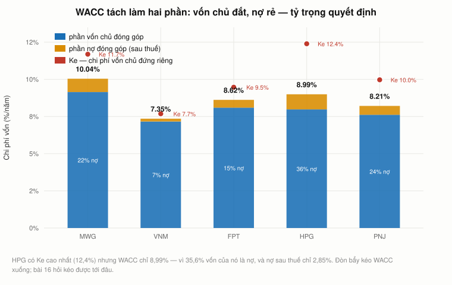
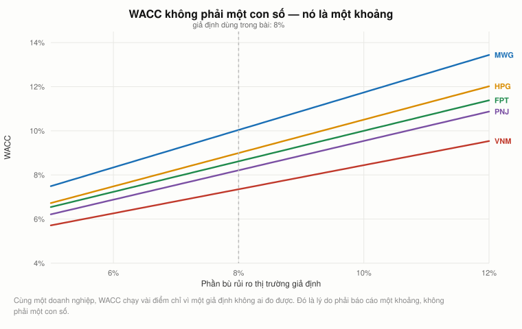
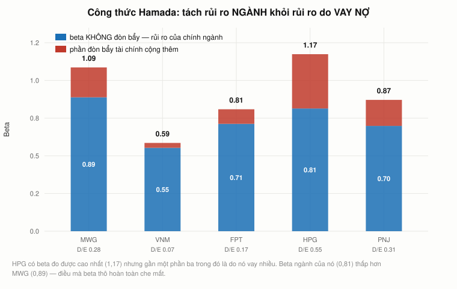
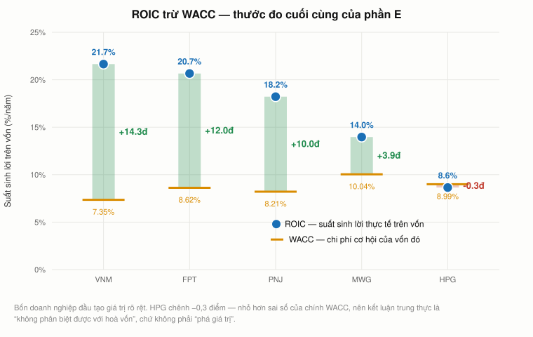

# Bài 15 — WACC: chi phí vốn bình quân gia quyền

> [!info] Về bài này
> 🏢 **PHẦN E — TÀI CHÍNH DOANH NGHIỆP.** Bài này **không đến từ video của Andrew Lo**.
> Nó trả lời câu hỏi mà [bài 14 §18](bai_14_doc_doanh_nghiep_bang_so.md#18-roic-trừ-wacc--và-đây-là-chỗ-bài-15-bắt-đầu)
> để ngỏ: *"vốn vay đắt hay rẻ so với cái gì?"*
> Nguồn: Brealey, Myers & Allen, *Principles of Corporate Finance*; Hamada, R. (1972).
>
> **Cách đọc các khối màu:** `[!quote]` trích nguyên văn (kèm nguồn) · `[!warning]` chỗ dễ nhầm · `[!note]` mở rộng/ghi chú · `[!example]` ví dụ áp dụng (Góc QTKD / Góc đời sống — biên soạn thêm, không có trong sách).
>
> **Cần đọc trước:** [Bài 11 — CAPM](bai_11_capm_va_beta.md) (chi phí vốn chủ),
> [Bài 12 §4](bai_12_ngan_sach_von.md#4-mỗi-dòng-tiền-một-suất-chiết-khấu) (mỗi dòng tiền một suất
> chiết khấu), [Bài 14 §10 và §17](bai_14_doc_doanh_nghiep_bang_so.md#10-đòn-bẩy-và-khả-năng-trả-lãi--nối-lại-bài-3)
> (đòn bẩy và ROIC).

---

## Mục lục

<!-- MUC-LUC -->
- [1. Câu hỏi bài 14 để ngỏ](#1-câu-hỏi-bài-14-để-ngỏ)
- [2. Chi phí vốn là chi phí CƠ HỘI, không phải lãi trả ngân hàng](#2-chi-phí-vốn-là-chi-phí-cơ-hội-không-phải-lãi-trả-ngân-hàng)
- [3. Công thức, và điều mỗi ký hiệu thật sự nghĩa là gì](#3-công-thức-và-điều-mỗi-ký-hiệu-thật-sự-nghĩa-là-gì)
- [4. Chi phí nợ — đọc ra từ báo cáo, không cần hỏi ngân hàng](#4-chi-phí-nợ--đọc-ra-từ-báo-cáo-không-cần-hỏi-ngân-hàng)
- [5. Lá chắn thuế, và bẫy thuế suất biên so với hiệu dụng](#5-lá-chắn-thuế-và-bẫy-thuế-suất-biên-so-với-hiệu-dụng)
- [6. Chi phí vốn chủ — CAPM, lấy nguyên từ bài 11](#6-chi-phí-vốn-chủ--capm-lấy-nguyên-từ-bài-11)
- [7. Trọng số phải theo giá THỊ TRƯỜNG](#7-trọng-số-phải-theo-giá-thị-trường)
- [8. WACC đầy đủ cho năm doanh nghiệp Việt Nam](#8-wacc-đầy-đủ-cho-năm-doanh-nghiệp-việt-nam)
- [9. WACC không phải một con số. Nó là một khoảng.](#9-wacc-không-phải-một-con-số-nó-là-một-khoảng)
- [10. Phần bù rủi ro đo từ một thế kỷ — và vì sao đừng tin chữ số thứ ba](#10-phần-bù-rủi-ro-đo-từ-một-thế-kỷ--và-vì-sao-đừng-tin-chữ-số-thứ-ba)
- [11. Beta có đòn bẩy và không đòn bẩy — công thức Hamada](#11-beta-có-đòn-bẩy-và-không-đòn-bẩy--công-thức-hamada)
- [12. Quy trình năm bước cho dự án khác ngành](#12-quy-trình-năm-bước-cho-dự-án-khác-ngành)
- [13. ROIC trừ WACC — thước đo cuối cùng](#13-roic-trừ-wacc--thước-đo-cuối-cùng)
- [14. Chín sai lầm khi dùng WACC](#14-chín-sai-lầm-khi-dùng-wacc)
- [15. WACC không phải hằng số — và đó là cửa vào bài 16](#15-wacc-không-phải-hằng-số--và-đó-là-cửa-vào-bài-16)
- [16. Góc Việt Nam — ba con số phải tự chọn](#16-góc-việt-nam--ba-con-số-phải-tự-chọn)
- [17. Đi tiếp](#17-đi-tiếp)
- [18. Code minh hoạ](#18-code-minh-hoạ)
- [19. Từ điển thuật ngữ](#19-từ-điển-thuật-ngữ)
- [20. Câu hỏi tự kiểm tra](#20-câu-hỏi-tự-kiểm-tra)
- [Tóm tắt một trang](#tóm-tắt-một-trang)
- [Nguồn](#nguồn)
<!-- /MUC-LUC -->

---

## 1. Câu hỏi bài 14 để ngỏ

Bài 14 dựng xong ROIC — suất sinh lời trên mỗi đồng vốn đưa vào kinh doanh — rồi dừng lại ở một câu
không trả lời được:

| Mã  | ROIC 2025 | ROE 2025 |    Chênh |
| --- | --------: | -------: | -------: |
| VNM |     21,7% |    26,6% |     +5,0 |
| MWG |     14,0% |    22,9% | **+9,0** |
| HPG |      8,6% |    12,6% |     +3,9 |

Cột "chênh" là phần đòn bẩy cộng vào ROE. Đòn bẩy **cộng thêm** khi tiền vay rẻ hơn suất sinh lời
của tài sản. Nhưng *rẻ hơn* thì phải so với **một mốc**, và bài 14 chưa có mốc đó.

Mốc đó là **WACC**: chi phí bình quân của toàn bộ vốn mà doanh nghiệp đang dùng. Bài này dựng nó,
rồi dùng nó để trả lời câu hỏi cuối cùng của phần E — **doanh nghiệp nào đang tạo giá trị, doanh
nghiệp nào chỉ đang bận rộn.**

---

## 2. Chi phí vốn là chi phí CƠ HỘI, không phải lãi trả ngân hàng

Đây là chỗ hiểu sai phổ biến nhất, và nó làm hỏng mọi thứ phía sau.

> [!note]
> **Chi phí vốn không phải số tiền bạn trả. Nó là suất sinh lời mà nhà đầu tư có thể kiếm được ở
> nơi khác có rủi ro tương đương.**

Ba hệ quả đi thẳng từ định nghĩa đó:

1. **Vốn tự có KHÔNG miễn phí.** Câu "tiền của tôi nên tôi không mất chi phí gì" là sai. Cổ đông có
   thể mang tiền đó mua danh mục thị trường; nếu doanh nghiệp không trả họ ít nhất bằng mức đó, họ
   nên rút.
2. **Lợi nhuận giữ lại cũng không miễn phí.** Nó là tiền của cổ đông mà công ty giữ hộ, nên chi phí
   của nó **bằng đúng** chi phí vốn chủ sở hữu.
3. **Chi phí vốn thuộc về DỰ ÁN, không thuộc về công ty.** [Bài 12 §4](bai_12_ngan_sach_von.md#4-mỗi-dòng-tiền-một-suất-chiết-khấu)
   đã chứng minh điều này bằng dự án khoan dầu hai suất chiết khấu. §13 dưới đây cho quy trình cụ
   thể để làm điều đó.

Điểm 3 là chỗ WACC bị lạm dụng nhiều nhất trong thực tế. Rất nhiều doanh nghiệp áp **một** con số
WACC cho **mọi** dự án — và hệ quả là dự án rủi ro cao trông đẹp giả tạo, còn dự án an toàn bị loại
oan.

---

## 3. Công thức, và điều mỗi ký hiệu thật sự nghĩa là gì

$$\text{WACC} = \frac{E}{D+E} \cdot K_e \;+\; \frac{D}{D+E} \cdot K_d \cdot (1 - \tau)$$

| Ký hiệu | Là gì                              | Lấy ở đâu                                                 |
| ------- | ---------------------------------- | --------------------------------------------------------- |
| $E$     | **vốn hoá thị trường** của vốn chủ | số cổ phiếu × giá — **không phải** vốn chủ sổ sách (§7)   |
| $D$     | **nợ vay có lãi**                  | vay ngắn hạn + vay dài hạn (§4). Không tính nợ chiếm dụng |
| $K_e$   | chi phí vốn chủ sở hữu             | CAPM, từ [bài 11](bai_11_capm_va_beta.md) (§6)            |
| $K_d$   | chi phí nợ **trước** thuế          | lãi vay / dư nợ bình quân (§4)                            |
| $\tau$  | thuế suất **biên**                 | 20% ở Việt Nam — không phải thuế suất hiệu dụng (§5)      |

> [!warning]
> Chú ý $(1-\tau)$ **chỉ đi kèm nợ**, không đi kèm vốn chủ. Cổ tức trả từ lợi nhuận **sau** thuế nên
> không có lá chắn nào. Đó là bất đối xứng trung tâm của cả bài 16.

---

## 4. Chi phí nợ — đọc ra từ báo cáo, không cần hỏi ngân hàng

Không công ty nào công bố "lãi suất vay bình quân của chúng tôi". Nhưng hai con số trên báo cáo đủ
để suy ra:

$$K_d = \frac{\text{chi phí lãi vay cả năm}}{\text{dư nợ vay BÌNH QUÂN đầu-cuối kỳ}}$$

Dư nợ phải lấy bình quân vì lãi vay là **dòng chảy cả năm** còn dư nợ là **ảnh chụp một thời điểm** —
đúng quy tắc [bài 14 §7](bai_14_doc_doanh_nghiep_bang_so.md#7-bốn-nhóm-tỷ-số-và-quy-tắc-bình-quân).

| Mã  |  Lãi vay | Dư nợ đầu kỳ | Dư nợ cuối kỳ |    **Kd** |
| --- | -------: | -----------: | ------------: | --------: |
| MWG | 1.471 tỷ |       27.300 |        29.931 | **5,14%** |
| FPT |      810 |       14.947 |        21.074 |     4,50% |
| HPG |    3.115 |       82.963 |        92.174 |     3,56% |
| VNM |      326 |        9.273 |         9.457 |     3,48% |
| PNJ |      119 |        3.342 |         4.223 | **3,15%** |

Cả năm rơi vào **3,15%–5,14%** — đúng dải lãi suất vay doanh nghiệp Việt Nam. Con số nào rớt ra
ngoài dải này thì hoặc mã chỉ tiêu sai, hoặc công ty có khoản vay ưu đãi đặc biệt. (Đây cũng chính
là phép kiểm mà [bài 14](bai_14_doc_doanh_nghiep_bang_so.md#24-code-minh-hoạ) dùng để xác minh mã
chỉ tiêu của nguồn dữ liệu.)

> [!warning] Kd này là lãi suất trung bình của nợ CŨ.
> Nó **không** phải lãi suất công ty sẽ trả cho khoản
> vay **mới**. Với quyết định đầu tư mới, con số đúng là lãi suất thị trường hiện tại cho hồ sơ tín
> dụng đó — không phải số lịch sử. Với doanh nghiệp có trái phiếu niêm yết, thước đo tốt nhất là
> **lợi suất đáo hạn** của trái phiếu đó, đúng khái niệm [bài 4 §15](bai_04_trai_phieu_va_duong_cong.md#15-trái-phiếu-coupon-và-lợi-suất-đáo-hạn).

---

## 5. Lá chắn thuế, và bẫy thuế suất biên so với hiệu dụng

Lãi vay được trừ **trước** khi tính thuế. Nên mỗi đồng lãi vay làm giảm số thuế phải nộp đi đúng
"thuế suất" đồng.

Lấy HPG, năm 2025 — lãi vay 3.115 tỷ:

|                      | Không vay đồng nào |       Thực tế có vay |
| -------------------- | -----------------: | -------------------: |
| Lợi nhuận trước thuế |          21.156 tỷ |            18.041 tỷ |
| Thuế phải nộp        |              2.962 |                2.526 |
|                      |                    | **tiết kiệm 436 tỷ** |

> [!warning] Dùng thuế suất nào? Đây là chỗ dễ sai nhất.

|                                              |  HPG 2025 |
| -------------------------------------------- | --------: |
| Thuế suất **hiệu dụng** (thuế đã nộp / LNTT) |     14,0% |
| Thuế suất **biên** (luật định)               | **20,0%** |

Hai con số khác nhau vì công ty có ưu đãi hoặc một phần thu nhập được miễn. Nhưng lá chắn thuế của
**một đồng lãi vay THÊM** phụ thuộc thuế suất **biên** — tức đồng lãi vay tiếp theo tiết kiệm được
bao nhiêu.

**Quy tắc:** WACC dùng thuế suất **biên**. ROIC ở [bài 14 §17](bai_14_doc_doanh_nghiep_bang_so.md#17-roic--thước-đo-không-bị-cách-tài-trợ-làm-nhiễu)
dùng thuế suất **hiệu dụng**, vì nó đo lợi nhuận thực tế đã nộp thuế chứ không phải một đồng tăng
thêm.

Kết quả cho HPG: $K_d = 3{,}56\% \times (1-0{,}20) = 2{,}85\%$.

Đây là lý do nợ "rẻ hơn" vốn chủ ở **hai tầng**, không phải một:

1. Chủ nợ đứng trước cổ đông khi chia tài sản nên chịu ít rủi ro hơn, do đó đòi lợi suất thấp hơn.
2. **Nhà nước trả giúp một phần** chi phí đó qua lá chắn thuế.

Nếu (2) là một lợi ích thật, câu hỏi tiếp theo là: **sao không vay thật nhiều?** Đó là toàn bộ nội
dung của bài 16.

---

## 6. Chi phí vốn chủ — CAPM, lấy nguyên từ bài 11

$$K_e = r_f + \beta \cdot (\text{phần bù rủi ro thị trường})$$

Beta đo bằng đúng phương pháp [bài 11](bai_11_capm_va_beta.md): hồi quy lợi suất tháng của cổ phiếu
theo lợi suất tháng của VN-Index, 146 tháng (2014-07 tới nay).

| Mã  | Ngành             |     Beta | Sai số |       R² |     **Ke** |
| --- | ----------------- | -------: | -----: | -------: | ---------: |
| VNM | sữa               | **0,59** |  0,083 |     0,26 |      7,69% |
| FPT | công nghệ         |     0,81 |  0,082 | **0,40** |      9,47% |
| PNJ | trang sức         |     0,87 |  0,140 |     0,21 |      9,97% |
| MWG | bán lẻ điện thoại |     1,09 |  0,132 |     0,32 |     11,69% |
| HPG | thép              | **1,17** |  0,107 |     0,46 | **12,39%** |

Thứ tự khớp với trực giác kinh tế, đúng như [bài 11 §10](bai_11_capm_va_beta.md#10-từ-beta-tới-chi-phí-vốn-microsoft-và-gillette)
đã nói: cầu về **sữa** ít phụ thuộc chu kỳ kinh tế nên beta thấp; cầu về **thép** bám sát chu kỳ xây
dựng nên beta cao.

> [!warning] Nhìn cột R².
> Cao nhất chỉ 0,46 — thị trường giải thích chưa tới một nửa biến động của từng cổ
> phiếu. Phần còn lại là rủi ro **riêng lẻ**, mà [bài 11 §13](bai_11_capm_va_beta.md#13-rủi-ro-hệ-thống-và-rủi-ro-riêng-lẻ-viết-thành-phương-trình)
> đã chứng minh là **không được trả tiền** — nên nó không vào chi phí vốn. Nhưng nó làm beta đo được
> kém chính xác, và cột "sai số" cho biết kém đến mức nào: beta của PNJ là $0{,}87 \pm 0{,}14$, tức
> khoảng tin cậy 95% chạy từ 0,59 tới 1,15.

---

## 7. Trọng số phải theo giá THỊ TRƯỜNG

WACC cần tỷ trọng nợ và vốn chủ. Câu hỏi: lấy từ đâu?

> [!note]
> **SAI:** lấy vốn chủ từ bảng cân đối (giá trị **sổ sách**).
> **ĐÚNG:** lấy **vốn hoá thị trường** — số cổ phiếu × giá.

Vì sao: WACC đo **chi phí cơ hội**. Nhà đầu tư hôm nay bỏ ra đúng bằng **giá thị trường** để mua cổ
phần, chứ không phải bằng con số ghi sổ từ năm nào.

> [!note] Mẹo tính số cổ phiếu ở Việt Nam:
> mệnh giá cổ phiếu niêm yết do luật ấn định là **10.000
> đồng**, nên

$$\text{số cổ phiếu} = \frac{\text{vốn góp của chủ sở hữu}}{10.000}$$

Phép chia này luôn đúng, và nó tiết kiệm một nguồn dữ liệu.

| Mã  | Số cp (triệu) | Giá (nghìn đ) | Vốn hoá TT | VCSH sổ sách |     TT/SS |
| --- | ------------: | ------------: | ---------: | -----------: | --------: |
| MWG |         1.470 |          73,1 | 107.434 tỷ |    33.176 tỷ | **3,24×** |
| VNM |         2.090 |          61,9 |    129.369 |       34.483 | **3,75×** |
| FPT |         1.704 |          72,8 |    124.016 |       43.748 |     2,83× |
| HPG |         7.675 |          21,7 |    166.558 |      131.220 |     1,27× |
| PNJ |           341 |          40,0 |     13.670 |       13.275 |     1,03× |

Và đây là hậu quả lên tỷ trọng nợ:

| Mã      | D/(D+E) theo **thị trường** | D/(D+E) theo **sổ sách** |          Chênh |
| ------- | --------------------------: | -----------------------: | -------------: |
| **MWG** |                   **21,8%** |                **47,4%** | **+25,6 điểm** |
| FPT     |                       14,5% |                    32,5% |          +18,0 |
| VNM     |                        6,8% |                    21,5% |          +14,7 |
| HPG     |                       35,6% |                    41,3% |           +5,6 |
| PNJ     |                       23,6% |                    24,1% |           +0,5 |

**MWG lệch 25,6 điểm phần trăm** — dùng trọng số sổ sách sẽ cho ra một WACC khác hẳn, và mọi NPV
tính bằng WACC đó đều sai theo.

Lý do lệch: cổ phiếu Việt Nam nhìn chung giao dịch **cao hơn** giá trị sổ sách, nên mẫu số của tỷ
trọng nợ phình ra khi đổi sang giá thị trường. Chú ý PNJ chỉ lệch 0,5 điểm vì nó giao dịch gần đúng
giá trị sổ sách.

---

## 8. WACC đầy đủ cho năm doanh nghiệp Việt Nam



*HPG có Ke cao nhất nhưng WACC không cao nhất — vì 35,6% vốn của nó là nợ, và nợ sau thuế chỉ 2,85%.*

Giả định: $r_f = 3{,}0\%$, phần bù rủi ro $= 8{,}0\%$, thuế suất biên $= 20\%$.

| Mã  |  E (tỷ) | D (tỷ) |       D/V |         Ke | Kd sau thuế |   **WACC** |
| --- | ------: | -----: | --------: | ---------: | ----------: | ---------: |
| MWG | 107.434 | 29.931 |     21,8% |     11,69% |       4,11% | **10,04%** |
| HPG | 166.558 | 92.174 | **35,6%** | **12,39%** |       2,85% |      8,99% |
| FPT | 124.016 | 21.074 |     14,5% |      9,47% |       3,60% |      8,62% |
| PNJ |  13.670 |  4.223 |     23,6% |      9,97% |       2,52% |      8,21% |
| VNM | 129.369 |  9.457 |  **6,8%** |  **7,69%** |       2,78% |  **7,35%** |

**Đọc cặp HPG / MWG cho kỹ.** HPG có chi phí vốn chủ **cao hơn** MWG (12,39% so với 11,69%) nhưng
WACC lại **thấp hơn** (8,99% so với 10,04%). Lý do duy nhất: HPG vay nhiều hơn hẳn (35,6% so với
21,8%), và nợ sau thuế rẻ hơn vốn chủ ba tới bốn lần.

Đó là một cái nhìn thoáng qua vào bài 16: **đòn bẩy kéo WACC xuống**. Câu hỏi bài 16 hỏi là: kéo
được tới đâu, và tại sao không kéo mãi.

📌 **Mỗi doanh nghiệp một WACC. Không có "WACC của thị trường".** Và cùng một doanh nghiệp, mỗi dự án
có thể một suất chiết khấu khác — §13 cho quy trình.

---

## 9. WACC không phải một con số. Nó là một khoảng.

$r_f$ và phần bù rủi ro thị trường là **giả định**, không phải số đo được.



*Cùng một doanh nghiệp, WACC chạy vài điểm chỉ vì một giả định không ai đo được.*

WACC của HPG theo hai giả định ([code §6](#18-code-minh-hoạ)):

| rf \ phần bù |    6% |    7% |    **8%** |     9% |    10% |
| ------------ | ----: | ----: | --------: | -----: | -----: |
| 2,0%         | 6,84% | 7,59% |     8,35% |  9,11% |  9,86% |
| 2,5%         | 7,16% | 7,92% |     8,67% |  9,43% | 10,18% |
| **3,0%**     | 7,48% | 8,24% | **8,99%** |  9,75% | 10,50% |
| 4,0%         | 8,12% | 8,88% |     9,64% | 10,39% | 11,15% |
| 5,0%         | 8,77% | 9,52% |    10,28% | 11,04% | 11,79% |

> [!warning]
> WACC chạy từ **6,84% đến 11,79%** — biên độ **5,0 điểm**, tức nó có thể **gấp 1,7 lần chính nó**
> chỉ vì hai giả định đầu vào.

> [!note]
> **Đừng báo cáo một con số WACC. Báo cáo một khoảng, và nói rõ giả định nào dùng để ra khoảng đó.**

📌 [Bài 12 §22](bai_12_ngan_sach_von.md#22-góc-việt-nam) đã rút ra kết luận y hệt cho NPV, và bằng
chính hai giả định này. Đây không phải sự trùng lặp — nó là **cùng một vấn đề** xuất hiện ở hai chỗ,
vì NPV chiết khấu bằng WACC.

---

## 10. Phần bù rủi ro đo từ một thế kỷ — và vì sao đừng tin chữ số thứ ba

Với thị trường Mỹ, phần bù rủi ro **đo được** từ dữ liệu Ken French, 1926-07 tới nay — **1.201
tháng = 100,1 năm**, mẫu dài nhất mà ngành tài chính có ([code §9](#18-code-minh-hoạ)):

|                          |                    |
| ------------------------ | -----------------: |
| Trung bình **cộng**      |      **8,33%/năm** |
| Trung bình **nhân**      |          6,85%/năm |
| Độ lệch chuẩn            |         18,37%/năm |
| Sai số chuẩn             |      1,84 điểm/năm |
| ⚠️ **Khoảng tin cậy 95%** | **4,73% – 11,93%** |

**Sau MỘT THẾ KỶ dữ liệu, ta chỉ nói được phần bù rủi ro nằm đâu đó trong một khoảng rộng 7,2
điểm.** [Bài 9 §13](bai_09_rui_ro_va_loi_suat.md#13-phần-bù-rủi-ro-đo-được-chính-xác-đến-đâu) đã
báo trước điều này: phần bù rủi ro là con số khó đo nhất trong cả ngành, vì phương sai của lợi suất
cổ phiếu quá lớn so với trung bình của nó.

Và khoảng bất định đó chảy **thẳng** vào mọi WACC và mọi NPV bạn tính.

Chia mẫu ra thì nó khá ổn định — nửa đầu 8,20%, nửa sau 8,46%, 300 tháng gần nhất 8,99%. Vấn đề
không phải nó trôi, mà là **sai số của phép đo quá lớn**.

### Trung bình cộng hay trung bình nhân?

[Bài 9 §12](bai_09_rui_ro_va_loi_suat.md#12-trung-bình-cộng-hay-trung-bình-nhân--lo-không-nói-rõ)
ghi lại rằng Lo không nói rõ dùng cái nào. Đây là câu trả lời chuẩn của ngành:

| Dùng                | Khi nào                                              | Ở đây |
| ------------------- | ---------------------------------------------------- | ----: |
| **Trung bình cộng** | chiết khấu **một kỳ**, hoặc kỳ vọng cho kỳ tiếp theo | 8,33% |
| **Trung bình nhân** | gộp qua **nhiều kỳ**, hoặc mô tả kết quả đã xảy ra   | 6,85% |

Chênh **1,48 điểm**, và với dòng tiền 10 năm thì khác biệt đó rất lớn. Thực hành phổ biến (Blume,
1974; Jacquier–Kane–Marcus, 2003) là dùng **trung bình có trọng số** nghiêng dần về trung bình nhân
khi kỳ hạn dài ra.

> [!warning] Với Việt Nam thì không đo được theo cách này.
> VN-Index chỉ có từ năm 2000, và
> [bài 13 §28](bai_13_thi_truong_hieu_qua.md#28-góc-việt-nam--một-thị-trường-trở-nên-hiệu-quả) đã cho
> thấy nửa đầu chuỗi đó có tự tương quan **+0,40** — tức chưa phải một thị trường hiệu quả để rút phần
> bù rủi ro ra. Con số 8% dùng trong bài này là **giả định**, và §9 là cách đối phó.

---

## 11. Beta có đòn bẩy và không đòn bẩy — công thức Hamada

Beta đo từ giá cổ phiếu trộn lẫn **hai** loại rủi ro:

- **(a)** rủi ro của chính hoạt động kinh doanh — *beta không đòn bẩy*, còn gọi là **beta tài sản**;
- **(b)** rủi ro **thêm vào** do công ty vay nợ.

Công thức **Hamada (1972)** tách chúng ra:

$$\beta_{\text{có đòn bẩy}} = \beta_{\text{không đòn bẩy}} \times \left[1 + (1-\tau)\frac{D}{E}\right]$$



*HPG có beta đo được cao nhất nhưng gần một phần ba trong đó là do nó vay nhiều.*

| Mã      |   Beta đo |  D/E (TT) | Beta **không đòn bẩy** | Phần do đòn bẩy |
| ------- | --------: | --------: | ---------------------: | --------------: |
| MWG     |     1,086 |     0,279 |              **0,888** |           0,198 |
| **HPG** | **1,174** | **0,553** |              **0,814** |       **0,360** |
| PNJ     |     0,871 |     0,309 |                  0,698 |           0,173 |
| FPT     |     0,809 |     0,170 |                  0,712 |           0,097 |
| VNM     |     0,586 |     0,073 |                  0,553 |           0,032 |

**Thứ hạng đổi.** Beta thô nói HPG rủi ro nhất (1,174). Beta **tài sản** nói MWG mới rủi ro nhất
(0,888 so với 0,814). Chênh lệch giữa hai con số của HPG — **0,360** — hoàn toàn là do nó vay nhiều,
chứ không phải do nghề thép rủi ro hơn nghề bán lẻ điện thoại.

Đó là thứ beta thô **hoàn toàn che mất**, và là lý do không được lấy beta của một công ty rồi áp
thẳng sang công ty khác.

---

## 12. Quy trình năm bước cho dự án khác ngành

**Tình huống:** Vinamilk muốn mở một nhà máy thép. Dùng WACC 7,35% của Vinamilk là **sai**, vì rủi ro
của dự án là rủi ro **ngành thép**, không phải rủi ro ngành sữa.

|  Bước | Việc                                                          | Kết quả                          |
| ----: | ------------------------------------------------------------- | -------------------------------- |
| **1** | Tìm công ty **thuần tuý** cùng ngành                          | HPG, beta đo **1,174**           |
| **2** | **GỠ** đòn bẩy của nó ra (D/E = 0,553)                        | beta tài sản **0,814**           |
| **3** | Đó là rủi ro **ngành thép** — không phụ thuộc ai tài trợ nó   | —                                |
| **4** | **GẮN** đòn bẩy của **người đi đầu tư** (D/E của VNM = 0,073) | beta **0,862**                   |
| **5** | $K_e = 3{,}0\% + 0{,}862 \times 8{,}0\%$                      | **9,89%** → WACC dự án **9,41%** |

So sánh: WACC của chính Vinamilk là **7,35%**. Dùng nhầm con số đó cho dự án thép sẽ chiết khấu
**quá nhẹ 2,1 điểm**, và biến một dự án xấu thành một dự án trông như tốt.

📌 Đây chính là cách bài 12 §9 tìm chi phí vốn cho mảng xuất bản của Bloomberg bằng beta của John
Wiley & Sons — [bài 12 §10](bai_12_ngan_sach_von.md#10-chuyện-gì-đã-xảy-ra-với-bloomberg-press) —
chỉ khác là bài này bổ sung bước gỡ và gắn đòn bẩy mà Lo bỏ qua.

> [!warning]
> Trong thực tế, bước 1 phải lấy **nhiều** công ty cùng ngành rồi lấy trung bình các beta tài sản,
> vì beta của một công ty đơn lẻ có sai số rất lớn (§6). Lấy đúng một công ty làm chuẩn là cách nhanh
> nhất để mang sai số riêng lẻ của công ty đó vào quyết định của mình.

---

## 13. ROIC trừ WACC — thước đo cuối cùng

Đây là câu trả lời cho câu hỏi bài 14 để ngỏ.



*Bốn doanh nghiệp đầu tạo giá trị rõ rệt. HPG chênh −0,3 điểm — nhỏ hơn sai số của chính WACC.*

| Mã      | Ngành     |  ROIC |   WACC |      Chênh | Kết luận         |
| ------- | --------- | ----: | -----: | ---------: | ---------------- |
| VNM     | sữa       | 21,7% |  7,35% | **+14,3đ** | tạo giá trị mạnh |
| FPT     | công nghệ | 20,7% |  8,62% | **+12,0đ** | tạo giá trị mạnh |
| PNJ     | trang sức | 18,2% |  8,21% | **+10,0đ** | tạo giá trị mạnh |
| MWG     | bán lẻ    | 14,0% | 10,04% |      +3,9đ | tạo giá trị      |
| **HPG** | thép      |  8,6% |  8,99% |  **−0,3đ** | **hoà vốn**      |

**Hoà Phát — doanh nghiệp thép lớn nhất Việt Nam — chỉ vừa đủ bù chi phí cơ hội của vốn trong
năm 2025.** Điều đó **không** có nghĩa công ty quản trị kém: [bài 14 §17](bai_14_doc_doanh_nghiep_bang_so.md#17-roic--thước-đo-không-bị-cách-tài-trợ-làm-nhiễu)
cho thấy ROIC của nó đảo từ **28,2% (2021)** xuống **6,2% (2023)** theo chu kỳ thép. Ý nghĩa đúng là:
**ở điểm này của chu kỳ, mở rộng công suất là một quyết định đắt tiền.**

> [!warning] Và đây mới là điều phải nói rõ.
> Chênh −0,3 điểm **nhỏ hơn sai số của chính WACC**:

| Giả định phần bù    | WACC của HPG |     Chênh | Kết luận    |
| ------------------- | -----------: | --------: | ----------- |
| 6%                  |        7,48% | **+1,2đ** | tạo giá trị |
| 8% (dùng trong bài) |        8,99% |     −0,3đ | hoà vốn     |
| 10%                 |       10,50% | **−1,9đ** | phá giá trị |

Kết luận trung thực cho HPG không phải *"phá giá trị"* mà là: **không phân biệt được với hoà vốn.**
Còn với VNM, FPT và PNJ thì chênh +10 đến +14 điểm — **lớn hơn mọi biên độ giả định**, nên kết luận
vững.

📌 Phân biệt này quan trọng hơn con số. Một khung phân tích có ích phải nói được **khi nào nó không
nói được gì** — đúng tinh thần [bài 13](bai_13_thi_truong_hieu_qua.md) về việc tách tín hiệu khỏi
nhiễu.

### EVA — cùng một ý, đổi sang đơn vị tiền

$$\text{EVA} = (\text{ROIC} - \text{WACC}) \times \text{vốn đầu tư}$$

| Mã  | Vốn đầu tư |      EVA 2025 |
| --- | ---------: | ------------: |
| FPT |  57.748 tỷ | **+6.953 tỷ** |
| VNM |     44.694 |        +6.391 |
| MWG |     59.264 |        +2.327 |
| PNJ |     16.048 |        +1.606 |
| HPG |    210.502 |      **−737** |

Chú ý thứ hạng **đổi** so với bảng chênh lệch: VNM có chênh lệch **phần trăm** cao nhất nhưng FPT
tạo ra nhiều **tiền** hơn, vì FPT dùng nhiều vốn hơn. Đó là phân biệt giữa *sinh lời cao* và *tạo ra
nhiều giá trị* — hai câu hỏi khác nhau, và ban lãnh đạo phải trả lời cả hai.

---

## 14. Chín sai lầm khi dùng WACC

|    # | Sai lầm                                          | Hậu quả                                                                                                                                                                                                          |
| ---: | ------------------------------------------------ | ---------------------------------------------------------------------------------------------------------------------------------------------------------------------------------------------------------------- |
|    1 | Dùng **trọng số sổ sách** thay vì giá thị trường | §7: MWG lệch 25,6 điểm                                                                                                                                                                                           |
|    2 | Dùng **một WACC cho mọi dự án**                  | Dự án rủi ro cao trông đẹp giả tạo (§12)                                                                                                                                                                         |
|    3 | Quên nhân $(1-\tau)$ cho nợ                      | WACC cao giả, loại nhầm dự án tốt                                                                                                                                                                                |
|    4 | Nhân $(1-\tau)$ cho **cả vốn chủ**               | Cổ tức trả sau thuế, không có lá chắn (§3)                                                                                                                                                                       |
|    5 | Dùng thuế suất **hiệu dụng** thay vì **biên**    | §5: HPG chênh 6 điểm thuế suất                                                                                                                                                                                   |
|    6 | Tính **nợ chiếm dụng** vào D                     | Phải trả người bán không tính lãi, không thuộc cấu trúc vốn                                                                                                                                                      |
|    7 | Dùng $K_d$ **lịch sử** cho khoản vay **mới**     | §4: lãi suất đã đổi thì con số cũ vô nghĩa                                                                                                                                                                       |
|    8 | Cộng "phần bù rủi ro riêng của dự án" vào WACC   | Rủi ro riêng lẻ **không được trả tiền** ([bài 11 §13](bai_11_capm_va_beta.md#13-rủi-ro-hệ-thống-và-rủi-ro-riêng-lẻ-viết-thành-phương-trình)). Rủi ro riêng phải xử lý ở **tử số** — điều chỉnh dòng tiền kỳ vọng |
|    9 | Báo cáo **một con số** WACC                      | §9: biên độ thật là vài điểm                                                                                                                                                                                     |

Sai lầm số 8 là sai lầm tinh vi nhất và phổ biến nhất trong doanh nghiệp. Khi một dự án "có nhiều
điều không chắc chắn", phản xạ tự nhiên là cộng thêm vài điểm vào suất chiết khấu. Nhưng CAPM nói
rõ: **chỉ rủi ro hệ thống mới được định giá**. Nếu điều không chắc chắn đó đa dạng hoá được, cộng
thêm vào mẫu số là **phạt hai lần** — và [bài 12 §11](bai_12_ngan_sach_von.md#11-dự-án-khoan-dầu-hai-loại-rủi-ro-hai-suất-chiết-khấu)
đã chứng minh bằng dự án khoan dầu rằng cách đúng là điều chỉnh **dòng tiền kỳ vọng**.

---

## 15. WACC không phải hằng số — và đó là cửa vào bài 16

Nhìn lại công thức: WACC phụ thuộc $D/V$. Đổi cơ cấu vốn thì WACC đổi theo. Vậy có tồn tại một
$D/V$ làm WACC **nhỏ nhất** không?

Câu trả lời ngây thơ là: nợ rẻ hơn vốn chủ, nên vay càng nhiều WACC càng thấp. **Sai**, vì hai lý do:

1. **Vay nhiều làm vốn chủ rủi ro hơn** — chính công thức Hamada ở §11 nói điều đó: $D/E$ tăng thì
   $\beta$ tăng thì $K_e$ tăng. Phần "rẻ" của nợ bị bù lại một phần bởi phần "đắt lên" của vốn chủ.
2. **Vay quá nhiều thì $K_d$ cũng tăng**, vì chủ nợ bắt đầu đòi phần bù cho nguy cơ vỡ nợ.

Câu hỏi *"hai lực đó cân bằng ở đâu"* là câu hỏi trung tâm của **bài 16**, và câu trả lời bắt đầu
bằng một định lý gây sốc: **Modigliani–Miller (1958)** chứng minh rằng trong một thế giới không
thuế, không chi phí kiệt quệ, **cơ cấu vốn hoàn toàn không quan trọng** — WACC là hằng số.

Rồi bài 16 tháo từng giả định ra để xem thế giới thật khác chỗ nào.

---

## 16. Góc Việt Nam — ba con số phải tự chọn

Bài này dùng ba giả định. Đây là căn cứ và giới hạn của từng cái.

| Tham số               | Dùng trong bài | Căn cứ                                   | Mức tin cậy                            |
| --------------------- | -------------: | ---------------------------------------- | -------------------------------------- |
| Thuế suất biên $\tau$ |        **20%** | Luật Thuế TNDN 67/2025/QH15              | ✅ chắc chắn                            |
| $r_f$                 |       **3,0%** | lợi suất trái phiếu chính phủ kỳ hạn dài | ⚠️ **chưa xác minh được** mức hiện hành |
| Phần bù rủi ro        |       **8,0%** | ước lượng cho thị trường mới nổi         | ⚠️ **không đo được** từ VN-Index        |

> [!warning] Vì sao không đo được phần bù rủi ro Việt Nam.
> Cần một chuỗi lợi suất thị trường **dài** và
> **hiệu quả**. VN-Index chỉ có từ 7/2000 (26 năm), và nửa đầu chuỗi có tự tương quan +0,40 — chưa
> phải một thị trường mà lợi suất quá khứ phản ánh kỳ vọng. Ngay cả với **100 năm** dữ liệu Mỹ, sai
> số vẫn là ±3,6 điểm (§10). Với 26 năm dữ liệu Việt Nam, sai số sẽ lớn hơn nhiều lần.

**Ba cách xử lý trong thực hành, xếp theo mức độ chặt chẽ:**

1. **Cộng phần bù rủi ro quốc gia** vào phần bù của một thị trường phát triển. Đây là cách
   Damodaran làm, và là cách phổ biến nhất trong định giá tại Việt Nam.
2. **Dùng chi phí vốn của các thương vụ M&A thật** trong ngành làm điểm neo.
3. **Làm bảng độ nhạy** và báo cáo một khoảng — §9. Đây là cách bài này chọn, vì nó không giả vờ biết
   thứ mình không biết.

📌 Ba lưu ý riêng cho thị trường Việt Nam:

- **Cổ phiếu thanh khoản thấp** cho beta đo được không đáng tin: giá không đổi nhiều phiên làm hiệp
  phương sai với chỉ số bị kéo về 0, tức beta **thấp giả**.
- **Biên độ dao động giá ±7%** trên HOSE cũng làm méo beta trong những phiên có tin lớn, cùng cơ chế
  mà [bài 13 §28](bai_13_thi_truong_hieu_qua.md#28-góc-việt-nam--một-thị-trường-trở-nên-hiệu-quả)
  đã cảnh báo cho tự tương quan.
- **VN-Index có tỷ trọng rất tập trung** vào vài mã vốn hoá lớn. Đó là đúng phê phán của Roll mà
  [bài 11 §5](bai_11_capm_va_beta.md#5-phê-phán-của-roll-capm-có-kiểm-chứng-được-không) đã nêu: cái
  ta dùng làm "thị trường" không phải danh mục thị trường thật.

---

## 17. Đi tiếp

|                       Bài | Sẽ dùng gì từ bài 15                                                           |
| ------------------------: | ------------------------------------------------------------------------------ |
|       **16 — Cơ cấu vốn** | công thức Hamada (§11), lá chắn thuế (§5), câu hỏi "WACC nhỏ nhất ở đâu" (§15) |
| **17 — Chi phí đại diện** | ROIC − WACC (§13) là thước đo ban lãnh đạo có tạo giá trị hay không            |
|  **18 — Định giá và M&A** | WACC là suất chiết khấu của toàn bộ mô hình FCFF                               |

---

## 18. Code minh hoạ

> [!note]
> ⚙️ **Chạy:** cần **Python 3.10+**. Không cần cài gói nào. Kết quả **tất định**.

|            |                                                           |
| ---------- | --------------------------------------------------------- |
| File       | [`thuc_hanh/bai-15-wacc.py`](../thuc_hanh/bai-15-wacc.py) |
| Kích thước | **817 dòng**, 9 mục                                       |

Ba giả định đầu vào (`RF_VN`, `MRP_VN`, `THUE_VN`) nằm ngay đầu file — **đổi ba con số đó thì toàn
bộ kết quả đổi theo**, và đó chính là điểm của §9.

Kết quả chạy thật:

```
==============================================================================
BAI 15 — WACC: CHI PHI VON BINH QUAN GIA QUYEN
PHAN E — Tai chinh doanh nghiep (ngoai pham vi video 15.401 cua Andrew Lo)
==============================================================================

==============================================================================
MUC 1. CHI PHI NO — DOC RA TU BAO CAO, KHONG CAN HOI NGAN HANG
==============================================================================
Khong cong ty nao cong bo 'lai suat vay binh quan cua chung toi'. Nhung hai
con so tren bao cao du de suy ra no:

  Kd (truoc thue)  =  chi phi lai vay ca nam  /  du no vay BINH QUAN

Du no phai lay binh quan dau-cuoi ky, vi lai vay la dong chay ca nam con du
no la anh chup mot thoi diem — dung quy tac cua bai 14 muc 7.

  ma     lai vay    du no dau ky   du no cuoi ky   du no BQ       Kd
  ------------------------------------------------------------------------
  MWG       1,471t         27,300t         29,931t     28,616t    5.14%
  VNM         326t          9,273t          9,457t      9,365t    3.48%
  FPT         810t         14,947t         21,074t     18,010t    4.50%
  HPG       3,115t         82,963t         92,174t     87,569t    3.56%
  PNJ         119t          3,342t          4,223t      3,782t    3.15%

  Ca nam deu roi vao 3.15% - 5.14%, dung dai lai
  suat vay doanh nghiep Viet Nam. Neu con so nao rot ra ngoai dai nay thi
  hoac ma chi tieu sai, hoac cong ty co khoan vay uu dai dac biet.

⚠️  Kd nay la lai suat TRUNG BINH cua no CU. No KHONG phai lai suat cong ty
    se tra cho khoan vay MOI. Voi quyet dinh dau tu moi, con so dung la lai
    suat thi truong hien tai cho ho so tin dung do — khong phai so lich su.

==============================================================================
MUC 2. LA CHAN THUE — VI SAO CHI PHI NO PHAI TINH SAU THUE
==============================================================================
Lay HPG, nam 2025. Lai vay tra trong nam: 3,115 ty dong.

Lai vay duoc tru TRUOC khi tinh thue. Nen moi dong lai vay lam giam so thue
phai nop di dung 'thue suat' dong.

  Neu KHONG vay dong nao (moi thu khac giu nguyen):
    loi nhuan truoc thue          21,156t
    thue phai nop                  2,962t
  Thuc te CO vay:
    loi nhuan truoc thue          18,041t
    thue phai nop                  2,526t
    thue TIET KIEM duoc              436t   = lai vay x thue suat hieu dung


⚠️  DUNG THUE SUAT NAO? Day la cho de sai nhat.
    thue suat HIEU DUNG cua HPG nam 2025: 14.0%  (thue da nop / LNTT)
    thue suat BIEN (luat dinh)           : 20.0%

    Hai con so khac nhau vi cong ty co uu dai hoac thu nhap duoc mien mot
    phan. Nhung la chan thue cua MOT DONG lai vay THEM phu thuoc thue suat
    BIEN — tuc dong lai vay tiep theo tiet kiem duoc bao nhieu.
    WACC dung thue suat BIEN 20%. ROIC o muc 8 dung thue suat HIEU DUNG,
    vi no do loi nhuan THUC TE da nop thue, khong phai mot dong tang them.

  Nen chi phi no THUC SU chiu:
    Kd truoc thue                  3.56%
    x (1 - 20%)                     2.85%   <- con so dua vao WACC

Day la ly do NO 're hon' VON CHU o hai tang, khong phai mot:
   (a) chu no chiu it rui ro hon nen doi loi suat thap hon;
   (b) nha nuoc tra giup mot phan chi phi do qua la chan thue.

   Neu (b) la mot loi ich that, cau hoi tiep theo la: SAO KHONG VAY THAT
   NHIEU? Do la toan bo noi dung cua bai 16.

==============================================================================
MUC 3. BETA DO TU GIA THAT, VA CHI PHI VON CHU THEO CAPM
==============================================================================
Hoi quy loi suat thang cua tung co phieu theo VN-Index, 146 thang
(2014-07 den nay). Dung dung phuong phap cua bai 11.

  Ke = rf + beta x phan bu = 3.0% + beta x 8.0%

  ma    nganh              beta   sai so     R^2       Ke
  --------------------------------------------------------------
  MWG   ban le dien thoai   1.09    0.132    0.32   11.69%
  VNM   sua                 0.59    0.083    0.26    7.69%
  FPT   cong nghe           0.81    0.082    0.40    9.47%
  HPG   thep                1.17    0.107    0.46   12.39%
  PNJ   trang suc           0.87    0.140    0.21    9.97%

Thu tu beta khop voi truc giac kinh te, dung nhu bai 11 muc 10 da noi:
  thap nhat  VNM (0.59) — sua: cau it phu thuoc chu ky
  cao nhat   HPG (1.17) — thep: cau bam sat chu ky kinh te

⚠️  Nhin cot R^2. Cao nhat cung chi khoang 0,4 — nghia la thi truong giai thich
    duoi mot nua bien dong cua tung co phieu. Phan con lai la rui ro RIENG LE,
    va bai 11 muc 13 da chi ro: phan do KHONG duoc tra tien, nen no khong vao
    chi phi von. Nhung no lam beta do duoc kem chinh xac, xem cot 'sai so'.

==============================================================================
MUC 4. TRONG SO SO SACH SO VOI TRONG SO THI TRUONG — KHAC NHAU BAO NHIEU
==============================================================================
WACC can ti trong no va von chu. Cau hoi: lay tu dau?

  SAI : lay tu bang can doi (gia tri SO SACH cua von chu)
  DUNG: von chu lay theo VON HOA THI TRUONG (so co phieu x gia)

Vi sao: WACC do chi phi CO HOI cua von. Nha dau tu hom nay bo ra dung bang
gia thi truong de mua co phan, chu khong phai bang gia so sach ghi tu nam nao.

So co phieu suy tu von gop chia menh gia 10.000 dong — menh gia co phieu
niem yet tai Viet Nam do luat an dinh, nen phep chia nay luon dung.

  ma     so cp (trieu)  gia (nghin)   von hoa TT   VCSH so sach   TT/SS
  ------------------------------------------------------------------------
  MWG            1,470         73.1      107,434t         33,176t    3.24x
  VNM            2,090         61.9      129,369t         34,483t    3.75x
  FPT            1,704         72.8      124,016t         43,748t    2.83x
  HPG            7,675         21.7      166,558t        131,220t    1.27x
  PNJ              341         40.0       13,670t         13,275t    1.03x

  Va day la hau qua len ti trong no:

  ma     D/(D+E) theo THI TRUONG   D/(D+E) theo SO SACH   chenh
  --------------------------------------------------------------------
  MWG                     21.8%                  47.4%   +25.6%
  VNM                      6.8%                  21.5%   +14.7%
  FPT                     14.5%                  32.5%   +18.0%
  HPG                     35.6%                  41.3%    +5.6%
  PNJ                     23.6%                  24.1%    +0.5%

MWG lech nhieu nhat: 25.6 DIEM PHAN TRAM. Dung trong so so sach
   se cho ra mot WACC khac han — va moi NPV tinh bang WACC do deu sai theo.

   Ly do lech: co phieu Viet Nam nhin chung giao dich CAO HON gia tri so sach,
   nen mau so cua ti trong no phinh ra khi doi sang gia thi truong.

==============================================================================
MUC 5. WACC DAY DU CHO NAM DOANH NGHIEP VIET NAM
==============================================================================
        E                D
  WACC = --- x Ke  +  --- x Kd x (1 - thue)
        V                V                        V = D + E

Gia dinh: rf = 3.0%, phan bu rui ro = 8.0%, thue = 20%

  ma        E (ty)     D (ty)     D/V        Ke   Kd sau thue      WACC
  ----------------------------------------------------------------------
  MWG      107,434t     29,931t   21.8%    11.69%         4.11%    10.04%
  VNM      129,369t      9,457t    6.8%     7.69%         2.78%     7.35%
  FPT      124,016t     21,074t   14.5%     9.47%         3.60%     8.62%
  HPG      166,558t     92,174t   35.6%    12.39%         2.85%     8.99%
  PNJ       13,670t      4,223t   23.6%     9.97%         2.52%     8.21%

Khoang cach giua doanh nghiep re von nhat (VNM, 7.35%) va dat von nhat
(MWG, 10.04%) la 2.7 diem phan tram.

Diem quan trong: MOI DOANH NGHIEP MOT WACC. Khong co 'WACC cua thi truong'.
   Va cung mot doanh nghiep, MOI DU AN co the mot suat chiet khau khac — bai 12
   muc 4 da noi dieu do bang du an khoan dau hai suat chiet khau.

⚠️  WACC nay chi dung cho du an co RUI RO GIONG hoat dong hien tai cua cong ty.
    Vinamilk mo nha may thep thi KHONG duoc dung WACC 7,35% cua Vinamilk —
    phai dung chi phi von cua NGANH THEP. Muc 7 cho quy trinh lam dieu do.

==============================================================================
MUC 6. BANG DO NHAY — HAI CON SO KHONG AI BIET CHAC
==============================================================================
rf va phan bu rui ro thi truong la GIA DINH, khong phai so do duoc.
Bai 9 muc 13 da chung minh: can hang tram nam du lieu moi do phan bu rui ro
chinh xac toi 1 diem. Nen thay vi mot con so, hay nhin ca bang.

  WACC cua VNM (beta 0.59, D/V 6.8%):
       rf \ phan bu       6%      7%      8%      9%     10%
       ----------------------------------------------------
           2.0%        5.33%   5.87%   6.42%   6.97%   7.51%
           2.5%        5.79%   6.34%   6.89%   7.43%   7.98%
           3.0%        6.26%   6.81%   7.35%   7.90%   8.44%
           4.0%        7.19%   7.74%   8.28%   8.83%   9.37%
           5.0%        8.12%   8.67%   9.22%   9.76%  10.31%

  WACC cua HPG (beta 1.17, D/V 35.6%):
       rf \ phan bu       6%      7%      8%      9%     10%
       ----------------------------------------------------
           2.0%        6.84%   7.59%   8.35%   9.11%   9.86%
           2.5%        7.16%   7.92%   8.67%   9.43%  10.18%
           3.0%        7.48%   8.24%   8.99%   9.75%  10.50%
           4.0%        8.12%   8.88%   9.64%  10.39%  11.15%
           5.0%        8.77%   9.52%  10.28%  11.04%  11.79%

⚠️  WACC cua HPG chay tu 6.84% den 11.79% — bien do 5.0 diem,
    tuc no co the GAP 1.7 LAN chinh no, chi vi hai gia dinh dau vao.

    He qua thuc dung, va day la bai hoc chinh cua muc nay:
    DUNG BAO CAO MOT CON SO WACC. Bao cao mot KHOANG, va noi ro gia dinh nao
    dung de ra khoang do. Bai 12 muc 22 da rut ra ket luan y het cho NPV.

==============================================================================
MUC 7. BETA CO VA KHONG DON BAY — VA QUY TRINH NAM BUOC CHO DU AN MOI
==============================================================================
Beta do tu gia co phieu tron lan HAI loai rui ro:
  (a) rui ro cua CHINH HOAT DONG KINH DOANH — beta khong don bay (beta tai san)
  (b) rui ro THEM VAO do cong ty vay no    — phan chenh

Cong thuc Hamada (1972) tach chung ra:

     beta_co_don_bay = beta_khong_don_bay x [ 1 + (1 - thue) x D/E ]

  ma      beta do   D/E (TT)   beta KHONG don bay   phan do don bay them
  --------------------------------------------------------------------------
  MWG       1.086      0.279                0.888                 0.198
  VNM       0.586      0.073                0.553                 0.032
  FPT       0.809      0.170                0.712                 0.097
  HPG       1.174      0.553                0.814                 0.360
  PNJ       0.871      0.309                0.698                 0.173

Sau khi go don bay, MWG van cao nhat va VNM
   van thap nhat — nghia la khac biet giua chung chu yeu la khac biet NGANH,
   khong phai khac biet cach tai tro.

==============================================================================
QUY TRINH NAM BUOC: tim chi phi von cho mot du an KHAC nganh hien tai
==============================================================================
Tinh huong: Vinamilk muon mo mot nha may thep. Dung WACC cua Vinamilk la SAI,
vi rui ro cua du an la rui ro NGANH THEP.

  Buoc 1  Tim cong ty THUAN TUY cung nganh        -> HPG, beta do 1.174
  Buoc 2  GO don bay cua no ra (D/E = 0.553)    -> beta tai san 0.814
  Buoc 3  Do la rui ro NGANH THEP, khong phu thuoc ai tai tro no
  Buoc 4  GAN don bay cua NGUOI DI DAU TU (D/E = 0.073) -> beta 0.862
  Buoc 5  Ke = 3.0% + 0.862 x 8.0% = 9.89%
          WACC du an = 9.41%

  So sanh: WACC cua chinh Vinamilk la 7.35%.
  Dung nham con so do cho du an thep se chiet khau QUA NHE 2.1 diem,
  va bien mot du an xau thanh mot du an trong nhu tot.

⚠️  Trong thuc te, buoc 1 phai lay NHIEU cong ty cung nganh roi lay trung binh
    cac beta tai san, vi beta cua mot cong ty don le co sai so rat lon (muc 3).

==============================================================================
MUC 8. ROIC TRU WACC — AI TAO GIA TRI, AI PHA
==============================================================================
Day la cau tra loi cho cau hoi bai 14 muc 8 de ngo.

  ROIC > WACC  ->  moi dong von moi TAO ra gia tri
  ROIC = WACC  ->  tang truong khong them gi
  ROIC < WACC  ->  tang truong lam co dong NGHEO DI

  ma    nganh                 ROIC     WACC     chenh   ket luan
  --------------------------------------------------------------------------
  VNM   sua                    21.7%    7.35%    +14.3d   TAO gia tri manh
  FPT   cong nghe              20.7%    8.62%    +12.0d   TAO gia tri manh
  PNJ   trang suc              18.2%    8.21%    +10.0d   TAO gia tri manh
  MWG   ban le dien thoai      14.0%   10.04%     +3.9d   TAO gia tri
  HPG   thep                    8.6%    8.99%     -0.3d   hoa von

HPG — doanh nghiep thep lon nhat Viet Nam — co ROIC 8.6% so voi
    WACC 8.99%: chenh -0.3 diem. Nam 2025 no chi VUA DU
    bu chi phi co hoi cua von, khong hon.

    Dieu do KHONG co nghia cong ty quan tri kem. Bai 14 muc 17 cho thay ROIC
    cua no dao tu 28% (2021) xuong 6% (2023) theo CHU KY THEP. Y nghia dung la:
    o diem nay cua chu ky, mo rong cong suat la mot quyet dinh dat tien.

⚠️  VA DAY MOI LA DIEU PHAI NOI RO. Chenh -0,3 diem NHO HON sai so cua chinh
    WACC. Muc 6 cho thay WACC cua HPG chay tu 6,84% den 11,79% tuy gia dinh.
      voi phan bu 6%:  WACC 7.48%, chenh +1.2 diem -> TAO gia tri
      voi phan bu 10%: WACC 10.50%, chenh -1.9 diem -> PHA gia tri

    Ket luan trung thuc cho HPG khong phai 'pha gia tri', ma la:
    KHONG PHAN BIET DUOC voi hoa von. Con voi VNM, FPT va PNJ thi chenh
    +10 den +14 diem — lon hon moi bien do gia dinh, nen ket luan VUNG.

EVA = (ROIC - WACC) x von dau tu:

  ma      von dau tu       EVA
  ----------------------------------------
  VNM         44,694t    +6,391t
  FPT         57,748t    +6,953t
  PNJ         16,048t    +1,606t
  MWG         59,264t    +2,327t
  HPG        210,502t      -737t

==============================================================================
MUC 9. PHAN BU RUI RO DO TU MOT THE KY — VA VI SAO DUNG TIN CHU SO THU BA
==============================================================================
Du lieu Ken French, 1926-07 den nay: 1201 thang = 100.1 nam.
Day la mau du lieu dai nhat ma nganh tai chinh co.

  trung binh CONG      8.33%/nam    <- dung cho chiet khau MOT ky
  trung binh NHAN      6.85%/nam    <- dung cho gop nhieu ky
  do lech chuan       18.37%/nam
  sai so chuan         1.84 diem/nam

  ⚠️  KHOANG TIN CAY 95%:  4.73%  den  11.93%

Sau MOT THE KY du lieu, ta chi noi duoc phan bu rui ro nam dau do trong
    mot khoang rong 7.2 DIEM. Bai 9 muc 13 da bao truoc dieu nay:
    phan bu rui ro la con so kho do nhat trong ca nganh, vi phuong sai cua
    loi suat co phieu qua lon so voi trung binh cua no.

    Va khoang bat dinh do chay THANG vao moi WACC va moi NPV ban tinh.

Chia mau lam ba doan de thay no khong on dinh theo thoi gian:

  nua dau                 8.20%/nam  (600 thang)
  nua sau                 8.46%/nam  (601 thang)
  300 thang gan nhat      8.99%/nam  (300 thang)

So sanh voi lai suat phi rui ro My hom nay: trai phieu kho bac 10 nam
  ngay 2026-09-03: 4.77%/nam
  -> chi phi von chu cho mot co phieu beta = 1 o My: 13.10%/nam

⚠️  Con so cho Viet Nam thi KHONG do duoc theo cach nay: VN-Index chi co tu
    nam 2000, va bai 13 muc 28 da cho thay nua dau chuoi do co tu tuong quan
    +0,40 — tuc chua phai mot thi truong hieu qua de rut phan bu rui ro ra.
    Vi vay 8% dung trong bai nay la GIA DINH, va muc 6 la cach doi pho.

==============================================================================
HET. Moi con so tren tinh tu du lieu that va tu ba gia dinh ghi ro dau file.
==============================================================================
```

### Tự thử

1. Đổi `MRP_VN` từ 0,08 sang 0,06 rồi 0,10. Ở mức phần bù nào thì HPG chuyển từ tạo sang phá giá
   trị? Doanh nghiệp nào **không** đổi kết luận ở bất kỳ mức nào?
2. Trong `muc_4`, thay `von_hoa(m)` bằng vốn chủ sổ sách. WACC của MWG đổi bao nhiêu điểm? NPV của
   một dự án 10 năm sẽ lệch bao nhiêu phần trăm vì sai lầm đó?
3. Trong `muc_7`, đổi vai: dùng **MWG** làm công ty thuần tuý để tìm chi phí vốn cho dự án bán lẻ của
   Vinamilk. So sánh với kết quả dùng HPG cho dự án thép.
4. Viết thêm hàm tính WACC ở nhiều mức `D/V` giả định từ 0% đến 60%, giữ beta tài sản cố định và gắn
   lại đòn bẩy bằng Hamada ở mỗi mức. WACC có điểm cực tiểu không? Đây là bài toán mở đầu của bài 16.
5. Trong `muc_9`, tính phần bù rủi ro Mỹ trên từng **thập kỷ**. Độ lệch giữa các thập kỷ so với sai
   số chuẩn của cả mẫu như thế nào?
6. Beta của PNJ là 0,87 ± 0,14. Tính WACC ở hai đầu khoảng tin cậy 95%. Kết luận ROIC − WACC của PNJ
   có đổi không?

---

## 19. Từ điển thuật ngữ

| Tiếng Việt                      | Tiếng Anh                     | Nghĩa                                                                          |
| ------------------------------- | ----------------------------- | ------------------------------------------------------------------------------ |
| Chi phí vốn bình quân gia quyền | *WACC*                        | Bình quân chi phí vốn chủ và chi phí nợ sau thuế, trọng số theo giá thị trường |
| Chi phí cơ hội của vốn          | *opportunity cost of capital* | Suất sinh lời nhà đầu tư kiếm được ở nơi khác cùng rủi ro                      |
| Chi phí vốn chủ sở hữu          | *cost of equity*, Ke          | rf + beta × phần bù rủi ro (CAPM)                                              |
| Chi phí nợ                      | *cost of debt*, Kd            | Lãi vay / dư nợ bình quân. Vào WACC ở dạng **sau thuế**                        |
| Lá chắn thuế                    | *tax shield*                  | Phần thuế tiết kiệm được nhờ lãi vay được trừ trước thuế                       |
| Thuế suất biên                  | *marginal tax rate*           | Thuế trên **một đồng thu nhập tăng thêm** — dùng cho WACC                      |
| Thuế suất hiệu dụng             | *effective tax rate*          | Thuế đã nộp / LNTT — dùng cho ROIC                                             |
| Vốn hoá thị trường              | *market capitalisation*       | Số cổ phiếu × giá. Là **E** đúng trong WACC                                    |
| Beta có đòn bẩy                 | *levered beta*, equity beta   | Beta đo trực tiếp từ giá cổ phiếu                                              |
| Beta không đòn bẩy              | *unlevered beta*, asset beta  | Beta của hoạt động kinh doanh, đã gỡ ảnh hưởng nợ                              |
| Công thức Hamada                | *Hamada equation*             | βL = βU × [1 + (1−τ)·D/E]                                                      |
| Công ty thuần tuý               | *pure play*                   | Công ty chỉ làm một ngành, dùng làm chuẩn so sánh beta                         |
| EVA                             | *economic value added*        | (ROIC − WACC) × vốn đầu tư                                                     |
| Phần bù rủi ro thị trường       | *market risk premium*, MRP    | Lợi suất kỳ vọng của thị trường trừ lãi suất phi rủi ro                        |
| Phần bù rủi ro quốc gia         | *country risk premium*        | Phần cộng thêm cho thị trường mới nổi                                          |

---

## 20. Câu hỏi tự kiểm tra

**Phần A — Khái niệm**

1. Vì sao vốn tự có **không** miễn phí? Trả lời bằng khái niệm chi phí cơ hội.
2. Viết công thức WACC và giải thích vì sao $(1-\tau)$ chỉ đi kèm nợ.
3. Chi phí của **lợi nhuận giữ lại** bằng bao nhiêu? Vì sao?
4. Chi phí vốn thuộc về **công ty** hay **dự án**? Nêu hệ quả thực hành.

**Phần B — Từng thành phần**

5. Tính Kd cho một công ty có lãi vay 500 tỷ, dư nợ đầu kỳ 8.000 và cuối kỳ 12.000. Vì sao phải lấy
   bình quân?
6. Phân biệt thuế suất **biên** và **hiệu dụng**. Cái nào vào WACC, cái nào vào ROIC, và vì sao?
7. Vì sao trọng số phải theo giá thị trường? MWG lệch bao nhiêu điểm nếu dùng sổ sách?
8. Cách suy số cổ phiếu từ vốn góp ở Việt Nam là gì? Vì sao phép chia đó luôn đúng?
9. R² của các hồi quy beta chỉ 0,21–0,46. Điều đó ảnh hưởng thế nào tới độ tin cậy của Ke?

**Phần C — Hamada và dự án**

10. Viết công thức Hamada. Giải thích hai loại rủi ro mà nó tách ra.
11. Beta thô nói HPG rủi ro nhất, beta tài sản nói MWG. Giải thích mâu thuẫn đó.
12. Nêu năm bước tìm chi phí vốn cho dự án thép của Vinamilk. Bỏ bước 2 và 4 thì sai bao nhiêu điểm?
13. Vì sao bước 1 phải lấy **nhiều** công ty thay vì một?

**Phần D — Kết luận và giới hạn**

14. WACC của HPG chạy từ 6,84% đến 11,79%. Hai giả định nào gây ra biên độ đó?
15. Phần bù rủi ro Mỹ đo từ 100 năm là bao nhiêu, và khoảng tin cậy 95% là gì? Điều đó nói gì về việc
    báo cáo WACC tới hai chữ số thập phân?
16. Khi nào dùng trung bình cộng, khi nào dùng trung bình nhân của phần bù rủi ro?
17. HPG có ROIC − WACC = −0,3 điểm. Vì sao kết luận đúng **không** phải "phá giá trị"?
18. VNM có chênh lệch phần trăm cao nhất nhưng FPT có EVA cao nhất. Giải thích, và nói ban lãnh đạo
    nên quan tâm con số nào.
19. Nêu chín sai lầm khi dùng WACC. Cái nào tinh vi nhất, và cách xử lý đúng là gì?
20. Vì sao "vay càng nhiều WACC càng thấp" là sai? Nêu hai lý do.
21. Ba giả định của phần 🇻🇳 có mức tin cậy khác nhau ra sao? Nêu ba cách xử lý phần bù rủi ro Việt
    Nam.
22. Cổ phiếu thanh khoản thấp cho beta **cao giả** hay **thấp giả**? Giải thích cơ chế.

---

## Tóm tắt một trang

```
╔═══════════════════════════════════════════════════════════════════════════════════╗
║ BÀI 15 — WACC: CHI PHÍ VỐN BÌNH QUÂN GIA QUYỀN            PHẦN E                  ║
║ Trả lời câu hỏi bài 14 §18 để ngỏ: "vốn vay đắt hay rẻ SO VỚI CÁI GÌ?"            ║
╠═══════════════════════════════════════════════════════════════════════════════════╣
║ MỘT CÂU   Chi phí vốn không phải số tiền bạn TRẢ.                                 ║
║           Nó là suất sinh lời nhà đầu tư kiếm được Ở NƠI KHÁC cùng rủi ro.        ║
╠═══════════════════════════════════════════════════════════════════════════════════╣
║ CÔNG THỨC                                                                         ║
║           E              D                                                        ║
║   WACC = --- x Ke  +  --- x Kd x (1 − τ)          V = D + E                       ║
║           V              V                                                        ║
║   E = VỐN HOÁ THỊ TRƯỜNG (không phải vốn chủ sổ sách)                             ║
║   D = nợ vay CÓ LÃI (không tính phải trả người bán)                               ║
║   τ = thuế suất BIÊN (20%), không phải thuế suất hiệu dụng                        ║
║   ⚠️ (1−τ) CHỈ đi kèm nợ. Cổ tức trả sau thuế nên không có lá chắn nào.           ║
╠═══════════════════════════════════════════════════════════════════════════════════╣
║ BA HỆ QUẢ CỦA ĐỊNH NGHĨA "CHI PHÍ CƠ HỘI"                                         ║
║   (1) Vốn tự có KHÔNG miễn phí — cổ đông có thể mang tiền đi chỗ khác             ║
║   (2) Lợi nhuận giữ lại có chi phí BẰNG ĐÚNG chi phí vốn chủ                      ║
║   (3) Chi phí vốn thuộc về DỰ ÁN, không thuộc về công ty                          ║
╠═══════════════════════════════════════════════════════════════════════════════════╣
║ TRỌNG SỐ PHẢI THEO GIÁ THỊ TRƯỜNG                                                 ║
║   Số cổ phiếu = vốn góp / 10.000đ (mệnh giá do luật ấn định ở Việt Nam)           ║
║         D/(D+E) thị trường   D/(D+E) sổ sách    chênh                             ║
║   MWG          21,8%              47,4%       +25,6 điểm  <- lớn nhất             ║
║   FPT          14,5%              32,5%       +18,0                               ║
║   VNM           6,8%              21,5%       +14,7                               ║
║   PNJ          23,6%              24,1%        +0,5                               ║
║   ⇒ Dùng trọng số sổ sách cho ra WACC khác hẳn, mọi NPV sai theo.                 ║
╠═══════════════════════════════════════════════════════════════════════════════════╣
║ WACC NĂM DOANH NGHIỆP (rf 3%, phần bù 8%, thuế 20%)                               ║
║         E (tỷ)     D (tỷ)    D/V      Ke   Kd sau thuế    WACC                    ║
║   MWG  107.434     29.931   21,8%  11,69%     4,11%     10,04%                    ║
║   HPG  166.558     92.174   35,6%  12,39%     2,85%      8,99%                    ║
║   FPT  124.016     21.074   14,5%   9,47%     3,60%      8,62%                    ║
║   PNJ   13.670      4.223   23,6%   9,97%     2,52%      8,21%                    ║
║   VNM  129.369      9.457    6,8%   7,69%     2,78%      7,35%                    ║
║   HPG có Ke CAO NHẤT nhưng WACC THẤP HƠN MWG — vì nó vay nhiều hơn.               ║
║      Đòn bẩy kéo WACC xuống. Kéo được tới đâu là câu hỏi của bài 16.              ║
╠═══════════════════════════════════════════════════════════════════════════════════╣
║ ⚠️ WACC KHÔNG PHẢI MỘT SỐ — NÓ LÀ MỘT KHOẢNG                                      ║
║   WACC của HPG theo hai giả định: 6,84% ... 11,79%                                ║
║   Biên độ 5,0 điểm = gấp 1,7 lần chính nó.                                        ║
║   ⇒ ĐỪNG báo cáo một con số. Báo cáo một KHOẢNG và nói rõ giả định.               ║
║      Bài 12 §22 đã rút kết luận y hệt cho NPV — cùng một vấn đề.                  ║
╠═══════════════════════════════════════════════════════════════════════════════════╣
║ PHẦN BÙ RỦI RO MỸ, ĐO TỪ 1.201 THÁNG = 100 NĂM (Ken French)                       ║
║   trung bình CỘNG   8,33%/năm   <- chiết khấu MỘT kỳ                              ║
║   trung bình NHÂN   6,85%/năm   <- gộp NHIỀU kỳ                                   ║
║   độ lệch chuẩn    18,37%/năm · sai số chuẩn 1,84 điểm                            ║
║   ⚠️ KHOẢNG TIN CẬY 95%: 4,73% ... 11,93% — rộng 7,2 ĐIỂM                         ║
║   Sau MỘT THẾ KỶ dữ liệu vẫn không biết chắc. Bài 9 §13 đã báo trước.             ║
║   Việt Nam thì KHÔNG đo được: VN-Index chỉ từ 2000, nửa đầu có ac1 = +0,40.       ║
╠═══════════════════════════════════════════════════════════════════════════════════╣
║ HAMADA (1972) — TÁCH RỦI RO NGÀNH KHỎI RỦI RO VAY NỢ                              ║
║   β(có đòn bẩy) = β(không đòn bẩy) x [ 1 + (1−τ) x D/E ]                          ║
║         beta đo   D/E    beta TÀI SẢN   phần do đòn bẩy                           ║
║   HPG     1,174  0,553      0,814           0,360                                 ║
║   MWG     1,086  0,279      0,888           0,198                                 ║
║   VNM     0,586  0,073      0,553           0,032                                 ║
║   THỨ HẠNG ĐỔI: beta thô nói HPG rủi ro nhất, beta TÀI SẢN nói MWG.               ║
║      0,360 của HPG hoàn toàn là do vay nợ, không phải do nghề thép.               ║
╠═══════════════════════════════════════════════════════════════════════════════════╣
║ NĂM BƯỚC: chi phí vốn cho dự án KHÁC ngành (VNM mở nhà máy thép)                  ║
║   1. Tìm công ty thuần tuý cùng ngành      -> HPG, beta 1,174                     ║
║   2. GỠ đòn bẩy của nó (D/E 0,553)         -> beta tài sản 0,814                  ║
║   3. Đó là rủi ro NGÀNH THÉP, không phụ thuộc ai tài trợ                          ║
║   4. GẮN đòn bẩy của NGƯỜI ĐI ĐẦU TƯ (D/E 0,073) -> beta 0,862                    ║
║   5. Ke = 3% + 0,862 x 8% = 9,89%  ->  WACC dự án 9,41%                           ║
║   So với WACC 7,35% của chính VNM: chiết khấu QUÁ NHẸ 2,1 điểm.                   ║
╠═══════════════════════════════════════════════════════════════════════════════════╣
║ ROIC − WACC: THƯỚC ĐO CUỐI CÙNG CỦA PHẦN E                                        ║
║         ROIC    WACC    chênh                                                     ║
║   VNM  21,7%   7,35%   +14,3đ   tạo giá trị mạnh                                  ║
║   FPT  20,7%   8,62%   +12,0đ   tạo giá trị mạnh                                  ║
║   PNJ  18,2%   8,21%   +10,0đ   tạo giá trị mạnh                                  ║
║   MWG  14,0%  10,04%    +3,9đ   tạo giá trị                                       ║
║   HPG   8,6%   8,99%    −0,3đ   HOÀ VỐN                                           ║
║   ⚠️ Chênh −0,3 điểm NHỎ HƠN sai số của chính WACC:                               ║
║      phần bù 6%  -> +1,2đ TẠO giá trị                                             ║
║      phần bù 10% -> −1,9đ PHÁ giá trị                                             ║
║   ⇒ Kết luận trung thực cho HPG: KHÔNG PHÂN BIỆT ĐƯỢC với hoà vốn.                ║
║      Còn VNM/FPT/PNJ chênh +10..+14đ, lớn hơn mọi biên độ giả định -> VỮNG.       ║
╠═══════════════════════════════════════════════════════════════════════════════════╣
║ 📚 EVA = (ROIC − WACC) x vốn đầu tư — thứ hạng ĐỔI                                ║
║   FPT +6.953 tỷ · VNM +6.391 · MWG +2.327 · PNJ +1.606 · HPG −737                 ║
║   VNM sinh lời % cao nhất, nhưng FPT tạo ra nhiều TIỀN hơn vì dùng nhiều vốn.     ║
╠═══════════════════════════════════════════════════════════════════════════════════╣
║ ⚠️ CHÍN SAI LẦM — cái tinh vi nhất là số 8                                        ║
║   1 trọng số sổ sách · 2 một WACC cho mọi dự án · 3 quên (1−τ)                    ║
║   4 nhân (1−τ) cho cả vốn chủ · 5 dùng thuế hiệu dụng · 6 tính nợ chiếm dụng      ║
║   7 dùng Kd lịch sử cho vay mới · 9 báo cáo một con số                            ║
║   8. CỘNG "phần bù rủi ro riêng của dự án" vào WACC.                              ║
║      CAPM: chỉ rủi ro HỆ THỐNG được định giá. Rủi ro riêng đa dạng hoá được       ║
║      thì cộng vào mẫu số là PHẠT HAI LẦN. Xử lý ở TỬ SỐ — điều chỉnh dòng tiền.   ║
║      Bài 12 §11 đã chứng minh bằng dự án khoan dầu.                               ║
╠═══════════════════════════════════════════════════════════════════════════════════╣
║ CỬA VÀO BÀI 16: "vay nhiều thì WACC thấp" là SAI, vì hai lý do                    ║
║   (1) D/E tăng -> beta tăng (Hamada) -> Ke tăng, bù lại phần nợ rẻ                ║
║   (2) vay quá nhiều thì Kd cũng tăng vì chủ nợ đòi bù rủi ro vỡ nợ                ║
║   Hai lực cân bằng ở đâu? Modigliani-Miller (1958) trả lời bằng một cú sốc:       ║
║   trong thế giới KHÔNG thuế, không kiệt quệ — cơ cấu vốn KHÔNG quan trọng.        ║
╚═══════════════════════════════════════════════════════════════════════════════════╝
```

---

## Nguồn

**⚠️ Bài này không dựa trên video.** Không có mốc `MM:SS`.

| Chủ đề                     | Nguồn                                                                                                                                 |
| -------------------------- | ------------------------------------------------------------------------------------------------------------------------------------- |
| WACC, chi phí vốn          | Brealey, R., Myers, S. & Allen, F., *Principles of Corporate Finance*                                                                 |
| Gỡ và gắn đòn bẩy cho beta | Hamada, R. (1972), *"The Effect of the Firm's Capital Structure on the Systematic Risk of Common Stocks"*, *Journal of Finance* 27(2) |
| Trung bình cộng vs nhân    | Blume, M. (1974), *JASA* 69; Jacquier, E., Kane, A. & Marcus, A. (2003), *Financial Analysts Journal* 59(6)                           |
| Phần bù rủi ro quốc gia    | Damodaran, A., *Equity Risk Premiums: Determinants, Estimation and Implications* (cập nhật hằng năm)                                  |
| Định giá thực hành         | Koller, T., Goedhart, M. & Wessels, D., *Valuation*, McKinsey & Company                                                               |
| Thuế suất                  | Luật Thuế TNDN 67/2025/QH15                                                                                                           |

**Dữ liệu:**

| Nguồn                                                                                                | Dùng cho                                               |
| ---------------------------------------------------------------------------------------------------- | ------------------------------------------------------ |
| DNSE / Entrade chart-api                                                                             | giá đóng cửa 5 cổ phiếu Việt Nam + VN-Index, 2014–2026 |
| VNDirect finfo API                                                                                   | chỉ tiêu báo cáo tài chính ba năm gần nhất             |
| [Ken French Data Library](https://mba.tuck.dartmouth.edu/pages/faculty/ken.french/data_library.html) | phần bù rủi ro thị trường Mỹ, 1926–2026                |
| FRED `DGS10`                                                                                         | lợi suất trái phiếu kho bạc Mỹ 10 năm                  |

> [!warning] Chưa xác minh được, ghi rõ ở đây:

- **Lãi suất phi rủi ro Việt Nam 3,0%** là giả định, không phải số liệu tra được tại thời điểm viết.
  Tôi không tìm được nguồn công khai ổn định cho lợi suất trái phiếu chính phủ Việt Nam kỳ hạn dài.
  §9 và §16 là cách đối phó: báo cáo một khoảng thay vì một con số.
- **Phần bù rủi ro Việt Nam 8,0%** là giả định. §16 giải thích vì sao nó **không đo được** từ dữ liệu
  VN-Index hiện có.
- **Giá cổ phiếu** lấy từ chuỗi đã điều chỉnh của DNSE. Giá tại thời điểm cuối chuỗi được dùng làm
  giá thị trường hiện hành; nếu nguồn có điều chỉnh khác đi thì vốn hoá sẽ lệch theo.
- **Số cổ phiếu suy từ vốn góp chia mệnh giá 10.000 đồng.** Cách này đúng với cổ phiếu phổ thông
  niêm yết, nhưng sẽ lệch nếu công ty có cổ phiếu quỹ lớn chưa huỷ hoặc có cổ phần ưu đãi.

---

**Bản đồ khoá học**

<!-- BAN-DO -->
| # | Bài | Buổi |
| ---: | --- | --- |
| 1 | [Tài chính là gì — hai thách thức, hai yếu tố, sáu nguyên lý](bai_01_tai_chinh_la_gi.md) | Ses 1 |
| 2 | [Giá trị hiện tại — hai thời điểm là hai loại tiền tệ](bai_02_gia_tri_hien_tai.md) | Ses 2–3 |
| 3 | [Đòn bẩy và lạm phát — con số nhìn thấy vs con số quyết định](bai_03_don_bay_va_lam_phat.md) | Ses 4 (nửa đầu) |
| 4 | [Trái phiếu I — đọc tương lai từ một bảng giá](bai_04_trai_phieu_va_duong_cong.md) | Ses 4 (nửa sau)–5 |
| 5 | [Trái phiếu II — luật một giá, đo rủi ro, cỗ máy tạo AAA](bai_05_duration_va_chung_khoan_hoa.md) | Ses 6–7 |
| 6 | [Cổ phiếu — chiết khấu cổ tức, tăng trưởng, và PVGO](bai_06_co_phieu_va_tang_truong.md) | Ses 8 |
| 7 | [Hợp đồng kỳ hạn và hợp đồng tương lai — thanh toán hằng ngày](bai_07_ky_han_va_tuong_lai.md) | Ses 9–10 |
| 8 | [Quyền chọn — payoff, ngang giá put–call, cây nhị thức, Black–Scholes](bai_08_quyen_chon.md) | Ses 10–12 |
| 9 | [Rủi ro và lợi suất — đo bằng gì, và đo được đến đâu](bai_09_rui_ro_va_loi_suat.md) | Ses 12–13 |
| 10 | [Lý thuyết danh mục — Markowitz và biên hiệu quả](bai_10_ly_thuyet_danh_muc.md) | Ses 13–15 |
| 11 | [CAPM — beta, trạng thái cân bằng, và giá của rủi ro không tránh được](bai_11_capm_va_beta.md) | Ses 15–17 |
| 12 | [Hoạch định ngân sách vốn — dòng tiền, lá chắn thuế, và bốn cách IRR hỏng](bai_12_ngan_sach_von.md) | Ses 17–18 |
| 13 | [Thị trường hiệu quả, tài chính hành vi, và thị trường thích nghi](bai_13_thi_truong_hieu_qua.md) | Ses 18–20 |
| | *— phần E: tài chính doanh nghiệp —* | |
| 14 | [🏢 Đọc doanh nghiệp bằng số — báo cáo, tỷ số, DuPont, ROIC](bai_14_doc_doanh_nghiep_bang_so.md) | phần E |
| **15** | **🏢 WACC — chi phí vốn bình quân gia quyền** ← *bạn đang ở đây* | phần E |
| 16 | [🏢 Cơ cấu vốn — Modigliani, Miller và giới hạn của lá chắn thuế](bai_16_co_cau_von.md) | phần E |
| 17 | [🏢 Chi phí đại diện, quản trị công ty và chính sách chi trả](bai_17_chi_phi_dai_dien.md) | phần E |
| 18 | [🏢 Định giá doanh nghiệp, M&A và giới hạn của mô hình](bai_18_dinh_gia_doanh_nghiep.md) | phần E |
| 19 | [🏢 Quyền chọn thực và APV — hai chỗ bộ công cụ tiêu chuẩn hỏng](bai_19_quyen_chon_thuc_va_apv.md) | phần E · phụ lục |
| | *— phần F: ngoài giáo trình MIT —* | |
| 20 | [🏛 Chu kỳ đòn bẩy — thứ cả khoá học này bỏ sót](bai_20_chu_ky_don_bay.md) | phần F · Yale ECON 251 |

Chỉ mục môn học: [README.md](../README.md)

<!-- /BAN-DO -->
