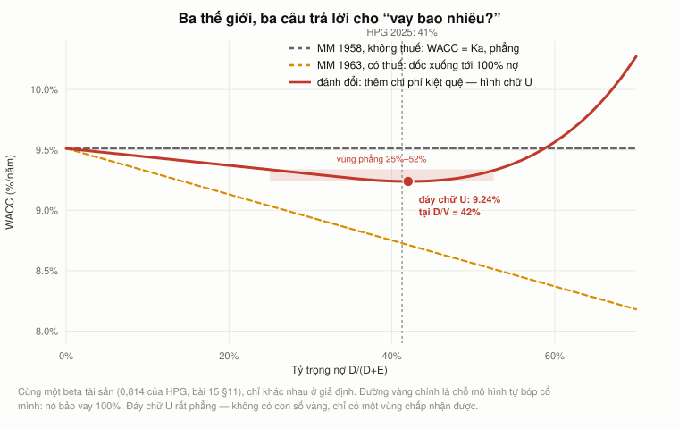
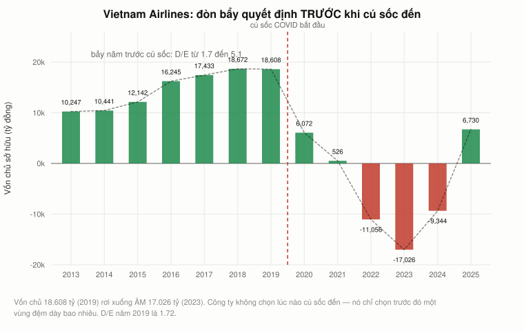
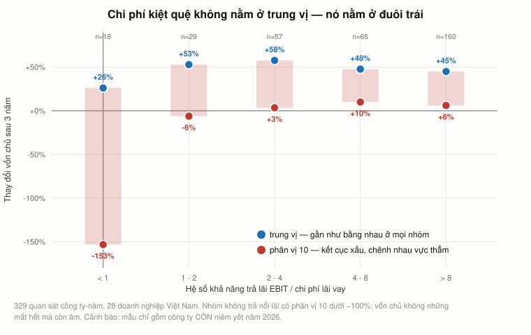
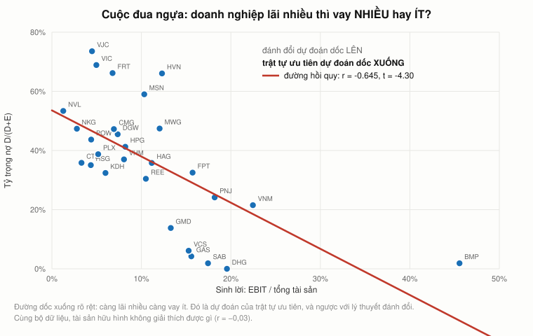
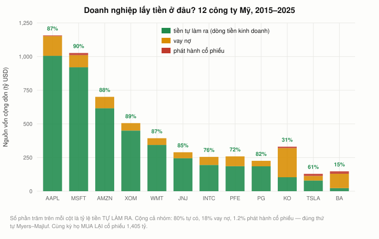

# Bài 16 — Cơ cấu vốn: Modigliani, Miller và giới hạn của lá chắn thuế

> 🏢 **PHẦN E — TÀI CHÍNH DOANH NGHIỆP.** Bài này **không đến từ video của Andrew Lo**.
> Nó trả lời câu hỏi mà [bài 15 §15](bai_15_wacc.md#15-wacc-không-phải-hằng-số--và-đó-là-cửa-vào-bài-16)
> để ngỏ: *"vay thêm thì WACC giảm — vậy vay bao nhiêu là đủ?"*
> Nguồn: Modigliani & Miller (1958, 1963); Myers & Majluf (1984); Frank & Goyal (2009).
> 📌 **Cần đọc trước:** [Bài 15](bai_15_wacc.md) (WACC và công thức Hamada),
> [Bài 14 §10](bai_14_doc_doanh_nghiep_bang_so.md#10-đòn-bẩy-và-khả-năng-trả-lãi--nối-lại-bài-3)
> (hệ số khả năng trả lãi), [Bài 9 §6](bai_09_rui_ro_va_loi_suat.md#6-đuôi-béo-phân-phối-chuẩn-là-xấp-xỉ-không-phải-sự-thật)
> (rủi ro nằm ở đuôi trái), [Bài 3 §3](bai_03_don_bay_va_lam_phat.md#3-cùng-một-cú-giảm-10--ba-kết-cục-hoàn-toàn-khác-nhau)
> (đòn bẩy khuếch đại).
> ⚠️ Số liệu Việt Nam tới báo cáo năm **2025**; số liệu Mỹ tới năm tài chính **2025**.

---

## Mục lục

<!-- MUC-LUC -->
- [1. Câu hỏi bài 15 để ngỏ](#1-câu-hỏi-bài-15-để-ngỏ)
- [2. Định lý Modigliani và Miller — đòn bẩy tự chế](#2-định-lý-modigliani-và-miller--đòn-bẩy-tự-chế)
- [3. Mệnh đề II — chi phí vốn chủ tăng đúng bằng phần tiết kiệm](#3-mệnh-đề-ii--chi-phí-vốn-chủ-tăng-đúng-bằng-phần-tiết-kiệm)
- [4. Bốn giả định — dùng chúng như một danh sách kiểm](#4-bốn-giả-định--dùng-chúng-như-một-danh-sách-kiểm)
- [5. Lá chắn thuế — và kết luận phi lý mà nó kéo theo](#5-lá-chắn-thuế--và-kết-luận-phi-lý-mà-nó-kéo-theo)
- [6. Lá chắn thuế lớn đến đâu trong đời thực](#6-lá-chắn-thuế-lớn-đến-đâu-trong-đời-thực)
- [7. Kiệt quệ tài chính — đọc một hồ sơ thật](#7-kiệt-quệ-tài-chính--đọc-một-hồ-sơ-thật)
- [8. Đo chi phí kiệt quệ bằng dữ liệu — nó nằm ở đuôi trái](#8-đo-chi-phí-kiệt-quệ-bằng-dữ-liệu--nó-nằm-ở-đuôi-trái)
- [9. Lý thuyết đánh đổi — và cái giả định không đo được](#9-lý-thuyết-đánh-đổi--và-cái-giả-định-không-đo-được)
- [10. Trật tự ưu tiên — Myers và Majluf](#10-trật-tự-ưu-tiên--myers-và-majluf)
- [11. Cuộc đua ngựa — dữ liệu Việt Nam chọn bên nào](#11-cuộc-đua-ngựa--dữ-liệu-việt-nam-chọn-bên-nào)
- [12. Boeing đi xuống ba bậc thang, 2015–2024](#12-boeing-đi-xuống-ba-bậc-thang-20152024)
- [13. Câu đố không đòn bẩy — Coteccons một thập kỷ](#13-câu-đố-không-đòn-bẩy--coteccons-một-thập-kỷ)
- [14. Bốn lực còn lại, ngắn gọn](#14-bốn-lực-còn-lại-ngắn-gọn)
- [15. Chín sai lầm về cơ cấu vốn](#15-chín-sai-lầm-về-cơ-cấu-vốn)
- [16. Quy trình năm bước — dùng được vào thứ Hai](#16-quy-trình-năm-bước--dùng-được-vào-thứ-hai)
- [17. Góc Việt Nam — bốn điều khác với sách giáo khoa Mỹ](#17-góc-việt-nam--bốn-điều-khác-với-sách-giáo-khoa-mỹ)
- [18. Đi tiếp](#18-đi-tiếp)
- [19. Code minh hoạ](#19-code-minh-hoạ)
- [20. Từ điển thuật ngữ](#20-từ-điển-thuật-ngữ)
- [21. Câu hỏi tự kiểm tra](#21-câu-hỏi-tự-kiểm-tra)
- [Tóm tắt một trang](#tóm-tắt-một-trang)
- [Nguồn](#nguồn)
<!-- /MUC-LUC -->

---

## 1. Câu hỏi bài 15 để ngỏ

Bài 15 dựng xong WACC và kết thúc ở một quan sát khó chịu:

| Mã  |   D/(D+E) |         Ke | Kd sau thuế |       WACC |
| --- | --------: | ---------: | ----------: | ---------: |
| MWG |     21,8% |     11,69% |       4,11% | **10,04%** |
| HPG | **35,6%** | **12,39%** |       2,85% |  **8,99%** |

HPG có chi phí vốn chủ **cao hơn** MWG mà WACC lại **thấp hơn** — chỉ vì nó vay nhiều hơn. Nợ sau
thuế rẻ hơn vốn chủ ở mọi doanh nghiệp trong mẫu, không có ngoại lệ.

Nếu vậy thì tại sao không vay hết? Vì sao Vinamilk chỉ vay 6,8% vốn, còn Dược Hậu Giang không vay
một đồng nào?

Câu hỏi này nghe như một bài toán tối ưu hoá. Nó không phải. Nó là câu hỏi mà năm 1958 hai nhà kinh
tế đã trả lời bằng một định lý gây sốc, rồi năm 1963 tự sửa lại, và bảy chục năm sau vẫn chưa có
câu trả lời thống nhất. Bài này đi qua từng lớp một, và mỗi lớp đều được đối chiếu với số thật.

---

## 2. Định lý Modigliani và Miller — đòn bẩy tự chế

Franco Modigliani và Merton Miller đặt một câu hỏi mà không ai nghĩ là câu hỏi. Cho hai công ty có
**tài sản y hệt nhau** — cùng nhà máy, cùng khách hàng, cùng EBIT — và khác nhau duy nhất ở bên phải
bảng cân đối:

|         | Công ty U | Công ty L          |
| ------- | --------- | ------------------ |
| Tài sản | 1.000 tỷ  | 1.000 tỷ           |
| Nợ vay  | 0         | 500 tỷ, lãi 6%/năm |
| Vốn chủ | 1.000 tỷ  | 500 tỷ             |

Lợi nhuận về tay cổ đông trong bốn kịch bản:

| EBIT | U: về cổ đông | ROE của U | L: về cổ đông | ROE của L |
| ---: | ------------: | --------: | ------------: | --------: |
|   50 |            50 |      5,0% |            20 |  **4,0%** |
|  100 |           100 |     10,0% |            70 |     14,0% |
|  150 |           150 |     15,0% |           120 |     24,0% |
|  200 |           200 |     20,0% |           170 | **34,0%** |

Phần này ai cũng thấy: đòn bẩy khuếch đại cả hai chiều, đúng như [bài 3 §3](bai_03_don_bay_va_lam_phat.md#3-cùng-một-cú-giảm-10--ba-kết-cục-hoàn-toàn-khác-nhau)
đã chỉ ra. Nó **khuếch đại**, không **tạo ra**.

Điều Modigliani và Miller thấy thêm là điều làm nên định lý: **nhà đầu tư không cần công ty L để có
được dòng tiền của L.** Họ tự tạo lấy.

### Đòn bẩy tự chế

Muốn dòng tiền của 10% vốn chủ công ty L, có hai đường:

|                        | Bỏ ra | Cách làm                                                                    |
| ---------------------- | ----: | --------------------------------------------------------------------------- |
| **Cách 1** — mua thẳng | 50 tỷ | mua 10% vốn chủ của L                                                       |
| **Cách 2** — tự làm    | 50 tỷ | vay cá nhân 50 tỷ lãi 6%, cộng 50 tỷ tiền túi, mua 10% công ty U hết 100 tỷ |

Hai cách trả về dòng tiền **giống hệt nhau ở mọi kịch bản** — chương trình kiểm bằng `assert` tới
sai số `1e-12`:

| EBIT | cách 1: mua L | cách 2: U + vay | chênh |
| ---: | ------------: | --------------: | ----: |
|   50 |          2,00 |            2,00 |  0,00 |
|  100 |          7,00 |            7,00 |  0,00 |
|  150 |         12,00 |           12,00 |  0,00 |
|  200 |         17,00 |           17,00 |  0,00 |

### Vì sao hai giá trị **buộc phải** bằng nhau

Giả sử thị trường định giá vốn chủ của L là **550 tỷ** thay vì 500 — tức L "đắt hơn" U. Khi đó ai
cũng làm được chuỗi giao dịch sau, ở quy mô 10%:

```
bán khống vốn chủ của L      thu về    +55,0 tỷ
vay cá nhân                  thu về    +50,0 tỷ
mua 10% công ty U            chi ra   −100,0 tỷ
------------------------------------------------
tiền vào túi NGAY HÔM NAY               +5,0 tỷ
```

Mọi nghĩa vụ trả sau đó triệt tiêu nhau — bảng trên đã chứng minh. Tiền từ không mà ra, không rủi
ro. Ai cũng sẽ làm, và làm đến khi giá của L tụt về 500 tỷ.

> **Mệnh đề I:** V(có đòn bẩy) = V(không đòn bẩy).
> Giá trị công ty do **tài sản** quyết định, không do cách chia miếng bánh.

Chú ý cấu trúc của lập luận: nó **không** dùng một dòng toán cao cấp nào. Nó là chính xác lập
luận **luật một giá** của [bài 5 §4](bai_05_duration_va_chung_khoan_hoa.md#4-luật-một-giá--và-giả-định-tối-thiểu-để-nó-đúng)
và [bài 8 §19](bai_08_quyen_chon.md#19-ngang-giá-putcall--chỗ-lo-chạm-rồi-bỏ): nếu hai thứ
cho cùng một dòng tiền trong mọi trạng thái thì chúng phải cùng giá. Đây là lần thứ ba khoá học
dùng đúng con dao đó, và lần này nó cắt vào bảng cân đối kế toán.

---

## 3. Mệnh đề II — chi phí vốn chủ tăng đúng bằng phần tiết kiệm

Mệnh đề I nói giá trị không đổi. Mệnh đề II nói **tại sao**, và đây mới là phần dùng được.

Nếu WACC không đổi khi vay thêm, mà nợ lại rẻ hơn vốn chủ, thì phải có cái gì đó tăng lên để bù. Cái
đó là chi phí vốn chủ:

$$K_e \;=\; K_a \;+\; (K_a - K_d)\cdot \frac{D}{E}$$

$K_a$ là suất sinh lời của **tài sản** — thứ không phụ thuộc ai tài trợ. Với $K_a = 10\%$ và
$K_d = 6\%$, mỗi đơn vị D/E cộng thêm kéo $K_e$ lên đúng 4 điểm phần trăm:

|  D/E | D/(D+E) |     Ke |    Kd |   WACC | WACC − Ka |
| ---: | ------: | -----: | ----: | -----: | --------: |
| 0,00 |    0,0% | 10,00% | 6,00% | 10,00% |   0,0e+00 |
| 0,50 |   33,3% | 12,00% | 6,00% | 10,00% |   0,0e+00 |
| 1,00 |   50,0% | 14,00% | 6,00% | 10,00% |   0,0e+00 |
| 2,00 |   66,7% | 18,00% | 6,00% | 10,00% |   0,0e+00 |
| 3,00 |   75,0% | 22,00% | 6,00% | 10,00% |   0,0e+00 |

Cột cuối là chênh lệch **thực sự tính ra**, không phải làm tròn để trình bày. WACC bằng đúng 10% ở
mọi mức đòn bẩy, đến tận chữ số cuối cùng mà số thực phẩy động biểu diễn được.

**Cái gì đã xảy ra:** bạn vay thêm tiền rẻ, nhưng đồng thời làm cho phần vốn chủ còn lại **rủi ro
hơn**, nên cổ đông đòi suất sinh lời cao hơn. Hai hiệu ứng triệt tiêu nhau chính xác.

⚠️ **Cái bẫy ngôn ngữ.** Người ta hay nói *"nợ rẻ hơn vốn chủ nên vay nhiều vào thì chi phí vốn
giảm"*. Vế phải đúng — $K_d < K_e$ luôn đúng. Kết luận sai, vì nó quên rằng vay thêm làm $K_e$ tăng.
Đây là sai lầm số 1 trong §15.

### Mệnh đề II chính là công thức Hamada

[Bài 15 §11](bai_15_wacc.md#11-beta-có-đòn-bẩy-và-không-đòn-bẩy--công-thức-hamada) đã dùng:

$$\beta_L = \beta_U \cdot \left[1 + (1-\tau)\cdot \frac{D}{E}\right]$$

Trong thế giới MM không thuế thì $(1-\tau) = 1$, và chương trình kiểm chứng rằng hai cách viết cho
**cùng một con số** ở mọi mức D/E, sai lệch dưới `1e-12`:

|  D/E | Ke theo mệnh đề II | Ke theo Hamada + CAPM |
| ---: | -----------------: | --------------------: |
| 0,00 |              9,40% |                 9,40% |
| 1,00 |             12,80% |                12,80% |
| 3,00 |             19,60% |                19,60% |

Hai đường này không "gần giống nhau". Chúng là **cùng một phương trình**, viết bằng hai bộ ký hiệu.

---

## 4. Bốn giả định — dùng chúng như một danh sách kiểm

Modigliani và Miller **không** nói "đòn bẩy không quan trọng". Họ nói: *nếu* bốn giả định sau đúng
thì đòn bẩy không quan trọng.

|    # | Giả định                                           | Vi phạm ở đâu                          | Bài nào xử lý |
| ---: | -------------------------------------------------- | -------------------------------------- | ------------- |
|    1 | Không thuế                                         | lãi vay được trừ trước thuế            | §5, §6        |
|    2 | Không chi phí phá sản                              | kiệt quệ tốn tiền thật                 | §7, §8        |
|    3 | Không bất cân xứng thông tin                       | ban giám đốc biết nhiều hơn nhà đầu tư | §10, §11, §12 |
|    4 | Nhà đầu tư vay được cùng lãi suất với doanh nghiệp | cá nhân vay đắt hơn và bị hạn mức      | §17           |

**Đây là cách dùng MM.** Định lý không cho bạn con số. Nó biến câu hỏi mơ hồ *"cơ cấu vốn có quan
trọng không?"* thành câu hỏi **kiểm được**: *giả định nào bị vi phạm, và vi phạm bao nhiêu?*

Toàn bộ phần còn lại của bài là đo bốn cái vi phạm đó.

---

## 5. Lá chắn thuế — và kết luận phi lý mà nó kéo theo

Năm 1963 chính Modigliani và Miller sửa bài báo của mình. Giả định thứ nhất là giả định dễ bỏ nhất:
lãi vay được trừ **trước** khi tính thuế, còn cổ tức thì không. Nhà nước trợ cấp cho việc vay nợ.

Với một công ty vay **vĩnh viễn** D đồng lãi suất $K_d$:

$$\text{thuế tiết kiệm mỗi năm} = K_d \cdot D \cdot \tau
\quad\Longrightarrow\quad
PV = \frac{K_d \cdot D \cdot \tau}{K_d} = \tau \cdot D$$

**Giá trị lá chắn thuế = thuế suất × dư nợ.** $K_d$ biến mất khỏi công thức.

Chương trình cộng từng năm để kiểm, với D = 800 tỷ, $K_d$ = 6%, τ = 20% (mục tiêu τD = 160):

| Số năm chiết khấu | Giá trị hiện tại | % của τD |
| ----------------: | ---------------: | -------: |
|                10 |            70,66 |   44,16% |
|                30 |           132,14 |   82,59% |
|               100 |           159,53 |   99,71% |
|               300 |           160,00 |  100,00% |

Chuỗi hội tụ về đúng 160 = 20% × 800.

### Chỗ mô hình tự bóp cổ mình

Mệnh đề I có thuế kéo theo một công thức WACC rất gọn:

$$WACC_L = K_a \cdot \left(1 - \tau \cdot \frac{D}{V}\right)$$

Đọc thẳng: WACC giảm **tuyến tính** theo tỷ trọng nợ, **không có đáy**. Với $K_a = 9{,}51\%$ (beta
tài sản 0,814 của HPG, [bài 15 §11](bai_15_wacc.md#11-beta-có-đòn-bẩy-và-không-đòn-bẩy--công-thức-hamada)):

| D/(D+E)           |    0% |   20% |   40% |   60% |   80% |      100% |
| ----------------- | ----: | ----: | ----: | ----: | ----: | --------: |
| WACC theo MM 1963 | 9,51% | 9,13% | 8,75% | 8,37% | 7,99% | **7,61%** |

Tối ưu nằm ở **100% nợ**, vốn chủ bằng không. Không có doanh nghiệp nào trên thế giới làm vậy.

Một mô hình cho ra kết luận mà không ai làm theo là một mô hình **thiếu cái gì đó**. §7 và §8 đi tìm
cái thiếu đó. Nhưng trước hết, hãy đo xem cái **lợi** này lớn đến đâu.



---

## 6. Lá chắn thuế lớn đến đâu trong đời thực

Lý thuyết nói lá chắn thuế đáng giá. Câu hỏi thực dụng: **bao nhiêu?** Lấy số thật của 28 doanh
nghiệp niêm yết Việt Nam, năm báo cáo gần nhất, tính $\tau \times$ lãi vay rồi so với lợi nhuận sau
thuế:

| Mã  | Lãi vay (tỷ) | Lá chắn thuế @20% |    / LNST |
| --- | -----------: | ----------------: | --------: |
| VIC |       29.160 |             5.832 | **52,7%** |
| VJC |        3.620 |               724 |     34,1% |
| NKG |          220 |                44 |     22,3% |
| MSN |        5.418 |             1.084 |     16,0% |
| …   |              |                   |           |
| GAS |          216 |                43 |      0,4% |
| SAB |           34 |                 7 |      0,2% |
| BMP |            0 |                 0 |      0,0% |

**Trung vị của cả 28 doanh nghiệp: lá chắn thuế bằng 4,1% lợi nhuận sau thuế.** Với một nửa số doanh
nghiệp, món quà thuế của cả năm nhỏ hơn 4% lợi nhuận.

### Và còn một lý do nữa khiến nó nhỏ hơn lý thuyết

Lá chắn chỉ đáng giá nếu bạn **thực sự phải nộp thuế**. Thuế suất hiệu dụng của nhiều doanh nghiệp
Việt Nam thấp hơn 20% vì ưu đãi đầu tư:

| Mã  | LNTT (tỷ) | Thuế đã nộp | Thuế suất hiệu dụng |
| --- | --------: | ----------: | ------------------: |
| HAG |     2.202 |         −38 |           **−1,7%** |
| HVN |     8.168 |         561 |                6,9% |
| POW |     3.234 |         227 |                7,0% |
| NVL |     3.027 |       1.166 |               38,5% |
| VIC |    26.437 |      15.373 |               58,1% |

Trung vị 28 doanh nghiệp: **18,0%**, so với thuế suất luật định 20%.

⚠️ Đừng nhầm hai con số này. WACC dùng thuế suất **biên** (đồng lãi vay *tiếp theo* tiết kiệm được
bao nhiêu) — chi tiết ở [bài 15 §5](bai_15_wacc.md#5-lá-chắn-thuế-và-bẫy-thuế-suất-biên-so-với-hiệu-dụng).
Nhưng nếu doanh nghiệp đang trong kỳ miễn giảm thuế thì thuế suất biên của nó cũng thấp, và lá chắn
gần như không tồn tại. Bảng trên là dấu hiệu cần kiểm.

Tóm lại vế **lợi**: vài phần trăm lợi nhuận mỗi năm. Bây giờ đo vế **hại**.

---

## 7. Kiệt quệ tài chính — đọc một hồ sơ thật

Thay vì vẽ đường cong "chi phí kiệt quệ", ta đọc một hồ sơ: **Tổng công ty Hàng không Việt Nam
(HVN)**.

|  Năm | Tổng TS |        VCSH | Nợ vay |       D/E |    EBIT | Lãi vay | EBIT/lãi |
| ---: | ------: | ----------: | -----: | --------: | ------: | ------: | -------: |
| 2017 |  88.550 |      17.433 | 47.122 |      2,70 |   4.713 |   1.558 |     3,02 |
| 2018 |  82.390 |      18.672 | 38.466 |      2,06 |   4.873 |   1.561 |     3,12 |
| 2019 |  76.455 |  **18.608** | 31.934 |      1,72 |   4.844 |   1.455 |     3,33 |
| 2020 |  62.562 |       6.072 | 34.051 |      5,61 | −10.035 |     926 |   −10,84 |
| 2021 |  63.060 |     **526** | 34.800 | **66,16** | −12.159 |     807 |   −15,07 |
| 2022 |  60.636 | **−11.056** | 28.268 |      *âm* |  −9.781 |   1.165 |    −8,40 |
| 2023 |  57.717 | **−17.026** | 27.368 |      *âm* |  −3.808 |   1.555 |    −2,45 |
| 2024 |  58.187 |      −9.344 | 20.483 |      *âm* |   9.697 |   1.282 |     7,57 |
| 2025 |  73.175 |       6.730 | 13.104 |      1,95 |   9.006 |     838 |    10,75 |

Vốn chủ **18.608 tỷ (2019) → 526 tỷ (2021) → âm 17.026 tỷ (2023)**. Bay hơi trong hai năm, rồi xuống
dưới không và ở đó thêm ba năm. Vốn chủ âm nghĩa là: bán hết tài sản theo giá sổ sách cũng không đủ
trả nợ. Về mặt kế toán, chủ nợ đã sở hữu toàn bộ công ty.

### Điều đáng chú ý nhất không phải cú sốc — mà là D/E **trước** cú sốc

| Năm         | 2013 | 2014 |     2015 | 2016 | 2017 | 2018 | 2019 |
| ----------- | ---: | ---: | -------: | ---: | ---: | ---: | ---: |
| D/E của HVN | 4,24 | 4,36 | **5,13** | 3,75 | 2,70 | 2,06 | 1,72 |

Suốt bảy năm trước đại dịch, HVN chạy với D/E từ 1,7 đến 5,1. Với đòn bẩy đó, một cú sốc làm mất hai
năm lợi nhuận là đủ xoá sạch vốn chủ.

Công ty **không chọn** lúc nào cú sốc đến. Nó chỉ chọn, từ trước, một vùng đệm dày bao nhiêu. **Đó
chính là quyết định cơ cấu vốn**, và nó được đưa ra nhiều năm trước ngày nó có ý nghĩa.



### Ví dụ thứ hai — bán tài sản dưới áp lực nợ

Hoàng Anh Gia Lai (HAG):

|  Năm |    Tổng TS | Nợ vay |   VCSH | Lãi vay |   LNST | Lãi vay / EBIT |
| ---: | ---------: | -----: | -----: | ------: | -----: | -------------: |
| 2016 |     52.126 | 27.337 | 15.946 |   1.628 | −2.183 |      *EBIT âm* |
| 2017 |     53.062 | 22.825 | 17.788 |   1.585 |    372 |            79% |
| 2018 | **48.111** | 21.754 | 16.811 |   1.533 |      6 |        **97%** |
| 2019 |     33.575 | 14.698 | 11.752 |   1.263 | −1.909 |      *EBIT âm* |
| 2020 |     37.266 | 18.103 | 10.028 |   1.254 | −2.383 |      *EBIT âm* |
| 2021 | **18.440** |  8.286 |  4.673 |     972 |    128 |           116% |

Tổng tài sản 48.111 tỷ (2018) → 18.440 tỷ (2021): **mất 62% quy mô trong ba năm**. Đó không phải
"tinh gọn danh mục". Đó là bán tài sản để trả nợ, và người mua **biết** bạn đang phải bán. Khoản
chênh giữa giá bán gấp và giá bình thường chính là chi phí kiệt quệ — và nó không nằm ở dòng nào
trên báo cáo.

Năm 2018 đáng nhìn kỹ: lãi vay ăn **97% EBIT**. Công ty làm ra tiền, và gần như toàn bộ chảy sang
chủ nợ. LNST năm đó: 6 tỷ trên tổng tài sản 48.111 tỷ.

### Bốn dạng chi phí kiệt quệ, không dạng nào cần toà án

1. **Bán tài sản gấp, dưới giá** — HAG ở trên.
2. **Cắt đầu tư vào dự án tốt** vì tiền phải đi trả lãi. Đây là *underinvestment*: doanh nghiệp
   bỏ qua đúng những dự án NPV dương mà [bài 12](bai_12_ngan_sach_von.md) dạy cách nhận ra. Khoản
   mất ở đây không phải tiền đã tiêu, mà là giá trị chưa bao giờ được tạo ra — nên nó không xuất
   hiện ở bất kỳ đâu trong sổ sách.
3. **Khách hàng và nhà cung cấp bỏ đi** vì sợ công ty không tồn tại sang năm. Nặng nhất với những
   ngành bán sản phẩm cần bảo hành hoặc phụ tùng dài hạn — hàng không, ô tô, xây dựng.
4. **Nhân sự giỏi nghỉ việc** trước khi công ty kịp xoay xở.

⚠️ Ba trong bốn dạng trên xảy ra **trước** khi có bất kỳ thủ tục pháp lý nào. Đó là lý do "chi phí
phá sản" là một cái tên tồi cho thứ này.

---

## 8. Đo chi phí kiệt quệ bằng dữ liệu — nó nằm ở đuôi trái

HVN và HAG là hai câu chuyện. Câu chuyện thì thuyết phục nhưng không chứng minh được gì —
[bài 13 §4](bai_13_thi_truong_hieu_qua.md#4-điều-maloney--mulherin-tìm-ra-mà-lo-không-kể) đã cảnh báo về
việc kể chuyện thay vì đếm.

Nên ta đếm. Với mỗi doanh nghiệp và mỗi năm: lấy **hệ số khả năng trả lãi** (EBIT / chi phí lãi vay)
của năm đó, rồi nhìn **vốn chủ ba năm sau** tăng hay giảm. Kết quả trên **329 quan sát công ty-năm,
28 doanh nghiệp, 2010–2022**:

| EBIT / lãi vay |    n | Trung vị | **Phân vị 10** |  Tệ nhất |  Tỷ lệ âm |
| -------------: | ---: | -------: | -------------: | -------: | --------: |
|            < 1 |   18 |   +26,0% |    **−153,2%** | −1876,5% | **33,3%** |
|          1 – 2 |   29 |   +52,8% |          −6,1% |   −72,2% |     17,2% |
|          2 – 4 |   57 |   +57,6% |          +3,4% |  −159,4% |     10,5% |
|          4 – 8 |   65 |   +47,6% |         +10,0% |   −29,4% |      3,1% |
|            > 8 |  160 |   +44,9% |      **+6,1%** |   −19,8% |  **4,4%** |

**Đọc cột "trung vị" thì không thấy gì.** Nhóm không trả nổi lãi có trung vị +26,0%; nhóm thoải
mái +44,9%. Chênh nhau không đáng kể so với độ tản mát.

**Đọc cột "phân vị 10" thì thấy ngay.** Nhóm không trả nổi lãi: **−153,2%**. Nhóm thoải mái:
**+6,1%**. Chênh **159 điểm phần trăm**. Phân vị 10 âm hơn 100% nghĩa là vốn chủ không những mất hết
mà còn âm.

Tỷ lệ kết cục xấu: **33,3%** ở nhóm coverage < 1, so với **4,4%** ở nhóm > 8 — **gấp 7,6 lần**.



> **Đây là hình dạng của chi phí kiệt quệ.** Nó không làm kết quả **trung bình** xấu đi bao nhiêu.
> Nó làm **đuôi trái** dày lên.

Đúng cái hình dạng mà [bài 9 §6](bai_09_rui_ro_va_loi_suat.md#6-đuôi-béo-phân-phối-chuẩn-là-xấp-xỉ-không-phải-sự-thật)
đã đo được ở lợi suất cổ phiếu: rủi ro thật nằm ở đuôi, không nằm ở phương sai. Vì thế **"vay bao
nhiêu" không phải bài toán tối đa hoá kỳ vọng.** Nó là bài toán về việc bạn chịu được bao nhiêu ở
đuôi trái.

### Hai cảnh báo về bảng này

**(1) Thiên lệch sống sót.** Cả 28 doanh nghiệp đều **còn niêm yết** năm 2026. Những công ty thật sự
phá sản vì nợ đã rời khỏi mẫu **trước khi** ta lấy dữ liệu. Nên con số "33,3% kết cục xấu" là một
con số **dưới mức thật**. [Bài 13](bai_13_thi_truong_hieu_qua.md) đã phải thay hai mã cổ phiếu
vì đúng cái bẫy này.

**(2) Mẫu nhỏ ở nhóm quan trọng nhất.** Chỉ có 18 quan sát coverage < 1. Với n nhỏ như vậy, phân vị
10 là một con số lung lay. Nó cho biết **hướng**, không cho biết **độ lớn** chính xác.

Danh sách đầy đủ 18 quan sát đó nằm trong output chương trình, và nó cho thấy một điều nữa: coverage
< 1 **không phải là định mệnh**. VJC năm 2020 (coverage 0,46) sau ba năm vốn chủ vẫn tăng nhẹ; FRT
năm 2013 tăng hơn hai mươi lần từ nền thấp. Nhưng **mọi kết cục tệ nhất đều đến từ nhóm này**. Đó
chính là bất đối xứng.

---

## 9. Lý thuyết đánh đổi — và cái giả định không đo được

Ghép hai lực lại: vay thêm được lá chắn thuế (§5, §6) nhưng phải chịu xác suất kiệt quệ cao hơn (§7,
§8). **Lý thuyết đánh đổi** nói có một mức đòn bẩy tối ưu, ở đó đạo hàm của hai lực bằng nhau.

Dựng mô hình bằng số của HPG: beta tài sản 0,814, rf 3%, phần bù 8%, thuế 20%. $K_e$ theo Hamada;
$K_d$ **giả định** phẳng tới D/V = 35% rồi cong lên.

| D/(D+E) |  D/E |  beta |     Ke |    Kd | Kd sau thuế |      WACC |
| ------: | ---: | ----: | -----: | ----: | ----------: | --------: |
|      0% | 0,00 | 0,814 |  9,51% | 4,50% |       3,60% |     9,51% |
|     20% | 0,25 | 0,977 | 10,81% | 4,50% |       3,60% |     9,37% |
|     35% | 0,54 | 1,165 | 12,32% | 4,50% |       3,60% |     9,27% |
| **40%** | 0,67 | 1,248 | 12,99% | 4,53% |       3,63% | **9,24%** |
|     50% | 1,00 | 1,465 | 14,72% | 4,82% |       3,85% |     9,29% |
|     60% | 1,50 | 1,791 | 17,33% | 5,49% |       4,39% |     9,56% |
|     70% | 2,33 | 2,333 | 21,67% | 6,74% |       5,39% |    10,27% |
|     80% | 4,00 | 3,419 | 30,35% | 9,03% |       7,22% |    11,85% |

WACC thấp nhất tại D/(D+E) = 40%, bằng **9,24%**. Trên lưới dày hơn (bước 0,2% thay vì 5%) thì đáy
rơi vào **42,2%** — vẫn 9,24%. **Hai con số khác nhau 2,2 điểm mà WACC chỉ lệch 0,3 phần vạn.**

**Đó là điều quan trọng nhất của cả mục này: đáy đường cong PHẲNG.** Từ 25% đến 50%, WACC chỉ
nhúc nhích trong 0,1 điểm. Không có một con số vàng nào cả. Có một **vùng rộng** chấp nhận được, và
hai bờ vực ở hai bên. HPG năm 2025 đang ở 41,3% — nằm gọn trong vùng đó.

So với không vay đồng nào (9,51%), vay đến mức tối ưu tiết kiệm **0,27 điểm**. Đặt con số đó cạnh
biên độ 5,0 điểm của chính WACC trong [bài 15 §9](bai_15_wacc.md#9-wacc-không-phải-một-con-số-nó-là-một-khoảng),
và bạn thấy ngay: **phần lợi từ tối ưu hoá đòn bẩy nhỏ hơn sai số đo lường của chính WACC.**

### Và giờ là phần trung thực nhất của bài này

Đường cong trên phụ thuộc **hoàn toàn** vào hàm $K_d(w)$ mà tôi **viết ra**. Tôi chọn nó cho có hình
dạng đẹp. Câu hỏi đúng phải là: **có đo được hàm đó từ dữ liệu không?**

Với mỗi doanh nghiệp-năm có dư nợ đủ lớn, tính lãi suất vay thực tế (chi phí lãi vay / dư nợ bình
quân) rồi hồi quy theo tỷ trọng nợ. **350 quan sát:**

$$K_d = 5{,}97\% \;-\; 0{,}78 \times \frac{D}{D+E}, \qquad t = -1{,}24$$

| D/(D+E) |    n | Kd trung vị | Kd trung bình |
| ------- | ---: | ----------: | ------------: |
| 0–10%   |   32 |       5,67% |         5,63% |
| 20–30%  |   49 |       5,21% |         5,48% |
| 40–50%  |   60 |       5,30% |         5,71% |
| 50–60%  |   49 |       5,88% |         5,73% |
| 60–101% |   67 |   **4,65%** |         5,44% |

**Hệ số góc −0,78 với t = −1,24: không phân biệt được với không — và dấu của nó còn ngược với lý
thuyết.** Doanh nghiệp vay 60% tổng vốn trả lãi suất gần bằng, thậm chí thấp hơn, doanh nghiệp vay
5%.

Điều đó **không** có nghĩa vay nhiều thì miễn phí. Nó có nghĩa: ở Việt Nam, **giá của đòn bẩy không
hiện ra ở lãi suất**. Bốn lý do:

|     | Lý do                                                                                                     | Hệ quả                                                                                                                                 |
| --- | --------------------------------------------------------------------------------------------------------- | -------------------------------------------------------------------------------------------------------------------------------------- |
| (a) | Ngân hàng phân bổ theo **lượng**, không theo **giá**                                                      | không đủ tài sản thế chấp thì *không được vay*, chứ không phải vay với lãi cao hơn → biên độ lãi suất hẹp một cách giả tạo             |
| (b) | Thị trường trái phiếu doanh nghiệp chưa định giá rủi ro tín dụng đáng tin cậy, nhất là sau đợt đổ vỡ 2022 | không có đường cong chênh lệch tín dụng để tham chiếu                                                                                  |
| (c) | $K_d$ đọc từ báo cáo là lãi suất **bình quân của nợ cũ**                                                  | trễ hơn lãi suất khoản vay **mới** — đúng cảnh báo [bài 15 §4](bai_15_wacc.md#4-chi-phí-nợ--đọc-ra-từ-báo-cáo-không-cần-hỏi-ngân-hàng) |
| (d) | Thiên lệch sống sót lại xuất hiện                                                                         | những người lẽ ra phải trả lãi suất rất cao đã không còn trong mẫu                                                                     |

> ⇒ **Kết luận thực dụng cho người làm nghề ở Việt Nam:** đừng kỳ vọng thị trường tín dụng báo cho
> bạn biết khi nào bạn vay quá nhiều. Nó sẽ không báo. Cái giá hiện ra đột ngột ở đuôi trái, đúng
> như bảng §8.

---

## 10. Trật tự ưu tiên — Myers và Majluf

Có một lý thuyết thứ hai, và nó dự đoán **ngược lại** ở một điểm kiểm được.

**Trật tự ưu tiên** (Myers & Majluf, 1984) xuất phát từ **bất cân xứng thông tin**. Ban giám đốc
biết về công ty nhiều hơn nhà đầu tư bên ngoài. Nên khi công ty phát hành cổ phiếu, thị trường suy
ra: *"chắc họ thấy cổ phiếu đang đắt"* — và giá rớt ngay khi công bố. **Phát hành cổ phiếu là một
tin xấu, tự động, bất kể lý do thật.**

Kết quả là một **trật tự** chứ không phải một điểm tối ưu:

|  Bậc | Nguồn              | Vì sao xếp ở đây                                                      |
| ---: | ------------------ | --------------------------------------------------------------------- |
|    1 | tiền tự làm ra     | không phải giải thích với ai, không tạo tín hiệu nào                  |
|    2 | vay nợ             | chủ nợ ít nhạy cảm với thông tin hơn cổ đông — họ chỉ cần được trả đủ |
|    3 | phát hành cổ phiếu | chỉ khi hết đường                                                     |

Chú ý điều này **không** tạo ra một tỷ lệ nợ mục tiêu. Đòn bẩy quan sát được chỉ là *hệ quả tích
luỹ* của việc công ty đã cần bao nhiêu tiền so với làm ra bao nhiêu. Một công ty lãi nhiều sẽ có ít
nợ **không phải vì nó chọn thế**, mà vì nó chưa bao giờ phải xuống bậc 2.

### Hai dự đoán trái ngược

| Lý thuyết           | Công ty lãi nhiều thì… | Vì sao                                             |
| ------------------- | ---------------------- | -------------------------------------------------- |
| **Đánh đổi**        | vay **NHIỀU** hơn      | nhiều lợi nhuận chịu thuế hơn → nhiều thuế để chắn |
| **Trật tự ưu tiên** | vay **ÍT** hơn         | đủ tiền tự có, không phải xuống bậc 2              |

Đây là một cuộc đua ngựa kiểm được bằng dữ liệu. §11 chạy nó.

---

## 11. Cuộc đua ngựa — dữ liệu Việt Nam chọn bên nào

28 doanh nghiệp, năm gần nhất. Tương quan giữa từng biến giải thích và tỷ trọng nợ D/(D+E):

| Biến giải thích           | Dự đoán               |          r |         t | Kết quả     |
| ------------------------- | --------------------- | ---------: | --------: | ----------- |
| EBIT / tổng tài sản       | đánh đổi +, trật tự − | **−0,645** | **−4,30** | **RÕ RÀNG** |
| TSCĐ hữu hình / tổng TS   | cả hai +              |     −0,029 |     −0,15 | KHÔNG CÓ    |
| Tồn kho / tổng TS         | cả hai +              |     +0,079 |     +0,40 | KHÔNG CÓ    |
| (hữu hình + tồn kho) / TS | cả hai +              |     +0,073 |     +0,37 | KHÔNG CÓ    |
| log(tổng tài sản)         | cả hai +              |     +0,527 |     +3,16 | **RÕ RÀNG** |

**Sinh lời: r = −0,645, t = −4,30.** Doanh nghiệp càng lãi nhiều càng vay **ít**. Dấu **ngược**
với dự đoán của lý thuyết đánh đổi, **đúng** với trật tự ưu tiên.

Đây cũng chính là kết quả Frank & Goyal (2009) tìm thấy trên hàng chục nghìn doanh nghiệp Mỹ: **sinh
lời là biến có dấu âm ổn định nhất** trong mọi hồi quy cơ cấu vốn từng chạy.



**Tài sản thế chấp: r = −0,029, t = −0,15 — không có gì cả.** Lý thuyết nói tài sản hữu hình là
vật thế chấp nên giúp vay được nhiều hơn. Ở Việt Nam năm nay thì không thấy. Lý do nằm ngay trong
danh sách: người vay nhiều nhất **không phải nhà máy** — mà là **bất động sản** (VIC 68,9%, NVL
53,4%, thế chấp bằng hàng tồn kho dự án) và **hàng không** (VJC 73,6%, HVN 66,1%, máy bay phần lớn
đi thuê nên không nằm ở TSCĐ hữu hình).

Ngược lại, HPG có 51,7% tài sản là TSCĐ hữu hình — cao nhất mẫu — mà chỉ vay 41,3%.

**Quy mô: r = +0,527, t = +3,16.** Doanh nghiệp lớn vay nhiều hơn. Cả hai lý thuyết đều dự đoán điều
này, nên nó không phân định được ai đúng.

⚠️ **Giới hạn:** n = 28, một năm, một nước, và các doanh nghiệp này do tôi chọn. Đây là minh hoạ cho
một **phương pháp**, không phải bằng chứng về nền kinh tế Việt Nam. Muốn kết luận thì cần toàn bộ
sàn niêm yết và nhiều năm.

---

## 12. Boeing đi xuống ba bậc thang, 2015–2024

§11 kiểm trật tự ưu tiên **gián tiếp** qua tương quan. Giờ kiểm **trực tiếp**: các công ty thực sự
lấy tiền ở đâu?

Báo cáo lưu chuyển tiền tệ của doanh nghiệp Mỹ có đầy đủ ba dòng này, và SEC công bố dưới dạng dữ
liệu máy đọc được. Cộng dồn 11 năm, 12 công ty, đơn vị tỷ USD:

| Mã            | Tiền tự làm ra | Nợ phát hành | CP phát hành | Mua lại CP | Tự có / tổng |
| ------------- | -------------: | -----------: | -----------: | ---------: | -----------: |
| AAPL          |          1.006 |          146 |            5 |    **748** |        86,9% |
| MSFT          |            921 |           90 |           16 |        221 |        89,7% |
| AMZN          |            616 |           85 |            0 |          6 |        87,9% |
| XOM           |            450 |           55 |            0 |         80 |        89,1% |
| KO            |            104 |          216 |           11 |         20 |        31,4% |
| **BA**        |         **23** |      **107** |       **18** |         35 |    **15,4%** |
| TSLA          |             79 |           28 |           16 |          0 |        64,2% |
| **TỔNG (12)** |      **4.352** |    **1.000** |       **66** |  **1.405** |    **80,3%** |

**Trật tự hiện ra đúng như lý thuyết nói:**

| Nguồn              | Tỷ USD | % tổng nguồn |
| ------------------ | -----: | -----------: |
| tiền tự kinh doanh |  4.352 |    **80,3%** |
| vay nợ             |  1.000 |        18,5% |
| phát hành cổ phiếu |     66 |     **1,2%** |

**Và một điều mạnh hơn nữa:** cùng kỳ nhóm này **mua lại** cổ phiếu 1.405 tỷ USD — **gấp 21 lần**
số tiền họ phát hành ra. Họ không chỉ tránh phát hành vốn chủ; họ đi **ngược chiều**, rút vốn chủ về.



### Boeing — đi xuống từng bậc thang, trước mắt mọi người

|      Năm | Tiền tự làm ra | Nợ phát hành | CP phát hành | Mua lại CP |
| -------: | -------------: | -----------: | -----------: | ---------: |
|     2015 |            9,4 |          1,7 |          0,0 |        6,8 |
|     2016 |           10,5 |          1,3 |          0,0 |        7,0 |
|     2017 |           13,3 |          2,1 |          0,0 |        9,2 |
|     2018 |           15,3 |          8,5 |          0,0 |        9,0 |
| **2019** |       **−2,4** |     **25,4** |          0,0 |        2,7 |
| **2020** |      **−18,4** |     **47,2** |          0,0 |        0,0 |
|     2021 |           −3,4 |          9,8 |          0,0 |        0,0 |
|     2022 |            3,5 |          0,0 |          0,0 |        0,0 |
|     2023 |            6,0 |          0,1 |          0,0 |        0,0 |
| **2024** |      **−12,1** |         10,2 |     **18,2** |        0,0 |
|     2025 |            1,1 |          0,2 |          0,0 |        0,0 |

- **2015–2018** — bậc 1: tiền tự kinh doanh dồi dào, mua lại cổ phiếu đều đặn 6–9 tỷ/năm.
- **2019** — 737 MAX bị cấm bay. Dòng tiền kinh doanh **âm**, chuyển sang **vay** 25,4 tỷ.
  [Bài 13 §5](bai_13_thi_truong_hieu_qua.md#5-challenger-phiên-bản-2019--boeing-737-max) đã đo
  phản ứng giá cổ phiếu ngày hôm đó: lợi suất bất thường **−7,50%, t = −5,61**.
- **2020** — đại dịch. Vay tiếp **47,2 tỷ**, quy mô lớn nhất từng có trong ngành.
- **2024** — hết dư địa vay: **phát hành cổ phiếu 18,2 tỷ USD**. Bậc cuối cùng.

Đó là ba bậc thang của trật tự ưu tiên, đi **đúng thứ tự**, trong 10 năm, ở một công ty ai cũng
biết tên. Không ai ở Boeing ngồi "chọn cơ cấu vốn tối ưu". Họ **lần lượt hết lựa chọn**.

### Tesla — ngược lại hoàn toàn, và cũng đúng lý thuyết

| Năm            | 2015 | 2016 | 2017 | 2019 |     2020 |     2021 | 2023 | 2025 |
| -------------- | ---: | ---: | ---: | ---: | -------: | -------: | ---: | ---: |
| Tiền tự làm ra |  0,0 | −0,1 | −0,1 |  2,4 |      5,9 | **11,5** | 13,3 | 14,7 |
| CP phát hành   |  0,7 |  1,7 |  0,4 |  0,8 | **12,3** |      0,0 |  0,0 |  0,0 |

Những năm đầu: tiền tự kinh doanh gần bằng không, phát hành cổ phiếu liên tục. Từ 2021 trở đi, tiền
tự kinh doanh dư dùng — **phát hành dừng hẳn**.

Trật tự ưu tiên không nói *"đừng bao giờ phát hành cổ phiếu"*. Nó nói *"phát hành khi và chỉ khi hai
bậc trên đã hết"*. Tesla ở bậc 3 vì nó **không có** bậc 1.

### Ba giới hạn của bảng này, phải nói rõ

1. **"Nợ phát hành" là số gộp trong năm**, kể cả nợ ngắn hạn quay vòng. Một công ty vay 10 tỷ rồi
   trả, 12 lần trong năm, sẽ hiện ra thành 120 tỷ. Cột này **phóng đại** mức độ dựa vào nợ — và kết
   luận vẫn đúng **bất chấp** sự phóng đại đó, nên đây là một phóng đại an toàn. Điều này giải thích
   KO: 216 tỷ "nợ phát hành" trên 104 tỷ dòng tiền chủ yếu là thương phiếu quay vòng.
2. **Cột "CP phát hành"** chỉ lấy hai thẻ về phát hành cổ phiếu thật, không lấy thẻ về cổ phiếu
   thưởng nhân viên. Nhưng ở một số công ty cả hai thứ vẫn bị gộp chung. Nên con số này là **cận
   trên** của lượng vốn chủ huy động thật — tức 1,2% đã là ước lượng **rộng rãi**.
3. **Tên thẻ XBRL không đồng nhất** giữa các công ty, và cùng một công ty có thể đổi thẻ giữa các
   năm. Chương trình chọn thẻ có nhiều năm dữ liệu nhất trong cửa sổ 2015–2025 và **in ra thẻ đã
   dùng cho từng công ty** — vì một kết quả phụ thuộc lựa chọn thẻ thì phải cho người đọc kiểm được
   lựa chọn đó. Một lỗ hổng cụ thể: TSLA không có dữ liệu nợ phát hành cho 2015–2019 dưới bất kỳ thẻ
   nào dùng được, nên năm ở cột đó là **không biết**, chứ không phải bằng không.

---

## 13. Câu đố không đòn bẩy — Coteccons một thập kỷ

Lý thuyết đánh đổi nói: có lá chắn thuế miễn phí đấy, sao không lấy? Một bộ phận doanh nghiệp trả
lời bằng cách **không lấy đồng nào**. Trong tài chính học gọi đây là *zero-leverage puzzle*.

Coteccons (CTD), nhà thầu xây dựng lớn nhất Việt Nam một thời:

|  Năm | Tổng TS |  VCSH | Nợ vay | D/(D+E) | Lãi vay |      LNST |       ROE |
| ---: | ------: | ----: | -----: | ------: | ------: | --------: | --------: |
| 2010 |   2.017 | 1.269 |  **0** |    0,0% |       0 |       240 |     18,9% |
| 2013 |   4.552 | 2.302 |     65 |    2,8% |   **0** |       280 |     12,2% |
| 2016 |  11.741 | 6.234 |  **0** |    0,0% |       0 |     1.422 | **22,8%** |
| 2017 |  15.877 | 7.307 |  **0** |    0,0% |       0 | **1.653** |     22,6% |
| 2019 |  16.199 | 8.470 |  **0** |    0,0% |       0 |       711 |      8,4% |
| 2020 |  14.157 | 8.399 |  **0** |    0,0% |       0 |       335 |      4,0% |
| 2021 |  13.925 | 8.248 |      2 |    0,0% |       1 |    **24** |      0,3% |
| 2022 |  18.967 | 8.214 |  1.077 |   11,6% |      79 |    **21** |      0,3% |
| 2025 |  34.442 | 9.385 |  5.242 |   35,8% |     178 |       781 |      8,3% |

**Từ 2010 đến 2020 — 11 năm — có 10 năm nợ vay bằng không.** Ngoại lệ duy nhất là 2013, vay 65 tỷ
trên tổng tài sản 4.552 tỷ, và chi phí lãi vay năm đó vẫn bằng không. Trong giai đoạn ấy có năm ROE
**22,8%** — không hề là một công ty yếu kém.

### Hai cách đọc cùng một bảng

**(a) "CTD bỏ lỡ lá chắn thuế suốt một thập kỷ."** Đúng. Nếu vay bằng 30% vốn với lãi 6% thì mỗi năm
tiết kiệm được một khoản thuế.

**(b) "CTD giữ được quyền chọn."** Ngành xây dựng có dòng tiền cực kỳ thất thường: chủ đầu tư chậm
trả, công nợ kéo dài. Không có lãi vay phải trả thì **không bao giờ có năm nào ép đến chân tường**.

Xem chuyện gì đã xảy ra sau đó: LNST **1.653 tỷ (2017) → 24 tỷ (2021) và 21 tỷ (2022)**. Lợi nhuận
bay hơi **99%**. Nếu lúc đó CTD đang gánh chi phí lãi vay như HVN, cái năm ấy đã có thể là năm cuối
cùng của nó.

> **Đó là giá trị của "năng lực vay còn nguyên"** (*debt capacity*). Nó không hiện ra trên báo cáo
> năm nào cả. Nó chỉ hiện ra ở năm mà bạn **cần** nó.

Lý thuyết đánh đổi tính được lá chắn thuế nhưng **không tính được** món này, và đó là một lý do nó
dự đoán đòn bẩy cao hơn thực tế quan sát.

### Và nhóm vay ít nhất trong mẫu lại là nhóm lãi nhiều nhất

| Mã  | D/(D+E) |   EBIT/TS |          EBIT / lãi vay |
| --- | ------: | --------: | ----------------------: |
| DHG |    0,0% |     19,6% |                    39,5 |
| SAB |    1,9% |     17,4% |                   165,8 |
| BMP |    1,9% | **45,5%** | *không trả lãi vay nào* |
| GAS |    4,2% |     15,6% |                    67,4 |
| VCS |    6,1% |     15,3% |                    18,9 |
| GMD |   13,8% |     13,3% |                    23,4 |

- Sinh lời trung bình của 6 doanh nghiệp vay ít nhất: **21,1%** tổng tài sản
- Sinh lời trung bình của 22 doanh nghiệp còn lại: **8,5%**

Nhóm không vay lãi nhiều hơn **gấp 2,5 lần**. Đó lại là trật tự ưu tiên một lần nữa: **họ không vay
vì họ không cần vay.**

---

## 14. Bốn lực còn lại, ngắn gọn

Bốn lý thuyết trên là bốn cái lớn. Còn bốn lực nữa xuất hiện thường xuyên trong thực tế và đáng biết
tên:

**1. Tín hiệu (Ross, 1977).** Vay nợ là một cam kết **không thể rút lại** phải trả tiền mặt. Ban
giám đốc chỉ dám cam kết nếu họ tin dòng tiền tương lai đủ. Nên **tăng nợ là tín hiệu tốt** — ngược
hẳn với phát hành cổ phiếu. Đây là mặt kia của Myers–Majluf.

**2. Kỷ luật nợ (Jensen, 1986).** Tiền mặt dư thừa trong tay ban giám đốc dễ bị tiêu vào những dự án
làm công ty **to ra** chứ không **giá trị hơn**. Nghĩa vụ trả nợ định kỳ ép kỷ luật lên việc chi
tiêu. Nợ ở đây là một công cụ **quản trị**, không phải công cụ tài chính. Đây là cửa vào bài 17.

**3. Thời điểm thị trường (Baker & Wurgler, 2002).** Công ty phát hành cổ phiếu khi giá cao và vay
khi lãi suất thấp. Nếu vậy thì đòn bẩy quan sát được chỉ là **dấu vết tích luỹ** của những lần định
giá may rủi trong quá khứ, chứ không phản ánh mục tiêu nào cả. Lý thuyết này khó bác bỏ và cũng khó
dùng.

**4. Quán tính.** Nghiên cứu thực nghiệm cho thấy đòn bẩy của một doanh nghiệp năm nay dự báo đòn
bẩy năm sau tốt hơn mọi biến kinh tế cộng lại. Phần lớn cơ cấu vốn ta quan sát là **thứ đã ở đó từ
trước**, không phải kết quả của một cuộc họp tối ưu hoá.

⚠️ Điểm chung của bốn lực này: chúng đều làm **suy yếu** ý tưởng "có một tỷ lệ nợ mục tiêu và doanh
nghiệp điều chỉnh về đó". Bằng chứng thực nghiệm cho tỷ lệ mục tiêu là yếu; bằng chứng cho trật tự
ưu tiên và quán tính thì mạnh.

---

## 15. Chín sai lầm về cơ cấu vốn

|    # | Sai lầm                                             | Vì sao sai                                                                               |
| ---: | --------------------------------------------------- | ---------------------------------------------------------------------------------------- |
|    1 | *"Nợ rẻ hơn vốn chủ nên vay nhiều thì WACC giảm"*   | quên rằng vay thêm làm Ke tăng (§3)                                                      |
|    2 | Coi WACC tối ưu là một **con số**                   | đáy đường cong phẳng; 40% và 42% cho cùng WACC (§9)                                      |
|    3 | Tin vào mô hình đánh đổi mà không kiểm hàm $K_d(w)$ | hàm đó **không đo được** từ dữ liệu Việt Nam (§9)                                        |
|    4 | Đo an toàn bằng **kết quả trung bình**              | chi phí kiệt quệ nằm ở **đuôi trái**, không ở trung vị (§8)                              |
|    5 | Tính hệ số khả năng trả lãi ở năm **bình thường**   | phải tính ở năm **tệ nhất** (§16)                                                        |
|    6 | Coi lá chắn thuế là lý do chính để vay              | trung vị chỉ 4,1% LNST, và nhỏ hơn nữa nếu đang được ưu đãi thuế (§6)                    |
|    7 | Bỏ qua giá trị của **năng lực vay còn nguyên**      | nó chỉ hiện ra ở năm bạn cần nó (§13)                                                    |
|    8 | Đọc tỷ lệ nợ của đối thủ rồi bắt chước              | đòn bẩy của họ phản ánh **lịch sử dòng tiền** của họ, không phải một mục tiêu (§10, §14) |
|    9 | Cho rằng ngân hàng sẽ cảnh báo khi vay quá nhiều    | ở Việt Nam giá đòn bẩy không hiện ra ở lãi suất (§9)                                     |

Sai lầm tinh vi nhất là **số 8**. Bảng tỷ lệ nợ trung bình ngành là công cụ được dùng nhiều nhất
và cũng bị hiểu sai nhiều nhất. Theo trật tự ưu tiên, đòn bẩy của một công ty là *dấu vết tích luỹ*
của chênh lệch giữa nhu cầu đầu tư và tiền tự làm ra — nên bắt chước tỷ lệ của đối thủ là bắt chước
**lịch sử của người khác**.

---

## 16. Quy trình năm bước — dùng được vào thứ Hai

Không lý thuyết nào đứng một mình. Cái dùng được là quy trình sau:

| Bước | Làm gì                                                                | Vì sao                                                                                                       |
| ---: | --------------------------------------------------------------------- | ------------------------------------------------------------------------------------------------------------ |
|    1 | Đo **biến động EBIT của chính bạn**, không của ngành                  | ngành trung bình không phá sản; công ty cụ thể thì có                                                        |
|    2 | Tính hệ số khả năng trả lãi **ở năm tệ nhất**, không ở năm trung bình | §8: ngưỡng nguy hiểm là EBIT/lãi vay < 1                                                                     |
|    3 | Chừa lại **năng lực vay**                                             | §13: chỉ số tốt không phải chỉ số tối ưu hôm nay, mà chỉ số còn cho bạn vay thêm khi cơ hội hoặc tai hoạ đến |
|    4 | Ưu tiên **tiền tự làm ra**                                            | §10: không phải vì đạo đức, mà vì nó không tạo tín hiệu xấu                                                  |
|    5 | Báo cáo một **khoảng** chứ không một con số                           | [bài 15 §9](bai_15_wacc.md#9-wacc-không-phải-một-con-số-nó-là-một-khoảng)                                   |

### Áp dụng bước 1–2 cho HPG, năm 2025

|                                 |             |
| ------------------------------- | ----------: |
| EBIT 2025                       |   21.156 tỷ |
| Chi phí lãi vay                 |    3.115 tỷ |
| Hệ số khả năng trả lãi hiện tại | **6,8 lần** |

Bước 1 **không** phải là so EBIT của 2025 với EBIT một năm xa xưa — lúc đó công ty nhỏ hơn nhiều lần
nên con số tuyệt đối vô nghĩa. Phải lấy **cú sốc theo tỷ lệ**, rồi áp tỷ lệ đó lên quy mô hôm nay.

Cú sốc EBIT tệ nhất HPG từng chịu: **năm 2022, EBIT còn 33% của năm trước**. Áp tỷ lệ đó lên 2025:

$$21.156 \times 0{,}33 = 6.952 \text{ tỷ} \quad\Longrightarrow\quad \frac{6.952}{3.115} = 2{,}2 \text{ lần}$$

Vẫn trên ngưỡng nguy hiểm của §8, nhưng không còn nhiều dư địa. Nếu HPG vay gấp đôi hiện nay, con số
đó tụt xuống 1,1 — tức một cú sốc như 2022 sẽ đẩy nó vào đúng cái ô có 33,3% kết cục xấu.

**Đó là cách dùng cả bài này bằng một phép tính.** Không phải *"tối ưu hoá WACC"* — mà *"chịu được
cú sốc tệ nhất đã từng xảy ra hay không"*.

---

## 17. Góc Việt Nam — bốn điều khác với sách giáo khoa Mỹ

**1. Giả định thứ tư của MM vỡ nặng hơn.** MM giả định nhà đầu tư vay được cùng lãi suất với doanh
nghiệp — nền tảng của lập luận đòn bẩy tự chế ở §2. Ở Việt Nam, cá nhân vay tiêu dùng với lãi suất
gấp hai đến ba lần lãi suất doanh nghiệp, và giao dịch ký quỹ bị giới hạn tỷ lệ. Nên đòn bẩy tự chế
**đắt hơn** đòn bẩy doanh nghiệp, và cơ cấu vốn của công ty *có* giá trị với cổ đông nhỏ lẻ — theo
hướng ngược với MM.

**2. Giá đòn bẩy không hiện ra ở lãi suất.** §9 đã đo: hệ số góc −0,78 với t = −1,24 trên 350 quan
sát. Hệ quả thực hành: **không có tín hiệu giá cảnh báo bạn**. Phải tự đặt ngưỡng cho mình.

**3. Ưu đãi thuế làm lá chắn nhỏ đi.** Thuế suất hiệu dụng trung vị 18,0%, và nhiều doanh nghiệp
thấp hơn nhiều (HVN 6,9%, POW 7,0%). Doanh nghiệp đang trong kỳ miễn giảm thuế thì lá chắn gần như
bằng không — nhưng chi phí kiệt quệ thì **không** được giảm theo.

**4. Đợt đổ vỡ trái phiếu doanh nghiệp 2022 vẫn còn ảnh hưởng.** Khi thị trường trái phiếu không
định giá được rủi ro tín dụng, kênh tài trợ bậc 2 của trật tự ưu tiên bị thu hẹp về đúng một thứ:
tín dụng ngân hàng có thế chấp. Đó là lý do cột "tài sản thế chấp" trong §11 đáng lẽ phải có ý
nghĩa — và việc nó **không** có ý nghĩa nói rằng chuyện phức tạp hơn thế.

⚠️ **Ba con số tôi không xác minh được**, ghi rõ ở đây:

| Con số                             | Dùng ở                | Mức tin cậy                                                                                         |
| ---------------------------------- | --------------------- | --------------------------------------------------------------------------------------------------- |
| rf 3,0%, phần bù 8,0%              | §9 (mô hình đánh đổi) | ⚠️ giả định, kế thừa nguyên từ [bài 15 §16](bai_15_wacc.md#16-góc-việt-nam--ba-con-số-phải-tự-chọn) |
| Hàm $K_d(w)$ của mô hình đánh đổi  | §9                    | ⚠️ **do tôi viết ra**, và §9 chứng minh nó không đo được                                             |
| Lãi suất vay cá nhân "gấp 2–3 lần" | §17 mục 1             | ⚠️ quan sát định tính, không có nguồn số liệu hệ thống                                               |

Cách đối phó vẫn là cách của [bài 15 §9](bai_15_wacc.md#9-wacc-không-phải-một-con-số-nó-là-một-khoảng):
nói rõ giả định, rồi cho thấy kết luận đổi bao nhiêu khi giả định đổi.

---

## 18. Đi tiếp

Bài này kết thúc ở một chỗ khó chịu: lý thuyết đánh đổi cho một đáy phẳng và một giả định không đo
được; trật tự ưu tiên giải thích dữ liệu tốt hơn nhưng **không cho mục tiêu nào cả**.

Chỗ khó chịu đó có một lối ra, và nó nằm ở §14 mục 2: **nợ không chỉ là tiền, nó là kỷ luật.**

Jensen (1986) lật ngược câu hỏi. Thay vì hỏi *"vay bao nhiêu là tối ưu cho cổ đông"*, hãy hỏi:
*ai đang thực sự ra quyết định, và lợi ích của người đó có trùng với cổ đông không?* Ban giám đốc
tiêu tiền của người khác. Cổ đông không đọc từng hợp đồng. Chủ nợ chỉ quan tâm được trả đủ. Ba nhóm,
ba hàm mục tiêu.

Đó là **chi phí đại diện**, và nó là đề tài của bài 17 — cùng với hai câu hỏi cụ thể mà bài này đã
để lại:

- Vì sao Apple **mua lại** cổ phiếu 748 tỷ USD thay vì giữ tiền hoặc trả cổ tức? (§12)
- Vì sao HVN chạy với D/E 5,1 suốt bảy năm mà không ai ngăn lại? (§7)

---

## 19. Code minh hoạ

> ⚙️ **Chạy:** cần **Python 3.10+**. Không cần cài gói nào. Kết quả **tất định**.

|            |                                                                       |
| ---------- | --------------------------------------------------------------------- |
| File       | [`thuc_hanh/bai-16-co-cau-von.py`](../thuc_hanh/bai-16-co-cau-von.py) |
| Kích thước | **1.681 dòng**, 10 mục                                                |

Dữ liệu nhúng ở cuối file: 28 doanh nghiệp Việt Nam × 16 năm × 12 chỉ tiêu (VNDirect), và 12 doanh
nghiệp Mỹ × 11 năm × 4 dòng tiền tài trợ (SEC XBRL). Mọi con số trong bài này đều do chương trình
tính ra từ đó — **không có con số nào gõ tay**.

Bốn `assert` trong chương trình là bốn chỗ đáng để ý: đòn bẩy tự chế tái tạo đúng dòng tiền của L;
WACC bất biến trong thế giới MM; Hamada trùng mệnh đề II; và chuỗi lá chắn thuế hội tụ về τD.

Đổi ba hằng số `KD_CO_SO`, `DOC_KD`, `NGUONG_KD` ở đầu mục 6 thì cả đường cong chữ U đổi theo — và
đó chính là điểm của §9.

Kết quả chạy thật:

```
==============================================================================
BAI 16 — CO CAU VON: MODIGLIANI-MILLER, LA CHAN THUE VA DANH DOI
PHAN E — Tai chinh doanh nghiep (ngoai pham vi video 15.401 cua Andrew Lo)
==============================================================================

==============================================================================
MUC 1. MENH DE I — DON BAY TU CHE LAM CO CAU VON VO NGHIA
==============================================================================
Hai cong ty co TAI SAN Y HET NHAU. Cung nha may, cung khach hang, cung EBIT.
Khac duy nhat mot dieu: ben phai bang can doi.

  Cong ty U (unlevered) : 1,000 ty von chu, KHONG vay dong nao
  Cong ty L (levered)   :   500 ty von chu +   500 ty no, lai 6%/nam

Cau hoi cua Modigliani va Miller nam 1958: hai cong ty nay co the co gia tri
KHAC NHAU khong? Cau tra loi cua ho la KHONG — va cach chung minh khong dung
mot dong toan cao cap nao.

  Loi nhuan ve tay CO DONG trong bon kich ban EBIT:

      EBIT   U: ve co dong  ROE cua U   L: ve co dong  ROE cua L
  ------------------------------------------------------------
        50              50       5.0%              20       4.0%
       100             100      10.0%              70      14.0%
       150             150      15.0%             120      24.0%
       200             200      20.0%             170      34.0%

  L co ROE cao hon khi lam an tot va thap hon khi lam an te — dung nhu bai 3
  muc 4 da chi ra. Don bay khuech dai, khong tao ra.

  Ai cung thay dieu do. Dieu MM thay them: nha dau tu KHONG CAN cong ty L de
  co duoc dong tien cua L. Ho tu tao lay bang cach vay tien CHINH MINH.

  DON BAY TU CHE. Nha dau tu muon dong tien cua 10% von chu cong ty L.
    Cach 1 — mua thang:  bo ra 50 ty mua 10% von chu cua L
    Cach 2 — tu lam   :  vay ca nhan 50 ty voi lai 6%, cong
                         50 ty tien tui, mua 10% cong ty U het 100 ty

  Hai cach nay tra ve dong tien GIONG HET nhau o MOI kich ban:

      EBIT   cach 1: mua L   cach 2: U + vay    chenh
  ---------------------------------------------------
        50            2.00              2.00     0.00
       100            7.00              7.00     0.00
       150           12.00             12.00     0.00
       200           17.00             17.00     0.00

  VI SAO HAI GIA TRI BUOC PHAI BANG NHAU. Gia su thi truong dinh gia von
     chu cua L la 550 ty thay vi 500 ty — tuc L "dat hon" U.
     Khi do ai cung lam duoc chuoi giao dich sau, voi 10% quy mo:

       ban khong von chu cua L      thu ve      +55.0 ty
       vay ca nhan                  thu ve      +50.0 ty
       mua 10% cong ty U             chi ra     -100.0 ty
       -----------------------------------------------
       tien vao tui NGAY HOM NAY                 +5.0 ty

     Va moi nghia vu tra sau do TRIET TIEU nhau — bang tren da chung minh.
     Tien tu khong ma ra, khong rui ro. Ai cung se lam, va lam den khi gia
     cua L tut ve 500 ty. Do la toan bo chung minh cua MM.

  MENH DE I:  V(co don bay)  =  V(khong don bay)
     Gia tri cong ty do TAI SAN quyet dinh, khong do cach chia mieng banh.

  ⚠️ MM khong noi "don bay khong quan trong". MM noi: NEU cac gia dinh dung
     thi don bay khong quan trong. Bon gia dinh do la:
       (1) khong thue          (2) khong chi phi pha san
       (3) khong bat can xung thong tin
       (4) nha dau tu vay duoc cung lai suat voi doanh nghiep
     Ca bon deu SAI trong doi thuc. Suc manh cua MM nam o cho: no bien cau
     hoi "co cau von co quan trong khong" thanh cau hoi "gia dinh nao bi vi
     pham va vi pham bao nhieu". Phan con lai cua bai la tra loi cau do.

==============================================================================
MUC 2. MENH DE II — CHI PHI VON CHU TANG DUNG BANG PHAN TIET KIEM
==============================================================================
Menh de I noi gia tri khong doi. Menh de II noi TAI SAO no khong doi, va day
moi la phan huu dung cho nguoi lam nghe.

Neu WACC khong doi khi vay them, ma no lai re hon von chu, thi phai co cai gi
do tang len de bu. Cai do la CHI PHI VON CHU:

  Ke  =  Ka  +  (Ka - Kd) x D/E

Ka = 10% la suat sinh loi cua TAI SAN — thu khong phu thuoc ai tai tro.
Kd = 6%. Moi don vi D/E them vao keo Ke len dung 4 diem phan tram.

     D/E   D/(D+E)       Ke      Kd     WACC     WACC - Ka
  --------------------------------------------------------
    0.00      0.0%   10.00%   6.00%   10.00%      +0.0e+00
    0.25     20.0%   11.00%   6.00%   10.00%      +1.4e-17
    0.50     33.3%   12.00%   6.00%   10.00%      +0.0e+00
    1.00     50.0%   14.00%   6.00%   10.00%      +0.0e+00
    1.50     60.0%   16.00%   6.00%   10.00%      +0.0e+00
    2.00     66.7%   18.00%   6.00%   10.00%      +0.0e+00
    3.00     75.0%   22.00%   6.00%   10.00%      +0.0e+00

  Cot cuoi la chenh lech THUC SU tinh ra, chu khong phai lam tron de trinh
  bay. WACC dung bang 10% o moi muc don bay, den tan chu so cuoi cung ma
  so thuc phay dong bieu dien duoc.

  CAI GI DA XAY RA: ban vay them tien re, nhung dong thoi ban lam cho phan
     von chu con lai RUI RO HON, nen co dong doi loi suat cao hon. Hai hieu
     ung TRIET TIEU nhau chinh xac. Khong co bua an mien phi.

  ⚠️ Chu y cai bay ngon ngu o day. Nguoi ta hay noi "no re hon von chu nen vay
     nhieu vao thi chi phi von giam". Cau do dung ve VE PHAI (Kd < Ke luon
     dung) va sai ve KET LUAN, vi no quen rang vay them lam Ke tang.

  Cong thuc Hamada cua bai 15 muc 11 chinh la menh de II viet lai bang beta:
     beta(co don bay) = beta(tai san) x [1 + (1-thue) x D/E]
  Trong the gioi MM khong thue thi (1-thue) = 1, va ta kiem tra duoc rang hai
  cach viet cho ra cung mot con so:

  Lay beta tai san 0.8, rf 3%, phan bu 8% -> Ka = 9.40%
  Kd giu o 6% (tuong duong beta no = 0.375)

     D/E   Ke theo MM II   Ke theo Hamada+CAPM       chenh
  --------------------------------------------------------
    0.00           9.40%                 9.40%    +0.0e+00
    0.25          10.25%                10.25%    +1.4e-17
    0.50          11.10%                11.10%    -1.4e-17
    1.00          12.80%                12.80%    +0.0e+00
    1.50          14.50%                14.50%    +0.0e+00
    2.00          16.20%                16.20%    +0.0e+00
    3.00          19.60%                19.60%    +0.0e+00

  Hai duong nay khong "gan giong nhau". Chung la CUNG MOT phuong trinh, viet
  bang hai bo ky hieu. Bai 15 da dung no de go don bay cho beta cua HPG.

==============================================================================
MUC 3. THEM THUE VAO — VA KET LUAN PHI LY MA NO KEO THEO
==============================================================================
Nam 1963 chinh MM sua bai bao cua minh. Gia dinh dau tien — khong thue — la
gia dinh de bo nhat, vi lai vay duoc TRU TRUOC khi tinh thue con co tuc thi
khong. Nha nuoc tro cap cho viec vay no.

Voi mot cong ty vay VINH VIEN D dong voi lai suat Kd:
    tien thue tiet kiem duoc moi nam  =  Kd x D x thue suat
    chiet khau vinh vien tai Kd       =  Kd x D x thue / Kd  =  thue x D

  GIA TRI LA CHAN THUE = thue suat x du no. Kd bien mat khoi cong thuc.

  V(co don bay)  =  V(khong don bay)  +  thue x D

  Kiem lai bang cach cong tung nam, no 800 ty, lai 6%, thue 20%:

     so nam chiet khau    gia tri hien tai    % cua thue x D = 160
  ----------------------------------------------------------------
                    10               70.66                  44.16%
                    30              132.14                  82.59%
                   100              159.53                  99.71%
                   300              160.00                 100.00%
                 1,000              160.00                 100.00%

  Chuoi hoi tu ve 160 ty = 20% x 800. Dung nhu cong thuc.

  ⚠️ VA DAY LA CHO MO HINH TU BOP CO MINH. Menh de I co thue keo theo mot
     cong thuc WACC rat gon:

         WACC(co don bay)  =  Ka x (1 - thue x D/V)

     Doc thang: WACC giam TUYEN TINH theo ti trong no, khong co day.

  Voi Ka = 9.51% (beta tai san 0.814 cua HPG, bai 15 muc 11):

     D/(D+E)     WACC theo MM 1963
  --------------------------------
          0%                 9.51%
         20%                 9.13%
         40%                 8.75%
         60%                 8.37%
         80%                 7.99%
        100%                 7.61%

     Toi uu nam o 100% no, voi WACC 7.61%. Von chu bang khong.
     Khong co doanh nghiep nao tren the gioi lam vay. Nen mo hinh nay THIEU
     cai gi do. Muc 4 va muc 5 di tim cai thieu do.

  Truoc khi di tiep, mot cau hoi thuc dung: la chan thue nay LON den dau trong
  doi thuc? Lay so that cua 28 doanh nghiep Viet Nam, nam bao cao gan nhat:

  ma       nam    lai vay  la chan thue    / LNST
  -----------------------------------------------
  VIC     2025     29,160         5,832     52.7%
  VJC     2025      3,620           724     34.1%
  NKG     2025        220            44     22.3%
  MSN     2025      5,418         1,084     16.0%
  FRT     2025        389            78      7.9%
  HAG     2025        742           148      6.6%
  ...
  GAS     2025        216            43      0.4%
  SAB     2025         34             7      0.2%
  KDH     2025          0             0      0.0%
  BMP     2025          0             0      0.0%

  Trung vi cua ca 28 doanh nghiep: la chan thue bang 4.1% loi nhuan sau thue.
  Voi mot nua so doanh nghiep, mon qua thue cua ca nam nho hon 4% loi nhuan.

  Do la ve LOI. Muc 5 se do ve HAI, va con so o ben kia lon hon nhieu.

  📚 Con mot ly do nua khien la chan thue nho hon ve ly thuyet: THUE SUAT HIEU
     DUNG cua nhieu doanh nghiep Viet Nam thap hon 20% vi uu dai dau tu.
     Cong ty da duoc mien giam thue thi khong con may thue de ma chan.

  ma           LNTT  thue da nop  thue suat hieu dung
  ---------------------------------------------------
  HAG         2,202          -38                -1.7%
  HVN         8,168          561                 6.9%
  POW         3,234          227                 7.0%
  PNJ         3,548          719                20.3%
  NVL         3,027        1,166                38.5%
  VIC        26,437       15,373                58.1%
  trung vi cua 28 doanh nghiep: 18.0%   (thue suat luat dinh 20%)

==============================================================================
MUC 4. KIET QUE TAI CHINH — MOT CONG TY THAT, SAU NAM
==============================================================================
Ly thuyet noi chi phi kiet que tai chinh la mot ham cua don bay. Thay vi ve
duong cong, ta doc mot ho so that: Tong cong ty Hang khong Viet Nam (HVN).

Nam 2019 HVN la mot doanh nghiep binh thuong: co lai, vay nhieu nhung tra
duoc lai. Roi mot cu soc ben ngoai ap den. Xem chuyen gi xay ra voi VON CHU.

    nam   tong TS      VCSH    no vay     D/E      EBIT  lai vay  EBIT/lai
  ------------------------------------------------------------------------
   2017    88,550    17,433    47,122   2.70     4,713    1,558     3.02
   2018    82,390    18,672    38,466   2.06     4,873    1,561     3.12
   2019    76,455    18,608    31,934   1.72     4,844    1,455     3.33
   2020    62,562     6,072    34,051   5.61   -10,035      926   -10.84
   2021    63,060       526    34,800  66.16   -12,159      807   -15.07
   2022    60,636   -11,056    28,268     am    -9,781    1,165    -8.40
   2023    57,717   -17,026    27,368     am    -3,808    1,555    -2.45
   2024    58,187    -9,344    20,483     am     9,697    1,282     7.57
   2025    73,175     6,730    13,104   1.95     9,006      838    10.75

  Doc theo cot VCSH: 18,608 ty (2019) -> 526 ty (2021) -> -17,026 ty (2023).
  Von chu bay hoi trong HAI nam, roi di xuong duoi khong va o do them ba nam.
  Von chu am nghia la: neu ban het tai san theo gia so sach cung khong du tra
  no. Ve mat ke toan, chu no da so huu toan bo cong ty.

  DIEU DANG CHU Y NHAT KHONG PHAI CU SOC — ma la D/E TRUOC cu soc.

    nam   D/E cua HVN
  -------------------
   2013          4.24
   2014          4.36
   2015          5.13
   2016          3.75
   2017          2.70
   2018          2.06
   2019          1.72

  Suot bay nam truoc dai dich, HVN chay voi D/E tu 1,7 den 4,4. Voi don bay
  do, mot cu soc lam mat hai nam loi nhuan la du xoa sach von chu. Cong ty
  KHONG chon luc nao cu soc den; no chi chon truoc do mot vung dem day bao
  nhieu. Do chinh la quyet dinh co cau von.

  ⚠️ Va day la phan ma ban can bo ke toan: chi phi kiet que KHONG phai chi la
     phi luat su khi pha san. No la nhung thu xay ra TRUOC do:

  Vi du thu hai — Hoang Anh Gia Lai (HAG), ban tai san duoi ap luc no:

    nam   tong TS    no vay      VCSH  lai vay      LNST  lai vay/EBIT
  --------------------------------------------------------------------
   2015    48,816    27,099    16,056    1,079       602           57%
   2016    52,126    27,337    15,946    1,628    -2,183       EBIT am
   2017    53,062    22,825    17,788    1,585       372           79%
   2018    48,111    21,754    16,811    1,533         6           97%
   2019    33,575    14,698    11,752    1,263    -1,909       EBIT am
   2020    37,266    18,103    10,028    1,254    -2,383       EBIT am
   2021    18,440     8,286     4,673      972       128          116%
   2022    19,798     8,166     5,195      793     1,125           44%

  Tong tai san 48,111 ty (2018) -> 18,440 ty (2021): mat 62% quy mo trong
  ba nam.
  Do khong phai "tinh gon danh muc". Do la ban tai san de tra no, va nguoi
  mua biet ban dang phai ban. Gia ban duoi ap luc luon thap hon gia binh
  thuong — khoan chenh do la chi phi kiet que, va no khong nam o dong nao
  tren bao cao ca.

  Bon dang chi phi kiet que, khong dang nao can toa an:
    (1) ban tai san gap, duoi gia
    (2) cat dau tu vao du an tot vi tien phai di tra lai  (bai 12 muc 20)
    (3) khach hang va nha cung cap bo di vi so cong ty khong ton tai nam sau
    (4) nhan su gioi nghi viec truoc khi cong ty kip xoay so

==============================================================================
MUC 5. DO CHI PHI KIET QUE BANG DU LIEU — 28 DOANH NGHIEP, 16 NAM
==============================================================================
HVN va HAG la hai cau chuyen. Cau chuyen thi thuyet phuc nhung khong chung
minh duoc gi — bai 13 muc 4 da canh bao ve viec ke chuyen thay vi dem.

Nen ta dem. Voi moi doanh nghiep va moi nam, lay HE SO KHA NANG TRA LAI
(EBIT / chi phi lai vay) cua nam do, roi nhin VON CHU 3 nam sau tang hay giam.

  329 quan sat cong ty-nam, 28 doanh nghiep, 2010-2022.

    EBIT/lai vay    n   trung vi   phan vi 10    te nhat   ti le am
  -----------------------------------------------------------------
             < 1   18      26.0%      -153.2%   -1876.5%      33.3%
           1 - 2   29      52.8%        -6.1%     -72.2%      17.2%
           2 - 4   57      57.6%         3.4%    -159.4%      10.5%
           4 - 8   65      47.6%        10.0%     -29.4%       3.1%
             > 8  160      44.9%         6.1%     -19.8%       4.4%

  DOC COT "TRUNG VI" THI KHONG THAY GI. Nhom khong tra noi lai co trung vi
     +26.0%, nhom thoai mai co +44.9%. Gan nhu bang nhau.

  DOC COT "PHAN VI 10" THI THAY NGAY. Nhom khong tra noi lai: -153.2%.
     Nhom thoai mai: +6.1%. Chenh 159 diem phan tram.

     Phan vi 10 am hon 100% nghia la von chu khong nhung mat het ma con AM.

  Ti le ket cuc xau: 33.3% o nhom coverage < 1, so voi 4.4% o nhom > 8.
  Gap 7.6 lan.

  DAY LA HINH DANG CUA CHI PHI KIET QUE. No khong lam ket qua TRUNG BINH
     xau di bao nhieu. No lam DUOI TRAI day len. Dung cai hinh dang ma bai 9
     muc 6 da do duoc o loi suat co phieu: rui ro that nam o duoi, khong nam
     o phuong sai.

  Vi the "vay bao nhieu" khong phai bai toan toi da hoa ky vong. No la bai
  toan ve viec ban chiu duoc bao nhieu o duoi trai.

  Cac quan sat co EBIT/lai vay < 1, xep theo ket cuc:

  ma       nam   EBIT/lai   VCSH sau 3 nam
  ----------------------------------------
  HVN     2021     -15.07         -1876.5%
  HVN     2020     -10.84          -380.4%
  HAG     2019      -0.59           -55.8%
  HAG     2020      -0.88           -33.4%
  HAG     2016      -0.22           -26.3%
  CMG     2011       0.81            -3.7%
  VJC     2020       0.46             1.8%
  HSG     2022      -3.56            11.9%
  KDH     2011       0.98            24.4%
  PLX     2011      -0.27            27.5%
  NKG     2022       0.59            43.5%
  VJC     2022      -0.91            66.5%
  CMG     2012      -0.42            78.4%
  HAG     2021       0.87            99.6%
  NKG     2012       0.35           130.1%
  KDH     2012      -0.89           274.4%
  KDH     2013      -4.97           355.4%
  FRT     2013      -1.21          2341.7%

  ⚠️ HAI CANH BAO VE BANG NAY.

  (1) THIEN LECH SONG SOT. Ca 28 doanh nghiep deu con niem yet nam 2026. Nhung
      cong ty that su pha san vi no da roi khoi mau TRUOC khi ta lay du lieu.
      Nen con so "ti le ket cuc xau" o nhom coverage thap la mot con so DUOI
      MUC THAT. Bai 13 muc 12 da gap dung cai bay nay voi co phieu My.

  (2) MAU NHO O NHOM QUAN TRONG NHAT. Chi co 18 quan sat coverage < 1. Voi n
      nho nhu vay, phan vi 10 la mot con so lung lay. No cho biet HUONG, khong
      cho biet DO LON chinh xac.

==============================================================================
MUC 6. MO HINH DANH DOI — VA CAI GIA DINH KHONG DO DUOC
==============================================================================
Gio ghep hai luc lai. Vay them thi duoc la chan thue (muc 3) nhung phai chiu
xac suat kiet que cao hon (muc 4, muc 5). Ly thuyet DANH DOI noi: co mot muc
don bay toi uu, o do dao ham cua hai luc bang nhau.

Dung so cua HPG lam vi du. Beta tai san 0.814 lay tu bai 15 muc 11,
rf 3%, phan bu 8%, thue 20%.

Ba thanh phan cua mo hinh:
  Ke  <- Hamada: beta tang theo D/E
  Kd  <- GIA DINH: phang toi D/V = 35%, sau do cong len
  WACC = (1-w) Ke + w Kd (1 - thue)

    D/(D+E)    D/E    beta      Ke      Kd  Kd sau thue     WACC
  --------------------------------------------------------------
         0%   0.00   0.814   9.51%   4.50%        3.60%    9.51%
         5%   0.05   0.848   9.79%   4.50%        3.60%    9.48%
        10%   0.11   0.886  10.09%   4.50%        3.60%    9.44%
        15%   0.18   0.929  10.43%   4.50%        3.60%    9.41%
        20%   0.25   0.977  10.81%   4.50%        3.60%    9.37%
        25%   0.33   1.031  11.25%   4.50%        3.60%    9.34%
        30%   0.43   1.093  11.74%   4.50%        3.60%    9.30%
        35%   0.54   1.165  12.32%   4.50%        3.60%    9.27%
        40%   0.67   1.248  12.99%   4.53%        3.63%    9.24%
        45%   0.82   1.347  13.77%   4.63%        3.71%    9.24%
        50%   1.00   1.465  14.72%   4.82%        3.85%    9.29%
        55%   1.22   1.610  15.88%   5.10%        4.08%    9.39%
        60%   1.50   1.791  17.33%   5.49%        4.39%    9.56%
        65%   1.86   2.023  19.19%   6.02%        4.82%    9.85%
        70%   2.33   2.333  21.67%   6.74%        5.39%   10.27%
        75%   3.00   2.768  25.14%   7.70%        6.16%   10.91%
        80%   4.00   3.419  30.35%   9.03%        7.22%   11.85%

  WACC thap nhat tai D/(D+E) = 40%, bang 9.24%.
  Tren luoi day hon (buoc 0,2% thay vi 5%): 42.2%, bang 9.24%.
  Hai con so khac nhau ma WACC chi lech 0.3 phan van — vi day duong cong PHANG.
  So voi khong vay dong nao (9.51%), vay den muc toi uu tiet kiem 0.27 diem.
  HPG nam 2025 dang o 41.3% — nam GON trong vung phang,
  chenh 0.9 diem so voi diem thap nhat tren luoi day.

  CHU Y HINH DANG DAY CUA DUONG CONG. Quanh diem toi uu, WACC gan nhu
     PHANG: tu 25% den 50%, WACC chi nhuc nhich trong 0,1 diem.
     Nghia la khong co mot con so vang nao ca. Co mot VUNG rong chap nhan
     duoc, va hai bo vuc o hai ben.

  ⚠️⚠️ VA GIO LA PHAN TRUNG THUC NHAT CUA BAI NAY.

  Duong cong tren phu thuoc hoan toan vao ham Kd(w) ma toi VIET RA. Toi chon
  no cho co hinh dang dep. Cau hoi dung phai la: co DO duoc ham do tu du lieu
  khong? Ta thu.

  Voi moi doanh nghiep-nam co du no du lon, tinh lai suat vay thuc te
  (chi phi lai vay / du no binh quan) roi hoi quy no theo ti trong no:

  350 quan sat (du no binh quan > 200 ty, Kd trong khoang 0,5% - 25%)

    Kd  =  5.97%  +  -0.78 x D/(D+E)        t = -1.24

       D/(D+E)     n   Kd trung vi   Kd trung binh
  ------------------------------------------------
         0-10%    32         5.67%           5.63%
        10-20%    35         5.28%           6.08%
        20-30%    49         5.21%           5.48%
        30-40%    58         5.30%           5.66%
        40-50%    60         5.30%           5.71%
        50-60%    49         5.88%           5.73%
       60-101%    67         4.65%           5.44%

  KET QUA: he so goc -0.78 voi t = -1.24. KHONG PHAN BIET DUOC VOI KHONG —
     va dau cua no con NGUOC voi ly thuyet. Doanh nghiep vay 60% tong von tra
     lai suat gan bang, tham chi thap hon, doanh nghiep vay 5%.

  Dieu do KHONG co nghia la vay nhieu thi mien phi. No co nghia la o Viet Nam,
  gia cua don bay khong hien ra o LAI SUAT. No hien ra o cho khac:

    (a) NGAN HANG PHAN BO THEO LUONG, KHONG THEO GIA. Khong du tai san the
        chap thi khong duoc vay — chu khong phai duoc vay voi lai suat cao
        hon. Nen bien do lai suat hep mot cach gia tao.
    (b) THI TRUONG TRAI PHIEU DOANH NGHIEP CHUA DINH GIA RUI RO TIN DUNG mot
        cach dang tin cay, nhat la sau dot do vo 2022.
    (c) Kd doc ra tu bao cao la lai suat BINH QUAN cua no CU. No tre hon lai
        suat cua khoan vay MOI — dung canh bao cua bai 15 muc 4.
    (d) THIEN LECH SONG SOT lai xuat hien: nhung nguoi le ra phai tra lai suat
        rat cao thi da khong con trong mau.

  ⇒ KET LUAN THUC DUNG cho nguoi lam nghe o Viet Nam: dung ky vong thi truong
    tin dung bao cho ban biet khi nao ban vay qua nhieu. No se khong bao. Cai
    gia hien ra dot ngot o duoi trai, dung nhu bang cua muc 5.

==============================================================================
MUC 7. CUOC DUA NGUA — DANH DOI HAY TRAT TU UU TIEN?
==============================================================================
Co mot ly thuyet thu hai, va no du doan NGUOC LAI o mot diem kiem duoc.

TRAT TU UU TIEN (Myers & Majluf 1984) xuat phat tu bat can xung thong tin.
Ban giam doc biet ve cong ty nhieu hon nha dau tu ben ngoai. Nen khi cong ty
phat hanh co phieu, thi truong suy ra: "chac ho thay co phieu dang dat" — va
gia rot ngay khi cong bo. Phat hanh co phieu la mot tin XAU, tu dong.

Ket qua la mot TRAT TU chu khong phai mot diem toi uu:
    1. tien tu lam ra    (khong phai giai thich voi ai)
    2. vay no            (chu no it nhay cam voi thong tin hon co dong)
    3. phat hanh co phieu (chi khi het duong)

HAI DU DOAN TRAI NGUOC, ve moi lien he giua SINH LOI va DON BAY:
    danh doi      : cong ty lai nhieu -> nhieu thue de chan -> VAY NHIEU HON
    trat tu uu tien: cong ty lai nhieu -> du tien tu co     -> VAY IT HON

Do duoc. Lay 28 doanh nghiep, nam gan nhat.

  bien giai thich                            du doan        r       t  ket qua
  --------------------------------------------------------------------------
  EBIT / tong tai san          danh doi +, trat tu -   -0.645   -4.30  RO RANG
  TSCD huu hinh / tong TS                   ca hai +   -0.029   -0.15 KHONG CO
  ton kho / tong TS                         ca hai +   +0.079   +0.40 KHONG CO
  (huu hinh + ton kho) / TS                 ca hai +   +0.073   +0.37 KHONG CO
  log(tong tai san)                         ca hai +   +0.527   +3.16  RO RANG

  SINH LOI: r = -0.645, t = -4.30. Doanh nghiep cang lai nhieu cang vay IT.
     Dau NGUOC voi du doan cua ly thuyet danh doi, dung voi trat tu uu tien.
     Day cung la ket qua ma Frank & Goyal (2009) tim thay tren hang chuc nghin
     doanh nghiep My: sinh loi la bien co dau AM ON DINH NHAT.

  TAI SAN THE CHAP: r = -0.029, t = -0.15. KHONG CO GI CA. Ly thuyet noi
     tai san huu hinh la vat the chap nen giup vay duoc nhieu hon. O Viet Nam
     nam nay thi khong thay. Ly do nam ngay trong danh sach: nguoi vay nhieu
     nhat khong phai nha may — ma la BAT DONG SAN (the chap bang hang ton kho
     du an) va HANG KHONG (may bay phan lon di thue).

  Xep hang thuc te, tu vay it nhat den vay nhieu nhat:

  ma       D/(D+E)   EBIT/TS  huu hinh/TS  ton kho/TS
  ---------------------------------------------------
  DHG         0.0%     19.6%        18.7%       19.8%
  SAB         1.9%     17.4%        10.7%        6.2%
  BMP         1.9%     45.5%         7.7%       15.5%
  GAS         4.2%     15.6%        16.6%        4.7%
  VCS         6.1%     15.3%        15.8%       27.6%
  GMD        13.8%     13.3%        26.9%        0.5%
  VNM        21.5%     22.5%        21.8%       12.8%
  PNJ        24.1%     18.2%         1.2%       78.5%
  REE        30.4%     10.5%        35.1%        3.8%
  KDH        32.4%      6.0%         0.2%       68.3%
  FPT        32.5%     15.7%        17.4%        2.5%
  HSG        35.1%      4.3%        18.5%       44.8%
  HAG        35.8%     11.2%        29.9%        2.9%
  CTD        35.8%      3.3%         1.3%       22.0%
  VHM        37.0%      8.1%         1.6%       16.5%
  PLX        38.7%      5.2%        14.0%       16.1%
  HPG        41.3%      8.2%        51.7%       20.5%
  POW        43.7%      4.4%        51.6%        2.5%
  DGW        45.5%      7.3%         0.5%       39.4%
  CMG        47.2%      6.9%        20.1%        2.8%
  NKG        47.4%      2.8%         9.1%       32.2%
  MWG        47.4%     12.0%         3.0%       32.5%
  NVL        53.4%      1.3%         0.7%       61.4%
  MSN        59.0%     10.3%        20.5%        8.7%
  HVN        66.1%     12.3%        16.6%        5.2%
  FRT        66.2%      6.8%         5.0%       50.3%
  VIC        68.9%      5.0%        14.2%       18.0%
  VJC        73.6%      4.5%        17.3%        1.6%

  ⚠️ n = 28, mot nam, mot nuoc, va cac doanh nghiep nay do TOI chon. Day la
     minh hoa cho mot phuong phap, khong phai bang chung ve nen kinh te Viet
     Nam. Muon ket luan thi can toan bo san niem yet va nhieu nam.

==============================================================================
MUC 8. TRAT TU UU TIEN — DOC BANG DONG TIEN THAT CUA 12 CONG TY MY
==============================================================================
Muc 7 kiem trat tu uu tien GIAN TIEP qua tuong quan. Gio kiem TRUC TIEP: cac
cong ty thuc su lay tien o dau?

Bao cao luu chuyen tien te cua doanh nghiep My co day du ba dong nay, va SEC
cong bo duoi dang du lieu may doc duoc. Lay 2015-2025, cong don 11 nam.

  ma      tien tu KD  no phat hanh  CP phat hanh  mua lai CP  tu co /tong
  -----------------------------------------------------------------------
  AAPL         1,006           146             5         748        86.9%
  MSFT           921            90            16         221        89.7%
  WMT            343            50             0          72        87.3%
  JNJ            245            44             0          59        84.7%
  PG             185            41             0          74        81.9%
  KO             104           216            11          20        31.4%
  XOM            450            55             0          80        89.1%
  BA              23           107            18          35        15.4%
  INTC           195            60             0          50        76.5%
  TSLA            79            34            16           0        61.5%
  AMZN           616            85             0           6        87.9%
  PFE            185            73             0          39        71.8%
  -----------------------------------------------------------------------
  TONG         4,352         1,000            66       1,405        80.3%

  Don vi: ty USD.

  TRAT TU HIEN RA DUNG NHU LY THUYET NOI:
     tien tu kinh doanh   4,352 ty USD  ->   80.3% tong nguon
     vay no               1,000 ty USD  ->   18.5%
     phat hanh co phieu      66 ty USD  ->    1.2%

  VA MOT DIEU MANH HON NUA: ca nhom MUA LAI co phieu 1,405 ty USD, gap
     21 lan so tien ho phat hanh ra. Ho khong chi tranh phat hanh von chu —
     ho di NGUOC chieu, rut von chu ve.

  HAI TRUONG HOP DAC BIET, ca hai deu ung ho ly thuyet chu khong pha no:

  (1) BOEING — di xuong tung bac thang, truoc mat moi nguoi:

     nam  tien tu KD  no phat hanh  CP phat hanh  mua lai CP
  ----------------------------------------------------------
    2015         9.4           1.7           0.0         6.8
    2016        10.5           1.3           0.0         7.0
    2017        13.3           2.1           0.0         9.2
    2018        15.3           8.5           0.0         9.0
    2019        -2.4          25.4           0.0         2.7
    2020       -18.4          47.2           0.0         0.0
    2021        -3.4           9.8           0.0         0.0
    2022         3.5           0.0           0.0         0.0
    2023         6.0           0.1           0.0         0.0
    2024       -12.1          10.2          18.2         0.0
    2025         1.1           0.2           0.0         0.0

     2015-2018: tien tu kinh doanh doi dao, mua lai co phieu deu dan.
     2019     : may bay 737 MAX bi cam bay -> tien tu kinh doanh sup, chuyen
                sang VAY. Bai 13 muc 8 da do phan ung gia co phieu ngay hom do.
     2020     : dai dich -> vay tiep, o quy mo lon nhat lich su nganh.
     2024     : het du dia vay -> PHAT HANH CO PHIEU 18.2 ty USD.

     Do la ba bac thang cua trat tu uu tien, di dung thu tu, trong 10 nam.
     Khong ai o Boeing "chon co cau von toi uu". Ho lan luot het lua chon.

  (2) TESLA — nguoc lai hoan toan, va cung dung ly thuyet:

     nam  tien tu KD  CP phat hanh  mua lai CP
  --------------------------------------------
    2015         0.0           0.7         0.0
    2016        -0.1           1.7         0.0
    2017        -0.1           0.4         0.0
    2018         2.1           0.0         0.0
    2019         2.4           0.8         0.0
    2020         5.9          12.3         0.0
    2021        11.5           0.0         0.0
    2022        14.7           0.0         0.0
    2023        13.3           0.0         0.0
    2024        14.9           0.0         0.0
    2025        14.7           0.0         0.0

     Nhung nam dau: tien tu kinh doanh gan bang khong, phat hanh co phieu lien
     tuc. Tu 2021 tro di tien tu kinh doanh du dung, phat hanh dung han.
     Trat tu uu tien khong noi "dung bao gio phat hanh co phieu". No noi
     "phat hanh khi va chi khi hai bac tren da het".

  ⚠️ BA GIOI HAN CUA BANG NAY, phai noi ro:
     (a) "No phat hanh" la so GOP trong nam, ke ca no ngan han quay vong. Mot
         cong ty vay 10 ty roi tra, 12 lan trong nam, se hien ra thanh 120 ty.
         Nen cot nay PHONG DAI muc do dua vao no — va ket luan cua ta van dung
         BAT CHAP su phong dai do, nen no la mot phong dai an toan.
     (b) Cot "CP phat hanh" chi lay hai the ve phat hanh co phieu THAT, khong
         lay the ve co phieu thuong nhan vien. Nhung o mot so cong ty ca hai
         thu van bi gop chung vao mot the. Nen con so nay van la CAN TREN cua
         luong von chu huy dong that.
     (c) Ten the XBRL khong dong nhat giua cac cong ty, va cung mot cong ty co
         the doi the giua cac nam. Chuong trinh chon the co nhieu nam du lieu
         nhat trong cua so 2015-2025:


       the dung cho cot no vay:
         ProceedsFromDebtMaturingInMoreThanThreeMonths
             MSFT
         ProceedsFromIssuanceOfDebt
             KO, BA, TSLA
         ProceedsFromIssuanceOfLongTermDebt
             AAPL, WMT, JNJ, PG, XOM, INTC, AMZN, PFE

       the dung cho cot co phieu:
         (khong co the nao)
             WMT, JNJ, PG, XOM, INTC, AMZN, PFE
         ProceedsFromIssuanceOfCommonStock
             AAPL, MSFT, KO, BA, TSLA

     Va mot lo hong cu the phai chi ro: TSLA khong co du lieu no phat hanh
     cho 2015-2019 duoi bat ky the nao dung duoc, nen nam o cot do la KHONG
     BIET chu khong phai BANG KHONG. Tesla thoi do co phat hanh trai phieu
     chuyen doi.

     Nhung dieu do khong lam hong ket luan — chenh lech giua 80% va 2% qua lon
     de mot van de do luong lat nguoc — chung chi lam hep lai dieu ta duoc
     phep khang dinh.

==============================================================================
MUC 9. CAU DO KHONG DON BAY — MOT THAP KY KHONG VAY MOT DONG
==============================================================================
Ly thuyet danh doi noi: co la chan thue mien phi day, tai sao khong lay?
Mot bo phan doanh nghiep tra loi bang cach khong lay dong nao. Trong tai
chinh hoc goi day la "cau do khong don bay" (zero-leverage puzzle).

Coteccons (CTD), nha thau xay dung lon nhat Viet Nam mot thoi:

    nam   tong TS      VCSH   no vay   D/(D+E)  lai vay     LNST     ROE
  ----------------------------------------------------------------------
   2010     2,017     1,269        0      0.0%        0      240   18.9%
   2011     2,460     1,438        0      0.0%        0      211   14.7%
   2012     3,613     2,078        0      0.0%        0      218   10.5%
   2013     4,552     2,302       65      2.8%        0      280   12.2%
   2014     4,863     2,527        0      0.0%        0      358   14.1%
   2015     7,815     3,242        0      0.0%        0      733   22.6%
   2016    11,741     6,234        0      0.0%        0    1,422   22.8%
   2017    15,877     7,307        0      0.0%        0    1,653   22.6%
   2018    16,823     7,962        0      0.0%        0    1,510   19.0%
   2019    16,199     8,470        0      0.0%        0      711    8.4%
   2020    14,157     8,399        0      0.0%        0      335    4.0%
   2021    13,925     8,248        2      0.0%        1       24    0.3%
   2022    18,967     8,214    1,077     11.6%       79       21    0.3%
   2023    21,652     8,407    1,078     11.4%       96      188    2.2%
   2024    27,077     8,689    2,652     23.4%      116      371    4.3%
   2025    34,442     9,385    5,242     35.8%      178      781    8.3%

  Tu 2010 den 2020 — 11 nam — co 10 nam no vay bang KHONG.
  Ngoai le duy nhat la 2013, vay 65 ty tren tong tai san 4,552 ty,
  va chi phi lai vay nam do van bang khong.
  Trong giai doan do co nam ROE 22.8% — khong he la mot cong ty yeu kem.

  HAI CACH DOC CUNG MOT BANG:
     (a) "CTD bo lo la chan thue suot mot thap ky." Dung. Voi lai suat 6% va
         thue 20%, neu vay bang 30% von thi moi nam tiet kiem duoc it thue.
     (b) "CTD giu duoc quyen chon." Nganh xay dung co dong tien cuc ky that
         thuong: chu dau tu cham tra, cong no keo dai. Khong co lai vay phai
         tra thi khong bao gio co nam nao ep den chan tuong.

  Xem chuyen gi da xay ra sau do: LNST 1,653 ty (2017) -> 24 ty (2021)
  va 21 ty (2022). Loi nhuan bay hoi 99%. Neu luc do CTD dang ganh
  chi phi lai vay nhu HVN, cai nam do da co the la nam cuoi cung cua no.

  DO LA GIA TRI CUA "NANG LUC VAY CON NGUYEN" (debt capacity). No khong
     hien ra tren bao cao nam nao ca. No chi hien ra o nam ma ban can no.
     Ly thuyet danh doi tinh duoc la chan thue nhung KHONG tinh duoc mon nay,
     va do la ly do no du doan don bay cao hon thuc te.

  Cac doanh nghiep vay it nhat trong mau, nam gan nhat:

  ma       nam   D/(D+E)   EBIT/TS        EBIT/lai vay
  ------------------------------------------------------
  DHG     2025      0.0%     19.6%                39.5
  SAB     2025      1.9%     17.4%               165.8
  BMP     2025      1.9%     45.5% khong tra lai vay nao
  GAS     2025      4.2%     15.6%                67.4
  VCS     2025      6.1%     15.3%                18.9
  GMD     2025     13.8%     13.3%                23.4

  Sinh loi trung binh cua 6 doanh nghiep vay it nhat :  21.1% tong tai san
  Sinh loi trung binh cua 22 doanh nghiep con lai    :   8.5%

  Nhom khong vay lai NHIEU hon gap 2.5 lan. Do lai la trat tu uu tien:
  ho khong vay vi ho khong CAN vay.

==============================================================================
MUC 10. GHEP LAI — QUYET DINH CO CAU VON TRONG THUC TE
==============================================================================
Khong ly thuyet nao dung mot minh. Moi ly thuyet giai thich mot phan:

  MM (khong thue)  : neu khong co ma sat thi co cau von vo nghia
                     -> dung de biet PHAI DI TIM MA SAT NAO
  MM (co thue)     : la chan thue co that
                     -> nhung muc 3 do duoc: no nho, trung vi vai % LNST
  Danh doi         : co diem toi uu giua thue va kiet que
                     -> muc 6 cho thay dinh rat PHANG va Kd khong do duoc
  Trat tu uu tien  : thu tu tien tu co > no > co phieu
                     -> muc 7 va muc 8 la bang chung manh nhat trong bai nay

MOT QUY TRINH SU DUNG DUOC, khi phai quyet dinh vay bao nhieu:

  BUOC 1. Do bien dong EBIT cua chinh ban, khong cua nganh.
          Cau hoi: nam te nhat trong 10 nam qua EBIT bang bao nhieu?
  BUOC 2. Tinh he so kha nang tra lai TRONG NAM TE DO, khong trong nam trung
          binh. Muc 5 cho thay nguong nguy hiem la EBIT/lai vay < 1.
  BUOC 3. Chua lai nang luc vay. Chi so tot khong phai chi so toi uu hom nay,
          ma la chi so con cho ban vay them khi co hoi hoac tai hoa den.
  BUOC 4. Uu tien tien tu lam ra. Khong phai vi dao duc, ma vi no khong phai
          giai thich voi ai va khong tao tin hieu xau.
  BUOC 5. Bao cao mot KHOANG chu khong mot con so, dung nhu bai 15 muc 9.

  Ap dung buoc 1-2 cho HPG nam 2025:
    EBIT 2025                           21,156 ty
    chi phi lai vay                        3,115 ty
    kha nang tra lai hien tai                6.8 lan

  Buoc 1 KHONG phai la so sanh EBIT cua 2025 voi EBIT cua mot nam xa xua — luc
  do cong ty nho hon nhieu lan nen con so tuyet doi vo nghia. Phai lay CU SOC
  theo TI LE, roi ap ti le do len quy mo hom nay.

  Cu soc EBIT te nhat HPG tung chiu: nam 2022, EBIT con 33% cua nam truoc.
  Ap ti le do len 2025: EBIT con 6,952 ty, kha nang tra lai 2.2 lan.
  Van tren nguong nguy hiem cua muc 5.

  Do la cach dung ca bai nay bang mot phep tinh. Khong phai "toi uu hoa
     WACC" — ma "chiu duoc cu soc te nhat da tung xay ra hay khong".

==============================================================================
HET BAI 16
==============================================================================
```

---

## 20. Từ điển thuật ngữ

| Tiếng Việt             | Tiếng Anh                     | Nghĩa                                                                    |
| ---------------------- | ----------------------------- | ------------------------------------------------------------------------ |
| Cơ cấu vốn             | *capital structure*           | Tỷ lệ giữa nợ và vốn chủ trong tổng nguồn vốn                            |
| Mệnh đề MM I           | *MM Proposition I*            | Giá trị công ty không phụ thuộc cơ cấu vốn (trong thế giới không ma sát) |
| Mệnh đề MM II          | *MM Proposition II*           | Ke = Ka + (Ka − Kd)·D/E                                                  |
| Đòn bẩy tự chế         | *homemade leverage*           | Nhà đầu tư tự vay để tái tạo dòng tiền của công ty có đòn bẩy            |
| Lá chắn thuế           | *tax shield*                  | Thuế tiết kiệm nhờ lãi vay được trừ trước thuế; giá trị vĩnh viễn = τ·D  |
| Kiệt quệ tài chính     | *financial distress*          | Trạng thái không đủ dòng tiền trả nghĩa vụ nợ, kể cả khi chưa phá sản    |
| Chi phí kiệt quệ       | *costs of financial distress* | Bán tài sản gấp, bỏ dự án tốt, mất khách và mất người                    |
| Lý thuyết đánh đổi     | *trade-off theory*            | Có mức nợ tối ưu cân bằng lá chắn thuế và chi phí kiệt quệ               |
| Trật tự ưu tiên        | *pecking order theory*        | Tiền tự có → nợ → cổ phiếu, do bất cân xứng thông tin                    |
| Bất cân xứng thông tin | *information asymmetry*       | Ban giám đốc biết nhiều hơn nhà đầu tư bên ngoài                         |
| Năng lực vay           | *debt capacity*               | Khả năng vay thêm còn chưa dùng đến                                      |
| Câu đố không đòn bẩy   | *zero-leverage puzzle*        | Nhiều doanh nghiệp khoẻ mạnh không vay đồng nào                          |
| Hệ số khả năng trả lãi | *interest coverage ratio*     | EBIT / chi phí lãi vay                                                   |
| Kỷ luật nợ             | *debt discipline*             | Nghĩa vụ trả nợ ép ban giám đốc chi tiêu cẩn thận (Jensen 1986)          |
| Thời điểm thị trường   | *market timing*               | Phát hành cổ phiếu khi giá cao, vay khi lãi suất thấp                    |

---

## 21. Câu hỏi tự kiểm tra

**Phần A — Modigliani và Miller**

1. Trình bày lập luận đòn bẩy tự chế. Vì sao nó chứng minh V(L) = V(U)?
2. Lập luận của MM dùng nguyên lý nào đã xuất hiện ở bài 5 và bài 8? Nêu tên nguyên lý đó.
3. Viết mệnh đề II. Giải thích bằng lời vì sao WACC không đổi.
4. Chứng minh mệnh đề II và công thức Hamada là **cùng một phương trình**.
5. Nêu bốn giả định của MM. Với mỗi giả định, nói mục nào của bài này đo mức vi phạm.

**Phần B — Thuế và kiệt quệ**

6. Vì sao PV của lá chắn thuế vĩnh viễn bằng τ·D mà không phụ thuộc Kd?
7. Công thức MM 1963 cho WACC dẫn tới kết luận gì ở D/V = 100%? Vì sao kết luận đó bác bỏ mô hình?
8. Lá chắn thuế trung vị của 28 doanh nghiệp bằng bao nhiêu phần trăm LNST? Con số đó nói gì?
9. Vì sao doanh nghiệp đang hưởng ưu đãi thuế lại có lá chắn thuế nhỏ hơn? Hai công ty nào trong mẫu
   minh hoạ rõ nhất?
10. Nêu bốn dạng chi phí kiệt quệ. Ba dạng nào xảy ra **trước** thủ tục pháp lý?
11. Vốn chủ của HVN đi từ đâu tới đâu, trong bao nhiêu năm? D/E của nó **trước** cú sốc là bao nhiêu?
12. Tổng tài sản HAG giảm bao nhiêu phần trăm trong ba năm? Vì sao đó là một khoản chi phí dù không
    nằm ở dòng nào trên báo cáo?

**Phần C — Dữ liệu**

13. Trong bảng §8, vì sao cột **trung vị** không cho thấy gì còn cột **phân vị 10** thì cho thấy
    ngay? Liên hệ với bài 9 §6.
14. Hai cảnh báo về bảng §8 là gì? Thiên lệch sống sót đẩy con số 33,3% theo hướng nào?
15. Hồi quy Kd theo tỷ trọng nợ cho hệ số góc và t bằng bao nhiêu? Nêu bốn cách giải thích kết quả đó.
16. Vì sao đáy đường cong chữ U **phẳng** lại quan trọng hơn vị trí chính xác của nó?
17. Tương quan giữa sinh lời và đòn bẩy là bao nhiêu? Lý thuyết nào thắng, và vì sao?
18. Tương quan giữa tài sản hữu hình và đòn bẩy gần bằng không. Nêu hai đặc điểm của mẫu Việt Nam
    giải thích điều đó.
19. Trong 11 năm 2015–2025, 12 công ty Mỹ lấy bao nhiêu phần trăm vốn từ tiền tự làm ra? Từ phát
    hành cổ phiếu?
20. Nêu ba giới hạn đo lường của bảng SEC. Vì sao chúng **không** lật ngược kết luận?

**Phần D — Vận dụng**

21. Mô tả ba bậc thang Boeing đi xuống từ 2015 đến 2024, kèm năm và con số.
22. Vì sao Tesla phát hành cổ phiếu liên tục tới 2020 rồi dừng hẳn? Điều đó **ủng hộ** hay **bác bỏ**
    trật tự ưu tiên?
23. CTD không vay đồng nào trong bao nhiêu năm? Nêu hai cách đọc sự kiện đó, và cho biết chuyện gì
    xảy ra năm 2021–2022.
24. "Năng lực vay còn nguyên" là gì, và vì sao lý thuyết đánh đổi không tính được nó?
25. Nêu chín sai lầm ở §15. Vì sao sai lầm số 8 là tinh vi nhất?
26. Áp quy trình năm bước cho một doanh nghiệp bạn biết. Cú sốc EBIT tệ nhất của nó là bao nhiêu, và
    hệ số khả năng trả lãi ở cú sốc đó bằng bao nhiêu?
27. Nếu HPG vay gấp đôi hiện nay thì hệ số khả năng trả lãi khi gặp cú sốc như 2022 bằng bao nhiêu?
    Điều đó đặt nó vào ô nào của bảng §8?

---

## Tóm tắt một trang

```
╔═══════════════════════════════════════════════════════════════════════════════════╗
║ BÀI 16 — CƠ CẤU VỐN: MM, LÁ CHẮN THUẾ VÀ GIỚI HẠN CỦA NÓ         PHẦN E           ║
║ Trả lời câu hỏi bài 15 §15: "vay thêm thì WACC giảm — vậy vay bao nhiêu?"         ║
╠═══════════════════════════════════════════════════════════════════════════════════╣
║ MỘT CÂU   Không có tỷ lệ nợ tối ưu. Có một VÙNG rộng chấp nhận được,              ║
║           hai bờ vực ở hai bên, và một câu hỏi: chịu được cú sốc nào?             ║
╠═══════════════════════════════════════════════════════════════════════════════════╣
║ MM 1958 — ĐÒN BẨY TỰ CHẾ (không thuế, không kiệt quệ)                             ║
║   Nhà đầu tư TỰ VAY để tái tạo dòng tiền của công ty có đòn bẩy.                  ║
║   Nếu L đắt hơn U: bán khống L + vay + mua U = tiền vào túi, không rủi ro.        ║
║   ⇒ V(có đòn bẩy) = V(không đòn bẩy). Cùng con dao "luật một giá" của bài 5, 8.   ║
║   Mệnh đề II:  Ke = Ka + (Ka − Kd) × D/E    ⇒  WACC HẰNG SỐ, đúng tới 1e-15       ║
║   ⚠️ "Nợ rẻ hơn nên vay nhiều thì WACC giảm" — SAI, vì vay thêm làm Ke tăng.      ║
╠═══════════════════════════════════════════════════════════════════════════════════╣
║ BỐN GIẢ ĐỊNH CỦA MM = BỐN CHỖ PHẢI ĐO                                             ║
║   1 không thuế · 2 không chi phí phá sản                                          ║
║   3 không bất cân xứng thông tin · 4 cá nhân vay bằng lãi suất doanh nghiệp       ║
║   MM không cho con số. Nó biến câu hỏi mơ hồ thành câu hỏi ĐO ĐƯỢC.               ║
╠═══════════════════════════════════════════════════════════════════════════════════╣
║ MM 1963 — LÁ CHẮN THUẾ:  PV = thuế suất × dư nợ   (Kd biến mất)                   ║
║   WACC = Ka × (1 − τ·D/V)  ⇒  tối ưu ở 100% NỢ, vốn chủ bằng không.               ║
║   ⚠️ Mô hình cho kết luận không ai làm theo ⇒ mô hình THIẾU cái gì đó.            ║
╠═══════════════════════════════════════════════════════════════════════════════════╣
║ VẾ LỢI NHỎ HƠN NGƯỜI TA TƯỞNG (28 doanh nghiệp Việt Nam, 2025)                    ║
║   Lá chắn thuế trung vị = 4,1% LNST. Một nửa số công ty dưới mức đó.              ║
║   Thuế suất hiệu dụng trung vị 18,0% (luật định 20%) — HVN 6,9%, POW 7,0%.        ║
║   ⇒ Đang hưởng ưu đãi thuế thì lá chắn gần bằng không. Kiệt quệ thì không giảm.   ║
╠═══════════════════════════════════════════════════════════════════════════════════╣
║ VẾ HẠI NẰM Ở ĐUÔI TRÁI — 329 quan sát công ty-năm, 2010-2022                      ║
║   EBIT/lãi vay      n    trung vị   PHÂN VỊ 10   tệ nhất   tỷ lệ âm               ║
║      < 1           18     +26,0%      −153,2%    −1876%     33,3%                 ║
║      > 8          160     +44,9%        +6,1%      −20%      4,4%                 ║
║   Trung vị KHÔNG cho thấy gì. Phân vị 10 chênh 159 ĐIỂM. Xấu gấp 7,6 lần.         ║
║   ⇒ Đúng hình dạng bài 9 §6: rủi ro ở ĐUÔI, không ở phương sai.                   ║
║   ⚠️ Mẫu chỉ gồm công ty CÒN niêm yết 2026 ⇒ 33,3% là con số DƯỚI mức thật.       ║
╠═══════════════════════════════════════════════════════════════════════════════════╣
║ HVN — QUYẾT ĐỊNH ĐƯỢC ĐƯA RA NHIỀU NĂM TRƯỚC NGÀY NÓ CÓ NGHĨA                     ║
║   Vốn chủ 18.608 tỷ (2019) -> 526 tỷ (2021) -> ÂM 17.026 tỷ (2023)                ║
║   Bảy năm trước cú sốc, D/E chạy từ 1,7 đến 5,1.                                  ║
║   Công ty không chọn lúc cú sốc đến. Nó chọn trước đó vùng đệm dày bao nhiêu.     ║
╠═══════════════════════════════════════════════════════════════════════════════════╣
║ MÔ HÌNH ĐÁNH ĐỔI — VÀ CÁI GIẢ ĐỊNH KHÔNG ĐO ĐƯỢC                                  ║
║   Đáy chữ U: 9,24% tại D/V = 40% (lưới thô) hoặc 42,2% (lưới dày) — CÙNG WACC.    ║
║   Từ 25% đến 50%, WACC chỉ nhúc nhích 0,1 điểm. Lợi từ tối ưu hoá: 0,27 điểm      ║
║   — nhỏ hơn biên độ 5,0 điểm của chính WACC (bài 15 §9).                          ║
║   Hồi quy Kd theo tỷ trọng nợ, 350 quan sát:  hệ số −0,78, t = −1,24.             ║
║      Vay 60% trả lãi gần bằng vay 5%. Ở Việt Nam giá đòn bẩy KHÔNG hiện ra        ║
║      ở lãi suất — ngân hàng phân bổ theo LƯỢNG, không theo GIÁ.                   ║
║   ⇒ Đừng chờ thị trường tín dụng cảnh báo. Nó sẽ không cảnh báo.                  ║
╠═══════════════════════════════════════════════════════════════════════════════════╣
║ CUỘC ĐUA NGỰA: ĐÁNH ĐỔI vs TRẬT TỰ ƯU TIÊN                                        ║
║   biến               dự đoán               r        t     kết quả                 ║
║   EBIT/tổng TS   đánh đổi +, trật tự −  −0,645   −4,30   TRẬT TỰ THẮNG            ║
║   hữu hình/TS         cả hai +          −0,029   −0,15   KHÔNG CÓ GÌ              ║
║   log(tổng TS)        cả hai +          +0,527   +3,16   không phân định          ║
║   Lãi nhiều thì vay ÍT — trùng Frank & Goyal (2009) trên hàng chục nghìn          ║
║   doanh nghiệp Mỹ: sinh lời là biến có dấu ÂM ổn định nhất.                       ║
╠═══════════════════════════════════════════════════════════════════════════════════╣
║ TRẬT TỰ ƯU TIÊN ĐỌC TỪ DÒNG TIỀN THẬT — 12 công ty Mỹ, 2015-2025                  ║
║   tiền tự làm ra 4.352 tỷ USD = 80,3%  ·  vay nợ 1.000 = 18,5%                    ║
║   phát hành cổ phiếu 66 tỷ = 1,2%  ·  MUA LẠI 1.405 tỷ = gấp 21 lần               ║
║   BOEING đi xuống ba bậc thang, đúng thứ tự, trong 10 năm:                        ║
║      2015-18 tiền tự có, mua lại CP 6-9 tỷ/năm                                    ║
║      2019    737 MAX cấm bay -> vay 25,4 tỷ  (bài 13 §5 đo giá: −7,50%, t −5,61)  ║
║      2020    đại dịch -> vay 47,2 tỷ                                              ║
║      2024    hết dư địa -> PHÁT HÀNH CỔ PHIẾU 18,2 tỷ USD                         ║
║   Không ai ở Boeing chọn cơ cấu vốn tối ưu. Họ LẦN LƯỢT HẾT LỰA CHỌN.             ║
╠═══════════════════════════════════════════════════════════════════════════════════╣
║ CÂU ĐỐ KHÔNG ĐÒN BẨY — CTD: 10/11 năm 2010-2020 nợ vay BẰNG KHÔNG                 ║
║   Có năm ROE 22,8%. Rồi LNST 1.653 tỷ (2017) -> 21 tỷ (2022), bay hơi 99%.        ║
║   Nếu lúc đó gánh lãi vay như HVN, năm ấy đã có thể là năm cuối cùng.             ║
║   ⇒ Giá trị của NĂNG LỰC VAY CÒN NGUYÊN: không hiện trên báo cáo năm nào,         ║
║     chỉ hiện ra ở năm bạn CẦN nó. Đánh đổi tính lá chắn thuế, không tính món này. ║
║   6 doanh nghiệp vay ít nhất sinh lời 21,1% TS; 22 công ty còn lại 8,5%.          ║
║   Họ không vay vì họ không CẦN vay.                                               ║
╠═══════════════════════════════════════════════════════════════════════════════════╣
║ ⚠️ SAI LẦM TINH VI NHẤT: đọc tỷ lệ nợ trung bình ngành rồi bắt chước.             ║
║   Đòn bẩy của họ là DẤU VẾT TÍCH LUỸ của lịch sử dòng tiền của họ,                ║
║   không phải một mục tiêu ai đó chọn ra.                                          ║
╠═══════════════════════════════════════════════════════════════════════════════════╣
║ QUY TRÌNH DÙNG ĐƯỢC — năm bước, không có chữ "tối ưu hoá" nào                     ║
║   1. Đo biến động EBIT CỦA CHÍNH BẠN, không của ngành                             ║
║   2. Tính EBIT/lãi vay ở NĂM TỆ NHẤT, không năm trung bình (ngưỡng: < 1)          ║
║   3. CHỪA LẠI năng lực vay cho cơ hội và tai hoạ                                  ║
║   4. Ưu tiên tiền tự làm ra — vì nó không tạo tín hiệu xấu                        ║
║   5. Báo cáo một KHOẢNG, không một con số                                         ║
║   HPG 2025: EBIT/lãi vay 6,8 lần. Cú sốc tệ nhất từng chịu (2022): EBIT còn 33%.  ║
║   Áp lên hôm nay -> 2,2 lần. Vay gấp đôi -> 1,1 lần, rơi vào ô 33,3% kết cục xấu. ║
╠═══════════════════════════════════════════════════════════════════════════════════╣
║ CỬA VÀO BÀI 17: nợ không chỉ là tiền — nó là KỶ LUẬT (Jensen 1986).               ║
║   Ban giám đốc tiêu tiền người khác. Cổ đông không đọc từng hợp đồng.             ║
║   Chủ nợ chỉ cần được trả đủ. Ba nhóm, ba hàm mục tiêu -> CHI PHÍ ĐẠI DIỆN.       ║
║   Hai câu hỏi bài này để lại: vì sao Apple mua lại 748 tỷ USD cổ phiếu?           ║
║   Vì sao HVN chạy D/E 5,1 suốt bảy năm mà không ai ngăn?                          ║
╚═══════════════════════════════════════════════════════════════════════════════════╝
```

---

## Nguồn

**⚠️ Bài này không dựa trên video.** Không có mốc `MM:SS`.

| Chủ đề                      | Nguồn                                                                                                                                                                          |
| --------------------------- | ------------------------------------------------------------------------------------------------------------------------------------------------------------------------------ |
| Mệnh đề I và II             | Modigliani, F. & Miller, M. (1958), *"The Cost of Capital, Corporation Finance and the Theory of Investment"*, *American Economic Review* 48(3), 261–297                       |
| Sửa lại có thuế             | Modigliani, F. & Miller, M. (1963), *"Corporate Income Taxes and the Cost of Capital: A Correction"*, *American Economic Review* 53(3), 433–443                                |
| Trật tự ưu tiên             | Myers, S. & Majluf, N. (1984), *"Corporate Financing and Investment Decisions When Firms Have Information That Investors Do Not Have"*, *Journal of Financial Economics* 13(2) |
| Bằng chứng thực nghiệm      | Frank, M. & Goyal, V. (2009), *"Capital Structure Decisions: Which Factors Are Reliably Important?"*, *Financial Management* 38(1)                                             |
| Tín hiệu                    | Ross, S. (1977), *Bell Journal of Economics* 8(1)                                                                                                                              |
| Kỷ luật nợ, dòng tiền tự do | Jensen, M. (1986), *"Agency Costs of Free Cash Flow, Corporate Finance, and Takeovers"*, *American Economic Review* 76(2)                                                      |
| Thời điểm thị trường        | Baker, M. & Wurgler, J. (2002), *"Market Timing and Capital Structure"*, *Journal of Finance* 57(1)                                                                            |
| Gỡ và gắn đòn bẩy cho beta  | Hamada, R. (1972), *Journal of Finance* 27(2)                                                                                                                                  |
| Giáo trình                  | Brealey, R., Myers, S. & Allen, F., *Principles of Corporate Finance*, chương 17–18                                                                                            |
| Thuế suất                   | Luật Thuế TNDN 67/2025/QH15                                                                                                                                                    |

**Dữ liệu:**

| Nguồn                                                                                                  | Dùng cho                                                              |
| ------------------------------------------------------------------------------------------------------ | --------------------------------------------------------------------- |
| VNDirect finfo API                                                                                     | báo cáo tài chính năm 2010–2025 của 28 doanh nghiệp niêm yết Việt Nam |
| [SEC XBRL `companyfacts`](https://www.sec.gov/search-filings/edgar-application-programming-interfaces) | dòng tiền tài trợ 2015–2025 của 12 doanh nghiệp Mỹ, từ báo cáo 10-K   |

⚠️ **Chưa xác minh được, ghi rõ ở đây:**

- **Hàm $K_d(w)$ trong mô hình đánh đổi §9 là do tôi viết ra**, không phải ước lượng từ dữ liệu. §9
  chứng minh bằng chính dữ liệu rằng nó **không ước lượng được** — và đó là lý do mô hình đánh đổi
  nên được đọc như một khung tư duy, không phải một máy tính ra con số.
- **rf 3,0% và phần bù rủi ro 8,0%** kế thừa từ bài 15, và bài 15 đã ghi rõ chúng là giả định.
- **Mã VNDirect cho các chỉ tiêu báo cáo không có tài liệu công khai.** Cách xác minh: kiểm bốn đẳng
  thức kế toán trên toàn bộ mẫu, và kiểm lãi suất vay ngụ ý có rơi vào dải hợp lý không — cùng
  phương pháp [bài 14 §22](bai_14_doc_doanh_nghiep_bang_so.md#22-góc-việt-nam--vas-ifrs-và-chất-lượng-số-liệu) đã dùng.
- **Dữ liệu SEC dùng thẻ XBRL không đồng nhất giữa các công ty.** Chương trình in ra thẻ đã dùng cho
  từng công ty ở cuối mục 8, để người đọc kiểm được lựa chọn đó.
- **Mẫu 28 doanh nghiệp Việt Nam chỉ gồm công ty còn niêm yết năm 2026** — thiên lệch sống sót, nêu
  ở §8.
- **Lãi suất vay tiêu dùng cá nhân so với lãi suất doanh nghiệp** (§17 mục 1) là quan sát định tính.

---

**Bản đồ khoá học**

<!-- BAN-DO -->
| # | Bài | Buổi |
| ---: | --- | --- |
| 1 | [Tài chính là gì — hai thách thức, hai yếu tố, sáu nguyên lý](bai_01_tai_chinh_la_gi.md) | Ses 1 |
| 2 | [Giá trị hiện tại — hai thời điểm là hai loại tiền tệ](bai_02_gia_tri_hien_tai.md) | Ses 2–3 |
| 3 | [Đòn bẩy và lạm phát — con số nhìn thấy vs con số quyết định](bai_03_don_bay_va_lam_phat.md) | Ses 4 (nửa đầu) |
| 4 | [Trái phiếu I — đọc tương lai từ một bảng giá](bai_04_trai_phieu_va_duong_cong.md) | Ses 4 (nửa sau)–5 |
| 5 | [Trái phiếu II — luật một giá, đo rủi ro, cỗ máy tạo AAA](bai_05_duration_va_chung_khoan_hoa.md) | Ses 6–7 |
| 6 | [Cổ phiếu — chiết khấu cổ tức, tăng trưởng, và PVGO](bai_06_co_phieu_va_tang_truong.md) | Ses 8 |
| 7 | [Hợp đồng kỳ hạn và hợp đồng tương lai — thanh toán hằng ngày](bai_07_ky_han_va_tuong_lai.md) | Ses 9–10 |
| 8 | [Quyền chọn — payoff, ngang giá put–call, cây nhị thức, Black–Scholes](bai_08_quyen_chon.md) | Ses 10–12 |
| 9 | [Rủi ro và lợi suất — đo bằng gì, và đo được đến đâu](bai_09_rui_ro_va_loi_suat.md) | Ses 12–13 |
| 10 | [Lý thuyết danh mục — Markowitz và biên hiệu quả](bai_10_ly_thuyet_danh_muc.md) | Ses 13–15 |
| 11 | [CAPM — beta, trạng thái cân bằng, và giá của rủi ro không tránh được](bai_11_capm_va_beta.md) | Ses 15–17 |
| 12 | [Hoạch định ngân sách vốn — dòng tiền, lá chắn thuế, và bốn cách IRR hỏng](bai_12_ngan_sach_von.md) | Ses 17–18 |
| 13 | [Thị trường hiệu quả, tài chính hành vi, và thị trường thích nghi](bai_13_thi_truong_hieu_qua.md) | Ses 18–20 |
| | *— phần E: tài chính doanh nghiệp —* | |
| 14 | [🏢 Đọc doanh nghiệp bằng số — báo cáo, tỷ số, DuPont, ROIC](bai_14_doc_doanh_nghiep_bang_so.md) | phần E |
| 15 | [🏢 WACC — chi phí vốn bình quân gia quyền](bai_15_wacc.md) | phần E |
| **16** | **🏢 Cơ cấu vốn — Modigliani, Miller và giới hạn của lá chắn thuế** ← *bạn đang ở đây* | phần E |
| 17 | [🏢 Chi phí đại diện, quản trị công ty và chính sách chi trả](bai_17_chi_phi_dai_dien.md) | phần E |
| 18 | [🏢 Định giá doanh nghiệp, M&A và giới hạn của mô hình](bai_18_dinh_gia_doanh_nghiep.md) | phần E |
| 19 | [🏢 Quyền chọn thực và APV — hai chỗ bộ công cụ tiêu chuẩn hỏng](bai_19_quyen_chon_thuc_va_apv.md) | phần E · phụ lục |
| | *— phần F: ngoài giáo trình MIT —* | |
| 20 | [🏛 Chu kỳ đòn bẩy — thứ cả khoá học này bỏ sót](bai_20_chu_ky_don_bay.md) | phần F · Yale ECON 251 |

Chỉ mục môn học: [README.md](../README.md)

<!-- /BAN-DO -->
