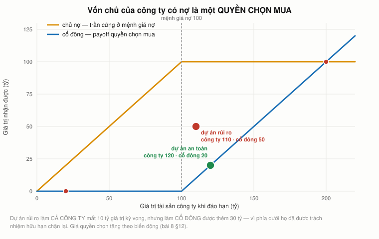
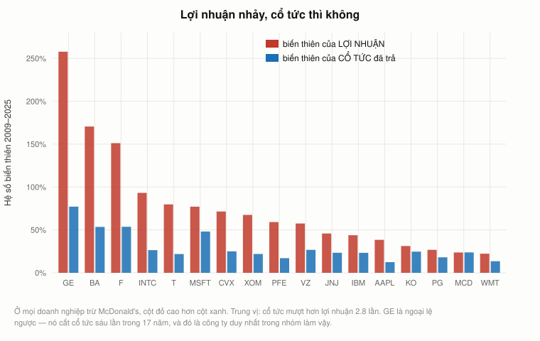
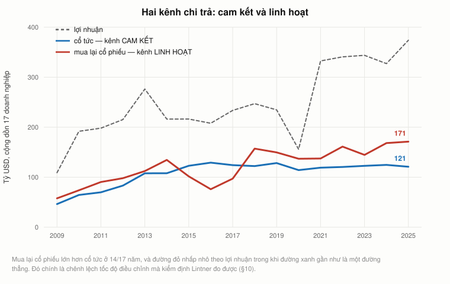
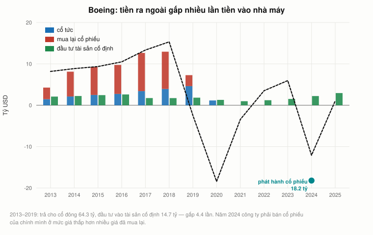
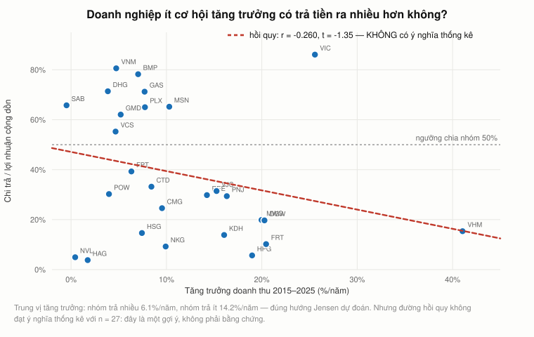
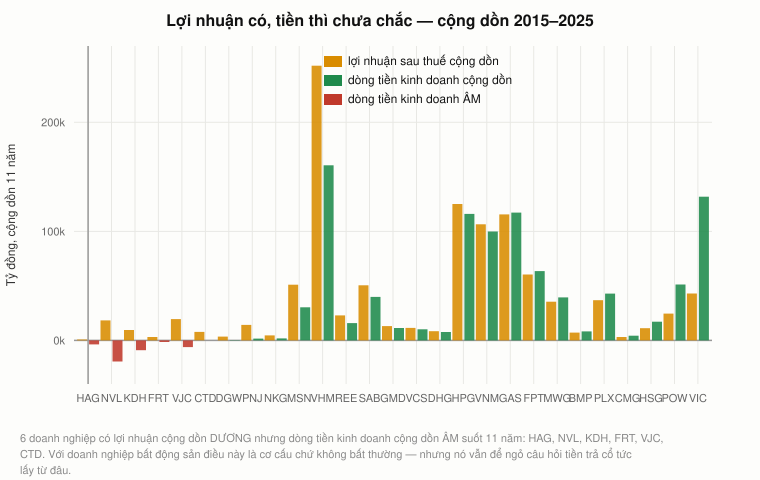

# Bài 17 — Chi phí đại diện, quản trị công ty và chính sách chi trả

> 🏢 **PHẦN E — TÀI CHÍNH DOANH NGHIỆP.** Bài này **không đến từ video của Andrew Lo**.
> Nó trả lời hai câu hỏi mà [bài 16 §18](bai_16_co_cau_von.md#18-đi-tiếp) để ngỏ:
> *vì sao Apple mua lại 748 tỷ USD cổ phiếu thay vì giữ tiền?* và
> *vì sao HVN chạy với D/E 5,1 suốt bảy năm mà không ai ngăn?*
> Nguồn: Jensen & Meckling (1976); Myers (1977); Jensen (1986); Miller & Modigliani (1961);
> Lintner (1956).
> 📌 **Cần đọc trước:** [Bài 16](bai_16_co_cau_von.md) (cơ cấu vốn và kiệt quệ),
> [Bài 8 §10](bai_08_quyen_chon.md#10-quyền-chọn-ở-khắp-nơi-vốn-chủ-sở-hữu-là-một-quyền-chọn-mua) (quyền chọn),
> [Bài 14 §5](bai_14_doc_doanh_nghiep_bang_so.md#5-báo-cáo-lưu-chuyển-tiền-tệ--báo-cáo-khó-nói-dối-nhất)
> (báo cáo lưu chuyển tiền tệ).
> ⚠️ Số liệu Mỹ tới năm tài chính **2025**; số liệu Việt Nam tới báo cáo năm **2025**.

---

## Mục lục

<!-- MUC-LUC -->
- [1. Cái giả định mà mười sáu bài trước đã lặng lẽ dùng](#1-cái-giả-định-mà-mười-sáu-bài-trước-đã-lặng-lẽ-dùng)
- [2. Chi phí đại diện của vốn chủ — Jensen và Meckling 1976](#2-chi-phí-đại-diện-của-vốn-chủ--jensen-và-meckling-1976)
- [3. Chi phí đại diện của nợ I — chuyển rủi ro](#3-chi-phí-đại-diện-của-nợ-i--chuyển-rủi-ro)
- [4. Chi phí đại diện của nợ II — nợ treo (Myers 1977)](#4-chi-phí-đại-diện-của-nợ-ii--nợ-treo-myers-1977)
- [5. Cổ tức không quan trọng — Miller và Modigliani 1961](#5-cổ-tức-không-quan-trọng--miller-và-modigliani-1961)
- [6. Thuế cổ tức ở Việt Nam — giả định số 1 vỡ theo một hướng rất cụ thể](#6-thuế-cổ-tức-ở-việt-nam--giả-định-số-1-vỡ-theo-một-hướng-rất-cụ-thể)
- [7. Cổ tức mượt hơn lợi nhuận rất nhiều — đo trên 17 doanh nghiệp Mỹ](#7-cổ-tức-mượt-hơn-lợi-nhuận-rất-nhiều--đo-trên-17-doanh-nghiệp-mỹ)
- [8. Kiểm định Lintner, bảy mươi năm sau](#8-kiểm-định-lintner-bảy-mươi-năm-sau)
- [9. Kênh linh hoạt đã vượt kênh cam kết](#9-kênh-linh-hoạt-đã-vượt-kênh-cam-kết)
- [10. Boeing: 64 tỷ ra, 15 tỷ vào nhà máy, rồi xin lại 18 tỷ](#10-boeing-64-tỷ-ra-15-tỷ-vào-nhà-máy-rồi-xin-lại-18-tỷ)
- [11. Dòng tiền tự do — Jensen 1986](#11-dòng-tiền-tự-do--jensen-1986)
- [12. Việt Nam — chi trả và tăng trưởng](#12-việt-nam--chi-trả-và-tăng-trưởng)
- [13. Lợi nhuận không phải tiền — và vì sao đó là vấn đề quản trị](#13-lợi-nhuận-không-phải-tiền--và-vì-sao-đó-là-vấn-đề-quản-trị)
- [14. Vấn đề đại diện ở Việt Nam là loại KHÁC](#14-vấn-đề-đại-diện-ở-việt-nam-là-loại-khác)
- [15. Chín sai lầm về chi trả và quản trị](#15-chín-sai-lầm-về-chi-trả-và-quản-trị)
- [16. Danh sách kiểm — bảy câu hỏi trước khi tin một con số chi trả](#16-danh-sách-kiểm--bảy-câu-hỏi-trước-khi-tin-một-con-số-chi-trả)
- [17. Đi tiếp](#17-đi-tiếp)
- [18. Code minh hoạ](#18-code-minh-hoạ)
- [19. Từ điển thuật ngữ](#19-từ-điển-thuật-ngữ)
- [20. Câu hỏi tự kiểm tra](#20-câu-hỏi-tự-kiểm-tra)
- [Tóm tắt một trang](#tóm-tắt-một-trang)
- [Nguồn](#nguồn)
<!-- /MUC-LUC -->

---

## 1. Cái giả định mà mười sáu bài trước đã lặng lẽ dùng

Mọi bài từ bài 12 tới bài 16 đều dựa trên một câu chưa ai nói ra: **công ty tối đa hoá giá trị cho cổ
đông.** NPV dương thì làm. WACC thấp nhất thì chọn. Đòn bẩy tối ưu thì nhắm tới.

Nhưng **công ty không quyết định gì cả.** Người quyết định, và người đó không phải cổ đông.

| Nhóm             | Bỏ ra cái gì          | Nhận về cái gì               | Nhìn rủi ro thế nào                                      |
| ---------------- | --------------------- | ---------------------------- | -------------------------------------------------------- |
| **Cổ đông**      | vốn                   | phần còn lại sau khi trả hết | thích rủi ro hơn — phía dưới có trách nhiệm hữu hạn chặn |
| **Chủ nợ**       | vốn                   | khoản cố định, không hơn     | ghét rủi ro — không được hưởng phía trên                 |
| **Ban giám đốc** | thời gian, danh tiếng | lương, thưởng, quyền lực     | ghét rủi ro **nghề nghiệp**, thích quy mô                |

Ba nhóm, ba hàm mục tiêu. Chỗ nào chúng lệch nhau thì chỗ đó có **chi phí đại diện**.

Bài này đo ba chỗ lệch: giữa ban giám đốc và cổ đông (§2), giữa cổ đông và chủ nợ (§3, §4), và giữa
cổ đông kiểm soát và cổ đông thiểu số (§13). Rồi dùng chúng để trả lời câu hỏi mà cả phần E vẫn để
treo: **tiền làm ra rồi thì làm gì với nó?**

---

## 2. Chi phí đại diện của vốn chủ — Jensen và Meckling 1976

Bài toán đơn giản nhất có thể. Một giám đốc sở hữu tỷ lệ $a$ của công ty. Ông ấy có thể tiêu 100 tỷ
vào **bổng lộc** — máy bay riêng, văn phòng đẹp, hợp đồng cho công ty của bạn bè. Bổng lộc đem lại
cho **riêng ông ấy** một giá trị bằng 60% số tiền tiêu; 40% bay hơi.

Khi nào ông ấy tiêu?

| Sở hữu $a$ | GĐ được | GĐ mất | Tiêu?  | Bên ngoài mất |
| ---------: | ------: | -----: | :----: | ------------: |
|       100% |      60 |    100 | không  |             0 |
|        80% |      60 |     80 | không  |             0 |
|        50% |      60 |     50 | **CÓ** |            50 |
|        20% |      60 |     20 | **CÓ** |            80 |
|         5% |      60 |      5 | **CÓ** |            95 |

Ngưỡng nằm ở $a = 60\%$. Dưới mức sở hữu đó, giám đốc luôn tiêu — vì ông ấy hưởng trọn 60 tỷ mà chỉ
gánh $a \times 100$ tỷ thiệt hại.

Vế thứ nhất ai cũng thấy: **càng phát hành nhiều vốn chủ ra bên ngoài, người điều hành càng ít đồng
cam kết với đồng vốn đó.**

### Vế thứ hai mới là phát hiện thật sự

**Người chịu chi phí đó không phải cổ đông bên ngoài. Là chính giám đốc — từ trước.**

Nhà đầu tư không ngốc. Họ biết chuyện này sẽ xảy ra, nên họ trả **giá thấp hơn** ngay từ đầu:

|                                                         |                                    |
| ------------------------------------------------------- | ---------------------------------: |
| Người sáng lập muốn bán 80%, giữ lại 20%                |                                    |
| Nếu nhà đầu tư tin công ty đáng giá 1.000 tỷ            |                  họ trả **800 tỷ** |
| Nhưng họ biết ở mức sở hữu 20%, bổng lộc **sẽ** bị tiêu |                                    |
| Nên họ định giá công ty 900 tỷ                          |              họ chỉ trả **720 tỷ** |
| **Người sáng lập mất**                                  | **80 tỷ ngay tại bàn bán cổ phần** |

> ⇒ Đó là lý do **quản trị công ty không phải trò chơi tổng bằng không** giữa "cổ đông" và "ban giám
> đốc". Ràng buộc được mình một cách **đáng tin** thì người sáng lập **bán được giá cao hơn**. Cả hai
> bên cùng được lợi.

📚 Ba cơ chế ràng buộc, và cả ba đều tốn tiền: **hội đồng quản trị độc lập · kiểm toán độc lập · trả
lương bằng cổ phiếu**. Jensen và Meckling gọi tổng của ba khoản này, cộng với phần bổng lộc **còn
lại** không ngăn được, là **chi phí đại diện**. Nó không bao giờ bằng không — mục tiêu là làm nó nhỏ,
không phải làm nó biến mất.

---

## 3. Chi phí đại diện của nợ I — chuyển rủi ro

[Bài 16 §8](bai_16_co_cau_von.md#8-đo-chi-phí-kiệt-quệ-bằng-dữ-liệu--nó-nằm-ở-đuôi-trái) đo được
chi phí kiệt quệ nhưng không nói **cơ chế**. Đây là cơ chế thứ nhất, và nó không cần ai làm gì sai
trái cả.

Công ty nợ 100 tỷ, đáo hạn sang năm. Phải chọn một trong hai dự án:

- **An toàn:** chắc chắn thu về 120 tỷ.
- **Rủi ro:** 50% thu 200 tỷ, 50% thu 20 tỷ. Kỳ vọng **110 tỷ**.

Dự án rủi ro **phá huỷ 10 tỷ** giá trị. Không ai nên chọn nó. Nhưng xem ai nhận được gì:

| Dự án   | Trạng thái  | Cả công ty | Về CHỦ NỢ | Về CỔ ĐÔNG |
| ------- | ----------- | ---------: | --------: | ---------: |
| An toàn | tốt         |        120 |       100 |         20 |
| An toàn | xấu         |        120 |       100 |         20 |
|         | **kỳ vọng** |  **120,0** | **100,0** |   **20,0** |
| Rủi ro  | tốt         |        200 |       100 |        100 |
| Rủi ro  | xấu         |         20 |        20 |          0 |
|         | **kỳ vọng** |  **110,0** |  **60,0** |   **50,0** |

Chuyển sang dự án rủi ro: **cổ đông được +30 tỷ, chủ nợ mất 40 tỷ, cả công ty mất 10 tỷ.**

Cổ đông chọn dự án **tệ hơn cho công ty** vì nó **tốt hơn cho riêng họ**. Phía dưới họ đã được trách
nhiệm hữu hạn chặn — mất hết cũng chỉ là mất phần vốn chủ, mà phần đó ở đây gần bằng không. Phía
trên thì họ hưởng trọn.



> **Vốn chủ của một công ty có nợ CHÍNH LÀ một quyền chọn mua** trên tài sản, giá thực hiện bằng
> mệnh giá nợ — đúng cấu trúc payoff của [bài 8 §10](bai_08_quyen_chon.md#10-quyền-chọn-ở-khắp-nơi-vốn-chủ-sở-hữu-là-một-quyền-chọn-mua).
> Và giá quyền chọn **tăng theo biến động**. Nên cổ đông của một công ty sắp vỡ nợ có động cơ **mua
> thêm biến động**.

⚠️ Không ai phạm pháp ở đây. Không ai nói dối. Đây là hai người cùng nhìn một dự án qua **hai hàm
thanh toán khác nhau**. Đó là lý do hợp đồng vay có **điều khoản ràng buộc** (*covenants*): giới hạn
đòn bẩy, cấm bán tài sản, cấm trả cổ tức quá mức. Các điều khoản đó **tốn tiền** — chúng cũng hạn
chế cả những việc đáng lẽ nên làm. Đó là chi phí đại diện của nợ.

---

## 4. Chi phí đại diện của nợ II — nợ treo (Myers 1977)

Cơ chế thứ hai đi theo hướng ngược lại: không phải làm quá nhiều thứ xấu, mà **không làm dự án tốt**.

Công ty nợ 100 tỷ. Tài sản hiện có sang năm đáng 150 tỷ nếu thuận lợi, 60 tỷ nếu không — mỗi bên
50%. Xuất hiện một dự án: cổ đông bỏ thêm **20 tỷ hôm nay**, sang năm công ty có thêm **30 tỷ trong
cả hai trạng thái**. NPV = **+10 tỷ**. Nên làm.

|                | Không làm |          |  Có làm |          |
| -------------- | --------: | -------: | ------: | -------: |
| **Trạng thái** |   tài sản |  cổ đông | tài sản |  cổ đông |
| Thuận lợi      |       150 |       50 |     180 |       80 |
| Không          |        60 |        0 |      90 |        0 |
| **Kỳ vọng**    |     105,0 | **25,0** |   135,0 | **40,0** |

Cổ đông được thêm 15 tỷ giá trị kỳ vọng, nhưng phải bỏ ra 20 tỷ. Lãi ròng của **riêng cổ đông:
−5 tỷ**.

> **Dự án có NPV +10 tỷ bị từ chối.**

Tiền đi đâu? **Sang chủ nợ.** Trong trạng thái xấu, 30 tỷ mới làm giá trị nợ tăng từ 60 lên 90 tỷ.
Cổ đông bỏ tiền, chủ nợ hưởng.

Đây là **nợ treo** (*debt overhang*). Nó giải thích một hiện tượng mà
[bài 16 §7](bai_16_co_cau_von.md#7-kiệt-quệ-tài-chính--đọc-một-hồ-sơ-thật) đã liệt kê mà chưa giải
thích được: công ty kiệt quệ **cắt đầu tư vào dự án tốt**. Không phải vì họ không nhìn ra dự án. Mà
vì lợi ích của dự án chảy sang người khác.

⚠️ Và nó giải thích vì sao **gói cứu trợ bằng cho vay thêm thường thất bại**: tiền mới vào làm tăng
giá trị của **nợ cũ** trước khi làm được gì khác. Muốn hiệu quả thì phải **xoá nợ hoặc bơm vốn chủ**,
không phải cho vay thêm.

---

## 5. Cổ tức không quan trọng — Miller và Modigliani 1961

Trước khi hỏi "nên trả cổ tức bao nhiêu", phải hỏi "nó có quan trọng không". Cùng hai tác giả của
bài 16, ba năm sau, trả lời bằng cùng một kỹ thuật.

Công ty có 1.000 tỷ, chia làm 100 cổ phiếu → 10 tỷ/cp. Trả cổ tức 50 tỷ, tức 0,5 tỷ mỗi cổ phiếu.
Tiền rời khỏi công ty, nên giá cổ phiếu **phải** tụt đúng bằng số đó: 10,0 → **9,5 tỷ/cp**.

Nhà đầu tư giữ 10 cổ phiếu:

|          |                                    |
| -------- | ---------------------------------: |
| Trước    |                  100,0 tỷ cổ phiếu |
| Sau      | 95,0 tỷ cổ phiếu + 5,0 tỷ tiền mặt |
| **Tổng** |           **100,0 tỷ — không đổi** |

**Cổ tức tự chế.** Cần 30 tỷ tiền mặt nhưng công ty không trả cổ tức? Bán 3 cổ phiếu. Còn lại
7 cp × 10 = 70 tỷ, cộng 30 tỷ tiền mặt = **100 tỷ**. Y hệt. Ngược lại, không muốn nhận cổ tức? Lấy
tiền đó mua thêm cổ phiếu.

> ⇒ **Mệnh đề MM về cổ tức:** trong thị trường không ma sát, chính sách cổ tức **không** ảnh hưởng
> giá trị. Giá trị đến từ **đầu tư**, không từ cách chia tiền.

Đây là lần thứ tư khoá học dùng kỹ thuật "tự chế": [bài 5 §4](bai_05_duration_va_chung_khoan_hoa.md#4-luật-một-giá--và-giả-định-tối-thiểu-để-nó-đúng)
với trái phiếu, [bài 8 §19](bai_08_quyen_chon.md#19-ngang-giá-putcall--chỗ-lo-chạm-rồi-bỏ) với quyền
chọn, [bài 16 §2](bai_16_co_cau_von.md#2-định-lý-modigliani-và-miller--đòn-bẩy-tự-chế) với đòn bẩy,
và giờ với cổ tức.

⚠️ **Và cũng cùng một cách dùng.** MM không nói cổ tức không quan trọng. MM nói *nếu* bốn giả định
đúng thì nó không quan trọng:

|    # | Giả định                     | Vỡ ở đâu                              |
| ---: | ---------------------------- | ------------------------------------- |
|    1 | không thuế                   | §6 dưới đây                           |
|    2 | không chi phí giao dịch      | §9 — vì sao mua lại cổ phiếu tiện hơn |
|    3 | không bất cân xứng thông tin | §7, §8 — cổ tức là tín hiệu           |
|    4 | không chi phí đại diện       | §2–§4 vừa phá xong                    |

---

## 6. Thuế cổ tức ở Việt Nam — giả định số 1 vỡ theo một hướng rất cụ thể

|                    | Cổ tức tiền mặt                | Bán cổ phiếu niêm yết                            |
| ------------------ | ------------------------------ | ------------------------------------------------ |
| Cá nhân trong nước | khấu trừ **5%** trên số cổ tức | **0,1%** trên **giá trị bán**, bất kể lỗ hay lãi |

Nhận 50 tỷ cổ tức thì còn 47,5 tỷ sau thuế — mất 2,5 tỷ. Bán 50 tỷ cổ phiếu để lấy đúng số tiền đó
thì mất 0,05 tỷ. **Chênh 50 lần.**

Đó là một lý do rất thật để nhà đầu tư cá nhân Việt Nam thích **mua lại cổ phiếu** hơn **cổ tức
tiền mặt** — và cũng là lý do thuế không bao giờ trung lập giữa hai kênh chi trả.

⚠️ Thuế suất trên **lãi vốn** thì không tồn tại ở Việt Nam: nhà nước thu theo **giá trị giao dịch**,
nên người bán lỗ vẫn nộp thuế. Đây là một đặc điểm cần nhớ khi so sánh với sách giáo khoa Mỹ, nơi
lãi vốn dài hạn có thuế suất riêng và lỗ được khấu trừ.

---

## 7. Cổ tức mượt hơn lợi nhuận rất nhiều — đo trên 17 doanh nghiệp Mỹ

Nếu cổ tức thật sự không quan trọng, ban giám đốc phải tha hồ điều chỉnh nó theo lợi nhuận từng năm.
Ta đo xem họ có làm vậy không: hệ số biến thiên của **lợi nhuận** so với hệ số biến thiên của **cổ
tức đã trả**, 2009–2025.

| Mã      |    n | CV lợi nhuận | CV cổ tức | Mượt hơn | Số năm **cắt** cổ tức |
| ------- | ---: | -----------: | --------: | -------: | --------------------: |
| GE      |   17 |       257,8% |     77,2% |      3,3 |                 **6** |
| BA      |   12 |       170,5% |     53,5% |      3,2 |                     1 |
| F       |   14 |       151,2% |     53,7% |      2,8 |                 **5** |
| INTC    |   16 |        93,2% |     26,4% |      3,5 |                     2 |
| T       |   16 |        79,8% |     21,8% |  **3,7** |                     3 |
| **XOM** |   17 |    **67,5%** | **21,9%** |  **3,1** |                 **0** |
| PFE     |   17 |        59,2% |     17,1% |      3,5 |                     0 |
| AAPL    |   13 |        38,4% |     12,4% |      3,1 |                     0 |
| KO      |   17 |        31,3% |     24,7% |      1,3 |                     0 |
| MCD     |   17 |        23,7% |     23,8% |      1,0 |                     1 |

Trung vị: **cổ tức mượt hơn lợi nhuận 2,8 lần.** Tổng cộng **19 lần cắt trên 248 năm-công-ty =
7,7%.** Chín trong mười bảy doanh nghiệp **chưa cắt một lần nào** trong 17 năm.



### Con số đáng chú ý hơn cả: ExxonMobil

|      Năm | Lợi nhuận | Cổ tức đã trả |
| -------: | --------: | ------------: |
|     2019 |      14,3 |          14,7 |
| **2020** | **−22,4** |      **14,9** |
|     2021 |      23,0 |          14,9 |
|     2022 |      55,7 |          14,9 |

Năm 2020 Exxon **lỗ 22,4 tỷ USD** — năm tệ nhất lịch sử công ty — và vẫn trả cổ tức **14,9 tỷ USD**,
gần như y hệt năm trước đó. Rồi năm 2022 lãi 55,7 tỷ, gấp 2,4 lần năm 2019, và cổ tức vẫn **14,9**.

> Cổ tức không phải một biến số điều chỉnh hằng năm. Nó là một **cam kết**. Cắt cổ tức là thứ ban
> giám đốc tránh bằng mọi giá, kể cả vay tiền để trả.

---

## 8. Kiểm định Lintner, bảy mươi năm sau

Năm 1956 John Lintner làm một việc ít nhà kinh tế làm: **ông đi hỏi**. Phỏng vấn ban giám đốc 28
doanh nghiệp Mỹ xem họ quyết định cổ tức thế nào. Câu trả lời không giống bất kỳ mô hình nào đang có:

- Họ **không** nhắm vào mức cổ tức. Họ nhắm vào mức **thay đổi**.
- Họ có một tỷ lệ chi trả **mục tiêu** trong đầu, nhưng chỉ nhích về phía đó từng phần mỗi năm.
- Họ **sợ nhất là phải cắt**, nên chỉ tăng khi tin là tăng được bền vững.

Lintner viết lại thành một phương trình:

$$D_t - D_{t-1} \;=\; a \;+\; c \cdot \left[\, r \cdot E_t - D_{t-1} \,\right]$$

$r$ = tỷ lệ chi trả **mục tiêu**, $c$ = **tốc độ điều chỉnh** về phía mục tiêu. $c = 1$ nghĩa là điều
chỉnh hết ngay trong năm; $c = 0$ nghĩa là không bao giờ.

Chạy lại phương trình đó trên dữ liệu SEC hôm nay, **200 quan sát công ty-năm, 14 doanh nghiệp**:

|           |   Hệ số |         t |
| --------- | ------: | --------: |
| $E_t$     | +0,0212 |     +2,59 |
| $D_{t-1}$ | −0,1529 | **−4,04** |

$$c = 0{,}153 \qquad r = 14\%$$

Lintner 1956 (28 doanh nghiệp Mỹ, 1947–1953): $c \approx 0{,}30$, $r \approx 50\%$.

**Mô hình bảy mươi năm tuổi vẫn chạy:** hệ số của $D_{t-1}$ âm với t = −4,0, tức doanh nghiệp thật
sự kéo cổ tức về một mục tiêu. Nhưng cả hai tham số đều **nhỏ hơn**: điều chỉnh **chậm hơn** và mục
tiêu **thấp hơn** năm 1956.

⚠️ **Một lưu ý phương pháp không được bỏ qua.** Chạy hồi quy này bằng cách gộp thẳng các doanh nghiệp
lại cho ra kết quả **vô nghĩa** — $c$ âm. Lý do: gộp thẳng thì hệ số của $D_{t-1}$ đo chênh lệch
**quy mô giữa các công ty** (IBM trả 6 tỷ, Ford trả 0,4 tỷ) chứ không đo hành vi điều chỉnh **bên
trong** từng công ty. Phải chuẩn hoá theo quy mô rồi khử trung bình trong từng công ty — tức **hiệu
ứng cố định**. Chương trình làm đúng thế, và ghi rõ lý do ngay trong hàm.

### Rồi đổi một chữ trong định nghĩa, và mọi thứ đảo ngược

Chạy lại **đúng phương trình đó, đúng 200 quan sát đó**, chỉ đổi định nghĩa "chi trả" thành **cổ tức
+ mua lại cổ phiếu**:

$$c = 0{,}507 \quad (t = +8{,}61) \qquad r = 24\%$$

> **Tốc độ điều chỉnh tăng từ 0,153 lên 0,507 — gấp 3,3 lần.**

Đọc câu đó cho kỹ. Cùng một nhóm doanh nghiệp, cùng những năm đó, cùng một mẫu. Nếu chỉ nhìn **cổ
tức** thì họ trông như những người cực kỳ bảo thủ, điều chỉnh lờ đờ. Nếu nhìn **tổng chi trả** thì
họ phản ứng nhanh gấp hơn ba lần với lợi nhuận.

| Kênh                 | Tính chất                                                | Tốc độ điều chỉnh |
| -------------------- | -------------------------------------------------------- | ----------------: |
| **Cổ tức**           | **CAM KẾT** — chỉ tăng khi chắc chắn, gần như không cắt  |             0,153 |
| **Mua lại cổ phiếu** | **LINH HOẠT** — bật lên hạ xuống theo lợi nhuận từng năm |             0,507 |

### Và đó là câu trả lời cho câu hỏi bài 16 để ngỏ

*Vì sao Apple mua lại cổ phiếu thay vì tăng cổ tức?*

**Vì mua lại không tạo ra cam kết.** Một đồng cổ tức tăng thêm là lời hứa trả mãi mãi; một đồng mua
lại cổ phiếu là giao dịch một lần, năm sau không làm nữa cũng không ai coi là thất hứa.

| Mã   | Cổ tức 2009–2025 | Mua lại |    Tỷ lệ |
| ---- | ---------------: | ------: | -------: |
| AAPL |              175 | **816** | **4,67** |
| MSFT |              234 |     276 |     1,18 |
| XOM  |              218 |     185 |     0,85 |

---

## 9. Kênh linh hoạt đã vượt kênh cam kết

Cộng dồn toàn bộ 17 doanh nghiệp, từng năm, đơn vị tỷ USD:

|      Năm | Lợi nhuận | Cổ tức | Mua lại CP | Mua lại / cổ tức | Tổng chi trả / LN |
| -------: | --------: | -----: | ---------: | ---------------: | ----------------: |
|     2009 |       109 |     46 |         58 |             1,25 |               95% |
|     2013 |       276 |    108 |        112 |             1,04 |               80% |
|     2016 |       208 |    129 |         76 |         **0,59** |               99% |
| **2020** |       156 |    114 |        137 |             1,20 |          **161%** |
|     2022 |       341 |    120 |        161 |             1,34 |               83% |
| **2025** |       374 |    121 |    **171** |         **1,41** |               78% |

Mua lại cổ phiếu lớn hơn cổ tức ở **14/17 năm**. Và nhìn cột cổ tức: nó gần như là một đường
thẳng, đi từ 46 lên 121 rồi đứng yên từ 2015. Cột mua lại thì nhấp nhô theo lợi nhuận — tụt xuống 76
năm 2016, bật lên 171 năm 2025.



⚠️ **Một cảnh báo về cách đọc bảng này.** "Mua lại cổ phiếu" **không** đồng nghĩa với "trả tiền cho
cổ đông". Một phần đáng kể chỉ để **bù lại** số cổ phiếu phát hành cho nhân viên — tức nó giữ cho số
lượng cổ phiếu không tăng, chứ không làm giảm. Dữ liệu SEC ở mức này không tách được hai phần đó,
nên con số 171 tỷ là **cận trên** của lượng tiền thật sự về tay cổ đông hiện hữu.

📚 **Vì sao mua lại tăng mạnh từ những năm 1980**, xếp theo sức nặng bằng chứng:

1. **Linh hoạt** — §8 đã đo bằng số: c = 0,51 so với 0,15.
2. **Thuế** — ở Mỹ trước 2003, cổ tức bị đánh thuế theo biểu thu nhập thông thường còn lãi vốn dài
   hạn thì thấp hơn. Ở Việt Nam chênh lệch này vẫn còn, xem §6.
3. **Lương thưởng bằng cổ phiếu** — mua lại làm giảm số cổ phiếu nên làm **tăng lợi nhuận trên cổ
   phiếu**. Ban giám đốc được trả lương theo EPS thì có động cơ trực tiếp. Đây là một vấn đề **đại
   diện**, không phải một lý do chính đáng — và nó đưa ta thẳng tới §10.

---

## 10. Boeing: 64 tỷ ra, 15 tỷ vào nhà máy, rồi xin lại 18 tỷ

[Bài 16 §12](bai_16_co_cau_von.md#12-boeing-đi-xuống-ba-bậc-thang-20152024) theo Boeing đi xuống ba
bậc thang của trật tự ưu tiên. Bài này xem **bước đầu tiên** — cái quyết định đã làm nên ba bậc thang
đó.

|  Năm | Lợi nhuận |   CFO |   Capex | Cổ tức | Mua lại CP | Trả CĐ / capex |
| ---: | --------: | ----: | ------: | -----: | ---------: | -------------: |
| 2013 |       4,6 |   8,2 |     2,1 |    1,5 |        2,8 |           2,0× |
| 2015 |       5,2 |   9,4 |     2,5 |    2,5 |        6,8 |           3,8× |
| 2017 |       8,5 |  13,3 | **1,7** |    3,4 |        9,2 |       **7,3×** |
| 2018 |      10,5 |  15,3 | **1,7** |    3,9 |        9,0 |       **7,5×** |
| 2019 |      −0,6 |  −2,4 |     1,8 |    4,6 |        2,7 |           4,0× |
| 2020 |     −11,9 | −18,4 |     1,3 |    1,2 |        0,0 |           0,9× |
| 2024 |     −11,8 | −12,1 |     2,2 |    0,0 |        0,0 |              — |

**Cộng dồn 2013–2019**, bảy năm trước khi 737 MAX bị cấm bay:

|                            |   Tỷ USD |
| -------------------------- | -------: |
| Tiền tự kinh doanh         |     63,1 |
| Cổ tức                     |     20,8 |
| Mua lại cổ phiếu           | **43,4** |
| **Tổng trả cho cổ đông**   | **64,3** |
| Đầu tư vào tài sản cố định | **14,7** |

> **Trả cho cổ đông gấp 4,4 lần số tiền bỏ vào nhà máy.** Và **102%** toàn bộ dòng tiền kinh
> doanh bảy năm đó đi ra ngoài.

Rồi năm 2024, Boeing phải **phát hành cổ phiếu 18,2 tỷ USD** — ở mức giá thấp hơn nhiều so với giá
bình quân đã mua lại. Công ty mua cổ phiếu của chính mình khi đắt và bán khi rẻ.



### Nói cho công bằng

Không ai ở Boeing biết 737 MAX sẽ rơi. Mua lại cổ phiếu năm 2016 **không gây ra** tai nạn năm 2019.
Điều có thể nói **bằng dữ liệu** thì hẹp hơn và vẫn đủ nặng:

1. Họ đã chọn đưa **102% dòng tiền** ra ngoài thay vì giữ lại một phần làm đệm — đúng thứ mà
   [bài 16 §13](bai_16_co_cau_von.md#13-câu-đố-không-đòn-bẩy--coteccons-một-thập-kỷ) gọi là **năng
   lực vay còn nguyên**.
2. Khi cú sốc đến, họ không còn đệm, nên phải vay **57,0 tỷ** trong hai năm 2020–2021 rồi cuối cùng
   bán cổ phiếu giá thấp.
3. Và đây là phần **liên quan đến đại diện**: mua lại cổ phiếu làm **giảm** số cổ phiếu, nên làm
   **tăng lợi nhuận trên cổ phiếu** — thước đo mà thù lao ban giám đốc gắn vào. Lợi ích của người
   quyết định và lợi ích của công ty dài hạn không trùng nhau.

Đó là lý do câu hỏi của bài này không phải *"chi trả bao nhiêu là tối ưu"* mà là **"ai quyết định,
và họ được trả lương theo cái gì"**.

---

## 11. Dòng tiền tự do — Jensen 1986

Jensen đặt một câu hỏi khác hẳn mọi câu hỏi trước đó về cổ tức. Không phải "cổ đông thích nhận tiền
khi nào", mà:

> **Tiền mặt nằm trong tay ban giám đốc thì có an toàn không?**

Ông gọi phần tiền còn lại sau khi đã làm hết dự án NPV dương là **dòng tiền tự do**, và lập luận rằng
nó là thứ nguy hiểm nhất trong bảng cân đối — vì nó đủ để mua những thứ làm công ty **to ra** mà
không làm công ty **giá trị hơn**.

Từ đó ra ba hệ quả trái với trực giác:

| Hệ quả                                                  | Vì sao                                                                                   |
| ------------------------------------------------------- | ---------------------------------------------------------------------------------------- |
| Trả cổ tức là **cơ chế kỷ luật**, không chỉ là chia lời | tiền đã ra khỏi công ty thì không tiêu bậy được nữa                                      |
| **Vay nợ tốt hơn cổ tức** ở khía cạnh kỷ luật           | cổ tức có thể cắt, nghĩa vụ trả nợ thì không — đây là điểm §14 mục 2 của bài 16 nhắc tới |
| **Thâu tóm bằng vốn vay** có thể tạo giá trị            | nó ép dòng tiền tự do ra khỏi tay ban giám đốc                                           |

Dự đoán kiểm được: **doanh nghiệp ít cơ hội tăng trưởng nên trả tiền ra nhiều.** §12 chạy nó trên dữ
liệu Việt Nam.

---

## 12. Việt Nam — chi trả và tăng trưởng

28 doanh nghiệp niêm yết, cộng dồn 2015–2025, xếp theo tỷ lệ chi trả:

| Mã  |    LNST | Cổ tức | Mua CP | Chi trả / LN | Capex / LN | Tăng DT/năm |
| --- | ------: | -----: | -----: | -----------: | ---------: | ----------: |
| VIC |  42.998 | 15.742 | 21.266 |      **86%** | **1.086%** |       25,6% |
| VNM | 106.503 | 85.430 |    385 |          81% |        18% |        4,7% |
| BMP |   7.153 |  5.596 |      0 |          78% |        25% |        7,0% |
| DHG |   8.388 |  5.972 |     16 |          71% |        17% |        3,9% |
| GAS | 115.581 | 82.271 |     40 |          71% |        26% |        7,7% |
| SAB |  50.528 | 33.246 |      0 |          66% |     **6%** |   **−0,5%** |
| …   |         |        |        |              |            |             |
| MWG |  35.474 |  6.196 |    856 |          20% |        66% |       20,0% |
| VHM | 251.917 | 21.847 | 16.883 |          15% |        34% |   **41,0%** |
| HPG | 125.111 |  7.089 |      3 |       **6%** |       147% |       19,0% |
| NVL |  18.325 |    205 |    702 |           5% |        18% |    **0,4%** |

### Chia hai nhóm

|                         | Số công ty | Tăng trưởng doanh thu trung vị |
| ----------------------- | ---------: | -----------------------------: |
| Trả **≥ 50%** lợi nhuận |         10 |                   **6,1%/năm** |
| Trả **< 50%** lợi nhuận |         17 |                  **14,2%/năm** |

Chênh **2,3 lần**, và **đúng hướng Jensen dự đoán**.



⚠️ **Nhưng tương quan thì không đủ mạnh để khẳng định:** Pearson r = −0,260 (t = −1,35), Spearman
r = −0,234 (t = −1,20). Với n = 27, cả hai đều **không** đạt mức ý nghĩa thống kê thông thường.
Trung vị hai nhóm chênh rõ ràng, nhưng đó không phải bằng chứng — đó là một **gợi ý**. Nói mạnh hơn
thế là nói quá dữ liệu.

### Hai trường hợp lệch khỏi mọi quy luật

**(1) VIC — trả tiền cho cổ đông bằng tiền đi vay.** Trả 86% lợi nhuận cho cổ đông (15.742 tỷ cổ tức
+ 21.266 tỷ mua lại) trong khi capex bằng **1.086%** lợi nhuận — 466.804 tỷ trên tổng lợi nhuận
42.998 tỷ. Số tiền đó không đến từ lợi nhuận. Nó đến từ **vay**.
[Bài 16 §11](bai_16_co_cau_von.md#11-cuộc-đua-ngựa--dữ-liệu-việt-nam-chọn-bên-nào) đo được đòn bẩy
của VIC: **68,9%**, cao nhất mẫu, với hệ số trả lãi **1,9 lần**.

> Trả tiền cho cổ đông bằng tiền đi vay là một quyết định **phân phối giữa chủ nợ và cổ đông**, không
> phải một quyết định đầu tư. Đó chính xác là cái mà điều khoản ràng buộc ở §3 sinh ra để ngăn.

**(2) NVL — không tăng trưởng, cũng không trả tiền ra.** Doanh thu tăng 0,4%/năm trong 11 năm, chi
trả 5% lợi nhuận. Vậy tiền đi đâu? §13.

---

## 13. Lợi nhuận không phải tiền — và vì sao đó là vấn đề quản trị

[Bài 14 §6](bai_14_doc_doanh_nghiep_bang_so.md#6-lợi-nhuận-không-phải-tiền--nối-lại-bài-12) đã nói
lợi nhuận không phải tiền. Ở đây nó thôi không còn là một lưu ý kế toán nữa — nó thành câu hỏi trung
tâm của quản trị công ty.

Lý do: **hội đồng quản trị phê duyệt cổ tức dựa trên lợi nhuận kế toán.** Nếu lợi nhuận có mà tiền
không có, thì số tiền chia ra là tiền **đi vay**.

Cộng dồn 2015–2025, xếp theo tỷ lệ tiền trên lợi nhuận:

| Mã      |    LNST |         CFO |       Chênh |   CFO/LNST | Cổ tức đã trả |
| ------- | ------: | ----------: | ----------: | ---------: | ------------: |
| HAG     |     840 |      −3.668 |      −4.508 | **−4,37×** |             0 |
| **NVL** |  18.325 | **−19.339** | **−37.663** | **−1,06×** |           205 |
| KDH     |   9.567 |      −9.012 |     −18.579 |     −0,94× |         1.124 |
| FRT     |   3.110 |      −1.458 |      −4.569 |     −0,47× |           301 |
| VJC     |  19.528 |      −6.104 |     −25.631 |     −0,31× |         3.795 |
| CTD     |   7.749 |         −29 |      −7.778 |     −0,00× |         1.931 |
| …       |         |             |             |            |               |
| VNM     | 106.503 |      99.882 |      −6.622 |      0,94× |        85.430 |
| VIC     |  42.998 |     131.803 |     +88.806 |  **3,07×** |        15.742 |

- Trung vị CFO/LNST = **0,87×**
- **18/27** doanh nghiệp có dòng tiền kinh doanh **thấp hơn** lợi nhuận báo cáo
- **6/27** doanh nghiệp có lợi nhuận cộng dồn **dương** nhưng dòng tiền kinh doanh cộng dồn **âm**
  suốt 11 năm: HAG, NVL, KDH, FRT, VJC, CTD



Và trong số sáu doanh nghiệp đó, số tiền cổ tức họ vẫn trả ra: **VJC 3.795 tỷ · CTD 1.931 tỷ · KDH
1.124 tỷ · FRT 301 tỷ · NVL 205 tỷ.**

### Đừng đọc bảng này thành "các công ty này gian lận"

Có ít nhất ba lý do **hoàn toàn hợp lệ** khiến dòng tiền âm mà lợi nhuận dương:

|     | Lý do                                                                                                                                                   | Ai trong bảng |
| --- | ------------------------------------------------------------------------------------------------------------------------------------------------------- | ------------- |
| (a) | **Bất động sản.** Tiền mua đất và chi phí dự án nằm trong **hàng tồn kho** — tức trong dòng tiền *kinh doanh* — còn doanh thu chỉ ghi nhận khi bàn giao | NVL, KDH, VHM |
| (b) | **Tăng trưởng nhanh.** Bán lẻ hoặc phân phối tăng gấp đôi doanh thu thì tồn kho và công nợ phải tăng theo                                               | FRT, DGW      |
| (c) | **Đầu tư đội tàu bay, nhà máy qua công ty con** — dòng tiền có thể nằm ở mục đầu tư chứ không ở kinh doanh                                              | VJC           |

Nhưng ba lý do đó **không xoá bỏ** câu hỏi quản trị. Chúng trả lời câu *"vì sao dòng tiền âm"*, chứ
không trả lời câu *"vậy tiền trả cổ tức lấy ở đâu"*. Và đó mới là câu hỏi của hội đồng quản trị.

> ⇒ **Một quy tắc đọc rút ra:** trước khi tin một tỷ lệ chi trả, hãy chia **dòng tiền kinh doanh** cho
> **lợi nhuận**. Nếu tỷ số đó dưới 1 nhiều năm liền, thì cổ tức đang được trả bằng một thứ khác chứ
> không phải bằng tiền công ty làm ra. [Bài 14 §5](bai_14_doc_doanh_nghiep_bang_so.md#5-báo-cáo-lưu-chuyển-tiền-tệ--báo-cáo-khó-nói-dối-nhất)
> đã gọi báo cáo lưu chuyển tiền tệ là báo cáo **khó nói dối nhất** — đây là lúc dùng nó.

---

## 14. Vấn đề đại diện ở Việt Nam là loại KHÁC

Sách giáo khoa Mỹ dạy vấn đề đại diện theo mô tả của Berle và Means (1932): sở hữu **phân tán**, hàng
triệu cổ đông nhỏ, không ai đủ động lực giám sát, nên ban giám đốc tự do. Đó là **vấn đề loại I**:
ban giám đốc đối lại cổ đông.

⚠️ **Ở Việt Nam — và phần lớn châu Á — cấu trúc ngược lại.** Sở hữu **tập trung**: nhà nước, tập đoàn
mẹ nước ngoài, hoặc gia đình sáng lập nắm tỷ lệ chi phối. Cổ đông lớn **không** thiếu động lực giám
sát — họ ngồi ngay trong hội đồng quản trị. Nên vấn đề loại I gần như biến mất, và **vấn đề loại II**
xuất hiện thay chỗ:

> **Cổ đông kiểm soát đối lại cổ đông thiểu số.**

Các dạng nó xuất hiện, xếp theo mức khó phát hiện:

| Dạng                                           | Biểu hiện                                                                                |
| ---------------------------------------------- | ---------------------------------------------------------------------------------------- |
| Giao dịch với bên liên quan                    | bán hàng, cho vay, thuê tài sản với công ty khác của cùng chủ, giá không theo thị trường |
| Chính sách cổ tức theo nhu cầu của cổ đông lớn | trả rất cao khi công ty mẹ cần tiền, bất kể công ty con có cần vốn không                 |
| Phát hành riêng lẻ giá thấp                    | pha loãng cổ đông nhỏ mà không cho họ quyền mua tương ứng                                |
| Kim tự tháp sở hữu                             | kiểm soát 51% ở mỗi tầng, ba tầng thì chi phối toàn bộ với 13% quyền lợi kinh tế         |

Dạng cuối cùng đáng chú ý vì nó tái tạo **chính xác** bài toán §2: tỷ lệ sở hữu kinh tế thấp nhưng
quyền quyết định đầy đủ — tức $a$ nhỏ trong khi vẫn nắm nút bấm. Jensen và Meckling dự đoán bổng lộc
sẽ bị tiêu; ở đây "bổng lộc" mang hình dạng giao dịch với bên liên quan.

⚠️ **Điều tôi không kiểm được bằng dữ liệu này.** Bộ số liệu của bài chỉ có báo cáo tài chính, không
có cơ cấu sở hữu, không có thuyết minh giao dịch bên liên quan. Nhận định ở mục này dựa trên cấu trúc
thị trường chứ **không** phải trên bảng số nào tôi tính ra. Muốn kiểm thì phải đọc **thuyết minh báo
cáo tài chính, mục "giao dịch với các bên liên quan"** — nó nằm ở cuối báo cáo kiểm toán và gần như
không ai đọc.

📚 **Khung pháp lý hiện hành** (nêu để biết chỗ tra, không phải để thay tư vấn pháp lý): Luật Doanh
nghiệp 59/2020/QH14 quy định về người quản lý, giao dịch với người có liên quan, và quyền của cổ đông
sở hữu từ 5%; Luật Chứng khoán 54/2019/QH14 và các nghị định hướng dẫn quy định về công bố thông tin
và quản trị công ty đại chúng.

---

## 15. Chín sai lầm về chi trả và quản trị

|    # | Sai lầm                                                                | Vì sao sai                                                                              |
| ---: | ---------------------------------------------------------------------- | --------------------------------------------------------------------------------------- |
|    1 | *"Cổ tức cao là dấu hiệu công ty tốt"*                                 | phải xem tiền lấy từ đâu — §13: sáu công ty trả cổ tức với dòng tiền kinh doanh âm      |
|    2 | Coi mua lại cổ phiếu và cổ tức là cùng một thứ                         | §8: một là cam kết, một là linh hoạt; tốc độ điều chỉnh chênh 3,3 lần                   |
|    3 | Tính "tỷ suất cổ tức" mà không nhìn khả năng duy trì                   | §7: cắt cổ tức chỉ xảy ra 7,7% số năm, nên thị trường phạt rất nặng khi xảy ra          |
|    4 | Cho rằng mua lại cổ phiếu luôn làm tăng giá trị                        | §10: Boeing mua khi đắt, bán khi rẻ                                                     |
|    5 | Đọc EPS tăng là công ty làm ăn tốt hơn                                 | mua lại làm giảm mẫu số; EPS tăng mà lợi nhuận không tăng                               |
|    6 | Nghĩ nợ chỉ có hại                                                     | §11: nghĩa vụ trả nợ là cơ chế kỷ luật dòng tiền tự do                                  |
|    7 | Áp khung Berle–Means của Mỹ vào Việt Nam                               | §14: vấn đề ở đây là loại II, không phải loại I                                         |
|    8 | Tin rằng hội đồng quản trị đông người độc lập thì tự khắc quản trị tốt | §2: cơ chế nào cũng tốn tiền và không cơ chế nào đưa chi phí đại diện về không          |
|    9 | Coi chi phí đại diện là chuyện đạo đức                                 | §2: nó là bài toán **định giá** — người sáng lập tự trả cho nó ngay tại bàn bán cổ phần |

Sai lầm tinh vi nhất là **số 9**. Chi phí đại diện không phải chuyện ai xấu ai tốt. Nó là chênh
lệch giữa hai hàm mục tiêu, và nó được **định giá vào** giá cổ phiếu trước khi bất kỳ ai làm gì sai.

---

## 16. Danh sách kiểm — bảy câu hỏi trước khi tin một con số chi trả

|    # | Câu hỏi                                                        | Ở đâu tìm                           | Ngưỡng đáng lo                                             |
| ---: | -------------------------------------------------------------- | ----------------------------------- | ---------------------------------------------------------- |
|    1 | Dòng tiền kinh doanh / lợi nhuận, cộng dồn 5 năm?              | báo cáo lưu chuyển tiền tệ          | dưới 0,8 nhiều năm liền                                    |
|    2 | Cổ tức trả ra có lớn hơn dòng tiền kinh doanh trừ capex không? | cùng báo cáo                        | có, nhiều năm liền                                         |
|    3 | Nợ vay có tăng cùng lúc với cổ tức không?                      | bảng cân đối                        | có — tức đang vay để trả                                   |
|    4 | Mua lại cổ phiếu là giảm số lượng thật hay bù cổ phiếu thưởng? | thuyết minh vốn chủ                 | số cổ phiếu lưu hành không giảm                            |
|    5 | Thù lao ban giám đốc gắn vào thước đo nào?                     | báo cáo thường niên                 | EPS hoặc giá cổ phiếu ngắn hạn, không có điều kiện dài hạn |
|    6 | Có giao dịch với bên liên quan quy mô lớn không?               | thuyết minh BCTC, mục bên liên quan | có, và không có định giá độc lập                           |
|    7 | Cổ đông lớn nắm bao nhiêu, qua mấy tầng sở hữu?                | báo cáo quản trị công ty            | quyền biểu quyết lớn hơn nhiều quyền lợi kinh tế           |

Bốn câu đầu **tính được từ báo cáo tài chính** — chương trình của bài này tính câu 1 và câu 2 cho
cả 28 doanh nghiệp. Ba câu cuối phải **đọc**, và đó là phần không tự động hoá được.

---

## 17. Đi tiếp

Phần E đã dựng xong bộ công cụ:

|  Bài | Trả lời được câu gì                                         |
| ---: | ----------------------------------------------------------- |
|   14 | doanh nghiệp này **đang** làm ăn thế nào                    |
|   15 | vốn của nó **đắt** bao nhiêu                                |
|   16 | nó nên **vay** bao nhiêu                                    |
|   17 | tiền làm ra rồi thì **làm gì** với nó, và **ai** quyết định |

Còn đúng một câu hỏi chưa trả lời, và nó là câu mà mọi câu trên gộp lại để phục vụ:

> **Vậy cả doanh nghiệp này đáng giá bao nhiêu?**

Bài 18 trả lời. Nó lấy dòng tiền tự do của §11, chiết khấu bằng WACC của bài 15, dùng cơ cấu vốn của
bài 16 để tách giá trị doanh nghiệp khỏi giá trị vốn chủ, rồi đối chiếu kết quả với hai thứ khác:
**bội số thị trường** và **giá thực tế trong một thương vụ mua bán**. Ba cách định giá, ba con số
khác nhau, và câu hỏi vì sao chúng khác nhau.

---

## 18. Code minh hoạ

> ⚙️ **Chạy:** cần **Python 3.10+**. Không cần cài gói nào. Kết quả **tất định**.

|            |                                                                                   |
| ---------- | --------------------------------------------------------------------------------- |
| File       | [`thuc_hanh/bai-17-chi-phi-dai-dien.py`](../thuc_hanh/bai-17-chi-phi-dai-dien.py) |
| Kích thước | **1.577 dòng**, 10 mục                                                            |

Bốn mục đầu là tính toán thuần tuý với `assert` kiểm từng đẳng thức: bổng lộc, chuyển rủi ro, nợ
treo, cổ tức tự chế. Sáu mục sau chạy trên dữ liệu thật: 17 doanh nghiệp Mỹ × 17 năm (SEC XBRL) và
28 doanh nghiệp Việt Nam × 11 năm (VNDirect).

Hàm `bang_lintner()` là chỗ đáng đọc kỹ nhất — nó ghi rõ **vì sao** phải khử trung bình trong từng
công ty, và cùng một hàm chạy hai lần với hai định nghĩa "chi trả" trên **đúng một mẫu**, cho ra so
sánh 0,153 với 0,507 của §8.

Kết quả chạy thật:

```
==============================================================================
BAI 17 — CHI PHI DAI DIEN, QUAN TRI CONG TY VA CHINH SACH CHI TRA
PHAN E — Tai chinh doanh nghiep (ngoai pham vi video 15.401 cua Andrew Lo)
==============================================================================

==============================================================================
MUC 1. CHI PHI DAI DIEN CUA VON CHU — JENSEN & MECKLING 1976
==============================================================================
Bai 16 gia dinh mot thu ma khong bai nao truoc do noi ro: rang cong ty toi da
hoa gia tri cho co dong. Nhung cong ty khong quyet dinh gi ca. NGUOI quyet
dinh, va nguoi do khong phai co dong.

Jensen va Meckling dat bai toan don gian nhat co the. Mot giam doc so huu ti
le a cua cong ty. Ong ay co the tieu 100 ty vao BONG LOC — may bay rieng,
van phong dep, cong ty con cho ban be. Bong loc dem lai cho RIENG ong ay mot
gia tri bang 60% so tien tieu, con 40% bay hoi.

Cau hoi: khi nao ong ay tieu?

    so huu a   GD duoc   GD mat   tieu?   ben ngoai mat
  ---------------------------------------------------
        100%        60      100   khong               0
         80%        60       80   khong               0
         50%        60       50      CO              50
         20%        60       20      CO              80
          5%        60        5      CO              95

  Don vi ty dong. Nguong nam o a = 60%: duoi muc so huu do thi giam doc
  luon tieu, vi ong ay huong tron 60 ty ma chi ganh a x 100 ty thiet hai.

  HAI DIEU RUT RA, va dieu thu hai moi la phat hien that su:

  (1) Cang phat hanh nhieu von chu ra ben ngoai, giam doc cang it dong cam ket
      voi dong von do. Day la CHI PHI DAI DIEN CUA VON CHU.

  (2) NGUOI CHIU CHI PHI DO KHONG PHAI CO DONG BEN NGOAI. La chinh giam
      doc — TU TRUOC. Nha dau tu khong ngoc: ho biet chuyen nay se xay ra nen
      ho tra GIA THAP HON ngay tu dau.

  Vi du: nguoi sang lap muon ban 80% cong ty, giu lai 20%.
    neu nha dau tu tin cong ty dang gia   1,000 ty -> ho tra 800 ty
    nhung ho biet o muc so huu 20%, bong loc SE bi tieu
    nen ho dinh gia cong ty                900 ty -> ho chi tra 720 ty
    nguoi sang lap MAT                     80 ty ngay tai ban ban co phan

  ⇒ Do la ly do QUAN TRI CONG TY khong phai tro choi tong bang khong giua
    "co dong" va "ban giam doc". Rang buoc duoc minh mot cach DANG TIN thi
    nguoi sang lap BAN DUOC GIA CAO HON. Ai cung duoc loi.

  📚 Ba co che rang buoc, va ca ba deu ton tien:
     hoi dong quan tri doc lap · kiem toan doc lap · tra luong bang co phieu
     Jensen & Meckling goi tong cua ba khoan nay cong voi phan bong loc CON
     LAI khong ngan duoc la CHI PHI DAI DIEN. No khong bao gio bang khong.

==============================================================================
MUC 2. CHI PHI DAI DIEN CUA NO I — CHUYEN RUI RO
==============================================================================
Bai 16 do chi phi kiet que bang du lieu nhung khong noi CO CHE. Day la co che
thu nhat, va no khong can ai lam gi sai trai ca.

Mot cong ty no 100 ty, dao han sang nam. No phai chon MOT trong hai du an:

  DU AN AN TOAN : chac chan thu ve 120 ty
  DU AN RUI RO  : 50% kha nang thu 200 ty, 50% kha nang thu 20 ty

  Gia tri ky vong cua CA CONG TY:
    an toan   120.0 ty
    rui ro    110.0 ty      <- thap hon 10 ty

  Du an rui ro PHA HUY 10 ty gia tri. Khong ai nen chon no. Nhung xem
  ai nhan duoc gi:

       du an   trang thai   ca cong ty   ve CHU NO   ve CO DONG
  ---------------------------------------------------------------
     an toan          tot          120         100           20
     an toan          xau          120         100           20
                  ky vong        120.0       100.0         20.0
      rui ro          tot          200         100          100
      rui ro          xau           20          20            0
                  ky vong        110.0        60.0         50.0

  CO DONG duoc +30.0 ty khi chuyen sang du an rui ro.
     CHU NO mat -40.0 ty.
     Ca cong ty mat -10.0 ty.

  Co dong chon du an TE HON cho cong ty vi no TOT HON cho rieng ho. Ly do:
  phia duoi ho da duoc chan boi trach nhiem huu han — mat het cung chi la mat
  phan von chu, ma phan do o day gan bang khong. Phia tren thi ho huong tron.

  Do la QUYEN CHON MUA. Von chu cua mot cong ty co no CHINH LA mot quyen
     chon mua tren tai san, gia thuc hien bang menh gia no — dung nhu bai 8
     muc 12 da dung. Va gia tri quyen chon TANG theo bien dong. Nen co dong
     cua cong ty sap vo no co dong co MUA THEM bien dong.

  ⚠️ Khong ai pham phap o day. Khong ai noi doi. Day la hai nguoi cung nhin
     mot du an qua hai ham thanh toan khac nhau. Do la ly do hop dong vay co
     dieu khoan rang buoc: gioi han don bay, cam ban tai san, cam tra co tuc
     qua muc. Cac dieu khoan do TON TIEN — chung han che ca nhung viec dang
     le nen lam. Do la chi phi dai dien cua no.

==============================================================================
MUC 3. CHI PHI DAI DIEN CUA NO II — NO TREO (MYERS 1977)
==============================================================================
Co che thu hai di theo huong nguoc lai: khong phai lam qua nhieu thu xau, ma
KHONG LAM du an tot.

Cong ty no 100 ty. Tai san hien co sang nam dang 150 ty neu thuan loi,
60 ty neu khong — moi ben 50%.

Xuat hien mot du an: co dong bo them 20 ty HOM NAY, sang nam cong ty co
them 30 ty trong CA HAI trang thai.

  NPV cua du an = 30 - 20 = +10 ty. DUONG ro rang. Nen lam.

                               khong lam                co lam
        trang thai   tai san     co dong   tai san     co dong
  ------------------------------------------------------------
         thuan loi       150          50       180          80
             khong        60           0        90           0
           ky vong     105.0        25.0     135.0        40.0

  Co dong duoc them 15.0 ty gia tri ky vong, nhung phai bo ra 20 ty.
  Lai rong cua RIENG co dong: -5.0 ty.

  DU AN CO NPV +10 TY BI TU CHOI.

  Tien di dau? Sang chu no. Trong trang thai xau, 30 ty moi lam gia tri no
  tang tu 60 len 90 ty. Co dong bo tien, chu no huong.

  Day la NO TREO (debt overhang). No giai thich mot hien tuong ma bai 16 muc 7
  da liet ke ma chua giai thich duoc: cong ty kiet que CAT DAU TU vao du an
  tot. Khong phai vi ho khong nhin ra du an. Ma vi loi ich cua du an chay sang
  nguoi khac.

  ⚠️ Va no giai thich vi sao GOI CUU TRO bang cho vay them thuong that bai:
     tien moi vao lam tang gia tri cua no CU truoc khi lam duoc gi khac. Muon
     hieu qua thi phai xoa no hoac bom von chu, khong phai cho vay them.

==============================================================================
MUC 4. CO TUC KHONG QUAN TRONG — MILLER & MODIGLIANI 1961
==============================================================================
Truoc khi hoi "nen tra co tuc bao nhieu", phai hoi "no co quan trong khong".
Cung hai tac gia cua bai 16, ba nam sau, tra loi bang cung mot ky thuat.

Cong ty co 1,000 ty, chia lam 100 co phieu -> 10 ty/cp.
Cong ty tra co tuc 50 ty, tuc 0.5 ty moi co phieu.

  Tien roi khoi cong ty, nen gia co phieu PHAI tut dung bang so do:
    truoc:   10.0 ty/cp
    sau  :    9.5 ty/cp   (= (1,000 - 50) / 100)

  Nha dau tu giu 10 co phieu:
    truoc      :  100.0 ty co phieu
    sau        :   95.0 ty co phieu + 5.0 ty tien mat
    tong cong  :  100.0 ty — KHONG DOI

  CO TUC TU CHE. Nha dau tu can 30 ty tien mat nhung cong ty khong tra
     co tuc? Ban 3.0 co phieu. Con lai 7.0 cp x 10 = 70 ty,
     cong 30 ty tien mat = 100 ty. Y HET truong hop co co tuc.

     Nguoc lai, khong muon nhan co tuc? Lay tien do mua them co phieu.

  ⇒ MENH DE MM VE CO TUC: trong thi truong khong ma sat, chinh sach co tuc
    KHONG anh huong gia tri. Gia tri den tu dau tu, khong tu cach chia tien.
    Cung mot ky thuat "tu che" da dung o bai 16 muc 2 voi don bay.

  ⚠️ VA CUNG CUNG MOT CACH DUNG: MM khong noi co tuc khong quan trong. MM noi
     NEU bon gia dinh dung thi no khong quan trong. Bon gia dinh o day:
       (1) khong thue          (2) khong chi phi giao dich
       (3) khong bat can xung thong tin
       (4) khong chi phi dai dien
     Muc 1 den muc 3 vua pha (4). Muc 5 den muc 8 do (2) va (3).

  📚 O Viet Nam gia dinh (1) pha theo mot huong RAT CU THE:
     co tuc TIEN MAT cho ca nhan bi khau tru 5%
     ban co phieu niem yet: khong danh thue tren LAI, ma thu 0.1% tren
       GIA TRI BAN, bat ke lo hay lai
     ⇒ nhan 50 ty co tuc thi con 48 ty sau thue, mat 2.5 ty.
       Ban 50 ty co phieu de lay dung so tien do thi mat 0.05 ty.
       Chenh 50 lan.
     Do la mot ly do that de thich mua lai co phieu hon co tuc.

==============================================================================
MUC 5. CO TUC MUOT HON LOI NHUAN RAT NHIEU — 17 DOANH NGHIEP MY
==============================================================================
MM noi co tuc khong quan trong. Neu vay, ban giam doc phai tha ho dieu chinh
no theo loi nhuan tung nam. Ta do xem ho co lam vay khong.

Voi moi doanh nghiep: he so bien thien (do lech chuan chia trung binh) cua
LOI NHUAN, so voi he so bien thien cua CO TUC DA TRA, 2009-2025.

  ma       n   CV loi nhuan   CV co tuc   muot hon   so nam CAT co tuc
  --------------------------------------------------------------------
  AAPL    13          38.4%       12.4%        3.1                   0
  MSFT    17          77.1%       48.1%        1.6                   0
  WMT     11          22.3%       13.5%        1.7                   0
  JNJ     16          45.8%       23.4%        2.0                   0
  PG      17          26.7%       18.0%        1.5                   0
  KO      17          31.3%       24.7%        1.3                   0
  XOM     17          67.5%       21.9%        3.1                   0
  BA      12         170.5%       53.5%        3.2                   1
  INTC    16          93.2%       26.4%        3.5                   2
  PFE     17          59.2%       17.1%        3.5                   0
  GE      17         257.8%       77.2%        3.3                   6
  T       16          79.8%       21.8%        3.7                   3
  F       14         151.2%       53.7%        2.8                   5
  IBM     14          43.8%       23.2%        1.9                   0
  MCD     17          23.7%       23.8%        1.0                   1
  CVX     17          71.5%       25.0%        2.9                   0
  VZ      17          57.5%       26.8%        2.1                   1

  Trung vi: co tuc muot hon loi nhuan 2.8 lan.
  Tong cong 19 lan cat co tuc tren 248 nam-cong-ty = 7.7%.

  MOT CON SO DANG CHU Y HON CA: xem ExxonMobil.

     nam   loi nhuan XOM   co tuc da tra
  --------------------------------------
    2018            20.8            13.8
    2019            14.3            14.7
    2020           -22.4            14.9
    2021            23.0            14.9
    2022            55.7            14.9
    2023            36.0            14.9
    2024            33.7            16.7
    2025            28.8            17.2

  Nam 2020 Exxon LO 22.4 ty USD — nam te nhat lich su cong ty — va van
  tra co tuc 14.9 ty USD, gan nhu y het nam truoc do.

  Co tuc khong phai mot bien so dieu chinh hang nam. No la mot CAM KET.
     Cat co tuc la thu ban giam doc tranh bang moi gia, ke ca vay tien de tra.

==============================================================================
MUC 6. KIEM DINH LINTNER — VA CAU TRA LOI CHO CAU HOI VE APPLE
==============================================================================
Nam 1956 John Lintner lam mot viec it nha kinh te lam: ong DI HOI. Phong van
ban giam doc 28 doanh nghiep My xem ho quyet dinh co tuc the nao. Cau tra loi
khong giong bat ky mo hinh nao dang co:

  - Ho khong nham vao muc co tuc. Ho nham vao muc THAY DOI.
  - Ho co mot ti le chi tra MUC TIEU trong dau, nhung chi nhich ve phia do
    tung phan moi nam.
  - Ho so nhat la phai CAT, nen chi tang khi tin la tang duoc ben vung.

Lintner viet lai thanh mot phuong trinh:

    D(t) - D(t-1)  =  a  +  c x [ r x E(t) - D(t-1) ]

  r = ti le chi tra MUC TIEU,  c = TOC DO DIEU CHINH ve phia muc tieu.
  c = 1 nghia la dieu chinh het ngay trong nam. c = 0 nghia la khong bao gio.

Chay lai phuong trinh do tren du lieu SEC hom nay:

  n = 200 cong ty-nam, 14 doanh nghiep, 2009-2025

    dD  =  +0.0212 x E(t)  -0.1529 x D(t-1)
           (t = +2.59)       (t = -4.04)

    toc do dieu chinh        c = 0.153
    ti le chi tra muc tieu   r = 14%

  Lintner 1956 (28 doanh nghiep My, 1947-1953):  c ~ 0,30 ; r ~ 50%

  Mo hinh 70 nam tuoi van CHAY: he so cua D(t-1) am voi t = -4.0, tuc
     doanh nghiep that su keo co tuc ve mot muc tieu. Nhung ca hai tham so
     deu NHO HON: dieu chinh CHAM hon va muc tieu THAP hon nam 1956.

  Vi sao? Vi co mot kenh chi tra khac da ra doi. Chay lai dung phuong trinh
  do, chi doi dinh nghia "chi tra" thanh CO TUC + MUA LAI CO PHIEU:

  n = 200 cong ty-nam, 14 doanh nghiep

    toc do dieu chinh        c = 0.507   (t = +8.61)
    ti le chi tra muc tieu   r = 24%

  TOC DO DIEU CHINH TANG TU 0.153 LEN 0.507 — GAP 3.3 LAN.

  Doc cau do cho ky. Cung mot nhom doanh nghiep, cung nhung nam do. Neu chi
  nhin CO TUC thi ho trong nhu nhung nguoi cuc ky bao thu, dieu chinh lo dan.
  Neu nhin TONG chi tra thi ho phan ung nhanh gap 3.3 lan voi loi nhuan.

  ⇒ HAI KENH LAM HAI VIEC KHAC NHAU:
     CO TUC     la kenh CAM KET  — chi tang khi chac chan, gan nhu khong cat
     MUA LAI CP la kenh LINH HOAT — bat len ha xuong theo loi nhuan tung nam

  Va do chinh la CAU TRA LOI CHO CAU HOI BAI 16 MUC 18 DE NGO: vi sao Apple
  mua lai co phieu thay vi tang co tuc? Vi mua lai KHONG TAO RA CAM KET. Mot
  dong co tuc tang them la loi hua tra mai mai; mot dong mua lai co phieu la
  giao dich mot lan, nam sau khong lam nua cung khong ai coi la that hua.
     AAPL  2009-2025: co tuc     175 ty · mua lai     816 ty · ti le 4.67
     MSFT  2009-2025: co tuc     234 ty · mua lai     276 ty · ti le 1.18
     XOM   2009-2025: co tuc     218 ty · mua lai     185 ty · ti le 0.85

==============================================================================
MUC 7. KENH LINH HOAT DA VUOT KENH CAM KET
==============================================================================
Muc 6 giai thich vi sao hai kenh khac nhau. Muc nay do xem chung lon co nao,
cong don toan bo 17 doanh nghiep, tung nam.

     nam   loi nhuan    co tuc  mua lai CP  mua lai/co tuc  tong chi tra/LN
  -------------------------------------------------------------------------
    2009         109        46          58            1.25              95%
    2010         192        65          74            1.14              72%
    2011         198        70          90            1.30              81%
    2012         215        83          98            1.18              84%
    2013         276       108         112            1.04              80%
    2014         216       108         135            1.25             112%
    2015         216       123         102            0.83             104%
    2016         208       129          76            0.59              99%
    2017         234       124          97            0.78              95%
    2018         247       122         157            1.29             113%
    2019         235       128         150            1.17             118%
    2020         156       114         137            1.20             161%
    2021         333       119         137            1.15              77%
    2022         341       120         161            1.34              83%
    2023         344       123         145            1.18              78%
    2024         327       125         168            1.35              89%
    2025         374       121         171            1.41              78%

  Don vi ty USD. Chi tinh cac cong ty co du ba dong trong nam do.

  Mua lai co phieu lon hon co tuc o 14/17 nam.

  ⚠️ MOT CANH BAO VE CACH DOC BANG NAY. "Mua lai co phieu" khong dong nghia
     voi "tra tien cho co dong". Mot phan dang ke chi de BU LAI so co phieu
     phat hanh cho nhan vien — tuc no giu so luong co phieu khong tang, chu
     khong lam giam. Bang nay khong tach duoc hai phan do.

  📚 VI SAO MUA LAI TANG MANH TU NHUNG NAM 1980. Ba ly do, xep theo suc nang:
     (1) LINH HOAT — muc 6 da do bang so: c = 0.51 so voi 0.15
     (2) THUE — o My truoc 2003, co tuc bi danh thue theo bieu thu nhap thong
         thuong con lai von dai han thi thap hon. O Viet Nam chenh lech nay
         van con, xem muc 4.
     (3) LUONG THUONG BANG CO PHIEU — mua lai lam giam so co phieu nen tang
         loi nhuan tren co phieu. Ban giam doc duoc tra luong theo EPS thi co
         dong co truc tiep. Day la mot van de DAI DIEN, khong phai mot ly do
         chinh dang — va no dua ta thang toi muc 8.

==============================================================================
MUC 8. BOEING — 64 TY RA, 15 TY VAO NHA MAY, ROI XIN LAI 18 TY
==============================================================================
Bai 16 muc 12 theo Boeing di xuong ba bac thang cua trat tu uu tien. Bai nay
xem BUOC DAU TIEN — cai quyet dinh da lam nen ba bac thang do.

     nam  loi nhuan      CFO    capex   co tuc  mua lai CP  tra CD/capex
  ----------------------------------------------------------------------
    2013        4.6      8.2      2.1      1.5         2.8          2.0x
    2014        5.4      8.9      2.2      2.1         6.0          3.6x
    2015        5.2      9.4      2.5      2.5         6.8          3.8x
    2016        5.0     10.5      2.6      2.8         7.0          3.7x
    2017        8.5     13.3      1.7      3.4         9.2          7.3x
    2018       10.5     15.3      1.7      3.9         9.0          7.5x
    2019       -0.6     -2.4      1.8      4.6         2.7          4.0x
    2020      -11.9    -18.4      1.3      1.2         0.0          0.9x
    2021       -4.2     -3.4      1.0      0.0         0.0          0.0x
    2022       -4.9      3.5      1.2      0.0         0.0          0.0x
    2023       -2.2      6.0      1.5      0.0         0.0          0.0x
    2024      -11.8    -12.1      2.2      0.0         0.0          0.0x
    2025        2.2      1.1      2.9      0.0         0.0          0.0x

  CONG DON 2013-2019, bay nam truoc khi 737 MAX bi cam bay:
    tien tu kinh doanh                        63.1 ty USD
    co tuc                                    20.8 ty
    mua lai co phieu                          43.4 ty
    TONG TRA CHO CO DONG                      64.3 ty
    dau tu vao tai san co dinh (capex)        14.7 ty

  TRA CHO CO DONG GAP 4.4 LAN SO TIEN BO VAO NHA MAY.
     Va 102% toan bo dong tien kinh doanh bay nam do di ra ngoai.

  Roi Boeing phai PHAT HANH co phieu 18.2 ty USD nam 2024 — o mot muc gia
  thap hon nhieu so voi gia binh quan da mua lai. Cong ty mua co phieu cua
  chinh minh khi dat va ban khi re.

  ⚠️ NOI CHO CONG BANG: khong ai o Boeing biet 737 MAX se roi. Mua lai co
     phieu nam 2016 khong GAY RA tai nan nam 2019. Cai co the noi bang du
     lieu la hep hon va van du nang:

     (a) Ho da chon dua 102% dong tien ra ngoai thay vi giu lai mot phan
         lam dem — dung thu ma bai 16 muc 13 goi la NANG LUC VAY CON NGUYEN.
     (b) Khi cu soc den, ho khong con dem, nen phai vay 57.0 ty trong hai nam
         2020-2021 roi cuoi cung ban co phieu gia thap.
     (c) Va day la phan LIEN QUAN DEN DAI DIEN: mua lai co phieu lam GIAM so
         co phieu, nen lam TANG loi nhuan tren co phieu — thuoc do ma thu lao
         ban giam doc gan vao. Loi ich cua nguoi quyet dinh va loi ich cua
         cong ty dai han khong trung nhau.

  Do la ly do cau hoi cua bai nay khong phai "chi tra bao nhieu la toi uu"
     ma la "AI quyet dinh, va ho duoc tra luong theo cai gi".

==============================================================================
MUC 9. VIET NAM — DONG TIEN TU DO VA AI DUOC NHAN
==============================================================================
Jensen (1986) dat mot cau hoi khac han moi cau hoi truoc do ve co tuc. Khong
phai "co dong thich nhan tien khi nao", ma:

    Tien mat NAM TRONG TAY BAN GIAM DOC thi co an toan khong?

Ong goi phan tien con lai sau khi da lam het du an tot la DONG TIEN TU DO, va
lap luan rang no la thu nguy hiem nhat trong bang can doi — vi no du de mua
nhung thu lam cong ty TO RA ma khong lam cong ty GIA TRI HON.

Du doan kiem duoc: doanh nghiep IT co hoi tang truong nen tra tien ra nhieu.
Do tren 28 doanh nghiep Viet Nam, cong don 2015-2025.

  ma            LNST    co tuc   mua CP  chi tra/LN  capex/LN   tang DT
  -----------------------------------------------------------------------
  VIC         42,998    15,742   21,266         86%     1086%     25.6%
  VNM        106,503    85,430      385         81%       18%      4.7%
  BMP          7,153     5,596       -0         78%       25%      7.0%
  DHG          8,388     5,972       16         71%       17%      3.9%
  GAS        115,581    82,271       40         71%       26%      7.7%
  SAB         50,528    33,246       -7         66%        6%     -0.5%
  MSN         51,050    14,178   19,114         65%       64%     10.3%
  PLX         36,848    23,456      497         65%       67%      7.7%
  GMD         13,082     8,118       -0         62%       80%      5.2%
  VCS         11,433     5,783      534         55%        8%      4.7%
  FPT         60,400    23,726        6         39%       53%      6.3%
  CTD          7,749     1,931      641         33%       33%      8.4%
  VJC         19,528     3,795    2,347         31%      274%     15.3%
  POW         24,590     7,437       -0         30%      110%      4.0%
  REE         22,887     6,765       59         30%       52%     14.2%
  PNJ         14,226     4,176        5         29%        9%     16.3%
  CMG          3,082       757        1         25%      175%      9.5%
  MWG         35,474     6,196      856         20%       66%     20.0%
  DGW          3,493       688        0         20%        4%     20.3%
  VHM        251,917    21,847   16,883         15%       34%     41.0%
  HSG         11,193     1,636        3         15%      132%      7.4%
  KDH          9,567     1,124      201         14%       17%     16.0%
  FRT          3,110       301       16         10%       84%     20.4%
  NKG          4,619       349       78          9%      204%      9.9%
  HPG        125,111     7,089        2          6%      147%     19.0%
  NVL         18,324       205      702          5%       18%      0.4%
  HAG            840        -0       32          4%     3272%      1.7%

  n = 27 doanh nghiep.

  CHIA HAI NHOM THEO TI LE CHI TRA:
     tra >= 50% loi nhuan (10 cty): tang truong doanh thu trung vi   6.1%/nam
     tra <  50% loi nhuan (17 cty): tang truong doanh thu trung vi  14.2%/nam

     Chenh 2.3 lan, va dung huong Jensen du doan.

  ⚠️ NHUNG TUONG QUAN THI KHONG DU MANH DE KHANG DINH:
       Pearson  r = -0.260, t = -1.35
       Spearman r = -0.234, t = -1.20
     Voi n = 27, ca hai deu KHONG dat muc y nghia thong ke thong thuong.
     Trung vi hai nhom chenh ro rang, nhung do khong phai bang chung — do la
     mot goi y. Noi manh hon the la noi qua du lieu.

  HAI TRUONG HOP LECH KHOI MOI QUY LUAT, va ca hai deu dang hoc:

  (1) VIC: tra 86% loi nhuan cho co dong, capex bang 1,086% loi nhuan.
      Vua tra co tuc 15,742 ty va mua lai 21,266 ty, vua chi 466,804 ty dau tu,
      tren tong loi nhuan 42,998 ty. So tien do khong den tu loi nhuan — no
      den tu VAY. Bai 16 muc 11 do duoc don bay cua VIC: 68,9%, cao nhat mau,
      voi he so tra lai 1,9 lan.
      ⇒ Tra tien cho co dong bang tien di vay la mot quyet dinh phan phoi giua
        CHU NO va CO DONG, khong phai mot quyet dinh dau tu. Do la chinh xac
        cai ma dieu khoan rang buoc o muc 2 sinh ra de ngan.

  (2) NVL: tang truong doanh thu 0.4%/nam trong 11 nam, chi tra 5% loi nhuan.
      Khong tang truong, cung khong tra tien ra. Vay tien di dau? Muc 10.

==============================================================================
MUC 10. LOI NHUAN KHONG PHAI TIEN — VA VI SAO DO LA VAN DE QUAN TRI
==============================================================================
Bai 14 muc 6 da noi loi nhuan khong phai tien. O day no thoi khong con la mot
luu y ke toan nua — no thanh cau hoi trung tam cua quan tri cong ty.

Ly do: hoi dong quan tri phe duyet co tuc dua tren LOI NHUAN KE TOAN. Neu loi
nhuan co ma tien khong co, thi so tien chia ra la tien DI VAY.

Cong don 2015-2025, 28 doanh nghiep, xep theo ti le tien tren loi nhuan:

  ma            LNST         CFO       chenh   CFO/LNST  co tuc da tra
  ----------------------------------------------------------------------
  HAG            840      -3,668      -4,508     -4.37x             -0
  NVL         18,324     -19,339     -37,663     -1.06x            205
  KDH          9,567      -9,012     -18,579     -0.94x          1,124
  FRT          3,110      -1,458      -4,568     -0.47x            301
  VJC         19,528      -6,104     -25,631     -0.31x          3,795
  CTD          7,749         -29      -7,778     -0.00x          1,931
  DGW          3,493         274      -3,219      0.08x            688
  PNJ         14,226       1,678     -12,549      0.12x          4,176
  NKG          4,619       1,787      -2,832      0.39x            349
  MSN         51,050      30,305     -20,745      0.59x         14,178
  VHM        251,917     160,607     -91,310      0.64x         21,847
  REE         22,887      15,874      -7,012      0.69x          6,765
  SAB         50,528      39,856     -10,672      0.79x         33,246
  GMD         13,082      11,340      -1,742      0.87x          8,118
  VCS         11,433      10,176      -1,257      0.89x          5,783
  DHG          8,388       7,660        -728      0.91x          5,972
  HPG        125,111     115,980      -9,131      0.93x          7,089
  VNM        106,503      99,882      -6,622      0.94x         85,430
  GAS        115,581     117,177       1,596      1.01x         82,271
  FPT         60,400      63,533       3,133      1.05x         23,726
  MWG         35,474      39,400       3,926      1.11x          6,196
  BMP          7,153       8,229       1,076      1.15x          5,596
  PLX         36,848      42,870       6,023      1.16x         23,456
  CMG          3,082       4,312       1,230      1.40x            757
  HSG         11,193      17,167       5,974      1.53x          1,636
  POW         24,590      51,273      26,683      2.09x          7,437
  VIC         42,998     131,803      88,805      3.07x         15,742

  Trung vi CFO/LNST = 0.87x  (27 doanh nghiep)
  18/27 doanh nghiep co dong tien kinh doanh THAP HON loi nhuan bao cao.
  6/27 doanh nghiep co loi nhuan cong don DUONG nhung dong tien kinh doanh
     cong don AM suot 11 nam: HAG, NVL, KDH, FRT, VJC, CTD.

  Trong so do, so tien co tuc ho van tra ra:
     NVL   loi nhuan   18,324 · dong tien   -19,339 · co tuc da tra     205
     KDH   loi nhuan    9,567 · dong tien    -9,012 · co tuc da tra   1,124
     FRT   loi nhuan    3,110 · dong tien    -1,458 · co tuc da tra     301
     VJC   loi nhuan   19,528 · dong tien    -6,104 · co tuc da tra   3,795
     CTD   loi nhuan    7,749 · dong tien       -29 · co tuc da tra   1,931

  ⚠️ DUNG DOC BANG NAY THANH "CAC CONG TY NAY GIAN LAN". Co it nhat ba ly do
     HOAN TOAN HOP LE khien dong tien am ma loi nhuan duong:

     (a) BAT DONG SAN. Tien mua dat va chi phi du an nam trong HANG TON KHO —
         tuc trong dong tien KINH DOANH — con doanh thu chi ghi nhan khi ban
         giao. NVL, KDH, VHM deu la doanh nghiep bat dong san. Voi ho, dong
         tien am trong giai doan xay dung la CO CAU, khong phai bat thuong.
     (b) TANG TRUONG NHANH. Cong ty ban le hoac phan phoi tang gap doi doanh
         thu thi hang ton kho va cong no phai tang theo. FRT, DGW o day.
     (c) DAU TU DOI TAU BAY, NHA MAY qua cong ty con — dong tien co the nam o
         muc dau tu chu khong o kinh doanh.

  Nhung ba ly do do KHONG XOA BO cau hoi quan tri. Chung tra loi cau "vi
     sao dong tien am", chu khong tra loi cau "vay tien tra co tuc lay o dau".
     Va do moi la cau hoi cua hoi dong quan tri.

  ⇒ MOT QUY TAC DOC DUOC RUT RA: truoc khi tin mot ti le chi tra, hay chia
    dong tien kinh doanh cho loi nhuan. Neu ti so do duoi 1 nhieu nam lien,
    thi co tuc dang duoc tra bang mot thu khac chu khong phai bang tien cong
    ty lam ra. Bai 14 muc 5 da goi bao cao luu chuyen tien te la bao cao KHO
    NOI DOI NHAT — day la luc dung no.

==============================================================================
HET BAI 17
==============================================================================
```

---

## 19. Từ điển thuật ngữ

| Tiếng Việt              | Tiếng Anh                           | Nghĩa                                                                 |
| ----------------------- | ----------------------------------- | --------------------------------------------------------------------- |
| Chi phí đại diện        | *agency cost*                       | Mất mát sinh ra khi người ra quyết định không phải người chịu hậu quả |
| Vấn đề đại diện loại I  | *type I agency problem*             | Ban giám đốc đối lại cổ đông phân tán                                 |
| Vấn đề đại diện loại II | *type II agency problem*            | Cổ đông kiểm soát đối lại cổ đông thiểu số                            |
| Bổng lộc                | *perquisites*, perks                | Lợi ích ban giám đốc hưởng riêng, chi phí cả công ty gánh             |
| Chuyển rủi ro           | *risk shifting*, asset substitution | Cổ đông chọn dự án rủi ro hơn vì phía dưới đã được chặn               |
| Nợ treo                 | *debt overhang*                     | Dự án NPV dương bị từ chối vì lợi ích chảy sang chủ nợ                |
| Điều khoản ràng buộc    | *covenant*                          | Điều kiện trong hợp đồng vay hạn chế hành vi người đi vay             |
| Dòng tiền tự do         | *free cash flow*                    | Tiền còn lại sau khi làm hết dự án NPV dương                          |
| Cổ tức tự chế           | *homemade dividend*                 | Nhà đầu tư bán cổ phiếu để tự tạo dòng tiền mặt                       |
| Mô hình Lintner         | *Lintner model*                     | Cổ tức điều chỉnh dần về tỷ lệ chi trả mục tiêu                       |
| Tốc độ điều chỉnh       | *speed of adjustment*, c            | Mỗi năm đi được bao nhiêu phần đường về mục tiêu                      |
| Tỷ lệ chi trả           | *payout ratio*                      | Cổ tức (và mua lại) chia cho lợi nhuận                                |
| Mua lại cổ phiếu        | *share repurchase*, buyback         | Công ty mua cổ phiếu của chính mình                                   |
| Kỷ luật nợ              | *debt discipline*                   | Nghĩa vụ trả nợ ép ban giám đốc chi tiêu cẩn thận                     |
| Kim tự tháp sở hữu      | *pyramidal ownership*               | Chuỗi công ty mẹ con giúp kiểm soát bằng ít vốn                       |

---

## 20. Câu hỏi tự kiểm tra

**Phần A — Ba nhóm, ba hàm mục tiêu**

1. Nêu ba nhóm có lợi ích khác nhau trong một doanh nghiệp có nợ, và mỗi nhóm nhìn rủi ro thế nào.
2. Trong bài toán bổng lộc, ngưỡng sở hữu nào khiến giám đốc bắt đầu tiêu? Suy ra từ đâu?
3. Vì sao người chịu chi phí đại diện của vốn chủ lại là **chính người sáng lập**, không phải nhà đầu
   tư bên ngoài?
4. Nêu ba cơ chế ràng buộc quản trị. Vì sao không cơ chế nào đưa chi phí đại diện về không?

**Phần B — Chi phí đại diện của nợ**

5. Trong ví dụ chuyển rủi ro, cổ đông được bao nhiêu, chủ nợ mất bao nhiêu, cả công ty mất bao nhiêu?
6. Vì sao vốn chủ của công ty có nợ là một **quyền chọn mua**? Giá thực hiện bằng gì?
7. Suy ra từ câu 6: vì sao cổ đông của công ty sắp vỡ nợ muốn **tăng** biến động?
8. Trong ví dụ nợ treo, dự án có NPV bao nhiêu, và vì sao nó bị từ chối?
9. Nợ treo giải thích hiện tượng nào mà bài 16 §7 đã liệt kê nhưng chưa giải thích được?
10. Vì sao cứu trợ doanh nghiệp kiệt quệ **bằng cho vay thêm** thường thất bại?

**Phần C — Chính sách chi trả**

11. Trình bày lập luận cổ tức tự chế. Nó dùng nguyên lý nào đã xuất hiện ở bài 5, 8 và 16?
12. Nêu bốn giả định của MM về cổ tức, và mục nào của bài này phá giả định nào.
13. Ở Việt Nam, nhận 50 tỷ cổ tức và bán 50 tỷ cổ phiếu chênh nhau bao nhiêu lần về thuế? Vì sao?
14. Cổ tức mượt hơn lợi nhuận bao nhiêu lần (trung vị)? Bao nhiêu phần trăm số năm có cắt cổ tức?
15. Exxon lỗ bao nhiêu năm 2020 và trả cổ tức bao nhiêu? Điều đó nói gì về bản chất của cổ tức?
16. Viết phương trình Lintner. $c$ và $r$ nghĩa là gì?
17. Vì sao hồi quy Lintner **gộp thẳng** các công ty cho ra kết quả vô nghĩa? Cách sửa là gì?
18. Tốc độ điều chỉnh của cổ tức là bao nhiêu, của tổng chi trả là bao nhiêu? Giải thích chênh lệch.
19. Trả lời câu hỏi bài 16 để ngỏ: vì sao Apple mua lại cổ phiếu thay vì tăng cổ tức?
20. Nêu ba lý do mua lại cổ phiếu tăng mạnh từ những năm 1980. Lý do nào là vấn đề đại diện?

**Phần D — Dữ liệu và vận dụng**

21. Boeing 2013–2019 trả cho cổ đông bao nhiêu, đầu tư vào tài sản cố định bao nhiêu, gấp mấy lần?
22. Nêu ba điều **có thể** nói bằng dữ liệu về Boeing, và một điều **không thể** nói.
23. Jensen 1986 định nghĩa dòng tiền tự do là gì? Nêu ba hệ quả trái trực giác của nó.
24. Nhóm trả ≥50% lợi nhuận và nhóm trả <50% có tăng trưởng trung vị bao nhiêu? Vì sao **không** được
    kết luận rằng dữ liệu ủng hộ Jensen?
25. VIC trả 86% lợi nhuận trong khi capex bằng 1.086% lợi nhuận. Tiền đến từ đâu, và vì sao đó là một
    quyết định phân phối chứ không phải quyết định đầu tư?
26. Bao nhiêu doanh nghiệp Việt Nam có lợi nhuận cộng dồn dương nhưng dòng tiền kinh doanh cộng dồn
    âm? Nêu ba lý do hợp lệ, và nói vì sao chúng vẫn không trả lời được câu hỏi quản trị.
27. Phân biệt vấn đề đại diện loại I và loại II. Loại nào phổ biến ở Việt Nam, và vì sao?
28. Kim tự tháp sở hữu tái tạo bài toán §2 như thế nào?
29. Nêu bảy câu hỏi trong danh sách kiểm §16. Bốn câu nào tính được từ báo cáo tài chính?
30. Vì sao sai lầm "coi chi phí đại diện là chuyện đạo đức" là sai lầm tinh vi nhất?

---

## Tóm tắt một trang

```
╔══════════════════════════════════════════════════════════════════════════════════╗
║ BÀI 17 — CHI PHÍ ĐẠI DIỆN, QUẢN TRỊ VÀ CHÍNH SÁCH CHI TRẢ        PHẦN E          ║
║ Trả lời hai câu bài 16 §18 để ngỏ: vì sao Apple mua lại 748 tỷ USD cổ phiếu?     ║
║ Vì sao HVN chạy D/E 5,1 suốt bảy năm mà không ai ngăn?                           ║
╠══════════════════════════════════════════════════════════════════════════════════╣
║ MỘT CÂU   Mười sáu bài trước giả định "công ty tối đa hoá giá trị cổ đông".      ║
║           Nhưng công ty không quyết định gì. NGƯỜI quyết định — và người đó      ║
║           không phải cổ đông.                                                    ║
╠══════════════════════════════════════════════════════════════════════════════════╣
║ BA NHÓM, BA HÀM MỤC TIÊU                                                         ║
║   cổ đông      bỏ vốn, nhận phần CÒN LẠI  -> THÍCH rủi ro (dưới có TNHH chặn)    ║
║   chủ nợ       bỏ vốn, nhận khoản CỐ ĐỊNH -> GHÉT rủi ro (không hưởng phía trên) ║
║   ban giám đốc bỏ thời gian và danh tiếng -> ghét rủi ro NGHỀ, thích QUY MÔ      ║
║   Chỗ nào ba hàm này lệch nhau, chỗ đó có CHI PHÍ ĐẠI DIỆN.                      ║
╠══════════════════════════════════════════════════════════════════════════════════╣
║ JENSEN & MECKLING 1976 — VÀ VẾ THỨ HAI MỚI LÀ PHÁT HIỆN THẬT                     ║
║   Giám đốc sở hữu a, tiêu 100 tỷ bổng lộc, hưởng riêng 60 tỷ.                    ║
║     a = 100%, 80%  -> không tiêu      a = 50%, 20%, 5%  -> TIÊU                  ║
║   Vế ai cũng thấy: bán vốn ra ngoài càng nhiều, người điều hành càng ít cam kết. ║
║   VẾ THẬT SỰ: người CHỊU chi phí đó là CHÍNH NGƯỜI SÁNG LẬP — TỪ TRƯỚC.          ║
║      Bán 80% với giá tin 1.000 tỷ -> thu 800. Nhà đầu tư biết bổng lộc sẽ bị     ║
║      tiêu nên định giá 900 -> chỉ trả 720. Sáng lập MẤT 80 TỶ NGAY TẠI BÀN.      ║
║   ⇒ Quản trị công ty KHÔNG phải trò chơi tổng bằng không. Tự ràng buộc mình      ║
║     một cách ĐÁNG TIN thì bán được giá cao hơn. Cả hai bên cùng lợi.             ║
╠══════════════════════════════════════════════════════════════════════════════════╣
║ CHI PHÍ ĐẠI DIỆN CỦA NỢ — HAI CƠ CHẾ, KHÔNG AI LÀM GÌ SAI TRÁI                   ║
║   (1) CHUYỂN RỦI RO. Nợ 100. An toàn: chắc chắn 120. Rủi ro: 50/50 ra 200 / 20.  ║
║       dự án     cả công ty   chủ nợ   cổ đông                                    ║
║       an toàn      120,0      100,0     20,0                                     ║
║       rủi ro       110,0       60,0     50,0                                     ║
║       Cổ đông +30, chủ nợ −40, CẢ CÔNG TY −10. Cổ đông chọn dự án TỆ HƠN cho     ║
║       công ty vì nó TỐT HƠN cho riêng họ.                                        ║
║       Vốn chủ của công ty có nợ CHÍNH LÀ một quyền chọn mua (bài 8 §10), giá     ║
║         thực hiện = mệnh giá nợ. Giá quyền chọn TĂNG theo biến động ⇒ cổ đông    ║
║         sắp vỡ nợ có động cơ MUA THÊM biến động.                                 ║
║   (2) NỢ TREO (Myers 1977). Dự án NPV +10 tỷ BỊ TỪ CHỐI, vì trong trạng thái     ║
║       xấu, 30 tỷ mới chảy sang chủ nợ. Cổ đông bỏ tiền, chủ nợ hưởng.            ║
║       ⇒ Giải thích vì sao công ty kiệt quệ CẮT đầu tư tốt (bài 16 §7), và vì     ║
║         sao cứu trợ BẰNG CHO VAY THÊM thường thất bại — phải xoá nợ hoặc bơm     ║
║         vốn chủ, không phải cho vay thêm.                                        ║
╠══════════════════════════════════════════════════════════════════════════════════╣
║ MM 1961 — CỔ TỨC TỰ CHẾ (lần thứ TƯ khoá học dùng "luật một giá")                ║
║   Trả 50 tỷ cổ tức thì giá tụt đúng 50 tỷ. Nhà đầu tư: 95 cổ phiếu + 5 tiền      ║
║   = 100. KHÔNG ĐỔI. Cần tiền mà công ty không trả? BÁN cổ phiếu. Không muốn      ║
║   nhận? Lấy tiền MUA thêm. Giá trị đến từ ĐẦU TƯ, không từ cách chia tiền.       ║
║   🇻🇳 Ở Việt Nam: cổ tức tiền mặt bị khấu trừ 5%; bán cổ phiếu mất 0,1% giá       ║
║      trị bán. Nhận 50 tỷ cổ tức mất 2,5 tỷ; bán 50 tỷ cổ phiếu mất 0,05 tỷ.      ║
║      CHÊNH 50 LẦN. Thuế không bao giờ trung lập giữa hai kênh.                   ║
╠══════════════════════════════════════════════════════════════════════════════════╣
║ CỔ TỨC LÀ CAM KẾT, KHÔNG PHẢI BIẾN SỐ ĐIỀU CHỈNH — 17 công ty Mỹ                 ║
║   Trung vị: cổ tức mượt hơn lợi nhuận 2,8 lần. Cắt cổ tức chỉ 19/248 = 7,7%      ║
║   số năm; 9/17 doanh nghiệp CHƯA CẮT LẦN NÀO trong 17 năm.                       ║
║   EXXONMOBIL 2020: LỖ 22,4 TỶ USD — năm tệ nhất lịch sử — VẪN TRẢ CỔ TỨC         ║
║      14,9 TỶ, y hệt năm trước. Năm 2022 lãi 55,7 tỷ: cổ tức vẫn 14,9.            ║
╠══════════════════════════════════════════════════════════════════════════════════╣
║ KIỂM ĐỊNH LINTNER 1956, BẢY MƯƠI NĂM SAU — 200 quan sát, 14 công ty              ║
║   D(t) − D(t−1) = a + c × [ r × E(t) − D(t−1) ]                                  ║
║                             c = tốc độ điều chỉnh, r = tỷ lệ chi trả mục tiêu    ║
║   chỉ CỔ TỨC          : c = 0,153  (t = −4,04)   r = 14%                         ║
║   CỔ TỨC + MUA LẠI CP : c = 0,507  (t = +8,61)   r = 24%                         ║
║   Lintner 1956        : c ≈ 0,30                 r ≈ 50%                         ║
║   CÙNG một mẫu, CÙNG những năm đó. Tốc độ điều chỉnh GẤP 3,3 LẦN.                ║
║      CỔ TỨC     = kênh CAM KẾT   — chỉ tăng khi chắc, gần như không cắt          ║
║      MUA LẠI CP = kênh LINH HOẠT — bật lên hạ xuống theo lợi nhuận               ║
║   ⇒ TRẢ LỜI CÂU HỎI BÀI 16: Apple mua lại thay vì tăng cổ tức vì MUA LẠI         ║
║     KHÔNG TẠO CAM KẾT. Cổ tức tăng thêm là lời hứa trả mãi mãi.                  ║
║     AAPL 2009-2025: cổ tức 175 tỷ · mua lại 816 tỷ · gấp 4,67 lần.               ║
║   ⚠️ Gộp thẳng các công ty thì hồi quy ra c ÂM — vì nó đo chênh lệch QUY MÔ      ║
║      giữa công ty chứ không đo hành vi BÊN TRONG. Phải dùng hiệu ứng cố định.    ║
╠══════════════════════════════════════════════════════════════════════════════════╣
║ BOEING — QUYẾT ĐỊNH LÀM NÊN BA BẬC THANG CỦA BÀI 16                              ║
║   Cộng dồn 2013-2019, bảy năm TRƯỚC khi 737 MAX bị cấm bay:                      ║
║     tiền tự kinh doanh 63,1 tỷ USD   cổ tức 20,8   mua lại cổ phiếu 43,4         ║
║     TỔNG TRẢ CHO CỔ ĐÔNG 64,3 tỷ     đầu tư tài sản cố định CHỈ 14,7 tỷ          ║
║   TRẢ CHO CỔ ĐÔNG GẤP 4,4 LẦN TIỀN BỎ VÀO NHÀ MÁY. 102% dòng tiền ra ngoài.      ║
║   Rồi 2024 phải PHÁT HÀNH cổ phiếu 18,2 tỷ ở giá thấp hơn nhiều giá đã mua lại.  ║
║   ⚠️ Không ai biết trước 737 MAX sẽ rơi. Điều nói được bằng dữ liệu hẹp hơn:     ║
║      họ đã tiêu hết vùng đệm, nên khi cú sốc đến phải vay 57,0 tỷ (2020-2021)    ║
║      rồi bán cổ phiếu giá thấp. Và mua lại làm TĂNG EPS — thước đo mà thù lao    ║
║      ban giám đốc gắn vào.                                                       ║
║   ⇒ Câu hỏi đúng không phải "chi trả bao nhiêu là tối ưu" mà là                  ║
║     "AI QUYẾT ĐỊNH, VÀ HỌ ĐƯỢC TRẢ LƯƠNG THEO CÁI GÌ".                           ║
╠══════════════════════════════════════════════════════════════════════════════════╣
║ JENSEN 1986 — DÒNG TIỀN TỰ DO, và ba hệ quả trái trực giác                       ║
║   Tiền còn lại sau khi làm hết dự án NPV dương là thứ NGUY HIỂM NHẤT trên bảng   ║
║   cân đối: nó đủ để mua thứ làm công ty TO RA mà không GIÁ TRỊ HƠN.              ║
║   (1) trả cổ tức là CƠ CHẾ KỶ LUẬT  (2) vay nợ kỷ luật hơn cổ tức vì không cắt   ║
║   được  (3) thâu tóm bằng vốn vay CÓ THỂ tạo giá trị                             ║
╠══════════════════════════════════════════════════════════════════════════════════╣
║ 🇻🇳 VIỆT NAM — 28 doanh nghiệp, cộng dồn 2015-2025                                ║
║   trả ≥ 50% lợi nhuận (10 cty): tăng trưởng doanh thu trung vị  6,1%/năm         ║
║   trả <  50% lợi nhuận (17 cty): tăng trưởng doanh thu trung vị 14,2%/năm        ║
║   Chênh 2,3 lần, ĐÚNG HƯỚNG Jensen dự đoán.                                      ║
║   ⚠️ NHƯNG Pearson r = −0,26 (t = −1,35), Spearman −0,23 (t = −1,20). Với        ║
║      n = 27 KHÔNG đạt ý nghĩa thống kê. Đây là GỢI Ý, không phải bằng chứng.     ║
║   VIC: trả 86% lợi nhuận cho cổ đông trong khi capex = 1.086% lợi nhuận.         ║
║     Tiền đó không đến từ lợi nhuận — đến từ VAY (đòn bẩy 68,9%, bài 16 §11).     ║
║     Trả cổ đông bằng tiền đi vay là quyết định PHÂN PHỐI giữa chủ nợ và cổ       ║
║     đông, không phải quyết định đầu tư. Đúng thứ điều khoản ràng buộc để ngăn.   ║
╠══════════════════════════════════════════════════════════════════════════════════╣
║ LỢI NHUẬN KHÔNG PHẢI TIỀN — VÀ ĐÓ LÀ VẤN ĐỀ QUẢN TRỊ                             ║
║   Hội đồng quản trị duyệt cổ tức dựa trên LỢI NHUẬN KẾ TOÁN. Lợi nhuận có mà     ║
║   tiền không có thì số chia ra là tiền ĐI VAY.                                   ║
║   Trung vị CFO/LNST = 0,87×. 18/27 công ty có dòng tiền THẤP HƠN lợi nhuận.      ║
║   6/27 có lợi nhuận cộng dồn DƯƠNG mà dòng tiền kinh doanh cộng dồn ÂM suốt      ║
║      11 năm: HAG, NVL, KDH, FRT, VJC, CTD — và họ vẫn trả cổ tức:                ║
║      VJC 3.795 tỷ · CTD 1.931 · KDH 1.124 · FRT 301 · NVL 205                    ║
║   ⚠️ ĐỪNG đọc thành "gian lận". Ba lý do hợp lệ: bất động sản ghi đất vào tồn    ║
║      kho; tăng trưởng nhanh kéo theo vốn lưu động; đầu tư qua công ty con.       ║
║      Nhưng chúng trả lời "vì sao dòng tiền âm", KHÔNG trả lời "tiền trả cổ tức   ║
║      lấy ở đâu" — và đó mới là câu hỏi của hội đồng quản trị.                    ║
║   ⇒ QUY TẮC ĐỌC: trước khi tin một tỷ lệ chi trả, chia DÒNG TIỀN KINH DOANH      ║
║     cho LỢI NHUẬN. Dưới 1 nhiều năm liền thì cổ tức đang trả bằng thứ khác.      ║
╠══════════════════════════════════════════════════════════════════════════════════╣
║ ⚠️ VẤN ĐỀ ĐẠI DIỆN Ở VIỆT NAM LÀ LOẠI KHÁC                                       ║
║   Sách Mỹ dạy loại I: sở hữu PHÂN TÁN, ban giám đốc tự do (Berle–Means 1932).    ║
║   Ở Việt Nam sở hữu TẬP TRUNG — nhà nước, tập đoàn mẹ, gia đình sáng lập.        ║
║   Cổ đông lớn ngồi ngay trong HĐQT, nên loại I gần như biến mất và LOẠI II       ║
║   thay chỗ: CỔ ĐÔNG KIỂM SOÁT đối lại CỔ ĐÔNG THIỂU SỐ.                          ║
║   Bốn dạng: giao dịch bên liên quan · cổ tức theo nhu cầu công ty mẹ ·           ║
║   phát hành riêng lẻ giá thấp · KIM TỰ THÁP SỞ HỮU                               ║
║   Kim tự tháp tái tạo CHÍNH XÁC bài toán bổng lộc: 51% mỗi tầng, ba tầng         ║
║     thì chi phối toàn bộ với 13% quyền lợi kinh tế — tức a nhỏ mà vẫn nắm nút.   ║
║   ⚠️ Mục này KHÔNG dựa trên dữ liệu của bài. Muốn kiểm phải đọc thuyết minh      ║
║      BCTC mục "giao dịch với các bên liên quan" — nằm cuối báo cáo, gần như      ║
║      không ai đọc.                                                               ║
╠══════════════════════════════════════════════════════════════════════════════════╣
║ ⚠️ SAI LẦM TINH VI NHẤT: coi chi phí đại diện là chuyện ĐẠO ĐỨC.                 ║
║   Nó không phải chuyện ai xấu ai tốt. Nó là chênh lệch giữa hai hàm mục tiêu,    ║
║   và nó được ĐỊNH GIÁ VÀO giá cổ phiếu trước khi bất kỳ ai làm gì sai.           ║
╠══════════════════════════════════════════════════════════════════════════════════╣
║ CỬA VÀO BÀI 18: phần E đã dựng xong bộ công cụ —                                 ║
║   14 doanh nghiệp ĐANG làm ăn thế nào · 15 vốn ĐẮT bao nhiêu                     ║
║   16 nên VAY bao nhiêu · 17 tiền làm ra rồi thì LÀM GÌ, và AI quyết định         ║
║   Còn đúng một câu: VẬY CẢ DOANH NGHIỆP NÀY ĐÁNG GIÁ BAO NHIÊU?                  ║
║   Bài 18: dòng tiền tự do chiết khấu bằng WACC, bội số thị trường, và giá        ║
║   thực tế trong một thương vụ. Ba cách, ba con số — và vì sao chúng khác nhau.   ║
╚══════════════════════════════════════════════════════════════════════════════════╝
```

---

## Nguồn

**⚠️ Bài này không dựa trên video.** Không có mốc `MM:SS`.

| Chủ đề                            | Nguồn                                                                                                                                                               |
| --------------------------------- | ------------------------------------------------------------------------------------------------------------------------------------------------------------------- |
| Chi phí đại diện, cấu trúc sở hữu | Jensen, M. & Meckling, W. (1976), *"Theory of the Firm: Managerial Behavior, Agency Costs and Ownership Structure"*, *Journal of Financial Economics* 3(4), 305–360 |
| Nợ treo                           | Myers, S. (1977), *"Determinants of Corporate Borrowing"*, *Journal of Financial Economics* 5(2), 147–175                                                           |
| Dòng tiền tự do                   | Jensen, M. (1986), *"Agency Costs of Free Cash Flow, Corporate Finance, and Takeovers"*, *American Economic Review* 76(2), 323–329                                  |
| Cổ tức không quan trọng           | Miller, M. & Modigliani, F. (1961), *"Dividend Policy, Growth, and the Valuation of Shares"*, *Journal of Business* 34(4), 411–433                                  |
| Mô hình điều chỉnh cổ tức         | Lintner, J. (1956), *"Distribution of Incomes of Corporations Among Dividends, Retained Earnings, and Taxes"*, *American Economic Review* 46(2), 97–113             |
| Sở hữu phân tán và ban giám đốc   | Berle, A. & Means, G. (1932), *The Modern Corporation and Private Property*                                                                                         |
| Giáo trình                        | Brealey, R., Myers, S. & Allen, F., *Principles of Corporate Finance*, chương 12 và 16                                                                              |
| Khung pháp lý Việt Nam            | Luật Doanh nghiệp 59/2020/QH14; Luật Chứng khoán 54/2019/QH14                                                                                                       |

**Dữ liệu:**

| Nguồn                                                                                                  | Dùng cho                                                                                                                           |
| ------------------------------------------------------------------------------------------------------ | ---------------------------------------------------------------------------------------------------------------------------------- |
| [SEC XBRL `companyfacts`](https://www.sec.gov/search-filings/edgar-application-programming-interfaces) | lợi nhuận, dòng tiền, capex, cổ tức, mua lại cổ phiếu, phát hành nợ và cổ phiếu của 17 doanh nghiệp Mỹ, 2009–2025, từ báo cáo 10-K |
| VNDirect finfo API                                                                                     | báo cáo kết quả kinh doanh và **báo cáo lưu chuyển tiền tệ** năm 2015–2025 của 28 doanh nghiệp niêm yết Việt Nam                   |

⚠️ **Chưa xác minh được, ghi rõ ở đây:**

- **Mục §14 không dựa trên dữ liệu của bài.** Bộ số liệu chỉ có báo cáo tài chính, không có cơ cấu sở
  hữu và không có thuyết minh giao dịch bên liên quan. Nhận định về vấn đề đại diện loại II dựa trên
  cấu trúc thị trường, không phải trên một bảng số nào tôi tính ra.
- **"Mua lại cổ phiếu" trong dữ liệu SEC không tách được** phần thật sự giảm số cổ phiếu lưu hành và
  phần chỉ bù cổ phiếu thưởng nhân viên. Con số ở §9 là **cận trên**.
- **Mã VNDirect cho các chỉ tiêu lưu chuyển tiền tệ không có tài liệu công khai.** Cách xác minh:
  kiểm đẳng thức CFO + CFI + CFF = thay đổi tiền trên toàn bộ 28 doanh nghiệp × 11 năm; cả 28 đều
  khớp.
- **Thuế suất cổ tức 5% và thuế chuyển nhượng 0,1%** ở §6 là quy định hiện hành tại thời điểm viết,
  áp dụng cho cá nhân cư trú; tổ chức và nhà đầu tư nước ngoài có quy định khác.
- **Mẫu 28 doanh nghiệp Việt Nam chỉ gồm công ty còn niêm yết năm 2026** — thiên lệch sống sót, đã
  nêu ở [bài 16 §8](bai_16_co_cau_von.md#8-đo-chi-phí-kiệt-quệ-bằng-dữ-liệu--nó-nằm-ở-đuôi-trái).

---

**Bản đồ khoá học**

<!-- BAN-DO -->
| # | Bài | Buổi |
| ---: | --- | --- |
| 1 | [Tài chính là gì — hai thách thức, hai yếu tố, sáu nguyên lý](bai_01_tai_chinh_la_gi.md) | Ses 1 |
| 2 | [Giá trị hiện tại — hai thời điểm là hai loại tiền tệ](bai_02_gia_tri_hien_tai.md) | Ses 2–3 |
| 3 | [Đòn bẩy và lạm phát — con số nhìn thấy vs con số quyết định](bai_03_don_bay_va_lam_phat.md) | Ses 4 (nửa đầu) |
| 4 | [Trái phiếu I — đọc tương lai từ một bảng giá](bai_04_trai_phieu_va_duong_cong.md) | Ses 4 (nửa sau)–5 |
| 5 | [Trái phiếu II — luật một giá, đo rủi ro, cỗ máy tạo AAA](bai_05_duration_va_chung_khoan_hoa.md) | Ses 6–7 |
| 6 | [Cổ phiếu — chiết khấu cổ tức, tăng trưởng, và PVGO](bai_06_co_phieu_va_tang_truong.md) | Ses 8 |
| 7 | [Hợp đồng kỳ hạn và hợp đồng tương lai — thanh toán hằng ngày](bai_07_ky_han_va_tuong_lai.md) | Ses 9–10 |
| 8 | [Quyền chọn — payoff, ngang giá put–call, cây nhị thức, Black–Scholes](bai_08_quyen_chon.md) | Ses 10–12 |
| 9 | [Rủi ro và lợi suất — đo bằng gì, và đo được đến đâu](bai_09_rui_ro_va_loi_suat.md) | Ses 12–13 |
| 10 | [Lý thuyết danh mục — Markowitz và biên hiệu quả](bai_10_ly_thuyet_danh_muc.md) | Ses 13–15 |
| 11 | [CAPM — beta, trạng thái cân bằng, và giá của rủi ro không tránh được](bai_11_capm_va_beta.md) | Ses 15–17 |
| 12 | [Hoạch định ngân sách vốn — dòng tiền, lá chắn thuế, và bốn cách IRR hỏng](bai_12_ngan_sach_von.md) | Ses 17–18 |
| 13 | [Thị trường hiệu quả, tài chính hành vi, và thị trường thích nghi](bai_13_thi_truong_hieu_qua.md) | Ses 18–20 |
| | *— phần E: tài chính doanh nghiệp —* | |
| 14 | [🏢 Đọc doanh nghiệp bằng số — báo cáo, tỷ số, DuPont, ROIC](bai_14_doc_doanh_nghiep_bang_so.md) | phần E |
| 15 | [🏢 WACC — chi phí vốn bình quân gia quyền](bai_15_wacc.md) | phần E |
| 16 | [🏢 Cơ cấu vốn — Modigliani, Miller và giới hạn của lá chắn thuế](bai_16_co_cau_von.md) | phần E |
| **17** | **🏢 Chi phí đại diện, quản trị công ty và chính sách chi trả** ← *bạn đang ở đây* | phần E |
| 18 | [🏢 Định giá doanh nghiệp, M&A và giới hạn của mô hình](bai_18_dinh_gia_doanh_nghiep.md) | phần E |
| 19 | [🏢 Quyền chọn thực và APV — hai chỗ bộ công cụ tiêu chuẩn hỏng](bai_19_quyen_chon_thuc_va_apv.md) | phần E · phụ lục |
| | *— phần F: ngoài giáo trình MIT —* | |
| 20 | [🏛 Chu kỳ đòn bẩy — thứ cả khoá học này bỏ sót](bai_20_chu_ky_don_bay.md) | phần F · Yale ECON 251 |

Chỉ mục môn học: [README.md](../README.md)

<!-- /BAN-DO -->
