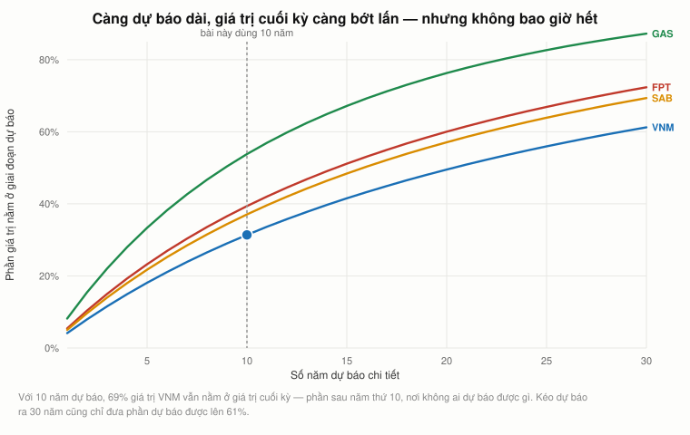
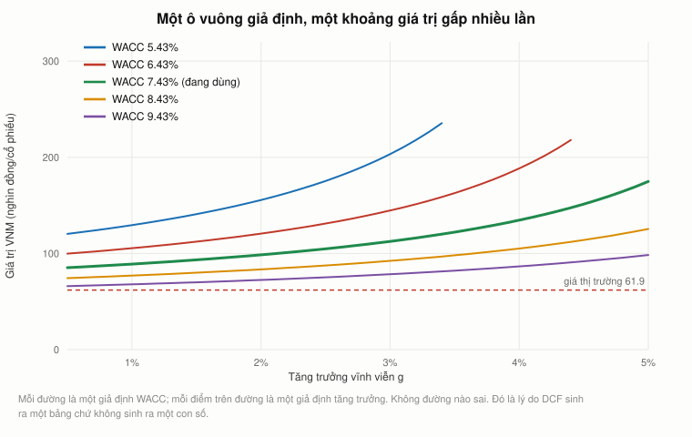
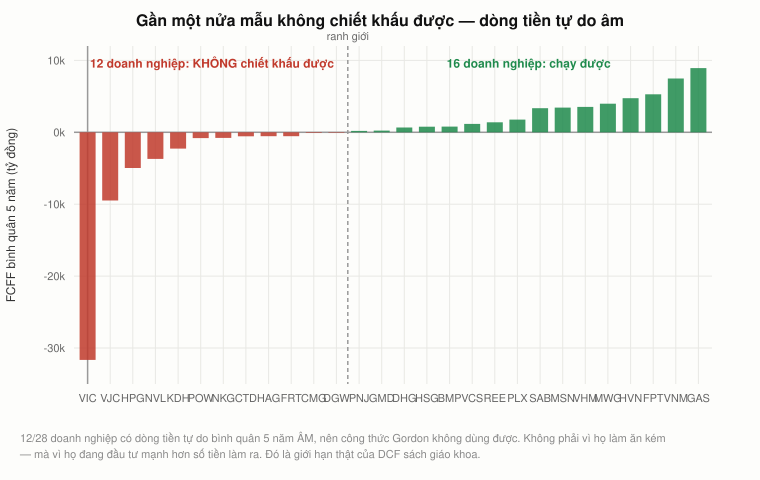
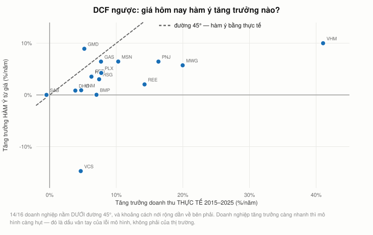
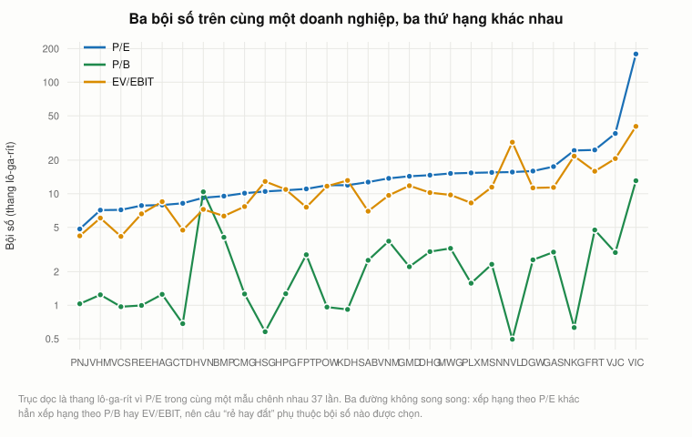
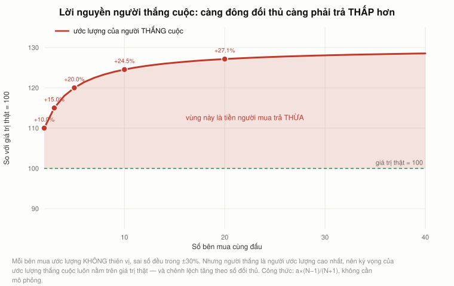

# Bài 18 — Định giá doanh nghiệp, M&A và giới hạn của mô hình

> 🏢 **PHẦN E — TÀI CHÍNH DOANH NGHIỆP, BÀI CHÍNH CUỐI.** Bài này **không đến từ video của Andrew Lo**.
> Nó trả lời câu hỏi mà [bài 17 §17](bai_17_chi_phi_dai_dien.md#17-đi-tiếp) để ngỏ:
> *"vậy cả doanh nghiệp này đáng giá bao nhiêu?"*
> Nguồn: Koller/McKinsey, *Valuation*; Damodaran, *Investment Valuation*;
> Capen, Clapp & Campbell (1971); Roll (1986).
> 📌 **Cần đọc trước:** [Bài 15](bai_15_wacc.md) (WACC),
> [Bài 6 §11](bai_06_co_phieu_va_tang_truong.md#11-vĩnh-viễn-gordon-và-bong-bóng-công-nghệ-trong-một-phép-chia) (mô hình Gordon),
> [Bài 12](bai_12_ngan_sach_von.md) (dòng tiền và NPV),
> [Bài 1 §6](bai_01_tai_chinh_la_gi.md#6-phiên-đấu-giá-hộp-kín--price-discovery-diễn-ra-trực-tiếp) (đấu giá).
> ⚠️ Số liệu báo cáo tới năm **2025**; giá cổ phiếu tới tháng **9/2026**.

---

## Mục lục

<!-- MUC-LUC -->
- [1. Ba cách định giá, và vì sao chúng phải khác nhau](#1-ba-cách-định-giá-và-vì-sao-chúng-phải-khác-nhau)
- [2. Dựng dòng tiền tự do — từ báo cáo thật](#2-dựng-dòng-tiền-tự-do--từ-báo-cáo-thật)
- [3. Giá trị cuối kỳ ăn hết phần còn lại](#3-giá-trị-cuối-kỳ-ăn-hết-phần-còn-lại)
- [4. Hai tham số không ai đo được quyết định tất cả](#4-hai-tham-số-không-ai-đo-được-quyết-định-tất-cả)
- [5. Đo xem DCF hỏng ở đâu — chạy trên cả 28 doanh nghiệp](#5-đo-xem-dcf-hỏng-ở-đâu--chạy-trên-cả-28-doanh-nghiệp)
- [6. DCF ngược — giá hôm nay đang hàm ý điều gì](#6-dcf-ngược--giá-hôm-nay-đang-hàm-ý-điều-gì)
- [7. Bội số — và đại số cho thấy nó chính là một DCF bị giấu](#7-bội-số--và-đại-số-cho-thấy-nó-chính-là-một-dcf-bị-giấu)
- [8. Lời nguyền người thắng cuộc — vì sao bên mua hay trả hớ](#8-lời-nguyền-người-thắng-cuộc--vì-sao-bên-mua-hay-trả-hớ)
- [9. Cộng hưởng — và ai thực sự hưởng](#9-cộng-hưởng--và-ai-thực-sự-hưởng)
- [10. Ba cách, ba con số — và cách đọc khoảng chênh](#10-ba-cách-ba-con-số--và-cách-đọc-khoảng-chênh)
- [11. Quản trị theo giá trị — nối ngược về bài 14 và 15](#11-quản-trị-theo-giá-trị--nối-ngược-về-bài-14-và-15)
- [12. Góc Việt Nam — định giá khi dữ liệu không đủ](#12-góc-việt-nam--định-giá-khi-dữ-liệu-không-đủ)
- [13. Mười sai lầm khi định giá](#13-mười-sai-lầm-khi-định-giá)
- [14. Hết phần chính của phần E](#14-hết-phần-chính-của-phần-e)
- [15. Code minh hoạ](#15-code-minh-hoạ)
- [16. Từ điển thuật ngữ](#16-từ-điển-thuật-ngữ)
- [17. Câu hỏi tự kiểm tra](#17-câu-hỏi-tự-kiểm-tra)
- [Tóm tắt một trang](#tóm-tắt-một-trang)
- [Nguồn](#nguồn)
<!-- /MUC-LUC -->

---

## 1. Ba cách định giá, và vì sao chúng phải khác nhau

Bài 17 dừng ở câu hỏi: **vậy cả doanh nghiệp này đáng giá bao nhiêu?** Có ba cách trả lời, và chúng
không bao giờ ra cùng một con số.

| Cách                                                             | Điểm mạnh                                          | Điểm yếu                                                             |
| ---------------------------------------------------------------- | -------------------------------------------------- | -------------------------------------------------------------------- |
| **(1) Chiết khấu dòng tiền** — dự báo FCFF, chiết khấu bằng WACC | bắt bạn nói **rõ** mọi giả định                    | nhạy cảm đến mức khó tin với hai tham số không ai đo được            |
| **(2) Bội số thị trường** — nhân lợi nhuận với một hệ số         | nhanh, và neo vào **giá thật** người khác đang trả | giấu hết giả định vào một con số, và *"tương tự"* là một từ rất rộng |
| **(3) Giá giao dịch** — xem thương vụ gần nhất trả bao nhiêu     | là **tiền thật** đã đổi chủ                        | gồm cả phần bù kiểm soát và có thể gồm cả sai lầm của người mua      |

> Ba cách này **không** phải ba ước lượng độc lập của cùng một con số. Chúng đo ba thứ khác nhau:
> cách (1) đo giá trị với giả định **của bạn**; cách (2) đo giá trị với giả định của **thị trường**;
> cách (3) đo giá trị với giả định của **một người mua cụ thể**, cộng quyền kiểm soát.

Khi ba con số lệch nhau, câu hỏi đúng không phải *"cái nào đúng"* mà là *"giả định nào khác nhau, và
ai có lý do để tin giả định của mình hơn"*.

Bài này làm cả ba trên cùng một bộ dữ liệu: 28 doanh nghiệp niêm yết Việt Nam — cùng bộ mã của
[bài 16](bai_16_co_cau_von.md) và [bài 17](bai_17_chi_phi_dai_dien.md), nên mọi kết quả đối chiếu
được ngược lại.

---

## 2. Dựng dòng tiền tự do — từ báo cáo thật

Chiết khấu dòng tiền cần **một** dòng tiền duy nhất: dòng tiền tự do cho **cả** doanh nghiệp (FCFF)
— tiền còn lại sau khi đã trả chi phí hoạt động và đã đầu tư đủ để duy trì kinh doanh, **trước** khi
chia cho chủ nợ và cổ đông.

$$\text{FCFF} = \text{dòng tiền kinh doanh} + \text{lãi vay}\times(1-\tau) - \text{capex}$$

⚠️ **Số hạng giữa là chỗ dễ sai nhất.** Báo cáo lưu chuyển tiền tệ Việt Nam đã **trừ** lãi vay đã trả
ra khỏi dòng tiền kinh doanh. Nhưng lãi vay là tiền thuộc về **chủ nợ**, và FCFF phải là tiền thuộc
về **cả hai** bên. Nên phải cộng ngược lại — và cộng phần **sau thuế**, vì phần thuế đã được lá chắn
([bài 15 §5](bai_15_wacc.md#5-lá-chắn-thuế-và-bẫy-thuế-suất-biên-so-với-hiệu-dụng)).

Vinamilk, 2015–2025, tỷ đồng:

|  Năm |    CFO | Lãi vay | ×(1−τ) |  Capex |  **FCFF** |
| ---: | -----: | ------: | -----: | -----: | --------: |
| 2015 |  7.659 |      31 |     25 | −1.068 | **6.616** |
| 2018 |  8.140 |      51 |     41 | −3.186 | **4.996** |
| 2019 | 11.410 |     109 |     87 | −2.158 | **9.339** |
| 2023 |  7.887 |     354 |    283 | −1.580 | **6.591** |
| 2025 |  8.668 |     326 |    261 | −1.762 | **7.167** |

Trung bình 5 năm gần nhất: **7.480 tỷ đồng**.

**Vì sao phải lấy trung bình nhiều năm.** FCFF một năm bật nhảy theo chu kỳ đầu tư: năm xây nhà
máy thì âm, năm không xây thì dương. Chiết khấu vĩnh viễn một con số bật nhảy như vậy là nhân cái
nhiễu lên vô cực. Trung bình nhiều năm là cách rẻ nhất để bớt chuyện đó — không phải cách tốt nhất,
chỉ là cách trung thực nhất khi ta không có kế hoạch đầu tư thật của công ty.

---

## 3. Giá trị cuối kỳ ăn hết phần còn lại

Chiết khấu 10 năm dự báo, rồi cộng giá trị cuối kỳ (mô hình Gordon của
[bài 6 §11](bai_06_co_phieu_va_tang_truong.md#11-vĩnh-viễn-gordon-và-bong-bóng-công-nghệ-trong-một-phép-chia)).

Suất chiết khấu là WACC của VNM, tính lại bằng đúng phương pháp bài 15: beta **0,597**
(R² = 0,26, 164 tháng) → Ke = 3% + 0,597 × 8% = **7,78%** → **WACC = 7,43%**.

⚠️ Giả định tăng trưởng là **tôi chọn**, không đo được — và con số đầu đã **cao hơn thực tế**: doanh
thu VNM tăng **4,7%/năm** trong 10 năm qua, không phải 6%. Tôi giữ 6% để §4 cho thấy một giả định
lạc quan vừa phải kéo kết quả đi bao xa.

|                                        |                 Tỷ đồng |         % |
| -------------------------------------- | ----------------------: | --------: |
| Giá trị hiện tại của 10 năm dự báo     |                  69.526 | **31,4%** |
| Giá trị hiện tại của giá trị cuối kỳ   |                 151.938 | **68,6%** |
| **Giá trị doanh nghiệp**               |             **221.465** |           |
| Trừ nợ vay 9.457, cộng tiền mặt 23.150 |                 +13.693 |           |
| **Giá trị vốn chủ sở hữu**             |             **235.158** |           |
| Chia 2.090 triệu cổ phiếu              | **112,5** nghìn đồng/cp |           |
| Giá thị trường hiện tại                |  **61,9** nghìn đồng/cp |           |

> ⚠️⚠️ **Và đây là con số phải nhìn trước mọi con số khác: 69% giá trị nằm ở giá trị cuối kỳ** — tức
> ở phần **sau** năm thứ 10, phần mà không ai dự báo được gì cả. Ta bỏ công dự báo 10 năm dòng tiền
> để giải thích **31%** kết quả.



Đó **không** phải lỗi của mô hình. Đó là **bản chất** của một doanh nghiệp đang hoạt động: phần lớn
giá trị của nó nằm ở tương lai xa. Kéo dự báo ra 30 năm cũng chỉ đưa phần dự báo được lên khoảng một
nửa. Nhưng nó có nghĩa là mọi tranh luận về *"dự báo doanh thu năm thứ ba"* gần như vô nghĩa, còn
tranh luận về **g vĩnh viễn** và **WACC** thì quyết định tất cả.

---

## 4. Hai tham số không ai đo được quyết định tất cả

Giá trị vốn chủ VNM trên mỗi cổ phiếu (nghìn đồng), theo hai giả định:

|  WACC \ g |       1% |    2% |    **3%** |    4% |        5% |
| --------: | -------: | ----: | --------: | ----: | --------: |
|     5,43% |    129,4 | 155,6 |     203,2 | 317,4 | **958,1** |
|     6,43% |    105,4 | 120,6 |     144,6 | 188,4 |     293,2 |
| **7,43%** |     88,9 |  98,6 | **112,5** | 134,6 |     174,8 |
|     8,43% |     77,0 |  83,4 |      92,3 | 105,1 |     125,4 |
|     9,43% | **67,9** |  72,4 |      78,4 |  86,5 |      98,3 |

Thấp nhất 67,9 — cao nhất 958,1. **Gấp 14,1 lần.** Giá thị trường: 61,9.

⚠️ **Ở góc trên bên phải mô hình tự phát nổ:** khi WACC tiến gần g thì mẫu số (WACC − g) tiến về
không và giá trị chạy ra vô cực. Ô đó không phải một dự báo, nó là một **lỗi của công thức Gordon**.
Bỏ các ô có WACC − g dưới 2 điểm phần trăm thì khoảng còn lại là **67,9 đến 317,4 — vẫn gấp 4,7
lần**.

> Trong phạm vi còn lại đó, VNM vừa có thể "rẻ hơn giá thị trường 1,1 lần" vừa có thể "đắt hơn 5,1
> lần". Và **không ô nào vô lý cả** — mỗi ô chỉ là một cách đọc hợp lệ về tương lai.



Độ dốc của bảng:

| Thay đổi                        |                   Giá trị đổi |
| ------------------------------- | ----------------------------: |
| g nhích **1 điểm phần trăm**    | **+18,0** nghìn/cp (**+16%**) |
| WACC nhích **1 điểm phần trăm** | **+26,2** nghìn/cp (**+23%**) |

⚠️ **Và nhớ rằng WACC ở đây cũng không phải sự thật.** Beta của VNM tính trên toàn bộ lịch sử là
**0,597**, tính trên 60 tháng gần nhất là **0,345**. Chỉ đổi **cửa sổ đo**, WACC đổi từ **7,43%** sang
**5,55%** — tức nhảy hai ô trong bảng trên, mà không ai làm gì sai cả. Đây đúng là vấn đề
[bài 11 §16](bai_11_capm_va_beta.md#16-độ-dốc-thật-của-sml-và-capm-beta-không-của-fischer-black) và [bài 15 §9](bai_15_wacc.md#9-wacc-không-phải-một-con-số-nó-là-một-khoảng)
đã đo.

> ⇒ **DCF không sinh ra một con số. Nó sinh ra một bảng.** Ai đưa cho bạn một con số DCF mà không đưa
> bảng này thì họ đã chọn giúp bạn hai giả định, và không nói cho bạn biết.

---

## 5. Đo xem DCF hỏng ở đâu — chạy trên cả 28 doanh nghiệp

§2–§4 làm DCF cho **một** doanh nghiệp ổn định. Giờ thử làm cho **cả 28**, và đếm xem bao nhiêu cái
chạy được.

Điều kiện tối thiểu để chiết khấu được: dòng tiền tự do bình quân 5 năm phải **dương**. Nếu âm thì
không có gì để chiết khấu — công thức Gordon trả về một số âm hoặc vô nghĩa.

| Nhóm                             | Mã                                                                             |
| -------------------------------- | ------------------------------------------------------------------------------ |
| ✅ Chạy được (16)                 | MWG, VNM, FPT, PNJ, HVN, VHM, REE, SAB, MSN, HSG, GAS, PLX, GMD, DHG, BMP, VCS |
| ❌ **Không chiết khấu được (12)** | **HPG, HAG, NVL, CTD, VIC, KDH, POW, NKG, VJC, FRT, DGW, CMG**                 |

> **12/28 = 43% mẫu không dùng được công thức này.**



Không phải vì họ làm ăn kém: năm 2025 **HPG lãi 15.515 tỷ** và **VIC là doanh nghiệp vốn hoá lớn nhất
sàn**. Mà vì họ đang đầu tư mạnh hơn số tiền làm ra, nên dòng tiền tự do âm suốt giai đoạn xây.

⚠️ **Đây là giới hạn thật sự của DCF sách giáo khoa, và nó ít được nói rõ:** công thức giả định doanh
nghiệp ở **trạng thái ổn định**. Doanh nghiệp đang tăng trưởng nhanh thì chưa ở trạng thái đó, nên
phải dự báo tay đến năm nó ổn định — tức phải **biết điều mà chính bạn đang muốn tính ra**.

---

## 6. DCF ngược — giá hôm nay đang hàm ý điều gì

Có một cách dùng DCF không bị cái bẫy của §4: **dùng nó ngược lại.**

Thay vì đoán g rồi tính ra giá trị rồi so với giá thị trường, ta lấy **giá thị trường** làm đầu vào
và giải ra g. Câu hỏi đổi từ

|                                      |                                    |
| ------------------------------------ | ---------------------------------- |
| *"cổ phiếu này đáng giá bao nhiêu?"* | bạn phải đoán tương lai            |
| *"giá này đang giả định điều gì?"*   | thị trường đoán, **bạn chấm điểm** |

Câu thứ hai dễ trả lời hơn nhiều, và hữu ích hơn.

$$EV = \frac{FCFF\,(1+g)}{WACC - g} \quad\Longrightarrow\quad g = \frac{WACC \times EV - FCFF}{EV + FCFF}$$

| Mã  |      EV | FCFF TB |   WACC | **g hàm ý** | Tăng DT thực tế |    Chênh |
| --- | ------: | ------: | -----: | ----------: | --------------: | -------: |
| VHM | 387.765 |   3.533 | 11,00% |   **10,0%** |           41,0% |    −31,0 |
| GMD |  31.039 |     231 |  9,74% |        8,9% |            5,2% | **+3,7** |
| MSN | 152.309 |   3.440 |  8,86% |        6,5% |           10,3% |     −3,8 |
| MWG |  98.491 |   3.983 | 10,00% |        5,7% |           20,0% |    −14,2 |
| FPT | 104.936 |   5.286 |  8,91% |        3,7% |            6,3% |     −2,6 |
| VNM | 115.675 |   7.480 |  7,43% |        0,9% |            4,7% |     −3,8 |
| SAB |  39.597 |   3.349 |  8,46% |        0,0% |           −0,5% | **+0,5** |
| VCS |   3.634 |   1.164 | 12,58% |  **−14,7%** |            4,7% |    −19,4 |

> **14/16 doanh nghiệp có g hàm ý thấp hơn tăng trưởng đã đạt được.**
> Trung vị g hàm ý **3,60%** so với trung vị tăng trưởng doanh thu **7,23%**.



### Đọc kết quả này có hai cách, và phải nói cả hai

**(a) Thị trường đang bi quan.** Giá hiện tại giả định các doanh nghiệp này sẽ tăng chậm hơn nhiều so
với một thập kỷ vừa qua.

**(b) Mô hình của tôi đang sai** — và đây mới là cách đọc có khả năng đúng hơn. Công thức Gordon lấy
FCFF hôm nay làm **mức nền vĩnh viễn**. Nhưng doanh nghiệp đang tăng trưởng có capex **cao hơn** mức
duy trì, nên FCFF hôm nay **thấp hơn** FCFF ở trạng thái ổn định. Lấy một con số bị nén làm nền thì g
giải ra sẽ bị kéo xuống.

### Cách phân biệt (a) với (b)

Nhìn các doanh nghiệp **không còn tăng trưởng**. Với họ, FCFF hôm nay gần đúng là FCFF ổn định, nên
mô hình không bị nén.

| Nhóm theo tăng trưởng doanh thu |    n | g hàm ý trung vị | Chênh so với thực tế |
| ------------------------------- | ---: | ---------------: | -------------------: |
| dưới 6%/năm                     |    5 |            0,84% |             **−3,0** |
| từ 10%/năm trở lên              |    5 |            6,45% |            **−12,2** |

> Nhóm tăng trưởng chậm lệch **−3,0 điểm**; nhóm tăng trưởng nhanh lệch **−12,2 điểm**, gấp bốn
> lần. Đó đúng là dấu vân tay của cách đọc **(b)**: mô hình nén dòng tiền của doanh nghiệp đang đầu tư.

⇒ Bài học **không** phải *"DCF ngược cho biết cổ phiếu nào rẻ"*. Bài học là: **khi kết quả một mô hình
lệch có hệ thống theo một đặc điểm của mẫu, thì thứ bị lệch là MÔ HÌNH, không phải thị trường.**

---

## 7. Bội số — và đại số cho thấy nó chính là một DCF bị giấu

Cách thứ hai: nhân lợi nhuận với một hệ số. Nhanh hơn nhiều, và vì thế được dùng nhiều hơn DCF trong
thực tế.

| Bội số      | Công thức                        | Hỏi về cái gì                                                                                                                                                                      |
| ----------- | -------------------------------- | ---------------------------------------------------------------------------------------------------------------------------------------------------------------------------------- |
| **P/E**     | vốn hoá / lợi nhuận sau thuế     | **vốn chủ**                                                                                                                                                                        |
| **P/B**     | vốn hoá / vốn chủ sở hữu sổ sách | **tài sản**                                                                                                                                                                        |
| **EV/EBIT** | giá trị doanh nghiệp / EBIT      | **cả doanh nghiệp**, không bị cách tài trợ làm nhiễu — đúng tinh thần ROIC của [bài 14 §17](bai_14_doc_doanh_nghiep_bang_so.md#17-roic--thước-đo-không-bị-cách-tài-trợ-làm-nhiễu) |

|             | Trung vị |  Thấp nhất |         Cao nhất |          Gấp |
| ----------- | -------: | ---------: | ---------------: | -----------: |
| **P/E**     |    12,33 | 4,83 (PNJ) | **179,00** (VIC) | **37,0 lần** |
| **P/B**     |     1,89 | 0,49 (NVL) |      13,07 (VIC) |     26,4 lần |
| **EV/EBIT** |     9,98 | 4,14 (VCS) |      40,16 (VIC) |      9,7 lần |



Ba đường trong hình **không song song**: xếp hạng theo P/E khác hẳn xếp hạng theo P/B hay EV/EBIT. HVN
có P/E chỉ 9,2 nhưng P/B **10,40** — vì vốn chủ sổ sách của nó đã bị xoá gần hết trong đại dịch
([bài 16 §7](bai_16_co_cau_von.md#7-kiệt-quệ-tài-chính--đọc-một-hồ-sơ-thật)). Cùng một doanh nghiệp,
hai bội số, hai câu chuyện ngược nhau.

### Và đây là điều ít ai nói: bội số **chính là** một DCF, viết gọn lại

Lấy mô hình Gordon cho vốn chủ, $P = D_1/(K_e - g)$ với $D_1 = E_1 \times$ tỷ lệ chi trả. Chia cả hai
vế cho $E_1$:

$$\frac{P}{E} = \frac{\text{tỷ lệ chi trả}}{K_e - g}$$

Một bội số **không** phải một phương pháp khác. Nó là **đúng** công thức DCF, với ba giả định — chi
trả, $K_e$, $g$ — bị nén vào một con số duy nhất và **không ai phải nói ra chúng là bao nhiêu**.

P/E hàm ý, với tỷ lệ chi trả 40%:

| Ke \ g |   0% |   2% |   4% |   6% |
| -----: | ---: | ---: | ---: | ---: |
|     8% |  5,0 |  6,7 | 10,0 | 20,0 |
|    10% |  4,0 |  5,0 |  6,7 | 10,0 |
|    12% |  3,3 |  4,0 |  5,0 |  6,7 |
|    14% |  2,9 |  3,3 |  4,0 |  5,0 |

Trung vị P/E của mẫu là **12,3**. Đọc ngược bảng trên: con số đó tương thích với Ke 8% và g khoảng
4–5%, hoặc với chi trả cao hơn 40% ở nhiều tổ hợp khác. **Không có cách nào biết tổ hợp nào đúng từ
một con số P/E.**

### Ba cái bẫy của bội số

1. **"So với ngành".** Bảng trên cho thấy P/E trong **cùng một mẫu** chênh nhau 37 lần. Chọn nhóm so
   sánh khác đi là ra kết luận khác hẳn — và người định giá luôn có thể chọn nhóm cho ra kết quả
   mình muốn.
2. **Mẫu số âm hoặc bất thường.** Doanh nghiệp lỗ thì P/E vô nghĩa; doanh nghiệp vừa có một năm lãi
   đột biến thì P/E thấp giả tạo.
3. **Bội số không nói VÌ SAO.** Nó cho biết thị trường trả bao nhiêu, không cho biết thị trường đang
   giả định gì. Muốn biết điều đó thì phải làm ngược lại — dùng §6.

---

## 8. Lời nguyền người thắng cuộc — vì sao bên mua hay trả hớ

Cách định giá thứ ba là nhìn giá thực tế trong một thương vụ. Trước khi dùng con số đó, phải hiểu nó
được sinh ra thế nào.

[Bài 1 §6](bai_01_tai_chinh_la_gi.md#6-phiên-đấu-giá-hộp-kín--price-discovery-diễn-ra-trực-tiếp) đã
cho thấy giá chốt của một phiên đấu giá **không** phải định giá trung bình của cả phòng — nó là định
giá của người lạc quan nhất (hoặc nhì). Trong mua bán doanh nghiệp, điều đó có một hệ quả nghiêm
trọng.

Giả sử một doanh nghiệp đáng giá đúng **100**. N bên mua, **mỗi bên ước lượng đúng trung bình** —
không ai thiên vị — nhưng mỗi ước lượng lệch ngẫu nhiên trong khoảng ±30%. Người **thắng** là người
ước lượng **cao nhất**. Kỳ vọng của giá trị lớn nhất trong N mẫu rút từ phân phối đều trên $[-a, +a]$
là $a\,(N-1)/(N+1)$ — một công thức đóng, **không cần mô phỏng**.

| Số bên mua N | Ước lượng người thắng | Trả hơn giá trị thật |
| -----------: | --------------------: | -------------------: |
|            2 |                 110,0 |                10,0% |
|            3 |                 115,0 |                15,0% |
|            5 |                 120,0 |                20,0% |
|           10 |                 124,5 |                24,5% |
|       **20** |             **127,1** |            **27,1%** |



> **Không ai ngốc ở đây.** Mọi bên đều ước lượng không thiên vị. Nhưng việc **thắng cuộc tự nó là
> một tin xấu**: nó có nghĩa là bạn đã ước lượng cao hơn tất cả những người khác cùng nhìn cùng một
> doanh nghiệp.

Đó là **lời nguyền người thắng cuộc** (Capen, Clapp & Campbell 1971, tìm ra khi nghiên cứu đấu thầu
mỏ dầu ngoài khơi vịnh Mexico).

**Cách chữa, và nó phản trực giác:** bên mua phải **hạ** giá bỏ thầu xuống **dưới** ước lượng của
chính mình, và hạ **càng nhiều khi càng đông** đối thủ.

| Số bên mua N                             |     2 |      5 |     10 |         20 |
| ---------------------------------------- | ----: | -----: | -----: | ---------: |
| Phải bỏ thầu thấp hơn ước lượng của mình | −9,1% | −16,7% | −19,7% | **−21,3%** |

Trực giác bình thường bảo ngược lại: càng đông đối thủ càng phải trả **cao**. Trực giác đó là cái làm
bên mua thua.

⚠️ **Một điều bảng trên không nói.** Nó giả định mọi bên mua đều định giá **cùng một thứ**. Nếu một
bên mua thật sự có **cộng hưởng riêng** thì họ **đúng** khi trả cao hơn. §9 tách hai trường hợp đó ra.

📚 Roll (1986) gọi phần chênh không giải thích được bằng cộng hưởng là **giả thuyết kiêu ngạo**: ban
giám đốc bên mua tin rằng **họ** nhìn ra thứ mà thị trường không nhìn ra. Đôi khi đúng. Trung bình
thì không.

---

## 9. Cộng hưởng — và ai thực sự hưởng

Cộng hợp nhất **có thể** tạo ra giá trị thật: bớt chi phí trùng lặp, bán chéo khách hàng, tăng sức
mặc cả với nhà cung cấp. Câu hỏi không phải *có cộng hưởng hay không*, mà là **ai giữ được nó**.

Bên mua 1.000 tỷ, bên bán 300 tỷ, cộng hưởng tạo thêm 120 tỷ → giá trị sau hợp nhất 1.420 tỷ.

| Phần bù | Giá trả | Bên bán được | Bên mua được | Bên mua giữ |
| ------: | ------: | -----------: | -----------: | ----------: |
|      0% |     300 |            0 |          120 |        100% |
|     20% |     360 |           60 |           60 |         50% |
| **40%** |     420 |          120 |        **0** |      **0%** |
|     60% |     480 |          180 |      **−60** |        −50% |

Điểm hoà vốn của bên mua nằm ở phần bù **40%**: trả hơn thế là chuyển **toàn bộ** cộng hưởng sang
cho cổ đông bên bán, và trả hơn nữa là chuyển cả tiền của chính mình.

> **Ghép với §8 thì ra vấn đề thật sự.** Phần bù kiểm soát trong các thương vụ thực tế thường nằm
> trong khoảng 20–40%. Nhưng bên mua **không biết** cộng hưởng thật sự bằng bao nhiêu — họ **ước
> lượng** nó. Và §8 vừa chỉ ra rằng người **thắng** cuộc là người ước lượng **cao nhất**.
>
> Nên câu hỏi *"thương vụ này có tạo giá trị không"* tương đương với câu *"ước lượng cộng hưởng của
> chúng ta có cao hơn sự thật không"* — và xác suất câu trả lời là **có** tăng theo số đối thủ.

📚 **Bốn nguồn cộng hưởng**, xếp theo độ dễ kiểm chứng:

|     | Nguồn                            | Kiểm chứng được không                                             |
| --- | -------------------------------- | ----------------------------------------------------------------- |
| 1   | cắt chi phí trùng lặp            | **dễ đo nhất**, và thường là thật                                 |
| 2   | tăng sức mặc cả với nhà cung cấp | đo được, nhưng hay bị phóng đại                                   |
| 3   | bán chéo khách hàng              | khó đo, hay không xảy ra                                          |
| 4   | *"giá trị chiến lược"*           | **không đo được** — đây là tên gọi khác của việc không có số liệu |

⚠️ Và một dạng **không** phải cộng hưởng nhưng hay bị tính nhầm là **đa dạng hoá**. Công ty A mua công
ty B ở ngành khác để "giảm rủi ro". [Bài 10](bai_10_ly_thuyet_danh_muc.md) đã chỉ ra nhà đầu tư **tự**
đa dạng hoá được bằng cách mua cả hai cổ phiếu, **miễn phí**. Doanh nghiệp làm hộ việc đó không tạo ra
giá trị gì — chỉ tạo ra phí tư vấn.

---

## 10. Ba cách, ba con số — và cách đọc khoảng chênh

Ghép cả ba cách trên cùng một doanh nghiệp. Với mỗi mã chạy được DCF, so:

|     | Cách       | Nội dung                                                                  |
| --- | ---------- | ------------------------------------------------------------------------- |
| (1) | **DCF**    | giá trị vốn chủ trên một cổ phiếu, với giả định của §3                    |
| (2) | **Bội số** | giá trị suy từ P/E **trung vị của cả mẫu** (12,3) áp lên lợi nhuận của nó |
| (3) | **Giá**    | giá thị trường hôm nay                                                    |

| Mã  | (1) DCF | (2) Bội số | (3) Giá |  DCF/giá | Bội số/giá |
| --- | ------: | ---------: | ------: | -------: | ---------: |
| GAS |    66,3 |       59,1 |    84,0 |     0,79 |       0,70 |
| PLX |    35,8 |       28,8 |    36,0 |     0,99 |       0,80 |
| GMD |    15,0 |       66,5 |    77,4 | **0,19** |       0,86 |
| DHG |   170,7 |       80,4 |    95,6 |     1,79 |       0,84 |
| BMP |   267,0 |      185,0 |   143,0 |     1,87 |       1,29 |
| VCS |   104,2 |       53,5 |    31,1 | **3,35** |       1,72 |

- Trung vị tỷ số **DCF / giá**: **1,12**
- Trung vị tỷ số **bội số / giá**: **1,04**

Hai cột cuối gần như không bao giờ bằng 1, và cũng không bao giờ bằng nhau. **Đó không phải lỗi.** Đó
là ba câu hỏi khác nhau cho ra ba câu trả lời khác nhau, đúng như §1 đã nói.

GMD là ví dụ rõ nhất: DCF nói **0,19** (đắt gấp năm lần giá trị) trong khi bội số nói **0,86** (gần
đúng giá). Lý do nằm ở §6 — GMD có FCFF bình quân chỉ 231 tỷ trên EV 31.039 tỷ vì đang xây cảng, nên
DCF nén giá trị của nó xuống. Bội số dùng lợi nhuận kế toán nên không bị nén.

> **Cách dùng đúng, và đây là kết luận của cả phần E:**
>
> - Dùng **DCF** để biết **giả định nào** đang quyết định kết quả — §4 và §6.
> - Dùng **bội số** để biết **người khác** đang trả bao nhiêu cho thứ tương tự.
> - Dùng **giá giao dịch** để biết một **người mua cụ thể** sẵn sàng trả bao nhiêu, và nhớ trừ đi
>   phần bù kiểm soát cộng với lời nguyền người thắng cuộc.
>
> Không cách nào trong ba cách cho bạn "giá trị thật". **Không có giá trị thật.** Có giá trị **với một
> bộ giả định**, và công việc là làm cho bộ giả định đó **hiện ra** thay vì bị giấu đi.

---

## 11. Quản trị theo giá trị — nối ngược về bài 14 và 15

Định giá không chỉ để mua bán. Nó là thước đo để **điều hành**, và toàn bộ phần E ghép lại thành một
chuỗi:

|  Bài | Đo cái gì   | Câu hỏi điều hành                                           |
| ---: | ----------- | ----------------------------------------------------------- |
|   14 | ROIC        | mỗi đồng vốn sinh ra bao nhiêu?                             |
|   15 | WACC        | mỗi đồng vốn tốn bao nhiêu?                                 |
|   16 | cơ cấu vốn  | vay bao nhiêu thì WACC thấp nhất mà vẫn chịu được cú sốc?   |
|   17 | chi trả     | tiền dư thì trả ra hay giữ lại?                             |
|   18 | **giá trị** | các quyết định trên có làm doanh nghiệp đáng giá hơn không? |

Ba đòn bẩy tạo giá trị, và **chỉ có ba**:

1. **Tăng ROIC** trên vốn đang có — biên lợi nhuận hoặc vòng quay ([bài 14 §12](bai_14_doc_doanh_nghiep_bang_so.md#12-phân-rã-dupont--ba-phép-chia-đổi-cách-bạn-nhìn-doanh-nghiệp)).
2. **Tăng trưởng** — nhưng **chỉ khi** ROIC > WACC. Tăng trưởng với ROIC dưới WACC **phá** giá trị
   nhanh hơn là đứng yên.
3. **Giảm WACC** — cơ cấu vốn ([bài 16 §9](bai_16_co_cau_von.md#9-lý-thuyết-đánh-đổi--và-cái-giả-định-không-đo-được)),
   nhưng bài 16 đã đo: đáy chữ U rất phẳng, nên đòn bẩy này yếu nhất trong ba.

Điểm quan trọng nhất của mục này là **đòn bẩy số 2 có điều kiện**. Người ta hay coi tăng trưởng là
mục tiêu tự thân. Nó không phải. [Bài 15 §13](bai_15_wacc.md#13-roic-trừ-wacc--thước-đo-cuối-cùng)
đã đo ROIC − WACC cho năm doanh nghiệp: với HPG chênh **−0,3 điểm**, mỗi đồng vốn mới đưa vào là một
đồng không tạo ra gì thêm.

---

## 12. Góc Việt Nam — định giá khi dữ liệu không đủ

Bốn khác biệt so với sách giáo khoa Mỹ, xếp theo mức độ ảnh hưởng:

**1. Không có phần bù rủi ro đo được.** [Bài 15 §16](bai_15_wacc.md#16-góc-việt-nam--ba-con-số-phải-tự-chọn)
đã nói: rf 3% và MRP 8% là **giả định**, không phải số liệu. Toàn bộ cột WACC của bài này kế thừa hai
giả định đó. §4 là cách đối phó duy nhất — báo cáo một khoảng.

**2. Beta ước lượng rất kém.** R² của các hồi quy beta trong bài này nằm trong khoảng 0,03–0,52. Với
R² = 0,03, beta gần như không mang thông tin. Và §4 đã cho thấy đổi cửa sổ đo là WACC đổi gần 2 điểm.

**3. Nhóm so sánh quá nhỏ.** Sàn Việt Nam có vài trăm mã có thanh khoản thật. Với nhiều ngành, "công
ty tương tự" chỉ có hai hoặc ba cái — không đủ để lấy trung vị có nghĩa. Đó là lý do §7 dùng trung vị
**toàn mẫu** thay vì trung vị ngành: nhóm ngành ở đây quá nhỏ để tin.

**4. Nhiều doanh nghiệp đang trong giai đoạn đầu tư.** §5 đo được: 43% mẫu có FCFF âm. Ở một thị
trường đang công nghiệp hoá, tỷ lệ này cao hơn hẳn thị trường phát triển — nên DCF sách giáo khoa
dùng được cho **ít hơn một nửa** số doanh nghiệp.

⚠️ **Hệ quả thực hành:** ở Việt Nam, thứ tự ưu tiên nên **ngược** với sách giáo khoa. Bắt đầu bằng
**bội số** để có mốc, dùng **DCF ngược** (§6) để biết mốc đó hàm ý gì, và chỉ làm **DCF xuôi** khi
doanh nghiệp thật sự đã ổn định và bạn có kế hoạch đầu tư của họ.

---

## 13. Mười sai lầm khi định giá

|    # | Sai lầm                                                | Vì sao sai                                                                      |
| ---: | ------------------------------------------------------ | ------------------------------------------------------------------------------- |
|    1 | Báo cáo **một con số** DCF                             | §4: cùng mô hình, khoảng giá trị gấp 4,7 lần                                    |
|    2 | Tranh luận về dự báo năm thứ ba                        | §3: 69% giá trị nằm sau năm thứ 10                                              |
|    3 | Đặt g vĩnh viễn cao hơn tăng trưởng của cả nền kinh tế | không doanh nghiệp nào lớn mãi hơn GDP; g phải ≤ tăng trưởng danh nghĩa dài hạn |
|    4 | Để WACC − g quá nhỏ                                    | §4: mô hình phát nổ, con số ra là lỗi công thức chứ không phải dự báo           |
|    5 | Dùng FCFF **một năm** làm nền                          | §2: nó bật nhảy theo chu kỳ đầu tư                                              |
|    6 | Chạy DCF cho doanh nghiệp đang tăng trưởng nhanh       | §5, §6: mô hình nén dòng tiền, lệch có hệ thống                                 |
|    7 | Coi bội số là "phương pháp khác"                       | §7: nó là **đúng** công thức DCF với giả định bị giấu                           |
|    8 | Chọn nhóm so sánh sau khi đã biết kết quả mình muốn    | §7: P/E trong cùng mẫu chênh 37 lần                                             |
|    9 | Cộng "phần bù chiến lược" vào giá chào mua             | §8, §9: đó là tên gọi khác của việc trả quá                                     |
|   10 | Trả nhiều hơn khi có nhiều đối thủ cạnh tranh          | §8: phải trả **ít** hơn, và ít hơn tới −21,3% với 20 đối thủ                    |

Sai lầm tinh vi nhất là **số 7**. Người ta chuyển sang bội số khi thấy DCF "quá nhiều giả định" —
mà không nhận ra bội số có **đúng những giả định đó**, chỉ là không phải viết ra.

---

## 14. Hết phần chính của phần E

Mười ba bài đầu bám sát hai mươi buổi giảng của Andrew Lo: nửa **đầu tư** của tài chính, nhìn từ ghế
người bỏ tiền. Năm bài phần E là nửa còn lại, nhìn từ ghế người **điều hành** — chính Lo chỉ người
học sang môn 15.434 cho phần này.

Cả mười tám bài đến đây quay quanh đúng hai câu hỏi mà [bài 1 §11](bai_01_tai_chinh_la_gi.md#11-thời-gian-và-rủi-ro--hai-thứ-làm-nên-cả-ngành)
đã đặt ra ngay buổi đầu tiên:

> **Một đồng ngày mai đáng giá bao nhiêu hôm nay?** và **rủi ro đáng giá bao nhiêu?**

Bài 2 trả lời câu thứ nhất bằng chiết khấu. Bài 9 đến 11 trả lời câu thứ hai bằng beta. Mọi thứ còn
lại — trái phiếu, quyền chọn, ngân sách vốn, WACC, cơ cấu vốn, chi trả, định giá — là hai câu đó áp
vào những chỗ khác nhau.

Và bài này khép lại bằng câu trả lời trung thực nhất mà cả khoá đưa ra được: **không có giá trị thật;
chỉ có giá trị với một bộ giả định.** Việc của người làm nghề không phải tìm ra con số đúng, mà là
làm cho bộ giả định của mình **hiện ra** — để người khác kiểm được, và để chính mình biết mình đang
đánh cược vào điều gì.

**Còn một bài nữa, và nó ra đời sau khi bài này viết xong.** Đối chiếu khoá này với giáo trình
[MIT 15.402 *Finance Theory II*](https://ocw.mit.edu/courses/15-402-finance-theory-ii-spring-2003/pages/lecture-notes/)
— phần tiếp chính thức của 15.401 — lộ ra hai mục chưa được dạy: **quyền chọn thực** và **APV**. Cả
hai đều là câu trả lời cho câu hỏi *"bộ công cụ này hỏng ở đâu"*, nên chúng gộp thành
[bài 19](bai_19_quyen_chon_thuc_va_apv.md). Bài đó cũng tìm ra một **mâu thuẫn trong chính bài 15**,
và đo xem nó lớn bao nhiêu.

---

## 15. Code minh hoạ

> ⚙️ **Chạy:** cần **Python 3.10+**. Không cần cài gói nào. Kết quả **tất định**.

|            |                                                                                             |
| ---------- | ------------------------------------------------------------------------------------------- |
| File       | [`thuc_hanh/bai-18-dinh-gia-doanh-nghiep.py`](../thuc_hanh/bai-18-dinh-gia-doanh-nghiep.py) |
| Kích thước | **1.608 dòng**, 10 mục                                                                      |

Dữ liệu nhúng: giá cuối tháng của 28 cổ phiếu + VN-Index từ 2013 (165 tháng), và báo cáo tài chính
2015–2025 của chính 28 doanh nghiệp đó — cùng bộ mã với bài 16 và 17, nên mọi kết quả đối chiếu ngược
được.

Ba hằng số ở đầu file (`G_NGAN`, `G_VINH_VIEN`, `SO_NAM_DU_BAO`) là ba giả định của §3. Đổi chúng thì
mọi con số DCF đổi theo — và đó chính là điểm của §4. Hàm `bang_dcf_nguoc()` là chỗ đáng đọc nhất: nó
giải ngược công thức Gordon và tự loại các doanh nghiệp không giải được, thay vì trả về một con số vô
nghĩa.

Kết quả chạy thật:

```
==============================================================================
BAI 18 — DINH GIA DOANH NGHIEP, M&A VA GIOI HAN CUA MO HINH
PHAN E — Tai chinh doanh nghiep (ngoai pham vi video 15.401 cua Andrew Lo)
==============================================================================

==============================================================================
MUC 1. BA CACH DINH GIA, VA VI SAO CHUNG PHAI KHAC NHAU
==============================================================================
Bai 17 dung o cau hoi: vay ca doanh nghiep nay dang gia bao nhieu? Co ba cach
tra loi, va chung khong bao gio ra cung mot con so.

  (1) CHIET KHAU DONG TIEN. Du bao dong tien tu do, chiet khau bang WACC.
      Diem manh: bat ban noi RO moi gia dinh.
      Diem yeu : ket qua nhay cam den muc kho tin voi hai tham so khong ai
                 do duoc — tang truong dai han va WACC.

  (2) BOI SO THI TRUONG. Nhan loi nhuan voi mot he so lay tu cong ty tuong tu.
      Diem manh: nhanh, va neo vao gia THAT ma nguoi khac dang tra.
      Diem yeu : giau het gia dinh vao mot con so duy nhat, va "tuong tu"
                 la mot tu rat rong.

  (3) GIA GIAO DICH. Xem thuong vu mua ban gan nhat trong nganh tra bao nhieu.
      Diem manh: la tien THAT da doi chu.
      Diem yeu : gia do bao gom PHAN BU KIEM SOAT va co the bao gom ca sai lam
                 cua nguoi mua — muc 8 do phan sai lam do.

Ba cach nay KHONG phai ba uoc luong doc lap cua cung mot con so. Chung do
   ba thu khac nhau: cach (1) do gia tri voi gia dinh CUA BAN; cach (2) do
   gia tri voi gia dinh cua THI TRUONG; cach (3) do gia tri voi gia dinh cua
   MOT NGUOI MUA CU THE, cong voi quyen kiem soat.

   Khi ba con so lech nhau, cau hoi dung khong phai "cai nao dung" ma la
   "gia dinh nao khac nhau, va ai co ly do de tin gia dinh cua minh hon".

Bai nay lam ca ba tren cung mot bo du lieu: 28 doanh nghiep niem yet Viet
Nam, bao cao den nam 2025, gia den thang 9 nam 2026.

==============================================================================
MUC 2. DUNG DONG TIEN TU DO — TU BAO CAO THAT
==============================================================================
Chiet khau dong tien can MOT dong tien duy nhat: dong tien tu do cho CA doanh
nghiep (FCFF) — tien con lai sau khi da tra chi phi hoat dong va da dau tu du
de duy tri kinh doanh, TRUOC khi chia cho chu no va co dong.

  FCFF = dong tien kinh doanh + lai vay x (1 - thue) - dau tu tai san co dinh

⚠️ So hang giua la cho de sai nhat. Bao cao luu chuyen tien te Viet Nam da
   TRU lai vay da tra ra khoi dong tien kinh doanh. Nhung lai vay la tien
   thuoc ve CHU NO, va FCFF phai la tien thuoc ve CA HAI ben. Nen phai cong
   nguoc lai — va cong phan SAU THUE, vi phan thue da duoc la chan (bai 15).

Lay VNM, 2015-2025:

    nam       CFO  lai vay  x(1-thue)     capex      FCFF
  -------------------------------------------------------
   2015     7,659       31         25    -1,068     6,616
   2016     8,390       46         37    -1,142     7,285
   2017     9,602       29         24    -2,673     6,952
   2018     8,140       51         41    -3,186     4,996
   2019    11,410      109         87    -2,158     9,339
   2020    10,180      144        115    -1,265     9,030
   2021     9,432       89         71    -1,531     7,972
   2022     8,827      166        133    -1,457     7,503
   2023     7,887      354        283    -1,580     6,591
   2024     9,686      279        224    -1,742     8,168
   2025     8,668      326        261    -1,762     7,167

  Trung binh 5 nam gan nhat: 7,480 ty dong.

  VI SAO PHAI LAY TRUNG BINH NHIEU NAM. FCFF mot nam bat nhay theo chu ky
     dau tu: nam xay nha may thi am, nam khong xay thi duong. Chiet khau vinh
     vien mot con so bat nhay nhu vay la nhan cai nhieu len vo cuc. Trung
     binh nhieu nam la cach re nhat de bot chuyen do — khong phai cach tot
     nhat, chi la cach trung thuc nhat khi ta khong co ke hoach dau tu that
     cua cong ty.

==============================================================================
MUC 3. CHIET KHAU — VA GIA TRI CUOI KY AN HET PHAN CON LAI
==============================================================================
Chiet khau 10 nam du bao, roi cong gia tri cuoi ky (mo hinh Gordon cua bai 6).

  Suat chiet khau: WACC cua VNM, tinh lai bang dung phuong phap bai 15
    beta = 0.597 (R binh phuong 0.26, 164 thang)
    Ke = 3% + 0.597 x 8% = 7.78%
    WACC = 7.43%
  Tang truong FCFF 10 nam dau : 6%   <- GIA DINH
  Tang truong vinh vien sau do  : 3%   <- GIA DINH

  ⚠️ Hai con so cuoi la TOI chon, khong phai do duoc. Va con so dau da CAO
     hon thuc te: doanh thu VNM tang 4.7%/nam trong 10 nam qua, khong phai 6%.
     Toi giu 6% de muc 4 cho thay mot gia dinh lac quan vua phai keo ket qua
     di bao xa.

  Gia tri hien tai cua 10 nam du bao         69,526 ty  (31.4%)
  Gia tri hien tai cua gia tri cuoi ky      151,938 ty  (68.6%)
  ------------------------------------------------------
  GIA TRI DOANH NGHIEP                      221,465 ty
  tru no vay 9,457, cong tien mat 23,150             13,693 ty
  ------------------------------------------------------
  GIA TRI VON CHU SO HUU                    235,158 ty
  chia 2,090 trieu co phieu         ->        112.5 nghin dong/cp

  Gia thi truong hien tai                      61.9 nghin dong/cp
  Chenh                                       81.8%

  ⚠️⚠️ VA DAY LA CON SO PHAI NHIN TRUOC MOI CON SO KHAC:
     69% gia tri nam o GIA TRI CUOI KY — tuc o phan SAU nam thu 10,
     phan ma khong ai du bao duoc gi ca. Ta bo cong du bao 10 nam dong tien
     de giai thich 31% ket qua.

  Do khong phai loi cua mo hinh. Do la BAN CHAT cua mot doanh nghiep dang
     hoat dong: phan lon gia tri cua no nam o tuong lai xa. Nhung no co nghia
     la moi tranh luan ve "du bao nam thu ba" gan nhu vo nghia, con tranh luan
     ve g vinh vien va WACC thi quyet dinh tat ca. Muc 4 do dieu do.

==============================================================================
MUC 4. HAI THAM SO KHONG AI DO DUOC QUYET DINH TAT CA
==============================================================================
Gia tri von chu VNM tren moi co phieu (nghin dong), theo hai gia dinh:

             tang truong vinh vien g
       WACC        1%        2%        3%        4%        5%
  -----------------------------------------------------------
      5.43%     129.4     155.6     203.2     317.4     958.1
      6.43%     105.4     120.6     144.6     188.4     293.2
      7.43%      88.9      98.6     112.5     134.6     174.8  <- dang dung
      8.43%      77.0      83.4      92.3     105.1     125.4
      9.43%      67.9      72.4      78.4      86.5      98.3

  Thap nhat 67.9 — cao nhat 958.1 nghin dong/co phieu. GAP 14.1 LAN.
  Gia thi truong hien tai: 61.9.

  ⚠️ O goc tren ben phai mo hinh TU PHAT NO: khi WACC tien gan g thi mau so
     (WACC - g) tien ve khong va gia tri chay ra vo cuc. O do khong phai mot
     du bao, no la mot loi cua cong thuc Gordon. Bo cac o co WACC - g duoi 2
     diem phan tram thi khoang con lai la 67.9 den 203.2 — van GAP 3.0 LAN.

  Trong pham vi con lai do, VNM vua co the "re hon gia thi truong 1.1 lan"
     vua co the "dat hon 3.3 lan". Va khong o nao vo ly ca — moi o chi la
     mot cach doc hop le ve tuong lai.

  ⇒ KET LUAN THUC DUNG, giong het ket luan cua bai 15 muc 9 ve WACC:
    DCF khong sinh ra mot con so. No sinh ra mot BANG. Ai dua cho ban mot con
    so DCF ma khong dua bang nay thi ho da chon giup ban hai gia dinh, va
    khong noi cho ban biet.

  📚 Mot cach kiem tra nhanh do lon cua bang: nhin so hang cua no.
     g nhich 1 diem phan tram    -> gia tri doi +18.0 nghin/cp (+16%)
     WACC nhich 1 diem phan tram -> gia tri doi +26.2 nghin/cp (+23%)

  ⚠️ Va nho rang WACC o day cung khong phai su that. Beta cua VNM tinh tren
     toan bo lich su la 0.597, nhung tinh tren 60 thang gan nhat la 0.345.
     Chi doi CUA SO DO, WACC doi tu 7.43% sang 5.55% — tuc nhay hai o
     trong bang tren, ma khong ai lam gi sai ca.

==============================================================================
MUC 5. DO XEM DCF HONG O DAU — CHAY TREN CA 28 DOANH NGHIEP
==============================================================================
Muc 2 den muc 4 lam DCF cho MOT doanh nghiep on dinh. Gio thu lam cho CA 28,
va dem xem bao nhieu cai chay duoc.

Dieu kien toi thieu de chiet khau duoc: dong tien tu do binh quan 5 nam phai
DUONG. Neu am thi khong co gi de chiet khau — cong thuc Gordon tra ve mot so
am hoac vo nghia.

  ma       FCFF TB 5 nam     ket qua
  ----------------------------------
  MWG              3,983   chay duoc
  VNM              7,480   chay duoc
  FPT              5,286   chay duoc
  HPG             -4,967       KHONG
  PNJ                194   chay duoc
  HAG               -545       KHONG
  HVN              4,743   chay duoc
  NVL             -3,696       KHONG
  CTD               -554       KHONG
  VIC            -31,650       KHONG
  VHM              3,533   chay duoc
  KDH             -2,270       KHONG
  REE              1,391   chay duoc
  POW               -808       KHONG
  SAB              3,349   chay duoc
  MSN              3,440   chay duoc
  HSG                779   chay duoc
  NKG               -784       KHONG
  GAS              8,933   chay duoc
  PLX              1,760   chay duoc
  GMD                231   chay duoc
  VJC             -9,480       KHONG
  FRT               -536       KHONG
  DGW                -65       KHONG
  CMG                -87       KHONG
  DHG                669   chay duoc
  BMP                794   chay duoc
  VCS              1,164   chay duoc

  12/28 DOANH NGHIEP KHONG CHIET KHAU DUOC BANG CACH NAY:
     HPG, HAG, NVL, CTD, VIC, KDH, POW, NKG, VJC, FRT, DGW, CMG

  Do la 43% mau. Khong phai vi ho lam an te: nam 2025 HPG lai
  15,515 ty va VIC la doanh nghiep von hoa lon nhat san. Ma vi ho dang
  dau tu manh hon so tien lam ra, nen dong tien tu do am suot giai doan xay.

  ⚠️ Day la gioi han THUC SU cua DCF sach giao khoa, va no it duoc noi ro:
     cong thuc gia dinh doanh nghiep o TRANG THAI ON DINH. Doanh nghiep dang
     tang truong nhanh thi chua o trang thai do, nen phai du bao tay den nam
     no on dinh — tuc phai biet dieu ma chinh ban dang muon tinh ra.

==============================================================================
MUC 6. DCF NGUOC — GIA HOM NAY DANG HAM Y DIEU GI
==============================================================================
Co mot cach dung DCF khong bi cai bay cua muc 4: DUNG NO NGUOC LAI.

Thay vi doan g roi tinh ra gia tri roi so voi gia thi truong, ta lay GIA THI
TRUONG lam dau vao va giai ra g. Cau hoi doi tu

    "co phieu nay dang gia bao nhieu?"   (ban phai doan tuong lai)
sang
    "gia nay dang gia dinh dieu gi?"     (thi truong doan, ban cham diem)

Cau thu hai de tra loi hon nhieu, va huu ich hon.

    EV = FCFF x (1+g) / (WACC - g)   =>   g = (WACC x EV - FCFF) / (EV + FCFF)

  ma              EV   FCFF TB   WACC  g HAM Y  tang DT thuc te   chenh
  ---------------------------------------------------------------------
  VHM        387,765     3,533 11.00%    10.0%            41.0%   -31.0
  GMD         31,039       231  9.74%     8.9%             5.2%     3.7
  MSN        152,309     3,440  8.86%     6.5%            10.3%    -3.8
  PNJ         15,364       194  7.79%     6.4%            16.3%    -9.9
  GAS        165,892     8,933 12.18%     6.4%             7.7%    -1.3
  MWG         98,491     3,983 10.00%     5.7%            20.0%   -14.2
  PLX         36,740     1,760  9.25%     4.3%             7.7%    -3.5
  FPT        104,936     5,286  8.91%     3.7%             6.3%    -2.6
  HVN         65,158     4,743 11.06%     3.5%             6.3%    -2.8
  HSG         11,800       779  9.83%     3.0%             7.4%    -4.4
  REE         27,777     1,391  7.15%     2.0%            14.2%   -12.2
  VNM        115,675     7,480  7.43%     0.9%             4.7%    -3.8
  DHG         10,346       669  7.36%     0.8%             3.9%    -3.0
  BMP          9,703       794  8.21%     0.0%             7.0%    -7.0
  SAB         39,597     3,349  8.46%     0.0%            -0.5%     0.5
  VCS          3,634     1,164 12.58%   -14.7%             4.7%   -19.4

  Cot "tang DT thuc te" la tang truong doanh thu binh quan 10 nam 2015-2025.

  14/16 DOANH NGHIEP CO g HAM Y THAP HON TANG TRUONG DA DAT DUOC.
     Trung vi g ham y      3.60%
     Trung vi tang truong  7.23%

  Doc ket qua nay co HAI cach, va phai noi ca hai:

  (a) THI TRUONG DANG BI QUAN. Gia hien tai gia dinh cac doanh nghiep nay se
      tang cham hon nhieu so voi mot thap ky vua qua.

  (b) MO HINH CUA TOI DANG SAI — va day moi la cach doc co kha nang dung hon.
      Cong thuc Gordon lay FCFF hom nay lam MUC NEN vinh vien. Nhung doanh
      nghiep dang tang truong co capex CAO hon muc duy tri, nen FCFF hom nay
      THAP hon FCFF o trang thai on dinh. Lay mot con so bi nen lam nen thi
      g giai ra se bi keo xuong.

  Cach phan biet (a) voi (b): nhin cac doanh nghiep KHONG con tang truong.
     Voi ho, FCFF hom nay gan dung la FCFF on dinh, nen mo hinh khong bi nen.

    nhom theo tang truong doanh thu   n   g ham y trung vi    chenh
  -----------------------------------------------------------------
                        duoi 6%/nam   5              0.84%    -3.0
                 tu 10%/nam tro len   5              6.45%   -12.2

  Nhom tang truong cham co g ham y lech it; nhom tang truong nhanh lech
     nhieu hon han. Do dung la dau van tay cua cach doc (b): mo hinh nen dong
     tien cua doanh nghiep dang dau tu.

  ⇒ Bai hoc khong phai "DCF nguoc cho biet co phieu nao re". Bai hoc la: khi
    ket qua mot mo hinh lech he thong theo mot dac diem cua mau, thi thu bi
    lech la MO HINH, khong phai thi truong.

==============================================================================
MUC 7. BOI SO — VA DAI SO CHO THAY NO CHINH LA MOT DCF BI GIAU
==============================================================================
Cach thu hai: nhan loi nhuan voi mot he so. Nhanh hon nhieu, va vi the duoc
dung nhieu hon DCF trong thuc te.

Ba boi so hay dung nhat:
    P/E     = von hoa / loi nhuan sau thue        — hoi ve VON CHU
    P/B     = von hoa / von chu so huu so sach    — hoi ve TAI SAN
    EV/EBIT = gia tri doanh nghiep / EBIT         — hoi ve CA doanh nghiep,
              khong bi cach tai tro lam nhieu (dung tinh than ROIC cua bai 14)

  ma         von hoa      P/E     P/B   EV/EBIT
  ---------------------------------------------
  PNJ         13,670      4.8    1.03       4.2
  VHM        308,877      7.1    1.24       6.1
  VCS          4,976      7.2    0.97       4.1
  REE         24,673      7.8    1.00       6.6
  HAG         17,745      7.9    1.25       8.5
  CTD          6,415      8.2    0.68       4.7
  HVN         70,009      9.2   10.40       7.2
  BMP         11,706      9.5    4.07       6.3
  CMG          5,040     10.1    1.26       7.7
  HSG          6,582     10.5    0.58      12.9
  HPG        166,558     10.7    1.27      10.9
  FPT        124,016     11.0    2.83       7.6
  POW         35,811     11.9    0.96      11.7
  KDH         19,414     11.9    0.92      13.1
  SAB         58,164     12.7    2.53       7.0
  VNM        129,369     13.7    3.75       9.7
  GMD         33,011     14.3    2.21      11.8
  DHG         12,500     14.7    3.02      10.2
  MWG        107,434     15.2    3.24       9.7
  PLX         46,580     15.4    1.58       8.3
  MSN        104,914     15.5    2.33      11.4
  NVL         29,128     15.6    0.49      29.0
  DGW          8,864     16.0    2.55      11.3
  GAS        202,688     17.5    3.00      11.4
  NKG          4,811     24.4    0.63      21.7
  FRT         24,302     24.7    4.73      15.9
  VJC         73,655     34.7    2.97      20.6
  VIC      1,980,547    179.0   13.07      40.2
  ---------------------------------------------
      P/E  trung vi  12.33  thap   4.83  cao  179.00  gap  37.0 lan
      P/B  trung vi   1.89  thap   0.49  cao   13.07  gap  26.4 lan
  EV/EBIT  trung vi   9.98  thap   4.14  cao   40.16  gap   9.7 lan

  VA DAY LA DIEU IT AI NOI: BOI SO CHINH LA MOT DCF, VIET GON LAI.

   Lay mo hinh Gordon cua bai 6 cho von chu:
       P = D1 / (Ke - g)   voi D1 = E1 x ti le chi tra
   Chia ca hai ve cho loi nhuan E1:
       P/E = ti le chi tra / (Ke - g)

   Mot boi so KHONG phai mot phuong phap khac. No la DUNG cong thuc DCF, voi
   ba gia dinh — chi tra, Ke, g — bi nen vao mot con so duy nhat va khong ai
   phai noi ra chung la bao nhieu.

   Bang do: P/E ham y bao nhieu, voi ti le chi tra 40%:

           tang truong g
       Ke        0%        2%        4%        6%
   ----------------------------------------------
       8%       5.0       6.7      10.0      20.0
      10%       4.0       5.0       6.7      10.0
      12%       3.3       4.0       5.0       6.7
      14%       2.9       3.3       4.0       5.0

   Trung vi P/E cua mau: 12.3. Doc nguoc bang tren: con so do tuong
   thich voi Ke 12% va g 2%, hoac Ke 14% va g 4%, hoac vai chuc to hop khac.
   Khong co cach nao biet to hop nao dung tu mot con so P/E.

⚠️ BA CAI BAY CUA BOI SO, xep theo tan suat gap:

   (1) "SO VOI NGANH". Bang tren cho thay P/E trong CUNG mot mau chenh nhau
       37 lan. Chon nhom so sanh khac di la ra ket luan khac han.
   (2) MAU SO AM HOAC BAT THUONG. Doanh nghiep lo thi P/E vo nghia; doanh
       nghiep vua co mot nam lai dot bien thi P/E thap gia tao.
   (3) BOI SO KHONG NOI VI SAO. No cho biet thi truong tra bao nhieu, khong
       cho biet thi truong dang gia dinh gi. Muon biet dieu do thi phai lam
       nguoc lai — dung muc 6.

==============================================================================
MUC 8. LOI NGUYEN NGUOI THANG CUOC — VI SAO BEN MUA HAY TRA HO
==============================================================================
Cach dinh gia thu ba la nhin gia thuc te trong mot thuong vu. Truoc khi dung
con so do, phai hieu no duoc sinh ra the nao.

Bai 1 muc 6 da cho thay gia chot cua mot phien dau gia KHONG phai dinh gia
trung binh cua ca phong — no la dinh gia cua nguoi lac quan nhat (hoac nhi).
Trong mua ban doanh nghiep, dieu do co mot he qua nghiem trong.

Gia su mot doanh nghiep dang gia dung 100. 5 tinh huong, moi tinh huong co N
ben mua. MOI ben uoc luong DUNG trung binh — khong ai thien vi — nhung moi
uoc luong lech ngau nhien trong khoang +/-30%.

Nguoi THANG la nguoi uoc luong CAO NHAT. Ma ky vong cua gia tri lon nhat
trong N mau rut tu phan phoi deu tren [-a, +a] la a x (N-1)/(N+1) — mot cong
thuc dong, khong can mo phong.

    so ben mua N   uoc luong nguoi thang   tra hon gia tri that
  -------------------------------------------------------------
               2               110.0                    10.0%
               3               115.0                    15.0%
               5               120.0                    20.0%
              10               124.5                    24.5%
              20               127.1                    27.1%

  KHONG AI NGOC O DAY. Moi ben deu uoc luong khong thien vi. Nhung viec
     THANG cuoc tu no la mot tin xau: no co nghia la ban da uoc luong cao hon
     tat ca nhung nguoi khac cung nhin cung mot doanh nghiep.

  Do la LOI NGUYEN NGUOI THANG CUOC (Capen, Clapp & Campbell 1971, tim ra khi
  nghien cuu dau thau mo dau ngoai khoi vinh Mexico).

  CACH CHUA, va no phan truc giac: ben mua phai HA gia bo thau xuong DUOI
     uoc luong cua chinh minh, va ha CANG NHIEU khi CANG DONG doi thu.

    so ben mua N   phai bo thau toi da   so voi uoc luong cua minh
  ----------------------------------------------------------------
               2             100.0                        -9.1%
               3             100.0                       -13.0%
               5             100.0                       -16.7%
              10             100.0                       -19.7%
              20             100.0                       -21.3%

  Doc dong cuoi: voi 20 ben mua canh tranh, ban phai tra thap hon uoc luong
  cua chinh minh 21% thi moi hoa von. Truc giac binh thuong bao nguoc lai:
  cang dong doi thu cang phai tra CAO. Truc giac do la cai lam ben mua thua.

  ⚠️ MOT DIEU BANG TREN KHONG NOI. No gia dinh moi ben mua deu dinh gia CUNG
     MOT thu — tuc doanh nghiep dang gia nhu nhau voi moi nguoi. Neu mot ben
     mua that su co CONG HUONG rieng thi ho DUNG khi tra cao hon. Muc 9 tach
     hai truong hop do ra.

  📚 Roll (1986) goi phan chenh khong giai thich duoc bang cong huong la GIA
     THUYET KIEU NGAO: ban giam doc ben mua tin rang HO nhin ra thu ma thi
     truong khong nhin ra. Doi khi dung. Trung binh thi khong.

==============================================================================
MUC 9. CONG HUONG — VA AI THUC SU HUONG
==============================================================================
Cong hop nhat co the tao ra gia tri that: bot chi phi trung lap, ban cheo
khach hang, tang suc mac voi nha cung cap. Cau hoi khong phai co cong huong
hay khong, ma la AI GIU DUOC no.

  Ben mua truoc thuong vu        1,000 ty
  Ben ban truoc thuong vu          300 ty
  Cong huong hop nhat tao ra       120 ty
  ------------------------------------
  Gia tri sau hop nhat           1,420 ty

Ben mua tra cho ben ban bao nhieu? Neu tra dung 300 thi ben ban khong co ly
do gi de ban. Nen phai co PHAN BU KIEM SOAT. Xem phan bu do di ve dau:

    phan bu   gia tra  ben ban duoc  ben mua duoc  ben mua giu
  ------------------------------------------------------------
        0%       300             0           120        100%
       20%       360            60            60         50%
       40%       420           120             0          0%
       60%       480           180           -60        -50%

  Diem hoa von cua ben mua nam o phan bu 40%: tra hon the la CHUYEN
     TOAN BO cong huong sang cho co dong ben ban, va tra hon nua la chuyen ca
     tien cua chinh minh.

  GHEP VOI MUC 8 THI RA VAN DE THAT SU. Phan bu kiem soat trong cac thuong
     vu thuc te thuong nam trong khoang 20-40%. Neu cong huong that su bang
     40% gia tri ben ban thi con du dia. Nhung ben mua KHONG BIET cong huong
     that su bang bao nhieu — ho UOC LUONG no. Va muc 8 vua chi ra rang nguoi
     THANG cuoc la nguoi uoc luong CAO NHAT.

     Nen cau hoi "thuong vu nay co tao gia tri khong" tuong duong voi cau
     "uoc luong cong huong cua chung ta co cao hon su that khong" — va xac
     suat cau tra loi la CO tang theo so doi thu.

  📚 BON NGUON CONG HUONG, xep theo do de kiem chung:
     (1) cat chi phi trung lap        — DE do nhat, va thuong la that
     (2) tang suc mac voi nha cung cap — do duoc, nhung hay bi phong dai
     (3) ban cheo khach hang           — kho do, hay khong xay ra
     (4) "gia tri chien luoc"          — khong do duoc; day la ten goi khac
                                          cua viec khong co so lieu

  ⚠️ Va mot dang KHONG phai cong huong nhung hay bi tinh nham la: DA DANG HOA.
     Cong ty A mua cong ty B o nganh khac de "giam rui ro". Bai 10 da chi ra
     nha dau tu TU da dang hoa duoc bang cach mua ca hai co phieu, mien phi.
     Doanh nghiep lam ho viec do khong tao ra gia tri gi — chi tao ra phi tu
     van.

==============================================================================
MUC 10. BA CACH, BA CON SO — VA CACH DOC KHOANG CHENH
==============================================================================
Ghep ca ba cach lai tren cung mot doanh nghiep. Voi moi ma chay duoc DCF, so:

  (1) DCF   : gia tri von chu tren mot co phieu, voi gia dinh cua muc 3
  (2) BOI SO: gia tri suy tu P/E TRUNG VI cua ca mau, ap len loi nhuan cua no
  (3) GIA   : gia thi truong hom nay

  ma       (1) DCF  (2) boi so   (3) gia   DCF/gia  boi so/gia
  ------------------------------------------------------------
  MWG         55.8        59.3      73.1      0.76        0.81
  VNM        112.5        55.5      61.9      1.82        0.90
  FPT         79.3        81.3      72.8      1.09        1.12
  PNJ         10.6       102.2      40.0      0.26        2.55
  HVN         25.7        30.1      22.5      1.14        1.34
  VHM         -5.5       130.1      75.2     -0.07        1.73
  REE         75.8        71.7      45.5      1.66        1.57
  SAB         76.7        44.0      45.4      1.69        0.97
  MSN         18.9        54.8      69.0      0.27        0.79
  HSG         15.3        12.5      10.6      1.44        1.18
  GAS         66.3        59.1      84.0      0.79        0.70
  PLX         35.8        28.8      36.0      0.99        0.80
  GMD         15.0        66.5      77.4      0.19        0.86
  DHG        170.7        80.4      95.6      1.79        0.84
  BMP        267.0       185.0     143.0      1.87        1.29
  VCS        104.2        53.5      31.1      3.35        1.72

  P/E trung vi cua mau dung cho cot (2): 12.3

  TRUNG VI cua ti so DCF/gia : 1.12
     TRUNG VI cua ti so boi so/gia: 1.04

  Hai cot cuoi gan nhu khong bao gio bang 1, va cung khong bao gio bang nhau.
  Do KHONG phai loi. Do la ba cau hoi khac nhau cho ra ba cau tra loi khac
  nhau, dung nhu muc 1 da noi.

  CACH DUNG DUNG, va day la ket luan cua ca phan E:

     Dung DCF de biet GIA DINH NAO dang quyet dinh ket qua — muc 4 va muc 6.
     Dung boi so de biet NGUOI KHAC dang tra bao nhieu cho thu tuong tu.
     Dung gia giao dich de biet mot NGUOI MUA CU THE san sang tra bao nhieu,
       va nho tru di phan bu kiem soat cong voi loi nguyen nguoi thang cuoc.

     Khong cach nao trong ba cach cho ban "gia tri that". Khong co gia tri
     that. Co gia tri VOI MOT BO GIA DINH, va cong viec la lam cho bo gia
     dinh do hien ra thay vi bi giau di.

==============================================================================
HET BAI 18 — HET PHAN E
==============================================================================
```

---

## 16. Từ điển thuật ngữ

| Tiếng Việt                       | Tiếng Anh                          | Nghĩa                                                                       |
| -------------------------------- | ---------------------------------- | --------------------------------------------------------------------------- |
| Dòng tiền tự do cho doanh nghiệp | *free cash flow to the firm*, FCFF | Tiền còn lại cho cả chủ nợ và cổ đông, sau chi phí và đầu tư                |
| Giá trị doanh nghiệp             | *enterprise value*, EV             | Vốn hoá + nợ vay − tiền mặt                                                 |
| Giá trị cuối kỳ                  | *terminal value*                   | Giá trị của mọi dòng tiền sau năm cuối dự báo                               |
| Chiết khấu dòng tiền             | *discounted cash flow*, DCF        | Quy dòng tiền tương lai về hiện tại bằng suất chiết khấu                    |
| DCF ngược                        | *reverse DCF*                      | Lấy giá làm đầu vào, giải ra giả định thị trường đang dùng                  |
| Bội số                           | *multiple*                         | Tỷ số giữa giá và một thước đo kết quả kinh doanh                           |
| Phần bù kiểm soát                | *control premium*                  | Phần trả thêm để nắm quyền quyết định                                       |
| Cộng hưởng                       | *synergy*                          | Giá trị tăng thêm khi hai doanh nghiệp hợp nhất                             |
| Lời nguyền người thắng cuộc      | *winner's curse*                   | Người thắng đấu giá là người ước lượng cao nhất, nên có xu hướng trả quá    |
| Giả thuyết kiêu ngạo             | *hubris hypothesis*                | Ban giám đốc bên mua tin mình nhìn ra thứ thị trường không thấy (Roll 1986) |
| Quản trị theo giá trị            | *value-based management*           | Điều hành theo thước đo tạo giá trị thay vì quy mô hay lợi nhuận kế toán    |

---

## 17. Câu hỏi tự kiểm tra

**Phần A — Dựng dòng tiền và chiết khấu**

1. Viết công thức FCFF. Vì sao phải **cộng** lãi vay sau thuế vào dòng tiền kinh doanh?
2. Vì sao lấy FCFF trung bình nhiều năm thay vì một năm? Cách này có nhược điểm gì?
3. Trong DCF VNM ở §3, bao nhiêu phần trăm giá trị nằm ở giá trị cuối kỳ? Điều đó nói gì về việc nên
   tranh luận về cái gì?
4. Kéo dự báo từ 10 lên 30 năm thì phần dự báo được tăng lên bao nhiêu? Vì sao nó không tiến về 100%?

**Phần B — Độ nhạy**

5. Khoảng giá trị trong bảng §4 là bao nhiêu lần? Sau khi bỏ góc phát nổ thì còn bao nhiêu lần?
6. Vì sao ô có WACC − g nhỏ là "lỗi công thức" chứ không phải một dự báo?
7. g nhích 1 điểm và WACC nhích 1 điểm thì giá trị đổi bao nhiêu phần trăm? Cái nào mạnh hơn?
8. Beta VNM trên toàn lịch sử và trên 60 tháng chênh nhau bao nhiêu? WACC đổi bao nhiêu?

**Phần C — Giới hạn của DCF**

9. Bao nhiêu trong 28 doanh nghiệp không chiết khấu được? Vì sao? Nêu hai mã cụ thể và lý do.
10. Vì sao "công thức giả định trạng thái ổn định" là một vấn đề vòng tròn với doanh nghiệp tăng
    trưởng?
11. Viết công thức DCF ngược. Vì sao câu hỏi "giá này giả định gì" dễ trả lời hơn "đáng giá bao nhiêu"?
12. Bao nhiêu doanh nghiệp có g hàm ý thấp hơn tăng trưởng thực tế? Nêu **hai** cách đọc kết quả đó.
13. Bằng chứng nào phân biệt được cách đọc (a) với cách đọc (b)? Con số cụ thể là gì?

**Phần D — Bội số**

14. Nêu ba bội số và mỗi cái hỏi về phần nào của doanh nghiệp.
15. P/E trong mẫu chênh nhau bao nhiêu lần? Điều đó nói gì về việc "so với ngành"?
16. HVN có P/E 9,2 nhưng P/B 10,40. Giải thích mâu thuẫn đó.
17. Chứng minh P/E = tỷ lệ chi trả / (Ke − g). Suy ra vì sao bội số **là** một DCF.
18. Nêu ba cái bẫy của bội số.

**Phần E — M&A**

19. Công thức kỳ vọng ước lượng của người thắng cuộc là gì? Với 20 bên mua và sai số ±30%, họ trả hơn
    giá trị thật bao nhiêu?
20. Vì sao "thắng cuộc tự nó là một tin xấu"?
21. Cách chữa lời nguyền người thắng cuộc là gì, và vì sao nó phản trực giác?
22. Trong ví dụ §9, điểm hoà vốn của bên mua nằm ở phần bù bao nhiêu? Trả 60% thì ai được gì?
23. Nêu bốn nguồn cộng hưởng theo độ dễ kiểm chứng. Nguồn nào là "tên gọi khác của việc không có số
    liệu"?
24. Vì sao đa dạng hoá **không** phải cộng hưởng? Bài nào đã chứng minh điều đó?

**Phần F — Ghép lại**

25. Vì sao ba cách định giá "không bao giờ bằng nhau" mà đó không phải lỗi?
26. GMD có DCF/giá = 0,19 nhưng bội số/giá = 0,86. Giải thích khoảng chênh đó.
27. Nêu ba đòn bẩy tạo giá trị. Đòn bẩy nào có **điều kiện**, và điều kiện là gì?
28. Nêu bốn khác biệt khi định giá ở Việt Nam. Vì sao thứ tự ưu tiên nên ngược với sách giáo khoa?
29. Nêu mười sai lầm ở §13. Vì sao sai lầm số 7 là tinh vi nhất?
30. Trả lời bằng một câu: khoá học này kết luận gì về "giá trị thật"?

---

## Tóm tắt một trang

```
╔═════════════════════════════════════════════════════════════════════════════════╗
║ BÀI 18 — ĐỊNH GIÁ DOANH NGHIỆP, M&A VÀ GIỚI HẠN MÔ HÌNH  PHẦN E, BÀI CHÍNH CUỐI ║
║ Trả lời câu bài 17 §17 để ngỏ: "vậy cả doanh nghiệp này đáng giá bao nhiêu?"    ║
╠═════════════════════════════════════════════════════════════════════════════════╣
║ MỘT CÂU   Không có giá trị thật. Chỉ có giá trị VỚI MỘT BỘ GIẢ ĐỊNH — và việc   ║
║           của người làm nghề là làm cho bộ giả định đó HIỆN RA, không giấu đi.  ║
╠═════════════════════════════════════════════════════════════════════════════════╣
║ BA CÁCH, BA CÂU HỎI KHÁC NHAU (nên ba con số khác nhau là ĐÚNG, không phải lỗi) ║
║   (1) DCF        giá trị với giả định CỦA BẠN                                   ║
║   (2) BỘI SỐ     giá trị với giả định của THỊ TRƯỜNG                            ║
║   (3) GIÁ M&A    giá trị với giả định của MỘT NGƯỜI MUA + quyền kiểm soát       ║
╠═════════════════════════════════════════════════════════════════════════════════╣
║ FCFF = dòng tiền kinh doanh + lãi vay × (1 − τ) − capex                         ║
║   ⚠️ Số hạng giữa hay sai: báo cáo VN đã TRỪ lãi vay khỏi dòng tiền kinh doanh, ║
║      nhưng lãi vay là tiền của CHỦ NỢ, mà FCFF phải là tiền của CẢ HAI bên.     ║
║   ⚠️ Lấy trung bình nhiều năm, vì FCFF một năm bật nhảy theo chu kỳ đầu tư.     ║
╠═════════════════════════════════════════════════════════════════════════════════╣
║ GIÁ TRỊ CUỐI KỲ ĂN HẾT PHẦN CÒN LẠI — DCF cho VNM, 10 năm dự báo                ║
║   giá trị hiện tại của 10 năm dự báo    69.526 tỷ   31%                         ║
║   giá trị hiện tại của GIÁ TRỊ CUỐI KỲ 151.938 tỷ   69%   <- phần SAU năm 10    ║
║   ⇒ Ta bỏ công dự báo 10 năm dòng tiền để giải thích 31% kết quả.               ║
║     Mọi tranh luận về "dự báo năm thứ ba" gần như vô nghĩa. Chỉ g và WACC       ║
║     mới quyết định. Kéo dự báo ra 30 năm cũng chỉ đưa phần dự báo lên ~một nửa. ║
╠═════════════════════════════════════════════════════════════════════════════════╣
║ HAI THAM SỐ KHÔNG AI ĐO ĐƯỢC QUYẾT ĐỊNH TẤT CẢ (nghìn đồng/cp, VNM)             ║
║   WACC \ g      1%      2%      3%      4%      5%                              ║
║     5,43%     129,4   155,6   203,2   317,4   958,1   <- góc này mô hình NỔ     ║
║     7,43%      88,9    98,6   112,5   134,6   174,8   <- WACC đang dùng         ║
║     9,43%      67,9    72,4    78,4    86,5    98,3                             ║
║   Bỏ các ô có WACC − g < 2 điểm: khoảng còn 67,9 đến 317,4 — VẪN GẤP 4,7 LẦN.   ║
║   g nhích 1 điểm  -> giá trị +16%     WACC nhích 1 điểm -> giá trị +23%         ║
║   ⚠️ Và WACC cũng không phải sự thật: beta VNM toàn lịch sử 0,597, 60 tháng     ║
║      gần nhất 0,345. Chỉ đổi CỬA SỔ ĐO, WACC đi từ 7,43% xuống 5,55%.           ║
║   ⇒ DCF không sinh ra một CON SỐ. Nó sinh ra một BẢNG. Ai đưa bạn một con số    ║
║     mà không đưa bảng thì họ đã chọn giúp bạn hai giả định và không nói.        ║
╠═════════════════════════════════════════════════════════════════════════════════╣
║ ĐO XEM DCF HỎNG Ở ĐÂU — chạy trên cả 28 doanh nghiệp Việt Nam                   ║
║   12/28 = 43% KHÔNG chiết khấu được: FCFF bình quân 5 năm ÂM.                   ║
║   HPG, HAG, NVL, CTD, VIC, KDH, POW, NKG, VJC, FRT, DGW, CMG                    ║
║   Không phải vì họ kém — HPG lãi 15.515 tỷ, VIC vốn hoá lớn nhất sàn. Mà vì     ║
║   họ đang đầu tư mạnh hơn số tiền làm ra.                                       ║
║   ⚠️ Giới hạn THẬT của DCF: công thức giả định TRẠNG THÁI ỔN ĐỊNH. Doanh        ║
║      nghiệp đang tăng trưởng thì phải dự báo tay đến năm nó ổn định — tức       ║
║      phải BIẾT điều mà chính bạn đang muốn tính ra.                             ║
╠═════════════════════════════════════════════════════════════════════════════════╣
║ DCF NGƯỢC — đổi câu hỏi, và mọi thứ dễ hơn                                      ║
║   Thay vì "cổ phiếu này đáng bao nhiêu?" (bạn phải đoán tương lai)              ║
║   hỏi     "giá này đang giả định gì?"   (thị trường đoán, BẠN CHẤM ĐIỂM)        ║
║       g = (WACC × EV − FCFF) / (EV + FCFF)                                      ║
║   14/16 doanh nghiệp có g hàm ý THẤP HƠN tăng trưởng đã đạt được.               ║
║   trung vị g hàm ý 3,60%  ·  trung vị tăng trưởng thực tế 7,23%                 ║
║   HAI CÁCH ĐỌC, phải nói cả hai:                                                ║
║     (a) thị trường đang bi quan                                                 ║
║     (b) MÔ HÌNH CỦA TÔI ĐANG SAI — Gordon lấy FCFF hôm nay làm nền vĩnh viễn,   ║
║         nhưng doanh nghiệp đang đầu tư có FCFF bị NÉN.                          ║
║   BẰNG CHỨNG PHÂN BIỆT: nhóm tăng trưởng < 6%/năm lệch −3,0 điểm;               ║
║      nhóm tăng trưởng ≥ 10%/năm lệch −12,2 điểm. GẤP BỐN LẦN.                   ║
║   ⇒ Khi kết quả một mô hình lệch CÓ HỆ THỐNG theo một đặc điểm của mẫu,         ║
║     thứ bị lệch là MÔ HÌNH, không phải thị trường.                              ║
╠═════════════════════════════════════════════════════════════════════════════════╣
║ BỘI SỐ CHÍNH LÀ MỘT DCF, VIẾT GỌN LẠI                                           ║
║       P = D1/(Ke − g),  D1 = E1 × tỷ lệ chi trả   ⇒   P/E = chi trả/(Ke − g)    ║
║   Không phải phương pháp khác. Là ĐÚNG công thức DCF, với ba giả định bị nén    ║
║   vào một con số và KHÔNG AI PHẢI NÓI RA chúng là bao nhiêu.                    ║
║         trung vị   thấp nhất   cao nhất    gấp                                  ║
║   P/E     12,33      4,83       179,00    37 lần                                ║
║   P/B      1,89      0,49        13,07    26 lần                                ║
║   EV/EBIT  9,98      4,14        40,16    10 lần                                ║
║   HVN: P/E chỉ 9,2 nhưng P/B 10,40 — vì vốn chủ sổ sách đã bị xoá gần hết       ║
║     trong đại dịch (bài 16 §7). Cùng doanh nghiệp, hai bội số, hai câu chuyện.  ║
║   ⚠️ BA CÁI BẪY: "so với ngành" (chênh 37 lần trong cùng mẫu) · mẫu số âm       ║
║      hoặc đột biến · bội số cho biết THỊ TRƯỜNG TRẢ BAO NHIÊU, không cho biết   ║
║      thị trường đang GIẢ ĐỊNH GÌ.                                               ║
╠═════════════════════════════════════════════════════════════════════════════════╣
║ LỜI NGUYỀN NGƯỜI THẮNG CUỘC — vì sao bên mua hay trả hớ                         ║
║   N bên mua, MỖI bên ước lượng KHÔNG thiên vị, sai số đều trong ±30%.           ║
║   Kỳ vọng ước lượng của người THẮNG = a × (N−1)/(N+1)   (công thức đóng)        ║
║      N = 2   trả hơn giá trị thật 10,0%                                         ║
║      N = 10  trả hơn 24,5%          N = 20  trả hơn 27,1%                       ║
║   KHÔNG AI NGỐC. Nhưng THẮNG CUỘC TỰ NÓ LÀ TIN XẤU: nó có nghĩa bạn đã          ║
║      ước lượng cao hơn tất cả những người khác cùng nhìn một doanh nghiệp.      ║
║   CÁCH CHỮA, PHẢN TRỰC GIÁC: phải bỏ thầu THẤP HƠN ước lượng của chính          ║
║     mình, và càng đông đối thủ càng phải hạ nhiều — tới −21,3% với 20 đối thủ.  ║
║     Trực giác bình thường bảo ngược lại. Đó là cái làm bên mua thua.            ║
║   📚 Roll (1986): phần chênh không giải thích được bằng cộng hưởng = KIÊU NGẠO. ║
╠═════════════════════════════════════════════════════════════════════════════════╣
║ CỘNG HƯỞNG — AI GIỮ ĐƯỢC NÓ (bên mua 1.000, bên bán 300, cộng hưởng 120)        ║
║    phần bù   giá trả   bên bán được   bên mua được   bên mua giữ                ║
║       0%       300           0            120          100%                     ║
║      20%       360          60             60           50%                     ║
║      40%       420         120              0            0%   <- HOÀ VỐN        ║
║      60%       480         180            −60          −50%                     ║
║   Phần bù thực tế thường 20–40%. Nhưng bên mua KHÔNG BIẾT cộng hưởng thật       ║
║      là bao nhiêu — họ ƯỚC LƯỢNG. Và người THẮNG là người ước lượng CAO NHẤT.   ║
║      ⇒ "Thương vụ này có tạo giá trị không" = "ước lượng cộng hưởng của chúng   ║
║        ta có cao hơn sự thật không", và xác suất CÓ tăng theo số đối thủ.       ║
║   Bốn nguồn theo độ kiểm chứng được: cắt chi phí trùng lặp (dễ, thường thật) ·  ║
║   sức mặc cả (đo được, hay phóng đại) · bán chéo (khó, hay không xảy ra) ·      ║
║   "giá trị chiến lược" (KHÔNG đo được — tên gọi khác của việc không có số liệu) ║
║   ⚠️ ĐA DẠNG HOÁ KHÔNG PHẢI CỘNG HƯỞNG: bài 10 đã chứng minh nhà đầu tư TỰ      ║
║      làm được, MIỄN PHÍ. Doanh nghiệp làm hộ chỉ tạo ra phí tư vấn.             ║
╠═════════════════════════════════════════════════════════════════════════════════╣
║ 🇻🇳 ĐỊNH GIÁ Ở VIỆT NAM — THỨ TỰ NÊN NGƯỢC VỚI SÁCH GIÁO KHOA                    ║
║   (1) không có phần bù rủi ro đo được — rf 3% và MRP 8% là GIẢ ĐỊNH (bài 15)    ║
║   (2) beta ước lượng kém — R² chỉ 0,03 đến 0,52                                 ║
║   (3) nhóm so sánh quá nhỏ — nhiều ngành chỉ có hai ba mã                       ║
║   (4) 43% mẫu đang trong giai đoạn đầu tư, FCFF âm                              ║
║   ⇒ Bắt đầu bằng BỘI SỐ để có mốc, dùng DCF NGƯỢC để biết mốc đó hàm ý gì,      ║
║     chỉ làm DCF XUÔI khi doanh nghiệp đã ổn định và có kế hoạch đầu tư thật.    ║
╠═════════════════════════════════════════════════════════════════════════════════╣
║ ⚠️ SAI LẦM TINH VI NHẤT: chuyển sang bội số vì thấy DCF "quá nhiều giả định"    ║
║   — mà không nhận ra bội số có ĐÚNG NHỮNG GIẢ ĐỊNH ĐÓ, chỉ là không phải viết   ║
║   ra. Đổi phương pháp không làm giả định biến mất; nó chỉ làm chúng vô hình.    ║
╠═════════════════════════════════════════════════════════════════════════════════╣
║ BA ĐÒN BẨY TẠO GIÁ TRỊ, VÀ CHỈ CÓ BA                                            ║
║   (1) tăng ROIC trên vốn đang có                     (bài 14)                   ║
║   (2) TĂNG TRƯỞNG — nhưng CHỈ KHI ROIC > WACC        (bài 15 §13)               ║
║       tăng trưởng với ROIC dưới WACC phá giá trị NHANH HƠN đứng yên             ║
║   (3) giảm WACC qua cơ cấu vốn — YẾU NHẤT, vì bài 16 đo được đáy chữ U rất      ║
║       phẳng: từ 25% đến 50% nợ, WACC chỉ nhúc nhích 0,1 điểm                    ║
╠═════════════════════════════════════════════════════════════════════════════════╣
║ HẾT PHẦN CHÍNH CỦA PHẦN E. Mười tám bài quay quanh đúng hai câu của bài 1 §11:  ║
║   MỘT ĐỒNG NGÀY MAI ĐÁNG GIÁ BAO NHIÊU HÔM NAY?  và  RỦI RO ĐÁNG GIÁ BAO NHIÊU? ║
║   Bài 2 trả lời câu đầu bằng chiết khấu. Bài 9-11 trả lời câu sau bằng beta.    ║
║   Mọi thứ còn lại là hai câu đó áp vào những chỗ khác nhau.                     ║
╚═════════════════════════════════════════════════════════════════════════════════╝
```

---

## Nguồn

**⚠️ Bài này không dựa trên video.** Không có mốc `MM:SS`.

| Chủ đề                                      | Nguồn                                                                                                                                         |
| ------------------------------------------- | --------------------------------------------------------------------------------------------------------------------------------------------- |
| DCF, giá trị cuối kỳ, quản trị theo giá trị | Koller, T., Goedhart, M. & Wessels, D., *Valuation: Measuring and Managing the Value of Companies*, McKinsey & Company                        |
| Bội số, định giá thực hành                  | Damodaran, A., *Investment Valuation*; *Damodaran on Valuation*                                                                               |
| Lời nguyền người thắng cuộc                 | Capen, E., Clapp, R. & Campbell, W. (1971), *"Competitive Bidding in High-Risk Situations"*, *Journal of Petroleum Technology* 23(6), 641–653 |
| Giả thuyết kiêu ngạo trong thâu tóm         | Roll, R. (1986), *"The Hubris Hypothesis of Corporate Takeovers"*, *Journal of Business* 59(2), 197–216                                       |
| Mô hình tăng trưởng đều                     | Gordon, M. & Shapiro, E. (1956), *Management Science* 3(1)                                                                                    |
| Giáo trình                                  | Brealey, R., Myers, S. & Allen, F., *Principles of Corporate Finance*, chương 4, 19 và 31                                                     |

**Dữ liệu:**

| Nguồn                      | Dùng cho                                                                                        |
| -------------------------- | ----------------------------------------------------------------------------------------------- |
| DNSE / Entrade `chart-api` | giá đóng cửa cuối tháng của 28 cổ phiếu Việt Nam và VN-Index, 2013–2026                         |
| VNDirect finfo API         | báo cáo kết quả kinh doanh, bảng cân đối và lưu chuyển tiền tệ 2015–2025 của 28 doanh nghiệp đó |

⚠️ **Chưa xác minh được, ghi rõ ở đây:**

- **rf 3,0% và phần bù rủi ro 8,0%** kế thừa nguyên từ [bài 15 §16](bai_15_wacc.md#16-góc-việt-nam--ba-con-số-phải-tự-chọn),
  nơi đã ghi rõ chúng là **giả định**, không phải số liệu tra được. Toàn bộ cột WACC của bài này phụ
  thuộc vào hai con số đó.
- **`G_NGAN` 6% và `G_VINH_VIEN` 3%** ở §3 là **tôi chọn**. §4 tồn tại chính là để cho thấy hai con số
  này quyết định kết quả tới mức nào.
- **Chuỗi giá của DNSE đã điều chỉnh** cho cổ tức và chia tách. Số cổ phiếu suy từ vốn góp tại
  **31/12/2025** chia mệnh giá 10.000 đồng — nên nếu doanh nghiệp có hành động doanh nghiệp trong năm
  2026 thì vốn hoá tính ra sẽ lệch. Cách suy này đã được kiểm ở
  [bài 15 §7](bai_15_wacc.md#7-trọng-số-phải-theo-giá-thị-trường).
- **EV/EBITDA không có trong bài** vì bộ dữ liệu VNDirect không tách riêng khấu hao — nó nằm lẫn trong
  một dòng điều chỉnh gộp của báo cáo lưu chuyển tiền tệ. Tôi dùng **EV/EBIT** thay thế, vì EBIT tính
  được chính xác từ LNTT cộng lãi vay.
- **Phần bù kiểm soát "20–40%"** ở §9 là khoảng thường được nêu trong tài liệu ngành, **không** phải
  con số tôi đo từ dữ liệu Việt Nam. Bộ dữ liệu của bài không chứa thương vụ M&A nào.
- **Mẫu 28 doanh nghiệp chỉ gồm công ty còn niêm yết năm 2026** — thiên lệch sống sót, đã nêu ở
  [bài 16 §8](bai_16_co_cau_von.md#8-đo-chi-phí-kiệt-quệ-bằng-dữ-liệu--nó-nằm-ở-đuôi-trái).

---

**Bản đồ khoá học**

<!-- BAN-DO -->
| # | Bài | Buổi |
| ---: | --- | --- |
| 1 | [Tài chính là gì — hai thách thức, hai yếu tố, sáu nguyên lý](bai_01_tai_chinh_la_gi.md) | Ses 1 |
| 2 | [Giá trị hiện tại — hai thời điểm là hai loại tiền tệ](bai_02_gia_tri_hien_tai.md) | Ses 2–3 |
| 3 | [Đòn bẩy và lạm phát — con số nhìn thấy vs con số quyết định](bai_03_don_bay_va_lam_phat.md) | Ses 4 (nửa đầu) |
| 4 | [Trái phiếu I — đọc tương lai từ một bảng giá](bai_04_trai_phieu_va_duong_cong.md) | Ses 4 (nửa sau)–5 |
| 5 | [Trái phiếu II — luật một giá, đo rủi ro, cỗ máy tạo AAA](bai_05_duration_va_chung_khoan_hoa.md) | Ses 6–7 |
| 6 | [Cổ phiếu — chiết khấu cổ tức, tăng trưởng, và PVGO](bai_06_co_phieu_va_tang_truong.md) | Ses 8 |
| 7 | [Hợp đồng kỳ hạn và hợp đồng tương lai — thanh toán hằng ngày](bai_07_ky_han_va_tuong_lai.md) | Ses 9–10 |
| 8 | [Quyền chọn — payoff, ngang giá put–call, cây nhị thức, Black–Scholes](bai_08_quyen_chon.md) | Ses 10–12 |
| 9 | [Rủi ro và lợi suất — đo bằng gì, và đo được đến đâu](bai_09_rui_ro_va_loi_suat.md) | Ses 12–13 |
| 10 | [Lý thuyết danh mục — Markowitz và biên hiệu quả](bai_10_ly_thuyet_danh_muc.md) | Ses 13–15 |
| 11 | [CAPM — beta, trạng thái cân bằng, và giá của rủi ro không tránh được](bai_11_capm_va_beta.md) | Ses 15–17 |
| 12 | [Hoạch định ngân sách vốn — dòng tiền, lá chắn thuế, và bốn cách IRR hỏng](bai_12_ngan_sach_von.md) | Ses 17–18 |
| 13 | [Thị trường hiệu quả, tài chính hành vi, và thị trường thích nghi](bai_13_thi_truong_hieu_qua.md) | Ses 18–20 |
| | *— phần E: tài chính doanh nghiệp —* | |
| 14 | [🏢 Đọc doanh nghiệp bằng số — báo cáo, tỷ số, DuPont, ROIC](bai_14_doc_doanh_nghiep_bang_so.md) | phần E |
| 15 | [🏢 WACC — chi phí vốn bình quân gia quyền](bai_15_wacc.md) | phần E |
| 16 | [🏢 Cơ cấu vốn — Modigliani, Miller và giới hạn của lá chắn thuế](bai_16_co_cau_von.md) | phần E |
| 17 | [🏢 Chi phí đại diện, quản trị công ty và chính sách chi trả](bai_17_chi_phi_dai_dien.md) | phần E |
| **18** | **🏢 Định giá doanh nghiệp, M&A và giới hạn của mô hình** ← *bạn đang ở đây* | phần E |
| 19 | [🏢 Quyền chọn thực và APV — hai chỗ bộ công cụ tiêu chuẩn hỏng](bai_19_quyen_chon_thuc_va_apv.md) | phần E · phụ lục |
| | *— phần F: ngoài giáo trình MIT —* | |
| 20 | [🏛 Chu kỳ đòn bẩy — thứ cả khoá học này bỏ sót](bai_20_chu_ky_don_bay.md) | phần F · Yale ECON 251 |

Chỉ mục môn học: [README.md](../README.md)

<!-- /BAN-DO -->
