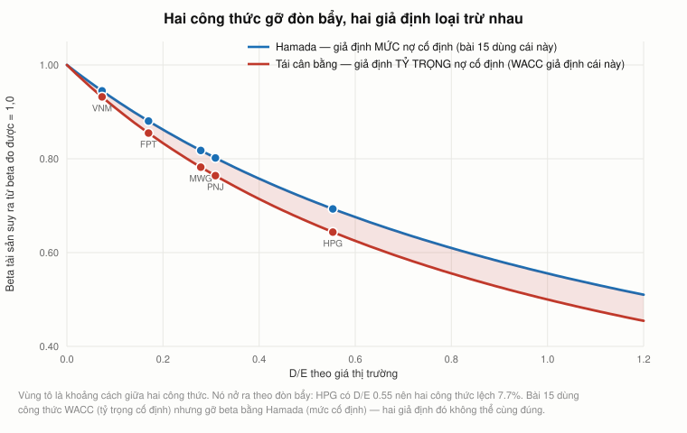
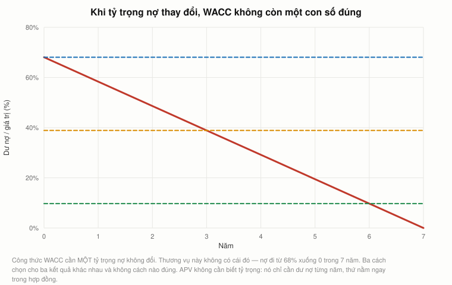
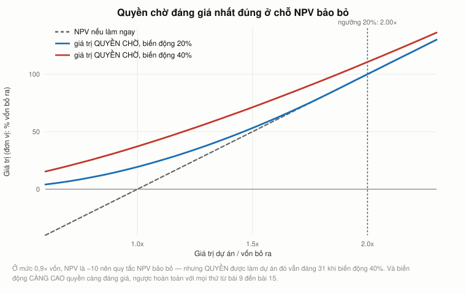
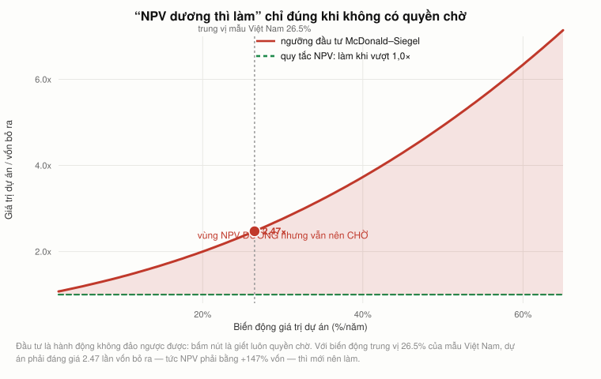
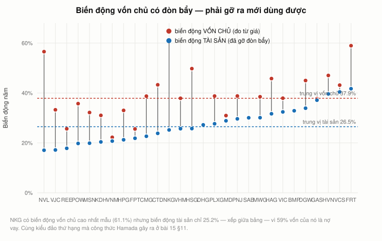

# Bài 19 — Quyền chọn thực và APV: hai chỗ bộ công cụ tiêu chuẩn hỏng

> [!info] Về bài này
> 🏢 **PHẦN E — PHỤ LỤC.** Bài này **không đến từ video của Andrew Lo**.
> Nó lấp hai lỗ hổng tìm ra khi đối chiếu khoá này với giáo trình
> [MIT 15.402 *Finance Theory II*](https://ocw.mit.edu/courses/15-402-finance-theory-ii-spring-2003/pages/lecture-notes/)
> — phần tiếp chính thức của 15.401.
> Nguồn: Myers (1974); Harris & Pringle (1985); McDonald & Siegel (1986); Dixit & Pindyck (1994).
>
> **Cách đọc các khối màu:** `[!quote]` trích nguyên văn (kèm nguồn) · `[!warning]` chỗ dễ nhầm · `[!note]` mở rộng/ghi chú · `[!example]` ví dụ áp dụng (Góc QTKD / Góc đời sống — biên soạn thêm, không có trong sách).
>
> **Cần đọc trước:** [Bài 8 §15](bai_08_quyen_chon.md#15-cây-nhị-thức-dựng-một-danh-mục-trả-đúng-như-quyền-chọn) (cây nhị thức),
> [Bài 12](bai_12_ngan_sach_von.md) (NPV), [Bài 15 §11](bai_15_wacc.md#11-beta-có-đòn-bẩy-và-không-đòn-bẩy--công-thức-hamada) (Hamada),
> [Bài 18 §4](bai_18_dinh_gia_doanh_nghiep.md#4-hai-tham-số-không-ai-đo-được-quyết-định-tất-cả) (độ nhạy).

---

## Mục lục

<!-- MUC-LUC -->
- [1. Vì sao có bài này](#1-vì-sao-có-bài-này)
- [2. APV — tách giá trị hoạt động khỏi hiệu ứng tài trợ](#2-apv--tách-giá-trị-hoạt-động-khỏi-hiệu-ứng-tài-trợ)
- [3. Hữu hạn — và công thức Ke phải khớp với giả định về nợ](#3-hữu-hạn--và-công-thức-ke-phải-khớp-với-giả-định-về-nợ)
- [4. Sửa lại beta tài sản của bài 15 — sai bao nhiêu](#4-sửa-lại-beta-tài-sản-của-bài-15--sai-bao-nhiêu)
- [5. Nơi APV thắng: lịch trả nợ định trước](#5-nơi-apv-thắng-lịch-trả-nợ-định-trước)
- [6. Quyền chọn thực — cái mà NPV bỏ sót](#6-quyền-chọn-thực--cái-mà-npv-bỏ-sót)
- [7. Ngưỡng đầu tư — vì sao "NPV > 0 thì làm" là sai](#7-ngưỡng-đầu-tư--vì-sao-npv--0-thì-làm-là-sai)
- [8. Đo biến động thật — ngưỡng đầu tư của 28 doanh nghiệp Việt Nam](#8-đo-biến-động-thật--ngưỡng-đầu-tư-của-28-doanh-nghiệp-việt-nam)
- [9. Đầu tư theo giai đoạn là một quyền chọn bỏ — Hoà Phát, hai đợt](#9-đầu-tư-theo-giai-đoạn-là-một-quyền-chọn-bỏ--hoà-phát-hai-đợt)
- [10. Bốn dạng quyền chọn thực, và bốn cách định giá đi sai](#10-bốn-dạng-quyền-chọn-thực-và-bốn-cách-định-giá-đi-sai)
- [11. Hết phần MIT 15.401](#11-hết-phần-mit-15401)
- [12. Code minh hoạ](#12-code-minh-hoạ)
- [13. Từ điển thuật ngữ](#13-từ-điển-thuật-ngữ)
- [14. Câu hỏi tự kiểm tra](#14-câu-hỏi-tự-kiểm-tra)
- [Tóm tắt một trang](#tóm-tắt-một-trang)
- [Nguồn](#nguồn)
<!-- /MUC-LUC -->

---

## 1. Vì sao có bài này

Sau khi viết xong bài 18, tôi lấy [danh sách bài giảng của MIT 15.402](https://ocw.mit.edu/courses/15-402-finance-theory-ii-spring-2003/pages/lecture-notes/)
— phần tiếp chính thức của 15.401 — đối chiếu với bài 14 đến bài 18:

| Bài giảng 15.402                             | Khoá này                                                                                                        |
| -------------------------------------------- | --------------------------------------------------------------------------------------------------------------- |
| Capital Structure 1 & 2                      | bài 16 ✅                                                                                                        |
| Capital Structure: Informational and Dynamic | bài 16 §10–12 + bài 17 ✅                                                                                        |
| Valuation of Free Cash Flows                 | bài 18 §2–6 ✅                                                                                                   |
| Valuing a Company                            | bài 18 ✅                                                                                                        |
| WACC **and APV**                             | WACC ✅ · **APV ⚠️ chỉ được nhắc tên** ở [bài 12 §19](bai_12_ngan_sach_von.md#19-apv--thứ-lo-nhắc-tên-rồi-bỏ-qua) |
| **Real Options**                             | ❌ **không xuất hiện lần nào trong cả khoá**                                                                     |

Hai mục còn thiếu **không rời rạc**. Chúng là hai câu trả lời cho cùng một câu hỏi:

> [!note]
> **Bộ công cụ tiêu chuẩn hỏng ở đâu?**

| Công cụ           | Giả định ẩn                                                          | Vỡ khi nào                                                         | Cái vá          |
| ----------------- | -------------------------------------------------------------------- | ------------------------------------------------------------------ | --------------- |
| **NPV** (bài 12)  | quyết định là **bây giờ hoặc không bao giờ**, làm rồi không đổi được | dự án có thể **hoãn**, **bỏ giữa chừng**, **mở rộng**              | quyền chọn thực |
| **WACC** (bài 15) | **tỷ trọng nợ không đổi** suốt đời dự án                             | nợ trả theo **lịch định trước** — mua lại bằng vốn vay, vay ưu đãi | APV             |

Và cả hai đều là công cụ đã có trong khoá. APV là một phép cộng tách bạch. Quyền chọn thực là
**đúng cây nhị thức của [bài 8 §15](bai_08_quyen_chon.md#15-cây-nhị-thức-dựng-một-danh-mục-trả-đúng-như-quyền-chọn)**,
chỉ đổi tên biến: giá cổ phiếu → giá trị dự án, giá thực hiện → vốn đầu tư.

---

## 2. APV — tách giá trị hoạt động khỏi hiệu ứng tài trợ

Ý tưởng của Stewart Myers (1974): đừng nhét mọi thứ vào một suất chiết khấu, mà **cộng từng phần**.

$$\text{APV} = \underbrace{\text{giá trị nếu tài trợ HOÀN TOÀN bằng vốn chủ}}_{\text{giá trị hoạt động}} \;+\; \underbrace{\text{PV của các hiệu ứng tài trợ}}_{\text{chủ yếu là lá chắn thuế}}$$

Kiểm trên trường hợp **vĩnh viễn**, nơi cả hai cách đều có công thức đóng. FCF = 100, Ka = 10%,
Kd = 6%, τ = 20%:

|  D/V | V không đòn bẩy |    Nợ D |       APV |   WACC | V theo WACC |       Chênh |
| ---: | --------------: | ------: | --------: | -----: | ----------: | ----------: |
|   0% |       1.000,000 |   0,000 | 1.000,000 | 10,00% |   1.000,000 | **0,0e+00** |
|  20% |       1.000,000 | 208,333 | 1.041,667 |  9,60% |   1.041,667 | **0,0e+00** |
|  40% |       1.000,000 | 434,783 | 1.086,957 |  9,20% |   1.086,957 | **0,0e+00** |
|  60% |       1.000,000 | 681,818 | 1.136,364 |  8,80% |   1.136,364 | **0,0e+00** |

Cột cuối là chênh **thực sự tính ra**: bằng không tuyệt đối. Chương trình có `assert` chặn ở ngưỡng
`1e-9`.

Hai cách cho cùng một con số vì chúng là **cùng một phép tính, sắp xếp khác nhau**. WACC nhét lá
chắn thuế vào **mẫu số**; APV để nó ở **tử số**. Khi tỷ trọng nợ không đổi thì không có gì khác biệt.

> [!quote]
> ⇒ Nên câu hỏi đúng không phải *"cách nào chính xác hơn"* mà là *"khi nào tỷ trọng nợ không còn
> không đổi"* — vì đó là lúc hai cách tách ra. §5 trả lời.

---

## 3. Hữu hạn — và công thức Ke phải khớp với giả định về nợ

Dự án 5 năm, mỗi năm sinh 40. Công ty giữ nợ ở tỷ trọng cố định — tức mỗi năm **vay thêm hoặc trả
bớt** để nợ luôn bằng $w$ lần giá trị còn lại. Đó chính là giả định mà công thức WACC dựa vào.

Khi nợ được tái cân bằng như vậy, lá chắn thuế năm sau **phụ thuộc giá trị dự án năm sau**, tức nó
rủi ro **ngang với dự án**, không ngang với nợ. Nên phải chiết khấu lá chắn tại $K_a$ chứ không tại
$K_d$ (Harris & Pringle, 1985). Và khi đó:

$$K_e = K_a + (K_a - K_d)\cdot\frac{D}{E} \qquad\qquad WACC = K_a - w\cdot\tau\cdot K_d$$

|  D/V |     Ke |   WACC | V không đòn bẩy | Lá chắn |       APV | V theo WACC |    Chênh |
| ---: | -----: | -----: | --------------: | ------: | --------: | ----------: | -------: |
|   0% | 10,00% | 10,00% |        151,6315 |  0,0000 | 151,63147 |   151,63147 |  0,0e+00 |
|  20% | 11,00% |  9,76% |        151,6315 |  0,9343 | 152,56575 |   152,56575 | −5,7e−14 |
|  40% | 12,67% |  9,52% |        151,6315 |  1,8778 | 153,50930 |   153,50930 | −5,7e−14 |
|  60% | 16,00% |  9,28% |        151,6315 |  2,8308 | 154,46224 |   154,46224 | −5,7e−14 |

Khớp tuyệt đối lần nữa, và lần này trên dự án **hữu hạn**. `−5,7e−14` là nhiễu của số thực phẩy động.

### Nhưng chú ý công thức Ke ở trên — nó **không** có $(1-\tau)$

Công thức Hamada mà [bài 15 §11](bai_15_wacc.md#11-beta-có-đòn-bẩy-và-không-đòn-bẩy--công-thức-hamada)
dùng thì **có**:

| Công thức        | Beta có đòn bẩy                      | Giả định về nợ                                                                                                                                  |
| ---------------- | ------------------------------------ | ----------------------------------------------------------------------------------------------------------------------------------------------- |
| **Hamada**       | $\beta_U \times [1 + (1-\tau)\,D/E]$ | **MỨC nợ** cố định tính bằng tiền, không đổi mãi mãi → lá chắn chắc chắn như chính khoản nợ → chiết khấu tại $K_d$ → sinh ra thừa số $(1-\tau)$ |
| **Tái cân bằng** | $\beta_U \times [1 + D/E]$           | **TỶ TRỌNG nợ** cố định → lá chắn rủi ro ngang dự án → chiết khấu tại $K_a$ → không có thừa số đó                                               |

> [!note]
> **Và đây là một mâu thuẫn trong chính bài 15:** bài 15 dùng công thức WACC — giả định **tỷ
> trọng** nợ cố định — nhưng gỡ đòn bẩy cho beta bằng Hamada — giả định **mức** nợ cố định. Hai giả
> định đó không thể cùng đúng.

§4 đo xem sai bao nhiêu.

---

## 4. Sửa lại beta tài sản của bài 15 — sai bao nhiêu

| Mã      | Beta đo |       D/E | Beta TS **Hamada** | Beta TS **tái cân bằng** |    Chênh |  Chênh Ke |
| ------- | ------: | --------: | -----------------: | -----------------------: | -------: | --------: |
| MWG     |   1,086 |     0,279 |              0,888 |                    0,850 |     4,6% |     0,31đ |
| VNM     |   0,597 |     0,073 |              0,564 |                    0,556 |     1,4% |     0,06đ |
| FPT     |   0,862 |     0,170 |              0,759 |                    0,737 |     3,0% |     0,18đ |
| **HPG** |   1,181 | **0,553** |              0,819 |                    0,760 | **7,7%** | **0,47đ** |
| PNJ     |   0,813 |     0,309 |              0,652 |                    0,621 |     5,0% |     0,25đ |



Doanh nghiệp vay càng nhiều thì hai công thức càng tách xa. HPG có D/E lớn nhất mẫu nên chênh nhiều
nhất.

### Cách đọc đúng, và nó khiêm tốn hơn người ta tưởng

Chênh lệch lớn nhất là **0,47 điểm phần trăm** — nhỏ hơn nhiều so với:

- biên độ **5,0 điểm** của chính WACC mà [bài 15 §9](bai_15_wacc.md#9-wacc-không-phải-một-con-số-nó-là-một-khoảng) đo được,
- khoảng tin cậy **7,2 điểm** của phần bù rủi ro ([bài 15 §10](bai_15_wacc.md#10-phần-bù-rủi-ro-đo-từ-một-thế-kỷ--và-vì-sao-đừng-tin-chữ-số-thứ-ba)).

Nên đây **không** phải một lỗi làm hỏng kết quả bài 15. Nó là một lỗi về **tính nhất quán**: hai công
thức trong cùng một phép tính dựa trên hai giả định loại trừ nhau. Sách giáo khoa hay dùng cả hai mà
không nói ra điều đó.

> [!note]
> ⇒ **Quy tắc chọn**, đơn giản hơn về lý thuyết:
> - Công ty giữ **tỷ lệ nợ mục tiêu** (đa số công ty niêm yết) → **tái cân bằng**
> - Khoản nợ có **lịch trả cố định**, không tái cấp vốn → **Hamada**
>
> Và nếu là trường hợp thứ hai, thường tốt hơn là bỏ WACC đi mà dùng APV.

---

## 5. Nơi APV thắng: lịch trả nợ định trước

Một thương vụ mua lại bằng vốn vay. Giá trị hoạt động 1.000 nếu tài trợ hoàn toàn bằng vốn chủ. Vay
700 ban đầu, trả đều về không trong 7 năm.

**Câu hỏi: đặt tỷ trọng nợ nào vào công thức WACC?**



Lá chắn thuế từng năm, chiết khấu tại $K_d$ = 6% (vì lịch trả nợ đã định trước, số tiền tiết kiệm
thuế chắc chắn ngang với chính khoản nợ — đúng trường hợp Hamada của §3):

|  Năm | Dư nợ đầu năm | Lá chắn thuế |        PV |
| ---: | ------------: | -----------: | --------: |
|    1 |         700,0 |         8,40 |      7,92 |
|    4 |         400,0 |         4,80 |      3,80 |
|    7 |         100,0 |         1,20 |      0,80 |
|      |               |     **Tổng** | **29,54** |

$$\text{APV} = 1.000 + 29{,}54 = 1.029{,}54$$

Giờ thử làm bằng WACC. Vấn đề: tỷ trọng nợ thay đổi từng năm.

| Giả định D/V            |  WACC |  Giá trị | Sai số so với APV |
| ----------------------- | ----: | -------: | ----------------: |
| năm đầu (68%)           | 9,18% | 1.061,80 |         **+3,1%** |
| bình quân các năm (39%) | 9,53% | 1.041,52 |             +1,2% |
| năm cuối (10%)          | 9,88% | 1.022,17 |         **−0,7%** |

Ba cách chọn, ba kết quả, và **không cách nào đúng** — vì công thức WACC giả định một thứ mà thương
vụ này không có: một tỷ trọng nợ không đổi.

> [!note]
> **Đó là lý do APV tồn tại.** Nó không cần biết tỷ trọng nợ là bao nhiêu. Nó chỉ cần **dư nợ từng
> năm**, mà trong một thương vụ vay nợ thì lịch đó nằm ngay trong hợp đồng.

> [!note] Ba trường hợp APV là lựa chọn đúng, không phải lựa chọn đẹp:

1. mua lại bằng vốn vay, nợ trả dần theo lịch;
2. dự án có **trợ cấp lãi suất hoặc vay ưu đãi** — hiệu ứng tài trợ không phải lá chắn thuế, nhưng
   vẫn cộng được vào như một số hạng riêng;
3. doanh nghiệp đang tái cơ cấu, tỷ trọng nợ thay đổi mạnh vài năm tới.

> [!warning] Một cảnh báo.
> APV tách bạch hơn nên **nhìn** có vẻ chính xác hơn. Nó vẫn dựa trên cùng một dự
> báo dòng tiền, cùng một $K_a$ không đo được. [Bài 18 §4](bai_18_dinh_gia_doanh_nghiep.md#4-hai-tham-số-không-ai-đo-được-quyết-định-tất-cả)
> đã đo: đổi suất chiết khấu một điểm phần trăm làm giá trị đổi hai chục phần trăm. APV không sửa được
> điều đó.

---

## 6. Quyền chọn thực — cái mà NPV bỏ sót

Một dự án: bỏ ra **100** (không thu hồi được), nhận về tài sản đang đáng $V$. Quy tắc NPV của bài 12:
làm nếu $V > 100$.

Nhưng nếu được quyền **hoãn một năm** để xem thị trường đi về đâu thì sao? Đó là một **quyền chọn
mua**: quyền — không phải nghĩa vụ — mua tài sản $V$ với giá 100. Đúng cấu trúc của
[bài 8 §10](bai_08_quyen_chon.md#10-quyền-chọn-ở-khắp-nơi-vốn-chủ-sở-hữu-là-một-quyền-chọn-mua).

Chi phí của việc chờ: một năm dòng tiền bị bỏ lỡ — ở đây 4% giá trị dự án mỗi năm, chính là vai trò
của cổ tức trong định giá quyền chọn cổ phiếu.

|      V | NPV làm ngay | Quyền, σ = 20% |         | Quyền, σ = 40% |         |
| -----: | -----------: | -------------: | ------- | -------------: | ------- |
| **80** |    **−20,0** |       **2,11** | chờ     |       **8,25** | chờ     |
| **90** |    **−10,0** |       **4,52** | chờ     |      **11,88** | chờ     |
|    100 |         +0,0 |           8,00 | chờ     |          16,24 | chờ     |
|    110 |        +10,0 |          12,54 | chờ     |          21,27 | chờ     |
|    130 |        +30,0 |          30,00 | **LÀM** |          32,74 | chờ     |
|    150 |        +50,0 |          50,00 | **LÀM** |          50,00 | **LÀM** |



> [!note]
> **Đọc hàng V = 90.** Dự án có NPV **−10** — quy tắc NPV bảo **bỏ**. Nhưng **quyền** được làm dự án
> đó năm sau đáng **4,52** (biến động 20%) hoặc **11,88** (biến động 40%). Bỏ dự án là vứt đi số tiền
> đó.

**NPV không sai.** Nó trả lời đúng câu hỏi mà nó được hỏi: *"làm ngay bây giờ thì lãi hay lỗ"*. Cái
sai là coi câu trả lời đó là câu trả lời cho câu hỏi *"có nên giữ dự án này trong danh mục không"*.

### Và chú ý hướng của biến động

Biến động càng **cao**, quyền chọn càng **đáng giá hơn** — gấp 2,6 lần khi đi từ 20% lên 40%. Điều đó
**ngược hoàn toàn** với mọi thứ từ bài 9 đến bài 15, nơi biến động cao làm giá trị **giảm** vì suất
chiết khấu tăng.

Không mâu thuẫn. Hai trường hợp khác nhau:

| Bạn nắm        | Biến động là gì                                                                                |
| -------------- | ---------------------------------------------------------------------------------------------- |
| **tài sản**    | **rủi ro** — nó làm giảm giá trị                                                               |
| **quyền chọn** | phía dưới đã bị chặn bởi việc **không phải làm**, nên biến động chỉ còn làm **tăng** phía trên |

Đó chính là lý do vốn chủ của công ty sắp vỡ nợ thích biến động
([bài 17 §3](bai_17_chi_phi_dai_dien.md#3-chi-phí-đại-diện-của-nợ-i--chuyển-rủi-ro)) — cùng một cơ
chế, đổi đầu.

---

## 7. Ngưỡng đầu tư — vì sao "NPV > 0 thì làm" là sai

§6 cho thấy quyền chờ có giá trị. Câu hỏi tiếp: vậy khi nào thì **hết** chờ và làm thật?
McDonald & Siegel (1986) giải bài toán đó và ra một **công thức đóng**.

Với quyền đầu tư vĩnh viễn vào dự án giá trị $V$, vốn $I$, hãy đầu tư khi

$$V \;\ge\; I \cdot \frac{\beta}{\beta - 1} \qquad \text{với } \beta \text{ là nghiệm dương của } \tfrac{1}{2}\sigma^2\beta(\beta-1) + (r-\delta)\beta - r = 0$$

| Biến động |     β | **Ngưỡng V\*/I** | **NPV tối thiểu để LÀM** |
| --------: | ----: | ---------------: | -----------------------: |
|       10% | 3,372 |             1,42 |                      42% |
|       15% | 2,451 |             1,69 |                      69% |
|   **20%** | 2,000 |         **2,00** |                 **100%** |
|       25% | 1,737 |             2,36 |                     136% |
|   **30%** | 1,567 |         **2,76** |                 **176%** |
|       40% | 1,366 |             3,73 |                     273% |
|       60% | 1,187 |             6,34 |                     534% |



> [!note]
> Ở biến động 20%, dự án phải **đáng giá gấp đôi** số tiền bỏ ra thì mới nên làm — tức NPV phải
> bằng **+100% vốn đầu tư**, không phải chỉ lớn hơn không. Ở 30%: **+176%**.

**Vì sao.** Đầu tư là hành động **không đảo ngược được**, và nó **giết quyền chờ**. Nên khi bấm nút,
bạn không chỉ bỏ ra 100 tiền — bạn còn bỏ ra cả **giá trị của quyền chờ**. NPV phải đủ lớn để trả cả
hai.

### Kiểm lại bằng một phương pháp hoàn toàn khác

Chạy cây nhị thức của §6 với kỳ hạn rất dài, rồi dò tìm ngưỡng mà tại đó quyền chọn đúng bằng NPV
ngay. Hai cách **không dùng chung một dòng code nào**:

| Biến động | Cây nhị thức | Công thức đóng |  Lệch |
| --------: | -----------: | -------------: | ----: |
|       15% |        1,651 |          1,689 | −2,3% |
|       20% |        1,941 |          2,000 | −2,9% |
|       30% |        2,649 |          2,763 | −4,1% |
|       40% |        3,539 |          3,732 | −5,2% |

Lệch dưới 5%, và phần lệch **có lý do biết trước**: công thức đóng giả định quyền chờ **vĩnh viễn**,
còn cây nhị thức chỉ chạy 40 năm — quyền ngắn hơn thì đáng giá ít hơn, nên ngưỡng thấp hơn một chút.
Lệch tăng dần theo biến động, đúng như dự kiến.

### Con số 2,00 không phải tự nhiên mà ra — và r ở đây không khớp bài 15

Bảng trên chạy với $r = 4\%$ và $\delta = 4\%$. Hai điều phải nói thẳng.

**Thứ nhất, $r$ lệch với phần còn lại của khoá.** [Bài 15 §16](bai_15_wacc.md#16-góc-việt-nam--ba-con-số-phải-tự-chọn)
đặt lãi suất phi rủi ro Việt Nam là **3%**, và bài 16, 18 kế thừa nguyên. Ở đây tôi dùng 4%.

**Thứ hai, tôi đặt $r = \delta$**, và chính điều đó làm hàng biến động 20% rơi đúng vào **2,00**. Khi
$r = \delta$ thì $\beta = \tfrac12 + \sqrt{\tfrac14 + 2r/\sigma^2}$, và với $\sigma^2 = 2r$ nó ra
đúng $\beta = 2$. Con số tròn đó là **lựa chọn cho dễ nhớ**, không phải kết quả đo được.

| Biến động | r = 4%, δ = 4% | r = 3%, δ = 4% | r = 3%, δ = 3% |
| --------: | -------------: | -------------: | -------------: |
|       15% |           1,69 |           1,55 |           1,83 |
|   **20%** |       **2,00** |       **1,84** |       **2,22** |
|     26,5% |           2,47 |           2,30 |           2,82 |
|       30% |           2,76 |           2,58 |           3,19 |
|       40% |           3,73 |           3,54 |           4,44 |

Hạ $r$ về 3% mà giữ $\delta$: ngưỡng ở 20% tụt từ 2,00 xuống **1,84** — NPV tối thiểu từ +100% xuống
**+84%**. Còn giữ $r = \delta$ ở mức 3% thì ngưỡng **lên 2,22**.

> [!quote]
> ⇒ Kết luận **định tính** — *ngưỡng cao hơn 1 rất nhiều* — vững trước mọi lựa chọn trong bảng.
> **Chữ số** thì không. Đừng trích "phải gấp đôi" như một hằng số; hãy trích nó kèm $r$ và $\delta$.
> Đây đúng kỷ luật mà [bài 15 §9](bai_15_wacc.md#9-wacc-không-phải-một-con-số-nó-là-một-khoảng)
> đặt ra cho WACC: báo cáo một khoảng, và nói rõ giả định sinh ra nó.

### Chỗ phải cẩn thận nhất của cả bài

Công thức trên **không** nói *"đừng đầu tư"*. Nó nói: *nếu* bạn thật sự có quyền chờ **và** chờ không
tốn kém gì ngoài dòng tiền bỏ lỡ, thì ngưỡng đúng cao hơn NPV = 0.

Ba điều kiện phá nó, và đều hay gặp:

1. **đối thủ vào trước thì cơ hội biến mất** → quyền chờ ngắn hơn nhiều;
2. **giấy phép hoặc quỹ đất có hạn** → quyền chờ có ngày hết hạn;
3. **chờ thì đối thủ học được gì đó về thị trường** → chi phí chờ cao hơn.

Trong ba trường hợp đó, ngưỡng tụt về gần 1 và **quy tắc NPV lại đúng**.

---

## 8. Đo biến động thật — ngưỡng đầu tư của 28 doanh nghiệp Việt Nam

§7 dùng biến động giả định. Giờ đo biến động **thật**, từ 164 tháng giá.

> [!warning] Một bước không được bỏ.
> Biến động đo từ giá cổ phiếu là biến động của **vốn chủ**, mà vốn chủ
> có đòn bẩy. Biến động của **tài sản** — thứ quyết định giá trị quyền chọn thực — thấp hơn:

$$\sigma_{\text{tài sản}} \;\approx\; \sigma_{\text{vốn chủ}} \times \frac{E}{D+E}$$

Đây là phiên bản biến động của chính phép gỡ đòn bẩy ở §4.

| Mã      | σ vốn chủ | E/(D+E) | **σ tài sản** | Ngưỡng | NPV tối thiểu |
| ------- | --------: | ------: | ------------: | -----: | ------------: |
| NVL     |     56,5% |     30% |     **17,1%** |   1,81 |           81% |
| VJC     |     33,2% |     52% |         17,2% |   1,82 |           82% |
| VNM     |     22,2% |     93% |         20,7% |   2,05 |          105% |
| HPG     |     33,0% |     64% |         21,3% |   2,09 |          109% |
| **NKG** | **61,1%** |     41% |     **25,2%** |   2,37 |          137% |
| MWG     |     38,5% |     78% |         30,1% |   2,77 |          177% |
| GAS     |     37,7% |     99% |         37,1% |   3,43 |          243% |
| FRT     |     58,9% |     71% |     **41,7%** |   3,92 |      **292%** |



- Trung vị biến động **vốn chủ**: 37,9%/năm
- Trung vị biến động **tài sản**: **26,5%/năm** → ngưỡng **2,47×**

> [!quote]
> **Với doanh nghiệp trung vị của mẫu này, một dự án không đảo ngược được phải có NPV bằng
> +147% vốn bỏ ra thì mới nên bấm nút.** Đó là một ngưỡng cao hơn rất nhiều so với *"NPV dương thì
> làm"* của bài 12.

**Thứ hạng đổi sau khi gỡ đòn bẩy** — đúng hiện tượng [bài 15 §11](bai_15_wacc.md#11-beta-có-đòn-bẩy-và-không-đòn-bẩy--công-thức-hamada) đã gặp:

|                       | Ba mã cao nhất |
| --------------------- | -------------- |
| biến động **vốn chủ** | NKG, FRT, NVL  |
| biến động **tài sản** | FRT, VCS, HVN  |

NKG có biến động vốn chủ **61,1%** — cao nhất mẫu — nhưng biến động tài sản chỉ **25,2%**, xếp giữa
bảng, vì **59% vốn** của nó là nợ vay.

**Và một so sánh đáng nhớ:** VN-Index có biến động **19,6%/năm**, thấp hơn **mọi** cổ phiếu đơn lẻ
trong mẫu. Đó là đa dạng hoá của [bài 10](bai_10_ly_thuyet_danh_muc.md), và nó có một hệ quả trực
tiếp ở đây: **nhà đầu tư đã đa dạng hoá đối mặt ngưỡng 1,97×, còn giám đốc điều hành một dự án đơn lẻ
đối mặt ngưỡng 2,47×.** Cùng một dự án, hai người, hai câu trả lời — và cả hai đều đúng.

> [!warning] Bốn giới hạn của bảng này:

|     | Giới hạn                                                                                                 |
| --- | -------------------------------------------------------------------------------------------------------- |
| 1   | biến động giá **cổ phiếu** là thước đo **thay thế** cho biến động **giá trị dự án**, không phải chính nó |
| 2   | phép gỡ đòn bẩy dùng công thức gần đúng, giả định nợ không rủi ro                                        |
| 3   | mẫu chỉ gồm công ty **còn** niêm yết năm 2026 — thiên lệch sống sót                                      |
| 4   | δ = 4% là **giả định của tôi**, không đo được, và là tham số nhạy nhất của cả mô hình                    |

---

## 9. Đầu tư theo giai đoạn là một quyền chọn bỏ — Hoà Phát, hai đợt

Quyền chọn thực dễ thấy nhất không phải quyền **hoãn** mà là quyền **bỏ giữa chừng**. Chia một dự án
lớn thành nhiều giai đoạn chính là mua quyền đó.

Chi đầu tư tài sản cố định của HPG, tỷ đồng:

|      Năm |      Capex | Doanh thu |   LNST |                            |
| -------: | ---------: | --------: | -----: | -------------------------- |
|     2015 |      3.387 |    27.453 |  3.504 | `##`                       |
|     2016 |      3.417 |    33.283 |  6.606 | `##`                       |
| **2017** |      8.875 |    46.162 |  8.015 | `######`                   |
| **2018** | **27.594** |    55.836 |  8.601 | `###################`      |
| **2019** |     20.825 |    63.658 |  7.578 | `##############`           |
|     2020 |     11.916 |    90.118 | 13.506 | `########`                 |
|     2021 |     11.622 |   149.680 | 34.521 | `########`                 |
| **2022** |     17.888 |   141.409 |  8.444 | `############`             |
| **2024** | **35.495** |   138.855 | 12.020 | `########################` |
| **2025** |     25.748 |   156.116 | 15.515 | `##################`       |

Hai đợt rõ ràng, cách nhau một quãng nghỉ:

|           | Giai đoạn |         Capex |
| --------- | --------- | ------------: |
| **Đợt 1** | 2017–2019 | **57.294 tỷ** |
| Nghỉ      | 2020–2021 |     23.538 tỷ |
| **Đợt 2** | 2022–2025 | **96.505 tỷ** |

Và giữa hai đợt, kết quả của đợt 1 đã lộ ra: doanh thu **33.283 → 149.680** (gấp 4,5 lần), LNST
**6.606 → 34.521** (gấp 5,2 lần).

Đó là cấu trúc của một quyền chọn: bỏ 57.294 tỷ để **mua thông tin**, rồi mới quyết định có bỏ tiếp
96.505 tỷ hay không. Nếu đợt 1 thất bại, đợt 2 đã không xảy ra — và đó chính là giá trị của việc chia
giai đoạn.

> [!warning] Tôi không khẳng định đây là một quyết định có ý.
> Bảng trên cho thấy một **khuôn hình** nhất
> quán với đầu tư theo giai đoạn; nó không chứng minh ban lãnh đạo đã tính giá trị quyền chọn. Cái có
> thể nói bằng số là: hai đợt tách biệt, và thông tin quan trọng đã xuất hiện giữa chúng.

### Đo giá trị của việc chia giai đoạn

Dự án tổng 100, chia 30% trước / 70% sau. Sau giai đoạn 1, thị trường lộ ra một trong hai trạng thái,
mỗi bên 50%: **TỐT** → cả dự án đáng 150; **XẤU** → đáng 40.

| Cách làm             | Trạng thái tốt |       Trạng thái xấu | **Kỳ vọng** |
| -------------------- | -------------: | -------------------: | ----------: |
| Cam kết toàn bộ ngay |          +50,0 |            **−60,0** |    **−5,0** |
| Chia hai giai đoạn   |          +50,0 |            **−30,0** |   **+10,0** |
|                      |                | **GIÁ TRỊ QUYỀN BỎ** |   **+15,0** |

> [!note]
> Cam kết toàn bộ ngay cho kỳ vọng **−5,0** — âm, nên quy tắc NPV bảo **bỏ cả dự án**. Chia hai
> giai đoạn cho **+10,0** — dương, nên **nên làm**. Cùng một dự án, cùng một dự báo, **hai kết luận
> ngược nhau**.

Và nó giải thích một hành vi mà người học tài chính hay chê là thiếu quyết đoán: làm thử nghiệm nhỏ
trước, mở một cửa hàng trước khi mở mười, xây một dây chuyền trước khi xây ba. Đó không phải nhút
nhát. Đó là **mua một quyền chọn**, và §7 vừa đo được quyền đó đáng giá bao nhiêu.

> [!warning]
> Chia giai đoạn **không miễn phí**. Nó thường đắt hơn: mất lợi thế quy mô, kéo dài thời gian, đối
> thủ có thể vào trước. Quy tắc đúng là **so giá trị quyền chọn với phần chi phí tăng thêm**, không
> phải mặc định chia nhỏ. Mô hình trên cũng giả định bỏ giữa chừng thì phần đã xây **không bán lại được
> đồng nào** — nếu có giá trị thanh lý thì quyền bỏ còn đáng giá hơn nữa.

---

## 10. Bốn dạng quyền chọn thực, và bốn cách định giá đi sai

| Dạng              | Nội dung                                  | Định giá bằng           |
| ----------------- | ----------------------------------------- | ----------------------- |
| **Quyền hoãn**    | chờ thêm một năm rồi hãy quyết định       | quyền chọn mua (§6, §7) |
| **Quyền bỏ**      | dừng lại sau giai đoạn 1                  | quyền chọn bán (§9)     |
| **Quyền mở rộng** | làm nhỏ trước, nhân đôi nếu chạy tốt      | quyền chọn mua          |
| **Quyền chuyển**  | đổi đầu vào, đổi sản phẩm, đổi thị trường | **một rổ** quyền chọn   |

Ba dạng đầu định giá được bằng đúng cây nhị thức của bài 8. Dạng thứ tư thì không — nó là một rổ
quyền chọn phụ thuộc nhau, và **cộng giá trị từng cái lại là sai**.

### Bốn cách đi sai, xếp theo độ phổ biến

**1. Dùng nó để bào chữa cho một dự án NPV âm.** Dễ nhất và hay gặp nhất: tính NPV ra âm, rồi cộng
*"giá trị quyền chọn chiến lược"* cho đủ dương. Quyền chọn chỉ có giá trị nếu bạn **thật sự có quyền
đó** — có thể hoãn thật, có thể bỏ thật. Nếu hợp đồng đã ký và không thể dừng thì **không có quyền
nào**.

**2. Quên chi phí của việc chờ.** §6 đặt δ = 4% chính là để tính điều đó. Bỏ δ đi thì quyền chờ luôn
đáng giá và **không bao giờ nên đầu tư** — một kết luận vô nghĩa.

**3. Dùng biến động của vốn chủ thay vì của tài sản.** §8 cho thấy chênh lệch đó lớn đến mức **đổi cả
thứ hạng**: trung vị 37,9% so với 26,5%.

**4. Cộng giá trị nhiều quyền chọn lại với nhau.** Quyền hoãn và quyền bỏ của cùng một dự án không
độc lập — thực hiện cái này thì cái kia biến mất. Tổng của chúng luôn **nhỏ hơn** tổng số học.

### Bảng chọn công cụ

| Tình huống                               | Công cụ đúng        | Ở đâu                    |
| ---------------------------------------- | ------------------- | ------------------------ |
| tỷ trọng nợ cố định, không có quyền chờ  | NPV chiết khấu WACC | [bài 15](bai_15_wacc.md) |
| lịch trả nợ định trước (mua lại bằng nợ) | **APV**             | §5                       |
| trợ cấp lãi suất, vay ưu đãi             | **APV**             | §5                       |
| có thể hoãn, chi phí chờ thấp            | **quyền chọn thực** | §6–§7                    |
| dự án chia được thành giai đoạn          | **quyền chọn bỏ**   | §9                       |
| đối thủ vào trước thì mất cơ hội         | NPV, quyết ngay     | §7                       |

> [!note]
> **Và đây là điều phải giữ lại khi quên hết phần còn lại:**
>
> APV và quyền chọn thực **không** làm kết quả chính xác hơn. Cả hai đều dùng đúng những đầu vào
> không đo được mà [bài 18 §4](bai_18_dinh_gia_doanh_nghiep.md#4-hai-tham-số-không-ai-đo-được-quyết-định-tất-cả)
> đã mổ xẻ — $K_a$, $g$, biến động. Cái chúng làm được là **nói rõ một thứ mà công thức cũ giấu đi**:
>
> - **APV** nói rõ: giá trị hoạt động bao nhiêu, hiệu ứng tài trợ bao nhiêu.
> - **Quyền chọn thực** nói rõ: bạn đang trả bao nhiêu cho việc **mất quyền chờ**.
>
> Đó là cùng một chủ đề với cả phần E — làm cho giả định hiện ra thay vì bị giấu. Với doanh nghiệp
> trung vị của mẫu này, cái bị giấu đáng **+147% vốn đầu tư**.

---

## 11. Hết phần MIT 15.401

Mười ba bài đầu bám sát hai mươi buổi giảng của Andrew Lo. Năm bài phần E là nửa **điều hành** mà
chính Lo chỉ người học sang môn khác. Bài này là **phụ lục**: nó ra đời sau, từ việc đối chiếu khoá
với giáo trình [MIT 15.402](https://ocw.mit.edu/courses/15-402-finance-theory-ii-spring-2003/pages/lecture-notes/),
và nó lấp hai chỗ trống — không mở một hướng mới.

Cả khoá quay quanh đúng hai câu mà [bài 1 §11](bai_01_tai_chinh_la_gi.md#11-thời-gian-và-rủi-ro--hai-thứ-làm-nên-cả-ngành)
đặt ra ở buổi đầu: **một đồng ngày mai đáng giá bao nhiêu hôm nay**, và **rủi ro đáng giá bao nhiêu**.

Và câu trả lời trung thực nhất mà khoá đưa ra được nằm ở [bài 18 §14](bai_18_dinh_gia_doanh_nghiep.md#14-hết-phần-chính-của-phần-e):
**không có giá trị thật; chỉ có giá trị với một bộ giả định.** Bài 19 này chỉ thêm một lớp cho câu
đó — ngay cả *quy tắc quyết định* cũng có giả định giấu bên trong. NPV giấu giả định "bây giờ hoặc
không bao giờ"; WACC giấu giả định "tỷ trọng nợ không đổi". Mỗi lần bới một giả định ra, con số
không chính xác thêm; chỉ có **chỗ mình đang đánh cược** là hiện rõ hơn.

### Bốn thứ khoá này KHÔNG dạy

| Thiếu                                                   | Ở đâu có                                                         |
| ------------------------------------------------------- | ---------------------------------------------------------------- |
| Định giá phái sinh chặt chẽ (Black–Scholes, martingale) | MIT 15.433 / 18.S096                                             |
| Kinh tế lượng tài chính, kiểm định thực nghiệm          | MIT 18.S096 *Topics in Mathematics with Applications in Finance* |
| Trung gian tài chính, ngân hàng, quy định               | MIT 15.437                                                       |
| Tài chính quốc tế, tỷ giá                               | Brealey–Myers–Allen, chương 27                                   |
| **Tài sản thế chấp và đòn bẩy như một giá cân bằng**    | **Yale ECON 251 → [bài 20](bai_20_chu_ky_don_bay.md)**           |

Nhánh nối thẳng nhất từ đây là **18.S096** — 24 video, ~32 giờ, phụ đề do người viết tay. Nó nối
vào [bài 9](bai_09_rui_ro_va_loi_suat.md)–[bài 13](bai_13_thi_truong_hieu_qua.md) ở đúng chỗ khoá này
dừng lại: bài 11 dùng CAPM mà không chứng minh, bài 13 đo thị trường mà không dựng lý thuyết xác
suất đằng sau.

**Và một dòng đã được lấp sau khi bài này viết xong.** Hàng cuối bảng trên — tài sản thế chấp
như một *giá*, không phải một *thuộc tính* — là thứ mà **không** giáo trình MIT nào trong khoá
chạm tới. Nó đến từ một khoá khác hẳn: Yale ECON 251 của John Geanakoplos. Đó là
[bài 20](bai_20_chu_ky_don_bay.md), và nó là bài duy nhất trong khoá **mâu thuẫn trực tiếp** với
các bài trước.

---

## 12. Code minh hoạ

> [!note]
> ⚙️ **Chạy:** cần **Python 3.10+**. Không cần cài gói nào. Kết quả **tất định**.

|            |                                                                                               |
| ---------- | --------------------------------------------------------------------------------------------- |
| File       | [`thuc_hanh/bai-19-quyen-chon-thuc-va-apv.py`](../thuc_hanh/bai-19-quyen-chon-thuc-va-apv.py) |
| Kích thước | **1.673 dòng**, 10 mục                                                                        |

Dữ liệu nhúng **dùng chung với bài 18** — cùng 28 doanh nghiệp, cùng chuỗi giá — nên mọi kết quả đối
chiếu ngược được.

Ba chỗ đáng đọc kỹ:

- `muc_2` và `muc_3` có `assert` chặn ở `1e-9` cho đẳng thức APV ≡ WACC. Nếu ai sửa một công thức mà
  quên công thức kia, chương trình **dừng**.
- `nguong_dau_tu()` và `cay_nhi_thuc()` là hai phương pháp **độc lập** cho cùng một câu hỏi; §7 so
  chúng với nhau và `assert` rằng chênh dưới 8%.
- `muc_9` có `assert` kiểm rằng giá trị quyền bỏ đúng bằng ½ × (vốn giai đoạn 2 tránh được − giá trị
  bỏ lỡ). Chính `assert` này bắt được một công thức sai của tôi khi viết bài.

Kết quả chạy thật:

```
==============================================================================
BAI 19 — QUYEN CHON THUC VA APV: HAI CHO BO CONG CU TIEU CHUAN HONG
PHAN E, PHU LUC — va noi 15.402 con hai muc khoa nay chua day
==============================================================================

==============================================================================
MUC 1. HAI CHO BO CONG CU TIEU CHUAN HONG
==============================================================================
Bai 12 den bai 18 dung hai cong cu, va ca hai deu co mot gia dinh an.

  QUY TAC NPV (bai 12): chiet khau dong tien, NPV duong thi lam.
    ⚠️ Gia dinh an: quyet dinh la BAY GIO HOAC KHONG BAO GIO, va lam roi thi
       khong doi duoc nua.

  WACC (bai 15): mot suat chiet khau duy nhat cho ca doi du an.
    ⚠️ Gia dinh an: TI TRONG NO tren tong von KHONG DOI suot doi du an.

Doi thuc pha ca hai gia dinh do thuong xuyen:

  - Mot thuong vu mua lai bang von vay tra no theo LICH DINH TRUOC. Nam dau
    no bang 70% gia tri, nam thu bay bang 20%. Khong co MOT ti trong no nao
    de dat vao cong thuc WACC.
  - Mot du an co the HOAN mot nam de xem gia hang hoa di ve dau. Quy tac NPV
    khong co cho de ghi gia tri cua viec cho.

Hai cong cu va hai lo do:
  APV            (Myers 1974)          -> muc 2 den muc 5
  QUYEN CHON THUC (McDonald-Siegel 1986) -> muc 6 den muc 9

Va ca hai deu la cong cu cua bai 8. APV la phep cong tach bach. Quyen chon
   thuc la dung dung cay nhi thuc cua bai 8 muc 15, chi doi ten bien: gia co
   phieu thanh gia tri du an, gia thuc hien thanh von dau tu.

==============================================================================
MUC 2. APV — TACH GIA TRI HOAT DONG KHOI HIEU UNG TAI TRO
==============================================================================
Y tuong cua Stewart Myers (1974) la khong nhet moi thu vao mot suat chiet
khau, ma CONG TUNG PHAN:

    APV = gia tri neu tai tro HOAN TOAN bang von chu
        + gia tri hien tai cua cac HIEU UNG TAI TRO

Hieu ung tai tro lon nhat la la chan thue lai vay — thu bai 16 muc 5 da do.

Kiem tren truong hop VINH VIEN, noi ca hai cach deu co cong thuc dong:
    V(khong don bay) = FCF / Ka
    V(co don bay)    = V(khong don bay) + thue x D          (MM 1963)
    WACC             = Ka x (1 - thue x D/V)                (bai 16 muc 5)

FCF = 100, Ka = 10%, Kd = 6%, thue = 20%.

    D/V  V khong don bay      no D         APV    WACC   V theo WACC      lech
  ----------------------------------------------------------------------------
     0%        1,000.000     0.000   1,000.000  10.00%     1,000.000   0.0e+00
    20%        1,000.000   208.333   1,041.667   9.60%     1,041.667   0.0e+00
    40%        1,000.000   434.783   1,086.957   9.20%     1,086.957   0.0e+00
    60%        1,000.000   681.818   1,136.364   8.80%     1,136.364   0.0e+00

  Cot cuoi la chenh THUC SU tinh ra: bang KHONG tuyet doi, khong phai lam
  tron. Chuong trinh co `assert` chan o nguong 1e-9.

  Hai cach cho CUNG mot con so vi chung la CUNG mot phep tinh, sap xep khac
     nhau. WACC nhet la chan thue vao MAU SO; APV de no o TU SO. Khi ti trong
     no khong doi thi khong co gi khac biet.

  ⇒ Nen cau hoi dung khong phai "cach nao chinh xac hon" ma la "khi nao ti
    trong no KHONG con khong doi" — vi do la luc hai cach tach ra. Muc 5.

==============================================================================
MUC 3. HUU HAN — VA CONG THUC Ke PHAI KHOP VOI GIA DINH VE NO
==============================================================================
Du an song 5 nam, moi nam sinh 40. Cong ty giu no o ti trong co
dinh — tuc moi nam VAY THEM hoac TRA BOT de no luon bang w lan gia tri con
lai. Do chinh la gia dinh ma cong thuc WACC dua vao.

Khi no duoc tai can bang nhu vay, la chan thue nam sau PHU THUOC gia tri du
an nam sau, tuc no rui ro NGANG VOI DU AN, khong ngang voi no. Nen phai chiet
khau la chan tai Ka chu khong tai Kd (Harris & Pringle 1985). Va khi do:

    Ke   = Ka + (Ka - Kd) x D/E        <- KHONG co (1 - thue)
    WACC = Ka - w x thue x Kd

    D/V      Ke    WACC  V khong dbay  la chan         APV  V theo WACC    lech
  -----------------------------------------------------------------------------
     0%  10.00%  10.00%      151.6315   0.0000   151.63147    151.63147 0.0e+00
    20%  11.00%   9.76%      151.6315   0.9343   152.56575    152.56575-5.7e-14
    40%  12.67%   9.52%      151.6315   1.8778   153.50930    153.50930-5.7e-14
    60%  16.00%   9.28%      151.6315   2.8308   154.46225    154.46225-5.7e-14

  Khop tuyet doi lan nua, va lan nay tren du an HUU HAN.

  ⚠️⚠️ NHUNG CHU Y CONG THUC Ke O TREN. No KHONG co (1 - thue).
     Cong thuc Hamada ma bai 15 muc 11 dung thi CO:

       Hamada          : beta(co don bay) = beta(tai san) x [1 + (1-thue) D/E]
       Tai can bang    : beta(co don bay) = beta(tai san) x [1 +         D/E]

     Hai cong thuc nay den tu HAI GIA DINH KHAC NHAU ve no:
       Hamada       gia dinh MUC NO CO DINH tinh bang tien, khong doi mai mai.
                    La chan thue chac chan nhu chinh khoan no -> chiet khau
                    tai Kd -> sinh ra thua so (1 - thue).
       Tai can bang gia dinh TI TRONG NO co dinh. La chan thue rui ro ngang
                    du an -> chiet khau tai Ka -> khong co thua so do.

  VA DAY LA MOT MAU THUAN TRONG CHINH BAI 15: bai 15 dung cong thuc WACC
     (gia dinh TI TRONG no co dinh) nhung go don bay cho beta bang Hamada
     (gia dinh MUC no co dinh). Hai gia dinh do khong the cung dung.
     Muc 4 do xem sai bao nhieu.

==============================================================================
MUC 4. SUA LAI BETA TAI SAN CUA BAI 15 — SAI BAO NHIEU
==============================================================================
Tinh beta tai san bang CA HAI cong thuc, tren du lieu gia cua bai nay. Beta
do duoc o day lech nhe so voi bai 15 vi chuoi gia dai hon vai thang — chenh
duoi 1%, khong anh huong ket luan.

    Hamada       : beta(tai san) = beta(do) / [1 + (1-thue) x D/E]
    Tai can bang : beta(tai san) = beta(do) / [1 +           D/E]

D/E theo GIA THI TRUONG, dung cach cua bai 15 muc 7.

  ma      beta do     D/E  beta TS Hamada  beta TS tai CB    chenh  chenh Ke
  --------------------------------------------------------------------------
  MWG       1.086   0.279           0.888           0.850    4.6%     0.31d
  VNM       0.597   0.073           0.564           0.556    1.4%     0.06d
  FPT       0.862   0.170           0.759           0.737    3.0%     0.18d
  HPG       1.181   0.553           0.819           0.760    7.7%     0.47d
  PNJ       0.813   0.309           0.652           0.621    5.0%     0.25d

  Cot cuoi la chenh lech chi phi von chu KHONG DON BAY tinh ra tu hai cong
  thuc, tinh bang diem phan tram. Lon nhat 0.47 diem, nho nhat 0.06 diem.

  Doanh nghiep vay cang nhieu thi hai cong thuc cang tach xa. HPG co D/E
     lon nhat mau nen chenh nhieu nhat.

  ⚠️ CACH DOC DUNG, va no khiem ton hon nguoi ta tuong:
     Chenh lech nay 0.47 diem — nho hon nhieu so voi bien do 5,0 diem cua
     chinh WACC ma bai 15 muc 9 do duoc, va nho hon khoang tin cay 7,2 diem
     cua phan bu rui ro (bai 15 muc 10). Nen day KHONG phai mot loi lam hong
     ket qua bai 15.

     No la mot loi ve TINH NHAT QUAN: hai cong thuc trong cung mot phep tinh
     dua tren hai gia dinh loai tru nhau. Sach giao khoa hay dung ca hai ma
     khong noi ra dieu do.

  ⇒ QUY TAC CHON, don gian hon ve ly thuyet:
     - Cong ty giu ti le no muc tieu (da so cong ty niem yet)  -> tai can bang
     - Khoan no co lich tra co dinh, khong tai cap von         -> Hamada
     Va neu la truong hop thu hai, thuong tot hon la bo WACC di ma dung APV.

==============================================================================
MUC 5. NOI APV THANG: LICH TRA NO DINH TRUOC
==============================================================================
Mot thuong vu mua lai bang von vay. Gia tri hoat dong 1,000 neu tai tro hoan
toan bang von chu. Vay 700 ban dau, tra deu ve khong trong 7 nam.

Cau hoi: dat ti trong no nao vao cong thuc WACC?

    nam   du no dau nam   la chan thue   chiet khau tai Kd
  --------------------------------------------------------
      1           700.0           8.40                7.92
      2           600.0           7.20                6.41
      3           500.0           6.00                5.04
      4           400.0           4.80                3.80
      5           300.0           3.60                2.69
      6           200.0           2.40                1.69
      7           100.0           1.20                0.80
  --------------------------------------------------------
   TONG                                              28.35

  APV = 1,000 + 28.35 = 1,028.35

  La chan thue o day duoc chiet khau tai Kd = 6%, KHONG tai Ka, vi lich
     tra no da dinh truoc: so tien tiet kiem thue moi nam chac chan ngang voi
     chinh khoan no. Do dung la truong hop Hamada cua muc 3.

  Gio thu lam bang WACC. Van de: ti trong no thay doi tung nam.

                gia dinh D/V     WACC     gia tri   sai so so voi APV
  -------------------------------------------------------------------
           nam dau (D/V 68%)    9.18%    1,040.86               1.2%
  binh quan cac nam (D/V 39%)    9.53%    1,023.08              -0.5%
          nam cuoi (D/V 10%)    9.88%    1,005.70              -2.2%

  Ba cach chon ti trong no, ba ket qua khac nhau, va KHONG cach nao dung — vi
  cong thuc WACC gia dinh mot thu ma thuong vu nay khong co: mot ti trong no
  khong doi.

  DO LA LY DO APV TON TAI. No khong can biet ti trong no la bao nhieu. No
     chi can biet DU NO TUNG NAM, ma trong mot thuong vu vay no thi lich do
     nam ngay trong hop dong.

  📚 BA TRUONG HOP APV la lua chon dung, khong phai lua chon dep:
     (1) mua lai bang von vay, no tra dan theo lich
     (2) du an co tro cap lai suat hoac vay uu dai — hieu ung tai tro khong
         phai la chan thue, nhung van cong duoc vao nhu mot so hang rieng
     (3) doanh nghiep dang tai co cau, ti trong no thay doi manh vai nam toi

  ⚠️ VA MOT CANH BAO: APV tach bach hon nen NHIN co ve chinh xac hon. No van
     dua tren cung mot du bao dong tien, cung mot Ka khong do duoc. Bai 18
     muc 4 da do: doi Ka mot diem phan tram lam gia tri doi hai chuc phan
     tram. APV khong sua duoc dieu do.

==============================================================================
MUC 6. QUYEN CHON THUC — CAI MA NPV BO SOT
==============================================================================
Mot du an: bo ra 100 (khong thu hoi duoc), nhan ve mot tai san dang V.
Quy tac NPV cua bai 12: lam neu V > 100.

Nhung neu duoc quyen HOAN mot nam de xem thi truong di ve dau thi sao? Do la
mot quyen chon mua: quyen — khong phai nghia vu — mua tai san V voi gia 100.
Dung cau truc cua bai 8 muc 10, chi doi ten bien.

Chi phi cua viec cho: mot nam dong tien bi bo lo, o day 4% gia tri du an
moi nam — chinh la vai tro cua co tuc trong dinh gia quyen chon co phieu.

        V  NPV lam ngay      quyen, sig 20%      quyen, sig 40%
  -------------------------------------------------------------
       80         -20.0        1.14     cho        6.18     cho
       90         -10.0        3.47     cho       10.23     cho
      100          +0.0        7.72     cho       15.36     cho
      110         +10.0       13.90     cho       21.47     cho
      130         +30.0       30.48     cho       36.00     cho
      150         +50.0       50.00     LAM       52.77     cho

  DOC HANG DAU TIEN. Du an co NPV -10 — quy tac NPV bao BO.
     Nhung QUYEN duoc lam du an do nam sau dang 3.47 (bien dong 20%) hoac
     10.23 (bien dong 40%). Bo du an la vut di so tien do.

  NPV KHONG SAI. No tra loi dung cau hoi ma no duoc hoi: "lam NGAY BAY GIO
     thi lai hay lo". Cai sai la coi cau tra loi do la cau tra loi cho cau
     hoi "co nen giu du an nay trong danh muc khong".

  VA CHU Y HUONG CUA BIEN DONG. Bien dong cang CAO, quyen chon cang DANG
     GIA HON — 2.9 lan khi di tu 20% len 40%. Dieu do nguoc hoan toan voi
     moi thu tu bai 9 den bai 15, noi bien dong cao lam gia tri GIAM vi suat
     chiet khau tang.

     Khong mau thuan. Hai truong hop khac nhau:
       nam giu tai san  -> bien dong la RUI RO, no lam giam gia tri
       nam giu QUYEN CHON -> phia duoi da bi chan boi viec khong phai lam,
                            nen bien dong chi con lam TANG phia tren
     Do chinh la ly do von chu cua cong ty sap vo no thich bien dong
     (bai 17 muc 3) — cung mot co che, doi dau.

==============================================================================
MUC 7. NGUONG DAU TU — VI SAO 'NPV > 0 THI LAM' LA SAI
==============================================================================
Muc 6 cho thay quyen cho co gia tri. Cau hoi tiep: vay khi nao thi HET cho va
lam that? McDonald & Siegel (1986) giai bai toan do va ra mot cong thuc dong.

Voi quyen dau tu VINH VIEN vao du an gia tri V, von 100, hay dau tu khi

    V  >=  I x b/(b-1)     voi b la nghiem duong cua
                           (1/2) sig^2 b(b-1) + (r - delta) b - r = 0

r = 4%, delta = 4%.

    bien dong        b   nguong V*/I    NPV toi thieu de LAM
  ----------------------------------------------------------
          10%    3.372          1.42                     42%
          15%    2.451          1.69                     69%
          20%    2.000          2.00                    100%
          25%    1.737          2.36                    136%
          30%    1.567          2.76                    176%
          40%    1.366          3.73                    273%
          50%    1.255          4.92                    392%
          60%    1.187          6.34                    534%

  DOC HANG BIEN DONG 20%: nguong bang 2.00. Nghia la du an phai dang gia
     GAP DOI so tien bo ra thi moi nen lam — tuc NPV phai bang 100% von dau tu,
     khong phai chi lon hon khong.

     O bien dong 30%, nguong len 2.76: NPV phai bang 176% von dau tu.

  VI SAO. Dau tu la mot hanh dong khong dao nguoc duoc, va no GIET quyen
     cho. Nen khi bam nut, ban khong chi bo ra 100 tien — ban con bo ra ca
     GIA TRI CUA QUYEN CHO. NPV phai du lon de tra ca hai.

  Kiem lai bang mot phuong phap HOAN TOAN KHAC: chay cay nhi thuc cua muc 6
  voi ky han rat dai, roi do tim nguong ma tai do quyen chon dung bang NPV
  ngay. Hai cach khong dung chung mot dong code nao.

    bien dong   cay nhi thuc   cong thuc dong     lech
  -----------------------------------------------------
          15%          1.651            1.689    -2.3%
          20%          1.941            2.000    -2.9%
          30%          2.649            2.763    -4.1%
          40%          3.539            3.732    -5.2%

  Hai phuong phap doc lap lech duoi 5%. Phan lech con lai co ly do biet
  truoc: cong thuc dong gia dinh quyen cho VINH VIEN, con cay nhi thuc chi
  chay 40 nam — quyen ngan hon thi dang gia it hon, nen nguong thap hon mot
  chut. Lech tang dan theo bien dong, dung nhu du kien.

  ⚠️ HAI THAM SO r VA delta LA GIA DINH, VA CON SO 2,00 KHONG PHAI TU NHIEN
     Bai 15 dung lai suat phi rui ro 3% cho Viet Nam. O day toi dat r = 4%,
     BANG dung delta — va chinh vi r = delta ma hang bien dong 20% ra
     nguong TRON 2.00. Do la mot lua chon cho con so de nho, khong
     phai mot ket qua do duoc. Doi r thi nguong doi the nao:

    bien dong   r=4% d=4%   r=3% d=4%   r=3% d=3%  lech cot 2
  ---------------------------------------------------------
        15.0%        1.69        1.55        1.83      -8.5%
        20.0%        2.00        1.84        2.22      -7.8%
        26.5%        2.47        2.30        2.82      -6.9%
        30.0%        2.76        2.58        3.19      -6.5%
        40.0%        3.73        3.54        4.44      -5.2%

     Ha r tu 4% xuong 3% ma giu delta: nguong o 20% tut tu 2.00 xuong
     1.84, tuc NPV toi thieu tu 100% xuong 84%. Con giu r = delta o
     muc 3% thi nguong LEN 2.22. Nen ket luan DINH TINH — "nguong cao
     hon NHIEU so voi 1" — vung, con CHU SO thi khong.

  ⚠️ VA DAY LA CHO PHAI CAN THAN NHAT CUA CA BAI. Cong thuc tren KHONG noi
     "dung dau tu". No noi: neu ban that su co quyen cho VA cho khong ton
     kem gi ngoai dong tien bo lo, thi nguong dung cao hon NPV = 0.

     Ba dieu kien pha no, va deu hay gap:
       (1) doi thu vao truoc thi co hoi bien mat -> quyen cho ngan hon nhieu
       (2) giay phep hoac quy dat co han          -> quyen cho co ngay het han
       (3) cho thi doi thu hoc duoc gi do ve thi truong -> chi phi cho cao hon
     Trong ba truong hop do, nguong tut ve gan 1 va quy tac NPV lai dung.

==============================================================================
MUC 8. DO BIEN DONG THAT — NGUONG DAU TU CUA 28 DOANH NGHIEP VIET NAM
==============================================================================
Muc 7 dung bien dong gia dinh. Gio do bien dong THAT, tu 165 thang gia.

⚠️ MOT BUOC KHONG DUOC BO. Bien dong do tu gia co phieu la bien dong cua VON
   CHU, ma von chu co don bay. Bien dong cua TAI SAN — thu quyet dinh gia tri
   quyen chon thuc — thap hon:

       sigma(tai san)  ~=  sigma(von chu) x E / (D + E)

   Day la phien ban bien dong cua chinh phep go don bay o muc 4.

  ma      n thang  sig von chu   E/(D+E)  sig TAI SAN   nguong  NPV toi thieu
  ---------------------------------------------------------------------------
  NVL         117        56.5%       30%        17.1%     1.81            81%
  VJC         115        33.2%       52%        17.2%     1.82            82%
  REE         164        25.7%       69%        17.8%     1.86            86%
  POW         102        35.7%       55%        19.8%     1.99            99%
  MSN         164        32.2%       62%        19.9%     1.99            99%
  KDH         164        31.0%       66%        20.4%     2.02           102%
  VNM         164        22.2%       93%        20.7%     2.05           105%
  HPG         164        33.0%       64%        21.3%     2.09           109%
  FPT         164        25.6%       85%        21.9%     2.13           113%
  CMG         164        38.7%       59%        22.7%     2.18           118%
  CTD         164        43.3%       55%        23.8%     2.27           127%
  NKG         164        61.1%       41%        25.2%     2.37           137%
  VHM         100        37.9%       68%        25.7%     2.41           141%
  HSG         164        49.8%       52%        25.7%     2.41           141%
  DHG         164        27.2%      100%        27.2%     2.53           153%
  PLX         113        38.8%       71%        27.7%     2.57           157%
  GMD         164        30.9%       93%        28.9%     2.67           167%
  PNJ         164        38.8%       76%        29.6%     2.73           173%
  SAB         117        30.3%       99%        30.1%     2.77           177%
  MWG         146        38.5%       78%        30.1%     2.77           177%
  HAG         164        45.8%       69%        31.7%     2.91           191%
  VIC         164        37.9%       86%        32.4%     2.98           198%
  BMP         164        33.0%      100%        32.9%     3.02           202%
  DGW         133        45.0%       75%        33.9%     3.12           212%
  GAS         164        37.7%       99%        37.1%     3.43           243%
  HVN         116        47.0%       84%        39.6%     3.69           269%
  VCS         164        43.1%       94%        40.4%     3.78           278%
  FRT         101        58.9%       71%        41.7%     3.92           292%

  Trung vi bien dong VON CHU   37.9%/nam
  Trung vi bien dong TAI SAN   26.5%/nam
  -> nguong 2.47x, tuc NPV toi thieu +147% von bo ra

  VOI DOANH NGHIEP TRUNG VI CUA MAU NAY, MOT DU AN KHONG DAO NGUOC DUOC
     PHAI CO NPV BANG +147% VON BO RA THI MOI NEN BAM NUT.
     Do la mot nguong cao hon rat nhieu so voi "NPV duong thi lam" cua bai 12.

  THU HANG DOI SAU KHI GO DON BAY — dung hien tuong bai 15 muc 11 da gap:
     bien dong VON CHU cao nhat : NKG, FRT, NVL
     bien dong TAI SAN cao nhat : FRT, VCS, HVN

     NKG co bien dong von chu 61.1% — cao nhat mau — nhung bien dong tai
     san chi 25.2%, xep giua bang, vi 59% von cua no la no vay.

  VA MOT SO SANH DANG NHO: VN-Index co bien dong 19.6%/nam, thap hon MOI
     co phieu don le trong mau. Do la da dang hoa cua bai 10, va no co mot he
     qua truc tiep o day: nha dau tu da dang hoa doi mat nguong 1.97x,
     con giam doc dieu hanh mot du an don le doi mat nguong 2.47x. Cung mot du
     an, hai nguoi, hai cau tra loi — va ca hai deu dung.

  ⚠️ BON GIOI HAN CUA BANG NAY, phai noi ro:
     (1) bien dong gia CO PHIEU la thuoc do thay the cho bien dong GIA TRI DU
         AN, khong phai chinh no. Mot du an cu the co the bien dong khac han
         ca doanh nghiep.
     (2) phep go don bay dung cong thuc gan dung, gia dinh no khong rui ro.
     (3) mau chi gom cong ty CON niem yet nam 2026 — thien lech song sot.
     (4) delta = 4% la GIA DINH cua toi, khong do duoc. Delta cao hon thi
         nguong thap hon, va do la tham so nhay nhat cua ca mo hinh.

==============================================================================
MUC 9. DAU TU THEO GIAI DOAN LA MOT QUYEN CHON BO — HOA PHAT, HAI DOT
==============================================================================
Quyen chon thuc de thay nhat khong phai quyen HOAN ma la quyen BO GIUA CHUNG.
Chia mot du an lon thanh nhieu giai doan chinh la mua quyen do.

Xem chi dau tu tai san co dinh cua HPG qua 11 nam:

    nam     capex   doanh thu      LNST
  --------------------------------------------------------------
   2015     3,387      27,453     3,504  ##
   2016     3,417      33,283     6,606  ##
   2017     8,875      46,162     8,015  ######
   2018    27,594      55,836     8,601  ###################
   2019    20,825      63,658     7,578  ##############
   2020    11,916      90,118    13,506  ########
   2021    11,622     149,680    34,521  ########
   2022    17,888     141,409     8,444  ############
   2023    17,374     118,953     6,800  ############
   2024    35,495     138,855    12,020  ########################
   2025    25,748     156,116    15,515  #################

  Hai dot ro rang, cach nhau mot quang nghi:
    dot 1  2017-2019: 57,294 ty
    nghi   2020-2021: 23,537 ty
    dot 2  2022-2025: 96,505 ty

  Va giua hai dot, ket qua cua dot 1 da lo ra:
    doanh thu 33,283 (2016)  ->  149,680 (2021), gap 4.5 lan
    LNST      6,606 (2016)  ->  34,521 (2021), gap 5.2 lan

  Do la cau truc cua mot quyen chon: bo 57,294 ty de MUA THONG TIN, roi moi
     quyet dinh co bo tiep 96,505 ty hay khong. Neu dot 1 that bai, dot 2 da
     khong xay ra — va do chinh la gia tri cua viec chia giai doan.

  ⚠️ TOI KHONG KHANG DINH DAY LA MOT QUYET DINH CO Y. Bang tren cho thay MOT
     KHUON HINH nhat quan voi dau tu theo giai doan; no khong chung minh ban
     lanh dao da tinh gia tri quyen chon. Cai co the noi bang so la: hai dot
     tach biet, va thong tin quan trong da xuat hien giua chung.

  Gio do gia tri cua viec chia giai doan bang mot mo hinh, tren so lam tron
  cua HPG de de doc.

  Du an tong 100, chia lam hai giai doan: 30% truoc, 70% sau.
  Sau giai doan 1, thi truong lo ra mot trong hai trang thai, moi ben 50%:
    TOT : ca du an dang 150
    XAU : ca du an dang  40
  Gia dinh don gian hoa: bo giua chung thi phan da xay khong ban lai duoc
  dong nao. Neu co gia tri thanh ly thi quyen bo con dang gia hon nua.

                    cach lam   trang thai tot   trang thai xau    ky vong
  -----------------------------------------------------------------------
        cam ket toan bo ngay            +50.0            -60.0       -5.0
          chia hai giai doan            +50.0            -30.0      +10.0
  -----------------------------------------------------------------------
            GIA TRI QUYEN BO                                        +15.0

  Cam ket toan bo ngay cho ky vong -5.0 — AM, nen quy tac NPV bao BO
     CA DU AN. Chia hai giai doan cho ky vong +10.0 — DUONG, nen nen LAM.

     Cung mot du an, cung mot du bao, hai ket luan nguoc nhau. Khac biet +15.0
     chinh la gia tri cua quyen DUNG LAI sau giai doan 1.

  Va no giai thich mot hanh vi ma nguoi hoc tai chinh hay che la thieu quyet
     doan: lam thu nghiem nho truoc, mo mot cua hang truoc khi mo muoi cua
     hang, xay mot day chuyen truoc khi xay ba. Do khong phai nhut nhat. Do la
     MUA MOT QUYEN CHON, va muc 7 vua do duoc quyen do dang gia bao nhieu.

  ⚠️ Chia giai doan KHONG mien phi. No thuong dat hon: mat loi the quy mo, keo
     dai thoi gian, doi thu co the vao truoc. Quy tac dung la so gia tri quyen
     chon voi phan chi phi tang them, khong phai mac dinh chia nho.

==============================================================================
MUC 10. GHEP LAI — DUNG CONG CU NAO KHI NAO
==============================================================================
BON DANG QUYEN CHON THUC, xep theo tan suat gap trong doi thuc:

  QUYEN HOAN     cho them mot nam roi hay quyet dinh        -> muc 6, muc 7
  QUYEN BO       dung lai sau giai doan 1                    -> muc 9
  QUYEN MO RONG  lam nho truoc, nhan doi neu chay tot        -> quyen chon MUA
  QUYEN CHUYEN   doi dau vao, doi san pham, doi thi truong  -> mot ro quyen chon

  Ba dang dau deu la quyen chon MUA hoac BAN tren gia tri du an, nen dinh
     gia duoc bang dung cay nhi thuc cua bai 8. Dang thu tu thi khong — no la
     mot ro quyen chon phu thuoc nhau, va cong gia tri tung cai lai la SAI.

⚠️ BON CACH DINH GIA QUYEN CHON THUC DI SAI, xep theo do pho bien:

  (1) DUNG NO DE BAO CHUA CHO MOT DU AN NPV AM. De nhat va hay gap nhat: tinh
      NPV ra am, roi cong "gia tri quyen chon chien luoc" cho du duong. Quyen
      chon chi co gia tri neu ban THAT SU co quyen do — co the hoan that, co
      the bo that. Neu hop dong da ky va khong the dung thi khong co quyen nao.

  (2) QUEN CHI PHI CUA VIEC CHO. Muc 6 dat delta = 4% chinh la de tinh dieu
      do. Bo delta di thi quyen cho luon dang gia va khong bao gio nen dau tu —
      mot ket luan vo nghia.

  (3) DUNG BIEN DONG CUA VON CHU thay vi cua TAI SAN. Muc 8 cho thay chenh
      lech do lon den muc doi ca thu hang: trung vi 37.9%
      so voi 26.5%.

  (4) CONG GIA TRI NHIEU QUYEN CHON LAI VOI NHAU. Quyen hoan va quyen bo cua
      cung mot du an khong doc lap — thuc hien cai nay thi cai kia bien mat.
      Tong cua chung luon NHO HON tong so hoc.

BANG CHON CONG CU:

                          tinh huong          cong cu dung    muc
  ---------------------------------------------------------------
  ti trong no co dinh, khong co quyen cho   NPV chiet khau WACC bai 15
  lich tra no dinh truoc (mua lai bang no)                   APV  muc 5
        tro cap lai suat, vay uu dai                   APV  muc 5
       co the hoan, chi phi cho thap       quyen chon thucmuc 6-7
     du an chia duoc thanh giai doan         quyen chon bo  muc 9
    doi thu vao truoc thi mat co hoi       NPV, quyet ngay  muc 7

  VA DAY LA DIEU PHAI GIU LAI KHI QUEN HET PHAN CON LAI:

     APV va quyen chon thuc KHONG lam ket qua chinh xac hon. Ca hai deu dung
     dung nhung dau vao khong do duoc ma bai 18 muc 4 da mo xe — Ka, g, bien
     dong. Cai chung lam duoc la NOI RO MOT THU MA CONG THUC CU GIAU DI:

       APV noi ro: gia tri hoat dong bao nhieu, hieu ung tai tro bao nhieu.
       Quyen chon thuc noi ro: ban dang tra bao nhieu cho viec MAT quyen cho.

     Do la cung mot chu de voi ca phan E — lam cho gia dinh hien ra thay vi
     bi giau. Voi doanh nghiep trung vi cua mau nay, cai bi giau dang
     +147% von dau tu.

==============================================================================
HET BAI 19 — PHAN E DA PHU DU GIAO TRINH 15.402
==============================================================================
```

---

## 13. Từ điển thuật ngữ

| Tiếng Việt                  | Tiếng Anh                     | Nghĩa                                                                    |
| --------------------------- | ----------------------------- | ------------------------------------------------------------------------ |
| Giá trị hiện tại điều chỉnh | *adjusted present value*, APV | Giá trị nếu tài trợ hoàn toàn bằng vốn chủ, cộng PV các hiệu ứng tài trợ |
| Nợ tái cân bằng             | *rebalanced debt*             | Nợ được điều chỉnh mỗi kỳ để giữ tỷ trọng cố định                        |
| Nợ mức cố định              | *fixed debt level*            | Số tiền nợ không đổi, bất kể giá trị doanh nghiệp                        |
| Quyền chọn thực             | *real option*                 | Quyền — không phải nghĩa vụ — thực hiện một hành động kinh doanh         |
| Quyền hoãn                  | *option to defer*             | Quyền chờ thêm trước khi cam kết vốn                                     |
| Quyền bỏ                    | *option to abandon*           | Quyền dừng dự án giữa chừng                                              |
| Quyền mở rộng               | *option to expand*            | Quyền tăng quy mô nếu kết quả tốt                                        |
| Đầu tư không đảo ngược      | *irreversible investment*     | Vốn bỏ ra không thu hồi được                                             |
| Ngưỡng đầu tư               | *investment trigger*, V\*/I   | Mức giá trị dự án tối thiểu để nên bấm nút                               |
| Chi phí của việc chờ        | *dividend yield*, δ           | Dòng tiền bỏ lỡ mỗi kỳ do hoãn                                           |
| Biến động tài sản           | *asset volatility*            | Biến động của giá trị doanh nghiệp, đã gỡ đòn bẩy                        |

---

## 14. Câu hỏi tự kiểm tra

**Phần A — APV**

1. Viết công thức APV. Hai số hạng của nó là gì?
2. Vì sao APV và WACC cho **cùng một** con số khi tỷ trọng nợ không đổi? Nêu chỗ mỗi cách đặt lá chắn
   thuế.
3. Khi nợ được **tái cân bằng**, lá chắn thuế phải chiết khấu tại suất nào? Vì sao không phải Kd?
4. Viết hai công thức gỡ đòn bẩy cho beta. Mỗi công thức giả định gì về nợ?
5. Bài 15 mắc mâu thuẫn nào? Sai lệch lớn nhất là bao nhiêu điểm, và vì sao đó **không** phải lỗi
   nghiêm trọng?
6. Nêu quy tắc chọn giữa hai công thức gỡ đòn bẩy.
7. Trong ví dụ §5, ba cách chọn D/V cho ba kết quả nào? Vì sao không cách nào đúng?
8. Nêu ba trường hợp APV là lựa chọn đúng.
9. APV có làm kết quả chính xác hơn không? Giải thích.

**Phần B — Quyền chọn thực**

10. Dự án NPV −10 nhưng quyền chờ đáng 4,52. Giải thích vì sao không mâu thuẫn.
11. Vì sao biến động **cao** làm quyền chọn **đáng giá hơn**, trong khi bài 9–15 nói biến động làm
    giảm giá trị?
12. Liên hệ câu 11 với bài 17 §3 (chuyển rủi ro). Cơ chế giống nhau ở chỗ nào?
13. Viết điều kiện đầu tư của McDonald–Siegel. Với σ = 30%, ngưỡng là bao nhiêu?
14. Vì sao ngưỡng cao hơn 1? Bạn "bỏ ra" những gì khi bấm nút đầu tư?
15. Hai phương pháp kiểm chéo ở §7 lệch bao nhiêu? Phần lệch có lý do gì?
16. Nêu ba điều kiện làm ngưỡng tụt về gần 1.

**Phần C — Dữ liệu**

17. Vì sao phải gỡ đòn bẩy cho biến động trước khi dùng? Viết công thức.
18. Biến động tài sản trung vị của mẫu là bao nhiêu? Ngưỡng tương ứng?
19. NKG có biến động vốn chủ cao nhất nhưng biến động tài sản chỉ ở giữa bảng. Giải thích.
20. VN-Index biến động 19,6%, thấp hơn mọi cổ phiếu đơn lẻ. Điều đó có hệ quả gì cho ngưỡng đầu tư
    của nhà đầu tư so với của giám đốc?
21. Nêu bốn giới hạn của bảng biến động. Tham số nào nhạy nhất?

**Phần D — Giai đoạn và vận dụng**

22. Capex của HPG chia thành mấy đợt? Giữa hai đợt, thông tin gì đã lộ ra?
23. Vì sao tôi **không** khẳng định HPG cố ý chia giai đoạn? Cái gì nói được bằng số?
24. Trong ví dụ §9, cam kết toàn bộ và chia giai đoạn cho kỳ vọng bao nhiêu? Giá trị quyền bỏ?
25. Chia giai đoạn có miễn phí không? Quy tắc đúng để quyết định là gì?
26. Nêu bốn dạng quyền chọn thực. Dạng nào **không** định giá được bằng cây nhị thức đơn?
27. Nêu bốn cách định giá quyền chọn thực đi sai. Cách nào phổ biến nhất?
28. Điền bảng chọn công cụ cho ba tình huống: mua lại bằng vốn vay · dự án có thể hoãn · đối thủ sắp
    vào thị trường.
29. Trả lời bằng một câu: APV và quyền chọn thực **thật sự** làm được gì?

---

## Tóm tắt một trang

```
╔═════════════════════════════════════════════════════════════════════════════════╗
║ BÀI 19 — QUYỀN CHỌN THỰC VÀ APV                          PHẦN E, PHỤ LỤC        ║
║ Lấp hai lỗ hổng tìm ra khi đối chiếu khoá này với giáo trình MIT 15.402:        ║
║ "Real Options" (0 lần trong cả khoá) và "APV" (chỉ được nhắc tên, bài 12 §19)   ║
╠═════════════════════════════════════════════════════════════════════════════════╣
║ MỘT CÂU   Hai mục đó không rời rạc. Chúng là hai câu trả lời cho cùng một       ║
║           câu hỏi: BỘ CÔNG CỤ TIÊU CHUẨN HỎNG Ở ĐÂU?                            ║
╠═════════════════════════════════════════════════════════════════════════════════╣
║ HAI GIẢ ĐỊNH ẨN, HAI CÁI VÁ                                                     ║
║   NPV  giả định quyết định là BÂY GIỜ HOẶC KHÔNG BAO GIỜ                        ║
║        -> vỡ khi dự án hoãn được, bỏ được, mở rộng được  -> QUYỀN CHỌN THỰC     ║
║   WACC giả định TỶ TRỌNG NỢ KHÔNG ĐỔI suốt đời dự án                            ║
║        -> vỡ khi nợ trả theo lịch định trước               -> APV               ║
║   Cả hai đều là công cụ đã có: APV là phép cộng tách bạch, quyền chọn thực      ║
║     là ĐÚNG cây nhị thức bài 8, chỉ đổi tên biến.                               ║
╠═════════════════════════════════════════════════════════════════════════════════╣
║ APV = giá trị nếu tài trợ HOÀN TOÀN bằng vốn chủ + PV các hiệu ứng tài trợ      ║
║   Vĩnh viễn, D/V từ 0% đến 60%: APV và V-theo-WACC khớp ĐÚNG BẰNG KHÔNG.        ║
║   Hữu hạn 5 năm, nợ tái cân bằng: khớp tới −5,7e−14.                            ║
║   ⇒ Cùng một phép tính, sắp xếp khác nhau. WACC nhét lá chắn vào MẪU SỐ;        ║
║     APV để nó ở TỬ SỐ. Tỷ trọng nợ không đổi thì không có gì khác biệt.         ║
╠═════════════════════════════════════════════════════════════════════════════════╣
║ MỘT MÂU THUẪN TRONG CHÍNH BÀI 15                                                ║
║   Khi nợ TÁI CÂN BẰNG:  Ke = Ka + (Ka − Kd) × D/E      KHÔNG có (1−τ)           ║
║   Công thức Hamada   :  βL = βU × [1 + (1−τ) D/E]      CÓ (1−τ)                 ║
║   Hai công thức đến từ HAI GIẢ ĐỊNH LOẠI TRỪ NHAU:                              ║
║     Hamada       = MỨC nợ cố định, lá chắn chắc như nợ  -> chiết khấu tại Kd    ║
║     Tái cân bằng = TỶ TRỌNG nợ cố định, lá chắn rủi ro ngang dự án -> tại Ka    ║
║   Bài 15 dùng công thức WACC (tỷ trọng cố định) nhưng gỡ beta bằng Hamada       ║
║   (mức cố định). Không thể cùng đúng.                                           ║
║         beta đo   D/E    beta TS Hamada   beta TS tái CB   chênh Ke             ║
║   HPG     1,181  0,553       0,819            0,760         0,47đ               ║
║   VNM     0,597  0,073       0,564            0,556         0,06đ               ║
║   ⚠️ ĐỌC ĐÚNG, và khiêm tốn hơn người ta tưởng: 0,47 điểm NHỎ HƠN NHIỀU so      ║
║      với biên độ 5,0 điểm của chính WACC (bài 15 §9) và khoảng tin cậy 7,2      ║
║      điểm của phần bù rủi ro (bài 15 §10). Đây KHÔNG phải lỗi làm hỏng kết      ║
║      quả. Đây là lỗi về TÍNH NHẤT QUÁN — và sách giáo khoa hay mắc.             ║
║   ⇒ Giữ tỷ lệ nợ mục tiêu -> tái cân bằng. Lịch trả cố định -> Hamada,          ║
║     mà nếu vậy thì thường tốt hơn là bỏ WACC đi mà dùng APV.                    ║
╠═════════════════════════════════════════════════════════════════════════════════╣
║ NƠI APV THẮNG: mua lại bằng vốn vay, nợ 700 trả đều về 0 trong 7 năm            ║
║   APV = 1.000 + 29,54 = 1.029,54   (lá chắn chiết khấu tại Kd vì lịch đã định)  ║
║   Làm bằng WACC thì đặt tỷ trọng nợ nào?                                        ║
║      D/V năm đầu   68%  -> 1.061,80   sai +3,1%                                 ║
║      D/V bình quân 39%  -> 1.041,52   sai +1,2%                                 ║
║      D/V năm cuối  10%  -> 1.022,17   sai −0,7%                                 ║
║   Ba cách, ba kết quả, KHÔNG cách nào đúng — vì thương vụ này không có một      ║
║   tỷ trọng nợ không đổi. APV không cần biết tỷ trọng; nó chỉ cần DƯ NỢ TỪNG     ║
║   NĂM, thứ nằm ngay trong hợp đồng.                                             ║
╠═════════════════════════════════════════════════════════════════════════════════╣
║ QUYỀN CHỌN THỰC — CÁI NPV BỎ SÓT                                                ║
║   Dự án V = 90, vốn 100. NPV = −10, quy tắc NPV bảo BỎ.                         ║
║   Nhưng QUYỀN được làm dự án đó năm sau đáng 4,52 (σ 20%) hoặc 11,88 (σ 40%).   ║
║   NPV KHÔNG SAI. Nó trả lời đúng câu nó được hỏi: "làm NGAY thì lãi hay lỗ".    ║
║     Cái sai là coi đó là câu trả lời cho "có nên giữ dự án này không".          ║
║   VÀ CHÚ Ý HƯỚNG CỦA BIẾN ĐỘNG: cao hơn thì quyền ĐÁNG GIÁ HƠN — ngược          ║
║     hoàn toàn bài 9 đến 15. Không mâu thuẫn:                                    ║
║       nắm TÀI SẢN     -> biến động là RỦI RO, làm giảm giá trị                  ║
║       nắm QUYỀN CHỌN  -> phía dưới đã bị chặn, biến động chỉ làm tăng phía trên ║
║     Cùng cơ chế với việc cổ đông sắp vỡ nợ thích biến động (bài 17 §3).         ║
╠═════════════════════════════════════════════════════════════════════════════════╣
║ NGƯỠNG ĐẦU TƯ — "NPV > 0 THÌ LÀM" LÀ SAI                                        ║
║   McDonald-Siegel: đầu tư khi V ≥ I × β/(β−1), β là nghiệm dương của            ║
║       ½σ²β(β−1) + (r−δ)β − r = 0                                                ║
║      σ = 20%  ->  ngưỡng 2,00×  ->  NPV phải bằng +100% vốn bỏ ra               ║
║      σ = 30%  ->  ngưỡng 2,76×  ->  NPV phải bằng +176%                         ║
║      σ = 60%  ->  ngưỡng 6,34×  ->  NPV phải bằng +534%                         ║
║   ⚠️ r = 4% (LỆCH rf 3% của bài 15) và tôi đặt r = δ — CHÍNH điều đó làm        ║
║      hàng 20% rơi đúng vào 2,00. Hạ r về 3%: ngưỡng 1,84, tức NPV +84%.         ║
║      Kết luận ĐỊNH TÍNH vững trước mọi lựa chọn; CHỮ SỐ thì không.              ║
║   VÌ SAO: đầu tư là hành động KHÔNG ĐẢO NGƯỢC, và nó GIẾT quyền chờ. Bấm        ║
║     nút thì không chỉ bỏ ra tiền vốn — còn bỏ ra cả GIÁ TRỊ CỦA QUYỀN CHỜ.      ║
║   KIỂM CHÉO bằng phương pháp khác hẳn (cây nhị thức 40 năm): lệch dưới 5%,      ║
║   và phần lệch có lý do biết trước — công thức giả định quyền chờ VĨNH VIỄN.    ║
║   ⚠️ Ba điều kiện kéo ngưỡng về gần 1, và quy tắc NPV lại đúng:                 ║
║      đối thủ vào trước · giấy phép có hạn · chờ thì đối thủ học được            ║
╠═════════════════════════════════════════════════════════════════════════════════╣
║ ĐO BIẾN ĐỘNG THẬT — 28 doanh nghiệp Việt Nam, 164 tháng                         ║
║   ⚠️ Phải GỠ ĐÒN BẨY trước: σ(tài sản) ≈ σ(vốn chủ) × E/(D+E)                   ║
║      trung vị σ vốn chủ  37,9%/năm                                              ║
║      trung vị σ TÀI SẢN  26,5%/năm  ->  ngưỡng 2,47×                            ║
║   VỚI DOANH NGHIỆP TRUNG VỊ, MỘT DỰ ÁN KHÔNG ĐẢO NGƯỢC PHẢI CÓ NPV BẰNG         ║
║      +147% VỐN BỎ RA THÌ MỚI NÊN BẤM NÚT.                                       ║
║   Thứ hạng ĐỔI sau khi gỡ đòn bẩy, đúng hiện tượng bài 15 §11: NKG có           ║
║     σ vốn chủ 61,1% (cao nhất mẫu) nhưng σ tài sản chỉ 25,2%, giữa bảng,        ║
║     vì 59% vốn của nó là nợ vay.                                                ║
║   VN-Index biến động 19,6% — thấp hơn MỌI cổ phiếu đơn lẻ (đa dạng hoá,         ║
║     bài 10). Hệ quả: nhà đầu tư đã đa dạng hoá đối mặt ngưỡng 1,97×, giám đốc   ║
║     một dự án đơn lẻ đối mặt 2,47×. Cùng dự án, hai người, hai câu trả lời      ║
║     — và cả hai đều đúng.                                                       ║
╠═════════════════════════════════════════════════════════════════════════════════╣
║ ĐẦU TƯ THEO GIAI ĐOẠN LÀ MỘT QUYỀN CHỌN BỎ — Hoà Phát, hai đợt                  ║
║   đợt 1  2017-2019   57.294 tỷ      nghỉ 2020-2021   23.538 tỷ                  ║
║   đợt 2  2022-2025   96.505 tỷ                                                  ║
║   Giữa hai đợt, kết quả đợt 1 đã lộ: doanh thu gấp 4,5 lần, LNST gấp 5,2 lần.   ║
║   ⚠️ KHÔNG khẳng định đây là quyết định có ý. Bảng cho thấy một KHUÔN HÌNH      ║
║      nhất quán với đầu tư theo giai đoạn, không chứng minh chủ đích.            ║
║   MÔ HÌNH: dự án 100, chia 30/70. Sau giai đoạn 1 lộ ra 50/50: tốt 150, xấu 40  ║
║      cam kết toàn bộ ngay  ->  kỳ vọng  −5,0   NPV bảo BỎ CẢ DỰ ÁN              ║
║      chia hai giai đoạn    ->  kỳ vọng +10,0   nên LÀM                          ║
║      GIÁ TRỊ QUYỀN BỎ                  +15,0                                    ║
║   Giải thích một hành vi hay bị chê là thiếu quyết đoán: mở một cửa hàng        ║
║     trước khi mở mười. Đó không phải nhút nhát — đó là MUA MỘT QUYỀN CHỌN.      ║
║   ⚠️ Chia giai đoạn KHÔNG miễn phí: mất lợi thế quy mô, kéo dài thời gian,      ║
║      đối thủ có thể vào trước. So giá trị quyền với chi phí tăng thêm.          ║
╠═════════════════════════════════════════════════════════════════════════════════╣
║ ⚠️ BỐN CÁCH ĐỊNH GIÁ QUYỀN CHỌN THỰC ĐI SAI                                     ║
║   (1) dùng nó BÀO CHỮA cho dự án NPV âm — quyền chỉ có giá trị nếu bạn THẬT     ║
║       SỰ có quyền đó; hợp đồng đã ký không dừng được thì không có quyền nào     ║
║   (2) quên CHI PHÍ CỦA VIỆC CHỜ — bỏ δ đi thì không bao giờ nên đầu tư          ║
║   (3) dùng biến động VỐN CHỦ thay vì TÀI SẢN — chênh đủ để đổi cả thứ hạng      ║
║   (4) CỘNG giá trị nhiều quyền chọn — chúng không độc lập, tổng luôn NHỎ HƠN    ║
╠═════════════════════════════════════════════════════════════════════════════════╣
║ BẢNG CHỌN CÔNG CỤ                                                               ║
║   tỷ trọng nợ cố định, không có quyền chờ  ->  NPV chiết khấu WACC  (bài 15)    ║
║   lịch trả nợ định trước, vay ưu đãi       ->  APV                  (§5)        ║
║   có thể hoãn, chi phí chờ thấp            ->  quyền chọn thực      (§6-7)      ║
║   dự án chia được thành giai đoạn          ->  quyền chọn bỏ        (§9)        ║
║   đối thủ vào trước thì mất cơ hội         ->  NPV, quyết ngay      (§7)        ║
╠═════════════════════════════════════════════════════════════════════════════════╣
║ ĐIỀU PHẢI GIỮ LẠI KHI QUÊN HẾT PHẦN CÒN LẠI                                     ║
║   APV và quyền chọn thực KHÔNG làm kết quả chính xác hơn. Cả hai dùng đúng      ║
║   những đầu vào không đo được mà bài 18 §4 đã mổ xẻ — Ka, g, biến động.         ║
║   Cái chúng làm được là NÓI RÕ MỘT THỨ MÀ CÔNG THỨC CŨ GIẤU ĐI:                 ║
║     APV nói rõ            : giá trị hoạt động bao nhiêu, tài trợ bao nhiêu      ║
║     Quyền chọn thực nói rõ: bạn đang trả bao nhiêu cho việc MẤT QUYỀN CHỜ       ║
║   Cùng chủ đề với cả phần E — làm cho giả định hiện ra thay vì bị giấu.         ║
║   Với doanh nghiệp trung vị của mẫu này, cái bị giấu đáng +147% vốn đầu tư.     ║
╠═════════════════════════════════════════════════════════════════════════════════╣
║ HẾT PHẦN MIT 15.401. Bài này là PHỤ LỤC — nó lấp hai chỗ trống của 15.402,      ║
║ không mở hướng mới. Cả 19 bài quay quanh hai câu của bài 1 §11: MỘT ĐỒNG        ║
║ NGÀY MAI ĐÁNG GIÁ BAO NHIÊU HÔM NAY? và RỦI RO ĐÁNG GIÁ BAO NHIÊU?              ║
║   Bài 18 §14 trả lời: không có giá trị thật, chỉ có giá trị VỚI MỘT BỘ          ║
║   GIẢ ĐỊNH. Bài 19 thêm một lớp: chính QUY TẮC QUYẾT ĐỊNH cũng giấu giả         ║
║   định. NPV giấu 'bây giờ hoặc không bao giờ'. WACC giấu 'tỷ trọng nợ           ║
║   không đổi'. Bới ra thì con số không chính xác thêm — chỉ có CHỖ MÌNH          ║
║   ĐANG ĐÁNH CƯỢC là hiện rõ hơn.                                                ║
║ ⚠️ Khoá KHÔNG dạy: định giá phái sinh chặt chẽ · kinh tế lượng tài chính ·      ║
║    trung gian tài chính · tài chính quốc tế. Nhánh nối thẳng: MIT 18.S096.      ║
╚═════════════════════════════════════════════════════════════════════════════════╝
```

---

## Nguồn

**⚠️ Bài này không dựa trên video.** Không có mốc `MM:SS`.

| Chủ đề                                      | Nguồn                                                                                                                                                |
| ------------------------------------------- | ---------------------------------------------------------------------------------------------------------------------------------------------------- |
| APV                                         | Myers, S. (1974), *"Interactions of Corporate Financing and Investment Decisions"*, *Journal of Finance* 29(1), 1–25                                 |
| Chiết khấu lá chắn thuế khi nợ tái cân bằng | Harris, R. & Pringle, J. (1985), *"Risk-Adjusted Discount Rates"*, *Journal of Financial Research* 8(3); Miles, J. & Ezzell, J. (1980), *JFQA* 15(3) |
| Gỡ đòn bẩy khi mức nợ cố định               | Hamada, R. (1972), *Journal of Finance* 27(2)                                                                                                        |
| Ngưỡng đầu tư, giá trị của việc chờ         | McDonald, R. & Siegel, D. (1986), *"The Value of Waiting to Invest"*, *Quarterly Journal of Economics* 101(4), 707–727                               |
| Đầu tư dưới bất định                        | Dixit, A. & Pindyck, R. (1994), *Investment under Uncertainty*, Princeton University Press                                                           |
| Giáo trình                                  | Brealey, R., Myers, S. & Allen, F., *Principles of Corporate Finance*, chương 19 và 22                                                               |
| Giáo trình đối chiếu                        | [MIT 15.402 *Finance Theory II*, Spring 2003](https://ocw.mit.edu/courses/15-402-finance-theory-ii-spring-2003/pages/lecture-notes/)                 |

**Dữ liệu:** dùng chung với [bài 18](bai_18_dinh_gia_doanh_nghiep.md) — giá cuối tháng 28 cổ phiếu
Việt Nam và VN-Index từ DNSE/Entrade (2013–2026), báo cáo tài chính 2015–2025 từ VNDirect finfo API.

> [!warning] Chưa xác minh được, ghi rõ ở đây:

- **δ = 4%/năm** (chi phí của việc chờ) ở §6–§8 là **giả định của tôi**, không đo được. §8 đã nêu đây
  là tham số nhạy nhất của cả mô hình: δ cao hơn thì ngưỡng thấp hơn.
- **r = 4% ở §6–§8 lệch với rf = 3% của [bài 15 §16](bai_15_wacc.md#16-góc-việt-nam--ba-con-số-phải-tự-chọn)**,
  nơi bài 16 và 18 kế thừa. §7 đo mức lệch đó và nói rõ vì sao con số 2,00 là lựa chọn cho dễ nhớ
  chứ không phải kết quả đo: hạ r về 3% thì ngưỡng ở σ = 20% thành 1,84 thay vì 2,00.
- **Biến động giá cổ phiếu là thước đo thay thế** cho biến động giá trị dự án, không phải chính nó.
  Một dự án cụ thể có thể biến động khác hẳn cả doanh nghiệp.
- **Phép gỡ đòn bẩy cho biến động** dùng công thức gần đúng $\sigma_A \approx \sigma_E \cdot E/(D+E)$,
  giả định nợ không rủi ro. Với doanh nghiệp đòn bẩy cao, giả định đó yếu.
- **Beta đo được ở §4 lệch so với [bài 15 §11](bai_15_wacc.md#11-beta-có-đòn-bẩy-và-không-đòn-bẩy--công-thức-hamada)**,
  và lệch **nhiều hơn con số 1% tôi ghi ở bản đầu**. Bài 15 hồi quy từ tháng 7/2014 (147 tháng), bài
  này từ tháng 1/2013 (164 tháng) — dài hơn **17 tháng**:

  |        |   MWG |   HPG |   VNM |       FPT |       PNJ |
  | ------ | ----: | ----: | ----: | --------: | --------: |
  | bài 15 | 1,086 | 1,174 | 0,586 |     0,809 |     0,871 |
  | bài 19 | 1,086 | 1,181 | 0,597 | **0,862** | **0,813** |
  | chênh  |  0,0% | +0,6% | +1,9% | **+6,6%** | **−6,7%** |

 Bản thân độ lệch này là một minh hoạ cho [bài 11 §16](bai_11_capm_va_beta.md#16-độ-dốc-thật-của-sml-và-capm-beta-không-của-fischer-black):
  beta phụ thuộc cửa sổ đo. Kết luận của §4 **không** vì thế mà đổ, vì §4 đo **khoảng cách giữa hai
  công thức** ở cùng một D/E, mà khoảng cách đó do **D/E** quyết định chứ không do mức beta. HPG có
  D/E lớn nhất trong cả hai bài, và beta của nó chỉ lệch 0,6% — nên con số **0,47 điểm** vẫn vững.
- **Khuôn hình đầu tư hai đợt của HPG (§9) không chứng minh chủ đích.** Nó nhất quán với đầu tư theo
  giai đoạn; nó không phải bằng chứng ban lãnh đạo đã tính giá trị quyền chọn.
- **Mẫu 28 doanh nghiệp chỉ gồm công ty còn niêm yết năm 2026** — thiên lệch sống sót, đã nêu ở
  [bài 16 §8](bai_16_co_cau_von.md#8-đo-chi-phí-kiệt-quệ-bằng-dữ-liệu--nó-nằm-ở-đuôi-trái).

---

**Bản đồ khoá học**

<!-- BAN-DO -->
|      # | Bài                                                                                                 | Buổi                   |
| -----: | --------------------------------------------------------------------------------------------------- | ---------------------- |
|      1 | [Tài chính là gì — hai thách thức, hai yếu tố, sáu nguyên lý](bai_01_tai_chinh_la_gi.md)            | Ses 1                  |
|      2 | [Giá trị hiện tại — hai thời điểm là hai loại tiền tệ](bai_02_gia_tri_hien_tai.md)                  | Ses 2–3                |
|      3 | [Đòn bẩy và lạm phát — con số nhìn thấy vs con số quyết định](bai_03_don_bay_va_lam_phat.md)        | Ses 4 (nửa đầu)        |
|      4 | [Trái phiếu I — đọc tương lai từ một bảng giá](bai_04_trai_phieu_va_duong_cong.md)                  | Ses 4 (nửa sau)–5      |
|      5 | [Trái phiếu II — luật một giá, đo rủi ro, cỗ máy tạo AAA](bai_05_duration_va_chung_khoan_hoa.md)    | Ses 6–7                |
|      6 | [Cổ phiếu — chiết khấu cổ tức, tăng trưởng, và PVGO](bai_06_co_phieu_va_tang_truong.md)             | Ses 8                  |
|      7 | [Hợp đồng kỳ hạn và hợp đồng tương lai — thanh toán hằng ngày](bai_07_ky_han_va_tuong_lai.md)       | Ses 9–10               |
|      8 | [Quyền chọn — payoff, ngang giá put–call, cây nhị thức, Black–Scholes](bai_08_quyen_chon.md)        | Ses 10–12              |
|      9 | [Rủi ro và lợi suất — đo bằng gì, và đo được đến đâu](bai_09_rui_ro_va_loi_suat.md)                 | Ses 12–13              |
|     10 | [Lý thuyết danh mục — Markowitz và biên hiệu quả](bai_10_ly_thuyet_danh_muc.md)                     | Ses 13–15              |
|     11 | [CAPM — beta, trạng thái cân bằng, và giá của rủi ro không tránh được](bai_11_capm_va_beta.md)      | Ses 15–17              |
|     12 | [Hoạch định ngân sách vốn — dòng tiền, lá chắn thuế, và bốn cách IRR hỏng](bai_12_ngan_sach_von.md) | Ses 17–18              |
|     13 | [Thị trường hiệu quả, tài chính hành vi, và thị trường thích nghi](bai_13_thi_truong_hieu_qua.md)   | Ses 18–20              |
|        | *— phần E: tài chính doanh nghiệp —*                                                                |                        |
|     14 | [🏢 Đọc doanh nghiệp bằng số — báo cáo, tỷ số, DuPont, ROIC](bai_14_doc_doanh_nghiep_bang_so.md)     | phần E                 |
|     15 | [🏢 WACC — chi phí vốn bình quân gia quyền](bai_15_wacc.md)                                          | phần E                 |
|     16 | [🏢 Cơ cấu vốn — Modigliani, Miller và giới hạn của lá chắn thuế](bai_16_co_cau_von.md)              | phần E                 |
|     17 | [🏢 Chi phí đại diện, quản trị công ty và chính sách chi trả](bai_17_chi_phi_dai_dien.md)            | phần E                 |
|     18 | [🏢 Định giá doanh nghiệp, M&A và giới hạn của mô hình](bai_18_dinh_gia_doanh_nghiep.md)             | phần E                 |
| **19** | **🏢 Quyền chọn thực và APV — hai chỗ bộ công cụ tiêu chuẩn hỏng** ← *bạn đang ở đây*                | phần E · phụ lục       |
|        | *— phần F: ngoài giáo trình MIT —*                                                                  |                        |
|     20 | [🏛 Chu kỳ đòn bẩy — thứ cả khoá học này bỏ sót](bai_20_chu_ky_don_bay.md)                           | phần F · Yale ECON 251 |

Chỉ mục môn học: [README.md](../README.md)

<!-- /BAN-DO -->
