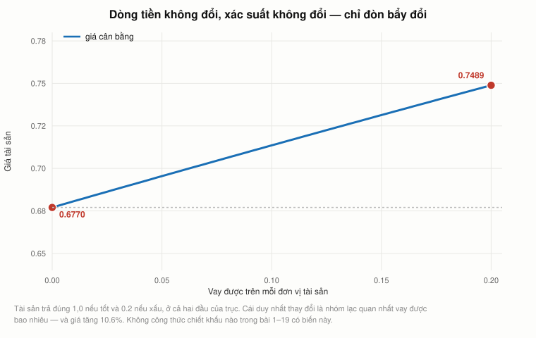
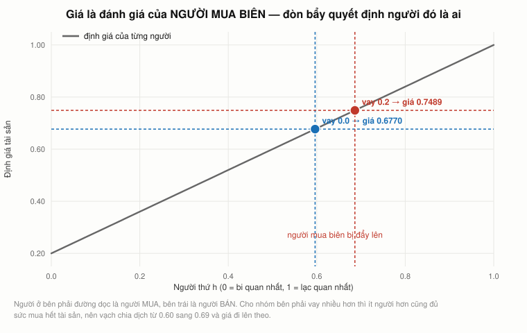
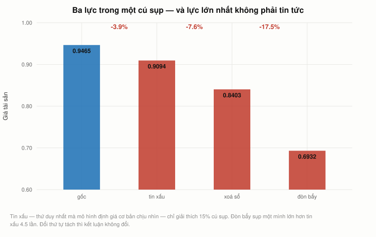
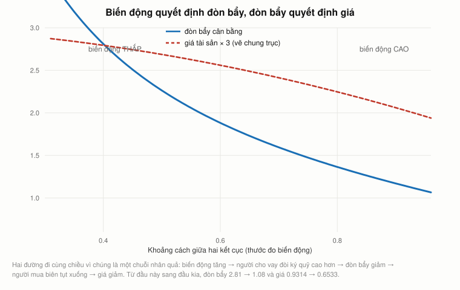
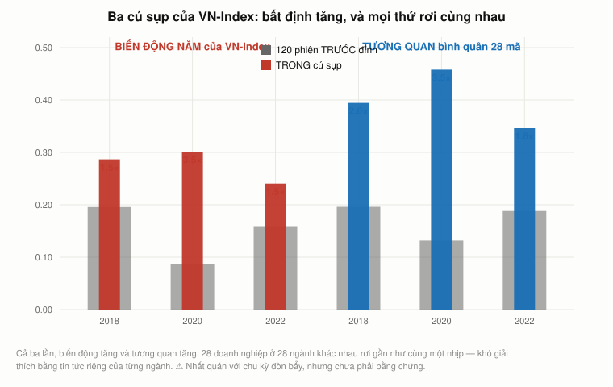

# Bài 20 — Chu kỳ đòn bẩy: thứ cả khoá học này bỏ sót

> [!info] Về bài này
> 🏛 **PHẦN F — TỪ MỘT KHOÁ KHÁC.** Bài này **không đến từ video của Andrew Lo**.
> Nó dựng trên **Yale ECON 251 *Financial Theory*** (Open Yale Courses, Thu 2009),
> giảng viên **John Geanakoplos** — giáo sư kinh tế ghế James Tobin, đồng thời là một
> trong sáu người sáng lập quỹ đầu cơ Ellington Capital Management.
> Ba bài giảng: **1** (`vTs2IQ8OefQ`, chương 2–3), **25** (`lb5Q1Jur0I0`), **26** (`yenfxh_arkg`).
> Nguồn lý thuyết: Geanakoplos (2003), *"Liquidity, Default and Crashes"*; Geanakoplos (2010),
> *"The Leverage Cycle"*, NBER Macroeconomics Annual.
>
> **Cách đọc các khối màu:** `[!quote]` trích nguyên văn (kèm nguồn) · `[!warning]` chỗ dễ nhầm · `[!note]` mở rộng/ghi chú · `[!example]` ví dụ áp dụng (Góc QTKD / Góc đời sống — biên soạn thêm, không có trong sách).
>
> **Cần đọc trước:** [Bài 3 §2](bai_03_don_bay_va_lam_phat.md#2-đòn-bẩy--con-số-mà-bảng-cân-đối-không-hét-lên) (đòn bẩy),
> [Bài 5 §14](bai_05_duration_va_chung_khoan_hoa.md#14-cỗ-máy-biến-hai-trái-phiếu-rác-thành-một-aaa) (chứng khoán hoá),
> [Bài 11](bai_11_capm_va_beta.md) (CAPM), [Bài 13](bai_13_thi_truong_hieu_qua.md) (thị trường hiệu quả).

---

## Mục lục

<!-- MUC-LUC -->
- [1. Vì sao có bài này](#1-vì-sao-có-bài-này)
- [2. Biến số thứ hai của mọi khoản vay](#2-biến-số-thứ-hai-của-mọi-khoản-vay)
- [3. Giá là đánh giá của người mua biên](#3-giá-là-đánh-giá-của-người-mua-biên)
- [4. Một phương trình, hai ẩn số — nghịch lý đặt sai](#4-một-phương-trình-hai-ẩn-số--nghịch-lý-đặt-sai)
- [5. Vì sao thị trường chỉ chọn một mức đòn bẩy](#5-vì-sao-thị-trường-chỉ-chọn-một-mức-đòn-bẩy)
- [6. Mô hình ba kỳ — cú sụp không ai cho là hợp lý](#6-mô-hình-ba-kỳ--cú-sụp-không-ai-cho-là-hợp-lý)
- [7. Tách cú sụp thành ba lực](#7-tách-cú-sụp-thành-ba-lực)
- [8. Người lạc quan thận trọng](#8-người-lạc-quan-thận-trọng)
- [9. Biến động quyết định đòn bẩy](#9-biến-động-quyết-định-đòn-bẩy)
- [10. Bằng chứng từ khủng hoảng 2007–09](#10-bằng-chứng-từ-khủng-hoảng-200709)
- [11. Ba cú sụp của VN-Index](#11-ba-cú-sụp-của-vn-index)
- [12. Cú sụp có rộng hơn tin tức không](#12-cú-sụp-có-rộng-hơn-tin-tức-không)
- [13. Bài này phản biện bài nào](#13-bài-này-phản-biện-bài-nào)
- [14. Nên làm gì — và vì sao chưa ai làm](#14-nên-làm-gì--và-vì-sao-chưa-ai-làm)
- [15. Code minh hoạ](#15-code-minh-hoạ)
- [16. Từ điển thuật ngữ](#16-từ-điển-thuật-ngữ)
- [17. Câu hỏi tự kiểm tra](#17-câu-hỏi-tự-kiểm-tra)
- [Tóm tắt một trang](#tóm-tắt-một-trang)
- [Nguồn](#nguồn)
<!-- /MUC-LUC -->

---

## 1. Vì sao có bài này

Geanakoplos mở đầu khoá của mình bằng một câu mà không giảng viên tài chính nào hay nói:

> [!quote] L1 10:29
> *"Có hai thứ thiếu trong Lý thuyết chuẩn. Một là nó ngầm giả định bạn mua được bảo hiểm cho
> mọi thứ — cái đó gọi là thị trường đầy đủ. Và thứ hai, nó bỏ hoàn toàn tài sản thế chấp ra
> ngoài, nên bạn gần như sẽ không thấy khái niệm thế chấp hay đòn bẩy trong bất kỳ sách giáo
> khoa kinh tế học nào."* (`L1 10:29`)

Ông không nói điều đó từ ghế lý thuyết. Ông điều hành bộ phận thu nhập cố định của Kidder
Peabody, rồi đồng sáng lập quỹ Ellington — và đã sống qua ba cuộc khủng hoảng thế chấp
(`L1 30:37`). Ông cũng nói rõ ông **không** cho rằng lý thuyết chuẩn sai:

> [!quote] L1 23:31
> *"Không có nghĩa là lý thuyết tài chính chuẩn sai. Sau cùng thì tôi giúp điều hành một quỹ
> đầu cơ. Sáu người chúng tôi lập ra nó và chúng tôi đã làm ăn mười lăm năm. Chúng tôi hẳn
> phải tin vào lý thuyết tài chính chuẩn vì đó là cách chúng tôi kiếm được phần lớn tiền."*
> (`L1 23:31`)

📌 Đây là điểm phải giữ khi đọc cả bài. Mười chín bài trước **không sai**. Chúng thiếu **một
biến số**, và biến số đó chỉ trở nên quan trọng đúng vào lúc mọi thứ khác ngừng hoạt động.

---

## 2. Biến số thứ hai của mọi khoản vay

Khi bạn vay mua nhà, bạn thoả thuận **hai** thứ, không phải một:

|                  |                                 |
| ---------------- | ------------------------------- |
| **Lãi suất**     | bài 2 đến bài 19 nói về cái này |
| **Mức thế chấp** | chưa bài nào nói tới            |

Geanakoplos đọc điều đó ra từ *Người lái buôn thành Venice*: hai bên mặc cả lãi suất, nhưng
điều còn lại trong trí nhớ mọi người suốt bốn trăm năm là **một pound thịt**, tức vật thế chấp.
Và bản án cuối cùng của toà không phải giảm lãi hay xoá nợ — nó là **đổi vật thế chấp**: được
lấy một pound thịt, nhưng không được một giọt máu (`L25 32:24`).

> [!quote] L25 32:54
> *"Nên đó là trách nhiệm của hệ thống tư pháp và cơ quan quản lý: giám sát không phải lãi
> suất, không phải quy mô khoản vay, mà là **tài sản thế chấp** đứng sau nó."* (`L25 32:54`)

Bốn con số hay được dùng là **bốn cách viết của cùng một sự thật**:

| giá nhà |  vay | tỷ lệ vay/giá trị | ký quỹ | tỷ lệ thế chấp |   đòn bẩy |
| ------: | ---: | ----------------: | -----: | -------------: | --------: |
|     100 |   80 |             80,0% |  20,0% |         125,0% |      5,00 |
|     100 |   97 |             97,0% |   3,0% |         103,1% | **33,33** |
|     100 |   50 |             50,0% |  50,0% |         200,0% |      2,00 |
|     100 |   25 |             25,0% |  75,0% |         400,0% |      1,33 |

Đổi một con số thì ba con số kia đổi theo. Chương trình `assert` điều đó ở §15.

**Điều đáng chú ý:** biến số này không xuất hiện ở bất kỳ đâu trong bài 1 đến bài 19.
Công thức chiết khấu, CAPM, WACC, APV, quyền chọn thực — không cái nào có nó. Tất cả đều ngầm
giả định **ai cũng trả được nợ**, nên chỉ còn lãi suất phải thoả thuận.

---

## 3. Giá là đánh giá của người mua biên

Đây là chỗ mô hình bắt đầu, và nó rất đơn giản.

Một tài sản $Y$ trả **1,0** nếu mọi chuyện tốt và **0,2** nếu xấu — một cái giếng dầu, một
chứng khoán thế chấp, một căn nhà. Một hàng hoá bền vững không rủi ro làm đơn vị tính (vàng).
Mỗi người có đúng 1 đơn vị $Y$ và 1 đơn vị vàng. Ai cũng trung tính với rủi ro và không chiết
khấu. Khác biệt duy nhất: **người thứ $h$ gán xác suất $h$ cho trạng thái tốt**, và $h$ chạy
đều từ 0 đến 1.

Người lạc quan muốn mua thêm, người bi quan muốn bán. Giá dừng ở đánh giá của **người mua
biên** — người không phân biệt được mua hay bán.

Câu hỏi của Geanakoplos: **người mua biên đó nằm ở đâu?** Câu trả lời: tuỳ nhóm trên cùng
vay được bao nhiêu.

| vay được /Y | người mua biên |    giá $Y$ | đòn bẩy | nhóm mua |
| ----------: | -------------: | ---------: | ------: | -------: |
|        0,00 |         0,5963 | **0,6770** |    1,00 |    40,4% |
|        0,05 |         0,6193 |     0,6954 |    1,08 |    38,1% |
|        0,10 |         0,6419 |     0,7136 |    1,16 |    35,8% |
|        0,15 |         0,6642 |     0,7314 |    1,26 |    33,6% |
|        0,20 |         0,6861 | **0,7489** |    1,36 |    31,4% |



**Đọc hàng đầu và hàng cuối.** Dòng tiền tương lai của $Y$ **không đổi một chút nào**.
Xác suất không đổi. Chỉ một thứ đổi: nhóm trên cùng vay được nhiều hơn nên **ít người hơn**
cũng đủ sức mua hết tài sản, người mua biên bị đẩy từ 0,60 lên 0,69 — và giá tăng **10,6%**.



> [!quote] L25 40:58
> Fisher và CAPM đều nói giá bằng **giá trị cơ bản** của dòng tiền. Ở đây dòng tiền không
> đổi mà giá đổi 10,6%. Nên hoặc công thức thiếu một biến, hoặc **không có cái gọi là "giá trị
> cơ bản" độc lập với việc ai đang cầm tiền.** Geanakoplos chọn vế thứ hai: *"Thật ra không có
> giá trị cơ bản. Tất cả phụ thuộc vào các ý kiến khác nhau của những người khác nhau."*
> (`L25 40:58`)

### Vì sao 0,2 là mức vay tối đa

Vì hợp đồng chỉ được bảo đảm bằng **chính tài sản đó**. Hứa trả nhiều hơn 0,2 thì ở trạng thái
xấu người vay bỏ của chạy lấy người — đúng câu Geanakoplos đặt vào miệng người vay nhà Mỹ năm
2009: *"Tỷ lệ vay trên giá trị của tôi là 150%… Tôi mà trả 150% thì điên. Coi như tôi không sở
hữu căn nhà. Chi bằng bỏ nó đi."* (`L26 19:00`)

---

## 4. Một phương trình, hai ẩn số — nghịch lý đặt sai

Đây là lý do Geanakoplos cho rằng cả ngành đã bỏ qua đòn bẩy suốt bảy mươi năm:

> [!quote] L25 35:54
> *"Có vẻ hơi sốc, vì làm sao một phương trình xác định được hai biến? Nên tôi nghĩ chính vì
> lý do đó mà các nhà kinh tế, về cơ bản, suốt bao nhiêu năm nay đã lờ đòn bẩy đi."* (`L25 35:54`)

Câu trả lời: **bài toán được đặt sai.** Một khoản vay không phải "lãi suất $x$". Nó là một
**cặp**: (lời hứa, tài sản thế chấp). Mỗi cặp là một hợp đồng khác nhau, có thị trường riêng và
giá riêng. Có bao nhiêu cặp thì có bấy nhiêu phương trình cung — cầu. Hết nghịch lý.

|  hứa trả | giao nếu tốt | giao nếu xấu | giá hợp đồng | lãi suất ngụ ý |
| -------: | -----------: | -----------: | -----------: | -------------: |
|     0,10 |         0,10 |         0,10 |       0,1000 |       **0,0%** |
| **0,20** |         0,20 |         0,20 |       0,2000 |       **0,0%** |
|     0,30 |         0,30 |         0,20 |       0,2686 |          11,7% |
|     0,40 |         0,40 |         0,20 |       0,3372 |          18,6% |
|     0,60 |         0,60 |         0,20 |       0,4745 |          26,5% |

Với lời hứa từ 0,2 trở xuống, lãi suất ngụ ý bằng **không** — không có rủi ro vỡ nợ nên người
cho vay cạnh tranh nhau đẩy lãi về 0. Vượt 0,2 thì lãi nhảy lên, vì một phần lời hứa không bao
giờ được giao.

Câu hỏi thật sự không phải "lãi suất là bao nhiêu" mà: **trong vô số hợp đồng đó, cái nào rốt
cuộc được giao dịch?**

---

## 5. Vì sao thị trường chỉ chọn một mức đòn bẩy

Câu trả lời của Geanakoplos gây bất ngờ: **chỉ đúng một hợp đồng được giao dịch**, và ai cũng
dùng nó, bất kể lạc quan hay bi quan.

Bảng dưới là chênh lệch giữa tiền mặt **nhận** được hôm nay và kỳ vọng phải **trả**, tính theo
niềm tin của chính người vay:

| người vay $h$ | hợp đồng 0,2 | hợp đồng 0,3 | hợp đồng 0,4 |
| ------------: | -----------: | -----------: | -----------: |
|          1,00 |      +0,0000 |  **−0,0314** |  **−0,0628** |
|          0,95 |      +0,0000 |      −0,0264 |      −0,0528 |
|          0,69 |      +0,0000 |      +0,0000 |      +0,0000 |
|          0,50 |      +0,0000 |      +0,0186 |      +0,0372 |

**Người lạc quan hứa nhiều hơn thì nhận thêm tiền mặt hôm nay, nhưng phần trả thêm rơi
hoàn toàn vào trạng thái tốt — đúng cái trạng thái anh ta tin chắc sẽ xảy ra.** Với anh ta đó
là trả đắt. Người cho vay thì ngược lại: phần nhận thêm rơi vào trạng thái anh ta tin là
**không** xảy ra. Với anh ta đó là mua đắt. Cả hai bên đều thấy hợp đồng lớn hơn tệ hơn, nên
nó không được giao dịch.

> [!quote] L26 33:39
> **Kết luận:** thị trường tự chọn ra đúng một mức đòn bẩy — **mức hứa lớn nhất mà không bao
> giờ vỡ nợ.** Đó là lý do thị trường repo gần như không có vỡ nợ, kể cả giữa khủng hoảng
> (`L26 33:39`).

> [!warning]
> Kết luận này gắn với **loại** khác biệt giữa người mua. Ở đây người ta khác nhau vì niềm
> tin. Geanakoplos nói rõ với thị trường thế chấp nhà thì khác — người ta còn khác nhau ở chỗ
> *có muốn ở trong căn nhà đó không* — và ở đó vỡ nợ **có** xảy ra (`L26 33:44`).

---

## 6. Mô hình ba kỳ — cú sụp không ai cho là hợp lý

Giờ cần **hai** tin xấu liên tiếp thì $Y$ mới trả 0,2; ba nhánh còn lại trả 1,0.

Điểm quan trọng: một tin xấu không chỉ làm mọi người bi quan hơn. Nó làm họ **bất định** hơn
và **bất đồng** với nhau nhiều hơn. Người $h = 0{,}9$ và người $h = 0{,}8$ ở gốc cây đều nghĩ
xác suất thảm hoạ là không đáng kể (1% và 4% bình phương). Sau một tin xấu, một người nghĩ 10%
còn người kia nghĩ 20% — giờ họ bất đồng thật sự (`L26 40:16`).

|                     | người mua biên |    giá $Y$ | vay được |  đòn bẩy |
| ------------------- | -------------: | ---------: | -------: | -------: |
| **t = 0**           |         0,8699 | **0,9465** |   0,6932 | **3,74** |
| **sau một tin xấu** |         0,6165 | **0,6932** |   0,2000 | **1,41** |

Giá sụt **0,2533** trên một đơn vị, tức **−26,8%**. Đòn bẩy sụt từ 3,74 xuống 1,41.

> [!note]
> 📌 Bốn con số này khớp gần như chính xác với những gì Geanakoplos viết trên bảng: 0,87 ·
> 0,95 · 0,69 · và dải người lạc quan thận trọng 0,74–0,87 (§8). Bộ giải trong `thuc_hanh/`
> là **của tôi**, viết độc lập từ mô tả trong bài giảng, không lấy con số nào từ đó.

### Và đây là chỗ sốc

Hỏi từng người trong nền kinh tế xem **họ** cho rằng giá đáng lẽ phải sụt bao nhiêu điểm:

| người $h$ | định giá t=0 | định giá sau tin xấu | họ cho là sụt |
| --------: | -----------: | -------------------: | ------------: |
|      0,00 |       0,2000 |               0,2000 |        0,0000 |
|      0,25 |       0,5500 |               0,4000 |        0,1500 |
|  **0,50** |       0,8000 |               0,6000 |    **0,2000** |
|      0,75 |       0,9500 |               0,8000 |        0,1500 |
|      0,87 |       0,9864 |               0,8959 |        0,0906 |
|      1,00 |       1,0000 |               1,0000 |        0,0000 |

Người cho là sụt **nhiều nhất** là người $h = 0{,}50$, và ngay cả anh ta cũng chỉ nghĩ giá đáng
lẽ sụt **0,2000**. Thị trường sụt **0,2533** — gấp **1,27 lần**.

> [!quote]
> **Không một ai trong nền kinh tế cho rằng cú sụp đó là hợp lý với tin tức. Và tất cả đều
> hoàn toàn duy lý.** Không cần một chút tâm lý học nào, không cần "hưng phấn phi lý". Đó là
> điểm của mô hình.

---

## 7. Tách cú sụp thành ba lực

Geanakoplos nói đáy cú sụp nào cũng có ba thứ xảy ra cùng lúc: **tin xấu**, **nhóm lạc quan
vay đến kiệt bị xoá sổ**, và **đòn bẩy sụp** (`L25 62:31`). Ông không tách riêng ba lực đó bao
giờ.

Tách được — vì cả ba đều là đầu vào của cùng một phép giải cân bằng. Đổi từng cái một rồi đo
lại giá:

| thứ tự A                             |    giá |   góp phần |
| ------------------------------------ | -----: | ---------: |
| gốc                                  | 0,9465 |            |
| (1) tin xấu, mọi thứ khác giữ nguyên | 0,9094 |  **−3,9%** |
| (2) người lạc quan bị xoá sổ         | 0,8403 |  **−7,6%** |
| (3) đòn bẩy sụp                      | 0,6932 | **−17,5%** |

| thứ tự B (đổi chỗ 2 và 3)    |    giá |   góp phần |
| ---------------------------- | -----: | ---------: |
| (1) tin xấu                  | 0,9094 |      −3,9% |
| (3) đòn bẩy sụp              | 0,7489 | **−17,6%** |
| (2) người lạc quan bị xoá sổ | 0,6932 |      −7,4% |



Đổi thứ tự thì con số gần như không đổi, nên kết luận vững:

> [!note]
> **Đòn bẩy sụp là lực lớn nhất — gấp 4,5 lần tin xấu.** Tin tức, thứ duy nhất mà mô hình
> định giá cơ bản chịu nhìn, chỉ giải thích **15%** cú sụp. Hai phần còn lại đến từ chính
> **cơ chế tài trợ**.

Chương trình `assert` rằng tích ba lực đúng bằng tổng mức sụt, sai số dưới `1e-12`.

---

## 8. Người lạc quan thận trọng

Người mua biên ở t=0 là $h = 0{,}8699$. Nhưng người **thấp nhất** vẫn cho $Y$ đáng giá hơn giá
thị trường 0,9465 là $h = 0{,}7414$. Vậy cả dải **[0,74 – 0,87]** nghĩ mua bây giờ là có lời —
mà không mua. Vì sao?

Ba cột giữa là **bội số tài sản kỳ vọng** theo niềm tin của chính người đó: bỏ một đồng vào
chiến lược ấy thì kỳ vọng còn lại bao nhiêu. Dưới 1,0000 là tệ hơn cầm tiền.

| người $h$ | định giá t=0 |   mua ngay | đợi cú sụp | giữ tiền | chọn             |
| --------: | -----------: | ---------: | ---------: | -------: | :--------------- |
|      0,50 |       0,8000 |     0,6056 |     0,9055 |   1,0000 | cho vay          |
|      0,70 |       0,9280 |     0,8478 |     1,0406 |   1,0000 | ĐỢI              |
|  **0,74** |       0,9465 |     0,8980 |     1,0524 |   1,0000 | ĐỢI              |
|      0,80 |       0,9680 |     0,9689 |     1,0595 |   1,0000 | ĐỢI              |
|      0,85 |       0,9820 |     1,0294 |     1,0568 |   1,0000 | ĐỢI              |
|  **0,87** |       0,9864 | **1,0535** | **1,0535** |   1,0000 | **= người biên** |
|      0,93 |       0,9961 |     1,1263 |     1,0356 |   1,0000 | mua ngay         |
|      1,00 |       1,0000 |     1,2111 |     1,0000 |   1,0000 | mua ngay         |

Hàng $h = 0{,}87$ cho thấy hai cột bằng nhau đúng đến chữ số thứ tư. **Đó chính là điều kiện
cân bằng tự xác nhận:** người mua biên là người không phân biệt được giữa *mua ngay* và
*đợi cú sụp* — chứ không phải giữa *mua* và *giữ tiền*.

> [!quote]
> ⚠️ Tôi đã đặt sai điều kiện này ở bản đầu (dùng "mua so với giữ tiền") và nghiệm lệch hẳn:
> người mua biên ra 0,863 thay vì 0,870, dải lạc quan thận trọng ra [0,77 – 0,86] thay vì
> [0,74 – 0,87]. Chính việc đối chiếu ngược với con số trên bảng của Geanakoplos đã lộ ra lỗi.

Người rất lạc quan ($h$ gần 1) **không tin cú sụp sẽ xảy ra**, nên họ mua ngay và vay đến kiệt.
Người ở giữa — Geanakoplos gọi là nhóm "Warren Buffett" — vừa đủ lạc quan để tin thị trường sẽ
hồi phục, vừa đủ tỉnh táo để tin cú sụp sẽ đến. Họ đợi.

> [!quote] L26 50:25
> Chính họ làm cú sụp **bớt** sâu, vì họ là người mua ở đáy. Nhưng họ không ngăn được cú
> sụp, đơn giản vì **không đủ đông** (`L26 50:25`).

---

## 9. Biến động quyết định đòn bẩy

Fisher nói lãi suất do **sự thiếu kiên nhẫn** quyết định. Geanakoplos nói đòn bẩy do **biến
động** quyết định:

> [!quote] L25 36:56
> *"Nếu bạn nghĩ giá nhà đang lên xuống và có thể rơi xuống dưới 80 thì bạn sẽ không thấy an
> toàn. Nếu bạn nghĩ giá nhà chắc như đá ở mức 100 thì bạn sẽ thấy rất an toàn, và bạn còn cho
> vay hơn 80."* (`L25 36:56`)

| kết cục xấu | khoảng cách | vay tối đa |  đòn bẩy | giá $Y$ | người mua biên |
| ----------: | ----------: | ---------: | -------: | ------: | -------------: |
|        0,60 |        0,40 |       0,60 | **2,81** |  0,9314 |         0,8284 |
|        0,40 |        0,60 |       0,40 |     1,88 |  0,8533 |         0,7554 |
|        0,20 |        0,80 |       0,20 |     1,36 |  0,7489 |         0,6861 |
|        0,05 |        0,95 |       0,05 | **1,08** |  0,6533 |         0,6351 |



**Đây là vòng xoáy.** Biến động tăng → người cho vay đòi ký quỹ cao hơn → đòn bẩy giảm →
người mua biên tụt xuống → giá giảm → ai đã vay thì lỗ → biến động tăng thêm. Mọi mũi tên đều
đi cùng một chiều.

> [!warning] Nhưng chú ý chiều ngược lại của bảng trên.
> Biến động **thấp** kéo đòn bẩy **lên** và giá
> **lên**. Đó là lý do Geanakoplos nói giai đoạn yên ả kéo dài trước 2007 chính là thứ đã nạp đạn
> cho cú nổ (`L25 57:38`).

---

## 10. Bằng chứng từ khủng hoảng 2007–09

Bài giảng 25 dành nửa đầu cho số liệu. Đây là những con số ông trình bày, kèm mốc thời gian.

### Đòn bẩy tăng gấp bốn rồi sụp

|                                                  |                         2000 |                       2006 |                2009 |
| ------------------------------------------------ | ---------------------------: | -------------------------: | ------------------: |
| Người mua nhà (khoản vay ngoài cơ quan nhà nước) | 14% tiền mặt → đòn bẩy **7** |   dưới 3% → đòn bẩy **30** | 25% → đòn bẩy **4** |
| Chứng khoán thế chấp "độc hại"                   |                              |      trung bình **16 : 1** |                     |
| Riêng lớp AAA do ngân hàng nắm                   |                              | 1,6% tiền mặt → **60 : 1** |                     |

(`L25 44:02`, `L25 49:24`, `L26 14:20`)

**Hệ quả tính ra từ đó:** với đòn bẩy 16 : 1, toàn bộ 2.500 tỷ đô chứng khoán thế chấp độc
hại chỉ cần **150 tỷ tiền mặt**. Geanakoplos chỉ ra rằng năm 2006, chỉ Bill Gates và Warren
Buffett cộng lại đã có gần đúng số đó — *"hai người trong cả nền kinh tế có thể mua sạch mọi
chứng khoán thế chấp độc hại"* (`L25 45:04`). Đó chính là hình ảnh "người mua biên bị đẩy lên
rất cao" của §3, bằng số thật.

### Thị trường biết trước khi có bất kỳ khoản lỗ nào

Chỉ số trái phiếu BBB thế chấp dưới chuẩn rơi từ **100 xuống 60** trong ba tháng đầu 2007
(`L25 16:11`). Thị trường cổ phiếu Mỹ vẫn tiếp tục lên và chỉ đạt đỉnh vào **1/10/2007**, tức
mười tháng sau (`L1 24:25`).

Và điều làm nó sụp không phải khoản lỗ. Lỗ luỹ kế lúc đó vẫn **dưới 1%**. Cái thay đổi chỉ là
**độ dốc**: mỗi lứa cho vay mới xấu đi nhanh hơn lứa trước, và giới giao dịch ngoại suy đường
cong đó (`L25 21:41`). Đây là bằng chứng mạnh cho thị trường hiệu quả dạng bán mạnh của
[bài 13 §6](bai_13_thi_truong_hieu_qua.md#6-tờ-100-đô-la-trên-vỉa-hè-và-ba-dạng-hiệu-quả) — và
đồng thời là bằng chứng rằng thị trường cổ phiếu **không** đọc tín hiệu đó suốt mười tháng.

### Vòng phản hồi giữa hai thị trường

Điều Geanakoplos gọi là **chu kỳ đòn bẩy kép** (`L25 58:34`): khi giá chứng khoán thế chấp
giảm, ngân hàng không gom đủ tiền để cho vay mới, nên họ **đòi người mua nhà đặt cọc nhiều
hơn** — từ 3% lên 25%. Người vay không đủ tiền nên **không tái cấp vốn được**. Tỷ lệ trả trước
sụp từ **70% xuống khoảng 10%** (`L25 26:00`), khiến người cho vay gốc mất luôn phần tiền lẽ ra
thu về sớm — và khoản lỗ tối đa nhảy từ 30% lên 90%.

> [!quote] L25 59:06
> Chú ý cơ chế: **không phải lãi suất thay đổi.** *"Không phải vì lãi suất đột nhiên quá cao
> với họ. Cái đó không đổi chút nào. Là người cho vay đột nhiên đòi khoản đặt cọc lớn hơn
> nhiều."* (`L25 59:06`)

### Chi phí thu hồi tài sản thế chấp

Ở khoản vay dưới chuẩn, đuổi một người ra khỏi nhà mất **18 tháng**, trong đó họ không trả nợ,
không đóng thuế, và căn nhà xuống cấp. Bán ra thu về trung bình **một phần tư** giá trị căn nhà
— trong khi lúc cho vay ai cũng cho rằng không thể dưới 80% (`L25 68:16`).

📌 Đó là lý do Geanakoplos vận động **xoá bớt nợ gốc** thay vì siết nợ: chủ nợ thu về 80 sẽ tốt
hơn đuổi người rồi thu 40 (`L25 71:20`). Ông gọi đó là tình huống *đôi bên cùng lợi* — và nó
nối thẳng về **nợ treo** ở [bài 17 §4](bai_17_chi_phi_dai_dien.md#4-chi-phí-đại-diện-của-nợ-ii--nợ-treo-myers-1977):
người đang chìm dưới nước không sửa nhà, không đầu tư, vì phần lợi rơi hết vào tay chủ nợ.

---

## 11. Ba cú sụp của VN-Index

Mô hình nói tin xấu làm **bất định** tăng, và bất định làm người cho vay siết ký quỹ. Ta chưa
đo được ký quỹ (không ai công bố theo tần suất đủ dùng), nhưng đo được bất định.

Dữ liệu: VN-Index đóng cửa **2.877 phiên**, từ 5/1/2015 đến 4/9/2026, nguồn DNSE/Entrade.

| đợt                |    đỉnh |   đáy |    sụt | phiên | biến động 120 phiên trước | trong đợt |      gấp |
| ------------------ | ------: | ----: | -----: | ----: | ------------------------: | --------: | -------: |
| 2018 siết tín dụng | 1.204,3 | 893,2 | −25,8% |    64 |                     19,6% |     28,7% | **1,47** |
| 2020 đại dịch      |   991,5 | 659,2 | −33,5% |    39 |                      8,7% |     30,1% | **3,48** |
| 2022 sụt sâu       | 1.528,6 | 911,9 | −40,3% |   213 |                     15,9% |     24,0% | **1,51** |

Cả ba lần biến động đều tăng. Đó là điều kiện đầu tiên của chu kỳ đòn bẩy: tin xấu không chỉ
làm giá giảm, nó làm người ta **không biết** giá sẽ đi đến đâu — và đó mới là thứ làm người cho
vay siết lại.

> [!warning] Đây là sự phù hợp, không phải bằng chứng nhân quả.
> Biến động tăng trong mọi cú sụp, kể
> cả cú sụp không dính gì đến đòn bẩy.

---

## 12. Cú sụp có rộng hơn tin tức không

Phép thử trực tiếp hơn: nếu giá rơi vì **tin tức về từng doanh nghiệp** thì các cổ phiếu phải
rơi rời rạc. Nếu giá rơi vì người nắm giữ **buộc phải bán** — ký quỹ bị siết — thì tất cả rơi
cùng một lúc, bất kể doanh nghiệp nào.

Đo bằng tương quan bình quân của **mọi cặp** trong 28 mã, dữ liệu lợi suất **theo ngày**.

| đợt                | số mã | 120 phiên trước | trong đợt |      gấp |
| ------------------ | ----: | --------------: | --------: | -------: |
| 2018 siết tín dụng |    26 |           0,196 |     0,394 | **2,01** |
| 2020 đại dịch      |    28 |           0,132 |     0,458 | **3,48** |
| 2022 sụt sâu       |    28 |           0,188 |     0,346 | **1,84** |



Cả ba lần tương quan tăng mạnh. Trong cú sụp, 28 doanh nghiệp ở 28 ngành khác nhau — thép,
sữa, hàng không, bán lẻ, bất động sản, dược — đi xuống gần như cùng một nhịp. Khó giải thích
bằng tin tức riêng của từng ngành.

### Và một kết quả đi ngược giả thuyết

Nếu người lạc quan vay nợ bị nghiền nát trước tiên thì cổ phiếu **họ** nắm — thường là beta cao
— phải rơi **sâu hơn** mức beta dự báo. Đo thử, beta ước từ 120 phiên trước đỉnh:

| đợt  | nhóm          | beta TB | rơi thực tế | beta dự báo |      vượt |
| ---- | ------------- | ------: | ----------: | ----------: | --------: |
| 2018 | 1/3 beta CAO  |    1,25 |      −29,3% |      −32,2% | **+2,9%** |
| 2018 | 1/3 beta THẤP |    0,44 |      −19,1% |      −11,3% | **−7,8%** |
| 2020 | 1/3 beta CAO  |    1,23 |      −33,6% |      −41,2% |     +7,6% |
| 2020 | 1/3 beta THẤP |    0,57 |      −30,8% |      −19,2% |    −11,6% |
| 2022 | 1/3 beta CAO  |    1,21 |      −45,7% |      −49,0% |     +3,3% |
| 2022 | 1/3 beta THẤP |    0,41 |      −30,6% |      −16,7% |    −13,9% |

**Ngược hoàn toàn.** Cổ phiếu beta cao rơi **ít hơn** dự báo; beta thấp rơi **nhiều hơn**.
Trong cú sụp, mọi thứ bị kéo về gần nhau và beta mất khả năng phân biệt. Đó đúng là hiện tượng
đường SML bị làm phẳng mà
[bài 11 §16](bai_11_capm_va_beta.md#16-độ-dốc-thật-của-sml-và-capm-beta-không-của-fischer-black)
đã đo bằng dữ liệu Mỹ, và ở đây nó xuất hiện lại trong cả ba cú sụp Việt Nam.

Với chu kỳ đòn bẩy điều này **không mâu thuẫn**: mô hình nói cú sụp đến từ một cú siết **tài
trợ chung** chứ không từ rủi ro hệ thống của từng mã, nên không có lý do gì để mức rơi tỷ lệ
với beta. Nhưng nó cũng **không ủng hộ** chu kỳ đòn bẩy — nó chỉ loại bỏ một cách giải thích
khác.

> [!note]
> ⚠️ **Giới hạn lớn nhất của cả bài:** không có số liệu **dư nợ ký quỹ** theo thời gian cho
> Việt Nam. Mọi thứ đo được ở §11–12 đều **nhất quán** với chu kỳ đòn bẩy nhưng không chứng
> minh được nó. Chính Geanakoplos nói điều cần làm đầu tiên không phải lý thuyết mà là
> **ghi số liệu** — xem §14.

---

## 13. Bài này phản biện bài nào

Đây là bài duy nhất trong khoá **mâu thuẫn trực tiếp** với các bài trước. Đặt cạnh nhau:

| Đã học ở                                                                                         | Nói rằng                                         | Chu kỳ đòn bẩy nói                                                                                                |
| ------------------------------------------------------------------------------------------------ | ------------------------------------------------ | ----------------------------------------------------------------------------------------------------------------- |
| [Bài 2](bai_02_gia_tri_hien_tai.md), [bài 6](bai_06_co_phieu_va_tang_truong.md)                  | giá = hiện giá dòng tiền                         | dòng tiền không đổi mà giá đổi 10,6% (§3)                                                                         |
| [Bài 11](bai_11_capm_va_beta.md) CAPM                                                            | giá do rủi ro hệ thống và **một** người đại diện | giá do **người mua biên** — mà đòn bẩy quyết định đó là ai                                                        |
| [Bài 13](bai_13_thi_truong_hieu_qua.md) thị trường hiệu quả                                      | giá phản ánh mọi thông tin                       | thị trường dưới chuẩn phản ánh **đúng** và sớm (§10) — nhưng cú sụp 26,8% vẫn lớn hơn mức bất kỳ ai cho là hợp lý |
| [Bài 13 §18](bai_13_thi_truong_hieu_qua.md#18-giả-thuyết-thị-trường-thích-nghi) hành vi          | cú sụp do tâm lý, hưng phấn phi lý               | mô hình §6 **hoàn toàn duy lý**, không có một chữ tâm lý nào                                                      |
| [Bài 16 §9](bai_16_co_cau_von.md#9-lý-thuyết-đánh-đổi--và-cái-giả-định-không-đo-được) cơ cấu vốn | đòn bẩy là **lựa chọn của doanh nghiệp**         | đòn bẩy là một **giá cân bằng của thị trường**                                                                    |

Chỗ đối đầu gọn nhất là với Shiller. Cả hai đều nhìn cùng một đồ thị giá nhà 2000–2006 tăng
90%. Shiller nói **hưng phấn phi lý**. Geanakoplos nói **đòn bẩy đi từ 7 lên 30**, và trong
đúng khoảng thời gian đó (`L25 46:05`, `L25 49:24`). Ông không bác Shiller hẳn:

> [!quote] L26 64:45
> *"Tôi nghĩ Shiller đúng một phần… Quỹ của chính tôi mất tiền. Chúng tôi không lường được nó
> tệ đến mức nào. Nên tôi sẽ không bám 100% vào câu chuyện của mình."* (`L26 64:45`)

📌 Và có một chỗ chu kỳ đòn bẩy **vá** cho bài 16 chứ không phản biện. Bài 16 §11 đo được cột
"tài sản thế chấp" trong cuộc đua ngựa cho hệ số **−0,029, t = −0,15 — không có gì cả**. Bài 16
coi thế chấp là một *thuộc tính của doanh nghiệp*. Geanakoplos nói nó là **một cái giá**, và
giá thì thay đổi theo thời gian chứ không theo doanh nghiệp — nên hồi quy cắt ngang không thấy
gì là điều phải xảy ra.

---

## 14. Nên làm gì — và vì sao chưa ai làm

Geanakoplos đề nghị ba việc khi đang ở đáy, đúng bằng cách đảo ngược ba lực của §7 (`L26 52:56`):

1. **Chặn bất định**, không chặn được tin xấu thì chặn độ dao động của nó.
2. **Nâng đòn bẩy lên** — và ông nói rõ hạ lãi suất về 0 *"về cơ bản không kích thích được gì"*,
   vì cái nghẽn là **thế chấp**, không phải giá vốn (`L25 74:55`).
3. **Thay thế nhóm người mua đã bị xoá sổ**, tạm thời, bằng chính phủ.

Còn dài hạn: **đừng bao giờ để đòn bẩy lên cao đến thế**.

### Nhưng việc đầu tiên không phải quy định — mà là đo

> [!quote] L25 55:47
> *"Với tôi điều quan trọng nhất, bước đầu tiên Fed nên làm là theo dõi mức đòn bẩy đang được
> cho phép, mức ký quỹ đang bị đòi trên mọi loại chứng khoán, nhà ở và chứng khoán."* (`L25 55:47`)

Ông kể chuyện lưới điện Mỹ sập năm 2003, và sau đó ngành điện chi hàng chục triệu đô để
**giám sát từng đường dây theo thời gian thực**. Rồi ông nói: chúng ta vẫn chưa giám sát đòn
bẩy (`L25 56:59`). Số liệu ông trình bày trước Hội đồng Thống đốc Fed tháng 10/2008 là số liệu
của **quỹ riêng ông**, vì Ellington dường như là công ty duy nhất trong nước lưu lại nó
(`L25 52:44`).

Khi sinh viên hỏi "vậy mức đòn bẩy đúng là bao nhiêu", ông trả lời rất thẳng:

> [!quote] L26 57:17
> *"Nói chính xác nên siết bao nhiêu? Họ sẽ nói 'tôi không biết chính xác, nhưng chúng ta hẳn
> đã buộc ngân hàng không cho vay với 3% tiền mặt.' Nên là 10%, 15%, hay 8%? Hơi khó nói con số
> đúng là gì, nhưng ta sẽ chọn một con số cao hơn 3% và tránh được một vấn đề khổng lồ."*
> (`L26 57:17`)

📌 Ông cũng đề một quy tắc không cần biết con số đúng: **cấm nhân đôi mức ký quỹ trong dưới sáu
tháng**. Người cho vay biết trước mình không phản ứng nhanh được sẽ tự đòi ký quỹ cao hơn ngay
từ đầu — nên đòn bẩy đỉnh thấp đi mà không ai phải chọn con số (`L26 57:28`).

### Một khác biệt đáng chú ý của Việt Nam

Ở Mỹ, Fed **có** thẩm quyền quy định ký quỹ nhưng gần như không dùng — Geanakoplos nói lần gần
nhất là ngay sau 11/9 khi Fed gọi điện cho tất cả và nói *"các anh không được đổi mức ký quỹ"*,
và không ai đổi (`L26 69:47`). Ở Việt Nam, ký quỹ chứng khoán có **trần pháp lý cố định** do Uỷ
ban Chứng khoán Nhà nước đặt.

> [!warning] Chưa xác minh được:
> tôi không kiểm chứng được con số trần hiện hành từ nguồn gốc, nên
> không ghi con số ở đây. Điều nói được chắc là **cơ chế** khác nhau: Mỹ để thị trường tự đặt ký
> quỹ theo ngày, Việt Nam đặt trần hành chính. Theo lập luận của Geanakoplos, cơ chế thứ hai
> chính là thứ ông đòi hỏi — nhưng nó chỉ chặn được **đỉnh** đòn bẩy, không chặn được việc công
> ty chứng khoán **siết nhanh** khi thị trường xấu, mà đó mới là lực gây cú sụp.

---

## 15. Code minh hoạ

> [!note]
> ⚙️ **Chạy:** cần **Python 3.10+**. Không cần cài gói nào. Kết quả **tất định**.

|            |                                                                               |
| ---------- | ----------------------------------------------------------------------------- |
| File       | [`thuc_hanh/bai-20-chu-ky-don-bay.py`](../thuc_hanh/bai-20-chu-ky-don-bay.py) |
| Kích thước | **2.095 dòng**, 10 mục                                                        |

Chương trình tự giải mô hình cân bằng, không lấy con số nào từ bài giảng. Ba chỗ đáng đọc kỹ:

- `can_bang_mot_ky()` giải bằng chia đôi cho **cả hai** điều kiện — người mua biên không phân
  biệt, và ngân sách khớp — rồi `assert` cả hai dưới `1e-9`.
- `can_bang_ba_ky()` có ghi chú về chỗ tôi làm sai lần đầu: điều kiện của người mua biên ở t=0
  là *mua ngay so với đợi cú sụp*, không phải *mua so với giữ tiền*.
- `muc_5()` tách cú sụp theo **hai thứ tự khác nhau** rồi `assert` rằng tích ba lực đúng bằng
  tổng mức sụt, sai số dưới `1e-12`.

**Dữ liệu nhúng:** VN-Index 2.877 phiên (lưu dạng số nguyên = chỉ số × 100) và lợi suất ngày
của 28 mã trong ba cửa sổ khủng hoảng (lưu dạng **điểm cơ bản**, số nguyên). Tôi đã kiểm rằng
làm tròn về 1 điểm cơ bản không đổi kết quả tương quan tới chữ số thập phân thứ tư.

Kết quả chạy thật:

```
==============================================================================
BAI 20 — CHU KY DON BAY: THU CA KHOA HOC NAY BO SOT
PHAN F — tu Yale ECON 251, John Geanakoplos
==============================================================================

==============================================================================
MUC 1. BON CACH NOI CUNG MOT DIEU
==============================================================================
Mua mot can nha gia 100, vay 80, bo ra 20 tien mat. Bon con so duoi day
la BON CACH VIET cua dung mot su that, khong phai bon dai luong khac nhau:

    gia nha     vay  ti le vay/gia tri   ky quy  the chap   don bay
  ---------------------------------------------------------------
        100      80              80.0%    20.0%    125.0%      5.00
        100      97              97.0%     3.0%    103.1%     33.33
        100      50              50.0%    50.0%    200.0%      2.00
        100      25              25.0%    75.0%    400.0%      1.33

  Doi mot con so thi ba con so kia doi theo. Nen khi Geanakoplos noi
  "don bay", "ti le vay tren gia tri", "ky quy" hay "ti le the chap",
  ong dang noi ve cung MOT bien so — bien so thu hai cua moi khoan vay.

  DIEU DANG CHU Y: bien so nay khong xuat hien o bat ky dau trong bai 1
  den bai 19. Cong thuc chiet khau, CAPM, WACC, APV, quyen chon thuc —
  khong cai nao co no. Tat ca deu ngam gia dinh: ai cung tra duoc no,
  nen chi con lai LAI SUAT phai thoa thuan.

  (assert: bon cach viet quy ve nhau, sai so duoi 1e-12 — OK)

==============================================================================
MUC 2. MO HINH HAI KY — GIA DO NGUOI MUA BIEN QUYET DINH
==============================================================================
Mot tai san Y tra 1 neu tot, 0.2 neu xau. Mot hang hoa vang khong rui ro.
Moi nguoi co dung 1 Y va 1 vang. Nguoi thu h tin xac suat tot la h.
Khong ai chiet khau, ai cung trung tinh voi rui ro.

Nguoi lac quan muon mua them Y, nguoi bi quan muon ban. Gia se dung o
danh gia cua NGUOI MUA BIEN — nguoi khong phan biet duoc mua hay ban.

Cau hoi cua Geanakoplos: nguoi mua bien do nam O DAU? Cau tra loi:
no phu thuoc nhom tren cung VAY DUOC BAO NHIEU.

    vay duoc /Y   nguoi mua bien     gia Y   don bay   nhom mua
  -------------------------------------------------------------
           0.00           0.5963    0.6770      1.00      40.4%
           0.05           0.6193    0.6954      1.08      38.1%
           0.10           0.6419    0.7136      1.16      35.8%
           0.15           0.6642    0.7314      1.26      33.6%
           0.20           0.6861    0.7489      1.36      31.4%

  DOC HANG DAU va HANG CUOI. Khong ai vay duoc dong nao thi gia 0.6770;
  vay duoc 0.2 tren moi don vi Y thi gia len 0.7489 — TANG 10.6%.

  Dong tien tuong lai cua Y KHONG DOI mot chut nao. Xac suat khong doi.
  Chi mot thu doi: nhom tren cung vay duoc nhieu hon nen it nguoi hon
  cung du suc mua het tai san, va nguoi mua bien bi day len tu 0.60 len 0.69.

  Fisher va CAPM deu noi gia = gia tri co ban cua dong tien. O day dong
  tien khong doi ma gia doi 10.6%. Nen hoac cong thuc thieu mot bien,
  hoac khong co cai goi la "gia tri co ban" doc lap voi ai dang cam tien.

  VI SAO 0.2 LA MUC VAY TOI DA. Neu hua tra nhieu hon 0.2 thi trong
  trang thai xau nguoi vay bo cua chay lay nguoi: tai san chi con 0.2,
  hop dong chi duoc bao dam bang chinh tai san do. Nen moi loi hua lon
  hon 0.2 deu chi GIAO duoc 0.2 o trang thai xau — tuc la vo no.

  (assert: ca hai dieu kien can bang thoa duoi 1e-9 — OK)

==============================================================================
MUC 3. VI SAO THI TRUONG CHI CHON MOT MUC DON BAY
==============================================================================
Nguoc doi: cung — cau la MOT phuong trinh, ma phai xac dinh HAI thu, lai
suat va don bay. Geanakoplos noi day la cau hoi dat sai.

Mot khoan vay khong phai "lai suat x". No la MOT CAP: (loi hua, the chap).
Moi cap la mot hop dong KHAC NHAU, co thi truong rieng, co gia rieng.
Nen co bao nhieu cap thi co bay nhieu phuong trinh cung — cau. Het nguoc doi.

Cau hoi that su la: trong vo so hop dong do, cai nao ROT CUOC duoc giao dich?

    hua tra  giao neu tot  giao neu xau  gia hop dong   lai suat ngu y
  ---------------------------------------------------------------------
       0.10          0.10          0.10        0.1000             0.0%
       0.20          0.20          0.20        0.2000             0.0%
       0.30          0.30          0.20        0.2686            11.7%
       0.40          0.40          0.20        0.3372            18.6%
       0.60          0.60          0.20        0.4745            26.5%

  Voi loi hua tu 0.2 tro xuong, lai suat ngu y bang KHONG — khong co rui
  ro vo no nen nguoi cho vay canh tranh nhau day lai ve 0. Vuot 0.2 thi
  lai suat nhay len vi mot phan loi hua khong bao gio duoc giao.

  BAY GIO LA CHO HAY: vi sao khong ai chon hua 0.3 du hop dong do co san?
  Cot duoi la chenh lech giua tien mat NHAN duoc hom nay va ky vong phai
  TRA, tinh theo niem tin cua chinh nguoi vay:

    nguoi vay h   hop dong 0,2   hop dong 0,3   hop dong 0,4
  ----------------------------------------------------------
           1.00        +0.0000        -0.0314        -0.0628
           0.95        +0.0000        -0.0264        -0.0528
           0.69        +0.0000        +0.0000        +0.0000
           0.50        +0.0000        +0.0186        +0.0372

  Hop dong 0.2 cho ket qua 0.0000 voi MOI nguoi — khong ai duoc, khong ai
  mat, vi khong co rui ro vo no nen no chi la doi tien lay tien. Moi hop
  dong LON hon deu am voi nguoi lac quan.

  Nguoi lac quan hua nhieu hon thi nhan them tien mat HOM NAY, nhung phan
  tra them roi hoan toan vao TRANG THAI TOT — dung cai trang thai anh ta
  tin chac se xay ra. Voi anh ta do la tra dat.
  Nguoi cho vay thi nguoc lai: phan nhan them cung roi vao trang thai ma
  anh ta tin la KHONG xay ra. Voi anh ta do la mua dat.
  Ca hai ben deu thay hop dong lon hon te hon. Nen no khong duoc giao dich.

  KET LUAN: thi truong tu chon ra DUNG MOT muc don bay — muc hua LON NHAT
  ma KHONG BAO GIO VO NO. Do la ly do thi truong repo gan nhu khong bao
  gio co vo no, ke ca giua khung hoang.

==============================================================================
MUC 4. MO HINH BA KY — CU SUT KHONG AI CHO LA HOP LY
==============================================================================
Gio can HAI tin xau lien tiep thi Y moi tra 0.2; ba nhanh con lai tra 1.
Diem quan trong: MOT tin xau khong chi lam moi nguoi bi quan hon — no con
lam ho BAT DINH hon va BAT DONG voi nhau nhieu hon truoc.

                          nguoi mua bien    gia Y  vay duoc   don bay
  -------------------------------------------------------------------
  t = 0                           0.8699   0.9465    0.6932      3.74
  sau MOT tin xau                 0.6165   0.6932    0.2000      1.41

  Gia sut 0.2533 tren mot don vi Y, tuc -26.8%.
  Don bay sut tu 3.74 xuong 1.41.

  BAY GIO LA CHO SOC. Hoi tung nguoi trong nen kinh te xem HO cho rang
  gia dang le phai sut bao nhieu. Do bang DIEM tren gia tri tai san,
  dung cach Geanakoplos do tren bang:

    nguoi h   dinh gia t=0   dinh gia sau tin xau   ho cho la sut
  ---------------------------------------------------------------
       0.00         0.2000                 0.2000          0.0000
       0.25         0.5500                 0.4000          0.1500
       0.50         0.8000                 0.6000          0.2000
       0.75         0.9500                 0.8000          0.1500
       0.87         0.9864                 0.8959          0.0906
       1.00         1.0000                 1.0000          0.0000

  Nguoi cho la sut NHIEU nhat la h = 0.50, va ngay ca anh ta cung chi cho
  rang gia dang le sut 0.2000. Thi truong sut 0.2533 — gap 1.27 lan.

  KHONG MOT AI trong nen kinh te cho rang cu sut do la hop ly voi tin tuc.
  Va tat ca deu hoan toan duy ly. Do la diem cua mo hinh.

  (assert: 0.2000 < 0.2533 — OK)

==============================================================================
MUC 5. TACH CU SUT THANH BA LUC
==============================================================================
Geanakoplos noi day cu sut nao cung co ba thu xay ra cung luc:
  (1) tin xau,
  (2) nhom lac quan vay den kiet BI XOA SO,
  (3) don bay SUP.
Ong khong tach rieng ba luc do bao gio. Tach duoc, vi ca ba deu la dau vao
cua cung mot phep giai can bang: ta doi tung cai mot va do lai gia.

  moc goc      gia t = 0                       0.9465
  moc cuoi     gia sau mot tin xau             0.6932

  thu tu A                                gia   gop phan
  ------------------------------------------------------
  (1) tin xau, moi thu khac giu nguyen   0.9094      -3.9%
  (2) nguoi lac quan bi xoa so         0.8403      -7.6%
  (3) don bay sup                      0.6932     -17.5%

  thu tu B (doi cho 2 va 3)               gia   gop phan
  ------------------------------------------------------
  (1) tin xau                          0.9094      -3.9%
  (3) don bay sup                      0.7489     -17.6%
  (2) nguoi lac quan bi xoa so         0.6932      -7.4%

  (assert: tich ba luc = 0.732355 = pD/p0 = 0.732355, sai so duoi 1e-12 — OK)

  DOI CHO HAI LUC SAU thi con so gan nhu khong doi, nen ket luan vung:
  DON BAY SUP LA LUC LON NHAT, gap 4.5 lan tin xau.

  Tin xau — thu duy nhat ma mo hinh dinh gia co ban chiu nhin — chi giai
  thich 15% cu sut. Hai phan con lai den tu chinh CO CHE TAI TRO.

==============================================================================
MUC 6. NGUOI LAC QUAN THAN TRONG
==============================================================================
Nguoi mua bien o t=0 la h = 0.8699. Nhung nguoi thap nhat VAN cho Y dang gia
hon gia thi truong 0.9465 la h = 0.7414. Vay ca dai [0.74, 0.87] nghi rang
mua bay gio la co loi — ma khong mua. Vi sao?

    nguoi h  dinh gia t=0    mua ngay   doi cu sut   giu tien       chon
  ----------------------------------------------------------------------
       0.50        0.8000      0.6056       0.9055     1.0000    cho vay
       0.70        0.9280      0.8478       1.0406     1.0000        DOI
       0.74        0.9465      0.8980       1.0524     1.0000        DOI
       0.80        0.9680      0.9689       1.0595     1.0000        DOI
       0.85        0.9820      1.0294       1.0568     1.0000        DOI
       0.87        0.9864      1.0535       1.0535     1.0000= NGUOI BIEN
       0.93        0.9961      1.1263       1.0356     1.0000   mua ngay
       1.00        1.0000      1.2111       1.0000     1.0000   mua ngay

  Ba cot giua la BOI SO TAI SAN ky vong theo niem tin cua chinh nguoi do:
  bo mot dong vao chien luoc ay thi ky vong con lai bao nhieu. Duoi 1,0000
  la te hon cam tien.

  Ai cung thay mua sau cu sut LOI hon nhieu. Nhung nguoi rat lac quan
  (h gan 1) khong tin cu sut se xay ra, nen ho mua ngay va vay den kiet.
  Nguoi o giua — Geanakoplos goi la "Warren Buffett" — vua du lac quan de
  tin thi truong se hoi phuc, vua du tinh tao de tin cu sut se den. Ho doi.

  Chinh ho lam cu sut BOT sau, vi ho la nguoi mua o day. Nhung ho khong
  ngan duoc cu sut, don gian vi ho khong du dong.

==============================================================================
MUC 7. BIEN DONG QUYET DINH DON BAY
==============================================================================
Fisher noi lai suat do SU THIEU KIEN NHAN quyet dinh. Geanakoplos noi don
bay do BIEN DONG quyet dinh: gia tri the chap cang bap benh thi nguoi cho
vay cang doi bo them tien mat.

O day bien dong duoc do bang khoang cach giua hai ket cuc. Giu ket cuc tot
o 1,0 va keo ket cuc xau xuong dan:

   ket cuc xau  khoang cach  vay toi da   don bay    gia Y   nguoi mua bien
  -------------------------------------------------------------------------
          0.60         0.40        0.60      2.81   0.9314           0.8284
          0.50         0.50        0.50      2.26   0.8956           0.7913
          0.40         0.60        0.40      1.88   0.8533           0.7554
          0.30         0.70        0.30      1.59   0.8043           0.7205
          0.20         0.80        0.20      1.36   0.7489           0.6861
          0.10         0.90        0.10      1.17   0.6869           0.6521
          0.05         0.95        0.05      1.08   0.6533           0.6351

  Bien dong tang (ket cuc xau tu 0.60 xuong 0.05) keo don bay tu
  2.81 xuong 1.08, va gia tu 0.9314 xuong 0.6533 — sut -29.9%.

  DAY LA VONG XOAY. Bien dong tang -> nguoi cho vay doi ky quy cao hon ->
  don bay giam -> nguoi mua bien tut xuong -> gia giam -> ai da vay thi lo
  -> bien dong tang them. Moi mui ten deu di dung mot chieu.

  ⚠ Nhung chu y chieu NGUOC lai cua bang tren: bien dong THAP keo don bay
  LEN va gia LEN. Do la ly do Geanakoplos noi giai doan yen a keo dai
  truoc 2007 chinh la thu da nap dan cho cu no.

==============================================================================
MUC 8. 🇻🇳 BA CU SUT CUA VN-INDEX — BIEN DONG CO TANG KHONG
==============================================================================
VN-Index, gia dong cua tung phien, 2877 phien. Mo hinh noi: tin xau lam
BAT DINH tang, bat dinh lam nguoi cho vay siet ky quy. Ta chua do duoc ky
quy (khong ai cong bo), nhung do duoc bat dinh.

  dot                     dinh     day     sut  phien  bd truoc  bd trong   gap
  -----------------------------------------------------------------------------
  2018 siet tin dung    1204.3   893.2  -25.8%     64     19.6%     28.7%  1.47
  2020 dai dich          991.5   659.2  -33.5%     39      8.7%     30.1%  3.48
  2022 sut sau          1528.6   911.9  -40.3%    213     15.9%     24.0%  1.51

  Ca ba lan bien dong deu tang. Do la dieu kien dau tien cua chu ky don
  bay: tin xau khong chi lam gia giam, no lam nguoi ta KHONG BIET gia se
  di den dau — va do moi la thu lam nguoi cho vay siet lai.

  ⚠ Day la SU PHU HOP, khong phai bang chung nhan qua. Bien dong tang
  trong moi cu sut, ke ca cu sut khong dinh gi den don bay.

==============================================================================
MUC 9. 🇻🇳 CU SUT CO RONG HON TIN TUC KHONG
==============================================================================
Phep thu truc tiep nhat cho chu ky don bay: neu gia roi vi TIN TUC ve tung
doanh nghiep thi cac co phieu phai roi roi rac. Neu gia roi vi nguoi nam
giu buoc phai ban — ky quy bi siet — thi TAT CA roi cung mot luc, bat ke
doanh nghiep nao.

Do bang tuong quan binh quan cua moi cap trong 28 ma.

  dot                      so ma   120 phien truoc   trong dot     gap
  --------------------------------------------------------------------
  2018 siet tin dung          26             0.196       0.394    2.01
  2020 dai dich               28             0.132       0.458    3.48
  2022 sut sau                28             0.188       0.346    1.84

  Ca ba lan tuong quan tang manh. Trong cu sut, 28 doanh nghiep o 28 nganh
  khac nhau — thep, sua, hang khong, ban le, bat dong san — di xuong gan
  nhu cung mot nhip. Kho giai thich bang tin tuc rieng cua tung nganh.

  ⚠ VAN CHUA PHAI BANG CHUNG. Tuong quan tang trong moi cu sut o moi thi
  truong, va co nhung cach giai thich khac: mot cu soc vi mo chung, hoac
  nha dau tu rut von khoi ca lop tai san. De chung minh la don bay thi
  phai co so lieu DU NO KY QUY theo thoi gian — thu ma o Viet Nam khong
  duoc cong bo theo tan suat du dung. Do dung la dieu Geanakoplos yeu cau
  Fed lam suot muoi nam ma chua duoc.

==============================================================================
MUC 10. 🇻🇳 BETA CO DU BAO DUNG MUC SUT KHONG
==============================================================================
Neu nguoi lac quan vay no bi nghien nat truoc tien thi co phieu HO nam —
thuong la co phieu beta cao — phai roi SAU HON muc beta du bao. Do thu.

Beta uoc tu 120 phien TRUOC dinh; sau do so muc roi thuc te trong dot voi
muc beta x (VN-Index roi).

  2018 siet tin dung: VN-Index -25.8%, 25 ma
    nhom              beta TB  roi thuc te  beta du bao    vuot
    -----------------------------------------------------------
    1/3 beta CAO         1.25       -29.3%       -32.2%    2.9%
    1/3 beta THAP        0.44       -19.1%       -11.3%   -7.8%

  2020 dai dich: VN-Index -33.5%, 28 ma
    nhom              beta TB  roi thuc te  beta du bao    vuot
    -----------------------------------------------------------
    1/3 beta CAO         1.23       -33.6%       -41.2%    7.6%
    1/3 beta THAP        0.57       -30.8%       -19.2%  -11.6%

  2022 sut sau: VN-Index -40.3%, 28 ma
    nhom              beta TB  roi thuc te  beta du bao    vuot
    -----------------------------------------------------------
    1/3 beta CAO         1.21       -45.7%       -49.0%    3.3%
    1/3 beta THAP        0.41       -30.6%       -16.7%  -13.9%

  KET QUA NGUOC VOI GIA THUYET NGAY THO, va phai ghi dung nhu vay:
  co phieu beta CAO roi IT hon beta du bao, co phieu beta THAP roi NHIEU
  hon. Trong cu sut, moi thu bi keo ve gan nhau — beta mat kha nang phan
  biet. Do la hien tuong duong SML bi lam phang ma bai 11 muc 16 da do
  bang du lieu My, va o day no xuat hien lai trong ba cu sut Viet Nam.

  Voi chu ky don bay dieu nay KHONG mau thuan: mo hinh noi cu sut den tu
  mot cu siet TAI TRO chung chu khong tu rui ro he thong cua tung ma, nen
  khong co ly do gi de muc roi ti le voi beta. Nhung no cung KHONG ung ho
  chu ky don bay — no chi loai bo mot cach giai thich khac.

==============================================================================
TOM TAT
==============================================================================
  1. Moi khoan vay co HAI bien: lai suat va muc the chap. Ca khoa hoc nay,
     va gan nhu ca sach giao khoa tai chinh, chi mo hinh hoa bien thu nhat.

  2. Cung mot dong tien, cung mot xac suat: cho vay 0.2/don vi thay vi
     khong cho vay dong nao lam gia Y tu 0.6770 len 0.7489 — TANG 11%.
     Gia khong phai "gia tri co ban". Gia la danh gia cua NGUOI MUA BIEN,
     va don bay quyet dinh nguoi mua bien nam o dau.

  3. Nguoc doi mot phuong trinh hai an la cau hoi dat sai: moi cap
     (loi hua, the chap) la mot hop dong rieng. Thi truong tu chon dung
     mot cai — muc hua LON NHAT ma khong bao gio vo no.

  4. Trong mo hinh ba ky, gia sut 26.8% sau MOT tin xau, trong khi
     nguoi bi quan nhat ve muc sut cung chi cho la dang le sut duoi do.
     Moi nguoi deu duy ly. Cu sut van xay ra.

  5. Tach ba luc: tin xau chi giai thich mot phan nho; DON BAY SUP la luc
     lon nhat. Doi thu tu tach thi ket luan khong doi.

  6. Viet Nam, ba cu sut 2018 / 2020 / 2022: bien dong tang moi lan, va
     tuong quan binh quan giua 28 ma tang manh moi lan — 28 doanh nghiep
     o 28 nganh roi cung mot nhip.

  7. Beta khong du bao duoc muc roi trong cu sut: beta cao roi it hon du
     bao, beta thap roi nhieu hon. Duong SML bi lam phang, dung hien
     tuong bai 11 muc 16 da do.

  ⚠ GIOI HAN LON NHAT CUA BAI NAY: khong co so lieu DU NO KY QUY theo
     thoi gian cho Viet Nam. Moi thu do duoc o muc 8-10 deu NHAT QUAN voi
     chu ky don bay nhung khong chung minh duoc no. Chinh Geanakoplos noi
     dieu can lam dau tien khong phai la ly thuyet ma la GHI SO LIEU.
```

---

## 16. Từ điển thuật ngữ

| Tiếng Việt              | Tiếng Anh                | Nghĩa                                                      |
| ----------------------- | ------------------------ | ---------------------------------------------------------- |
| Chu kỳ đòn bẩy          | *leverage cycle*         | Vòng lặp đòn bẩy ↑ → giá ↑ → đòn bẩy ↑, rồi đảo chiều      |
| Tài sản thế chấp        | *collateral*             | Vật bảo đảm cho lời hứa trả nợ                             |
| Tỷ lệ vay trên giá trị  | *loan-to-value*, LTV     | Số vay chia giá trị tài sản                                |
| Ký quỹ                  | *margin*                 | Phần tiền mặt người mua phải bỏ ra                         |
| Gọi ký quỹ              | *margin call*            | Yêu cầu nộp thêm tiền khi giá tài sản giảm                 |
| Người mua biên          | *marginal buyer*         | Người không phân biệt được mua hay bán ở giá hiện hành     |
| Thế chấp không truy đòi | *no-recourse collateral* | Chủ nợ chỉ được lấy tài sản, không đòi thêm                |
| Chìm dưới nước          | *underwater*             | Nợ lớn hơn giá trị tài sản thế chấp                        |
| Xoá nợ gốc              | *principal write-down*   | Giảm số nợ phải trả thay vì siết tài sản                   |
| Thị trường không đầy đủ | *incomplete markets*     | Không mua được bảo hiểm cho mọi trạng thái                 |
| Chu kỳ đòn bẩy kép      | *double leverage cycle*  | Đòn bẩy sụp cùng lúc ở hai thị trường có phản hồi lẫn nhau |

---

## 17. Câu hỏi tự kiểm tra

**Phần A — mô hình**

1. Viết bốn cách diễn đạt cùng một mức đòn bẩy cho khoản vay 60 trên tài sản 100.
2. Vì sao mức vay tối đa không vỡ nợ trong mô hình hai kỳ đúng bằng payoff ở trạng thái xấu?
3. Nêu **hai** điều kiện xác định cân bằng trong mô hình hai kỳ. Bỏ một cái thì sao?
4. Cho vay thêm làm giá tăng 10,6% mà dòng tiền không đổi. Chỗ nào trong công thức chiết khấu
   của bài 2 có thể chứa hiệu ứng này? Nếu không có, kết luận là gì?
5. Vì sao "một phương trình cung — cầu xác định hai biến" là câu hỏi đặt sai?
6. Vì sao người lạc quan **không** chọn hợp đồng hứa trả lớn hơn, dù nó cho họ nhiều tiền mặt
   hơn hôm nay?
7. Trong mô hình ba kỳ, mức sụt lớn nhất mà **bất kỳ ai** cho là hợp lý là bao nhiêu, và ở
   người $h$ nào? Thị trường sụt bao nhiêu?
8. Tách cú sụp thành ba lực. Lực nào lớn nhất? Đổi thứ tự tách thì kết luận có đổi không?
9. Vì sao điều kiện của người mua biên ở t=0 là *mua ngay so với đợi*, không phải *mua so với
   giữ tiền*? Đặt sai thì nghiệm lệch bao nhiêu?
10. Nhóm "Warren Buffett" là ai, họ làm gì, và vì sao họ không ngăn được cú sụp?

**Phần B — dữ liệu**

11. Ba đợt sụt của VN-Index: biến động thay đổi thế nào? Lần nào rõ nhất và vì sao?
12. Tương quan bình quân giữa 28 mã tăng bao nhiêu lần trong mỗi cú sụp? Điều đó loại bỏ được
    cách giải thích nào?
13. Beta dự báo mức rơi trong cú sụp có đúng không? Kết quả đi theo chiều nào, và nó nối với
    mục nào của bài 11?
14. Nêu **hai** cách giải thích khác cho tương quan tăng, ngoài chu kỳ đòn bẩy.
15. Số liệu nào còn thiếu để chứng minh chu kỳ đòn bẩy ở Việt Nam? Ai có thể công bố nó?

**Phần C — nối với cả khoá**

16. Bài này mâu thuẫn với bài 11 ở điểm nào? Với bài 13 ở điểm nào?
17. Vì sao chu kỳ đòn bẩy **giải thích** được kết quả "tài sản thế chấp: t = −0,15" của bài 16
    §11 thay vì mâu thuẫn với nó?
18. Geanakoplos và Shiller nhìn cùng một đồ thị giá nhà. Mỗi người nói gì? Ai kiểm chứng được?
19. Ba việc phải làm khi đang ở đáy chu kỳ đòn bẩy là gì? Vì sao hạ lãi suất về 0 không nằm
    trong đó?
20. Vì sao "xoá nợ gốc" là đôi bên cùng lợi chứ không phải cứu trợ? Nối với nợ treo ở bài 17.

---

## Tóm tắt một trang

```
╔═════════════════════════════════════════════════════════════════════════════════╗
║ BÀI 20 — CHU KỲ ĐÒN BẨY: THỨ CẢ KHOÁ HỌC NÀY BỎ SÓT      PHẦN F, KHOÁ KHÁC      ║
║ Yale ECON 251, John Geanakoplos — bài giảng 1, 25, 26 (Thu 2009)                ║
╠═════════════════════════════════════════════════════════════════════════════════╣
║ MỘT CÂU   Mọi khoản vay có HAI biến: lãi suất VÀ mức thế chấp.                  ║
║           Bài 1–19, và gần như mọi sách giáo khoa, chỉ mô hình hoá biến đầu.    ║
╠═════════════════════════════════════════════════════════════════════════════════╣
║ BỐN CÁCH VIẾT CÙNG MỘT ĐIỀU  (nhà 100, vay 80)                                  ║
║   LTV 80%  ·  ký quỹ 20%  ·  tỷ lệ thế chấp 125%  ·  đòn bẩy 5,00               ║
╠═════════════════════════════════════════════════════════════════════════════════╣
║ GIÁ LÀ ĐÁNH GIÁ CỦA NGƯỜI MUA BIÊN                                              ║
║   Tài sản trả 1,0 nếu tốt và 0,2 nếu xấu. Dòng tiền KHÔNG ĐỔI:                  ║
║      không vay được gì   -> giá 0,6770 , người mua biên h = 0,60                ║
║      vay tối đa 0,2      -> giá 0,7489 , người mua biên h = 0,69                ║
║   Giá tăng 10,6% mà dòng tiền y nguyên. Vậy hoặc công thức chiết khấu thiếu     ║
║   một biến, hoặc KHÔNG CÓ "giá trị cơ bản" độc lập với ai đang cầm tiền.        ║
╠═════════════════════════════════════════════════════════════════════════════════╣
║ MỘT PHƯƠNG TRÌNH HAI ẨN LÀ CÂU HỎI ĐẶT SAI                                      ║
║   Khoản vay = CẶP (lời hứa, thế chấp). Mỗi cặp là một hợp đồng riêng,           ║
║   có thị trường riêng. Bao nhiêu cặp thì bấy nhiêu phương trình cung–cầu.       ║
║   Thị trường tự chọn ĐÚNG MỘT: mức hứa LỚN NHẤT mà không bao giờ vỡ nợ.         ║
║      Vì hứa nhiều hơn thì người lạc quan phải trả thêm ĐÚNG Ở TRẠNG THÁI        ║
║      anh ta tin sẽ xảy ra, còn người cho vay nhận thêm ở trạng thái anh ta      ║
║      tin KHÔNG xảy ra. Cả hai bên đều thấy tệ hơn.  (repo hầu như không vỡ nợ)  ║
╠═════════════════════════════════════════════════════════════════════════════════╣
║ MÔ HÌNH BA KỲ — CÚ SỤP KHÔNG AI CHO LÀ HỢP LÝ                                   ║
║              người mua biên    giá    vay được   đòn bẩy                        ║
║    t = 0          0,8699     0,9465    0,6932      3,74                         ║
║    sau 1 tin xấu  0,6165     0,6932    0,2000      1,41    -> giá sụt 26,8%     ║
║   Người cho là sụt NHIỀU NHẤT (h = 0,50) cũng chỉ nghĩ đáng lẽ sụt 0,2000.      ║
║   Thị trường sụt 0,2533 — gấp 1,27 lần. KHÔNG MỘT AI cho là hợp lý, và          ║
║   TẤT CẢ đều hoàn toàn duy lý. Không cần một chữ tâm lý học nào.                ║
╠═════════════════════════════════════════════════════════════════════════════════╣
║ TÁCH CÚ SỤP THÀNH BA LỰC  (Geanakoplos nêu ba, không tách bao giờ)              ║
║      (1) tin xấu                        0,9465 -> 0,9094      −3,9%             ║
║      (2) người lạc quan bị xoá sổ       0,9094 -> 0,8403      −7,6%             ║
║      (3) ĐÒN BẨY SỤP                    0,8403 -> 0,6932     −17,5%             ║
║   Đổi thứ tự (2)(3) thì gần như không đổi -> kết luận vững.                     ║
║   ĐÒN BẨY SỤP GẤP 4,5 LẦN TIN XẤU. Tin tức — thứ duy nhất mô hình định giá      ║
║   cơ bản chịu nhìn — chỉ giải thích 15% cú sụp.                                 ║
╠═════════════════════════════════════════════════════════════════════════════════╣
║ NGƯỜI LẠC QUAN THẬN TRỌNG  (dải h = 0,74 đến 0,87)                              ║
║   Họ cho tài sản đáng giá HƠN giá thị trường mà vẫn không mua — vì mua sau      ║
║   cú sụp lời hơn nhiều. Chính họ làm cú sụp BỚT sâu, nhưng không đủ đông        ║
║   để ngăn nó. Ở h = 0,87 hai lựa chọn bằng nhau đúng 4 chữ số — đó là           ║
║   điều kiện cân bằng tự xác nhận.                                               ║
╠═════════════════════════════════════════════════════════════════════════════════╣
║ BIẾN ĐỘNG QUYẾT ĐỊNH ĐÒN BẨY  (Fisher: lãi suất do thiếu kiên nhẫn)             ║
║   kết cục xấu 0,60 -> đòn bẩy 2,81, giá 0,9314                                  ║
║   kết cục xấu 0,05 -> đòn bẩy 1,08, giá 0,6533                                  ║
║   VÒNG XOÁY: biến động ↑ -> ký quỹ ↑ -> đòn bẩy ↓ -> người mua biên ↓ ->        ║
║              giá ↓ -> người vay lỗ -> biến động ↑ …                             ║
║   ⚠ Chiều ngược lại cũng đúng: giai đoạn YÊN Ả kéo dài nạp đạn cho cú nổ.       ║
╠═════════════════════════════════════════════════════════════════════════════════╣
║ SỐ THẬT 2007–09  (Geanakoplos đo từng khoản vay một)                            ║
║   người mua nhà     2000: đặt cọc 14%, đòn bẩy 7                                ║
║                     2006: đặt cọc dưới 3%, đòn bẩy 30                           ║
║                     2009: đặt cọc 25%, đòn bẩy 4                                ║
║   chứng khoán độc hại 2006: 16 : 1  ·  riêng lớp AAA: 60 : 1 (1,6% tiền mặt)    ║
║   2.500 tỷ đô chứng khoán độc hại chỉ cần 150 tỷ tiền mặt — đúng bằng số        ║
║      tiền Gates và Buffett cộng lại có năm 2006. HAI NGƯỜI mua được hết.        ║
║   Chỉ số BBB rơi 100 -> 60 đầu 2007 KHI LỖ LUỸ KẾ CÒN DƯỚI 1%. Thị trường       ║
║      cổ phiếu Mỹ vẫn lên tiếp và chỉ đạt đỉnh 1/10/2007 — mười tháng sau.       ║
║   Không phải lãi suất đổi: người vay không tái cấp vốn được vì đặt cọc nhảy     ║
║   từ 3% lên 25% -> trả trước sụp 70% -> 10% -> lỗ tối đa từ 30% lên 90%.        ║
╠═════════════════════════════════════════════════════════════════════════════════╣
║ 🇻🇳 BA CÚ SỤP CỦA VN-INDEX  (2.877 phiên, 2015–2026)                             ║
║                       sụt    biến động trước -> trong    tương quan 28 mã       ║
║     2018 siết tín dụng  −25,8%    19,6% -> 28,7%  1,47×     0,196 -> 0,394 2,0  ║
║     2020 đại dịch       −33,5%     8,7% -> 30,1%  3,48×     0,132 -> 0,458 3,5  ║
║     2022 sụt sâu        −40,3%    15,9% -> 24,0%  1,51×     0,188 -> 0,346 1,8  ║
║   28 doanh nghiệp ở 28 ngành rơi gần như cùng nhịp. Khó giải thích bằng         ║
║   tin tức riêng của từng ngành.                                                 ║
║   ⚠ KẾT QUẢ NGƯỢC GIẢ THUYẾT: beta CAO rơi ÍT hơn dự báo, beta THẤP rơi         ║
║     NHIỀU hơn — đường SML bị làm phẳng, đúng hiện tượng bài 11 §16.             ║
╠═════════════════════════════════════════════════════════════════════════════════╣
║ NÊN LÀM GÌ — đảo ngược đúng ba lực                                              ║
║   (1) chặn bất định  (2) NÂNG đòn bẩy  (3) thay người mua đã bị xoá sổ          ║
║   Hạ lãi suất về 0 "về cơ bản không kích thích được gì" — nghẽn nằm ở           ║
║      THẾ CHẤP, không ở giá vốn.                                                 ║
║   Việc đầu tiên KHÔNG phải quy định mà là ĐO. Fed chưa từng ghi số liệu         ║
║      ký quỹ; số liệu Geanakoplos trình Hội đồng Thống đốc 10/2008 là số liệu    ║
║      quỹ riêng của ông. Ngành điện sau vụ sập lưới 2003 đã chi hàng chục        ║
║      triệu đô giám sát TỪNG đường dây. Đòn bẩy thì chưa ai giám sát.            ║
║   Quy tắc không cần biết con số đúng: CẤM NHÂN ĐÔI ký quỹ trong dưới 6 tháng.   ║
╠═════════════════════════════════════════════════════════════════════════════════╣
║ ⚠ GIỚI HẠN LỚN NHẤT: không có số liệu DƯ NỢ KÝ QUỸ theo thời gian cho Việt      ║
║   Nam. Mọi thứ đo được ở §11–12 NHẤT QUÁN với chu kỳ đòn bẩy nhưng KHÔNG        ║
║   chứng minh được nó. Đúng thứ Geanakoplos đòi suốt mười năm mà chưa có.        ║
╚═════════════════════════════════════════════════════════════════════════════════╝
```

---

## Nguồn

| Chủ đề                           | Nguồn                                                                                                                                                                        |
| -------------------------------- | ---------------------------------------------------------------------------------------------------------------------------------------------------------------------------- |
| Bài giảng                        | [Yale ECON 251 *Financial Theory*](https://oyc.yale.edu/economics/econ-251), John Geanakoplos, Open Yale Courses, Thu 2009 — bài 1, 25, 26                                   |
| Chu kỳ đòn bẩy, mô hình gốc      | Geanakoplos, J. (2003), *"Liquidity, Default and Crashes"*, in *Advances in Economics and Econometrics*, Eighth World Congress, Vol. II, Cambridge University Press, 170–205 |
| Bản đầy đủ                       | Geanakoplos, J. (2010), *"The Leverage Cycle"*, *NBER Macroeconomics Annual 2009*, Vol. 24, University of Chicago Press, 1–65                                                |
| Thế chấp trong cân bằng tổng thể | Geanakoplos, J. & Zame, W. (2014), *"Collateral Equilibrium, I: A Basic Framework"*, *Economic Theory* 56(3)                                                                 |
| Chỉ số giá nhà                   | Case, K. & Shiller, R., *S&P/Case-Shiller Home Price Index*                                                                                                                  |

**Dữ liệu Việt Nam:** giá đóng cửa theo **ngày** của VN-Index (2.877 phiên, 5/1/2015 → 4/9/2026)
và 28 cổ phiếu, nguồn **DNSE/Entrade** `chart-api/v2`. Cùng 28 mã đã dùng ở bài 18 và 19.

> [!warning] Chưa xác minh được, ghi rõ ở đây:

- **Ba đợt sụt được tôi tự chọn** bằng cách tìm mức giảm từ đỉnh vượt 20% trong dữ liệu, rồi
  đặt tên theo bối cảnh. Tên gọi ("siết tín dụng", "sụt sâu") là mô tả của tôi, không phải
  một phân loại chính thức nào.
- **Cửa sổ 120 phiên trước đỉnh** là lựa chọn của tôi. Đổi sang 180 hay 250 phiên thì tỷ lệ
  tương quan đổi trong khoảng 1,5× đến 3,6% — kết luận định tính giữ nguyên, chữ số thì không.
- **Không có số liệu dư nợ ký quỹ** theo thời gian, nên §11–12 chỉ đo được **hệ quả** của chu
  kỳ đòn bẩy chứ không đo được chính nó.
- **Trần ký quỹ pháp lý ở Việt Nam** — tôi không kiểm chứng được con số hiện hành từ nguồn
  gốc nên không ghi ở §14.
- **Mẫu 28 doanh nghiệp chỉ gồm công ty còn niêm yết năm 2026** — thiên lệch sống sót, đã nêu
  ở [bài 16 §8](bai_16_co_cau_von.md#8-đo-chi-phí-kiệt-quệ-bằng-dữ-liệu--nó-nằm-ở-đuôi-trái).

---

**Bản đồ khoá học**

<!-- BAN-DO -->
|      # | Bài                                                                                                 | Buổi                   |
| -----: | --------------------------------------------------------------------------------------------------- | ---------------------- |
|      1 | [Tài chính là gì — hai thách thức, hai yếu tố, sáu nguyên lý](bai_01_tai_chinh_la_gi.md)            | Ses 1                  |
|      2 | [Giá trị hiện tại — hai thời điểm là hai loại tiền tệ](bai_02_gia_tri_hien_tai.md)                  | Ses 2–3                |
|      3 | [Đòn bẩy và lạm phát — con số nhìn thấy vs con số quyết định](bai_03_don_bay_va_lam_phat.md)        | Ses 4 (nửa đầu)        |
|      4 | [Trái phiếu I — đọc tương lai từ một bảng giá](bai_04_trai_phieu_va_duong_cong.md)                  | Ses 4 (nửa sau)–5      |
|      5 | [Trái phiếu II — luật một giá, đo rủi ro, cỗ máy tạo AAA](bai_05_duration_va_chung_khoan_hoa.md)    | Ses 6–7                |
|      6 | [Cổ phiếu — chiết khấu cổ tức, tăng trưởng, và PVGO](bai_06_co_phieu_va_tang_truong.md)             | Ses 8                  |
|      7 | [Hợp đồng kỳ hạn và hợp đồng tương lai — thanh toán hằng ngày](bai_07_ky_han_va_tuong_lai.md)       | Ses 9–10               |
|      8 | [Quyền chọn — payoff, ngang giá put–call, cây nhị thức, Black–Scholes](bai_08_quyen_chon.md)        | Ses 10–12              |
|      9 | [Rủi ro và lợi suất — đo bằng gì, và đo được đến đâu](bai_09_rui_ro_va_loi_suat.md)                 | Ses 12–13              |
|     10 | [Lý thuyết danh mục — Markowitz và biên hiệu quả](bai_10_ly_thuyet_danh_muc.md)                     | Ses 13–15              |
|     11 | [CAPM — beta, trạng thái cân bằng, và giá của rủi ro không tránh được](bai_11_capm_va_beta.md)      | Ses 15–17              |
|     12 | [Hoạch định ngân sách vốn — dòng tiền, lá chắn thuế, và bốn cách IRR hỏng](bai_12_ngan_sach_von.md) | Ses 17–18              |
|     13 | [Thị trường hiệu quả, tài chính hành vi, và thị trường thích nghi](bai_13_thi_truong_hieu_qua.md)   | Ses 18–20              |
|        | *— phần E: tài chính doanh nghiệp —*                                                                |                        |
|     14 | [🏢 Đọc doanh nghiệp bằng số — báo cáo, tỷ số, DuPont, ROIC](bai_14_doc_doanh_nghiep_bang_so.md)     | phần E                 |
|     15 | [🏢 WACC — chi phí vốn bình quân gia quyền](bai_15_wacc.md)                                          | phần E                 |
|     16 | [🏢 Cơ cấu vốn — Modigliani, Miller và giới hạn của lá chắn thuế](bai_16_co_cau_von.md)              | phần E                 |
|     17 | [🏢 Chi phí đại diện, quản trị công ty và chính sách chi trả](bai_17_chi_phi_dai_dien.md)            | phần E                 |
|     18 | [🏢 Định giá doanh nghiệp, M&A và giới hạn của mô hình](bai_18_dinh_gia_doanh_nghiep.md)             | phần E                 |
|     19 | [🏢 Quyền chọn thực và APV — hai chỗ bộ công cụ tiêu chuẩn hỏng](bai_19_quyen_chon_thuc_va_apv.md)   | phần E · phụ lục       |
|        | *— phần F: ngoài giáo trình MIT —*                                                                  |                        |
| **20** | **🏛 Chu kỳ đòn bẩy — thứ cả khoá học này bỏ sót** ← *bạn đang ở đây*                                | phần F · Yale ECON 251 |

Chỉ mục môn học: [README.md](../README.md)

<!-- /BAN-DO -->
